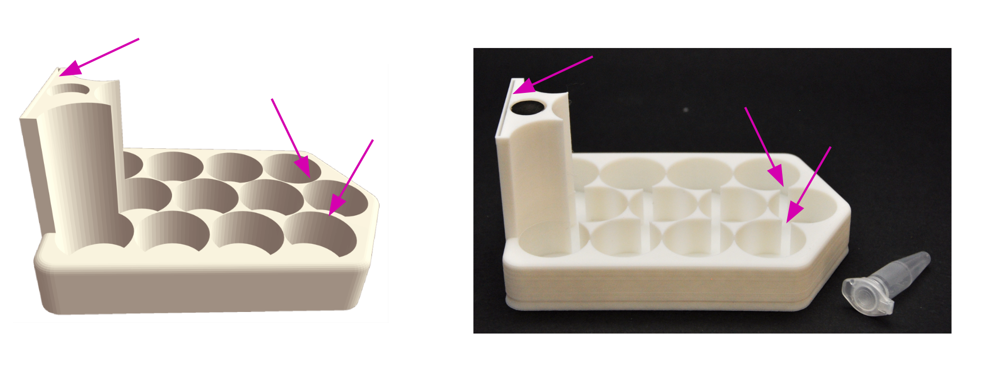
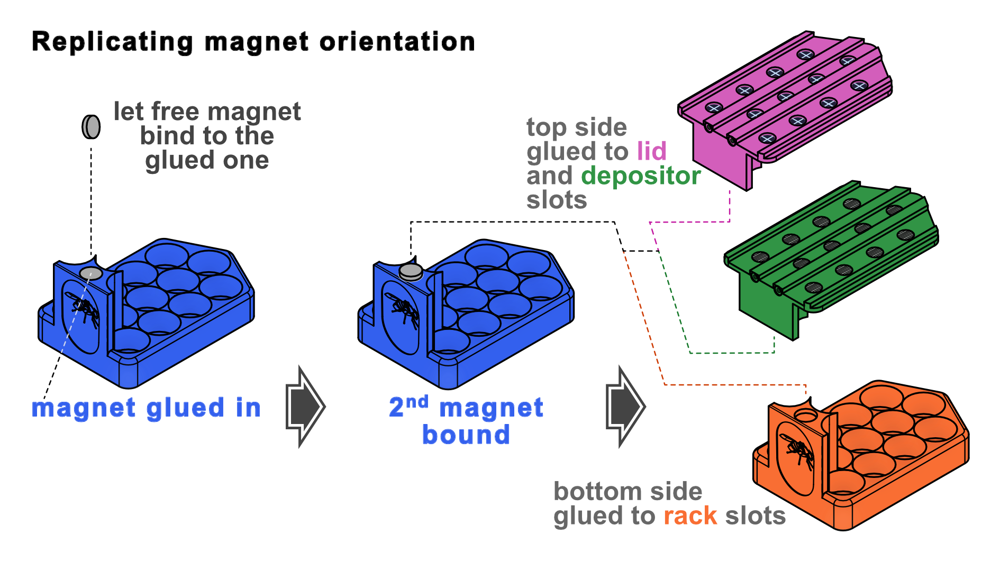

# Instructions to assemble the Drosben components

You will need:

## Component costs[^*]

| Component | Quantity | Required[^a] | Cost per usage unit |
| :--- | ---: | :--- | ---: |
| (initial materials) | 1 | Per lab | £71.00 |
| Depositor stencil | 1 | Per lab | £0.14 |
| Multiflipper | 1 | Per user | £38.91 |
| Slider | 1 | Per user | £0.50 |
| Depositor | 1 | Per user | £3.49 |
| Rack | 2 | Per cohort | £2.28 |
| Lid | 1 | Per cohort | £0.90 |

## Materials costs

| Material | Quantity (per pack) | Unit | Price[^b] |
| :--- | ---: | :--- | ---: |
| PLA filament | 1000 | g | £18.00 |
| Acrylic tube | 1 | count | £3.00 |
| Nail shaft | 200 | count | £3.50 |
| N52 magnet 12 x 3 mm | 50 | count | £12.00 |
| N52 magnet 10 x 3 mm | 50 | count | £12.00 |
| Woven wire mesh | 3600 | cm² | £20.00 |
| Super glue gel | 30 | g | £4.00 |
| Acrylic cement | 50 | ml | £9.00 |
| Rubber sheet | 100 | cm² | £3.00 |

## Recipes

| Component | Material | Quantity | Unit | Cost per component |
| :--- | :--- | ---: | :--- | ---: |
| Multiflipper | PLA filament | 40 | g | £0.72 |
|  | Acrylic tube | 12 | count | £36.00 |
|  | N52 magnet 10 x 3 mm | 4 | count | £0.96 |
|  | Woven wire mesh | 120 | cm² | £0.67 |
|  | Super glue gel | 0.2 | g | £0.03 |
|  | Acrylic cement | 3 | ml | £0.54 |
| Depositor | PLA filament | 21 | g | £0.38 |
|  | Rubber sheet | 100 | cm² | £3.00 |
|  | Nail shaft | 4 | count | £0.07 |
|  | Super glue gel | 0.3 | g | £0.04 |
| Lid | PLA filament | 32 | g | £0.58 |
|  | N52 magnet 12 x 3 mm | 1 | count | £0.24 |
|  | Nail shaft | 4 | count | £0.07 |
|  | Super glue gel | 0.1 | g | £0.01 |
| Rack | PLA filament | 50 | g | £0.90 |
|  | N52 magnet 12 x 3 mm | 1 | count | £0.24 |
| Slider | PLA filament | 26 | g | £0.47 |
|  | Nail shaft | 1 | count | £0.02 |
|  | Super glue gel | 0.1 | g | £0.01 |
| Depositor stencil | PLA filament | 8 | g | £0.14 |

## Tools

| Tool | Assumed available | Cost | Optional[^c] |
| :--- | :---------------: | ---: | :------: |
| Pliers (to clip nail heads) | yes | £10.00 | no |
| Cutter (to cut mesh and rubber sheet) | yes | £10.00 | no |
| 3D printer | yes | £140.00 | no |
| Silicon sheet, 0.5 mm thick (to glue the multiflipper) | no | £4.50 | no |
| Arc saw | yes | £10.00 | yes |
| 25 mm pipe cutter | yes | £50.00 | yes |
| 3D-printed tube cutter reference tool[^d] | yes | £1.50 | yes |

[^*]: Prices were estimated in July 2026.
[^a]: The Depositor and Multiflipper could be shared between users, but for real scalability, it is better to assume they will not be. A rack can house cohorts of up to 180 flies (15 per tube).
[^b]: Prices have been ceiled to the nearest £1. These are realistic indicative prices, but the exact cost of the initial investment and component may change depending on the specific retailer and the configuration of the pack. Most components have been obtained from non-specialist online retailers, except the acrylic tubing and the woven wire mesh, which are respectively from Simple Plastics and The Mesh Company (both UK companies).
[^c]: Optional tools allow the user to buy 25 mm acrylic tubing in 1 m lengths and cut out their own segments for the multiflipper chambers. This makes the tubes, which are one of the most expensive parts, a bit cheaper (as each cut needs to be paid for separately).
[^d]: The model is within the 'Utilities' folder as 'tube_cutter_reference'.

> [!CAUTION]
> Most prints require the use of [supports for floating structures](https://store.anycubic.com/blogs/3d-printing-guides/3d-printing-supports). These need to be removed after printing using a flat screwdriver or a knife.
> Please use a cut resistant glove in the holding hand or a vise (but do not tighten it too much or you will crush the print).

> [!CAUTION]
> Acrylic cements (i.e. Tensol 12, Anglosol 12) are highly flammable and release toxic fumes.
> Cyanoacrlylate glue also releases toxic fumes and any splatter or running drop may glue your fingers together or to the parts.
> Do all the gluing in a well-ventilated space and wear gloves.

## Building the Racks

### Printing

Our latest prints were printed in a Bambulab A1 mini with plain PLA after slicing in BambuStudio with:

- the base of the Rack facing the printer's bed;
- preset configuration _0.08 mm High Quality_;
- support enabled (with support default settings).

The rack is the only model with very thin areas, where the tubes almost touch and in the sleeve to hold the label. We have not managed to print both faithfully - it seems to be either one or the other:



```stl
solid Mesh
  facet normal -0.999689 0.000000 0.024931
    outer loop
      vertex 53.500000 0.500000 24.875000
      vertex 53.481354 0.500000 24.127312
      vertex 53.500000 0.000000 24.875000
    endloop
  endfacet
  facet normal -0.999689 -0.000000 0.024931
    outer loop
      vertex 53.500000 0.000000 24.875000
      vertex 53.481354 0.500000 24.127312
      vertex 53.481354 0.000000 24.127312
    endloop
  endfacet
  facet normal -0.997204 0.000000 0.074731
    outer loop
      vertex 53.481354 0.000000 24.127312
      vertex 53.425461 0.500000 23.381483
      vertex 53.425461 0.000000 23.381483
    endloop
  endfacet
  facet normal -0.997204 0.000000 0.074731
    outer loop
      vertex 53.481354 0.500000 24.127312
      vertex 53.425461 0.500000 23.381483
      vertex 53.481354 0.000000 24.127312
    endloop
  endfacet
  facet normal -0.992239 0.000000 0.124343
    outer loop
      vertex 53.425461 0.000000 23.381483
      vertex 53.332462 0.500000 22.639366
      vertex 53.332462 0.000000 22.639366
    endloop
  endfacet
  facet normal -0.992239 0.000000 0.124343
    outer loop
      vertex 53.425461 0.500000 23.381483
      vertex 53.332462 0.500000 22.639366
      vertex 53.425461 0.000000 23.381483
    endloop
  endfacet
  facet normal -0.984808 0.000000 0.173648
    outer loop
      vertex 53.332462 0.000000 22.639366
      vertex 53.202587 0.500000 21.902807
      vertex 53.202587 0.000000 21.902807
    endloop
  endfacet
  facet normal -0.984808 0.000000 0.173648
    outer loop
      vertex 53.332462 0.500000 22.639366
      vertex 53.202587 0.500000 21.902807
      vertex 53.332462 0.000000 22.639366
    endloop
  endfacet
  facet normal -0.974928 0.000000 0.222521
    outer loop
      vertex 53.202587 0.000000 21.902807
      vertex 53.036160 0.500000 21.173639
      vertex 53.036160 0.000000 21.173639
    endloop
  endfacet
  facet normal -0.974928 0.000000 0.222521
    outer loop
      vertex 53.202587 0.500000 21.902807
      vertex 53.036160 0.500000 21.173639
      vertex 53.202587 0.000000 21.902807
    endloop
  endfacet
  facet normal -0.962624 -0.000000 0.270841
    outer loop
      vertex 53.036160 0.000000 21.173639
      vertex 52.833591 0.500000 20.453672
      vertex 52.833591 0.000000 20.453672
    endloop
  endfacet
  facet normal -0.962624 0.000000 0.270841
    outer loop
      vertex 53.036160 0.500000 21.173639
      vertex 52.833591 0.500000 20.453672
      vertex 53.036160 0.000000 21.173639
    endloop
  endfacet
  facet normal -0.947928 0.000000 0.318485
    outer loop
      vertex 52.833591 0.000000 20.453672
      vertex 52.595390 0.500000 19.744698
      vertex 52.595390 0.000000 19.744698
    endloop
  endfacet
  facet normal -0.947928 0.000000 0.318485
    outer loop
      vertex 52.833591 0.500000 20.453672
      vertex 52.595390 0.500000 19.744698
      vertex 52.833591 0.000000 20.453672
    endloop
  endfacet
  facet normal -0.930874 0.000000 0.365341
    outer loop
      vertex 52.595390 0.000000 19.744698
      vertex 52.322144 0.500000 19.048477
      vertex 52.322144 0.000000 19.048477
    endloop
  endfacet
  facet normal -0.930874 0.000000 0.365341
    outer loop
      vertex 52.595390 0.500000 19.744698
      vertex 52.322144 0.500000 19.048477
      vertex 52.595390 0.000000 19.744698
    endloop
  endfacet
  facet normal -0.911506 0.000000 0.411286
    outer loop
      vertex 52.322144 0.000000 19.048477
      vertex 52.014534 0.500000 18.366743
      vertex 52.014534 0.000000 18.366743
    endloop
  endfacet
  facet normal -0.911506 0.000000 0.411286
    outer loop
      vertex 52.322144 0.500000 19.048477
      vertex 52.014534 0.500000 18.366743
      vertex 52.322144 0.000000 19.048477
    endloop
  endfacet
  facet normal -0.889871 0.000000 0.456211
    outer loop
      vertex 52.014534 0.000000 18.366743
      vertex 51.673325 0.500000 17.701191
      vertex 51.673325 0.000000 17.701191
    endloop
  endfacet
  facet normal -0.889871 0.000000 0.456211
    outer loop
      vertex 52.014534 0.500000 18.366743
      vertex 51.673325 0.500000 17.701191
      vertex 52.014534 0.000000 18.366743
    endloop
  endfacet
  facet normal -0.866024 0.000000 0.500002
    outer loop
      vertex 51.673325 0.000000 17.701191
      vertex 51.299362 0.500000 17.053473
      vertex 51.299362 0.000000 17.053473
    endloop
  endfacet
  facet normal -0.866024 0.000000 0.500002
    outer loop
      vertex 51.673325 0.500000 17.701191
      vertex 51.299362 0.500000 17.053473
      vertex 51.673325 0.000000 17.701191
    endloop
  endfacet
  facet normal -0.840026 0.000000 0.542545
    outer loop
      vertex 51.299362 0.000000 17.053473
      vertex 50.893581 0.500000 16.425200
      vertex 50.893581 0.000000 16.425200
    endloop
  endfacet
  facet normal -0.840026 0.000000 0.542545
    outer loop
      vertex 51.299362 0.500000 17.053473
      vertex 50.893581 0.500000 16.425200
      vertex 51.299362 0.000000 17.053473
    endloop
  endfacet
  facet normal -0.811939 0.000000 0.583742
    outer loop
      vertex 50.893581 0.000000 16.425200
      vertex 50.456989 0.500000 15.817934
      vertex 50.456989 0.000000 15.817934
    endloop
  endfacet
  facet normal -0.811939 0.000000 0.583742
    outer loop
      vertex 50.893581 0.500000 16.425200
      vertex 50.456989 0.500000 15.817934
      vertex 50.893581 0.000000 16.425200
    endloop
  endfacet
  facet normal -0.781830 -0.000000 0.623492
    outer loop
      vertex 50.456989 0.000000 15.817934
      vertex 49.990665 0.500000 15.233186
      vertex 49.990665 0.000000 15.233186
    endloop
  endfacet
  facet normal -0.781830 0.000000 0.623492
    outer loop
      vertex 50.456989 0.500000 15.817934
      vertex 49.990665 0.500000 15.233186
      vertex 50.456989 0.000000 15.817934
    endloop
  endfacet
  facet normal -0.749781 -0.000000 0.661686
    outer loop
      vertex 49.990665 0.000000 15.233186
      vertex 49.495777 0.500000 14.672409
      vertex 49.495777 0.000000 14.672409
    endloop
  endfacet
  facet normal -0.749781 0.000000 0.661686
    outer loop
      vertex 49.990665 0.500000 15.233186
      vertex 49.495777 0.500000 14.672409
      vertex 49.990665 0.000000 15.233186
    endloop
  endfacet
  facet normal -0.715868 -0.000000 0.698236
    outer loop
      vertex 49.495777 0.000000 14.672409
      vertex 48.973553 0.500000 14.136997
      vertex 48.973553 0.000000 14.136997
    endloop
  endfacet
  facet normal -0.715868 0.000000 0.698236
    outer loop
      vertex 49.495777 0.500000 14.672409
      vertex 48.973553 0.500000 14.136997
      vertex 49.495777 0.000000 14.672409
    endloop
  endfacet
  facet normal -0.680174 -0.000000 0.733051
    outer loop
      vertex 48.973553 0.000000 14.136997
      vertex 48.425289 0.500000 13.628282
      vertex 48.425289 0.000000 13.628282
    endloop
  endfacet
  facet normal -0.680174 0.000000 0.733051
    outer loop
      vertex 48.973553 0.500000 14.136997
      vertex 48.425289 0.500000 13.628282
      vertex 48.973553 0.000000 14.136997
    endloop
  endfacet
  facet normal -0.642787 0.000000 0.766045
    outer loop
      vertex 48.425289 0.000000 13.628282
      vertex 47.852348 0.500000 13.147528
      vertex 47.852348 0.000000 13.147528
    endloop
  endfacet
  facet normal -0.642787 0.000000 0.766045
    outer loop
      vertex 48.425289 0.500000 13.628282
      vertex 47.852348 0.500000 13.147528
      vertex 48.425289 0.000000 13.628282
    endloop
  endfacet
  facet normal -0.603805 0.000000 0.797132
    outer loop
      vertex 47.852348 0.500000 13.147528
      vertex 47.256157 0.500000 12.695930
      vertex 47.852348 0.000000 13.147528
    endloop
  endfacet
  facet normal -0.603805 -0.000000 0.797132
    outer loop
      vertex 47.852348 0.000000 13.147528
      vertex 47.256157 0.500000 12.695930
      vertex 47.256157 0.000000 12.695930
    endloop
  endfacet
  facet normal -0.563319 0.000000 0.826240
    outer loop
      vertex 47.256157 0.500000 12.695930
      vertex 46.638195 0.500000 12.274611
      vertex 47.256157 0.000000 12.695930
    endloop
  endfacet
  facet normal -0.563319 -0.000000 0.826240
    outer loop
      vertex 47.256157 0.000000 12.695930
      vertex 46.638195 0.500000 12.274611
      vertex 46.638195 0.000000 12.274611
    endloop
  endfacet
  facet normal -0.521435 0.000000 0.853291
    outer loop
      vertex 46.638195 0.500000 12.274611
      vertex 46.000000 0.500000 11.884619
      vertex 46.638195 0.000000 12.274611
    endloop
  endfacet
  facet normal -0.521435 0.000000 0.853291
    outer loop
      vertex 46.638195 0.000000 12.274611
      vertex 46.000000 0.500000 11.884619
      vertex 46.000000 0.000000 11.884619
    endloop
  endfacet
  facet normal -0.478253 0.000000 0.878222
    outer loop
      vertex 46.000000 0.500000 11.884619
      vertex 45.343159 0.500000 11.526923
      vertex 46.000000 0.000000 11.884619
    endloop
  endfacet
  facet normal -0.478253 0.000000 0.878222
    outer loop
      vertex 46.000000 0.000000 11.884619
      vertex 45.343159 0.500000 11.526923
      vertex 45.343159 0.000000 11.526923
    endloop
  endfacet
  facet normal -0.433885 -0.000000 0.900968
    outer loop
      vertex 45.343159 0.000000 11.526923
      vertex 44.669308 0.500000 11.202413
      vertex 44.669308 0.000000 11.202413
    endloop
  endfacet
  facet normal -0.433885 0.000000 0.900968
    outer loop
      vertex 45.343159 0.500000 11.526923
      vertex 44.669308 0.500000 11.202413
      vertex 45.343159 0.000000 11.526923
    endloop
  endfacet
  facet normal -0.388434 -0.000000 0.921477
    outer loop
      vertex 44.669308 0.000000 11.202413
      vertex 43.980114 0.500000 10.911894
      vertex 43.980114 0.000000 10.911894
    endloop
  endfacet
  facet normal -0.388434 0.000000 0.921477
    outer loop
      vertex 44.669308 0.500000 11.202413
      vertex 43.980114 0.500000 10.911894
      vertex 44.669308 0.000000 11.202413
    endloop
  endfacet
  facet normal -0.342020 -0.000000 0.939693
    outer loop
      vertex 43.980114 0.000000 10.911894
      vertex 43.277298 0.500000 10.656090
      vertex 43.277298 0.000000 10.656090
    endloop
  endfacet
  facet normal -0.342020 0.000000 0.939693
    outer loop
      vertex 43.980114 0.500000 10.911894
      vertex 43.277298 0.500000 10.656090
      vertex 43.980114 0.000000 10.911894
    endloop
  endfacet
  facet normal -0.294755 0.000000 0.955573
    outer loop
      vertex 43.277298 0.000000 10.656090
      vertex 42.562607 0.500000 10.435637
      vertex 42.562607 0.000000 10.435637
    endloop
  endfacet
  facet normal -0.294755 0.000000 0.955573
    outer loop
      vertex 43.277298 0.500000 10.656090
      vertex 42.562607 0.500000 10.435637
      vertex 43.277298 0.000000 10.656090
    endloop
  endfacet
  facet normal -0.246758 -0.000000 0.969077
    outer loop
      vertex 42.562607 0.000000 10.435637
      vertex 41.837814 0.500000 10.251081
      vertex 41.837814 0.000000 10.251081
    endloop
  endfacet
  facet normal -0.246758 0.000000 0.969077
    outer loop
      vertex 42.562607 0.500000 10.435637
      vertex 41.837814 0.500000 10.251081
      vertex 42.562607 0.000000 10.435637
    endloop
  endfacet
  facet normal -0.198146 0.000000 0.980172
    outer loop
      vertex 41.837814 0.000000 10.251081
      vertex 41.104721 0.500000 10.102883
      vertex 41.104721 0.000000 10.102883
    endloop
  endfacet
  facet normal -0.198146 0.000000 0.980172
    outer loop
      vertex 41.837814 0.500000 10.251081
      vertex 41.104721 0.500000 10.102883
      vertex 41.837814 0.000000 10.251081
    endloop
  endfacet
  facet normal -0.149042 -0.000000 0.988831
    outer loop
      vertex 41.104721 0.000000 10.102883
      vertex 40.365154 0.500000 9.991412
      vertex 40.365154 0.000000 9.991412
    endloop
  endfacet
  facet normal -0.149042 0.000000 0.988831
    outer loop
      vertex 41.104721 0.500000 10.102883
      vertex 40.365154 0.500000 9.991412
      vertex 41.104721 0.000000 10.102883
    endloop
  endfacet
  facet normal -0.099569 -0.000000 0.995031
    outer loop
      vertex 40.365154 0.000000 9.991412
      vertex 39.620953 0.500000 9.916943
      vertex 39.620953 0.000000 9.916943
    endloop
  endfacet
  facet normal -0.099569 0.000000 0.995031
    outer loop
      vertex 40.365154 0.500000 9.991412
      vertex 39.620953 0.500000 9.916943
      vertex 40.365154 0.000000 9.991412
    endloop
  endfacet
  facet normal -0.049845 -0.000000 0.998757
    outer loop
      vertex 39.620953 0.000000 9.916943
      vertex 38.873959 0.500000 9.879663
      vertex 38.873959 0.000000 9.879663
    endloop
  endfacet
  facet normal -0.049845 0.000000 0.998757
    outer loop
      vertex 39.620953 0.500000 9.916943
      vertex 38.873959 0.500000 9.879663
      vertex 39.620953 0.000000 9.916943
    endloop
  endfacet
  facet normal 0.000000 0.000000 1.000000
    outer loop
      vertex 38.873959 0.000000 9.879663
      vertex 38.126041 0.500000 9.879663
      vertex 38.126041 0.000000 9.879663
    endloop
  endfacet
  facet normal 0.000000 0.000000 1.000000
    outer loop
      vertex 38.873959 0.500000 9.879663
      vertex 38.126041 0.500000 9.879663
      vertex 38.873959 0.000000 9.879663
    endloop
  endfacet
  facet normal 0.049845 0.000000 0.998757
    outer loop
      vertex 38.126041 0.000000 9.879663
      vertex 37.379047 0.500000 9.916943
      vertex 37.379047 0.000000 9.916943
    endloop
  endfacet
  facet normal 0.049845 0.000000 0.998757
    outer loop
      vertex 38.126041 0.500000 9.879663
      vertex 37.379047 0.500000 9.916943
      vertex 38.126041 0.000000 9.879663
    endloop
  endfacet
  facet normal 0.099569 0.000000 0.995031
    outer loop
      vertex 37.379047 0.000000 9.916943
      vertex 36.634846 0.500000 9.991412
      vertex 36.634846 0.000000 9.991412
    endloop
  endfacet
  facet normal 0.099569 0.000000 0.995031
    outer loop
      vertex 37.379047 0.500000 9.916943
      vertex 36.634846 0.500000 9.991412
      vertex 37.379047 0.000000 9.916943
    endloop
  endfacet
  facet normal 0.149042 0.000000 0.988831
    outer loop
      vertex 36.634846 0.000000 9.991412
      vertex 35.895279 0.500000 10.102883
      vertex 35.895279 0.000000 10.102883
    endloop
  endfacet
  facet normal 0.149042 0.000000 0.988831
    outer loop
      vertex 36.634846 0.500000 9.991412
      vertex 35.895279 0.500000 10.102883
      vertex 36.634846 0.000000 9.991412
    endloop
  endfacet
  facet normal 0.198146 -0.000000 0.980172
    outer loop
      vertex 35.895279 0.000000 10.102883
      vertex 35.162186 0.500000 10.251081
      vertex 35.162186 0.000000 10.251081
    endloop
  endfacet
  facet normal 0.198146 0.000000 0.980172
    outer loop
      vertex 35.895279 0.500000 10.102883
      vertex 35.162186 0.500000 10.251081
      vertex 35.895279 0.000000 10.102883
    endloop
  endfacet
  facet normal 0.246758 0.000000 0.969077
    outer loop
      vertex 35.162186 0.000000 10.251081
      vertex 34.437393 0.500000 10.435637
      vertex 34.437393 0.000000 10.435637
    endloop
  endfacet
  facet normal 0.246758 0.000000 0.969077
    outer loop
      vertex 35.162186 0.500000 10.251081
      vertex 34.437393 0.500000 10.435637
      vertex 35.162186 0.000000 10.251081
    endloop
  endfacet
  facet normal 0.294755 -0.000000 0.955573
    outer loop
      vertex 34.437393 0.000000 10.435637
      vertex 33.722702 0.500000 10.656090
      vertex 33.722702 0.000000 10.656090
    endloop
  endfacet
  facet normal 0.294755 0.000000 0.955573
    outer loop
      vertex 34.437393 0.500000 10.435637
      vertex 33.722702 0.500000 10.656090
      vertex 34.437393 0.000000 10.435637
    endloop
  endfacet
  facet normal 0.342020 0.000000 0.939693
    outer loop
      vertex 33.722702 0.000000 10.656090
      vertex 33.019886 0.500000 10.911894
      vertex 33.019886 0.000000 10.911894
    endloop
  endfacet
  facet normal 0.342020 0.000000 0.939693
    outer loop
      vertex 33.722702 0.500000 10.656090
      vertex 33.019886 0.500000 10.911894
      vertex 33.722702 0.000000 10.656090
    endloop
  endfacet
  facet normal 0.388434 0.000000 0.921477
    outer loop
      vertex 33.019886 0.000000 10.911894
      vertex 32.330692 0.500000 11.202413
      vertex 32.330692 0.000000 11.202413
    endloop
  endfacet
  facet normal 0.388434 0.000000 0.921477
    outer loop
      vertex 33.019886 0.500000 10.911894
      vertex 32.330692 0.500000 11.202413
      vertex 33.019886 0.000000 10.911894
    endloop
  endfacet
  facet normal 0.433884 -0.000000 0.900969
    outer loop
      vertex 32.330692 0.000000 11.202413
      vertex 31.656839 0.500000 11.526923
      vertex 31.656839 0.000000 11.526923
    endloop
  endfacet
  facet normal 0.433884 0.000000 0.900969
    outer loop
      vertex 32.330692 0.500000 11.202413
      vertex 31.656839 0.500000 11.526923
      vertex 32.330692 0.000000 11.202413
    endloop
  endfacet
  facet normal 0.478254 0.000000 0.878222
    outer loop
      vertex 31.656839 0.000000 11.526923
      vertex 31.000000 0.500000 11.884619
      vertex 31.000000 0.000000 11.884619
    endloop
  endfacet
  facet normal 0.478254 0.000000 0.878222
    outer loop
      vertex 31.656839 0.500000 11.526923
      vertex 31.000000 0.500000 11.884619
      vertex 31.656839 0.000000 11.526923
    endloop
  endfacet
  facet normal 0.521436 0.000000 0.853290
    outer loop
      vertex 31.000000 0.500000 11.884619
      vertex 30.361807 0.500000 12.274611
      vertex 31.000000 0.000000 11.884619
    endloop
  endfacet
  facet normal 0.521436 -0.000000 0.853290
    outer loop
      vertex 31.000000 0.000000 11.884619
      vertex 30.361807 0.500000 12.274611
      vertex 30.361807 0.000000 12.274611
    endloop
  endfacet
  facet normal 0.563319 0.000000 0.826240
    outer loop
      vertex 30.361807 0.500000 12.274611
      vertex 29.743845 0.500000 12.695930
      vertex 30.361807 0.000000 12.274611
    endloop
  endfacet
  facet normal 0.563319 0.000000 0.826240
    outer loop
      vertex 30.361807 0.000000 12.274611
      vertex 29.743845 0.500000 12.695930
      vertex 29.743845 0.000000 12.695930
    endloop
  endfacet
  facet normal 0.603805 0.000000 0.797132
    outer loop
      vertex 29.743845 0.500000 12.695930
      vertex 29.147654 0.500000 13.147528
      vertex 29.743845 0.000000 12.695930
    endloop
  endfacet
  facet normal 0.603805 0.000000 0.797132
    outer loop
      vertex 29.743845 0.000000 12.695930
      vertex 29.147654 0.500000 13.147528
      vertex 29.147654 0.000000 13.147528
    endloop
  endfacet
  facet normal 0.642787 0.000000 0.766045
    outer loop
      vertex 29.147654 0.500000 13.147528
      vertex 28.574713 0.500000 13.628282
      vertex 29.147654 0.000000 13.147528
    endloop
  endfacet
  facet normal 0.642787 -0.000000 0.766045
    outer loop
      vertex 29.147654 0.000000 13.147528
      vertex 28.574713 0.500000 13.628282
      vertex 28.574713 0.000000 13.628282
    endloop
  endfacet
  facet normal 0.680172 0.000000 0.733052
    outer loop
      vertex 28.574713 0.500000 13.628282
      vertex 28.026447 0.500000 14.136997
      vertex 28.574713 0.000000 13.628282
    endloop
  endfacet
  facet normal 0.680172 -0.000000 0.733052
    outer loop
      vertex 28.574713 0.000000 13.628282
      vertex 28.026447 0.500000 14.136997
      vertex 28.026447 0.000000 14.136997
    endloop
  endfacet
  facet normal 0.715868 0.000000 0.698236
    outer loop
      vertex 28.026447 0.500000 14.136997
      vertex 27.504223 0.500000 14.672409
      vertex 28.026447 0.000000 14.136997
    endloop
  endfacet
  facet normal 0.715868 0.000000 0.698236
    outer loop
      vertex 28.026447 0.000000 14.136997
      vertex 27.504223 0.500000 14.672409
      vertex 27.504223 0.000000 14.672409
    endloop
  endfacet
  facet normal 0.749780 0.000000 0.661687
    outer loop
      vertex 27.504223 0.500000 14.672409
      vertex 27.009333 0.500000 15.233186
      vertex 27.504223 0.000000 14.672409
    endloop
  endfacet
  facet normal 0.749780 -0.000000 0.661687
    outer loop
      vertex 27.504223 0.000000 14.672409
      vertex 27.009333 0.500000 15.233186
      vertex 27.009333 0.000000 15.233186
    endloop
  endfacet
  facet normal 0.781832 0.000000 0.623489
    outer loop
      vertex 27.009333 0.500000 15.233186
      vertex 26.543013 0.500000 15.817934
      vertex 27.009333 0.000000 15.233186
    endloop
  endfacet
  facet normal 0.781832 0.000000 0.623489
    outer loop
      vertex 27.009333 0.000000 15.233186
      vertex 26.543013 0.500000 15.817934
      vertex 26.543013 0.000000 15.817934
    endloop
  endfacet
  facet normal 0.811938 0.000000 0.583744
    outer loop
      vertex 26.543013 0.500000 15.817934
      vertex 26.106419 0.500000 16.425200
      vertex 26.543013 0.000000 15.817934
    endloop
  endfacet
  facet normal 0.811938 -0.000000 0.583744
    outer loop
      vertex 26.543013 0.000000 15.817934
      vertex 26.106419 0.500000 16.425200
      vertex 26.106419 0.000000 16.425200
    endloop
  endfacet
  facet normal 0.840025 0.000000 0.542547
    outer loop
      vertex 26.106419 0.500000 16.425200
      vertex 25.700636 0.500000 17.053473
      vertex 26.106419 0.000000 16.425200
    endloop
  endfacet
  facet normal 0.840025 0.000000 0.542547
    outer loop
      vertex 26.106419 0.000000 16.425200
      vertex 25.700636 0.500000 17.053473
      vertex 25.700636 0.000000 17.053473
    endloop
  endfacet
  facet normal 0.866026 0.000000 0.499998
    outer loop
      vertex 25.700636 0.500000 17.053473
      vertex 25.326677 0.500000 17.701191
      vertex 25.700636 0.000000 17.053473
    endloop
  endfacet
  facet normal 0.866026 -0.000000 0.499998
    outer loop
      vertex 25.700636 0.000000 17.053473
      vertex 25.326677 0.500000 17.701191
      vertex 25.326677 0.000000 17.701191
    endloop
  endfacet
  facet normal 0.889871 0.000000 0.456211
    outer loop
      vertex 25.326677 0.500000 17.701191
      vertex 24.985468 0.500000 18.366743
      vertex 25.326677 0.000000 17.701191
    endloop
  endfacet
  facet normal 0.889871 -0.000000 0.456211
    outer loop
      vertex 25.326677 0.000000 17.701191
      vertex 24.985468 0.500000 18.366743
      vertex 24.985468 0.000000 18.366743
    endloop
  endfacet
  facet normal 0.911505 0.000000 0.411289
    outer loop
      vertex 24.985468 0.500000 18.366743
      vertex 24.677856 0.500000 19.048477
      vertex 24.985468 0.000000 18.366743
    endloop
  endfacet
  facet normal 0.911505 0.000000 0.411289
    outer loop
      vertex 24.985468 0.000000 18.366743
      vertex 24.677856 0.500000 19.048477
      vertex 24.677856 0.000000 19.048477
    endloop
  endfacet
  facet normal 0.930874 0.000000 0.365339
    outer loop
      vertex 24.677856 0.500000 19.048477
      vertex 24.404612 0.500000 19.744698
      vertex 24.677856 0.000000 19.048477
    endloop
  endfacet
  facet normal 0.930874 -0.000000 0.365339
    outer loop
      vertex 24.677856 0.000000 19.048477
      vertex 24.404612 0.500000 19.744698
      vertex 24.404612 0.000000 19.744698
    endloop
  endfacet
  facet normal 0.947927 0.000000 0.318487
    outer loop
      vertex 24.404612 0.000000 19.744698
      vertex 24.166409 0.500000 20.453672
      vertex 24.166409 0.000000 20.453672
    endloop
  endfacet
  facet normal 0.947927 0.000000 0.318487
    outer loop
      vertex 24.404612 0.500000 19.744698
      vertex 24.166409 0.500000 20.453672
      vertex 24.404612 0.000000 19.744698
    endloop
  endfacet
  facet normal 0.962624 0.000000 0.270841
    outer loop
      vertex 24.166409 0.000000 20.453672
      vertex 23.963840 0.500000 21.173639
      vertex 23.963840 0.000000 21.173639
    endloop
  endfacet
  facet normal 0.962624 0.000000 0.270841
    outer loop
      vertex 24.166409 0.500000 20.453672
      vertex 23.963840 0.500000 21.173639
      vertex 24.166409 0.000000 20.453672
    endloop
  endfacet
  facet normal 0.974928 -0.000000 0.222521
    outer loop
      vertex 23.963840 0.000000 21.173639
      vertex 23.797413 0.500000 21.902807
      vertex 23.797413 0.000000 21.902807
    endloop
  endfacet
  facet normal 0.974928 0.000000 0.222521
    outer loop
      vertex 23.963840 0.500000 21.173639
      vertex 23.797413 0.500000 21.902807
      vertex 23.963840 0.000000 21.173639
    endloop
  endfacet
  facet normal 0.984808 -0.000000 0.173648
    outer loop
      vertex 23.797413 0.000000 21.902807
      vertex 23.667538 0.500000 22.639366
      vertex 23.667538 0.000000 22.639366
    endloop
  endfacet
  facet normal 0.984808 0.000000 0.173648
    outer loop
      vertex 23.797413 0.500000 21.902807
      vertex 23.667538 0.500000 22.639366
      vertex 23.797413 0.000000 21.902807
    endloop
  endfacet
  facet normal 0.992239 -0.000000 0.124343
    outer loop
      vertex 23.667538 0.000000 22.639366
      vertex 23.574539 0.500000 23.381483
      vertex 23.574539 0.000000 23.381483
    endloop
  endfacet
  facet normal 0.992239 0.000000 0.124343
    outer loop
      vertex 23.667538 0.500000 22.639366
      vertex 23.574539 0.500000 23.381483
      vertex 23.667538 0.000000 22.639366
    endloop
  endfacet
  facet normal 0.997204 -0.000000 0.074731
    outer loop
      vertex 23.574539 0.000000 23.381483
      vertex 23.518646 0.500000 24.127312
      vertex 23.518646 0.000000 24.127312
    endloop
  endfacet
  facet normal 0.997204 0.000000 0.074731
    outer loop
      vertex 23.574539 0.500000 23.381483
      vertex 23.518646 0.500000 24.127312
      vertex 23.574539 0.000000 23.381483
    endloop
  endfacet
  facet normal 0.999689 0.000000 0.024931
    outer loop
      vertex 23.518646 0.000000 24.127312
      vertex 23.500000 0.500000 24.875000
      vertex 23.500000 0.000000 24.875000
    endloop
  endfacet
  facet normal 0.999689 0.000000 0.024931
    outer loop
      vertex 23.518646 0.500000 24.127312
      vertex 23.500000 0.500000 24.875000
      vertex 23.518646 0.000000 24.127312
    endloop
  endfacet
  facet normal 0.999689 0.000000 -0.024931
    outer loop
      vertex 23.500000 0.500000 40.875000
      vertex 23.518646 0.500000 41.622688
      vertex 23.500000 0.000000 40.875000
    endloop
  endfacet
  facet normal 0.999689 -0.000000 -0.024931
    outer loop
      vertex 23.500000 0.000000 40.875000
      vertex 23.518646 0.500000 41.622688
      vertex 23.518646 0.000000 41.622688
    endloop
  endfacet
  facet normal 0.997204 -0.000000 -0.074731
    outer loop
      vertex 23.518646 0.000000 41.622688
      vertex 23.574539 0.500000 42.368519
      vertex 23.574539 0.000000 42.368519
    endloop
  endfacet
  facet normal 0.997204 0.000000 -0.074731
    outer loop
      vertex 23.518646 0.500000 41.622688
      vertex 23.574539 0.500000 42.368519
      vertex 23.518646 0.000000 41.622688
    endloop
  endfacet
  facet normal 0.992239 0.000000 -0.124343
    outer loop
      vertex 23.574539 0.000000 42.368519
      vertex 23.667538 0.500000 43.110634
      vertex 23.667538 0.000000 43.110634
    endloop
  endfacet
  facet normal 0.992239 0.000000 -0.124343
    outer loop
      vertex 23.574539 0.500000 42.368519
      vertex 23.667538 0.500000 43.110634
      vertex 23.574539 0.000000 42.368519
    endloop
  endfacet
  facet normal 0.984808 -0.000000 -0.173649
    outer loop
      vertex 23.667538 0.000000 43.110634
      vertex 23.797413 0.500000 43.847191
      vertex 23.797413 0.000000 43.847191
    endloop
  endfacet
  facet normal 0.984808 0.000000 -0.173649
    outer loop
      vertex 23.667538 0.500000 43.110634
      vertex 23.797413 0.500000 43.847191
      vertex 23.667538 0.000000 43.110634
    endloop
  endfacet
  facet normal 0.974928 0.000000 -0.222520
    outer loop
      vertex 23.797413 0.000000 43.847191
      vertex 23.963840 0.500000 44.576363
      vertex 23.963840 0.000000 44.576363
    endloop
  endfacet
  facet normal 0.974928 0.000000 -0.222520
    outer loop
      vertex 23.797413 0.500000 43.847191
      vertex 23.963840 0.500000 44.576363
      vertex 23.797413 0.000000 43.847191
    endloop
  endfacet
  facet normal 0.962624 -0.000000 -0.270841
    outer loop
      vertex 23.963840 0.000000 44.576363
      vertex 24.166409 0.500000 45.296329
      vertex 24.166409 0.000000 45.296329
    endloop
  endfacet
  facet normal 0.962624 0.000000 -0.270841
    outer loop
      vertex 23.963840 0.500000 44.576363
      vertex 24.166409 0.500000 45.296329
      vertex 23.963840 0.000000 44.576363
    endloop
  endfacet
  facet normal 0.947927 0.000000 -0.318488
    outer loop
      vertex 24.166409 0.000000 45.296329
      vertex 24.404612 0.500000 46.005302
      vertex 24.404612 0.000000 46.005302
    endloop
  endfacet
  facet normal 0.947927 0.000000 -0.318488
    outer loop
      vertex 24.166409 0.500000 45.296329
      vertex 24.404612 0.500000 46.005302
      vertex 24.166409 0.000000 45.296329
    endloop
  endfacet
  facet normal 0.930874 0.000000 -0.365339
    outer loop
      vertex 24.404612 0.000000 46.005302
      vertex 24.677856 0.500000 46.701523
      vertex 24.677856 0.000000 46.701523
    endloop
  endfacet
  facet normal 0.930874 0.000000 -0.365339
    outer loop
      vertex 24.404612 0.500000 46.005302
      vertex 24.677856 0.500000 46.701523
      vertex 24.404612 0.000000 46.005302
    endloop
  endfacet
  facet normal 0.911505 0.000000 -0.411290
    outer loop
      vertex 24.677856 0.000000 46.701523
      vertex 24.985468 0.500000 47.383255
      vertex 24.985468 0.000000 47.383255
    endloop
  endfacet
  facet normal 0.911505 0.000000 -0.411290
    outer loop
      vertex 24.677856 0.500000 46.701523
      vertex 24.985468 0.500000 47.383255
      vertex 24.677856 0.000000 46.701523
    endloop
  endfacet
  facet normal 0.889872 -0.000000 -0.456210
    outer loop
      vertex 24.985468 0.000000 47.383255
      vertex 25.326677 0.500000 48.048809
      vertex 25.326677 0.000000 48.048809
    endloop
  endfacet
  facet normal 0.889872 0.000000 -0.456210
    outer loop
      vertex 24.985468 0.500000 47.383255
      vertex 25.326677 0.500000 48.048809
      vertex 24.985468 0.000000 47.383255
    endloop
  endfacet
  facet normal 0.866027 0.000000 -0.499997
    outer loop
      vertex 25.326677 0.000000 48.048809
      vertex 25.700636 0.500000 48.696529
      vertex 25.700636 0.000000 48.696529
    endloop
  endfacet
  facet normal 0.866027 0.000000 -0.499997
    outer loop
      vertex 25.326677 0.500000 48.048809
      vertex 25.700636 0.500000 48.696529
      vertex 25.326677 0.000000 48.048809
    endloop
  endfacet
  facet normal 0.840025 -0.000000 -0.542547
    outer loop
      vertex 25.700636 0.000000 48.696529
      vertex 26.106419 0.500000 49.324802
      vertex 26.106419 0.000000 49.324802
    endloop
  endfacet
  facet normal 0.840025 0.000000 -0.542547
    outer loop
      vertex 25.700636 0.500000 48.696529
      vertex 26.106419 0.500000 49.324802
      vertex 25.700636 0.000000 48.696529
    endloop
  endfacet
  facet normal 0.811938 0.000000 -0.583744
    outer loop
      vertex 26.106419 0.000000 49.324802
      vertex 26.543013 0.500000 49.932068
      vertex 26.543013 0.000000 49.932068
    endloop
  endfacet
  facet normal 0.811938 0.000000 -0.583744
    outer loop
      vertex 26.106419 0.500000 49.324802
      vertex 26.543013 0.500000 49.932068
      vertex 26.106419 0.000000 49.324802
    endloop
  endfacet
  facet normal 0.781832 0.000000 -0.623489
    outer loop
      vertex 26.543013 0.000000 49.932068
      vertex 27.009333 0.500000 50.516815
      vertex 27.009333 0.000000 50.516815
    endloop
  endfacet
  facet normal 0.781832 0.000000 -0.623489
    outer loop
      vertex 26.543013 0.500000 49.932068
      vertex 27.009333 0.500000 50.516815
      vertex 26.543013 0.000000 49.932068
    endloop
  endfacet
  facet normal 0.749779 -0.000000 -0.661688
    outer loop
      vertex 27.009333 0.000000 50.516815
      vertex 27.504223 0.500000 51.077591
      vertex 27.504223 0.000000 51.077591
    endloop
  endfacet
  facet normal 0.749779 0.000000 -0.661688
    outer loop
      vertex 27.009333 0.500000 50.516815
      vertex 27.504223 0.500000 51.077591
      vertex 27.009333 0.000000 50.516815
    endloop
  endfacet
  facet normal 0.715868 -0.000000 -0.698236
    outer loop
      vertex 27.504223 0.000000 51.077591
      vertex 28.026447 0.500000 51.613003
      vertex 28.026447 0.000000 51.613003
    endloop
  endfacet
  facet normal 0.715868 0.000000 -0.698236
    outer loop
      vertex 27.504223 0.500000 51.077591
      vertex 28.026447 0.500000 51.613003
      vertex 27.504223 0.000000 51.077591
    endloop
  endfacet
  facet normal 0.680173 -0.000000 -0.733051
    outer loop
      vertex 28.026447 0.000000 51.613003
      vertex 28.574713 0.500000 52.121719
      vertex 28.574713 0.000000 52.121719
    endloop
  endfacet
  facet normal 0.680173 0.000000 -0.733051
    outer loop
      vertex 28.026447 0.500000 51.613003
      vertex 28.574713 0.500000 52.121719
      vertex 28.026447 0.000000 51.613003
    endloop
  endfacet
  facet normal 0.642785 0.000000 -0.766047
    outer loop
      vertex 28.574713 0.000000 52.121719
      vertex 29.147654 0.500000 52.602470
      vertex 29.147654 0.000000 52.602470
    endloop
  endfacet
  facet normal 0.642785 0.000000 -0.766047
    outer loop
      vertex 28.574713 0.500000 52.121719
      vertex 29.147654 0.500000 52.602470
      vertex 28.574713 0.000000 52.121719
    endloop
  endfacet
  facet normal 0.603806 0.000000 -0.797131
    outer loop
      vertex 29.147654 0.500000 52.602470
      vertex 29.743845 0.500000 53.054070
      vertex 29.147654 0.000000 52.602470
    endloop
  endfacet
  facet normal 0.603806 0.000000 -0.797131
    outer loop
      vertex 29.147654 0.000000 52.602470
      vertex 29.743845 0.500000 53.054070
      vertex 29.743845 0.000000 53.054070
    endloop
  endfacet
  facet normal 0.563319 0.000000 -0.826240
    outer loop
      vertex 29.743845 0.500000 53.054070
      vertex 30.361807 0.500000 53.475388
      vertex 29.743845 0.000000 53.054070
    endloop
  endfacet
  facet normal 0.563319 -0.000000 -0.826240
    outer loop
      vertex 29.743845 0.000000 53.054070
      vertex 30.361807 0.500000 53.475388
      vertex 30.361807 0.000000 53.475388
    endloop
  endfacet
  facet normal 0.521435 0.000000 -0.853291
    outer loop
      vertex 30.361807 0.500000 53.475388
      vertex 31.000000 0.500000 53.865379
      vertex 30.361807 0.000000 53.475388
    endloop
  endfacet
  facet normal 0.521435 0.000000 -0.853291
    outer loop
      vertex 30.361807 0.000000 53.475388
      vertex 31.000000 0.500000 53.865379
      vertex 31.000000 0.000000 53.865379
    endloop
  endfacet
  facet normal 0.478255 0.000000 -0.878221
    outer loop
      vertex 31.000000 0.500000 53.865379
      vertex 31.656839 0.500000 54.223076
      vertex 31.000000 0.000000 53.865379
    endloop
  endfacet
  facet normal 0.478255 -0.000000 -0.878221
    outer loop
      vertex 31.000000 0.000000 53.865379
      vertex 31.656839 0.500000 54.223076
      vertex 31.656839 0.000000 54.223076
    endloop
  endfacet
  facet normal 0.433886 0.000000 -0.900968
    outer loop
      vertex 31.656839 0.000000 54.223076
      vertex 32.330692 0.500000 54.547588
      vertex 32.330692 0.000000 54.547588
    endloop
  endfacet
  facet normal 0.433886 0.000000 -0.900968
    outer loop
      vertex 31.656839 0.500000 54.223076
      vertex 32.330692 0.500000 54.547588
      vertex 31.656839 0.000000 54.223076
    endloop
  endfacet
  facet normal 0.388435 -0.000000 -0.921476
    outer loop
      vertex 32.330692 0.000000 54.547588
      vertex 33.019886 0.500000 54.838108
      vertex 33.019886 0.000000 54.838108
    endloop
  endfacet
  facet normal 0.388435 0.000000 -0.921476
    outer loop
      vertex 32.330692 0.500000 54.547588
      vertex 33.019886 0.500000 54.838108
      vertex 32.330692 0.000000 54.547588
    endloop
  endfacet
  facet normal 0.342018 -0.000000 -0.939693
    outer loop
      vertex 33.019886 0.000000 54.838108
      vertex 33.722702 0.500000 55.093910
      vertex 33.722702 0.000000 55.093910
    endloop
  endfacet
  facet normal 0.342018 0.000000 -0.939693
    outer loop
      vertex 33.019886 0.500000 54.838108
      vertex 33.722702 0.500000 55.093910
      vertex 33.019886 0.000000 54.838108
    endloop
  endfacet
  facet normal 0.294758 -0.000000 -0.955572
    outer loop
      vertex 33.722702 0.000000 55.093910
      vertex 34.437393 0.500000 55.314365
      vertex 34.437393 0.000000 55.314365
    endloop
  endfacet
  facet normal 0.294758 0.000000 -0.955572
    outer loop
      vertex 33.722702 0.500000 55.093910
      vertex 34.437393 0.500000 55.314365
      vertex 33.722702 0.000000 55.093910
    endloop
  endfacet
  facet normal 0.246758 -0.000000 -0.969077
    outer loop
      vertex 34.437393 0.000000 55.314365
      vertex 35.162186 0.500000 55.498920
      vertex 35.162186 0.000000 55.498920
    endloop
  endfacet
  facet normal 0.246758 0.000000 -0.969077
    outer loop
      vertex 34.437393 0.500000 55.314365
      vertex 35.162186 0.500000 55.498920
      vertex 34.437393 0.000000 55.314365
    endloop
  endfacet
  facet normal 0.198145 0.000000 -0.980173
    outer loop
      vertex 35.162186 0.000000 55.498920
      vertex 35.895279 0.500000 55.647118
      vertex 35.895279 0.000000 55.647118
    endloop
  endfacet
  facet normal 0.198145 0.000000 -0.980173
    outer loop
      vertex 35.162186 0.500000 55.498920
      vertex 35.895279 0.500000 55.647118
      vertex 35.162186 0.000000 55.498920
    endloop
  endfacet
  facet normal 0.149039 0.000000 -0.988831
    outer loop
      vertex 35.895279 0.000000 55.647118
      vertex 36.634846 0.500000 55.758587
      vertex 36.634846 0.000000 55.758587
    endloop
  endfacet
  facet normal 0.149039 0.000000 -0.988831
    outer loop
      vertex 35.895279 0.500000 55.647118
      vertex 36.634846 0.500000 55.758587
      vertex 35.895279 0.000000 55.647118
    endloop
  endfacet
  facet normal 0.099570 0.000000 -0.995031
    outer loop
      vertex 36.634846 0.000000 55.758587
      vertex 37.379047 0.500000 55.833057
      vertex 37.379047 0.000000 55.833057
    endloop
  endfacet
  facet normal 0.099570 0.000000 -0.995031
    outer loop
      vertex 36.634846 0.500000 55.758587
      vertex 37.379047 0.500000 55.833057
      vertex 36.634846 0.000000 55.758587
    endloop
  endfacet
  facet normal 0.049846 -0.000000 -0.998757
    outer loop
      vertex 37.379047 0.000000 55.833057
      vertex 38.126041 0.500000 55.870338
      vertex 38.126041 0.000000 55.870338
    endloop
  endfacet
  facet normal 0.049846 0.000000 -0.998757
    outer loop
      vertex 37.379047 0.500000 55.833057
      vertex 38.126041 0.500000 55.870338
      vertex 37.379047 0.000000 55.833057
    endloop
  endfacet
  facet normal 0.000000 0.000000 -1.000000
    outer loop
      vertex 38.126041 0.000000 55.870338
      vertex 38.873959 0.500000 55.870338
      vertex 38.873959 0.000000 55.870338
    endloop
  endfacet
  facet normal 0.000000 0.000000 -1.000000
    outer loop
      vertex 38.126041 0.500000 55.870338
      vertex 38.873959 0.500000 55.870338
      vertex 38.126041 0.000000 55.870338
    endloop
  endfacet
  facet normal -0.049846 0.000000 -0.998757
    outer loop
      vertex 38.873959 0.000000 55.870338
      vertex 39.620953 0.500000 55.833057
      vertex 39.620953 0.000000 55.833057
    endloop
  endfacet
  facet normal -0.049846 -0.000000 -0.998757
    outer loop
      vertex 38.873959 0.500000 55.870338
      vertex 39.620953 0.500000 55.833057
      vertex 38.873959 0.000000 55.870338
    endloop
  endfacet
  facet normal -0.099570 -0.000000 -0.995031
    outer loop
      vertex 39.620953 0.000000 55.833057
      vertex 40.365154 0.500000 55.758587
      vertex 40.365154 0.000000 55.758587
    endloop
  endfacet
  facet normal -0.099570 -0.000000 -0.995031
    outer loop
      vertex 39.620953 0.500000 55.833057
      vertex 40.365154 0.500000 55.758587
      vertex 39.620953 0.000000 55.833057
    endloop
  endfacet
  facet normal -0.149039 -0.000000 -0.988831
    outer loop
      vertex 40.365154 0.000000 55.758587
      vertex 41.104721 0.500000 55.647118
      vertex 41.104721 0.000000 55.647118
    endloop
  endfacet
  facet normal -0.149039 -0.000000 -0.988831
    outer loop
      vertex 40.365154 0.500000 55.758587
      vertex 41.104721 0.500000 55.647118
      vertex 40.365154 0.000000 55.758587
    endloop
  endfacet
  facet normal -0.198145 -0.000000 -0.980173
    outer loop
      vertex 41.104721 0.000000 55.647118
      vertex 41.837814 0.500000 55.498920
      vertex 41.837814 0.000000 55.498920
    endloop
  endfacet
  facet normal -0.198145 -0.000000 -0.980173
    outer loop
      vertex 41.104721 0.500000 55.647118
      vertex 41.837814 0.500000 55.498920
      vertex 41.104721 0.000000 55.647118
    endloop
  endfacet
  facet normal -0.246758 0.000000 -0.969077
    outer loop
      vertex 41.837814 0.000000 55.498920
      vertex 42.562607 0.500000 55.314365
      vertex 42.562607 0.000000 55.314365
    endloop
  endfacet
  facet normal -0.246758 -0.000000 -0.969077
    outer loop
      vertex 41.837814 0.500000 55.498920
      vertex 42.562607 0.500000 55.314365
      vertex 41.837814 0.000000 55.498920
    endloop
  endfacet
  facet normal -0.294758 0.000000 -0.955572
    outer loop
      vertex 42.562607 0.000000 55.314365
      vertex 43.277298 0.500000 55.093910
      vertex 43.277298 0.000000 55.093910
    endloop
  endfacet
  facet normal -0.294758 -0.000000 -0.955572
    outer loop
      vertex 42.562607 0.500000 55.314365
      vertex 43.277298 0.500000 55.093910
      vertex 42.562607 0.000000 55.314365
    endloop
  endfacet
  facet normal -0.342018 0.000000 -0.939693
    outer loop
      vertex 43.277298 0.000000 55.093910
      vertex 43.980114 0.500000 54.838108
      vertex 43.980114 0.000000 54.838108
    endloop
  endfacet
  facet normal -0.342018 -0.000000 -0.939693
    outer loop
      vertex 43.277298 0.500000 55.093910
      vertex 43.980114 0.500000 54.838108
      vertex 43.277298 0.000000 55.093910
    endloop
  endfacet
  facet normal -0.388435 0.000000 -0.921476
    outer loop
      vertex 43.980114 0.000000 54.838108
      vertex 44.669308 0.500000 54.547588
      vertex 44.669308 0.000000 54.547588
    endloop
  endfacet
  facet normal -0.388435 -0.000000 -0.921476
    outer loop
      vertex 43.980114 0.500000 54.838108
      vertex 44.669308 0.500000 54.547588
      vertex 43.980114 0.000000 54.838108
    endloop
  endfacet
  facet normal -0.433887 0.000000 -0.900967
    outer loop
      vertex 44.669308 0.000000 54.547588
      vertex 45.343159 0.500000 54.223076
      vertex 45.343159 0.000000 54.223076
    endloop
  endfacet
  facet normal -0.433887 -0.000000 -0.900967
    outer loop
      vertex 44.669308 0.500000 54.547588
      vertex 45.343159 0.500000 54.223076
      vertex 44.669308 0.000000 54.547588
    endloop
  endfacet
  facet normal -0.478254 -0.000000 -0.878222
    outer loop
      vertex 45.343159 0.000000 54.223076
      vertex 46.000000 0.500000 53.865379
      vertex 46.000000 0.000000 53.865379
    endloop
  endfacet
  facet normal -0.478254 -0.000000 -0.878222
    outer loop
      vertex 45.343159 0.500000 54.223076
      vertex 46.000000 0.500000 53.865379
      vertex 45.343159 0.000000 54.223076
    endloop
  endfacet
  facet normal -0.521434 -0.000000 -0.853292
    outer loop
      vertex 46.000000 0.500000 53.865379
      vertex 46.638195 0.500000 53.475388
      vertex 46.000000 0.000000 53.865379
    endloop
  endfacet
  facet normal -0.521434 -0.000000 -0.853292
    outer loop
      vertex 46.000000 0.000000 53.865379
      vertex 46.638195 0.500000 53.475388
      vertex 46.638195 0.000000 53.475388
    endloop
  endfacet
  facet normal -0.563319 -0.000000 -0.826240
    outer loop
      vertex 46.638195 0.500000 53.475388
      vertex 47.256157 0.500000 53.054070
      vertex 46.638195 0.000000 53.475388
    endloop
  endfacet
  facet normal -0.563319 0.000000 -0.826240
    outer loop
      vertex 46.638195 0.000000 53.475388
      vertex 47.256157 0.500000 53.054070
      vertex 47.256157 0.000000 53.054070
    endloop
  endfacet
  facet normal -0.603806 -0.000000 -0.797131
    outer loop
      vertex 47.256157 0.500000 53.054070
      vertex 47.852348 0.500000 52.602470
      vertex 47.256157 0.000000 53.054070
    endloop
  endfacet
  facet normal -0.603806 0.000000 -0.797131
    outer loop
      vertex 47.256157 0.000000 53.054070
      vertex 47.852348 0.500000 52.602470
      vertex 47.852348 0.000000 52.602470
    endloop
  endfacet
  facet normal -0.642785 -0.000000 -0.766047
    outer loop
      vertex 47.852348 0.500000 52.602470
      vertex 48.425289 0.500000 52.121719
      vertex 47.852348 0.000000 52.602470
    endloop
  endfacet
  facet normal -0.642785 -0.000000 -0.766047
    outer loop
      vertex 47.852348 0.000000 52.602470
      vertex 48.425289 0.500000 52.121719
      vertex 48.425289 0.000000 52.121719
    endloop
  endfacet
  facet normal -0.680174 -0.000000 -0.733050
    outer loop
      vertex 48.425289 0.500000 52.121719
      vertex 48.973553 0.500000 51.613003
      vertex 48.425289 0.000000 52.121719
    endloop
  endfacet
  facet normal -0.680174 -0.000000 -0.733050
    outer loop
      vertex 48.425289 0.000000 52.121719
      vertex 48.973553 0.500000 51.613003
      vertex 48.973553 0.000000 51.613003
    endloop
  endfacet
  facet normal -0.715868 -0.000000 -0.698236
    outer loop
      vertex 48.973553 0.500000 51.613003
      vertex 49.495777 0.500000 51.077591
      vertex 48.973553 0.000000 51.613003
    endloop
  endfacet
  facet normal -0.715868 0.000000 -0.698236
    outer loop
      vertex 48.973553 0.000000 51.613003
      vertex 49.495777 0.500000 51.077591
      vertex 49.495777 0.000000 51.077591
    endloop
  endfacet
  facet normal -0.749781 -0.000000 -0.661686
    outer loop
      vertex 49.495777 0.500000 51.077591
      vertex 49.990665 0.500000 50.516815
      vertex 49.495777 0.000000 51.077591
    endloop
  endfacet
  facet normal -0.749781 0.000000 -0.661686
    outer loop
      vertex 49.495777 0.000000 51.077591
      vertex 49.990665 0.500000 50.516815
      vertex 49.990665 0.000000 50.516815
    endloop
  endfacet
  facet normal -0.781829 -0.000000 -0.623493
    outer loop
      vertex 49.990665 0.500000 50.516815
      vertex 50.456989 0.500000 49.932068
      vertex 49.990665 0.000000 50.516815
    endloop
  endfacet
  facet normal -0.781829 0.000000 -0.623493
    outer loop
      vertex 49.990665 0.000000 50.516815
      vertex 50.456989 0.500000 49.932068
      vertex 50.456989 0.000000 49.932068
    endloop
  endfacet
  facet normal -0.811939 -0.000000 -0.583742
    outer loop
      vertex 50.456989 0.500000 49.932068
      vertex 50.893581 0.500000 49.324802
      vertex 50.456989 0.000000 49.932068
    endloop
  endfacet
  facet normal -0.811939 -0.000000 -0.583742
    outer loop
      vertex 50.456989 0.000000 49.932068
      vertex 50.893581 0.500000 49.324802
      vertex 50.893581 0.000000 49.324802
    endloop
  endfacet
  facet normal -0.840026 -0.000000 -0.542545
    outer loop
      vertex 50.893581 0.500000 49.324802
      vertex 51.299362 0.500000 48.696529
      vertex 50.893581 0.000000 49.324802
    endloop
  endfacet
  facet normal -0.840026 -0.000000 -0.542545
    outer loop
      vertex 50.893581 0.000000 49.324802
      vertex 51.299362 0.500000 48.696529
      vertex 51.299362 0.000000 48.696529
    endloop
  endfacet
  facet normal -0.866025 -0.000000 -0.500001
    outer loop
      vertex 51.299362 0.500000 48.696529
      vertex 51.673325 0.500000 48.048809
      vertex 51.299362 0.000000 48.696529
    endloop
  endfacet
  facet normal -0.866025 0.000000 -0.500001
    outer loop
      vertex 51.299362 0.000000 48.696529
      vertex 51.673325 0.500000 48.048809
      vertex 51.673325 0.000000 48.048809
    endloop
  endfacet
  facet normal -0.889872 -0.000000 -0.456210
    outer loop
      vertex 51.673325 0.500000 48.048809
      vertex 52.014534 0.500000 47.383255
      vertex 51.673325 0.000000 48.048809
    endloop
  endfacet
  facet normal -0.889872 0.000000 -0.456210
    outer loop
      vertex 51.673325 0.000000 48.048809
      vertex 52.014534 0.500000 47.383255
      vertex 52.014534 0.000000 47.383255
    endloop
  endfacet
  facet normal -0.911506 -0.000000 -0.411287
    outer loop
      vertex 52.014534 0.500000 47.383255
      vertex 52.322144 0.500000 46.701523
      vertex 52.014534 0.000000 47.383255
    endloop
  endfacet
  facet normal -0.911506 0.000000 -0.411287
    outer loop
      vertex 52.014534 0.000000 47.383255
      vertex 52.322144 0.500000 46.701523
      vertex 52.322144 0.000000 46.701523
    endloop
  endfacet
  facet normal -0.930874 -0.000000 -0.365341
    outer loop
      vertex 52.322144 0.500000 46.701523
      vertex 52.595390 0.500000 46.005302
      vertex 52.322144 0.000000 46.701523
    endloop
  endfacet
  facet normal -0.930874 -0.000000 -0.365341
    outer loop
      vertex 52.322144 0.000000 46.701523
      vertex 52.595390 0.500000 46.005302
      vertex 52.595390 0.000000 46.005302
    endloop
  endfacet
  facet normal -0.947928 0.000000 -0.318485
    outer loop
      vertex 52.595390 0.000000 46.005302
      vertex 52.833591 0.500000 45.296329
      vertex 52.833591 0.000000 45.296329
    endloop
  endfacet
  facet normal -0.947928 -0.000000 -0.318485
    outer loop
      vertex 52.595390 0.500000 46.005302
      vertex 52.833591 0.500000 45.296329
      vertex 52.595390 0.000000 46.005302
    endloop
  endfacet
  facet normal -0.962624 0.000000 -0.270841
    outer loop
      vertex 52.833591 0.000000 45.296329
      vertex 53.036160 0.500000 44.576363
      vertex 53.036160 0.000000 44.576363
    endloop
  endfacet
  facet normal -0.962624 -0.000000 -0.270841
    outer loop
      vertex 52.833591 0.500000 45.296329
      vertex 53.036160 0.500000 44.576363
      vertex 52.833591 0.000000 45.296329
    endloop
  endfacet
  facet normal -0.974928 -0.000000 -0.222520
    outer loop
      vertex 53.036160 0.000000 44.576363
      vertex 53.202587 0.500000 43.847191
      vertex 53.202587 0.000000 43.847191
    endloop
  endfacet
  facet normal -0.974928 -0.000000 -0.222520
    outer loop
      vertex 53.036160 0.500000 44.576363
      vertex 53.202587 0.500000 43.847191
      vertex 53.036160 0.000000 44.576363
    endloop
  endfacet
  facet normal -0.984808 0.000000 -0.173649
    outer loop
      vertex 53.202587 0.000000 43.847191
      vertex 53.332462 0.500000 43.110634
      vertex 53.332462 0.000000 43.110634
    endloop
  endfacet
  facet normal -0.984808 -0.000000 -0.173649
    outer loop
      vertex 53.202587 0.500000 43.847191
      vertex 53.332462 0.500000 43.110634
      vertex 53.202587 0.000000 43.847191
    endloop
  endfacet
  facet normal -0.992239 -0.000000 -0.124343
    outer loop
      vertex 53.332462 0.000000 43.110634
      vertex 53.425461 0.500000 42.368519
      vertex 53.425461 0.000000 42.368519
    endloop
  endfacet
  facet normal -0.992239 -0.000000 -0.124343
    outer loop
      vertex 53.332462 0.500000 43.110634
      vertex 53.425461 0.500000 42.368519
      vertex 53.332462 0.000000 43.110634
    endloop
  endfacet
  facet normal -0.997204 0.000000 -0.074731
    outer loop
      vertex 53.425461 0.000000 42.368519
      vertex 53.481354 0.500000 41.622688
      vertex 53.481354 0.000000 41.622688
    endloop
  endfacet
  facet normal -0.997204 -0.000000 -0.074731
    outer loop
      vertex 53.425461 0.500000 42.368519
      vertex 53.481354 0.500000 41.622688
      vertex 53.425461 0.000000 42.368519
    endloop
  endfacet
  facet normal -0.999689 0.000000 -0.024931
    outer loop
      vertex 53.481354 0.000000 41.622688
      vertex 53.500000 0.500000 40.875000
      vertex 53.500000 0.000000 40.875000
    endloop
  endfacet
  facet normal -0.999689 -0.000000 -0.024931
    outer loop
      vertex 53.481354 0.500000 41.622688
      vertex 53.500000 0.500000 40.875000
      vertex 53.481354 0.000000 41.622688
    endloop
  endfacet
  facet normal -1.000000 -0.000000 0.000000
    outer loop
      vertex 53.500000 0.500000 40.875000
      vertex 53.500000 0.000000 24.875000
      vertex 53.500000 0.000000 40.875000
    endloop
  endfacet
  facet normal -1.000000 0.000000 -0.000000
    outer loop
      vertex 53.500000 0.500000 40.875000
      vertex 53.500000 0.500000 24.875000
      vertex 53.500000 0.000000 24.875000
    endloop
  endfacet
  facet normal 1.000000 0.000000 0.000000
    outer loop
      vertex 23.500000 0.500000 24.875000
      vertex 23.500000 0.000000 40.875000
      vertex 23.500000 0.000000 24.875000
    endloop
  endfacet
  facet normal 1.000000 0.000000 -0.000000
    outer loop
      vertex 23.500000 0.500000 24.875000
      vertex 23.500000 0.500000 40.875000
      vertex 23.500000 0.000000 40.875000
    endloop
  endfacet
  facet normal -0.465020 0.034071 0.884644
    outer loop
      vertex 30.320862 3.550000 42.931866
      vertex 30.331135 3.525000 42.938229
      vertex 30.325136 3.550000 42.934113
    endloop
  endfacet
  facet normal -0.277328 -0.021521 0.960534
    outer loop
      vertex 30.307636 3.550000 42.928047
      vertex 30.313765 3.525000 42.929256
      vertex 30.320862 3.550000 42.931866
    endloop
  endfacet
  facet normal -0.458598 0.037526 0.887851
    outer loop
      vertex 30.320862 3.550000 42.931866
      vertex 30.313765 3.525000 42.929256
      vertex 30.331135 3.525000 42.938229
    endloop
  endfacet
  facet normal -0.666469 0.000000 0.745533
    outer loop
      vertex 30.336998 3.700000 42.943470
      vertex 30.331135 3.575000 42.938229
      vertex 30.336998 3.500000 42.943470
    endloop
  endfacet
  facet normal -0.565783 0.000000 0.824554
    outer loop
      vertex 30.331135 3.525000 42.938229
      vertex 30.331135 3.575000 42.938229
      vertex 30.325136 3.550000 42.934113
    endloop
  endfacet
  facet normal -0.666469 0.000000 0.745533
    outer loop
      vertex 30.336998 3.500000 42.943470
      vertex 30.331135 3.575000 42.938229
      vertex 30.331135 3.525000 42.938229
    endloop
  endfacet
  facet normal -0.231002 -0.022613 0.972690
    outer loop
      vertex 30.319048 3.625000 42.931068
      vertex 30.305443 3.625000 42.927837
      vertex 30.312918 3.600000 42.929031
    endloop
  endfacet
  facet normal 0.969386 0.012624 -0.245216
    outer loop
      vertex 30.248062 3.500000 42.995964
      vertex 30.249559 3.525000 43.003170
      vertex 30.250996 3.500000 43.007561
    endloop
  endfacet
  facet normal 0.989990 -0.018980 -0.139852
    outer loop
      vertex 30.247551 3.525000 42.988953
      vertex 30.249559 3.525000 43.003170
      vertex 30.248062 3.500000 42.995964
    endloop
  endfacet
  facet normal -0.634643 -0.013158 0.772693
    outer loop
      vertex 30.327059 3.700000 42.935307
      vertex 30.331135 3.675000 42.938229
      vertex 30.336998 3.700000 42.943470
    endloop
  endfacet
  facet normal -0.666469 0.000000 0.745533
    outer loop
      vertex 30.336998 3.700000 42.943470
      vertex 30.331135 3.675000 42.938229
      vertex 30.331135 3.575000 42.938229
    endloop
  endfacet
  facet normal 0.753829 -0.022391 0.656689
    outer loop
      vertex 30.264381 3.625000 42.946136
      vertex 30.269564 3.650000 42.941040
      vertex 30.258268 3.650000 42.954006
    endloop
  endfacet
  facet normal 0.749451 0.000000 -0.662060
    outer loop
      vertex 30.264847 3.500000 43.028599
      vertex 30.259226 3.575000 43.022236
      vertex 30.264847 3.700000 43.028599
    endloop
  endfacet
  facet normal 0.749451 0.000000 -0.662060
    outer loop
      vertex 30.259226 3.525000 43.022236
      vertex 30.259226 3.575000 43.022236
      vertex 30.264847 3.500000 43.028599
    endloop
  endfacet
  facet normal 0.831279 0.000000 -0.555855
    outer loop
      vertex 30.254780 3.550000 43.015587
      vertex 30.259226 3.575000 43.022236
      vertex 30.259226 3.525000 43.022236
    endloop
  endfacet
  facet normal 0.645985 -0.018820 0.763118
    outer loop
      vertex 30.264227 3.700000 42.946312
      vertex 30.273264 3.675000 42.938046
      vertex 30.277088 3.700000 42.935425
    endloop
  endfacet
  facet normal 0.912169 0.031447 -0.408605
    outer loop
      vertex 30.249174 3.600000 43.001720
      vertex 30.251450 3.625000 43.008724
      vertex 30.259226 3.575000 43.022236
    endloop
  endfacet
  facet normal 0.959497 -0.008444 -0.281592
    outer loop
      vertex 30.248514 3.625000 42.998722
      vertex 30.251450 3.625000 43.008724
      vertex 30.249174 3.600000 43.001720
    endloop
  endfacet
  facet normal 0.905755 -0.004325 -0.423780
    outer loop
      vertex 30.254780 3.650000 43.015587
      vertex 30.251450 3.625000 43.008724
      vertex 30.250891 3.650000 43.007275
    endloop
  endfacet
  facet normal 0.883505 0.010859 -0.468295
    outer loop
      vertex 30.259226 3.575000 43.022236
      vertex 30.251450 3.625000 43.008724
      vertex 30.254780 3.650000 43.015587
    endloop
  endfacet
  facet normal 0.959519 0.005121 -0.281598
    outer loop
      vertex 30.250891 3.650000 43.007275
      vertex 30.251450 3.625000 43.008724
      vertex 30.248514 3.625000 42.998722
    endloop
  endfacet
  facet normal 0.901622 0.024092 0.431854
    outer loop
      vertex 30.258268 3.650000 42.954006
      vertex 30.252768 3.675000 42.964096
      vertex 30.250360 3.650000 42.970516
    endloop
  endfacet
  facet normal 0.999338 0.030632 -0.019621
    outer loop
      vertex 30.248150 3.625000 42.980167
      vertex 30.247551 3.650000 42.988693
      vertex 30.248514 3.625000 42.998722
    endloop
  endfacet
  facet normal 0.983691 -0.033026 -0.176806
    outer loop
      vertex 30.248514 3.625000 42.998722
      vertex 30.247551 3.650000 42.988693
      vertex 30.250891 3.650000 43.007275
    endloop
  endfacet
  facet normal 0.955275 -0.025790 -0.294593
    outer loop
      vertex 30.253262 3.700000 43.012753
      vertex 30.249140 3.675000 43.001575
      vertex 30.248043 3.700000 42.995831
    endloop
  endfacet
  facet normal 0.806868 -0.031275 -0.589903
    outer loop
      vertex 30.264847 3.700000 43.028599
      vertex 30.259226 3.675000 43.022236
      vertex 30.253262 3.700000 43.012753
    endloop
  endfacet
  facet normal 0.749451 0.000000 -0.662060
    outer loop
      vertex 30.259226 3.575000 43.022236
      vertex 30.259226 3.675000 43.022236
      vertex 30.264847 3.700000 43.028599
    endloop
  endfacet
  facet normal 0.831279 0.000000 -0.555855
    outer loop
      vertex 30.254780 3.650000 43.015587
      vertex 30.259226 3.675000 43.022236
      vertex 30.259226 3.575000 43.022236
    endloop
  endfacet
  facet normal -0.492807 0.018761 0.869936
    outer loop
      vertex 30.328712 3.500000 42.936424
      vertex 30.325552 3.512500 42.934364
      vertex 30.319891 3.500000 42.931427
    endloop
  endfacet
  facet normal -0.647338 -0.038222 0.761244
    outer loop
      vertex 30.336998 3.500000 42.943470
      vertex 30.325552 3.512500 42.934364
      vertex 30.328712 3.500000 42.936424
    endloop
  endfacet
  facet normal -0.457810 -0.069532 0.886327
    outer loop
      vertex 30.313765 3.525000 42.929256
      vertex 30.325552 3.512500 42.934364
      vertex 30.331135 3.525000 42.938229
    endloop
  endfacet
  facet normal -0.605730 0.024676 0.795288
    outer loop
      vertex 30.331135 3.525000 42.938229
      vertex 30.325552 3.512500 42.934364
      vertex 30.336998 3.500000 42.943470
    endloop
  endfacet
  facet normal -0.205800 0.065020 0.976432
    outer loop
      vertex 30.319891 3.500000 42.931427
      vertex 30.308058 3.512500 42.928101
      vertex 30.302389 3.500000 42.927738
    endloop
  endfacet
  facet normal -0.336301 -0.068409 0.939267
    outer loop
      vertex 30.325552 3.512500 42.934364
      vertex 30.308058 3.512500 42.928101
      vertex 30.319891 3.500000 42.931427
    endloop
  endfacet
  facet normal -0.336340 0.066691 0.939376
    outer loop
      vertex 30.313765 3.525000 42.929256
      vertex 30.308058 3.512500 42.928101
      vertex 30.325552 3.512500 42.934364
    endloop
  endfacet
  facet normal 0.195050 0.058776 0.979031
    outer loop
      vertex 30.302389 3.500000 42.927738
      vertex 30.296574 3.512500 42.928146
      vertex 30.285597 3.500000 42.931084
    endloop
  endfacet
  facet normal 0.003984 -0.030784 0.999518
    outer loop
      vertex 30.308058 3.512500 42.928101
      vertex 30.296574 3.512500 42.928146
      vertex 30.302389 3.500000 42.927738
    endloop
  endfacet
  facet normal -0.129682 -0.032433 0.991025
    outer loop
      vertex 30.313765 3.525000 42.929256
      vertex 30.302162 3.525000 42.927738
      vertex 30.308058 3.512500 42.928101
    endloop
  endfacet
  facet normal 0.003984 0.030857 0.999516
    outer loop
      vertex 30.308058 3.512500 42.928101
      vertex 30.302162 3.525000 42.927738
      vertex 30.296574 3.512500 42.928146
    endloop
  endfacet
  facet normal 0.138243 -0.029480 0.989960
    outer loop
      vertex 30.296574 3.512500 42.928146
      vertex 30.302162 3.525000 42.927738
      vertex 30.290880 3.525000 42.929314
    endloop
  endfacet
  facet normal 0.461941 0.019638 0.886693
    outer loop
      vertex 30.285597 3.500000 42.931084
      vertex 30.279808 3.512500 42.933823
      vertex 30.276320 3.500000 42.935917
    endloop
  endfacet
  facet normal 0.320128 -0.058930 0.945540
    outer loop
      vertex 30.296574 3.512500 42.928146
      vertex 30.279808 3.512500 42.933823
      vertex 30.285597 3.500000 42.931084
    endloop
  endfacet
  facet normal 0.320155 0.057517 0.945618
    outer loop
      vertex 30.290880 3.525000 42.929314
      vertex 30.279808 3.512500 42.933823
      vertex 30.296574 3.512500 42.928146
    endloop
  endfacet
  facet normal 0.432547 -0.058598 0.899705
    outer loop
      vertex 30.274321 3.525000 42.937275
      vertex 30.279808 3.512500 42.933823
      vertex 30.290880 3.525000 42.929314
    endloop
  endfacet
  facet normal -0.067672 0.031647 0.997206
    outer loop
      vertex 30.307636 3.550000 42.928047
      vertex 30.299149 3.537500 42.927868
      vertex 30.313765 3.525000 42.929256
    endloop
  endfacet
  facet normal -0.129638 -0.041534 0.990691
    outer loop
      vertex 30.313765 3.525000 42.929256
      vertex 30.299149 3.537500 42.927868
      vertex 30.302162 3.525000 42.927738
    endloop
  endfacet
  facet normal 0.138266 0.023061 0.990127
    outer loop
      vertex 30.302162 3.525000 42.927738
      vertex 30.299149 3.537500 42.927868
      vertex 30.290880 3.525000 42.929314
    endloop
  endfacet
  facet normal 0.012127 -0.022573 0.999672
    outer loop
      vertex 30.296316 3.550000 42.928185
      vertex 30.299149 3.537500 42.927868
      vertex 30.307636 3.550000 42.928047
    endloop
  endfacet
  facet normal -0.277142 0.042412 0.959892
    outer loop
      vertex 30.320862 3.550000 42.931866
      vertex 30.313341 3.562500 42.929142
      vertex 30.307636 3.550000 42.928047
    endloop
  endfacet
  facet normal -0.188012 -0.000217 0.982167
    outer loop
      vertex 30.313341 3.562500 42.929142
      vertex 30.307602 3.562500 42.928043
      vertex 30.307636 3.550000 42.928047
    endloop
  endfacet
  facet normal -0.509468 0.028585 0.860015
    outer loop
      vertex 30.331135 3.575000 42.938229
      vertex 30.322100 3.587500 42.932461
      vertex 30.319048 3.575000 42.931068
    endloop
  endfacet
  facet normal -0.523575 0.014622 0.851854
    outer loop
      vertex 30.331135 3.575000 42.938229
      vertex 30.325136 3.600000 42.934113
      vertex 30.322100 3.587500 42.932461
    endloop
  endfacet
  facet normal -0.447214 0.000000 0.894427
    outer loop
      vertex 30.319048 3.625000 42.931068
      vertex 30.325136 3.600000 42.934113
      vertex 30.325136 3.650000 42.934113
    endloop
  endfacet
  facet normal -0.383822 -0.028723 0.922960
    outer loop
      vertex 30.322100 3.587500 42.932461
      vertex 30.325136 3.600000 42.934113
      vertex 30.312918 3.600000 42.929031
    endloop
  endfacet
  facet normal -0.383912 0.018916 0.923176
    outer loop
      vertex 30.312918 3.600000 42.929031
      vertex 30.325136 3.600000 42.934113
      vertex 30.319048 3.625000 42.931068
    endloop
  endfacet
  facet normal -0.565783 0.000000 0.824554
    outer loop
      vertex 30.331135 3.675000 42.938229
      vertex 30.325136 3.600000 42.934113
      vertex 30.331135 3.575000 42.938229
    endloop
  endfacet
  facet normal -0.565783 0.000000 0.824554
    outer loop
      vertex 30.325136 3.650000 42.934113
      vertex 30.325136 3.600000 42.934113
      vertex 30.331135 3.675000 42.938229
    endloop
  endfacet
  facet normal -0.320401 -0.027250 0.946890
    outer loop
      vertex 30.322100 3.587500 42.932461
      vertex 30.310240 3.587500 42.928448
      vertex 30.319048 3.575000 42.931068
    endloop
  endfacet
  facet normal -0.320425 0.024431 0.946959
    outer loop
      vertex 30.312918 3.600000 42.929031
      vertex 30.310240 3.587500 42.928448
      vertex 30.322100 3.587500 42.932461
    endloop
  endfacet
  facet normal -0.111386 -0.022527 0.993522
    outer loop
      vertex 30.301485 3.600000 42.927750
      vertex 30.310240 3.587500 42.928448
      vertex 30.312918 3.600000 42.929031
    endloop
  endfacet
  facet normal 0.287142 0.029999 0.957418
    outer loop
      vertex 30.296316 3.550000 42.928185
      vertex 30.286425 3.562500 42.930759
      vertex 30.283152 3.550000 42.932133
    endloop
  endfacet
  facet normal 0.742561 -0.035746 0.668824
    outer loop
      vertex 30.259161 3.550000 42.952690
      vertex 30.266146 3.537500 42.944267
      vertex 30.269974 3.550000 42.940685
    endloop
  endfacet
  facet normal 0.999013 -0.030805 -0.031992
    outer loop
      vertex 30.247692 3.500000 42.984409
      vertex 30.247982 3.512500 42.981426
      vertex 30.248062 3.500000 42.995964
    endloop
  endfacet
  facet normal 0.987161 0.015053 0.159014
    outer loop
      vertex 30.249361 3.500000 42.974049
      vertex 30.247982 3.512500 42.981426
      vertex 30.247692 3.500000 42.984409
    endloop
  endfacet
  facet normal 0.999564 0.024897 0.015899
    outer loop
      vertex 30.248062 3.500000 42.995964
      vertex 30.247982 3.512500 42.981426
      vertex 30.247551 3.525000 42.988953
    endloop
  endfacet
  facet normal 0.358083 -0.009095 0.933645
    outer loop
      vertex 30.290379 3.600000 42.929451
      vertex 30.283596 3.587500 42.931931
      vertex 30.288877 3.587500 42.929905
    endloop
  endfacet
  facet normal 0.374666 -0.019420 0.926956
    outer loop
      vertex 30.280544 3.600000 42.933426
      vertex 30.283596 3.587500 42.931931
      vertex 30.290379 3.600000 42.929451
    endloop
  endfacet
  facet normal 0.151371 0.025163 0.988157
    outer loop
      vertex 30.301485 3.600000 42.927750
      vertex 30.297813 3.612500 42.927994
      vertex 30.290379 3.600000 42.929451
    endloop
  endfacet
  facet normal -0.038707 0.036120 0.998598
    outer loop
      vertex 30.305443 3.625000 42.927837
      vertex 30.297813 3.612500 42.927994
      vertex 30.312918 3.600000 42.929031
    endloop
  endfacet
  facet normal -0.111263 -0.052065 0.992426
    outer loop
      vertex 30.312918 3.600000 42.929031
      vertex 30.297813 3.612500 42.927994
      vertex 30.301485 3.600000 42.927750
    endloop
  endfacet
  facet normal 0.969994 -0.033443 0.240816
    outer loop
      vertex 30.247915 3.550000 42.981995
      vertex 30.248589 3.537500 42.977547
      vertex 30.251738 3.550000 42.966599
    endloop
  endfacet
  facet normal 0.167255 0.015439 0.985793
    outer loop
      vertex 30.297813 3.612500 42.927994
      vertex 30.292620 3.612500 42.928875
      vertex 30.290379 3.600000 42.929451
    endloop
  endfacet
  facet normal -0.374774 -0.021591 0.926865
    outer loop
      vertex 30.325136 3.650000 42.934113
      vertex 30.314016 3.637500 42.929325
      vertex 30.319048 3.625000 42.931068
    endloop
  endfacet
  facet normal -0.230851 0.042644 0.972054
    outer loop
      vertex 30.319048 3.625000 42.931068
      vertex 30.314016 3.637500 42.929325
      vertex 30.305443 3.625000 42.927837
    endloop
  endfacet
  facet normal -0.282336 -0.029959 0.958848
    outer loop
      vertex 30.308985 3.650000 42.928234
      vertex 30.314016 3.637500 42.929325
      vertex 30.320023 3.650000 42.931484
    endloop
  endfacet
  facet normal -0.456145 0.065886 0.887463
    outer loop
      vertex 30.320023 3.650000 42.931484
      vertex 30.314016 3.637500 42.929325
      vertex 30.325136 3.650000 42.934113
    endloop
  endfacet
  facet normal 0.881734 0.032700 0.470613
    outer loop
      vertex 30.259161 3.550000 42.952690
      vertex 30.253750 3.562500 42.961960
      vertex 30.251738 3.550000 42.966599
    endloop
  endfacet
  facet normal 0.890313 0.024569 -0.454687
    outer loop
      vertex 30.250996 3.500000 43.007561
      vertex 30.254459 3.512500 43.015018
      vertex 30.256638 3.500000 43.018608
    endloop
  endfacet
  facet normal 0.917461 -0.017097 -0.397458
    outer loop
      vertex 30.249559 3.525000 43.003170
      vertex 30.254459 3.512500 43.015018
      vertex 30.250996 3.500000 43.007561
    endloop
  endfacet
  facet normal 0.920620 -0.030515 0.389265
    outer loop
      vertex 30.253750 3.562500 42.961960
      vertex 30.255901 3.575000 42.957851
      vertex 30.249903 3.575000 42.972038
    endloop
  endfacet
  facet normal -0.574561 0.003110 0.818456
    outer loop
      vertex 30.331135 3.675000 42.938229
      vertex 30.325617 3.662500 42.934402
      vertex 30.325136 3.650000 42.934113
    endloop
  endfacet
  facet normal -0.457136 -0.003050 0.889392
    outer loop
      vertex 30.325136 3.650000 42.934113
      vertex 30.325617 3.662500 42.934402
      vertex 30.320023 3.650000 42.931484
    endloop
  endfacet
  facet normal -0.450031 -0.073749 0.889962
    outer loop
      vertex 30.312984 3.675000 42.929050
      vertex 30.325617 3.662500 42.934402
      vertex 30.331135 3.675000 42.938229
    endloop
  endfacet
  facet normal 0.852173 -0.028634 0.522477
    outer loop
      vertex 30.253462 3.600000 42.962566
      vertex 30.258554 3.587500 42.953575
      vertex 30.261257 3.600000 42.949852
    endloop
  endfacet
  facet normal 0.806051 0.031108 0.591029
    outer loop
      vertex 30.264914 3.575000 42.945560
      vertex 30.258554 3.587500 42.953575
      vertex 30.255901 3.575000 42.957851
    endloop
  endfacet
  facet normal 0.845732 -0.014504 -0.533411
    outer loop
      vertex 30.254459 3.512500 43.015018
      vertex 30.253326 3.525000 43.012882
      vertex 30.259226 3.525000 43.022236
    endloop
  endfacet
  facet normal 0.932087 0.022698 -0.361522
    outer loop
      vertex 30.249559 3.525000 43.003170
      vertex 30.253326 3.525000 43.012882
      vertex 30.254459 3.512500 43.015018
    endloop
  endfacet
  facet normal 0.264403 -0.037325 0.963690
    outer loop
      vertex 30.283562 3.650000 42.931946
      vertex 30.294241 3.637500 42.928532
      vertex 30.298063 3.650000 42.927967
    endloop
  endfacet
  facet normal -0.024409 0.052554 0.998320
    outer loop
      vertex 30.298063 3.650000 42.927967
      vertex 30.294241 3.637500 42.928532
      vertex 30.308985 3.650000 42.928234
    endloop
  endfacet
  facet normal -0.039925 -0.091045 0.995046
    outer loop
      vertex 30.314016 3.637500 42.929325
      vertex 30.294241 3.637500 42.928532
      vertex 30.305443 3.625000 42.927837
    endloop
  endfacet
  facet normal -0.039990 0.070893 0.996682
    outer loop
      vertex 30.308985 3.650000 42.928234
      vertex 30.294241 3.637500 42.928532
      vertex 30.314016 3.637500 42.929325
    endloop
  endfacet
  facet normal 0.306646 0.002007 0.951822
    outer loop
      vertex 30.283562 3.650000 42.931946
      vertex 30.283169 3.625000 42.932125
      vertex 30.294241 3.637500 42.928532
    endloop
  endfacet
  facet normal 0.551680 0.004065 0.834046
    outer loop
      vertex 30.280544 3.600000 42.933426
      vertex 30.271992 3.612500 42.939022
      vertex 30.271524 3.600000 42.939392
    endloop
  endfacet
  facet normal -0.024435 0.024558 0.999400
    outer loop
      vertex 30.308985 3.650000 42.928234
      vertex 30.305477 3.662500 42.927841
      vertex 30.298063 3.650000 42.927967
    endloop
  endfacet
  facet normal 0.845659 0.019533 -0.533365
    outer loop
      vertex 30.253326 3.525000 43.012882
      vertex 30.255222 3.537500 43.016346
      vertex 30.259226 3.525000 43.022236
    endloop
  endfacet
  facet normal 0.931537 -0.041170 -0.361309
    outer loop
      vertex 30.249559 3.525000 43.003170
      vertex 30.255222 3.537500 43.016346
      vertex 30.253326 3.525000 43.012882
    endloop
  endfacet
  facet normal 0.821508 -0.005545 -0.570169
    outer loop
      vertex 30.259226 3.525000 43.022236
      vertex 30.255222 3.537500 43.016346
      vertex 30.254780 3.550000 43.015587
    endloop
  endfacet
  facet normal -0.441759 -0.025606 0.896768
    outer loop
      vertex 30.316473 3.700000 42.930092
      vertex 30.320055 3.687500 42.931499
      vertex 30.327059 3.700000 42.935307
    endloop
  endfacet
  facet normal -0.503333 0.018909 0.863885
    outer loop
      vertex 30.327059 3.700000 42.935307
      vertex 30.320055 3.687500 42.931499
      vertex 30.331135 3.675000 42.938229
    endloop
  endfacet
  facet normal -0.449808 0.080153 0.889521
    outer loop
      vertex 30.331135 3.675000 42.938229
      vertex 30.320055 3.687500 42.931499
      vertex 30.312984 3.675000 42.929050
    endloop
  endfacet
  facet normal 0.852142 0.029844 0.522458
    outer loop
      vertex 30.261257 3.600000 42.949852
      vertex 30.258333 3.612500 42.953907
      vertex 30.253462 3.600000 42.962566
    endloop
  endfacet
  facet normal 0.510417 -0.001855 0.859925
    outer loop
      vertex 30.283562 3.650000 42.931946
      vertex 30.273355 3.637500 42.937977
      vertex 30.283169 3.625000 42.932125
    endloop
  endfacet
  facet normal 0.544359 -0.040201 0.837888
    outer loop
      vertex 30.269564 3.650000 42.941040
      vertex 30.273355 3.637500 42.937977
      vertex 30.283562 3.650000 42.931946
    endloop
  endfacet
  facet normal 0.660171 0.016237 0.750939
    outer loop
      vertex 30.264381 3.625000 42.946136
      vertex 30.273355 3.637500 42.937977
      vertex 30.269564 3.650000 42.941040
    endloop
  endfacet
  facet normal 0.991465 0.065452 0.112753
    outer loop
      vertex 30.249903 3.575000 42.972038
      vertex 30.247738 3.587500 42.983818
      vertex 30.247652 3.575000 42.991829
    endloop
  endfacet
  facet normal 0.994957 -0.034341 0.094241
    outer loop
      vertex 30.247574 3.600000 42.990105
      vertex 30.247738 3.587500 42.983818
      vertex 30.248915 3.600000 42.975948
    endloop
  endfacet
  facet normal 0.821508 0.005545 -0.570170
    outer loop
      vertex 30.254780 3.550000 43.015587
      vertex 30.255222 3.562500 43.016346
      vertex 30.259226 3.575000 43.022236
    endloop
  endfacet
  facet normal -0.206083 0.022568 0.978274
    outer loop
      vertex 30.305952 3.700000 42.927876
      vertex 30.304058 3.687500 42.927765
      vertex 30.316473 3.700000 42.930092
    endloop
  endfacet
  facet normal 0.043959 -0.015501 0.998913
    outer loop
      vertex 30.295290 3.700000 42.928345
      vertex 30.304058 3.687500 42.927765
      vertex 30.305952 3.700000 42.927876
    endloop
  endfacet
  facet normal -0.226905 -0.062077 0.971937
    outer loop
      vertex 30.320055 3.687500 42.931499
      vertex 30.304058 3.687500 42.927765
      vertex 30.312984 3.675000 42.929050
    endloop
  endfacet
  facet normal -0.227118 0.044469 0.972851
    outer loop
      vertex 30.316473 3.700000 42.930092
      vertex 30.304058 3.687500 42.927765
      vertex 30.320055 3.687500 42.931499
    endloop
  endfacet
  facet normal 0.872150 -0.050017 -0.486675
    outer loop
      vertex 30.255222 3.562500 43.016346
      vertex 30.250916 3.575000 43.007343
      vertex 30.259226 3.575000 43.022236
    endloop
  endfacet
  facet normal 0.902342 -0.055553 0.427425
    outer loop
      vertex 30.258333 3.612500 42.953907
      vertex 30.250162 3.612500 42.971157
      vertex 30.253462 3.600000 42.962566
    endloop
  endfacet
  facet normal 0.946439 0.028820 0.321595
    outer loop
      vertex 30.253462 3.600000 42.962566
      vertex 30.250162 3.612500 42.971157
      vertex 30.248915 3.600000 42.975948
    endloop
  endfacet
  facet normal 0.447700 -0.007718 0.894151
    outer loop
      vertex 30.285103 3.662500 42.931282
      vertex 30.278276 3.662500 42.934700
      vertex 30.283562 3.650000 42.931946
    endloop
  endfacet
  facet normal 0.544234 0.045539 0.837696
    outer loop
      vertex 30.283562 3.650000 42.931946
      vertex 30.278276 3.662500 42.934700
      vertex 30.269564 3.650000 42.941040
    endloop
  endfacet
  facet normal 0.902340 0.055596 0.427424
    outer loop
      vertex 30.258333 3.612500 42.953907
      vertex 30.253794 3.625000 42.961864
      vertex 30.250162 3.612500 42.971157
    endloop
  endfacet
  facet normal 0.828333 -0.054158 0.557613
    outer loop
      vertex 30.264381 3.625000 42.946136
      vertex 30.253794 3.625000 42.961864
      vertex 30.258333 3.612500 42.953907
    endloop
  endfacet
  facet normal 0.829247 0.027045 0.558228
    outer loop
      vertex 30.258268 3.650000 42.954006
      vertex 30.253794 3.625000 42.961864
      vertex 30.264381 3.625000 42.946136
    endloop
  endfacet
  facet normal 0.953965 -0.058470 0.294162
    outer loop
      vertex 30.250162 3.612500 42.971157
      vertex 30.253794 3.625000 42.961864
      vertex 30.248150 3.625000 42.980167
    endloop
  endfacet
  facet normal 0.627966 0.043858 0.777004
    outer loop
      vertex 30.273264 3.675000 42.938046
      vertex 30.265141 3.662500 42.945316
      vertex 30.278276 3.662500 42.934700
    endloop
  endfacet
  facet normal 0.627973 -0.043609 0.777012
    outer loop
      vertex 30.278276 3.662500 42.934700
      vertex 30.265141 3.662500 42.945316
      vertex 30.269564 3.650000 42.941040
    endloop
  endfacet
  facet normal 0.753350 0.042062 0.656273
    outer loop
      vertex 30.269564 3.650000 42.941040
      vertex 30.265141 3.662500 42.945316
      vertex 30.258268 3.650000 42.954006
    endloop
  endfacet
  facet normal 0.361567 -0.072340 0.929535
    outer loop
      vertex 30.277088 3.700000 42.935425
      vertex 30.283806 3.687500 42.931839
      vertex 30.295290 3.700000 42.928345
    endloop
  endfacet
  facet normal 0.493405 0.015688 0.869658
    outer loop
      vertex 30.273264 3.675000 42.938046
      vertex 30.283806 3.687500 42.931839
      vertex 30.277088 3.700000 42.935425
    endloop
  endfacet
  facet normal 0.954638 0.044854 0.294370
    outer loop
      vertex 30.253794 3.625000 42.961864
      vertex 30.251780 3.637500 42.966492
      vertex 30.248150 3.625000 42.980167
    endloop
  endfacet
  facet normal 0.901277 -0.036669 0.431688
    outer loop
      vertex 30.250360 3.650000 42.970516
      vertex 30.251780 3.637500 42.966492
      vertex 30.258268 3.650000 42.954006
    endloop
  endfacet
  facet normal 0.895356 -0.020415 0.444884
    outer loop
      vertex 30.258268 3.650000 42.954006
      vertex 30.251780 3.637500 42.966492
      vertex 30.253794 3.625000 42.961864
    endloop
  endfacet
  facet normal 0.698986 -0.038898 0.714076
    outer loop
      vertex 30.273264 3.675000 42.938046
      vertex 30.261440 3.675000 42.949619
      vertex 30.265141 3.662500 42.945316
    endloop
  endfacet
  facet normal 0.775595 0.012340 0.631110
    outer loop
      vertex 30.265141 3.662500 42.945316
      vertex 30.261440 3.675000 42.949619
      vertex 30.258268 3.650000 42.954006
    endloop
  endfacet
  facet normal 0.857692 -0.018658 0.513824
    outer loop
      vertex 30.258268 3.650000 42.954006
      vertex 30.261440 3.675000 42.949619
      vertex 30.252768 3.675000 42.964096
    endloop
  endfacet
  facet normal 0.699420 0.016565 0.714519
    outer loop
      vertex 30.264227 3.700000 42.946312
      vertex 30.261440 3.675000 42.949619
      vertex 30.273264 3.675000 42.938046
    endloop
  endfacet
  facet normal 0.957838 -0.018596 0.286707
    outer loop
      vertex 30.252768 3.675000 42.964096
      vertex 30.248760 3.662500 42.976673
      vertex 30.250360 3.650000 42.970516
    endloop
  endfacet
  facet normal 0.965815 -0.054664 0.253402
    outer loop
      vertex 30.247812 3.675000 42.982983
      vertex 30.248760 3.662500 42.976673
      vertex 30.252768 3.675000 42.964096
    endloop
  endfacet
  facet normal 0.811442 -0.024482 0.583920
    outer loop
      vertex 30.255827 3.700000 42.957985
      vertex 30.257811 3.687500 42.954704
      vertex 30.264227 3.700000 42.946312
    endloop
  endfacet
  facet normal 0.801724 -0.010305 0.597605
    outer loop
      vertex 30.264227 3.700000 42.946312
      vertex 30.257811 3.687500 42.954704
      vertex 30.261440 3.675000 42.949619
    endloop
  endfacet
  facet normal 0.857155 0.040004 0.513503
    outer loop
      vertex 30.261440 3.675000 42.949619
      vertex 30.257811 3.687500 42.954704
      vertex 30.252768 3.675000 42.964096
    endloop
  endfacet
  facet normal 0.982500 0.059241 -0.176592
    outer loop
      vertex 30.247551 3.650000 42.988693
      vertex 30.247955 3.662500 42.995136
      vertex 30.250891 3.650000 43.007275
    endloop
  endfacet
  facet normal 0.997556 -0.054686 0.043488
    outer loop
      vertex 30.248760 3.662500 42.976673
      vertex 30.247955 3.662500 42.995136
      vertex 30.247551 3.650000 42.988693
    endloop
  endfacet
  facet normal 0.997609 0.053702 0.043491
    outer loop
      vertex 30.247812 3.675000 42.982983
      vertex 30.247955 3.662500 42.995136
      vertex 30.248760 3.662500 42.976673
    endloop
  endfacet
  facet normal 0.995797 -0.057733 -0.071099
    outer loop
      vertex 30.249140 3.675000 43.001575
      vertex 30.247955 3.662500 42.995136
      vertex 30.247812 3.675000 42.982983
    endloop
  endfacet
  facet normal 0.969089 -0.013889 0.246321
    outer loop
      vertex 30.248358 3.700000 42.978836
      vertex 30.248924 3.687500 42.975903
      vertex 30.250853 3.700000 42.969021
    endloop
  endfacet
  facet normal 0.965656 0.057601 0.253360
    outer loop
      vertex 30.252768 3.675000 42.964096
      vertex 30.248924 3.687500 42.975903
      vertex 30.247812 3.675000 42.982983
    endloop
  endfacet
  facet normal 0.968588 -0.013657 -0.248296
    outer loop
      vertex 30.247955 3.662500 42.995136
      vertex 30.251421 3.662500 43.008656
      vertex 30.250891 3.650000 43.007275
    endloop
  endfacet
  facet normal 0.905731 0.008395 -0.423769
    outer loop
      vertex 30.250891 3.650000 43.007275
      vertex 30.251421 3.662500 43.008656
      vertex 30.254780 3.650000 43.015587
    endloop
  endfacet
  facet normal 0.877965 -0.029051 -0.477843
    outer loop
      vertex 30.254780 3.650000 43.015587
      vertex 30.251421 3.662500 43.008656
      vertex 30.259226 3.675000 43.022236
    endloop
  endfacet
  facet normal 0.968047 0.036106 -0.248158
    outer loop
      vertex 30.249140 3.675000 43.001575
      vertex 30.251421 3.662500 43.008656
      vertex 30.247955 3.662500 42.995136
    endloop
  endfacet
  facet normal 0.998657 -0.048396 0.018494
    outer loop
      vertex 30.248043 3.700000 42.995831
      vertex 30.247557 3.687500 42.989384
      vertex 30.248358 3.700000 42.978836
    endloop
  endfacet
  facet normal 0.994666 0.021397 0.100902
    outer loop
      vertex 30.248358 3.700000 42.978836
      vertex 30.247557 3.687500 42.989384
      vertex 30.248924 3.687500 42.975903
    endloop
  endfacet
  facet normal 0.993727 0.018239 -0.110335
    outer loop
      vertex 30.249140 3.675000 43.001575
      vertex 30.247557 3.687500 42.989384
      vertex 30.248043 3.700000 42.995831
    endloop
  endfacet
  facet normal 0.995852 0.056773 -0.071103
    outer loop
      vertex 30.247812 3.675000 42.982983
      vertex 30.247557 3.687500 42.989384
      vertex 30.249140 3.675000 43.001575
    endloop
  endfacet
  facet normal 0.994406 -0.031324 0.100876
    outer loop
      vertex 30.248924 3.687500 42.975903
      vertex 30.247557 3.687500 42.989384
      vertex 30.247812 3.675000 42.982983
    endloop
  endfacet
  facet normal 0.940498 -0.003149 -0.339785
    outer loop
      vertex 30.253262 3.700000 43.012753
      vertex 30.252945 3.675000 43.012108
      vertex 30.249140 3.675000 43.001575
    endloop
  endfacet
  facet normal 0.849842 0.002828 -0.527030
    outer loop
      vertex 30.259226 3.675000 43.022236
      vertex 30.252945 3.675000 43.012108
      vertex 30.253262 3.700000 43.012753
    endloop
  endfacet
  facet normal 0.849099 0.041910 -0.526569
    outer loop
      vertex 30.251421 3.662500 43.008656
      vertex 30.252945 3.675000 43.012108
      vertex 30.259226 3.675000 43.022236
    endloop
  endfacet
  facet normal 0.940299 -0.020816 -0.339713
    outer loop
      vertex 30.249140 3.675000 43.001575
      vertex 30.252945 3.675000 43.012108
      vertex 30.251421 3.662500 43.008656
    endloop
  endfacet
  facet normal 0.631705 0.048871 0.773667
    outer loop
      vertex 30.276320 3.500000 42.935917
      vertex 30.272785 3.506250 42.938408
      vertex 30.266382 3.500000 42.944031
    endloop
  endfacet
  facet normal 0.556703 -0.016214 0.830553
    outer loop
      vertex 30.279808 3.512500 42.933823
      vertex 30.272785 3.506250 42.938408
      vertex 30.276320 3.500000 42.935917
    endloop
  endfacet
  facet normal 0.542747 0.006304 0.839872
    outer loop
      vertex 30.274321 3.525000 42.937275
      vertex 30.272785 3.506250 42.938408
      vertex 30.279808 3.512500 42.933823
    endloop
  endfacet
  facet normal -0.465289 0.002789 0.885155
    outer loop
      vertex 30.325136 3.550000 42.934113
      vertex 30.322309 3.568750 42.932568
      vertex 30.320862 3.550000 42.931866
    endloop
  endfacet
  facet normal -0.508773 -0.059493 0.858843
    outer loop
      vertex 30.319048 3.575000 42.931068
      vertex 30.322309 3.568750 42.932568
      vertex 30.331135 3.575000 42.938229
    endloop
  endfacet
  facet normal -0.352027 -0.007858 0.935957
    outer loop
      vertex 30.320862 3.550000 42.931866
      vertex 30.322309 3.568750 42.932568
      vertex 30.313341 3.562500 42.929142
    endloop
  endfacet
  facet normal -0.373392 0.027565 0.927264
    outer loop
      vertex 30.313341 3.562500 42.929142
      vertex 30.322309 3.568750 42.932568
      vertex 30.319048 3.575000 42.931068
    endloop
  endfacet
  facet normal -0.534396 -0.010924 0.845164
    outer loop
      vertex 30.331135 3.575000 42.938229
      vertex 30.322309 3.568750 42.932568
      vertex 30.325136 3.550000 42.934113
    endloop
  endfacet
  facet normal 0.286427 -0.076612 0.955034
    outer loop
      vertex 30.283152 3.550000 42.932133
      vertex 30.290981 3.543750 42.929283
      vertex 30.296316 3.550000 42.928185
    endloop
  endfacet
  facet normal 0.183014 0.016571 0.982971
    outer loop
      vertex 30.296316 3.550000 42.928185
      vertex 30.290981 3.543750 42.929283
      vertex 30.299149 3.537500 42.927868
    endloop
  endfacet
  facet normal 0.171244 0.000680 0.985228
    outer loop
      vertex 30.299149 3.537500 42.927868
      vertex 30.290981 3.543750 42.929283
      vertex 30.290880 3.525000 42.929314
    endloop
  endfacet
  facet normal 0.012130 0.005019 0.999914
    outer loop
      vertex 30.307636 3.550000 42.928047
      vertex 30.296804 3.562500 42.928116
      vertex 30.296316 3.550000 42.928185
    endloop
  endfacet
  facet normal 0.246805 -0.004318 0.969056
    outer loop
      vertex 30.296316 3.550000 42.928185
      vertex 30.296804 3.562500 42.928116
      vertex 30.286425 3.562500 42.930759
    endloop
  endfacet
  facet normal 0.006712 0.000324 0.999977
    outer loop
      vertex 30.307602 3.562500 42.928043
      vertex 30.296804 3.562500 42.928116
      vertex 30.307636 3.550000 42.928047
    endloop
  endfacet
  facet normal 0.006712 0.004619 0.999967
    outer loop
      vertex 30.297295 3.575000 42.928055
      vertex 30.296804 3.562500 42.928116
      vertex 30.307602 3.562500 42.928043
    endloop
  endfacet
  facet normal -0.188011 0.002450 0.982164
    outer loop
      vertex 30.313341 3.562500 42.929142
      vertex 30.308104 3.575000 42.928108
      vertex 30.307602 3.562500 42.928043
    endloop
  endfacet
  facet normal -0.260981 -0.029554 0.964891
    outer loop
      vertex 30.319048 3.575000 42.931068
      vertex 30.308104 3.575000 42.928108
      vertex 30.313341 3.562500 42.929142
    endloop
  endfacet
  facet normal -0.004941 -0.004990 0.999975
    outer loop
      vertex 30.307602 3.562500 42.928043
      vertex 30.308104 3.575000 42.928108
      vertex 30.297295 3.575000 42.928055
    endloop
  endfacet
  facet normal -0.261051 0.018399 0.965150
    outer loop
      vertex 30.310240 3.587500 42.928448
      vertex 30.308104 3.575000 42.928108
      vertex 30.319048 3.575000 42.931068
    endloop
  endfacet
  facet normal 0.788998 0.025160 0.613881
    outer loop
      vertex 30.266382 3.500000 42.944031
      vertex 30.261101 3.518750 42.950050
      vertex 30.256727 3.500000 42.956440
    endloop
  endfacet
  facet normal 0.684412 0.040380 0.727976
    outer loop
      vertex 30.266146 3.537500 42.944267
      vertex 30.261101 3.518750 42.950050
      vertex 30.274321 3.525000 42.937275
    endloop
  endfacet
  facet normal 0.682196 -0.042188 0.729951
    outer loop
      vertex 30.272785 3.506250 42.938408
      vertex 30.261101 3.518750 42.950050
      vertex 30.266382 3.500000 42.944031
    endloop
  endfacet
  facet normal 0.698247 -0.013931 0.715721
    outer loop
      vertex 30.274321 3.525000 42.937275
      vertex 30.261101 3.518750 42.950050
      vertex 30.272785 3.506250 42.938408
    endloop
  endfacet
  facet normal 0.650683 0.000771 0.759349
    outer loop
      vertex 30.274321 3.525000 42.937275
      vertex 30.274187 3.543750 42.937370
      vertex 30.266146 3.537500 42.944267
    endloop
  endfacet
  facet normal 0.639987 0.024088 0.768008
    outer loop
      vertex 30.266146 3.537500 42.944267
      vertex 30.274187 3.543750 42.937370
      vertex 30.269974 3.550000 42.940685
    endloop
  endfacet
  facet normal 0.918284 0.095856 0.384143
    outer loop
      vertex 30.256727 3.500000 42.956440
      vertex 30.251053 3.506250 42.968445
      vertex 30.249361 3.500000 42.974049
    endloop
  endfacet
  facet normal 0.967938 -0.039614 0.248045
    outer loop
      vertex 30.249361 3.500000 42.974049
      vertex 30.251053 3.506250 42.968445
      vertex 30.247982 3.512500 42.981426
    endloop
  endfacet
  facet normal 0.491781 0.024021 0.870387
    outer loop
      vertex 30.283152 3.550000 42.932133
      vertex 30.277843 3.556250 42.934959
      vertex 30.274187 3.543750 42.937370
    endloop
  endfacet
  facet normal 0.598960 -0.020807 0.800508
    outer loop
      vertex 30.274187 3.543750 42.937370
      vertex 30.277843 3.556250 42.934959
      vertex 30.269974 3.550000 42.940685
    endloop
  endfacet
  facet normal 0.451332 -0.020165 0.892128
    outer loop
      vertex 30.286425 3.562500 42.930759
      vertex 30.277843 3.556250 42.934959
      vertex 30.283152 3.550000 42.932133
    endloop
  endfacet
  facet normal 0.441972 -0.004027 0.897020
    outer loop
      vertex 30.277155 3.575000 42.935383
      vertex 30.277843 3.556250 42.934959
      vertex 30.286425 3.562500 42.930759
    endloop
  endfacet
  facet normal 0.906532 0.012565 0.421951
    outer loop
      vertex 30.256727 3.500000 42.956440
      vertex 30.251732 3.518750 42.966614
      vertex 30.251053 3.506250 42.968445
    endloop
  endfacet
  facet normal 0.971029 -0.017841 0.238293
    outer loop
      vertex 30.251053 3.506250 42.968445
      vertex 30.251732 3.518750 42.966614
      vertex 30.247982 3.512500 42.981426
    endloop
  endfacet
  facet normal 0.869866 -0.035228 0.492029
    outer loop
      vertex 30.261101 3.518750 42.950050
      vertex 30.251732 3.518750 42.966614
      vertex 30.256727 3.500000 42.956440
    endloop
  endfacet
  facet normal -0.004940 0.016997 0.999843
    outer loop
      vertex 30.308104 3.575000 42.928108
      vertex 30.299383 3.587500 42.927853
      vertex 30.297295 3.575000 42.928055
    endloop
  endfacet
  facet normal -0.054723 -0.017764 0.998344
    outer loop
      vertex 30.310240 3.587500 42.928448
      vertex 30.299383 3.587500 42.927853
      vertex 30.308104 3.575000 42.928108
    endloop
  endfacet
  facet normal 0.151397 -0.017314 0.988321
    outer loop
      vertex 30.290379 3.600000 42.929451
      vertex 30.299383 3.587500 42.927853
      vertex 30.301485 3.600000 42.927750
    endloop
  endfacet
  facet normal -0.054723 0.017428 0.998349
    outer loop
      vertex 30.301485 3.600000 42.927750
      vertex 30.299383 3.587500 42.927853
      vertex 30.310240 3.587500 42.928448
    endloop
  endfacet
  facet normal 0.191713 0.012617 0.981370
    outer loop
      vertex 30.288877 3.587500 42.929905
      vertex 30.299383 3.587500 42.927853
      vertex 30.290379 3.600000 42.929451
    endloop
  endfacet
  facet normal 0.191703 -0.016158 0.981320
    outer loop
      vertex 30.297295 3.575000 42.928055
      vertex 30.299383 3.587500 42.927853
      vertex 30.288877 3.587500 42.929905
    endloop
  endfacet
  facet normal 0.246805 0.004119 0.969056
    outer loop
      vertex 30.296804 3.562500 42.928116
      vertex 30.286890 3.575000 42.930588
      vertex 30.286425 3.562500 42.930759
    endloop
  endfacet
  facet normal 0.236536 -0.004532 0.971612
    outer loop
      vertex 30.297295 3.575000 42.928055
      vertex 30.286890 3.575000 42.930588
      vertex 30.296804 3.562500 42.928116
    endloop
  endfacet
  facet normal 0.441773 0.020069 0.896902
    outer loop
      vertex 30.277155 3.575000 42.935383
      vertex 30.286890 3.575000 42.930588
      vertex 30.283596 3.587500 42.931931
    endloop
  endfacet
  facet normal 0.441859 -0.004132 0.897075
    outer loop
      vertex 30.286425 3.562500 42.930759
      vertex 30.286890 3.575000 42.930588
      vertex 30.277155 3.575000 42.935383
    endloop
  endfacet
  facet normal 0.358091 -0.005932 0.933668
    outer loop
      vertex 30.283596 3.587500 42.931931
      vertex 30.286890 3.575000 42.930588
      vertex 30.288877 3.587500 42.929905
    endloop
  endfacet
  facet normal 0.236510 0.015466 0.971506
    outer loop
      vertex 30.288877 3.587500 42.929905
      vertex 30.286890 3.575000 42.930588
      vertex 30.297295 3.575000 42.928055
    endloop
  endfacet
  facet normal 0.941848 -0.036864 0.334011
    outer loop
      vertex 30.251732 3.518750 42.966614
      vertex 30.254982 3.537500 42.959518
      vertex 30.248589 3.537500 42.977547
    endloop
  endfacet
  facet normal 0.869860 0.035410 0.492026
    outer loop
      vertex 30.261101 3.518750 42.950050
      vertex 30.254982 3.537500 42.959518
      vertex 30.251732 3.518750 42.966614
    endloop
  endfacet
  facet normal 0.941050 0.055225 0.333728
    outer loop
      vertex 30.248589 3.537500 42.977547
      vertex 30.254982 3.537500 42.959518
      vertex 30.251738 3.550000 42.966599
    endloop
  endfacet
  facet normal 0.806429 -0.034914 0.590299
    outer loop
      vertex 30.266146 3.537500 42.944267
      vertex 30.254982 3.537500 42.959518
      vertex 30.261101 3.518750 42.950050
    endloop
  endfacet
  facet normal 0.881614 -0.037650 0.470467
    outer loop
      vertex 30.254982 3.537500 42.959518
      vertex 30.257853 3.543750 42.954639
      vertex 30.251738 3.550000 42.966599
    endloop
  endfacet
  facet normal 0.803638 0.090111 0.588256
    outer loop
      vertex 30.266146 3.537500 42.944267
      vertex 30.257853 3.543750 42.954639
      vertex 30.254982 3.537500 42.959518
    endloop
  endfacet
  facet normal 0.881575 -0.037806 0.470528
    outer loop
      vertex 30.251738 3.550000 42.966599
      vertex 30.257853 3.543750 42.954639
      vertex 30.259161 3.550000 42.952690
    endloop
  endfacet
  facet normal 0.788508 0.026566 0.614450
    outer loop
      vertex 30.259161 3.550000 42.952690
      vertex 30.257853 3.543750 42.954639
      vertex 30.266146 3.537500 42.944267
    endloop
  endfacet
  facet normal 0.860034 0.019550 0.509861
    outer loop
      vertex 30.253750 3.562500 42.961960
      vertex 30.258741 3.568750 42.953300
      vertex 30.255901 3.575000 42.957851
    endloop
  endfacet
  facet normal 0.865409 0.003057 0.501056
    outer loop
      vertex 30.259161 3.550000 42.952690
      vertex 30.258741 3.568750 42.953300
      vertex 30.253750 3.562500 42.961960
    endloop
  endfacet
  facet normal 0.804788 -0.063981 0.590103
    outer loop
      vertex 30.255901 3.575000 42.957851
      vertex 30.258741 3.568750 42.953300
      vertex 30.264914 3.575000 42.945560
    endloop
  endfacet
  facet normal 0.967947 0.073005 0.240308
    outer loop
      vertex 30.251738 3.550000 42.966599
      vertex 30.249996 3.556250 42.971714
      vertex 30.247915 3.550000 42.981995
    endloop
  endfacet
  facet normal 0.937765 -0.022359 0.346550
    outer loop
      vertex 30.253750 3.562500 42.961960
      vertex 30.249996 3.556250 42.971714
      vertex 30.251738 3.550000 42.966599
    endloop
  endfacet
  facet normal 0.933609 -0.001542 0.358289
    outer loop
      vertex 30.249903 3.575000 42.972038
      vertex 30.249996 3.556250 42.971714
      vertex 30.253750 3.562500 42.961960
    endloop
  endfacet
  facet normal 0.064382 0.002269 0.997923
    outer loop
      vertex 30.294241 3.637500 42.928532
      vertex 30.294031 3.625000 42.928574
      vertex 30.305443 3.625000 42.927837
    endloop
  endfacet
  facet normal 0.310764 -0.002025 0.950485
    outer loop
      vertex 30.283169 3.625000 42.932125
      vertex 30.294031 3.625000 42.928574
      vertex 30.294241 3.637500 42.928532
    endloop
  endfacet
  facet normal 0.310742 -0.012174 0.950416
    outer loop
      vertex 30.292620 3.612500 42.928875
      vertex 30.294031 3.625000 42.928574
      vertex 30.283169 3.625000 42.932125
    endloop
  endfacet
  facet normal 0.064359 -0.026800 0.997567
    outer loop
      vertex 30.305443 3.625000 42.927837
      vertex 30.294031 3.625000 42.928574
      vertex 30.297813 3.612500 42.927994
    endloop
  endfacet
  facet normal 0.167273 0.004881 0.985898
    outer loop
      vertex 30.297813 3.612500 42.927994
      vertex 30.294031 3.625000 42.928574
      vertex 30.292620 3.612500 42.928875
    endloop
  endfacet
  facet normal 0.771791 0.046525 -0.634171
    outer loop
      vertex 30.256638 3.500000 43.018608
      vertex 30.259016 3.506250 43.021961
      vertex 30.264847 3.500000 43.028599
    endloop
  endfacet
  facet normal 0.751872 0.001245 -0.659308
    outer loop
      vertex 30.264847 3.500000 43.028599
      vertex 30.259016 3.506250 43.021961
      vertex 30.259226 3.525000 43.022236
    endloop
  endfacet
  facet normal 0.829288 -0.015904 -0.558595
    outer loop
      vertex 30.254459 3.512500 43.015018
      vertex 30.259016 3.506250 43.021961
      vertex 30.256638 3.500000 43.018608
    endloop
  endfacet
  facet normal 0.835484 -0.001299 -0.549513
    outer loop
      vertex 30.259226 3.525000 43.022236
      vertex 30.259016 3.506250 43.021961
      vertex 30.254459 3.512500 43.015018
    endloop
  endfacet
  facet normal 0.339150 0.011842 0.940658
    outer loop
      vertex 30.283169 3.625000 42.932125
      vertex 30.281849 3.612500 42.932758
      vertex 30.292620 3.612500 42.928875
    endloop
  endfacet
  facet normal 0.536294 -0.010901 0.843961
    outer loop
      vertex 30.280544 3.600000 42.933426
      vertex 30.281849 3.612500 42.932758
      vertex 30.271992 3.612500 42.939022
    endloop
  endfacet
  facet normal 0.339122 -0.017458 0.940580
    outer loop
      vertex 30.292620 3.612500 42.928875
      vertex 30.281849 3.612500 42.932758
      vertex 30.290379 3.600000 42.929451
    endloop
  endfacet
  facet normal 0.374716 0.010402 0.927081
    outer loop
      vertex 30.290379 3.600000 42.929451
      vertex 30.281849 3.612500 42.932758
      vertex 30.280544 3.600000 42.933426
    endloop
  endfacet
  facet normal 0.995179 0.019395 0.096137
    outer loop
      vertex 30.247915 3.550000 42.981995
      vertex 30.247574 3.543750 42.986790
      vertex 30.248589 3.537500 42.977547
    endloop
  endfacet
  facet normal 0.712322 -0.060937 0.699203
    outer loop
      vertex 30.261257 3.600000 42.949852
      vertex 30.264553 3.593750 42.945950
      vertex 30.271524 3.600000 42.939392
    endloop
  endfacet
  facet normal 0.785069 0.002240 0.619405
    outer loop
      vertex 30.264914 3.575000 42.945560
      vertex 30.264553 3.593750 42.945950
      vertex 30.258554 3.587500 42.953575
    endloop
  endfacet
  facet normal 0.778353 0.018624 0.627550
    outer loop
      vertex 30.258554 3.587500 42.953575
      vertex 30.264553 3.593750 42.945950
      vertex 30.261257 3.600000 42.949852
    endloop
  endfacet
  facet normal 0.875665 -0.020805 0.482471
    outer loop
      vertex 30.258554 3.587500 42.953575
      vertex 30.253517 3.581250 42.962448
      vertex 30.255901 3.575000 42.957851
    endloop
  endfacet
  facet normal 0.919114 0.064790 0.388628
    outer loop
      vertex 30.255901 3.575000 42.957851
      vertex 30.253517 3.581250 42.962448
      vertex 30.249903 3.575000 42.972038
    endloop
  endfacet
  facet normal -0.416870 -0.032346 0.908390
    outer loop
      vertex 30.312984 3.675000 42.929050
      vertex 30.315567 3.662500 42.929790
      vertex 30.325617 3.662500 42.934402
    endloop
  endfacet
  facet normal -0.189640 -0.022360 0.981599
    outer loop
      vertex 30.308985 3.650000 42.928234
      vertex 30.315567 3.662500 42.929790
      vertex 30.305477 3.662500 42.927841
    endloop
  endfacet
  facet normal -0.189653 0.018936 0.981669
    outer loop
      vertex 30.305477 3.662500 42.927841
      vertex 30.315567 3.662500 42.929790
      vertex 30.312984 3.675000 42.929050
    endloop
  endfacet
  facet normal -0.282341 0.029286 0.958867
    outer loop
      vertex 30.320023 3.650000 42.931484
      vertex 30.315567 3.662500 42.929790
      vertex 30.308985 3.650000 42.928234
    endloop
  endfacet
  facet normal -0.416952 -0.025512 0.908570
    outer loop
      vertex 30.325617 3.662500 42.934402
      vertex 30.315567 3.662500 42.929790
      vertex 30.320023 3.650000 42.931484
    endloop
  endfacet
  facet normal 0.891181 0.061688 -0.449435
    outer loop
      vertex 30.254780 3.550000 43.015587
      vertex 30.250570 3.543750 43.006382
      vertex 30.252104 3.550000 43.010281
    endloop
  endfacet
  facet normal 0.907680 0.006649 -0.419610
    outer loop
      vertex 30.255222 3.537500 43.016346
      vertex 30.250570 3.543750 43.006382
      vertex 30.254780 3.550000 43.015587
    endloop
  endfacet
  facet normal 0.910988 0.021441 -0.411876
    outer loop
      vertex 30.249559 3.525000 43.003170
      vertex 30.250570 3.543750 43.006382
      vertex 30.255222 3.537500 43.016346
    endloop
  endfacet
  facet normal 0.713308 0.030862 0.700171
    outer loop
      vertex 30.271524 3.600000 42.939392
      vertex 30.264626 3.612500 42.945869
      vertex 30.261257 3.600000 42.949852
    endloop
  endfacet
  facet normal 0.680839 -0.003771 0.732423
    outer loop
      vertex 30.271992 3.612500 42.939022
      vertex 30.264626 3.612500 42.945869
      vertex 30.271524 3.600000 42.939392
    endloop
  endfacet
  facet normal 0.787308 -0.015782 0.616357
    outer loop
      vertex 30.261257 3.600000 42.949852
      vertex 30.264626 3.612500 42.945869
      vertex 30.258333 3.612500 42.953907
    endloop
  endfacet
  facet normal 0.680842 -0.002349 0.732427
    outer loop
      vertex 30.264381 3.625000 42.946136
      vertex 30.264626 3.612500 42.945869
      vertex 30.271992 3.612500 42.939022
    endloop
  endfacet
  facet normal 0.787405 0.002211 0.616433
    outer loop
      vertex 30.258333 3.612500 42.953907
      vertex 30.264626 3.612500 42.945869
      vertex 30.264381 3.625000 42.946136
    endloop
  endfacet
  facet normal 0.513888 -0.010807 0.857789
    outer loop
      vertex 30.283169 3.625000 42.932125
      vertex 30.273178 3.625000 42.938110
      vertex 30.281849 3.612500 42.932758
    endloop
  endfacet
  facet normal 0.673977 -0.010089 0.738684
    outer loop
      vertex 30.271992 3.612500 42.939022
      vertex 30.273178 3.625000 42.938110
      vertex 30.264381 3.625000 42.946136
    endloop
  endfacet
  facet normal 0.513917 0.001870 0.857838
    outer loop
      vertex 30.273355 3.637500 42.937977
      vertex 30.273178 3.625000 42.938110
      vertex 30.283169 3.625000 42.932125
    endloop
  endfacet
  facet normal 0.674010 -0.001674 0.738720
    outer loop
      vertex 30.264381 3.625000 42.946136
      vertex 30.273178 3.625000 42.938110
      vertex 30.273355 3.637500 42.937977
    endloop
  endfacet
  facet normal 0.536295 0.010656 0.843963
    outer loop
      vertex 30.281849 3.612500 42.932758
      vertex 30.273178 3.625000 42.938110
      vertex 30.271992 3.612500 42.939022
    endloop
  endfacet
  facet normal 0.891181 -0.061685 -0.449435
    outer loop
      vertex 30.252104 3.550000 43.010281
      vertex 30.250570 3.556250 43.006382
      vertex 30.254780 3.550000 43.015587
    endloop
  endfacet
  facet normal 0.930596 0.000000 -0.366047
    outer loop
      vertex 30.250570 3.543750 43.006382
      vertex 30.250570 3.556250 43.006382
      vertex 30.252104 3.550000 43.010281
    endloop
  endfacet
  facet normal 0.907680 -0.006649 -0.419610
    outer loop
      vertex 30.254780 3.550000 43.015587
      vertex 30.250570 3.556250 43.006382
      vertex 30.255222 3.562500 43.016346
    endloop
  endfacet
  facet normal 0.971764 0.000000 -0.235953
    outer loop
      vertex 30.248091 3.550000 42.996170
      vertex 30.250570 3.556250 43.006382
      vertex 30.250570 3.543750 43.006382
    endloop
  endfacet
  facet normal 0.921110 -0.077333 -0.381544
    outer loop
      vertex 30.250570 3.556250 43.006382
      vertex 30.249189 3.562500 43.001781
      vertex 30.255222 3.562500 43.016346
    endloop
  endfacet
  facet normal 0.923036 0.042658 -0.382342
    outer loop
      vertex 30.255222 3.562500 43.016346
      vertex 30.249189 3.562500 43.001781
      vertex 30.250916 3.575000 43.007343
    endloop
  endfacet
  facet normal 0.977658 -0.043503 -0.205652
    outer loop
      vertex 30.250916 3.575000 43.007343
      vertex 30.249189 3.562500 43.001781
      vertex 30.247652 3.575000 42.991829
    endloop
  endfacet
  facet normal 0.967292 0.028155 -0.252099
    outer loop
      vertex 30.248091 3.550000 42.996170
      vertex 30.249189 3.562500 43.001781
      vertex 30.250570 3.556250 43.006382
    endloop
  endfacet
  facet normal 0.279471 0.018846 0.959969
    outer loop
      vertex 30.285103 3.662500 42.931282
      vertex 30.295074 3.662500 42.928379
      vertex 30.292122 3.675000 42.928993
    endloop
  endfacet
  facet normal 0.264456 0.031465 0.963884
    outer loop
      vertex 30.298063 3.650000 42.927967
      vertex 30.295074 3.662500 42.928379
      vertex 30.283562 3.650000 42.931946
    endloop
  endfacet
  facet normal 0.051625 -0.020564 0.998455
    outer loop
      vertex 30.305477 3.662500 42.927841
      vertex 30.295074 3.662500 42.928379
      vertex 30.298063 3.650000 42.927967
    endloop
  endfacet
  facet normal 0.279482 0.016520 0.960009
    outer loop
      vertex 30.283562 3.650000 42.931946
      vertex 30.295074 3.662500 42.928379
      vertex 30.285103 3.662500 42.931282
    endloop
  endfacet
  facet normal 0.120910 -0.020203 0.992458
    outer loop
      vertex 30.295074 3.662500 42.928379
      vertex 30.302423 3.675000 42.927738
      vertex 30.292122 3.675000 42.928993
    endloop
  endfacet
  facet normal -0.123295 0.014003 0.992271
    outer loop
      vertex 30.304058 3.687500 42.927765
      vertex 30.302423 3.675000 42.927738
      vertex 30.312984 3.675000 42.929050
    endloop
  endfacet
  facet normal -0.123277 -0.021941 0.992130
    outer loop
      vertex 30.312984 3.675000 42.929050
      vertex 30.302423 3.675000 42.927738
      vertex 30.305477 3.662500 42.927841
    endloop
  endfacet
  facet normal 0.051625 0.020839 0.998449
    outer loop
      vertex 30.305477 3.662500 42.927841
      vertex 30.302423 3.675000 42.927738
      vertex 30.295074 3.662500 42.928379
    endloop
  endfacet
  facet normal 0.999775 0.018416 -0.010531
    outer loop
      vertex 30.247574 3.600000 42.990105
      vertex 30.247717 3.593750 42.992756
      vertex 30.247738 3.587500 42.983818
    endloop
  endfacet
  facet normal 0.990029 -0.035198 -0.136393
    outer loop
      vertex 30.249174 3.600000 43.001720
      vertex 30.247717 3.593750 42.992756
      vertex 30.247574 3.600000 42.990105
    endloop
  endfacet
  facet normal 0.993711 0.060651 0.094123
    outer loop
      vertex 30.248915 3.600000 42.975948
      vertex 30.248102 3.606250 42.980499
      vertex 30.247574 3.600000 42.990105
    endloop
  endfacet
  facet normal 0.979090 -0.020114 0.202432
    outer loop
      vertex 30.250162 3.612500 42.971157
      vertex 30.248102 3.606250 42.980499
      vertex 30.248915 3.600000 42.975948
    endloop
  endfacet
  facet normal 0.976352 0.001343 0.216183
    outer loop
      vertex 30.248150 3.625000 42.980167
      vertex 30.248102 3.606250 42.980499
      vertex 30.250162 3.612500 42.971157
    endloop
  endfacet
  facet normal 0.307369 -0.016420 0.951449
    outer loop
      vertex 30.283806 3.687500 42.931839
      vertex 30.293701 3.687500 42.928642
      vertex 30.295290 3.700000 42.928345
    endloop
  endfacet
  facet normal 0.120926 0.012590 0.992582
    outer loop
      vertex 30.302423 3.675000 42.927738
      vertex 30.293701 3.687500 42.928642
      vertex 30.292122 3.675000 42.928993
    endloop
  endfacet
  facet normal 0.307388 -0.012121 0.951507
    outer loop
      vertex 30.292122 3.675000 42.928993
      vertex 30.293701 3.687500 42.928642
      vertex 30.283806 3.687500 42.931839
    endloop
  endfacet
  facet normal 0.084405 0.012988 0.996347
    outer loop
      vertex 30.295290 3.700000 42.928345
      vertex 30.293701 3.687500 42.928642
      vertex 30.304058 3.687500 42.927765
    endloop
  endfacet
  facet normal 0.084405 -0.013166 0.996345
    outer loop
      vertex 30.304058 3.687500 42.927765
      vertex 30.293701 3.687500 42.928642
      vertex 30.302423 3.675000 42.927738
    endloop
  endfacet
  facet normal 0.338981 -0.018114 0.940619
    outer loop
      vertex 30.292122 3.675000 42.928993
      vertex 30.282320 3.675000 42.932526
      vertex 30.285103 3.662500 42.931282
    endloop
  endfacet
  facet normal 0.520358 -0.019824 0.853718
    outer loop
      vertex 30.278276 3.662500 42.934700
      vertex 30.282320 3.675000 42.932526
      vertex 30.273264 3.675000 42.938046
    endloop
  endfacet
  facet normal 0.447688 0.010713 0.894126
    outer loop
      vertex 30.285103 3.662500 42.931282
      vertex 30.282320 3.675000 42.932526
      vertex 30.278276 3.662500 42.934700
    endloop
  endfacet
  facet normal 0.339015 0.011377 0.940712
    outer loop
      vertex 30.283806 3.687500 42.931839
      vertex 30.282320 3.675000 42.932526
      vertex 30.292122 3.675000 42.928993
    endloop
  endfacet
  facet normal 0.520402 -0.014958 0.853790
    outer loop
      vertex 30.273264 3.675000 42.938046
      vertex 30.282320 3.675000 42.932526
      vertex 30.283806 3.687500 42.931839
    endloop
  endfacet
  facet normal 0.963635 0.023702 0.266167
    outer loop
      vertex 30.250360 3.650000 42.970516
      vertex 30.248623 3.643750 42.977364
      vertex 30.251780 3.637500 42.966492
    endloop
  endfacet
  facet normal 0.968835 0.002026 0.247701
    outer loop
      vertex 30.248760 3.662500 42.976673
      vertex 30.248623 3.643750 42.977364
      vertex 30.250360 3.650000 42.970516
    endloop
  endfacet
  facet normal 0.994960 -0.010184 0.099754
    outer loop
      vertex 30.248150 3.625000 42.980167
      vertex 30.248623 3.643750 42.977364
      vertex 30.247551 3.650000 42.988693
    endloop
  endfacet
  facet normal 0.962658 0.016125 0.270239
    outer loop
      vertex 30.251780 3.637500 42.966492
      vertex 30.248623 3.643750 42.977364
      vertex 30.248150 3.625000 42.980167
    endloop
  endfacet
  facet normal 0.995351 -0.003746 0.096240
    outer loop
      vertex 30.247551 3.650000 42.988693
      vertex 30.248623 3.643750 42.977364
      vertex 30.248760 3.662500 42.976673
    endloop
  endfacet
  facet normal 0.952710 0.019965 0.303225
    outer loop
      vertex 30.248924 3.687500 42.975903
      vertex 30.252432 3.687500 42.964882
      vertex 30.250853 3.700000 42.969021
    endloop
  endfacet
  facet normal 0.884112 -0.005630 0.467241
    outer loop
      vertex 30.257811 3.687500 42.954704
      vertex 30.252432 3.687500 42.964882
      vertex 30.252768 3.675000 42.964096
    endloop
  endfacet
  facet normal 0.952879 0.006524 0.303279
    outer loop
      vertex 30.252768 3.675000 42.964096
      vertex 30.252432 3.687500 42.964882
      vertex 30.248924 3.687500 42.975903
    endloop
  endfacet
  facet normal 0.910924 -0.040385 0.410593
    outer loop
      vertex 30.250853 3.700000 42.969021
      vertex 30.253904 3.693750 42.961636
      vertex 30.255827 3.700000 42.957985
    endloop
  endfacet
  facet normal 0.875842 0.012372 0.482440
    outer loop
      vertex 30.255827 3.700000 42.957985
      vertex 30.253904 3.693750 42.961636
      vertex 30.257811 3.687500 42.954704
    endloop
  endfacet
  facet normal 0.920067 -0.013399 0.391532
    outer loop
      vertex 30.252432 3.687500 42.964882
      vertex 30.253904 3.693750 42.961636
      vertex 30.250853 3.700000 42.969021
    endloop
  endfacet
  facet normal 0.883604 0.034377 0.466972
    outer loop
      vertex 30.257811 3.687500 42.954704
      vertex 30.253904 3.693750 42.961636
      vertex 30.252432 3.687500 42.964882
    endloop
  endfacet
  facet normal 0.350632 -0.000366 0.936513
    outer loop
      vertex 30.290981 3.543750 42.929283
      vertex 30.282362 3.534375 42.932507
      vertex 30.290880 3.525000 42.929314
    endloop
  endfacet
  facet normal 0.507057 -0.005004 0.861898
    outer loop
      vertex 30.274187 3.543750 42.937370
      vertex 30.282362 3.534375 42.932507
      vertex 30.283152 3.550000 42.932133
    endloop
  endfacet
  facet normal 0.345512 0.004991 0.938401
    outer loop
      vertex 30.283152 3.550000 42.932133
      vertex 30.282362 3.534375 42.932507
      vertex 30.290981 3.543750 42.929283
    endloop
  endfacet
  facet normal 0.431670 0.086424 0.897882
    outer loop
      vertex 30.290880 3.525000 42.929314
      vertex 30.282362 3.534375 42.932507
      vertex 30.274321 3.525000 42.937275
    endloop
  endfacet
  facet normal 0.510683 -0.000737 0.859769
    outer loop
      vertex 30.274321 3.525000 42.937275
      vertex 30.282362 3.534375 42.932507
      vertex 30.274187 3.543750 42.937370
    endloop
  endfacet
  facet normal 0.581224 0.002968 0.813738
    outer loop
      vertex 30.277155 3.575000 42.935383
      vertex 30.271061 3.565625 42.939770
      vertex 30.277843 3.556250 42.934959
    endloop
  endfacet
  facet normal 0.584762 0.006842 0.811176
    outer loop
      vertex 30.277843 3.556250 42.934959
      vertex 30.271061 3.565625 42.939770
      vertex 30.269974 3.550000 42.940685
    endloop
  endfacet
  facet normal 0.638321 -0.055663 0.767755
    outer loop
      vertex 30.264914 3.575000 42.945560
      vertex 30.271061 3.565625 42.939770
      vertex 30.277155 3.575000 42.935383
    endloop
  endfacet
  facet normal 0.961075 0.000018 0.276287
    outer loop
      vertex 30.248589 3.537500 42.977547
      vertex 30.248587 3.521875 42.977554
      vertex 30.251732 3.518750 42.966614
    endloop
  endfacet
  facet normal 0.994991 -0.024103 0.097017
    outer loop
      vertex 30.247982 3.512500 42.981426
      vertex 30.248587 3.521875 42.977554
      vertex 30.247551 3.525000 42.988953
    endloop
  endfacet
  facet normal 0.963489 0.046744 0.263635
    outer loop
      vertex 30.251732 3.518750 42.966614
      vertex 30.248587 3.521875 42.977554
      vertex 30.247982 3.512500 42.981426
    endloop
  endfacet
  facet normal 0.995895 -0.000077 0.090512
    outer loop
      vertex 30.247551 3.525000 42.988953
      vertex 30.248587 3.521875 42.977554
      vertex 30.248589 3.537500 42.977547
    endloop
  endfacet
  facet normal 0.690642 0.006183 0.723171
    outer loop
      vertex 30.264914 3.575000 42.945560
      vertex 30.263979 3.559375 42.946587
      vertex 30.271061 3.565625 42.939770
    endloop
  endfacet
  facet normal 0.696408 -0.006408 0.717617
    outer loop
      vertex 30.271061 3.565625 42.939770
      vertex 30.263979 3.559375 42.946587
      vertex 30.269974 3.550000 42.940685
    endloop
  endfacet
  facet normal 0.784251 -0.006165 0.620413
    outer loop
      vertex 30.258741 3.568750 42.953300
      vertex 30.263979 3.559375 42.946587
      vertex 30.264914 3.575000 42.945560
    endloop
  endfacet
  facet normal 0.786771 -0.002485 0.617240
    outer loop
      vertex 30.259161 3.550000 42.952690
      vertex 30.263979 3.559375 42.946587
      vertex 30.258741 3.568750 42.953300
    endloop
  endfacet
  facet normal 0.741961 0.053774 0.668283
    outer loop
      vertex 30.269974 3.550000 42.940685
      vertex 30.263979 3.559375 42.946587
      vertex 30.259161 3.550000 42.952690
    endloop
  endfacet
  facet normal 0.690968 -0.001717 0.722883
    outer loop
      vertex 30.264914 3.575000 42.945560
      vertex 30.270544 3.584375 42.940201
      vertex 30.264553 3.593750 42.945950
    endloop
  endfacet
  facet normal 0.542815 -0.048134 0.838472
    outer loop
      vertex 30.283596 3.587500 42.931931
      vertex 30.270544 3.584375 42.940201
      vertex 30.277155 3.575000 42.935383
    endloop
  endfacet
  facet normal 0.687795 -0.005585 0.725884
    outer loop
      vertex 30.264553 3.593750 42.945950
      vertex 30.270544 3.584375 42.940201
      vertex 30.271524 3.600000 42.939392
    endloop
  endfacet
  facet normal 0.638324 0.055557 0.767760
    outer loop
      vertex 30.277155 3.575000 42.935383
      vertex 30.270544 3.584375 42.940201
      vertex 30.264914 3.575000 42.945560
    endloop
  endfacet
  facet normal 0.530221 0.028076 0.847395
    outer loop
      vertex 30.280544 3.600000 42.933426
      vertex 30.270544 3.584375 42.940201
      vertex 30.283596 3.587500 42.931931
    endloop
  endfacet
  facet normal 0.551665 0.008553 0.834022
    outer loop
      vertex 30.271524 3.600000 42.939392
      vertex 30.270544 3.584375 42.940201
      vertex 30.280544 3.600000 42.933426
    endloop
  endfacet
  facet normal 0.995076 0.084187 0.052313
    outer loop
      vertex 30.247574 3.543750 42.986790
      vertex 30.247936 3.534375 42.994984
      vertex 30.248589 3.537500 42.977547
    endloop
  endfacet
  facet normal 0.998679 -0.006000 -0.051033
    outer loop
      vertex 30.248091 3.550000 42.996170
      vertex 30.247936 3.534375 42.994984
      vertex 30.247574 3.543750 42.986790
    endloop
  endfacet
  facet normal 0.972838 0.007947 -0.231350
    outer loop
      vertex 30.250570 3.543750 43.006382
      vertex 30.247936 3.534375 42.994984
      vertex 30.248091 3.550000 42.996170
    endloop
  endfacet
  facet normal 0.977050 -0.016294 -0.212385
    outer loop
      vertex 30.249559 3.525000 43.003170
      vertex 30.247936 3.534375 42.994984
      vertex 30.250570 3.543750 43.006382
    endloop
  endfacet
  facet normal 0.988968 0.049233 -0.139708
    outer loop
      vertex 30.247551 3.525000 42.988953
      vertex 30.247936 3.534375 42.994984
      vertex 30.249559 3.525000 43.003170
    endloop
  endfacet
  facet normal 0.997937 -0.058307 0.026883
    outer loop
      vertex 30.248589 3.537500 42.977547
      vertex 30.247936 3.534375 42.994984
      vertex 30.247551 3.525000 42.988953
    endloop
  endfacet
  facet normal 0.989533 -0.090340 0.112534
    outer loop
      vertex 30.247652 3.575000 42.991829
      vertex 30.247955 3.565625 42.981636
      vertex 30.249903 3.575000 42.972038
    endloop
  endfacet
  facet normal 0.979876 0.002069 0.199596
    outer loop
      vertex 30.249996 3.556250 42.971714
      vertex 30.247955 3.565625 42.981636
      vertex 30.247915 3.550000 42.981995
    endloop
  endfacet
  facet normal 0.979757 0.001422 0.200183
    outer loop
      vertex 30.249903 3.575000 42.972038
      vertex 30.247955 3.565625 42.981636
      vertex 30.249996 3.556250 42.971714
    endloop
  endfacet
  facet normal 0.999614 -0.001927 0.027699
    outer loop
      vertex 30.247955 3.565625 42.981636
      vertex 30.247654 3.556250 42.991859
      vertex 30.247915 3.550000 42.981995
    endloop
  endfacet
  facet normal 0.998890 -0.023058 0.041068
    outer loop
      vertex 30.247915 3.550000 42.981995
      vertex 30.247654 3.556250 42.991859
      vertex 30.247574 3.543750 42.986790
    endloop
  endfacet
  facet normal 0.997346 0.021785 -0.069472
    outer loop
      vertex 30.247574 3.543750 42.986790
      vertex 30.247654 3.556250 42.991859
      vertex 30.248091 3.550000 42.996170
    endloop
  endfacet
  facet normal 0.988251 -0.000148 -0.152837
    outer loop
      vertex 30.249189 3.562500 43.001781
      vertex 30.247654 3.556250 42.991859
      vertex 30.247652 3.575000 42.991829
    endloop
  endfacet
  facet normal 0.990215 -0.025434 -0.137213
    outer loop
      vertex 30.248091 3.550000 42.996170
      vertex 30.247654 3.556250 42.991859
      vertex 30.249189 3.562500 43.001781
    endloop
  endfacet
  facet normal 0.999562 0.000150 0.029602
    outer loop
      vertex 30.247652 3.575000 42.991829
      vertex 30.247654 3.556250 42.991859
      vertex 30.247955 3.565625 42.981636
    endloop
  endfacet
  facet normal 0.985166 0.009130 0.171361
    outer loop
      vertex 30.249903 3.575000 42.972038
      vertex 30.249674 3.584375 42.972855
      vertex 30.247738 3.587500 42.983818
    endloop
  endfacet
  facet normal 0.937314 -0.007455 0.348406
    outer loop
      vertex 30.253517 3.581250 42.962448
      vertex 30.249674 3.584375 42.972855
      vertex 30.249903 3.575000 42.972038
    endloop
  endfacet
  facet normal 0.887427 -0.067997 0.455906
    outer loop
      vertex 30.258554 3.587500 42.953575
      vertex 30.250839 3.590625 42.969059
      vertex 30.253517 3.581250 42.962448
    endloop
  endfacet
  facet normal 0.897965 0.051474 0.437046
    outer loop
      vertex 30.253462 3.600000 42.962566
      vertex 30.250839 3.590625 42.969059
      vertex 30.258554 3.587500 42.953575
    endloop
  endfacet
  facet normal 0.940548 0.030088 0.338326
    outer loop
      vertex 30.253517 3.581250 42.962448
      vertex 30.250839 3.590625 42.969059
      vertex 30.249674 3.584375 42.972855
    endloop
  endfacet
  facet normal 0.975855 0.042953 0.214153
    outer loop
      vertex 30.247738 3.587500 42.983818
      vertex 30.250839 3.590625 42.969059
      vertex 30.248915 3.600000 42.975948
    endloop
  endfacet
  facet normal 0.979211 -0.066127 0.191762
    outer loop
      vertex 30.249674 3.584375 42.972855
      vertex 30.250839 3.590625 42.969059
      vertex 30.247738 3.587500 42.983818
    endloop
  endfacet
  facet normal 0.945996 -0.042023 0.321444
    outer loop
      vertex 30.248915 3.600000 42.975948
      vertex 30.250839 3.590625 42.969059
      vertex 30.253462 3.600000 42.962566
    endloop
  endfacet
  facet normal 0.987878 -0.007964 -0.155031
    outer loop
      vertex 30.249174 3.600000 43.001720
      vertex 30.248791 3.584375 43.000080
      vertex 30.247717 3.593750 42.992756
    endloop
  endfacet
  facet normal 0.976690 0.062193 -0.205448
    outer loop
      vertex 30.247652 3.575000 42.991829
      vertex 30.248791 3.584375 43.000080
      vertex 30.250916 3.575000 43.007343
    endloop
  endfacet
  facet normal 0.995669 -0.054912 -0.075016
    outer loop
      vertex 30.247738 3.587500 42.983818
      vertex 30.248791 3.584375 43.000080
      vertex 30.247652 3.575000 42.991829
    endloop
  endfacet
  facet normal 0.995929 0.074954 -0.050075
    outer loop
      vertex 30.247717 3.593750 42.992756
      vertex 30.248791 3.584375 43.000080
      vertex 30.247738 3.587500 42.983818
    endloop
  endfacet
  facet normal 0.993162 0.012294 -0.116092
    outer loop
      vertex 30.249174 3.600000 43.001720
      vertex 30.247561 3.615625 42.989571
      vertex 30.248514 3.625000 42.998722
    endloop
  endfacet
  facet normal 0.996419 -0.082263 -0.019564
    outer loop
      vertex 30.248514 3.625000 42.998722
      vertex 30.247561 3.615625 42.989571
      vertex 30.248150 3.625000 42.980167
    endloop
  endfacet
  facet normal 0.990636 -0.003818 -0.136477
    outer loop
      vertex 30.247574 3.600000 42.990105
      vertex 30.247561 3.615625 42.989571
      vertex 30.249174 3.600000 43.001720
    endloop
  endfacet
  facet normal 0.998386 0.002792 0.056732
    outer loop
      vertex 30.248102 3.606250 42.980499
      vertex 30.247561 3.615625 42.989571
      vertex 30.247574 3.600000 42.990105
    endloop
  endfacet
  facet normal 0.998130 -0.001457 0.061108
    outer loop
      vertex 30.248150 3.625000 42.980167
      vertex 30.247561 3.615625 42.989571
      vertex 30.248102 3.606250 42.980499
    endloop
  endfacet
  facet normal 0.821745 -0.125714 -0.555815
    outer loop
      vertex 30.259226 3.575000 43.022236
      vertex 30.252600 3.579688 43.011379
      vertex 30.249174 3.600000 43.001720
    endloop
  endfacet
  facet normal 0.940346 -0.047840 -0.336840
    outer loop
      vertex 30.248791 3.584375 43.000080
      vertex 30.252600 3.579688 43.011379
      vertex 30.250916 3.575000 43.007343
    endloop
  endfacet
  facet normal 0.948792 0.009868 -0.315747
    outer loop
      vertex 30.249174 3.600000 43.001720
      vertex 30.252600 3.579688 43.011379
      vertex 30.248791 3.584375 43.000080
    endloop
  endfacet
  facet normal 0.868396 0.105215 -0.484580
    outer loop
      vertex 30.250916 3.575000 43.007343
      vertex 30.252600 3.579688 43.011379
      vertex 30.259226 3.575000 43.022236
    endloop
  endfacet
  facet normal 0.705994 0.000000 -0.708218
    outer loop
      vertex 30.264847 3.500000 43.028599
      vertex 30.264847 3.700000 43.028599
      vertex 30.377815 3.500000 43.141212
    endloop
  endfacet
  facet normal 0.738163 -0.001307 -0.674622
    outer loop
      vertex 30.437483 3.500000 43.202927
      vertex 30.454679 3.700000 43.221355
      vertex 30.487623 3.500000 43.257790
    endloop
  endfacet
  facet normal 0.718925 0.002232 -0.695084
    outer loop
      vertex 30.377815 3.500000 43.141212
      vertex 30.454679 3.700000 43.221355
      vertex 30.437483 3.500000 43.202927
    endloop
  endfacet
  facet normal 0.712471 0.007349 -0.701663
    outer loop
      vertex 30.264847 3.700000 43.028599
      vertex 30.454679 3.700000 43.221355
      vertex 30.377815 3.500000 43.141212
    endloop
  endfacet
  facet normal 0.780995 0.001030 -0.624537
    outer loop
      vertex 30.527172 3.500000 43.304073
      vertex 30.519962 3.700000 43.295387
      vertex 30.555639 3.500000 43.339672
    endloop
  endfacet
  facet normal 0.760253 -0.000807 -0.649627
    outer loop
      vertex 30.487623 3.500000 43.257790
      vertex 30.519962 3.700000 43.295387
      vertex 30.527172 3.500000 43.304073
    endloop
  endfacet
  facet normal 0.750032 0.003058 -0.661394
    outer loop
      vertex 30.454679 3.700000 43.221355
      vertex 30.519962 3.700000 43.295387
      vertex 30.487623 3.500000 43.257790
    endloop
  endfacet
  facet normal 0.800894 -0.000912 -0.598806
    outer loop
      vertex 30.555639 3.500000 43.339672
      vertex 30.565947 3.700000 43.353153
      vertex 30.582903 3.500000 43.376137
    endloop
  endfacet
  facet normal 0.782375 0.001660 -0.622805
    outer loop
      vertex 30.519962 3.700000 43.295387
      vertex 30.565947 3.700000 43.353153
      vertex 30.555639 3.500000 43.339672
    endloop
  endfacet
  facet normal 0.822284 -0.000899 -0.569077
    outer loop
      vertex 30.582903 3.500000 43.376137
      vertex 30.601763 3.700000 43.403072
      vertex 30.608799 3.500000 43.413555
    endloop
  endfacet
  facet normal 0.812501 0.001893 -0.582957
    outer loop
      vertex 30.565947 3.700000 43.353153
      vertex 30.601763 3.700000 43.403072
      vertex 30.582903 3.500000 43.376137
    endloop
  endfacet
  facet normal 0.844744 -0.000589 -0.535170
    outer loop
      vertex 30.608799 3.500000 43.413555
      vertex 30.629887 3.700000 43.446621
      vertex 30.633169 3.500000 43.452023
    endloop
  endfacet
  facet normal 0.840050 0.001119 -0.542508
    outer loop
      vertex 30.601763 3.700000 43.403072
      vertex 30.629887 3.700000 43.446621
      vertex 30.608799 3.500000 43.413555
    endloop
  endfacet
  facet normal 0.867836 -0.001299 -0.496849
    outer loop
      vertex 30.633169 3.500000 43.452023
      vertex 30.643152 3.700000 43.468937
      vertex 30.655848 3.500000 43.491634
    endloop
  endfacet
  facet normal 0.859592 0.000308 -0.510980
    outer loop
      vertex 30.629887 3.700000 43.446621
      vertex 30.643152 3.700000 43.468937
      vertex 30.633169 3.500000 43.452023
    endloop
  endfacet
  facet normal 0.872756 0.000000 -0.488157
    outer loop
      vertex 30.643152 3.700000 43.468937
      vertex 30.655848 3.700000 43.491634
      vertex 30.655848 3.500000 43.491634
    endloop
  endfacet
  facet normal -0.882537 0.000000 0.470243
    outer loop
      vertex 30.745739 3.500000 43.444485
      vertex 30.745739 3.700000 43.444485
      vertex 30.729828 3.500000 43.414623
    endloop
  endfacet
  facet normal -0.867315 0.000637 0.497759
    outer loop
      vertex 30.729828 3.500000 43.414623
      vertex 30.722406 3.700000 43.401436
      vertex 30.713047 3.500000 43.385384
    endloop
  endfacet
  facet normal -0.879168 -0.001204 0.476511
    outer loop
      vertex 30.745739 3.700000 43.444485
      vertex 30.722406 3.700000 43.401436
      vertex 30.729828 3.500000 43.414623
    endloop
  endfacet
  facet normal -0.847262 0.001608 0.531173
    outer loop
      vertex 30.713047 3.500000 43.385384
      vertex 30.697298 3.700000 43.359657
      vertex 30.683598 3.500000 43.338409
    endloop
  endfacet
  facet normal -0.857119 -0.001233 0.515117
    outer loop
      vertex 30.722406 3.700000 43.401436
      vertex 30.697298 3.700000 43.359657
      vertex 30.713047 3.500000 43.385384
    endloop
  endfacet
  facet normal -0.821865 0.001619 0.569681
    outer loop
      vertex 30.683598 3.500000 43.338409
      vertex 30.670572 3.700000 43.319050
      vertex 30.649559 3.500000 43.289303
    endloop
  endfacet
  facet normal -0.835319 -0.001185 0.549765
    outer loop
      vertex 30.697298 3.700000 43.359657
      vertex 30.670572 3.700000 43.319050
      vertex 30.683598 3.500000 43.338409
    endloop
  endfacet
  facet normal -0.796806 0.000978 0.604235
    outer loop
      vertex 30.649559 3.500000 43.289303
      vertex 30.642382 3.700000 43.279514
      vertex 30.612885 3.500000 43.240940
    endloop
  endfacet
  facet normal -0.814211 -0.000805 0.580569
    outer loop
      vertex 30.670572 3.700000 43.319050
      vertex 30.642382 3.700000 43.279514
      vertex 30.649559 3.500000 43.289303
    endloop
  endfacet
  facet normal -0.794366 0.000000 0.607440
    outer loop
      vertex 30.642382 3.700000 43.279514
      vertex 30.612885 3.700000 43.240940
      vertex 30.612885 3.500000 43.240940
    endloop
  endfacet
  facet normal -0.770419 0.002126 0.637534
    outer loop
      vertex 30.612885 3.500000 43.240940
      vertex 30.582235 3.700000 43.203236
      vertex 30.561237 3.500000 43.178528
    endloop
  endfacet
  facet normal -0.775970 0.000000 0.630770
    outer loop
      vertex 30.612885 3.700000 43.240940
      vertex 30.582235 3.700000 43.203236
      vertex 30.612885 3.500000 43.240940
    endloop
  endfacet
  facet normal -0.741750 0.002470 0.670672
    outer loop
      vertex 30.561237 3.500000 43.178528
      vertex 30.539843 3.700000 43.154129
      vertex 30.488636 3.500000 43.098232
    endloop
  endfacet
  facet normal -0.756956 -0.001256 0.653465
    outer loop
      vertex 30.582235 3.700000 43.203236
      vertex 30.539843 3.700000 43.154129
      vertex 30.561237 3.500000 43.178528
    endloop
  endfacet
  facet normal -0.714274 0.003927 0.699855
    outer loop
      vertex 30.488636 3.500000 43.098232
      vertex 30.439882 3.700000 43.047352
      vertex 30.336998 3.500000 42.943470
    endloop
  endfacet
  facet normal -0.730020 -0.004094 0.683414
    outer loop
      vertex 30.539843 3.700000 43.154129
      vertex 30.439882 3.700000 43.047352
      vertex 30.488636 3.500000 43.098232
    endloop
  endfacet
  facet normal -0.710510 -0.000000 0.703687
    outer loop
      vertex 30.439882 3.700000 43.047352
      vertex 30.336998 3.700000 42.943470
      vertex 30.336998 3.500000 42.943470
    endloop
  endfacet
  facet normal -0.197330 -0.001429 -0.980336
    outer loop
      vertex 30.699385 3.550000 43.513260
      vertex 30.708416 3.525000 43.511478
      vertex 30.699831 3.525000 43.513206
    endloop
  endfacet
  facet normal -0.319516 0.007292 -0.947553
    outer loop
      vertex 30.706013 3.500000 43.512096
      vertex 30.708416 3.525000 43.511478
      vertex 30.717190 3.500000 43.508327
    endloop
  endfacet
  facet normal -0.501886 0.009554 -0.864881
    outer loop
      vertex 30.717190 3.500000 43.508327
      vertex 30.727257 3.525000 43.502762
      vertex 30.729483 3.500000 43.501194
    endloop
  endfacet
  facet normal 0.274829 0.022864 -0.961221
    outer loop
      vertex 30.681564 3.600000 43.512177
      vertex 30.687527 3.575000 43.513287
      vertex 30.674065 3.575000 43.509438
    endloop
  endfacet
  facet normal 0.382543 0.020571 -0.923709
    outer loop
      vertex 30.676357 3.700000 43.510456
      vertex 30.682280 3.675000 43.512352
      vertex 30.670462 3.675000 43.507458
    endloop
  endfacet
  facet normal -0.425325 -0.009683 -0.904989
    outer loop
      vertex 30.724808 3.700000 43.504337
      vertex 30.714500 3.675000 43.509449
      vertex 30.711943 3.700000 43.510384
    endloop
  endfacet
  facet normal -0.597469 -0.007360 -0.801858
    outer loop
      vertex 30.734259 3.700000 43.497295
      vertex 30.732386 3.675000 43.498920
      vertex 30.724808 3.700000 43.504337
    endloop
  endfacet
  facet normal -0.694228 0.001512 -0.719754
    outer loop
      vertex 30.732386 3.675000 43.498920
      vertex 30.738678 3.675000 43.492851
      vertex 30.738976 3.650000 43.492512
    endloop
  endfacet
  facet normal -0.919175 0.000000 0.393850
    outer loop
      vertex 30.745739 3.500000 43.444485
      vertex 30.748344 3.675000 43.450565
      vertex 30.745739 3.700000 43.444485
    endloop
  endfacet
  facet normal 0.516984 -0.020388 -0.855752
    outer loop
      vertex 30.666924 3.512500 43.504986
      vertex 30.675056 3.512500 43.509899
      vertex 30.669449 3.500000 43.506809
    endloop
  endfacet
  facet normal 0.342608 0.077739 -0.936257
    outer loop
      vertex 30.669449 3.500000 43.506809
      vertex 30.675056 3.512500 43.509899
      vertex 30.686962 3.500000 43.513218
    endloop
  endfacet
  facet normal 0.198687 -0.070299 -0.977539
    outer loop
      vertex 30.675056 3.512500 43.509899
      vertex 30.693356 3.512500 43.513618
      vertex 30.686962 3.500000 43.513218
    endloop
  endfacet
  facet normal 0.198667 0.071684 -0.977442
    outer loop
      vertex 30.681019 3.525000 43.512028
      vertex 30.693356 3.512500 43.513618
      vertex 30.675056 3.512500 43.509899
    endloop
  endfacet
  facet normal -0.130975 -0.011914 -0.991314
    outer loop
      vertex 30.706013 3.500000 43.512096
      vertex 30.693356 3.512500 43.513618
      vertex 30.708416 3.525000 43.511478
    endloop
  endfacet
  facet normal -0.058656 0.061928 -0.996356
    outer loop
      vertex 30.686962 3.500000 43.513218
      vertex 30.693356 3.512500 43.513618
      vertex 30.706013 3.500000 43.512096
    endloop
  endfacet
  facet normal 0.062403 -0.065151 -0.995922
    outer loop
      vertex 30.699831 3.525000 43.513206
      vertex 30.693356 3.512500 43.513618
      vertex 30.681019 3.525000 43.512028
    endloop
  endfacet
  facet normal -0.196850 0.069743 -0.977950
    outer loop
      vertex 30.708416 3.525000 43.511478
      vertex 30.693356 3.512500 43.513618
      vertex 30.699831 3.525000 43.513206
    endloop
  endfacet
  facet normal 0.510693 -0.013289 -0.859660
    outer loop
      vertex 30.675316 3.550000 43.510014
      vertex 30.673809 3.537500 43.509312
      vertex 30.667154 3.550000 43.505165
    endloop
  endfacet
  facet normal 0.281144 -0.046122 -0.958557
    outer loop
      vertex 30.673809 3.537500 43.509312
      vertex 30.687244 3.537500 43.513252
      vertex 30.681019 3.525000 43.512028
    endloop
  endfacet
  facet normal -0.001543 0.002109 -0.999997
    outer loop
      vertex 30.699831 3.525000 43.513206
      vertex 30.687244 3.537500 43.513252
      vertex 30.699385 3.550000 43.513260
    endloop
  endfacet
  facet normal 0.281387 0.019952 -0.959387
    outer loop
      vertex 30.675316 3.550000 43.510014
      vertex 30.687244 3.537500 43.513252
      vertex 30.673809 3.537500 43.509312
    endloop
  endfacet
  facet normal 0.062397 0.066478 -0.995835
    outer loop
      vertex 30.681019 3.525000 43.512028
      vertex 30.687244 3.537500 43.513252
      vertex 30.699831 3.525000 43.513206
    endloop
  endfacet
  facet normal 0.192521 -0.069882 -0.978801
    outer loop
      vertex 30.693644 3.550000 43.513618
      vertex 30.687244 3.537500 43.513252
      vertex 30.675316 3.550000 43.510014
    endloop
  endfacet
  facet normal -0.062221 0.061038 -0.996194
    outer loop
      vertex 30.699385 3.550000 43.513260
      vertex 30.687244 3.537500 43.513252
      vertex 30.693644 3.550000 43.513618
    endloop
  endfacet
  facet normal 0.510605 0.022858 -0.859512
    outer loop
      vertex 30.667154 3.550000 43.505165
      vertex 30.670525 3.562500 43.507500
      vertex 30.675316 3.550000 43.510014
    endloop
  endfacet
  facet normal 0.854378 0.000000 -0.519652
    outer loop
      vertex 30.655848 3.700000 43.491634
      vertex 30.658302 3.587500 43.495670
      vertex 30.655848 3.500000 43.491634
    endloop
  endfacet
  facet normal 0.392962 -0.034182 -0.918919
    outer loop
      vertex 30.670525 3.562500 43.507500
      vertex 30.681292 3.562500 43.512104
      vertex 30.675316 3.550000 43.510014
    endloop
  endfacet
  facet normal 0.087330 0.050560 -0.994896
    outer loop
      vertex 30.690351 3.575000 43.513535
      vertex 30.681292 3.562500 43.512104
      vertex 30.687527 3.575000 43.513287
    endloop
  endfacet
  facet normal 0.136241 0.014615 -0.990568
    outer loop
      vertex 30.693644 3.550000 43.513618
      vertex 30.681292 3.562500 43.512104
      vertex 30.690351 3.575000 43.513535
    endloop
  endfacet
  facet normal 0.393001 0.031174 -0.919010
    outer loop
      vertex 30.674065 3.575000 43.509438
      vertex 30.681292 3.562500 43.512104
      vertex 30.670525 3.562500 43.507500
    endloop
  endfacet
  facet normal 0.192497 0.071646 -0.978679
    outer loop
      vertex 30.675316 3.550000 43.510014
      vertex 30.681292 3.562500 43.512104
      vertex 30.693644 3.550000 43.513618
    endloop
  endfacet
  facet normal 0.274609 -0.046114 -0.960450
    outer loop
      vertex 30.687527 3.575000 43.513287
      vertex 30.681292 3.562500 43.512104
      vertex 30.674065 3.575000 43.509438
    endloop
  endfacet
  facet normal -0.345687 -0.003053 -0.938345
    outer loop
      vertex 30.708416 3.525000 43.511478
      vertex 30.718170 3.525000 43.507885
      vertex 30.717190 3.500000 43.508327
    endloop
  endfacet
  facet normal -0.491125 0.003841 -0.871080
    outer loop
      vertex 30.717190 3.500000 43.508327
      vertex 30.718170 3.525000 43.507885
      vertex 30.727257 3.525000 43.502762
    endloop
  endfacet
  facet normal -0.698716 0.046742 -0.713871
    outer loop
      vertex 30.729483 3.500000 43.501194
      vertex 30.734953 3.512500 43.496658
      vertex 30.741432 3.500000 43.489498
    endloop
  endfacet
  facet normal -0.628491 -0.007180 -0.777783
    outer loop
      vertex 30.727257 3.525000 43.502762
      vertex 30.734953 3.512500 43.496658
      vertex 30.729483 3.500000 43.501194
    endloop
  endfacet
  facet normal -0.202113 -0.003226 -0.979357
    outer loop
      vertex 30.699385 3.550000 43.513260
      vertex 30.709440 3.550000 43.511185
      vertex 30.708416 3.525000 43.511478
    endloop
  endfacet
  facet normal -0.345687 0.003138 -0.938345
    outer loop
      vertex 30.708416 3.525000 43.511478
      vertex 30.709440 3.550000 43.511185
      vertex 30.718170 3.525000 43.507885
    endloop
  endfacet
  facet normal -0.361507 0.003090 -0.932364
    outer loop
      vertex 30.719141 3.550000 43.507423
      vertex 30.709440 3.550000 43.511185
      vertex 30.710461 3.575000 43.510872
    endloop
  endfacet
  facet normal -0.361507 -0.003176 -0.932364
    outer loop
      vertex 30.718170 3.525000 43.507885
      vertex 30.709440 3.550000 43.511185
      vertex 30.719141 3.550000 43.507423
    endloop
  endfacet
  facet normal -0.781229 -0.048444 -0.622362
    outer loop
      vertex 30.734953 3.512500 43.496658
      vertex 30.745100 3.512500 43.483921
      vertex 30.741432 3.500000 43.489498
    endloop
  endfacet
  facet normal -0.664285 -0.044667 -0.746144
    outer loop
      vertex 30.727257 3.525000 43.502762
      vertex 30.739653 3.525000 43.491726
      vertex 30.734953 3.512500 43.496658
    endloop
  endfacet
  facet normal -0.781240 0.048145 -0.622371
    outer loop
      vertex 30.734953 3.512500 43.496658
      vertex 30.739653 3.525000 43.491726
      vertex 30.745100 3.512500 43.483921
    endloop
  endfacet
  facet normal -0.856316 -0.052370 -0.513790
    outer loop
      vertex 30.745100 3.512500 43.483921
      vertex 30.739653 3.525000 43.491726
      vertex 30.747915 3.525000 43.477955
    endloop
  endfacet
  facet normal -0.202113 0.003338 -0.979356
    outer loop
      vertex 30.699385 3.550000 43.513260
      vertex 30.700426 3.575000 43.513130
      vertex 30.709440 3.550000 43.511185
    endloop
  endfacet
  facet normal -0.040103 -0.008635 -0.999158
    outer loop
      vertex 30.690351 3.575000 43.513535
      vertex 30.700426 3.575000 43.513130
      vertex 30.693644 3.550000 43.513618
    endloop
  endfacet
  facet normal -0.219560 -0.003245 -0.975594
    outer loop
      vertex 30.709440 3.550000 43.511185
      vertex 30.700426 3.575000 43.513130
      vertex 30.710461 3.575000 43.510872
    endloop
  endfacet
  facet normal -0.062337 -0.002581 -0.998052
    outer loop
      vertex 30.693644 3.550000 43.513618
      vertex 30.700426 3.575000 43.513130
      vertex 30.699385 3.550000 43.513260
    endloop
  endfacet
  facet normal -0.664262 0.045440 -0.746118
    outer loop
      vertex 30.727257 3.525000 43.502762
      vertex 30.734522 3.537500 43.497055
      vertex 30.739653 3.525000 43.491726
    endloop
  endfacet
  facet normal -0.743308 0.013517 -0.668813
    outer loop
      vertex 30.740728 3.550000 43.490410
      vertex 30.734522 3.537500 43.497055
      vertex 30.736088 3.550000 43.495567
    endloop
  endfacet
  facet normal 0.071900 -0.027124 -0.997043
    outer loop
      vertex 30.681564 3.600000 43.512177
      vertex 30.695892 3.587500 43.513550
      vertex 30.687527 3.575000 43.513287
    endloop
  endfacet
  facet normal 0.087381 -0.037518 -0.995468
    outer loop
      vertex 30.687527 3.575000 43.513287
      vertex 30.695892 3.587500 43.513550
      vertex 30.690351 3.575000 43.513535
    endloop
  endfacet
  facet normal -0.040097 0.018993 -0.999015
    outer loop
      vertex 30.690351 3.575000 43.513535
      vertex 30.695892 3.587500 43.513550
      vertex 30.700426 3.575000 43.513130
    endloop
  endfacet
  facet normal 0.040135 -0.063549 -0.997171
    outer loop
      vertex 30.701468 3.600000 43.512978
      vertex 30.695892 3.587500 43.513550
      vertex 30.681564 3.600000 43.512177
    endloop
  endfacet
  facet normal -0.856276 0.053257 -0.513766
    outer loop
      vertex 30.739653 3.525000 43.491726
      vertex 30.744818 3.537500 43.484413
      vertex 30.747915 3.525000 43.477955
    endloop
  endfacet
  facet normal -0.774453 -0.048983 -0.630733
    outer loop
      vertex 30.734522 3.537500 43.497055
      vertex 30.744818 3.537500 43.484413
      vertex 30.739653 3.525000 43.491726
    endloop
  endfacet
  facet normal -0.774444 0.049224 -0.630725
    outer loop
      vertex 30.740728 3.550000 43.490410
      vertex 30.744818 3.537500 43.484413
      vertex 30.734522 3.537500 43.497055
    endloop
  endfacet
  facet normal -0.831429 -0.005457 -0.555605
    outer loop
      vertex 30.745281 3.550000 43.483597
      vertex 30.744818 3.537500 43.484413
      vertex 30.740728 3.550000 43.490410
    endloop
  endfacet
  facet normal -0.376940 -0.003115 -0.926232
    outer loop
      vertex 30.710461 3.575000 43.510872
      vertex 30.720106 3.575000 43.506947
      vertex 30.719141 3.550000 43.507423
    endloop
  endfacet
  facet normal -0.519062 0.003055 -0.854731
    outer loop
      vertex 30.729013 3.575000 43.501537
      vertex 30.720106 3.575000 43.506947
      vertex 30.721064 3.600000 43.506454
    endloop
  endfacet
  facet normal -0.519062 -0.003031 -0.854731
    outer loop
      vertex 30.728142 3.550000 43.502155
      vertex 30.720106 3.575000 43.506947
      vertex 30.729013 3.575000 43.501537
    endloop
  endfacet
  facet normal -0.505130 0.003039 -0.863038
    outer loop
      vertex 30.719141 3.550000 43.507423
      vertex 30.720106 3.575000 43.506947
      vertex 30.728142 3.550000 43.502155
    endloop
  endfacet
  facet normal -0.959716 0.068547 0.272484
    outer loop
      vertex 30.750528 3.500000 43.461353
      vertex 30.749592 3.512500 43.454910
      vertex 30.745739 3.500000 43.444485
    endloop
  endfacet
  facet normal 0.040130 0.065555 -0.997042
    outer loop
      vertex 30.681564 3.600000 43.512177
      vertex 30.686924 3.612500 43.513214
      vertex 30.701468 3.600000 43.512978
    endloop
  endfacet
  facet normal 0.328404 -0.062578 -0.942462
    outer loop
      vertex 30.670525 3.612500 43.507500
      vertex 30.686924 3.612500 43.513214
      vertex 30.681564 3.600000 43.512177
    endloop
  endfacet
  facet normal 0.050326 0.009604 -0.998687
    outer loop
      vertex 30.692411 3.625000 43.513611
      vertex 30.686924 3.612500 43.513214
      vertex 30.689005 3.625000 43.513439
    endloop
  endfacet
  facet normal -0.899376 0.002999 -0.437165
    outer loop
      vertex 30.744818 3.537500 43.484413
      vertex 30.747747 3.537500 43.478386
      vertex 30.747915 3.525000 43.477955
    endloop
  endfacet
  facet normal -0.899370 0.004798 -0.437162
    outer loop
      vertex 30.745281 3.550000 43.483597
      vertex 30.747747 3.537500 43.478386
      vertex 30.744818 3.537500 43.484413
    endloop
  endfacet
  facet normal -0.946046 -0.001529 -0.324028
    outer loop
      vertex 30.747747 3.537500 43.478386
      vertex 30.749029 3.537500 43.474644
      vertex 30.747915 3.525000 43.477955
    endloop
  endfacet
  facet normal -0.954463 0.006044 -0.298270
    outer loop
      vertex 30.747915 3.525000 43.477955
      vertex 30.749029 3.537500 43.474644
      vertex 30.749489 3.525000 43.472919
    endloop
  endfacet
  facet normal -0.850832 0.039724 -0.523934
    outer loop
      vertex 30.745003 3.575000 43.484089
      vertex 30.739895 3.562500 43.491436
      vertex 30.743217 3.575000 43.486988
    endloop
  endfacet
  facet normal -0.831401 -0.009829 -0.555586
    outer loop
      vertex 30.740728 3.550000 43.490410
      vertex 30.739895 3.562500 43.491436
      vertex 30.745281 3.550000 43.483597
    endloop
  endfacet
  facet normal -0.392437 0.002987 -0.919774
    outer loop
      vertex 30.721064 3.600000 43.506454
      vertex 30.711479 3.600000 43.510544
      vertex 30.712492 3.625000 43.510193
    endloop
  endfacet
  facet normal -0.376940 0.003202 -0.926232
    outer loop
      vertex 30.710461 3.575000 43.510872
      vertex 30.711479 3.600000 43.510544
      vertex 30.720106 3.575000 43.506947
    endloop
  endfacet
  facet normal -0.392437 -0.003075 -0.919774
    outer loop
      vertex 30.720106 3.575000 43.506947
      vertex 30.711479 3.600000 43.510544
      vertex 30.721064 3.600000 43.506454
    endloop
  endfacet
  facet normal 0.525697 0.046141 -0.849420
    outer loop
      vertex 30.674021 3.650000 43.509415
      vertex 30.677534 3.637500 43.510910
      vertex 30.667154 3.650000 43.505165
    endloop
  endfacet
  facet normal -0.775124 -0.018687 -0.631533
    outer loop
      vertex 30.739895 3.562500 43.491436
      vertex 30.736834 3.575000 43.494823
      vertex 30.743217 3.575000 43.486988
    endloop
  endfacet
  facet normal 0.265172 -0.052954 -0.962746
    outer loop
      vertex 30.688438 3.650000 43.513386
      vertex 30.681316 3.637500 43.512112
      vertex 30.674021 3.650000 43.509415
    endloop
  endfacet
  facet normal 0.302661 -0.028898 -0.952660
    outer loop
      vertex 30.674021 3.650000 43.509415
      vertex 30.681316 3.637500 43.512112
      vertex 30.677534 3.637500 43.510910
    endloop
  endfacet
  facet normal -0.945567 -0.031847 -0.323864
    outer loop
      vertex 30.747747 3.537500 43.478386
      vertex 30.749966 3.550000 43.470680
      vertex 30.749029 3.537500 43.474644
    endloop
  endfacet
  facet normal -0.939203 -0.043306 -0.340621
    outer loop
      vertex 30.745281 3.550000 43.483597
      vertex 30.749966 3.550000 43.470680
      vertex 30.747747 3.537500 43.478386
    endloop
  endfacet
  facet normal 0.653632 0.000000 -0.756813
    outer loop
      vertex 30.663979 3.612500 43.502422
      vertex 30.663979 3.662500 43.502422
      vertex 30.667154 3.650000 43.505165
    endloop
  endfacet
  facet normal 0.655206 -0.035843 -0.754600
    outer loop
      vertex 30.670462 3.675000 43.507458
      vertex 30.663979 3.662500 43.502422
      vertex 30.661020 3.675000 43.499260
    endloop
  endfacet
  facet normal 0.525523 -0.052806 -0.849139
    outer loop
      vertex 30.667154 3.650000 43.505165
      vertex 30.663979 3.662500 43.502422
      vertex 30.674021 3.650000 43.509415
    endloop
  endfacet
  facet normal -0.253519 -0.003309 -0.967325
    outer loop
      vertex 30.711479 3.600000 43.510544
      vertex 30.702507 3.625000 43.512810
      vertex 30.712492 3.625000 43.510193
    endloop
  endfacet
  facet normal -0.021267 -0.005828 -0.999757
    outer loop
      vertex 30.686924 3.612500 43.513214
      vertex 30.702507 3.625000 43.512810
      vertex 30.701468 3.600000 43.512978
    endloop
  endfacet
  facet normal -0.078928 0.066218 -0.994679
    outer loop
      vertex 30.692411 3.625000 43.513611
      vertex 30.702507 3.625000 43.512810
      vertex 30.686924 3.612500 43.513214
    endloop
  endfacet
  facet normal -0.236213 0.003298 -0.971696
    outer loop
      vertex 30.701468 3.600000 43.512978
      vertex 30.702507 3.625000 43.512810
      vertex 30.711479 3.600000 43.510544
    endloop
  endfacet
  facet normal -0.532957 -0.003053 -0.846137
    outer loop
      vertex 30.721064 3.600000 43.506454
      vertex 30.729876 3.600000 43.500904
      vertex 30.729013 3.575000 43.501537
    endloop
  endfacet
  facet normal -0.651397 0.003245 -0.758730
    outer loop
      vertex 30.729013 3.575000 43.501537
      vertex 30.729876 3.600000 43.500904
      vertex 30.736834 3.575000 43.494823
    endloop
  endfacet
  facet normal -0.664751 -0.003311 -0.747057
    outer loop
      vertex 30.736834 3.575000 43.494823
      vertex 30.729876 3.600000 43.500904
      vertex 30.737562 3.600000 43.494064
    endloop
  endfacet
  facet normal 0.077273 -0.058174 -0.995311
    outer loop
      vertex 30.681316 3.637500 43.512112
      vertex 30.697973 3.637500 43.513405
      vertex 30.689005 3.625000 43.513439
    endloop
  endfacet
  facet normal 0.050290 -0.038822 -0.997980
    outer loop
      vertex 30.689005 3.625000 43.513439
      vertex 30.697973 3.637500 43.513405
      vertex 30.692411 3.625000 43.513611
    endloop
  endfacet
  facet normal 0.014864 0.009812 -0.999841
    outer loop
      vertex 30.696650 3.650000 43.513508
      vertex 30.697973 3.637500 43.513405
      vertex 30.688438 3.650000 43.513386
    endloop
  endfacet
  facet normal 0.077276 0.057426 -0.995355
    outer loop
      vertex 30.688438 3.650000 43.513386
      vertex 30.697973 3.637500 43.513405
      vertex 30.681316 3.637500 43.512112
    endloop
  endfacet
  facet normal -0.079088 0.018765 -0.996691
    outer loop
      vertex 30.692411 3.625000 43.513611
      vertex 30.697973 3.637500 43.513405
      vertex 30.702507 3.625000 43.512810
    endloop
  endfacet
  facet normal 0.766917 -0.055812 -0.639315
    outer loop
      vertex 30.667076 3.700000 43.505104
      vertex 30.658302 3.687500 43.495670
      vertex 30.655848 3.700000 43.491634
    endloop
  endfacet
  facet normal 0.854378 0.000000 -0.519652
    outer loop
      vertex 30.655848 3.700000 43.491634
      vertex 30.658302 3.687500 43.495670
      vertex 30.658302 3.587500 43.495670
    endloop
  endfacet
  facet normal 0.382366 -0.036736 -0.923280
    outer loop
      vertex 30.682280 3.675000 43.512352
      vertex 30.678076 3.662500 43.511108
      vertex 30.670462 3.675000 43.507458
    endloop
  endfacet
  facet normal 0.265282 0.044447 -0.963146
    outer loop
      vertex 30.674021 3.650000 43.509415
      vertex 30.678076 3.662500 43.511108
      vertex 30.688438 3.650000 43.513386
    endloop
  endfacet
  facet normal 0.523260 0.070712 -0.849234
    outer loop
      vertex 30.670462 3.675000 43.507458
      vertex 30.678076 3.662500 43.511108
      vertex 30.663979 3.662500 43.502422
    endloop
  endfacet
  facet normal 0.523787 -0.054733 -0.850089
    outer loop
      vertex 30.663979 3.662500 43.502422
      vertex 30.678076 3.662500 43.511108
      vertex 30.674021 3.650000 43.509415
    endloop
  endfacet
  facet normal -0.851467 -0.009405 -0.524324
    outer loop
      vertex 30.743217 3.575000 43.486988
      vertex 30.745995 3.587500 43.482254
      vertex 30.745003 3.575000 43.484089
    endloop
  endfacet
  facet normal -0.912546 0.012401 -0.408786
    outer loop
      vertex 30.745003 3.575000 43.484089
      vertex 30.745995 3.587500 43.482254
      vertex 30.748566 3.575000 43.476135
    endloop
  endfacet
  facet normal -0.810889 0.005864 -0.585170
    outer loop
      vertex 30.737562 3.600000 43.494064
      vertex 30.745995 3.587500 43.482254
      vertex 30.736834 3.575000 43.494823
    endloop
  endfacet
  facet normal -0.773526 -0.066830 -0.630231
    outer loop
      vertex 30.736834 3.575000 43.494823
      vertex 30.745995 3.587500 43.482254
      vertex 30.743217 3.575000 43.486988
    endloop
  endfacet
  facet normal -0.843661 -0.065684 -0.532843
    outer loop
      vertex 30.748173 3.600000 43.477264
      vertex 30.745995 3.587500 43.482254
      vertex 30.737562 3.600000 43.494064
    endloop
  endfacet
  facet normal 0.498560 0.062869 -0.864573
    outer loop
      vertex 30.676357 3.700000 43.510456
      vertex 30.663942 3.687500 43.502388
      vertex 30.667076 3.700000 43.505104
    endloop
  endfacet
  facet normal 0.765738 -0.018121 -0.642898
    outer loop
      vertex 30.658302 3.687500 43.495670
      vertex 30.663942 3.687500 43.502388
      vertex 30.661020 3.675000 43.499260
    endloop
  endfacet
  facet normal 0.655210 0.035670 -0.754604
    outer loop
      vertex 30.661020 3.675000 43.499260
      vertex 30.663942 3.687500 43.502388
      vertex 30.670462 3.675000 43.507458
    endloop
  endfacet
  facet normal 0.764818 -0.052217 -0.642126
    outer loop
      vertex 30.667076 3.700000 43.505104
      vertex 30.663942 3.687500 43.502388
      vertex 30.658302 3.687500 43.495670
    endloop
  endfacet
  facet normal 0.569708 -0.035877 -0.821064
    outer loop
      vertex 30.670462 3.675000 43.507458
      vertex 30.663942 3.687500 43.502388
      vertex 30.676357 3.700000 43.510456
    endloop
  endfacet
  facet normal -0.407257 -0.003061 -0.913309
    outer loop
      vertex 30.712492 3.625000 43.510193
      vertex 30.722013 3.625000 43.505947
      vertex 30.721064 3.600000 43.506454
    endloop
  endfacet
  facet normal -0.532956 0.003078 -0.846137
    outer loop
      vertex 30.721064 3.600000 43.506454
      vertex 30.722013 3.625000 43.505947
      vertex 30.729876 3.600000 43.500904
    endloop
  endfacet
  facet normal -0.546975 0.003073 -0.837143
    outer loop
      vertex 30.730724 3.625000 43.500256
      vertex 30.722013 3.625000 43.505947
      vertex 30.722954 3.650000 43.505424
    endloop
  endfacet
  facet normal -0.546975 -0.003145 -0.837143
    outer loop
      vertex 30.729876 3.600000 43.500904
      vertex 30.722013 3.625000 43.505947
      vertex 30.730724 3.625000 43.500256
    endloop
  endfacet
  facet normal 0.204553 -0.008754 -0.978816
    outer loop
      vertex 30.678076 3.662500 43.511108
      vertex 30.689375 3.662500 43.513470
      vertex 30.688438 3.650000 43.513386
    endloop
  endfacet
  facet normal 0.204478 0.028577 -0.978454
    outer loop
      vertex 30.682280 3.675000 43.512352
      vertex 30.689375 3.662500 43.513470
      vertex 30.678076 3.662500 43.511108
    endloop
  endfacet
  facet normal 0.014865 0.005599 -0.999874
    outer loop
      vertex 30.688438 3.650000 43.513386
      vertex 30.689375 3.662500 43.513470
      vertex 30.696650 3.650000 43.513508
    endloop
  endfacet
  facet normal -0.939265 -0.025673 -0.342232
    outer loop
      vertex 30.745995 3.587500 43.482254
      vertex 30.749653 3.587500 43.472214
      vertex 30.748566 3.575000 43.476135
    endloop
  endfacet
  facet normal -0.972461 -0.021374 -0.232083
    outer loop
      vertex 30.750340 3.600000 43.468185
      vertex 30.749653 3.587500 43.472214
      vertex 30.748173 3.600000 43.477264
    endloop
  endfacet
  facet normal -0.939230 0.027063 -0.342220
    outer loop
      vertex 30.748173 3.600000 43.477264
      vertex 30.749653 3.587500 43.472214
      vertex 30.745995 3.587500 43.482254
    endloop
  endfacet
  facet normal -0.869125 0.037373 -0.493178
    outer loop
      vertex 30.745716 3.625000 43.482792
      vertex 30.741196 3.612500 43.489811
      vertex 30.744320 3.625000 43.485252
    endloop
  endfacet
  facet normal -0.843757 0.063931 -0.532904
    outer loop
      vertex 30.737562 3.600000 43.494064
      vertex 30.741196 3.612500 43.489811
      vertex 30.748173 3.600000 43.477264
    endloop
  endfacet
  facet normal -0.422393 -0.003061 -0.906408
    outer loop
      vertex 30.722013 3.625000 43.505947
      vertex 30.713499 3.650000 43.509830
      vertex 30.722954 3.650000 43.505424
    endloop
  endfacet
  facet normal -0.407256 0.003166 -0.913308
    outer loop
      vertex 30.712492 3.625000 43.510193
      vertex 30.713499 3.650000 43.509830
      vertex 30.722013 3.625000 43.505947
    endloop
  endfacet
  facet normal -0.079047 -0.049042 -0.995664
    outer loop
      vertex 30.689375 3.662500 43.513470
      vertex 30.705664 3.662500 43.512177
      vertex 30.696650 3.650000 43.513508
    endloop
  endfacet
  facet normal -0.127263 -0.013857 -0.991772
    outer loop
      vertex 30.696650 3.650000 43.513508
      vertex 30.705664 3.662500 43.512177
      vertex 30.703547 3.650000 43.512623
    endloop
  endfacet
  facet normal -0.799305 -0.019258 -0.600617
    outer loop
      vertex 30.741196 3.612500 43.489811
      vertex 30.738277 3.625000 43.493294
      vertex 30.744320 3.625000 43.485252
    endloop
  endfacet
  facet normal -0.799424 0.008633 -0.600706
    outer loop
      vertex 30.744320 3.625000 43.485252
      vertex 30.738277 3.625000 43.493294
      vertex 30.742523 3.650000 43.488003
    endloop
  endfacet
  facet normal -0.785900 0.002603 -0.618348
    outer loop
      vertex 30.742523 3.650000 43.488003
      vertex 30.738277 3.625000 43.493294
      vertex 30.738976 3.650000 43.492512
    endloop
  endfacet
  facet normal -0.235727 -0.045177 -0.970769
    outer loop
      vertex 30.705664 3.662500 43.512177
      vertex 30.698351 3.675000 43.513371
      vertex 30.714500 3.675000 43.509449
    endloop
  endfacet
  facet normal -0.079048 0.048862 -0.995673
    outer loop
      vertex 30.689375 3.662500 43.513470
      vertex 30.698351 3.675000 43.513371
      vertex 30.705664 3.662500 43.512177
    endloop
  endfacet
  facet normal 0.063159 -0.053260 -0.996581
    outer loop
      vertex 30.682280 3.675000 43.512352
      vertex 30.698351 3.675000 43.513371
      vertex 30.689375 3.662500 43.513470
    endloop
  endfacet
  facet normal 0.160067 -0.073965 -0.984331
    outer loop
      vertex 30.695499 3.700000 43.513569
      vertex 30.688808 3.687500 43.513420
      vertex 30.676357 3.700000 43.510456
    endloop
  endfacet
  facet normal 0.063162 0.052172 -0.996639
    outer loop
      vertex 30.682280 3.675000 43.512352
      vertex 30.688808 3.687500 43.513420
      vertex 30.698351 3.675000 43.513371
    endloop
  endfacet
  facet normal 0.207739 -0.024946 -0.977866
    outer loop
      vertex 30.676357 3.700000 43.510456
      vertex 30.688808 3.687500 43.513420
      vertex 30.682280 3.675000 43.512352
    endloop
  endfacet
  facet normal -0.882530 -0.021066 -0.469784
    outer loop
      vertex 30.741196 3.612500 43.489811
      vertex 30.748705 3.612500 43.475704
      vertex 30.748173 3.600000 43.477264
    endloop
  endfacet
  facet normal -0.972608 0.012434 -0.232118
    outer loop
      vertex 30.748173 3.600000 43.477264
      vertex 30.748705 3.612500 43.475704
      vertex 30.750340 3.600000 43.468185
    endloop
  endfacet
  facet normal -0.881376 0.055285 -0.469169
    outer loop
      vertex 30.745716 3.625000 43.482792
      vertex 30.748705 3.612500 43.475704
      vertex 30.741196 3.612500 43.489811
    endloop
  endfacet
  facet normal -0.677737 0.003177 -0.735298
    outer loop
      vertex 30.730724 3.625000 43.500256
      vertex 30.731562 3.650000 43.499592
      vertex 30.738277 3.625000 43.493294
    endloop
  endfacet
  facet normal -0.690636 -0.003337 -0.723195
    outer loop
      vertex 30.738277 3.625000 43.493294
      vertex 30.731562 3.650000 43.499592
      vertex 30.738976 3.650000 43.492512
    endloop
  endfacet
  facet normal -0.560947 -0.003192 -0.827846
    outer loop
      vertex 30.722954 3.650000 43.505424
      vertex 30.731562 3.650000 43.499592
      vertex 30.730724 3.625000 43.500256
    endloop
  endfacet
  facet normal -0.690636 0.003341 -0.723195
    outer loop
      vertex 30.738976 3.650000 43.492512
      vertex 30.731562 3.650000 43.499592
      vertex 30.732386 3.675000 43.498920
    endloop
  endfacet
  facet normal -0.189970 -0.046715 -0.980678
    outer loop
      vertex 30.711943 3.700000 43.510384
      vertex 30.705091 3.687500 43.512306
      vertex 30.695499 3.700000 43.513569
    endloop
  endfacet
  facet normal -0.235735 0.044461 -0.970800
    outer loop
      vertex 30.698351 3.675000 43.513371
      vertex 30.705091 3.687500 43.512306
      vertex 30.714500 3.675000 43.509449
    endloop
  endfacet
  facet normal -0.068170 -0.048087 -0.996514
    outer loop
      vertex 30.688808 3.687500 43.513420
      vertex 30.705091 3.687500 43.512306
      vertex 30.698351 3.675000 43.513371
    endloop
  endfacet
  facet normal -0.068169 0.048349 -0.996502
    outer loop
      vertex 30.695499 3.700000 43.513569
      vertex 30.705091 3.687500 43.512306
      vertex 30.688808 3.687500 43.513420
    endloop
  endfacet
  facet normal -0.282019 0.007012 -0.959383
    outer loop
      vertex 30.714500 3.675000 43.509449
      vertex 30.705091 3.687500 43.512306
      vertex 30.711943 3.700000 43.510384
    endloop
  endfacet
  facet normal -0.560947 0.003074 -0.827846
    outer loop
      vertex 30.722954 3.650000 43.505424
      vertex 30.723885 3.675000 43.504887
      vertex 30.731562 3.650000 43.499592
    endloop
  endfacet
  facet normal -0.574458 -0.003048 -0.818529
    outer loop
      vertex 30.731562 3.650000 43.499592
      vertex 30.723885 3.675000 43.504887
      vertex 30.732386 3.675000 43.498920
    endloop
  endfacet
  facet normal -0.437239 -0.003615 -0.899338
    outer loop
      vertex 30.724808 3.700000 43.504337
      vertex 30.723885 3.675000 43.504887
      vertex 30.714500 3.675000 43.509449
    endloop
  endfacet
  facet normal -0.574457 0.003227 -0.818528
    outer loop
      vertex 30.732386 3.675000 43.498920
      vertex 30.723885 3.675000 43.504887
      vertex 30.724808 3.700000 43.504337
    endloop
  endfacet
  facet normal -0.893088 -0.014718 -0.449641
    outer loop
      vertex 30.742523 3.650000 43.488003
      vertex 30.748268 3.637500 43.477001
      vertex 30.744320 3.625000 43.485252
    endloop
  endfacet
  facet normal -0.868601 -0.050994 -0.492881
    outer loop
      vertex 30.744320 3.625000 43.485252
      vertex 30.748268 3.637500 43.477001
      vertex 30.745716 3.625000 43.482792
    endloop
  endfacet
  facet normal -0.915339 -0.071981 -0.396198
    outer loop
      vertex 30.749924 3.650000 43.470905
      vertex 30.748268 3.637500 43.477001
      vertex 30.742523 3.650000 43.488003
    endloop
  endfacet
  facet normal -0.959607 -0.010020 -0.281166
    outer loop
      vertex 30.749924 3.650000 43.470905
      vertex 30.749594 3.637500 43.472477
      vertex 30.748268 3.637500 43.477001
    endloop
  endfacet
  facet normal -0.957592 0.065525 -0.280576
    outer loop
      vertex 30.748268 3.637500 43.477001
      vertex 30.749594 3.637500 43.472477
      vertex 30.745716 3.625000 43.482792
    endloop
  endfacet
  facet normal -0.984727 0.124488 0.121717
    outer loop
      vertex 30.749937 3.650000 43.456566
      vertex 30.750046 3.637500 43.470230
      vertex 30.750528 3.650000 43.461349
    endloop
  endfacet
  facet normal -0.999969 -0.007874 0.000753
    outer loop
      vertex 30.750340 3.600000 43.468185
      vertex 30.750046 3.637500 43.470230
      vertex 30.749937 3.650000 43.456566
    endloop
  endfacet
  facet normal -0.936791 -0.026154 -0.348910
    outer loop
      vertex 30.745716 3.625000 43.482792
      vertex 30.750046 3.637500 43.470230
      vertex 30.748705 3.612500 43.475704
    endloop
  endfacet
  facet normal -0.980355 0.001080 -0.197236
    outer loop
      vertex 30.749924 3.650000 43.470905
      vertex 30.750046 3.637500 43.470230
      vertex 30.749594 3.637500 43.472477
    endloop
  endfacet
  facet normal -0.975652 0.004314 -0.219281
    outer loop
      vertex 30.748705 3.612500 43.475704
      vertex 30.750046 3.637500 43.470230
      vertex 30.750340 3.600000 43.468185
    endloop
  endfacet
  facet normal -0.970706 0.139967 -0.195295
    outer loop
      vertex 30.749594 3.637500 43.472477
      vertex 30.750046 3.637500 43.470230
      vertex 30.745716 3.625000 43.482792
    endloop
  endfacet
  facet normal -0.997984 -0.006335 -0.063146
    outer loop
      vertex 30.750528 3.650000 43.461349
      vertex 30.750046 3.637500 43.470230
      vertex 30.749924 3.650000 43.470905
    endloop
  endfacet
  facet normal -0.822190 -0.002056 -0.569209
    outer loop
      vertex 30.738678 3.675000 43.492851
      vertex 30.745848 3.662500 43.482540
      vertex 30.738976 3.650000 43.492512
    endloop
  endfacet
  facet normal -0.784435 -0.061094 -0.617195
    outer loop
      vertex 30.738976 3.650000 43.492512
      vertex 30.745848 3.662500 43.482540
      vertex 30.742523 3.650000 43.488003
    endloop
  endfacet
  facet normal -0.855272 -0.066677 -0.513872
    outer loop
      vertex 30.748362 3.675000 43.476734
      vertex 30.745848 3.662500 43.482540
      vertex 30.738678 3.675000 43.492851
    endloop
  endfacet
  facet normal -0.915449 0.070311 -0.396245
    outer loop
      vertex 30.742523 3.650000 43.488003
      vertex 30.745848 3.662500 43.482540
      vertex 30.749924 3.650000 43.470905
    endloop
  endfacet
  facet normal -0.786641 -0.062140 -0.614276
    outer loop
      vertex 30.745977 3.700000 43.482288
      vertex 30.742687 3.687500 43.487766
      vertex 30.734259 3.700000 43.497295
    endloop
  endfacet
  facet normal -0.692528 -0.069957 -0.717991
    outer loop
      vertex 30.732386 3.675000 43.498920
      vertex 30.742687 3.687500 43.487766
      vertex 30.738678 3.675000 43.492851
    endloop
  endfacet
  facet normal -0.741185 0.011901 -0.671195
    outer loop
      vertex 30.734259 3.700000 43.497295
      vertex 30.742687 3.687500 43.487766
      vertex 30.732386 3.675000 43.498920
    endloop
  endfacet
  facet normal -0.855351 0.065283 -0.513919
    outer loop
      vertex 30.738678 3.675000 43.492851
      vertex 30.742687 3.687500 43.487766
      vertex 30.748362 3.675000 43.476734
    endloop
  endfacet
  facet normal -0.992443 -0.003129 0.122670
    outer loop
      vertex 30.750528 3.650000 43.461349
      vertex 30.749828 3.662500 43.456005
      vertex 30.749937 3.650000 43.456566
    endloop
  endfacet
  facet normal -0.994593 -0.082605 -0.062931
    outer loop
      vertex 30.749924 3.650000 43.470905
      vertex 30.749828 3.662500 43.456005
      vertex 30.750528 3.650000 43.461349
    endloop
  endfacet
  facet normal -0.962491 0.003799 0.271289
    outer loop
      vertex 30.749937 3.650000 43.456566
      vertex 30.749828 3.662500 43.456005
      vertex 30.748344 3.675000 43.450565
    endloop
  endfacet
  facet normal -0.985326 -0.045364 0.164546
    outer loop
      vertex 30.749828 3.662500 43.456005
      vertex 30.750599 3.675000 43.464066
      vertex 30.748344 3.675000 43.450565
    endloop
  endfacet
  facet normal -0.965725 -0.077855 -0.247617
    outer loop
      vertex 30.750597 3.700000 43.464272
      vertex 30.749975 3.687500 43.470627
      vertex 30.745977 3.700000 43.482288
    endloop
  endfacet
  facet normal -0.917965 0.070564 -0.390334
    outer loop
      vertex 30.745977 3.700000 43.482288
      vertex 30.749975 3.687500 43.470627
      vertex 30.742687 3.687500 43.487766
    endloop
  endfacet
  facet normal -0.917857 -0.072204 -0.390288
    outer loop
      vertex 30.742687 3.687500 43.487766
      vertex 30.749975 3.687500 43.470627
      vertex 30.748362 3.675000 43.476734
    endloop
  endfacet
  facet normal -0.983888 0.042113 -0.173758
    outer loop
      vertex 30.748362 3.675000 43.476734
      vertex 30.749975 3.687500 43.470627
      vertex 30.750599 3.675000 43.464066
    endloop
  endfacet
  facet normal -0.993194 -0.022364 0.114307
    outer loop
      vertex 30.749451 3.700000 43.454311
      vertex 30.750099 3.687500 43.457500
      vertex 30.750597 3.700000 43.464272
    endloop
  endfacet
  facet normal -0.934682 0.041580 0.353046
    outer loop
      vertex 30.745739 3.700000 43.444485
      vertex 30.750099 3.687500 43.457500
      vertex 30.749451 3.700000 43.454311
    endloop
  endfacet
  facet normal -0.985250 0.047026 0.164533
    outer loop
      vertex 30.750599 3.675000 43.464066
      vertex 30.750099 3.687500 43.457500
      vertex 30.748344 3.675000 43.450565
    endloop
  endfacet
  facet normal -0.998947 -0.044891 -0.009435
    outer loop
      vertex 30.749975 3.687500 43.470627
      vertex 30.750099 3.687500 43.457500
      vertex 30.750599 3.675000 43.464066
    endloop
  endfacet
  facet normal -0.955714 -0.028355 0.292927
    outer loop
      vertex 30.748344 3.675000 43.450565
      vertex 30.750099 3.687500 43.457500
      vertex 30.745739 3.700000 43.444485
    endloop
  endfacet
  facet normal -0.998947 0.044894 -0.009435
    outer loop
      vertex 30.750597 3.700000 43.464272
      vertex 30.750099 3.687500 43.457500
      vertex 30.749975 3.687500 43.470627
    endloop
  endfacet
  facet normal 0.680652 0.030735 -0.731961
    outer loop
      vertex 30.669449 3.500000 43.506809
      vertex 30.660921 3.506250 43.499142
      vertex 30.666924 3.512500 43.504986
    endloop
  endfacet
  facet normal 0.730587 0.193498 -0.654829
    outer loop
      vertex 30.655848 3.500000 43.491634
      vertex 30.660921 3.506250 43.499142
      vertex 30.669449 3.500000 43.506809
    endloop
  endfacet
  facet normal 0.516930 0.024958 -0.855664
    outer loop
      vertex 30.666924 3.512500 43.504986
      vertex 30.673681 3.518750 43.509251
      vertex 30.675056 3.512500 43.509899
    endloop
  endfacet
  facet normal 0.365858 -0.016052 -0.930532
    outer loop
      vertex 30.675056 3.512500 43.509899
      vertex 30.673681 3.518750 43.509251
      vertex 30.681019 3.525000 43.512028
    endloop
  endfacet
  facet normal 0.399376 0.031265 -0.916254
    outer loop
      vertex 30.681019 3.525000 43.512028
      vertex 30.670280 3.525000 43.507347
      vertex 30.673809 3.537500 43.509312
    endloop
  endfacet
  facet normal 0.398811 -0.061659 -0.914958
    outer loop
      vertex 30.673681 3.518750 43.509251
      vertex 30.670280 3.525000 43.507347
      vertex 30.681019 3.525000 43.512028
    endloop
  endfacet
  facet normal 0.623570 -0.022179 -0.781452
    outer loop
      vertex 30.667154 3.550000 43.505165
      vertex 30.662472 3.568750 43.500896
      vertex 30.670525 3.562500 43.507500
    endloop
  endfacet
  facet normal 0.647519 0.029795 -0.761466
    outer loop
      vertex 30.662472 3.568750 43.500896
      vertex 30.663979 3.575000 43.502422
      vertex 30.670525 3.562500 43.507500
    endloop
  endfacet
  facet normal 0.570662 -0.034417 -0.820463
    outer loop
      vertex 30.670525 3.562500 43.507500
      vertex 30.663979 3.575000 43.502422
      vertex 30.674065 3.575000 43.509438
    endloop
  endfacet
  facet normal 0.748213 -0.018471 -0.663202
    outer loop
      vertex 30.658302 3.587500 43.495670
      vertex 30.663979 3.575000 43.502422
      vertex 30.662472 3.568750 43.500896
    endloop
  endfacet
  facet normal 0.570444 0.044141 -0.820149
    outer loop
      vertex 30.663979 3.575000 43.502422
      vertex 30.665541 3.581250 43.503845
      vertex 30.674065 3.575000 43.509438
    endloop
  endfacet
  facet normal 0.736717 -0.030345 -0.675520
    outer loop
      vertex 30.658302 3.587500 43.495670
      vertex 30.665541 3.581250 43.503845
      vertex 30.663979 3.575000 43.502422
    endloop
  endfacet
  facet normal 0.797247 0.000000 -0.603654
    outer loop
      vertex 30.658302 3.687500 43.495670
      vertex 30.661020 3.600000 43.499260
      vertex 30.658302 3.587500 43.495670
    endloop
  endfacet
  facet normal 0.797247 0.000000 -0.603654
    outer loop
      vertex 30.661020 3.675000 43.499260
      vertex 30.661020 3.600000 43.499260
      vertex 30.658302 3.687500 43.495670
    endloop
  endfacet
  facet normal 0.730278 0.000000 -0.683150
    outer loop
      vertex 30.663979 3.662500 43.502422
      vertex 30.661020 3.600000 43.499260
      vertex 30.661020 3.675000 43.499260
    endloop
  endfacet
  facet normal 0.730278 0.000000 -0.683150
    outer loop
      vertex 30.663979 3.612500 43.502422
      vertex 30.661020 3.600000 43.499260
      vertex 30.663979 3.662500 43.502422
    endloop
  endfacet
  facet normal 0.729769 0.037365 -0.682673
    outer loop
      vertex 30.661020 3.600000 43.499260
      vertex 30.663979 3.600000 43.502422
      vertex 30.658302 3.587500 43.495670
    endloop
  endfacet
  facet normal 0.612888 0.000000 -0.790170
    outer loop
      vertex 30.670525 3.612500 43.507500
      vertex 30.663979 3.600000 43.502422
      vertex 30.663979 3.612500 43.502422
    endloop
  endfacet
  facet normal 0.730279 0.000000 -0.683150
    outer loop
      vertex 30.663979 3.612500 43.502422
      vertex 30.663979 3.600000 43.502422
      vertex 30.661020 3.600000 43.499260
    endloop
  endfacet
  facet normal 0.625176 -0.010397 -0.780415
    outer loop
      vertex 30.670525 3.612500 43.507500
      vertex 30.668818 3.593750 43.506382
      vertex 30.663979 3.600000 43.502422
    endloop
  endfacet
  facet normal 0.425189 -0.028439 -0.904658
    outer loop
      vertex 30.674065 3.575000 43.509438
      vertex 30.668818 3.593750 43.506382
      vertex 30.681564 3.600000 43.512177
    endloop
  endfacet
  facet normal 0.406679 0.017423 -0.913405
    outer loop
      vertex 30.681564 3.600000 43.512177
      vertex 30.668818 3.593750 43.506382
      vertex 30.670525 3.612500 43.507500
    endloop
  endfacet
  facet normal 0.688818 0.076597 -0.720877
    outer loop
      vertex 30.663979 3.600000 43.502422
      vertex 30.668818 3.593750 43.506382
      vertex 30.658302 3.587500 43.495670
    endloop
  endfacet
  facet normal 0.559407 0.021514 -0.828614
    outer loop
      vertex 30.665541 3.581250 43.503845
      vertex 30.668818 3.593750 43.506382
      vertex 30.674065 3.575000 43.509438
    endloop
  endfacet
  facet normal 0.727640 -0.051937 -0.683991
    outer loop
      vertex 30.658302 3.587500 43.495670
      vertex 30.668818 3.593750 43.506382
      vertex 30.665541 3.581250 43.503845
    endloop
  endfacet
  facet normal -0.617734 0.000012 -0.786388
    outer loop
      vertex 30.727257 3.525000 43.502762
      vertex 30.727238 3.543750 43.502777
      vertex 30.734522 3.537500 43.497055
    endloop
  endfacet
  facet normal -0.638177 0.015736 -0.769729
    outer loop
      vertex 30.736088 3.550000 43.495567
      vertex 30.727238 3.543750 43.502777
      vertex 30.728142 3.550000 43.502155
    endloop
  endfacet
  facet normal -0.495848 0.003222 -0.868404
    outer loop
      vertex 30.719141 3.550000 43.507423
      vertex 30.727238 3.543750 43.502777
      vertex 30.718170 3.525000 43.507885
    endloop
  endfacet
  facet normal -0.491129 0.000209 -0.871087
    outer loop
      vertex 30.718170 3.525000 43.507885
      vertex 30.727238 3.543750 43.502777
      vertex 30.727257 3.525000 43.502762
    endloop
  endfacet
  facet normal -0.625349 -0.014519 -0.780210
    outer loop
      vertex 30.734522 3.537500 43.497055
      vertex 30.727238 3.543750 43.502777
      vertex 30.736088 3.550000 43.495567
    endloop
  endfacet
  facet normal -0.505091 -0.012792 -0.862971
    outer loop
      vertex 30.728142 3.550000 43.502155
      vertex 30.727238 3.543750 43.502777
      vertex 30.719141 3.550000 43.507423
    endloop
  endfacet
  facet normal -0.996192 0.039858 -0.077549
    outer loop
      vertex 30.749699 3.500000 43.472012
      vertex 30.750601 3.506250 43.463634
      vertex 30.750528 3.500000 43.461353
    endloop
  endfacet
  facet normal -0.994916 -0.024147 0.097767
    outer loop
      vertex 30.750528 3.500000 43.461353
      vertex 30.750601 3.506250 43.463634
      vertex 30.749592 3.512500 43.454910
    endloop
  endfacet
  facet normal 0.605502 0.006928 -0.795814
    outer loop
      vertex 30.667154 3.650000 43.505165
      vertex 30.670424 3.625000 43.507435
      vertex 30.663979 3.612500 43.502422
    endloop
  endfacet
  facet normal 0.612888 0.000857 -0.790169
    outer loop
      vertex 30.663979 3.612500 43.502422
      vertex 30.670424 3.625000 43.507435
      vertex 30.670525 3.612500 43.507500
    endloop
  endfacet
  facet normal 0.466240 -0.019330 -0.884447
    outer loop
      vertex 30.677534 3.637500 43.510910
      vertex 30.670424 3.625000 43.507435
      vertex 30.667154 3.650000 43.505165
    endloop
  endfacet
  facet normal -0.638069 0.024164 -0.769600
    outer loop
      vertex 30.728142 3.550000 43.502155
      vertex 30.734415 3.556250 43.497150
      vertex 30.736088 3.550000 43.495567
    endloop
  endfacet
  facet normal -0.651367 -0.010139 -0.758695
    outer loop
      vertex 30.736834 3.575000 43.494823
      vertex 30.734415 3.556250 43.497150
      vertex 30.729013 3.575000 43.501537
    endloop
  endfacet
  facet normal -0.625173 0.002505 -0.780482
    outer loop
      vertex 30.729013 3.575000 43.501537
      vertex 30.734415 3.556250 43.497150
      vertex 30.728142 3.550000 43.502155
    endloop
  endfacet
  facet normal -0.743052 -0.029520 -0.668582
    outer loop
      vertex 30.736088 3.550000 43.495567
      vertex 30.734415 3.556250 43.497150
      vertex 30.740728 3.550000 43.490410
    endloop
  endfacet
  facet normal -0.726113 0.008023 -0.687528
    outer loop
      vertex 30.740728 3.550000 43.490410
      vertex 30.734415 3.556250 43.497150
      vertex 30.739895 3.562500 43.491436
    endloop
  endfacet
  facet normal -0.726308 0.008385 -0.687318
    outer loop
      vertex 30.739895 3.562500 43.491436
      vertex 30.734415 3.556250 43.497150
      vertex 30.736834 3.575000 43.494823
    endloop
  endfacet
  facet normal 0.423017 0.011264 -0.906052
    outer loop
      vertex 30.677534 3.637500 43.510910
      vertex 30.679422 3.618750 43.511559
      vertex 30.670424 3.625000 43.507435
    endloop
  endfacet
  facet normal 0.186179 0.010176 -0.982463
    outer loop
      vertex 30.689005 3.625000 43.513439
      vertex 30.679422 3.618750 43.511559
      vertex 30.681316 3.637500 43.512112
    endloop
  endfacet
  facet normal 0.415810 -0.001355 -0.909451
    outer loop
      vertex 30.670424 3.625000 43.507435
      vertex 30.679422 3.618750 43.511559
      vertex 30.670525 3.612500 43.507500
    endloop
  endfacet
  facet normal 0.325653 0.143304 -0.934566
    outer loop
      vertex 30.670525 3.612500 43.507500
      vertex 30.679422 3.618750 43.511559
      vertex 30.686924 3.612500 43.513214
    endloop
  endfacet
  facet normal 0.202666 -0.016109 -0.979115
    outer loop
      vertex 30.686924 3.612500 43.513214
      vertex 30.679422 3.618750 43.511559
      vertex 30.689005 3.625000 43.513439
    endloop
  endfacet
  facet normal 0.302786 -0.002470 -0.953055
    outer loop
      vertex 30.681316 3.637500 43.512112
      vertex 30.679422 3.618750 43.511559
      vertex 30.677534 3.637500 43.510910
    endloop
  endfacet
  facet normal -0.219549 0.010322 -0.975547
    outer loop
      vertex 30.700426 3.575000 43.513130
      vertex 30.703732 3.593750 43.512585
      vertex 30.710461 3.575000 43.510872
    endloop
  endfacet
  facet normal -0.115477 -0.008540 -0.993273
    outer loop
      vertex 30.695892 3.587500 43.513550
      vertex 30.703732 3.593750 43.512585
      vertex 30.700426 3.575000 43.513130
    endloop
  endfacet
  facet normal -0.133204 0.014047 -0.990989
    outer loop
      vertex 30.701468 3.600000 43.512978
      vertex 30.703732 3.593750 43.512585
      vertex 30.695892 3.587500 43.513550
    endloop
  endfacet
  facet normal -0.236144 -0.024473 -0.971410
    outer loop
      vertex 30.711479 3.600000 43.510544
      vertex 30.703732 3.593750 43.512585
      vertex 30.701468 3.600000 43.512978
    endloop
  endfacet
  facet normal -0.252922 -0.002392 -0.967484
    outer loop
      vertex 30.710461 3.575000 43.510872
      vertex 30.703732 3.593750 43.512585
      vertex 30.711479 3.600000 43.510544
    endloop
  endfacet
  facet normal -0.992326 -0.019652 -0.122077
    outer loop
      vertex 30.749029 3.537500 43.474644
      vertex 30.750593 3.531250 43.462936
      vertex 30.749489 3.525000 43.472919
    endloop
  endfacet
  facet normal -0.989699 -0.043157 -0.136502
    outer loop
      vertex 30.749489 3.525000 43.472919
      vertex 30.750593 3.531250 43.462936
      vertex 30.750578 3.525000 43.465023
    endloop
  endfacet
  facet normal -0.999944 -0.006016 0.008746
    outer loop
      vertex 30.749937 3.650000 43.456566
      vertex 30.750546 3.556250 43.461643
      vertex 30.750340 3.600000 43.468185
    endloop
  endfacet
  facet normal -0.664554 0.024586 -0.746836
    outer loop
      vertex 30.729876 3.600000 43.500904
      vertex 30.735954 3.606250 43.495701
      vertex 30.737562 3.600000 43.494064
    endloop
  endfacet
  facet normal -0.677703 -0.010423 -0.735262
    outer loop
      vertex 30.738277 3.625000 43.493294
      vertex 30.735954 3.606250 43.495701
      vertex 30.730724 3.625000 43.500256
    endloop
  endfacet
  facet normal -0.739520 -0.014035 -0.672989
    outer loop
      vertex 30.737562 3.600000 43.494064
      vertex 30.735954 3.606250 43.495701
      vertex 30.741196 3.612500 43.489811
    endloop
  endfacet
  facet normal -0.751420 0.008403 -0.659770
    outer loop
      vertex 30.741196 3.612500 43.489811
      vertex 30.735954 3.606250 43.495701
      vertex 30.738277 3.625000 43.493294
    endloop
  endfacet
  facet normal -0.651733 0.002453 -0.758444
    outer loop
      vertex 30.730724 3.625000 43.500256
      vertex 30.735954 3.606250 43.495701
      vertex 30.729876 3.600000 43.500904
    endloop
  endfacet
  facet normal -0.152469 -0.008003 -0.988276
    outer loop
      vertex 30.696650 3.650000 43.513508
      vertex 30.705805 3.643750 43.512146
      vertex 30.697973 3.637500 43.513405
    endloop
  endfacet
  facet normal -0.286423 -0.002350 -0.958100
    outer loop
      vertex 30.712492 3.625000 43.510193
      vertex 30.705805 3.643750 43.512146
      vertex 30.713499 3.650000 43.509830
    endloop
  endfacet
  facet normal -0.270058 -0.024143 -0.962541
    outer loop
      vertex 30.713499 3.650000 43.509830
      vertex 30.705805 3.643750 43.512146
      vertex 30.703547 3.650000 43.512623
    endloop
  endfacet
  facet normal -0.152319 -0.008196 -0.988297
    outer loop
      vertex 30.697973 3.637500 43.513405
      vertex 30.705805 3.643750 43.512146
      vertex 30.702507 3.625000 43.512810
    endloop
  endfacet
  facet normal -0.253506 0.010345 -0.967278
    outer loop
      vertex 30.702507 3.625000 43.512810
      vertex 30.705805 3.643750 43.512146
      vertex 30.712492 3.625000 43.510193
    endloop
  endfacet
  facet normal -0.127219 0.029672 -0.991431
    outer loop
      vertex 30.703547 3.650000 43.512623
      vertex 30.705805 3.643750 43.512146
      vertex 30.696650 3.650000 43.513508
    endloop
  endfacet
  facet normal -0.286135 0.014255 -0.958083
    outer loop
      vertex 30.705664 3.662500 43.512177
      vertex 30.714523 3.656250 43.509438
      vertex 30.703547 3.650000 43.512623
    endloop
  endfacet
  facet normal -0.270101 -0.016257 -0.962695
    outer loop
      vertex 30.703547 3.650000 43.512623
      vertex 30.714523 3.656250 43.509438
      vertex 30.713499 3.650000 43.509830
    endloop
  endfacet
  facet normal -0.295214 0.000223 -0.955431
    outer loop
      vertex 30.714500 3.675000 43.509449
      vertex 30.714523 3.656250 43.509438
      vertex 30.705664 3.662500 43.512177
    endloop
  endfacet
  facet normal -0.437242 0.000015 -0.899344
    outer loop
      vertex 30.723885 3.675000 43.504887
      vertex 30.714523 3.656250 43.509438
      vertex 30.714500 3.675000 43.509449
    endloop
  endfacet
  facet normal -0.422363 0.012238 -0.906344
    outer loop
      vertex 30.713499 3.650000 43.509830
      vertex 30.714523 3.656250 43.509438
      vertex 30.722954 3.650000 43.505424
    endloop
  endfacet
  facet normal -0.431815 -0.003328 -0.901956
    outer loop
      vertex 30.722954 3.650000 43.505424
      vertex 30.714523 3.656250 43.509438
      vertex 30.723885 3.675000 43.504887
    endloop
  endfacet
  facet normal -0.938410 0.028795 -0.344321
    outer loop
      vertex 30.748362 3.675000 43.476734
      vertex 30.749313 3.668750 43.473618
      vertex 30.745848 3.662500 43.482540
    endloop
  endfacet
  facet normal -0.936637 0.020099 -0.349724
    outer loop
      vertex 30.745848 3.662500 43.482540
      vertex 30.749313 3.668750 43.473618
      vertex 30.749924 3.650000 43.470905
    endloop
  endfacet
  facet normal -0.999381 -0.029837 -0.018634
    outer loop
      vertex 30.749924 3.650000 43.470905
      vertex 30.749313 3.668750 43.473618
      vertex 30.749828 3.662500 43.456005
    endloop
  endfacet
  facet normal -0.992441 0.103598 -0.065783
    outer loop
      vertex 30.749828 3.662500 43.456005
      vertex 30.749313 3.668750 43.473618
      vertex 30.750599 3.675000 43.464066
    endloop
  endfacet
  facet normal -0.982798 -0.063114 -0.173565
    outer loop
      vertex 30.750599 3.675000 43.464066
      vertex 30.749313 3.668750 43.473618
      vertex 30.748362 3.675000 43.476734
    endloop
  endfacet
  facet normal 0.568927 -0.055238 -0.820531
    outer loop
      vertex 30.666924 3.512500 43.504986
      vertex 30.665373 3.515625 43.503700
      vertex 30.673681 3.518750 43.509251
    endloop
  endfacet
  facet normal 0.678381 0.034719 -0.733889
    outer loop
      vertex 30.660921 3.506250 43.499142
      vertex 30.665373 3.515625 43.503700
      vertex 30.666924 3.512500 43.504986
    endloop
  endfacet
  facet normal 0.544320 0.040991 -0.837875
    outer loop
      vertex 30.673681 3.518750 43.509251
      vertex 30.665373 3.515625 43.503700
      vertex 30.670280 3.525000 43.507347
    endloop
  endfacet
  facet normal 0.637247 0.085175 -0.765939
    outer loop
      vertex 30.673809 3.537500 43.509312
      vertex 30.658958 3.534375 43.496609
      vertex 30.667154 3.550000 43.505165
    endloop
  endfacet
  facet normal 0.707473 0.015824 -0.706563
    outer loop
      vertex 30.667154 3.550000 43.505165
      vertex 30.658958 3.534375 43.496609
      vertex 30.662472 3.568750 43.500896
    endloop
  endfacet
  facet normal 0.844788 0.000982 -0.535100
    outer loop
      vertex 30.658302 3.587500 43.495670
      vertex 30.658958 3.534375 43.496609
      vertex 30.655848 3.500000 43.491634
    endloop
  endfacet
  facet normal 0.779161 -0.001449 -0.626822
    outer loop
      vertex 30.662472 3.568750 43.500896
      vertex 30.658958 3.534375 43.496609
      vertex 30.658302 3.587500 43.495670
    endloop
  endfacet
  facet normal 0.602302 -0.044760 -0.797013
    outer loop
      vertex 30.670280 3.525000 43.507347
      vertex 30.663925 3.528125 43.502369
      vertex 30.673809 3.537500 43.509312
    endloop
  endfacet
  facet normal 0.660748 -0.152311 -0.734992
    outer loop
      vertex 30.673809 3.537500 43.509312
      vertex 30.663925 3.528125 43.502369
      vertex 30.658958 3.534375 43.496609
    endloop
  endfacet
  facet normal -0.903084 0.046702 -0.426916
    outer loop
      vertex 30.741432 3.500000 43.489498
      vertex 30.749165 3.509375 43.474167
      vertex 30.749699 3.500000 43.472012
    endloop
  endfacet
  facet normal -0.920453 0.021022 -0.390287
    outer loop
      vertex 30.747915 3.525000 43.477955
      vertex 30.749165 3.509375 43.474167
      vertex 30.745100 3.512500 43.483921
    endloop
  endfacet
  facet normal -0.909652 0.085565 -0.406464
    outer loop
      vertex 30.745100 3.512500 43.483921
      vertex 30.749165 3.509375 43.474167
      vertex 30.741432 3.500000 43.489498
    endloop
  endfacet
  facet normal -0.991513 -0.027258 -0.127118
    outer loop
      vertex 30.749699 3.500000 43.472012
      vertex 30.749165 3.509375 43.474167
      vertex 30.750601 3.506250 43.463634
    endloop
  endfacet
  facet normal -0.987979 0.044698 -0.147987
    outer loop
      vertex 30.749165 3.509375 43.474167
      vertex 30.750320 3.515625 43.468338
      vertex 30.750601 3.506250 43.463634
    endloop
  endfacet
  facet normal -0.995536 -0.064394 0.069005
    outer loop
      vertex 30.750601 3.506250 43.463634
      vertex 30.750320 3.515625 43.468338
      vertex 30.749592 3.512500 43.454910
    endloop
  endfacet
  facet normal -0.952704 0.060983 -0.297720
    outer loop
      vertex 30.749489 3.525000 43.472919
      vertex 30.750320 3.515625 43.468338
      vertex 30.747915 3.525000 43.477955
    endloop
  endfacet
  facet normal -0.990402 -0.021099 -0.136599
    outer loop
      vertex 30.750578 3.525000 43.465023
      vertex 30.750320 3.515625 43.468338
      vertex 30.749489 3.525000 43.472919
    endloop
  endfacet
  facet normal -0.975223 -0.024678 -0.219845
    outer loop
      vertex 30.747915 3.525000 43.477955
      vertex 30.750320 3.515625 43.468338
      vertex 30.749165 3.509375 43.474167
    endloop
  endfacet
  facet normal -0.998098 0.043023 0.044146
    outer loop
      vertex 30.749592 3.512500 43.454910
      vertex 30.750320 3.515625 43.468338
      vertex 30.750578 3.525000 43.465023
    endloop
  endfacet
  facet normal -0.996643 -0.021685 -0.078945
    outer loop
      vertex 30.750546 3.556250 43.461643
      vertex 30.750473 3.540625 43.466850
      vertex 30.749966 3.550000 43.470680
    endloop
  endfacet
  facet normal -0.985493 0.054472 -0.160736
    outer loop
      vertex 30.749029 3.537500 43.474644
      vertex 30.750473 3.540625 43.466850
      vertex 30.750593 3.531250 43.462936
    endloop
  endfacet
  facet normal -0.984389 0.018244 -0.175059
    outer loop
      vertex 30.749966 3.550000 43.470680
      vertex 30.750473 3.540625 43.466850
      vertex 30.749029 3.537500 43.474644
    endloop
  endfacet
  facet normal -0.990261 0.046259 0.131313
    outer loop
      vertex 30.750593 3.531250 43.462936
      vertex 30.749151 3.528125 43.453163
      vertex 30.750578 3.525000 43.465023
    endloop
  endfacet
  facet normal -0.987801 0.002022 0.155706
    outer loop
      vertex 30.749937 3.650000 43.456566
      vertex 30.749151 3.528125 43.453163
      vertex 30.750546 3.556250 43.461643
    endloop
  endfacet
  facet normal -0.997108 0.028148 0.070586
    outer loop
      vertex 30.750546 3.556250 43.461643
      vertex 30.749151 3.528125 43.453163
      vertex 30.750473 3.540625 43.466850
    endloop
  endfacet
  facet normal -0.981525 -0.084289 0.171766
    outer loop
      vertex 30.750473 3.540625 43.466850
      vertex 30.749151 3.528125 43.453163
      vertex 30.750593 3.531250 43.462936
    endloop
  endfacet
  facet normal -0.993193 -0.015091 0.115501
    outer loop
      vertex 30.750578 3.525000 43.465023
      vertex 30.749151 3.528125 43.453163
      vertex 30.749592 3.512500 43.454910
    endloop
  endfacet
  facet normal -0.998343 0.010913 -0.056508
    outer loop
      vertex 30.749966 3.550000 43.470680
      vertex 30.750229 3.565625 43.469048
      vertex 30.750546 3.556250 43.461643
    endloop
  endfacet
  facet normal -0.987039 0.002508 -0.160463
    outer loop
      vertex 30.750340 3.600000 43.468185
      vertex 30.750460 3.571875 43.467007
      vertex 30.749653 3.587500 43.472214
    endloop
  endfacet
  facet normal -0.977628 0.019320 -0.209452
    outer loop
      vertex 30.749653 3.587500 43.472214
      vertex 30.750460 3.571875 43.467007
      vertex 30.748566 3.575000 43.476135
    endloop
  endfacet
  facet normal -0.999983 -0.004103 -0.004051
    outer loop
      vertex 30.750546 3.556250 43.461643
      vertex 30.750460 3.571875 43.467007
      vertex 30.750340 3.600000 43.468185
    endloop
  endfacet
  facet normal -0.980595 -0.027186 -0.194148
    outer loop
      vertex 30.748566 3.575000 43.476135
      vertex 30.750460 3.571875 43.467007
      vertex 30.750229 3.565625 43.469048
    endloop
  endfacet
  facet normal -0.997869 0.016211 -0.063196
    outer loop
      vertex 30.750229 3.565625 43.469048
      vertex 30.750460 3.571875 43.467007
      vertex 30.750546 3.556250 43.461643
    endloop
  endfacet
  facet normal 0.740690 -0.029968 -0.671178
    outer loop
      vertex 30.663925 3.528125 43.502369
      vertex 30.662025 3.525000 43.500412
      vertex 30.658958 3.534375 43.496609
    endloop
  endfacet
  facet normal 0.640741 0.088098 -0.762686
    outer loop
      vertex 30.670280 3.525000 43.507347
      vertex 30.662025 3.525000 43.500412
      vertex 30.663925 3.528125 43.502369
    endloop
  endfacet
  facet normal 0.642756 -0.038852 -0.765085
    outer loop
      vertex 30.665373 3.515625 43.503700
      vertex 30.662025 3.525000 43.500412
      vertex 30.670280 3.525000 43.507347
    endloop
  endfacet
  facet normal -0.951520 0.038792 0.305131
    outer loop
      vertex 30.749592 3.512500 43.454910
      vertex 30.747709 3.514062 43.448841
      vertex 30.745739 3.500000 43.444485
    endloop
  endfacet
  facet normal -0.910113 -0.000848 0.414359
    outer loop
      vertex 30.745739 3.500000 43.444485
      vertex 30.747709 3.514062 43.448841
      vertex 30.748344 3.675000 43.450565
    endloop
  endfacet
  facet normal -0.945642 -0.002982 0.325195
    outer loop
      vertex 30.749937 3.650000 43.456566
      vertex 30.747709 3.514062 43.448841
      vertex 30.749151 3.528125 43.453163
    endloop
  endfacet
  facet normal -0.954623 0.006374 0.297748
    outer loop
      vertex 30.749151 3.528125 43.453163
      vertex 30.747709 3.514062 43.448841
      vertex 30.749592 3.512500 43.454910
    endloop
  endfacet
  facet normal -0.965473 0.001019 0.260499
    outer loop
      vertex 30.748344 3.675000 43.450565
      vertex 30.747709 3.514062 43.448841
      vertex 30.749937 3.650000 43.456566
    endloop
  endfacet
  facet normal -0.970136 -0.008986 -0.242395
    outer loop
      vertex 30.749966 3.550000 43.470680
      vertex 30.748428 3.557812 43.476543
      vertex 30.750229 3.565625 43.469048
    endloop
  endfacet
  facet normal -0.912614 -0.002417 -0.408816
    outer loop
      vertex 30.748566 3.575000 43.476135
      vertex 30.748428 3.557812 43.476543
      vertex 30.745003 3.575000 43.484089
    endloop
  endfacet
  facet normal -0.972877 0.002280 -0.231312
    outer loop
      vertex 30.750229 3.565625 43.469048
      vertex 30.748428 3.557812 43.476543
      vertex 30.748566 3.575000 43.476135
    endloop
  endfacet
  facet normal -0.937732 0.070707 -0.340087
    outer loop
      vertex 30.745281 3.550000 43.483597
      vertex 30.748428 3.557812 43.476543
      vertex 30.749966 3.550000 43.470680
    endloop
  endfacet
  facet normal -0.875407 -0.078048 -0.477044
    outer loop
      vertex 30.739895 3.562500 43.491436
      vertex 30.748428 3.557812 43.476543
      vertex 30.745281 3.550000 43.483597
    endloop
  endfacet
  facet normal -0.859315 0.052094 -0.508786
    outer loop
      vertex 30.745003 3.575000 43.484089
      vertex 30.748428 3.557812 43.476543
      vertex 30.739895 3.562500 43.491436
    endloop
  endfacet
  facet normal 0.779562 0.000945 -0.626324
    outer loop
      vertex 30.662025 3.525000 43.500412
      vertex 30.658758 3.512500 43.496326
      vertex 30.658958 3.534375 43.496609
    endloop
  endfacet
  facet normal 0.751546 -0.036601 -0.658664
    outer loop
      vertex 30.660921 3.506250 43.499142
      vertex 30.658758 3.512500 43.496326
      vertex 30.665373 3.515625 43.503700
    endloop
  endfacet
  facet normal 0.738337 0.027264 -0.673881
    outer loop
      vertex 30.665373 3.515625 43.503700
      vertex 30.658758 3.512500 43.496326
      vertex 30.662025 3.525000 43.500412
    endloop
  endfacet
  facet normal 0.850986 -0.001014 -0.525187
    outer loop
      vertex 30.658958 3.534375 43.496609
      vertex 30.658758 3.512500 43.496326
      vertex 30.655848 3.500000 43.491634
    endloop
  endfacet
  facet normal 0.818582 0.024799 -0.573854
    outer loop
      vertex 30.655848 3.500000 43.491634
      vertex 30.658758 3.512500 43.496326
      vertex 30.660921 3.506250 43.499142
    endloop
  endfacet
  facet normal 0.000000 -1.000000 0.000000
    outer loop
      vertex 30.655848 3.700000 43.491634
      vertex 30.676357 3.700000 43.510456
      vertex 30.667076 3.700000 43.505104
    endloop
  endfacet
  facet normal 0.000000 -1.000000 0.000000
    outer loop
      vertex 30.655848 3.700000 43.491634
      vertex 30.695499 3.700000 43.513569
      vertex 30.676357 3.700000 43.510456
    endloop
  endfacet
  facet normal 0.000000 -1.000000 0.000000
    outer loop
      vertex 30.655848 3.700000 43.491634
      vertex 30.711943 3.700000 43.510384
      vertex 30.695499 3.700000 43.513569
    endloop
  endfacet
  facet normal 0.000000 -1.000000 0.000000
    outer loop
      vertex 30.655848 3.700000 43.491634
      vertex 30.724808 3.700000 43.504337
      vertex 30.711943 3.700000 43.510384
    endloop
  endfacet
  facet normal 0.000000 -1.000000 0.000000
    outer loop
      vertex 30.248043 3.700000 42.995831
      vertex 30.248358 3.700000 42.978836
      vertex 30.253262 3.700000 43.012753
    endloop
  endfacet
  facet normal 0.000000 -1.000000 0.000000
    outer loop
      vertex 30.745977 3.700000 43.482288
      vertex 30.749451 3.700000 43.454311
      vertex 30.750597 3.700000 43.464272
    endloop
  endfacet
  facet normal 0.000000 -1.000000 0.000000
    outer loop
      vertex 30.724808 3.700000 43.504337
      vertex 30.745739 3.700000 43.444485
      vertex 30.734259 3.700000 43.497295
    endloop
  endfacet
  facet normal 0.000000 -1.000000 0.000000
    outer loop
      vertex 30.734259 3.700000 43.497295
      vertex 30.745739 3.700000 43.444485
      vertex 30.745977 3.700000 43.482288
    endloop
  endfacet
  facet normal 0.000000 -1.000000 0.000000
    outer loop
      vertex 30.643152 3.700000 43.468937
      vertex 30.745739 3.700000 43.444485
      vertex 30.655848 3.700000 43.491634
    endloop
  endfacet
  facet normal 0.000000 -1.000000 -0.000000
    outer loop
      vertex 30.745977 3.700000 43.482288
      vertex 30.745739 3.700000 43.444485
      vertex 30.749451 3.700000 43.454311
    endloop
  endfacet
  facet normal 0.000000 -1.000000 0.000000
    outer loop
      vertex 30.655848 3.700000 43.491634
      vertex 30.745739 3.700000 43.444485
      vertex 30.724808 3.700000 43.504337
    endloop
  endfacet
  facet normal 0.000000 -1.000000 0.000000
    outer loop
      vertex 30.629887 3.700000 43.446621
      vertex 30.722406 3.700000 43.401436
      vertex 30.643152 3.700000 43.468937
    endloop
  endfacet
  facet normal 0.000000 -1.000000 0.000000
    outer loop
      vertex 30.643152 3.700000 43.468937
      vertex 30.722406 3.700000 43.401436
      vertex 30.745739 3.700000 43.444485
    endloop
  endfacet
  facet normal 0.000000 -1.000000 0.000000
    outer loop
      vertex 30.601763 3.700000 43.403072
      vertex 30.697298 3.700000 43.359657
      vertex 30.629887 3.700000 43.446621
    endloop
  endfacet
  facet normal 0.000000 -1.000000 0.000000
    outer loop
      vertex 30.629887 3.700000 43.446621
      vertex 30.697298 3.700000 43.359657
      vertex 30.722406 3.700000 43.401436
    endloop
  endfacet
  facet normal 0.000000 -1.000000 0.000000
    outer loop
      vertex 30.565947 3.700000 43.353153
      vertex 30.670572 3.700000 43.319050
      vertex 30.601763 3.700000 43.403072
    endloop
  endfacet
  facet normal 0.000000 -1.000000 0.000000
    outer loop
      vertex 30.601763 3.700000 43.403072
      vertex 30.670572 3.700000 43.319050
      vertex 30.697298 3.700000 43.359657
    endloop
  endfacet
  facet normal 0.000000 -1.000000 0.000000
    outer loop
      vertex 30.565947 3.700000 43.353153
      vertex 30.642382 3.700000 43.279514
      vertex 30.670572 3.700000 43.319050
    endloop
  endfacet
  facet normal 0.000000 -1.000000 0.000000
    outer loop
      vertex 30.519962 3.700000 43.295387
      vertex 30.612885 3.700000 43.240940
      vertex 30.565947 3.700000 43.353153
    endloop
  endfacet
  facet normal 0.000000 -1.000000 0.000000
    outer loop
      vertex 30.565947 3.700000 43.353153
      vertex 30.612885 3.700000 43.240940
      vertex 30.642382 3.700000 43.279514
    endloop
  endfacet
  facet normal 0.000000 -1.000000 0.000000
    outer loop
      vertex 30.519962 3.700000 43.295387
      vertex 30.582235 3.700000 43.203236
      vertex 30.612885 3.700000 43.240940
    endloop
  endfacet
  facet normal 0.000000 -1.000000 0.000000
    outer loop
      vertex 30.454679 3.700000 43.221355
      vertex 30.582235 3.700000 43.203236
      vertex 30.519962 3.700000 43.295387
    endloop
  endfacet
  facet normal 0.000000 -1.000000 0.000000
    outer loop
      vertex 30.454679 3.700000 43.221355
      vertex 30.539843 3.700000 43.154129
      vertex 30.582235 3.700000 43.203236
    endloop
  endfacet
  facet normal 0.000000 -1.000000 0.000000
    outer loop
      vertex 30.305952 3.700000 42.927876
      vertex 30.316473 3.700000 42.930092
      vertex 30.295290 3.700000 42.928345
    endloop
  endfacet
  facet normal 0.000000 -1.000000 0.000000
    outer loop
      vertex 30.295290 3.700000 42.928345
      vertex 30.327059 3.700000 42.935307
      vertex 30.277088 3.700000 42.935425
    endloop
  endfacet
  facet normal -0.000000 -1.000000 0.000000
    outer loop
      vertex 30.316473 3.700000 42.930092
      vertex 30.327059 3.700000 42.935307
      vertex 30.295290 3.700000 42.928345
    endloop
  endfacet
  facet normal 0.000000 -1.000000 -0.000000
    outer loop
      vertex 30.454679 3.700000 43.221355
      vertex 30.439882 3.700000 43.047352
      vertex 30.539843 3.700000 43.154129
    endloop
  endfacet
  facet normal 0.000000 -1.000000 0.000000
    outer loop
      vertex 30.264847 3.700000 43.028599
      vertex 30.439882 3.700000 43.047352
      vertex 30.454679 3.700000 43.221355
    endloop
  endfacet
  facet normal 0.000000 -1.000000 0.000000
    outer loop
      vertex 30.264847 3.700000 43.028599
      vertex 30.336998 3.700000 42.943470
      vertex 30.439882 3.700000 43.047352
    endloop
  endfacet
  facet normal 0.000000 -1.000000 0.000000
    outer loop
      vertex 30.277088 3.700000 42.935425
      vertex 30.336998 3.700000 42.943470
      vertex 30.264227 3.700000 42.946312
    endloop
  endfacet
  facet normal 0.000000 -1.000000 0.000000
    outer loop
      vertex 30.264227 3.700000 42.946312
      vertex 30.336998 3.700000 42.943470
      vertex 30.255827 3.700000 42.957985
    endloop
  endfacet
  facet normal 0.000000 -1.000000 0.000000
    outer loop
      vertex 30.255827 3.700000 42.957985
      vertex 30.336998 3.700000 42.943470
      vertex 30.250853 3.700000 42.969021
    endloop
  endfacet
  facet normal 0.000000 -1.000000 0.000000
    outer loop
      vertex 30.250853 3.700000 42.969021
      vertex 30.336998 3.700000 42.943470
      vertex 30.248358 3.700000 42.978836
    endloop
  endfacet
  facet normal 0.000000 -1.000000 0.000000
    outer loop
      vertex 30.253262 3.700000 43.012753
      vertex 30.336998 3.700000 42.943470
      vertex 30.264847 3.700000 43.028599
    endloop
  endfacet
  facet normal 0.000000 -1.000000 0.000000
    outer loop
      vertex 30.248358 3.700000 42.978836
      vertex 30.336998 3.700000 42.943470
      vertex 30.253262 3.700000 43.012753
    endloop
  endfacet
  facet normal 0.000000 -1.000000 0.000000
    outer loop
      vertex 30.327059 3.700000 42.935307
      vertex 30.336998 3.700000 42.943470
      vertex 30.277088 3.700000 42.935425
    endloop
  endfacet
  facet normal -0.466629 0.000000 0.884453
    outer loop
      vertex 31.826590 3.700000 43.901566
      vertex 31.822338 3.650000 43.899323
      vertex 31.826590 3.500000 43.901566
    endloop
  endfacet
  facet normal -0.374758 0.000000 0.927123
    outer loop
      vertex 31.822338 3.550000 43.899323
      vertex 31.822338 3.650000 43.899323
      vertex 31.818176 3.600000 43.897640
    endloop
  endfacet
  facet normal -0.466629 0.000000 0.884453
    outer loop
      vertex 31.826590 3.500000 43.901566
      vertex 31.822338 3.650000 43.899323
      vertex 31.822338 3.550000 43.899323
    endloop
  endfacet
  facet normal -0.081635 -0.041528 0.995797
    outer loop
      vertex 31.800913 3.600000 43.896225
      vertex 31.806744 3.575000 43.895660
      vertex 31.818176 3.600000 43.897640
    endloop
  endfacet
  facet normal -0.310567 -0.054715 0.948976
    outer loop
      vertex 31.822338 3.550000 43.899323
      vertex 31.806744 3.575000 43.895660
      vertex 31.812908 3.550000 43.896236
    endloop
  endfacet
  facet normal -0.204320 0.015925 0.978775
    outer loop
      vertex 31.818176 3.600000 43.897640
      vertex 31.806744 3.575000 43.895660
      vertex 31.822338 3.550000 43.899323
    endloop
  endfacet
  facet normal -0.433549 -0.003561 0.901123
    outer loop
      vertex 31.826590 3.700000 43.901566
      vertex 31.820246 3.675000 43.898415
      vertex 31.822338 3.650000 43.899323
    endloop
  endfacet
  facet normal -0.298504 0.085036 0.950612
    outer loop
      vertex 31.826590 3.500000 43.901566
      vertex 31.813665 3.512500 43.896389
      vertex 31.807833 3.500000 43.895676
    endloop
  endfacet
  facet normal 0.235205 0.077693 0.968836
    outer loop
      vertex 31.807833 3.500000 43.895676
      vertex 31.796633 3.512500 43.897392
      vertex 31.791805 3.500000 43.899567
    endloop
  endfacet
  facet normal 0.058604 0.081626 0.994939
    outer loop
      vertex 31.801825 3.525000 43.896061
      vertex 31.796633 3.512500 43.897392
      vertex 31.813665 3.512500 43.896389
    endloop
  endfacet
  facet normal 0.408461 -0.072744 0.909873
    outer loop
      vertex 31.787243 3.525000 43.902607
      vertex 31.796633 3.512500 43.897392
      vertex 31.801825 3.525000 43.896061
    endloop
  endfacet
  facet normal 0.058592 -0.084107 0.994733
    outer loop
      vertex 31.813665 3.512500 43.896389
      vertex 31.796633 3.512500 43.897392
      vertex 31.807833 3.500000 43.895676
    endloop
  endfacet
  facet normal -0.310998 0.014853 0.950294
    outer loop
      vertex 31.812908 3.550000 43.896236
      vertex 31.811682 3.537500 43.896030
      vertex 31.822338 3.550000 43.899323
    endloop
  endfacet
  facet normal -0.055372 -0.020839 0.998248
    outer loop
      vertex 31.804312 3.550000 43.895760
      vertex 31.807228 3.537500 43.895660
      vertex 31.812908 3.550000 43.896236
    endloop
  endfacet
  facet normal 0.214888 0.042393 0.975718
    outer loop
      vertex 31.796206 3.550000 43.897545
      vertex 31.807228 3.537500 43.895660
      vertex 31.804312 3.550000 43.895760
    endloop
  endfacet
  facet normal -0.082795 -0.008299 0.996532
    outer loop
      vertex 31.812908 3.550000 43.896236
      vertex 31.807228 3.537500 43.895660
      vertex 31.811682 3.537500 43.896030
    endloop
  endfacet
  facet normal 0.764235 -0.057081 0.642407
    outer loop
      vertex 31.777004 3.525000 43.914787
      vertex 31.783176 3.512500 43.906334
      vertex 31.787243 3.525000 43.902607
    endloop
  endfacet
  facet normal 0.671844 0.064295 0.737897
    outer loop
      vertex 31.791805 3.500000 43.899567
      vertex 31.783176 3.512500 43.906334
      vertex 31.779617 3.500000 43.910664
    endloop
  endfacet
  facet normal 0.552139 -0.068698 0.830917
    outer loop
      vertex 31.796633 3.512500 43.897392
      vertex 31.783176 3.512500 43.906334
      vertex 31.791805 3.500000 43.899567
    endloop
  endfacet
  facet normal 0.552161 0.068126 0.830950
    outer loop
      vertex 31.787243 3.525000 43.902607
      vertex 31.783176 3.512500 43.906334
      vertex 31.796633 3.512500 43.897392
    endloop
  endfacet
  facet normal 0.249591 -0.076964 0.965288
    outer loop
      vertex 31.807228 3.537500 43.895660
      vertex 31.791531 3.537500 43.899719
      vertex 31.801825 3.525000 43.896061
    endloop
  endfacet
  facet normal 0.408538 0.070102 0.910045
    outer loop
      vertex 31.801825 3.525000 43.896061
      vertex 31.791531 3.537500 43.899719
      vertex 31.787243 3.525000 43.902607
    endloop
  endfacet
  facet normal 0.558480 -0.065016 0.826966
    outer loop
      vertex 31.783152 3.550000 43.906361
      vertex 31.791531 3.537500 43.899719
      vertex 31.796206 3.550000 43.897545
    endloop
  endfacet
  facet normal 0.249636 0.074580 0.965463
    outer loop
      vertex 31.796206 3.550000 43.897545
      vertex 31.791531 3.537500 43.899719
      vertex 31.807228 3.537500 43.895660
    endloop
  endfacet
  facet normal -0.055329 -0.044634 0.997470
    outer loop
      vertex 31.812908 3.550000 43.896236
      vertex 31.801311 3.562500 43.896152
      vertex 31.804312 3.550000 43.895760
    endloop
  endfacet
  facet normal 0.257720 -0.074071 0.963376
    outer loop
      vertex 31.791500 3.575000 43.899738
      vertex 31.801311 3.562500 43.896152
      vertex 31.806744 3.575000 43.895660
    endloop
  endfacet
  facet normal 0.023953 0.028931 0.999294
    outer loop
      vertex 31.806744 3.575000 43.895660
      vertex 31.801311 3.562500 43.896152
      vertex 31.812908 3.550000 43.896236
    endloop
  endfacet
  facet normal 0.215034 0.020922 0.976382
    outer loop
      vertex 31.804312 3.550000 43.895760
      vertex 31.801311 3.562500 43.896152
      vertex 31.796206 3.550000 43.897545
    endloop
  endfacet
  facet normal 0.671731 -0.059839 0.738374
    outer loop
      vertex 31.791531 3.537500 43.899719
      vertex 31.779844 3.537500 43.910351
      vertex 31.787243 3.525000 43.902607
    endloop
  endfacet
  facet normal 0.671805 0.057974 0.738456
    outer loop
      vertex 31.783152 3.550000 43.906361
      vertex 31.779844 3.537500 43.910351
      vertex 31.791531 3.537500 43.899719
    endloop
  endfacet
  facet normal 0.764350 0.054375 0.642504
    outer loop
      vertex 31.787243 3.525000 43.902607
      vertex 31.779844 3.537500 43.910351
      vertex 31.777004 3.525000 43.914787
    endloop
  endfacet
  facet normal 0.769025 0.000573 0.639219
    outer loop
      vertex 31.779921 3.550000 43.910248
      vertex 31.779844 3.537500 43.910351
      vertex 31.783152 3.550000 43.906361
    endloop
  endfacet
  facet normal 0.998615 0.043954 -0.028901
    outer loop
      vertex 31.771296 3.500000 43.931988
      vertex 31.771057 3.512500 43.942760
      vertex 31.771744 3.500000 43.947475
    endloop
  endfacet
  facet normal 0.882055 -0.033614 0.469945
    outer loop
      vertex 31.779844 3.537500 43.910351
      vertex 31.773924 3.537500 43.921463
      vertex 31.777004 3.525000 43.914787
    endloop
  endfacet
  facet normal 0.882553 -0.001512 0.470210
    outer loop
      vertex 31.779921 3.550000 43.910248
      vertex 31.773924 3.537500 43.921463
      vertex 31.779844 3.537500 43.910351
    endloop
  endfacet
  facet normal 0.913116 -0.079234 0.399926
    outer loop
      vertex 31.771866 3.550000 43.928638
      vertex 31.773924 3.537500 43.921463
      vertex 31.779921 3.550000 43.910248
    endloop
  endfacet
  facet normal 0.951135 0.074335 0.299694
    outer loop
      vertex 31.773924 3.537500 43.921463
      vertex 31.771118 3.525000 43.933468
      vertex 31.777004 3.525000 43.914787
    endloop
  endfacet
  facet normal 0.418430 -0.070051 0.905544
    outer loop
      vertex 31.801311 3.562500 43.896152
      vertex 31.787104 3.562500 43.902718
      vertex 31.796206 3.550000 43.897545
    endloop
  endfacet
  facet normal 0.418470 0.068668 0.905631
    outer loop
      vertex 31.791500 3.575000 43.899738
      vertex 31.787104 3.562500 43.902718
      vertex 31.801311 3.562500 43.896152
    endloop
  endfacet
  facet normal 0.558501 0.064445 0.826997
    outer loop
      vertex 31.796206 3.550000 43.897545
      vertex 31.787104 3.562500 43.902718
      vertex 31.783152 3.550000 43.906361
    endloop
  endfacet
  facet normal 0.767786 -0.056749 0.638189
    outer loop
      vertex 31.783152 3.550000 43.906361
      vertex 31.787104 3.562500 43.902718
      vertex 31.779921 3.550000 43.910248
    endloop
  endfacet
  facet normal 0.618355 -0.030311 0.785314
    outer loop
      vertex 31.783327 3.575000 43.906174
      vertex 31.787104 3.562500 43.902718
      vertex 31.791500 3.575000 43.899738
    endloop
  endfacet
  facet normal 0.959712 0.056674 -0.275211
    outer loop
      vertex 31.773376 3.525000 43.953423
      vertex 31.775595 3.512500 43.958584
      vertex 31.771057 3.512500 43.942760
    endloop
  endfacet
  facet normal 0.918441 0.063948 -0.390354
    outer loop
      vertex 31.771744 3.500000 43.947475
      vertex 31.775595 3.512500 43.958584
      vertex 31.778555 3.500000 43.963501
    endloop
  endfacet
  facet normal 0.960001 -0.051106 -0.275294
    outer loop
      vertex 31.771057 3.512500 43.942760
      vertex 31.775595 3.512500 43.958584
      vertex 31.771744 3.500000 43.947475
    endloop
  endfacet
  facet normal 0.257783 0.070730 0.963611
    outer loop
      vertex 31.806744 3.575000 43.895660
      vertex 31.796041 3.587500 43.897606
      vertex 31.791500 3.575000 43.899738
    endloop
  endfacet
  facet normal 0.423164 -0.065076 0.903713
    outer loop
      vertex 31.787186 3.600000 43.902653
      vertex 31.796041 3.587500 43.897606
      vertex 31.800913 3.600000 43.896225
    endloop
  endfacet
  facet normal 0.208809 0.026624 0.977594
    outer loop
      vertex 31.800913 3.600000 43.896225
      vertex 31.796041 3.587500 43.897606
      vertex 31.806744 3.575000 43.895660
    endloop
  endfacet
  facet normal 0.779017 0.062874 0.623842
    outer loop
      vertex 31.783327 3.575000 43.906174
      vertex 31.776131 3.562500 43.916420
      vertex 31.787104 3.562500 43.902718
    endloop
  endfacet
  facet normal 0.778547 -0.071802 0.623466
    outer loop
      vertex 31.787104 3.562500 43.902718
      vertex 31.776131 3.562500 43.916420
      vertex 31.779921 3.550000 43.910248
    endloop
  endfacet
  facet normal 0.912106 -0.017086 0.409598
    outer loop
      vertex 31.773300 3.575000 43.923244
      vertex 31.776131 3.562500 43.916420
      vertex 31.777437 3.575000 43.914032
    endloop
  endfacet
  facet normal 0.799804 0.030924 0.599465
    outer loop
      vertex 31.777437 3.575000 43.914032
      vertex 31.776131 3.562500 43.916420
      vertex 31.783327 3.575000 43.906174
    endloop
  endfacet
  facet normal 0.913106 0.079375 0.399922
    outer loop
      vertex 31.779921 3.550000 43.910248
      vertex 31.776131 3.562500 43.916420
      vertex 31.771866 3.550000 43.928638
    endloop
  endfacet
  facet normal 0.985670 0.075769 0.150711
    outer loop
      vertex 31.771866 3.550000 43.928638
      vertex 31.770929 3.537500 43.941048
      vertex 31.773924 3.537500 43.921463
    endloop
  endfacet
  facet normal 0.985615 -0.076496 0.150703
    outer loop
      vertex 31.773924 3.537500 43.921463
      vertex 31.770929 3.537500 43.941048
      vertex 31.771118 3.525000 43.933468
    endloop
  endfacet
  facet normal 0.998204 -0.018099 0.057102
    outer loop
      vertex 31.771057 3.550000 43.942776
      vertex 31.770929 3.537500 43.941048
      vertex 31.771866 3.550000 43.928638
    endloop
  endfacet
  facet normal 0.840300 -0.014185 -0.541936
    outer loop
      vertex 31.775595 3.512500 43.958584
      vertex 31.780085 3.512500 43.965546
      vertex 31.778555 3.500000 43.963501
    endloop
  endfacet
  facet normal 0.991063 0.008273 -0.133136
    outer loop
      vertex 31.771057 3.550000 43.942776
      vertex 31.771883 3.537500 43.948147
      vertex 31.770929 3.537500 43.941048
    endloop
  endfacet
  facet normal 0.957451 -0.058198 -0.282665
    outer loop
      vertex 31.775894 3.550000 43.959160
      vertex 31.771883 3.537500 43.948147
      vertex 31.771057 3.550000 43.942776
    endloop
  endfacet
  facet normal -0.081455 0.078363 0.993592
    outer loop
      vertex 31.818176 3.600000 43.897640
      vertex 31.806145 3.612500 43.895668
      vertex 31.800913 3.600000 43.896225
    endloop
  endfacet
  facet normal 0.107783 -0.075900 0.991273
    outer loop
      vertex 31.795616 3.625000 43.897770
      vertex 31.806145 3.612500 43.895668
      vertex 31.811649 3.625000 43.896027
    endloop
  endfacet
  facet normal -0.131696 0.029571 0.990849
    outer loop
      vertex 31.811649 3.625000 43.896027
      vertex 31.806145 3.612500 43.895668
      vertex 31.818176 3.600000 43.897640
    endloop
  endfacet
  facet normal 0.955847 0.059304 0.287820
    outer loop
      vertex 31.773300 3.575000 43.923244
      vertex 31.771187 3.562500 43.932838
      vertex 31.776131 3.562500 43.916420
    endloop
  endfacet
  facet normal 0.956570 -0.044818 0.288038
    outer loop
      vertex 31.776131 3.562500 43.916420
      vertex 31.771187 3.562500 43.932838
      vertex 31.771866 3.550000 43.928638
    endloop
  endfacet
  facet normal 0.997755 0.035022 0.057076
    outer loop
      vertex 31.771866 3.550000 43.928638
      vertex 31.771187 3.562500 43.932838
      vertex 31.771057 3.550000 43.942776
    endloop
  endfacet
  facet normal 0.800059 0.017874 0.599656
    outer loop
      vertex 31.783327 3.575000 43.906174
      vertex 31.778873 3.587500 43.911743
      vertex 31.777437 3.575000 43.914032
    endloop
  endfacet
  facet normal 0.790168 -0.083930 0.607116
    outer loop
      vertex 31.775318 3.600000 43.918098
      vertex 31.778873 3.587500 43.911743
      vertex 31.787186 3.600000 43.902653
    endloop
  endfacet
  facet normal -0.356121 -0.001797 0.934438
    outer loop
      vertex 31.822338 3.650000 43.899323
      vertex 31.816906 3.637500 43.897228
      vertex 31.818176 3.600000 43.897640
    endloop
  endfacet
  facet normal -0.229439 0.002921 0.973319
    outer loop
      vertex 31.818176 3.600000 43.897640
      vertex 31.816906 3.637500 43.897228
      vertex 31.811649 3.625000 43.896027
    endloop
  endfacet
  facet normal -0.326094 -0.016648 0.945191
    outer loop
      vertex 31.814112 3.650000 43.896484
      vertex 31.816906 3.637500 43.897228
      vertex 31.822338 3.650000 43.899323
    endloop
  endfacet
  facet normal -0.090960 0.038884 0.995095
    outer loop
      vertex 31.805431 3.650000 43.895691
      vertex 31.816906 3.637500 43.897228
      vertex 31.814112 3.650000 43.896484
    endloop
  endfacet
  facet normal 0.982444 -0.024116 0.184990
    outer loop
      vertex 31.773300 3.575000 43.923244
      vertex 31.770931 3.575000 43.935825
      vertex 31.771187 3.562500 43.932838
    endloop
  endfacet
  facet normal 0.787549 -0.018390 0.615978
    outer loop
      vertex 31.777882 3.625000 43.913288
      vertex 31.782116 3.612500 43.907501
      vertex 31.783915 3.625000 43.905575
    endloop
  endfacet
  facet normal 0.790098 0.084980 0.607062
    outer loop
      vertex 31.787186 3.600000 43.902653
      vertex 31.782116 3.612500 43.907501
      vertex 31.775318 3.600000 43.918098
    endloop
  endfacet
  facet normal 0.957352 0.059949 -0.282636
    outer loop
      vertex 31.771057 3.550000 43.942776
      vertex 31.773603 3.562500 43.954052
      vertex 31.775894 3.550000 43.959160
    endloop
  endfacet
  facet normal -0.053781 -0.073117 0.995872
    outer loop
      vertex 31.816906 3.637500 43.897228
      vertex 31.800377 3.637500 43.896336
      vertex 31.811649 3.625000 43.896027
    endloop
  endfacet
  facet normal 0.107809 0.072712 0.991509
    outer loop
      vertex 31.811649 3.625000 43.896027
      vertex 31.800377 3.637500 43.896336
      vertex 31.795616 3.625000 43.897770
    endloop
  endfacet
  facet normal -0.053781 0.073108 0.995873
    outer loop
      vertex 31.805431 3.650000 43.895691
      vertex 31.800377 3.637500 43.896336
      vertex 31.816906 3.637500 43.897228
    endloop
  endfacet
  facet normal 0.172309 -0.018880 0.984862
    outer loop
      vertex 31.797647 3.650000 43.897053
      vertex 31.800377 3.637500 43.896336
      vertex 31.805431 3.650000 43.895691
    endloop
  endfacet
  facet normal 0.412807 0.037926 0.910029
    outer loop
      vertex 31.790718 3.650000 43.900196
      vertex 31.800377 3.637500 43.896336
      vertex 31.797647 3.650000 43.897053
    endloop
  endfacet
  facet normal 0.982211 0.032498 0.184946
    outer loop
      vertex 31.773300 3.575000 43.923244
      vertex 31.771517 3.587500 43.930519
      vertex 31.770931 3.575000 43.935825
    endloop
  endfacet
  facet normal 0.993184 -0.017305 0.115264
    outer loop
      vertex 31.770861 3.600000 43.938049
      vertex 31.771517 3.587500 43.930519
      vertex 31.772055 3.600000 43.927761
    endloop
  endfacet
  facet normal -0.295964 0.009917 0.955148
    outer loop
      vertex 31.820246 3.675000 43.898415
      vertex 31.812637 3.662500 43.896187
      vertex 31.822338 3.650000 43.899323
    endloop
  endfacet
  facet normal -0.326098 -0.015964 0.945201
    outer loop
      vertex 31.822338 3.650000 43.899323
      vertex 31.812637 3.662500 43.896187
      vertex 31.814112 3.650000 43.896484
    endloop
  endfacet
  facet normal -0.094014 -0.118938 0.988441
    outer loop
      vertex 31.799791 3.675000 43.896469
      vertex 31.812637 3.662500 43.896187
      vertex 31.820246 3.675000 43.898415
    endloop
  endfacet
  facet normal -0.091021 0.012967 0.995765
    outer loop
      vertex 31.814112 3.650000 43.896484
      vertex 31.812637 3.662500 43.896187
      vertex 31.805431 3.650000 43.895691
    endloop
  endfacet
  facet normal 0.431342 -0.060995 0.900124
    outer loop
      vertex 31.800377 3.637500 43.896336
      vertex 31.787170 3.637500 43.902664
      vertex 31.795616 3.625000 43.897770
    endloop
  endfacet
  facet normal 0.431485 0.055326 0.900422
    outer loop
      vertex 31.790718 3.650000 43.900196
      vertex 31.787170 3.637500 43.902664
      vertex 31.800377 3.637500 43.896336
    endloop
  endfacet
  facet normal 0.664575 -0.041303 0.746079
    outer loop
      vertex 31.780958 3.650000 43.908890
      vertex 31.787170 3.637500 43.902664
      vertex 31.790718 3.650000 43.900196
    endloop
  endfacet
  facet normal 0.554218 0.049123 0.830921
    outer loop
      vertex 31.795616 3.625000 43.897770
      vertex 31.787170 3.637500 43.902664
      vertex 31.783915 3.625000 43.905575
    endloop
  endfacet
  facet normal 0.843889 -0.063067 -0.532797
    outer loop
      vertex 31.773603 3.562500 43.954052
      vertex 31.782835 3.562500 43.968674
      vertex 31.775894 3.550000 43.959160
    endloop
  endfacet
  facet normal 0.879279 0.080518 0.469452
    outer loop
      vertex 31.777882 3.625000 43.913288
      vertex 31.772745 3.612500 43.925053
      vertex 31.782116 3.612500 43.907501
    endloop
  endfacet
  facet normal 0.879303 -0.080183 0.469465
    outer loop
      vertex 31.782116 3.612500 43.907501
      vertex 31.772745 3.612500 43.925053
      vertex 31.775318 3.600000 43.918098
    endloop
  endfacet
  facet normal 0.947286 0.016997 0.319938
    outer loop
      vertex 31.775318 3.600000 43.918098
      vertex 31.772745 3.612500 43.925053
      vertex 31.772055 3.600000 43.927761
    endloop
  endfacet
  facet normal 0.973474 -0.017115 0.228158
    outer loop
      vertex 31.772745 3.612500 43.925053
      vertex 31.773586 3.625000 43.922401
      vertex 31.771240 3.625000 43.932411
    endloop
  endfacet
  facet normal 0.904166 0.029544 0.426158
    outer loop
      vertex 31.777882 3.625000 43.913288
      vertex 31.773586 3.625000 43.922401
      vertex 31.772745 3.612500 43.925053
    endloop
  endfacet
  facet normal -0.328624 -0.063369 0.942333
    outer loop
      vertex 31.810160 3.700000 43.895836
      vertex 31.815119 3.687500 43.896725
      vertex 31.826590 3.700000 43.901566
    endloop
  endfacet
  facet normal -0.366040 -0.024366 0.930280
    outer loop
      vertex 31.826590 3.700000 43.901566
      vertex 31.815119 3.687500 43.896725
      vertex 31.820246 3.675000 43.898415
    endloop
  endfacet
  facet normal 0.904428 0.017129 0.426281
    outer loop
      vertex 31.777882 3.625000 43.913288
      vertex 31.774569 3.637500 43.919815
      vertex 31.773586 3.625000 43.922401
    endloop
  endfacet
  facet normal 0.973199 -0.029282 0.228093
    outer loop
      vertex 31.773586 3.625000 43.922401
      vertex 31.774569 3.637500 43.919815
      vertex 31.771240 3.625000 43.932411
    endloop
  endfacet
  facet normal 0.897512 -0.079689 0.433731
    outer loop
      vertex 31.772259 3.650000 43.926891
      vertex 31.774569 3.637500 43.919815
      vertex 31.780958 3.650000 43.908890
    endloop
  endfacet
  facet normal 0.150566 -0.073102 0.985894
    outer loop
      vertex 31.794523 3.700000 43.898224
      vertex 31.804840 3.687500 43.895721
      vertex 31.810160 3.700000 43.895836
    endloop
  endfacet
  facet normal -0.097094 0.032213 0.994754
    outer loop
      vertex 31.810160 3.700000 43.895836
      vertex 31.804840 3.687500 43.895721
      vertex 31.815119 3.687500 43.896725
    endloop
  endfacet
  facet normal -0.094237 0.097325 0.990781
    outer loop
      vertex 31.820246 3.675000 43.898415
      vertex 31.804840 3.687500 43.895721
      vertex 31.799791 3.675000 43.896469
    endloop
  endfacet
  facet normal -0.096712 0.094287 0.990836
    outer loop
      vertex 31.815119 3.687500 43.896725
      vertex 31.804840 3.687500 43.895721
      vertex 31.820246 3.675000 43.898415
    endloop
  endfacet
  facet normal 0.750839 -0.035211 0.659546
    outer loop
      vertex 31.778341 3.675000 43.912556
      vertex 31.783689 3.662500 43.905800
      vertex 31.786692 3.675000 43.903049
    endloop
  endfacet
  facet normal 0.664631 0.039216 0.746142
    outer loop
      vertex 31.790718 3.650000 43.900196
      vertex 31.783689 3.662500 43.905800
      vertex 31.780958 3.650000 43.908890
    endloop
  endfacet
  facet normal 0.981528 0.052750 0.183903
    outer loop
      vertex 31.771275 3.650000 43.932144
      vertex 31.770861 3.637500 43.937939
      vertex 31.772259 3.650000 43.926891
    endloop
  endfacet
  facet normal 0.996978 -0.057317 -0.052432
    outer loop
      vertex 31.772184 3.650000 43.949444
      vertex 31.770861 3.637500 43.937939
      vertex 31.771275 3.650000 43.932144
    endloop
  endfacet
  facet normal 0.977478 0.067413 0.199981
    outer loop
      vertex 31.772259 3.650000 43.926891
      vertex 31.770861 3.637500 43.937939
      vertex 31.774569 3.637500 43.919815
    endloop
  endfacet
  facet normal 0.999603 0.027310 0.006881
    outer loop
      vertex 31.771240 3.625000 43.932411
      vertex 31.770861 3.637500 43.937939
      vertex 31.771162 3.625000 43.943771
    endloop
  endfacet
  facet normal 0.978013 -0.058782 0.200090
    outer loop
      vertex 31.774569 3.637500 43.919815
      vertex 31.770861 3.637500 43.937939
      vertex 31.771240 3.625000 43.932411
    endloop
  endfacet
  facet normal 0.896185 -0.017156 0.443350
    outer loop
      vertex 31.773884 3.675000 43.921566
      vertex 31.776951 3.662500 43.914883
      vertex 31.778341 3.675000 43.912556
    endloop
  endfacet
  facet normal 0.802919 0.021579 0.595698
    outer loop
      vertex 31.778341 3.675000 43.912556
      vertex 31.776951 3.662500 43.914883
      vertex 31.783689 3.662500 43.905800
    endloop
  endfacet
  facet normal 0.802787 -0.028186 0.595600
    outer loop
      vertex 31.783689 3.662500 43.905800
      vertex 31.776951 3.662500 43.914883
      vertex 31.780958 3.650000 43.908890
    endloop
  endfacet
  facet normal 0.897505 0.079787 0.433727
    outer loop
      vertex 31.780958 3.650000 43.908890
      vertex 31.776951 3.662500 43.914883
      vertex 31.772259 3.650000 43.926891
    endloop
  endfacet
  facet normal 0.582755 -0.051243 0.811030
    outer loop
      vertex 31.783051 3.700000 43.906467
      vertex 31.790451 3.687500 43.900360
      vertex 31.794523 3.700000 43.898224
    endloop
  endfacet
  facet normal 0.448144 0.057161 0.892132
    outer loop
      vertex 31.799791 3.675000 43.896469
      vertex 31.790451 3.687500 43.900360
      vertex 31.786692 3.675000 43.903049
    endloop
  endfacet
  facet normal 0.306140 -0.066848 0.949637
    outer loop
      vertex 31.804840 3.687500 43.895721
      vertex 31.790451 3.687500 43.900360
      vertex 31.799791 3.675000 43.896469
    endloop
  endfacet
  facet normal 0.306225 0.062576 0.949900
    outer loop
      vertex 31.794523 3.700000 43.898224
      vertex 31.790451 3.687500 43.900360
      vertex 31.804840 3.687500 43.895721
    endloop
  endfacet
  facet normal 0.982896 -0.000639 0.184159
    outer loop
      vertex 31.772259 3.650000 43.926891
      vertex 31.772291 3.662500 43.926762
      vertex 31.771275 3.650000 43.932144
    endloop
  endfacet
  facet normal 0.930939 0.001374 0.365171
    outer loop
      vertex 31.776951 3.662500 43.914883
      vertex 31.772291 3.662500 43.926762
      vertex 31.772259 3.650000 43.926891
    endloop
  endfacet
  facet normal 0.982468 -0.050596 0.179433
    outer loop
      vertex 31.770859 3.675000 43.938129
      vertex 31.772291 3.662500 43.926762
      vertex 31.773884 3.675000 43.921566
    endloop
  endfacet
  facet normal 0.930429 0.033153 0.364971
    outer loop
      vertex 31.773884 3.675000 43.921566
      vertex 31.772291 3.662500 43.926762
      vertex 31.776951 3.662500 43.914883
    endloop
  endfacet
  facet normal 0.948156 0.065845 -0.310908
    outer loop
      vertex 31.771162 3.625000 43.943771
      vertex 31.774008 3.637500 43.955097
      vertex 31.776657 3.625000 43.960529
    endloop
  endfacet
  facet normal 0.891869 -0.071860 -0.446548
    outer loop
      vertex 31.780512 3.650000 43.966076
      vertex 31.774008 3.637500 43.955097
      vertex 31.772184 3.650000 43.949444
    endloop
  endfacet
  facet normal 0.981799 -0.060356 -0.180077
    outer loop
      vertex 31.770861 3.637500 43.937939
      vertex 31.774008 3.637500 43.955097
      vertex 31.771162 3.625000 43.943771
    endloop
  endfacet
  facet normal 0.981714 0.061770 -0.180061
    outer loop
      vertex 31.772184 3.650000 43.949444
      vertex 31.774008 3.637500 43.955097
      vertex 31.770861 3.637500 43.937939
    endloop
  endfacet
  facet normal 0.996353 0.054363 0.065770
    outer loop
      vertex 31.770859 3.675000 43.938129
      vertex 31.771166 3.662500 43.943810
      vertex 31.772291 3.662500 43.926762
    endloop
  endfacet
  facet normal 0.996962 0.057602 -0.052431
    outer loop
      vertex 31.771275 3.650000 43.932144
      vertex 31.771166 3.662500 43.943810
      vertex 31.772184 3.650000 43.949444
    endloop
  endfacet
  facet normal 0.996441 -0.052718 0.065775
    outer loop
      vertex 31.772291 3.662500 43.926762
      vertex 31.771166 3.662500 43.943810
      vertex 31.771275 3.650000 43.932144
    endloop
  endfacet
  facet normal 0.980276 -0.061295 -0.187888
    outer loop
      vertex 31.774202 3.675000 43.955574
      vertex 31.771166 3.662500 43.943810
      vertex 31.770859 3.675000 43.938129
    endloop
  endfacet
  facet normal 0.996084 -0.058572 0.066220
    outer loop
      vertex 31.771208 3.700000 43.944157
      vertex 31.771269 3.687500 43.932182
      vertex 31.772390 3.700000 43.926369
    endloop
  endfacet
  facet normal 0.982339 0.053130 0.179409
    outer loop
      vertex 31.773884 3.675000 43.921566
      vertex 31.771269 3.687500 43.932182
      vertex 31.770859 3.675000 43.938129
    endloop
  endfacet
  facet normal 0.946097 -0.065850 -0.317117
    outer loop
      vertex 31.771166 3.662500 43.943810
      vertex 31.776922 3.662500 43.960983
      vertex 31.772184 3.650000 43.949444
    endloop
  endfacet
  facet normal 0.945921 0.068620 -0.317058
    outer loop
      vertex 31.774202 3.675000 43.955574
      vertex 31.776922 3.662500 43.960983
      vertex 31.771166 3.662500 43.943810
    endloop
  endfacet
  facet normal 0.891717 0.074179 -0.446472
    outer loop
      vertex 31.772184 3.650000 43.949444
      vertex 31.776922 3.662500 43.960983
      vertex 31.780512 3.650000 43.966076
    endloop
  endfacet
  facet normal 0.783073 -0.028243 -0.621288
    outer loop
      vertex 31.780512 3.650000 43.966076
      vertex 31.776922 3.662500 43.960983
      vertex 31.785433 3.675000 43.971142
    endloop
  endfacet
  facet normal 0.808623 -0.076483 -0.583334
    outer loop
      vertex 31.785433 3.675000 43.971142
      vertex 31.776922 3.662500 43.960983
      vertex 31.774202 3.675000 43.955574
    endloop
  endfacet
  facet normal 0.942658 -0.068073 -0.326745
    outer loop
      vertex 31.777195 3.700000 43.961430
      vertex 31.772308 3.687500 43.949936
      vertex 31.771208 3.700000 43.944157
    endloop
  endfacet
  facet normal 0.996446 0.060755 -0.058344
    outer loop
      vertex 31.771208 3.700000 43.944157
      vertex 31.772308 3.687500 43.949936
      vertex 31.771269 3.687500 43.932182
    endloop
  endfacet
  facet normal 0.996465 -0.060449 -0.058345
    outer loop
      vertex 31.771269 3.687500 43.932182
      vertex 31.772308 3.687500 43.949936
      vertex 31.770859 3.675000 43.938129
    endloop
  endfacet
  facet normal 0.980123 0.063774 -0.187859
    outer loop
      vertex 31.770859 3.675000 43.938129
      vertex 31.772308 3.687500 43.949936
      vertex 31.774202 3.675000 43.955574
    endloop
  endfacet
  facet normal 0.671796 -0.029528 -0.740147
    outer loop
      vertex 31.785433 3.675000 43.971142
      vertex 31.780859 3.687500 43.966492
      vertex 31.791466 3.700000 43.975620
    endloop
  endfacet
  facet normal 0.702841 -0.080217 -0.706809
    outer loop
      vertex 31.791466 3.700000 43.975620
      vertex 31.780859 3.687500 43.966492
      vertex 31.777195 3.700000 43.961430
    endloop
  endfacet
  facet normal 0.886179 -0.072167 -0.457689
    outer loop
      vertex 31.772308 3.687500 43.949936
      vertex 31.780859 3.687500 43.966492
      vertex 31.774202 3.675000 43.955574
    endloop
  endfacet
  facet normal 0.808473 0.078859 -0.583226
    outer loop
      vertex 31.774202 3.675000 43.955574
      vertex 31.780859 3.687500 43.966492
      vertex 31.785433 3.675000 43.971142
    endloop
  endfacet
  facet normal 0.886033 0.074396 -0.457614
    outer loop
      vertex 31.777195 3.700000 43.961430
      vertex 31.780859 3.687500 43.966492
      vertex 31.772308 3.687500 43.949936
    endloop
  endfacet
  facet normal -0.075162 -0.045054 0.996153
    outer loop
      vertex 31.813665 3.512500 43.896389
      vertex 31.817947 3.531250 43.897560
      vertex 31.801825 3.525000 43.896061
    endloop
  endfacet
  facet normal -0.125159 0.085778 0.988422
    outer loop
      vertex 31.801825 3.525000 43.896061
      vertex 31.817947 3.531250 43.897560
      vertex 31.807228 3.537500 43.895660
    endloop
  endfacet
  facet normal -0.081747 0.158864 0.983910
    outer loop
      vertex 31.807228 3.537500 43.895660
      vertex 31.817947 3.531250 43.897560
      vertex 31.811682 3.537500 43.896030
    endloop
  endfacet
  facet normal -0.264075 -0.028778 0.964073
    outer loop
      vertex 31.811682 3.537500 43.896030
      vertex 31.817947 3.531250 43.897560
      vertex 31.822338 3.550000 43.899323
    endloop
  endfacet
  facet normal 0.874602 0.032378 0.483760
    outer loop
      vertex 31.779617 3.500000 43.910664
      vertex 31.778339 3.506250 43.912556
      vertex 31.774612 3.500000 43.919712
    endloop
  endfacet
  facet normal 0.798459 -0.018912 0.601753
    outer loop
      vertex 31.783176 3.512500 43.906334
      vertex 31.778339 3.506250 43.912556
      vertex 31.779617 3.500000 43.910664
    endloop
  endfacet
  facet normal 0.796720 -0.015173 0.604158
    outer loop
      vertex 31.777004 3.525000 43.914787
      vertex 31.778339 3.506250 43.912556
      vertex 31.783176 3.512500 43.906334
    endloop
  endfacet
  facet normal 0.995263 0.054825 0.080286
    outer loop
      vertex 31.771057 3.512500 43.942760
      vertex 31.772375 3.512500 43.926422
      vertex 31.771118 3.525000 43.933468
    endloop
  endfacet
  facet normal 0.964863 0.032749 0.260705
    outer loop
      vertex 31.774612 3.500000 43.919712
      vertex 31.772375 3.512500 43.926422
      vertex 31.771296 3.500000 43.931988
    endloop
  endfacet
  facet normal 0.951209 -0.073289 0.299717
    outer loop
      vertex 31.771118 3.525000 43.933468
      vertex 31.772375 3.512500 43.926422
      vertex 31.777004 3.525000 43.914787
    endloop
  endfacet
  facet normal 0.995504 -0.050220 0.080305
    outer loop
      vertex 31.771296 3.500000 43.931988
      vertex 31.772375 3.512500 43.926422
      vertex 31.771057 3.512500 43.942760
    endloop
  endfacet
  facet normal 0.906399 -0.062065 0.417839
    outer loop
      vertex 31.778339 3.506250 43.912556
      vertex 31.772375 3.512500 43.926422
      vertex 31.774612 3.500000 43.919712
    endloop
  endfacet
  facet normal 0.921612 0.019491 0.387622
    outer loop
      vertex 31.777004 3.525000 43.914787
      vertex 31.772375 3.512500 43.926422
      vertex 31.778339 3.506250 43.912556
    endloop
  endfacet
  facet normal 0.975264 0.007478 -0.220917
    outer loop
      vertex 31.771057 3.512500 43.942760
      vertex 31.771132 3.525000 43.943512
      vertex 31.773376 3.525000 43.953423
    endloop
  endfacet
  facet normal 0.999982 -0.005871 -0.001329
    outer loop
      vertex 31.771118 3.525000 43.933468
      vertex 31.771132 3.525000 43.943512
      vertex 31.771057 3.512500 43.942760
    endloop
  endfacet
  facet normal 0.999873 0.015910 -0.001329
    outer loop
      vertex 31.770929 3.537500 43.941048
      vertex 31.771132 3.525000 43.943512
      vertex 31.771118 3.525000 43.933468
    endloop
  endfacet
  facet normal 0.975027 0.023276 -0.220863
    outer loop
      vertex 31.773376 3.525000 43.953423
      vertex 31.771132 3.525000 43.943512
      vertex 31.771883 3.537500 43.948147
    endloop
  endfacet
  facet normal 0.991045 -0.010217 -0.133133
    outer loop
      vertex 31.771883 3.537500 43.948147
      vertex 31.771132 3.525000 43.943512
      vertex 31.770929 3.537500 43.941048
    endloop
  endfacet
  facet normal 0.745998 -0.011849 0.665843
    outer loop
      vertex 31.778873 3.587500 43.911743
      vertex 31.786463 3.587500 43.903240
      vertex 31.787186 3.600000 43.902653
    endloop
  endfacet
  facet normal 0.506973 0.011188 0.861889
    outer loop
      vertex 31.787186 3.600000 43.902653
      vertex 31.786463 3.587500 43.903240
      vertex 31.796041 3.587500 43.897606
    endloop
  endfacet
  facet normal 0.745695 -0.030864 0.665572
    outer loop
      vertex 31.783327 3.575000 43.906174
      vertex 31.786463 3.587500 43.903240
      vertex 31.778873 3.587500 43.911743
    endloop
  endfacet
  facet normal 0.506655 -0.037133 0.861349
    outer loop
      vertex 31.796041 3.587500 43.897606
      vertex 31.786463 3.587500 43.903240
      vertex 31.791500 3.575000 43.899738
    endloop
  endfacet
  facet normal 0.618376 0.029181 0.785341
    outer loop
      vertex 31.791500 3.575000 43.899738
      vertex 31.786463 3.587500 43.903240
      vertex 31.783327 3.575000 43.906174
    endloop
  endfacet
  facet normal 0.973238 0.026719 -0.228240
    outer loop
      vertex 31.773603 3.562500 43.954052
      vertex 31.771133 3.562500 43.943520
      vertex 31.772020 3.575000 43.948765
    endloop
  endfacet
  facet normal 0.999967 -0.006401 0.005000
    outer loop
      vertex 31.771187 3.562500 43.932838
      vertex 31.771133 3.562500 43.943520
      vertex 31.771057 3.550000 43.942776
    endloop
  endfacet
  facet normal 0.973557 0.007645 -0.228315
    outer loop
      vertex 31.771057 3.550000 43.942776
      vertex 31.771133 3.562500 43.943520
      vertex 31.773603 3.562500 43.954052
    endloop
  endfacet
  facet normal 0.886636 -0.017252 0.462146
    outer loop
      vertex 31.778873 3.587500 43.911743
      vertex 31.774239 3.587500 43.920635
      vertex 31.777437 3.575000 43.914032
    endloop
  endfacet
  facet normal 0.912107 0.017025 0.409598
    outer loop
      vertex 31.777437 3.575000 43.914032
      vertex 31.774239 3.587500 43.920635
      vertex 31.773300 3.575000 43.923244
    endloop
  endfacet
  facet normal 0.886636 0.017215 0.462146
    outer loop
      vertex 31.775318 3.600000 43.918098
      vertex 31.774239 3.587500 43.920635
      vertex 31.778873 3.587500 43.911743
    endloop
  endfacet
  facet normal 0.963974 -0.016957 0.265456
    outer loop
      vertex 31.773300 3.575000 43.923244
      vertex 31.774239 3.587500 43.920635
      vertex 31.771517 3.587500 43.930519
    endloop
  endfacet
  facet normal 0.963972 0.017091 0.265455
    outer loop
      vertex 31.771517 3.587500 43.930519
      vertex 31.774239 3.587500 43.920635
      vertex 31.772055 3.600000 43.927761
    endloop
  endfacet
  facet normal 0.947288 -0.016884 0.319939
    outer loop
      vertex 31.772055 3.600000 43.927761
      vertex 31.774239 3.587500 43.920635
      vertex 31.775318 3.600000 43.918098
    endloop
  endfacet
  facet normal 0.999646 0.015230 0.021802
    outer loop
      vertex 31.770931 3.575000 43.935825
      vertex 31.770918 3.568750 43.940804
      vertex 31.771187 3.562500 43.932838
    endloop
  endfacet
  facet normal 0.992288 -0.019010 -0.122485
    outer loop
      vertex 31.771133 3.562500 43.943520
      vertex 31.770918 3.568750 43.940804
      vertex 31.772020 3.575000 43.948765
    endloop
  endfacet
  facet normal 0.999316 0.036633 0.004997
    outer loop
      vertex 31.771187 3.562500 43.932838
      vertex 31.770918 3.568750 43.940804
      vertex 31.771133 3.562500 43.943520
    endloop
  endfacet
  facet normal 0.994117 -0.068769 -0.083674
    outer loop
      vertex 31.772020 3.575000 43.948765
      vertex 31.770918 3.568750 43.940804
      vertex 31.770931 3.575000 43.935825
    endloop
  endfacet
  facet normal 0.666648 0.018911 0.745133
    outer loop
      vertex 31.782116 3.612500 43.907501
      vertex 31.788330 3.618750 43.901783
      vertex 31.783915 3.625000 43.905575
    endloop
  endfacet
  facet normal 0.551397 -0.111995 0.826691
    outer loop
      vertex 31.783915 3.625000 43.905575
      vertex 31.788330 3.618750 43.901783
      vertex 31.795616 3.625000 43.897770
    endloop
  endfacet
  facet normal 0.994681 0.060002 -0.083721
    outer loop
      vertex 31.770931 3.575000 43.935825
      vertex 31.770874 3.581250 43.939625
      vertex 31.772020 3.575000 43.948765
    endloop
  endfacet
  facet normal 0.998250 -0.023777 0.054146
    outer loop
      vertex 31.771517 3.587500 43.930519
      vertex 31.770874 3.581250 43.939625
      vertex 31.770931 3.575000 43.935825
    endloop
  endfacet
  facet normal 0.928176 -0.038988 -0.370093
    outer loop
      vertex 31.772020 3.575000 43.948765
      vertex 31.775928 3.568750 43.959225
      vertex 31.773603 3.562500 43.954052
    endloop
  endfacet
  facet normal 0.838805 0.126265 -0.529587
    outer loop
      vertex 31.773603 3.562500 43.954052
      vertex 31.775928 3.568750 43.959225
      vertex 31.782835 3.562500 43.968674
    endloop
  endfacet
  facet normal 0.928486 -0.037714 -0.369448
    outer loop
      vertex 31.772020 3.575000 43.948765
      vertex 31.777523 3.581250 43.961956
      vertex 31.775928 3.568750 43.959225
    endloop
  endfacet
  facet normal 0.872899 -0.023117 0.487354
    outer loop
      vertex 31.777882 3.625000 43.913288
      vertex 31.779882 3.637500 43.910297
      vertex 31.774569 3.637500 43.919815
    endloop
  endfacet
  facet normal 0.787503 0.021318 0.615942
    outer loop
      vertex 31.783915 3.625000 43.905575
      vertex 31.779882 3.637500 43.910297
      vertex 31.777882 3.625000 43.913288
    endloop
  endfacet
  facet normal 0.723186 0.015518 0.690479
    outer loop
      vertex 31.780958 3.650000 43.908890
      vertex 31.779882 3.637500 43.910297
      vertex 31.787170 3.637500 43.902664
    endloop
  endfacet
  facet normal 0.722998 -0.027582 0.690299
    outer loop
      vertex 31.787170 3.637500 43.902664
      vertex 31.779882 3.637500 43.910297
      vertex 31.783915 3.625000 43.905575
    endloop
  endfacet
  facet normal 0.872953 -0.020242 0.487384
    outer loop
      vertex 31.774569 3.637500 43.919815
      vertex 31.779882 3.637500 43.910297
      vertex 31.780958 3.650000 43.908890
    endloop
  endfacet
  facet normal 0.445490 -0.122635 0.886848
    outer loop
      vertex 31.786692 3.675000 43.903049
      vertex 31.791100 3.668750 43.899971
      vertex 31.799791 3.675000 43.896469
    endloop
  endfacet
  facet normal 0.601603 0.031137 0.798188
    outer loop
      vertex 31.783689 3.662500 43.905800
      vertex 31.791100 3.668750 43.899971
      vertex 31.786692 3.675000 43.903049
    endloop
  endfacet
  facet normal 0.749511 0.069078 0.658378
    outer loop
      vertex 31.786692 3.675000 43.903049
      vertex 31.783787 3.681250 43.905701
      vertex 31.778341 3.675000 43.912556
    endloop
  endfacet
  facet normal 0.640766 -0.027640 0.767238
    outer loop
      vertex 31.790451 3.687500 43.900360
      vertex 31.783787 3.681250 43.905701
      vertex 31.786692 3.675000 43.903049
    endloop
  endfacet
  facet normal 0.580286 0.000000 -0.814413
    outer loop
      vertex 31.791466 3.500000 43.975620
      vertex 31.786835 3.631250 43.972321
      vertex 31.791466 3.700000 43.975620
    endloop
  endfacet
  facet normal 0.601978 -0.002225 -0.798509
    outer loop
      vertex 31.791466 3.700000 43.975620
      vertex 31.786835 3.631250 43.972321
      vertex 31.785433 3.675000 43.971142
    endloop
  endfacet
  facet normal 0.673759 0.000000 -0.738951
    outer loop
      vertex 31.782835 3.562500 43.968674
      vertex 31.786835 3.631250 43.972321
      vertex 31.786835 3.531250 43.972321
    endloop
  endfacet
  facet normal 0.580286 0.000000 -0.814413
    outer loop
      vertex 31.786835 3.531250 43.972321
      vertex 31.786835 3.631250 43.972321
      vertex 31.791466 3.500000 43.975620
    endloop
  endfacet
  facet normal 0.974022 0.017610 0.225766
    outer loop
      vertex 31.771269 3.687500 43.932182
      vertex 31.773031 3.693750 43.924091
      vertex 31.772390 3.700000 43.926369
    endloop
  endfacet
  facet normal 0.935944 -0.031819 0.350707
    outer loop
      vertex 31.772390 3.700000 43.926369
      vertex 31.773031 3.693750 43.924091
      vertex 31.776081 3.700000 43.916519
    endloop
  endfacet
  facet normal -0.371827 -0.000184 0.928302
    outer loop
      vertex 31.817947 3.531250 43.897560
      vertex 31.822222 3.515625 43.899269
      vertex 31.822338 3.550000 43.899323
    endloop
  endfacet
  facet normal -0.464810 0.000198 0.885410
    outer loop
      vertex 31.822338 3.550000 43.899323
      vertex 31.822222 3.515625 43.899269
      vertex 31.826590 3.500000 43.901566
    endloop
  endfacet
  facet normal -0.333472 0.045182 0.941677
    outer loop
      vertex 31.826590 3.500000 43.901566
      vertex 31.822222 3.515625 43.899269
      vertex 31.813665 3.512500 43.896389
    endloop
  endfacet
  facet normal -0.323855 0.014874 0.945990
    outer loop
      vertex 31.813665 3.512500 43.896389
      vertex 31.822222 3.515625 43.899269
      vertex 31.817947 3.531250 43.897560
    endloop
  endfacet
  facet normal 0.892496 -0.027513 -0.450216
    outer loop
      vertex 31.773376 3.525000 43.953423
      vertex 31.778557 3.528125 43.963501
      vertex 31.775595 3.512500 43.958584
    endloop
  endfacet
  facet normal 0.896268 -0.077246 -0.436735
    outer loop
      vertex 31.771883 3.537500 43.948147
      vertex 31.778557 3.528125 43.963501
      vertex 31.773376 3.525000 43.953423
    endloop
  endfacet
  facet normal 0.840331 0.011246 -0.541956
    outer loop
      vertex 31.775595 3.512500 43.958584
      vertex 31.778557 3.528125 43.963501
      vertex 31.780085 3.512500 43.965546
    endloop
  endfacet
  facet normal 0.760811 -0.010522 -0.648888
    outer loop
      vertex 31.778557 3.528125 43.963501
      vertex 31.783211 3.521875 43.969059
      vertex 31.780085 3.512500 43.965546
    endloop
  endfacet
  facet normal 0.737074 -0.050461 -0.673925
    outer loop
      vertex 31.786835 3.531250 43.972321
      vertex 31.783211 3.521875 43.969059
      vertex 31.778557 3.528125 43.963501
    endloop
  endfacet
  facet normal 0.489290 -0.010460 0.872059
    outer loop
      vertex 31.788330 3.618750 43.901783
      vertex 31.794296 3.609375 43.898323
      vertex 31.795616 3.625000 43.897770
    endloop
  endfacet
  facet normal 0.231822 -0.053753 0.971272
    outer loop
      vertex 31.806145 3.612500 43.895668
      vertex 31.794296 3.609375 43.898323
      vertex 31.800913 3.600000 43.896225
    endloop
  endfacet
  facet normal 0.214497 0.016452 0.976586
    outer loop
      vertex 31.795616 3.625000 43.897770
      vertex 31.794296 3.609375 43.898323
      vertex 31.806145 3.612500 43.895668
    endloop
  endfacet
  facet normal 0.615337 0.103182 0.781482
    outer loop
      vertex 31.782116 3.612500 43.907501
      vertex 31.794296 3.609375 43.898323
      vertex 31.788330 3.618750 43.901783
    endloop
  endfacet
  facet normal 0.422098 0.096166 0.901435
    outer loop
      vertex 31.800913 3.600000 43.896225
      vertex 31.794296 3.609375 43.898323
      vertex 31.787186 3.600000 43.902653
    endloop
  endfacet
  facet normal 0.587979 -0.073959 0.805488
    outer loop
      vertex 31.787186 3.600000 43.902653
      vertex 31.794296 3.609375 43.898323
      vertex 31.782116 3.612500 43.907501
    endloop
  endfacet
  facet normal 0.903172 -0.054441 -0.425812
    outer loop
      vertex 31.771883 3.537500 43.948147
      vertex 31.780540 3.540625 43.966110
      vertex 31.778557 3.528125 43.963501
    endloop
  endfacet
  facet normal 0.887958 0.108777 -0.446875
    outer loop
      vertex 31.775894 3.550000 43.959160
      vertex 31.780540 3.540625 43.966110
      vertex 31.771883 3.537500 43.948147
    endloop
  endfacet
  facet normal 0.708600 0.008356 -0.705561
    outer loop
      vertex 31.786835 3.531250 43.972321
      vertex 31.780540 3.540625 43.966110
      vertex 31.782835 3.562500 43.968674
    endloop
  endfacet
  facet normal 0.819309 -0.018786 -0.573044
    outer loop
      vertex 31.782835 3.562500 43.968674
      vertex 31.780540 3.540625 43.966110
      vertex 31.775894 3.550000 43.959160
    endloop
  endfacet
  facet normal 0.723671 0.029093 -0.689532
    outer loop
      vertex 31.778557 3.528125 43.963501
      vertex 31.780540 3.540625 43.966110
      vertex 31.786835 3.531250 43.972321
    endloop
  endfacet
  facet normal 0.980916 -0.084342 -0.175188
    outer loop
      vertex 31.773821 3.600000 43.954624
      vertex 31.771690 3.590625 43.947208
      vertex 31.770861 3.600000 43.938049
    endloop
  endfacet
  facet normal 0.992942 0.009191 -0.118248
    outer loop
      vertex 31.770874 3.581250 43.939625
      vertex 31.771690 3.590625 43.947208
      vertex 31.772020 3.575000 43.948765
    endloop
  endfacet
  facet normal 0.995707 -0.092307 0.006928
    outer loop
      vertex 31.771517 3.587500 43.930519
      vertex 31.771690 3.590625 43.947208
      vertex 31.770874 3.581250 43.939625
    endloop
  endfacet
  facet normal 0.916538 -0.053309 -0.396379
    outer loop
      vertex 31.777523 3.581250 43.961956
      vertex 31.771690 3.590625 43.947208
      vertex 31.779449 3.593750 43.964729
    endloop
  endfacet
  facet normal 0.925781 -0.018065 -0.377629
    outer loop
      vertex 31.772020 3.575000 43.948765
      vertex 31.771690 3.590625 43.947208
      vertex 31.777523 3.581250 43.961956
    endloop
  endfacet
  facet normal 0.997556 0.066065 -0.022745
    outer loop
      vertex 31.770861 3.600000 43.938049
      vertex 31.771690 3.590625 43.947208
      vertex 31.771517 3.587500 43.930519
    endloop
  endfacet
  facet normal 0.898055 0.128654 -0.420648
    outer loop
      vertex 31.779449 3.593750 43.964729
      vertex 31.771690 3.590625 43.947208
      vertex 31.773821 3.600000 43.954624
    endloop
  endfacet
  facet normal 0.822835 0.054005 -0.565709
    outer loop
      vertex 31.775928 3.568750 43.959225
      vertex 31.779972 3.571875 43.965405
      vertex 31.782835 3.562500 43.968674
    endloop
  endfacet
  facet normal 0.817564 0.001758 -0.575835
    outer loop
      vertex 31.779449 3.593750 43.964729
      vertex 31.779972 3.571875 43.965405
      vertex 31.777523 3.581250 43.961956
    endloop
  endfacet
  facet normal 0.748625 -0.002579 -0.662988
    outer loop
      vertex 31.782835 3.562500 43.968674
      vertex 31.779972 3.571875 43.965405
      vertex 31.779449 3.593750 43.964729
    endloop
  endfacet
  facet normal 0.833340 0.014437 -0.552572
    outer loop
      vertex 31.777523 3.581250 43.961956
      vertex 31.779972 3.571875 43.965405
      vertex 31.775928 3.568750 43.959225
    endloop
  endfacet
  facet normal 0.101636 0.082059 0.991431
    outer loop
      vertex 31.799791 3.675000 43.896469
      vertex 31.794285 3.659375 43.898327
      vertex 31.812637 3.662500 43.896187
    endloop
  endfacet
  facet normal 0.391088 -0.028452 0.919913
    outer loop
      vertex 31.791100 3.668750 43.899971
      vertex 31.794285 3.659375 43.898327
      vertex 31.799791 3.675000 43.896469
    endloop
  endfacet
  facet normal 0.565525 -0.051035 0.823151
    outer loop
      vertex 31.790718 3.650000 43.900196
      vertex 31.794285 3.659375 43.898327
      vertex 31.783689 3.662500 43.905800
    endloop
  endfacet
  facet normal 0.586718 0.057688 0.807734
    outer loop
      vertex 31.783689 3.662500 43.905800
      vertex 31.794285 3.659375 43.898327
      vertex 31.791100 3.668750 43.899971
    endloop
  endfacet
  facet normal 0.134603 -0.116636 0.984011
    outer loop
      vertex 31.812637 3.662500 43.896187
      vertex 31.794285 3.659375 43.898327
      vertex 31.805431 3.650000 43.895691
    endloop
  endfacet
  facet normal 0.171894 -0.071871 0.982490
    outer loop
      vertex 31.805431 3.650000 43.895691
      vertex 31.794285 3.659375 43.898327
      vertex 31.797647 3.650000 43.897053
    endloop
  endfacet
  facet normal 0.412981 0.024400 0.910413
    outer loop
      vertex 31.797647 3.650000 43.897053
      vertex 31.794285 3.659375 43.898327
      vertex 31.790718 3.650000 43.900196
    endloop
  endfacet
  facet normal 0.758816 0.000000 -0.651305
    outer loop
      vertex 31.779449 3.593750 43.964729
      vertex 31.782835 3.612500 43.968674
      vertex 31.782835 3.562500 43.968674
    endloop
  endfacet
  facet normal 0.766523 -0.038831 -0.641042
    outer loop
      vertex 31.786835 3.631250 43.972321
      vertex 31.782835 3.612500 43.968674
      vertex 31.776657 3.625000 43.960529
    endloop
  endfacet
  facet normal 0.673759 0.000000 -0.738951
    outer loop
      vertex 31.782835 3.562500 43.968674
      vertex 31.782835 3.612500 43.968674
      vertex 31.786835 3.631250 43.972321
    endloop
  endfacet
  facet normal 0.820918 -0.045984 0.569191
    outer loop
      vertex 31.776081 3.700000 43.916519
      vertex 31.779552 3.690625 43.910755
      vertex 31.783051 3.700000 43.906467
    endloop
  endfacet
  facet normal 0.777512 0.012185 0.628750
    outer loop
      vertex 31.783787 3.681250 43.905701
      vertex 31.779552 3.690625 43.910755
      vertex 31.778341 3.675000 43.912556
    endloop
  endfacet
  facet normal 0.673476 -0.091307 0.733548
    outer loop
      vertex 31.790451 3.687500 43.900360
      vertex 31.779552 3.690625 43.910755
      vertex 31.783787 3.681250 43.905701
    endloop
  endfacet
  facet normal 0.698463 0.065323 0.712659
    outer loop
      vertex 31.783051 3.700000 43.906467
      vertex 31.779552 3.690625 43.910755
      vertex 31.790451 3.687500 43.900360
    endloop
  endfacet
  facet normal 0.869172 -0.030280 -0.493582
    outer loop
      vertex 31.774008 3.637500 43.955097
      vertex 31.779102 3.634375 43.964260
      vertex 31.776657 3.625000 43.960529
    endloop
  endfacet
  facet normal 0.870670 -0.021437 -0.491399
    outer loop
      vertex 31.780512 3.650000 43.966076
      vertex 31.779102 3.634375 43.964260
      vertex 31.774008 3.637500 43.955097
    endloop
  endfacet
  facet normal 0.734233 0.076921 -0.674526
    outer loop
      vertex 31.776657 3.625000 43.960529
      vertex 31.779102 3.634375 43.964260
      vertex 31.786835 3.631250 43.972321
    endloop
  endfacet
  facet normal 0.957776 -0.041292 0.284536
    outer loop
      vertex 31.773884 3.675000 43.921566
      vertex 31.775318 3.684375 43.918098
      vertex 31.771269 3.687500 43.932182
    endloop
  endfacet
  facet normal 0.962752 0.067478 0.261832
    outer loop
      vertex 31.771269 3.687500 43.932182
      vertex 31.775318 3.684375 43.918098
      vertex 31.773031 3.693750 43.924091
    endloop
  endfacet
  facet normal 0.895993 0.026865 0.443255
    outer loop
      vertex 31.778341 3.675000 43.912556
      vertex 31.775318 3.684375 43.918098
      vertex 31.773884 3.675000 43.921566
    endloop
  endfacet
  facet normal 0.929894 -0.008236 0.367736
    outer loop
      vertex 31.773031 3.693750 43.924091
      vertex 31.775318 3.684375 43.918098
      vertex 31.776081 3.700000 43.916519
    endloop
  endfacet
  facet normal 0.862957 0.008926 0.505198
    outer loop
      vertex 31.776081 3.700000 43.916519
      vertex 31.775318 3.684375 43.918098
      vertex 31.779552 3.690625 43.910755
    endloop
  endfacet
  facet normal 0.870155 -0.010678 0.492663
    outer loop
      vertex 31.779552 3.690625 43.910755
      vertex 31.775318 3.684375 43.918098
      vertex 31.778341 3.675000 43.912556
    endloop
  endfacet
  facet normal 0.668536 0.001386 -0.743678
    outer loop
      vertex 31.786835 3.631250 43.972321
      vertex 31.783459 3.640625 43.969303
      vertex 31.785433 3.675000 43.971142
    endloop
  endfacet
  facet normal 0.751213 0.008932 -0.660000
    outer loop
      vertex 31.780512 3.650000 43.966076
      vertex 31.783459 3.640625 43.969303
      vertex 31.779102 3.634375 43.964260
    endloop
  endfacet
  facet normal 0.729214 0.042782 -0.682947
    outer loop
      vertex 31.779102 3.634375 43.964260
      vertex 31.783459 3.640625 43.969303
      vertex 31.786835 3.631250 43.972321
    endloop
  endfacet
  facet normal 0.730543 -0.005429 -0.682846
    outer loop
      vertex 31.785433 3.675000 43.971142
      vertex 31.783459 3.640625 43.969303
      vertex 31.780512 3.650000 43.966076
    endloop
  endfacet
  facet normal 0.682830 0.067757 -0.727428
    outer loop
      vertex 31.778555 3.500000 43.963501
      vertex 31.787052 3.510937 43.972496
      vertex 31.791466 3.500000 43.975620
    endloop
  endfacet
  facet normal 0.709140 0.028456 -0.704494
    outer loop
      vertex 31.780085 3.512500 43.965546
      vertex 31.787052 3.510937 43.972496
      vertex 31.778555 3.500000 43.963501
    endloop
  endfacet
  facet normal 0.709062 0.027615 -0.704605
    outer loop
      vertex 31.783211 3.521875 43.969059
      vertex 31.787052 3.510937 43.972496
      vertex 31.780085 3.512500 43.965546
    endloop
  endfacet
  facet normal 0.576291 -0.000891 -0.817244
    outer loop
      vertex 31.791466 3.500000 43.975620
      vertex 31.787052 3.510937 43.972496
      vertex 31.786835 3.531250 43.972321
    endloop
  endfacet
  facet normal 0.667934 0.000721 -0.744220
    outer loop
      vertex 31.786835 3.531250 43.972321
      vertex 31.787052 3.510937 43.972496
      vertex 31.783211 3.521875 43.969059
    endloop
  endfacet
  facet normal 0.881272 0.031190 -0.471580
    outer loop
      vertex 31.773821 3.600000 43.954624
      vertex 31.777523 3.606250 43.961956
      vertex 31.779449 3.593750 43.964729
    endloop
  endfacet
  facet normal 0.790606 -0.013974 -0.612166
    outer loop
      vertex 31.779449 3.593750 43.964729
      vertex 31.777523 3.606250 43.961956
      vertex 31.782835 3.612500 43.968674
    endloop
  endfacet
  facet normal 0.832871 -0.129501 -0.538104
    outer loop
      vertex 31.777523 3.606250 43.961956
      vertex 31.773268 3.615625 43.953114
      vertex 31.782835 3.612500 43.968674
    endloop
  endfacet
  facet normal 0.856386 0.092247 -0.508029
    outer loop
      vertex 31.782835 3.612500 43.968674
      vertex 31.773268 3.615625 43.953114
      vertex 31.776657 3.625000 43.960529
    endloop
  endfacet
  facet normal 0.945774 -0.096611 -0.310127
    outer loop
      vertex 31.776657 3.625000 43.960529
      vertex 31.773268 3.615625 43.953114
      vertex 31.771162 3.625000 43.943771
    endloop
  endfacet
  facet normal 0.896379 -0.011111 -0.443148
    outer loop
      vertex 31.773821 3.600000 43.954624
      vertex 31.773268 3.615625 43.953114
      vertex 31.777523 3.606250 43.961956
    endloop
  endfacet
  facet normal 0.979434 0.100556 -0.174923
    outer loop
      vertex 31.770861 3.600000 43.938049
      vertex 31.771416 3.607812 43.945648
      vertex 31.773821 3.600000 43.954624
    endloop
  endfacet
  facet normal 0.968025 0.010035 -0.250653
    outer loop
      vertex 31.773821 3.600000 43.954624
      vertex 31.771416 3.607812 43.945648
      vertex 31.773268 3.615625 43.953114
    endloop
  endfacet
  facet normal 0.998545 -0.023948 -0.048315
    outer loop
      vertex 31.770861 3.600000 43.938049
      vertex 31.770967 3.610156 43.935223
      vertex 31.771416 3.607812 43.945648
    endloop
  endfacet
  facet normal 0.993100 0.021633 0.115254
    outer loop
      vertex 31.772055 3.600000 43.927761
      vertex 31.770967 3.610156 43.935223
      vertex 31.770861 3.600000 43.938049
    endloop
  endfacet
  facet normal 0.985601 -0.018013 0.168126
    outer loop
      vertex 31.772745 3.612500 43.925053
      vertex 31.770967 3.610156 43.935223
      vertex 31.772055 3.600000 43.927761
    endloop
  endfacet
  facet normal 0.984679 0.056922 -0.164822
    outer loop
      vertex 31.773268 3.615625 43.953114
      vertex 31.770863 3.616406 43.939014
      vertex 31.771162 3.625000 43.943771
    endloop
  endfacet
  facet normal 0.982760 -0.069114 -0.171479
    outer loop
      vertex 31.771416 3.607812 43.945648
      vertex 31.770863 3.616406 43.939014
      vertex 31.773268 3.615625 43.953114
    endloop
  endfacet
  facet normal 0.998695 0.037674 -0.034467
    outer loop
      vertex 31.770967 3.610156 43.935223
      vertex 31.770863 3.616406 43.939014
      vertex 31.771416 3.607812 43.945648
    endloop
  endfacet
  facet normal 0.984994 -0.077138 0.154394
    outer loop
      vertex 31.772745 3.612500 43.925053
      vertex 31.770863 3.616406 43.939014
      vertex 31.770967 3.610156 43.935223
    endloop
  endfacet
  facet normal 0.999230 -0.038626 0.006879
    outer loop
      vertex 31.771162 3.625000 43.943771
      vertex 31.770863 3.616406 43.939014
      vertex 31.771240 3.625000 43.932411
    endloop
  endfacet
  facet normal 0.991570 0.048689 0.120077
    outer loop
      vertex 31.771240 3.625000 43.932411
      vertex 31.770863 3.616406 43.939014
      vertex 31.772745 3.612500 43.925053
    endloop
  endfacet
  facet normal 0.544231 0.000000 -0.838935
    outer loop
      vertex 31.791466 3.700000 43.975620
      vertex 32.040741 3.500000 44.137329
      vertex 31.791466 3.500000 43.975620
    endloop
  endfacet
  facet normal 0.549156 0.008775 -0.835674
    outer loop
      vertex 31.791466 3.700000 43.975620
      vertex 32.138000 3.700000 44.203342
      vertex 32.040741 3.500000 44.137329
    endloop
  endfacet
  facet normal 0.568773 -0.005120 -0.822478
    outer loop
      vertex 32.138000 3.700000 44.203342
      vertex 32.307899 3.500000 44.322079
      vertex 32.040741 3.500000 44.137329
    endloop
  endfacet
  facet normal 0.578706 0.007460 -0.815502
    outer loop
      vertex 32.138000 3.700000 44.203342
      vertex 32.476093 3.700000 44.443264
      vertex 32.307899 3.500000 44.322079
    endloop
  endfacet
  facet normal 0.592436 -0.010114 -0.805554
    outer loop
      vertex 32.476093 3.700000 44.443264
      vertex 32.808975 3.500000 44.690590
      vertex 32.307899 3.500000 44.322079
    endloop
  endfacet
  facet normal 0.596390 -0.000000 -0.802695
    outer loop
      vertex 32.476093 3.700000 44.443264
      vertex 32.808975 3.700000 44.690590
      vertex 32.808975 3.500000 44.690590
    endloop
  endfacet
  facet normal -0.590879 0.000000 0.806760
    outer loop
      vertex 32.872791 3.700000 44.615345
      vertex 32.514801 3.500000 44.353149
      vertex 32.872791 3.500000 44.615345
    endloop
  endfacet
  facet normal -0.587950 -0.007993 0.808858
    outer loop
      vertex 32.872791 3.700000 44.615345
      vertex 32.417183 3.700000 44.284168
      vertex 32.514801 3.500000 44.353149
    endloop
  endfacet
  facet normal -0.565553 0.008392 0.824670
    outer loop
      vertex 32.417183 3.700000 44.284168
      vertex 32.149548 3.500000 44.102661
      vertex 32.514801 3.500000 44.353149
    endloop
  endfacet
  facet normal -0.560119 -0.002273 0.828409
    outer loop
      vertex 32.417183 3.700000 44.284168
      vertex 32.125988 3.700000 44.087280
      vertex 32.149548 3.500000 44.102661
    endloop
  endfacet
  facet normal -0.528572 0.003018 0.848883
    outer loop
      vertex 32.125988 3.700000 44.087280
      vertex 31.826590 3.500000 43.901566
      vertex 32.149548 3.500000 44.102661
    endloop
  endfacet
  facet normal -0.527119 -0.000000 0.849791
    outer loop
      vertex 32.125988 3.700000 44.087280
      vertex 31.826590 3.700000 43.901566
      vertex 31.826590 3.500000 43.901566
    endloop
  endfacet
  facet normal 0.560012 0.000000 -0.828485
    outer loop
      vertex 32.808975 3.700000 44.690590
      vertex 32.813908 3.600000 44.693924
      vertex 32.808975 3.500000 44.690590
    endloop
  endfacet
  facet normal 0.317591 -0.024785 -0.947904
    outer loop
      vertex 32.818901 3.500000 44.696579
      vertex 32.815239 3.525000 44.694698
      vertex 32.829296 3.500000 44.700062
    endloop
  endfacet
  facet normal 0.516591 0.011267 -0.856158
    outer loop
      vertex 32.808975 3.500000 44.690590
      vertex 32.815239 3.525000 44.694698
      vertex 32.818901 3.500000 44.696579
    endloop
  endfacet
  facet normal 0.436666 -0.001537 -0.899622
    outer loop
      vertex 32.821583 3.550000 44.697735
      vertex 32.815239 3.525000 44.694698
      vertex 32.813908 3.600000 44.693924
    endloop
  endfacet
  facet normal 0.545574 0.001031 -0.838062
    outer loop
      vertex 32.813908 3.600000 44.693924
      vertex 32.815239 3.525000 44.694698
      vertex 32.808975 3.500000 44.690590
    endloop
  endfacet
  facet normal 0.319560 -0.023543 -0.947274
    outer loop
      vertex 32.815239 3.525000 44.694698
      vertex 32.832981 3.525000 44.700684
      vertex 32.829296 3.500000 44.700062
    endloop
  endfacet
  facet normal 0.039992 0.013033 -0.999115
    outer loop
      vertex 32.836281 3.600000 44.700985
      vertex 32.842522 3.575000 44.700909
      vertex 32.831467 3.575000 44.700466
    endloop
  endfacet
  facet normal -0.930871 0.023375 -0.364601
    outer loop
      vertex 32.884579 3.500000 44.673611
      vertex 32.887104 3.525000 44.668766
      vertex 32.890503 3.500000 44.658485
    endloop
  endfacet
  facet normal 0.411134 0.014760 -0.911455
    outer loop
      vertex 32.813908 3.600000 44.693924
      vertex 32.819843 3.625000 44.697006
      vertex 32.825096 3.600000 44.698971
    endloop
  endfacet
  facet normal -0.968045 -0.029186 -0.249073
    outer loop
      vertex 32.887104 3.525000 44.668766
      vertex 32.891342 3.525000 44.652294
      vertex 32.890503 3.500000 44.658485
    endloop
  endfacet
  facet normal -0.062178 -0.012476 -0.997987
    outer loop
      vertex 32.836281 3.600000 44.700985
      vertex 32.847179 3.600000 44.700306
      vertex 32.842522 3.575000 44.700909
    endloop
  endfacet
  facet normal 0.177214 0.013840 -0.984075
    outer loop
      vertex 32.825096 3.600000 44.698971
      vertex 32.831066 3.625000 44.700397
      vertex 32.836281 3.600000 44.700985
    endloop
  endfacet
  facet normal 0.289228 -0.014445 -0.957151
    outer loop
      vertex 32.819843 3.625000 44.697006
      vertex 32.831066 3.625000 44.700397
      vertex 32.825096 3.600000 44.698971
    endloop
  endfacet
  facet normal -0.062178 0.012726 -0.997984
    outer loop
      vertex 32.836281 3.600000 44.700985
      vertex 32.842133 3.625000 44.700939
      vertex 32.847179 3.600000 44.700306
    endloop
  endfacet
  facet normal 0.048886 -0.013271 -0.998716
    outer loop
      vertex 32.831066 3.625000 44.700397
      vertex 32.842133 3.625000 44.700939
      vertex 32.836281 3.600000 44.700985
    endloop
  endfacet
  facet normal -0.282469 -0.020924 -0.959048
    outer loop
      vertex 32.847179 3.600000 44.700306
      vertex 32.860909 3.625000 44.695717
      vertex 32.857502 3.600000 44.697266
    endloop
  endfacet
  facet normal -0.267849 -0.029679 -0.963004
    outer loop
      vertex 32.842133 3.625000 44.700939
      vertex 32.860909 3.625000 44.695717
      vertex 32.847179 3.600000 44.700306
    endloop
  endfacet
  facet normal 0.450873 -0.035839 -0.891868
    outer loop
      vertex 32.826195 3.700000 44.699295
      vertex 32.817341 3.675000 44.695824
      vertex 32.808975 3.700000 44.690590
    endloop
  endfacet
  facet normal 0.358348 -0.004145 -0.933579
    outer loop
      vertex 32.819843 3.625000 44.697006
      vertex 32.817341 3.675000 44.695824
      vertex 32.825817 3.650000 44.699188
    endloop
  endfacet
  facet normal 0.525048 -0.002478 -0.851069
    outer loop
      vertex 32.808975 3.700000 44.690590
      vertex 32.817341 3.675000 44.695824
      vertex 32.813908 3.600000 44.693924
    endloop
  endfacet
  facet normal 0.455135 0.001720 -0.890421
    outer loop
      vertex 32.813908 3.600000 44.693924
      vertex 32.817341 3.675000 44.695824
      vertex 32.819843 3.625000 44.697006
    endloop
  endfacet
  facet normal 0.161706 0.013806 -0.986742
    outer loop
      vertex 32.825817 3.650000 44.699188
      vertex 32.831783 3.675000 44.700516
      vertex 32.836990 3.650000 44.701019
    endloop
  endfacet
  facet normal 0.308900 -0.023230 -0.950811
    outer loop
      vertex 32.817341 3.675000 44.695824
      vertex 32.831783 3.675000 44.700516
      vertex 32.825817 3.650000 44.699188
    endloop
  endfacet
  facet normal -0.076985 0.012660 -0.996952
    outer loop
      vertex 32.836990 3.650000 44.701019
      vertex 32.842831 3.675000 44.700886
      vertex 32.847858 3.650000 44.700180
    endloop
  endfacet
  facet normal 0.033473 -0.013157 -0.999353
    outer loop
      vertex 32.831783 3.675000 44.700516
      vertex 32.842831 3.675000 44.700886
      vertex 32.836990 3.650000 44.701019
    endloop
  endfacet
  facet normal -0.645550 0.000000 0.763718
    outer loop
      vertex 32.872791 3.500000 44.615345
      vertex 32.878117 3.625000 44.619846
      vertex 32.872791 3.700000 44.615345
    endloop
  endfacet
  facet normal -0.645550 0.000000 0.763718
    outer loop
      vertex 32.878117 3.525000 44.619846
      vertex 32.878117 3.625000 44.619846
      vertex 32.872791 3.500000 44.615345
    endloop
  endfacet
  facet normal -0.738205 0.000000 0.674577
    outer loop
      vertex 32.882484 3.550000 44.624626
      vertex 32.878117 3.625000 44.619846
      vertex 32.878117 3.525000 44.619846
    endloop
  endfacet
  facet normal -0.802542 -0.008721 0.596532
    outer loop
      vertex 32.885933 3.575000 44.629631
      vertex 32.878117 3.625000 44.619846
      vertex 32.882484 3.550000 44.624626
    endloop
  endfacet
  facet normal 0.061290 0.015788 -0.997995
    outer loop
      vertex 32.832981 3.525000 44.700684
      vertex 32.841232 3.512500 44.700993
      vertex 32.829296 3.500000 44.700062
    endloop
  endfacet
  facet normal -0.116170 0.013338 -0.993140
    outer loop
      vertex 32.839275 3.500000 44.701054
      vertex 32.841232 3.512500 44.700993
      vertex 32.849255 3.500000 44.699886
    endloop
  endfacet
  facet normal 0.098881 -0.020338 -0.994891
    outer loop
      vertex 32.829296 3.500000 44.700062
      vertex 32.841232 3.512500 44.700993
      vertex 32.839275 3.500000 44.701054
    endloop
  endfacet
  facet normal 0.445845 -0.004416 -0.895099
    outer loop
      vertex 32.821583 3.550000 44.697735
      vertex 32.820915 3.537500 44.697464
      vertex 32.815239 3.525000 44.694698
    endloop
  endfacet
  facet normal 0.316226 0.003667 -0.948677
    outer loop
      vertex 32.826618 3.550000 44.699413
      vertex 32.820915 3.537500 44.697464
      vertex 32.821583 3.550000 44.697735
    endloop
  endfacet
  facet normal 0.318986 0.064359 -0.945572
    outer loop
      vertex 32.815239 3.525000 44.694698
      vertex 32.820915 3.537500 44.697464
      vertex 32.832981 3.525000 44.700684
    endloop
  endfacet
  facet normal -0.013762 -0.033787 -0.999334
    outer loop
      vertex 32.832981 3.525000 44.700684
      vertex 32.846001 3.525000 44.700504
      vertex 32.841232 3.512500 44.700993
    endloop
  endfacet
  facet normal 0.174123 -0.084621 -0.981081
    outer loop
      vertex 32.820915 3.537500 44.697464
      vertex 32.840904 3.537500 44.701012
      vertex 32.832981 3.525000 44.700684
    endloop
  endfacet
  facet normal -0.013761 0.034950 -0.999294
    outer loop
      vertex 32.832981 3.525000 44.700684
      vertex 32.840904 3.537500 44.701012
      vertex 32.846001 3.525000 44.700504
    endloop
  endfacet
  facet normal -0.093929 -0.020714 -0.995363
    outer loop
      vertex 32.848618 3.550000 44.700024
      vertex 32.840904 3.537500 44.701012
      vertex 32.837784 3.550000 44.701046
    endloop
  endfacet
  facet normal 0.174276 0.073617 -0.981941
    outer loop
      vertex 32.826618 3.550000 44.699413
      vertex 32.840904 3.537500 44.701012
      vertex 32.820915 3.537500 44.697464
    endloop
  endfacet
  facet normal 0.144577 0.038807 -0.988732
    outer loop
      vertex 32.837784 3.550000 44.701046
      vertex 32.840904 3.537500 44.701012
      vertex 32.826618 3.550000 44.699413
    endloop
  endfacet
  facet normal -0.639116 0.020772 -0.768830
    outer loop
      vertex 32.867123 3.500000 44.692097
      vertex 32.870163 3.512500 44.689907
      vertex 32.876122 3.500000 44.684616
    endloop
  endfacet
  facet normal 0.144686 -0.000752 -0.989477
    outer loop
      vertex 32.826618 3.550000 44.699413
      vertex 32.826527 3.562500 44.699390
      vertex 32.837784 3.550000 44.701046
    endloop
  endfacet
  facet normal 0.316228 0.000579 -0.948683
    outer loop
      vertex 32.821583 3.550000 44.697735
      vertex 32.826527 3.562500 44.699390
      vertex 32.826618 3.550000 44.699413
    endloop
  endfacet
  facet normal -0.207259 0.050672 -0.976973
    outer loop
      vertex 32.848618 3.550000 44.700024
      vertex 32.856297 3.537500 44.697746
      vertex 32.840904 3.537500 44.701012
    endloop
  endfacet
  facet normal -0.207316 -0.044862 -0.977245
    outer loop
      vertex 32.840904 3.537500 44.701012
      vertex 32.856297 3.537500 44.697746
      vertex 32.846001 3.525000 44.700504
    endloop
  endfacet
  facet normal -0.445618 -0.012670 -0.895134
    outer loop
      vertex 32.858261 3.525000 44.696945
      vertex 32.856297 3.537500 44.697746
      vertex 32.863518 3.525000 44.694328
    endloop
  endfacet
  facet normal -0.278740 0.017728 -0.960203
    outer loop
      vertex 32.846001 3.525000 44.700504
      vertex 32.856297 3.537500 44.697746
      vertex 32.858261 3.525000 44.696945
    endloop
  endfacet
  facet normal -0.792474 0.033549 -0.608983
    outer loop
      vertex 32.876122 3.500000 44.684616
      vertex 32.880268 3.512500 44.679909
      vertex 32.884579 3.500000 44.673611
    endloop
  endfacet
  facet normal -0.879043 0.059019 -0.473075
    outer loop
      vertex 32.887104 3.525000 44.668766
      vertex 32.880268 3.512500 44.679909
      vertex 32.883850 3.525000 44.674812
    endloop
  endfacet
  facet normal -0.702925 -0.034362 -0.710434
    outer loop
      vertex 32.870163 3.512500 44.689907
      vertex 32.880268 3.512500 44.679909
      vertex 32.876122 3.500000 44.684616
    endloop
  endfacet
  facet normal -0.842457 -0.019239 -0.538420
    outer loop
      vertex 32.884579 3.500000 44.673611
      vertex 32.880268 3.512500 44.679909
      vertex 32.887104 3.525000 44.668766
    endloop
  endfacet
  facet normal -0.702923 0.034419 -0.710432
    outer loop
      vertex 32.870163 3.512500 44.689907
      vertex 32.874943 3.525000 44.685783
      vertex 32.880268 3.512500 44.679909
    endloop
  endfacet
  facet normal -0.775883 -0.034496 -0.629933
    outer loop
      vertex 32.880268 3.512500 44.679909
      vertex 32.874943 3.525000 44.685783
      vertex 32.883850 3.525000 44.674812
    endloop
  endfacet
  facet normal -0.598560 -0.035137 -0.800307
    outer loop
      vertex 32.863518 3.525000 44.694328
      vertex 32.874943 3.525000 44.685783
      vertex 32.870163 3.512500 44.689907
    endloop
  endfacet
  facet normal 0.224243 -0.022964 -0.974263
    outer loop
      vertex 32.831467 3.575000 44.700466
      vertex 32.822670 3.587500 44.698147
      vertex 32.836281 3.600000 44.700985
    endloop
  endfacet
  facet normal 0.177149 0.030462 -0.983712
    outer loop
      vertex 32.836281 3.600000 44.700985
      vertex 32.822670 3.587500 44.698147
      vertex 32.825096 3.600000 44.698971
    endloop
  endfacet
  facet normal 0.411099 -0.019715 -0.911378
    outer loop
      vertex 32.825096 3.600000 44.698971
      vertex 32.822670 3.587500 44.698147
      vertex 32.813908 3.600000 44.693924
    endloop
  endfacet
  facet normal 0.431147 -0.002587 -0.902278
    outer loop
      vertex 32.813908 3.600000 44.693924
      vertex 32.822670 3.587500 44.698147
      vertex 32.821583 3.550000 44.697735
    endloop
  endfacet
  facet normal 0.314567 0.001309 -0.949234
    outer loop
      vertex 32.821583 3.550000 44.697735
      vertex 32.822670 3.587500 44.698147
      vertex 32.826527 3.562500 44.699390
    endloop
  endfacet
  facet normal 0.239919 -0.011276 -0.970727
    outer loop
      vertex 32.826527 3.562500 44.699390
      vertex 32.822670 3.587500 44.698147
      vertex 32.831467 3.575000 44.700466
    endloop
  endfacet
  facet normal -0.342166 -0.039154 -0.938824
    outer loop
      vertex 32.848618 3.550000 44.700024
      vertex 32.862057 3.550000 44.695126
      vertex 32.856297 3.537500 44.697746
    endloop
  endfacet
  facet normal -0.342156 0.039860 -0.938797
    outer loop
      vertex 32.848618 3.550000 44.700024
      vertex 32.855087 3.562500 44.698196
      vertex 32.862057 3.550000 44.695126
    endloop
  endfacet
  facet normal -0.274653 -0.067981 -0.959137
    outer loop
      vertex 32.861252 3.575000 44.695545
      vertex 32.855087 3.562500 44.698196
      vertex 32.842522 3.575000 44.700909
    endloop
  endfacet
  facet normal -0.775883 0.034493 -0.629933
    outer loop
      vertex 32.874943 3.525000 44.685783
      vertex 32.879230 3.537500 44.681187
      vertex 32.883850 3.525000 44.674812
    endloop
  endfacet
  facet normal -0.574758 0.035918 -0.817535
    outer loop
      vertex 32.862057 3.550000 44.695126
      vertex 32.867786 3.562500 44.691647
      vertex 32.873734 3.550000 44.686916
    endloop
  endfacet
  facet normal -0.458074 -0.037217 -0.888135
    outer loop
      vertex 32.855087 3.562500 44.698196
      vertex 32.867786 3.562500 44.691647
      vertex 32.862057 3.550000 44.695126
    endloop
  endfacet
  facet normal -0.458068 0.037534 -0.888124
    outer loop
      vertex 32.861252 3.575000 44.695545
      vertex 32.867786 3.562500 44.691647
      vertex 32.855087 3.562500 44.698196
    endloop
  endfacet
  facet normal -0.880573 0.003315 -0.473898
    outer loop
      vertex 32.883850 3.525000 44.674812
      vertex 32.886810 3.537500 44.669399
      vertex 32.887104 3.525000 44.668766
    endloop
  endfacet
  facet normal -0.840592 -0.035011 -0.540536
    outer loop
      vertex 32.879230 3.537500 44.681187
      vertex 32.886810 3.537500 44.669399
      vertex 32.883850 3.525000 44.674812
    endloop
  endfacet
  facet normal -0.282477 -0.019478 -0.959076
    outer loop
      vertex 32.857502 3.600000 44.697266
      vertex 32.854401 3.587500 44.698433
      vertex 32.847179 3.600000 44.700306
    endloop
  endfacet
  facet normal -0.221965 0.017851 -0.974891
    outer loop
      vertex 32.847179 3.600000 44.700306
      vertex 32.854401 3.587500 44.698433
      vertex 32.842522 3.575000 44.700909
    endloop
  endfacet
  facet normal -0.274595 0.071026 -0.958933
    outer loop
      vertex 32.842522 3.575000 44.700909
      vertex 32.854401 3.587500 44.698433
      vertex 32.861252 3.575000 44.695545
    endloop
  endfacet
  facet normal -0.757497 -0.034284 -0.651938
    outer loop
      vertex 32.873734 3.550000 44.686916
      vertex 32.882969 3.550000 44.676186
      vertex 32.879230 3.537500 44.681187
    endloop
  endfacet
  facet normal -0.896893 -0.036338 -0.440752
    outer loop
      vertex 32.886810 3.537500 44.669399
      vertex 32.882969 3.550000 44.676186
      vertex 32.889088 3.550000 44.663734
    endloop
  endfacet
  facet normal -0.840588 0.035137 -0.540534
    outer loop
      vertex 32.879230 3.537500 44.681187
      vertex 32.882969 3.550000 44.676186
      vertex 32.886810 3.537500 44.669399
    endloop
  endfacet
  facet normal -0.757487 0.034655 -0.651929
    outer loop
      vertex 32.873734 3.550000 44.686916
      vertex 32.878403 3.562500 44.682156
      vertex 32.882969 3.550000 44.676186
    endloop
  endfacet
  facet normal -0.666082 -0.034957 -0.745059
    outer loop
      vertex 32.867786 3.562500 44.691647
      vertex 32.878403 3.562500 44.682156
      vertex 32.873734 3.550000 44.686916
    endloop
  endfacet
  facet normal -0.917822 0.028560 0.395964
    outer loop
      vertex 32.890041 3.500000 44.639332
      vertex 32.888798 3.512500 44.635548
      vertex 32.885662 3.500000 44.629181
    endloop
  endfacet
  facet normal -0.948569 -0.006256 -0.316509
    outer loop
      vertex 32.886810 3.537500 44.669399
      vertex 32.890591 3.537500 44.658070
      vertex 32.887104 3.525000 44.668766
    endloop
  endfacet
  facet normal -0.948178 0.029370 -0.316379
    outer loop
      vertex 32.889088 3.550000 44.663734
      vertex 32.890591 3.537500 44.658070
      vertex 32.886810 3.537500 44.669399
    endloop
  endfacet
  facet normal -0.990532 -0.064078 -0.121412
    outer loop
      vertex 32.891254 3.550000 44.646057
      vertex 32.890591 3.537500 44.658070
      vertex 32.889088 3.550000 44.663734
    endloop
  endfacet
  facet normal -0.966893 0.056815 -0.248777
    outer loop
      vertex 32.887104 3.525000 44.668766
      vertex 32.890591 3.537500 44.658070
      vertex 32.891342 3.525000 44.652294
    endloop
  endfacet
  facet normal -0.666083 0.034903 -0.745060
    outer loop
      vertex 32.867786 3.562500 44.691647
      vertex 32.873058 3.575000 44.687519
      vertex 32.878403 3.562500 44.682156
    endloop
  endfacet
  facet normal -0.561837 -0.035943 -0.826467
    outer loop
      vertex 32.861252 3.575000 44.695545
      vertex 32.873058 3.575000 44.687519
      vertex 32.867786 3.562500 44.691647
    endloop
  endfacet
  facet normal -0.747154 -0.034647 -0.663748
    outer loop
      vertex 32.878403 3.562500 44.682156
      vertex 32.873058 3.575000 44.687519
      vertex 32.882469 3.575000 44.676926
    endloop
  endfacet
  facet normal -0.944115 -0.027691 0.328450
    outer loop
      vertex 32.888798 3.512500 44.635548
      vertex 32.890659 3.525000 44.641953
      vertex 32.887135 3.525000 44.631821
    endloop
  endfacet
  facet normal -0.523494 -0.051712 -0.850459
    outer loop
      vertex 32.872375 3.600000 44.688110
      vertex 32.867035 3.587500 44.692158
      vertex 32.857502 3.600000 44.697266
    endloop
  endfacet
  facet normal -0.444674 0.026721 -0.895294
    outer loop
      vertex 32.857502 3.600000 44.697266
      vertex 32.867035 3.587500 44.692158
      vertex 32.854401 3.587500 44.698433
    endloop
  endfacet
  facet normal -0.561837 0.035963 -0.826466
    outer loop
      vertex 32.861252 3.575000 44.695545
      vertex 32.867035 3.587500 44.692158
      vertex 32.873058 3.575000 44.687519
    endloop
  endfacet
  facet normal -0.444530 -0.036882 -0.895005
    outer loop
      vertex 32.854401 3.587500 44.698433
      vertex 32.867035 3.587500 44.692158
      vertex 32.861252 3.575000 44.695545
    endloop
  endfacet
  facet normal -0.855124 0.006218 -0.518385
    outer loop
      vertex 32.885746 3.575000 44.671520
      vertex 32.886261 3.562500 44.670521
      vertex 32.882469 3.575000 44.676926
    endloop
  endfacet
  facet normal -0.828172 0.035387 -0.559356
    outer loop
      vertex 32.882469 3.575000 44.676926
      vertex 32.886261 3.562500 44.670521
      vertex 32.878403 3.562500 44.682156
    endloop
  endfacet
  facet normal -0.896889 0.036469 -0.440750
    outer loop
      vertex 32.882969 3.550000 44.676186
      vertex 32.886261 3.562500 44.670521
      vertex 32.889088 3.550000 44.663734
    endloop
  endfacet
  facet normal -0.828172 -0.035379 -0.559356
    outer loop
      vertex 32.878403 3.562500 44.682156
      vertex 32.886261 3.562500 44.670521
      vertex 32.882969 3.550000 44.676186
    endloop
  endfacet
  facet normal -0.939922 -0.011443 -0.341197
    outer loop
      vertex 32.890537 3.575000 44.658321
      vertex 32.886261 3.562500 44.670521
      vertex 32.885746 3.575000 44.671520
    endloop
  endfacet
  facet normal -0.654437 0.035045 -0.755304
    outer loop
      vertex 32.872375 3.600000 44.688110
      vertex 32.877804 3.587500 44.682827
      vertex 32.867035 3.587500 44.692158
    endloop
  endfacet
  facet normal -0.728819 -0.027328 -0.684161
    outer loop
      vertex 32.881142 3.600000 44.678772
      vertex 32.877804 3.587500 44.682827
      vertex 32.872375 3.600000 44.688110
    endloop
  endfacet
  facet normal -0.747157 0.034500 -0.663751
    outer loop
      vertex 32.873058 3.575000 44.687519
      vertex 32.877804 3.587500 44.682827
      vertex 32.882469 3.575000 44.676926
    endloop
  endfacet
  facet normal -0.654436 -0.035066 -0.755304
    outer loop
      vertex 32.867035 3.587500 44.692158
      vertex 32.877804 3.587500 44.682827
      vertex 32.873058 3.575000 44.687519
    endloop
  endfacet
  facet normal -0.944196 0.024433 0.328478
    outer loop
      vertex 32.890659 3.525000 44.641953
      vertex 32.889908 3.537500 44.638863
      vertex 32.887135 3.525000 44.631821
    endloop
  endfacet
  facet normal -0.971837 -0.029847 0.233754
    outer loop
      vertex 32.888615 3.550000 44.635082
      vertex 32.889908 3.537500 44.638863
      vertex 32.891254 3.550000 44.646057
    endloop
  endfacet
  facet normal -0.996457 -0.076276 0.035425
    outer loop
      vertex 32.890591 3.537500 44.658070
      vertex 32.889908 3.537500 44.638863
      vertex 32.891342 3.525000 44.652294
    endloop
  endfacet
  facet normal -0.995590 0.086880 0.035394
    outer loop
      vertex 32.891254 3.550000 44.646057
      vertex 32.889908 3.537500 44.638863
      vertex 32.890591 3.537500 44.658070
    endloop
  endfacet
  facet normal -0.996876 -0.043662 0.065821
    outer loop
      vertex 32.891342 3.525000 44.652294
      vertex 32.889908 3.537500 44.638863
      vertex 32.890659 3.525000 44.641953
    endloop
  endfacet
  facet normal -0.523485 0.052008 -0.850446
    outer loop
      vertex 32.857502 3.600000 44.697266
      vertex 32.866875 3.612500 44.692261
      vertex 32.872375 3.600000 44.688110
    endloop
  endfacet
  facet normal -0.482964 0.011567 -0.875564
    outer loop
      vertex 32.860909 3.625000 44.695717
      vertex 32.866875 3.612500 44.692261
      vertex 32.857502 3.600000 44.697266
    endloop
  endfacet
  facet normal -0.997423 -0.070648 0.012521
    outer loop
      vertex 32.890312 3.575000 44.640392
      vertex 32.891346 3.562500 44.652214
      vertex 32.890537 3.575000 44.658321
    endloop
  endfacet
  facet normal -0.990338 0.067043 -0.121388
    outer loop
      vertex 32.889088 3.550000 44.663734
      vertex 32.891346 3.562500 44.652214
      vertex 32.891254 3.550000 44.646057
    endloop
  endfacet
  facet normal -0.960993 -0.072395 -0.266931
    outer loop
      vertex 32.886261 3.562500 44.670521
      vertex 32.891346 3.562500 44.652214
      vertex 32.889088 3.550000 44.663734
    endloop
  endfacet
  facet normal -0.961273 0.068265 -0.267009
    outer loop
      vertex 32.890537 3.575000 44.658321
      vertex 32.891346 3.562500 44.652214
      vertex 32.886261 3.562500 44.670521
    endloop
  endfacet
  facet normal -0.798131 0.041157 0.601077
    outer loop
      vertex 32.887135 3.525000 44.631821
      vertex 32.885033 3.537500 44.628174
      vertex 32.878117 3.525000 44.619846
    endloop
  endfacet
  facet normal -0.781900 0.017465 0.623159
    outer loop
      vertex 32.878117 3.525000 44.619846
      vertex 32.885033 3.537500 44.628174
      vertex 32.882484 3.550000 44.624626
    endloop
  endfacet
  facet normal -0.909384 0.031359 0.414773
    outer loop
      vertex 32.888615 3.550000 44.635082
      vertex 32.885033 3.537500 44.628174
      vertex 32.889908 3.537500 44.638863
    endloop
  endfacet
  facet normal -0.909369 -0.031905 0.414766
    outer loop
      vertex 32.889908 3.537500 44.638863
      vertex 32.885033 3.537500 44.628174
      vertex 32.887135 3.525000 44.631821
    endloop
  endfacet
  facet normal -0.862219 -0.032301 0.505504
    outer loop
      vertex 32.882484 3.550000 44.624626
      vertex 32.885033 3.537500 44.628174
      vertex 32.888615 3.550000 44.635082
    endloop
  endfacet
  facet normal -0.267325 0.069158 -0.961121
    outer loop
      vertex 32.842133 3.625000 44.700939
      vertex 32.854542 3.637500 44.698387
      vertex 32.860909 3.625000 44.695717
    endloop
  endfacet
  facet normal -0.965482 -0.052084 -0.255211
    outer loop
      vertex 32.891308 3.600000 44.652809
      vertex 32.889114 3.587500 44.663658
      vertex 32.887070 3.600000 44.668842
    endloop
  endfacet
  facet normal -0.939281 0.038653 -0.340964
    outer loop
      vertex 32.885746 3.575000 44.671520
      vertex 32.889114 3.587500 44.663658
      vertex 32.890537 3.575000 44.658321
    endloop
  endfacet
  facet normal -0.840203 0.001039 -0.542272
    outer loop
      vertex 32.887070 3.600000 44.668842
      vertex 32.878754 3.612500 44.681751
      vertex 32.886997 3.625000 44.669003
    endloop
  endfacet
  facet normal -0.857875 -0.041820 -0.512154
    outer loop
      vertex 32.881142 3.600000 44.678772
      vertex 32.878754 3.612500 44.681751
      vertex 32.887070 3.600000 44.668842
    endloop
  endfacet
  facet normal -0.728884 0.023833 -0.684222
    outer loop
      vertex 32.872375 3.600000 44.688110
      vertex 32.878754 3.612500 44.681751
      vertex 32.881142 3.600000 44.678772
    endloop
  endfacet
  facet normal -0.662006 -0.042875 -0.748271
    outer loop
      vertex 32.866875 3.612500 44.692261
      vertex 32.878754 3.612500 44.681751
      vertex 32.872375 3.600000 44.688110
    endloop
  endfacet
  facet normal -0.876620 0.097551 -0.471191
    outer loop
      vertex 32.886997 3.625000 44.669003
      vertex 32.878754 3.612500 44.681751
      vertex 32.884018 3.625000 44.674545
    endloop
  endfacet
  facet normal -0.567707 -0.043669 -0.822072
    outer loop
      vertex 32.860909 3.625000 44.695717
      vertex 32.873989 3.625000 44.686684
      vertex 32.866875 3.612500 44.692261
    endloop
  endfacet
  facet normal -0.770219 -0.042476 -0.636363
    outer loop
      vertex 32.878754 3.612500 44.681751
      vertex 32.873989 3.625000 44.686684
      vertex 32.884018 3.625000 44.674545
    endloop
  endfacet
  facet normal -0.662005 0.042928 -0.748269
    outer loop
      vertex 32.866875 3.612500 44.692261
      vertex 32.873989 3.625000 44.686684
      vertex 32.878754 3.612500 44.681751
    endloop
  endfacet
  facet normal -0.567708 0.043622 -0.822074
    outer loop
      vertex 32.860909 3.625000 44.695717
      vertex 32.868652 3.637500 44.691032
      vertex 32.873989 3.625000 44.686684
    endloop
  endfacet
  facet normal -0.461718 -0.045935 -0.885837
    outer loop
      vertex 32.854542 3.637500 44.698387
      vertex 32.868652 3.637500 44.691032
      vertex 32.860909 3.625000 44.695717
    endloop
  endfacet
  facet normal -0.990195 -0.058571 -0.126818
    outer loop
      vertex 32.889114 3.587500 44.663658
      vertex 32.891300 3.587500 44.646591
      vertex 32.890537 3.575000 44.658321
    endloop
  endfacet
  facet normal -0.998805 -0.021275 0.043995
    outer loop
      vertex 32.890884 3.600000 44.643196
      vertex 32.891300 3.587500 44.646591
      vertex 32.891308 3.600000 44.652809
    endloop
  endfacet
  facet normal -0.961130 0.042140 0.272860
    outer loop
      vertex 32.888504 3.600000 44.634811
      vertex 32.891300 3.587500 44.646591
      vertex 32.890884 3.600000 44.643196
    endloop
  endfacet
  facet normal -0.997281 0.072617 0.012519
    outer loop
      vertex 32.890537 3.575000 44.658321
      vertex 32.891300 3.587500 44.646591
      vertex 32.890312 3.575000 44.640392
    endloop
  endfacet
  facet normal -0.989886 0.063669 -0.126778
    outer loop
      vertex 32.891308 3.600000 44.652809
      vertex 32.891300 3.587500 44.646591
      vertex 32.889114 3.587500 44.663658
    endloop
  endfacet
  facet normal -0.342701 -0.048665 -0.938183
    outer loop
      vertex 32.847858 3.650000 44.700180
      vertex 32.862823 3.650000 44.694714
      vertex 32.854542 3.637500 44.698387
    endloop
  endfacet
  facet normal -0.461725 0.045572 -0.885852
    outer loop
      vertex 32.854542 3.637500 44.698387
      vertex 32.862823 3.650000 44.694714
      vertex 32.868652 3.637500 44.691032
    endloop
  endfacet
  facet normal -0.598472 -0.043488 -0.799962
    outer loop
      vertex 32.868652 3.637500 44.691032
      vertex 32.862823 3.650000 44.694714
      vertex 32.875546 3.650000 44.685196
    endloop
  endfacet
  facet normal -0.232733 -0.008706 -0.972502
    outer loop
      vertex 32.856842 3.675000 44.697533
      vertex 32.856098 3.662500 44.697823
      vertex 32.842831 3.675000 44.700886
    endloop
  endfacet
  facet normal -0.435555 0.005042 -0.900148
    outer loop
      vertex 32.863819 3.675000 44.694157
      vertex 32.856098 3.662500 44.697823
      vertex 32.856842 3.675000 44.697533
    endloop
  endfacet
  facet normal -0.342696 0.048962 -0.938170
    outer loop
      vertex 32.847858 3.650000 44.700180
      vertex 32.856098 3.662500 44.697823
      vertex 32.862823 3.650000 44.694714
    endloop
  endfacet
  facet normal -0.244339 -0.021773 -0.969445
    outer loop
      vertex 32.842831 3.675000 44.700886
      vertex 32.856098 3.662500 44.697823
      vertex 32.847858 3.650000 44.700180
    endloop
  endfacet
  facet normal -0.689415 -0.042771 -0.723103
    outer loop
      vertex 32.868652 3.637500 44.691032
      vertex 32.880116 3.637500 44.680103
      vertex 32.873989 3.625000 44.686684
    endloop
  endfacet
  facet normal -0.770219 0.042494 -0.636362
    outer loop
      vertex 32.873989 3.625000 44.686684
      vertex 32.880116 3.637500 44.680103
      vertex 32.884018 3.625000 44.674545
    endloop
  endfacet
  facet normal -0.689421 0.042549 -0.723110
    outer loop
      vertex 32.875546 3.650000 44.685196
      vertex 32.880116 3.637500 44.680103
      vertex 32.868652 3.637500 44.691032
    endloop
  endfacet
  facet normal -0.949549 -0.000743 -0.313617
    outer loop
      vertex 32.886997 3.625000 44.669003
      vertex 32.890541 3.612500 44.658302
      vertex 32.887070 3.600000 44.668842
    endloop
  endfacet
  facet normal -0.965439 0.052928 -0.255199
    outer loop
      vertex 32.887070 3.600000 44.668842
      vertex 32.890541 3.612500 44.658302
      vertex 32.891308 3.600000 44.652809
    endloop
  endfacet
  facet normal -0.928478 0.051601 -0.367787
    outer loop
      vertex 32.889099 3.625000 44.663696
      vertex 32.890541 3.612500 44.658302
      vertex 32.886997 3.625000 44.669003
    endloop
  endfacet
  facet normal -0.598462 0.043879 -0.799948
    outer loop
      vertex 32.862823 3.650000 44.694714
      vertex 32.869976 3.662500 44.690048
      vertex 32.875546 3.650000 44.685196
    endloop
  endfacet
  facet normal -0.488218 0.045969 -0.871510
    outer loop
      vertex 32.863819 3.675000 44.694157
      vertex 32.869976 3.662500 44.690048
      vertex 32.856098 3.662500 44.697823
    endloop
  endfacet
  facet normal -0.488219 -0.045914 -0.871512
    outer loop
      vertex 32.856098 3.662500 44.697823
      vertex 32.869976 3.662500 44.690048
      vertex 32.862823 3.650000 44.694714
    endloop
  endfacet
  facet normal -0.929697 0.006341 -0.368270
    outer loop
      vertex 32.886997 3.625000 44.669003
      vertex 32.887997 3.637500 44.666695
      vertex 32.889099 3.625000 44.663696
    endloop
  endfacet
  facet normal -0.880694 -0.016984 -0.473381
    outer loop
      vertex 32.884018 3.625000 44.674545
      vertex 32.887997 3.637500 44.666695
      vertex 32.886997 3.625000 44.669003
    endloop
  endfacet
  facet normal -0.861283 -0.043796 -0.506234
    outer loop
      vertex 32.880116 3.637500 44.680103
      vertex 32.887997 3.637500 44.666695
      vertex 32.884018 3.625000 44.674545
    endloop
  endfacet
  facet normal -0.937534 -0.039883 -0.345601
    outer loop
      vertex 32.890522 3.650000 44.658401
      vertex 32.889072 3.637500 44.663776
      vertex 32.887997 3.637500 44.666695
    endloop
  endfacet
  facet normal -0.938280 0.000212 -0.345876
    outer loop
      vertex 32.887997 3.637500 44.666695
      vertex 32.889072 3.637500 44.663776
      vertex 32.889099 3.625000 44.663696
    endloop
  endfacet
  facet normal -0.997885 -0.064553 0.007606
    outer loop
      vertex 32.890541 3.612500 44.658302
      vertex 32.890408 3.612500 44.640785
      vertex 32.891308 3.600000 44.652809
    endloop
  endfacet
  facet normal -0.998593 -0.029610 0.043986
    outer loop
      vertex 32.891308 3.600000 44.652809
      vertex 32.890408 3.612500 44.640785
      vertex 32.890884 3.600000 44.643196
    endloop
  endfacet
  facet normal -0.961862 0.015975 0.273067
    outer loop
      vertex 32.890884 3.600000 44.643196
      vertex 32.890408 3.612500 44.640785
      vertex 32.888504 3.600000 44.634811
    endloop
  endfacet
  facet normal -0.997583 0.069073 0.007604
    outer loop
      vertex 32.891319 3.625000 44.646847
      vertex 32.890408 3.612500 44.640785
      vertex 32.890541 3.612500 44.658302
    endloop
  endfacet
  facet normal -0.861277 0.043962 -0.506230
    outer loop
      vertex 32.880116 3.637500 44.680103
      vertex 32.885090 3.650000 44.672726
      vertex 32.887997 3.637500 44.666695
    endloop
  endfacet
  facet normal -0.793379 -0.042668 -0.607230
    outer loop
      vertex 32.875546 3.650000 44.685196
      vertex 32.885090 3.650000 44.672726
      vertex 32.880116 3.637500 44.680103
    endloop
  endfacet
  facet normal -0.934020 -0.046302 -0.354206
    outer loop
      vertex 32.887997 3.637500 44.666695
      vertex 32.885090 3.650000 44.672726
      vertex 32.890522 3.650000 44.658401
    endloop
  endfacet
  facet normal -0.660825 -0.003090 -0.750534
    outer loop
      vertex 32.869976 3.662500 44.690048
      vertex 32.876343 3.675000 44.684391
      vertex 32.875546 3.650000 44.685196
    endloop
  endfacet
  facet normal -0.614335 -0.043651 -0.787837
    outer loop
      vertex 32.863819 3.675000 44.694157
      vertex 32.876343 3.675000 44.684391
      vertex 32.869976 3.662500 44.690048
    endloop
  endfacet
  facet normal -0.806074 -0.005897 -0.591786
    outer loop
      vertex 32.885090 3.650000 44.672726
      vertex 32.876343 3.675000 44.684391
      vertex 32.885624 3.675000 44.671749
    endloop
  endfacet
  facet normal -0.794089 0.005756 -0.607774
    outer loop
      vertex 32.875546 3.650000 44.685196
      vertex 32.876343 3.675000 44.684391
      vertex 32.885090 3.650000 44.672726
    endloop
  endfacet
  facet normal -0.749390 0.012403 0.662013
    outer loop
      vertex 32.885933 3.575000 44.629631
      vertex 32.884319 3.612500 44.627102
      vertex 32.878117 3.625000 44.619846
    endloop
  endfacet
  facet normal -0.912257 -0.055060 0.405900
    outer loop
      vertex 32.890408 3.612500 44.640785
      vertex 32.884319 3.612500 44.627102
      vertex 32.888504 3.600000 44.634811
    endloop
  endfacet
  facet normal -0.883149 -0.006367 0.469050
    outer loop
      vertex 32.888504 3.600000 44.634811
      vertex 32.884319 3.612500 44.627102
      vertex 32.885933 3.575000 44.629631
    endloop
  endfacet
  facet normal -0.632982 -0.041243 -0.773068
    outer loop
      vertex 32.877125 3.700000 44.683567
      vertex 32.870876 3.687500 44.689350
      vertex 32.865189 3.700000 44.693340
    endloop
  endfacet
  facet normal -0.805520 -0.057374 0.589785
    outer loop
      vertex 32.884319 3.612500 44.627102
      vertex 32.887638 3.625000 44.632851
      vertex 32.878117 3.625000 44.619846
    endloop
  endfacet
  facet normal -0.965763 -0.052735 0.254010
    outer loop
      vertex 32.891319 3.625000 44.646847
      vertex 32.887638 3.625000 44.632851
      vertex 32.890408 3.612500 44.640785
    endloop
  endfacet
  facet normal -0.912234 0.055532 0.405889
    outer loop
      vertex 32.890408 3.612500 44.640785
      vertex 32.887638 3.625000 44.632851
      vertex 32.884319 3.612500 44.627102
    endloop
  endfacet
  facet normal -0.907876 0.005106 -0.419207
    outer loop
      vertex 32.888248 3.675000 44.666065
      vertex 32.888573 3.662500 44.665211
      vertex 32.885624 3.675000 44.671749
    endloop
  endfacet
  facet normal -0.974494 -0.009952 -0.224195
    outer loop
      vertex 32.891308 3.675000 44.652767
      vertex 32.888573 3.662500 44.665211
      vertex 32.888248 3.675000 44.666065
    endloop
  endfacet
  facet normal -0.909294 0.003169 -0.416143
    outer loop
      vertex 32.885624 3.675000 44.671749
      vertex 32.888573 3.662500 44.665211
      vertex 32.885090 3.650000 44.672726
    endloop
  endfacet
  facet normal -0.933977 0.047293 -0.354190
    outer loop
      vertex 32.885090 3.650000 44.672726
      vertex 32.888573 3.662500 44.665211
      vertex 32.890522 3.650000 44.658401
    endloop
  endfacet
  facet normal -0.801765 -0.028150 -0.596976
    outer loop
      vertex 32.884720 3.700000 44.673367
      vertex 32.881779 3.687500 44.677906
      vertex 32.877125 3.700000 44.683567
    endloop
  endfacet
  facet normal -0.805325 0.043483 -0.591236
    outer loop
      vertex 32.876343 3.675000 44.684391
      vertex 32.881779 3.687500 44.677906
      vertex 32.885624 3.675000 44.671749
    endloop
  endfacet
  facet normal -0.723372 0.042773 -0.689132
    outer loop
      vertex 32.877125 3.700000 44.683567
      vertex 32.881779 3.687500 44.677906
      vertex 32.870876 3.687500 44.689350
    endloop
  endfacet
  facet normal -0.723367 -0.042944 -0.689127
    outer loop
      vertex 32.870876 3.687500 44.689350
      vertex 32.881779 3.687500 44.677906
      vertex 32.876343 3.675000 44.684391
    endloop
  endfacet
  facet normal -0.789242 0.008236 0.614027
    outer loop
      vertex 32.878117 3.625000 44.619846
      vertex 32.886150 3.637500 44.630005
      vertex 32.884571 3.675000 44.627472
    endloop
  endfacet
  facet normal -0.806253 0.038434 0.590322
    outer loop
      vertex 32.887638 3.625000 44.632851
      vertex 32.886150 3.637500 44.630005
      vertex 32.878117 3.625000 44.619846
    endloop
  endfacet
  facet normal -0.986671 0.069347 -0.147212
    outer loop
      vertex 32.891308 3.675000 44.652767
      vertex 32.891315 3.662500 44.646828
      vertex 32.888573 3.662500 44.665211
    endloop
  endfacet
  facet normal -0.986366 -0.073652 -0.147167
    outer loop
      vertex 32.888573 3.662500 44.665211
      vertex 32.891315 3.662500 44.646828
      vertex 32.890522 3.650000 44.658401
    endloop
  endfacet
  facet normal -0.997675 0.067962 0.005003
    outer loop
      vertex 32.890522 3.650000 44.658401
      vertex 32.891315 3.662500 44.646828
      vertex 32.890434 3.650000 44.640903
    endloop
  endfacet
  facet normal -0.989114 -0.058155 -0.135175
    outer loop
      vertex 32.891335 3.700000 44.647083
      vertex 32.890526 3.687500 44.658379
      vertex 32.889038 3.700000 44.663887
    endloop
  endfacet
  facet normal -0.973775 0.039649 -0.224030
    outer loop
      vertex 32.888248 3.675000 44.666065
      vertex 32.890526 3.687500 44.658379
      vertex 32.891308 3.675000 44.652767
    endloop
  endfacet
  facet normal -0.880809 -0.005116 0.473444
    outer loop
      vertex 32.886150 3.637500 44.630005
      vertex 32.888195 3.662500 44.634079
      vertex 32.884571 3.675000 44.627472
    endloop
  endfacet
  facet normal -0.970380 -0.044160 0.237514
    outer loop
      vertex 32.891315 3.662500 44.646828
      vertex 32.888195 3.662500 44.634079
      vertex 32.890434 3.650000 44.640903
    endloop
  endfacet
  facet normal -0.938257 0.020461 0.345333
    outer loop
      vertex 32.890434 3.650000 44.640903
      vertex 32.888195 3.662500 44.634079
      vertex 32.886150 3.637500 44.630005
    endloop
  endfacet
  facet normal -0.995382 -0.041692 0.086465
    outer loop
      vertex 32.891308 3.675000 44.652767
      vertex 32.890190 3.675000 44.639900
      vertex 32.891315 3.662500 44.646828
    endloop
  endfacet
  facet normal -0.970375 0.044269 0.237513
    outer loop
      vertex 32.891315 3.662500 44.646828
      vertex 32.890190 3.675000 44.639900
      vertex 32.888195 3.662500 44.634079
    endloop
  endfacet
  facet normal -0.910218 -0.046370 0.411526
    outer loop
      vertex 32.888195 3.662500 44.634079
      vertex 32.890190 3.675000 44.639900
      vertex 32.884571 3.675000 44.627472
    endloop
  endfacet
  facet normal -0.955666 -0.076172 0.284430
    outer loop
      vertex 32.886364 3.700000 44.630383
      vertex 32.889359 3.687500 44.637096
      vertex 32.891335 3.700000 44.647083
    endloop
  endfacet
  facet normal -0.910738 0.031770 0.411761
    outer loop
      vertex 32.890190 3.675000 44.639900
      vertex 32.889359 3.687500 44.637096
      vertex 32.884571 3.675000 44.627472
    endloop
  endfacet
  facet normal -0.739783 -0.082908 0.667718
    outer loop
      vertex 32.872791 3.700000 44.615345
      vertex 32.879467 3.687500 44.621189
      vertex 32.886364 3.700000 44.630383
    endloop
  endfacet
  facet normal -0.846492 0.079929 0.526368
    outer loop
      vertex 32.886364 3.700000 44.630383
      vertex 32.879467 3.687500 44.621189
      vertex 32.889359 3.687500 44.637096
    endloop
  endfacet
  facet normal -0.773147 0.003079 0.634220
    outer loop
      vertex 32.884571 3.675000 44.627472
      vertex 32.879467 3.687500 44.621189
      vertex 32.878117 3.625000 44.619846
    endloop
  endfacet
  facet normal -0.660649 -0.001854 0.750693
    outer loop
      vertex 32.878117 3.625000 44.619846
      vertex 32.879467 3.687500 44.621189
      vertex 32.872791 3.700000 44.615345
    endloop
  endfacet
  facet normal -0.846414 -0.081071 0.526319
    outer loop
      vertex 32.889359 3.687500 44.637096
      vertex 32.879467 3.687500 44.621189
      vertex 32.884571 3.675000 44.627472
    endloop
  endfacet
  facet normal -0.445650 -0.004072 -0.895198
    outer loop
      vertex 32.863518 3.525000 44.694328
      vertex 32.860264 3.506250 44.696033
      vertex 32.858261 3.525000 44.696945
    endloop
  endfacet
  facet normal -0.395830 0.137526 -0.907968
    outer loop
      vertex 32.849255 3.500000 44.699886
      vertex 32.860264 3.506250 44.696033
      vertex 32.867123 3.500000 44.692097
    endloop
  endfacet
  facet normal -0.514651 -0.024952 -0.857037
    outer loop
      vertex 32.867123 3.500000 44.692097
      vertex 32.860264 3.506250 44.696033
      vertex 32.870163 3.512500 44.689907
    endloop
  endfacet
  facet normal -0.533308 0.015635 -0.845777
    outer loop
      vertex 32.870163 3.512500 44.689907
      vertex 32.860264 3.506250 44.696033
      vertex 32.863518 3.525000 44.694328
    endloop
  endfacet
  facet normal -0.332474 0.004263 -0.943103
    outer loop
      vertex 32.849255 3.500000 44.699886
      vertex 32.849960 3.518750 44.699722
      vertex 32.860264 3.506250 44.696033
    endloop
  endfacet
  facet normal -0.141690 -0.003327 -0.989905
    outer loop
      vertex 32.841232 3.512500 44.700993
      vertex 32.849960 3.518750 44.699722
      vertex 32.849255 3.500000 44.699886
    endloop
  endfacet
  facet normal -0.159640 0.022346 -0.986922
    outer loop
      vertex 32.846001 3.525000 44.700504
      vertex 32.849960 3.518750 44.699722
      vertex 32.841232 3.512500 44.700993
    endloop
  endfacet
  facet normal -0.278340 -0.056369 -0.958827
    outer loop
      vertex 32.858261 3.525000 44.696945
      vertex 32.849960 3.518750 44.699722
      vertex 32.846001 3.525000 44.700504
    endloop
  endfacet
  facet normal -0.324883 0.011282 -0.945687
    outer loop
      vertex 32.860264 3.506250 44.696033
      vertex 32.849960 3.518750 44.699722
      vertex 32.858261 3.525000 44.696945
    endloop
  endfacet
  facet normal -0.093905 0.030703 -0.995108
    outer loop
      vertex 32.837784 3.550000 44.701046
      vertex 32.846619 3.556250 44.700405
      vertex 32.848618 3.550000 44.700024
    endloop
  endfacet
  facet normal -0.234824 -0.025215 -0.971711
    outer loop
      vertex 32.855087 3.562500 44.698196
      vertex 32.846619 3.556250 44.700405
      vertex 32.842522 3.575000 44.700909
    endloop
  endfacet
  facet normal -0.240168 -0.017572 -0.970572
    outer loop
      vertex 32.848618 3.550000 44.700024
      vertex 32.846619 3.556250 44.700405
      vertex 32.855087 3.562500 44.698196
    endloop
  endfacet
  facet normal -0.013121 0.023978 -0.999626
    outer loop
      vertex 32.846619 3.556250 44.700405
      vertex 32.834587 3.568750 44.700863
      vertex 32.842522 3.575000 44.700909
    endloop
  endfacet
  facet normal 0.165685 0.018619 -0.986003
    outer loop
      vertex 32.826527 3.562500 44.699390
      vertex 32.834587 3.568750 44.700863
      vertex 32.837784 3.550000 44.701046
    endloop
  endfacet
  facet normal -0.058455 -0.019713 -0.998095
    outer loop
      vertex 32.837784 3.550000 44.701046
      vertex 32.834587 3.568750 44.700863
      vertex 32.846619 3.556250 44.700405
    endloop
  endfacet
  facet normal 0.164858 0.019713 -0.986120
    outer loop
      vertex 32.831467 3.575000 44.700466
      vertex 32.834587 3.568750 44.700863
      vertex 32.826527 3.562500 44.699390
    endloop
  endfacet
  facet normal 0.039958 -0.043415 -0.998258
    outer loop
      vertex 32.842522 3.575000 44.700909
      vertex 32.834587 3.568750 44.700863
      vertex 32.831467 3.575000 44.700466
    endloop
  endfacet
  facet normal -0.597955 0.057031 -0.799498
    outer loop
      vertex 32.863518 3.525000 44.694328
      vertex 32.871979 3.531250 44.688446
      vertex 32.874943 3.525000 44.685783
    endloop
  endfacet
  facet normal -0.711419 0.009250 -0.702707
    outer loop
      vertex 32.879230 3.537500 44.681187
      vertex 32.871979 3.531250 44.688446
      vertex 32.873734 3.550000 44.686916
    endloop
  endfacet
  facet normal -0.696504 -0.024800 -0.717124
    outer loop
      vertex 32.874943 3.525000 44.685783
      vertex 32.871979 3.531250 44.688446
      vertex 32.879230 3.537500 44.681187
    endloop
  endfacet
  facet normal -0.599099 -0.009250 -0.800622
    outer loop
      vertex 32.871979 3.531250 44.688446
      vertex 32.865520 3.543750 44.693134
      vertex 32.873734 3.550000 44.686916
    endloop
  endfacet
  facet normal -0.575468 0.009391 -0.817770
    outer loop
      vertex 32.863518 3.525000 44.694328
      vertex 32.865520 3.543750 44.693134
      vertex 32.871979 3.531250 44.688446
    endloop
  endfacet
  facet normal -0.441797 -0.009936 -0.897060
    outer loop
      vertex 32.856297 3.537500 44.697746
      vertex 32.865520 3.543750 44.693134
      vertex 32.863518 3.525000 44.694328
    endloop
  endfacet
  facet normal -0.461499 0.026756 -0.886737
    outer loop
      vertex 32.862057 3.550000 44.695126
      vertex 32.865520 3.543750 44.693134
      vertex 32.856297 3.537500 44.697746
    endloop
  endfacet
  facet normal -0.574161 -0.058002 -0.816685
    outer loop
      vertex 32.873734 3.550000 44.686916
      vertex 32.865520 3.543750 44.693134
      vertex 32.862057 3.550000 44.695126
    endloop
  endfacet
  facet normal -0.984559 0.173436 0.023727
    outer loop
      vertex 32.890503 3.500000 44.658485
      vertex 32.891327 3.506250 44.646992
      vertex 32.890041 3.500000 44.639332
    endloop
  endfacet
  facet normal -0.979923 -0.038253 0.195671
    outer loop
      vertex 32.890041 3.500000 44.639332
      vertex 32.891327 3.506250 44.646992
      vertex 32.888798 3.512500 44.635548
    endloop
  endfacet
  facet normal -0.997933 0.018239 -0.061623
    outer loop
      vertex 32.891342 3.525000 44.652294
      vertex 32.891327 3.506250 44.646992
      vertex 32.890503 3.500000 44.658485
    endloop
  endfacet
  facet normal -0.972135 0.031869 0.232247
    outer loop
      vertex 32.891327 3.506250 44.646992
      vertex 32.890991 3.518750 44.643871
      vertex 32.888798 3.512500 44.635548
    endloop
  endfacet
  facet normal -0.998556 -0.013862 0.051893
    outer loop
      vertex 32.891342 3.525000 44.652294
      vertex 32.890991 3.518750 44.643871
      vertex 32.891327 3.506250 44.646992
    endloop
  endfacet
  facet normal -0.970691 0.021931 0.239329
    outer loop
      vertex 32.888798 3.512500 44.635548
      vertex 32.890991 3.518750 44.643871
      vertex 32.890659 3.525000 44.641953
    endloop
  endfacet
  facet normal -0.997292 -0.032740 0.065849
    outer loop
      vertex 32.890659 3.525000 44.641953
      vertex 32.890991 3.518750 44.643871
      vertex 32.891342 3.525000 44.652294
    endloop
  endfacet
  facet normal -0.795497 -0.090941 0.599094
    outer loop
      vertex 32.878117 3.525000 44.619846
      vertex 32.884560 3.518750 44.627453
      vertex 32.887135 3.525000 44.631821
    endloop
  endfacet
  facet normal -0.877141 0.026261 0.479514
    outer loop
      vertex 32.887135 3.525000 44.631821
      vertex 32.884560 3.518750 44.627453
      vertex 32.888798 3.512500 44.635548
    endloop
  endfacet
  facet normal -0.909249 -0.016586 -0.415922
    outer loop
      vertex 32.885746 3.575000 44.671520
      vertex 32.884502 3.587500 44.673740
      vertex 32.889114 3.587500 44.663658
    endloop
  endfacet
  facet normal -0.855120 0.006998 -0.518383
    outer loop
      vertex 32.882469 3.575000 44.676926
      vertex 32.884502 3.587500 44.673740
      vertex 32.885746 3.575000 44.671520
    endloop
  endfacet
  facet normal -0.909117 0.023764 -0.415862
    outer loop
      vertex 32.889114 3.587500 44.663658
      vertex 32.884502 3.587500 44.673740
      vertex 32.887070 3.600000 44.668842
    endloop
  endfacet
  facet normal -0.804754 -0.020276 -0.593261
    outer loop
      vertex 32.877804 3.587500 44.682827
      vertex 32.884502 3.587500 44.673740
      vertex 32.882469 3.575000 44.676926
    endloop
  endfacet
  facet normal -0.971299 0.044688 0.233625
    outer loop
      vertex 32.891254 3.550000 44.646057
      vertex 32.890949 3.556250 44.643593
      vertex 32.888615 3.550000 44.635082
    endloop
  endfacet
  facet normal -0.997719 -0.023808 0.063172
    outer loop
      vertex 32.891346 3.562500 44.652214
      vertex 32.890949 3.556250 44.643593
      vertex 32.891254 3.550000 44.646057
    endloop
  endfacet
  facet normal -0.804452 0.034092 -0.593039
    outer loop
      vertex 32.877804 3.587500 44.682827
      vertex 32.882996 3.593750 44.676144
      vertex 32.884502 3.587500 44.673740
    endloop
  endfacet
  facet normal -0.857969 -0.039100 -0.512211
    outer loop
      vertex 32.887070 3.600000 44.668842
      vertex 32.882996 3.593750 44.676144
      vertex 32.881142 3.600000 44.678772
    endloop
  endfacet
  facet normal -0.866747 -0.017299 -0.498448
    outer loop
      vertex 32.884502 3.587500 44.673740
      vertex 32.882996 3.593750 44.676144
      vertex 32.887070 3.600000 44.668842
    endloop
  endfacet
  facet normal -0.797327 0.017197 -0.603303
    outer loop
      vertex 32.881142 3.600000 44.678772
      vertex 32.882996 3.593750 44.676144
      vertex 32.877804 3.587500 44.682827
    endloop
  endfacet
  facet normal -0.227820 0.017829 -0.973540
    outer loop
      vertex 32.854542 3.637500 44.698387
      vertex 32.845951 3.643750 44.700512
      vertex 32.847858 3.650000 44.700180
    endloop
  endfacet
  facet normal -0.076958 -0.029434 -0.996600
    outer loop
      vertex 32.847858 3.650000 44.700180
      vertex 32.845951 3.643750 44.700512
      vertex 32.836990 3.650000 44.701019
    endloop
  endfacet
  facet normal -0.978263 -0.024818 0.205876
    outer loop
      vertex 32.888504 3.600000 44.634811
      vertex 32.889648 3.581250 44.637989
      vertex 32.891300 3.587500 44.646591
    endloop
  endfacet
  facet normal -0.978275 -0.024749 0.205828
    outer loop
      vertex 32.891300 3.587500 44.646591
      vertex 32.889648 3.581250 44.637989
      vertex 32.890312 3.575000 44.640392
    endloop
  endfacet
  facet normal -0.925238 0.046521 0.376524
    outer loop
      vertex 32.890312 3.575000 44.640392
      vertex 32.889648 3.581250 44.637989
      vertex 32.885933 3.575000 44.629631
    endloop
  endfacet
  facet normal -0.916917 0.011640 0.398907
    outer loop
      vertex 32.885933 3.575000 44.629631
      vertex 32.889648 3.581250 44.637989
      vertex 32.888504 3.600000 44.634811
    endloop
  endfacet
  facet normal -0.435555 -0.005193 -0.900147
    outer loop
      vertex 32.856842 3.675000 44.697533
      vertex 32.864162 3.681250 44.693954
      vertex 32.863819 3.675000 44.694157
    endloop
  endfacet
  facet normal -0.614900 0.008268 -0.788562
    outer loop
      vertex 32.863819 3.675000 44.694157
      vertex 32.864162 3.681250 44.693954
      vertex 32.876343 3.675000 44.684391
    endloop
  endfacet
  facet normal -0.599015 0.054967 -0.798849
    outer loop
      vertex 32.876343 3.675000 44.684391
      vertex 32.864162 3.681250 44.693954
      vertex 32.870876 3.687500 44.689350
    endloop
  endfacet
  facet normal -0.971999 -0.010833 -0.234737
    outer loop
      vertex 32.889099 3.625000 44.663696
      vertex 32.891033 3.631250 44.655399
      vertex 32.890541 3.612500 44.658302
    endloop
  endfacet
  facet normal -0.973787 -0.000622 -0.227462
    outer loop
      vertex 32.889072 3.637500 44.663776
      vertex 32.891033 3.631250 44.655399
      vertex 32.889099 3.625000 44.663696
    endloop
  endfacet
  facet normal -0.998706 0.018900 -0.047221
    outer loop
      vertex 32.890541 3.612500 44.658302
      vertex 32.891033 3.631250 44.655399
      vertex 32.891319 3.625000 44.646847
    endloop
  endfacet
  facet normal -0.961895 0.103698 0.252992
    outer loop
      vertex 32.891319 3.625000 44.646847
      vertex 32.889748 3.631250 44.638309
      vertex 32.887638 3.625000 44.632851
    endloop
  endfacet
  facet normal -0.923503 -0.022739 0.382916
    outer loop
      vertex 32.887638 3.625000 44.632851
      vertex 32.889748 3.631250 44.638309
      vertex 32.886150 3.637500 44.630005
    endloop
  endfacet
  facet normal -0.922701 -0.019476 0.385024
    outer loop
      vertex 32.886150 3.637500 44.630005
      vertex 32.889748 3.631250 44.638309
      vertex 32.890434 3.650000 44.640903
    endloop
  endfacet
  facet normal -0.907863 0.007475 -0.419201
    outer loop
      vertex 32.885624 3.675000 44.671749
      vertex 32.887222 3.687500 44.668510
      vertex 32.888248 3.675000 44.666065
    endloop
  endfacet
  facet normal -0.950478 0.023443 -0.309907
    outer loop
      vertex 32.890526 3.687500 44.658379
      vertex 32.887222 3.687500 44.668510
      vertex 32.889038 3.700000 44.663887
    endloop
  endfacet
  facet normal -0.865106 -0.019243 -0.501220
    outer loop
      vertex 32.881779 3.687500 44.677906
      vertex 32.887222 3.687500 44.668510
      vertex 32.885624 3.675000 44.671749
    endloop
  endfacet
  facet normal -0.950595 -0.017406 -0.309945
    outer loop
      vertex 32.888248 3.675000 44.666065
      vertex 32.887222 3.687500 44.668510
      vertex 32.890526 3.687500 44.658379
    endloop
  endfacet
  facet normal -0.909593 -0.030917 -0.414350
    outer loop
      vertex 32.889038 3.700000 44.663887
      vertex 32.885956 3.693750 44.671120
      vertex 32.884720 3.700000 44.673367
    endloop
  endfacet
  facet normal -0.864768 0.033935 -0.501024
    outer loop
      vertex 32.881779 3.687500 44.677906
      vertex 32.885956 3.693750 44.671120
      vertex 32.887222 3.687500 44.668510
    endloop
  endfacet
  facet normal -0.914560 -0.016616 -0.404108
    outer loop
      vertex 32.887222 3.687500 44.668510
      vertex 32.885956 3.693750 44.671120
      vertex 32.889038 3.700000 44.663887
    endloop
  endfacet
  facet normal -0.857682 0.015156 -0.513958
    outer loop
      vertex 32.884720 3.700000 44.673367
      vertex 32.885956 3.693750 44.671120
      vertex 32.881779 3.687500 44.677906
    endloop
  endfacet
  facet normal -0.993049 0.080076 0.086262
    outer loop
      vertex 32.891308 3.675000 44.652767
      vertex 32.891129 3.681250 44.644901
      vertex 32.890190 3.675000 44.639900
    endloop
  endfacet
  facet normal -0.978187 -0.018672 0.206885
    outer loop
      vertex 32.890190 3.675000 44.639900
      vertex 32.891129 3.681250 44.644901
      vertex 32.889359 3.687500 44.637096
    endloop
  endfacet
  facet normal -0.996826 -0.007156 -0.079289
    outer loop
      vertex 32.891335 3.700000 44.647083
      vertex 32.891373 3.687500 44.647732
      vertex 32.890526 3.687500 44.658379
    endloop
  endfacet
  facet normal -0.982514 0.006655 0.186071
    outer loop
      vertex 32.889359 3.687500 44.637096
      vertex 32.891373 3.687500 44.647732
      vertex 32.891335 3.700000 44.647083
    endloop
  endfacet
  facet normal -0.981503 -0.045842 0.185880
    outer loop
      vertex 32.891129 3.681250 44.644901
      vertex 32.891373 3.687500 44.647732
      vertex 32.889359 3.687500 44.637096
    endloop
  endfacet
  facet normal -0.998995 0.021113 0.039547
    outer loop
      vertex 32.891308 3.675000 44.652767
      vertex 32.891373 3.687500 44.647732
      vertex 32.891129 3.681250 44.644901
    endloop
  endfacet
  facet normal -0.996495 -0.026760 -0.079263
    outer loop
      vertex 32.890526 3.687500 44.658379
      vertex 32.891373 3.687500 44.647732
      vertex 32.891308 3.675000 44.652767
    endloop
  endfacet
  facet normal -0.728780 0.096293 0.677944
    outer loop
      vertex 32.885662 3.500000 44.629181
      vertex 32.879459 3.509375 44.621181
      vertex 32.872791 3.500000 44.615345
    endloop
  endfacet
  facet normal -0.767521 -0.011192 0.640926
    outer loop
      vertex 32.878117 3.525000 44.619846
      vertex 32.879459 3.509375 44.621181
      vertex 32.884560 3.518750 44.627453
    endloop
  endfacet
  facet normal -0.844100 0.107869 0.525224
    outer loop
      vertex 32.884560 3.518750 44.627453
      vertex 32.879459 3.509375 44.621181
      vertex 32.888798 3.512500 44.635548
    endloop
  endfacet
  facet normal -0.664026 0.006824 0.747678
    outer loop
      vertex 32.872791 3.500000 44.615345
      vertex 32.879459 3.509375 44.621181
      vertex 32.878117 3.525000 44.619846
    endloop
  endfacet
  facet normal -0.828578 -0.074758 0.554860
    outer loop
      vertex 32.888798 3.512500 44.635548
      vertex 32.879459 3.509375 44.621181
      vertex 32.885662 3.500000 44.629181
    endloop
  endfacet
  facet normal -0.156034 -0.046537 -0.986655
    outer loop
      vertex 32.842133 3.625000 44.700939
      vertex 32.838589 3.634375 44.701057
      vertex 32.854542 3.637500 44.698387
    endloop
  endfacet
  facet normal -0.180636 0.084842 -0.979884
    outer loop
      vertex 32.854542 3.637500 44.698387
      vertex 32.838589 3.634375 44.701057
      vertex 32.845951 3.643750 44.700512
    endloop
  endfacet
  facet normal 0.048867 0.031065 -0.998322
    outer loop
      vertex 32.831066 3.625000 44.700397
      vertex 32.838589 3.634375 44.701057
      vertex 32.842133 3.625000 44.700939
    endloop
  endfacet
  facet normal -0.986937 0.059842 0.149580
    outer loop
      vertex 32.890312 3.575000 44.640392
      vertex 32.889156 3.565625 44.636517
      vertex 32.891346 3.562500 44.652214
    endloop
  endfacet
  facet normal -0.987981 -0.099942 0.117917
    outer loop
      vertex 32.891346 3.562500 44.652214
      vertex 32.889156 3.565625 44.636517
      vertex 32.890949 3.556250 44.643593
    endloop
  endfacet
  facet normal -0.925439 -0.041594 0.376606
    outer loop
      vertex 32.885933 3.575000 44.629631
      vertex 32.889156 3.565625 44.636517
      vertex 32.890312 3.575000 44.640392
    endloop
  endfacet
  facet normal -0.366491 -0.087770 -0.926272
    outer loop
      vertex 32.865189 3.700000 44.693340
      vertex 32.856327 3.690625 44.697735
      vertex 32.847950 3.700000 44.700161
    endloop
  endfacet
  facet normal -0.510773 -0.081794 -0.855816
    outer loop
      vertex 32.864162 3.681250 44.693954
      vertex 32.856327 3.690625 44.697735
      vertex 32.870876 3.687500 44.689350
    endloop
  endfacet
  facet normal -0.489673 0.054961 -0.870172
    outer loop
      vertex 32.870876 3.687500 44.689350
      vertex 32.856327 3.690625 44.697735
      vertex 32.865189 3.700000 44.693340
    endloop
  endfacet
  facet normal -0.437229 -0.002774 -0.899346
    outer loop
      vertex 32.856842 3.675000 44.697533
      vertex 32.856327 3.690625 44.697735
      vertex 32.864162 3.681250 44.693954
    endloop
  endfacet
  facet normal -0.999209 0.007649 -0.039015
    outer loop
      vertex 32.891033 3.631250 44.655399
      vertex 32.891388 3.640625 44.648151
      vertex 32.891319 3.625000 44.646847
    endloop
  endfacet
  facet normal -0.982515 -0.089174 -0.163437
    outer loop
      vertex 32.889072 3.637500 44.663776
      vertex 32.891388 3.640625 44.648151
      vertex 32.891033 3.631250 44.655399
    endloop
  endfacet
  facet normal -0.988558 0.015443 0.150049
    outer loop
      vertex 32.889748 3.631250 44.638309
      vertex 32.891388 3.640625 44.648151
      vertex 32.890434 3.650000 44.640903
    endloop
  endfacet
  facet normal -0.989192 0.056542 -0.135283
    outer loop
      vertex 32.890522 3.650000 44.658401
      vertex 32.891388 3.640625 44.648151
      vertex 32.889072 3.637500 44.663776
    endloop
  endfacet
  facet normal -0.984724 -0.010186 0.173824
    outer loop
      vertex 32.891319 3.625000 44.646847
      vertex 32.891388 3.640625 44.648151
      vertex 32.889748 3.631250 44.638309
    endloop
  endfacet
  facet normal -0.995235 -0.097381 0.004990
    outer loop
      vertex 32.890434 3.650000 44.640903
      vertex 32.891388 3.640625 44.648151
      vertex 32.890522 3.650000 44.658401
    endloop
  endfacet
  facet normal 0.001473 -0.059242 -0.998243
    outer loop
      vertex 32.838589 3.634375 44.701057
      vertex 32.832233 3.642188 44.700584
      vertex 32.845951 3.643750 44.700512
    endloop
  endfacet
  facet normal -0.012464 0.063138 -0.997927
    outer loop
      vertex 32.845951 3.643750 44.700512
      vertex 32.832233 3.642188 44.700584
      vertex 32.836990 3.650000 44.701019
    endloop
  endfacet
  facet normal 0.161568 -0.043497 -0.985902
    outer loop
      vertex 32.836990 3.650000 44.701019
      vertex 32.832233 3.642188 44.700584
      vertex 32.825817 3.650000 44.699188
    endloop
  endfacet
  facet normal -0.944956 -0.079289 0.317446
    outer loop
      vertex 32.890949 3.556250 44.643593
      vertex 32.886406 3.557812 44.630459
      vertex 32.888615 3.550000 44.635082
    endloop
  endfacet
  facet normal -0.939910 0.072137 0.333714
    outer loop
      vertex 32.889156 3.565625 44.636517
      vertex 32.886406 3.557812 44.630459
      vertex 32.890949 3.556250 44.643593
    endloop
  endfacet
  facet normal -0.908171 -0.004835 0.418572
    outer loop
      vertex 32.885933 3.575000 44.629631
      vertex 32.886406 3.557812 44.630459
      vertex 32.889156 3.565625 44.636517
    endloop
  endfacet
  facet normal -0.832216 0.003799 0.554439
    outer loop
      vertex 32.882484 3.550000 44.624626
      vertex 32.886406 3.557812 44.630459
      vertex 32.885933 3.575000 44.629631
    endloop
  endfacet
  facet normal -0.861348 0.055337 0.504993
    outer loop
      vertex 32.888615 3.550000 44.635082
      vertex 32.886406 3.557812 44.630459
      vertex 32.882484 3.550000 44.624626
    endloop
  endfacet
  facet normal -0.232217 0.067148 -0.970343
    outer loop
      vertex 32.842831 3.675000 44.700886
      vertex 32.849712 3.682812 44.699780
      vertex 32.856842 3.675000 44.697533
    endloop
  endfacet
  facet normal -0.298048 0.002528 -0.954548
    outer loop
      vertex 32.856842 3.675000 44.697533
      vertex 32.849712 3.682812 44.699780
      vertex 32.856327 3.690625 44.697735
    endloop
  endfacet
  facet normal 0.339614 0.000941 -0.940565
    outer loop
      vertex 32.825817 3.650000 44.699188
      vertex 32.826042 3.633594 44.699253
      vertex 32.819843 3.625000 44.697006
    endloop
  endfacet
  facet normal 0.138905 0.053123 -0.988880
    outer loop
      vertex 32.838589 3.634375 44.701057
      vertex 32.826042 3.633594 44.699253
      vertex 32.832233 3.642188 44.700584
    endloop
  endfacet
  facet normal 0.145048 -0.046816 -0.988316
    outer loop
      vertex 32.831066 3.625000 44.700397
      vertex 32.826042 3.633594 44.699253
      vertex 32.838589 3.634375 44.701057
    endloop
  endfacet
  facet normal 0.211504 -0.000962 -0.977377
    outer loop
      vertex 32.832233 3.642188 44.700584
      vertex 32.826042 3.633594 44.699253
      vertex 32.825817 3.650000 44.699188
    endloop
  endfacet
  facet normal 0.289007 0.041591 -0.956423
    outer loop
      vertex 32.819843 3.625000 44.697006
      vertex 32.826042 3.633594 44.699253
      vertex 32.831066 3.625000 44.700397
    endloop
  endfacet
  facet normal -0.085610 -0.031842 -0.995820
    outer loop
      vertex 32.847950 3.700000 44.700161
      vertex 32.843781 3.691406 44.700794
      vertex 32.837700 3.700000 44.701042
    endloop
  endfacet
  facet normal -0.234219 0.042067 -0.971273
    outer loop
      vertex 32.856327 3.690625 44.697735
      vertex 32.843781 3.691406 44.700794
      vertex 32.847950 3.700000 44.700161
    endloop
  endfacet
  facet normal -0.239585 -0.050895 -0.969540
    outer loop
      vertex 32.849712 3.682812 44.699780
      vertex 32.843781 3.691406 44.700794
      vertex 32.856327 3.690625 44.697735
    endloop
  endfacet
  facet normal -0.107366 -0.046058 -0.993152
    outer loop
      vertex 32.842831 3.675000 44.700886
      vertex 32.837830 3.683203 44.701046
      vertex 32.849712 3.682812 44.699780
    endloop
  endfacet
  facet normal -0.104401 0.045245 -0.993506
    outer loop
      vertex 32.849712 3.682812 44.699780
      vertex 32.837830 3.683203 44.701046
      vertex 32.843781 3.691406 44.700794
    endloop
  endfacet
  facet normal 0.033449 0.039896 -0.998644
    outer loop
      vertex 32.831783 3.675000 44.700516
      vertex 32.837830 3.683203 44.701046
      vertex 32.842831 3.675000 44.700886
    endloop
  endfacet
  facet normal 0.348493 0.006726 -0.937287
    outer loop
      vertex 32.826195 3.700000 44.699295
      vertex 32.827614 3.679101 44.699673
      vertex 32.817341 3.675000 44.695824
    endloop
  endfacet
  facet normal 0.306833 0.117789 -0.944447
    outer loop
      vertex 32.817341 3.675000 44.695824
      vertex 32.827614 3.679101 44.699673
      vertex 32.831783 3.675000 44.700516
    endloop
  endfacet
  facet normal 0.152097 -0.048295 -0.987185
    outer loop
      vertex 32.831783 3.675000 44.700516
      vertex 32.827614 3.679101 44.699673
      vertex 32.837830 3.683203 44.701046
    endloop
  endfacet
  facet normal 0.149992 -0.043745 -0.987719
    outer loop
      vertex 32.837700 3.700000 44.701042
      vertex 32.832035 3.691602 44.700554
      vertex 32.826195 3.700000 44.699295
    endloop
  endfacet
  facet normal 0.205583 -0.003725 -0.978633
    outer loop
      vertex 32.826195 3.700000 44.699295
      vertex 32.832035 3.691602 44.700554
      vertex 32.827614 3.679101 44.699673
    endloop
  endfacet
  facet normal 0.021165 0.043794 -0.998816
    outer loop
      vertex 32.843781 3.691406 44.700794
      vertex 32.832035 3.691602 44.700554
      vertex 32.837700 3.700000 44.701042
    endloop
  endfacet
  facet normal 0.019689 -0.044939 -0.998796
    outer loop
      vertex 32.837830 3.683203 44.701046
      vertex 32.832035 3.691602 44.700554
      vertex 32.843781 3.691406 44.700794
    endloop
  endfacet
  facet normal 0.122711 0.026535 -0.992088
    outer loop
      vertex 32.827614 3.679101 44.699673
      vertex 32.832035 3.691602 44.700554
      vertex 32.837830 3.683203 44.701046
    endloop
  endfacet
  facet normal 0.000000 -1.000000 0.000000
    outer loop
      vertex 31.794523 3.700000 43.898224
      vertex 31.810160 3.700000 43.895836
      vertex 31.783051 3.700000 43.906467
    endloop
  endfacet
  facet normal 0.000000 -1.000000 0.000000
    outer loop
      vertex 31.783051 3.700000 43.906467
      vertex 31.826590 3.700000 43.901566
      vertex 31.776081 3.700000 43.916519
    endloop
  endfacet
  facet normal 0.000000 -1.000000 0.000000
    outer loop
      vertex 31.776081 3.700000 43.916519
      vertex 31.826590 3.700000 43.901566
      vertex 31.772390 3.700000 43.926369
    endloop
  endfacet
  facet normal 0.000000 -1.000000 0.000000
    outer loop
      vertex 31.772390 3.700000 43.926369
      vertex 31.826590 3.700000 43.901566
      vertex 31.771208 3.700000 43.944157
    endloop
  endfacet
  facet normal 0.000000 -1.000000 0.000000
    outer loop
      vertex 31.771208 3.700000 43.944157
      vertex 31.826590 3.700000 43.901566
      vertex 31.777195 3.700000 43.961430
    endloop
  endfacet
  facet normal 0.000000 -1.000000 0.000000
    outer loop
      vertex 31.777195 3.700000 43.961430
      vertex 31.826590 3.700000 43.901566
      vertex 31.791466 3.700000 43.975620
    endloop
  endfacet
  facet normal 0.000000 -1.000000 0.000000
    outer loop
      vertex 31.810160 3.700000 43.895836
      vertex 31.826590 3.700000 43.901566
      vertex 31.783051 3.700000 43.906467
    endloop
  endfacet
  facet normal 0.000000 -1.000000 0.000000
    outer loop
      vertex 31.791466 3.700000 43.975620
      vertex 32.125988 3.700000 44.087280
      vertex 32.138000 3.700000 44.203342
    endloop
  endfacet
  facet normal 0.000000 -1.000000 0.000000
    outer loop
      vertex 31.826590 3.700000 43.901566
      vertex 32.125988 3.700000 44.087280
      vertex 31.791466 3.700000 43.975620
    endloop
  endfacet
  facet normal 0.000000 -1.000000 0.000000
    outer loop
      vertex 32.138000 3.700000 44.203342
      vertex 32.417183 3.700000 44.284168
      vertex 32.476093 3.700000 44.443264
    endloop
  endfacet
  facet normal 0.000000 -1.000000 0.000000
    outer loop
      vertex 32.125988 3.700000 44.087280
      vertex 32.417183 3.700000 44.284168
      vertex 32.138000 3.700000 44.203342
    endloop
  endfacet
  facet normal 0.000000 -1.000000 0.000000
    outer loop
      vertex 32.808975 3.700000 44.690590
      vertex 32.847950 3.700000 44.700161
      vertex 32.826195 3.700000 44.699295
    endloop
  endfacet
  facet normal 0.000000 -1.000000 0.000000
    outer loop
      vertex 32.826195 3.700000 44.699295
      vertex 32.847950 3.700000 44.700161
      vertex 32.837700 3.700000 44.701042
    endloop
  endfacet
  facet normal 0.000000 -1.000000 0.000000
    outer loop
      vertex 32.808975 3.700000 44.690590
      vertex 32.865189 3.700000 44.693340
      vertex 32.847950 3.700000 44.700161
    endloop
  endfacet
  facet normal 0.000000 -1.000000 -0.000000
    outer loop
      vertex 32.889038 3.700000 44.663887
      vertex 32.886364 3.700000 44.630383
      vertex 32.891335 3.700000 44.647083
    endloop
  endfacet
  facet normal 0.000000 -1.000000 0.000000
    outer loop
      vertex 32.865189 3.700000 44.693340
      vertex 32.872791 3.700000 44.615345
      vertex 32.877125 3.700000 44.683567
    endloop
  endfacet
  facet normal 0.000000 -1.000000 -0.000000
    outer loop
      vertex 32.877125 3.700000 44.683567
      vertex 32.872791 3.700000 44.615345
      vertex 32.884720 3.700000 44.673367
    endloop
  endfacet
  facet normal 0.000000 -1.000000 -0.000000
    outer loop
      vertex 32.884720 3.700000 44.673367
      vertex 32.872791 3.700000 44.615345
      vertex 32.889038 3.700000 44.663887
    endloop
  endfacet
  facet normal 0.000000 -1.000000 0.000000
    outer loop
      vertex 32.476093 3.700000 44.443264
      vertex 32.872791 3.700000 44.615345
      vertex 32.808975 3.700000 44.690590
    endloop
  endfacet
  facet normal 0.000000 -1.000000 0.000000
    outer loop
      vertex 32.417183 3.700000 44.284168
      vertex 32.872791 3.700000 44.615345
      vertex 32.476093 3.700000 44.443264
    endloop
  endfacet
  facet normal 0.000000 -1.000000 0.000000
    outer loop
      vertex 32.808975 3.700000 44.690590
      vertex 32.872791 3.700000 44.615345
      vertex 32.865189 3.700000 44.693340
    endloop
  endfacet
  facet normal 0.000000 -1.000000 0.000000
    outer loop
      vertex 32.889038 3.700000 44.663887
      vertex 32.872791 3.700000 44.615345
      vertex 32.886364 3.700000 44.630383
    endloop
  endfacet
  facet normal -0.474054 0.000000 0.880496
    outer loop
      vertex 32.555611 3.700000 43.741783
      vertex 32.546867 3.600000 43.737076
      vertex 32.555611 3.500000 43.741783
    endloop
  endfacet
  facet normal -0.397314 0.018052 0.917505
    outer loop
      vertex 32.555611 3.500000 43.741783
      vertex 32.540916 3.525000 43.734928
      vertex 32.538036 3.500000 43.734173
    endloop
  endfacet
  facet normal -0.413344 0.006723 0.910550
    outer loop
      vertex 32.546867 3.600000 43.737076
      vertex 32.540916 3.525000 43.734928
      vertex 32.555611 3.500000 43.741783
    endloop
  endfacet
  facet normal -0.287997 -0.004571 0.957620
    outer loop
      vertex 32.546867 3.600000 43.737076
      vertex 32.536495 3.575000 43.733837
      vertex 32.540916 3.525000 43.734928
    endloop
  endfacet
  facet normal -0.254578 0.001041 0.967052
    outer loop
      vertex 32.546867 3.600000 43.737076
      vertex 32.532059 3.625000 43.733150
      vertex 32.531898 3.600000 43.733135
    endloop
  endfacet
  facet normal 0.939639 -0.019934 0.341586
    outer loop
      vertex 32.476700 3.575000 43.763073
      vertex 32.471985 3.575000 43.776043
      vertex 32.473385 3.550000 43.770733
    endloop
  endfacet
  facet normal 0.993421 0.032295 0.109868
    outer loop
      vertex 32.473385 3.550000 43.770733
      vertex 32.471985 3.575000 43.776043
      vertex 32.471474 3.550000 43.788013
    endloop
  endfacet
  facet normal 0.998824 -0.035982 -0.032494
    outer loop
      vertex 32.471985 3.575000 43.776043
      vertex 32.472553 3.575000 43.793514
      vertex 32.471474 3.550000 43.788013
    endloop
  endfacet
  facet normal 0.963734 0.016983 -0.266322
    outer loop
      vertex 32.471474 3.550000 43.788013
      vertex 32.472553 3.575000 43.793514
      vertex 32.474415 3.550000 43.798656
    endloop
  endfacet
  facet normal 0.838299 0.018122 -0.544910
    outer loop
      vertex 32.474415 3.550000 43.798656
      vertex 32.477299 3.575000 43.803925
      vertex 32.480968 3.550000 43.808739
    endloop
  endfacet
  facet normal 0.909780 -0.017558 -0.414718
    outer loop
      vertex 32.472553 3.575000 43.793514
      vertex 32.477299 3.575000 43.803925
      vertex 32.474415 3.550000 43.798656
    endloop
  endfacet
  facet normal 0.608771 0.000000 -0.793346
    outer loop
      vertex 32.491196 3.500000 43.817627
      vertex 32.485588 3.575000 43.813324
      vertex 32.491196 3.700000 43.817627
    endloop
  endfacet
  facet normal 0.680078 0.008789 -0.733087
    outer loop
      vertex 32.480968 3.550000 43.808739
      vertex 32.485588 3.575000 43.813324
      vertex 32.491196 3.500000 43.817627
    endloop
  endfacet
  facet normal 0.749895 -0.017273 -0.661332
    outer loop
      vertex 32.477299 3.575000 43.803925
      vertex 32.485588 3.575000 43.813324
      vertex 32.480968 3.550000 43.808739
    endloop
  endfacet
  facet normal 0.772718 0.008792 -0.634689
    outer loop
      vertex 32.485588 3.575000 43.813324
      vertex 32.477299 3.625000 43.803925
      vertex 32.480968 3.650000 43.808739
    endloop
  endfacet
  facet normal 0.984552 0.034862 -0.171588
    outer loop
      vertex 32.471371 3.700000 43.787010
      vertex 32.474201 3.675000 43.798172
      vertex 32.471291 3.675000 43.781471
    endloop
  endfacet
  facet normal 0.946850 -0.035538 -0.319707
    outer loop
      vertex 32.476837 3.700000 43.803200
      vertex 32.474201 3.675000 43.798172
      vertex 32.471371 3.700000 43.787010
    endloop
  endfacet
  facet normal 0.608771 0.000000 -0.793346
    outer loop
      vertex 32.485588 3.575000 43.813324
      vertex 32.485588 3.675000 43.813324
      vertex 32.491196 3.700000 43.817627
    endloop
  endfacet
  facet normal 0.704464 0.000000 -0.709739
    outer loop
      vertex 32.480968 3.650000 43.808739
      vertex 32.485588 3.675000 43.813324
      vertex 32.485588 3.575000 43.813324
    endloop
  endfacet
  facet normal -0.056530 0.052532 0.997018
    outer loop
      vertex 32.538036 3.500000 43.734173
      vertex 32.526306 3.512500 43.732849
      vertex 32.520611 3.500000 43.733185
    endloop
  endfacet
  facet normal -0.128102 -0.015202 0.991644
    outer loop
      vertex 32.540916 3.525000 43.734928
      vertex 32.526306 3.512500 43.732849
      vertex 32.538036 3.500000 43.734173
    endloop
  endfacet
  facet normal -0.196649 0.067158 0.978171
    outer loop
      vertex 32.532093 3.525000 43.733154
      vertex 32.526306 3.512500 43.732849
      vertex 32.540916 3.525000 43.734928
    endloop
  endfacet
  facet normal 0.112536 -0.024598 0.993343
    outer loop
      vertex 32.526306 3.512500 43.732849
      vertex 32.515026 3.512500 43.734127
      vertex 32.520611 3.500000 43.733185
    endloop
  endfacet
  facet normal 0.266388 0.046446 0.962746
    outer loop
      vertex 32.520611 3.500000 43.733185
      vertex 32.515026 3.512500 43.734127
      vertex 32.504356 3.500000 43.737682
    endloop
  endfacet
  facet normal -0.197087 0.008554 0.980349
    outer loop
      vertex 32.540916 3.525000 43.734928
      vertex 32.533527 3.537500 43.733334
      vertex 32.532093 3.525000 43.733154
    endloop
  endfacet
  facet normal -0.205845 0.003151 0.978580
    outer loop
      vertex 32.536495 3.575000 43.733837
      vertex 32.533527 3.537500 43.733334
      vertex 32.540916 3.525000 43.734928
    endloop
  endfacet
  facet normal 0.002986 -0.014684 0.999888
    outer loop
      vertex 32.533527 3.537500 43.733334
      vertex 32.520596 3.525000 43.733189
      vertex 32.532093 3.525000 43.733154
    endloop
  endfacet
  facet normal 0.002985 -0.025788 0.999663
    outer loop
      vertex 32.532093 3.525000 43.733154
      vertex 32.520596 3.525000 43.733189
      vertex 32.526306 3.512500 43.732849
    endloop
  endfacet
  facet normal 0.112537 0.024432 0.993347
    outer loop
      vertex 32.526306 3.512500 43.732849
      vertex 32.520596 3.525000 43.733189
      vertex 32.515026 3.512500 43.734127
    endloop
  endfacet
  facet normal 0.217265 -0.023545 0.975829
    outer loop
      vertex 32.515026 3.512500 43.734127
      vertex 32.520596 3.525000 43.733189
      vertex 32.509613 3.525000 43.735634
    endloop
  endfacet
  facet normal 0.365243 0.046088 0.929771
    outer loop
      vertex 32.509613 3.525000 43.735634
      vertex 32.498955 3.512500 43.740440
      vertex 32.515026 3.512500 43.734127
    endloop
  endfacet
  facet normal 0.484221 0.016229 0.874795
    outer loop
      vertex 32.504356 3.500000 43.737682
      vertex 32.498955 3.512500 43.740440
      vertex 32.495590 3.500000 43.742535
    endloop
  endfacet
  facet normal 0.365222 -0.047311 0.929717
    outer loop
      vertex 32.515026 3.512500 43.734127
      vertex 32.498955 3.512500 43.740440
      vertex 32.504356 3.500000 43.737682
    endloop
  endfacet
  facet normal 0.456589 -0.047707 0.888398
    outer loop
      vertex 32.493885 3.525000 43.743717
      vertex 32.498955 3.512500 43.740440
      vertex 32.509613 3.525000 43.735634
    endloop
  endfacet
  facet normal 0.016428 -0.028586 0.999456
    outer loop
      vertex 32.533527 3.537500 43.733334
      vertex 32.517746 3.537500 43.733593
      vertex 32.520596 3.525000 43.733189
    endloop
  endfacet
  facet normal 0.016416 0.048315 0.998697
    outer loop
      vertex 32.526211 3.550000 43.732849
      vertex 32.517746 3.537500 43.733593
      vertex 32.533527 3.537500 43.733334
    endloop
  endfacet
  facet normal 0.217290 0.017965 0.975942
    outer loop
      vertex 32.520596 3.525000 43.733189
      vertex 32.517746 3.537500 43.733593
      vertex 32.509613 3.525000 43.735634
    endloop
  endfacet
  facet normal 0.113289 -0.017601 0.993406
    outer loop
      vertex 32.515072 3.550000 43.734119
      vertex 32.517746 3.537500 43.733593
      vertex 32.526211 3.550000 43.732849
    endloop
  endfacet
  facet normal -0.140197 -0.002200 0.990121
    outer loop
      vertex 32.536495 3.575000 43.733837
      vertex 32.531330 3.562500 43.733078
      vertex 32.533527 3.537500 43.733334
    endloop
  endfacet
  facet normal -0.057267 0.005173 0.998346
    outer loop
      vertex 32.533527 3.537500 43.733334
      vertex 32.531330 3.562500 43.733078
      vertex 32.526211 3.550000 43.732849
    endloop
  endfacet
  facet normal -0.038689 -0.002452 0.999248
    outer loop
      vertex 32.531330 3.562500 43.733078
      vertex 32.525616 3.562500 43.732857
      vertex 32.526211 3.550000 43.732849
    endloop
  endfacet
  facet normal 0.787527 0.033676 0.615359
    outer loop
      vertex 32.486420 3.500000 43.750069
      vertex 32.482216 3.512500 43.754765
      vertex 32.477871 3.500000 43.761009
    endloop
  endfacet
  facet normal 0.787794 -0.021238 0.615572
    outer loop
      vertex 32.482216 3.512500 43.754765
      vertex 32.485394 3.525000 43.751129
      vertex 32.478603 3.525000 43.759819
    endloop
  endfacet
  facet normal 0.657448 0.021022 0.753206
    outer loop
      vertex 32.493885 3.525000 43.743717
      vertex 32.488888 3.537500 43.747730
      vertex 32.485394 3.525000 43.751129
    endloop
  endfacet
  facet normal 0.929385 0.048655 0.365890
    outer loop
      vertex 32.477871 3.500000 43.761009
      vertex 32.473373 3.512500 43.770771
      vertex 32.472015 3.500000 43.775883
    endloop
  endfacet
  facet normal 0.873875 0.057345 0.482756
    outer loop
      vertex 32.478603 3.525000 43.759819
      vertex 32.473373 3.512500 43.770771
      vertex 32.482216 3.512500 43.754765
    endloop
  endfacet
  facet normal 0.876466 0.052604 0.478582
    outer loop
      vertex 32.475346 3.525000 43.765785
      vertex 32.473373 3.512500 43.770771
      vertex 32.478603 3.525000 43.759819
    endloop
  endfacet
  facet normal 0.873601 -0.062563 0.482604
    outer loop
      vertex 32.482216 3.512500 43.754765
      vertex 32.473373 3.512500 43.770771
      vertex 32.477871 3.500000 43.761009
    endloop
  endfacet
  facet normal 0.968031 -0.055132 0.244695
    outer loop
      vertex 32.471264 3.525000 43.781933
      vertex 32.473373 3.512500 43.770771
      vertex 32.475346 3.525000 43.765785
    endloop
  endfacet
  facet normal 0.005039 -0.021529 0.999756
    outer loop
      vertex 32.520546 3.600000 43.733192
      vertex 32.528446 3.587500 43.732883
      vertex 32.531898 3.600000 43.733135
    endloop
  endfacet
  facet normal 0.675777 -0.020836 0.736811
    outer loop
      vertex 32.488888 3.537500 43.747730
      vertex 32.492680 3.550000 43.744606
      vertex 32.484390 3.550000 43.752209
    endloop
  endfacet
  facet normal 0.593000 0.001467 0.805201
    outer loop
      vertex 32.490761 3.575000 43.746124
      vertex 32.496334 3.562500 43.742043
      vertex 32.496044 3.575000 43.742233
    endloop
  endfacet
  facet normal 0.525643 0.020733 0.850452
    outer loop
      vertex 32.502388 3.550000 43.738605
      vertex 32.496334 3.562500 43.742043
      vertex 32.492680 3.550000 43.744606
    endloop
  endfacet
  facet normal 0.877677 0.003215 0.479243
    outer loop
      vertex 32.478603 3.525000 43.759819
      vertex 32.475639 3.537500 43.765163
      vertex 32.475346 3.525000 43.765785
    endloop
  endfacet
  facet normal 0.995371 0.085042 -0.044772
    outer loop
      vertex 32.472015 3.500000 43.775883
      vertex 32.471504 3.512500 43.788261
      vertex 32.472855 3.500000 43.794540
    endloop
  endfacet
  facet normal 0.991705 0.072724 0.105984
    outer loop
      vertex 32.471264 3.525000 43.781933
      vertex 32.471504 3.512500 43.788261
      vertex 32.473373 3.512500 43.770771
    endloop
  endfacet
  facet normal 0.992271 -0.064437 0.106044
    outer loop
      vertex 32.473373 3.512500 43.770771
      vertex 32.471504 3.512500 43.788261
      vertex 32.472015 3.500000 43.775883
    endloop
  endfacet
  facet normal 0.907966 -0.022674 0.418429
    outer loop
      vertex 32.475639 3.537500 43.765163
      vertex 32.477852 3.550000 43.761040
      vertex 32.473385 3.550000 43.770733
    endloop
  endfacet
  facet normal 0.406377 -0.019201 0.913504
    outer loop
      vertex 32.499393 3.600000 43.740189
      vertex 32.502636 3.587500 43.738483
      vertex 32.509701 3.600000 43.735603
    endloop
  endfacet
  facet normal 0.394313 -0.011137 0.918909
    outer loop
      vertex 32.509701 3.600000 43.735603
      vertex 32.502636 3.587500 43.738483
      vertex 32.507694 3.587500 43.736313
    endloop
  endfacet
  facet normal 0.900461 0.029165 -0.433957
    outer loop
      vertex 32.472855 3.500000 43.794540
      vertex 32.474216 3.512500 43.798206
      vertex 32.477585 3.500000 43.804356
    endloop
  endfacet
  facet normal 0.964387 -0.027932 -0.263015
    outer loop
      vertex 32.471504 3.512500 43.788261
      vertex 32.474216 3.512500 43.798206
      vertex 32.472855 3.500000 43.794540
    endloop
  endfacet
  facet normal 0.948793 -0.006585 0.315831
    outer loop
      vertex 32.475639 3.537500 43.765163
      vertex 32.471935 3.537500 43.776291
      vertex 32.475346 3.525000 43.765785
    endloop
  endfacet
  facet normal 0.948375 0.030389 0.315692
    outer loop
      vertex 32.473385 3.550000 43.770733
      vertex 32.471935 3.537500 43.776291
      vertex 32.475639 3.537500 43.765163
    endloop
  endfacet
  facet normal 0.991757 -0.066240 0.109684
    outer loop
      vertex 32.471474 3.550000 43.788013
      vertex 32.471935 3.537500 43.776291
      vertex 32.473385 3.550000 43.770733
    endloop
  endfacet
  facet normal 0.967849 0.058440 0.244649
    outer loop
      vertex 32.475346 3.525000 43.765785
      vertex 32.471935 3.537500 43.776291
      vertex 32.471264 3.525000 43.781933
    endloop
  endfacet
  facet normal 0.877885 0.030029 0.477928
    outer loop
      vertex 32.473385 3.550000 43.770733
      vertex 32.480186 3.562500 43.757454
      vertex 32.476700 3.575000 43.763073
    endloop
  endfacet
  facet normal 0.803522 0.020590 0.594919
    outer loop
      vertex 32.484390 3.550000 43.752209
      vertex 32.480186 3.562500 43.757454
      vertex 32.477852 3.550000 43.761040
    endloop
  endfacet
  facet normal 0.907087 -0.049498 0.418024
    outer loop
      vertex 32.477852 3.550000 43.761040
      vertex 32.480186 3.562500 43.757454
      vertex 32.473385 3.550000 43.770733
    endloop
  endfacet
  facet normal 0.995652 -0.026128 -0.089416
    outer loop
      vertex 32.471264 3.525000 43.781933
      vertex 32.472168 3.525000 43.792000
      vertex 32.471504 3.512500 43.788261
    endloop
  endfacet
  facet normal 0.964400 0.027451 -0.263018
    outer loop
      vertex 32.471504 3.512500 43.788261
      vertex 32.472168 3.525000 43.792000
      vertex 32.474216 3.512500 43.798206
    endloop
  endfacet
  facet normal 0.930620 -0.028653 -0.364864
    outer loop
      vertex 32.474216 3.512500 43.798206
      vertex 32.472168 3.525000 43.792000
      vertex 32.476013 3.525000 43.801807
    endloop
  endfacet
  facet normal 0.828036 -0.020897 0.560286
    outer loop
      vertex 32.480186 3.562500 43.757454
      vertex 32.482822 3.575000 43.754025
      vertex 32.476700 3.575000 43.763073
    endloop
  endfacet
  facet normal 0.696398 0.070217 -0.714213
    outer loop
      vertex 32.477585 3.500000 43.804356
      vertex 32.482197 3.512500 43.810081
      vertex 32.491196 3.500000 43.817627
    endloop
  endfacet
  facet normal 0.828928 -0.050669 -0.557056
    outer loop
      vertex 32.474216 3.512500 43.798206
      vertex 32.482197 3.512500 43.810081
      vertex 32.477585 3.500000 43.804356
    endloop
  endfacet
  facet normal 0.636988 -0.006737 -0.770844
    outer loop
      vertex 32.491196 3.500000 43.817627
      vertex 32.482197 3.512500 43.810081
      vertex 32.480968 3.550000 43.808739
    endloop
  endfacet
  facet normal 0.829284 0.041349 -0.557296
    outer loop
      vertex 32.476013 3.525000 43.801807
      vertex 32.482197 3.512500 43.810081
      vertex 32.474216 3.512500 43.798206
    endloop
  endfacet
  facet normal 0.705257 0.020257 0.708662
    outer loop
      vertex 32.490761 3.575000 43.746124
      vertex 32.485733 3.587500 43.750771
      vertex 32.482822 3.575000 43.754025
    endloop
  endfacet
  facet normal 0.723335 -0.028246 0.689919
    outer loop
      vertex 32.481335 3.600000 43.755894
      vertex 32.485733 3.587500 43.750771
      vertex 32.490234 3.600000 43.746563
    endloop
  endfacet
  facet normal 0.994980 -0.045065 -0.089356
    outer loop
      vertex 32.471264 3.525000 43.781933
      vertex 32.473003 3.537500 43.794998
      vertex 32.472168 3.525000 43.792000
    endloop
  endfacet
  facet normal 0.963414 -0.030867 -0.266234
    outer loop
      vertex 32.474415 3.550000 43.798656
      vertex 32.473003 3.537500 43.794998
      vertex 32.471474 3.550000 43.788013
    endloop
  endfacet
  facet normal 0.995245 -0.079105 -0.056825
    outer loop
      vertex 32.471935 3.537500 43.776291
      vertex 32.473003 3.537500 43.794998
      vertex 32.471264 3.525000 43.781933
    endloop
  endfacet
  facet normal 0.994326 0.089958 -0.056772
    outer loop
      vertex 32.471474 3.550000 43.788013
      vertex 32.473003 3.537500 43.794998
      vertex 32.471935 3.537500 43.776291
    endloop
  endfacet
  facet normal 0.930704 0.025325 -0.364897
    outer loop
      vertex 32.472168 3.525000 43.792000
      vertex 32.473003 3.537500 43.794998
      vertex 32.476013 3.525000 43.801807
    endloop
  endfacet
  facet normal -0.036630 0.000235 0.999329
    outer loop
      vertex 32.532059 3.625000 43.733150
      vertex 32.524750 3.637500 43.732880
      vertex 32.524670 3.625000 43.732880
    endloop
  endfacet
  facet normal 0.430332 -0.037467 0.901893
    outer loop
      vertex 32.502899 3.612500 43.738358
      vertex 32.509888 3.625000 43.735542
      vertex 32.496536 3.625000 43.741913
    endloop
  endfacet
  facet normal 0.837978 -0.033049 -0.544702
    outer loop
      vertex 32.480968 3.550000 43.808739
      vertex 32.478256 3.537500 43.805325
      vertex 32.474415 3.550000 43.798656
    endloop
  endfacet
  facet normal 0.890844 -0.032351 -0.453156
    outer loop
      vertex 32.473003 3.537500 43.794998
      vertex 32.478256 3.537500 43.805325
      vertex 32.476013 3.525000 43.801807
    endloop
  endfacet
  facet normal 0.777683 0.002963 -0.628650
    outer loop
      vertex 32.482197 3.512500 43.810081
      vertex 32.478256 3.537500 43.805325
      vertex 32.480968 3.550000 43.808739
    endloop
  endfacet
  facet normal 0.813465 0.017604 -0.581347
    outer loop
      vertex 32.476013 3.525000 43.801807
      vertex 32.478256 3.537500 43.805325
      vertex 32.482197 3.512500 43.810081
    endloop
  endfacet
  facet normal 0.890853 0.032033 -0.453160
    outer loop
      vertex 32.474415 3.550000 43.798656
      vertex 32.478256 3.537500 43.805325
      vertex 32.473003 3.537500 43.794998
    endloop
  endfacet
  facet normal 0.139805 0.021605 0.989943
    outer loop
      vertex 32.517605 3.650000 43.733616
      vertex 32.513729 3.637500 43.734436
      vertex 32.524750 3.637500 43.732880
    endloop
  endfacet
  facet normal 0.177182 0.032603 0.983638
    outer loop
      vertex 32.524670 3.625000 43.732880
      vertex 32.513729 3.637500 43.734436
      vertex 32.509888 3.625000 43.735542
    endloop
  endfacet
  facet normal 0.139838 -0.000896 0.990174
    outer loop
      vertex 32.524750 3.637500 43.732880
      vertex 32.513729 3.637500 43.734436
      vertex 32.524670 3.625000 43.732880
    endloop
  endfacet
  facet normal 0.301552 -0.030973 0.952946
    outer loop
      vertex 32.503452 3.650000 43.738094
      vertex 32.513729 3.637500 43.734436
      vertex 32.517605 3.650000 43.733616
    endloop
  endfacet
  facet normal 0.723342 0.027916 0.689925
    outer loop
      vertex 32.490234 3.600000 43.746563
      vertex 32.485935 3.612500 43.750565
      vertex 32.481335 3.600000 43.755894
    endloop
  endfacet
  facet normal 0.939097 0.039377 0.341389
    outer loop
      vertex 32.476700 3.575000 43.763073
      vertex 32.473362 3.587500 43.770813
      vertex 32.471985 3.575000 43.776043
    endloop
  endfacet
  facet normal 0.966395 -0.053417 0.251450
    outer loop
      vertex 32.471291 3.600000 43.781429
      vertex 32.473362 3.587500 43.770813
      vertex 32.475380 3.600000 43.765713
    endloop
  endfacet
  facet normal -0.108660 0.004732 0.994068
    outer loop
      vertex 32.527531 3.675000 43.732857
      vertex 32.526917 3.662500 43.732849
      vertex 32.536465 3.675000 43.733833
    endloop
  endfacet
  facet normal 0.430626 0.006127 0.902510
    outer loop
      vertex 32.509888 3.625000 43.735542
      vertex 32.497078 3.637500 43.741570
      vertex 32.496536 3.625000 43.741913
    endloop
  endfacet
  facet normal 0.393483 -0.039636 0.918477
    outer loop
      vertex 32.513729 3.637500 43.734436
      vertex 32.497078 3.637500 43.741570
      vertex 32.509888 3.625000 43.735542
    endloop
  endfacet
  facet normal 0.393204 0.054656 0.917826
    outer loop
      vertex 32.503452 3.650000 43.738094
      vertex 32.497078 3.637500 43.741570
      vertex 32.513729 3.637500 43.734436
    endloop
  endfacet
  facet normal 0.585403 -0.003101 0.810737
    outer loop
      vertex 32.496536 3.625000 43.741913
      vertex 32.497078 3.637500 43.741570
      vertex 32.491211 3.625000 43.745758
    endloop
  endfacet
  facet normal -0.393732 -0.069092 0.916625
    outer loop
      vertex 32.537716 3.700000 43.734097
      vertex 32.546082 3.687500 43.736748
      vertex 32.555611 3.700000 43.741783
    endloop
  endfacet
  facet normal 0.788615 -0.028377 0.614233
    outer loop
      vertex 32.485935 3.612500 43.750565
      vertex 32.478115 3.612500 43.760605
      vertex 32.481335 3.600000 43.755894
    endloop
  endfacet
  facet normal 0.927772 0.051215 0.369617
    outer loop
      vertex 32.473373 3.625000 43.770775
      vertex 32.478115 3.612500 43.760605
      vertex 32.475452 3.625000 43.765556
    endloop
  endfacet
  facet normal 0.854788 0.024791 0.518385
    outer loop
      vertex 32.481335 3.600000 43.755894
      vertex 32.478115 3.612500 43.760605
      vertex 32.475380 3.600000 43.765713
    endloop
  endfacet
  facet normal 0.708454 -0.027841 0.705207
    outer loop
      vertex 32.491211 3.625000 43.745758
      vertex 32.482098 3.625000 43.754913
      vertex 32.485935 3.612500 43.750565
    endloop
  endfacet
  facet normal 0.847878 -0.029093 0.529392
    outer loop
      vertex 32.478115 3.612500 43.760605
      vertex 32.482098 3.625000 43.754913
      vertex 32.475452 3.625000 43.765556
    endloop
  endfacet
  facet normal 0.788614 0.028418 0.614232
    outer loop
      vertex 32.485935 3.612500 43.750565
      vertex 32.482098 3.625000 43.754913
      vertex 32.478115 3.612500 43.760605
    endloop
  endfacet
  facet normal 0.950728 0.043599 -0.306946
    outer loop
      vertex 32.474533 3.600000 43.798920
      vertex 32.471416 3.587500 43.787491
      vertex 32.471909 3.600000 43.790791
    endloop
  endfacet
  facet normal 0.996655 0.075014 -0.032424
    outer loop
      vertex 32.471985 3.575000 43.776043
      vertex 32.471416 3.587500 43.787491
      vertex 32.472553 3.575000 43.793514
    endloop
  endfacet
  facet normal 0.991425 -0.060836 0.115651
    outer loop
      vertex 32.473362 3.587500 43.770813
      vertex 32.471416 3.587500 43.787491
      vertex 32.471985 3.575000 43.776043
    endloop
  endfacet
  facet normal 0.997589 -0.021889 -0.065856
    outer loop
      vertex 32.471909 3.600000 43.790791
      vertex 32.471416 3.587500 43.787491
      vertex 32.471291 3.600000 43.781429
    endloop
  endfacet
  facet normal 0.991096 0.066046 0.115613
    outer loop
      vertex 32.471291 3.600000 43.781429
      vertex 32.471416 3.587500 43.787491
      vertex 32.473362 3.587500 43.770813
    endloop
  endfacet
  facet normal 0.521456 -0.028827 0.852791
    outer loop
      vertex 32.503452 3.650000 43.738094
      vertex 32.492210 3.650000 43.744968
      vertex 32.497078 3.637500 43.741570
    endloop
  endfacet
  facet normal 0.928208 0.052410 0.368351
    outer loop
      vertex 32.473373 3.625000 43.770775
      vertex 32.471981 3.612500 43.776062
      vertex 32.478115 3.612500 43.760605
    endloop
  endfacet
  facet normal 0.928200 -0.052582 0.368348
    outer loop
      vertex 32.478115 3.612500 43.760605
      vertex 32.471981 3.612500 43.776062
      vertex 32.475380 3.600000 43.765713
    endloop
  endfacet
  facet normal 0.966334 0.054584 0.251434
    outer loop
      vertex 32.475380 3.600000 43.765713
      vertex 32.471981 3.612500 43.776062
      vertex 32.471291 3.600000 43.781429
    endloop
  endfacet
  facet normal 0.991038 -0.059887 0.119402
    outer loop
      vertex 32.471390 3.625000 43.787239
      vertex 32.471981 3.612500 43.776062
      vertex 32.473373 3.625000 43.770775
    endloop
  endfacet
  facet normal 0.115088 -0.021138 0.993130
    outer loop
      vertex 32.515255 3.700000 43.734077
      vertex 32.521320 3.687500 43.733109
      vertex 32.525822 3.700000 43.732853
    endloop
  endfacet
  facet normal 0.847873 0.029307 0.529389
    outer loop
      vertex 32.482098 3.625000 43.754913
      vertex 32.478760 3.637500 43.759567
      vertex 32.475452 3.625000 43.765556
    endloop
  endfacet
  facet normal 0.861112 0.006512 -0.508373
    outer loop
      vertex 32.477299 3.625000 43.803925
      vertex 32.479019 3.587500 43.806358
      vertex 32.474533 3.600000 43.798920
    endloop
  endfacet
  facet normal 0.923307 -0.095312 -0.372048
    outer loop
      vertex 32.471416 3.587500 43.787491
      vertex 32.479019 3.587500 43.806358
      vertex 32.472553 3.575000 43.793514
    endloop
  endfacet
  facet normal 0.909022 -0.044433 -0.414373
    outer loop
      vertex 32.472553 3.575000 43.793514
      vertex 32.479019 3.587500 43.806358
      vertex 32.477299 3.575000 43.803925
    endloop
  endfacet
  facet normal 0.749762 0.025547 -0.661214
    outer loop
      vertex 32.477299 3.575000 43.803925
      vertex 32.479019 3.587500 43.806358
      vertex 32.485588 3.575000 43.813324
    endloop
  endfacet
  facet normal 0.921922 0.109796 -0.371490
    outer loop
      vertex 32.474533 3.600000 43.798920
      vertex 32.479019 3.587500 43.806358
      vertex 32.471416 3.587500 43.787491
    endloop
  endfacet
  facet normal 0.716241 -0.012424 -0.697743
    outer loop
      vertex 32.485588 3.575000 43.813324
      vertex 32.479019 3.587500 43.806358
      vertex 32.477299 3.625000 43.803925
    endloop
  endfacet
  facet normal 0.693309 0.027605 0.720111
    outer loop
      vertex 32.492210 3.650000 43.744968
      vertex 32.487968 3.662500 43.748573
      vertex 32.482883 3.650000 43.753948
    endloop
  endfacet
  facet normal 0.900521 -0.030448 0.433744
    outer loop
      vertex 32.478760 3.637500 43.759567
      vertex 32.473400 3.637500 43.770695
      vertex 32.475452 3.625000 43.765556
    endloop
  endfacet
  facet normal 0.928991 0.000387 0.370102
    outer loop
      vertex 32.475452 3.625000 43.765556
      vertex 32.473400 3.637500 43.770695
      vertex 32.473373 3.625000 43.770775
    endloop
  endfacet
  facet normal 0.939823 -0.077193 -0.332827
    outer loop
      vertex 32.477299 3.625000 43.803925
      vertex 32.472450 3.612500 43.793133
      vertex 32.471390 3.625000 43.787239
    endloop
  endfacet
  facet normal 0.922327 -0.024836 -0.385612
    outer loop
      vertex 32.474533 3.600000 43.798920
      vertex 32.472450 3.612500 43.793133
      vertex 32.477299 3.625000 43.803925
    endloop
  endfacet
  facet normal 0.951506 0.016328 -0.307197
    outer loop
      vertex 32.471909 3.600000 43.790791
      vertex 32.472450 3.612500 43.793133
      vertex 32.474533 3.600000 43.798920
    endloop
  endfacet
  facet normal 0.997386 -0.066863 -0.027414
    outer loop
      vertex 32.471981 3.612500 43.776062
      vertex 32.472450 3.612500 43.793133
      vertex 32.471291 3.600000 43.781429
    endloop
  endfacet
  facet normal 0.997052 0.071667 -0.027405
    outer loop
      vertex 32.471390 3.625000 43.787239
      vertex 32.472450 3.612500 43.793133
      vertex 32.471981 3.612500 43.776062
    endloop
  endfacet
  facet normal 0.997352 -0.030883 -0.065840
    outer loop
      vertex 32.471291 3.600000 43.781429
      vertex 32.472450 3.612500 43.793133
      vertex 32.471909 3.600000 43.790791
    endloop
  endfacet
  facet normal 0.375981 -0.056658 0.924893
    outer loop
      vertex 32.497566 3.700000 43.741268
      vertex 32.503227 3.687500 43.738201
      vertex 32.515255 3.700000 43.734077
    endloop
  endfacet
  facet normal 0.270503 0.056761 0.961044
    outer loop
      vertex 32.515255 3.700000 43.734077
      vertex 32.503227 3.687500 43.738201
      vertex 32.521320 3.687500 43.733109
    endloop
  endfacet
  facet normal 0.270490 -0.057555 0.961001
    outer loop
      vertex 32.521320 3.687500 43.733109
      vertex 32.503227 3.687500 43.738201
      vertex 32.509228 3.675000 43.735764
    endloop
  endfacet
  facet normal 0.460880 0.048438 0.886140
    outer loop
      vertex 32.509228 3.675000 43.735764
      vertex 32.503227 3.687500 43.738201
      vertex 32.493759 3.675000 43.743809
    endloop
  endfacet
  facet normal 0.900523 0.030391 0.433745
    outer loop
      vertex 32.478760 3.637500 43.759567
      vertex 32.475975 3.650000 43.764473
      vertex 32.473400 3.637500 43.770695
    endloop
  endfacet
  facet normal 0.944596 -0.031981 0.326674
    outer loop
      vertex 32.473400 3.637500 43.770695
      vertex 32.475975 3.650000 43.764473
      vertex 32.472000 3.650000 43.775967
    endloop
  endfacet
  facet normal 0.835637 -0.029104 0.548510
    outer loop
      vertex 32.482883 3.650000 43.753948
      vertex 32.475975 3.650000 43.764473
      vertex 32.478760 3.637500 43.759567
    endloop
  endfacet
  facet normal 0.997365 -0.068262 -0.024544
    outer loop
      vertex 32.472420 3.650000 43.793018
      vertex 32.471283 3.637500 43.781590
      vertex 32.472000 3.650000 43.775967
    endloop
  endfacet
  facet normal 0.981637 -0.000874 0.190759
    outer loop
      vertex 32.473400 3.637500 43.770695
      vertex 32.471283 3.637500 43.781590
      vertex 32.473373 3.625000 43.770775
    endloop
  endfacet
  facet normal 0.981210 0.029477 0.190676
    outer loop
      vertex 32.472000 3.650000 43.775967
      vertex 32.471283 3.637500 43.781590
      vertex 32.473400 3.637500 43.770695
    endloop
  endfacet
  facet normal 0.990884 0.062424 0.119384
    outer loop
      vertex 32.473373 3.625000 43.770775
      vertex 32.471283 3.637500 43.781590
      vertex 32.471390 3.625000 43.787239
    endloop
  endfacet
  facet normal 0.669974 -0.027595 0.741872
    outer loop
      vertex 32.493759 3.675000 43.743809
      vertex 32.484116 3.675000 43.752518
      vertex 32.487968 3.662500 43.748573
    endloop
  endfacet
  facet normal 0.906313 0.005267 0.422575
    outer loop
      vertex 32.474213 3.675000 43.768444
      vertex 32.473892 3.662500 43.769287
      vertex 32.476822 3.675000 43.762848
    endloop
  endfacet
  facet normal 0.975704 -0.010251 0.218855
    outer loop
      vertex 32.471291 3.675000 43.781471
      vertex 32.473892 3.662500 43.769287
      vertex 32.474213 3.675000 43.768444
    endloop
  endfacet
  facet normal 0.944608 0.031583 0.326678
    outer loop
      vertex 32.475975 3.650000 43.764473
      vertex 32.473892 3.662500 43.769287
      vertex 32.472000 3.650000 43.775967
    endloop
  endfacet
  facet normal 0.939812 0.077342 -0.332823
    outer loop
      vertex 32.471390 3.625000 43.787239
      vertex 32.474365 3.637500 43.798546
      vertex 32.477299 3.625000 43.803925
    endloop
  endfacet
  facet normal 0.876077 -0.074316 -0.476410
    outer loop
      vertex 32.480968 3.650000 43.808739
      vertex 32.474365 3.637500 43.798546
      vertex 32.472420 3.650000 43.793018
    endloop
  endfacet
  facet normal 0.981191 0.073842 -0.178358
    outer loop
      vertex 32.472420 3.650000 43.793018
      vertex 32.474365 3.637500 43.798546
      vertex 32.471283 3.637500 43.781590
    endloop
  endfacet
  facet normal 0.981307 -0.072236 -0.178379
    outer loop
      vertex 32.471283 3.637500 43.781590
      vertex 32.474365 3.637500 43.798546
      vertex 32.471390 3.625000 43.787239
    endloop
  endfacet
  facet normal 0.852517 -0.024598 -0.522120
    outer loop
      vertex 32.477299 3.625000 43.803925
      vertex 32.474365 3.637500 43.798546
      vertex 32.480968 3.650000 43.808739
    endloop
  endfacet
  facet normal 0.796796 -0.028054 0.603597
    outer loop
      vertex 32.477726 3.700000 43.761250
      vertex 32.480690 3.687500 43.756756
      vertex 32.485401 3.700000 43.751118
    endloop
  endfacet
  facet normal 0.816574 0.028302 0.576547
    outer loop
      vertex 32.484116 3.675000 43.752518
      vertex 32.480690 3.687500 43.756756
      vertex 32.476822 3.675000 43.762848
    endloop
  endfacet
  facet normal 0.997205 0.070563 -0.024540
    outer loop
      vertex 32.472000 3.650000 43.775967
      vertex 32.471394 3.662500 43.787262
      vertex 32.472420 3.650000 43.793018
    endloop
  endfacet
  facet normal 0.982648 -0.071239 -0.171256
    outer loop
      vertex 32.474201 3.675000 43.798172
      vertex 32.471394 3.662500 43.787262
      vertex 32.471291 3.675000 43.781471
    endloop
  endfacet
  facet normal 0.987602 -0.076133 0.137283
    outer loop
      vertex 32.473892 3.662500 43.769287
      vertex 32.471394 3.662500 43.787262
      vertex 32.472000 3.650000 43.775967
    endloop
  endfacet
  facet normal 0.987923 0.071758 0.137328
    outer loop
      vertex 32.471291 3.675000 43.781471
      vertex 32.471394 3.662500 43.787262
      vertex 32.473892 3.662500 43.769287
    endloop
  endfacet
  facet normal 0.996545 -0.020997 0.080359
    outer loop
      vertex 32.471291 3.675000 43.781471
      vertex 32.471996 3.687500 43.775986
      vertex 32.471371 3.700000 43.787010
    endloop
  endfacet
  facet normal 0.974937 0.040925 0.218683
    outer loop
      vertex 32.474213 3.675000 43.768444
      vertex 32.471996 3.687500 43.775986
      vertex 32.471291 3.675000 43.781471
    endloop
  endfacet
  facet normal 0.990402 -0.060176 0.124433
    outer loop
      vertex 32.471371 3.700000 43.787010
      vertex 32.471996 3.687500 43.775986
      vertex 32.473434 3.700000 43.770584
    endloop
  endfacet
  facet normal 0.768597 -0.024779 -0.639254
    outer loop
      vertex 32.480968 3.650000 43.808739
      vertex 32.477066 3.662500 43.803562
      vertex 32.485588 3.675000 43.813324
    endloop
  endfacet
  facet normal 0.797131 -0.075627 -0.599052
    outer loop
      vertex 32.485588 3.675000 43.813324
      vertex 32.477066 3.662500 43.803562
      vertex 32.474201 3.675000 43.798172
    endloop
  endfacet
  facet normal 0.941883 -0.073623 -0.327774
    outer loop
      vertex 32.471394 3.662500 43.787262
      vertex 32.477066 3.662500 43.803562
      vertex 32.472420 3.650000 43.793018
    endloop
  endfacet
  facet normal 0.875951 0.076204 -0.476342
    outer loop
      vertex 32.472420 3.650000 43.793018
      vertex 32.477066 3.662500 43.803562
      vertex 32.480968 3.650000 43.808739
    endloop
  endfacet
  facet normal 0.941820 0.074521 -0.327752
    outer loop
      vertex 32.474201 3.675000 43.798172
      vertex 32.477066 3.662500 43.803562
      vertex 32.471394 3.662500 43.787262
    endloop
  endfacet
  facet normal 0.831208 0.024064 -0.555441
    outer loop
      vertex 32.476837 3.700000 43.803200
      vertex 32.480671 3.687500 43.808395
      vertex 32.474201 3.675000 43.798172
    endloop
  endfacet
  facet normal 0.706763 -0.075602 -0.703399
    outer loop
      vertex 32.491196 3.700000 43.817627
      vertex 32.480671 3.687500 43.808395
      vertex 32.476837 3.700000 43.803200
    endloop
  endfacet
  facet normal 0.675650 -0.024732 -0.736808
    outer loop
      vertex 32.485588 3.675000 43.813324
      vertex 32.480671 3.687500 43.808395
      vertex 32.491196 3.700000 43.817627
    endloop
  endfacet
  facet normal 0.797024 0.077359 -0.598972
    outer loop
      vertex 32.474201 3.675000 43.798172
      vertex 32.480671 3.687500 43.808395
      vertex 32.485588 3.675000 43.813324
    endloop
  endfacet
  facet normal 0.565121 -0.013907 0.824891
    outer loop
      vertex 32.498955 3.512500 43.740440
      vertex 32.492336 3.506250 43.744869
      vertex 32.495590 3.500000 43.742535
    endloop
  endfacet
  facet normal 0.634239 0.041833 0.772005
    outer loop
      vertex 32.495590 3.500000 43.742535
      vertex 32.492336 3.506250 43.744869
      vertex 32.486420 3.500000 43.750069
    endloop
  endfacet
  facet normal 0.651663 0.014003 0.758379
    outer loop
      vertex 32.492336 3.506250 43.744869
      vertex 32.489849 3.512500 43.746891
      vertex 32.486420 3.500000 43.750069
    endloop
  endfacet
  facet normal 0.577943 0.020538 0.815819
    outer loop
      vertex 32.493885 3.525000 43.743717
      vertex 32.489849 3.512500 43.746891
      vertex 32.498955 3.512500 43.740440
    endloop
  endfacet
  facet normal 0.577732 -0.033901 0.815522
    outer loop
      vertex 32.498955 3.512500 43.740440
      vertex 32.489849 3.512500 43.746891
      vertex 32.492336 3.506250 43.744869
    endloop
  endfacet
  facet normal 0.717835 -0.020028 0.695925
    outer loop
      vertex 32.486420 3.500000 43.750069
      vertex 32.489849 3.512500 43.746891
      vertex 32.482216 3.512500 43.754765
    endloop
  endfacet
  facet normal 0.250795 0.012887 0.967954
    outer loop
      vertex 32.515072 3.550000 43.734119
      vertex 32.509857 3.543750 43.735554
      vertex 32.517746 3.537500 43.733593
    endloop
  endfacet
  facet normal 0.332807 -0.061733 0.940972
    outer loop
      vertex 32.502388 3.550000 43.738605
      vertex 32.509857 3.543750 43.735554
      vertex 32.515072 3.550000 43.734119
    endloop
  endfacet
  facet normal 0.727228 0.014711 0.686238
    outer loop
      vertex 32.482216 3.512500 43.754765
      vertex 32.487637 3.518750 43.748886
      vertex 32.485394 3.525000 43.751129
    endloop
  endfacet
  facet normal 0.657205 -0.034353 0.752928
    outer loop
      vertex 32.485394 3.525000 43.751129
      vertex 32.487637 3.518750 43.748886
      vertex 32.493885 3.525000 43.743717
    endloop
  endfacet
  facet normal 0.717613 0.031958 0.695709
    outer loop
      vertex 32.489849 3.512500 43.746891
      vertex 32.487637 3.518750 43.748886
      vertex 32.482216 3.512500 43.754765
    endloop
  endfacet
  facet normal 0.646118 -0.014862 0.763093
    outer loop
      vertex 32.493885 3.525000 43.743717
      vertex 32.487637 3.518750 43.748886
      vertex 32.489849 3.512500 43.746891
    endloop
  endfacet
  facet normal -0.089922 0.018070 0.995785
    outer loop
      vertex 32.528446 3.587500 43.732883
      vertex 32.525639 3.575000 43.732857
      vertex 32.536495 3.575000 43.733837
    endloop
  endfacet
  facet normal -0.038689 0.000071 0.999251
    outer loop
      vertex 32.531330 3.562500 43.733078
      vertex 32.525639 3.575000 43.732857
      vertex 32.525616 3.562500 43.732857
    endloop
  endfacet
  facet normal -0.089912 -0.023315 0.995677
    outer loop
      vertex 32.536495 3.575000 43.733837
      vertex 32.525639 3.575000 43.732857
      vertex 32.531330 3.562500 43.733078
    endloop
  endfacet
  facet normal 0.525429 -0.035284 0.850106
    outer loop
      vertex 32.492680 3.550000 43.744606
      vertex 32.495296 3.543750 43.742729
      vertex 32.502388 3.550000 43.738605
    endloop
  endfacet
  facet normal 0.606046 0.014933 0.795289
    outer loop
      vertex 32.488888 3.537500 43.747730
      vertex 32.495296 3.543750 43.742729
      vertex 32.492680 3.550000 43.744606
    endloop
  endfacet
  facet normal 0.333090 0.046029 0.941771
    outer loop
      vertex 32.515072 3.550000 43.734119
      vertex 32.505310 3.556250 43.737267
      vertex 32.502388 3.550000 43.738605
    endloop
  endfacet
  facet normal 0.456987 -0.023164 0.889171
    outer loop
      vertex 32.502388 3.550000 43.738605
      vertex 32.505310 3.556250 43.737267
      vertex 32.496334 3.562500 43.742043
    endloop
  endfacet
  facet normal 0.787484 0.035197 0.615330
    outer loop
      vertex 32.485394 3.525000 43.751129
      vertex 32.483284 3.531250 43.753471
      vertex 32.478603 3.525000 43.759819
    endloop
  endfacet
  facet normal 0.723396 -0.014523 0.690281
    outer loop
      vertex 32.488888 3.537500 43.747730
      vertex 32.483284 3.531250 43.753471
      vertex 32.485394 3.525000 43.751129
    endloop
  endfacet
  facet normal -0.125479 -0.005108 0.992083
    outer loop
      vertex 32.536495 3.575000 43.733837
      vertex 32.537632 3.593750 43.734077
      vertex 32.528446 3.587500 43.732883
    endloop
  endfacet
  facet normal -0.253604 -0.087415 0.963350
    outer loop
      vertex 32.531898 3.600000 43.733135
      vertex 32.537632 3.593750 43.734077
      vertex 32.546867 3.600000 43.737076
    endloop
  endfacet
  facet normal -0.141714 0.019205 0.989721
    outer loop
      vertex 32.528446 3.587500 43.732883
      vertex 32.537632 3.593750 43.734077
      vertex 32.531898 3.600000 43.733135
    endloop
  endfacet
  facet normal -0.312946 0.006800 0.949747
    outer loop
      vertex 32.546867 3.600000 43.737076
      vertex 32.537632 3.593750 43.734077
      vertex 32.536495 3.575000 43.733837
    endloop
  endfacet
  facet normal 0.469781 0.000091 0.882783
    outer loop
      vertex 32.505310 3.556250 43.737267
      vertex 32.505329 3.568750 43.737255
      vertex 32.496334 3.562500 43.742043
    endloop
  endfacet
  facet normal 0.471198 -0.002530 0.882024
    outer loop
      vertex 32.496334 3.562500 43.742043
      vertex 32.505329 3.568750 43.737255
      vertex 32.496044 3.575000 43.742233
    endloop
  endfacet
  facet normal 0.733685 -0.034465 0.678616
    outer loop
      vertex 32.488888 3.537500 43.747730
      vertex 32.481319 3.537500 43.755913
      vertex 32.483284 3.531250 43.753471
    endloop
  endfacet
  facet normal 0.733961 0.020857 0.678871
    outer loop
      vertex 32.484390 3.550000 43.752209
      vertex 32.481319 3.537500 43.755913
      vertex 32.488888 3.537500 43.747730
    endloop
  endfacet
  facet normal 0.797576 0.015145 0.603028
    outer loop
      vertex 32.483284 3.531250 43.753471
      vertex 32.481319 3.537500 43.755913
      vertex 32.478603 3.525000 43.759819
    endloop
  endfacet
  facet normal 0.851975 0.021777 0.523130
    outer loop
      vertex 32.475639 3.537500 43.765163
      vertex 32.481319 3.537500 43.755913
      vertex 32.477852 3.550000 43.761040
    endloop
  endfacet
  facet normal 0.803513 -0.021108 0.594912
    outer loop
      vertex 32.477852 3.550000 43.761040
      vertex 32.481319 3.537500 43.755913
      vertex 32.484390 3.550000 43.752209
    endloop
  endfacet
  facet normal 0.851977 -0.021644 0.523132
    outer loop
      vertex 32.478603 3.525000 43.759819
      vertex 32.481319 3.537500 43.755913
      vertex 32.475639 3.537500 43.765163
    endloop
  endfacet
  facet normal 0.118037 0.016311 0.992875
    outer loop
      vertex 32.525639 3.575000 43.732857
      vertex 32.517815 3.587500 43.733582
      vertex 32.515114 3.575000 43.734108
    endloop
  endfacet
  facet normal 0.065512 0.016742 0.997711
    outer loop
      vertex 32.520546 3.600000 43.733192
      vertex 32.517815 3.587500 43.733582
      vertex 32.528446 3.587500 43.732883
    endloop
  endfacet
  facet normal 0.065512 -0.016846 0.997710
    outer loop
      vertex 32.528446 3.587500 43.732883
      vertex 32.517815 3.587500 43.733582
      vertex 32.525639 3.575000 43.732857
    endloop
  endfacet
  facet normal 0.260539 0.012975 0.965376
    outer loop
      vertex 32.507694 3.587500 43.736313
      vertex 32.517815 3.587500 43.733582
      vertex 32.509701 3.600000 43.735603
    endloop
  endfacet
  facet normal 0.260529 -0.015636 0.965339
    outer loop
      vertex 32.515114 3.575000 43.734108
      vertex 32.517815 3.587500 43.733582
      vertex 32.507694 3.587500 43.736313
    endloop
  endfacet
  facet normal 0.216972 -0.017028 0.976029
    outer loop
      vertex 32.509701 3.600000 43.735603
      vertex 32.517815 3.587500 43.733582
      vertex 32.520546 3.600000 43.733192
    endloop
  endfacet
  facet normal 0.675490 0.035819 0.736498
    outer loop
      vertex 32.492680 3.550000 43.744606
      vertex 32.489994 3.556250 43.746765
      vertex 32.484390 3.550000 43.752209
    endloop
  endfacet
  facet normal 0.606266 -0.014182 0.795136
    outer loop
      vertex 32.496334 3.562500 43.742043
      vertex 32.489994 3.556250 43.746765
      vertex 32.492680 3.550000 43.744606
    endloop
  endfacet
  facet normal 0.307673 -0.002566 0.951488
    outer loop
      vertex 32.515114 3.575000 43.734108
      vertex 32.505169 3.575000 43.737324
      vertex 32.505329 3.568750 43.737255
    endloop
  endfacet
  facet normal 0.473813 0.002471 0.880622
    outer loop
      vertex 32.505329 3.568750 43.737255
      vertex 32.505169 3.575000 43.737324
      vertex 32.496044 3.575000 43.742233
    endloop
  endfacet
  facet normal 0.473766 0.014312 0.880535
    outer loop
      vertex 32.496044 3.575000 43.742233
      vertex 32.505169 3.575000 43.737324
      vertex 32.502636 3.587500 43.738483
    endloop
  endfacet
  facet normal 0.307641 0.014789 0.951388
    outer loop
      vertex 32.507694 3.587500 43.736313
      vertex 32.505169 3.575000 43.737324
      vertex 32.515114 3.575000 43.734108
    endloop
  endfacet
  facet normal 0.394332 -0.005348 0.918953
    outer loop
      vertex 32.502636 3.587500 43.738483
      vertex 32.505169 3.575000 43.737324
      vertex 32.507694 3.587500 43.736313
    endloop
  endfacet
  facet normal 0.619791 0.020170 0.784508
    outer loop
      vertex 32.490761 3.575000 43.746124
      vertex 32.487450 3.562500 43.749062
      vertex 32.496334 3.562500 43.742043
    endloop
  endfacet
  facet normal 0.705256 -0.020292 0.708662
    outer loop
      vertex 32.482822 3.575000 43.754025
      vertex 32.487450 3.562500 43.749062
      vertex 32.490761 3.575000 43.746124
    endloop
  endfacet
  facet normal 0.688646 0.013977 0.724963
    outer loop
      vertex 32.489994 3.556250 43.746765
      vertex 32.487450 3.562500 43.749062
      vertex 32.484390 3.550000 43.752209
    endloop
  endfacet
  facet normal 0.755987 -0.020302 0.654272
    outer loop
      vertex 32.484390 3.550000 43.752209
      vertex 32.487450 3.562500 43.749062
      vertex 32.480186 3.562500 43.757454
    endloop
  endfacet
  facet normal 0.619517 -0.035918 0.784161
    outer loop
      vertex 32.496334 3.562500 43.742043
      vertex 32.487450 3.562500 43.749062
      vertex 32.489994 3.556250 43.746765
    endloop
  endfacet
  facet normal 0.755990 0.020082 0.654275
    outer loop
      vertex 32.480186 3.562500 43.757454
      vertex 32.487450 3.562500 43.749062
      vertex 32.482822 3.575000 43.754025
    endloop
  endfacet
  facet normal 0.406217 -0.033979 0.913144
    outer loop
      vertex 32.509701 3.600000 43.735603
      vertex 32.511467 3.606250 43.735050
      vertex 32.499393 3.600000 43.740189
    endloop
  endfacet
  facet normal 0.378529 0.029355 0.925124
    outer loop
      vertex 32.499393 3.600000 43.740189
      vertex 32.511467 3.606250 43.735050
      vertex 32.502899 3.612500 43.738358
    endloop
  endfacet
  facet normal 0.216935 0.025060 0.975864
    outer loop
      vertex 32.520546 3.600000 43.733192
      vertex 32.511467 3.606250 43.735050
      vertex 32.509701 3.600000 43.735603
    endloop
  endfacet
  facet normal 0.592986 0.007014 0.805182
    outer loop
      vertex 32.496044 3.575000 43.742233
      vertex 32.493591 3.587500 43.743931
      vertex 32.490761 3.575000 43.746124
    endloop
  endfacet
  facet normal 0.515855 0.016974 0.856508
    outer loop
      vertex 32.499393 3.600000 43.740189
      vertex 32.493591 3.587500 43.743931
      vertex 32.502636 3.587500 43.738483
    endloop
  endfacet
  facet normal 0.656445 -0.016302 0.754198
    outer loop
      vertex 32.490761 3.575000 43.746124
      vertex 32.493591 3.587500 43.743931
      vertex 32.485733 3.587500 43.750771
    endloop
  endfacet
  facet normal 0.656432 0.017479 0.754183
    outer loop
      vertex 32.485733 3.587500 43.750771
      vertex 32.493591 3.587500 43.743931
      vertex 32.490234 3.600000 43.746563
    endloop
  endfacet
  facet normal 0.515871 -0.015092 0.856534
    outer loop
      vertex 32.502636 3.587500 43.738483
      vertex 32.493591 3.587500 43.743931
      vertex 32.496044 3.575000 43.742233
    endloop
  endfacet
  facet normal 0.571127 -0.019423 0.820632
    outer loop
      vertex 32.490234 3.600000 43.746563
      vertex 32.493591 3.587500 43.743931
      vertex 32.499393 3.600000 43.740189
    endloop
  endfacet
  facet normal 0.328072 0.029233 0.944200
    outer loop
      vertex 32.502899 3.612500 43.738358
      vertex 32.515141 3.612500 43.734104
      vertex 32.509888 3.625000 43.735542
    endloop
  endfacet
  facet normal 0.177143 -0.038704 0.983424
    outer loop
      vertex 32.509888 3.625000 43.735542
      vertex 32.515141 3.612500 43.734104
      vertex 32.524670 3.625000 43.732880
    endloop
  endfacet
  facet normal 0.327804 -0.049869 0.943429
    outer loop
      vertex 32.511467 3.606250 43.735050
      vertex 32.515141 3.612500 43.734104
      vertex 32.502899 3.612500 43.738358
    endloop
  endfacet
  facet normal -0.121061 0.014325 0.992542
    outer loop
      vertex 32.526917 3.662500 43.732849
      vertex 32.539062 3.656250 43.734421
      vertex 32.536465 3.675000 43.733833
    endloop
  endfacet
  facet normal -0.235277 0.013226 0.971838
    outer loop
      vertex 32.546867 3.600000 43.737076
      vertex 32.539062 3.656250 43.734421
      vertex 32.532059 3.625000 43.733150
    endloop
  endfacet
  facet normal 0.787959 -0.023307 0.615286
    outer loop
      vertex 32.485733 3.587500 43.750771
      vertex 32.478325 3.587500 43.760258
      vertex 32.482822 3.575000 43.754025
    endloop
  endfacet
  facet normal 0.787925 0.025081 0.615260
    outer loop
      vertex 32.481335 3.600000 43.755894
      vertex 32.478325 3.587500 43.760258
      vertex 32.485733 3.587500 43.750771
    endloop
  endfacet
  facet normal 0.904744 -0.021813 0.425397
    outer loop
      vertex 32.476700 3.575000 43.763073
      vertex 32.478325 3.587500 43.760258
      vertex 32.473362 3.587500 43.770813
    endloop
  endfacet
  facet normal 0.828074 0.018539 0.560312
    outer loop
      vertex 32.482822 3.575000 43.754025
      vertex 32.478325 3.587500 43.760258
      vertex 32.476700 3.575000 43.763073
    endloop
  endfacet
  facet normal 0.652915 -0.017849 0.757221
    outer loop
      vertex 32.490234 3.600000 43.746563
      vertex 32.493828 3.612500 43.743759
      vertex 32.485935 3.612500 43.750565
    endloop
  endfacet
  facet normal 0.652940 0.015600 0.757249
    outer loop
      vertex 32.485935 3.612500 43.750565
      vertex 32.493828 3.612500 43.743759
      vertex 32.491211 3.625000 43.745758
    endloop
  endfacet
  facet normal 0.511544 -0.017625 0.859076
    outer loop
      vertex 32.502899 3.612500 43.738358
      vertex 32.493828 3.612500 43.743759
      vertex 32.499393 3.600000 43.740189
    endloop
  endfacet
  facet normal 0.585391 -0.007092 0.810720
    outer loop
      vertex 32.491211 3.625000 43.745758
      vertex 32.493828 3.612500 43.743759
      vertex 32.496536 3.625000 43.741913
    endloop
  endfacet
  facet normal 0.511558 0.016052 0.859099
    outer loop
      vertex 32.496536 3.625000 43.741913
      vertex 32.493828 3.612500 43.743759
      vertex 32.502899 3.612500 43.738358
    endloop
  endfacet
  facet normal 0.571122 0.019886 0.820624
    outer loop
      vertex 32.499393 3.600000 43.740189
      vertex 32.493828 3.612500 43.743759
      vertex 32.490234 3.600000 43.746563
    endloop
  endfacet
  facet normal 0.912308 0.019614 0.409035
    outer loop
      vertex 32.473362 3.587500 43.770813
      vertex 32.476681 3.593750 43.763111
      vertex 32.475380 3.600000 43.765713
    endloop
  endfacet
  facet normal 0.904093 0.043761 0.425090
    outer loop
      vertex 32.478325 3.587500 43.760258
      vertex 32.476681 3.593750 43.763111
      vertex 32.473362 3.587500 43.770813
    endloop
  endfacet
  facet normal 0.847700 -0.019032 0.530134
    outer loop
      vertex 32.481335 3.600000 43.755894
      vertex 32.476681 3.593750 43.763111
      vertex 32.478325 3.587500 43.760258
    endloop
  endfacet
  facet normal 0.854437 -0.037861 0.518173
    outer loop
      vertex 32.475380 3.600000 43.765713
      vertex 32.476681 3.593750 43.763111
      vertex 32.481335 3.600000 43.755894
    endloop
  endfacet
  facet normal 0.076556 -0.004370 0.997056
    outer loop
      vertex 32.527531 3.675000 43.732857
      vertex 32.517883 3.668750 43.733570
      vertex 32.526917 3.662500 43.732849
    endloop
  endfacet
  facet normal 0.065662 0.012526 0.997763
    outer loop
      vertex 32.521320 3.687500 43.733109
      vertex 32.517883 3.668750 43.733570
      vertex 32.527531 3.675000 43.732857
    endloop
  endfacet
  facet normal 0.232864 -0.018750 0.972328
    outer loop
      vertex 32.509228 3.675000 43.735764
      vertex 32.517883 3.668750 43.733570
      vertex 32.521320 3.687500 43.733109
    endloop
  endfacet
  facet normal 0.785614 -0.020450 0.618379
    outer loop
      vertex 32.482098 3.625000 43.754913
      vertex 32.484371 3.631250 43.752232
      vertex 32.478760 3.637500 43.759567
    endloop
  endfacet
  facet normal 0.708016 0.044847 0.704771
    outer loop
      vertex 32.491211 3.625000 43.745758
      vertex 32.484371 3.631250 43.752232
      vertex 32.482098 3.625000 43.754913
    endloop
  endfacet
  facet normal -0.262951 -0.022587 0.964545
    outer loop
      vertex 32.546082 3.687500 43.736748
      vertex 32.533600 3.687500 43.733345
      vertex 32.536465 3.675000 43.733833
    endloop
  endfacet
  facet normal -0.019249 -0.029692 0.999374
    outer loop
      vertex 32.527531 3.675000 43.732857
      vertex 32.533600 3.687500 43.733345
      vertex 32.521320 3.687500 43.733109
    endloop
  endfacet
  facet normal -0.262910 0.028593 0.964397
    outer loop
      vertex 32.537716 3.700000 43.734097
      vertex 32.533600 3.687500 43.733345
      vertex 32.546082 3.687500 43.736748
    endloop
  endfacet
  facet normal -0.108651 0.013926 0.993982
    outer loop
      vertex 32.536465 3.675000 43.733833
      vertex 32.533600 3.687500 43.733345
      vertex 32.527531 3.675000 43.732857
    endloop
  endfacet
  facet normal 0.619741 -0.028074 0.784304
    outer loop
      vertex 32.497078 3.637500 43.741570
      vertex 32.486824 3.637500 43.749672
      vertex 32.491211 3.625000 43.745758
    endloop
  endfacet
  facet normal 0.696887 0.020105 0.716899
    outer loop
      vertex 32.491211 3.625000 43.745758
      vertex 32.486824 3.637500 43.749672
      vertex 32.484371 3.631250 43.752232
    endloop
  endfacet
  facet normal 0.774380 -0.045450 0.631087
    outer loop
      vertex 32.484371 3.631250 43.752232
      vertex 32.486824 3.637500 43.749672
      vertex 32.478760 3.637500 43.759567
    endloop
  endfacet
  facet normal 0.774872 0.028242 0.631487
    outer loop
      vertex 32.478760 3.637500 43.759567
      vertex 32.486824 3.637500 43.749672
      vertex 32.482883 3.650000 43.753948
    endloop
  endfacet
  facet normal 0.619348 0.045318 0.783808
    outer loop
      vertex 32.497078 3.637500 43.741570
      vertex 32.489437 3.643750 43.747246
      vertex 32.486824 3.637500 43.749672
    endloop
  endfacet
  facet normal 0.606839 0.020254 0.794567
    outer loop
      vertex 32.492210 3.650000 43.744968
      vertex 32.489437 3.643750 43.747246
      vertex 32.497078 3.637500 43.741570
    endloop
  endfacet
  facet normal 0.692864 -0.045215 0.719649
    outer loop
      vertex 32.482883 3.650000 43.753948
      vertex 32.489437 3.643750 43.747246
      vertex 32.492210 3.650000 43.744968
    endloop
  endfacet
  facet normal 0.705490 -0.019955 0.708439
    outer loop
      vertex 32.486824 3.637500 43.749672
      vertex 32.489437 3.643750 43.747246
      vertex 32.482883 3.650000 43.753948
    endloop
  endfacet
  facet normal 0.613034 -0.019738 0.789810
    outer loop
      vertex 32.492210 3.650000 43.744968
      vertex 32.495262 3.656250 43.742756
      vertex 32.487968 3.662500 43.748573
    endloop
  endfacet
  facet normal 0.521090 0.047242 0.852193
    outer loop
      vertex 32.503452 3.650000 43.738094
      vertex 32.495262 3.656250 43.742756
      vertex 32.492210 3.650000 43.744968
    endloop
  endfacet
  facet normal -0.103870 -0.047493 0.993456
    outer loop
      vertex 32.525822 3.700000 43.732853
      vertex 32.529446 3.693750 43.732933
      vertex 32.537716 3.700000 43.734097
    endloop
  endfacet
  facet normal -0.125775 -0.018216 0.991891
    outer loop
      vertex 32.537716 3.700000 43.734097
      vertex 32.529446 3.693750 43.732933
      vertex 32.533600 3.687500 43.733345
    endloop
  endfacet
  facet normal -0.019230 0.053032 0.998408
    outer loop
      vertex 32.533600 3.687500 43.733345
      vertex 32.529446 3.693750 43.732933
      vertex 32.521320 3.687500 43.733109
    endloop
  endfacet
  facet normal 0.008116 0.017520 0.999814
    outer loop
      vertex 32.521320 3.687500 43.733109
      vertex 32.529446 3.693750 43.732933
      vertex 32.525822 3.700000 43.732853
    endloop
  endfacet
  facet normal 0.835034 0.047844 0.548114
    outer loop
      vertex 32.482883 3.650000 43.753948
      vertex 32.477680 3.656250 43.761330
      vertex 32.475975 3.650000 43.764473
    endloop
  endfacet
  facet normal 0.896061 -0.021465 0.443412
    outer loop
      vertex 32.475975 3.650000 43.764473
      vertex 32.477680 3.656250 43.761330
      vertex 32.473892 3.662500 43.769287
    endloop
  endfacet
  facet normal 0.757699 -0.027873 0.652008
    outer loop
      vertex 32.487968 3.662500 43.748573
      vertex 32.479614 3.662500 43.758282
      vertex 32.482883 3.650000 43.753948
    endloop
  endfacet
  facet normal 0.825090 0.020039 0.564646
    outer loop
      vertex 32.482883 3.650000 43.753948
      vertex 32.479614 3.662500 43.758282
      vertex 32.477680 3.656250 43.761330
    endloop
  endfacet
  facet normal 0.886153 -0.049531 0.460738
    outer loop
      vertex 32.477680 3.656250 43.761330
      vertex 32.479614 3.662500 43.758282
      vertex 32.473892 3.662500 43.769287
    endloop
  endfacet
  facet normal 0.886851 0.029674 0.461101
    outer loop
      vertex 32.473892 3.662500 43.769287
      vertex 32.479614 3.662500 43.758282
      vertex 32.476822 3.675000 43.762848
    endloop
  endfacet
  facet normal 0.815982 -0.047426 0.576129
    outer loop
      vertex 32.476822 3.675000 43.762848
      vertex 32.481762 3.668750 43.755337
      vertex 32.484116 3.675000 43.752518
    endloop
  endfacet
  facet normal 0.745625 0.019641 0.666076
    outer loop
      vertex 32.484116 3.675000 43.752518
      vertex 32.481762 3.668750 43.755337
      vertex 32.487968 3.662500 43.748573
    endloop
  endfacet
  facet normal 0.757163 0.046820 0.651546
    outer loop
      vertex 32.487968 3.662500 43.748573
      vertex 32.481762 3.668750 43.755337
      vertex 32.479614 3.662500 43.758282
    endloop
  endfacet
  facet normal 0.827585 -0.020051 0.560982
    outer loop
      vertex 32.479614 3.662500 43.758282
      vertex 32.481762 3.668750 43.755337
      vertex 32.476822 3.675000 43.762848
    endloop
  endfacet
  facet normal 0.669518 0.046035 0.741368
    outer loop
      vertex 32.493759 3.675000 43.743809
      vertex 32.486664 3.681250 43.749828
      vertex 32.484116 3.675000 43.752518
    endloop
  endfacet
  facet normal 0.748278 -0.019757 0.663091
    outer loop
      vertex 32.484116 3.675000 43.752518
      vertex 32.486664 3.681250 43.749828
      vertex 32.480690 3.687500 43.756756
    endloop
  endfacet
  facet normal 0.906300 0.007396 0.422569
    outer loop
      vertex 32.476822 3.675000 43.762848
      vertex 32.475231 3.687500 43.766041
      vertex 32.474213 3.675000 43.768444
    endloop
  endfacet
  facet normal 0.950802 -0.018012 0.309275
    outer loop
      vertex 32.474213 3.675000 43.768444
      vertex 32.475231 3.687500 43.766041
      vertex 32.471996 3.687500 43.775986
    endloop
  endfacet
  facet normal 0.908373 -0.021223 0.417622
    outer loop
      vertex 32.473434 3.700000 43.770584
      vertex 32.475231 3.687500 43.766041
      vertex 32.477726 3.700000 43.761250
    endloop
  endfacet
  facet normal 0.861840 0.022206 0.506694
    outer loop
      vertex 32.477726 3.700000 43.761250
      vertex 32.475231 3.687500 43.766041
      vertex 32.480690 3.687500 43.756756
    endloop
  endfacet
  facet normal 0.861884 -0.019751 0.506720
    outer loop
      vertex 32.480690 3.687500 43.756756
      vertex 32.475231 3.687500 43.766041
      vertex 32.476822 3.675000 43.762848
    endloop
  endfacet
  facet normal 0.950677 0.024252 0.309234
    outer loop
      vertex 32.471996 3.687500 43.775986
      vertex 32.475231 3.687500 43.766041
      vertex 32.473434 3.700000 43.770584
    endloop
  endfacet
  facet normal 0.503362 -0.001028 0.864075
    outer loop
      vertex 32.495296 3.543750 43.742729
      vertex 32.502186 3.534375 43.738705
      vertex 32.502388 3.550000 43.738605
    endloop
  endfacet
  facet normal 0.378924 0.000971 0.925427
    outer loop
      vertex 32.502388 3.550000 43.738605
      vertex 32.502186 3.534375 43.738705
      vertex 32.509857 3.543750 43.735554
    endloop
  endfacet
  facet normal 0.571257 0.068690 0.817892
    outer loop
      vertex 32.488888 3.537500 43.747730
      vertex 32.502186 3.534375 43.738705
      vertex 32.495296 3.543750 43.742729
    endloop
  endfacet
  facet normal 0.321563 -0.054884 0.945296
    outer loop
      vertex 32.517746 3.537500 43.733593
      vertex 32.502186 3.534375 43.738705
      vertex 32.509613 3.525000 43.735634
    endloop
  endfacet
  facet normal 0.297261 0.076630 0.951716
    outer loop
      vertex 32.509857 3.543750 43.735554
      vertex 32.502186 3.534375 43.738705
      vertex 32.517746 3.537500 43.733593
    endloop
  endfacet
  facet normal 0.455968 0.070632 0.887189
    outer loop
      vertex 32.509613 3.525000 43.735634
      vertex 32.502186 3.534375 43.738705
      vertex 32.493885 3.525000 43.743717
    endloop
  endfacet
  facet normal 0.553637 -0.045619 0.831508
    outer loop
      vertex 32.493885 3.525000 43.743717
      vertex 32.502186 3.534375 43.738705
      vertex 32.488888 3.537500 43.747730
    endloop
  endfacet
  facet normal 0.306388 -0.000779 0.951907
    outer loop
      vertex 32.515072 3.550000 43.734119
      vertex 32.515179 3.559375 43.734093
      vertex 32.505310 3.556250 43.737267
    endloop
  endfacet
  facet normal 0.306048 0.000405 0.952016
    outer loop
      vertex 32.505310 3.556250 43.737267
      vertex 32.515179 3.559375 43.734093
      vertex 32.505329 3.568750 43.737255
    endloop
  endfacet
  facet normal 0.116144 0.004923 0.993220
    outer loop
      vertex 32.525616 3.562500 43.732857
      vertex 32.515179 3.559375 43.734093
      vertex 32.526211 3.550000 43.732849
    endloop
  endfacet
  facet normal 0.113307 0.001539 0.993559
    outer loop
      vertex 32.526211 3.550000 43.732849
      vertex 32.515179 3.559375 43.734093
      vertex 32.515072 3.550000 43.734119
    endloop
  endfacet
  facet normal 0.117663 -0.000215 0.993054
    outer loop
      vertex 32.525616 3.562500 43.732857
      vertex 32.515190 3.565625 43.734093
      vertex 32.515179 3.559375 43.734093
    endloop
  endfacet
  facet normal 0.117663 -0.000215 0.993053
    outer loop
      vertex 32.525639 3.575000 43.732857
      vertex 32.515190 3.565625 43.734093
      vertex 32.525616 3.562500 43.732857
    endloop
  endfacet
  facet normal 0.118052 -0.000656 0.993007
    outer loop
      vertex 32.515114 3.575000 43.734108
      vertex 32.515190 3.565625 43.734093
      vertex 32.525639 3.575000 43.732857
    endloop
  endfacet
  facet normal 0.305646 0.000938 0.952145
    outer loop
      vertex 32.505329 3.568750 43.737255
      vertex 32.515190 3.565625 43.734093
      vertex 32.515114 3.575000 43.734108
    endloop
  endfacet
  facet normal 0.305217 -0.000559 0.952283
    outer loop
      vertex 32.515179 3.559375 43.734093
      vertex 32.515190 3.565625 43.734093
      vertex 32.505329 3.568750 43.737255
    endloop
  endfacet
  facet normal 0.005037 0.037953 0.999267
    outer loop
      vertex 32.531898 3.600000 43.733135
      vertex 32.523399 3.606250 43.732941
      vertex 32.520546 3.600000 43.733192
    endloop
  endfacet
  facet normal 0.173953 -0.039779 0.983950
    outer loop
      vertex 32.520546 3.600000 43.733192
      vertex 32.523399 3.606250 43.732941
      vertex 32.511467 3.606250 43.735050
    endloop
  endfacet
  facet normal -0.036629 0.005735 0.999313
    outer loop
      vertex 32.524670 3.625000 43.732880
      vertex 32.523399 3.606250 43.732941
      vertex 32.532059 3.625000 43.733150
    endloop
  endfacet
  facet normal 0.173901 0.046681 0.983656
    outer loop
      vertex 32.511467 3.606250 43.735050
      vertex 32.523399 3.606250 43.732941
      vertex 32.515141 3.612500 43.734104
    endloop
  endfacet
  facet normal 0.135098 -0.005927 0.990815
    outer loop
      vertex 32.515141 3.612500 43.734104
      vertex 32.523399 3.606250 43.732941
      vertex 32.524670 3.625000 43.732880
    endloop
  endfacet
  facet normal -0.023224 -0.000461 0.999730
    outer loop
      vertex 32.532059 3.625000 43.733150
      vertex 32.523399 3.606250 43.732941
      vertex 32.531898 3.600000 43.733135
    endloop
  endfacet
  facet normal 0.024052 -0.045074 0.998694
    outer loop
      vertex 32.524750 3.637500 43.732880
      vertex 32.531864 3.646875 43.733131
      vertex 32.517605 3.650000 43.733616
    endloop
  endfacet
  facet normal -0.036091 0.000550 0.999348
    outer loop
      vertex 32.532059 3.625000 43.733150
      vertex 32.531864 3.646875 43.733131
      vertex 32.524750 3.637500 43.732880
    endloop
  endfacet
  facet normal -0.175428 -0.000702 0.984492
    outer loop
      vertex 32.539062 3.656250 43.734421
      vertex 32.531864 3.646875 43.733131
      vertex 32.532059 3.625000 43.733150
    endloop
  endfacet
  facet normal 0.066224 0.011869 0.997734
    outer loop
      vertex 32.517605 3.650000 43.733616
      vertex 32.528194 3.653125 43.732876
      vertex 32.526917 3.662500 43.732849
    endloop
  endfacet
  facet normal -0.130470 -0.036089 0.990795
    outer loop
      vertex 32.539062 3.656250 43.734421
      vertex 32.528194 3.653125 43.732876
      vertex 32.531864 3.646875 43.733131
    endloop
  endfacet
  facet normal -0.136281 -0.015756 0.990545
    outer loop
      vertex 32.526917 3.662500 43.732849
      vertex 32.528194 3.653125 43.732876
      vertex 32.539062 3.656250 43.734421
    endloop
  endfacet
  facet normal 0.049100 0.069573 0.996368
    outer loop
      vertex 32.531864 3.646875 43.733131
      vertex 32.528194 3.653125 43.732876
      vertex 32.517605 3.650000 43.733616
    endloop
  endfacet
  facet normal -0.306356 0.013774 0.951817
    outer loop
      vertex 32.536465 3.675000 43.733833
      vertex 32.547379 3.678125 43.737301
      vertex 32.546082 3.687500 43.736748
    endloop
  endfacet
  facet normal -0.325870 -0.000591 0.945414
    outer loop
      vertex 32.546867 3.600000 43.737076
      vertex 32.547379 3.678125 43.737301
      vertex 32.539062 3.656250 43.734421
    endloop
  endfacet
  facet normal -0.479443 0.000609 0.877573
    outer loop
      vertex 32.555611 3.700000 43.741783
      vertex 32.547379 3.678125 43.737301
      vertex 32.546867 3.600000 43.737076
    endloop
  endfacet
  facet normal -0.456250 -0.010622 0.889788
    outer loop
      vertex 32.546082 3.687500 43.736748
      vertex 32.547379 3.678125 43.737301
      vertex 32.555611 3.700000 43.741783
    endloop
  endfacet
  facet normal -0.299755 -0.011643 0.953945
    outer loop
      vertex 32.539062 3.656250 43.734421
      vertex 32.547379 3.678125 43.737301
      vertex 32.536465 3.675000 43.733833
    endloop
  endfacet
  facet normal 0.161414 -0.059819 0.985072
    outer loop
      vertex 32.526917 3.662500 43.732849
      vertex 32.510487 3.659375 43.735352
      vertex 32.517605 3.650000 43.733616
    endloop
  endfacet
  facet normal 0.134973 0.081159 0.987520
    outer loop
      vertex 32.517883 3.668750 43.733570
      vertex 32.510487 3.659375 43.735352
      vertex 32.526917 3.662500 43.732849
    endloop
  endfacet
  facet normal 0.241484 -0.006131 0.970385
    outer loop
      vertex 32.509228 3.675000 43.735764
      vertex 32.510487 3.659375 43.735352
      vertex 32.517883 3.668750 43.733570
    endloop
  endfacet
  facet normal 0.301281 0.052487 0.952090
    outer loop
      vertex 32.517605 3.650000 43.733616
      vertex 32.510487 3.659375 43.735352
      vertex 32.503452 3.650000 43.738094
    endloop
  endfacet
  facet normal 0.380645 0.006285 0.924700
    outer loop
      vertex 32.509228 3.675000 43.735764
      vertex 32.501987 3.665625 43.738808
      vertex 32.510487 3.659375 43.735352
    endloop
  endfacet
  facet normal 0.371935 -0.007509 0.928228
    outer loop
      vertex 32.510487 3.659375 43.735352
      vertex 32.501987 3.665625 43.738808
      vertex 32.503452 3.650000 43.738094
    endloop
  endfacet
  facet normal 0.562661 0.053780 0.824937
    outer loop
      vertex 32.487968 3.662500 43.748573
      vertex 32.501987 3.665625 43.738808
      vertex 32.493759 3.675000 43.743809
    endloop
  endfacet
  facet normal 0.581263 -0.075776 0.810180
    outer loop
      vertex 32.495262 3.656250 43.742756
      vertex 32.501987 3.665625 43.738808
      vertex 32.487968 3.662500 43.748573
    endloop
  endfacet
  facet normal 0.498783 0.007192 0.866697
    outer loop
      vertex 32.503452 3.650000 43.738094
      vertex 32.501987 3.665625 43.738808
      vertex 32.495262 3.656250 43.742756
    endloop
  endfacet
  facet normal 0.460350 -0.068124 0.885120
    outer loop
      vertex 32.493759 3.675000 43.743809
      vertex 32.501987 3.665625 43.738808
      vertex 32.509228 3.675000 43.735764
    endloop
  endfacet
  facet normal 0.501644 0.008094 0.865036
    outer loop
      vertex 32.503227 3.687500 43.738201
      vertex 32.494404 3.684375 43.743347
      vertex 32.493759 3.675000 43.743809
    endloop
  endfacet
  facet normal 0.643548 -0.006571 0.765377
    outer loop
      vertex 32.493759 3.675000 43.743809
      vertex 32.494404 3.684375 43.743347
      vertex 32.486664 3.681250 43.749828
    endloop
  endfacet
  facet normal 0.710306 0.049011 0.702184
    outer loop
      vertex 32.480690 3.687500 43.756756
      vertex 32.491844 3.690625 43.745255
      vertex 32.485401 3.700000 43.751118
    endloop
  endfacet
  facet normal 0.628359 -0.053521 0.776080
    outer loop
      vertex 32.485401 3.700000 43.751118
      vertex 32.491844 3.690625 43.745255
      vertex 32.497566 3.700000 43.741268
    endloop
  endfacet
  facet normal 0.635852 0.024996 0.771406
    outer loop
      vertex 32.494404 3.684375 43.743347
      vertex 32.491844 3.690625 43.745255
      vertex 32.486664 3.681250 43.749828
    endloop
  endfacet
  facet normal 0.516213 -0.049522 0.855027
    outer loop
      vertex 32.503227 3.687500 43.738201
      vertex 32.491844 3.690625 43.745255
      vertex 32.494404 3.684375 43.743347
    endloop
  endfacet
  facet normal 0.533148 0.034039 0.845337
    outer loop
      vertex 32.497566 3.700000 43.741268
      vertex 32.491844 3.690625 43.745255
      vertex 32.503227 3.687500 43.738201
    endloop
  endfacet
  facet normal 0.725229 -0.066403 0.685298
    outer loop
      vertex 32.486664 3.681250 43.749828
      vertex 32.491844 3.690625 43.745255
      vertex 32.480690 3.687500 43.756756
    endloop
  endfacet
  facet normal 0.556490 0.000000 -0.830855
    outer loop
      vertex 32.491196 3.700000 43.817627
      vertex 33.204380 3.500000 44.295303
      vertex 32.491196 3.500000 43.817627
    endloop
  endfacet
  facet normal 0.556490 -0.000000 -0.830855
    outer loop
      vertex 32.491196 3.700000 43.817627
      vertex 33.204380 3.700000 44.295303
      vertex 33.204380 3.500000 44.295303
    endloop
  endfacet
  facet normal -0.552906 0.000000 0.833244
    outer loop
      vertex 33.271175 3.700000 44.216602
      vertex 32.555611 3.500000 43.741783
      vertex 33.271175 3.500000 44.216602
    endloop
  endfacet
  facet normal -0.552906 0.000000 0.833244
    outer loop
      vertex 33.271175 3.700000 44.216602
      vertex 32.555611 3.700000 43.741783
      vertex 32.555611 3.500000 43.741783
    endloop
  endfacet
  facet normal 0.474431 0.000000 -0.880293
    outer loop
      vertex 33.204380 3.700000 44.295303
      vertex 33.213440 3.600000 44.300186
      vertex 33.204380 3.500000 44.295303
    endloop
  endfacet
  facet normal 0.397274 -0.059272 -0.915784
    outer loop
      vertex 33.204380 3.500000 44.295303
      vertex 33.228748 3.525000 44.304256
      vertex 33.222591 3.500000 44.303204
    endloop
  endfacet
  facet normal -0.939703 -0.020586 -0.341371
    outer loop
      vertex 33.286163 3.575000 44.273193
      vertex 33.291054 3.575000 44.259731
      vertex 33.289600 3.550000 44.265240
    endloop
  endfacet
  facet normal -0.967420 -0.028378 -0.251583
    outer loop
      vertex 33.291775 3.600000 44.254139
      vertex 33.291054 3.575000 44.259731
      vertex 33.287533 3.600000 44.270451
    endloop
  endfacet
  facet normal -0.939810 0.014026 -0.341410
    outer loop
      vertex 33.287533 3.600000 44.270451
      vertex 33.291054 3.575000 44.259731
      vertex 33.286163 3.575000 44.273193
    endloop
  endfacet
  facet normal -0.608880 0.000000 0.793263
    outer loop
      vertex 33.271175 3.500000 44.216602
      vertex 33.276985 3.675000 44.221062
      vertex 33.271175 3.700000 44.216602
    endloop
  endfacet
  facet normal 0.056239 0.054541 -0.996927
    outer loop
      vertex 33.222591 3.500000 44.303204
      vertex 33.234745 3.512500 44.304573
      vertex 33.240646 3.500000 44.304222
    endloop
  endfacet
  facet normal 0.092481 0.019150 -0.995530
    outer loop
      vertex 33.228748 3.525000 44.304256
      vertex 33.234745 3.512500 44.304573
      vertex 33.222591 3.500000 44.303204
    endloop
  endfacet
  facet normal 0.293500 0.055687 -0.954336
    outer loop
      vertex 33.204380 3.500000 44.295303
      vertex 33.214233 3.537500 44.300522
      vertex 33.228748 3.525000 44.304256
    endloop
  endfacet
  facet normal 0.464630 0.001142 -0.885504
    outer loop
      vertex 33.213440 3.600000 44.300186
      vertex 33.214233 3.537500 44.300522
      vertex 33.204380 3.500000 44.295303
    endloop
  endfacet
  facet normal -0.113135 -0.025525 -0.993252
    outer loop
      vertex 33.234745 3.512500 44.304573
      vertex 33.246433 3.512500 44.303242
      vertex 33.240646 3.500000 44.304222
    endloop
  endfacet
  facet normal -0.266795 0.048020 -0.962556
    outer loop
      vertex 33.240646 3.500000 44.304222
      vertex 33.246433 3.512500 44.303242
      vertex 33.257492 3.500000 44.299553
    endloop
  endfacet
  facet normal -0.002881 -0.026702 -0.999639
    outer loop
      vertex 33.228748 3.525000 44.304256
      vertex 33.240662 3.525000 44.304222
      vertex 33.234745 3.512500 44.304573
    endloop
  endfacet
  facet normal -0.218079 -0.024175 -0.975632
    outer loop
      vertex 33.246433 3.512500 44.303242
      vertex 33.240662 3.525000 44.304222
      vertex 33.252045 3.525000 44.301678
    endloop
  endfacet
  facet normal -0.113134 0.025663 -0.993248
    outer loop
      vertex 33.234745 3.512500 44.304573
      vertex 33.240662 3.525000 44.304222
      vertex 33.246433 3.512500 44.303242
    endloop
  endfacet
  facet normal -0.365675 0.047854 -0.929512
    outer loop
      vertex 33.252045 3.525000 44.301678
      vertex 33.263092 3.512500 44.296688
      vertex 33.246433 3.512500 44.303242
    endloop
  endfacet
  facet normal -0.365651 -0.049207 -0.929451
    outer loop
      vertex 33.246433 3.512500 44.303242
      vertex 33.263092 3.512500 44.296688
      vertex 33.257492 3.500000 44.299553
    endloop
  endfacet
  facet normal -0.484919 0.016843 -0.874397
    outer loop
      vertex 33.257492 3.500000 44.299553
      vertex 33.263092 3.512500 44.296688
      vertex 33.266579 3.500000 44.294514
    endloop
  endfacet
  facet normal -0.457189 -0.049601 -0.887985
    outer loop
      vertex 33.268345 3.525000 44.293285
      vertex 33.263092 3.512500 44.296688
      vertex 33.252045 3.525000 44.301678
    endloop
  endfacet
  facet normal -0.002880 -0.033176 -0.999445
    outer loop
      vertex 33.228748 3.525000 44.304256
      vertex 33.243614 3.537500 44.303799
      vertex 33.240662 3.525000 44.304222
    endloop
  endfacet
  facet normal -0.218105 0.018465 -0.975751
    outer loop
      vertex 33.240662 3.525000 44.304222
      vertex 33.243614 3.537500 44.303799
      vertex 33.252045 3.525000 44.301678
    endloop
  endfacet
  facet normal -0.113620 -0.018177 -0.993358
    outer loop
      vertex 33.246384 3.550000 44.303253
      vertex 33.243614 3.537500 44.303799
      vertex 33.234844 3.550000 44.304573
    endloop
  endfacet
  facet normal 0.038631 -0.002508 -0.999250
    outer loop
      vertex 33.229538 3.562500 44.304337
      vertex 33.235458 3.562500 44.304565
      vertex 33.234844 3.550000 44.304573
    endloop
  endfacet
  facet normal -0.113638 0.004977 -0.993510
    outer loop
      vertex 33.234844 3.550000 44.304573
      vertex 33.235458 3.562500 44.304565
      vertex 33.246384 3.550000 44.303253
    endloop
  endfacet
  facet normal -0.787647 0.034829 -0.615142
    outer loop
      vertex 33.276081 3.500000 44.286690
      vertex 33.280441 3.512500 44.281815
      vertex 33.284950 3.500000 44.275333
    endloop
  endfacet
  facet normal 0.345922 -0.000648 -0.938263
    outer loop
      vertex 33.213440 3.600000 44.300186
      vertex 33.218807 3.587500 44.302174
      vertex 33.214233 3.537500 44.300522
    endloop
  endfacet
  facet normal 0.254912 -0.044130 -0.965957
    outer loop
      vertex 33.228951 3.600000 44.304279
      vertex 33.218807 3.587500 44.302174
      vertex 33.213440 3.600000 44.300186
    endloop
  endfacet
  facet normal -0.788106 -0.021707 -0.615156
    outer loop
      vertex 33.280441 3.512500 44.281815
      vertex 33.277149 3.525000 44.285591
      vertex 33.284191 3.525000 44.276569
    endloop
  endfacet
  facet normal -0.657890 0.021545 -0.752806
    outer loop
      vertex 33.268345 3.525000 44.293285
      vertex 33.273525 3.537500 44.289116
      vertex 33.277149 3.525000 44.285591
    endloop
  endfacet
  facet normal -0.334045 0.023224 -0.942271
    outer loop
      vertex 33.246384 3.550000 44.303253
      vertex 33.256668 3.562500 44.299915
      vertex 33.259533 3.550000 44.298592
    endloop
  endfacet
  facet normal 0.169535 -0.035253 -0.984893
    outer loop
      vertex 33.218807 3.587500 44.302174
      vertex 33.232525 3.587500 44.304535
      vertex 33.224186 3.575000 44.303547
    endloop
  endfacet
  facet normal 0.169573 0.028347 -0.985110
    outer loop
      vertex 33.228951 3.600000 44.304279
      vertex 33.232525 3.587500 44.304535
      vertex 33.218807 3.587500 44.302174
    endloop
  endfacet
  facet normal -0.005511 -0.022018 -0.999742
    outer loop
      vertex 33.240715 3.600000 44.304214
      vertex 33.232525 3.587500 44.304535
      vertex 33.228951 3.600000 44.304279
    endloop
  endfacet
  facet normal -0.873616 -0.065088 -0.482244
    outer loop
      vertex 33.280441 3.512500 44.281815
      vertex 33.289612 3.512500 44.265202
      vertex 33.284950 3.500000 44.275333
    endloop
  endfacet
  facet normal -0.929383 0.050182 -0.365689
    outer loop
      vertex 33.284950 3.500000 44.275333
      vertex 33.289612 3.512500 44.265202
      vertex 33.291023 3.500000 44.259899
    endloop
  endfacet
  facet normal -0.876786 0.054305 -0.477805
    outer loop
      vertex 33.287567 3.525000 44.270374
      vertex 33.289612 3.512500 44.265202
      vertex 33.284191 3.525000 44.276569
    endloop
  endfacet
  facet normal -0.873909 0.059736 -0.482406
    outer loop
      vertex 33.284191 3.525000 44.276569
      vertex 33.289612 3.512500 44.265202
      vertex 33.280441 3.512500 44.281815
    endloop
  endfacet
  facet normal -0.967887 -0.057003 -0.244837
    outer loop
      vertex 33.291805 3.525000 44.253620
      vertex 33.289612 3.512500 44.265202
      vertex 33.287567 3.525000 44.270374
    endloop
  endfacet
  facet normal -0.676234 -0.021528 -0.736372
    outer loop
      vertex 33.273525 3.537500 44.289116
      vertex 33.269592 3.550000 44.292362
      vertex 33.278187 3.550000 44.284470
    endloop
  endfacet
  facet normal -0.526368 0.021289 -0.849990
    outer loop
      vertex 33.259533 3.550000 44.298592
      vertex 33.265804 3.562500 44.295021
      vertex 33.269592 3.550000 44.292362
    endloop
  endfacet
  facet normal -0.472159 -0.014877 -0.881388
    outer loop
      vertex 33.256668 3.562500 44.299915
      vertex 33.265804 3.562500 44.295021
      vertex 33.259533 3.550000 44.298592
    endloop
  endfacet
  facet normal 0.254862 0.048348 -0.965768
    outer loop
      vertex 33.213440 3.600000 44.300186
      vertex 33.221115 3.612500 44.302837
      vertex 33.228951 3.600000 44.304279
    endloop
  endfacet
  facet normal -0.878076 0.003388 -0.478508
    outer loop
      vertex 33.284191 3.525000 44.276569
      vertex 33.287262 3.537500 44.271023
      vertex 33.287567 3.525000 44.270374
    endloop
  endfacet
  facet normal -0.995128 0.088167 0.044119
    outer loop
      vertex 33.291023 3.500000 44.259899
      vertex 33.291561 3.512500 44.247051
      vertex 33.290165 3.500000 44.240540
    endloop
  endfacet
  facet normal -0.992060 -0.066822 -0.106545
    outer loop
      vertex 33.289612 3.512500 44.265202
      vertex 33.291561 3.512500 44.247051
      vertex 33.291023 3.500000 44.259899
    endloop
  endfacet
  facet normal -0.986886 -0.059565 0.150025
    outer loop
      vertex 33.289536 3.525000 44.238689
      vertex 33.291561 3.512500 44.247051
      vertex 33.291805 3.525000 44.253620
    endloop
  endfacet
  facet normal -0.991458 0.075321 -0.106481
    outer loop
      vertex 33.291805 3.525000 44.253620
      vertex 33.291561 3.512500 44.247051
      vertex 33.289612 3.512500 44.265202
    endloop
  endfacet
  facet normal -0.908393 0.008110 -0.418040
    outer loop
      vertex 33.289600 3.550000 44.265240
      vertex 33.284969 3.550000 44.275303
      vertex 33.286163 3.575000 44.273193
    endloop
  endfacet
  facet normal -0.908172 -0.023463 -0.417938
    outer loop
      vertex 33.287262 3.537500 44.271023
      vertex 33.284969 3.550000 44.275303
      vertex 33.289600 3.550000 44.265240
    endloop
  endfacet
  facet normal -0.395422 -0.011953 -0.918422
    outer loop
      vertex 33.251953 3.600000 44.301708
      vertex 33.259277 3.587500 44.298717
      vertex 33.254032 3.587500 44.300976
    endloop
  endfacet
  facet normal -0.407025 -0.020002 -0.913198
    outer loop
      vertex 33.262634 3.600000 44.296947
      vertex 33.259277 3.587500 44.298717
      vertex 33.251953 3.600000 44.301708
    endloop
  endfacet
  facet normal -0.948756 -0.006772 -0.315938
    outer loop
      vertex 33.287262 3.537500 44.271023
      vertex 33.291107 3.537500 44.259476
      vertex 33.287567 3.525000 44.270374
    endloop
  endfacet
  facet normal -0.967680 0.060627 -0.244784
    outer loop
      vertex 33.287567 3.525000 44.270374
      vertex 33.291107 3.537500 44.259476
      vertex 33.291805 3.525000 44.253620
    endloop
  endfacet
  facet normal -0.948312 0.031304 -0.315791
    outer loop
      vertex 33.289600 3.550000 44.265240
      vertex 33.291107 3.537500 44.259476
      vertex 33.287262 3.537500 44.271023
    endloop
  endfacet
  facet normal -0.991538 -0.068744 -0.110124
    outer loop
      vertex 33.291592 3.550000 44.247311
      vertex 33.291107 3.537500 44.259476
      vertex 33.289600 3.550000 44.265240
    endloop
  endfacet
  facet normal -0.900757 0.031779 0.433160
    outer loop
      vertex 33.290165 3.500000 44.240540
      vertex 33.287689 3.512500 44.234474
      vertex 33.285271 3.500000 44.230362
    endloop
  endfacet
  facet normal -0.894725 -0.018326 0.446242
    outer loop
      vertex 33.285736 3.525000 44.231071
      vertex 33.287689 3.512500 44.234474
      vertex 33.289536 3.525000 44.238689
    endloop
  endfacet
  facet normal -0.954895 0.041910 0.293970
    outer loop
      vertex 33.289536 3.525000 44.238689
      vertex 33.287689 3.512500 44.234474
      vertex 33.291561 3.512500 44.247051
    endloop
  endfacet
  facet normal -0.954702 -0.046473 0.293911
    outer loop
      vertex 33.291561 3.512500 44.247051
      vertex 33.287689 3.512500 44.234474
      vertex 33.290165 3.500000 44.240540
    endloop
  endfacet
  facet normal -0.217621 0.020507 -0.975818
    outer loop
      vertex 33.240715 3.600000 44.304214
      vertex 33.244339 3.612500 44.303669
      vertex 33.251953 3.600000 44.301708
    endloop
  endfacet
  facet normal 0.320033 0.004435 -0.947396
    outer loop
      vertex 33.213440 3.600000 44.300186
      vertex 33.218826 3.637500 44.302181
      vertex 33.221115 3.612500 44.302837
    endloop
  endfacet
  facet normal 0.194885 -0.007899 -0.980794
    outer loop
      vertex 33.221115 3.612500 44.302837
      vertex 33.218826 3.637500 44.302181
      vertex 33.228783 3.625000 44.304260
    endloop
  endfacet
  facet normal -0.828489 -0.007681 -0.559953
    outer loop
      vertex 33.284969 3.550000 44.275303
      vertex 33.279816 3.575000 44.282585
      vertex 33.286163 3.575000 44.273193
    endloop
  endfacet
  facet normal -0.803854 0.007542 -0.594778
    outer loop
      vertex 33.278187 3.550000 44.284470
      vertex 33.279816 3.575000 44.282585
      vertex 33.284969 3.550000 44.275303
    endloop
  endfacet
  facet normal -0.696535 0.075613 0.713528
    outer loop
      vertex 33.285271 3.500000 44.230362
      vertex 33.279625 3.512500 44.223526
      vertex 33.271175 3.500000 44.216602
    endloop
  endfacet
  facet normal -0.804533 -0.039293 0.592607
    outer loop
      vertex 33.287689 3.512500 44.234474
      vertex 33.279625 3.512500 44.223526
      vertex 33.285271 3.500000 44.230362
    endloop
  endfacet
  facet normal -0.804644 0.035614 0.592689
    outer loop
      vertex 33.285736 3.525000 44.231071
      vertex 33.279625 3.512500 44.223526
      vertex 33.287689 3.512500 44.234474
    endloop
  endfacet
  facet normal -0.705475 0.020820 -0.708429
    outer loop
      vertex 33.271584 3.575000 44.290783
      vertex 33.276794 3.587500 44.285961
      vertex 33.279816 3.575000 44.282585
    endloop
  endfacet
  facet normal -0.723846 -0.029064 -0.689350
    outer loop
      vertex 33.281357 3.600000 44.280643
      vertex 33.276794 3.587500 44.285961
      vertex 33.272133 3.600000 44.290329
    endloop
  endfacet
  facet normal -0.987372 0.050662 0.150099
    outer loop
      vertex 33.291805 3.525000 44.253620
      vertex 33.290829 3.537500 44.242977
      vertex 33.289536 3.525000 44.238689
    endloop
  endfacet
  facet normal -0.997832 -0.063617 0.016842
    outer loop
      vertex 33.291107 3.537500 44.259476
      vertex 33.290829 3.537500 44.242977
      vertex 33.291805 3.525000 44.253620
    endloop
  endfacet
  facet normal -0.998339 0.055092 0.016851
    outer loop
      vertex 33.291592 3.550000 44.247311
      vertex 33.290829 3.537500 44.242977
      vertex 33.291107 3.537500 44.259476
    endloop
  endfacet
  facet normal -0.311956 -0.041129 -0.949206
    outer loop
      vertex 33.244339 3.612500 44.303669
      vertex 33.258999 3.612500 44.298851
      vertex 33.251953 3.600000 44.301708
    endloop
  endfacet
  facet normal -0.407020 0.020688 -0.913185
    outer loop
      vertex 33.251953 3.600000 44.301708
      vertex 33.258999 3.612500 44.298851
      vertex 33.262634 3.600000 44.296947
    endloop
  endfacet
  facet normal 0.036349 0.000549 -0.999339
    outer loop
      vertex 33.228783 3.625000 44.304260
      vertex 33.236355 3.637500 44.304543
      vertex 33.236439 3.625000 44.304539
    endloop
  endfacet
  facet normal 0.133278 -0.058393 -0.989357
    outer loop
      vertex 33.218826 3.637500 44.302181
      vertex 33.236355 3.637500 44.304543
      vertex 33.228783 3.625000 44.304260
    endloop
  endfacet
  facet normal -0.959125 0.002161 0.282975
    outer loop
      vertex 33.290829 3.537500 44.242977
      vertex 33.289673 3.537500 44.239059
      vertex 33.289536 3.525000 44.238689
    endloop
  endfacet
  facet normal -0.177486 -0.043767 -0.983150
    outer loop
      vertex 33.236439 3.625000 44.304539
      vertex 33.251759 3.625000 44.301773
      vertex 33.244339 3.612500 44.303669
    endloop
  endfacet
  facet normal -0.430997 -0.038901 -0.901514
    outer loop
      vertex 33.258999 3.612500 44.298851
      vertex 33.251759 3.625000 44.301773
      vertex 33.265594 3.625000 44.295158
    endloop
  endfacet
  facet normal -0.311955 0.041198 -0.949203
    outer loop
      vertex 33.244339 3.612500 44.303669
      vertex 33.251759 3.625000 44.301773
      vertex 33.258999 3.612500 44.298851
    endloop
  endfacet
  facet normal -0.986339 0.021352 -0.163339
    outer loop
      vertex 33.291054 3.575000 44.259731
      vertex 33.291809 3.562500 44.253536
      vertex 33.289600 3.550000 44.265240
    endloop
  endfacet
  facet normal -0.996611 -0.075915 0.031668
    outer loop
      vertex 33.290478 3.575000 44.241604
      vertex 33.291809 3.562500 44.253536
      vertex 33.291054 3.575000 44.259731
    endloop
  endfacet
  facet normal -0.991304 0.072077 -0.110098
    outer loop
      vertex 33.289600 3.550000 44.265240
      vertex 33.291809 3.562500 44.253536
      vertex 33.291592 3.550000 44.247311
    endloop
  endfacet
  facet normal -0.140137 0.022332 -0.989880
    outer loop
      vertex 33.243763 3.650000 44.303776
      vertex 33.247780 3.637500 44.302925
      vertex 33.236355 3.637500 44.304543
    endloop
  endfacet
  facet normal -0.140172 -0.000639 -0.990127
    outer loop
      vertex 33.236355 3.637500 44.304543
      vertex 33.247780 3.637500 44.302925
      vertex 33.236439 3.625000 44.304539
    endloop
  endfacet
  facet normal -0.177553 0.034129 -0.983519
    outer loop
      vertex 33.236439 3.625000 44.304539
      vertex 33.247780 3.637500 44.302925
      vertex 33.251759 3.625000 44.301773
    endloop
  endfacet
  facet normal -0.302349 -0.032328 -0.952649
    outer loop
      vertex 33.258427 3.650000 44.299122
      vertex 33.247780 3.637500 44.302925
      vertex 33.243763 3.650000 44.303776
    endloop
  endfacet
  facet normal -0.958877 -0.022835 0.282901
    outer loop
      vertex 33.290829 3.537500 44.242977
      vertex 33.288551 3.550000 44.236267
      vertex 33.289673 3.537500 44.239059
    endloop
  endfacet
  facet normal -0.963601 -0.033154 0.265281
    outer loop
      vertex 33.291592 3.550000 44.247311
      vertex 33.288551 3.550000 44.236267
      vertex 33.290829 3.537500 44.242977
    endloop
  endfacet
  facet normal -0.723844 0.029126 -0.689348
    outer loop
      vertex 33.272133 3.600000 44.290329
      vertex 33.276588 3.612500 44.286179
      vertex 33.281357 3.600000 44.280643
    endloop
  endfacet
  facet normal 0.394201 -0.071725 -0.916221
    outer loop
      vertex 33.222919 3.700000 44.303280
      vertex 33.214252 3.687500 44.300529
      vertex 33.204380 3.700000 44.295303
    endloop
  endfacet
  facet normal -0.394300 -0.040893 -0.918072
    outer loop
      vertex 33.247780 3.637500 44.302925
      vertex 33.265038 3.637500 44.295513
      vertex 33.251759 3.625000 44.301773
    endloop
  endfacet
  facet normal -0.431315 0.006388 -0.902179
    outer loop
      vertex 33.251759 3.625000 44.301773
      vertex 33.265038 3.637500 44.295513
      vertex 33.265594 3.625000 44.295158
    endloop
  endfacet
  facet normal -0.394000 0.056467 -0.917374
    outer loop
      vertex 33.258427 3.650000 44.299122
      vertex 33.265038 3.637500 44.295513
      vertex 33.247780 3.637500 44.302925
    endloop
  endfacet
  facet normal -0.585937 -0.003108 -0.810351
    outer loop
      vertex 33.265594 3.625000 44.295158
      vertex 33.265038 3.637500 44.295513
      vertex 33.271118 3.625000 44.291164
    endloop
  endfacet
  facet normal -0.854973 0.025627 -0.518039
    outer loop
      vertex 33.281357 3.600000 44.280643
      vertex 33.284695 3.612500 44.275753
      vertex 33.287533 3.600000 44.270451
    endloop
  endfacet
  facet normal -0.789106 -0.029331 -0.613557
    outer loop
      vertex 33.276588 3.612500 44.286179
      vertex 33.284695 3.612500 44.275753
      vertex 33.281357 3.600000 44.280643
    endloop
  endfacet
  facet normal -0.927623 0.052965 -0.369743
    outer loop
      vertex 33.289616 3.625000 44.265198
      vertex 33.284695 3.612500 44.275753
      vertex 33.287457 3.625000 44.270615
    endloop
  endfacet
  facet normal -0.708797 -0.029060 -0.704814
    outer loop
      vertex 33.271118 3.625000 44.291164
      vertex 33.280567 3.625000 44.281662
      vertex 33.276588 3.612500 44.286179
    endloop
  endfacet
  facet normal -0.848142 -0.030028 -0.528917
    outer loop
      vertex 33.284695 3.612500 44.275753
      vertex 33.280567 3.625000 44.281662
      vertex 33.287457 3.625000 44.270615
    endloop
  endfacet
  facet normal -0.789102 0.029476 -0.613554
    outer loop
      vertex 33.276588 3.612500 44.286179
      vertex 33.280567 3.625000 44.281662
      vertex 33.284695 3.612500 44.275753
    endloop
  endfacet
  facet normal -0.950843 0.045358 0.306335
    outer loop
      vertex 33.288429 3.600000 44.235996
      vertex 33.291653 3.587500 44.247852
      vertex 33.291145 3.600000 44.244427
    endloop
  endfacet
  facet normal -0.996463 0.077833 0.031664
    outer loop
      vertex 33.291054 3.575000 44.259731
      vertex 33.291653 3.587500 44.247852
      vertex 33.290478 3.575000 44.241604
    endloop
  endfacet
  facet normal -0.997648 -0.022775 0.064655
    outer loop
      vertex 33.291145 3.600000 44.244427
      vertex 33.291653 3.587500 44.247852
      vertex 33.291775 3.600000 44.254139
    endloop
  endfacet
  facet normal -0.971389 -0.026662 0.235991
    outer loop
      vertex 33.290478 3.575000 44.241604
      vertex 33.291653 3.587500 44.247852
      vertex 33.288429 3.600000 44.235996
    endloop
  endfacet
  facet normal -0.999392 0.022954 -0.026233
    outer loop
      vertex 33.291775 3.600000 44.254139
      vertex 33.291653 3.587500 44.247852
      vertex 33.291054 3.575000 44.259731
    endloop
  endfacet
  facet normal 0.103969 -0.028743 -0.994165
    outer loop
      vertex 33.235249 3.700000 44.304569
      vertex 33.228218 3.687500 44.304195
      vertex 33.222919 3.700000 44.303280
    endloop
  endfacet
  facet normal 0.253768 -0.031596 -0.966749
    outer loop
      vertex 33.214252 3.687500 44.300529
      vertex 33.228218 3.687500 44.304195
      vertex 33.224220 3.675000 44.303555
    endloop
  endfacet
  facet normal 0.253723 0.036756 -0.966578
    outer loop
      vertex 33.222919 3.700000 44.303280
      vertex 33.228218 3.687500 44.304195
      vertex 33.214252 3.687500 44.300529
    endloop
  endfacet
  facet normal 0.108573 0.016235 -0.993956
    outer loop
      vertex 33.224220 3.675000 44.303555
      vertex 33.228218 3.687500 44.304195
      vertex 33.233475 3.675000 44.304565
    endloop
  endfacet
  facet normal -0.522039 -0.030007 -0.852394
    outer loop
      vertex 33.258427 3.650000 44.299122
      vertex 33.270081 3.650000 44.291985
      vertex 33.265038 3.637500 44.295513
    endloop
  endfacet
  facet normal -0.928085 -0.054464 -0.368365
    outer loop
      vertex 33.284695 3.612500 44.275753
      vertex 33.291061 3.612500 44.259712
      vertex 33.287533 3.600000 44.270451
    endloop
  endfacet
  facet normal -0.928092 0.054311 -0.368368
    outer loop
      vertex 33.289616 3.625000 44.265198
      vertex 33.291061 3.612500 44.259712
      vertex 33.284695 3.612500 44.275753
    endloop
  endfacet
  facet normal -0.966242 0.056893 -0.251277
    outer loop
      vertex 33.287533 3.600000 44.270451
      vertex 33.291061 3.612500 44.259712
      vertex 33.291775 3.600000 44.254139
    endloop
  endfacet
  facet normal -0.990889 -0.062182 -0.119464
    outer loop
      vertex 33.291676 3.625000 44.248112
      vertex 33.291061 3.612500 44.259712
      vertex 33.289616 3.625000 44.265198
    endloop
  endfacet
  facet normal -0.115568 -0.021884 -0.993058
    outer loop
      vertex 33.246197 3.700000 44.303295
      vertex 33.239910 3.687500 44.304302
      vertex 33.235249 3.700000 44.304569
    endloop
  endfacet
  facet normal 0.009132 -0.025751 -0.999627
    outer loop
      vertex 33.228218 3.687500 44.304195
      vertex 33.239910 3.687500 44.304302
      vertex 33.233475 3.675000 44.304565
    endloop
  endfacet
  facet normal 0.009132 0.024760 -0.999652
    outer loop
      vertex 33.235249 3.700000 44.304569
      vertex 33.239910 3.687500 44.304302
      vertex 33.228218 3.687500 44.304195
    endloop
  endfacet
  facet normal -0.848143 0.029992 -0.528918
    outer loop
      vertex 33.280567 3.625000 44.281662
      vertex 33.284023 3.637500 44.276829
      vertex 33.287457 3.625000 44.270615
    endloop
  endfacet
  facet normal -0.693782 0.028684 -0.719614
    outer loop
      vertex 33.270081 3.650000 44.291985
      vertex 33.274479 3.662500 44.288242
      vertex 33.279751 3.650000 44.282661
    endloop
  endfacet
  facet normal -0.900484 -0.031704 -0.433732
    outer loop
      vertex 33.284023 3.637500 44.276829
      vertex 33.289585 3.637500 44.265282
      vertex 33.287457 3.625000 44.270615
    endloop
  endfacet
  facet normal -0.928927 0.000218 -0.370262
    outer loop
      vertex 33.287457 3.625000 44.270615
      vertex 33.289585 3.637500 44.265282
      vertex 33.289616 3.625000 44.265198
    endloop
  endfacet
  facet normal -0.376480 -0.058778 -0.924558
    outer loop
      vertex 33.264530 3.700000 44.295830
      vertex 33.258659 3.687500 44.299015
      vertex 33.246197 3.700000 44.303295
    endloop
  endfacet
  facet normal -0.270939 0.058855 -0.960796
    outer loop
      vertex 33.246197 3.700000 44.303295
      vertex 33.258659 3.687500 44.299015
      vertex 33.239910 3.687500 44.304302
    endloop
  endfacet
  facet normal -0.270925 -0.059704 -0.960747
    outer loop
      vertex 33.239910 3.687500 44.304302
      vertex 33.258659 3.687500 44.299015
      vertex 33.252445 3.675000 44.301544
    endloop
  endfacet
  facet normal -0.461507 0.050221 -0.885714
    outer loop
      vertex 33.252445 3.675000 44.301544
      vertex 33.258659 3.687500 44.299015
      vertex 33.268478 3.675000 44.293190
    endloop
  endfacet
  facet normal -0.997263 -0.068882 0.026849
    outer loop
      vertex 33.291061 3.612500 44.259712
      vertex 33.290585 3.612500 44.242001
      vertex 33.291775 3.600000 44.254139
    endloop
  endfacet
  facet normal -0.996905 0.073889 0.026839
    outer loop
      vertex 33.291676 3.625000 44.248112
      vertex 33.290585 3.612500 44.242001
      vertex 33.291061 3.612500 44.259712
    endloop
  endfacet
  facet normal -0.951688 0.016816 0.306607
    outer loop
      vertex 33.291145 3.600000 44.244427
      vertex 33.290585 3.612500 44.242001
      vertex 33.288429 3.600000 44.235996
    endloop
  endfacet
  facet normal -0.997389 -0.032198 0.064638
    outer loop
      vertex 33.291775 3.600000 44.254139
      vertex 33.290585 3.612500 44.242001
      vertex 33.291145 3.600000 44.244427
    endloop
  endfacet
  facet normal -0.900491 0.031454 -0.433735
    outer loop
      vertex 33.284023 3.637500 44.276829
      vertex 33.286911 3.650000 44.271740
      vertex 33.289585 3.637500 44.265282
    endloop
  endfacet
  facet normal -0.944505 -0.033202 -0.326816
    outer loop
      vertex 33.289585 3.637500 44.265282
      vertex 33.286911 3.650000 44.271740
      vertex 33.291039 3.650000 44.259811
    endloop
  endfacet
  facet normal -0.835919 -0.029994 -0.548033
    outer loop
      vertex 33.279751 3.650000 44.282661
      vertex 33.286911 3.650000 44.271740
      vertex 33.284023 3.637500 44.276829
    endloop
  endfacet
  facet normal -0.997206 -0.070783 0.023866
    outer loop
      vertex 33.290615 3.650000 44.242119
      vertex 33.291786 3.637500 44.253979
      vertex 33.291039 3.650000 44.259811
    endloop
  endfacet
  facet normal -0.981106 0.030465 -0.191056
    outer loop
      vertex 33.291039 3.650000 44.259811
      vertex 33.291786 3.637500 44.253979
      vertex 33.289585 3.637500 44.265282
    endloop
  endfacet
  facet normal -0.981561 -0.001113 -0.191144
    outer loop
      vertex 33.289585 3.637500 44.265282
      vertex 33.291786 3.637500 44.253979
      vertex 33.289616 3.625000 44.265198
    endloop
  endfacet
  facet normal -0.990722 0.064830 -0.119444
    outer loop
      vertex 33.289616 3.625000 44.265198
      vertex 33.291786 3.637500 44.253979
      vertex 33.291676 3.625000 44.248112
    endloop
  endfacet
  facet normal -0.670567 -0.028483 -0.741302
    outer loop
      vertex 33.268478 3.675000 44.293190
      vertex 33.278473 3.675000 44.284149
      vertex 33.274479 3.662500 44.288242
    endloop
  endfacet
  facet normal -0.944518 0.032778 -0.326821
    outer loop
      vertex 33.286911 3.650000 44.271740
      vertex 33.289074 3.662500 44.266743
      vertex 33.291039 3.650000 44.259811
    endloop
  endfacet
  facet normal -0.906565 0.005424 -0.422032
    outer loop
      vertex 33.288742 3.675000 44.267616
      vertex 33.289074 3.662500 44.266743
      vertex 33.286037 3.675000 44.273426
    endloop
  endfacet
  facet normal -0.975637 -0.010589 -0.219133
    outer loop
      vertex 33.291779 3.675000 44.254097
      vertex 33.289074 3.662500 44.266743
      vertex 33.288742 3.675000 44.267616
    endloop
  endfacet
  facet normal -0.988381 0.045114 0.145147
    outer loop
      vertex 33.290615 3.650000 44.242119
      vertex 33.289543 3.637500 44.238705
      vertex 33.291786 3.637500 44.253979
    endloop
  endfacet
  facet normal -0.987645 -0.059334 0.145039
    outer loop
      vertex 33.291786 3.637500 44.253979
      vertex 33.289543 3.637500 44.238705
      vertex 33.291676 3.625000 44.248112
    endloop
  endfacet
  facet normal -0.781980 0.098520 0.615469
    outer loop
      vertex 33.281765 3.650000 44.225815
      vertex 33.288723 3.637500 44.236656
      vertex 33.284782 3.650000 44.229649
    endloop
  endfacet
  facet normal -0.843075 -0.002861 0.537789
    outer loop
      vertex 33.288429 3.600000 44.235996
      vertex 33.288723 3.637500 44.236656
      vertex 33.281765 3.650000 44.225815
    endloop
  endfacet
  facet normal -0.904771 -0.047984 0.423186
    outer loop
      vertex 33.284782 3.650000 44.229649
      vertex 33.288723 3.637500 44.236656
      vertex 33.290615 3.650000 44.242119
    endloop
  endfacet
  facet normal -0.942176 0.001482 0.335116
    outer loop
      vertex 33.290585 3.612500 44.242001
      vertex 33.288723 3.637500 44.236656
      vertex 33.288429 3.600000 44.235996
    endloop
  endfacet
  facet normal -0.928135 -0.021904 0.371600
    outer loop
      vertex 33.290615 3.650000 44.242119
      vertex 33.288723 3.637500 44.236656
      vertex 33.289543 3.637500 44.238705
    endloop
  endfacet
  facet normal -0.921597 0.120464 0.368982
    outer loop
      vertex 33.289543 3.637500 44.238705
      vertex 33.288723 3.637500 44.236656
      vertex 33.291676 3.625000 44.248112
    endloop
  endfacet
  facet normal -0.974221 -0.024604 0.224251
    outer loop
      vertex 33.291676 3.625000 44.248112
      vertex 33.288723 3.637500 44.236656
      vertex 33.290585 3.612500 44.242001
    endloop
  endfacet
  facet normal -0.797259 -0.029173 -0.602932
    outer loop
      vertex 33.285095 3.700000 44.275085
      vertex 33.282024 3.687500 44.279751
      vertex 33.277142 3.700000 44.285603
    endloop
  endfacet
  facet normal -0.816786 0.029319 -0.576196
    outer loop
      vertex 33.278473 3.675000 44.284149
      vertex 33.282024 3.687500 44.279751
      vertex 33.286037 3.675000 44.273426
    endloop
  endfacet
  facet normal -0.990194 -0.062383 -0.124993
    outer loop
      vertex 33.291698 3.700000 44.248352
      vertex 33.291042 3.687500 44.259789
      vertex 33.289547 3.700000 44.265396
    endloop
  endfacet
  facet normal -0.974820 0.042277 -0.218949
    outer loop
      vertex 33.288742 3.675000 44.267616
      vertex 33.291042 3.687500 44.259789
      vertex 33.291779 3.675000 44.254097
    endloop
  endfacet
  facet normal -0.905065 0.040682 0.423323
    outer loop
      vertex 33.290615 3.650000 44.242119
      vertex 33.286991 3.662500 44.233170
      vertex 33.284782 3.650000 44.229649
    endloop
  endfacet
  facet normal -0.809137 -0.053272 0.585200
    outer loop
      vertex 33.288773 3.675000 44.236771
      vertex 33.281269 3.662500 44.225258
      vertex 33.286991 3.662500 44.233170
    endloop
  endfacet
  facet normal -0.692796 0.004645 0.721118
    outer loop
      vertex 33.281765 3.650000 44.225815
      vertex 33.281269 3.662500 44.225258
      vertex 33.276985 3.675000 44.221062
    endloop
  endfacet
  facet normal -0.797758 -0.072452 0.598609
    outer loop
      vertex 33.276985 3.675000 44.221062
      vertex 33.281269 3.662500 44.225258
      vertex 33.288773 3.675000 44.236771
    endloop
  endfacet
  facet normal -0.785797 -0.003618 0.618473
    outer loop
      vertex 33.284782 3.650000 44.229649
      vertex 33.281269 3.662500 44.225258
      vertex 33.281765 3.650000 44.225815
    endloop
  endfacet
  facet normal -0.810093 -0.021892 0.585892
    outer loop
      vertex 33.286991 3.662500 44.233170
      vertex 33.281269 3.662500 44.225258
      vertex 33.284782 3.650000 44.229649
    endloop
  endfacet
  facet normal -0.945031 -0.074535 0.318374
    outer loop
      vertex 33.286041 3.700000 44.231560
      vertex 33.290718 3.687500 44.242516
      vertex 33.291698 3.700000 44.248352
    endloop
  endfacet
  facet normal -0.997407 0.069484 0.018723
    outer loop
      vertex 33.291698 3.700000 44.248352
      vertex 33.290718 3.687500 44.242516
      vertex 33.291042 3.687500 44.259789
    endloop
  endfacet
  facet normal -0.997558 -0.067281 0.018726
    outer loop
      vertex 33.291042 3.687500 44.259789
      vertex 33.290718 3.687500 44.242516
      vertex 33.291779 3.675000 44.254097
    endloop
  endfacet
  facet normal -0.797285 0.080174 0.598254
    outer loop
      vertex 33.288773 3.675000 44.236771
      vertex 33.282078 3.687500 44.226173
      vertex 33.276985 3.675000 44.221062
    endloop
  endfacet
  facet normal -0.881419 -0.076995 0.466017
    outer loop
      vertex 33.290718 3.687500 44.242516
      vertex 33.282078 3.687500 44.226173
      vertex 33.288773 3.675000 44.236771
    endloop
  endfacet
  facet normal -0.781984 -0.020490 0.622962
    outer loop
      vertex 33.279705 3.700000 44.223606
      vertex 33.282078 3.687500 44.226173
      vertex 33.286041 3.700000 44.231560
    endloop
  endfacet
  facet normal -0.634128 0.038244 0.772282
    outer loop
      vertex 33.271175 3.700000 44.216602
      vertex 33.282078 3.687500 44.226173
      vertex 33.279705 3.700000 44.223606
    endloop
  endfacet
  facet normal -0.881305 0.078657 0.465956
    outer loop
      vertex 33.286041 3.700000 44.231560
      vertex 33.282078 3.687500 44.226173
      vertex 33.290718 3.687500 44.242516
    endloop
  endfacet
  facet normal -0.676018 -0.025739 0.736436
    outer loop
      vertex 33.276985 3.675000 44.221062
      vertex 33.282078 3.687500 44.226173
      vertex 33.271175 3.700000 44.216602
    endloop
  endfacet
  facet normal -0.002161 -0.034030 -0.999418
    outer loop
      vertex 33.228748 3.525000 44.304256
      vertex 33.224583 3.543750 44.303627
      vertex 33.243614 3.537500 44.303799
    endloop
  endfacet
  facet normal 0.037980 0.088310 -0.995369
    outer loop
      vertex 33.243614 3.537500 44.303799
      vertex 33.224583 3.543750 44.303627
      vertex 33.234844 3.550000 44.304573
    endloop
  endfacet
  facet normal 0.271680 0.028066 -0.961978
    outer loop
      vertex 33.214233 3.537500 44.300522
      vertex 33.224583 3.543750 44.303627
      vertex 33.228748 3.525000 44.304256
    endloop
  endfacet
  facet normal 0.117800 -0.043240 -0.992095
    outer loop
      vertex 33.224583 3.543750 44.303627
      vertex 33.221897 3.550000 44.303036
      vertex 33.234844 3.550000 44.304573
    endloop
  endfacet
  facet normal 0.272730 0.026205 -0.961734
    outer loop
      vertex 33.214233 3.537500 44.300522
      vertex 33.221897 3.550000 44.303036
      vertex 33.224583 3.543750 44.303627
    endloop
  endfacet
  facet normal 0.306688 0.003388 -0.951804
    outer loop
      vertex 33.218807 3.587500 44.302174
      vertex 33.221897 3.550000 44.303036
      vertex 33.214233 3.537500 44.300522
    endloop
  endfacet
  facet normal 0.117853 0.031249 -0.992539
    outer loop
      vertex 33.234844 3.550000 44.304573
      vertex 33.221897 3.550000 44.303036
      vertex 33.229538 3.562500 44.304337
    endloop
  endfacet
  facet normal 0.242268 -0.002343 -0.970207
    outer loop
      vertex 33.224186 3.575000 44.303547
      vertex 33.221897 3.550000 44.303036
      vertex 33.218807 3.587500 44.302174
    endloop
  endfacet
  facet normal 0.158847 0.005644 -0.987287
    outer loop
      vertex 33.229538 3.562500 44.304337
      vertex 33.221897 3.550000 44.303036
      vertex 33.224186 3.575000 44.303547
    endloop
  endfacet
  facet normal -0.566364 -0.014637 -0.824025
    outer loop
      vertex 33.263092 3.512500 44.296688
      vertex 33.269947 3.506250 44.292088
      vertex 33.266579 3.500000 44.294514
    endloop
  endfacet
  facet normal -0.635047 0.042854 -0.771284
    outer loop
      vertex 33.266579 3.500000 44.294514
      vertex 33.269947 3.506250 44.292088
      vertex 33.276081 3.500000 44.286690
    endloop
  endfacet
  facet normal -0.652115 0.014612 -0.757979
    outer loop
      vertex 33.269947 3.506250 44.292088
      vertex 33.272526 3.512500 44.289989
      vertex 33.276081 3.500000 44.286690
    endloop
  endfacet
  facet normal -0.578827 0.021336 -0.815171
    outer loop
      vertex 33.268345 3.525000 44.293285
      vertex 33.272526 3.512500 44.289989
      vertex 33.263092 3.512500 44.296688
    endloop
  endfacet
  facet normal -0.718259 -0.020702 -0.695468
    outer loop
      vertex 33.276081 3.500000 44.286690
      vertex 33.272526 3.512500 44.289989
      vertex 33.280441 3.512500 44.281815
    endloop
  endfacet
  facet normal -0.578608 -0.034811 -0.814862
    outer loop
      vertex 33.263092 3.512500 44.296688
      vertex 33.272526 3.512500 44.289989
      vertex 33.269947 3.506250 44.292088
    endloop
  endfacet
  facet normal -0.251326 0.013448 -0.967809
    outer loop
      vertex 33.246384 3.550000 44.303253
      vertex 33.251793 3.543750 44.301762
      vertex 33.243614 3.537500 44.303799
    endloop
  endfacet
  facet normal -0.333448 -0.064125 -0.940585
    outer loop
      vertex 33.259533 3.550000 44.298592
      vertex 33.251793 3.543750 44.301762
      vertex 33.246384 3.550000 44.303253
    endloop
  endfacet
  facet normal -0.718012 0.033408 -0.695229
    outer loop
      vertex 33.272526 3.512500 44.289989
      vertex 33.274822 3.518750 44.287918
      vertex 33.280441 3.512500 44.281815
    endloop
  endfacet
  facet normal -0.646611 -0.015179 -0.762669
    outer loop
      vertex 33.268345 3.525000 44.293285
      vertex 33.274822 3.518750 44.287918
      vertex 33.272526 3.512500 44.289989
    endloop
  endfacet
  facet normal -0.657632 -0.035324 -0.752511
    outer loop
      vertex 33.277149 3.525000 44.285591
      vertex 33.274822 3.518750 44.287918
      vertex 33.268345 3.525000 44.293285
    endloop
  endfacet
  facet normal -0.727619 0.015568 -0.685805
    outer loop
      vertex 33.280441 3.512500 44.281815
      vertex 33.274822 3.518750 44.287918
      vertex 33.277149 3.525000 44.285591
    endloop
  endfacet
  facet normal -0.308505 -0.000180 -0.951223
    outer loop
      vertex 33.246384 3.550000 44.303253
      vertex 33.246365 3.562500 44.303257
      vertex 33.256668 3.562500 44.299915
    endloop
  endfacet
  facet normal -0.119118 0.000121 -0.992880
    outer loop
      vertex 33.235458 3.562500 44.304565
      vertex 33.246365 3.562500 44.303257
      vertex 33.246384 3.550000 44.303253
    endloop
  endfacet
  facet normal -0.119118 0.000388 -0.992880
    outer loop
      vertex 33.246342 3.575000 44.303265
      vertex 33.246365 3.562500 44.303257
      vertex 33.235458 3.562500 44.304565
    endloop
  endfacet
  facet normal 0.090155 0.018561 -0.995755
    outer loop
      vertex 33.232525 3.587500 44.304535
      vertex 33.235435 3.575000 44.304565
      vertex 33.224186 3.575000 44.303547
    endloop
  endfacet
  facet normal -0.118433 -0.000217 -0.992962
    outer loop
      vertex 33.235458 3.562500 44.304565
      vertex 33.235435 3.575000 44.304565
      vertex 33.246342 3.575000 44.303265
    endloop
  endfacet
  facet normal 0.038631 0.000071 -0.999254
    outer loop
      vertex 33.229538 3.562500 44.304337
      vertex 33.235435 3.575000 44.304565
      vertex 33.235458 3.562500 44.304565
    endloop
  endfacet
  facet normal 0.090144 -0.024299 -0.995632
    outer loop
      vertex 33.224186 3.575000 44.303547
      vertex 33.235435 3.575000 44.304565
      vertex 33.229538 3.562500 44.304337
    endloop
  endfacet
  facet normal -0.606388 0.015677 -0.795014
    outer loop
      vertex 33.273525 3.537500 44.289116
      vertex 33.266880 3.543750 44.294308
      vertex 33.269592 3.550000 44.292362
    endloop
  endfacet
  facet normal -0.526144 -0.036147 -0.849627
    outer loop
      vertex 33.269592 3.550000 44.292362
      vertex 33.266880 3.543750 44.294308
      vertex 33.259533 3.550000 44.298592
    endloop
  endfacet
  facet normal -0.787779 0.036067 -0.614901
    outer loop
      vertex 33.277149 3.525000 44.285591
      vertex 33.279335 3.531250 44.283157
      vertex 33.284191 3.525000 44.276569
    endloop
  endfacet
  facet normal -0.723927 -0.015394 -0.689705
    outer loop
      vertex 33.273525 3.537500 44.289116
      vertex 33.279335 3.531250 44.283157
      vertex 33.277149 3.525000 44.285591
    endloop
  endfacet
  facet normal -0.733970 -0.035655 -0.678246
    outer loop
      vertex 33.273525 3.537500 44.289116
      vertex 33.281372 3.537500 44.280624
      vertex 33.279335 3.531250 44.283157
    endloop
  endfacet
  facet normal -0.734265 0.021617 -0.678519
    outer loop
      vertex 33.278187 3.550000 44.284470
      vertex 33.281372 3.537500 44.280624
      vertex 33.273525 3.537500 44.289116
    endloop
  endfacet
  facet normal -0.797695 0.015669 -0.602858
    outer loop
      vertex 33.279335 3.531250 44.283157
      vertex 33.281372 3.537500 44.280624
      vertex 33.284191 3.525000 44.276569
    endloop
  endfacet
  facet normal -0.852184 -0.022607 -0.522754
    outer loop
      vertex 33.284191 3.525000 44.276569
      vertex 33.281372 3.537500 44.280624
      vertex 33.287262 3.537500 44.271023
    endloop
  endfacet
  facet normal -0.065615 -0.017714 -0.997688
    outer loop
      vertex 33.232525 3.587500 44.304535
      vertex 33.243546 3.587500 44.303810
      vertex 33.235435 3.575000 44.304565
    endloop
  endfacet
  facet normal -0.118416 0.016838 -0.992821
    outer loop
      vertex 33.235435 3.575000 44.304565
      vertex 33.243546 3.587500 44.303810
      vertex 33.246342 3.575000 44.303265
    endloop
  endfacet
  facet normal -0.065615 0.017416 -0.997693
    outer loop
      vertex 33.240715 3.600000 44.304214
      vertex 33.243546 3.587500 44.303810
      vertex 33.232525 3.587500 44.304535
    endloop
  endfacet
  facet normal -0.260883 -0.016235 -0.965234
    outer loop
      vertex 33.246342 3.575000 44.303265
      vertex 33.243546 3.587500 44.303810
      vertex 33.254032 3.587500 44.300976
    endloop
  endfacet
  facet normal -0.260895 0.013167 -0.965277
    outer loop
      vertex 33.254032 3.587500 44.300976
      vertex 33.243546 3.587500 44.303810
      vertex 33.251953 3.600000 44.301708
    endloop
  endfacet
  facet normal -0.217633 -0.017713 -0.975870
    outer loop
      vertex 33.251953 3.600000 44.301708
      vertex 33.243546 3.587500 44.303810
      vertex 33.240715 3.600000 44.304214
    endloop
  endfacet
  facet normal -0.308505 0.000110 -0.951223
    outer loop
      vertex 33.246365 3.562500 44.303257
      vertex 33.256649 3.575000 44.299923
      vertex 33.256668 3.562500 44.299915
    endloop
  endfacet
  facet normal -0.308401 0.000016 -0.951256
    outer loop
      vertex 33.246342 3.575000 44.303265
      vertex 33.256649 3.575000 44.299923
      vertex 33.246365 3.562500 44.303257
    endloop
  endfacet
  facet normal -0.474416 -0.002263 -0.880298
    outer loop
      vertex 33.265804 3.562500 44.295021
      vertex 33.256649 3.575000 44.299923
      vertex 33.266106 3.575000 44.294827
    endloop
  endfacet
  facet normal -0.472211 -0.000183 -0.881485
    outer loop
      vertex 33.256668 3.562500 44.299915
      vertex 33.256649 3.575000 44.299923
      vertex 33.265804 3.562500 44.295021
    endloop
  endfacet
  facet normal -0.308364 0.015557 -0.951141
    outer loop
      vertex 33.254032 3.587500 44.300976
      vertex 33.256649 3.575000 44.299923
      vertex 33.246342 3.575000 44.303265
    endloop
  endfacet
  facet normal -0.395445 -0.005425 -0.918474
    outer loop
      vertex 33.259277 3.587500 44.298717
      vertex 33.256649 3.575000 44.299923
      vertex 33.254032 3.587500 44.300976
    endloop
  endfacet
  facet normal -0.474365 0.014860 -0.880203
    outer loop
      vertex 33.266106 3.575000 44.294827
      vertex 33.256649 3.575000 44.299923
      vertex 33.259277 3.587500 44.298717
    endloop
  endfacet
  facet normal -0.675927 0.037009 -0.736039
    outer loop
      vertex 33.269592 3.550000 44.292362
      vertex 33.272377 3.556250 44.290119
      vertex 33.278187 3.550000 44.284470
    endloop
  endfacet
  facet normal -0.606806 -0.014845 -0.794712
    outer loop
      vertex 33.265804 3.562500 44.295021
      vertex 33.272377 3.556250 44.290119
      vertex 33.269592 3.550000 44.292362
    endloop
  endfacet
  facet normal -0.851811 0.037211 -0.522525
    outer loop
      vertex 33.281372 3.537500 44.280624
      vertex 33.283253 3.543750 44.278004
      vertex 33.287262 3.537500 44.271023
    endloop
  endfacet
  facet normal -0.794346 -0.015611 -0.607265
    outer loop
      vertex 33.278187 3.550000 44.284470
      vertex 33.283253 3.543750 44.278004
      vertex 33.281372 3.537500 44.280624
    endloop
  endfacet
  facet normal -0.803350 -0.036214 -0.594405
    outer loop
      vertex 33.284969 3.550000 44.275303
      vertex 33.283253 3.543750 44.278004
      vertex 33.278187 3.550000 44.284470
    endloop
  endfacet
  facet normal -0.860621 0.016432 -0.508981
    outer loop
      vertex 33.287262 3.537500 44.271023
      vertex 33.283253 3.543750 44.278004
      vertex 33.284969 3.550000 44.275303
    endloop
  endfacet
  facet normal 0.036346 -0.011253 -0.999276
    outer loop
      vertex 33.236439 3.625000 44.304539
      vertex 33.232883 3.612500 44.304550
      vertex 33.228783 3.625000 44.304260
    endloop
  endfacet
  facet normal -0.076680 0.020897 -0.996837
    outer loop
      vertex 33.244339 3.612500 44.303669
      vertex 33.232883 3.612500 44.304550
      vertex 33.236439 3.625000 44.304539
    endloop
  endfacet
  facet normal -0.076679 -0.021271 -0.996829
    outer loop
      vertex 33.240715 3.600000 44.304214
      vertex 33.232883 3.612500 44.304550
      vertex 33.244339 3.612500 44.303669
    endloop
  endfacet
  facet normal -0.005511 0.023395 -0.999711
    outer loop
      vertex 33.228951 3.600000 44.304279
      vertex 33.232883 3.612500 44.304550
      vertex 33.240715 3.600000 44.304214
    endloop
  endfacet
  facet normal 0.143983 0.024291 -0.989282
    outer loop
      vertex 33.228783 3.625000 44.304260
      vertex 33.232883 3.612500 44.304550
      vertex 33.221115 3.612500 44.302837
    endloop
  endfacet
  facet normal 0.143984 -0.023867 -0.989292
    outer loop
      vertex 33.221115 3.612500 44.302837
      vertex 33.232883 3.612500 44.304550
      vertex 33.228951 3.600000 44.304279
    endloop
  endfacet
  facet normal -0.607174 0.002272 -0.794566
    outer loop
      vertex 33.266106 3.575000 44.294827
      vertex 33.273331 3.568750 44.289288
      vertex 33.265804 3.562500 44.295021
    endloop
  endfacet
  facet normal -0.705357 -0.027707 -0.708311
    outer loop
      vertex 33.279816 3.575000 44.282585
      vertex 33.273331 3.568750 44.289288
      vertex 33.271584 3.575000 44.290783
    endloop
  endfacet
  facet normal -0.694320 0.005096 -0.719648
    outer loop
      vertex 33.272377 3.556250 44.290119
      vertex 33.273331 3.568750 44.289288
      vertex 33.278187 3.550000 44.284470
    endloop
  endfacet
  facet normal -0.602194 -0.007167 -0.798318
    outer loop
      vertex 33.265804 3.562500 44.295021
      vertex 33.273331 3.568750 44.289288
      vertex 33.272377 3.556250 44.290119
    endloop
  endfacet
  facet normal -0.593679 0.026469 -0.804267
    outer loop
      vertex 33.271584 3.575000 44.290783
      vertex 33.273331 3.568750 44.289288
      vertex 33.266106 3.575000 44.294827
    endloop
  endfacet
  facet normal -0.715859 -0.005989 -0.698220
    outer loop
      vertex 33.278187 3.550000 44.284470
      vertex 33.273331 3.568750 44.289288
      vertex 33.279816 3.575000 44.282585
    endloop
  endfacet
  facet normal -0.657011 -0.016843 -0.753693
    outer loop
      vertex 33.271584 3.575000 44.290783
      vertex 33.268646 3.587500 44.293064
      vertex 33.276794 3.587500 44.285961
    endloop
  endfacet
  facet normal -0.571577 -0.020061 -0.820303
    outer loop
      vertex 33.272133 3.600000 44.290329
      vertex 33.268646 3.587500 44.293064
      vertex 33.262634 3.600000 44.296947
    endloop
  endfacet
  facet normal -0.516568 0.017507 -0.856067
    outer loop
      vertex 33.262634 3.600000 44.296947
      vertex 33.268646 3.587500 44.293064
      vertex 33.259277 3.587500 44.298717
    endloop
  endfacet
  facet normal -0.656994 0.018344 -0.753673
    outer loop
      vertex 33.276794 3.587500 44.285961
      vertex 33.268646 3.587500 44.293064
      vertex 33.272133 3.600000 44.290329
    endloop
  endfacet
  facet normal -0.516584 -0.015707 -0.856093
    outer loop
      vertex 33.259277 3.587500 44.298717
      vertex 33.268646 3.587500 44.293064
      vertex 33.266106 3.575000 44.294827
    endloop
  endfacet
  facet normal -0.593871 0.007271 -0.804527
    outer loop
      vertex 33.266106 3.575000 44.294827
      vertex 33.268646 3.587500 44.293064
      vertex 33.271584 3.575000 44.290783
    endloop
  endfacet
  facet normal -0.855242 -0.005246 -0.518202
    outer loop
      vertex 33.287533 3.600000 44.270451
      vertex 33.281960 3.581250 44.279839
      vertex 33.281357 3.600000 44.280643
    endloop
  endfacet
  facet normal -0.849796 -0.011266 -0.526991
    outer loop
      vertex 33.286163 3.575000 44.273193
      vertex 33.281960 3.581250 44.279839
      vertex 33.287533 3.600000 44.270451
    endloop
  endfacet
  facet normal -0.771636 -0.014761 -0.635894
    outer loop
      vertex 33.276794 3.587500 44.285961
      vertex 33.281960 3.581250 44.279839
      vertex 33.279816 3.575000 44.282585
    endloop
  endfacet
  facet normal -0.827912 0.038087 -0.559564
    outer loop
      vertex 33.279816 3.575000 44.282585
      vertex 33.281960 3.581250 44.279839
      vertex 33.286163 3.575000 44.273193
    endloop
  endfacet
  facet normal -0.762703 0.003246 -0.646741
    outer loop
      vertex 33.281357 3.600000 44.280643
      vertex 33.281960 3.581250 44.279839
      vertex 33.276794 3.587500 44.285961
    endloop
  endfacet
  facet normal -0.571284 0.037772 -0.819883
    outer loop
      vertex 33.262634 3.600000 44.296947
      vertex 33.265862 3.606250 44.294987
      vertex 33.272133 3.600000 44.290329
    endloop
  endfacet
  facet normal -0.499932 -0.013526 -0.865959
    outer loop
      vertex 33.258999 3.612500 44.298851
      vertex 33.265862 3.606250 44.294987
      vertex 33.262634 3.600000 44.296947
    endloop
  endfacet
  facet normal 0.133274 0.058862 -0.989330
    outer loop
      vertex 33.218826 3.637500 44.302181
      vertex 33.226501 3.650000 44.303959
      vertex 33.236355 3.637500 44.304543
    endloop
  endfacet
  facet normal -0.010591 -0.054967 -0.998432
    outer loop
      vertex 33.236355 3.637500 44.304543
      vertex 33.226501 3.650000 44.303959
      vertex 33.243763 3.650000 44.303776
    endloop
  endfacet
  facet normal -0.010591 0.055504 -0.998402
    outer loop
      vertex 33.243763 3.650000 44.303776
      vertex 33.226501 3.650000 44.303959
      vertex 33.234112 3.662500 44.304573
    endloop
  endfacet
  facet normal -0.798765 0.027721 0.601004
    outer loop
      vertex 33.285736 3.525000 44.231071
      vertex 33.281876 3.525000 44.225941
      vertex 33.279625 3.512500 44.223526
    endloop
  endfacet
  facet normal -0.798990 0.014311 0.601173
    outer loop
      vertex 33.285736 3.525000 44.231071
      vertex 33.284843 3.531250 44.229736
      vertex 33.281876 3.525000 44.225941
    endloop
  endfacet
  facet normal -0.886855 -0.003934 0.462031
    outer loop
      vertex 33.289673 3.537500 44.239059
      vertex 33.284843 3.531250 44.229736
      vertex 33.289536 3.525000 44.238689
    endloop
  endfacet
  facet normal -0.894404 -0.032448 0.446082
    outer loop
      vertex 33.289536 3.525000 44.238689
      vertex 33.284843 3.531250 44.229736
      vertex 33.285736 3.525000 44.231071
    endloop
  endfacet
  facet normal 0.458474 -0.009439 -0.888658
    outer loop
      vertex 33.214252 3.687500 44.300529
      vertex 33.211567 3.668750 44.299343
      vertex 33.204380 3.700000 44.295303
    endloop
  endfacet
  facet normal 0.308649 0.015968 -0.951042
    outer loop
      vertex 33.224220 3.675000 44.303555
      vertex 33.211567 3.668750 44.299343
      vertex 33.214252 3.687500 44.300529
    endloop
  endfacet
  facet normal 0.499869 0.002998 -0.866096
    outer loop
      vertex 33.204380 3.700000 44.295303
      vertex 33.211567 3.668750 44.299343
      vertex 33.213440 3.600000 44.300186
    endloop
  endfacet
  facet normal 0.357749 -0.001704 -0.933816
    outer loop
      vertex 33.213440 3.600000 44.300186
      vertex 33.211567 3.668750 44.299343
      vertex 33.218826 3.637500 44.302181
    endloop
  endfacet
  facet normal -0.653233 -0.018483 -0.756932
    outer loop
      vertex 33.272133 3.600000 44.290329
      vertex 33.268402 3.612500 44.293243
      vertex 33.276588 3.612500 44.286179
    endloop
  endfacet
  facet normal -0.587662 0.013227 -0.808999
    outer loop
      vertex 33.265862 3.606250 44.294987
      vertex 33.268402 3.612500 44.293243
      vertex 33.272133 3.600000 44.290329
    endloop
  endfacet
  facet normal -0.653260 0.016045 -0.756963
    outer loop
      vertex 33.276588 3.612500 44.286179
      vertex 33.268402 3.612500 44.293243
      vertex 33.271118 3.625000 44.291164
    endloop
  endfacet
  facet normal -0.512118 0.016533 -0.858756
    outer loop
      vertex 33.265594 3.625000 44.295158
      vertex 33.268402 3.612500 44.293243
      vertex 33.258999 3.612500 44.298851
    endloop
  endfacet
  facet normal -0.511936 -0.031350 -0.858451
    outer loop
      vertex 33.258999 3.612500 44.298851
      vertex 33.268402 3.612500 44.293243
      vertex 33.265862 3.606250 44.294987
    endloop
  endfacet
  facet normal -0.585924 -0.007463 -0.810332
    outer loop
      vertex 33.271118 3.625000 44.291164
      vertex 33.268402 3.612500 44.293243
      vertex 33.265594 3.625000 44.295158
    endloop
  endfacet
  facet normal -0.996046 -0.025112 0.085210
    outer loop
      vertex 33.291809 3.562500 44.253536
      vertex 33.291222 3.556250 44.244827
      vertex 33.291592 3.550000 44.247311
    endloop
  endfacet
  facet normal -0.996065 -0.024895 0.085055
    outer loop
      vertex 33.290478 3.575000 44.241604
      vertex 33.291222 3.556250 44.244827
      vertex 33.291809 3.562500 44.253536
    endloop
  endfacet
  facet normal -0.963004 0.048326 0.265117
    outer loop
      vertex 33.291592 3.550000 44.247311
      vertex 33.291222 3.556250 44.244827
      vertex 33.288551 3.550000 44.236267
    endloop
  endfacet
  facet normal -0.076651 -0.004515 -0.997048
    outer loop
      vertex 33.233475 3.675000 44.304565
      vertex 33.243469 3.668750 44.303825
      vertex 33.234112 3.662500 44.304573
    endloop
  endfacet
  facet normal -0.233434 -0.019587 -0.972175
    outer loop
      vertex 33.252445 3.675000 44.301544
      vertex 33.243469 3.668750 44.303825
      vertex 33.239910 3.687500 44.304302
    endloop
  endfacet
  facet normal -0.065825 0.012879 -0.997748
    outer loop
      vertex 33.239910 3.687500 44.304302
      vertex 33.243469 3.668750 44.303825
      vertex 33.233475 3.675000 44.304565
    endloop
  endfacet
  facet normal -0.785944 -0.021618 -0.617919
    outer loop
      vertex 33.280567 3.625000 44.281662
      vertex 33.278206 3.631250 44.284447
      vertex 33.284023 3.637500 44.276829
    endloop
  endfacet
  facet normal -0.708339 0.046216 -0.704358
    outer loop
      vertex 33.271118 3.625000 44.291164
      vertex 33.278206 3.631250 44.284447
      vertex 33.280567 3.625000 44.281662
    endloop
  endfacet
  facet normal -0.620169 -0.028950 -0.783934
    outer loop
      vertex 33.265038 3.637500 44.295513
      vertex 33.275665 3.637500 44.287106
      vertex 33.271118 3.625000 44.291164
    endloop
  endfacet
  facet normal -0.697521 0.021165 -0.716251
    outer loop
      vertex 33.271118 3.625000 44.291164
      vertex 33.275665 3.637500 44.287106
      vertex 33.278206 3.631250 44.284447
    endloop
  endfacet
  facet normal -0.775483 0.029232 -0.630692
    outer loop
      vertex 33.284023 3.637500 44.276829
      vertex 33.275665 3.637500 44.287106
      vertex 33.279751 3.650000 44.282661
    endloop
  endfacet
  facet normal -0.774961 -0.046891 -0.630267
    outer loop
      vertex 33.278206 3.631250 44.284447
      vertex 33.275665 3.637500 44.287106
      vertex 33.284023 3.637500 44.276829
    endloop
  endfacet
  facet normal -0.607742 0.021093 -0.793855
    outer loop
      vertex 33.270081 3.650000 44.291985
      vertex 33.272953 3.643750 44.289619
      vertex 33.265038 3.637500 44.295513
    endloop
  endfacet
  facet normal -0.693316 -0.046511 -0.719131
    outer loop
      vertex 33.279751 3.650000 44.282661
      vertex 33.272953 3.643750 44.289619
      vertex 33.270081 3.650000 44.291985
    endloop
  endfacet
  facet normal -0.619768 0.046158 -0.783427
    outer loop
      vertex 33.265038 3.637500 44.295513
      vertex 33.272953 3.643750 44.289619
      vertex 33.275665 3.637500 44.287106
    endloop
  endfacet
  facet normal -0.705525 -0.021249 -0.708367
    outer loop
      vertex 33.275665 3.637500 44.287106
      vertex 33.272953 3.643750 44.289619
      vertex 33.279751 3.650000 44.282661
    endloop
  endfacet
  facet normal -0.613579 -0.020421 -0.789369
    outer loop
      vertex 33.270081 3.650000 44.291985
      vertex 33.266918 3.656250 44.294281
      vertex 33.274479 3.662500 44.288242
    endloop
  endfacet
  facet normal -0.521646 0.049018 -0.851753
    outer loop
      vertex 33.258427 3.650000 44.299122
      vertex 33.266918 3.656250 44.294281
      vertex 33.270081 3.650000 44.291985
    endloop
  endfacet
  facet normal -0.835260 0.049728 -0.547602
    outer loop
      vertex 33.279751 3.650000 44.282661
      vertex 33.285145 3.656250 44.275002
      vertex 33.286911 3.650000 44.271740
    endloop
  endfacet
  facet normal -0.896219 -0.022052 -0.443064
    outer loop
      vertex 33.286911 3.650000 44.271740
      vertex 33.285145 3.656250 44.275002
      vertex 33.289074 3.662500 44.266743
    endloop
  endfacet
  facet normal -0.905145 0.007378 -0.425040
    outer loop
      vertex 33.289074 3.662500 44.266743
      vertex 33.285145 3.656250 44.275002
      vertex 33.286037 3.675000 44.273426
    endloop
  endfacet
  facet normal -0.816158 -0.048928 -0.575753
    outer loop
      vertex 33.286037 3.675000 44.273426
      vertex 33.280914 3.668750 44.281219
      vertex 33.278473 3.675000 44.284149
    endloop
  endfacet
  facet normal -0.746131 0.020488 -0.665483
    outer loop
      vertex 33.278473 3.675000 44.284149
      vertex 33.280914 3.668750 44.281219
      vertex 33.274479 3.662500 44.288242
    endloop
  endfacet
  facet normal -0.734306 -0.006636 -0.678787
    outer loop
      vertex 33.274479 3.662500 44.288242
      vertex 33.280914 3.668750 44.281219
      vertex 33.279751 3.650000 44.282661
    endloop
  endfacet
  facet normal -0.820248 0.006912 -0.571966
    outer loop
      vertex 33.279751 3.650000 44.282661
      vertex 33.280914 3.668750 44.281219
      vertex 33.285145 3.656250 44.275002
    endloop
  endfacet
  facet normal -0.833083 -0.006814 -0.553105
    outer loop
      vertex 33.285145 3.656250 44.275002
      vertex 33.280914 3.668750 44.281219
      vertex 33.286037 3.675000 44.273426
    endloop
  endfacet
  facet normal -0.670068 0.047937 -0.740750
    outer loop
      vertex 33.268478 3.675000 44.293190
      vertex 33.275833 3.681250 44.286942
      vertex 33.278473 3.675000 44.284149
    endloop
  endfacet
  facet normal -0.748847 -0.020326 -0.662431
    outer loop
      vertex 33.278473 3.675000 44.284149
      vertex 33.275833 3.681250 44.286942
      vertex 33.282024 3.687500 44.279751
    endloop
  endfacet
  facet normal -0.862119 -0.020608 -0.506286
    outer loop
      vertex 33.282024 3.687500 44.279751
      vertex 33.287685 3.687500 44.270111
      vertex 33.286037 3.675000 44.273426
    endloop
  endfacet
  facet normal -0.950812 -0.018662 -0.309207
    outer loop
      vertex 33.288742 3.675000 44.267616
      vertex 33.287685 3.687500 44.270111
      vertex 33.291042 3.687500 44.259789
    endloop
  endfacet
  facet normal -0.906552 0.007596 -0.422026
    outer loop
      vertex 33.286037 3.675000 44.273426
      vertex 33.287685 3.687500 44.270111
      vertex 33.288742 3.675000 44.267616
    endloop
  endfacet
  facet normal -0.950681 0.024965 -0.309164
    outer loop
      vertex 33.291042 3.687500 44.259789
      vertex 33.287685 3.687500 44.270111
      vertex 33.289547 3.700000 44.265396
    endloop
  endfacet
  facet normal -0.908186 -0.032977 -0.417265
    outer loop
      vertex 33.289547 3.700000 44.265396
      vertex 33.286381 3.693750 44.272781
      vertex 33.285095 3.700000 44.275085
    endloop
  endfacet
  facet normal -0.861733 0.036334 -0.506059
    outer loop
      vertex 33.282024 3.687500 44.279751
      vertex 33.286381 3.693750 44.272781
      vertex 33.287685 3.687500 44.270111
    endloop
  endfacet
  facet normal -0.854206 0.015885 -0.519692
    outer loop
      vertex 33.285095 3.700000 44.275085
      vertex 33.286381 3.693750 44.272781
      vertex 33.282024 3.687500 44.279751
    endloop
  endfacet
  facet normal -0.913620 -0.017159 -0.406208
    outer loop
      vertex 33.287685 3.687500 44.270111
      vertex 33.286381 3.693750 44.272781
      vertex 33.289547 3.700000 44.265396
    endloop
  endfacet
  facet normal -0.940321 0.036546 0.338321
    outer loop
      vertex 33.286991 3.662500 44.233170
      vertex 33.290951 3.668750 44.243500
      vertex 33.288773 3.675000 44.236771
    endloop
  endfacet
  facet normal -0.950135 0.004575 0.311804
    outer loop
      vertex 33.288773 3.675000 44.236771
      vertex 33.290951 3.668750 44.243500
      vertex 33.290718 3.687500 44.242516
    endloop
  endfacet
  facet normal -0.931655 -0.010070 0.363204
    outer loop
      vertex 33.290615 3.650000 44.242119
      vertex 33.290951 3.668750 44.243500
      vertex 33.286991 3.662500 44.233170
    endloop
  endfacet
  facet normal -0.996552 -0.008033 0.082582
    outer loop
      vertex 33.290718 3.687500 44.242516
      vertex 33.290951 3.668750 44.243500
      vertex 33.291779 3.675000 44.254097
    endloop
  endfacet
  facet normal -0.379760 0.001091 -0.925084
    outer loop
      vertex 33.259533 3.550000 44.298592
      vertex 33.259739 3.534375 44.298489
      vertex 33.251793 3.543750 44.301762
    endloop
  endfacet
  facet normal -0.322226 -0.056986 -0.944946
    outer loop
      vertex 33.243614 3.537500 44.303799
      vertex 33.259739 3.534375 44.298489
      vertex 33.252045 3.525000 44.301678
    endloop
  endfacet
  facet normal -0.297828 0.079683 -0.951288
    outer loop
      vertex 33.251793 3.543750 44.301762
      vertex 33.259739 3.534375 44.298489
      vertex 33.243614 3.537500 44.303799
    endloop
  endfacet
  facet normal -0.571769 0.071025 -0.817334
    outer loop
      vertex 33.273525 3.537500 44.289116
      vertex 33.259739 3.534375 44.298489
      vertex 33.266880 3.543750 44.294308
    endloop
  endfacet
  facet normal -0.554205 -0.047516 -0.831023
    outer loop
      vertex 33.268345 3.525000 44.293285
      vertex 33.259739 3.534375 44.298489
      vertex 33.273525 3.537500 44.289116
    endloop
  endfacet
  facet normal -0.504310 -0.000956 -0.863522
    outer loop
      vertex 33.266880 3.543750 44.294308
      vertex 33.259739 3.534375 44.298489
      vertex 33.259533 3.550000 44.298592
    endloop
  endfacet
  facet normal -0.456529 0.073054 -0.886704
    outer loop
      vertex 33.252045 3.525000 44.301678
      vertex 33.259739 3.534375 44.298489
      vertex 33.268345 3.525000 44.293285
    endloop
  endfacet
  facet normal -0.683326 -0.017962 0.729892
    outer loop
      vertex 33.281876 3.525000 44.225941
      vertex 33.277054 3.512500 44.221119
      vertex 33.279625 3.512500 44.223526
    endloop
  endfacet
  facet normal -0.682305 0.057535 0.728801
    outer loop
      vertex 33.279625 3.512500 44.223526
      vertex 33.277054 3.512500 44.221119
      vertex 33.271175 3.500000 44.216602
    endloop
  endfacet
  facet normal 0.224644 0.000643 -0.974441
    outer loop
      vertex 33.218826 3.637500 44.302181
      vertex 33.219028 3.659375 44.302242
      vertex 33.226501 3.650000 44.303959
    endloop
  endfacet
  facet normal 0.162765 -0.050682 -0.985362
    outer loop
      vertex 33.226501 3.650000 44.303959
      vertex 33.219028 3.659375 44.302242
      vertex 33.234112 3.662500 44.304573
    endloop
  endfacet
  facet normal 0.361364 -0.000738 -0.932424
    outer loop
      vertex 33.211567 3.668750 44.299343
      vertex 33.219028 3.659375 44.302242
      vertex 33.218826 3.637500 44.302181
    endloop
  endfacet
  facet normal -0.896082 0.031980 0.442735
    outer loop
      vertex 33.289673 3.537500 44.239059
      vertex 33.285694 3.537500 44.231007
      vertex 33.284843 3.531250 44.229736
    endloop
  endfacet
  facet normal -0.896387 0.018510 0.442886
    outer loop
      vertex 33.288551 3.550000 44.236267
      vertex 33.285694 3.537500 44.231007
      vertex 33.289673 3.537500 44.239059
    endloop
  endfacet
  facet normal 0.317818 -0.039998 -0.947308
    outer loop
      vertex 33.211567 3.668750 44.299343
      vertex 33.222874 3.665625 44.303268
      vertex 33.219028 3.659375 44.302242
    endloop
  endfacet
  facet normal 0.116780 0.005345 -0.993143
    outer loop
      vertex 33.234112 3.662500 44.304573
      vertex 33.222874 3.665625 44.303268
      vertex 33.233475 3.675000 44.304565
    endloop
  endfacet
  facet normal 0.323568 -0.017605 -0.946041
    outer loop
      vertex 33.224220 3.675000 44.303555
      vertex 33.222874 3.665625 44.303268
      vertex 33.211567 3.668750 44.299343
    endloop
  endfacet
  facet normal 0.108576 0.014739 -0.993979
    outer loop
      vertex 33.233475 3.675000 44.304565
      vertex 33.222874 3.665625 44.303268
      vertex 33.224220 3.675000 44.303555
    endloop
  endfacet
  facet normal 0.136399 0.078223 -0.987561
    outer loop
      vertex 33.219028 3.659375 44.302242
      vertex 33.222874 3.665625 44.303268
      vertex 33.234112 3.662500 44.304573
    endloop
  endfacet
  facet normal -0.852552 -0.007218 0.522593
    outer loop
      vertex 33.281765 3.650000 44.225815
      vertex 33.285606 3.562500 44.230873
      vertex 33.288429 3.600000 44.235996
    endloop
  endfacet
  facet normal -0.916701 0.014453 0.399313
    outer loop
      vertex 33.288429 3.600000 44.235996
      vertex 33.285606 3.562500 44.230873
      vertex 33.290478 3.575000 44.241604
    endloop
  endfacet
  facet normal -0.922656 0.029496 0.384493
    outer loop
      vertex 33.290478 3.575000 44.241604
      vertex 33.285606 3.562500 44.230873
      vertex 33.291222 3.556250 44.244827
    endloop
  endfacet
  facet normal -0.936040 -0.071880 0.344474
    outer loop
      vertex 33.291222 3.556250 44.244827
      vertex 33.285606 3.562500 44.230873
      vertex 33.288551 3.550000 44.236267
    endloop
  endfacet
  facet normal -0.161664 -0.062002 -0.984896
    outer loop
      vertex 33.234112 3.662500 44.304573
      vertex 33.251137 3.659375 44.301975
      vertex 33.243763 3.650000 44.303776
    endloop
  endfacet
  facet normal -0.135171 0.084274 -0.987232
    outer loop
      vertex 33.243469 3.668750 44.303825
      vertex 33.251137 3.659375 44.301975
      vertex 33.234112 3.662500 44.304573
    endloop
  endfacet
  facet normal -0.242057 -0.006497 -0.970240
    outer loop
      vertex 33.252445 3.675000 44.301544
      vertex 33.251137 3.659375 44.301975
      vertex 33.243469 3.668750 44.303825
    endloop
  endfacet
  facet normal -0.302053 0.054794 -0.951715
    outer loop
      vertex 33.243763 3.650000 44.303776
      vertex 33.251137 3.659375 44.301975
      vertex 33.258427 3.650000 44.299122
    endloop
  endfacet
  facet normal -0.381149 0.006413 -0.924492
    outer loop
      vertex 33.252445 3.675000 44.301544
      vertex 33.259949 3.665625 44.298386
      vertex 33.251137 3.659375 44.301975
    endloop
  endfacet
  facet normal -0.372734 -0.007413 -0.927909
    outer loop
      vertex 33.251137 3.659375 44.301975
      vertex 33.259949 3.665625 44.298386
      vertex 33.258427 3.650000 44.299122
    endloop
  endfacet
  facet normal -0.563419 0.055798 -0.824285
    outer loop
      vertex 33.274479 3.662500 44.288242
      vertex 33.259949 3.665625 44.298386
      vertex 33.268478 3.675000 44.293190
    endloop
  endfacet
  facet normal -0.460928 -0.070881 -0.884602
    outer loop
      vertex 33.268478 3.675000 44.293190
      vertex 33.259949 3.665625 44.298386
      vertex 33.252445 3.675000 44.301544
    endloop
  endfacet
  facet normal -0.581906 -0.078178 -0.809490
    outer loop
      vertex 33.266918 3.656250 44.294281
      vertex 33.259949 3.665625 44.298386
      vertex 33.274479 3.662500 44.288242
    endloop
  endfacet
  facet normal -0.499596 0.007851 -0.866223
    outer loop
      vertex 33.258427 3.650000 44.299122
      vertex 33.259949 3.665625 44.298386
      vertex 33.266918 3.656250 44.294281
    endloop
  endfacet
  facet normal -0.643889 -0.007197 -0.765085
    outer loop
      vertex 33.268478 3.675000 44.293190
      vertex 33.267807 3.684375 44.293667
      vertex 33.275833 3.681250 44.286942
    endloop
  endfacet
  facet normal -0.502675 0.007969 -0.864439
    outer loop
      vertex 33.258659 3.687500 44.299015
      vertex 33.267807 3.684375 44.293667
      vertex 33.268478 3.675000 44.293190
    endloop
  endfacet
  facet normal -0.725619 -0.068888 -0.684639
    outer loop
      vertex 33.275833 3.681250 44.286942
      vertex 33.270462 3.690625 44.291691
      vertex 33.282024 3.687500 44.279751
    endloop
  endfacet
  facet normal -0.628895 -0.055545 -0.775504
    outer loop
      vertex 33.277142 3.700000 44.285603
      vertex 33.270462 3.690625 44.291691
      vertex 33.264530 3.700000 44.295830
    endloop
  endfacet
  facet normal -0.516900 -0.050595 -0.854549
    outer loop
      vertex 33.258659 3.687500 44.299015
      vertex 33.270462 3.690625 44.291691
      vertex 33.267807 3.684375 44.293667
    endloop
  endfacet
  facet normal -0.635994 0.026335 -0.771245
    outer loop
      vertex 33.267807 3.684375 44.293667
      vertex 33.270462 3.690625 44.291691
      vertex 33.275833 3.681250 44.286942
    endloop
  endfacet
  facet normal -0.533691 0.035347 -0.844940
    outer loop
      vertex 33.264530 3.700000 44.295830
      vertex 33.270462 3.690625 44.291691
      vertex 33.258659 3.687500 44.299015
    endloop
  endfacet
  facet normal -0.710773 0.050794 -0.701585
    outer loop
      vertex 33.282024 3.687500 44.279751
      vertex 33.270462 3.690625 44.291691
      vertex 33.277142 3.700000 44.285603
    endloop
  endfacet
  facet normal -0.992812 0.008985 0.119343
    outer loop
      vertex 33.290615 3.650000 44.242119
      vertex 33.291847 3.659375 44.251663
      vertex 33.290951 3.668750 44.243500
    endloop
  endfacet
  facet normal -0.994036 0.106427 0.023790
    outer loop
      vertex 33.291039 3.650000 44.259811
      vertex 33.291847 3.659375 44.251663
      vertex 33.290615 3.650000 44.242119
    endloop
  endfacet
  facet normal -0.995910 -0.018162 0.088506
    outer loop
      vertex 33.290951 3.668750 44.243500
      vertex 33.291847 3.659375 44.251663
      vertex 33.291779 3.675000 44.254097
    endloop
  endfacet
  facet normal -0.983838 -0.061344 -0.168226
    outer loop
      vertex 33.289074 3.662500 44.266743
      vertex 33.291847 3.659375 44.251663
      vertex 33.291039 3.650000 44.259811
    endloop
  endfacet
  facet normal -0.982288 0.024617 -0.185755
    outer loop
      vertex 33.291779 3.675000 44.254097
      vertex 33.291847 3.659375 44.251663
      vertex 33.289074 3.662500 44.266743
    endloop
  endfacet
  facet normal -0.707363 -0.000853 0.706850
    outer loop
      vertex 33.276985 3.675000 44.221062
      vertex 33.279530 3.531250 44.223434
      vertex 33.281765 3.650000 44.225815
    endloop
  endfacet
  facet normal -0.575014 -0.025064 0.817760
    outer loop
      vertex 33.277054 3.512500 44.221119
      vertex 33.279530 3.531250 44.223434
      vertex 33.271175 3.500000 44.216602
    endloop
  endfacet
  facet normal -0.718690 0.009033 0.695272
    outer loop
      vertex 33.281876 3.525000 44.225941
      vertex 33.279530 3.531250 44.223434
      vertex 33.277054 3.512500 44.221119
    endloop
  endfacet
  facet normal -0.778702 0.002082 0.627391
    outer loop
      vertex 33.281765 3.650000 44.225815
      vertex 33.279530 3.531250 44.223434
      vertex 33.285606 3.562500 44.230873
    endloop
  endfacet
  facet normal -0.764181 -0.028454 0.644373
    outer loop
      vertex 33.284843 3.531250 44.229736
      vertex 33.279530 3.531250 44.223434
      vertex 33.281876 3.525000 44.225941
    endloop
  endfacet
  facet normal -0.636351 0.001469 0.771398
    outer loop
      vertex 33.271175 3.500000 44.216602
      vertex 33.279530 3.531250 44.223434
      vertex 33.276985 3.675000 44.221062
    endloop
  endfacet
  facet normal -0.796209 -0.070868 0.600857
    outer loop
      vertex 33.288551 3.550000 44.236267
      vertex 33.281822 3.537500 44.225876
      vertex 33.285694 3.537500 44.231007
    endloop
  endfacet
  facet normal -0.662046 -0.049274 0.747842
    outer loop
      vertex 33.279530 3.531250 44.223434
      vertex 33.281822 3.537500 44.225876
      vertex 33.285606 3.562500 44.230873
    endloop
  endfacet
  facet normal -0.764178 0.028610 0.644371
    outer loop
      vertex 33.284843 3.531250 44.229736
      vertex 33.281822 3.537500 44.225876
      vertex 33.279530 3.531250 44.223434
    endloop
  endfacet
  facet normal -0.852361 0.024602 0.522375
    outer loop
      vertex 33.285606 3.562500 44.230873
      vertex 33.281822 3.537500 44.225876
      vertex 33.288551 3.550000 44.236267
    endloop
  endfacet
  facet normal -0.798140 -0.013785 0.602314
    outer loop
      vertex 33.285694 3.537500 44.231007
      vertex 33.281822 3.537500 44.225876
      vertex 33.284843 3.531250 44.229736
    endloop
  endfacet
  facet normal 0.000000 -1.000000 0.000000
    outer loop
      vertex 32.471371 3.700000 43.787010
      vertex 32.473434 3.700000 43.770584
      vertex 32.476837 3.700000 43.803200
    endloop
  endfacet
  facet normal 0.000000 -1.000000 -0.000000
    outer loop
      vertex 32.476837 3.700000 43.803200
      vertex 32.473434 3.700000 43.770584
      vertex 32.491196 3.700000 43.817627
    endloop
  endfacet
  facet normal 0.000000 -1.000000 0.000000
    outer loop
      vertex 32.473434 3.700000 43.770584
      vertex 32.477726 3.700000 43.761250
      vertex 32.491196 3.700000 43.817627
    endloop
  endfacet
  facet normal 0.000000 -1.000000 0.000000
    outer loop
      vertex 32.477726 3.700000 43.761250
      vertex 32.485401 3.700000 43.751118
      vertex 32.491196 3.700000 43.817627
    endloop
  endfacet
  facet normal 0.000000 -1.000000 0.000000
    outer loop
      vertex 32.485401 3.700000 43.751118
      vertex 32.497566 3.700000 43.741268
      vertex 32.491196 3.700000 43.817627
    endloop
  endfacet
  facet normal 0.000000 -1.000000 0.000000
    outer loop
      vertex 32.497566 3.700000 43.741268
      vertex 32.515255 3.700000 43.734077
      vertex 32.491196 3.700000 43.817627
    endloop
  endfacet
  facet normal 0.000000 -1.000000 0.000000
    outer loop
      vertex 32.515255 3.700000 43.734077
      vertex 32.525822 3.700000 43.732853
      vertex 32.491196 3.700000 43.817627
    endloop
  endfacet
  facet normal 0.000000 -1.000000 0.000000
    outer loop
      vertex 32.525822 3.700000 43.732853
      vertex 32.537716 3.700000 43.734097
      vertex 32.491196 3.700000 43.817627
    endloop
  endfacet
  facet normal 0.000000 -1.000000 0.000000
    outer loop
      vertex 32.537716 3.700000 43.734097
      vertex 32.555611 3.700000 43.741783
      vertex 32.491196 3.700000 43.817627
    endloop
  endfacet
  facet normal 0.000000 -1.000000 0.000000
    outer loop
      vertex 32.555611 3.700000 43.741783
      vertex 33.204380 3.700000 44.295303
      vertex 32.491196 3.700000 43.817627
    endloop
  endfacet
  facet normal 0.000000 -1.000000 -0.000000
    outer loop
      vertex 33.289547 3.700000 44.265396
      vertex 33.286041 3.700000 44.231560
      vertex 33.291698 3.700000 44.248352
    endloop
  endfacet
  facet normal 0.000000 -1.000000 0.000000
    outer loop
      vertex 33.204380 3.700000 44.295303
      vertex 33.271175 3.700000 44.216602
      vertex 33.222919 3.700000 44.303280
    endloop
  endfacet
  facet normal 0.000000 -1.000000 0.000000
    outer loop
      vertex 33.222919 3.700000 44.303280
      vertex 33.271175 3.700000 44.216602
      vertex 33.235249 3.700000 44.304569
    endloop
  endfacet
  facet normal 0.000000 -1.000000 0.000000
    outer loop
      vertex 33.235249 3.700000 44.304569
      vertex 33.271175 3.700000 44.216602
      vertex 33.246197 3.700000 44.303295
    endloop
  endfacet
  facet normal 0.000000 -1.000000 0.000000
    outer loop
      vertex 33.246197 3.700000 44.303295
      vertex 33.271175 3.700000 44.216602
      vertex 33.264530 3.700000 44.295830
    endloop
  endfacet
  facet normal 0.000000 -1.000000 0.000000
    outer loop
      vertex 33.264530 3.700000 44.295830
      vertex 33.271175 3.700000 44.216602
      vertex 33.277142 3.700000 44.285603
    endloop
  endfacet
  facet normal 0.000000 -1.000000 -0.000000
    outer loop
      vertex 33.277142 3.700000 44.285603
      vertex 33.271175 3.700000 44.216602
      vertex 33.285095 3.700000 44.275085
    endloop
  endfacet
  facet normal 0.000000 -1.000000 0.000000
    outer loop
      vertex 32.555611 3.700000 43.741783
      vertex 33.271175 3.700000 44.216602
      vertex 33.204380 3.700000 44.295303
    endloop
  endfacet
  facet normal 0.000000 -1.000000 -0.000000
    outer loop
      vertex 33.285095 3.700000 44.275085
      vertex 33.279705 3.700000 44.223606
      vertex 33.289547 3.700000 44.265396
    endloop
  endfacet
  facet normal 0.000000 -1.000000 0.000000
    outer loop
      vertex 33.271175 3.700000 44.216602
      vertex 33.279705 3.700000 44.223606
      vertex 33.285095 3.700000 44.275085
    endloop
  endfacet
  facet normal 0.000000 -1.000000 0.000000
    outer loop
      vertex 33.289547 3.700000 44.265396
      vertex 33.279705 3.700000 44.223606
      vertex 33.286041 3.700000 44.231560
    endloop
  endfacet
  facet normal -0.225645 0.000000 0.974210
    outer loop
      vertex 35.467281 3.500000 43.421982
      vertex 35.467281 3.700000 43.421982
      vertex 35.414413 3.500000 43.409737
    endloop
  endfacet
  facet normal -0.252655 -0.000667 0.967556
    outer loop
      vertex 35.414413 3.500000 43.409737
      vertex 35.374851 3.700000 43.399544
      vertex 35.362305 3.500000 43.396130
    endloop
  endfacet
  facet normal -0.235904 0.002861 0.971772
    outer loop
      vertex 35.467281 3.700000 43.421982
      vertex 35.374851 3.700000 43.399544
      vertex 35.414413 3.500000 43.409737
    endloop
  endfacet
  facet normal -0.288167 -0.001589 0.957579
    outer loop
      vertex 35.362305 3.500000 43.396130
      vertex 35.284637 3.700000 43.373089
      vertex 35.268665 3.500000 43.367950
    endloop
  endfacet
  facet normal -0.281397 0.001272 0.959591
    outer loop
      vertex 35.374851 3.700000 43.399544
      vertex 35.284637 3.700000 43.373089
      vertex 35.362305 3.500000 43.396130
    endloop
  endfacet
  facet normal -0.333233 -0.003151 0.942839
    outer loop
      vertex 35.268665 3.500000 43.367950
      vertex 35.196327 3.700000 43.343052
      vertex 35.158920 3.500000 43.329163
    endloop
  endfacet
  facet normal -0.322012 0.001393 0.946734
    outer loop
      vertex 35.284637 3.700000 43.373089
      vertex 35.196327 3.700000 43.343052
      vertex 35.268665 3.500000 43.367950
    endloop
  endfacet
  facet normal -0.372971 -0.002452 0.927840
    outer loop
      vertex 35.158920 3.500000 43.329163
      vertex 35.109615 3.700000 43.309872
      vertex 35.060577 3.500000 43.289631
    endloop
  endfacet
  facet normal -0.357378 0.001982 0.933958
    outer loop
      vertex 35.196327 3.700000 43.343052
      vertex 35.109615 3.700000 43.309872
      vertex 35.158920 3.500000 43.329163
    endloop
  endfacet
  facet normal -0.407790 -0.002740 0.913071
    outer loop
      vertex 35.060577 3.500000 43.289631
      vertex 35.024197 3.700000 43.273983
      vertex 34.931637 3.500000 43.232044
    endloop
  endfacet
  facet normal -0.387350 0.001671 0.921931
    outer loop
      vertex 35.109615 3.700000 43.309872
      vertex 35.024197 3.700000 43.273983
      vertex 35.060577 3.500000 43.289631
    endloop
  endfacet
  facet normal -0.443850 -0.005928 0.896081
    outer loop
      vertex 34.931637 3.500000 43.232044
      vertex 34.849934 3.700000 43.192898
      vertex 34.677135 3.500000 43.105984
    endloop
  endfacet
  facet normal -0.421865 0.005121 0.906644
    outer loop
      vertex 35.024197 3.700000 43.273983
      vertex 34.849934 3.700000 43.192898
      vertex 34.931637 3.500000 43.232044
    endloop
  endfacet
  facet normal -0.449342 0.000000 0.893360
    outer loop
      vertex 34.849934 3.700000 43.192898
      vertex 34.677135 3.700000 43.105984
      vertex 34.677135 3.500000 43.105984
    endloop
  endfacet
  facet normal -0.455113 0.000000 0.890433
    outer loop
      vertex 34.677135 3.700000 43.105984
      vertex 34.525261 3.700000 43.028358
      vertex 34.677135 3.500000 43.105984
    endloop
  endfacet
  facet normal -0.455113 -0.000000 0.890433
    outer loop
      vertex 34.677135 3.500000 43.105984
      vertex 34.525261 3.700000 43.028358
      vertex 34.525261 3.500000 43.028358
    endloop
  endfacet
  facet normal -0.408734 0.000000 0.912653
    outer loop
      vertex 34.525261 3.700000 43.028358
      vertex 34.520908 3.550000 43.026409
      vertex 34.525261 3.500000 43.028358
    endloop
  endfacet
  facet normal -0.338481 -0.002407 0.940970
    outer loop
      vertex 34.516640 3.600000 43.025002
      vertex 34.520908 3.550000 43.026409
      vertex 34.525261 3.700000 43.028358
    endloop
  endfacet
  facet normal -0.290418 -0.007084 0.956874
    outer loop
      vertex 34.525261 3.700000 43.028358
      vertex 34.512466 3.650000 43.024105
      vertex 34.516640 3.600000 43.025002
    endloop
  endfacet
  facet normal -0.365770 0.004443 0.930695
    outer loop
      vertex 34.520908 3.550000 43.026409
      vertex 34.518120 3.525000 43.025433
      vertex 34.525261 3.500000 43.028358
    endloop
  endfacet
  facet normal 0.762349 0.028178 0.646552
    outer loop
      vertex 34.480518 3.550000 43.035526
      vertex 34.474163 3.525000 43.044109
      vertex 34.484749 3.525000 43.031628
    endloop
  endfacet
  facet normal 0.765794 0.025933 0.642563
    outer loop
      vertex 34.477177 3.550000 43.039509
      vertex 34.474163 3.525000 43.044109
      vertex 34.480518 3.550000 43.035526
    endloop
  endfacet
  facet normal 0.788891 -0.036048 0.613476
    outer loop
      vertex 34.472427 3.600000 43.047440
      vertex 34.480698 3.575000 43.035336
      vertex 34.484688 3.600000 43.031673
    endloop
  endfacet
  facet normal -0.161754 0.004192 0.986822
    outer loop
      vertex 34.512466 3.650000 43.024105
      vertex 34.509933 3.625000 43.023796
      vertex 34.516640 3.600000 43.025002
    endloop
  endfacet
  facet normal 0.979023 -0.031610 -0.201281
    outer loop
      vertex 34.471195 3.600000 43.083107
      vertex 34.469238 3.575000 43.077515
      vertex 34.467915 3.600000 43.067150
    endloop
  endfacet
  facet normal 0.997171 0.023149 -0.071516
    outer loop
      vertex 34.467915 3.600000 43.067150
      vertex 34.469238 3.575000 43.077515
      vertex 34.468163 3.575000 43.062515
    endloop
  endfacet
  facet normal 0.993314 -0.011445 0.114873
    outer loop
      vertex 34.468163 3.575000 43.062515
      vertex 34.469082 3.600000 43.057056
      vertex 34.467915 3.600000 43.067150
    endloop
  endfacet
  facet normal 0.976531 0.011055 0.215092
    outer loop
      vertex 34.470352 3.575000 43.052574
      vertex 34.469082 3.600000 43.057056
      vertex 34.468163 3.575000 43.062515
    endloop
  endfacet
  facet normal 0.944425 -0.010917 0.328545
    outer loop
      vertex 34.472427 3.600000 43.047440
      vertex 34.469082 3.600000 43.057056
      vertex 34.470352 3.575000 43.052574
    endloop
  endfacet
  facet normal 0.997316 0.030915 -0.066367
    outer loop
      vertex 34.468300 3.650000 43.061371
      vertex 34.467915 3.675000 43.067226
      vertex 34.469418 3.650000 43.078167
    endloop
  endfacet
  facet normal 0.976025 -0.035312 -0.214774
    outer loop
      vertex 34.467915 3.675000 43.067226
      vertex 34.471607 3.675000 43.084007
      vertex 34.469418 3.650000 43.078167
    endloop
  endfacet
  facet normal -0.235708 0.084449 0.968148
    outer loop
      vertex 34.525261 3.500000 43.028358
      vertex 34.511940 3.512500 43.024025
      vertex 34.506004 3.500000 43.023670
    endloop
  endfacet
  facet normal -0.282279 0.031583 0.958812
    outer loop
      vertex 34.518120 3.525000 43.025433
      vertex 34.511940 3.512500 43.024025
      vertex 34.525261 3.500000 43.028358
    endloop
  endfacet
  facet normal -0.056594 -0.084051 0.994853
    outer loop
      vertex 34.499813 3.525000 43.024391
      vertex 34.511940 3.512500 43.024025
      vertex 34.518120 3.525000 43.025433
    endloop
  endfacet
  facet normal 0.273771 0.075070 0.958861
    outer loop
      vertex 34.506004 3.500000 43.023670
      vertex 34.494453 3.512500 43.025990
      vertex 34.489464 3.500000 43.028393
    endloop
  endfacet
  facet normal 0.431937 -0.070227 0.899166
    outer loop
      vertex 34.484749 3.525000 43.031628
      vertex 34.494453 3.512500 43.025990
      vertex 34.499813 3.525000 43.024391
    endloop
  endfacet
  facet normal 0.111279 -0.080952 0.990487
    outer loop
      vertex 34.511940 3.512500 43.024025
      vertex 34.494453 3.512500 43.025990
      vertex 34.506004 3.500000 43.023670
    endloop
  endfacet
  facet normal 0.111296 0.078952 0.990646
    outer loop
      vertex 34.499813 3.525000 43.024391
      vertex 34.494453 3.512500 43.025990
      vertex 34.511940 3.512500 43.024025
    endloop
  endfacet
  facet normal -0.155647 -0.021217 0.987585
    outer loop
      vertex 34.520908 3.550000 43.026409
      vertex 34.505379 3.537500 43.023693
      vertex 34.518120 3.525000 43.025433
    endloop
  endfacet
  facet normal 0.002586 -0.020127 0.999794
    outer loop
      vertex 34.502377 3.550000 43.023952
      vertex 34.505379 3.537500 43.023693
      vertex 34.511227 3.550000 43.023930
    endloop
  endfacet
  facet normal -0.246923 0.097276 0.964140
    outer loop
      vertex 34.511227 3.550000 43.023930
      vertex 34.505379 3.537500 43.023693
      vertex 34.520908 3.550000 43.026409
    endloop
  endfacet
  facet normal -0.056609 0.080781 0.995123
    outer loop
      vertex 34.518120 3.525000 43.025433
      vertex 34.505379 3.537500 43.023693
      vertex 34.499813 3.525000 43.024391
    endloop
  endfacet
  facet normal 0.255468 0.041311 0.965934
    outer loop
      vertex 34.494011 3.550000 43.026165
      vertex 34.505379 3.537500 43.023693
      vertex 34.502377 3.550000 43.023952
    endloop
  endfacet
  facet normal 0.761443 -0.056275 0.645784
    outer loop
      vertex 34.474163 3.525000 43.044109
      vertex 34.480541 3.512500 43.035500
      vertex 34.484749 3.525000 43.031628
    endloop
  endfacet
  facet normal 0.674177 0.062846 0.735891
    outer loop
      vertex 34.489464 3.500000 43.028393
      vertex 34.480541 3.512500 43.035500
      vertex 34.476864 3.500000 43.039936
    endloop
  endfacet
  facet normal 0.563082 -0.066394 0.823730
    outer loop
      vertex 34.494453 3.512500 43.025990
      vertex 34.480541 3.512500 43.035500
      vertex 34.489464 3.500000 43.028393
    endloop
  endfacet
  facet normal 0.563111 0.065618 0.823772
    outer loop
      vertex 34.484749 3.525000 43.031628
      vertex 34.480541 3.512500 43.035500
      vertex 34.494453 3.512500 43.025990
    endloop
  endfacet
  facet normal 0.002586 -0.017085 0.999851
    outer loop
      vertex 34.511227 3.550000 43.023930
      vertex 34.512691 3.562500 43.024139
      vertex 34.502377 3.550000 43.023952
    endloop
  endfacet
  facet normal -0.248079 0.012813 0.968655
    outer loop
      vertex 34.520908 3.550000 43.026409
      vertex 34.512691 3.562500 43.024139
      vertex 34.511227 3.550000 43.023930
    endloop
  endfacet
  facet normal -0.259078 0.005073 0.965843
    outer loop
      vertex 34.516640 3.600000 43.025002
      vertex 34.512691 3.562500 43.024139
      vertex 34.520908 3.550000 43.026409
    endloop
  endfacet
  facet normal 0.287004 -0.074454 0.955031
    outer loop
      vertex 34.505379 3.537500 43.023693
      vertex 34.489182 3.537500 43.028561
      vertex 34.499813 3.525000 43.024391
    endloop
  endfacet
  facet normal 0.608012 -0.020878 0.793653
    outer loop
      vertex 34.484749 3.525000 43.031628
      vertex 34.489182 3.537500 43.028561
      vertex 34.480518 3.550000 43.035526
    endloop
  endfacet
  facet normal 0.432019 0.067464 0.899338
    outer loop
      vertex 34.499813 3.525000 43.024391
      vertex 34.489182 3.537500 43.028561
      vertex 34.484749 3.525000 43.031628
    endloop
  endfacet
  facet normal 0.568923 -0.062651 0.820001
    outer loop
      vertex 34.480518 3.550000 43.035526
      vertex 34.489182 3.537500 43.028561
      vertex 34.494011 3.550000 43.026165
    endloop
  endfacet
  facet normal 0.287053 0.072159 0.955193
    outer loop
      vertex 34.494011 3.550000 43.026165
      vertex 34.489182 3.537500 43.028561
      vertex 34.505379 3.537500 43.023693
    endloop
  endfacet
  facet normal 0.963127 0.027986 0.267586
    outer loop
      vertex 34.471699 3.500000 43.049053
      vertex 34.468964 3.512500 43.057590
      vertex 34.468319 3.500000 43.061218
    endloop
  endfacet
  facet normal 0.027550 0.051027 0.998317
    outer loop
      vertex 34.504883 3.575000 43.023716
      vertex 34.499283 3.562500 43.024509
      vertex 34.512691 3.562500 43.024139
    endloop
  endfacet
  facet normal 0.294616 -0.071498 0.952937
    outer loop
      vertex 34.489151 3.575000 43.028580
      vertex 34.499283 3.562500 43.024509
      vertex 34.504883 3.575000 43.023716
    endloop
  endfacet
  facet normal 0.027566 -0.037684 0.998909
    outer loop
      vertex 34.512691 3.562500 43.024139
      vertex 34.499283 3.562500 43.024509
      vertex 34.502377 3.550000 43.023952
    endloop
  endfacet
  facet normal 0.255634 0.020203 0.966562
    outer loop
      vertex 34.502377 3.550000 43.023952
      vertex 34.499283 3.562500 43.024509
      vertex 34.494011 3.550000 43.026165
    endloop
  endfacet
  facet normal 0.989002 -0.021641 0.146314
    outer loop
      vertex 34.468964 3.512500 43.057590
      vertex 34.469635 3.525000 43.054901
      vertex 34.467922 3.525000 43.066479
    endloop
  endfacet
  facet normal 0.921596 0.033695 0.386686
    outer loop
      vertex 34.474163 3.525000 43.044109
      vertex 34.469635 3.525000 43.054901
      vertex 34.468964 3.512500 43.057590
    endloop
  endfacet
  facet normal -0.042132 0.007524 0.999084
    outer loop
      vertex 34.512691 3.562500 43.024139
      vertex 34.510643 3.587500 43.023865
      vertex 34.504883 3.575000 43.023716
    endloop
  endfacet
  facet normal -0.178555 -0.003821 0.983923
    outer loop
      vertex 34.516640 3.600000 43.025002
      vertex 34.510643 3.587500 43.023865
      vertex 34.512691 3.562500 43.024139
    endloop
  endfacet
  facet normal -0.022250 -0.079956 0.996550
    outer loop
      vertex 34.498871 3.600000 43.024605
      vertex 34.510643 3.587500 43.023865
      vertex 34.516640 3.600000 43.025002
    endloop
  endfacet
  facet normal 0.997378 0.040398 0.060046
    outer loop
      vertex 34.467922 3.525000 43.066479
      vertex 34.468132 3.512500 43.071404
      vertex 34.468964 3.512500 43.057590
    endloop
  endfacet
  facet normal 0.998014 0.048086 -0.040699
    outer loop
      vertex 34.468319 3.500000 43.061218
      vertex 34.468132 3.512500 43.071404
      vertex 34.468933 3.500000 43.076279
    endloop
  endfacet
  facet normal 0.997615 -0.034021 0.060061
    outer loop
      vertex 34.468964 3.512500 43.057590
      vertex 34.468132 3.512500 43.071404
      vertex 34.468319 3.500000 43.061218
    endloop
  endfacet
  facet normal 0.982742 -0.053295 -0.177140
    outer loop
      vertex 34.470715 3.525000 43.081970
      vertex 34.468132 3.512500 43.071404
      vertex 34.467922 3.525000 43.066479
    endloop
  endfacet
  facet normal 0.921790 0.026739 0.386767
    outer loop
      vertex 34.474163 3.525000 43.044109
      vertex 34.470993 3.537500 43.050800
      vertex 34.469635 3.525000 43.054901
    endloop
  endfacet
  facet normal 0.886946 -0.022019 0.461347
    outer loop
      vertex 34.477177 3.550000 43.039509
      vertex 34.470993 3.537500 43.050800
      vertex 34.474163 3.525000 43.044109
    endloop
  endfacet
  facet normal 0.950400 -0.017132 0.310557
    outer loop
      vertex 34.468891 3.550000 43.057922
      vertex 34.470993 3.537500 43.050800
      vertex 34.472054 3.550000 43.048244
    endloop
  endfacet
  facet normal 0.862207 0.030241 0.505652
    outer loop
      vertex 34.472054 3.550000 43.048244
      vertex 34.470993 3.537500 43.050800
      vertex 34.477177 3.550000 43.039509
    endloop
  endfacet
  facet normal 0.440978 -0.067447 0.894980
    outer loop
      vertex 34.499283 3.562500 43.024509
      vertex 34.484604 3.562500 43.031742
      vertex 34.494011 3.550000 43.026165
    endloop
  endfacet
  facet normal 0.441020 0.066014 0.895066
    outer loop
      vertex 34.489151 3.575000 43.028580
      vertex 34.484604 3.562500 43.031742
      vertex 34.499283 3.562500 43.024509
    endloop
  endfacet
  facet normal 0.624037 -0.029460 0.780839
    outer loop
      vertex 34.480698 3.575000 43.035336
      vertex 34.484604 3.562500 43.031742
      vertex 34.489151 3.575000 43.028580
    endloop
  endfacet
  facet normal 0.568936 0.062295 0.820019
    outer loop
      vertex 34.494011 3.550000 43.026165
      vertex 34.484604 3.562500 43.031742
      vertex 34.480518 3.550000 43.035526
    endloop
  endfacet
  facet normal 0.764862 -0.055701 0.641781
    outer loop
      vertex 34.480518 3.550000 43.035526
      vertex 34.484604 3.562500 43.031742
      vertex 34.477177 3.550000 43.039509
    endloop
  endfacet
  facet normal 0.897448 0.068587 -0.435755
    outer loop
      vertex 34.468933 3.500000 43.076279
      vertex 34.473114 3.512500 43.086857
      vertex 34.476303 3.500000 43.091457
    endloop
  endfacet
  facet normal 0.949894 0.062620 -0.306236
    outer loop
      vertex 34.470715 3.525000 43.081970
      vertex 34.473114 3.512500 43.086857
      vertex 34.468132 3.512500 43.071404
    endloop
  endfacet
  facet normal 0.817994 -0.066354 -0.571388
    outer loop
      vertex 34.480278 3.525000 43.095661
      vertex 34.473114 3.512500 43.086857
      vertex 34.470715 3.525000 43.081970
    endloop
  endfacet
  facet normal 0.950128 -0.058575 -0.306311
    outer loop
      vertex 34.468132 3.512500 43.071404
      vertex 34.473114 3.512500 43.086857
      vertex 34.468933 3.500000 43.076279
    endloop
  endfacet
  facet normal 0.139443 -0.076008 0.987309
    outer loop
      vertex 34.510643 3.587500 43.023865
      vertex 34.493843 3.587500 43.026237
      vertex 34.504883 3.575000 43.023716
    endloop
  endfacet
  facet normal 0.139475 0.072889 0.987539
    outer loop
      vertex 34.498871 3.600000 43.024605
      vertex 34.493843 3.587500 43.026237
      vertex 34.510643 3.587500 43.023865
    endloop
  endfacet
  facet normal 0.294688 0.067987 0.953172
    outer loop
      vertex 34.504883 3.575000 43.023716
      vertex 34.493843 3.587500 43.026237
      vertex 34.489151 3.575000 43.028580
    endloop
  endfacet
  facet normal 0.445189 -0.062392 0.893260
    outer loop
      vertex 34.484688 3.600000 43.031673
      vertex 34.493843 3.587500 43.026237
      vertex 34.498871 3.600000 43.024605
    endloop
  endfacet
  facet normal 0.775874 0.061973 0.627837
    outer loop
      vertex 34.480698 3.575000 43.035336
      vertex 34.473263 3.562500 43.045757
      vertex 34.484604 3.562500 43.031742
    endloop
  endfacet
  facet normal 0.775414 -0.070865 0.627465
    outer loop
      vertex 34.484604 3.562500 43.031742
      vertex 34.473263 3.562500 43.045757
      vertex 34.477177 3.550000 43.039509
    endloop
  endfacet
  facet normal 0.950108 -0.030140 0.310461
    outer loop
      vertex 34.472054 3.550000 43.048244
      vertex 34.473263 3.562500 43.045757
      vertex 34.468891 3.550000 43.057922
    endloop
  endfacet
  facet normal 0.862474 0.017207 0.505809
    outer loop
      vertex 34.477177 3.550000 43.039509
      vertex 34.473263 3.562500 43.045757
      vertex 34.472054 3.550000 43.048244
    endloop
  endfacet
  facet normal -0.022255 0.077134 0.996772
    outer loop
      vertex 34.516640 3.600000 43.025002
      vertex 34.504265 3.612500 43.023758
      vertex 34.498871 3.600000 43.024605
    endloop
  endfacet
  facet normal -0.070827 0.029077 0.997065
    outer loop
      vertex 34.509933 3.625000 43.023796
      vertex 34.504265 3.612500 43.023758
      vertex 34.516640 3.600000 43.025002
    endloop
  endfacet
  facet normal 0.156388 -0.073926 0.984925
    outer loop
      vertex 34.493404 3.625000 43.026421
      vertex 34.504265 3.612500 43.023758
      vertex 34.509933 3.625000 43.023796
    endloop
  endfacet
  facet normal 0.795814 -0.029566 0.604819
    outer loop
      vertex 34.472427 3.600000 43.047440
      vertex 34.474609 3.575000 43.043346
      vertex 34.480698 3.575000 43.035336
    endloop
  endfacet
  facet normal 0.795782 0.030920 0.604794
    outer loop
      vertex 34.480698 3.575000 43.035336
      vertex 34.474609 3.575000 43.043346
      vertex 34.473263 3.562500 43.045757
    endloop
  endfacet
  facet normal 0.907974 0.010664 0.418891
    outer loop
      vertex 34.470352 3.575000 43.052574
      vertex 34.474609 3.575000 43.043346
      vertex 34.472427 3.600000 43.047440
    endloop
  endfacet
  facet normal 0.619662 0.066184 -0.782073
    outer loop
      vertex 34.476303 3.500000 43.091457
      vertex 34.484814 3.512500 43.099258
      vertex 34.490135 3.500000 43.102417
    endloop
  endfacet
  facet normal 0.725765 -0.066832 -0.684688
    outer loop
      vertex 34.473114 3.512500 43.086857
      vertex 34.484814 3.512500 43.099258
      vertex 34.476303 3.500000 43.091457
    endloop
  endfacet
  facet normal 0.307575 -0.068426 0.949060
    outer loop
      vertex 34.504265 3.612500 43.023758
      vertex 34.488869 3.612500 43.028748
      vertex 34.498871 3.600000 43.024605
    endloop
  endfacet
  facet normal 0.307644 0.065084 0.949273
    outer loop
      vertex 34.493404 3.625000 43.026421
      vertex 34.488869 3.612500 43.028748
      vertex 34.504265 3.612500 43.023758
    endloop
  endfacet
  facet normal 0.564586 -0.051512 0.823765
    outer loop
      vertex 34.481304 3.625000 43.034714
      vertex 34.488869 3.612500 43.028748
      vertex 34.493404 3.625000 43.026421
    endloop
  endfacet
  facet normal 0.445249 0.060190 0.893381
    outer loop
      vertex 34.498871 3.600000 43.024605
      vertex 34.488869 3.612500 43.028748
      vertex 34.484688 3.600000 43.031673
    endloop
  endfacet
  facet normal 0.644829 0.025622 0.763898
    outer loop
      vertex 34.481304 3.625000 43.034714
      vertex 34.479446 3.612500 43.036701
      vertex 34.488869 3.612500 43.028748
    endloop
  endfacet
  facet normal 0.644602 -0.036859 0.763629
    outer loop
      vertex 34.488869 3.612500 43.028748
      vertex 34.479446 3.612500 43.036701
      vertex 34.484688 3.600000 43.031673
    endloop
  endfacet
  facet normal 0.784212 -0.017935 0.620234
    outer loop
      vertex 34.475071 3.625000 43.042595
      vertex 34.479446 3.612500 43.036701
      vertex 34.481304 3.625000 43.034714
    endloop
  endfacet
  facet normal 0.786627 0.083796 0.611715
    outer loop
      vertex 34.484688 3.600000 43.031673
      vertex 34.479446 3.612500 43.036701
      vertex 34.472427 3.600000 43.047440
    endloop
  endfacet
  facet normal 0.156423 0.070798 0.985149
    outer loop
      vertex 34.509933 3.625000 43.023796
      vertex 34.498318 3.637500 43.024742
      vertex 34.493404 3.625000 43.026421
    endloop
  endfacet
  facet normal 0.061319 -0.018547 0.997946
    outer loop
      vertex 34.512466 3.650000 43.024105
      vertex 34.498318 3.637500 43.024742
      vertex 34.509933 3.625000 43.023796
    endloop
  endfacet
  facet normal -0.031463 0.086361 0.995767
    outer loop
      vertex 34.503532 3.650000 43.023823
      vertex 34.498318 3.637500 43.024742
      vertex 34.512466 3.650000 43.024105
    endloop
  endfacet
  facet normal 0.216549 -0.018550 0.976095
    outer loop
      vertex 34.495502 3.650000 43.025604
      vertex 34.498318 3.637500 43.024742
      vertex 34.503532 3.650000 43.023823
    endloop
  endfacet
  facet normal 0.435578 0.036067 0.899428
    outer loop
      vertex 34.488342 3.650000 43.029072
      vertex 34.498318 3.637500 43.024742
      vertex 34.495502 3.650000 43.025604
    endloop
  endfacet
  facet normal 0.945750 0.064270 -0.318476
    outer loop
      vertex 34.468166 3.550000 43.071739
      vertex 34.470963 3.562500 43.082565
      vertex 34.473438 3.550000 43.087395
    endloop
  endfacet
  facet normal 0.872234 -0.016105 -0.488824
    outer loop
      vertex 34.470963 3.562500 43.082565
      vertex 34.474960 3.562500 43.089699
      vertex 34.473438 3.550000 43.087395
    endloop
  endfacet
  facet normal 0.564706 0.047226 0.823940
    outer loop
      vertex 34.493404 3.625000 43.026421
      vertex 34.484673 3.637500 43.031689
      vertex 34.481304 3.625000 43.034714
    endloop
  endfacet
  facet normal 0.452901 -0.058562 0.889635
    outer loop
      vertex 34.498318 3.637500 43.024742
      vertex 34.484673 3.637500 43.031689
      vertex 34.493404 3.625000 43.026421
    endloop
  endfacet
  facet normal 0.453035 0.053299 0.889898
    outer loop
      vertex 34.488342 3.650000 43.029072
      vertex 34.484673 3.637500 43.031689
      vertex 34.498318 3.637500 43.024742
    endloop
  endfacet
  facet normal 0.667120 -0.040123 0.743869
    outer loop
      vertex 34.478249 3.650000 43.038124
      vertex 34.484673 3.637500 43.031689
      vertex 34.488342 3.650000 43.029072
    endloop
  endfacet
  facet normal -0.031579 0.011570 0.999434
    outer loop
      vertex 34.512466 3.650000 43.024105
      vertex 34.504852 3.662500 43.023720
      vertex 34.503532 3.650000 43.023823
    endloop
  endfacet
  facet normal 0.216563 -0.014824 0.976156
    outer loop
      vertex 34.503532 3.650000 43.023823
      vertex 34.504852 3.662500 43.023720
      vertex 34.495502 3.650000 43.025604
    endloop
  endfacet
  facet normal 0.944342 0.017164 0.328516
    outer loop
      vertex 34.472427 3.600000 43.047440
      vertex 34.469788 3.612500 43.054375
      vertex 34.469082 3.600000 43.057056
    endloop
  endfacet
  facet normal 0.972117 -0.017437 0.233848
    outer loop
      vertex 34.469788 3.612500 43.054375
      vertex 34.470646 3.625000 43.051739
      vertex 34.468266 3.625000 43.061634
    endloop
  endfacet
  facet normal 0.467991 -0.058416 0.881801
    outer loop
      vertex 34.484180 3.675000 43.032089
      vertex 34.492863 3.662500 43.026653
      vertex 34.497715 3.675000 43.024906
    endloop
  endfacet
  facet normal 0.237544 -0.031314 0.970872
    outer loop
      vertex 34.504852 3.662500 43.023720
      vertex 34.492863 3.662500 43.026653
      vertex 34.495502 3.650000 43.025604
    endloop
  endfacet
  facet normal 0.237436 0.043469 0.970430
    outer loop
      vertex 34.497715 3.675000 43.024906
      vertex 34.492863 3.662500 43.026653
      vertex 34.504852 3.662500 43.023720
    endloop
  endfacet
  facet normal 0.435802 0.016512 0.899891
    outer loop
      vertex 34.495502 3.650000 43.025604
      vertex 34.492863 3.662500 43.026653
      vertex 34.488342 3.650000 43.029072
    endloop
  endfacet
  facet normal -0.266492 -0.037190 0.963119
    outer loop
      vertex 34.508400 3.700000 43.023693
      vertex 34.510834 3.687500 43.023884
      vertex 34.525261 3.700000 43.028358
    endloop
  endfacet
  facet normal -0.290679 -0.007011 0.956795
    outer loop
      vertex 34.525261 3.700000 43.028358
      vertex 34.510834 3.687500 43.023884
      vertex 34.512466 3.650000 43.024105
    endloop
  endfacet
  facet normal -0.044022 0.003978 0.999023
    outer loop
      vertex 34.512466 3.650000 43.024105
      vertex 34.510834 3.687500 43.023884
      vertex 34.504852 3.662500 43.023720
    endloop
  endfacet
  facet normal 0.108340 -0.032440 0.993584
    outer loop
      vertex 34.504852 3.662500 43.023720
      vertex 34.510834 3.687500 43.023884
      vertex 34.497715 3.675000 43.024906
    endloop
  endfacet
  facet normal 0.900002 0.017201 0.435546
    outer loop
      vertex 34.475071 3.625000 43.042595
      vertex 34.471657 3.637500 43.049156
      vertex 34.470646 3.625000 43.051739
    endloop
  endfacet
  facet normal 0.971818 -0.030293 0.233776
    outer loop
      vertex 34.470646 3.625000 43.051739
      vertex 34.471657 3.637500 43.049156
      vertex 34.468266 3.625000 43.061634
    endloop
  endfacet
  facet normal 0.938147 -0.017202 0.345811
    outer loop
      vertex 34.469292 3.650000 43.056194
      vertex 34.471657 3.637500 43.049156
      vertex 34.472813 3.650000 43.046642
    endloop
  endfacet
  facet normal 0.977699 0.060834 -0.201009
    outer loop
      vertex 34.467915 3.600000 43.067150
      vertex 34.469364 3.612500 43.077984
      vertex 34.471195 3.600000 43.083107
    endloop
  endfacet
  facet normal 0.195938 -0.070643 0.978069
    outer loop
      vertex 34.492271 3.700000 43.026924
      vertex 34.502922 3.687500 43.023888
      vertex 34.508400 3.700000 43.023693
    endloop
  endfacet
  facet normal 0.000481 0.081014 0.996713
    outer loop
      vertex 34.510834 3.687500 43.023884
      vertex 34.502922 3.687500 43.023888
      vertex 34.497715 3.675000 43.024906
    endloop
  endfacet
  facet normal 0.000482 0.015351 0.999882
    outer loop
      vertex 34.508400 3.700000 43.023693
      vertex 34.502922 3.687500 43.023888
      vertex 34.510834 3.687500 43.023884
    endloop
  endfacet
  facet normal 0.995950 -0.060753 -0.066276
    outer loop
      vertex 34.469418 3.650000 43.078167
      vertex 34.467915 3.637500 43.067039
      vertex 34.468300 3.650000 43.061371
    endloop
  endfacet
  facet normal 0.976978 -0.060977 0.204440
    outer loop
      vertex 34.471657 3.637500 43.049156
      vertex 34.467915 3.637500 43.067039
      vertex 34.468266 3.625000 43.061634
    endloop
  endfacet
  facet normal 0.976419 0.069703 0.204323
    outer loop
      vertex 34.469292 3.650000 43.056194
      vertex 34.467915 3.637500 43.067039
      vertex 34.471657 3.637500 43.049156
    endloop
  endfacet
  facet normal 0.999583 0.028809 -0.001722
    outer loop
      vertex 34.468266 3.625000 43.061634
      vertex 34.467915 3.637500 43.067039
      vertex 34.468285 3.625000 43.072704
    endloop
  endfacet
  facet normal 0.980650 0.054981 0.187892
    outer loop
      vertex 34.468300 3.650000 43.061371
      vertex 34.467915 3.637500 43.067039
      vertex 34.469292 3.650000 43.056194
    endloop
  endfacet
  facet normal 0.842849 0.017435 0.537868
    outer loop
      vertex 34.478249 3.650000 43.038124
      vertex 34.474110 3.662500 43.044205
      vertex 34.472813 3.650000 43.046642
    endloop
  endfacet
  facet normal 0.591325 -0.049450 0.804916
    outer loop
      vertex 34.480412 3.700000 43.035637
      vertex 34.488064 3.687500 43.029247
      vertex 34.492271 3.700000 43.026924
    endloop
  endfacet
  facet normal 0.468079 0.055103 0.881967
    outer loop
      vertex 34.497715 3.675000 43.024906
      vertex 34.488064 3.687500 43.029247
      vertex 34.484180 3.675000 43.032089
    endloop
  endfacet
  facet normal 0.338610 -0.064565 0.938709
    outer loop
      vertex 34.502922 3.687500 43.023888
      vertex 34.488064 3.687500 43.029247
      vertex 34.497715 3.675000 43.024906
    endloop
  endfacet
  facet normal 0.338697 0.060497 0.938949
    outer loop
      vertex 34.492271 3.700000 43.026924
      vertex 34.488064 3.687500 43.029247
      vertex 34.502922 3.687500 43.023888
    endloop
  endfacet
  facet normal 0.884025 -0.026844 0.466668
    outer loop
      vertex 34.474110 3.662500 43.044205
      vertex 34.476402 3.675000 43.040581
      vertex 34.470951 3.675000 43.050907
    endloop
  endfacet
  facet normal 0.987928 0.018163 -0.153843
    outer loop
      vertex 34.469418 3.650000 43.078167
      vertex 34.469887 3.637500 43.079704
      vertex 34.467915 3.637500 43.067039
    endloop
  endfacet
  facet normal 0.987283 -0.040448 -0.153743
    outer loop
      vertex 34.467915 3.637500 43.067039
      vertex 34.469887 3.637500 43.079704
      vertex 34.468285 3.625000 43.072704
    endloop
  endfacet
  facet normal 0.922952 -0.012669 -0.384706
    outer loop
      vertex 34.472839 3.650000 43.086376
      vertex 34.469887 3.637500 43.079704
      vertex 34.469418 3.650000 43.078167
    endloop
  endfacet
  facet normal 0.989111 -0.018941 0.145950
    outer loop
      vertex 34.468300 3.650000 43.061371
      vertex 34.469322 3.662500 43.056065
      vertex 34.467915 3.675000 43.067226
    endloop
  endfacet
  facet normal 0.938285 0.001298 0.345861
    outer loop
      vertex 34.472813 3.650000 43.046642
      vertex 34.469322 3.662500 43.056065
      vertex 34.469292 3.650000 43.056194
    endloop
  endfacet
  facet normal 0.927050 -0.023215 0.374219
    outer loop
      vertex 34.474110 3.662500 43.044205
      vertex 34.469322 3.662500 43.056065
      vertex 34.472813 3.650000 43.046642
    endloop
  endfacet
  facet normal 0.981767 -0.052562 0.182676
    outer loop
      vertex 34.467915 3.675000 43.067226
      vertex 34.469322 3.662500 43.056065
      vertex 34.470951 3.675000 43.050907
    endloop
  endfacet
  facet normal 0.926776 0.033588 0.374109
    outer loop
      vertex 34.470951 3.675000 43.050907
      vertex 34.469322 3.662500 43.056065
      vertex 34.474110 3.662500 43.044205
    endloop
  endfacet
  facet normal 0.982135 -0.000445 0.188176
    outer loop
      vertex 34.469292 3.650000 43.056194
      vertex 34.469322 3.662500 43.056065
      vertex 34.468300 3.650000 43.061371
    endloop
  endfacet
  facet normal 0.817079 -0.028323 0.575829
    outer loop
      vertex 34.473209 3.700000 43.045856
      vertex 34.478043 3.687500 43.038383
      vertex 34.480412 3.700000 43.035637
    endloop
  endfacet
  facet normal 0.673317 0.034674 0.738540
    outer loop
      vertex 34.480412 3.700000 43.035637
      vertex 34.478043 3.687500 43.038383
      vertex 34.488064 3.687500 43.029247
    endloop
  endfacet
  facet normal 0.673149 -0.041257 0.738355
    outer loop
      vertex 34.488064 3.687500 43.029247
      vertex 34.478043 3.687500 43.038383
      vertex 34.484180 3.675000 43.032089
    endloop
  endfacet
  facet normal 0.883833 -0.033968 0.466567
    outer loop
      vertex 34.476402 3.675000 43.040581
      vertex 34.478043 3.687500 43.038383
      vertex 34.470951 3.675000 43.050907
    endloop
  endfacet
  facet normal 0.737224 0.021961 0.675292
    outer loop
      vertex 34.484180 3.675000 43.032089
      vertex 34.478043 3.687500 43.038383
      vertex 34.476402 3.675000 43.040581
    endloop
  endfacet
  facet normal 0.893005 0.028788 -0.449124
    outer loop
      vertex 34.472839 3.650000 43.086376
      vertex 34.474789 3.637500 43.089451
      vertex 34.469887 3.637500 43.079704
    endloop
  endfacet
  facet normal 0.996168 -0.061434 0.062247
    outer loop
      vertex 34.468338 3.700000 43.073074
      vertex 34.468296 3.687500 43.061409
      vertex 34.469425 3.700000 43.055676
    endloop
  endfacet
  facet normal 0.981636 0.055047 0.182651
    outer loop
      vertex 34.470951 3.675000 43.050907
      vertex 34.468296 3.687500 43.061409
      vertex 34.467915 3.675000 43.067226
    endloop
  endfacet
  facet normal 0.919644 -0.085525 -0.383328
    outer loop
      vertex 34.469418 3.650000 43.078167
      vertex 34.475918 3.662500 43.090973
      vertex 34.472839 3.650000 43.086376
    endloop
  endfacet
  facet normal 0.876860 0.035207 -0.479456
    outer loop
      vertex 34.471607 3.675000 43.084007
      vertex 34.475918 3.662500 43.090973
      vertex 34.469418 3.650000 43.078167
    endloop
  endfacet
  facet normal 0.806395 -0.050268 -0.589236
    outer loop
      vertex 34.479805 3.675000 43.095226
      vertex 34.475918 3.662500 43.090973
      vertex 34.471607 3.675000 43.084007
    endloop
  endfacet
  facet normal 0.927577 -0.073022 -0.366426
    outer loop
      vertex 34.474834 3.700000 43.089520
      vertex 34.469551 3.687500 43.078636
      vertex 34.468338 3.700000 43.073074
    endloop
  endfacet
  facet normal 0.995291 0.064326 -0.072509
    outer loop
      vertex 34.468338 3.700000 43.073074
      vertex 34.469551 3.687500 43.078636
      vertex 34.468296 3.687500 43.061409
    endloop
  endfacet
  facet normal 0.995304 -0.064120 -0.072510
    outer loop
      vertex 34.468296 3.687500 43.061409
      vertex 34.469551 3.687500 43.078636
      vertex 34.467915 3.675000 43.067226
    endloop
  endfacet
  facet normal 0.974364 0.068144 -0.214409
    outer loop
      vertex 34.467915 3.675000 43.067226
      vertex 34.469551 3.687500 43.078636
      vertex 34.471607 3.675000 43.084007
    endloop
  endfacet
  facet normal 0.642263 -0.083342 -0.761940
    outer loop
      vertex 34.490135 3.700000 43.102417
      vertex 34.484535 3.687500 43.099064
      vertex 34.474834 3.700000 43.089520
    endloop
  endfacet
  facet normal 0.907197 -0.083160 0.412404
    outer loop
      vertex 34.471699 3.500000 43.049053
      vertex 34.475544 3.506250 43.041855
      vertex 34.468964 3.512500 43.057590
    endloop
  endfacet
  facet normal 0.925521 0.022711 0.378015
    outer loop
      vertex 34.468964 3.512500 43.057590
      vertex 34.475544 3.506250 43.041855
      vertex 34.474163 3.525000 43.044109
    endloop
  endfacet
  facet normal 0.869617 0.032397 0.492662
    outer loop
      vertex 34.476864 3.500000 43.039936
      vertex 34.475544 3.506250 43.041855
      vertex 34.471699 3.500000 43.049053
    endloop
  endfacet
  facet normal 0.794691 -0.018448 0.606734
    outer loop
      vertex 34.480541 3.512500 43.035500
      vertex 34.475544 3.506250 43.041855
      vertex 34.476864 3.500000 43.039936
    endloop
  endfacet
  facet normal 0.793033 -0.014819 0.608999
    outer loop
      vertex 34.474163 3.525000 43.044109
      vertex 34.475544 3.506250 43.041855
      vertex 34.480541 3.512500 43.035500
    endloop
  endfacet
  facet normal 0.964577 -0.018463 0.263155
    outer loop
      vertex 34.470993 3.537500 43.050800
      vertex 34.468769 3.531250 43.058514
      vertex 34.469635 3.525000 43.054901
    endloop
  endfacet
  facet normal 0.987874 0.052397 0.146147
    outer loop
      vertex 34.469635 3.525000 43.054901
      vertex 34.468769 3.531250 43.058514
      vertex 34.467922 3.525000 43.066479
    endloop
  endfacet
  facet normal 0.623659 0.045583 0.780366
    outer loop
      vertex 34.489151 3.575000 43.028580
      vertex 34.486809 3.581250 43.030087
      vertex 34.480698 3.575000 43.035336
    endloop
  endfacet
  facet normal 0.495851 -0.023464 0.868091
    outer loop
      vertex 34.493843 3.587500 43.026237
      vertex 34.486809 3.581250 43.030087
      vertex 34.489151 3.575000 43.028580
    endloop
  endfacet
  facet normal 0.646492 0.008564 0.762872
    outer loop
      vertex 34.480698 3.575000 43.035336
      vertex 34.486809 3.581250 43.030087
      vertex 34.484688 3.600000 43.031673
    endloop
  endfacet
  facet normal 0.492190 -0.017983 0.870302
    outer loop
      vertex 34.484688 3.600000 43.031673
      vertex 34.486809 3.581250 43.030087
      vertex 34.493843 3.587500 43.026237
    endloop
  endfacet
  facet normal 0.931904 0.026152 0.361761
    outer loop
      vertex 34.473263 3.562500 43.045757
      vertex 34.469929 3.568750 43.053894
      vertex 34.468891 3.550000 43.057922
    endloop
  endfacet
  facet normal 0.918777 -0.022965 0.394109
    outer loop
      vertex 34.474609 3.575000 43.043346
      vertex 34.469929 3.568750 43.053894
      vertex 34.473263 3.562500 43.045757
    endloop
  endfacet
  facet normal 0.907696 0.026939 0.418763
    outer loop
      vertex 34.470352 3.575000 43.052574
      vertex 34.469929 3.568750 43.053894
      vertex 34.474609 3.575000 43.043346
    endloop
  endfacet
  facet normal 0.976381 -0.020732 0.215059
    outer loop
      vertex 34.468163 3.575000 43.062515
      vertex 34.469929 3.568750 43.053894
      vertex 34.470352 3.575000 43.052574
    endloop
  endfacet
  facet normal 0.992778 -0.096553 -0.071201
    outer loop
      vertex 34.469238 3.575000 43.077515
      vertex 34.468285 3.568750 43.072693
      vertex 34.468163 3.575000 43.062515
    endloop
  endfacet
  facet normal 0.970128 0.036942 -0.239762
    outer loop
      vertex 34.470963 3.562500 43.082565
      vertex 34.468285 3.568750 43.072693
      vertex 34.469238 3.575000 43.077515
    endloop
  endfacet
  facet normal 0.820224 0.017519 0.571774
    outer loop
      vertex 34.475071 3.625000 43.042595
      vertex 34.473679 3.612500 43.044975
      vertex 34.479446 3.612500 43.036701
    endloop
  endfacet
  facet normal 0.819965 0.030609 0.571594
    outer loop
      vertex 34.479446 3.612500 43.036701
      vertex 34.473679 3.612500 43.044975
      vertex 34.472427 3.600000 43.047440
    endloop
  endfacet
  facet normal 0.923825 0.017211 0.382428
    outer loop
      vertex 34.469788 3.612500 43.054375
      vertex 34.473679 3.612500 43.044975
      vertex 34.470646 3.625000 43.051739
    endloop
  endfacet
  facet normal 0.900001 -0.017310 0.435545
    outer loop
      vertex 34.470646 3.625000 43.051739
      vertex 34.473679 3.612500 43.044975
      vertex 34.475071 3.625000 43.042595
    endloop
  endfacet
  facet normal 0.923827 -0.017080 0.382428
    outer loop
      vertex 34.472427 3.600000 43.047440
      vertex 34.473679 3.612500 43.044975
      vertex 34.469788 3.612500 43.054375
    endloop
  endfacet
  facet normal 0.922398 0.014139 -0.385982
    outer loop
      vertex 34.471195 3.600000 43.083107
      vertex 34.472889 3.581250 43.086468
      vertex 34.469238 3.575000 43.077515
    endloop
  endfacet
  facet normal 0.722242 -0.027374 0.691099
    outer loop
      vertex 34.484673 3.637500 43.031689
      vertex 34.477139 3.637500 43.039562
      vertex 34.481304 3.625000 43.034714
    endloop
  endfacet
  facet normal 0.784169 0.020764 0.620200
    outer loop
      vertex 34.481304 3.625000 43.034714
      vertex 34.477139 3.637500 43.039562
      vertex 34.475071 3.625000 43.042595
    endloop
  endfacet
  facet normal 0.722427 0.015376 0.691276
    outer loop
      vertex 34.478249 3.650000 43.038124
      vertex 34.477139 3.637500 43.039562
      vertex 34.484673 3.637500 43.031689
    endloop
  endfacet
  facet normal 0.842906 -0.012969 0.537905
    outer loop
      vertex 34.472813 3.650000 43.046642
      vertex 34.477139 3.637500 43.039562
      vertex 34.478249 3.650000 43.038124
    endloop
  endfacet
  facet normal 0.868100 0.019481 0.496008
    outer loop
      vertex 34.471657 3.637500 43.049156
      vertex 34.477139 3.637500 43.039562
      vertex 34.472813 3.650000 43.046642
    endloop
  endfacet
  facet normal 0.868030 -0.023248 0.495968
    outer loop
      vertex 34.475071 3.625000 43.042595
      vertex 34.477139 3.637500 43.039562
      vertex 34.471657 3.637500 43.049156
    endloop
  endfacet
  facet normal 0.992627 -0.010453 -0.120755
    outer loop
      vertex 34.467915 3.600000 43.067150
      vertex 34.467926 3.612500 43.066162
      vertex 34.469364 3.612500 43.077984
    endloop
  endfacet
  facet normal 0.993346 0.008170 0.114877
    outer loop
      vertex 34.469082 3.600000 43.057056
      vertex 34.467926 3.612500 43.066162
      vertex 34.467915 3.600000 43.067150
    endloop
  endfacet
  facet normal 0.987323 0.029667 0.155927
    outer loop
      vertex 34.468266 3.625000 43.061634
      vertex 34.467926 3.612500 43.066162
      vertex 34.469788 3.612500 43.054375
    endloop
  endfacet
  facet normal 0.987512 -0.022294 0.155957
    outer loop
      vertex 34.469788 3.612500 43.054375
      vertex 34.467926 3.612500 43.066162
      vertex 34.469082 3.600000 43.057056
    endloop
  endfacet
  facet normal 0.523917 -0.006501 0.851745
    outer loop
      vertex 34.484180 3.675000 43.032089
      vertex 34.484909 3.656250 43.031498
      vertex 34.492863 3.662500 43.026653
    endloop
  endfacet
  facet normal 0.537904 -0.031533 0.842416
    outer loop
      vertex 34.492863 3.662500 43.026653
      vertex 34.484909 3.656250 43.031498
      vertex 34.488342 3.650000 43.029072
    endloop
  endfacet
  facet normal 0.665648 0.077532 0.742227
    outer loop
      vertex 34.488342 3.650000 43.029072
      vertex 34.484909 3.656250 43.031498
      vertex 34.478249 3.650000 43.038124
    endloop
  endfacet
  facet normal 0.739761 -0.080048 0.668091
    outer loop
      vertex 34.478249 3.650000 43.038124
      vertex 34.484909 3.656250 43.031498
      vertex 34.474110 3.662500 43.044205
    endloop
  endfacet
  facet normal 0.999647 -0.021476 0.015665
    outer loop
      vertex 34.468266 3.625000 43.061634
      vertex 34.468002 3.618750 43.069862
      vertex 34.467926 3.612500 43.066162
    endloop
  endfacet
  facet normal 0.990936 0.059273 -0.120550
    outer loop
      vertex 34.467926 3.612500 43.066162
      vertex 34.468002 3.618750 43.069862
      vertex 34.469364 3.612500 43.077984
    endloop
  endfacet
  facet normal 0.988685 0.022765 -0.148268
    outer loop
      vertex 34.469364 3.612500 43.077984
      vertex 34.468002 3.618750 43.069862
      vertex 34.468285 3.625000 43.072704
    endloop
  endfacet
  facet normal 0.999015 -0.044340 -0.001721
    outer loop
      vertex 34.468285 3.625000 43.072704
      vertex 34.468002 3.618750 43.069862
      vertex 34.468266 3.625000 43.061634
    endloop
  endfacet
  facet normal 0.779620 0.085932 0.620329
    outer loop
      vertex 34.484909 3.656250 43.031498
      vertex 34.478626 3.668750 43.037663
      vertex 34.474110 3.662500 43.044205
    endloop
  endfacet
  facet normal 0.705464 0.005064 0.708728
    outer loop
      vertex 34.484180 3.675000 43.032089
      vertex 34.478626 3.668750 43.037663
      vertex 34.484909 3.656250 43.031498
    endloop
  endfacet
  facet normal 0.736369 -0.052916 0.674508
    outer loop
      vertex 34.476402 3.675000 43.040581
      vertex 34.478626 3.668750 43.037663
      vertex 34.484180 3.675000 43.032089
    endloop
  endfacet
  facet normal 0.814276 0.018855 0.580172
    outer loop
      vertex 34.474110 3.662500 43.044205
      vertex 34.478626 3.668750 43.037663
      vertex 34.476402 3.675000 43.040581
    endloop
  endfacet
  facet normal 0.959269 -0.035520 -0.280251
    outer loop
      vertex 34.468285 3.625000 43.072704
      vertex 34.471550 3.625000 43.083881
      vertex 34.469364 3.612500 43.077984
    endloop
  endfacet
  facet normal 0.892836 -0.034754 -0.449039
    outer loop
      vertex 34.474789 3.637500 43.089451
      vertex 34.470478 3.631250 43.081364
      vertex 34.469887 3.637500 43.079704
    endloop
  endfacet
  facet normal 0.891332 -0.029370 -0.452398
    outer loop
      vertex 34.471550 3.625000 43.083881
      vertex 34.470478 3.631250 43.081364
      vertex 34.474789 3.637500 43.089451
    endloop
  endfacet
  facet normal 0.958597 0.051594 -0.280054
    outer loop
      vertex 34.468285 3.625000 43.072704
      vertex 34.470478 3.631250 43.081364
      vertex 34.471550 3.625000 43.083881
    endloop
  endfacet
  facet normal 0.965224 0.022154 -0.260485
    outer loop
      vertex 34.469887 3.637500 43.079704
      vertex 34.470478 3.631250 43.081364
      vertex 34.468285 3.625000 43.072704
    endloop
  endfacet
  facet normal 0.768918 0.083220 -0.633908
    outer loop
      vertex 34.474789 3.637500 43.089451
      vertex 34.481400 3.631250 43.096649
      vertex 34.471550 3.625000 43.083881
    endloop
  endfacet
  facet normal 0.879485 -0.022665 0.475387
    outer loop
      vertex 34.478043 3.687500 43.038383
      vertex 34.470078 3.693750 43.053417
      vertex 34.470951 3.675000 43.050907
    endloop
  endfacet
  facet normal 0.932609 -0.032531 0.359420
    outer loop
      vertex 34.469425 3.700000 43.055676
      vertex 34.470078 3.693750 43.053417
      vertex 34.473209 3.700000 43.045856
    endloop
  endfacet
  facet normal 0.973425 0.014759 0.228530
    outer loop
      vertex 34.470951 3.675000 43.050907
      vertex 34.470078 3.693750 43.053417
      vertex 34.468296 3.687500 43.061409
    endloop
  endfacet
  facet normal 0.894473 0.083218 0.439309
    outer loop
      vertex 34.473209 3.700000 43.045856
      vertex 34.470078 3.693750 43.053417
      vertex 34.478043 3.687500 43.038383
    endloop
  endfacet
  facet normal 0.972791 0.018071 0.230979
    outer loop
      vertex 34.468296 3.687500 43.061409
      vertex 34.470078 3.693750 43.053417
      vertex 34.469425 3.700000 43.055676
    endloop
  endfacet
  facet normal 0.822292 -0.011712 -0.568945
    outer loop
      vertex 34.472839 3.650000 43.086376
      vertex 34.477112 3.656250 43.092422
      vertex 34.474789 3.637500 43.089451
    endloop
  endfacet
  facet normal 0.742532 0.014133 -0.669662
    outer loop
      vertex 34.474789 3.637500 43.089451
      vertex 34.477112 3.656250 43.092422
      vertex 34.481400 3.631250 43.096649
    endloop
  endfacet
  facet normal 0.807844 0.017692 -0.589130
    outer loop
      vertex 34.475918 3.662500 43.090973
      vertex 34.477112 3.656250 43.092422
      vertex 34.472839 3.650000 43.086376
    endloop
  endfacet
  facet normal 0.746696 -0.011602 -0.665064
    outer loop
      vertex 34.475918 3.662500 43.090973
      vertex 34.479088 3.662500 43.094532
      vertex 34.477112 3.656250 43.092422
    endloop
  endfacet
  facet normal 0.710517 0.018408 -0.703440
    outer loop
      vertex 34.479805 3.675000 43.095226
      vertex 34.481274 3.668750 43.096546
      vertex 34.475918 3.662500 43.090973
    endloop
  endfacet
  facet normal 0.745930 -0.046767 -0.664381
    outer loop
      vertex 34.475918 3.662500 43.090973
      vertex 34.481274 3.668750 43.096546
      vertex 34.479088 3.662500 43.094532
    endloop
  endfacet
  facet normal 0.804271 0.088177 -0.587684
    outer loop
      vertex 34.471607 3.675000 43.084007
      vertex 34.476826 3.681250 43.092087
      vertex 34.479805 3.675000 43.095226
    endloop
  endfacet
  facet normal 0.898294 0.002878 -0.439386
    outer loop
      vertex 34.474834 3.700000 43.089520
      vertex 34.474960 3.687500 43.089695
      vertex 34.469551 3.687500 43.078636
    endloop
  endfacet
  facet normal 0.699373 -0.002990 -0.714750
    outer loop
      vertex 34.484535 3.687500 43.099064
      vertex 34.474960 3.687500 43.089695
      vertex 34.474834 3.700000 43.089520
    endloop
  endfacet
  facet normal 0.897542 -0.041004 -0.439018
    outer loop
      vertex 34.469551 3.687500 43.078636
      vertex 34.474960 3.687500 43.089695
      vertex 34.471607 3.675000 43.084007
    endloop
  endfacet
  facet normal 0.697913 -0.064658 -0.713258
    outer loop
      vertex 34.476826 3.681250 43.092087
      vertex 34.474960 3.687500 43.089695
      vertex 34.484535 3.687500 43.099064
    endloop
  endfacet
  facet normal 0.827826 0.032758 -0.560027
    outer loop
      vertex 34.471607 3.675000 43.084007
      vertex 34.474960 3.687500 43.089695
      vertex 34.476826 3.681250 43.092087
    endloop
  endfacet
  facet normal 0.972427 -0.072460 0.221666
    outer loop
      vertex 34.470993 3.537500 43.050800
      vertex 34.467964 3.540625 43.065109
      vertex 34.468769 3.531250 43.058514
    endloop
  endfacet
  facet normal 0.979228 0.053176 0.195666
    outer loop
      vertex 34.468891 3.550000 43.057922
      vertex 34.467964 3.540625 43.065109
      vertex 34.470993 3.537500 43.050800
    endloop
  endfacet
  facet normal 0.993771 0.007079 0.111214
    outer loop
      vertex 34.468769 3.531250 43.058514
      vertex 34.467964 3.540625 43.065109
      vertex 34.467922 3.525000 43.066479
    endloop
  endfacet
  facet normal 0.996918 -0.058483 0.052296
    outer loop
      vertex 34.468166 3.550000 43.071739
      vertex 34.467964 3.540625 43.065109
      vertex 34.468891 3.550000 43.057922
    endloop
  endfacet
  facet normal 0.706887 0.089103 -0.701692
    outer loop
      vertex 34.480278 3.525000 43.095661
      vertex 34.485470 3.515625 43.099701
      vertex 34.473114 3.512500 43.086857
    endloop
  endfacet
  facet normal 0.626214 0.010866 -0.779576
    outer loop
      vertex 34.481400 3.531250 43.096649
      vertex 34.485470 3.515625 43.099701
      vertex 34.480278 3.525000 43.095661
    endloop
  endfacet
  facet normal 0.726272 -0.055469 -0.685166
    outer loop
      vertex 34.473114 3.512500 43.086857
      vertex 34.485470 3.515625 43.099701
      vertex 34.484814 3.512500 43.099258
    endloop
  endfacet
  facet normal 0.527074 0.009663 -0.849764
    outer loop
      vertex 34.484814 3.512500 43.099258
      vertex 34.485470 3.515625 43.099701
      vertex 34.490135 3.500000 43.102417
    endloop
  endfacet
  facet normal 0.750699 -0.030384 -0.659945
    outer loop
      vertex 34.480278 3.525000 43.095661
      vertex 34.473541 3.534375 43.087566
      vertex 34.481400 3.531250 43.096649
    endloop
  endfacet
  facet normal 0.816153 0.094228 -0.570102
    outer loop
      vertex 34.470715 3.525000 43.081970
      vertex 34.473541 3.534375 43.087566
      vertex 34.480278 3.525000 43.095661
    endloop
  endfacet
  facet normal 0.765116 0.060923 -0.641004
    outer loop
      vertex 34.481400 3.531250 43.096649
      vertex 34.473541 3.534375 43.087566
      vertex 34.479317 3.537500 43.094757
    endloop
  endfacet
  facet normal 0.772296 0.032527 -0.634430
    outer loop
      vertex 34.479317 3.537500 43.094757
      vertex 34.473541 3.534375 43.087566
      vertex 34.477421 3.543750 43.092770
    endloop
  endfacet
  facet normal 0.982228 0.020171 0.186603
    outer loop
      vertex 34.468163 3.575000 43.062515
      vertex 34.467957 3.559375 43.065289
      vertex 34.469929 3.568750 43.053894
    endloop
  endfacet
  facet normal 0.987974 -0.021785 0.153078
    outer loop
      vertex 34.469929 3.568750 43.053894
      vertex 34.467957 3.559375 43.065289
      vertex 34.468891 3.550000 43.057922
    endloop
  endfacet
  facet normal 0.999598 -0.017179 -0.022539
    outer loop
      vertex 34.468285 3.568750 43.072693
      vertex 34.467957 3.559375 43.065289
      vertex 34.468163 3.575000 43.062515
    endloop
  endfacet
  facet normal 0.974722 0.116474 -0.190659
    outer loop
      vertex 34.470963 3.562500 43.082565
      vertex 34.467957 3.559375 43.065289
      vertex 34.468285 3.568750 43.072693
    endloop
  endfacet
  facet normal 0.984106 -0.085188 -0.155816
    outer loop
      vertex 34.468166 3.550000 43.071739
      vertex 34.467957 3.559375 43.065289
      vertex 34.470963 3.562500 43.082565
    endloop
  endfacet
  facet normal 0.996929 0.058294 0.052296
    outer loop
      vertex 34.468891 3.550000 43.057922
      vertex 34.467957 3.559375 43.065289
      vertex 34.468166 3.550000 43.071739
    endloop
  endfacet
  facet normal 0.793229 -0.017987 -0.608658
    outer loop
      vertex 34.473438 3.550000 43.087395
      vertex 34.477901 3.546875 43.093304
      vertex 34.477421 3.543750 43.092770
    endloop
  endfacet
  facet normal 0.730411 0.004379 -0.682994
    outer loop
      vertex 34.477421 3.543750 43.092770
      vertex 34.477901 3.546875 43.093304
      vertex 34.479317 3.537500 43.094757
    endloop
  endfacet
  facet normal 0.503124 0.000000 -0.864214
    outer loop
      vertex 34.490135 3.500000 43.102417
      vertex 34.485470 3.565625 43.099701
      vertex 34.490135 3.700000 43.102417
    endloop
  endfacet
  facet normal 0.599880 0.000000 -0.800090
    outer loop
      vertex 34.481400 3.531250 43.096649
      vertex 34.485470 3.565625 43.099701
      vertex 34.485470 3.515625 43.099701
    endloop
  endfacet
  facet normal 0.503124 0.000000 -0.864214
    outer loop
      vertex 34.485470 3.515625 43.099701
      vertex 34.485470 3.565625 43.099701
      vertex 34.490135 3.500000 43.102417
    endloop
  endfacet
  facet normal 0.831823 -0.024250 -0.554512
    outer loop
      vertex 34.471195 3.600000 43.083107
      vertex 34.477901 3.596875 43.093304
      vertex 34.472889 3.581250 43.086468
    endloop
  endfacet
  facet normal 0.839398 0.030718 -0.542648
    outer loop
      vertex 34.471195 3.600000 43.083107
      vertex 34.476589 3.606250 43.091805
      vertex 34.477901 3.596875 43.093304
    endloop
  endfacet
  facet normal 0.728699 -0.007508 -0.684793
    outer loop
      vertex 34.477901 3.596875 43.093304
      vertex 34.476589 3.606250 43.091805
      vertex 34.481400 3.631250 43.096649
    endloop
  endfacet
  facet normal 0.870072 -0.072384 -0.487581
    outer loop
      vertex 34.469364 3.612500 43.077984
      vertex 34.476589 3.606250 43.091805
      vertex 34.471195 3.600000 43.083107
    endloop
  endfacet
  facet normal 0.743750 -0.013596 -0.668320
    outer loop
      vertex 34.476589 3.606250 43.091805
      vertex 34.475372 3.615625 43.090260
      vertex 34.481400 3.631250 43.096649
    endloop
  endfacet
  facet normal 0.893118 0.042126 -0.447846
    outer loop
      vertex 34.469364 3.612500 43.077984
      vertex 34.475372 3.615625 43.090260
      vertex 34.476589 3.606250 43.091805
    endloop
  endfacet
  facet normal 0.890963 0.056755 -0.450516
    outer loop
      vertex 34.471550 3.625000 43.083881
      vertex 34.475372 3.615625 43.090260
      vertex 34.469364 3.612500 43.077984
    endloop
  endfacet
  facet normal 0.806261 -0.070840 -0.587303
    outer loop
      vertex 34.481400 3.631250 43.096649
      vertex 34.475372 3.615625 43.090260
      vertex 34.471550 3.625000 43.083881
    endloop
  endfacet
  facet normal 0.584321 -0.033922 -0.810813
    outer loop
      vertex 34.479805 3.675000 43.095226
      vertex 34.485470 3.665625 43.099701
      vertex 34.481274 3.668750 43.096546
    endloop
  endfacet
  facet normal 0.599880 0.000000 -0.800090
    outer loop
      vertex 34.481400 3.631250 43.096649
      vertex 34.485470 3.665625 43.099701
      vertex 34.485470 3.565625 43.099701
    endloop
  endfacet
  facet normal 0.503124 0.000000 -0.864214
    outer loop
      vertex 34.485470 3.565625 43.099701
      vertex 34.485470 3.665625 43.099701
      vertex 34.490135 3.700000 43.102417
    endloop
  endfacet
  facet normal 0.664517 -0.012352 -0.747171
    outer loop
      vertex 34.477112 3.656250 43.092422
      vertex 34.485470 3.665625 43.099701
      vertex 34.481400 3.631250 43.096649
    endloop
  endfacet
  facet normal 0.604683 0.076410 -0.792792
    outer loop
      vertex 34.479088 3.662500 43.094532
      vertex 34.485470 3.665625 43.099701
      vertex 34.477112 3.656250 43.092422
    endloop
  endfacet
  facet normal 0.617961 0.036966 -0.785339
    outer loop
      vertex 34.481274 3.668750 43.096546
      vertex 34.485470 3.665625 43.099701
      vertex 34.479088 3.662500 43.094532
    endloop
  endfacet
  facet normal 0.504555 -0.000260 -0.863380
    outer loop
      vertex 34.485470 3.665625 43.099701
      vertex 34.485401 3.684375 43.099655
      vertex 34.490135 3.700000 43.102417
    endloop
  endfacet
  facet normal 0.533538 -0.012169 -0.845688
    outer loop
      vertex 34.490135 3.700000 43.102417
      vertex 34.485401 3.684375 43.099655
      vertex 34.484535 3.687500 43.099064
    endloop
  endfacet
  facet normal 0.620213 0.000356 -0.784434
    outer loop
      vertex 34.479805 3.675000 43.095226
      vertex 34.485401 3.684375 43.099655
      vertex 34.485470 3.665625 43.099701
    endloop
  endfacet
  facet normal 0.653410 0.038009 -0.756049
    outer loop
      vertex 34.484535 3.687500 43.099064
      vertex 34.485401 3.684375 43.099655
      vertex 34.476826 3.681250 43.092087
    endloop
  endfacet
  facet normal 0.671301 -0.051414 -0.739399
    outer loop
      vertex 34.476826 3.681250 43.092087
      vertex 34.485401 3.684375 43.099655
      vertex 34.479805 3.675000 43.095226
    endloop
  endfacet
  facet normal 0.979280 0.099264 -0.176516
    outer loop
      vertex 34.467922 3.525000 43.066479
      vertex 34.468426 3.532813 43.073666
      vertex 34.470715 3.525000 43.081970
    endloop
  endfacet
  facet normal 0.998094 -0.008043 -0.061187
    outer loop
      vertex 34.467964 3.540625 43.065109
      vertex 34.468426 3.532813 43.073666
      vertex 34.467922 3.525000 43.066479
    endloop
  endfacet
  facet normal 0.970403 0.029521 -0.239679
    outer loop
      vertex 34.468426 3.532813 43.073666
      vertex 34.469025 3.537500 43.076668
      vertex 34.470715 3.525000 43.081970
    endloop
  endfacet
  facet normal 0.992559 -0.058384 -0.106852
    outer loop
      vertex 34.467964 3.540625 43.065109
      vertex 34.469025 3.537500 43.076668
      vertex 34.468426 3.532813 43.073666
    endloop
  endfacet
  facet normal 0.918614 -0.042463 -0.392868
    outer loop
      vertex 34.470715 3.525000 43.081970
      vertex 34.469025 3.537500 43.076668
      vertex 34.473541 3.534375 43.087566
    endloop
  endfacet
  facet normal 0.996008 0.036221 -0.081590
    outer loop
      vertex 34.468166 3.550000 43.071739
      vertex 34.469025 3.537500 43.076668
      vertex 34.467964 3.540625 43.065109
    endloop
  endfacet
  facet normal 0.854401 0.107180 -0.508441
    outer loop
      vertex 34.477421 3.543750 43.092770
      vertex 34.469944 3.542187 43.079876
      vertex 34.473438 3.550000 43.087395
    endloop
  endfacet
  facet normal 0.928416 0.067914 -0.365282
    outer loop
      vertex 34.469025 3.537500 43.076668
      vertex 34.469944 3.542187 43.079876
      vertex 34.473541 3.534375 43.087566
    endloop
  endfacet
  facet normal 0.970806 -0.027301 -0.238307
    outer loop
      vertex 34.468166 3.550000 43.071739
      vertex 34.469944 3.542187 43.079876
      vertex 34.469025 3.537500 43.076668
    endloop
  endfacet
  facet normal 0.866371 -0.085431 -0.492039
    outer loop
      vertex 34.473541 3.534375 43.087566
      vertex 34.469944 3.542187 43.079876
      vertex 34.477421 3.543750 43.092770
    endloop
  endfacet
  facet normal 0.941316 -0.115953 -0.316983
    outer loop
      vertex 34.473438 3.550000 43.087395
      vertex 34.469944 3.542187 43.079876
      vertex 34.468166 3.550000 43.071739
    endloop
  endfacet
  facet normal 0.698732 -0.071664 -0.711785
    outer loop
      vertex 34.485470 3.565625 43.099701
      vertex 34.481400 3.556250 43.096649
      vertex 34.474960 3.562500 43.089699
    endloop
  endfacet
  facet normal 0.778534 -0.067843 -0.623925
    outer loop
      vertex 34.473438 3.550000 43.087395
      vertex 34.481400 3.556250 43.096649
      vertex 34.477901 3.546875 43.093304
    endloop
  endfacet
  facet normal 0.672403 0.000000 -0.740185
    outer loop
      vertex 34.479317 3.537500 43.094757
      vertex 34.481400 3.556250 43.096649
      vertex 34.481400 3.531250 43.096649
    endloop
  endfacet
  facet normal 0.698716 -0.005426 -0.715379
    outer loop
      vertex 34.477901 3.546875 43.093304
      vertex 34.481400 3.556250 43.096649
      vertex 34.479317 3.537500 43.094757
    endloop
  endfacet
  facet normal 0.747128 0.031407 -0.663938
    outer loop
      vertex 34.474960 3.562500 43.089699
      vertex 34.481400 3.556250 43.096649
      vertex 34.473438 3.550000 43.087395
    endloop
  endfacet
  facet normal 0.599880 0.000000 -0.800090
    outer loop
      vertex 34.481400 3.531250 43.096649
      vertex 34.481400 3.556250 43.096649
      vertex 34.485470 3.565625 43.099701
    endloop
  endfacet
  facet normal 0.678536 0.061042 -0.732026
    outer loop
      vertex 34.474960 3.562500 43.089699
      vertex 34.478149 3.573437 43.093567
      vertex 34.485470 3.565625 43.099701
    endloop
  endfacet
  facet normal 0.869466 0.161099 -0.466987
    outer loop
      vertex 34.472889 3.581250 43.086468
      vertex 34.478149 3.573437 43.093567
      vertex 34.469238 3.575000 43.077515
    endloop
  endfacet
  facet normal 0.868401 -0.078069 -0.489678
    outer loop
      vertex 34.469238 3.575000 43.077515
      vertex 34.478149 3.573437 43.093567
      vertex 34.470963 3.562500 43.082565
    endloop
  endfacet
  facet normal 0.869467 -0.081187 -0.487274
    outer loop
      vertex 34.470963 3.562500 43.082565
      vertex 34.478149 3.573437 43.093567
      vertex 34.474960 3.562500 43.089699
    endloop
  endfacet
  facet normal 0.766799 0.034431 -0.640963
    outer loop
      vertex 34.477901 3.596875 43.093304
      vertex 34.481400 3.581250 43.096649
      vertex 34.472889 3.581250 43.086468
    endloop
  endfacet
  facet normal 0.599880 0.000000 -0.800090
    outer loop
      vertex 34.485470 3.565625 43.099701
      vertex 34.481400 3.581250 43.096649
      vertex 34.481400 3.631250 43.096649
    endloop
  endfacet
  facet normal 0.765581 -0.066016 -0.639944
    outer loop
      vertex 34.472889 3.581250 43.086468
      vertex 34.481400 3.581250 43.096649
      vertex 34.478149 3.573437 43.093567
    endloop
  endfacet
  facet normal 0.691169 0.000000 -0.722693
    outer loop
      vertex 34.481400 3.631250 43.096649
      vertex 34.481400 3.581250 43.096649
      vertex 34.477901 3.596875 43.093304
    endloop
  endfacet
  facet normal 0.656986 0.023971 -0.753522
    outer loop
      vertex 34.478149 3.573437 43.093567
      vertex 34.481400 3.581250 43.096649
      vertex 34.485470 3.565625 43.099701
    endloop
  endfacet
  facet normal 0.164399 0.000000 -0.986394
    outer loop
      vertex 35.453114 3.700000 43.502586
      vertex 35.457806 3.650000 43.503368
      vertex 35.453114 3.500000 43.502586
    endloop
  endfacet
  facet normal 0.062219 0.000000 -0.998063
    outer loop
      vertex 35.457806 3.550000 43.503368
      vertex 35.457806 3.650000 43.503368
      vertex 35.462273 3.600000 43.503647
    endloop
  endfacet
  facet normal 0.164399 0.000000 -0.986394
    outer loop
      vertex 35.453114 3.500000 43.502586
      vertex 35.457806 3.650000 43.503368
      vertex 35.457806 3.550000 43.503368
    endloop
  endfacet
  facet normal -0.006520 -0.010225 -0.999927
    outer loop
      vertex 35.467751 3.550000 43.503304
      vertex 35.460739 3.525000 43.503605
      vertex 35.457806 3.550000 43.503368
    endloop
  endfacet
  facet normal 0.118026 0.004455 -0.993001
    outer loop
      vertex 35.457806 3.550000 43.503368
      vertex 35.460739 3.525000 43.503605
      vertex 35.453114 3.500000 43.502586
    endloop
  endfacet
  facet normal -0.200586 0.044459 -0.978667
    outer loop
      vertex 35.467751 3.550000 43.503304
      vertex 35.478588 3.525000 43.499947
      vertex 35.460739 3.525000 43.503605
    endloop
  endfacet
  facet normal -0.259001 0.017397 -0.965721
    outer loop
      vertex 35.476242 3.550000 43.501026
      vertex 35.478588 3.525000 43.499947
      vertex 35.467751 3.550000 43.503304
    endloop
  endfacet
  facet normal -0.287117 0.000000 0.957895
    outer loop
      vertex 35.467281 3.500000 43.421982
      vertex 35.474548 3.575000 43.424160
      vertex 35.467281 3.700000 43.421982
    endloop
  endfacet
  facet normal -0.516949 -0.023661 0.855689
    outer loop
      vertex 35.486179 3.575000 43.431187
      vertex 35.474548 3.575000 43.424160
      vertex 35.480839 3.550000 43.427269
    endloop
  endfacet
  facet normal -0.402833 0.012452 0.915189
    outer loop
      vertex 35.480839 3.550000 43.427269
      vertex 35.474548 3.575000 43.424160
      vertex 35.467281 3.500000 43.421982
    endloop
  endfacet
  facet normal -0.708717 -0.041029 0.704298
    outer loop
      vertex 35.480839 3.650000 43.427269
      vertex 35.486179 3.625000 43.431187
      vertex 35.493607 3.650000 43.440117
    endloop
  endfacet
  facet normal -0.813039 0.033928 0.581220
    outer loop
      vertex 35.493607 3.650000 43.440117
      vertex 35.486179 3.625000 43.431187
      vertex 35.496136 3.625000 43.445114
    endloop
  endfacet
  facet normal -0.554332 0.011996 0.832209
    outer loop
      vertex 35.474548 3.575000 43.424160
      vertex 35.486179 3.625000 43.431187
      vertex 35.480839 3.650000 43.427269
    endloop
  endfacet
  facet normal -0.944982 0.030727 0.325677
    outer loop
      vertex 35.499111 3.650000 43.456089
      vertex 35.497936 3.675000 43.450321
      vertex 35.493607 3.650000 43.440117
    endloop
  endfacet
  facet normal -0.886140 0.033724 0.462190
    outer loop
      vertex 35.495991 3.700000 43.444767
      vertex 35.489960 3.675000 43.435028
      vertex 35.497936 3.675000 43.450321
    endloop
  endfacet
  facet normal -0.886095 -0.035183 0.462166
    outer loop
      vertex 35.497936 3.675000 43.450321
      vertex 35.489960 3.675000 43.435028
      vertex 35.493607 3.650000 43.440117
    endloop
  endfacet
  facet normal -0.708748 0.039980 0.704328
    outer loop
      vertex 35.493607 3.650000 43.440117
      vertex 35.489960 3.675000 43.435028
      vertex 35.480839 3.650000 43.427269
    endloop
  endfacet
  facet normal -0.801916 -0.038789 0.596176
    outer loop
      vertex 35.485401 3.700000 43.430523
      vertex 35.489960 3.675000 43.435028
      vertex 35.495991 3.700000 43.444767
    endloop
  endfacet
  facet normal -0.287117 0.000000 0.957895
    outer loop
      vertex 35.474548 3.575000 43.424160
      vertex 35.474548 3.675000 43.424160
      vertex 35.467281 3.700000 43.421982
    endloop
  endfacet
  facet normal -0.443077 0.000000 0.896484
    outer loop
      vertex 35.480839 3.650000 43.427269
      vertex 35.474548 3.675000 43.424160
      vertex 35.474548 3.575000 43.424160
    endloop
  endfacet
  facet normal -0.575768 -0.043339 0.816463
    outer loop
      vertex 35.489960 3.675000 43.435028
      vertex 35.474548 3.675000 43.424160
      vertex 35.480839 3.650000 43.427269
    endloop
  endfacet
  facet normal -0.018306 0.084849 -0.996226
    outer loop
      vertex 35.453114 3.500000 43.502586
      vertex 35.467041 3.512500 43.503395
      vertex 35.472836 3.500000 43.502224
    endloop
  endfacet
  facet normal -0.200067 -0.084479 -0.976134
    outer loop
      vertex 35.478588 3.525000 43.499947
      vertex 35.467041 3.512500 43.503395
      vertex 35.460739 3.525000 43.503605
    endloop
  endfacet
  facet normal 0.029578 0.031681 -0.999060
    outer loop
      vertex 35.460739 3.525000 43.503605
      vertex 35.467041 3.512500 43.503395
      vertex 35.453114 3.500000 43.502586
    endloop
  endfacet
  facet normal -0.362947 -0.081281 -0.928258
    outer loop
      vertex 35.467041 3.512500 43.503395
      vertex 35.483315 3.512500 43.497032
      vertex 35.472836 3.500000 43.502224
    endloop
  endfacet
  facet normal -0.363008 0.079205 -0.928413
    outer loop
      vertex 35.478588 3.525000 43.499947
      vertex 35.483315 3.512500 43.497032
      vertex 35.467041 3.512500 43.503395
    endloop
  endfacet
  facet normal -0.513488 0.075441 -0.854774
    outer loop
      vertex 35.472836 3.500000 43.502224
      vertex 35.483315 3.512500 43.497032
      vertex 35.487473 3.500000 43.493431
    endloop
  endfacet
  facet normal -0.651999 -0.070513 -0.754934
    outer loop
      vertex 35.491150 3.525000 43.489098
      vertex 35.483315 3.512500 43.497032
      vertex 35.478588 3.525000 43.499947
    endloop
  endfacet
  facet normal -0.760052 -0.066594 -0.646442
    outer loop
      vertex 35.483315 3.512500 43.497032
      vertex 35.494167 3.512500 43.484272
      vertex 35.487473 3.500000 43.493431
    endloop
  endfacet
  facet normal -0.760077 0.066087 -0.646463
    outer loop
      vertex 35.491150 3.525000 43.489098
      vertex 35.494167 3.512500 43.484272
      vertex 35.483315 3.512500 43.497032
    endloop
  endfacet
  facet normal -0.844680 0.062907 -0.531562
    outer loop
      vertex 35.487473 3.500000 43.493431
      vertex 35.494167 3.512500 43.484272
      vertex 35.496532 3.500000 43.479034
    endloop
  endfacet
  facet normal -0.905360 -0.056050 -0.420929
    outer loop
      vertex 35.498028 3.525000 43.474304
      vertex 35.494167 3.512500 43.484272
      vertex 35.491150 3.525000 43.489098
    endloop
  endfacet
  facet normal -0.259002 -0.017010 -0.965727
    outer loop
      vertex 35.467751 3.550000 43.503304
      vertex 35.466290 3.562500 43.503475
      vertex 35.476242 3.550000 43.501026
    endloop
  endfacet
  facet normal -0.006520 0.012969 -0.999895
    outer loop
      vertex 35.457806 3.550000 43.503368
      vertex 35.466290 3.562500 43.503475
      vertex 35.467751 3.550000 43.503304
    endloop
  endfacet
  facet normal 0.005048 0.005118 -0.999974
    outer loop
      vertex 35.462273 3.600000 43.503647
      vertex 35.466290 3.562500 43.503475
      vertex 35.457806 3.550000 43.503368
    endloop
  endfacet
  facet normal -0.578010 -0.019013 -0.815808
    outer loop
      vertex 35.476242 3.550000 43.501026
      vertex 35.487701 3.537500 43.493198
      vertex 35.478588 3.525000 43.499947
    endloop
  endfacet
  facet normal -0.495949 0.086419 -0.864040
    outer loop
      vertex 35.483692 3.550000 43.496750
      vertex 35.487701 3.537500 43.493198
      vertex 35.476242 3.550000 43.501026
    endloop
  endfacet
  facet normal -0.652121 0.067808 -0.755076
    outer loop
      vertex 35.478588 3.525000 43.499947
      vertex 35.487701 3.537500 43.493198
      vertex 35.491150 3.525000 43.489098
    endloop
  endfacet
  facet normal -0.764664 -0.063042 -0.641338
    outer loop
      vertex 35.494186 3.550000 43.484238
      vertex 35.487701 3.537500 43.493198
      vertex 35.483692 3.550000 43.496750
    endloop
  endfacet
  facet normal -0.283110 0.051364 -0.957711
    outer loop
      vertex 35.473900 3.575000 43.501896
      vertex 35.479065 3.562500 43.499699
      vertex 35.466290 3.562500 43.503475
    endloop
  endfacet
  facet normal -0.283281 -0.037798 -0.958292
    outer loop
      vertex 35.466290 3.562500 43.503475
      vertex 35.479065 3.562500 43.499699
      vertex 35.476242 3.550000 43.501026
    endloop
  endfacet
  facet normal -0.532313 -0.071683 -0.843507
    outer loop
      vertex 35.487724 3.575000 43.493172
      vertex 35.479065 3.562500 43.499699
      vertex 35.473900 3.575000 43.501896
    endloop
  endfacet
  facet normal -0.497709 0.020310 -0.867106
    outer loop
      vertex 35.476242 3.550000 43.501026
      vertex 35.479065 3.562500 43.499699
      vertex 35.483692 3.550000 43.496750
    endloop
  endfacet
  facet normal -0.844552 -0.058372 -0.532283
    outer loop
      vertex 35.487701 3.537500 43.493198
      vertex 35.496395 3.537500 43.479404
      vertex 35.491150 3.525000 43.489098
    endloop
  endfacet
  facet normal -0.844639 0.056587 -0.532337
    outer loop
      vertex 35.494186 3.550000 43.484238
      vertex 35.496395 3.537500 43.479404
      vertex 35.487701 3.537500 43.493198
    endloop
  endfacet
  facet normal -0.905487 0.053502 -0.420988
    outer loop
      vertex 35.491150 3.525000 43.489098
      vertex 35.496395 3.537500 43.479404
      vertex 35.498028 3.525000 43.474304
    endloop
  endfacet
  facet normal -0.909076 0.000462 -0.416629
    outer loop
      vertex 35.496346 3.550000 43.479527
      vertex 35.496395 3.537500 43.479404
      vertex 35.494186 3.550000 43.484238
    endloop
  endfacet
  facet normal -0.965920 -0.001304 -0.258836
    outer loop
      vertex 35.498962 3.550000 43.469761
      vertex 35.496395 3.537500 43.479404
      vertex 35.496346 3.550000 43.479527
    endloop
  endfacet
  facet normal -0.215098 0.007576 -0.976563
    outer loop
      vertex 35.466290 3.562500 43.503475
      vertex 35.468330 3.587500 43.503220
      vertex 35.473900 3.575000 43.501896
    endloop
  endfacet
  facet normal -0.078175 -0.003810 -0.996932
    outer loop
      vertex 35.462273 3.600000 43.503647
      vertex 35.468330 3.587500 43.503220
      vertex 35.466290 3.562500 43.503475
    endloop
  endfacet
  facet normal -0.234093 -0.080331 -0.968890
    outer loop
      vertex 35.479435 3.600000 43.499500
      vertex 35.468330 3.587500 43.503220
      vertex 35.462273 3.600000 43.503647
    endloop
  endfacet
  facet normal -0.952386 0.048051 0.301085
    outer loop
      vertex 35.499130 3.500000 43.456242
      vertex 35.496628 3.512500 43.446331
      vertex 35.494572 3.500000 43.441822
    endloop
  endfacet
  facet normal -0.902266 -0.053310 0.427871
    outer loop
      vertex 35.491356 3.525000 43.436771
      vertex 35.496628 3.512500 43.446331
      vertex 35.498127 3.525000 43.451050
    endloop
  endfacet
  facet normal -0.972832 -0.033606 -0.229060
    outer loop
      vertex 35.496395 3.537500 43.479404
      vertex 35.499313 3.537500 43.467010
      vertex 35.498028 3.525000 43.474304
    endloop
  endfacet
  facet normal -0.973122 0.023094 -0.229128
    outer loop
      vertex 35.498962 3.550000 43.469761
      vertex 35.499313 3.537500 43.467010
      vertex 35.496395 3.537500 43.479404
    endloop
  endfacet
  facet normal -0.998699 -0.017501 -0.047896
    outer loop
      vertex 35.499451 3.550000 43.459579
      vertex 35.499313 3.537500 43.467010
      vertex 35.498962 3.550000 43.469761
    endloop
  endfacet
  facet normal -0.991327 0.026893 -0.128638
    outer loop
      vertex 35.498028 3.525000 43.474304
      vertex 35.499313 3.537500 43.467010
      vertex 35.499535 3.525000 43.462692
    endloop
  endfacet
  facet normal -0.659839 -0.067722 -0.748349
    outer loop
      vertex 35.479065 3.562500 43.499699
      vertex 35.491257 3.562500 43.488949
      vertex 35.483692 3.550000 43.496750
    endloop
  endfacet
  facet normal -0.659900 0.066354 -0.748418
    outer loop
      vertex 35.487724 3.575000 43.493172
      vertex 35.491257 3.562500 43.488949
      vertex 35.479065 3.562500 43.499699
    endloop
  endfacet
  facet normal -0.807985 -0.029531 -0.588462
    outer loop
      vertex 35.494064 3.575000 43.484467
      vertex 35.491257 3.562500 43.488949
      vertex 35.487724 3.575000 43.493172
    endloop
  endfacet
  facet normal -0.764690 0.062499 -0.641360
    outer loop
      vertex 35.483692 3.550000 43.496750
      vertex 35.491257 3.562500 43.488949
      vertex 35.494186 3.550000 43.484238
    endloop
  endfacet
  facet normal -0.907652 -0.055952 -0.415977
    outer loop
      vertex 35.494186 3.550000 43.484238
      vertex 35.491257 3.562500 43.488949
      vertex 35.496346 3.550000 43.479527
    endloop
  endfacet
  facet normal -0.532433 0.068473 -0.843698
    outer loop
      vertex 35.473900 3.575000 43.501896
      vertex 35.483837 3.587500 43.496639
      vertex 35.487724 3.575000 43.493172
    endloop
  endfacet
  facet normal -0.389497 -0.076345 -0.917858
    outer loop
      vertex 35.468330 3.587500 43.503220
      vertex 35.483837 3.587500 43.496639
      vertex 35.473900 3.575000 43.501896
    endloop
  endfacet
  facet normal -0.389597 0.072931 -0.918093
    outer loop
      vertex 35.479435 3.600000 43.499500
      vertex 35.483837 3.587500 43.496639
      vertex 35.468330 3.587500 43.503220
    endloop
  endfacet
  facet normal -0.663391 -0.062970 -0.745619
    outer loop
      vertex 35.491196 3.600000 43.489037
      vertex 35.483837 3.587500 43.496639
      vertex 35.479435 3.600000 43.499500
    endloop
  endfacet
  facet normal -0.914481 0.062023 -0.399847
    outer loop
      vertex 35.494064 3.575000 43.484467
      vertex 35.498459 3.562500 43.472477
      vertex 35.491257 3.562500 43.488949
    endloop
  endfacet
  facet normal -0.913943 -0.070849 -0.399612
    outer loop
      vertex 35.491257 3.562500 43.488949
      vertex 35.498459 3.562500 43.472477
      vertex 35.496346 3.550000 43.479527
    endloop
  endfacet
  facet normal -0.965776 0.017328 -0.258798
    outer loop
      vertex 35.496346 3.550000 43.479527
      vertex 35.498459 3.562500 43.472477
      vertex 35.498962 3.550000 43.469761
    endloop
  endfacet
  facet normal -0.398439 0.036896 0.916452
    outer loop
      vertex 35.483479 3.500000 43.429024
      vertex 35.481407 3.512500 43.427620
      vertex 35.467281 3.500000 43.421982
    endloop
  endfacet
  facet normal -0.373008 0.003030 0.927823
    outer loop
      vertex 35.467281 3.500000 43.421982
      vertex 35.481407 3.512500 43.427620
      vertex 35.480839 3.550000 43.427269
    endloop
  endfacet
  facet normal -0.234145 0.077530 -0.969105
    outer loop
      vertex 35.462273 3.600000 43.503647
      vertex 35.474480 3.612500 43.501698
      vertex 35.479435 3.600000 43.499500
    endloop
  endfacet
  facet normal -0.405619 -0.074018 -0.911040
    outer loop
      vertex 35.484211 3.625000 43.496349
      vertex 35.474480 3.612500 43.501698
      vertex 35.469028 3.625000 43.503109
    endloop
  endfacet
  facet normal -0.186885 0.029376 -0.981942
    outer loop
      vertex 35.469028 3.625000 43.503109
      vertex 35.474480 3.612500 43.501698
      vertex 35.462273 3.600000 43.503647
    endloop
  endfacet
  facet normal -0.986432 -0.017099 -0.163279
    outer loop
      vertex 35.498459 3.562500 43.472477
      vertex 35.497799 3.575000 43.475155
      vertex 35.499458 3.575000 43.465130
    endloop
  endfacet
  facet normal -0.927697 0.030731 -0.372067
    outer loop
      vertex 35.494064 3.575000 43.484467
      vertex 35.497799 3.575000 43.475155
      vertex 35.498459 3.562500 43.472477
    endloop
  endfacet
  facet normal -0.927988 0.017822 -0.372184
    outer loop
      vertex 35.494064 3.575000 43.484467
      vertex 35.496986 3.587500 43.477779
      vertex 35.497799 3.575000 43.475155
    endloop
  endfacet
  facet normal -0.920641 -0.082925 -0.381501
    outer loop
      vertex 35.498821 3.600000 43.470634
      vertex 35.496986 3.587500 43.477779
      vertex 35.491196 3.600000 43.489037
    endloop
  endfacet
  facet normal -0.698401 0.032414 0.714972
    outer loop
      vertex 35.491356 3.525000 43.436771
      vertex 35.486656 3.537500 43.431614
      vertex 35.481407 3.512500 43.427620
    endloop
  endfacet
  facet normal -0.600635 -0.001621 0.799522
    outer loop
      vertex 35.481407 3.512500 43.427620
      vertex 35.486656 3.537500 43.431614
      vertex 35.480839 3.550000 43.427269
    endloop
  endfacet
  facet normal -0.607680 -0.006766 0.794153
    outer loop
      vertex 35.480839 3.550000 43.427269
      vertex 35.486656 3.537500 43.431614
      vertex 35.487305 3.550000 43.432217
    endloop
  endfacet
  facet normal 0.042062 -0.001807 -0.999113
    outer loop
      vertex 35.457806 3.650000 43.503368
      vertex 35.463612 3.637500 43.503635
      vertex 35.462273 3.600000 43.503647
    endloop
  endfacet
  facet normal -0.090068 0.002912 -0.995931
    outer loop
      vertex 35.462273 3.600000 43.503647
      vertex 35.463612 3.637500 43.503635
      vertex 35.469028 3.625000 43.503109
    endloop
  endfacet
  facet normal 0.009635 -0.016883 -0.999811
    outer loop
      vertex 35.466515 3.650000 43.503452
      vertex 35.463612 3.637500 43.503635
      vertex 35.457806 3.650000 43.503368
    endloop
  endfacet
  facet normal -0.225355 0.038075 -0.973532
    outer loop
      vertex 35.475166 3.650000 43.501450
      vertex 35.463612 3.637500 43.503635
      vertex 35.466515 3.650000 43.503452
    endloop
  endfacet
  facet normal -0.976472 0.039221 0.212050
    outer loop
      vertex 35.499451 3.550000 43.459579
      vertex 35.497963 3.562500 43.450417
      vertex 35.496506 3.550000 43.446018
    endloop
  endfacet
  facet normal -0.942769 -0.046077 0.330247
    outer loop
      vertex 35.493950 3.575000 43.440704
      vertex 35.497963 3.562500 43.450417
      vertex 35.498940 3.575000 43.454948
    endloop
  endfacet
  facet normal -0.920572 0.083825 -0.381472
    outer loop
      vertex 35.491196 3.600000 43.489037
      vertex 35.494907 3.612500 43.482826
      vertex 35.498821 3.600000 43.470634
    endloop
  endfacet
  facet normal -0.895018 0.056429 0.442446
    outer loop
      vertex 35.493950 3.575000 43.440704
      vertex 35.490963 3.562500 43.436256
      vertex 35.497963 3.562500 43.450417
    endloop
  endfacet
  facet normal -0.685681 0.032523 0.727175
    outer loop
      vertex 35.480839 3.550000 43.427269
      vertex 35.490963 3.562500 43.436256
      vertex 35.486179 3.575000 43.431187
    endloop
  endfacet
  facet normal -0.895264 -0.051358 0.442567
    outer loop
      vertex 35.497963 3.562500 43.450417
      vertex 35.490963 3.562500 43.436256
      vertex 35.496506 3.550000 43.446018
    endloop
  endfacet
  facet normal -0.774004 -0.039910 0.631922
    outer loop
      vertex 35.486179 3.575000 43.431187
      vertex 35.490963 3.562500 43.436256
      vertex 35.493950 3.575000 43.440704
    endloop
  endfacet
  facet normal -0.830339 0.064110 0.553559
    outer loop
      vertex 35.496506 3.550000 43.446018
      vertex 35.490963 3.562500 43.436256
      vertex 35.487305 3.550000 43.432217
    endloop
  endfacet
  facet normal -0.605815 -0.078568 0.791717
    outer loop
      vertex 35.487305 3.550000 43.432217
      vertex 35.490963 3.562500 43.436256
      vertex 35.480839 3.550000 43.427269
    endloop
  endfacet
  facet normal -0.259975 -0.072107 -0.962919
    outer loop
      vertex 35.463612 3.637500 43.503635
      vertex 35.479931 3.637500 43.499229
      vertex 35.469028 3.625000 43.503109
    endloop
  endfacet
  facet normal -0.405707 0.071039 -0.911238
    outer loop
      vertex 35.469028 3.625000 43.503109
      vertex 35.479931 3.637500 43.499229
      vertex 35.484211 3.625000 43.496349
    endloop
  endfacet
  facet normal -0.259978 0.071934 -0.962931
    outer loop
      vertex 35.475166 3.650000 43.501450
      vertex 35.479931 3.637500 43.499229
      vertex 35.463612 3.637500 43.503635
    endloop
  endfacet
  facet normal -0.461832 -0.018532 -0.886774
    outer loop
      vertex 35.482410 3.650000 43.497677
      vertex 35.479931 3.637500 43.499229
      vertex 35.475166 3.650000 43.501450
    endloop
  endfacet
  facet normal -0.655981 0.036484 -0.753895
    outer loop
      vertex 35.488373 3.650000 43.492489
      vertex 35.479931 3.637500 43.499229
      vertex 35.482410 3.650000 43.497677
    endloop
  endfacet
  facet normal -0.891373 -0.058109 0.449530
    outer loop
      vertex 35.490593 3.600000 43.435795
      vertex 35.496265 3.587500 43.445427
      vertex 35.497955 3.600000 43.450394
    endloop
  endfacet
  facet normal -0.942598 0.049861 0.330187
    outer loop
      vertex 35.498940 3.575000 43.454948
      vertex 35.496265 3.587500 43.445427
      vertex 35.493950 3.575000 43.440704
    endloop
  endfacet
  facet normal 0.009625 -0.046985 -0.998849
    outer loop
      vertex 35.457806 3.650000 43.503368
      vertex 35.470131 3.662500 43.502899
      vertex 35.466515 3.650000 43.503452
    endloop
  endfacet
  facet normal -0.225463 0.022128 -0.974000
    outer loop
      vertex 35.466515 3.650000 43.503452
      vertex 35.470131 3.662500 43.502899
      vertex 35.475166 3.650000 43.501450
    endloop
  endfacet
  facet normal -0.670093 -0.058959 -0.739931
    outer loop
      vertex 35.479931 3.637500 43.499229
      vertex 35.491207 3.637500 43.489017
      vertex 35.484211 3.625000 43.496349
    endloop
  endfacet
  facet normal -0.761803 0.047424 -0.646070
    outer loop
      vertex 35.484211 3.625000 43.496349
      vertex 35.491207 3.637500 43.489017
      vertex 35.493645 3.625000 43.485226
    endloop
  endfacet
  facet normal -0.670298 0.053562 -0.740157
    outer loop
      vertex 35.488373 3.650000 43.492489
      vertex 35.491207 3.637500 43.489017
      vertex 35.479931 3.637500 43.499229
    endloop
  endfacet
  facet normal -0.839967 -0.040176 -0.541149
    outer loop
      vertex 35.495682 3.650000 43.481144
      vertex 35.491207 3.637500 43.489017
      vertex 35.488373 3.650000 43.492489
    endloop
  endfacet
  facet normal -0.258259 0.007994 -0.966043
    outer loop
      vertex 35.470131 3.662500 43.502899
      vertex 35.473927 3.662500 43.501884
      vertex 35.475166 3.650000 43.501450
    endloop
  endfacet
  facet normal -0.461860 -0.014956 -0.886827
    outer loop
      vertex 35.475166 3.650000 43.501450
      vertex 35.473927 3.662500 43.501884
      vertex 35.482410 3.650000 43.497677
    endloop
  endfacet
  facet normal -0.682900 -0.058356 -0.728177
    outer loop
      vertex 35.491573 3.675000 43.488503
      vertex 35.484665 3.662500 43.495983
      vertex 35.480469 3.675000 43.498917
    endloop
  endfacet
  facet normal -0.481375 -0.031868 -0.875935
    outer loop
      vertex 35.473927 3.662500 43.501884
      vertex 35.484665 3.662500 43.495983
      vertex 35.482410 3.650000 43.497677
    endloop
  endfacet
  facet normal -0.481155 0.043950 -0.875533
    outer loop
      vertex 35.480469 3.675000 43.498917
      vertex 35.484665 3.662500 43.495983
      vertex 35.473927 3.662500 43.501884
    endloop
  endfacet
  facet normal -0.656332 0.016169 -0.754299
    outer loop
      vertex 35.482410 3.650000 43.497677
      vertex 35.484665 3.662500 43.495983
      vertex 35.488373 3.650000 43.492489
    endloop
  endfacet
  facet normal -0.698931 0.008427 0.715140
    outer loop
      vertex 35.486179 3.625000 43.431187
      vertex 35.483627 3.587500 43.429134
      vertex 35.490593 3.600000 43.435795
    endloop
  endfacet
  facet normal -0.516779 0.034937 0.855406
    outer loop
      vertex 35.486179 3.575000 43.431187
      vertex 35.483627 3.587500 43.429134
      vertex 35.474548 3.575000 43.424160
    endloop
  endfacet
  facet normal -0.462264 -0.017062 0.886578
    outer loop
      vertex 35.474548 3.575000 43.424160
      vertex 35.483627 3.587500 43.429134
      vertex 35.486179 3.625000 43.431187
    endloop
  endfacet
  facet normal 0.013136 -0.037264 -0.999219
    outer loop
      vertex 35.470524 3.700000 43.502815
      vertex 35.468143 3.687500 43.503250
      vertex 35.453114 3.700000 43.502586
    endloop
  endfacet
  facet normal -0.983258 0.017220 -0.181403
    outer loop
      vertex 35.497555 3.625000 43.476002
      vertex 35.499107 3.637500 43.468773
      vertex 35.499397 3.625000 43.466015
    endloop
  endfacet
  facet normal -0.996267 -0.017084 -0.084613
    outer loop
      vertex 35.499523 3.650000 43.461353
      vertex 35.499107 3.637500 43.468773
      vertex 35.498661 3.650000 43.471504
    endloop
  endfacet
  facet normal -0.999039 -0.030186 0.031793
    outer loop
      vertex 35.499397 3.625000 43.466015
      vertex 35.499107 3.637500 43.468773
      vertex 35.499073 3.625000 43.455826
    endloop
  endfacet
  facet normal -0.811703 -0.066571 0.580264
    outer loop
      vertex 35.486179 3.625000 43.431187
      vertex 35.493706 3.612500 43.440281
      vertex 35.496136 3.625000 43.445114
    endloop
  endfacet
  facet normal -0.786940 -0.025291 0.616510
    outer loop
      vertex 35.490593 3.600000 43.435795
      vertex 35.493706 3.612500 43.440281
      vertex 35.486179 3.625000 43.431187
    endloop
  endfacet
  facet normal -0.891239 0.060633 0.449462
    outer loop
      vertex 35.497955 3.600000 43.450394
      vertex 35.493706 3.612500 43.440281
      vertex 35.490593 3.600000 43.435795
    endloop
  endfacet
  facet normal -0.442440 -0.071221 -0.893966
    outer loop
      vertex 35.485161 3.700000 43.495571
      vertex 35.475735 3.687500 43.501232
      vertex 35.470524 3.700000 43.502815
    endloop
  endfacet
  facet normal -0.256877 0.015298 -0.966323
    outer loop
      vertex 35.470524 3.700000 43.502815
      vertex 35.475735 3.687500 43.501232
      vertex 35.468143 3.687500 43.503250
    endloop
  endfacet
  facet normal -0.256053 0.081456 -0.963225
    outer loop
      vertex 35.468143 3.687500 43.503250
      vertex 35.475735 3.687500 43.501232
      vertex 35.480469 3.675000 43.498917
    endloop
  endfacet
  facet normal -0.769625 0.044158 -0.636968
    outer loop
      vertex 35.491573 3.675000 43.488503
      vertex 35.493805 3.662500 43.484940
      vertex 35.484665 3.662500 43.495983
    endloop
  endfacet
  facet normal -0.897210 -0.034693 -0.440240
    outer loop
      vertex 35.497295 3.675000 43.476841
      vertex 35.493805 3.662500 43.484940
      vertex 35.491573 3.675000 43.488503
    endloop
  endfacet
  facet normal -0.769404 -0.050222 -0.636785
    outer loop
      vertex 35.484665 3.662500 43.495983
      vertex 35.493805 3.662500 43.484940
      vertex 35.488373 3.650000 43.492489
    endloop
  endfacet
  facet normal -0.840032 0.038205 -0.541191
    outer loop
      vertex 35.488373 3.650000 43.492489
      vertex 35.493805 3.662500 43.484940
      vertex 35.495682 3.650000 43.481144
    endloop
  endfacet
  facet normal -0.995454 0.054787 0.077905
    outer loop
      vertex 35.499111 3.650000 43.456089
      vertex 35.497986 3.637500 43.450500
      vertex 35.499523 3.650000 43.461353
    endloop
  endfacet
  facet normal -0.929868 -0.020648 0.367314
    outer loop
      vertex 35.496136 3.625000 43.445114
      vertex 35.497986 3.637500 43.450500
      vertex 35.493607 3.650000 43.440117
    endloop
  endfacet
  facet normal -0.996287 -0.060601 0.061150
    outer loop
      vertex 35.499107 3.637500 43.468773
      vertex 35.497986 3.637500 43.450500
      vertex 35.499073 3.625000 43.455826
    endloop
  endfacet
  facet normal -0.963999 0.028773 0.264344
    outer loop
      vertex 35.499073 3.625000 43.455826
      vertex 35.497986 3.637500 43.450500
      vertex 35.496136 3.625000 43.445114
    endloop
  endfacet
  facet normal -0.995715 0.069397 0.061115
    outer loop
      vertex 35.499523 3.650000 43.461353
      vertex 35.497986 3.637500 43.450500
      vertex 35.499107 3.637500 43.468773
    endloop
  endfacet
  facet normal -0.943699 -0.060448 0.325235
    outer loop
      vertex 35.493607 3.650000 43.440117
      vertex 35.497986 3.637500 43.450500
      vertex 35.499111 3.650000 43.456089
    endloop
  endfacet
  facet normal -0.571599 -0.064958 -0.817958
    outer loop
      vertex 35.475735 3.687500 43.501232
      vertex 35.488590 3.687500 43.492249
      vertex 35.480469 3.675000 43.498917
    endloop
  endfacet
  facet normal -0.782413 -0.049650 -0.620777
    outer loop
      vertex 35.494259 3.700000 43.484104
      vertex 35.488590 3.687500 43.492249
      vertex 35.485161 3.700000 43.495571
    endloop
  endfacet
  facet normal -0.683021 0.055259 -0.728305
    outer loop
      vertex 35.480469 3.675000 43.498917
      vertex 35.488590 3.687500 43.492249
      vertex 35.491573 3.675000 43.488503
    endloop
  endfacet
  facet normal -0.571756 0.060616 -0.818181
    outer loop
      vertex 35.485161 3.700000 43.495571
      vertex 35.488590 3.687500 43.492249
      vertex 35.475735 3.687500 43.501232
    endloop
  endfacet
  facet normal -0.996951 -0.000553 0.078022
    outer loop
      vertex 35.499523 3.650000 43.461353
      vertex 35.499527 3.662500 43.461491
      vertex 35.499111 3.650000 43.456089
    endloop
  endfacet
  facet normal -0.995162 -0.052369 0.083121
    outer loop
      vertex 35.497936 3.675000 43.450321
      vertex 35.499527 3.662500 43.461491
      vertex 35.499321 3.675000 43.466900
    endloop
  endfacet
  facet normal -0.996412 0.001234 -0.084626
    outer loop
      vertex 35.498661 3.650000 43.471504
      vertex 35.499527 3.662500 43.461491
      vertex 35.499523 3.650000 43.461353
    endloop
  endfacet
  facet normal -0.992571 -0.018919 0.120187
    outer loop
      vertex 35.499111 3.650000 43.456089
      vertex 35.499527 3.662500 43.461491
      vertex 35.497936 3.675000 43.450321
    endloop
  endfacet
  facet normal -0.969463 -0.021163 0.244322
    outer loop
      vertex 35.497936 3.675000 43.450321
      vertex 35.499107 3.687500 43.456051
      vertex 35.495991 3.700000 43.444767
    endloop
  endfacet
  facet normal -0.977420 -0.061101 0.202277
    outer loop
      vertex 35.495991 3.700000 43.444767
      vertex 35.499107 3.687500 43.456051
      vertex 35.499535 3.700000 43.461891
    endloop
  endfacet
  facet normal -0.995015 0.055127 0.083109
    outer loop
      vertex 35.499321 3.675000 43.466900
      vertex 35.499107 3.687500 43.456051
      vertex 35.497936 3.675000 43.450321
    endloop
  endfacet
  facet normal -0.574314 0.083145 0.814402
    outer loop
      vertex 35.489960 3.675000 43.435028
      vertex 35.480377 3.687500 43.426994
      vertex 35.474548 3.675000 43.424160
    endloop
  endfacet
  facet normal -0.424879 -0.083680 0.901374
    outer loop
      vertex 35.467281 3.700000 43.421982
      vertex 35.480377 3.687500 43.426994
      vertex 35.485401 3.700000 43.430523
    endloop
  endfacet
  facet normal -0.382833 -0.030836 0.923303
    outer loop
      vertex 35.474548 3.675000 43.424160
      vertex 35.480377 3.687500 43.426994
      vertex 35.467281 3.700000 43.421982
    endloop
  endfacet
  facet normal -0.620421 0.028110 0.783765
    outer loop
      vertex 35.485401 3.700000 43.430523
      vertex 35.480377 3.687500 43.426994
      vertex 35.489960 3.675000 43.435028
    endloop
  endfacet
  facet normal -0.927047 -0.018492 -0.374490
    outer loop
      vertex 35.494167 3.512500 43.484272
      vertex 35.497295 3.506250 43.476837
      vertex 35.496532 3.500000 43.479034
    endloop
  endfacet
  facet normal -0.969139 0.032389 -0.244379
    outer loop
      vertex 35.496532 3.500000 43.479034
      vertex 35.497295 3.506250 43.476837
      vertex 35.499092 3.500000 43.468884
    endloop
  endfacet
  facet normal -0.991526 -0.050043 0.119880
    outer loop
      vertex 35.498127 3.525000 43.451050
      vertex 35.498844 3.518750 43.454372
      vertex 35.499535 3.525000 43.462692
    endloop
  endfacet
  facet normal -0.968030 0.021766 0.249888
    outer loop
      vertex 35.496628 3.512500 43.446331
      vertex 35.498844 3.518750 43.454372
      vertex 35.498127 3.525000 43.451050
    endloop
  endfacet
  facet normal -0.991432 0.051897 0.119868
    outer loop
      vertex 35.499535 3.525000 43.462692
      vertex 35.499413 3.531250 43.458977
      vertex 35.498127 3.525000 43.451050
    endloop
  endfacet
  facet normal -0.999829 -0.018370 0.001948
    outer loop
      vertex 35.499313 3.537500 43.467010
      vertex 35.499413 3.531250 43.458977
      vertex 35.499535 3.525000 43.462692
    endloop
  endfacet
  facet normal -0.747042 0.150531 0.647510
    outer loop
      vertex 35.494572 3.500000 43.441822
      vertex 35.489059 3.506250 43.434010
      vertex 35.483479 3.500000 43.429024
    endloop
  endfacet
  facet normal -0.651701 -0.022852 0.758132
    outer loop
      vertex 35.483479 3.500000 43.429024
      vertex 35.489059 3.506250 43.434010
      vertex 35.481407 3.512500 43.427620
    endloop
  endfacet
  facet normal -0.868826 0.012108 0.494970
    outer loop
      vertex 35.491356 3.525000 43.436771
      vertex 35.490704 3.512500 43.435932
      vertex 35.496628 3.512500 43.446331
    endloop
  endfacet
  facet normal -0.665576 -0.053896 0.744382
    outer loop
      vertex 35.489059 3.506250 43.434010
      vertex 35.490704 3.512500 43.435932
      vertex 35.481407 3.512500 43.427620
    endloop
  endfacet
  facet normal -0.666467 -0.015264 0.745378
    outer loop
      vertex 35.481407 3.512500 43.427620
      vertex 35.490704 3.512500 43.435932
      vertex 35.491356 3.525000 43.436771
    endloop
  endfacet
  facet normal -0.805366 0.029741 0.592032
    outer loop
      vertex 35.494572 3.500000 43.441822
      vertex 35.490704 3.512500 43.435932
      vertex 35.489059 3.506250 43.434010
    endloop
  endfacet
  facet normal -0.868339 -0.035611 0.494692
    outer loop
      vertex 35.496628 3.512500 43.446331
      vertex 35.490704 3.512500 43.435932
      vertex 35.494572 3.500000 43.441822
    endloop
  endfacet
  facet normal -0.807498 0.045561 -0.588108
    outer loop
      vertex 35.487724 3.575000 43.493172
      vertex 35.489574 3.581250 43.491116
      vertex 35.494064 3.575000 43.484467
    endloop
  endfacet
  facet normal -0.706556 -0.023521 -0.707266
    outer loop
      vertex 35.483837 3.587500 43.496639
      vertex 35.489574 3.581250 43.491116
      vertex 35.487724 3.575000 43.493172
    endloop
  endfacet
  facet normal -0.894303 -0.011453 -0.447315
    outer loop
      vertex 35.496986 3.587500 43.477779
      vertex 35.491749 3.587500 43.488251
      vertex 35.491196 3.600000 43.489037
    endloop
  endfacet
  facet normal -0.818850 0.021960 -0.573588
    outer loop
      vertex 35.489574 3.581250 43.491116
      vertex 35.491749 3.587500 43.488251
      vertex 35.494064 3.575000 43.484467
    endloop
  endfacet
  facet normal -0.727437 0.010942 -0.686087
    outer loop
      vertex 35.491196 3.600000 43.489037
      vertex 35.491749 3.587500 43.488251
      vertex 35.483837 3.587500 43.496639
    endloop
  endfacet
  facet normal -0.726113 -0.061295 -0.684838
    outer loop
      vertex 35.483837 3.587500 43.496639
      vertex 35.491749 3.587500 43.488251
      vertex 35.489574 3.581250 43.491116
    endloop
  endfacet
  facet normal -0.893953 -0.030233 -0.447139
    outer loop
      vertex 35.494064 3.575000 43.484467
      vertex 35.491749 3.587500 43.488251
      vertex 35.496986 3.587500 43.477779
    endloop
  endfacet
  facet normal -0.998766 0.013156 -0.047899
    outer loop
      vertex 35.498962 3.550000 43.469761
      vertex 35.499527 3.562500 43.461422
      vertex 35.499451 3.550000 43.459579
    endloop
  endfacet
  facet normal -0.995181 -0.019196 -0.096153
    outer loop
      vertex 35.498459 3.562500 43.472477
      vertex 35.499527 3.562500 43.461422
      vertex 35.498962 3.550000 43.469761
    endloop
  endfacet
  facet normal -0.995100 0.023053 -0.096145
    outer loop
      vertex 35.499458 3.575000 43.465130
      vertex 35.499527 3.562500 43.461422
      vertex 35.498459 3.562500 43.472477
    endloop
  endfacet
  facet normal -0.989945 -0.014695 0.140685
    outer loop
      vertex 35.499451 3.550000 43.459579
      vertex 35.499527 3.562500 43.461422
      vertex 35.497963 3.562500 43.450417
    endloop
  endfacet
  facet normal -0.989709 0.026328 0.140652
    outer loop
      vertex 35.497963 3.562500 43.450417
      vertex 35.499527 3.562500 43.461422
      vertex 35.498940 3.575000 43.454948
    endloop
  endfacet
  facet normal -0.998493 -0.020577 0.050879
    outer loop
      vertex 35.498940 3.575000 43.454948
      vertex 35.499527 3.562500 43.461422
      vertex 35.499458 3.575000 43.465130
    endloop
  endfacet
  facet normal -0.759711 0.008062 0.650211
    outer loop
      vertex 35.486656 3.537500 43.431614
      vertex 35.492462 3.543750 43.438320
      vertex 35.487305 3.550000 43.432217
    endloop
  endfacet
  facet normal -0.823450 -0.143409 0.548967
    outer loop
      vertex 35.487305 3.550000 43.432217
      vertex 35.492462 3.543750 43.438320
      vertex 35.496506 3.550000 43.446018
    endloop
  endfacet
  facet normal -0.974520 0.015133 -0.223790
    outer loop
      vertex 35.498821 3.600000 43.470634
      vertex 35.499039 3.593750 43.469265
      vertex 35.496986 3.587500 43.477779
    endloop
  endfacet
  facet normal -0.997598 -0.020189 -0.066257
    outer loop
      vertex 35.499496 3.600000 43.460468
      vertex 35.499039 3.593750 43.469265
      vertex 35.498821 3.600000 43.470634
    endloop
  endfacet
  facet normal -0.758178 -0.108279 -0.642995
    outer loop
      vertex 35.493645 3.625000 43.485226
      vertex 35.490299 3.618750 43.490223
      vertex 35.484211 3.625000 43.496349
    endloop
  endfacet
  facet normal -0.841461 0.018657 -0.539996
    outer loop
      vertex 35.494907 3.612500 43.482826
      vertex 35.490299 3.618750 43.490223
      vertex 35.493645 3.625000 43.485226
    endloop
  endfacet
  facet normal -0.074127 0.035682 -0.996610
    outer loop
      vertex 35.457806 3.650000 43.503368
      vertex 35.463139 3.668750 43.503643
      vertex 35.470131 3.662500 43.502899
    endloop
  endfacet
  facet normal -0.223295 -0.113003 -0.968178
    outer loop
      vertex 35.473927 3.662500 43.501884
      vertex 35.463139 3.668750 43.503643
      vertex 35.480469 3.675000 43.498917
    endloop
  endfacet
  facet normal -0.254446 -0.171384 -0.951780
    outer loop
      vertex 35.470131 3.662500 43.502899
      vertex 35.463139 3.668750 43.503643
      vertex 35.473927 3.662500 43.501884
    endloop
  endfacet
  facet normal -0.281120 0.054961 -0.958097
    outer loop
      vertex 35.480469 3.675000 43.498917
      vertex 35.463139 3.668750 43.503643
      vertex 35.468143 3.687500 43.503250
    endloop
  endfacet
  facet normal -0.920338 0.027816 -0.390135
    outer loop
      vertex 35.497555 3.625000 43.476002
      vertex 35.497929 3.618750 43.474674
      vertex 35.493645 3.625000 43.485226
    endloop
  endfacet
  facet normal -0.931198 -0.024248 -0.363705
    outer loop
      vertex 35.493645 3.625000 43.485226
      vertex 35.497929 3.618750 43.474674
      vertex 35.494907 3.612500 43.482826
    endloop
  endfacet
  facet normal -0.983202 -0.020282 -0.181393
    outer loop
      vertex 35.499397 3.625000 43.466015
      vertex 35.497929 3.618750 43.474674
      vertex 35.497555 3.625000 43.476002
    endloop
  endfacet
  facet normal -0.867936 -0.011241 0.496549
    outer loop
      vertex 35.490593 3.600000 43.435795
      vertex 35.491180 3.587500 43.436539
      vertex 35.496265 3.587500 43.445427
    endloop
  endfacet
  facet normal -0.774028 0.039104 0.631942
    outer loop
      vertex 35.493950 3.575000 43.440704
      vertex 35.491180 3.587500 43.436539
      vertex 35.486179 3.575000 43.431187
    endloop
  endfacet
  facet normal -0.700007 0.009596 0.714072
    outer loop
      vertex 35.483627 3.587500 43.429134
      vertex 35.491180 3.587500 43.436539
      vertex 35.490593 3.600000 43.435795
    endloop
  endfacet
  facet normal -0.867679 -0.026814 0.496402
    outer loop
      vertex 35.496265 3.587500 43.445427
      vertex 35.491180 3.587500 43.436539
      vertex 35.493950 3.575000 43.440704
    endloop
  endfacet
  facet normal -0.699808 -0.025668 0.713869
    outer loop
      vertex 35.486179 3.575000 43.431187
      vertex 35.491180 3.587500 43.436539
      vertex 35.483627 3.587500 43.429134
    endloop
  endfacet
  facet normal -0.968537 0.019628 -0.248095
    outer loop
      vertex 35.499107 3.637500 43.468773
      vertex 35.496368 3.637500 43.479465
      vertex 35.498661 3.650000 43.471504
    endloop
  endfacet
  facet normal -0.879676 0.015503 -0.475320
    outer loop
      vertex 35.495682 3.650000 43.481144
      vertex 35.496368 3.637500 43.479465
      vertex 35.491207 3.637500 43.489017
    endloop
  endfacet
  facet normal -0.920495 0.020761 -0.390202
    outer loop
      vertex 35.493645 3.625000 43.485226
      vertex 35.496368 3.637500 43.479465
      vertex 35.497555 3.625000 43.476002
    endloop
  endfacet
  facet normal -0.955332 -0.012832 -0.295257
    outer loop
      vertex 35.498661 3.650000 43.471504
      vertex 35.496368 3.637500 43.479465
      vertex 35.495682 3.650000 43.481144
    endloop
  endfacet
  facet normal -0.879453 -0.027350 -0.475200
    outer loop
      vertex 35.491207 3.637500 43.489017
      vertex 35.496368 3.637500 43.479465
      vertex 35.493645 3.625000 43.485226
    endloop
  endfacet
  facet normal -0.968463 -0.023175 -0.248076
    outer loop
      vertex 35.497555 3.625000 43.476002
      vertex 35.496368 3.637500 43.479465
      vertex 35.499107 3.637500 43.468773
    endloop
  endfacet
  facet normal -0.963447 -0.044398 0.264193
    outer loop
      vertex 35.496136 3.625000 43.445114
      vertex 35.497158 3.618750 43.447792
      vertex 35.499073 3.625000 43.455826
    endloop
  endfacet
  facet normal -0.915366 0.022511 0.401993
    outer loop
      vertex 35.493706 3.612500 43.440281
      vertex 35.497158 3.618750 43.447792
      vertex 35.496136 3.625000 43.445114
    endloop
  endfacet
  facet normal -0.931720 0.025451 -0.362283
    outer loop
      vertex 35.497295 3.675000 43.476841
      vertex 35.498188 3.662500 43.473667
      vertex 35.493805 3.662500 43.484940
    endloop
  endfacet
  facet normal -0.993534 0.030904 -0.109251
    outer loop
      vertex 35.499527 3.662500 43.461491
      vertex 35.498188 3.662500 43.473667
      vertex 35.499321 3.675000 43.466900
    endloop
  endfacet
  facet normal -0.955304 0.014938 -0.295248
    outer loop
      vertex 35.495682 3.650000 43.481144
      vertex 35.498188 3.662500 43.473667
      vertex 35.498661 3.650000 43.471504
    endloop
  endfacet
  facet normal -0.931606 -0.029884 -0.362239
    outer loop
      vertex 35.493805 3.662500 43.484940
      vertex 35.498188 3.662500 43.473667
      vertex 35.495682 3.650000 43.481144
    endloop
  endfacet
  facet normal -0.993835 -0.018699 -0.109284
    outer loop
      vertex 35.498661 3.650000 43.471504
      vertex 35.498188 3.662500 43.473667
      vertex 35.499527 3.662500 43.461491
    endloop
  endfacet
  facet normal -0.979684 -0.019275 -0.199621
    outer loop
      vertex 35.499321 3.675000 43.466900
      vertex 35.498188 3.662500 43.473667
      vertex 35.497295 3.675000 43.476841
    endloop
  endfacet
  facet normal -0.823472 -0.026681 -0.566729
    outer loop
      vertex 35.488590 3.687500 43.492249
      vertex 35.493736 3.681250 43.485065
      vertex 35.491573 3.675000 43.488503
    endloop
  endfacet
  facet normal -0.895655 0.068277 -0.439477
    outer loop
      vertex 35.491573 3.675000 43.488503
      vertex 35.493736 3.681250 43.485065
      vertex 35.497295 3.675000 43.476841
    endloop
  endfacet
  facet normal -0.994472 -0.032178 -0.099954
    outer loop
      vertex 35.499535 3.700000 43.461891
      vertex 35.499500 3.693750 43.464245
      vertex 35.498482 3.700000 43.472366
    endloop
  endfacet
  facet normal -0.999256 0.018282 0.033971
    outer loop
      vertex 35.499107 3.687500 43.456051
      vertex 35.499500 3.693750 43.464245
      vertex 35.499535 3.700000 43.461891
    endloop
  endfacet
  facet normal -0.951103 0.050785 -0.304670
    outer loop
      vertex 35.498028 3.525000 43.474304
      vertex 35.498947 3.515625 43.469872
      vertex 35.494167 3.512500 43.484272
    endloop
  endfacet
  facet normal -0.940867 -0.079001 -0.329437
    outer loop
      vertex 35.494167 3.512500 43.484272
      vertex 35.498947 3.515625 43.469872
      vertex 35.497295 3.506250 43.476837
    endloop
  endfacet
  facet normal -0.974534 0.005134 -0.224181
    outer loop
      vertex 35.497295 3.506250 43.476837
      vertex 35.498947 3.515625 43.469872
      vertex 35.499092 3.500000 43.468884
    endloop
  endfacet
  facet normal -0.991029 -0.036379 -0.128599
    outer loop
      vertex 35.499535 3.525000 43.462692
      vertex 35.498947 3.515625 43.469872
      vertex 35.498028 3.525000 43.474304
    endloop
  endfacet
  facet normal -0.999009 0.044411 -0.003015
    outer loop
      vertex 35.499092 3.500000 43.468884
      vertex 35.499531 3.509375 43.461620
      vertex 35.499130 3.500000 43.456242
    endloop
  endfacet
  facet normal -0.997756 -0.005035 -0.066763
    outer loop
      vertex 35.498947 3.515625 43.469872
      vertex 35.499531 3.509375 43.461620
      vertex 35.499092 3.500000 43.468884
    endloop
  endfacet
  facet normal -0.996194 -0.005723 0.086973
    outer loop
      vertex 35.498844 3.518750 43.454372
      vertex 35.499531 3.509375 43.461620
      vertex 35.499535 3.525000 43.462692
    endloop
  endfacet
  facet normal -0.975538 0.085216 0.202643
    outer loop
      vertex 35.496628 3.512500 43.446331
      vertex 35.499531 3.509375 43.461620
      vertex 35.498844 3.518750 43.454372
    endloop
  endfacet
  facet normal -0.982894 -0.058246 0.174718
    outer loop
      vertex 35.499130 3.500000 43.456242
      vertex 35.499531 3.509375 43.461620
      vertex 35.496628 3.512500 43.446331
    endloop
  endfacet
  facet normal -0.997199 0.005361 -0.074598
    outer loop
      vertex 35.499535 3.525000 43.462692
      vertex 35.499531 3.509375 43.461620
      vertex 35.498947 3.515625 43.469872
    endloop
  endfacet
  facet normal -0.987946 0.007085 0.154634
    outer loop
      vertex 35.499413 3.531250 43.458977
      vertex 35.498447 3.540625 43.452381
      vertex 35.498127 3.525000 43.451050
    endloop
  endfacet
  facet normal -0.996458 -0.071889 0.043625
    outer loop
      vertex 35.499313 3.537500 43.467010
      vertex 35.498447 3.540625 43.452381
      vertex 35.499413 3.531250 43.458977
    endloop
  endfacet
  facet normal -0.996139 0.052687 0.070218
    outer loop
      vertex 35.499451 3.550000 43.459579
      vertex 35.498447 3.540625 43.452381
      vertex 35.499313 3.537500 43.467010
    endloop
  endfacet
  facet normal -0.975563 -0.058266 0.211852
    outer loop
      vertex 35.496506 3.550000 43.446018
      vertex 35.498447 3.540625 43.452381
      vertex 35.499451 3.550000 43.459579
    endloop
  endfacet
  facet normal -0.948470 -0.007540 0.316777
    outer loop
      vertex 35.498447 3.540625 43.452381
      vertex 35.495850 3.534375 43.444454
      vertex 35.498127 3.525000 43.451050
    endloop
  endfacet
  facet normal -0.881833 -0.010161 0.471452
    outer loop
      vertex 35.492462 3.543750 43.438320
      vertex 35.495850 3.534375 43.444454
      vertex 35.496506 3.550000 43.446018
    endloop
  endfacet
  facet normal -0.819255 -0.073371 0.568716
    outer loop
      vertex 35.491356 3.525000 43.436771
      vertex 35.495850 3.534375 43.444454
      vertex 35.486656 3.537500 43.431614
    endloop
  endfacet
  facet normal -0.797011 0.101561 0.595364
    outer loop
      vertex 35.486656 3.537500 43.431614
      vertex 35.495850 3.534375 43.444454
      vertex 35.492462 3.543750 43.438320
    endloop
  endfacet
  facet normal -0.900531 0.081687 0.427049
    outer loop
      vertex 35.498127 3.525000 43.451050
      vertex 35.495850 3.534375 43.444454
      vertex 35.491356 3.525000 43.436771
    endloop
  endfacet
  facet normal -0.952422 0.009501 0.304635
    outer loop
      vertex 35.496506 3.550000 43.446018
      vertex 35.495850 3.534375 43.444454
      vertex 35.498447 3.540625 43.452381
    endloop
  endfacet
  facet normal -0.511118 -0.051808 -0.857948
    outer loop
      vertex 35.474480 3.612500 43.501698
      vertex 35.485355 3.609375 43.495407
      vertex 35.479435 3.600000 43.499500
    endloop
  endfacet
  facet normal -0.661818 0.093175 -0.743852
    outer loop
      vertex 35.479435 3.600000 43.499500
      vertex 35.485355 3.609375 43.495407
      vertex 35.491196 3.600000 43.489037
    endloop
  endfacet
  facet normal -0.804273 0.100221 -0.585749
    outer loop
      vertex 35.494907 3.612500 43.482826
      vertex 35.485355 3.609375 43.495407
      vertex 35.490299 3.618750 43.490223
    endloop
  endfacet
  facet normal -0.785698 -0.071954 -0.614412
    outer loop
      vertex 35.491196 3.600000 43.489037
      vertex 35.485355 3.609375 43.495407
      vertex 35.494907 3.612500 43.482826
    endloop
  endfacet
  facet normal -0.701180 0.015682 -0.712812
    outer loop
      vertex 35.490299 3.618750 43.490223
      vertex 35.483292 3.615625 43.497047
      vertex 35.484211 3.625000 43.496349
    endloop
  endfacet
  facet normal -0.460805 -0.020879 -0.887256
    outer loop
      vertex 35.484211 3.625000 43.496349
      vertex 35.483292 3.615625 43.497047
      vertex 35.474480 3.612500 43.501698
    endloop
  endfacet
  facet normal -0.688608 -0.037319 -0.724173
    outer loop
      vertex 35.485355 3.609375 43.495407
      vertex 35.483292 3.615625 43.497047
      vertex 35.490299 3.618750 43.490223
    endloop
  endfacet
  facet normal -0.484591 0.068854 -0.872027
    outer loop
      vertex 35.474480 3.612500 43.501698
      vertex 35.483292 3.615625 43.497047
      vertex 35.485355 3.609375 43.495407
    endloop
  endfacet
  facet normal -0.988412 0.013423 0.151200
    outer loop
      vertex 35.497955 3.600000 43.450394
      vertex 35.499535 3.584375 43.462105
      vertex 35.499496 3.600000 43.460468
    endloop
  endfacet
  facet normal -0.987527 -0.031816 -0.154199
    outer loop
      vertex 35.496986 3.587500 43.477779
      vertex 35.499535 3.584375 43.462105
      vertex 35.497799 3.575000 43.475155
    endloop
  endfacet
  facet normal -0.978098 0.052168 0.201502
    outer loop
      vertex 35.496265 3.587500 43.445427
      vertex 35.499535 3.584375 43.462105
      vertex 35.497955 3.600000 43.450394
    endloop
  endfacet
  facet normal -0.985593 -0.044621 -0.163140
    outer loop
      vertex 35.497799 3.575000 43.475155
      vertex 35.499535 3.584375 43.462105
      vertex 35.499458 3.575000 43.465130
    endloop
  endfacet
  facet normal -0.998281 -0.008511 -0.057996
    outer loop
      vertex 35.499496 3.600000 43.460468
      vertex 35.499535 3.584375 43.462105
      vertex 35.499039 3.593750 43.469265
    endloop
  endfacet
  facet normal -0.980945 0.082465 -0.175914
    outer loop
      vertex 35.499039 3.593750 43.469265
      vertex 35.499535 3.584375 43.462105
      vertex 35.496986 3.587500 43.477779
    endloop
  endfacet
  facet normal -0.998403 0.024541 0.050874
    outer loop
      vertex 35.499458 3.575000 43.465130
      vertex 35.499535 3.584375 43.462105
      vertex 35.498940 3.575000 43.454948
    endloop
  endfacet
  facet normal -0.981162 -0.073954 0.178470
    outer loop
      vertex 35.498940 3.575000 43.454948
      vertex 35.499535 3.584375 43.462105
      vertex 35.496265 3.587500 43.445427
    endloop
  endfacet
  facet normal -0.997516 0.023919 -0.066252
    outer loop
      vertex 35.498821 3.600000 43.470634
      vertex 35.499245 3.609375 43.467644
      vertex 35.499496 3.600000 43.460468
    endloop
  endfacet
  facet normal -0.953535 0.083276 -0.289545
    outer loop
      vertex 35.497929 3.618750 43.474674
      vertex 35.499245 3.609375 43.467644
      vertex 35.494907 3.612500 43.482826
    endloop
  endfacet
  facet normal -0.984865 -0.008430 -0.173121
    outer loop
      vertex 35.499397 3.625000 43.466015
      vertex 35.499245 3.609375 43.467644
      vertex 35.497929 3.618750 43.474674
    endloop
  endfacet
  facet normal -0.962929 -0.041537 -0.266539
    outer loop
      vertex 35.494907 3.612500 43.482826
      vertex 35.499245 3.609375 43.467644
      vertex 35.498821 3.600000 43.470634
    endloop
  endfacet
  facet normal -0.999409 0.013075 0.031804
    outer loop
      vertex 35.499073 3.625000 43.455826
      vertex 35.499245 3.609375 43.467644
      vertex 35.499397 3.625000 43.466015
    endloop
  endfacet
  facet normal 0.157589 -0.000656 -0.987505
    outer loop
      vertex 35.453114 3.700000 43.502586
      vertex 35.458260 3.684375 43.503418
      vertex 35.457806 3.650000 43.503368
    endloop
  endfacet
  facet normal -0.011308 -0.017932 -0.999775
    outer loop
      vertex 35.463139 3.668750 43.503643
      vertex 35.458260 3.684375 43.503418
      vertex 35.468143 3.687500 43.503250
    endloop
  endfacet
  facet normal -0.000140 -0.053193 -0.998584
    outer loop
      vertex 35.468143 3.687500 43.503250
      vertex 35.458260 3.684375 43.503418
      vertex 35.453114 3.700000 43.502586
    endloop
  endfacet
  facet normal 0.048633 0.000799 -0.998816
    outer loop
      vertex 35.457806 3.650000 43.503368
      vertex 35.458260 3.684375 43.503418
      vertex 35.463139 3.668750 43.503643
    endloop
  endfacet
  facet normal -0.940569 -0.047743 0.336231
    outer loop
      vertex 35.497955 3.600000 43.450394
      vertex 35.498783 3.609375 43.454041
      vertex 35.493706 3.612500 43.440281
    endloop
  endfacet
  facet normal -0.999317 0.014668 0.033908
    outer loop
      vertex 35.499073 3.625000 43.455826
      vertex 35.498783 3.609375 43.454041
      vertex 35.499245 3.609375 43.467644
    endloop
  endfacet
  facet normal -0.988101 0.028449 0.151152
    outer loop
      vertex 35.499496 3.600000 43.460468
      vertex 35.498783 3.609375 43.454041
      vertex 35.497955 3.600000 43.450394
    endloop
  endfacet
  facet normal -0.998035 -0.052722 0.033865
    outer loop
      vertex 35.499245 3.609375 43.467644
      vertex 35.498783 3.609375 43.454041
      vertex 35.499496 3.600000 43.460468
    endloop
  endfacet
  facet normal -0.971058 -0.009252 0.238665
    outer loop
      vertex 35.497158 3.618750 43.447792
      vertex 35.498783 3.609375 43.454041
      vertex 35.499073 3.625000 43.455826
    endloop
  endfacet
  facet normal -0.929198 0.079495 0.360932
    outer loop
      vertex 35.493706 3.612500 43.440281
      vertex 35.498783 3.609375 43.454041
      vertex 35.497158 3.618750 43.447792
    endloop
  endfacet
  facet normal -0.939986 -0.045437 -0.338175
    outer loop
      vertex 35.498482 3.700000 43.472366
      vertex 35.496574 3.690625 43.478928
      vertex 35.494259 3.700000 43.484104
    endloop
  endfacet
  facet normal -0.862527 0.064114 -0.501932
    outer loop
      vertex 35.494259 3.700000 43.484104
      vertex 35.496574 3.690625 43.478928
      vertex 35.488590 3.687500 43.492249
    endloop
  endfacet
  facet normal -0.844888 -0.089515 -0.527400
    outer loop
      vertex 35.488590 3.687500 43.492249
      vertex 35.496574 3.690625 43.478928
      vertex 35.493736 3.681250 43.485065
    endloop
  endfacet
  facet normal -0.914373 0.011854 -0.404699
    outer loop
      vertex 35.493736 3.681250 43.485065
      vertex 35.496574 3.690625 43.478928
      vertex 35.497295 3.675000 43.476841
    endloop
  endfacet
  facet normal -0.967156 -0.010712 -0.253958
    outer loop
      vertex 35.496574 3.690625 43.478928
      vertex 35.498821 3.684375 43.470634
      vertex 35.497295 3.675000 43.476841
    endloop
  endfacet
  facet normal -0.998715 -0.041857 -0.028562
    outer loop
      vertex 35.499321 3.675000 43.466900
      vertex 35.498821 3.684375 43.470634
      vertex 35.499107 3.687500 43.456051
    endloop
  endfacet
  facet normal -0.997606 0.068993 -0.004787
    outer loop
      vertex 35.499107 3.687500 43.456051
      vertex 35.498821 3.684375 43.470634
      vertex 35.499500 3.693750 43.464245
    endloop
  endfacet
  facet normal -0.963487 0.008727 -0.267614
    outer loop
      vertex 35.498482 3.700000 43.472366
      vertex 35.498821 3.684375 43.470634
      vertex 35.496574 3.690625 43.478928
    endloop
  endfacet
  facet normal -0.992978 -0.008498 -0.117991
    outer loop
      vertex 35.499500 3.693750 43.464245
      vertex 35.498821 3.684375 43.470634
      vertex 35.498482 3.700000 43.472366
    endloop
  endfacet
  facet normal -0.979501 0.027294 -0.199584
    outer loop
      vertex 35.497295 3.675000 43.476841
      vertex 35.498821 3.684375 43.470634
      vertex 35.499321 3.675000 43.466900
    endloop
  endfacet
  facet normal 0.448075 0.000000 -0.893996
    outer loop
      vertex 34.673630 3.500000 43.195972
      vertex 34.673630 3.700000 43.195972
      vertex 34.789150 3.500000 43.253872
    endloop
  endfacet
  facet normal 0.408043 0.001330 -0.912962
    outer loop
      vertex 34.905094 3.500000 43.309471
      vertex 34.924713 3.700000 43.318531
      vertex 35.016144 3.500000 43.359104
    endloop
  endfacet
  facet normal 0.432390 -0.001569 -0.901685
    outer loop
      vertex 34.789150 3.500000 43.253872
      vertex 34.924713 3.700000 43.318531
      vertex 34.905094 3.500000 43.309471
    endloop
  endfacet
  facet normal 0.438642 -0.006792 -0.898636
    outer loop
      vertex 34.673630 3.700000 43.195972
      vertex 34.924713 3.700000 43.318531
      vertex 34.789150 3.500000 43.253872
    endloop
  endfacet
  facet normal 0.380198 0.001611 -0.924904
    outer loop
      vertex 35.016144 3.500000 43.359104
      vertex 35.052082 3.700000 43.374226
      vertex 35.100517 3.500000 43.393787
    endloop
  endfacet
  facet normal 0.400640 -0.002718 -0.916231
    outer loop
      vertex 34.924713 3.700000 43.318531
      vertex 35.052082 3.700000 43.374226
      vertex 35.016144 3.500000 43.359104
    endloop
  endfacet
  facet normal 0.350862 0.001910 -0.936425
    outer loop
      vertex 35.100517 3.500000 43.393787
      vertex 35.149204 3.700000 43.412437
      vertex 35.186131 3.500000 43.425865
    endloop
  endfacet
  facet normal 0.366122 -0.002351 -0.930564
    outer loop
      vertex 35.052082 3.700000 43.374226
      vertex 35.149204 3.700000 43.412437
      vertex 35.100517 3.500000 43.393787
    endloop
  endfacet
  facet normal 0.316651 0.001322 -0.948541
    outer loop
      vertex 35.186131 3.500000 43.425865
      vertex 35.257504 3.700000 43.449970
      vertex 35.273251 3.500000 43.454948
    endloop
  endfacet
  facet normal 0.327457 -0.002978 -0.944862
    outer loop
      vertex 35.149204 3.700000 43.412437
      vertex 35.257504 3.700000 43.449970
      vertex 35.186131 3.500000 43.425865
    endloop
  endfacet
  facet normal 0.277736 0.000812 -0.960657
    outer loop
      vertex 35.273251 3.500000 43.454948
      vertex 35.354103 3.700000 43.478493
      vertex 35.362156 3.500000 43.480652
    endloop
  endfacet
  facet normal 0.283179 -0.001576 -0.959066
    outer loop
      vertex 35.257504 3.700000 43.449970
      vertex 35.354103 3.700000 43.478493
      vertex 35.273251 3.500000 43.454948
    endloop
  endfacet
  facet normal 0.234430 0.002707 -0.972129
    outer loop
      vertex 35.362156 3.500000 43.480652
      vertex 35.403759 3.700000 43.491241
      vertex 35.453114 3.500000 43.502586
    endloop
  endfacet
  facet normal 0.248676 -0.000444 -0.968587
    outer loop
      vertex 35.354103 3.700000 43.478493
      vertex 35.403759 3.700000 43.491241
      vertex 35.362156 3.500000 43.480652
    endloop
  endfacet
  facet normal 0.224023 0.000000 -0.974584
    outer loop
      vertex 35.403759 3.700000 43.491241
      vertex 35.453114 3.700000 43.502586
      vertex 35.453114 3.500000 43.502586
    endloop
  endfacet
  facet normal 0.454223 0.000000 -0.890888
    outer loop
      vertex 34.490135 3.700000 43.102417
      vertex 34.673630 3.500000 43.195972
      vertex 34.490135 3.500000 43.102417
    endloop
  endfacet
  facet normal 0.454223 0.000000 -0.890888
    outer loop
      vertex 34.490135 3.700000 43.102417
      vertex 34.673630 3.700000 43.195972
      vertex 34.673630 3.500000 43.195972
    endloop
  endfacet
  facet normal 0.000000 -1.000000 -0.000000
    outer loop
      vertex 34.474834 3.700000 43.089520
      vertex 34.468338 3.700000 43.073074
      vertex 34.490135 3.700000 43.102417
    endloop
  endfacet
  facet normal 0.000000 -1.000000 0.000000
    outer loop
      vertex 34.468338 3.700000 43.073074
      vertex 34.469425 3.700000 43.055676
      vertex 34.490135 3.700000 43.102417
    endloop
  endfacet
  facet normal 0.000000 -1.000000 0.000000
    outer loop
      vertex 34.492271 3.700000 43.026924
      vertex 34.508400 3.700000 43.023693
      vertex 34.480412 3.700000 43.035637
    endloop
  endfacet
  facet normal 0.000000 -1.000000 0.000000
    outer loop
      vertex 34.480412 3.700000 43.035637
      vertex 34.525261 3.700000 43.028358
      vertex 34.473209 3.700000 43.045856
    endloop
  endfacet
  facet normal 0.000000 -1.000000 0.000000
    outer loop
      vertex 34.473209 3.700000 43.045856
      vertex 34.525261 3.700000 43.028358
      vertex 34.469425 3.700000 43.055676
    endloop
  endfacet
  facet normal 0.000000 -1.000000 0.000000
    outer loop
      vertex 34.469425 3.700000 43.055676
      vertex 34.525261 3.700000 43.028358
      vertex 34.490135 3.700000 43.102417
    endloop
  endfacet
  facet normal 0.000000 -1.000000 0.000000
    outer loop
      vertex 34.508400 3.700000 43.023693
      vertex 34.525261 3.700000 43.028358
      vertex 34.480412 3.700000 43.035637
    endloop
  endfacet
  facet normal 0.000000 -1.000000 0.000000
    outer loop
      vertex 34.490135 3.700000 43.102417
      vertex 34.677135 3.700000 43.105984
      vertex 34.673630 3.700000 43.195972
    endloop
  endfacet
  facet normal 0.000000 -1.000000 0.000000
    outer loop
      vertex 34.525261 3.700000 43.028358
      vertex 34.677135 3.700000 43.105984
      vertex 34.490135 3.700000 43.102417
    endloop
  endfacet
  facet normal 0.000000 -1.000000 0.000000
    outer loop
      vertex 34.673630 3.700000 43.195972
      vertex 34.849934 3.700000 43.192898
      vertex 34.924713 3.700000 43.318531
    endloop
  endfacet
  facet normal 0.000000 -1.000000 0.000000
    outer loop
      vertex 34.677135 3.700000 43.105984
      vertex 34.849934 3.700000 43.192898
      vertex 34.673630 3.700000 43.195972
    endloop
  endfacet
  facet normal 0.000000 -1.000000 0.000000
    outer loop
      vertex 34.924713 3.700000 43.318531
      vertex 35.024197 3.700000 43.273983
      vertex 35.052082 3.700000 43.374226
    endloop
  endfacet
  facet normal 0.000000 -1.000000 0.000000
    outer loop
      vertex 34.849934 3.700000 43.192898
      vertex 35.024197 3.700000 43.273983
      vertex 34.924713 3.700000 43.318531
    endloop
  endfacet
  facet normal 0.000000 -1.000000 0.000000
    outer loop
      vertex 35.052082 3.700000 43.374226
      vertex 35.109615 3.700000 43.309872
      vertex 35.149204 3.700000 43.412437
    endloop
  endfacet
  facet normal 0.000000 -1.000000 0.000000
    outer loop
      vertex 35.024197 3.700000 43.273983
      vertex 35.109615 3.700000 43.309872
      vertex 35.052082 3.700000 43.374226
    endloop
  endfacet
  facet normal 0.000000 -1.000000 0.000000
    outer loop
      vertex 35.149204 3.700000 43.412437
      vertex 35.196327 3.700000 43.343052
      vertex 35.257504 3.700000 43.449970
    endloop
  endfacet
  facet normal 0.000000 -1.000000 0.000000
    outer loop
      vertex 35.109615 3.700000 43.309872
      vertex 35.196327 3.700000 43.343052
      vertex 35.149204 3.700000 43.412437
    endloop
  endfacet
  facet normal 0.000000 -1.000000 0.000000
    outer loop
      vertex 35.257504 3.700000 43.449970
      vertex 35.284637 3.700000 43.373089
      vertex 35.354103 3.700000 43.478493
    endloop
  endfacet
  facet normal 0.000000 -1.000000 0.000000
    outer loop
      vertex 35.196327 3.700000 43.343052
      vertex 35.284637 3.700000 43.373089
      vertex 35.257504 3.700000 43.449970
    endloop
  endfacet
  facet normal 0.000000 -1.000000 0.000000
    outer loop
      vertex 35.354103 3.700000 43.478493
      vertex 35.374851 3.700000 43.399544
      vertex 35.403759 3.700000 43.491241
    endloop
  endfacet
  facet normal 0.000000 -1.000000 0.000000
    outer loop
      vertex 35.284637 3.700000 43.373089
      vertex 35.374851 3.700000 43.399544
      vertex 35.354103 3.700000 43.478493
    endloop
  endfacet
  facet normal 0.000000 -1.000000 0.000000
    outer loop
      vertex 35.453114 3.700000 43.502586
      vertex 35.494259 3.700000 43.484104
      vertex 35.470524 3.700000 43.502815
    endloop
  endfacet
  facet normal 0.000000 -1.000000 0.000000
    outer loop
      vertex 35.470524 3.700000 43.502815
      vertex 35.494259 3.700000 43.484104
      vertex 35.485161 3.700000 43.495571
    endloop
  endfacet
  facet normal 0.000000 -1.000000 0.000000
    outer loop
      vertex 35.453114 3.700000 43.502586
      vertex 35.498482 3.700000 43.472366
      vertex 35.494259 3.700000 43.484104
    endloop
  endfacet
  facet normal 0.000000 -1.000000 0.000000
    outer loop
      vertex 35.453114 3.700000 43.502586
      vertex 35.499535 3.700000 43.461891
      vertex 35.498482 3.700000 43.472366
    endloop
  endfacet
  facet normal 0.000000 -1.000000 0.000000
    outer loop
      vertex 35.403759 3.700000 43.491241
      vertex 35.467281 3.700000 43.421982
      vertex 35.453114 3.700000 43.502586
    endloop
  endfacet
  facet normal 0.000000 -1.000000 0.000000
    outer loop
      vertex 35.374851 3.700000 43.399544
      vertex 35.467281 3.700000 43.421982
      vertex 35.403759 3.700000 43.491241
    endloop
  endfacet
  facet normal 0.000000 -1.000000 0.000000
    outer loop
      vertex 35.453114 3.700000 43.502586
      vertex 35.467281 3.700000 43.421982
      vertex 35.499535 3.700000 43.461891
    endloop
  endfacet
  facet normal 0.000000 -1.000000 0.000000
    outer loop
      vertex 35.467281 3.700000 43.421982
      vertex 35.495991 3.700000 43.444767
      vertex 35.499535 3.700000 43.461891
    endloop
  endfacet
  facet normal 0.000000 -1.000000 0.000000
    outer loop
      vertex 35.467281 3.700000 43.421982
      vertex 35.485401 3.700000 43.430523
      vertex 35.495991 3.700000 43.444767
    endloop
  endfacet
  facet normal -0.655415 0.000000 0.755269
    outer loop
      vertex 31.839449 3.700000 42.077049
      vertex 31.835150 3.600000 42.073318
      vertex 31.839449 3.500000 42.077049
    endloop
  endfacet
  facet normal -0.621929 0.002477 0.783070
    outer loop
      vertex 31.835150 3.600000 42.073318
      vertex 31.831974 3.525000 42.071033
      vertex 31.839449 3.500000 42.077049
    endloop
  endfacet
  facet normal -0.457654 0.004241 0.889120
    outer loop
      vertex 31.831974 3.525000 42.071033
      vertex 31.829777 3.575000 42.069664
      vertex 31.824335 3.550000 42.066982
    endloop
  endfacet
  facet normal -0.556901 -0.001724 0.830577
    outer loop
      vertex 31.835150 3.600000 42.073318
      vertex 31.829777 3.575000 42.069664
      vertex 31.831974 3.525000 42.071033
    endloop
  endfacet
  facet normal -0.649827 -0.000420 0.760082
    outer loop
      vertex 31.839449 3.700000 42.077049
      vertex 31.834660 3.675000 42.072941
      vertex 31.835150 3.600000 42.073318
    endloop
  endfacet
  facet normal -0.559230 0.000519 0.829012
    outer loop
      vertex 31.835150 3.600000 42.073318
      vertex 31.834660 3.675000 42.072941
      vertex 31.829784 3.650000 42.069668
    endloop
  endfacet
  facet normal 0.699045 -0.002099 0.715075
    outer loop
      vertex 31.778131 3.650000 42.079338
      vertex 31.781065 3.625000 42.076397
      vertex 31.782045 3.650000 42.075512
    endloop
  endfacet
  facet normal 0.711060 0.000716 0.703131
    outer loop
      vertex 31.778131 3.650000 42.079338
      vertex 31.777851 3.625000 42.079647
      vertex 31.781065 3.625000 42.076397
    endloop
  endfacet
  facet normal -0.422348 0.024272 0.906109
    outer loop
      vertex 31.830780 3.500000 42.070267
      vertex 31.826809 3.512500 42.068081
      vertex 31.821606 3.500000 42.065990
    endloop
  endfacet
  facet normal -0.615170 -0.057942 0.786262
    outer loop
      vertex 31.839449 3.500000 42.077049
      vertex 31.826809 3.512500 42.068081
      vertex 31.830780 3.500000 42.070267
    endloop
  endfacet
  facet normal -0.556028 0.033590 0.830484
    outer loop
      vertex 31.831974 3.525000 42.071033
      vertex 31.826809 3.512500 42.068081
      vertex 31.839449 3.500000 42.077049
    endloop
  endfacet
  facet normal -0.070125 0.079169 0.994392
    outer loop
      vertex 31.821606 3.500000 42.065990
      vertex 31.815487 3.512500 42.064564
      vertex 31.803755 3.500000 42.064732
    endloop
  endfacet
  facet normal -0.296468 -0.036195 0.954357
    outer loop
      vertex 31.826809 3.512500 42.068081
      vertex 31.815487 3.512500 42.064564
      vertex 31.821606 3.500000 42.065990
    endloop
  endfacet
  facet normal -0.133885 -0.034961 0.990380
    outer loop
      vertex 31.815487 3.512500 42.064564
      vertex 31.820688 3.525000 42.065708
      vertex 31.809429 3.525000 42.064186
    endloop
  endfacet
  facet normal -0.426443 -0.037261 0.903747
    outer loop
      vertex 31.831974 3.525000 42.071033
      vertex 31.820688 3.525000 42.065708
      vertex 31.826809 3.512500 42.068081
    endloop
  endfacet
  facet normal -0.296470 0.035989 0.954364
    outer loop
      vertex 31.826809 3.512500 42.068081
      vertex 31.820688 3.525000 42.065708
      vertex 31.815487 3.512500 42.064564
    endloop
  endfacet
  facet normal 0.375584 0.065945 0.924439
    outer loop
      vertex 31.803755 3.500000 42.064732
      vertex 31.797955 3.512500 42.066196
      vertex 31.787483 3.500000 42.071342
    endloop
  endfacet
  facet normal 0.245034 -0.069408 0.967027
    outer loop
      vertex 31.792402 3.525000 42.068501
      vertex 31.797955 3.512500 42.066196
      vertex 31.809429 3.525000 42.064186
    endloop
  endfacet
  facet normal 0.092463 0.074807 0.992902
    outer loop
      vertex 31.809429 3.525000 42.064186
      vertex 31.797955 3.512500 42.066196
      vertex 31.815487 3.512500 42.064564
    endloop
  endfacet
  facet normal 0.092473 -0.073458 0.993002
    outer loop
      vertex 31.815487 3.512500 42.064564
      vertex 31.797955 3.512500 42.066196
      vertex 31.803755 3.500000 42.064732
    endloop
  endfacet
  facet normal -0.133900 0.031699 0.990488
    outer loop
      vertex 31.820688 3.525000 42.065708
      vertex 31.816847 3.537500 42.064789
      vertex 31.809429 3.525000 42.064186
    endloop
  endfacet
  facet normal -0.260101 -0.013603 0.965485
    outer loop
      vertex 31.815216 3.550000 42.064526
      vertex 31.816847 3.537500 42.064789
      vertex 31.824335 3.550000 42.066982
    endloop
  endfacet
  facet normal 0.464983 0.043548 0.884248
    outer loop
      vertex 31.792402 3.525000 42.068501
      vertex 31.785412 3.512500 42.072792
      vertex 31.797955 3.512500 42.066196
    endloop
  endfacet
  facet normal 0.639074 0.016727 0.768963
    outer loop
      vertex 31.787483 3.500000 42.071342
      vertex 31.785412 3.512500 42.072792
      vertex 31.779139 3.500000 42.078278
    endloop
  endfacet
  facet normal 0.465273 -0.025507 0.884800
    outer loop
      vertex 31.797955 3.512500 42.066196
      vertex 31.785412 3.512500 42.072792
      vertex 31.787483 3.500000 42.071342
    endloop
  endfacet
  facet normal 0.000284 -0.048331 0.998831
    outer loop
      vertex 31.816847 3.537500 42.064789
      vertex 31.803415 3.537500 42.064793
      vertex 31.809429 3.525000 42.064186
    endloop
  endfacet
  facet normal 0.000284 0.021089 0.999778
    outer loop
      vertex 31.815216 3.550000 42.064526
      vertex 31.803415 3.537500 42.064793
      vertex 31.816847 3.537500 42.064789
    endloop
  endfacet
  facet normal 0.245007 0.070958 0.966921
    outer loop
      vertex 31.809429 3.525000 42.064186
      vertex 31.803415 3.537500 42.064793
      vertex 31.792402 3.525000 42.068501
    endloop
  endfacet
  facet normal 0.101121 -0.074270 0.992098
    outer loop
      vertex 31.797588 3.550000 42.066322
      vertex 31.803415 3.537500 42.064793
      vertex 31.815216 3.550000 42.064526
    endloop
  endfacet
  facet normal 0.645047 0.011576 0.764056
    outer loop
      vertex 31.785412 3.512500 42.072792
      vertex 31.780428 3.512500 42.077000
      vertex 31.779139 3.500000 42.078278
    endloop
  endfacet
  facet normal -0.407363 -0.009291 0.913219
    outer loop
      vertex 31.829777 3.575000 42.069664
      vertex 31.822502 3.562500 42.066292
      vertex 31.824335 3.550000 42.066982
    endloop
  endfacet
  facet normal -0.260096 0.015189 0.965463
    outer loop
      vertex 31.824335 3.550000 42.066982
      vertex 31.822502 3.562500 42.066292
      vertex 31.815216 3.550000 42.064526
    endloop
  endfacet
  facet normal 0.397706 -0.079252 0.914084
    outer loop
      vertex 31.803415 3.537500 42.064793
      vertex 31.785976 3.537500 42.072380
      vertex 31.792402 3.525000 42.068501
    endloop
  endfacet
  facet normal 0.397880 0.073563 0.914483
    outer loop
      vertex 31.797588 3.550000 42.066322
      vertex 31.785976 3.537500 42.072380
      vertex 31.803415 3.537500 42.064793
    endloop
  endfacet
  facet normal 0.472924 -0.012368 0.881016
    outer loop
      vertex 31.785095 3.550000 42.073029
      vertex 31.785976 3.537500 42.072380
      vertex 31.797588 3.550000 42.066322
    endloop
  endfacet
  facet normal -0.346244 -0.051207 0.936746
    outer loop
      vertex 31.829777 3.575000 42.069664
      vertex 31.816339 3.575000 42.064697
      vertex 31.822502 3.562500 42.066292
    endloop
  endfacet
  facet normal 0.614142 0.002351 0.789192
    outer loop
      vertex 31.785095 3.550000 42.073029
      vertex 31.782898 3.537500 42.074776
      vertex 31.785976 3.537500 42.072380
    endloop
  endfacet
  facet normal 0.650817 -0.008289 0.759189
    outer loop
      vertex 31.780138 3.550000 42.077278
      vertex 31.782898 3.537500 42.074776
      vertex 31.785095 3.550000 42.073029
    endloop
  endfacet
  facet normal -0.346240 0.051387 0.936737
    outer loop
      vertex 31.829777 3.575000 42.069664
      vertex 31.823830 3.587500 42.066780
      vertex 31.816339 3.575000 42.064697
    endloop
  endfacet
  facet normal -0.432602 -0.078055 0.898200
    outer loop
      vertex 31.817860 3.600000 42.064991
      vertex 31.823830 3.587500 42.066780
      vertex 31.835150 3.600000 42.073318
    endloop
  endfacet
  facet normal -0.478848 -0.025363 0.877532
    outer loop
      vertex 31.835150 3.600000 42.073318
      vertex 31.823830 3.587500 42.066780
      vertex 31.829777 3.575000 42.069664
    endloop
  endfacet
  facet normal 0.928027 0.007139 0.372446
    outer loop
      vertex 31.771111 3.500000 42.088825
      vertex 31.765270 3.512500 42.103138
      vertex 31.765129 3.500000 42.103729
    endloop
  endfacet
  facet normal -0.190267 -0.049364 0.980490
    outer loop
      vertex 31.823830 3.587500 42.066780
      vertex 31.810423 3.587500 42.064178
      vertex 31.816339 3.575000 42.064697
    endloop
  endfacet
  facet normal 0.010981 0.046654 0.998851
    outer loop
      vertex 31.816339 3.575000 42.064697
      vertex 31.810423 3.587500 42.064178
      vertex 31.803154 3.575000 42.064842
    endloop
  endfacet
  facet normal -0.190266 0.049464 0.980486
    outer loop
      vertex 31.817860 3.600000 42.064991
      vertex 31.810423 3.587500 42.064178
      vertex 31.823830 3.587500 42.066780
    endloop
  endfacet
  facet normal -0.087738 -0.012548 0.996064
    outer loop
      vertex 31.808895 3.600000 42.064201
      vertex 31.810423 3.587500 42.064178
      vertex 31.817860 3.600000 42.064991
    endloop
  endfacet
  facet normal 0.996756 0.075215 0.028649
    outer loop
      vertex 31.765129 3.500000 42.103729
      vertex 31.763973 3.512500 42.111126
      vertex 31.764570 3.500000 42.123173
    endloop
  endfacet
  facet normal 0.987067 -0.003564 0.160269
    outer loop
      vertex 31.765270 3.512500 42.103138
      vertex 31.763973 3.512500 42.111126
      vertex 31.765129 3.500000 42.103729
    endloop
  endfacet
  facet normal -0.434084 -0.000593 0.900872
    outer loop
      vertex 31.823833 3.625000 42.066784
      vertex 31.829527 3.612500 42.069519
      vertex 31.829784 3.650000 42.069668
    endloop
  endfacet
  facet normal -0.432590 0.078413 0.898174
    outer loop
      vertex 31.835150 3.600000 42.073318
      vertex 31.829527 3.612500 42.069519
      vertex 31.817860 3.600000 42.064991
    endloop
  endfacet
  facet normal -0.559040 0.000549 0.829141
    outer loop
      vertex 31.829784 3.650000 42.069668
      vertex 31.829527 3.612500 42.069519
      vertex 31.835150 3.600000 42.073318
    endloop
  endfacet
  facet normal 0.168311 -0.045588 0.984679
    outer loop
      vertex 31.810423 3.587500 42.064178
      vertex 31.797300 3.587500 42.066422
      vertex 31.803154 3.575000 42.064842
    endloop
  endfacet
  facet normal 0.260489 -0.070605 0.962892
    outer loop
      vertex 31.791706 3.600000 42.068851
      vertex 31.797300 3.587500 42.066422
      vertex 31.808895 3.600000 42.064201
    endloop
  endfacet
  facet normal 0.168457 0.018785 0.985530
    outer loop
      vertex 31.808895 3.600000 42.064201
      vertex 31.797300 3.587500 42.066422
      vertex 31.810423 3.587500 42.064178
    endloop
  endfacet
  facet normal 0.953775 0.022398 -0.299684
    outer loop
      vertex 31.764570 3.500000 42.123173
      vertex 31.765251 3.512500 42.126274
      vertex 31.767902 3.500000 42.133778
    endloop
  endfacet
  facet normal 0.995904 -0.033406 -0.084016
    outer loop
      vertex 31.763973 3.512500 42.111126
      vertex 31.765251 3.512500 42.126274
      vertex 31.764570 3.500000 42.123173
    endloop
  endfacet
  facet normal -0.313132 -0.051254 0.948326
    outer loop
      vertex 31.829527 3.612500 42.069519
      vertex 31.813931 3.612500 42.064369
      vertex 31.817860 3.600000 42.064991
    endloop
  endfacet
  facet normal -0.312884 0.064829 0.947576
    outer loop
      vertex 31.823833 3.625000 42.066784
      vertex 31.813931 3.612500 42.064369
      vertex 31.829527 3.612500 42.069519
    endloop
  endfacet
  facet normal -0.087724 0.021965 0.995903
    outer loop
      vertex 31.817860 3.600000 42.064991
      vertex 31.813931 3.612500 42.064369
      vertex 31.808895 3.600000 42.064201
    endloop
  endfacet
  facet normal -0.185332 -0.042823 0.981743
    outer loop
      vertex 31.810032 3.625000 42.064178
      vertex 31.813931 3.612500 42.064369
      vertex 31.823833 3.625000 42.066784
    endloop
  endfacet
  facet normal 0.941151 -0.003262 -0.337971
    outer loop
      vertex 31.765251 3.512500 42.126274
      vertex 31.768095 3.512500 42.134193
      vertex 31.767902 3.500000 42.133778
    endloop
  endfacet
  facet normal 0.992513 -0.021475 0.120232
    outer loop
      vertex 31.765146 3.550000 42.103653
      vertex 31.763975 3.537500 42.111088
      vertex 31.764454 3.537500 42.107136
    endloop
  endfacet
  facet normal 0.453467 0.029781 0.890775
    outer loop
      vertex 31.791706 3.600000 42.068851
      vertex 31.786997 3.587500 42.071667
      vertex 31.797300 3.587500 42.066422
    endloop
  endfacet
  facet normal 0.453589 0.018710 0.891014
    outer loop
      vertex 31.797300 3.587500 42.066422
      vertex 31.786997 3.587500 42.071667
      vertex 31.785654 3.575000 42.072613
    endloop
  endfacet
  facet normal 0.844192 0.011719 0.535913
    outer loop
      vertex 31.774881 3.550000 42.083210
      vertex 31.770792 3.562500 42.089378
      vertex 31.769735 3.550000 42.091316
    endloop
  endfacet
  facet normal 0.582321 -0.001026 0.812959
    outer loop
      vertex 31.786997 3.587500 42.071667
      vertex 31.785101 3.587500 42.073025
      vertex 31.785654 3.575000 42.072613
    endloop
  endfacet
  facet normal 0.581938 -0.036266 0.812424
    outer loop
      vertex 31.791706 3.600000 42.068851
      vertex 31.785101 3.587500 42.073025
      vertex 31.786997 3.587500 42.071667
    endloop
  endfacet
  facet normal 0.609999 0.000876 0.792401
    outer loop
      vertex 31.785101 3.587500 42.073025
      vertex 31.784090 3.587500 42.073803
      vertex 31.785654 3.575000 42.072613
    endloop
  endfacet
  facet normal 0.620512 0.002973 0.784191
    outer loop
      vertex 31.785654 3.575000 42.072613
      vertex 31.784090 3.587500 42.073803
      vertex 31.782593 3.575000 42.075035
    endloop
  endfacet
  facet normal 0.608984 -0.057683 0.791082
    outer loop
      vertex 31.791706 3.600000 42.068851
      vertex 31.784090 3.587500 42.073803
      vertex 31.785101 3.587500 42.073025
    endloop
  endfacet
  facet normal 0.885752 -0.002919 0.464150
    outer loop
      vertex 31.770792 3.562500 42.089378
      vertex 31.768961 3.562500 42.092873
      vertex 31.769735 3.550000 42.091316
    endloop
  endfacet
  facet normal 0.908965 0.004408 0.416850
    outer loop
      vertex 31.769735 3.550000 42.091316
      vertex 31.768961 3.562500 42.092873
      vertex 31.767538 3.550000 42.096107
    endloop
  endfacet
  facet normal 0.684331 -0.000168 0.729172
    outer loop
      vertex 31.782593 3.575000 42.075035
      vertex 31.782608 3.587500 42.075024
      vertex 31.779150 3.575000 42.078266
    endloop
  endfacet
  facet normal 0.770539 -0.060911 0.634476
    outer loop
      vertex 31.777386 3.575000 42.080166
      vertex 31.782608 3.587500 42.075024
      vertex 31.774904 3.575000 42.083179
    endloop
  endfacet
  facet normal 0.732490 -0.026175 0.680274
    outer loop
      vertex 31.779150 3.575000 42.078266
      vertex 31.782608 3.587500 42.075024
      vertex 31.777386 3.575000 42.080166
    endloop
  endfacet
  facet normal 0.635777 -0.000069 0.771873
    outer loop
      vertex 31.784090 3.587500 42.073803
      vertex 31.782608 3.587500 42.075024
      vertex 31.782593 3.575000 42.075035
    endloop
  endfacet
  facet normal 0.260457 0.072343 0.962771
    outer loop
      vertex 31.808895 3.600000 42.064201
      vertex 31.802814 3.612500 42.064907
      vertex 31.791706 3.600000 42.068851
    endloop
  endfacet
  facet normal 0.048304 -0.032863 0.998292
    outer loop
      vertex 31.813931 3.612500 42.064369
      vertex 31.802814 3.612500 42.064907
      vertex 31.808895 3.600000 42.064201
    endloop
  endfacet
  facet normal 0.048308 0.030301 0.998373
    outer loop
      vertex 31.810032 3.625000 42.064178
      vertex 31.802814 3.612500 42.064907
      vertex 31.813931 3.612500 42.064369
    endloop
  endfacet
  facet normal 0.178070 -0.045521 0.982964
    outer loop
      vertex 31.796934 3.625000 42.066551
      vertex 31.802814 3.612500 42.064907
      vertex 31.810032 3.625000 42.064178
    endloop
  endfacet
  facet normal -0.368758 -0.019425 0.929322
    outer loop
      vertex 31.829784 3.650000 42.069668
      vertex 31.819887 3.637500 42.065479
      vertex 31.823833 3.625000 42.066784
    endloop
  endfacet
  facet normal -0.341619 -0.044091 0.938804
    outer loop
      vertex 31.815947 3.650000 42.064632
      vertex 31.819887 3.637500 42.065479
      vertex 31.829784 3.650000 42.069668
    endloop
  endfacet
  facet normal -0.185323 0.043952 0.981694
    outer loop
      vertex 31.823833 3.625000 42.066784
      vertex 31.819887 3.637500 42.065479
      vertex 31.810032 3.625000 42.064178
    endloop
  endfacet
  facet normal 0.461107 0.007107 0.887316
    outer loop
      vertex 31.786701 3.625000 42.071869
      vertex 31.786167 3.612500 42.072247
      vertex 31.796934 3.625000 42.066551
    endloop
  endfacet
  facet normal 0.402435 -0.069597 0.912799
    outer loop
      vertex 31.802814 3.612500 42.064907
      vertex 31.786167 3.612500 42.072247
      vertex 31.791706 3.600000 42.068851
    endloop
  endfacet
  facet normal 0.591272 -0.000896 0.806472
    outer loop
      vertex 31.784521 3.625000 42.073467
      vertex 31.786167 3.612500 42.072247
      vertex 31.786701 3.625000 42.071869
    endloop
  endfacet
  facet normal 0.402444 0.069257 0.912821
    outer loop
      vertex 31.796934 3.625000 42.066551
      vertex 31.786167 3.612500 42.072247
      vertex 31.802814 3.612500 42.064907
    endloop
  endfacet
  facet normal 0.026434 -0.039855 0.998856
    outer loop
      vertex 31.802397 3.650000 42.064991
      vertex 31.806181 3.637500 42.064392
      vertex 31.815947 3.650000 42.064632
    endloop
  endfacet
  facet normal -0.079005 -0.041361 0.996016
    outer loop
      vertex 31.819887 3.637500 42.065479
      vertex 31.806181 3.637500 42.064392
      vertex 31.810032 3.625000 42.064178
    endloop
  endfacet
  facet normal -0.079001 0.042571 0.995965
    outer loop
      vertex 31.815947 3.650000 42.064632
      vertex 31.806181 3.637500 42.064392
      vertex 31.819887 3.637500 42.065479
    endloop
  endfacet
  facet normal 0.178126 0.038072 0.983271
    outer loop
      vertex 31.810032 3.625000 42.064178
      vertex 31.806181 3.637500 42.064392
      vertex 31.796934 3.625000 42.066551
    endloop
  endfacet
  facet normal 0.596199 0.000108 0.802836
    outer loop
      vertex 31.784521 3.625000 42.073467
      vertex 31.784359 3.612500 42.073589
      vertex 31.786167 3.612500 42.072247
    endloop
  endfacet
  facet normal 0.595566 0.046080 0.801984
    outer loop
      vertex 31.786167 3.612500 42.072247
      vertex 31.784359 3.612500 42.073589
      vertex 31.791706 3.600000 42.068851
    endloop
  endfacet
  facet normal 0.625098 -0.000485 0.780546
    outer loop
      vertex 31.784521 3.625000 42.073467
      vertex 31.783459 3.612500 42.074310
      vertex 31.784359 3.612500 42.073589
    endloop
  endfacet
  facet normal 0.623504 0.071381 0.778555
    outer loop
      vertex 31.784359 3.612500 42.073589
      vertex 31.783459 3.612500 42.074310
      vertex 31.791706 3.600000 42.068851
    endloop
  endfacet
  facet normal 0.646616 -0.003984 0.762805
    outer loop
      vertex 31.781065 3.625000 42.076397
      vertex 31.782608 3.612500 42.075024
      vertex 31.784521 3.625000 42.073467
    endloop
  endfacet
  facet normal 0.711021 0.010527 0.703092
    outer loop
      vertex 31.777851 3.625000 42.079647
      vertex 31.782608 3.612500 42.075024
      vertex 31.781065 3.625000 42.076397
    endloop
  endfacet
  facet normal 0.753844 0.044407 0.655551
    outer loop
      vertex 31.776312 3.625000 42.081417
      vertex 31.782608 3.612500 42.075024
      vertex 31.777851 3.625000 42.079647
    endloop
  endfacet
  facet normal 0.642544 -0.002932 0.766243
    outer loop
      vertex 31.784521 3.625000 42.073467
      vertex 31.782608 3.612500 42.075024
      vertex 31.783459 3.612500 42.074310
    endloop
  endfacet
  facet normal 0.460919 0.029379 0.886956
    outer loop
      vertex 31.796934 3.625000 42.066551
      vertex 31.791931 3.637500 42.068737
      vertex 31.786701 3.625000 42.071869
    endloop
  endfacet
  facet normal 0.590665 -0.045278 0.805645
    outer loop
      vertex 31.786701 3.625000 42.071869
      vertex 31.791931 3.637500 42.068737
      vertex 31.784521 3.625000 42.073467
    endloop
  endfacet
  facet normal 0.643744 -0.094237 0.759416
    outer loop
      vertex 31.784521 3.625000 42.073467
      vertex 31.791931 3.637500 42.068737
      vertex 31.781065 3.625000 42.076397
    endloop
  endfacet
  facet normal 0.571016 0.006668 0.820912
    outer loop
      vertex 31.781065 3.625000 42.076397
      vertex 31.791931 3.637500 42.068737
      vertex 31.782045 3.650000 42.075512
    endloop
  endfacet
  facet normal 0.291393 0.042426 0.955662
    outer loop
      vertex 31.802397 3.650000 42.064991
      vertex 31.791931 3.637500 42.068737
      vertex 31.806181 3.637500 42.064392
    endloop
  endfacet
  facet normal 0.394873 -0.055787 0.917040
    outer loop
      vertex 31.787186 3.650000 42.071541
      vertex 31.791931 3.637500 42.068737
      vertex 31.802397 3.650000 42.064991
    endloop
  endfacet
  facet normal 0.610447 0.054508 0.790180
    outer loop
      vertex 31.782045 3.650000 42.075512
      vertex 31.791931 3.637500 42.068737
      vertex 31.787186 3.650000 42.071541
    endloop
  endfacet
  facet normal 0.291284 -0.050467 0.955304
    outer loop
      vertex 31.806181 3.637500 42.064392
      vertex 31.791931 3.637500 42.068737
      vertex 31.796934 3.625000 42.066551
    endloop
  endfacet
  facet normal 0.026433 0.040852 0.998816
    outer loop
      vertex 31.815947 3.650000 42.064632
      vertex 31.812052 3.662500 42.064224
      vertex 31.802397 3.650000 42.064991
    endloop
  endfacet
  facet normal -0.134724 -0.042150 0.989986
    outer loop
      vertex 31.808197 3.675000 42.064232
      vertex 31.812052 3.662500 42.064224
      vertex 31.821960 3.675000 42.066105
    endloop
  endfacet
  facet normal -0.553477 -0.060890 0.830635
    outer loop
      vertex 31.824352 3.700000 42.066990
      vertex 31.829535 3.687500 42.069527
      vertex 31.839449 3.700000 42.077049
    endloop
  endfacet
  facet normal -0.588015 -0.020234 0.808597
    outer loop
      vertex 31.839449 3.700000 42.077049
      vertex 31.829535 3.687500 42.069527
      vertex 31.834660 3.675000 42.072941
    endloop
  endfacet
  facet normal -0.473485 0.046115 0.879594
    outer loop
      vertex 31.834660 3.675000 42.072941
      vertex 31.829535 3.687500 42.069527
      vertex 31.821960 3.675000 42.066105
    endloop
  endfacet
  facet normal 0.153013 -0.057674 0.986540
    outer loop
      vertex 31.812052 3.662500 42.064224
      vertex 31.796852 3.662500 42.066582
      vertex 31.802397 3.650000 42.064991
    endloop
  endfacet
  facet normal 0.271279 -0.065693 0.960256
    outer loop
      vertex 31.791548 3.675000 42.068935
      vertex 31.796852 3.662500 42.066582
      vertex 31.808197 3.675000 42.064232
    endloop
  endfacet
  facet normal 0.153102 0.046611 0.987111
    outer loop
      vertex 31.808197 3.675000 42.064232
      vertex 31.796852 3.662500 42.066582
      vertex 31.812052 3.662500 42.064224
    endloop
  endfacet
  facet normal 0.394813 0.058446 0.916901
    outer loop
      vertex 31.802397 3.650000 42.064991
      vertex 31.796852 3.662500 42.066582
      vertex 31.787186 3.650000 42.071541
    endloop
  endfacet
  facet normal 0.804641 -0.001686 0.593760
    outer loop
      vertex 31.778131 3.650000 42.079338
      vertex 31.771147 3.637500 42.088768
      vertex 31.777851 3.625000 42.079647
    endloop
  endfacet
  facet normal 0.752525 -0.073889 0.654405
    outer loop
      vertex 31.777851 3.625000 42.079647
      vertex 31.771147 3.637500 42.088768
      vertex 31.776312 3.625000 42.081417
    endloop
  endfacet
  facet normal 0.780604 -0.044094 0.623469
    outer loop
      vertex 31.776312 3.625000 42.081417
      vertex 31.771147 3.637500 42.088768
      vertex 31.774904 3.625000 42.083179
    endloop
  endfacet
  facet normal 0.789411 0.021702 0.613481
    outer loop
      vertex 31.772478 3.650000 42.086613
      vertex 31.771147 3.637500 42.088768
      vertex 31.778131 3.650000 42.079338
    endloop
  endfacet
  facet normal 0.462748 0.029538 0.885998
    outer loop
      vertex 31.791548 3.675000 42.068935
      vertex 31.786627 3.662500 42.071922
      vertex 31.796852 3.662500 42.066582
    endloop
  endfacet
  facet normal 0.462941 -0.006353 0.886366
    outer loop
      vertex 31.796852 3.662500 42.066582
      vertex 31.786627 3.662500 42.071922
      vertex 31.787186 3.650000 42.071541
    endloop
  endfacet
  facet normal 0.880969 -0.015650 0.472915
    outer loop
      vertex 31.768084 3.650000 42.094799
      vertex 31.769987 3.637500 42.090839
      vertex 31.772478 3.650000 42.086613
    endloop
  endfacet
  facet normal 0.871722 0.043846 0.488036
    outer loop
      vertex 31.771147 3.637500 42.088768
      vertex 31.769987 3.637500 42.090839
      vertex 31.774904 3.625000 42.083179
    endloop
  endfacet
  facet normal 0.872528 -0.008703 0.488487
    outer loop
      vertex 31.772478 3.650000 42.086613
      vertex 31.769987 3.637500 42.090839
      vertex 31.771147 3.637500 42.088768
    endloop
  endfacet
  facet normal 0.591944 0.001868 0.805977
    outer loop
      vertex 31.786627 3.662500 42.071922
      vertex 31.784451 3.662500 42.073521
      vertex 31.787186 3.650000 42.071541
    endloop
  endfacet
  facet normal 0.611334 0.008431 0.791328
    outer loop
      vertex 31.787186 3.650000 42.071541
      vertex 31.784451 3.662500 42.073521
      vertex 31.782045 3.650000 42.075512
    endloop
  endfacet
  facet normal 0.934554 0.010785 0.355659
    outer loop
      vertex 31.766388 3.650000 42.099255
      vertex 31.768961 3.637500 42.092873
      vertex 31.768084 3.650000 42.094799
    endloop
  endfacet
  facet normal 0.892725 -0.006775 0.450550
    outer loop
      vertex 31.768084 3.650000 42.094799
      vertex 31.768961 3.637500 42.092873
      vertex 31.769987 3.637500 42.090839
    endloop
  endfacet
  facet normal 0.271217 0.069054 0.960038
    outer loop
      vertex 31.808197 3.675000 42.064232
      vertex 31.802057 3.687500 42.065067
      vertex 31.791548 3.675000 42.068935
    endloop
  endfacet
  facet normal 0.648011 -0.003358 0.761623
    outer loop
      vertex 31.784451 3.662500 42.073521
      vertex 31.780998 3.662500 42.076458
      vertex 31.782045 3.650000 42.075512
    endloop
  endfacet
  facet normal 0.699039 0.004440 0.715069
    outer loop
      vertex 31.782045 3.650000 42.075512
      vertex 31.780998 3.662500 42.076458
      vertex 31.778131 3.650000 42.079338
    endloop
  endfacet
  facet normal 0.512607 -0.044973 0.857445
    outer loop
      vertex 31.782944 3.700000 42.074738
      vertex 31.787111 3.687500 42.071590
      vertex 31.796133 3.700000 42.066853
    endloop
  endfacet
  facet normal 0.399455 -0.052625 0.915241
    outer loop
      vertex 31.802057 3.687500 42.065067
      vertex 31.787111 3.687500 42.071590
      vertex 31.791548 3.675000 42.068935
    endloop
  endfacet
  facet normal 0.399322 0.058580 0.914937
    outer loop
      vertex 31.796133 3.700000 42.066853
      vertex 31.787111 3.687500 42.071590
      vertex 31.802057 3.687500 42.065067
    endloop
  endfacet
  facet normal 0.733705 -0.011356 0.679373
    outer loop
      vertex 31.774000 3.700000 42.084396
      vertex 31.781977 3.687500 42.075573
      vertex 31.782944 3.700000 42.074738
    endloop
  endfacet
  facet normal 0.612874 0.005396 0.790162
    outer loop
      vertex 31.782944 3.700000 42.074738
      vertex 31.781977 3.687500 42.075573
      vertex 31.787111 3.687500 42.071590
    endloop
  endfacet
  facet normal 0.986408 0.007721 0.164136
    outer loop
      vertex 31.764702 3.662500 42.105736
      vertex 31.764309 3.662500 42.108097
      vertex 31.765146 3.650000 42.103653
    endloop
  endfacet
  facet normal 0.992725 0.024594 0.117865
    outer loop
      vertex 31.764309 3.662500 42.108097
      vertex 31.764038 3.662500 42.110378
      vertex 31.765146 3.650000 42.103653
    endloop
  endfacet
  facet normal 0.996263 0.050708 0.069913
    outer loop
      vertex 31.764038 3.662500 42.110378
      vertex 31.763870 3.662500 42.112770
      vertex 31.765146 3.650000 42.103653
    endloop
  endfacet
  facet normal 0.999771 -0.007990 0.019830
    outer loop
      vertex 31.763882 3.675000 42.117229
      vertex 31.763824 3.662500 42.115078
      vertex 31.763870 3.662500 42.112770
    endloop
  endfacet
  facet normal 0.994587 0.013186 -0.103064
    outer loop
      vertex 31.764383 3.675000 42.122070
      vertex 31.763824 3.662500 42.115078
      vertex 31.763882 3.675000 42.117229
    endloop
  endfacet
  facet normal 0.975743 0.072019 -0.206732
    outer loop
      vertex 31.765364 3.675000 42.126698
      vertex 31.763824 3.662500 42.115078
      vertex 31.764383 3.675000 42.122070
    endloop
  endfacet
  facet normal 0.987106 -0.061466 -0.147797
    outer loop
      vertex 31.766733 3.700000 42.130962
      vertex 31.763874 3.687500 42.117065
      vertex 31.763906 3.700000 42.112083
    endloop
  endfacet
  facet normal 0.996617 0.028183 0.077198
    outer loop
      vertex 31.763906 3.700000 42.112083
      vertex 31.763874 3.687500 42.117065
      vertex 31.764784 3.687500 42.105320
    endloop
  endfacet
  facet normal 0.994674 -0.000745 -0.103073
    outer loop
      vertex 31.763882 3.675000 42.117229
      vertex 31.763874 3.687500 42.117065
      vertex 31.764383 3.675000 42.122070
    endloop
  endfacet
  facet normal 0.986866 -0.058190 -0.150694
    outer loop
      vertex 31.766733 3.700000 42.130962
      vertex 31.765320 3.687500 42.126534
      vertex 31.763874 3.687500 42.117065
    endloop
  endfacet
  facet normal 0.988341 -0.020161 -0.150919
    outer loop
      vertex 31.763874 3.687500 42.117065
      vertex 31.765320 3.687500 42.126534
      vertex 31.764383 3.675000 42.122070
    endloop
  endfacet
  facet normal 0.978283 0.000713 -0.207270
    outer loop
      vertex 31.764383 3.675000 42.122070
      vertex 31.765320 3.687500 42.126534
      vertex 31.765364 3.675000 42.126698
    endloop
  endfacet
  facet normal 0.889641 -0.018699 -0.456277
    outer loop
      vertex 31.771519 3.700000 42.140293
      vertex 31.767818 3.687500 42.133591
      vertex 31.766733 3.700000 42.130962
    endloop
  endfacet
  facet normal 0.942660 -0.001071 -0.333753
    outer loop
      vertex 31.765320 3.687500 42.126534
      vertex 31.767818 3.687500 42.133591
      vertex 31.765364 3.675000 42.126698
    endloop
  endfacet
  facet normal 0.942596 0.011666 -0.333730
    outer loop
      vertex 31.766733 3.700000 42.130962
      vertex 31.767818 3.687500 42.133591
      vertex 31.765320 3.687500 42.126534
    endloop
  endfacet
  facet normal 0.770571 0.027960 -0.636741
    outer loop
      vertex 31.778488 3.700000 42.148727
      vertex 31.770128 3.687500 42.138062
      vertex 31.771519 3.700000 42.140293
    endloop
  endfacet
  facet normal 0.885701 0.078403 -0.457587
    outer loop
      vertex 31.767818 3.687500 42.133591
      vertex 31.770128 3.687500 42.138062
      vertex 31.765364 3.675000 42.126698
    endloop
  endfacet
  facet normal 0.888310 -0.016880 -0.458935
    outer loop
      vertex 31.771519 3.700000 42.140293
      vertex 31.770128 3.687500 42.138062
      vertex 31.767818 3.687500 42.133591
    endloop
  endfacet
  facet normal -0.470293 -0.000692 0.882510
    outer loop
      vertex 31.824335 3.550000 42.066982
      vertex 31.824434 3.531250 42.067020
      vertex 31.831974 3.525000 42.071033
    endloop
  endfacet
  facet normal -0.425816 0.065748 0.902418
    outer loop
      vertex 31.831974 3.525000 42.071033
      vertex 31.824434 3.531250 42.067020
      vertex 31.820688 3.525000 42.065708
    endloop
  endfacet
  facet normal -0.298371 -0.021514 0.954208
    outer loop
      vertex 31.820688 3.525000 42.065708
      vertex 31.824434 3.531250 42.067020
      vertex 31.816847 3.537500 42.064789
    endloop
  endfacet
  facet normal -0.281817 0.000461 0.959468
    outer loop
      vertex 31.816847 3.537500 42.064789
      vertex 31.824434 3.531250 42.067020
      vertex 31.824335 3.550000 42.066982
    endloop
  endfacet
  facet normal 0.786026 -0.017904 0.617933
    outer loop
      vertex 31.780428 3.512500 42.077000
      vertex 31.771053 3.512500 42.088924
      vertex 31.779139 3.500000 42.078278
    endloop
  endfacet
  facet normal 0.795732 -0.001163 0.605648
    outer loop
      vertex 31.779139 3.500000 42.078278
      vertex 31.771053 3.512500 42.088924
      vertex 31.771111 3.500000 42.088825
    endloop
  endfacet
  facet normal 0.926265 0.001250 0.376870
    outer loop
      vertex 31.771111 3.500000 42.088825
      vertex 31.771053 3.512500 42.088924
      vertex 31.765270 3.512500 42.103138
    endloop
  endfacet
  facet normal -0.211629 -0.014725 0.977239
    outer loop
      vertex 31.822502 3.562500 42.066292
      vertex 31.812714 3.568750 42.064266
      vertex 31.815216 3.550000 42.064526
    endloop
  endfacet
  facet normal -0.180020 0.036640 0.982980
    outer loop
      vertex 31.816339 3.575000 42.064697
      vertex 31.812714 3.568750 42.064266
      vertex 31.822502 3.562500 42.066292
    endloop
  endfacet
  facet normal 0.010962 -0.075128 0.997114
    outer loop
      vertex 31.803154 3.575000 42.064842
      vertex 31.812714 3.568750 42.064266
      vertex 31.816339 3.575000 42.064697
    endloop
  endfacet
  facet normal 0.786043 0.016677 0.617947
    outer loop
      vertex 31.780428 3.512500 42.077000
      vertex 31.771931 3.525000 42.087471
      vertex 31.771053 3.512500 42.088924
    endloop
  endfacet
  facet normal 0.727080 0.023169 0.686162
    outer loop
      vertex 31.780138 3.550000 42.077278
      vertex 31.775553 3.543750 42.082348
      vertex 31.782898 3.537500 42.074776
    endloop
  endfacet
  facet normal 0.748371 -0.011088 0.663187
    outer loop
      vertex 31.774881 3.550000 42.083210
      vertex 31.775553 3.543750 42.082348
      vertex 31.780138 3.550000 42.077278
    endloop
  endfacet
  facet normal 0.844131 0.016760 0.535874
    outer loop
      vertex 31.769735 3.550000 42.091316
      vertex 31.775553 3.543750 42.082348
      vertex 31.774881 3.550000 42.083210
    endloop
  endfacet
  facet normal 0.833653 -0.016206 0.552051
    outer loop
      vertex 31.769735 3.550000 42.091316
      vertex 31.770889 3.537500 42.089207
      vertex 31.775553 3.543750 42.082348
    endloop
  endfacet
  facet normal 0.915475 0.016665 0.402030
    outer loop
      vertex 31.769735 3.550000 42.091316
      vertex 31.766472 3.543750 42.099007
      vertex 31.770889 3.537500 42.089207
    endloop
  endfacet
  facet normal 0.967277 0.016959 0.253156
    outer loop
      vertex 31.764454 3.537500 42.107136
      vertex 31.766472 3.543750 42.099007
      vertex 31.765146 3.550000 42.103653
    endloop
  endfacet
  facet normal 0.908307 0.038273 0.416549
    outer loop
      vertex 31.767538 3.550000 42.096107
      vertex 31.766472 3.543750 42.099007
      vertex 31.769735 3.550000 42.091316
    endloop
  endfacet
  facet normal 0.953014 -0.022447 0.302093
    outer loop
      vertex 31.765146 3.550000 42.103653
      vertex 31.766472 3.543750 42.099007
      vertex 31.767538 3.550000 42.096107
    endloop
  endfacet
  facet normal 0.991137 0.068404 -0.113878
    outer loop
      vertex 31.763977 3.525000 42.118668
      vertex 31.765306 3.518750 42.126484
      vertex 31.763973 3.512500 42.111126
    endloop
  endfacet
  facet normal 0.996443 -0.005997 -0.084062
    outer loop
      vertex 31.763973 3.512500 42.111126
      vertex 31.765306 3.518750 42.126484
      vertex 31.765251 3.512500 42.126274
    endloop
  endfacet
  facet normal 0.941152 0.003016 -0.337971
    outer loop
      vertex 31.765251 3.512500 42.126274
      vertex 31.765306 3.518750 42.126484
      vertex 31.768095 3.512500 42.134193
    endloop
  endfacet
  facet normal 0.808889 0.132807 -0.572766
    outer loop
      vertex 31.767902 3.500000 42.133778
      vertex 31.772451 3.506250 42.141651
      vertex 31.778488 3.500000 42.148727
    endloop
  endfacet
  facet normal 0.864701 0.003382 -0.502275
    outer loop
      vertex 31.768095 3.512500 42.134193
      vertex 31.772451 3.506250 42.141651
      vertex 31.767902 3.500000 42.133778
    endloop
  endfacet
  facet normal 0.983484 -0.016248 -0.180267
    outer loop
      vertex 31.763977 3.525000 42.118668
      vertex 31.765879 3.531250 42.128479
      vertex 31.765306 3.518750 42.126484
    endloop
  endfacet
  facet normal 0.928338 -0.072071 -0.364685
    outer loop
      vertex 31.765879 3.531250 42.128479
      vertex 31.764877 3.537500 42.124695
      vertex 31.770128 3.537500 42.138062
    endloop
  endfacet
  facet normal 0.997013 -0.039933 -0.066104
    outer loop
      vertex 31.763975 3.537500 42.111088
      vertex 31.764877 3.537500 42.124695
      vertex 31.763977 3.525000 42.118668
    endloop
  endfacet
  facet normal 0.977508 0.030240 -0.208721
    outer loop
      vertex 31.763977 3.525000 42.118668
      vertex 31.764877 3.537500 42.124695
      vertex 31.765879 3.531250 42.128479
    endloop
  endfacet
  facet normal 0.856593 -0.018253 -0.515670
    outer loop
      vertex 31.768095 3.512500 42.134193
      vertex 31.773836 3.518750 42.143509
      vertex 31.772451 3.506250 42.141651
    endloop
  endfacet
  facet normal 0.765433 0.010832 -0.643424
    outer loop
      vertex 31.772451 3.506250 42.141651
      vertex 31.773836 3.518750 42.143509
      vertex 31.778488 3.500000 42.148727
    endloop
  endfacet
  facet normal 0.993374 -0.000000 0.114926
    outer loop
      vertex 31.765146 3.550000 42.103653
      vertex 31.765146 3.562500 42.103653
      vertex 31.763824 3.562500 42.115078
    endloop
  endfacet
  facet normal 0.942512 -0.020977 0.333514
    outer loop
      vertex 31.768961 3.562500 42.092873
      vertex 31.765146 3.562500 42.103653
      vertex 31.767538 3.550000 42.096107
    endloop
  endfacet
  facet normal 0.953254 0.000000 0.302169
    outer loop
      vertex 31.767538 3.550000 42.096107
      vertex 31.765146 3.562500 42.103653
      vertex 31.765146 3.550000 42.103653
    endloop
  endfacet
  facet normal 0.885756 0.000000 0.464152
    outer loop
      vertex 31.770792 3.562500 42.089378
      vertex 31.768961 3.575000 42.092873
      vertex 31.768961 3.562500 42.092873
    endloop
  endfacet
  facet normal 0.852317 -0.021235 0.522594
    outer loop
      vertex 31.774904 3.575000 42.083179
      vertex 31.768961 3.575000 42.092873
      vertex 31.770792 3.562500 42.089378
    endloop
  endfacet
  facet normal 0.942719 -0.000000 0.333588
    outer loop
      vertex 31.768961 3.562500 42.092873
      vertex 31.768961 3.575000 42.092873
      vertex 31.765146 3.562500 42.103653
    endloop
  endfacet
  facet normal 0.942719 -0.000000 0.333588
    outer loop
      vertex 31.765146 3.562500 42.103653
      vertex 31.768961 3.575000 42.092873
      vertex 31.765146 3.575000 42.103653
    endloop
  endfacet
  facet normal 0.852510 0.000000 0.522712
    outer loop
      vertex 31.774904 3.575000 42.083179
      vertex 31.768961 3.587500 42.092873
      vertex 31.768961 3.575000 42.092873
    endloop
  endfacet
  facet normal 0.942719 -0.000000 0.333588
    outer loop
      vertex 31.768961 3.575000 42.092873
      vertex 31.768961 3.587500 42.092873
      vertex 31.765146 3.575000 42.103653
    endloop
  endfacet
  facet normal 0.911065 -0.072042 0.405920
    outer loop
      vertex 31.768961 3.587500 42.092873
      vertex 31.771688 3.593750 42.087860
      vertex 31.765146 3.600000 42.103653
    endloop
  endfacet
  facet normal 0.865519 0.023547 0.500323
    outer loop
      vertex 31.774904 3.575000 42.083179
      vertex 31.771688 3.593750 42.087860
      vertex 31.768961 3.587500 42.092873
    endloop
  endfacet
  facet normal 0.752746 -0.035002 0.657380
    outer loop
      vertex 31.782608 3.587500 42.075024
      vertex 31.771688 3.593750 42.087860
      vertex 31.774904 3.575000 42.083179
    endloop
  endfacet
  facet normal -0.190885 -0.027436 0.981229
    outer loop
      vertex 31.815947 3.650000 42.064632
      vertex 31.820911 3.656250 42.065773
      vertex 31.812052 3.662500 42.064224
    endloop
  endfacet
  facet normal -0.340249 0.099646 0.935041
    outer loop
      vertex 31.829784 3.650000 42.069668
      vertex 31.820911 3.656250 42.065773
      vertex 31.815947 3.650000 42.064632
    endloop
  endfacet
  facet normal 0.930345 0.029803 -0.365474
    outer loop
      vertex 31.764877 3.537500 42.124695
      vertex 31.767319 3.556250 42.132439
      vertex 31.770128 3.537500 42.138062
    endloop
  endfacet
  facet normal 0.982396 0.047079 -0.180783
    outer loop
      vertex 31.765364 3.575000 42.126698
      vertex 31.767319 3.556250 42.132439
      vertex 31.763824 3.562500 42.115078
    endloop
  endfacet
  facet normal 0.993374 0.000000 0.114926
    outer loop
      vertex 31.765146 3.562500 42.103653
      vertex 31.763824 3.575000 42.115078
      vertex 31.763824 3.562500 42.115078
    endloop
  endfacet
  facet normal 0.991340 0.000000 -0.131322
    outer loop
      vertex 31.763824 3.562500 42.115078
      vertex 31.763824 3.575000 42.115078
      vertex 31.765364 3.575000 42.126698
    endloop
  endfacet
  facet normal 0.993374 0.000000 0.114926
    outer loop
      vertex 31.765146 3.575000 42.103653
      vertex 31.763824 3.575000 42.115078
      vertex 31.765146 3.562500 42.103653
    endloop
  endfacet
  facet normal 0.751039 0.041247 0.658968
    outer loop
      vertex 31.776312 3.625000 42.081417
      vertex 31.771688 3.606250 42.087860
      vertex 31.782608 3.612500 42.075024
    endloop
  endfacet
  facet normal 0.923867 -0.000000 0.382713
    outer loop
      vertex 31.771688 3.593750 42.087860
      vertex 31.771688 3.606250 42.087860
      vertex 31.765146 3.600000 42.103653
    endloop
  endfacet
  facet normal 0.781178 0.021775 0.623928
    outer loop
      vertex 31.774904 3.625000 42.083179
      vertex 31.771688 3.606250 42.087860
      vertex 31.776312 3.625000 42.081417
    endloop
  endfacet
  facet normal 0.865519 -0.023547 0.500323
    outer loop
      vertex 31.774904 3.625000 42.083179
      vertex 31.768961 3.612500 42.092873
      vertex 31.771688 3.606250 42.087860
    endloop
  endfacet
  facet normal 0.911064 0.072042 0.405921
    outer loop
      vertex 31.771688 3.606250 42.087860
      vertex 31.768961 3.612500 42.092873
      vertex 31.765146 3.600000 42.103653
    endloop
  endfacet
  facet normal 0.746460 0.000000 -0.665430
    outer loop
      vertex 31.778488 3.500000 42.148727
      vertex 31.773836 3.568750 42.143509
      vertex 31.778488 3.700000 42.148727
    endloop
  endfacet
  facet normal 0.746460 0.000000 -0.665430
    outer loop
      vertex 31.773836 3.518750 42.143509
      vertex 31.773836 3.568750 42.143509
      vertex 31.778488 3.500000 42.148727
    endloop
  endfacet
  facet normal 0.884305 -0.049939 -0.464231
    outer loop
      vertex 31.765364 3.575000 42.126698
      vertex 31.773836 3.568750 42.143509
      vertex 31.767319 3.556250 42.132439
    endloop
  endfacet
  facet normal 0.870065 -0.017361 -0.492631
    outer loop
      vertex 31.767319 3.556250 42.132439
      vertex 31.773836 3.568750 42.143509
      vertex 31.770128 3.537500 42.138062
    endloop
  endfacet
  facet normal 0.826668 0.000000 -0.562690
    outer loop
      vertex 31.770128 3.537500 42.138062
      vertex 31.773836 3.568750 42.143509
      vertex 31.773836 3.518750 42.143509
    endloop
  endfacet
  facet normal 0.870409 0.041786 0.490554
    outer loop
      vertex 31.769987 3.637500 42.090839
      vertex 31.766764 3.618750 42.098156
      vertex 31.774904 3.625000 42.083179
    endloop
  endfacet
  facet normal 0.892523 0.022334 0.450448
    outer loop
      vertex 31.768961 3.637500 42.092873
      vertex 31.766764 3.618750 42.098156
      vertex 31.769987 3.637500 42.090839
    endloop
  endfacet
  facet normal 0.933078 0.024707 0.358825
    outer loop
      vertex 31.768961 3.612500 42.092873
      vertex 31.766764 3.618750 42.098156
      vertex 31.765146 3.600000 42.103653
    endloop
  endfacet
  facet normal 0.888500 -0.070884 0.453368
    outer loop
      vertex 31.774904 3.625000 42.083179
      vertex 31.766764 3.618750 42.098156
      vertex 31.768961 3.612500 42.092873
    endloop
  endfacet
  facet normal -0.246034 -0.044493 0.968239
    outer loop
      vertex 31.814129 3.700000 42.064392
      vertex 31.821835 3.693750 42.066063
      vertex 31.824352 3.700000 42.066990
    endloop
  endfacet
  facet normal -0.394707 0.022769 0.918525
    outer loop
      vertex 31.824352 3.700000 42.066990
      vertex 31.821835 3.693750 42.066063
      vertex 31.829535 3.687500 42.069527
    endloop
  endfacet
  facet normal 0.874330 0.008706 -0.485254
    outer loop
      vertex 31.773836 3.568750 42.143509
      vertex 31.767319 3.606250 42.132439
      vertex 31.770128 3.637500 42.138062
    endloop
  endfacet
  facet normal 0.786338 -0.038268 0.616610
    outer loop
      vertex 31.780998 3.662500 42.076458
      vertex 31.770597 3.662500 42.089722
      vertex 31.778131 3.650000 42.079338
    endloop
  endfacet
  facet normal 0.789146 -0.033805 0.613275
    outer loop
      vertex 31.778131 3.650000 42.079338
      vertex 31.770597 3.662500 42.089722
      vertex 31.772478 3.650000 42.086613
    endloop
  endfacet
  facet normal 0.880962 -0.016110 0.472912
    outer loop
      vertex 31.772478 3.650000 42.086613
      vertex 31.767672 3.656250 42.095779
      vertex 31.768084 3.650000 42.094799
    endloop
  endfacet
  facet normal 0.934592 0.005815 0.355673
    outer loop
      vertex 31.768084 3.650000 42.094799
      vertex 31.767672 3.656250 42.095779
      vertex 31.766388 3.650000 42.099255
    endloop
  endfacet
  facet normal 0.955535 -0.015098 0.294490
    outer loop
      vertex 31.765146 3.650000 42.103653
      vertex 31.767672 3.656250 42.095779
      vertex 31.764702 3.662500 42.105736
    endloop
  endfacet
  facet normal 0.961342 -0.046541 0.271394
    outer loop
      vertex 31.766388 3.650000 42.099255
      vertex 31.767672 3.656250 42.095779
      vertex 31.765146 3.650000 42.103653
    endloop
  endfacet
  facet normal 0.891388 0.021509 0.452730
    outer loop
      vertex 31.770597 3.662500 42.089722
      vertex 31.767672 3.656250 42.095779
      vertex 31.772478 3.650000 42.086613
    endloop
  endfacet
  facet normal 0.996200 -0.083871 0.023491
    outer loop
      vertex 31.765146 3.650000 42.103653
      vertex 31.764214 3.643750 42.120892
      vertex 31.763824 3.637500 42.115078
    endloop
  endfacet
  facet normal 0.999442 0.026887 0.019824
    outer loop
      vertex 31.763824 3.662500 42.115078
      vertex 31.764214 3.643750 42.120892
      vertex 31.763870 3.662500 42.112770
    endloop
  endfacet
  facet normal 0.996199 0.049335 0.071787
    outer loop
      vertex 31.763870 3.662500 42.112770
      vertex 31.764214 3.643750 42.120892
      vertex 31.765146 3.650000 42.103653
    endloop
  endfacet
  facet normal 0.773330 0.047196 0.632244
    outer loop
      vertex 31.774000 3.700000 42.084396
      vertex 31.771036 3.687500 42.088955
      vertex 31.781977 3.687500 42.075573
    endloop
  endfacet
  facet normal 0.986170 -0.030070 -0.162985
    outer loop
      vertex 31.763824 3.662500 42.115078
      vertex 31.765364 3.650000 42.126698
      vertex 31.764214 3.643750 42.120892
    endloop
  endfacet
  facet normal 0.865464 0.005485 0.500941
    outer loop
      vertex 31.768425 3.700000 42.094028
      vertex 31.768286 3.693750 42.094337
      vertex 31.774000 3.700000 42.084396
    endloop
  endfacet
  facet normal 0.970037 -0.009608 0.242766
    outer loop
      vertex 31.763906 3.700000 42.112083
      vertex 31.768286 3.693750 42.094337
      vertex 31.768425 3.700000 42.094028
    endloop
  endfacet
  facet normal 0.961636 -0.075243 0.263809
    outer loop
      vertex 31.764784 3.687500 42.105320
      vertex 31.768286 3.693750 42.094337
      vertex 31.763906 3.700000 42.112083
    endloop
  endfacet
  facet normal 0.874900 -0.031207 0.483296
    outer loop
      vertex 31.774000 3.700000 42.084396
      vertex 31.768286 3.693750 42.094337
      vertex 31.771036 3.687500 42.088955
    endloop
  endfacet
  facet normal 0.969057 -0.093156 -0.228583
    outer loop
      vertex 31.763824 3.662500 42.115078
      vertex 31.767319 3.656250 42.132439
      vertex 31.765364 3.650000 42.126698
    endloop
  endfacet
  facet normal 0.982396 0.047079 -0.180783
    outer loop
      vertex 31.765364 3.675000 42.126698
      vertex 31.767319 3.656250 42.132439
      vertex 31.763824 3.662500 42.115078
    endloop
  endfacet
  facet normal 0.934350 0.033614 -0.354769
    outer loop
      vertex 31.765364 3.650000 42.126698
      vertex 31.767319 3.656250 42.132439
      vertex 31.770128 3.637500 42.138062
    endloop
  endfacet
  facet normal 0.826668 0.000000 -0.562690
    outer loop
      vertex 31.770128 3.637500 42.138062
      vertex 31.773836 3.668750 42.143509
      vertex 31.773836 3.568750 42.143509
    endloop
  endfacet
  facet normal 0.746460 0.000000 -0.665430
    outer loop
      vertex 31.773836 3.568750 42.143509
      vertex 31.773836 3.668750 42.143509
      vertex 31.778488 3.700000 42.148727
    endloop
  endfacet
  facet normal 0.870065 -0.017362 -0.492631
    outer loop
      vertex 31.767319 3.656250 42.132439
      vertex 31.773836 3.668750 42.143509
      vertex 31.770128 3.637500 42.138062
    endloop
  endfacet
  facet normal 0.899409 0.051764 -0.434032
    outer loop
      vertex 31.770128 3.687500 42.138062
      vertex 31.773836 3.668750 42.143509
      vertex 31.765364 3.675000 42.126698
    endloop
  endfacet
  facet normal 0.884306 -0.049939 -0.464230
    outer loop
      vertex 31.765364 3.675000 42.126698
      vertex 31.773836 3.668750 42.143509
      vertex 31.767319 3.656250 42.132439
    endloop
  endfacet
  facet normal 0.796955 -0.017813 -0.603776
    outer loop
      vertex 31.778488 3.700000 42.148727
      vertex 31.773836 3.668750 42.143509
      vertex 31.770128 3.687500 42.138062
    endloop
  endfacet
  facet normal 0.015764 0.015935 0.999749
    outer loop
      vertex 31.812714 3.568750 42.064266
      vertex 31.805014 3.559375 42.064537
      vertex 31.815216 3.550000 42.064526
    endloop
  endfacet
  facet normal 0.100802 0.108490 0.988974
    outer loop
      vertex 31.815216 3.550000 42.064526
      vertex 31.805014 3.559375 42.064537
      vertex 31.797588 3.550000 42.066322
    endloop
  endfacet
  facet normal 0.051420 -0.013384 0.998587
    outer loop
      vertex 31.803154 3.575000 42.064842
      vertex 31.805014 3.559375 42.064537
      vertex 31.812714 3.568750 42.064266
    endloop
  endfacet
  facet normal 0.810831 -0.013694 0.585119
    outer loop
      vertex 31.771931 3.525000 42.087471
      vertex 31.776953 3.531250 42.080658
      vertex 31.770889 3.537500 42.089207
    endloop
  endfacet
  facet normal 0.711347 -0.015326 0.702674
    outer loop
      vertex 31.775553 3.543750 42.082348
      vertex 31.776953 3.531250 42.080658
      vertex 31.782898 3.537500 42.074776
    endloop
  endfacet
  facet normal 0.820601 0.014669 0.571313
    outer loop
      vertex 31.770889 3.537500 42.089207
      vertex 31.776953 3.531250 42.080658
      vertex 31.775553 3.543750 42.082348
    endloop
  endfacet
  facet normal 0.922820 0.086182 0.375468
    outer loop
      vertex 31.771053 3.512500 42.088924
      vertex 31.767986 3.518750 42.095028
      vertex 31.765270 3.512500 42.103138
    endloop
  endfacet
  facet normal 0.889618 -0.009352 0.456609
    outer loop
      vertex 31.771931 3.525000 42.087471
      vertex 31.767986 3.518750 42.095028
      vertex 31.771053 3.512500 42.088924
    endloop
  endfacet
  facet normal 0.967497 0.015881 0.252382
    outer loop
      vertex 31.764454 3.537500 42.107136
      vertex 31.767223 3.531250 42.096912
      vertex 31.766472 3.543750 42.099007
    endloop
  endfacet
  facet normal 0.898499 0.013933 0.438755
    outer loop
      vertex 31.770889 3.537500 42.089207
      vertex 31.767223 3.531250 42.096912
      vertex 31.771931 3.525000 42.087471
    endloop
  endfacet
  facet normal 0.891117 -0.013987 0.453558
    outer loop
      vertex 31.771931 3.525000 42.087471
      vertex 31.767223 3.531250 42.096912
      vertex 31.767986 3.518750 42.095028
    endloop
  endfacet
  facet normal 0.907773 -0.015653 0.419170
    outer loop
      vertex 31.766472 3.543750 42.099007
      vertex 31.767223 3.531250 42.096912
      vertex 31.770889 3.537500 42.089207
    endloop
  endfacet
  facet normal 0.845851 0.017634 -0.533128
    outer loop
      vertex 31.768095 3.512500 42.134193
      vertex 31.769058 3.525000 42.136135
      vertex 31.773836 3.518750 42.143509
    endloop
  endfacet
  facet normal 0.935655 -0.017345 -0.352489
    outer loop
      vertex 31.765306 3.518750 42.126484
      vertex 31.769058 3.525000 42.136135
      vertex 31.768095 3.512500 42.134193
    endloop
  endfacet
  facet normal 0.918207 -0.017616 -0.395709
    outer loop
      vertex 31.770128 3.537500 42.138062
      vertex 31.769058 3.525000 42.136135
      vertex 31.765879 3.531250 42.128479
    endloop
  endfacet
  facet normal 0.928190 0.016841 -0.371726
    outer loop
      vertex 31.765879 3.531250 42.128479
      vertex 31.769058 3.525000 42.136135
      vertex 31.765306 3.518750 42.126484
    endloop
  endfacet
  facet normal 0.843268 0.010634 -0.537388
    outer loop
      vertex 31.773836 3.518750 42.143509
      vertex 31.769058 3.525000 42.136135
      vertex 31.770128 3.537500 42.138062
    endloop
  endfacet
  facet normal 0.997122 0.037112 -0.066111
    outer loop
      vertex 31.763975 3.537500 42.111088
      vertex 31.764093 3.550000 42.119888
      vertex 31.764877 3.537500 42.124695
    endloop
  endfacet
  facet normal 0.971545 -0.029440 -0.235017
    outer loop
      vertex 31.764877 3.537500 42.124695
      vertex 31.764093 3.550000 42.119888
      vertex 31.767319 3.556250 42.132439
    endloop
  endfacet
  facet normal 0.973730 -0.063231 -0.218750
    outer loop
      vertex 31.767319 3.556250 42.132439
      vertex 31.764093 3.550000 42.119888
      vertex 31.763824 3.562500 42.115078
    endloop
  endfacet
  facet normal 0.996833 0.046323 0.064644
    outer loop
      vertex 31.763824 3.562500 42.115078
      vertex 31.764093 3.550000 42.119888
      vertex 31.765146 3.550000 42.103653
    endloop
  endfacet
  facet normal 0.996398 -0.054918 0.064616
    outer loop
      vertex 31.765146 3.550000 42.103653
      vertex 31.764093 3.550000 42.119888
      vertex 31.763975 3.537500 42.111088
    endloop
  endfacet
  facet normal 0.641803 0.048106 0.765359
    outer loop
      vertex 31.782608 3.612500 42.075024
      vertex 31.776678 3.596875 42.080978
      vertex 31.783459 3.612500 42.074310
    endloop
  endfacet
  facet normal 0.618287 0.065918 0.783183
    outer loop
      vertex 31.783459 3.612500 42.074310
      vertex 31.776678 3.596875 42.080978
      vertex 31.791706 3.600000 42.068851
    endloop
  endfacet
  facet normal 0.782037 0.104395 0.614426
    outer loop
      vertex 31.782608 3.587500 42.075024
      vertex 31.776678 3.596875 42.080978
      vertex 31.771688 3.593750 42.087860
    endloop
  endfacet
  facet normal 0.773111 -0.052516 0.632092
    outer loop
      vertex 31.771688 3.606250 42.087860
      vertex 31.776678 3.596875 42.080978
      vertex 31.782608 3.612500 42.075024
    endloop
  endfacet
  facet normal 0.636284 -0.083904 0.766879
    outer loop
      vertex 31.791706 3.600000 42.068851
      vertex 31.776678 3.596875 42.080978
      vertex 31.784090 3.587500 42.073803
    endloop
  endfacet
  facet normal 0.633322 -0.087787 0.768893
    outer loop
      vertex 31.784090 3.587500 42.073803
      vertex 31.776678 3.596875 42.080978
      vertex 31.782608 3.587500 42.075024
    endloop
  endfacet
  facet normal 0.809589 -0.000000 0.586997
    outer loop
      vertex 31.771688 3.593750 42.087860
      vertex 31.776678 3.596875 42.080978
      vertex 31.771688 3.606250 42.087860
    endloop
  endfacet
  facet normal -0.280432 0.078364 0.956670
    outer loop
      vertex 31.812052 3.662500 42.064224
      vertex 31.827826 3.665625 42.068592
      vertex 31.821960 3.675000 42.066105
    endloop
  endfacet
  facet normal -0.393651 0.013931 0.919154
    outer loop
      vertex 31.829784 3.650000 42.069668
      vertex 31.827826 3.665625 42.068592
      vertex 31.820911 3.656250 42.065773
    endloop
  endfacet
  facet normal -0.473054 -0.062805 0.878792
    outer loop
      vertex 31.821960 3.675000 42.066105
      vertex 31.827826 3.665625 42.068592
      vertex 31.834660 3.675000 42.072941
    endloop
  endfacet
  facet normal -0.529096 -0.007912 0.848525
    outer loop
      vertex 31.834660 3.675000 42.072941
      vertex 31.827826 3.665625 42.068592
      vertex 31.829784 3.650000 42.069668
    endloop
  endfacet
  facet normal -0.245189 -0.108848 0.963345
    outer loop
      vertex 31.820911 3.656250 42.065773
      vertex 31.827826 3.665625 42.068592
      vertex 31.812052 3.662500 42.064224
    endloop
  endfacet
  facet normal 0.958533 0.050660 0.280443
    outer loop
      vertex 31.765146 3.600000 42.103653
      vertex 31.764151 3.587500 42.109314
      vertex 31.768961 3.587500 42.092873
    endloop
  endfacet
  facet normal 0.958533 -0.050659 0.280443
    outer loop
      vertex 31.768961 3.587500 42.092873
      vertex 31.764151 3.587500 42.109314
      vertex 31.765146 3.575000 42.103653
    endloop
  endfacet
  facet normal 0.993010 0.027065 0.114884
    outer loop
      vertex 31.765146 3.575000 42.103653
      vertex 31.764151 3.587500 42.109314
      vertex 31.763824 3.575000 42.115078
    endloop
  endfacet
  facet normal 0.998814 -0.039314 -0.028740
    outer loop
      vertex 31.764151 3.587500 42.109314
      vertex 31.764690 3.590625 42.123798
      vertex 31.763824 3.575000 42.115078
    endloop
  endfacet
  facet normal 0.991173 0.018348 -0.131300
    outer loop
      vertex 31.763824 3.575000 42.115078
      vertex 31.764690 3.590625 42.123798
      vertex 31.765364 3.575000 42.126698
    endloop
  endfacet
  facet normal -0.312597 -0.069908 0.947310
    outer loop
      vertex 31.829535 3.687500 42.069527
      vertex 31.814974 3.684375 42.064491
      vertex 31.821960 3.675000 42.066105
    endloop
  endfacet
  facet normal 0.032201 -0.050895 0.998185
    outer loop
      vertex 31.808197 3.675000 42.064232
      vertex 31.814974 3.684375 42.064491
      vertex 31.802057 3.687500 42.065067
    endloop
  endfacet
  facet normal -0.343454 0.094702 0.934383
    outer loop
      vertex 31.821835 3.693750 42.066063
      vertex 31.814974 3.684375 42.064491
      vertex 31.829535 3.687500 42.069527
    endloop
  endfacet
  facet normal -0.134514 0.069884 0.988444
    outer loop
      vertex 31.821960 3.675000 42.066105
      vertex 31.814974 3.684375 42.064491
      vertex 31.808197 3.675000 42.064232
    endloop
  endfacet
  facet normal 0.998159 0.039783 -0.045781
    outer loop
      vertex 31.764151 3.587500 42.109314
      vertex 31.763926 3.603125 42.117985
      vertex 31.764690 3.590625 42.123798
    endloop
  endfacet
  facet normal 0.974659 -0.042505 -0.219620
    outer loop
      vertex 31.764690 3.590625 42.123798
      vertex 31.763926 3.603125 42.117985
      vertex 31.767319 3.606250 42.132439
    endloop
  endfacet
  facet normal 0.994984 -0.037198 0.092859
    outer loop
      vertex 31.765146 3.600000 42.103653
      vertex 31.763926 3.603125 42.117985
      vertex 31.764151 3.587500 42.109314
    endloop
  endfacet
  facet normal 0.971972 0.025561 -0.233705
    outer loop
      vertex 31.767319 3.606250 42.132439
      vertex 31.763926 3.603125 42.117985
      vertex 31.764214 3.618750 42.120892
    endloop
  endfacet
  facet normal 0.995194 0.068692 0.069786
    outer loop
      vertex 31.765146 3.600000 42.103653
      vertex 31.763901 3.609375 42.112186
      vertex 31.763926 3.603125 42.117985
    endloop
  endfacet
  facet normal 0.999690 -0.014687 -0.020105
    outer loop
      vertex 31.763926 3.603125 42.117985
      vertex 31.763901 3.609375 42.112186
      vertex 31.764214 3.618750 42.120892
    endloop
  endfacet
  facet normal 0.983310 -0.032333 0.179041
    outer loop
      vertex 31.766764 3.618750 42.098156
      vertex 31.763901 3.609375 42.112186
      vertex 31.765146 3.600000 42.103653
    endloop
  endfacet
  facet normal 0.135279 -0.052334 0.989424
    outer loop
      vertex 31.796133 3.700000 42.066853
      vertex 31.811813 3.690625 42.064213
      vertex 31.814129 3.700000 42.064392
    endloop
  endfacet
  facet normal -0.189963 0.028150 0.981388
    outer loop
      vertex 31.814129 3.700000 42.064392
      vertex 31.811813 3.690625 42.064213
      vertex 31.821835 3.693750 42.066063
    endloop
  endfacet
  facet normal 0.062786 0.076089 0.995122
    outer loop
      vertex 31.814974 3.684375 42.064491
      vertex 31.811813 3.690625 42.064213
      vertex 31.802057 3.687500 42.065067
    endloop
  endfacet
  facet normal -0.168863 -0.041514 0.984765
    outer loop
      vertex 31.821835 3.693750 42.066063
      vertex 31.811813 3.690625 42.064213
      vertex 31.814974 3.684375 42.064491
    endloop
  endfacet
  facet normal 0.114555 -0.087044 0.989596
    outer loop
      vertex 31.802057 3.687500 42.065067
      vertex 31.811813 3.690625 42.064213
      vertex 31.796133 3.700000 42.066853
    endloop
  endfacet
  facet normal 0.999585 -0.028306 -0.005434
    outer loop
      vertex 31.763901 3.609375 42.112186
      vertex 31.764151 3.618750 42.109314
      vertex 31.764214 3.618750 42.120892
    endloop
  endfacet
  facet normal 0.972719 0.043871 0.227799
    outer loop
      vertex 31.766764 3.618750 42.098156
      vertex 31.764151 3.618750 42.109314
      vertex 31.763901 3.609375 42.112186
    endloop
  endfacet
  facet normal 0.973327 0.026022 0.227942
    outer loop
      vertex 31.766764 3.618750 42.098156
      vertex 31.764566 3.628125 42.106468
      vertex 31.764151 3.618750 42.109314
    endloop
  endfacet
  facet normal 0.957131 -0.031015 0.287989
    outer loop
      vertex 31.768961 3.637500 42.092873
      vertex 31.764566 3.628125 42.106468
      vertex 31.766764 3.618750 42.098156
    endloop
  endfacet
  facet normal 0.998929 -0.045954 -0.005431
    outer loop
      vertex 31.764151 3.618750 42.109314
      vertex 31.764566 3.628125 42.106468
      vertex 31.764214 3.618750 42.120892
    endloop
  endfacet
  facet normal 0.998245 0.035427 0.047449
    outer loop
      vertex 31.764214 3.618750 42.120892
      vertex 31.764566 3.628125 42.106468
      vertex 31.763824 3.637500 42.115078
    endloop
  endfacet
  facet normal 0.942454 0.023727 0.333494
    outer loop
      vertex 31.766388 3.650000 42.099255
      vertex 31.765146 3.637500 42.103653
      vertex 31.768961 3.637500 42.092873
    endloop
  endfacet
  facet normal 0.941894 0.041831 0.333296
    outer loop
      vertex 31.768961 3.637500 42.092873
      vertex 31.765146 3.637500 42.103653
      vertex 31.764566 3.628125 42.106468
    endloop
  endfacet
  facet normal 0.993014 -0.026918 0.114885
    outer loop
      vertex 31.764566 3.628125 42.106468
      vertex 31.765146 3.637500 42.103653
      vertex 31.763824 3.637500 42.115078
    endloop
  endfacet
  facet normal 0.962385 0.000000 0.271688
    outer loop
      vertex 31.765146 3.650000 42.103653
      vertex 31.765146 3.637500 42.103653
      vertex 31.766388 3.650000 42.099255
    endloop
  endfacet
  facet normal 0.993374 0.000000 0.114926
    outer loop
      vertex 31.763824 3.637500 42.115078
      vertex 31.765146 3.637500 42.103653
      vertex 31.765146 3.650000 42.103653
    endloop
  endfacet
  facet normal 0.830873 0.001305 0.556460
    outer loop
      vertex 31.770597 3.662500 42.089722
      vertex 31.775375 3.668750 42.082573
      vertex 31.770700 3.675000 42.089539
    endloop
  endfacet
  facet normal 0.782675 0.103661 0.613737
    outer loop
      vertex 31.780998 3.662500 42.076458
      vertex 31.775375 3.668750 42.082573
      vertex 31.770597 3.662500 42.089722
    endloop
  endfacet
  facet normal 0.969818 0.016168 -0.243294
    outer loop
      vertex 31.764214 3.618750 42.120892
      vertex 31.766237 3.628125 42.129581
      vertex 31.767319 3.606250 42.132439
    endloop
  endfacet
  facet normal 0.912332 -0.008365 -0.409366
    outer loop
      vertex 31.767319 3.606250 42.132439
      vertex 31.766237 3.628125 42.129581
      vertex 31.770128 3.637500 42.138062
    endloop
  endfacet
  facet normal 0.981489 -0.037843 -0.187742
    outer loop
      vertex 31.763824 3.637500 42.115078
      vertex 31.766237 3.628125 42.129581
      vertex 31.764214 3.618750 42.120892
    endloop
  endfacet
  facet normal 0.828614 -0.004114 0.559806
    outer loop
      vertex 31.775375 3.668750 42.082573
      vertex 31.775793 3.681250 42.082047
      vertex 31.770700 3.675000 42.089539
    endloop
  endfacet
  facet normal 0.769519 -0.109719 0.629128
    outer loop
      vertex 31.771036 3.687500 42.088955
      vertex 31.775793 3.681250 42.082047
      vertex 31.781977 3.687500 42.075573
    endloop
  endfacet
  facet normal 0.825391 0.004193 0.564546
    outer loop
      vertex 31.770700 3.675000 42.089539
      vertex 31.775793 3.681250 42.082047
      vertex 31.771036 3.687500 42.088955
    endloop
  endfacet
  facet normal 0.921721 -0.032992 -0.386448
    outer loop
      vertex 31.766237 3.628125 42.129581
      vertex 31.765364 3.637500 42.126698
      vertex 31.770128 3.637500 42.138062
    endloop
  endfacet
  facet normal 0.990004 0.051906 -0.131145
    outer loop
      vertex 31.763824 3.637500 42.115078
      vertex 31.765364 3.637500 42.126698
      vertex 31.766237 3.628125 42.129581
    endloop
  endfacet
  facet normal 0.989534 0.060326 -0.131082
    outer loop
      vertex 31.764214 3.643750 42.120892
      vertex 31.765364 3.637500 42.126698
      vertex 31.763824 3.637500 42.115078
    endloop
  endfacet
  facet normal 0.980938 0.000000 -0.194319
    outer loop
      vertex 31.765364 3.650000 42.126698
      vertex 31.765364 3.637500 42.126698
      vertex 31.764214 3.643750 42.120892
    endloop
  endfacet
  facet normal 0.922223 0.000000 -0.386659
    outer loop
      vertex 31.770128 3.637500 42.138062
      vertex 31.765364 3.637500 42.126698
      vertex 31.765364 3.650000 42.126698
    endloop
  endfacet
  facet normal 0.960302 0.012341 0.278688
    outer loop
      vertex 31.767672 3.656250 42.095779
      vertex 31.767046 3.668750 42.097382
      vertex 31.764702 3.662500 42.105736
    endloop
  endfacet
  facet normal 0.904219 -0.009471 0.426964
    outer loop
      vertex 31.770597 3.662500 42.089722
      vertex 31.767046 3.668750 42.097382
      vertex 31.767672 3.656250 42.095779
    endloop
  endfacet
  facet normal 0.906825 -0.001298 0.421504
    outer loop
      vertex 31.770700 3.675000 42.089539
      vertex 31.767046 3.668750 42.097382
      vertex 31.770597 3.662500 42.089722
    endloop
  endfacet
  facet normal 0.906026 0.001324 0.423221
    outer loop
      vertex 31.770700 3.675000 42.089539
      vertex 31.767120 3.681250 42.097183
      vertex 31.767046 3.668750 42.097382
    endloop
  endfacet
  facet normal 0.904233 -0.004345 0.427017
    outer loop
      vertex 31.771036 3.687500 42.088955
      vertex 31.767120 3.681250 42.097183
      vertex 31.770700 3.675000 42.089539
    endloop
  endfacet
  facet normal 0.956156 -0.022672 0.291979
    outer loop
      vertex 31.764784 3.687500 42.105320
      vertex 31.767120 3.681250 42.097183
      vertex 31.768286 3.693750 42.094337
    endloop
  endfacet
  facet normal 0.897951 0.016406 0.439790
    outer loop
      vertex 31.768286 3.693750 42.094337
      vertex 31.767120 3.681250 42.097183
      vertex 31.771036 3.687500 42.088955
    endloop
  endfacet
  facet normal 0.645082 0.004763 0.764098
    outer loop
      vertex 31.785412 3.512500 42.072792
      vertex 31.780987 3.521875 42.076469
      vertex 31.780428 3.512500 42.077000
    endloop
  endfacet
  facet normal 0.778582 0.055759 0.625060
    outer loop
      vertex 31.771931 3.525000 42.087471
      vertex 31.780987 3.521875 42.076469
      vertex 31.776953 3.531250 42.080658
    endloop
  endfacet
  facet normal 0.580110 -0.045198 0.813283
    outer loop
      vertex 31.792402 3.525000 42.068501
      vertex 31.780987 3.521875 42.076469
      vertex 31.785412 3.512500 42.072792
    endloop
  endfacet
  facet normal 0.770650 -0.009901 0.637182
    outer loop
      vertex 31.780428 3.512500 42.077000
      vertex 31.780987 3.521875 42.076469
      vertex 31.771931 3.525000 42.087471
    endloop
  endfacet
  facet normal 0.614139 -0.003899 0.789188
    outer loop
      vertex 31.782898 3.537500 42.074776
      vertex 31.784147 3.528125 42.073757
      vertex 31.785976 3.537500 42.072380
    endloop
  endfacet
  facet normal 0.541808 0.017724 0.840315
    outer loop
      vertex 31.785976 3.537500 42.072380
      vertex 31.784147 3.528125 42.073757
      vertex 31.792402 3.525000 42.068501
    endloop
  endfacet
  facet normal 0.684972 -0.030481 0.727931
    outer loop
      vertex 31.780987 3.521875 42.076469
      vertex 31.784147 3.528125 42.073757
      vertex 31.776953 3.531250 42.080658
    endloop
  endfacet
  facet normal 0.556275 0.077742 0.827354
    outer loop
      vertex 31.792402 3.525000 42.068501
      vertex 31.784147 3.528125 42.073757
      vertex 31.780987 3.521875 42.076469
    endloop
  endfacet
  facet normal 0.695448 0.014624 0.718428
    outer loop
      vertex 31.776953 3.531250 42.080658
      vertex 31.784147 3.528125 42.073757
      vertex 31.782898 3.537500 42.074776
    endloop
  endfacet
  facet normal 0.483620 -0.017147 0.875110
    outer loop
      vertex 31.785654 3.575000 42.072613
      vertex 31.794903 3.567188 42.067348
      vertex 31.797300 3.587500 42.066422
    endloop
  endfacet
  facet normal 0.281442 0.010569 0.959520
    outer loop
      vertex 31.797300 3.587500 42.066422
      vertex 31.794903 3.567188 42.067348
      vertex 31.803154 3.575000 42.064842
    endloop
  endfacet
  facet normal 0.278143 0.014346 0.960432
    outer loop
      vertex 31.803154 3.575000 42.064842
      vertex 31.794903 3.567188 42.067348
      vertex 31.805014 3.559375 42.064537
    endloop
  endfacet
  facet normal 0.964721 0.019298 0.262564
    outer loop
      vertex 31.767223 3.531250 42.096912
      vertex 31.764387 3.528125 42.107563
      vertex 31.767986 3.518750 42.095028
    endloop
  endfacet
  facet normal 0.987020 0.010398 0.160261
    outer loop
      vertex 31.765270 3.512500 42.103138
      vertex 31.764387 3.528125 42.107563
      vertex 31.763973 3.512500 42.111126
    endloop
  endfacet
  facet normal 0.999318 -0.019294 0.031474
    outer loop
      vertex 31.763973 3.512500 42.111126
      vertex 31.764387 3.528125 42.107563
      vertex 31.763977 3.525000 42.118668
    endloop
  endfacet
  facet normal 0.992741 -0.001589 0.120260
    outer loop
      vertex 31.763975 3.537500 42.111088
      vertex 31.764387 3.528125 42.107563
      vertex 31.764454 3.537500 42.107136
    endloop
  endfacet
  facet normal 0.998640 0.027148 0.044518
    outer loop
      vertex 31.763977 3.525000 42.118668
      vertex 31.764387 3.528125 42.107563
      vertex 31.763975 3.537500 42.111088
    endloop
  endfacet
  facet normal 0.954549 -0.030030 0.296537
    outer loop
      vertex 31.767986 3.518750 42.095028
      vertex 31.764387 3.528125 42.107563
      vertex 31.765270 3.512500 42.103138
    endloop
  endfacet
  facet normal 0.965953 0.004910 0.258671
    outer loop
      vertex 31.764454 3.537500 42.107136
      vertex 31.764387 3.528125 42.107563
      vertex 31.767223 3.531250 42.096912
    endloop
  endfacet
  facet normal 0.953507 0.006224 -0.301306
    outer loop
      vertex 31.767319 3.606250 42.132439
      vertex 31.767941 3.579688 42.133858
      vertex 31.764690 3.590625 42.123798
    endloop
  endfacet
  facet normal 0.903946 0.126892 -0.408387
    outer loop
      vertex 31.765364 3.575000 42.126698
      vertex 31.767941 3.579688 42.133858
      vertex 31.773836 3.568750 42.143509
    endloop
  endfacet
  facet normal 0.849112 -0.008339 -0.528147
    outer loop
      vertex 31.773836 3.568750 42.143509
      vertex 31.767941 3.579688 42.133858
      vertex 31.767319 3.606250 42.132439
    endloop
  endfacet
  facet normal 0.944826 -0.019954 -0.326964
    outer loop
      vertex 31.764690 3.590625 42.123798
      vertex 31.767941 3.579688 42.133858
      vertex 31.765364 3.575000 42.126698
    endloop
  endfacet
  facet normal 0.591912 -0.010656 0.805932
    outer loop
      vertex 31.786627 3.662500 42.071922
      vertex 31.782827 3.671875 42.074837
      vertex 31.784451 3.662500 42.073521
    endloop
  endfacet
  facet normal 0.648006 0.005277 0.761617
    outer loop
      vertex 31.784451 3.662500 42.073521
      vertex 31.782827 3.671875 42.074837
      vertex 31.780998 3.662500 42.076458
    endloop
  endfacet
  facet normal 0.724504 -0.022221 0.688913
    outer loop
      vertex 31.780998 3.662500 42.076458
      vertex 31.782827 3.671875 42.074837
      vertex 31.775375 3.668750 42.082573
    endloop
  endfacet
  facet normal 0.719145 0.005231 0.694840
    outer loop
      vertex 31.775375 3.668750 42.082573
      vertex 31.782827 3.671875 42.074837
      vertex 31.775793 3.681250 42.082047
    endloop
  endfacet
  facet normal 0.566715 -0.026327 0.823493
    outer loop
      vertex 31.791548 3.675000 42.068935
      vertex 31.782827 3.671875 42.074837
      vertex 31.786627 3.662500 42.071922
    endloop
  endfacet
  facet normal 0.563923 0.024819 0.825454
    outer loop
      vertex 31.787111 3.687500 42.071590
      vertex 31.783079 3.678125 42.074627
      vertex 31.791548 3.675000 42.068935
    endloop
  endfacet
  facet normal 0.716337 0.013839 0.697617
    outer loop
      vertex 31.775793 3.681250 42.082047
      vertex 31.783079 3.678125 42.074627
      vertex 31.781977 3.687500 42.075573
    endloop
  endfacet
  facet normal 0.612865 -0.007666 0.790150
    outer loop
      vertex 31.781977 3.687500 42.075573
      vertex 31.783079 3.678125 42.074627
      vertex 31.787111 3.687500 42.071590
    endloop
  endfacet
  facet normal 0.559143 0.005307 0.829054
    outer loop
      vertex 31.791548 3.675000 42.068935
      vertex 31.783079 3.678125 42.074627
      vertex 31.782827 3.671875 42.074837
    endloop
  endfacet
  facet normal 0.712404 -0.005141 0.701750
    outer loop
      vertex 31.782827 3.671875 42.074837
      vertex 31.783079 3.678125 42.074627
      vertex 31.775793 3.681250 42.082047
    endloop
  endfacet
  facet normal 0.986436 0.001644 0.164140
    outer loop
      vertex 31.764702 3.662500 42.105736
      vertex 31.764458 3.671875 42.107109
      vertex 31.764309 3.662500 42.108097
    endloop
  endfacet
  facet normal 0.993020 -0.003333 0.117900
    outer loop
      vertex 31.764309 3.662500 42.108097
      vertex 31.764458 3.671875 42.107109
      vertex 31.764038 3.662500 42.110378
    endloop
  endfacet
  facet normal 0.997343 -0.020234 0.069989
    outer loop
      vertex 31.764038 3.662500 42.110378
      vertex 31.764458 3.671875 42.107109
      vertex 31.763870 3.662500 42.112770
    endloop
  endfacet
  facet normal 0.997658 -0.023792 0.064130
    outer loop
      vertex 31.763870 3.662500 42.112770
      vertex 31.764458 3.671875 42.107109
      vertex 31.763882 3.675000 42.117229
    endloop
  endfacet
  facet normal 0.965240 -0.013101 0.261038
    outer loop
      vertex 31.767046 3.668750 42.097382
      vertex 31.764458 3.671875 42.107109
      vertex 31.764702 3.662500 42.105736
    endloop
  endfacet
  facet normal 0.964197 0.015830 0.264714
    outer loop
      vertex 31.764784 3.687500 42.105320
      vertex 31.764475 3.678125 42.107006
      vertex 31.767120 3.681250 42.097183
    endloop
  endfacet
  facet normal 0.965723 -0.001628 0.259571
    outer loop
      vertex 31.767120 3.681250 42.097183
      vertex 31.764475 3.678125 42.107006
      vertex 31.767046 3.668750 42.097382
    endloop
  endfacet
  facet normal 0.998296 0.001375 0.058344
    outer loop
      vertex 31.763882 3.675000 42.117229
      vertex 31.764475 3.678125 42.107006
      vertex 31.763874 3.687500 42.117065
    endloop
  endfacet
  facet normal 0.998351 -0.001797 0.057378
    outer loop
      vertex 31.764458 3.671875 42.107109
      vertex 31.764475 3.678125 42.107006
      vertex 31.763882 3.675000 42.117229
    endloop
  endfacet
  facet normal 0.966501 0.001575 0.256659
    outer loop
      vertex 31.767046 3.668750 42.097382
      vertex 31.764475 3.678125 42.107006
      vertex 31.764458 3.671875 42.107109
    endloop
  endfacet
  facet normal 0.996834 -0.018967 0.077215
    outer loop
      vertex 31.763874 3.687500 42.117065
      vertex 31.764475 3.678125 42.107006
      vertex 31.764784 3.687500 42.105320
    endloop
  endfacet
  facet normal 0.472061 0.061633 0.879409
    outer loop
      vertex 31.797588 3.550000 42.066322
      vertex 31.789850 3.558594 42.069874
      vertex 31.785095 3.550000 42.073029
    endloop
  endfacet
  facet normal 0.326933 0.084383 0.941273
    outer loop
      vertex 31.794903 3.567188 42.067348
      vertex 31.789850 3.558594 42.069874
      vertex 31.805014 3.559375 42.064537
    endloop
  endfacet
  facet normal 0.334705 -0.086406 0.938353
    outer loop
      vertex 31.805014 3.559375 42.064537
      vertex 31.789850 3.558594 42.069874
      vertex 31.797588 3.550000 42.066322
    endloop
  endfacet
  facet normal 0.684225 0.017555 0.729059
    outer loop
      vertex 31.779150 3.575000 42.078266
      vertex 31.784250 3.566797 42.073677
      vertex 31.782593 3.575000 42.075035
    endloop
  endfacet
  facet normal 0.620509 -0.004445 0.784187
    outer loop
      vertex 31.782593 3.575000 42.075035
      vertex 31.784250 3.566797 42.073677
      vertex 31.785654 3.575000 42.072613
    endloop
  endfacet
  facet normal 0.509946 0.024294 0.859863
    outer loop
      vertex 31.785654 3.575000 42.072613
      vertex 31.784250 3.566797 42.073677
      vertex 31.794903 3.567188 42.067348
    endloop
  endfacet
  facet normal 0.511469 -0.048603 0.857926
    outer loop
      vertex 31.794903 3.567188 42.067348
      vertex 31.784250 3.566797 42.073677
      vertex 31.789850 3.558594 42.069874
    endloop
  endfacet
  facet normal 0.650803 -0.010583 0.759173
    outer loop
      vertex 31.785095 3.550000 42.073029
      vertex 31.779291 3.558398 42.078121
      vertex 31.780138 3.550000 42.077278
    endloop
  endfacet
  facet normal 0.748388 0.008891 0.663202
    outer loop
      vertex 31.780138 3.550000 42.077278
      vertex 31.779291 3.558398 42.078121
      vertex 31.774881 3.550000 42.083210
    endloop
  endfacet
  facet normal 0.615326 -0.051716 0.786575
    outer loop
      vertex 31.789850 3.558594 42.069874
      vertex 31.779291 3.558398 42.078121
      vertex 31.785095 3.550000 42.073029
    endloop
  endfacet
  facet normal 0.614033 0.054101 0.787424
    outer loop
      vertex 31.784250 3.566797 42.073677
      vertex 31.779291 3.558398 42.078121
      vertex 31.789850 3.558594 42.069874
    endloop
  endfacet
  facet normal 0.771970 -0.002382 0.635654
    outer loop
      vertex 31.774904 3.575000 42.083179
      vertex 31.776814 3.564648 42.080822
      vertex 31.777386 3.575000 42.080166
    endloop
  endfacet
  facet normal 0.815439 0.018642 0.578542
    outer loop
      vertex 31.770792 3.562500 42.089378
      vertex 31.776814 3.564648 42.080822
      vertex 31.774904 3.575000 42.083179
    endloop
  endfacet
  facet normal 0.732739 0.002630 0.680505
    outer loop
      vertex 31.777386 3.575000 42.080166
      vertex 31.776814 3.564648 42.080822
      vertex 31.779150 3.575000 42.078266
    endloop
  endfacet
  facet normal 0.819433 -0.014675 0.572987
    outer loop
      vertex 31.774881 3.550000 42.083210
      vertex 31.776814 3.564648 42.080822
      vertex 31.770792 3.562500 42.089378
    endloop
  endfacet
  facet normal 0.689124 0.023280 0.724270
    outer loop
      vertex 31.779150 3.575000 42.078266
      vertex 31.776814 3.564648 42.080822
      vertex 31.784250 3.566797 42.073677
    endloop
  endfacet
  facet normal 0.747810 0.009583 0.663844
    outer loop
      vertex 31.779291 3.558398 42.078121
      vertex 31.776814 3.564648 42.080822
      vertex 31.774881 3.550000 42.083210
    endloop
  endfacet
  facet normal 0.697371 -0.032930 0.715953
    outer loop
      vertex 31.784250 3.566797 42.073677
      vertex 31.776814 3.564648 42.080822
      vertex 31.779291 3.558398 42.078121
    endloop
  endfacet
  facet normal 0.688553 0.000000 -0.725186
    outer loop
      vertex 31.778488 3.500000 42.148727
      vertex 31.778488 3.700000 42.148727
      vertex 31.825647 3.500000 42.193504
    endloop
  endfacet
  facet normal 0.662377 0.001241 -0.749169
    outer loop
      vertex 31.825647 3.500000 42.193504
      vertex 31.840658 3.700000 42.207108
      vertex 31.874199 3.500000 42.236431
    endloop
  endfacet
  facet normal 0.684537 -0.001795 -0.728976
    outer loop
      vertex 31.778488 3.700000 42.148727
      vertex 31.840658 3.700000 42.207108
      vertex 31.825647 3.500000 42.193504
    endloop
  endfacet
  facet normal 0.635175 0.001346 -0.772367
    outer loop
      vertex 31.874199 3.500000 42.236431
      vertex 31.905197 3.700000 42.262272
      vertex 31.924088 3.500000 42.277458
    endloop
  endfacet
  facet normal 0.649738 -0.002489 -0.760154
    outer loop
      vertex 31.840658 3.700000 42.207108
      vertex 31.905197 3.700000 42.262272
      vertex 31.874199 3.500000 42.236431
    endloop
  endfacet
  facet normal 0.577786 -0.000392 -0.816188
    outer loop
      vertex 31.975254 3.500000 42.316532
      vertex 31.971973 3.700000 42.314114
      vertex 32.027637 3.500000 42.353615
    endloop
  endfacet
  facet normal 0.606927 0.000345 -0.794758
    outer loop
      vertex 31.924088 3.500000 42.277458
      vertex 31.971973 3.700000 42.314114
      vertex 31.975254 3.500000 42.316532
    endloop
  endfacet
  facet normal 0.613236 -0.002057 -0.789897
    outer loop
      vertex 31.905197 3.700000 42.262272
      vertex 31.971973 3.700000 42.314114
      vertex 31.924088 3.500000 42.277458
    endloop
  endfacet
  facet normal 0.547663 0.001095 -0.836698
    outer loop
      vertex 32.027637 3.500000 42.353615
      vertex 32.040852 3.700000 42.362526
      vertex 32.081173 3.500000 42.388657
    endloop
  endfacet
  facet normal 0.575036 -0.001541 -0.818127
    outer loop
      vertex 31.971973 3.700000 42.314114
      vertex 32.040852 3.700000 42.362526
      vertex 32.027637 3.500000 42.353615
    endloop
  endfacet
  facet normal 0.516560 0.001443 -0.856250
    outer loop
      vertex 32.081173 3.500000 42.388657
      vertex 32.111687 3.700000 42.407402
      vertex 32.135799 3.500000 42.421612
    endloop
  endfacet
  facet normal 0.535168 -0.002475 -0.844742
    outer loop
      vertex 32.040852 3.700000 42.362526
      vertex 32.111687 3.700000 42.407402
      vertex 32.081173 3.500000 42.388657
    endloop
  endfacet
  facet normal 0.451968 -0.000843 -0.892034
    outer loop
      vertex 32.191452 3.500000 42.452450
      vertex 32.184341 3.700000 42.448658
      vertex 32.248062 3.500000 42.481133
    endloop
  endfacet
  facet normal 0.484680 0.000649 -0.874691
    outer loop
      vertex 32.135799 3.500000 42.421612
      vertex 32.184341 3.700000 42.448658
      vertex 32.191452 3.500000 42.452450
    endloop
  endfacet
  facet normal 0.493781 -0.002251 -0.869584
    outer loop
      vertex 32.111687 3.700000 42.407402
      vertex 32.184341 3.700000 42.448658
      vertex 32.135799 3.500000 42.421612
    endloop
  endfacet
  facet normal 0.418351 0.000892 -0.908285
    outer loop
      vertex 32.248062 3.500000 42.481133
      vertex 32.258659 3.700000 42.486210
      vertex 32.305565 3.500000 42.507618
    endloop
  endfacet
  facet normal 0.450984 -0.001237 -0.892531
    outer loop
      vertex 32.184341 3.700000 42.448658
      vertex 32.258659 3.700000 42.486210
      vertex 32.248062 3.500000 42.481133
    endloop
  endfacet
  facet normal 0.384109 0.001484 -0.923287
    outer loop
      vertex 32.305565 3.500000 42.507618
      vertex 32.334492 3.700000 42.519974
      vertex 32.363892 3.500000 42.531883
    endloop
  endfacet
  facet normal 0.406747 -0.002392 -0.913538
    outer loop
      vertex 32.258659 3.700000 42.486210
      vertex 32.334492 3.700000 42.519974
      vertex 32.305565 3.500000 42.507618
    endloop
  endfacet
  facet normal 0.349160 0.001102 -0.937063
    outer loop
      vertex 32.363892 3.500000 42.531883
      vertex 32.378525 3.700000 42.537571
      vertex 32.422974 3.500000 42.553898
    endloop
  endfacet
  facet normal 0.371099 -0.000744 -0.928593
    outer loop
      vertex 32.334492 3.700000 42.519974
      vertex 32.378525 3.700000 42.537571
      vertex 32.363892 3.500000 42.531883
    endloop
  endfacet
  facet normal 0.344794 0.000000 -0.938678
    outer loop
      vertex 32.378525 3.700000 42.537571
      vertex 32.422974 3.700000 42.553898
      vertex 32.422974 3.500000 42.553898
    endloop
  endfacet
  facet normal -0.352249 0.000000 0.935906
    outer loop
      vertex 32.465004 3.500000 42.465672
      vertex 32.465004 3.700000 42.465672
      vertex 32.403847 3.500000 42.442654
    endloop
  endfacet
  facet normal -0.388338 -0.001096 0.921516
    outer loop
      vertex 32.403847 3.500000 42.442654
      vertex 32.390247 3.700000 42.437160
      vertex 32.343487 3.500000 42.417217
    endloop
  endfacet
  facet normal -0.356348 0.001432 0.934352
    outer loop
      vertex 32.465004 3.700000 42.465672
      vertex 32.390247 3.700000 42.437160
      vertex 32.403847 3.500000 42.442654
    endloop
  endfacet
  facet normal -0.425466 -0.001846 0.904972
    outer loop
      vertex 32.343487 3.500000 42.417217
      vertex 32.316711 3.700000 42.405037
      vertex 32.278008 3.500000 42.386433
    endloop
  endfacet
  facet normal -0.400312 0.002216 0.916376
    outer loop
      vertex 32.390247 3.700000 42.437160
      vertex 32.316711 3.700000 42.405037
      vertex 32.343487 3.500000 42.417217
    endloop
  endfacet
  facet normal -0.463370 -0.001916 0.886163
    outer loop
      vertex 32.278008 3.500000 42.386433
      vertex 32.244541 3.700000 42.369366
      vertex 32.213692 3.500000 42.352802
    endloop
  endfacet
  facet normal -0.443095 0.002356 0.896472
    outer loop
      vertex 32.316711 3.700000 42.405037
      vertex 32.244541 3.700000 42.369366
      vertex 32.278008 3.500000 42.386433
    endloop
  endfacet
  facet normal -0.500246 -0.001787 0.865881
    outer loop
      vertex 32.213692 3.500000 42.352802
      vertex 32.173882 3.700000 42.330215
      vertex 32.150654 3.500000 42.316383
    endloop
  endfacet
  facet normal -0.484647 0.002315 0.874707
    outer loop
      vertex 32.244541 3.700000 42.369366
      vertex 32.173882 3.700000 42.330215
      vertex 32.213692 3.500000 42.352802
    endloop
  endfacet
  facet normal -0.535976 -0.001466 0.844232
    outer loop
      vertex 32.150654 3.500000 42.316383
      vertex 32.104874 3.700000 42.287666
      vertex 32.088993 3.500000 42.277237
    endloop
  endfacet
  facet normal -0.524836 0.002084 0.851201
    outer loop
      vertex 32.173882 3.700000 42.330215
      vertex 32.104874 3.700000 42.287666
      vertex 32.150654 3.500000 42.316383
    endloop
  endfacet
  facet normal -0.570597 -0.000961 0.821229
    outer loop
      vertex 32.088993 3.500000 42.277237
      vertex 32.037663 3.700000 42.241806
      vertex 32.028809 3.500000 42.235420
    endloop
  endfacet
  facet normal -0.563626 0.001679 0.826029
    outer loop
      vertex 32.104874 3.700000 42.287666
      vertex 32.037663 3.700000 42.241806
      vertex 32.088993 3.500000 42.277237
    endloop
  endfacet
  facet normal -0.603989 -0.000280 0.796993
    outer loop
      vertex 32.028809 3.500000 42.235420
      vertex 31.972374 3.700000 42.192722
      vertex 31.970201 3.500000 42.191006
    endloop
  endfacet
  facet normal -0.600918 0.001081 0.799310
    outer loop
      vertex 32.037663 3.700000 42.241806
      vertex 31.972374 3.700000 42.192722
      vertex 32.028809 3.500000 42.235420
    endloop
  endfacet
  facet normal -0.637857 -0.000303 0.770155
    outer loop
      vertex 31.970201 3.500000 42.191006
      vertex 31.909147 3.700000 42.140518
      vertex 31.907045 3.500000 42.138699
    endloop
  endfacet
  facet normal -0.636688 0.000297 0.771121
    outer loop
      vertex 31.972374 3.700000 42.192722
      vertex 31.909147 3.700000 42.140518
      vertex 31.970201 3.500000 42.191006
    endloop
  endfacet
  facet normal -0.673854 -0.002857 0.738859
    outer loop
      vertex 31.907045 3.500000 42.138699
      vertex 31.873928 3.700000 42.109268
      vertex 31.839449 3.500000 42.077049
    endloop
  endfacet
  facet normal -0.663700 0.000170 0.747999
    outer loop
      vertex 31.909147 3.700000 42.140518
      vertex 31.873928 3.700000 42.109268
      vertex 31.907045 3.500000 42.138699
    endloop
  endfacet
  facet normal -0.682753 0.000000 0.730649
    outer loop
      vertex 31.873928 3.700000 42.109268
      vertex 31.839449 3.700000 42.077049
      vertex 31.839449 3.500000 42.077049
    endloop
  endfacet
  facet normal 0.283536 0.000000 -0.958962
    outer loop
      vertex 32.422974 3.700000 42.553898
      vertex 32.428612 3.600000 42.555565
      vertex 32.422974 3.500000 42.553898
    endloop
  endfacet
  facet normal 0.020832 0.033872 -0.999209
    outer loop
      vertex 32.442329 3.550000 42.557003
      vertex 32.430099 3.525000 42.555901
      vertex 32.437023 3.550000 42.556892
    endloop
  endfacet
  facet normal 0.267345 0.000990 -0.963600
    outer loop
      vertex 32.428612 3.600000 42.555565
      vertex 32.430099 3.525000 42.555901
      vertex 32.422974 3.500000 42.553898
    endloop
  endfacet
  facet normal 0.024440 0.032106 -0.999186
    outer loop
      vertex 32.442329 3.550000 42.557003
      vertex 32.448814 3.525000 42.556358
      vertex 32.430099 3.525000 42.555901
    endloop
  endfacet
  facet normal 0.132933 0.002505 -0.991122
    outer loop
      vertex 32.430099 3.525000 42.555901
      vertex 32.435585 3.575000 42.556763
      vertex 32.437023 3.550000 42.556892
    endloop
  endfacet
  facet normal 0.165341 -0.001135 -0.986236
    outer loop
      vertex 32.428612 3.600000 42.555565
      vertex 32.435585 3.575000 42.556763
      vertex 32.430099 3.525000 42.555901
    endloop
  endfacet
  facet normal -0.764767 0.015260 0.644126
    outer loop
      vertex 32.488022 3.500000 42.483093
      vertex 32.484402 3.525000 42.478203
      vertex 32.481117 3.500000 42.474895
    endloop
  endfacet
  facet normal -0.853502 -0.021746 0.520636
    outer loop
      vertex 32.490917 3.525000 42.488884
      vertex 32.484402 3.525000 42.478203
      vertex 32.488022 3.500000 42.483093
    endloop
  endfacet
  facet normal -0.496482 0.035914 0.867304
    outer loop
      vertex 32.481117 3.500000 42.474895
      vertex 32.474476 3.525000 42.470058
      vertex 32.465004 3.500000 42.465672
    endloop
  endfacet
  facet normal -0.634207 -0.018933 0.772931
    outer loop
      vertex 32.484402 3.525000 42.478203
      vertex 32.474476 3.525000 42.470058
      vertex 32.481117 3.500000 42.474895
    endloop
  endfacet
  facet normal 0.171617 0.000514 -0.985164
    outer loop
      vertex 32.428612 3.600000 42.555565
      vertex 32.429241 3.675000 42.555714
      vertex 32.435150 3.625000 42.556717
    endloop
  endfacet
  facet normal 0.163723 -0.000446 -0.986506
    outer loop
      vertex 32.435150 3.625000 42.556717
      vertex 32.429241 3.675000 42.555714
      vertex 32.435356 3.650000 42.556740
    endloop
  endfacet
  facet normal 0.276739 -0.000416 -0.960945
    outer loop
      vertex 32.422974 3.700000 42.553898
      vertex 32.429241 3.675000 42.555714
      vertex 32.428612 3.600000 42.555565
    endloop
  endfacet
  facet normal -0.420263 0.000000 0.907402
    outer loop
      vertex 32.474476 3.525000 42.470058
      vertex 32.474476 3.575000 42.470058
      vertex 32.465004 3.500000 42.465672
    endloop
  endfacet
  facet normal 0.022258 0.021325 -0.999525
    outer loop
      vertex 32.434128 3.500000 42.556591
      vertex 32.437740 3.512500 42.556938
      vertex 32.445091 3.500000 42.556835
    endloop
  endfacet
  facet normal 0.234510 -0.040801 -0.971257
    outer loop
      vertex 32.422974 3.500000 42.553898
      vertex 32.437740 3.512500 42.556938
      vertex 32.434128 3.500000 42.556591
    endloop
  endfacet
  facet normal 0.178979 0.027769 -0.983461
    outer loop
      vertex 32.430099 3.525000 42.555901
      vertex 32.437740 3.512500 42.556938
      vertex 32.422974 3.500000 42.553898
    endloop
  endfacet
  facet normal 0.024396 -0.067879 -0.997395
    outer loop
      vertex 32.448814 3.525000 42.556358
      vertex 32.437740 3.512500 42.556938
      vertex 32.430099 3.525000 42.555901
    endloop
  endfacet
  facet normal -0.137211 0.075745 -0.987642
    outer loop
      vertex 32.448814 3.525000 42.556358
      vertex 32.456879 3.512500 42.554279
      vertex 32.437740 3.512500 42.556938
    endloop
  endfacet
  facet normal -0.388210 0.012732 -0.921483
    outer loop
      vertex 32.455002 3.500000 42.554897
      vertex 32.456879 3.512500 42.554279
      vertex 32.464355 3.500000 42.550957
    endloop
  endfacet
  facet normal -0.191864 -0.019702 -0.981224
    outer loop
      vertex 32.445091 3.500000 42.556835
      vertex 32.456879 3.512500 42.554279
      vertex 32.455002 3.500000 42.554897
    endloop
  endfacet
  facet normal -0.137243 -0.072569 -0.987876
    outer loop
      vertex 32.437740 3.512500 42.556938
      vertex 32.456879 3.512500 42.554279
      vertex 32.445091 3.500000 42.556835
    endloop
  endfacet
  facet normal -0.626988 0.066684 -0.776169
    outer loop
      vertex 32.464355 3.500000 42.550957
      vertex 32.470875 3.512500 42.546764
      vertex 32.479618 3.500000 42.538628
    endloop
  endfacet
  facet normal -0.472493 -0.048711 -0.879987
    outer loop
      vertex 32.456879 3.512500 42.554279
      vertex 32.470875 3.512500 42.546764
      vertex 32.464355 3.500000 42.550957
    endloop
  endfacet
  facet normal -0.595117 -0.045584 -0.802345
    outer loop
      vertex 32.470875 3.512500 42.546764
      vertex 32.464039 3.525000 42.551125
      vertex 32.476711 3.525000 42.541725
    endloop
  endfacet
  facet normal -0.472496 0.048559 -0.879994
    outer loop
      vertex 32.456879 3.512500 42.554279
      vertex 32.464039 3.525000 42.551125
      vertex 32.470875 3.512500 42.546764
    endloop
  endfacet
  facet normal -0.324653 -0.052377 -0.944382
    outer loop
      vertex 32.448814 3.525000 42.556358
      vertex 32.464039 3.525000 42.551125
      vertex 32.456879 3.512500 42.554279
    endloop
  endfacet
  facet normal -0.324649 0.052611 -0.944370
    outer loop
      vertex 32.448814 3.525000 42.556358
      vertex 32.456566 3.537500 42.554390
      vertex 32.464039 3.525000 42.551125
    endloop
  endfacet
  facet normal -0.368145 -0.019822 -0.929557
    outer loop
      vertex 32.463772 3.550000 42.551270
      vertex 32.456566 3.537500 42.554390
      vertex 32.453552 3.550000 42.555317
    endloop
  endfacet
  facet normal -0.148466 0.037489 -0.988207
    outer loop
      vertex 32.453552 3.550000 42.555317
      vertex 32.456566 3.537500 42.554390
      vertex 32.442329 3.550000 42.557003
    endloop
  endfacet
  facet normal -0.203904 -0.027657 -0.978600
    outer loop
      vertex 32.442329 3.550000 42.557003
      vertex 32.456566 3.537500 42.554390
      vertex 32.448814 3.525000 42.556358
    endloop
  endfacet
  facet normal -0.704329 -0.031008 -0.709196
    outer loop
      vertex 32.470875 3.512500 42.546764
      vertex 32.481991 3.512500 42.535725
      vertex 32.479618 3.500000 42.538628
    endloop
  endfacet
  facet normal -0.814760 0.020086 -0.579450
    outer loop
      vertex 32.479618 3.500000 42.538628
      vertex 32.481991 3.512500 42.535725
      vertex 32.486382 3.500000 42.529118
    endloop
  endfacet
  facet normal -0.704018 0.042942 -0.708883
    outer loop
      vertex 32.476711 3.525000 42.541725
      vertex 32.481991 3.512500 42.535725
      vertex 32.470875 3.512500 42.546764
    endloop
  endfacet
  facet normal -0.467092 -0.048614 -0.882871
    outer loop
      vertex 32.456566 3.537500 42.554390
      vertex 32.470612 3.537500 42.546959
      vertex 32.464039 3.525000 42.551125
    endloop
  endfacet
  facet normal -0.595118 0.045541 -0.802347
    outer loop
      vertex 32.464039 3.525000 42.551125
      vertex 32.470612 3.537500 42.546959
      vertex 32.476711 3.525000 42.541725
    endloop
  endfacet
  facet normal -0.467086 0.048873 -0.882860
    outer loop
      vertex 32.463772 3.550000 42.551270
      vertex 32.470612 3.537500 42.546959
      vertex 32.456566 3.537500 42.554390
    endloop
  endfacet
  facet normal -0.921233 0.029938 -0.387858
    outer loop
      vertex 32.486382 3.500000 42.529118
      vertex 32.490265 3.512500 42.520859
      vertex 32.491699 3.500000 42.516487
    endloop
  endfacet
  facet normal -0.872692 -0.049802 -0.485725
    outer loop
      vertex 32.481991 3.512500 42.535725
      vertex 32.490265 3.512500 42.520859
      vertex 32.486382 3.500000 42.529118
    endloop
  endfacet
  facet normal -0.939234 -0.050600 -0.339529
    outer loop
      vertex 32.490265 3.512500 42.520859
      vertex 32.487022 3.525000 42.527966
      vertex 32.492702 3.525000 42.512253
    endloop
  endfacet
  facet normal -0.799236 -0.050057 -0.598929
    outer loop
      vertex 32.476711 3.525000 42.541725
      vertex 32.487022 3.525000 42.527966
      vertex 32.481991 3.512500 42.535725
    endloop
  endfacet
  facet normal -0.872693 0.049779 -0.485725
    outer loop
      vertex 32.481991 3.512500 42.535725
      vertex 32.487022 3.525000 42.527966
      vertex 32.490265 3.512500 42.520859
    endloop
  endfacet
  facet normal -0.992469 0.047610 -0.112868
    outer loop
      vertex 32.491699 3.500000 42.516487
      vertex 32.492912 3.512500 42.511093
      vertex 32.493488 3.500000 42.500755
    endloop
  endfacet
  facet normal -0.992579 -0.005390 -0.121482
    outer loop
      vertex 32.493507 3.525000 42.505676
      vertex 32.492912 3.512500 42.511093
      vertex 32.492702 3.525000 42.512253
    endloop
  endfacet
  facet normal -0.965131 0.008074 -0.261641
    outer loop
      vertex 32.492702 3.525000 42.512253
      vertex 32.492912 3.512500 42.511093
      vertex 32.490265 3.512500 42.520859
    endloop
  endfacet
  facet normal -0.964984 -0.019238 -0.261601
    outer loop
      vertex 32.490265 3.512500 42.520859
      vertex 32.492912 3.512500 42.511093
      vertex 32.491699 3.500000 42.516487
    endloop
  endfacet
  facet normal -0.602379 -0.055002 -0.796313
    outer loop
      vertex 32.463772 3.550000 42.551270
      vertex 32.477650 3.550000 42.540771
      vertex 32.470612 3.537500 42.546959
    endloop
  endfacet
  facet normal -0.524365 -0.065495 -0.848971
    outer loop
      vertex 32.474834 3.575000 42.543499
      vertex 32.469559 3.562500 42.547722
      vertex 32.458103 3.575000 42.553833
    endloop
  endfacet
  facet normal -0.602419 0.053761 -0.796367
    outer loop
      vertex 32.463772 3.550000 42.551270
      vertex 32.472164 3.562500 42.545765
      vertex 32.477650 3.550000 42.540771
    endloop
  endfacet
  facet normal -0.711295 0.024610 -0.702463
    outer loop
      vertex 32.479385 3.575000 42.538891
      vertex 32.472164 3.562500 42.545765
      vertex 32.474834 3.575000 42.543499
    endloop
  endfacet
  facet normal -0.599779 0.051033 -0.798536
    outer loop
      vertex 32.469559 3.562500 42.547722
      vertex 32.472164 3.562500 42.545765
      vertex 32.463772 3.550000 42.551270
    endloop
  endfacet
  facet normal -0.600479 -0.016647 -0.799468
    outer loop
      vertex 32.474834 3.575000 42.543499
      vertex 32.472164 3.562500 42.545765
      vertex 32.469559 3.562500 42.547722
    endloop
  endfacet
  facet normal -0.939224 0.050796 -0.339525
    outer loop
      vertex 32.487022 3.525000 42.527966
      vertex 32.490707 3.537500 42.519642
      vertex 32.492702 3.525000 42.512253
    endloop
  endfacet
  facet normal -0.952253 0.079699 0.294725
    outer loop
      vertex 32.493488 3.500000 42.500755
      vertex 32.492664 3.512500 42.494713
      vertex 32.488022 3.500000 42.483093
    endloop
  endfacet
  facet normal -0.938620 0.029089 0.343723
    outer loop
      vertex 32.488022 3.500000 42.483093
      vertex 32.492664 3.512500 42.494713
      vertex 32.490917 3.525000 42.488884
    endloop
  endfacet
  facet normal -0.998173 -0.058493 0.015110
    outer loop
      vertex 32.492912 3.512500 42.511093
      vertex 32.492664 3.512500 42.494713
      vertex 32.493488 3.500000 42.500755
    endloop
  endfacet
  facet normal -0.986098 -0.066900 0.152104
    outer loop
      vertex 32.490917 3.525000 42.488884
      vertex 32.492664 3.512500 42.494713
      vertex 32.493507 3.525000 42.505676
    endloop
  endfacet
  facet normal -0.998422 0.054082 0.015114
    outer loop
      vertex 32.493507 3.525000 42.505676
      vertex 32.492664 3.512500 42.494713
      vertex 32.492912 3.512500 42.511093
    endloop
  endfacet
  facet normal -0.812540 0.049143 -0.580830
    outer loop
      vertex 32.477650 3.550000 42.540771
      vertex 32.483906 3.562500 42.533077
      vertex 32.487633 3.550000 42.526806
    endloop
  endfacet
  facet normal -0.732996 -0.050690 -0.678341
    outer loop
      vertex 32.472164 3.562500 42.545765
      vertex 32.483906 3.562500 42.533077
      vertex 32.477650 3.550000 42.540771
    endloop
  endfacet
  facet normal -0.733007 0.050413 -0.678351
    outer loop
      vertex 32.479385 3.575000 42.538891
      vertex 32.483906 3.562500 42.533077
      vertex 32.472164 3.562500 42.545765
    endloop
  endfacet
  facet normal -0.524257 0.068537 -0.848797
    outer loop
      vertex 32.458103 3.575000 42.553833
      vertex 32.468952 3.587500 42.548141
      vertex 32.474834 3.575000 42.543499
    endloop
  endfacet
  facet normal -0.992465 -0.016067 -0.121468
    outer loop
      vertex 32.492702 3.525000 42.512253
      vertex 32.493565 3.537500 42.503555
      vertex 32.493507 3.525000 42.505676
    endloop
  endfacet
  facet normal -0.983170 -0.053696 -0.174625
    outer loop
      vertex 32.490707 3.537500 42.519642
      vertex 32.493565 3.537500 42.503555
      vertex 32.492702 3.525000 42.512253
    endloop
  endfacet
  facet normal -0.998478 -0.044367 0.032775
    outer loop
      vertex 32.492729 3.550000 42.495026
      vertex 32.493458 3.537500 42.500301
      vertex 32.493565 3.537500 42.503555
    endloop
  endfacet
  facet normal -0.986440 0.061514 0.152157
    outer loop
      vertex 32.493507 3.525000 42.505676
      vertex 32.493458 3.537500 42.500301
      vertex 32.490917 3.525000 42.488884
    endloop
  endfacet
  facet normal -0.999410 0.010142 0.032806
    outer loop
      vertex 32.493565 3.537500 42.503555
      vertex 32.493458 3.537500 42.500301
      vertex 32.493507 3.525000 42.505676
    endloop
  endfacet
  facet normal -0.998218 -0.058423 0.012150
    outer loop
      vertex 32.493565 3.537500 42.503555
      vertex 32.492924 3.550000 42.511009
      vertex 32.492729 3.550000 42.495026
    endloop
  endfacet
  facet normal -0.946983 -0.051145 -0.317186
    outer loop
      vertex 32.487633 3.550000 42.526806
      vertex 32.492924 3.550000 42.511009
      vertex 32.490707 3.537500 42.519642
    endloop
  endfacet
  facet normal -0.983168 0.053724 -0.174625
    outer loop
      vertex 32.490707 3.537500 42.519642
      vertex 32.492924 3.550000 42.511009
      vertex 32.493565 3.537500 42.503555
    endloop
  endfacet
  facet normal -0.898473 -0.048997 -0.436285
    outer loop
      vertex 32.483906 3.562500 42.533077
      vertex 32.491295 3.562500 42.517860
      vertex 32.487633 3.550000 42.526806
    endloop
  endfacet
  facet normal -0.947017 0.050448 -0.317197
    outer loop
      vertex 32.487633 3.550000 42.526806
      vertex 32.491295 3.562500 42.517860
      vertex 32.492924 3.550000 42.511009
    endloop
  endfacet
  facet normal -0.836859 -0.049062 -0.545216
    outer loop
      vertex 32.479385 3.575000 42.538891
      vertex 32.488728 3.575000 42.524551
      vertex 32.483906 3.562500 42.533077
    endloop
  endfacet
  facet normal -0.898473 0.049003 -0.436285
    outer loop
      vertex 32.483906 3.562500 42.533077
      vertex 32.488728 3.575000 42.524551
      vertex 32.491295 3.562500 42.517860
    endloop
  endfacet
  facet normal -0.960568 -0.050977 -0.273331
    outer loop
      vertex 32.491295 3.562500 42.517860
      vertex 32.488728 3.575000 42.524551
      vertex 32.493259 3.575000 42.508625
    endloop
  endfacet
  facet normal -0.879054 -0.019674 -0.476317
    outer loop
      vertex 32.489716 3.600000 42.522263
      vertex 32.485287 3.587500 42.530952
      vertex 32.483665 3.600000 42.533428
    endloop
  endfacet
  facet normal -0.836868 0.048836 -0.545222
    outer loop
      vertex 32.479385 3.575000 42.538891
      vertex 32.485287 3.587500 42.530952
      vertex 32.488728 3.575000 42.524551
    endloop
  endfacet
  facet normal -0.518055 -0.067854 -0.852652
    outer loop
      vertex 32.474545 3.625000 42.543758
      vertex 32.468792 3.612500 42.548248
      vertex 32.457737 3.625000 42.553970
    endloop
  endfacet
  facet normal -0.853096 0.037735 0.520388
    outer loop
      vertex 32.490917 3.525000 42.488884
      vertex 32.489250 3.537500 42.485245
      vertex 32.484402 3.525000 42.478203
    endloop
  endfacet
  facet normal -0.961515 0.057361 0.268698
    outer loop
      vertex 32.492729 3.550000 42.495026
      vertex 32.489250 3.537500 42.485245
      vertex 32.493458 3.537500 42.500301
    endloop
  endfacet
  facet normal -0.961895 -0.050022 0.268804
    outer loop
      vertex 32.493458 3.537500 42.500301
      vertex 32.489250 3.537500 42.485245
      vertex 32.490917 3.525000 42.488884
    endloop
  endfacet
  facet normal -0.921070 -0.046188 0.386648
    outer loop
      vertex 32.487160 3.550000 42.481758
      vertex 32.489250 3.537500 42.485245
      vertex 32.492729 3.550000 42.495026
    endloop
  endfacet
  facet normal -0.758776 0.054158 0.649096
    outer loop
      vertex 32.481922 3.550000 42.475636
      vertex 32.489250 3.537500 42.485245
      vertex 32.487160 3.550000 42.481758
    endloop
  endfacet
  facet normal -0.998258 0.057739 0.012151
    outer loop
      vertex 32.492924 3.550000 42.511009
      vertex 32.493534 3.562500 42.501755
      vertex 32.492729 3.550000 42.495026
    endloop
  endfacet
  facet normal -0.999218 -0.000217 -0.039551
    outer loop
      vertex 32.493534 3.575000 42.501686
      vertex 32.493534 3.562500 42.501755
      vertex 32.493259 3.575000 42.508625
    endloop
  endfacet
  facet normal -0.989053 -0.053514 -0.137512
    outer loop
      vertex 32.491295 3.562500 42.517860
      vertex 32.493534 3.562500 42.501755
      vertex 32.492924 3.550000 42.511009
    endloop
  endfacet
  facet normal -0.989036 0.053846 -0.137509
    outer loop
      vertex 32.493259 3.575000 42.508625
      vertex 32.493534 3.562500 42.501755
      vertex 32.491295 3.562500 42.517860
    endloop
  endfacet
  facet normal -0.662118 -0.026987 -0.748914
    outer loop
      vertex 32.468792 3.612500 42.548248
      vertex 32.479424 3.612500 42.538849
      vertex 32.471653 3.600000 42.546169
    endloop
  endfacet
  facet normal -0.726676 0.050504 -0.685121
    outer loop
      vertex 32.471653 3.600000 42.546169
      vertex 32.479424 3.612500 42.538849
      vertex 32.483665 3.600000 42.533428
    endloop
  endfacet
  facet normal -0.661937 0.035697 -0.748709
    outer loop
      vertex 32.474545 3.625000 42.543758
      vertex 32.479424 3.612500 42.538849
      vertex 32.468792 3.612500 42.548248
    endloop
  endfacet
  facet normal 0.045137 -0.060319 -0.997158
    outer loop
      vertex 32.447613 3.675000 42.556545
      vertex 32.435459 3.662500 42.556751
      vertex 32.429241 3.675000 42.555714
    endloop
  endfacet
  facet normal 0.163723 -0.000446 -0.986506
    outer loop
      vertex 32.429241 3.675000 42.555714
      vertex 32.435459 3.662500 42.556751
      vertex 32.435356 3.650000 42.556740
    endloop
  endfacet
  facet normal -0.916771 0.049274 -0.396362
    outer loop
      vertex 32.489716 3.600000 42.522263
      vertex 32.491966 3.587500 42.515503
      vertex 32.485287 3.587500 42.530952
    endloop
  endfacet
  facet normal -0.967482 -0.039057 -0.249906
    outer loop
      vertex 32.493275 3.600000 42.508484
      vertex 32.491966 3.587500 42.515503
      vertex 32.489716 3.600000 42.522263
    endloop
  endfacet
  facet normal -0.916766 -0.049387 -0.396360
    outer loop
      vertex 32.485287 3.587500 42.530952
      vertex 32.491966 3.587500 42.515503
      vertex 32.488728 3.575000 42.524551
    endloop
  endfacet
  facet normal -0.960566 0.051020 -0.273330
    outer loop
      vertex 32.488728 3.575000 42.524551
      vertex 32.491966 3.587500 42.515503
      vertex 32.493259 3.575000 42.508625
    endloop
  endfacet
  facet normal -0.756235 0.057689 0.651752
    outer loop
      vertex 32.481922 3.550000 42.475636
      vertex 32.478447 3.537500 42.472710
      vertex 32.489250 3.537500 42.485245
    endloop
  endfacet
  facet normal -0.755433 -0.073763 0.651061
    outer loop
      vertex 32.489250 3.537500 42.485245
      vertex 32.478447 3.537500 42.472710
      vertex 32.484402 3.525000 42.478203
    endloop
  endfacet
  facet normal -0.633874 0.037524 0.772525
    outer loop
      vertex 32.484402 3.525000 42.478203
      vertex 32.478447 3.537500 42.472710
      vertex 32.474476 3.525000 42.470058
    endloop
  endfacet
  facet normal -0.983342 0.000998 0.181764
    outer loop
      vertex 32.493534 3.575000 42.501686
      vertex 32.491394 3.562500 42.490177
      vertex 32.493534 3.562500 42.501755
    endloop
  endfacet
  facet normal -0.966884 -0.062330 0.247486
    outer loop
      vertex 32.489399 3.575000 42.485531
      vertex 32.491394 3.562500 42.490177
      vertex 32.493534 3.575000 42.501686
    endloop
  endfacet
  facet normal -0.982756 -0.034509 0.181656
    outer loop
      vertex 32.493534 3.562500 42.501755
      vertex 32.491394 3.562500 42.490177
      vertex 32.492729 3.550000 42.495026
    endloop
  endfacet
  facet normal -0.920827 0.051578 0.386546
    outer loop
      vertex 32.492729 3.550000 42.495026
      vertex 32.491394 3.562500 42.490177
      vertex 32.487160 3.550000 42.481758
    endloop
  endfacet
  facet normal -0.518098 0.066604 -0.852724
    outer loop
      vertex 32.457737 3.625000 42.553970
      vertex 32.469082 3.637500 42.548054
      vertex 32.474545 3.625000 42.543758
    endloop
  endfacet
  facet normal -0.878952 0.024850 -0.476262
    outer loop
      vertex 32.483665 3.600000 42.533428
      vertex 32.487988 3.612500 42.526104
      vertex 32.489716 3.600000 42.522263
    endloop
  endfacet
  facet normal -0.829362 -0.039775 -0.557294
    outer loop
      vertex 32.479424 3.612500 42.538849
      vertex 32.487988 3.612500 42.526104
      vertex 32.483665 3.600000 42.533428
    endloop
  endfacet
  facet normal -0.868338 -0.038875 0.494446
    outer loop
      vertex 32.491394 3.562500 42.490177
      vertex 32.484917 3.562500 42.478802
      vertex 32.487160 3.550000 42.481758
    endloop
  endfacet
  facet normal -0.868108 0.045183 0.494315
    outer loop
      vertex 32.489399 3.575000 42.485531
      vertex 32.484917 3.562500 42.478802
      vertex 32.491394 3.562500 42.490177
    endloop
  endfacet
  facet normal -0.862798 0.038002 0.504118
    outer loop
      vertex 32.487442 3.575000 42.482182
      vertex 32.484917 3.562500 42.478802
      vertex 32.489399 3.575000 42.485531
    endloop
  endfacet
  facet normal -0.759776 0.017384 0.649952
    outer loop
      vertex 32.487160 3.550000 42.481758
      vertex 32.484917 3.562500 42.478802
      vertex 32.481922 3.550000 42.475636
    endloop
  endfacet
  facet normal -0.681754 -0.059423 0.729164
    outer loop
      vertex 32.474476 3.575000 42.470058
      vertex 32.484917 3.562500 42.478802
      vertex 32.487442 3.575000 42.482182
    endloop
  endfacet
  facet normal -0.829367 0.039618 -0.557297
    outer loop
      vertex 32.479424 3.612500 42.538849
      vertex 32.484612 3.625000 42.532017
      vertex 32.487988 3.612500 42.526104
    endloop
  endfacet
  facet normal -0.758542 -0.040640 -0.650355
    outer loop
      vertex 32.474545 3.625000 42.543758
      vertex 32.484612 3.625000 42.532017
      vertex 32.479424 3.612500 42.538849
    endloop
  endfacet
  facet normal -0.901669 -0.039845 -0.430588
    outer loop
      vertex 32.487988 3.612500 42.526104
      vertex 32.484612 3.625000 42.532017
      vertex 32.491142 3.625000 42.518341
    endloop
  endfacet
  facet normal -0.995917 -0.079651 -0.042492
    outer loop
      vertex 32.491966 3.587500 42.515503
      vertex 32.492821 3.587500 42.495476
      vertex 32.493259 3.575000 42.508625
    endloop
  endfacet
  facet normal -0.990637 -0.079513 0.110977
    outer loop
      vertex 32.491146 3.600000 42.489483
      vertex 32.492821 3.587500 42.495476
      vertex 32.493275 3.600000 42.508484
    endloop
  endfacet
  facet normal -0.995858 0.080384 -0.042490
    outer loop
      vertex 32.493275 3.600000 42.508484
      vertex 32.492821 3.587500 42.495476
      vertex 32.491966 3.587500 42.515503
    endloop
  endfacet
  facet normal -0.996293 -0.076449 -0.039435
    outer loop
      vertex 32.493259 3.575000 42.508625
      vertex 32.492821 3.587500 42.495476
      vertex 32.493534 3.575000 42.501686
    endloop
  endfacet
  facet normal -0.966542 0.067755 0.247398
    outer loop
      vertex 32.493534 3.575000 42.501686
      vertex 32.492821 3.587500 42.495476
      vertex 32.489399 3.575000 42.485531
    endloop
  endfacet
  facet normal -0.675293 -0.042081 -0.736348
    outer loop
      vertex 32.469082 3.637500 42.548054
      vertex 32.480537 3.637500 42.537548
      vertex 32.474545 3.625000 42.543758
    endloop
  endfacet
  facet normal -0.758545 0.040555 -0.650357
    outer loop
      vertex 32.474545 3.625000 42.543758
      vertex 32.480537 3.637500 42.537548
      vertex 32.484612 3.625000 42.532017
    endloop
  endfacet
  facet normal 0.162446 -0.061420 -0.984804
    outer loop
      vertex 32.441891 3.700000 42.557018
      vertex 32.435661 3.687500 42.556770
      vertex 32.422974 3.700000 42.553898
    endloop
  endfacet
  facet normal 0.045135 0.061107 -0.997110
    outer loop
      vertex 32.429241 3.675000 42.555714
      vertex 32.435661 3.687500 42.556770
      vertex 32.447613 3.675000 42.556545
    endloop
  endfacet
  facet normal 0.201373 -0.020644 -0.979297
    outer loop
      vertex 32.422974 3.700000 42.553898
      vertex 32.435661 3.687500 42.556770
      vertex 32.429241 3.675000 42.555714
    endloop
  endfacet
  facet normal -0.555253 0.000000 0.831681
    outer loop
      vertex 32.478447 3.537500 42.472710
      vertex 32.478447 3.562500 42.472710
      vertex 32.474476 3.525000 42.470058
    endloop
  endfacet
  facet normal -0.644058 0.000000 0.764977
    outer loop
      vertex 32.481922 3.550000 42.475636
      vertex 32.478447 3.562500 42.472710
      vertex 32.478447 3.537500 42.472710
    endloop
  endfacet
  facet normal -0.685399 -0.020175 0.727888
    outer loop
      vertex 32.484917 3.562500 42.478802
      vertex 32.478447 3.562500 42.472710
      vertex 32.481922 3.550000 42.475636
    endloop
  endfacet
  facet normal -0.684166 -0.063246 0.726579
    outer loop
      vertex 32.474476 3.575000 42.470058
      vertex 32.478447 3.562500 42.472710
      vertex 32.484917 3.562500 42.478802
    endloop
  endfacet
  facet normal -0.555253 0.000000 0.831681
    outer loop
      vertex 32.474476 3.525000 42.470058
      vertex 32.478447 3.562500 42.472710
      vertex 32.474476 3.575000 42.470058
    endloop
  endfacet
  facet normal -0.578023 -0.044660 -0.814798
    outer loop
      vertex 32.463078 3.650000 42.551628
      vertex 32.475811 3.650000 42.542595
      vertex 32.469082 3.637500 42.548054
    endloop
  endfacet
  facet normal -0.675296 0.041962 -0.736352
    outer loop
      vertex 32.469082 3.637500 42.548054
      vertex 32.475811 3.650000 42.542595
      vertex 32.480537 3.637500 42.537548
    endloop
  endfacet
  facet normal -0.777332 -0.040451 -0.627788
    outer loop
      vertex 32.480537 3.637500 42.537548
      vertex 32.475811 3.650000 42.542595
      vertex 32.485516 3.650000 42.530579
    endloop
  endfacet
  facet normal -0.946730 0.002968 0.322015
    outer loop
      vertex 32.492821 3.587500 42.495476
      vertex 32.489513 3.587500 42.485752
      vertex 32.489399 3.575000 42.485531
    endloop
  endfacet
  facet normal -0.946375 0.027538 0.321894
    outer loop
      vertex 32.491146 3.600000 42.489483
      vertex 32.489513 3.587500 42.485752
      vertex 32.492821 3.587500 42.495476
    endloop
  endfacet
  facet normal -0.863422 -0.001025 0.504482
    outer loop
      vertex 32.489399 3.575000 42.485531
      vertex 32.489513 3.587500 42.485752
      vertex 32.487442 3.575000 42.482182
    endloop
  endfacet
  facet normal -0.657492 0.004708 -0.753447
    outer loop
      vertex 32.476955 3.675000 42.541481
      vertex 32.470440 3.662500 42.547089
      vertex 32.471085 3.675000 42.546604
    endloop
  endfacet
  facet normal -0.578026 0.044549 -0.814802
    outer loop
      vertex 32.463078 3.650000 42.551628
      vertex 32.470440 3.662500 42.547089
      vertex 32.475811 3.650000 42.542595
    endloop
  endfacet
  facet normal -0.998185 -0.059017 -0.011949
    outer loop
      vertex 32.492882 3.625000 42.495789
      vertex 32.493546 3.612500 42.502079
      vertex 32.492683 3.625000 42.512360
    endloop
  endfacet
  facet normal -0.990730 0.078335 0.110987
    outer loop
      vertex 32.493275 3.600000 42.508484
      vertex 32.493546 3.612500 42.502079
      vertex 32.491146 3.600000 42.489483
    endloop
  endfacet
  facet normal -0.901669 0.039828 -0.430588
    outer loop
      vertex 32.484612 3.625000 42.532017
      vertex 32.488712 3.637500 42.524586
      vertex 32.491142 3.625000 42.518341
    endloop
  endfacet
  facet normal -0.845174 -0.039601 -0.533022
    outer loop
      vertex 32.480537 3.637500 42.537548
      vertex 32.488712 3.637500 42.524586
      vertex 32.484612 3.625000 42.532017
    endloop
  endfacet
  facet normal -0.845181 0.039405 -0.533026
    outer loop
      vertex 32.485516 3.650000 42.530579
      vertex 32.488712 3.637500 42.524586
      vertex 32.480537 3.637500 42.537548
    endloop
  endfacet
  facet normal -0.833931 -0.019350 0.551529
    outer loop
      vertex 32.489513 3.587500 42.485752
      vertex 32.484917 3.587500 42.478802
      vertex 32.487442 3.575000 42.482182
    endloop
  endfacet
  facet normal -0.777333 0.040412 -0.627789
    outer loop
      vertex 32.475811 3.650000 42.542595
      vertex 32.481575 3.662500 42.536263
      vertex 32.485516 3.650000 42.530579
    endloop
  endfacet
  facet normal -0.696483 0.041669 -0.716362
    outer loop
      vertex 32.476955 3.675000 42.541481
      vertex 32.481575 3.662500 42.536263
      vertex 32.470440 3.662500 42.547089
    endloop
  endfacet
  facet normal -0.696481 -0.041741 -0.716360
    outer loop
      vertex 32.470440 3.662500 42.547089
      vertex 32.481575 3.662500 42.536263
      vertex 32.475811 3.650000 42.542595
    endloop
  endfacet
  facet normal -0.956123 -0.040945 -0.290091
    outer loop
      vertex 32.488712 3.637500 42.524586
      vertex 32.493031 3.637500 42.510353
      vertex 32.491142 3.625000 42.518341
    endloop
  endfacet
  facet normal -0.968290 -0.013157 -0.249483
    outer loop
      vertex 32.491142 3.625000 42.518341
      vertex 32.493031 3.637500 42.510353
      vertex 32.492683 3.625000 42.512360
    endloop
  endfacet
  facet normal -0.940391 -0.019224 0.339551
    outer loop
      vertex 32.488728 3.625000 42.484283
      vertex 32.489513 3.612500 42.485752
      vertex 32.492882 3.625000 42.495789
    endloop
  endfacet
  facet normal -0.853065 0.007673 0.521748
    outer loop
      vertex 32.487442 3.625000 42.482182
      vertex 32.489513 3.612500 42.485752
      vertex 32.488728 3.625000 42.484283
    endloop
  endfacet
  facet normal -0.969354 -0.055162 0.239394
    outer loop
      vertex 32.493546 3.612500 42.502079
      vertex 32.489513 3.612500 42.485752
      vertex 32.491146 3.600000 42.489483
    endloop
  endfacet
  facet normal -0.968523 0.068939 0.239189
    outer loop
      vertex 32.492882 3.625000 42.495789
      vertex 32.489513 3.612500 42.485752
      vertex 32.493546 3.612500 42.502079
    endloop
  endfacet
  facet normal -0.998598 0.051574 -0.011954
    outer loop
      vertex 32.492683 3.625000 42.512360
      vertex 32.493389 3.637500 42.507336
      vertex 32.492882 3.625000 42.495789
    endloop
  endfacet
  facet normal -0.992976 0.008634 -0.118002
    outer loop
      vertex 32.493031 3.637500 42.510353
      vertex 32.493389 3.637500 42.507336
      vertex 32.492683 3.625000 42.512360
    endloop
  endfacet
  facet normal -0.992432 -0.034198 -0.117938
    outer loop
      vertex 32.493553 3.650000 42.502331
      vertex 32.493389 3.637500 42.507336
      vertex 32.493031 3.637500 42.510353
    endloop
  endfacet
  facet normal -0.830925 -0.056666 0.553492
    outer loop
      vertex 32.491146 3.600000 42.489483
      vertex 32.481922 3.600000 42.475636
      vertex 32.489513 3.587500 42.485752
    endloop
  endfacet
  facet normal -0.832585 -0.059983 0.550640
    outer loop
      vertex 32.489513 3.587500 42.485752
      vertex 32.481922 3.600000 42.475636
      vertex 32.484917 3.587500 42.478802
    endloop
  endfacet
  facet normal -0.913948 -0.040115 -0.403843
    outer loop
      vertex 32.485516 3.650000 42.530579
      vertex 32.491619 3.650000 42.516766
      vertex 32.488712 3.637500 42.524586
    endloop
  endfacet
  facet normal -0.956126 0.040856 -0.290092
    outer loop
      vertex 32.488712 3.637500 42.524586
      vertex 32.491619 3.650000 42.516766
      vertex 32.493031 3.637500 42.510353
    endloop
  endfacet
  facet normal -0.990194 -0.043747 -0.132671
    outer loop
      vertex 32.493031 3.637500 42.510353
      vertex 32.491619 3.650000 42.516766
      vertex 32.493553 3.650000 42.502331
    endloop
  endfacet
  facet normal -0.859695 -0.039440 -0.509283
    outer loop
      vertex 32.481575 3.662500 42.536263
      vertex 32.489365 3.662500 42.523113
      vertex 32.485516 3.650000 42.530579
    endloop
  endfacet
  facet normal -0.913944 0.040238 -0.403841
    outer loop
      vertex 32.485516 3.650000 42.530579
      vertex 32.489365 3.662500 42.523113
      vertex 32.491619 3.650000 42.516766
    endloop
  endfacet
  facet normal -0.859693 0.039515 -0.509281
    outer loop
      vertex 32.481575 3.662500 42.536263
      vertex 32.486317 3.675000 42.529228
      vertex 32.489365 3.662500 42.523113
    endloop
  endfacet
  facet normal -0.793983 -0.040182 -0.606611
    outer loop
      vertex 32.476955 3.675000 42.541481
      vertex 32.486317 3.675000 42.529228
      vertex 32.481575 3.662500 42.536263
    endloop
  endfacet
  facet normal -0.924707 -0.040294 -0.378542
    outer loop
      vertex 32.489365 3.662500 42.523113
      vertex 32.486317 3.675000 42.529228
      vertex 32.492020 3.675000 42.515297
    endloop
  endfacet
  facet normal -0.810112 -0.039887 -0.584916
    outer loop
      vertex 32.487080 3.700000 42.527859
      vertex 32.482536 3.687500 42.535004
      vertex 32.478073 3.700000 42.540333
    endloop
  endfacet
  facet normal -0.939794 0.040470 0.339336
    outer loop
      vertex 32.492882 3.625000 42.495789
      vertex 32.491180 3.637500 42.489586
      vertex 32.488728 3.625000 42.484283
    endloop
  endfacet
  facet normal -0.851853 -0.053850 0.521006
    outer loop
      vertex 32.488728 3.625000 42.484283
      vertex 32.491180 3.637500 42.489586
      vertex 32.487442 3.625000 42.482182
    endloop
  endfacet
  facet normal -0.989656 -0.073592 0.123149
    outer loop
      vertex 32.493389 3.637500 42.507336
      vertex 32.491180 3.637500 42.489586
      vertex 32.492882 3.625000 42.495789
    endloop
  endfacet
  facet normal -0.990416 0.062342 0.123243
    outer loop
      vertex 32.493553 3.650000 42.502331
      vertex 32.491180 3.637500 42.489586
      vertex 32.493389 3.637500 42.507336
    endloop
  endfacet
  facet normal -0.959947 -0.088746 0.265756
    outer loop
      vertex 32.488400 3.650000 42.483715
      vertex 32.491180 3.637500 42.489586
      vertex 32.493553 3.650000 42.502331
    endloop
  endfacet
  facet normal -0.819222 0.084170 0.567266
    outer loop
      vertex 32.485428 3.650000 42.479424
      vertex 32.491180 3.637500 42.489586
      vertex 32.488400 3.650000 42.483715
    endloop
  endfacet
  facet normal -0.964440 -0.041386 -0.261042
    outer loop
      vertex 32.489365 3.662500 42.523113
      vertex 32.493237 3.662500 42.508808
      vertex 32.491619 3.650000 42.516766
    endloop
  endfacet
  facet normal -0.981941 0.002606 -0.189170
    outer loop
      vertex 32.493179 3.675000 42.509277
      vertex 32.493237 3.662500 42.508808
      vertex 32.492020 3.675000 42.515297
    endloop
  endfacet
  facet normal -0.990198 0.043668 -0.132672
    outer loop
      vertex 32.491619 3.650000 42.516766
      vertex 32.493237 3.662500 42.508808
      vertex 32.493553 3.650000 42.502331
    endloop
  endfacet
  facet normal -0.964431 0.041618 -0.261039
    outer loop
      vertex 32.492020 3.675000 42.515297
      vertex 32.493237 3.662500 42.508808
      vertex 32.489365 3.662500 42.523113
    endloop
  endfacet
  facet normal -0.927063 -0.027921 -0.373865
    outer loop
      vertex 32.491772 3.700000 42.516224
      vertex 32.489948 3.687500 42.521679
      vertex 32.487080 3.700000 42.527859
    endloop
  endfacet
  facet normal -0.979804 -0.065991 -0.188758
    outer loop
      vertex 32.492020 3.675000 42.515297
      vertex 32.489948 3.687500 42.521679
      vertex 32.493179 3.675000 42.509277
    endloop
  endfacet
  facet normal -0.924716 0.040035 -0.378546
    outer loop
      vertex 32.486317 3.675000 42.529228
      vertex 32.489948 3.687500 42.521679
      vertex 32.492020 3.675000 42.515297
    endloop
  endfacet
  facet normal -0.873207 0.039741 -0.485726
    outer loop
      vertex 32.487080 3.700000 42.527859
      vertex 32.489948 3.687500 42.521679
      vertex 32.482536 3.687500 42.535004
    endloop
  endfacet
  facet normal -0.873210 -0.039660 -0.485728
    outer loop
      vertex 32.482536 3.687500 42.535004
      vertex 32.489948 3.687500 42.521679
      vertex 32.486317 3.675000 42.529228
    endloop
  endfacet
  facet normal -0.999666 -0.005523 0.025237
    outer loop
      vertex 32.493179 3.675000 42.509277
      vertex 32.492912 3.662500 42.495964
      vertex 32.493237 3.662500 42.508808
    endloop
  endfacet
  facet normal -0.991814 -0.082562 0.097412
    outer loop
      vertex 32.491268 3.675000 42.489819
      vertex 32.492912 3.662500 42.495964
      vertex 32.493179 3.675000 42.509277
    endloop
  endfacet
  facet normal -0.998945 -0.038371 0.025218
    outer loop
      vertex 32.493237 3.662500 42.508808
      vertex 32.492912 3.662500 42.495964
      vertex 32.493553 3.650000 42.502331
    endloop
  endfacet
  facet normal -0.960165 0.086165 0.265816
    outer loop
      vertex 32.493553 3.650000 42.502331
      vertex 32.492912 3.662500 42.495964
      vertex 32.488400 3.650000 42.483715
    endloop
  endfacet
  facet normal -0.941446 0.040719 0.334695
    outer loop
      vertex 32.491268 3.675000 42.489819
      vertex 32.488815 3.662500 42.484440
      vertex 32.492912 3.662500 42.495964
    endloop
  endfacet
  facet normal -0.942161 0.011919 0.334949
    outer loop
      vertex 32.492912 3.662500 42.495964
      vertex 32.488815 3.662500 42.484440
      vertex 32.488400 3.650000 42.483715
    endloop
  endfacet
  facet normal -0.733499 -0.034056 0.678837
    outer loop
      vertex 32.485428 3.650000 42.479424
      vertex 32.487541 3.662500 42.482334
      vertex 32.481922 3.650000 42.475636
    endloop
  endfacet
  facet normal -0.822122 0.006439 0.569274
    outer loop
      vertex 32.488400 3.650000 42.483715
      vertex 32.487541 3.662500 42.482334
      vertex 32.485428 3.650000 42.479424
    endloop
  endfacet
  facet normal -0.854287 -0.054788 0.516906
    outer loop
      vertex 32.491268 3.675000 42.489819
      vertex 32.487541 3.662500 42.482334
      vertex 32.488815 3.662500 42.484440
    endloop
  endfacet
  facet normal -0.855571 -0.001557 0.517683
    outer loop
      vertex 32.488815 3.662500 42.484440
      vertex 32.487541 3.662500 42.482334
      vertex 32.488400 3.650000 42.483715
    endloop
  endfacet
  facet normal -0.995169 -0.077882 -0.059771
    outer loop
      vertex 32.492970 3.700000 42.496281
      vertex 32.493561 3.687500 42.502724
      vertex 32.491772 3.700000 42.516224
    endloop
  endfacet
  facet normal -0.991913 0.081348 0.097422
    outer loop
      vertex 32.493179 3.675000 42.509277
      vertex 32.493561 3.687500 42.502724
      vertex 32.491268 3.675000 42.489819
    endloop
  endfacet
  facet normal -0.980045 -0.068018 -0.186778
    outer loop
      vertex 32.489948 3.687500 42.521679
      vertex 32.493561 3.687500 42.502724
      vertex 32.493179 3.675000 42.509277
    endloop
  endfacet
  facet normal -0.980461 0.061479 -0.186858
    outer loop
      vertex 32.491772 3.700000 42.516224
      vertex 32.493561 3.687500 42.502724
      vertex 32.489948 3.687500 42.521679
    endloop
  endfacet
  facet normal -0.961718 -0.090617 0.258625
    outer loop
      vertex 32.493561 3.687500 42.502724
      vertex 32.488491 3.687500 42.483871
      vertex 32.491268 3.675000 42.489819
    endloop
  endfacet
  facet normal -0.900681 -0.097608 0.423376
    outer loop
      vertex 32.484554 3.700000 42.478378
      vertex 32.488491 3.687500 42.483871
      vertex 32.492970 3.700000 42.496281
    endloop
  endfacet
  facet normal -0.961959 0.087836 0.258689
    outer loop
      vertex 32.492970 3.700000 42.496281
      vertex 32.488491 3.687500 42.483871
      vertex 32.493561 3.687500 42.502724
    endloop
  endfacet
  facet normal -0.825179 -0.011702 0.564750
    outer loop
      vertex 32.484554 3.700000 42.478378
      vertex 32.485546 3.687500 42.479568
      vertex 32.488491 3.687500 42.483871
    endloop
  endfacet
  facet normal -0.368060 0.029213 -0.929343
    outer loop
      vertex 32.453552 3.550000 42.555317
      vertex 32.461937 3.556250 42.552193
      vertex 32.463772 3.550000 42.551270
    endloop
  endfacet
  facet normal -0.495387 -0.017153 -0.868503
    outer loop
      vertex 32.463772 3.550000 42.551270
      vertex 32.461937 3.556250 42.552193
      vertex 32.469559 3.562500 42.547722
    endloop
  endfacet
  facet normal -0.799244 0.049857 -0.598935
    outer loop
      vertex 32.476711 3.525000 42.541725
      vertex 32.482788 3.537500 42.534657
      vertex 32.487022 3.525000 42.527966
    endloop
  endfacet
  facet normal -0.709764 -0.052211 -0.702502
    outer loop
      vertex 32.470612 3.537500 42.546959
      vertex 32.482788 3.537500 42.534657
      vertex 32.476711 3.525000 42.541725
    endloop
  endfacet
  facet normal -0.812511 -0.049870 -0.580809
    outer loop
      vertex 32.487633 3.550000 42.526806
      vertex 32.482788 3.537500 42.534657
      vertex 32.477650 3.550000 42.540771
    endloop
  endfacet
  facet normal -0.709776 0.051898 -0.702513
    outer loop
      vertex 32.477650 3.550000 42.540771
      vertex 32.482788 3.537500 42.534657
      vertex 32.470612 3.537500 42.546959
    endloop
  endfacet
  facet normal -0.883413 0.049749 -0.465947
    outer loop
      vertex 32.490707 3.537500 42.519642
      vertex 32.482788 3.537500 42.534657
      vertex 32.487633 3.550000 42.526806
    endloop
  endfacet
  facet normal -0.883409 -0.049841 -0.465944
    outer loop
      vertex 32.487022 3.525000 42.527966
      vertex 32.482788 3.537500 42.534657
      vertex 32.490707 3.537500 42.519642
    endloop
  endfacet
  facet normal -0.340104 -0.025407 -0.940044
    outer loop
      vertex 32.462452 3.600000 42.551941
      vertex 32.460926 3.593750 42.552662
      vertex 32.452087 3.600000 42.555691
    endloop
  endfacet
  facet normal -0.531115 0.031996 -0.846695
    outer loop
      vertex 32.471653 3.600000 42.546169
      vertex 32.460926 3.593750 42.552662
      vertex 32.462452 3.600000 42.551941
    endloop
  endfacet
  facet normal -0.506220 -0.026626 -0.861994
    outer loop
      vertex 32.468952 3.587500 42.548141
      vertex 32.460926 3.593750 42.552662
      vertex 32.471653 3.600000 42.546169
    endloop
  endfacet
  facet normal -0.340096 0.026369 -0.940021
    outer loop
      vertex 32.452087 3.600000 42.555691
      vertex 32.460838 3.606250 42.552700
      vertex 32.462452 3.600000 42.551941
    endloop
  endfacet
  facet normal -0.531075 -0.034280 -0.846631
    outer loop
      vertex 32.462452 3.600000 42.551941
      vertex 32.460838 3.606250 42.552700
      vertex 32.471653 3.600000 42.546169
    endloop
  endfacet
  facet normal -0.504851 0.027943 -0.862754
    outer loop
      vertex 32.471653 3.600000 42.546169
      vertex 32.460838 3.606250 42.552700
      vertex 32.468792 3.612500 42.548248
    endloop
  endfacet
  facet normal -0.711496 0.006347 -0.702661
    outer loop
      vertex 32.474834 3.575000 42.543499
      vertex 32.478050 3.587500 42.540356
      vertex 32.479385 3.575000 42.538891
    endloop
  endfacet
  facet normal -0.650004 -0.023780 -0.759559
    outer loop
      vertex 32.468952 3.587500 42.548141
      vertex 32.478050 3.587500 42.540356
      vertex 32.474834 3.575000 42.543499
    endloop
  endfacet
  facet normal -0.792424 -0.013176 -0.609829
    outer loop
      vertex 32.479385 3.575000 42.538891
      vertex 32.478050 3.587500 42.540356
      vertex 32.485287 3.587500 42.530952
    endloop
  endfacet
  facet normal -0.792281 0.023084 -0.609719
    outer loop
      vertex 32.478050 3.587500 42.540356
      vertex 32.479172 3.593750 42.539135
      vertex 32.485287 3.587500 42.530952
    endloop
  endfacet
  facet normal -0.723759 -0.102686 -0.682370
    outer loop
      vertex 32.483665 3.600000 42.533428
      vertex 32.479172 3.593750 42.539135
      vertex 32.471653 3.600000 42.546169
    endloop
  endfacet
  facet normal -0.649861 -0.031706 -0.759392
    outer loop
      vertex 32.468952 3.587500 42.548141
      vertex 32.479172 3.593750 42.539135
      vertex 32.478050 3.587500 42.540356
    endloop
  endfacet
  facet normal -0.794588 0.017146 -0.606907
    outer loop
      vertex 32.485287 3.587500 42.530952
      vertex 32.479172 3.593750 42.539135
      vertex 32.483665 3.600000 42.533428
    endloop
  endfacet
  facet normal -0.670465 0.027886 -0.741417
    outer loop
      vertex 32.471653 3.600000 42.546169
      vertex 32.479172 3.593750 42.539135
      vertex 32.468952 3.587500 42.548141
    endloop
  endfacet
  facet normal 0.046521 -0.042036 -0.998032
    outer loop
      vertex 32.435356 3.650000 42.556740
      vertex 32.444359 3.656250 42.556896
      vertex 32.441494 3.650000 42.557026
    endloop
  endfacet
  facet normal -0.132211 0.040050 -0.990412
    outer loop
      vertex 32.441494 3.650000 42.557026
      vertex 32.444359 3.656250 42.556896
      vertex 32.452782 3.650000 42.555519
    endloop
  endfacet
  facet normal 0.016831 0.000777 -0.999858
    outer loop
      vertex 32.435459 3.662500 42.556751
      vertex 32.444359 3.656250 42.556896
      vertex 32.435356 3.650000 42.556740
    endloop
  endfacet
  facet normal -0.485127 0.016971 -0.874279
    outer loop
      vertex 32.469082 3.637500 42.548054
      vertex 32.461319 3.643750 42.552483
      vertex 32.463078 3.650000 42.551628
    endloop
  endfacet
  facet normal -0.353372 -0.028409 -0.935051
    outer loop
      vertex 32.463078 3.650000 42.551628
      vertex 32.461319 3.643750 42.552483
      vertex 32.452782 3.650000 42.555519
    endloop
  endfacet
  facet normal -0.965747 0.071445 -0.249458
    outer loop
      vertex 32.489716 3.600000 42.522263
      vertex 32.491428 3.606250 42.517422
      vertex 32.493275 3.600000 42.508484
    endloop
  endfacet
  facet normal -0.934260 -0.019739 -0.356047
    outer loop
      vertex 32.487988 3.612500 42.526104
      vertex 32.491428 3.606250 42.517422
      vertex 32.489716 3.600000 42.522263
    endloop
  endfacet
  facet normal -0.939437 -0.045271 -0.339719
    outer loop
      vertex 32.487988 3.612500 42.526104
      vertex 32.492279 3.612500 42.514236
      vertex 32.491428 3.606250 42.517422
    endloop
  endfacet
  facet normal -0.940080 0.026136 -0.339952
    outer loop
      vertex 32.491142 3.625000 42.518341
      vertex 32.492279 3.612500 42.514236
      vertex 32.487988 3.612500 42.526104
    endloop
  endfacet
  facet normal -0.975896 0.022182 -0.217105
    outer loop
      vertex 32.491428 3.606250 42.517422
      vertex 32.492279 3.612500 42.514236
      vertex 32.493275 3.600000 42.508484
    endloop
  endfacet
  facet normal -0.994123 -0.031523 -0.103561
    outer loop
      vertex 32.493275 3.600000 42.508484
      vertex 32.492279 3.612500 42.514236
      vertex 32.493546 3.612500 42.502079
    endloop
  endfacet
  facet normal -0.968355 -0.006137 -0.249500
    outer loop
      vertex 32.492683 3.625000 42.512360
      vertex 32.492279 3.612500 42.514236
      vertex 32.491142 3.625000 42.518341
    endloop
  endfacet
  facet normal -0.994480 0.016615 -0.103598
    outer loop
      vertex 32.493546 3.612500 42.502079
      vertex 32.492279 3.612500 42.514236
      vertex 32.492683 3.625000 42.512360
    endloop
  endfacet
  facet normal -0.143303 -0.041912 -0.988791
    outer loop
      vertex 32.453472 3.700000 42.555340
      vertex 32.444824 3.693750 42.556858
      vertex 32.441891 3.700000 42.557018
    endloop
  endfacet
  facet normal -0.005990 0.022816 -0.999722
    outer loop
      vertex 32.441891 3.700000 42.557018
      vertex 32.444824 3.693750 42.556858
      vertex 32.435661 3.687500 42.556770
    endloop
  endfacet
  facet normal -0.684375 0.058254 0.726800
    outer loop
      vertex 32.484917 3.587500 42.478802
      vertex 32.478447 3.587500 42.472710
      vertex 32.487442 3.575000 42.482182
    endloop
  endfacet
  facet normal -0.685399 0.020175 0.727888
    outer loop
      vertex 32.481922 3.600000 42.475636
      vertex 32.478447 3.587500 42.472710
      vertex 32.484917 3.587500 42.478802
    endloop
  endfacet
  facet normal -0.681651 0.061922 0.729053
    outer loop
      vertex 32.487442 3.575000 42.482182
      vertex 32.478447 3.587500 42.472710
      vertex 32.474476 3.575000 42.470058
    endloop
  endfacet
  facet normal -0.657491 -0.004794 -0.753447
    outer loop
      vertex 32.471085 3.675000 42.546604
      vertex 32.477238 3.681250 42.541195
      vertex 32.476955 3.675000 42.541481
    endloop
  endfacet
  facet normal -0.794599 0.008099 -0.607081
    outer loop
      vertex 32.476955 3.675000 42.541481
      vertex 32.477238 3.681250 42.541195
      vertex 32.486317 3.675000 42.529228
    endloop
  endfacet
  facet normal -0.783025 0.049655 -0.620005
    outer loop
      vertex 32.486317 3.675000 42.529228
      vertex 32.477238 3.681250 42.541195
      vertex 32.482536 3.687500 42.535004
    endloop
  endfacet
  facet normal -0.832796 0.055610 0.550779
    outer loop
      vertex 32.489513 3.612500 42.485752
      vertex 32.484917 3.612500 42.478802
      vertex 32.491146 3.600000 42.489483
    endloop
  endfacet
  facet normal -0.830819 0.058854 0.553422
    outer loop
      vertex 32.491146 3.600000 42.489483
      vertex 32.484917 3.612500 42.478802
      vertex 32.481922 3.600000 42.475636
    endloop
  endfacet
  facet normal -0.833931 0.019350 0.551529
    outer loop
      vertex 32.487442 3.625000 42.482182
      vertex 32.484917 3.612500 42.478802
      vertex 32.489513 3.612500 42.485752
    endloop
  endfacet
  facet normal -0.653168 -0.022181 0.756888
    outer loop
      vertex 32.476036 3.700000 42.471027
      vertex 32.476982 3.693750 42.471661
      vertex 32.484554 3.700000 42.478378
    endloop
  endfacet
  facet normal -0.436595 0.025030 0.899310
    outer loop
      vertex 32.465004 3.700000 42.465672
      vertex 32.476982 3.693750 42.471661
      vertex 32.476036 3.700000 42.471027
    endloop
  endfacet
  facet normal -0.671474 0.017259 0.740827
    outer loop
      vertex 32.484554 3.700000 42.478378
      vertex 32.476982 3.693750 42.471661
      vertex 32.485546 3.687500 42.479568
    endloop
  endfacet
  facet normal -0.453297 -0.082120 -0.887569
    outer loop
      vertex 32.461937 3.556250 42.552193
      vertex 32.454861 3.565625 42.554939
      vertex 32.469559 3.562500 42.547722
    endloop
  endfacet
  facet normal -0.432893 0.043474 -0.900396
    outer loop
      vertex 32.469559 3.562500 42.547722
      vertex 32.454861 3.565625 42.554939
      vertex 32.458103 3.575000 42.553833
    endloop
  endfacet
  facet normal -0.247096 -0.028829 -0.968562
    outer loop
      vertex 32.458103 3.575000 42.553833
      vertex 32.454861 3.565625 42.554939
      vertex 32.447292 3.575000 42.556591
    endloop
  endfacet
  facet normal -0.441790 0.078999 -0.893633
    outer loop
      vertex 32.468952 3.587500 42.548141
      vertex 32.454319 3.584375 42.555099
      vertex 32.460926 3.593750 42.552662
    endloop
  endfacet
  facet normal -0.420663 -0.047410 -0.905977
    outer loop
      vertex 32.458103 3.575000 42.553833
      vertex 32.454319 3.584375 42.555099
      vertex 32.468952 3.587500 42.548141
    endloop
  endfacet
  facet normal -0.247079 0.031103 -0.968496
    outer loop
      vertex 32.447292 3.575000 42.556591
      vertex 32.454319 3.584375 42.555099
      vertex 32.458103 3.575000 42.553833
    endloop
  endfacet
  facet normal -0.438119 -0.080187 -0.895334
    outer loop
      vertex 32.460838 3.606250 42.552700
      vertex 32.454079 3.615625 42.555168
      vertex 32.468792 3.612500 42.548248
    endloop
  endfacet
  facet normal -0.238886 -0.030787 -0.970559
    outer loop
      vertex 32.457737 3.625000 42.553970
      vertex 32.454079 3.615625 42.555168
      vertex 32.446888 3.625000 42.556641
    endloop
  endfacet
  facet normal -0.416983 0.046738 -0.907712
    outer loop
      vertex 32.468792 3.612500 42.548248
      vertex 32.454079 3.615625 42.555168
      vertex 32.457737 3.625000 42.553970
    endloop
  endfacet
  facet normal -0.238893 0.029797 -0.970589
    outer loop
      vertex 32.446888 3.625000 42.556641
      vertex 32.454334 3.634375 42.555096
      vertex 32.457737 3.625000 42.553970
    endloop
  endfacet
  facet normal -0.422719 -0.044777 -0.905154
    outer loop
      vertex 32.457737 3.625000 42.553970
      vertex 32.454334 3.634375 42.555096
      vertex 32.469082 3.637500 42.548054
    endloop
  endfacet
  facet normal -0.443490 0.081638 -0.892554
    outer loop
      vertex 32.469082 3.637500 42.548054
      vertex 32.454334 3.634375 42.555096
      vertex 32.461319 3.643750 42.552483
    endloop
  endfacet
  facet normal -0.067577 0.049282 -0.996496
    outer loop
      vertex 32.447613 3.675000 42.556545
      vertex 32.451576 3.665625 42.555813
      vertex 32.435459 3.662500 42.556751
    endloop
  endfacet
  facet normal -0.156666 0.006480 -0.987630
    outer loop
      vertex 32.444359 3.656250 42.556896
      vertex 32.451576 3.665625 42.555813
      vertex 32.452782 3.650000 42.555519
    endloop
  endfacet
  facet normal -0.041921 -0.082788 -0.995685
    outer loop
      vertex 32.435459 3.662500 42.556751
      vertex 32.451576 3.665625 42.555813
      vertex 32.444359 3.656250 42.556896
    endloop
  endfacet
  facet normal -0.253104 -0.031464 -0.966927
    outer loop
      vertex 32.458397 3.675000 42.553722
      vertex 32.451576 3.665625 42.555813
      vertex 32.447613 3.675000 42.556545
    endloop
  endfacet
  facet normal -0.166884 -0.008592 -0.985939
    outer loop
      vertex 32.453472 3.700000 42.555340
      vertex 32.451797 3.684375 42.555759
      vertex 32.444824 3.693750 42.556858
    endloop
  endfacet
  facet normal -0.072319 -0.051210 -0.996066
    outer loop
      vertex 32.435661 3.687500 42.556770
      vertex 32.451797 3.684375 42.555759
      vertex 32.447613 3.675000 42.556545
    endloop
  endfacet
  facet normal -0.046468 0.082102 -0.995540
    outer loop
      vertex 32.444824 3.693750 42.556858
      vertex 32.451797 3.684375 42.555759
      vertex 32.435661 3.687500 42.556770
    endloop
  endfacet
  facet normal -0.253101 0.031928 -0.966913
    outer loop
      vertex 32.447613 3.675000 42.556545
      vertex 32.451797 3.684375 42.555759
      vertex 32.458397 3.675000 42.553722
    endloop
  endfacet
  facet normal -0.600227 -0.084515 -0.795352
    outer loop
      vertex 32.478073 3.700000 42.540333
      vertex 32.470638 3.690625 42.546940
      vertex 32.463161 3.700000 42.551586
    endloop
  endfacet
  facet normal -0.716321 -0.079438 -0.693234
    outer loop
      vertex 32.477238 3.681250 42.541195
      vertex 32.470638 3.690625 42.546940
      vertex 32.482536 3.687500 42.535004
    endloop
  endfacet
  facet normal -0.658727 -0.002652 -0.752378
    outer loop
      vertex 32.471085 3.675000 42.546604
      vertex 32.470638 3.690625 42.546940
      vertex 32.477238 3.681250 42.541195
    endloop
  endfacet
  facet normal -0.700181 0.053525 -0.711956
    outer loop
      vertex 32.482536 3.687500 42.535004
      vertex 32.470638 3.690625 42.546940
      vertex 32.478073 3.700000 42.540333
    endloop
  endfacet
  facet normal -0.398253 0.000000 0.917276
    outer loop
      vertex 32.465004 3.500000 42.465672
      vertex 32.472305 3.643750 42.468842
      vertex 32.465004 3.700000 42.465672
    endloop
  endfacet
  facet normal -0.434665 0.002217 0.900589
    outer loop
      vertex 32.474476 3.575000 42.470058
      vertex 32.472305 3.643750 42.468842
      vertex 32.465004 3.500000 42.465672
    endloop
  endfacet
  facet normal -0.850575 -0.059248 0.522506
    outer loop
      vertex 32.491268 3.675000 42.489819
      vertex 32.482964 3.678125 42.476654
      vertex 32.487541 3.662500 42.482334
    endloop
  endfacet
  facet normal -0.835532 0.073433 0.544512
    outer loop
      vertex 32.488491 3.687500 42.483871
      vertex 32.482964 3.678125 42.476654
      vertex 32.491268 3.675000 42.489819
    endloop
  endfacet
  facet normal -0.824133 0.051682 0.564034
    outer loop
      vertex 32.485546 3.687500 42.479568
      vertex 32.482964 3.678125 42.476654
      vertex 32.488491 3.687500 42.483871
    endloop
  endfacet
  facet normal -0.148441 0.041755 -0.988039
    outer loop
      vertex 32.442329 3.550000 42.557003
      vertex 32.448742 3.557812 42.556370
      vertex 32.453552 3.550000 42.555317
    endloop
  endfacet
  facet normal -0.295225 0.056584 -0.953751
    outer loop
      vertex 32.461937 3.556250 42.552193
      vertex 32.448742 3.557812 42.556370
      vertex 32.454861 3.565625 42.554939
    endloop
  endfacet
  facet normal -0.307853 -0.061601 -0.949438
    outer loop
      vertex 32.453552 3.550000 42.555317
      vertex 32.448742 3.557812 42.556370
      vertex 32.461937 3.556250 42.552193
    endloop
  endfacet
  facet normal -0.014648 0.043177 -0.998960
    outer loop
      vertex 32.435585 3.575000 42.556763
      vertex 32.445240 3.579688 42.556824
      vertex 32.447292 3.575000 42.556591
    endloop
  endfacet
  facet normal -0.173088 -0.026908 -0.984539
    outer loop
      vertex 32.447292 3.575000 42.556591
      vertex 32.445240 3.579688 42.556824
      vertex 32.454319 3.584375 42.555099
    endloop
  endfacet
  facet normal -0.274238 -0.056342 -0.960010
    outer loop
      vertex 32.454319 3.584375 42.555099
      vertex 32.447693 3.592187 42.556534
      vertex 32.460926 3.593750 42.552662
    endloop
  endfacet
  facet normal -0.117110 -0.041201 -0.992264
    outer loop
      vertex 32.452087 3.600000 42.555691
      vertex 32.447693 3.592187 42.556534
      vertex 32.440742 3.600000 42.557030
    endloop
  endfacet
  facet normal -0.194207 0.015360 -0.980840
    outer loop
      vertex 32.445240 3.579688 42.556824
      vertex 32.447693 3.592187 42.556534
      vertex 32.454319 3.584375 42.555099
    endloop
  endfacet
  facet normal -0.286652 0.058050 -0.956274
    outer loop
      vertex 32.460926 3.593750 42.552662
      vertex 32.447693 3.592187 42.556534
      vertex 32.452087 3.600000 42.555691
    endloop
  endfacet
  facet normal -0.272201 0.056621 -0.960573
    outer loop
      vertex 32.460838 3.606250 42.552700
      vertex 32.447567 3.607812 42.556553
      vertex 32.454079 3.615625 42.555168
    endloop
  endfacet
  facet normal -0.284731 -0.059167 -0.956780
    outer loop
      vertex 32.452087 3.600000 42.555691
      vertex 32.447567 3.607812 42.556553
      vertex 32.460838 3.606250 42.552700
    endloop
  endfacet
  facet normal -0.117107 0.041736 -0.992242
    outer loop
      vertex 32.440742 3.600000 42.557030
      vertex 32.447567 3.607812 42.556553
      vertex 32.452087 3.600000 42.555691
    endloop
  endfacet
  facet normal -0.006494 -0.042787 -0.999063
    outer loop
      vertex 32.446888 3.625000 42.556641
      vertex 32.444908 3.620312 42.556854
      vertex 32.435150 3.625000 42.556717
    endloop
  endfacet
  facet normal -0.167896 0.026002 -0.985462
    outer loop
      vertex 32.454079 3.615625 42.555168
      vertex 32.444908 3.620312 42.556854
      vertex 32.446888 3.625000 42.556641
    endloop
  endfacet
  facet normal -0.188968 -0.016524 -0.981844
    outer loop
      vertex 32.447567 3.607812 42.556553
      vertex 32.444908 3.620312 42.556854
      vertex 32.454079 3.615625 42.555168
    endloop
  endfacet
  facet normal 0.011948 0.000817 -0.999928
    outer loop
      vertex 32.435356 3.650000 42.556740
      vertex 32.445045 3.629688 42.556839
      vertex 32.435150 3.625000 42.556717
    endloop
  endfacet
  facet normal -0.006495 0.039730 -0.999189
    outer loop
      vertex 32.435150 3.625000 42.556717
      vertex 32.445045 3.629688 42.556839
      vertex 32.446888 3.625000 42.556641
    endloop
  endfacet
  facet normal -0.171782 -0.025847 -0.984796
    outer loop
      vertex 32.446888 3.625000 42.556641
      vertex 32.445045 3.629688 42.556839
      vertex 32.454334 3.634375 42.555096
    endloop
  endfacet
  facet normal -0.193304 0.018222 -0.980970
    outer loop
      vertex 32.445045 3.629688 42.556839
      vertex 32.448063 3.642188 42.556477
      vertex 32.454334 3.634375 42.555096
    endloop
  endfacet
  facet normal -0.294534 0.061016 -0.953691
    outer loop
      vertex 32.461319 3.643750 42.552483
      vertex 32.448063 3.642188 42.556477
      vertex 32.452782 3.650000 42.555519
    endloop
  endfacet
  facet normal -0.281856 -0.056963 -0.957764
    outer loop
      vertex 32.454334 3.634375 42.555096
      vertex 32.448063 3.642188 42.556477
      vertex 32.461319 3.643750 42.552483
    endloop
  endfacet
  facet normal 0.046286 0.108738 -0.992992
    outer loop
      vertex 32.441494 3.650000 42.557026
      vertex 32.448063 3.642188 42.556477
      vertex 32.435356 3.650000 42.556740
    endloop
  endfacet
  facet normal -0.132203 -0.041525 -0.990352
    outer loop
      vertex 32.452782 3.650000 42.555519
      vertex 32.448063 3.642188 42.556477
      vertex 32.441494 3.650000 42.557026
    endloop
  endfacet
  facet normal -0.033533 -0.020874 -0.999220
    outer loop
      vertex 32.435356 3.650000 42.556740
      vertex 32.448063 3.642188 42.556477
      vertex 32.445045 3.629688 42.556839
    endloop
  endfacet
  facet normal -0.489018 -0.033322 -0.871637
    outer loop
      vertex 32.471085 3.675000 42.546604
      vertex 32.461529 3.664062 42.552383
      vertex 32.458397 3.675000 42.553722
    endloop
  endfacet
  facet normal -0.322383 0.023535 -0.946317
    outer loop
      vertex 32.458397 3.675000 42.553722
      vertex 32.461529 3.664062 42.552383
      vertex 32.451576 3.665625 42.555813
    endloop
  endfacet
  facet normal -0.511694 -0.006908 -0.859140
    outer loop
      vertex 32.470440 3.662500 42.547089
      vertex 32.461529 3.664062 42.552383
      vertex 32.471085 3.675000 42.546604
    endloop
  endfacet
  facet normal -0.512115 -0.010272 -0.858856
    outer loop
      vertex 32.463078 3.650000 42.551628
      vertex 32.461529 3.664062 42.552383
      vertex 32.470440 3.662500 42.547089
    endloop
  endfacet
  facet normal -0.326814 -0.007447 -0.945059
    outer loop
      vertex 32.451576 3.665625 42.555813
      vertex 32.461529 3.664062 42.552383
      vertex 32.452782 3.650000 42.555519
    endloop
  endfacet
  facet normal -0.353493 0.011308 -0.935369
    outer loop
      vertex 32.452782 3.650000 42.555519
      vertex 32.461529 3.664062 42.552383
      vertex 32.463078 3.650000 42.551628
    endloop
  endfacet
  facet normal -0.488269 0.064562 -0.870302
    outer loop
      vertex 32.458397 3.675000 42.553722
      vertex 32.464767 3.682812 42.550728
      vertex 32.471085 3.675000 42.546604
    endloop
  endfacet
  facet normal -0.544479 0.002468 -0.838771
    outer loop
      vertex 32.471085 3.675000 42.546604
      vertex 32.464767 3.682812 42.550728
      vertex 32.470638 3.690625 42.546940
    endloop
  endfacet
  facet normal -0.361219 -0.011065 -0.932415
    outer loop
      vertex 32.463161 3.700000 42.551586
      vertex 32.461742 3.687500 42.552284
      vertex 32.453472 3.700000 42.555340
    endloop
  endfacet
  facet normal -0.504447 -0.039147 -0.862555
    outer loop
      vertex 32.464767 3.682812 42.550728
      vertex 32.461742 3.687500 42.552284
      vertex 32.470638 3.690625 42.546940
    endloop
  endfacet
  facet normal -0.332759 0.010341 -0.942955
    outer loop
      vertex 32.453472 3.700000 42.555340
      vertex 32.461742 3.687500 42.552284
      vertex 32.451797 3.684375 42.555759
    endloop
  endfacet
  facet normal -0.439748 0.014377 -0.898006
    outer loop
      vertex 32.458397 3.675000 42.553722
      vertex 32.461742 3.687500 42.552284
      vertex 32.464767 3.682812 42.550728
    endloop
  endfacet
  facet normal -0.323568 -0.022232 -0.945944
    outer loop
      vertex 32.451797 3.684375 42.555759
      vertex 32.461742 3.687500 42.552284
      vertex 32.458397 3.675000 42.553722
    endloop
  endfacet
  facet normal -0.517790 0.011008 -0.855437
    outer loop
      vertex 32.470638 3.690625 42.546940
      vertex 32.461742 3.687500 42.552284
      vertex 32.463161 3.700000 42.551586
    endloop
  endfacet
  facet normal -0.557912 0.001223 0.829899
    outer loop
      vertex 32.478447 3.587500 42.472710
      vertex 32.477501 3.621875 42.472023
      vertex 32.474476 3.575000 42.470058
    endloop
  endfacet
  facet normal -0.639338 -0.002236 0.768923
    outer loop
      vertex 32.481922 3.600000 42.475636
      vertex 32.477501 3.621875 42.472023
      vertex 32.478447 3.587500 42.472710
    endloop
  endfacet
  facet normal -0.706429 -0.048213 0.706140
    outer loop
      vertex 32.487442 3.625000 42.482182
      vertex 32.477501 3.621875 42.472023
      vertex 32.484917 3.612500 42.478802
    endloop
  endfacet
  facet normal -0.527099 -0.001600 0.849802
    outer loop
      vertex 32.474476 3.575000 42.470058
      vertex 32.477501 3.621875 42.472023
      vertex 32.472305 3.643750 42.468842
    endloop
  endfacet
  facet normal -0.687627 -0.019115 0.725812
    outer loop
      vertex 32.484917 3.612500 42.478802
      vertex 32.477501 3.621875 42.472023
      vertex 32.481922 3.600000 42.475636
    endloop
  endfacet
  facet normal -0.722753 0.061501 0.688364
    outer loop
      vertex 32.487442 3.625000 42.482182
      vertex 32.479362 3.628125 42.473419
      vertex 32.477501 3.621875 42.472023
    endloop
  endfacet
  facet normal -0.567262 -0.014979 0.823401
    outer loop
      vertex 32.477501 3.621875 42.472023
      vertex 32.479362 3.628125 42.473419
      vertex 32.472305 3.643750 42.468842
    endloop
  endfacet
  facet normal -0.733912 0.005869 0.679219
    outer loop
      vertex 32.481922 3.650000 42.475636
      vertex 32.481098 3.634375 42.474880
      vertex 32.485428 3.650000 42.479424
    endloop
  endfacet
  facet normal -0.810732 -0.099279 0.576937
    outer loop
      vertex 32.491180 3.637500 42.489586
      vertex 32.481098 3.634375 42.474880
      vertex 32.487442 3.625000 42.482182
    endloop
  endfacet
  facet normal -0.829573 0.068743 0.554150
    outer loop
      vertex 32.485428 3.650000 42.479424
      vertex 32.481098 3.634375 42.474880
      vertex 32.491180 3.637500 42.489586
    endloop
  endfacet
  facet normal -0.727073 0.041717 0.685292
    outer loop
      vertex 32.487442 3.625000 42.482182
      vertex 32.481098 3.634375 42.474880
      vertex 32.479362 3.628125 42.473419
    endloop
  endfacet
  facet normal -0.585253 -0.026913 0.810404
    outer loop
      vertex 32.479362 3.628125 42.473419
      vertex 32.481098 3.634375 42.474880
      vertex 32.472305 3.643750 42.468842
    endloop
  endfacet
  facet normal -0.572890 -0.009407 0.819578
    outer loop
      vertex 32.472305 3.643750 42.468842
      vertex 32.481098 3.634375 42.474880
      vertex 32.481922 3.650000 42.475636
    endloop
  endfacet
  facet normal -0.718711 -0.048619 0.693607
    outer loop
      vertex 32.487541 3.662500 42.482334
      vertex 32.478130 3.660938 42.472473
      vertex 32.481922 3.650000 42.475636
    endloop
  endfacet
  facet normal -0.725853 0.037036 0.686852
    outer loop
      vertex 32.482964 3.678125 42.476654
      vertex 32.478130 3.660938 42.472473
      vertex 32.487541 3.662500 42.482334
    endloop
  endfacet
  facet normal -0.589318 0.029134 0.807376
    outer loop
      vertex 32.481922 3.650000 42.475636
      vertex 32.478130 3.660938 42.472473
      vertex 32.472305 3.643750 42.468842
    endloop
  endfacet
  facet normal -0.464935 -0.043701 0.884265
    outer loop
      vertex 32.465004 3.700000 42.465672
      vertex 32.475166 3.689063 42.470474
      vertex 32.476982 3.693750 42.471661
    endloop
  endfacet
  facet normal -0.652481 0.061594 0.755298
    outer loop
      vertex 32.476982 3.693750 42.471661
      vertex 32.475166 3.689063 42.470474
      vertex 32.485546 3.687500 42.479568
    endloop
  endfacet
  facet normal -0.662412 -0.049893 0.747477
    outer loop
      vertex 32.485546 3.687500 42.479568
      vertex 32.475166 3.689063 42.470474
      vertex 32.482964 3.678125 42.476654
    endloop
  endfacet
  facet normal 0.032108 -0.003338 -0.999479
    outer loop
      vertex 32.435585 3.575000 42.556763
      vertex 32.442291 3.566406 42.557007
      vertex 32.437023 3.550000 42.556892
    endloop
  endfacet
  facet normal -0.014650 -0.039815 -0.999100
    outer loop
      vertex 32.447292 3.575000 42.556591
      vertex 32.442291 3.566406 42.557007
      vertex 32.435585 3.575000 42.556763
    endloop
  endfacet
  facet normal -0.098276 0.000003 -0.995159
    outer loop
      vertex 32.442329 3.550000 42.557003
      vertex 32.442291 3.566406 42.557007
      vertex 32.448742 3.557812 42.556370
    endloop
  endfacet
  facet normal 0.020844 0.000281 -0.999783
    outer loop
      vertex 32.437023 3.550000 42.556892
      vertex 32.442291 3.566406 42.557007
      vertex 32.442329 3.550000 42.557003
    endloop
  endfacet
  facet normal -0.159418 0.045056 -0.986182
    outer loop
      vertex 32.454861 3.565625 42.554939
      vertex 32.442291 3.566406 42.557007
      vertex 32.447292 3.575000 42.556591
    endloop
  endfacet
  facet normal -0.165184 -0.050976 -0.984945
    outer loop
      vertex 32.448742 3.557812 42.556370
      vertex 32.442291 3.566406 42.557007
      vertex 32.454861 3.565625 42.554939
    endloop
  endfacet
  facet normal 0.002056 0.008785 -0.999959
    outer loop
      vertex 32.435585 3.575000 42.556763
      vertex 32.437099 3.589844 42.556896
      vertex 32.445240 3.579688 42.556824
    endloop
  endfacet
  facet normal 0.147738 -0.006177 -0.989007
    outer loop
      vertex 32.428612 3.600000 42.555565
      vertex 32.437099 3.589844 42.556896
      vertex 32.435585 3.575000 42.556763
    endloop
  endfacet
  facet normal -0.030379 -0.017218 -0.999390
    outer loop
      vertex 32.445240 3.579688 42.556824
      vertex 32.437099 3.589844 42.556896
      vertex 32.447693 3.592187 42.556534
    endloop
  endfacet
  facet normal 0.136707 -0.015591 -0.990489
    outer loop
      vertex 32.428612 3.600000 42.555565
      vertex 32.438393 3.596094 42.556976
      vertex 32.437099 3.589844 42.556896
    endloop
  endfacet
  facet normal -0.038785 0.020830 -0.999030
    outer loop
      vertex 32.437099 3.589844 42.556896
      vertex 32.438393 3.596094 42.556976
      vertex 32.447693 3.592187 42.556534
    endloop
  endfacet
  facet normal -0.033361 0.033725 -0.998874
    outer loop
      vertex 32.447693 3.592187 42.556534
      vertex 32.438393 3.596094 42.556976
      vertex 32.440742 3.600000 42.557030
    endloop
  endfacet
  facet normal 0.023212 -0.000295 -0.999731
    outer loop
      vertex 32.438393 3.596094 42.556976
      vertex 32.438328 3.603906 42.556973
      vertex 32.440742 3.600000 42.557030
    endloop
  endfacet
  facet normal 0.143102 0.000705 -0.989708
    outer loop
      vertex 32.428612 3.600000 42.555565
      vertex 32.438328 3.603906 42.556973
      vertex 32.438393 3.596094 42.556976
    endloop
  endfacet
  facet normal -0.031064 -0.033835 -0.998945
    outer loop
      vertex 32.440742 3.600000 42.557030
      vertex 32.438328 3.603906 42.556973
      vertex 32.447567 3.607812 42.556553
    endloop
  endfacet
  facet normal 0.009168 -0.010209 -0.999906
    outer loop
      vertex 32.444908 3.620312 42.556854
      vertex 32.436928 3.610156 42.556885
      vertex 32.435150 3.625000 42.556717
    endloop
  endfacet
  facet normal 0.148832 0.006642 -0.988840
    outer loop
      vertex 32.435150 3.625000 42.556717
      vertex 32.436928 3.610156 42.556885
      vertex 32.428612 3.600000 42.555565
    endloop
  endfacet
  facet normal 0.136768 0.016731 -0.990462
    outer loop
      vertex 32.428612 3.600000 42.555565
      vertex 32.436928 3.610156 42.556885
      vertex 32.438328 3.603906 42.556973
    endloop
  endfacet
  facet normal -0.036034 -0.022097 -0.999106
    outer loop
      vertex 32.438328 3.603906 42.556973
      vertex 32.436928 3.610156 42.556885
      vertex 32.447567 3.607812 42.556553
    endloop
  endfacet
  facet normal -0.027141 0.018323 -0.999464
    outer loop
      vertex 32.447567 3.607812 42.556553
      vertex 32.436928 3.610156 42.556885
      vertex 32.444908 3.620312 42.556854
    endloop
  endfacet
  facet normal -0.446276 -0.021813 0.894629
    outer loop
      vertex 32.465004 3.700000 42.465672
      vertex 32.472115 3.680469 42.468742
      vertex 32.475166 3.689063 42.470474
    endloop
  endfacet
  facet normal -0.593049 -0.028964 0.804645
    outer loop
      vertex 32.482964 3.678125 42.476654
      vertex 32.472115 3.680469 42.468742
      vertex 32.478130 3.660938 42.472473
    endloop
  endfacet
  facet normal -0.528094 -0.000449 0.849186
    outer loop
      vertex 32.478130 3.660938 42.472473
      vertex 32.472115 3.680469 42.468742
      vertex 32.472305 3.643750 42.468842
    endloop
  endfacet
  facet normal -0.582542 0.043300 0.811646
    outer loop
      vertex 32.475166 3.689063 42.470474
      vertex 32.472115 3.680469 42.468742
      vertex 32.482964 3.678125 42.476654
    endloop
  endfacet
  facet normal -0.395486 0.000427 0.918472
    outer loop
      vertex 32.472305 3.643750 42.468842
      vertex 32.472115 3.680469 42.468742
      vertex 32.465004 3.700000 42.465672
    endloop
  endfacet
  facet normal 0.000000 -1.000000 -0.000000
    outer loop
      vertex 31.766733 3.700000 42.130962
      vertex 31.763906 3.700000 42.112083
      vertex 31.771519 3.700000 42.140293
    endloop
  endfacet
  facet normal 0.000000 -1.000000 0.000000
    outer loop
      vertex 31.814129 3.700000 42.064392
      vertex 31.824352 3.700000 42.066990
      vertex 31.796133 3.700000 42.066853
    endloop
  endfacet
  facet normal 0.000000 -1.000000 0.000000
    outer loop
      vertex 31.796133 3.700000 42.066853
      vertex 31.839449 3.700000 42.077049
      vertex 31.782944 3.700000 42.074738
    endloop
  endfacet
  facet normal 0.000000 -1.000000 0.000000
    outer loop
      vertex 31.782944 3.700000 42.074738
      vertex 31.839449 3.700000 42.077049
      vertex 31.774000 3.700000 42.084396
    endloop
  endfacet
  facet normal 0.000000 -1.000000 0.000000
    outer loop
      vertex 31.774000 3.700000 42.084396
      vertex 31.839449 3.700000 42.077049
      vertex 31.768425 3.700000 42.094028
    endloop
  endfacet
  facet normal 0.000000 -1.000000 0.000000
    outer loop
      vertex 31.768425 3.700000 42.094028
      vertex 31.839449 3.700000 42.077049
      vertex 31.763906 3.700000 42.112083
    endloop
  endfacet
  facet normal 0.000000 -1.000000 0.000000
    outer loop
      vertex 31.771519 3.700000 42.140293
      vertex 31.839449 3.700000 42.077049
      vertex 31.778488 3.700000 42.148727
    endloop
  endfacet
  facet normal 0.000000 -1.000000 0.000000
    outer loop
      vertex 31.763906 3.700000 42.112083
      vertex 31.839449 3.700000 42.077049
      vertex 31.771519 3.700000 42.140293
    endloop
  endfacet
  facet normal -0.000000 -1.000000 0.000000
    outer loop
      vertex 31.824352 3.700000 42.066990
      vertex 31.839449 3.700000 42.077049
      vertex 31.796133 3.700000 42.066853
    endloop
  endfacet
  facet normal 0.000000 -1.000000 0.000000
    outer loop
      vertex 31.778488 3.700000 42.148727
      vertex 31.873928 3.700000 42.109268
      vertex 31.840658 3.700000 42.207108
    endloop
  endfacet
  facet normal 0.000000 -1.000000 0.000000
    outer loop
      vertex 31.839449 3.700000 42.077049
      vertex 31.873928 3.700000 42.109268
      vertex 31.778488 3.700000 42.148727
    endloop
  endfacet
  facet normal 0.000000 -1.000000 0.000000
    outer loop
      vertex 31.840658 3.700000 42.207108
      vertex 31.909147 3.700000 42.140518
      vertex 31.905197 3.700000 42.262272
    endloop
  endfacet
  facet normal 0.000000 -1.000000 0.000000
    outer loop
      vertex 31.873928 3.700000 42.109268
      vertex 31.909147 3.700000 42.140518
      vertex 31.840658 3.700000 42.207108
    endloop
  endfacet
  facet normal 0.000000 -1.000000 0.000000
    outer loop
      vertex 31.905197 3.700000 42.262272
      vertex 31.972374 3.700000 42.192722
      vertex 31.971973 3.700000 42.314114
    endloop
  endfacet
  facet normal 0.000000 -1.000000 0.000000
    outer loop
      vertex 31.909147 3.700000 42.140518
      vertex 31.972374 3.700000 42.192722
      vertex 31.905197 3.700000 42.262272
    endloop
  endfacet
  facet normal 0.000000 -1.000000 0.000000
    outer loop
      vertex 31.971973 3.700000 42.314114
      vertex 32.037663 3.700000 42.241806
      vertex 32.040852 3.700000 42.362526
    endloop
  endfacet
  facet normal 0.000000 -1.000000 0.000000
    outer loop
      vertex 31.972374 3.700000 42.192722
      vertex 32.037663 3.700000 42.241806
      vertex 31.971973 3.700000 42.314114
    endloop
  endfacet
  facet normal 0.000000 -1.000000 0.000000
    outer loop
      vertex 32.040852 3.700000 42.362526
      vertex 32.104874 3.700000 42.287666
      vertex 32.111687 3.700000 42.407402
    endloop
  endfacet
  facet normal 0.000000 -1.000000 0.000000
    outer loop
      vertex 32.037663 3.700000 42.241806
      vertex 32.104874 3.700000 42.287666
      vertex 32.040852 3.700000 42.362526
    endloop
  endfacet
  facet normal 0.000000 -1.000000 0.000000
    outer loop
      vertex 32.111687 3.700000 42.407402
      vertex 32.173882 3.700000 42.330215
      vertex 32.184341 3.700000 42.448658
    endloop
  endfacet
  facet normal 0.000000 -1.000000 0.000000
    outer loop
      vertex 32.104874 3.700000 42.287666
      vertex 32.173882 3.700000 42.330215
      vertex 32.111687 3.700000 42.407402
    endloop
  endfacet
  facet normal 0.000000 -1.000000 0.000000
    outer loop
      vertex 32.184341 3.700000 42.448658
      vertex 32.244541 3.700000 42.369366
      vertex 32.258659 3.700000 42.486210
    endloop
  endfacet
  facet normal 0.000000 -1.000000 0.000000
    outer loop
      vertex 32.173882 3.700000 42.330215
      vertex 32.244541 3.700000 42.369366
      vertex 32.184341 3.700000 42.448658
    endloop
  endfacet
  facet normal 0.000000 -1.000000 0.000000
    outer loop
      vertex 32.258659 3.700000 42.486210
      vertex 32.316711 3.700000 42.405037
      vertex 32.334492 3.700000 42.519974
    endloop
  endfacet
  facet normal 0.000000 -1.000000 0.000000
    outer loop
      vertex 32.244541 3.700000 42.369366
      vertex 32.316711 3.700000 42.405037
      vertex 32.258659 3.700000 42.486210
    endloop
  endfacet
  facet normal 0.000000 -1.000000 0.000000
    outer loop
      vertex 32.316711 3.700000 42.405037
      vertex 32.390247 3.700000 42.437160
      vertex 32.334492 3.700000 42.519974
    endloop
  endfacet
  facet normal 0.000000 -1.000000 0.000000
    outer loop
      vertex 32.334492 3.700000 42.519974
      vertex 32.390247 3.700000 42.437160
      vertex 32.378525 3.700000 42.537571
    endloop
  endfacet
  facet normal 0.000000 -1.000000 0.000000
    outer loop
      vertex 32.422974 3.700000 42.553898
      vertex 32.465004 3.700000 42.465672
      vertex 32.441891 3.700000 42.557018
    endloop
  endfacet
  facet normal 0.000000 -1.000000 0.000000
    outer loop
      vertex 32.441891 3.700000 42.557018
      vertex 32.465004 3.700000 42.465672
      vertex 32.453472 3.700000 42.555340
    endloop
  endfacet
  facet normal 0.000000 -1.000000 0.000000
    outer loop
      vertex 32.453472 3.700000 42.555340
      vertex 32.465004 3.700000 42.465672
      vertex 32.463161 3.700000 42.551586
    endloop
  endfacet
  facet normal 0.000000 -1.000000 0.000000
    outer loop
      vertex 32.463161 3.700000 42.551586
      vertex 32.465004 3.700000 42.465672
      vertex 32.478073 3.700000 42.540333
    endloop
  endfacet
  facet normal 0.000000 -1.000000 -0.000000
    outer loop
      vertex 32.478073 3.700000 42.540333
      vertex 32.465004 3.700000 42.465672
      vertex 32.487080 3.700000 42.527859
    endloop
  endfacet
  facet normal 0.000000 -1.000000 -0.000000
    outer loop
      vertex 32.487080 3.700000 42.527859
      vertex 32.465004 3.700000 42.465672
      vertex 32.491772 3.700000 42.516224
    endloop
  endfacet
  facet normal 0.000000 -1.000000 0.000000
    outer loop
      vertex 32.390247 3.700000 42.437160
      vertex 32.465004 3.700000 42.465672
      vertex 32.378525 3.700000 42.537571
    endloop
  endfacet
  facet normal 0.000000 -1.000000 0.000000
    outer loop
      vertex 32.378525 3.700000 42.537571
      vertex 32.465004 3.700000 42.465672
      vertex 32.422974 3.700000 42.553898
    endloop
  endfacet
  facet normal 0.000000 -1.000000 0.000000
    outer loop
      vertex 32.465004 3.700000 42.465672
      vertex 32.476036 3.700000 42.471027
      vertex 32.491772 3.700000 42.516224
    endloop
  endfacet
  facet normal 0.000000 -1.000000 -0.000000
    outer loop
      vertex 32.491772 3.700000 42.516224
      vertex 32.476036 3.700000 42.471027
      vertex 32.492970 3.700000 42.496281
    endloop
  endfacet
  facet normal 0.000000 -1.000000 0.000000
    outer loop
      vertex 32.476036 3.700000 42.471027
      vertex 32.484554 3.700000 42.478378
      vertex 32.492970 3.700000 42.496281
    endloop
  endfacet
  facet normal 0.632206 0.000000 -0.774800
    outer loop
      vertex 33.699104 3.700000 41.844402
      vertex 34.208794 3.700000 42.260288
      vertex 33.699104 3.500000 41.844402
    endloop
  endfacet
  facet normal 0.632206 -0.000000 -0.774800
    outer loop
      vertex 33.699104 3.500000 41.844402
      vertex 34.208794 3.700000 42.260288
      vertex 34.208794 3.500000 42.260288
    endloop
  endfacet
  facet normal 0.603555 0.000000 -0.797321
    outer loop
      vertex 34.208794 3.700000 42.260288
      vertex 34.213440 3.700000 42.263805
      vertex 34.208794 3.500000 42.260288
    endloop
  endfacet
  facet normal 0.603555 0.000000 -0.797321
    outer loop
      vertex 34.208794 3.500000 42.260288
      vertex 34.213440 3.700000 42.263805
      vertex 34.213440 3.500000 42.263805
    endloop
  endfacet
  facet normal 0.540962 0.000000 -0.841047
    outer loop
      vertex 34.213440 3.500000 42.263805
      vertex 34.218208 3.700000 42.266872
      vertex 34.218208 3.500000 42.266872
    endloop
  endfacet
  facet normal 0.540962 0.000000 -0.841047
    outer loop
      vertex 34.213440 3.700000 42.263805
      vertex 34.218208 3.700000 42.266872
      vertex 34.213440 3.500000 42.263805
    endloop
  endfacet
  facet normal 0.470803 0.000000 -0.882238
    outer loop
      vertex 34.218208 3.500000 42.266872
      vertex 34.223083 3.700000 42.269474
      vertex 34.223083 3.500000 42.269474
    endloop
  endfacet
  facet normal 0.470803 0.000000 -0.882238
    outer loop
      vertex 34.218208 3.700000 42.266872
      vertex 34.223083 3.700000 42.269474
      vertex 34.218208 3.500000 42.266872
    endloop
  endfacet
  facet normal 0.395450 0.000000 -0.918487
    outer loop
      vertex 34.223083 3.500000 42.269474
      vertex 34.228054 3.700000 42.271614
      vertex 34.228054 3.500000 42.271614
    endloop
  endfacet
  facet normal 0.395450 0.000000 -0.918487
    outer loop
      vertex 34.223083 3.700000 42.269474
      vertex 34.228054 3.700000 42.271614
      vertex 34.223083 3.500000 42.269474
    endloop
  endfacet
  facet normal 0.999655 0.000000 -0.026271
    outer loop
      vertex 34.228054 3.700000 42.271614
      vertex 34.228203 3.600000 42.277275
      vertex 34.228054 3.500000 42.271614
    endloop
  endfacet
  facet normal 0.888469 -0.003522 -0.458923
    outer loop
      vertex 34.231209 3.525000 42.289345
      vertex 34.233891 3.525000 42.294537
      vertex 34.233074 3.500000 42.293148
    endloop
  endfacet
  facet normal 0.501674 0.000000 -0.865057
    outer loop
      vertex 34.251297 3.500000 42.310177
      vertex 34.246811 3.575000 42.307575
      vertex 34.251297 3.700000 42.310177
    endloop
  endfacet
  facet normal 0.566846 0.005329 -0.823806
    outer loop
      vertex 34.242844 3.550000 42.304684
      vertex 34.246811 3.575000 42.307575
      vertex 34.251297 3.500000 42.310177
    endloop
  endfacet
  facet normal 0.763430 -0.003427 -0.645882
    outer loop
      vertex 34.235481 3.625000 42.296921
      vertex 34.239380 3.625000 42.301529
      vertex 34.236408 3.600000 42.298149
    endloop
  endfacet
  facet normal 0.888478 0.003519 -0.458906
    outer loop
      vertex 34.233074 3.700000 42.293148
      vertex 34.233894 3.675000 42.294544
      vertex 34.231209 3.675000 42.289345
    endloop
  endfacet
  facet normal 0.785519 -0.018108 -0.618573
    outer loop
      vertex 34.240650 3.700000 42.302769
      vertex 34.237274 3.675000 42.299213
      vertex 34.233074 3.700000 42.293148
    endloop
  endfacet
  facet normal 0.810035 -0.006172 -0.586349
    outer loop
      vertex 34.233074 3.700000 42.293148
      vertex 34.237274 3.675000 42.299213
      vertex 34.233894 3.675000 42.294544
    endloop
  endfacet
  facet normal 0.571068 -0.017065 -0.820726
    outer loop
      vertex 34.251297 3.700000 42.310177
      vertex 34.246811 3.675000 42.307575
      vertex 34.240650 3.700000 42.302769
    endloop
  endfacet
  facet normal 0.501674 0.000000 -0.865057
    outer loop
      vertex 34.246811 3.575000 42.307575
      vertex 34.246811 3.675000 42.307575
      vertex 34.251297 3.700000 42.310177
    endloop
  endfacet
  facet normal 0.659165 0.017899 -0.751785
    outer loop
      vertex 34.240650 3.700000 42.302769
      vertex 34.246811 3.675000 42.307575
      vertex 34.237274 3.675000 42.299213
    endloop
  endfacet
  facet normal 0.932359 -0.031041 -0.360198
    outer loop
      vertex 34.229107 3.500000 42.282879
      vertex 34.228649 3.512500 42.280617
      vertex 34.233074 3.500000 42.293148
    endloop
  endfacet
  facet normal 0.995469 0.019618 -0.093041
    outer loop
      vertex 34.228054 3.500000 42.271614
      vertex 34.228649 3.512500 42.280617
      vertex 34.229107 3.500000 42.282879
    endloop
  endfacet
  facet normal 0.949778 0.023396 -0.312048
    outer loop
      vertex 34.233074 3.500000 42.293148
      vertex 34.228649 3.512500 42.280617
      vertex 34.231209 3.525000 42.289345
    endloop
  endfacet
  facet normal 0.570922 0.029349 -0.820480
    outer loop
      vertex 34.240662 3.500000 42.302776
      vertex 34.243423 3.512500 42.305145
      vertex 34.251297 3.500000 42.310177
    endloop
  endfacet
  facet normal 0.784193 -0.056151 -0.617971
    outer loop
      vertex 34.233074 3.500000 42.293148
      vertex 34.243423 3.512500 42.305145
      vertex 34.240662 3.500000 42.302776
    endloop
  endfacet
  facet normal 0.536114 -0.002101 -0.844143
    outer loop
      vertex 34.251297 3.500000 42.310177
      vertex 34.243423 3.512500 42.305145
      vertex 34.242844 3.550000 42.304684
    endloop
  endfacet
  facet normal 0.750839 0.012161 -0.660373
    outer loop
      vertex 34.233891 3.525000 42.294537
      vertex 34.243423 3.512500 42.305145
      vertex 34.233074 3.500000 42.293148
    endloop
  endfacet
  facet normal 0.804381 0.119540 -0.581963
    outer loop
      vertex 34.237274 3.525000 42.299213
      vertex 34.243423 3.512500 42.305145
      vertex 34.233891 3.525000 42.294537
    endloop
  endfacet
  facet normal 0.810164 0.008113 -0.586147
    outer loop
      vertex 34.233891 3.525000 42.294537
      vertex 34.235893 3.537500 42.297478
      vertex 34.237274 3.525000 42.299213
    endloop
  endfacet
  facet normal 0.690705 0.001779 -0.723134
    outer loop
      vertex 34.243423 3.512500 42.305145
      vertex 34.237820 3.537500 42.299854
      vertex 34.242844 3.550000 42.304684
    endloop
  endfacet
  facet normal 0.700559 0.006012 -0.713569
    outer loop
      vertex 34.237274 3.525000 42.299213
      vertex 34.237820 3.537500 42.299854
      vertex 34.243423 3.512500 42.305145
    endloop
  endfacet
  facet normal 0.776837 -0.001617 -0.629699
    outer loop
      vertex 34.235893 3.537500 42.297478
      vertex 34.237820 3.537500 42.299854
      vertex 34.237274 3.525000 42.299213
    endloop
  endfacet
  facet normal 0.761222 -0.056349 -0.646039
    outer loop
      vertex 34.237820 3.537500 42.299854
      vertex 34.233109 3.550000 42.293213
      vertex 34.242844 3.550000 42.304684
    endloop
  endfacet
  facet normal 0.776161 -0.041746 -0.629151
    outer loop
      vertex 34.235893 3.537500 42.297478
      vertex 34.233109 3.550000 42.293213
      vertex 34.237820 3.537500 42.299854
    endloop
  endfacet
  facet normal 0.763427 -0.004216 -0.645880
    outer loop
      vertex 34.239380 3.575000 42.301529
      vertex 34.238827 3.562500 42.300957
      vertex 34.235481 3.575000 42.296921
    endloop
  endfacet
  facet normal 0.652846 -0.016008 -0.757321
    outer loop
      vertex 34.242844 3.550000 42.304684
      vertex 34.238827 3.562500 42.300957
      vertex 34.246811 3.575000 42.307575
    endloop
  endfacet
  facet normal 0.631114 0.007579 -0.775653
    outer loop
      vertex 34.246811 3.575000 42.307575
      vertex 34.238827 3.562500 42.300957
      vertex 34.239380 3.575000 42.301529
    endloop
  endfacet
  facet normal 0.872809 -0.103838 -0.476888
    outer loop
      vertex 34.229233 3.562500 42.283398
      vertex 34.238827 3.562500 42.300957
      vertex 34.233109 3.550000 42.293213
    endloop
  endfacet
  facet normal 0.761401 0.052010 -0.646191
    outer loop
      vertex 34.233109 3.550000 42.293213
      vertex 34.238827 3.562500 42.300957
      vertex 34.242844 3.550000 42.304684
    endloop
  endfacet
  facet normal 0.874754 0.079799 -0.477951
    outer loop
      vertex 34.235481 3.575000 42.296921
      vertex 34.238827 3.562500 42.300957
      vertex 34.229233 3.562500 42.283398
    endloop
  endfacet
  facet normal 0.974220 -0.007443 -0.225479
    outer loop
      vertex 34.230713 3.600000 42.288120
      vertex 34.230461 3.587500 42.287445
      vertex 34.228203 3.600000 42.277275
    endloop
  endfacet
  facet normal 0.973302 -0.010702 -0.229281
    outer loop
      vertex 34.228203 3.600000 42.277275
      vertex 34.230461 3.587500 42.287445
      vertex 34.229233 3.562500 42.283398
    endloop
  endfacet
  facet normal 0.897673 0.027101 -0.439828
    outer loop
      vertex 34.229233 3.562500 42.283398
      vertex 34.230461 3.587500 42.287445
      vertex 34.235481 3.575000 42.296921
    endloop
  endfacet
  facet normal 0.869064 -0.033865 -0.493539
    outer loop
      vertex 34.236408 3.600000 42.298149
      vertex 34.232784 3.587500 42.292625
      vertex 34.230713 3.600000 42.288120
    endloop
  endfacet
  facet normal 0.912442 0.003725 -0.409188
    outer loop
      vertex 34.230713 3.600000 42.288120
      vertex 34.232784 3.587500 42.292625
      vertex 34.230461 3.587500 42.287445
    endloop
  endfacet
  facet normal 0.911008 0.056171 -0.408545
    outer loop
      vertex 34.230461 3.587500 42.287445
      vertex 34.232784 3.587500 42.292625
      vertex 34.235481 3.575000 42.296921
    endloop
  endfacet
  facet normal 0.785298 0.045185 -0.617467
    outer loop
      vertex 34.236408 3.600000 42.298149
      vertex 34.241051 3.587500 42.303139
      vertex 34.232784 3.587500 42.292625
    endloop
  endfacet
  facet normal 0.763298 -0.018863 -0.645771
    outer loop
      vertex 34.235481 3.575000 42.296921
      vertex 34.241051 3.587500 42.303139
      vertex 34.239380 3.575000 42.301529
    endloop
  endfacet
  facet normal 0.631056 0.015531 -0.775582
    outer loop
      vertex 34.239380 3.575000 42.301529
      vertex 34.241051 3.587500 42.303139
      vertex 34.246811 3.575000 42.307575
    endloop
  endfacet
  facet normal 0.785382 -0.042748 -0.617534
    outer loop
      vertex 34.232784 3.587500 42.292625
      vertex 34.241051 3.587500 42.303139
      vertex 34.235481 3.575000 42.296921
    endloop
  endfacet
  facet normal 0.868273 -0.054446 -0.493089
    outer loop
      vertex 34.230713 3.600000 42.288120
      vertex 34.229599 3.612500 42.284779
      vertex 34.236408 3.600000 42.298149
    endloop
  endfacet
  facet normal 0.973904 0.026527 -0.225406
    outer loop
      vertex 34.228203 3.600000 42.277275
      vertex 34.229599 3.612500 42.284779
      vertex 34.230713 3.600000 42.288120
    endloop
  endfacet
  facet normal 0.895278 0.011314 -0.445363
    outer loop
      vertex 34.236408 3.600000 42.298149
      vertex 34.229599 3.612500 42.284779
      vertex 34.235481 3.625000 42.296921
    endloop
  endfacet
  facet normal 0.847238 0.106781 -0.520371
    outer loop
      vertex 34.235481 3.625000 42.296921
      vertex 34.229599 3.612500 42.284779
      vertex 34.232445 3.625000 42.291977
    endloop
  endfacet
  facet normal 0.620806 0.007847 -0.783925
    outer loop
      vertex 34.241051 3.587500 42.303139
      vertex 34.242844 3.600000 42.304684
      vertex 34.246811 3.575000 42.307575
    endloop
  endfacet
  facet normal 0.673361 0.000000 -0.739313
    outer loop
      vertex 34.242844 3.650000 42.304684
      vertex 34.242844 3.600000 42.304684
      vertex 34.239380 3.625000 42.301529
    endloop
  endfacet
  facet normal 0.712456 0.010170 -0.701643
    outer loop
      vertex 34.239380 3.625000 42.301529
      vertex 34.242844 3.600000 42.304684
      vertex 34.236408 3.600000 42.298149
    endloop
  endfacet
  facet normal 0.589003 0.000000 -0.808131
    outer loop
      vertex 34.246811 3.675000 42.307575
      vertex 34.242844 3.600000 42.304684
      vertex 34.242844 3.650000 42.304684
    endloop
  endfacet
  facet normal 0.589003 0.000000 -0.808131
    outer loop
      vertex 34.246811 3.575000 42.307575
      vertex 34.242844 3.600000 42.304684
      vertex 34.246811 3.675000 42.307575
    endloop
  endfacet
  facet normal 0.712408 -0.015468 -0.701595
    outer loop
      vertex 34.236408 3.600000 42.298149
      vertex 34.242844 3.600000 42.304684
      vertex 34.241051 3.587500 42.303139
    endloop
  endfacet
  facet normal 0.933537 -0.006124 -0.358428
    outer loop
      vertex 34.229599 3.612500 42.284779
      vertex 34.229233 3.637500 42.283398
      vertex 34.232445 3.625000 42.291977
    endloop
  endfacet
  facet normal 0.981921 0.003930 -0.189253
    outer loop
      vertex 34.228203 3.600000 42.277275
      vertex 34.229233 3.637500 42.283398
      vertex 34.229599 3.612500 42.284779
    endloop
  endfacet
  facet normal 0.892916 -0.075220 -0.443894
    outer loop
      vertex 34.229233 3.637500 42.283398
      vertex 34.236828 3.637500 42.298676
      vertex 34.232445 3.625000 42.291977
    endloop
  endfacet
  facet normal 0.851966 -0.018322 -0.523276
    outer loop
      vertex 34.232445 3.625000 42.291977
      vertex 34.236828 3.637500 42.298676
      vertex 34.235481 3.625000 42.296921
    endloop
  endfacet
  facet normal 0.763407 0.008427 -0.645863
    outer loop
      vertex 34.235481 3.625000 42.296921
      vertex 34.236828 3.637500 42.298676
      vertex 34.239380 3.625000 42.301529
    endloop
  endfacet
  facet normal 0.751342 -0.045147 -0.658367
    outer loop
      vertex 34.242844 3.650000 42.304684
      vertex 34.238827 3.637500 42.300957
      vertex 34.236828 3.637500 42.298676
    endloop
  endfacet
  facet normal 0.752105 0.003113 -0.659036
    outer loop
      vertex 34.236828 3.637500 42.298676
      vertex 34.238827 3.637500 42.300957
      vertex 34.239380 3.625000 42.301529
    endloop
  endfacet
  facet normal 0.685191 -0.003022 -0.728357
    outer loop
      vertex 34.239380 3.625000 42.301529
      vertex 34.238827 3.637500 42.300957
      vertex 34.242844 3.650000 42.304684
    endloop
  endfacet
  facet normal 0.810024 -0.008070 -0.586341
    outer loop
      vertex 34.237274 3.675000 42.299213
      vertex 34.235893 3.662500 42.297478
      vertex 34.233894 3.675000 42.294544
    endloop
  endfacet
  facet normal 0.776227 0.001789 -0.630451
    outer loop
      vertex 34.237274 3.675000 42.299213
      vertex 34.237823 3.662500 42.299854
      vertex 34.235893 3.662500 42.297478
    endloop
  endfacet
  facet normal 0.774431 0.068009 -0.628992
    outer loop
      vertex 34.235893 3.662500 42.297478
      vertex 34.237823 3.662500 42.299854
      vertex 34.242844 3.650000 42.304684
    endloop
  endfacet
  facet normal 0.667175 -0.019749 -0.744640
    outer loop
      vertex 34.242844 3.650000 42.304684
      vertex 34.237823 3.662500 42.299854
      vertex 34.246811 3.675000 42.307575
    endloop
  endfacet
  facet normal 0.659241 -0.009578 -0.751871
    outer loop
      vertex 34.246811 3.675000 42.307575
      vertex 34.237823 3.662500 42.299854
      vertex 34.237274 3.675000 42.299213
    endloop
  endfacet
  facet normal 0.995443 -0.019792 -0.093281
    outer loop
      vertex 34.229111 3.700000 42.282890
      vertex 34.228649 3.687500 42.280617
      vertex 34.228054 3.700000 42.271614
    endloop
  endfacet
  facet normal 0.932339 0.031095 -0.360246
    outer loop
      vertex 34.233074 3.700000 42.293148
      vertex 34.228649 3.687500 42.280617
      vertex 34.229111 3.700000 42.282890
    endloop
  endfacet
  facet normal 0.949778 -0.023396 -0.312048
    outer loop
      vertex 34.231209 3.675000 42.289345
      vertex 34.228649 3.687500 42.280617
      vertex 34.233074 3.700000 42.293148
    endloop
  endfacet
  facet normal 0.999519 0.000268 -0.030999
    outer loop
      vertex 34.228203 3.600000 42.277275
      vertex 34.228230 3.531250 42.277542
      vertex 34.228054 3.500000 42.271614
    endloop
  endfacet
  facet normal 0.996838 0.009370 -0.078903
    outer loop
      vertex 34.228054 3.500000 42.271614
      vertex 34.228230 3.531250 42.277542
      vertex 34.228649 3.512500 42.280617
    endloop
  endfacet
  facet normal 0.966809 -0.020130 -0.254705
    outer loop
      vertex 34.228649 3.512500 42.280617
      vertex 34.228230 3.531250 42.277542
      vertex 34.231209 3.525000 42.289345
    endloop
  endfacet
  facet normal 0.985874 -0.000268 -0.167487
    outer loop
      vertex 34.229233 3.562500 42.283398
      vertex 34.228230 3.531250 42.277542
      vertex 34.228203 3.600000 42.277275
    endloop
  endfacet
  facet normal 0.782923 -0.080267 -0.616919
    outer loop
      vertex 34.236828 3.637500 42.298676
      vertex 34.231800 3.650000 42.290668
      vertex 34.242844 3.650000 42.304684
    endloop
  endfacet
  facet normal 0.892944 0.074810 -0.443908
    outer loop
      vertex 34.229233 3.637500 42.283398
      vertex 34.231800 3.650000 42.290668
      vertex 34.236828 3.637500 42.298676
    endloop
  endfacet
  facet normal 0.782959 0.079694 -0.616948
    outer loop
      vertex 34.242844 3.650000 42.304684
      vertex 34.231800 3.650000 42.290668
      vertex 34.235893 3.662500 42.297478
    endloop
  endfacet
  facet normal 0.996838 -0.009370 -0.078903
    outer loop
      vertex 34.228649 3.687500 42.280617
      vertex 34.228230 3.668750 42.277542
      vertex 34.228054 3.700000 42.271614
    endloop
  endfacet
  facet normal 0.999519 -0.000268 -0.030999
    outer loop
      vertex 34.228054 3.700000 42.271614
      vertex 34.228230 3.668750 42.277542
      vertex 34.228203 3.600000 42.277275
    endloop
  endfacet
  facet normal 0.966809 0.020130 -0.254705
    outer loop
      vertex 34.231209 3.675000 42.289345
      vertex 34.228230 3.668750 42.277542
      vertex 34.228649 3.687500 42.280617
    endloop
  endfacet
  facet normal 0.985874 0.000268 -0.167487
    outer loop
      vertex 34.228203 3.600000 42.277275
      vertex 34.228230 3.668750 42.277542
      vertex 34.229233 3.637500 42.283398
    endloop
  endfacet
  facet normal 0.880279 -0.029619 -0.473530
    outer loop
      vertex 34.233891 3.525000 42.294537
      vertex 34.230625 3.534375 42.287880
      vertex 34.235893 3.537500 42.297478
    endloop
  endfacet
  facet normal 0.888355 -0.016392 -0.458864
    outer loop
      vertex 34.231209 3.525000 42.289345
      vertex 34.230625 3.534375 42.287880
      vertex 34.233891 3.525000 42.294537
    endloop
  endfacet
  facet normal 0.972268 0.024183 -0.232618
    outer loop
      vertex 34.228230 3.531250 42.277542
      vertex 34.230625 3.534375 42.287880
      vertex 34.231209 3.525000 42.289345
    endloop
  endfacet
  facet normal 0.971117 0.035892 -0.235891
    outer loop
      vertex 34.228230 3.531250 42.277542
      vertex 34.229832 3.540625 42.285564
      vertex 34.230625 3.534375 42.287880
    endloop
  endfacet
  facet normal 0.979088 0.006666 -0.203328
    outer loop
      vertex 34.229233 3.562500 42.283398
      vertex 34.229832 3.540625 42.285564
      vertex 34.228230 3.531250 42.277542
    endloop
  endfacet
  facet normal 0.883176 -0.060211 -0.465160
    outer loop
      vertex 34.230625 3.534375 42.287880
      vertex 34.229832 3.540625 42.285564
      vertex 34.235893 3.537500 42.297478
    endloop
  endfacet
  facet normal 0.924540 -0.012414 -0.380883
    outer loop
      vertex 34.233109 3.550000 42.293213
      vertex 34.229832 3.540625 42.285564
      vertex 34.229233 3.562500 42.283398
    endloop
  endfacet
  facet normal 0.895293 0.048359 -0.442844
    outer loop
      vertex 34.235893 3.537500 42.297478
      vertex 34.229832 3.540625 42.285564
      vertex 34.233109 3.550000 42.293213
    endloop
  endfacet
  facet normal 0.903268 -0.064718 -0.424168
    outer loop
      vertex 34.231800 3.650000 42.290668
      vertex 34.229443 3.659375 42.284218
      vertex 34.235893 3.662500 42.297478
    endloop
  endfacet
  facet normal 0.983237 -0.002595 -0.182313
    outer loop
      vertex 34.228230 3.668750 42.277542
      vertex 34.229443 3.659375 42.284218
      vertex 34.229233 3.637500 42.283398
    endloop
  endfacet
  facet normal 0.940942 0.003668 -0.338549
    outer loop
      vertex 34.229233 3.637500 42.283398
      vertex 34.229443 3.659375 42.284218
      vertex 34.231800 3.650000 42.290668
    endloop
  endfacet
  facet normal 0.972268 -0.024183 -0.232618
    outer loop
      vertex 34.231209 3.675000 42.289345
      vertex 34.230625 3.665625 42.287880
      vertex 34.228230 3.668750 42.277542
    endloop
  endfacet
  facet normal 0.880282 0.029641 -0.473524
    outer loop
      vertex 34.235893 3.662500 42.297478
      vertex 34.230625 3.665625 42.287880
      vertex 34.233894 3.675000 42.294544
    endloop
  endfacet
  facet normal 0.970230 -0.044036 -0.238147
    outer loop
      vertex 34.228230 3.668750 42.277542
      vertex 34.230625 3.665625 42.287880
      vertex 34.229443 3.659375 42.284218
    endloop
  endfacet
  facet normal 0.885543 0.098462 -0.454002
    outer loop
      vertex 34.229443 3.659375 42.284218
      vertex 34.230625 3.665625 42.287880
      vertex 34.235893 3.662500 42.297478
    endloop
  endfacet
  facet normal 0.888364 0.016389 -0.458847
    outer loop
      vertex 34.233894 3.675000 42.294544
      vertex 34.230625 3.665625 42.287880
      vertex 34.231209 3.675000 42.289345
    endloop
  endfacet
  facet normal 0.470565 0.000000 -0.882366
    outer loop
      vertex 34.251297 3.700000 42.310177
      vertex 34.649734 3.500000 42.522663
      vertex 34.251297 3.500000 42.310177
    endloop
  endfacet
  facet normal 0.470565 0.000000 -0.882366
    outer loop
      vertex 34.251297 3.700000 42.310177
      vertex 34.649734 3.700000 42.522663
      vertex 34.649734 3.500000 42.522663
    endloop
  endfacet
  facet normal 0.495416 0.000000 -0.868656
    outer loop
      vertex 34.649734 3.500000 42.522663
      vertex 34.649734 3.700000 42.522663
      vertex 34.760853 3.500000 42.586037
    endloop
  endfacet
  facet normal 0.511914 -0.001492 -0.859036
    outer loop
      vertex 34.760853 3.500000 42.586037
      vertex 34.834251 3.700000 42.629429
      vertex 34.870720 3.500000 42.651508
    endloop
  endfacet
  facet normal 0.500822 0.003990 -0.865541
    outer loop
      vertex 34.649734 3.700000 42.522663
      vertex 34.834251 3.700000 42.629429
      vertex 34.760853 3.500000 42.586037
    endloop
  endfacet
  facet normal 0.536581 -0.001847 -0.843847
    outer loop
      vertex 34.870720 3.500000 42.651508
      vertex 35.014877 3.700000 42.742737
      vertex 35.032684 3.500000 42.754498
    endloop
  endfacet
  facet normal 0.531401 0.003378 -0.847114
    outer loop
      vertex 34.834251 3.700000 42.629429
      vertex 35.014877 3.700000 42.742737
      vertex 34.870720 3.500000 42.651508
    endloop
  endfacet
  facet normal 0.571304 -0.005396 -0.820721
    outer loop
      vertex 35.032684 3.500000 42.754498
      vertex 35.103409 3.700000 42.802414
      vertex 35.190582 3.500000 42.864410
    endloop
  endfacet
  facet normal 0.558947 0.001006 -0.829203
    outer loop
      vertex 35.014877 3.700000 42.742737
      vertex 35.103409 3.700000 42.802414
      vertex 35.032684 3.500000 42.754498
    endloop
  endfacet
  facet normal 0.579564 -0.000000 -0.814927
    outer loop
      vertex 35.103409 3.700000 42.802414
      vertex 35.190582 3.700000 42.864410
      vertex 35.190582 3.500000 42.864410
    endloop
  endfacet
  facet normal 0.549307 0.000000 -0.835621
    outer loop
      vertex 35.190582 3.700000 42.864410
      vertex 35.195503 3.600000 42.867645
      vertex 35.190582 3.500000 42.864410
    endloop
  endfacet
  facet normal 0.535273 0.000984 -0.844678
    outer loop
      vertex 35.195503 3.600000 42.867645
      vertex 35.196827 3.525000 42.868397
      vertex 35.190582 3.500000 42.864410
    endloop
  endfacet
  facet normal 0.426411 -0.001537 -0.904528
    outer loop
      vertex 35.203148 3.550000 42.871334
      vertex 35.196827 3.525000 42.868397
      vertex 35.195503 3.600000 42.867645
    endloop
  endfacet
  facet normal -0.640564 0.000000 0.767905
    outer loop
      vertex 35.253685 3.500000 42.789879
      vertex 35.258999 3.575000 42.794312
      vertex 35.253685 3.700000 42.789879
    endloop
  endfacet
  facet normal -0.640564 0.000000 0.767905
    outer loop
      vertex 35.258999 3.525000 42.794312
      vertex 35.258999 3.575000 42.794312
      vertex 35.253685 3.500000 42.789879
    endloop
  endfacet
  facet normal -0.733069 0.000000 0.680155
    outer loop
      vertex 35.263363 3.550000 42.799015
      vertex 35.258999 3.575000 42.794312
      vertex 35.258999 3.525000 42.794312
    endloop
  endfacet
  facet normal -0.959799 -0.023074 0.279738
    outer loop
      vertex 35.271801 3.600000 42.817299
      vertex 35.272247 3.625000 42.820892
      vertex 35.269394 3.600000 42.809040
    endloop
  endfacet
  facet normal -0.998754 0.010829 0.048710
    outer loop
      vertex 35.272263 3.600000 42.826763
      vertex 35.272247 3.625000 42.820892
      vertex 35.271801 3.600000 42.817299
    endloop
  endfacet
  facet normal -0.999670 -0.006451 -0.024874
    outer loop
      vertex 35.272045 3.625000 42.829018
      vertex 35.272247 3.625000 42.820892
      vertex 35.272263 3.600000 42.826763
    endloop
  endfacet
  facet normal -0.951623 -0.036052 0.305145
    outer loop
      vertex 35.272247 3.625000 42.820892
      vertex 35.266811 3.625000 42.803940
      vertex 35.269394 3.600000 42.809040
    endloop
  endfacet
  facet normal -0.797978 0.008639 0.602625
    outer loop
      vertex 35.258999 3.575000 42.794312
      vertex 35.266811 3.625000 42.803940
      vertex 35.263363 3.650000 42.799015
    endloop
  endfacet
  facet normal -0.733069 0.000000 0.680155
    outer loop
      vertex 35.263363 3.650000 42.799015
      vertex 35.258999 3.675000 42.794312
      vertex 35.258999 3.575000 42.794312
    endloop
  endfacet
  facet normal -0.640564 0.000000 0.767905
    outer loop
      vertex 35.258999 3.575000 42.794312
      vertex 35.258999 3.675000 42.794312
      vertex 35.253685 3.700000 42.789879
    endloop
  endfacet
  facet normal 0.307729 0.021658 -0.951227
    outer loop
      vertex 35.200478 3.500000 42.870220
      vertex 35.203819 3.512500 42.871586
      vertex 35.210831 3.500000 42.873569
    endloop
  endfacet
  facet normal 0.505880 -0.041104 -0.861624
    outer loop
      vertex 35.190582 3.500000 42.864410
      vertex 35.203819 3.512500 42.871586
      vertex 35.200478 3.500000 42.870220
    endloop
  endfacet
  facet normal 0.455807 0.028002 -0.889638
    outer loop
      vertex 35.196827 3.525000 42.868397
      vertex 35.203819 3.512500 42.871586
      vertex 35.190582 3.500000 42.864410
    endloop
  endfacet
  facet normal 0.200754 -0.042707 -0.978710
    outer loop
      vertex 35.203819 3.512500 42.871586
      vertex 35.217674 3.512500 42.874428
      vertex 35.210831 3.500000 42.873569
    endloop
  endfacet
  facet normal -0.014568 0.076432 -0.996968
    outer loop
      vertex 35.210831 3.500000 42.873569
      vertex 35.217674 3.512500 42.874428
      vertex 35.230671 3.500000 42.873280
    endloop
  endfacet
  facet normal 0.200753 0.042875 -0.978703
    outer loop
      vertex 35.203819 3.512500 42.871586
      vertex 35.210709 3.525000 42.873547
      vertex 35.217674 3.512500 42.874428
    endloop
  endfacet
  facet normal 0.053624 -0.040454 -0.997741
    outer loop
      vertex 35.217674 3.512500 42.874428
      vertex 35.210709 3.525000 42.873547
      vertex 35.224407 3.525000 42.874283
    endloop
  endfacet
  facet normal 0.347472 -0.044588 -0.936630
    outer loop
      vertex 35.196827 3.525000 42.868397
      vertex 35.210709 3.525000 42.873547
      vertex 35.203819 3.512500 42.871586
    endloop
  endfacet
  facet normal 0.347643 0.031683 -0.937092
    outer loop
      vertex 35.196827 3.525000 42.868397
      vertex 35.207420 3.537500 42.872749
      vertex 35.210709 3.525000 42.873547
    endloop
  endfacet
  facet normal 0.205041 -0.040636 -0.977909
    outer loop
      vertex 35.217976 3.550000 42.874443
      vertex 35.207420 3.537500 42.872749
      vertex 35.203148 3.550000 42.871334
    endloop
  endfacet
  facet normal 0.361660 0.018078 -0.932135
    outer loop
      vertex 35.203148 3.550000 42.871334
      vertex 35.207420 3.537500 42.872749
      vertex 35.196827 3.525000 42.868397
    endloop
  endfacet
  facet normal -0.399703 0.068477 -0.914084
    outer loop
      vertex 35.230671 3.500000 42.873280
      vertex 35.241467 3.512500 42.869495
      vertex 35.248398 3.500000 42.865528
    endloop
  endfacet
  facet normal -0.193027 0.011773 -0.981123
    outer loop
      vertex 35.224407 3.525000 42.874283
      vertex 35.226139 3.537500 42.874092
      vertex 35.234005 3.525000 42.872395
    endloop
  endfacet
  facet normal 0.071479 -0.044752 -0.996438
    outer loop
      vertex 35.207420 3.537500 42.872749
      vertex 35.226139 3.537500 42.874092
      vertex 35.210709 3.525000 42.873547
    endloop
  endfacet
  facet normal 0.071351 0.074524 -0.994663
    outer loop
      vertex 35.217976 3.550000 42.874443
      vertex 35.226139 3.537500 42.874092
      vertex 35.207420 3.537500 42.872749
    endloop
  endfacet
  facet normal 0.053654 -0.022667 -0.998302
    outer loop
      vertex 35.210709 3.525000 42.873547
      vertex 35.226139 3.537500 42.874092
      vertex 35.224407 3.525000 42.874283
    endloop
  endfacet
  facet normal -0.564516 -0.051563 -0.823810
    outer loop
      vertex 35.241467 3.512500 42.869495
      vertex 35.255562 3.512500 42.859837
      vertex 35.248398 3.500000 42.865528
    endloop
  endfacet
  facet normal -0.638454 0.015539 -0.769503
    outer loop
      vertex 35.248398 3.500000 42.865528
      vertex 35.255562 3.512500 42.859837
      vertex 35.257313 3.500000 42.858131
    endloop
  endfacet
  facet normal -0.564513 0.051684 -0.823805
    outer loop
      vertex 35.241467 3.512500 42.869495
      vertex 35.249386 3.525000 42.864853
      vertex 35.255562 3.512500 42.859837
    endloop
  endfacet
  facet normal -0.439599 -0.054469 -0.896541
    outer loop
      vertex 35.234005 3.525000 42.872395
      vertex 35.249386 3.525000 42.864853
      vertex 35.241467 3.512500 42.869495
    endloop
  endfacet
  facet normal -0.688969 -0.050242 -0.723047
    outer loop
      vertex 35.255562 3.512500 42.859837
      vertex 35.249386 3.525000 42.864853
      vertex 35.261688 3.525000 42.853130
    endloop
  endfacet
  facet normal 0.205163 0.021548 -0.978491
    outer loop
      vertex 35.203148 3.550000 42.871334
      vertex 35.216099 3.562500 42.874325
      vertex 35.217976 3.550000 42.874443
    endloop
  endfacet
  facet normal -0.297823 -0.058012 -0.952857
    outer loop
      vertex 35.226139 3.537500 42.874092
      vertex 35.242542 3.537500 42.868965
      vertex 35.234005 3.525000 42.872395
    endloop
  endfacet
  facet normal -0.439603 0.054271 -0.896551
    outer loop
      vertex 35.234005 3.525000 42.872395
      vertex 35.242542 3.537500 42.868965
      vertex 35.249386 3.525000 42.864853
    endloop
  endfacet
  facet normal -0.138714 -0.062842 -0.988337
    outer loop
      vertex 35.217976 3.550000 42.874443
      vertex 35.235153 3.550000 42.872032
      vertex 35.226139 3.537500 42.874092
    endloop
  endfacet
  facet normal -0.297828 0.057744 -0.952872
    outer loop
      vertex 35.226139 3.537500 42.874092
      vertex 35.235153 3.550000 42.872032
      vertex 35.242542 3.537500 42.868965
    endloop
  endfacet
  facet normal -0.459417 -0.054042 -0.886575
    outer loop
      vertex 35.242542 3.537500 42.868965
      vertex 35.235153 3.550000 42.872032
      vertex 35.250355 3.550000 42.864155
    endloop
  endfacet
  facet normal 0.005750 -0.008597 -0.999946
    outer loop
      vertex 35.216099 3.562500 42.874325
      vertex 35.223396 3.562500 42.874367
      vertex 35.217976 3.550000 42.874443
    endloop
  endfacet
  facet normal -0.268020 0.007234 -0.963386
    outer loop
      vertex 35.237122 3.575000 42.871342
      vertex 35.227776 3.562500 42.873848
      vertex 35.228703 3.575000 42.873684
    endloop
  endfacet
  facet normal -0.138724 0.061703 -0.988407
    outer loop
      vertex 35.217976 3.550000 42.874443
      vertex 35.227776 3.562500 42.873848
      vertex 35.235153 3.550000 42.872032
    endloop
  endfacet
  facet normal -0.117643 -0.004307 -0.993047
    outer loop
      vertex 35.228703 3.575000 42.873684
      vertex 35.227776 3.562500 42.873848
      vertex 35.223396 3.562500 42.874367
    endloop
  endfacet
  facet normal -0.117526 0.044910 -0.992054
    outer loop
      vertex 35.223396 3.562500 42.874367
      vertex 35.227776 3.562500 42.873848
      vertex 35.217976 3.550000 42.874443
    endloop
  endfacet
  facet normal -0.688966 0.050320 -0.723045
    outer loop
      vertex 35.249386 3.525000 42.864853
      vertex 35.256424 3.537500 42.859016
      vertex 35.261688 3.525000 42.853130
    endloop
  endfacet
  facet normal -0.581755 -0.051459 -0.811735
    outer loop
      vertex 35.242542 3.537500 42.868965
      vertex 35.256424 3.537500 42.859016
      vertex 35.249386 3.525000 42.864853
    endloop
  endfacet
  facet normal -0.581762 0.051220 -0.811745
    outer loop
      vertex 35.250355 3.550000 42.864155
      vertex 35.256424 3.537500 42.859016
      vertex 35.242542 3.537500 42.868965
    endloop
  endfacet
  facet normal -0.879704 0.051016 -0.472777
    outer loop
      vertex 35.268158 3.525000 42.842491
      vertex 35.270119 3.512500 42.837494
      vertex 35.264954 3.525000 42.848454
    endloop
  endfacet
  facet normal -0.930468 0.047130 -0.363330
    outer loop
      vertex 35.265671 3.500000 42.847263
      vertex 35.270119 3.512500 42.837494
      vertex 35.271492 3.500000 42.832355
    endloop
  endfacet
  facet normal 0.051446 -0.043038 -0.997748
    outer loop
      vertex 35.224998 3.600000 42.874226
      vertex 35.219646 3.587500 42.874489
      vertex 35.210350 3.600000 42.873470
    endloop
  endfacet
  facet normal -0.459438 0.053209 -0.886615
    outer loop
      vertex 35.235153 3.550000 42.872032
      vertex 35.243992 3.562500 42.868202
      vertex 35.250355 3.550000 42.864155
    endloop
  endfacet
  facet normal -0.328266 -0.056780 -0.942877
    outer loop
      vertex 35.227776 3.562500 42.873848
      vertex 35.243992 3.562500 42.868202
      vertex 35.235153 3.550000 42.872032
    endloop
  endfacet
  facet normal -0.328273 0.056392 -0.942898
    outer loop
      vertex 35.237122 3.575000 42.871342
      vertex 35.243992 3.562500 42.868202
      vertex 35.227776 3.562500 42.873848
    endloop
  endfacet
  facet normal 0.350873 0.001441 -0.936422
    outer loop
      vertex 35.205978 3.625000 42.872318
      vertex 35.200726 3.612500 42.870331
      vertex 35.203472 3.675000 42.871456
    endloop
  endfacet
  facet normal 0.364828 0.047357 -0.929870
    outer loop
      vertex 35.195503 3.600000 42.867645
      vertex 35.200726 3.612500 42.870331
      vertex 35.210350 3.600000 42.873470
    endloop
  endfacet
  facet normal -0.880818 0.008663 -0.473376
    outer loop
      vertex 35.264954 3.525000 42.848454
      vertex 35.266598 3.537500 42.845623
      vertex 35.268158 3.525000 42.842491
    endloop
  endfacet
  facet normal -0.819728 -0.021781 -0.572339
    outer loop
      vertex 35.261688 3.525000 42.853130
      vertex 35.266598 3.537500 42.845623
      vertex 35.264954 3.525000 42.848454
    endloop
  endfacet
  facet normal -0.795296 -0.050463 -0.604117
    outer loop
      vertex 35.256424 3.537500 42.859016
      vertex 35.266598 3.537500 42.845623
      vertex 35.261688 3.525000 42.853130
    endloop
  endfacet
  facet normal -0.892246 0.001767 -0.451547
    outer loop
      vertex 35.266598 3.537500 42.845623
      vertex 35.267868 3.537500 42.843113
      vertex 35.268158 3.525000 42.842491
    endloop
  endfacet
  facet normal -0.891470 -0.041731 -0.451154
    outer loop
      vertex 35.270107 3.550000 42.837532
      vertex 35.267868 3.537500 42.843113
      vertex 35.266598 3.537500 42.845623
    endloop
  endfacet
  facet normal -0.996218 0.081903 0.029010
    outer loop
      vertex 35.271492 3.500000 42.832355
      vertex 35.272156 3.512500 42.819859
      vertex 35.270943 3.500000 42.813492
    endloop
  endfacet
  facet normal -0.991493 -0.061850 -0.114527
    outer loop
      vertex 35.270119 3.512500 42.837494
      vertex 35.272156 3.512500 42.819859
      vertex 35.271492 3.500000 42.832355
    endloop
  endfacet
  facet normal -0.990972 0.069806 -0.114467
    outer loop
      vertex 35.272297 3.525000 42.826260
      vertex 35.272156 3.512500 42.819859
      vertex 35.270119 3.512500 42.837494
    endloop
  endfacet
  facet normal -0.883944 -0.052566 -0.464628
    outer loop
      vertex 35.266598 3.537500 42.845623
      vertex 35.262402 3.550000 42.852192
      vertex 35.270107 3.550000 42.837532
    endloop
  endfacet
  facet normal -0.703736 -0.050373 -0.708673
    outer loop
      vertex 35.250355 3.550000 42.864155
      vertex 35.262402 3.550000 42.852192
      vertex 35.256424 3.537500 42.859016
    endloop
  endfacet
  facet normal -0.795295 0.050495 -0.604116
    outer loop
      vertex 35.256424 3.537500 42.859016
      vertex 35.262402 3.550000 42.852192
      vertex 35.266598 3.537500 42.845623
    endloop
  endfacet
  facet normal -0.267998 0.014608 -0.963309
    outer loop
      vertex 35.228703 3.575000 42.873684
      vertex 35.233868 3.587500 42.872437
      vertex 35.237122 3.575000 42.871342
    endloop
  endfacet
  facet normal -0.142718 0.040283 -0.988943
    outer loop
      vertex 35.224998 3.600000 42.874226
      vertex 35.233868 3.587500 42.872437
      vertex 35.219646 3.587500 42.874489
    endloop
  endfacet
  facet normal -0.249059 -0.038207 -0.967734
    outer loop
      vertex 35.238857 3.600000 42.870659
      vertex 35.233868 3.587500 42.872437
      vertex 35.224998 3.600000 42.874226
    endloop
  endfacet
  facet normal -0.142721 -0.039718 -0.988966
    outer loop
      vertex 35.219646 3.587500 42.874489
      vertex 35.233868 3.587500 42.872437
      vertex 35.228703 3.575000 42.873684
    endloop
  endfacet
  facet normal -0.604930 -0.050622 -0.794668
    outer loop
      vertex 35.243992 3.562500 42.868202
      vertex 35.257572 3.562500 42.857864
      vertex 35.250355 3.550000 42.864155
    endloop
  endfacet
  facet normal -0.703760 0.049705 -0.708697
    outer loop
      vertex 35.250355 3.550000 42.864155
      vertex 35.257572 3.562500 42.857864
      vertex 35.262402 3.550000 42.852192
    endloop
  endfacet
  facet normal -0.604931 0.050587 -0.794669
    outer loop
      vertex 35.243992 3.562500 42.868202
      vertex 35.252003 3.575000 42.862900
      vertex 35.257572 3.562500 42.857864
    endloop
  endfacet
  facet normal -0.728800 -0.049617 -0.682927
    outer loop
      vertex 35.257572 3.562500 42.857864
      vertex 35.252003 3.575000 42.862900
      vertex 35.263588 3.575000 42.850536
    endloop
  endfacet
  facet normal -0.492738 -0.052667 -0.868582
    outer loop
      vertex 35.237122 3.575000 42.871342
      vertex 35.252003 3.575000 42.862900
      vertex 35.243992 3.562500 42.868202
    endloop
  endfacet
  facet normal -0.914861 0.028511 0.402762
    outer loop
      vertex 35.270943 3.500000 42.813492
      vertex 35.269691 3.512500 42.809765
      vertex 35.266544 3.500000 42.803501
    endloop
  endfacet
  facet normal -0.971125 -0.026517 0.237093
    outer loop
      vertex 35.272156 3.512500 42.819859
      vertex 35.269691 3.512500 42.809765
      vertex 35.270943 3.500000 42.813492
    endloop
  endfacet
  facet normal -0.523429 -0.053627 -0.850380
    outer loop
      vertex 35.253601 3.600000 42.861584
      vertex 35.245796 3.587500 42.867176
      vertex 35.238857 3.600000 42.870659
    endloop
  endfacet
  facet normal -0.403310 0.030931 -0.914540
    outer loop
      vertex 35.238857 3.600000 42.870659
      vertex 35.245796 3.587500 42.867176
      vertex 35.233868 3.587500 42.872437
    endloop
  endfacet
  facet normal -0.492743 0.052489 -0.868590
    outer loop
      vertex 35.237122 3.575000 42.871342
      vertex 35.245796 3.587500 42.867176
      vertex 35.252003 3.575000 42.862900
    endloop
  endfacet
  facet normal -0.403378 -0.024891 -0.914695
    outer loop
      vertex 35.233868 3.587500 42.872437
      vertex 35.245796 3.587500 42.867176
      vertex 35.237122 3.575000 42.871342
    endloop
  endfacet
  facet normal -0.997133 -0.025268 0.071330
    outer loop
      vertex 35.272297 3.525000 42.826260
      vertex 35.271568 3.525000 42.816074
      vertex 35.272156 3.512500 42.819859
    endloop
  endfacet
  facet normal -0.971135 0.026136 0.237095
    outer loop
      vertex 35.272156 3.512500 42.819859
      vertex 35.271568 3.525000 42.816074
      vertex 35.269691 3.512500 42.809765
    endloop
  endfacet
  facet normal -0.941711 -0.027837 0.335271
    outer loop
      vertex 35.269691 3.512500 42.809765
      vertex 35.271568 3.525000 42.816074
      vertex 35.268017 3.525000 42.806099
    endloop
  endfacet
  facet normal -0.854985 0.006131 -0.518617
    outer loop
      vertex 35.266823 3.575000 42.845203
      vertex 35.267330 3.562500 42.844219
      vertex 35.263588 3.575000 42.850536
    endloop
  endfacet
  facet normal -0.812377 0.050388 -0.580951
    outer loop
      vertex 35.263588 3.575000 42.850536
      vertex 35.267330 3.562500 42.844219
      vertex 35.257572 3.562500 42.857864
    endloop
  endfacet
  facet normal -0.883962 0.052181 -0.464638
    outer loop
      vertex 35.262402 3.550000 42.852192
      vertex 35.267330 3.562500 42.844219
      vertex 35.270107 3.550000 42.837532
    endloop
  endfacet
  facet normal -0.812384 -0.050231 -0.580956
    outer loop
      vertex 35.257572 3.562500 42.857864
      vertex 35.267330 3.562500 42.844219
      vertex 35.262402 3.550000 42.852192
    endloop
  endfacet
  facet normal -0.940351 -0.011396 -0.340015
    outer loop
      vertex 35.271526 3.575000 42.832195
      vertex 35.267330 3.562500 42.844219
      vertex 35.266823 3.575000 42.845203
    endloop
  endfacet
  facet normal -0.725747 0.062679 0.685100
    outer loop
      vertex 35.266544 3.500000 42.803501
      vertex 35.263187 3.512500 42.798801
      vertex 35.253685 3.500000 42.789879
    endloop
  endfacet
  facet normal -0.699634 0.022085 0.714160
    outer loop
      vertex 35.253685 3.500000 42.789879
      vertex 35.263187 3.512500 42.798801
      vertex 35.258999 3.525000 42.794312
    endloop
  endfacet
  facet normal -0.859386 -0.039108 0.509830
    outer loop
      vertex 35.269691 3.512500 42.809765
      vertex 35.263187 3.512500 42.798801
      vertex 35.266544 3.500000 42.803501
    endloop
  endfacet
  facet normal -0.793318 -0.047824 0.606927
    outer loop
      vertex 35.258999 3.525000 42.794312
      vertex 35.263187 3.512500 42.798801
      vertex 35.268017 3.525000 42.806099
    endloop
  endfacet
  facet normal -0.859535 0.034392 0.509919
    outer loop
      vertex 35.268017 3.525000 42.806099
      vertex 35.263187 3.512500 42.798801
      vertex 35.269691 3.512500 42.809765
    endloop
  endfacet
  facet normal -0.249050 0.039110 -0.967700
    outer loop
      vertex 35.224998 3.600000 42.874226
      vertex 35.233513 3.612500 42.872540
      vertex 35.238857 3.600000 42.870659
    endloop
  endfacet
  facet normal -0.393031 0.022345 -0.919254
    outer loop
      vertex 35.242325 3.625000 42.869076
      vertex 35.233513 3.612500 42.872540
      vertex 35.236427 3.625000 42.871597
    endloop
  endfacet
  facet normal 0.183466 0.027616 -0.982638
    outer loop
      vertex 35.205978 3.625000 42.872318
      vertex 35.211227 3.637500 42.873650
      vertex 35.217113 3.625000 42.874397
    endloop
  endfacet
  facet normal -0.633406 0.050020 -0.772201
    outer loop
      vertex 35.253601 3.600000 42.861584
      vertex 35.258976 3.587500 42.856365
      vertex 35.245796 3.587500 42.867176
    endloop
  endfacet
  facet normal -0.728195 -0.027216 -0.684829
    outer loop
      vertex 35.262276 3.600000 42.852360
      vertex 35.258976 3.587500 42.856365
      vertex 35.253601 3.600000 42.861584
    endloop
  endfacet
  facet normal -0.728802 0.049558 -0.682929
    outer loop
      vertex 35.252003 3.575000 42.862900
      vertex 35.258976 3.587500 42.856365
      vertex 35.263588 3.575000 42.850536
    endloop
  endfacet
  facet normal -0.633396 -0.050327 -0.772189
    outer loop
      vertex 35.245796 3.587500 42.867176
      vertex 35.258976 3.587500 42.856365
      vertex 35.252003 3.575000 42.862900
    endloop
  endfacet
  facet normal -0.941791 0.024563 0.335299
    outer loop
      vertex 35.271568 3.525000 42.816074
      vertex 35.270809 3.537500 42.813026
      vertex 35.268017 3.525000 42.806099
    endloop
  endfacet
  facet normal -0.970292 -0.029831 0.240090
    outer loop
      vertex 35.269505 3.550000 42.809307
      vertex 35.270809 3.537500 42.813026
      vertex 35.272179 3.550000 42.820114
    endloop
  endfacet
  facet normal -0.053665 0.025188 -0.998241
    outer loop
      vertex 35.217113 3.625000 42.874397
      vertex 35.222271 3.637500 42.874435
      vertex 35.227970 3.625000 42.873814
    endloop
  endfacet
  facet normal 0.070953 0.026348 -0.997132
    outer loop
      vertex 35.216450 3.650000 42.874352
      vertex 35.222271 3.637500 42.874435
      vertex 35.211227 3.637500 42.873650
    endloop
  endfacet
  facet normal 0.070953 -0.026232 -0.997135
    outer loop
      vertex 35.211227 3.637500 42.873650
      vertex 35.222271 3.637500 42.874435
      vertex 35.217113 3.625000 42.874397
    endloop
  endfacet
  facet normal -0.523492 0.051339 -0.850482
    outer loop
      vertex 35.238857 3.600000 42.870659
      vertex 35.248196 3.612500 42.865665
      vertex 35.253601 3.600000 42.861584
    endloop
  endfacet
  facet normal -0.423577 -0.044981 -0.904743
    outer loop
      vertex 35.233513 3.612500 42.872540
      vertex 35.248196 3.612500 42.865665
      vertex 35.238857 3.600000 42.870659
    endloop
  endfacet
  facet normal -0.423519 0.047892 -0.904620
    outer loop
      vertex 35.242325 3.625000 42.869076
      vertex 35.248196 3.612500 42.865665
      vertex 35.233513 3.612500 42.872540
    endloop
  endfacet
  facet normal -0.990782 0.066848 -0.117826
    outer loop
      vertex 35.270107 3.550000 42.837532
      vertex 35.272301 3.562500 42.826180
      vertex 35.272179 3.550000 42.820114
    endloop
  endfacet
  facet normal -0.961579 -0.071892 -0.264948
    outer loop
      vertex 35.267330 3.562500 42.844219
      vertex 35.272301 3.562500 42.826180
      vertex 35.270107 3.550000 42.837532
    endloop
  endfacet
  facet normal -0.997392 -0.070085 0.017237
    outer loop
      vertex 35.271221 3.575000 42.814537
      vertex 35.272301 3.562500 42.826180
      vertex 35.271526 3.575000 42.832195
    endloop
  endfacet
  facet normal -0.961845 0.067957 -0.265021
    outer loop
      vertex 35.271526 3.575000 42.832195
      vertex 35.272301 3.562500 42.826180
      vertex 35.267330 3.562500 42.844219
    endloop
  endfacet
  facet normal -0.094889 0.006255 -0.995468
    outer loop
      vertex 35.222271 3.637500 42.874435
      vertex 35.226673 3.637500 42.874016
      vertex 35.227970 3.625000 42.873814
    endloop
  endfacet
  facet normal -0.906193 -0.031277 0.421707
    outer loop
      vertex 35.270809 3.537500 42.813026
      vertex 35.265915 3.537500 42.802509
      vertex 35.268017 3.525000 42.806099
    endloop
  endfacet
  facet normal -0.906203 0.030898 0.421712
    outer loop
      vertex 35.269505 3.550000 42.809307
      vertex 35.265915 3.537500 42.802509
      vertex 35.270809 3.537500 42.813026
    endloop
  endfacet
  facet normal -0.793562 0.040907 0.607113
    outer loop
      vertex 35.268017 3.525000 42.806099
      vertex 35.265915 3.537500 42.802509
      vertex 35.258999 3.525000 42.794312
    endloop
  endfacet
  facet normal -0.777029 0.017255 0.629229
    outer loop
      vertex 35.258999 3.525000 42.794312
      vertex 35.265915 3.537500 42.802509
      vertex 35.263363 3.550000 42.799015
    endloop
  endfacet
  facet normal -0.858285 -0.032057 0.512171
    outer loop
      vertex 35.263363 3.550000 42.799015
      vertex 35.265915 3.537500 42.802509
      vertex 35.269505 3.550000 42.809307
    endloop
  endfacet
  facet normal -0.253491 0.010545 -0.967280
    outer loop
      vertex 35.227970 3.625000 42.873814
      vertex 35.229858 3.637500 42.873455
      vertex 35.236427 3.625000 42.871597
    endloop
  endfacet
  facet normal -0.173381 -0.002061 -0.984853
    outer loop
      vertex 35.226673 3.637500 42.874016
      vertex 35.229858 3.637500 42.873455
      vertex 35.227970 3.625000 42.873814
    endloop
  endfacet
  facet normal -0.599999 0.001770 -0.799999
    outer loop
      vertex 35.248196 3.612500 42.865665
      vertex 35.253307 3.612500 42.861832
      vertex 35.253601 3.600000 42.861584
    endloop
  endfacet
  facet normal 0.241423 0.001977 -0.970418
    outer loop
      vertex 35.205978 3.625000 42.872318
      vertex 35.209980 3.662500 42.873390
      vertex 35.211227 3.637500 42.873650
    endloop
  endfacet
  facet normal 0.280471 -0.002492 -0.959859
    outer loop
      vertex 35.203472 3.675000 42.871456
      vertex 35.209980 3.662500 42.873390
      vertex 35.205978 3.625000 42.872318
    endloop
  endfacet
  facet normal 0.148409 -0.075300 -0.986055
    outer loop
      vertex 35.222988 3.675000 42.874393
      vertex 35.209980 3.662500 42.873390
      vertex 35.203472 3.675000 42.871456
    endloop
  endfacet
  facet normal 0.140833 -0.003246 -0.990028
    outer loop
      vertex 35.211227 3.637500 42.873650
      vertex 35.209980 3.662500 42.873390
      vertex 35.216450 3.650000 42.874352
    endloop
  endfacet
  facet normal -0.966125 -0.051689 -0.252844
    outer loop
      vertex 35.272263 3.600000 42.826763
      vertex 35.270134 3.587500 42.837452
      vertex 35.268127 3.600000 42.842564
    endloop
  endfacet
  facet normal -0.939725 0.038217 -0.339789
    outer loop
      vertex 35.266823 3.575000 42.845203
      vertex 35.270134 3.587500 42.837452
      vertex 35.271526 3.575000 42.832195
    endloop
  endfacet
  facet normal 0.439840 -0.066534 -0.895608
    outer loop
      vertex 35.207741 3.700000 42.872837
      vertex 35.196987 3.687500 42.868484
      vertex 35.190582 3.700000 42.864410
    endloop
  endfacet
  facet normal 0.455790 0.000807 -0.890087
    outer loop
      vertex 35.195503 3.600000 42.867645
      vertex 35.196987 3.687500 42.868484
      vertex 35.200726 3.612500 42.870331
    endloop
  endfacet
  facet normal 0.535353 -0.000978 -0.844628
    outer loop
      vertex 35.190582 3.700000 42.864410
      vertex 35.196987 3.687500 42.868484
      vertex 35.195503 3.600000 42.867645
    endloop
  endfacet
  facet normal 0.413728 -0.001789 -0.910399
    outer loop
      vertex 35.200726 3.612500 42.870331
      vertex 35.196987 3.687500 42.868484
      vertex 35.203472 3.675000 42.871456
    endloop
  endfacet
  facet normal 0.061305 0.016302 -0.997986
    outer loop
      vertex 35.222988 3.675000 42.874393
      vertex 35.224449 3.662500 42.874279
      vertex 35.209980 3.662500 42.873390
    endloop
  endfacet
  facet normal 0.061251 -0.044980 -0.997108
    outer loop
      vertex 35.209980 3.662500 42.873390
      vertex 35.224449 3.662500 42.874279
      vertex 35.216450 3.650000 42.874352
    endloop
  endfacet
  facet normal -0.858414 0.026980 0.512248
    outer loop
      vertex 35.269505 3.550000 42.809307
      vertex 35.265285 3.562500 42.801579
      vertex 35.263363 3.550000 42.799015
    endloop
  endfacet
  facet normal -0.767493 -0.013391 0.640918
    outer loop
      vertex 35.263363 3.550000 42.799015
      vertex 35.265285 3.562500 42.801579
      vertex 35.258999 3.575000 42.794312
    endloop
  endfacet
  facet normal -0.159529 -0.017562 -0.987037
    outer loop
      vertex 35.232193 3.675000 42.872906
      vertex 35.228306 3.662500 42.873756
      vertex 35.222988 3.675000 42.874393
    endloop
  endfacet
  facet normal -0.134279 -0.006623 -0.990921
    outer loop
      vertex 35.222988 3.675000 42.874393
      vertex 35.228306 3.662500 42.873756
      vertex 35.224449 3.662500 42.874279
    endloop
  endfacet
  facet normal -0.858453 0.009791 -0.512799
    outer loop
      vertex 35.262276 3.600000 42.852360
      vertex 35.267559 3.612500 42.843754
      vertex 35.268127 3.600000 42.842564
    endloop
  endfacet
  facet normal -0.990349 0.063150 -0.123372
    outer loop
      vertex 35.272263 3.600000 42.826763
      vertex 35.272228 3.587500 42.820641
      vertex 35.270134 3.587500 42.837452
    endloop
  endfacet
  facet normal -0.990633 -0.058449 -0.123408
    outer loop
      vertex 35.270134 3.587500 42.837452
      vertex 35.272228 3.587500 42.820641
      vertex 35.271526 3.575000 42.832195
    endloop
  endfacet
  facet normal -0.998590 -0.021112 0.048702
    outer loop
      vertex 35.271801 3.600000 42.817299
      vertex 35.272228 3.587500 42.820641
      vertex 35.272263 3.600000 42.826763
    endloop
  endfacet
  facet normal -0.997261 0.071930 0.017235
    outer loop
      vertex 35.271526 3.575000 42.832195
      vertex 35.272228 3.587500 42.820641
      vertex 35.271221 3.575000 42.814537
    endloop
  endfacet
  facet normal -0.923235 0.042516 0.381877
    outer loop
      vertex 35.271221 3.575000 42.814537
      vertex 35.266891 3.575000 42.804070
      vertex 35.265285 3.562500 42.801579
    endloop
  endfacet
  facet normal -0.777255 -0.025420 0.628671
    outer loop
      vertex 35.265285 3.562500 42.801579
      vertex 35.266891 3.575000 42.804070
      vertex 35.258999 3.575000 42.794312
    endloop
  endfacet
  facet normal 0.142115 -0.025291 -0.989527
    outer loop
      vertex 35.219189 3.700000 42.874481
      vertex 35.215424 3.687500 42.874260
      vertex 35.207741 3.700000 42.872837
    endloop
  endfacet
  facet normal 0.298171 -0.071588 -0.951824
    outer loop
      vertex 35.196987 3.687500 42.868484
      vertex 35.215424 3.687500 42.874260
      vertex 35.203472 3.675000 42.871456
    endloop
  endfacet
  facet normal 0.148364 0.079255 -0.985752
    outer loop
      vertex 35.203472 3.675000 42.871456
      vertex 35.215424 3.687500 42.874260
      vertex 35.222988 3.675000 42.874393
    endloop
  endfacet
  facet normal 0.298099 0.074898 -0.951592
    outer loop
      vertex 35.207741 3.700000 42.872837
      vertex 35.215424 3.687500 42.874260
      vertex 35.196987 3.687500 42.868484
    endloop
  endfacet
  facet normal -0.777238 0.026295 0.628657
    outer loop
      vertex 35.266891 3.575000 42.804070
      vertex 35.265198 3.587500 42.801453
      vertex 35.258999 3.575000 42.794312
    endloop
  endfacet
  facet normal -0.879410 0.006269 0.476023
    outer loop
      vertex 35.266811 3.625000 42.803940
      vertex 35.265198 3.587500 42.801453
      vertex 35.269394 3.600000 42.809040
    endloop
  endfacet
  facet normal -0.744400 -0.012249 0.667621
    outer loop
      vertex 35.258999 3.575000 42.794312
      vertex 35.265198 3.587500 42.801453
      vertex 35.266811 3.625000 42.803940
    endloop
  endfacet
  facet normal -0.632713 -0.030430 -0.773788
    outer loop
      vertex 35.258305 3.700000 42.857094
      vertex 35.249603 3.687500 42.864700
      vertex 35.246483 3.700000 42.866760
    endloop
  endfacet
  facet normal -0.999558 0.016298 -0.024872
    outer loop
      vertex 35.272045 3.625000 42.829018
      vertex 35.272354 3.637500 42.824791
      vertex 35.272247 3.625000 42.820892
    endloop
  endfacet
  facet normal -0.999912 0.004673 0.012413
    outer loop
      vertex 35.272354 3.637500 42.824791
      vertex 35.272320 3.637500 42.822025
      vertex 35.272247 3.625000 42.820892
    endloop
  endfacet
  facet normal -0.949593 0.074539 0.304494
    outer loop
      vertex 35.272247 3.625000 42.820892
      vertex 35.269550 3.637500 42.809422
      vertex 35.266811 3.625000 42.803940
    endloop
  endfacet
  facet normal -0.871581 -0.023764 0.489676
    outer loop
      vertex 35.266811 3.625000 42.803940
      vertex 35.269550 3.637500 42.809422
      vertex 35.263363 3.650000 42.799015
    endloop
  endfacet
  facet normal -0.976606 -0.013787 0.214593
    outer loop
      vertex 35.272320 3.637500 42.822025
      vertex 35.269550 3.637500 42.809422
      vertex 35.272247 3.625000 42.820892
    endloop
  endfacet
  facet normal -0.975771 0.043575 0.214410
    outer loop
      vertex 35.271343 3.650000 42.815041
      vertex 35.269550 3.637500 42.809422
      vertex 35.272320 3.637500 42.822025
    endloop
  endfacet
  facet normal -0.892840 -0.071802 0.444614
    outer loop
      vertex 35.263363 3.650000 42.799015
      vertex 35.269550 3.637500 42.809422
      vertex 35.271343 3.650000 42.815041
    endloop
  endfacet
  facet normal -0.992521 0.000880 -0.122075
    outer loop
      vertex 35.272285 3.675000 42.826447
      vertex 35.272297 3.662500 42.826263
      vertex 35.271671 3.675000 42.831440
    endloop
  endfacet
  facet normal -0.801617 -0.007201 -0.597795
    outer loop
      vertex 35.265812 3.700000 42.847027
      vertex 35.265381 3.687500 42.847755
      vertex 35.258305 3.700000 42.857094
    endloop
  endfacet
  facet normal -0.999795 -0.000619 -0.020249
    outer loop
      vertex 35.272285 3.675000 42.826447
      vertex 35.272358 3.662500 42.823250
      vertex 35.272297 3.662500 42.826263
    endloop
  endfacet
  facet normal -0.998658 -0.018192 0.048493
    outer loop
      vertex 35.272285 3.675000 42.826447
      vertex 35.272236 3.662500 42.820736
      vertex 35.272358 3.662500 42.823250
    endloop
  endfacet
  facet normal -0.910258 -0.020848 -0.413517
    outer loop
      vertex 35.270058 3.700000 42.837681
      vertex 35.268261 3.687500 42.842266
      vertex 35.265812 3.700000 42.847027
    endloop
  endfacet
  facet normal -0.885513 0.003456 -0.464602
    outer loop
      vertex 35.265812 3.700000 42.847027
      vertex 35.268261 3.687500 42.842266
      vertex 35.265381 3.687500 42.847755
    endloop
  endfacet
  facet normal -0.820404 -0.073743 0.567008
    outer loop
      vertex 35.258999 3.675000 42.794312
      vertex 35.267033 3.662500 42.804310
      vertex 35.269703 3.675000 42.809799
    endloop
  endfacet
  facet normal -0.951020 -0.069346 0.301252
    outer loop
      vertex 35.272236 3.662500 42.820736
      vertex 35.267033 3.662500 42.804310
      vertex 35.271343 3.650000 42.815041
    endloop
  endfacet
  facet normal -0.950918 0.070858 0.301220
    outer loop
      vertex 35.269703 3.675000 42.809799
      vertex 35.267033 3.662500 42.804310
      vertex 35.272236 3.662500 42.820736
    endloop
  endfacet
  facet normal -0.892711 0.073778 0.444549
    outer loop
      vertex 35.271343 3.650000 42.815041
      vertex 35.267033 3.662500 42.804310
      vertex 35.263363 3.650000 42.799015
    endloop
  endfacet
  facet normal -0.793905 -0.024278 0.607557
    outer loop
      vertex 35.263363 3.650000 42.799015
      vertex 35.267033 3.662500 42.804310
      vertex 35.258999 3.675000 42.794312
    endloop
  endfacet
  facet normal -0.968274 -0.051637 -0.244497
    outer loop
      vertex 35.268261 3.687500 42.842266
      vertex 35.272293 3.687500 42.826298
      vertex 35.270176 3.675000 42.837322
    endloop
  endfacet
  facet normal -0.989621 -0.056748 -0.132025
    outer loop
      vertex 35.272266 3.700000 42.821125
      vertex 35.272293 3.687500 42.826298
      vertex 35.270058 3.700000 42.837681
    endloop
  endfacet
  facet normal -0.968379 0.049496 -0.244524
    outer loop
      vertex 35.270058 3.700000 42.837681
      vertex 35.272293 3.687500 42.826298
      vertex 35.268261 3.687500 42.842266
    endloop
  endfacet
  facet normal -0.967808 -0.053069 -0.246032
    outer loop
      vertex 35.270176 3.675000 42.837322
      vertex 35.272293 3.687500 42.826298
      vertex 35.271671 3.675000 42.831440
    endloop
  endfacet
  facet normal -0.992521 -0.000847 -0.122075
    outer loop
      vertex 35.271671 3.675000 42.831440
      vertex 35.272293 3.687500 42.826298
      vertex 35.272285 3.675000 42.826447
    endloop
  endfacet
  facet normal -0.820297 0.075490 0.566934
    outer loop
      vertex 35.269703 3.675000 42.809799
      vertex 35.263645 3.687500 42.799370
      vertex 35.258999 3.675000 42.794312
    endloop
  endfacet
  facet normal -0.735270 -0.074362 0.673682
    outer loop
      vertex 35.253685 3.700000 42.789879
      vertex 35.263645 3.687500 42.799370
      vertex 35.267246 3.700000 42.804680
    endloop
  endfacet
  facet normal -0.705508 -0.024376 0.708283
    outer loop
      vertex 35.258999 3.675000 42.794312
      vertex 35.263645 3.687500 42.799370
      vertex 35.253685 3.700000 42.789879
    endloop
  endfacet
  facet normal -0.080689 0.007661 -0.996710
    outer loop
      vertex 35.217674 3.512500 42.874428
      vertex 35.229973 3.512500 42.873432
      vertex 35.230671 3.500000 42.873280
    endloop
  endfacet
  facet normal -0.324028 -0.006548 -0.946025
    outer loop
      vertex 35.230671 3.500000 42.873280
      vertex 35.229973 3.512500 42.873432
      vertex 35.241467 3.512500 42.869495
    endloop
  endfacet
  facet normal -0.323926 0.025986 -0.945726
    outer loop
      vertex 35.241467 3.512500 42.869495
      vertex 35.229973 3.512500 42.873432
      vertex 35.234005 3.525000 42.872395
    endloop
  endfacet
  facet normal -0.192994 -0.021941 -0.980955
    outer loop
      vertex 35.234005 3.525000 42.872395
      vertex 35.225990 3.518750 42.874111
      vertex 35.224407 3.525000 42.874283
    endloop
  endfacet
  facet normal -0.195783 -0.018233 -0.980478
    outer loop
      vertex 35.229973 3.512500 42.873432
      vertex 35.225990 3.518750 42.874111
      vertex 35.234005 3.525000 42.872395
    endloop
  endfacet
  facet normal -0.080561 0.056780 -0.995131
    outer loop
      vertex 35.217674 3.512500 42.874428
      vertex 35.225990 3.518750 42.874111
      vertex 35.229973 3.512500 42.873432
    endloop
  endfacet
  facet normal -0.049260 0.014952 -0.998674
    outer loop
      vertex 35.224407 3.525000 42.874283
      vertex 35.225990 3.518750 42.874111
      vertex 35.217674 3.512500 42.874428
    endloop
  endfacet
  facet normal -0.857265 -0.091021 -0.506767
    outer loop
      vertex 35.265671 3.500000 42.847263
      vertex 35.261097 3.506250 42.853878
      vertex 35.270119 3.512500 42.837494
    endloop
  endfacet
  facet normal -0.791023 0.064947 -0.608330
    outer loop
      vertex 35.257313 3.500000 42.858131
      vertex 35.261097 3.506250 42.853878
      vertex 35.265671 3.500000 42.847263
    endloop
  endfacet
  facet normal -0.738604 -0.011512 -0.674041
    outer loop
      vertex 35.255562 3.512500 42.859837
      vertex 35.261097 3.506250 42.853878
      vertex 35.257313 3.500000 42.858131
    endloop
  endfacet
  facet normal -0.734683 -0.003884 -0.678400
    outer loop
      vertex 35.261688 3.525000 42.853130
      vertex 35.261097 3.506250 42.853878
      vertex 35.255562 3.512500 42.859837
    endloop
  endfacet
  facet normal -0.882363 0.046005 -0.468315
    outer loop
      vertex 35.270119 3.512500 42.837494
      vertex 35.261097 3.506250 42.853878
      vertex 35.264954 3.525000 42.848454
    endloop
  endfacet
  facet normal -0.819919 0.003028 -0.572472
    outer loop
      vertex 35.264954 3.525000 42.848454
      vertex 35.261097 3.506250 42.853878
      vertex 35.261688 3.525000 42.853130
    endloop
  endfacet
  facet normal 0.149419 0.020713 -0.988557
    outer loop
      vertex 35.205799 3.581250 42.872265
      vertex 35.207600 3.593750 42.872799
      vertex 35.219646 3.587500 42.874489
    endloop
  endfacet
  facet normal 0.157477 0.036709 -0.986840
    outer loop
      vertex 35.219646 3.587500 42.874489
      vertex 35.207600 3.593750 42.872799
      vertex 35.210350 3.600000 42.873470
    endloop
  endfacet
  facet normal 0.364566 -0.060617 -0.929202
    outer loop
      vertex 35.210350 3.600000 42.873470
      vertex 35.207600 3.593750 42.872799
      vertex 35.195503 3.600000 42.867645
    endloop
  endfacet
  facet normal -0.938532 -0.009267 -0.345069
    outer loop
      vertex 35.268158 3.525000 42.842491
      vertex 35.270908 3.531250 42.834843
      vertex 35.270119 3.512500 42.837494
    endloop
  endfacet
  facet normal -0.984972 0.017181 -0.171857
    outer loop
      vertex 35.270119 3.512500 42.837494
      vertex 35.270908 3.531250 42.834843
      vertex 35.272297 3.525000 42.826260
    endloop
  endfacet
  facet normal -0.939743 -0.004791 -0.341848
    outer loop
      vertex 35.267868 3.537500 42.843113
      vertex 35.270908 3.531250 42.834843
      vertex 35.268158 3.525000 42.842491
    endloop
  endfacet
  facet normal 0.310509 0.020618 -0.950347
    outer loop
      vertex 35.205978 3.625000 42.872318
      vertex 35.208939 3.618750 42.873150
      vertex 35.200726 3.612500 42.870331
    endloop
  endfacet
  facet normal 0.183360 -0.043826 -0.982068
    outer loop
      vertex 35.217113 3.625000 42.874397
      vertex 35.208939 3.618750 42.873150
      vertex 35.205978 3.625000 42.872318
    endloop
  endfacet
  facet normal -0.215939 -0.023232 -0.976130
    outer loop
      vertex 35.233513 3.612500 42.872540
      vertex 35.225460 3.618750 42.874172
      vertex 35.236427 3.625000 42.871597
    endloop
  endfacet
  facet normal -0.253234 0.046263 -0.966298
    outer loop
      vertex 35.236427 3.625000 42.871597
      vertex 35.225460 3.618750 42.874172
      vertex 35.227970 3.625000 42.873814
    endloop
  endfacet
  facet normal -0.053648 -0.035709 -0.997921
    outer loop
      vertex 35.227970 3.625000 42.873814
      vertex 35.225460 3.618750 42.874172
      vertex 35.217113 3.625000 42.874397
    endloop
  endfacet
  facet normal -0.804456 -0.019974 -0.593676
    outer loop
      vertex 35.258976 3.587500 42.856365
      vertex 35.265594 3.587500 42.847397
      vertex 35.263588 3.575000 42.850536
    endloop
  endfacet
  facet normal -0.909584 -0.016525 -0.415192
    outer loop
      vertex 35.266823 3.575000 42.845203
      vertex 35.265594 3.587500 42.847397
      vertex 35.270134 3.587500 42.837452
    endloop
  endfacet
  facet normal -0.854980 0.006988 -0.518614
    outer loop
      vertex 35.263588 3.575000 42.850536
      vertex 35.265594 3.587500 42.847397
      vertex 35.266823 3.575000 42.845203
    endloop
  endfacet
  facet normal -0.909451 0.023775 -0.415131
    outer loop
      vertex 35.270134 3.587500 42.837452
      vertex 35.265594 3.587500 42.847397
      vertex 35.268127 3.600000 42.842564
    endloop
  endfacet
  facet normal -0.997428 -0.022881 0.067922
    outer loop
      vertex 35.271221 3.575000 42.814537
      vertex 35.271866 3.556250 42.817688
      vertex 35.272301 3.562500 42.826180
    endloop
  endfacet
  facet normal -0.997390 -0.023403 0.068304
    outer loop
      vertex 35.272301 3.562500 42.826180
      vertex 35.271866 3.556250 42.817688
      vertex 35.272179 3.550000 42.820114
    endloop
  endfacet
  facet normal -0.920568 0.033740 0.389121
    outer loop
      vertex 35.265285 3.562500 42.801579
      vertex 35.271866 3.556250 42.817688
      vertex 35.271221 3.575000 42.814537
    endloop
  endfacet
  facet normal -0.934212 -0.104428 0.341090
    outer loop
      vertex 35.269505 3.550000 42.809307
      vertex 35.271866 3.556250 42.817688
      vertex 35.265285 3.562500 42.801579
    endloop
  endfacet
  facet normal -0.969758 0.044611 0.239958
    outer loop
      vertex 35.272179 3.550000 42.820114
      vertex 35.271866 3.556250 42.817688
      vertex 35.269505 3.550000 42.809307
    endloop
  endfacet
  facet normal -0.804165 0.033518 -0.593461
    outer loop
      vertex 35.258976 3.587500 42.856365
      vertex 35.264107 3.593750 42.849766
      vertex 35.265594 3.587500 42.847397
    endloop
  endfacet
  facet normal -0.797098 0.016998 -0.603611
    outer loop
      vertex 35.262276 3.600000 42.852360
      vertex 35.264107 3.593750 42.849766
      vertex 35.258976 3.587500 42.856365
    endloop
  endfacet
  facet normal -0.866580 -0.017241 -0.498741
    outer loop
      vertex 35.265594 3.587500 42.847397
      vertex 35.264107 3.593750 42.849766
      vertex 35.268127 3.600000 42.842564
    endloop
  endfacet
  facet normal -0.857853 -0.038642 -0.512440
    outer loop
      vertex 35.268127 3.600000 42.842564
      vertex 35.264107 3.593750 42.849766
      vertex 35.262276 3.600000 42.852360
    endloop
  endfacet
  facet normal -0.051669 -0.030764 -0.998190
    outer loop
      vertex 35.216450 3.650000 42.874352
      vertex 35.228462 3.650000 42.873730
      vertex 35.222271 3.637500 42.874435
    endloop
  endfacet
  facet normal -0.173381 0.002274 -0.984852
    outer loop
      vertex 35.226673 3.637500 42.874016
      vertex 35.228462 3.650000 42.873730
      vertex 35.229858 3.637500 42.873455
    endloop
  endfacet
  facet normal -0.134282 0.000437 -0.990943
    outer loop
      vertex 35.228306 3.662500 42.873756
      vertex 35.228462 3.650000 42.873730
      vertex 35.224449 3.662500 42.874279
    endloop
  endfacet
  facet normal -0.094886 -0.009203 -0.995446
    outer loop
      vertex 35.222271 3.637500 42.874435
      vertex 35.228462 3.650000 42.873730
      vertex 35.226673 3.637500 42.874016
    endloop
  endfacet
  facet normal -0.051674 0.027281 -0.998291
    outer loop
      vertex 35.224449 3.662500 42.874279
      vertex 35.228462 3.650000 42.873730
      vertex 35.216450 3.650000 42.874352
    endloop
  endfacet
  facet normal -0.292387 -0.011647 -0.956229
    outer loop
      vertex 35.229858 3.637500 42.873455
      vertex 35.228462 3.650000 42.873730
      vertex 35.239765 3.650000 42.870274
    endloop
  endfacet
  facet normal -0.518465 -0.010836 -0.855030
    outer loop
      vertex 35.242325 3.625000 42.869076
      vertex 35.241051 3.637500 42.869690
      vertex 35.251110 3.637500 42.863590
    endloop
  endfacet
  facet normal -0.318822 0.011463 -0.947745
    outer loop
      vertex 35.239765 3.650000 42.870274
      vertex 35.241051 3.637500 42.869690
      vertex 35.229858 3.637500 42.873455
    endloop
  endfacet
  facet normal -0.318730 -0.026683 -0.947470
    outer loop
      vertex 35.229858 3.637500 42.873455
      vertex 35.241051 3.637500 42.869690
      vertex 35.236427 3.625000 42.871597
    endloop
  endfacet
  facet normal -0.393124 0.005106 -0.919471
    outer loop
      vertex 35.236427 3.625000 42.871597
      vertex 35.241051 3.637500 42.869690
      vertex 35.242325 3.625000 42.869076
    endloop
  endfacet
  facet normal -0.540010 -0.024091 -0.841313
    outer loop
      vertex 35.242325 3.625000 42.869076
      vertex 35.252220 3.625000 42.862724
      vertex 35.248196 3.612500 42.865665
    endloop
  endfacet
  facet normal -0.599993 0.004944 -0.799990
    outer loop
      vertex 35.248196 3.612500 42.865665
      vertex 35.252220 3.625000 42.862724
      vertex 35.253307 3.612500 42.861832
    endloop
  endfacet
  facet normal -0.700510 -0.009970 -0.713573
    outer loop
      vertex 35.253307 3.612500 42.861832
      vertex 35.252220 3.625000 42.862724
      vertex 35.260555 3.625000 42.854542
    endloop
  endfacet
  facet normal -0.540138 0.010328 -0.841513
    outer loop
      vertex 35.251110 3.637500 42.863590
      vertex 35.252220 3.625000 42.862724
      vertex 35.242325 3.625000 42.869076
    endloop
  endfacet
  facet normal -0.717622 0.009990 -0.696361
    outer loop
      vertex 35.260555 3.625000 42.854542
      vertex 35.261429 3.612500 42.853462
      vertex 35.253307 3.612500 42.861832
    endloop
  endfacet
  facet normal -0.717654 -0.003050 -0.696393
    outer loop
      vertex 35.253307 3.612500 42.861832
      vertex 35.261429 3.612500 42.853462
      vertex 35.253601 3.600000 42.861584
    endloop
  endfacet
  facet normal -0.728421 0.011068 -0.685041
    outer loop
      vertex 35.253601 3.600000 42.861584
      vertex 35.261429 3.612500 42.853462
      vertex 35.262276 3.600000 42.852360
    endloop
  endfacet
  facet normal -0.845500 -0.010196 -0.533878
    outer loop
      vertex 35.262276 3.600000 42.852360
      vertex 35.261429 3.612500 42.853462
      vertex 35.267559 3.612500 42.843754
    endloop
  endfacet
  facet normal -0.960917 0.115738 -0.251481
    outer loop
      vertex 35.268127 3.600000 42.842564
      vertex 35.270748 3.606250 42.835426
      vertex 35.272263 3.600000 42.826763
    endloop
  endfacet
  facet normal -0.936082 -0.009081 -0.351666
    outer loop
      vertex 35.267559 3.612500 42.843754
      vertex 35.270748 3.606250 42.835426
      vertex 35.268127 3.600000 42.842564
    endloop
  endfacet
  facet normal -0.935153 -0.005222 -0.354206
    outer loop
      vertex 35.271008 3.625000 42.834465
      vertex 35.270748 3.606250 42.835426
      vertex 35.267559 3.612500 42.843754
    endloop
  endfacet
  facet normal -0.982331 0.003997 -0.187111
    outer loop
      vertex 35.272045 3.625000 42.829018
      vertex 35.270748 3.606250 42.835426
      vertex 35.271008 3.625000 42.834465
    endloop
  endfacet
  facet normal -0.984110 0.007439 -0.177402
    outer loop
      vertex 35.272263 3.600000 42.826763
      vertex 35.270748 3.606250 42.835426
      vertex 35.272045 3.625000 42.829018
    endloop
  endfacet
  facet normal -0.496670 -0.010557 -0.867875
    outer loop
      vertex 35.239765 3.650000 42.870274
      vertex 35.249977 3.650000 42.864429
      vertex 35.241051 3.637500 42.869690
    endloop
  endfacet
  facet normal -0.518468 0.010413 -0.855034
    outer loop
      vertex 35.241051 3.637500 42.869690
      vertex 35.249977 3.650000 42.864429
      vertex 35.251110 3.637500 42.863590
    endloop
  endfacet
  facet normal -0.664997 -0.010136 -0.746777
    outer loop
      vertex 35.251110 3.637500 42.863590
      vertex 35.249977 3.650000 42.864429
      vertex 35.258720 3.650000 42.856644
    endloop
  endfacet
  facet normal -0.496697 0.001355 -0.867923
    outer loop
      vertex 35.249851 3.662500 42.864521
      vertex 35.249977 3.650000 42.864429
      vertex 35.239765 3.650000 42.870274
    endloop
  endfacet
  facet normal -0.289300 0.024843 -0.956916
    outer loop
      vertex 35.232193 3.675000 42.872906
      vertex 35.239624 3.662500 42.870335
      vertex 35.228306 3.662500 42.873756
    endloop
  endfacet
  facet normal -0.289389 -0.001576 -0.957210
    outer loop
      vertex 35.228306 3.662500 42.873756
      vertex 35.239624 3.662500 42.870335
      vertex 35.228462 3.650000 42.873730
    endloop
  endfacet
  facet normal -0.292407 0.001368 -0.956293
    outer loop
      vertex 35.228462 3.650000 42.873730
      vertex 35.239624 3.662500 42.870335
      vertex 35.239765 3.650000 42.870274
    endloop
  endfacet
  facet normal -0.325716 0.000839 -0.945467
    outer loop
      vertex 35.239479 3.675000 42.870396
      vertex 35.239624 3.662500 42.870335
      vertex 35.232193 3.675000 42.872906
    endloop
  endfacet
  facet normal -0.494182 -0.001335 -0.869358
    outer loop
      vertex 35.239765 3.650000 42.870274
      vertex 35.239624 3.662500 42.870335
      vertex 35.249851 3.662500 42.864521
    endloop
  endfacet
  facet normal -0.817429 -0.010260 -0.575938
    outer loop
      vertex 35.260555 3.625000 42.854542
      vertex 35.259651 3.637500 42.855602
      vertex 35.266293 3.637500 42.846176
    endloop
  endfacet
  facet normal -0.683028 0.009985 -0.730324
    outer loop
      vertex 35.258720 3.650000 42.856644
      vertex 35.259651 3.637500 42.855602
      vertex 35.251110 3.637500 42.863590
    endloop
  endfacet
  facet normal -0.700511 0.009873 -0.713574
    outer loop
      vertex 35.252220 3.625000 42.862724
      vertex 35.259651 3.637500 42.855602
      vertex 35.260555 3.625000 42.854542
    endloop
  endfacet
  facet normal -0.683027 -0.010064 -0.730324
    outer loop
      vertex 35.251110 3.637500 42.863590
      vertex 35.259651 3.637500 42.855602
      vertex 35.252220 3.625000 42.862724
    endloop
  endfacet
  facet normal -0.831548 -0.010149 -0.555360
    outer loop
      vertex 35.260555 3.625000 42.854542
      vertex 35.266945 3.625000 42.844975
      vertex 35.261429 3.612500 42.853462
    endloop
  endfacet
  facet normal -0.831549 0.009993 -0.555361
    outer loop
      vertex 35.266293 3.637500 42.846176
      vertex 35.266945 3.625000 42.844975
      vertex 35.260555 3.625000 42.854542
    endloop
  endfacet
  facet normal -0.932681 -0.010616 -0.360546
    outer loop
      vertex 35.267559 3.612500 42.843754
      vertex 35.266945 3.625000 42.844975
      vertex 35.271008 3.625000 42.834465
    endloop
  endfacet
  facet normal -0.845497 0.010594 -0.533876
    outer loop
      vertex 35.261429 3.612500 42.853462
      vertex 35.266945 3.625000 42.844975
      vertex 35.267559 3.612500 42.843754
    endloop
  endfacet
  facet normal -0.159539 0.013596 -0.987098
    outer loop
      vertex 35.222988 3.675000 42.874393
      vertex 35.223946 3.681250 42.874325
      vertex 35.232193 3.675000 42.872906
    endloop
  endfacet
  facet normal -0.000402 -0.010924 -0.999940
    outer loop
      vertex 35.215424 3.687500 42.874260
      vertex 35.223946 3.681250 42.874325
      vertex 35.222988 3.675000 42.874393
    endloop
  endfacet
  facet normal -0.959965 -0.013677 0.279786
    outer loop
      vertex 35.269394 3.600000 42.809040
      vertex 35.270103 3.587500 42.810863
      vertex 35.271801 3.600000 42.817299
    endloop
  endfacet
  facet normal -0.976923 0.023367 0.212308
    outer loop
      vertex 35.271801 3.600000 42.817299
      vertex 35.270103 3.587500 42.810863
      vertex 35.272228 3.587500 42.820641
    endloop
  endfacet
  facet normal -0.976886 -0.024958 0.212300
    outer loop
      vertex 35.272228 3.587500 42.820641
      vertex 35.270103 3.587500 42.810863
      vertex 35.271221 3.575000 42.814537
    endloop
  endfacet
  facet normal -0.886622 0.017093 0.462179
    outer loop
      vertex 35.265198 3.587500 42.801453
      vertex 35.270103 3.587500 42.810863
      vertex 35.269394 3.600000 42.809040
    endloop
  endfacet
  facet normal -0.923663 0.029689 0.382054
    outer loop
      vertex 35.271221 3.575000 42.814537
      vertex 35.270103 3.587500 42.810863
      vertex 35.266891 3.575000 42.804070
    endloop
  endfacet
  facet normal -0.886509 -0.023375 0.462120
    outer loop
      vertex 35.266891 3.575000 42.804070
      vertex 35.270103 3.587500 42.810863
      vertex 35.265198 3.587500 42.801453
    endloop
  endfacet
  facet normal -0.802842 0.001286 -0.596190
    outer loop
      vertex 35.265533 3.662500 42.847496
      vertex 35.265610 3.650000 42.847366
      vertex 35.258720 3.650000 42.856644
    endloop
  endfacet
  facet normal -0.911454 -0.010631 -0.411266
    outer loop
      vertex 35.266293 3.637500 42.846176
      vertex 35.265610 3.650000 42.847366
      vertex 35.270267 3.650000 42.837044
    endloop
  endfacet
  facet normal -0.802802 -0.010111 -0.596160
    outer loop
      vertex 35.258720 3.650000 42.856644
      vertex 35.265610 3.650000 42.847366
      vertex 35.259651 3.637500 42.855602
    endloop
  endfacet
  facet normal -0.817429 0.010185 -0.575939
    outer loop
      vertex 35.259651 3.637500 42.855602
      vertex 35.265610 3.650000 42.847366
      vertex 35.266293 3.637500 42.846176
    endloop
  endfacet
  facet normal -0.665030 0.001358 -0.746815
    outer loop
      vertex 35.249977 3.650000 42.864429
      vertex 35.258617 3.662500 42.856758
      vertex 35.258720 3.650000 42.856644
    endloop
  endfacet
  facet normal -0.801265 -0.001125 -0.598309
    outer loop
      vertex 35.258720 3.650000 42.856644
      vertex 35.258617 3.662500 42.856758
      vertex 35.265533 3.662500 42.847496
    endloop
  endfacet
  facet normal -0.662967 -0.001193 -0.748648
    outer loop
      vertex 35.249851 3.662500 42.864521
      vertex 35.258617 3.662500 42.856758
      vertex 35.249977 3.650000 42.864429
    endloop
  endfacet
  facet normal -0.662967 0.001163 -0.748648
    outer loop
      vertex 35.258514 3.675000 42.856869
      vertex 35.258617 3.662500 42.856758
      vertex 35.249851 3.662500 42.864521
    endloop
  endfacet
  facet normal -0.494182 0.001276 -0.869358
    outer loop
      vertex 35.239624 3.662500 42.870335
      vertex 35.249729 3.675000 42.864609
      vertex 35.249851 3.662500 42.864521
    endloop
  endfacet
  facet normal -0.491630 -0.001449 -0.870803
    outer loop
      vertex 35.239479 3.675000 42.870396
      vertex 35.249729 3.675000 42.864609
      vertex 35.239624 3.662500 42.870335
    endloop
  endfacet
  facet normal -0.661061 -0.001189 -0.750332
    outer loop
      vertex 35.249851 3.662500 42.864521
      vertex 35.249729 3.675000 42.864609
      vertex 35.258514 3.675000 42.856869
    endloop
  endfacet
  facet normal -0.491630 0.001427 -0.870803
    outer loop
      vertex 35.249603 3.687500 42.864700
      vertex 35.249729 3.675000 42.864609
      vertex 35.239479 3.675000 42.870396
    endloop
  endfacet
  facet normal -0.922290 0.011024 -0.386342
    outer loop
      vertex 35.270267 3.650000 42.837044
      vertex 35.270657 3.637500 42.835758
      vertex 35.266293 3.637500 42.846176
    endloop
  endfacet
  facet normal -0.922290 -0.010991 -0.386342
    outer loop
      vertex 35.266293 3.637500 42.846176
      vertex 35.270657 3.637500 42.835758
      vertex 35.266945 3.625000 42.844975
    endloop
  endfacet
  facet normal -0.932676 0.011114 -0.360544
    outer loop
      vertex 35.266945 3.625000 42.844975
      vertex 35.270657 3.637500 42.835758
      vertex 35.271008 3.625000 42.834465
    endloop
  endfacet
  facet normal -0.982305 -0.008222 -0.187106
    outer loop
      vertex 35.271008 3.625000 42.834465
      vertex 35.270657 3.637500 42.835758
      vertex 35.272045 3.625000 42.829018
    endloop
  endfacet
  facet normal -0.987864 -0.027283 -0.152904
    outer loop
      vertex 35.272045 3.625000 42.829018
      vertex 35.270657 3.637500 42.835758
      vertex 35.272354 3.637500 42.824791
    endloop
  endfacet
  facet normal -0.366238 -0.123582 -0.922278
    outer loop
      vertex 35.246483 3.700000 42.866760
      vertex 35.239975 3.693750 42.870182
      vertex 35.229374 3.700000 42.873554
    endloop
  endfacet
  facet normal -0.482975 0.023680 -0.875314
    outer loop
      vertex 35.249603 3.687500 42.864700
      vertex 35.239975 3.693750 42.870182
      vertex 35.246483 3.700000 42.866760
    endloop
  endfacet
  facet normal -0.493227 0.003134 -0.869895
    outer loop
      vertex 35.239479 3.675000 42.870396
      vertex 35.239975 3.693750 42.870182
      vertex 35.249603 3.687500 42.864700
    endloop
  endfacet
  facet normal -0.998705 0.015397 0.048496
    outer loop
      vertex 35.272236 3.662500 42.820736
      vertex 35.272305 3.650000 42.826118
      vertex 35.272358 3.662500 42.823250
    endloop
  endfacet
  facet normal -0.995754 0.031738 0.086408
    outer loop
      vertex 35.271343 3.650000 42.815041
      vertex 35.272305 3.650000 42.826118
      vertex 35.272236 3.662500 42.820736
    endloop
  endfacet
  facet normal -0.983057 0.001526 -0.183293
    outer loop
      vertex 35.272297 3.662500 42.826263
      vertex 35.272305 3.650000 42.826118
      vertex 35.270267 3.650000 42.837044
    endloop
  endfacet
  facet normal -0.982990 -0.011749 -0.183281
    outer loop
      vertex 35.270267 3.650000 42.837044
      vertex 35.272305 3.650000 42.826118
      vertex 35.270657 3.637500 42.835758
    endloop
  endfacet
  facet normal -0.999909 -0.005285 0.012413
    outer loop
      vertex 35.272354 3.637500 42.824791
      vertex 35.272305 3.650000 42.826118
      vertex 35.272320 3.637500 42.822025
    endloop
  endfacet
  facet normal -0.995822 -0.029512 0.086414
    outer loop
      vertex 35.272320 3.637500 42.822025
      vertex 35.272305 3.650000 42.826118
      vertex 35.271343 3.650000 42.815041
    endloop
  endfacet
  facet normal -0.988157 0.012323 -0.152950
    outer loop
      vertex 35.270657 3.637500 42.835758
      vertex 35.272305 3.650000 42.826118
      vertex 35.272354 3.637500 42.824791
    endloop
  endfacet
  facet normal -0.999795 -0.000375 -0.020249
    outer loop
      vertex 35.272358 3.662500 42.823250
      vertex 35.272305 3.650000 42.826118
      vertex 35.272297 3.662500 42.826263
    endloop
  endfacet
  facet normal -0.910377 -0.001263 -0.413777
    outer loop
      vertex 35.265533 3.662500 42.847496
      vertex 35.270222 3.662500 42.837181
      vertex 35.265610 3.650000 42.847366
    endloop
  endfacet
  facet normal -0.982409 -0.001546 -0.186733
    outer loop
      vertex 35.270267 3.650000 42.837044
      vertex 35.270222 3.662500 42.837181
      vertex 35.272297 3.662500 42.826263
    endloop
  endfacet
  facet normal -0.910377 0.001338 -0.413777
    outer loop
      vertex 35.270176 3.675000 42.837322
      vertex 35.270222 3.662500 42.837181
      vertex 35.265533 3.662500 42.847496
    endloop
  endfacet
  facet normal -0.911504 0.001181 -0.411289
    outer loop
      vertex 35.265610 3.650000 42.847366
      vertex 35.270222 3.662500 42.837181
      vertex 35.270267 3.650000 42.837044
    endloop
  endfacet
  facet normal -0.969173 -0.000767 -0.246379
    outer loop
      vertex 35.271671 3.675000 42.831440
      vertex 35.270222 3.662500 42.837181
      vertex 35.270176 3.675000 42.837322
    endloop
  endfacet
  facet normal -0.982021 0.028151 -0.186660
    outer loop
      vertex 35.272297 3.662500 42.826263
      vertex 35.270222 3.662500 42.837181
      vertex 35.271671 3.675000 42.831440
    endloop
  endfacet
  facet normal -0.885518 -0.000584 -0.464605
    outer loop
      vertex 35.268261 3.687500 42.842266
      vertex 35.265457 3.675000 42.847626
      vertex 35.265381 3.687500 42.847755
    endloop
  endfacet
  facet normal -0.908894 0.025391 -0.416254
    outer loop
      vertex 35.270176 3.675000 42.837322
      vertex 35.265457 3.675000 42.847626
      vertex 35.268261 3.687500 42.842266
    endloop
  endfacet
  facet normal -0.909186 -0.001229 -0.416388
    outer loop
      vertex 35.265533 3.662500 42.847496
      vertex 35.265457 3.675000 42.847626
      vertex 35.270176 3.675000 42.837322
    endloop
  endfacet
  facet normal -0.801265 0.001317 -0.598309
    outer loop
      vertex 35.258617 3.662500 42.856758
      vertex 35.265457 3.675000 42.847626
      vertex 35.265533 3.662500 42.847496
    endloop
  endfacet
  facet normal -0.799564 -0.001273 -0.600580
    outer loop
      vertex 35.258514 3.675000 42.856869
      vertex 35.265457 3.675000 42.847626
      vertex 35.258617 3.662500 42.856758
    endloop
  endfacet
  facet normal -0.799563 0.001351 -0.600580
    outer loop
      vertex 35.265381 3.687500 42.847755
      vertex 35.265457 3.675000 42.847626
      vertex 35.258514 3.675000 42.856869
    endloop
  endfacet
  facet normal -0.797976 -0.001485 -0.602688
    outer loop
      vertex 35.265381 3.687500 42.847755
      vertex 35.258411 3.687500 42.856983
      vertex 35.258305 3.700000 42.857094
    endloop
  endfacet
  facet normal -0.658988 0.001026 -0.752152
    outer loop
      vertex 35.258305 3.700000 42.857094
      vertex 35.258411 3.687500 42.856983
      vertex 35.249603 3.687500 42.864700
    endloop
  endfacet
  facet normal -0.661060 0.001423 -0.750331
    outer loop
      vertex 35.249729 3.675000 42.864609
      vertex 35.258411 3.687500 42.856983
      vertex 35.258514 3.675000 42.856869
    endloop
  endfacet
  facet normal -0.658988 -0.001128 -0.752152
    outer loop
      vertex 35.249603 3.687500 42.864700
      vertex 35.258411 3.687500 42.856983
      vertex 35.249729 3.675000 42.864609
    endloop
  endfacet
  facet normal -0.797976 -0.001057 -0.602688
    outer loop
      vertex 35.258514 3.675000 42.856869
      vertex 35.258411 3.687500 42.856983
      vertex 35.265381 3.687500 42.847755
    endloop
  endfacet
  facet normal -0.999319 -0.011985 0.034913
    outer loop
      vertex 35.272285 3.675000 42.826447
      vertex 35.271915 3.681250 42.818001
      vertex 35.272236 3.662500 42.820736
    endloop
  endfacet
  facet normal -0.968925 0.019412 0.246591
    outer loop
      vertex 35.272236 3.662500 42.820736
      vertex 35.271915 3.681250 42.818001
      vertex 35.269703 3.675000 42.809799
    endloop
  endfacet
  facet normal -0.999004 0.001141 0.044613
    outer loop
      vertex 35.272293 3.687500 42.826298
      vertex 35.271915 3.681250 42.818001
      vertex 35.272285 3.675000 42.826447
    endloop
  endfacet
  facet normal 0.260847 0.006623 -0.965357
    outer loop
      vertex 35.205799 3.581250 42.872265
      vertex 35.210964 3.571875 42.873596
      vertex 35.203148 3.550000 42.871334
    endloop
  endfacet
  facet normal 0.196154 0.031261 -0.980075
    outer loop
      vertex 35.203148 3.550000 42.871334
      vertex 35.210964 3.571875 42.873596
      vertex 35.216099 3.562500 42.874325
    endloop
  endfacet
  facet normal 0.353557 -0.002134 -0.935411
    outer loop
      vertex 35.203148 3.550000 42.871334
      vertex 35.200638 3.590625 42.870293
      vertex 35.205799 3.581250 42.872265
    endloop
  endfacet
  facet normal 0.342347 -0.009172 -0.939529
    outer loop
      vertex 35.205799 3.581250 42.872265
      vertex 35.200638 3.590625 42.870293
      vertex 35.207600 3.593750 42.872799
    endloop
  endfacet
  facet normal 0.363179 -0.063586 -0.929547
    outer loop
      vertex 35.207600 3.593750 42.872799
      vertex 35.200638 3.590625 42.870293
      vertex 35.195503 3.600000 42.867645
    endloop
  endfacet
  facet normal 0.467185 0.006201 -0.884138
    outer loop
      vertex 35.195503 3.600000 42.867645
      vertex 35.200638 3.590625 42.870293
      vertex 35.203148 3.550000 42.871334
    endloop
  endfacet
  facet normal 0.131216 -0.005179 -0.991340
    outer loop
      vertex 35.210964 3.571875 42.873596
      vertex 35.217407 3.578125 42.874416
      vertex 35.216099 3.562500 42.874325
    endloop
  endfacet
  facet normal 0.173334 -0.033791 -0.984283
    outer loop
      vertex 35.219646 3.587500 42.874489
      vertex 35.217407 3.578125 42.874416
      vertex 35.205799 3.581250 42.872265
    endloop
  endfacet
  facet normal -0.071349 -0.024183 -0.997158
    outer loop
      vertex 35.223396 3.562500 42.874367
      vertex 35.217407 3.578125 42.874416
      vertex 35.228703 3.575000 42.873684
    endloop
  endfacet
  facet normal 0.005750 0.005378 -0.999969
    outer loop
      vertex 35.216099 3.562500 42.874325
      vertex 35.217407 3.578125 42.874416
      vertex 35.223396 3.562500 42.874367
    endloop
  endfacet
  facet normal 0.170031 -0.046110 -0.984359
    outer loop
      vertex 35.205799 3.581250 42.872265
      vertex 35.217407 3.578125 42.874416
      vertex 35.210964 3.571875 42.873596
    endloop
  endfacet
  facet normal -0.058702 0.021737 -0.998039
    outer loop
      vertex 35.228703 3.575000 42.873684
      vertex 35.217407 3.578125 42.874416
      vertex 35.219646 3.587500 42.874489
    endloop
  endfacet
  facet normal 0.051396 0.061619 -0.996776
    outer loop
      vertex 35.210350 3.600000 42.873470
      vertex 35.217976 3.609375 42.874443
      vertex 35.224998 3.600000 42.874226
    endloop
  endfacet
  facet normal 0.248879 0.107126 -0.962592
    outer loop
      vertex 35.208939 3.618750 42.873150
      vertex 35.217976 3.609375 42.874443
      vertex 35.200726 3.612500 42.870331
    endloop
  endfacet
  facet normal 0.146948 0.005210 -0.989130
    outer loop
      vertex 35.217113 3.625000 42.874397
      vertex 35.217976 3.609375 42.874443
      vertex 35.208939 3.618750 42.873150
    endloop
  endfacet
  facet normal -0.030401 -0.004606 -0.999527
    outer loop
      vertex 35.225460 3.618750 42.874172
      vertex 35.217976 3.609375 42.874443
      vertex 35.217113 3.625000 42.874397
    endloop
  endfacet
  facet normal 0.218089 -0.076441 -0.972931
    outer loop
      vertex 35.200726 3.612500 42.870331
      vertex 35.217976 3.609375 42.874443
      vertex 35.210350 3.600000 42.873470
    endloop
  endfacet
  facet normal -0.137249 0.081050 -0.987215
    outer loop
      vertex 35.233513 3.612500 42.872540
      vertex 35.217976 3.609375 42.874443
      vertex 35.225460 3.618750 42.874172
    endloop
  endfacet
  facet normal -0.109665 -0.059138 -0.992208
    outer loop
      vertex 35.224998 3.600000 42.874226
      vertex 35.217976 3.609375 42.874443
      vertex 35.233513 3.612500 42.872540
    endloop
  endfacet
  facet normal -0.997156 0.024342 0.071332
    outer loop
      vertex 35.272297 3.525000 42.826260
      vertex 35.272362 3.534375 42.823967
      vertex 35.271568 3.525000 42.816074
    endloop
  endfacet
  facet normal -0.989751 -0.027427 -0.140148
    outer loop
      vertex 35.270908 3.531250 42.834843
      vertex 35.272362 3.534375 42.823967
      vertex 35.272297 3.525000 42.826260
    endloop
  endfacet
  facet normal -0.990772 -0.027824 0.132654
    outer loop
      vertex 35.271568 3.525000 42.816074
      vertex 35.272362 3.534375 42.823967
      vertex 35.270809 3.537500 42.813026
    endloop
  endfacet
  facet normal -0.988478 -0.095353 -0.117552
    outer loop
      vertex 35.272179 3.550000 42.820114
      vertex 35.272202 3.540625 42.827526
      vertex 35.270107 3.550000 42.837532
    endloop
  endfacet
  facet normal -0.989284 -0.090572 0.114520
    outer loop
      vertex 35.272362 3.534375 42.823967
      vertex 35.272202 3.540625 42.827526
      vertex 35.270809 3.537500 42.813026
    endloop
  endfacet
  facet normal -0.954820 -0.089467 -0.283400
    outer loop
      vertex 35.267868 3.537500 42.843113
      vertex 35.272202 3.540625 42.827526
      vertex 35.270908 3.531250 42.834843
    endloop
  endfacet
  facet normal -0.964774 0.058289 -0.256542
    outer loop
      vertex 35.270107 3.550000 42.837532
      vertex 35.272202 3.540625 42.827526
      vertex 35.267868 3.537500 42.843113
    endloop
  endfacet
  facet normal -0.991819 0.043014 -0.120185
    outer loop
      vertex 35.270908 3.531250 42.834843
      vertex 35.272202 3.540625 42.827526
      vertex 35.272362 3.534375 42.823967
    endloop
  endfacet
  facet normal -0.994669 0.062447 0.082056
    outer loop
      vertex 35.270809 3.537500 42.813026
      vertex 35.272202 3.540625 42.827526
      vertex 35.272179 3.550000 42.820114
    endloop
  endfacet
  facet normal -0.090594 0.030824 -0.995411
    outer loop
      vertex 35.229374 3.700000 42.873554
      vertex 35.232162 3.687500 42.872913
      vertex 35.219189 3.700000 42.874481
    endloop
  endfacet
  facet normal -0.314562 -0.021519 -0.948993
    outer loop
      vertex 35.239975 3.693750 42.870182
      vertex 35.232162 3.687500 42.872913
      vertex 35.229374 3.700000 42.873554
    endloop
  endfacet
  facet normal -0.080118 0.041760 -0.995910
    outer loop
      vertex 35.219189 3.700000 42.874481
      vertex 35.232162 3.687500 42.872913
      vertex 35.215424 3.687500 42.874260
    endloop
  endfacet
  facet normal -0.325716 -0.000218 -0.945468
    outer loop
      vertex 35.232193 3.675000 42.872906
      vertex 35.232162 3.687500 42.872913
      vertex 35.239479 3.675000 42.870396
    endloop
  endfacet
  facet normal -0.169433 0.000188 -0.985542
    outer loop
      vertex 35.223946 3.681250 42.874325
      vertex 35.232162 3.687500 42.872913
      vertex 35.232193 3.675000 42.872906
    endloop
  endfacet
  facet normal -0.079619 -0.118834 -0.989717
    outer loop
      vertex 35.215424 3.687500 42.874260
      vertex 35.232162 3.687500 42.872913
      vertex 35.223946 3.681250 42.874325
    endloop
  endfacet
  facet normal -0.328544 -0.002071 -0.944486
    outer loop
      vertex 35.239479 3.675000 42.870396
      vertex 35.232162 3.687500 42.872913
      vertex 35.239975 3.693750 42.870182
    endloop
  endfacet
  facet normal -0.851562 0.024259 0.523692
    outer loop
      vertex 35.269703 3.675000 42.809799
      vertex 35.269154 3.684375 42.808472
      vertex 35.263645 3.687500 42.799370
    endloop
  endfacet
  facet normal -0.961859 -0.017706 0.272971
    outer loop
      vertex 35.271915 3.681250 42.818001
      vertex 35.269154 3.684375 42.808472
      vertex 35.269703 3.675000 42.809799
    endloop
  endfacet
  facet normal -0.951618 -0.100180 0.290496
    outer loop
      vertex 35.267246 3.700000 42.804680
      vertex 35.270241 3.690625 42.811256
      vertex 35.272266 3.700000 42.821125
    endloop
  endfacet
  facet normal -0.988892 -0.093563 0.115490
    outer loop
      vertex 35.272293 3.687500 42.826298
      vertex 35.270241 3.690625 42.811256
      vertex 35.271915 3.681250 42.818001
    endloop
  endfacet
  facet normal -0.878951 0.051819 0.474088
    outer loop
      vertex 35.263645 3.687500 42.799370
      vertex 35.270241 3.690625 42.811256
      vertex 35.267246 3.700000 42.804680
    endloop
  endfacet
  facet normal -0.987406 0.058688 0.146919
    outer loop
      vertex 35.272266 3.700000 42.821125
      vertex 35.270241 3.690625 42.811256
      vertex 35.272293 3.687500 42.826298
    endloop
  endfacet
  facet normal -0.956455 0.037398 0.289475
    outer loop
      vertex 35.271915 3.681250 42.818001
      vertex 35.270241 3.690625 42.811256
      vertex 35.269154 3.684375 42.808472
    endloop
  endfacet
  facet normal -0.864039 -0.071718 0.498291
    outer loop
      vertex 35.269154 3.684375 42.808472
      vertex 35.270241 3.690625 42.811256
      vertex 35.263645 3.687500 42.799370
    endloop
  endfacet
  facet normal -0.580802 0.000000 0.814045
    outer loop
      vertex 35.253685 3.500000 42.789879
      vertex 35.253685 3.700000 42.789879
      vertex 35.154099 3.500000 42.718826
    endloop
  endfacet
  facet normal -0.555905 0.002065 0.831243
    outer loop
      vertex 35.154099 3.500000 42.718826
      vertex 35.091515 3.700000 42.676476
      vertex 35.052856 3.500000 42.651119
    endloop
  endfacet
  facet normal -0.573059 -0.005791 0.819493
    outer loop
      vertex 35.253685 3.700000 42.789879
      vertex 35.091515 3.700000 42.676476
      vertex 35.154099 3.500000 42.718826
    endloop
  endfacet
  facet normal -0.522186 0.007046 0.852802
    outer loop
      vertex 35.052856 3.500000 42.651119
      vertex 34.925194 3.700000 42.571297
      vertex 34.845867 3.500000 42.524376
    endloop
  endfacet
  facet normal -0.534476 -0.003843 0.845175
    outer loop
      vertex 35.091515 3.700000 42.676476
      vertex 34.925194 3.700000 42.571297
      vertex 35.052856 3.500000 42.651119
    endloop
  endfacet
  facet normal -0.484113 0.005053 0.874991
    outer loop
      vertex 34.845867 3.500000 42.524376
      vertex 34.780586 3.700000 42.487103
      vertex 34.633606 3.500000 42.406937
    endloop
  endfacet
  facet normal -0.503154 -0.003175 0.864191
    outer loop
      vertex 34.925194 3.700000 42.571297
      vertex 34.780586 3.700000 42.487103
      vertex 34.845867 3.500000 42.524376
    endloop
  endfacet
  facet normal -0.478828 -0.000000 0.877909
    outer loop
      vertex 34.780586 3.700000 42.487103
      vertex 34.633606 3.700000 42.406937
      vertex 34.633606 3.500000 42.406937
    endloop
  endfacet
  facet normal -0.450381 0.000000 0.892836
    outer loop
      vertex 34.633606 3.700000 42.406937
      vertex 34.304012 3.500000 42.240677
      vertex 34.633606 3.500000 42.406937
    endloop
  endfacet
  facet normal -0.450381 0.000000 0.892836
    outer loop
      vertex 34.633606 3.700000 42.406937
      vertex 34.304012 3.700000 42.240677
      vertex 34.304012 3.500000 42.240677
    endloop
  endfacet
  facet normal -0.911141 -0.000000 -0.412095
    outer loop
      vertex 34.304012 3.700000 42.240677
      vertex 34.308731 3.650000 42.230244
      vertex 34.304012 3.500000 42.240677
    endloop
  endfacet
  facet normal -0.911141 0.000000 -0.412095
    outer loop
      vertex 34.304012 3.500000 42.240677
      vertex 34.308731 3.650000 42.230244
      vertex 34.308731 3.550000 42.230244
    endloop
  endfacet
  facet normal -0.968612 0.000000 -0.248576
    outer loop
      vertex 34.308731 3.550000 42.230244
      vertex 34.308731 3.650000 42.230244
      vertex 34.311573 3.600000 42.219170
    endloop
  endfacet
  facet normal -0.847172 -0.004515 0.531300
    outer loop
      vertex 34.304783 3.550000 42.181038
      vertex 34.305683 3.575000 42.182686
      vertex 34.301716 3.550000 42.176147
    endloop
  endfacet
  facet normal -0.988855 -0.008013 -0.148668
    outer loop
      vertex 34.312271 3.700000 42.212650
      vertex 34.311131 3.675000 42.221584
      vertex 34.310520 3.700000 42.224297
    endloop
  endfacet
  facet normal -0.710217 0.000000 0.703983
    outer loop
      vertex 34.290707 3.500000 42.163727
      vertex 34.296738 3.625000 42.169811
      vertex 34.290707 3.700000 42.163727
    endloop
  endfacet
  facet normal -0.710217 0.000000 0.703983
    outer loop
      vertex 34.296738 3.525000 42.169811
      vertex 34.296738 3.625000 42.169811
      vertex 34.290707 3.500000 42.163727
    endloop
  endfacet
  facet normal -0.991246 -0.001952 -0.132014
    outer loop
      vertex 34.312271 3.700000 42.212650
      vertex 34.312233 3.675000 42.213306
      vertex 34.311131 3.675000 42.221584
    endloop
  endfacet
  facet normal -0.925047 0.035005 -0.378237
    outer loop
      vertex 34.304012 3.500000 42.240677
      vertex 34.308594 3.512500 42.230629
      vertex 34.310192 3.500000 42.225563
    endloop
  endfacet
  facet normal -0.909438 -0.000942 -0.415839
    outer loop
      vertex 34.308731 3.550000 42.230244
      vertex 34.308594 3.512500 42.230629
      vertex 34.304012 3.500000 42.240677
    endloop
  endfacet
  facet normal -0.966457 0.000901 -0.256826
    outer loop
      vertex 34.311436 3.525000 42.219978
      vertex 34.308594 3.512500 42.230629
      vertex 34.308731 3.550000 42.230244
    endloop
  endfacet
  facet normal -0.987716 0.047858 0.148750
    outer loop
      vertex 34.312351 3.500000 42.209362
      vertex 34.311882 3.512500 42.202225
      vertex 34.309860 3.500000 42.192822
    endloop
  endfacet
  facet normal -0.997156 0.025251 -0.071006
    outer loop
      vertex 34.311436 3.525000 42.219978
      vertex 34.312252 3.537500 42.212959
      vertex 34.312317 3.525000 42.207603
    endloop
  endfacet
  facet normal -0.998818 -0.025414 -0.041438
    outer loop
      vertex 34.312252 3.537500 42.212959
      vertex 34.311714 3.550000 42.218258
      vertex 34.312229 3.550000 42.205845
    endloop
  endfacet
  facet normal -0.952136 -0.013517 -0.305376
    outer loop
      vertex 34.311573 3.600000 42.219170
      vertex 34.310703 3.562500 42.223541
      vertex 34.308731 3.550000 42.230244
    endloop
  endfacet
  facet normal -0.985495 0.003077 -0.169674
    outer loop
      vertex 34.311928 3.575000 42.216656
      vertex 34.310703 3.562500 42.223541
      vertex 34.311573 3.600000 42.219170
    endloop
  endfacet
  facet normal -0.970126 0.023598 -0.241451
    outer loop
      vertex 34.308731 3.550000 42.230244
      vertex 34.310703 3.562500 42.223541
      vertex 34.311714 3.550000 42.218258
    endloop
  endfacet
  facet normal -0.840278 -0.062020 0.538597
    outer loop
      vertex 34.296738 3.525000 42.169811
      vertex 34.301834 3.512500 42.176323
      vertex 34.307682 3.525000 42.186886
    endloop
  endfacet
  facet normal -0.945764 0.006459 0.324790
    outer loop
      vertex 34.310497 3.525000 42.195084
      vertex 34.308151 3.537500 42.188004
      vertex 34.307682 3.525000 42.186886
    endloop
  endfacet
  facet normal -0.919754 -0.029757 0.391366
    outer loop
      vertex 34.308151 3.537500 42.188004
      vertex 34.310013 3.550000 42.193329
      vertex 34.304783 3.550000 42.181038
    endloop
  endfacet
  facet normal -0.920748 0.006612 0.390101
    outer loop
      vertex 34.305683 3.575000 42.182686
      vertex 34.310013 3.550000 42.193329
      vertex 34.309505 3.575000 42.191708
    endloop
  endfacet
  facet normal -0.920137 0.007326 0.391529
    outer loop
      vertex 34.304783 3.550000 42.181038
      vertex 34.310013 3.550000 42.193329
      vertex 34.305683 3.575000 42.182686
    endloop
  endfacet
  facet normal -0.902071 -0.004728 0.431562
    outer loop
      vertex 34.308151 3.537500 42.188004
      vertex 34.305023 3.537500 42.181465
      vertex 34.307682 3.525000 42.186886
    endloop
  endfacet
  facet normal -0.847179 0.001872 0.531304
    outer loop
      vertex 34.301716 3.550000 42.176147
      vertex 34.305023 3.537500 42.181465
      vertex 34.304783 3.550000 42.181038
    endloop
  endfacet
  facet normal -0.902078 -0.002593 0.431566
    outer loop
      vertex 34.304783 3.550000 42.181038
      vertex 34.305023 3.537500 42.181465
      vertex 34.308151 3.537500 42.188004
    endloop
  endfacet
  facet normal -0.825554 0.021467 0.563915
    outer loop
      vertex 34.296738 3.525000 42.169811
      vertex 34.305023 3.537500 42.181465
      vertex 34.301716 3.550000 42.176147
    endloop
  endfacet
  facet normal -0.840631 0.054855 0.538823
    outer loop
      vertex 34.307682 3.525000 42.186886
      vertex 34.305023 3.537500 42.181465
      vertex 34.296738 3.525000 42.169811
    endloop
  endfacet
  facet normal -0.979073 -0.006679 0.203401
    outer loop
      vertex 34.310013 3.550000 42.193329
      vertex 34.312103 3.575000 42.204212
      vertex 34.309505 3.575000 42.191708
    endloop
  endfacet
  facet normal -0.984660 0.006429 0.174364
    outer loop
      vertex 34.312229 3.550000 42.205845
      vertex 34.312103 3.575000 42.204212
      vertex 34.310013 3.550000 42.193329
    endloop
  endfacet
  facet normal -0.999564 0.025958 -0.014096
    outer loop
      vertex 34.311928 3.575000 42.216656
      vertex 34.312351 3.587500 42.209648
      vertex 34.312103 3.575000 42.204212
    endloop
  endfacet
  facet normal -0.998717 -0.045909 -0.021357
    outer loop
      vertex 34.311928 3.600000 42.202579
      vertex 34.312351 3.587500 42.209648
      vertex 34.311573 3.600000 42.219170
    endloop
  endfacet
  facet normal -0.997344 -0.006862 -0.072505
    outer loop
      vertex 34.311573 3.600000 42.219170
      vertex 34.312351 3.587500 42.209648
      vertex 34.311928 3.575000 42.216656
    endloop
  endfacet
  facet normal -0.952136 0.013517 -0.305376
    outer loop
      vertex 34.308731 3.650000 42.230244
      vertex 34.310703 3.637500 42.223541
      vertex 34.311573 3.600000 42.219170
    endloop
  endfacet
  facet normal -0.985495 -0.003077 -0.169674
    outer loop
      vertex 34.311573 3.600000 42.219170
      vertex 34.310703 3.637500 42.223541
      vertex 34.311928 3.625000 42.216656
    endloop
  endfacet
  facet normal -0.970913 0.021688 0.238450
    outer loop
      vertex 34.311928 3.600000 42.202579
      vertex 34.311504 3.612500 42.199718
      vertex 34.308685 3.600000 42.189377
    endloop
  endfacet
  facet normal -0.997629 -0.025619 -0.063876
    outer loop
      vertex 34.311928 3.625000 42.216656
      vertex 34.311371 3.637500 42.220341
      vertex 34.312347 3.625000 42.210102
    endloop
  endfacet
  facet normal -0.978797 0.016575 -0.204159
    outer loop
      vertex 34.310703 3.637500 42.223541
      vertex 34.311371 3.637500 42.220341
      vertex 34.311928 3.625000 42.216656
    endloop
  endfacet
  facet normal -0.786335 0.000000 0.617801
    outer loop
      vertex 34.296738 3.525000 42.169811
      vertex 34.301716 3.600000 42.176147
      vertex 34.296738 3.625000 42.169811
    endloop
  endfacet
  facet normal -0.786335 0.000000 0.617801
    outer loop
      vertex 34.301716 3.550000 42.176147
      vertex 34.301716 3.600000 42.176147
      vertex 34.296738 3.525000 42.169811
    endloop
  endfacet
  facet normal -0.854930 0.000000 0.518744
    outer loop
      vertex 34.305683 3.575000 42.182686
      vertex 34.301716 3.600000 42.176147
      vertex 34.301716 3.550000 42.176147
    endloop
  endfacet
  facet normal -0.813029 -0.014377 0.582046
    outer loop
      vertex 34.301716 3.600000 42.176147
      vertex 34.303822 3.612500 42.179398
      vertex 34.296738 3.625000 42.169811
    endloop
  endfacet
  facet normal -0.884393 0.027840 0.465913
    outer loop
      vertex 34.308685 3.600000 42.189377
      vertex 34.303822 3.612500 42.179398
      vertex 34.301716 3.600000 42.176147
    endloop
  endfacet
  facet normal -0.985285 0.000730 -0.170917
    outer loop
      vertex 34.311131 3.675000 42.221584
      vertex 34.311779 3.662500 42.217793
      vertex 34.311066 3.662500 42.221905
    endloop
  endfacet
  facet normal -0.991184 -0.011379 -0.132006
    outer loop
      vertex 34.312233 3.675000 42.213306
      vertex 34.311779 3.662500 42.217793
      vertex 34.311131 3.675000 42.221584
    endloop
  endfacet
  facet normal -0.999187 0.039378 0.008614
    outer loop
      vertex 34.312160 3.675000 42.204899
      vertex 34.311779 3.662500 42.217793
      vertex 34.312233 3.675000 42.213306
    endloop
  endfacet
  facet normal -0.928375 -0.045549 -0.368842
    outer loop
      vertex 34.310520 3.700000 42.224297
      vertex 34.308311 3.687500 42.231400
      vertex 34.304012 3.700000 42.240677
    endloop
  endfacet
  facet normal -0.905802 0.002924 -0.423692
    outer loop
      vertex 34.304012 3.700000 42.240677
      vertex 34.308311 3.687500 42.231400
      vertex 34.308731 3.650000 42.230244
    endloop
  endfacet
  facet normal -0.958540 0.007503 -0.284860
    outer loop
      vertex 34.311131 3.675000 42.221584
      vertex 34.308311 3.687500 42.231400
      vertex 34.310520 3.700000 42.224297
    endloop
  endfacet
  facet normal -0.961822 -0.002026 -0.273669
    outer loop
      vertex 34.311066 3.662500 42.221905
      vertex 34.308311 3.687500 42.231400
      vertex 34.311131 3.675000 42.221584
    endloop
  endfacet
  facet normal -0.962049 -0.002355 -0.272868
    outer loop
      vertex 34.308731 3.650000 42.230244
      vertex 34.308311 3.687500 42.231400
      vertex 34.311066 3.662500 42.221905
    endloop
  endfacet
  facet normal -0.921186 -0.038417 0.387221
    outer loop
      vertex 34.303715 3.700000 42.179218
      vertex 34.309574 3.687500 42.191917
      vertex 34.310680 3.700000 42.195789
    endloop
  endfacet
  facet normal -0.996584 -0.042236 -0.070965
    outer loop
      vertex 34.312317 3.525000 42.207603
      vertex 34.312328 3.518750 42.211163
      vertex 34.311436 3.525000 42.219978
    endloop
  endfacet
  facet normal -0.999149 0.019012 0.036599
    outer loop
      vertex 34.311882 3.512500 42.202225
      vertex 34.312328 3.518750 42.211163
      vertex 34.312317 3.525000 42.207603
    endloop
  endfacet
  facet normal -0.989605 0.017904 -0.142693
    outer loop
      vertex 34.312252 3.537500 42.212959
      vertex 34.311100 3.543750 42.221733
      vertex 34.311714 3.550000 42.218258
    endloop
  endfacet
  facet normal -0.961728 0.008413 -0.273876
    outer loop
      vertex 34.308731 3.550000 42.230244
      vertex 34.311100 3.543750 42.221733
      vertex 34.311436 3.525000 42.219978
    endloop
  endfacet
  facet normal -0.992012 -0.005968 -0.126004
    outer loop
      vertex 34.311436 3.525000 42.219978
      vertex 34.311100 3.543750 42.221733
      vertex 34.312252 3.537500 42.212959
    endloop
  endfacet
  facet normal -0.969662 -0.038905 -0.241335
    outer loop
      vertex 34.311714 3.550000 42.218258
      vertex 34.311100 3.543750 42.221733
      vertex 34.308731 3.550000 42.230244
    endloop
  endfacet
  facet normal -0.868239 -0.012925 0.495978
    outer loop
      vertex 34.301834 3.512500 42.176323
      vertex 34.306580 3.506250 42.184467
      vertex 34.307682 3.525000 42.186886
    endloop
  endfacet
  facet normal -0.839989 -0.027679 0.541897
    outer loop
      vertex 34.305870 3.500000 42.183048
      vertex 34.306580 3.506250 42.184467
      vertex 34.299358 3.500000 42.172955
    endloop
  endfacet
  facet normal -0.925639 0.019278 0.377915
    outer loop
      vertex 34.309860 3.500000 42.192822
      vertex 34.306580 3.506250 42.184467
      vertex 34.305870 3.500000 42.183048
    endloop
  endfacet
  facet normal -0.853809 0.029041 0.519775
    outer loop
      vertex 34.299358 3.500000 42.172955
      vertex 34.306580 3.506250 42.184467
      vertex 34.301834 3.512500 42.176323
    endloop
  endfacet
  facet normal -0.979587 0.007323 0.200887
    outer loop
      vertex 34.311882 3.512500 42.202225
      vertex 34.310349 3.518750 42.194519
      vertex 34.309860 3.500000 42.192822
    endloop
  endfacet
  facet normal -0.940973 0.011693 0.338280
    outer loop
      vertex 34.306580 3.506250 42.184467
      vertex 34.310349 3.518750 42.194519
      vertex 34.307682 3.525000 42.186886
    endloop
  endfacet
  facet normal -0.945762 -0.006826 0.324789
    outer loop
      vertex 34.307682 3.525000 42.186886
      vertex 34.310349 3.518750 42.194519
      vertex 34.310497 3.525000 42.195084
    endloop
  endfacet
  facet normal -0.932871 -0.008310 0.360116
    outer loop
      vertex 34.309860 3.500000 42.192822
      vertex 34.310349 3.518750 42.194519
      vertex 34.306580 3.506250 42.184467
    endloop
  endfacet
  facet normal -0.989548 0.010563 0.143819
    outer loop
      vertex 34.310497 3.525000 42.195084
      vertex 34.310349 3.518750 42.194519
      vertex 34.312317 3.525000 42.207603
    endloop
  endfacet
  facet normal -0.985428 -0.037140 0.165986
    outer loop
      vertex 34.312317 3.525000 42.207603
      vertex 34.310349 3.518750 42.194519
      vertex 34.311882 3.512500 42.202225
    endloop
  endfacet
  facet normal -0.988592 0.045189 0.143680
    outer loop
      vertex 34.312317 3.525000 42.207603
      vertex 34.312084 3.531250 42.204037
      vertex 34.310497 3.525000 42.195084
    endloop
  endfacet
  facet normal -0.999307 -0.018916 0.032049
    outer loop
      vertex 34.312252 3.537500 42.212959
      vertex 34.312084 3.531250 42.204037
      vertex 34.312317 3.525000 42.207603
    endloop
  endfacet
  facet normal -0.962836 -0.028590 0.268568
    outer loop
      vertex 34.310497 3.525000 42.195084
      vertex 34.311626 3.537500 42.200462
      vertex 34.308151 3.537500 42.188004
    endloop
  endfacet
  facet normal -0.998395 0.026618 0.049981
    outer loop
      vertex 34.312229 3.550000 42.205845
      vertex 34.311626 3.537500 42.200462
      vertex 34.312252 3.537500 42.212959
    endloop
  endfacet
  facet normal -0.986747 0.019835 0.161052
    outer loop
      vertex 34.312084 3.531250 42.204037
      vertex 34.311626 3.537500 42.200462
      vertex 34.310497 3.525000 42.195084
    endloop
  endfacet
  facet normal -0.997759 -0.044513 0.049949
    outer loop
      vertex 34.312252 3.537500 42.212959
      vertex 34.311626 3.537500 42.200462
      vertex 34.312084 3.531250 42.204037
    endloop
  endfacet
  facet normal -0.787754 -0.000288 0.615990
    outer loop
      vertex 34.296738 3.525000 42.169811
      vertex 34.296810 3.506250 42.169895
      vertex 34.301834 3.512500 42.176323
    endloop
  endfacet
  facet normal -0.729000 0.037348 0.683494
    outer loop
      vertex 34.299358 3.500000 42.172955
      vertex 34.296810 3.506250 42.169895
      vertex 34.290707 3.500000 42.163727
    endloop
  endfacet
  facet normal -0.711035 0.000399 0.703156
    outer loop
      vertex 34.290707 3.500000 42.163727
      vertex 34.296810 3.506250 42.169895
      vertex 34.296738 3.525000 42.169811
    endloop
  endfacet
  facet normal -0.781504 -0.013300 0.623758
    outer loop
      vertex 34.301834 3.512500 42.176323
      vertex 34.296810 3.506250 42.169895
      vertex 34.299358 3.500000 42.172955
    endloop
  endfacet
  facet normal -0.986412 0.006198 -0.164171
    outer loop
      vertex 34.311928 3.575000 42.216656
      vertex 34.312122 3.556250 42.214779
      vertex 34.310703 3.562500 42.223541
    endloop
  endfacet
  facet normal -0.988889 -0.017583 -0.147610
    outer loop
      vertex 34.310703 3.562500 42.223541
      vertex 34.312122 3.556250 42.214779
      vertex 34.311714 3.550000 42.218258
    endloop
  endfacet
  facet normal -0.999860 -0.008963 -0.014100
    outer loop
      vertex 34.312103 3.575000 42.204212
      vertex 34.312122 3.556250 42.214779
      vertex 34.311928 3.575000 42.216656
    endloop
  endfacet
  facet normal -0.999952 -0.005562 -0.008064
    outer loop
      vertex 34.312229 3.550000 42.205845
      vertex 34.312122 3.556250 42.214779
      vertex 34.312103 3.575000 42.204212
    endloop
  endfacet
  facet normal -0.998253 0.042139 -0.041415
    outer loop
      vertex 34.311714 3.550000 42.218258
      vertex 34.312122 3.556250 42.214779
      vertex 34.312229 3.550000 42.205845
    endloop
  endfacet
  facet normal -0.987593 -0.019479 0.155824
    outer loop
      vertex 34.312229 3.550000 42.205845
      vertex 34.310940 3.543750 42.196892
      vertex 34.311626 3.537500 42.200462
    endloop
  endfacet
  facet normal -0.983611 -0.046592 0.174178
    outer loop
      vertex 34.310013 3.550000 42.193329
      vertex 34.310940 3.543750 42.196892
      vertex 34.312229 3.550000 42.205845
    endloop
  endfacet
  facet normal -0.958037 0.020882 0.285884
    outer loop
      vertex 34.308151 3.537500 42.188004
      vertex 34.310940 3.543750 42.196892
      vertex 34.310013 3.550000 42.193329
    endloop
  endfacet
  facet normal -0.962138 0.047614 0.268373
    outer loop
      vertex 34.311626 3.537500 42.200462
      vertex 34.310940 3.543750 42.196892
      vertex 34.308151 3.537500 42.188004
    endloop
  endfacet
  facet normal -0.995740 -0.019446 0.090136
    outer loop
      vertex 34.312351 3.587500 42.209648
      vertex 34.311661 3.581250 42.200672
      vertex 34.312103 3.575000 42.204212
    endloop
  endfacet
  facet normal -0.978065 0.045842 0.203192
    outer loop
      vertex 34.312103 3.575000 42.204212
      vertex 34.311661 3.581250 42.200672
      vertex 34.309505 3.575000 42.191708
    endloop
  endfacet
  facet normal -0.996430 -0.002880 0.084368
    outer loop
      vertex 34.311504 3.612500 42.199718
      vertex 34.312351 3.606250 42.209507
      vertex 34.312347 3.625000 42.210102
    endloop
  endfacet
  facet normal -0.995619 0.091049 -0.021291
    outer loop
      vertex 34.311573 3.600000 42.219170
      vertex 34.312351 3.606250 42.209507
      vertex 34.311928 3.600000 42.202579
    endloop
  endfacet
  facet normal -0.996990 -0.016431 0.075764
    outer loop
      vertex 34.311928 3.600000 42.202579
      vertex 34.312351 3.606250 42.209507
      vertex 34.311504 3.612500 42.199718
    endloop
  endfacet
  facet normal -0.997079 0.006497 -0.076099
    outer loop
      vertex 34.311928 3.625000 42.216656
      vertex 34.312351 3.606250 42.209507
      vertex 34.311573 3.600000 42.219170
    endloop
  endfacet
  facet normal -0.997955 0.001825 -0.063897
    outer loop
      vertex 34.312347 3.625000 42.210102
      vertex 34.312351 3.606250 42.209507
      vertex 34.311928 3.625000 42.216656
    endloop
  endfacet
  facet normal -0.964962 0.000540 0.262389
    outer loop
      vertex 34.311504 3.612500 42.199718
      vertex 34.308712 3.612500 42.189449
      vertex 34.308685 3.600000 42.189377
    endloop
  endfacet
  facet normal -0.899220 -0.000616 0.437495
    outer loop
      vertex 34.308685 3.600000 42.189377
      vertex 34.308712 3.612500 42.189449
      vertex 34.303822 3.612500 42.179398
    endloop
  endfacet
  facet normal -0.964962 0.000620 0.262389
    outer loop
      vertex 34.308739 3.625000 42.189518
      vertex 34.308712 3.612500 42.189449
      vertex 34.311504 3.612500 42.199718
    endloop
  endfacet
  facet normal -0.996763 0.000446 0.080390
    outer loop
      vertex 34.312347 3.625000 42.210102
      vertex 34.311516 3.625000 42.199791
      vertex 34.311504 3.612500 42.199718
    endloop
  endfacet
  facet normal -0.965349 -0.000629 0.260963
    outer loop
      vertex 34.311504 3.612500 42.199718
      vertex 34.311516 3.625000 42.199791
      vertex 34.308739 3.625000 42.189518
    endloop
  endfacet
  facet normal -0.996705 -0.010797 0.080385
    outer loop
      vertex 34.312347 3.625000 42.210102
      vertex 34.311275 3.637500 42.198490
      vertex 34.311516 3.625000 42.199791
    endloop
  endfacet
  facet normal -0.965313 0.008597 0.260954
    outer loop
      vertex 34.311516 3.625000 42.199791
      vertex 34.311275 3.637500 42.198490
      vertex 34.308739 3.625000 42.189518
    endloop
  endfacet
  facet normal -0.997984 -0.034145 -0.053501
    outer loop
      vertex 34.311371 3.637500 42.220341
      vertex 34.312050 3.643750 42.203686
      vertex 34.312347 3.625000 42.210102
    endloop
  endfacet
  facet normal -0.992678 0.024707 0.118234
    outer loop
      vertex 34.312347 3.625000 42.210102
      vertex 34.312050 3.643750 42.203686
      vertex 34.311275 3.637500 42.198490
    endloop
  endfacet
  facet normal -0.971649 -0.067881 0.226475
    outer loop
      vertex 34.311275 3.637500 42.198490
      vertex 34.312050 3.643750 42.203686
      vertex 34.307713 3.650000 42.186951
    endloop
  endfacet
  facet normal -0.804592 -0.000561 0.593828
    outer loop
      vertex 34.303822 3.612500 42.179398
      vertex 34.303864 3.625000 42.179466
      vertex 34.296738 3.625000 42.169811
    endloop
  endfacet
  facet normal -0.899220 0.000615 0.437495
    outer loop
      vertex 34.308712 3.612500 42.189449
      vertex 34.303864 3.625000 42.179466
      vertex 34.303822 3.612500 42.179398
    endloop
  endfacet
  facet normal -0.899757 -0.000475 0.436391
    outer loop
      vertex 34.308739 3.625000 42.189518
      vertex 34.303864 3.625000 42.179466
      vertex 34.308712 3.612500 42.189449
    endloop
  endfacet
  facet normal -0.999774 0.015753 -0.014307
    outer loop
      vertex 34.312160 3.675000 42.204899
      vertex 34.311901 3.656250 42.202381
      vertex 34.311779 3.662500 42.217793
    endloop
  endfacet
  facet normal -0.966508 0.015235 0.256184
    outer loop
      vertex 34.312050 3.643750 42.203686
      vertex 34.311901 3.656250 42.202381
      vertex 34.307713 3.650000 42.186951
    endloop
  endfacet
  facet normal -0.804556 0.009414 0.593801
    outer loop
      vertex 34.303864 3.625000 42.179466
      vertex 34.303089 3.637500 42.178219
      vertex 34.296738 3.625000 42.169811
    endloop
  endfacet
  facet normal -0.991123 -0.094511 0.093506
    outer loop
      vertex 34.310680 3.700000 42.195789
      vertex 34.311890 3.693750 42.202290
      vertex 34.312271 3.700000 42.212650
    endloop
  endfacet
  facet normal -0.977749 0.014995 0.209241
    outer loop
      vertex 34.312160 3.675000 42.204899
      vertex 34.311890 3.693750 42.202290
      vertex 34.309574 3.687500 42.191917
    endloop
  endfacet
  facet normal -0.978603 0.023282 0.204438
    outer loop
      vertex 34.309574 3.687500 42.191917
      vertex 34.311890 3.693750 42.202290
      vertex 34.310680 3.700000 42.195789
    endloop
  endfacet
  facet normal -0.999373 0.002452 0.035317
    outer loop
      vertex 34.312271 3.700000 42.212650
      vertex 34.311890 3.693750 42.202290
      vertex 34.312233 3.675000 42.213306
    endloop
  endfacet
  facet normal -0.999875 -0.013244 0.008620
    outer loop
      vertex 34.312233 3.675000 42.213306
      vertex 34.311890 3.693750 42.202290
      vertex 34.312160 3.675000 42.204899
    endloop
  endfacet
  facet normal -0.801189 0.004614 0.598394
    outer loop
      vertex 34.303089 3.637500 42.178219
      vertex 34.300892 3.675000 42.174988
      vertex 34.296738 3.625000 42.169811
    endloop
  endfacet
  facet normal -0.765000 -0.046267 0.642366
    outer loop
      vertex 34.290707 3.700000 42.163727
      vertex 34.302536 3.693750 42.177364
      vertex 34.303715 3.700000 42.179218
    endloop
  endfacet
  facet normal -0.893564 0.035779 0.447508
    outer loop
      vertex 34.303715 3.700000 42.179218
      vertex 34.302536 3.693750 42.177364
      vertex 34.309574 3.687500 42.191917
    endloop
  endfacet
  facet normal -0.989590 0.057601 -0.131883
    outer loop
      vertex 34.310192 3.500000 42.225563
      vertex 34.311687 3.509375 42.218437
      vertex 34.312351 3.500000 42.209362
    endloop
  endfacet
  facet normal -0.998526 -0.049804 -0.021582
    outer loop
      vertex 34.312351 3.500000 42.209362
      vertex 34.311687 3.509375 42.218437
      vertex 34.311882 3.512500 42.202225
    endloop
  endfacet
  facet normal -0.997597 0.069267 0.001380
    outer loop
      vertex 34.311882 3.512500 42.202225
      vertex 34.311687 3.509375 42.218437
      vertex 34.312328 3.518750 42.211163
    endloop
  endfacet
  facet normal -0.970558 -0.027108 -0.239336
    outer loop
      vertex 34.308594 3.512500 42.230629
      vertex 34.311687 3.509375 42.218437
      vertex 34.310192 3.500000 42.225563
    endloop
  endfacet
  facet normal -0.992920 -0.022614 -0.116615
    outer loop
      vertex 34.311687 3.509375 42.218437
      vertex 34.311237 3.515625 42.221058
      vertex 34.312328 3.518750 42.211163
    endloop
  endfacet
  facet normal -0.966292 0.037223 -0.254742
    outer loop
      vertex 34.308594 3.512500 42.230629
      vertex 34.311237 3.515625 42.221058
      vertex 34.311687 3.509375 42.218437
    endloop
  endfacet
  facet normal -0.994236 0.008731 -0.106862
    outer loop
      vertex 34.312328 3.518750 42.211163
      vertex 34.311237 3.515625 42.221058
      vertex 34.311436 3.525000 42.219978
    endloop
  endfacet
  facet normal -0.962955 -0.010653 -0.269452
    outer loop
      vertex 34.311436 3.525000 42.219978
      vertex 34.311237 3.515625 42.221058
      vertex 34.308594 3.512500 42.230629
    endloop
  endfacet
  facet normal -0.970262 -0.042540 0.238290
    outer loop
      vertex 34.308685 3.600000 42.189377
      vertex 34.310478 3.590625 42.195004
      vertex 34.311928 3.600000 42.202579
    endloop
  endfacet
  facet normal -0.989787 0.043281 0.135827
    outer loop
      vertex 34.311928 3.600000 42.202579
      vertex 34.310478 3.590625 42.195004
      vertex 34.312351 3.587500 42.209648
    endloop
  endfacet
  facet normal -0.991811 -0.055576 0.114991
    outer loop
      vertex 34.312351 3.587500 42.209648
      vertex 34.310478 3.590625 42.195004
      vertex 34.311661 3.581250 42.200672
    endloop
  endfacet
  facet normal -0.996748 -0.077115 0.023378
    outer loop
      vertex 34.311901 3.656250 42.202381
      vertex 34.312340 3.653125 42.210777
      vertex 34.311779 3.662500 42.217793
    endloop
  endfacet
  facet normal -0.998742 -0.006701 0.049689
    outer loop
      vertex 34.312050 3.643750 42.203686
      vertex 34.312340 3.653125 42.210777
      vertex 34.311901 3.656250 42.202381
    endloop
  endfacet
  facet normal -0.998588 0.048040 -0.022685
    outer loop
      vertex 34.311371 3.637500 42.220341
      vertex 34.312340 3.653125 42.210777
      vertex 34.312050 3.643750 42.203686
    endloop
  endfacet
  facet normal -0.899719 0.009184 0.436372
    outer loop
      vertex 34.308739 3.625000 42.189518
      vertex 34.308243 3.637500 42.188232
      vertex 34.303864 3.625000 42.179466
    endloop
  endfacet
  facet normal -0.889112 0.009206 0.457596
    outer loop
      vertex 34.303089 3.637500 42.178219
      vertex 34.308243 3.637500 42.188232
      vertex 34.307713 3.650000 42.186951
    endloop
  endfacet
  facet normal -0.889111 -0.009416 0.457596
    outer loop
      vertex 34.303864 3.625000 42.179466
      vertex 34.308243 3.637500 42.188232
      vertex 34.303089 3.637500 42.178219
    endloop
  endfacet
  facet normal -0.958902 -0.011606 0.283498
    outer loop
      vertex 34.307713 3.650000 42.186951
      vertex 34.308243 3.637500 42.188232
      vertex 34.311275 3.637500 42.198490
    endloop
  endfacet
  facet normal -0.958929 -0.008886 0.283506
    outer loop
      vertex 34.311275 3.637500 42.198490
      vertex 34.308243 3.637500 42.188232
      vertex 34.308739 3.625000 42.189518
    endloop
  endfacet
  facet normal -0.966358 0.013499 0.256847
    outer loop
      vertex 34.311901 3.656250 42.202381
      vertex 34.308334 3.665625 42.188469
      vertex 34.307713 3.650000 42.186951
    endloop
  endfacet
  facet normal -0.971413 -0.018342 0.236686
    outer loop
      vertex 34.312160 3.675000 42.204899
      vertex 34.308334 3.665625 42.188469
      vertex 34.311901 3.656250 42.202381
    endloop
  endfacet
  facet normal -0.888590 0.008293 0.458627
    outer loop
      vertex 34.307713 3.650000 42.186951
      vertex 34.304707 3.662500 42.180901
      vertex 34.303089 3.637500 42.178219
    endloop
  endfacet
  facet normal -0.900712 -0.006363 0.434370
    outer loop
      vertex 34.308334 3.665625 42.188469
      vertex 34.304707 3.662500 42.180901
      vertex 34.307713 3.650000 42.186951
    endloop
  endfacet
  facet normal -0.890595 -0.058443 0.451026
    outer loop
      vertex 34.300892 3.675000 42.174988
      vertex 34.304707 3.662500 42.180901
      vertex 34.308334 3.665625 42.188469
    endloop
  endfacet
  facet normal -0.843265 -0.003099 0.537490
    outer loop
      vertex 34.303089 3.637500 42.178219
      vertex 34.304707 3.662500 42.180901
      vertex 34.300892 3.675000 42.174988
    endloop
  endfacet
  facet normal -0.880514 -0.017856 0.473684
    outer loop
      vertex 34.308334 3.665625 42.188469
      vertex 34.308811 3.675000 42.189709
      vertex 34.300892 3.675000 42.174988
    endloop
  endfacet
  facet normal -0.976324 0.021191 0.215272
    outer loop
      vertex 34.312160 3.675000 42.204899
      vertex 34.308811 3.675000 42.189709
      vertex 34.308334 3.665625 42.188469
    endloop
  endfacet
  facet normal -0.976317 0.021552 0.215270
    outer loop
      vertex 34.309574 3.687500 42.191917
      vertex 34.308811 3.675000 42.189709
      vertex 34.312160 3.675000 42.204899
    endloop
  endfacet
  facet normal -0.907876 -0.054424 0.415692
    outer loop
      vertex 34.302536 3.693750 42.177364
      vertex 34.306019 3.681250 42.183334
      vertex 34.309574 3.687500 42.191917
    endloop
  endfacet
  facet normal -0.877130 0.089369 0.471864
    outer loop
      vertex 34.308811 3.675000 42.189709
      vertex 34.306019 3.681250 42.183334
      vertex 34.300892 3.675000 42.174988
    endloop
  endfacet
  facet normal -0.920460 -0.012842 0.390626
    outer loop
      vertex 34.309574 3.687500 42.191917
      vertex 34.306019 3.681250 42.183334
      vertex 34.308811 3.675000 42.189709
    endloop
  endfacet
  facet normal -0.808659 0.054444 0.585753
    outer loop
      vertex 34.302536 3.693750 42.177364
      vertex 34.296238 3.687500 42.169250
      vertex 34.306019 3.681250 42.183334
    endloop
  endfacet
  facet normal -0.777225 -0.000569 0.629222
    outer loop
      vertex 34.300892 3.675000 42.174988
      vertex 34.296238 3.687500 42.169250
      vertex 34.296738 3.625000 42.169811
    endloop
  endfacet
  facet normal -0.831530 -0.055930 0.552657
    outer loop
      vertex 34.306019 3.681250 42.183334
      vertex 34.296238 3.687500 42.169250
      vertex 34.300892 3.675000 42.174988
    endloop
  endfacet
  facet normal -0.766953 -0.056934 0.639172
    outer loop
      vertex 34.290707 3.700000 42.163727
      vertex 34.296238 3.687500 42.169250
      vertex 34.302536 3.693750 42.177364
    endloop
  endfacet
  facet normal -0.705812 0.000712 0.708399
    outer loop
      vertex 34.296738 3.625000 42.169811
      vertex 34.296238 3.687500 42.169250
      vertex 34.290707 3.700000 42.163727
    endloop
  endfacet
  facet normal -0.963678 0.038259 0.264311
    outer loop
      vertex 34.310478 3.590625 42.195004
      vertex 34.308468 3.582813 42.188805
      vertex 34.311661 3.581250 42.200672
    endloop
  endfacet
  facet normal -0.920532 0.022662 0.390010
    outer loop
      vertex 34.309505 3.575000 42.191708
      vertex 34.308468 3.582813 42.188805
      vertex 34.305683 3.575000 42.182686
    endloop
  endfacet
  facet normal -0.966217 -0.033363 0.255563
    outer loop
      vertex 34.311661 3.581250 42.200672
      vertex 34.308468 3.582813 42.188805
      vertex 34.309505 3.575000 42.191708
    endloop
  endfacet
  facet normal -0.935458 0.032336 0.351955
    outer loop
      vertex 34.308685 3.600000 42.189377
      vertex 34.307045 3.595313 42.185448
      vertex 34.310478 3.590625 42.195004
    endloop
  endfacet
  facet normal -0.943843 -0.018854 0.329857
    outer loop
      vertex 34.310478 3.590625 42.195004
      vertex 34.307045 3.595313 42.185448
      vertex 34.308468 3.582813 42.188805
    endloop
  endfacet
  facet normal -0.912883 0.005705 0.408181
    outer loop
      vertex 34.308468 3.582813 42.188805
      vertex 34.307045 3.595313 42.185448
      vertex 34.305683 3.575000 42.182686
    endloop
  endfacet
  facet normal -0.869533 -0.008842 0.493795
    outer loop
      vertex 34.305683 3.575000 42.182686
      vertex 34.307045 3.595313 42.185448
      vertex 34.301716 3.600000 42.176147
    endloop
  endfacet
  facet normal -0.881841 -0.080825 0.464568
    outer loop
      vertex 34.301716 3.600000 42.176147
      vertex 34.307045 3.595313 42.185448
      vertex 34.308685 3.600000 42.189377
    endloop
  endfacet
  facet normal -0.978932 0.000515 -0.204187
    outer loop
      vertex 34.310703 3.637500 42.223541
      vertex 34.311310 3.651562 42.220669
      vertex 34.311371 3.637500 42.220341
    endloop
  endfacet
  facet normal -0.994590 -0.001894 -0.103862
    outer loop
      vertex 34.311371 3.637500 42.220341
      vertex 34.311310 3.651562 42.220669
      vertex 34.312340 3.653125 42.210777
    endloop
  endfacet
  facet normal -0.994752 0.016104 -0.101036
    outer loop
      vertex 34.312340 3.653125 42.210777
      vertex 34.311310 3.651562 42.220669
      vertex 34.311779 3.662500 42.217793
    endloop
  endfacet
  facet normal -0.985282 -0.002679 -0.170916
    outer loop
      vertex 34.311779 3.662500 42.217793
      vertex 34.311310 3.651562 42.220669
      vertex 34.311066 3.662500 42.221905
    endloop
  endfacet
  facet normal -0.965038 -0.011862 -0.261842
    outer loop
      vertex 34.308731 3.650000 42.230244
      vertex 34.311310 3.651562 42.220669
      vertex 34.310703 3.637500 42.223541
    endloop
  endfacet
  facet normal -0.965879 0.007694 -0.258878
    outer loop
      vertex 34.311066 3.662500 42.221905
      vertex 34.311310 3.651562 42.220669
      vertex 34.308731 3.650000 42.230244
    endloop
  endfacet
  facet normal 0.453462 0.000000 -0.891276
    outer loop
      vertex 32.509174 3.500000 41.586990
      vertex 32.509174 3.700000 41.586990
      vertex 32.559799 3.500000 41.612747
    endloop
  endfacet
  facet normal 0.426909 0.000901 -0.904294
    outer loop
      vertex 32.559799 3.500000 41.612747
      vertex 32.594479 3.700000 41.629318
      vertex 32.610714 3.500000 41.636784
    endloop
  endfacet
  facet normal 0.444486 -0.002852 -0.895781
    outer loop
      vertex 32.509174 3.700000 41.586990
      vertex 32.594479 3.700000 41.629318
      vertex 32.559799 3.500000 41.612747
    endloop
  endfacet
  facet normal 0.394030 0.000680 -0.919097
    outer loop
      vertex 32.610714 3.500000 41.636784
      vertex 32.680592 3.700000 41.666889
      vertex 32.687077 3.500000 41.669521
    endloop
  endfacet
  facet normal 0.399894 -0.001750 -0.916560
    outer loop
      vertex 32.594479 3.700000 41.629318
      vertex 32.680592 3.700000 41.666889
      vertex 32.610714 3.500000 41.636784
    endloop
  endfacet
  facet normal 0.352984 0.000597 -0.935629
    outer loop
      vertex 32.687077 3.500000 41.669521
      vertex 32.767467 3.700000 41.699978
      vertex 32.772629 3.500000 41.701797
    endloop
  endfacet
  facet normal 0.355930 -0.000758 -0.934512
    outer loop
      vertex 32.680592 3.700000 41.666889
      vertex 32.767467 3.700000 41.699978
      vertex 32.687077 3.500000 41.669521
    endloop
  endfacet
  facet normal 0.308598 0.001451 -0.951191
    outer loop
      vertex 32.772629 3.500000 41.701797
      vertex 32.855064 3.700000 41.728848
      vertex 32.868492 3.500000 41.732899
    endloop
  endfacet
  facet normal 0.313012 -0.000563 -0.949749
    outer loop
      vertex 32.767467 3.700000 41.699978
      vertex 32.855064 3.700000 41.728848
      vertex 32.772629 3.500000 41.701797
    endloop
  endfacet
  facet normal 0.263793 0.001956 -0.964577
    outer loop
      vertex 32.868492 3.500000 41.732899
      vertex 32.943336 3.700000 41.753773
      vertex 32.965157 3.500000 41.759335
    endloop
  endfacet
  facet normal 0.271742 -0.001249 -0.962369
    outer loop
      vertex 32.855064 3.700000 41.728848
      vertex 32.943336 3.700000 41.753773
      vertex 32.868492 3.500000 41.732899
    endloop
  endfacet
  facet normal 0.219251 0.003024 -0.975664
    outer loop
      vertex 32.965157 3.500000 41.759335
      vertex 33.032234 3.700000 41.775028
      vertex 33.073425 3.500000 41.783665
    endloop
  endfacet
  facet normal 0.232545 -0.001676 -0.972584
    outer loop
      vertex 32.943336 3.700000 41.753773
      vertex 33.032234 3.700000 41.775028
      vertex 32.965157 3.500000 41.759335
    endloop
  endfacet
  facet normal 0.173634 0.003457 -0.984804
    outer loop
      vertex 33.073425 3.500000 41.783665
      vertex 33.121716 3.700000 41.792881
      vertex 33.194695 3.500000 41.805046
    endloop
  endfacet
  facet normal 0.195657 -0.002051 -0.980670
    outer loop
      vertex 33.032234 3.700000 41.775028
      vertex 33.121716 3.700000 41.792881
      vertex 33.073425 3.500000 41.783665
    endloop
  endfacet
  facet normal 0.161340 -0.001156 -0.986898
    outer loop
      vertex 33.121716 3.700000 41.792881
      vertex 33.211739 3.700000 41.807598
      vertex 33.194695 3.500000 41.805046
    endloop
  endfacet
  facet normal 0.128247 0.002494 -0.991739
    outer loop
      vertex 33.194695 3.500000 41.805046
      vertex 33.302254 3.700000 41.819458
      vertex 33.330509 3.500000 41.822609
    endloop
  endfacet
  facet normal 0.129916 0.001581 -0.991524
    outer loop
      vertex 33.211739 3.700000 41.807598
      vertex 33.302254 3.700000 41.819458
      vertex 33.194695 3.500000 41.805046
    endloop
  endfacet
  facet normal 0.083177 0.004512 -0.996525
    outer loop
      vertex 33.330509 3.500000 41.822609
      vertex 33.423634 3.700000 41.831287
      vertex 33.494766 3.500000 41.836319
    endloop
  endfacet
  facet normal 0.096998 -0.001977 -0.995283
    outer loop
      vertex 33.302254 3.700000 41.819458
      vertex 33.423634 3.700000 41.831287
      vertex 33.330509 3.500000 41.822609
    endloop
  endfacet
  facet normal 0.039527 0.004785 -0.999207
    outer loop
      vertex 33.494766 3.500000 41.836319
      vertex 33.561008 3.700000 41.839897
      vertex 33.699104 3.500000 41.844402
    endloop
  endfacet
  facet normal 0.062551 -0.002862 -0.998038
    outer loop
      vertex 33.423634 3.700000 41.831287
      vertex 33.561008 3.700000 41.839897
      vertex 33.494766 3.500000 41.836319
    endloop
  endfacet
  facet normal 0.032606 0.000000 -0.999468
    outer loop
      vertex 33.561008 3.700000 41.839897
      vertex 33.699104 3.700000 41.844402
      vertex 33.699104 3.500000 41.844402
    endloop
  endfacet
  facet normal -0.413281 0.000000 0.910603
    outer loop
      vertex 32.537510 3.700000 41.527458
      vertex 32.533997 3.550000 41.525864
      vertex 32.537510 3.500000 41.527458
    endloop
  endfacet
  facet normal -0.343341 -0.001942 0.939209
    outer loop
      vertex 32.530552 3.600000 41.524708
      vertex 32.533997 3.550000 41.525864
      vertex 32.537510 3.700000 41.527458
    endloop
  endfacet
  facet normal -0.357905 0.004629 0.933746
    outer loop
      vertex 32.533997 3.550000 41.525864
      vertex 32.530956 3.525000 41.524822
      vertex 32.537510 3.500000 41.527458
    endloop
  endfacet
  facet normal 0.415492 -0.011192 0.909528
    outer loop
      vertex 32.507435 3.600000 41.528049
      vertex 32.511997 3.575000 41.525658
      vertex 32.514900 3.600000 41.524639
    endloop
  endfacet
  facet normal -0.160674 0.003947 0.987000
    outer loop
      vertex 32.527187 3.650000 41.523960
      vertex 32.524769 3.625000 41.523666
      vertex 32.530552 3.600000 41.524708
    endloop
  endfacet
  facet normal -0.401392 0.002738 0.915902
    outer loop
      vertex 32.537510 3.700000 41.527458
      vertex 32.532265 3.675000 41.525234
      vertex 32.530552 3.600000 41.524708
    endloop
  endfacet
  facet normal -0.236855 -0.001410 0.971544
    outer loop
      vertex 32.530552 3.600000 41.524708
      vertex 32.532265 3.675000 41.525234
      vertex 32.527187 3.650000 41.523960
    endloop
  endfacet
  facet normal 0.973941 0.010711 -0.226550
    outer loop
      vertex 32.491596 3.600000 41.561668
      vertex 32.492542 3.625000 41.566917
      vertex 32.493523 3.600000 41.569950
    endloop
  endfacet
  facet normal 0.920248 -0.011364 -0.391172
    outer loop
      vertex 32.492542 3.625000 41.566917
      vertex 32.495918 3.625000 41.574860
      vertex 32.493523 3.600000 41.569950
    endloop
  endfacet
  facet normal 0.880721 0.008602 -0.473558
    outer loop
      vertex 32.493523 3.600000 41.569950
      vertex 32.495918 3.625000 41.574860
      vertex 32.497223 3.600000 41.576832
    endloop
  endfacet
  facet normal -0.195250 0.098014 0.975844
    outer loop
      vertex 32.537510 3.500000 41.527458
      vertex 32.524872 3.512500 41.523674
      vertex 32.519112 3.500000 41.523777
    endloop
  endfacet
  facet normal -0.254598 0.035154 0.966408
    outer loop
      vertex 32.530956 3.525000 41.524822
      vertex 32.524872 3.512500 41.523674
      vertex 32.537510 3.500000 41.527458
    endloop
  endfacet
  facet normal -0.135330 -0.025111 0.990482
    outer loop
      vertex 32.521854 3.525000 41.523579
      vertex 32.524872 3.512500 41.523674
      vertex 32.530956 3.525000 41.524822
    endloop
  endfacet
  facet normal 0.168305 0.048139 0.984559
    outer loop
      vertex 32.513977 3.525000 41.524925
      vertex 32.524872 3.512500 41.523674
      vertex 32.521854 3.525000 41.523579
    endloop
  endfacet
  facet normal 0.406431 0.084645 0.909752
    outer loop
      vertex 32.519112 3.500000 41.523777
      vertex 32.508823 3.512500 41.527210
      vertex 32.504211 3.500000 41.530434
    endloop
  endfacet
  facet normal 0.214323 0.089438 0.972660
    outer loop
      vertex 32.513977 3.525000 41.524925
      vertex 32.508823 3.512500 41.527210
      vertex 32.524872 3.512500 41.523674
    endloop
  endfacet
  facet normal 0.214297 -0.090738 0.972545
    outer loop
      vertex 32.524872 3.512500 41.523674
      vertex 32.508823 3.512500 41.527210
      vertex 32.519112 3.500000 41.523777
    endloop
  endfacet
  facet normal 0.445447 -0.020033 0.895084
    outer loop
      vertex 32.506641 3.525000 41.528576
      vertex 32.508823 3.512500 41.527210
      vertex 32.513977 3.525000 41.524925
    endloop
  endfacet
  facet normal -0.230252 -0.025588 0.972795
    outer loop
      vertex 32.524681 3.550000 41.523659
      vertex 32.527779 3.537500 41.524063
      vertex 32.533997 3.550000 41.525864
    endloop
  endfacet
  facet normal -0.135328 0.025750 0.990466
    outer loop
      vertex 32.530956 3.525000 41.524822
      vertex 32.527779 3.537500 41.524063
      vertex 32.521854 3.525000 41.523579
    endloop
  endfacet
  facet normal -0.262843 -0.008225 0.964804
    outer loop
      vertex 32.533997 3.550000 41.525864
      vertex 32.527779 3.537500 41.524063
      vertex 32.530956 3.525000 41.524822
    endloop
  endfacet
  facet normal 0.726942 -0.053829 0.684586
    outer loop
      vertex 32.497147 3.525000 41.538658
      vertex 32.500374 3.512500 41.534248
      vertex 32.506641 3.525000 41.528576
    endloop
  endfacet
  facet normal 0.806534 0.068407 0.587217
    outer loop
      vertex 32.504211 3.500000 41.530434
      vertex 32.500374 3.512500 41.534248
      vertex 32.494457 3.500000 41.543831
    endloop
  endfacet
  facet normal 0.639552 -0.037970 0.767809
    outer loop
      vertex 32.508823 3.512500 41.527210
      vertex 32.500374 3.512500 41.534248
      vertex 32.504211 3.500000 41.530434
    endloop
  endfacet
  facet normal 0.639767 0.027764 0.768067
    outer loop
      vertex 32.506641 3.525000 41.528576
      vertex 32.500374 3.512500 41.534248
      vertex 32.508823 3.512500 41.527210
    endloop
  endfacet
  facet normal 0.209386 -0.083671 0.974247
    outer loop
      vertex 32.509239 3.550000 41.526978
      vertex 32.519154 3.537500 41.523773
      vertex 32.524681 3.550000 41.523659
    endloop
  endfacet
  facet normal -0.033586 -0.022808 0.999176
    outer loop
      vertex 32.527779 3.537500 41.524063
      vertex 32.519154 3.537500 41.523773
      vertex 32.521854 3.525000 41.523579
    endloop
  endfacet
  facet normal -0.033585 0.023999 0.999148
    outer loop
      vertex 32.524681 3.550000 41.523659
      vertex 32.519154 3.537500 41.523773
      vertex 32.527779 3.537500 41.524063
    endloop
  endfacet
  facet normal 0.168463 0.021061 0.985483
    outer loop
      vertex 32.521854 3.525000 41.523579
      vertex 32.519154 3.537500 41.523773
      vertex 32.513977 3.525000 41.524925
    endloop
  endfacet
  facet normal -0.230287 0.018793 0.972941
    outer loop
      vertex 32.533997 3.550000 41.525864
      vertex 32.526604 3.562500 41.523872
      vertex 32.524681 3.550000 41.523659
    endloop
  endfacet
  facet normal -0.252194 0.004995 0.967664
    outer loop
      vertex 32.530552 3.600000 41.524708
      vertex 32.526604 3.562500 41.523872
      vertex 32.533997 3.550000 41.525864
    endloop
  endfacet
  facet normal 0.727173 0.047592 0.684803
    outer loop
      vertex 32.506641 3.525000 41.528576
      vertex 32.503452 3.537500 41.531094
      vertex 32.497147 3.525000 41.538658
    endloop
  endfacet
  facet normal 0.629898 -0.036141 0.775837
    outer loop
      vertex 32.500580 3.550000 41.534008
      vertex 32.503452 3.537500 41.531094
      vertex 32.509239 3.550000 41.526978
    endloop
  endfacet
  facet normal 0.420344 0.102278 0.901582
    outer loop
      vertex 32.509239 3.550000 41.526978
      vertex 32.503452 3.537500 41.531094
      vertex 32.519154 3.537500 41.523773
    endloop
  endfacet
  facet normal 0.444550 -0.066505 0.893282
    outer loop
      vertex 32.513977 3.525000 41.524925
      vertex 32.503452 3.537500 41.531094
      vertex 32.506641 3.525000 41.528576
    endloop
  endfacet
  facet normal 0.420804 -0.091083 0.902568
    outer loop
      vertex 32.519154 3.537500 41.523773
      vertex 32.503452 3.537500 41.531094
      vertex 32.513977 3.525000 41.524925
    endloop
  endfacet
  facet normal 0.078308 -0.029074 0.996505
    outer loop
      vertex 32.526604 3.562500 41.523872
      vertex 32.514225 3.562500 41.524845
      vertex 32.524681 3.550000 41.523659
    endloop
  endfacet
  facet normal 0.246015 -0.019147 0.969077
    outer loop
      vertex 32.511997 3.575000 41.525658
      vertex 32.514225 3.562500 41.524845
      vertex 32.519646 3.575000 41.523716
    endloop
  endfacet
  facet normal 0.209403 0.082690 0.974327
    outer loop
      vertex 32.524681 3.550000 41.523659
      vertex 32.514225 3.562500 41.524845
      vertex 32.509239 3.550000 41.526978
    endloop
  endfacet
  facet normal 0.078218 0.055993 0.995363
    outer loop
      vertex 32.519646 3.575000 41.523716
      vertex 32.514225 3.562500 41.524845
      vertex 32.526604 3.562500 41.523872
    endloop
  endfacet
  facet normal 0.445497 -0.025024 0.894933
    outer loop
      vertex 32.514225 3.562500 41.524845
      vertex 32.506424 3.562500 41.528728
      vertex 32.509239 3.550000 41.526978
    endloop
  endfacet
  facet normal 0.445537 0.021227 0.895012
    outer loop
      vertex 32.511997 3.575000 41.525658
      vertex 32.506424 3.562500 41.528728
      vertex 32.514225 3.562500 41.524845
    endloop
  endfacet
  facet normal 0.530003 -0.028098 0.847530
    outer loop
      vertex 32.503811 3.575000 41.530777
      vertex 32.506424 3.562500 41.528728
      vertex 32.511997 3.575000 41.525658
    endloop
  endfacet
  facet normal 0.629962 0.033193 0.775916
    outer loop
      vertex 32.509239 3.550000 41.526978
      vertex 32.506424 3.562500 41.528728
      vertex 32.500580 3.550000 41.534008
    endloop
  endfacet
  facet normal 0.126318 0.025733 0.991656
    outer loop
      vertex 32.511997 3.575000 41.525658
      vertex 32.524963 3.587500 41.523682
      vertex 32.514900 3.600000 41.524639
    endloop
  endfacet
  facet normal 0.244790 -0.101488 0.964250
    outer loop
      vertex 32.519646 3.575000 41.523716
      vertex 32.524963 3.587500 41.523682
      vertex 32.511997 3.575000 41.525658
    endloop
  endfacet
  facet normal -0.004373 -0.079875 0.996795
    outer loop
      vertex 32.514900 3.600000 41.524639
      vertex 32.524963 3.587500 41.523682
      vertex 32.530552 3.600000 41.524708
    endloop
  endfacet
  facet normal -0.172379 -0.003795 0.985023
    outer loop
      vertex 32.530552 3.600000 41.524708
      vertex 32.524963 3.587500 41.523682
      vertex 32.526604 3.562500 41.523872
    endloop
  endfacet
  facet normal -0.009943 0.006976 0.999926
    outer loop
      vertex 32.526604 3.562500 41.523872
      vertex 32.524963 3.587500 41.523682
      vertex 32.519646 3.575000 41.523716
    endloop
  endfacet
  facet normal 0.628746 0.053919 -0.775739
    outer loop
      vertex 32.498142 3.500000 41.578049
      vertex 32.504761 3.512500 41.584282
      vertex 32.509174 3.500000 41.586990
    endloop
  endfacet
  facet normal 0.973514 0.017492 -0.227958
    outer loop
      vertex 32.491604 3.525000 41.561718
      vertex 32.491894 3.537500 41.563915
      vertex 32.493549 3.525000 41.570026
    endloop
  endfacet
  facet normal 0.967836 -0.084480 -0.236975
    outer loop
      vertex 32.495483 3.550000 41.574120
      vertex 32.491894 3.537500 41.563915
      vertex 32.491447 3.550000 41.557636
    endloop
  endfacet
  facet normal 0.997503 -0.034016 0.061895
    outer loop
      vertex 32.492294 3.525000 41.550591
      vertex 32.491894 3.537500 41.563915
      vertex 32.491604 3.525000 41.561718
    endloop
  endfacet
  facet normal 0.914280 -0.073650 -0.398332
    outer loop
      vertex 32.491894 3.537500 41.563915
      vertex 32.497940 3.537500 41.577793
      vertex 32.493549 3.525000 41.570026
    endloop
  endfacet
  facet normal 0.914967 0.062670 -0.398632
    outer loop
      vertex 32.495483 3.550000 41.574120
      vertex 32.497940 3.537500 41.577793
      vertex 32.491894 3.537500 41.563915
    endloop
  endfacet
  facet normal 0.830035 0.053382 -0.555151
    outer loop
      vertex 32.493549 3.525000 41.570026
      vertex 32.497940 3.537500 41.577793
      vertex 32.501022 3.525000 41.581200
    endloop
  endfacet
  facet normal 0.619472 0.038034 0.784097
    outer loop
      vertex 32.507435 3.600000 41.528049
      vertex 32.500404 3.587500 41.534210
      vertex 32.511997 3.575000 41.525658
    endloop
  endfacet
  facet normal 0.528153 -0.088035 0.844573
    outer loop
      vertex 32.511997 3.575000 41.525658
      vertex 32.500404 3.587500 41.534210
      vertex 32.503811 3.575000 41.530777
    endloop
  endfacet
  facet normal 0.778971 0.040417 0.625756
    outer loop
      vertex 32.503811 3.575000 41.530777
      vertex 32.500404 3.587500 41.534210
      vertex 32.496223 3.575000 41.540222
    endloop
  endfacet
  facet normal 0.710252 -0.053532 0.701909
    outer loop
      vertex 32.497486 3.600000 41.538116
      vertex 32.500404 3.587500 41.534210
      vertex 32.507435 3.600000 41.528049
    endloop
  endfacet
  facet normal -0.059441 0.027817 0.997844
    outer loop
      vertex 32.524769 3.625000 41.523666
      vertex 32.519688 3.612500 41.523712
      vertex 32.530552 3.600000 41.524708
    endloop
  endfacet
  facet normal -0.004374 0.075620 0.997127
    outer loop
      vertex 32.530552 3.600000 41.524708
      vertex 32.519688 3.612500 41.523712
      vertex 32.514900 3.600000 41.524639
    endloop
  endfacet
  facet normal 0.207059 -0.080597 0.975003
    outer loop
      vertex 32.509285 3.625000 41.526955
      vertex 32.519688 3.612500 41.523712
      vertex 32.524769 3.625000 41.523666
    endloop
  endfacet
  facet normal 0.244973 -0.021944 0.969282
    outer loop
      vertex 32.519688 3.612500 41.523712
      vertex 32.512020 3.612500 41.525650
      vertex 32.514900 3.600000 41.524639
    endloop
  endfacet
  facet normal 0.244755 -0.047519 0.968420
    outer loop
      vertex 32.509285 3.625000 41.526955
      vertex 32.512020 3.612500 41.525650
      vertex 32.519688 3.612500 41.523712
    endloop
  endfacet
  facet normal 0.415416 0.022173 0.909361
    outer loop
      vertex 32.514900 3.600000 41.524639
      vertex 32.512020 3.612500 41.525650
      vertex 32.507435 3.600000 41.528049
    endloop
  endfacet
  facet normal 0.968149 0.080587 -0.237052
    outer loop
      vertex 32.491447 3.550000 41.557636
      vertex 32.493217 3.562500 41.569115
      vertex 32.495483 3.550000 41.574120
    endloop
  endfacet
  facet normal 0.769584 -0.036109 -0.637523
    outer loop
      vertex 32.495483 3.550000 41.574120
      vertex 32.502316 3.550000 41.582367
      vertex 32.497940 3.537500 41.577793
    endloop
  endfacet
  facet normal 0.529206 -0.031362 0.847914
    outer loop
      vertex 32.512020 3.612500 41.525650
      vertex 32.503830 3.612500 41.530762
      vertex 32.507435 3.600000 41.528049
    endloop
  endfacet
  facet normal 0.529269 0.027302 0.848015
    outer loop
      vertex 32.509285 3.625000 41.526955
      vertex 32.503830 3.612500 41.530762
      vertex 32.512020 3.612500 41.525650
    endloop
  endfacet
  facet normal 0.710290 0.052533 0.701946
    outer loop
      vertex 32.507435 3.600000 41.528049
      vertex 32.503830 3.612500 41.530762
      vertex 32.497486 3.600000 41.538116
    endloop
  endfacet
  facet normal 0.628535 -0.037686 0.776868
    outer loop
      vertex 32.500614 3.625000 41.533970
      vertex 32.503830 3.612500 41.530762
      vertex 32.509285 3.625000 41.526955
    endloop
  endfacet
  facet normal 0.999329 0.036278 0.004980
    outer loop
      vertex 32.491943 3.575000 41.552391
      vertex 32.491467 3.587500 41.557018
      vertex 32.491886 3.575000 41.563873
    endloop
  endfacet
  facet normal 0.992693 -0.050986 0.109365
    outer loop
      vertex 32.491596 3.600000 41.561668
      vertex 32.491467 3.587500 41.557018
      vertex 32.493183 3.600000 41.547264
    endloop
  endfacet
  facet normal 0.401945 -0.084676 0.911740
    outer loop
      vertex 32.504288 3.650000 41.530369
      vertex 32.514080 3.637500 41.524891
      vertex 32.519283 3.650000 41.523758
    endloop
  endfacet
  facet normal 0.090186 -0.020423 0.995716
    outer loop
      vertex 32.527187 3.650000 41.523960
      vertex 32.514080 3.637500 41.524891
      vertex 32.524769 3.625000 41.523666
    endloop
  endfacet
  facet normal -0.025441 0.100736 0.994588
    outer loop
      vertex 32.519283 3.650000 41.523758
      vertex 32.514080 3.637500 41.524891
      vertex 32.527187 3.650000 41.523960
    endloop
  endfacet
  facet normal 0.207043 0.081537 0.974928
    outer loop
      vertex 32.524769 3.625000 41.523666
      vertex 32.514080 3.637500 41.524891
      vertex 32.509285 3.625000 41.526955
    endloop
  endfacet
  facet normal 0.973775 -0.021308 -0.226512
    outer loop
      vertex 32.493523 3.600000 41.569950
      vertex 32.492550 3.587500 41.566944
      vertex 32.491596 3.600000 41.561668
    endloop
  endfacet
  facet normal 0.993648 0.030036 -0.108453
    outer loop
      vertex 32.491596 3.600000 41.561668
      vertex 32.492550 3.587500 41.566944
      vertex 32.491467 3.587500 41.557018
    endloop
  endfacet
  facet normal 0.993757 -0.026123 -0.108465
    outer loop
      vertex 32.491467 3.587500 41.557018
      vertex 32.492550 3.587500 41.566944
      vertex 32.491886 3.575000 41.563873
    endloop
  endfacet
  facet normal 0.948080 0.002698 -0.318021
    outer loop
      vertex 32.493523 3.600000 41.569950
      vertex 32.493767 3.587500 41.570572
      vertex 32.492550 3.587500 41.566944
    endloop
  endfacet
  facet normal 0.947718 0.027773 -0.317899
    outer loop
      vertex 32.492550 3.587500 41.566944
      vertex 32.493767 3.587500 41.570572
      vertex 32.491886 3.575000 41.563873
    endloop
  endfacet
  facet normal 0.880735 -0.006355 -0.473566
    outer loop
      vertex 32.497223 3.600000 41.576832
      vertex 32.493767 3.587500 41.570572
      vertex 32.493523 3.600000 41.569950
    endloop
  endfacet
  facet normal 0.992649 0.051858 0.109360
    outer loop
      vertex 32.493183 3.600000 41.547264
      vertex 32.492001 3.612500 41.552071
      vertex 32.491596 3.600000 41.561668
    endloop
  endfacet
  facet normal 0.990615 0.084589 -0.107361
    outer loop
      vertex 32.492542 3.625000 41.566917
      vertex 32.492001 3.612500 41.552071
      vertex 32.491467 3.625000 41.556992
    endloop
  endfacet
  facet normal 0.999313 -0.036637 -0.005614
    outer loop
      vertex 32.491596 3.600000 41.561668
      vertex 32.492001 3.612500 41.552071
      vertex 32.492542 3.625000 41.566917
    endloop
  endfacet
  facet normal 0.977774 -0.039301 0.205945
    outer loop
      vertex 32.491467 3.625000 41.556992
      vertex 32.492001 3.612500 41.552071
      vertex 32.494007 3.625000 41.544930
    endloop
  endfacet
  facet normal -0.109611 -0.028375 0.993569
    outer loop
      vertex 32.532265 3.675000 41.525234
      vertex 32.520874 3.662500 41.523621
      vertex 32.527187 3.650000 41.523960
    endloop
  endfacet
  facet normal -0.035558 -0.096008 0.994745
    outer loop
      vertex 32.514977 3.675000 41.524616
      vertex 32.520874 3.662500 41.523621
      vertex 32.532265 3.675000 41.525234
    endloop
  endfacet
  facet normal -0.025568 0.014236 0.999572
    outer loop
      vertex 32.527187 3.650000 41.523960
      vertex 32.520874 3.662500 41.523621
      vertex 32.519283 3.650000 41.523758
    endloop
  endfacet
  facet normal 0.855822 0.037132 0.515936
    outer loop
      vertex 32.500614 3.625000 41.533970
      vertex 32.498276 3.637500 41.536949
      vertex 32.494007 3.625000 41.544930
    endloop
  endfacet
  facet normal 0.772738 -0.038120 0.633579
    outer loop
      vertex 32.496246 3.650000 41.540176
      vertex 32.498276 3.637500 41.536949
      vertex 32.504288 3.650000 41.530369
    endloop
  endfacet
  facet normal 0.401808 0.088594 0.911428
    outer loop
      vertex 32.519283 3.650000 41.523758
      vertex 32.509319 3.662500 41.526936
      vertex 32.504288 3.650000 41.530369
    endloop
  endfacet
  facet normal 0.275686 -0.024527 0.960935
    outer loop
      vertex 32.520874 3.662500 41.523621
      vertex 32.509319 3.662500 41.526936
      vertex 32.519283 3.650000 41.523758
    endloop
  endfacet
  facet normal 0.275374 0.053469 0.959849
    outer loop
      vertex 32.514977 3.675000 41.524616
      vertex 32.509319 3.662500 41.526936
      vertex 32.520874 3.662500 41.523621
    endloop
  endfacet
  facet normal 0.413490 -0.018227 0.910326
    outer loop
      vertex 32.507477 3.675000 41.528023
      vertex 32.509319 3.662500 41.526936
      vertex 32.514977 3.675000 41.524616
    endloop
  endfacet
  facet normal 0.942372 -0.036694 0.332550
    outer loop
      vertex 32.491955 3.650000 41.552338
      vertex 32.492794 3.637500 41.548580
      vertex 32.496246 3.650000 41.540176
    endloop
  endfacet
  facet normal 0.903960 -0.036700 0.426038
    outer loop
      vertex 32.498276 3.637500 41.536949
      vertex 32.492794 3.637500 41.548580
      vertex 32.494007 3.625000 41.544930
    endloop
  endfacet
  facet normal 0.903958 0.036767 0.426037
    outer loop
      vertex 32.496246 3.650000 41.540176
      vertex 32.492794 3.637500 41.548580
      vertex 32.498276 3.637500 41.536949
    endloop
  endfacet
  facet normal 0.977939 0.034748 0.205980
    outer loop
      vertex 32.494007 3.625000 41.544930
      vertex 32.492794 3.637500 41.548580
      vertex 32.491467 3.625000 41.556992
    endloop
  endfacet
  facet normal -0.271978 -0.050975 0.960952
    outer loop
      vertex 32.523911 3.700000 41.523609
      vertex 32.528019 3.687500 41.524109
      vertex 32.537510 3.700000 41.527458
    endloop
  endfacet
  facet normal -0.309665 -0.019598 0.950644
    outer loop
      vertex 32.537510 3.700000 41.527458
      vertex 32.528019 3.687500 41.524109
      vertex 32.532265 3.675000 41.525234
    endloop
  endfacet
  facet normal 0.607886 -0.026729 0.793574
    outer loop
      vertex 32.509319 3.662500 41.526936
      vertex 32.501755 3.662500 41.532730
      vertex 32.504288 3.650000 41.530369
    endloop
  endfacet
  facet normal 0.772774 0.036902 0.633608
    outer loop
      vertex 32.504288 3.650000 41.530369
      vertex 32.501755 3.662500 41.532730
      vertex 32.496246 3.650000 41.540176
    endloop
  endfacet
  facet normal 0.607975 0.020584 0.793689
    outer loop
      vertex 32.507477 3.675000 41.528023
      vertex 32.501755 3.662500 41.532730
      vertex 32.509319 3.662500 41.526936
    endloop
  endfacet
  facet normal 0.674650 -0.031104 0.737482
    outer loop
      vertex 32.499462 3.675000 41.535355
      vertex 32.501755 3.662500 41.532730
      vertex 32.507477 3.675000 41.528023
    endloop
  endfacet
  facet normal 0.189682 -0.058213 0.980118
    outer loop
      vertex 32.510941 3.700000 41.526119
      vertex 32.519325 3.687500 41.523754
      vertex 32.523911 3.700000 41.523609
    endloop
  endfacet
  facet normal -0.040759 0.026534 0.998817
    outer loop
      vertex 32.523911 3.700000 41.523609
      vertex 32.519325 3.687500 41.523754
      vertex 32.528019 3.687500 41.524109
    endloop
  endfacet
  facet normal -0.035605 0.081086 0.996071
    outer loop
      vertex 32.532265 3.675000 41.525234
      vertex 32.519325 3.687500 41.523754
      vertex 32.514977 3.675000 41.524616
    endloop
  endfacet
  facet normal -0.040656 0.075883 0.996288
    outer loop
      vertex 32.528019 3.687500 41.524109
      vertex 32.519325 3.687500 41.523754
      vertex 32.532265 3.675000 41.525234
    endloop
  endfacet
  facet normal 0.993822 0.026788 -0.107709
    outer loop
      vertex 32.491467 3.625000 41.556992
      vertex 32.491501 3.637500 41.560417
      vertex 32.492542 3.625000 41.566917
    endloop
  endfacet
  facet normal 0.993508 0.034076 0.108540
    outer loop
      vertex 32.491955 3.650000 41.552338
      vertex 32.491501 3.637500 41.560417
      vertex 32.492794 3.637500 41.548580
    endloop
  endfacet
  facet normal 0.999466 -0.032005 0.006639
    outer loop
      vertex 32.491879 3.650000 41.563824
      vertex 32.491501 3.637500 41.560417
      vertex 32.491955 3.650000 41.552338
    endloop
  endfacet
  facet normal 0.993561 -0.032475 0.108546
    outer loop
      vertex 32.492794 3.637500 41.548580
      vertex 32.491501 3.637500 41.560417
      vertex 32.491467 3.625000 41.556992
    endloop
  endfacet
  facet normal 0.979636 -0.022156 -0.199555
    outer loop
      vertex 32.491501 3.637500 41.560417
      vertex 32.493347 3.637500 41.569481
      vertex 32.492542 3.625000 41.566917
    endloop
  endfacet
  facet normal 0.920105 0.020961 -0.391111
    outer loop
      vertex 32.492542 3.625000 41.566917
      vertex 32.493347 3.637500 41.569481
      vertex 32.495918 3.625000 41.574860
    endloop
  endfacet
  facet normal 0.979576 0.024784 -0.199543
    outer loop
      vertex 32.491879 3.650000 41.563824
      vertex 32.493347 3.637500 41.569481
      vertex 32.491501 3.637500 41.560417
    endloop
  endfacet
  facet normal 0.899553 -0.087950 -0.427866
    outer loop
      vertex 32.499290 3.650000 41.579407
      vertex 32.493347 3.637500 41.569481
      vertex 32.491879 3.650000 41.563824
    endloop
  endfacet
  facet normal 0.589645 -0.039846 0.806679
    outer loop
      vertex 32.501427 3.700000 41.533073
      vertex 32.504303 3.687500 41.530354
      vertex 32.510941 3.700000 41.526119
    endloop
  endfacet
  facet normal 0.816165 0.062819 0.574394
    outer loop
      vertex 32.495663 3.700000 41.541264
      vertex 32.504303 3.687500 41.530354
      vertex 32.501427 3.700000 41.533073
    endloop
  endfacet
  facet normal 0.412694 -0.064629 0.908574
    outer loop
      vertex 32.514977 3.675000 41.524616
      vertex 32.504303 3.687500 41.530354
      vertex 32.507477 3.675000 41.528023
    endloop
  endfacet
  facet normal 0.400347 0.096115 0.911309
    outer loop
      vertex 32.510941 3.700000 41.526119
      vertex 32.504303 3.687500 41.530354
      vertex 32.519325 3.687500 41.523754
    endloop
  endfacet
  facet normal 0.674592 0.033782 0.737418
    outer loop
      vertex 32.507477 3.675000 41.528023
      vertex 32.504303 3.687500 41.530354
      vertex 32.499462 3.675000 41.535355
    endloop
  endfacet
  facet normal 0.401028 -0.076558 0.912861
    outer loop
      vertex 32.519325 3.687500 41.523754
      vertex 32.504303 3.687500 41.530354
      vertex 32.514977 3.675000 41.524616
    endloop
  endfacet
  facet normal 0.797798 -0.005928 -0.602896
    outer loop
      vertex 32.495918 3.625000 41.574860
      vertex 32.500134 3.637500 41.580315
      vertex 32.497223 3.600000 41.576832
    endloop
  endfacet
  facet normal 0.846223 -0.054034 -0.530081
    outer loop
      vertex 32.493347 3.637500 41.569481
      vertex 32.500134 3.637500 41.580315
      vertex 32.495918 3.625000 41.574860
    endloop
  endfacet
  facet normal 0.847315 0.018596 -0.530765
    outer loop
      vertex 32.499290 3.650000 41.579407
      vertex 32.500134 3.637500 41.580315
      vertex 32.493347 3.637500 41.569481
    endloop
  endfacet
  facet normal 0.999518 0.030312 0.006639
    outer loop
      vertex 32.491955 3.650000 41.552338
      vertex 32.491520 3.662500 41.560738
      vertex 32.491879 3.650000 41.563824
    endloop
  endfacet
  facet normal 0.987718 -0.029914 -0.153354
    outer loop
      vertex 32.491520 3.662500 41.560738
      vertex 32.491444 3.675000 41.557808
      vertex 32.493183 3.675000 41.569012
    endloop
  endfacet
  facet normal 0.955257 0.064035 -0.288761
    outer loop
      vertex 32.493183 3.675000 41.569012
      vertex 32.495655 3.662500 41.574417
      vertex 32.491520 3.662500 41.560738
    endloop
  endfacet
  facet normal 0.888898 -0.022087 -0.457572
    outer loop
      vertex 32.497173 3.675000 41.576763
      vertex 32.495655 3.662500 41.574417
      vertex 32.493183 3.675000 41.569012
    endloop
  endfacet
  facet normal 0.899322 0.090806 -0.427756
    outer loop
      vertex 32.491879 3.650000 41.563824
      vertex 32.495655 3.662500 41.574417
      vertex 32.499290 3.650000 41.579407
    endloop
  endfacet
  facet normal 0.956297 -0.043937 -0.289076
    outer loop
      vertex 32.491520 3.662500 41.560738
      vertex 32.495655 3.662500 41.574417
      vertex 32.491879 3.650000 41.563824
    endloop
  endfacet
  facet normal 0.965872 -0.067073 0.250185
    outer loop
      vertex 32.491447 3.700000 41.557537
      vertex 32.492008 3.687500 41.552021
      vertex 32.495663 3.700000 41.541264
    endloop
  endfacet
  facet normal 0.984596 0.034850 0.171337
    outer loop
      vertex 32.493385 3.675000 41.546650
      vertex 32.492008 3.687500 41.552021
      vertex 32.491444 3.675000 41.557808
    endloop
  endfacet
  facet normal 0.969072 -0.080677 -0.233216
    outer loop
      vertex 32.495403 3.700000 41.573975
      vertex 32.491802 3.687500 41.563335
      vertex 32.491447 3.700000 41.557537
    endloop
  endfacet
  facet normal 0.987391 0.039465 -0.153303
    outer loop
      vertex 32.491444 3.675000 41.557808
      vertex 32.491802 3.687500 41.563335
      vertex 32.493183 3.675000 41.569012
    endloop
  endfacet
  facet normal 0.999157 0.036795 0.018191
    outer loop
      vertex 32.491447 3.700000 41.557537
      vertex 32.491802 3.687500 41.563335
      vertex 32.492008 3.687500 41.552021
    endloop
  endfacet
  facet normal 0.999160 -0.036706 0.018191
    outer loop
      vertex 32.492008 3.687500 41.552021
      vertex 32.491802 3.687500 41.563335
      vertex 32.491444 3.675000 41.557808
    endloop
  endfacet
  facet normal 0.906667 -0.087255 -0.412723
    outer loop
      vertex 32.491802 3.687500 41.563335
      vertex 32.498936 3.687500 41.579006
      vertex 32.493183 3.675000 41.569012
    endloop
  endfacet
  facet normal 0.683592 -0.097954 -0.723261
    outer loop
      vertex 32.509174 3.700000 41.586990
      vertex 32.498936 3.687500 41.579006
      vertex 32.495403 3.700000 41.573975
    endloop
  endfacet
  facet normal 0.906440 0.090062 -0.412620
    outer loop
      vertex 32.495403 3.700000 41.573975
      vertex 32.498936 3.687500 41.579006
      vertex 32.491802 3.687500 41.563335
    endloop
  endfacet
  facet normal 0.638943 -0.032442 -0.768570
    outer loop
      vertex 32.503693 3.675000 41.583488
      vertex 32.498936 3.687500 41.579006
      vertex 32.509174 3.700000 41.586990
    endloop
  endfacet
  facet normal 0.888285 -0.043189 -0.457257
    outer loop
      vertex 32.493183 3.675000 41.569012
      vertex 32.498936 3.687500 41.579006
      vertex 32.497173 3.675000 41.576763
    endloop
  endfacet
  facet normal 0.717817 0.023656 -0.695830
    outer loop
      vertex 32.497173 3.675000 41.576763
      vertex 32.498936 3.687500 41.579006
      vertex 32.503693 3.675000 41.583488
    endloop
  endfacet
  facet normal 0.923944 -0.071832 0.375722
    outer loop
      vertex 32.492294 3.525000 41.550591
      vertex 32.495350 3.518750 41.541882
      vertex 32.497147 3.525000 41.538658
    endloop
  endfacet
  facet normal 0.846354 0.030928 0.531723
    outer loop
      vertex 32.497147 3.525000 41.538658
      vertex 32.495350 3.518750 41.541882
      vertex 32.500374 3.512500 41.534248
    endloop
  endfacet
  facet normal 0.854392 -0.079403 0.513527
    outer loop
      vertex 32.493988 3.550000 41.544975
      vertex 32.497940 3.543750 41.537434
      vertex 32.500580 3.550000 41.534008
    endloop
  endfacet
  facet normal 0.767401 0.026988 0.640599
    outer loop
      vertex 32.500580 3.550000 41.534008
      vertex 32.497940 3.543750 41.537434
      vertex 32.503452 3.537500 41.531094
    endloop
  endfacet
  facet normal 0.999358 0.035831 0.000295
    outer loop
      vertex 32.491894 3.537500 41.563915
      vertex 32.491673 3.543750 41.554306
      vertex 32.491447 3.550000 41.557636
    endloop
  endfacet
  facet normal 0.999441 0.033399 -0.001288
    outer loop
      vertex 32.492294 3.525000 41.550591
      vertex 32.491673 3.543750 41.554306
      vertex 32.491894 3.537500 41.563915
    endloop
  endfacet
  facet normal 0.978094 -0.069358 0.196267
    outer loop
      vertex 32.491447 3.550000 41.557636
      vertex 32.491673 3.543750 41.554306
      vertex 32.493988 3.550000 41.544975
    endloop
  endfacet
  facet normal 0.707938 0.037820 -0.705261
    outer loop
      vertex 32.504761 3.512500 41.584282
      vertex 32.497868 3.518750 41.577698
      vertex 32.501022 3.525000 41.581200
    endloop
  endfacet
  facet normal 0.826408 -0.107442 -0.552726
    outer loop
      vertex 32.501022 3.525000 41.581200
      vertex 32.497868 3.518750 41.577698
      vertex 32.493549 3.525000 41.570026
    endloop
  endfacet
  facet normal 0.512255 0.000000 -0.858833
    outer loop
      vertex 32.509174 3.500000 41.586990
      vertex 32.505516 3.525000 41.584808
      vertex 32.509174 3.700000 41.586990
    endloop
  endfacet
  facet normal 0.626139 -0.004998 -0.779695
    outer loop
      vertex 32.501022 3.525000 41.581200
      vertex 32.505516 3.525000 41.584808
      vertex 32.504761 3.512500 41.584282
    endloop
  endfacet
  facet normal 0.530501 0.003644 -0.847676
    outer loop
      vertex 32.504761 3.512500 41.584282
      vertex 32.505516 3.525000 41.584808
      vertex 32.509174 3.500000 41.586990
    endloop
  endfacet
  facet normal 0.625093 -0.057993 -0.778393
    outer loop
      vertex 32.497940 3.537500 41.577793
      vertex 32.505516 3.525000 41.584808
      vertex 32.501022 3.525000 41.581200
    endloop
  endfacet
  facet normal 0.696013 0.019009 -0.717778
    outer loop
      vertex 32.502316 3.550000 41.582367
      vertex 32.505516 3.525000 41.584808
      vertex 32.497940 3.537500 41.577793
    endloop
  endfacet
  facet normal 0.940586 0.076490 0.330827
    outer loop
      vertex 32.496223 3.575000 41.540222
      vertex 32.492863 3.581250 41.548332
      vertex 32.491943 3.575000 41.552391
    endloop
  endfacet
  facet normal 0.983490 -0.028627 0.178683
    outer loop
      vertex 32.491943 3.575000 41.552391
      vertex 32.492863 3.581250 41.548332
      vertex 32.491467 3.587500 41.557018
    endloop
  endfacet
  facet normal 0.983547 0.030059 -0.178136
    outer loop
      vertex 32.493217 3.562500 41.569115
      vertex 32.491524 3.568750 41.560818
      vertex 32.491886 3.575000 41.563873
    endloop
  endfacet
  facet normal 0.998167 -0.060308 0.004974
    outer loop
      vertex 32.491886 3.575000 41.563873
      vertex 32.491524 3.568750 41.560818
      vertex 32.491943 3.575000 41.552391
    endloop
  endfacet
  facet normal 0.857222 -0.039790 0.513408
    outer loop
      vertex 32.500404 3.587500 41.534210
      vertex 32.494053 3.587500 41.544815
      vertex 32.496223 3.575000 41.540222
    endloop
  endfacet
  facet normal 0.975908 -0.069445 0.206835
    outer loop
      vertex 32.492863 3.581250 41.548332
      vertex 32.494053 3.587500 41.544815
      vertex 32.491467 3.587500 41.557018
    endloop
  endfacet
  facet normal 0.857225 0.039687 0.513410
    outer loop
      vertex 32.497486 3.600000 41.538116
      vertex 32.494053 3.587500 41.544815
      vertex 32.500404 3.587500 41.534210
    endloop
  endfacet
  facet normal 0.977902 0.027436 0.207258
    outer loop
      vertex 32.491467 3.587500 41.557018
      vertex 32.494053 3.587500 41.544815
      vertex 32.493183 3.600000 41.547264
    endloop
  endfacet
  facet normal 0.904698 -0.020429 0.425563
    outer loop
      vertex 32.493183 3.600000 41.547264
      vertex 32.494053 3.587500 41.544815
      vertex 32.497486 3.600000 41.538116
    endloop
  endfacet
  facet normal 0.930852 0.027768 0.364340
    outer loop
      vertex 32.496223 3.575000 41.540222
      vertex 32.494053 3.587500 41.544815
      vertex 32.492863 3.581250 41.548332
    endloop
  endfacet
  facet normal 0.884056 -0.026576 -0.466626
    outer loop
      vertex 32.493217 3.562500 41.569115
      vertex 32.496738 3.556250 41.576141
      vertex 32.495483 3.550000 41.574120
    endloop
  endfacet
  facet normal 0.769058 0.051657 -0.637088
    outer loop
      vertex 32.495483 3.550000 41.574120
      vertex 32.496738 3.556250 41.576141
      vertex 32.502316 3.550000 41.582367
    endloop
  endfacet
  facet normal 0.909007 -0.075086 -0.409962
    outer loop
      vertex 32.491886 3.575000 41.563873
      vertex 32.497204 3.568750 41.576809
      vertex 32.493217 3.562500 41.569115
    endloop
  endfacet
  facet normal 0.890809 -0.008904 -0.454292
    outer loop
      vertex 32.493217 3.562500 41.569115
      vertex 32.497204 3.568750 41.576809
      vertex 32.496738 3.556250 41.576141
    endloop
  endfacet
  facet normal 0.904697 0.020478 0.425562
    outer loop
      vertex 32.497486 3.600000 41.538116
      vertex 32.496162 3.612500 41.540329
      vertex 32.493183 3.600000 41.547264
    endloop
  endfacet
  facet normal 0.780015 -0.028049 0.625132
    outer loop
      vertex 32.503830 3.612500 41.530762
      vertex 32.496162 3.612500 41.540329
      vertex 32.497486 3.600000 41.538116
    endloop
  endfacet
  facet normal 0.941806 0.039529 0.333824
    outer loop
      vertex 32.492001 3.612500 41.552071
      vertex 32.496162 3.612500 41.540329
      vertex 32.494007 3.625000 41.544930
    endloop
  endfacet
  facet normal 0.941816 -0.039264 0.333828
    outer loop
      vertex 32.493183 3.600000 41.547264
      vertex 32.496162 3.612500 41.540329
      vertex 32.492001 3.612500 41.552071
    endloop
  endfacet
  facet normal 0.853848 -0.077330 0.514746
    outer loop
      vertex 32.494007 3.625000 41.544930
      vertex 32.498100 3.618750 41.537201
      vertex 32.500614 3.625000 41.533970
    endloop
  endfacet
  facet normal 0.760687 0.029268 0.648459
    outer loop
      vertex 32.500614 3.625000 41.533970
      vertex 32.498100 3.618750 41.537201
      vertex 32.503830 3.612500 41.530762
    endloop
  endfacet
  facet normal 0.778360 0.070868 0.623805
    outer loop
      vertex 32.503830 3.612500 41.530762
      vertex 32.498100 3.618750 41.537201
      vertex 32.496162 3.612500 41.540329
    endloop
  endfacet
  facet normal 0.873830 -0.027988 0.485426
    outer loop
      vertex 32.496162 3.612500 41.540329
      vertex 32.498100 3.618750 41.537201
      vertex 32.494007 3.625000 41.544930
    endloop
  endfacet
  facet normal 0.891600 -0.135598 -0.432044
    outer loop
      vertex 32.491886 3.575000 41.563873
      vertex 32.499554 3.575000 41.579697
      vertex 32.497204 3.568750 41.576809
    endloop
  endfacet
  facet normal 0.697922 0.000606 -0.716173
    outer loop
      vertex 32.502316 3.550000 41.582367
      vertex 32.499554 3.575000 41.579697
      vertex 32.500134 3.637500 41.580315
    endloop
  endfacet
  facet normal 0.895596 0.097821 -0.433980
    outer loop
      vertex 32.493767 3.587500 41.570572
      vertex 32.499554 3.575000 41.579697
      vertex 32.491886 3.575000 41.563873
    endloop
  endfacet
  facet normal 0.771946 -0.000876 -0.635687
    outer loop
      vertex 32.500134 3.637500 41.580315
      vertex 32.499554 3.575000 41.579697
      vertex 32.497223 3.600000 41.576832
    endloop
  endfacet
  facet normal 0.857006 0.020898 -0.514883
    outer loop
      vertex 32.497223 3.600000 41.576832
      vertex 32.499554 3.575000 41.579697
      vertex 32.493767 3.587500 41.570572
    endloop
  endfacet
  facet normal 0.470133 -0.018402 0.882404
    outer loop
      vertex 32.504288 3.650000 41.530369
      vertex 32.505238 3.637500 41.529602
      vertex 32.514080 3.637500 41.524891
    endloop
  endfacet
  facet normal 0.725822 0.012967 0.687760
    outer loop
      vertex 32.498276 3.637500 41.536949
      vertex 32.505238 3.637500 41.529602
      vertex 32.504288 3.650000 41.530369
    endloop
  endfacet
  facet normal 0.469930 -0.034646 0.882023
    outer loop
      vertex 32.514080 3.637500 41.524891
      vertex 32.505238 3.637500 41.529602
      vertex 32.509285 3.625000 41.526955
    endloop
  endfacet
  facet normal 0.725596 -0.028132 0.687546
    outer loop
      vertex 32.500614 3.625000 41.533970
      vertex 32.505238 3.637500 41.529602
      vertex 32.498276 3.637500 41.536949
    endloop
  endfacet
  facet normal 0.628504 0.038978 0.776829
    outer loop
      vertex 32.509285 3.625000 41.526955
      vertex 32.505238 3.637500 41.529602
      vertex 32.500614 3.625000 41.533970
    endloop
  endfacet
  facet normal 0.805057 0.023203 0.592744
    outer loop
      vertex 32.499462 3.675000 41.535355
      vertex 32.496822 3.668750 41.539185
      vertex 32.501755 3.662500 41.532730
    endloop
  endfacet
  facet normal 0.952206 -0.015866 0.305043
    outer loop
      vertex 32.492008 3.687500 41.552021
      vertex 32.494732 3.681250 41.543194
      vertex 32.495663 3.700000 41.541264
    endloop
  endfacet
  facet normal 0.845112 -0.029863 0.533755
    outer loop
      vertex 32.499462 3.675000 41.535355
      vertex 32.494732 3.681250 41.543194
      vertex 32.496822 3.668750 41.539185
    endloop
  endfacet
  facet normal 0.915713 0.024497 0.401085
    outer loop
      vertex 32.496822 3.668750 41.539185
      vertex 32.494732 3.681250 41.543194
      vertex 32.493385 3.675000 41.546650
    endloop
  endfacet
  facet normal 0.796234 0.022711 0.604563
    outer loop
      vertex 32.495663 3.700000 41.541264
      vertex 32.494732 3.681250 41.543194
      vertex 32.504303 3.687500 41.530354
    endloop
  endfacet
  facet normal 0.819095 -0.090576 0.566462
    outer loop
      vertex 32.504303 3.687500 41.530354
      vertex 32.494732 3.681250 41.543194
      vertex 32.499462 3.675000 41.535355
    endloop
  endfacet
  facet normal 0.948799 -0.030566 0.314399
    outer loop
      vertex 32.493385 3.675000 41.546650
      vertex 32.494732 3.681250 41.543194
      vertex 32.492008 3.687500 41.552021
    endloop
  endfacet
  facet normal 0.608551 0.000416 -0.793514
    outer loop
      vertex 32.502316 3.550000 41.582367
      vertex 32.504219 3.668750 41.583889
      vertex 32.505516 3.525000 41.584808
    endloop
  endfacet
  facet normal 0.662905 -0.001030 -0.748703
    outer loop
      vertex 32.500134 3.637500 41.580315
      vertex 32.504219 3.668750 41.583889
      vertex 32.502316 3.550000 41.582367
    endloop
  endfacet
  facet normal 0.558151 -0.006162 -0.829717
    outer loop
      vertex 32.509174 3.700000 41.586990
      vertex 32.504219 3.668750 41.583889
      vertex 32.503693 3.675000 41.583488
    endloop
  endfacet
  facet normal 0.533239 -0.000599 -0.845965
    outer loop
      vertex 32.505516 3.525000 41.584808
      vertex 32.504219 3.668750 41.583889
      vertex 32.509174 3.700000 41.586990
    endloop
  endfacet
  facet normal 0.727870 0.040070 -0.684543
    outer loop
      vertex 32.497173 3.675000 41.576763
      vertex 32.504219 3.668750 41.583889
      vertex 32.495655 3.662500 41.574417
    endloop
  endfacet
  facet normal 0.717927 0.015870 -0.695937
    outer loop
      vertex 32.503693 3.675000 41.583488
      vertex 32.504219 3.668750 41.583889
      vertex 32.497173 3.675000 41.576763
    endloop
  endfacet
  facet normal 0.686300 -0.006538 -0.727290
    outer loop
      vertex 32.499290 3.650000 41.579407
      vertex 32.504219 3.668750 41.583889
      vertex 32.500134 3.637500 41.580315
    endloop
  endfacet
  facet normal 0.754698 -0.041861 -0.654736
    outer loop
      vertex 32.495655 3.662500 41.574417
      vertex 32.504219 3.668750 41.583889
      vertex 32.499290 3.650000 41.579407
    endloop
  endfacet
  facet normal 0.864634 0.091751 0.493953
    outer loop
      vertex 32.495350 3.518750 41.541882
      vertex 32.493080 3.509375 41.547596
      vertex 32.500374 3.512500 41.534248
    endloop
  endfacet
  facet normal 0.963463 0.034871 0.265563
    outer loop
      vertex 32.494457 3.500000 41.543831
      vertex 32.493080 3.509375 41.547596
      vertex 32.491760 3.500000 41.553616
    endloop
  endfacet
  facet normal 0.881727 -0.058484 0.468120
    outer loop
      vertex 32.500374 3.512500 41.534248
      vertex 32.493080 3.509375 41.547596
      vertex 32.494457 3.500000 41.543831
    endloop
  endfacet
  facet normal 0.924801 0.057564 0.376070
    outer loop
      vertex 32.497147 3.525000 41.538658
      vertex 32.494503 3.534375 41.543724
      vertex 32.492294 3.525000 41.550591
    endloop
  endfacet
  facet normal 0.882802 -0.008514 0.469667
    outer loop
      vertex 32.493988 3.550000 41.544975
      vertex 32.494503 3.534375 41.543724
      vertex 32.497940 3.543750 41.537434
    endloop
  endfacet
  facet normal 0.799146 0.104256 0.592027
    outer loop
      vertex 32.497940 3.543750 41.537434
      vertex 32.494503 3.534375 41.543724
      vertex 32.503452 3.537500 41.531094
    endloop
  endfacet
  facet normal 0.960479 -0.023117 0.277393
    outer loop
      vertex 32.492294 3.525000 41.550591
      vertex 32.494503 3.534375 41.543724
      vertex 32.491673 3.543750 41.554306
    endloop
  endfacet
  facet normal 0.968578 0.012030 0.248421
    outer loop
      vertex 32.491673 3.543750 41.554306
      vertex 32.494503 3.534375 41.543724
      vertex 32.493988 3.550000 41.544975
    endloop
  endfacet
  facet normal 0.822206 -0.073172 0.564468
    outer loop
      vertex 32.503452 3.537500 41.531094
      vertex 32.494503 3.534375 41.543724
      vertex 32.497147 3.525000 41.538658
    endloop
  endfacet
  facet normal 0.898813 0.082116 -0.430571
    outer loop
      vertex 32.492256 3.500000 41.565762
      vertex 32.494362 3.509375 41.571945
      vertex 32.498142 3.500000 41.578049
    endloop
  endfacet
  facet normal 0.742559 0.125975 -0.657827
    outer loop
      vertex 32.504761 3.512500 41.584282
      vertex 32.494362 3.509375 41.571945
      vertex 32.497868 3.518750 41.577698
    endloop
  endfacet
  facet normal 0.865512 -0.016469 -0.500618
    outer loop
      vertex 32.497868 3.518750 41.577698
      vertex 32.494362 3.509375 41.571945
      vertex 32.493549 3.525000 41.570026
    endloop
  endfacet
  facet normal 0.772951 -0.096567 -0.627074
    outer loop
      vertex 32.498142 3.500000 41.578049
      vertex 32.494362 3.509375 41.571945
      vertex 32.504761 3.512500 41.584282
    endloop
  endfacet
  facet normal 0.986215 0.127899 -0.104981
    outer loop
      vertex 32.493217 3.562500 41.569115
      vertex 32.491882 3.559375 41.552765
      vertex 32.491524 3.568750 41.560818
    endloop
  endfacet
  facet normal 0.994588 -0.080357 -0.065861
    outer loop
      vertex 32.491447 3.550000 41.557636
      vertex 32.491882 3.559375 41.552765
      vertex 32.493217 3.562500 41.569115
    endloop
  endfacet
  facet normal 0.978881 0.056657 0.196425
    outer loop
      vertex 32.493988 3.550000 41.544975
      vertex 32.491882 3.559375 41.552765
      vertex 32.491447 3.550000 41.557636
    endloop
  endfacet
  facet normal 0.765141 0.042833 -0.642437
    outer loop
      vertex 32.496738 3.556250 41.576141
      vertex 32.499542 3.559375 41.579689
      vertex 32.502316 3.550000 41.582367
    endloop
  endfacet
  facet normal 0.775919 -0.000260 -0.630832
    outer loop
      vertex 32.499554 3.575000 41.579697
      vertex 32.499542 3.559375 41.579689
      vertex 32.497204 3.568750 41.576809
    endloop
  endfacet
  facet normal 0.694355 -0.000157 -0.719633
    outer loop
      vertex 32.502316 3.550000 41.582367
      vertex 32.499542 3.559375 41.579689
      vertex 32.499554 3.575000 41.579697
    endloop
  endfacet
  facet normal 0.782797 0.004088 -0.622263
    outer loop
      vertex 32.497204 3.568750 41.576809
      vertex 32.499542 3.559375 41.579689
      vertex 32.496738 3.556250 41.576141
    endloop
  endfacet
  facet normal 0.941415 0.058076 0.332212
    outer loop
      vertex 32.496246 3.650000 41.540176
      vertex 32.493782 3.659375 41.545521
      vertex 32.491955 3.650000 41.552338
    endloop
  endfacet
  facet normal 0.854111 -0.069332 0.515448
    outer loop
      vertex 32.501755 3.662500 41.532730
      vertex 32.493782 3.659375 41.545521
      vertex 32.496246 3.650000 41.540176
    endloop
  endfacet
  facet normal 0.833852 0.096860 0.543423
    outer loop
      vertex 32.496822 3.668750 41.539185
      vertex 32.493782 3.659375 41.545521
      vertex 32.501755 3.662500 41.532730
    endloop
  endfacet
  facet normal 0.961038 0.013442 0.276089
    outer loop
      vertex 32.493782 3.659375 41.545521
      vertex 32.492538 3.665625 41.549545
      vertex 32.491955 3.650000 41.552338
    endloop
  endfacet
  facet normal 0.919371 0.037881 0.391563
    outer loop
      vertex 32.493385 3.675000 41.546650
      vertex 32.492538 3.665625 41.549545
      vertex 32.496822 3.668750 41.539185
    endloop
  endfacet
  facet normal 0.928327 -0.052292 0.368069
    outer loop
      vertex 32.496822 3.668750 41.539185
      vertex 32.492538 3.665625 41.549545
      vertex 32.493782 3.659375 41.545521
    endloop
  endfacet
  facet normal 0.996180 -0.022113 0.084480
    outer loop
      vertex 32.491955 3.650000 41.552338
      vertex 32.492538 3.665625 41.549545
      vertex 32.491520 3.662500 41.560738
    endloop
  endfacet
  facet normal 0.984555 -0.036024 0.171329
    outer loop
      vertex 32.491444 3.675000 41.557808
      vertex 32.492538 3.665625 41.549545
      vertex 32.493385 3.675000 41.546650
    endloop
  endfacet
  facet normal 0.994692 0.029197 0.098672
    outer loop
      vertex 32.491520 3.662500 41.560738
      vertex 32.492538 3.665625 41.549545
      vertex 32.491444 3.675000 41.557808
    endloop
  endfacet
  facet normal 0.995531 0.085240 -0.040647
    outer loop
      vertex 32.491760 3.500000 41.553616
      vertex 32.491482 3.504688 41.556625
      vertex 32.492256 3.500000 41.565762
    endloop
  endfacet
  facet normal 0.987268 -0.040172 0.153909
    outer loop
      vertex 32.493080 3.509375 41.547596
      vertex 32.491482 3.504688 41.556625
      vertex 32.491760 3.500000 41.553616
    endloop
  endfacet
  facet normal 0.972330 0.022002 -0.232574
    outer loop
      vertex 32.494362 3.509375 41.571945
      vertex 32.491470 3.509375 41.559856
      vertex 32.493549 3.525000 41.570026
    endloop
  endfacet
  facet normal 0.973490 0.018840 -0.227952
    outer loop
      vertex 32.493549 3.525000 41.570026
      vertex 32.491470 3.509375 41.559856
      vertex 32.491604 3.525000 41.561718
    endloop
  endfacet
  facet normal 0.970517 -0.064870 -0.232140
    outer loop
      vertex 32.492256 3.500000 41.565762
      vertex 32.491470 3.509375 41.559856
      vertex 32.494362 3.509375 41.571945
    endloop
  endfacet
  facet normal 0.987732 -0.086982 0.129690
    outer loop
      vertex 32.493080 3.509375 41.547596
      vertex 32.491470 3.509375 41.559856
      vertex 32.491482 3.504688 41.556625
    endloop
  endfacet
  facet normal 0.997099 0.044833 -0.061511
    outer loop
      vertex 32.491482 3.504688 41.556625
      vertex 32.491470 3.509375 41.559856
      vertex 32.492256 3.500000 41.565762
    endloop
  endfacet
  facet normal 0.999801 -0.010559 0.016920
    outer loop
      vertex 32.491470 3.509375 41.559856
      vertex 32.491642 3.517188 41.554588
      vertex 32.491604 3.525000 41.561718
    endloop
  endfacet
  facet normal 0.955550 0.067123 0.287087
    outer loop
      vertex 32.492294 3.525000 41.550591
      vertex 32.491642 3.517188 41.554588
      vertex 32.495350 3.518750 41.541882
    endloop
  endfacet
  facet normal 0.989338 0.065856 0.129901
    outer loop
      vertex 32.493080 3.509375 41.547596
      vertex 32.491642 3.517188 41.554588
      vertex 32.491470 3.509375 41.559856
    endloop
  endfacet
  facet normal 0.996752 -0.051576 0.061849
    outer loop
      vertex 32.491604 3.525000 41.561718
      vertex 32.491642 3.517188 41.554588
      vertex 32.492294 3.525000 41.550591
    endloop
  endfacet
  facet normal 0.960003 -0.066669 0.271936
    outer loop
      vertex 32.495350 3.518750 41.541882
      vertex 32.491642 3.517188 41.554588
      vertex 32.493080 3.509375 41.547596
    endloop
  endfacet
  facet normal 0.941034 -0.070029 0.330984
    outer loop
      vertex 32.491943 3.575000 41.552391
      vertex 32.493507 3.567188 41.546291
      vertex 32.496223 3.575000 41.540222
    endloop
  endfacet
  facet normal 0.985866 -0.085864 0.143860
    outer loop
      vertex 32.491882 3.559375 41.552765
      vertex 32.493507 3.567188 41.546291
      vertex 32.491524 3.568750 41.560818
    endloop
  endfacet
  facet normal 0.987150 0.100844 0.123954
    outer loop
      vertex 32.491524 3.568750 41.560818
      vertex 32.493507 3.567188 41.546291
      vertex 32.491943 3.575000 41.552391
    endloop
  endfacet
  facet normal 0.855361 0.063643 0.514109
    outer loop
      vertex 32.500580 3.550000 41.534008
      vertex 32.496471 3.558594 41.539780
      vertex 32.493988 3.550000 41.544975
    endloop
  endfacet
  facet normal 0.939356 -0.068260 0.336083
    outer loop
      vertex 32.493988 3.550000 41.544975
      vertex 32.496471 3.558594 41.539780
      vertex 32.491882 3.559375 41.552765
    endloop
  endfacet
  facet normal 0.941549 0.076079 0.328173
    outer loop
      vertex 32.491882 3.559375 41.552765
      vertex 32.496471 3.558594 41.539780
      vertex 32.493507 3.567188 41.546291
    endloop
  endfacet
  facet normal 0.707983 0.032386 0.705487
    outer loop
      vertex 32.503811 3.575000 41.530777
      vertex 32.498657 3.564844 41.536415
      vertex 32.506424 3.562500 41.528728
    endloop
  endfacet
  facet normal 0.699347 -0.025256 0.714336
    outer loop
      vertex 32.506424 3.562500 41.528728
      vertex 32.498657 3.564844 41.536415
      vertex 32.500580 3.550000 41.534008
    endloop
  endfacet
  facet normal 0.778714 -0.047881 0.625550
    outer loop
      vertex 32.496223 3.575000 41.540222
      vertex 32.498657 3.564844 41.536415
      vertex 32.503811 3.575000 41.530777
    endloop
  endfacet
  facet normal 0.890031 0.043154 0.453853
    outer loop
      vertex 32.493507 3.567188 41.546291
      vertex 32.498657 3.564844 41.536415
      vertex 32.496223 3.575000 41.540222
    endloop
  endfacet
  facet normal 0.825226 0.015331 0.564594
    outer loop
      vertex 32.500580 3.550000 41.534008
      vertex 32.498657 3.564844 41.536415
      vertex 32.496471 3.558594 41.539780
    endloop
  endfacet
  facet normal 0.880109 -0.053869 0.471706
    outer loop
      vertex 32.496471 3.558594 41.539780
      vertex 32.498657 3.564844 41.536415
      vertex 32.493507 3.567188 41.546291
    endloop
  endfacet
  facet normal -0.045444 0.000000 0.998967
    outer loop
      vertex 33.591736 3.500000 41.759399
      vertex 33.591736 3.700000 41.759399
      vertex 33.469139 3.500000 41.753822
    endloop
  endfacet
  facet normal -0.075363 -0.002500 0.997153
    outer loop
      vertex 33.469139 3.500000 41.753822
      vertex 33.410316 3.700000 41.749878
      vertex 33.347145 3.500000 41.744602
    endloop
  endfacet
  facet normal -0.052411 0.004280 0.998616
    outer loop
      vertex 33.591736 3.700000 41.759399
      vertex 33.410316 3.700000 41.749878
      vertex 33.469139 3.500000 41.753822
    endloop
  endfacet
  facet normal -0.140210 0.000708 0.990121
    outer loop
      vertex 33.239361 3.500000 41.732803
      vertex 33.248318 3.700000 41.733929
      vertex 33.159004 3.500000 41.721424
    endloop
  endfacet
  facet normal -0.108817 -0.000720 0.994062
    outer loop
      vertex 33.347145 3.500000 41.744602
      vertex 33.248318 3.700000 41.733929
      vertex 33.239361 3.500000 41.732803
    endloop
  endfacet
  facet normal -0.097978 0.004696 0.995177
    outer loop
      vertex 33.410316 3.700000 41.749878
      vertex 33.248318 3.700000 41.733929
      vertex 33.347145 3.500000 41.744602
    endloop
  endfacet
  facet normal -0.169830 -0.001588 0.985472
    outer loop
      vertex 33.159004 3.500000 41.721424
      vertex 33.118286 3.700000 41.714729
      vertex 33.079117 3.500000 41.707657
    endloop
  endfacet
  facet normal -0.146067 0.003377 0.989269
    outer loop
      vertex 33.248318 3.700000 41.733929
      vertex 33.118286 3.700000 41.714729
      vertex 33.159004 3.500000 41.721424
    endloop
  endfacet
  facet normal -0.236232 0.000260 0.971697
    outer loop
      vertex 32.999752 3.500000 41.691299
      vertex 33.002373 3.700000 41.691883
      vertex 32.920967 3.500000 41.672146
    endloop
  endfacet
  facet normal -0.201861 -0.000213 0.979414
    outer loop
      vertex 33.079117 3.500000 41.707657
      vertex 33.002373 3.700000 41.691883
      vertex 32.999752 3.500000 41.691299
    endloop
  endfacet
  facet normal -0.193376 0.003177 0.981120
    outer loop
      vertex 33.118286 3.700000 41.714729
      vertex 33.002373 3.700000 41.691883
      vertex 33.079117 3.500000 41.707657
    endloop
  endfacet
  facet normal -0.272593 -0.001599 0.962128
    outer loop
      vertex 32.920967 3.500000 41.672146
      vertex 32.899086 3.700000 41.666279
      vertex 32.842808 3.500000 41.650002
    endloop
  endfacet
  facet normal -0.240611 0.002149 0.970619
    outer loop
      vertex 33.002373 3.700000 41.691883
      vertex 32.899086 3.700000 41.666279
      vertex 32.920967 3.500000 41.672146
    endloop
  endfacet
  facet normal -0.310831 -0.002090 0.950463
    outer loop
      vertex 32.842808 3.500000 41.650002
      vertex 32.807076 3.700000 41.638756
      vertex 32.765331 3.500000 41.624664
    endloop
  endfacet
  facet normal -0.286582 0.002669 0.958052
    outer loop
      vertex 32.899086 3.700000 41.666279
      vertex 32.807076 3.700000 41.638756
      vertex 32.842808 3.500000 41.650002
    endloop
  endfacet
  facet normal -0.350664 -0.002032 0.936499
    outer loop
      vertex 32.765331 3.500000 41.624664
      vertex 32.716045 3.700000 41.606644
      vertex 32.688587 3.500000 41.595928
    endloop
  endfacet
  facet normal -0.332670 0.002991 0.943039
    outer loop
      vertex 32.807076 3.700000 41.638756
      vertex 32.716045 3.700000 41.606644
      vertex 32.765331 3.500000 41.624664
    endloop
  endfacet
  facet normal -0.391703 -0.001943 0.920089
    outer loop
      vertex 32.688587 3.500000 41.595928
      vertex 32.635033 3.700000 41.573551
      vertex 32.612629 3.500000 41.563591
    endloop
  endfacet
  facet normal -0.378151 0.002318 0.925741
    outer loop
      vertex 32.716045 3.700000 41.606644
      vertex 32.635033 3.700000 41.573551
      vertex 32.688587 3.500000 41.595928
    endloop
  endfacet
  facet normal -0.433468 -0.002215 0.901166
    outer loop
      vertex 32.612629 3.500000 41.563591
      vertex 32.586094 3.700000 41.551319
      vertex 32.537510 3.500000 41.527458
    endloop
  endfacet
  facet normal -0.413605 0.000990 0.910456
    outer loop
      vertex 32.635033 3.700000 41.573551
      vertex 32.586094 3.700000 41.551319
      vertex 32.612629 3.500000 41.563591
    endloop
  endfacet
  facet normal -0.440831 0.000000 0.897590
    outer loop
      vertex 32.586094 3.700000 41.551319
      vertex 32.537510 3.700000 41.527458
      vertex 32.537510 3.500000 41.527458
    endloop
  endfacet
  facet normal -0.042872 0.000000 -0.999081
    outer loop
      vertex 31.221395 3.500000 40.805225
      vertex 31.221395 3.700000 40.805225
      vertex 31.316692 3.500000 40.801136
    endloop
  endfacet
  facet normal -0.004908 -0.001481 -0.999987
    outer loop
      vertex 31.316692 3.500000 40.801136
      vertex 31.336407 3.700000 40.800743
      vertex 31.410738 3.500000 40.800674
    endloop
  endfacet
  facet normal -0.038943 0.001876 -0.999240
    outer loop
      vertex 31.221395 3.700000 40.805225
      vertex 31.336407 3.700000 40.800743
      vertex 31.316692 3.500000 40.801136
    endloop
  endfacet
  facet normal 0.036809 -0.002864 -0.999318
    outer loop
      vertex 31.410738 3.500000 40.800674
      vertex 31.449602 3.700000 40.801533
      vertex 31.522381 3.500000 40.804787
    endloop
  endfacet
  facet normal 0.006976 0.002936 -0.999971
    outer loop
      vertex 31.336407 3.700000 40.800743
      vertex 31.449602 3.700000 40.801533
      vertex 31.410738 3.500000 40.800674
    endloop
  endfacet
  facet normal 0.084312 -0.003296 -0.996434
    outer loop
      vertex 31.522381 3.500000 40.804787
      vertex 31.561037 3.700000 40.807396
      vertex 31.644423 3.500000 40.815113
    endloop
  endfacet
  facet normal 0.052542 0.002873 -0.998615
    outer loop
      vertex 31.449602 3.700000 40.801533
      vertex 31.561037 3.700000 40.807396
      vertex 31.522381 3.500000 40.804787
    endloop
  endfacet
  facet normal 0.133236 -0.002522 -0.991081
    outer loop
      vertex 31.644423 3.500000 40.815113
      vertex 31.670767 3.700000 40.818146
      vertex 31.764423 3.500000 40.831245
    endloop
  endfacet
  facet normal 0.097499 0.002248 -0.995233
    outer loop
      vertex 31.561037 3.700000 40.807396
      vertex 31.670767 3.700000 40.818146
      vertex 31.644423 3.500000 40.815113
    endloop
  endfacet
  facet normal 0.180577 -0.001523 -0.983560
    outer loop
      vertex 31.764423 3.500000 40.831245
      vertex 31.778847 3.700000 40.833584
      vertex 31.882462 3.500000 40.852917
    endloop
  endfacet
  facet normal 0.141404 0.001377 -0.989951
    outer loop
      vertex 31.670767 3.700000 40.818146
      vertex 31.778847 3.700000 40.833584
      vertex 31.764423 3.500000 40.831245
    endloop
  endfacet
  facet normal 0.183983 0.000303 -0.982929
    outer loop
      vertex 31.778847 3.700000 40.833584
      vertex 31.885332 3.700000 40.853516
      vertex 31.882462 3.500000 40.852917
    endloop
  endfacet
  facet normal 0.226007 -0.000895 -0.974125
    outer loop
      vertex 31.882462 3.500000 40.852917
      vertex 31.990274 3.700000 40.877747
      vertex 31.998608 3.500000 40.879864
    endloop
  endfacet
  facet normal 0.224978 -0.000311 -0.974364
    outer loop
      vertex 31.885332 3.700000 40.853516
      vertex 31.990274 3.700000 40.877747
      vertex 31.882462 3.500000 40.852917
    endloop
  endfacet
  facet normal 0.269246 -0.001807 -0.963070
    outer loop
      vertex 31.998608 3.500000 40.879864
      vertex 32.093731 3.700000 40.906082
      vertex 32.112938 3.500000 40.911827
    endloop
  endfacet
  facet normal 0.264160 0.000797 -0.964479
    outer loop
      vertex 31.990274 3.700000 40.877747
      vertex 32.093731 3.700000 40.906082
      vertex 31.998608 3.500000 40.879864
    endloop
  endfacet
  facet normal 0.312170 -0.003372 -0.950020
    outer loop
      vertex 32.112938 3.500000 40.911827
      vertex 32.195759 3.700000 40.938332
      vertex 32.237934 3.500000 40.952900
    endloop
  endfacet
  facet normal 0.301387 0.001555 -0.953501
    outer loop
      vertex 32.093731 3.700000 40.906082
      vertex 32.195759 3.700000 40.938332
      vertex 32.112938 3.500000 40.911827
    endloop
  endfacet
  facet normal 0.356500 -0.004280 -0.934285
    outer loop
      vertex 32.237934 3.500000 40.952900
      vertex 32.296410 3.700000 40.974297
      vertex 32.374416 3.500000 41.004978
    endloop
  endfacet
  facet normal 0.336487 0.002363 -0.941685
    outer loop
      vertex 32.195759 3.700000 40.938332
      vertex 32.296410 3.700000 40.974297
      vertex 32.237934 3.500000 40.952900
    endloop
  endfacet
  facet normal 0.369433 0.001536 -0.929256
    outer loop
      vertex 32.296410 3.700000 40.974297
      vertex 32.395741 3.700000 41.013786
      vertex 32.374416 3.500000 41.004978
    endloop
  endfacet
  facet normal 0.401346 -0.003137 -0.915921
    outer loop
      vertex 32.374416 3.500000 41.004978
      vertex 32.493801 3.700000 41.056606
      vertex 32.523273 3.500000 41.070206
    endloop
  endfacet
  facet normal 0.400178 -0.002307 -0.916435
    outer loop
      vertex 32.395741 3.700000 41.013786
      vertex 32.493801 3.700000 41.056606
      vertex 32.374416 3.500000 41.004978
    endloop
  endfacet
  facet normal 0.445808 -0.005395 -0.895112
    outer loop
      vertex 32.523273 3.500000 41.070206
      vertex 32.590652 3.700000 41.102558
      vertex 32.685444 3.500000 41.150974
    endloop
  endfacet
  facet normal 0.428656 0.001735 -0.903466
    outer loop
      vertex 32.493801 3.700000 41.056606
      vertex 32.590652 3.700000 41.102558
      vertex 32.523273 3.500000 41.070206
    endloop
  endfacet
  facet normal 0.454978 0.000066 -0.890503
    outer loop
      vertex 32.590652 3.700000 41.102558
      vertex 32.686348 3.700000 41.151451
      vertex 32.685444 3.500000 41.150974
    endloop
  endfacet
  facet normal 0.488135 -0.004387 -0.872757
    outer loop
      vertex 32.685444 3.500000 41.150974
      vertex 32.812233 3.700000 41.220882
      vertex 32.857067 3.500000 41.246964
    endloop
  endfacet
  facet normal 0.482957 -0.000095 -0.875644
    outer loop
      vertex 32.686348 3.700000 41.151451
      vertex 32.812233 3.700000 41.220882
      vertex 32.685444 3.500000 41.150974
    endloop
  endfacet
  facet normal 0.528760 -0.007017 -0.848743
    outer loop
      vertex 32.857067 3.500000 41.246964
      vertex 32.951679 3.700000 41.304253
      vertex 33.058655 3.500000 41.372551
    endloop
  endfacet
  facet normal 0.513146 0.003106 -0.858296
    outer loop
      vertex 32.812233 3.700000 41.220882
      vertex 32.951679 3.700000 41.304253
      vertex 32.857067 3.500000 41.246964
    endloop
  endfacet
  facet normal 0.540933 0.002117 -0.841063
    outer loop
      vertex 32.951679 3.700000 41.304253
      vertex 33.088993 3.700000 41.392567
      vertex 33.058655 3.500000 41.372551
    endloop
  endfacet
  facet normal 0.563273 -0.002752 -0.826266
    outer loop
      vertex 33.058655 3.500000 41.372551
      vertex 33.088993 3.700000 41.392567
      vertex 33.239292 3.500000 41.495693
    endloop
  endfacet
  facet normal 0.568055 0.002531 -0.822987
    outer loop
      vertex 33.088993 3.700000 41.392567
      vertex 33.269085 3.700000 41.516872
      vertex 33.239292 3.500000 41.495693
    endloop
  endfacet
  facet normal 0.592018 -0.002846 -0.805919
    outer loop
      vertex 33.269085 3.700000 41.516872
      vertex 33.431511 3.700000 41.636189
      vertex 33.239292 3.500000 41.495693
    endloop
  endfacet
  facet normal 0.599036 -0.013318 -0.800612
    outer loop
      vertex 33.239292 3.500000 41.495693
      vertex 33.431511 3.700000 41.636189
      vertex 33.591736 3.500000 41.759399
    endloop
  endfacet
  facet normal 0.609589 0.000000 -0.792717
    outer loop
      vertex 33.431511 3.700000 41.636189
      vertex 33.591736 3.700000 41.759399
      vertex 33.591736 3.500000 41.759399
    endloop
  endfacet
  facet normal 0.205994 -0.000000 0.978553
    outer loop
      vertex 31.205917 3.500000 40.642227
      vertex 31.205917 3.700000 40.642227
      vertex 31.194410 3.500000 40.644650
    endloop
  endfacet
  facet normal 0.324560 0.000875 0.945865
    outer loop
      vertex 31.194410 3.500000 40.644650
      vertex 31.187479 3.700000 40.646843
      vertex 31.183449 3.500000 40.648411
    endloop
  endfacet
  facet normal 0.242842 -0.002223 0.970063
    outer loop
      vertex 31.205917 3.700000 40.642227
      vertex 31.187479 3.700000 40.646843
      vertex 31.194410 3.500000 40.644650
    endloop
  endfacet
  facet normal 0.556039 0.000739 0.831156
    outer loop
      vertex 31.174044 3.500000 40.653053
      vertex 31.171389 3.700000 40.654652
      vertex 31.165308 3.500000 40.658897
    endloop
  endfacet
  facet normal 0.442625 -0.001290 0.896706
    outer loop
      vertex 31.183449 3.500000 40.648411
      vertex 31.171389 3.700000 40.654652
      vertex 31.174044 3.500000 40.653053
    endloop
  endfacet
  facet normal 0.436603 -0.001745 0.899653
    outer loop
      vertex 31.187479 3.700000 40.646843
      vertex 31.171389 3.700000 40.654652
      vertex 31.183449 3.500000 40.648411
    endloop
  endfacet
  facet normal 0.707589 0.002924 0.706618
    outer loop
      vertex 31.165308 3.500000 40.658897
      vertex 31.159945 3.700000 40.663441
      vertex 31.151426 3.500000 40.672798
    endloop
  endfacet
  facet normal 0.609096 -0.001682 0.793094
    outer loop
      vertex 31.171389 3.700000 40.654652
      vertex 31.159945 3.700000 40.663441
      vertex 31.165308 3.500000 40.658897
    endloop
  endfacet
  facet normal 0.835605 0.000524 0.549330
    outer loop
      vertex 31.151426 3.500000 40.672798
      vertex 31.150431 3.700000 40.674122
      vertex 31.145109 3.500000 40.682407
    endloop
  endfacet
  facet normal 0.746732 -0.000685 0.665125
    outer loop
      vertex 31.159945 3.700000 40.663441
      vertex 31.150431 3.700000 40.674122
      vertex 31.151426 3.500000 40.672798
    endloop
  endfacet
  facet normal 0.911879 0.001299 0.410457
    outer loop
      vertex 31.145109 3.500000 40.682407
      vertex 31.142960 3.700000 40.686550
      vertex 31.139498 3.500000 40.694874
    endloop
  endfacet
  facet normal 0.857062 -0.001460 0.515211
    outer loop
      vertex 31.150431 3.700000 40.674122
      vertex 31.142960 3.700000 40.686550
      vertex 31.145109 3.500000 40.682407
    endloop
  endfacet
  facet normal 0.970497 0.001632 0.241106
    outer loop
      vertex 31.139498 3.500000 40.694874
      vertex 31.138008 3.700000 40.699516
      vertex 31.135559 3.500000 40.710728
    endloop
  endfacet
  facet normal 0.934199 -0.001323 0.356749
    outer loop
      vertex 31.142960 3.700000 40.686550
      vertex 31.138008 3.700000 40.699516
      vertex 31.139498 3.500000 40.694874
    endloop
  endfacet
  facet normal 0.978427 -0.000400 0.206593
    outer loop
      vertex 31.138008 3.700000 40.699516
      vertex 31.135386 3.700000 40.711937
      vertex 31.135559 3.500000 40.710728
    endloop
  endfacet
  facet normal 0.999237 0.002420 0.038979
    outer loop
      vertex 31.135559 3.500000 40.710728
      vertex 31.134575 3.700000 40.723541
      vertex 31.134796 3.500000 40.730286
    endloop
  endfacet
  facet normal 0.997569 0.000444 0.069686
    outer loop
      vertex 31.135386 3.700000 40.711937
      vertex 31.134575 3.700000 40.723541
      vertex 31.135559 3.500000 40.710728
    endloop
  endfacet
  facet normal 0.991586 0.000731 -0.129446
    outer loop
      vertex 31.134796 3.500000 40.730286
      vertex 31.135157 3.700000 40.734177
      vertex 31.136177 3.500000 40.740864
    endloop
  endfacet
  facet normal 0.998507 -0.000737 -0.054617
    outer loop
      vertex 31.134575 3.700000 40.723541
      vertex 31.135157 3.700000 40.734177
      vertex 31.134796 3.500000 40.730286
    endloop
  endfacet
  facet normal 0.922288 0.000377 -0.386503
    outer loop
      vertex 31.139111 3.500000 40.752090
      vertex 31.139465 3.700000 40.753132
      vertex 31.143990 3.500000 40.763733
    endloop
  endfacet
  facet normal 0.967516 -0.000400 -0.252810
    outer loop
      vertex 31.136177 3.500000 40.740864
      vertex 31.139465 3.700000 40.753132
      vertex 31.139111 3.500000 40.752090
    endloop
  endfacet
  facet normal 0.975122 -0.002436 -0.221654
    outer loop
      vertex 31.135157 3.700000 40.734177
      vertex 31.139465 3.700000 40.753132
      vertex 31.136177 3.500000 40.740864
    endloop
  endfacet
  facet normal 0.847904 0.001334 -0.530148
    outer loop
      vertex 31.143990 3.500000 40.763733
      vertex 31.146217 3.700000 40.767799
      vertex 31.151283 3.500000 40.775398
    endloop
  endfacet
  facet normal 0.908373 -0.001616 -0.418159
    outer loop
      vertex 31.139465 3.700000 40.753132
      vertex 31.146217 3.700000 40.767799
      vertex 31.143990 3.500000 40.763733
    endloop
  endfacet
  facet normal 0.738260 0.001417 -0.674515
    outer loop
      vertex 31.151283 3.500000 40.775398
      vertex 31.154001 3.700000 40.778793
      vertex 31.160830 3.500000 40.785847
    endloop
  endfacet
  facet normal 0.816146 -0.001282 -0.577844
    outer loop
      vertex 31.146217 3.700000 40.767799
      vertex 31.154001 3.700000 40.778793
      vertex 31.151283 3.500000 40.775398
    endloop
  endfacet
  facet normal 0.596615 0.000650 -0.802527
    outer loop
      vertex 31.160830 3.500000 40.785847
      vertex 31.161966 3.700000 40.786854
      vertex 31.172062 3.500000 40.794197
    endloop
  endfacet
  facet normal 0.711302 -0.000504 -0.702886
    outer loop
      vertex 31.154001 3.700000 40.778793
      vertex 31.161966 3.700000 40.786854
      vertex 31.160830 3.500000 40.785847
    endloop
  endfacet
  facet normal 0.432277 0.001683 -0.901740
    outer loop
      vertex 31.172062 3.500000 40.794197
      vertex 31.178183 3.700000 40.797504
      vertex 31.184874 3.500000 40.800339
    endloop
  endfacet
  facet normal 0.548968 -0.002978 -0.835838
    outer loop
      vertex 31.161966 3.700000 40.786854
      vertex 31.178183 3.700000 40.797504
      vertex 31.172062 3.500000 40.794197
    endloop
  endfacet
  facet normal 0.371327 -0.000736 -0.928502
    outer loop
      vertex 31.178183 3.700000 40.797504
      vertex 31.187778 3.700000 40.801342
      vertex 31.184874 3.500000 40.800339
    endloop
  endfacet
  facet normal 0.244575 0.001312 -0.969629
    outer loop
      vertex 31.187778 3.700000 40.801342
      vertex 31.198017 3.700000 40.803925
      vertex 31.184874 3.500000 40.800339
    endloop
  endfacet
  facet normal 0.237684 0.001795 -0.971341
    outer loop
      vertex 31.184874 3.500000 40.800339
      vertex 31.198017 3.700000 40.803925
      vertex 31.202318 3.500000 40.804607
    endloop
  endfacet
  facet normal 0.032376 0.002205 -0.999473
    outer loop
      vertex 31.202318 3.500000 40.804607
      vertex 31.209421 3.700000 40.805279
      vertex 31.221395 3.500000 40.805225
    endloop
  endfacet
  facet normal 0.117920 -0.000854 -0.993023
    outer loop
      vertex 31.198017 3.700000 40.803925
      vertex 31.209421 3.700000 40.805279
      vertex 31.202318 3.500000 40.804607
    endloop
  endfacet
  facet normal -0.004460 0.000000 -0.999990
    outer loop
      vertex 31.209421 3.700000 40.805279
      vertex 31.221395 3.700000 40.805225
      vertex 31.221395 3.500000 40.805225
    endloop
  endfacet
  facet normal -0.647019 0.000000 0.762474
    outer loop
      vertex 33.839848 3.700000 41.762348
      vertex 33.658134 3.500000 41.608150
      vertex 33.839848 3.500000 41.762348
    endloop
  endfacet
  facet normal -0.628719 0.001852 0.777631
    outer loop
      vertex 33.658134 3.500000 41.608150
      vertex 33.494827 3.700000 41.475639
      vertex 33.471199 3.500000 41.457012
    endloop
  endfacet
  facet normal -0.639072 -0.012288 0.769048
    outer loop
      vertex 33.839848 3.700000 41.762348
      vertex 33.494827 3.700000 41.475639
      vertex 33.658134 3.500000 41.608150
    endloop
  endfacet
  facet normal -0.605228 -0.002638 0.796048
    outer loop
      vertex 33.494827 3.700000 41.475639
      vertex 33.290386 3.500000 41.319542
      vertex 33.471199 3.500000 41.457012
    endloop
  endfacet
  facet normal -0.578182 0.003980 0.815898
    outer loop
      vertex 33.290386 3.500000 41.319542
      vertex 33.231812 3.700000 41.277058
      vertex 33.125847 3.500000 41.202942
    endloop
  endfacet
  facet normal -0.602546 -0.006946 0.798054
    outer loop
      vertex 33.494827 3.700000 41.475639
      vertex 33.231812 3.700000 41.277058
      vertex 33.290386 3.500000 41.319542
    endloop
  endfacet
  facet normal -0.551501 0.001959 0.834172
    outer loop
      vertex 33.125847 3.500000 41.202942
      vertex 33.028278 3.700000 41.137966
      vertex 33.000103 3.500000 41.119808
    endloop
  endfacet
  facet normal -0.564206 -0.007022 0.825604
    outer loop
      vertex 33.231812 3.700000 41.277058
      vertex 33.028278 3.700000 41.137966
      vertex 33.125847 3.500000 41.202942
    endloop
  endfacet
  facet normal -0.494872 0.001624 0.868965
    outer loop
      vertex 32.872368 3.500000 41.041019
      vertex 32.854610 3.700000 41.030533
      vertex 32.742661 3.500000 40.967152
    endloop
  endfacet
  facet normal -0.524978 -0.001985 0.851113
    outer loop
      vertex 33.000103 3.500000 41.119808
      vertex 32.854610 3.700000 41.030533
      vertex 32.872368 3.500000 41.041019
    endloop
  endfacet
  facet normal -0.526085 -0.003097 0.850426
    outer loop
      vertex 33.028278 3.700000 41.137966
      vertex 32.854610 3.700000 41.030533
      vertex 33.000103 3.500000 41.119808
    endloop
  endfacet
  facet normal -0.462838 0.002936 0.886438
    outer loop
      vertex 32.742661 3.500000 40.967152
      vertex 32.690544 3.700000 40.939278
      vertex 32.625713 3.500000 40.906090
    endloop
  endfacet
  facet normal -0.486074 -0.004866 0.873904
    outer loop
      vertex 32.854610 3.700000 41.030533
      vertex 32.690544 3.700000 40.939278
      vertex 32.742661 3.500000 40.967152
    endloop
  endfacet
  facet normal -0.406485 -0.000266 0.913657
    outer loop
      vertex 32.536987 3.500000 40.863392
      vertex 32.540226 3.700000 40.864891
      vertex 32.447403 3.500000 40.823536
    endloop
  endfacet
  facet normal -0.433634 0.000268 0.901089
    outer loop
      vertex 32.625713 3.500000 40.906090
      vertex 32.540226 3.700000 40.864891
      vertex 32.536987 3.500000 40.863392
    endloop
  endfacet
  facet normal -0.443520 -0.004955 0.896251
    outer loop
      vertex 32.690544 3.700000 40.939278
      vertex 32.540226 3.700000 40.864891
      vertex 32.625713 3.500000 40.906090
    endloop
  endfacet
  facet normal -0.377208 0.002001 0.926126
    outer loop
      vertex 32.447403 3.500000 40.823536
      vertex 32.402805 3.700000 40.804939
      vertex 32.356956 3.500000 40.786697
    endloop
  endfacet
  facet normal -0.399865 -0.003940 0.916565
    outer loop
      vertex 32.540226 3.700000 40.864891
      vertex 32.402805 3.700000 40.804939
      vertex 32.447403 3.500000 40.823536
    endloop
  endfacet
  facet normal -0.345838 0.000941 0.938294
    outer loop
      vertex 32.356956 3.500000 40.786697
      vertex 32.277405 3.700000 40.757175
      vertex 32.265652 3.500000 40.753044
    endloop
  endfacet
  facet normal -0.355942 -0.003638 0.934501
    outer loop
      vertex 32.402805 3.700000 40.804939
      vertex 32.277405 3.700000 40.757175
      vertex 32.356956 3.500000 40.786697
    endloop
  endfacet
  facet normal -0.276553 0.000924 0.960998
    outer loop
      vertex 32.173496 3.500000 40.722752
      vertex 32.163162 3.700000 40.719585
      vertex 32.080494 3.500000 40.695988
    endloop
  endfacet
  facet normal -0.312273 -0.001096 0.949992
    outer loop
      vertex 32.265652 3.500000 40.753044
      vertex 32.163162 3.700000 40.719585
      vertex 32.173496 3.500000 40.722752
    endloop
  endfacet
  facet normal -0.312552 -0.001254 0.949900
    outer loop
      vertex 32.277405 3.700000 40.757175
      vertex 32.163162 3.700000 40.719585
      vertex 32.265652 3.500000 40.753044
    endloop
  endfacet
  facet normal -0.238651 0.002202 0.971103
    outer loop
      vertex 32.080494 3.500000 40.695988
      vertex 32.047615 3.700000 40.687454
      vertex 31.986645 3.500000 40.672924
    endloop
  endfacet
  facet normal -0.267912 -0.002936 0.963439
    outer loop
      vertex 32.163162 3.700000 40.719585
      vertex 32.047615 3.700000 40.687454
      vertex 32.080494 3.500000 40.695988
    endloop
  endfacet
  facet normal -0.222501 -0.003000 0.974928
    outer loop
      vertex 32.047615 3.700000 40.687454
      vertex 31.942513 3.700000 40.663467
      vertex 31.986645 3.500000 40.672924
    endloop
  endfacet
  facet normal -0.198605 0.002517 0.980076
    outer loop
      vertex 31.986645 3.500000 40.672924
      vertex 31.942513 3.700000 40.663467
      vertex 31.891956 3.500000 40.653736
    endloop
  endfacet
  facet normal -0.179151 -0.002583 0.983818
    outer loop
      vertex 31.942513 3.700000 40.663467
      vertex 31.847029 3.700000 40.646080
      vertex 31.891956 3.500000 40.653736
    endloop
  endfacet
  facet normal -0.156619 0.002625 0.987656
    outer loop
      vertex 31.891956 3.500000 40.653736
      vertex 31.847029 3.700000 40.646080
      vertex 31.796431 3.500000 40.638588
    endloop
  endfacet
  facet normal -0.136025 -0.002699 0.990702
    outer loop
      vertex 31.847029 3.700000 40.646080
      vertex 31.750704 3.700000 40.632854
      vertex 31.796431 3.500000 40.638588
    endloop
  endfacet
  facet normal -0.112697 0.002718 0.993626
    outer loop
      vertex 31.796431 3.500000 40.638588
      vertex 31.750704 3.700000 40.632854
      vertex 31.700071 3.500000 40.627659
    endloop
  endfacet
  facet normal -0.091173 -0.002788 0.995831
    outer loop
      vertex 31.750704 3.700000 40.632854
      vertex 31.653540 3.700000 40.623959
      vertex 31.700071 3.500000 40.627659
    endloop
  endfacet
  facet normal -0.067202 0.002824 0.997735
    outer loop
      vertex 31.700071 3.500000 40.627659
      vertex 31.653540 3.700000 40.623959
      vertex 31.602884 3.500000 40.621113
    endloop
  endfacet
  facet normal -0.044720 -0.002888 0.998995
    outer loop
      vertex 31.653540 3.700000 40.623959
      vertex 31.555540 3.700000 40.619572
      vertex 31.602884 3.500000 40.621113
    endloop
  endfacet
  facet normal -0.020273 0.002905 0.999790
    outer loop
      vertex 31.602884 3.500000 40.621113
      vertex 31.555540 3.700000 40.619572
      vertex 31.504871 3.500000 40.619125
    endloop
  endfacet
  facet normal 0.002972 -0.002985 0.999991
    outer loop
      vertex 31.555540 3.700000 40.619572
      vertex 31.456711 3.700000 40.619865
      vertex 31.504871 3.500000 40.619125
    endloop
  endfacet
  facet normal 0.027740 0.002981 0.999611
    outer loop
      vertex 31.504871 3.500000 40.619125
      vertex 31.456711 3.700000 40.619865
      vertex 31.406036 3.500000 40.621868
    endloop
  endfacet
  facet normal 0.051569 -0.003066 0.998665
    outer loop
      vertex 31.456711 3.700000 40.619865
      vertex 31.357056 3.700000 40.625011
      vertex 31.406036 3.500000 40.621868
    endloop
  endfacet
  facet normal 0.076487 0.003062 0.997066
    outer loop
      vertex 31.406036 3.500000 40.621868
      vertex 31.357056 3.700000 40.625011
      vertex 31.306383 3.500000 40.629513
    endloop
  endfacet
  facet normal 0.125553 0.002314 0.992084
    outer loop
      vertex 31.306383 3.500000 40.629513
      vertex 31.281717 3.700000 40.632168
      vertex 31.205917 3.500000 40.642227
    endloop
  endfacet
  facet normal 0.094564 -0.001553 0.995518
    outer loop
      vertex 31.357056 3.700000 40.625011
      vertex 31.281717 3.700000 40.632168
      vertex 31.306383 3.500000 40.629513
    endloop
  endfacet
  facet normal 0.131556 -0.000000 0.991309
    outer loop
      vertex 31.281717 3.700000 40.632168
      vertex 31.205917 3.700000 40.642227
      vertex 31.205917 3.500000 40.642227
    endloop
  endfacet
  facet normal 0.014831 0.000000 0.999890
    outer loop
      vertex 34.424416 3.700000 41.753677
      vertex 33.839848 3.700000 41.762348
      vertex 34.424416 3.500000 41.753677
    endloop
  endfacet
  facet normal 0.014831 0.000000 0.999890
    outer loop
      vertex 34.424416 3.500000 41.753677
      vertex 33.839848 3.700000 41.762348
      vertex 33.839848 3.500000 41.762348
    endloop
  endfacet
  facet normal -0.057296 -0.000000 -0.998357
    outer loop
      vertex 34.432274 3.700000 41.837021
      vertex 34.437126 3.650000 41.836742
      vertex 34.432274 3.500000 41.837021
    endloop
  endfacet
  facet normal -0.057296 0.000000 -0.998357
    outer loop
      vertex 34.432274 3.500000 41.837021
      vertex 34.437126 3.650000 41.836742
      vertex 34.437126 3.550000 41.836742
    endloop
  endfacet
  facet normal -0.159232 0.000000 -0.987241
    outer loop
      vertex 34.437126 3.550000 41.836742
      vertex 34.437126 3.650000 41.836742
      vertex 34.441620 3.600000 41.836018
    endloop
  endfacet
  facet normal -0.103750 0.004529 -0.994593
    outer loop
      vertex 34.437126 3.550000 41.836742
      vertex 34.440094 3.525000 41.836319
      vertex 34.432274 3.500000 41.837021
    endloop
  endfacet
  facet normal -0.094562 -0.003632 -0.995512
    outer loop
      vertex 34.432274 3.700000 41.837021
      vertex 34.439419 3.675000 41.836433
      vertex 34.437126 3.650000 41.836742
    endloop
  endfacet
  facet normal -0.211528 0.007319 -0.977345
    outer loop
      vertex 34.437126 3.650000 41.836742
      vertex 34.439419 3.675000 41.836433
      vertex 34.445763 3.650000 41.834873
    endloop
  endfacet
  facet normal -0.074288 0.000000 0.997237
    outer loop
      vertex 34.424416 3.500000 41.753677
      vertex 34.432148 3.575000 41.754253
      vertex 34.424416 3.700000 41.753677
    endloop
  endfacet
  facet normal -0.235962 0.000000 0.971762
    outer loop
      vertex 34.439186 3.550000 41.755962
      vertex 34.432148 3.575000 41.754253
      vertex 34.432148 3.525000 41.754253
    endloop
  endfacet
  facet normal -0.074288 0.000000 0.997237
    outer loop
      vertex 34.432148 3.525000 41.754253
      vertex 34.432148 3.575000 41.754253
      vertex 34.424416 3.500000 41.753677
    endloop
  endfacet
  facet normal -0.575732 -0.021084 0.817367
    outer loop
      vertex 34.443649 3.650000 41.757755
      vertex 34.447533 3.625000 41.759846
      vertex 34.455250 3.650000 41.765926
    endloop
  endfacet
  facet normal -0.671319 0.027076 0.740674
    outer loop
      vertex 34.455250 3.650000 41.765926
      vertex 34.447533 3.625000 41.759846
      vertex 34.459103 3.625000 41.770332
    endloop
  endfacet
  facet normal -0.372749 0.006848 0.927907
    outer loop
      vertex 34.439186 3.650000 41.755962
      vertex 34.445507 3.625000 41.758686
      vertex 34.443649 3.650000 41.757755
    endloop
  endfacet
  facet normal -0.496838 -0.004610 0.867831
    outer loop
      vertex 34.443649 3.650000 41.757755
      vertex 34.445507 3.625000 41.758686
      vertex 34.447533 3.625000 41.759846
    endloop
  endfacet
  facet normal -0.074288 0.000000 0.997237
    outer loop
      vertex 34.432148 3.575000 41.754253
      vertex 34.432148 3.675000 41.754253
      vertex 34.424416 3.700000 41.753677
    endloop
  endfacet
  facet normal -0.238347 0.087032 -0.967273
    outer loop
      vertex 34.432274 3.500000 41.837021
      vertex 34.446266 3.512500 41.834698
      vertex 34.451672 3.500000 41.832241
    endloop
  endfacet
  facet normal -0.414938 -0.087424 -0.905640
    outer loop
      vertex 34.456738 3.525000 41.828693
      vertex 34.446266 3.512500 41.834698
      vertex 34.440094 3.525000 41.836319
    endloop
  endfacet
  facet normal -0.191871 0.032479 -0.980883
    outer loop
      vertex 34.440094 3.525000 41.836319
      vertex 34.446266 3.512500 41.834698
      vertex 34.432274 3.500000 41.837021
    endloop
  endfacet
  facet normal -0.568177 -0.084832 -0.818522
    outer loop
      vertex 34.446266 3.512500 41.834698
      vertex 34.460609 3.512500 41.824741
      vertex 34.451672 3.500000 41.832241
    endloop
  endfacet
  facet normal -0.568274 0.082805 -0.818663
    outer loop
      vertex 34.456738 3.525000 41.828693
      vertex 34.460609 3.512500 41.824741
      vertex 34.446266 3.512500 41.834698
    endloop
  endfacet
  facet normal -0.703224 0.078895 -0.706577
    outer loop
      vertex 34.451672 3.500000 41.832241
      vertex 34.460609 3.512500 41.824741
      vertex 34.463730 3.500000 41.820240
    endloop
  endfacet
  facet normal -0.818768 -0.073597 -0.569388
    outer loop
      vertex 34.466179 3.525000 41.815117
      vertex 34.460609 3.512500 41.824741
      vertex 34.456738 3.525000 41.828693
    endloop
  endfacet
  facet normal -0.415058 0.084087 -0.905901
    outer loop
      vertex 34.440094 3.525000 41.836319
      vertex 34.452209 3.537500 41.831928
      vertex 34.456738 3.525000 41.828693
    endloop
  endfacet
  facet normal -0.320491 -0.022007 -0.946996
    outer loop
      vertex 34.437126 3.550000 41.836742
      vertex 34.452209 3.537500 41.831928
      vertex 34.440094 3.525000 41.836319
    endloop
  endfacet
  facet normal -0.472212 -0.021105 -0.881232
    outer loop
      vertex 34.454712 3.550000 41.830288
      vertex 34.452209 3.537500 41.831928
      vertex 34.446945 3.550000 41.834450
    endloop
  endfacet
  facet normal -0.226229 0.100174 -0.968909
    outer loop
      vertex 34.446945 3.550000 41.834450
      vertex 34.452209 3.537500 41.831928
      vertex 34.437126 3.550000 41.836742
    endloop
  endfacet
  facet normal -0.689777 0.043249 -0.722729
    outer loop
      vertex 34.460903 3.550000 41.824379
      vertex 34.452209 3.537500 41.831928
      vertex 34.454712 3.550000 41.830288
    endloop
  endfacet
  facet normal -0.899654 -0.069356 -0.431060
    outer loop
      vertex 34.460609 3.512500 41.824741
      vertex 34.467838 3.512500 41.809654
      vertex 34.463730 3.500000 41.820240
    endloop
  endfacet
  facet normal -0.899679 0.068950 -0.431073
    outer loop
      vertex 34.466179 3.525000 41.815117
      vertex 34.467838 3.512500 41.809654
      vertex 34.460609 3.512500 41.824741
    endloop
  endfacet
  facet normal -0.953831 0.065218 -0.293178
    outer loop
      vertex 34.463730 3.500000 41.820240
      vertex 34.467838 3.512500 41.809654
      vertex 34.468742 3.500000 41.803932
    endloop
  endfacet
  facet normal -0.984309 -0.057812 -0.166714
    outer loop
      vertex 34.468925 3.525000 41.798901
      vertex 34.467838 3.512500 41.809654
      vertex 34.466179 3.525000 41.815117
    endloop
  endfacet
  facet normal -0.216198 0.005278 -0.976335
    outer loop
      vertex 34.441620 3.600000 41.836018
      vertex 34.445545 3.562500 41.834946
      vertex 34.437126 3.550000 41.836742
    endloop
  endfacet
  facet normal -0.472242 -0.017928 -0.881287
    outer loop
      vertex 34.446945 3.550000 41.834450
      vertex 34.445545 3.562500 41.834946
      vertex 34.454712 3.550000 41.830288
    endloop
  endfacet
  facet normal -0.227353 0.013167 -0.973723
    outer loop
      vertex 34.437126 3.550000 41.836742
      vertex 34.445545 3.562500 41.834946
      vertex 34.446945 3.550000 41.834450
    endloop
  endfacet
  facet normal -0.713417 -0.078221 -0.696360
    outer loop
      vertex 34.452209 3.537500 41.831928
      vertex 34.463890 3.537500 41.819962
      vertex 34.456738 3.525000 41.828693
    endloop
  endfacet
  facet normal -0.902930 -0.065656 -0.424743
    outer loop
      vertex 34.467846 3.550000 41.809620
      vertex 34.463890 3.537500 41.819962
      vertex 34.460903 3.550000 41.824379
    endloop
  endfacet
  facet normal -0.713560 0.075631 -0.696500
    outer loop
      vertex 34.460903 3.550000 41.824379
      vertex 34.463890 3.537500 41.819962
      vertex 34.452209 3.537500 41.831928
    endloop
  endfacet
  facet normal -0.818936 0.070774 -0.569504
    outer loop
      vertex 34.456738 3.525000 41.828693
      vertex 34.463890 3.537500 41.819962
      vertex 34.466179 3.525000 41.815117
    endloop
  endfacet
  facet normal -0.494649 -0.039234 -0.868207
    outer loop
      vertex 34.445545 3.562500 41.834946
      vertex 34.457142 3.562500 41.828339
      vertex 34.454712 3.550000 41.830288
    endloop
  endfacet
  facet normal -0.494332 0.053108 -0.867649
    outer loop
      vertex 34.452633 3.575000 41.831673
      vertex 34.457142 3.562500 41.828339
      vertex 34.445545 3.562500 41.834946
    endloop
  endfacet
  facet normal -0.690265 0.021400 -0.723240
    outer loop
      vertex 34.454712 3.550000 41.830288
      vertex 34.457142 3.562500 41.828339
      vertex 34.460903 3.550000 41.824379
    endloop
  endfacet
  facet normal -0.719322 -0.075276 -0.690586
    outer loop
      vertex 34.463909 3.575000 41.819927
      vertex 34.457142 3.562500 41.828339
      vertex 34.452633 3.575000 41.831673
    endloop
  endfacet
  facet normal -0.964685 0.028150 0.261898
    outer loop
      vertex 34.468498 3.500000 41.793285
      vertex 34.466423 3.512500 41.784298
      vertex 34.465088 3.500000 41.780724
    endloop
  endfacet
  facet normal -0.953939 -0.060815 -0.293771
    outer loop
      vertex 34.463890 3.537500 41.819962
      vertex 34.468704 3.537500 41.804329
      vertex 34.466179 3.525000 41.815117
    endloop
  endfacet
  facet normal -0.954052 0.058852 -0.293805
    outer loop
      vertex 34.467846 3.550000 41.809620
      vertex 34.468704 3.537500 41.804329
      vertex 34.463890 3.537500 41.819962
    endloop
  endfacet
  facet normal -0.984466 0.054985 -0.166741
    outer loop
      vertex 34.466179 3.525000 41.815117
      vertex 34.468704 3.537500 41.804329
      vertex 34.468925 3.525000 41.798901
    endloop
  endfacet
  facet normal -0.986785 0.000827 -0.162031
    outer loop
      vertex 34.468693 3.550000 41.804462
      vertex 34.468704 3.537500 41.804329
      vertex 34.467846 3.550000 41.809620
    endloop
  endfacet
  facet normal -0.999966 -0.001003 0.008163
    outer loop
      vertex 34.468609 3.550000 41.794182
      vertex 34.468704 3.537500 41.804329
      vertex 34.468693 3.550000 41.804462
    endloop
  endfacet
  facet normal -0.989512 0.034127 0.140359
    outer loop
      vertex 34.468925 3.525000 41.798901
      vertex 34.467243 3.525000 41.787041
      vertex 34.466423 3.512500 41.784298
    endloop
  endfacet
  facet normal -0.926561 -0.021603 0.375523
    outer loop
      vertex 34.466423 3.512500 41.784298
      vertex 34.467243 3.525000 41.787041
      vertex 34.462681 3.525000 41.775784
    endloop
  endfacet
  facet normal -0.297970 -0.003904 -0.954567
    outer loop
      vertex 34.441620 3.600000 41.836018
      vertex 34.447491 3.587500 41.834236
      vertex 34.445545 3.562500 41.834946
    endloop
  endfacet
  facet normal -0.447546 -0.083305 -0.890372
    outer loop
      vertex 34.457451 3.600000 41.828060
      vertex 34.447491 3.587500 41.834236
      vertex 34.441620 3.600000 41.836018
    endloop
  endfacet
  facet normal -0.430685 0.007903 -0.902468
    outer loop
      vertex 34.445545 3.562500 41.834946
      vertex 34.447491 3.587500 41.834236
      vertex 34.452633 3.575000 41.831673
    endloop
  endfacet
  facet normal -0.825096 0.069378 -0.560717
    outer loop
      vertex 34.463909 3.575000 41.819927
      vertex 34.466244 3.562500 41.814945
      vertex 34.457142 3.562500 41.828339
    endloop
  endfacet
  facet normal -0.902956 0.065221 -0.424756
    outer loop
      vertex 34.460903 3.550000 41.824379
      vertex 34.466244 3.562500 41.814945
      vertex 34.467846 3.550000 41.809620
    endloop
  endfacet
  facet normal -0.932485 -0.030716 -0.359900
    outer loop
      vertex 34.467789 3.575000 41.809875
      vertex 34.466244 3.562500 41.814945
      vertex 34.463909 3.575000 41.819927
    endloop
  endfacet
  facet normal -0.825022 -0.070648 -0.560667
    outer loop
      vertex 34.457142 3.562500 41.828339
      vertex 34.466244 3.562500 41.814945
      vertex 34.460903 3.550000 41.824379
    endloop
  endfacet
  facet normal -0.985161 -0.057356 -0.161765
    outer loop
      vertex 34.467846 3.550000 41.809620
      vertex 34.466244 3.562500 41.814945
      vertex 34.468693 3.550000 41.804462
    endloop
  endfacet
  facet normal -0.998649 -0.034539 0.038828
    outer loop
      vertex 34.468704 3.537500 41.804329
      vertex 34.468201 3.537500 41.791378
      vertex 34.468925 3.525000 41.798901
    endloop
  endfacet
  facet normal -0.998959 0.023908 0.038840
    outer loop
      vertex 34.468609 3.550000 41.794182
      vertex 34.468201 3.537500 41.791378
      vertex 34.468704 3.537500 41.804329
    endloop
  endfacet
  facet normal -0.975506 -0.017333 0.219289
    outer loop
      vertex 34.466312 3.550000 41.783966
      vertex 34.468201 3.537500 41.791378
      vertex 34.468609 3.550000 41.794182
    endloop
  endfacet
  facet normal -0.989726 0.027100 0.140389
    outer loop
      vertex 34.468925 3.525000 41.798901
      vertex 34.468201 3.537500 41.791378
      vertex 34.467243 3.525000 41.787041
    endloop
  endfacet
  facet normal -0.592675 0.076080 -0.801841
    outer loop
      vertex 34.457451 3.600000 41.828060
      vertex 34.461018 3.587500 41.824238
      vertex 34.447491 3.587500 41.834236
    endloop
  endfacet
  facet normal -0.592523 -0.079352 -0.801636
    outer loop
      vertex 34.447491 3.587500 41.834236
      vertex 34.461018 3.587500 41.824238
      vertex 34.452633 3.575000 41.831673
    endloop
  endfacet
  facet normal -0.827882 -0.065900 -0.557018
    outer loop
      vertex 34.466206 3.600000 41.815048
      vertex 34.461018 3.587500 41.824238
      vertex 34.457451 3.600000 41.828060
    endloop
  endfacet
  facet normal -0.719508 0.071770 -0.690765
    outer loop
      vertex 34.452633 3.575000 41.831673
      vertex 34.461018 3.587500 41.824238
      vertex 34.463909 3.575000 41.819927
    endloop
  endfacet
  facet normal -0.975206 -0.030259 0.219221
    outer loop
      vertex 34.468609 3.550000 41.794182
      vertex 34.468853 3.562500 41.796993
      vertex 34.466312 3.550000 41.783966
    endloop
  endfacet
  facet normal -0.987583 0.063844 -0.143542
    outer loop
      vertex 34.467789 3.575000 41.809875
      vertex 34.468853 3.562500 41.796993
      vertex 34.466244 3.562500 41.814945
    endloop
  endfacet
  facet normal -0.986957 -0.073066 -0.143451
    outer loop
      vertex 34.466244 3.562500 41.814945
      vertex 34.468853 3.562500 41.796993
      vertex 34.468693 3.550000 41.804462
    endloop
  endfacet
  facet normal -0.999810 0.017692 0.008162
    outer loop
      vertex 34.468693 3.550000 41.804462
      vertex 34.468853 3.562500 41.796993
      vertex 34.468609 3.550000 41.794182
    endloop
  endfacet
  facet normal -0.189782 0.061324 0.979909
    outer loop
      vertex 34.442261 3.500000 41.757133
      vertex 34.437397 3.512500 41.755409
      vertex 34.424416 3.500000 41.753677
    endloop
  endfacet
  facet normal -0.156399 0.025624 0.987361
    outer loop
      vertex 34.424416 3.500000 41.753677
      vertex 34.437397 3.512500 41.755409
      vertex 34.432148 3.525000 41.754253
    endloop
  endfacet
  facet normal -0.672298 -0.061431 0.737727
    outer loop
      vertex 34.446896 3.550000 41.759464
      vertex 34.456192 3.537500 41.766895
      vertex 34.459713 3.550000 41.771145
    endloop
  endfacet
  facet normal -0.767442 0.055765 0.638689
    outer loop
      vertex 34.462681 3.525000 41.775784
      vertex 34.456192 3.537500 41.766895
      vertex 34.452122 3.525000 41.763096
    endloop
  endfacet
  facet normal -0.994194 -0.017445 0.106180
    outer loop
      vertex 34.468853 3.562500 41.796993
      vertex 34.468933 3.575000 41.799797
      vertex 34.467831 3.575000 41.789474
    endloop
  endfacet
  facet normal -0.993117 0.031659 -0.112769
    outer loop
      vertex 34.467789 3.575000 41.809875
      vertex 34.468933 3.575000 41.799797
      vertex 34.468853 3.562500 41.796993
    endloop
  endfacet
  facet normal -0.283614 -0.030469 0.958454
    outer loop
      vertex 34.437397 3.512500 41.755409
      vertex 34.443054 3.525000 41.757481
      vertex 34.432148 3.525000 41.754253
    endloop
  endfacet
  facet normal -0.993451 0.018158 -0.112807
    outer loop
      vertex 34.467789 3.575000 41.809875
      vertex 34.468845 3.587500 41.802582
      vertex 34.468933 3.575000 41.799797
    endloop
  endfacet
  facet normal -0.988636 -0.085394 -0.123721
    outer loop
      vertex 34.468704 3.600000 41.795082
      vertex 34.468845 3.587500 41.802582
      vertex 34.466206 3.600000 41.815048
    endloop
  endfacet
  facet normal -0.349806 0.034482 0.936187
    outer loop
      vertex 34.432148 3.525000 41.754253
      vertex 34.446091 3.537500 41.759003
      vertex 34.439186 3.550000 41.755962
    endloop
  endfacet
  facet normal -0.283422 -0.047779 0.957804
    outer loop
      vertex 34.443054 3.525000 41.757481
      vertex 34.446091 3.537500 41.759003
      vertex 34.432148 3.525000 41.754253
    endloop
  endfacet
  facet normal -0.615222 -0.039001 0.787389
    outer loop
      vertex 34.456192 3.537500 41.766895
      vertex 34.446091 3.537500 41.759003
      vertex 34.452122 3.525000 41.763096
    endloop
  endfacet
  facet normal -0.615656 0.010547 0.787944
    outer loop
      vertex 34.446896 3.550000 41.759464
      vertex 34.446091 3.537500 41.759003
      vertex 34.456192 3.537500 41.766895
    endloop
  endfacet
  facet normal -0.526334 0.024366 0.849929
    outer loop
      vertex 34.452122 3.525000 41.763096
      vertex 34.446091 3.537500 41.759003
      vertex 34.443054 3.525000 41.757481
    endloop
  endfacet
  facet normal -0.413555 -0.006990 0.910452
    outer loop
      vertex 34.439186 3.550000 41.755962
      vertex 34.446091 3.537500 41.759003
      vertex 34.446896 3.550000 41.759464
    endloop
  endfacet
  facet normal -0.827830 0.066842 -0.556983
    outer loop
      vertex 34.457451 3.600000 41.828060
      vertex 34.463776 3.612500 41.820160
      vertex 34.466206 3.600000 41.815048
    endloop
  endfacet
  facet normal -0.939092 -0.043130 -0.340950
    outer loop
      vertex 34.463776 3.612500 41.820160
      vertex 34.468170 3.612500 41.808056
      vertex 34.466206 3.600000 41.815048
    endloop
  endfacet
  facet normal -0.991037 -0.018391 -0.132314
    outer loop
      vertex 34.468922 3.625000 41.800690
      vertex 34.468170 3.612500 41.808056
      vertex 34.467583 3.625000 41.810719
    endloop
  endfacet
  facet normal -0.939584 0.028507 -0.341129
    outer loop
      vertex 34.467583 3.625000 41.810719
      vertex 34.468170 3.612500 41.808056
      vertex 34.463776 3.612500 41.820160
    endloop
  endfacet
  facet normal -0.988570 0.086165 -0.123713
    outer loop
      vertex 34.466206 3.600000 41.815048
      vertex 34.468170 3.612500 41.808056
      vertex 34.468704 3.600000 41.795082
    endloop
  endfacet
  facet normal -0.663371 -0.092329 0.742573
    outer loop
      vertex 34.453396 3.562500 41.764179
      vertex 34.460171 3.575000 41.771786
      vertex 34.445507 3.575000 41.758686
    endloop
  endfacet
  facet normal -0.914701 -0.018126 0.403725
    outer loop
      vertex 34.462334 3.600000 41.775173
      vertex 34.465652 3.587500 41.782131
      vertex 34.466599 3.600000 41.784836
    endloop
  endfacet
  facet normal -0.915183 0.073342 0.396310
    outer loop
      vertex 34.467831 3.575000 41.789474
      vertex 34.465652 3.587500 41.782131
      vertex 34.460171 3.575000 41.771786
    endloop
  endfacet
  facet normal -0.823237 -0.018429 -0.567399
    outer loop
      vertex 34.464359 3.650000 41.819103
      vertex 34.462578 3.637500 41.822094
      vertex 34.459892 3.650000 41.825584
    endloop
  endfacet
  facet normal -0.862668 0.001936 -0.505768
    outer loop
      vertex 34.464359 3.650000 41.819103
      vertex 34.464600 3.637500 41.818645
      vertex 34.462578 3.637500 41.822094
    endloop
  endfacet
  facet normal -0.977318 0.028905 -0.209793
    outer loop
      vertex 34.468922 3.625000 41.800690
      vertex 34.466213 3.637500 41.815029
      vertex 34.468475 3.650000 41.806213
    endloop
  endfacet
  facet normal -0.989246 -0.062834 -0.132075
    outer loop
      vertex 34.467583 3.625000 41.810719
      vertex 34.466213 3.637500 41.815029
      vertex 34.468922 3.625000 41.800690
    endloop
  endfacet
  facet normal -0.912468 0.040435 -0.407145
    outer loop
      vertex 34.464600 3.637500 41.818645
      vertex 34.466213 3.637500 41.815029
      vertex 34.467583 3.625000 41.810719
    endloop
  endfacet
  facet normal -0.913212 -0.002635 -0.407477
    outer loop
      vertex 34.464359 3.650000 41.819103
      vertex 34.466213 3.637500 41.815029
      vertex 34.464600 3.637500 41.818645
    endloop
  endfacet
  facet normal -0.951766 -0.042105 -0.303923
    outer loop
      vertex 34.468475 3.650000 41.806213
      vertex 34.466213 3.637500 41.815029
      vertex 34.464359 3.650000 41.819103
    endloop
  endfacet
  facet normal -0.979378 0.017582 0.201272
    outer loop
      vertex 34.468704 3.600000 41.795082
      vertex 34.467388 3.612500 41.787586
      vertex 34.466599 3.600000 41.784836
    endloop
  endfacet
  facet normal -0.752506 -0.058396 0.655991
    outer loop
      vertex 34.451107 3.600000 41.762295
      vertex 34.455170 3.587500 41.765842
      vertex 34.462334 3.600000 41.775173
    endloop
  endfacet
  facet normal -0.663649 0.087698 0.742885
    outer loop
      vertex 34.460171 3.575000 41.771786
      vertex 34.455170 3.587500 41.765842
      vertex 34.445507 3.575000 41.758686
    endloop
  endfacet
  facet normal -0.838289 -0.078879 0.539489
    outer loop
      vertex 34.465652 3.587500 41.782131
      vertex 34.455170 3.587500 41.765842
      vertex 34.460171 3.575000 41.771786
    endloop
  endfacet
  facet normal -0.838365 0.077742 0.539538
    outer loop
      vertex 34.462334 3.600000 41.775173
      vertex 34.455170 3.587500 41.765842
      vertex 34.465652 3.587500 41.782131
    endloop
  endfacet
  facet normal -0.299555 -0.016480 -0.953937
    outer loop
      vertex 34.439419 3.675000 41.836433
      vertex 34.450085 3.675000 41.833084
      vertex 34.445763 3.650000 41.834873
    endloop
  endfacet
  facet normal -0.440322 0.011877 -0.897761
    outer loop
      vertex 34.445763 3.650000 41.834873
      vertex 34.450085 3.675000 41.833084
      vertex 34.453766 3.650000 41.830948
    endloop
  endfacet
  facet normal -0.955472 -0.017709 0.294549
    outer loop
      vertex 34.467388 3.612500 41.787586
      vertex 34.468014 3.625000 41.790367
      vertex 34.464916 3.625000 41.780319
    endloop
  endfacet
  facet normal -0.843069 -0.060841 -0.534353
    outer loop
      vertex 34.466434 3.675000 41.814434
      vertex 34.461655 3.662500 41.823399
      vertex 34.458313 3.675000 41.827248
    endloop
  endfacet
  facet normal -0.658211 -0.038670 -0.751840
    outer loop
      vertex 34.453766 3.650000 41.830948
      vertex 34.461655 3.662500 41.823399
      vertex 34.459892 3.650000 41.825584
    endloop
  endfacet
  facet normal -0.575878 0.096042 -0.811875
    outer loop
      vertex 34.458313 3.675000 41.827248
      vertex 34.461655 3.662500 41.823399
      vertex 34.450085 3.675000 41.833084
    endloop
  endfacet
  facet normal -0.823260 0.016851 -0.567415
    outer loop
      vertex 34.459892 3.650000 41.825584
      vertex 34.461655 3.662500 41.823399
      vertex 34.464359 3.650000 41.819103
    endloop
  endfacet
  facet normal -0.662658 -0.033645 -0.748166
    outer loop
      vertex 34.450085 3.675000 41.833084
      vertex 34.461655 3.662500 41.823399
      vertex 34.453766 3.650000 41.830948
    endloop
  endfacet
  facet normal -0.207948 -0.065340 -0.975955
    outer loop
      vertex 34.449551 3.700000 41.833340
      vertex 34.444759 3.687500 41.835197
      vertex 34.432274 3.700000 41.837021
    endloop
  endfacet
  facet normal -0.169098 -0.025175 -0.985278
    outer loop
      vertex 34.432274 3.700000 41.837021
      vertex 34.444759 3.687500 41.835197
      vertex 34.439419 3.675000 41.836433
    endloop
  endfacet
  facet normal -0.299426 0.033647 -0.953526
    outer loop
      vertex 34.439419 3.675000 41.836433
      vertex 34.444759 3.687500 41.835197
      vertex 34.450085 3.675000 41.833084
    endloop
  endfacet
  facet normal -0.560549 0.052377 0.826463
    outer loop
      vertex 34.451107 3.600000 41.762295
      vertex 34.442436 3.587500 41.757206
      vertex 34.455170 3.587500 41.765842
    endloop
  endfacet
  facet normal -0.314734 0.034995 0.948535
    outer loop
      vertex 34.445507 3.575000 41.758686
      vertex 34.442436 3.587500 41.757206
      vertex 34.432148 3.575000 41.754253
    endloop
  endfacet
  facet normal -0.560873 -0.039871 0.826941
    outer loop
      vertex 34.455170 3.587500 41.765842
      vertex 34.442436 3.587500 41.757206
      vertex 34.445507 3.575000 41.758686
    endloop
  endfacet
  facet normal -0.640514 -0.074554 -0.764319
    outer loop
      vertex 34.462032 3.700000 41.822880
      vertex 34.454269 3.687500 41.830605
      vertex 34.449551 3.700000 41.833340
    endloop
  endfacet
  facet normal -0.434653 -0.033014 -0.899993
    outer loop
      vertex 34.444759 3.687500 41.835197
      vertex 34.454269 3.687500 41.830605
      vertex 34.450085 3.675000 41.833084
    endloop
  endfacet
  facet normal -0.434656 0.032846 -0.899997
    outer loop
      vertex 34.449551 3.700000 41.833340
      vertex 34.454269 3.687500 41.830605
      vertex 34.444759 3.687500 41.835197
    endloop
  endfacet
  facet normal -0.578258 0.031875 -0.815231
    outer loop
      vertex 34.450085 3.675000 41.833084
      vertex 34.454269 3.687500 41.830605
      vertex 34.458313 3.675000 41.827248
    endloop
  endfacet
  facet normal -0.670611 -0.053312 0.739891
    outer loop
      vertex 34.447533 3.625000 41.759846
      vertex 34.455391 3.612500 41.766068
      vertex 34.459103 3.625000 41.770332
    endloop
  endfacet
  facet normal -0.752439 0.059897 0.655933
    outer loop
      vertex 34.462334 3.600000 41.775173
      vertex 34.455391 3.612500 41.766068
      vertex 34.451107 3.600000 41.762295
    endloop
  endfacet
  facet normal -0.906512 -0.052182 -0.418943
    outer loop
      vertex 34.461655 3.662500 41.823399
      vertex 34.467663 3.662500 41.810398
      vertex 34.464359 3.650000 41.819103
    endloop
  endfacet
  facet normal -0.998043 -0.054785 -0.030142
    outer loop
      vertex 34.468475 3.650000 41.806213
      vertex 34.467663 3.662500 41.810398
      vertex 34.468784 3.650000 41.795982
    endloop
  endfacet
  facet normal -0.906780 0.046200 -0.419066
    outer loop
      vertex 34.466434 3.675000 41.814434
      vertex 34.467663 3.662500 41.810398
      vertex 34.461655 3.662500 41.823399
    endloop
  endfacet
  facet normal -0.981533 -0.035778 -0.187916
    outer loop
      vertex 34.468895 3.675000 41.801582
      vertex 34.467663 3.662500 41.810398
      vertex 34.466434 3.675000 41.814434
    endloop
  endfacet
  facet normal -0.951853 0.039884 -0.303951
    outer loop
      vertex 34.464359 3.650000 41.819103
      vertex 34.467663 3.662500 41.810398
      vertex 34.468475 3.650000 41.806213
    endloop
  endfacet
  facet normal -0.235962 0.000000 0.971762
    outer loop
      vertex 34.432148 3.675000 41.754253
      vertex 34.439186 3.600000 41.755962
      vertex 34.439186 3.650000 41.755962
    endloop
  endfacet
  facet normal -0.235962 0.000000 0.971762
    outer loop
      vertex 34.432148 3.575000 41.754253
      vertex 34.439186 3.600000 41.755962
      vertex 34.432148 3.675000 41.754253
    endloop
  endfacet
  facet normal -0.296004 0.018048 0.955016
    outer loop
      vertex 34.442436 3.587500 41.757206
      vertex 34.439186 3.600000 41.755962
      vertex 34.432148 3.575000 41.754253
    endloop
  endfacet
  facet normal -0.468848 -0.034096 0.882621
    outer loop
      vertex 34.451107 3.600000 41.762295
      vertex 34.439186 3.600000 41.755962
      vertex 34.442436 3.587500 41.757206
    endloop
  endfacet
  facet normal -0.395725 0.000000 0.918369
    outer loop
      vertex 34.439186 3.650000 41.755962
      vertex 34.439186 3.600000 41.755962
      vertex 34.445507 3.625000 41.758686
    endloop
  endfacet
  facet normal -0.830261 -0.059818 0.554156
    outer loop
      vertex 34.455250 3.650000 41.765926
      vertex 34.462391 3.637500 41.775276
      vertex 34.465027 3.650000 41.780575
    endloop
  endfacet
  facet normal -0.807650 -0.020612 0.589302
    outer loop
      vertex 34.459103 3.625000 41.770332
      vertex 34.462391 3.637500 41.775276
      vertex 34.455250 3.650000 41.765926
    endloop
  endfacet
  facet normal -0.863886 0.028359 0.502889
    outer loop
      vertex 34.464916 3.625000 41.780319
      vertex 34.462391 3.637500 41.775276
      vertex 34.459103 3.625000 41.770332
    endloop
  endfacet
  facet normal -0.941314 -0.000733 0.337531
    outer loop
      vertex 34.466869 3.650000 41.785713
      vertex 34.466908 3.662500 41.785847
      vertex 34.465027 3.650000 41.780575
    endloop
  endfacet
  facet normal -0.983053 0.001042 0.183318
    outer loop
      vertex 34.468784 3.650000 41.795982
      vertex 34.466908 3.662500 41.785847
      vertex 34.466869 3.650000 41.785713
    endloop
  endfacet
  facet normal -0.938311 -0.052473 0.341788
    outer loop
      vertex 34.462296 3.675000 41.775105
      vertex 34.466908 3.662500 41.785847
      vertex 34.468182 3.675000 41.791264
    endloop
  endfacet
  facet normal -0.830223 0.060581 0.554130
    outer loop
      vertex 34.465027 3.650000 41.780575
      vertex 34.459080 3.662500 41.770298
      vertex 34.455250 3.650000 41.765926
    endloop
  endfacet
  facet normal -0.743619 -0.064584 0.665477
    outer loop
      vertex 34.450275 3.675000 41.761673
      vertex 34.459080 3.662500 41.770298
      vertex 34.462296 3.675000 41.775105
    endloop
  endfacet
  facet normal -0.891836 -0.055182 0.448981
    outer loop
      vertex 34.466908 3.662500 41.785847
      vertex 34.459080 3.662500 41.770298
      vertex 34.465027 3.650000 41.780575
    endloop
  endfacet
  facet normal -0.891755 0.056788 0.448941
    outer loop
      vertex 34.462296 3.675000 41.775105
      vertex 34.459080 3.662500 41.770298
      vertex 34.466908 3.662500 41.785847
    endloop
  endfacet
  facet normal -0.891692 -0.061335 0.448467
    outer loop
      vertex 34.458862 3.700000 41.770020
      vertex 34.465012 3.687500 41.780537
      vertex 34.467022 3.700000 41.786243
    endloop
  endfacet
  facet normal -0.938165 0.055341 0.341735
    outer loop
      vertex 34.468182 3.675000 41.791264
      vertex 34.465012 3.687500 41.780537
      vertex 34.462296 3.675000 41.775105
    endloop
  endfacet
  facet normal -0.206909 0.008628 0.978322
    outer loop
      vertex 34.439186 3.650000 41.755962
      vertex 34.438156 3.662500 41.755634
      vertex 34.432148 3.675000 41.754253
    endloop
  endfacet
  facet normal -0.377598 -0.079576 0.922544
    outer loop
      vertex 34.432148 3.675000 41.754253
      vertex 34.438156 3.662500 41.755634
      vertex 34.450275 3.675000 41.761673
    endloop
  endfacet
  facet normal -0.635475 -0.071945 0.768762
    outer loop
      vertex 34.444561 3.700000 41.758198
      vertex 34.454887 3.687500 41.765564
      vertex 34.458862 3.700000 41.770020
    endloop
  endfacet
  facet normal -0.826735 -0.063296 0.559020
    outer loop
      vertex 34.465012 3.687500 41.780537
      vertex 34.454887 3.687500 41.765564
      vertex 34.462296 3.675000 41.775105
    endloop
  endfacet
  facet normal -0.826717 0.063634 0.559008
    outer loop
      vertex 34.458862 3.700000 41.770020
      vertex 34.454887 3.687500 41.765564
      vertex 34.465012 3.687500 41.780537
    endloop
  endfacet
  facet normal -0.743490 0.067203 0.665362
    outer loop
      vertex 34.462296 3.675000 41.775105
      vertex 34.454887 3.687500 41.765564
      vertex 34.450275 3.675000 41.761673
    endloop
  endfacet
  facet normal -0.377489 0.083105 0.922277
    outer loop
      vertex 34.450275 3.675000 41.761673
      vertex 34.438656 3.687500 41.755791
      vertex 34.432148 3.675000 41.754253
    endloop
  endfacet
  facet normal -0.334727 -0.023273 0.942028
    outer loop
      vertex 34.434963 3.700000 41.754787
      vertex 34.438656 3.687500 41.755791
      vertex 34.444561 3.700000 41.758198
    endloop
  endfacet
  facet normal -0.104541 0.048842 0.993320
    outer loop
      vertex 34.424416 3.700000 41.753677
      vertex 34.438656 3.687500 41.755791
      vertex 34.434963 3.700000 41.754787
    endloop
  endfacet
  facet normal -0.514331 -0.076130 0.854206
    outer loop
      vertex 34.454887 3.687500 41.765564
      vertex 34.438656 3.687500 41.755791
      vertex 34.450275 3.675000 41.761673
    endloop
  endfacet
  facet normal -0.514237 0.078470 0.854051
    outer loop
      vertex 34.444561 3.700000 41.758198
      vertex 34.438656 3.687500 41.755791
      vertex 34.454887 3.687500 41.765564
    endloop
  endfacet
  facet normal -0.173207 -0.030891 0.984401
    outer loop
      vertex 34.432148 3.675000 41.754253
      vertex 34.438656 3.687500 41.755791
      vertex 34.424416 3.700000 41.753677
    endloop
  endfacet
  facet normal -0.993155 -0.019080 -0.115237
    outer loop
      vertex 34.467838 3.512500 41.809654
      vertex 34.468895 3.506250 41.801582
      vertex 34.468742 3.500000 41.803932
    endloop
  endfacet
  facet normal -0.999192 0.033009 0.022912
    outer loop
      vertex 34.468742 3.500000 41.803932
      vertex 34.468895 3.506250 41.801582
      vertex 34.468498 3.500000 41.793285
    endloop
  endfacet
  facet normal -0.992879 -0.015281 -0.118143
    outer loop
      vertex 34.468925 3.525000 41.798901
      vertex 34.468895 3.506250 41.801582
      vertex 34.467838 3.512500 41.809654
    endloop
  endfacet
  facet normal -0.990213 -0.084553 0.111040
    outer loop
      vertex 34.468498 3.500000 41.793285
      vertex 34.468895 3.506250 41.801582
      vertex 34.466423 3.512500 41.784298
    endloop
  endfacet
  facet normal -0.988465 0.023018 0.149689
    outer loop
      vertex 34.466423 3.512500 41.784298
      vertex 34.468895 3.506250 41.801582
      vertex 34.468925 3.525000 41.798901
    endloop
  endfacet
  facet normal -0.840872 0.100409 0.531838
    outer loop
      vertex 34.465088 3.500000 41.780724
      vertex 34.462444 3.506250 41.775364
      vertex 34.456665 3.500000 41.767406
    endloop
  endfacet
  facet normal -0.907103 -0.023285 0.420265
    outer loop
      vertex 34.466423 3.512500 41.784298
      vertex 34.462444 3.506250 41.775364
      vertex 34.465088 3.500000 41.780724
    endloop
  endfacet
  facet normal -0.968016 0.002527 0.250874
    outer loop
      vertex 34.466312 3.550000 41.783966
      vertex 34.466110 3.531250 41.783375
      vertex 34.468201 3.537500 41.791378
    endloop
  endfacet
  facet normal -0.963735 -0.018552 0.266216
    outer loop
      vertex 34.468201 3.537500 41.791378
      vertex 34.466110 3.531250 41.783375
      vertex 34.467243 3.525000 41.787041
    endloop
  endfacet
  facet normal -0.925512 0.052242 0.375097
    outer loop
      vertex 34.467243 3.525000 41.787041
      vertex 34.466110 3.531250 41.783375
      vertex 34.462681 3.525000 41.775784
    endloop
  endfacet
  facet normal -0.574754 0.142102 0.805894
    outer loop
      vertex 34.456665 3.500000 41.767406
      vertex 34.448101 3.506250 41.760197
      vertex 34.442261 3.500000 41.757133
    endloop
  endfacet
  facet normal -0.428324 -0.042150 0.902642
    outer loop
      vertex 34.442261 3.500000 41.757133
      vertex 34.448101 3.506250 41.760197
      vertex 34.437397 3.512500 41.755409
    endloop
  endfacet
  facet normal -0.931864 0.047680 -0.359661
    outer loop
      vertex 34.463909 3.575000 41.819927
      vertex 34.465176 3.581250 41.817474
      vertex 34.467789 3.575000 41.809875
    endloop
  endfacet
  facet normal -0.861549 -0.024428 -0.507087
    outer loop
      vertex 34.461018 3.587500 41.824238
      vertex 34.465176 3.581250 41.817474
      vertex 34.463909 3.575000 41.819927
    endloop
  endfacet
  facet normal -0.446198 0.113645 -0.887689
    outer loop
      vertex 34.441620 3.600000 41.836018
      vertex 34.454945 3.606250 41.830120
      vertex 34.457451 3.600000 41.828060
    endloop
  endfacet
  facet normal -0.725909 -0.065428 -0.684671
    outer loop
      vertex 34.457451 3.600000 41.828060
      vertex 34.454945 3.606250 41.830120
      vertex 34.463776 3.612500 41.820160
    endloop
  endfacet
  facet normal -0.387047 0.022418 0.921788
    outer loop
      vertex 34.437397 3.512500 41.755409
      vertex 34.445309 3.518750 41.758579
      vertex 34.443054 3.525000 41.757481
    endloop
  endfacet
  facet normal -0.392864 0.031161 0.919069
    outer loop
      vertex 34.448101 3.506250 41.760197
      vertex 34.445309 3.518750 41.758579
      vertex 34.437397 3.512500 41.755409
    endloop
  endfacet
  facet normal -0.526060 -0.040434 0.849486
    outer loop
      vertex 34.443054 3.525000 41.757481
      vertex 34.445309 3.518750 41.758579
      vertex 34.452122 3.525000 41.763096
    endloop
  endfacet
  facet normal -0.909761 -0.004992 0.415102
    outer loop
      vertex 34.466110 3.531250 41.783375
      vertex 34.462181 3.543750 41.774914
      vertex 34.462681 3.525000 41.775784
    endloop
  endfacet
  facet normal -0.908854 -0.003353 0.417102
    outer loop
      vertex 34.466312 3.550000 41.783966
      vertex 34.462181 3.543750 41.774914
      vertex 34.466110 3.531250 41.783375
    endloop
  endfacet
  facet normal -0.803483 0.006199 0.595295
    outer loop
      vertex 34.462681 3.525000 41.775784
      vertex 34.462181 3.543750 41.774914
      vertex 34.456192 3.537500 41.766895
    endloop
  endfacet
  facet normal -0.812124 0.030666 0.582679
    outer loop
      vertex 34.456192 3.537500 41.766895
      vertex 34.462181 3.543750 41.774914
      vertex 34.459713 3.550000 41.771145
    endloop
  endfacet
  facet normal -0.886629 -0.074924 0.456372
    outer loop
      vertex 34.459713 3.550000 41.771145
      vertex 34.462181 3.543750 41.774914
      vertex 34.466312 3.550000 41.783966
    endloop
  endfacet
  facet normal -0.939533 0.022645 -0.341708
    outer loop
      vertex 34.465176 3.581250 41.817474
      vertex 34.466537 3.587500 41.814144
      vertex 34.467789 3.575000 41.809875
    endloop
  endfacet
  facet normal -0.877318 0.011408 -0.479773
    outer loop
      vertex 34.466206 3.600000 41.815048
      vertex 34.466537 3.587500 41.814144
      vertex 34.461018 3.587500 41.824238
    endloop
  endfacet
  facet normal -0.875557 -0.064346 -0.478810
    outer loop
      vertex 34.461018 3.587500 41.824238
      vertex 34.466537 3.587500 41.814144
      vertex 34.465176 3.581250 41.817474
    endloop
  endfacet
  facet normal -0.980175 -0.031301 -0.195647
    outer loop
      vertex 34.467789 3.575000 41.809875
      vertex 34.466537 3.587500 41.814144
      vertex 34.468845 3.587500 41.802582
    endloop
  endfacet
  facet normal -0.980586 -0.011879 -0.195729
    outer loop
      vertex 34.468845 3.587500 41.802582
      vertex 34.466537 3.587500 41.814144
      vertex 34.466206 3.600000 41.815048
    endloop
  endfacet
  facet normal -0.741625 -0.020634 -0.670497
    outer loop
      vertex 34.454945 3.606250 41.830120
      vertex 34.453979 3.618750 41.830803
      vertex 34.463776 3.612500 41.820160
    endloop
  endfacet
  facet normal -0.963482 -0.072745 0.257702
    outer loop
      vertex 34.468853 3.562500 41.796993
      vertex 34.463684 3.562500 41.777668
      vertex 34.466312 3.550000 41.783966
    endloop
  endfacet
  facet normal -0.793598 0.061787 0.605298
    outer loop
      vertex 34.453396 3.562500 41.764179
      vertex 34.463684 3.562500 41.777668
      vertex 34.460171 3.575000 41.771786
    endloop
  endfacet
  facet normal -0.963234 0.076188 0.257636
    outer loop
      vertex 34.467831 3.575000 41.789474
      vertex 34.463684 3.562500 41.777668
      vertex 34.468853 3.562500 41.796993
    endloop
  endfacet
  facet normal -0.915355 -0.070745 0.396384
    outer loop
      vertex 34.460171 3.575000 41.771786
      vertex 34.463684 3.562500 41.777668
      vertex 34.467831 3.575000 41.789474
    endloop
  endfacet
  facet normal -0.793499 -0.063750 0.605223
    outer loop
      vertex 34.459713 3.550000 41.771145
      vertex 34.463684 3.562500 41.777668
      vertex 34.453396 3.562500 41.764179
    endloop
  endfacet
  facet normal -0.888283 0.043594 0.457224
    outer loop
      vertex 34.466312 3.550000 41.783966
      vertex 34.463684 3.562500 41.777668
      vertex 34.459713 3.550000 41.771145
    endloop
  endfacet
  facet normal -0.979381 -0.017412 0.201273
    outer loop
      vertex 34.466599 3.600000 41.784836
      vertex 34.468349 3.587500 41.792274
      vertex 34.468704 3.600000 41.795082
    endloop
  endfacet
  facet normal -0.998691 0.017552 0.048050
    outer loop
      vertex 34.468704 3.600000 41.795082
      vertex 34.468349 3.587500 41.792274
      vertex 34.468845 3.587500 41.802582
    endloop
  endfacet
  facet normal -0.998688 -0.017714 0.048049
    outer loop
      vertex 34.468845 3.587500 41.802582
      vertex 34.468349 3.587500 41.792274
      vertex 34.468933 3.575000 41.799797
    endloop
  endfacet
  facet normal -0.966273 0.017541 0.256922
    outer loop
      vertex 34.465652 3.587500 41.782131
      vertex 34.468349 3.587500 41.792274
      vertex 34.466599 3.600000 41.784836
    endloop
  endfacet
  facet normal -0.994193 0.017479 0.106180
    outer loop
      vertex 34.468933 3.575000 41.799797
      vertex 34.468349 3.587500 41.792274
      vertex 34.467831 3.575000 41.789474
    endloop
  endfacet
  facet normal -0.966275 -0.017446 0.256922
    outer loop
      vertex 34.467831 3.575000 41.789474
      vertex 34.468349 3.587500 41.792274
      vertex 34.465652 3.587500 41.782131
    endloop
  endfacet
  facet normal -0.643171 0.098140 0.759408
    outer loop
      vertex 34.453396 3.562500 41.764179
      vertex 34.446835 3.556250 41.759430
      vertex 34.459713 3.550000 41.771145
    endloop
  endfacet
  facet normal -0.673568 -0.002518 0.739121
    outer loop
      vertex 34.459713 3.550000 41.771145
      vertex 34.446835 3.556250 41.759430
      vertex 34.446896 3.550000 41.759464
    endloop
  endfacet
  facet normal -0.413565 0.000963 0.910474
    outer loop
      vertex 34.446896 3.550000 41.759464
      vertex 34.446835 3.556250 41.759430
      vertex 34.439186 3.550000 41.755962
    endloop
  endfacet
  facet normal -0.714494 0.041516 -0.698408
    outer loop
      vertex 34.462578 3.637500 41.822094
      vertex 34.455521 3.643750 41.829685
      vertex 34.459892 3.650000 41.825584
    endloop
  endfacet
  facet normal -0.658347 -0.032915 -0.751995
    outer loop
      vertex 34.459892 3.650000 41.825584
      vertex 34.455521 3.643750 41.829685
      vertex 34.453766 3.650000 41.830948
    endloop
  endfacet
  facet normal -0.439621 0.057652 -0.896331
    outer loop
      vertex 34.453766 3.650000 41.830948
      vertex 34.455521 3.643750 41.829685
      vertex 34.445763 3.650000 41.834873
    endloop
  endfacet
  facet normal -0.989327 0.017327 0.144681
    outer loop
      vertex 34.467388 3.612500 41.787586
      vertex 34.468895 3.612500 41.797890
      vertex 34.468014 3.625000 41.790367
    endloop
  endfacet
  facet normal -0.996002 -0.017495 0.087601
    outer loop
      vertex 34.468014 3.625000 41.790367
      vertex 34.468895 3.612500 41.797890
      vertex 34.468922 3.625000 41.800690
    endloop
  endfacet
  facet normal -0.989325 -0.017401 0.144681
    outer loop
      vertex 34.468704 3.600000 41.795082
      vertex 34.468895 3.612500 41.797890
      vertex 34.467388 3.612500 41.787586
    endloop
  endfacet
  facet normal -0.996983 0.031178 -0.071079
    outer loop
      vertex 34.468170 3.612500 41.808056
      vertex 34.468895 3.612500 41.797890
      vertex 34.468704 3.600000 41.795082
    endloop
  endfacet
  facet normal -0.997306 0.018057 -0.071102
    outer loop
      vertex 34.468922 3.625000 41.800690
      vertex 34.468895 3.612500 41.797890
      vertex 34.468170 3.612500 41.808056
    endloop
  endfacet
  facet normal -0.929857 -0.022068 0.367260
    outer loop
      vertex 34.467388 3.612500 41.787586
      vertex 34.462841 3.612500 41.776073
      vertex 34.466599 3.600000 41.784836
    endloop
  endfacet
  facet normal -0.802043 -0.010456 0.597175
    outer loop
      vertex 34.462334 3.600000 41.775173
      vertex 34.462841 3.612500 41.776073
      vertex 34.455391 3.612500 41.766068
    endloop
  endfacet
  facet normal -0.929675 0.029621 0.367188
    outer loop
      vertex 34.464916 3.625000 41.780319
      vertex 34.462841 3.612500 41.776073
      vertex 34.467388 3.612500 41.787586
    endloop
  endfacet
  facet normal -0.914821 0.008050 0.403778
    outer loop
      vertex 34.466599 3.600000 41.784836
      vertex 34.462841 3.612500 41.776073
      vertex 34.462334 3.600000 41.775173
    endloop
  endfacet
  facet normal -0.863394 -0.044058 0.502602
    outer loop
      vertex 34.459103 3.625000 41.770332
      vertex 34.460838 3.618750 41.772766
      vertex 34.464916 3.625000 41.780319
    endloop
  endfacet
  facet normal -0.785801 0.022455 0.618071
    outer loop
      vertex 34.455391 3.612500 41.766068
      vertex 34.460838 3.618750 41.772766
      vertex 34.459103 3.625000 41.770332
    endloop
  endfacet
  facet normal -0.872354 -0.021072 0.488420
    outer loop
      vertex 34.464916 3.625000 41.780319
      vertex 34.460838 3.618750 41.772766
      vertex 34.462841 3.612500 41.776073
    endloop
  endfacet
  facet normal -0.800694 0.058907 0.596170
    outer loop
      vertex 34.462841 3.612500 41.776073
      vertex 34.460838 3.618750 41.772766
      vertex 34.455391 3.612500 41.766068
    endloop
  endfacet
  facet normal -0.955118 0.032486 0.294440
    outer loop
      vertex 34.468014 3.625000 41.790367
      vertex 34.465836 3.631250 41.782612
      vertex 34.464916 3.625000 41.780319
    endloop
  endfacet
  facet normal -0.910672 -0.017455 0.412761
    outer loop
      vertex 34.464916 3.625000 41.780319
      vertex 34.465836 3.631250 41.782612
      vertex 34.462391 3.637500 41.775276
    endloop
  endfacet
  facet normal -0.610945 -0.029399 0.791127
    outer loop
      vertex 34.455391 3.612500 41.766068
      vertex 34.448040 3.606250 41.760159
      vertex 34.451107 3.600000 41.762295
    endloop
  endfacet
  facet normal -0.467921 0.071459 0.880876
    outer loop
      vertex 34.451107 3.600000 41.762295
      vertex 34.448040 3.606250 41.760159
      vertex 34.439186 3.600000 41.755962
    endloop
  endfacet
  facet normal -0.435101 0.011924 0.900303
    outer loop
      vertex 34.439186 3.600000 41.755962
      vertex 34.448040 3.606250 41.760159
      vertex 34.445507 3.625000 41.758686
    endloop
  endfacet
  facet normal -0.624513 -0.003869 0.781005
    outer loop
      vertex 34.447533 3.625000 41.759846
      vertex 34.448040 3.606250 41.760159
      vertex 34.455391 3.612500 41.766068
    endloop
  endfacet
  facet normal -0.496843 0.001034 0.867840
    outer loop
      vertex 34.445507 3.625000 41.758686
      vertex 34.448040 3.606250 41.760159
      vertex 34.447533 3.625000 41.759846
    endloop
  endfacet
  facet normal -0.997979 -0.019976 -0.060320
    outer loop
      vertex 34.467663 3.662500 41.810398
      vertex 34.468548 3.668750 41.793686
      vertex 34.468784 3.650000 41.795982
    endloop
  endfacet
  facet normal -0.996324 0.082851 -0.021776
    outer loop
      vertex 34.468895 3.675000 41.801582
      vertex 34.468548 3.668750 41.793686
      vertex 34.467663 3.662500 41.810398
    endloop
  endfacet
  facet normal -0.980553 0.011626 0.195908
    outer loop
      vertex 34.468784 3.650000 41.795982
      vertex 34.468548 3.668750 41.793686
      vertex 34.466908 3.662500 41.785847
    endloop
  endfacet
  facet normal -0.981274 0.016870 0.191877
    outer loop
      vertex 34.466908 3.662500 41.785847
      vertex 34.468548 3.668750 41.793686
      vertex 34.468182 3.675000 41.791264
    endloop
  endfacet
  facet normal -0.997117 -0.031709 0.068932
    outer loop
      vertex 34.468182 3.675000 41.791264
      vertex 34.468548 3.668750 41.793686
      vertex 34.468895 3.675000 41.801582
    endloop
  endfacet
  facet normal -0.573824 0.084003 0.814659
    outer loop
      vertex 34.455250 3.650000 41.765926
      vertex 34.447521 3.656250 41.759838
      vertex 34.443649 3.650000 41.757755
    endloop
  endfacet
  facet normal -0.415228 -0.010340 0.909659
    outer loop
      vertex 34.439186 3.650000 41.755962
      vertex 34.447521 3.656250 41.759838
      vertex 34.438156 3.662500 41.755634
    endloop
  endfacet
  facet normal -0.371620 -0.078070 0.925097
    outer loop
      vertex 34.443649 3.650000 41.757755
      vertex 34.447521 3.656250 41.759838
      vertex 34.439186 3.650000 41.755962
    endloop
  endfacet
  facet normal -0.985088 -0.032803 0.168892
    outer loop
      vertex 34.467022 3.700000 41.786243
      vertex 34.467632 3.693750 41.788589
      vertex 34.468845 3.700000 41.796879
    endloop
  endfacet
  facet normal -0.954808 0.018117 0.296670
    outer loop
      vertex 34.465012 3.687500 41.780537
      vertex 34.467632 3.693750 41.788589
      vertex 34.467022 3.700000 41.786243
    endloop
  endfacet
  facet normal -0.441684 -0.059721 0.895181
    outer loop
      vertex 34.447521 3.656250 41.759838
      vertex 34.450008 3.662500 41.761482
      vertex 34.438156 3.662500 41.755634
    endloop
  endfacet
  facet normal -0.696927 0.003945 0.717132
    outer loop
      vertex 34.450275 3.675000 41.761673
      vertex 34.450008 3.662500 41.761482
      vertex 34.459080 3.662500 41.770298
    endloop
  endfacet
  facet normal -0.442470 -0.004231 0.896773
    outer loop
      vertex 34.438156 3.662500 41.755634
      vertex 34.450008 3.662500 41.761482
      vertex 34.450275 3.675000 41.761673
    endloop
  endfacet
  facet normal -0.603240 0.030405 0.796980
    outer loop
      vertex 34.455250 3.650000 41.765926
      vertex 34.450008 3.662500 41.761482
      vertex 34.447521 3.656250 41.759838
    endloop
  endfacet
  facet normal -0.696448 -0.037243 0.716640
    outer loop
      vertex 34.459080 3.662500 41.770298
      vertex 34.450008 3.662500 41.761482
      vertex 34.455250 3.650000 41.765926
    endloop
  endfacet
  facet normal -0.805103 -0.010592 0.593041
    outer loop
      vertex 34.462444 3.506250 41.775364
      vertex 34.456257 3.506250 41.766964
      vertex 34.456665 3.500000 41.767406
    endloop
  endfacet
  facet normal -0.638502 0.012783 0.769514
    outer loop
      vertex 34.456665 3.500000 41.767406
      vertex 34.456257 3.506250 41.766964
      vertex 34.448101 3.506250 41.760197
    endloop
  endfacet
  facet normal -0.638043 -0.040002 0.768961
    outer loop
      vertex 34.456257 3.506250 41.766964
      vertex 34.457867 3.515625 41.768787
      vertex 34.448101 3.506250 41.760197
    endloop
  endfacet
  facet normal -0.866410 0.076701 0.493407
    outer loop
      vertex 34.462681 3.525000 41.775784
      vertex 34.457867 3.515625 41.768787
      vertex 34.466423 3.512500 41.784298
    endloop
  endfacet
  facet normal -0.879574 -0.103767 0.464309
    outer loop
      vertex 34.466423 3.512500 41.784298
      vertex 34.457867 3.515625 41.768787
      vertex 34.462444 3.506250 41.775364
    endloop
  endfacet
  facet normal -0.804937 0.022895 0.592919
    outer loop
      vertex 34.462444 3.506250 41.775364
      vertex 34.457867 3.515625 41.768787
      vertex 34.456257 3.506250 41.766964
    endloop
  endfacet
  facet normal -0.636554 -0.042558 0.770057
    outer loop
      vertex 34.448101 3.506250 41.760197
      vertex 34.457867 3.515625 41.768787
      vertex 34.445309 3.518750 41.758579
    endloop
  endfacet
  facet normal -0.612329 0.100821 0.784148
    outer loop
      vertex 34.445309 3.518750 41.758579
      vertex 34.457867 3.515625 41.768787
      vertex 34.452122 3.525000 41.763096
    endloop
  endfacet
  facet normal -0.766025 -0.082384 0.637510
    outer loop
      vertex 34.452122 3.525000 41.763096
      vertex 34.457867 3.515625 41.768787
      vertex 34.462681 3.525000 41.775784
    endloop
  endfacet
  facet normal -0.448206 0.119626 -0.885890
    outer loop
      vertex 34.441620 3.600000 41.836018
      vertex 34.448277 3.609375 41.833916
      vertex 34.454945 3.606250 41.830120
    endloop
  endfacet
  facet normal -0.491251 0.009648 -0.870965
    outer loop
      vertex 34.454945 3.606250 41.830120
      vertex 34.448277 3.609375 41.833916
      vertex 34.453979 3.618750 41.830803
    endloop
  endfacet
  facet normal -0.307441 0.004956 -0.951554
    outer loop
      vertex 34.441620 3.600000 41.836018
      vertex 34.446365 3.634375 41.834663
      vertex 34.448277 3.609375 41.833916
    endloop
  endfacet
  facet normal -0.467279 -0.009282 -0.884061
    outer loop
      vertex 34.448277 3.609375 41.833916
      vertex 34.446365 3.634375 41.834663
      vertex 34.453979 3.618750 41.830803
    endloop
  endfacet
  facet normal -0.230094 -0.006573 -0.973146
    outer loop
      vertex 34.437126 3.650000 41.836742
      vertex 34.446365 3.634375 41.834663
      vertex 34.441620 3.600000 41.836018
    endloop
  endfacet
  facet normal -0.211531 0.004964 -0.977359
    outer loop
      vertex 34.445763 3.650000 41.834873
      vertex 34.446365 3.634375 41.834663
      vertex 34.437126 3.650000 41.836742
    endloop
  endfacet
  facet normal -0.391537 -0.002748 -0.920158
    outer loop
      vertex 34.445763 3.650000 41.834873
      vertex 34.450104 3.634375 41.833073
      vertex 34.446365 3.634375 41.834663
    endloop
  endfacet
  facet normal -0.391277 0.036522 -0.919548
    outer loop
      vertex 34.446365 3.634375 41.834663
      vertex 34.450104 3.634375 41.833073
      vertex 34.453979 3.618750 41.830803
    endloop
  endfacet
  facet normal -0.486299 -0.034497 -0.873111
    outer loop
      vertex 34.455521 3.643750 41.829685
      vertex 34.450104 3.634375 41.833073
      vertex 34.445763 3.650000 41.834873
    endloop
  endfacet
  facet normal -0.602080 -0.033462 -0.797734
    outer loop
      vertex 34.450104 3.634375 41.833073
      vertex 34.458740 3.628125 41.826817
      vertex 34.453979 3.618750 41.830803
    endloop
  endfacet
  facet normal -0.570491 0.033111 -0.820636
    outer loop
      vertex 34.455521 3.643750 41.829685
      vertex 34.458740 3.628125 41.826817
      vertex 34.450104 3.634375 41.833073
    endloop
  endfacet
  facet normal -0.714361 0.066558 -0.696605
    outer loop
      vertex 34.453979 3.618750 41.830803
      vertex 34.458740 3.628125 41.826817
      vertex 34.463776 3.612500 41.820160
    endloop
  endfacet
  facet normal -0.880176 -0.084683 -0.467032
    outer loop
      vertex 34.463776 3.612500 41.820160
      vertex 34.458740 3.628125 41.826817
      vertex 34.467583 3.625000 41.810719
    endloop
  endfacet
  facet normal -0.744661 -0.031035 -0.666721
    outer loop
      vertex 34.462578 3.637500 41.822094
      vertex 34.458740 3.628125 41.826817
      vertex 34.455521 3.643750 41.829685
    endloop
  endfacet
  facet normal -0.858527 0.097876 -0.503340
    outer loop
      vertex 34.464600 3.637500 41.818645
      vertex 34.458740 3.628125 41.826817
      vertex 34.462578 3.637500 41.822094
    endloop
  endfacet
  facet normal -0.862380 0.107871 -0.494636
    outer loop
      vertex 34.467583 3.625000 41.810719
      vertex 34.458740 3.628125 41.826817
      vertex 34.464600 3.637500 41.818645
    endloop
  endfacet
  facet normal -0.496065 0.067353 0.865669
    outer loop
      vertex 34.445507 3.575000 41.758686
      vertex 34.439934 3.565625 41.756222
      vertex 34.453396 3.562500 41.764179
    endloop
  endfacet
  facet normal -0.249767 -0.004123 0.968297
    outer loop
      vertex 34.439186 3.550000 41.755962
      vertex 34.439934 3.565625 41.756222
      vertex 34.432148 3.575000 41.754253
    endloop
  endfacet
  facet normal -0.314318 -0.062144 0.947282
    outer loop
      vertex 34.432148 3.575000 41.754253
      vertex 34.439934 3.565625 41.756222
      vertex 34.445507 3.575000 41.758686
    endloop
  endfacet
  facet normal -0.522792 -0.094919 0.847160
    outer loop
      vertex 34.453396 3.562500 41.764179
      vertex 34.439934 3.565625 41.756222
      vertex 34.446835 3.556250 41.759430
    endloop
  endfacet
  facet normal -0.416172 0.004819 0.909273
    outer loop
      vertex 34.446835 3.556250 41.759430
      vertex 34.439934 3.565625 41.756222
      vertex 34.439186 3.550000 41.755962
    endloop
  endfacet
  facet normal -0.996117 -0.008682 0.087611
    outer loop
      vertex 34.468922 3.625000 41.800690
      vertex 34.467777 3.640625 41.789227
      vertex 34.468014 3.625000 41.790367
    endloop
  endfacet
  facet normal -0.940727 0.035310 0.337321
    outer loop
      vertex 34.465027 3.650000 41.780575
      vertex 34.467777 3.640625 41.789227
      vertex 34.466869 3.650000 41.785713
    endloop
  endfacet
  facet normal -0.982709 -0.026492 0.183254
    outer loop
      vertex 34.466869 3.650000 41.785713
      vertex 34.467777 3.640625 41.789227
      vertex 34.468784 3.650000 41.795982
    endloop
  endfacet
  facet normal -0.961574 0.005482 0.274491
    outer loop
      vertex 34.468014 3.625000 41.790367
      vertex 34.467777 3.640625 41.789227
      vertex 34.465836 3.631250 41.782612
    endloop
  endfacet
  facet normal -0.935391 0.048792 0.350233
    outer loop
      vertex 34.462391 3.637500 41.775276
      vertex 34.467777 3.640625 41.789227
      vertex 34.465027 3.650000 41.780575
    endloop
  endfacet
  facet normal -0.997853 -0.030607 0.057900
    outer loop
      vertex 34.468475 3.650000 41.806213
      vertex 34.467777 3.640625 41.789227
      vertex 34.468922 3.625000 41.800690
    endloop
  endfacet
  facet normal -0.991314 0.128062 -0.029939
    outer loop
      vertex 34.468784 3.650000 41.795982
      vertex 34.467777 3.640625 41.789227
      vertex 34.468475 3.650000 41.806213
    endloop
  endfacet
  facet normal -0.924968 -0.071752 0.373211
    outer loop
      vertex 34.465836 3.631250 41.782612
      vertex 34.467777 3.640625 41.789227
      vertex 34.462391 3.637500 41.775276
    endloop
  endfacet
  facet normal -0.963239 0.069568 0.259482
    outer loop
      vertex 34.465012 3.687500 41.780537
      vertex 34.468704 3.684375 41.795082
      vertex 34.467632 3.693750 41.788589
    endloop
  endfacet
  facet normal -0.970518 -0.042530 0.237247
    outer loop
      vertex 34.468182 3.675000 41.791264
      vertex 34.468704 3.684375 41.795082
      vertex 34.465012 3.687500 41.780537
    endloop
  endfacet
  facet normal -0.997241 0.027511 0.068941
    outer loop
      vertex 34.468895 3.675000 41.801582
      vertex 34.468704 3.684375 41.795082
      vertex 34.468182 3.675000 41.791264
    endloop
  endfacet
  facet normal -0.995534 -0.055594 -0.076301
    outer loop
      vertex 34.468845 3.700000 41.796879
      vertex 34.468861 3.692188 41.802372
      vertex 34.467880 3.700000 41.809471
    endloop
  endfacet
  facet normal -0.994992 -0.056815 0.082236
    outer loop
      vertex 34.468704 3.684375 41.795082
      vertex 34.468861 3.692188 41.802372
      vertex 34.467632 3.693750 41.788589
    endloop
  endfacet
  facet normal -0.993228 0.065523 0.095947
    outer loop
      vertex 34.467632 3.693750 41.788589
      vertex 34.468861 3.692188 41.802372
      vertex 34.468845 3.700000 41.796879
    endloop
  endfacet
  facet normal -0.997277 -0.054631 -0.049530
    outer loop
      vertex 34.468895 3.675000 41.801582
      vertex 34.468079 3.683594 41.808540
      vertex 34.468704 3.684375 41.795082
    endloop
  endfacet
  facet normal -0.980460 0.058844 -0.187711
    outer loop
      vertex 34.466434 3.675000 41.814434
      vertex 34.468079 3.683594 41.808540
      vertex 34.468895 3.675000 41.801582
    endloop
  endfacet
  facet normal -0.997279 0.059974 -0.042877
    outer loop
      vertex 34.468704 3.684375 41.795082
      vertex 34.468079 3.683594 41.808540
      vertex 34.468861 3.692188 41.802372
    endloop
  endfacet
  facet normal -0.913042 -0.088235 -0.398206
    outer loop
      vertex 34.467880 3.700000 41.809471
      vertex 34.465790 3.691797 41.816082
      vertex 34.462032 3.700000 41.822880
    endloop
  endfacet
  facet normal -0.973590 0.074065 -0.215958
    outer loop
      vertex 34.468861 3.692188 41.802372
      vertex 34.465790 3.691797 41.816082
      vertex 34.467880 3.700000 41.809471
    endloop
  endfacet
  facet normal -0.973052 -0.069310 -0.219924
    outer loop
      vertex 34.468079 3.683594 41.808540
      vertex 34.465790 3.691797 41.816082
      vertex 34.468861 3.692188 41.802372
    endloop
  endfacet
  facet normal -0.713867 0.010624 -0.700200
    outer loop
      vertex 34.462032 3.700000 41.822880
      vertex 34.462612 3.683398 41.822037
      vertex 34.454269 3.687500 41.830605
    endloop
  endfacet
  facet normal -0.727767 -0.051766 -0.683868
    outer loop
      vertex 34.454269 3.687500 41.830605
      vertex 34.462612 3.683398 41.822037
      vertex 34.458313 3.675000 41.827248
    endloop
  endfacet
  facet normal -0.878438 -0.006417 -0.477813
    outer loop
      vertex 34.465790 3.691797 41.816082
      vertex 34.462612 3.683398 41.822037
      vertex 34.462032 3.700000 41.822880
    endloop
  endfacet
  facet normal -0.923435 -0.080638 -0.375187
    outer loop
      vertex 34.466434 3.675000 41.814434
      vertex 34.462612 3.683398 41.822037
      vertex 34.468079 3.683594 41.808540
    endloop
  endfacet
  facet normal -0.923924 0.085120 -0.372986
    outer loop
      vertex 34.468079 3.683594 41.808540
      vertex 34.462612 3.683398 41.822037
      vertex 34.465790 3.691797 41.816082
    endloop
  endfacet
  facet normal -0.840424 0.099709 -0.532677
    outer loop
      vertex 34.458313 3.675000 41.827248
      vertex 34.462612 3.683398 41.822037
      vertex 34.466434 3.675000 41.814434
    endloop
  endfacet
  facet normal -0.016524 -0.000000 -0.999863
    outer loop
      vertex 33.934849 3.700000 41.845242
      vertex 34.432274 3.700000 41.837021
      vertex 33.934849 3.500000 41.845242
    endloop
  endfacet
  facet normal -0.016524 0.000000 -0.999863
    outer loop
      vertex 33.934849 3.500000 41.845242
      vertex 34.432274 3.700000 41.837021
      vertex 34.432274 3.500000 41.837021
    endloop
  endfacet
  facet normal -0.666895 0.000000 0.745152
    outer loop
      vertex 34.290707 3.700000 42.163727
      vertex 33.934849 3.700000 41.845242
      vertex 34.290707 3.500000 42.163727
    endloop
  endfacet
  facet normal -0.666895 -0.000000 0.745152
    outer loop
      vertex 34.290707 3.500000 42.163727
      vertex 33.934849 3.700000 41.845242
      vertex 33.934849 3.500000 41.845242
    endloop
  endfacet
  facet normal 0.000000 -1.000000 0.000000
    outer loop
      vertex 31.154001 3.700000 40.778793
      vertex 31.178183 3.700000 40.797504
      vertex 31.161966 3.700000 40.786854
    endloop
  endfacet
  facet normal 0.000000 -1.000000 0.000000
    outer loop
      vertex 31.154001 3.700000 40.778793
      vertex 31.187778 3.700000 40.801342
      vertex 31.178183 3.700000 40.797504
    endloop
  endfacet
  facet normal 0.000000 -1.000000 0.000000
    outer loop
      vertex 31.146217 3.700000 40.767799
      vertex 31.187778 3.700000 40.801342
      vertex 31.154001 3.700000 40.778793
    endloop
  endfacet
  facet normal 0.000000 -1.000000 0.000000
    outer loop
      vertex 31.139465 3.700000 40.753132
      vertex 31.198017 3.700000 40.803925
      vertex 31.146217 3.700000 40.767799
    endloop
  endfacet
  facet normal 0.000000 -1.000000 0.000000
    outer loop
      vertex 31.146217 3.700000 40.767799
      vertex 31.198017 3.700000 40.803925
      vertex 31.187778 3.700000 40.801342
    endloop
  endfacet
  facet normal 0.000000 -1.000000 0.000000
    outer loop
      vertex 31.135157 3.700000 40.734177
      vertex 31.209421 3.700000 40.805279
      vertex 31.139465 3.700000 40.753132
    endloop
  endfacet
  facet normal 0.000000 -1.000000 0.000000
    outer loop
      vertex 31.139465 3.700000 40.753132
      vertex 31.209421 3.700000 40.805279
      vertex 31.198017 3.700000 40.803925
    endloop
  endfacet
  facet normal 0.000000 -1.000000 0.000000
    outer loop
      vertex 31.134575 3.700000 40.723541
      vertex 31.221395 3.700000 40.805225
      vertex 31.135157 3.700000 40.734177
    endloop
  endfacet
  facet normal 0.000000 -1.000000 0.000000
    outer loop
      vertex 31.135157 3.700000 40.734177
      vertex 31.221395 3.700000 40.805225
      vertex 31.209421 3.700000 40.805279
    endloop
  endfacet
  facet normal 0.000000 -1.000000 0.000000
    outer loop
      vertex 31.159945 3.700000 40.663441
      vertex 31.171389 3.700000 40.654652
      vertex 31.150431 3.700000 40.674122
    endloop
  endfacet
  facet normal 0.000000 -1.000000 0.000000
    outer loop
      vertex 31.150431 3.700000 40.674122
      vertex 31.171389 3.700000 40.654652
      vertex 31.142960 3.700000 40.686550
    endloop
  endfacet
  facet normal 0.000000 -1.000000 0.000000
    outer loop
      vertex 31.142960 3.700000 40.686550
      vertex 31.187479 3.700000 40.646843
      vertex 31.138008 3.700000 40.699516
    endloop
  endfacet
  facet normal 0.000000 -1.000000 0.000000
    outer loop
      vertex 31.138008 3.700000 40.699516
      vertex 31.187479 3.700000 40.646843
      vertex 31.135386 3.700000 40.711937
    endloop
  endfacet
  facet normal 0.000000 -1.000000 0.000000
    outer loop
      vertex 31.171389 3.700000 40.654652
      vertex 31.187479 3.700000 40.646843
      vertex 31.142960 3.700000 40.686550
    endloop
  endfacet
  facet normal 0.000000 -1.000000 0.000000
    outer loop
      vertex 31.135386 3.700000 40.711937
      vertex 31.205917 3.700000 40.642227
      vertex 31.134575 3.700000 40.723541
    endloop
  endfacet
  facet normal 0.000000 -1.000000 0.000000
    outer loop
      vertex 31.134575 3.700000 40.723541
      vertex 31.205917 3.700000 40.642227
      vertex 31.221395 3.700000 40.805225
    endloop
  endfacet
  facet normal 0.000000 -1.000000 0.000000
    outer loop
      vertex 31.187479 3.700000 40.646843
      vertex 31.205917 3.700000 40.642227
      vertex 31.135386 3.700000 40.711937
    endloop
  endfacet
  facet normal 0.000000 -1.000000 0.000000
    outer loop
      vertex 31.221395 3.700000 40.805225
      vertex 31.281717 3.700000 40.632168
      vertex 31.336407 3.700000 40.800743
    endloop
  endfacet
  facet normal 0.000000 -1.000000 0.000000
    outer loop
      vertex 31.205917 3.700000 40.642227
      vertex 31.281717 3.700000 40.632168
      vertex 31.221395 3.700000 40.805225
    endloop
  endfacet
  facet normal 0.000000 -1.000000 0.000000
    outer loop
      vertex 31.336407 3.700000 40.800743
      vertex 31.357056 3.700000 40.625011
      vertex 31.449602 3.700000 40.801533
    endloop
  endfacet
  facet normal 0.000000 -1.000000 0.000000
    outer loop
      vertex 31.281717 3.700000 40.632168
      vertex 31.357056 3.700000 40.625011
      vertex 31.336407 3.700000 40.800743
    endloop
  endfacet
  facet normal 0.000000 -1.000000 0.000000
    outer loop
      vertex 31.357056 3.700000 40.625011
      vertex 31.456711 3.700000 40.619865
      vertex 31.449602 3.700000 40.801533
    endloop
  endfacet
  facet normal 0.000000 -1.000000 -0.000000
    outer loop
      vertex 32.495403 3.700000 41.573975
      vertex 32.491447 3.700000 41.557537
      vertex 32.509174 3.700000 41.586990
    endloop
  endfacet
  facet normal 0.000000 -1.000000 0.000000
    outer loop
      vertex 31.449602 3.700000 40.801533
      vertex 31.555540 3.700000 40.619572
      vertex 31.561037 3.700000 40.807396
    endloop
  endfacet
  facet normal 0.000000 -1.000000 0.000000
    outer loop
      vertex 31.456711 3.700000 40.619865
      vertex 31.555540 3.700000 40.619572
      vertex 31.449602 3.700000 40.801533
    endloop
  endfacet
  facet normal 0.000000 -1.000000 0.000000
    outer loop
      vertex 32.510941 3.700000 41.526119
      vertex 32.523911 3.700000 41.523609
      vertex 32.501427 3.700000 41.533073
    endloop
  endfacet
  facet normal 0.000000 -1.000000 0.000000
    outer loop
      vertex 32.523911 3.700000 41.523609
      vertex 32.537510 3.700000 41.527458
      vertex 32.501427 3.700000 41.533073
    endloop
  endfacet
  facet normal 0.000000 -1.000000 0.000000
    outer loop
      vertex 32.501427 3.700000 41.533073
      vertex 32.537510 3.700000 41.527458
      vertex 32.495663 3.700000 41.541264
    endloop
  endfacet
  facet normal 0.000000 -1.000000 0.000000
    outer loop
      vertex 32.495663 3.700000 41.541264
      vertex 32.537510 3.700000 41.527458
      vertex 32.491447 3.700000 41.557537
    endloop
  endfacet
  facet normal 0.000000 -1.000000 0.000000
    outer loop
      vertex 32.491447 3.700000 41.557537
      vertex 32.537510 3.700000 41.527458
      vertex 32.509174 3.700000 41.586990
    endloop
  endfacet
  facet normal 0.000000 -1.000000 0.000000
    outer loop
      vertex 31.561037 3.700000 40.807396
      vertex 31.653540 3.700000 40.623959
      vertex 31.670767 3.700000 40.818146
    endloop
  endfacet
  facet normal 0.000000 -1.000000 0.000000
    outer loop
      vertex 31.555540 3.700000 40.619572
      vertex 31.653540 3.700000 40.623959
      vertex 31.561037 3.700000 40.807396
    endloop
  endfacet
  facet normal 0.000000 -1.000000 0.000000
    outer loop
      vertex 32.537510 3.700000 41.527458
      vertex 32.586094 3.700000 41.551319
      vertex 32.509174 3.700000 41.586990
    endloop
  endfacet
  facet normal 0.000000 -1.000000 0.000000
    outer loop
      vertex 32.509174 3.700000 41.586990
      vertex 32.586094 3.700000 41.551319
      vertex 32.594479 3.700000 41.629318
    endloop
  endfacet
  facet normal 0.000000 -1.000000 0.000000
    outer loop
      vertex 32.586094 3.700000 41.551319
      vertex 32.635033 3.700000 41.573551
      vertex 32.594479 3.700000 41.629318
    endloop
  endfacet
  facet normal 0.000000 -1.000000 0.000000
    outer loop
      vertex 32.594479 3.700000 41.629318
      vertex 32.635033 3.700000 41.573551
      vertex 32.680592 3.700000 41.666889
    endloop
  endfacet
  facet normal 0.000000 -1.000000 0.000000
    outer loop
      vertex 32.635033 3.700000 41.573551
      vertex 32.716045 3.700000 41.606644
      vertex 32.680592 3.700000 41.666889
    endloop
  endfacet
  facet normal 0.000000 -1.000000 0.000000
    outer loop
      vertex 32.680592 3.700000 41.666889
      vertex 32.716045 3.700000 41.606644
      vertex 32.767467 3.700000 41.699978
    endloop
  endfacet
  facet normal 0.000000 -1.000000 0.000000
    outer loop
      vertex 31.653540 3.700000 40.623959
      vertex 31.750704 3.700000 40.632854
      vertex 31.670767 3.700000 40.818146
    endloop
  endfacet
  facet normal 0.000000 -1.000000 0.000000
    outer loop
      vertex 31.670767 3.700000 40.818146
      vertex 31.750704 3.700000 40.632854
      vertex 31.778847 3.700000 40.833584
    endloop
  endfacet
  facet normal 0.000000 -1.000000 0.000000
    outer loop
      vertex 32.716045 3.700000 41.606644
      vertex 32.807076 3.700000 41.638756
      vertex 32.767467 3.700000 41.699978
    endloop
  endfacet
  facet normal 0.000000 -1.000000 0.000000
    outer loop
      vertex 32.767467 3.700000 41.699978
      vertex 32.807076 3.700000 41.638756
      vertex 32.855064 3.700000 41.728848
    endloop
  endfacet
  facet normal 0.000000 -1.000000 0.000000
    outer loop
      vertex 31.750704 3.700000 40.632854
      vertex 31.847029 3.700000 40.646080
      vertex 31.778847 3.700000 40.833584
    endloop
  endfacet
  facet normal 0.000000 -1.000000 0.000000
    outer loop
      vertex 31.778847 3.700000 40.833584
      vertex 31.847029 3.700000 40.646080
      vertex 31.885332 3.700000 40.853516
    endloop
  endfacet
  facet normal 0.000000 -1.000000 0.000000
    outer loop
      vertex 32.807076 3.700000 41.638756
      vertex 32.899086 3.700000 41.666279
      vertex 32.855064 3.700000 41.728848
    endloop
  endfacet
  facet normal 0.000000 -1.000000 0.000000
    outer loop
      vertex 32.855064 3.700000 41.728848
      vertex 32.899086 3.700000 41.666279
      vertex 32.943336 3.700000 41.753773
    endloop
  endfacet
  facet normal 0.000000 -1.000000 0.000000
    outer loop
      vertex 31.847029 3.700000 40.646080
      vertex 31.942513 3.700000 40.663467
      vertex 31.885332 3.700000 40.853516
    endloop
  endfacet
  facet normal 0.000000 -1.000000 0.000000
    outer loop
      vertex 31.885332 3.700000 40.853516
      vertex 31.942513 3.700000 40.663467
      vertex 31.990274 3.700000 40.877747
    endloop
  endfacet
  facet normal 0.000000 -1.000000 0.000000
    outer loop
      vertex 32.899086 3.700000 41.666279
      vertex 33.002373 3.700000 41.691883
      vertex 32.943336 3.700000 41.753773
    endloop
  endfacet
  facet normal 0.000000 -1.000000 0.000000
    outer loop
      vertex 32.943336 3.700000 41.753773
      vertex 33.002373 3.700000 41.691883
      vertex 33.032234 3.700000 41.775028
    endloop
  endfacet
  facet normal 0.000000 -1.000000 0.000000
    outer loop
      vertex 31.942513 3.700000 40.663467
      vertex 32.047615 3.700000 40.687454
      vertex 31.990274 3.700000 40.877747
    endloop
  endfacet
  facet normal 0.000000 -1.000000 0.000000
    outer loop
      vertex 31.990274 3.700000 40.877747
      vertex 32.047615 3.700000 40.687454
      vertex 32.093731 3.700000 40.906082
    endloop
  endfacet
  facet normal 0.000000 -1.000000 0.000000
    outer loop
      vertex 33.002373 3.700000 41.691883
      vertex 33.118286 3.700000 41.714729
      vertex 33.032234 3.700000 41.775028
    endloop
  endfacet
  facet normal 0.000000 -1.000000 0.000000
    outer loop
      vertex 33.032234 3.700000 41.775028
      vertex 33.118286 3.700000 41.714729
      vertex 33.121716 3.700000 41.792881
    endloop
  endfacet
  facet normal 0.000000 -1.000000 0.000000
    outer loop
      vertex 33.118286 3.700000 41.714729
      vertex 33.211739 3.700000 41.807598
      vertex 33.121716 3.700000 41.792881
    endloop
  endfacet
  facet normal 0.000000 -1.000000 0.000000
    outer loop
      vertex 32.047615 3.700000 40.687454
      vertex 32.163162 3.700000 40.719585
      vertex 32.093731 3.700000 40.906082
    endloop
  endfacet
  facet normal 0.000000 -1.000000 0.000000
    outer loop
      vertex 32.093731 3.700000 40.906082
      vertex 32.163162 3.700000 40.719585
      vertex 32.195759 3.700000 40.938332
    endloop
  endfacet
  facet normal 0.000000 -1.000000 0.000000
    outer loop
      vertex 33.118286 3.700000 41.714729
      vertex 33.248318 3.700000 41.733929
      vertex 33.211739 3.700000 41.807598
    endloop
  endfacet
  facet normal 0.000000 -1.000000 0.000000
    outer loop
      vertex 33.211739 3.700000 41.807598
      vertex 33.248318 3.700000 41.733929
      vertex 33.302254 3.700000 41.819458
    endloop
  endfacet
  facet normal 0.000000 -1.000000 0.000000
    outer loop
      vertex 32.163162 3.700000 40.719585
      vertex 32.277405 3.700000 40.757175
      vertex 32.195759 3.700000 40.938332
    endloop
  endfacet
  facet normal 0.000000 -1.000000 0.000000
    outer loop
      vertex 32.195759 3.700000 40.938332
      vertex 32.277405 3.700000 40.757175
      vertex 32.296410 3.700000 40.974297
    endloop
  endfacet
  facet normal 0.000000 -1.000000 0.000000
    outer loop
      vertex 32.296410 3.700000 40.974297
      vertex 32.402805 3.700000 40.804939
      vertex 32.395741 3.700000 41.013786
    endloop
  endfacet
  facet normal 0.000000 -1.000000 0.000000
    outer loop
      vertex 32.277405 3.700000 40.757175
      vertex 32.402805 3.700000 40.804939
      vertex 32.296410 3.700000 40.974297
    endloop
  endfacet
  facet normal 0.000000 -1.000000 0.000000
    outer loop
      vertex 33.248318 3.700000 41.733929
      vertex 33.410316 3.700000 41.749878
      vertex 33.302254 3.700000 41.819458
    endloop
  endfacet
  facet normal 0.000000 -1.000000 0.000000
    outer loop
      vertex 33.302254 3.700000 41.819458
      vertex 33.410316 3.700000 41.749878
      vertex 33.423634 3.700000 41.831287
    endloop
  endfacet
  facet normal 0.000000 -1.000000 0.000000
    outer loop
      vertex 32.395741 3.700000 41.013786
      vertex 32.540226 3.700000 40.864891
      vertex 32.493801 3.700000 41.056606
    endloop
  endfacet
  facet normal 0.000000 -1.000000 0.000000
    outer loop
      vertex 32.402805 3.700000 40.804939
      vertex 32.540226 3.700000 40.864891
      vertex 32.395741 3.700000 41.013786
    endloop
  endfacet
  facet normal 0.000000 -1.000000 0.000000
    outer loop
      vertex 33.410316 3.700000 41.749878
      vertex 33.561008 3.700000 41.839897
      vertex 33.423634 3.700000 41.831287
    endloop
  endfacet
  facet normal 0.000000 -1.000000 0.000000
    outer loop
      vertex 32.493801 3.700000 41.056606
      vertex 32.690544 3.700000 40.939278
      vertex 32.590652 3.700000 41.102558
    endloop
  endfacet
  facet normal 0.000000 -1.000000 0.000000
    outer loop
      vertex 32.590652 3.700000 41.102558
      vertex 32.690544 3.700000 40.939278
      vertex 32.686348 3.700000 41.151451
    endloop
  endfacet
  facet normal 0.000000 -1.000000 0.000000
    outer loop
      vertex 32.540226 3.700000 40.864891
      vertex 32.690544 3.700000 40.939278
      vertex 32.493801 3.700000 41.056606
    endloop
  endfacet
  facet normal 0.000000 -1.000000 0.000000
    outer loop
      vertex 32.686348 3.700000 41.151451
      vertex 32.854610 3.700000 41.030533
      vertex 32.812233 3.700000 41.220882
    endloop
  endfacet
  facet normal 0.000000 -1.000000 0.000000
    outer loop
      vertex 32.690544 3.700000 40.939278
      vertex 32.854610 3.700000 41.030533
      vertex 32.686348 3.700000 41.151451
    endloop
  endfacet
  facet normal 0.000000 -1.000000 0.000000
    outer loop
      vertex 33.410316 3.700000 41.749878
      vertex 33.591736 3.700000 41.759399
      vertex 33.561008 3.700000 41.839897
    endloop
  endfacet
  facet normal 0.000000 -1.000000 0.000000
    outer loop
      vertex 33.591736 3.700000 41.759399
      vertex 33.699104 3.700000 41.844402
      vertex 33.561008 3.700000 41.839897
    endloop
  endfacet
  facet normal 0.000000 -1.000000 0.000000
    outer loop
      vertex 32.812233 3.700000 41.220882
      vertex 33.028278 3.700000 41.137966
      vertex 32.951679 3.700000 41.304253
    endloop
  endfacet
  facet normal 0.000000 -1.000000 0.000000
    outer loop
      vertex 32.951679 3.700000 41.304253
      vertex 33.028278 3.700000 41.137966
      vertex 33.088993 3.700000 41.392567
    endloop
  endfacet
  facet normal 0.000000 -1.000000 0.000000
    outer loop
      vertex 32.854610 3.700000 41.030533
      vertex 33.028278 3.700000 41.137966
      vertex 32.812233 3.700000 41.220882
    endloop
  endfacet
  facet normal 0.000000 -1.000000 -0.000000
    outer loop
      vertex 34.233074 3.700000 42.293148
      vertex 34.229111 3.700000 42.282890
      vertex 34.240650 3.700000 42.302769
    endloop
  endfacet
  facet normal 0.000000 -1.000000 0.000000
    outer loop
      vertex 33.088993 3.700000 41.392567
      vertex 33.231812 3.700000 41.277058
      vertex 33.269085 3.700000 41.516872
    endloop
  endfacet
  facet normal 0.000000 -1.000000 0.000000
    outer loop
      vertex 33.028278 3.700000 41.137966
      vertex 33.231812 3.700000 41.277058
      vertex 33.088993 3.700000 41.392567
    endloop
  endfacet
  facet normal 0.000000 -1.000000 -0.000000
    outer loop
      vertex 34.240650 3.700000 42.302769
      vertex 34.228054 3.700000 42.271614
      vertex 34.251297 3.700000 42.310177
    endloop
  endfacet
  facet normal 0.000000 -1.000000 -0.000000
    outer loop
      vertex 34.229111 3.700000 42.282890
      vertex 34.228054 3.700000 42.271614
      vertex 34.240650 3.700000 42.302769
    endloop
  endfacet
  facet normal 0.000000 -1.000000 0.000000
    outer loop
      vertex 33.269085 3.700000 41.516872
      vertex 33.494827 3.700000 41.475639
      vertex 33.431511 3.700000 41.636189
    endloop
  endfacet
  facet normal 0.000000 -1.000000 0.000000
    outer loop
      vertex 33.431511 3.700000 41.636189
      vertex 33.494827 3.700000 41.475639
      vertex 33.591736 3.700000 41.759399
    endloop
  endfacet
  facet normal 0.000000 -1.000000 0.000000
    outer loop
      vertex 33.231812 3.700000 41.277058
      vertex 33.494827 3.700000 41.475639
      vertex 33.269085 3.700000 41.516872
    endloop
  endfacet
  facet normal 0.000000 -1.000000 0.000000
    outer loop
      vertex 34.213440 3.700000 42.263805
      vertex 34.304012 3.700000 42.240677
      vertex 34.218208 3.700000 42.266872
    endloop
  endfacet
  facet normal 0.000000 -1.000000 0.000000
    outer loop
      vertex 34.218208 3.700000 42.266872
      vertex 34.304012 3.700000 42.240677
      vertex 34.223083 3.700000 42.269474
    endloop
  endfacet
  facet normal 0.000000 -1.000000 0.000000
    outer loop
      vertex 34.223083 3.700000 42.269474
      vertex 34.304012 3.700000 42.240677
      vertex 34.228054 3.700000 42.271614
    endloop
  endfacet
  facet normal 0.000000 -1.000000 0.000000
    outer loop
      vertex 34.228054 3.700000 42.271614
      vertex 34.304012 3.700000 42.240677
      vertex 34.251297 3.700000 42.310177
    endloop
  endfacet
  facet normal 0.000000 -1.000000 0.000000
    outer loop
      vertex 34.208794 3.700000 42.260288
      vertex 34.304012 3.700000 42.240677
      vertex 34.213440 3.700000 42.263805
    endloop
  endfacet
  facet normal 0.000000 -1.000000 0.000000
    outer loop
      vertex 33.494827 3.700000 41.475639
      vertex 33.839848 3.700000 41.762348
      vertex 33.591736 3.700000 41.759399
    endloop
  endfacet
  facet normal 0.000000 -1.000000 0.000000
    outer loop
      vertex 33.591736 3.700000 41.759399
      vertex 33.839848 3.700000 41.762348
      vertex 33.699104 3.700000 41.844402
    endloop
  endfacet
  facet normal 0.000000 -1.000000 0.000000
    outer loop
      vertex 33.839848 3.700000 41.762348
      vertex 33.934849 3.700000 41.845242
      vertex 33.699104 3.700000 41.844402
    endloop
  endfacet
  facet normal 0.000000 -1.000000 0.000000
    outer loop
      vertex 33.699104 3.700000 41.844402
      vertex 33.934849 3.700000 41.845242
      vertex 34.208794 3.700000 42.260288
    endloop
  endfacet
  facet normal 0.000000 -1.000000 -0.000000
    outer loop
      vertex 34.304012 3.700000 42.240677
      vertex 34.303715 3.700000 42.179218
      vertex 34.310520 3.700000 42.224297
    endloop
  endfacet
  facet normal 0.000000 -1.000000 -0.000000
    outer loop
      vertex 34.310520 3.700000 42.224297
      vertex 34.303715 3.700000 42.179218
      vertex 34.312271 3.700000 42.212650
    endloop
  endfacet
  facet normal 0.000000 -1.000000 0.000000
    outer loop
      vertex 34.312271 3.700000 42.212650
      vertex 34.303715 3.700000 42.179218
      vertex 34.310680 3.700000 42.195789
    endloop
  endfacet
  facet normal 0.000000 -1.000000 0.000000
    outer loop
      vertex 34.208794 3.700000 42.260288
      vertex 34.290707 3.700000 42.163727
      vertex 34.304012 3.700000 42.240677
    endloop
  endfacet
  facet normal 0.000000 -1.000000 0.000000
    outer loop
      vertex 33.934849 3.700000 41.845242
      vertex 34.290707 3.700000 42.163727
      vertex 34.208794 3.700000 42.260288
    endloop
  endfacet
  facet normal 0.000000 -1.000000 0.000000
    outer loop
      vertex 34.304012 3.700000 42.240677
      vertex 34.290707 3.700000 42.163727
      vertex 34.303715 3.700000 42.179218
    endloop
  endfacet
  facet normal 0.000000 -1.000000 0.000000
    outer loop
      vertex 34.251297 3.700000 42.310177
      vertex 34.633606 3.700000 42.406937
      vertex 34.649734 3.700000 42.522663
    endloop
  endfacet
  facet normal 0.000000 -1.000000 0.000000
    outer loop
      vertex 34.304012 3.700000 42.240677
      vertex 34.633606 3.700000 42.406937
      vertex 34.251297 3.700000 42.310177
    endloop
  endfacet
  facet normal 0.000000 -1.000000 0.000000
    outer loop
      vertex 34.649734 3.700000 42.522663
      vertex 34.780586 3.700000 42.487103
      vertex 34.834251 3.700000 42.629429
    endloop
  endfacet
  facet normal 0.000000 -1.000000 0.000000
    outer loop
      vertex 34.633606 3.700000 42.406937
      vertex 34.780586 3.700000 42.487103
      vertex 34.649734 3.700000 42.522663
    endloop
  endfacet
  facet normal 0.000000 -1.000000 0.000000
    outer loop
      vertex 34.834251 3.700000 42.629429
      vertex 34.925194 3.700000 42.571297
      vertex 35.014877 3.700000 42.742737
    endloop
  endfacet
  facet normal 0.000000 -1.000000 0.000000
    outer loop
      vertex 34.780586 3.700000 42.487103
      vertex 34.925194 3.700000 42.571297
      vertex 34.834251 3.700000 42.629429
    endloop
  endfacet
  facet normal 0.000000 -1.000000 0.000000
    outer loop
      vertex 35.190582 3.700000 42.864410
      vertex 35.229374 3.700000 42.873554
      vertex 35.207741 3.700000 42.872837
    endloop
  endfacet
  facet normal 0.000000 -1.000000 0.000000
    outer loop
      vertex 35.207741 3.700000 42.872837
      vertex 35.229374 3.700000 42.873554
      vertex 35.219189 3.700000 42.874481
    endloop
  endfacet
  facet normal 0.000000 -1.000000 0.000000
    outer loop
      vertex 35.190582 3.700000 42.864410
      vertex 35.246483 3.700000 42.866760
      vertex 35.229374 3.700000 42.873554
    endloop
  endfacet
  facet normal 0.000000 -1.000000 0.000000
    outer loop
      vertex 35.014877 3.700000 42.742737
      vertex 35.091515 3.700000 42.676476
      vertex 35.103409 3.700000 42.802414
    endloop
  endfacet
  facet normal 0.000000 -1.000000 0.000000
    outer loop
      vertex 34.925194 3.700000 42.571297
      vertex 35.091515 3.700000 42.676476
      vertex 35.014877 3.700000 42.742737
    endloop
  endfacet
  facet normal 0.000000 -1.000000 -0.000000
    outer loop
      vertex 35.270058 3.700000 42.837681
      vertex 35.267246 3.700000 42.804680
      vertex 35.272266 3.700000 42.821125
    endloop
  endfacet
  facet normal 0.000000 -1.000000 0.000000
    outer loop
      vertex 35.103409 3.700000 42.802414
      vertex 35.253685 3.700000 42.789879
      vertex 35.190582 3.700000 42.864410
    endloop
  endfacet
  facet normal 0.000000 -1.000000 0.000000
    outer loop
      vertex 35.246483 3.700000 42.866760
      vertex 35.253685 3.700000 42.789879
      vertex 35.258305 3.700000 42.857094
    endloop
  endfacet
  facet normal 0.000000 -1.000000 -0.000000
    outer loop
      vertex 35.258305 3.700000 42.857094
      vertex 35.253685 3.700000 42.789879
      vertex 35.265812 3.700000 42.847027
    endloop
  endfacet
  facet normal 0.000000 -1.000000 -0.000000
    outer loop
      vertex 35.265812 3.700000 42.847027
      vertex 35.253685 3.700000 42.789879
      vertex 35.270058 3.700000 42.837681
    endloop
  endfacet
  facet normal 0.000000 -1.000000 0.000000
    outer loop
      vertex 35.190582 3.700000 42.864410
      vertex 35.253685 3.700000 42.789879
      vertex 35.246483 3.700000 42.866760
    endloop
  endfacet
  facet normal 0.000000 -1.000000 0.000000
    outer loop
      vertex 35.091515 3.700000 42.676476
      vertex 35.253685 3.700000 42.789879
      vertex 35.103409 3.700000 42.802414
    endloop
  endfacet
  facet normal 0.000000 -1.000000 0.000000
    outer loop
      vertex 35.270058 3.700000 42.837681
      vertex 35.253685 3.700000 42.789879
      vertex 35.267246 3.700000 42.804680
    endloop
  endfacet
  facet normal 0.000000 -1.000000 0.000000
    outer loop
      vertex 34.432274 3.700000 41.837021
      vertex 34.467880 3.700000 41.809471
      vertex 34.449551 3.700000 41.833340
    endloop
  endfacet
  facet normal 0.000000 -1.000000 0.000000
    outer loop
      vertex 34.449551 3.700000 41.833340
      vertex 34.467880 3.700000 41.809471
      vertex 34.462032 3.700000 41.822880
    endloop
  endfacet
  facet normal 0.000000 -1.000000 0.000000
    outer loop
      vertex 33.934849 3.700000 41.845242
      vertex 34.424416 3.700000 41.753677
      vertex 34.432274 3.700000 41.837021
    endloop
  endfacet
  facet normal 0.000000 -1.000000 0.000000
    outer loop
      vertex 33.839848 3.700000 41.762348
      vertex 34.424416 3.700000 41.753677
      vertex 33.934849 3.700000 41.845242
    endloop
  endfacet
  facet normal 0.000000 -1.000000 0.000000
    outer loop
      vertex 34.432274 3.700000 41.837021
      vertex 34.468845 3.700000 41.796879
      vertex 34.467880 3.700000 41.809471
    endloop
  endfacet
  facet normal 0.000000 -1.000000 0.000000
    outer loop
      vertex 34.424416 3.700000 41.753677
      vertex 34.434963 3.700000 41.754787
      vertex 34.432274 3.700000 41.837021
    endloop
  endfacet
  facet normal 0.000000 -1.000000 0.000000
    outer loop
      vertex 34.432274 3.700000 41.837021
      vertex 34.467022 3.700000 41.786243
      vertex 34.468845 3.700000 41.796879
    endloop
  endfacet
  facet normal -0.000000 -1.000000 0.000000
    outer loop
      vertex 34.444561 3.700000 41.758198
      vertex 34.458862 3.700000 41.770020
      vertex 34.434963 3.700000 41.754787
    endloop
  endfacet
  facet normal 0.000000 -1.000000 0.000000
    outer loop
      vertex 34.434963 3.700000 41.754787
      vertex 34.458862 3.700000 41.770020
      vertex 34.432274 3.700000 41.837021
    endloop
  endfacet
  facet normal 0.000000 -1.000000 0.000000
    outer loop
      vertex 34.432274 3.700000 41.837021
      vertex 34.458862 3.700000 41.770020
      vertex 34.467022 3.700000 41.786243
    endloop
  endfacet
  facet normal -0.395073 -0.012654 0.918563
    outer loop
      vertex 32.783279 3.550000 42.235176
      vertex 32.775436 3.575000 42.232147
      vertex 32.778641 3.550000 42.233181
    endloop
  endfacet
  facet normal -0.679473 0.000000 0.733701
    outer loop
      vertex 32.797665 3.700000 42.246239
      vertex 32.790749 3.625000 42.239834
      vertex 32.797665 3.500000 42.246239
    endloop
  endfacet
  facet normal -0.679473 0.000000 0.733701
    outer loop
      vertex 32.797665 3.500000 42.246239
      vertex 32.790749 3.625000 42.239834
      vertex 32.790749 3.525000 42.239834
    endloop
  endfacet
  facet normal 0.813551 0.000000 -0.581493
    outer loop
      vertex 32.725273 3.500000 42.296959
      vertex 32.720341 3.575000 42.290058
      vertex 32.725273 3.700000 42.296959
    endloop
  endfacet
  facet normal 0.903156 0.000000 -0.429312
    outer loop
      vertex 32.717068 3.550000 42.283173
      vertex 32.720341 3.575000 42.290058
      vertex 32.720341 3.525000 42.290058
    endloop
  endfacet
  facet normal 0.938465 -0.028055 -0.344235
    outer loop
      vertex 32.715324 3.575000 42.276382
      vertex 32.720341 3.575000 42.290058
      vertex 32.717068 3.550000 42.283173
    endloop
  endfacet
  facet normal 0.813551 0.000000 -0.581493
    outer loop
      vertex 32.720341 3.525000 42.290058
      vertex 32.720341 3.575000 42.290058
      vertex 32.725273 3.500000 42.296959
    endloop
  endfacet
  facet normal 0.954527 0.014317 -0.297780
    outer loop
      vertex 32.720341 3.575000 42.290058
      vertex 32.715324 3.625000 42.276382
      vertex 32.717068 3.650000 42.283173
    endloop
  endfacet
  facet normal 0.903156 0.000000 -0.429312
    outer loop
      vertex 32.717068 3.650000 42.283173
      vertex 32.720341 3.675000 42.290058
      vertex 32.720341 3.575000 42.290058
    endloop
  endfacet
  facet normal 0.922148 -0.014257 -0.386576
    outer loop
      vertex 32.715996 3.675000 42.279694
      vertex 32.720341 3.675000 42.290058
      vertex 32.717068 3.650000 42.283173
    endloop
  endfacet
  facet normal 0.813551 0.000000 -0.581493
    outer loop
      vertex 32.720341 3.575000 42.290058
      vertex 32.720341 3.675000 42.290058
      vertex 32.725273 3.700000 42.296959
    endloop
  endfacet
  facet normal -0.478730 0.024800 0.877612
    outer loop
      vertex 32.789356 3.500000 42.238811
      vertex 32.785465 3.512500 42.236336
      vertex 32.779964 3.500000 42.233688
    endloop
  endfacet
  facet normal -0.665276 -0.059689 0.744207
    outer loop
      vertex 32.797665 3.500000 42.246239
      vertex 32.785465 3.512500 42.236336
      vertex 32.789356 3.500000 42.238811
    endloop
  endfacet
  facet normal -0.607989 0.035011 0.793173
    outer loop
      vertex 32.790749 3.525000 42.239834
      vertex 32.785465 3.512500 42.236336
      vertex 32.797665 3.500000 42.246239
    endloop
  endfacet
  facet normal -0.487553 -0.038027 0.872265
    outer loop
      vertex 32.790749 3.525000 42.239834
      vertex 32.779263 3.525000 42.233414
      vertex 32.785465 3.512500 42.236336
    endloop
  endfacet
  facet normal -0.395083 0.010319 0.918587
    outer loop
      vertex 32.778641 3.550000 42.233181
      vertex 32.784824 3.537500 42.235981
      vertex 32.783279 3.550000 42.235176
    endloop
  endfacet
  facet normal -0.571162 -0.017750 0.820645
    outer loop
      vertex 32.783279 3.550000 42.235176
      vertex 32.784824 3.537500 42.235981
      vertex 32.790749 3.525000 42.239834
    endloop
  endfacet
  facet normal -0.487557 0.037787 0.872273
    outer loop
      vertex 32.790749 3.525000 42.239834
      vertex 32.784824 3.537500 42.235981
      vertex 32.779263 3.525000 42.233414
    endloop
  endfacet
  facet normal 0.104939 -0.064843 0.992362
    outer loop
      vertex 32.748005 3.525000 42.232635
      vertex 32.754169 3.512500 42.231167
      vertex 32.767124 3.525000 42.230614
    endloop
  endfacet
  facet normal 0.232198 0.063495 0.970594
    outer loop
      vertex 32.760506 3.500000 42.230469
      vertex 32.754169 3.512500 42.231167
      vertex 32.741817 3.500000 42.234940
    endloop
  endfacet
  facet normal -0.288642 0.004445 0.957427
    outer loop
      vertex 32.773731 3.550000 42.231701
      vertex 32.772919 3.537500 42.231514
      vertex 32.778641 3.550000 42.233181
    endloop
  endfacet
  facet normal -0.224640 0.033997 0.973849
    outer loop
      vertex 32.779263 3.525000 42.233414
      vertex 32.772919 3.537500 42.231514
      vertex 32.767124 3.525000 42.230614
    endloop
  endfacet
  facet normal -0.351061 0.035921 0.935663
    outer loop
      vertex 32.778641 3.550000 42.233181
      vertex 32.772919 3.537500 42.231514
      vertex 32.784824 3.537500 42.235981
    endloop
  endfacet
  facet normal -0.351061 -0.035967 0.935662
    outer loop
      vertex 32.784824 3.537500 42.235981
      vertex 32.772919 3.537500 42.231514
      vertex 32.779263 3.525000 42.233414
    endloop
  endfacet
  facet normal 0.104932 0.065799 0.992300
    outer loop
      vertex 32.767124 3.525000 42.230614
      vertex 32.760765 3.537500 42.230457
      vertex 32.748005 3.525000 42.232635
    endloop
  endfacet
  facet normal -0.086573 -0.031584 0.995745
    outer loop
      vertex 32.772919 3.537500 42.231514
      vertex 32.760765 3.537500 42.230457
      vertex 32.767124 3.525000 42.230614
    endloop
  endfacet
  facet normal -0.030435 -0.067643 0.997245
    outer loop
      vertex 32.754482 3.550000 42.231113
      vertex 32.760765 3.537500 42.230457
      vertex 32.773731 3.550000 42.231701
    endloop
  endfacet
  facet normal -0.086612 -0.009267 0.996199
    outer loop
      vertex 32.773731 3.550000 42.231701
      vertex 32.760765 3.537500 42.230457
      vertex 32.772919 3.537500 42.231514
    endloop
  endfacet
  facet normal 0.339079 -0.051552 0.939344
    outer loop
      vertex 32.754169 3.512500 42.231167
      vertex 32.737103 3.512500 42.237328
      vertex 32.741817 3.500000 42.234940
    endloop
  endfacet
  facet normal 0.502610 0.024493 0.864166
    outer loop
      vertex 32.741817 3.500000 42.234940
      vertex 32.737103 3.512500 42.237328
      vertex 32.732025 3.500000 42.240635
    endloop
  endfacet
  facet normal 0.341233 0.054619 0.938391
    outer loop
      vertex 32.742592 3.525000 42.234604
      vertex 32.737103 3.512500 42.237328
      vertex 32.748005 3.525000 42.232635
    endloop
  endfacet
  facet normal 0.338982 0.056839 0.939074
    outer loop
      vertex 32.748005 3.525000 42.232635
      vertex 32.737103 3.512500 42.237328
      vertex 32.754169 3.512500 42.231167
    endloop
  endfacet
  facet normal 0.164124 0.030739 0.985961
    outer loop
      vertex 32.754482 3.550000 42.231113
      vertex 32.748413 3.537500 42.232513
      vertex 32.760765 3.537500 42.230457
    endloop
  endfacet
  facet normal 0.341742 -0.001982 0.939792
    outer loop
      vertex 32.748005 3.525000 42.232635
      vertex 32.748413 3.537500 42.232513
      vertex 32.742592 3.525000 42.234604
    endloop
  endfacet
  facet normal 0.164200 0.004271 0.986418
    outer loop
      vertex 32.760765 3.537500 42.230457
      vertex 32.748413 3.537500 42.232513
      vertex 32.748005 3.525000 42.232635
    endloop
  endfacet
  facet normal 0.593658 -0.028351 0.804218
    outer loop
      vertex 32.737103 3.512500 42.237328
      vertex 32.727501 3.512500 42.244415
      vertex 32.732025 3.500000 42.240635
    endloop
  endfacet
  facet normal 0.698771 0.036858 0.714395
    outer loop
      vertex 32.732025 3.500000 42.240635
      vertex 32.727501 3.512500 42.244415
      vertex 32.722607 3.500000 42.249847
    endloop
  endfacet
  facet normal -0.089364 -0.031619 0.995497
    outer loop
      vertex 32.760902 3.575000 42.230453
      vertex 32.767323 3.562500 42.230633
      vertex 32.773056 3.575000 42.231544
    endloop
  endfacet
  facet normal -0.204624 0.014245 0.978737
    outer loop
      vertex 32.775436 3.575000 42.232147
      vertex 32.767323 3.562500 42.230633
      vertex 32.778641 3.550000 42.233181
    endloop
  endfacet
  facet normal -0.245244 0.041844 0.968558
    outer loop
      vertex 32.773056 3.575000 42.231544
      vertex 32.767323 3.562500 42.230633
      vertex 32.775436 3.575000 42.232147
    endloop
  endfacet
  facet normal -0.288014 -0.066030 0.955347
    outer loop
      vertex 32.778641 3.550000 42.233181
      vertex 32.767323 3.562500 42.230633
      vertex 32.773731 3.550000 42.231701
    endloop
  endfacet
  facet normal -0.030431 0.069600 0.997111
    outer loop
      vertex 32.773731 3.550000 42.231701
      vertex 32.767323 3.562500 42.230633
      vertex 32.754482 3.550000 42.231113
    endloop
  endfacet
  facet normal 0.593657 0.028398 0.804217
    outer loop
      vertex 32.737103 3.512500 42.237328
      vertex 32.732086 3.525000 42.240589
      vertex 32.727501 3.512500 42.244415
    endloop
  endfacet
  facet normal 0.494823 -0.028049 0.868541
    outer loop
      vertex 32.742592 3.525000 42.234604
      vertex 32.732086 3.525000 42.240589
      vertex 32.737103 3.512500 42.237328
    endloop
  endfacet
  facet normal 0.686385 -0.029360 0.726646
    outer loop
      vertex 32.727501 3.512500 42.244415
      vertex 32.732086 3.525000 42.240589
      vertex 32.723549 3.525000 42.248653
    endloop
  endfacet
  facet normal 0.390860 -0.028163 0.920019
    outer loop
      vertex 32.748413 3.537500 42.232513
      vertex 32.737171 3.537500 42.237289
      vertex 32.742592 3.525000 42.234604
    endloop
  endfacet
  facet normal 0.494823 0.027982 0.868543
    outer loop
      vertex 32.742592 3.525000 42.234604
      vertex 32.737171 3.537500 42.237289
      vertex 32.732086 3.525000 42.240589
    endloop
  endfacet
  facet normal 0.280941 -0.028967 0.959288
    outer loop
      vertex 32.754482 3.550000 42.231113
      vertex 32.742668 3.550000 42.234573
      vertex 32.748413 3.537500 42.232513
    endloop
  endfacet
  facet normal 0.493462 -0.028115 0.869313
    outer loop
      vertex 32.737171 3.537500 42.237289
      vertex 32.742668 3.550000 42.234573
      vertex 32.732151 3.550000 42.240543
    endloop
  endfacet
  facet normal 0.390861 0.028023 0.920023
    outer loop
      vertex 32.748413 3.537500 42.232513
      vertex 32.742668 3.550000 42.234573
      vertex 32.737171 3.537500 42.237289
    endloop
  endfacet
  facet normal 0.818793 0.060862 0.570853
    outer loop
      vertex 32.719860 3.525000 42.253944
      vertex 32.717545 3.512500 42.258598
      vertex 32.723549 3.525000 42.248653
    endloop
  endfacet
  facet normal 0.896980 0.056285 0.438473
    outer loop
      vertex 32.722607 3.500000 42.249847
      vertex 32.717545 3.512500 42.258598
      vertex 32.715927 3.500000 42.263512
    endloop
  endfacet
  facet normal 0.816797 0.063834 0.573383
    outer loop
      vertex 32.723549 3.525000 42.248653
      vertex 32.717545 3.512500 42.258598
      vertex 32.727501 3.512500 42.244415
    endloop
  endfacet
  facet normal 0.816423 -0.070601 0.573121
    outer loop
      vertex 32.727501 3.512500 42.244415
      vertex 32.717545 3.512500 42.258598
      vertex 32.722607 3.500000 42.249847
    endloop
  endfacet
  facet normal 0.951366 -0.064042 0.301333
    outer loop
      vertex 32.715031 3.525000 42.269192
      vertex 32.717545 3.512500 42.258598
      vertex 32.719860 3.525000 42.253944
    endloop
  endfacet
  facet normal -0.360256 0.000000 0.932854
    outer loop
      vertex 32.783279 3.550000 42.235176
      vertex 32.783279 3.600000 42.235176
      vertex 32.775436 3.575000 42.232147
    endloop
  endfacet
  facet normal -0.274503 -0.030326 0.961108
    outer loop
      vertex 32.775436 3.575000 42.232147
      vertex 32.783279 3.600000 42.235176
      vertex 32.767399 3.600000 42.230640
    endloop
  endfacet
  facet normal -0.529142 0.000000 0.848534
    outer loop
      vertex 32.790749 3.625000 42.239834
      vertex 32.783279 3.600000 42.235176
      vertex 32.790749 3.525000 42.239834
    endloop
  endfacet
  facet normal -0.529142 0.000000 0.848534
    outer loop
      vertex 32.790749 3.525000 42.239834
      vertex 32.783279 3.600000 42.235176
      vertex 32.783279 3.550000 42.235176
    endloop
  endfacet
  facet normal 0.493477 0.027020 0.869339
    outer loop
      vertex 32.742668 3.550000 42.234573
      vertex 32.738335 3.562500 42.236645
      vertex 32.732151 3.550000 42.240543
    endloop
  endfacet
  facet normal 0.996690 0.079505 -0.016984
    outer loop
      vertex 32.715927 3.500000 42.263512
      vertex 32.715122 3.512500 42.274792
      vertex 32.716217 3.500000 42.280525
    endloop
  endfacet
  facet normal 0.986594 -0.069650 0.147582
    outer loop
      vertex 32.717545 3.512500 42.258598
      vertex 32.715122 3.512500 42.274792
      vertex 32.715927 3.500000 42.263512
    endloop
  endfacet
  facet normal 0.986334 0.073323 0.147543
    outer loop
      vertex 32.715031 3.525000 42.269192
      vertex 32.715122 3.512500 42.274792
      vertex 32.717545 3.512500 42.258598
    endloop
  endfacet
  facet normal 0.195707 0.048150 0.979480
    outer loop
      vertex 32.760902 3.575000 42.230453
      vertex 32.754677 3.587500 42.231083
      vertex 32.745094 3.575000 42.233612
    endloop
  endfacet
  facet normal 0.095994 -0.062533 0.993416
    outer loop
      vertex 32.748608 3.600000 42.232456
      vertex 32.754677 3.587500 42.231083
      vertex 32.767399 3.600000 42.230640
    endloop
  endfacet
  facet normal -0.274334 0.046386 0.960515
    outer loop
      vertex 32.783279 3.600000 42.235176
      vertex 32.779396 3.612500 42.233463
      vertex 32.767399 3.600000 42.230640
    endloop
  endfacet
  facet normal -0.468529 -0.024550 0.883107
    outer loop
      vertex 32.790749 3.625000 42.239834
      vertex 32.779396 3.612500 42.233463
      vertex 32.783279 3.600000 42.235176
    endloop
  endfacet
  facet normal 0.852924 -0.032751 0.521008
    outer loop
      vertex 32.720245 3.537500 42.253300
      vertex 32.723598 3.550000 42.248596
      vertex 32.717670 3.550000 42.258301
    endloop
  endfacet
  facet normal 0.873948 0.065364 -0.481604
    outer loop
      vertex 32.716217 3.500000 42.280525
      vertex 32.717899 3.512500 42.285275
      vertex 32.725273 3.500000 42.296959
    endloop
  endfacet
  facet normal 0.858659 0.028144 -0.511774
    outer loop
      vertex 32.725273 3.500000 42.296959
      vertex 32.717899 3.512500 42.285275
      vertex 32.720341 3.525000 42.290058
    endloop
  endfacet
  facet normal 0.966135 -0.032779 -0.255948
    outer loop
      vertex 32.715122 3.512500 42.274792
      vertex 32.717899 3.512500 42.285275
      vertex 32.716217 3.500000 42.280525
    endloop
  endfacet
  facet normal 0.921648 -0.008400 0.387937
    outer loop
      vertex 32.720245 3.537500 42.253300
      vertex 32.715900 3.537500 42.263622
      vertex 32.719860 3.525000 42.253944
    endloop
  endfacet
  facet normal 0.951113 0.068048 0.301253
    outer loop
      vertex 32.719860 3.525000 42.253944
      vertex 32.715900 3.537500 42.263622
      vertex 32.715031 3.525000 42.269192
    endloop
  endfacet
  facet normal 0.921128 0.034626 0.387718
    outer loop
      vertex 32.717670 3.550000 42.258301
      vertex 32.715900 3.537500 42.263622
      vertex 32.720245 3.537500 42.253300
    endloop
  endfacet
  facet normal 0.986048 -0.076740 0.147717
    outer loop
      vertex 32.715157 3.550000 42.275082
      vertex 32.715900 3.537500 42.263622
      vertex 32.717670 3.550000 42.258301
    endloop
  endfacet
  facet normal 0.450063 -0.026825 0.892594
    outer loop
      vertex 32.745094 3.575000 42.233612
      vertex 32.734245 3.575000 42.239082
      vertex 32.738335 3.562500 42.236645
    endloop
  endfacet
  facet normal 0.995603 -0.032127 -0.087989
    outer loop
      vertex 32.715031 3.525000 42.269192
      vertex 32.715939 3.525000 42.279465
      vertex 32.715122 3.512500 42.274792
    endloop
  endfacet
  facet normal 0.922923 -0.033486 -0.383526
    outer loop
      vertex 32.717899 3.512500 42.285275
      vertex 32.715939 3.525000 42.279465
      vertex 32.720341 3.525000 42.290058
    endloop
  endfacet
  facet normal 0.966141 0.032588 -0.255950
    outer loop
      vertex 32.715122 3.512500 42.274792
      vertex 32.715939 3.525000 42.279465
      vertex 32.717899 3.512500 42.285275
    endloop
  endfacet
  facet normal 0.782469 0.005179 0.622669
    outer loop
      vertex 32.721340 3.575000 42.251602
      vertex 32.720913 3.562500 42.252243
      vertex 32.725220 3.575000 42.246727
    endloop
  endfacet
  facet normal 0.852965 0.031244 0.521033
    outer loop
      vertex 32.723598 3.550000 42.248596
      vertex 32.720913 3.562500 42.252243
      vertex 32.717670 3.550000 42.258301
    endloop
  endfacet
  facet normal 0.912604 -0.010238 0.408717
    outer loop
      vertex 32.715836 3.575000 42.263893
      vertex 32.720913 3.562500 42.252243
      vertex 32.721340 3.575000 42.251602
    endloop
  endfacet
  facet normal 0.995713 0.028499 -0.087998
    outer loop
      vertex 32.715031 3.525000 42.269192
      vertex 32.715282 3.537500 42.276089
      vertex 32.715939 3.525000 42.279465
    endloop
  endfacet
  facet normal 0.950282 0.039334 -0.308898
    outer loop
      vertex 32.720341 3.525000 42.290058
      vertex 32.715282 3.537500 42.276089
      vertex 32.717068 3.550000 42.283173
    endloop
  endfacet
  facet normal 0.922038 -0.055087 -0.383159
    outer loop
      vertex 32.715939 3.525000 42.279465
      vertex 32.715282 3.537500 42.276089
      vertex 32.720341 3.525000 42.290058
    endloop
  endfacet
  facet normal 0.997652 -0.047382 0.049455
    outer loop
      vertex 32.715900 3.537500 42.263622
      vertex 32.715282 3.537500 42.276089
      vertex 32.715031 3.525000 42.269192
    endloop
  endfacet
  facet normal 0.998675 0.014046 0.049506
    outer loop
      vertex 32.715157 3.550000 42.275082
      vertex 32.715282 3.537500 42.276089
      vertex 32.715900 3.537500 42.263622
    endloop
  endfacet
  facet normal 0.973181 -0.008719 -0.229874
    outer loop
      vertex 32.717068 3.550000 42.283173
      vertex 32.715282 3.537500 42.276089
      vertex 32.715157 3.550000 42.275082
    endloop
  endfacet
  facet normal -0.525934 0.004536 0.850514
    outer loop
      vertex 32.787281 3.675000 42.237423
      vertex 32.783497 3.637500 42.235283
      vertex 32.790749 3.625000 42.239834
    endloop
  endfacet
  facet normal -0.386597 -0.013613 0.922148
    outer loop
      vertex 32.775887 3.650000 42.232277
      vertex 32.783497 3.637500 42.235283
      vertex 32.787281 3.675000 42.237423
    endloop
  endfacet
  facet normal 0.095936 0.071443 0.992820
    outer loop
      vertex 32.767399 3.600000 42.230640
      vertex 32.757774 3.612500 42.230671
      vertex 32.748608 3.600000 42.232456
    endloop
  endfacet
  facet normal 0.613488 -0.032733 0.789025
    outer loop
      vertex 32.726307 3.600000 42.245586
      vertex 32.730438 3.587500 42.241856
      vertex 32.736423 3.600000 42.237720
    endloop
  endfacet
  facet normal 0.646073 0.027539 0.762779
    outer loop
      vertex 32.734245 3.575000 42.239082
      vertex 32.730438 3.587500 42.241856
      vertex 32.725220 3.575000 42.246727
    endloop
  endfacet
  facet normal 0.998050 -0.047204 0.040849
    outer loop
      vertex 32.715324 3.575000 42.276382
      vertex 32.715019 3.562500 42.269394
      vertex 32.715836 3.575000 42.263893
    endloop
  endfacet
  facet normal 0.992895 0.038673 -0.112531
    outer loop
      vertex 32.717068 3.550000 42.283173
      vertex 32.715019 3.562500 42.269394
      vertex 32.715324 3.575000 42.276382
    endloop
  endfacet
  facet normal 0.942093 -0.087488 0.323740
    outer loop
      vertex 32.720913 3.562500 42.252243
      vertex 32.715019 3.562500 42.269394
      vertex 32.717670 3.550000 42.258301
    endloop
  endfacet
  facet normal 0.942613 0.080984 0.323918
    outer loop
      vertex 32.715836 3.575000 42.263893
      vertex 32.715019 3.562500 42.269394
      vertex 32.720913 3.562500 42.252243
    endloop
  endfacet
  facet normal 0.985948 0.078038 0.147702
    outer loop
      vertex 32.717670 3.550000 42.258301
      vertex 32.715019 3.562500 42.269394
      vertex 32.715157 3.550000 42.275082
    endloop
  endfacet
  facet normal 0.968955 -0.093497 -0.228876
    outer loop
      vertex 32.715157 3.550000 42.275082
      vertex 32.715019 3.562500 42.269394
      vertex 32.717068 3.550000 42.283173
    endloop
  endfacet
  facet normal 0.396403 0.033311 0.917472
    outer loop
      vertex 32.748608 3.600000 42.232456
      vertex 32.742233 3.612500 42.234756
      vertex 32.736423 3.600000 42.237720
    endloop
  endfacet
  facet normal 0.253957 0.047858 0.966031
    outer loop
      vertex 32.748425 3.625000 42.232510
      vertex 32.742233 3.612500 42.234756
      vertex 32.757774 3.612500 42.230671
    endloop
  endfacet
  facet normal 0.253952 -0.048264 0.966012
    outer loop
      vertex 32.757774 3.612500 42.230671
      vertex 32.742233 3.612500 42.234756
      vertex 32.748608 3.600000 42.232456
    endloop
  endfacet
  facet normal 0.087551 0.002705 0.996156
    outer loop
      vertex 32.761539 3.650000 42.230431
      vertex 32.754894 3.637500 42.231049
      vertex 32.762012 3.637500 42.230423
    endloop
  endfacet
  facet normal 0.613512 0.031531 0.789056
    outer loop
      vertex 32.736423 3.600000 42.237720
      vertex 32.732170 3.612500 42.240528
      vertex 32.726307 3.600000 42.245586
    endloop
  endfacet
  facet normal 0.497357 -0.025538 0.867170
    outer loop
      vertex 32.742233 3.612500 42.234756
      vertex 32.732170 3.612500 42.240528
      vertex 32.736423 3.600000 42.237720
    endloop
  endfacet
  facet normal 0.950510 -0.074788 0.301559
    outer loop
      vertex 32.714996 3.600000 42.269760
      vertex 32.717590 3.587500 42.258484
      vertex 32.720192 3.600000 42.253384
    endloop
  endfacet
  facet normal 0.911569 0.048700 0.408254
    outer loop
      vertex 32.721340 3.575000 42.251602
      vertex 32.717590 3.587500 42.258484
      vertex 32.715836 3.575000 42.263893
    endloop
  endfacet
  facet normal 0.580543 -0.025712 0.813824
    outer loop
      vertex 32.732170 3.612500 42.240528
      vertex 32.737606 3.625000 42.237045
      vertex 32.728264 3.625000 42.243710
    endloop
  endfacet
  facet normal 0.386518 -0.025728 0.921923
    outer loop
      vertex 32.748425 3.625000 42.232510
      vertex 32.737606 3.625000 42.237045
      vertex 32.742233 3.612500 42.234756
    endloop
  endfacet
  facet normal 0.497360 0.025327 0.867175
    outer loop
      vertex 32.742233 3.612500 42.234756
      vertex 32.737606 3.625000 42.237045
      vertex 32.732170 3.612500 42.240528
    endloop
  endfacet
  facet normal -0.616701 -0.058878 0.784993
    outer loop
      vertex 32.784142 3.700000 42.235615
      vertex 32.792633 3.687500 42.241348
      vertex 32.797665 3.700000 42.246239
    endloop
  endfacet
  facet normal -0.588613 -0.001841 0.808413
    outer loop
      vertex 32.790749 3.625000 42.239834
      vertex 32.792633 3.687500 42.241348
      vertex 32.787281 3.675000 42.237423
    endloop
  endfacet
  facet normal -0.701946 0.003907 0.712219
    outer loop
      vertex 32.797665 3.700000 42.246239
      vertex 32.792633 3.687500 42.241348
      vertex 32.790749 3.625000 42.239834
    endloop
  endfacet
  facet normal 0.786702 0.021223 0.616968
    outer loop
      vertex 32.726307 3.600000 42.245586
      vertex 32.723843 3.612500 42.248299
      vertex 32.720192 3.600000 42.253384
    endloop
  endfacet
  facet normal 0.806274 -0.069512 0.587444
    outer loop
      vertex 32.717716 3.625000 42.258186
      vertex 32.723843 3.612500 42.248299
      vertex 32.728264 3.625000 42.243710
    endloop
  endfacet
  facet normal 0.681984 0.027103 0.730865
    outer loop
      vertex 32.728264 3.625000 42.243710
      vertex 32.723843 3.612500 42.248299
      vertex 32.732170 3.612500 42.240528
    endloop
  endfacet
  facet normal 0.682036 -0.024136 0.730920
    outer loop
      vertex 32.732170 3.612500 42.240528
      vertex 32.723843 3.612500 42.248299
      vertex 32.726307 3.600000 42.245586
    endloop
  endfacet
  facet normal 0.983422 0.045802 0.175455
    outer loop
      vertex 32.714996 3.600000 42.269760
      vertex 32.714993 3.587500 42.273045
      vertex 32.717590 3.587500 42.258484
    endloop
  endfacet
  facet normal 0.998464 0.037422 0.040866
    outer loop
      vertex 32.715836 3.575000 42.263893
      vertex 32.714993 3.587500 42.273045
      vertex 32.715324 3.575000 42.276382
    endloop
  endfacet
  facet normal 0.982556 -0.062073 0.175300
    outer loop
      vertex 32.717590 3.587500 42.258484
      vertex 32.714993 3.587500 42.273045
      vertex 32.715836 3.575000 42.263893
    endloop
  endfacet
  facet normal 0.143208 -0.027221 0.989318
    outer loop
      vertex 32.761539 3.650000 42.230431
      vertex 32.749760 3.650000 42.232136
      vertex 32.754894 3.637500 42.231049
    endloop
  endfacet
  facet normal 0.143207 0.027494 0.989311
    outer loop
      vertex 32.761539 3.650000 42.230431
      vertex 32.756241 3.662500 42.230850
      vertex 32.749760 3.650000 42.232136
    endloop
  endfacet
  facet normal 0.066020 -0.049202 0.996605
    outer loop
      vertex 32.751045 3.675000 42.231812
      vertex 32.756241 3.662500 42.230850
      vertex 32.767918 3.675000 42.230694
    endloop
  endfacet
  facet normal -0.357436 -0.022461 0.933667
    outer loop
      vertex 32.774277 3.700000 42.231838
      vertex 32.780891 3.687500 42.234070
      vertex 32.784142 3.700000 42.235615
    endloop
  endfacet
  facet normal -0.526419 -0.041285 0.849223
    outer loop
      vertex 32.792633 3.687500 42.241348
      vertex 32.780891 3.687500 42.234070
      vertex 32.787281 3.675000 42.237423
    endloop
  endfacet
  facet normal -0.431679 0.021240 0.901777
    outer loop
      vertex 32.787281 3.675000 42.237423
      vertex 32.780891 3.687500 42.234070
      vertex 32.777790 3.675000 42.232880
    endloop
  endfacet
  facet normal -0.216004 -0.039299 0.975601
    outer loop
      vertex 32.777790 3.675000 42.232880
      vertex 32.780891 3.687500 42.234070
      vertex 32.767918 3.675000 42.230694
    endloop
  endfacet
  facet normal -0.526599 0.031924 0.849514
    outer loop
      vertex 32.784142 3.700000 42.235615
      vertex 32.780891 3.687500 42.234070
      vertex 32.792633 3.687500 42.241348
    endloop
  endfacet
  facet normal 0.580542 0.025778 0.813822
    outer loop
      vertex 32.737606 3.625000 42.237045
      vertex 32.733265 3.637500 42.239746
      vertex 32.728264 3.625000 42.243710
    endloop
  endfacet
  facet normal 0.988607 -0.013777 -0.149891
    outer loop
      vertex 32.714993 3.587500 42.273045
      vertex 32.716011 3.587500 42.279762
      vertex 32.715324 3.575000 42.276382
    endloop
  endfacet
  facet normal 0.938025 0.041505 -0.344073
    outer loop
      vertex 32.715324 3.575000 42.276382
      vertex 32.716011 3.587500 42.279762
      vertex 32.720341 3.575000 42.290058
    endloop
  endfacet
  facet normal 0.886794 0.073731 0.456246
    outer loop
      vertex 32.717716 3.625000 42.258186
      vertex 32.715851 3.612500 42.263832
      vertex 32.723843 3.612500 42.248299
    endloop
  endfacet
  facet normal 0.886816 -0.073392 0.456257
    outer loop
      vertex 32.723843 3.612500 42.248299
      vertex 32.715851 3.612500 42.263832
      vertex 32.720192 3.600000 42.253384
    endloop
  endfacet
  facet normal 0.950274 0.078017 0.301485
    outer loop
      vertex 32.720192 3.600000 42.253384
      vertex 32.715851 3.612500 42.263832
      vertex 32.714996 3.600000 42.269760
    endloop
  endfacet
  facet normal 0.983390 -0.071380 0.166878
    outer loop
      vertex 32.715046 3.625000 42.273922
      vertex 32.715851 3.612500 42.263832
      vertex 32.717716 3.625000 42.258186
    endloop
  endfacet
  facet normal 0.362359 0.025557 0.931688
    outer loop
      vertex 32.749760 3.650000 42.232136
      vertex 32.744759 3.662500 42.233738
      vertex 32.738804 3.650000 42.236397
    endloop
  endfacet
  facet normal 0.243812 0.026785 0.969452
    outer loop
      vertex 32.751045 3.675000 42.231812
      vertex 32.744759 3.662500 42.233738
      vertex 32.756241 3.662500 42.230850
    endloop
  endfacet
  facet normal 0.243813 -0.026713 0.969454
    outer loop
      vertex 32.756241 3.662500 42.230850
      vertex 32.744759 3.662500 42.233738
      vertex 32.749760 3.650000 42.232136
    endloop
  endfacet
  facet normal 0.559021 -0.025650 0.828757
    outer loop
      vertex 32.738804 3.650000 42.236397
      vertex 32.729263 3.650000 42.242832
      vertex 32.733265 3.637500 42.239746
    endloop
  endfacet
  facet normal 0.995400 -0.024064 0.092739
    outer loop
      vertex 32.715851 3.612500 42.263832
      vertex 32.714993 3.612500 42.273045
      vertex 32.714996 3.600000 42.269760
    endloop
  endfacet
  facet normal 0.995630 -0.010765 0.092761
    outer loop
      vertex 32.715046 3.625000 42.273922
      vertex 32.714993 3.612500 42.273045
      vertex 32.715851 3.612500 42.263832
    endloop
  endfacet
  facet normal 0.993650 0.003648 -0.112460
    outer loop
      vertex 32.715324 3.625000 42.276382
      vertex 32.714993 3.612500 42.273045
      vertex 32.715046 3.625000 42.273922
    endloop
  endfacet
  facet normal -0.049418 -0.063205 0.996776
    outer loop
      vertex 32.755733 3.700000 42.230919
      vertex 32.761795 3.687500 42.230427
      vertex 32.774277 3.700000 42.231838
    endloop
  endfacet
  facet normal -0.186924 -0.070625 0.979832
    outer loop
      vertex 32.780891 3.687500 42.234070
      vertex 32.761795 3.687500 42.230427
      vertex 32.767918 3.675000 42.230694
    endloop
  endfacet
  facet normal -0.186850 0.075982 0.979446
    outer loop
      vertex 32.774277 3.700000 42.231838
      vertex 32.761795 3.687500 42.230427
      vertex 32.780891 3.687500 42.234070
    endloop
  endfacet
  facet normal 0.066005 0.053614 0.996378
    outer loop
      vertex 32.767918 3.675000 42.230694
      vertex 32.761795 3.687500 42.230427
      vertex 32.751045 3.675000 42.231812
    endloop
  endfacet
  facet normal 0.806996 0.055230 0.587969
    outer loop
      vertex 32.728264 3.625000 42.243710
      vertex 32.719521 3.637500 42.254536
      vertex 32.717716 3.625000 42.258186
    endloop
  endfacet
  facet normal 0.904482 -0.040962 0.424541
    outer loop
      vertex 32.715988 3.650000 42.263268
      vertex 32.719521 3.637500 42.254536
      vertex 32.721718 3.650000 42.251060
    endloop
  endfacet
  facet normal 0.339056 -0.025590 0.940418
    outer loop
      vertex 32.751045 3.675000 42.231812
      vertex 32.739967 3.675000 42.235806
      vertex 32.744759 3.662500 42.233738
    endloop
  endfacet
  facet normal 0.736748 0.027472 0.675609
    outer loop
      vertex 32.729263 3.650000 42.242832
      vertex 32.725628 3.662500 42.246288
      vertex 32.721718 3.650000 42.251060
    endloop
  endfacet
  facet normal 0.678306 0.000879 0.734779
    outer loop
      vertex 32.725773 3.675000 42.246140
      vertex 32.725628 3.662500 42.246288
      vertex 32.730240 3.675000 42.242016
    endloop
  endfacet
  facet normal 0.800279 -0.021557 0.599241
    outer loop
      vertex 32.725628 3.662500 42.246288
      vertex 32.719727 3.662500 42.254169
      vertex 32.721718 3.650000 42.251060
    endloop
  endfacet
  facet normal 0.800463 -0.002149 0.599379
    outer loop
      vertex 32.725773 3.675000 42.246140
      vertex 32.719727 3.662500 42.254169
      vertex 32.725628 3.662500 42.246288
    endloop
  endfacet
  facet normal 0.904570 0.038499 0.424583
    outer loop
      vertex 32.721718 3.650000 42.251060
      vertex 32.719727 3.662500 42.254169
      vertex 32.715988 3.650000 42.263268
    endloop
  endfacet
  facet normal 0.523626 -0.029730 0.851429
    outer loop
      vertex 32.730568 3.700000 42.241753
      vertex 32.735447 3.687500 42.238316
      vertex 32.741150 3.700000 42.235245
    endloop
  endfacet
  facet normal 0.537943 0.025339 0.842601
    outer loop
      vertex 32.739967 3.675000 42.235806
      vertex 32.735447 3.687500 42.238316
      vertex 32.730240 3.675000 42.242016
    endloop
  endfacet
  facet normal 0.676876 -0.064911 0.733230
    outer loop
      vertex 32.730240 3.675000 42.242016
      vertex 32.735447 3.687500 42.238316
      vertex 32.725773 3.675000 42.246140
    endloop
  endfacet
  facet normal 0.821751 -0.031994 0.568949
    outer loop
      vertex 32.725773 3.675000 42.246140
      vertex 32.718235 3.675000 42.257027
      vertex 32.719727 3.662500 42.254169
    endloop
  endfacet
  facet normal 0.776264 -0.082247 0.625019
    outer loop
      vertex 32.718193 3.700000 42.257122
      vertex 32.721500 3.687500 42.251369
      vertex 32.730568 3.700000 42.241753
    endloop
  endfacet
  facet normal 0.681597 -0.071710 0.728205
    outer loop
      vertex 32.735447 3.687500 42.238316
      vertex 32.721500 3.687500 42.251369
      vertex 32.725773 3.675000 42.246140
    endloop
  endfacet
  facet normal 0.821418 0.042808 0.568718
    outer loop
      vertex 32.725773 3.675000 42.246140
      vertex 32.721500 3.687500 42.251369
      vertex 32.718235 3.675000 42.257027
    endloop
  endfacet
  facet normal 0.681874 0.065837 0.728501
    outer loop
      vertex 32.730568 3.700000 42.241753
      vertex 32.721500 3.687500 42.251369
      vertex 32.735447 3.687500 42.238316
    endloop
  endfacet
  facet normal 0.983834 -0.100038 0.148537
    outer loop
      vertex 32.715305 3.700000 42.276249
      vertex 32.716003 3.687500 42.263206
      vertex 32.718193 3.700000 42.257122
    endloop
  endfacet
  facet normal 0.906009 0.046091 0.420741
    outer loop
      vertex 32.718193 3.700000 42.257122
      vertex 32.716003 3.687500 42.263206
      vertex 32.721500 3.687500 42.251369
    endloop
  endfacet
  facet normal 0.967476 0.050142 0.247943
    outer loop
      vertex 32.718235 3.675000 42.257027
      vertex 32.716003 3.687500 42.263206
      vertex 32.715004 3.675000 42.269634
    endloop
  endfacet
  facet normal 0.906002 -0.046260 0.420738
    outer loop
      vertex 32.721500 3.687500 42.251369
      vertex 32.716003 3.687500 42.263206
      vertex 32.718235 3.675000 42.257027
    endloop
  endfacet
  facet normal 0.993131 -0.053249 0.104191
    outer loop
      vertex 32.715305 3.700000 42.276249
      vertex 32.714985 3.687500 42.272915
      vertex 32.716003 3.687500 42.263206
    endloop
  endfacet
  facet normal 0.994209 -0.025858 0.104304
    outer loop
      vertex 32.716003 3.687500 42.263206
      vertex 32.714985 3.687500 42.272915
      vertex 32.715004 3.675000 42.269634
    endloop
  endfacet
  facet normal 0.994805 0.027260 -0.098085
    outer loop
      vertex 32.715004 3.675000 42.269634
      vertex 32.714985 3.687500 42.272915
      vertex 32.715996 3.675000 42.279694
    endloop
  endfacet
  facet normal 0.954245 -0.030046 -0.297512
    outer loop
      vertex 32.718597 3.700000 42.286808
      vertex 32.717091 3.687500 42.283237
      vertex 32.715305 3.700000 42.276249
    endloop
  endfacet
  facet normal 0.834194 0.056149 -0.548606
    outer loop
      vertex 32.725273 3.700000 42.296959
      vertex 32.717091 3.687500 42.283237
      vertex 32.718597 3.700000 42.286808
    endloop
  endfacet
  facet normal 0.979432 0.028183 -0.199795
    outer loop
      vertex 32.715305 3.700000 42.276249
      vertex 32.717091 3.687500 42.283237
      vertex 32.714985 3.687500 42.272915
    endloop
  endfacet
  facet normal 0.873154 -0.038132 -0.485950
    outer loop
      vertex 32.720341 3.675000 42.290058
      vertex 32.717091 3.687500 42.283237
      vertex 32.725273 3.700000 42.296959
    endloop
  endfacet
  facet normal 0.979405 -0.029139 -0.199790
    outer loop
      vertex 32.714985 3.687500 42.272915
      vertex 32.717091 3.687500 42.283237
      vertex 32.715996 3.675000 42.279694
    endloop
  endfacet
  facet normal 0.921858 0.028822 -0.386454
    outer loop
      vertex 32.715996 3.675000 42.279694
      vertex 32.717091 3.687500 42.283237
      vertex 32.720341 3.675000 42.290058
    endloop
  endfacet
  facet normal -0.224493 -0.049618 0.973212
    outer loop
      vertex 32.767124 3.525000 42.230614
      vertex 32.776443 3.518750 42.232445
      vertex 32.779263 3.525000 42.233414
    endloop
  endfacet
  facet normal -0.379554 0.027833 0.924751
    outer loop
      vertex 32.779263 3.525000 42.233414
      vertex 32.776443 3.518750 42.232445
      vertex 32.785465 3.512500 42.236336
    endloop
  endfacet
  facet normal 0.280726 0.048676 0.958553
    outer loop
      vertex 32.754482 3.550000 42.231113
      vertex 32.746143 3.556250 42.233238
      vertex 32.742668 3.550000 42.234573
    endloop
  endfacet
  facet normal 0.387336 -0.018462 0.921754
    outer loop
      vertex 32.742668 3.550000 42.234573
      vertex 32.746143 3.556250 42.233238
      vertex 32.738335 3.562500 42.236645
    endloop
  endfacet
  facet normal 0.819231 -0.051364 0.571158
    outer loop
      vertex 32.723549 3.525000 42.248653
      vertex 32.725475 3.531250 42.246452
      vertex 32.719860 3.525000 42.253944
    endloop
  endfacet
  facet normal 0.797558 0.006527 0.603207
    outer loop
      vertex 32.719860 3.525000 42.253944
      vertex 32.725475 3.531250 42.246452
      vertex 32.720245 3.537500 42.253300
    endloop
  endfacet
  facet normal 0.686006 0.044318 0.726245
    outer loop
      vertex 32.732086 3.525000 42.240589
      vertex 32.725475 3.531250 42.246452
      vertex 32.723549 3.525000 42.248653
    endloop
  endfacet
  facet normal 0.592371 -0.028432 0.805164
    outer loop
      vertex 32.737171 3.537500 42.237289
      vertex 32.727558 3.537500 42.244362
      vertex 32.732086 3.525000 42.240589
    endloop
  endfacet
  facet normal 0.773594 0.030648 0.632940
    outer loop
      vertex 32.720245 3.537500 42.253300
      vertex 32.727558 3.537500 42.244362
      vertex 32.723598 3.550000 42.248596
    endloop
  endfacet
  facet normal 0.773135 -0.046074 0.632565
    outer loop
      vertex 32.725475 3.531250 42.246452
      vertex 32.727558 3.537500 42.244362
      vertex 32.720245 3.537500 42.253300
    endloop
  endfacet
  facet normal 0.674845 0.021826 0.737637
    outer loop
      vertex 32.732086 3.525000 42.240589
      vertex 32.727558 3.537500 42.244362
      vertex 32.725475 3.531250 42.246452
    endloop
  endfacet
  facet normal -0.138622 0.015116 0.990230
    outer loop
      vertex 32.767399 3.600000 42.230640
      vertex 32.763828 3.581250 42.230427
      vertex 32.775436 3.575000 42.232147
    endloop
  endfacet
  facet normal -0.089313 0.046063 0.994938
    outer loop
      vertex 32.773056 3.575000 42.231544
      vertex 32.763828 3.581250 42.230427
      vertex 32.760902 3.575000 42.230453
    endloop
  endfacet
  facet normal 0.056434 -0.022155 0.998161
    outer loop
      vertex 32.760902 3.575000 42.230453
      vertex 32.763828 3.581250 42.230427
      vertex 32.754677 3.587500 42.231083
    endloop
  endfacet
  facet normal -0.241187 -0.185756 0.952535
    outer loop
      vertex 32.775436 3.575000 42.232147
      vertex 32.763828 3.581250 42.230427
      vertex 32.773056 3.575000 42.231544
    endloop
  endfacet
  facet normal 0.056455 -0.022123 0.998160
    outer loop
      vertex 32.754677 3.587500 42.231083
      vertex 32.763828 3.581250 42.230427
      vertex 32.767399 3.600000 42.230640
    endloop
  endfacet
  facet normal 0.580115 0.021016 0.814263
    outer loop
      vertex 32.732151 3.550000 42.240543
      vertex 32.729786 3.543750 42.242390
      vertex 32.737171 3.537500 42.237289
    endloop
  endfacet
  facet normal 0.684844 -0.044294 0.727342
    outer loop
      vertex 32.723598 3.550000 42.248596
      vertex 32.729786 3.543750 42.242390
      vertex 32.732151 3.550000 42.240543
    endloop
  endfacet
  facet normal 0.592064 0.042900 0.804748
    outer loop
      vertex 32.737171 3.537500 42.237289
      vertex 32.729786 3.543750 42.242390
      vertex 32.727558 3.537500 42.244362
    endloop
  endfacet
  facet normal 0.696787 -0.022136 0.716936
    outer loop
      vertex 32.727558 3.537500 42.244362
      vertex 32.729786 3.543750 42.242390
      vertex 32.723598 3.550000 42.248596
    endloop
  endfacet
  facet normal 0.684670 0.049678 0.727158
    outer loop
      vertex 32.732151 3.550000 42.240543
      vertex 32.725945 3.556250 42.245960
      vertex 32.723598 3.550000 42.248596
    endloop
  endfacet
  facet normal 0.770379 -0.020408 0.637259
    outer loop
      vertex 32.723598 3.550000 42.248596
      vertex 32.725945 3.556250 42.245960
      vertex 32.720913 3.562500 42.252243
    endloop
  endfacet
  facet normal 0.668481 0.019461 0.743474
    outer loop
      vertex 32.732151 3.550000 42.240543
      vertex 32.728512 3.562500 42.243488
      vertex 32.725945 3.556250 42.245960
    endloop
  endfacet
  facet normal 0.571437 -0.026870 0.820206
    outer loop
      vertex 32.738335 3.562500 42.236645
      vertex 32.728512 3.562500 42.243488
      vertex 32.732151 3.550000 42.240543
    endloop
  endfacet
  facet normal 0.754882 0.029047 0.655218
    outer loop
      vertex 32.720913 3.562500 42.252243
      vertex 32.728512 3.562500 42.243488
      vertex 32.725220 3.575000 42.246727
    endloop
  endfacet
  facet normal 0.754222 -0.050893 0.654645
    outer loop
      vertex 32.725945 3.556250 42.245960
      vertex 32.728512 3.562500 42.243488
      vertex 32.720913 3.562500 42.252243
    endloop
  endfacet
  facet normal 0.570991 0.047772 0.819566
    outer loop
      vertex 32.738335 3.562500 42.236645
      vertex 32.731285 3.568750 42.241192
      vertex 32.728512 3.562500 42.243488
    endloop
  endfacet
  facet normal 0.645557 -0.048505 0.762170
    outer loop
      vertex 32.725220 3.575000 42.246727
      vertex 32.731285 3.568750 42.241192
      vertex 32.734245 3.575000 42.239082
    endloop
  endfacet
  facet normal 0.553650 0.018775 0.832538
    outer loop
      vertex 32.734245 3.575000 42.239082
      vertex 32.731285 3.568750 42.241192
      vertex 32.738335 3.562500 42.236645
    endloop
  endfacet
  facet normal 0.663057 -0.019259 0.748321
    outer loop
      vertex 32.728512 3.562500 42.243488
      vertex 32.731285 3.568750 42.241192
      vertex 32.725220 3.575000 42.246727
    endloop
  endfacet
  facet normal -0.241949 0.013116 0.970200
    outer loop
      vertex 32.779396 3.612500 42.233463
      vertex 32.768627 3.612500 42.230778
      vertex 32.767399 3.600000 42.230640
    endloop
  endfacet
  facet normal -0.009841 -0.010018 0.999901
    outer loop
      vertex 32.767399 3.600000 42.230640
      vertex 32.768627 3.612500 42.230778
      vertex 32.757774 3.612500 42.230671
    endloop
  endfacet
  facet normal -0.241955 0.010748 0.970228
    outer loop
      vertex 32.769855 3.625000 42.230946
      vertex 32.768627 3.612500 42.230778
      vertex 32.779396 3.612500 42.233463
    endloop
  endfacet
  facet normal -0.501301 0.024078 0.864938
    outer loop
      vertex 32.783497 3.637500 42.235283
      vertex 32.780586 3.625000 42.233944
      vertex 32.790749 3.625000 42.239834
    endloop
  endfacet
  facet normal -0.269092 -0.011410 0.963047
    outer loop
      vertex 32.779396 3.612500 42.233463
      vertex 32.780586 3.625000 42.233944
      vertex 32.769855 3.625000 42.230946
    endloop
  endfacet
  facet normal -0.501393 0.014475 0.865098
    outer loop
      vertex 32.790749 3.625000 42.239834
      vertex 32.780586 3.625000 42.233944
      vertex 32.779396 3.612500 42.233463
    endloop
  endfacet
  facet normal 0.449725 0.047112 0.891924
    outer loop
      vertex 32.745094 3.575000 42.233612
      vertex 32.737373 3.581250 42.237175
      vertex 32.734245 3.575000 42.239082
    endloop
  endfacet
  facet normal 0.547631 -0.018801 0.836509
    outer loop
      vertex 32.734245 3.575000 42.239082
      vertex 32.737373 3.581250 42.237175
      vertex 32.730438 3.587500 42.241856
    endloop
  endfacet
  facet normal 0.418746 -0.000382 0.908103
    outer loop
      vertex 32.745094 3.575000 42.233612
      vertex 32.745186 3.593750 42.233578
      vertex 32.737373 3.581250 42.237175
    endloop
  endfacet
  facet normal 0.511622 -0.073404 0.856069
    outer loop
      vertex 32.737373 3.581250 42.237175
      vertex 32.745186 3.593750 42.233578
      vertex 32.730438 3.587500 42.241856
    endloop
  endfacet
  facet normal 0.396079 -0.052349 0.916723
    outer loop
      vertex 32.736423 3.600000 42.237720
      vertex 32.745186 3.593750 42.233578
      vertex 32.748608 3.600000 42.232456
    endloop
  endfacet
  facet normal 0.269597 0.025140 0.962645
    outer loop
      vertex 32.748608 3.600000 42.232456
      vertex 32.745186 3.593750 42.233578
      vertex 32.754677 3.587500 42.231083
    endloop
  endfacet
  facet normal 0.254550 0.000528 0.967059
    outer loop
      vertex 32.754677 3.587500 42.231083
      vertex 32.745186 3.593750 42.233578
      vertex 32.745094 3.575000 42.233612
    endloop
  endfacet
  facet normal 0.466027 0.068666 0.882102
    outer loop
      vertex 32.730438 3.587500 42.241856
      vertex 32.745186 3.593750 42.233578
      vertex 32.736423 3.600000 42.237720
    endloop
  endfacet
  facet normal -0.335069 -0.022874 0.941916
    outer loop
      vertex 32.783497 3.637500 42.235283
      vertex 32.772881 3.637500 42.231506
      vertex 32.780586 3.625000 42.233944
    endloop
  endfacet
  facet normal -0.335072 0.022512 0.941924
    outer loop
      vertex 32.775887 3.650000 42.232277
      vertex 32.772881 3.637500 42.231506
      vertex 32.783497 3.637500 42.235283
    endloop
  endfacet
  facet normal -0.269045 0.021914 0.962878
    outer loop
      vertex 32.780586 3.625000 42.233944
      vertex 32.772881 3.637500 42.231506
      vertex 32.769855 3.625000 42.230946
    endloop
  endfacet
  facet normal -0.127578 -0.030433 0.991362
    outer loop
      vertex 32.761539 3.650000 42.230431
      vertex 32.772881 3.637500 42.231506
      vertex 32.775887 3.650000 42.232277
    endloop
  endfacet
  facet normal -0.099171 -0.020630 0.994857
    outer loop
      vertex 32.769855 3.625000 42.230946
      vertex 32.772881 3.637500 42.231506
      vertex 32.762012 3.637500 42.230423
    endloop
  endfacet
  facet normal -0.099192 -0.004361 0.995059
    outer loop
      vertex 32.762012 3.637500 42.230423
      vertex 32.772881 3.637500 42.231506
      vertex 32.761539 3.650000 42.230431
    endloop
  endfacet
  facet normal -0.009841 0.009807 0.999903
    outer loop
      vertex 32.768627 3.612500 42.230778
      vertex 32.758991 3.625000 42.230560
      vertex 32.757774 3.612500 42.230671
    endloop
  endfacet
  facet normal -0.035439 -0.009936 0.999322
    outer loop
      vertex 32.769855 3.625000 42.230946
      vertex 32.758991 3.625000 42.230560
      vertex 32.768627 3.612500 42.230778
    endloop
  endfacet
  facet normal 0.181408 -0.008957 0.983367
    outer loop
      vertex 32.757774 3.612500 42.230671
      vertex 32.758991 3.625000 42.230560
      vertex 32.748425 3.625000 42.232510
    endloop
  endfacet
  facet normal 0.087546 -0.010216 0.996108
    outer loop
      vertex 32.754894 3.637500 42.231049
      vertex 32.758991 3.625000 42.230560
      vertex 32.762012 3.637500 42.230423
    endloop
  endfacet
  facet normal -0.035434 0.019542 0.999181
    outer loop
      vertex 32.762012 3.637500 42.230423
      vertex 32.758991 3.625000 42.230560
      vertex 32.769855 3.625000 42.230946
    endloop
  endfacet
  facet normal 0.181375 0.021041 0.983189
    outer loop
      vertex 32.748425 3.625000 42.232510
      vertex 32.758991 3.625000 42.230560
      vertex 32.754894 3.637500 42.231049
    endloop
  endfacet
  facet normal 0.861762 -0.020548 0.506897
    outer loop
      vertex 32.721340 3.575000 42.251602
      vertex 32.722881 3.587500 42.249489
      vertex 32.717590 3.587500 42.258484
    endloop
  endfacet
  facet normal 0.710469 -0.022498 0.703368
    outer loop
      vertex 32.730438 3.587500 42.241856
      vertex 32.722881 3.587500 42.249489
      vertex 32.725220 3.575000 42.246727
    endloop
  endfacet
  facet normal 0.710429 0.024884 0.703329
    outer loop
      vertex 32.726307 3.600000 42.245586
      vertex 32.722881 3.587500 42.249489
      vertex 32.730438 3.587500 42.241856
    endloop
  endfacet
  facet normal 0.861619 0.027462 0.506813
    outer loop
      vertex 32.717590 3.587500 42.258484
      vertex 32.722881 3.587500 42.249489
      vertex 32.720192 3.600000 42.253384
    endloop
  endfacet
  facet normal 0.782449 0.008801 0.622653
    outer loop
      vertex 32.725220 3.575000 42.246727
      vertex 32.722881 3.587500 42.249489
      vertex 32.721340 3.575000 42.251602
    endloop
  endfacet
  facet normal 0.786671 -0.022979 0.616944
    outer loop
      vertex 32.720192 3.600000 42.253384
      vertex 32.722881 3.587500 42.249489
      vertex 32.726307 3.600000 42.245586
    endloop
  endfacet
  facet normal 0.015430 -0.027013 0.999516
    outer loop
      vertex 32.761539 3.650000 42.230431
      vertex 32.766056 3.656250 42.230530
      vertex 32.756241 3.662500 42.230850
    endloop
  endfacet
  facet normal -0.127265 0.076276 0.988932
    outer loop
      vertex 32.775887 3.650000 42.232277
      vertex 32.766056 3.656250 42.230530
      vertex 32.761539 3.650000 42.230431
    endloop
  endfacet
  facet normal 0.386304 0.042060 0.921412
    outer loop
      vertex 32.748425 3.625000 42.232510
      vertex 32.740501 3.631250 42.235546
      vertex 32.737606 3.625000 42.237045
    endloop
  endfacet
  facet normal 0.490181 -0.018051 0.871434
    outer loop
      vertex 32.737606 3.625000 42.237045
      vertex 32.740501 3.631250 42.235546
      vertex 32.733265 3.637500 42.239746
    endloop
  endfacet
  facet normal 0.474394 0.025564 0.879941
    outer loop
      vertex 32.733265 3.637500 42.239746
      vertex 32.743504 3.637500 42.234226
      vertex 32.738804 3.650000 42.236397
    endloop
  endfacet
  facet normal 0.370322 0.018246 0.928724
    outer loop
      vertex 32.748425 3.625000 42.232510
      vertex 32.743504 3.637500 42.234226
      vertex 32.740501 3.631250 42.235546
    endloop
  endfacet
  facet normal 0.474130 -0.042022 0.879451
    outer loop
      vertex 32.740501 3.631250 42.235546
      vertex 32.743504 3.637500 42.234226
      vertex 32.733265 3.637500 42.239746
    endloop
  endfacet
  facet normal 0.268614 -0.026485 0.962884
    outer loop
      vertex 32.754894 3.637500 42.231049
      vertex 32.743504 3.637500 42.234226
      vertex 32.748425 3.625000 42.232510
    endloop
  endfacet
  facet normal 0.362159 -0.041948 0.931172
    outer loop
      vertex 32.738804 3.650000 42.236397
      vertex 32.746593 3.643750 42.233086
      vertex 32.749760 3.650000 42.232136
    endloop
  endfacet
  facet normal 0.252020 0.019371 0.967528
    outer loop
      vertex 32.749760 3.650000 42.232136
      vertex 32.746593 3.643750 42.233086
      vertex 32.754894 3.637500 42.231049
    endloop
  endfacet
  facet normal 0.378645 -0.018323 0.925361
    outer loop
      vertex 32.743504 3.637500 42.234226
      vertex 32.746593 3.643750 42.233086
      vertex 32.738804 3.650000 42.236397
    endloop
  endfacet
  facet normal 0.268461 0.042899 0.962335
    outer loop
      vertex 32.754894 3.637500 42.231049
      vertex 32.746593 3.643750 42.233086
      vertex 32.743504 3.637500 42.234226
    endloop
  endfacet
  facet normal 0.882119 -0.077182 -0.464660
    outer loop
      vertex 32.716011 3.587500 42.279762
      vertex 32.715324 3.600000 42.276382
      vertex 32.720341 3.575000 42.290058
    endloop
  endfacet
  facet normal 0.995093 0.000000 -0.098941
    outer loop
      vertex 32.715324 3.625000 42.276382
      vertex 32.715324 3.600000 42.276382
      vertex 32.714993 3.612500 42.273045
    endloop
  endfacet
  facet normal 0.998687 0.013304 -0.049474
    outer loop
      vertex 32.714993 3.612500 42.273045
      vertex 32.715324 3.600000 42.276382
      vertex 32.714996 3.600000 42.269760
    endloop
  endfacet
  facet normal 0.988607 0.013778 -0.149891
    outer loop
      vertex 32.714993 3.587500 42.273045
      vertex 32.715324 3.600000 42.276382
      vertex 32.716011 3.587500 42.279762
    endloop
  endfacet
  facet normal 0.938834 0.000000 -0.344370
    outer loop
      vertex 32.720341 3.575000 42.290058
      vertex 32.715324 3.600000 42.276382
      vertex 32.715324 3.625000 42.276382
    endloop
  endfacet
  facet normal 0.998687 -0.013305 -0.049474
    outer loop
      vertex 32.714996 3.600000 42.269760
      vertex 32.715324 3.600000 42.276382
      vertex 32.714993 3.587500 42.273045
    endloop
  endfacet
  facet normal 0.652446 -0.020833 0.757548
    outer loop
      vertex 32.733265 3.637500 42.239746
      vertex 32.725456 3.637500 42.246471
      vertex 32.728264 3.625000 42.243710
    endloop
  endfacet
  facet normal 0.805145 0.023229 0.592623
    outer loop
      vertex 32.719521 3.637500 42.254536
      vertex 32.725456 3.637500 42.246471
      vertex 32.721718 3.650000 42.251060
    endloop
  endfacet
  facet normal 0.652432 0.021838 0.757532
    outer loop
      vertex 32.729263 3.650000 42.242832
      vertex 32.725456 3.637500 42.246471
      vertex 32.733265 3.637500 42.239746
    endloop
  endfacet
  facet normal 0.736744 -0.027693 0.675605
    outer loop
      vertex 32.721718 3.650000 42.251060
      vertex 32.725456 3.637500 42.246471
      vertex 32.729263 3.650000 42.242832
    endloop
  endfacet
  facet normal 0.804361 0.049856 0.592046
    outer loop
      vertex 32.728264 3.625000 42.243710
      vertex 32.725456 3.637500 42.246471
      vertex 32.719521 3.637500 42.254536
    endloop
  endfacet
  facet normal 0.653879 -0.018957 0.756362
    outer loop
      vertex 32.729263 3.650000 42.242832
      vertex 32.731739 3.656250 42.240849
      vertex 32.725628 3.662500 42.246288
    endloop
  endfacet
  facet normal 0.558722 0.041573 0.828313
    outer loop
      vertex 32.738804 3.650000 42.236397
      vertex 32.731739 3.656250 42.240849
      vertex 32.729263 3.650000 42.242832
    endloop
  endfacet
  facet normal 0.640062 0.026301 0.767873
    outer loop
      vertex 32.725628 3.662500 42.246288
      vertex 32.734360 3.662500 42.239010
      vertex 32.730240 3.675000 42.242016
    endloop
  endfacet
  facet normal 0.544583 0.018330 0.838506
    outer loop
      vertex 32.738804 3.650000 42.236397
      vertex 32.734360 3.662500 42.239010
      vertex 32.731739 3.656250 42.240849
    endloop
  endfacet
  facet normal 0.452031 -0.025682 0.891632
    outer loop
      vertex 32.744759 3.662500 42.233738
      vertex 32.734360 3.662500 42.239010
      vertex 32.738804 3.650000 42.236397
    endloop
  endfacet
  facet normal 0.639706 -0.042462 0.767446
    outer loop
      vertex 32.731739 3.656250 42.240849
      vertex 32.734360 3.662500 42.239010
      vertex 32.725628 3.662500 42.246288
    endloop
  endfacet
  facet normal 0.552315 -0.018385 0.833433
    outer loop
      vertex 32.734360 3.662500 42.239010
      vertex 32.737106 3.668750 42.237328
      vertex 32.730240 3.675000 42.242016
    endloop
  endfacet
  facet normal 0.451794 0.041327 0.891165
    outer loop
      vertex 32.744759 3.662500 42.233738
      vertex 32.737106 3.668750 42.237328
      vertex 32.734360 3.662500 42.239010
    endloop
  endfacet
  facet normal 0.437189 0.018847 0.899172
    outer loop
      vertex 32.739967 3.675000 42.235806
      vertex 32.737106 3.668750 42.237328
      vertex 32.744759 3.662500 42.233738
    endloop
  endfacet
  facet normal 0.537662 -0.041031 0.842161
    outer loop
      vertex 32.730240 3.675000 42.242016
      vertex 32.737106 3.668750 42.237328
      vertex 32.739967 3.675000 42.235806
    endloop
  endfacet
  facet normal 0.929146 0.004326 0.369687
    outer loop
      vertex 32.715988 3.650000 42.263268
      vertex 32.715851 3.631250 42.263832
      vertex 32.719521 3.637500 42.254536
    endloop
  endfacet
  facet normal 0.937190 -0.033890 0.347169
    outer loop
      vertex 32.719521 3.637500 42.254536
      vertex 32.715851 3.631250 42.263832
      vertex 32.717716 3.625000 42.258186
    endloop
  endfacet
  facet normal 0.975959 0.141683 0.165617
    outer loop
      vertex 32.717716 3.625000 42.258186
      vertex 32.715851 3.631250 42.263832
      vertex 32.715046 3.625000 42.273922
    endloop
  endfacet
  facet normal 0.338873 0.041592 0.939912
    outer loop
      vertex 32.751045 3.675000 42.231812
      vertex 32.742935 3.681250 42.234459
      vertex 32.739967 3.675000 42.235806
    endloop
  endfacet
  facet normal 0.445437 -0.018660 0.895119
    outer loop
      vertex 32.739967 3.675000 42.235806
      vertex 32.742935 3.681250 42.234459
      vertex 32.735447 3.687500 42.238316
    endloop
  endfacet
  facet normal 0.964511 -0.092836 0.247183
    outer loop
      vertex 32.715004 3.675000 42.269634
      vertex 32.716457 3.668750 42.261616
      vertex 32.718235 3.675000 42.257027
    endloop
  endfacet
  facet normal 0.921985 0.021642 0.386620
    outer loop
      vertex 32.718235 3.675000 42.257027
      vertex 32.716457 3.668750 42.261616
      vertex 32.719727 3.662500 42.254169
    endloop
  endfacet
  facet normal 0.018312 -0.046495 0.998751
    outer loop
      vertex 32.760506 3.500000 42.230469
      vertex 32.768497 3.509375 42.230759
      vertex 32.754169 3.512500 42.231167
    endloop
  endfacet
  facet normal -0.162283 0.108007 0.980815
    outer loop
      vertex 32.779964 3.500000 42.233688
      vertex 32.768497 3.509375 42.230759
      vertex 32.760506 3.500000 42.230469
    endloop
  endfacet
  facet normal -0.299918 -0.069521 0.951428
    outer loop
      vertex 32.785465 3.512500 42.236336
      vertex 32.768497 3.509375 42.230759
      vertex 32.779964 3.500000 42.233688
    endloop
  endfacet
  facet normal -0.328551 0.109758 0.938087
    outer loop
      vertex 32.776443 3.518750 42.232445
      vertex 32.768497 3.509375 42.230759
      vertex 32.785465 3.512500 42.236336
    endloop
  endfacet
  facet normal 0.068971 -0.027351 0.997244
    outer loop
      vertex 32.754169 3.512500 42.231167
      vertex 32.765282 3.515625 42.230484
      vertex 32.767124 3.525000 42.230614
    endloop
  endfacet
  facet normal -0.161998 -0.040024 0.985979
    outer loop
      vertex 32.776443 3.518750 42.232445
      vertex 32.765282 3.515625 42.230484
      vertex 32.768497 3.509375 42.230759
    endloop
  endfacet
  facet normal -0.178823 0.021536 0.983646
    outer loop
      vertex 32.767124 3.525000 42.230614
      vertex 32.765282 3.515625 42.230484
      vertex 32.776443 3.518750 42.232445
    endloop
  endfacet
  facet normal 0.042753 0.065808 0.996916
    outer loop
      vertex 32.768497 3.509375 42.230759
      vertex 32.765282 3.515625 42.230484
      vertex 32.754169 3.512500 42.231167
    endloop
  endfacet
  facet normal 0.058275 0.044235 0.997320
    outer loop
      vertex 32.760902 3.575000 42.230453
      vertex 32.753395 3.565625 42.231308
      vertex 32.767323 3.562500 42.230633
    endloop
  endfacet
  facet normal 0.250702 0.005391 0.968049
    outer loop
      vertex 32.754482 3.550000 42.231113
      vertex 32.753395 3.565625 42.231308
      vertex 32.746143 3.556250 42.233238
    endloop
  endfacet
  facet normal 0.195489 -0.067367 0.978389
    outer loop
      vertex 32.745094 3.575000 42.233612
      vertex 32.753395 3.565625 42.231308
      vertex 32.760902 3.575000 42.230453
    endloop
  endfacet
  facet normal 0.323494 0.054255 0.944674
    outer loop
      vertex 32.738335 3.562500 42.236645
      vertex 32.753395 3.565625 42.231308
      vertex 32.745094 3.575000 42.233612
    endloop
  endfacet
  facet normal 0.046359 -0.009212 0.998882
    outer loop
      vertex 32.767323 3.562500 42.230633
      vertex 32.753395 3.565625 42.231308
      vertex 32.754482 3.550000 42.231113
    endloop
  endfacet
  facet normal 0.347006 -0.075953 0.934782
    outer loop
      vertex 32.746143 3.556250 42.233238
      vertex 32.753395 3.565625 42.231308
      vertex 32.738335 3.562500 42.236645
    endloop
  endfacet
  facet normal -0.428803 0.117152 0.895770
    outer loop
      vertex 32.777790 3.675000 42.232880
      vertex 32.771954 3.665625 42.231312
      vertex 32.787281 3.675000 42.237423
    endloop
  endfacet
  facet normal -0.216082 -0.028691 0.975954
    outer loop
      vertex 32.767918 3.675000 42.230694
      vertex 32.771954 3.665625 42.231312
      vertex 32.777790 3.675000 42.232880
    endloop
  endfacet
  facet normal -0.039059 0.048974 0.998036
    outer loop
      vertex 32.756241 3.662500 42.230850
      vertex 32.771954 3.665625 42.231312
      vertex 32.767918 3.675000 42.230694
    endloop
  endfacet
  facet normal -0.014572 -0.074009 0.997151
    outer loop
      vertex 32.766056 3.656250 42.230530
      vertex 32.771954 3.665625 42.231312
      vertex 32.756241 3.662500 42.230850
    endloop
  endfacet
  facet normal -0.353615 -0.031264 0.934868
    outer loop
      vertex 32.787281 3.675000 42.237423
      vertex 32.771954 3.665625 42.231312
      vertex 32.775887 3.650000 42.232277
    endloop
  endfacet
  facet normal -0.162607 0.020003 0.986488
    outer loop
      vertex 32.775887 3.650000 42.232277
      vertex 32.771954 3.665625 42.231312
      vertex 32.766056 3.656250 42.230530
    endloop
  endfacet
  facet normal 0.113151 0.012750 0.993496
    outer loop
      vertex 32.761795 3.687500 42.230427
      vertex 32.752132 3.684375 42.231567
      vertex 32.751045 3.675000 42.231812
    endloop
  endfacet
  facet normal 0.303097 -0.010334 0.952904
    outer loop
      vertex 32.751045 3.675000 42.231812
      vertex 32.752132 3.684375 42.231567
      vertex 32.742935 3.681250 42.234459
    endloop
  endfacet
  facet normal 0.283899 -0.058073 0.957094
    outer loop
      vertex 32.741150 3.700000 42.235245
      vertex 32.749199 3.690625 42.232288
      vertex 32.755733 3.700000 42.230919
    endloop
  endfacet
  facet normal 0.392028 0.046850 0.918760
    outer loop
      vertex 32.735447 3.687500 42.238316
      vertex 32.749199 3.690625 42.232288
      vertex 32.741150 3.700000 42.235245
    endloop
  endfacet
  facet normal 0.154900 0.036248 0.987265
    outer loop
      vertex 32.755733 3.700000 42.230919
      vertex 32.749199 3.690625 42.232288
      vertex 32.761795 3.687500 42.230427
    endloop
  endfacet
  facet normal 0.133488 -0.051516 0.989711
    outer loop
      vertex 32.761795 3.687500 42.230427
      vertex 32.749199 3.690625 42.232288
      vertex 32.752132 3.684375 42.231567
    endloop
  endfacet
  facet normal 0.291590 0.026560 0.956175
    outer loop
      vertex 32.752132 3.684375 42.231567
      vertex 32.749199 3.690625 42.232288
      vertex 32.742935 3.681250 42.234459
    endloop
  endfacet
  facet normal 0.413030 -0.065652 0.908348
    outer loop
      vertex 32.742935 3.681250 42.234459
      vertex 32.749199 3.690625 42.232288
      vertex 32.735447 3.687500 42.238316
    endloop
  endfacet
  facet normal 0.991447 -0.003333 0.130467
    outer loop
      vertex 32.715988 3.650000 42.263268
      vertex 32.714958 3.640625 42.270855
      vertex 32.715851 3.631250 42.263832
    endloop
  endfacet
  facet normal 0.995250 0.024103 0.094324
    outer loop
      vertex 32.715851 3.631250 42.263832
      vertex 32.714958 3.640625 42.270855
      vertex 32.715046 3.625000 42.273922
    endloop
  endfacet
  facet normal 0.988669 -0.028936 -0.147297
    outer loop
      vertex 32.715324 3.625000 42.276382
      vertex 32.714958 3.640625 42.270855
      vertex 32.717068 3.650000 42.283173
    endloop
  endfacet
  facet normal 0.993521 -0.016493 -0.112445
    outer loop
      vertex 32.715046 3.625000 42.273922
      vertex 32.714958 3.640625 42.270855
      vertex 32.715324 3.625000 42.276382
    endloop
  endfacet
  facet normal 0.995604 -0.090809 0.022946
    outer loop
      vertex 32.715645 3.650000 42.278164
      vertex 32.714958 3.640625 42.270855
      vertex 32.715988 3.650000 42.263268
    endloop
  endfacet
  facet normal 0.952305 0.141163 -0.270533
    outer loop
      vertex 32.717068 3.650000 42.283173
      vertex 32.714958 3.640625 42.270855
      vertex 32.715645 3.650000 42.278164
    endloop
  endfacet
  facet normal 0.942388 0.121684 0.311606
    outer loop
      vertex 32.716457 3.668750 42.261616
      vertex 32.715000 3.659375 42.269684
      vertex 32.719727 3.662500 42.254169
    endloop
  endfacet
  facet normal 0.984012 0.000325 0.178105
    outer loop
      vertex 32.715004 3.675000 42.269634
      vertex 32.715000 3.659375 42.269684
      vertex 32.716457 3.668750 42.261616
    endloop
  endfacet
  facet normal 0.957723 -0.086793 0.274286
    outer loop
      vertex 32.719727 3.662500 42.254169
      vertex 32.715000 3.659375 42.269684
      vertex 32.715988 3.650000 42.263268
    endloop
  endfacet
  facet normal 0.995174 -0.000554 -0.098121
    outer loop
      vertex 32.715996 3.675000 42.279694
      vertex 32.715000 3.659375 42.269684
      vertex 32.715004 3.675000 42.269634
    endloop
  endfacet
  facet normal 0.990509 0.023627 -0.135404
    outer loop
      vertex 32.717068 3.650000 42.283173
      vertex 32.715000 3.659375 42.269684
      vertex 32.715996 3.675000 42.279694
    endloop
  endfacet
  facet normal 0.995746 0.089234 0.022949
    outer loop
      vertex 32.715988 3.650000 42.263268
      vertex 32.715000 3.659375 42.269684
      vertex 32.715645 3.650000 42.278164
    endloop
  endfacet
  facet normal 0.946551 -0.178142 -0.268898
    outer loop
      vertex 32.715645 3.650000 42.278164
      vertex 32.715000 3.659375 42.269684
      vertex 32.717068 3.650000 42.283173
    endloop
  endfacet
  facet normal 0.749568 0.000000 -0.661927
    outer loop
      vertex 32.725273 3.500000 42.296959
      vertex 32.725273 3.700000 42.296959
      vertex 32.793613 3.500000 42.374348
    endloop
  endfacet
  facet normal 0.720363 0.000600 -0.693597
    outer loop
      vertex 32.793613 3.500000 42.374348
      vertex 32.797733 3.700000 42.378799
      vertex 32.864391 3.500000 42.447857
    endloop
  endfacet
  facet normal 0.748711 -0.000668 -0.662896
    outer loop
      vertex 32.725273 3.700000 42.296959
      vertex 32.797733 3.700000 42.378799
      vertex 32.793613 3.500000 42.374348
    endloop
  endfacet
  facet normal 0.687664 0.001358 -0.726028
    outer loop
      vertex 32.864391 3.500000 42.447857
      vertex 32.872917 3.700000 42.456306
      vertex 32.955425 3.500000 42.534081
    endloop
  endfacet
  facet normal 0.717782 -0.001183 -0.696267
    outer loop
      vertex 32.797733 3.700000 42.378799
      vertex 32.872917 3.700000 42.456306
      vertex 32.864391 3.500000 42.447857
    endloop
  endfacet
  facet normal 0.686837 0.000713 -0.726811
    outer loop
      vertex 32.872917 3.700000 42.456306
      vertex 32.950668 3.700000 42.529781
      vertex 32.955425 3.500000 42.534081
    endloop
  endfacet
  facet normal 0.652495 0.001942 -0.757790
    outer loop
      vertex 32.955425 3.500000 42.534081
      vertex 33.030823 3.700000 42.599514
      vertex 33.047066 3.500000 42.612988
    endloop
  endfacet
  facet normal 0.656356 -0.000606 -0.754451
    outer loop
      vertex 32.950668 3.700000 42.529781
      vertex 33.030823 3.700000 42.599514
      vertex 32.955425 3.500000 42.534081
    endloop
  endfacet
  facet normal 0.618908 0.002715 -0.785458
    outer loop
      vertex 33.047066 3.500000 42.612988
      vertex 33.113220 3.700000 42.665806
      vertex 33.143116 3.500000 42.688671
    endloop
  endfacet
  facet normal 0.626847 -0.001579 -0.779140
    outer loop
      vertex 33.030823 3.700000 42.599514
      vertex 33.113220 3.700000 42.665806
      vertex 33.047066 3.500000 42.612988
    endloop
  endfacet
  facet normal 0.582052 0.004919 -0.813137
    outer loop
      vertex 33.143116 3.500000 42.688671
      vertex 33.197697 3.700000 42.728951
      vertex 33.275360 3.500000 42.783333
    endloop
  endfacet
  facet normal 0.598707 -0.002077 -0.800965
    outer loop
      vertex 33.113220 3.700000 42.665806
      vertex 33.197697 3.700000 42.728951
      vertex 33.143116 3.500000 42.688671
    endloop
  endfacet
  facet normal 0.572329 -0.000729 -0.820024
    outer loop
      vertex 33.197697 3.700000 42.728951
      vertex 33.284092 3.700000 42.789249
      vertex 33.275360 3.500000 42.783333
    endloop
  endfacet
  facet normal 0.540771 0.005793 -0.841150
    outer loop
      vertex 33.275360 3.500000 42.783333
      vertex 33.372250 3.700000 42.847000
      vertex 33.439579 3.500000 42.888908
    endloop
  endfacet
  facet normal 0.547975 0.000822 -0.836495
    outer loop
      vertex 33.284092 3.700000 42.789249
      vertex 33.372250 3.700000 42.847000
      vertex 33.275360 3.500000 42.783333
    endloop
  endfacet
  facet normal 0.500254 0.005202 -0.865863
    outer loop
      vertex 33.439579 3.500000 42.888908
      vertex 33.492249 3.700000 42.920540
      vertex 33.643238 3.500000 43.006573
    endloop
  endfacet
  facet normal 0.522519 -0.002755 -0.852623
    outer loop
      vertex 33.372250 3.700000 42.847000
      vertex 33.492249 3.700000 42.920540
      vertex 33.439579 3.500000 42.888908
    endloop
  endfacet
  facet normal 0.494783 -0.000285 -0.869017
    outer loop
      vertex 33.492249 3.700000 42.920540
      vertex 33.646603 3.700000 43.008423
      vertex 33.643238 3.500000 43.006573
    endloop
  endfacet
  facet normal 0.469720 0.000265 -0.882815
    outer loop
      vertex 33.646603 3.700000 43.008423
      vertex 33.824013 3.700000 43.102818
      vertex 33.643238 3.500000 43.006573
    endloop
  endfacet
  facet normal 0.456612 0.015346 -0.889534
    outer loop
      vertex 33.824013 3.700000 43.102818
      vertex 34.166050 3.500000 43.274940
      vertex 33.643238 3.500000 43.006573
    endloop
  endfacet
  facet normal 0.449519 -0.000000 -0.893271
    outer loop
      vertex 33.824013 3.700000 43.102818
      vertex 34.166050 3.700000 43.274940
      vertex 34.166050 3.500000 43.274940
    endloop
  endfacet
  facet normal -0.444881 0.000000 0.895590
    outer loop
      vertex 34.214390 3.700000 43.173260
      vertex 33.906010 3.500000 43.020073
      vertex 34.214390 3.500000 43.173260
    endloop
  endfacet
  facet normal -0.467185 -0.008569 0.884118
    outer loop
      vertex 33.906010 3.500000 43.020073
      vertex 33.706120 3.700000 42.916386
      vertex 33.602715 3.500000 42.859806
    endloop
  endfacet
  facet normal -0.451025 0.011892 0.892432
    outer loop
      vertex 34.214390 3.700000 43.173260
      vertex 33.706120 3.700000 42.916386
      vertex 33.906010 3.500000 43.020073
    endloop
  endfacet
  facet normal -0.528961 0.001609 0.848645
    outer loop
      vertex 33.468891 3.500000 42.782280
      vertex 33.484047 3.700000 42.791348
      vertex 33.352455 3.500000 42.709705
    endloop
  endfacet
  facet normal -0.501275 -0.001244 0.865287
    outer loop
      vertex 33.602715 3.500000 42.859806
      vertex 33.484047 3.700000 42.791348
      vertex 33.468891 3.500000 42.782280
    endloop
  endfacet
  facet normal -0.490613 0.007157 0.871348
    outer loop
      vertex 33.706120 3.700000 42.916386
      vertex 33.484047 3.700000 42.791348
      vertex 33.602715 3.500000 42.859806
    endloop
  endfacet
  facet normal -0.555376 -0.001669 0.831598
    outer loop
      vertex 33.352455 3.500000 42.709705
      vertex 33.322598 3.700000 42.690166
      vertex 33.266964 3.500000 42.652611
    endloop
  endfacet
  facet normal -0.531034 0.003504 0.847343
    outer loop
      vertex 33.484047 3.700000 42.791348
      vertex 33.322598 3.700000 42.690166
      vertex 33.352455 3.500000 42.709705
    endloop
  endfacet
  facet normal -0.580441 -0.000818 0.814302
    outer loop
      vertex 33.266964 3.500000 42.652611
      vertex 33.192337 3.700000 42.599617
      vertex 33.183243 3.500000 42.592934
    endloop
  endfacet
  facet normal -0.570776 0.004588 0.821093
    outer loop
      vertex 33.322598 3.700000 42.690166
      vertex 33.192337 3.700000 42.599617
      vertex 33.266964 3.500000 42.652611
    endloop
  endfacet
  facet normal -0.636264 -0.000446 0.771471
    outer loop
      vertex 33.101479 3.500000 42.530396
      vertex 33.097633 3.700000 42.527340
      vertex 33.021858 3.500000 42.464729
    endloop
  endfacet
  facet normal -0.607527 0.000455 0.794299
    outer loop
      vertex 33.183243 3.500000 42.592934
      vertex 33.097633 3.700000 42.527340
      vertex 33.101479 3.500000 42.530396
    endloop
  endfacet
  facet normal -0.606690 0.001023 0.794938
    outer loop
      vertex 33.192337 3.700000 42.599617
      vertex 33.097633 3.700000 42.527340
      vertex 33.183243 3.500000 42.592934
    endloop
  endfacet
  facet normal -0.666283 -0.002285 0.745695
    outer loop
      vertex 33.021858 3.500000 42.464729
      vertex 32.997379 3.700000 42.443470
      vertex 32.944557 3.500000 42.395660
    endloop
  endfacet
  facet normal -0.641647 0.002995 0.766994
    outer loop
      vertex 33.097633 3.700000 42.527340
      vertex 32.997379 3.700000 42.443470
      vertex 33.021858 3.500000 42.464729
    endloop
  endfacet
  facet normal -0.697200 -0.002839 0.716871
    outer loop
      vertex 32.944557 3.500000 42.395660
      vertex 32.907948 3.700000 42.360847
      vertex 32.869766 3.500000 42.322922
    endloop
  endfacet
  facet normal -0.678587 0.003638 0.734511
    outer loop
      vertex 32.997379 3.700000 42.443470
      vertex 32.907948 3.700000 42.360847
      vertex 32.944557 3.500000 42.395660
    endloop
  endfacet
  facet normal -0.728533 -0.002203 0.685007
    outer loop
      vertex 32.869766 3.500000 42.322922
      vertex 32.852020 3.700000 42.304691
      vertex 32.797665 3.500000 42.246239
    endloop
  endfacet
  facet normal -0.708548 0.001453 0.705661
    outer loop
      vertex 32.907948 3.700000 42.360847
      vertex 32.852020 3.700000 42.304691
      vertex 32.869766 3.500000 42.322922
    endloop
  endfacet
  facet normal -0.732305 0.000000 0.680977
    outer loop
      vertex 32.852020 3.700000 42.304691
      vertex 32.797665 3.700000 42.246239
      vertex 32.797665 3.500000 42.246239
    endloop
  endfacet
  facet normal 0.391090 0.000000 -0.920352
    outer loop
      vertex 34.166050 3.700000 43.274940
      vertex 34.173393 3.625000 43.278061
      vertex 34.166050 3.500000 43.274940
    endloop
  endfacet
  facet normal 0.391090 0.000000 -0.920352
    outer loop
      vertex 34.166050 3.500000 43.274940
      vertex 34.173393 3.625000 43.278061
      vertex 34.173393 3.525000 43.278061
    endloop
  endfacet
  facet normal -0.991506 0.027387 -0.127142
    outer loop
      vertex 34.242737 3.500000 43.238380
      vertex 34.244938 3.525000 43.226601
      vertex 34.245140 3.500000 43.219639
    endloop
  endfacet
  facet normal -0.839206 0.012960 0.543659
    outer loop
      vertex 34.241047 3.550000 43.200516
      vertex 34.240192 3.575000 43.198601
      vertex 34.231560 3.550000 43.185871
    endloop
  endfacet
  facet normal -0.834085 0.007153 0.551590
    outer loop
      vertex 34.240192 3.575000 43.198601
      vertex 34.232342 3.575000 43.186729
      vertex 34.231560 3.550000 43.185871
    endloop
  endfacet
  facet normal -0.694465 -0.002980 0.719520
    outer loop
      vertex 34.231560 3.550000 43.185871
      vertex 34.232342 3.575000 43.186729
      vertex 34.227287 3.550000 43.181747
    endloop
  endfacet
  facet normal -0.497887 0.000000 0.867242
    outer loop
      vertex 34.214390 3.500000 43.173260
      vertex 34.221313 3.575000 43.177235
      vertex 34.214390 3.700000 43.173260
    endloop
  endfacet
  facet normal -0.652333 -0.019105 0.757692
    outer loop
      vertex 34.232342 3.575000 43.186729
      vertex 34.221313 3.575000 43.177235
      vertex 34.227287 3.550000 43.181747
    endloop
  endfacet
  facet normal -0.562899 -0.004896 0.826511
    outer loop
      vertex 34.214390 3.700000 43.173260
      vertex 34.221313 3.575000 43.177235
      vertex 34.227287 3.650000 43.181747
    endloop
  endfacet
  facet normal -0.576118 0.009868 0.817307
    outer loop
      vertex 34.227287 3.550000 43.181747
      vertex 34.221313 3.575000 43.177235
      vertex 34.214390 3.500000 43.173260
    endloop
  endfacet
  facet normal -0.677261 0.009678 0.735680
    outer loop
      vertex 34.221313 3.575000 43.177235
      vertex 34.232342 3.625000 43.186729
      vertex 34.227287 3.650000 43.181747
    endloop
  endfacet
  facet normal 0.191365 0.018778 -0.981339
    outer loop
      vertex 34.176315 3.500000 43.279007
      vertex 34.180058 3.512500 43.279976
      vertex 34.186546 3.500000 43.281002
    endloop
  endfacet
  facet normal 0.368023 -0.038164 -0.929033
    outer loop
      vertex 34.166050 3.500000 43.274940
      vertex 34.180058 3.512500 43.279976
      vertex 34.176315 3.500000 43.279007
    endloop
  endfacet
  facet normal 0.153981 -0.068909 -0.985668
    outer loop
      vertex 34.193295 3.525000 43.281170
      vertex 34.180058 3.512500 43.279976
      vertex 34.173393 3.525000 43.278061
    endloop
  endfacet
  facet normal 0.318596 0.024691 -0.947569
    outer loop
      vertex 34.173393 3.525000 43.278061
      vertex 34.180058 3.512500 43.279976
      vertex 34.166050 3.500000 43.274940
    endloop
  endfacet
  facet normal -0.099828 0.063573 -0.992972
    outer loop
      vertex 34.186546 3.500000 43.281002
      vertex 34.199326 3.512500 43.280518
      vertex 34.205101 3.500000 43.279137
    endloop
  endfacet
  facet normal 0.028042 0.065582 -0.997453
    outer loop
      vertex 34.193295 3.525000 43.281170
      vertex 34.199326 3.512500 43.280518
      vertex 34.180058 3.512500 43.279976
    endloop
  endfacet
  facet normal 0.028038 -0.067319 -0.997338
    outer loop
      vertex 34.180058 3.512500 43.279976
      vertex 34.199326 3.512500 43.280518
      vertex 34.186546 3.500000 43.281002
    endloop
  endfacet
  facet normal 0.293420 -0.006627 -0.955961
    outer loop
      vertex 34.180557 3.550000 43.280087
      vertex 34.179504 3.537500 43.279850
      vertex 34.173393 3.525000 43.278061
    endloop
  endfacet
  facet normal 0.154013 0.065811 -0.985875
    outer loop
      vertex 34.173393 3.525000 43.278061
      vertex 34.179504 3.537500 43.279850
      vertex 34.193295 3.525000 43.281170
    endloop
  endfacet
  facet normal -0.459894 0.057170 -0.886132
    outer loop
      vertex 34.205101 3.500000 43.279137
      vertex 34.210808 3.512500 43.276981
      vertex 34.220970 3.500000 43.270901
    endloop
  endfacet
  facet normal -0.294195 -0.030397 -0.955262
    outer loop
      vertex 34.199326 3.512500 43.280518
      vertex 34.210808 3.512500 43.276981
      vertex 34.205101 3.500000 43.279137
    endloop
  endfacet
  facet normal -0.172256 -0.031732 -0.984541
    outer loop
      vertex 34.193295 3.525000 43.281170
      vertex 34.205330 3.525000 43.279064
      vertex 34.199326 3.512500 43.280518
    endloop
  endfacet
  facet normal -0.411462 -0.028523 -0.910980
    outer loop
      vertex 34.210808 3.512500 43.276981
      vertex 34.205330 3.525000 43.279064
      vertex 34.216183 3.525000 43.274162
    endloop
  endfacet
  facet normal -0.294197 0.030246 -0.955266
    outer loop
      vertex 34.199326 3.512500 43.280518
      vertex 34.205330 3.525000 43.279064
      vertex 34.210808 3.512500 43.276981
    endloop
  endfacet
  facet normal -0.679336 0.014603 -0.733682
    outer loop
      vertex 34.220970 3.500000 43.270901
      vertex 34.222916 3.512500 43.269348
      vertex 34.228901 3.500000 43.263557
    endloop
  endfacet
  facet normal -0.532905 0.038509 -0.845298
    outer loop
      vertex 34.216183 3.525000 43.274162
      vertex 34.222916 3.512500 43.269348
      vertex 34.210808 3.512500 43.276981
    endloop
  endfacet
  facet normal -0.533171 -0.022061 -0.845720
    outer loop
      vertex 34.210808 3.512500 43.276981
      vertex 34.222916 3.512500 43.269348
      vertex 34.220970 3.500000 43.270901
    endloop
  endfacet
  facet normal -0.172198 -0.040904 -0.984213
    outer loop
      vertex 34.193295 3.525000 43.281170
      vertex 34.208313 3.537500 43.278023
      vertex 34.205330 3.525000 43.279064
    endloop
  endfacet
  facet normal -0.411527 0.022302 -0.911125
    outer loop
      vertex 34.205330 3.525000 43.279064
      vertex 34.208313 3.537500 43.278023
      vertex 34.216183 3.525000 43.274162
    endloop
  endfacet
  facet normal -0.301522 -0.021889 -0.953208
    outer loop
      vertex 34.211060 3.550000 43.276867
      vertex 34.208313 3.537500 43.278023
      vertex 34.199772 3.550000 43.280437
    endloop
  endfacet
  facet normal 0.161176 -0.086831 -0.983098
    outer loop
      vertex 34.180557 3.550000 43.280087
      vertex 34.193760 3.562500 43.281147
      vertex 34.185467 3.550000 43.280891
    endloop
  endfacet
  facet normal 0.057546 0.023893 -0.998057
    outer loop
      vertex 34.187511 3.575000 43.281086
      vertex 34.193760 3.562500 43.281147
      vertex 34.180557 3.550000 43.280087
    endloop
  endfacet
  facet normal -0.031690 0.041444 -0.998638
    outer loop
      vertex 34.185467 3.550000 43.280891
      vertex 34.193760 3.562500 43.281147
      vertex 34.199772 3.550000 43.280437
    endloop
  endfacet
  facet normal -0.810440 0.023913 -0.585334
    outer loop
      vertex 34.228901 3.500000 43.263557
      vertex 34.234276 3.512500 43.256626
      vertex 34.236568 3.500000 43.252941
    endloop
  endfacet
  facet normal -0.745023 -0.048541 -0.665271
    outer loop
      vertex 34.222916 3.512500 43.269348
      vertex 34.234276 3.512500 43.256626
      vertex 34.228901 3.500000 43.263557
    endloop
  endfacet
  facet normal -0.642083 -0.051253 -0.764920
    outer loop
      vertex 34.216183 3.525000 43.274162
      vertex 34.229153 3.525000 43.263275
      vertex 34.222916 3.512500 43.269348
    endloop
  endfacet
  facet normal -0.745023 0.048523 -0.665271
    outer loop
      vertex 34.222916 3.512500 43.269348
      vertex 34.229153 3.525000 43.263275
      vertex 34.234276 3.512500 43.256626
    endloop
  endfacet
  facet normal -0.831596 -0.046446 -0.553436
    outer loop
      vertex 34.234276 3.512500 43.256626
      vertex 34.229153 3.525000 43.263275
      vertex 34.238670 3.525000 43.248974
    endloop
  endfacet
  facet normal -0.117475 -0.063562 -0.991040
    outer loop
      vertex 34.187511 3.575000 43.281086
      vertex 34.199810 3.562500 43.280430
      vertex 34.193760 3.562500 43.281147
    endloop
  endfacet
  facet normal -0.117713 -0.000247 -0.993048
    outer loop
      vertex 34.193760 3.562500 43.281147
      vertex 34.199810 3.562500 43.280430
      vertex 34.199772 3.550000 43.280437
    endloop
  endfacet
  facet normal -0.301594 0.000338 -0.953436
    outer loop
      vertex 34.199772 3.550000 43.280437
      vertex 34.199810 3.562500 43.280430
      vertex 34.211060 3.550000 43.276867
    endloop
  endfacet
  facet normal -0.537708 -0.010494 -0.843066
    outer loop
      vertex 34.223129 3.550000 43.269169
      vertex 34.222321 3.537500 43.269840
      vertex 34.211060 3.550000 43.276867
    endloop
  endfacet
  facet normal -0.504155 0.030971 -0.863057
    outer loop
      vertex 34.211060 3.550000 43.276867
      vertex 34.222321 3.537500 43.269840
      vertex 34.208313 3.537500 43.278023
    endloop
  endfacet
  facet normal -0.503746 -0.050819 -0.862356
    outer loop
      vertex 34.208313 3.537500 43.278023
      vertex 34.222321 3.537500 43.269840
      vertex 34.216183 3.525000 43.274162
    endloop
  endfacet
  facet normal -0.642098 0.050801 -0.764938
    outer loop
      vertex 34.216183 3.525000 43.274162
      vertex 34.222321 3.537500 43.269840
      vertex 34.229153 3.525000 43.263275
    endloop
  endfacet
  facet normal -0.687441 0.005470 -0.726220
    outer loop
      vertex 34.227844 3.550000 43.264706
      vertex 34.222321 3.537500 43.269840
      vertex 34.223129 3.550000 43.269169
    endloop
  endfacet
  facet normal 0.272081 0.000000 -0.962274
    outer loop
      vertex 34.173393 3.525000 43.278061
      vertex 34.180557 3.600000 43.280087
      vertex 34.180557 3.550000 43.280087
    endloop
  endfacet
  facet normal 0.142257 0.000000 -0.989830
    outer loop
      vertex 34.180557 3.550000 43.280087
      vertex 34.180557 3.600000 43.280087
      vertex 34.187511 3.575000 43.281086
    endloop
  endfacet
  facet normal 0.272081 0.000000 -0.962274
    outer loop
      vertex 34.173393 3.625000 43.278061
      vertex 34.180557 3.600000 43.280087
      vertex 34.173393 3.525000 43.278061
    endloop
  endfacet
  facet normal -0.769453 0.010552 -0.638617
    outer loop
      vertex 34.232853 3.550000 43.258671
      vertex 34.233837 3.537500 43.257278
      vertex 34.227844 3.550000 43.264706
    endloop
  endfacet
  facet normal -0.736261 -0.047904 -0.674999
    outer loop
      vertex 34.222321 3.537500 43.269840
      vertex 34.233837 3.537500 43.257278
      vertex 34.229153 3.525000 43.263275
    endloop
  endfacet
  facet normal -0.831607 0.046143 -0.553444
    outer loop
      vertex 34.229153 3.525000 43.263275
      vertex 34.233837 3.537500 43.257278
      vertex 34.238670 3.525000 43.248974
    endloop
  endfacet
  facet normal -0.736255 0.048082 -0.674994
    outer loop
      vertex 34.227844 3.550000 43.264706
      vertex 34.233837 3.537500 43.257278
      vertex 34.222321 3.537500 43.269840
    endloop
  endfacet
  facet normal -0.537326 0.039120 -0.842467
    outer loop
      vertex 34.211060 3.550000 43.276867
      vertex 34.217030 3.562500 43.273640
      vertex 34.223129 3.550000 43.269169
    endloop
  endfacet
  facet normal -0.660160 0.052444 -0.749292
    outer loop
      vertex 34.225452 3.575000 43.267094
      vertex 34.217030 3.562500 43.273640
      vertex 34.222534 3.575000 43.269665
    endloop
  endfacet
  facet normal -0.626850 0.014438 -0.779006
    outer loop
      vertex 34.227844 3.550000 43.264706
      vertex 34.217030 3.562500 43.273640
      vertex 34.225452 3.575000 43.267094
    endloop
  endfacet
  facet normal -0.366066 -0.064841 -0.928327
    outer loop
      vertex 34.199810 3.562500 43.280430
      vertex 34.217030 3.562500 43.273640
      vertex 34.211060 3.550000 43.276867
    endloop
  endfacet
  facet normal -0.685489 -0.075495 -0.724158
    outer loop
      vertex 34.223129 3.550000 43.269169
      vertex 34.217030 3.562500 43.273640
      vertex 34.227844 3.550000 43.264706
    endloop
  endfacet
  facet normal -0.124995 -0.071036 -0.989611
    outer loop
      vertex 34.187511 3.575000 43.281086
      vertex 34.206478 3.575000 43.278690
      vertex 34.199810 3.562500 43.280430
    endloop
  endfacet
  facet normal -0.489094 -0.061296 -0.870075
    outer loop
      vertex 34.217030 3.562500 43.273640
      vertex 34.206478 3.575000 43.278690
      vertex 34.222534 3.575000 43.269665
    endloop
  endfacet
  facet normal -0.366036 0.066085 -0.928251
    outer loop
      vertex 34.199810 3.562500 43.280430
      vertex 34.206478 3.575000 43.278690
      vertex 34.217030 3.562500 43.273640
    endloop
  endfacet
  facet normal -0.124939 0.077059 -0.989167
    outer loop
      vertex 34.187511 3.575000 43.281086
      vertex 34.197063 3.587500 43.280853
      vertex 34.206478 3.575000 43.278690
    endloop
  endfacet
  facet normal -0.189472 -0.022050 -0.981638
    outer loop
      vertex 34.206024 3.600000 43.278843
      vertex 34.197063 3.587500 43.280853
      vertex 34.194225 3.600000 43.281120
    endloop
  endfacet
  facet normal -0.983474 0.001281 -0.181046
    outer loop
      vertex 34.242737 3.500000 43.238380
      vertex 34.242828 3.525000 43.238060
      vertex 34.244938 3.525000 43.226601
    endloop
  endfacet
  facet normal 0.075389 0.028438 -0.996749
    outer loop
      vertex 34.180557 3.600000 43.280087
      vertex 34.184063 3.612500 43.280708
      vertex 34.194225 3.600000 43.281120
    endloop
  endfacet
  facet normal 0.224702 -0.014553 -0.974319
    outer loop
      vertex 34.173393 3.625000 43.278061
      vertex 34.184063 3.612500 43.280708
      vertex 34.180557 3.600000 43.280087
    endloop
  endfacet
  facet normal -0.423464 -0.017146 -0.905751
    outer loop
      vertex 34.216656 3.600000 43.273872
      vertex 34.214714 3.587500 43.275017
      vertex 34.206024 3.600000 43.278843
    endloop
  endfacet
  facet normal -0.313130 0.072173 -0.946964
    outer loop
      vertex 34.206024 3.600000 43.278843
      vertex 34.214714 3.587500 43.275017
      vertex 34.197063 3.587500 43.280853
    endloop
  endfacet
  facet normal -0.313135 -0.071985 -0.946977
    outer loop
      vertex 34.197063 3.587500 43.280853
      vertex 34.214714 3.587500 43.275017
      vertex 34.206478 3.575000 43.278690
    endloop
  endfacet
  facet normal -0.488930 0.066528 -0.869783
    outer loop
      vertex 34.206478 3.575000 43.278690
      vertex 34.214714 3.587500 43.275017
      vertex 34.222534 3.575000 43.269665
    endloop
  endfacet
  facet normal -0.858744 -0.010549 -0.512296
    outer loop
      vertex 34.232853 3.550000 43.258671
      vertex 34.238815 3.550000 43.248676
      vertex 34.233837 3.537500 43.257278
    endloop
  endfacet
  facet normal -0.864909 -0.000959 -0.501928
    outer loop
      vertex 34.233837 3.537500 43.257278
      vertex 34.238815 3.550000 43.248676
      vertex 34.238670 3.525000 43.248974
    endloop
  endfacet
  facet normal -0.936302 0.001106 -0.351195
    outer loop
      vertex 34.242916 3.550000 43.237743
      vertex 34.238815 3.550000 43.248676
      vertex 34.238956 3.575000 43.248379
    endloop
  endfacet
  facet normal -0.936302 -0.001162 -0.351195
    outer loop
      vertex 34.242828 3.525000 43.238060
      vertex 34.238815 3.550000 43.248676
      vertex 34.242916 3.550000 43.237743
    endloop
  endfacet
  facet normal -0.934477 0.001181 -0.356022
    outer loop
      vertex 34.238670 3.525000 43.248974
      vertex 34.238815 3.550000 43.248676
      vertex 34.242828 3.525000 43.238060
    endloop
  endfacet
  facet normal -0.552077 0.009426 -0.833740
    outer loop
      vertex 34.216656 3.600000 43.273872
      vertex 34.221218 3.587500 43.270710
      vertex 34.214714 3.587500 43.275017
    endloop
  endfacet
  facet normal -0.552065 0.011590 -0.833721
    outer loop
      vertex 34.214714 3.587500 43.275017
      vertex 34.221218 3.587500 43.270710
      vertex 34.222534 3.575000 43.269665
    endloop
  endfacet
  facet normal 0.202318 -0.034588 -0.978709
    outer loop
      vertex 34.173393 3.625000 43.278061
      vertex 34.188267 3.625000 43.281136
      vertex 34.184063 3.612500 43.280708
    endloop
  endfacet
  facet normal -0.946603 0.021187 0.321704
    outer loop
      vertex 34.243881 3.500000 43.209419
      vertex 34.241573 3.512500 43.201805
      vertex 34.240234 3.500000 43.198689
    endloop
  endfacet
  facet normal 0.202261 0.041977 -0.978432
    outer loop
      vertex 34.173393 3.625000 43.278061
      vertex 34.179989 3.637500 43.279961
      vertex 34.188267 3.625000 43.281136
    endloop
  endfacet
  facet normal -0.861343 -0.001183 -0.508022
    outer loop
      vertex 34.238815 3.550000 43.248676
      vertex 34.233044 3.575000 43.258404
      vertex 34.238956 3.575000 43.248379
    endloop
  endfacet
  facet normal -0.858791 0.001080 -0.512325
    outer loop
      vertex 34.232853 3.550000 43.258671
      vertex 34.233044 3.575000 43.258404
      vertex 34.238815 3.550000 43.248676
    endloop
  endfacet
  facet normal -0.769495 -0.000951 -0.638652
    outer loop
      vertex 34.227844 3.550000 43.264706
      vertex 34.233044 3.575000 43.258404
      vertex 34.232853 3.550000 43.258671
    endloop
  endfacet
  facet normal -0.753077 -0.009209 -0.657868
    outer loop
      vertex 34.225452 3.575000 43.267094
      vertex 34.233044 3.575000 43.258404
      vertex 34.227844 3.550000 43.264706
    endloop
  endfacet
  facet normal -0.861343 0.001145 -0.508022
    outer loop
      vertex 34.238956 3.575000 43.248379
      vertex 34.233044 3.575000 43.258404
      vertex 34.233234 3.600000 43.258137
    endloop
  endfacet
  facet normal -0.958082 -0.002386 0.286484
    outer loop
      vertex 34.243881 3.500000 43.209419
      vertex 34.244030 3.525000 43.210125
      vertex 34.241573 3.512500 43.201805
    endloop
  endfacet
  facet normal -0.992496 0.002455 0.122256
    outer loop
      vertex 34.245140 3.500000 43.219639
      vertex 34.244030 3.525000 43.210125
      vertex 34.243881 3.500000 43.209419
    endloop
  endfacet
  facet normal -0.998212 -0.023391 0.055007
    outer loop
      vertex 34.244938 3.525000 43.226601
      vertex 34.244030 3.525000 43.210125
      vertex 34.245140 3.500000 43.219639
    endloop
  endfacet
  facet normal -0.931905 -0.055425 0.358443
    outer loop
      vertex 34.241573 3.512500 43.201805
      vertex 34.244030 3.525000 43.210125
      vertex 34.238033 3.525000 43.194534
    endloop
  endfacet
  facet normal -0.997508 0.044231 0.054968
    outer loop
      vertex 34.244938 3.525000 43.226601
      vertex 34.245163 3.537500 43.220627
      vertex 34.244030 3.525000 43.210125
    endloop
  endfacet
  facet normal -0.423398 0.024545 -0.905611
    outer loop
      vertex 34.206024 3.600000 43.278843
      vertex 34.209629 3.612500 43.277496
      vertex 34.216656 3.600000 43.273872
    endloop
  endfacet
  facet normal -0.999585 -0.023432 0.016758
    outer loop
      vertex 34.245163 3.537500 43.220627
      vertex 34.244965 3.550000 43.226273
      vertex 34.244770 3.550000 43.214668
    endloop
  endfacet
  facet normal -0.612566 -0.023702 -0.790064
    outer loop
      vertex 34.216656 3.600000 43.273872
      vertex 34.225689 3.600000 43.266869
      vertex 34.221218 3.587500 43.270710
    endloop
  endfacet
  facet normal 0.079249 -0.041138 -0.996006
    outer loop
      vertex 34.179989 3.637500 43.279961
      vertex 34.194420 3.637500 43.281109
      vertex 34.188267 3.625000 43.281136
    endloop
  endfacet
  facet normal 0.079248 0.041389 -0.995995
    outer loop
      vertex 34.186405 3.650000 43.280991
      vertex 34.194420 3.637500 43.281109
      vertex 34.179989 3.637500 43.279961
    endloop
  endfacet
  facet normal -0.026741 -0.026599 -0.999288
    outer loop
      vertex 34.198380 3.650000 43.280670
      vertex 34.194420 3.637500 43.281109
      vertex 34.186405 3.650000 43.280991
    endloop
  endfacet
  facet normal -0.084896 0.039663 -0.995600
    outer loop
      vertex 34.188267 3.625000 43.281136
      vertex 34.194420 3.637500 43.281109
      vertex 34.202045 3.625000 43.279961
    endloop
  endfacet
  facet normal -0.849124 -0.027338 0.527486
    outer loop
      vertex 34.240234 3.500000 43.198689
      vertex 34.232559 3.512500 43.186981
      vertex 34.234135 3.500000 43.188869
    endloop
  endfacet
  facet normal -0.853815 -0.037990 0.519188
    outer loop
      vertex 34.241573 3.512500 43.201805
      vertex 34.232559 3.512500 43.186981
      vertex 34.240234 3.500000 43.198689
    endloop
  endfacet
  facet normal -0.852886 0.060125 0.518623
    outer loop
      vertex 34.238033 3.525000 43.194534
      vertex 34.232559 3.512500 43.186981
      vertex 34.241573 3.512500 43.201805
    endloop
  endfacet
  facet normal -0.612569 0.023507 -0.790067
    outer loop
      vertex 34.216656 3.600000 43.273872
      vertex 34.221962 3.612500 43.270130
      vertex 34.225689 3.600000 43.266869
    endloop
  endfacet
  facet normal -0.512380 -0.039318 -0.857858
    outer loop
      vertex 34.209629 3.612500 43.277496
      vertex 34.221962 3.612500 43.270130
      vertex 34.216656 3.600000 43.273872
    endloop
  endfacet
  facet normal -0.643168 -0.001559 -0.765723
    outer loop
      vertex 34.224457 3.625000 43.268009
      vertex 34.221962 3.612500 43.270130
      vertex 34.221478 3.625000 43.270512
    endloop
  endfacet
  facet normal -0.337801 -0.019425 -0.941017
    outer loop
      vertex 34.202045 3.625000 43.279961
      vertex 34.212311 3.625000 43.276276
      vertex 34.209629 3.612500 43.277496
    endloop
  endfacet
  facet normal -0.532301 0.005204 -0.846539
    outer loop
      vertex 34.221962 3.612500 43.270130
      vertex 34.212311 3.625000 43.276276
      vertex 34.221478 3.625000 43.270512
    endloop
  endfacet
  facet normal -0.512601 0.026161 -0.858228
    outer loop
      vertex 34.209629 3.612500 43.277496
      vertex 34.212311 3.625000 43.276276
      vertex 34.221962 3.612500 43.270130
    endloop
  endfacet
  facet normal -0.932144 0.050600 0.358535
    outer loop
      vertex 34.244030 3.525000 43.210125
      vertex 34.242481 3.537500 43.204334
      vertex 34.238033 3.525000 43.194534
    endloop
  endfacet
  facet normal -0.985662 0.046354 0.162238
    outer loop
      vertex 34.244770 3.550000 43.214668
      vertex 34.242481 3.537500 43.204334
      vertex 34.245163 3.537500 43.220627
    endloop
  endfacet
  facet normal -0.985634 -0.046966 0.162234
    outer loop
      vertex 34.245163 3.537500 43.220627
      vertex 34.242481 3.537500 43.204334
      vertex 34.244030 3.525000 43.210125
    endloop
  endfacet
  facet normal -0.978569 0.009110 0.205717
    outer loop
      vertex 34.242825 3.550000 43.205414
      vertex 34.242481 3.537500 43.204334
      vertex 34.244770 3.550000 43.214668
    endloop
  endfacet
  facet normal -0.940001 -0.003646 0.341153
    outer loop
      vertex 34.241047 3.550000 43.200516
      vertex 34.242481 3.537500 43.204334
      vertex 34.242825 3.550000 43.205414
    endloop
  endfacet
  facet normal -0.704720 0.024693 0.709055
    outer loop
      vertex 34.234135 3.500000 43.188869
      vertex 34.228447 3.512500 43.182781
      vertex 34.225399 3.500000 43.180187
    endloop
  endfacet
  facet normal -0.710260 -0.109165 0.695423
    outer loop
      vertex 34.238033 3.525000 43.194534
      vertex 34.228447 3.512500 43.182781
      vertex 34.232559 3.512500 43.186981
    endloop
  endfacet
  facet normal -0.714443 0.015624 0.699519
    outer loop
      vertex 34.232559 3.512500 43.186981
      vertex 34.228447 3.512500 43.182781
      vertex 34.234135 3.500000 43.188869
    endloop
  endfacet
  facet normal -0.985338 -0.001186 -0.170609
    outer loop
      vertex 34.244965 3.550000 43.226273
      vertex 34.243004 3.575000 43.237423
      vertex 34.244991 3.575000 43.225945
    endloop
  endfacet
  facet normal -0.938035 -0.001150 -0.346537
    outer loop
      vertex 34.238956 3.575000 43.248379
      vertex 34.243004 3.575000 43.237423
      vertex 34.242916 3.550000 43.237743
    endloop
  endfacet
  facet normal -0.984425 0.001202 -0.175802
    outer loop
      vertex 34.242916 3.550000 43.237743
      vertex 34.243004 3.575000 43.237423
      vertex 34.244965 3.550000 43.226273
    endloop
  endfacet
  facet normal -0.933610 0.002320 0.358283
    outer loop
      vertex 34.241047 3.550000 43.200516
      vertex 34.240768 3.537500 43.199871
      vertex 34.242481 3.537500 43.204334
    endloop
  endfacet
  facet normal -0.932386 0.051252 0.357813
    outer loop
      vertex 34.242481 3.537500 43.204334
      vertex 34.240768 3.537500 43.199871
      vertex 34.238033 3.525000 43.194534
    endloop
  endfacet
  facet normal -0.550872 -0.068480 -0.831776
    outer loop
      vertex 34.225933 3.650000 43.266640
      vertex 34.215679 3.637500 43.274460
      vertex 34.209396 3.650000 43.277592
    endloop
  endfacet
  facet normal -0.532197 0.020464 -0.846373
    outer loop
      vertex 34.212311 3.625000 43.276276
      vertex 34.215679 3.637500 43.274460
      vertex 34.221478 3.625000 43.270512
    endloop
  endfacet
  facet normal -0.939839 0.004951 -0.341582
    outer loop
      vertex 34.243088 3.600000 43.237103
      vertex 34.239098 3.600000 43.248081
      vertex 34.239758 3.625000 43.246628
    endloop
  endfacet
  facet normal -0.938035 0.001171 -0.346537
    outer loop
      vertex 34.238956 3.575000 43.248379
      vertex 34.239098 3.600000 43.248081
      vertex 34.243004 3.575000 43.237423
    endloop
  endfacet
  facet normal -0.863873 -0.001118 -0.503708
    outer loop
      vertex 34.233234 3.600000 43.258137
      vertex 34.239098 3.600000 43.248081
      vertex 34.238956 3.575000 43.248379
    endloop
  endfacet
  facet normal -0.939850 -0.001223 -0.341585
    outer loop
      vertex 34.243004 3.575000 43.237423
      vertex 34.239098 3.600000 43.248081
      vertex 34.243088 3.600000 43.237103
    endloop
  endfacet
  facet normal -0.838121 -0.052473 0.542955
    outer loop
      vertex 34.231560 3.550000 43.185871
      vertex 34.235073 3.537500 43.190086
      vertex 34.241047 3.550000 43.200516
    endloop
  endfacet
  facet normal -0.864236 -0.006691 0.503043
    outer loop
      vertex 34.241047 3.550000 43.200516
      vertex 34.235073 3.537500 43.190086
      vertex 34.240768 3.537500 43.199871
    endloop
  endfacet
  facet normal -0.863971 -0.025658 0.502888
    outer loop
      vertex 34.240768 3.537500 43.199871
      vertex 34.235073 3.537500 43.190086
      vertex 34.238033 3.525000 43.194534
    endloop
  endfacet
  facet normal -0.694369 0.016902 0.719420
    outer loop
      vertex 34.227287 3.550000 43.181747
      vertex 34.233311 3.537500 43.187855
      vertex 34.231560 3.550000 43.185871
    endloop
  endfacet
  facet normal -0.789587 0.029222 0.612943
    outer loop
      vertex 34.238033 3.525000 43.194534
      vertex 34.233311 3.537500 43.187855
      vertex 34.228447 3.512500 43.182781
    endloop
  endfacet
  facet normal -0.714869 -0.002830 0.699253
    outer loop
      vertex 34.228447 3.512500 43.182781
      vertex 34.233311 3.537500 43.187855
      vertex 34.227287 3.550000 43.181747
    endloop
  endfacet
  facet normal -0.784308 0.034668 0.619402
    outer loop
      vertex 34.235073 3.537500 43.190086
      vertex 34.233311 3.537500 43.187855
      vertex 34.238033 3.525000 43.194534
    endloop
  endfacet
  facet normal -0.784727 -0.011575 0.619733
    outer loop
      vertex 34.231560 3.550000 43.185871
      vertex 34.233311 3.537500 43.187855
      vertex 34.235073 3.537500 43.190086
    endloop
  endfacet
  facet normal -0.922391 0.050521 0.382939
    outer loop
      vertex 34.240192 3.575000 43.198601
      vertex 34.243736 3.562500 43.208786
      vertex 34.242031 3.575000 43.203030
    endloop
  endfacet
  facet normal -0.947393 -0.007872 0.319975
    outer loop
      vertex 34.241047 3.550000 43.200516
      vertex 34.243736 3.562500 43.208786
      vertex 34.240192 3.575000 43.198601
    endloop
  endfacet
  facet normal -0.978486 0.015875 0.205700
    outer loop
      vertex 34.244770 3.550000 43.214668
      vertex 34.243736 3.562500 43.208786
      vertex 34.242825 3.550000 43.205414
    endloop
  endfacet
  facet normal -0.939748 -0.023467 0.341061
    outer loop
      vertex 34.242825 3.550000 43.205414
      vertex 34.243736 3.562500 43.208786
      vertex 34.241047 3.550000 43.200516
    endloop
  endfacet
  facet normal -0.269045 0.024100 -0.962826
    outer loop
      vertex 34.198380 3.650000 43.280670
      vertex 34.202011 3.662500 43.279968
      vertex 34.209396 3.650000 43.277592
    endloop
  endfacet
  facet normal -0.972350 -0.025755 0.232105
    outer loop
      vertex 34.243736 3.562500 43.208786
      vertex 34.244732 3.575000 43.214344
      vertex 34.242031 3.575000 43.203030
    endloop
  endfacet
  facet normal 0.352878 0.024075 -0.935360
    outer loop
      vertex 34.178265 3.700000 43.279549
      vertex 34.180523 3.687500 43.280079
      vertex 34.166050 3.700000 43.274940
    endloop
  endfacet
  facet normal -0.863863 0.004954 -0.503702
    outer loop
      vertex 34.233234 3.600000 43.258137
      vertex 34.234138 3.625000 43.256832
      vertex 34.239098 3.600000 43.248081
    endloop
  endfacet
  facet normal -0.875963 -0.004919 -0.482353
    outer loop
      vertex 34.239098 3.600000 43.248081
      vertex 34.234138 3.625000 43.256832
      vertex 34.239758 3.625000 43.246628
    endloop
  endfacet
  facet normal -0.999474 0.023498 0.022349
    outer loop
      vertex 34.244991 3.575000 43.225945
      vertex 34.245152 3.587500 43.219967
      vertex 34.244732 3.575000 43.214344
    endloop
  endfacet
  facet normal 0.153398 -0.014200 -0.988062
    outer loop
      vertex 34.178265 3.700000 43.279549
      vertex 34.186371 3.687500 43.280987
      vertex 34.180523 3.687500 43.280079
    endloop
  endfacet
  facet normal 0.136764 -0.025242 -0.990282
    outer loop
      vertex 34.190308 3.700000 43.281212
      vertex 34.186371 3.687500 43.280987
      vertex 34.178265 3.700000 43.279549
    endloop
  endfacet
  facet normal -0.740403 -0.000306 -0.672163
    outer loop
      vertex 34.231194 3.650000 43.260845
      vertex 34.231174 3.637500 43.260872
      vertex 34.225933 3.650000 43.266640
    endloop
  endfacet
  facet normal -0.773294 0.021430 -0.633685
    outer loop
      vertex 34.226814 3.625000 43.265770
      vertex 34.231174 3.637500 43.260872
      vertex 34.234138 3.625000 43.256832
    endloop
  endfacet
  facet normal -0.999326 -0.023447 0.028261
    outer loop
      vertex 34.245152 3.587500 43.219967
      vertex 34.245018 3.600000 43.225616
      vertex 34.244690 3.600000 43.214016
    endloop
  endfacet
  facet normal -0.991395 0.024600 0.128569
    outer loop
      vertex 34.244690 3.600000 43.214016
      vertex 34.243660 3.587500 43.208466
      vertex 34.245152 3.587500 43.219967
    endloop
  endfacet
  facet normal -0.972349 0.025770 0.232105
    outer loop
      vertex 34.244732 3.575000 43.214344
      vertex 34.243660 3.587500 43.208466
      vertex 34.242031 3.575000 43.203030
    endloop
  endfacet
  facet normal -0.991397 -0.024554 0.128569
    outer loop
      vertex 34.245152 3.587500 43.219967
      vertex 34.243660 3.587500 43.208466
      vertex 34.244732 3.575000 43.214344
    endloop
  endfacet
  facet normal -0.550968 0.065890 -0.831921
    outer loop
      vertex 34.209396 3.650000 43.277592
      vertex 34.220833 3.662500 43.271008
      vertex 34.225933 3.650000 43.266640
    endloop
  endfacet
  facet normal -0.947918 -0.004928 -0.318477
    outer loop
      vertex 34.239758 3.625000 43.246628
      vertex 34.243477 3.625000 43.235558
      vertex 34.243088 3.600000 43.237103
    endloop
  endfacet
  facet normal -0.990105 -0.005275 -0.140227
    outer loop
      vertex 34.245018 3.600000 43.225616
      vertex 34.243477 3.625000 43.235558
      vertex 34.245110 3.625000 43.224030
    endloop
  endfacet
  facet normal -0.986159 0.005107 -0.165724
    outer loop
      vertex 34.243088 3.600000 43.237103
      vertex 34.243477 3.625000 43.235558
      vertex 34.245018 3.600000 43.225616
    endloop
  endfacet
  facet normal -0.330081 -0.022822 -0.943677
    outer loop
      vertex 34.212063 3.700000 43.276398
      vertex 34.208641 3.687500 43.277897
      vertex 34.201550 3.700000 43.280075
    endloop
  endfacet
  facet normal -0.521900 0.040678 -0.852036
    outer loop
      vertex 34.220707 3.700000 43.271103
      vertex 34.208641 3.687500 43.277897
      vertex 34.212063 3.700000 43.276398
    endloop
  endfacet
  facet normal -0.400907 0.021668 -0.915862
    outer loop
      vertex 34.205212 3.675000 43.279102
      vertex 34.208641 3.687500 43.277897
      vertex 34.215260 3.675000 43.274704
    endloop
  endfacet
  facet normal -0.923553 -0.006211 0.383421
    outer loop
      vertex 34.242031 3.575000 43.203030
      vertex 34.239632 3.587500 43.197453
      vertex 34.240192 3.575000 43.198601
    endloop
  endfacet
  facet normal -0.834033 0.013249 0.551555
    outer loop
      vertex 34.240192 3.575000 43.198601
      vertex 34.239632 3.587500 43.197453
      vertex 34.232342 3.575000 43.186729
    endloop
  endfacet
  facet normal -0.938804 -0.026998 0.343393
    outer loop
      vertex 34.243660 3.587500 43.208466
      vertex 34.239632 3.587500 43.197453
      vertex 34.242031 3.575000 43.203030
    endloop
  endfacet
  facet normal -0.890513 -0.028442 0.454069
    outer loop
      vertex 34.239632 3.587500 43.197453
      vertex 34.241917 3.600000 43.202717
      vertex 34.236511 3.600000 43.192116
    endloop
  endfacet
  facet normal -0.938804 0.026996 0.343393
    outer loop
      vertex 34.243660 3.587500 43.208466
      vertex 34.241917 3.600000 43.202717
      vertex 34.239632 3.587500 43.197453
    endloop
  endfacet
  facet normal -0.970851 -0.025812 0.238288
    outer loop
      vertex 34.244690 3.600000 43.214016
      vertex 34.241917 3.600000 43.202717
      vertex 34.243660 3.587500 43.208466
    endloop
  endfacet
  facet normal -0.715121 -0.048114 -0.697343
    outer loop
      vertex 34.220833 3.662500 43.271008
      vertex 34.232803 3.662500 43.258732
      vertex 34.225933 3.650000 43.266640
    endloop
  endfacet
  facet normal -0.740279 -0.018286 -0.672051
    outer loop
      vertex 34.225933 3.650000 43.266640
      vertex 34.232803 3.662500 43.258732
      vertex 34.231194 3.650000 43.260845
    endloop
  endfacet
  facet normal -0.813442 0.006427 -0.581611
    outer loop
      vertex 34.231194 3.650000 43.260845
      vertex 34.232803 3.662500 43.258732
      vertex 34.235012 3.650000 43.255505
    endloop
  endfacet
  facet normal -0.955463 -0.004957 -0.295069
    outer loop
      vertex 34.243477 3.625000 43.235558
      vertex 34.240383 3.650000 43.245155
      vertex 34.243828 3.650000 43.234001
    endloop
  endfacet
  facet normal -0.947918 0.004963 -0.318477
    outer loop
      vertex 34.239758 3.625000 43.246628
      vertex 34.240383 3.650000 43.245155
      vertex 34.243477 3.625000 43.235558
    endloop
  endfacet
  facet normal -0.825592 -0.000198 -0.564267
    outer loop
      vertex 34.232803 3.662500 43.258732
      vertex 34.235027 3.662500 43.255478
      vertex 34.235012 3.650000 43.255505
    endloop
  endfacet
  facet normal -0.824809 -0.043556 -0.563732
    outer loop
      vertex 34.238304 3.675000 43.249718
      vertex 34.235027 3.662500 43.255478
      vertex 34.232803 3.662500 43.258732
    endloop
  endfacet
  facet normal -0.628008 -0.050359 -0.776576
    outer loop
      vertex 34.215260 3.675000 43.274704
      vertex 34.228519 3.675000 43.263981
      vertex 34.220833 3.662500 43.271008
    endloop
  endfacet
  facet normal -0.823778 -0.045012 -0.565122
    outer loop
      vertex 34.232803 3.662500 43.258732
      vertex 34.228519 3.675000 43.263981
      vertex 34.238304 3.675000 43.249718
    endloop
  endfacet
  facet normal -0.715133 0.047749 -0.697355
    outer loop
      vertex 34.220833 3.662500 43.271008
      vertex 34.228519 3.675000 43.263981
      vertex 34.232803 3.662500 43.258732
    endloop
  endfacet
  facet normal -0.970860 0.025482 0.238290
    outer loop
      vertex 34.244690 3.600000 43.214016
      vertex 34.243427 3.612500 43.207535
      vertex 34.241917 3.600000 43.202717
    endloop
  endfacet
  facet normal -0.806097 0.050506 0.589624
    outer loop
      vertex 34.236511 3.600000 43.192116
      vertex 34.229927 3.587500 43.184185
      vertex 34.239632 3.587500 43.197453
    endloop
  endfacet
  facet normal -0.806612 -0.035722 0.590000
    outer loop
      vertex 34.239632 3.587500 43.197453
      vertex 34.229927 3.587500 43.184185
      vertex 34.232342 3.575000 43.186729
    endloop
  endfacet
  facet normal -0.615692 -0.013812 0.787866
    outer loop
      vertex 34.221313 3.575000 43.177235
      vertex 34.229927 3.587500 43.184185
      vertex 34.232342 3.625000 43.186729
    endloop
  endfacet
  facet normal -0.774774 0.006994 0.632199
    outer loop
      vertex 34.232342 3.625000 43.186729
      vertex 34.229927 3.587500 43.184185
      vertex 34.236511 3.600000 43.192116
    endloop
  endfacet
  facet normal -0.652192 0.028208 0.757528
    outer loop
      vertex 34.232342 3.575000 43.186729
      vertex 34.229927 3.587500 43.184185
      vertex 34.221313 3.575000 43.177235
    endloop
  endfacet
  facet normal -0.869061 -0.000147 -0.494705
    outer loop
      vertex 34.238304 3.675000 43.249718
      vertex 34.238289 3.662500 43.249748
      vertex 34.235027 3.662500 43.255478
    endloop
  endfacet
  facet normal -0.887399 0.020543 -0.460545
    outer loop
      vertex 34.235012 3.650000 43.255505
      vertex 34.238289 3.662500 43.249748
      vertex 34.240383 3.650000 43.245155
    endloop
  endfacet
  facet normal -0.869061 0.000004 -0.494705
    outer loop
      vertex 34.235027 3.662500 43.255478
      vertex 34.238289 3.662500 43.249748
      vertex 34.235012 3.650000 43.255505
    endloop
  endfacet
  facet normal -0.628297 0.040201 -0.776934
    outer loop
      vertex 34.215260 3.675000 43.274704
      vertex 34.225338 3.687500 43.267200
      vertex 34.228519 3.675000 43.263981
    endloop
  endfacet
  facet normal -0.722057 -0.052137 -0.689866
    outer loop
      vertex 34.233624 3.700000 43.257584
      vertex 34.225338 3.687500 43.267200
      vertex 34.220707 3.700000 43.271103
    endloop
  endfacet
  facet normal -0.538088 -0.070357 -0.839947
    outer loop
      vertex 34.208641 3.687500 43.277897
      vertex 34.225338 3.687500 43.267200
      vertex 34.215260 3.675000 43.274704
    endloop
  endfacet
  facet normal -0.538356 0.062906 -0.840366
    outer loop
      vertex 34.220707 3.700000 43.271103
      vertex 34.225338 3.687500 43.267200
      vertex 34.208641 3.687500 43.277897
    endloop
  endfacet
  facet normal -0.963097 -0.025662 0.267927
    outer loop
      vertex 34.243427 3.612500 43.207535
      vertex 34.244461 3.625000 43.212448
      vertex 34.241337 3.625000 43.201218
    endloop
  endfacet
  facet normal -0.932099 0.026670 0.361221
    outer loop
      vertex 34.241337 3.625000 43.201218
      vertex 34.239182 3.612500 43.196579
      vertex 34.243427 3.612500 43.207535
    endloop
  endfacet
  facet normal -0.890521 0.028106 0.454073
    outer loop
      vertex 34.241917 3.600000 43.202717
      vertex 34.239182 3.612500 43.196579
      vertex 34.236511 3.600000 43.192116
    endloop
  endfacet
  facet normal -0.932101 -0.026584 0.361222
    outer loop
      vertex 34.243427 3.612500 43.207535
      vertex 34.239182 3.612500 43.196579
      vertex 34.241917 3.600000 43.202717
    endloop
  endfacet
  facet normal -0.916243 0.009355 0.400513
    outer loop
      vertex 34.240223 3.625000 43.198669
      vertex 34.239182 3.612500 43.196579
      vertex 34.241337 3.625000 43.201218
    endloop
  endfacet
  facet normal -0.832742 -0.019670 0.553312
    outer loop
      vertex 34.236511 3.600000 43.192116
      vertex 34.239182 3.612500 43.196579
      vertex 34.232342 3.625000 43.186729
    endloop
  endfacet
  facet normal -0.834372 -0.022589 0.550739
    outer loop
      vertex 34.232342 3.625000 43.186729
      vertex 34.239182 3.612500 43.196579
      vertex 34.240223 3.625000 43.198669
    endloop
  endfacet
  facet normal -0.998162 0.023416 0.055892
    outer loop
      vertex 34.245110 3.625000 43.224030
      vertex 34.245033 3.637500 43.217430
      vertex 34.244461 3.625000 43.212448
    endloop
  endfacet
  facet normal -0.996170 -0.023718 0.084165
    outer loop
      vertex 34.245033 3.637500 43.217430
      vertex 34.245159 3.650000 43.222443
      vertex 34.244183 3.650000 43.210884
    endloop
  endfacet
  facet normal -0.996055 -0.005319 -0.088582
    outer loop
      vertex 34.245159 3.650000 43.222443
      vertex 34.244137 3.675000 43.232437
      vertex 34.245167 3.675000 43.220856
    endloop
  endfacet
  facet normal -0.993419 0.005120 -0.114423
    outer loop
      vertex 34.243828 3.650000 43.234001
      vertex 34.244137 3.675000 43.232437
      vertex 34.245159 3.650000 43.222443
    endloop
  endfacet
  facet normal -0.758377 -0.023519 0.651392
    outer loop
      vertex 34.232342 3.625000 43.186729
      vertex 34.236237 3.637500 43.191715
      vertex 34.227287 3.650000 43.181747
    endloop
  endfacet
  facet normal -0.923989 0.075229 0.374946
    outer loop
      vertex 34.239395 3.650000 43.196991
      vertex 34.236237 3.637500 43.191715
      vertex 34.242870 3.650000 43.205555
    endloop
  endfacet
  facet normal -0.914086 -0.069214 0.399570
    outer loop
      vertex 34.241337 3.625000 43.201218
      vertex 34.236237 3.637500 43.191715
      vertex 34.240223 3.625000 43.198669
    endloop
  endfacet
  facet normal -0.811633 -0.040861 0.582737
    outer loop
      vertex 34.230927 3.650000 43.185196
      vertex 34.236237 3.637500 43.191715
      vertex 34.239395 3.650000 43.196991
    endloop
  endfacet
  facet normal -0.833907 0.040284 0.550432
    outer loop
      vertex 34.240223 3.625000 43.198669
      vertex 34.236237 3.637500 43.191715
      vertex 34.232342 3.625000 43.186729
    endloop
  endfacet
  facet normal -0.685277 0.086062 0.723180
    outer loop
      vertex 34.227287 3.650000 43.181747
      vertex 34.236237 3.637500 43.191715
      vertex 34.230927 3.650000 43.185196
    endloop
  endfacet
  facet normal -0.965563 -0.027268 -0.258736
    outer loop
      vertex 34.244408 3.700000 43.230869
      vertex 34.243023 3.687500 43.237354
      vertex 34.240993 3.700000 43.243610
    endloop
  endfacet
  facet normal -0.962294 0.020934 -0.271207
    outer loop
      vertex 34.240971 3.675000 43.243671
      vertex 34.243023 3.687500 43.237354
      vertex 34.244137 3.675000 43.232437
    endloop
  endfacet
  facet normal -0.970909 -0.013344 0.239078
    outer loop
      vertex 34.244183 3.650000 43.210884
      vertex 34.244564 3.662500 43.213131
      vertex 34.242870 3.650000 43.205555
    endloop
  endfacet
  facet normal -0.996334 0.015275 0.084179
    outer loop
      vertex 34.245159 3.650000 43.222443
      vertex 34.244564 3.662500 43.213131
      vertex 34.244183 3.650000 43.210884
    endloop
  endfacet
  facet normal -0.997526 0.004756 0.070135
    outer loop
      vertex 34.245167 3.675000 43.220856
      vertex 34.244564 3.662500 43.213131
      vertex 34.245159 3.650000 43.222443
    endloop
  endfacet
  facet normal -0.926580 0.008738 0.375997
    outer loop
      vertex 34.242870 3.650000 43.205555
      vertex 34.240021 3.662500 43.198242
      vertex 34.239395 3.650000 43.196991
    endloop
  endfacet
  facet normal -0.955392 -0.047242 0.291538
    outer loop
      vertex 34.244564 3.662500 43.213131
      vertex 34.240021 3.662500 43.198242
      vertex 34.242870 3.650000 43.205555
    endloop
  endfacet
  facet normal -0.987930 -0.044125 0.148485
    outer loop
      vertex 34.245167 3.675000 43.220856
      vertex 34.242867 3.675000 43.205551
      vertex 34.244564 3.662500 43.213131
    endloop
  endfacet
  facet normal -0.955401 0.047039 0.291541
    outer loop
      vertex 34.244564 3.662500 43.213131
      vertex 34.242867 3.675000 43.205551
      vertex 34.240021 3.662500 43.198242
    endloop
  endfacet
  facet normal -0.898525 -0.050389 0.436021
    outer loop
      vertex 34.240021 3.662500 43.198242
      vertex 34.242867 3.675000 43.205551
      vertex 34.235958 3.675000 43.191315
    endloop
  endfacet
  facet normal -0.979693 -0.062025 0.190670
    outer loop
      vertex 34.241673 3.700000 43.202065
      vertex 34.244267 3.687500 43.211327
      vertex 34.245152 3.700000 43.219940
    endloop
  endfacet
  facet normal -0.988018 0.042046 0.148498
    outer loop
      vertex 34.245167 3.675000 43.220856
      vertex 34.244267 3.687500 43.211327
      vertex 34.242867 3.675000 43.205551
    endloop
  endfacet
  facet normal -0.665713 -0.018626 0.745976
    outer loop
      vertex 34.223831 3.700000 43.178989
      vertex 34.226887 3.687500 43.181404
      vertex 34.231667 3.700000 43.185982
    endloop
  endfacet
  facet normal -0.518426 0.038296 0.854264
    outer loop
      vertex 34.214390 3.700000 43.173260
      vertex 34.226887 3.687500 43.181404
      vertex 34.223831 3.700000 43.178989
    endloop
  endfacet
  facet normal -0.680837 -0.007868 0.732393
    outer loop
      vertex 34.231667 3.700000 43.185982
      vertex 34.226887 3.687500 43.181404
      vertex 34.230572 3.687500 43.184830
    endloop
  endfacet
  facet normal -0.738727 -0.001720 0.674002
    outer loop
      vertex 34.235958 3.675000 43.191315
      vertex 34.226887 3.687500 43.181404
      vertex 34.227287 3.650000 43.181747
    endloop
  endfacet
  facet normal -0.544687 0.001860 0.838637
    outer loop
      vertex 34.227287 3.650000 43.181747
      vertex 34.226887 3.687500 43.181404
      vertex 34.214390 3.700000 43.173260
    endloop
  endfacet
  facet normal -0.678320 0.086266 0.729685
    outer loop
      vertex 34.230572 3.687500 43.184830
      vertex 34.226887 3.687500 43.181404
      vertex 34.235958 3.675000 43.191315
    endloop
  endfacet
  facet normal 0.123936 0.008335 -0.992255
    outer loop
      vertex 34.180557 3.550000 43.280087
      vertex 34.189926 3.543750 43.281204
      vertex 34.179504 3.537500 43.279850
    endloop
  endfacet
  facet normal 0.161436 0.065903 -0.984680
    outer loop
      vertex 34.185467 3.550000 43.280891
      vertex 34.189926 3.543750 43.281204
      vertex 34.180557 3.550000 43.280087
    endloop
  endfacet
  facet normal 0.115504 0.022568 -0.993051
    outer loop
      vertex 34.179504 3.537500 43.279850
      vertex 34.189926 3.543750 43.281204
      vertex 34.193295 3.525000 43.281170
    endloop
  endfacet
  facet normal -0.137855 0.096232 -0.985767
    outer loop
      vertex 34.208313 3.537500 43.278023
      vertex 34.189926 3.543750 43.281204
      vertex 34.199772 3.550000 43.280437
    endloop
  endfacet
  facet normal -0.180516 -0.030629 -0.983095
    outer loop
      vertex 34.193295 3.525000 43.281170
      vertex 34.189926 3.543750 43.281204
      vertex 34.208313 3.537500 43.278023
    endloop
  endfacet
  facet normal -0.031634 -0.072464 -0.996869
    outer loop
      vertex 34.199772 3.550000 43.280437
      vertex 34.189926 3.543750 43.281204
      vertex 34.185467 3.550000 43.280891
    endloop
  endfacet
  facet normal -0.918483 0.070653 -0.389098
    outer loop
      vertex 34.236568 3.500000 43.252941
      vertex 34.239208 3.506250 43.247845
      vertex 34.242737 3.500000 43.238380
    endloop
  endfacet
  facet normal -0.877659 -0.019799 -0.478876
    outer loop
      vertex 34.234276 3.512500 43.256626
      vertex 34.239208 3.506250 43.247845
      vertex 34.236568 3.500000 43.252941
    endloop
  endfacet
  facet normal -0.937218 -0.001038 -0.348741
    outer loop
      vertex 34.242737 3.500000 43.238380
      vertex 34.239208 3.506250 43.247845
      vertex 34.242828 3.525000 43.238060
    endloop
  endfacet
  facet normal -0.870445 0.004673 -0.492243
    outer loop
      vertex 34.238670 3.525000 43.248974
      vertex 34.239208 3.506250 43.247845
      vertex 34.234276 3.512500 43.256626
    endloop
  endfacet
  facet normal -0.934464 -0.005367 -0.356017
    outer loop
      vertex 34.242828 3.525000 43.238060
      vertex 34.239208 3.506250 43.247845
      vertex 34.238670 3.525000 43.248974
    endloop
  endfacet
  facet normal 0.124016 -0.005172 -0.992267
    outer loop
      vertex 34.180557 3.600000 43.280087
      vertex 34.188995 3.593750 43.281174
      vertex 34.187511 3.575000 43.281086
    endloop
  endfacet
  facet normal 0.075227 -0.071449 -0.994603
    outer loop
      vertex 34.194225 3.600000 43.281120
      vertex 34.188995 3.593750 43.281174
      vertex 34.180557 3.600000 43.280087
    endloop
  endfacet
  facet normal -0.033986 0.007366 -0.999395
    outer loop
      vertex 34.187511 3.575000 43.281086
      vertex 34.188995 3.593750 43.281174
      vertex 34.197063 3.587500 43.280853
    endloop
  endfacet
  facet normal -0.028098 0.014972 -0.999493
    outer loop
      vertex 34.197063 3.587500 43.280853
      vertex 34.188995 3.593750 43.281174
      vertex 34.194225 3.600000 43.281120
    endloop
  endfacet
  facet normal -0.997176 -0.017004 -0.073148
    outer loop
      vertex 34.244938 3.525000 43.226601
      vertex 34.244625 3.531250 43.229412
      vertex 34.245163 3.537500 43.220627
    endloop
  endfacet
  facet normal -0.982965 0.032202 -0.180952
    outer loop
      vertex 34.242828 3.525000 43.238060
      vertex 34.244625 3.531250 43.229412
      vertex 34.244938 3.525000 43.226601
    endloop
  endfacet
  facet normal -0.979216 0.000868 -0.202818
    outer loop
      vertex 34.242916 3.550000 43.237743
      vertex 34.244625 3.531250 43.229412
      vertex 34.242828 3.525000 43.238060
    endloop
  endfacet
  facet normal -0.297591 -0.017007 -0.954542
    outer loop
      vertex 34.206024 3.600000 43.278843
      vertex 34.202168 3.606250 43.279934
      vertex 34.209629 3.612500 43.277496
    endloop
  endfacet
  facet normal -0.189238 0.054370 -0.980425
    outer loop
      vertex 34.194225 3.600000 43.281120
      vertex 34.202168 3.606250 43.279934
      vertex 34.206024 3.600000 43.278843
    endloop
  endfacet
  facet normal -0.190601 0.077293 -0.978620
    outer loop
      vertex 34.209629 3.612500 43.277496
      vertex 34.193302 3.618750 43.281170
      vertex 34.202045 3.625000 43.279961
    endloop
  endfacet
  facet normal -0.248011 -0.080439 -0.965412
    outer loop
      vertex 34.202168 3.606250 43.279934
      vertex 34.193302 3.618750 43.281170
      vertex 34.209629 3.612500 43.277496
    endloop
  endfacet
  facet normal 0.034711 0.022477 -0.999145
    outer loop
      vertex 34.188267 3.625000 43.281136
      vertex 34.193302 3.618750 43.281170
      vertex 34.184063 3.612500 43.280708
    endloop
  endfacet
  facet normal -0.084732 -0.073725 -0.993673
    outer loop
      vertex 34.202045 3.625000 43.279961
      vertex 34.193302 3.618750 43.281170
      vertex 34.188267 3.625000 43.281136
    endloop
  endfacet
  facet normal -0.144281 -0.004486 -0.989527
    outer loop
      vertex 34.194225 3.600000 43.281120
      vertex 34.193302 3.618750 43.281170
      vertex 34.202168 3.606250 43.279934
    endloop
  endfacet
  facet normal 0.046566 0.004935 -0.998903
    outer loop
      vertex 34.184063 3.612500 43.280708
      vertex 34.193302 3.618750 43.281170
      vertex 34.194225 3.600000 43.281120
    endloop
  endfacet
  facet normal -0.673682 -0.009138 -0.738965
    outer loop
      vertex 34.221218 3.587500 43.270710
      vertex 34.227554 3.581250 43.265011
      vertex 34.222534 3.575000 43.269665
    endloop
  endfacet
  facet normal -0.660816 -0.027717 -0.750036
    outer loop
      vertex 34.222534 3.575000 43.269665
      vertex 34.227554 3.581250 43.265011
      vertex 34.225452 3.575000 43.267094
    endloop
  endfacet
  facet normal -0.752673 0.034009 -0.657515
    outer loop
      vertex 34.225452 3.575000 43.267094
      vertex 34.227554 3.581250 43.265011
      vertex 34.233044 3.575000 43.258404
    endloop
  endfacet
  facet normal -0.998162 0.000728 -0.060594
    outer loop
      vertex 34.244625 3.531250 43.229412
      vertex 34.244644 3.543750 43.229248
      vertex 34.245163 3.537500 43.220627
    endloop
  endfacet
  facet normal -0.997251 0.016771 -0.072170
    outer loop
      vertex 34.245163 3.537500 43.220627
      vertex 34.244644 3.543750 43.229248
      vertex 34.244965 3.550000 43.226273
    endloop
  endfacet
  facet normal -0.980091 -0.001110 -0.198546
    outer loop
      vertex 34.242916 3.550000 43.237743
      vertex 34.244644 3.543750 43.229248
      vertex 34.244625 3.531250 43.229412
    endloop
  endfacet
  facet normal -0.983883 -0.033206 -0.175705
    outer loop
      vertex 34.244965 3.550000 43.226273
      vertex 34.244644 3.543750 43.229248
      vertex 34.242916 3.550000 43.237743
    endloop
  endfacet
  facet normal -0.768708 0.000987 -0.639600
    outer loop
      vertex 34.227554 3.581250 43.265011
      vertex 34.227669 3.593750 43.264893
      vertex 34.233044 3.575000 43.258404
    endloop
  endfacet
  facet normal -0.771403 -0.000912 -0.636347
    outer loop
      vertex 34.233044 3.575000 43.258404
      vertex 34.227669 3.593750 43.264893
      vertex 34.233234 3.600000 43.258137
    endloop
  endfacet
  facet normal -0.756226 -0.032947 -0.653480
    outer loop
      vertex 34.233234 3.600000 43.258137
      vertex 34.227669 3.593750 43.264893
      vertex 34.225689 3.600000 43.266869
    endloop
  endfacet
  facet normal -0.678719 0.017127 -0.734199
    outer loop
      vertex 34.225689 3.600000 43.266869
      vertex 34.227669 3.593750 43.264893
      vertex 34.221218 3.587500 43.270710
    endloop
  endfacet
  facet normal -0.669234 -0.000903 -0.743051
    outer loop
      vertex 34.221218 3.587500 43.270710
      vertex 34.227669 3.593750 43.264893
      vertex 34.227554 3.581250 43.265011
    endloop
  endfacet
  facet normal -0.756150 0.035879 -0.653414
    outer loop
      vertex 34.225689 3.600000 43.266869
      vertex 34.227993 3.606250 43.264545
      vertex 34.233234 3.600000 43.258137
    endloop
  endfacet
  facet normal -0.688182 -0.015920 -0.725363
    outer loop
      vertex 34.221962 3.612500 43.270130
      vertex 34.227993 3.606250 43.264545
      vertex 34.225689 3.600000 43.266869
    endloop
  endfacet
  facet normal -0.531983 0.047326 0.845431
    outer loop
      vertex 34.225399 3.500000 43.180187
      vertex 34.221996 3.506250 43.177696
      vertex 34.214390 3.500000 43.173260
    endloop
  endfacet
  facet normal -0.609456 -0.015886 0.792661
    outer loop
      vertex 34.228447 3.512500 43.182781
      vertex 34.221996 3.506250 43.177696
      vertex 34.225399 3.500000 43.180187
    endloop
  endfacet
  facet normal -0.620520 0.002429 0.784187
    outer loop
      vertex 34.227287 3.550000 43.181747
      vertex 34.221996 3.506250 43.177696
      vertex 34.228447 3.512500 43.182781
    endloop
  endfacet
  facet normal -0.490561 -0.021340 0.871145
    outer loop
      vertex 34.214390 3.500000 43.173260
      vertex 34.221996 3.506250 43.177696
      vertex 34.227287 3.550000 43.181747
    endloop
  endfacet
  facet normal 0.277618 -0.000482 -0.960691
    outer loop
      vertex 34.173393 3.625000 43.278061
      vertex 34.173100 3.668750 43.277954
      vertex 34.179989 3.637500 43.279961
    endloop
  endfacet
  facet normal 0.319721 -0.019230 -0.947317
    outer loop
      vertex 34.180523 3.687500 43.280079
      vertex 34.173100 3.668750 43.277954
      vertex 34.166050 3.700000 43.274940
    endloop
  endfacet
  facet normal 0.394599 0.000406 -0.918853
    outer loop
      vertex 34.166050 3.700000 43.274940
      vertex 34.173100 3.668750 43.277954
      vertex 34.173393 3.625000 43.278061
    endloop
  endfacet
  facet normal -0.408845 -0.022357 -0.912330
    outer loop
      vertex 34.212311 3.625000 43.276276
      vertex 34.205566 3.637500 43.278992
      vertex 34.215679 3.637500 43.274460
    endloop
  endfacet
  facet normal -0.337781 0.022207 -0.940963
    outer loop
      vertex 34.202045 3.625000 43.279961
      vertex 34.205566 3.637500 43.278992
      vertex 34.212311 3.625000 43.276276
    endloop
  endfacet
  facet normal -0.186546 0.024624 -0.982138
    outer loop
      vertex 34.198380 3.650000 43.280670
      vertex 34.205566 3.637500 43.278992
      vertex 34.194420 3.637500 43.281109
    endloop
  endfacet
  facet normal -0.186550 -0.023585 -0.982162
    outer loop
      vertex 34.194420 3.637500 43.281109
      vertex 34.205566 3.637500 43.278992
      vertex 34.202045 3.625000 43.279961
    endloop
  endfacet
  facet normal -0.269036 -0.025401 -0.962795
    outer loop
      vertex 34.209396 3.650000 43.277592
      vertex 34.205566 3.637500 43.278992
      vertex 34.198380 3.650000 43.280670
    endloop
  endfacet
  facet normal -0.408838 0.023088 -0.912315
    outer loop
      vertex 34.215679 3.637500 43.274460
      vertex 34.205566 3.637500 43.278992
      vertex 34.209396 3.650000 43.277592
    endloop
  endfacet
  facet normal -0.999263 0.034546 0.016753
    outer loop
      vertex 34.244965 3.550000 43.226273
      vertex 34.245033 3.556250 43.217480
      vertex 34.244770 3.550000 43.214668
    endloop
  endfacet
  facet normal -0.999974 0.000975 -0.007116
    outer loop
      vertex 34.244991 3.575000 43.225945
      vertex 34.245033 3.556250 43.217480
      vertex 34.244965 3.550000 43.226273
    endloop
  endfacet
  facet normal -0.990756 -0.018712 0.134357
    outer loop
      vertex 34.244770 3.550000 43.214668
      vertex 34.245033 3.556250 43.217480
      vertex 34.243736 3.562500 43.208786
    endloop
  endfacet
  facet normal -0.681862 -0.004367 -0.731468
    outer loop
      vertex 34.221962 3.612500 43.270130
      vertex 34.228531 3.618750 43.263969
      vertex 34.227993 3.606250 43.264545
    endloop
  endfacet
  facet normal -0.691855 0.015599 -0.721868
    outer loop
      vertex 34.224457 3.625000 43.268009
      vertex 34.228531 3.618750 43.263969
      vertex 34.221962 3.612500 43.270130
    endloop
  endfacet
  facet normal -0.784632 -0.003977 -0.619949
    outer loop
      vertex 34.233234 3.600000 43.258137
      vertex 34.228531 3.618750 43.263969
      vertex 34.234138 3.625000 43.256832
    endloop
  endfacet
  facet normal -0.772184 0.003947 -0.635386
    outer loop
      vertex 34.227993 3.606250 43.264545
      vertex 34.228531 3.618750 43.263969
      vertex 34.233234 3.600000 43.258137
    endloop
  endfacet
  facet normal -0.773127 -0.029830 -0.633549
    outer loop
      vertex 34.234138 3.625000 43.256832
      vertex 34.228531 3.618750 43.263969
      vertex 34.226814 3.625000 43.265770
    endloop
  endfacet
  facet normal -0.688554 0.019722 -0.724917
    outer loop
      vertex 34.226814 3.625000 43.265770
      vertex 34.228531 3.618750 43.263969
      vertex 34.224457 3.625000 43.268009
    endloop
  endfacet
  facet normal -0.999996 -0.000953 -0.002846
    outer loop
      vertex 34.244991 3.575000 43.225945
      vertex 34.245022 3.568750 43.217316
      vertex 34.245033 3.556250 43.217480
    endloop
  endfacet
  facet normal -0.988944 0.001041 0.148287
    outer loop
      vertex 34.245033 3.556250 43.217480
      vertex 34.245022 3.568750 43.217316
      vertex 34.243736 3.562500 43.208786
    endloop
  endfacet
  facet normal -0.999112 -0.035722 0.022341
    outer loop
      vertex 34.244732 3.575000 43.214344
      vertex 34.245022 3.568750 43.217316
      vertex 34.244991 3.575000 43.225945
    endloop
  endfacet
  facet normal -0.990577 0.018566 0.135691
    outer loop
      vertex 34.243736 3.562500 43.208786
      vertex 34.245022 3.568750 43.217316
      vertex 34.244732 3.575000 43.214344
    endloop
  endfacet
  facet normal -0.997912 -0.017006 -0.062308
    outer loop
      vertex 34.244991 3.575000 43.225945
      vertex 34.244709 3.581250 43.228760
      vertex 34.245152 3.587500 43.219967
    endloop
  endfacet
  facet normal -0.981287 0.000826 -0.192550
    outer loop
      vertex 34.243088 3.600000 43.237103
      vertex 34.244709 3.581250 43.228760
      vertex 34.243004 3.575000 43.237423
    endloop
  endfacet
  facet normal -0.984824 0.032329 -0.170520
    outer loop
      vertex 34.243004 3.575000 43.237423
      vertex 34.244709 3.581250 43.228760
      vertex 34.244991 3.575000 43.225945
    endloop
  endfacet
  facet normal -0.587562 -0.024023 -0.808823
    outer loop
      vertex 34.225933 3.650000 43.266640
      vertex 34.224018 3.637500 43.268402
      vertex 34.215679 3.637500 43.274460
    endloop
  endfacet
  facet normal -0.587646 -0.017081 -0.808938
    outer loop
      vertex 34.215679 3.637500 43.274460
      vertex 34.224018 3.637500 43.268402
      vertex 34.221478 3.625000 43.270512
    endloop
  endfacet
  facet normal -0.643168 0.001497 -0.765723
    outer loop
      vertex 34.221478 3.625000 43.270512
      vertex 34.224018 3.637500 43.268402
      vertex 34.224457 3.625000 43.268009
    endloop
  endfacet
  facet normal -0.688687 -0.001379 -0.725057
    outer loop
      vertex 34.224457 3.625000 43.268009
      vertex 34.224018 3.637500 43.268402
      vertex 34.226814 3.625000 43.265770
    endloop
  endfacet
  facet normal -0.724765 -0.017087 -0.688784
    outer loop
      vertex 34.226814 3.625000 43.265770
      vertex 34.224018 3.637500 43.268402
      vertex 34.231174 3.637500 43.260872
    endloop
  endfacet
  facet normal -0.724801 0.013921 -0.688818
    outer loop
      vertex 34.231174 3.637500 43.260872
      vertex 34.224018 3.637500 43.268402
      vertex 34.225933 3.650000 43.266640
    endloop
  endfacet
  facet normal -0.982045 -0.000977 -0.188645
    outer loop
      vertex 34.243088 3.600000 43.237103
      vertex 34.244728 3.593750 43.228596
      vertex 34.244709 3.581250 43.228760
    endloop
  endfacet
  facet normal -0.998767 0.000873 -0.049643
    outer loop
      vertex 34.244709 3.581250 43.228760
      vertex 34.244728 3.593750 43.228596
      vertex 34.245152 3.587500 43.219967
    endloop
  endfacet
  facet normal -0.997972 0.017059 -0.061328
    outer loop
      vertex 34.245152 3.587500 43.219967
      vertex 34.244728 3.593750 43.228596
      vertex 34.245018 3.600000 43.225616
    endloop
  endfacet
  facet normal -0.985627 -0.033236 -0.165635
    outer loop
      vertex 34.245018 3.600000 43.225616
      vertex 34.244728 3.593750 43.228596
      vertex 34.243088 3.600000 43.237103
    endloop
  endfacet
  facet normal -0.522328 0.019219 -0.852528
    outer loop
      vertex 34.220833 3.662500 43.271008
      vertex 34.211929 3.662500 43.276463
      vertex 34.215260 3.675000 43.274704
    endloop
  endfacet
  facet normal -0.333205 -0.017636 -0.942690
    outer loop
      vertex 34.202011 3.662500 43.279968
      vertex 34.211929 3.662500 43.276463
      vertex 34.209396 3.650000 43.277592
    endloop
  endfacet
  facet normal -0.522208 0.028826 -0.852331
    outer loop
      vertex 34.209396 3.650000 43.277592
      vertex 34.211929 3.662500 43.276463
      vertex 34.220833 3.662500 43.271008
    endloop
  endfacet
  facet normal -0.400904 -0.022040 -0.915855
    outer loop
      vertex 34.215260 3.675000 43.274704
      vertex 34.211929 3.662500 43.276463
      vertex 34.205212 3.675000 43.279102
    endloop
  endfacet
  facet normal -0.333190 0.020009 -0.942647
    outer loop
      vertex 34.205212 3.675000 43.279102
      vertex 34.211929 3.662500 43.276463
      vertex 34.202011 3.662500 43.279968
    endloop
  endfacet
  facet normal -0.875470 0.033916 -0.482081
    outer loop
      vertex 34.234138 3.625000 43.256832
      vertex 34.235916 3.631250 43.254044
      vertex 34.239758 3.625000 43.246628
    endloop
  endfacet
  facet normal -0.827640 -0.014927 -0.561061
    outer loop
      vertex 34.231174 3.637500 43.260872
      vertex 34.235916 3.631250 43.254044
      vertex 34.234138 3.625000 43.256832
    endloop
  endfacet
  facet normal -0.100579 -0.023538 -0.994651
    outer loop
      vertex 34.201550 3.700000 43.280075
      vertex 34.197948 3.687500 43.280735
      vertex 34.190308 3.700000 43.281212
    endloop
  endfacet
  facet normal -0.256479 0.022873 -0.966279
    outer loop
      vertex 34.208641 3.687500 43.277897
      vertex 34.197948 3.687500 43.280735
      vertex 34.201550 3.700000 43.280075
    endloop
  endfacet
  facet normal -0.256480 -0.022818 -0.966280
    outer loop
      vertex 34.205212 3.675000 43.279102
      vertex 34.197948 3.687500 43.280735
      vertex 34.208641 3.687500 43.277897
    endloop
  endfacet
  facet normal -0.021734 0.024841 -0.999455
    outer loop
      vertex 34.190308 3.700000 43.281212
      vertex 34.197948 3.687500 43.280735
      vertex 34.186371 3.687500 43.280987
    endloop
  endfacet
  facet normal -0.021735 -0.024518 -0.999463
    outer loop
      vertex 34.186371 3.687500 43.280987
      vertex 34.197948 3.687500 43.280735
      vertex 34.194157 3.675000 43.281124
    endloop
  endfacet
  facet normal -0.179849 0.023945 -0.983403
    outer loop
      vertex 34.194157 3.675000 43.281124
      vertex 34.197948 3.687500 43.280735
      vertex 34.205212 3.675000 43.279102
    endloop
  endfacet
  facet normal -0.813123 0.028700 -0.581383
    outer loop
      vertex 34.235012 3.650000 43.255505
      vertex 34.236324 3.643750 43.253361
      vertex 34.231194 3.650000 43.260845
    endloop
  endfacet
  facet normal -0.895160 -0.003852 -0.445728
    outer loop
      vertex 34.239758 3.625000 43.246628
      vertex 34.236324 3.643750 43.253361
      vertex 34.240383 3.650000 43.245155
    endloop
  endfacet
  facet normal -0.887230 -0.028338 -0.460457
    outer loop
      vertex 34.240383 3.650000 43.245155
      vertex 34.236324 3.643750 43.253361
      vertex 34.235012 3.650000 43.255505
    endloop
  endfacet
  facet normal -0.886660 0.003693 -0.462406
    outer loop
      vertex 34.235916 3.631250 43.254044
      vertex 34.236324 3.643750 43.253361
      vertex 34.239758 3.625000 43.246628
    endloop
  endfacet
  facet normal -0.823146 -0.004139 -0.567815
    outer loop
      vertex 34.231174 3.637500 43.260872
      vertex 34.236324 3.643750 43.253361
      vertex 34.235916 3.631250 43.254044
    endloop
  endfacet
  facet normal -0.824782 0.000051 -0.565451
    outer loop
      vertex 34.231194 3.650000 43.260845
      vertex 34.236324 3.643750 43.253361
      vertex 34.231174 3.637500 43.260872
    endloop
  endfacet
  facet normal -0.987671 -0.019214 0.155361
    outer loop
      vertex 34.244690 3.600000 43.214016
      vertex 34.244961 3.606250 43.216511
      vertex 34.243427 3.612500 43.207535
    endloop
  endfacet
  facet normal -0.999088 0.032016 0.028254
    outer loop
      vertex 34.245018 3.600000 43.225616
      vertex 34.244961 3.606250 43.216511
      vertex 34.244690 3.600000 43.214016
    endloop
  endfacet
  facet normal -0.999949 0.004246 0.009198
    outer loop
      vertex 34.245110 3.625000 43.224030
      vertex 34.244961 3.606250 43.216511
      vertex 34.245018 3.600000 43.225616
    endloop
  endfacet
  facet normal -0.986540 0.017692 0.162562
    outer loop
      vertex 34.243427 3.612500 43.207535
      vertex 34.244888 3.618750 43.215721
      vertex 34.244461 3.625000 43.212448
    endloop
  endfacet
  facet normal -0.985104 0.005146 0.171884
    outer loop
      vertex 34.244961 3.606250 43.216511
      vertex 34.244888 3.618750 43.215721
      vertex 34.243427 3.612500 43.207535
    endloop
  endfacet
  facet normal -0.997678 -0.038946 0.055865
    outer loop
      vertex 34.244461 3.625000 43.212448
      vertex 34.244888 3.618750 43.215721
      vertex 34.245110 3.625000 43.224030
    endloop
  endfacet
  facet normal -0.999555 -0.003928 0.029573
    outer loop
      vertex 34.245110 3.625000 43.224030
      vertex 34.244888 3.618750 43.215721
      vertex 34.244961 3.606250 43.216511
    endloop
  endfacet
  facet normal -0.989685 0.029629 -0.140167
    outer loop
      vertex 34.243477 3.625000 43.235558
      vertex 34.244942 3.631250 43.226536
      vertex 34.245110 3.625000 43.224030
    endloop
  endfacet
  facet normal -0.987506 0.004056 -0.157530
    outer loop
      vertex 34.243828 3.650000 43.234001
      vertex 34.244942 3.631250 43.226536
      vertex 34.243477 3.625000 43.235558
    endloop
  endfacet
  facet normal -0.999591 -0.017890 -0.022330
    outer loop
      vertex 34.245110 3.625000 43.224030
      vertex 34.244942 3.631250 43.226536
      vertex 34.245033 3.637500 43.217430
    endloop
  endfacet
  facet normal -0.954917 0.034165 -0.294901
    outer loop
      vertex 34.240383 3.650000 43.245155
      vertex 34.241566 3.656250 43.242050
      vertex 34.243828 3.650000 43.234001
    endloop
  endfacet
  facet normal -0.924247 -0.014670 -0.381513
    outer loop
      vertex 34.238289 3.662500 43.249748
      vertex 34.241566 3.656250 43.242050
      vertex 34.240383 3.650000 43.245155
    endloop
  endfacet
  facet normal -0.999749 0.016258 -0.015436
    outer loop
      vertex 34.245033 3.637500 43.217430
      vertex 34.245007 3.643750 43.225742
      vertex 34.245159 3.650000 43.222443
    endloop
  endfacet
  facet normal -0.992783 -0.036133 -0.114350
    outer loop
      vertex 34.245159 3.650000 43.222443
      vertex 34.245007 3.643750 43.225742
      vertex 34.243828 3.650000 43.234001
    endloop
  endfacet
  facet normal -0.990345 -0.003659 -0.138578
    outer loop
      vertex 34.243828 3.650000 43.234001
      vertex 34.245007 3.643750 43.225742
      vertex 34.244942 3.631250 43.226536
    endloop
  endfacet
  facet normal -0.999966 0.004757 -0.006789
    outer loop
      vertex 34.244942 3.631250 43.226536
      vertex 34.245007 3.643750 43.225742
      vertex 34.245033 3.637500 43.217430
    endloop
  endfacet
  facet normal -0.756777 -0.024364 -0.653219
    outer loop
      vertex 34.225338 3.687500 43.267200
      vertex 34.232559 3.681250 43.259068
      vertex 34.228519 3.675000 43.263981
    endloop
  endfacet
  facet normal -0.821419 0.087944 -0.563504
    outer loop
      vertex 34.228519 3.675000 43.263981
      vertex 34.232559 3.681250 43.259068
      vertex 34.238304 3.675000 43.249718
    endloop
  endfacet
  facet normal -0.751382 -0.009568 -0.659798
    outer loop
      vertex 34.233624 3.700000 43.257584
      vertex 34.232559 3.681250 43.259068
      vertex 34.225338 3.687500 43.267200
    endloop
  endfacet
  facet normal -0.990118 0.005990 0.140108
    outer loop
      vertex 34.244183 3.650000 43.210884
      vertex 34.243832 3.631250 43.209206
      vertex 34.245033 3.637500 43.217430
    endloop
  endfacet
  facet normal -0.962565 0.041986 0.267779
    outer loop
      vertex 34.244461 3.625000 43.212448
      vertex 34.243832 3.631250 43.209206
      vertex 34.241337 3.625000 43.201218
    endloop
  endfacet
  facet normal -0.970990 -0.003229 0.239098
    outer loop
      vertex 34.242870 3.650000 43.205555
      vertex 34.243832 3.631250 43.209206
      vertex 34.244183 3.650000 43.210884
    endloop
  endfacet
  facet normal -0.925184 -0.098968 0.366388
    outer loop
      vertex 34.241337 3.625000 43.201218
      vertex 34.243832 3.631250 43.209206
      vertex 34.236237 3.637500 43.191715
    endloop
  endfacet
  facet normal -0.912449 0.032635 0.407886
    outer loop
      vertex 34.236237 3.637500 43.191715
      vertex 34.243832 3.631250 43.209206
      vertex 34.242870 3.650000 43.205555
    endloop
  endfacet
  facet normal -0.987336 -0.017640 0.157659
    outer loop
      vertex 34.245033 3.637500 43.217430
      vertex 34.243832 3.631250 43.209206
      vertex 34.244461 3.625000 43.212448
    endloop
  endfacet
  facet normal -0.922520 0.000184 -0.385948
    outer loop
      vertex 34.238304 3.675000 43.249718
      vertex 34.241825 3.668750 43.241299
      vertex 34.238289 3.662500 43.249748
    endloop
  endfacet
  facet normal -0.961977 0.003544 -0.273108
    outer loop
      vertex 34.241566 3.656250 43.242050
      vertex 34.241825 3.668750 43.241299
      vertex 34.243828 3.650000 43.234001
    endloop
  endfacet
  facet normal -0.914613 0.028084 -0.403353
    outer loop
      vertex 34.240971 3.675000 43.243671
      vertex 34.241825 3.668750 43.241299
      vertex 34.238304 3.675000 43.249718
    endloop
  endfacet
  facet normal -0.962111 -0.028598 -0.271155
    outer loop
      vertex 34.244137 3.675000 43.232437
      vertex 34.241825 3.668750 43.241299
      vertex 34.240971 3.675000 43.243671
    endloop
  endfacet
  facet normal -0.966916 -0.004006 -0.255065
    outer loop
      vertex 34.243828 3.650000 43.234001
      vertex 34.241825 3.668750 43.241299
      vertex 34.244137 3.675000 43.232437
    endloop
  endfacet
  facet normal -0.921340 -0.004251 -0.388735
    outer loop
      vertex 34.238289 3.662500 43.249748
      vertex 34.241825 3.668750 43.241299
      vertex 34.241566 3.656250 43.242050
    endloop
  endfacet
  facet normal -0.982728 -0.015016 -0.184446
    outer loop
      vertex 34.243023 3.687500 43.237354
      vertex 34.244656 3.681250 43.229164
      vertex 34.244137 3.675000 43.232437
    endloop
  endfacet
  facet normal -0.995414 0.036267 -0.088525
    outer loop
      vertex 34.244137 3.675000 43.232437
      vertex 34.244656 3.681250 43.229164
      vertex 34.245167 3.675000 43.220856
    endloop
  endfacet
  facet normal -0.997145 -0.075364 -0.004655
    outer loop
      vertex 34.245167 3.675000 43.220856
      vertex 34.244656 3.681250 43.229164
      vertex 34.244267 3.687500 43.211327
    endloop
  endfacet
  facet normal -0.997374 -0.025248 -0.067884
    outer loop
      vertex 34.245152 3.700000 43.219940
      vertex 34.244713 3.693750 43.228710
      vertex 34.244408 3.700000 43.230869
    endloop
  endfacet
  facet normal -0.981070 -0.002541 -0.193635
    outer loop
      vertex 34.243023 3.687500 43.237354
      vertex 34.244713 3.693750 43.228710
      vertex 34.244656 3.681250 43.229164
    endloop
  endfacet
  facet normal -0.983265 0.014719 -0.181585
    outer loop
      vertex 34.244408 3.700000 43.230869
      vertex 34.244713 3.693750 43.228710
      vertex 34.243023 3.687500 43.237354
    endloop
  endfacet
  facet normal -0.997517 0.070424 0.000292
    outer loop
      vertex 34.244267 3.687500 43.211327
      vertex 34.244713 3.693750 43.228710
      vertex 34.245152 3.700000 43.219940
    endloop
  endfacet
  facet normal -0.999704 0.005437 0.023712
    outer loop
      vertex 34.244656 3.681250 43.229164
      vertex 34.244713 3.693750 43.228710
      vertex 34.244267 3.687500 43.211327
    endloop
  endfacet
  facet normal -0.860612 -0.007897 0.509200
    outer loop
      vertex 34.240021 3.662500 43.198242
      vertex 34.236076 3.656250 43.191479
      vertex 34.239395 3.650000 43.196991
    endloop
  endfacet
  facet normal -0.809525 0.082754 0.581224
    outer loop
      vertex 34.239395 3.650000 43.196991
      vertex 34.236076 3.656250 43.191479
      vertex 34.230927 3.650000 43.185196
    endloop
  endfacet
  facet normal -0.678877 -0.160811 0.716426
    outer loop
      vertex 34.230927 3.650000 43.185196
      vertex 34.236076 3.656250 43.191479
      vertex 34.227287 3.650000 43.181747
    endloop
  endfacet
  facet normal -0.742497 0.001177 0.669849
    outer loop
      vertex 34.227287 3.650000 43.181747
      vertex 34.236076 3.656250 43.191479
      vertex 34.235958 3.675000 43.191315
    endloop
  endfacet
  facet normal -0.863416 -0.001032 0.504491
    outer loop
      vertex 34.235958 3.675000 43.191315
      vertex 34.236076 3.656250 43.191479
      vertex 34.240021 3.662500 43.198242
    endloop
  endfacet
  facet normal -0.840488 -0.141922 0.522913
    outer loop
      vertex 34.231667 3.700000 43.185982
      vertex 34.237129 3.693750 43.193066
      vertex 34.241673 3.700000 43.202065
    endloop
  endfacet
  facet normal -0.786683 0.012015 0.617241
    outer loop
      vertex 34.230572 3.687500 43.184830
      vertex 34.237129 3.693750 43.193066
      vertex 34.231667 3.700000 43.185982
    endloop
  endfacet
  facet normal 0.159107 -0.000323 -0.987261
    outer loop
      vertex 34.179989 3.637500 43.279961
      vertex 34.179844 3.659375 43.279930
      vertex 34.186405 3.650000 43.280991
    endloop
  endfacet
  facet normal 0.281844 0.000529 -0.959460
    outer loop
      vertex 34.173100 3.668750 43.277954
      vertex 34.179844 3.659375 43.279930
      vertex 34.179989 3.637500 43.279961
    endloop
  endfacet
  facet normal 0.241508 0.014339 -0.970293
    outer loop
      vertex 34.180523 3.687500 43.280079
      vertex 34.183887 3.671875 43.280685
      vertex 34.173100 3.668750 43.277954
    endloop
  endfacet
  facet normal 0.153411 -0.005324 -0.988148
    outer loop
      vertex 34.186371 3.687500 43.280987
      vertex 34.183887 3.671875 43.280685
      vertex 34.180523 3.687500 43.280079
    endloop
  endfacet
  facet normal 0.038691 0.013122 -0.999165
    outer loop
      vertex 34.194157 3.675000 43.281124
      vertex 34.183887 3.671875 43.280685
      vertex 34.186371 3.687500 43.280987
    endloop
  endfacet
  facet normal 0.251610 -0.022928 -0.967557
    outer loop
      vertex 34.173100 3.668750 43.277954
      vertex 34.183887 3.671875 43.280685
      vertex 34.179844 3.659375 43.279930
    endloop
  endfacet
  facet normal -0.883385 -0.050414 -0.465929
    outer loop
      vertex 34.240993 3.700000 43.243610
      vertex 34.237293 3.690625 43.251640
      vertex 34.233624 3.700000 43.257584
    endloop
  endfacet
  facet normal -0.914933 -0.009545 -0.403494
    outer loop
      vertex 34.238304 3.675000 43.249718
      vertex 34.237293 3.690625 43.251640
      vertex 34.240971 3.675000 43.243671
    endloop
  endfacet
  facet normal -0.924357 0.039834 -0.379443
    outer loop
      vertex 34.243023 3.687500 43.237354
      vertex 34.237293 3.690625 43.251640
      vertex 34.240993 3.700000 43.243610
    endloop
  endfacet
  facet normal -0.930069 -0.032246 -0.365967
    outer loop
      vertex 34.240971 3.675000 43.243671
      vertex 34.237293 3.690625 43.251640
      vertex 34.243023 3.687500 43.237354
    endloop
  endfacet
  facet normal -0.848950 0.010090 -0.528377
    outer loop
      vertex 34.232559 3.681250 43.259068
      vertex 34.237293 3.690625 43.251640
      vertex 34.238304 3.675000 43.249718
    endloop
  endfacet
  facet normal -0.846637 0.005943 -0.532138
    outer loop
      vertex 34.233624 3.700000 43.257584
      vertex 34.237293 3.690625 43.251640
      vertex 34.232559 3.681250 43.259068
    endloop
  endfacet
  facet normal -0.810962 0.088771 0.578325
    outer loop
      vertex 34.230572 3.687500 43.184830
      vertex 34.240456 3.684375 43.199169
      vertex 34.237129 3.693750 43.193066
    endloop
  endfacet
  facet normal -0.897724 0.065694 0.435632
    outer loop
      vertex 34.242867 3.675000 43.205551
      vertex 34.240456 3.684375 43.199169
      vertex 34.235958 3.675000 43.191315
    endloop
  endfacet
  facet normal -0.950984 -0.035429 0.307203
    outer loop
      vertex 34.244267 3.687500 43.211327
      vertex 34.240456 3.684375 43.199169
      vertex 34.242867 3.675000 43.205551
    endloop
  endfacet
  facet normal -0.828335 -0.068467 0.556033
    outer loop
      vertex 34.235958 3.675000 43.191315
      vertex 34.240456 3.684375 43.199169
      vertex 34.230572 3.687500 43.184830
    endloop
  endfacet
  facet normal -0.892356 -0.001156 0.451331
    outer loop
      vertex 34.237129 3.693750 43.193066
      vertex 34.241623 3.690625 43.201942
      vertex 34.241673 3.700000 43.202065
    endloop
  endfacet
  facet normal -0.962400 0.001554 0.271633
    outer loop
      vertex 34.241673 3.700000 43.202065
      vertex 34.241623 3.690625 43.201942
      vertex 34.244267 3.687500 43.211327
    endloop
  endfacet
  facet normal -0.956654 0.051483 0.286640
    outer loop
      vertex 34.244267 3.687500 43.211327
      vertex 34.241623 3.690625 43.201942
      vertex 34.240456 3.684375 43.199169
    endloop
  endfacet
  facet normal -0.895932 -0.029338 0.443221
    outer loop
      vertex 34.240456 3.684375 43.199169
      vertex 34.241623 3.690625 43.201942
      vertex 34.237129 3.693750 43.193066
    endloop
  endfacet
  facet normal -0.143278 -0.013941 -0.989584
    outer loop
      vertex 34.198380 3.650000 43.280670
      vertex 34.193203 3.667187 43.281178
      vertex 34.202011 3.662500 43.279968
    endloop
  endfacet
  facet normal -0.026744 0.021447 -0.999412
    outer loop
      vertex 34.186405 3.650000 43.280991
      vertex 34.193203 3.667187 43.281178
      vertex 34.198380 3.650000 43.280670
    endloop
  endfacet
  facet normal 0.112415 -0.033661 -0.993091
    outer loop
      vertex 34.179844 3.659375 43.279930
      vertex 34.193203 3.667187 43.281178
      vertex 34.186405 3.650000 43.280991
    endloop
  endfacet
  facet normal 0.071348 0.037149 -0.996760
    outer loop
      vertex 34.183887 3.671875 43.280685
      vertex 34.193203 3.667187 43.281178
      vertex 34.179844 3.659375 43.279930
    endloop
  endfacet
  facet normal 0.046474 -0.012501 -0.998841
    outer loop
      vertex 34.194157 3.675000 43.281124
      vertex 34.193203 3.667187 43.281178
      vertex 34.183887 3.671875 43.280685
    endloop
  endfacet
  facet normal -0.179880 0.015234 -0.983571
    outer loop
      vertex 34.205212 3.675000 43.279102
      vertex 34.193203 3.667187 43.281178
      vertex 34.194157 3.675000 43.281124
    endloop
  endfacet
  facet normal -0.151435 -0.029671 -0.988022
    outer loop
      vertex 34.202011 3.662500 43.279968
      vertex 34.193203 3.667187 43.281178
      vertex 34.205212 3.675000 43.279102
    endloop
  endfacet
  facet normal 0.000000 -1.000000 0.000000
    outer loop
      vertex 32.715305 3.700000 42.276249
      vertex 32.718193 3.700000 42.257122
      vertex 32.718597 3.700000 42.286808
    endloop
  endfacet
  facet normal 0.000000 -1.000000 0.000000
    outer loop
      vertex 32.718597 3.700000 42.286808
      vertex 32.730568 3.700000 42.241753
      vertex 32.725273 3.700000 42.296959
    endloop
  endfacet
  facet normal 0.000000 -1.000000 0.000000
    outer loop
      vertex 32.718193 3.700000 42.257122
      vertex 32.730568 3.700000 42.241753
      vertex 32.718597 3.700000 42.286808
    endloop
  endfacet
  facet normal 0.000000 -1.000000 0.000000
    outer loop
      vertex 32.730568 3.700000 42.241753
      vertex 32.741150 3.700000 42.235245
      vertex 32.725273 3.700000 42.296959
    endloop
  endfacet
  facet normal 0.000000 -1.000000 0.000000
    outer loop
      vertex 32.741150 3.700000 42.235245
      vertex 32.755733 3.700000 42.230919
      vertex 32.725273 3.700000 42.296959
    endloop
  endfacet
  facet normal 0.000000 -1.000000 0.000000
    outer loop
      vertex 32.755733 3.700000 42.230919
      vertex 32.774277 3.700000 42.231838
      vertex 32.725273 3.700000 42.296959
    endloop
  endfacet
  facet normal 0.000000 -1.000000 0.000000
    outer loop
      vertex 32.797733 3.700000 42.378799
      vertex 32.907948 3.700000 42.360847
      vertex 32.872917 3.700000 42.456306
    endloop
  endfacet
  facet normal 0.000000 -1.000000 0.000000
    outer loop
      vertex 32.725273 3.700000 42.296959
      vertex 32.852020 3.700000 42.304691
      vertex 32.797733 3.700000 42.378799
    endloop
  endfacet
  facet normal 0.000000 -1.000000 0.000000
    outer loop
      vertex 32.797733 3.700000 42.378799
      vertex 32.852020 3.700000 42.304691
      vertex 32.907948 3.700000 42.360847
    endloop
  endfacet
  facet normal 0.000000 -1.000000 0.000000
    outer loop
      vertex 32.774277 3.700000 42.231838
      vertex 32.784142 3.700000 42.235615
      vertex 32.725273 3.700000 42.296959
    endloop
  endfacet
  facet normal 0.000000 -1.000000 0.000000
    outer loop
      vertex 32.725273 3.700000 42.296959
      vertex 32.797665 3.700000 42.246239
      vertex 32.852020 3.700000 42.304691
    endloop
  endfacet
  facet normal 0.000000 -1.000000 0.000000
    outer loop
      vertex 32.784142 3.700000 42.235615
      vertex 32.797665 3.700000 42.246239
      vertex 32.725273 3.700000 42.296959
    endloop
  endfacet
  facet normal 0.000000 -1.000000 0.000000
    outer loop
      vertex 32.872917 3.700000 42.456306
      vertex 32.997379 3.700000 42.443470
      vertex 32.950668 3.700000 42.529781
    endloop
  endfacet
  facet normal 0.000000 -1.000000 0.000000
    outer loop
      vertex 32.907948 3.700000 42.360847
      vertex 32.997379 3.700000 42.443470
      vertex 32.872917 3.700000 42.456306
    endloop
  endfacet
  facet normal 0.000000 -1.000000 0.000000
    outer loop
      vertex 32.950668 3.700000 42.529781
      vertex 33.097633 3.700000 42.527340
      vertex 33.030823 3.700000 42.599514
    endloop
  endfacet
  facet normal 0.000000 -1.000000 0.000000
    outer loop
      vertex 33.030823 3.700000 42.599514
      vertex 33.097633 3.700000 42.527340
      vertex 33.113220 3.700000 42.665806
    endloop
  endfacet
  facet normal 0.000000 -1.000000 0.000000
    outer loop
      vertex 32.997379 3.700000 42.443470
      vertex 33.097633 3.700000 42.527340
      vertex 32.950668 3.700000 42.529781
    endloop
  endfacet
  facet normal 0.000000 -1.000000 0.000000
    outer loop
      vertex 33.113220 3.700000 42.665806
      vertex 33.192337 3.700000 42.599617
      vertex 33.197697 3.700000 42.728951
    endloop
  endfacet
  facet normal 0.000000 -1.000000 0.000000
    outer loop
      vertex 33.097633 3.700000 42.527340
      vertex 33.192337 3.700000 42.599617
      vertex 33.113220 3.700000 42.665806
    endloop
  endfacet
  facet normal 0.000000 -1.000000 0.000000
    outer loop
      vertex 33.197697 3.700000 42.728951
      vertex 33.322598 3.700000 42.690166
      vertex 33.284092 3.700000 42.789249
    endloop
  endfacet
  facet normal 0.000000 -1.000000 0.000000
    outer loop
      vertex 33.284092 3.700000 42.789249
      vertex 33.322598 3.700000 42.690166
      vertex 33.372250 3.700000 42.847000
    endloop
  endfacet
  facet normal 0.000000 -1.000000 0.000000
    outer loop
      vertex 33.192337 3.700000 42.599617
      vertex 33.322598 3.700000 42.690166
      vertex 33.197697 3.700000 42.728951
    endloop
  endfacet
  facet normal 0.000000 -1.000000 0.000000
    outer loop
      vertex 33.372250 3.700000 42.847000
      vertex 33.484047 3.700000 42.791348
      vertex 33.492249 3.700000 42.920540
    endloop
  endfacet
  facet normal 0.000000 -1.000000 0.000000
    outer loop
      vertex 33.322598 3.700000 42.690166
      vertex 33.484047 3.700000 42.791348
      vertex 33.372250 3.700000 42.847000
    endloop
  endfacet
  facet normal 0.000000 -1.000000 0.000000
    outer loop
      vertex 33.492249 3.700000 42.920540
      vertex 33.706120 3.700000 42.916386
      vertex 33.646603 3.700000 43.008423
    endloop
  endfacet
  facet normal 0.000000 -1.000000 0.000000
    outer loop
      vertex 33.646603 3.700000 43.008423
      vertex 33.706120 3.700000 42.916386
      vertex 33.824013 3.700000 43.102818
    endloop
  endfacet
  facet normal 0.000000 -1.000000 0.000000
    outer loop
      vertex 33.484047 3.700000 42.791348
      vertex 33.706120 3.700000 42.916386
      vertex 33.492249 3.700000 42.920540
    endloop
  endfacet
  facet normal 0.000000 -1.000000 0.000000
    outer loop
      vertex 34.178265 3.700000 43.279549
      vertex 34.212063 3.700000 43.276398
      vertex 34.190308 3.700000 43.281212
    endloop
  endfacet
  facet normal 0.000000 -1.000000 0.000000
    outer loop
      vertex 34.190308 3.700000 43.281212
      vertex 34.212063 3.700000 43.276398
      vertex 34.201550 3.700000 43.280075
    endloop
  endfacet
  facet normal 0.000000 -1.000000 0.000000
    outer loop
      vertex 34.166050 3.700000 43.274940
      vertex 34.220707 3.700000 43.271103
      vertex 34.178265 3.700000 43.279549
    endloop
  endfacet
  facet normal 0.000000 -1.000000 0.000000
    outer loop
      vertex 34.178265 3.700000 43.279549
      vertex 34.220707 3.700000 43.271103
      vertex 34.212063 3.700000 43.276398
    endloop
  endfacet
  facet normal 0.000000 -1.000000 0.000000
    outer loop
      vertex 34.166050 3.700000 43.274940
      vertex 34.233624 3.700000 43.257584
      vertex 34.220707 3.700000 43.271103
    endloop
  endfacet
  facet normal 0.000000 -1.000000 0.000000
    outer loop
      vertex 34.166050 3.700000 43.274940
      vertex 34.240993 3.700000 43.243610
      vertex 34.233624 3.700000 43.257584
    endloop
  endfacet
  facet normal 0.000000 -1.000000 0.000000
    outer loop
      vertex 33.706120 3.700000 42.916386
      vertex 34.214390 3.700000 43.173260
      vertex 33.824013 3.700000 43.102818
    endloop
  endfacet
  facet normal 0.000000 -1.000000 -0.000000
    outer loop
      vertex 34.240993 3.700000 43.243610
      vertex 34.214390 3.700000 43.173260
      vertex 34.244408 3.700000 43.230869
    endloop
  endfacet
  facet normal 0.000000 -1.000000 0.000000
    outer loop
      vertex 33.824013 3.700000 43.102818
      vertex 34.214390 3.700000 43.173260
      vertex 34.166050 3.700000 43.274940
    endloop
  endfacet
  facet normal 0.000000 -1.000000 0.000000
    outer loop
      vertex 34.166050 3.700000 43.274940
      vertex 34.214390 3.700000 43.173260
      vertex 34.240993 3.700000 43.243610
    endloop
  endfacet
  facet normal 0.000000 -1.000000 -0.000000
    outer loop
      vertex 34.244408 3.700000 43.230869
      vertex 34.223831 3.700000 43.178989
      vertex 34.245152 3.700000 43.219940
    endloop
  endfacet
  facet normal 0.000000 -1.000000 0.000000
    outer loop
      vertex 34.214390 3.700000 43.173260
      vertex 34.223831 3.700000 43.178989
      vertex 34.244408 3.700000 43.230869
    endloop
  endfacet
  facet normal 0.000000 -1.000000 0.000000
    outer loop
      vertex 34.245152 3.700000 43.219940
      vertex 34.231667 3.700000 43.185982
      vertex 34.241673 3.700000 43.202065
    endloop
  endfacet
  facet normal 0.000000 -1.000000 0.000000
    outer loop
      vertex 34.223831 3.700000 43.178989
      vertex 34.231667 3.700000 43.185982
      vertex 34.245152 3.700000 43.219940
    endloop
  endfacet
  facet normal -0.452665 -0.000000 -0.891681
    outer loop
      vertex 34.050442 3.700000 43.751896
      vertex 34.057919 3.600000 43.748100
      vertex 34.050442 3.500000 43.751896
    endloop
  endfacet
  facet normal -0.758917 0.025800 -0.650676
    outer loop
      vertex 34.066364 3.500000 43.741940
      vertex 34.074181 3.525000 43.733814
      vertex 34.078518 3.500000 43.727764
    endloop
  endfacet
  facet normal -0.730903 0.006715 -0.682448
    outer loop
      vertex 34.067787 3.525000 43.740662
      vertex 34.074181 3.525000 43.733814
      vertex 34.066364 3.500000 43.741940
    endloop
  endfacet
  facet normal -0.910335 0.025056 -0.413112
    outer loop
      vertex 34.078518 3.500000 43.727764
      vertex 34.083698 3.525000 43.717865
      vertex 34.086143 3.500000 43.710960
    endloop
  endfacet
  facet normal -0.858455 -0.024961 -0.512281
    outer loop
      vertex 34.074181 3.525000 43.733814
      vertex 34.083698 3.525000 43.717865
      vertex 34.078518 3.500000 43.727764
    endloop
  endfacet
  facet normal -0.961089 -0.017870 -0.275661
    outer loop
      vertex 34.083698 3.525000 43.717865
      vertex 34.087791 3.525000 43.703594
      vertex 34.086143 3.500000 43.710960
    endloop
  endfacet
  facet normal -0.952446 0.023106 0.303830
    outer loop
      vertex 34.087955 3.500000 43.687439
      vertex 34.086891 3.525000 43.682201
      vertex 34.083286 3.500000 43.672802
    endloop
  endfacet
  facet normal -0.906873 -0.027337 0.420517
    outer loop
      vertex 34.086891 3.525000 43.682201
      vertex 34.080093 3.525000 43.667542
      vertex 34.083286 3.500000 43.672802
    endloop
  endfacet
  facet normal -0.844986 0.029818 0.533956
    outer loop
      vertex 34.085236 3.550000 43.677101
      vertex 34.082668 3.575000 43.671642
      vertex 34.076080 3.550000 43.662613
    endloop
  endfacet
  facet normal -0.796901 -0.008171 0.604055
    outer loop
      vertex 34.082668 3.575000 43.671642
      vertex 34.074902 3.575000 43.661396
      vertex 34.076080 3.550000 43.662613
    endloop
  endfacet
  facet normal -0.666570 0.004855 0.745426
    outer loop
      vertex 34.076080 3.550000 43.662613
      vertex 34.074902 3.575000 43.661396
      vertex 34.069553 3.550000 43.656776
    endloop
  endfacet
  facet normal -0.433448 0.000000 0.901178
    outer loop
      vertex 34.055916 3.500000 43.649151
      vertex 34.063236 3.575000 43.652672
      vertex 34.055916 3.700000 43.649151
    endloop
  endfacet
  facet normal -0.516187 0.010177 0.856415
    outer loop
      vertex 34.069553 3.550000 43.656776
      vertex 34.063236 3.575000 43.652672
      vertex 34.055916 3.500000 43.649151
    endloop
  endfacet
  facet normal -0.598792 -0.019850 0.800659
    outer loop
      vertex 34.074902 3.575000 43.661396
      vertex 34.063236 3.575000 43.652672
      vertex 34.069553 3.550000 43.656776
    endloop
  endfacet
  facet normal -0.433448 0.000000 0.901178
    outer loop
      vertex 34.063236 3.575000 43.652672
      vertex 34.063236 3.675000 43.652672
      vertex 34.055916 3.700000 43.649151
    endloop
  endfacet
  facet normal -0.544846 0.000000 0.838536
    outer loop
      vertex 34.069553 3.650000 43.656776
      vertex 34.063236 3.675000 43.652672
      vertex 34.063236 3.575000 43.652672
    endloop
  endfacet
  facet normal -0.529242 0.059497 -0.846382
    outer loop
      vertex 34.050442 3.500000 43.751896
      vertex 34.059631 3.512500 43.747028
      vertex 34.066364 3.500000 43.741940
    endloop
  endfacet
  facet normal -0.609789 -0.005806 -0.792543
    outer loop
      vertex 34.066364 3.500000 43.741940
      vertex 34.059631 3.512500 43.747028
      vertex 34.067787 3.525000 43.740662
    endloop
  endfacet
  facet normal -0.999363 0.029203 0.020492
    outer loop
      vertex 34.088219 3.500000 43.700275
      vertex 34.088486 3.512500 43.695484
      vertex 34.087955 3.500000 43.687439
    endloop
  endfacet
  facet normal -0.980327 -0.052037 -0.190396
    outer loop
      vertex 34.086143 3.500000 43.710960
      vertex 34.088486 3.512500 43.695484
      vertex 34.088219 3.500000 43.700275
    endloop
  endfacet
  facet normal -0.991433 0.027745 -0.127637
    outer loop
      vertex 34.087791 3.525000 43.703594
      vertex 34.088486 3.512500 43.695484
      vertex 34.086143 3.500000 43.710960
    endloop
  endfacet
  facet normal -0.994842 -0.021588 0.099111
    outer loop
      vertex 34.087955 3.500000 43.687439
      vertex 34.088486 3.512500 43.695484
      vertex 34.086891 3.525000 43.682201
    endloop
  endfacet
  facet normal -0.771326 -0.003994 -0.636428
    outer loop
      vertex 34.076485 3.575000 43.730778
      vertex 34.076027 3.562500 43.731411
      vertex 34.070744 3.575000 43.737736
    endloop
  endfacet
  facet normal -0.836549 0.005715 -0.547863
    outer loop
      vertex 34.074772 3.537500 43.733067
      vertex 34.076027 3.562500 43.731411
      vertex 34.080463 3.550000 43.724506
    endloop
  endfacet
  facet normal -0.713421 -0.010585 -0.700656
    outer loop
      vertex 34.063046 3.562500 43.744629
      vertex 34.076027 3.562500 43.731411
      vertex 34.074772 3.537500 43.733067
    endloop
  endfacet
  facet normal -0.712462 0.052907 -0.699714
    outer loop
      vertex 34.070744 3.575000 43.737736
      vertex 34.076027 3.562500 43.731411
      vertex 34.063046 3.562500 43.744629
    endloop
  endfacet
  facet normal -0.998030 -0.016092 -0.060636
    outer loop
      vertex 34.087791 3.525000 43.703594
      vertex 34.088448 3.525000 43.692795
      vertex 34.088486 3.512500 43.695484
    endloop
  endfacet
  facet normal -0.988984 0.028243 0.145303
    outer loop
      vertex 34.088486 3.512500 43.695484
      vertex 34.088448 3.525000 43.692795
      vertex 34.086891 3.525000 43.682201
    endloop
  endfacet
  facet normal -0.637178 -0.052576 -0.768921
    outer loop
      vertex 34.071812 3.600000 43.736588
      vertex 34.064686 3.587500 43.743347
      vertex 34.057919 3.600000 43.748100
    endloop
  endfacet
  facet normal -0.672639 0.006197 -0.739944
    outer loop
      vertex 34.063046 3.562500 43.744629
      vertex 34.064686 3.587500 43.743347
      vertex 34.070744 3.575000 43.737736
    endloop
  endfacet
  facet normal -0.579411 -0.003769 -0.815027
    outer loop
      vertex 34.057919 3.600000 43.748100
      vertex 34.064686 3.587500 43.743347
      vertex 34.063046 3.562500 43.744629
    endloop
  endfacet
  facet normal -0.988059 -0.051639 0.145167
    outer loop
      vertex 34.088448 3.525000 43.692795
      vertex 34.088440 3.537500 43.697189
      vertex 34.086891 3.525000 43.682201
    endloop
  endfacet
  facet normal -0.999641 0.004916 0.026344
    outer loop
      vertex 34.088333 3.550000 43.690804
      vertex 34.088440 3.537500 43.697189
      vertex 34.088474 3.550000 43.696159
    endloop
  endfacet
  facet normal -0.997945 0.020707 -0.060631
    outer loop
      vertex 34.087791 3.525000 43.703594
      vertex 34.088440 3.537500 43.697189
      vertex 34.088448 3.525000 43.692795
    endloop
  endfacet
  facet normal -0.781568 0.059510 0.620975
    outer loop
      vertex 34.083286 3.500000 43.672802
      vertex 34.076546 3.512500 43.663120
      vertex 34.072327 3.500000 43.659008
    endloop
  endfacet
  facet normal -0.807700 0.020828 0.589226
    outer loop
      vertex 34.080093 3.525000 43.667542
      vertex 34.076546 3.512500 43.663120
      vertex 34.083286 3.500000 43.672802
    endloop
  endfacet
  facet normal -0.637214 0.051495 -0.768964
    outer loop
      vertex 34.057919 3.600000 43.748100
      vertex 34.064098 3.612500 43.743816
      vertex 34.071812 3.600000 43.736588
    endloop
  endfacet
  facet normal -0.668482 0.001948 -0.743726
    outer loop
      vertex 34.069695 3.625000 43.738819
      vertex 34.064098 3.612500 43.743816
      vertex 34.066666 3.675000 43.741673
    endloop
  endfacet
  facet normal -0.675811 -0.067793 0.733950
    outer loop
      vertex 34.080093 3.525000 43.667542
      vertex 34.070141 3.512500 43.657223
      vertex 34.076546 3.512500 43.663120
    endloop
  endfacet
  facet normal -0.677309 -0.013381 0.735577
    outer loop
      vertex 34.076546 3.512500 43.663120
      vertex 34.070141 3.512500 43.657223
      vertex 34.072327 3.500000 43.659008
    endloop
  endfacet
  facet normal -0.905980 0.052099 0.420103
    outer loop
      vertex 34.086891 3.525000 43.682201
      vertex 34.082977 3.537500 43.672211
      vertex 34.080093 3.525000 43.667542
    endloop
  endfacet
  facet normal -0.844027 -0.056180 0.533350
    outer loop
      vertex 34.076080 3.550000 43.662613
      vertex 34.082977 3.537500 43.672211
      vertex 34.085236 3.550000 43.677101
    endloop
  endfacet
  facet normal -0.716930 0.042785 -0.695831
    outer loop
      vertex 34.069695 3.625000 43.738819
      vertex 34.075672 3.612500 43.731892
      vertex 34.064098 3.612500 43.743816
    endloop
  endfacet
  facet normal -0.813856 0.033421 -0.580105
    outer loop
      vertex 34.071812 3.600000 43.736588
      vertex 34.075672 3.612500 43.731892
      vertex 34.080616 3.600000 43.724236
    endloop
  endfacet
  facet normal -0.717013 -0.039993 -0.695911
    outer loop
      vertex 34.064098 3.612500 43.743816
      vertex 34.075672 3.612500 43.731892
      vertex 34.071812 3.600000 43.736588
    endloop
  endfacet
  facet normal -0.950903 -0.061713 0.303273
    outer loop
      vertex 34.082668 3.575000 43.671642
      vertex 34.087055 3.562500 43.682854
      vertex 34.088131 3.575000 43.688770
    endloop
  endfacet
  facet normal -0.974589 0.040480 0.220314
    outer loop
      vertex 34.088333 3.550000 43.690804
      vertex 34.087055 3.562500 43.682854
      vertex 34.085236 3.550000 43.677101
    endloop
  endfacet
  facet normal -0.938904 -0.021411 0.343512
    outer loop
      vertex 34.085236 3.550000 43.677101
      vertex 34.087055 3.562500 43.682854
      vertex 34.082668 3.575000 43.671642
    endloop
  endfacet
  facet normal -0.736434 0.028384 0.675914
    outer loop
      vertex 34.080093 3.525000 43.667542
      vertex 34.075390 3.537500 43.661892
      vertex 34.070141 3.512500 43.657223
    endloop
  endfacet
  facet normal -0.660848 -0.001420 0.750518
    outer loop
      vertex 34.070141 3.512500 43.657223
      vertex 34.075390 3.537500 43.661892
      vertex 34.069553 3.550000 43.656776
    endloop
  endfacet
  facet normal -0.805142 -0.035386 0.592025
    outer loop
      vertex 34.082977 3.537500 43.672211
      vertex 34.075390 3.537500 43.661892
      vertex 34.080093 3.525000 43.667542
    endloop
  endfacet
  facet normal -0.805604 0.010332 0.592364
    outer loop
      vertex 34.076080 3.550000 43.662613
      vertex 34.075390 3.537500 43.661892
      vertex 34.082977 3.537500 43.672211
    endloop
  endfacet
  facet normal -0.666566 -0.006176 0.745421
    outer loop
      vertex 34.069553 3.550000 43.656776
      vertex 34.075390 3.537500 43.661892
      vertex 34.076080 3.550000 43.662613
    endloop
  endfacet
  facet normal -0.874143 0.026754 -0.484931
    outer loop
      vertex 34.075672 3.612500 43.731892
      vertex 34.077396 3.625000 43.729473
      vertex 34.083233 3.625000 43.718952
    endloop
  endfacet
  facet normal -0.771615 -0.016594 -0.635874
    outer loop
      vertex 34.069695 3.625000 43.738819
      vertex 34.077396 3.625000 43.729473
      vertex 34.075672 3.612500 43.731892
    endloop
  endfacet
  facet normal -0.771545 0.021332 -0.635816
    outer loop
      vertex 34.069695 3.625000 43.738819
      vertex 34.074661 3.637500 43.733212
      vertex 34.077396 3.625000 43.729473
    endloop
  endfacet
  facet normal -0.988506 0.031695 -0.147821
    outer loop
      vertex 34.086308 3.600000 43.710377
      vertex 34.088215 3.612500 43.700302
      vertex 34.088478 3.600000 43.695862
    endloop
  endfacet
  facet normal -0.951053 0.059116 0.303320
    outer loop
      vertex 34.088131 3.575000 43.688770
      vertex 34.084995 3.587500 43.676502
      vertex 34.082668 3.575000 43.671642
    endloop
  endfacet
  facet normal -0.896350 -0.054290 0.440010
    outer loop
      vertex 34.079311 3.600000 43.666466
      vertex 34.084995 3.587500 43.676502
      vertex 34.086712 3.600000 43.681541
    endloop
  endfacet
  facet normal -0.998383 -0.032522 -0.046619
    outer loop
      vertex 34.088215 3.612500 43.700302
      vertex 34.087601 3.625000 43.704735
      vertex 34.088280 3.625000 43.690193
    endloop
  endfacet
  facet normal -0.751880 0.002987 -0.659293
    outer loop
      vertex 34.069695 3.625000 43.738819
      vertex 34.073349 3.662500 43.734821
      vertex 34.074661 3.637500 43.733212
    endloop
  endfacet
  facet normal -0.814176 -0.005351 -0.580594
    outer loop
      vertex 34.074661 3.637500 43.733212
      vertex 34.073349 3.662500 43.734821
      vertex 34.078945 3.650000 43.727089
    endloop
  endfacet
  facet normal -0.719400 -0.003941 -0.694585
    outer loop
      vertex 34.066666 3.675000 43.741673
      vertex 34.073349 3.662500 43.734821
      vertex 34.069695 3.625000 43.738819
    endloop
  endfacet
  facet normal -0.708920 0.007507 -0.705249
    outer loop
      vertex 34.072529 3.675000 43.735779
      vertex 34.073349 3.662500 43.734821
      vertex 34.066666 3.675000 43.741673
    endloop
  endfacet
  facet normal -0.955479 0.029896 -0.293540
    outer loop
      vertex 34.083233 3.625000 43.718952
      vertex 34.086639 3.637500 43.709137
      vertex 34.087601 3.625000 43.704735
    endloop
  endfacet
  facet normal -0.979022 -0.030605 -0.201442
    outer loop
      vertex 34.088326 3.650000 43.699043
      vertex 34.086639 3.637500 43.709137
      vertex 34.085354 3.650000 43.713486
    endloop
  endfacet
  facet normal -0.514476 -0.046542 -0.856241
    outer loop
      vertex 34.064739 3.700000 43.743305
      vertex 34.058994 3.687500 43.747437
      vertex 34.050442 3.700000 43.751896
    endloop
  endfacet
  facet normal -0.603370 -0.002570 -0.797457
    outer loop
      vertex 34.064098 3.612500 43.743816
      vertex 34.058994 3.687500 43.747437
      vertex 34.066666 3.675000 43.741673
    endloop
  endfacet
  facet normal -0.570788 0.000789 -0.821097
    outer loop
      vertex 34.057919 3.600000 43.748100
      vertex 34.058994 3.687500 43.747437
      vertex 34.064098 3.612500 43.743816
    endloop
  endfacet
  facet normal -0.463511 -0.001023 -0.886090
    outer loop
      vertex 34.050442 3.700000 43.751896
      vertex 34.058994 3.687500 43.747437
      vertex 34.057919 3.600000 43.748100
    endloop
  endfacet
  facet normal -0.598653 0.029296 0.800473
    outer loop
      vertex 34.074902 3.575000 43.661396
      vertex 34.072346 3.587500 43.659027
      vertex 34.063236 3.575000 43.652672
    endloop
  endfacet
  facet normal -0.575604 0.003730 0.817720
    outer loop
      vertex 34.063236 3.575000 43.652672
      vertex 34.072346 3.587500 43.659027
      vertex 34.069553 3.650000 43.656776
    endloop
  endfacet
  facet normal -0.723615 -0.007476 0.690163
    outer loop
      vertex 34.069553 3.650000 43.656776
      vertex 34.072346 3.587500 43.659027
      vertex 34.079311 3.600000 43.666466
    endloop
  endfacet
  facet normal -0.852444 -0.060388 -0.519318
    outer loop
      vertex 34.073349 3.662500 43.734821
      vertex 34.083744 3.662500 43.717758
      vertex 34.078945 3.650000 43.727089
    endloop
  endfacet
  facet normal -0.904250 0.029155 -0.426007
    outer loop
      vertex 34.078945 3.650000 43.727089
      vertex 34.083744 3.662500 43.717758
      vertex 34.085354 3.650000 43.713486
    endloop
  endfacet
  facet normal -0.896258 0.056156 0.439964
    outer loop
      vertex 34.086712 3.600000 43.681541
      vertex 34.082420 3.612500 43.671204
      vertex 34.079311 3.600000 43.666466
    endloop
  endfacet
  facet normal -0.936942 -0.034559 -0.347771
    outer loop
      vertex 34.083744 3.662500 43.717758
      vertex 34.081482 3.675000 43.722610
      vertex 34.086945 3.675000 43.707893
    endloop
  endfacet
  facet normal -0.826915 -0.011191 -0.562216
    outer loop
      vertex 34.072529 3.675000 43.735779
      vertex 34.081482 3.675000 43.722610
      vertex 34.073349 3.662500 43.734821
    endloop
  endfacet
  facet normal -0.853045 0.047358 -0.519684
    outer loop
      vertex 34.073349 3.662500 43.734821
      vertex 34.081482 3.675000 43.722610
      vertex 34.083744 3.662500 43.717758
    endloop
  endfacet
  facet normal -0.991831 -0.038997 0.121449
    outer loop
      vertex 34.088280 3.625000 43.690193
      vertex 34.086742 3.637500 43.681652
      vertex 34.087891 3.625000 43.687016
    endloop
  endfacet
  facet normal -0.962717 0.027055 0.269154
    outer loop
      vertex 34.087891 3.625000 43.687016
      vertex 34.086742 3.637500 43.681652
      vertex 34.084862 3.625000 43.676182
    endloop
  endfacet
  facet normal -0.994136 0.051932 0.094849
    outer loop
      vertex 34.087933 3.650000 43.687283
      vertex 34.086742 3.637500 43.681652
      vertex 34.088440 3.650000 43.692600
    endloop
  endfacet
  facet normal -0.943701 -0.056928 0.325865
    outer loop
      vertex 34.082321 3.650000 43.671032
      vertex 34.086742 3.637500 43.681652
      vertex 34.087933 3.650000 43.687283
    endloop
  endfacet
  facet normal -0.878305 -0.032764 -0.476977
    outer loop
      vertex 34.084232 3.700000 43.716557
      vertex 34.079227 3.687500 43.726631
      vertex 34.076584 3.700000 43.730640
    endloop
  endfacet
  facet normal -0.826551 0.031684 -0.561969
    outer loop
      vertex 34.072529 3.675000 43.735779
      vertex 34.079227 3.687500 43.726631
      vertex 34.081482 3.675000 43.722610
    endloop
  endfacet
  facet normal -0.967458 0.052341 -0.247558
    outer loop
      vertex 34.086945 3.675000 43.707893
      vertex 34.088223 3.662500 43.700256
      vertex 34.083744 3.662500 43.717758
    endloop
  endfacet
  facet normal -0.968011 -0.040002 -0.247699
    outer loop
      vertex 34.083744 3.662500 43.717758
      vertex 34.088223 3.662500 43.700256
      vertex 34.085354 3.650000 43.713486
    endloop
  endfacet
  facet normal -0.979416 0.011487 -0.201523
    outer loop
      vertex 34.085354 3.650000 43.713486
      vertex 34.088223 3.662500 43.700256
      vertex 34.088326 3.650000 43.699043
    endloop
  endfacet
  facet normal -0.999821 -0.006515 -0.017759
    outer loop
      vertex 34.088326 3.650000 43.699043
      vertex 34.088223 3.662500 43.700256
      vertex 34.088440 3.650000 43.692600
    endloop
  endfacet
  facet normal -0.874703 -0.021978 0.484160
    outer loop
      vertex 34.084862 3.625000 43.676182
      vertex 34.078800 3.637500 43.665798
      vertex 34.082420 3.612500 43.671204
    endloop
  endfacet
  facet normal -0.892397 -0.061379 0.447057
    outer loop
      vertex 34.086742 3.637500 43.681652
      vertex 34.078800 3.637500 43.665798
      vertex 34.084862 3.625000 43.676182
    endloop
  endfacet
  facet normal -0.892240 0.064173 0.446979
    outer loop
      vertex 34.082321 3.650000 43.671032
      vertex 34.078800 3.637500 43.665798
      vertex 34.086742 3.637500 43.681652
    endloop
  endfacet
  facet normal -0.834181 -0.001553 0.551488
    outer loop
      vertex 34.082420 3.612500 43.671204
      vertex 34.078800 3.637500 43.665798
      vertex 34.079311 3.600000 43.666466
    endloop
  endfacet
  facet normal -0.777775 -0.043460 0.627039
    outer loop
      vertex 34.073387 3.650000 43.659950
      vertex 34.078800 3.637500 43.665798
      vertex 34.082321 3.650000 43.671032
    endloop
  endfacet
  facet normal -0.635444 0.083922 0.767573
    outer loop
      vertex 34.069553 3.650000 43.656776
      vertex 34.078800 3.637500 43.665798
      vertex 34.073387 3.650000 43.659950
    endloop
  endfacet
  facet normal -0.696054 0.003293 0.717982
    outer loop
      vertex 34.079311 3.600000 43.666466
      vertex 34.078800 3.637500 43.665798
      vertex 34.069553 3.650000 43.656776
    endloop
  endfacet
  facet normal -0.999141 -0.032851 0.025258
    outer loop
      vertex 34.088223 3.662500 43.700256
      vertex 34.087887 3.662500 43.686977
      vertex 34.088440 3.650000 43.692600
    endloop
  endfacet
  facet normal -0.995479 -0.001327 0.094978
    outer loop
      vertex 34.088440 3.650000 43.692600
      vertex 34.087887 3.662500 43.686977
      vertex 34.087933 3.650000 43.687283
    endloop
  endfacet
  facet normal -0.990128 -0.034690 0.135804
    outer loop
      vertex 34.087887 3.662500 43.686977
      vertex 34.088490 3.675000 43.694565
      vertex 34.086693 3.675000 43.681465
    endloop
  endfacet
  facet normal -0.992866 -0.031191 -0.115086
    outer loop
      vertex 34.086945 3.675000 43.707893
      vertex 34.088490 3.675000 43.694565
      vertex 34.088223 3.662500 43.700256
    endloop
  endfacet
  facet normal -0.999141 0.032845 0.025258
    outer loop
      vertex 34.088223 3.662500 43.700256
      vertex 34.088490 3.675000 43.694565
      vertex 34.087887 3.662500 43.686977
    endloop
  endfacet
  facet normal -0.997645 -0.017816 -0.066226
    outer loop
      vertex 34.088459 3.700000 43.693142
      vertex 34.088192 3.687500 43.700527
      vertex 34.087746 3.700000 43.703888
    endloop
  endfacet
  facet normal -0.992864 0.031261 -0.115086
    outer loop
      vertex 34.086945 3.675000 43.707893
      vertex 34.088192 3.687500 43.700527
      vertex 34.088490 3.675000 43.694565
    endloop
  endfacet
  facet normal -0.962424 0.027215 0.270184
    outer loop
      vertex 34.086693 3.675000 43.681465
      vertex 34.084846 3.662500 43.676147
      vertex 34.087887 3.662500 43.686977
    endloop
  endfacet
  facet normal -0.962776 0.003073 0.270283
    outer loop
      vertex 34.087887 3.662500 43.686977
      vertex 34.084846 3.662500 43.676147
      vertex 34.087933 3.650000 43.687283
    endloop
  endfacet
  facet normal -0.890467 -0.060348 0.451029
    outer loop
      vertex 34.078678 3.675000 43.665642
      vertex 34.084846 3.662500 43.676147
      vertex 34.086693 3.675000 43.681465
    endloop
  endfacet
  facet normal -0.943681 0.057295 0.325858
    outer loop
      vertex 34.087933 3.650000 43.687283
      vertex 34.084846 3.662500 43.676147
      vertex 34.082321 3.650000 43.671032
    endloop
  endfacet
  facet normal -0.975748 -0.057909 0.211100
    outer loop
      vertex 34.084713 3.700000 43.675827
      vertex 34.087925 3.687500 43.687244
      vertex 34.088459 3.700000 43.693142
    endloop
  endfacet
  facet normal -0.999246 0.033215 0.020088
    outer loop
      vertex 34.088459 3.700000 43.693142
      vertex 34.087925 3.687500 43.687244
      vertex 34.088192 3.687500 43.700527
    endloop
  endfacet
  facet normal -0.990124 0.034811 0.135803
    outer loop
      vertex 34.088490 3.675000 43.694565
      vertex 34.087925 3.687500 43.687244
      vertex 34.086693 3.675000 43.681465
    endloop
  endfacet
  facet normal -0.999241 -0.033367 0.020088
    outer loop
      vertex 34.088192 3.687500 43.700527
      vertex 34.087925 3.687500 43.687244
      vertex 34.088490 3.675000 43.694565
    endloop
  endfacet
  facet normal -0.523923 0.007454 0.851733
    outer loop
      vertex 34.069553 3.650000 43.656776
      vertex 34.068665 3.662500 43.656120
      vertex 34.063236 3.675000 43.652672
    endloop
  endfacet
  facet normal -0.641673 -0.067893 0.763968
    outer loop
      vertex 34.063236 3.675000 43.652672
      vertex 34.068665 3.662500 43.656120
      vertex 34.078678 3.675000 43.665642
    endloop
  endfacet
  facet normal -0.818564 -0.065643 0.570652
    outer loop
      vertex 34.074123 3.700000 43.660637
      vertex 34.082069 3.687500 43.670597
      vertex 34.084713 3.700000 43.675827
    endloop
  endfacet
  facet normal -0.890333 0.062776 0.450962
    outer loop
      vertex 34.086693 3.675000 43.681465
      vertex 34.082069 3.687500 43.670597
      vertex 34.078678 3.675000 43.665642
    endloop
  endfacet
  facet normal -0.941613 0.060564 0.331204
    outer loop
      vertex 34.084713 3.700000 43.675827
      vertex 34.082069 3.687500 43.670597
      vertex 34.087925 3.687500 43.687244
    endloop
  endfacet
  facet normal -0.941628 -0.060314 0.331210
    outer loop
      vertex 34.087925 3.687500 43.687244
      vertex 34.082069 3.687500 43.670597
      vertex 34.086693 3.675000 43.681465
    endloop
  endfacet
  facet normal -0.612361 -0.019304 0.790343
    outer loop
      vertex 34.065857 3.700000 43.654232
      vertex 34.069092 3.687500 43.656433
      vertex 34.074123 3.700000 43.660637
    endloop
  endfacet
  facet normal -0.454777 0.038982 0.889752
    outer loop
      vertex 34.055916 3.700000 43.649151
      vertex 34.069092 3.687500 43.656433
      vertex 34.065857 3.700000 43.654232
    endloop
  endfacet
  facet normal -0.501738 -0.025140 0.864654
    outer loop
      vertex 34.063236 3.675000 43.652672
      vertex 34.069092 3.687500 43.656433
      vertex 34.055916 3.700000 43.649151
    endloop
  endfacet
  facet normal -0.735532 0.069428 0.673924
    outer loop
      vertex 34.074123 3.700000 43.660637
      vertex 34.069092 3.687500 43.656433
      vertex 34.082069 3.687500 43.670597
    endloop
  endfacet
  facet normal -0.641547 0.070694 0.763819
    outer loop
      vertex 34.078678 3.675000 43.665642
      vertex 34.069092 3.687500 43.656433
      vertex 34.063236 3.675000 43.652672
    endloop
  endfacet
  facet normal -0.735623 -0.067617 0.674008
    outer loop
      vertex 34.082069 3.687500 43.670597
      vertex 34.069092 3.687500 43.656433
      vertex 34.078678 3.675000 43.665642
    endloop
  endfacet
  facet normal -0.439265 -0.001255 -0.898356
    outer loop
      vertex 34.057919 3.600000 43.748100
      vertex 34.056992 3.531250 43.748650
      vertex 34.050442 3.500000 43.751896
    endloop
  endfacet
  facet normal -0.600486 -0.015412 -0.799487
    outer loop
      vertex 34.059631 3.512500 43.747028
      vertex 34.056992 3.531250 43.748650
      vertex 34.067787 3.525000 43.740662
    endloop
  endfacet
  facet normal -0.477346 0.008771 -0.878672
    outer loop
      vertex 34.050442 3.500000 43.751896
      vertex 34.056992 3.531250 43.748650
      vertex 34.059631 3.512500 43.747028
    endloop
  endfacet
  facet normal -0.556328 0.000862 -0.830962
    outer loop
      vertex 34.063046 3.562500 43.744629
      vertex 34.056992 3.531250 43.748650
      vertex 34.057919 3.600000 43.748100
    endloop
  endfacet
  facet normal -0.824710 0.005184 -0.565533
    outer loop
      vertex 34.074772 3.537500 43.733067
      vertex 34.079758 3.531250 43.725739
      vertex 34.074181 3.525000 43.733814
    endloop
  endfacet
  facet normal -0.854104 0.103577 -0.509684
    outer loop
      vertex 34.074181 3.525000 43.733814
      vertex 34.079758 3.531250 43.725739
      vertex 34.083698 3.525000 43.717865
    endloop
  endfacet
  facet normal -0.771323 0.004680 -0.636426
    outer loop
      vertex 34.070744 3.575000 43.737736
      vertex 34.071014 3.581250 43.737453
      vertex 34.076485 3.575000 43.730778
    endloop
  endfacet
  facet normal -0.683291 -0.003367 -0.730138
    outer loop
      vertex 34.064686 3.587500 43.743347
      vertex 34.071014 3.581250 43.737453
      vertex 34.070744 3.575000 43.737736
    endloop
  endfacet
  facet normal -0.841745 0.003477 -0.539864
    outer loop
      vertex 34.076485 3.575000 43.730778
      vertex 34.080349 3.568750 43.724712
      vertex 34.076027 3.562500 43.731411
    endloop
  endfacet
  facet normal -0.565460 0.018886 0.824560
    outer loop
      vertex 34.070141 3.512500 43.657223
      vertex 34.063580 3.506250 43.652866
      vertex 34.072327 3.500000 43.659008
    endloop
  endfacet
  facet normal -0.553948 0.001231 0.832551
    outer loop
      vertex 34.069553 3.550000 43.656776
      vertex 34.063580 3.506250 43.652866
      vertex 34.070141 3.512500 43.657223
    endloop
  endfacet
  facet normal -0.511131 0.120867 0.850962
    outer loop
      vertex 34.072327 3.500000 43.659008
      vertex 34.063580 3.506250 43.652866
      vertex 34.055916 3.500000 43.649151
    endloop
  endfacet
  facet normal -0.420446 -0.023653 0.907009
    outer loop
      vertex 34.055916 3.500000 43.649151
      vertex 34.063580 3.506250 43.652866
      vertex 34.069553 3.550000 43.656776
    endloop
  endfacet
  facet normal -0.933592 0.028930 0.357167
    outer loop
      vertex 34.082977 3.537500 43.672211
      vertex 34.086636 3.543750 43.681267
      vertex 34.085236 3.550000 43.677101
    endloop
  endfacet
  facet normal -0.928582 0.005839 0.371080
    outer loop
      vertex 34.086891 3.525000 43.682201
      vertex 34.086636 3.543750 43.681267
      vertex 34.082977 3.537500 43.672211
    endloop
  endfacet
  facet normal -0.972903 -0.071345 0.219932
    outer loop
      vertex 34.085236 3.550000 43.677101
      vertex 34.086636 3.543750 43.681267
      vertex 34.088333 3.550000 43.690804
    endloop
  endfacet
  facet normal -0.993958 -0.008093 0.109459
    outer loop
      vertex 34.088440 3.537500 43.697189
      vertex 34.086636 3.543750 43.681267
      vertex 34.086891 3.525000 43.682201
    endloop
  endfacet
  facet normal -0.988825 0.061034 0.136012
    outer loop
      vertex 34.088333 3.550000 43.690804
      vertex 34.086636 3.543750 43.681267
      vertex 34.088440 3.537500 43.697189
    endloop
  endfacet
  facet normal -0.873848 0.037275 -0.484767
    outer loop
      vertex 34.077396 3.625000 43.729473
      vertex 34.079407 3.631250 43.726330
      vertex 34.083233 3.625000 43.718952
    endloop
  endfacet
  facet normal -0.829188 -0.014318 -0.558787
    outer loop
      vertex 34.074661 3.637500 43.733212
      vertex 34.079407 3.631250 43.726330
      vertex 34.077396 3.625000 43.729473
    endloop
  endfacet
  facet normal -0.980879 0.020438 -0.193541
    outer loop
      vertex 34.088215 3.612500 43.700302
      vertex 34.086479 3.618750 43.709759
      vertex 34.087601 3.625000 43.704735
    endloop
  endfacet
  facet normal -0.953922 -0.064399 -0.293062
    outer loop
      vertex 34.087601 3.625000 43.704735
      vertex 34.086479 3.618750 43.709759
      vertex 34.083233 3.625000 43.718952
    endloop
  endfacet
  facet normal -0.965566 0.028345 0.258610
    outer loop
      vertex 34.084995 3.587500 43.676502
      vertex 34.087723 3.593750 43.686001
      vertex 34.086712 3.600000 43.681541
    endloop
  endfacet
  facet normal -0.964104 0.018140 0.264905
    outer loop
      vertex 34.088131 3.575000 43.688770
      vertex 34.087723 3.593750 43.686001
      vertex 34.084995 3.587500 43.676502
    endloop
  endfacet
  facet normal -0.981836 -0.024572 0.188133
    outer loop
      vertex 34.087723 3.593750 43.686001
      vertex 34.088333 3.606250 43.690819
      vertex 34.086712 3.600000 43.681541
    endloop
  endfacet
  facet normal -0.999763 -0.021705 0.001837
    outer loop
      vertex 34.088215 3.612500 43.700302
      vertex 34.088333 3.606250 43.690819
      vertex 34.088478 3.600000 43.695862
    endloop
  endfacet
  facet normal -0.997856 0.025491 0.060275
    outer loop
      vertex 34.088478 3.600000 43.695862
      vertex 34.088333 3.606250 43.690819
      vertex 34.087723 3.593750 43.686001
    endloop
  endfacet
  facet normal -0.992586 0.001228 0.121541
    outer loop
      vertex 34.087891 3.625000 43.687016
      vertex 34.088333 3.606250 43.690819
      vertex 34.088280 3.625000 43.690193
    endloop
  endfacet
  facet normal -0.999941 -0.003194 -0.010364
    outer loop
      vertex 34.088280 3.625000 43.690193
      vertex 34.088333 3.606250 43.690819
      vertex 34.088215 3.612500 43.700302
    endloop
  endfacet
  facet normal -0.725819 -0.018088 0.687648
    outer loop
      vertex 34.074902 3.575000 43.661396
      vertex 34.078194 3.581250 43.665035
      vertex 34.072346 3.587500 43.659027
    endloop
  endfacet
  facet normal -0.795090 0.067875 0.602682
    outer loop
      vertex 34.082668 3.575000 43.671642
      vertex 34.078194 3.581250 43.665035
      vertex 34.074902 3.575000 43.661396
    endloop
  endfacet
  facet normal -0.819452 0.018883 0.572837
    outer loop
      vertex 34.082668 3.575000 43.671642
      vertex 34.079895 3.587500 43.667263
      vertex 34.078194 3.581250 43.665035
    endloop
  endfacet
  facet normal -0.736574 -0.040150 0.675164
    outer loop
      vertex 34.078194 3.581250 43.665035
      vertex 34.079895 3.587500 43.667263
      vertex 34.072346 3.587500 43.659027
    endloop
  endfacet
  facet normal -0.875423 -0.010053 0.483254
    outer loop
      vertex 34.079311 3.600000 43.666466
      vertex 34.079895 3.587500 43.667263
      vertex 34.084995 3.587500 43.676502
    endloop
  endfacet
  facet normal -0.875195 -0.024913 0.483128
    outer loop
      vertex 34.084995 3.587500 43.676502
      vertex 34.079895 3.587500 43.667263
      vertex 34.082668 3.575000 43.671642
    endloop
  endfacet
  facet normal -0.737141 0.008678 0.675684
    outer loop
      vertex 34.072346 3.587500 43.659027
      vertex 34.079895 3.587500 43.667263
      vertex 34.079311 3.600000 43.666466
    endloop
  endfacet
  facet normal -0.846592 -0.060565 -0.528785
    outer loop
      vertex 34.074661 3.637500 43.733212
      vertex 34.083492 3.643750 43.718357
      vertex 34.079407 3.631250 43.726330
    endloop
  endfacet
  facet normal -0.868440 0.056356 -0.492580
    outer loop
      vertex 34.078945 3.650000 43.727089
      vertex 34.083492 3.643750 43.718357
      vertex 34.074661 3.637500 43.733212
    endloop
  endfacet
  facet normal -0.945807 0.002779 -0.324718
    outer loop
      vertex 34.083233 3.625000 43.718952
      vertex 34.083492 3.643750 43.718357
      vertex 34.086639 3.637500 43.709137
    endloop
  endfacet
  facet normal -0.942068 0.019608 -0.334849
    outer loop
      vertex 34.086639 3.637500 43.709137
      vertex 34.083492 3.643750 43.718357
      vertex 34.085354 3.650000 43.713486
    endloop
  endfacet
  facet normal -0.888503 -0.002272 -0.458866
    outer loop
      vertex 34.079407 3.631250 43.726330
      vertex 34.083492 3.643750 43.718357
      vertex 34.083233 3.625000 43.718952
    endloop
  endfacet
  facet normal -0.902860 -0.062608 -0.425352
    outer loop
      vertex 34.085354 3.650000 43.713486
      vertex 34.083492 3.643750 43.718357
      vertex 34.078945 3.650000 43.727089
    endloop
  endfacet
  facet normal -0.985709 -0.003047 -0.168431
    outer loop
      vertex 34.088326 3.650000 43.699043
      vertex 34.088276 3.631250 43.699673
      vertex 34.086639 3.637500 43.709137
    endloop
  endfacet
  facet normal -0.996464 0.069965 -0.046530
    outer loop
      vertex 34.087601 3.625000 43.704735
      vertex 34.088276 3.631250 43.699673
      vertex 34.088280 3.625000 43.690193
    endloop
  endfacet
  facet normal -0.987364 -0.020596 -0.157127
    outer loop
      vertex 34.086639 3.637500 43.709137
      vertex 34.088276 3.631250 43.699673
      vertex 34.087601 3.625000 43.704735
    endloop
  endfacet
  facet normal -0.994882 -0.084543 0.055339
    outer loop
      vertex 34.088280 3.625000 43.690193
      vertex 34.088276 3.631250 43.699673
      vertex 34.086742 3.637500 43.681652
    endloop
  endfacet
  facet normal -0.999840 0.002048 -0.017759
    outer loop
      vertex 34.088440 3.650000 43.692600
      vertex 34.088276 3.631250 43.699673
      vertex 34.088326 3.650000 43.699043
    endloop
  endfacet
  facet normal -0.993813 0.046704 0.100769
    outer loop
      vertex 34.086742 3.637500 43.681652
      vertex 34.088276 3.631250 43.699673
      vertex 34.088440 3.650000 43.692600
    endloop
  endfacet
  facet normal -0.974639 0.022167 0.222681
    outer loop
      vertex 34.087891 3.625000 43.687016
      vertex 34.085896 3.618750 43.678905
      vertex 34.088333 3.606250 43.690819
    endloop
  endfacet
  facet normal -0.982920 -0.017033 0.183244
    outer loop
      vertex 34.088333 3.606250 43.690819
      vertex 34.085896 3.618750 43.678905
      vertex 34.086712 3.600000 43.681541
    endloop
  endfacet
  facet normal -0.917632 0.021171 0.396868
    outer loop
      vertex 34.082420 3.612500 43.671204
      vertex 34.085896 3.618750 43.678905
      vertex 34.084862 3.625000 43.676182
    endloop
  endfacet
  facet normal -0.962223 -0.041923 0.269016
    outer loop
      vertex 34.084862 3.625000 43.676182
      vertex 34.085896 3.618750 43.678905
      vertex 34.087891 3.625000 43.687016
    endloop
  endfacet
  facet normal -0.916296 0.016363 0.400167
    outer loop
      vertex 34.086712 3.600000 43.681541
      vertex 34.085896 3.618750 43.678905
      vertex 34.082420 3.612500 43.671204
    endloop
  endfacet
  facet normal -0.669181 0.062833 -0.740438
    outer loop
      vertex 34.064739 3.700000 43.743305
      vertex 34.072708 3.693750 43.735573
      vertex 34.058994 3.687500 43.747437
    endloop
  endfacet
  facet normal -0.727664 -0.085834 -0.680542
    outer loop
      vertex 34.076584 3.700000 43.730640
      vertex 34.072708 3.693750 43.735573
      vertex 34.064739 3.700000 43.743305
    endloop
  endfacet
  facet normal -0.642738 -0.041719 -0.764950
    outer loop
      vertex 34.058994 3.687500 43.747437
      vertex 34.072708 3.693750 43.735573
      vertex 34.066666 3.675000 43.741673
    endloop
  endfacet
  facet normal -0.708940 -0.000969 -0.705269
    outer loop
      vertex 34.066666 3.675000 43.741673
      vertex 34.072708 3.693750 43.735573
      vertex 34.072529 3.675000 43.735779
    endloop
  endfacet
  facet normal -0.800078 0.023062 -0.599453
    outer loop
      vertex 34.079227 3.687500 43.726631
      vertex 34.072708 3.693750 43.735573
      vertex 34.076584 3.700000 43.730640
    endloop
  endfacet
  facet normal -0.807620 0.001244 -0.589702
    outer loop
      vertex 34.072529 3.675000 43.735779
      vertex 34.072708 3.693750 43.735573
      vertex 34.079227 3.687500 43.726631
    endloop
  endfacet
  facet normal -0.935161 0.070624 -0.347110
    outer loop
      vertex 34.081482 3.675000 43.722610
      vertex 34.083847 3.681250 43.717510
      vertex 34.086945 3.675000 43.707893
    endloop
  endfacet
  facet normal -0.893332 -0.004500 -0.449374
    outer loop
      vertex 34.084232 3.700000 43.716557
      vertex 34.083847 3.681250 43.717510
      vertex 34.079227 3.687500 43.726631
    endloop
  endfacet
  facet normal -0.897402 -0.020082 -0.440757
    outer loop
      vertex 34.079227 3.687500 43.726631
      vertex 34.083847 3.681250 43.717510
      vertex 34.081482 3.675000 43.722610
    endloop
  endfacet
  facet normal -0.962329 -0.051944 -0.266879
    outer loop
      vertex 34.087746 3.700000 43.703888
      vertex 34.086769 3.693750 43.708626
      vertex 34.084232 3.700000 43.716557
    endloop
  endfacet
  facet normal -0.951555 0.003915 -0.307455
    outer loop
      vertex 34.084232 3.700000 43.716557
      vertex 34.086769 3.693750 43.708626
      vertex 34.083847 3.681250 43.717510
    endloop
  endfacet
  facet normal -0.951241 0.003146 -0.308434
    outer loop
      vertex 34.083847 3.681250 43.717510
      vertex 34.086769 3.693750 43.708626
      vertex 34.086945 3.675000 43.707893
    endloop
  endfacet
  facet normal -0.985242 -0.002535 -0.171145
    outer loop
      vertex 34.086945 3.675000 43.707893
      vertex 34.086769 3.693750 43.708626
      vertex 34.088192 3.687500 43.700527
    endloop
  endfacet
  facet normal -0.982874 0.014302 -0.183723
    outer loop
      vertex 34.088192 3.687500 43.700527
      vertex 34.086769 3.693750 43.708626
      vertex 34.087746 3.700000 43.703888
    endloop
  endfacet
  facet normal -0.667470 -0.008378 0.744589
    outer loop
      vertex 34.069553 3.650000 43.656776
      vertex 34.076530 3.656250 43.663101
      vertex 34.068665 3.662500 43.656120
    endloop
  endfacet
  facet normal -0.776323 0.074905 0.625869
    outer loop
      vertex 34.082321 3.650000 43.671032
      vertex 34.076530 3.656250 43.663101
      vertex 34.073387 3.650000 43.659950
    endloop
  endfacet
  facet normal -0.636240 -0.067474 0.768535
    outer loop
      vertex 34.073387 3.650000 43.659950
      vertex 34.076530 3.656250 43.663101
      vertex 34.069553 3.650000 43.656776
    endloop
  endfacet
  facet normal -0.796868 0.027518 0.603526
    outer loop
      vertex 34.082321 3.650000 43.671032
      vertex 34.078480 3.662500 43.665390
      vertex 34.076530 3.656250 43.663101
    endloop
  endfacet
  facet normal -0.860569 0.003398 0.509323
    outer loop
      vertex 34.078678 3.675000 43.665642
      vertex 34.078480 3.662500 43.665390
      vertex 34.084846 3.662500 43.676147
    endloop
  endfacet
  facet normal -0.686610 -0.003747 0.727016
    outer loop
      vertex 34.068665 3.662500 43.656120
      vertex 34.078480 3.662500 43.665390
      vertex 34.078678 3.675000 43.665642
    endloop
  endfacet
  facet normal -0.860060 -0.034558 0.509021
    outer loop
      vertex 34.084846 3.662500 43.676147
      vertex 34.078480 3.662500 43.665390
      vertex 34.082321 3.650000 43.671032
    endloop
  endfacet
  facet normal -0.685685 -0.052025 0.726036
    outer loop
      vertex 34.076530 3.656250 43.663101
      vertex 34.078480 3.662500 43.665390
      vertex 34.068665 3.662500 43.656120
    endloop
  endfacet
  facet normal -0.726473 -0.006739 -0.687162
    outer loop
      vertex 34.074181 3.525000 43.733814
      vertex 34.066639 3.534375 43.741695
      vertex 34.074772 3.537500 43.733067
    endloop
  endfacet
  facet normal -0.723830 -0.020547 -0.689672
    outer loop
      vertex 34.074772 3.537500 43.733067
      vertex 34.066639 3.534375 43.741695
      vertex 34.063046 3.562500 43.744629
    endloop
  endfacet
  facet normal -0.588305 0.017095 -0.808458
    outer loop
      vertex 34.056992 3.531250 43.748650
      vertex 34.066639 3.534375 43.741695
      vertex 34.067787 3.525000 43.740662
    endloop
  endfacet
  facet normal -0.730846 -0.014264 -0.682394
    outer loop
      vertex 34.067787 3.525000 43.740662
      vertex 34.066639 3.534375 43.741695
      vertex 34.074181 3.525000 43.733814
    endloop
  endfacet
  facet normal -0.586747 0.009488 -0.809715
    outer loop
      vertex 34.063046 3.562500 43.744629
      vertex 34.066639 3.534375 43.741695
      vertex 34.056992 3.531250 43.748650
    endloop
  endfacet
  facet normal -0.922123 -0.045975 -0.384155
    outer loop
      vertex 34.086227 3.550000 43.710670
      vertex 34.083485 3.540625 43.718376
      vertex 34.080463 3.550000 43.724506
    endloop
  endfacet
  facet normal -0.863643 0.049700 -0.501647
    outer loop
      vertex 34.080463 3.550000 43.724506
      vertex 34.083485 3.540625 43.718376
      vertex 34.074772 3.537500 43.733067
    endloop
  endfacet
  facet normal -0.893462 0.002478 -0.449131
    outer loop
      vertex 34.079758 3.531250 43.725739
      vertex 34.083485 3.540625 43.718376
      vertex 34.083698 3.525000 43.717865
    endloop
  endfacet
  facet normal -0.851429 -0.069739 -0.519812
    outer loop
      vertex 34.074772 3.537500 43.733067
      vertex 34.083485 3.540625 43.718376
      vertex 34.079758 3.531250 43.725739
    endloop
  endfacet
  facet normal -0.862863 0.058637 -0.502024
    outer loop
      vertex 34.080349 3.568750 43.724712
      vertex 34.083714 3.559375 43.717834
      vertex 34.076027 3.562500 43.731411
    endloop
  endfacet
  facet normal -0.898889 -0.001135 -0.438175
    outer loop
      vertex 34.083817 3.575000 43.717583
      vertex 34.083714 3.559375 43.717834
      vertex 34.080349 3.568750 43.724712
    endloop
  endfacet
  facet normal -0.922110 0.046289 -0.384149
    outer loop
      vertex 34.080463 3.550000 43.724506
      vertex 34.083714 3.559375 43.717834
      vertex 34.086227 3.550000 43.710670
    endloop
  endfacet
  facet normal -0.873567 -0.042219 -0.484870
    outer loop
      vertex 34.076027 3.562500 43.731411
      vertex 34.083714 3.559375 43.717834
      vertex 34.080463 3.550000 43.724506
    endloop
  endfacet
  facet normal -0.732249 0.050148 -0.679188
    outer loop
      vertex 34.071812 3.600000 43.736588
      vertex 34.076233 3.590625 43.731129
      vertex 34.064686 3.587500 43.743347
    endloop
  endfacet
  facet normal -0.716006 -0.070029 -0.694573
    outer loop
      vertex 34.064686 3.587500 43.743347
      vertex 34.076233 3.590625 43.731129
      vertex 34.071014 3.581250 43.737453
    endloop
  endfacet
  facet normal -0.813448 -0.046010 -0.579814
    outer loop
      vertex 34.080616 3.600000 43.724236
      vertex 34.076233 3.590625 43.731129
      vertex 34.071812 3.600000 43.736588
    endloop
  endfacet
  facet normal -0.772652 0.001809 -0.634827
    outer loop
      vertex 34.071014 3.581250 43.737453
      vertex 34.076233 3.590625 43.731129
      vertex 34.076485 3.575000 43.730778
    endloop
  endfacet
  facet normal -0.996920 -0.010217 0.077761
    outer loop
      vertex 34.088131 3.575000 43.688770
      vertex 34.088490 3.584375 43.694599
      vertex 34.087723 3.593750 43.686001
    endloop
  endfacet
  facet normal -0.998508 0.050746 -0.020190
    outer loop
      vertex 34.087837 3.575000 43.703297
      vertex 34.088490 3.584375 43.694599
      vertex 34.088131 3.575000 43.688770
    endloop
  endfacet
  facet normal -0.996692 -0.007272 0.080951
    outer loop
      vertex 34.087723 3.593750 43.686001
      vertex 34.088490 3.584375 43.694599
      vertex 34.088478 3.600000 43.695862
    endloop
  endfacet
  facet normal -0.874230 -0.049973 -0.482934
    outer loop
      vertex 34.075672 3.612500 43.731892
      vertex 34.084000 3.609375 43.717140
      vertex 34.080616 3.600000 43.724236
    endloop
  endfacet
  facet normal -0.944672 -0.008330 -0.327912
    outer loop
      vertex 34.086479 3.618750 43.709759
      vertex 34.084000 3.609375 43.717140
      vertex 34.083233 3.625000 43.718952
    endloop
  endfacet
  facet normal -0.869402 0.014611 -0.493890
    outer loop
      vertex 34.083233 3.625000 43.718952
      vertex 34.084000 3.609375 43.717140
      vertex 34.075672 3.612500 43.731892
    endloop
  endfacet
  facet normal -0.970472 0.076579 -0.228736
    outer loop
      vertex 34.088215 3.612500 43.700302
      vertex 34.084000 3.609375 43.717140
      vertex 34.086479 3.618750 43.709759
    endloop
  endfacet
  facet normal -0.924039 0.046298 -0.379484
    outer loop
      vertex 34.080616 3.600000 43.724236
      vertex 34.084000 3.609375 43.717140
      vertex 34.086308 3.600000 43.710377
    endloop
  endfacet
  facet normal -0.966058 -0.055865 -0.252211
    outer loop
      vertex 34.086308 3.600000 43.710377
      vertex 34.084000 3.609375 43.717140
      vertex 34.088215 3.612500 43.700302
    endloop
  endfacet
  facet normal -0.959677 0.057048 -0.275256
    outer loop
      vertex 34.083698 3.525000 43.717865
      vertex 34.086109 3.532813 43.711079
      vertex 34.087791 3.525000 43.703594
    endloop
  endfacet
  facet normal -0.941625 -0.001860 -0.336659
    outer loop
      vertex 34.083485 3.540625 43.718376
      vertex 34.086109 3.532813 43.711079
      vertex 34.083698 3.525000 43.717865
    endloop
  endfacet
  facet normal -0.987891 -0.025966 -0.152962
    outer loop
      vertex 34.088474 3.550000 43.696159
      vertex 34.086941 3.539062 43.707920
      vertex 34.086227 3.550000 43.710670
    endloop
  endfacet
  facet normal -0.948541 0.017640 -0.316163
    outer loop
      vertex 34.086227 3.550000 43.710670
      vertex 34.086941 3.539062 43.707920
      vertex 34.083485 3.540625 43.718376
    endloop
  endfacet
  facet normal -0.972737 0.012395 -0.231581
    outer loop
      vertex 34.086109 3.532813 43.711079
      vertex 34.086941 3.539062 43.707920
      vertex 34.087791 3.525000 43.703594
    endloop
  endfacet
  facet normal -0.950377 -0.030033 -0.309646
    outer loop
      vertex 34.083485 3.540625 43.718376
      vertex 34.086941 3.539062 43.707920
      vertex 34.086109 3.532813 43.711079
    endloop
  endfacet
  facet normal -0.990515 -0.008579 -0.137134
    outer loop
      vertex 34.088440 3.537500 43.697189
      vertex 34.086941 3.539062 43.707920
      vertex 34.088474 3.550000 43.696159
    endloop
  endfacet
  facet normal -0.990577 -0.018165 -0.135747
    outer loop
      vertex 34.087791 3.525000 43.703594
      vertex 34.086941 3.539062 43.707920
      vertex 34.088440 3.537500 43.697189
    endloop
  endfacet
  facet normal -0.961034 -0.057071 -0.270475
    outer loop
      vertex 34.087837 3.575000 43.703297
      vertex 34.086231 3.567188 43.710651
      vertex 34.083817 3.575000 43.717583
    endloop
  endfacet
  facet normal -0.944017 0.000907 -0.329896
    outer loop
      vertex 34.083817 3.575000 43.717583
      vertex 34.086231 3.567188 43.710651
      vertex 34.083714 3.559375 43.717834
    endloop
  endfacet
  facet normal -0.899582 0.000874 -0.436752
    outer loop
      vertex 34.080349 3.568750 43.724712
      vertex 34.080437 3.582813 43.724560
      vertex 34.083817 3.575000 43.717583
    endloop
  endfacet
  facet normal -0.843640 -0.000562 -0.536909
    outer loop
      vertex 34.076485 3.575000 43.730778
      vertex 34.080437 3.582813 43.724560
      vertex 34.080349 3.568750 43.724712
    endloop
  endfacet
  facet normal -0.843101 -0.001507 -0.537753
    outer loop
      vertex 34.076233 3.590625 43.731129
      vertex 34.080437 3.582813 43.724560
      vertex 34.076485 3.575000 43.730778
    endloop
  endfacet
  facet normal -0.987264 -0.059268 -0.147636
    outer loop
      vertex 34.088478 3.600000 43.695862
      vertex 34.087952 3.592187 43.702518
      vertex 34.086308 3.600000 43.710377
    endloop
  endfacet
  facet normal -0.997332 0.005154 -0.072823
    outer loop
      vertex 34.088490 3.584375 43.694599
      vertex 34.087952 3.592187 43.702518
      vertex 34.088478 3.600000 43.695862
    endloop
  endfacet
  facet normal -0.986802 0.053628 -0.152793
    outer loop
      vertex 34.086227 3.550000 43.710670
      vertex 34.087814 3.558594 43.703438
      vertex 34.088474 3.550000 43.696159
    endloop
  endfacet
  facet normal -0.961232 -0.050623 -0.271054
    outer loop
      vertex 34.083714 3.559375 43.717834
      vertex 34.087814 3.558594 43.703438
      vertex 34.086227 3.550000 43.710670
    endloop
  endfacet
  facet normal -0.959487 0.055172 -0.276298
    outer loop
      vertex 34.086231 3.567188 43.710651
      vertex 34.087814 3.558594 43.703438
      vertex 34.083714 3.559375 43.717834
    endloop
  endfacet
  facet normal -0.923860 -0.050299 -0.379411
    outer loop
      vertex 34.086308 3.600000 43.710377
      vertex 34.083805 3.591406 43.717609
      vertex 34.080616 3.600000 43.724236
    endloop
  endfacet
  facet normal -0.872591 0.050764 -0.485806
    outer loop
      vertex 34.080616 3.600000 43.724236
      vertex 34.083805 3.591406 43.717609
      vertex 34.076233 3.590625 43.731129
    endloop
  endfacet
  facet normal -0.869739 -0.055689 -0.490360
    outer loop
      vertex 34.076233 3.590625 43.731129
      vertex 34.083805 3.591406 43.717609
      vertex 34.080437 3.582813 43.724560
    endloop
  endfacet
  facet normal -0.909185 -0.021983 -0.415811
    outer loop
      vertex 34.080437 3.582813 43.724560
      vertex 34.085243 3.587500 43.713802
      vertex 34.083817 3.575000 43.717583
    endloop
  endfacet
  facet normal -0.919058 0.043415 -0.391725
    outer loop
      vertex 34.083805 3.591406 43.717609
      vertex 34.085243 3.587500 43.713802
      vertex 34.080437 3.582813 43.724560
    endloop
  endfacet
  facet normal -0.974132 0.021288 -0.224975
    outer loop
      vertex 34.087952 3.592187 43.702518
      vertex 34.085243 3.587500 43.713802
      vertex 34.086308 3.600000 43.710377
    endloop
  endfacet
  facet normal -0.939889 -0.013483 -0.341214
    outer loop
      vertex 34.086308 3.600000 43.710377
      vertex 34.085243 3.587500 43.713802
      vertex 34.083805 3.591406 43.717609
    endloop
  endfacet
  facet normal -0.961321 0.051593 -0.270556
    outer loop
      vertex 34.083817 3.575000 43.717583
      vertex 34.086372 3.583594 43.710140
      vertex 34.087837 3.575000 43.703297
    endloop
  endfacet
  facet normal -0.988727 -0.058912 -0.137655
    outer loop
      vertex 34.087837 3.575000 43.703297
      vertex 34.086372 3.583594 43.710140
      vertex 34.088490 3.584375 43.694599
    endloop
  endfacet
  facet normal -0.950877 0.015016 -0.309205
    outer loop
      vertex 34.085243 3.587500 43.713802
      vertex 34.086372 3.583594 43.710140
      vertex 34.083817 3.575000 43.717583
    endloop
  endfacet
  facet normal -0.989174 0.065175 -0.131479
    outer loop
      vertex 34.088490 3.584375 43.694599
      vertex 34.086372 3.583594 43.710140
      vertex 34.087952 3.592187 43.702518
    endloop
  endfacet
  facet normal -0.967055 -0.044570 -0.250634
    outer loop
      vertex 34.087952 3.592187 43.702518
      vertex 34.086372 3.583594 43.710140
      vertex 34.085243 3.587500 43.713802
    endloop
  endfacet
  facet normal -0.990950 -0.016596 0.133198
    outer loop
      vertex 34.088333 3.550000 43.690804
      vertex 34.088459 3.560547 43.693054
      vertex 34.087055 3.562500 43.682854
    endloop
  endfacet
  facet normal -0.997612 -0.020833 -0.065857
    outer loop
      vertex 34.087814 3.558594 43.703438
      vertex 34.088459 3.560547 43.693054
      vertex 34.088474 3.550000 43.696159
    endloop
  endfacet
  facet normal -0.999633 0.006310 0.026344
    outer loop
      vertex 34.088474 3.550000 43.696159
      vertex 34.088459 3.560547 43.693054
      vertex 34.088333 3.550000 43.690804
    endloop
  endfacet
  facet normal -0.990429 -0.058165 0.125167
    outer loop
      vertex 34.088459 3.560547 43.693054
      vertex 34.088474 3.566797 43.696079
      vertex 34.087055 3.562500 43.682854
    endloop
  endfacet
  facet normal -0.998009 -0.059749 -0.020180
    outer loop
      vertex 34.088131 3.575000 43.688770
      vertex 34.088474 3.566797 43.696079
      vertex 34.087837 3.575000 43.703297
    endloop
  endfacet
  facet normal -0.994777 0.041465 0.093266
    outer loop
      vertex 34.087055 3.562500 43.682854
      vertex 34.088474 3.566797 43.696079
      vertex 34.088131 3.575000 43.688770
    endloop
  endfacet
  facet normal -0.986438 0.058363 -0.153404
    outer loop
      vertex 34.087837 3.575000 43.703297
      vertex 34.088474 3.566797 43.696079
      vertex 34.086231 3.567188 43.710651
    endloop
  endfacet
  facet normal -0.987057 -0.055547 -0.150445
    outer loop
      vertex 34.086231 3.567188 43.710651
      vertex 34.088474 3.566797 43.696079
      vertex 34.087814 3.558594 43.703438
    endloop
  endfacet
  facet normal -0.997968 0.029721 -0.056370
    outer loop
      vertex 34.087814 3.558594 43.703438
      vertex 34.088474 3.566797 43.696079
      vertex 34.088459 3.560547 43.693054
    endloop
  endfacet
  facet normal -0.384560 0.000000 0.923100
    outer loop
      vertex 34.055916 3.700000 43.649151
      vertex 33.821419 3.700000 43.551460
      vertex 34.055916 3.500000 43.649151
    endloop
  endfacet
  facet normal -0.384560 0.000000 0.923100
    outer loop
      vertex 34.055916 3.500000 43.649151
      vertex 33.821419 3.700000 43.551460
      vertex 33.821419 3.500000 43.551460
    endloop
  endfacet
  facet normal -0.752473 0.000000 0.658623
    outer loop
      vertex 33.821419 3.500000 43.551460
      vertex 33.821419 3.700000 43.551460
      vertex 33.769001 3.500000 43.491573
    endloop
  endfacet
  facet normal -0.782728 0.000000 0.622364
    outer loop
      vertex 33.769001 3.500000 43.491573
      vertex 33.769001 3.700000 43.491573
      vertex 33.718014 3.500000 43.427448
    endloop
  endfacet
  facet normal -0.752473 0.000000 0.658623
    outer loop
      vertex 33.821419 3.700000 43.551460
      vertex 33.769001 3.700000 43.491573
      vertex 33.769001 3.500000 43.491573
    endloop
  endfacet
  facet normal -0.809695 0.000000 0.586851
    outer loop
      vertex 33.718014 3.500000 43.427448
      vertex 33.718014 3.700000 43.427448
      vertex 33.668488 3.500000 43.359116
    endloop
  endfacet
  facet normal -0.782728 -0.000000 0.622364
    outer loop
      vertex 33.769001 3.700000 43.491573
      vertex 33.718014 3.700000 43.427448
      vertex 33.718014 3.500000 43.427448
    endloop
  endfacet
  facet normal -0.809695 -0.000000 0.586851
    outer loop
      vertex 33.718014 3.700000 43.427448
      vertex 33.668488 3.700000 43.359116
      vertex 33.668488 3.500000 43.359116
    endloop
  endfacet
  facet normal -0.794268 0.000000 0.607568
    outer loop
      vertex 33.668488 3.700000 43.359116
      vertex 33.665558 3.650000 43.355286
      vertex 33.668488 3.500000 43.359116
    endloop
  endfacet
  facet normal -0.728937 0.000000 0.684581
    outer loop
      vertex 33.665558 3.550000 43.355286
      vertex 33.665558 3.650000 43.355286
      vertex 33.662437 3.600000 43.351963
    endloop
  endfacet
  facet normal -0.794268 0.000000 0.607568
    outer loop
      vertex 33.668488 3.500000 43.359116
      vertex 33.665558 3.650000 43.355286
      vertex 33.665558 3.550000 43.355286
    endloop
  endfacet
  facet normal -0.765544 0.004425 0.643368
    outer loop
      vertex 33.665558 3.550000 43.355286
      vertex 33.663548 3.525000 43.353065
      vertex 33.668488 3.500000 43.359116
    endloop
  endfacet
  facet normal 0.222763 0.032203 0.974341
    outer loop
      vertex 33.636562 3.500000 43.341572
      vertex 33.630779 3.525000 43.342068
      vertex 33.619694 3.500000 43.345428
    endloop
  endfacet
  facet normal 0.512013 0.011807 0.858896
    outer loop
      vertex 33.619694 3.500000 43.345428
      vertex 33.615246 3.525000 43.347736
      vertex 33.610626 3.500000 43.350834
    endloop
  endfacet
  facet normal 0.342679 0.028373 0.939024
    outer loop
      vertex 33.625103 3.550000 43.343384
      vertex 33.615246 3.525000 43.347736
      vertex 33.630779 3.525000 43.342068
    endloop
  endfacet
  facet normal 0.342704 -0.025720 0.939091
    outer loop
      vertex 33.630779 3.525000 43.342068
      vertex 33.615246 3.525000 43.347736
      vertex 33.619694 3.500000 43.345428
    endloop
  endfacet
  facet normal 0.347978 0.025956 0.937143
    outer loop
      vertex 33.620182 3.550000 43.345211
      vertex 33.615246 3.525000 43.347736
      vertex 33.625103 3.550000 43.343384
    endloop
  endfacet
  facet normal -0.247696 -0.016479 0.968698
    outer loop
      vertex 33.650238 3.550000 43.344051
      vertex 33.652588 3.575000 43.345078
      vertex 33.641705 3.550000 43.341869
    endloop
  endfacet
  facet normal -0.208534 -0.034645 0.977401
    outer loop
      vertex 33.652588 3.575000 43.345078
      vertex 33.636192 3.575000 43.341579
      vertex 33.641705 3.550000 43.341869
    endloop
  endfacet
  facet normal 0.659072 -0.010988 0.751999
    outer loop
      vertex 33.612064 3.600000 43.349785
      vertex 33.604378 3.600000 43.356522
      vertex 33.607704 3.575000 43.353241
    endloop
  endfacet
  facet normal 0.743619 0.011218 0.668510
    outer loop
      vertex 33.607704 3.575000 43.353241
      vertex 33.604378 3.600000 43.356522
      vertex 33.600880 3.575000 43.360832
    endloop
  endfacet
  facet normal 0.482593 0.011052 0.875775
    outer loop
      vertex 33.620995 3.600000 43.344864
      vertex 33.616795 3.625000 43.346863
      vertex 33.612064 3.600000 43.349785
    endloop
  endfacet
  facet normal 0.374153 -0.011286 0.927298
    outer loop
      vertex 33.626202 3.625000 43.343067
      vertex 33.616795 3.625000 43.346863
      vertex 33.620995 3.600000 43.344864
    endloop
  endfacet
  facet normal -0.734085 -0.008998 0.678998
    outer loop
      vertex 33.668488 3.700000 43.359116
      vertex 33.660816 3.675000 43.350491
      vertex 33.665558 3.650000 43.355286
    endloop
  endfacet
  facet normal 0.902159 -0.031150 0.430278
    outer loop
      vertex 33.594303 3.650000 43.375122
      vertex 33.595982 3.625000 43.369793
      vertex 33.601562 3.650000 43.359901
    endloop
  endfacet
  facet normal 0.872382 -0.001339 0.488823
    outer loop
      vertex 33.601562 3.650000 43.359901
      vertex 33.595982 3.625000 43.369793
      vertex 33.601402 3.625000 43.360119
    endloop
  endfacet
  facet normal -0.528578 -0.083709 0.844747
    outer loop
      vertex 33.647739 3.525000 43.343174
      vertex 33.658730 3.512500 43.348812
      vertex 33.663548 3.525000 43.353065
    endloop
  endfacet
  facet normal -0.670226 0.084556 0.737324
    outer loop
      vertex 33.668488 3.500000 43.359116
      vertex 33.658730 3.512500 43.348812
      vertex 33.653606 3.500000 43.345589
    endloop
  endfacet
  facet normal -0.706291 0.031585 0.707217
    outer loop
      vertex 33.663548 3.525000 43.353065
      vertex 33.658730 3.512500 43.348812
      vertex 33.668488 3.500000 43.359116
    endloop
  endfacet
  facet normal -0.382552 -0.080561 0.920415
    outer loop
      vertex 33.658730 3.512500 43.348812
      vertex 33.642181 3.512500 43.341934
      vertex 33.653606 3.500000 43.345589
    endloop
  endfacet
  facet normal -0.013442 -0.022939 0.999647
    outer loop
      vertex 33.636562 3.500000 43.341572
      vertex 33.642181 3.512500 43.341934
      vertex 33.630779 3.525000 43.342068
    endloop
  endfacet
  facet normal -0.064930 -0.069859 0.995441
    outer loop
      vertex 33.630779 3.525000 43.342068
      vertex 33.642181 3.512500 43.341934
      vertex 33.647739 3.525000 43.343174
    endloop
  endfacet
  facet normal -0.228751 0.074689 0.970616
    outer loop
      vertex 33.653606 3.500000 43.345589
      vertex 33.642181 3.512500 43.341934
      vertex 33.636562 3.500000 43.341572
    endloop
  endfacet
  facet normal -0.382605 0.078820 0.920544
    outer loop
      vertex 33.647739 3.525000 43.343174
      vertex 33.642181 3.512500 43.341934
      vertex 33.658730 3.512500 43.348812
    endloop
  endfacet
  facet normal -0.610537 -0.021213 0.791704
    outer loop
      vertex 33.665558 3.550000 43.355286
      vertex 33.653042 3.537500 43.345299
      vertex 33.663548 3.525000 43.353065
    endloop
  endfacet
  facet normal -0.528712 0.080649 0.844961
    outer loop
      vertex 33.663548 3.525000 43.353065
      vertex 33.653042 3.537500 43.345299
      vertex 33.647739 3.525000 43.343174
    endloop
  endfacet
  facet normal -0.678059 0.096809 0.728604
    outer loop
      vertex 33.658134 3.550000 43.348377
      vertex 33.653042 3.537500 43.345299
      vertex 33.665558 3.550000 43.355286
    endloop
  endfacet
  facet normal -0.480356 -0.020244 0.876840
    outer loop
      vertex 33.650238 3.550000 43.344051
      vertex 33.653042 3.537500 43.345299
      vertex 33.658134 3.550000 43.348377
    endloop
  endfacet
  facet normal -0.247520 0.041080 0.968011
    outer loop
      vertex 33.641705 3.550000 43.341869
      vertex 33.653042 3.537500 43.345299
      vertex 33.650238 3.550000 43.344051
    endloop
  endfacet
  facet normal -0.681201 0.012974 0.731981
    outer loop
      vertex 33.665558 3.550000 43.355286
      vertex 33.659340 3.562500 43.349277
      vertex 33.658134 3.550000 43.348377
    endloop
  endfacet
  facet normal -0.511013 0.012754 0.859478
    outer loop
      vertex 33.650238 3.550000 43.344051
      vertex 33.659340 3.562500 43.349277
      vertex 33.652588 3.575000 43.345078
    endloop
  endfacet
  facet normal -0.480386 -0.016829 0.876896
    outer loop
      vertex 33.658134 3.550000 43.348377
      vertex 33.659340 3.562500 43.349277
      vertex 33.650238 3.550000 43.344051
    endloop
  endfacet
  facet normal -0.689548 0.005092 0.724222
    outer loop
      vertex 33.662437 3.600000 43.351963
      vertex 33.659340 3.562500 43.349277
      vertex 33.665558 3.550000 43.355286
    endloop
  endfacet
  facet normal -0.215458 0.071767 0.973872
    outer loop
      vertex 33.641705 3.550000 43.341869
      vertex 33.636230 3.537500 43.341579
      vertex 33.653042 3.537500 43.345299
    endloop
  endfacet
  facet normal -0.064942 0.067213 0.995623
    outer loop
      vertex 33.647739 3.525000 43.343174
      vertex 33.636230 3.537500 43.341579
      vertex 33.630779 3.525000 43.342068
    endloop
  endfacet
  facet normal 0.136954 -0.021040 0.990354
    outer loop
      vertex 33.630779 3.525000 43.342068
      vertex 33.636230 3.537500 43.341579
      vertex 33.625103 3.550000 43.343384
    endloop
  endfacet
  facet normal -0.215421 -0.074134 0.973703
    outer loop
      vertex 33.653042 3.537500 43.345299
      vertex 33.636230 3.537500 43.341579
      vertex 33.647739 3.525000 43.343174
    endloop
  endfacet
  facet normal 0.090666 -0.062757 0.993902
    outer loop
      vertex 33.625103 3.550000 43.343384
      vertex 33.636230 3.537500 43.341579
      vertex 33.641705 3.550000 43.341869
    endloop
  endfacet
  facet normal 0.705766 0.028480 0.707873
    outer loop
      vertex 33.610626 3.500000 43.350834
      vertex 33.604008 3.512500 43.356930
      vertex 33.601654 3.500000 43.359779
    endloop
  endfacet
  facet normal 0.650170 -0.026057 0.759342
    outer loop
      vertex 33.615246 3.525000 43.347736
      vertex 33.604008 3.512500 43.356930
      vertex 33.610626 3.500000 43.350834
    endloop
  endfacet
  facet normal 0.609762 0.034178 0.791848
    outer loop
      vertex 33.615246 3.525000 43.347736
      vertex 33.605923 3.525000 43.354916
      vertex 33.604008 3.512500 43.356930
    endloop
  endfacet
  facet normal 0.788952 -0.021920 0.614063
    outer loop
      vertex 33.604008 3.512500 43.356930
      vertex 33.605923 3.525000 43.354916
      vertex 33.598717 3.525000 43.364174
    endloop
  endfacet
  facet normal -0.517889 0.007674 0.855414
    outer loop
      vertex 33.659340 3.562500 43.349277
      vertex 33.657650 3.587500 43.348030
      vertex 33.652588 3.575000 43.345078
    endloop
  endfacet
  facet normal -0.628952 -0.003724 0.777436
    outer loop
      vertex 33.662437 3.600000 43.351963
      vertex 33.657650 3.587500 43.348030
      vertex 33.659340 3.562500 43.349277
    endloop
  endfacet
  facet normal -0.499798 -0.079938 0.862446
    outer loop
      vertex 33.646797 3.600000 43.342899
      vertex 33.657650 3.587500 43.348030
      vertex 33.662437 3.600000 43.351963
    endloop
  endfacet
  facet normal 0.890050 0.048957 0.453226
    outer loop
      vertex 33.601654 3.500000 43.359779
      vertex 33.596485 3.512500 43.368580
      vertex 33.594803 3.500000 43.373234
    endloop
  endfacet
  facet normal 0.839373 0.041189 0.541992
    outer loop
      vertex 33.598717 3.525000 43.364174
      vertex 33.596485 3.512500 43.368580
      vertex 33.604008 3.512500 43.356930
    endloop
  endfacet
  facet normal 0.839586 -0.034501 0.542130
    outer loop
      vertex 33.604008 3.512500 43.356930
      vertex 33.596485 3.512500 43.368580
      vertex 33.601654 3.500000 43.359779
    endloop
  endfacet
  facet normal 0.944233 -0.054085 0.324806
    outer loop
      vertex 33.593586 3.525000 43.379089
      vertex 33.596485 3.512500 43.368580
      vertex 33.598717 3.525000 43.364174
    endloop
  endfacet
  facet normal 0.044704 0.021439 0.998770
    outer loop
      vertex 33.636192 3.575000 43.341579
      vertex 33.630596 3.562500 43.342098
      vertex 33.641705 3.550000 43.341869
    endloop
  endfacet
  facet normal 0.157447 -0.029520 0.987086
    outer loop
      vertex 33.625359 3.575000 43.343307
      vertex 33.630596 3.562500 43.342098
      vertex 33.636192 3.575000 43.341579
    endloop
  endfacet
  facet normal 0.090668 0.062375 0.993926
    outer loop
      vertex 33.641705 3.550000 43.341869
      vertex 33.630596 3.562500 43.342098
      vertex 33.625103 3.550000 43.343384
    endloop
  endfacet
  facet normal 0.347540 -0.056469 0.935963
    outer loop
      vertex 33.625103 3.550000 43.343384
      vertex 33.630596 3.562500 43.342098
      vertex 33.620182 3.550000 43.345211
    endloop
  endfacet
  facet normal 0.542342 -0.022248 0.839863
    outer loop
      vertex 33.620182 3.550000 43.345211
      vertex 33.609142 3.537500 43.352009
      vertex 33.615246 3.525000 43.347736
    endloop
  endfacet
  facet normal 0.673014 -0.017642 0.739420
    outer loop
      vertex 33.603783 3.550000 43.357185
      vertex 33.609142 3.537500 43.352009
      vertex 33.611343 3.550000 43.350304
    endloop
  endfacet
  facet normal 0.499008 0.030275 0.866068
    outer loop
      vertex 33.611343 3.550000 43.350304
      vertex 33.609142 3.537500 43.352009
      vertex 33.620182 3.550000 43.345211
    endloop
  endfacet
  facet normal 0.609894 0.027090 0.792020
    outer loop
      vertex 33.615246 3.525000 43.347736
      vertex 33.609142 3.537500 43.352009
      vertex 33.605923 3.525000 43.354916
    endloop
  endfacet
  facet normal -0.356895 -0.075399 0.931097
    outer loop
      vertex 33.657650 3.587500 43.348030
      vertex 33.641518 3.587500 43.341846
      vertex 33.652588 3.575000 43.345078
    endloop
  endfacet
  facet normal -0.208178 0.067845 0.975735
    outer loop
      vertex 33.652588 3.575000 43.345078
      vertex 33.641518 3.587500 43.341846
      vertex 33.636192 3.575000 43.341579
    endloop
  endfacet
  facet normal -0.356976 0.072332 0.931309
    outer loop
      vertex 33.646797 3.600000 43.342899
      vertex 33.641518 3.587500 43.341846
      vertex 33.657650 3.587500 43.348030
    endloop
  endfacet
  facet normal -0.050558 -0.062602 0.996757
    outer loop
      vertex 33.630703 3.600000 43.342083
      vertex 33.641518 3.587500 43.341846
      vertex 33.646797 3.600000 43.342899
    endloop
  endfacet
  facet normal 0.996091 0.069467 0.054565
    outer loop
      vertex 33.594803 3.500000 43.373234
      vertex 33.593311 3.512500 43.384548
      vertex 33.593876 3.500000 43.390156
    endloop
  endfacet
  facet normal 0.978838 0.063454 0.194552
    outer loop
      vertex 33.593586 3.525000 43.379089
      vertex 33.593311 3.512500 43.384548
      vertex 33.596485 3.512500 43.368580
    endloop
  endfacet
  facet normal 0.979087 -0.059315 0.194601
    outer loop
      vertex 33.596485 3.512500 43.368580
      vertex 33.593311 3.512500 43.384548
      vertex 33.594803 3.500000 43.373234
    endloop
  endfacet
  facet normal 0.363375 0.062331 0.929555
    outer loop
      vertex 33.625359 3.575000 43.343307
      vertex 33.613636 3.562500 43.348728
      vertex 33.630596 3.562500 43.342098
    endloop
  endfacet
  facet normal 0.363159 -0.071215 0.929002
    outer loop
      vertex 33.630596 3.562500 43.342098
      vertex 33.613636 3.562500 43.348728
      vertex 33.620182 3.550000 43.345211
    endloop
  endfacet
  facet normal 0.499159 0.017639 0.866331
    outer loop
      vertex 33.620182 3.550000 43.345211
      vertex 33.613636 3.562500 43.348728
      vertex 33.611343 3.550000 43.350304
    endloop
  endfacet
  facet normal 0.921213 0.061331 -0.384194
    outer loop
      vertex 33.593876 3.500000 43.390156
      vertex 33.595074 3.512500 43.395023
      vertex 33.600742 3.500000 43.406620
    endloop
  endfacet
  facet normal 0.908780 0.025740 -0.416480
    outer loop
      vertex 33.600742 3.500000 43.406620
      vertex 33.595074 3.512500 43.395023
      vertex 33.596970 3.525000 43.399933
    endloop
  endfacet
  facet normal 0.985700 -0.029876 -0.165839
    outer loop
      vertex 33.593311 3.512500 43.384548
      vertex 33.595074 3.512500 43.395023
      vertex 33.593876 3.500000 43.390156
    endloop
  endfacet
  facet normal -0.541574 0.029203 0.840145
    outer loop
      vertex 33.657051 3.625000 43.347622
      vertex 33.652016 3.612500 43.344810
      vertex 33.662437 3.600000 43.351963
    endloop
  endfacet
  facet normal -0.499921 0.076812 0.862658
    outer loop
      vertex 33.662437 3.600000 43.351963
      vertex 33.652016 3.612500 43.344810
      vertex 33.646797 3.600000 43.342899
    endloop
  endfacet
  facet normal -0.341308 -0.073275 0.937091
    outer loop
      vertex 33.641037 3.625000 43.341789
      vertex 33.652016 3.612500 43.344810
      vertex 33.657051 3.625000 43.347622
    endloop
  endfacet
  facet normal 0.981251 -0.063413 0.182003
    outer loop
      vertex 33.593330 3.550000 43.385181
      vertex 33.594620 3.537500 43.373875
      vertex 33.596352 3.550000 43.368893
    endloop
  endfacet
  facet normal 0.944058 0.057401 0.324746
    outer loop
      vertex 33.598717 3.525000 43.364174
      vertex 33.594620 3.537500 43.373875
      vertex 33.593586 3.525000 43.379089
    endloop
  endfacet
  facet normal 0.581785 -0.017483 0.813155
    outer loop
      vertex 33.613636 3.562500 43.348728
      vertex 33.616016 3.575000 43.347294
      vertex 33.607704 3.575000 43.353241
    endloop
  endfacet
  facet normal 0.392282 0.030787 0.919330
    outer loop
      vertex 33.625359 3.575000 43.343307
      vertex 33.616016 3.575000 43.347294
      vertex 33.613636 3.562500 43.348728
    endloop
  endfacet
  facet normal 0.999484 -0.028466 -0.014895
    outer loop
      vertex 33.593586 3.525000 43.379089
      vertex 33.593739 3.525000 43.389328
      vertex 33.593311 3.512500 43.384548
    endloop
  endfacet
  facet normal 0.956138 -0.030603 -0.291313
    outer loop
      vertex 33.595074 3.512500 43.395023
      vertex 33.593739 3.525000 43.389328
      vertex 33.596970 3.525000 43.399933
    endloop
  endfacet
  facet normal 0.985705 0.029723 -0.165840
    outer loop
      vertex 33.593311 3.512500 43.384548
      vertex 33.593739 3.525000 43.389328
      vertex 33.595074 3.512500 43.395023
    endloop
  endfacet
  facet normal 0.539992 0.022137 0.841379
    outer loop
      vertex 33.607704 3.575000 43.353241
      vertex 33.618473 3.587500 43.346001
      vertex 33.612064 3.600000 43.349785
    endloop
  endfacet
  facet normal 0.581608 -0.030206 0.812908
    outer loop
      vertex 33.616016 3.575000 43.347294
      vertex 33.618473 3.587500 43.346001
      vertex 33.607704 3.575000 43.353241
    endloop
  endfacet
  facet normal 0.482547 -0.017703 0.875691
    outer loop
      vertex 33.612064 3.600000 43.349785
      vertex 33.618473 3.587500 43.346001
      vertex 33.620995 3.600000 43.344864
    endloop
  endfacet
  facet normal 0.392405 0.018018 0.919616
    outer loop
      vertex 33.625359 3.575000 43.343307
      vertex 33.618473 3.587500 43.346001
      vertex 33.616016 3.575000 43.347294
    endloop
  endfacet
  facet normal 0.999582 0.024797 -0.014897
    outer loop
      vertex 33.593586 3.525000 43.379089
      vertex 33.593380 3.537500 43.386074
      vertex 33.593739 3.525000 43.389328
    endloop
  endfacet
  facet normal 0.994077 -0.040069 0.101024
    outer loop
      vertex 33.594620 3.537500 43.373875
      vertex 33.593380 3.537500 43.386074
      vertex 33.593586 3.525000 43.379089
    endloop
  endfacet
  facet normal 0.994814 0.011166 0.101099
    outer loop
      vertex 33.593330 3.550000 43.385181
      vertex 33.593380 3.537500 43.386074
      vertex 33.594620 3.537500 43.373875
    endloop
  endfacet
  facet normal 0.988510 -0.006862 -0.151003
    outer loop
      vertex 33.594566 3.550000 43.393272
      vertex 33.593380 3.537500 43.386074
      vertex 33.593330 3.550000 43.385181
    endloop
  endfacet
  facet normal -0.619312 0.002902 0.785139
    outer loop
      vertex 33.662437 3.600000 43.351963
      vertex 33.661438 3.637500 43.351036
      vertex 33.657051 3.625000 43.347622
    endloop
  endfacet
  facet normal -0.715338 -0.001792 0.698776
    outer loop
      vertex 33.665558 3.650000 43.355286
      vertex 33.661438 3.637500 43.351036
      vertex 33.662437 3.600000 43.351963
    endloop
  endfacet
  facet normal -0.692684 -0.016829 0.721045
    outer loop
      vertex 33.659157 3.650000 43.349136
      vertex 33.661438 3.637500 43.351036
      vertex 33.665558 3.650000 43.355286
    endloop
  endfacet
  facet normal -0.508817 0.037850 0.860043
    outer loop
      vertex 33.651329 3.650000 43.344505
      vertex 33.661438 3.637500 43.351036
      vertex 33.659157 3.650000 43.349136
    endloop
  endfacet
  facet normal 0.843606 0.040056 0.535466
    outer loop
      vertex 33.603783 3.550000 43.357185
      vertex 33.598392 3.562500 43.364742
      vertex 33.596352 3.550000 43.368893
    endloop
  endfacet
  facet normal 0.903817 -0.046783 0.425355
    outer loop
      vertex 33.594463 3.575000 43.374466
      vertex 33.598392 3.562500 43.364742
      vertex 33.600880 3.575000 43.360832
    endloop
  endfacet
  facet normal 0.085708 -0.051587 0.994984
    outer loop
      vertex 33.626202 3.625000 43.343067
      vertex 33.635860 3.612500 43.341587
      vertex 33.641037 3.625000 43.341789
    endloop
  endfacet
  facet normal -0.195217 -0.068090 0.978394
    outer loop
      vertex 33.652016 3.612500 43.344810
      vertex 33.635860 3.612500 43.341587
      vertex 33.646797 3.600000 43.342899
    endloop
  endfacet
  facet normal -0.195257 0.065032 0.978594
    outer loop
      vertex 33.641037 3.625000 43.341789
      vertex 33.635860 3.612500 43.341587
      vertex 33.652016 3.612500 43.344810
    endloop
  endfacet
  facet normal 0.190325 0.030879 0.981235
    outer loop
      vertex 33.620995 3.600000 43.344864
      vertex 33.635860 3.612500 43.341587
      vertex 33.626202 3.625000 43.343067
    endloop
  endfacet
  facet normal -0.050565 0.060412 0.996892
    outer loop
      vertex 33.646797 3.600000 43.342899
      vertex 33.635860 3.612500 43.341587
      vertex 33.630703 3.600000 43.342083
    endloop
  endfacet
  facet normal 0.274589 -0.075263 0.958612
    outer loop
      vertex 33.630703 3.600000 43.342083
      vertex 33.635860 3.612500 43.341587
      vertex 33.620995 3.600000 43.344864
    endloop
  endfacet
  facet normal -0.477515 -0.071597 0.875701
    outer loop
      vertex 33.661438 3.637500 43.351036
      vertex 33.646236 3.637500 43.342747
      vertex 33.657051 3.625000 43.347622
    endloop
  endfacet
  facet normal -0.477524 0.071346 0.875717
    outer loop
      vertex 33.651329 3.650000 43.344505
      vertex 33.646236 3.637500 43.342747
      vertex 33.661438 3.637500 43.351036
    endloop
  endfacet
  facet normal -0.176629 -0.066200 0.982049
    outer loop
      vertex 33.635231 3.650000 43.341610
      vertex 33.646236 3.637500 43.342747
      vertex 33.651329 3.650000 43.344505
    endloop
  endfacet
  facet normal -0.341384 0.070204 0.937298
    outer loop
      vertex 33.657051 3.625000 43.347622
      vertex 33.646236 3.637500 43.342747
      vertex 33.641037 3.625000 43.341789
    endloop
  endfacet
  facet normal 0.949244 0.057877 0.309169
    outer loop
      vertex 33.594463 3.575000 43.374466
      vertex 33.593510 3.562500 43.379734
      vertex 33.598392 3.562500 43.364742
    endloop
  endfacet
  facet normal 0.995616 -0.040404 0.084364
    outer loop
      vertex 33.593426 3.575000 43.386711
      vertex 33.593510 3.562500 43.379734
      vertex 33.594463 3.575000 43.374466
    endloop
  endfacet
  facet normal 0.949535 -0.052344 0.309263
    outer loop
      vertex 33.598392 3.562500 43.364742
      vertex 33.593510 3.562500 43.379734
      vertex 33.596352 3.550000 43.368893
    endloop
  endfacet
  facet normal 0.998330 0.033124 -0.047336
    outer loop
      vertex 33.594566 3.550000 43.393272
      vertex 33.593510 3.562500 43.379734
      vertex 33.593426 3.575000 43.386711
    endloop
  endfacet
  facet normal 0.981136 0.065233 0.181981
    outer loop
      vertex 33.596352 3.550000 43.368893
      vertex 33.593510 3.562500 43.379734
      vertex 33.593330 3.550000 43.385181
    endloop
  endfacet
  facet normal 0.985386 -0.079731 -0.150526
    outer loop
      vertex 33.593330 3.550000 43.385181
      vertex 33.593510 3.562500 43.379734
      vertex 33.594566 3.550000 43.393272
    endloop
  endfacet
  facet normal -0.639203 0.026183 0.768592
    outer loop
      vertex 33.660816 3.675000 43.350491
      vertex 33.656185 3.662500 43.347065
      vertex 33.665558 3.650000 43.355286
    endloop
  endfacet
  facet normal -0.460033 -0.072089 0.884970
    outer loop
      vertex 33.645618 3.675000 43.342590
      vertex 33.656185 3.662500 43.347065
      vertex 33.660816 3.675000 43.350491
    endloop
  endfacet
  facet normal -0.692076 -0.045150 0.720411
    outer loop
      vertex 33.665558 3.650000 43.355286
      vertex 33.656185 3.662500 43.347065
      vertex 33.659157 3.650000 43.349136
    endloop
  endfacet
  facet normal -0.509063 0.021567 0.860459
    outer loop
      vertex 33.659157 3.650000 43.349136
      vertex 33.656185 3.662500 43.347065
      vertex 33.651329 3.650000 43.344505
    endloop
  endfacet
  facet normal 0.951668 -0.059238 0.301362
    outer loop
      vertex 33.593452 3.600000 43.380322
      vertex 33.596107 3.587500 43.369480
      vertex 33.598381 3.600000 43.364758
    endloop
  endfacet
  facet normal 0.855713 -0.030670 0.516541
    outer loop
      vertex 33.604378 3.600000 43.356522
      vertex 33.596107 3.587500 43.369480
      vertex 33.600880 3.575000 43.360832
    endloop
  endfacet
  facet normal 0.806127 0.075134 0.586953
    outer loop
      vertex 33.598381 3.600000 43.364758
      vertex 33.596107 3.587500 43.369480
      vertex 33.604378 3.600000 43.356522
    endloop
  endfacet
  facet normal 0.903640 0.050769 0.425272
    outer loop
      vertex 33.600880 3.575000 43.360832
      vertex 33.596107 3.587500 43.369480
      vertex 33.594463 3.575000 43.374466
    endloop
  endfacet
  facet normal 0.607412 -0.022114 0.794079
    outer loop
      vertex 33.616795 3.625000 43.346863
      vertex 33.606316 3.612500 43.354530
      vertex 33.612064 3.600000 43.349785
    endloop
  endfacet
  facet normal 0.659010 0.017618 0.751928
    outer loop
      vertex 33.612064 3.600000 43.349785
      vertex 33.606316 3.612500 43.354530
      vertex 33.604378 3.600000 43.356522
    endloop
  endfacet
  facet normal 0.566443 0.030305 0.823544
    outer loop
      vertex 33.616795 3.625000 43.346863
      vertex 33.608376 3.625000 43.352654
      vertex 33.606316 3.612500 43.354530
    endloop
  endfacet
  facet normal 0.730664 -0.017935 0.682501
    outer loop
      vertex 33.606316 3.612500 43.354530
      vertex 33.608376 3.625000 43.352654
      vertex 33.601402 3.625000 43.360119
    endloop
  endfacet
  facet normal -0.025426 -0.058300 0.997975
    outer loop
      vertex 33.630047 3.675000 43.342194
      vertex 33.640442 3.662500 43.341728
      vertex 33.645618 3.675000 43.342590
    endloop
  endfacet
  facet normal -0.320311 0.067478 0.944906
    outer loop
      vertex 33.645618 3.675000 43.342590
      vertex 33.640442 3.662500 43.341728
      vertex 33.656185 3.662500 43.347065
    endloop
  endfacet
  facet normal -0.320277 -0.069048 0.944804
    outer loop
      vertex 33.656185 3.662500 43.347065
      vertex 33.640442 3.662500 43.341728
      vertex 33.651329 3.650000 43.344505
    endloop
  endfacet
  facet normal -0.176651 0.064350 0.982168
    outer loop
      vertex 33.651329 3.650000 43.344505
      vertex 33.640442 3.662500 43.341728
      vertex 33.635231 3.650000 43.341610
    endloop
  endfacet
  facet normal 0.759652 0.080952 0.645272
    outer loop
      vertex 33.601562 3.650000 43.359901
      vertex 33.610538 3.637500 43.350903
      vertex 33.604984 3.650000 43.355873
    endloop
  endfacet
  facet normal 0.566618 0.017349 0.823798
    outer loop
      vertex 33.616795 3.625000 43.346863
      vertex 33.610538 3.637500 43.350903
      vertex 33.608376 3.625000 43.352654
    endloop
  endfacet
  facet normal 0.709108 0.001588 0.705098
    outer loop
      vertex 33.601402 3.625000 43.360119
      vertex 33.610538 3.637500 43.350903
      vertex 33.601562 3.650000 43.359901
    endloop
  endfacet
  facet normal 0.644588 -0.017517 0.764329
    outer loop
      vertex 33.604984 3.650000 43.355873
      vertex 33.610538 3.637500 43.350903
      vertex 33.612801 3.650000 43.349281
    endloop
  endfacet
  facet normal 0.730435 -0.030819 0.682287
    outer loop
      vertex 33.608376 3.625000 43.352654
      vertex 33.610538 3.637500 43.350903
      vertex 33.601402 3.625000 43.360119
    endloop
  endfacet
  facet normal -0.304239 -0.070559 0.949979
    outer loop
      vertex 33.639782 3.700000 43.341675
      vertex 33.650757 3.687500 43.344261
      vertex 33.655731 3.700000 43.346783
    endloop
  endfacet
  facet normal -0.460075 0.070822 0.885051
    outer loop
      vertex 33.660816 3.675000 43.350491
      vertex 33.650757 3.687500 43.344261
      vertex 33.645618 3.675000 43.342590
    endloop
  endfacet
  facet normal 0.951520 0.061798 0.301315
    outer loop
      vertex 33.598381 3.600000 43.364758
      vertex 33.594345 3.612500 43.374939
      vertex 33.593452 3.600000 43.380322
    endloop
  endfacet
  facet normal 0.117409 -0.049495 0.991849
    outer loop
      vertex 33.624958 3.700000 43.343430
      vertex 33.634899 3.687500 43.341629
      vertex 33.639782 3.700000 43.341675
    endloop
  endfacet
  facet normal -0.025431 0.054955 0.998165
    outer loop
      vertex 33.645618 3.675000 43.342590
      vertex 33.634899 3.687500 43.341629
      vertex 33.630047 3.675000 43.342194
    endloop
  endfacet
  facet normal -0.163447 0.060240 0.984711
    outer loop
      vertex 33.639782 3.700000 43.341675
      vertex 33.634899 3.687500 43.341629
      vertex 33.650757 3.687500 43.344261
    endloop
  endfacet
  facet normal -0.163405 -0.064418 0.984454
    outer loop
      vertex 33.650757 3.687500 43.344261
      vertex 33.634899 3.687500 43.341629
      vertex 33.645618 3.675000 43.342590
    endloop
  endfacet
  facet normal 0.762153 -0.000643 0.647397
    outer loop
      vertex 33.604984 3.650000 43.355873
      vertex 33.605076 3.662500 43.355778
      vertex 33.601562 3.650000 43.359901
    endloop
  endfacet
  facet normal 0.644687 0.001110 0.764446
    outer loop
      vertex 33.612801 3.650000 43.349281
      vertex 33.605076 3.662500 43.355778
      vertex 33.604984 3.650000 43.355873
    endloop
  endfacet
  facet normal 0.764549 -0.053402 0.642349
    outer loop
      vertex 33.598347 3.675000 43.364826
      vertex 33.605076 3.662500 43.355778
      vertex 33.609055 3.675000 43.352081
    endloop
  endfacet
  facet normal 0.900853 0.062131 0.429655
    outer loop
      vertex 33.601562 3.650000 43.359901
      vertex 33.595966 3.662500 43.369827
      vertex 33.594303 3.650000 43.375122
    endloop
  endfacet
  facet normal 0.837661 0.057781 0.543126
    outer loop
      vertex 33.598347 3.675000 43.364826
      vertex 33.595966 3.662500 43.369827
      vertex 33.605076 3.662500 43.355778
    endloop
  endfacet
  facet normal 0.837733 -0.056270 0.543173
    outer loop
      vertex 33.605076 3.662500 43.355778
      vertex 33.595966 3.662500 43.369827
      vertex 33.601562 3.650000 43.359901
    endloop
  endfacet
  facet normal 0.837078 -0.062307 0.543523
    outer loop
      vertex 33.595844 3.700000 43.370140
      vertex 33.601540 3.687500 43.359936
      vertex 33.605358 3.700000 43.355488
    endloop
  endfacet
  facet normal 0.764440 0.056011 0.642258
    outer loop
      vertex 33.609055 3.675000 43.352081
      vertex 33.601540 3.687500 43.359936
      vertex 33.598347 3.675000 43.364826
    endloop
  endfacet
  facet normal 0.988727 -0.073689 0.130344
    outer loop
      vertex 33.593525 3.700000 43.387733
      vertex 33.594193 3.687500 43.375603
      vertex 33.595844 3.700000 43.370140
    endloop
  endfacet
  facet normal 0.955142 0.069174 0.287957
    outer loop
      vertex 33.598347 3.675000 43.364826
      vertex 33.594193 3.687500 43.375603
      vertex 33.593376 3.675000 43.381313
    endloop
  endfacet
  facet normal 0.903427 0.065767 0.423667
    outer loop
      vertex 33.595844 3.700000 43.370140
      vertex 33.594193 3.687500 43.375603
      vertex 33.601540 3.687500 43.359936
    endloop
  endfacet
  facet normal 0.903472 -0.065014 0.423688
    outer loop
      vertex 33.601540 3.687500 43.359936
      vertex 33.594193 3.687500 43.375603
      vertex 33.598347 3.675000 43.364826
    endloop
  endfacet
  facet normal 0.996349 0.080582 -0.028204
    outer loop
      vertex 33.593525 3.700000 43.387733
      vertex 33.594707 3.687500 43.393795
      vertex 33.594193 3.687500 43.375603
    endloop
  endfacet
  facet normal 0.930781 -0.084428 -0.355693
    outer loop
      vertex 33.600742 3.700000 43.406620
      vertex 33.594707 3.687500 43.393795
      vertex 33.593525 3.700000 43.387733
    endloop
  endfacet
  facet normal 0.996557 -0.077970 -0.028210
    outer loop
      vertex 33.594193 3.687500 43.375603
      vertex 33.594707 3.687500 43.393795
      vertex 33.593376 3.675000 43.381313
    endloop
  endfacet
  facet normal 0.788047 0.052667 0.613358
    outer loop
      vertex 33.605923 3.525000 43.354916
      vertex 33.603382 3.531250 43.357643
      vertex 33.598717 3.525000 43.364174
    endloop
  endfacet
  facet normal 0.697818 0.002580 0.716271
    outer loop
      vertex 33.603783 3.550000 43.357185
      vertex 33.603382 3.531250 43.357643
      vertex 33.609142 3.537500 43.352009
    endloop
  endfacet
  facet normal 0.709565 -0.018961 0.704385
    outer loop
      vertex 33.609142 3.537500 43.352009
      vertex 33.603382 3.531250 43.357643
      vertex 33.605923 3.525000 43.354916
    endloop
  endfacet
  facet normal 0.157351 0.045782 0.986481
    outer loop
      vertex 33.636192 3.575000 43.341579
      vertex 33.633369 3.581250 43.341740
      vertex 33.625359 3.575000 43.343307
    endloop
  endfacet
  facet normal 0.004867 -0.023430 0.999714
    outer loop
      vertex 33.641518 3.587500 43.341846
      vertex 33.633369 3.581250 43.341740
      vertex 33.636192 3.575000 43.341579
    endloop
  endfacet
  facet normal 0.817391 -0.003397 0.576074
    outer loop
      vertex 33.603783 3.550000 43.357185
      vertex 33.598240 3.543750 43.365013
      vertex 33.603382 3.531250 43.357643
    endloop
  endfacet
  facet normal 0.924123 0.006402 0.382041
    outer loop
      vertex 33.598717 3.525000 43.364174
      vertex 33.598240 3.543750 43.365013
      vertex 33.594620 3.537500 43.373875
    endloop
  endfacet
  facet normal 0.816002 -0.005120 0.578027
    outer loop
      vertex 33.603382 3.531250 43.357643
      vertex 33.598240 3.543750 43.365013
      vertex 33.598717 3.525000 43.364174
    endloop
  endfacet
  facet normal 0.917449 0.030975 0.396646
    outer loop
      vertex 33.594620 3.537500 43.373875
      vertex 33.598240 3.543750 43.365013
      vertex 33.596352 3.550000 43.368893
    endloop
  endfacet
  facet normal 0.841755 -0.077336 0.534291
    outer loop
      vertex 33.596352 3.550000 43.368893
      vertex 33.598240 3.543750 43.365013
      vertex 33.603783 3.550000 43.357185
    endloop
  endfacet
  facet normal 0.033919 -0.061267 0.997545
    outer loop
      vertex 33.641518 3.587500 43.341846
      vertex 33.629738 3.587500 43.342247
      vertex 33.633369 3.581250 43.341740
    endloop
  endfacet
  facet normal 0.315987 -0.030252 0.948281
    outer loop
      vertex 33.625359 3.575000 43.343307
      vertex 33.629738 3.587500 43.342247
      vertex 33.618473 3.587500 43.346001
    endloop
  endfacet
  facet normal 0.175436 0.022040 0.984244
    outer loop
      vertex 33.633369 3.581250 43.341740
      vertex 33.629738 3.587500 43.342247
      vertex 33.625359 3.575000 43.343307
    endloop
  endfacet
  facet normal 0.033981 0.010491 0.999367
    outer loop
      vertex 33.630703 3.600000 43.342083
      vertex 33.629738 3.587500 43.342247
      vertex 33.641518 3.587500 43.341846
    endloop
  endfacet
  facet normal 0.316051 0.022503 0.948475
    outer loop
      vertex 33.618473 3.587500 43.346001
      vertex 33.629738 3.587500 43.342247
      vertex 33.620995 3.600000 43.344864
    endloop
  endfacet
  facet normal 0.275359 -0.008646 0.961303
    outer loop
      vertex 33.620995 3.600000 43.344864
      vertex 33.629738 3.587500 43.342247
      vertex 33.630703 3.600000 43.342083
    endloop
  endfacet
  facet normal 0.673058 0.013397 0.739468
    outer loop
      vertex 33.611343 3.550000 43.350304
      vertex 33.605030 3.562500 43.355824
      vertex 33.603783 3.550000 43.357185
    endloop
  endfacet
  facet normal 0.636019 -0.019423 0.771429
    outer loop
      vertex 33.613636 3.562500 43.348728
      vertex 33.605030 3.562500 43.355824
      vertex 33.611343 3.550000 43.350304
    endloop
  endfacet
  facet normal 0.635966 0.023316 0.771365
    outer loop
      vertex 33.607704 3.575000 43.353241
      vertex 33.605030 3.562500 43.355824
      vertex 33.613636 3.562500 43.348728
    endloop
  endfacet
  facet normal 0.802128 -0.015008 0.596964
    outer loop
      vertex 33.603783 3.550000 43.357185
      vertex 33.605030 3.562500 43.355824
      vertex 33.598392 3.562500 43.364742
    endloop
  endfacet
  facet normal 0.801923 0.027123 0.596812
    outer loop
      vertex 33.598392 3.562500 43.364742
      vertex 33.605030 3.562500 43.355824
      vertex 33.600880 3.575000 43.360832
    endloop
  endfacet
  facet normal 0.743502 -0.020961 0.668405
    outer loop
      vertex 33.600880 3.575000 43.360832
      vertex 33.605030 3.562500 43.355824
      vertex 33.607704 3.575000 43.353241
    endloop
  endfacet
  facet normal 0.085396 0.099631 0.991353
    outer loop
      vertex 33.641037 3.625000 43.341789
      vertex 33.636181 3.631250 43.341579
      vertex 33.626202 3.625000 43.343067
    endloop
  endfacet
  facet normal -0.091893 -0.037996 0.995044
    outer loop
      vertex 33.646236 3.637500 43.342747
      vertex 33.636181 3.631250 43.341579
      vertex 33.641037 3.625000 43.341789
    endloop
  endfacet
  facet normal 0.966103 -0.018147 0.257520
    outer loop
      vertex 33.593452 3.600000 43.380322
      vertex 33.593765 3.581250 43.377827
      vertex 33.596107 3.587500 43.369480
    endloop
  endfacet
  facet normal 0.994273 0.065753 0.084250
    outer loop
      vertex 33.594463 3.575000 43.374466
      vertex 33.593765 3.581250 43.377827
      vertex 33.593426 3.575000 43.386711
    endloop
  endfacet
  facet normal 0.967541 -0.027041 0.251264
    outer loop
      vertex 33.596107 3.587500 43.369480
      vertex 33.593765 3.581250 43.377827
      vertex 33.594463 3.575000 43.374466
    endloop
  endfacet
  facet normal 0.808385 0.008165 0.588597
    outer loop
      vertex 33.604378 3.600000 43.356522
      vertex 33.598877 3.612500 43.363903
      vertex 33.598381 3.600000 43.364758
    endloop
  endfacet
  facet normal 0.924989 -0.010731 0.379843
    outer loop
      vertex 33.598381 3.600000 43.364758
      vertex 33.598877 3.612500 43.363903
      vertex 33.594345 3.612500 43.374939
    endloop
  endfacet
  facet normal 0.782938 0.029939 0.621379
    outer loop
      vertex 33.601402 3.625000 43.360119
      vertex 33.598877 3.612500 43.363903
      vertex 33.606316 3.612500 43.354530
    endloop
  endfacet
  facet normal 0.783092 -0.022396 0.621502
    outer loop
      vertex 33.606316 3.612500 43.354530
      vertex 33.598877 3.612500 43.363903
      vertex 33.604378 3.600000 43.356522
    endloop
  endfacet
  facet normal 0.053656 -0.031810 0.998053
    outer loop
      vertex 33.640442 3.662500 43.341728
      vertex 33.630989 3.656250 43.342037
      vertex 33.635231 3.650000 43.341610
    endloop
  endfacet
  facet normal 0.212172 0.077411 0.974162
    outer loop
      vertex 33.635231 3.650000 43.341610
      vertex 33.630989 3.656250 43.342037
      vertex 33.621815 3.650000 43.344532
    endloop
  endfacet
  facet normal -0.689305 -0.128571 0.712971
    outer loop
      vertex 33.655731 3.700000 43.346783
      vertex 33.660160 3.693750 43.349937
      vertex 33.668488 3.700000 43.359116
    endloop
  endfacet
  facet normal -0.738559 -0.005957 0.674162
    outer loop
      vertex 33.668488 3.700000 43.359116
      vertex 33.660160 3.693750 43.349937
      vertex 33.660816 3.675000 43.350491
    endloop
  endfacet
  facet normal -0.537600 0.044078 0.842047
    outer loop
      vertex 33.650757 3.687500 43.344261
      vertex 33.660160 3.693750 43.349937
      vertex 33.655731 3.700000 43.346783
    endloop
  endfacet
  facet normal -0.520181 0.006991 0.854027
    outer loop
      vertex 33.660816 3.675000 43.350491
      vertex 33.660160 3.693750 43.349937
      vertex 33.650757 3.687500 43.344261
    endloop
  endfacet
  facet normal 0.863365 -0.021811 0.504109
    outer loop
      vertex 33.601402 3.625000 43.360119
      vertex 33.597126 3.618750 43.367172
      vertex 33.598877 3.612500 43.363903
    endloop
  endfacet
  facet normal 0.871492 -0.045186 0.488324
    outer loop
      vertex 33.595982 3.625000 43.369793
      vertex 33.597126 3.618750 43.367172
      vertex 33.601402 3.625000 43.360119
    endloop
  endfacet
  facet normal 0.923356 0.060344 0.379173
    outer loop
      vertex 33.598877 3.612500 43.363903
      vertex 33.597126 3.618750 43.367172
      vertex 33.594345 3.612500 43.374939
    endloop
  endfacet
  facet normal 0.935188 0.023053 0.353401
    outer loop
      vertex 33.594345 3.612500 43.374939
      vertex 33.597126 3.618750 43.367172
      vertex 33.595982 3.625000 43.369793
    endloop
  endfacet
  facet normal 0.183625 -0.026899 0.982628
    outer loop
      vertex 33.634899 3.687500 43.341629
      vertex 33.626022 3.681250 43.343117
      vertex 33.630047 3.675000 43.342194
    endloop
  endfacet
  facet normal 0.322331 0.068095 0.944175
    outer loop
      vertex 33.630047 3.675000 43.342194
      vertex 33.626022 3.681250 43.343117
      vertex 33.617577 3.675000 43.346451
    endloop
  endfacet
  facet normal 0.971538 0.014831 0.236420
    outer loop
      vertex 33.594303 3.650000 43.375122
      vertex 33.593548 3.631250 43.379402
      vertex 33.595982 3.625000 43.369793
    endloop
  endfacet
  facet normal 0.651711 0.016797 0.758281
    outer loop
      vertex 33.605076 3.662500 43.355778
      vertex 33.610947 3.668750 43.350594
      vertex 33.609055 3.675000 43.352081
    endloop
  endfacet
  facet normal 0.550971 -0.031707 0.833922
    outer loop
      vertex 33.609055 3.675000 43.352081
      vertex 33.610947 3.668750 43.350594
      vertex 33.617577 3.675000 43.346451
    endloop
  endfacet
  facet normal 0.633114 -0.032729 0.773366
    outer loop
      vertex 33.605358 3.700000 43.355488
      vertex 33.607048 3.693750 43.353840
      vertex 33.613541 3.700000 43.348789
    endloop
  endfacet
  facet normal 0.732308 0.018518 0.680721
    outer loop
      vertex 33.601540 3.687500 43.359936
      vertex 33.607048 3.693750 43.353840
      vertex 33.605358 3.700000 43.355488
    endloop
  endfacet
  facet normal -0.040584 -0.119966 0.991948
    outer loop
      vertex 33.646236 3.637500 43.342747
      vertex 33.628887 3.640625 43.342415
      vertex 33.636181 3.631250 43.341579
    endloop
  endfacet
  facet normal -0.003254 0.087726 0.996139
    outer loop
      vertex 33.635231 3.650000 43.341610
      vertex 33.628887 3.640625 43.342415
      vertex 33.646236 3.637500 43.342747
    endloop
  endfacet
  facet normal 0.212427 -0.060005 0.975333
    outer loop
      vertex 33.621815 3.650000 43.344532
      vertex 33.628887 3.640625 43.342415
      vertex 33.635231 3.650000 43.341610
    endloop
  endfacet
  facet normal 0.253380 0.014167 0.967263
    outer loop
      vertex 33.630989 3.656250 43.342037
      vertex 33.624130 3.665625 43.343697
      vertex 33.621815 3.650000 43.344532
    endloop
  endfacet
  facet normal 0.133475 0.074203 0.988270
    outer loop
      vertex 33.630047 3.675000 43.342194
      vertex 33.624130 3.665625 43.343697
      vertex 33.640442 3.662500 43.341728
    endloop
  endfacet
  facet normal 0.099871 -0.102120 0.989746
    outer loop
      vertex 33.640442 3.662500 43.341728
      vertex 33.624130 3.665625 43.343697
      vertex 33.630989 3.656250 43.342037
    endloop
  endfacet
  facet normal 0.322642 -0.052106 0.945086
    outer loop
      vertex 33.617577 3.675000 43.346451
      vertex 33.624130 3.665625 43.343697
      vertex 33.630047 3.675000 43.342194
    endloop
  endfacet
  facet normal 0.621270 0.064203 0.780962
    outer loop
      vertex 33.605076 3.662500 43.355778
      vertex 33.616188 3.659375 43.347195
      vertex 33.610947 3.668750 43.350594
    endloop
  endfacet
  facet normal 0.411060 -0.012180 0.911527
    outer loop
      vertex 33.624130 3.665625 43.343697
      vertex 33.616188 3.659375 43.347195
      vertex 33.621815 3.650000 43.344532
    endloop
  endfacet
  facet normal 0.534841 -0.007305 0.844921
    outer loop
      vertex 33.610947 3.668750 43.350594
      vertex 33.616188 3.659375 43.347195
      vertex 33.617577 3.675000 43.346451
    endloop
  endfacet
  facet normal 0.397551 0.008353 0.917542
    outer loop
      vertex 33.617577 3.675000 43.346451
      vertex 33.616188 3.659375 43.347195
      vertex 33.624130 3.665625 43.343697
    endloop
  endfacet
  facet normal 0.465943 0.028478 0.884356
    outer loop
      vertex 33.621815 3.650000 43.344532
      vertex 33.616188 3.659375 43.347195
      vertex 33.612801 3.650000 43.349281
    endloop
  endfacet
  facet normal 0.603554 -0.040851 0.796275
    outer loop
      vertex 33.612801 3.650000 43.349281
      vertex 33.616188 3.659375 43.347195
      vertex 33.605076 3.662500 43.355778
    endloop
  endfacet
  facet normal 0.225420 -0.089227 0.970167
    outer loop
      vertex 33.634899 3.687500 43.341629
      vertex 33.619587 3.690625 43.345474
      vertex 33.626022 3.681250 43.343117
    endloop
  endfacet
  facet normal 0.424488 -0.045977 0.904265
    outer loop
      vertex 33.613541 3.700000 43.348789
      vertex 33.619587 3.690625 43.345474
      vertex 33.624958 3.700000 43.343430
    endloop
  endfacet
  facet normal 0.359415 0.012076 0.933100
    outer loop
      vertex 33.626022 3.681250 43.343117
      vertex 33.619587 3.690625 43.345474
      vertex 33.617577 3.675000 43.346451
    endloop
  endfacet
  facet normal 0.255346 0.064112 0.964722
    outer loop
      vertex 33.624958 3.700000 43.343430
      vertex 33.619587 3.690625 43.345474
      vertex 33.634899 3.687500 43.341629
    endloop
  endfacet
  facet normal 0.686786 -0.043033 0.725585
    outer loop
      vertex 33.609055 3.675000 43.352081
      vertex 33.612068 3.684375 43.349785
      vertex 33.601540 3.687500 43.359936
    endloop
  endfacet
  facet normal 0.491610 0.009157 0.870767
    outer loop
      vertex 33.613541 3.700000 43.348789
      vertex 33.612068 3.684375 43.349785
      vertex 33.619587 3.690625 43.345474
    endloop
  endfacet
  facet normal 0.703111 0.070450 0.707582
    outer loop
      vertex 33.601540 3.687500 43.359936
      vertex 33.612068 3.684375 43.349785
      vertex 33.607048 3.693750 43.353840
    endloop
  endfacet
  facet normal 0.504140 -0.010892 0.863553
    outer loop
      vertex 33.619587 3.690625 43.345474
      vertex 33.612068 3.684375 43.349785
      vertex 33.617577 3.675000 43.346451
    endloop
  endfacet
  facet normal 0.551045 0.027166 0.834034
    outer loop
      vertex 33.617577 3.675000 43.346451
      vertex 33.612068 3.684375 43.349785
      vertex 33.609055 3.675000 43.352081
    endloop
  endfacet
  facet normal 0.618938 -0.008282 0.785396
    outer loop
      vertex 33.607048 3.693750 43.353840
      vertex 33.612068 3.684375 43.349785
      vertex 33.613541 3.700000 43.348789
    endloop
  endfacet
  facet normal 0.993571 0.017085 0.111916
    outer loop
      vertex 33.594303 3.650000 43.375122
      vertex 33.593594 3.665625 43.379036
      vertex 33.593304 3.650000 43.383995
    endloop
  endfacet
  facet normal 0.956338 -0.047858 0.288318
    outer loop
      vertex 33.593376 3.675000 43.381313
      vertex 33.593594 3.665625 43.379036
      vertex 33.598347 3.675000 43.364826
    endloop
  endfacet
  facet normal 0.999506 0.027069 -0.015999
    outer loop
      vertex 33.593666 3.668750 43.388851
      vertex 33.593594 3.665625 43.379036
      vertex 33.593376 3.675000 43.381313
    endloop
  endfacet
  facet normal 0.966495 -0.020208 0.255889
    outer loop
      vertex 33.595966 3.662500 43.369827
      vertex 33.593594 3.665625 43.379036
      vertex 33.594303 3.650000 43.375122
    endloop
  endfacet
  facet normal 0.959397 -0.073778 0.272240
    outer loop
      vertex 33.598347 3.675000 43.364826
      vertex 33.593594 3.665625 43.379036
      vertex 33.595966 3.662500 43.369827
    endloop
  endfacet
  facet normal 0.927228 -0.070238 -0.367852
    outer loop
      vertex 33.600742 3.700000 43.406620
      vertex 33.596016 3.684375 43.397690
      vertex 33.594707 3.687500 43.393795
    endloop
  endfacet
  facet normal 0.966333 0.122831 -0.226083
    outer loop
      vertex 33.594707 3.687500 43.393795
      vertex 33.596016 3.684375 43.397690
      vertex 33.593376 3.675000 43.381313
    endloop
  endfacet
  facet normal 0.990146 -0.086702 -0.109970
    outer loop
      vertex 33.593376 3.675000 43.381313
      vertex 33.596016 3.684375 43.397690
      vertex 33.593666 3.668750 43.388851
    endloop
  endfacet
  facet normal 0.197563 0.066549 0.978029
    outer loop
      vertex 33.628887 3.640625 43.342415
      vertex 33.622700 3.632812 43.344196
      vertex 33.636181 3.631250 43.341579
    endloop
  endfacet
  facet normal 0.183565 -0.059533 0.981203
    outer loop
      vertex 33.636181 3.631250 43.341579
      vertex 33.622700 3.632812 43.344196
      vertex 33.626202 3.625000 43.343067
    endloop
  endfacet
  facet normal 0.373965 0.033671 0.926831
    outer loop
      vertex 33.626202 3.625000 43.343067
      vertex 33.622700 3.632812 43.344196
      vertex 33.616795 3.625000 43.346863
    endloop
  endfacet
  facet normal 0.321825 -0.039171 0.945989
    outer loop
      vertex 33.628887 3.640625 43.342415
      vertex 33.619278 3.639062 43.345619
      vertex 33.622700 3.632812 43.344196
    endloop
  endfacet
  facet normal 0.313079 0.021764 0.949478
    outer loop
      vertex 33.621815 3.650000 43.344532
      vertex 33.619278 3.639062 43.345619
      vertex 33.628887 3.640625 43.342415
    endloop
  endfacet
  facet normal 0.519397 -0.016167 0.854380
    outer loop
      vertex 33.616795 3.625000 43.346863
      vertex 33.619278 3.639062 43.345619
      vertex 33.610538 3.637500 43.350903
    endloop
  endfacet
  facet normal 0.466037 -0.020166 0.884535
    outer loop
      vertex 33.612801 3.650000 43.349281
      vertex 33.619278 3.639062 43.345619
      vertex 33.621815 3.650000 43.344532
    endloop
  endfacet
  facet normal 0.400063 0.010394 0.916429
    outer loop
      vertex 33.622700 3.632812 43.344196
      vertex 33.619278 3.639062 43.345619
      vertex 33.616795 3.625000 43.346863
    endloop
  endfacet
  facet normal 0.514910 0.017977 0.857056
    outer loop
      vertex 33.610538 3.637500 43.350903
      vertex 33.619278 3.639062 43.345619
      vertex 33.612801 3.650000 43.349281
    endloop
  endfacet
  facet normal 0.988641 0.140952 -0.052177
    outer loop
      vertex 33.593666 3.668750 43.388851
      vertex 33.593990 3.667187 43.390774
      vertex 33.593594 3.665625 43.379036
    endloop
  endfacet
  facet normal 0.980050 -0.036919 -0.195292
    outer loop
      vertex 33.596016 3.684375 43.397690
      vertex 33.593990 3.667187 43.390774
      vertex 33.593666 3.668750 43.388851
    endloop
  endfacet
  facet normal 0.978617 -0.009281 -0.205483
    outer loop
      vertex 33.593426 3.575000 43.386711
      vertex 33.595406 3.577344 43.396034
      vertex 33.594566 3.550000 43.393272
    endloop
  endfacet
  facet normal 0.995301 -0.031675 0.091500
    outer loop
      vertex 33.594345 3.612500 43.374939
      vertex 33.593388 3.614844 43.386166
      vertex 33.593452 3.600000 43.380322
    endloop
  endfacet
  facet normal 0.996062 0.047076 0.075123
    outer loop
      vertex 33.594345 3.612500 43.374939
      vertex 33.593304 3.621094 43.383362
      vertex 33.593388 3.614844 43.386166
    endloop
  endfacet
  facet normal 0.996768 -0.048831 -0.063788
    outer loop
      vertex 33.594288 3.629688 43.392162
      vertex 33.593304 3.621094 43.383362
      vertex 33.593548 3.631250 43.379402
    endloop
  endfacet
  facet normal 0.976101 0.058171 0.209387
    outer loop
      vertex 33.593548 3.631250 43.379402
      vertex 33.593304 3.621094 43.383362
      vertex 33.595982 3.625000 43.369793
    endloop
  endfacet
  facet normal 0.982479 -0.055363 0.177961
    outer loop
      vertex 33.595982 3.625000 43.369793
      vertex 33.593304 3.621094 43.383362
      vertex 33.594345 3.612500 43.374939
    endloop
  endfacet
  facet normal 0.991288 0.069857 0.111658
    outer loop
      vertex 33.593304 3.650000 43.383995
      vertex 33.593563 3.639844 43.388046
      vertex 33.594303 3.650000 43.375122
    endloop
  endfacet
  facet normal 0.997399 0.050228 -0.051696
    outer loop
      vertex 33.593548 3.631250 43.379402
      vertex 33.593563 3.639844 43.388046
      vertex 33.594288 3.629688 43.392162
    endloop
  endfacet
  facet normal 0.998965 -0.033126 0.031170
    outer loop
      vertex 33.594303 3.650000 43.375122
      vertex 33.593563 3.639844 43.388046
      vertex 33.593548 3.631250 43.379402
    endloop
  endfacet
  facet normal 0.889153 -0.007456 -0.457549
    outer loop
      vertex 33.600742 3.700000 43.406620
      vertex 33.596718 3.664844 43.399372
      vertex 33.596016 3.684375 43.397690
    endloop
  endfacet
  facet normal 0.953817 0.008415 -0.300270
    outer loop
      vertex 33.596016 3.684375 43.397690
      vertex 33.596718 3.664844 43.399372
      vertex 33.593990 3.667187 43.390774
    endloop
  endfacet
  facet normal 0.879593 0.005497 -0.475695
    outer loop
      vertex 33.596970 3.525000 43.399933
      vertex 33.597637 3.538672 43.401325
      vertex 33.600742 3.500000 43.406620
    endloop
  endfacet
  facet normal 0.956448 -0.017024 -0.291407
    outer loop
      vertex 33.593739 3.525000 43.389328
      vertex 33.597637 3.538672 43.401325
      vertex 33.596970 3.525000 43.399933
    endloop
  endfacet
  facet normal 0.963170 -0.041528 -0.265667
    outer loop
      vertex 33.593380 3.537500 43.386074
      vertex 33.597637 3.538672 43.401325
      vertex 33.593739 3.525000 43.389328
    endloop
  endfacet
  facet normal 0.959744 0.066113 -0.272983
    outer loop
      vertex 33.594566 3.550000 43.393272
      vertex 33.597637 3.538672 43.401325
      vertex 33.593380 3.537500 43.386074
    endloop
  endfacet
  facet normal 0.937323 0.006422 -0.348401
    outer loop
      vertex 33.595406 3.577344 43.396034
      vertex 33.597637 3.538672 43.401325
      vertex 33.594566 3.550000 43.393272
    endloop
  endfacet
  facet normal 0.999493 -0.012922 0.029104
    outer loop
      vertex 33.593765 3.581250 43.377827
      vertex 33.593563 3.588672 43.388065
      vertex 33.593426 3.575000 43.386711
    endloop
  endfacet
  facet normal 0.977562 0.011017 -0.210361
    outer loop
      vertex 33.593426 3.575000 43.386711
      vertex 33.593563 3.588672 43.388065
      vertex 33.595406 3.577344 43.396034
    endloop
  endfacet
  facet normal 0.999843 0.015554 0.008469
    outer loop
      vertex 33.593452 3.600000 43.380322
      vertex 33.593563 3.588672 43.388065
      vertex 33.593765 3.581250 43.377827
    endloop
  endfacet
  facet normal 0.979254 0.017245 -0.201900
    outer loop
      vertex 33.593563 3.588672 43.388065
      vertex 33.594051 3.596094 43.391068
      vertex 33.595406 3.577344 43.396034
    endloop
  endfacet
  facet normal 0.996893 -0.037585 -0.069222
    outer loop
      vertex 33.593452 3.600000 43.380322
      vertex 33.594051 3.596094 43.391068
      vertex 33.593563 3.588672 43.388065
    endloop
  endfacet
  facet normal 0.998616 0.022985 -0.047301
    outer loop
      vertex 33.593388 3.614844 43.386166
      vertex 33.594051 3.596094 43.391068
      vertex 33.593452 3.600000 43.380322
    endloop
  endfacet
  facet normal 0.862604 0.000000 -0.505879
    outer loop
      vertex 33.600742 3.500000 43.406620
      vertex 33.597637 3.638672 43.401325
      vertex 33.600742 3.700000 43.406620
    endloop
  endfacet
  facet normal 0.953398 -0.052382 -0.297133
    outer loop
      vertex 33.593563 3.639844 43.388046
      vertex 33.597637 3.638672 43.401325
      vertex 33.594288 3.629688 43.392162
    endloop
  endfacet
  facet normal 0.921398 0.000000 -0.388621
    outer loop
      vertex 33.595406 3.577344 43.396034
      vertex 33.597637 3.638672 43.401325
      vertex 33.597637 3.538672 43.401325
    endloop
  endfacet
  facet normal 0.862604 0.000000 -0.505879
    outer loop
      vertex 33.597637 3.538672 43.401325
      vertex 33.597637 3.638672 43.401325
      vertex 33.600742 3.500000 43.406620
    endloop
  endfacet
  facet normal 0.882545 -0.004089 -0.470210
    outer loop
      vertex 33.600742 3.700000 43.406620
      vertex 33.597637 3.638672 43.401325
      vertex 33.596718 3.664844 43.399372
    endloop
  endfacet
  facet normal 0.990666 -0.027918 -0.133424
    outer loop
      vertex 33.593304 3.650000 43.383995
      vertex 33.594673 3.652344 43.393673
      vertex 33.593563 3.639844 43.388046
    endloop
  endfacet
  facet normal 0.936458 0.006722 -0.350715
    outer loop
      vertex 33.597637 3.638672 43.401325
      vertex 33.594673 3.652344 43.393673
      vertex 33.596718 3.664844 43.399372
    endloop
  endfacet
  facet normal 0.956148 0.045336 -0.289354
    outer loop
      vertex 33.593563 3.639844 43.388046
      vertex 33.594673 3.652344 43.393673
      vertex 33.597637 3.638672 43.401325
    endloop
  endfacet
  facet normal 0.996540 -0.041369 -0.072084
    outer loop
      vertex 33.593594 3.665625 43.379036
      vertex 33.594162 3.657422 43.391602
      vertex 33.593304 3.650000 43.383995
    endloop
  endfacet
  facet normal 0.956009 -0.023050 -0.292430
    outer loop
      vertex 33.594673 3.652344 43.393673
      vertex 33.594162 3.657422 43.391602
      vertex 33.596718 3.664844 43.399372
    endloop
  endfacet
  facet normal 0.952437 -0.009078 -0.304600
    outer loop
      vertex 33.596718 3.664844 43.399372
      vertex 33.594162 3.657422 43.391602
      vertex 33.593990 3.667187 43.390774
    endloop
  endfacet
  facet normal 0.999256 0.014538 -0.035709
    outer loop
      vertex 33.593990 3.667187 43.390774
      vertex 33.594162 3.657422 43.391602
      vertex 33.593594 3.665625 43.379036
    endloop
  endfacet
  facet normal 0.988058 0.038614 -0.149167
    outer loop
      vertex 33.593304 3.650000 43.383995
      vertex 33.594162 3.657422 43.391602
      vertex 33.594673 3.652344 43.393673
    endloop
  endfacet
  facet normal 0.944466 -0.017424 -0.328145
    outer loop
      vertex 33.597637 3.638672 43.401325
      vertex 33.595455 3.617383 43.396175
      vertex 33.594288 3.629688 43.392162
    endloop
  endfacet
  facet normal 0.980299 -0.069739 -0.184797
    outer loop
      vertex 33.593304 3.621094 43.383362
      vertex 33.595455 3.617383 43.396175
      vertex 33.593388 3.614844 43.386166
    endloop
  endfacet
  facet normal 0.964527 -0.000264 -0.263982
    outer loop
      vertex 33.594051 3.596094 43.391068
      vertex 33.595455 3.617383 43.396175
      vertex 33.595406 3.577344 43.396034
    endloop
  endfacet
  facet normal 0.980034 -0.017095 -0.198095
    outer loop
      vertex 33.593388 3.614844 43.386166
      vertex 33.595455 3.617383 43.396175
      vertex 33.594051 3.596094 43.391068
    endloop
  endfacet
  facet normal 0.920406 0.000238 -0.390964
    outer loop
      vertex 33.595406 3.577344 43.396034
      vertex 33.595455 3.617383 43.396175
      vertex 33.597637 3.638672 43.401325
    endloop
  endfacet
  facet normal 0.987243 0.043723 -0.153102
    outer loop
      vertex 33.594288 3.629688 43.392162
      vertex 33.595455 3.617383 43.396175
      vertex 33.593304 3.621094 43.383362
    endloop
  endfacet
  facet normal 0.810476 0.000000 -0.585772
    outer loop
      vertex 33.647713 3.700000 43.473518
      vertex 33.647713 3.500000 43.473518
      vertex 33.631752 3.700000 43.451435
    endloop
  endfacet
  facet normal 0.818501 0.000000 -0.574505
    outer loop
      vertex 33.631752 3.700000 43.451435
      vertex 33.631752 3.500000 43.451435
      vertex 33.616096 3.700000 43.429131
    endloop
  endfacet
  facet normal 0.810476 0.000000 -0.585772
    outer loop
      vertex 33.647713 3.500000 43.473518
      vertex 33.631752 3.500000 43.451435
      vertex 33.631752 3.700000 43.451435
    endloop
  endfacet
  facet normal 0.826124 0.000000 -0.563489
    outer loop
      vertex 33.616096 3.700000 43.429131
      vertex 33.616096 3.500000 43.429131
      vertex 33.600742 3.700000 43.406620
    endloop
  endfacet
  facet normal 0.818501 0.000000 -0.574505
    outer loop
      vertex 33.631752 3.500000 43.451435
      vertex 33.616096 3.500000 43.429131
      vertex 33.616096 3.700000 43.429131
    endloop
  endfacet
  facet normal 0.826124 0.000000 -0.563489
    outer loop
      vertex 33.616096 3.500000 43.429131
      vertex 33.600742 3.500000 43.406620
      vertex 33.600742 3.700000 43.406620
    endloop
  endfacet
  facet normal -0.293701 0.000000 0.955897
    outer loop
      vertex 34.356312 3.500000 43.896801
      vertex 34.356312 3.700000 43.896801
      vertex 34.316383 3.500000 43.884533
    endloop
  endfacet
  facet normal -0.333163 -0.000706 0.942869
    outer loop
      vertex 34.316383 3.500000 43.884533
      vertex 34.308456 3.700000 43.881882
      vertex 34.276936 3.500000 43.870594
    endloop
  endfacet
  facet normal -0.297629 0.000859 0.954681
    outer loop
      vertex 34.356312 3.700000 43.896801
      vertex 34.308456 3.700000 43.881882
      vertex 34.316383 3.500000 43.884533
    endloop
  endfacet
  facet normal -0.375719 -0.001380 0.926733
    outer loop
      vertex 34.276936 3.500000 43.870594
      vertex 34.261288 3.700000 43.864548
      vertex 34.230228 3.500000 43.851658
    endloop
  endfacet
  facet normal -0.344935 0.001389 0.938626
    outer loop
      vertex 34.308456 3.700000 43.881882
      vertex 34.261288 3.700000 43.864548
      vertex 34.276936 3.500000 43.870594
    endloop
  endfacet
  facet normal -0.420817 -0.001377 0.907144
    outer loop
      vertex 34.230228 3.500000 43.851658
      vertex 34.214813 3.700000 43.844810
      vertex 34.184219 3.500000 43.830315
    endloop
  endfacet
  facet normal -0.390899 0.001384 0.920433
    outer loop
      vertex 34.261288 3.700000 43.864548
      vertex 34.214813 3.700000 43.844810
      vertex 34.230228 3.500000 43.851658
    endloop
  endfacet
  facet normal -0.464196 -0.001374 0.885731
    outer loop
      vertex 34.184219 3.500000 43.830315
      vertex 34.169041 3.700000 43.822670
      vertex 34.138916 3.500000 43.806572
    endloop
  endfacet
  facet normal -0.435441 0.001362 0.900216
    outer loop
      vertex 34.214813 3.700000 43.844810
      vertex 34.169041 3.700000 43.822670
      vertex 34.184219 3.500000 43.830315
    endloop
  endfacet
  facet normal -0.505645 -0.001354 0.862740
    outer loop
      vertex 34.138916 3.500000 43.806572
      vertex 34.123970 3.700000 43.798126
      vertex 34.094318 3.500000 43.780434
    endloop
  endfacet
  facet normal -0.478247 0.001347 0.878224
    outer loop
      vertex 34.169041 3.700000 43.822670
      vertex 34.123970 3.700000 43.798126
      vertex 34.138916 3.500000 43.806572
    endloop
  endfacet
  facet normal -0.545229 -0.000836 0.838287
    outer loop
      vertex 34.094318 3.500000 43.780434
      vertex 34.086956 3.700000 43.775845
      vertex 34.050442 3.500000 43.751896
    endloop
  endfacet
  facet normal -0.515742 0.000673 0.856744
    outer loop
      vertex 34.123970 3.700000 43.798126
      vertex 34.086956 3.700000 43.775845
      vertex 34.094318 3.500000 43.780434
    endloop
  endfacet
  facet normal -0.548435 0.000000 0.836193
    outer loop
      vertex 34.086956 3.700000 43.775845
      vertex 34.050442 3.700000 43.751896
      vertex 34.050442 3.500000 43.751896
    endloop
  endfacet
  facet normal 0.214227 0.000000 -0.976784
    outer loop
      vertex 34.341667 3.700000 43.980145
      vertex 34.346485 3.650000 43.981201
      vertex 34.341667 3.500000 43.980145
    endloop
  endfacet
  facet normal 0.214227 0.000000 -0.976784
    outer loop
      vertex 34.341667 3.500000 43.980145
      vertex 34.346485 3.650000 43.981201
      vertex 34.346485 3.550000 43.981201
    endloop
  endfacet
  facet normal 0.113244 0.000000 -0.993567
    outer loop
      vertex 34.346485 3.550000 43.981201
      vertex 34.346485 3.650000 43.981201
      vertex 34.351070 3.600000 43.981724
    endloop
  endfacet
  facet normal 0.168278 0.004617 -0.985729
    outer loop
      vertex 34.346485 3.550000 43.981201
      vertex 34.349495 3.525000 43.981598
      vertex 34.341667 3.500000 43.980145
    endloop
  endfacet
  facet normal -0.907016 0.029507 -0.420060
    outer loop
      vertex 34.383614 3.550000 43.963257
      vertex 34.387486 3.525000 43.953140
      vertex 34.380539 3.525000 43.968140
    endloop
  endfacet
  facet normal -0.909230 0.027278 -0.415399
    outer loop
      vertex 34.385796 3.550000 43.958481
      vertex 34.387486 3.525000 43.953140
      vertex 34.383614 3.550000 43.963257
    endloop
  endfacet
  facet normal -0.189946 -0.042955 -0.980854
    outer loop
      vertex 34.368622 3.600000 43.978325
      vertex 34.362968 3.575000 43.980515
      vertex 34.351070 3.600000 43.981724
    endloop
  endfacet
  facet normal -0.066644 0.016539 -0.997640
    outer loop
      vertex 34.351070 3.600000 43.981724
      vertex 34.362968 3.575000 43.980515
      vertex 34.346485 3.550000 43.981201
    endloop
  endfacet
  facet normal 0.044404 -0.056671 -0.997405
    outer loop
      vertex 34.346485 3.550000 43.981201
      vertex 34.362968 3.575000 43.980515
      vertex 34.356682 3.550000 43.981655
    endloop
  endfacet
  facet normal -0.967176 0.011163 -0.253861
    outer loop
      vertex 34.385796 3.550000 43.958481
      vertex 34.387257 3.575000 43.954014
      vertex 34.388424 3.550000 43.948467
    endloop
  endfacet
  facet normal -0.987405 0.011047 -0.157824
    outer loop
      vertex 34.388279 3.600000 43.949368
      vertex 34.388908 3.575000 43.943680
      vertex 34.387257 3.575000 43.954014
    endloop
  endfacet
  facet normal -0.987405 -0.011088 -0.157824
    outer loop
      vertex 34.387257 3.575000 43.954014
      vertex 34.388908 3.575000 43.943680
      vertex 34.388424 3.550000 43.948467
    endloop
  endfacet
  facet normal -0.921565 -0.011734 -0.388047
    outer loop
      vertex 34.383064 3.625000 43.964256
      vertex 34.387012 3.625000 43.954880
      vertex 34.385468 3.600000 43.959305
    endloop
  endfacet
  facet normal -0.962170 0.011278 -0.272215
    outer loop
      vertex 34.385468 3.600000 43.959305
      vertex 34.387012 3.625000 43.954880
      vertex 34.388279 3.600000 43.949368
    endloop
  endfacet
  facet normal -0.348873 0.000000 0.937170
    outer loop
      vertex 34.356312 3.500000 43.896801
      vertex 34.363628 3.575000 43.899525
      vertex 34.356312 3.700000 43.896801
    endloop
  endfacet
  facet normal -0.439919 -0.006182 0.898016
    outer loop
      vertex 34.356312 3.700000 43.896801
      vertex 34.363628 3.575000 43.899525
      vertex 34.369980 3.650000 43.903152
    endloop
  endfacet
  facet normal -0.348873 0.000000 0.937170
    outer loop
      vertex 34.363628 3.525000 43.899525
      vertex 34.363628 3.575000 43.899525
      vertex 34.356312 3.500000 43.896801
    endloop
  endfacet
  facet normal -0.495970 0.000000 0.868339
    outer loop
      vertex 34.369980 3.550000 43.903152
      vertex 34.363628 3.575000 43.899525
      vertex 34.363628 3.525000 43.899525
    endloop
  endfacet
  facet normal 0.032316 0.087942 -0.995601
    outer loop
      vertex 34.341667 3.500000 43.980145
      vertex 34.355953 3.512500 43.981712
      vertex 34.361881 3.500000 43.980801
    endloop
  endfacet
  facet normal 0.080788 0.032619 -0.996197
    outer loop
      vertex 34.349495 3.525000 43.981598
      vertex 34.355953 3.512500 43.981712
      vertex 34.341667 3.500000 43.980145
    endloop
  endfacet
  facet normal -0.153946 -0.088548 -0.984104
    outer loop
      vertex 34.367760 3.525000 43.978741
      vertex 34.355953 3.512500 43.981712
      vertex 34.349495 3.525000 43.981598
    endloop
  endfacet
  facet normal -0.325675 -0.085773 -0.941583
    outer loop
      vertex 34.355953 3.512500 43.981712
      vertex 34.372574 3.512500 43.975964
      vertex 34.361881 3.500000 43.980801
    endloop
  endfacet
  facet normal -0.325731 0.083776 -0.941744
    outer loop
      vertex 34.367760 3.525000 43.978741
      vertex 34.372574 3.512500 43.975964
      vertex 34.355953 3.512500 43.981712
    endloop
  endfacet
  facet normal -0.486918 0.079940 -0.869782
    outer loop
      vertex 34.361881 3.500000 43.980801
      vertex 34.372574 3.512500 43.975964
      vertex 34.376804 3.500000 43.972446
    endloop
  endfacet
  facet normal -0.636682 -0.074692 -0.767501
    outer loop
      vertex 34.380539 3.525000 43.968140
      vertex 34.372574 3.512500 43.975964
      vertex 34.367760 3.525000 43.978741
    endloop
  endfacet
  facet normal -0.051753 -0.022075 -0.998416
    outer loop
      vertex 34.346485 3.550000 43.981201
      vertex 34.362488 3.537500 43.980648
      vertex 34.349495 3.525000 43.981598
    endloop
  endfacet
  facet normal -0.469495 0.043712 -0.881853
    outer loop
      vertex 34.372959 3.550000 43.975693
      vertex 34.362488 3.537500 43.980648
      vertex 34.365364 3.550000 43.979736
    endloop
  endfacet
  facet normal -0.215745 -0.021559 -0.976212
    outer loop
      vertex 34.365364 3.550000 43.979736
      vertex 34.362488 3.537500 43.980648
      vertex 34.356682 3.550000 43.981655
    endloop
  endfacet
  facet normal 0.044249 0.100631 -0.993939
    outer loop
      vertex 34.356682 3.550000 43.981655
      vertex 34.362488 3.537500 43.980648
      vertex 34.346485 3.550000 43.981201
    endloop
  endfacet
  facet normal -0.153990 0.085261 -0.984387
    outer loop
      vertex 34.349495 3.525000 43.981598
      vertex 34.362488 3.537500 43.980648
      vertex 34.367760 3.525000 43.978741
    endloop
  endfacet
  facet normal -0.752582 -0.070485 -0.654715
    outer loop
      vertex 34.372574 3.512500 43.975964
      vertex 34.383598 3.512500 43.963291
      vertex 34.376804 3.500000 43.972446
    endloop
  endfacet
  facet normal -0.752621 0.069758 -0.654748
    outer loop
      vertex 34.380539 3.525000 43.968140
      vertex 34.383598 3.512500 43.963291
      vertex 34.372574 3.512500 43.975964
    endloop
  endfacet
  facet normal -0.842480 0.066329 -0.534629
    outer loop
      vertex 34.376804 3.500000 43.972446
      vertex 34.383598 3.512500 43.963291
      vertex 34.385986 3.500000 43.957977
    endloop
  endfacet
  facet normal -0.905832 -0.058983 -0.419512
    outer loop
      vertex 34.387486 3.525000 43.953140
      vertex 34.383598 3.512500 43.963291
      vertex 34.380539 3.525000 43.968140
    endloop
  endfacet
  facet normal -0.499784 -0.079176 -0.862523
    outer loop
      vertex 34.362488 3.537500 43.980648
      vertex 34.377037 3.537500 43.972218
      vertex 34.367760 3.525000 43.978741
    endloop
  endfacet
  facet normal -0.790999 -0.022136 -0.611417
    outer loop
      vertex 34.380539 3.525000 43.968140
      vertex 34.377037 3.537500 43.972218
      vertex 34.383614 3.550000 43.963257
    endloop
  endfacet
  facet normal -0.499879 0.076763 -0.862687
    outer loop
      vertex 34.372959 3.550000 43.975693
      vertex 34.377037 3.537500 43.972218
      vertex 34.362488 3.537500 43.980648
    endloop
  endfacet
  facet normal -0.636807 0.072032 -0.767651
    outer loop
      vertex 34.367760 3.525000 43.978741
      vertex 34.377037 3.537500 43.972218
      vertex 34.380539 3.525000 43.968140
    endloop
  endfacet
  facet normal -0.757713 -0.066712 -0.649169
    outer loop
      vertex 34.383614 3.550000 43.963257
      vertex 34.377037 3.537500 43.972218
      vertex 34.372959 3.550000 43.975693
    endloop
  endfacet
  facet normal -0.292538 0.029957 -0.955784
    outer loop
      vertex 34.362968 3.575000 43.980515
      vertex 34.368244 3.562500 43.978508
      vertex 34.356682 3.550000 43.981655
    endloop
  endfacet
  facet normal -0.507009 -0.076167 -0.858569
    outer loop
      vertex 34.377064 3.575000 43.972191
      vertex 34.368244 3.562500 43.978508
      vertex 34.362968 3.575000 43.980515
    endloop
  endfacet
  facet normal -0.469835 0.021534 -0.882492
    outer loop
      vertex 34.365364 3.550000 43.979736
      vertex 34.368244 3.562500 43.978508
      vertex 34.372959 3.550000 43.975693
    endloop
  endfacet
  facet normal -0.215564 -0.046181 -0.975397
    outer loop
      vertex 34.356682 3.550000 43.981655
      vertex 34.368244 3.562500 43.978508
      vertex 34.365364 3.550000 43.979736
    endloop
  endfacet
  facet normal -0.999591 0.028585 0.000290
    outer loop
      vertex 34.388550 3.500000 43.947563
      vertex 34.388905 3.512500 43.938259
      vertex 34.388546 3.500000 43.934414
    endloop
  endfacet
  facet normal -0.991767 0.034291 -0.123379
    outer loop
      vertex 34.387486 3.525000 43.953140
      vertex 34.388977 3.525000 43.941151
      vertex 34.388905 3.512500 43.938259
    endloop
  endfacet
  facet normal -0.992632 -0.021816 0.119190
    outer loop
      vertex 34.388905 3.512500 43.938259
      vertex 34.388977 3.525000 43.941151
      vertex 34.387512 3.525000 43.928951
    endloop
  endfacet
  facet normal -0.955379 0.047709 0.291504
    outer loop
      vertex 34.388546 3.500000 43.934414
      vertex 34.385979 3.512500 43.923954
      vertex 34.383884 3.500000 43.919136
    endloop
  endfacet
  facet normal -0.979167 -0.033518 0.200272
    outer loop
      vertex 34.388905 3.512500 43.938259
      vertex 34.385979 3.512500 43.923954
      vertex 34.388546 3.500000 43.934414
    endloop
  endfacet
  facet normal -0.978931 0.040050 0.200224
    outer loop
      vertex 34.387512 3.525000 43.928951
      vertex 34.385979 3.512500 43.923954
      vertex 34.388905 3.512500 43.938259
    endloop
  endfacet
  facet normal -0.910097 -0.052672 0.411034
    outer loop
      vertex 34.380619 3.525000 43.913689
      vertex 34.385979 3.512500 43.923954
      vertex 34.387512 3.525000 43.928951
    endloop
  endfacet
  facet normal -0.644924 0.070453 -0.760992
    outer loop
      vertex 34.377064 3.575000 43.972191
      vertex 34.380650 3.562500 43.967995
      vertex 34.368244 3.562500 43.978508
    endloop
  endfacet
  facet normal -0.644859 -0.071866 -0.760915
    outer loop
      vertex 34.368244 3.562500 43.978508
      vertex 34.380650 3.562500 43.967995
      vertex 34.372959 3.550000 43.975693
    endloop
  endfacet
  facet normal -0.803944 -0.031261 -0.593883
    outer loop
      vertex 34.383492 3.575000 43.963490
      vertex 34.380650 3.562500 43.967995
      vertex 34.377064 3.575000 43.972191
    endloop
  endfacet
  facet normal -0.926497 0.077963 -0.368137
    outer loop
      vertex 34.387257 3.575000 43.954014
      vertex 34.380650 3.562500 43.967995
      vertex 34.383492 3.575000 43.963490
    endloop
  endfacet
  facet normal -0.893998 -0.027662 -0.447217
    outer loop
      vertex 34.385796 3.550000 43.958481
      vertex 34.380650 3.562500 43.967995
      vertex 34.387257 3.575000 43.954014
    endloop
  endfacet
  facet normal -0.757729 0.066385 -0.649184
    outer loop
      vertex 34.372959 3.550000 43.975693
      vertex 34.380650 3.562500 43.967995
      vertex 34.383614 3.550000 43.963257
    endloop
  endfacet
  facet normal -0.908034 -0.058073 -0.414852
    outer loop
      vertex 34.383614 3.550000 43.963257
      vertex 34.380650 3.562500 43.967995
      vertex 34.385796 3.550000 43.958481
    endloop
  endfacet
  facet normal -0.978626 -0.022484 -0.204415
    outer loop
      vertex 34.385796 3.550000 43.958481
      vertex 34.388767 3.537500 43.945629
      vertex 34.387486 3.525000 43.953140
    endloop
  endfacet
  facet normal -0.998907 -0.017603 -0.043305
    outer loop
      vertex 34.388882 3.550000 43.937908
      vertex 34.388767 3.537500 43.945629
      vertex 34.388424 3.550000 43.948467
    endloop
  endfacet
  facet normal -0.966770 0.031062 -0.253754
    outer loop
      vertex 34.388424 3.550000 43.948467
      vertex 34.388767 3.537500 43.945629
      vertex 34.385796 3.550000 43.958481
    endloop
  endfacet
  facet normal -0.991974 0.027564 -0.123405
    outer loop
      vertex 34.387486 3.525000 43.953140
      vertex 34.388767 3.537500 43.945629
      vertex 34.388977 3.525000 43.941151
    endloop
  endfacet
  facet normal -0.507138 0.072759 -0.858788
    outer loop
      vertex 34.362968 3.575000 43.980515
      vertex 34.373108 3.587500 43.975586
      vertex 34.377064 3.575000 43.972191
    endloop
  endfacet
  facet normal -0.464144 0.027417 -0.885336
    outer loop
      vertex 34.368622 3.600000 43.978325
      vertex 34.373108 3.587500 43.975586
      vertex 34.362968 3.575000 43.980515
    endloop
  endfacet
  facet normal -0.648919 -0.066817 -0.757918
    outer loop
      vertex 34.380585 3.600000 43.968082
      vertex 34.373108 3.587500 43.975586
      vertex 34.368622 3.600000 43.978325
    endloop
  endfacet
  facet normal -0.454077 0.061278 0.888853
    outer loop
      vertex 34.372650 3.500000 43.905148
      vertex 34.368401 3.512500 43.902115
      vertex 34.356312 3.500000 43.896801
    endloop
  endfacet
  facet normal -0.424316 0.025567 0.905153
    outer loop
      vertex 34.356312 3.500000 43.896801
      vertex 34.368401 3.512500 43.902115
      vertex 34.363628 3.525000 43.899525
    endloop
  endfacet
  facet normal -0.189492 0.081288 -0.978512
    outer loop
      vertex 34.351070 3.600000 43.981724
      vertex 34.363564 3.612500 43.980343
      vertex 34.368622 3.600000 43.978325
    endloop
  endfacet
  facet normal -0.140009 0.030599 -0.989677
    outer loop
      vertex 34.357990 3.625000 43.981518
      vertex 34.363564 3.612500 43.980343
      vertex 34.351070 3.600000 43.981724
    endloop
  endfacet
  facet normal -0.371070 -0.078474 -0.925283
    outer loop
      vertex 34.373486 3.625000 43.975304
      vertex 34.363564 3.612500 43.980343
      vertex 34.357990 3.625000 43.981518
    endloop
  endfacet
  facet normal -0.846093 -0.061192 0.529511
    outer loop
      vertex 34.376518 3.550000 43.908703
      vertex 34.383560 3.537500 43.918510
      vertex 34.385853 3.550000 43.923618
    endloop
  endfacet
  facet normal -0.909954 0.055576 0.410969
    outer loop
      vertex 34.387512 3.525000 43.928951
      vertex 34.383560 3.537500 43.918510
      vertex 34.380619 3.525000 43.913689
    endloop
  endfacet
  facet normal -0.537185 -0.030419 0.842916
    outer loop
      vertex 34.368401 3.512500 43.902115
      vertex 34.373325 3.525000 43.905704
      vertex 34.363628 3.525000 43.899525
    endloop
  endfacet
  facet normal -0.997727 -0.051665 -0.043254
    outer loop
      vertex 34.388424 3.550000 43.948467
      vertex 34.388424 3.562500 43.933537
      vertex 34.388882 3.550000 43.937908
    endloop
  endfacet
  facet normal -0.977608 0.036668 0.207213
    outer loop
      vertex 34.388882 3.550000 43.937908
      vertex 34.388424 3.562500 43.933537
      vertex 34.385853 3.550000 43.923618
    endloop
  endfacet
  facet normal -0.999547 0.023068 0.019313
    outer loop
      vertex 34.388908 3.575000 43.943680
      vertex 34.388424 3.562500 43.933537
      vertex 34.388424 3.550000 43.948467
    endloop
  endfacet
  facet normal 0.060537 -0.017437 -0.998014
    outer loop
      vertex 34.355415 3.650000 43.981743
      vertex 34.352444 3.637500 43.981781
      vertex 34.346485 3.650000 43.981201
    endloop
  endfacet
  facet normal 0.092937 -0.001884 -0.995670
    outer loop
      vertex 34.346485 3.650000 43.981201
      vertex 34.352444 3.637500 43.981781
      vertex 34.351070 3.600000 43.981724
    endloop
  endfacet
  facet normal -0.040627 0.003012 -0.999170
    outer loop
      vertex 34.351070 3.600000 43.981724
      vertex 34.352444 3.637500 43.981781
      vertex 34.357990 3.625000 43.981518
    endloop
  endfacet
  facet normal -0.180457 0.039901 -0.982773
    outer loop
      vertex 34.364265 3.650000 43.980118
      vertex 34.352444 3.637500 43.981781
      vertex 34.355415 3.650000 43.981743
    endloop
  endfacet
  facet normal -0.536813 -0.048029 0.842333
    outer loop
      vertex 34.373325 3.525000 43.905704
      vertex 34.375858 3.537500 43.908031
      vertex 34.363628 3.525000 43.899525
    endloop
  endfacet
  facet normal -0.738096 0.024046 0.674267
    outer loop
      vertex 34.380619 3.525000 43.913689
      vertex 34.375858 3.537500 43.908031
      vertex 34.373325 3.525000 43.905704
    endloop
  endfacet
  facet normal -0.805163 -0.038828 0.591781
    outer loop
      vertex 34.383560 3.537500 43.918510
      vertex 34.375858 3.537500 43.908031
      vertex 34.380619 3.525000 43.913689
    endloop
  endfacet
  facet normal -0.805724 0.010731 0.592194
    outer loop
      vertex 34.376518 3.550000 43.908703
      vertex 34.375858 3.537500 43.908031
      vertex 34.383560 3.537500 43.918510
    endloop
  endfacet
  facet normal -0.594079 0.034309 0.803675
    outer loop
      vertex 34.363628 3.525000 43.899525
      vertex 34.375858 3.537500 43.908031
      vertex 34.369980 3.550000 43.903152
    endloop
  endfacet
  facet normal -0.647143 -0.006780 0.762339
    outer loop
      vertex 34.369980 3.550000 43.903152
      vertex 34.375858 3.537500 43.908031
      vertex 34.376518 3.550000 43.908703
    endloop
  endfacet
  facet normal -0.824604 0.032589 -0.564772
    outer loop
      vertex 34.385468 3.600000 43.959305
      vertex 34.377293 3.612500 43.971962
      vertex 34.383064 3.625000 43.964256
    endloop
  endfacet
  facet normal -0.519784 0.069321 -0.851481
    outer loop
      vertex 34.373486 3.625000 43.975304
      vertex 34.377293 3.612500 43.971962
      vertex 34.363564 3.612500 43.980343
    endloop
  endfacet
  facet normal -0.649025 0.064337 -0.758042
    outer loop
      vertex 34.368622 3.600000 43.978325
      vertex 34.377293 3.612500 43.971962
      vertex 34.380585 3.600000 43.968082
    endloop
  endfacet
  facet normal -0.754403 -0.054899 -0.654111
    outer loop
      vertex 34.383064 3.625000 43.964256
      vertex 34.377293 3.612500 43.971962
      vertex 34.373486 3.625000 43.975304
    endloop
  endfacet
  facet normal -0.871155 -0.079029 -0.484606
    outer loop
      vertex 34.380585 3.600000 43.968082
      vertex 34.377293 3.612500 43.971962
      vertex 34.385468 3.600000 43.959305
    endloop
  endfacet
  facet normal -0.519653 -0.072857 -0.851265
    outer loop
      vertex 34.363564 3.612500 43.980343
      vertex 34.377293 3.612500 43.971962
      vertex 34.368622 3.600000 43.978325
    endloop
  endfacet
  facet normal -0.216779 -0.075696 -0.973282
    outer loop
      vertex 34.352444 3.637500 43.981781
      vertex 34.369125 3.637500 43.978065
      vertex 34.357990 3.625000 43.981518
    endloop
  endfacet
  facet normal -0.216782 0.075516 -0.973295
    outer loop
      vertex 34.364265 3.650000 43.980118
      vertex 34.369125 3.637500 43.978065
      vertex 34.352444 3.637500 43.981781
    endloop
  endfacet
  facet normal -0.431225 -0.019558 -0.902033
    outer loop
      vertex 34.371655 3.650000 43.976585
      vertex 34.369125 3.637500 43.978065
      vertex 34.364265 3.650000 43.980118
    endloop
  endfacet
  facet normal -0.371169 0.075023 -0.925530
    outer loop
      vertex 34.357990 3.625000 43.981518
      vertex 34.369125 3.637500 43.978065
      vertex 34.373486 3.625000 43.975304
    endloop
  endfacet
  facet normal -0.640838 0.038879 -0.766691
    outer loop
      vertex 34.377720 3.650000 43.971516
      vertex 34.369125 3.637500 43.978065
      vertex 34.371655 3.650000 43.976585
    endloop
  endfacet
  facet normal -0.988649 -0.018206 0.149136
    outer loop
      vertex 34.387337 3.600000 43.928261
      vertex 34.388725 3.587500 43.935940
      vertex 34.388931 3.600000 43.938831
    endloop
  endfacet
  facet normal -0.997618 0.030728 -0.061764
    outer loop
      vertex 34.388931 3.600000 43.938831
      vertex 34.388725 3.587500 43.935940
      vertex 34.388279 3.600000 43.949368
    endloop
  endfacet
  facet normal -0.999673 -0.022341 -0.012431
    outer loop
      vertex 34.388279 3.600000 43.949368
      vertex 34.388725 3.587500 43.935940
      vertex 34.388908 3.575000 43.943680
    endloop
  endfacet
  facet normal -0.982511 0.005203 0.186132
    outer loop
      vertex 34.387337 3.600000 43.928261
      vertex 34.387123 3.587500 43.927483
      vertex 34.388725 3.587500 43.935940
    endloop
  endfacet
  facet normal 0.060481 -0.046562 -0.997083
    outer loop
      vertex 34.346485 3.650000 43.981201
      vertex 34.359001 3.662500 43.981377
      vertex 34.355415 3.650000 43.981743
    endloop
  endfacet
  facet normal -0.013165 0.027214 -0.999543
    outer loop
      vertex 34.353271 3.675000 43.981792
      vertex 34.359001 3.662500 43.981377
      vertex 34.346485 3.650000 43.981201
    endloop
  endfacet
  facet normal -0.237580 -0.076689 -0.968336
    outer loop
      vertex 34.369675 3.675000 43.977768
      vertex 34.359001 3.662500 43.981377
      vertex 34.353271 3.675000 43.981792
    endloop
  endfacet
  facet normal -0.180554 0.022987 -0.983297
    outer loop
      vertex 34.355415 3.650000 43.981743
      vertex 34.359001 3.662500 43.981377
      vertex 34.364265 3.650000 43.980118
    endloop
  endfacet
  facet normal -0.511365 -0.005216 0.859348
    outer loop
      vertex 34.369980 3.550000 43.903152
      vertex 34.370667 3.562500 43.903637
      vertex 34.363628 3.575000 43.899525
    endloop
  endfacet
  facet normal -0.667641 -0.010862 0.744405
    outer loop
      vertex 34.377510 3.562500 43.909775
      vertex 34.370667 3.562500 43.903637
      vertex 34.376518 3.550000 43.908703
    endloop
  endfacet
  facet normal -0.647146 0.006002 0.762342
    outer loop
      vertex 34.376518 3.550000 43.908703
      vertex 34.370667 3.562500 43.903637
      vertex 34.369980 3.550000 43.903152
    endloop
  endfacet
  facet normal -0.997934 0.017642 -0.061784
    outer loop
      vertex 34.388279 3.600000 43.949368
      vertex 34.388973 3.612500 43.941723
      vertex 34.388931 3.600000 43.938831
    endloop
  endfacet
  facet normal -0.991705 -0.022330 -0.126577
    outer loop
      vertex 34.387012 3.625000 43.954880
      vertex 34.388973 3.612500 43.941723
      vertex 34.388279 3.600000 43.949368
    endloop
  endfacet
  facet normal 0.064022 -0.067791 -0.995643
    outer loop
      vertex 34.359524 3.700000 43.981293
      vertex 34.347652 3.687500 43.981380
      vertex 34.341667 3.700000 43.980145
    endloop
  endfacet
  facet normal 0.199198 -0.001515 -0.979958
    outer loop
      vertex 34.341667 3.700000 43.980145
      vertex 34.347652 3.687500 43.981380
      vertex 34.346485 3.650000 43.981201
    endloop
  endfacet
  facet normal 0.078277 0.002330 -0.996929
    outer loop
      vertex 34.346485 3.650000 43.981201
      vertex 34.347652 3.687500 43.981380
      vertex 34.353271 3.675000 43.981792
    endloop
  endfacet
  facet normal -0.999264 -0.017602 0.034086
    outer loop
      vertex 34.388973 3.612500 43.941723
      vertex 34.388851 3.625000 43.944599
      vertex 34.388489 3.625000 43.933975
    endloop
  endfacet
  facet normal -0.983911 0.030883 -0.175972
    outer loop
      vertex 34.387012 3.625000 43.954880
      vertex 34.388851 3.625000 43.944599
      vertex 34.388973 3.612500 43.941723
    endloop
  endfacet
  facet normal -0.998950 -0.030632 0.034075
    outer loop
      vertex 34.388851 3.625000 43.944599
      vertex 34.388565 3.637500 43.947449
      vertex 34.388489 3.625000 43.933975
    endloop
  endfacet
  facet normal -0.996642 -0.017573 -0.079977
    outer loop
      vertex 34.388962 3.650000 43.939758
      vertex 34.388565 3.637500 43.947449
      vertex 34.388119 3.650000 43.950264
    endloop
  endfacet
  facet normal -0.984228 0.017601 -0.176029
    outer loop
      vertex 34.387012 3.625000 43.954880
      vertex 34.388565 3.637500 43.947449
      vertex 34.388851 3.625000 43.944599
    endloop
  endfacet
  facet normal -0.410496 -0.075195 -0.908757
    outer loop
      vertex 34.374454 3.700000 43.974548
      vertex 34.364845 3.687500 43.979923
      vertex 34.359524 3.700000 43.981293
    endloop
  endfacet
  facet normal -0.084229 0.073017 -0.993768
    outer loop
      vertex 34.359524 3.700000 43.981293
      vertex 34.364845 3.687500 43.979923
      vertex 34.347652 3.687500 43.981380
    endloop
  endfacet
  facet normal -0.237607 0.075183 -0.968447
    outer loop
      vertex 34.353271 3.675000 43.981792
      vertex 34.364845 3.687500 43.979923
      vertex 34.369675 3.675000 43.977768
    endloop
  endfacet
  facet normal -0.084243 -0.070628 -0.993939
    outer loop
      vertex 34.347652 3.687500 43.981380
      vertex 34.364845 3.687500 43.979923
      vertex 34.353271 3.675000 43.981792
    endloop
  endfacet
  facet normal -0.844878 -0.053109 0.532316
    outer loop
      vertex 34.377033 3.625000 43.909252
      vertex 34.383003 3.612500 43.917480
      vertex 34.385479 3.625000 43.922657
    endloop
  endfacet
  facet normal -0.900301 0.059720 0.431152
    outer loop
      vertex 34.387337 3.600000 43.928261
      vertex 34.383003 3.612500 43.917480
      vertex 34.379848 3.600000 43.912624
    endloop
  endfacet
  facet normal -0.955341 -0.055621 -0.290225
    outer loop
      vertex 34.385124 3.650000 43.960121
      vertex 34.383228 3.662500 43.963966
      vertex 34.388119 3.650000 43.950264
    endloop
  endfacet
  facet normal -0.897520 -0.036211 -0.439484
    outer loop
      vertex 34.386753 3.675000 43.955738
      vertex 34.383228 3.662500 43.963966
      vertex 34.380970 3.675000 43.967548
    endloop
  endfacet
  facet normal -0.837829 0.040403 -0.544435
    outer loop
      vertex 34.377720 3.650000 43.971516
      vertex 34.383228 3.662500 43.963966
      vertex 34.385124 3.650000 43.960121
    endloop
  endfacet
  facet normal -0.495970 0.000000 0.868339
    outer loop
      vertex 34.363628 3.575000 43.899525
      vertex 34.369980 3.600000 43.903152
      vertex 34.369980 3.650000 43.903152
    endloop
  endfacet
  facet normal -0.548144 0.017920 0.836192
    outer loop
      vertex 34.372795 3.587500 43.905266
      vertex 34.369980 3.600000 43.903152
      vertex 34.363628 3.575000 43.899525
    endloop
  endfacet
  facet normal -0.692057 -0.033960 0.721044
    outer loop
      vertex 34.379848 3.600000 43.912624
      vertex 34.369980 3.600000 43.903152
      vertex 34.372795 3.587500 43.905266
    endloop
  endfacet
  facet normal -0.632671 0.000000 0.774420
    outer loop
      vertex 34.369980 3.650000 43.903152
      vertex 34.369980 3.600000 43.903152
      vertex 34.375378 3.625000 43.907562
    endloop
  endfacet
  facet normal -0.996154 -0.061350 0.062558
    outer loop
      vertex 34.388565 3.637500 43.947449
      vertex 34.387367 3.637500 43.928375
      vertex 34.388489 3.625000 43.933975
    endloop
  endfacet
  facet normal -0.995365 0.055363 0.078636
    outer loop
      vertex 34.388527 3.650000 43.934254
      vertex 34.387367 3.637500 43.928375
      vertex 34.388962 3.650000 43.939758
    endloop
  endfacet
  facet normal -0.947426 -0.059919 0.314316
    outer loop
      vertex 34.382904 3.650000 43.917305
      vertex 34.387367 3.637500 43.928375
      vertex 34.388527 3.650000 43.934254
    endloop
  endfacet
  facet normal -0.995581 0.070064 0.062523
    outer loop
      vertex 34.388962 3.650000 43.939758
      vertex 34.387367 3.637500 43.928375
      vertex 34.388565 3.637500 43.947449
    endloop
  endfacet
  facet normal -0.966023 0.028413 0.256890
    outer loop
      vertex 34.388489 3.625000 43.933975
      vertex 34.387367 3.637500 43.928375
      vertex 34.385479 3.625000 43.922657
    endloop
  endfacet
  facet normal -0.776746 -0.052513 -0.627621
    outer loop
      vertex 34.383686 3.700000 43.963123
      vertex 34.377941 3.687500 43.971279
      vertex 34.374454 3.700000 43.974548
    endloop
  endfacet
  facet normal -0.549575 -0.068768 -0.832609
    outer loop
      vertex 34.364845 3.687500 43.979923
      vertex 34.377941 3.687500 43.971279
      vertex 34.369675 3.675000 43.977768
    endloop
  endfacet
  facet normal -0.669758 0.058650 -0.740259
    outer loop
      vertex 34.369675 3.675000 43.977768
      vertex 34.377941 3.687500 43.971279
      vertex 34.380970 3.675000 43.967548
    endloop
  endfacet
  facet normal -0.549733 0.064482 -0.832848
    outer loop
      vertex 34.374454 3.700000 43.974548
      vertex 34.377941 3.687500 43.971279
      vertex 34.364845 3.687500 43.979923
    endloop
  endfacet
  facet normal -0.996894 -0.000561 0.078757
    outer loop
      vertex 34.388962 3.650000 43.939758
      vertex 34.388966 3.662500 43.939896
      vertex 34.388527 3.650000 43.934254
    endloop
  endfacet
  facet normal -0.995096 -0.052788 0.083655
    outer loop
      vertex 34.387318 3.675000 43.928181
      vertex 34.388966 3.662500 43.939896
      vertex 34.388775 3.675000 43.945515
    endloop
  endfacet
  facet normal -0.996795 0.001183 -0.079990
    outer loop
      vertex 34.388119 3.650000 43.950264
      vertex 34.388966 3.662500 43.939896
      vertex 34.388962 3.650000 43.939758
    endloop
  endfacet
  facet normal -0.775262 -0.043856 0.630116
    outer loop
      vertex 34.373829 3.650000 43.906139
      vertex 34.380222 3.637500 43.913136
      vertex 34.382904 3.650000 43.917305
    endloop
  endfacet
  facet normal -0.608065 0.127550 0.783574
    outer loop
      vertex 34.369980 3.650000 43.903152
      vertex 34.380222 3.637500 43.913136
      vertex 34.373829 3.650000 43.906139
    endloop
  endfacet
  facet normal -0.845006 0.050184 0.532397
    outer loop
      vertex 34.385479 3.625000 43.922657
      vertex 34.380222 3.637500 43.913136
      vertex 34.377033 3.625000 43.909252
    endloop
  endfacet
  facet normal -0.904176 0.052582 0.423910
    outer loop
      vertex 34.382904 3.650000 43.917305
      vertex 34.380222 3.637500 43.913136
      vertex 34.387367 3.637500 43.928375
    endloop
  endfacet
  facet normal -0.903940 -0.057320 0.423800
    outer loop
      vertex 34.387367 3.637500 43.928375
      vertex 34.380222 3.637500 43.913136
      vertex 34.385479 3.625000 43.922657
    endloop
  endfacet
  facet normal -0.713884 -0.035145 0.699381
    outer loop
      vertex 34.377033 3.625000 43.909252
      vertex 34.380222 3.637500 43.913136
      vertex 34.375378 3.625000 43.907562
    endloop
  endfacet
  facet normal -0.717478 -0.032172 0.695838
    outer loop
      vertex 34.375378 3.625000 43.907562
      vertex 34.380222 3.637500 43.913136
      vertex 34.369980 3.650000 43.903152
    endloop
  endfacet
  facet normal -0.947399 0.060388 0.314307
    outer loop
      vertex 34.388527 3.650000 43.934254
      vertex 34.385464 3.662500 43.922619
      vertex 34.382904 3.650000 43.917305
    endloop
  endfacet
  facet normal -0.978483 0.056877 0.198332
    outer loop
      vertex 34.387318 3.675000 43.928181
      vertex 34.385464 3.662500 43.922619
      vertex 34.388966 3.662500 43.939896
    endloop
  endfacet
  facet normal -0.894357 -0.064332 0.442704
    outer loop
      vertex 34.379204 3.675000 43.911789
      vertex 34.385464 3.662500 43.922619
      vertex 34.387318 3.675000 43.928181
    endloop
  endfacet
  facet normal -0.978576 -0.055184 0.198351
    outer loop
      vertex 34.388966 3.662500 43.939896
      vertex 34.385464 3.662500 43.922619
      vertex 34.388527 3.650000 43.934254
    endloop
  endfacet
  facet normal -0.994961 0.055289 0.083643
    outer loop
      vertex 34.388775 3.675000 43.945515
      vertex 34.388519 3.687500 43.934212
      vertex 34.387318 3.675000 43.928181
    endloop
  endfacet
  facet normal -0.978316 -0.061102 0.197899
    outer loop
      vertex 34.385326 3.700000 43.922287
      vertex 34.388519 3.687500 43.934212
      vertex 34.388973 3.700000 43.940315
    endloop
  endfacet
  facet normal -0.775868 0.019057 0.630608
    outer loop
      vertex 34.382904 3.650000 43.917305
      vertex 34.374989 3.662500 43.907188
      vertex 34.373829 3.650000 43.906139
    endloop
  endfacet
  facet normal -0.825381 -0.069183 0.560321
    outer loop
      vertex 34.385464 3.662500 43.922619
      vertex 34.374989 3.662500 43.907188
      vertex 34.382904 3.650000 43.917305
    endloop
  endfacet
  facet normal -0.613046 -0.009424 0.789991
    outer loop
      vertex 34.373829 3.650000 43.906139
      vertex 34.374989 3.662500 43.907188
      vertex 34.369980 3.650000 43.903152
    endloop
  endfacet
  facet normal -0.825211 0.072098 0.560205
    outer loop
      vertex 34.379204 3.675000 43.911789
      vertex 34.374989 3.662500 43.907188
      vertex 34.385464 3.662500 43.922619
    endloop
  endfacet
  facet normal -0.819450 -0.071571 0.568664
    outer loop
      vertex 34.374592 3.700000 43.906818
      vertex 34.382648 3.687500 43.916855
      vertex 34.385326 3.700000 43.922287
    endloop
  endfacet
  facet normal -0.945373 -0.063402 0.319765
    outer loop
      vertex 34.388519 3.687500 43.934212
      vertex 34.382648 3.687500 43.916855
      vertex 34.387318 3.675000 43.928181
    endloop
  endfacet
  facet normal -0.945363 0.063569 0.319761
    outer loop
      vertex 34.385326 3.700000 43.922287
      vertex 34.382648 3.687500 43.916855
      vertex 34.388519 3.687500 43.934212
    endloop
  endfacet
  facet normal -0.894198 0.067033 0.442625
    outer loop
      vertex 34.387318 3.675000 43.928181
      vertex 34.382648 3.687500 43.916855
      vertex 34.379204 3.675000 43.911789
    endloop
  endfacet
  facet normal -0.727523 0.078353 0.681595
    outer loop
      vertex 34.374592 3.700000 43.906818
      vertex 34.369514 3.687500 43.902836
      vertex 34.382648 3.687500 43.916855
    endloop
  endfacet
  facet normal -0.581012 -0.023204 0.813564
    outer loop
      vertex 34.366211 3.700000 43.900833
      vertex 34.369514 3.687500 43.902836
      vertex 34.374592 3.700000 43.906818
    endloop
  endfacet
  facet normal -0.376783 0.048628 0.925024
    outer loop
      vertex 34.356312 3.700000 43.896801
      vertex 34.369514 3.687500 43.902836
      vertex 34.366211 3.700000 43.900833
    endloop
  endfacet
  facet normal -0.413721 0.002552 0.910400
    outer loop
      vertex 34.369980 3.650000 43.903152
      vertex 34.369514 3.687500 43.902836
      vertex 34.356312 3.700000 43.896801
    endloop
  endfacet
  facet normal -0.697735 -0.028155 0.715802
    outer loop
      vertex 34.379204 3.675000 43.911789
      vertex 34.369514 3.687500 43.902836
      vertex 34.374989 3.662500 43.907188
    endloop
  endfacet
  facet normal -0.625655 -0.001178 0.780099
    outer loop
      vertex 34.374989 3.662500 43.907188
      vertex 34.369514 3.687500 43.902836
      vertex 34.369980 3.650000 43.903152
    endloop
  endfacet
  facet normal -0.727669 -0.075761 0.681732
    outer loop
      vertex 34.382648 3.687500 43.916855
      vertex 34.369514 3.687500 43.902836
      vertex 34.379204 3.675000 43.911789
    endloop
  endfacet
  facet normal -0.970476 0.033326 -0.238886
    outer loop
      vertex 34.385986 3.500000 43.957977
      vertex 34.386753 3.506250 43.955734
      vertex 34.388550 3.500000 43.947563
    endloop
  endfacet
  facet normal -0.928252 -0.019428 -0.371445
    outer loop
      vertex 34.383598 3.512500 43.963291
      vertex 34.386753 3.506250 43.955734
      vertex 34.385986 3.500000 43.957977
    endloop
  endfacet
  facet normal -0.927211 -0.015552 -0.374216
    outer loop
      vertex 34.387486 3.525000 43.953140
      vertex 34.386753 3.506250 43.955734
      vertex 34.383598 3.512500 43.963291
    endloop
  endfacet
  facet normal -0.984788 -0.084896 -0.151608
    outer loop
      vertex 34.388550 3.500000 43.947563
      vertex 34.386753 3.506250 43.955734
      vertex 34.388905 3.512500 43.938259
    endloop
  endfacet
  facet normal -0.993208 0.023019 -0.114048
    outer loop
      vertex 34.388905 3.512500 43.938259
      vertex 34.386753 3.506250 43.955734
      vertex 34.387486 3.525000 43.953140
    endloop
  endfacet
  facet normal -0.991522 0.052044 0.119057
    outer loop
      vertex 34.388977 3.525000 43.941151
      vertex 34.388840 3.531250 43.937275
      vertex 34.387512 3.525000 43.928951
    endloop
  endfacet
  facet normal -0.999940 0.002596 -0.010618
    outer loop
      vertex 34.388882 3.550000 43.937908
      vertex 34.388840 3.531250 43.937275
      vertex 34.388767 3.537500 43.945629
    endloop
  endfacet
  facet normal -0.999811 -0.018681 0.005302
    outer loop
      vertex 34.388767 3.537500 43.945629
      vertex 34.388840 3.531250 43.937275
      vertex 34.388977 3.525000 43.941151
    endloop
  endfacet
  facet normal -0.771877 0.141171 0.619901
    outer loop
      vertex 34.383884 3.500000 43.919136
      vertex 34.377491 3.506250 43.909752
      vertex 34.372650 3.500000 43.905148
    endloop
  endfacet
  facet normal -0.659491 -0.042114 0.750532
    outer loop
      vertex 34.372650 3.500000 43.905148
      vertex 34.377491 3.506250 43.909752
      vertex 34.368401 3.512500 43.902115
    endloop
  endfacet
  facet normal -0.873046 -0.041016 0.485910
    outer loop
      vertex 34.385979 3.512500 43.923954
      vertex 34.379223 3.512500 43.911816
      vertex 34.383884 3.500000 43.919136
    endloop
  endfacet
  facet normal -0.873514 0.024718 0.486170
    outer loop
      vertex 34.380619 3.525000 43.913689
      vertex 34.379223 3.512500 43.911816
      vertex 34.385979 3.512500 43.923954
    endloop
  endfacet
  facet normal -0.814980 0.034828 0.578442
    outer loop
      vertex 34.383884 3.500000 43.919136
      vertex 34.379223 3.512500 43.911816
      vertex 34.377491 3.506250 43.909752
    endloop
  endfacet
  facet normal -0.666235 -0.060810 0.743259
    outer loop
      vertex 34.377491 3.506250 43.909752
      vertex 34.379223 3.512500 43.911816
      vertex 34.368401 3.512500 43.902115
    endloop
  endfacet
  facet normal -0.803417 0.047825 -0.593493
    outer loop
      vertex 34.377064 3.575000 43.972191
      vertex 34.378941 3.581250 43.970154
      vertex 34.383492 3.575000 43.963490
    endloop
  endfacet
  facet normal -0.695605 -0.025127 -0.717985
    outer loop
      vertex 34.373108 3.587500 43.975586
      vertex 34.378941 3.581250 43.970154
      vertex 34.377064 3.575000 43.972191
    endloop
  endfacet
  facet normal -0.737724 -0.039840 0.673926
    outer loop
      vertex 34.373325 3.525000 43.905704
      vertex 34.375214 3.518750 43.907402
      vertex 34.380619 3.525000 43.913689
    endloop
  endfacet
  facet normal -0.664308 0.097216 0.741110
    outer loop
      vertex 34.379223 3.512500 43.911816
      vertex 34.375214 3.518750 43.907402
      vertex 34.368401 3.512500 43.902115
    endloop
  endfacet
  facet normal -0.625825 0.022676 0.779634
    outer loop
      vertex 34.368401 3.512500 43.902115
      vertex 34.375214 3.518750 43.907402
      vertex 34.373325 3.525000 43.905704
    endloop
  endfacet
  facet normal -0.750681 -0.015122 0.660492
    outer loop
      vertex 34.380619 3.525000 43.913689
      vertex 34.375214 3.518750 43.907402
      vertex 34.379223 3.512500 43.911816
    endloop
  endfacet
  facet normal -0.932742 0.006208 0.360491
    outer loop
      vertex 34.387512 3.525000 43.928951
      vertex 34.387257 3.543750 43.927967
      vertex 34.383560 3.537500 43.918510
    endloop
  endfacet
  facet normal -0.986917 -0.004994 0.161150
    outer loop
      vertex 34.388840 3.531250 43.937275
      vertex 34.387257 3.543750 43.927967
      vertex 34.387512 3.525000 43.928951
    endloop
  endfacet
  facet normal -0.986562 -0.003309 0.163353
    outer loop
      vertex 34.388882 3.550000 43.937908
      vertex 34.387257 3.543750 43.927967
      vertex 34.388840 3.531250 43.937275
    endloop
  endfacet
  facet normal -0.937599 0.030422 0.346385
    outer loop
      vertex 34.383560 3.537500 43.918510
      vertex 34.387257 3.543750 43.927967
      vertex 34.385853 3.550000 43.923618
    endloop
  endfacet
  facet normal -0.975493 -0.075239 0.206765
    outer loop
      vertex 34.385853 3.550000 43.923618
      vertex 34.387257 3.543750 43.927967
      vertex 34.388882 3.550000 43.937908
    endloop
  endfacet
  facet normal -0.799865 0.012008 0.600059
    outer loop
      vertex 34.376518 3.550000 43.908703
      vertex 34.382359 3.556250 43.916363
      vertex 34.377510 3.562500 43.909775
    endloop
  endfacet
  facet normal -0.839270 0.140523 0.525242
    outer loop
      vertex 34.385853 3.550000 43.923618
      vertex 34.382359 3.556250 43.916363
      vertex 34.376518 3.550000 43.908703
    endloop
  endfacet
  facet normal -0.959676 -0.024785 0.280015
    outer loop
      vertex 34.388424 3.562500 43.933537
      vertex 34.384754 3.562500 43.920959
      vertex 34.385853 3.550000 43.923618
    endloop
  endfacet
  facet normal -0.895406 0.015950 0.444965
    outer loop
      vertex 34.385853 3.550000 43.923618
      vertex 34.384754 3.562500 43.920959
      vertex 34.382359 3.556250 43.916363
    endloop
  endfacet
  facet normal -0.836784 -0.077865 0.541969
    outer loop
      vertex 34.382359 3.556250 43.916363
      vertex 34.384754 3.562500 43.920959
      vertex 34.377510 3.562500 43.909775
    endloop
  endfacet
  facet normal -0.999325 0.010050 0.035345
    outer loop
      vertex 34.388908 3.575000 43.943680
      vertex 34.388683 3.581250 43.935539
      vertex 34.388424 3.562500 43.933537
    endloop
  endfacet
  facet normal -0.999501 0.004708 0.031248
    outer loop
      vertex 34.388725 3.587500 43.935940
      vertex 34.388683 3.581250 43.935539
      vertex 34.388908 3.575000 43.943680
    endloop
  endfacet
  facet normal -0.982510 -0.005332 0.186132
    outer loop
      vertex 34.387123 3.587500 43.927483
      vertex 34.388683 3.581250 43.935539
      vertex 34.388725 3.587500 43.935940
    endloop
  endfacet
  facet normal -0.614862 -0.040456 -0.787596
    outer loop
      vertex 34.369125 3.637500 43.978065
      vertex 34.377071 3.631250 43.972183
      vertex 34.373486 3.625000 43.975304
    endloop
  endfacet
  facet normal -0.751301 0.105812 -0.651422
    outer loop
      vertex 34.373486 3.625000 43.975304
      vertex 34.377071 3.631250 43.972183
      vertex 34.383064 3.625000 43.964256
    endloop
  endfacet
  facet normal -0.598923 -0.007796 -0.800768
    outer loop
      vertex 34.377720 3.650000 43.971516
      vertex 34.377071 3.631250 43.972183
      vertex 34.369125 3.637500 43.978065
    endloop
  endfacet
  facet normal -0.838976 0.029109 0.543389
    outer loop
      vertex 34.384754 3.562500 43.920959
      vertex 34.383369 3.575000 43.918152
      vertex 34.377510 3.562500 43.909775
    endloop
  endfacet
  facet normal -0.518958 -0.011990 0.854716
    outer loop
      vertex 34.363628 3.575000 43.899525
      vertex 34.371281 3.568750 43.904083
      vertex 34.372795 3.587500 43.905266
    endloop
  endfacet
  facet normal -0.517890 -0.010193 0.855386
    outer loop
      vertex 34.370667 3.562500 43.903637
      vertex 34.371281 3.568750 43.904083
      vertex 34.363628 3.575000 43.899525
    endloop
  endfacet
  facet normal -0.667628 0.012448 0.744391
    outer loop
      vertex 34.377510 3.562500 43.909775
      vertex 34.371281 3.568750 43.904083
      vertex 34.370667 3.562500 43.903637
    endloop
  endfacet
  facet normal -0.913997 -0.027681 0.404774
    outer loop
      vertex 34.387123 3.587500 43.927483
      vertex 34.381786 3.587500 43.915432
      vertex 34.383369 3.575000 43.918152
    endloop
  endfacet
  facet normal -0.748667 0.032658 0.662142
    outer loop
      vertex 34.372795 3.587500 43.905266
      vertex 34.381786 3.587500 43.915432
      vertex 34.379848 3.600000 43.912624
    endloop
  endfacet
  facet normal -0.893918 -0.132836 0.428095
    outer loop
      vertex 34.379848 3.600000 43.912624
      vertex 34.384193 3.593750 43.919758
      vertex 34.387337 3.600000 43.928261
    endloop
  endfacet
  facet normal -0.936548 -0.005815 0.350490
    outer loop
      vertex 34.387337 3.600000 43.928261
      vertex 34.384193 3.593750 43.919758
      vertex 34.387123 3.587500 43.927483
    endloop
  endfacet
  facet normal -0.861401 -0.019542 0.507550
    outer loop
      vertex 34.381786 3.587500 43.915432
      vertex 34.384193 3.593750 43.919758
      vertex 34.379848 3.600000 43.912624
    endloop
  endfacet
  facet normal -0.911995 0.071693 0.403888
    outer loop
      vertex 34.387123 3.587500 43.927483
      vertex 34.384193 3.593750 43.919758
      vertex 34.381786 3.587500 43.915432
    endloop
  endfacet
  facet normal -0.988780 0.008109 0.149156
    outer loop
      vertex 34.388931 3.600000 43.938831
      vertex 34.387592 3.612500 43.929276
      vertex 34.387337 3.600000 43.928261
    endloop
  endfacet
  facet normal -0.931898 -0.010378 0.362572
    outer loop
      vertex 34.387337 3.600000 43.928261
      vertex 34.387592 3.612500 43.929276
      vertex 34.383003 3.612500 43.917480
    endloop
  endfacet
  facet normal -0.993658 -0.022165 0.110237
    outer loop
      vertex 34.388973 3.612500 43.941723
      vertex 34.387592 3.612500 43.929276
      vertex 34.388931 3.600000 43.938831
    endloop
  endfacet
  facet normal -0.993461 0.029809 0.110215
    outer loop
      vertex 34.388489 3.625000 43.933975
      vertex 34.387592 3.612500 43.929276
      vertex 34.388973 3.612500 43.941723
    endloop
  endfacet
  facet normal -0.791464 0.031922 -0.610382
    outer loop
      vertex 34.383228 3.662500 43.963966
      vertex 34.377399 3.668750 43.971851
      vertex 34.380970 3.675000 43.967548
    endloop
  endfacet
  facet normal -0.665547 -0.126229 -0.735604
    outer loop
      vertex 34.380970 3.675000 43.967548
      vertex 34.377399 3.668750 43.971851
      vertex 34.369675 3.675000 43.977768
    endloop
  endfacet
  facet normal -0.922027 0.022570 0.386468
    outer loop
      vertex 34.383003 3.612500 43.917480
      vertex 34.386520 3.618750 43.925507
      vertex 34.385479 3.625000 43.922657
    endloop
  endfacet
  facet normal -0.930340 0.058713 0.361966
    outer loop
      vertex 34.387592 3.612500 43.929276
      vertex 34.386520 3.618750 43.925507
      vertex 34.383003 3.612500 43.917480
    endloop
  endfacet
  facet normal -0.970282 -0.021047 0.241058
    outer loop
      vertex 34.388489 3.625000 43.933975
      vertex 34.386520 3.618750 43.925507
      vertex 34.387592 3.612500 43.929276
    endloop
  endfacet
  facet normal -0.965485 -0.043816 0.256747
    outer loop
      vertex 34.385479 3.625000 43.922657
      vertex 34.386520 3.618750 43.925507
      vertex 34.388489 3.625000 43.933975
    endloop
  endfacet
  facet normal -0.665040 0.011876 0.746713
    outer loop
      vertex 34.369980 3.600000 43.903152
      vertex 34.377441 3.606250 43.909698
      vertex 34.375378 3.625000 43.907562
    endloop
  endfacet
  facet normal -0.690715 0.070877 0.719645
    outer loop
      vertex 34.379848 3.600000 43.912624
      vertex 34.377441 3.606250 43.909698
      vertex 34.369980 3.600000 43.903152
    endloop
  endfacet
  facet normal -0.812123 -0.003790 0.583474
    outer loop
      vertex 34.377033 3.625000 43.909252
      vertex 34.377441 3.606250 43.909698
      vertex 34.383003 3.612500 43.917480
    endloop
  endfacet
  facet normal -0.714325 0.001108 0.699813
    outer loop
      vertex 34.375378 3.625000 43.907562
      vertex 34.377441 3.606250 43.909698
      vertex 34.377033 3.625000 43.909252
    endloop
  endfacet
  facet normal -0.801876 -0.029458 0.596764
    outer loop
      vertex 34.383003 3.612500 43.917480
      vertex 34.377441 3.606250 43.909698
      vertex 34.379848 3.600000 43.912624
    endloop
  endfacet
  facet normal -0.820690 -0.028541 -0.570660
    outer loop
      vertex 34.377941 3.687500 43.971279
      vertex 34.383156 3.681250 43.964092
      vertex 34.380970 3.675000 43.967548
    endloop
  endfacet
  facet normal -0.895860 0.070733 -0.438670
    outer loop
      vertex 34.380970 3.675000 43.967548
      vertex 34.383156 3.681250 43.964092
      vertex 34.386753 3.675000 43.955738
    endloop
  endfacet
  facet normal -0.997352 0.016608 -0.070801
    outer loop
      vertex 34.388966 3.662500 43.939896
      vertex 34.388496 3.668750 43.947971
      vertex 34.388775 3.675000 43.945515
    endloop
  endfacet
  facet normal -0.980482 -0.032531 -0.193901
    outer loop
      vertex 34.388775 3.675000 43.945515
      vertex 34.388496 3.668750 43.947971
      vertex 34.386753 3.675000 43.955738
    endloop
  endfacet
  facet normal -0.947268 -0.020026 -0.319816
    outer loop
      vertex 34.383228 3.662500 43.963966
      vertex 34.388496 3.668750 43.947971
      vertex 34.388119 3.650000 43.950264
    endloop
  endfacet
  facet normal -0.955739 0.083864 -0.282010
    outer loop
      vertex 34.386753 3.675000 43.955738
      vertex 34.388496 3.668750 43.947971
      vertex 34.383228 3.662500 43.963966
    endloop
  endfacet
  facet normal -0.997671 0.011883 -0.067162
    outer loop
      vertex 34.388119 3.650000 43.950264
      vertex 34.388496 3.668750 43.947971
      vertex 34.388966 3.662500 43.939896
    endloop
  endfacet
  facet normal -0.994981 -0.032743 -0.094560
    outer loop
      vertex 34.388973 3.700000 43.940315
      vertex 34.388947 3.693750 43.942760
      vertex 34.387943 3.700000 43.951153
    endloop
  endfacet
  facet normal -0.999166 0.018511 0.036403
    outer loop
      vertex 34.388519 3.687500 43.934212
      vertex 34.388947 3.693750 43.942760
      vertex 34.388973 3.700000 43.940315
    endloop
  endfacet
  facet normal -0.934560 -0.027709 -0.354724
    outer loop
      vertex 34.387257 3.575000 43.954014
      vertex 34.382610 3.590625 43.965034
      vertex 34.388279 3.600000 43.949368
    endloop
  endfacet
  facet normal -0.821351 0.010072 -0.570334
    outer loop
      vertex 34.378941 3.581250 43.970154
      vertex 34.382610 3.590625 43.965034
      vertex 34.383492 3.575000 43.963490
    endloop
  endfacet
  facet normal -0.749735 0.052473 -0.659655
    outer loop
      vertex 34.380585 3.600000 43.968082
      vertex 34.382610 3.590625 43.965034
      vertex 34.373108 3.587500 43.975586
    endloop
  endfacet
  facet normal -0.929208 -0.015897 -0.369214
    outer loop
      vertex 34.383492 3.575000 43.963490
      vertex 34.382610 3.590625 43.965034
      vertex 34.387257 3.575000 43.954014
    endloop
  endfacet
  facet normal -0.727303 -0.087049 -0.680774
    outer loop
      vertex 34.373108 3.587500 43.975586
      vertex 34.382610 3.590625 43.965034
      vertex 34.378941 3.581250 43.970154
    endloop
  endfacet
  facet normal -0.954579 0.125872 -0.270067
    outer loop
      vertex 34.388279 3.600000 43.949368
      vertex 34.382610 3.590625 43.965034
      vertex 34.385468 3.600000 43.959305
    endloop
  endfacet
  facet normal -0.873475 -0.030756 -0.485897
    outer loop
      vertex 34.385468 3.600000 43.959305
      vertex 34.382610 3.590625 43.965034
      vertex 34.380585 3.600000 43.968082
    endloop
  endfacet
  facet normal -0.957719 0.068457 0.279444
    outer loop
      vertex 34.388424 3.562500 43.933537
      vertex 34.386570 3.568750 43.925652
      vertex 34.384754 3.562500 43.920959
    endloop
  endfacet
  facet normal -0.975165 -0.010141 0.221246
    outer loop
      vertex 34.388683 3.581250 43.935539
      vertex 34.386570 3.568750 43.925652
      vertex 34.388424 3.562500 43.933537
    endloop
  endfacet
  facet normal -0.980291 0.009649 0.197324
    outer loop
      vertex 34.387123 3.587500 43.927483
      vertex 34.386570 3.568750 43.925652
      vertex 34.388683 3.581250 43.935539
    endloop
  endfacet
  facet normal -0.924647 -0.016979 0.380447
    outer loop
      vertex 34.384754 3.562500 43.920959
      vertex 34.386570 3.568750 43.925652
      vertex 34.383369 3.575000 43.918152
    endloop
  endfacet
  facet normal -0.922796 -0.010389 0.385149
    outer loop
      vertex 34.383369 3.575000 43.918152
      vertex 34.386570 3.568750 43.925652
      vertex 34.387123 3.587500 43.927483
    endloop
  endfacet
  facet normal -0.779094 0.004626 -0.626890
    outer loop
      vertex 34.377720 3.650000 43.971516
      vertex 34.381630 3.640625 43.966587
      vertex 34.377071 3.631250 43.972183
    endloop
  endfacet
  facet normal -0.836841 -0.063143 -0.543792
    outer loop
      vertex 34.385124 3.650000 43.960121
      vertex 34.381630 3.640625 43.966587
      vertex 34.377720 3.650000 43.971516
    endloop
  endfacet
  facet normal -0.701603 0.011733 0.712472
    outer loop
      vertex 34.371281 3.568750 43.904083
      vertex 34.378792 3.581250 43.911274
      vertex 34.372795 3.587500 43.905266
    endloop
  endfacet
  facet normal -0.680997 -0.011990 0.732188
    outer loop
      vertex 34.377510 3.562500 43.909775
      vertex 34.378792 3.581250 43.911274
      vertex 34.371281 3.568750 43.904083
    endloop
  endfacet
  facet normal -0.824422 0.018672 0.565668
    outer loop
      vertex 34.381786 3.587500 43.915432
      vertex 34.378792 3.581250 43.911274
      vertex 34.383369 3.575000 43.918152
    endloop
  endfacet
  facet normal -0.746570 -0.081575 0.660287
    outer loop
      vertex 34.372795 3.587500 43.905266
      vertex 34.378792 3.581250 43.911274
      vertex 34.381786 3.587500 43.915432
    endloop
  endfacet
  facet normal -0.827490 0.011683 0.561358
    outer loop
      vertex 34.383369 3.575000 43.918152
      vertex 34.378792 3.581250 43.911274
      vertex 34.377510 3.562500 43.909775
    endloop
  endfacet
  facet normal -0.309270 -0.010446 -0.950917
    outer loop
      vertex 34.369675 3.675000 43.977768
      vertex 34.369205 3.665625 43.978024
      vertex 34.359001 3.662500 43.981377
    endloop
  endfacet
  facet normal -0.303219 -0.031786 -0.952391
    outer loop
      vertex 34.359001 3.662500 43.981377
      vertex 34.369205 3.665625 43.978024
      vertex 34.364265 3.650000 43.980118
    endloop
  endfacet
  facet normal -0.603705 0.008482 -0.797163
    outer loop
      vertex 34.377399 3.668750 43.971851
      vertex 34.369205 3.665625 43.978024
      vertex 34.369675 3.675000 43.977768
    endloop
  endfacet
  facet normal -0.431256 0.015436 -0.902098
    outer loop
      vertex 34.364265 3.650000 43.980118
      vertex 34.369205 3.665625 43.978024
      vertex 34.371655 3.650000 43.976585
    endloop
  endfacet
  facet normal -0.590051 -0.044994 -0.806111
    outer loop
      vertex 34.377399 3.668750 43.971851
      vertex 34.374664 3.659375 43.974377
      vertex 34.369205 3.665625 43.978024
    endloop
  endfacet
  facet normal -0.565499 -0.012734 -0.824651
    outer loop
      vertex 34.369205 3.665625 43.978024
      vertex 34.374664 3.659375 43.974377
      vertex 34.371655 3.650000 43.976585
    endloop
  endfacet
  facet normal -0.779586 0.059501 -0.623462
    outer loop
      vertex 34.383228 3.662500 43.963966
      vertex 34.374664 3.659375 43.974377
      vertex 34.377399 3.668750 43.971851
    endloop
  endfacet
  facet normal -0.763436 -0.052367 -0.643757
    outer loop
      vertex 34.377720 3.650000 43.971516
      vertex 34.374664 3.659375 43.974377
      vertex 34.383228 3.662500 43.963966
    endloop
  endfacet
  facet normal -0.641120 0.025120 -0.767029
    outer loop
      vertex 34.371655 3.650000 43.976585
      vertex 34.374664 3.659375 43.974377
      vertex 34.377720 3.650000 43.971516
    endloop
  endfacet
  facet normal -0.915007 0.012365 -0.403248
    outer loop
      vertex 34.383156 3.681250 43.964092
      vertex 34.386024 3.690625 43.957870
      vertex 34.386753 3.675000 43.955738
    endloop
  endfacet
  facet normal -0.941139 -0.047211 -0.334707
    outer loop
      vertex 34.387943 3.700000 43.951153
      vertex 34.386024 3.690625 43.957870
      vertex 34.383686 3.700000 43.963123
    endloop
  endfacet
  facet normal -0.861332 0.067305 -0.503564
    outer loop
      vertex 34.383686 3.700000 43.963123
      vertex 34.386024 3.690625 43.957870
      vertex 34.377941 3.687500 43.971279
    endloop
  endfacet
  facet normal -0.842821 -0.093814 -0.529954
    outer loop
      vertex 34.377941 3.687500 43.971279
      vertex 34.386024 3.690625 43.957870
      vertex 34.383156 3.681250 43.964092
    endloop
  endfacet
  facet normal -0.980621 0.027827 -0.193929
    outer loop
      vertex 34.386753 3.675000 43.955738
      vertex 34.388279 3.684375 43.949368
      vertex 34.388775 3.675000 43.945515
    endloop
  endfacet
  facet normal -0.968557 -0.011245 -0.248539
    outer loop
      vertex 34.386024 3.690625 43.957870
      vertex 34.388279 3.684375 43.949368
      vertex 34.386753 3.675000 43.955738
    endloop
  endfacet
  facet normal -0.993621 -0.008499 -0.112454
    outer loop
      vertex 34.388947 3.693750 43.942760
      vertex 34.388279 3.684375 43.949368
      vertex 34.387943 3.700000 43.951153
    endloop
  endfacet
  facet normal -0.997541 0.070068 -0.001371
    outer loop
      vertex 34.388519 3.687500 43.934212
      vertex 34.388279 3.684375 43.949368
      vertex 34.388947 3.693750 43.942760
    endloop
  endfacet
  facet normal -0.964849 0.009280 -0.262642
    outer loop
      vertex 34.387943 3.700000 43.951153
      vertex 34.388279 3.684375 43.949368
      vertex 34.386024 3.690625 43.957870
    endloop
  endfacet
  facet normal -0.998784 -0.042705 -0.024643
    outer loop
      vertex 34.388775 3.675000 43.945515
      vertex 34.388279 3.684375 43.949368
      vertex 34.388519 3.687500 43.934212
    endloop
  endfacet
  facet normal -0.827481 0.069789 -0.557140
    outer loop
      vertex 34.381630 3.640625 43.966587
      vertex 34.384739 3.632812 43.960991
      vertex 34.377071 3.631250 43.972183
    endloop
  endfacet
  facet normal -0.921053 0.035331 -0.387831
    outer loop
      vertex 34.383064 3.625000 43.964256
      vertex 34.384739 3.632812 43.960991
      vertex 34.387012 3.625000 43.954880
    endloop
  endfacet
  facet normal -0.819258 -0.062627 -0.569994
    outer loop
      vertex 34.377071 3.631250 43.972183
      vertex 34.384739 3.632812 43.960991
      vertex 34.383064 3.625000 43.964256
    endloop
  endfacet
  facet normal -0.971616 0.018425 -0.235847
    outer loop
      vertex 34.388565 3.637500 43.947449
      vertex 34.386143 3.639062 43.957550
      vertex 34.388119 3.650000 43.950264
    endloop
  endfacet
  facet normal -0.892859 0.022583 -0.449769
    outer loop
      vertex 34.385124 3.650000 43.960121
      vertex 34.386143 3.639062 43.957550
      vertex 34.381630 3.640625 43.966587
    endloop
  endfacet
  facet normal -0.972871 -0.016351 -0.230769
    outer loop
      vertex 34.387012 3.625000 43.954880
      vertex 34.386143 3.639062 43.957550
      vertex 34.388565 3.637500 43.947449
    endloop
  endfacet
  facet normal -0.932580 0.010832 -0.360800
    outer loop
      vertex 34.384739 3.632812 43.960991
      vertex 34.386143 3.639062 43.957550
      vertex 34.387012 3.625000 43.954880
    endloop
  endfacet
  facet normal -0.896723 -0.041194 -0.440671
    outer loop
      vertex 34.381630 3.640625 43.966587
      vertex 34.386143 3.639062 43.957550
      vertex 34.384739 3.632812 43.960991
    endloop
  endfacet
  facet normal -0.956615 -0.020767 -0.290613
    outer loop
      vertex 34.388119 3.650000 43.950264
      vertex 34.386143 3.639062 43.957550
      vertex 34.385124 3.650000 43.960121
    endloop
  endfacet
  facet normal 0.685528 0.000000 -0.728046
    outer loop
      vertex 33.823936 3.500000 43.677853
      vertex 33.823936 3.700000 43.677853
      vertex 33.860451 3.500000 43.712234
    endloop
  endfacet
  facet normal 0.658483 0.000994 -0.752595
    outer loop
      vertex 33.860451 3.500000 43.712234
      vertex 33.872082 3.700000 43.722675
      vertex 33.898094 3.500000 43.745171
    endloop
  endfacet
  facet normal 0.681400 -0.001418 -0.731910
    outer loop
      vertex 33.823936 3.700000 43.677853
      vertex 33.872082 3.700000 43.722675
      vertex 33.860451 3.500000 43.712234
    endloop
  endfacet
  facet normal 0.629389 0.001128 -0.777090
    outer loop
      vertex 33.898094 3.500000 43.745171
      vertex 33.922180 3.700000 43.764969
      vertex 33.936890 3.500000 43.776592
    endloop
  endfacet
  facet normal 0.645075 -0.002045 -0.764117
    outer loop
      vertex 33.872082 3.700000 43.722675
      vertex 33.922180 3.700000 43.764969
      vertex 33.898094 3.500000 43.745171
    endloop
  endfacet
  facet normal 0.598248 0.000794 -0.801310
    outer loop
      vertex 33.936890 3.500000 43.776592
      vertex 33.968983 3.700000 43.800751
      vertex 33.976856 3.500000 43.806431
    endloop
  endfacet
  facet normal 0.607360 -0.001500 -0.794425
    outer loop
      vertex 33.922180 3.700000 43.764969
      vertex 33.968983 3.700000 43.800751
      vertex 33.936890 3.500000 43.776592
    endloop
  endfacet
  facet normal 0.565032 0.000600 -0.825069
    outer loop
      vertex 33.976856 3.500000 43.806431
      vertex 34.012527 3.700000 43.831005
      vertex 34.018021 3.500000 43.834621
    endloop
  endfacet
  facet normal 0.570586 -0.000861 -0.821238
    outer loop
      vertex 33.968983 3.700000 43.800751
      vertex 34.012527 3.700000 43.831005
      vertex 33.976856 3.500000 43.806431
    endloop
  endfacet
  facet normal 0.529814 0.000352 -0.848114
    outer loop
      vertex 34.018021 3.500000 43.834621
      vertex 34.057446 3.700000 43.859333
      vertex 34.060406 3.500000 43.861099
    endloop
  endfacet
  facet normal 0.533436 -0.000643 -0.845840
    outer loop
      vertex 34.012527 3.700000 43.831005
      vertex 34.057446 3.700000 43.859333
      vertex 34.018021 3.500000 43.834621
    endloop
  endfacet
  facet normal 0.453473 -0.000024 -0.891270
    outer loop
      vertex 34.104034 3.500000 43.885792
      vertex 34.103767 3.700000 43.885651
      vertex 34.148930 3.500000 43.908634
    endloop
  endfacet
  facet normal 0.492554 0.000043 -0.870282
    outer loop
      vertex 34.060406 3.500000 43.861099
      vertex 34.103767 3.700000 43.885651
      vertex 34.104034 3.500000 43.885792
    endloop
  endfacet
  facet normal 0.493986 -0.000367 -0.869470
    outer loop
      vertex 34.057446 3.700000 43.859333
      vertex 34.103767 3.700000 43.885651
      vertex 34.060406 3.500000 43.861099
    endloop
  endfacet
  facet normal 0.412641 0.000312 -0.910894
    outer loop
      vertex 34.148930 3.500000 43.908634
      vertex 34.151524 3.700000 43.909878
      vertex 34.195118 3.500000 43.929558
    endloop
  endfacet
  facet normal 0.452420 -0.000323 -0.891805
    outer loop
      vertex 34.103767 3.700000 43.885651
      vertex 34.151524 3.700000 43.909878
      vertex 34.148930 3.500000 43.908634
    endloop
  endfacet
  facet normal 0.370310 0.000616 -0.928908
    outer loop
      vertex 34.195118 3.500000 43.929558
      vertex 34.200737 3.700000 43.931931
      vertex 34.242619 3.500000 43.948494
    endloop
  endfacet
  facet normal 0.408926 -0.000662 -0.912567
    outer loop
      vertex 34.151524 3.700000 43.909878
      vertex 34.200737 3.700000 43.931931
      vertex 34.195118 3.500000 43.929558
    endloop
  endfacet
  facet normal 0.326771 0.000906 -0.945103
    outer loop
      vertex 34.242619 3.500000 43.948494
      vertex 34.251442 3.700000 43.951736
      vertex 34.291462 3.500000 43.965382
    endloop
  endfacet
  facet normal 0.363839 -0.000950 -0.931461
    outer loop
      vertex 34.200737 3.700000 43.931931
      vertex 34.251442 3.700000 43.951736
      vertex 34.242619 3.500000 43.948494
    endloop
  endfacet
  facet normal 0.282107 0.000512 -0.959383
    outer loop
      vertex 34.291462 3.500000 43.965382
      vertex 34.295990 3.700000 43.966820
      vertex 34.341667 3.500000 43.980145
    endloop
  endfacet
  facet normal 0.320701 -0.000450 -0.947180
    outer loop
      vertex 34.251442 3.700000 43.951736
      vertex 34.295990 3.700000 43.966820
      vertex 34.291462 3.500000 43.965382
    endloop
  endfacet
  facet normal 0.280043 -0.000000 -0.959987
    outer loop
      vertex 34.295990 3.700000 43.966820
      vertex 34.341667 3.700000 43.980145
      vertex 34.341667 3.500000 43.980145
    endloop
  endfacet
  facet normal 0.685459 0.000000 -0.728111
    outer loop
      vertex 32.886009 3.500000 43.105869
      vertex 32.886009 3.700000 43.105869
      vertex 32.945660 3.500000 43.162025
    endloop
  endfacet
  facet normal 0.655324 0.001036 -0.755347
    outer loop
      vertex 32.945660 3.500000 43.162025
      vertex 32.954819 3.700000 43.170246
      vertex 33.006905 3.500000 43.215160
    endloop
  endfacet
  facet normal 0.683194 -0.001272 -0.730236
    outer loop
      vertex 32.886009 3.700000 43.105869
      vertex 32.954819 3.700000 43.170246
      vertex 32.945660 3.500000 43.162025
    endloop
  endfacet
  facet normal 0.623339 0.001921 -0.781949
    outer loop
      vertex 33.006905 3.500000 43.215160
      vertex 33.025726 3.700000 43.230656
      vertex 33.078125 3.500000 43.271935
    endloop
  endfacet
  facet normal 0.648507 -0.002055 -0.761206
    outer loop
      vertex 32.954819 3.700000 43.170246
      vertex 33.025726 3.700000 43.230656
      vertex 33.006905 3.500000 43.215160
    endloop
  endfacet
  facet normal 0.588301 0.002156 -0.808639
    outer loop
      vertex 33.078125 3.500000 43.271935
      vertex 33.098618 3.700000 43.287376
      vertex 33.159409 3.500000 43.331070
    endloop
  endfacet
  facet normal 0.614125 -0.001991 -0.789206
    outer loop
      vertex 33.025726 3.700000 43.230656
      vertex 33.098618 3.700000 43.287376
      vertex 33.078125 3.500000 43.271935
    endloop
  endfacet
  facet normal 0.551028 0.001675 -0.834485
    outer loop
      vertex 33.159409 3.500000 43.331070
      vertex 33.173370 3.700000 43.340691
      vertex 33.252182 3.500000 43.392330
    endloop
  endfacet
  facet normal 0.580656 -0.001372 -0.814148
    outer loop
      vertex 33.098618 3.700000 43.287376
      vertex 33.173370 3.700000 43.340691
      vertex 33.159409 3.500000 43.331070
    endloop
  endfacet
  facet normal 0.548507 0.000253 -0.836146
    outer loop
      vertex 33.173370 3.700000 43.340691
      vertex 33.249863 3.700000 43.390869
      vertex 33.252182 3.500000 43.392330
    endloop
  endfacet
  facet normal 0.512308 0.002790 -0.858797
    outer loop
      vertex 33.252182 3.500000 43.392330
      vertex 33.327976 3.700000 43.438194
      vertex 33.358059 3.500000 43.455490
    endloop
  endfacet
  facet normal 0.518170 -0.000239 -0.855277
    outer loop
      vertex 33.249863 3.700000 43.390869
      vertex 33.327976 3.700000 43.438194
      vertex 33.252182 3.500000 43.392330
    endloop
  endfacet
  facet normal 0.472188 0.004083 -0.881488
    outer loop
      vertex 33.358059 3.500000 43.455490
      vertex 33.407589 3.700000 43.482948
      vertex 33.488579 3.500000 43.525406
    endloop
  endfacet
  facet normal 0.490027 -0.001678 -0.871706
    outer loop
      vertex 33.327976 3.700000 43.438194
      vertex 33.407589 3.700000 43.482948
      vertex 33.358059 3.500000 43.455490
    endloop
  endfacet
  facet normal 0.464302 0.000000 -0.885677
    outer loop
      vertex 33.407589 3.700000 43.482948
      vertex 33.488579 3.700000 43.525406
      vertex 33.488579 3.500000 43.525406
    endloop
  endfacet
  facet normal 0.431112 0.004496 -0.902287
    outer loop
      vertex 33.488579 3.500000 43.525406
      vertex 33.598507 3.700000 43.578926
      vertex 33.654221 3.500000 43.604549
    endloop
  endfacet
  facet normal 0.437741 0.000000 -0.899101
    outer loop
      vertex 33.488579 3.700000 43.525406
      vertex 33.598507 3.700000 43.578926
      vertex 33.488579 3.500000 43.525406
    endloop
  endfacet
  facet normal 0.396511 0.003265 -0.918024
    outer loop
      vertex 33.654221 3.500000 43.604549
      vertex 33.710388 3.700000 43.629520
      vertex 33.823936 3.500000 43.677853
    endloop
  endfacet
  facet normal 0.412041 -0.001954 -0.911163
    outer loop
      vertex 33.598507 3.700000 43.578926
      vertex 33.710388 3.700000 43.629520
      vertex 33.654221 3.500000 43.604549
    endloop
  endfacet
  facet normal 0.391650 -0.000000 -0.920114
    outer loop
      vertex 33.710388 3.700000 43.629520
      vertex 33.823936 3.700000 43.677853
      vertex 33.823936 3.500000 43.677853
    endloop
  endfacet
  facet normal -0.640482 0.000000 0.767973
    outer loop
      vertex 32.954586 3.700000 43.024906
      vertex 32.948772 3.575000 43.020058
      vertex 32.954586 3.500000 43.024906
    endloop
  endfacet
  facet normal -0.640482 0.000000 0.767973
    outer loop
      vertex 32.954586 3.500000 43.024906
      vertex 32.948772 3.575000 43.020058
      vertex 32.948772 3.525000 43.020058
    endloop
  endfacet
  facet normal -0.538807 0.000000 0.842429
    outer loop
      vertex 32.948772 3.525000 43.020058
      vertex 32.948772 3.575000 43.020058
      vertex 32.942856 3.550000 43.016273
    endloop
  endfacet
  facet normal 0.697067 0.019095 0.716752
    outer loop
      vertex 32.893227 3.550000 43.020500
      vertex 32.888031 3.575000 43.024887
      vertex 32.882393 3.550000 43.031036
    endloop
  endfacet
  facet normal 0.586715 -0.020122 0.809544
    outer loop
      vertex 32.900116 3.575000 43.016129
      vertex 32.888031 3.575000 43.024887
      vertex 32.893227 3.550000 43.020500
    endloop
  endfacet
  facet normal 0.853437 0.018872 0.520855
    outer loop
      vertex 32.882393 3.550000 43.031036
      vertex 32.878387 3.575000 43.036694
      vertex 32.874393 3.550000 43.044144
    endloop
  endfacet
  facet normal 0.774340 -0.019060 0.632482
    outer loop
      vertex 32.888031 3.575000 43.024887
      vertex 32.878387 3.575000 43.036694
      vertex 32.882393 3.550000 43.031036
    endloop
  endfacet
  facet normal -0.640482 0.000000 0.767973
    outer loop
      vertex 32.954586 3.700000 43.024906
      vertex 32.948772 3.675000 43.020058
      vertex 32.948772 3.575000 43.020058
    endloop
  endfacet
  facet normal 0.906895 -0.019453 0.420908
    outer loop
      vertex 32.878387 3.575000 43.036694
      vertex 32.871899 3.575000 43.050674
      vertex 32.874393 3.550000 43.044144
    endloop
  endfacet
  facet normal 0.956914 0.019816 0.289694
    outer loop
      vertex 32.874393 3.550000 43.044144
      vertex 32.871899 3.575000 43.050674
      vertex 32.869965 3.550000 43.058773
    endloop
  endfacet
  facet normal -0.458290 -0.026017 0.888422
    outer loop
      vertex 32.948772 3.675000 43.020058
      vertex 32.934330 3.675000 43.012608
      vertex 32.942856 3.650000 43.016273
    endloop
  endfacet
  facet normal 0.999593 0.022321 0.017779
    outer loop
      vertex 32.869965 3.550000 43.058773
      vertex 32.869282 3.575000 43.065777
      vertex 32.869690 3.550000 43.074215
    endloop
  endfacet
  facet normal 0.985102 -0.020914 0.170695
    outer loop
      vertex 32.871899 3.575000 43.050674
      vertex 32.869282 3.575000 43.065777
      vertex 32.869965 3.550000 43.058773
    endloop
  endfacet
  facet normal 0.565063 0.020305 0.824798
    outer loop
      vertex 32.895588 3.650000 43.018833
      vertex 32.889103 3.625000 43.023891
      vertex 32.901386 3.625000 43.015476
    endloop
  endfacet
  facet normal 0.876024 -0.004848 -0.482244
    outer loop
      vertex 32.874542 3.550000 43.090218
      vertex 32.873734 3.575000 43.088497
      vertex 32.876892 3.550000 43.094486
    endloop
  endfacet
  facet normal 0.896332 0.019235 0.442966
    outer loop
      vertex 32.875687 3.650000 43.041451
      vertex 32.872368 3.625000 43.049252
      vertex 32.879192 3.625000 43.035442
    endloop
  endfacet
  facet normal 0.827315 -0.018911 0.561419
    outer loop
      vertex 32.879192 3.625000 43.035442
      vertex 32.884289 3.650000 43.028774
      vertex 32.875687 3.650000 43.041451
    endloop
  endfacet
  facet normal 0.758802 0.018962 0.651046
    outer loop
      vertex 32.889103 3.625000 43.023891
      vertex 32.884289 3.650000 43.028774
      vertex 32.879192 3.625000 43.035442
    endloop
  endfacet
  facet normal 0.660423 -0.019435 0.750642
    outer loop
      vertex 32.895588 3.650000 43.018833
      vertex 32.884289 3.650000 43.028774
      vertex 32.889103 3.625000 43.023891
    endloop
  endfacet
  facet normal 0.741752 0.000000 -0.670674
    outer loop
      vertex 32.886009 3.500000 43.105869
      vertex 32.880970 3.575000 43.100296
      vertex 32.886009 3.700000 43.105869
    endloop
  endfacet
  facet normal 0.852312 -0.017546 -0.522740
    outer loop
      vertex 32.873734 3.575000 43.088497
      vertex 32.880970 3.575000 43.100296
      vertex 32.876892 3.550000 43.094486
    endloop
  endfacet
  facet normal 0.741752 0.000000 -0.670674
    outer loop
      vertex 32.880970 3.525000 43.100296
      vertex 32.880970 3.575000 43.100296
      vertex 32.886009 3.500000 43.105869
    endloop
  endfacet
  facet normal 0.818499 0.000000 -0.574508
    outer loop
      vertex 32.876892 3.550000 43.094486
      vertex 32.880970 3.575000 43.100296
      vertex 32.880970 3.525000 43.100296
    endloop
  endfacet
  facet normal 0.741752 0.000000 -0.670674
    outer loop
      vertex 32.880970 3.575000 43.100296
      vertex 32.880970 3.675000 43.100296
      vertex 32.886009 3.700000 43.105869
    endloop
  endfacet
  facet normal -0.440785 0.020590 0.897377
    outer loop
      vertex 32.945534 3.500000 43.017853
      vertex 32.942421 3.512500 43.016037
      vertex 32.936005 3.500000 43.013172
    endloop
  endfacet
  facet normal -0.614177 -0.038443 0.788232
    outer loop
      vertex 32.954586 3.500000 43.024906
      vertex 32.942421 3.512500 43.016037
      vertex 32.945534 3.500000 43.017853
    endloop
  endfacet
  facet normal -0.414415 -0.081001 0.906476
    outer loop
      vertex 32.930023 3.525000 43.011486
      vertex 32.942421 3.512500 43.016037
      vertex 32.948772 3.525000 43.020058
    endloop
  endfacet
  facet normal -0.571129 0.026302 0.820439
    outer loop
      vertex 32.948772 3.525000 43.020058
      vertex 32.942421 3.512500 43.016037
      vertex 32.954586 3.500000 43.024906
    endloop
  endfacet
  facet normal -0.125162 0.074344 0.989347
    outer loop
      vertex 32.936005 3.500000 43.013172
      vertex 32.923649 3.512500 43.010670
      vertex 32.917370 3.500000 43.010815
    endloop
  endfacet
  facet normal -0.274082 0.077163 0.958606
    outer loop
      vertex 32.930023 3.525000 43.011486
      vertex 32.923649 3.512500 43.010670
      vertex 32.942421 3.512500 43.016037
    endloop
  endfacet
  facet normal -0.274043 -0.079000 0.958467
    outer loop
      vertex 32.942421 3.512500 43.016037
      vertex 32.923649 3.512500 43.010670
      vertex 32.936005 3.500000 43.013172
    endloop
  endfacet
  facet normal -0.414667 0.073184 0.907026
    outer loop
      vertex 32.948772 3.525000 43.020058
      vertex 32.943527 3.537500 43.016651
      vertex 32.930023 3.525000 43.011486
    endloop
  endfacet
  facet normal -0.552124 -0.004466 0.833750
    outer loop
      vertex 32.942856 3.550000 43.016273
      vertex 32.943527 3.537500 43.016651
      vertex 32.948772 3.525000 43.020058
    endloop
  endfacet
  facet normal -0.435577 0.003800 0.900143
    outer loop
      vertex 32.938236 3.550000 43.014038
      vertex 32.943527 3.537500 43.016651
      vertex 32.942856 3.550000 43.016273
    endloop
  endfacet
  facet normal 0.056982 -0.017047 0.998230
    outer loop
      vertex 32.923649 3.512500 43.010670
      vertex 32.914494 3.512500 43.011192
      vertex 32.917370 3.500000 43.010815
    endloop
  endfacet
  facet normal 0.077021 -0.024535 0.996728
    outer loop
      vertex 32.912380 3.550000 43.011597
      vertex 32.921085 3.537500 43.010616
      vertex 32.924080 3.550000 43.010693
    endloop
  endfacet
  facet normal 0.559835 0.017536 0.828419
    outer loop
      vertex 32.900040 3.500000 43.016167
      vertex 32.893196 3.512500 43.020527
      vertex 32.890839 3.500000 43.022385
    endloop
  endfacet
  facet normal -0.130490 -0.084575 0.987836
    outer loop
      vertex 32.916931 3.575000 43.010860
      vertex 32.930462 3.562500 43.011578
      vertex 32.936886 3.575000 43.013496
    endloop
  endfacet
  facet normal -0.229719 0.048463 0.972050
    outer loop
      vertex 32.938236 3.550000 43.014038
      vertex 32.930462 3.562500 43.011578
      vertex 32.924080 3.550000 43.010693
    endloop
  endfacet
  facet normal 0.547943 0.000009 0.836515
    outer loop
      vertex 32.893227 3.550000 43.020500
      vertex 32.898788 3.537500 43.016857
      vertex 32.898800 3.550000 43.016850
    endloop
  endfacet
  facet normal -0.483082 0.026763 0.875166
    outer loop
      vertex 32.948772 3.575000 43.020058
      vertex 32.939873 3.587500 43.014763
      vertex 32.936886 3.575000 43.013496
    endloop
  endfacet
  facet normal 0.553864 0.003785 0.832599
    outer loop
      vertex 32.893227 3.550000 43.020500
      vertex 32.892624 3.537500 43.020958
      vertex 32.898788 3.537500 43.016857
    endloop
  endfacet
  facet normal -0.358747 -0.027144 0.933040
    outer loop
      vertex 32.939873 3.587500 43.014763
      vertex 32.942856 3.600000 43.016273
      vertex 32.930901 3.600000 43.011677
    endloop
  endfacet
  facet normal -0.538807 0.000000 0.842429
    outer loop
      vertex 32.948772 3.675000 43.020058
      vertex 32.942856 3.600000 43.016273
      vertex 32.948772 3.575000 43.020058
    endloop
  endfacet
  facet normal -0.496932 0.013733 0.867681
    outer loop
      vertex 32.948772 3.575000 43.020058
      vertex 32.942856 3.600000 43.016273
      vertex 32.939873 3.587500 43.014763
    endloop
  endfacet
  facet normal -0.538807 0.000000 0.842429
    outer loop
      vertex 32.942856 3.650000 43.016273
      vertex 32.942856 3.600000 43.016273
      vertex 32.948772 3.675000 43.020058
    endloop
  endfacet
  facet normal -0.421775 0.000000 0.906700
    outer loop
      vertex 32.936886 3.625000 43.013496
      vertex 32.942856 3.600000 43.016273
      vertex 32.942856 3.650000 43.016273
    endloop
  endfacet
  facet normal 0.298382 -0.062436 0.952402
    outer loop
      vertex 32.900116 3.575000 43.016129
      vertex 32.906109 3.562500 43.013432
      vertex 32.916931 3.575000 43.010860
    endloop
  endfacet
  facet normal 0.360402 0.044044 0.931757
    outer loop
      vertex 32.912380 3.550000 43.011597
      vertex 32.906109 3.562500 43.013432
      vertex 32.898800 3.550000 43.016850
    endloop
  endfacet
  facet normal 0.545656 -0.091274 0.833024
    outer loop
      vertex 32.898800 3.550000 43.016850
      vertex 32.906109 3.562500 43.013432
      vertex 32.893227 3.550000 43.020500
    endloop
  endfacet
  facet normal 0.459332 0.028666 0.887802
    outer loop
      vertex 32.893227 3.550000 43.020500
      vertex 32.906109 3.562500 43.013432
      vertex 32.900116 3.575000 43.016129
    endloop
  endfacet
  facet normal -0.130469 0.086472 0.987674
    outer loop
      vertex 32.936886 3.575000 43.013496
      vertex 32.923859 3.587500 43.010681
      vertex 32.916931 3.575000 43.010860
    endloop
  endfacet
  facet normal -0.246798 -0.039131 0.968277
    outer loop
      vertex 32.939873 3.587500 43.014763
      vertex 32.923859 3.587500 43.010681
      vertex 32.936886 3.575000 43.013496
    endloop
  endfacet
  facet normal -0.113270 -0.015318 0.993446
    outer loop
      vertex 32.921566 3.600000 43.010612
      vertex 32.923859 3.587500 43.010681
      vertex 32.930901 3.600000 43.011677
    endloop
  endfacet
  facet normal -0.246514 0.061840 0.967164
    outer loop
      vertex 32.930901 3.600000 43.011677
      vertex 32.923859 3.587500 43.010681
      vertex 32.939873 3.587500 43.014763
    endloop
  endfacet
  facet normal 0.298526 0.054175 0.952863
    outer loop
      vertex 32.916931 3.575000 43.010860
      vertex 32.912167 3.587500 43.011642
      vertex 32.900116 3.575000 43.016129
    endloop
  endfacet
  facet normal 0.163042 -0.041378 0.985751
    outer loop
      vertex 32.907520 3.600000 43.012936
      vertex 32.912167 3.587500 43.011642
      vertex 32.921566 3.600000 43.010612
    endloop
  endfacet
  facet normal 0.081902 -0.031102 0.996155
    outer loop
      vertex 32.923859 3.587500 43.010681
      vertex 32.912167 3.587500 43.011642
      vertex 32.916931 3.575000 43.010860
    endloop
  endfacet
  facet normal 0.081925 0.020500 0.996428
    outer loop
      vertex 32.921566 3.600000 43.010612
      vertex 32.912167 3.587500 43.011642
      vertex 32.923859 3.587500 43.010681
    endloop
  endfacet
  facet normal -0.113259 0.020553 0.993353
    outer loop
      vertex 32.930901 3.600000 43.011677
      vertex 32.926846 3.612500 43.010956
      vertex 32.921566 3.600000 43.010612
    endloop
  endfacet
  facet normal -0.304928 0.051642 0.950974
    outer loop
      vertex 32.932175 3.625000 43.011986
      vertex 32.926846 3.612500 43.010956
      vertex 32.936886 3.625000 43.013496
    endloop
  endfacet
  facet normal 0.996741 0.015518 -0.079161
    outer loop
      vertex 32.869274 3.500000 43.066048
      vertex 32.869781 3.512500 43.074886
      vertex 32.870152 3.500000 43.077095
    endloop
  endfacet
  facet normal 0.999273 -0.037957 -0.003680
    outer loop
      vertex 32.869728 3.512500 43.060383
      vertex 32.869781 3.512500 43.074886
      vertex 32.869274 3.500000 43.066048
    endloop
  endfacet
  facet normal 0.994120 -0.036126 0.102083
    outer loop
      vertex 32.870754 3.525000 43.054813
      vertex 32.869282 3.525000 43.069153
      vertex 32.869728 3.512500 43.060383
    endloop
  endfacet
  facet normal 0.983750 -0.040863 -0.174832
    outer loop
      vertex 32.869781 3.512500 43.074886
      vertex 32.869282 3.525000 43.069153
      vertex 32.871868 3.525000 43.083706
    endloop
  endfacet
  facet normal 0.999261 0.038261 -0.003680
    outer loop
      vertex 32.869728 3.512500 43.060383
      vertex 32.869282 3.525000 43.069153
      vertex 32.869781 3.512500 43.074886
    endloop
  endfacet
  facet normal 0.163037 0.042122 0.985720
    outer loop
      vertex 32.921566 3.600000 43.010612
      vertex 32.916630 3.612500 43.010895
      vertex 32.907520 3.600000 43.012936
    endloop
  endfacet
  facet normal -0.005973 -0.024934 0.999671
    outer loop
      vertex 32.926846 3.612500 43.010956
      vertex 32.916630 3.612500 43.010895
      vertex 32.921566 3.600000 43.010612
    endloop
  endfacet
  facet normal -0.305333 -0.003618 0.952239
    outer loop
      vertex 32.936886 3.625000 43.013496
      vertex 32.937523 3.637500 43.013748
      vertex 32.932175 3.625000 43.011986
    endloop
  endfacet
  facet normal -0.435768 0.004080 0.900050
    outer loop
      vertex 32.942856 3.650000 43.016273
      vertex 32.937523 3.637500 43.013748
      vertex 32.936886 3.625000 43.013496
    endloop
  endfacet
  facet normal 0.994209 0.033538 0.102092
    outer loop
      vertex 32.870754 3.525000 43.054813
      vertex 32.869347 3.537500 43.064415
      vertex 32.869282 3.525000 43.069153
    endloop
  endfacet
  facet normal 0.998986 -0.041368 0.017769
    outer loop
      vertex 32.869690 3.550000 43.074215
      vertex 32.869347 3.537500 43.064415
      vertex 32.869965 3.550000 43.058773
    endloop
  endfacet
  facet normal -0.005973 0.024757 0.999676
    outer loop
      vertex 32.926846 3.612500 43.010956
      vertex 32.921833 3.625000 43.010616
      vertex 32.916630 3.612500 43.010895
    endloop
  endfacet
  facet normal 0.110193 -0.023733 0.993627
    outer loop
      vertex 32.916630 3.612500 43.010895
      vertex 32.921833 3.625000 43.010616
      vertex 32.911789 3.625000 43.011730
    endloop
  endfacet
  facet normal -0.131234 -0.025708 0.991018
    outer loop
      vertex 32.932175 3.625000 43.011986
      vertex 32.921833 3.625000 43.010616
      vertex 32.926846 3.612500 43.010956
    endloop
  endfacet
  facet normal 0.758178 -0.036088 -0.651048
    outer loop
      vertex 32.879101 3.500000 43.097824
      vertex 32.877052 3.512500 43.094746
      vertex 32.886009 3.500000 43.105869
    endloop
  endfacet
  facet normal 0.863741 0.017517 -0.503631
    outer loop
      vertex 32.873974 3.500000 43.089031
      vertex 32.877052 3.512500 43.094746
      vertex 32.879101 3.500000 43.097824
    endloop
  endfacet
  facet normal 0.791297 0.023292 -0.610988
    outer loop
      vertex 32.886009 3.500000 43.105869
      vertex 32.877052 3.512500 43.094746
      vertex 32.880970 3.525000 43.100296
    endloop
  endfacet
  facet normal 0.875085 -0.061086 -0.480099
    outer loop
      vertex 32.880970 3.525000 43.100296
      vertex 32.877052 3.512500 43.094746
      vertex 32.871868 3.525000 43.083706
    endloop
  endfacet
  facet normal -0.256094 -0.026666 0.966284
    outer loop
      vertex 32.937523 3.637500 43.013748
      vertex 32.927116 3.637500 43.010990
      vertex 32.932175 3.625000 43.011986
    endloop
  endfacet
  facet normal -0.131234 0.025830 0.991015
    outer loop
      vertex 32.932175 3.625000 43.011986
      vertex 32.927116 3.637500 43.010990
      vertex 32.921833 3.625000 43.010616
    endloop
  endfacet
  facet normal -0.375173 -0.027127 0.926558
    outer loop
      vertex 32.942856 3.650000 43.016273
      vertex 32.932446 3.650000 43.012058
      vertex 32.937523 3.637500 43.013748
    endloop
  endfacet
  facet normal -0.256094 0.026612 0.966286
    outer loop
      vertex 32.937523 3.637500 43.013748
      vertex 32.932446 3.650000 43.012058
      vertex 32.927116 3.637500 43.010990
    endloop
  endfacet
  facet normal -0.138000 -0.025769 0.990097
    outer loop
      vertex 32.927116 3.637500 43.010990
      vertex 32.932446 3.650000 43.012058
      vertex 32.922100 3.650000 43.010616
    endloop
  endfacet
  facet normal -0.012304 0.024958 0.999613
    outer loop
      vertex 32.922100 3.650000 43.010616
      vertex 32.916889 3.637500 43.010864
      vertex 32.927116 3.637500 43.010990
    endloop
  endfacet
  facet normal -0.012304 -0.024695 0.999619
    outer loop
      vertex 32.927116 3.637500 43.010990
      vertex 32.916889 3.637500 43.010864
      vertex 32.921833 3.625000 43.010616
    endloop
  endfacet
  facet normal 0.110193 0.023872 0.993623
    outer loop
      vertex 32.921833 3.625000 43.010616
      vertex 32.916889 3.637500 43.010864
      vertex 32.911789 3.625000 43.011730
    endloop
  endfacet
  facet normal 0.489835 0.049808 0.870391
    outer loop
      vertex 32.895588 3.650000 43.018833
      vertex 32.907074 3.637500 43.013084
      vertex 32.902515 3.650000 43.014935
    endloop
  endfacet
  facet normal 0.220566 -0.022444 0.975114
    outer loop
      vertex 32.916889 3.637500 43.010864
      vertex 32.907074 3.637500 43.013084
      vertex 32.911789 3.625000 43.011730
    endloop
  endfacet
  facet normal 0.428224 -0.021987 0.903405
    outer loop
      vertex 32.901386 3.625000 43.015476
      vertex 32.907074 3.637500 43.013084
      vertex 32.895588 3.650000 43.018833
    endloop
  endfacet
  facet normal 0.338692 0.025858 0.940542
    outer loop
      vertex 32.911789 3.625000 43.011730
      vertex 32.907074 3.637500 43.013084
      vertex 32.901386 3.625000 43.015476
    endloop
  endfacet
  facet normal -0.374632 -0.060109 0.925223
    outer loop
      vertex 32.942856 3.650000 43.016273
      vertex 32.928188 3.662500 43.011147
      vertex 32.932446 3.650000 43.012058
    endloop
  endfacet
  facet normal -0.138002 0.025216 0.990111
    outer loop
      vertex 32.932446 3.650000 43.012058
      vertex 32.928188 3.662500 43.011147
      vertex 32.922100 3.650000 43.010616
    endloop
  endfacet
  facet normal -0.301621 0.036841 0.952716
    outer loop
      vertex 32.934330 3.675000 43.012608
      vertex 32.928188 3.662500 43.011147
      vertex 32.942856 3.650000 43.016273
    endloop
  endfacet
  facet normal 0.805583 -0.006276 -0.592450
    outer loop
      vertex 32.880970 3.525000 43.100296
      vertex 32.877415 3.537500 43.095329
      vertex 32.876892 3.550000 43.094486
    endloop
  endfacet
  facet normal 0.875239 0.058144 -0.480184
    outer loop
      vertex 32.871868 3.525000 43.083706
      vertex 32.877415 3.537500 43.095329
      vertex 32.880970 3.525000 43.100296
    endloop
  endfacet
  facet normal 0.876027 0.004101 -0.482245
    outer loop
      vertex 32.876892 3.550000 43.094486
      vertex 32.877415 3.537500 43.095329
      vertex 32.874542 3.550000 43.090218
    endloop
  endfacet
  facet normal 0.324092 -0.021793 0.945774
    outer loop
      vertex 32.907074 3.637500 43.013084
      vertex 32.912045 3.650000 43.011669
      vertex 32.902515 3.650000 43.014935
    endloop
  endfacet
  facet normal 0.220565 0.022696 0.975108
    outer loop
      vertex 32.916889 3.637500 43.010864
      vertex 32.912045 3.650000 43.011669
      vertex 32.907074 3.637500 43.013084
    endloop
  endfacet
  facet normal 0.104106 -0.023675 0.994284
    outer loop
      vertex 32.922100 3.650000 43.010616
      vertex 32.912045 3.650000 43.011669
      vertex 32.916889 3.637500 43.010864
    endloop
  endfacet
  facet normal -0.545148 -0.067312 0.835633
    outer loop
      vertex 32.937412 3.700000 43.013702
      vertex 32.943119 3.687500 43.016418
      vertex 32.954586 3.700000 43.024906
    endloop
  endfacet
  facet normal -0.577853 -0.023838 0.815793
    outer loop
      vertex 32.954586 3.700000 43.024906
      vertex 32.943119 3.687500 43.016418
      vertex 32.948772 3.675000 43.020058
    endloop
  endfacet
  facet normal -0.457841 0.051331 0.887551
    outer loop
      vertex 32.948772 3.675000 43.020058
      vertex 32.943119 3.687500 43.016418
      vertex 32.934330 3.675000 43.012608
    endloop
  endfacet
  facet normal -0.182134 -0.025400 0.982946
    outer loop
      vertex 32.934330 3.675000 43.012608
      vertex 32.923954 3.675000 43.010685
      vertex 32.928188 3.662500 43.011147
    endloop
  endfacet
  facet normal 0.953655 0.010154 -0.300731
    outer loop
      vertex 32.874542 3.550000 43.090218
      vertex 32.870167 3.575000 43.077187
      vertex 32.873734 3.575000 43.088497
    endloop
  endfacet
  facet normal 0.996957 -0.009824 -0.077330
    outer loop
      vertex 32.869282 3.575000 43.065777
      vertex 32.870167 3.575000 43.077187
      vertex 32.869690 3.550000 43.074215
    endloop
  endfacet
  facet normal 0.956848 0.016237 -0.290134
    outer loop
      vertex 32.869690 3.550000 43.074215
      vertex 32.870167 3.575000 43.077187
      vertex 32.874542 3.550000 43.090218
    endloop
  endfacet
  facet normal 0.235025 0.004343 0.971980
    outer loop
      vertex 32.908829 3.675000 43.012516
      vertex 32.908066 3.662500 43.012756
      vertex 32.913830 3.675000 43.011307
    endloop
  endfacet
  facet normal 0.324099 0.020900 0.945792
    outer loop
      vertex 32.912045 3.650000 43.011669
      vertex 32.908066 3.662500 43.012756
      vertex 32.902515 3.650000 43.014935
    endloop
  endfacet
  facet normal 0.996805 0.020035 -0.077318
    outer loop
      vertex 32.869282 3.575000 43.065777
      vertex 32.869675 3.587500 43.074081
      vertex 32.870167 3.575000 43.077187
    endloop
  endfacet
  facet normal 0.985376 -0.027966 -0.168081
    outer loop
      vertex 32.871445 3.600000 43.082378
      vertex 32.869675 3.587500 43.074081
      vertex 32.869308 3.600000 43.069855
    endloop
  endfacet
  facet normal 0.020883 -0.025060 0.999468
    outer loop
      vertex 32.915413 3.700000 43.011051
      vertex 32.919765 3.687500 43.010647
      vertex 32.925819 3.700000 43.010834
    endloop
  endfacet
  facet normal 0.234601 -0.060177 0.970227
    outer loop
      vertex 32.913830 3.675000 43.011307
      vertex 32.919765 3.687500 43.010647
      vertex 32.908829 3.675000 43.012516
    endloop
  endfacet
  facet normal 0.061284 0.023580 0.997842
    outer loop
      vertex 32.923954 3.675000 43.010685
      vertex 32.919765 3.687500 43.010647
      vertex 32.913830 3.675000 43.011307
    endloop
  endfacet
  facet normal 0.490441 0.003397 0.871468
    outer loop
      vertex 32.902515 3.650000 43.014935
      vertex 32.896118 3.662500 43.018486
      vertex 32.895588 3.650000 43.018833
    endloop
  endfacet
  facet normal 0.432150 -0.034862 0.901128
    outer loop
      vertex 32.908066 3.662500 43.012756
      vertex 32.896118 3.662500 43.018486
      vertex 32.902515 3.650000 43.014935
    endloop
  endfacet
  facet normal 0.394127 -0.006386 0.919034
    outer loop
      vertex 32.908829 3.675000 43.012516
      vertex 32.899044 3.675000 43.016712
      vertex 32.908066 3.662500 43.012756
    endloop
  endfacet
  facet normal 0.432258 0.026729 0.901354
    outer loop
      vertex 32.908066 3.662500 43.012756
      vertex 32.899044 3.675000 43.016712
      vertex 32.896118 3.662500 43.018486
    endloop
  endfacet
  facet normal 0.574714 -0.018423 0.818147
    outer loop
      vertex 32.896118 3.662500 43.018486
      vertex 32.899044 3.675000 43.016712
      vertex 32.890198 3.675000 43.022926
    endloop
  endfacet
  facet normal 0.952603 -0.037493 -0.301897
    outer loop
      vertex 32.869675 3.587500 43.074081
      vertex 32.875198 3.587500 43.091511
      vertex 32.870167 3.575000 43.077187
    endloop
  endfacet
  facet normal 0.951232 0.065403 -0.301463
    outer loop
      vertex 32.871445 3.600000 43.082378
      vertex 32.875198 3.587500 43.091511
      vertex 32.869675 3.587500 43.074081
    endloop
  endfacet
  facet normal 0.952970 -0.039225 -0.300515
    outer loop
      vertex 32.870167 3.575000 43.077187
      vertex 32.875198 3.587500 43.091511
      vertex 32.873734 3.575000 43.088497
    endloop
  endfacet
  facet normal 0.852151 0.026142 -0.522642
    outer loop
      vertex 32.873734 3.575000 43.088497
      vertex 32.875198 3.587500 43.091511
      vertex 32.880970 3.575000 43.100296
    endloop
  endfacet
  facet normal 0.340991 -0.064879 0.937825
    outer loop
      vertex 32.897724 3.700000 43.017483
      vertex 32.903141 3.687500 43.014648
      vertex 32.915413 3.700000 43.011051
    endloop
  endfacet
  facet normal 0.394035 0.022548 0.918819
    outer loop
      vertex 32.908829 3.675000 43.012516
      vertex 32.903141 3.687500 43.014648
      vertex 32.899044 3.675000 43.016712
    endloop
  endfacet
  facet normal 0.233730 0.049975 0.971016
    outer loop
      vertex 32.915413 3.700000 43.011051
      vertex 32.903141 3.687500 43.014648
      vertex 32.919765 3.687500 43.010647
    endloop
  endfacet
  facet normal 0.233611 -0.059267 0.970522
    outer loop
      vertex 32.919765 3.687500 43.010647
      vertex 32.903141 3.687500 43.014648
      vertex 32.908829 3.675000 43.012516
    endloop
  endfacet
  facet normal 0.967555 -0.027100 -0.251205
    outer loop
      vertex 32.871445 3.600000 43.082378
      vertex 32.869709 3.612500 43.074345
      vertex 32.873734 3.625000 43.088497
    endloop
  endfacet
  facet normal 0.985353 0.028798 -0.168077
    outer loop
      vertex 32.869308 3.600000 43.069855
      vertex 32.869709 3.612500 43.074345
      vertex 32.871445 3.600000 43.082378
    endloop
  endfacet
  facet normal 0.912405 0.075461 0.402273
    outer loop
      vertex 32.872898 3.650000 43.047775
      vertex 32.870674 3.637500 43.055164
      vertex 32.875687 3.650000 43.041451
    endloop
  endfacet
  facet normal 0.982730 0.048715 0.178518
    outer loop
      vertex 32.872368 3.625000 43.049252
      vertex 32.870674 3.637500 43.055164
      vertex 32.869270 3.625000 43.066303
    endloop
  endfacet
  facet normal 0.971128 -0.033127 0.236250
    outer loop
      vertex 32.869621 3.650000 43.061245
      vertex 32.870674 3.637500 43.055164
      vertex 32.872898 3.650000 43.047775
    endloop
  endfacet
  facet normal 0.945995 -0.024718 0.323238
    outer loop
      vertex 32.875687 3.650000 43.041451
      vertex 32.870674 3.637500 43.055164
      vertex 32.872368 3.625000 43.049252
    endloop
  endfacet
  facet normal 0.844197 0.013171 -0.535872
    outer loop
      vertex 32.875198 3.587500 43.091511
      vertex 32.876892 3.600000 43.094486
      vertex 32.880970 3.575000 43.100296
    endloop
  endfacet
  facet normal 0.884527 0.000000 -0.466489
    outer loop
      vertex 32.876892 3.650000 43.094486
      vertex 32.876892 3.600000 43.094486
      vertex 32.873734 3.625000 43.088497
    endloop
  endfacet
  facet normal 0.911823 0.016925 -0.410234
    outer loop
      vertex 32.873734 3.625000 43.088497
      vertex 32.876892 3.600000 43.094486
      vertex 32.871445 3.600000 43.082378
    endloop
  endfacet
  facet normal 0.818499 0.000000 -0.574508
    outer loop
      vertex 32.880970 3.675000 43.100296
      vertex 32.876892 3.600000 43.094486
      vertex 32.876892 3.650000 43.094486
    endloop
  endfacet
  facet normal 0.818499 0.000000 -0.574508
    outer loop
      vertex 32.880970 3.575000 43.100296
      vertex 32.876892 3.600000 43.094486
      vertex 32.880970 3.675000 43.100296
    endloop
  endfacet
  facet normal 0.911648 -0.025895 -0.410155
    outer loop
      vertex 32.871445 3.600000 43.082378
      vertex 32.876892 3.600000 43.094486
      vertex 32.875198 3.587500 43.091511
    endloop
  endfacet
  facet normal 0.915007 -0.003842 0.403420
    outer loop
      vertex 32.875687 3.650000 43.041451
      vertex 32.876045 3.662500 43.040756
      vertex 32.872898 3.650000 43.047775
    endloop
  endfacet
  facet normal 0.996196 -0.019650 -0.084891
    outer loop
      vertex 32.869270 3.625000 43.066303
      vertex 32.870220 3.625000 43.077450
      vertex 32.869709 3.612500 43.074345
    endloop
  endfacet
  facet normal 0.952341 0.036292 -0.302868
    outer loop
      vertex 32.869709 3.612500 43.074345
      vertex 32.870220 3.625000 43.077450
      vertex 32.873734 3.625000 43.088497
    endloop
  endfacet
  facet normal 0.874975 -0.025726 0.483484
    outer loop
      vertex 32.880028 3.675000 43.034214
      vertex 32.873833 3.675000 43.045425
      vertex 32.876045 3.662500 43.040756
    endloop
  endfacet
  facet normal 0.954036 -0.045290 -0.296252
    outer loop
      vertex 32.874374 3.650000 43.089878
      vertex 32.871311 3.637500 43.081924
      vertex 32.869839 3.650000 43.075272
    endloop
  endfacet
  facet normal 0.874028 0.089663 -0.477532
    outer loop
      vertex 32.876892 3.650000 43.094486
      vertex 32.871311 3.637500 43.081924
      vertex 32.874374 3.650000 43.089878
    endloop
  endfacet
  facet normal 0.922285 -0.024111 -0.385757
    outer loop
      vertex 32.873734 3.625000 43.088497
      vertex 32.871311 3.637500 43.081924
      vertex 32.876892 3.650000 43.094486
    endloop
  endfacet
  facet normal 0.952664 0.025306 -0.302971
    outer loop
      vertex 32.870220 3.625000 43.077450
      vertex 32.871311 3.637500 43.081924
      vertex 32.873734 3.625000 43.088497
    endloop
  endfacet
  facet normal 0.909588 -0.016914 0.415167
    outer loop
      vertex 32.872398 3.700000 43.049168
      vertex 32.875706 3.687500 43.041412
      vertex 32.877174 3.700000 43.038704
    endloop
  endfacet
  facet normal 0.875010 0.024114 0.483503
    outer loop
      vertex 32.880028 3.675000 43.034214
      vertex 32.875706 3.687500 43.041412
      vertex 32.873833 3.675000 43.045425
    endloop
  endfacet
  facet normal 0.999274 0.034814 -0.015491
    outer loop
      vertex 32.869621 3.650000 43.061245
      vertex 32.869267 3.662500 43.066452
      vertex 32.869839 3.650000 43.075272
    endloop
  endfacet
  facet normal 0.987085 0.036257 -0.156038
    outer loop
      vertex 32.869267 3.662500 43.066452
      vertex 32.869297 3.675000 43.069550
      vertex 32.871181 3.675000 43.081470
    endloop
  endfacet
  facet normal 0.997250 -0.020109 0.071324
    outer loop
      vertex 32.870140 3.675000 43.057762
      vertex 32.869297 3.675000 43.069550
      vertex 32.869267 3.662500 43.066452
    endloop
  endfacet
  facet normal 0.877557 -0.003560 -0.479460
    outer loop
      vertex 32.874374 3.650000 43.089878
      vertex 32.877312 3.662500 43.095161
      vertex 32.876892 3.650000 43.094486
    endloop
  endfacet
  facet normal 0.809116 0.004580 -0.587631
    outer loop
      vertex 32.876892 3.650000 43.094486
      vertex 32.877312 3.662500 43.095161
      vertex 32.880970 3.675000 43.100296
    endloop
  endfacet
  facet normal 0.976315 -0.069085 -0.205026
    outer loop
      vertex 32.873344 3.700000 43.087605
      vertex 32.869774 3.687500 43.074814
      vertex 32.869259 3.700000 43.068150
    endloop
  endfacet
  facet normal 0.987346 0.028067 -0.156080
    outer loop
      vertex 32.869297 3.675000 43.069550
      vertex 32.869774 3.687500 43.074814
      vertex 32.871181 3.675000 43.081470
    endloop
  endfacet
  facet normal 0.838047 -0.021324 -0.545181
    outer loop
      vertex 32.877312 3.662500 43.095161
      vertex 32.874969 3.675000 43.091072
      vertex 32.880970 3.675000 43.100296
    endloop
  endfacet
  facet normal 0.928859 0.054164 -0.366451
    outer loop
      vertex 32.871181 3.675000 43.081470
      vertex 32.874969 3.675000 43.091072
      vertex 32.877312 3.662500 43.095161
    endloop
  endfacet
  facet normal 0.874688 -0.020079 -0.484271
    outer loop
      vertex 32.878639 3.700000 43.097168
      vertex 32.876629 3.687500 43.094055
      vertex 32.873344 3.700000 43.087605
    endloop
  endfacet
  facet normal 0.762512 0.038197 -0.645845
    outer loop
      vertex 32.886009 3.700000 43.105869
      vertex 32.876629 3.687500 43.094055
      vertex 32.878639 3.700000 43.097168
    endloop
  endfacet
  facet normal 0.838089 0.018855 -0.545208
    outer loop
      vertex 32.874969 3.675000 43.091072
      vertex 32.876629 3.687500 43.094055
      vertex 32.880970 3.675000 43.100296
    endloop
  endfacet
  facet normal 0.795908 -0.025584 -0.604877
    outer loop
      vertex 32.880970 3.675000 43.100296
      vertex 32.876629 3.687500 43.094055
      vertex 32.886009 3.700000 43.105869
    endloop
  endfacet
  facet normal -0.380975 0.029728 0.924107
    outer loop
      vertex 32.943527 3.537500 43.016651
      vertex 32.932266 3.537500 43.012009
      vertex 32.930023 3.525000 43.011486
    endloop
  endfacet
  facet normal -0.123553 -0.019310 0.992150
    outer loop
      vertex 32.930023 3.525000 43.011486
      vertex 32.932266 3.537500 43.012009
      vertex 32.921085 3.537500 43.010616
    endloop
  endfacet
  facet normal -0.380949 0.031919 0.924045
    outer loop
      vertex 32.938236 3.550000 43.014038
      vertex 32.932266 3.537500 43.012009
      vertex 32.943527 3.537500 43.016651
    endloop
  endfacet
  facet normal -0.062120 0.025007 0.997755
    outer loop
      vertex 32.921085 3.537500 43.010616
      vertex 32.918137 3.525000 43.010746
      vertex 32.930023 3.525000 43.011486
    endloop
  endfacet
  facet normal -0.062104 -0.033475 0.997508
    outer loop
      vertex 32.930023 3.525000 43.011486
      vertex 32.918137 3.525000 43.010746
      vertex 32.923649 3.512500 43.010670
    endloop
  endfacet
  facet normal 0.056980 0.019035 0.998194
    outer loop
      vertex 32.923649 3.512500 43.010670
      vertex 32.918137 3.525000 43.010746
      vertex 32.914494 3.512500 43.011192
    endloop
  endfacet
  facet normal 0.210396 -0.026425 0.977259
    outer loop
      vertex 32.914494 3.512500 43.011192
      vertex 32.918137 3.525000 43.010746
      vertex 32.906761 3.525000 43.013195
    endloop
  endfacet
  facet normal 0.294775 0.045132 0.954500
    outer loop
      vertex 32.917370 3.500000 43.010815
      vertex 32.903351 3.512500 43.014553
      vertex 32.900040 3.500000 43.016167
    endloop
  endfacet
  facet normal 0.506914 -0.023043 0.861689
    outer loop
      vertex 32.900040 3.500000 43.016167
      vertex 32.903351 3.512500 43.014553
      vertex 32.893196 3.512500 43.020527
    endloop
  endfacet
  facet normal 0.288558 0.037493 0.956728
    outer loop
      vertex 32.914494 3.512500 43.011192
      vertex 32.903351 3.512500 43.014553
      vertex 32.917370 3.500000 43.010815
    endloop
  endfacet
  facet normal 0.288669 0.025225 0.957097
    outer loop
      vertex 32.906761 3.525000 43.013195
      vertex 32.903351 3.512500 43.014553
      vertex 32.914494 3.512500 43.011192
    endloop
  endfacet
  facet normal -0.123458 0.043838 0.991381
    outer loop
      vertex 32.932266 3.537500 43.012009
      vertex 32.929615 3.543750 43.011402
      vertex 32.921085 3.537500 43.010616
    endloop
  endfacet
  facet normal -0.276360 -0.023992 0.960755
    outer loop
      vertex 32.938236 3.550000 43.014038
      vertex 32.929615 3.543750 43.011402
      vertex 32.932266 3.537500 43.012009
    endloop
  endfacet
  facet normal -0.228997 -0.092800 0.968994
    outer loop
      vertex 32.924080 3.550000 43.010693
      vertex 32.929615 3.543750 43.011402
      vertex 32.938236 3.550000 43.014038
    endloop
  endfacet
  facet normal -0.105704 0.019255 0.994211
    outer loop
      vertex 32.921085 3.537500 43.010616
      vertex 32.929615 3.543750 43.011402
      vertex 32.924080 3.550000 43.010693
    endloop
  endfacet
  facet normal 0.722956 0.058391 0.688422
    outer loop
      vertex 32.890839 3.500000 43.022385
      vertex 32.886963 3.506250 43.025925
      vertex 32.881485 3.500000 43.032207
    endloop
  endfacet
  facet normal 0.662318 -0.013580 0.749100
    outer loop
      vertex 32.893196 3.512500 43.020527
      vertex 32.886963 3.506250 43.025925
      vertex 32.890839 3.500000 43.022385
    endloop
  endfacet
  facet normal -0.503522 -0.011601 0.863905
    outer loop
      vertex 32.948772 3.575000 43.020058
      vertex 32.939655 3.568750 43.014660
      vertex 32.942856 3.550000 43.016273
    endloop
  endfacet
  facet normal -0.334346 0.027216 0.942057
    outer loop
      vertex 32.930462 3.562500 43.011578
      vertex 32.939655 3.568750 43.014660
      vertex 32.936886 3.575000 43.013496
    endloop
  endfacet
  facet normal -0.313101 -0.007797 0.949688
    outer loop
      vertex 32.938236 3.550000 43.014038
      vertex 32.939655 3.568750 43.014660
      vertex 32.930462 3.562500 43.011578
    endloop
  endfacet
  facet normal -0.435578 0.003115 0.900145
    outer loop
      vertex 32.942856 3.550000 43.016273
      vertex 32.939655 3.568750 43.014660
      vertex 32.938236 3.550000 43.014038
    endloop
  endfacet
  facet normal -0.482624 -0.051093 0.874336
    outer loop
      vertex 32.936886 3.575000 43.013496
      vertex 32.939655 3.568750 43.014660
      vertex 32.948772 3.575000 43.020058
    endloop
  endfacet
  facet normal 0.210415 0.022620 0.977350
    outer loop
      vertex 32.918137 3.525000 43.010746
      vertex 32.909546 3.537500 43.012306
      vertex 32.906761 3.525000 43.013195
    endloop
  endfacet
  facet normal 0.389530 -0.021307 0.920767
    outer loop
      vertex 32.906761 3.525000 43.013195
      vertex 32.909546 3.537500 43.012306
      vertex 32.898788 3.537500 43.016857
    endloop
  endfacet
  facet normal 0.144859 -0.023909 0.989163
    outer loop
      vertex 32.921085 3.537500 43.010616
      vertex 32.909546 3.537500 43.012306
      vertex 32.918137 3.525000 43.010746
    endloop
  endfacet
  facet normal 0.144861 0.023302 0.989178
    outer loop
      vertex 32.912380 3.550000 43.011597
      vertex 32.909546 3.537500 43.012306
      vertex 32.921085 3.537500 43.010616
    endloop
  endfacet
  facet normal 0.360601 -0.028846 0.932274
    outer loop
      vertex 32.898800 3.550000 43.016850
      vertex 32.909546 3.537500 43.012306
      vertex 32.912380 3.550000 43.011597
    endloop
  endfacet
  facet normal 0.389619 0.000205 0.920976
    outer loop
      vertex 32.898788 3.537500 43.016857
      vertex 32.909546 3.537500 43.012306
      vertex 32.898800 3.550000 43.016850
    endloop
  endfacet
  facet normal 0.506918 0.022668 0.861696
    outer loop
      vertex 32.903351 3.512500 43.014553
      vertex 32.896255 3.525000 43.018398
      vertex 32.893196 3.512500 43.020527
    endloop
  endfacet
  facet normal 0.443701 -0.023725 0.895861
    outer loop
      vertex 32.906761 3.525000 43.013195
      vertex 32.896255 3.525000 43.018398
      vertex 32.903351 3.512500 43.014553
    endloop
  endfacet
  facet normal 0.443733 0.020543 0.895924
    outer loop
      vertex 32.898788 3.537500 43.016857
      vertex 32.896255 3.525000 43.018398
      vertex 32.906761 3.525000 43.013195
    endloop
  endfacet
  facet normal 0.629097 -0.021654 0.777025
    outer loop
      vertex 32.893196 3.512500 43.020527
      vertex 32.896255 3.525000 43.018398
      vertex 32.886978 3.525000 43.025909
    endloop
  endfacet
  facet normal 0.553842 -0.009581 0.832566
    outer loop
      vertex 32.892624 3.537500 43.020958
      vertex 32.896255 3.525000 43.018398
      vertex 32.898788 3.537500 43.016857
    endloop
  endfacet
  facet normal 0.629068 0.023655 0.776990
    outer loop
      vertex 32.886978 3.525000 43.025909
      vertex 32.896255 3.525000 43.018398
      vertex 32.892624 3.537500 43.020958
    endloop
  endfacet
  facet normal -0.082775 -0.032454 0.996040
    outer loop
      vertex 32.916931 3.575000 43.010860
      vertex 32.921299 3.556250 43.010612
      vertex 32.930462 3.562500 43.011578
    endloop
  endfacet
  facet normal 0.195297 0.032532 0.980205
    outer loop
      vertex 32.906109 3.562500 43.013432
      vertex 32.921299 3.556250 43.010612
      vertex 32.916931 3.575000 43.010860
    endloop
  endfacet
  facet normal -0.087150 -0.026012 0.995856
    outer loop
      vertex 32.930462 3.562500 43.011578
      vertex 32.921299 3.556250 43.010612
      vertex 32.924080 3.550000 43.010693
    endloop
  endfacet
  facet normal 0.076959 0.047007 0.995925
    outer loop
      vertex 32.924080 3.550000 43.010693
      vertex 32.921299 3.556250 43.010612
      vertex 32.912380 3.550000 43.011597
    endloop
  endfacet
  facet normal 0.155480 -0.066668 0.985587
    outer loop
      vertex 32.912380 3.550000 43.011597
      vertex 32.921299 3.556250 43.010612
      vertex 32.906109 3.562500 43.013432
    endloop
  endfacet
  facet normal -0.236569 -0.020715 0.971394
    outer loop
      vertex 32.930901 3.600000 43.011677
      vertex 32.934849 3.606250 43.012772
      vertex 32.926846 3.612500 43.010956
    endloop
  endfacet
  facet normal -0.358165 0.063080 0.931525
    outer loop
      vertex 32.942856 3.600000 43.016273
      vertex 32.934849 3.606250 43.012772
      vertex 32.930901 3.600000 43.011677
    endloop
  endfacet
  facet normal -0.395773 0.007500 0.918318
    outer loop
      vertex 32.936886 3.625000 43.013496
      vertex 32.934849 3.606250 43.012772
      vertex 32.942856 3.600000 43.016273
    endloop
  endfacet
  facet normal -0.230562 -0.012562 0.972977
    outer loop
      vertex 32.926846 3.612500 43.010956
      vertex 32.934849 3.606250 43.012772
      vertex 32.936886 3.625000 43.013496
    endloop
  endfacet
  facet normal 0.334238 0.026773 0.942108
    outer loop
      vertex 32.907520 3.600000 43.012936
      vertex 32.902935 3.593750 43.014740
      vertex 32.912167 3.587500 43.011642
    endloop
  endfacet
  facet normal 0.330320 0.020220 0.943653
    outer loop
      vertex 32.912167 3.587500 43.011642
      vertex 32.902935 3.593750 43.014740
      vertex 32.900116 3.575000 43.016129
    endloop
  endfacet
  facet normal 0.988662 -0.003967 0.150106
    outer loop
      vertex 32.870754 3.525000 43.054813
      vertex 32.870949 3.543750 43.054028
      vertex 32.869347 3.537500 43.064415
    endloop
  endfacet
  facet normal 0.985340 0.027297 0.168405
    outer loop
      vertex 32.869347 3.537500 43.064415
      vertex 32.870949 3.543750 43.054028
      vertex 32.869965 3.550000 43.058773
    endloop
  endfacet
  facet normal 0.954813 -0.069121 0.289058
    outer loop
      vertex 32.869965 3.550000 43.058773
      vertex 32.870949 3.543750 43.054028
      vertex 32.874393 3.550000 43.044144
    endloop
  endfacet
  facet normal 0.951982 0.028190 -0.304853
    outer loop
      vertex 32.870152 3.500000 43.077095
      vertex 32.872295 3.512500 43.084946
      vertex 32.873974 3.500000 43.089031
    endloop
  endfacet
  facet normal 0.899547 -0.012561 -0.436643
    outer loop
      vertex 32.877052 3.512500 43.094746
      vertex 32.872295 3.512500 43.084946
      vertex 32.871868 3.525000 43.083706
    endloop
  endfacet
  facet normal 0.899402 -0.021921 -0.436572
    outer loop
      vertex 32.873974 3.500000 43.089031
      vertex 32.872295 3.512500 43.084946
      vertex 32.877052 3.512500 43.094746
    endloop
  endfacet
  facet normal 0.970067 -0.014120 -0.242425
    outer loop
      vertex 32.869781 3.512500 43.074886
      vertex 32.872295 3.512500 43.084946
      vertex 32.870152 3.500000 43.077095
    endloop
  endfacet
  facet normal 0.970124 0.009113 -0.242439
    outer loop
      vertex 32.871868 3.525000 43.083706
      vertex 32.872295 3.512500 43.084946
      vertex 32.869781 3.512500 43.074886
    endloop
  endfacet
  facet normal 0.981730 0.075935 -0.174473
    outer loop
      vertex 32.869282 3.525000 43.069153
      vertex 32.869671 3.531250 43.074062
      vertex 32.871868 3.525000 43.083706
    endloop
  endfacet
  facet normal 0.999419 -0.000739 -0.034070
    outer loop
      vertex 32.869690 3.550000 43.074215
      vertex 32.869671 3.531250 43.074062
      vertex 32.869347 3.537500 43.064415
    endloop
  endfacet
  facet normal 0.998520 -0.023727 -0.048932
    outer loop
      vertex 32.869347 3.537500 43.064415
      vertex 32.869671 3.531250 43.074062
      vertex 32.869282 3.525000 43.069153
    endloop
  endfacet
  facet normal 0.218461 0.019397 0.975653
    outer loop
      vertex 32.911789 3.625000 43.011730
      vertex 32.908817 3.618750 43.012520
      vertex 32.916630 3.612500 43.010895
    endloop
  endfacet
  facet normal 0.338503 -0.042182 0.940019
    outer loop
      vertex 32.901386 3.625000 43.015476
      vertex 32.908817 3.618750 43.012520
      vertex 32.911789 3.625000 43.011730
    endloop
  endfacet
  facet normal 0.904615 0.034137 -0.424861
    outer loop
      vertex 32.877415 3.537500 43.095329
      vertex 32.872288 3.543750 43.084915
      vertex 32.874542 3.550000 43.090218
    endloop
  endfacet
  facet normal 0.971894 0.000927 -0.235416
    outer loop
      vertex 32.869690 3.550000 43.074215
      vertex 32.872288 3.543750 43.084915
      vertex 32.869671 3.531250 43.074062
    endloop
  endfacet
  facet normal 0.899062 0.008111 -0.437747
    outer loop
      vertex 32.871868 3.525000 43.083706
      vertex 32.872288 3.543750 43.084915
      vertex 32.877415 3.537500 43.095329
    endloop
  endfacet
  facet normal 0.973968 -0.007184 -0.226573
    outer loop
      vertex 32.869671 3.531250 43.074062
      vertex 32.872288 3.543750 43.084915
      vertex 32.871868 3.525000 43.083706
    endloop
  endfacet
  facet normal 0.952317 -0.098539 -0.288760
    outer loop
      vertex 32.874542 3.550000 43.090218
      vertex 32.872288 3.543750 43.084915
      vertex 32.869690 3.550000 43.074215
    endloop
  endfacet
  facet normal -0.037152 -0.024283 0.999014
    outer loop
      vertex 32.928188 3.662500 43.011147
      vertex 32.917931 3.662500 43.010765
      vertex 32.922100 3.650000 43.010616
    endloop
  endfacet
  facet normal 0.104108 0.022892 0.994303
    outer loop
      vertex 32.922100 3.650000 43.010616
      vertex 32.917931 3.662500 43.010765
      vertex 32.912045 3.650000 43.011669
    endloop
  endfacet
  facet normal -0.037152 0.024305 0.999014
    outer loop
      vertex 32.923954 3.675000 43.010685
      vertex 32.917931 3.662500 43.010765
      vertex 32.928188 3.662500 43.011147
    endloop
  endfacet
  facet normal 0.061285 -0.023136 0.997852
    outer loop
      vertex 32.913830 3.675000 43.011307
      vertex 32.917931 3.662500 43.010765
      vertex 32.923954 3.675000 43.010685
    endloop
  endfacet
  facet normal 0.197816 -0.022270 0.979986
    outer loop
      vertex 32.912045 3.650000 43.011669
      vertex 32.917931 3.662500 43.010765
      vertex 32.908066 3.662500 43.012756
    endloop
  endfacet
  facet normal 0.197816 0.022429 0.979983
    outer loop
      vertex 32.908066 3.662500 43.012756
      vertex 32.917931 3.662500 43.010765
      vertex 32.913830 3.675000 43.011307
    endloop
  endfacet
  facet normal -0.097641 0.032414 0.994694
    outer loop
      vertex 32.919765 3.687500 43.010647
      vertex 32.931385 3.687500 43.011787
      vertex 32.925819 3.700000 43.010834
    endloop
  endfacet
  facet normal -0.366993 -0.025450 0.929876
    outer loop
      vertex 32.943119 3.687500 43.016418
      vertex 32.931385 3.687500 43.011787
      vertex 32.934330 3.675000 43.012608
    endloop
  endfacet
  facet normal -0.182150 0.021586 0.983034
    outer loop
      vertex 32.934330 3.675000 43.012608
      vertex 32.931385 3.687500 43.011787
      vertex 32.923954 3.675000 43.010685
    endloop
  endfacet
  facet normal -0.097649 -0.029685 0.994778
    outer loop
      vertex 32.923954 3.675000 43.010685
      vertex 32.931385 3.687500 43.011787
      vertex 32.919765 3.687500 43.010647
    endloop
  endfacet
  facet normal -0.239903 -0.050132 0.969502
    outer loop
      vertex 32.925819 3.700000 43.010834
      vertex 32.934464 3.693750 43.012650
      vertex 32.937412 3.700000 43.013702
    endloop
  endfacet
  facet normal -0.222636 -0.024774 0.974587
    outer loop
      vertex 32.931385 3.687500 43.011787
      vertex 32.934464 3.693750 43.012650
      vertex 32.925819 3.700000 43.010834
    endloop
  endfacet
  facet normal -0.366606 0.052443 0.928897
    outer loop
      vertex 32.943119 3.687500 43.016418
      vertex 32.934464 3.693750 43.012650
      vertex 32.931385 3.687500 43.011787
    endloop
  endfacet
  facet normal -0.383586 0.025464 0.923154
    outer loop
      vertex 32.937412 3.700000 43.013702
      vertex 32.934464 3.693750 43.012650
      vertex 32.943119 3.687500 43.016418
    endloop
  endfacet
  facet normal 0.996168 -0.050828 0.071177
    outer loop
      vertex 32.869308 3.600000 43.069855
      vertex 32.869286 3.593750 43.065712
      vertex 32.870193 3.600000 43.057468
    endloop
  endfacet
  facet normal 0.999294 0.018151 -0.032904
    outer loop
      vertex 32.869675 3.587500 43.074081
      vertex 32.869286 3.593750 43.065712
      vertex 32.869308 3.600000 43.069855
    endloop
  endfacet
  facet normal 0.605479 -0.003583 0.795853
    outer loop
      vertex 32.896118 3.662500 43.018486
      vertex 32.889889 3.656250 43.023197
      vertex 32.895588 3.650000 43.018833
    endloop
  endfacet
  facet normal 0.658542 0.077866 0.748504
    outer loop
      vertex 32.895588 3.650000 43.018833
      vertex 32.889889 3.656250 43.023197
      vertex 32.884289 3.650000 43.028774
    endloop
  endfacet
  facet normal 0.996212 0.049959 0.071180
    outer loop
      vertex 32.870193 3.600000 43.057468
      vertex 32.869282 3.606250 43.065842
      vertex 32.869308 3.600000 43.069855
    endloop
  endfacet
  facet normal 0.999162 -0.019000 -0.036239
    outer loop
      vertex 32.869308 3.600000 43.069855
      vertex 32.869282 3.606250 43.065842
      vertex 32.869709 3.612500 43.074345
    endloop
  endfacet
  facet normal 0.995550 0.041029 -0.084836
    outer loop
      vertex 32.869270 3.625000 43.066303
      vertex 32.869678 3.631250 43.074116
      vertex 32.870220 3.625000 43.077450
    endloop
  endfacet
  facet normal 0.981344 -0.017101 -0.191498
    outer loop
      vertex 32.870220 3.625000 43.077450
      vertex 32.869678 3.631250 43.074116
      vertex 32.871311 3.637500 43.081924
    endloop
  endfacet
  facet normal 0.998829 -0.005077 -0.048123
    outer loop
      vertex 32.869270 3.625000 43.066303
      vertex 32.869308 3.643750 43.065117
      vertex 32.869678 3.631250 43.074116
    endloop
  endfacet
  facet normal 0.991225 0.006338 0.132033
    outer loop
      vertex 32.870674 3.637500 43.055164
      vertex 32.869308 3.643750 43.065117
      vertex 32.869270 3.625000 43.066303
    endloop
  endfacet
  facet normal 0.992400 0.024976 0.120491
    outer loop
      vertex 32.869621 3.650000 43.061245
      vertex 32.869308 3.643750 43.065117
      vertex 32.870674 3.637500 43.055164
    endloop
  endfacet
  facet normal 0.986433 -0.075675 -0.145679
    outer loop
      vertex 32.869678 3.631250 43.074116
      vertex 32.869308 3.643750 43.065117
      vertex 32.871311 3.637500 43.081924
    endloop
  endfacet
  facet normal 0.993356 0.067347 -0.093321
    outer loop
      vertex 32.871311 3.637500 43.081924
      vertex 32.869308 3.643750 43.065117
      vertex 32.869839 3.650000 43.075272
    endloop
  endfacet
  facet normal 0.998106 -0.059538 -0.015472
    outer loop
      vertex 32.869839 3.650000 43.075272
      vertex 32.869308 3.643750 43.065117
      vertex 32.869621 3.650000 43.061245
    endloop
  endfacet
  facet normal 0.970035 0.057819 0.235984
    outer loop
      vertex 32.872898 3.650000 43.047775
      vertex 32.870296 3.656250 43.056938
      vertex 32.869621 3.650000 43.061245
    endloop
  endfacet
  facet normal 0.994439 0.003670 0.105247
    outer loop
      vertex 32.869267 3.662500 43.066452
      vertex 32.870296 3.656250 43.056938
      vertex 32.870140 3.675000 43.057762
    endloop
  endfacet
  facet normal 0.947874 -0.063286 0.312296
    outer loop
      vertex 32.876045 3.662500 43.040756
      vertex 32.870296 3.656250 43.056938
      vertex 32.872898 3.650000 43.047775
    endloop
  endfacet
  facet normal 0.992216 -0.022835 0.122418
    outer loop
      vertex 32.869621 3.650000 43.061245
      vertex 32.870296 3.656250 43.056938
      vertex 32.869267 3.662500 43.066452
    endloop
  endfacet
  facet normal 0.966273 -0.003256 0.257499
    outer loop
      vertex 32.870296 3.656250 43.056938
      vertex 32.872448 3.668750 43.049023
      vertex 32.870140 3.675000 43.057762
    endloop
  endfacet
  facet normal 0.932089 0.065201 0.356314
    outer loop
      vertex 32.876045 3.662500 43.040756
      vertex 32.872448 3.668750 43.049023
      vertex 32.870296 3.656250 43.056938
    endloop
  endfacet
  facet normal 0.956940 -0.047159 0.286431
    outer loop
      vertex 32.870140 3.675000 43.057762
      vertex 32.872448 3.668750 43.049023
      vertex 32.873833 3.675000 43.045425
    endloop
  endfacet
  facet normal 0.921844 0.018567 0.387115
    outer loop
      vertex 32.873833 3.675000 43.045425
      vertex 32.872448 3.668750 43.049023
      vertex 32.876045 3.662500 43.040756
    endloop
  endfacet
  facet normal 0.804437 -0.057792 0.591220
    outer loop
      vertex 32.877174 3.700000 43.038704
      vertex 32.880039 3.693750 43.034195
      vertex 32.885277 3.700000 43.027679
    endloop
  endfacet
  facet normal 0.852164 0.013221 0.523108
    outer loop
      vertex 32.875706 3.687500 43.041412
      vertex 32.880039 3.693750 43.034195
      vertex 32.877174 3.700000 43.038704
    endloop
  endfacet
  facet normal 0.956810 0.049932 0.286392
    outer loop
      vertex 32.873833 3.675000 43.045425
      vertex 32.872326 3.681250 43.049370
      vertex 32.870140 3.675000 43.057762
    endloop
  endfacet
  facet normal 0.924936 -0.016674 0.379758
    outer loop
      vertex 32.875706 3.687500 43.041412
      vertex 32.872326 3.681250 43.049370
      vertex 32.873833 3.675000 43.045425
    endloop
  endfacet
  facet normal 0.951967 0.079839 -0.295609
    outer loop
      vertex 32.869839 3.650000 43.075272
      vertex 32.872444 3.656250 43.085350
      vertex 32.874374 3.650000 43.089878
    endloop
  endfacet
  facet normal 0.987372 0.034501 -0.154614
    outer loop
      vertex 32.871181 3.675000 43.081470
      vertex 32.872444 3.656250 43.085350
      vertex 32.869267 3.662500 43.066452
    endloop
  endfacet
  facet normal 0.903164 -0.031263 -0.428156
    outer loop
      vertex 32.874374 3.650000 43.089878
      vertex 32.872444 3.656250 43.085350
      vertex 32.877312 3.662500 43.095161
    endloop
  endfacet
  facet normal 0.976428 -0.092801 -0.194874
    outer loop
      vertex 32.869267 3.662500 43.066452
      vertex 32.872444 3.656250 43.085350
      vertex 32.869839 3.650000 43.075272
    endloop
  endfacet
  facet normal 0.902485 -0.028154 -0.429799
    outer loop
      vertex 32.877312 3.662500 43.095161
      vertex 32.872444 3.656250 43.085350
      vertex 32.871181 3.675000 43.081470
    endloop
  endfacet
  facet normal 0.998823 -0.019373 -0.044471
    outer loop
      vertex 32.869297 3.675000 43.069550
      vertex 32.869270 3.681250 43.066227
      vertex 32.869774 3.687500 43.074814
    endloop
  endfacet
  facet normal 0.996566 0.042148 0.071275
    outer loop
      vertex 32.870140 3.675000 43.057762
      vertex 32.869270 3.681250 43.066227
      vertex 32.869297 3.675000 43.069550
    endloop
  endfacet
  facet normal 0.970808 -0.034410 -0.237376
    outer loop
      vertex 32.873344 3.700000 43.087605
      vertex 32.872154 3.687500 43.084549
      vertex 32.869774 3.687500 43.074814
    endloop
  endfacet
  facet normal 0.971241 -0.017095 -0.237482
    outer loop
      vertex 32.869774 3.687500 43.074814
      vertex 32.872154 3.687500 43.084549
      vertex 32.871181 3.675000 43.081470
    endloop
  endfacet
  facet normal 0.930075 0.017988 -0.366930
    outer loop
      vertex 32.871181 3.675000 43.081470
      vertex 32.872154 3.687500 43.084549
      vertex 32.874969 3.675000 43.091072
    endloop
  endfacet
  facet normal 0.904632 0.017954 -0.425816
    outer loop
      vertex 32.876629 3.687500 43.094055
      vertex 32.872154 3.687500 43.084549
      vertex 32.873344 3.700000 43.087605
    endloop
  endfacet
  facet normal 0.904623 -0.018471 -0.425812
    outer loop
      vertex 32.874969 3.675000 43.091072
      vertex 32.872154 3.687500 43.084549
      vertex 32.876629 3.687500 43.094055
    endloop
  endfacet
  facet normal 0.690798 -0.067185 0.719919
    outer loop
      vertex 32.893196 3.512500 43.020527
      vertex 32.881931 3.515625 43.031628
      vertex 32.886963 3.506250 43.025925
    endloop
  endfacet
  facet normal 0.788553 -0.050681 0.612875
    outer loop
      vertex 32.877609 3.525000 43.037964
      vertex 32.881931 3.515625 43.031628
      vertex 32.886978 3.525000 43.025909
    endloop
  endfacet
  facet normal 0.752274 0.002961 0.658844
    outer loop
      vertex 32.886963 3.506250 43.025925
      vertex 32.881931 3.515625 43.031628
      vertex 32.881485 3.500000 43.032207
    endloop
  endfacet
  facet normal 0.707892 0.048711 0.704639
    outer loop
      vertex 32.886978 3.525000 43.025909
      vertex 32.881931 3.515625 43.031628
      vertex 32.893196 3.512500 43.020527
    endloop
  endfacet
  facet normal 0.945960 -0.008720 0.324166
    outer loop
      vertex 32.870949 3.543750 43.054028
      vertex 32.873703 3.534375 43.045738
      vertex 32.874393 3.550000 43.044144
    endloop
  endfacet
  facet normal 0.950068 0.003219 0.312028
    outer loop
      vertex 32.870754 3.525000 43.054813
      vertex 32.873703 3.534375 43.045738
      vertex 32.870949 3.543750 43.054028
    endloop
  endfacet
  facet normal 0.501582 -0.011352 0.865036
    outer loop
      vertex 32.902935 3.593750 43.014740
      vertex 32.895111 3.584375 43.019154
      vertex 32.900116 3.575000 43.016129
    endloop
  endfacet
  facet normal 0.495796 -0.004927 0.868425
    outer loop
      vertex 32.894398 3.600000 43.019650
      vertex 32.895111 3.584375 43.019154
      vertex 32.902935 3.593750 43.014740
    endloop
  endfacet
  facet normal 0.586041 0.051944 0.808614
    outer loop
      vertex 32.900116 3.575000 43.016129
      vertex 32.895111 3.584375 43.019154
      vertex 32.888031 3.575000 43.024887
    endloop
  endfacet
  facet normal 0.503683 0.009450 0.863837
    outer loop
      vertex 32.902935 3.593750 43.014740
      vertex 32.901360 3.609375 43.015488
      vertex 32.894398 3.600000 43.019650
    endloop
  endfacet
  facet normal 0.369698 0.000049 0.929152
    outer loop
      vertex 32.901386 3.625000 43.015476
      vertex 32.901360 3.609375 43.015488
      vertex 32.908817 3.618750 43.012520
    endloop
  endfacet
  facet normal 0.299186 -0.062579 0.952141
    outer loop
      vertex 32.916630 3.612500 43.010895
      vertex 32.901360 3.609375 43.015488
      vertex 32.907520 3.600000 43.012936
    endloop
  endfacet
  facet normal 0.270241 0.088524 0.958714
    outer loop
      vertex 32.908817 3.618750 43.012520
      vertex 32.901360 3.609375 43.015488
      vertex 32.916630 3.612500 43.010895
    endloop
  endfacet
  facet normal 0.374024 -0.006664 0.927395
    outer loop
      vertex 32.907520 3.600000 43.012936
      vertex 32.901360 3.609375 43.015488
      vertex 32.902935 3.593750 43.014740
    endloop
  endfacet
  facet normal 0.997036 0.076205 0.010554
    outer loop
      vertex 32.869675 3.587500 43.074081
      vertex 32.870083 3.584375 43.058086
      vertex 32.869286 3.593750 43.065712
    endloop
  endfacet
  facet normal 0.994214 -0.002792 0.107380
    outer loop
      vertex 32.869286 3.593750 43.065712
      vertex 32.870083 3.584375 43.058086
      vertex 32.870193 3.600000 43.057468
    endloop
  endfacet
  facet normal 0.997799 -0.055482 0.036303
    outer loop
      vertex 32.869282 3.575000 43.065777
      vertex 32.870083 3.584375 43.058086
      vertex 32.869675 3.587500 43.074081
    endloop
  endfacet
  facet normal 0.983784 0.055773 0.170466
    outer loop
      vertex 32.871899 3.575000 43.050674
      vertex 32.870083 3.584375 43.058086
      vertex 32.869282 3.575000 43.065777
    endloop
  endfacet
  facet normal 0.981397 -0.071256 0.178276
    outer loop
      vertex 32.869270 3.625000 43.066303
      vertex 32.870205 3.615625 43.057411
      vertex 32.872368 3.625000 43.049252
    endloop
  endfacet
  facet normal 0.994098 -0.000331 0.108488
    outer loop
      vertex 32.870193 3.600000 43.057468
      vertex 32.870205 3.615625 43.057411
      vertex 32.869282 3.606250 43.065842
    endloop
  endfacet
  facet normal 0.997315 0.061036 0.040471
    outer loop
      vertex 32.869709 3.612500 43.074345
      vertex 32.870205 3.615625 43.057411
      vertex 32.869270 3.625000 43.066303
    endloop
  endfacet
  facet normal 0.996193 -0.086160 0.013274
    outer loop
      vertex 32.869282 3.606250 43.065842
      vertex 32.870205 3.615625 43.057411
      vertex 32.869709 3.612500 43.074345
    endloop
  endfacet
  facet normal 0.826978 0.034256 0.561190
    outer loop
      vertex 32.884289 3.650000 43.028774
      vertex 32.882195 3.659375 43.031288
      vertex 32.875687 3.650000 43.041451
    endloop
  endfacet
  facet normal 0.839546 0.006090 0.543255
    outer loop
      vertex 32.875687 3.650000 43.041451
      vertex 32.882195 3.659375 43.031288
      vertex 32.876045 3.662500 43.040756
    endloop
  endfacet
  facet normal 0.719504 -0.025372 0.694024
    outer loop
      vertex 32.889889 3.656250 43.023197
      vertex 32.882195 3.659375 43.031288
      vertex 32.884289 3.650000 43.028774
    endloop
  endfacet
  facet normal 0.730415 0.031961 0.682256
    outer loop
      vertex 32.889889 3.656250 43.023197
      vertex 32.884640 3.665625 43.028378
      vertex 32.882195 3.659375 43.031288
    endloop
  endfacet
  facet normal 0.827217 -0.063652 0.558266
    outer loop
      vertex 32.882195 3.659375 43.031288
      vertex 32.884640 3.665625 43.028378
      vertex 32.876045 3.662500 43.040756
    endloop
  endfacet
  facet normal 0.741959 -0.051173 0.668490
    outer loop
      vertex 32.880028 3.675000 43.034214
      vertex 32.884640 3.665625 43.028378
      vertex 32.890198 3.675000 43.022926
    endloop
  endfacet
  facet normal 0.659218 0.045607 0.750568
    outer loop
      vertex 32.890198 3.675000 43.022926
      vertex 32.884640 3.665625 43.028378
      vertex 32.896118 3.662500 43.018486
    endloop
  endfacet
  facet normal 0.641563 -0.063211 0.764461
    outer loop
      vertex 32.896118 3.662500 43.018486
      vertex 32.884640 3.665625 43.028378
      vertex 32.889889 3.656250 43.023197
    endloop
  endfacet
  facet normal 0.815690 0.042084 0.576957
    outer loop
      vertex 32.876045 3.662500 43.040756
      vertex 32.884640 3.665625 43.028378
      vertex 32.880028 3.675000 43.034214
    endloop
  endfacet
  facet normal 0.741950 0.051395 0.668482
    outer loop
      vertex 32.890198 3.675000 43.022926
      vertex 32.884785 3.684375 43.028214
      vertex 32.880028 3.675000 43.034214
    endloop
  endfacet
  facet normal 0.780911 -0.003244 0.624634
    outer loop
      vertex 32.880039 3.693750 43.034195
      vertex 32.884785 3.684375 43.028214
      vertex 32.885277 3.700000 43.027679
    endloop
  endfacet
  facet normal 0.829321 0.065760 0.554889
    outer loop
      vertex 32.875706 3.687500 43.041412
      vertex 32.884785 3.684375 43.028214
      vertex 32.880039 3.693750 43.034195
    endloop
  endfacet
  facet normal 0.817661 -0.047670 0.573723
    outer loop
      vertex 32.880028 3.675000 43.034214
      vertex 32.884785 3.684375 43.028214
      vertex 32.875706 3.687500 43.041412
    endloop
  endfacet
  facet normal 0.982830 -0.087300 0.162554
    outer loop
      vertex 32.869259 3.700000 43.068150
      vertex 32.870178 3.690625 43.057556
      vertex 32.872398 3.700000 43.049168
    endloop
  endfacet
  facet normal 0.997658 0.059288 0.034111
    outer loop
      vertex 32.869774 3.687500 43.074814
      vertex 32.870178 3.690625 43.057556
      vertex 32.869259 3.700000 43.068150
    endloop
  endfacet
  facet normal 0.947869 0.056189 0.313666
    outer loop
      vertex 32.872398 3.700000 43.049168
      vertex 32.870178 3.690625 43.057556
      vertex 32.875706 3.687500 43.041412
    endloop
  endfacet
  facet normal 0.995923 -0.089927 0.007051
    outer loop
      vertex 32.869270 3.681250 43.066227
      vertex 32.870178 3.690625 43.057556
      vertex 32.869774 3.687500 43.074814
    endloop
  endfacet
  facet normal 0.967538 0.000970 0.252722
    outer loop
      vertex 32.872326 3.681250 43.049370
      vertex 32.870178 3.690625 43.057556
      vertex 32.870140 3.675000 43.057762
    endloop
  endfacet
  facet normal 0.938348 -0.078927 0.336560
    outer loop
      vertex 32.875706 3.687500 43.041412
      vertex 32.870178 3.690625 43.057556
      vertex 32.872326 3.681250 43.049370
    endloop
  endfacet
  facet normal 0.994681 -0.001071 0.102993
    outer loop
      vertex 32.870140 3.675000 43.057762
      vertex 32.870178 3.690625 43.057556
      vertex 32.869270 3.681250 43.066227
    endloop
  endfacet
  facet normal 0.828619 0.003660 0.559802
    outer loop
      vertex 32.877609 3.525000 43.037964
      vertex 32.877136 3.507812 43.038776
      vertex 32.881931 3.515625 43.031628
    endloop
  endfacet
  facet normal 0.868291 0.070463 0.491024
    outer loop
      vertex 32.881485 3.500000 43.032207
      vertex 32.877136 3.507812 43.038776
      vertex 32.873367 3.500000 43.046562
    endloop
  endfacet
  facet normal 0.832082 -0.003185 0.554644
    outer loop
      vertex 32.881931 3.515625 43.031628
      vertex 32.877136 3.507812 43.038776
      vertex 32.881485 3.500000 43.032207
    endloop
  endfacet
  facet normal 0.891118 0.006924 0.453719
    outer loop
      vertex 32.873703 3.534375 43.045738
      vertex 32.877548 3.542187 43.038067
      vertex 32.874393 3.550000 43.044144
    endloop
  endfacet
  facet normal 0.852030 -0.060413 0.519996
    outer loop
      vertex 32.874393 3.550000 43.044144
      vertex 32.877548 3.542187 43.038067
      vertex 32.882393 3.550000 43.031036
    endloop
  endfacet
  facet normal 0.624133 0.003697 0.781309
    outer loop
      vertex 32.894398 3.600000 43.019650
      vertex 32.888885 3.592187 43.024090
      vertex 32.895111 3.584375 43.019154
    endloop
  endfacet
  facet normal 0.677830 -0.061867 0.732611
    outer loop
      vertex 32.883327 3.600000 43.029892
      vertex 32.888885 3.592187 43.024090
      vertex 32.894398 3.600000 43.019650
    endloop
  endfacet
  facet normal 0.563976 -0.065226 0.823211
    outer loop
      vertex 32.889103 3.625000 43.023891
      vertex 32.894981 3.617188 43.019245
      vertex 32.901386 3.625000 43.015476
    endloop
  endfacet
  facet normal 0.507368 -0.000236 0.861729
    outer loop
      vertex 32.901386 3.625000 43.015476
      vertex 32.894981 3.617188 43.019245
      vertex 32.901360 3.609375 43.015488
    endloop
  endfacet
  facet normal 0.969703 0.002796 0.244271
    outer loop
      vertex 32.870083 3.584375 43.058086
      vertex 32.872032 3.592187 43.050259
      vertex 32.870193 3.600000 43.057468
    endloop
  endfacet
  facet normal 0.968187 0.000207 0.250228
    outer loop
      vertex 32.870193 3.600000 43.057468
      vertex 32.872139 3.607812 43.049934
      vertex 32.870205 3.615625 43.057411
    endloop
  endfacet
  facet normal 0.968604 -0.001462 0.248604
    outer loop
      vertex 32.872032 3.592187 43.050259
      vertex 32.872139 3.607812 43.049934
      vertex 32.870193 3.600000 43.057468
    endloop
  endfacet
  facet normal 0.927840 0.001397 0.372977
    outer loop
      vertex 32.875023 3.600000 43.042789
      vertex 32.872139 3.607812 43.049934
      vertex 32.872032 3.592187 43.050259
    endloop
  endfacet
  facet normal 0.675853 -0.025187 0.736606
    outer loop
      vertex 32.890198 3.675000 43.022926
      vertex 32.893341 3.685937 43.020416
      vertex 32.884785 3.684375 43.028214
    endloop
  endfacet
  facet normal 0.504384 0.022853 0.863177
    outer loop
      vertex 32.897724 3.700000 43.017483
      vertex 32.893341 3.685937 43.020416
      vertex 32.903141 3.687500 43.014648
    endloop
  endfacet
  facet normal 0.574665 0.022590 0.818077
    outer loop
      vertex 32.899044 3.675000 43.016712
      vertex 32.893341 3.685937 43.020416
      vertex 32.890198 3.675000 43.022926
    endloop
  endfacet
  facet normal 0.510048 -0.025224 0.859776
    outer loop
      vertex 32.903141 3.687500 43.014648
      vertex 32.893341 3.685937 43.020416
      vertex 32.899044 3.675000 43.016712
    endloop
  endfacet
  facet normal 0.632016 -0.072903 0.771518
    outer loop
      vertex 32.885277 3.700000 43.027679
      vertex 32.890900 3.692188 43.022335
      vertex 32.897724 3.700000 43.017483
    endloop
  endfacet
  facet normal 0.691070 0.002940 0.722782
    outer loop
      vertex 32.884785 3.684375 43.028214
      vertex 32.890900 3.692188 43.022335
      vertex 32.885277 3.700000 43.027679
    endloop
  endfacet
  facet normal 0.669782 0.033900 0.741783
    outer loop
      vertex 32.893341 3.685937 43.020416
      vertex 32.890900 3.692188 43.022335
      vertex 32.884785 3.684375 43.028214
    endloop
  endfacet
  facet normal 0.591720 -0.016300 0.805979
    outer loop
      vertex 32.897724 3.700000 43.017483
      vertex 32.890900 3.692188 43.022335
      vertex 32.893341 3.685937 43.020416
    endloop
  endfacet
  facet normal 0.977812 0.041155 0.205402
    outer loop
      vertex 32.873367 3.500000 43.046562
      vertex 32.872387 3.510156 43.049194
      vertex 32.869274 3.500000 43.066048
    endloop
  endfacet
  facet normal 0.907934 -0.020843 0.418595
    outer loop
      vertex 32.877136 3.507812 43.038776
      vertex 32.872387 3.510156 43.049194
      vertex 32.873367 3.500000 43.046562
    endloop
  endfacet
  facet normal 0.973853 0.063486 0.218127
    outer loop
      vertex 32.869274 3.500000 43.066048
      vertex 32.872387 3.510156 43.049194
      vertex 32.869728 3.512500 43.060383
    endloop
  endfacet
  facet normal 0.861071 -0.059949 0.504939
    outer loop
      vertex 32.877609 3.525000 43.037964
      vertex 32.881901 3.533594 43.031666
      vertex 32.873703 3.534375 43.045738
    endloop
  endfacet
  facet normal 0.788357 0.055356 0.612723
    outer loop
      vertex 32.886978 3.525000 43.025909
      vertex 32.881901 3.533594 43.031666
      vertex 32.877609 3.525000 43.037964
    endloop
  endfacet
  facet normal 0.863801 0.065393 0.499571
    outer loop
      vertex 32.873703 3.534375 43.045738
      vertex 32.881901 3.533594 43.031666
      vertex 32.877548 3.542187 43.038067
    endloop
  endfacet
  facet normal 0.952187 -0.003773 0.305494
    outer loop
      vertex 32.870754 3.525000 43.054813
      vertex 32.873371 3.516406 43.046551
      vertex 32.873703 3.534375 43.045738
    endloop
  endfacet
  facet normal 0.898282 -0.003949 0.439402
    outer loop
      vertex 32.877609 3.525000 43.037964
      vertex 32.873371 3.516406 43.046551
      vertex 32.877136 3.507812 43.038776
    endloop
  endfacet
  facet normal 0.895282 0.003609 0.445486
    outer loop
      vertex 32.873703 3.534375 43.045738
      vertex 32.873371 3.516406 43.046551
      vertex 32.877609 3.525000 43.037964
    endloop
  endfacet
  facet normal 0.911998 0.029440 0.409136
    outer loop
      vertex 32.877136 3.507812 43.038776
      vertex 32.873371 3.516406 43.046551
      vertex 32.872387 3.510156 43.049194
    endloop
  endfacet
  facet normal 0.969213 -0.050707 0.240947
    outer loop
      vertex 32.872387 3.510156 43.049194
      vertex 32.873371 3.516406 43.046551
      vertex 32.869728 3.512500 43.060383
    endloop
  endfacet
  facet normal 0.963535 0.038860 0.264746
    outer loop
      vertex 32.869728 3.512500 43.060383
      vertex 32.873371 3.516406 43.046551
      vertex 32.870754 3.525000 43.054813
    endloop
  endfacet
  facet normal 0.696883 -0.029847 0.716563
    outer loop
      vertex 32.882393 3.550000 43.031036
      vertex 32.884323 3.539844 43.028736
      vertex 32.893227 3.550000 43.020500
    endloop
  endfacet
  facet normal 0.758394 0.011548 0.651694
    outer loop
      vertex 32.886978 3.525000 43.025909
      vertex 32.884323 3.539844 43.028736
      vertex 32.881901 3.533594 43.031666
    endloop
  endfacet
  facet normal 0.804647 -0.033994 0.592779
    outer loop
      vertex 32.881901 3.533594 43.031666
      vertex 32.884323 3.539844 43.028736
      vertex 32.877548 3.542187 43.038067
    endloop
  endfacet
  facet normal 0.682821 -0.006170 0.730559
    outer loop
      vertex 32.893227 3.550000 43.020500
      vertex 32.884323 3.539844 43.028736
      vertex 32.892624 3.537500 43.020958
    endloop
  endfacet
  facet normal 0.681006 -0.017599 0.732066
    outer loop
      vertex 32.892624 3.537500 43.020958
      vertex 32.884323 3.539844 43.028736
      vertex 32.886978 3.525000 43.025909
    endloop
  endfacet
  facet normal 0.811620 0.022036 0.583769
    outer loop
      vertex 32.877548 3.542187 43.038067
      vertex 32.884323 3.539844 43.028736
      vertex 32.882393 3.550000 43.031036
    endloop
  endfacet
  facet normal 0.675546 -0.060791 0.734808
    outer loop
      vertex 32.895111 3.584375 43.019154
      vertex 32.883236 3.583594 43.030006
      vertex 32.888031 3.575000 43.024887
    endloop
  endfacet
  facet normal 0.722666 0.000789 0.691196
    outer loop
      vertex 32.883327 3.600000 43.029892
      vertex 32.883236 3.583594 43.030006
      vertex 32.888885 3.592187 43.024090
    endloop
  endfacet
  facet normal 0.670641 0.067688 0.738687
    outer loop
      vertex 32.888885 3.592187 43.024090
      vertex 32.883236 3.583594 43.030006
      vertex 32.895111 3.584375 43.019154
    endloop
  endfacet
  facet normal 0.773300 0.055214 0.631632
    outer loop
      vertex 32.888031 3.575000 43.024887
      vertex 32.883236 3.583594 43.030006
      vertex 32.878387 3.575000 43.036694
    endloop
  endfacet
  facet normal 0.950546 -0.057239 0.305264
    outer loop
      vertex 32.871899 3.575000 43.050674
      vertex 32.874794 3.583594 43.043270
      vertex 32.870083 3.584375 43.058086
    endloop
  endfacet
  facet normal 0.842199 -0.058047 0.536033
    outer loop
      vertex 32.883236 3.583594 43.030006
      vertex 32.874794 3.583594 43.043270
      vertex 32.878387 3.575000 43.036694
    endloop
  endfacet
  facet normal 0.905590 0.057024 0.420303
    outer loop
      vertex 32.878387 3.575000 43.036694
      vertex 32.874794 3.583594 43.043270
      vertex 32.871899 3.575000 43.050674
    endloop
  endfacet
  facet normal 0.952069 0.062470 0.299437
    outer loop
      vertex 32.870083 3.584375 43.058086
      vertex 32.874794 3.583594 43.043270
      vertex 32.872032 3.592187 43.050259
    endloop
  endfacet
  facet normal 0.564379 0.064956 0.822956
    outer loop
      vertex 32.894981 3.617188 43.019245
      vertex 32.888828 3.608594 43.024143
      vertex 32.901360 3.609375 43.015488
    endloop
  endfacet
  facet normal 0.678056 0.056222 0.732857
    outer loop
      vertex 32.894398 3.600000 43.019650
      vertex 32.888828 3.608594 43.024143
      vertex 32.883327 3.600000 43.029892
    endloop
  endfacet
  facet normal 0.569824 -0.059292 0.819625
    outer loop
      vertex 32.901360 3.609375 43.015488
      vertex 32.888828 3.608594 43.024143
      vertex 32.894398 3.600000 43.019650
    endloop
  endfacet
  facet normal 0.895067 -0.056476 0.442341
    outer loop
      vertex 32.872368 3.625000 43.049252
      vertex 32.875191 3.616406 43.042442
      vertex 32.879192 3.625000 43.035442
    endloop
  endfacet
  facet normal 0.947795 -0.064280 0.312335
    outer loop
      vertex 32.872139 3.607812 43.049934
      vertex 32.875191 3.616406 43.042442
      vertex 32.870205 3.615625 43.057411
    endloop
  endfacet
  facet normal 0.946200 0.058666 0.318221
    outer loop
      vertex 32.870205 3.615625 43.057411
      vertex 32.875191 3.616406 43.042442
      vertex 32.872368 3.625000 43.049252
    endloop
  endfacet
  facet normal 0.902158 0.062709 0.426823
    outer loop
      vertex 32.872032 3.592187 43.050259
      vertex 32.878746 3.591797 43.036125
      vertex 32.875023 3.600000 43.042789
    endloop
  endfacet
  facet normal 0.805993 -0.000369 0.591925
    outer loop
      vertex 32.883327 3.600000 43.029892
      vertex 32.878746 3.591797 43.036125
      vertex 32.883236 3.583594 43.030006
    endloop
  endfacet
  facet normal 0.901005 -0.059843 0.429661
    outer loop
      vertex 32.874794 3.583594 43.043270
      vertex 32.878746 3.591797 43.036125
      vertex 32.872032 3.592187 43.050259
    endloop
  endfacet
  facet normal 0.842044 0.061128 0.535934
    outer loop
      vertex 32.883236 3.583594 43.030006
      vertex 32.878746 3.591797 43.036125
      vertex 32.874794 3.583594 43.043270
    endloop
  endfacet
  facet normal 0.839361 -0.058113 0.540458
    outer loop
      vertex 32.875023 3.600000 43.042789
      vertex 32.878746 3.591797 43.036125
      vertex 32.883327 3.600000 43.029892
    endloop
  endfacet
  facet normal 0.898851 0.059357 0.434216
    outer loop
      vertex 32.872139 3.607812 43.049934
      vertex 32.878891 3.608203 43.035904
      vertex 32.875191 3.616406 43.042442
    endloop
  endfacet
  facet normal 0.900014 -0.062294 0.431387
    outer loop
      vertex 32.875023 3.600000 43.042789
      vertex 32.878891 3.608203 43.035904
      vertex 32.872139 3.607812 43.049934
    endloop
  endfacet
  facet normal 0.839374 0.057856 0.540466
    outer loop
      vertex 32.883327 3.600000 43.029892
      vertex 32.878891 3.608203 43.035904
      vertex 32.875023 3.600000 43.042789
    endloop
  endfacet
  facet normal 0.737222 -0.020117 0.675351
    outer loop
      vertex 32.888828 3.608594 43.024143
      vertex 32.881187 3.612500 43.032600
      vertex 32.883327 3.600000 43.029892
    endloop
  endfacet
  facet normal 0.857283 0.019862 0.514461
    outer loop
      vertex 32.875191 3.616406 43.042442
      vertex 32.881187 3.612500 43.032600
      vertex 32.879192 3.625000 43.035442
    endloop
  endfacet
  facet normal 0.845556 -0.042761 0.532171
    outer loop
      vertex 32.878891 3.608203 43.035904
      vertex 32.881187 3.612500 43.032600
      vertex 32.875191 3.616406 43.042442
    endloop
  endfacet
  facet normal 0.812991 0.013054 0.582130
    outer loop
      vertex 32.883327 3.600000 43.029892
      vertex 32.881187 3.612500 43.032600
      vertex 32.878891 3.608203 43.035904
    endloop
  endfacet
  facet normal 0.668573 0.062353 0.741028
    outer loop
      vertex 32.889103 3.625000 43.023891
      vertex 32.883682 3.616797 43.029472
      vertex 32.894981 3.617188 43.019245
    endloop
  endfacet
  facet normal 0.757643 -0.058401 0.650051
    outer loop
      vertex 32.879192 3.625000 43.035442
      vertex 32.883682 3.616797 43.029472
      vertex 32.889103 3.625000 43.023891
    endloop
  endfacet
  facet normal 0.751190 0.043343 0.658661
    outer loop
      vertex 32.888828 3.608594 43.024143
      vertex 32.883682 3.616797 43.029472
      vertex 32.881187 3.612500 43.032600
    endloop
  endfacet
  facet normal 0.790416 -0.013084 0.612431
    outer loop
      vertex 32.881187 3.612500 43.032600
      vertex 32.883682 3.616797 43.029472
      vertex 32.879192 3.625000 43.035442
    endloop
  endfacet
  facet normal 0.671011 -0.059198 0.739080
    outer loop
      vertex 32.894981 3.617188 43.019245
      vertex 32.883682 3.616797 43.029472
      vertex 32.888828 3.608594 43.024143
    endloop
  endfacet
  facet normal -0.435039 0.000000 0.900412
    outer loop
      vertex 33.647713 3.500000 43.473518
      vertex 33.647713 3.700000 43.473518
      vertex 33.560295 3.500000 43.431282
    endloop
  endfacet
  facet normal -0.481092 0.001036 0.876669
    outer loop
      vertex 33.474094 3.500000 43.387005
      vertex 33.485668 3.700000 43.393120
      vertex 33.394981 3.500000 43.343590
    endloop
  endfacet
  facet normal -0.456902 -0.000756 0.889517
    outer loop
      vertex 33.560295 3.500000 43.431282
      vertex 33.485668 3.700000 43.393120
      vertex 33.474094 3.500000 43.387005
    endloop
  endfacet
  facet normal -0.444447 0.005088 0.895790
    outer loop
      vertex 33.647713 3.700000 43.473518
      vertex 33.485668 3.700000 43.393120
      vertex 33.560295 3.500000 43.431282
    endloop
  endfacet
  facet normal -0.507093 -0.001776 0.861889
    outer loop
      vertex 33.394981 3.500000 43.343590
      vertex 33.357868 3.700000 43.322166
      vertex 33.317242 3.500000 43.297852
    endloop
  endfacet
  facet normal -0.485396 0.003578 0.874287
    outer loop
      vertex 33.485668 3.700000 43.393120
      vertex 33.357868 3.700000 43.322166
      vertex 33.394981 3.500000 43.343590
    endloop
  endfacet
  facet normal -0.535622 -0.001157 0.844457
    outer loop
      vertex 33.317242 3.500000 43.297852
      vertex 33.254250 3.700000 43.258171
      vertex 33.241035 3.500000 43.249516
    endloop
  endfacet
  facet normal -0.525464 0.003302 0.850809
    outer loop
      vertex 33.357868 3.700000 43.322166
      vertex 33.254250 3.700000 43.258171
      vertex 33.317242 3.500000 43.297852
    endloop
  endfacet
  facet normal -0.598640 -0.000362 0.801018
    outer loop
      vertex 33.166512 3.500000 43.198322
      vertex 33.163563 3.700000 43.196209
      vertex 33.093826 3.500000 43.144001
    endloop
  endfacet
  facet normal -0.566214 0.000362 0.824259
    outer loop
      vertex 33.241035 3.500000 43.249516
      vertex 33.163563 3.700000 43.196209
      vertex 33.166512 3.500000 43.198322
    endloop
  endfacet
  facet normal -0.564145 0.001540 0.825674
    outer loop
      vertex 33.254250 3.700000 43.258171
      vertex 33.163563 3.700000 43.196209
      vertex 33.241035 3.500000 43.249516
    endloop
  endfacet
  facet normal -0.632422 -0.001152 0.774623
    outer loop
      vertex 33.093826 3.500000 43.144001
      vertex 33.084267 3.700000 43.136494
      vertex 33.023132 3.500000 43.086285
    endloop
  endfacet
  facet normal -0.601566 0.001231 0.798822
    outer loop
      vertex 33.163563 3.700000 43.196209
      vertex 33.084267 3.700000 43.136494
      vertex 33.093826 3.500000 43.144001
    endloop
  endfacet
  facet normal -0.667082 -0.000663 0.744984
    outer loop
      vertex 33.023132 3.500000 43.086285
      vertex 33.018486 3.700000 43.082302
      vertex 32.954586 3.500000 43.024906
    endloop
  endfacet
  facet normal -0.635842 0.000597 0.771819
    outer loop
      vertex 33.084267 3.700000 43.136494
      vertex 33.018486 3.700000 43.082302
      vertex 33.023132 3.500000 43.086285
    endloop
  endfacet
  facet normal -0.668231 -0.000000 0.743954
    outer loop
      vertex 33.018486 3.700000 43.082302
      vertex 32.954586 3.700000 43.024906
      vertex 32.954586 3.500000 43.024906
    endloop
  endfacet
  facet normal 0.000000 -1.000000 -0.000000
    outer loop
      vertex 32.873344 3.700000 43.087605
      vertex 32.869259 3.700000 43.068150
      vertex 32.878639 3.700000 43.097168
    endloop
  endfacet
  facet normal 0.000000 -1.000000 0.000000
    outer loop
      vertex 32.869259 3.700000 43.068150
      vertex 32.872398 3.700000 43.049168
      vertex 32.878639 3.700000 43.097168
    endloop
  endfacet
  facet normal 0.000000 -1.000000 0.000000
    outer loop
      vertex 32.925819 3.700000 43.010834
      vertex 32.937412 3.700000 43.013702
      vertex 32.915413 3.700000 43.011051
    endloop
  endfacet
  facet normal 0.000000 -1.000000 0.000000
    outer loop
      vertex 32.915413 3.700000 43.011051
      vertex 32.937412 3.700000 43.013702
      vertex 32.897724 3.700000 43.017483
    endloop
  endfacet
  facet normal 0.000000 -1.000000 0.000000
    outer loop
      vertex 32.937412 3.700000 43.013702
      vertex 32.954586 3.700000 43.024906
      vertex 32.897724 3.700000 43.017483
    endloop
  endfacet
  facet normal 0.000000 -1.000000 0.000000
    outer loop
      vertex 32.897724 3.700000 43.017483
      vertex 32.954586 3.700000 43.024906
      vertex 32.885277 3.700000 43.027679
    endloop
  endfacet
  facet normal 0.000000 -1.000000 0.000000
    outer loop
      vertex 32.885277 3.700000 43.027679
      vertex 32.954586 3.700000 43.024906
      vertex 32.877174 3.700000 43.038704
    endloop
  endfacet
  facet normal 0.000000 -1.000000 0.000000
    outer loop
      vertex 32.877174 3.700000 43.038704
      vertex 32.954586 3.700000 43.024906
      vertex 32.872398 3.700000 43.049168
    endloop
  endfacet
  facet normal 0.000000 -1.000000 0.000000
    outer loop
      vertex 32.878639 3.700000 43.097168
      vertex 32.954586 3.700000 43.024906
      vertex 32.886009 3.700000 43.105869
    endloop
  endfacet
  facet normal 0.000000 -1.000000 0.000000
    outer loop
      vertex 32.872398 3.700000 43.049168
      vertex 32.954586 3.700000 43.024906
      vertex 32.878639 3.700000 43.097168
    endloop
  endfacet
  facet normal 0.000000 -1.000000 0.000000
    outer loop
      vertex 32.954586 3.700000 43.024906
      vertex 33.018486 3.700000 43.082302
      vertex 32.886009 3.700000 43.105869
    endloop
  endfacet
  facet normal 0.000000 -1.000000 0.000000
    outer loop
      vertex 32.886009 3.700000 43.105869
      vertex 33.018486 3.700000 43.082302
      vertex 32.954819 3.700000 43.170246
    endloop
  endfacet
  facet normal 0.000000 -1.000000 0.000000
    outer loop
      vertex 32.954819 3.700000 43.170246
      vertex 33.084267 3.700000 43.136494
      vertex 33.025726 3.700000 43.230656
    endloop
  endfacet
  facet normal 0.000000 -1.000000 0.000000
    outer loop
      vertex 33.018486 3.700000 43.082302
      vertex 33.084267 3.700000 43.136494
      vertex 32.954819 3.700000 43.170246
    endloop
  endfacet
  facet normal 0.000000 -1.000000 0.000000
    outer loop
      vertex 33.084267 3.700000 43.136494
      vertex 33.163563 3.700000 43.196209
      vertex 33.025726 3.700000 43.230656
    endloop
  endfacet
  facet normal 0.000000 -1.000000 0.000000
    outer loop
      vertex 33.025726 3.700000 43.230656
      vertex 33.163563 3.700000 43.196209
      vertex 33.098618 3.700000 43.287376
    endloop
  endfacet
  facet normal 0.000000 -1.000000 0.000000
    outer loop
      vertex 33.098618 3.700000 43.287376
      vertex 33.163563 3.700000 43.196209
      vertex 33.173370 3.700000 43.340691
    endloop
  endfacet
  facet normal 0.000000 -1.000000 0.000000
    outer loop
      vertex 33.163563 3.700000 43.196209
      vertex 33.254250 3.700000 43.258171
      vertex 33.173370 3.700000 43.340691
    endloop
  endfacet
  facet normal 0.000000 -1.000000 0.000000
    outer loop
      vertex 33.173370 3.700000 43.340691
      vertex 33.254250 3.700000 43.258171
      vertex 33.249863 3.700000 43.390869
    endloop
  endfacet
  facet normal 0.000000 -1.000000 0.000000
    outer loop
      vertex 33.249863 3.700000 43.390869
      vertex 33.357868 3.700000 43.322166
      vertex 33.327976 3.700000 43.438194
    endloop
  endfacet
  facet normal 0.000000 -1.000000 0.000000
    outer loop
      vertex 33.254250 3.700000 43.258171
      vertex 33.357868 3.700000 43.322166
      vertex 33.249863 3.700000 43.390869
    endloop
  endfacet
  facet normal 0.000000 -1.000000 0.000000
    outer loop
      vertex 33.357868 3.700000 43.322166
      vertex 33.485668 3.700000 43.393120
      vertex 33.327976 3.700000 43.438194
    endloop
  endfacet
  facet normal 0.000000 -1.000000 0.000000
    outer loop
      vertex 33.327976 3.700000 43.438194
      vertex 33.485668 3.700000 43.393120
      vertex 33.407589 3.700000 43.482948
    endloop
  endfacet
  facet normal 0.000000 -1.000000 0.000000
    outer loop
      vertex 33.407589 3.700000 43.482948
      vertex 33.485668 3.700000 43.393120
      vertex 33.488579 3.700000 43.525406
    endloop
  endfacet
  facet normal 0.000000 -1.000000 0.000000
    outer loop
      vertex 33.598507 3.700000 43.578926
      vertex 33.647713 3.700000 43.473518
      vertex 33.710388 3.700000 43.629520
    endloop
  endfacet
  facet normal 0.000000 -1.000000 0.000000
    outer loop
      vertex 33.593525 3.700000 43.387733
      vertex 33.595844 3.700000 43.370140
      vertex 33.600742 3.700000 43.406620
    endloop
  endfacet
  facet normal 0.000000 -1.000000 0.000000
    outer loop
      vertex 33.595844 3.700000 43.370140
      vertex 33.605358 3.700000 43.355488
      vertex 33.600742 3.700000 43.406620
    endloop
  endfacet
  facet normal 0.000000 -1.000000 0.000000
    outer loop
      vertex 33.710388 3.700000 43.629520
      vertex 33.821419 3.700000 43.551460
      vertex 33.823936 3.700000 43.677853
    endloop
  endfacet
  facet normal 0.000000 -1.000000 -0.000000
    outer loop
      vertex 33.823936 3.700000 43.677853
      vertex 33.821419 3.700000 43.551460
      vertex 33.872082 3.700000 43.722675
    endloop
  endfacet
  facet normal 0.000000 -1.000000 0.000000
    outer loop
      vertex 33.647713 3.700000 43.473518
      vertex 33.769001 3.700000 43.491573
      vertex 33.710388 3.700000 43.629520
    endloop
  endfacet
  facet normal 0.000000 -1.000000 0.000000
    outer loop
      vertex 33.710388 3.700000 43.629520
      vertex 33.769001 3.700000 43.491573
      vertex 33.821419 3.700000 43.551460
    endloop
  endfacet
  facet normal 0.000000 -1.000000 0.000000
    outer loop
      vertex 33.631752 3.700000 43.451435
      vertex 33.718014 3.700000 43.427448
      vertex 33.647713 3.700000 43.473518
    endloop
  endfacet
  facet normal 0.000000 -1.000000 0.000000
    outer loop
      vertex 33.647713 3.700000 43.473518
      vertex 33.718014 3.700000 43.427448
      vertex 33.769001 3.700000 43.491573
    endloop
  endfacet
  facet normal 0.000000 -1.000000 0.000000
    outer loop
      vertex 33.922180 3.700000 43.764969
      vertex 34.050442 3.700000 43.751896
      vertex 33.968983 3.700000 43.800751
    endloop
  endfacet
  facet normal 0.000000 -1.000000 0.000000
    outer loop
      vertex 33.968983 3.700000 43.800751
      vertex 34.050442 3.700000 43.751896
      vertex 34.012527 3.700000 43.831005
    endloop
  endfacet
  facet normal 0.000000 -1.000000 0.000000
    outer loop
      vertex 33.639782 3.700000 43.341675
      vertex 33.655731 3.700000 43.346783
      vertex 33.624958 3.700000 43.343430
    endloop
  endfacet
  facet normal 0.000000 -1.000000 0.000000
    outer loop
      vertex 33.600742 3.700000 43.406620
      vertex 33.668488 3.700000 43.359116
      vertex 33.616096 3.700000 43.429131
    endloop
  endfacet
  facet normal 0.000000 -1.000000 0.000000
    outer loop
      vertex 33.616096 3.700000 43.429131
      vertex 33.668488 3.700000 43.359116
      vertex 33.631752 3.700000 43.451435
    endloop
  endfacet
  facet normal 0.000000 -1.000000 0.000000
    outer loop
      vertex 33.631752 3.700000 43.451435
      vertex 33.668488 3.700000 43.359116
      vertex 33.718014 3.700000 43.427448
    endloop
  endfacet
  facet normal 0.000000 -1.000000 0.000000
    outer loop
      vertex 33.605358 3.700000 43.355488
      vertex 33.668488 3.700000 43.359116
      vertex 33.600742 3.700000 43.406620
    endloop
  endfacet
  facet normal 0.000000 -1.000000 0.000000
    outer loop
      vertex 33.624958 3.700000 43.343430
      vertex 33.668488 3.700000 43.359116
      vertex 33.613541 3.700000 43.348789
    endloop
  endfacet
  facet normal 0.000000 -1.000000 0.000000
    outer loop
      vertex 33.613541 3.700000 43.348789
      vertex 33.668488 3.700000 43.359116
      vertex 33.605358 3.700000 43.355488
    endloop
  endfacet
  facet normal -0.000000 -1.000000 0.000000
    outer loop
      vertex 33.655731 3.700000 43.346783
      vertex 33.668488 3.700000 43.359116
      vertex 33.624958 3.700000 43.343430
    endloop
  endfacet
  facet normal 0.000000 -1.000000 0.000000
    outer loop
      vertex 34.050442 3.700000 43.751896
      vertex 34.086956 3.700000 43.775845
      vertex 34.012527 3.700000 43.831005
    endloop
  endfacet
  facet normal 0.000000 -1.000000 0.000000
    outer loop
      vertex 34.012527 3.700000 43.831005
      vertex 34.086956 3.700000 43.775845
      vertex 34.057446 3.700000 43.859333
    endloop
  endfacet
  facet normal 0.000000 -1.000000 0.000000
    outer loop
      vertex 34.057446 3.700000 43.859333
      vertex 34.123970 3.700000 43.798126
      vertex 34.103767 3.700000 43.885651
    endloop
  endfacet
  facet normal 0.000000 -1.000000 0.000000
    outer loop
      vertex 34.086956 3.700000 43.775845
      vertex 34.123970 3.700000 43.798126
      vertex 34.057446 3.700000 43.859333
    endloop
  endfacet
  facet normal 0.000000 -1.000000 0.000000
    outer loop
      vertex 34.103767 3.700000 43.885651
      vertex 34.169041 3.700000 43.822670
      vertex 34.151524 3.700000 43.909878
    endloop
  endfacet
  facet normal 0.000000 -1.000000 0.000000
    outer loop
      vertex 34.123970 3.700000 43.798126
      vertex 34.169041 3.700000 43.822670
      vertex 34.103767 3.700000 43.885651
    endloop
  endfacet
  facet normal 0.000000 -1.000000 0.000000
    outer loop
      vertex 34.151524 3.700000 43.909878
      vertex 34.214813 3.700000 43.844810
      vertex 34.200737 3.700000 43.931931
    endloop
  endfacet
  facet normal 0.000000 -1.000000 0.000000
    outer loop
      vertex 34.169041 3.700000 43.822670
      vertex 34.214813 3.700000 43.844810
      vertex 34.151524 3.700000 43.909878
    endloop
  endfacet
  facet normal 0.000000 -1.000000 0.000000
    outer loop
      vertex 34.200737 3.700000 43.931931
      vertex 34.261288 3.700000 43.864548
      vertex 34.251442 3.700000 43.951736
    endloop
  endfacet
  facet normal 0.000000 -1.000000 0.000000
    outer loop
      vertex 34.214813 3.700000 43.844810
      vertex 34.261288 3.700000 43.864548
      vertex 34.200737 3.700000 43.931931
    endloop
  endfacet
  facet normal 0.000000 -1.000000 0.000000
    outer loop
      vertex 33.872082 3.700000 43.722675
      vertex 34.055916 3.700000 43.649151
      vertex 33.922180 3.700000 43.764969
    endloop
  endfacet
  facet normal 0.000000 -1.000000 0.000000
    outer loop
      vertex 34.050442 3.700000 43.751896
      vertex 34.055916 3.700000 43.649151
      vertex 34.064739 3.700000 43.743305
    endloop
  endfacet
  facet normal 0.000000 -1.000000 -0.000000
    outer loop
      vertex 34.064739 3.700000 43.743305
      vertex 34.055916 3.700000 43.649151
      vertex 34.076584 3.700000 43.730640
    endloop
  endfacet
  facet normal 0.000000 -1.000000 -0.000000
    outer loop
      vertex 34.076584 3.700000 43.730640
      vertex 34.055916 3.700000 43.649151
      vertex 34.084232 3.700000 43.716557
    endloop
  endfacet
  facet normal 0.000000 -1.000000 -0.000000
    outer loop
      vertex 34.084232 3.700000 43.716557
      vertex 34.055916 3.700000 43.649151
      vertex 34.087746 3.700000 43.703888
    endloop
  endfacet
  facet normal 0.000000 -1.000000 0.000000
    outer loop
      vertex 33.821419 3.700000 43.551460
      vertex 34.055916 3.700000 43.649151
      vertex 33.872082 3.700000 43.722675
    endloop
  endfacet
  facet normal 0.000000 -1.000000 0.000000
    outer loop
      vertex 33.922180 3.700000 43.764969
      vertex 34.055916 3.700000 43.649151
      vertex 34.050442 3.700000 43.751896
    endloop
  endfacet
  facet normal 0.000000 -1.000000 0.000000
    outer loop
      vertex 34.055916 3.700000 43.649151
      vertex 34.065857 3.700000 43.654232
      vertex 34.087746 3.700000 43.703888
    endloop
  endfacet
  facet normal 0.000000 -1.000000 -0.000000
    outer loop
      vertex 34.087746 3.700000 43.703888
      vertex 34.065857 3.700000 43.654232
      vertex 34.088459 3.700000 43.693142
    endloop
  endfacet
  facet normal 0.000000 -1.000000 0.000000
    outer loop
      vertex 34.065857 3.700000 43.654232
      vertex 34.074123 3.700000 43.660637
      vertex 34.088459 3.700000 43.693142
    endloop
  endfacet
  facet normal 0.000000 -1.000000 0.000000
    outer loop
      vertex 34.088459 3.700000 43.693142
      vertex 34.074123 3.700000 43.660637
      vertex 34.084713 3.700000 43.675827
    endloop
  endfacet
  facet normal 0.000000 -1.000000 0.000000
    outer loop
      vertex 34.341667 3.700000 43.980145
      vertex 34.383686 3.700000 43.963123
      vertex 34.359524 3.700000 43.981293
    endloop
  endfacet
  facet normal 0.000000 -1.000000 0.000000
    outer loop
      vertex 34.359524 3.700000 43.981293
      vertex 34.383686 3.700000 43.963123
      vertex 34.374454 3.700000 43.974548
    endloop
  endfacet
  facet normal 0.000000 -1.000000 0.000000
    outer loop
      vertex 34.261288 3.700000 43.864548
      vertex 34.308456 3.700000 43.881882
      vertex 34.251442 3.700000 43.951736
    endloop
  endfacet
  facet normal 0.000000 -1.000000 0.000000
    outer loop
      vertex 34.251442 3.700000 43.951736
      vertex 34.308456 3.700000 43.881882
      vertex 34.295990 3.700000 43.966820
    endloop
  endfacet
  facet normal 0.000000 -1.000000 0.000000
    outer loop
      vertex 34.341667 3.700000 43.980145
      vertex 34.387943 3.700000 43.951153
      vertex 34.383686 3.700000 43.963123
    endloop
  endfacet
  facet normal 0.000000 -1.000000 0.000000
    outer loop
      vertex 34.341667 3.700000 43.980145
      vertex 34.388973 3.700000 43.940315
      vertex 34.387943 3.700000 43.951153
    endloop
  endfacet
  facet normal 0.000000 -1.000000 0.000000
    outer loop
      vertex 34.308456 3.700000 43.881882
      vertex 34.356312 3.700000 43.896801
      vertex 34.295990 3.700000 43.966820
    endloop
  endfacet
  facet normal 0.000000 -1.000000 0.000000
    outer loop
      vertex 34.295990 3.700000 43.966820
      vertex 34.356312 3.700000 43.896801
      vertex 34.341667 3.700000 43.980145
    endloop
  endfacet
  facet normal 0.000000 -1.000000 0.000000
    outer loop
      vertex 34.341667 3.700000 43.980145
      vertex 34.385326 3.700000 43.922287
      vertex 34.388973 3.700000 43.940315
    endloop
  endfacet
  facet normal 0.000000 -1.000000 0.000000
    outer loop
      vertex 34.356312 3.700000 43.896801
      vertex 34.366211 3.700000 43.900833
      vertex 34.341667 3.700000 43.980145
    endloop
  endfacet
  facet normal 0.000000 -1.000000 0.000000
    outer loop
      vertex 34.341667 3.700000 43.980145
      vertex 34.374592 3.700000 43.906818
      vertex 34.385326 3.700000 43.922287
    endloop
  endfacet
  facet normal 0.000000 -1.000000 0.000000
    outer loop
      vertex 34.366211 3.700000 43.900833
      vertex 34.374592 3.700000 43.906818
      vertex 34.341667 3.700000 43.980145
    endloop
  endfacet
  facet normal 0.000000 -1.000000 0.000000
    outer loop
      vertex 33.485668 3.700000 43.393120
      vertex 33.647713 3.700000 43.473518
      vertex 33.598507 3.700000 43.578926
    endloop
  endfacet
  facet normal 0.000000 -1.000000 0.000000
    outer loop
      vertex 33.485668 3.700000 43.393120
      vertex 33.598507 3.700000 43.578926
      vertex 33.488579 3.700000 43.525406
    endloop
  endfacet
  facet normal -0.652090 0.000000 0.758141
    outer loop
      vertex 31.053160 3.700000 42.306248
      vertex 31.045647 3.650000 42.299786
      vertex 31.053160 3.500000 42.306248
    endloop
  endfacet
  facet normal -0.652090 0.000000 0.758142
    outer loop
      vertex 31.053160 3.500000 42.306248
      vertex 31.045647 3.650000 42.299786
      vertex 31.045647 3.550000 42.299786
    endloop
  endfacet
  facet normal -0.526565 0.000000 0.850135
    outer loop
      vertex 31.045647 3.550000 42.299786
      vertex 31.045647 3.650000 42.299786
      vertex 31.037954 3.600000 42.295021
    endloop
  endfacet
  facet normal 0.646298 0.011178 0.763003
    outer loop
      vertex 30.988560 3.600000 42.298973
      vertex 30.985704 3.625000 42.301025
      vertex 30.978197 3.600000 42.307751
    endloop
  endfacet
  facet normal 0.795117 0.009791 0.606377
    outer loop
      vertex 30.978197 3.600000 42.307751
      vertex 30.970448 3.625000 42.317509
      vertex 30.968981 3.600000 42.319836
    endloop
  endfacet
  facet normal 0.512251 -0.028143 0.858375
    outer loop
      vertex 30.983402 3.700000 42.302868
      vertex 30.988562 3.675000 42.298969
      vertex 30.999811 3.700000 42.293076
    endloop
  endfacet
  facet normal 0.404450 0.033466 0.913948
    outer loop
      vertex 30.999811 3.700000 42.293076
      vertex 30.988562 3.675000 42.298969
      vertex 31.006500 3.675000 42.291031
    endloop
  endfacet
  facet normal -0.636024 0.020227 0.771404
    outer loop
      vertex 31.053160 3.500000 42.306248
      vertex 31.046391 3.512500 42.300339
      vertex 31.043476 3.500000 42.298264
    endloop
  endfacet
  facet normal -0.544479 0.001572 0.838773
    outer loop
      vertex 31.039469 3.525000 42.295822
      vertex 31.046391 3.512500 42.300339
      vertex 31.045647 3.550000 42.299786
    endloop
  endfacet
  facet normal -0.659711 -0.002001 0.751517
    outer loop
      vertex 31.045647 3.550000 42.299786
      vertex 31.046391 3.512500 42.300339
      vertex 31.053160 3.500000 42.306248
    endloop
  endfacet
  facet normal -0.462540 -0.021301 0.886343
    outer loop
      vertex 31.043476 3.500000 42.298264
      vertex 31.031343 3.512500 42.292233
      vertex 31.033220 3.500000 42.292912
    endloop
  endfacet
  facet normal -0.473551 0.055390 0.879023
    outer loop
      vertex 31.039469 3.525000 42.295822
      vertex 31.031343 3.512500 42.292233
      vertex 31.046391 3.512500 42.300339
    endloop
  endfacet
  facet normal -0.473980 -0.035553 0.879818
    outer loop
      vertex 31.046391 3.512500 42.300339
      vertex 31.031343 3.512500 42.292233
      vertex 31.043476 3.500000 42.298264
    endloop
  endfacet
  facet normal -0.252912 0.019697 0.967289
    outer loop
      vertex 31.033220 3.500000 42.292912
      vertex 31.026184 3.512500 42.290817
      vertex 31.023197 3.500000 42.290291
    endloop
  endfacet
  facet normal -0.263089 -0.104412 0.959105
    outer loop
      vertex 31.039469 3.525000 42.295822
      vertex 31.026184 3.512500 42.290817
      vertex 31.031343 3.512500 42.292233
    endloop
  endfacet
  facet normal -0.264514 0.012666 0.964299
    outer loop
      vertex 31.031343 3.512500 42.292233
      vertex 31.026184 3.512500 42.290817
      vertex 31.033220 3.500000 42.292912
    endloop
  endfacet
  facet normal -0.356653 0.004988 0.934224
    outer loop
      vertex 31.039469 3.525000 42.295822
      vertex 31.027023 3.537500 42.291004
      vertex 31.026184 3.512500 42.290817
    endloop
  endfacet
  facet normal -0.129988 -0.040688 0.990680
    outer loop
      vertex 31.014650 3.550000 42.289894
      vertex 31.027023 3.537500 42.291004
      vertex 31.030582 3.550000 42.291985
    endloop
  endfacet
  facet normal 0.286237 0.077107 0.955051
    outer loop
      vertex 31.013006 3.500000 42.290005
      vertex 31.001989 3.512500 42.292297
      vertex 30.994041 3.500000 42.295689
    endloop
  endfacet
  facet normal 0.206983 -0.028379 0.977933
    outer loop
      vertex 31.000051 3.550000 42.292984
      vertex 31.002771 3.537500 42.292046
      vertex 31.014650 3.550000 42.289894
    endloop
  endfacet
  facet normal 0.411810 -0.003704 0.911262
    outer loop
      vertex 31.001989 3.512500 42.292297
      vertex 31.002771 3.537500 42.292046
      vertex 30.991652 3.525000 42.297020
    endloop
  endfacet
  facet normal 0.719032 0.032875 0.694199
    outer loop
      vertex 30.983894 3.500000 42.302456
      vertex 30.979183 3.512500 42.306744
      vertex 30.973497 3.500000 42.313225
    endloop
  endfacet
  facet normal 0.399561 0.009340 0.916659
    outer loop
      vertex 31.002771 3.537500 42.292046
      vertex 30.992567 3.537500 42.296494
      vertex 30.991652 3.525000 42.297020
    endloop
  endfacet
  facet normal 0.559485 -0.006073 0.828818
    outer loop
      vertex 30.991652 3.525000 42.297020
      vertex 30.992567 3.537500 42.296494
      vertex 30.985577 3.525000 42.301121
    endloop
  endfacet
  facet normal 0.399512 0.018122 0.916549
    outer loop
      vertex 31.000051 3.550000 42.292984
      vertex 30.992567 3.537500 42.296494
      vertex 31.002771 3.537500 42.292046
    endloop
  endfacet
  facet normal 0.206918 0.037876 0.977625
    outer loop
      vertex 31.014650 3.550000 42.289894
      vertex 31.004126 3.562500 42.291637
      vertex 31.000051 3.550000 42.292984
    endloop
  endfacet
  facet normal 0.469218 -0.033186 0.882459
    outer loop
      vertex 31.000051 3.550000 42.292984
      vertex 30.987783 3.550000 42.299507
      vertex 30.992567 3.537500 42.296494
    endloop
  endfacet
  facet normal 0.949984 0.008750 0.312176
    outer loop
      vertex 30.964340 3.500000 42.329037
      vertex 30.963690 3.512500 42.330666
      vertex 30.961199 3.500000 42.338596
    endloop
  endfacet
  facet normal 0.372218 -0.021356 0.927899
    outer loop
      vertex 31.004126 3.562500 42.291637
      vertex 30.994093 3.562500 42.295662
      vertex 31.000051 3.550000 42.292984
    endloop
  endfacet
  facet normal 0.469195 0.034615 0.882416
    outer loop
      vertex 31.000051 3.550000 42.292984
      vertex 30.994093 3.562500 42.295662
      vertex 30.987783 3.550000 42.299507
    endloop
  endfacet
  facet normal 0.513866 -0.000467 0.857871
    outer loop
      vertex 30.988430 3.575000 42.299061
      vertex 30.994093 3.562500 42.295662
      vertex 30.994162 3.575000 42.295628
    endloop
  endfacet
  facet normal 0.372303 0.000504 0.928111
    outer loop
      vertex 30.994162 3.575000 42.295628
      vertex 30.994093 3.562500 42.295662
      vertex 31.004126 3.562500 42.291637
    endloop
  endfacet
  facet normal 0.829367 0.029478 0.557926
    outer loop
      vertex 30.975258 3.525000 42.311035
      vertex 30.971685 3.537500 42.315685
      vertex 30.967123 3.525000 42.323128
    endloop
  endfacet
  facet normal 0.566548 -0.032685 0.823380
    outer loop
      vertex 30.994093 3.562500 42.295662
      vertex 30.982512 3.562500 42.303631
      vertex 30.987783 3.550000 42.299507
    endloop
  endfacet
  facet normal 0.566547 0.032779 0.823377
    outer loop
      vertex 30.988430 3.575000 42.299061
      vertex 30.982512 3.562500 42.303631
      vertex 30.994093 3.562500 42.295662
    endloop
  endfacet
  facet normal 0.661137 0.031547 0.749601
    outer loop
      vertex 30.987783 3.550000 42.299507
      vertex 30.982512 3.562500 42.303631
      vertex 30.977100 3.550000 42.308929
    endloop
  endfacet
  facet normal 0.512890 -0.061600 0.856241
    outer loop
      vertex 30.994162 3.575000 42.295628
      vertex 31.000114 3.587500 42.292961
      vertex 30.988430 3.575000 42.299061
    endloop
  endfacet
  facet normal 0.277998 0.007118 0.960555
    outer loop
      vertex 31.006306 3.600000 42.291077
      vertex 31.000114 3.587500 42.292961
      vertex 31.007627 3.587500 42.290787
    endloop
  endfacet
  facet normal 0.405719 -0.063495 0.911790
    outer loop
      vertex 30.988560 3.600000 42.298973
      vertex 31.000114 3.587500 42.292961
      vertex 31.006306 3.600000 42.291077
    endloop
  endfacet
  facet normal 0.883530 -0.044896 0.466217
    outer loop
      vertex 30.971685 3.537500 42.315685
      vertex 30.963467 3.537500 42.331261
      vertex 30.967123 3.525000 42.323128
    endloop
  endfacet
  facet normal 0.806159 0.003204 0.591691
    outer loop
      vertex 30.968918 3.575000 42.319942
      vertex 30.968502 3.550000 42.320644
      vertex 30.977100 3.550000 42.308929
    endloop
  endfacet
  facet normal 0.883712 0.040054 0.466314
    outer loop
      vertex 30.971685 3.537500 42.315685
      vertex 30.968502 3.550000 42.320644
      vertex 30.963467 3.537500 42.331261
    endloop
  endfacet
  facet normal 0.805814 -0.029424 0.591437
    outer loop
      vertex 30.977100 3.550000 42.308929
      vertex 30.968502 3.550000 42.320644
      vertex 30.971685 3.537500 42.315685
    endloop
  endfacet
  facet normal 0.912346 -0.020225 0.408920
    outer loop
      vertex 30.963467 3.537500 42.331261
      vertex 30.968502 3.550000 42.320644
      vertex 30.962494 3.550000 42.334049
    endloop
  endfacet
  facet normal 0.999690 0.012957 -0.021241
    outer loop
      vertex 30.959394 3.512500 42.351902
      vertex 30.959513 3.512500 42.357468
      vertex 30.959505 3.500000 42.349483
    endloop
  endfacet
  facet normal 0.999065 0.022839 -0.036712
    outer loop
      vertex 30.959505 3.500000 42.349483
      vertex 30.959513 3.512500 42.357468
      vertex 30.959951 3.500000 42.361629
    endloop
  endfacet
  facet normal 0.944261 0.000044 0.329198
    outer loop
      vertex 30.962494 3.550000 42.334049
      vertex 30.962496 3.537500 42.334045
      vertex 30.963467 3.537500 42.331261
    endloop
  endfacet
  facet normal 0.964352 0.000066 0.264624
    outer loop
      vertex 30.960907 3.550000 42.339832
      vertex 30.962496 3.537500 42.334045
      vertex 30.962494 3.550000 42.334049
    endloop
  endfacet
  facet normal 0.799175 -0.003222 0.601089
    outer loop
      vertex 30.977100 3.550000 42.308929
      vertex 30.977646 3.575000 42.308338
      vertex 30.968918 3.575000 42.319942
    endloop
  endfacet
  facet normal 0.697601 0.001724 0.716484
    outer loop
      vertex 30.982512 3.562500 42.303631
      vertex 30.977646 3.575000 42.308338
      vertex 30.977100 3.550000 42.308929
    endloop
  endfacet
  facet normal 0.651834 -0.031614 0.757703
    outer loop
      vertex 30.988430 3.575000 42.299061
      vertex 30.977646 3.575000 42.308338
      vertex 30.982512 3.562500 42.303631
    endloop
  endfacet
  facet normal 0.651833 0.031631 0.757702
    outer loop
      vertex 30.988430 3.575000 42.299061
      vertex 30.983114 3.587500 42.303112
      vertex 30.977646 3.575000 42.308338
    endloop
  endfacet
  facet normal 0.646069 -0.028900 0.762732
    outer loop
      vertex 30.978197 3.600000 42.307751
      vertex 30.983114 3.587500 42.303112
      vertex 30.988560 3.600000 42.298973
    endloop
  endfacet
  facet normal 0.511717 0.060842 0.856997
    outer loop
      vertex 30.988560 3.600000 42.298973
      vertex 30.983114 3.587500 42.303112
      vertex 31.000114 3.587500 42.292961
    endloop
  endfacet
  facet normal 0.511739 -0.060138 0.857033
    outer loop
      vertex 31.000114 3.587500 42.292961
      vertex 30.983114 3.587500 42.303112
      vertex 30.988430 3.575000 42.299061
    endloop
  endfacet
  facet normal 0.918484 -0.000012 0.395458
    outer loop
      vertex 30.964155 3.575000 42.329491
      vertex 30.965313 3.562500 42.326801
      vertex 30.965338 3.575000 42.326744
    endloop
  endfacet
  facet normal 0.884902 0.000377 0.465777
    outer loop
      vertex 30.965338 3.575000 42.326744
      vertex 30.965313 3.562500 42.326801
      vertex 30.968918 3.575000 42.319942
    endloop
  endfacet
  facet normal 0.934462 0.009974 0.355924
    outer loop
      vertex 30.963106 3.575000 42.332245
      vertex 30.965313 3.562500 42.326801
      vertex 30.964155 3.575000 42.329491
    endloop
  endfacet
  facet normal 0.886495 -0.001752 0.462734
    outer loop
      vertex 30.968918 3.575000 42.319942
      vertex 30.965313 3.562500 42.326801
      vertex 30.968502 3.550000 42.320644
    endloop
  endfacet
  facet normal 0.948940 0.030809 0.313949
    outer loop
      vertex 30.962177 3.575000 42.335052
      vertex 30.965313 3.562500 42.326801
      vertex 30.963106 3.575000 42.332245
    endloop
  endfacet
  facet normal 0.912084 0.031340 0.408803
    outer loop
      vertex 30.968502 3.550000 42.320644
      vertex 30.965313 3.562500 42.326801
      vertex 30.962494 3.550000 42.334049
    endloop
  endfacet
  facet normal 0.515786 -0.011415 0.856642
    outer loop
      vertex 30.988560 3.600000 42.298973
      vertex 30.995571 3.612500 42.294918
      vertex 30.985704 3.625000 42.301025
    endloop
  endfacet
  facet normal 0.405593 0.068192 0.911507
    outer loop
      vertex 31.006306 3.600000 42.291077
      vertex 30.995571 3.612500 42.294918
      vertex 30.988560 3.600000 42.298973
    endloop
  endfacet
  facet normal -0.447327 0.055059 0.892674
    outer loop
      vertex 31.045647 3.650000 42.299786
      vertex 31.040852 3.662500 42.296612
      vertex 31.029310 3.650000 42.291599
    endloop
  endfacet
  facet normal 0.999828 -0.004868 -0.017913
    outer loop
      vertex 30.959505 3.550000 42.357353
      vertex 30.959412 3.537500 42.355534
      vertex 30.959402 3.550000 42.351604
    endloop
  endfacet
  facet normal 0.998105 0.001491 -0.061510
    outer loop
      vertex 30.959505 3.550000 42.357353
      vertex 30.959597 3.537500 42.358536
      vertex 30.959412 3.537500 42.355534
    endloop
  endfacet
  facet normal 0.726501 0.031043 0.686464
    outer loop
      vertex 30.978197 3.600000 42.307751
      vertex 30.973238 3.587500 42.313564
      vertex 30.983114 3.587500 42.303112
    endloop
  endfacet
  facet normal 0.726506 -0.030818 0.686469
    outer loop
      vertex 30.983114 3.587500 42.303112
      vertex 30.973238 3.587500 42.313564
      vertex 30.977646 3.575000 42.308338
    endloop
  endfacet
  facet normal 0.794711 -0.033410 0.606068
    outer loop
      vertex 30.968981 3.600000 42.319836
      vertex 30.973238 3.587500 42.313564
      vertex 30.978197 3.600000 42.307751
    endloop
  endfacet
  facet normal 0.798808 0.030490 0.600813
    outer loop
      vertex 30.977646 3.575000 42.308338
      vertex 30.973238 3.587500 42.313564
      vertex 30.968918 3.575000 42.319942
    endloop
  endfacet
  facet normal 0.775059 0.012804 -0.631759
    outer loop
      vertex 30.968876 3.500000 42.385159
      vertex 30.969870 3.512500 42.386631
      vertex 30.977436 3.500000 42.395660
    endloop
  endfacet
  facet normal 0.739112 -0.038376 -0.672489
    outer loop
      vertex 30.977436 3.500000 42.395660
      vertex 30.969870 3.512500 42.386631
      vertex 30.964458 3.575000 42.377117
    endloop
  endfacet
  facet normal 0.869239 0.000000 -0.494393
    outer loop
      vertex 30.964458 3.575000 42.377117
      vertex 30.969870 3.512500 42.386631
      vertex 30.964458 3.525000 42.377117
    endloop
  endfacet
  facet normal 0.990339 -0.005853 -0.138545
    outer loop
      vertex 30.959505 3.550000 42.357353
      vertex 30.960421 3.537500 42.364426
      vertex 30.959597 3.537500 42.358536
    endloop
  endfacet
  facet normal 0.990343 0.005171 -0.138545
    outer loop
      vertex 30.959597 3.537500 42.358536
      vertex 30.960421 3.537500 42.364426
      vertex 30.960634 3.525000 42.365486
    endloop
  endfacet
  facet normal 0.965231 0.005629 -0.261340
    outer loop
      vertex 30.960634 3.525000 42.365486
      vertex 30.961052 3.537500 42.367298
      vertex 30.962252 3.525000 42.371460
    endloop
  endfacet
  facet normal 0.976687 -0.001520 -0.214664
    outer loop
      vertex 30.960421 3.537500 42.364426
      vertex 30.961052 3.537500 42.367298
      vertex 30.960634 3.525000 42.365486
    endloop
  endfacet
  facet normal 0.975473 -0.049859 -0.214397
    outer loop
      vertex 30.959505 3.550000 42.357353
      vertex 30.961052 3.537500 42.367298
      vertex 30.960421 3.537500 42.364426
    endloop
  endfacet
  facet normal 0.931163 -0.031567 -0.363235
    outer loop
      vertex 30.962252 3.525000 42.371460
      vertex 30.961052 3.537500 42.367298
      vertex 30.964458 3.525000 42.377117
    endloop
  endfacet
  facet normal 0.944759 0.000000 -0.327766
    outer loop
      vertex 30.964458 3.525000 42.377117
      vertex 30.961052 3.537500 42.367298
      vertex 30.964458 3.575000 42.377117
    endloop
  endfacet
  facet normal 0.979355 -0.036926 -0.198745
    outer loop
      vertex 30.964458 3.575000 42.377117
      vertex 30.961052 3.537500 42.367298
      vertex 30.959505 3.550000 42.357353
    endloop
  endfacet
  facet normal 0.984758 0.003368 0.173895
    outer loop
      vertex 30.960907 3.550000 42.339832
      vertex 30.960018 3.562500 42.344624
      vertex 30.959877 3.550000 42.345665
    endloop
  endfacet
  facet normal 0.957274 0.052408 0.284395
    outer loop
      vertex 30.962177 3.575000 42.335052
      vertex 30.960018 3.562500 42.344624
      vertex 30.965313 3.562500 42.326801
    endloop
  endfacet
  facet normal 0.957344 -0.050990 0.284416
    outer loop
      vertex 30.965313 3.562500 42.326801
      vertex 30.960018 3.562500 42.344624
      vertex 30.962494 3.550000 42.334049
    endloop
  endfacet
  facet normal 0.961402 0.042131 0.271905
    outer loop
      vertex 30.961405 3.575000 42.337784
      vertex 30.960018 3.562500 42.344624
      vertex 30.962177 3.575000 42.335052
    endloop
  endfacet
  facet normal 0.963831 -0.032842 0.264481
    outer loop
      vertex 30.962494 3.550000 42.334049
      vertex 30.960018 3.562500 42.344624
      vertex 30.960907 3.550000 42.339832
    endloop
  endfacet
  facet normal -0.101536 0.047969 0.993675
    outer loop
      vertex 31.029310 3.650000 42.291599
      vertex 31.024651 3.662500 42.290520
      vertex 31.013407 3.650000 42.289974
    endloop
  endfacet
  facet normal -0.351523 -0.050303 0.934827
    outer loop
      vertex 31.040852 3.662500 42.296612
      vertex 31.024651 3.662500 42.290520
      vertex 31.029310 3.650000 42.291599
    endloop
  endfacet
  facet normal -0.351475 0.052950 0.934699
    outer loop
      vertex 31.036009 3.675000 42.294083
      vertex 31.024651 3.662500 42.290520
      vertex 31.040852 3.662500 42.296612
    endloop
  endfacet
  facet normal 0.991690 -0.043826 0.120954
    outer loop
      vertex 30.961405 3.575000 42.337784
      vertex 30.959673 3.562500 42.347454
      vertex 30.960018 3.562500 42.344624
    endloop
  endfacet
  facet normal 0.996807 0.004867 0.079706
    outer loop
      vertex 30.959877 3.550000 42.345665
      vertex 30.959673 3.562500 42.347454
      vertex 30.959402 3.550000 42.351604
    endloop
  endfacet
  facet normal 0.992643 -0.001122 0.121070
    outer loop
      vertex 30.960018 3.562500 42.344624
      vertex 30.959673 3.562500 42.347454
      vertex 30.959877 3.550000 42.345665
    endloop
  endfacet
  facet normal 0.999459 -0.027601 -0.017907
    outer loop
      vertex 30.959402 3.550000 42.351604
      vertex 30.959673 3.562500 42.347454
      vertex 30.959505 3.550000 42.357353
    endloop
  endfacet
  facet normal -0.629949 -0.017498 0.776439
    outer loop
      vertex 31.042656 3.700000 42.297726
      vertex 31.044691 3.687500 42.299095
      vertex 31.053160 3.700000 42.306248
    endloop
  endfacet
  facet normal -0.438057 0.027121 0.898538
    outer loop
      vertex 31.031498 3.700000 42.292286
      vertex 31.044691 3.687500 42.299095
      vertex 31.042656 3.700000 42.297726
    endloop
  endfacet
  facet normal -0.486977 -0.011962 0.873333
    outer loop
      vertex 31.040852 3.662500 42.296612
      vertex 31.044691 3.687500 42.299095
      vertex 31.036009 3.675000 42.294083
    endloop
  endfacet
  facet normal -0.643267 -0.002295 0.765638
    outer loop
      vertex 31.053160 3.700000 42.306248
      vertex 31.044691 3.687500 42.299095
      vertex 31.045647 3.650000 42.299786
    endloop
  endfacet
  facet normal -0.549431 0.001383 0.835538
    outer loop
      vertex 31.045647 3.650000 42.299786
      vertex 31.044691 3.687500 42.299095
      vertex 31.040852 3.662500 42.296612
    endloop
  endfacet
  facet normal 0.864017 0.042578 0.501659
    outer loop
      vertex 30.968981 3.600000 42.319836
      vertex 30.964556 3.587500 42.328518
      vertex 30.973238 3.587500 42.313564
    endloop
  endfacet
  facet normal 0.864015 -0.042641 0.501658
    outer loop
      vertex 30.973238 3.587500 42.313564
      vertex 30.964556 3.587500 42.328518
      vertex 30.968918 3.575000 42.319942
    endloop
  endfacet
  facet normal 0.918483 0.001343 0.395458
    outer loop
      vertex 30.965338 3.575000 42.326744
      vertex 30.964556 3.587500 42.328518
      vertex 30.964155 3.575000 42.329491
    endloop
  endfacet
  facet normal 0.884851 -0.010736 0.465750
    outer loop
      vertex 30.968918 3.575000 42.319942
      vertex 30.964556 3.587500 42.328518
      vertex 30.965338 3.575000 42.326744
    endloop
  endfacet
  facet normal 0.934506 -0.002246 0.355941
    outer loop
      vertex 30.964155 3.575000 42.329491
      vertex 30.964556 3.587500 42.328518
      vertex 30.963106 3.575000 42.332245
    endloop
  endfacet
  facet normal 0.949262 -0.016445 0.314056
    outer loop
      vertex 30.963106 3.575000 42.332245
      vertex 30.964556 3.587500 42.328518
      vertex 30.962177 3.575000 42.335052
    endloop
  endfacet
  facet normal 0.961455 -0.040792 0.271920
    outer loop
      vertex 30.962177 3.575000 42.335052
      vertex 30.964556 3.587500 42.328518
      vertex 30.961405 3.575000 42.337784
    endloop
  endfacet
  facet normal -0.261316 -0.037475 0.964526
    outer loop
      vertex 31.036009 3.675000 42.294083
      vertex 31.021084 3.675000 42.290039
      vertex 31.024651 3.662500 42.290520
    endloop
  endfacet
  facet normal 0.788035 0.003345 0.615621
    outer loop
      vertex 30.970448 3.625000 42.317509
      vertex 30.977442 3.625000 42.308556
      vertex 30.976698 3.650000 42.309372
    endloop
  endfacet
  facet normal 0.673585 -0.003445 0.739101
    outer loop
      vertex 30.985704 3.625000 42.301025
      vertex 30.977442 3.625000 42.308556
      vertex 30.978197 3.600000 42.307751
    endloop
  endfacet
  facet normal 0.788033 0.003988 0.615620
    outer loop
      vertex 30.978197 3.600000 42.307751
      vertex 30.977442 3.625000 42.308556
      vertex 30.970448 3.625000 42.317509
    endloop
  endfacet
  facet normal -0.206392 -0.022652 0.978207
    outer loop
      vertex 31.020668 3.700000 42.290001
      vertex 31.028332 3.687500 42.291328
      vertex 31.031498 3.700000 42.292286
    endloop
  endfacet
  facet normal -0.427993 -0.064226 0.901497
    outer loop
      vertex 31.044691 3.687500 42.299095
      vertex 31.028332 3.687500 42.291328
      vertex 31.036009 3.675000 42.294083
    endloop
  endfacet
  facet normal -0.261146 0.051995 0.963898
    outer loop
      vertex 31.036009 3.675000 42.294083
      vertex 31.028332 3.687500 42.291328
      vertex 31.021084 3.675000 42.290039
    endloop
  endfacet
  facet normal -0.428545 0.039406 0.902661
    outer loop
      vertex 31.031498 3.700000 42.292286
      vertex 31.028332 3.687500 42.291328
      vertex 31.044691 3.687500 42.299095
    endloop
  endfacet
  facet normal 0.993342 -0.063027 0.096430
    outer loop
      vertex 30.961405 3.575000 42.337784
      vertex 30.959505 3.575000 42.357353
      vertex 30.959673 3.562500 42.347454
    endloop
  endfacet
  facet normal 0.999856 0.000000 0.016953
    outer loop
      vertex 30.959673 3.562500 42.347454
      vertex 30.959505 3.575000 42.357353
      vertex 30.959505 3.550000 42.357353
    endloop
  endfacet
  facet normal 0.403816 -0.065173 0.912516
    outer loop
      vertex 30.988562 3.675000 42.298969
      vertex 31.000147 3.662500 42.292950
      vertex 31.006500 3.675000 42.291031
    endloop
  endfacet
  facet normal 0.378813 0.017897 0.925300
    outer loop
      vertex 31.003468 3.650000 42.291832
      vertex 31.000147 3.662500 42.292950
      vertex 30.994047 3.650000 42.295689
    endloop
  endfacet
  facet normal 0.183590 -0.039056 0.982227
    outer loop
      vertex 31.013407 3.650000 42.289974
      vertex 31.000147 3.662500 42.292950
      vertex 31.003468 3.650000 42.291832
    endloop
  endfacet
  facet normal 0.877333 -0.006811 0.479833
    outer loop
      vertex 30.970448 3.625000 42.317509
      vertex 30.965546 3.612500 42.326294
      vertex 30.968981 3.600000 42.319836
    endloop
  endfacet
  facet normal 0.881755 -0.014410 0.471488
    outer loop
      vertex 30.964542 3.625000 42.328552
      vertex 30.965546 3.612500 42.326294
      vertex 30.970448 3.625000 42.317509
    endloop
  endfacet
  facet normal 0.909815 0.036432 0.413412
    outer loop
      vertex 30.965546 3.612500 42.326294
      vertex 30.965033 3.612500 42.327423
      vertex 30.968981 3.600000 42.319836
    endloop
  endfacet
  facet normal 0.910418 -0.001667 0.413687
    outer loop
      vertex 30.964542 3.625000 42.328552
      vertex 30.965033 3.612500 42.327423
      vertex 30.965546 3.612500 42.326294
    endloop
  endfacet
  facet normal 0.940742 0.007158 0.339049
    outer loop
      vertex 30.962807 3.625000 42.333107
      vertex 30.964556 3.612500 42.328518
      vertex 30.963619 3.625000 42.330853
    endloop
  endfacet
  facet normal 0.952163 0.021313 0.304846
    outer loop
      vertex 30.962049 3.625000 42.335472
      vertex 30.964556 3.612500 42.328518
      vertex 30.962807 3.625000 42.333107
    endloop
  endfacet
  facet normal 0.962326 0.043642 0.268372
    outer loop
      vertex 30.961405 3.625000 42.337784
      vertex 30.964556 3.612500 42.328518
      vertex 30.962049 3.625000 42.335472
    endloop
  endfacet
  facet normal 0.916816 -0.000117 0.399310
    outer loop
      vertex 30.964542 3.625000 42.328552
      vertex 30.964556 3.612500 42.328518
      vertex 30.965033 3.612500 42.327423
    endloop
  endfacet
  facet normal 0.928052 -0.000032 0.372452
    outer loop
      vertex 30.963619 3.625000 42.330853
      vertex 30.964556 3.612500 42.328518
      vertex 30.964542 3.625000 42.328552
    endloop
  endfacet
  facet normal 0.546336 0.001685 0.837565
    outer loop
      vertex 30.994047 3.650000 42.295689
      vertex 30.984848 3.650000 42.301689
      vertex 30.994244 3.637500 42.295586
    endloop
  endfacet
  facet normal 0.685934 -0.003351 0.727656
    outer loop
      vertex 30.977442 3.625000 42.308556
      vertex 30.984848 3.650000 42.301689
      vertex 30.976698 3.650000 42.309372
    endloop
  endfacet
  facet normal 0.673585 0.003451 0.739101
    outer loop
      vertex 30.985704 3.625000 42.301025
      vertex 30.984848 3.650000 42.301689
      vertex 30.977442 3.625000 42.308556
    endloop
  endfacet
  facet normal 0.541210 -0.003786 0.840879
    outer loop
      vertex 30.994244 3.637500 42.295586
      vertex 30.984848 3.650000 42.301689
      vertex 30.985704 3.625000 42.301025
    endloop
  endfacet
  facet normal 0.037207 -0.024056 0.999018
    outer loop
      vertex 31.009708 3.700000 42.290409
      vertex 31.013508 3.687500 42.289967
      vertex 31.020668 3.700000 42.290001
    endloop
  endfacet
  facet normal 0.259879 0.044844 0.964599
    outer loop
      vertex 30.999811 3.700000 42.293076
      vertex 31.013508 3.687500 42.289967
      vertex 31.009708 3.700000 42.290409
    endloop
  endfacet
  facet normal -0.091370 0.049606 0.994581
    outer loop
      vertex 31.020668 3.700000 42.290001
      vertex 31.013508 3.687500 42.289967
      vertex 31.028332 3.687500 42.291328
    endloop
  endfacet
  facet normal 0.067778 0.046857 0.996599
    outer loop
      vertex 31.021084 3.675000 42.290039
      vertex 31.013508 3.687500 42.289967
      vertex 31.006500 3.675000 42.291031
    endloop
  endfacet
  facet normal -0.091370 -0.049611 0.994580
    outer loop
      vertex 31.028332 3.687500 42.291328
      vertex 31.013508 3.687500 42.289967
      vertex 31.021084 3.675000 42.290039
    endloop
  endfacet
  facet normal 0.197518 -0.027296 0.979919
    outer loop
      vertex 31.006500 3.675000 42.291031
      vertex 31.013508 3.687500 42.289967
      vertex 30.999811 3.700000 42.293076
    endloop
  endfacet
  facet normal 0.613072 -0.003623 0.790019
    outer loop
      vertex 30.982166 3.675000 42.303932
      vertex 30.987898 3.662500 42.299427
      vertex 30.988562 3.675000 42.298969
    endloop
  endfacet
  facet normal 0.467194 -0.034394 0.883486
    outer loop
      vertex 31.000147 3.662500 42.292950
      vertex 30.987898 3.662500 42.299427
      vertex 30.994047 3.650000 42.295689
    endloop
  endfacet
  facet normal 0.546245 0.018271 0.837426
    outer loop
      vertex 30.994047 3.650000 42.295689
      vertex 30.987898 3.662500 42.299427
      vertex 30.984848 3.650000 42.301689
    endloop
  endfacet
  facet normal 0.467457 0.007550 0.883984
    outer loop
      vertex 30.988562 3.675000 42.298969
      vertex 30.987898 3.662500 42.299427
      vertex 31.000147 3.662500 42.292950
    endloop
  endfacet
  facet normal 0.797858 -0.003271 0.602837
    outer loop
      vertex 30.976698 3.650000 42.309372
      vertex 30.969841 3.650000 42.318447
      vertex 30.970448 3.625000 42.317509
    endloop
  endfacet
  facet normal 0.885900 -0.000260 0.463877
    outer loop
      vertex 30.964542 3.625000 42.328552
      vertex 30.969841 3.650000 42.318447
      vertex 30.964514 3.650000 42.328621
    endloop
  endfacet
  facet normal 0.881840 0.003695 0.471533
    outer loop
      vertex 30.970448 3.625000 42.317509
      vertex 30.969841 3.650000 42.318447
      vertex 30.964542 3.625000 42.328552
    endloop
  endfacet
  facet normal 0.797746 0.017042 0.602753
    outer loop
      vertex 30.976698 3.650000 42.309372
      vertex 30.972033 3.662500 42.315193
      vertex 30.969841 3.650000 42.318447
    endloop
  endfacet
  facet normal 0.962280 -0.044731 0.268359
    outer loop
      vertex 30.962049 3.625000 42.335472
      vertex 30.959957 3.637500 42.345058
      vertex 30.961405 3.625000 42.337784
    endloop
  endfacet
  facet normal 0.990634 -0.003750 0.136489
    outer loop
      vertex 30.959669 3.650000 42.347492
      vertex 30.959957 3.637500 42.345058
      vertex 30.960327 3.650000 42.342716
    endloop
  endfacet
  facet normal 0.827638 -0.017065 0.561003
    outer loop
      vertex 30.972033 3.662500 42.315193
      vertex 30.974398 3.675000 42.312084
      vertex 30.967993 3.675000 42.321533
    endloop
  endfacet
  facet normal 0.993037 -0.000056 0.117805
    outer loop
      vertex 30.959669 3.650000 42.347492
      vertex 30.959673 3.637500 42.347454
      vertex 30.959957 3.637500 42.345058
    endloop
  endfacet
  facet normal 0.991967 0.046399 0.117678
    outer loop
      vertex 30.959957 3.637500 42.345058
      vertex 30.959673 3.637500 42.347454
      vertex 30.961405 3.625000 42.337784
    endloop
  endfacet
  facet normal 0.998365 0.000130 0.057158
    outer loop
      vertex 30.959383 3.650000 42.352489
      vertex 30.959673 3.637500 42.347454
      vertex 30.959669 3.650000 42.347492
    endloop
  endfacet
  facet normal 0.999132 0.033275 -0.025076
    outer loop
      vertex 30.959505 3.650000 42.357353
      vertex 30.959673 3.637500 42.347454
      vertex 30.959383 3.650000 42.352489
    endloop
  endfacet
  facet normal 0.875090 0.038109 0.482457
    outer loop
      vertex 30.967993 3.675000 42.321533
      vertex 30.964165 3.662500 42.329464
      vertex 30.972033 3.662500 42.315193
    endloop
  endfacet
  facet normal 0.885881 -0.006548 0.463867
    outer loop
      vertex 30.969841 3.650000 42.318447
      vertex 30.964165 3.662500 42.329464
      vertex 30.964514 3.650000 42.328621
    endloop
  endfacet
  facet normal 0.875387 -0.027843 0.482621
    outer loop
      vertex 30.972033 3.662500 42.315193
      vertex 30.964165 3.662500 42.329464
      vertex 30.969841 3.650000 42.318447
    endloop
  endfacet
  facet normal 0.723817 0.017231 0.689777
    outer loop
      vertex 30.982166 3.675000 42.303932
      vertex 30.976921 3.687500 42.309124
      vertex 30.974398 3.675000 42.312084
    endloop
  endfacet
  facet normal 0.732874 -0.040067 0.679184
    outer loop
      vertex 30.972231 3.700000 42.314922
      vertex 30.976921 3.687500 42.309124
      vertex 30.983402 3.700000 42.302868
    endloop
  endfacet
  facet normal 0.611542 -0.070698 0.788047
    outer loop
      vertex 30.988562 3.675000 42.298969
      vertex 30.976921 3.687500 42.309124
      vertex 30.982166 3.675000 42.303932
    endloop
  endfacet
  facet normal 0.671074 0.022932 0.741036
    outer loop
      vertex 30.983402 3.700000 42.302868
      vertex 30.976921 3.687500 42.309124
      vertex 30.988562 3.675000 42.298969
    endloop
  endfacet
  facet normal 0.947068 0.012877 0.320775
    outer loop
      vertex 30.964514 3.650000 42.328621
      vertex 30.963274 3.662500 42.331779
      vertex 30.961386 3.650000 42.337856
    endloop
  endfacet
  facet normal 0.933324 0.001847 0.359030
    outer loop
      vertex 30.964165 3.662500 42.329464
      vertex 30.963274 3.662500 42.331779
      vertex 30.964514 3.650000 42.328621
    endloop
  endfacet
  facet normal 0.943079 -0.014607 0.332247
    outer loop
      vertex 30.961349 3.700000 42.337997
      vertex 30.964138 3.687500 42.329533
      vertex 30.965235 3.700000 42.326969
    endloop
  endfacet
  facet normal 0.998291 -0.012182 0.057154
    outer loop
      vertex 30.959669 3.650000 42.347492
      vertex 30.959394 3.662500 42.354954
      vertex 30.959383 3.650000 42.352489
    endloop
  endfacet
  facet normal 0.999677 0.004031 -0.025090
    outer loop
      vertex 30.959383 3.650000 42.352489
      vertex 30.959394 3.662500 42.354954
      vertex 30.959505 3.650000 42.357353
    endloop
  endfacet
  facet normal 0.998896 -0.000176 -0.046970
    outer loop
      vertex 30.959394 3.662500 42.354954
      vertex 30.959509 3.662500 42.357388
      vertex 30.959505 3.650000 42.357353
    endloop
  endfacet
  facet normal 0.996052 -0.000060 -0.088772
    outer loop
      vertex 30.959509 3.662500 42.357388
      vertex 30.959734 3.662500 42.359913
      vertex 30.959505 3.650000 42.357353
    endloop
  endfacet
  facet normal 0.766467 0.000000 -0.642284
    outer loop
      vertex 30.977436 3.500000 42.395660
      vertex 30.969870 3.637500 42.386631
      vertex 30.977436 3.700000 42.395660
    endloop
  endfacet
  facet normal 0.838436 0.010355 -0.544901
    outer loop
      vertex 30.964458 3.575000 42.377117
      vertex 30.969870 3.637500 42.386631
      vertex 30.977436 3.500000 42.395660
    endloop
  endfacet
  facet normal 0.987922 -0.013233 -0.154387
    outer loop
      vertex 30.961061 3.675000 42.367336
      vertex 30.960508 3.662500 42.364868
      vertex 30.959734 3.662500 42.359913
    endloop
  endfacet
  facet normal 0.987918 0.013525 -0.154386
    outer loop
      vertex 30.959734 3.662500 42.359913
      vertex 30.960508 3.662500 42.364868
      vertex 30.959505 3.650000 42.357353
    endloop
  endfacet
  facet normal 0.975880 -0.000078 -0.218309
    outer loop
      vertex 30.961061 3.675000 42.367336
      vertex 30.961052 3.662500 42.367298
      vertex 30.960508 3.662500 42.364868
    endloop
  endfacet
  facet normal 0.958547 0.000138 -0.284934
    outer loop
      vertex 30.962549 3.675000 42.372341
      vertex 30.961052 3.662500 42.367298
      vertex 30.961061 3.675000 42.367336
    endloop
  endfacet
  facet normal 0.974516 0.052848 -0.218004
    outer loop
      vertex 30.960508 3.662500 42.364868
      vertex 30.961052 3.662500 42.367298
      vertex 30.959505 3.650000 42.357353
    endloop
  endfacet
  facet normal 0.927865 0.038505 -0.370924
    outer loop
      vertex 30.964458 3.675000 42.377117
      vertex 30.961052 3.662500 42.367298
      vertex 30.962549 3.675000 42.372341
    endloop
  endfacet
  facet normal 0.994463 -0.048029 0.093474
    outer loop
      vertex 30.959517 3.700000 42.357498
      vertex 30.959381 3.687500 42.352516
      vertex 30.961349 3.700000 42.337997
    endloop
  endfacet
  facet normal 0.867872 -0.001784 -0.496785
    outer loop
      vertex 30.970009 3.700000 42.386829
      vertex 30.969870 3.687500 42.386631
      vertex 30.964491 3.700000 42.377190
    endloop
  endfacet
  facet normal 0.765313 0.001690 -0.643656
    outer loop
      vertex 30.977436 3.700000 42.395660
      vertex 30.969870 3.687500 42.386631
      vertex 30.970009 3.700000 42.386829
    endloop
  endfacet
  facet normal 0.766467 0.000000 -0.642284
    outer loop
      vertex 30.969870 3.637500 42.386631
      vertex 30.969870 3.687500 42.386631
      vertex 30.977436 3.700000 42.395660
    endloop
  endfacet
  facet normal -0.028062 0.007117 0.999581
    outer loop
      vertex 31.023197 3.500000 42.290291
      vertex 31.013866 3.512500 42.289940
      vertex 31.013006 3.500000 42.290005
    endloop
  endfacet
  facet normal -0.071027 -0.025022 0.997160
    outer loop
      vertex 31.026184 3.512500 42.290817
      vertex 31.013866 3.512500 42.289940
      vertex 31.023197 3.500000 42.290291
    endloop
  endfacet
  facet normal 0.194686 -0.008309 0.980831
    outer loop
      vertex 31.013006 3.500000 42.290005
      vertex 31.013866 3.512500 42.289940
      vertex 31.001989 3.512500 42.292297
    endloop
  endfacet
  facet normal -0.507006 -0.011350 0.861868
    outer loop
      vertex 31.045647 3.550000 42.299786
      vertex 31.036390 3.543750 42.294258
      vertex 31.039469 3.525000 42.295822
    endloop
  endfacet
  facet normal -0.457370 -0.103734 0.883205
    outer loop
      vertex 31.030582 3.550000 42.291985
      vertex 31.036390 3.543750 42.294258
      vertex 31.045647 3.550000 42.299786
    endloop
  endfacet
  facet normal -0.342159 0.023750 0.939342
    outer loop
      vertex 31.027023 3.537500 42.291004
      vertex 31.036390 3.543750 42.294258
      vertex 31.030582 3.550000 42.291985
    endloop
  endfacet
  facet normal -0.341335 0.022341 0.939676
    outer loop
      vertex 31.039469 3.525000 42.295822
      vertex 31.036390 3.543750 42.294258
      vertex 31.027023 3.537500 42.291004
    endloop
  endfacet
  facet normal -0.071049 0.004462 0.997463
    outer loop
      vertex 31.026184 3.512500 42.290817
      vertex 31.014277 3.525000 42.289913
      vertex 31.013866 3.512500 42.289940
    endloop
  endfacet
  facet normal -0.080658 -0.004745 0.996731
    outer loop
      vertex 31.027023 3.537500 42.291004
      vertex 31.014277 3.525000 42.289913
      vertex 31.026184 3.512500 42.290817
    endloop
  endfacet
  facet normal 0.194690 -0.004292 0.980855
    outer loop
      vertex 31.013866 3.512500 42.289940
      vertex 31.014277 3.525000 42.289913
      vertex 31.001989 3.512500 42.292297
    endloop
  endfacet
  facet normal 0.186502 0.004060 0.982446
    outer loop
      vertex 31.001989 3.512500 42.292297
      vertex 31.014277 3.525000 42.289913
      vertex 31.002771 3.537500 42.292046
    endloop
  endfacet
  facet normal -0.089633 -0.000274 0.995975
    outer loop
      vertex 31.014650 3.550000 42.289894
      vertex 31.014688 3.537500 42.289894
      vertex 31.027023 3.537500 42.291004
    endloop
  endfacet
  facet normal 0.177666 0.000542 0.984091
    outer loop
      vertex 31.002771 3.537500 42.292046
      vertex 31.014688 3.537500 42.289894
      vertex 31.014650 3.550000 42.289894
    endloop
  endfacet
  facet normal -0.089632 0.004474 0.995965
    outer loop
      vertex 31.027023 3.537500 42.291004
      vertex 31.014688 3.537500 42.289894
      vertex 31.014277 3.525000 42.289913
    endloop
  endfacet
  facet normal 0.177664 -0.004354 0.984082
    outer loop
      vertex 31.014277 3.525000 42.289913
      vertex 31.014688 3.537500 42.289894
      vertex 31.002771 3.537500 42.292046
    endloop
  endfacet
  facet normal 0.554472 0.036627 0.831396
    outer loop
      vertex 30.994041 3.500000 42.295689
      vertex 30.986256 3.506250 42.300606
      vertex 30.983894 3.500000 42.302456
    endloop
  endfacet
  facet normal 0.488765 -0.074961 0.869189
    outer loop
      vertex 31.001989 3.512500 42.292297
      vertex 30.986256 3.506250 42.300606
      vertex 30.994041 3.500000 42.295689
    endloop
  endfacet
  facet normal 0.646097 -0.018226 0.763037
    outer loop
      vertex 30.983894 3.500000 42.302456
      vertex 30.986256 3.506250 42.300606
      vertex 30.979183 3.512500 42.306744
    endloop
  endfacet
  facet normal 0.118268 -0.038802 0.992223
    outer loop
      vertex 31.014650 3.550000 42.289894
      vertex 31.017149 3.556250 42.289841
      vertex 31.004126 3.562500 42.291637
    endloop
  endfacet
  facet normal -0.129858 0.060370 0.989693
    outer loop
      vertex 31.030582 3.550000 42.291985
      vertex 31.017149 3.556250 42.289841
      vertex 31.014650 3.550000 42.289894
    endloop
  endfacet
  facet normal 0.559487 0.005429 0.828821
    outer loop
      vertex 30.985577 3.525000 42.301121
      vertex 30.985151 3.518750 42.301449
      vertex 30.991652 3.525000 42.297020
    endloop
  endfacet
  facet normal 0.659210 0.007528 0.751921
    outer loop
      vertex 30.986256 3.506250 42.300606
      vertex 30.985151 3.518750 42.301449
      vertex 30.979183 3.512500 42.306744
    endloop
  endfacet
  facet normal 0.692807 -0.009299 0.721063
    outer loop
      vertex 30.975258 3.525000 42.311035
      vertex 30.985151 3.518750 42.301449
      vertex 30.985577 3.525000 42.301121
    endloop
  endfacet
  facet normal 0.500941 0.089041 0.860889
    outer loop
      vertex 30.991652 3.525000 42.297020
      vertex 30.985151 3.518750 42.301449
      vertex 31.001989 3.512500 42.292297
    endloop
  endfacet
  facet normal 0.683778 -0.035499 0.728826
    outer loop
      vertex 30.979183 3.512500 42.306744
      vertex 30.985151 3.518750 42.301449
      vertex 30.975258 3.525000 42.311035
    endloop
  endfacet
  facet normal 0.472372 -0.017700 0.881221
    outer loop
      vertex 31.001989 3.512500 42.292297
      vertex 30.985151 3.518750 42.301449
      vertex 30.986256 3.506250 42.300606
    endloop
  endfacet
  facet normal 0.126100 -0.022349 0.991766
    outer loop
      vertex 31.017149 3.556250 42.289841
      vertex 31.018974 3.568750 42.289890
      vertex 31.004126 3.562500 42.291637
    endloop
  endfacet
  facet normal 0.861404 0.095478 0.498866
    outer loop
      vertex 30.973497 3.500000 42.313225
      vertex 30.967978 3.506250 42.321560
      vertex 30.964340 3.500000 42.329037
    endloop
  endfacet
  facet normal 0.902217 -0.009243 0.431184
    outer loop
      vertex 30.964340 3.500000 42.329037
      vertex 30.967978 3.506250 42.321560
      vertex 30.963690 3.512500 42.330666
    endloop
  endfacet
  facet normal 0.906270 0.005959 0.422657
    outer loop
      vertex 30.963690 3.512500 42.330666
      vertex 30.967978 3.506250 42.321560
      vertex 30.967123 3.525000 42.323128
    endloop
  endfacet
  facet normal 0.828628 -0.051468 0.557429
    outer loop
      vertex 30.967123 3.525000 42.323128
      vertex 30.972578 3.518750 42.314442
      vertex 30.975258 3.525000 42.311035
    endloop
  endfacet
  facet normal 0.844803 -0.006239 0.535042
    outer loop
      vertex 30.967978 3.506250 42.321560
      vertex 30.972578 3.518750 42.314442
      vertex 30.967123 3.525000 42.323128
    endloop
  endfacet
  facet normal 0.766998 0.020678 0.641317
    outer loop
      vertex 30.975258 3.525000 42.311035
      vertex 30.972578 3.518750 42.314442
      vertex 30.979183 3.512500 42.306744
    endloop
  endfacet
  facet normal 0.835567 0.005315 0.549363
    outer loop
      vertex 30.973497 3.500000 42.313225
      vertex 30.972578 3.518750 42.314442
      vertex 30.967978 3.506250 42.321560
    endloop
  endfacet
  facet normal 0.756777 -0.005317 0.653652
    outer loop
      vertex 30.979183 3.512500 42.306744
      vertex 30.972578 3.518750 42.314442
      vertex 30.973497 3.500000 42.313225
    endloop
  endfacet
  facet normal 0.765022 -0.020809 0.643668
    outer loop
      vertex 30.975258 3.525000 42.311035
      vertex 30.978130 3.531250 42.307823
      vertex 30.971685 3.537500 42.315685
    endloop
  endfacet
  facet normal 0.691896 0.052088 0.720115
    outer loop
      vertex 30.985577 3.525000 42.301121
      vertex 30.978130 3.531250 42.307823
      vertex 30.975258 3.525000 42.311035
    endloop
  endfacet
  facet normal 0.775430 0.005342 0.631411
    outer loop
      vertex 30.971685 3.537500 42.315685
      vertex 30.978130 3.531250 42.307823
      vertex 30.977100 3.550000 42.308929
    endloop
  endfacet
  facet normal 0.559129 -0.005784 0.829061
    outer loop
      vertex 30.992567 3.537500 42.296494
      vertex 30.984407 3.543750 42.302040
      vertex 30.985577 3.525000 42.301121
    endloop
  endfacet
  facet normal 0.660527 -0.053279 0.748909
    outer loop
      vertex 30.977100 3.550000 42.308929
      vertex 30.984407 3.543750 42.302040
      vertex 30.987783 3.550000 42.299507
    endloop
  endfacet
  facet normal 0.573541 0.022066 0.818880
    outer loop
      vertex 30.987783 3.550000 42.299507
      vertex 30.984407 3.543750 42.302040
      vertex 30.992567 3.537500 42.296494
    endloop
  endfacet
  facet normal 0.683489 -0.005522 0.729939
    outer loop
      vertex 30.978130 3.531250 42.307823
      vertex 30.984407 3.543750 42.302040
      vertex 30.977100 3.550000 42.308929
    endloop
  endfacet
  facet normal 0.671565 0.005548 0.740925
    outer loop
      vertex 30.985577 3.525000 42.301121
      vertex 30.984407 3.543750 42.302040
      vertex 30.978130 3.531250 42.307823
    endloop
  endfacet
  facet normal 0.993343 -0.013346 0.114415
    outer loop
      vertex 30.959505 3.500000 42.349483
      vertex 30.960642 3.512500 42.341072
      vertex 30.959394 3.512500 42.351902
    endloop
  endfacet
  facet normal 0.988023 0.013579 0.153708
    outer loop
      vertex 30.961199 3.500000 42.338596
      vertex 30.960642 3.512500 42.341072
      vertex 30.959505 3.500000 42.349483
    endloop
  endfacet
  facet normal 0.959604 -0.012910 0.281057
    outer loop
      vertex 30.963690 3.512500 42.330666
      vertex 30.960642 3.512500 42.341072
      vertex 30.961199 3.500000 42.338596
    endloop
  endfacet
  facet normal 0.993338 0.013775 0.114414
    outer loop
      vertex 30.959394 3.512500 42.351902
      vertex 30.960642 3.512500 42.341072
      vertex 30.960180 3.525000 42.343575
    endloop
  endfacet
  facet normal 0.969792 0.006251 0.243853
    outer loop
      vertex 30.960180 3.525000 42.343575
      vertex 30.962828 3.525000 42.333046
      vertex 30.962496 3.537500 42.334045
    endloop
  endfacet
  facet normal 0.917571 -0.012388 0.397379
    outer loop
      vertex 30.967123 3.525000 42.323128
      vertex 30.962828 3.525000 42.333046
      vertex 30.963690 3.512500 42.330666
    endloop
  endfacet
  facet normal 0.944260 -0.001251 0.329198
    outer loop
      vertex 30.962496 3.537500 42.334045
      vertex 30.962828 3.525000 42.333046
      vertex 30.963467 3.537500 42.331261
    endloop
  endfacet
  facet normal 0.959607 0.012662 0.281058
    outer loop
      vertex 30.963690 3.512500 42.330666
      vertex 30.962828 3.525000 42.333046
      vertex 30.960642 3.512500 42.341072
    endloop
  endfacet
  facet normal 0.969729 -0.013007 0.243838
    outer loop
      vertex 30.960642 3.512500 42.341072
      vertex 30.962828 3.525000 42.333046
      vertex 30.960180 3.525000 42.343575
    endloop
  endfacet
  facet normal 0.917597 0.009852 0.397390
    outer loop
      vertex 30.963467 3.537500 42.331261
      vertex 30.962828 3.525000 42.333046
      vertex 30.967123 3.525000 42.323128
    endloop
  endfacet
  facet normal 0.302120 -0.033322 0.952687
    outer loop
      vertex 31.006306 3.600000 42.291077
      vertex 31.008390 3.606250 42.290634
      vertex 30.995571 3.612500 42.294918
    endloop
  endfacet
  facet normal 0.060271 0.050477 0.996905
    outer loop
      vertex 31.021954 3.600000 42.290131
      vertex 31.008390 3.606250 42.290634
      vertex 31.006306 3.600000 42.291077
    endloop
  endfacet
  facet normal 0.968026 0.046534 -0.246497
    outer loop
      vertex 30.959951 3.500000 42.361629
      vertex 30.960648 3.506250 42.365543
      vertex 30.962988 3.500000 42.373554
    endloop
  endfacet
  facet normal 0.988419 -0.015570 -0.150952
    outer loop
      vertex 30.959513 3.512500 42.357468
      vertex 30.960648 3.506250 42.365543
      vertex 30.959951 3.500000 42.361629
    endloop
  endfacet
  facet normal 0.998102 0.003105 -0.061509
    outer loop
      vertex 30.959597 3.537500 42.358536
      vertex 30.959385 3.525000 42.354469
      vertex 30.959412 3.537500 42.355534
    endloop
  endfacet
  facet normal 0.999761 0.005126 -0.021242
    outer loop
      vertex 30.959394 3.512500 42.351902
      vertex 30.959385 3.525000 42.354469
      vertex 30.959513 3.512500 42.357468
    endloop
  endfacet
  facet normal 0.993436 0.019823 -0.112656
    outer loop
      vertex 30.960634 3.525000 42.365486
      vertex 30.959385 3.525000 42.354469
      vertex 30.959597 3.537500 42.358536
    endloop
  endfacet
  facet normal 0.997245 -0.014192 0.072803
    outer loop
      vertex 30.960180 3.525000 42.343575
      vertex 30.959385 3.525000 42.354469
      vertex 30.959394 3.512500 42.351902
    endloop
  endfacet
  facet normal 0.993490 -0.016867 -0.112662
    outer loop
      vertex 30.959513 3.512500 42.357468
      vertex 30.959385 3.525000 42.354469
      vertex 30.960634 3.525000 42.365486
    endloop
  endfacet
  facet normal 0.973649 -0.006582 0.227957
    outer loop
      vertex 30.962496 3.537500 42.334045
      vertex 30.960020 3.537500 42.344620
      vertex 30.960180 3.525000 42.343575
    endloop
  endfacet
  facet normal 0.984759 -0.003271 0.173895
    outer loop
      vertex 30.959877 3.550000 42.345665
      vertex 30.960020 3.537500 42.344620
      vertex 30.960907 3.550000 42.339832
    endloop
  endfacet
  facet normal 0.998283 0.018255 0.055654
    outer loop
      vertex 30.959412 3.537500 42.355534
      vertex 30.960020 3.537500 42.344620
      vertex 30.959402 3.550000 42.351604
    endloop
  endfacet
  facet normal 0.996807 0.004743 0.079706
    outer loop
      vertex 30.959402 3.550000 42.351604
      vertex 30.960020 3.537500 42.344620
      vertex 30.959877 3.550000 42.345665
    endloop
  endfacet
  facet normal 0.973508 0.018220 0.227925
    outer loop
      vertex 30.960907 3.550000 42.339832
      vertex 30.960020 3.537500 42.344620
      vertex 30.962496 3.537500 42.334045
    endloop
  endfacet
  facet normal 0.997323 0.006695 0.072809
    outer loop
      vertex 30.960180 3.525000 42.343575
      vertex 30.960020 3.537500 42.344620
      vertex 30.959385 3.525000 42.354469
    endloop
  endfacet
  facet normal 0.998426 -0.006872 0.055662
    outer loop
      vertex 30.959385 3.525000 42.354469
      vertex 30.960020 3.537500 42.344620
      vertex 30.959412 3.537500 42.355534
    endloop
  endfacet
  facet normal 0.377198 -0.001703 0.926131
    outer loop
      vertex 30.994244 3.637500 42.295586
      vertex 31.003572 3.643750 42.291798
      vertex 30.994047 3.650000 42.295689
    endloop
  endfacet
  facet normal 0.372739 0.006035 0.927917
    outer loop
      vertex 31.004278 3.631250 42.291595
      vertex 31.003572 3.643750 42.291798
      vertex 30.994244 3.637500 42.295586
    endloop
  endfacet
  facet normal 0.378873 0.001276 0.925448
    outer loop
      vertex 30.994047 3.650000 42.295689
      vertex 31.003572 3.643750 42.291798
      vertex 31.003468 3.650000 42.291832
    endloop
  endfacet
  facet normal 0.183730 -0.002316 0.982974
    outer loop
      vertex 31.003468 3.650000 42.291832
      vertex 31.003572 3.643750 42.291798
      vertex 31.013407 3.650000 42.289974
    endloop
  endfacet
  facet normal -0.056581 0.022236 0.998150
    outer loop
      vertex 31.021084 3.675000 42.290039
      vertex 31.015465 3.668750 42.289860
      vertex 31.024651 3.662500 42.290520
    endloop
  endfacet
  facet normal 0.067582 -0.089267 0.993712
    outer loop
      vertex 31.006500 3.675000 42.291031
      vertex 31.015465 3.668750 42.289860
      vertex 31.021084 3.675000 42.290039
    endloop
  endfacet
  facet normal 0.204148 -0.016433 0.978802
    outer loop
      vertex 31.013407 3.650000 42.289974
      vertex 31.015465 3.668750 42.289860
      vertex 31.000147 3.662500 42.292950
    endloop
  endfacet
  facet normal -0.062857 0.012990 0.997938
    outer loop
      vertex 31.024651 3.662500 42.290520
      vertex 31.015465 3.668750 42.289860
      vertex 31.013407 3.650000 42.289974
    endloop
  endfacet
  facet normal 0.172490 0.063219 0.982980
    outer loop
      vertex 31.000147 3.662500 42.292950
      vertex 31.015465 3.668750 42.289860
      vertex 31.006500 3.675000 42.291031
    endloop
  endfacet
  facet normal 0.993342 0.063027 0.096430
    outer loop
      vertex 30.961405 3.575000 42.337784
      vertex 30.959673 3.587500 42.347454
      vertex 30.959505 3.575000 42.357353
    endloop
  endfacet
  facet normal 0.995855 -0.047871 0.077333
    outer loop
      vertex 30.959673 3.587500 42.347454
      vertex 30.960352 3.593750 42.342579
      vertex 30.959505 3.600000 42.357353
    endloop
  endfacet
  facet normal 0.955157 -0.021882 0.295289
    outer loop
      vertex 30.964556 3.587500 42.328518
      vertex 30.960352 3.593750 42.342579
      vertex 30.961405 3.575000 42.337784
    endloop
  endfacet
  facet normal 0.987463 0.015270 0.157109
    outer loop
      vertex 30.961405 3.575000 42.337784
      vertex 30.960352 3.593750 42.342579
      vertex 30.959673 3.587500 42.347454
    endloop
  endfacet
  facet normal 0.988118 0.000000 -0.153695
    outer loop
      vertex 30.959505 3.575000 42.357353
      vertex 30.961052 3.575000 42.367298
      vertex 30.959505 3.550000 42.357353
    endloop
  endfacet
  facet normal 0.942325 0.071742 -0.326921
    outer loop
      vertex 30.959505 3.550000 42.357353
      vertex 30.961052 3.575000 42.367298
      vertex 30.964458 3.575000 42.377117
    endloop
  endfacet
  facet normal 0.955157 0.021882 0.295289
    outer loop
      vertex 30.961405 3.625000 42.337784
      vertex 30.960352 3.606250 42.342579
      vertex 30.964556 3.612500 42.328518
    endloop
  endfacet
  facet normal 0.998361 -0.000000 0.057226
    outer loop
      vertex 30.960352 3.593750 42.342579
      vertex 30.960352 3.606250 42.342579
      vertex 30.959505 3.600000 42.357353
    endloop
  endfacet
  facet normal 0.995276 0.068139 -0.069164
    outer loop
      vertex 30.959505 3.600000 42.357353
      vertex 30.961052 3.587500 42.367298
      vertex 30.959673 3.587500 42.347454
    endloop
  endfacet
  facet normal 0.944759 0.000000 -0.327766
    outer loop
      vertex 30.961052 3.575000 42.367298
      vertex 30.961052 3.587500 42.367298
      vertex 30.964458 3.575000 42.377117
    endloop
  endfacet
  facet normal 0.988118 0.000000 -0.153695
    outer loop
      vertex 30.961052 3.612500 42.367298
      vertex 30.961052 3.587500 42.367298
      vertex 30.959505 3.600000 42.357353
    endloop
  endfacet
  facet normal 0.988118 0.000000 -0.153695
    outer loop
      vertex 30.959505 3.575000 42.357353
      vertex 30.961052 3.587500 42.367298
      vertex 30.961052 3.575000 42.367298
    endloop
  endfacet
  facet normal 0.995276 -0.068137 -0.069164
    outer loop
      vertex 30.959673 3.587500 42.347454
      vertex 30.961052 3.587500 42.367298
      vertex 30.959505 3.575000 42.357353
    endloop
  endfacet
  facet normal 0.987463 -0.015270 0.157109
    outer loop
      vertex 30.961405 3.625000 42.337784
      vertex 30.959673 3.612500 42.347454
      vertex 30.960352 3.606250 42.342579
    endloop
  endfacet
  facet normal 0.995855 0.047871 0.077334
    outer loop
      vertex 30.960352 3.606250 42.342579
      vertex 30.959673 3.612500 42.347454
      vertex 30.959505 3.600000 42.357353
    endloop
  endfacet
  facet normal 0.762115 0.016778 0.647225
    outer loop
      vertex 30.972033 3.662500 42.315193
      vertex 30.979361 3.662500 42.306564
      vertex 30.974398 3.675000 42.312084
    endloop
  endfacet
  facet normal 0.641298 -0.017650 0.767089
    outer loop
      vertex 30.987898 3.662500 42.299427
      vertex 30.979361 3.662500 42.306564
      vertex 30.984848 3.650000 42.301689
    endloop
  endfacet
  facet normal 0.723817 -0.017218 0.689777
    outer loop
      vertex 30.974398 3.675000 42.312084
      vertex 30.979361 3.662500 42.306564
      vertex 30.982166 3.675000 42.303932
    endloop
  endfacet
  facet normal 0.685835 0.017323 0.727551
    outer loop
      vertex 30.984848 3.650000 42.301689
      vertex 30.979361 3.662500 42.306564
      vertex 30.976698 3.650000 42.309372
    endloop
  endfacet
  facet normal 0.641298 0.017583 0.767090
    outer loop
      vertex 30.982166 3.675000 42.303932
      vertex 30.979361 3.662500 42.306564
      vertex 30.987898 3.662500 42.299427
    endloop
  endfacet
  facet normal 0.762112 -0.016968 0.647223
    outer loop
      vertex 30.976698 3.650000 42.309372
      vertex 30.979361 3.662500 42.306564
      vertex 30.972033 3.662500 42.315193
    endloop
  endfacet
  facet normal 0.991991 -0.046625 0.117389
    outer loop
      vertex 30.961405 3.625000 42.337784
      vertex 30.959383 3.618750 42.352386
      vertex 30.959673 3.612500 42.347454
    endloop
  endfacet
  facet normal 0.999149 0.016517 0.037798
    outer loop
      vertex 30.959673 3.612500 42.347454
      vertex 30.959383 3.618750 42.352386
      vertex 30.959505 3.600000 42.357353
    endloop
  endfacet
  facet normal 0.992210 -0.025823 -0.121873
    outer loop
      vertex 30.959505 3.600000 42.357353
      vertex 30.959383 3.618750 42.352386
      vertex 30.961052 3.612500 42.367298
    endloop
  endfacet
  facet normal 0.988874 0.023356 0.146909
    outer loop
      vertex 30.959673 3.637500 42.347454
      vertex 30.959383 3.618750 42.352386
      vertex 30.961405 3.625000 42.337784
    endloop
  endfacet
  facet normal 0.940726 -0.009156 0.339043
    outer loop
      vertex 30.963619 3.625000 42.330853
      vertex 30.961702 3.643750 42.336678
      vertex 30.962807 3.625000 42.333107
    endloop
  endfacet
  facet normal 0.977321 0.010699 0.211494
    outer loop
      vertex 30.959957 3.637500 42.345058
      vertex 30.961702 3.643750 42.336678
      vertex 30.960327 3.650000 42.342716
    endloop
  endfacet
  facet normal 0.952378 -0.001971 0.304914
    outer loop
      vertex 30.962807 3.625000 42.333107
      vertex 30.961702 3.643750 42.336678
      vertex 30.962049 3.625000 42.335472
    endloop
  endfacet
  facet normal 0.944122 0.000175 0.329595
    outer loop
      vertex 30.964514 3.650000 42.328621
      vertex 30.961702 3.643750 42.336678
      vertex 30.964542 3.625000 42.328552
    endloop
  endfacet
  facet normal 0.947072 -0.012520 0.320776
    outer loop
      vertex 30.961386 3.650000 42.337856
      vertex 30.961702 3.643750 42.336678
      vertex 30.964514 3.650000 42.328621
    endloop
  endfacet
  facet normal 0.978270 0.004785 0.207282
    outer loop
      vertex 30.962049 3.625000 42.335472
      vertex 30.961702 3.643750 42.336678
      vertex 30.959957 3.637500 42.345058
    endloop
  endfacet
  facet normal 0.977047 0.009359 0.212818
    outer loop
      vertex 30.960327 3.650000 42.342716
      vertex 30.961702 3.643750 42.336678
      vertex 30.961386 3.650000 42.337856
    endloop
  endfacet
  facet normal 0.927850 -0.020826 0.372371
    outer loop
      vertex 30.964542 3.625000 42.328552
      vertex 30.961702 3.643750 42.336678
      vertex 30.963619 3.625000 42.330853
    endloop
  endfacet
  facet normal 0.999857 -0.016472 -0.003847
    outer loop
      vertex 30.959673 3.637500 42.347454
      vertex 30.959505 3.625000 42.357353
      vertex 30.959383 3.618750 42.352386
    endloop
  endfacet
  facet normal 0.994629 0.051788 -0.089613
    outer loop
      vertex 30.959383 3.618750 42.352386
      vertex 30.959505 3.625000 42.357353
      vertex 30.961052 3.612500 42.367298
    endloop
  endfacet
  facet normal 0.944759 0.000000 -0.327766
    outer loop
      vertex 30.961052 3.587500 42.367298
      vertex 30.964458 3.625000 42.377117
      vertex 30.964458 3.575000 42.377117
    endloop
  endfacet
  facet normal 0.944759 0.000000 -0.327766
    outer loop
      vertex 30.961052 3.612500 42.367298
      vertex 30.964458 3.625000 42.377117
      vertex 30.961052 3.587500 42.367298
    endloop
  endfacet
  facet normal 0.869239 0.000000 -0.494393
    outer loop
      vertex 30.964458 3.575000 42.377117
      vertex 30.964458 3.625000 42.377117
      vertex 30.969870 3.637500 42.386631
    endloop
  endfacet
  facet normal 0.797616 -0.018243 0.602890
    outer loop
      vertex 30.976921 3.687500 42.309124
      vertex 30.969669 3.687500 42.318718
      vertex 30.974398 3.675000 42.312084
    endloop
  endfacet
  facet normal 0.890181 -0.016854 0.455295
    outer loop
      vertex 30.967993 3.675000 42.321533
      vertex 30.969669 3.687500 42.318718
      vertex 30.964138 3.687500 42.329533
    endloop
  endfacet
  facet normal 0.797595 0.019615 0.602874
    outer loop
      vertex 30.972231 3.700000 42.314922
      vertex 30.969669 3.687500 42.318718
      vertex 30.976921 3.687500 42.309124
    endloop
  endfacet
  facet normal 0.827661 0.015343 0.561019
    outer loop
      vertex 30.974398 3.675000 42.312084
      vertex 30.969669 3.687500 42.318718
      vertex 30.967993 3.675000 42.321533
    endloop
  endfacet
  facet normal 0.966234 -0.021121 0.256798
    outer loop
      vertex 30.963274 3.662500 42.331779
      vertex 30.960253 3.662500 42.343147
      vertex 30.961386 3.650000 42.337856
    endloop
  endfacet
  facet normal 0.997363 0.003305 0.072506
    outer loop
      vertex 30.959394 3.662500 42.354954
      vertex 30.960253 3.662500 42.343147
      vertex 30.960180 3.675000 42.343575
    endloop
  endfacet
  facet normal 0.977089 -0.001525 0.212827
    outer loop
      vertex 30.961386 3.650000 42.337856
      vertex 30.960253 3.662500 42.343147
      vertex 30.960327 3.650000 42.342716
    endloop
  endfacet
  facet normal 0.997140 -0.021362 0.072490
    outer loop
      vertex 30.959669 3.650000 42.347492
      vertex 30.960253 3.662500 42.343147
      vertex 30.959394 3.662500 42.354954
    endloop
  endfacet
  facet normal 0.990641 0.001188 0.136490
    outer loop
      vertex 30.960327 3.650000 42.342716
      vertex 30.960253 3.662500 42.343147
      vertex 30.959669 3.650000 42.347492
    endloop
  endfacet
  facet normal 0.966446 0.002968 0.256854
    outer loop
      vertex 30.963274 3.662500 42.331779
      vertex 30.963127 3.675000 42.332188
      vertex 30.960253 3.662500 42.343147
    endloop
  endfacet
  facet normal 0.909537 0.014669 0.415365
    outer loop
      vertex 30.964138 3.687500 42.329533
      vertex 30.963127 3.675000 42.332188
      vertex 30.967993 3.675000 42.321533
    endloop
  endfacet
  facet normal 0.968102 -0.002950 0.250539
    outer loop
      vertex 30.960253 3.662500 42.343147
      vertex 30.963127 3.675000 42.332188
      vertex 30.960180 3.675000 42.343575
    endloop
  endfacet
  facet normal 0.909532 -0.015007 0.415363
    outer loop
      vertex 30.967993 3.675000 42.321533
      vertex 30.963127 3.675000 42.332188
      vertex 30.964165 3.662500 42.329464
    endloop
  endfacet
  facet normal 0.933326 -0.000758 0.359031
    outer loop
      vertex 30.964165 3.662500 42.329464
      vertex 30.963127 3.675000 42.332188
      vertex 30.963274 3.662500 42.331779
    endloop
  endfacet
  facet normal 0.863500 -0.053768 0.501475
    outer loop
      vertex 30.965235 3.700000 42.326969
      vertex 30.967754 3.693750 42.321960
      vertex 30.972231 3.700000 42.314922
    endloop
  endfacet
  facet normal 0.849173 -0.013709 0.527937
    outer loop
      vertex 30.972231 3.700000 42.314922
      vertex 30.967754 3.693750 42.321960
      vertex 30.969669 3.687500 42.318718
    endloop
  endfacet
  facet normal 0.889713 0.036523 0.455056
    outer loop
      vertex 30.969669 3.687500 42.318718
      vertex 30.967754 3.693750 42.321960
      vertex 30.964138 3.687500 42.329533
    endloop
  endfacet
  facet normal 0.898744 0.011039 0.438335
    outer loop
      vertex 30.964138 3.687500 42.329533
      vertex 30.967754 3.693750 42.321960
      vertex 30.965235 3.700000 42.326969
    endloop
  endfacet
  facet normal 0.884894 -0.029244 -0.464873
    outer loop
      vertex 30.964458 3.625000 42.377117
      vertex 30.962513 3.643750 42.372234
      vertex 30.969870 3.637500 42.386631
    endloop
  endfacet
  facet normal 0.981976 0.027280 -0.187027
    outer loop
      vertex 30.961052 3.662500 42.367298
      vertex 30.962513 3.643750 42.372234
      vertex 30.959505 3.650000 42.357353
    endloop
  endfacet
  facet normal 0.899075 0.059037 -0.433795
    outer loop
      vertex 30.962513 3.643750 42.372234
      vertex 30.964458 3.650000 42.377117
      vertex 30.969870 3.637500 42.386631
    endloop
  endfacet
  facet normal 0.944759 0.000000 -0.327766
    outer loop
      vertex 30.964458 3.675000 42.377117
      vertex 30.964458 3.650000 42.377117
      vertex 30.961052 3.662500 42.367298
    endloop
  endfacet
  facet normal 0.869239 0.000000 -0.494393
    outer loop
      vertex 30.969870 3.687500 42.386631
      vertex 30.964458 3.650000 42.377117
      vertex 30.964458 3.675000 42.377117
    endloop
  endfacet
  facet normal 0.869239 0.000000 -0.494393
    outer loop
      vertex 30.969870 3.637500 42.386631
      vertex 30.964458 3.650000 42.377117
      vertex 30.969870 3.687500 42.386631
    endloop
  endfacet
  facet normal 0.936895 -0.018901 -0.349100
    outer loop
      vertex 30.961052 3.662500 42.367298
      vertex 30.964458 3.650000 42.377117
      vertex 30.962513 3.643750 42.372234
    endloop
  endfacet
  facet normal 0.967987 0.015720 0.250509
    outer loop
      vertex 30.963127 3.675000 42.332188
      vertex 30.960703 3.687500 42.340771
      vertex 30.960180 3.675000 42.343575
    endloop
  endfacet
  facet normal 0.993376 -0.026582 0.111791
    outer loop
      vertex 30.959381 3.687500 42.352516
      vertex 30.960703 3.687500 42.340771
      vertex 30.961349 3.700000 42.337997
    endloop
  endfacet
  facet normal 0.956208 0.015385 0.292283
    outer loop
      vertex 30.961349 3.700000 42.337997
      vertex 30.960703 3.687500 42.340771
      vertex 30.964138 3.687500 42.329533
    endloop
  endfacet
  facet normal 0.993593 -0.016460 0.111815
    outer loop
      vertex 30.960180 3.675000 42.343575
      vertex 30.960703 3.687500 42.340771
      vertex 30.959381 3.687500 42.352516
    endloop
  endfacet
  facet normal 0.956210 -0.015248 0.292284
    outer loop
      vertex 30.964138 3.687500 42.329533
      vertex 30.960703 3.687500 42.340771
      vertex 30.963127 3.675000 42.332188
    endloop
  endfacet
  facet normal 0.998896 0.000581 -0.046970
    outer loop
      vertex 30.959394 3.662500 42.354954
      vertex 30.959408 3.675000 42.355392
      vertex 30.959509 3.662500 42.357388
    endloop
  endfacet
  facet normal 0.997865 -0.003355 0.065225
    outer loop
      vertex 30.960180 3.675000 42.343575
      vertex 30.959408 3.675000 42.355392
      vertex 30.959394 3.662500 42.354954
    endloop
  endfacet
  facet normal 0.996033 -0.006113 -0.088770
    outer loop
      vertex 30.959509 3.662500 42.357388
      vertex 30.959408 3.675000 42.355392
      vertex 30.959734 3.662500 42.359913
    endloop
  endfacet
  facet normal 0.990272 -0.023744 -0.137107
    outer loop
      vertex 30.959734 3.662500 42.359913
      vertex 30.959408 3.675000 42.355392
      vertex 30.961061 3.675000 42.367336
    endloop
  endfacet
  facet normal 0.997724 0.017138 0.065216
    outer loop
      vertex 30.959381 3.687500 42.352516
      vertex 30.959408 3.675000 42.355392
      vertex 30.960180 3.675000 42.343575
    endloop
  endfacet
  facet normal 0.831777 0.059957 -0.551862
    outer loop
      vertex 30.964458 3.675000 42.377117
      vertex 30.965643 3.681250 42.379581
      vertex 30.969870 3.687500 42.386631
    endloop
  endfacet
  facet normal 0.928146 -0.029601 -0.371036
    outer loop
      vertex 30.962549 3.675000 42.372341
      vertex 30.965643 3.681250 42.379581
      vertex 30.964458 3.675000 42.377117
    endloop
  endfacet
  facet normal -0.459645 0.029905 0.887599
    outer loop
      vertex 31.045647 3.550000 42.299786
      vertex 31.032356 3.559375 42.292587
      vertex 31.030582 3.550000 42.291985
    endloop
  endfacet
  facet normal -0.122482 0.076171 0.989543
    outer loop
      vertex 31.030582 3.550000 42.291985
      vertex 31.024763 3.559375 42.290543
      vertex 31.017149 3.556250 42.289841
    endloop
  endfacet
  facet normal -0.259995 -0.012880 0.965524
    outer loop
      vertex 31.032356 3.559375 42.292587
      vertex 31.024763 3.559375 42.290543
      vertex 31.030582 3.550000 42.291985
    endloop
  endfacet
  facet normal -0.095881 0.010052 0.995342
    outer loop
      vertex 31.017149 3.556250 42.289841
      vertex 31.024763 3.559375 42.290543
      vertex 31.018974 3.568750 42.289890
    endloop
  endfacet
  facet normal -0.291979 -0.046170 0.955310
    outer loop
      vertex 31.021954 3.600000 42.290131
      vertex 31.028456 3.584375 42.291363
      vertex 31.037954 3.600000 42.295021
    endloop
  endfacet
  facet normal 0.096445 0.048771 0.994143
    outer loop
      vertex 31.018974 3.568750 42.289890
      vertex 31.013250 3.578125 42.289986
      vertex 31.004126 3.562500 42.291637
    endloop
  endfacet
  facet normal 0.283099 -0.074728 0.956175
    outer loop
      vertex 31.008390 3.606250 42.290634
      vertex 31.012991 3.615625 42.290005
      vertex 30.995571 3.612500 42.294918
    endloop
  endfacet
  facet normal 0.055382 0.039806 0.997671
    outer loop
      vertex 31.021954 3.600000 42.290131
      vertex 31.012991 3.615625 42.290005
      vertex 31.008390 3.606250 42.290634
    endloop
  endfacet
  facet normal 0.263058 0.048589 0.963556
    outer loop
      vertex 30.995571 3.612500 42.294918
      vertex 31.012991 3.615625 42.290005
      vertex 31.004278 3.631250 42.291595
    endloop
  endfacet
  facet normal 0.891454 0.026749 -0.452321
    outer loop
      vertex 30.962988 3.500000 42.373554
      vertex 30.964079 3.509375 42.376259
      vertex 30.968876 3.500000 42.385159
    endloop
  endfacet
  facet normal 0.872400 0.005656 -0.488759
    outer loop
      vertex 30.969870 3.512500 42.386631
      vertex 30.964079 3.509375 42.376259
      vertex 30.964458 3.525000 42.377117
    endloop
  endfacet
  facet normal 0.954160 -0.024995 -0.298252
    outer loop
      vertex 30.960648 3.506250 42.365543
      vertex 30.964079 3.509375 42.376259
      vertex 30.962988 3.500000 42.373554
    endloop
  endfacet
  facet normal 0.874665 -0.012453 -0.484568
    outer loop
      vertex 30.968876 3.500000 42.385159
      vertex 30.964079 3.509375 42.376259
      vertex 30.969870 3.512500 42.386631
    endloop
  endfacet
  facet normal 0.965246 -0.000484 -0.261344
    outer loop
      vertex 30.962252 3.525000 42.371460
      vertex 30.962221 3.515625 42.371365
      vertex 30.960634 3.525000 42.365486
    endloop
  endfacet
  facet normal 0.933632 -0.003002 -0.358221
    outer loop
      vertex 30.964079 3.509375 42.376259
      vertex 30.962221 3.515625 42.371365
      vertex 30.964458 3.525000 42.377117
    endloop
  endfacet
  facet normal 0.948661 0.035898 -0.314251
    outer loop
      vertex 30.960648 3.506250 42.365543
      vertex 30.962221 3.515625 42.371365
      vertex 30.964079 3.509375 42.376259
    endloop
  endfacet
  facet normal 0.982318 -0.053468 -0.179425
    outer loop
      vertex 30.959513 3.512500 42.357468
      vertex 30.962221 3.515625 42.371365
      vertex 30.960648 3.506250 42.365543
    endloop
  endfacet
  facet normal 0.931627 0.000664 -0.363416
    outer loop
      vertex 30.964458 3.525000 42.377117
      vertex 30.962221 3.515625 42.371365
      vertex 30.962252 3.525000 42.371460
    endloop
  endfacet
  facet normal 0.978988 0.040382 -0.199880
    outer loop
      vertex 30.960634 3.525000 42.365486
      vertex 30.962221 3.515625 42.371365
      vertex 30.959513 3.512500 42.357468
    endloop
  endfacet
  facet normal 0.146696 -0.007717 0.989152
    outer loop
      vertex 31.004278 3.631250 42.291595
      vertex 31.016603 3.640625 42.289841
      vertex 31.003572 3.643750 42.291798
    endloop
  endfacet
  facet normal 0.157702 0.039721 0.986687
    outer loop
      vertex 31.003572 3.643750 42.291798
      vertex 31.016603 3.640625 42.289841
      vertex 31.013407 3.650000 42.289974
    endloop
  endfacet
  facet normal -0.101532 -0.048771 0.993636
    outer loop
      vertex 31.013407 3.650000 42.289974
      vertex 31.016603 3.640625 42.289841
      vertex 31.029310 3.650000 42.291599
    endloop
  endfacet
  facet normal 0.532606 0.006898 0.846335
    outer loop
      vertex 30.995571 3.612500 42.294918
      vertex 30.994623 3.628125 42.295387
      vertex 30.985704 3.625000 42.301025
    endloop
  endfacet
  facet normal 0.366899 -0.004828 0.930248
    outer loop
      vertex 30.994244 3.637500 42.295586
      vertex 30.994623 3.628125 42.295387
      vertex 31.004278 3.631250 42.291595
    endloop
  endfacet
  facet normal 0.533417 0.003699 0.845845
    outer loop
      vertex 30.985704 3.625000 42.301025
      vertex 30.994623 3.628125 42.295387
      vertex 30.994244 3.637500 42.295586
    endloop
  endfacet
  facet normal 0.367130 -0.005658 0.930152
    outer loop
      vertex 31.004278 3.631250 42.291595
      vertex 30.994623 3.628125 42.295387
      vertex 30.995571 3.612500 42.294918
    endloop
  endfacet
  facet normal 0.915650 0.050421 0.398802
    outer loop
      vertex 30.964556 3.612500 42.328518
      vertex 30.962065 3.603125 42.335423
      vertex 30.965033 3.612500 42.327423
    endloop
  endfacet
  facet normal 0.916555 0.048554 0.396950
    outer loop
      vertex 30.965033 3.612500 42.327423
      vertex 30.962065 3.603125 42.335423
      vertex 30.968981 3.600000 42.319836
    endloop
  endfacet
  facet normal 0.961479 0.032677 0.272928
    outer loop
      vertex 30.964556 3.587500 42.328518
      vertex 30.962065 3.603125 42.335423
      vertex 30.960352 3.593750 42.342579
    endloop
  endfacet
  facet normal 0.972533 -0.000000 0.232765
    outer loop
      vertex 30.960352 3.593750 42.342579
      vertex 30.962065 3.603125 42.335423
      vertex 30.960352 3.606250 42.342579
    endloop
  endfacet
  facet normal 0.963643 -0.065212 0.259113
    outer loop
      vertex 30.960352 3.606250 42.342579
      vertex 30.962065 3.603125 42.335423
      vertex 30.964556 3.612500 42.328518
    endloop
  endfacet
  facet normal 0.910705 -0.036621 0.411432
    outer loop
      vertex 30.968981 3.600000 42.319836
      vertex 30.962065 3.603125 42.335423
      vertex 30.964556 3.587500 42.328518
    endloop
  endfacet
  facet normal 0.988118 0.000000 -0.153695
    outer loop
      vertex 30.959505 3.625000 42.357353
      vertex 30.961052 3.625000 42.367298
      vertex 30.961052 3.612500 42.367298
    endloop
  endfacet
  facet normal 0.944759 0.000000 -0.327766
    outer loop
      vertex 30.961052 3.612500 42.367298
      vertex 30.961052 3.625000 42.367298
      vertex 30.964458 3.625000 42.377117
    endloop
  endfacet
  facet normal 0.998231 0.044565 -0.039348
    outer loop
      vertex 30.959505 3.650000 42.357353
      vertex 30.960497 3.634375 42.364819
      vertex 30.959673 3.637500 42.347454
    endloop
  endfacet
  facet normal 0.956707 0.023725 -0.290085
    outer loop
      vertex 30.964458 3.625000 42.377117
      vertex 30.960497 3.634375 42.364819
      vertex 30.962513 3.643750 42.372234
    endloop
  endfacet
  facet normal 0.944312 -0.030741 -0.327611
    outer loop
      vertex 30.961052 3.625000 42.367298
      vertex 30.960497 3.634375 42.364819
      vertex 30.964458 3.625000 42.377117
    endloop
  endfacet
  facet normal 0.975945 -0.040410 -0.214238
    outer loop
      vertex 30.962513 3.643750 42.372234
      vertex 30.960497 3.634375 42.364819
      vertex 30.959505 3.650000 42.357353
    endloop
  endfacet
  facet normal 0.996558 -0.059279 -0.057956
    outer loop
      vertex 30.959673 3.637500 42.347454
      vertex 30.960497 3.634375 42.364819
      vertex 30.959505 3.625000 42.357353
    endloop
  endfacet
  facet normal 0.987961 0.017848 -0.153670
    outer loop
      vertex 30.959505 3.625000 42.357353
      vertex 30.960497 3.634375 42.364819
      vertex 30.961052 3.625000 42.367298
    endloop
  endfacet
  facet normal 0.943453 -0.022880 -0.330714
    outer loop
      vertex 30.964491 3.700000 42.377190
      vertex 30.963015 3.690625 42.373627
      vertex 30.961123 3.700000 42.367580
    endloop
  endfacet
  facet normal 0.887513 0.034859 -0.459462
    outer loop
      vertex 30.969870 3.687500 42.386631
      vertex 30.963015 3.690625 42.373627
      vertex 30.964491 3.700000 42.377190
    endloop
  endfacet
  facet normal 0.958535 -0.005107 -0.284930
    outer loop
      vertex 30.961061 3.675000 42.367336
      vertex 30.963015 3.690625 42.373627
      vertex 30.962549 3.675000 42.372341
    endloop
  endfacet
  facet normal 0.877556 -0.056408 -0.476144
    outer loop
      vertex 30.965643 3.681250 42.379581
      vertex 30.963015 3.690625 42.373627
      vertex 30.969870 3.687500 42.386631
    endloop
  endfacet
  facet normal 0.917894 0.005306 -0.396789
    outer loop
      vertex 30.962549 3.675000 42.372341
      vertex 30.963015 3.690625 42.373627
      vertex 30.965643 3.681250 42.379581
    endloop
  endfacet
  facet normal -0.355348 -0.002829 0.934730
    outer loop
      vertex 31.028456 3.584375 42.291363
      vertex 31.037102 3.567188 42.294598
      vertex 31.037954 3.600000 42.295021
    endloop
  endfacet
  facet normal -0.451202 0.044717 0.891301
    outer loop
      vertex 31.045647 3.550000 42.299786
      vertex 31.037102 3.567188 42.294598
      vertex 31.032356 3.559375 42.292587
    endloop
  endfacet
  facet normal -0.258958 -0.090165 0.961671
    outer loop
      vertex 31.032356 3.559375 42.292587
      vertex 31.037102 3.567188 42.294598
      vertex 31.024763 3.559375 42.290543
    endloop
  endfacet
  facet normal -0.257711 -0.092208 0.961812
    outer loop
      vertex 31.024763 3.559375 42.290543
      vertex 31.037102 3.567188 42.294598
      vertex 31.018974 3.568750 42.289890
    endloop
  endfacet
  facet normal -0.246213 0.058232 0.967465
    outer loop
      vertex 31.018974 3.568750 42.289890
      vertex 31.037102 3.567188 42.294598
      vertex 31.028456 3.584375 42.291363
    endloop
  endfacet
  facet normal -0.515536 0.002338 0.856865
    outer loop
      vertex 31.037954 3.600000 42.295021
      vertex 31.037102 3.567188 42.294598
      vertex 31.045647 3.550000 42.299786
    endloop
  endfacet
  facet normal 0.060307 -0.037037 0.997493
    outer loop
      vertex 31.006306 3.600000 42.291077
      vertex 31.017923 3.585938 42.289852
      vertex 31.021954 3.600000 42.290131
    endloop
  endfacet
  facet normal 0.088322 -0.013761 0.995997
    outer loop
      vertex 31.007627 3.587500 42.290787
      vertex 31.017923 3.585938 42.289852
      vertex 31.006306 3.600000 42.291077
    endloop
  endfacet
  facet normal -0.139003 0.020231 0.990085
    outer loop
      vertex 31.021954 3.600000 42.290131
      vertex 31.017923 3.585938 42.289852
      vertex 31.028456 3.584375 42.291363
    endloop
  endfacet
  facet normal -0.142921 -0.006542 0.989712
    outer loop
      vertex 31.028456 3.584375 42.291363
      vertex 31.017923 3.585938 42.289852
      vertex 31.018974 3.568750 42.289890
    endloop
  endfacet
  facet normal 0.085236 -0.033966 0.995782
    outer loop
      vertex 31.013250 3.578125 42.289986
      vertex 31.017923 3.585938 42.289852
      vertex 31.007627 3.587500 42.290787
    endloop
  endfacet
  facet normal 0.022549 0.003598 0.999739
    outer loop
      vertex 31.018974 3.568750 42.289890
      vertex 31.017923 3.585938 42.289852
      vertex 31.013250 3.578125 42.289986
    endloop
  endfacet
  facet normal 0.374975 0.019138 0.926838
    outer loop
      vertex 30.994162 3.575000 42.295628
      vertex 31.003454 3.576562 42.291836
      vertex 31.000114 3.587500 42.292961
    endloop
  endfacet
  facet normal 0.186344 -0.004962 0.982472
    outer loop
      vertex 31.013250 3.578125 42.289986
      vertex 31.003454 3.576562 42.291836
      vertex 31.004126 3.562500 42.291637
    endloop
  endfacet
  facet normal 0.181678 0.024965 0.983041
    outer loop
      vertex 31.007627 3.587500 42.290787
      vertex 31.003454 3.576562 42.291836
      vertex 31.013250 3.578125 42.289986
    endloop
  endfacet
  facet normal 0.377087 0.004939 0.926165
    outer loop
      vertex 31.004126 3.562500 42.291637
      vertex 31.003454 3.576562 42.291836
      vertex 30.994162 3.575000 42.295628
    endloop
  endfacet
  facet normal 0.277978 -0.013942 0.960486
    outer loop
      vertex 31.000114 3.587500 42.292961
      vertex 31.003454 3.576562 42.291836
      vertex 31.007627 3.587500 42.290787
    endloop
  endfacet
  facet normal -0.291684 0.064406 0.954344
    outer loop
      vertex 31.037954 3.600000 42.295021
      vertex 31.025414 3.607812 42.290661
      vertex 31.021954 3.600000 42.290131
    endloop
  endfacet
  facet normal -0.074444 -0.034673 0.996622
    outer loop
      vertex 31.021954 3.600000 42.290131
      vertex 31.025414 3.607812 42.290661
      vertex 31.012991 3.615625 42.290005
    endloop
  endfacet
  facet normal -0.066620 -0.022155 0.997532
    outer loop
      vertex 31.025414 3.607812 42.290661
      vertex 31.027254 3.620312 42.291061
      vertex 31.012991 3.615625 42.290005
    endloop
  endfacet
  facet normal 0.996725 0.020392 -0.078258
    outer loop
      vertex 30.959517 3.700000 42.357498
      vertex 30.960180 3.689063 42.363102
      vertex 30.959381 3.687500 42.352516
    endloop
  endfacet
  facet normal 0.987339 -0.020660 -0.157272
    outer loop
      vertex 30.961123 3.700000 42.367580
      vertex 30.960180 3.689063 42.363102
      vertex 30.959517 3.700000 42.357498
    endloop
  endfacet
  facet normal 0.964373 0.024767 -0.263383
    outer loop
      vertex 30.963015 3.690625 42.373627
      vertex 30.960180 3.689063 42.363102
      vertex 30.961123 3.700000 42.367580
    endloop
  endfacet
  facet normal 0.966091 -0.017039 -0.257639
    outer loop
      vertex 30.961061 3.675000 42.367336
      vertex 30.960180 3.689063 42.363102
      vertex 30.963015 3.690625 42.373627
    endloop
  endfacet
  facet normal 0.990337 0.020770 -0.137116
    outer loop
      vertex 30.959408 3.675000 42.355392
      vertex 30.960180 3.689063 42.363102
      vertex 30.961061 3.675000 42.367336
    endloop
  endfacet
  facet normal 0.997215 -0.014694 -0.073116
    outer loop
      vertex 30.959381 3.687500 42.352516
      vertex 30.960180 3.689063 42.363102
      vertex 30.959408 3.675000 42.355392
    endloop
  endfacet
  facet normal -0.273162 0.009399 0.961922
    outer loop
      vertex 31.025414 3.607812 42.290661
      vertex 31.032614 3.610156 42.292683
      vertex 31.027254 3.620312 42.291061
    endloop
  endfacet
  facet normal -0.289979 0.067321 0.954662
    outer loop
      vertex 31.037954 3.600000 42.295021
      vertex 31.032614 3.610156 42.292683
      vertex 31.025414 3.607812 42.290661
    endloop
  endfacet
  facet normal -0.397708 0.002119 0.917509
    outer loop
      vertex 31.037954 3.600000 42.295021
      vertex 31.036505 3.635156 42.294312
      vertex 31.032614 3.610156 42.292683
    endloop
  endfacet
  facet normal -0.312443 -0.013259 0.949844
    outer loop
      vertex 31.032614 3.610156 42.292683
      vertex 31.036505 3.635156 42.294312
      vertex 31.027254 3.620312 42.291061
    endloop
  endfacet
  facet normal -0.509377 -0.003635 0.860536
    outer loop
      vertex 31.045647 3.650000 42.299786
      vertex 31.036505 3.635156 42.294312
      vertex 31.037954 3.600000 42.295021
    endloop
  endfacet
  facet normal -0.447360 -0.053706 0.892740
    outer loop
      vertex 31.029310 3.650000 42.291599
      vertex 31.036505 3.635156 42.294312
      vertex 31.045647 3.650000 42.299786
    endloop
  endfacet
  facet normal -0.088608 0.045312 0.995035
    outer loop
      vertex 31.027254 3.620312 42.291061
      vertex 31.021910 3.630469 42.290123
      vertex 31.012991 3.615625 42.290005
    endloop
  endfacet
  facet normal -0.261152 -0.048342 0.964087
    outer loop
      vertex 31.036505 3.635156 42.294312
      vertex 31.021910 3.630469 42.290123
      vertex 31.027254 3.620312 42.291061
    endloop
  endfacet
  facet normal -0.286375 0.036141 0.957436
    outer loop
      vertex 31.029310 3.650000 42.291599
      vertex 31.021910 3.630469 42.290123
      vertex 31.036505 3.635156 42.294312
    endloop
  endfacet
  facet normal -0.113888 -0.031903 0.992981
    outer loop
      vertex 31.016603 3.640625 42.289841
      vertex 31.021910 3.630469 42.290123
      vertex 31.029310 3.650000 42.291599
    endloop
  endfacet
  facet normal 0.086200 0.072654 0.993625
    outer loop
      vertex 31.004278 3.631250 42.291595
      vertex 31.021910 3.630469 42.290123
      vertex 31.016603 3.640625 42.289841
    endloop
  endfacet
  facet normal 0.080612 -0.056362 0.995151
    outer loop
      vertex 31.012991 3.615625 42.290005
      vertex 31.021910 3.630469 42.290123
      vertex 31.004278 3.631250 42.291595
    endloop
  endfacet
  facet normal 0.705482 0.000000 -0.708728
    outer loop
      vertex 30.977436 3.700000 42.395660
      vertex 31.253990 3.500000 42.670948
      vertex 30.977436 3.500000 42.395660
    endloop
  endfacet
  facet normal 0.692102 0.005045 -0.721782
    outer loop
      vertex 31.253990 3.500000 42.670948
      vertex 31.458405 3.700000 42.868355
      vertex 31.535175 3.500000 42.940571
    endloop
  endfacet
  facet normal 0.700891 -0.012448 -0.713160
    outer loop
      vertex 30.977436 3.700000 42.395660
      vertex 31.458405 3.700000 42.868355
      vertex 31.253990 3.500000 42.670948
    endloop
  endfacet
  facet normal 0.669589 0.004211 -0.742720
    outer loop
      vertex 31.535175 3.500000 42.940571
      vertex 31.768955 3.700000 43.152466
      vertex 31.808676 3.500000 43.187141
    endloop
  endfacet
  facet normal 0.674983 -0.007309 -0.737797
    outer loop
      vertex 31.458405 3.700000 42.868355
      vertex 31.768955 3.700000 43.152466
      vertex 31.535175 3.500000 42.940571
    endloop
  endfacet
  facet normal 0.650464 -0.002502 -0.759533
    outer loop
      vertex 31.768955 3.700000 43.152466
      vertex 31.932714 3.700000 43.292709
      vertex 31.808676 3.500000 43.187141
    endloop
  endfacet
  facet normal 0.637995 0.010738 -0.769966
    outer loop
      vertex 31.932714 3.700000 43.292709
      vertex 32.092812 3.500000 43.422577
      vertex 31.808676 3.500000 43.187141
    endloop
  endfacet
  facet normal 0.629975 0.000000 -0.776616
    outer loop
      vertex 31.932714 3.700000 43.292709
      vertex 32.092812 3.700000 43.422577
      vertex 32.092812 3.500000 43.422577
    endloop
  endfacet
  facet normal -0.654545 0.000000 0.756023
    outer loop
      vertex 32.160202 3.700000 43.343163
      vertex 31.888922 3.500000 43.108295
      vertex 32.160202 3.500000 43.343163
    endloop
  endfacet
  facet normal -0.659591 0.012125 0.751527
    outer loop
      vertex 32.160202 3.700000 43.343163
      vertex 31.780191 3.700000 43.009640
      vertex 31.888922 3.500000 43.108295
    endloop
  endfacet
  facet normal -0.678806 -0.006826 0.734286
    outer loop
      vertex 31.780191 3.700000 43.009640
      vertex 31.595385 3.500000 42.836937
      vertex 31.888922 3.500000 43.108295
    endloop
  endfacet
  facet normal -0.688074 0.009255 0.725581
    outer loop
      vertex 31.780191 3.700000 43.009640
      vertex 31.413090 3.700000 42.661514
      vertex 31.595385 3.500000 42.836937
    endloop
  endfacet
  facet normal -0.699424 -0.010698 0.714627
    outer loop
      vertex 31.413090 3.700000 42.661514
      vertex 31.053160 3.500000 42.306248
      vertex 31.595385 3.500000 42.836937
    endloop
  endfacet
  facet normal -0.702481 -0.000000 0.711702
    outer loop
      vertex 31.413090 3.700000 42.661514
      vertex 31.053160 3.700000 42.306248
      vertex 31.053160 3.500000 42.306248
    endloop
  endfacet
  facet normal 0.572149 0.000000 -0.820149
    outer loop
      vertex 32.092812 3.700000 43.422577
      vertex 32.098892 3.575000 43.426819
      vertex 32.092812 3.500000 43.422577
    endloop
  endfacet
  facet normal 0.467485 0.000000 -0.884001
    outer loop
      vertex 32.098892 3.525000 43.426819
      vertex 32.098892 3.575000 43.426819
      vertex 32.105045 3.550000 43.430073
    endloop
  endfacet
  facet normal 0.572149 0.000000 -0.820149
    outer loop
      vertex 32.092812 3.500000 43.422577
      vertex 32.098892 3.575000 43.426819
      vertex 32.098892 3.525000 43.426819
    endloop
  endfacet
  facet normal -0.546784 -0.004378 -0.837263
    outer loop
      vertex 32.150143 3.550000 43.427505
      vertex 32.148815 3.575000 43.428242
      vertex 32.155750 3.550000 43.423843
    endloop
  endfacet
  facet normal -0.372355 0.007559 -0.928059
    outer loop
      vertex 32.136375 3.550000 43.433029
      vertex 32.148815 3.575000 43.428242
      vertex 32.150143 3.550000 43.427505
    endloop
  endfacet
  facet normal -0.583975 -0.019219 -0.811544
    outer loop
      vertex 32.148815 3.575000 43.428242
      vertex 32.160950 3.575000 43.419510
      vertex 32.155750 3.550000 43.423843
    endloop
  endfacet
  facet normal -0.691640 0.018694 -0.722000
    outer loop
      vertex 32.155750 3.550000 43.423843
      vertex 32.160950 3.575000 43.419510
      vertex 32.166546 3.550000 43.413502
    endloop
  endfacet
  facet normal -0.769259 -0.018708 -0.638664
    outer loop
      vertex 32.160950 3.575000 43.419510
      vertex 32.170483 3.575000 43.408028
      vertex 32.166546 3.550000 43.413502
    endloop
  endfacet
  facet normal -0.850790 0.018983 -0.525163
    outer loop
      vertex 32.166546 3.550000 43.413502
      vertex 32.170483 3.575000 43.408028
      vertex 32.174347 3.550000 43.400864
    endloop
  endfacet
  facet normal -0.986072 -0.005879 -0.166212
    outer loop
      vertex 32.177048 3.550000 43.393429
      vertex 32.176697 3.575000 43.394627
      vertex 32.178802 3.550000 43.383018
    endloop
  endfacet
  facet normal -0.907034 -0.019675 -0.420597
    outer loop
      vertex 32.170483 3.575000 43.408028
      vertex 32.176697 3.575000 43.394627
      vertex 32.174347 3.550000 43.400864
    endloop
  endfacet
  facet normal -0.939901 0.003164 -0.341432
    outer loop
      vertex 32.174347 3.550000 43.400864
      vertex 32.176697 3.575000 43.394627
      vertex 32.177048 3.550000 43.393429
    endloop
  endfacet
  facet normal -0.763797 0.034242 0.644548
    outer loop
      vertex 32.173233 3.500000 43.358604
      vertex 32.165607 3.525000 43.348240
      vertex 32.160202 3.500000 43.343163
    endloop
  endfacet
  facet normal -0.848164 -0.039709 0.528244
    outer loop
      vertex 32.176315 3.525000 43.365433
      vertex 32.165607 3.525000 43.348240
      vertex 32.173233 3.500000 43.358604
    endloop
  endfacet
  facet normal 0.572149 0.000000 -0.820149
    outer loop
      vertex 32.092812 3.700000 43.422577
      vertex 32.098892 3.675000 43.426819
      vertex 32.098892 3.575000 43.426819
    endloop
  endfacet
  facet normal 0.467485 0.000000 -0.884001
    outer loop
      vertex 32.098892 3.575000 43.426819
      vertex 32.098892 3.675000 43.426819
      vertex 32.105045 3.650000 43.430073
    endloop
  endfacet
  facet normal -0.988479 -0.013249 -0.150776
    outer loop
      vertex 32.176697 3.575000 43.394627
      vertex 32.178879 3.575000 43.380322
      vertex 32.178802 3.550000 43.383018
    endloop
  endfacet
  facet normal -0.563515 0.019447 -0.825877
    outer loop
      vertex 32.153378 3.650000 43.425510
      vertex 32.159878 3.625000 43.420486
      vertex 32.147533 3.625000 43.428909
    endloop
  endfacet
  facet normal -0.895750 0.019386 -0.444135
    outer loop
      vertex 32.173103 3.650000 43.403446
      vertex 32.176262 3.625000 43.395985
      vertex 32.169693 3.625000 43.409233
    endloop
  endfacet
  facet normal -0.655495 -0.018718 -0.754967
    outer loop
      vertex 32.153378 3.650000 43.425510
      vertex 32.164669 3.650000 43.415707
      vertex 32.159878 3.625000 43.420486
    endloop
  endfacet
  facet normal -0.823732 -0.018802 -0.566668
    outer loop
      vertex 32.169693 3.625000 43.409233
      vertex 32.164669 3.650000 43.415707
      vertex 32.173103 3.650000 43.403446
    endloop
  endfacet
  facet normal -0.753488 0.018755 -0.657194
    outer loop
      vertex 32.159878 3.625000 43.420486
      vertex 32.164669 3.650000 43.415707
      vertex 32.169693 3.625000 43.409233
    endloop
  endfacet
  facet normal -0.684642 0.000000 0.728879
    outer loop
      vertex 32.160202 3.500000 43.343163
      vertex 32.165607 3.575000 43.348240
      vertex 32.160202 3.700000 43.343163
    endloop
  endfacet
  facet normal -0.808586 -0.017632 0.588114
    outer loop
      vertex 32.173504 3.575000 43.359097
      vertex 32.165607 3.575000 43.348240
      vertex 32.170029 3.550000 43.353569
    endloop
  endfacet
  facet normal -0.684642 0.000000 0.728879
    outer loop
      vertex 32.165607 3.525000 43.348240
      vertex 32.165607 3.575000 43.348240
      vertex 32.160202 3.500000 43.343163
    endloop
  endfacet
  facet normal -0.769619 0.000000 0.638503
    outer loop
      vertex 32.170029 3.550000 43.353569
      vertex 32.165607 3.575000 43.348240
      vertex 32.165607 3.525000 43.348240
    endloop
  endfacet
  facet normal -0.977832 0.021323 -0.208300
    outer loop
      vertex 32.175762 3.650000 43.397392
      vertex 32.177948 3.675000 43.389690
      vertex 32.178795 3.650000 43.383156
    endloop
  endfacet
  facet normal -0.684642 0.000000 0.728879
    outer loop
      vertex 32.165607 3.575000 43.348240
      vertex 32.165607 3.675000 43.348240
      vertex 32.160202 3.700000 43.343163
    endloop
  endfacet
  facet normal 0.369277 0.019554 -0.929114
    outer loop
      vertex 32.102261 3.500000 43.428722
      vertex 32.105495 3.512500 43.430271
      vertex 32.112137 3.500000 43.432648
    endloop
  endfacet
  facet normal 0.544837 -0.037203 -0.837716
    outer loop
      vertex 32.092812 3.500000 43.422577
      vertex 32.105495 3.512500 43.430271
      vertex 32.102261 3.500000 43.428722
    endloop
  endfacet
  facet normal 0.500216 0.025197 -0.865534
    outer loop
      vertex 32.098892 3.525000 43.426819
      vertex 32.105495 3.512500 43.430271
      vertex 32.092812 3.500000 43.422577
    endloop
  endfacet
  facet normal 0.242738 0.035777 -0.969432
    outer loop
      vertex 32.105495 3.512500 43.430271
      vertex 32.108589 3.525000 43.431507
      vertex 32.118309 3.525000 43.433941
    endloop
  endfacet
  facet normal 0.435198 -0.018707 -0.900141
    outer loop
      vertex 32.098892 3.525000 43.426819
      vertex 32.108589 3.525000 43.431507
      vertex 32.105495 3.512500 43.430271
    endloop
  endfacet
  facet normal 0.069581 0.069490 -0.995153
    outer loop
      vertex 32.112137 3.500000 43.432648
      vertex 32.124859 3.512500 43.434410
      vertex 32.131287 3.500000 43.433987
    endloop
  endfacet
  facet normal 0.208446 -0.074656 -0.975180
    outer loop
      vertex 32.105495 3.512500 43.430271
      vertex 32.124859 3.512500 43.434410
      vertex 32.112137 3.500000 43.432648
    endloop
  endfacet
  facet normal 0.208477 0.072628 -0.975327
    outer loop
      vertex 32.118309 3.525000 43.433941
      vertex 32.124859 3.512500 43.434410
      vertex 32.105495 3.512500 43.430271
    endloop
  endfacet
  facet normal 0.481455 -0.004420 -0.876460
    outer loop
      vertex 32.105045 3.550000 43.430073
      vertex 32.104347 3.537500 43.429752
      vertex 32.098892 3.525000 43.426819
    endloop
  endfacet
  facet normal 0.435175 0.021323 -0.900093
    outer loop
      vertex 32.098892 3.525000 43.426819
      vertex 32.104347 3.537500 43.429752
      vertex 32.108589 3.525000 43.431507
    endloop
  endfacet
  facet normal 0.363697 0.003568 -0.931510
    outer loop
      vertex 32.109833 3.550000 43.431942
      vertex 32.104347 3.537500 43.429752
      vertex 32.105045 3.550000 43.430073
    endloop
  endfacet
  facet normal -0.096480 -0.015900 -0.995208
    outer loop
      vertex 32.124859 3.512500 43.434410
      vertex 32.134224 3.512500 43.433502
      vertex 32.131287 3.500000 43.433987
    endloop
  endfacet
  facet normal -0.114365 -0.022943 -0.993174
    outer loop
      vertex 32.136375 3.550000 43.433029
      vertex 32.127487 3.537500 43.434341
      vertex 32.124416 3.550000 43.434406
    endloop
  endfacet
  facet normal 0.166442 0.045583 -0.984997
    outer loop
      vertex 32.109833 3.550000 43.431942
      vertex 32.117855 3.562500 43.433876
      vertex 32.124416 3.550000 43.434406
    endloop
  endfacet
  facet normal -0.114395 -0.003864 -0.993428
    outer loop
      vertex 32.124416 3.550000 43.434406
      vertex 32.124027 3.562500 43.434402
      vertex 32.136375 3.550000 43.433029
    endloop
  endfacet
  facet normal 0.084751 -0.073643 -0.993677
    outer loop
      vertex 32.111229 3.575000 43.432384
      vertex 32.124027 3.562500 43.434402
      vertex 32.117855 3.562500 43.433876
    endloop
  endfacet
  facet normal 0.084982 0.002341 -0.996380
    outer loop
      vertex 32.117855 3.562500 43.433876
      vertex 32.124027 3.562500 43.434402
      vertex 32.124416 3.550000 43.434406
    endloop
  endfacet
  facet normal 0.436064 0.003268 -0.899910
    outer loop
      vertex 32.105045 3.650000 43.430073
      vertex 32.108135 3.587500 43.431343
      vertex 32.098892 3.575000 43.426819
    endloop
  endfacet
  facet normal 0.411095 0.025828 -0.911227
    outer loop
      vertex 32.098892 3.575000 43.426819
      vertex 32.108135 3.587500 43.431343
      vertex 32.111229 3.575000 43.432384
    endloop
  endfacet
  facet normal 0.264736 -0.006511 -0.964299
    outer loop
      vertex 32.117405 3.600000 43.433804
      vertex 32.108135 3.587500 43.431343
      vertex 32.105045 3.650000 43.430073
    endloop
  endfacet
  facet normal -0.089944 0.020543 -0.995735
    outer loop
      vertex 32.124027 3.562500 43.434402
      vertex 32.130810 3.575000 43.434048
      vertex 32.136375 3.550000 43.433029
    endloop
  endfacet
  facet normal -0.306763 -0.029535 -0.951328
    outer loop
      vertex 32.136375 3.550000 43.433029
      vertex 32.130810 3.575000 43.434048
      vertex 32.148815 3.575000 43.428242
    endloop
  endfacet
  facet normal 0.084404 -0.073999 -0.993680
    outer loop
      vertex 32.111229 3.575000 43.432384
      vertex 32.130810 3.575000 43.434048
      vertex 32.124027 3.562500 43.434402
    endloop
  endfacet
  facet normal 0.084352 0.081801 -0.993073
    outer loop
      vertex 32.111229 3.575000 43.432384
      vertex 32.120529 3.587500 43.434204
      vertex 32.130810 3.575000 43.434048
    endloop
  endfacet
  facet normal 0.224852 -0.025501 -0.974059
    outer loop
      vertex 32.108135 3.587500 43.431343
      vertex 32.120529 3.587500 43.434204
      vertex 32.111229 3.575000 43.432384
    endloop
  endfacet
  facet normal 0.224855 0.024988 -0.974072
    outer loop
      vertex 32.117405 3.600000 43.433804
      vertex 32.120529 3.587500 43.434204
      vertex 32.108135 3.587500 43.431343
    endloop
  endfacet
  facet normal 0.030497 -0.024397 -0.999237
    outer loop
      vertex 32.129654 3.600000 43.434177
      vertex 32.120529 3.587500 43.434204
      vertex 32.117405 3.600000 43.433804
    endloop
  endfacet
  facet normal -0.980047 0.062489 -0.188688
    outer loop
      vertex 32.175320 3.500000 43.398552
      vertex 32.177231 3.512500 43.392765
      vertex 32.178879 3.500000 43.380066
    endloop
  endfacet
  facet normal -0.969991 -0.022030 -0.242139
    outer loop
      vertex 32.177231 3.512500 43.392765
      vertex 32.175858 3.525000 43.397129
      vertex 32.178432 3.525000 43.386814
    endloop
  endfacet
  facet normal -0.306147 0.069848 -0.949418
    outer loop
      vertex 32.130810 3.575000 43.434048
      vertex 32.139553 3.587500 43.432148
      vertex 32.148815 3.575000 43.428242
    endloop
  endfacet
  facet normal -0.107147 -0.075718 -0.991356
    outer loop
      vertex 32.120529 3.587500 43.434204
      vertex 32.139553 3.587500 43.432148
      vertex 32.130810 3.575000 43.434048
    endloop
  endfacet
  facet normal -0.107144 0.076096 -0.991327
    outer loop
      vertex 32.129654 3.600000 43.434177
      vertex 32.139553 3.587500 43.432148
      vertex 32.120529 3.587500 43.434204
    endloop
  endfacet
  facet normal -0.218865 -0.014928 -0.975641
    outer loop
      vertex 32.141319 3.600000 43.431561
      vertex 32.139553 3.587500 43.432148
      vertex 32.129654 3.600000 43.434177
    endloop
  endfacet
  facet normal -0.902245 0.018136 -0.430843
    outer loop
      vertex 32.171238 3.525000 43.406803
      vertex 32.174599 3.537500 43.400291
      vertex 32.175858 3.525000 43.397129
    endloop
  endfacet
  facet normal -0.850923 0.006905 -0.525245
    outer loop
      vertex 32.174347 3.550000 43.400864
      vertex 32.174599 3.537500 43.400291
      vertex 32.166546 3.550000 43.413502
    endloop
  endfacet
  facet normal -0.836892 -0.058504 -0.544233
    outer loop
      vertex 32.164341 3.537500 43.416065
      vertex 32.174599 3.537500 43.400291
      vertex 32.171238 3.525000 43.406803
    endloop
  endfacet
  facet normal -0.837783 0.036049 -0.544812
    outer loop
      vertex 32.166546 3.550000 43.413502
      vertex 32.174599 3.537500 43.400291
      vertex 32.164341 3.537500 43.416065
    endloop
  endfacet
  facet normal -0.939901 -0.003302 -0.341431
    outer loop
      vertex 32.177048 3.550000 43.393429
      vertex 32.174599 3.537500 43.400291
      vertex 32.174347 3.550000 43.400864
    endloop
  endfacet
  facet normal -0.929870 -0.041360 0.365557
    outer loop
      vertex 32.177597 3.500000 43.369705
      vertex 32.178230 3.512500 43.372730
      vertex 32.173233 3.500000 43.358604
    endloop
  endfacet
  facet normal -0.992225 0.020559 0.122749
    outer loop
      vertex 32.178879 3.500000 43.380066
      vertex 32.178230 3.512500 43.372730
      vertex 32.177597 3.500000 43.369705
    endloop
  endfacet
  facet normal -0.951157 0.033447 0.306890
    outer loop
      vertex 32.173233 3.500000 43.358604
      vertex 32.178230 3.512500 43.372730
      vertex 32.176315 3.525000 43.365433
    endloop
  endfacet
  facet normal 0.030494 0.028243 -0.999136
    outer loop
      vertex 32.117405 3.600000 43.433804
      vertex 32.125576 3.612500 43.434406
      vertex 32.129654 3.600000 43.434177
    endloop
  endfacet
  facet normal -0.976145 -0.023537 0.215838
    outer loop
      vertex 32.178230 3.512500 43.372730
      vertex 32.178680 3.525000 43.376129
      vertex 32.176315 3.525000 43.365433
    endloop
  endfacet
  facet normal -0.999488 0.022054 -0.023194
    outer loop
      vertex 32.178432 3.525000 43.386814
      vertex 32.178875 3.537500 43.379631
      vertex 32.178680 3.525000 43.376129
    endloop
  endfacet
  facet normal -0.997989 -0.021907 0.059485
    outer loop
      vertex 32.178169 3.550000 43.372395
      vertex 32.178875 3.537500 43.379631
      vertex 32.178802 3.550000 43.383018
    endloop
  endfacet
  facet normal -0.056016 -0.026138 -0.998088
    outer loop
      vertex 32.125576 3.612500 43.434406
      vertex 32.119484 3.637500 43.434093
      vertex 32.133541 3.625000 43.433632
    endloop
  endfacet
  facet normal 0.097665 -0.021353 -0.994990
    outer loop
      vertex 32.125443 3.650000 43.434410
      vertex 32.119484 3.637500 43.434093
      vertex 32.115299 3.650000 43.433414
    endloop
  endfacet
  facet normal 0.309434 0.052014 -0.949497
    outer loop
      vertex 32.115299 3.650000 43.433414
      vertex 32.119484 3.637500 43.434093
      vertex 32.105045 3.650000 43.430073
    endloop
  endfacet
  facet normal 0.262548 -0.007096 -0.964893
    outer loop
      vertex 32.105045 3.650000 43.430073
      vertex 32.119484 3.637500 43.434093
      vertex 32.117405 3.600000 43.433804
    endloop
  endfacet
  facet normal 0.067521 0.003970 -0.997710
    outer loop
      vertex 32.117405 3.600000 43.433804
      vertex 32.119484 3.637500 43.434093
      vertex 32.125576 3.612500 43.434406
    endloop
  endfacet
  facet normal 0.062117 0.106499 -0.992371
    outer loop
      vertex 32.119484 3.637500 43.434093
      vertex 32.124542 3.637500 43.434410
      vertex 32.133541 3.625000 43.433632
    endloop
  endfacet
  facet normal 0.062471 -0.004499 -0.998037
    outer loop
      vertex 32.125443 3.650000 43.434410
      vertex 32.124542 3.637500 43.434410
      vertex 32.119484 3.637500 43.434093
    endloop
  endfacet
  facet normal -0.123771 0.008914 -0.992271
    outer loop
      vertex 32.136238 3.650000 43.433064
      vertex 32.124542 3.637500 43.434410
      vertex 32.125443 3.650000 43.434410
    endloop
  endfacet
  facet normal -0.823673 0.024904 0.566518
    outer loop
      vertex 32.165607 3.525000 43.348240
      vertex 32.173676 3.537500 43.359421
      vertex 32.170029 3.550000 43.353569
    endloop
  endfacet
  facet normal -0.846455 0.074796 0.527180
    outer loop
      vertex 32.176315 3.525000 43.365433
      vertex 32.173676 3.537500 43.359421
      vertex 32.165607 3.525000 43.348240
    endloop
  endfacet
  facet normal -0.914792 -0.081704 0.395576
    outer loop
      vertex 32.170029 3.550000 43.353569
      vertex 32.173676 3.537500 43.359421
      vertex 32.178169 3.550000 43.372395
    endloop
  endfacet
  facet normal 0.345467 -0.073503 -0.935548
    outer loop
      vertex 32.118107 3.675000 43.433914
      vertex 32.111584 3.662500 43.432487
      vertex 32.098892 3.675000 43.426819
    endloop
  endfacet
  facet normal 0.309782 0.021589 -0.950563
    outer loop
      vertex 32.105045 3.650000 43.430073
      vertex 32.111584 3.662500 43.432487
      vertex 32.115299 3.650000 43.433414
    endloop
  endfacet
  facet normal 0.387392 -0.024605 -0.921587
    outer loop
      vertex 32.098892 3.675000 43.426819
      vertex 32.111584 3.662500 43.432487
      vertex 32.105045 3.650000 43.430073
    endloop
  endfacet
  facet normal -0.333831 -0.022136 -0.942373
    outer loop
      vertex 32.146393 3.650000 43.429466
      vertex 32.142010 3.637500 43.431313
      vertex 32.136238 3.650000 43.433064
    endloop
  endfacet
  facet normal -0.492326 0.044235 -0.869286
    outer loop
      vertex 32.153378 3.650000 43.425510
      vertex 32.142010 3.637500 43.431313
      vertex 32.146393 3.650000 43.429466
    endloop
  endfacet
  facet normal -0.436858 -0.020144 -0.899305
    outer loop
      vertex 32.147533 3.625000 43.428909
      vertex 32.142010 3.637500 43.431313
      vertex 32.153378 3.650000 43.425510
    endloop
  endfacet
  facet normal -0.319524 0.040817 -0.946699
    outer loop
      vertex 32.133541 3.625000 43.433632
      vertex 32.142010 3.637500 43.431313
      vertex 32.147533 3.625000 43.428909
    endloop
  endfacet
  facet normal -0.174246 -0.064269 -0.982603
    outer loop
      vertex 32.124542 3.637500 43.434410
      vertex 32.142010 3.637500 43.431313
      vertex 32.133541 3.625000 43.433632
    endloop
  endfacet
  facet normal -0.174321 0.057208 -0.983026
    outer loop
      vertex 32.136238 3.650000 43.433064
      vertex 32.142010 3.637500 43.431313
      vertex 32.124542 3.637500 43.434410
    endloop
  endfacet
  facet normal -0.895538 0.026272 0.444209
    outer loop
      vertex 32.170029 3.550000 43.353569
      vertex 32.176407 3.562500 43.365688
      vertex 32.173504 3.575000 43.359097
    endloop
  endfacet
  facet normal -0.914676 0.083237 0.395525
    outer loop
      vertex 32.178169 3.550000 43.372395
      vertex 32.176407 3.562500 43.365688
      vertex 32.170029 3.550000 43.353569
    endloop
  endfacet
  facet normal 0.473654 -0.064706 -0.878331
    outer loop
      vertex 32.110687 3.700000 43.432217
      vertex 32.104771 3.687500 43.429947
      vertex 32.092812 3.700000 43.422577
    endloop
  endfacet
  facet normal 0.345514 0.071660 -0.935674
    outer loop
      vertex 32.098892 3.675000 43.426819
      vertex 32.104771 3.687500 43.429947
      vertex 32.118107 3.675000 43.433914
    endloop
  endfacet
  facet normal 0.507081 -0.022859 -0.861595
    outer loop
      vertex 32.092812 3.700000 43.422577
      vertex 32.104771 3.687500 43.429947
      vertex 32.098892 3.675000 43.426819
    endloop
  endfacet
  facet normal -0.123748 0.021227 -0.992087
    outer loop
      vertex 32.125443 3.650000 43.434410
      vertex 32.132847 3.662500 43.433754
      vertex 32.136238 3.650000 43.433064
    endloop
  endfacet
  facet normal -0.932315 -0.026313 0.360689
    outer loop
      vertex 32.176407 3.562500 43.365688
      vertex 32.177574 3.575000 43.369617
      vertex 32.173504 3.575000 43.359097
    endloop
  endfacet
  facet normal -0.201439 -0.021494 -0.979265
    outer loop
      vertex 32.132847 3.662500 43.433754
      vertex 32.129288 3.675000 43.434212
      vertex 32.139988 3.675000 43.432011
    endloop
  endfacet
  facet normal -0.975187 -0.028826 0.219497
    outer loop
      vertex 32.176079 3.600000 43.364777
      vertex 32.178192 3.587500 43.372524
      vertex 32.178715 3.600000 43.376488
    endloop
  endfacet
  facet normal -0.992437 0.020936 0.120960
    outer loop
      vertex 32.178879 3.575000 43.380322
      vertex 32.178192 3.587500 43.372524
      vertex 32.177574 3.575000 43.369617
    endloop
  endfacet
  facet normal -0.063233 -0.019937 -0.997800
    outer loop
      vertex 32.133286 3.700000 43.433678
      vertex 32.125790 3.687500 43.434402
      vertex 32.122631 3.700000 43.434353
    endloop
  endfacet
  facet normal 0.026596 0.022692 -0.999389
    outer loop
      vertex 32.118107 3.675000 43.433914
      vertex 32.125790 3.687500 43.434402
      vertex 32.129288 3.675000 43.434212
    endloop
  endfacet
  facet normal -0.492806 0.003260 -0.870133
    outer loop
      vertex 32.146393 3.650000 43.429466
      vertex 32.152847 3.662500 43.425858
      vertex 32.153378 3.650000 43.425510
    endloop
  endfacet
  facet normal -0.808440 0.025894 0.588008
    outer loop
      vertex 32.173504 3.575000 43.359097
      vertex 32.171879 3.587500 43.356312
      vertex 32.165607 3.575000 43.348240
    endloop
  endfacet
  facet normal -0.931860 -0.040832 0.360513
    outer loop
      vertex 32.177574 3.575000 43.369617
      vertex 32.171879 3.587500 43.356312
      vertex 32.173504 3.575000 43.359097
    endloop
  endfacet
  facet normal -0.931157 -0.038286 0.362603
    outer loop
      vertex 32.178192 3.587500 43.372524
      vertex 32.171879 3.587500 43.356312
      vertex 32.177574 3.575000 43.369617
    endloop
  endfacet
  facet normal -0.929733 0.067216 0.362049
    outer loop
      vertex 32.176079 3.600000 43.364777
      vertex 32.171879 3.587500 43.356312
      vertex 32.178192 3.587500 43.372524
    endloop
  endfacet
  facet normal -0.572428 -0.017705 -0.819764
    outer loop
      vertex 32.152847 3.662500 43.425858
      vertex 32.149899 3.675000 43.427647
      vertex 32.158787 3.675000 43.421440
    endloop
  endfacet
  facet normal -0.354118 -0.061079 -0.933204
    outer loop
      vertex 32.151230 3.700000 43.426868
      vertex 32.145756 3.687500 43.429764
      vertex 32.133286 3.700000 43.433678
    endloop
  endfacet
  facet normal -0.402906 0.021443 -0.914990
    outer loop
      vertex 32.139988 3.675000 43.432011
      vertex 32.145756 3.687500 43.429764
      vertex 32.149899 3.675000 43.427647
    endloop
  endfacet
  facet normal -0.975296 0.024678 0.219521
    outer loop
      vertex 32.178715 3.600000 43.376488
      vertex 32.177055 3.612500 43.367710
      vertex 32.176079 3.600000 43.364777
    endloop
  endfacet
  facet normal -0.977171 -0.042514 -0.208159
    outer loop
      vertex 32.178795 3.650000 43.383156
      vertex 32.177956 3.637500 43.389648
      vertex 32.175762 3.650000 43.397392
    endloop
  endfacet
  facet normal -0.912026 0.088108 -0.400556
    outer loop
      vertex 32.175762 3.650000 43.397392
      vertex 32.177956 3.637500 43.389648
      vertex 32.173103 3.650000 43.403446
    endloop
  endfacet
  facet normal -0.950631 -0.027859 -0.309072
    outer loop
      vertex 32.173103 3.650000 43.403446
      vertex 32.177956 3.637500 43.389648
      vertex 32.176262 3.625000 43.395985
    endloop
  endfacet
  facet normal -0.958177 -0.083646 0.273680
    outer loop
      vertex 32.177055 3.612500 43.367710
      vertex 32.178795 3.625000 43.377621
      vertex 32.173504 3.625000 43.359097
    endloop
  endfacet
  facet normal -0.988537 0.064829 -0.136350
    outer loop
      vertex 32.177956 3.637500 43.389648
      vertex 32.178795 3.625000 43.377621
      vertex 32.176262 3.625000 43.395985
    endloop
  endfacet
  facet normal -0.846584 0.000000 0.532255
    outer loop
      vertex 32.170029 3.650000 43.353569
      vertex 32.170029 3.600000 43.353569
      vertex 32.173504 3.625000 43.359097
    endloop
  endfacet
  facet normal -0.769619 0.000000 0.638503
    outer loop
      vertex 32.165607 3.575000 43.348240
      vertex 32.170029 3.600000 43.353569
      vertex 32.165607 3.675000 43.348240
    endloop
  endfacet
  facet normal -0.879673 -0.026005 0.474868
    outer loop
      vertex 32.176079 3.600000 43.364777
      vertex 32.170029 3.600000 43.353569
      vertex 32.171879 3.587500 43.356312
    endloop
  endfacet
  facet normal -0.879168 -0.042693 0.474595
    outer loop
      vertex 32.177055 3.612500 43.367710
      vertex 32.170029 3.600000 43.353569
      vertex 32.176079 3.600000 43.364777
    endloop
  endfacet
  facet normal -0.906315 0.032829 0.421326
    outer loop
      vertex 32.173504 3.625000 43.359097
      vertex 32.170029 3.600000 43.353569
      vertex 32.177055 3.612500 43.367710
    endloop
  endfacet
  facet normal -0.769619 0.000000 0.638503
    outer loop
      vertex 32.165607 3.675000 43.348240
      vertex 32.170029 3.600000 43.353569
      vertex 32.170029 3.650000 43.353569
    endloop
  endfacet
  facet normal -0.799556 0.013408 0.600442
    outer loop
      vertex 32.171879 3.587500 43.356312
      vertex 32.170029 3.600000 43.353569
      vertex 32.165607 3.575000 43.348240
    endloop
  endfacet
  facet normal -0.997562 -0.069729 0.002862
    outer loop
      vertex 32.177956 3.637500 43.389648
      vertex 32.177902 3.637500 43.371037
      vertex 32.178795 3.625000 43.377621
    endloop
  endfacet
  facet normal -0.997585 0.004015 0.069335
    outer loop
      vertex 32.177979 3.650000 43.371410
      vertex 32.177902 3.637500 43.371037
      vertex 32.178795 3.650000 43.383156
    endloop
  endfacet
  facet normal -0.997649 0.068467 0.002863
    outer loop
      vertex 32.178795 3.650000 43.383156
      vertex 32.177902 3.637500 43.371037
      vertex 32.177956 3.637500 43.389648
    endloop
  endfacet
  facet normal -0.958782 0.075780 0.273853
    outer loop
      vertex 32.178795 3.625000 43.377621
      vertex 32.177902 3.637500 43.371037
      vertex 32.173504 3.625000 43.359097
    endloop
  endfacet
  facet normal -0.952891 -0.010078 -0.303147
    outer loop
      vertex 32.175762 3.650000 43.397392
      vertex 32.174515 3.675000 43.400482
      vertex 32.177948 3.675000 43.389690
    endloop
  endfacet
  facet normal -0.933243 -0.046539 0.356219
    outer loop
      vertex 32.172791 3.650000 43.357819
      vertex 32.176231 3.637500 43.365200
      vertex 32.177979 3.650000 43.371410
    endloop
  endfacet
  facet normal -0.892883 -0.024709 0.449610
    outer loop
      vertex 32.173504 3.625000 43.359097
      vertex 32.176231 3.637500 43.365200
      vertex 32.170029 3.650000 43.353569
    endloop
  endfacet
  facet normal -0.961379 -0.002363 0.275218
    outer loop
      vertex 32.177979 3.650000 43.371410
      vertex 32.176231 3.637500 43.365200
      vertex 32.177902 3.637500 43.371037
    endloop
  endfacet
  facet normal -0.835029 0.090611 0.542694
    outer loop
      vertex 32.170029 3.650000 43.353569
      vertex 32.176231 3.637500 43.365200
      vertex 32.172791 3.650000 43.357819
    endloop
  endfacet
  facet normal -0.958661 0.075176 0.274440
    outer loop
      vertex 32.177902 3.637500 43.371037
      vertex 32.176231 3.637500 43.365200
      vertex 32.173504 3.625000 43.359097
    endloop
  endfacet
  facet normal -0.909651 -0.017168 -0.415019
    outer loop
      vertex 32.176235 3.700000 43.396061
      vertex 32.173084 3.687500 43.403484
      vertex 32.171661 3.700000 43.406086
    endloop
  endfacet
  facet normal -0.869685 0.018936 -0.493244
    outer loop
      vertex 32.168877 3.675000 43.410423
      vertex 32.173084 3.687500 43.403484
      vertex 32.174515 3.675000 43.400482
    endloop
  endfacet
  facet normal -0.997312 0.023739 0.069316
    outer loop
      vertex 32.178795 3.650000 43.383156
      vertex 32.178482 3.662500 43.374374
      vertex 32.177979 3.650000 43.371410
    endloop
  endfacet
  facet normal -0.999463 -0.031458 -0.009176
    outer loop
      vertex 32.177948 3.675000 43.389690
      vertex 32.178482 3.662500 43.374374
      vertex 32.178795 3.650000 43.383156
    endloop
  endfacet
  facet normal -0.996493 0.044361 -0.070952
    outer loop
      vertex 32.177948 3.675000 43.389690
      vertex 32.178802 3.675000 43.377689
      vertex 32.178482 3.662500 43.374374
    endloop
  endfacet
  facet normal -0.980153 -0.026959 0.196402
    outer loop
      vertex 32.178482 3.662500 43.374374
      vertex 32.178802 3.675000 43.377689
      vertex 32.176384 3.675000 43.365620
    endloop
  endfacet
  facet normal -0.988015 -0.060061 -0.142194
    outer loop
      vertex 32.178822 3.700000 43.378090
      vertex 32.178741 3.687500 43.383926
      vertex 32.176235 3.700000 43.396061
    endloop
  endfacet
  facet normal -0.997009 0.030552 -0.070989
    outer loop
      vertex 32.177948 3.675000 43.389690
      vertex 32.178741 3.687500 43.383926
      vertex 32.178802 3.675000 43.377689
    endloop
  endfacet
  facet normal -0.963201 -0.071478 0.259105
    outer loop
      vertex 32.173935 3.700000 43.359924
      vertex 32.178066 3.687500 43.371834
      vertex 32.178822 3.700000 43.378090
    endloop
  endfacet
  facet normal -0.997920 0.032412 0.055720
    outer loop
      vertex 32.178822 3.700000 43.378090
      vertex 32.178066 3.687500 43.371834
      vertex 32.178741 3.687500 43.383926
    endloop
  endfacet
  facet normal -0.979933 0.034266 0.196358
    outer loop
      vertex 32.178802 3.675000 43.377689
      vertex 32.178066 3.687500 43.371834
      vertex 32.176384 3.675000 43.365620
    endloop
  endfacet
  facet normal -0.997912 -0.032674 0.055719
    outer loop
      vertex 32.178741 3.687500 43.383926
      vertex 32.178066 3.687500 43.371834
      vertex 32.178802 3.675000 43.377689
    endloop
  endfacet
  facet normal -0.914757 0.075758 0.396837
    outer loop
      vertex 32.173935 3.700000 43.359924
      vertex 32.170315 3.687500 43.353966
      vertex 32.178066 3.687500 43.371834
    endloop
  endfacet
  facet normal -0.835089 -0.020202 0.549743
    outer loop
      vertex 32.168129 3.700000 43.351105
      vertex 32.170315 3.687500 43.353966
      vertex 32.173935 3.700000 43.359924
    endloop
  endfacet
  facet normal -0.707278 0.037893 0.705919
    outer loop
      vertex 32.160202 3.700000 43.343163
      vertex 32.170315 3.687500 43.353966
      vertex 32.168129 3.700000 43.351105
    endloop
  endfacet
  facet normal -0.847262 0.078419 0.525355
    outer loop
      vertex 32.176384 3.675000 43.365620
      vertex 32.170315 3.687500 43.353966
      vertex 32.165607 3.675000 43.348240
    endloop
  endfacet
  facet normal -0.744309 -0.025396 0.667353
    outer loop
      vertex 32.165607 3.675000 43.348240
      vertex 32.170315 3.687500 43.353966
      vertex 32.160202 3.700000 43.343163
    endloop
  endfacet
  facet normal -0.914866 -0.074179 0.396885
    outer loop
      vertex 32.178066 3.687500 43.371834
      vertex 32.170315 3.687500 43.353966
      vertex 32.176384 3.675000 43.365620
    endloop
  endfacet
  facet normal 0.044988 -0.013922 -0.998891
    outer loop
      vertex 32.118309 3.525000 43.433941
      vertex 32.126369 3.518750 43.434391
      vertex 32.124859 3.512500 43.434410
    endloop
  endfacet
  facet normal -0.096473 0.020281 -0.995129
    outer loop
      vertex 32.124859 3.512500 43.434410
      vertex 32.126369 3.518750 43.434391
      vertex 32.134224 3.512500 43.433502
    endloop
  endfacet
  facet normal -0.309478 0.129021 -0.942113
    outer loop
      vertex 32.131287 3.500000 43.433987
      vertex 32.141766 3.506250 43.431400
      vertex 32.148891 3.500000 43.428204
    endloop
  endfacet
  facet normal -0.251720 0.021651 -0.967558
    outer loop
      vertex 32.134224 3.512500 43.433502
      vertex 32.141766 3.506250 43.431400
      vertex 32.131287 3.500000 43.433987
    endloop
  endfacet
  facet normal 0.310216 -0.028124 -0.950250
    outer loop
      vertex 32.104347 3.537500 43.429752
      vertex 32.115997 3.537500 43.433556
      vertex 32.108589 3.525000 43.431507
    endloop
  endfacet
  facet normal 0.242867 0.015019 -0.969943
    outer loop
      vertex 32.108589 3.525000 43.431507
      vertex 32.115997 3.537500 43.433556
      vertex 32.118309 3.525000 43.433941
    endloop
  endfacet
  facet normal 0.310196 0.030318 -0.950189
    outer loop
      vertex 32.109833 3.550000 43.431942
      vertex 32.115997 3.537500 43.433556
      vertex 32.104347 3.537500 43.429752
    endloop
  endfacet
  facet normal 0.068222 -0.018129 -0.997505
    outer loop
      vertex 32.118309 3.525000 43.433941
      vertex 32.115997 3.537500 43.433556
      vertex 32.127487 3.537500 43.434341
    endloop
  endfacet
  facet normal 0.051942 0.017940 -0.998489
    outer loop
      vertex 32.127487 3.537500 43.434341
      vertex 32.118729 3.543750 43.433998
      vertex 32.124416 3.550000 43.434406
    endloop
  endfacet
  facet normal 0.068177 0.040782 -0.996839
    outer loop
      vertex 32.115997 3.537500 43.433556
      vertex 32.118729 3.543750 43.433998
      vertex 32.127487 3.537500 43.434341
    endloop
  endfacet
  facet normal 0.165985 -0.086902 -0.982292
    outer loop
      vertex 32.124416 3.550000 43.434406
      vertex 32.118729 3.543750 43.433998
      vertex 32.109833 3.550000 43.431942
    endloop
  endfacet
  facet normal 0.210045 -0.022589 -0.977431
    outer loop
      vertex 32.109833 3.550000 43.431942
      vertex 32.118729 3.543750 43.433998
      vertex 32.115997 3.537500 43.433556
    endloop
  endfacet
  facet normal 0.431459 -0.011218 -0.902063
    outer loop
      vertex 32.098892 3.575000 43.426819
      vertex 32.108364 3.568750 43.431427
      vertex 32.105045 3.550000 43.430073
    endloop
  endfacet
  facet normal 0.245267 -0.007415 -0.969427
    outer loop
      vertex 32.109833 3.550000 43.431942
      vertex 32.108364 3.568750 43.431427
      vertex 32.117855 3.562500 43.433876
    endloop
  endfacet
  facet normal 0.410742 -0.048794 -0.910445
    outer loop
      vertex 32.111229 3.575000 43.432384
      vertex 32.108364 3.568750 43.431427
      vertex 32.098892 3.575000 43.426819
    endloop
  endfacet
  facet normal 0.265697 0.025850 -0.963710
    outer loop
      vertex 32.117855 3.562500 43.433876
      vertex 32.108364 3.568750 43.431427
      vertex 32.111229 3.575000 43.432384
    endloop
  endfacet
  facet normal 0.363698 0.002903 -0.931512
    outer loop
      vertex 32.105045 3.550000 43.430073
      vertex 32.108364 3.568750 43.431427
      vertex 32.109833 3.550000 43.431942
    endloop
  endfacet
  facet normal -0.193543 0.034689 -0.980478
    outer loop
      vertex 32.136375 3.550000 43.433029
      vertex 32.139256 3.543750 43.432240
      vertex 32.127487 3.537500 43.434341
    endloop
  endfacet
  facet normal -0.371817 -0.054256 -0.926719
    outer loop
      vertex 32.150143 3.550000 43.427505
      vertex 32.139256 3.543750 43.432240
      vertex 32.136375 3.550000 43.433029
    endloop
  endfacet
  facet normal -0.194133 0.035853 -0.980320
    outer loop
      vertex 32.127487 3.537500 43.434341
      vertex 32.139256 3.543750 43.432240
      vertex 32.142437 3.531250 43.431152
    endloop
  endfacet
  facet normal -0.546521 0.031283 -0.836861
    outer loop
      vertex 32.155750 3.550000 43.423843
      vertex 32.157688 3.543750 43.422344
      vertex 32.150143 3.550000 43.427505
    endloop
  endfacet
  facet normal -0.697873 -0.023702 -0.715830
    outer loop
      vertex 32.164341 3.537500 43.416065
      vertex 32.157688 3.543750 43.422344
      vertex 32.166546 3.550000 43.413502
    endloop
  endfacet
  facet normal -0.691173 -0.041237 -0.721512
    outer loop
      vertex 32.166546 3.550000 43.413502
      vertex 32.157688 3.543750 43.422344
      vertex 32.155750 3.550000 43.423843
    endloop
  endfacet
  facet normal -0.998176 -0.017965 0.057631
    outer loop
      vertex 32.178879 3.500000 43.380066
      vertex 32.178814 3.512500 43.382839
      vertex 32.178230 3.512500 43.372730
    endloop
  endfacet
  facet normal -0.987080 0.029807 -0.157432
    outer loop
      vertex 32.177231 3.512500 43.392765
      vertex 32.178814 3.512500 43.382839
      vertex 32.178879 3.500000 43.380066
    endloop
  endfacet
  facet normal -0.987322 0.019944 -0.157471
    outer loop
      vertex 32.178432 3.525000 43.386814
      vertex 32.178814 3.512500 43.382839
      vertex 32.177231 3.512500 43.392765
    endloop
  endfacet
  facet normal -0.999463 -0.023126 -0.023194
    outer loop
      vertex 32.178680 3.525000 43.376129
      vertex 32.178814 3.512500 43.382839
      vertex 32.178432 3.525000 43.386814
    endloop
  endfacet
  facet normal -0.998132 0.020274 0.057628
    outer loop
      vertex 32.178230 3.512500 43.372730
      vertex 32.178814 3.512500 43.382839
      vertex 32.178680 3.525000 43.376129
    endloop
  endfacet
  facet normal -0.218600 0.051390 -0.974460
    outer loop
      vertex 32.129654 3.600000 43.434177
      vertex 32.133606 3.606250 43.433620
      vertex 32.141319 3.600000 43.431561
    endloop
  endfacet
  facet normal -0.111350 -0.018132 -0.993616
    outer loop
      vertex 32.125576 3.612500 43.434406
      vertex 32.133606 3.606250 43.433620
      vertex 32.129654 3.600000 43.434177
    endloop
  endfacet
  facet normal -0.985900 -0.019622 -0.166183
    outer loop
      vertex 32.178802 3.550000 43.383018
      vertex 32.177845 3.537500 43.390175
      vertex 32.177048 3.550000 43.393429
    endloop
  endfacet
  facet normal -0.970042 0.019516 -0.242152
    outer loop
      vertex 32.175858 3.525000 43.397129
      vertex 32.177845 3.537500 43.390175
      vertex 32.178432 3.525000 43.386814
    endloop
  endfacet
  facet normal -0.952013 -0.018589 -0.305491
    outer loop
      vertex 32.174599 3.537500 43.400291
      vertex 32.177845 3.537500 43.390175
      vertex 32.175858 3.525000 43.397129
    endloop
  endfacet
  facet normal -0.952010 0.018803 -0.305490
    outer loop
      vertex 32.177048 3.550000 43.393429
      vertex 32.177845 3.537500 43.390175
      vertex 32.174599 3.537500 43.400291
    endloop
  endfacet
  facet normal -0.995052 0.020571 -0.097201
    outer loop
      vertex 32.178875 3.537500 43.379631
      vertex 32.177845 3.537500 43.390175
      vertex 32.178802 3.550000 43.383018
    endloop
  endfacet
  facet normal -0.995051 -0.020631 -0.097201
    outer loop
      vertex 32.178432 3.525000 43.386814
      vertex 32.177845 3.537500 43.390175
      vertex 32.178875 3.537500 43.379631
    endloop
  endfacet
  facet normal -0.381460 0.010458 -0.924326
    outer loop
      vertex 32.141319 3.600000 43.431561
      vertex 32.147350 3.593750 43.429001
      vertex 32.139553 3.587500 43.432148
    endloop
  endfacet
  facet normal -0.932952 -0.024271 0.359183
    outer loop
      vertex 32.176315 3.525000 43.365433
      vertex 32.177532 3.537500 43.369438
      vertex 32.173676 3.537500 43.359421
    endloop
  endfacet
  facet normal -0.991243 0.019634 0.130583
    outer loop
      vertex 32.178169 3.550000 43.372395
      vertex 32.177532 3.537500 43.369438
      vertex 32.178875 3.537500 43.379631
    endloop
  endfacet
  facet normal -0.932574 -0.037388 0.359037
    outer loop
      vertex 32.173676 3.537500 43.359421
      vertex 32.177532 3.537500 43.369438
      vertex 32.178169 3.550000 43.372395
    endloop
  endfacet
  facet normal -0.976089 0.025866 0.215826
    outer loop
      vertex 32.178680 3.525000 43.376129
      vertex 32.177532 3.537500 43.369438
      vertex 32.176315 3.525000 43.365433
    endloop
  endfacet
  facet normal -0.991212 -0.021155 0.130579
    outer loop
      vertex 32.178875 3.537500 43.379631
      vertex 32.177532 3.537500 43.369438
      vertex 32.178680 3.525000 43.376129
    endloop
  endfacet
  facet normal -0.975604 -0.020274 0.218598
    outer loop
      vertex 32.178169 3.550000 43.372395
      vertex 32.178474 3.556250 43.374336
      vertex 32.176407 3.562500 43.365688
    endloop
  endfacet
  facet normal -0.992507 -0.017211 0.120968
    outer loop
      vertex 32.177574 3.575000 43.369617
      vertex 32.178474 3.556250 43.374336
      vertex 32.178879 3.575000 43.380322
    endloop
  endfacet
  facet normal -0.970083 0.014413 0.242346
    outer loop
      vertex 32.176407 3.562500 43.365688
      vertex 32.178474 3.556250 43.374336
      vertex 32.177574 3.575000 43.369617
    endloop
  endfacet
  facet normal -0.999032 0.007721 0.043307
    outer loop
      vertex 32.178879 3.575000 43.380322
      vertex 32.178474 3.556250 43.374336
      vertex 32.178802 3.550000 43.383018
    endloop
  endfacet
  facet normal -0.997772 0.030242 0.059472
    outer loop
      vertex 32.178802 3.550000 43.383018
      vertex 32.178474 3.556250 43.374336
      vertex 32.178169 3.550000 43.372395
    endloop
  endfacet
  facet normal 0.169618 -0.022647 -0.985250
    outer loop
      vertex 32.111584 3.662500 43.432487
      vertex 32.122353 3.662500 43.434341
      vertex 32.115299 3.650000 43.433414
    endloop
  endfacet
  facet normal -0.055882 -0.019297 -0.998251
    outer loop
      vertex 32.125443 3.650000 43.434410
      vertex 32.122353 3.662500 43.434341
      vertex 32.132847 3.662500 43.433754
    endloop
  endfacet
  facet normal -0.055880 0.020645 -0.998224
    outer loop
      vertex 32.132847 3.662500 43.433754
      vertex 32.122353 3.662500 43.434341
      vertex 32.129288 3.675000 43.434212
    endloop
  endfacet
  facet normal 0.026594 -0.025124 -0.999331
    outer loop
      vertex 32.129288 3.675000 43.434212
      vertex 32.122353 3.662500 43.434341
      vertex 32.118107 3.675000 43.433914
    endloop
  endfacet
  facet normal 0.097671 0.018678 -0.995043
    outer loop
      vertex 32.115299 3.650000 43.433414
      vertex 32.122353 3.662500 43.434341
      vertex 32.125443 3.650000 43.434410
    endloop
  endfacet
  facet normal 0.169613 0.023936 -0.985220
    outer loop
      vertex 32.118107 3.675000 43.433914
      vertex 32.122353 3.662500 43.434341
      vertex 32.111584 3.662500 43.432487
    endloop
  endfacet
  facet normal 0.175985 -0.029666 -0.983946
    outer loop
      vertex 32.122631 3.700000 43.434353
      vertex 32.115341 3.687500 43.433426
      vertex 32.110687 3.700000 43.432217
    endloop
  endfacet
  facet normal 0.312466 0.032048 -0.949388
    outer loop
      vertex 32.104771 3.687500 43.429947
      vertex 32.115341 3.687500 43.433426
      vertex 32.118107 3.675000 43.433914
    endloop
  endfacet
  facet normal 0.093041 0.019561 -0.995470
    outer loop
      vertex 32.125790 3.687500 43.434402
      vertex 32.115341 3.687500 43.433426
      vertex 32.122631 3.700000 43.434353
    endloop
  endfacet
  facet normal 0.093044 -0.018300 -0.995494
    outer loop
      vertex 32.118107 3.675000 43.433914
      vertex 32.115341 3.687500 43.433426
      vertex 32.125790 3.687500 43.434402
    endloop
  endfacet
  facet normal 0.312532 0.024496 -0.949591
    outer loop
      vertex 32.110687 3.700000 43.432217
      vertex 32.115341 3.687500 43.433426
      vertex 32.104771 3.687500 43.429947
    endloop
  endfacet
  facet normal -0.333850 0.019317 -0.942428
    outer loop
      vertex 32.136238 3.650000 43.433064
      vertex 32.143261 3.662500 43.430832
      vertex 32.146393 3.650000 43.429466
    endloop
  endfacet
  facet normal -0.460507 -0.018422 -0.887465
    outer loop
      vertex 32.146393 3.650000 43.429466
      vertex 32.143261 3.662500 43.430832
      vertex 32.152847 3.662500 43.425858
    endloop
  endfacet
  facet normal -0.270099 0.020052 -0.962624
    outer loop
      vertex 32.139988 3.675000 43.432011
      vertex 32.143261 3.662500 43.430832
      vertex 32.132847 3.662500 43.433754
    endloop
  endfacet
  facet normal -0.402924 -0.019215 -0.915032
    outer loop
      vertex 32.149899 3.675000 43.427647
      vertex 32.143261 3.662500 43.430832
      vertex 32.139988 3.675000 43.432011
    endloop
  endfacet
  facet normal -0.460507 0.018387 -0.887465
    outer loop
      vertex 32.152847 3.662500 43.425858
      vertex 32.143261 3.662500 43.430832
      vertex 32.149899 3.675000 43.427647
    endloop
  endfacet
  facet normal -0.270099 -0.020106 -0.962623
    outer loop
      vertex 32.132847 3.662500 43.433754
      vertex 32.143261 3.662500 43.430832
      vertex 32.136238 3.650000 43.433064
    endloop
  endfacet
  facet normal -0.997743 -0.052373 -0.042021
    outer loop
      vertex 32.178715 3.600000 43.376488
      vertex 32.178879 3.593750 43.380383
      vertex 32.178223 3.600000 43.388172
    endloop
  endfacet
  facet normal -0.997214 0.018807 0.072177
    outer loop
      vertex 32.178192 3.587500 43.372524
      vertex 32.178879 3.593750 43.380383
      vertex 32.178715 3.600000 43.376488
    endloop
  endfacet
  facet normal -0.601990 -0.003361 -0.798496
    outer loop
      vertex 32.152847 3.662500 43.425858
      vertex 32.159096 3.656250 43.421173
      vertex 32.153378 3.650000 43.425510
    endloop
  endfacet
  facet normal -0.653734 0.075597 -0.752939
    outer loop
      vertex 32.153378 3.650000 43.425510
      vertex 32.159096 3.656250 43.421173
      vertex 32.164669 3.650000 43.415707
    endloop
  endfacet
  facet normal -0.998686 0.029273 -0.042060
    outer loop
      vertex 32.178223 3.600000 43.388172
      vertex 32.178810 3.612500 43.382923
      vertex 32.178715 3.600000 43.376488
    endloop
  endfacet
  facet normal -0.988892 -0.059067 -0.136399
    outer loop
      vertex 32.178795 3.625000 43.377621
      vertex 32.178810 3.612500 43.382923
      vertex 32.176262 3.625000 43.395985
    endloop
  endfacet
  facet normal -0.992299 0.047341 0.114458
    outer loop
      vertex 32.177055 3.612500 43.367710
      vertex 32.178810 3.612500 43.382923
      vertex 32.178795 3.625000 43.377621
    endloop
  endfacet
  facet normal -0.992103 -0.051345 0.114435
    outer loop
      vertex 32.178715 3.600000 43.376488
      vertex 32.178810 3.612500 43.382923
      vertex 32.177055 3.612500 43.367710
    endloop
  endfacet
  facet normal -0.201434 0.022512 -0.979243
    outer loop
      vertex 32.129288 3.675000 43.434212
      vertex 32.136063 3.687500 43.433105
      vertex 32.139988 3.675000 43.432011
    endloop
  endfacet
  facet normal -0.125240 0.017585 -0.991971
    outer loop
      vertex 32.133286 3.700000 43.433678
      vertex 32.136063 3.687500 43.433105
      vertex 32.125790 3.687500 43.434402
    endloop
  endfacet
  facet normal -0.125234 -0.019911 -0.991927
    outer loop
      vertex 32.125790 3.687500 43.434402
      vertex 32.136063 3.687500 43.433105
      vertex 32.129288 3.675000 43.434212
    endloop
  endfacet
  facet normal -0.325784 -0.029120 -0.944996
    outer loop
      vertex 32.145756 3.687500 43.429764
      vertex 32.136063 3.687500 43.433105
      vertex 32.133286 3.700000 43.433678
    endloop
  endfacet
  facet normal -0.325860 -0.019541 -0.945216
    outer loop
      vertex 32.139988 3.675000 43.432011
      vertex 32.136063 3.687500 43.433105
      vertex 32.145756 3.687500 43.429764
    endloop
  endfacet
  facet normal -0.800265 -0.057179 -0.596914
    outer loop
      vertex 32.171661 3.700000 43.406086
      vertex 32.168861 3.693750 43.410439
      vertex 32.163689 3.700000 43.416775
    endloop
  endfacet
  facet normal -0.849403 0.013117 -0.527581
    outer loop
      vertex 32.173084 3.687500 43.403484
      vertex 32.168861 3.693750 43.410439
      vertex 32.171661 3.700000 43.406086
    endloop
  endfacet
  facet normal -0.970154 -0.018255 0.241800
    outer loop
      vertex 32.178482 3.662500 43.374374
      vertex 32.176514 3.656250 43.366005
      vertex 32.177979 3.650000 43.371410
    endloop
  endfacet
  facet normal -0.930539 0.089097 0.355188
    outer loop
      vertex 32.177979 3.650000 43.371410
      vertex 32.176514 3.656250 43.366005
      vertex 32.172791 3.650000 43.357819
    endloop
  endfacet
  facet normal -0.973105 -0.001998 0.230353
    outer loop
      vertex 32.176384 3.675000 43.365620
      vertex 32.176514 3.656250 43.366005
      vertex 32.178482 3.662500 43.374374
    endloop
  endfacet
  facet normal -0.952677 0.023454 -0.303079
    outer loop
      vertex 32.174515 3.675000 43.400482
      vertex 32.176899 3.687500 43.393955
      vertex 32.177948 3.675000 43.389690
    endloop
  endfacet
  facet normal -0.983306 -0.021782 -0.180653
    outer loop
      vertex 32.178741 3.687500 43.383926
      vertex 32.176899 3.687500 43.393955
      vertex 32.176235 3.700000 43.396061
    endloop
  endfacet
  facet normal -0.928292 0.013308 -0.371614
    outer loop
      vertex 32.176235 3.700000 43.396061
      vertex 32.176899 3.687500 43.393955
      vertex 32.173084 3.687500 43.403484
    endloop
  endfacet
  facet normal -0.928240 -0.016982 -0.371593
    outer loop
      vertex 32.173084 3.687500 43.403484
      vertex 32.176899 3.687500 43.393955
      vertex 32.174515 3.675000 43.400482
    endloop
  endfacet
  facet normal -0.983325 -0.020886 -0.180656
    outer loop
      vertex 32.177948 3.675000 43.389690
      vertex 32.176899 3.687500 43.393955
      vertex 32.178741 3.687500 43.383926
    endloop
  endfacet
  facet normal -0.030982 -0.111492 -0.993282
    outer loop
      vertex 32.118309 3.525000 43.433941
      vertex 32.134575 3.525000 43.433434
      vertex 32.126369 3.518750 43.434391
    endloop
  endfacet
  facet normal -0.031129 0.054837 -0.998010
    outer loop
      vertex 32.127487 3.537500 43.434341
      vertex 32.134575 3.525000 43.433434
      vertex 32.118309 3.525000 43.433941
    endloop
  endfacet
  facet normal -0.114212 -0.002251 -0.993454
    outer loop
      vertex 32.126369 3.518750 43.434391
      vertex 32.134575 3.525000 43.433434
      vertex 32.134224 3.512500 43.433502
    endloop
  endfacet
  facet normal -0.232747 -0.061477 -0.970592
    outer loop
      vertex 32.142437 3.531250 43.431152
      vertex 32.134575 3.525000 43.433434
      vertex 32.127487 3.537500 43.434341
    endloop
  endfacet
  facet normal -0.279948 0.002586 -0.960012
    outer loop
      vertex 32.134575 3.525000 43.433434
      vertex 32.142719 3.518750 43.431042
      vertex 32.134224 3.512500 43.433502
    endloop
  endfacet
  facet normal -0.280245 0.002167 -0.959926
    outer loop
      vertex 32.142437 3.531250 43.431152
      vertex 32.142719 3.518750 43.431042
      vertex 32.134575 3.525000 43.433434
    endloop
  endfacet
  facet normal -0.273627 -0.006715 -0.961812
    outer loop
      vertex 32.134224 3.512500 43.433502
      vertex 32.142719 3.518750 43.431042
      vertex 32.141766 3.506250 43.431400
    endloop
  endfacet
  facet normal -0.433566 -0.001816 -0.901120
    outer loop
      vertex 32.150669 3.525000 43.427204
      vertex 32.142719 3.518750 43.431042
      vertex 32.142437 3.531250 43.431152
    endloop
  endfacet
  facet normal -0.558547 0.007233 -0.829441
    outer loop
      vertex 32.148891 3.500000 43.428204
      vertex 32.149784 3.512500 43.427711
      vertex 32.158142 3.500000 43.421974
    endloop
  endfacet
  facet normal -0.413881 -0.006281 -0.910309
    outer loop
      vertex 32.141766 3.506250 43.431400
      vertex 32.149784 3.512500 43.427711
      vertex 32.148891 3.500000 43.428204
    endloop
  endfacet
  facet normal -0.430806 -0.006126 -0.902424
    outer loop
      vertex 32.150669 3.525000 43.427204
      vertex 32.149784 3.512500 43.427711
      vertex 32.142719 3.518750 43.431042
    endloop
  endfacet
  facet normal -0.421898 0.006180 -0.906622
    outer loop
      vertex 32.142719 3.518750 43.431042
      vertex 32.149784 3.512500 43.427711
      vertex 32.141766 3.506250 43.431400
    endloop
  endfacet
  facet normal -0.560225 0.006044 -0.828318
    outer loop
      vertex 32.157127 3.518750 43.422791
      vertex 32.149784 3.512500 43.427711
      vertex 32.150669 3.525000 43.427204
    endloop
  endfacet
  facet normal -0.718003 0.039559 -0.694915
    outer loop
      vertex 32.158142 3.500000 43.421974
      vertex 32.162609 3.509375 43.417892
      vertex 32.167442 3.500000 43.412365
    endloop
  endfacet
  facet normal -0.614771 -0.049778 -0.787133
    outer loop
      vertex 32.149784 3.512500 43.427711
      vertex 32.162609 3.509375 43.417892
      vertex 32.158142 3.500000 43.421974
    endloop
  endfacet
  facet normal -0.595646 0.069795 -0.800209
    outer loop
      vertex 32.157127 3.518750 43.422791
      vertex 32.162609 3.509375 43.417892
      vertex 32.149784 3.512500 43.427711
    endloop
  endfacet
  facet normal -0.399960 0.002486 -0.916529
    outer loop
      vertex 32.150143 3.550000 43.427505
      vertex 32.150406 3.537500 43.427357
      vertex 32.139256 3.543750 43.432240
    endloop
  endfacet
  facet normal -0.413184 -0.025991 -0.910276
    outer loop
      vertex 32.139256 3.543750 43.432240
      vertex 32.150406 3.537500 43.427357
      vertex 32.142437 3.531250 43.431152
    endloop
  endfacet
  facet normal -0.565762 -0.002099 -0.824566
    outer loop
      vertex 32.157688 3.543750 43.422344
      vertex 32.150406 3.537500 43.427357
      vertex 32.150143 3.550000 43.427505
    endloop
  endfacet
  facet normal -0.431252 0.001933 -0.902230
    outer loop
      vertex 32.142437 3.531250 43.431152
      vertex 32.150406 3.537500 43.427357
      vertex 32.150669 3.525000 43.427204
    endloop
  endfacet
  facet normal -0.687332 -0.001922 -0.726341
    outer loop
      vertex 32.164341 3.537500 43.416065
      vertex 32.157925 3.531250 43.422153
      vertex 32.157688 3.543750 43.422344
    endloop
  endfacet
  facet normal -0.568039 0.001810 -0.822999
    outer loop
      vertex 32.157688 3.543750 43.422344
      vertex 32.157925 3.531250 43.422153
      vertex 32.150406 3.537500 43.427357
    endloop
  endfacet
  facet normal -0.570168 -0.001978 -0.821526
    outer loop
      vertex 32.150406 3.537500 43.427357
      vertex 32.157925 3.531250 43.422153
      vertex 32.150669 3.525000 43.427204
    endloop
  endfacet
  facet normal -0.567986 -0.005717 -0.823018
    outer loop
      vertex 32.150669 3.525000 43.427204
      vertex 32.157925 3.531250 43.422153
      vertex 32.157127 3.518750 43.422791
    endloop
  endfacet
  facet normal -0.690473 0.004222 -0.723345
    outer loop
      vertex 32.164341 3.537500 43.416065
      vertex 32.164921 3.521875 43.415421
      vertex 32.157925 3.531250 43.422153
    endloop
  endfacet
  facet normal -0.805552 -0.005447 -0.592500
    outer loop
      vertex 32.171238 3.525000 43.406803
      vertex 32.164921 3.521875 43.415421
      vertex 32.164341 3.537500 43.416065
    endloop
  endfacet
  facet normal -0.683156 -0.018030 -0.730050
    outer loop
      vertex 32.157127 3.518750 43.422791
      vertex 32.164921 3.521875 43.415421
      vertex 32.162609 3.509375 43.417892
    endloop
  endfacet
  facet normal -0.688548 0.006960 -0.725157
    outer loop
      vertex 32.157925 3.531250 43.422153
      vertex 32.164921 3.521875 43.415421
      vertex 32.157127 3.518750 43.422791
    endloop
  endfacet
  facet normal -0.428581 0.081589 -0.899812
    outer loop
      vertex 32.147350 3.593750 43.429001
      vertex 32.154488 3.584375 43.424751
      vertex 32.139553 3.587500 43.432148
    endloop
  endfacet
  facet normal -0.512054 -0.000480 -0.858953
    outer loop
      vertex 32.154575 3.600000 43.424690
      vertex 32.154488 3.584375 43.424751
      vertex 32.147350 3.593750 43.429001
    endloop
  endfacet
  facet normal -0.452707 -0.057375 -0.889811
    outer loop
      vertex 32.139553 3.587500 43.432148
      vertex 32.154488 3.584375 43.424751
      vertex 32.148815 3.575000 43.428242
    endloop
  endfacet
  facet normal -0.583319 0.051135 -0.810632
    outer loop
      vertex 32.148815 3.575000 43.428242
      vertex 32.154488 3.584375 43.424751
      vertex 32.160950 3.575000 43.419510
    endloop
  endfacet
  facet normal -0.255821 0.002904 -0.966720
    outer loop
      vertex 32.133606 3.606250 43.433620
      vertex 32.140747 3.615625 43.431759
      vertex 32.141319 3.600000 43.431561
    endloop
  endfacet
  facet normal -0.182750 0.055640 -0.981584
    outer loop
      vertex 32.133541 3.625000 43.433632
      vertex 32.140747 3.615625 43.431759
      vertex 32.125576 3.612500 43.434406
    endloop
  endfacet
  facet normal -0.319281 -0.056415 -0.945979
    outer loop
      vertex 32.147533 3.625000 43.428909
      vertex 32.140747 3.615625 43.431759
      vertex 32.133541 3.625000 43.433632
    endloop
  endfacet
  facet normal -0.156051 -0.076677 -0.984768
    outer loop
      vertex 32.125576 3.612500 43.434406
      vertex 32.140747 3.615625 43.431759
      vertex 32.133606 3.606250 43.433620
    endloop
  endfacet
  facet normal -0.998367 -0.057016 -0.003485
    outer loop
      vertex 32.178879 3.575000 43.380322
      vertex 32.178318 3.584375 43.387589
      vertex 32.178192 3.587500 43.372524
    endloop
  endfacet
  facet normal -0.996607 0.078535 0.024621
    outer loop
      vertex 32.178192 3.587500 43.372524
      vertex 32.178318 3.584375 43.387589
      vertex 32.178879 3.593750 43.380383
    endloop
  endfacet
  facet normal -0.996668 -0.003038 -0.081513
    outer loop
      vertex 32.178879 3.593750 43.380383
      vertex 32.178318 3.584375 43.387589
      vertex 32.178223 3.600000 43.388172
    endloop
  endfacet
  facet normal -0.986921 0.057658 -0.150538
    outer loop
      vertex 32.176697 3.575000 43.394627
      vertex 32.178318 3.584375 43.387589
      vertex 32.178879 3.575000 43.380322
    endloop
  endfacet
  facet normal -0.984136 -0.027357 -0.175292
    outer loop
      vertex 32.178223 3.600000 43.388172
      vertex 32.177231 3.606250 43.392765
      vertex 32.178810 3.612500 43.382923
    endloop
  endfacet
  facet normal -0.984925 -0.021423 -0.171650
    outer loop
      vertex 32.178810 3.612500 43.382923
      vertex 32.177231 3.606250 43.392765
      vertex 32.176262 3.625000 43.395985
    endloop
  endfacet
  facet normal -0.699129 0.001927 -0.714993
    outer loop
      vertex 32.159096 3.656250 43.421173
      vertex 32.164318 3.665625 43.416092
      vertex 32.164669 3.650000 43.415707
    endloop
  endfacet
  facet normal -0.654581 0.044327 -0.754691
    outer loop
      vertex 32.158787 3.675000 43.421440
      vertex 32.164318 3.665625 43.416092
      vertex 32.152847 3.662500 43.425858
    endloop
  endfacet
  facet normal -0.637278 -0.061357 -0.768188
    outer loop
      vertex 32.152847 3.662500 43.425858
      vertex 32.164318 3.665625 43.416092
      vertex 32.159096 3.656250 43.421173
    endloop
  endfacet
  facet normal -0.736538 -0.049740 -0.674565
    outer loop
      vertex 32.168877 3.675000 43.410423
      vertex 32.164318 3.665625 43.416092
      vertex 32.158787 3.675000 43.421440
    endloop
  endfacet
  facet normal -0.776090 -0.003006 -0.630615
    outer loop
      vertex 32.168861 3.693750 43.410439
      vertex 32.164177 3.684375 43.416248
      vertex 32.163689 3.700000 43.416775
    endloop
  endfacet
  facet normal -0.825750 0.065427 -0.560230
    outer loop
      vertex 32.173084 3.687500 43.403484
      vertex 32.164177 3.684375 43.416248
      vertex 32.168861 3.693750 43.410439
    endloop
  endfacet
  facet normal -0.813591 -0.047809 -0.579468
    outer loop
      vertex 32.168877 3.675000 43.410423
      vertex 32.164177 3.684375 43.416248
      vertex 32.173084 3.687500 43.403484
    endloop
  endfacet
  facet normal -0.736532 0.049904 -0.674559
    outer loop
      vertex 32.158787 3.675000 43.421440
      vertex 32.164177 3.684375 43.416248
      vertex 32.168877 3.675000 43.410423
    endloop
  endfacet
  facet normal -0.844338 -0.114009 0.523541
    outer loop
      vertex 32.165607 3.675000 43.348240
      vertex 32.172245 3.665625 43.356903
      vertex 32.176384 3.675000 43.365620
    endloop
  endfacet
  facet normal -0.838475 0.002657 0.544933
    outer loop
      vertex 32.172791 3.650000 43.357819
      vertex 32.172245 3.665625 43.356903
      vertex 32.170029 3.650000 43.353569
    endloop
  endfacet
  facet normal -0.904377 0.002513 0.426728
    outer loop
      vertex 32.176384 3.675000 43.365620
      vertex 32.172245 3.665625 43.356903
      vertex 32.176514 3.656250 43.366005
    endloop
  endfacet
  facet normal -0.908178 -0.007184 0.418523
    outer loop
      vertex 32.176514 3.656250 43.366005
      vertex 32.172245 3.665625 43.356903
      vertex 32.172791 3.650000 43.357819
    endloop
  endfacet
  facet normal -0.801013 -0.014083 0.598482
    outer loop
      vertex 32.170029 3.650000 43.353569
      vertex 32.172245 3.665625 43.356903
      vertex 32.165607 3.675000 43.348240
    endloop
  endfacet
  facet normal -0.760032 0.012063 -0.649773
    outer loop
      vertex 32.164921 3.521875 43.415421
      vertex 32.167263 3.517188 43.412594
      vertex 32.162609 3.509375 43.417892
    endloop
  endfacet
  facet normal -0.799347 -0.037791 -0.599681
    outer loop
      vertex 32.171238 3.525000 43.406803
      vertex 32.167263 3.517188 43.412594
      vertex 32.164921 3.521875 43.415421
    endloop
  endfacet
  facet normal -0.514371 0.003157 -0.857562
    outer loop
      vertex 32.147350 3.593750 43.429001
      vertex 32.147907 3.607812 43.428719
      vertex 32.154575 3.600000 43.424690
    endloop
  endfacet
  facet normal -0.393213 -0.002883 -0.919443
    outer loop
      vertex 32.141319 3.600000 43.431561
      vertex 32.147907 3.607812 43.428719
      vertex 32.147350 3.593750 43.429001
    endloop
  endfacet
  facet normal -0.393364 -0.002734 -0.919379
    outer loop
      vertex 32.140747 3.615625 43.431759
      vertex 32.147907 3.607812 43.428719
      vertex 32.141319 3.600000 43.431561
    endloop
  endfacet
  facet normal -0.625067 0.000461 -0.780571
    outer loop
      vertex 32.154575 3.600000 43.424690
      vertex 32.160381 3.592187 43.420036
      vertex 32.154488 3.584375 43.424751
    endloop
  endfacet
  facet normal -0.672714 -0.060658 -0.737412
    outer loop
      vertex 32.165619 3.600000 43.414616
      vertex 32.160381 3.592187 43.420036
      vertex 32.154575 3.600000 43.424690
    endloop
  endfacet
  facet normal -0.974654 0.009581 -0.223512
    outer loop
      vertex 32.178223 3.600000 43.388172
      vertex 32.176575 3.592187 43.395023
      vertex 32.177231 3.606250 43.392765
    endloop
  endfacet
  facet normal -0.972959 0.002689 -0.230964
    outer loop
      vertex 32.178318 3.584375 43.387589
      vertex 32.176575 3.592187 43.395023
      vertex 32.178223 3.600000 43.388172
    endloop
  endfacet
  facet normal -0.934330 -0.013600 -0.356149
    outer loop
      vertex 32.177231 3.606250 43.392765
      vertex 32.176575 3.592187 43.395023
      vertex 32.173740 3.600000 43.402161
    endloop
  endfacet
  facet normal -0.894816 -0.049592 -0.443672
    outer loop
      vertex 32.176262 3.625000 43.395985
      vertex 32.174156 3.615625 43.401279
      vertex 32.169693 3.625000 43.409233
    endloop
  endfacet
  facet normal -0.936220 0.011927 -0.351212
    outer loop
      vertex 32.177231 3.606250 43.392765
      vertex 32.174156 3.615625 43.401279
      vertex 32.176262 3.625000 43.395985
    endloop
  endfacet
  facet normal -0.938583 0.005520 -0.345010
    outer loop
      vertex 32.173740 3.600000 43.402161
      vertex 32.174156 3.615625 43.401279
      vertex 32.177231 3.606250 43.392765
    endloop
  endfacet
  facet normal -0.822359 0.060679 -0.565724
    outer loop
      vertex 32.164669 3.650000 43.415707
      vertex 32.169140 3.657813 43.410046
      vertex 32.173103 3.650000 43.403446
    endloop
  endfacet
  facet normal -0.783251 -0.002263 -0.621701
    outer loop
      vertex 32.164318 3.665625 43.416092
      vertex 32.169140 3.657813 43.410046
      vertex 32.164669 3.650000 43.415707
    endloop
  endfacet
  facet normal -0.780710 0.001775 -0.624891
    outer loop
      vertex 32.168877 3.675000 43.410423
      vertex 32.169140 3.657813 43.410046
      vertex 32.164318 3.665625 43.416092
    endloop
  endfacet
  facet normal -0.869838 -0.002481 -0.493331
    outer loop
      vertex 32.174515 3.675000 43.400482
      vertex 32.169140 3.657813 43.410046
      vertex 32.168877 3.675000 43.410423
    endloop
  endfacet
  facet normal -0.882295 0.014127 -0.470484
    outer loop
      vertex 32.175762 3.650000 43.397392
      vertex 32.169140 3.657813 43.410046
      vertex 32.174515 3.675000 43.400482
    endloop
  endfacet
  facet normal -0.908537 -0.123857 -0.399024
    outer loop
      vertex 32.173103 3.650000 43.403446
      vertex 32.169140 3.657813 43.410046
      vertex 32.175762 3.650000 43.397392
    endloop
  endfacet
  facet normal -0.572381 0.021790 -0.819698
    outer loop
      vertex 32.149899 3.675000 43.427647
      vertex 32.155636 3.685937 43.423931
      vertex 32.158787 3.675000 43.421440
    endloop
  endfacet
  facet normal -0.511019 -0.023831 -0.859239
    outer loop
      vertex 32.145756 3.687500 43.429764
      vertex 32.155636 3.685937 43.423931
      vertex 32.149899 3.675000 43.427647
    endloop
  endfacet
  facet normal -0.671040 -0.024553 -0.741014
    outer loop
      vertex 32.158787 3.675000 43.421440
      vertex 32.155636 3.685937 43.423931
      vertex 32.164177 3.684375 43.416248
    endloop
  endfacet
  facet normal -0.505704 0.021697 -0.862434
    outer loop
      vertex 32.151230 3.700000 43.426868
      vertex 32.155636 3.685937 43.423931
      vertex 32.145756 3.687500 43.429764
    endloop
  endfacet
  facet normal -0.627954 -0.070037 -0.775093
    outer loop
      vertex 32.163689 3.700000 43.416775
      vertex 32.158081 3.692188 43.422024
      vertex 32.151230 3.700000 43.426868
    endloop
  endfacet
  facet normal -0.685672 0.003097 -0.727904
    outer loop
      vertex 32.164177 3.684375 43.416248
      vertex 32.158081 3.692188 43.422024
      vertex 32.163689 3.700000 43.416775
    endloop
  endfacet
  facet normal -0.665112 0.032543 -0.746034
    outer loop
      vertex 32.155636 3.685937 43.423931
      vertex 32.158081 3.692188 43.422024
      vertex 32.164177 3.684375 43.416248
    endloop
  endfacet
  facet normal -0.589335 -0.015931 -0.807732
    outer loop
      vertex 32.151230 3.700000 43.426868
      vertex 32.158081 3.692188 43.422024
      vertex 32.155636 3.685937 43.423931
    endloop
  endfacet
  facet normal -0.866849 0.064738 -0.494350
    outer loop
      vertex 32.167442 3.500000 43.412365
      vertex 32.171806 3.508594 43.405838
      vertex 32.175320 3.500000 43.398552
    endloop
  endfacet
  facet normal -0.791762 0.059336 -0.607940
    outer loop
      vertex 32.167263 3.517188 43.412594
      vertex 32.171806 3.508594 43.405838
      vertex 32.162609 3.509375 43.417892
    endloop
  endfacet
  facet normal -0.795542 -0.054338 -0.603457
    outer loop
      vertex 32.162609 3.509375 43.417892
      vertex 32.171806 3.508594 43.405838
      vertex 32.167442 3.500000 43.412365
    endloop
  endfacet
  facet normal -0.918354 -0.041783 -0.393547
    outer loop
      vertex 32.175320 3.500000 43.398552
      vertex 32.171806 3.508594 43.405838
      vertex 32.177231 3.512500 43.392765
    endloop
  endfacet
  facet normal -0.847563 -0.031631 -0.529751
    outer loop
      vertex 32.167263 3.517188 43.412594
      vertex 32.173264 3.514844 43.403133
      vertex 32.171806 3.508594 43.405838
    endloop
  endfacet
  facet normal -0.928061 0.057125 -0.368021
    outer loop
      vertex 32.171806 3.508594 43.405838
      vertex 32.173264 3.514844 43.403133
      vertex 32.177231 3.512500 43.392765
    endloop
  endfacet
  facet normal -0.902127 -0.024268 -0.430787
    outer loop
      vertex 32.175858 3.525000 43.397129
      vertex 32.173264 3.514844 43.403133
      vertex 32.171238 3.525000 43.406803
    endloop
  endfacet
  facet normal -0.931873 0.024000 -0.361991
    outer loop
      vertex 32.177231 3.512500 43.392765
      vertex 32.173264 3.514844 43.403133
      vertex 32.175858 3.525000 43.397129
    endloop
  endfacet
  facet normal -0.841049 0.027469 -0.540261
    outer loop
      vertex 32.171238 3.525000 43.406803
      vertex 32.173264 3.514844 43.403133
      vertex 32.167263 3.517188 43.412594
    endloop
  endfacet
  facet normal -0.671869 0.061387 -0.738121
    outer loop
      vertex 32.160381 3.592187 43.420036
      vertex 32.165836 3.583594 43.414356
      vertex 32.154488 3.584375 43.424751
    endloop
  endfacet
  facet normal -0.768256 0.054344 -0.637831
    outer loop
      vertex 32.160950 3.575000 43.419510
      vertex 32.165836 3.583594 43.414356
      vertex 32.170483 3.575000 43.408028
    endloop
  endfacet
  facet normal -0.676477 -0.055727 -0.734352
    outer loop
      vertex 32.154488 3.584375 43.424751
      vertex 32.165836 3.583594 43.414356
      vertex 32.160950 3.575000 43.419510
    endloop
  endfacet
  facet normal -0.954555 0.064006 -0.291080
    outer loop
      vertex 32.178318 3.584375 43.387589
      vertex 32.173962 3.583594 43.401703
      vertex 32.176575 3.592187 43.395023
    endloop
  endfacet
  facet normal -0.840085 -0.056935 -0.539458
    outer loop
      vertex 32.165836 3.583594 43.414356
      vertex 32.173962 3.583594 43.401703
      vertex 32.170483 3.575000 43.408028
    endloop
  endfacet
  facet normal -0.905705 0.057561 -0.419981
    outer loop
      vertex 32.170483 3.575000 43.408028
      vertex 32.173962 3.583594 43.401703
      vertex 32.176697 3.575000 43.394627
    endloop
  endfacet
  facet normal -0.952973 -0.058444 -0.297368
    outer loop
      vertex 32.176697 3.575000 43.394627
      vertex 32.173962 3.583594 43.401703
      vertex 32.178318 3.584375 43.387589
    endloop
  endfacet
  facet normal -0.447268 -0.062715 -0.892199
    outer loop
      vertex 32.140747 3.615625 43.431759
      vertex 32.154152 3.616406 43.424984
      vertex 32.147907 3.607812 43.428719
    endloop
  endfacet
  facet normal -0.452991 0.057493 -0.889659
    outer loop
      vertex 32.147533 3.625000 43.428909
      vertex 32.154152 3.616406 43.424984
      vertex 32.140747 3.615625 43.431759
    endloop
  endfacet
  facet normal -0.562716 -0.056681 -0.824705
    outer loop
      vertex 32.159878 3.625000 43.420486
      vertex 32.154152 3.616406 43.424984
      vertex 32.147533 3.625000 43.428909
    endloop
  endfacet
  facet normal -0.875335 -0.003974 -0.483501
    outer loop
      vertex 32.173740 3.600000 43.402161
      vertex 32.170357 3.607812 43.408222
      vertex 32.174156 3.615625 43.401279
    endloop
  endfacet
  facet normal -0.836097 0.060884 -0.545192
    outer loop
      vertex 32.165619 3.600000 43.414616
      vertex 32.170357 3.607812 43.408222
      vertex 32.173740 3.600000 43.402161
    endloop
  endfacet
  facet normal -0.759924 0.060402 -0.647200
    outer loop
      vertex 32.165619 3.600000 43.414616
      vertex 32.170181 3.591797 43.408493
      vertex 32.160381 3.592187 43.420036
    endloop
  endfacet
  facet normal -0.902344 0.062271 -0.426495
    outer loop
      vertex 32.176575 3.592187 43.395023
      vertex 32.170181 3.591797 43.408493
      vertex 32.173740 3.600000 43.402161
    endloop
  endfacet
  facet normal -0.839966 0.059381 -0.539381
    outer loop
      vertex 32.165836 3.583594 43.414356
      vertex 32.170181 3.591797 43.408493
      vertex 32.173962 3.583594 43.401703
    endloop
  endfacet
  facet normal -0.762025 -0.057393 -0.644999
    outer loop
      vertex 32.160381 3.592187 43.420036
      vertex 32.170181 3.591797 43.408493
      vertex 32.165836 3.583594 43.414356
    endloop
  endfacet
  facet normal -0.836236 -0.058111 -0.545282
    outer loop
      vertex 32.173740 3.600000 43.402161
      vertex 32.170181 3.591797 43.408493
      vertex 32.165619 3.600000 43.414616
    endloop
  endfacet
  facet normal -0.901110 -0.059795 -0.429448
    outer loop
      vertex 32.173962 3.583594 43.401703
      vertex 32.170181 3.591797 43.408493
      vertex 32.176575 3.592187 43.395023
    endloop
  endfacet
  facet normal -0.570151 0.058180 -0.819477
    outer loop
      vertex 32.154152 3.616406 43.424984
      vertex 32.160229 3.608203 43.420174
      vertex 32.147907 3.607812 43.428719
    endloop
  endfacet
  facet normal -0.567504 -0.060989 -0.821109
    outer loop
      vertex 32.147907 3.607812 43.428719
      vertex 32.160229 3.608203 43.420174
      vertex 32.154575 3.600000 43.424690
    endloop
  endfacet
  facet normal -0.672835 0.057611 -0.737546
    outer loop
      vertex 32.154575 3.600000 43.424690
      vertex 32.160229 3.608203 43.420174
      vertex 32.165619 3.600000 43.414616
    endloop
  endfacet
  facet normal -0.639837 0.024314 -0.768126
    outer loop
      vertex 32.159878 3.625000 43.420486
      vertex 32.163097 3.612109 43.417397
      vertex 32.154152 3.616406 43.424984
    endloop
  endfacet
  facet normal -0.789297 -0.023449 -0.613563
    outer loop
      vertex 32.165619 3.600000 43.414616
      vertex 32.163097 3.612109 43.417397
      vertex 32.170357 3.607812 43.408222
    endloop
  endfacet
  facet normal -0.706265 0.015477 -0.707779
    outer loop
      vertex 32.160229 3.608203 43.420174
      vertex 32.163097 3.612109 43.417397
      vertex 32.165619 3.600000 43.414616
    endloop
  endfacet
  facet normal -0.659609 -0.048819 -0.750022
    outer loop
      vertex 32.154152 3.616406 43.424984
      vertex 32.163097 3.612109 43.417397
      vertex 32.160229 3.608203 43.420174
    endloop
  endfacet
  facet normal -0.726334 -0.016703 -0.687139
    outer loop
      vertex 32.159878 3.625000 43.420486
      vertex 32.165546 3.616406 43.414703
      vertex 32.163097 3.612109 43.417397
    endloop
  endfacet
  facet normal -0.773243 0.044241 -0.632564
    outer loop
      vertex 32.163097 3.612109 43.417397
      vertex 32.165546 3.616406 43.414703
      vertex 32.170357 3.607812 43.408222
    endloop
  endfacet
  facet normal -0.838635 0.060043 -0.541374
    outer loop
      vertex 32.174156 3.615625 43.401279
      vertex 32.165546 3.616406 43.414703
      vertex 32.169693 3.625000 43.409233
    endloop
  endfacet
  facet normal -0.841623 -0.066935 -0.535901
    outer loop
      vertex 32.170357 3.607812 43.408222
      vertex 32.165546 3.616406 43.414703
      vertex 32.174156 3.615625 43.401279
    endloop
  endfacet
  facet normal -0.752492 -0.054693 -0.656326
    outer loop
      vertex 32.169693 3.625000 43.409233
      vertex 32.165546 3.616406 43.414703
      vertex 32.159878 3.625000 43.420486
    endloop
  endfacet
  facet normal 0.000000 -1.000000 -0.000000
    outer loop
      vertex 30.961123 3.700000 42.367580
      vertex 30.959517 3.700000 42.357498
      vertex 30.964491 3.700000 42.377190
    endloop
  endfacet
  facet normal 0.000000 -1.000000 -0.000000
    outer loop
      vertex 30.964491 3.700000 42.377190
      vertex 30.959517 3.700000 42.357498
      vertex 30.970009 3.700000 42.386829
    endloop
  endfacet
  facet normal 0.000000 -1.000000 0.000000
    outer loop
      vertex 30.959517 3.700000 42.357498
      vertex 30.961349 3.700000 42.337997
      vertex 30.970009 3.700000 42.386829
    endloop
  endfacet
  facet normal 0.000000 -1.000000 0.000000
    outer loop
      vertex 32.110687 3.700000 43.432217
      vertex 32.133286 3.700000 43.433678
      vertex 32.122631 3.700000 43.434353
    endloop
  endfacet
  facet normal 0.000000 -1.000000 0.000000
    outer loop
      vertex 32.092812 3.700000 43.422577
      vertex 32.151230 3.700000 43.426868
      vertex 32.110687 3.700000 43.432217
    endloop
  endfacet
  facet normal 0.000000 -1.000000 0.000000
    outer loop
      vertex 32.110687 3.700000 43.432217
      vertex 32.151230 3.700000 43.426868
      vertex 32.133286 3.700000 43.433678
    endloop
  endfacet
  facet normal 0.000000 -1.000000 0.000000
    outer loop
      vertex 31.020668 3.700000 42.290001
      vertex 31.031498 3.700000 42.292286
      vertex 31.009708 3.700000 42.290409
    endloop
  endfacet
  facet normal 0.000000 -1.000000 0.000000
    outer loop
      vertex 31.009708 3.700000 42.290409
      vertex 31.031498 3.700000 42.292286
      vertex 30.999811 3.700000 42.293076
    endloop
  endfacet
  facet normal 0.000000 -1.000000 0.000000
    outer loop
      vertex 30.999811 3.700000 42.293076
      vertex 31.042656 3.700000 42.297726
      vertex 30.983402 3.700000 42.302868
    endloop
  endfacet
  facet normal 0.000000 -1.000000 0.000000
    outer loop
      vertex 31.031498 3.700000 42.292286
      vertex 31.042656 3.700000 42.297726
      vertex 30.999811 3.700000 42.293076
    endloop
  endfacet
  facet normal 0.000000 -1.000000 0.000000
    outer loop
      vertex 30.983402 3.700000 42.302868
      vertex 31.053160 3.700000 42.306248
      vertex 30.972231 3.700000 42.314922
    endloop
  endfacet
  facet normal 0.000000 -1.000000 0.000000
    outer loop
      vertex 30.972231 3.700000 42.314922
      vertex 31.053160 3.700000 42.306248
      vertex 30.965235 3.700000 42.326969
    endloop
  endfacet
  facet normal 0.000000 -1.000000 0.000000
    outer loop
      vertex 30.965235 3.700000 42.326969
      vertex 31.053160 3.700000 42.306248
      vertex 30.961349 3.700000 42.337997
    endloop
  endfacet
  facet normal 0.000000 -1.000000 0.000000
    outer loop
      vertex 30.970009 3.700000 42.386829
      vertex 31.053160 3.700000 42.306248
      vertex 30.977436 3.700000 42.395660
    endloop
  endfacet
  facet normal 0.000000 -1.000000 0.000000
    outer loop
      vertex 30.961349 3.700000 42.337997
      vertex 31.053160 3.700000 42.306248
      vertex 30.970009 3.700000 42.386829
    endloop
  endfacet
  facet normal 0.000000 -1.000000 0.000000
    outer loop
      vertex 31.042656 3.700000 42.297726
      vertex 31.053160 3.700000 42.306248
      vertex 30.983402 3.700000 42.302868
    endloop
  endfacet
  facet normal 0.000000 -1.000000 0.000000
    outer loop
      vertex 32.092812 3.700000 43.422577
      vertex 32.163689 3.700000 43.416775
      vertex 32.151230 3.700000 43.426868
    endloop
  endfacet
  facet normal 0.000000 -1.000000 0.000000
    outer loop
      vertex 30.977436 3.700000 42.395660
      vertex 31.413090 3.700000 42.661514
      vertex 31.458405 3.700000 42.868355
    endloop
  endfacet
  facet normal 0.000000 -1.000000 0.000000
    outer loop
      vertex 31.053160 3.700000 42.306248
      vertex 31.413090 3.700000 42.661514
      vertex 30.977436 3.700000 42.395660
    endloop
  endfacet
  facet normal 0.000000 -1.000000 0.000000
    outer loop
      vertex 31.458405 3.700000 42.868355
      vertex 31.780191 3.700000 43.009640
      vertex 31.768955 3.700000 43.152466
    endloop
  endfacet
  facet normal 0.000000 -1.000000 0.000000
    outer loop
      vertex 31.768955 3.700000 43.152466
      vertex 31.780191 3.700000 43.009640
      vertex 31.932714 3.700000 43.292709
    endloop
  endfacet
  facet normal 0.000000 -1.000000 0.000000
    outer loop
      vertex 31.413090 3.700000 42.661514
      vertex 31.780191 3.700000 43.009640
      vertex 31.458405 3.700000 42.868355
    endloop
  endfacet
  facet normal 0.000000 -1.000000 -0.000000
    outer loop
      vertex 32.176235 3.700000 43.396061
      vertex 32.173935 3.700000 43.359924
      vertex 32.178822 3.700000 43.378090
    endloop
  endfacet
  facet normal 0.000000 -1.000000 -0.000000
    outer loop
      vertex 32.171661 3.700000 43.406086
      vertex 32.168129 3.700000 43.351105
      vertex 32.176235 3.700000 43.396061
    endloop
  endfacet
  facet normal 0.000000 -1.000000 0.000000
    outer loop
      vertex 32.176235 3.700000 43.396061
      vertex 32.168129 3.700000 43.351105
      vertex 32.173935 3.700000 43.359924
    endloop
  endfacet
  facet normal 0.000000 -1.000000 -0.000000
    outer loop
      vertex 32.163689 3.700000 43.416775
      vertex 32.160202 3.700000 43.343163
      vertex 32.171661 3.700000 43.406086
    endloop
  endfacet
  facet normal 0.000000 -1.000000 0.000000
    outer loop
      vertex 31.932714 3.700000 43.292709
      vertex 32.160202 3.700000 43.343163
      vertex 32.092812 3.700000 43.422577
    endloop
  endfacet
  facet normal 0.000000 -1.000000 0.000000
    outer loop
      vertex 31.780191 3.700000 43.009640
      vertex 32.160202 3.700000 43.343163
      vertex 31.932714 3.700000 43.292709
    endloop
  endfacet
  facet normal 0.000000 -1.000000 0.000000
    outer loop
      vertex 32.092812 3.700000 43.422577
      vertex 32.160202 3.700000 43.343163
      vertex 32.163689 3.700000 43.416775
    endloop
  endfacet
  facet normal 0.000000 -1.000000 0.000000
    outer loop
      vertex 32.171661 3.700000 43.406086
      vertex 32.160202 3.700000 43.343163
      vertex 32.168129 3.700000 43.351105
    endloop
  endfacet
  facet normal 0.671793 0.034207 0.739949
    outer loop
      vertex 32.741299 3.500000 43.740562
      vertex 32.736286 3.525000 43.743958
      vertex 32.728004 3.500000 43.752632
    endloop
  endfacet
  facet normal -0.182287 0.000000 0.983245
    outer loop
      vertex 32.772598 3.525000 43.737000
      vertex 32.772598 3.575000 43.737000
      vertex 32.765129 3.550000 43.735615
    endloop
  endfacet
  facet normal -0.333327 0.000000 0.942811
    outer loop
      vertex 32.780399 3.700000 43.739758
      vertex 32.772598 3.575000 43.737000
      vertex 32.780399 3.500000 43.739758
    endloop
  endfacet
  facet normal -0.333327 0.000000 0.942811
    outer loop
      vertex 32.780399 3.500000 43.739758
      vertex 32.772598 3.575000 43.737000
      vertex 32.772598 3.525000 43.737000
    endloop
  endfacet
  facet normal 0.872086 0.012503 0.489193
    outer loop
      vertex 32.728004 3.500000 43.752632
      vertex 32.725204 3.525000 43.756985
      vertex 32.722668 3.500000 43.762146
    endloop
  endfacet
  facet normal 0.761404 -0.027489 0.647695
    outer loop
      vertex 32.736286 3.525000 43.743958
      vertex 32.725204 3.525000 43.756985
      vertex 32.728004 3.500000 43.752632
    endloop
  endfacet
  facet normal -0.103216 -0.024240 0.994364
    outer loop
      vertex 32.772598 3.575000 43.737000
      vertex 32.758045 3.575000 43.735489
      vertex 32.765129 3.550000 43.735615
    endloop
  endfacet
  facet normal 0.966524 0.016841 0.256023
    outer loop
      vertex 32.722668 3.500000 43.762146
      vertex 32.721024 3.525000 43.766708
      vertex 32.719292 3.500000 43.774891
    endloop
  endfacet
  facet normal 0.918616 -0.011669 0.394980
    outer loop
      vertex 32.725204 3.525000 43.756985
      vertex 32.721024 3.525000 43.766708
      vertex 32.722668 3.500000 43.762146
    endloop
  endfacet
  facet normal 0.998254 0.025519 -0.053269
    outer loop
      vertex 32.719292 3.500000 43.774891
      vertex 32.718948 3.525000 43.780434
      vertex 32.720142 3.500000 43.790833
    endloop
  endfacet
  facet normal 0.988573 -0.019562 0.149467
    outer loop
      vertex 32.721024 3.525000 43.766708
      vertex 32.718948 3.525000 43.780434
      vertex 32.719292 3.500000 43.774891
    endloop
  endfacet
  facet normal 0.982014 -0.030597 -0.186314
    outer loop
      vertex 32.718948 3.525000 43.780434
      vertex 32.722076 3.525000 43.796921
      vertex 32.720142 3.500000 43.790833
    endloop
  endfacet
  facet normal 0.953665 0.011611 0.300647
    outer loop
      vertex 32.723034 3.550000 43.761299
      vertex 32.721302 3.575000 43.765827
      vertex 32.719841 3.550000 43.771427
    endloop
  endfacet
  facet normal 0.652031 0.033121 -0.757468
    outer loop
      vertex 32.727978 3.500000 43.807217
      vertex 32.732159 3.525000 43.811909
      vertex 32.742420 3.500000 43.819649
    endloop
  endfacet
  facet normal 0.560635 0.028617 0.827569
    outer loop
      vertex 32.740101 3.650000 43.741276
      vertex 32.732655 3.625000 43.747185
      vertex 32.745510 3.625000 43.738476
    endloop
  endfacet
  facet normal 0.664247 -0.021237 0.747211
    outer loop
      vertex 32.729450 3.650000 43.750744
      vertex 32.732655 3.625000 43.747185
      vertex 32.740101 3.650000 43.741276
    endloop
  endfacet
  facet normal -0.182287 0.000000 0.983245
    outer loop
      vertex 32.772598 3.575000 43.737000
      vertex 32.772598 3.675000 43.737000
      vertex 32.765129 3.650000 43.735615
    endloop
  endfacet
  facet normal -0.333327 0.000000 0.942811
    outer loop
      vertex 32.780399 3.700000 43.739758
      vertex 32.772598 3.675000 43.737000
      vertex 32.772598 3.575000 43.737000
    endloop
  endfacet
  facet normal 0.783642 0.012020 0.621096
    outer loop
      vertex 32.729450 3.650000 43.750744
      vertex 32.726139 3.625000 43.755405
      vertex 32.732655 3.625000 43.747185
    endloop
  endfacet
  facet normal 0.564516 0.000000 -0.825422
    outer loop
      vertex 32.742420 3.500000 43.819649
      vertex 32.735710 3.575000 43.815060
      vertex 32.742420 3.700000 43.819649
    endloop
  endfacet
  facet normal 0.612009 0.006366 -0.790825
    outer loop
      vertex 32.732159 3.525000 43.811909
      vertex 32.735710 3.575000 43.815060
      vertex 32.742420 3.500000 43.819649
    endloop
  endfacet
  facet normal 0.975081 0.011658 0.221544
    outer loop
      vertex 32.720238 3.650000 43.769615
      vertex 32.719238 3.625000 43.775330
      vertex 32.721596 3.625000 43.764954
    endloop
  endfacet
  facet normal 0.984602 0.000595 0.174810
    outer loop
      vertex 32.719273 3.650000 43.775051
      vertex 32.719238 3.625000 43.775330
      vertex 32.720238 3.650000 43.769615
    endloop
  endfacet
  facet normal 0.844109 -0.011848 0.536040
    outer loop
      vertex 32.729450 3.650000 43.750744
      vertex 32.723808 3.650000 43.759628
      vertex 32.726139 3.625000 43.755405
    endloop
  endfacet
  facet normal 0.902926 0.011609 0.429639
    outer loop
      vertex 32.726139 3.625000 43.755405
      vertex 32.723808 3.650000 43.759628
      vertex 32.721596 3.625000 43.764954
    endloop
  endfacet
  facet normal 0.941564 -0.011622 0.336633
    outer loop
      vertex 32.721596 3.625000 43.764954
      vertex 32.723808 3.650000 43.759628
      vertex 32.720238 3.650000 43.769615
    endloop
  endfacet
  facet normal 0.999881 -0.001544 -0.015328
    outer loop
      vertex 32.719273 3.650000 43.775051
      vertex 32.719418 3.625000 43.787025
      vertex 32.719238 3.625000 43.775330
    endloop
  endfacet
  facet normal 0.996418 -0.031761 -0.078372
    outer loop
      vertex 32.720673 3.650000 43.792850
      vertex 32.719418 3.625000 43.787025
      vertex 32.719273 3.650000 43.775051
    endloop
  endfacet
  facet normal 0.777453 -0.041160 -0.627592
    outer loop
      vertex 32.727055 3.650000 43.805977
      vertex 32.735710 3.675000 43.815060
      vertex 32.730202 3.650000 43.809875
    endloop
  endfacet
  facet normal 0.781713 -0.044653 -0.622038
    outer loop
      vertex 32.723034 3.675000 43.799129
      vertex 32.735710 3.675000 43.815060
      vertex 32.727055 3.650000 43.805977
    endloop
  endfacet
  facet normal 0.685349 0.000000 -0.728215
    outer loop
      vertex 32.730202 3.650000 43.809875
      vertex 32.735710 3.675000 43.815060
      vertex 32.735710 3.575000 43.815060
    endloop
  endfacet
  facet normal 0.564516 0.000000 -0.825422
    outer loop
      vertex 32.735710 3.575000 43.815060
      vertex 32.735710 3.675000 43.815060
      vertex 32.742420 3.700000 43.819649
    endloop
  endfacet
  facet normal -0.082090 0.023705 0.996343
    outer loop
      vertex 32.769596 3.500000 43.736294
      vertex 32.765705 3.512500 43.735676
      vertex 32.759132 3.500000 43.735432
    endloop
  endfacet
  facet normal -0.304962 -0.047904 0.951159
    outer loop
      vertex 32.780399 3.500000 43.739758
      vertex 32.765705 3.512500 43.735676
      vertex 32.769596 3.500000 43.736294
    endloop
  endfacet
  facet normal -0.242780 0.031207 0.969579
    outer loop
      vertex 32.772598 3.525000 43.737000
      vertex 32.765705 3.512500 43.735676
      vertex 32.780399 3.500000 43.739758
    endloop
  endfacet
  facet normal -0.035183 -0.086035 0.995671
    outer loop
      vertex 32.752411 3.525000 43.736286
      vertex 32.765705 3.512500 43.735676
      vertex 32.772598 3.525000 43.737000
    endloop
  endfacet
  facet normal 0.275657 0.077342 0.958139
    outer loop
      vertex 32.759132 3.500000 43.735432
      vertex 32.746635 3.512500 43.738018
      vertex 32.741299 3.500000 43.740562
    endloop
  endfacet
  facet normal 0.428458 -0.073186 0.900593
    outer loop
      vertex 32.736286 3.525000 43.743958
      vertex 32.746635 3.512500 43.738018
      vertex 32.752411 3.525000 43.736286
    endloop
  endfacet
  facet normal 0.475594 -0.024060 0.879336
    outer loop
      vertex 32.741299 3.500000 43.740562
      vertex 32.746635 3.512500 43.738018
      vertex 32.736286 3.525000 43.743958
    endloop
  endfacet
  facet normal 0.121509 0.080924 0.989286
    outer loop
      vertex 32.752411 3.525000 43.736286
      vertex 32.746635 3.512500 43.738018
      vertex 32.765705 3.512500 43.735676
    endloop
  endfacet
  facet normal 0.121486 -0.083197 0.989100
    outer loop
      vertex 32.765705 3.512500 43.735676
      vertex 32.746635 3.512500 43.738018
      vertex 32.759132 3.500000 43.735432
    endloop
  endfacet
  facet normal -0.212037 -0.009222 0.977218
    outer loop
      vertex 32.765129 3.550000 43.735615
      vertex 32.766235 3.537500 43.735737
      vertex 32.772598 3.525000 43.737000
    endloop
  endfacet
  facet normal -0.035193 0.082691 0.995954
    outer loop
      vertex 32.772598 3.525000 43.737000
      vertex 32.766235 3.537500 43.735737
      vertex 32.752411 3.525000 43.736286
    endloop
  endfacet
  facet normal 0.428541 0.070497 0.900768
    outer loop
      vertex 32.752411 3.525000 43.736286
      vertex 32.740997 3.537500 43.740738
      vertex 32.736286 3.525000 43.743958
    endloop
  endfacet
  facet normal 0.564146 -0.066338 0.823005
    outer loop
      vertex 32.731827 3.550000 43.748032
      vertex 32.740997 3.537500 43.740738
      vertex 32.746162 3.550000 43.738205
    endloop
  endfacet
  facet normal 0.103700 0.034389 0.994014
    outer loop
      vertex 32.758045 3.575000 43.735489
      vertex 32.750782 3.562500 43.736679
      vertex 32.765129 3.550000 43.735615
    endloop
  endfacet
  facet normal 0.099119 0.037087 0.994384
    outer loop
      vertex 32.755672 3.575000 43.735725
      vertex 32.750782 3.562500 43.736679
      vertex 32.758045 3.575000 43.735489
    endloop
  endfacet
  facet normal 0.323175 -0.054356 0.944777
    outer loop
      vertex 32.740963 3.575000 43.740757
      vertex 32.750782 3.562500 43.736679
      vertex 32.755672 3.575000 43.735725
    endloop
  endfacet
  facet normal 0.196414 0.046967 0.979396
    outer loop
      vertex 32.760143 3.550000 43.735401
      vertex 32.750782 3.562500 43.736679
      vertex 32.746162 3.550000 43.738205
    endloop
  endfacet
  facet normal -0.042427 -0.133006 0.990207
    outer loop
      vertex 32.765129 3.550000 43.735615
      vertex 32.750782 3.562500 43.736679
      vertex 32.760143 3.550000 43.735401
    endloop
  endfacet
  facet normal 0.670454 0.060383 0.739490
    outer loop
      vertex 32.731827 3.550000 43.748032
      vertex 32.728249 3.537500 43.752296
      vertex 32.740997 3.537500 43.740738
    endloop
  endfacet
  facet normal 0.670378 -0.062213 0.739407
    outer loop
      vertex 32.740997 3.537500 43.740738
      vertex 32.728249 3.537500 43.752296
      vertex 32.736286 3.525000 43.743958
    endloop
  endfacet
  facet normal 0.760435 0.057428 0.646870
    outer loop
      vertex 32.736286 3.525000 43.743958
      vertex 32.728249 3.537500 43.752296
      vertex 32.725204 3.525000 43.756985
    endloop
  endfacet
  facet normal 0.864499 -0.001356 0.502633
    outer loop
      vertex 32.723034 3.550000 43.761299
      vertex 32.728249 3.537500 43.752296
      vertex 32.728333 3.550000 43.752186
    endloop
  endfacet
  facet normal 0.765275 0.000559 0.643703
    outer loop
      vertex 32.728333 3.550000 43.752186
      vertex 32.728249 3.537500 43.752296
      vertex 32.731827 3.550000 43.748032
    endloop
  endfacet
  facet normal -0.103180 0.035788 0.994019
    outer loop
      vertex 32.772598 3.575000 43.737000
      vertex 32.761536 3.587500 43.735401
      vertex 32.758045 3.575000 43.735489
    endloop
  endfacet
  facet normal 0.099166 -0.020708 0.994855
    outer loop
      vertex 32.758045 3.575000 43.735489
      vertex 32.761536 3.587500 43.735401
      vertex 32.755672 3.575000 43.735725
    endloop
  endfacet
  facet normal -0.137962 0.004547 0.990427
    outer loop
      vertex 32.765129 3.650000 43.735615
      vertex 32.761536 3.587500 43.735401
      vertex 32.772598 3.575000 43.737000
    endloop
  endfacet
  facet normal 0.098863 -0.009085 0.995060
    outer loop
      vertex 32.751396 3.600000 43.736523
      vertex 32.761536 3.587500 43.735401
      vertex 32.765129 3.650000 43.735615
    endloop
  endfacet
  facet normal 0.620100 -0.031260 0.783900
    outer loop
      vertex 32.732018 3.575000 43.747833
      vertex 32.736137 3.562500 43.744076
      vertex 32.740963 3.575000 43.740757
    endloop
  endfacet
  facet normal 0.449947 0.062821 0.890843
    outer loop
      vertex 32.740963 3.575000 43.740757
      vertex 32.736137 3.562500 43.744076
      vertex 32.750782 3.562500 43.736679
    endloop
  endfacet
  facet normal 0.450090 -0.057558 0.891126
    outer loop
      vertex 32.750782 3.562500 43.736679
      vertex 32.736137 3.562500 43.744076
      vertex 32.746162 3.550000 43.738205
    endloop
  endfacet
  facet normal 0.564162 0.065911 0.823029
    outer loop
      vertex 32.746162 3.550000 43.738205
      vertex 32.736137 3.562500 43.744076
      vertex 32.731827 3.550000 43.748032
    endloop
  endfacet
  facet normal 0.181721 -0.059776 0.981532
    outer loop
      vertex 32.761536 3.587500 43.735401
      vertex 32.745979 3.587500 43.738281
      vertex 32.755672 3.575000 43.735725
    endloop
  endfacet
  facet normal 0.323119 0.057420 0.944615
    outer loop
      vertex 32.755672 3.575000 43.735725
      vertex 32.745979 3.587500 43.738281
      vertex 32.740963 3.575000 43.740757
    endloop
  endfacet
  facet normal 0.181725 0.059342 0.981557
    outer loop
      vertex 32.751396 3.600000 43.736523
      vertex 32.745979 3.587500 43.738281
      vertex 32.761536 3.587500 43.735401
    endloop
  endfacet
  facet normal 0.441479 -0.065418 0.894884
    outer loop
      vertex 32.736225 3.600000 43.744007
      vertex 32.745979 3.587500 43.738281
      vertex 32.751396 3.600000 43.736523
    endloop
  endfacet
  facet normal 0.804162 -0.023008 -0.593965
    outer loop
      vertex 32.727978 3.500000 43.807217
      vertex 32.724625 3.512500 43.802193
      vertex 32.732159 3.525000 43.811909
    endloop
  endfacet
  facet normal 0.900030 0.068439 -0.430422
    outer loop
      vertex 32.720142 3.500000 43.790833
      vertex 32.724625 3.512500 43.802193
      vertex 32.727978 3.500000 43.807217
    endloop
  endfacet
  facet normal 0.920834 0.023555 -0.389243
    outer loop
      vertex 32.722076 3.525000 43.796921
      vertex 32.724625 3.512500 43.802193
      vertex 32.720142 3.500000 43.790833
    endloop
  endfacet
  facet normal 0.827921 -0.066111 -0.556934
    outer loop
      vertex 32.732159 3.525000 43.811909
      vertex 32.724625 3.512500 43.802193
      vertex 32.722076 3.525000 43.796921
    endloop
  endfacet
  facet normal 0.980830 0.057818 -0.186090
    outer loop
      vertex 32.718948 3.525000 43.780434
      vertex 32.720314 3.537500 43.791515
      vertex 32.722076 3.525000 43.796921
    endloop
  endfacet
  facet normal 0.945215 -0.063073 -0.320299
    outer loop
      vertex 32.724968 3.550000 43.802788
      vertex 32.720314 3.537500 43.791515
      vertex 32.719280 3.550000 43.786003
    endloop
  endfacet
  facet normal 0.441543 0.063162 0.895014
    outer loop
      vertex 32.751396 3.600000 43.736523
      vertex 32.740662 3.612500 43.740936
      vertex 32.736225 3.600000 43.744007
    endloop
  endfacet
  facet normal 0.560031 -0.054502 0.826677
    outer loop
      vertex 32.732655 3.625000 43.747185
      vertex 32.740662 3.612500 43.740936
      vertex 32.745510 3.625000 43.738476
    endloop
  endfacet
  facet normal 0.403490 0.023539 0.914681
    outer loop
      vertex 32.745510 3.625000 43.738476
      vertex 32.740662 3.612500 43.740936
      vertex 32.751396 3.600000 43.736523
    endloop
  endfacet
  facet normal 0.995365 -0.047954 -0.083365
    outer loop
      vertex 32.720478 3.575000 43.792152
      vertex 32.718952 3.562500 43.781124
      vertex 32.719147 3.575000 43.776257
    endloop
  endfacet
  facet normal 0.977334 0.063438 0.201973
    outer loop
      vertex 32.719147 3.575000 43.776257
      vertex 32.718952 3.562500 43.781124
      vertex 32.721302 3.575000 43.765827
    endloop
  endfacet
  facet normal 0.991287 -0.029159 0.128450
    outer loop
      vertex 32.721302 3.575000 43.765827
      vertex 32.718952 3.562500 43.781124
      vertex 32.719841 3.550000 43.771427
    endloop
  endfacet
  facet normal 0.998412 0.041196 0.038411
    outer loop
      vertex 32.719841 3.550000 43.771427
      vertex 32.718952 3.562500 43.781124
      vertex 32.719280 3.550000 43.786003
    endloop
  endfacet
  facet normal 0.895021 -0.064650 -0.441313
    outer loop
      vertex 32.720314 3.537500 43.791515
      vertex 32.728191 3.537500 43.807491
      vertex 32.722076 3.525000 43.796921
    endloop
  endfacet
  facet normal 0.827930 0.065953 -0.556940
    outer loop
      vertex 32.722076 3.525000 43.796921
      vertex 32.728191 3.537500 43.807491
      vertex 32.732159 3.525000 43.811909
    endloop
  endfacet
  facet normal 0.895016 0.064744 -0.441310
    outer loop
      vertex 32.724968 3.550000 43.802788
      vertex 32.728191 3.537500 43.807491
      vertex 32.720314 3.537500 43.791515
    endloop
  endfacet
  facet normal 0.371976 -0.023445 0.927946
    outer loop
      vertex 32.745510 3.625000 43.738476
      vertex 32.750790 3.637500 43.736675
      vertex 32.740101 3.650000 43.741276
    endloop
  endfacet
  facet normal 0.325845 -0.068412 0.942945
    outer loop
      vertex 32.740101 3.650000 43.741276
      vertex 32.750790 3.637500 43.736675
      vertex 32.756428 3.650000 43.735634
    endloop
  endfacet
  facet normal 0.076203 -0.002825 0.997088
    outer loop
      vertex 32.765129 3.650000 43.735615
      vertex 32.750790 3.637500 43.736675
      vertex 32.751396 3.600000 43.736523
    endloop
  endfacet
  facet normal 0.002185 0.082046 0.996626
    outer loop
      vertex 32.756428 3.650000 43.735634
      vertex 32.750790 3.637500 43.736675
      vertex 32.765129 3.650000 43.735615
    endloop
  endfacet
  facet normal 0.319983 0.001320 0.947422
    outer loop
      vertex 32.751396 3.600000 43.736523
      vertex 32.750790 3.637500 43.736675
      vertex 32.745510 3.625000 43.738476
    endloop
  endfacet
  facet normal 0.978042 -0.053002 -0.201555
    outer loop
      vertex 32.718952 3.562500 43.781124
      vertex 32.722340 3.562500 43.797562
      vertex 32.719280 3.550000 43.786003
    endloop
  endfacet
  facet normal 0.977746 0.058417 -0.201494
    outer loop
      vertex 32.720478 3.575000 43.792152
      vertex 32.722340 3.562500 43.797562
      vertex 32.718952 3.562500 43.781124
    endloop
  endfacet
  facet normal 0.945108 0.064825 -0.320263
    outer loop
      vertex 32.719280 3.550000 43.786003
      vertex 32.722340 3.562500 43.797562
      vertex 32.724968 3.550000 43.802788
    endloop
  endfacet
  facet normal -0.066356 -0.035408 0.997168
    outer loop
      vertex 32.772598 3.675000 43.737000
      vertex 32.757370 3.662500 43.735542
      vertex 32.765129 3.650000 43.735615
    endloop
  endfacet
  facet normal 0.002192 0.007159 0.999972
    outer loop
      vertex 32.765129 3.650000 43.735615
      vertex 32.757370 3.662500 43.735542
      vertex 32.756428 3.650000 43.735634
    endloop
  endfacet
  facet normal 0.748255 0.003041 -0.663404
    outer loop
      vertex 32.728191 3.537500 43.807491
      vertex 32.729622 3.562500 43.809219
      vertex 32.732159 3.525000 43.811909
    endloop
  endfacet
  facet normal 0.816352 -0.006793 -0.577515
    outer loop
      vertex 32.724968 3.550000 43.802788
      vertex 32.729622 3.562500 43.809219
      vertex 32.728191 3.537500 43.807491
    endloop
  endfacet
  facet normal 0.847334 -0.043132 -0.529306
    outer loop
      vertex 32.722340 3.562500 43.797562
      vertex 32.729622 3.562500 43.809219
      vertex 32.724968 3.550000 43.802788
    endloop
  endfacet
  facet normal 0.696833 -0.004297 -0.717220
    outer loop
      vertex 32.732159 3.525000 43.811909
      vertex 32.729622 3.562500 43.809219
      vertex 32.735710 3.575000 43.815060
    endloop
  endfacet
  facet normal 0.911926 -0.040883 -0.408312
    outer loop
      vertex 32.720478 3.575000 43.792152
      vertex 32.725937 3.575000 43.804344
      vertex 32.722340 3.562500 43.797562
    endloop
  endfacet
  facet normal 0.847326 0.043356 -0.529301
    outer loop
      vertex 32.722340 3.562500 43.797562
      vertex 32.725937 3.575000 43.804344
      vertex 32.729622 3.562500 43.809219
    endloop
  endfacet
  facet normal 0.738097 -0.044965 -0.673195
    outer loop
      vertex 32.729622 3.562500 43.809219
      vertex 32.725937 3.575000 43.804344
      vertex 32.735710 3.575000 43.815060
    endloop
  endfacet
  facet normal -0.135178 0.049318 0.989593
    outer loop
      vertex 32.772598 3.675000 43.737000
      vertex 32.760841 3.675000 43.735394
      vertex 32.757370 3.662500 43.735542
    endloop
  endfacet
  facet normal 0.134848 -0.025659 0.990534
    outer loop
      vertex 32.757370 3.662500 43.735542
      vertex 32.760841 3.675000 43.735394
      vertex 32.750137 3.675000 43.736851
    endloop
  endfacet
  facet normal 0.325888 0.066445 0.943070
    outer loop
      vertex 32.756428 3.650000 43.735634
      vertex 32.744926 3.662500 43.738728
      vertex 32.740101 3.650000 43.741276
    endloop
  endfacet
  facet normal 0.247763 0.042043 0.967908
    outer loop
      vertex 32.750137 3.675000 43.736851
      vertex 32.744926 3.662500 43.738728
      vertex 32.757370 3.662500 43.735542
    endloop
  endfacet
  facet normal 0.247966 -0.011596 0.968699
    outer loop
      vertex 32.757370 3.662500 43.735542
      vertex 32.744926 3.662500 43.738728
      vertex 32.756428 3.650000 43.735634
    endloop
  endfacet
  facet normal 0.464116 -0.060793 0.883686
    outer loop
      vertex 32.735683 3.675000 43.744442
      vertex 32.744926 3.662500 43.738728
      vertex 32.750137 3.675000 43.736851
    endloop
  endfacet
  facet normal 0.911929 0.040819 -0.408313
    outer loop
      vertex 32.720478 3.575000 43.792152
      vertex 32.723198 3.587500 43.799477
      vertex 32.725937 3.575000 43.804344
    endloop
  endfacet
  facet normal 0.865347 -0.010918 -0.501054
    outer loop
      vertex 32.727371 3.600000 43.806412
      vertex 32.723198 3.587500 43.799477
      vertex 32.722591 3.600000 43.798157
    endloop
  endfacet
  facet normal 0.202303 -0.072230 0.976656
    outer loop
      vertex 32.744297 3.700000 43.739014
      vertex 32.755764 3.687500 43.735714
      vertex 32.761719 3.700000 43.735405
    endloop
  endfacet
  facet normal 0.134834 0.029379 0.990433
    outer loop
      vertex 32.760841 3.675000 43.735394
      vertex 32.755764 3.687500 43.735714
      vertex 32.750137 3.675000 43.736851
    endloop
  endfacet
  facet normal 0.788834 0.001994 -0.614604
    outer loop
      vertex 32.730202 3.650000 43.809875
      vertex 32.731159 3.587500 43.810902
      vertex 32.725845 3.625000 43.804203
    endloop
  endfacet
  facet normal 0.745626 -0.013351 -0.666231
    outer loop
      vertex 32.725845 3.625000 43.804203
      vertex 32.731159 3.587500 43.810902
      vertex 32.727371 3.600000 43.806412
    endloop
  endfacet
  facet normal 0.671710 -0.001873 -0.740812
    outer loop
      vertex 32.735710 3.575000 43.815060
      vertex 32.731159 3.587500 43.810902
      vertex 32.730202 3.650000 43.809875
    endloop
  endfacet
  facet normal 0.738103 0.044790 -0.673200
    outer loop
      vertex 32.725937 3.575000 43.804344
      vertex 32.731159 3.587500 43.810902
      vertex 32.735710 3.575000 43.815060
    endloop
  endfacet
  facet normal 0.819700 -0.042814 -0.571190
    outer loop
      vertex 32.723198 3.587500 43.799477
      vertex 32.731159 3.587500 43.810902
      vertex 32.725937 3.575000 43.804344
    endloop
  endfacet
  facet normal 0.819686 0.043235 -0.571180
    outer loop
      vertex 32.727371 3.600000 43.806412
      vertex 32.731159 3.587500 43.810902
      vertex 32.723198 3.587500 43.799477
    endloop
  endfacet
  facet normal 0.570200 0.046682 0.820178
    outer loop
      vertex 32.735683 3.675000 43.744442
      vertex 32.732410 3.662500 43.747429
      vertex 32.744926 3.662500 43.738728
    endloop
  endfacet
  facet normal 0.842765 -0.057651 0.535186
    outer loop
      vertex 32.729450 3.650000 43.750744
      vertex 32.732410 3.662500 43.747429
      vertex 32.723808 3.650000 43.759628
    endloop
  endfacet
  facet normal 0.747067 -0.037015 0.663718
    outer loop
      vertex 32.726631 3.675000 43.754631
      vertex 32.732410 3.662500 43.747429
      vertex 32.735683 3.675000 43.744442
    endloop
  endfacet
  facet normal 0.570023 -0.052909 0.819923
    outer loop
      vertex 32.744926 3.662500 43.738728
      vertex 32.732410 3.662500 43.747429
      vertex 32.740101 3.650000 43.741276
    endloop
  endfacet
  facet normal 0.663843 0.040830 0.746757
    outer loop
      vertex 32.740101 3.650000 43.741276
      vertex 32.732410 3.662500 43.747429
      vertex 32.729450 3.650000 43.750744
    endloop
  endfacet
  facet normal 0.944699 -0.054824 -0.323324
    outer loop
      vertex 32.724590 3.625000 43.802139
      vertex 32.720619 3.612500 43.792656
      vertex 32.719418 3.625000 43.787025
    endloop
  endfacet
  facet normal 0.903704 0.017362 -0.427805
    outer loop
      vertex 32.727371 3.600000 43.806412
      vertex 32.720619 3.612500 43.792656
      vertex 32.725845 3.625000 43.804203
    endloop
  endfacet
  facet normal 0.848045 0.121849 -0.515724
    outer loop
      vertex 32.725845 3.625000 43.804203
      vertex 32.720619 3.612500 43.792656
      vertex 32.724590 3.625000 43.802139
    endloop
  endfacet
  facet normal 0.862364 -0.083675 -0.499326
    outer loop
      vertex 32.722591 3.600000 43.798157
      vertex 32.720619 3.612500 43.792656
      vertex 32.727371 3.600000 43.806412
    endloop
  endfacet
  facet normal 0.586794 -0.052459 0.808035
    outer loop
      vertex 32.731716 3.700000 43.748150
      vertex 32.739807 3.687500 43.741463
      vertex 32.744297 3.700000 43.739014
    endloop
  endfacet
  facet normal 0.338281 0.062458 0.938970
    outer loop
      vertex 32.744297 3.700000 43.739014
      vertex 32.739807 3.687500 43.741463
      vertex 32.755764 3.687500 43.735714
    endloop
  endfacet
  facet normal 0.338184 -0.066860 0.938702
    outer loop
      vertex 32.755764 3.687500 43.735714
      vertex 32.739807 3.687500 43.741463
      vertex 32.750137 3.675000 43.736851
    endloop
  endfacet
  facet normal 0.464206 0.057521 0.883858
    outer loop
      vertex 32.750137 3.675000 43.736851
      vertex 32.739807 3.687500 43.741463
      vertex 32.735683 3.675000 43.744442
    endloop
  endfacet
  facet normal 0.941627 0.001297 0.336655
    outer loop
      vertex 32.723808 3.650000 43.759628
      vertex 32.720268 3.662500 43.769482
      vertex 32.720238 3.650000 43.769615
    endloop
  endfacet
  facet normal 0.983916 -0.055844 0.169678
    outer loop
      vertex 32.718952 3.675000 43.781227
      vertex 32.720268 3.662500 43.769482
      vertex 32.721909 3.675000 43.764084
    endloop
  endfacet
  facet normal 0.984602 -0.000537 0.174810
    outer loop
      vertex 32.720238 3.650000 43.769615
      vertex 32.720268 3.662500 43.769482
      vertex 32.719273 3.650000 43.775051
    endloop
  endfacet
  facet normal 0.857050 -0.032675 -0.514196
    outer loop
      vertex 32.725845 3.625000 43.804203
      vertex 32.722340 3.637500 43.797565
      vertex 32.730202 3.650000 43.809875
    endloop
  endfacet
  facet normal 0.771702 0.128106 -0.622949
    outer loop
      vertex 32.730202 3.650000 43.809875
      vertex 32.722340 3.637500 43.797565
      vertex 32.727055 3.650000 43.805977
    endloop
  endfacet
  facet normal 0.944852 0.051798 -0.323377
    outer loop
      vertex 32.719418 3.625000 43.787025
      vertex 32.722340 3.637500 43.797565
      vertex 32.724590 3.625000 43.802139
    endloop
  endfacet
  facet normal 0.853850 -0.036259 -0.519255
    outer loop
      vertex 32.724590 3.625000 43.802139
      vertex 32.722340 3.637500 43.797565
      vertex 32.725845 3.625000 43.804203
    endloop
  endfacet
  facet normal 0.957435 0.019045 -0.288021
    outer loop
      vertex 32.720673 3.650000 43.792850
      vertex 32.722340 3.637500 43.797565
      vertex 32.719418 3.625000 43.787025
    endloop
  endfacet
  facet normal 0.898429 -0.044948 -0.436812
    outer loop
      vertex 32.727055 3.650000 43.805977
      vertex 32.722340 3.637500 43.797565
      vertex 32.720673 3.650000 43.792850
    endloop
  endfacet
  facet normal 0.972781 -0.067112 -0.221793
    outer loop
      vertex 32.723034 3.675000 43.799129
      vertex 32.719421 3.662500 43.787067
      vertex 32.718952 3.675000 43.781227
    endloop
  endfacet
  facet normal 0.997159 -0.058030 0.048019
    outer loop
      vertex 32.720268 3.662500 43.769482
      vertex 32.719421 3.662500 43.787067
      vertex 32.719273 3.650000 43.775051
    endloop
  endfacet
  facet normal 0.994916 0.063386 -0.078254
    outer loop
      vertex 32.719273 3.650000 43.775051
      vertex 32.719421 3.662500 43.787067
      vertex 32.720673 3.650000 43.792850
    endloop
  endfacet
  facet normal 0.997051 0.059859 0.048014
    outer loop
      vertex 32.718952 3.675000 43.781227
      vertex 32.719421 3.662500 43.787067
      vertex 32.720268 3.662500 43.769482
    endloop
  endfacet
  facet normal 0.927734 -0.073693 -0.365895
    outer loop
      vertex 32.726456 3.700000 43.805122
      vertex 32.720821 3.687500 43.793354
      vertex 32.719475 3.700000 43.787422
    endloop
  endfacet
  facet normal 0.972609 0.069695 -0.221754
    outer loop
      vertex 32.718952 3.675000 43.781227
      vertex 32.720821 3.687500 43.793354
      vertex 32.723034 3.675000 43.799129
    endloop
  endfacet
  facet normal 0.753175 -0.023290 -0.657408
    outer loop
      vertex 32.733421 3.700000 43.813103
      vertex 32.730591 3.687500 43.810303
      vertex 32.726456 3.700000 43.805122
    endloop
  endfacet
  facet normal 0.587578 0.047883 -0.807749
    outer loop
      vertex 32.742420 3.700000 43.819649
      vertex 32.730591 3.687500 43.810303
      vertex 32.733421 3.700000 43.813103
    endloop
  endfacet
  facet normal 0.863795 -0.077155 -0.497902
    outer loop
      vertex 32.720821 3.687500 43.793354
      vertex 32.730591 3.687500 43.810303
      vertex 32.723034 3.675000 43.799129
    endloop
  endfacet
  facet normal 0.639324 -0.030559 -0.768330
    outer loop
      vertex 32.735710 3.675000 43.815060
      vertex 32.730591 3.687500 43.810303
      vertex 32.742420 3.700000 43.819649
    endloop
  endfacet
  facet normal 0.779779 0.083221 -0.620499
    outer loop
      vertex 32.723034 3.675000 43.799129
      vertex 32.730591 3.687500 43.810303
      vertex 32.735710 3.675000 43.815060
    endloop
  endfacet
  facet normal 0.863642 0.079393 -0.497814
    outer loop
      vertex 32.726456 3.700000 43.805122
      vertex 32.730591 3.687500 43.810303
      vertex 32.720821 3.687500 43.793354
    endloop
  endfacet
  facet normal 0.035832 0.004288 0.999349
    outer loop
      vertex 32.766235 3.537500 43.735737
      vertex 32.752724 3.537500 43.736221
      vertex 32.752411 3.525000 43.736286
    endloop
  endfacet
  facet normal 0.359423 -0.004153 0.933165
    outer loop
      vertex 32.752411 3.525000 43.736286
      vertex 32.752724 3.537500 43.736221
      vertex 32.740997 3.537500 43.740738
    endloop
  endfacet
  facet normal 0.359131 0.040544 0.932406
    outer loop
      vertex 32.740997 3.537500 43.740738
      vertex 32.752724 3.537500 43.736221
      vertex 32.746162 3.550000 43.738205
    endloop
  endfacet
  facet normal 0.004583 0.010171 0.999938
    outer loop
      vertex 32.765129 3.550000 43.735615
      vertex 32.755695 3.543750 43.735722
      vertex 32.766235 3.537500 43.735737
    endloop
  endfacet
  facet normal 0.035762 0.062742 0.997389
    outer loop
      vertex 32.766235 3.537500 43.735737
      vertex 32.755695 3.543750 43.735722
      vertex 32.752724 3.537500 43.736221
    endloop
  endfacet
  facet normal 0.195845 -0.089310 0.976559
    outer loop
      vertex 32.746162 3.550000 43.738205
      vertex 32.755695 3.543750 43.735722
      vertex 32.760143 3.550000 43.735401
    endloop
  endfacet
  facet normal -0.042665 0.081417 0.995767
    outer loop
      vertex 32.760143 3.550000 43.735401
      vertex 32.755695 3.543750 43.735722
      vertex 32.765129 3.550000 43.735615
    endloop
  endfacet
  facet normal 0.231926 -0.032539 0.972189
    outer loop
      vertex 32.752724 3.537500 43.736221
      vertex 32.755695 3.543750 43.735722
      vertex 32.746162 3.550000 43.738205
    endloop
  endfacet
  facet normal 0.859614 -0.017824 0.510633
    outer loop
      vertex 32.728249 3.537500 43.752296
      vertex 32.724033 3.531250 43.759174
      vertex 32.725204 3.525000 43.756985
    endloop
  endfacet
  facet normal 0.918156 0.033734 0.394782
    outer loop
      vertex 32.725204 3.525000 43.756985
      vertex 32.724033 3.531250 43.759174
      vertex 32.721024 3.525000 43.766708
    endloop
  endfacet
  facet normal 0.704969 0.019233 0.708977
    outer loop
      vertex 32.732018 3.575000 43.747833
      vertex 32.730366 3.568750 43.749645
      vertex 32.736137 3.562500 43.744076
    endloop
  endfacet
  facet normal 0.795703 -0.034983 0.604676
    outer loop
      vertex 32.725666 3.575000 43.756191
      vertex 32.730366 3.568750 43.749645
      vertex 32.732018 3.575000 43.747833
    endloop
  endfacet
  facet normal 0.619686 0.048078 0.783376
    outer loop
      vertex 32.740963 3.575000 43.740757
      vertex 32.738472 3.581250 43.742344
      vertex 32.732018 3.575000 43.747833
    endloop
  endfacet
  facet normal 0.491795 -0.024979 0.870353
    outer loop
      vertex 32.745979 3.587500 43.738281
      vertex 32.738472 3.581250 43.742344
      vertex 32.740963 3.575000 43.740757
    endloop
  endfacet
  facet normal 0.992946 0.031741 -0.114241
    outer loop
      vertex 32.720314 3.537500 43.791515
      vertex 32.718956 3.543750 43.781448
      vertex 32.719280 3.550000 43.786003
    endloop
  endfacet
  facet normal 0.996090 -0.079605 0.038321
    outer loop
      vertex 32.719280 3.550000 43.786003
      vertex 32.718956 3.543750 43.781448
      vertex 32.719841 3.550000 43.771427
    endloop
  endfacet
  facet normal 0.711695 0.037422 0.701491
    outer loop
      vertex 32.736225 3.600000 43.744007
      vertex 32.734283 3.606250 43.745644
      vertex 32.728882 3.600000 43.751457
    endloop
  endfacet
  facet normal 0.606220 -0.019842 0.795049
    outer loop
      vertex 32.740662 3.612500 43.740936
      vertex 32.734283 3.606250 43.745644
      vertex 32.736225 3.600000 43.744007
    endloop
  endfacet
  facet normal 0.946896 0.012019 -0.321315
    outer loop
      vertex 32.723198 3.587500 43.799477
      vertex 32.720055 3.593750 43.790447
      vertex 32.722591 3.600000 43.798157
    endloop
  endfacet
  facet normal 0.991730 -0.014844 -0.127483
    outer loop
      vertex 32.720619 3.612500 43.792656
      vertex 32.720055 3.593750 43.790447
      vertex 32.718952 3.600000 43.781143
    endloop
  endfacet
  facet normal 0.947655 0.009063 -0.319168
    outer loop
      vertex 32.722591 3.600000 43.798157
      vertex 32.720055 3.593750 43.790447
      vertex 32.720619 3.612500 43.792656
    endloop
  endfacet
  facet normal -0.135185 0.048299 0.989642
    outer loop
      vertex 32.772598 3.675000 43.737000
      vertex 32.763912 3.681250 43.735508
      vertex 32.760841 3.675000 43.735394
    endloop
  endfacet
  facet normal 0.008159 -0.022313 0.999718
    outer loop
      vertex 32.760841 3.675000 43.735394
      vertex 32.763912 3.681250 43.735508
      vertex 32.755764 3.687500 43.735714
    endloop
  endfacet
  facet normal 0.987066 0.023452 -0.158589
    outer loop
      vertex 32.720619 3.612500 43.792656
      vertex 32.719082 3.618750 43.784012
      vertex 32.719418 3.625000 43.787025
    endloop
  endfacet
  facet normal 0.998812 -0.046265 -0.015311
    outer loop
      vertex 32.719418 3.625000 43.787025
      vertex 32.719082 3.618750 43.784012
      vertex 32.719238 3.625000 43.775330
    endloop
  endfacet
  facet normal 0.745614 0.072464 0.662427
    outer loop
      vertex 32.735683 3.675000 43.744442
      vertex 32.732517 3.681250 43.747322
      vertex 32.726631 3.675000 43.754631
    endloop
  endfacet
  facet normal 0.641048 -0.028679 0.766964
    outer loop
      vertex 32.739807 3.687500 43.741463
      vertex 32.732517 3.681250 43.747322
      vertex 32.735683 3.675000 43.744442
    endloop
  endfacet
  facet normal 0.945909 0.012330 0.324198
    outer loop
      vertex 32.723808 3.650000 43.759628
      vertex 32.722832 3.668750 43.761765
      vertex 32.720268 3.662500 43.769482
    endloop
  endfacet
  facet normal 0.894063 -0.033700 0.446671
    outer loop
      vertex 32.721909 3.675000 43.764084
      vertex 32.722832 3.668750 43.761765
      vertex 32.726631 3.675000 43.754631
    endloop
  endfacet
  facet normal 0.944474 0.017745 0.328107
    outer loop
      vertex 32.720268 3.662500 43.769482
      vertex 32.722832 3.668750 43.761765
      vertex 32.721909 3.675000 43.764084
    endloop
  endfacet
  facet normal 0.827051 -0.020924 0.561737
    outer loop
      vertex 32.732410 3.662500 43.747429
      vertex 32.722832 3.668750 43.761765
      vertex 32.723808 3.650000 43.759628
    endloop
  endfacet
  facet normal 0.845466 0.087344 0.526838
    outer loop
      vertex 32.726631 3.675000 43.754631
      vertex 32.722832 3.668750 43.761765
      vertex 32.732410 3.662500 43.747429
    endloop
  endfacet
  facet normal 0.960105 -0.032399 -0.277756
    outer loop
      vertex 32.719421 3.662500 43.787067
      vertex 32.722027 3.656250 43.796803
      vertex 32.720673 3.650000 43.792850
    endloop
  endfacet
  facet normal 0.962848 -0.018279 -0.269425
    outer loop
      vertex 32.723034 3.675000 43.799129
      vertex 32.722027 3.656250 43.796803
      vertex 32.719421 3.662500 43.787067
    endloop
  endfacet
  facet normal 0.880199 0.011607 -0.474464
    outer loop
      vertex 32.727055 3.650000 43.805977
      vertex 32.722027 3.656250 43.796803
      vertex 32.723034 3.675000 43.799129
    endloop
  endfacet
  facet normal 0.896357 0.081353 -0.435805
    outer loop
      vertex 32.720673 3.650000 43.792850
      vertex 32.722027 3.656250 43.796803
      vertex 32.727055 3.650000 43.805977
    endloop
  endfacet
  facet normal 0.926455 0.007495 0.376331
    outer loop
      vertex 32.724033 3.531250 43.759174
      vertex 32.721531 3.540625 43.765148
      vertex 32.721024 3.525000 43.766708
    endloop
  endfacet
  facet normal 0.953316 -0.029446 0.300537
    outer loop
      vertex 32.719841 3.550000 43.771427
      vertex 32.721531 3.540625 43.765148
      vertex 32.723034 3.550000 43.761299
    endloop
  endfacet
  facet normal 0.889722 0.043915 0.454385
    outer loop
      vertex 32.723034 3.550000 43.761299
      vertex 32.721531 3.540625 43.765148
      vertex 32.728249 3.537500 43.752296
    endloop
  endfacet
  facet normal 0.877190 -0.068661 0.475210
    outer loop
      vertex 32.728249 3.537500 43.752296
      vertex 32.721531 3.540625 43.765148
      vertex 32.724033 3.531250 43.759174
    endloop
  endfacet
  facet normal 0.992193 0.103489 -0.069595
    outer loop
      vertex 32.720314 3.537500 43.791515
      vertex 32.719410 3.534375 43.773979
      vertex 32.718956 3.543750 43.781448
    endloop
  endfacet
  facet normal 0.973722 -0.008894 0.227567
    outer loop
      vertex 32.721531 3.540625 43.765148
      vertex 32.719410 3.534375 43.773979
      vertex 32.721024 3.525000 43.766708
    endloop
  endfacet
  facet normal 0.996445 -0.075203 -0.037971
    outer loop
      vertex 32.718948 3.525000 43.780434
      vertex 32.719410 3.534375 43.773979
      vertex 32.720314 3.537500 43.791515
    endloop
  endfacet
  facet normal 0.996774 -0.014609 0.078917
    outer loop
      vertex 32.718956 3.543750 43.781448
      vertex 32.719410 3.534375 43.773979
      vertex 32.719841 3.550000 43.771427
    endloop
  endfacet
  facet normal 0.970180 0.012768 0.242048
    outer loop
      vertex 32.719841 3.550000 43.771427
      vertex 32.719410 3.534375 43.773979
      vertex 32.721531 3.540625 43.765148
    endloop
  endfacet
  facet normal 0.987311 0.054164 0.149277
    outer loop
      vertex 32.721024 3.525000 43.766708
      vertex 32.719410 3.534375 43.773979
      vertex 32.718948 3.525000 43.780434
    endloop
  endfacet
  facet normal 0.864145 0.028631 0.502427
    outer loop
      vertex 32.728333 3.550000 43.752186
      vertex 32.726276 3.559375 43.755188
      vertex 32.723034 3.550000 43.761299
    endloop
  endfacet
  facet normal 0.734702 0.077952 0.673897
    outer loop
      vertex 32.730366 3.568750 43.749645
      vertex 32.726276 3.559375 43.755188
      vertex 32.736137 3.562500 43.744076
    endloop
  endfacet
  facet normal 0.809555 -0.006068 0.587013
    outer loop
      vertex 32.725666 3.575000 43.756191
      vertex 32.726276 3.559375 43.755188
      vertex 32.730366 3.568750 43.749645
    endloop
  endfacet
  facet normal 0.754263 -0.053001 0.654429
    outer loop
      vertex 32.736137 3.562500 43.744076
      vertex 32.726276 3.559375 43.755188
      vertex 32.731827 3.550000 43.748032
    endloop
  endfacet
  facet normal 0.910896 0.009093 0.412536
    outer loop
      vertex 32.721302 3.575000 43.765827
      vertex 32.726276 3.559375 43.755188
      vertex 32.725666 3.575000 43.756191
    endloop
  endfacet
  facet normal 0.764715 -0.038265 0.643231
    outer loop
      vertex 32.731827 3.550000 43.748032
      vertex 32.726276 3.559375 43.755188
      vertex 32.728333 3.550000 43.752186
    endloop
  endfacet
  facet normal 0.894848 -0.018785 0.445976
    outer loop
      vertex 32.723034 3.550000 43.761299
      vertex 32.726276 3.559375 43.755188
      vertex 32.721302 3.575000 43.765827
    endloop
  endfacet
  facet normal 0.528862 -0.086441 0.844294
    outer loop
      vertex 32.745979 3.587500 43.738281
      vertex 32.733330 3.590625 43.746525
      vertex 32.738472 3.581250 43.742344
    endloop
  endfacet
  facet normal 0.642031 0.010276 0.766610
    outer loop
      vertex 32.738472 3.581250 43.742344
      vertex 32.733330 3.590625 43.746525
      vertex 32.732018 3.575000 43.747833
    endloop
  endfacet
  facet normal 0.711842 -0.031417 0.701636
    outer loop
      vertex 32.728882 3.600000 43.751457
      vertex 32.733330 3.590625 43.746525
      vertex 32.736225 3.600000 43.744007
    endloop
  endfacet
  facet normal 0.805217 -0.028518 0.592294
    outer loop
      vertex 32.725666 3.575000 43.756191
      vertex 32.733330 3.590625 43.746525
      vertex 32.723412 3.600000 43.760460
    endloop
  endfacet
  facet normal 0.554220 0.051938 0.830748
    outer loop
      vertex 32.736225 3.600000 43.744007
      vertex 32.733330 3.590625 43.746525
      vertex 32.745979 3.587500 43.738281
    endloop
  endfacet
  facet normal 0.847226 0.131119 0.514797
    outer loop
      vertex 32.723412 3.600000 43.760460
      vertex 32.733330 3.590625 43.746525
      vertex 32.728882 3.600000 43.751457
    endloop
  endfacet
  facet normal 0.796086 -0.016199 0.604967
    outer loop
      vertex 32.732018 3.575000 43.747833
      vertex 32.733330 3.590625 43.746525
      vertex 32.725666 3.575000 43.756191
    endloop
  endfacet
  facet normal 0.638254 -0.074233 0.766239
    outer loop
      vertex 32.740662 3.612500 43.740936
      vertex 32.729874 3.615625 43.750225
      vertex 32.734283 3.606250 43.745644
    endloop
  endfacet
  facet normal 0.659630 0.047585 0.750083
    outer loop
      vertex 32.732655 3.625000 43.747185
      vertex 32.729874 3.615625 43.750225
      vertex 32.740662 3.612500 43.740936
    endloop
  endfacet
  facet normal 0.783322 -0.031018 0.620842
    outer loop
      vertex 32.726139 3.625000 43.755405
      vertex 32.729874 3.615625 43.750225
      vertex 32.732655 3.625000 43.747185
    endloop
  endfacet
  facet normal 0.728374 0.007793 0.685135
    outer loop
      vertex 32.734283 3.606250 43.745644
      vertex 32.729874 3.615625 43.750225
      vertex 32.728882 3.600000 43.751457
    endloop
  endfacet
  facet normal 0.958918 0.097285 -0.266481
    outer loop
      vertex 32.723198 3.587500 43.799477
      vertex 32.719036 3.584375 43.783360
      vertex 32.720055 3.593750 43.790447
    endloop
  endfacet
  facet normal 0.969006 -0.072465 -0.236170
    outer loop
      vertex 32.720478 3.575000 43.792152
      vertex 32.719036 3.584375 43.783360
      vertex 32.723198 3.587500 43.799477
    endloop
  endfacet
  facet normal 0.993721 0.074784 -0.083227
    outer loop
      vertex 32.719147 3.575000 43.776257
      vertex 32.719036 3.584375 43.783360
      vertex 32.720478 3.575000 43.792152
    endloop
  endfacet
  facet normal 0.994424 0.030170 0.101049
    outer loop
      vertex 32.720032 3.600000 43.770519
      vertex 32.719067 3.609375 43.777218
      vertex 32.718952 3.600000 43.781143
    endloop
  endfacet
  facet normal 0.994700 -0.049806 -0.089954
    outer loop
      vertex 32.718952 3.600000 43.781143
      vertex 32.719067 3.609375 43.777218
      vertex 32.720619 3.612500 43.792656
    endloop
  endfacet
  facet normal 0.989773 0.082647 -0.116269
    outer loop
      vertex 32.720619 3.612500 43.792656
      vertex 32.719067 3.609375 43.777218
      vertex 32.719082 3.618750 43.784012
    endloop
  endfacet
  facet normal -0.225804 -0.099123 0.969117
    outer loop
      vertex 32.761719 3.700000 43.735405
      vertex 32.771957 3.690625 43.736832
      vertex 32.780399 3.700000 43.739758
    endloop
  endfacet
  facet normal -0.166611 0.003758 0.986015
    outer loop
      vertex 32.772598 3.675000 43.737000
      vertex 32.771957 3.690625 43.736832
      vertex 32.763912 3.681250 43.735508
    endloop
  endfacet
  facet normal -0.049764 -0.097640 0.993977
    outer loop
      vertex 32.763912 3.681250 43.735508
      vertex 32.771957 3.690625 43.736832
      vertex 32.755764 3.687500 43.735714
    endloop
  endfacet
  facet normal -0.324358 -0.003142 0.945929
    outer loop
      vertex 32.780399 3.700000 43.739758
      vertex 32.771957 3.690625 43.736832
      vertex 32.772598 3.675000 43.737000
    endloop
  endfacet
  facet normal -0.080835 0.063097 0.994728
    outer loop
      vertex 32.755764 3.687500 43.735714
      vertex 32.771957 3.690625 43.736832
      vertex 32.761719 3.700000 43.735405
    endloop
  endfacet
  facet normal 0.816987 -0.048883 0.574581
    outer loop
      vertex 32.724220 3.700000 43.758808
      vertex 32.727936 3.690625 43.752728
      vertex 32.731716 3.700000 43.748150
    endloop
  endfacet
  facet normal 0.671920 -0.095133 0.734489
    outer loop
      vertex 32.739807 3.687500 43.741463
      vertex 32.727936 3.690625 43.752728
      vertex 32.732517 3.681250 43.747322
    endloop
  endfacet
  facet normal 0.696123 0.068255 0.714670
    outer loop
      vertex 32.731716 3.700000 43.748150
      vertex 32.727936 3.690625 43.752728
      vertex 32.739807 3.687500 43.741463
    endloop
  endfacet
  facet normal 0.996154 -0.059825 -0.064018
    outer loop
      vertex 32.719036 3.584375 43.783360
      vertex 32.719090 3.592187 43.776890
      vertex 32.720055 3.593750 43.790447
    endloop
  endfacet
  facet normal 0.995178 0.059817 -0.077738
    outer loop
      vertex 32.720055 3.593750 43.790447
      vertex 32.719090 3.592187 43.776890
      vertex 32.718952 3.600000 43.781143
    endloop
  endfacet
  facet normal 0.994176 -0.037525 0.101024
    outer loop
      vertex 32.718952 3.600000 43.781143
      vertex 32.719090 3.592187 43.776890
      vertex 32.720032 3.600000 43.770519
    endloop
  endfacet
  facet normal 0.996009 -0.053429 0.071490
    outer loop
      vertex 32.719067 3.609375 43.777218
      vertex 32.719933 3.617188 43.770992
      vertex 32.719082 3.618750 43.784012
    endloop
  endfacet
  facet normal 0.996713 0.056162 0.058383
    outer loop
      vertex 32.719082 3.618750 43.784012
      vertex 32.719933 3.617188 43.770992
      vertex 32.719238 3.625000 43.775330
    endloop
  endfacet
  facet normal 0.974503 -0.036322 0.221413
    outer loop
      vertex 32.719238 3.625000 43.775330
      vertex 32.719933 3.617188 43.770992
      vertex 32.721596 3.625000 43.764954
    endloop
  endfacet
  facet normal 0.894007 0.035523 0.446643
    outer loop
      vertex 32.726631 3.675000 43.754631
      vertex 32.724545 3.682812 43.758186
      vertex 32.721909 3.675000 43.764084
    endloop
  endfacet
  facet normal 0.800933 -0.057308 0.596005
    outer loop
      vertex 32.732517 3.681250 43.747322
      vertex 32.724545 3.682812 43.758186
      vertex 32.726631 3.675000 43.754631
    endloop
  endfacet
  facet normal 0.808806 0.057826 0.585225
    outer loop
      vertex 32.727936 3.690625 43.752728
      vertex 32.724545 3.682812 43.758186
      vertex 32.732517 3.681250 43.747322
    endloop
  endfacet
  facet normal 0.938060 0.025597 0.345526
    outer loop
      vertex 32.723412 3.600000 43.760460
      vertex 32.719872 3.583594 43.771286
      vertex 32.725666 3.575000 43.756191
    endloop
  endfacet
  facet normal 0.996685 0.047741 0.065876
    outer loop
      vertex 32.719036 3.584375 43.783360
      vertex 32.719872 3.583594 43.771286
      vertex 32.719090 3.592187 43.776890
    endloop
  endfacet
  facet normal 0.905430 -0.109756 0.410060
    outer loop
      vertex 32.725666 3.575000 43.756191
      vertex 32.719872 3.583594 43.771286
      vertex 32.721302 3.575000 43.765827
    endloop
  endfacet
  facet normal 0.996517 -0.042571 0.071707
    outer loop
      vertex 32.719147 3.575000 43.776257
      vertex 32.719872 3.583594 43.771286
      vertex 32.719036 3.584375 43.783360
    endloop
  endfacet
  facet normal 0.978726 0.034440 0.202260
    outer loop
      vertex 32.721302 3.575000 43.765827
      vertex 32.719872 3.583594 43.771286
      vertex 32.719147 3.575000 43.776257
    endloop
  endfacet
  facet normal 0.989759 -0.002996 0.142716
    outer loop
      vertex 32.719090 3.592187 43.776890
      vertex 32.719872 3.583594 43.771286
      vertex 32.720032 3.600000 43.770519
    endloop
  endfacet
  facet normal 0.947911 0.005628 0.318487
    outer loop
      vertex 32.720032 3.600000 43.770519
      vertex 32.719872 3.583594 43.771286
      vertex 32.723412 3.600000 43.760460
    endloop
  endfacet
  facet normal 0.979532 -0.040103 0.197254
    outer loop
      vertex 32.720032 3.600000 43.770519
      vertex 32.721371 3.608594 43.765617
      vertex 32.719067 3.609375 43.777218
    endloop
  endfacet
  facet normal 0.980448 0.044138 0.191763
    outer loop
      vertex 32.719067 3.609375 43.777218
      vertex 32.721371 3.608594 43.765617
      vertex 32.719933 3.617188 43.770992
    endloop
  endfacet
  facet normal 0.947379 0.033956 0.318308
    outer loop
      vertex 32.723412 3.600000 43.760460
      vertex 32.721371 3.608594 43.765617
      vertex 32.720032 3.600000 43.770519
    endloop
  endfacet
  facet normal 0.854599 0.003419 0.519277
    outer loop
      vertex 32.728882 3.600000 43.751457
      vertex 32.723652 3.616406 43.759956
      vertex 32.723412 3.600000 43.760460
    endloop
  endfacet
  facet normal 0.843297 0.039767 0.535975
    outer loop
      vertex 32.726139 3.625000 43.755405
      vertex 32.723652 3.616406 43.759956
      vertex 32.729874 3.615625 43.750225
    endloop
  endfacet
  facet normal 0.842069 -0.010927 0.539260
    outer loop
      vertex 32.729874 3.615625 43.750225
      vertex 32.723652 3.616406 43.759956
      vertex 32.728882 3.600000 43.751457
    endloop
  endfacet
  facet normal 0.947675 0.042777 0.316357
    outer loop
      vertex 32.719933 3.617188 43.770992
      vertex 32.723652 3.616406 43.759956
      vertex 32.721596 3.625000 43.764954
    endloop
  endfacet
  facet normal 0.902472 -0.033785 0.429422
    outer loop
      vertex 32.721596 3.625000 43.764954
      vertex 32.723652 3.616406 43.759956
      vertex 32.726139 3.625000 43.755405
    endloop
  endfacet
  facet normal 0.928577 -0.002211 0.371132
    outer loop
      vertex 32.723412 3.600000 43.760460
      vertex 32.723652 3.616406 43.759956
      vertex 32.721371 3.608594 43.765617
    endloop
  endfacet
  facet normal 0.945829 -0.042990 0.321807
    outer loop
      vertex 32.721371 3.608594 43.765617
      vertex 32.723652 3.616406 43.759956
      vertex 32.719933 3.617188 43.770992
    endloop
  endfacet
  facet normal 0.935616 -0.036174 0.351160
    outer loop
      vertex 32.720367 3.700000 43.769073
      vertex 32.722130 3.691406 43.763493
      vertex 32.724220 3.700000 43.758808
    endloop
  endfacet
  facet normal 0.880637 0.042981 0.471838
    outer loop
      vertex 32.724220 3.700000 43.758808
      vertex 32.722130 3.691406 43.763493
      vertex 32.727936 3.690625 43.752728
    endloop
  endfacet
  facet normal 0.877690 -0.047808 0.476838
    outer loop
      vertex 32.727936 3.690625 43.752728
      vertex 32.722130 3.691406 43.763493
      vertex 32.724545 3.682812 43.758186
    endloop
  endfacet
  facet normal 0.959485 0.014017 0.281411
    outer loop
      vertex 32.720367 3.700000 43.769073
      vertex 32.719700 3.683203 43.772186
      vertex 32.722130 3.691406 43.763493
    endloop
  endfacet
  facet normal 0.942072 -0.070282 0.327965
    outer loop
      vertex 32.724545 3.682812 43.758186
      vertex 32.719700 3.683203 43.772186
      vertex 32.721909 3.675000 43.764084
    endloop
  endfacet
  facet normal 0.980805 0.097017 0.169142
    outer loop
      vertex 32.721909 3.675000 43.764084
      vertex 32.719700 3.683203 43.772186
      vertex 32.718952 3.675000 43.781227
    endloop
  endfacet
  facet normal 0.943597 0.064631 0.324727
    outer loop
      vertex 32.722130 3.691406 43.763493
      vertex 32.719700 3.683203 43.772186
      vertex 32.724545 3.682812 43.758186
    endloop
  endfacet
  facet normal 0.993257 -0.105383 0.048321
    outer loop
      vertex 32.719475 3.700000 43.787422
      vertex 32.718956 3.691602 43.779770
      vertex 32.720367 3.700000 43.769073
    endloop
  endfacet
  facet normal 0.991397 0.049252 -0.121269
    outer loop
      vertex 32.720821 3.687500 43.793354
      vertex 32.718956 3.691602 43.779770
      vertex 32.719475 3.700000 43.787422
    endloop
  endfacet
  facet normal 0.990110 -0.012493 -0.139735
    outer loop
      vertex 32.718952 3.675000 43.781227
      vertex 32.718956 3.691602 43.779770
      vertex 32.720821 3.687500 43.793354
    endloop
  endfacet
  facet normal 0.995978 0.007607 0.089270
    outer loop
      vertex 32.719700 3.683203 43.772186
      vertex 32.718956 3.691602 43.779770
      vertex 32.718952 3.675000 43.781227
    endloop
  endfacet
  facet normal 0.992964 -0.017768 0.117075
    outer loop
      vertex 32.720367 3.700000 43.769073
      vertex 32.718956 3.691602 43.779770
      vertex 32.719700 3.683203 43.772186
    endloop
  endfacet
  facet normal 0.506520 0.000000 -0.862228
    outer loop
      vertex 32.742420 3.700000 43.819649
      vertex 33.136322 3.500000 44.051048
      vertex 32.742420 3.500000 43.819649
    endloop
  endfacet
  facet normal 0.506520 0.000000 -0.862228
    outer loop
      vertex 32.742420 3.700000 43.819649
      vertex 33.136322 3.700000 44.051048
      vertex 33.136322 3.500000 44.051048
    endloop
  endfacet
  facet normal 0.527606 0.000000 -0.849489
    outer loop
      vertex 33.136322 3.700000 44.051048
      vertex 33.524422 3.500000 44.292091
      vertex 33.136322 3.500000 44.051048
    endloop
  endfacet
  facet normal 0.527606 -0.000000 -0.849489
    outer loop
      vertex 33.136322 3.700000 44.051048
      vertex 33.524422 3.700000 44.292091
      vertex 33.524422 3.500000 44.292091
    endloop
  endfacet
  facet normal -0.562804 0.000000 0.826591
    outer loop
      vertex 33.585857 3.500000 44.219818
      vertex 33.585857 3.700000 44.219818
      vertex 33.424747 3.500000 44.110123
    endloop
  endfacet
  facet normal -0.523858 0.001894 0.851803
    outer loop
      vertex 33.261837 3.500000 44.003136
      vertex 33.238487 3.700000 43.988331
      vertex 33.117939 3.500000 43.914639
    endloop
  endfacet
  facet normal -0.548931 -0.002213 0.835865
    outer loop
      vertex 33.424747 3.500000 44.110123
      vertex 33.238487 3.700000 43.988331
      vertex 33.261837 3.500000 44.003136
    endloop
  endfacet
  facet normal -0.554520 -0.009702 0.832114
    outer loop
      vertex 33.585857 3.700000 44.219818
      vertex 33.238487 3.700000 43.988331
      vertex 33.424747 3.500000 44.110123
    endloop
  endfacet
  facet normal -0.494368 0.002658 0.869248
    outer loop
      vertex 33.117939 3.500000 43.914639
      vertex 33.059761 3.700000 43.880939
      vertex 33.007851 3.500000 43.852028
    endloop
  endfacet
  facet normal -0.515037 -0.005393 0.857151
    outer loop
      vertex 33.238487 3.700000 43.988331
      vertex 33.059761 3.700000 43.880939
      vertex 33.117939 3.500000 43.914639
    endloop
  endfacet
  facet normal -0.462010 0.002317 0.886872
    outer loop
      vertex 33.007851 3.500000 43.852028
      vertex 32.922058 3.700000 43.806812
      vertex 32.895470 3.500000 43.793484
    endloop
  endfacet
  facet normal -0.473994 -0.004260 0.880518
    outer loop
      vertex 33.059761 3.700000 43.880939
      vertex 32.922058 3.700000 43.806812
      vertex 33.007851 3.500000 43.852028
    endloop
  endfacet
  facet normal -0.423056 0.003485 0.906097
    outer loop
      vertex 32.895470 3.500000 43.793484
      vertex 32.851772 3.700000 43.772312
      vertex 32.780399 3.500000 43.739758
    endloop
  endfacet
  facet normal -0.440634 -0.001245 0.897686
    outer loop
      vertex 32.922058 3.700000 43.806812
      vertex 32.851772 3.700000 43.772312
      vertex 32.895470 3.500000 43.793484
    endloop
  endfacet
  facet normal -0.414990 0.000000 0.909826
    outer loop
      vertex 32.851772 3.700000 43.772312
      vertex 32.780399 3.700000 43.739758
      vertex 32.780399 3.500000 43.739758
    endloop
  endfacet
  facet normal 0.469475 0.000000 -0.882946
    outer loop
      vertex 33.524422 3.700000 44.292091
      vertex 33.532902 3.600000 44.296600
      vertex 33.524422 3.500000 44.292091
    endloop
  endfacet
  facet normal 0.403823 0.007004 -0.914810
    outer loop
      vertex 33.532902 3.600000 44.296600
      vertex 33.537796 3.550000 44.298378
      vertex 33.524422 3.500000 44.292091
    endloop
  endfacet
  facet normal 0.126057 0.024286 -0.991726
    outer loop
      vertex 33.537796 3.550000 44.298378
      vertex 33.542793 3.575000 44.299625
      vertex 33.554302 3.550000 44.300476
    endloop
  endfacet
  facet normal 0.009864 -0.029469 -0.999517
    outer loop
      vertex 33.542793 3.575000 44.299625
      vertex 33.560574 3.575000 44.299801
      vertex 33.554302 3.550000 44.300476
    endloop
  endfacet
  facet normal -0.794483 0.009055 -0.607220
    outer loop
      vertex 33.590614 3.600000 44.283901
      vertex 33.597946 3.625000 44.274681
      vertex 33.598976 3.600000 44.272961
    endloop
  endfacet
  facet normal -0.625132 0.000000 0.780519
    outer loop
      vertex 33.585857 3.500000 44.219818
      vertex 33.592506 3.575000 44.225143
      vertex 33.585857 3.700000 44.219818
    endloop
  endfacet
  facet normal -0.745436 0.000000 0.666577
    outer loop
      vertex 33.597633 3.550000 44.230877
      vertex 33.592506 3.575000 44.225143
      vertex 33.592506 3.525000 44.225143
    endloop
  endfacet
  facet normal -0.625132 0.000000 0.780519
    outer loop
      vertex 33.592506 3.525000 44.225143
      vertex 33.592506 3.575000 44.225143
      vertex 33.585857 3.500000 44.219818
    endloop
  endfacet
  facet normal -0.625132 0.000000 0.780519
    outer loop
      vertex 33.592506 3.575000 44.225143
      vertex 33.592506 3.675000 44.225143
      vertex 33.585857 3.700000 44.219818
    endloop
  endfacet
  facet normal 0.009735 0.058602 -0.998234
    outer loop
      vertex 33.542694 3.500000 44.299606
      vertex 33.554676 3.512500 44.300457
      vertex 33.560688 3.500000 44.299782
    endloop
  endfacet
  facet normal -0.108459 -0.058471 -0.992380
    outer loop
      vertex 33.566471 3.525000 44.298431
      vertex 33.554676 3.512500 44.300457
      vertex 33.548531 3.525000 44.300392
    endloop
  endfacet
  facet normal 0.125934 -0.050425 -0.990756
    outer loop
      vertex 33.554302 3.550000 44.300476
      vertex 33.543175 3.537500 44.299698
      vertex 33.537796 3.550000 44.298378
    endloop
  endfacet
  facet normal -0.223225 0.052909 -0.973330
    outer loop
      vertex 33.566471 3.525000 44.298431
      vertex 33.571941 3.512500 44.296497
      vertex 33.554676 3.512500 44.300457
    endloop
  endfacet
  facet normal -0.330474 0.049869 -0.942497
    outer loop
      vertex 33.560688 3.500000 44.299782
      vertex 33.571941 3.512500 44.296497
      vertex 33.577148 3.500000 44.294010
    endloop
  endfacet
  facet normal -0.223202 -0.054780 -0.973232
    outer loop
      vertex 33.554676 3.512500 44.300457
      vertex 33.571941 3.512500 44.296497
      vertex 33.560688 3.500000 44.299782
    endloop
  endfacet
  facet normal 0.006825 -0.052541 -0.998595
    outer loop
      vertex 33.543175 3.537500 44.299698
      vertex 33.560478 3.537500 44.299816
      vertex 33.548531 3.525000 44.300392
    endloop
  endfacet
  facet normal 0.006823 0.056082 -0.998403
    outer loop
      vertex 33.554302 3.550000 44.300476
      vertex 33.560478 3.537500 44.299816
      vertex 33.543175 3.537500 44.299698
    endloop
  endfacet
  facet normal -0.108462 0.057939 -0.992411
    outer loop
      vertex 33.548531 3.525000 44.300392
      vertex 33.560478 3.537500 44.299816
      vertex 33.566471 3.525000 44.298431
    endloop
  endfacet
  facet normal -0.220628 -0.057603 -0.973656
    outer loop
      vertex 33.572029 3.550000 44.296459
      vertex 33.560478 3.537500 44.299816
      vertex 33.554302 3.550000 44.300476
    endloop
  endfacet
  facet normal -0.491800 -0.031733 -0.870130
    outer loop
      vertex 33.571941 3.512500 44.296497
      vertex 33.583759 3.512500 44.289818
      vertex 33.577148 3.500000 44.294010
    endloop
  endfacet
  facet normal -0.553628 0.013535 -0.832654
    outer loop
      vertex 33.577148 3.500000 44.294010
      vertex 33.583759 3.512500 44.289818
      vertex 33.585766 3.500000 44.288280
    endloop
  endfacet
  facet normal -0.491801 0.031697 -0.870131
    outer loop
      vertex 33.571941 3.512500 44.296497
      vertex 33.578983 3.525000 44.292973
      vertex 33.583759 3.512500 44.289818
    endloop
  endfacet
  facet normal -0.605688 -0.030752 -0.795108
    outer loop
      vertex 33.583759 3.512500 44.289818
      vertex 33.578983 3.525000 44.292973
      vertex 33.589680 3.525000 44.284824
    endloop
  endfacet
  facet normal -0.399660 -0.033163 -0.916063
    outer loop
      vertex 33.566471 3.525000 44.298431
      vertex 33.578983 3.525000 44.292973
      vertex 33.571941 3.512500 44.296497
    endloop
  endfacet
  facet normal -0.399745 0.026060 -0.916256
    outer loop
      vertex 33.566471 3.525000 44.298431
      vertex 33.575829 3.537500 44.294704
      vertex 33.578983 3.525000 44.292973
    endloop
  endfacet
  facet normal -0.315606 -0.046320 -0.947759
    outer loop
      vertex 33.560478 3.537500 44.299816
      vertex 33.575829 3.537500 44.294704
      vertex 33.566471 3.525000 44.298431
    endloop
  endfacet
  facet normal -0.315727 0.037131 -0.948123
    outer loop
      vertex 33.572029 3.550000 44.296459
      vertex 33.575829 3.537500 44.294704
      vertex 33.560478 3.537500 44.299816
    endloop
  endfacet
  facet normal -0.497519 -0.029520 -0.866951
    outer loop
      vertex 33.584293 3.550000 44.289421
      vertex 33.575829 3.537500 44.294704
      vertex 33.572029 3.550000 44.296459
    endloop
  endfacet
  facet normal 0.243132 -0.042833 -0.969047
    outer loop
      vertex 33.547771 3.600000 44.300331
      vertex 33.537846 3.587500 44.298393
      vertex 33.532902 3.600000 44.296600
    endloop
  endfacet
  facet normal 0.241834 0.000075 -0.970318
    outer loop
      vertex 33.537796 3.550000 44.298378
      vertex 33.537846 3.587500 44.298393
      vertex 33.542793 3.575000 44.299625
    endloop
  endfacet
  facet normal 0.340775 -0.000068 -0.940145
    outer loop
      vertex 33.532902 3.600000 44.296600
      vertex 33.537846 3.587500 44.298393
      vertex 33.537796 3.550000 44.298378
    endloop
  endfacet
  facet normal -0.185185 0.019919 -0.982502
    outer loop
      vertex 33.560574 3.575000 44.299801
      vertex 33.566414 3.562500 44.298447
      vertex 33.554302 3.550000 44.300476
    endloop
  endfacet
  facet normal -0.220652 0.055703 -0.973761
    outer loop
      vertex 33.554302 3.550000 44.300476
      vertex 33.566414 3.562500 44.298447
      vertex 33.572029 3.550000 44.296459
    endloop
  endfacet
  facet normal -0.870359 -0.036409 -0.491069
    outer loop
      vertex 33.596416 3.525000 44.276978
      vertex 33.594337 3.537500 44.279736
      vertex 33.601360 3.525000 44.268215
    endloop
  endfacet
  facet normal -0.758619 0.017530 -0.651299
    outer loop
      vertex 33.589680 3.525000 44.284824
      vertex 33.594337 3.537500 44.279736
      vertex 33.596416 3.525000 44.276978
    endloop
  endfacet
  facet normal -0.979066 0.058138 -0.195064
    outer loop
      vertex 33.601650 3.500000 44.267532
      vertex 33.604557 3.512500 44.256668
      vertex 33.604828 3.500000 44.251583
    endloop
  endfacet
  facet normal -0.997517 -0.063747 -0.029944
    outer loop
      vertex 33.604107 3.525000 44.245052
      vertex 33.604557 3.512500 44.256668
      vertex 33.603607 3.525000 44.261700
    endloop
  endfacet
  facet normal 0.009851 0.059214 -0.998197
    outer loop
      vertex 33.542793 3.575000 44.299625
      vertex 33.554241 3.587500 44.300480
      vertex 33.560574 3.575000 44.299801
    endloop
  endfacet
  facet normal 0.126106 -0.047757 -0.990867
    outer loop
      vertex 33.537846 3.587500 44.298393
      vertex 33.554241 3.587500 44.300480
      vertex 33.542793 3.575000 44.299625
    endloop
  endfacet
  facet normal 0.126070 0.053462 -0.990580
    outer loop
      vertex 33.547771 3.600000 44.300331
      vertex 33.554241 3.587500 44.300480
      vertex 33.537846 3.587500 44.298393
    endloop
  endfacet
  facet normal -0.102668 -0.064953 -0.992593
    outer loop
      vertex 33.566654 3.600000 44.298378
      vertex 33.554241 3.587500 44.300480
      vertex 33.547771 3.600000 44.300331
    endloop
  endfacet
  facet normal -0.797682 -0.017782 -0.602817
    outer loop
      vertex 33.594337 3.537500 44.279736
      vertex 33.592064 3.550000 44.282375
      vertex 33.598248 3.550000 44.274193
    endloop
  endfacet
  facet normal -0.439192 -0.054717 -0.896726
    outer loop
      vertex 33.566414 3.562500 44.298447
      vertex 33.583199 3.562500 44.290226
      vertex 33.572029 3.550000 44.296459
    endloop
  endfacet
  facet normal -0.665398 -0.003089 -0.746483
    outer loop
      vertex 33.592064 3.550000 44.282375
      vertex 33.583199 3.562500 44.290226
      vertex 33.592560 3.575000 44.281830
    endloop
  endfacet
  facet normal -0.497699 0.012254 -0.867263
    outer loop
      vertex 33.572029 3.550000 44.296459
      vertex 33.583199 3.562500 44.290226
      vertex 33.584293 3.550000 44.289421
    endloop
  endfacet
  facet normal -0.671671 -0.011129 -0.740766
    outer loop
      vertex 33.584293 3.550000 44.289421
      vertex 33.583199 3.562500 44.290226
      vertex 33.592064 3.550000 44.282375
    endloop
  endfacet
  facet normal 0.243080 0.047571 -0.968839
    outer loop
      vertex 33.532902 3.600000 44.296600
      vertex 33.539715 3.612500 44.298923
      vertex 33.547771 3.600000 44.300331
    endloop
  endfacet
  facet normal 0.181065 0.001966 -0.983469
    outer loop
      vertex 33.546520 3.625000 44.300201
      vertex 33.539715 3.612500 44.298923
      vertex 33.542248 3.675000 44.299515
    endloop
  endfacet
  facet normal -0.439216 0.053715 -0.896774
    outer loop
      vertex 33.566414 3.562500 44.298447
      vertex 33.578247 3.575000 44.293400
      vertex 33.583199 3.562500 44.290226
    endloop
  endfacet
  facet normal -0.339980 -0.057151 -0.938694
    outer loop
      vertex 33.560574 3.575000 44.299801
      vertex 33.578247 3.575000 44.293400
      vertex 33.566414 3.562500 44.298447
    endloop
  endfacet
  facet normal -0.627821 -0.051494 -0.776652
    outer loop
      vertex 33.583199 3.562500 44.290226
      vertex 33.578247 3.575000 44.293400
      vertex 33.592560 3.575000 44.281830
    endloop
  endfacet
  facet normal -0.339819 0.064905 -0.938249
    outer loop
      vertex 33.560574 3.575000 44.299801
      vertex 33.570492 3.587500 44.297073
      vertex 33.578247 3.575000 44.293400
    endloop
  endfacet
  facet normal -0.204901 -0.050704 -0.977468
    outer loop
      vertex 33.554241 3.587500 44.300480
      vertex 33.570492 3.587500 44.297073
      vertex 33.560574 3.575000 44.299801
    endloop
  endfacet
  facet normal -0.205008 0.039133 -0.977978
    outer loop
      vertex 33.566654 3.600000 44.298378
      vertex 33.570492 3.587500 44.297073
      vertex 33.554241 3.587500 44.300480
    endloop
  endfacet
  facet normal -0.407648 -0.029898 -0.912649
    outer loop
      vertex 33.579636 3.600000 44.292580
      vertex 33.570492 3.587500 44.297073
      vertex 33.566654 3.600000 44.298378
    endloop
  endfacet
  facet normal -0.941668 -0.079113 -0.327114
    outer loop
      vertex 33.604664 3.550000 44.255722
      vertex 33.603516 3.537500 44.262051
      vertex 33.598248 3.550000 44.274193
    endloop
  endfacet
  facet normal -0.885158 -0.073929 -0.459381
    outer loop
      vertex 33.594337 3.537500 44.279736
      vertex 33.603516 3.537500 44.262051
      vertex 33.601360 3.525000 44.268215
    endloop
  endfacet
  facet normal -0.885206 0.073187 -0.459406
    outer loop
      vertex 33.598248 3.550000 44.274193
      vertex 33.603516 3.537500 44.262051
      vertex 33.594337 3.537500 44.279736
    endloop
  endfacet
  facet normal -0.945365 0.002229 -0.326007
    outer loop
      vertex 33.601360 3.525000 44.268215
      vertex 33.603516 3.537500 44.262051
      vertex 33.603607 3.525000 44.261700
    endloop
  endfacet
  facet normal -0.957822 0.083931 0.274831
    outer loop
      vertex 33.604828 3.500000 44.251583
      vertex 33.602467 3.512500 44.239536
      vertex 33.599827 3.500000 44.234154
    endloop
  endfacet
  facet normal -0.989722 0.076584 0.120768
    outer loop
      vertex 33.604107 3.525000 44.245052
      vertex 33.602467 3.512500 44.239536
      vertex 33.604557 3.512500 44.256668
    endloop
  endfacet
  facet normal -0.990160 -0.070604 0.120821
    outer loop
      vertex 33.604557 3.512500 44.256668
      vertex 33.602467 3.512500 44.239536
      vertex 33.604828 3.500000 44.251583
    endloop
  endfacet
  facet normal -0.714327 0.072192 0.696079
    outer loop
      vertex 33.599827 3.500000 44.234154
      vertex 33.596603 3.512500 44.229549
      vertex 33.585857 3.500000 44.219818
    endloop
  endfacet
  facet normal -0.861811 -0.035869 0.505960
    outer loop
      vertex 33.602467 3.512500 44.239536
      vertex 33.596603 3.512500 44.229549
      vertex 33.599827 3.500000 44.234154
    endloop
  endfacet
  facet normal -0.689390 0.029171 0.723803
    outer loop
      vertex 33.585857 3.500000 44.219818
      vertex 33.596603 3.512500 44.229549
      vertex 33.592506 3.525000 44.225143
    endloop
  endfacet
  facet normal -0.102674 0.064020 -0.992653
    outer loop
      vertex 33.547771 3.600000 44.300331
      vertex 33.560360 3.612500 44.299835
      vertex 33.566654 3.600000 44.298378
    endloop
  endfacet
  facet normal -0.993432 0.036320 -0.108504
    outer loop
      vertex 33.604664 3.550000 44.255722
      vertex 33.604790 3.537500 44.250385
      vertex 33.603516 3.537500 44.262051
    endloop
  endfacet
  facet normal -0.994079 -0.004233 -0.108575
    outer loop
      vertex 33.603516 3.537500 44.262051
      vertex 33.604790 3.537500 44.250385
      vertex 33.603607 3.525000 44.261700
    endloop
  endfacet
  facet normal -0.997287 0.067251 -0.029937
    outer loop
      vertex 33.603607 3.525000 44.261700
      vertex 33.604790 3.537500 44.250385
      vertex 33.604107 3.525000 44.245052
    endloop
  endfacet
  facet normal -0.999662 -0.018061 0.018724
    outer loop
      vertex 33.604507 3.550000 44.247372
      vertex 33.604790 3.537500 44.250385
      vertex 33.604664 3.550000 44.255722
    endloop
  endfacet
  facet normal -0.963141 0.042295 0.265651
    outer loop
      vertex 33.602093 3.550000 44.238617
      vertex 33.604790 3.537500 44.250385
      vertex 33.604507 3.550000 44.247372
    endloop
  endfacet
  facet normal -0.942421 0.068322 -0.327375
    outer loop
      vertex 33.598248 3.550000 44.274193
      vertex 33.600800 3.562500 44.269455
      vertex 33.604664 3.550000 44.255722
    endloop
  endfacet
  facet normal -0.796095 -0.065497 -0.601617
    outer loop
      vertex 33.592064 3.550000 44.282375
      vertex 33.600800 3.562500 44.269455
      vertex 33.598248 3.550000 44.274193
    endloop
  endfacet
  facet normal -0.830343 0.004312 -0.557235
    outer loop
      vertex 33.592560 3.575000 44.281830
      vertex 33.600800 3.562500 44.269455
      vertex 33.592064 3.550000 44.282375
    endloop
  endfacet
  facet normal -0.859363 -0.064238 -0.507314
    outer loop
      vertex 33.602768 3.575000 44.264538
      vertex 33.600800 3.562500 44.269455
      vertex 33.592560 3.575000 44.281830
    endloop
  endfacet
  facet normal -0.505757 -0.060888 -0.860524
    outer loop
      vertex 33.570492 3.587500 44.297073
      vertex 33.586536 3.587500 44.287643
      vertex 33.578247 3.575000 44.293400
    endloop
  endfacet
  facet normal -0.627573 0.058658 -0.776345
    outer loop
      vertex 33.578247 3.575000 44.293400
      vertex 33.586536 3.587500 44.287643
      vertex 33.592560 3.575000 44.281830
    endloop
  endfacet
  facet normal -0.505766 0.060611 -0.860539
    outer loop
      vertex 33.579636 3.600000 44.292580
      vertex 33.586536 3.587500 44.287643
      vertex 33.570492 3.587500 44.297073
    endloop
  endfacet
  facet normal -0.619802 -0.032538 -0.784083
    outer loop
      vertex 33.590614 3.600000 44.283901
      vertex 33.586536 3.587500 44.287643
      vertex 33.579636 3.600000 44.292580
    endloop
  endfacet
  facet normal -0.933670 -0.034771 0.356442
    outer loop
      vertex 33.604107 3.525000 44.245052
      vertex 33.600178 3.525000 44.234760
      vertex 33.602467 3.512500 44.239536
    endloop
  endfacet
  facet normal -0.861822 0.035515 0.505966
    outer loop
      vertex 33.602467 3.512500 44.239536
      vertex 33.600178 3.525000 44.234760
      vertex 33.596603 3.512500 44.229549
    endloop
  endfacet
  facet normal -0.781227 -0.036395 0.623185
    outer loop
      vertex 33.596603 3.512500 44.229549
      vertex 33.600178 3.525000 44.234760
      vertex 33.592506 3.525000 44.225143
    endloop
  endfacet
  facet normal -0.982583 -0.030339 -0.183333
    outer loop
      vertex 33.604805 3.575000 44.253620
      vertex 33.603970 3.562500 44.260166
      vertex 33.602768 3.575000 44.264538
    endloop
  endfacet
  facet normal -0.944576 0.062144 -0.322358
    outer loop
      vertex 33.600800 3.562500 44.269455
      vertex 33.603970 3.562500 44.260166
      vertex 33.604664 3.550000 44.255722
    endloop
  endfacet
  facet normal -0.946176 0.021974 -0.322905
    outer loop
      vertex 33.602768 3.575000 44.264538
      vertex 33.603970 3.562500 44.260166
      vertex 33.600800 3.562500 44.269455
    endloop
  endfacet
  facet normal -0.143642 -0.022374 -0.989377
    outer loop
      vertex 33.553867 3.625000 44.300495
      vertex 33.564640 3.625000 44.298931
      vertex 33.560360 3.612500 44.299835
    endloop
  endfacet
  facet normal -0.143675 -0.005895 -0.989607
    outer loop
      vertex 33.553867 3.625000 44.300495
      vertex 33.553249 3.637500 44.300510
      vertex 33.564640 3.625000 44.298931
    endloop
  endfacet
  facet normal 0.039947 0.003195 -0.999197
    outer loop
      vertex 33.546520 3.625000 44.300201
      vertex 33.553249 3.637500 44.300510
      vertex 33.553867 3.625000 44.300495
    endloop
  endfacet
  facet normal -0.794052 -0.034135 -0.606891
    outer loop
      vertex 33.598976 3.600000 44.272961
      vertex 33.596024 3.587500 44.277527
      vertex 33.590614 3.600000 44.283901
    endloop
  endfacet
  facet normal -0.859404 0.063495 -0.507339
    outer loop
      vertex 33.592560 3.575000 44.281830
      vertex 33.596024 3.587500 44.277527
      vertex 33.602768 3.575000 44.264538
    endloop
  endfacet
  facet normal -0.729033 0.033158 -0.683675
    outer loop
      vertex 33.590614 3.600000 44.283901
      vertex 33.596024 3.587500 44.277527
      vertex 33.586536 3.587500 44.287643
    endloop
  endfacet
  facet normal -0.729029 -0.033332 -0.683671
    outer loop
      vertex 33.586536 3.587500 44.287643
      vertex 33.596024 3.587500 44.277527
      vertex 33.592560 3.575000 44.281830
    endloop
  endfacet
  facet normal -0.759185 0.006428 0.650843
    outer loop
      vertex 33.592506 3.525000 44.225143
      vertex 33.598221 3.537500 44.231686
      vertex 33.597633 3.550000 44.230877
    endloop
  endfacet
  facet normal -0.939693 -0.089502 0.330100
    outer loop
      vertex 33.604790 3.537500 44.250385
      vertex 33.598221 3.537500 44.231686
      vertex 33.604107 3.525000 44.245052
    endloop
  endfacet
  facet normal -0.932639 -0.058433 0.356048
    outer loop
      vertex 33.604107 3.525000 44.245052
      vertex 33.598221 3.537500 44.231686
      vertex 33.600178 3.525000 44.234760
    endloop
  endfacet
  facet normal -0.781370 0.030987 0.623298
    outer loop
      vertex 33.600178 3.525000 44.234760
      vertex 33.598221 3.537500 44.231686
      vertex 33.592506 3.525000 44.225143
    endloop
  endfacet
  facet normal -0.937978 0.107834 0.329498
    outer loop
      vertex 33.602093 3.550000 44.238617
      vertex 33.598221 3.537500 44.231686
      vertex 33.604790 3.537500 44.250385
    endloop
  endfacet
  facet normal -0.866446 -0.008424 0.499199
    outer loop
      vertex 33.597633 3.550000 44.230877
      vertex 33.598221 3.537500 44.231686
      vertex 33.602093 3.550000 44.238617
    endloop
  endfacet
  facet normal -0.619871 0.028930 -0.784171
    outer loop
      vertex 33.579636 3.600000 44.292580
      vertex 33.583206 3.612500 44.290218
      vertex 33.590614 3.600000 44.283901
    endloop
  endfacet
  facet normal -0.998242 0.054411 -0.023498
    outer loop
      vertex 33.604805 3.575000 44.253620
      vertex 33.604301 3.562500 44.246067
      vertex 33.603970 3.562500 44.260166
    endloop
  endfacet
  facet normal -0.999719 -0.014521 0.018725
    outer loop
      vertex 33.604664 3.550000 44.255722
      vertex 33.604301 3.562500 44.246067
      vertex 33.604507 3.550000 44.247372
    endloop
  endfacet
  facet normal -0.963936 0.011864 0.265870
    outer loop
      vertex 33.604507 3.550000 44.247372
      vertex 33.604301 3.562500 44.246067
      vertex 33.602093 3.550000 44.238617
    endloop
  endfacet
  facet normal -0.998613 -0.047108 -0.023506
    outer loop
      vertex 33.603970 3.562500 44.260166
      vertex 33.604301 3.562500 44.246067
      vertex 33.604664 3.550000 44.255722
    endloop
  endfacet
  facet normal -0.165627 -0.026375 -0.985836
    outer loop
      vertex 33.553249 3.637500 44.300510
      vertex 33.567486 3.637500 44.298119
      vertex 33.564640 3.625000 44.298931
    endloop
  endfacet
  facet normal -0.268462 -0.025477 -0.962953
    outer loop
      vertex 33.571568 3.650000 44.296650
      vertex 33.567486 3.637500 44.298119
      vertex 33.559841 3.650000 44.299919
    endloop
  endfacet
  facet normal -0.342806 0.016990 -0.939253
    outer loop
      vertex 33.564640 3.625000 44.298931
      vertex 33.567486 3.637500 44.298119
      vertex 33.574726 3.625000 44.295250
    endloop
  endfacet
  facet normal -0.165547 0.040690 -0.985362
    outer loop
      vertex 33.559841 3.650000 44.299919
      vertex 33.567486 3.637500 44.298119
      vertex 33.553249 3.637500 44.300510
    endloop
  endfacet
  facet normal 0.039439 0.003468 -0.999216
    outer loop
      vertex 33.546520 3.625000 44.300201
      vertex 33.551147 3.662500 44.300514
      vertex 33.553249 3.637500 44.300510
    endloop
  endfacet
  facet normal 0.105112 -0.004675 -0.994449
    outer loop
      vertex 33.542248 3.675000 44.299515
      vertex 33.551147 3.662500 44.300514
      vertex 33.546520 3.625000 44.300201
    endloop
  endfacet
  facet normal 0.115705 0.002960 -0.993279
    outer loop
      vertex 33.550762 3.675000 44.300507
      vertex 33.551147 3.662500 44.300514
      vertex 33.542248 3.675000 44.299515
    endloop
  endfacet
  facet normal -0.077380 -0.006354 -0.996981
    outer loop
      vertex 33.553249 3.637500 44.300510
      vertex 33.551147 3.662500 44.300514
      vertex 33.559841 3.650000 44.299919
    endloop
  endfacet
  facet normal -0.639346 0.009649 -0.768858
    outer loop
      vertex 33.583206 3.612500 44.290218
      vertex 33.587936 3.625000 44.286442
      vertex 33.590614 3.600000 44.283901
    endloop
  endfacet
  facet normal -0.554280 -0.041406 -0.831300
    outer loop
      vertex 33.574726 3.625000 44.295250
      vertex 33.587936 3.625000 44.286442
      vertex 33.583206 3.612500 44.290218
    endloop
  endfacet
  facet normal -0.761425 -0.015703 -0.648063
    outer loop
      vertex 33.590614 3.600000 44.283901
      vertex 33.587936 3.625000 44.286442
      vertex 33.597946 3.625000 44.274681
    endloop
  endfacet
  facet normal -0.918848 -0.069191 0.388499
    outer loop
      vertex 33.604301 3.562500 44.246067
      vertex 33.598221 3.562500 44.231686
      vertex 33.602093 3.550000 44.238617
    endloop
  endfacet
  facet normal -0.759185 -0.006428 0.650843
    outer loop
      vertex 33.597633 3.550000 44.230877
      vertex 33.598221 3.562500 44.231686
      vertex 33.592506 3.575000 44.225143
    endloop
  endfacet
  facet normal -0.866446 0.008424 0.499199
    outer loop
      vertex 33.602093 3.550000 44.238617
      vertex 33.598221 3.562500 44.231686
      vertex 33.597633 3.550000 44.230877
    endloop
  endfacet
  facet normal 0.390837 -0.065637 -0.918117
    outer loop
      vertex 33.541466 3.700000 44.299347
      vertex 33.533291 3.687500 44.296761
      vertex 33.524422 3.700000 44.292091
    endloop
  endfacet
  facet normal 0.322245 0.000300 -0.946656
    outer loop
      vertex 33.532902 3.600000 44.296600
      vertex 33.533291 3.687500 44.296761
      vertex 33.539715 3.612500 44.298923
    endloop
  endfacet
  facet normal 0.465345 -0.000449 -0.885129
    outer loop
      vertex 33.524422 3.700000 44.292091
      vertex 33.533291 3.687500 44.296761
      vertex 33.532902 3.600000 44.296600
    endloop
  endfacet
  facet normal 0.290445 -0.002718 -0.956888
    outer loop
      vertex 33.539715 3.612500 44.298923
      vertex 33.533291 3.687500 44.296761
      vertex 33.542248 3.675000 44.299515
    endloop
  endfacet
  facet normal -0.918858 0.069025 0.388504
    outer loop
      vertex 33.604301 3.562500 44.246067
      vertex 33.602203 3.575000 44.238884
      vertex 33.598221 3.562500 44.231686
    endloop
  endfacet
  facet normal -0.814937 -0.071548 0.575116
    outer loop
      vertex 33.598221 3.562500 44.231686
      vertex 33.602203 3.575000 44.238884
      vertex 33.592506 3.575000 44.225143
    endloop
  endfacet
  facet normal -0.982672 -0.065244 0.173488
    outer loop
      vertex 33.604805 3.575000 44.253620
      vertex 33.602203 3.575000 44.238884
      vertex 33.604301 3.562500 44.246067
    endloop
  endfacet
  facet normal -0.983063 0.058868 0.173557
    outer loop
      vertex 33.604805 3.575000 44.253620
      vertex 33.604630 3.587500 44.248386
      vertex 33.602203 3.575000 44.238884
    endloop
  endfacet
  facet normal -0.997436 -0.067900 0.022622
    outer loop
      vertex 33.603661 3.600000 44.243183
      vertex 33.604630 3.587500 44.248386
      vertex 33.604038 3.600000 44.259834
    endloop
  endfacet
  facet normal -0.908011 -0.008584 -0.418857
    outer loop
      vertex 33.597946 3.625000 44.274681
      vertex 33.602837 3.612500 44.264336
      vertex 33.598976 3.600000 44.272961
    endloop
  endfacet
  facet normal -0.932283 0.039848 -0.359529
    outer loop
      vertex 33.598976 3.600000 44.272961
      vertex 33.602837 3.612500 44.264336
      vertex 33.604038 3.600000 44.259834
    endloop
  endfacet
  facet normal -0.880596 0.045832 -0.471647
    outer loop
      vertex 33.601131 3.625000 44.268734
      vertex 33.602837 3.612500 44.264336
      vertex 33.597946 3.625000 44.274681
    endloop
  endfacet
  facet normal -0.970282 -0.048979 -0.236967
    outer loop
      vertex 33.604801 3.625000 44.253708
      vertex 33.602837 3.612500 44.264336
      vertex 33.601131 3.625000 44.268734
    endloop
  endfacet
  facet normal -0.761070 0.034315 -0.647761
    outer loop
      vertex 33.587936 3.625000 44.286442
      vertex 33.590981 3.637500 44.283527
      vertex 33.597946 3.625000 44.274681
    endloop
  endfacet
  facet normal -0.682483 -0.048429 -0.729295
    outer loop
      vertex 33.594879 3.650000 44.279049
      vertex 33.590981 3.637500 44.283527
      vertex 33.582161 3.650000 44.290951
    endloop
  endfacet
  facet normal -0.473681 0.020302 -0.880463
    outer loop
      vertex 33.571568 3.650000 44.296650
      vertex 33.574535 3.662500 44.295341
      vertex 33.582161 3.650000 44.290951
    endloop
  endfacet
  facet normal -0.815323 0.064624 0.575389
    outer loop
      vertex 33.602203 3.575000 44.238884
      vertex 33.599651 3.587500 44.233864
      vertex 33.592506 3.575000 44.225143
    endloop
  endfacet
  facet normal -0.944100 -0.062777 0.323628
    outer loop
      vertex 33.604630 3.587500 44.248386
      vertex 33.599651 3.587500 44.233864
      vertex 33.602203 3.575000 44.238884
    endloop
  endfacet
  facet normal -0.944173 0.061537 0.323653
    outer loop
      vertex 33.603661 3.600000 44.243183
      vertex 33.599651 3.587500 44.233864
      vertex 33.604630 3.587500 44.248386
    endloop
  endfacet
  facet normal -0.209604 -0.070515 -0.975240
    outer loop
      vertex 33.572376 3.700000 44.296310
      vertex 33.559631 3.687500 44.299953
      vertex 33.552799 3.700000 44.300518
    endloop
  endfacet
  facet normal -0.128609 0.047420 -0.990561
    outer loop
      vertex 33.550762 3.675000 44.300507
      vertex 33.559631 3.687500 44.299953
      vertex 33.566246 3.675000 44.298496
    endloop
  endfacet
  facet normal -0.992152 -0.054926 -0.112328
    outer loop
      vertex 33.602837 3.612500 44.264336
      vertex 33.604637 3.612500 44.248432
      vertex 33.604038 3.600000 44.259834
    endloop
  endfacet
  facet normal -0.991837 0.060409 -0.112292
    outer loop
      vertex 33.604801 3.625000 44.253708
      vertex 33.604637 3.612500 44.248432
      vertex 33.602837 3.612500 44.264336
    endloop
  endfacet
  facet normal -0.997400 0.068422 0.022621
    outer loop
      vertex 33.604038 3.600000 44.259834
      vertex 33.604637 3.612500 44.248432
      vertex 33.603661 3.600000 44.243183
    endloop
  endfacet
  facet normal -0.983496 -0.059246 0.170954
    outer loop
      vertex 33.602238 3.625000 44.238960
      vertex 33.604637 3.612500 44.248432
      vertex 33.604801 3.625000 44.253708
    endloop
  endfacet
  facet normal -0.817896 -0.050133 -0.573178
    outer loop
      vertex 33.590981 3.637500 44.283527
      vertex 33.600719 3.637500 44.269630
      vertex 33.597946 3.625000 44.274681
    endloop
  endfacet
  facet normal -0.817912 0.049738 -0.573189
    outer loop
      vertex 33.594879 3.650000 44.279049
      vertex 33.600719 3.637500 44.269630
      vertex 33.590981 3.637500 44.283527
    endloop
  endfacet
  facet normal -0.881512 0.004806 -0.472138
    outer loop
      vertex 33.597946 3.625000 44.274681
      vertex 33.600719 3.637500 44.269630
      vertex 33.601131 3.625000 44.268734
    endloop
  endfacet
  facet normal -0.878224 -0.052123 -0.475400
    outer loop
      vertex 33.602825 3.650000 44.264370
      vertex 33.600719 3.637500 44.269630
      vertex 33.594879 3.650000 44.279049
    endloop
  endfacet
  facet normal -0.395558 -0.030646 -0.917930
    outer loop
      vertex 33.566246 3.675000 44.298496
      vertex 33.578754 3.675000 44.293106
      vertex 33.574535 3.662500 44.295341
    endloop
  endfacet
  facet normal -0.745436 0.000000 0.666577
    outer loop
      vertex 33.592506 3.575000 44.225143
      vertex 33.597633 3.600000 44.230877
      vertex 33.592506 3.675000 44.225143
    endloop
  endfacet
  facet normal -0.745436 0.000000 0.666577
    outer loop
      vertex 33.592506 3.675000 44.225143
      vertex 33.597633 3.600000 44.230877
      vertex 33.597633 3.650000 44.230877
    endloop
  endfacet
  facet normal -0.787324 0.020141 0.616211
    outer loop
      vertex 33.599651 3.587500 44.233864
      vertex 33.597633 3.600000 44.230877
      vertex 33.592506 3.575000 44.225143
    endloop
  endfacet
  facet normal -0.897358 -0.039849 0.439500
    outer loop
      vertex 33.603661 3.600000 44.243183
      vertex 33.597633 3.600000 44.230877
      vertex 33.599651 3.587500 44.233864
    endloop
  endfacet
  facet normal -0.853521 0.000000 0.521058
    outer loop
      vertex 33.597633 3.650000 44.230877
      vertex 33.597633 3.600000 44.230877
      vertex 33.601322 3.625000 44.236919
    endloop
  endfacet
  facet normal -0.999103 0.040071 0.013686
    outer loop
      vertex 33.604530 3.650000 44.247547
      vertex 33.604187 3.637500 44.259083
      vertex 33.604645 3.650000 44.255901
    endloop
  endfacet
  facet normal -0.949593 0.028588 -0.312181
    outer loop
      vertex 33.602825 3.650000 44.264370
      vertex 33.604187 3.637500 44.259083
      vertex 33.600719 3.637500 44.269630
    endloop
  endfacet
  facet normal -0.949943 -0.008912 -0.312296
    outer loop
      vertex 33.600719 3.637500 44.269630
      vertex 33.604187 3.637500 44.259083
      vertex 33.601131 3.625000 44.268734
    endloop
  endfacet
  facet normal -0.970020 0.054206 -0.236903
    outer loop
      vertex 33.601131 3.625000 44.268734
      vertex 33.604187 3.637500 44.259083
      vertex 33.604801 3.625000 44.253708
    endloop
  endfacet
  facet normal -0.977534 -0.017660 -0.210038
    outer loop
      vertex 33.604645 3.650000 44.255901
      vertex 33.604187 3.637500 44.259083
      vertex 33.602825 3.650000 44.264370
    endloop
  endfacet
  facet normal -0.519798 -0.043981 -0.853156
    outer loop
      vertex 33.586376 3.700000 44.287781
      vertex 33.581486 3.687500 44.291405
      vertex 33.572376 3.700000 44.296310
    endloop
  endfacet
  facet normal -0.601887 0.022867 -0.798254
    outer loop
      vertex 33.578754 3.675000 44.293106
      vertex 33.581486 3.687500 44.291405
      vertex 33.589470 3.675000 44.285027
    endloop
  endfacet
  facet normal -0.898147 0.045549 0.437330
    outer loop
      vertex 33.600212 3.650000 44.234818
      vertex 33.603672 3.637500 44.243225
      vertex 33.602272 3.650000 44.239048
    endloop
  endfacet
  facet normal -0.997830 0.057311 0.032405
    outer loop
      vertex 33.604530 3.650000 44.247547
      vertex 33.603672 3.637500 44.243225
      vertex 33.604187 3.637500 44.259083
    endloop
  endfacet
  facet normal -0.997491 -0.062939 0.032394
    outer loop
      vertex 33.604187 3.637500 44.259083
      vertex 33.603672 3.637500 44.243225
      vertex 33.604801 3.625000 44.253708
    endloop
  endfacet
  facet normal -0.829046 0.135435 0.542531
    outer loop
      vertex 33.597633 3.650000 44.230877
      vertex 33.603672 3.637500 44.243225
      vertex 33.600212 3.650000 44.234818
    endloop
  endfacet
  facet normal -0.983760 0.054539 0.171000
    outer loop
      vertex 33.604801 3.625000 44.253708
      vertex 33.603672 3.637500 44.243225
      vertex 33.602238 3.625000 44.238960
    endloop
  endfacet
  facet normal -0.911454 -0.035421 0.409875
    outer loop
      vertex 33.601322 3.625000 44.236919
      vertex 33.603672 3.637500 44.243225
      vertex 33.597633 3.650000 44.230877
    endloop
  endfacet
  facet normal -0.911843 -0.034932 0.409051
    outer loop
      vertex 33.602238 3.625000 44.238960
      vertex 33.603672 3.637500 44.243225
      vertex 33.601322 3.625000 44.236919
    endloop
  endfacet
  facet normal -0.966222 -0.022424 0.256734
    outer loop
      vertex 33.602272 3.650000 44.239048
      vertex 33.603672 3.637500 44.243225
      vertex 33.604530 3.650000 44.247547
    endloop
  endfacet
  facet normal -0.999745 0.017947 0.013695
    outer loop
      vertex 33.604645 3.650000 44.255901
      vertex 33.604828 3.662500 44.252888
      vertex 33.604530 3.650000 44.247547
    endloop
  endfacet
  facet normal -0.994723 -0.070546 0.074493
    outer loop
      vertex 33.603065 3.675000 44.241192
      vertex 33.604828 3.662500 44.252888
      vertex 33.604340 3.675000 44.258205
    endloop
  endfacet
  facet normal -0.985859 0.016993 0.166715
    outer loop
      vertex 33.602272 3.650000 44.239048
      vertex 33.604828 3.662500 44.252888
      vertex 33.603065 3.675000 44.241192
    endloop
  endfacet
  facet normal -0.962852 -0.086388 0.255839
    outer loop
      vertex 33.604530 3.650000 44.247547
      vertex 33.604828 3.662500 44.252888
      vertex 33.602272 3.650000 44.239048
    endloop
  endfacet
  facet normal -0.977042 -0.036301 -0.209932
    outer loop
      vertex 33.602825 3.650000 44.264370
      vertex 33.604828 3.662500 44.252888
      vertex 33.604645 3.650000 44.255901
    endloop
  endfacet
  facet normal -0.974402 -0.063847 -0.215554
    outer loop
      vertex 33.604832 3.700000 44.251938
      vertex 33.603077 3.687500 44.263573
      vertex 33.601101 3.700000 44.268803
    endloop
  endfacet
  facet normal -0.945285 0.043355 -0.323351
    outer loop
      vertex 33.599808 3.675000 44.271454
      vertex 33.603077 3.687500 44.263573
      vertex 33.604340 3.675000 44.258205
    endloop
  endfacet
  facet normal -0.897023 -0.067609 0.436783
    outer loop
      vertex 33.602272 3.650000 44.239048
      vertex 33.596859 3.662500 44.229866
      vertex 33.600212 3.650000 44.234818
    endloop
  endfacet
  facet normal -0.719889 0.011527 0.693994
    outer loop
      vertex 33.597633 3.650000 44.230877
      vertex 33.596859 3.662500 44.229866
      vertex 33.592506 3.675000 44.225143
    endloop
  endfacet
  facet normal -0.832517 -0.082941 0.547755
    outer loop
      vertex 33.592506 3.675000 44.225143
      vertex 33.596859 3.662500 44.229866
      vertex 33.603065 3.675000 44.241192
    endloop
  endfacet
  facet normal -0.836732 -0.007554 0.547561
    outer loop
      vertex 33.600212 3.650000 44.234818
      vertex 33.596859 3.662500 44.229866
      vertex 33.597633 3.650000 44.230877
    endloop
  endfacet
  facet normal -0.869956 -0.014658 0.492911
    outer loop
      vertex 33.603065 3.675000 44.241192
      vertex 33.596859 3.662500 44.229866
      vertex 33.602272 3.650000 44.239048
    endloop
  endfacet
  facet normal -0.963410 -0.076265 0.256953
    outer loop
      vertex 33.600311 3.700000 44.234989
      vertex 33.604382 3.687500 44.246540
      vertex 33.604832 3.700000 44.251938
    endloop
  endfacet
  facet normal -0.994558 0.072846 0.074480
    outer loop
      vertex 33.604340 3.675000 44.258205
      vertex 33.604382 3.687500 44.246540
      vertex 33.603065 3.675000 44.241192
    endloop
  endfacet
  facet normal -0.994722 0.068722 -0.076191
    outer loop
      vertex 33.604832 3.700000 44.251938
      vertex 33.604382 3.687500 44.246540
      vertex 33.603077 3.687500 44.263573
    endloop
  endfacet
  facet normal -0.994787 -0.067769 -0.076196
    outer loop
      vertex 33.603077 3.687500 44.263573
      vertex 33.604382 3.687500 44.246540
      vertex 33.604340 3.675000 44.258205
    endloop
  endfacet
  facet normal -0.909040 0.081608 0.408640
    outer loop
      vertex 33.600311 3.700000 44.234989
      vertex 33.596924 3.687500 44.229950
      vertex 33.604382 3.687500 44.246540
    endloop
  endfacet
  facet normal -0.693975 -0.031346 0.719317
    outer loop
      vertex 33.592506 3.675000 44.225143
      vertex 33.596924 3.687500 44.229950
      vertex 33.585857 3.700000 44.219818
    endloop
  endfacet
  facet normal -0.832473 0.083578 0.547726
    outer loop
      vertex 33.603065 3.675000 44.241192
      vertex 33.596924 3.687500 44.229950
      vertex 33.592506 3.675000 44.225143
    endloop
  endfacet
  facet normal -0.801083 -0.024014 0.598071
    outer loop
      vertex 33.594276 3.700000 44.226906
      vertex 33.596924 3.687500 44.229950
      vertex 33.600311 3.700000 44.234989
    endloop
  endfacet
  facet normal -0.643229 0.049839 0.764050
    outer loop
      vertex 33.585857 3.700000 44.219818
      vertex 33.596924 3.687500 44.229950
      vertex 33.594276 3.700000 44.226906
    endloop
  endfacet
  facet normal -0.909221 -0.079146 0.408721
    outer loop
      vertex 33.604382 3.687500 44.246540
      vertex 33.596924 3.687500 44.229950
      vertex 33.603065 3.675000 44.241192
    endloop
  endfacet
  facet normal 0.260911 0.010342 -0.965307
    outer loop
      vertex 33.543175 3.537500 44.299698
      vertex 33.533756 3.518750 44.296951
      vertex 33.537796 3.550000 44.298378
    endloop
  endfacet
  facet normal 0.211968 0.036580 -0.976592
    outer loop
      vertex 33.548531 3.525000 44.300392
      vertex 33.533756 3.518750 44.296951
      vertex 33.543175 3.537500 44.299698
    endloop
  endfacet
  facet normal 0.379880 0.050290 -0.923668
    outer loop
      vertex 33.524422 3.500000 44.292091
      vertex 33.533756 3.518750 44.296951
      vertex 33.542694 3.500000 44.299606
    endloop
  endfacet
  facet normal 0.501154 -0.025295 -0.864988
    outer loop
      vertex 33.537796 3.550000 44.298378
      vertex 33.533756 3.518750 44.296951
      vertex 33.524422 3.500000 44.292091
    endloop
  endfacet
  facet normal -0.528794 -0.015884 -0.848602
    outer loop
      vertex 33.575829 3.537500 44.294704
      vertex 33.583160 3.531250 44.290253
      vertex 33.578983 3.525000 44.292973
    endloop
  endfacet
  facet normal -0.604929 0.058714 -0.794111
    outer loop
      vertex 33.578983 3.525000 44.292973
      vertex 33.583160 3.531250 44.290253
      vertex 33.589680 3.525000 44.284824
    endloop
  endfacet
  facet normal -0.857538 0.038043 -0.513013
    outer loop
      vertex 33.594391 3.500000 44.279667
      vertex 33.599316 3.512500 44.272362
      vertex 33.601650 3.500000 44.267532
    endloop
  endfacet
  facet normal -0.947080 -0.054678 -0.316307
    outer loop
      vertex 33.601650 3.500000 44.267532
      vertex 33.599316 3.512500 44.272362
      vertex 33.604557 3.512500 44.256668
    endloop
  endfacet
  facet normal -0.870753 -0.020541 -0.491291
    outer loop
      vertex 33.601360 3.525000 44.268215
      vertex 33.599316 3.512500 44.272362
      vertex 33.596416 3.525000 44.276978
    endloop
  endfacet
  facet normal -0.947045 0.055352 -0.316295
    outer loop
      vertex 33.604557 3.512500 44.256668
      vertex 33.599316 3.512500 44.272362
      vertex 33.603607 3.525000 44.261700
    endloop
  endfacet
  facet normal -0.944347 0.046442 -0.325656
    outer loop
      vertex 33.603607 3.525000 44.261700
      vertex 33.599316 3.512500 44.272362
      vertex 33.601360 3.525000 44.268215
    endloop
  endfacet
  facet normal -0.544764 0.014514 -0.838464
    outer loop
      vertex 33.584293 3.550000 44.289421
      vertex 33.585957 3.537500 44.288124
      vertex 33.575829 3.537500 44.294704
    endloop
  endfacet
  facet normal -0.707222 -0.024127 -0.706579
    outer loop
      vertex 33.589680 3.525000 44.284824
      vertex 33.585957 3.537500 44.288124
      vertex 33.594337 3.537500 44.279736
    endloop
  endfacet
  facet normal -0.707279 0.020585 -0.706635
    outer loop
      vertex 33.594337 3.537500 44.279736
      vertex 33.585957 3.537500 44.288124
      vertex 33.592064 3.550000 44.282375
    endloop
  endfacet
  facet normal -0.544345 -0.041808 -0.837819
    outer loop
      vertex 33.575829 3.537500 44.294704
      vertex 33.585957 3.537500 44.288124
      vertex 33.583160 3.531250 44.290253
    endloop
  endfacet
  facet normal -0.671660 -0.012508 -0.740754
    outer loop
      vertex 33.592064 3.550000 44.282375
      vertex 33.585957 3.537500 44.288124
      vertex 33.584293 3.550000 44.289421
    endloop
  endfacet
  facet normal -0.629899 0.017358 -0.776483
    outer loop
      vertex 33.583160 3.531250 44.290253
      vertex 33.585957 3.537500 44.288124
      vertex 33.589680 3.525000 44.284824
    endloop
  endfacet
  facet normal 0.147603 0.020732 -0.988829
    outer loop
      vertex 33.546520 3.625000 44.300201
      vertex 33.550167 3.612500 44.300484
      vertex 33.539715 3.612500 44.298923
    endloop
  endfacet
  facet normal 0.039945 -0.010910 -0.999142
    outer loop
      vertex 33.553867 3.625000 44.300495
      vertex 33.550167 3.612500 44.300484
      vertex 33.546520 3.625000 44.300201
    endloop
  endfacet
  facet normal 0.147615 -0.016219 -0.988912
    outer loop
      vertex 33.539715 3.612500 44.298923
      vertex 33.550167 3.612500 44.300484
      vertex 33.547771 3.600000 44.300331
    endloop
  endfacet
  facet normal -0.063476 0.024344 -0.997687
    outer loop
      vertex 33.547771 3.600000 44.300331
      vertex 33.550167 3.612500 44.300484
      vertex 33.560360 3.612500 44.299835
    endloop
  endfacet
  facet normal -0.063482 0.019705 -0.997788
    outer loop
      vertex 33.560360 3.612500 44.299835
      vertex 33.550167 3.612500 44.300484
      vertex 33.553867 3.625000 44.300495
    endloop
  endfacet
  facet normal -0.406936 0.066190 -0.911055
    outer loop
      vertex 33.566654 3.600000 44.298378
      vertex 33.575306 3.606250 44.294968
      vertex 33.579636 3.600000 44.292580
    endloop
  endfacet
  facet normal -0.503946 -0.019173 -0.863522
    outer loop
      vertex 33.579636 3.600000 44.292580
      vertex 33.575306 3.606250 44.294968
      vertex 33.583206 3.612500 44.290218
    endloop
  endfacet
  facet normal -0.490651 0.017811 -0.871174
    outer loop
      vertex 33.583206 3.612500 44.290218
      vertex 33.572403 3.612500 44.296303
      vertex 33.574726 3.625000 44.295250
    endloop
  endfacet
  facet normal -0.281333 -0.029848 -0.959146
    outer loop
      vertex 33.560360 3.612500 44.299835
      vertex 33.572403 3.612500 44.296303
      vertex 33.566654 3.600000 44.298378
    endloop
  endfacet
  facet normal -0.342815 -0.015401 -0.939277
    outer loop
      vertex 33.574726 3.625000 44.295250
      vertex 33.572403 3.612500 44.296303
      vertex 33.564640 3.625000 44.298931
    endloop
  endfacet
  facet normal -0.281356 0.026961 -0.959225
    outer loop
      vertex 33.564640 3.625000 44.298931
      vertex 33.572403 3.612500 44.296303
      vertex 33.560360 3.612500 44.299835
    endloop
  endfacet
  facet normal -0.379820 0.021145 -0.924819
    outer loop
      vertex 33.566654 3.600000 44.298378
      vertex 33.572403 3.612500 44.296303
      vertex 33.575306 3.606250 44.294968
    endloop
  endfacet
  facet normal -0.490300 -0.041764 -0.870552
    outer loop
      vertex 33.575306 3.606250 44.294968
      vertex 33.572403 3.612500 44.296303
      vertex 33.583206 3.612500 44.290218
    endloop
  endfacet
  facet normal -0.873363 0.033690 -0.485903
    outer loop
      vertex 33.596024 3.587500 44.277527
      vertex 33.601021 3.593750 44.268978
      vertex 33.602768 3.575000 44.264538
    endloop
  endfacet
  facet normal -0.930344 -0.075744 -0.358781
    outer loop
      vertex 33.604038 3.600000 44.259834
      vertex 33.601021 3.593750 44.268978
      vertex 33.598976 3.600000 44.272961
    endloop
  endfacet
  facet normal -0.871464 0.026954 -0.489718
    outer loop
      vertex 33.598976 3.600000 44.272961
      vertex 33.601021 3.593750 44.268978
      vertex 33.596024 3.587500 44.277527
    endloop
  endfacet
  facet normal -0.999368 -0.024721 -0.025537
    outer loop
      vertex 33.604805 3.575000 44.253620
      vertex 33.604576 3.581250 44.256527
      vertex 33.604630 3.587500 44.248386
    endloop
  endfacet
  facet normal -0.999390 -0.024231 -0.025160
    outer loop
      vertex 33.604630 3.587500 44.248386
      vertex 33.604576 3.581250 44.256527
      vertex 33.604038 3.600000 44.259834
    endloop
  endfacet
  facet normal -0.954317 0.025142 -0.297736
    outer loop
      vertex 33.604038 3.600000 44.259834
      vertex 33.604576 3.581250 44.256527
      vertex 33.601021 3.593750 44.268978
    endloop
  endfacet
  facet normal -0.981842 0.049246 -0.183195
    outer loop
      vertex 33.602768 3.575000 44.264538
      vertex 33.604576 3.581250 44.256527
      vertex 33.604805 3.575000 44.253620
    endloop
  endfacet
  facet normal -0.969201 -0.032499 -0.244118
    outer loop
      vertex 33.601021 3.593750 44.268978
      vertex 33.604576 3.581250 44.256527
      vertex 33.602768 3.575000 44.264538
    endloop
  endfacet
  facet normal -0.643642 -0.021621 -0.765021
    outer loop
      vertex 33.587936 3.625000 44.286442
      vertex 33.583424 3.631250 44.290062
      vertex 33.590981 3.637500 44.283527
    endloop
  endfacet
  facet normal -0.650373 -0.007791 -0.759575
    outer loop
      vertex 33.590981 3.637500 44.283527
      vertex 33.583424 3.631250 44.290062
      vertex 33.582161 3.650000 44.290951
    endloop
  endfacet
  facet normal -0.552928 0.081096 -0.829273
    outer loop
      vertex 33.574726 3.625000 44.295250
      vertex 33.583424 3.631250 44.290062
      vertex 33.587936 3.625000 44.286442
    endloop
  endfacet
  facet normal -0.513295 0.001922 -0.858210
    outer loop
      vertex 33.574726 3.625000 44.295250
      vertex 33.575115 3.643750 44.295059
      vertex 33.583424 3.631250 44.290062
    endloop
  endfacet
  facet normal -0.384068 0.016949 -0.923149
    outer loop
      vertex 33.571568 3.650000 44.296650
      vertex 33.575115 3.643750 44.295059
      vertex 33.567486 3.637500 44.298119
    endloop
  endfacet
  facet normal -0.508086 0.006613 -0.861281
    outer loop
      vertex 33.583424 3.631250 44.290062
      vertex 33.575115 3.643750 44.295059
      vertex 33.582161 3.650000 44.290951
    endloop
  endfacet
  facet normal -0.473304 -0.044745 -0.879762
    outer loop
      vertex 33.582161 3.650000 44.290951
      vertex 33.575115 3.643750 44.295059
      vertex 33.571568 3.650000 44.296650
    endloop
  endfacet
  facet normal -0.370956 -0.001749 -0.928649
    outer loop
      vertex 33.567486 3.637500 44.298119
      vertex 33.575115 3.643750 44.295059
      vertex 33.574726 3.625000 44.295250
    endloop
  endfacet
  facet normal 0.298322 0.003460 -0.954459
    outer loop
      vertex 33.533291 3.687500 44.296761
      vertex 33.542053 3.681250 44.299477
      vertex 33.542248 3.675000 44.299515
    endloop
  endfacet
  facet normal 0.115705 -0.002461 -0.993281
    outer loop
      vertex 33.542248 3.675000 44.299515
      vertex 33.542053 3.681250 44.299477
      vertex 33.550762 3.675000 44.300507
    endloop
  endfacet
  facet normal -0.102267 -0.003759 -0.994750
    outer loop
      vertex 33.550762 3.675000 44.300507
      vertex 33.563244 3.662500 44.299271
      vertex 33.551147 3.662500 44.300514
    endloop
  endfacet
  facet normal -0.102239 -0.023763 -0.994476
    outer loop
      vertex 33.551147 3.662500 44.300514
      vertex 33.563244 3.662500 44.299271
      vertex 33.559841 3.650000 44.299919
    endloop
  endfacet
  facet normal -0.328576 0.020418 -0.944257
    outer loop
      vertex 33.574535 3.662500 44.295341
      vertex 33.563244 3.662500 44.299271
      vertex 33.566246 3.675000 44.298496
    endloop
  endfacet
  facet normal -0.328573 -0.020828 -0.944249
    outer loop
      vertex 33.571568 3.650000 44.296650
      vertex 33.563244 3.662500 44.299271
      vertex 33.574535 3.662500 44.295341
    endloop
  endfacet
  facet normal -0.268477 0.023124 -0.963009
    outer loop
      vertex 33.559841 3.650000 44.299919
      vertex 33.563244 3.662500 44.299271
      vertex 33.571568 3.650000 44.296650
    endloop
  endfacet
  facet normal -0.128694 -0.030497 -0.991215
    outer loop
      vertex 33.566246 3.675000 44.298496
      vertex 33.563244 3.662500 44.299271
      vertex 33.550762 3.675000 44.300507
    endloop
  endfacet
  facet normal 0.132005 0.020623 -0.991035
    outer loop
      vertex 33.542053 3.681250 44.299477
      vertex 33.546604 3.687500 44.300213
      vertex 33.550762 3.675000 44.300507
    endloop
  endfacet
  facet normal 0.250419 -0.068586 -0.965705
    outer loop
      vertex 33.533291 3.687500 44.296761
      vertex 33.546604 3.687500 44.300213
      vertex 33.542053 3.681250 44.299477
    endloop
  endfacet
  facet normal -0.019899 -0.030102 -0.999349
    outer loop
      vertex 33.550762 3.675000 44.300507
      vertex 33.546604 3.687500 44.300213
      vertex 33.559631 3.687500 44.299953
    endloop
  endfacet
  facet normal 0.250847 0.036103 -0.967353
    outer loop
      vertex 33.541466 3.700000 44.299347
      vertex 33.546604 3.687500 44.300213
      vertex 33.533291 3.687500 44.296761
    endloop
  endfacet
  facet normal 0.102729 -0.032873 -0.994166
    outer loop
      vertex 33.552799 3.700000 44.300518
      vertex 33.550652 3.693750 44.300503
      vertex 33.541466 3.700000 44.299347
    endloop
  endfacet
  facet normal -0.019873 0.059167 -0.998050
    outer loop
      vertex 33.546604 3.687500 44.300213
      vertex 33.550652 3.693750 44.300503
      vertex 33.559631 3.687500 44.299953
    endloop
  endfacet
  facet normal 0.108575 -0.024213 -0.993793
    outer loop
      vertex 33.541466 3.700000 44.299347
      vertex 33.550652 3.693750 44.300503
      vertex 33.546604 3.687500 44.300213
    endloop
  endfacet
  facet normal -0.047931 0.018908 -0.998672
    outer loop
      vertex 33.559631 3.687500 44.299953
      vertex 33.550652 3.693750 44.300503
      vertex 33.552799 3.700000 44.300518
    endloop
  endfacet
  facet normal -0.512988 0.019677 -0.858170
    outer loop
      vertex 33.578754 3.675000 44.293106
      vertex 33.582458 3.668750 44.290749
      vertex 33.574535 3.662500 44.295341
    endloop
  endfacet
  facet normal -0.601115 -0.055540 -0.797230
    outer loop
      vertex 33.589470 3.675000 44.285027
      vertex 33.582458 3.668750 44.290749
      vertex 33.578754 3.675000 44.293106
    endloop
  endfacet
  facet normal -0.965014 -0.033793 0.260012
    outer loop
      vertex 33.604637 3.612500 44.248432
      vertex 33.602444 3.606250 44.239479
      vertex 33.603661 3.600000 44.243183
    endloop
  endfacet
  facet normal -0.970618 -0.004007 0.240592
    outer loop
      vertex 33.602238 3.625000 44.238960
      vertex 33.602444 3.606250 44.239479
      vertex 33.604637 3.612500 44.248432
    endloop
  endfacet
  facet normal -0.894783 0.085504 0.438238
    outer loop
      vertex 33.603661 3.600000 44.243183
      vertex 33.602444 3.606250 44.239479
      vertex 33.597633 3.600000 44.230877
    endloop
  endfacet
  facet normal -0.876776 0.013181 0.480718
    outer loop
      vertex 33.597633 3.600000 44.230877
      vertex 33.602444 3.606250 44.239479
      vertex 33.601322 3.625000 44.236919
    endloop
  endfacet
  facet normal -0.912399 0.001301 0.409300
    outer loop
      vertex 33.601322 3.625000 44.236919
      vertex 33.602444 3.606250 44.239479
      vertex 33.602238 3.625000 44.238960
    endloop
  endfacet
  facet normal -0.394958 0.062987 -0.916537
    outer loop
      vertex 33.566246 3.675000 44.298496
      vertex 33.574165 3.681250 44.295513
      vertex 33.578754 3.675000 44.293106
    endloop
  endfacet
  facet normal -0.479904 -0.014533 -0.877201
    outer loop
      vertex 33.578754 3.675000 44.293106
      vertex 33.574165 3.681250 44.295513
      vertex 33.581486 3.687500 44.291405
    endloop
  endfacet
  facet normal -0.364864 0.018008 -0.930887
    outer loop
      vertex 33.566246 3.675000 44.298496
      vertex 33.571087 3.687500 44.296841
      vertex 33.574165 3.681250 44.295513
    endloop
  endfacet
  facet normal -0.462897 -0.039917 -0.885513
    outer loop
      vertex 33.574165 3.681250 44.295513
      vertex 33.571087 3.687500 44.296841
      vertex 33.581486 3.687500 44.291405
    endloop
  endfacet
  facet normal -0.262130 -0.026253 -0.964675
    outer loop
      vertex 33.559631 3.687500 44.299953
      vertex 33.571087 3.687500 44.296841
      vertex 33.566246 3.675000 44.298496
    endloop
  endfacet
  facet normal -0.262195 -0.013886 -0.964915
    outer loop
      vertex 33.572376 3.700000 44.296310
      vertex 33.571087 3.687500 44.296841
      vertex 33.559631 3.687500 44.299953
    endloop
  endfacet
  facet normal -0.463242 0.010192 -0.886173
    outer loop
      vertex 33.581486 3.687500 44.291405
      vertex 33.571087 3.687500 44.296841
      vertex 33.572376 3.700000 44.296310
    endloop
  endfacet
  facet normal -0.722946 -0.050964 -0.689022
    outer loop
      vertex 33.595596 3.700000 44.278107
      vertex 33.589180 3.693750 44.285301
      vertex 33.586376 3.700000 44.287781
    endloop
  endfacet
  facet normal -0.622386 0.001842 -0.782709
    outer loop
      vertex 33.581486 3.687500 44.291405
      vertex 33.589180 3.693750 44.285301
      vertex 33.589470 3.675000 44.285027
    endloop
  endfacet
  facet normal -0.632792 0.023182 -0.773975
    outer loop
      vertex 33.586376 3.700000 44.287781
      vertex 33.589180 3.693750 44.285301
      vertex 33.581486 3.687500 44.291405
    endloop
  endfacet
  facet normal -0.860151 -0.034136 -0.508896
    outer loop
      vertex 33.601101 3.700000 44.268803
      vertex 33.600006 3.693750 44.271072
      vertex 33.595596 3.700000 44.278107
    endloop
  endfacet
  facet normal -0.919708 0.018689 -0.392159
    outer loop
      vertex 33.603077 3.687500 44.263573
      vertex 33.600006 3.693750 44.271072
      vertex 33.601101 3.700000 44.268803
    endloop
  endfacet
  facet normal -0.924826 0.002045 -0.380384
    outer loop
      vertex 33.599808 3.675000 44.271454
      vertex 33.600006 3.693750 44.271072
      vertex 33.603077 3.687500 44.263573
    endloop
  endfacet
  facet normal 0.057926 0.012409 -0.998244
    outer loop
      vertex 33.542694 3.500000 44.299606
      vertex 33.544277 3.515625 44.299892
      vertex 33.554676 3.512500 44.300457
    endloop
  endfacet
  facet normal 0.061737 0.025176 -0.997775
    outer loop
      vertex 33.554676 3.512500 44.300457
      vertex 33.544277 3.515625 44.299892
      vertex 33.548531 3.525000 44.300392
    endloop
  endfacet
  facet normal 0.266635 -0.009368 -0.963752
    outer loop
      vertex 33.533756 3.518750 44.296951
      vertex 33.544277 3.515625 44.299892
      vertex 33.542694 3.500000 44.299606
    endloop
  endfacet
  facet normal 0.251417 -0.062582 -0.965854
    outer loop
      vertex 33.548531 3.525000 44.300392
      vertex 33.544277 3.515625 44.299892
      vertex 33.533756 3.518750 44.296951
    endloop
  endfacet
  facet normal -0.706514 0.018703 -0.707452
    outer loop
      vertex 33.585766 3.500000 44.288280
      vertex 33.592579 3.512500 44.281807
      vertex 33.594391 3.500000 44.279667
    endloop
  endfacet
  facet normal -0.672258 -0.016888 -0.740124
    outer loop
      vertex 33.583759 3.512500 44.289818
      vertex 33.592579 3.512500 44.281807
      vertex 33.585766 3.500000 44.288280
    endloop
  endfacet
  facet normal -0.672180 0.022740 -0.740038
    outer loop
      vertex 33.589680 3.525000 44.284824
      vertex 33.592579 3.512500 44.281807
      vertex 33.583759 3.512500 44.289818
    endloop
  endfacet
  facet normal -0.813992 -0.018598 -0.580578
    outer loop
      vertex 33.594391 3.500000 44.279667
      vertex 33.592579 3.512500 44.281807
      vertex 33.599316 3.512500 44.272362
    endloop
  endfacet
  facet normal -0.758442 -0.027832 -0.651146
    outer loop
      vertex 33.596416 3.525000 44.276978
      vertex 33.595005 3.518750 44.278889
      vertex 33.589680 3.525000 44.284824
    endloop
  endfacet
  facet normal -0.752306 -0.015495 -0.658632
    outer loop
      vertex 33.589680 3.525000 44.284824
      vertex 33.595005 3.518750 44.278889
      vertex 33.592579 3.512500 44.281807
    endloop
  endfacet
  facet normal -0.813314 0.044859 -0.580094
    outer loop
      vertex 33.592579 3.512500 44.281807
      vertex 33.595005 3.518750 44.278889
      vertex 33.599316 3.512500 44.272362
    endloop
  endfacet
  facet normal -0.827553 0.015285 -0.561179
    outer loop
      vertex 33.599316 3.512500 44.272362
      vertex 33.595005 3.518750 44.278889
      vertex 33.596416 3.525000 44.276978
    endloop
  endfacet
  facet normal -0.631147 -0.002100 -0.775660
    outer loop
      vertex 33.589470 3.675000 44.285027
      vertex 33.589161 3.659375 44.285320
      vertex 33.582458 3.668750 44.290749
    endloop
  endfacet
  facet normal -0.573201 -0.062699 -0.817012
    outer loop
      vertex 33.574535 3.662500 44.295341
      vertex 33.589161 3.659375 44.285320
      vertex 33.582161 3.650000 44.290951
    endloop
  endfacet
  facet normal -0.550295 0.087388 -0.830384
    outer loop
      vertex 33.582458 3.668750 44.290749
      vertex 33.589161 3.659375 44.285320
      vertex 33.574535 3.662500 44.295341
    endloop
  endfacet
  facet normal -0.681537 0.071483 -0.728284
    outer loop
      vertex 33.582161 3.650000 44.290951
      vertex 33.589161 3.659375 44.285320
      vertex 33.594879 3.650000 44.279049
    endloop
  endfacet
  facet normal -0.742745 -0.001676 -0.669572
    outer loop
      vertex 33.589180 3.693750 44.285301
      vertex 33.595119 3.684375 44.278736
      vertex 33.589470 3.675000 44.285027
    endloop
  endfacet
  facet normal -0.842028 -0.002067 -0.539431
    outer loop
      vertex 33.599808 3.675000 44.271454
      vertex 33.595119 3.684375 44.278736
      vertex 33.600006 3.693750 44.271072
    endloop
  endfacet
  facet normal -0.845544 0.004297 -0.533888
    outer loop
      vertex 33.600006 3.693750 44.271072
      vertex 33.595119 3.684375 44.278736
      vertex 33.595596 3.700000 44.278107
    endloop
  endfacet
  facet normal -0.744507 -0.004173 -0.667602
    outer loop
      vertex 33.595596 3.700000 44.278107
      vertex 33.595119 3.684375 44.278736
      vertex 33.589180 3.693750 44.285301
    endloop
  endfacet
  facet normal -0.742536 0.002092 -0.669803
    outer loop
      vertex 33.589470 3.675000 44.285027
      vertex 33.595112 3.667187 44.278748
      vertex 33.589161 3.659375 44.285320
    endloop
  endfacet
  facet normal -0.743904 -0.000115 -0.668286
    outer loop
      vertex 33.595119 3.684375 44.278736
      vertex 33.595112 3.667187 44.278748
      vertex 33.589470 3.675000 44.285027
    endloop
  endfacet
  facet normal -0.740255 -0.001766 -0.672324
    outer loop
      vertex 33.589161 3.659375 44.285320
      vertex 33.595112 3.667187 44.278748
      vertex 33.594879 3.650000 44.279049
    endloop
  endfacet
  facet normal -0.840813 0.000013 -0.541326
    outer loop
      vertex 33.599808 3.675000 44.271454
      vertex 33.595112 3.667187 44.278748
      vertex 33.595119 3.684375 44.278736
    endloop
  endfacet
  facet normal -0.837923 0.001775 -0.545786
    outer loop
      vertex 33.595112 3.667187 44.278748
      vertex 33.599621 3.658594 44.271797
      vertex 33.594879 3.650000 44.279049
    endloop
  endfacet
  facet normal -0.839933 -0.001787 -0.542687
    outer loop
      vertex 33.599808 3.675000 44.271454
      vertex 33.599621 3.658594 44.271797
      vertex 33.595112 3.667187 44.278748
    endloop
  endfacet
  facet normal -0.876368 0.083231 -0.474396
    outer loop
      vertex 33.594879 3.650000 44.279049
      vertex 33.599621 3.658594 44.271797
      vertex 33.602825 3.650000 44.264370
    endloop
  endfacet
  facet normal -0.916391 0.004237 -0.400263
    outer loop
      vertex 33.599621 3.658594 44.271797
      vertex 33.602570 3.666797 44.265133
      vertex 33.602825 3.650000 44.264370
    endloop
  endfacet
  facet normal -0.979445 0.045355 -0.196549
    outer loop
      vertex 33.604828 3.662500 44.252888
      vertex 33.602570 3.666797 44.265133
      vertex 33.604340 3.675000 44.258205
    endloop
  endfacet
  facet normal -0.983818 -0.006838 -0.179040
    outer loop
      vertex 33.602825 3.650000 44.264370
      vertex 33.602570 3.666797 44.265133
      vertex 33.604828 3.662500 44.252888
    endloop
  endfacet
  facet normal -0.943920 -0.069001 -0.322884
    outer loop
      vertex 33.604340 3.675000 44.258205
      vertex 33.602570 3.666797 44.265133
      vertex 33.599808 3.675000 44.271454
    endloop
  endfacet
  facet normal -0.915389 0.002005 -0.402567
    outer loop
      vertex 33.599808 3.675000 44.271454
      vertex 33.602570 3.666797 44.265133
      vertex 33.599621 3.658594 44.271797
    endloop
  endfacet
  facet normal 0.000000 -1.000000 -0.000000
    outer loop
      vertex 32.726456 3.700000 43.805122
      vertex 32.719475 3.700000 43.787422
      vertex 32.733421 3.700000 43.813103
    endloop
  endfacet
  facet normal 0.000000 -1.000000 0.000000
    outer loop
      vertex 32.744297 3.700000 43.739014
      vertex 32.761719 3.700000 43.735405
      vertex 32.731716 3.700000 43.748150
    endloop
  endfacet
  facet normal 0.000000 -1.000000 0.000000
    outer loop
      vertex 32.731716 3.700000 43.748150
      vertex 32.761719 3.700000 43.735405
      vertex 32.724220 3.700000 43.758808
    endloop
  endfacet
  facet normal 0.000000 -1.000000 0.000000
    outer loop
      vertex 32.724220 3.700000 43.758808
      vertex 32.780399 3.700000 43.739758
      vertex 32.720367 3.700000 43.769073
    endloop
  endfacet
  facet normal 0.000000 -1.000000 0.000000
    outer loop
      vertex 32.720367 3.700000 43.769073
      vertex 32.780399 3.700000 43.739758
      vertex 32.719475 3.700000 43.787422
    endloop
  endfacet
  facet normal 0.000000 -1.000000 0.000000
    outer loop
      vertex 32.733421 3.700000 43.813103
      vertex 32.780399 3.700000 43.739758
      vertex 32.742420 3.700000 43.819649
    endloop
  endfacet
  facet normal 0.000000 -1.000000 0.000000
    outer loop
      vertex 32.719475 3.700000 43.787422
      vertex 32.780399 3.700000 43.739758
      vertex 32.733421 3.700000 43.813103
    endloop
  endfacet
  facet normal 0.000000 -1.000000 0.000000
    outer loop
      vertex 32.761719 3.700000 43.735405
      vertex 32.780399 3.700000 43.739758
      vertex 32.724220 3.700000 43.758808
    endloop
  endfacet
  facet normal 0.000000 -1.000000 0.000000
    outer loop
      vertex 32.780399 3.700000 43.739758
      vertex 32.851772 3.700000 43.772312
      vertex 32.742420 3.700000 43.819649
    endloop
  endfacet
  facet normal 0.000000 -1.000000 0.000000
    outer loop
      vertex 32.742420 3.700000 43.819649
      vertex 32.922058 3.700000 43.806812
      vertex 33.136322 3.700000 44.051048
    endloop
  endfacet
  facet normal 0.000000 -1.000000 0.000000
    outer loop
      vertex 32.851772 3.700000 43.772312
      vertex 32.922058 3.700000 43.806812
      vertex 32.742420 3.700000 43.819649
    endloop
  endfacet
  facet normal 0.000000 -1.000000 0.000000
    outer loop
      vertex 32.922058 3.700000 43.806812
      vertex 33.059761 3.700000 43.880939
      vertex 33.136322 3.700000 44.051048
    endloop
  endfacet
  facet normal 0.000000 -1.000000 0.000000
    outer loop
      vertex 33.136322 3.700000 44.051048
      vertex 33.238487 3.700000 43.988331
      vertex 33.524422 3.700000 44.292091
    endloop
  endfacet
  facet normal 0.000000 -1.000000 0.000000
    outer loop
      vertex 33.059761 3.700000 43.880939
      vertex 33.238487 3.700000 43.988331
      vertex 33.136322 3.700000 44.051048
    endloop
  endfacet
  facet normal 0.000000 -1.000000 0.000000
    outer loop
      vertex 33.524422 3.700000 44.292091
      vertex 33.585857 3.700000 44.219818
      vertex 33.541466 3.700000 44.299347
    endloop
  endfacet
  facet normal 0.000000 -1.000000 0.000000
    outer loop
      vertex 33.541466 3.700000 44.299347
      vertex 33.585857 3.700000 44.219818
      vertex 33.552799 3.700000 44.300518
    endloop
  endfacet
  facet normal 0.000000 -1.000000 0.000000
    outer loop
      vertex 33.552799 3.700000 44.300518
      vertex 33.585857 3.700000 44.219818
      vertex 33.572376 3.700000 44.296310
    endloop
  endfacet
  facet normal 0.000000 -1.000000 0.000000
    outer loop
      vertex 33.572376 3.700000 44.296310
      vertex 33.585857 3.700000 44.219818
      vertex 33.586376 3.700000 44.287781
    endloop
  endfacet
  facet normal 0.000000 -1.000000 -0.000000
    outer loop
      vertex 33.586376 3.700000 44.287781
      vertex 33.585857 3.700000 44.219818
      vertex 33.595596 3.700000 44.278107
    endloop
  endfacet
  facet normal 0.000000 -1.000000 -0.000000
    outer loop
      vertex 33.595596 3.700000 44.278107
      vertex 33.585857 3.700000 44.219818
      vertex 33.601101 3.700000 44.268803
    endloop
  endfacet
  facet normal 0.000000 -1.000000 0.000000
    outer loop
      vertex 33.238487 3.700000 43.988331
      vertex 33.585857 3.700000 44.219818
      vertex 33.524422 3.700000 44.292091
    endloop
  endfacet
  facet normal 0.000000 -1.000000 -0.000000
    outer loop
      vertex 33.601101 3.700000 44.268803
      vertex 33.594276 3.700000 44.226906
      vertex 33.604832 3.700000 44.251938
    endloop
  endfacet
  facet normal 0.000000 -1.000000 0.000000
    outer loop
      vertex 33.604832 3.700000 44.251938
      vertex 33.594276 3.700000 44.226906
      vertex 33.600311 3.700000 44.234989
    endloop
  endfacet
  facet normal 0.000000 -1.000000 0.000000
    outer loop
      vertex 33.585857 3.700000 44.219818
      vertex 33.594276 3.700000 44.226906
      vertex 33.601101 3.700000 44.268803
    endloop
  endfacet
  facet normal -0.690566 0.000000 0.723270
    outer loop
      vertex 31.220078 3.525000 43.259182
      vertex 31.220078 3.575000 43.259182
      vertex 31.213497 3.550000 43.252899
    endloop
  endfacet
  facet normal -0.783223 0.000000 0.621741
    outer loop
      vertex 31.226158 3.700000 43.266842
      vertex 31.220078 3.575000 43.259182
      vertex 31.226158 3.500000 43.266842
    endloop
  endfacet
  facet normal -0.783223 0.000000 0.621741
    outer loop
      vertex 31.226158 3.500000 43.266842
      vertex 31.220078 3.575000 43.259182
      vertex 31.220078 3.525000 43.259182
    endloop
  endfacet
  facet normal -0.637931 -0.025515 0.769671
    outer loop
      vertex 31.220078 3.575000 43.259182
      vertex 31.206505 3.575000 43.247932
      vertex 31.213497 3.550000 43.252899
    endloop
  endfacet
  facet normal -0.602563 -0.009993 0.798009
    outer loop
      vertex 31.213497 3.550000 43.252899
      vertex 31.206505 3.575000 43.247932
      vertex 31.209370 3.550000 43.249783
    endloop
  endfacet
  facet normal -0.123977 -0.000246 0.992285
    outer loop
      vertex 31.186829 3.575000 43.240707
      vertex 31.182768 3.575000 43.240200
      vertex 31.186665 3.550000 43.240681
    endloop
  endfacet
  facet normal -0.106817 0.002467 0.994276
    outer loop
      vertex 31.186665 3.550000 43.240681
      vertex 31.182768 3.575000 43.240200
      vertex 31.181019 3.550000 43.240074
    endloop
  endfacet
  facet normal -0.045196 -0.001868 0.998976
    outer loop
      vertex 31.182768 3.575000 43.240200
      vertex 31.177877 3.575000 43.239979
      vertex 31.181019 3.550000 43.240074
    endloop
  endfacet
  facet normal -0.592348 0.005615 0.805662
    outer loop
      vertex 31.208138 3.650000 43.248959
      vertex 31.206505 3.625000 43.247932
      vertex 31.213497 3.650000 43.252899
    endloop
  endfacet
  facet normal -0.082721 -0.001307 0.996572
    outer loop
      vertex 31.179813 3.650000 43.240017
      vertex 31.180668 3.625000 43.240055
      vertex 31.185144 3.650000 43.240459
    endloop
  endfacet
  facet normal -0.086791 -0.000572 0.996226
    outer loop
      vertex 31.185144 3.650000 43.240459
      vertex 31.180668 3.625000 43.240055
      vertex 31.184740 3.625000 43.240410
    endloop
  endfacet
  facet normal -0.022441 0.000758 0.999748
    outer loop
      vertex 31.179813 3.650000 43.240017
      vertex 31.177269 3.625000 43.239979
      vertex 31.180668 3.625000 43.240055
    endloop
  endfacet
  facet normal -0.783223 0.000000 0.621741
    outer loop
      vertex 31.226158 3.700000 43.266842
      vertex 31.220078 3.675000 43.259182
      vertex 31.220078 3.575000 43.259182
    endloop
  endfacet
  facet normal 0.030982 -0.004678 0.999509
    outer loop
      vertex 31.179813 3.650000 43.240017
      vertex 31.174438 3.625000 43.240067
      vertex 31.177269 3.625000 43.239979
    endloop
  endfacet
  facet normal 0.045645 -0.007832 0.998927
    outer loop
      vertex 31.170046 3.650000 43.240463
      vertex 31.174438 3.625000 43.240067
      vertex 31.179813 3.650000 43.240017
    endloop
  endfacet
  facet normal 0.609112 -0.011158 0.793006
    outer loop
      vertex 31.142330 3.700000 43.250492
      vertex 31.133673 3.675000 43.256790
      vertex 31.139151 3.675000 43.252583
    endloop
  endfacet
  facet normal 0.620010 -0.017098 0.784408
    outer loop
      vertex 31.129353 3.700000 43.260750
      vertex 31.133673 3.675000 43.256790
      vertex 31.142330 3.700000 43.250492
    endloop
  endfacet
  facet normal -0.657721 0.019379 0.753012
    outer loop
      vertex 31.218843 3.500000 43.257866
      vertex 31.215412 3.512500 43.254547
      vertex 31.210524 3.500000 43.250599
    endloop
  endfacet
  facet normal -0.434004 0.063769 0.898651
    outer loop
      vertex 31.210524 3.500000 43.250599
      vertex 31.198996 3.512500 43.244144
      vertex 31.192680 3.500000 43.241982
    endloop
  endfacet
  facet normal -0.534373 -0.057377 0.843299
    outer loop
      vertex 31.215412 3.512500 43.254547
      vertex 31.198996 3.512500 43.244144
      vertex 31.210524 3.500000 43.250599
    endloop
  endfacet
  facet normal -0.620092 -0.058644 0.782335
    outer loop
      vertex 31.220078 3.525000 43.259182
      vertex 31.204268 3.525000 43.246651
      vertex 31.215412 3.512500 43.254547
    endloop
  endfacet
  facet normal -0.534406 0.056295 0.843351
    outer loop
      vertex 31.215412 3.512500 43.254547
      vertex 31.204268 3.525000 43.246651
      vertex 31.198996 3.512500 43.244144
    endloop
  endfacet
  facet normal -0.322546 -0.053447 0.945044
    outer loop
      vertex 31.198996 3.512500 43.244144
      vertex 31.204268 3.525000 43.246651
      vertex 31.186876 3.525000 43.240715
    endloop
  endfacet
  facet normal -0.716976 -0.013562 0.696965
    outer loop
      vertex 31.213497 3.550000 43.252899
      vertex 31.214861 3.537500 43.254059
      vertex 31.220078 3.525000 43.259182
    endloop
  endfacet
  facet normal -0.619735 0.067710 0.781885
    outer loop
      vertex 31.220078 3.525000 43.259182
      vertex 31.212761 3.537500 43.252300
      vertex 31.204268 3.525000 43.246651
    endloop
  endfacet
  facet normal -0.642031 0.001081 0.766677
    outer loop
      vertex 31.213497 3.550000 43.252899
      vertex 31.212761 3.537500 43.252300
      vertex 31.214861 3.537500 43.254059
    endloop
  endfacet
  facet normal -0.641345 0.046237 0.765858
    outer loop
      vertex 31.214861 3.537500 43.254059
      vertex 31.212761 3.537500 43.252300
      vertex 31.220078 3.525000 43.259182
    endloop
  endfacet
  facet normal -0.528713 0.027432 0.848357
    outer loop
      vertex 31.204950 3.550000 43.247028
      vertex 31.212761 3.537500 43.252300
      vertex 31.209370 3.550000 43.249783
    endloop
  endfacet
  facet normal -0.602591 -0.002744 0.798046
    outer loop
      vertex 31.209370 3.550000 43.249783
      vertex 31.212761 3.537500 43.252300
      vertex 31.213497 3.550000 43.252899
    endloop
  endfacet
  facet normal -0.215079 -0.060004 0.974752
    outer loop
      vertex 31.198996 3.512500 43.244144
      vertex 31.180393 3.512500 43.240040
      vertex 31.192680 3.500000 43.241982
    endloop
  endfacet
  facet normal -0.099665 0.056345 0.993424
    outer loop
      vertex 31.192680 3.500000 43.241982
      vertex 31.180393 3.512500 43.240040
      vertex 31.173897 3.500000 43.240097
    endloop
  endfacet
  facet normal -0.215093 0.058901 0.974816
    outer loop
      vertex 31.186876 3.525000 43.240715
      vertex 31.180393 3.512500 43.240040
      vertex 31.198996 3.512500 43.244144
    endloop
  endfacet
  facet normal 0.002022 0.003527 0.999992
    outer loop
      vertex 31.180393 3.512500 43.240040
      vertex 31.174734 3.512500 43.240051
      vertex 31.173897 3.500000 43.240097
    endloop
  endfacet
  facet normal -0.484335 0.065319 0.872441
    outer loop
      vertex 31.204950 3.550000 43.247028
      vertex 31.196056 3.537500 43.243027
      vertex 31.212761 3.537500 43.252300
    endloop
  endfacet
  facet normal -0.484338 -0.065221 0.872446
    outer loop
      vertex 31.212761 3.537500 43.252300
      vertex 31.196056 3.537500 43.243027
      vertex 31.204268 3.525000 43.246651
    endloop
  endfacet
  facet normal -0.327160 -0.068927 0.942452
    outer loop
      vertex 31.186665 3.550000 43.240681
      vertex 31.196056 3.537500 43.243027
      vertex 31.204950 3.550000 43.247028
    endloop
  endfacet
  facet normal -0.322385 0.062076 0.944571
    outer loop
      vertex 31.204268 3.525000 43.246651
      vertex 31.196056 3.537500 43.243027
      vertex 31.186876 3.525000 43.240715
    endloop
  endfacet
  facet normal -0.188615 -0.042924 0.981113
    outer loop
      vertex 31.196056 3.537500 43.243027
      vertex 31.180559 3.537500 43.240047
      vertex 31.186876 3.525000 43.240715
    endloop
  endfacet
  facet normal -0.188619 0.042424 0.981134
    outer loop
      vertex 31.186665 3.550000 43.240681
      vertex 31.180559 3.537500 43.240047
      vertex 31.196056 3.537500 43.243027
    endloop
  endfacet
  facet normal -0.106818 0.001804 0.994277
    outer loop
      vertex 31.181019 3.550000 43.240074
      vertex 31.180559 3.537500 43.240047
      vertex 31.186665 3.550000 43.240681
    endloop
  endfacet
  facet normal -0.014030 -0.001620 0.999900
    outer loop
      vertex 31.181019 3.550000 43.240074
      vertex 31.176481 3.537500 43.239990
      vertex 31.180559 3.537500 43.240047
    endloop
  endfacet
  facet normal 0.000562 -0.006918 0.999976
    outer loop
      vertex 31.174227 3.550000 43.240078
      vertex 31.176481 3.537500 43.239990
      vertex 31.181019 3.550000 43.240074
    endloop
  endfacet
  facet normal 0.335248 0.019523 0.941928
    outer loop
      vertex 31.162703 3.500000 43.241833
      vertex 31.152779 3.512500 43.245106
      vertex 31.149809 3.500000 43.246422
    endloop
  endfacet
  facet normal -0.466940 0.011928 0.884209
    outer loop
      vertex 31.206505 3.575000 43.247932
      vertex 31.199041 3.562500 43.244160
      vertex 31.209370 3.550000 43.249783
    endloop
  endfacet
  facet normal -0.271308 0.000752 0.962492
    outer loop
      vertex 31.186665 3.550000 43.240681
      vertex 31.199041 3.562500 43.244160
      vertex 31.186829 3.575000 43.240707
    endloop
  endfacet
  facet normal -0.246522 0.042706 0.968196
    outer loop
      vertex 31.190195 3.575000 43.241356
      vertex 31.199041 3.562500 43.244160
      vertex 31.192982 3.575000 43.242065
    endloop
  endfacet
  facet normal -0.188455 0.086067 0.978303
    outer loop
      vertex 31.186829 3.575000 43.240707
      vertex 31.199041 3.562500 43.244160
      vertex 31.190195 3.575000 43.241356
    endloop
  endfacet
  facet normal -0.496666 0.034797 0.867244
    outer loop
      vertex 31.204353 3.575000 43.246700
      vertex 31.199041 3.562500 43.244160
      vertex 31.206505 3.575000 43.247932
    endloop
  endfacet
  facet normal -0.327316 0.061660 0.942901
    outer loop
      vertex 31.204950 3.550000 43.247028
      vertex 31.199041 3.562500 43.244160
      vertex 31.186665 3.550000 43.240681
    endloop
  endfacet
  facet normal -0.528106 -0.055177 0.847384
    outer loop
      vertex 31.209370 3.550000 43.249783
      vertex 31.199041 3.562500 43.244160
      vertex 31.204950 3.550000 43.247028
    endloop
  endfacet
  facet normal -0.377289 -0.027809 0.925678
    outer loop
      vertex 31.192982 3.575000 43.242065
      vertex 31.199041 3.562500 43.244160
      vertex 31.204353 3.575000 43.246700
    endloop
  endfacet
  facet normal -0.637685 0.037702 0.769374
    outer loop
      vertex 31.220078 3.575000 43.259182
      vertex 31.210047 3.587500 43.250256
      vertex 31.206505 3.575000 43.247932
    endloop
  endfacet
  facet normal -0.496863 -0.020454 0.867588
    outer loop
      vertex 31.206505 3.575000 43.247932
      vertex 31.210047 3.587500 43.250256
      vertex 31.204353 3.575000 43.246700
    endloop
  endfacet
  facet normal -0.651147 0.019281 0.758706
    outer loop
      vertex 31.220078 3.575000 43.259182
      vertex 31.213497 3.600000 43.252899
      vertex 31.210047 3.587500 43.250256
    endloop
  endfacet
  facet normal -0.518212 -0.037657 0.854423
    outer loop
      vertex 31.210047 3.587500 43.250256
      vertex 31.213497 3.600000 43.252899
      vertex 31.199188 3.600000 43.244221
    endloop
  endfacet
  facet normal -0.579090 0.000000 0.815263
    outer loop
      vertex 31.206505 3.625000 43.247932
      vertex 31.213497 3.600000 43.252899
      vertex 31.213497 3.650000 43.252899
    endloop
  endfacet
  facet normal -0.690566 0.000000 0.723270
    outer loop
      vertex 31.220078 3.675000 43.259182
      vertex 31.213497 3.600000 43.252899
      vertex 31.220078 3.575000 43.259182
    endloop
  endfacet
  facet normal -0.690566 0.000000 0.723270
    outer loop
      vertex 31.213497 3.650000 43.252899
      vertex 31.213497 3.600000 43.252899
      vertex 31.220078 3.675000 43.259182
    endloop
  endfacet
  facet normal -0.518420 0.024817 0.854766
    outer loop
      vertex 31.199188 3.600000 43.244221
      vertex 31.213497 3.600000 43.252899
      vertex 31.206505 3.625000 43.247932
    endloop
  endfacet
  facet normal 0.365157 -0.004115 0.930937
    outer loop
      vertex 31.151625 3.550000 43.245598
      vertex 31.154421 3.537500 43.244446
      vertex 31.156643 3.550000 43.243629
    endloop
  endfacet
  facet normal 0.393219 0.003222 0.919439
    outer loop
      vertex 31.151625 3.550000 43.245598
      vertex 31.149872 3.537500 43.246391
      vertex 31.154421 3.537500 43.244446
    endloop
  endfacet
  facet normal -0.432653 0.058508 0.899660
    outer loop
      vertex 31.199188 3.600000 43.244221
      vertex 31.193064 3.587500 43.242088
      vertex 31.210047 3.587500 43.250256
    endloop
  endfacet
  facet normal -0.432645 -0.058821 0.899643
    outer loop
      vertex 31.210047 3.587500 43.250256
      vertex 31.193064 3.587500 43.242088
      vertex 31.204353 3.575000 43.246700
    endloop
  endfacet
  facet normal -0.377435 0.000781 0.926036
    outer loop
      vertex 31.204353 3.575000 43.246700
      vertex 31.193064 3.587500 43.242088
      vertex 31.192982 3.575000 43.242065
    endloop
  endfacet
  facet normal -0.246747 0.001382 0.969079
    outer loop
      vertex 31.192982 3.575000 43.242065
      vertex 31.191059 3.587500 43.241558
      vertex 31.190195 3.575000 43.241356
    endloop
  endfacet
  facet normal -0.255716 -0.000092 0.966752
    outer loop
      vertex 31.193064 3.587500 43.242088
      vertex 31.191059 3.587500 43.241558
      vertex 31.192982 3.575000 43.242065
    endloop
  endfacet
  facet normal -0.255515 -0.039601 0.965994
    outer loop
      vertex 31.199188 3.600000 43.244221
      vertex 31.191059 3.587500 43.241558
      vertex 31.193064 3.587500 43.242088
    endloop
  endfacet
  facet normal 0.123027 -0.001729 0.992402
    outer loop
      vertex 31.174227 3.550000 43.240078
      vertex 31.165817 3.562500 43.241142
      vertex 31.166134 3.550000 43.241081
    endloop
  endfacet
  facet normal 0.081577 0.014052 0.996568
    outer loop
      vertex 31.177877 3.575000 43.239979
      vertex 31.165817 3.562500 43.241142
      vertex 31.181019 3.550000 43.240074
    endloop
  endfacet
  facet normal 0.018543 0.074911 0.997018
    outer loop
      vertex 31.175211 3.575000 43.240028
      vertex 31.165817 3.562500 43.241142
      vertex 31.177877 3.575000 43.239979
    endloop
  endfacet
  facet normal 0.000560 -0.084463 0.996426
    outer loop
      vertex 31.181019 3.550000 43.240074
      vertex 31.165817 3.562500 43.241142
      vertex 31.174227 3.550000 43.240078
    endloop
  endfacet
  facet normal 0.472190 -0.010264 0.881437
    outer loop
      vertex 31.151625 3.550000 43.245598
      vertex 31.143114 3.537500 43.250011
      vertex 31.149872 3.537500 43.246391
    endloop
  endfacet
  facet normal 0.472214 -0.001441 0.881483
    outer loop
      vertex 31.149872 3.537500 43.246391
      vertex 31.143114 3.537500 43.250011
      vertex 31.143396 3.525000 43.249840
    endloop
  endfacet
  facet normal -0.214318 -0.000984 0.976764
    outer loop
      vertex 31.191059 3.587500 43.241558
      vertex 31.188643 3.587500 43.241028
      vertex 31.190195 3.575000 43.241356
    endloop
  endfacet
  facet normal -0.189156 0.002277 0.981944
    outer loop
      vertex 31.190195 3.575000 43.241356
      vertex 31.188643 3.587500 43.241028
      vertex 31.186829 3.575000 43.240707
    endloop
  endfacet
  facet normal -0.213814 -0.068526 0.974468
    outer loop
      vertex 31.199188 3.600000 43.244221
      vertex 31.188643 3.587500 43.241028
      vertex 31.191059 3.587500 43.241558
    endloop
  endfacet
  facet normal -0.045175 -0.030480 0.998514
    outer loop
      vertex 31.182768 3.575000 43.240200
      vertex 31.187319 3.587500 43.240788
      vertex 31.177877 3.575000 43.239979
    endloop
  endfacet
  facet normal -0.123977 -0.001497 0.992284
    outer loop
      vertex 31.186829 3.575000 43.240707
      vertex 31.187319 3.587500 43.240788
      vertex 31.182768 3.575000 43.240200
    endloop
  endfacet
  facet normal 0.018537 -0.078488 0.996743
    outer loop
      vertex 31.177877 3.575000 43.239979
      vertex 31.187319 3.587500 43.240788
      vertex 31.175211 3.575000 43.240028
    endloop
  endfacet
  facet normal -0.178636 0.000700 0.983915
    outer loop
      vertex 31.188643 3.587500 43.241028
      vertex 31.187319 3.587500 43.240788
      vertex 31.186829 3.575000 43.240707
    endloop
  endfacet
  facet normal -0.177738 -0.100112 0.978972
    outer loop
      vertex 31.199188 3.600000 43.244221
      vertex 31.187319 3.587500 43.240788
      vertex 31.188643 3.587500 43.241028
    endloop
  endfacet
  facet normal 0.212252 0.000605 0.977215
    outer loop
      vertex 31.165817 3.562500 43.241142
      vertex 31.163200 3.562500 43.241711
      vertex 31.166134 3.550000 43.241081
    endloop
  endfacet
  facet normal 0.259286 0.012221 0.965723
    outer loop
      vertex 31.166134 3.550000 43.241081
      vertex 31.163200 3.562500 43.241711
      vertex 31.156643 3.550000 43.243629
    endloop
  endfacet
  facet normal 0.570331 0.011208 0.821338
    outer loop
      vertex 31.143396 3.525000 43.249840
      vertex 31.140821 3.537500 43.251457
      vertex 31.135233 3.525000 43.255508
    endloop
  endfacet
  facet normal 0.533410 0.000430 0.845857
    outer loop
      vertex 31.143114 3.537500 43.250011
      vertex 31.140821 3.537500 43.251457
      vertex 31.143396 3.525000 43.249840
    endloop
  endfacet
  facet normal -0.391528 0.002342 0.920163
    outer loop
      vertex 31.192232 3.625000 43.241859
      vertex 31.192032 3.612500 43.241806
      vertex 31.206505 3.625000 43.247932
    endloop
  endfacet
  facet normal -0.367114 -0.030586 0.929673
    outer loop
      vertex 31.206505 3.625000 43.247932
      vertex 31.192032 3.612500 43.241806
      vertex 31.199188 3.600000 43.244221
    endloop
  endfacet
  facet normal -0.235909 0.052390 0.970362
    outer loop
      vertex 31.192032 3.612500 43.241806
      vertex 31.190023 3.612500 43.241318
      vertex 31.199188 3.600000 43.244221
    endloop
  endfacet
  facet normal -0.236234 -0.000367 0.971696
    outer loop
      vertex 31.192232 3.625000 43.241859
      vertex 31.190023 3.612500 43.241318
      vertex 31.192032 3.612500 43.241806
    endloop
  endfacet
  facet normal -0.233906 -0.000802 0.972259
    outer loop
      vertex 31.189600 3.625000 43.241226
      vertex 31.190023 3.612500 43.241318
      vertex 31.192232 3.625000 43.241859
    endloop
  endfacet
  facet normal -0.202092 0.000327 0.979367
    outer loop
      vertex 31.189600 3.625000 43.241226
      vertex 31.188341 3.612500 43.240971
      vertex 31.190023 3.612500 43.241318
    endloop
  endfacet
  facet normal -0.201459 0.079028 0.976304
    outer loop
      vertex 31.190023 3.612500 43.241318
      vertex 31.188341 3.612500 43.240971
      vertex 31.199188 3.600000 43.244221
    endloop
  endfacet
  facet normal -0.165653 -0.004415 0.986174
    outer loop
      vertex 31.184740 3.625000 43.240410
      vertex 31.186935 3.612500 43.240723
      vertex 31.189600 3.625000 43.241226
    endloop
  endfacet
  facet normal -0.276166 -0.001742 0.961108
    outer loop
      vertex 31.199188 3.600000 43.244221
      vertex 31.186935 3.612500 43.240723
      vertex 31.187319 3.587500 43.240788
    endloop
  endfacet
  facet normal -0.173708 -0.002642 0.984794
    outer loop
      vertex 31.189600 3.625000 43.241226
      vertex 31.186935 3.612500 43.240723
      vertex 31.188341 3.612500 43.240971
    endloop
  endfacet
  facet normal -0.172754 0.104738 0.979380
    outer loop
      vertex 31.188341 3.612500 43.240971
      vertex 31.186935 3.612500 43.240723
      vertex 31.199188 3.600000 43.244221
    endloop
  endfacet
  facet normal -0.086787 0.009687 0.996180
    outer loop
      vertex 31.180668 3.625000 43.240055
      vertex 31.186935 3.612500 43.240723
      vertex 31.184740 3.625000 43.240410
    endloop
  endfacet
  facet normal -0.457650 -0.006606 0.889108
    outer loop
      vertex 31.208138 3.650000 43.248959
      vertex 31.198839 3.637500 43.244080
      vertex 31.206505 3.625000 43.247932
    endloop
  endfacet
  facet normal -0.391158 0.043474 0.919296
    outer loop
      vertex 31.206505 3.625000 43.247932
      vertex 31.198839 3.637500 43.244080
      vertex 31.192232 3.625000 43.241859
    endloop
  endfacet
  facet normal -0.253702 0.002185 0.967280
    outer loop
      vertex 31.184740 3.625000 43.240410
      vertex 31.198839 3.637500 43.244080
      vertex 31.185144 3.650000 43.240459
    endloop
  endfacet
  facet normal -0.164788 -0.102139 0.981026
    outer loop
      vertex 31.189600 3.625000 43.241226
      vertex 31.198839 3.637500 43.244080
      vertex 31.184740 3.625000 43.240410
    endloop
  endfacet
  facet normal -0.233625 -0.048992 0.971092
    outer loop
      vertex 31.192232 3.625000 43.241859
      vertex 31.198839 3.637500 43.244080
      vertex 31.189600 3.625000 43.241226
    endloop
  endfacet
  facet normal -0.395464 -0.063472 0.916286
    outer loop
      vertex 31.190920 3.650000 43.241528
      vertex 31.198839 3.637500 43.244080
      vertex 31.208138 3.650000 43.248959
    endloop
  endfacet
  facet normal -0.181195 0.085232 0.979747
    outer loop
      vertex 31.185144 3.650000 43.240459
      vertex 31.198839 3.637500 43.244080
      vertex 31.190920 3.650000 43.241528
    endloop
  endfacet
  facet normal -0.592354 -0.003357 0.805671
    outer loop
      vertex 31.213497 3.650000 43.252899
      vertex 31.207563 3.662500 43.248589
      vertex 31.208138 3.650000 43.248959
    endloop
  endfacet
  facet normal -0.514230 -0.021277 0.857388
    outer loop
      vertex 31.207563 3.662500 43.248589
      vertex 31.211079 3.675000 43.251007
      vertex 31.201385 3.675000 43.245193
    endloop
  endfacet
  facet normal -0.436063 0.028781 0.899456
    outer loop
      vertex 31.201385 3.675000 43.245193
      vertex 31.196201 3.662500 43.243080
      vertex 31.207563 3.662500 43.248589
    endloop
  endfacet
  facet normal -0.436234 0.006601 0.899809
    outer loop
      vertex 31.207563 3.662500 43.248589
      vertex 31.196201 3.662500 43.243080
      vertex 31.208138 3.650000 43.248959
    endloop
  endfacet
  facet normal -0.395699 0.053313 0.916831
    outer loop
      vertex 31.208138 3.650000 43.248959
      vertex 31.196201 3.662500 43.243080
      vertex 31.190920 3.650000 43.241528
    endloop
  endfacet
  facet normal -0.304481 0.010346 0.952462
    outer loop
      vertex 31.196201 3.662500 43.243080
      vertex 31.193361 3.662500 43.242172
      vertex 31.190920 3.650000 43.241528
    endloop
  endfacet
  facet normal -0.598513 -0.028736 0.800598
    outer loop
      vertex 31.205521 3.700000 43.247353
      vertex 31.213030 3.687500 43.252518
      vertex 31.216568 3.700000 43.255611
    endloop
  endfacet
  facet normal -0.672326 0.015508 0.740092
    outer loop
      vertex 31.220078 3.675000 43.259182
      vertex 31.213030 3.687500 43.252518
      vertex 31.211079 3.675000 43.251007
    endloop
  endfacet
  facet normal -0.254424 -0.000185 0.967093
    outer loop
      vertex 31.193361 3.662500 43.242172
      vertex 31.190737 3.662500 43.241482
      vertex 31.190920 3.650000 43.241528
    endloop
  endfacet
  facet normal -0.181857 0.000937 0.983325
    outer loop
      vertex 31.190920 3.650000 43.241528
      vertex 31.190737 3.662500 43.241482
      vertex 31.185144 3.650000 43.240459
    endloop
  endfacet
  facet normal 0.188570 -0.000422 0.982060
    outer loop
      vertex 31.162020 3.650000 43.242004
      vertex 31.162071 3.637500 43.241989
      vertex 31.170046 3.650000 43.240463
    endloop
  endfacet
  facet normal 0.298196 0.000063 0.954505
    outer loop
      vertex 31.155487 3.650000 43.244045
      vertex 31.162071 3.637500 43.241989
      vertex 31.162020 3.650000 43.242004
    endloop
  endfacet
  facet normal 0.167126 0.013720 0.985840
    outer loop
      vertex 31.170046 3.650000 43.240463
      vertex 31.162071 3.637500 43.241989
      vertex 31.174438 3.625000 43.240067
    endloop
  endfacet
  facet normal 0.383195 -0.000171 0.923667
    outer loop
      vertex 31.155487 3.650000 43.244045
      vertex 31.150150 3.662500 43.246262
      vertex 31.150200 3.650000 43.246239
    endloop
  endfacet
  facet normal 0.441192 -0.064393 0.895100
    outer loop
      vertex 31.139151 3.675000 43.252583
      vertex 31.147062 3.662500 43.247784
      vertex 31.150150 3.662500 43.246262
    endloop
  endfacet
  facet normal 0.442109 0.000112 0.896961
    outer loop
      vertex 31.150150 3.662500 43.246262
      vertex 31.147062 3.662500 43.247784
      vertex 31.150200 3.650000 43.246239
    endloop
  endfacet
  facet normal 0.501792 -0.014431 0.864868
    outer loop
      vertex 31.139151 3.675000 43.252583
      vertex 31.141592 3.662500 43.250957
      vertex 31.147062 3.662500 43.247784
    endloop
  endfacet
  facet normal 0.554088 -0.000003 0.832458
    outer loop
      vertex 31.139151 3.675000 43.252583
      vertex 31.139196 3.662500 43.252552
      vertex 31.141592 3.662500 43.250957
    endloop
  endfacet
  facet normal 0.597070 0.000228 0.802189
    outer loop
      vertex 31.139151 3.675000 43.252583
      vertex 31.135347 3.662500 43.255417
      vertex 31.139196 3.662500 43.252552
    endloop
  endfacet
  facet normal 0.609141 -0.005518 0.793043
    outer loop
      vertex 31.133673 3.675000 43.256790
      vertex 31.135347 3.662500 43.255417
      vertex 31.139151 3.675000 43.252583
    endloop
  endfacet
  facet normal 0.647968 0.003131 0.761661
    outer loop
      vertex 31.133673 3.675000 43.256790
      vertex 31.131693 3.662500 43.258526
      vertex 31.135347 3.662500 43.255417
    endloop
  endfacet
  facet normal 0.675072 -0.004483 0.737738
    outer loop
      vertex 31.129429 3.675000 43.260674
      vertex 31.131693 3.662500 43.258526
      vertex 31.133673 3.675000 43.256790
    endloop
  endfacet
  facet normal 0.494251 0.009826 0.869264
    outer loop
      vertex 31.139151 3.675000 43.252583
      vertex 31.149368 3.687500 43.246632
      vertex 31.142330 3.700000 43.250492
    endloop
  endfacet
  facet normal 0.406557 -0.052779 0.912100
    outer loop
      vertex 31.142330 3.700000 43.250492
      vertex 31.149368 3.687500 43.246632
      vertex 31.160362 3.700000 43.242455
    endloop
  endfacet
  facet normal 0.500672 0.002849 0.865632
    outer loop
      vertex 31.150150 3.662500 43.246262
      vertex 31.149368 3.687500 43.246632
      vertex 31.139151 3.675000 43.252583
    endloop
  endfacet
  facet normal 0.966475 -0.055286 0.250738
    outer loop
      vertex 31.110310 3.700000 43.299690
      vertex 31.112814 3.687500 43.287281
      vertex 31.115082 3.700000 43.281296
    endloop
  endfacet
  facet normal 0.974024 -0.027937 0.224713
    outer loop
      vertex 31.110310 3.700000 43.299690
      vertex 31.110670 3.687500 43.296574
      vertex 31.112814 3.687500 43.287281
    endloop
  endfacet
  facet normal 0.995060 0.003965 0.099195
    outer loop
      vertex 31.110310 3.700000 43.299690
      vertex 31.110184 3.687500 43.301453
      vertex 31.110670 3.687500 43.296574
    endloop
  endfacet
  facet normal -0.709819 0.003752 0.704374
    outer loop
      vertex 31.215412 3.512500 43.254547
      vertex 31.220974 3.506250 43.260185
      vertex 31.220078 3.525000 43.259182
    endloop
  endfacet
  facet normal -0.774852 0.029810 0.631440
    outer loop
      vertex 31.226158 3.500000 43.266842
      vertex 31.220974 3.506250 43.260185
      vertex 31.218843 3.500000 43.257866
    endloop
  endfacet
  facet normal -0.791275 -0.005115 0.611440
    outer loop
      vertex 31.220078 3.525000 43.259182
      vertex 31.220974 3.506250 43.260185
      vertex 31.226158 3.500000 43.266842
    endloop
  endfacet
  facet normal -0.718924 -0.012832 0.694971
    outer loop
      vertex 31.218843 3.500000 43.257866
      vertex 31.220974 3.506250 43.260185
      vertex 31.215412 3.512500 43.254547
    endloop
  endfacet
  facet normal -0.062237 0.021837 0.997822
    outer loop
      vertex 31.180559 3.537500 43.240047
      vertex 31.175623 3.525000 43.240013
      vertex 31.186876 3.525000 43.240715
    endloop
  endfacet
  facet normal -0.062237 -0.021619 0.997827
    outer loop
      vertex 31.186876 3.525000 43.240715
      vertex 31.175623 3.525000 43.240013
      vertex 31.180393 3.512500 43.240040
    endloop
  endfacet
  facet normal 0.002022 0.002908 0.999994
    outer loop
      vertex 31.180393 3.512500 43.240040
      vertex 31.175623 3.525000 43.240013
      vertex 31.174734 3.512500 43.240051
    endloop
  endfacet
  facet normal 0.125283 -0.005881 0.992104
    outer loop
      vertex 31.174734 3.512500 43.240051
      vertex 31.175623 3.525000 43.240013
      vertex 31.164446 3.525000 43.241425
    endloop
  endfacet
  facet normal -0.014030 0.002794 0.999898
    outer loop
      vertex 31.176481 3.537500 43.239990
      vertex 31.175623 3.525000 43.240013
      vertex 31.180559 3.537500 43.240047
    endloop
  endfacet
  facet normal 0.139429 -0.005713 0.990216
    outer loop
      vertex 31.174734 3.512500 43.240051
      vertex 31.163572 3.512500 43.241623
      vertex 31.173897 3.500000 43.240097
    endloop
  endfacet
  facet normal 0.153218 0.005925 0.988175
    outer loop
      vertex 31.173897 3.500000 43.240097
      vertex 31.163572 3.512500 43.241623
      vertex 31.162703 3.500000 43.241833
    endloop
  endfacet
  facet normal 0.139429 0.005970 0.990214
    outer loop
      vertex 31.164446 3.525000 43.241425
      vertex 31.163572 3.512500 43.241623
      vertex 31.174734 3.512500 43.240051
    endloop
  endfacet
  facet normal 0.307077 -0.005393 0.951669
    outer loop
      vertex 31.162703 3.500000 43.241833
      vertex 31.163572 3.512500 43.241623
      vertex 31.152779 3.512500 43.245106
    endloop
  endfacet
  facet normal 0.523876 0.071427 0.848794
    outer loop
      vertex 31.149809 3.500000 43.246422
      vertex 31.143938 3.506250 43.249519
      vertex 31.135748 3.500000 43.255100
    endloop
  endfacet
  facet normal 0.454680 -0.014261 0.890540
    outer loop
      vertex 31.152779 3.512500 43.245106
      vertex 31.143938 3.506250 43.249519
      vertex 31.149809 3.500000 43.246422
    endloop
  endfacet
  facet normal 0.447994 -0.002336 0.894034
    outer loop
      vertex 31.143396 3.525000 43.249840
      vertex 31.143938 3.506250 43.249519
      vertex 31.152779 3.512500 43.245106
    endloop
  endfacet
  facet normal 0.570365 0.002440 0.821388
    outer loop
      vertex 31.135233 3.525000 43.255508
      vertex 31.143938 3.506250 43.249519
      vertex 31.143396 3.525000 43.249840
    endloop
  endfacet
  facet normal 0.259303 -0.004560 0.965785
    outer loop
      vertex 31.156643 3.550000 43.243629
      vertex 31.165289 3.537500 43.241249
      vertex 31.166134 3.550000 43.241081
    endloop
  endfacet
  facet normal 0.111760 0.013182 0.993648
    outer loop
      vertex 31.174227 3.550000 43.240078
      vertex 31.165289 3.537500 43.241249
      vertex 31.176481 3.537500 43.239990
    endloop
  endfacet
  facet normal 0.282163 0.012490 0.959285
    outer loop
      vertex 31.154421 3.537500 43.244446
      vertex 31.165289 3.537500 43.241249
      vertex 31.156643 3.550000 43.243629
    endloop
  endfacet
  facet normal 0.123026 0.005009 0.992391
    outer loop
      vertex 31.166134 3.550000 43.241081
      vertex 31.165289 3.537500 43.241249
      vertex 31.174227 3.550000 43.240078
    endloop
  endfacet
  facet normal 0.282180 -0.005564 0.959345
    outer loop
      vertex 31.164446 3.525000 43.241425
      vertex 31.165289 3.537500 43.241249
      vertex 31.154421 3.537500 43.244446
    endloop
  endfacet
  facet normal 0.125283 0.005478 0.992106
    outer loop
      vertex 31.175623 3.525000 43.240013
      vertex 31.165289 3.537500 43.241249
      vertex 31.164446 3.525000 43.241425
    endloop
  endfacet
  facet normal 0.111768 -0.005855 0.993717
    outer loop
      vertex 31.176481 3.537500 43.239990
      vertex 31.165289 3.537500 43.241249
      vertex 31.175623 3.525000 43.240013
    endloop
  endfacet
  facet normal 0.444731 -0.005397 0.895648
    outer loop
      vertex 31.152779 3.512500 43.245106
      vertex 31.153614 3.525000 43.244766
      vertex 31.143396 3.525000 43.249840
    endloop
  endfacet
  facet normal 0.294791 0.005468 0.955546
    outer loop
      vertex 31.154421 3.537500 43.244446
      vertex 31.153614 3.525000 43.244766
      vertex 31.164446 3.525000 43.241425
    endloop
  endfacet
  facet normal 0.444675 0.016702 0.895536
    outer loop
      vertex 31.143396 3.525000 43.249840
      vertex 31.153614 3.525000 43.244766
      vertex 31.149872 3.537500 43.246391
    endloop
  endfacet
  facet normal 0.393221 -0.001811 0.919442
    outer loop
      vertex 31.149872 3.537500 43.246391
      vertex 31.153614 3.525000 43.244766
      vertex 31.154421 3.537500 43.244446
    endloop
  endfacet
  facet normal 0.294791 -0.005438 0.955546
    outer loop
      vertex 31.164446 3.525000 43.241425
      vertex 31.153614 3.525000 43.244766
      vertex 31.163572 3.512500 43.241623
    endloop
  endfacet
  facet normal 0.307077 0.005325 0.951670
    outer loop
      vertex 31.163572 3.512500 43.241623
      vertex 31.153614 3.525000 43.244766
      vertex 31.152779 3.512500 43.245106
    endloop
  endfacet
  facet normal 0.212208 -0.020341 0.977013
    outer loop
      vertex 31.165817 3.562500 43.241142
      vertex 31.158726 3.575000 43.242943
      vertex 31.163200 3.562500 43.241711
    endloop
  endfacet
  facet normal 0.173929 -0.043038 0.983817
    outer loop
      vertex 31.175211 3.575000 43.240028
      vertex 31.158726 3.575000 43.242943
      vertex 31.165817 3.562500 43.241142
    endloop
  endfacet
  facet normal 0.365159 0.002148 0.930943
    outer loop
      vertex 31.156643 3.550000 43.243629
      vertex 31.152973 3.568750 43.245026
      vertex 31.151625 3.550000 43.245598
    endloop
  endfacet
  facet normal 0.301709 -0.011937 0.953325
    outer loop
      vertex 31.163200 3.562500 43.241711
      vertex 31.152973 3.568750 43.245026
      vertex 31.156643 3.550000 43.243629
    endloop
  endfacet
  facet normal 0.319953 0.021167 0.947197
    outer loop
      vertex 31.158726 3.575000 43.242943
      vertex 31.152973 3.568750 43.245026
      vertex 31.163200 3.562500 43.241711
    endloop
  endfacet
  facet normal 0.464481 -0.006380 0.885560
    outer loop
      vertex 31.152973 3.568750 43.245026
      vertex 31.142059 3.556250 43.250660
      vertex 31.151625 3.550000 43.245598
    endloop
  endfacet
  facet normal 0.452954 0.006366 0.891511
    outer loop
      vertex 31.143312 3.575000 43.249889
      vertex 31.142059 3.556250 43.250660
      vertex 31.152973 3.568750 43.245026
    endloop
  endfacet
  facet normal 0.465485 -0.004425 0.885045
    outer loop
      vertex 31.151625 3.550000 43.245598
      vertex 31.142059 3.556250 43.250660
      vertex 31.143114 3.537500 43.250011
    endloop
  endfacet
  facet normal 0.589673 -0.006219 0.807618
    outer loop
      vertex 31.133322 3.562500 43.257088
      vertex 31.142059 3.556250 43.250660
      vertex 31.143312 3.575000 43.249889
    endloop
  endfacet
  facet normal 0.533410 0.000751 0.845856
    outer loop
      vertex 31.143114 3.537500 43.250011
      vertex 31.142059 3.556250 43.250660
      vertex 31.140821 3.537500 43.251457
    endloop
  endfacet
  facet normal 0.723082 0.009449 0.690698
    outer loop
      vertex 31.123039 3.525000 43.267918
      vertex 31.132214 3.543750 43.258057
      vertex 31.124695 3.550000 43.265842
    endloop
  endfacet
  facet normal 0.595492 0.006319 0.803337
    outer loop
      vertex 31.133322 3.562500 43.257088
      vertex 31.132214 3.543750 43.258057
      vertex 31.142059 3.556250 43.250660
    endloop
  endfacet
  facet normal 0.605609 -0.006146 0.795738
    outer loop
      vertex 31.142059 3.556250 43.250660
      vertex 31.132214 3.543750 43.258057
      vertex 31.140821 3.537500 43.251457
    endloop
  endfacet
  facet normal 0.652527 0.002094 0.757762
    outer loop
      vertex 31.135233 3.525000 43.255508
      vertex 31.132214 3.543750 43.258057
      vertex 31.131126 3.525000 43.259045
    endloop
  endfacet
  facet normal 0.709679 -0.004026 0.704513
    outer loop
      vertex 31.131126 3.525000 43.259045
      vertex 31.132214 3.543750 43.258057
      vertex 31.126965 3.525000 43.263237
    endloop
  endfacet
  facet normal 0.765698 -0.036942 0.642138
    outer loop
      vertex 31.126965 3.525000 43.263237
      vertex 31.132214 3.543750 43.258057
      vertex 31.123039 3.525000 43.267918
    endloop
  endfacet
  facet normal 0.603244 -0.011240 0.797478
    outer loop
      vertex 31.140821 3.537500 43.251457
      vertex 31.132214 3.543750 43.258057
      vertex 31.135233 3.525000 43.255508
    endloop
  endfacet
  facet normal 0.716776 -0.006331 0.697275
    outer loop
      vertex 31.124695 3.550000 43.265842
      vertex 31.132214 3.543750 43.258057
      vertex 31.133322 3.562500 43.257088
    endloop
  endfacet
  facet normal 0.838132 -0.010234 0.545371
    outer loop
      vertex 31.124695 3.550000 43.265842
      vertex 31.116457 3.543750 43.278385
      vertex 31.123039 3.525000 43.267918
    endloop
  endfacet
  facet normal 0.889082 0.014454 0.457520
    outer loop
      vertex 31.119665 3.525000 43.272743
      vertex 31.116457 3.543750 43.278385
      vertex 31.114674 3.531250 43.282246
    endloop
  endfacet
  facet normal 0.819112 -0.032185 0.572731
    outer loop
      vertex 31.123039 3.525000 43.267918
      vertex 31.116457 3.543750 43.278385
      vertex 31.119665 3.525000 43.272743
    endloop
  endfacet
  facet normal 0.945809 -0.035244 0.322805
    outer loop
      vertex 31.114674 3.531250 43.282246
      vertex 31.116457 3.543750 43.278385
      vertex 31.111412 3.537500 43.292484
    endloop
  endfacet
  facet normal -0.671859 -0.040359 0.739578
    outer loop
      vertex 31.211079 3.675000 43.251007
      vertex 31.213999 3.668750 43.253319
      vertex 31.220078 3.675000 43.259182
    endloop
  endfacet
  facet normal -0.601317 0.014534 0.798878
    outer loop
      vertex 31.207563 3.662500 43.248589
      vertex 31.213999 3.668750 43.253319
      vertex 31.211079 3.675000 43.251007
    endloop
  endfacet
  facet normal -0.695576 0.002531 0.718448
    outer loop
      vertex 31.220078 3.675000 43.259182
      vertex 31.213999 3.668750 43.253319
      vertex 31.213497 3.650000 43.252899
    endloop
  endfacet
  facet normal -0.590833 -0.002249 0.806790
    outer loop
      vertex 31.213497 3.650000 43.252899
      vertex 31.213999 3.668750 43.253319
      vertex 31.207563 3.662500 43.248589
    endloop
  endfacet
  facet normal 0.609876 -0.031433 0.791873
    outer loop
      vertex 31.143312 3.575000 43.249889
      vertex 31.129860 3.575000 43.260250
      vertex 31.133322 3.562500 43.257088
    endloop
  endfacet
  facet normal 0.713060 0.020181 0.700813
    outer loop
      vertex 31.129860 3.575000 43.260250
      vertex 31.125643 3.568750 43.264721
      vertex 31.133322 3.562500 43.257088
    endloop
  endfacet
  facet normal 0.707626 0.006487 0.706558
    outer loop
      vertex 31.133322 3.562500 43.257088
      vertex 31.125643 3.568750 43.264721
      vertex 31.124695 3.550000 43.265842
    endloop
  endfacet
  facet normal 0.933388 0.023406 0.358104
    outer loop
      vertex 31.114525 3.556250 43.282604
      vertex 31.113405 3.556250 43.285522
      vertex 31.116457 3.543750 43.278385
    endloop
  endfacet
  facet normal -0.759346 -0.054065 0.648436
    outer loop
      vertex 31.216568 3.700000 43.255611
      vertex 31.219860 3.693750 43.258945
      vertex 31.226158 3.700000 43.266842
    endloop
  endfacet
  facet normal -0.685920 0.001224 0.727676
    outer loop
      vertex 31.220078 3.675000 43.259182
      vertex 31.219860 3.693750 43.258945
      vertex 31.213030 3.687500 43.252518
    endloop
  endfacet
  facet normal -0.781330 -0.001188 0.624117
    outer loop
      vertex 31.226158 3.700000 43.266842
      vertex 31.219860 3.693750 43.258945
      vertex 31.220078 3.675000 43.259182
    endloop
  endfacet
  facet normal -0.694056 0.018332 0.719687
    outer loop
      vertex 31.213030 3.687500 43.252518
      vertex 31.219860 3.693750 43.258945
      vertex 31.216568 3.700000 43.255611
    endloop
  endfacet
  facet normal 0.949319 0.055076 0.309450
    outer loop
      vertex 31.113405 3.556250 43.285522
      vertex 31.112476 3.556250 43.288372
      vertex 31.116457 3.543750 43.278385
    endloop
  endfacet
  facet normal -0.082720 0.004227 0.996564
    outer loop
      vertex 31.185144 3.650000 43.240459
      vertex 31.180408 3.656250 43.240040
      vertex 31.179813 3.650000 43.240017
    endloop
  endfacet
  facet normal -0.122600 -0.026292 0.992108
    outer loop
      vertex 31.190737 3.662500 43.241482
      vertex 31.180408 3.656250 43.240040
      vertex 31.185144 3.650000 43.240459
    endloop
  endfacet
  facet normal -0.401034 -0.020143 0.915842
    outer loop
      vertex 31.194405 3.700000 43.242485
      vertex 31.202829 3.687500 43.245899
      vertex 31.205521 3.700000 43.247353
    endloop
  endfacet
  facet normal -0.514316 0.010994 0.857530
    outer loop
      vertex 31.211079 3.675000 43.251007
      vertex 31.202829 3.687500 43.245899
      vertex 31.201385 3.675000 43.245193
    endloop
  endfacet
  facet normal -0.544231 -0.016412 0.838775
    outer loop
      vertex 31.213030 3.687500 43.252518
      vertex 31.202829 3.687500 43.245899
      vertex 31.211079 3.675000 43.251007
    endloop
  endfacet
  facet normal -0.544199 0.019647 0.838726
    outer loop
      vertex 31.205521 3.700000 43.247353
      vertex 31.202829 3.687500 43.245899
      vertex 31.213030 3.687500 43.252518
    endloop
  endfacet
  facet normal -0.354737 0.016245 0.934825
    outer loop
      vertex 31.192053 3.687500 43.241810
      vertex 31.202829 3.687500 43.245899
      vertex 31.194405 3.700000 43.242485
    endloop
  endfacet
  facet normal 0.298173 0.012277 0.954433
    outer loop
      vertex 31.162020 3.650000 43.242004
      vertex 31.159906 3.656250 43.242584
      vertex 31.155487 3.650000 43.244045
    endloop
  endfacet
  facet normal 0.340712 -0.021193 0.939929
    outer loop
      vertex 31.155487 3.650000 43.244045
      vertex 31.159906 3.656250 43.242584
      vertex 31.150150 3.662500 43.246262
    endloop
  endfacet
  facet normal -0.190067 0.018527 0.981596
    outer loop
      vertex 31.182486 3.700000 43.240177
      vertex 31.181482 3.693750 43.240101
      vertex 31.194405 3.700000 43.242485
    endloop
  endfacet
  facet normal 0.016067 -0.014783 0.999762
    outer loop
      vertex 31.170855 3.700000 43.240364
      vertex 31.181482 3.693750 43.240101
      vertex 31.182486 3.700000 43.240177
    endloop
  endfacet
  facet normal -0.156519 0.005345 0.987661
    outer loop
      vertex 31.192053 3.687500 43.241810
      vertex 31.181482 3.693750 43.240101
      vertex 31.180815 3.681250 43.240063
    endloop
  endfacet
  facet normal -0.171607 -0.020916 0.984943
    outer loop
      vertex 31.194405 3.700000 43.242485
      vertex 31.181482 3.693750 43.240101
      vertex 31.192053 3.687500 43.241810
    endloop
  endfacet
  facet normal 0.501835 -0.006205 0.864941
    outer loop
      vertex 31.141592 3.662500 43.250957
      vertex 31.142508 3.656250 43.250381
      vertex 31.147062 3.662500 43.247784
    endloop
  endfacet
  facet normal 0.482136 0.012749 0.876004
    outer loop
      vertex 31.147062 3.662500 43.247784
      vertex 31.142508 3.656250 43.250381
      vertex 31.150200 3.650000 43.246239
    endloop
  endfacet
  facet normal 0.554087 -0.002384 0.832456
    outer loop
      vertex 31.139196 3.662500 43.252552
      vertex 31.140488 3.656250 43.251675
      vertex 31.141592 3.662500 43.250957
    endloop
  endfacet
  facet normal 0.539189 0.001364 0.842184
    outer loop
      vertex 31.141592 3.662500 43.250957
      vertex 31.140488 3.656250 43.251675
      vertex 31.142508 3.656250 43.250381
    endloop
  endfacet
  facet normal 0.597036 0.010745 0.802143
    outer loop
      vertex 31.135347 3.662500 43.255417
      vertex 31.140488 3.656250 43.251675
      vertex 31.139196 3.662500 43.252552
    endloop
  endfacet
  facet normal 0.354443 -0.002753 0.935074
    outer loop
      vertex 31.150150 3.662500 43.246262
      vertex 31.160299 3.681250 43.242470
      vertex 31.149368 3.687500 43.246632
    endloop
  endfacet
  facet normal 0.195392 0.006701 0.980702
    outer loop
      vertex 31.160362 3.700000 43.242455
      vertex 31.159887 3.693750 43.242592
      vertex 31.170855 3.700000 43.240364
    endloop
  endfacet
  facet normal 0.362147 -0.007038 0.932095
    outer loop
      vertex 31.149368 3.687500 43.246632
      vertex 31.159887 3.693750 43.242592
      vertex 31.160362 3.700000 43.242455
    endloop
  endfacet
  facet normal 0.357140 0.002649 0.934047
    outer loop
      vertex 31.160299 3.681250 43.242470
      vertex 31.159887 3.693750 43.242592
      vertex 31.149368 3.687500 43.246632
    endloop
  endfacet
  facet normal 0.749572 -0.014593 0.661762
    outer loop
      vertex 31.123104 3.675000 43.267838
      vertex 31.124063 3.668750 43.266613
      vertex 31.129429 3.675000 43.260674
    endloop
  endfacet
  facet normal 0.833549 0.019786 0.552091
    outer loop
      vertex 31.117851 3.675000 43.275768
      vertex 31.124063 3.668750 43.266613
      vertex 31.123104 3.675000 43.267838
    endloop
  endfacet
  facet normal 0.733480 0.016098 0.679521
    outer loop
      vertex 31.129429 3.675000 43.260674
      vertex 31.124063 3.668750 43.266613
      vertex 31.131693 3.662500 43.258526
    endloop
  endfacet
  facet normal 0.974140 0.023294 0.224740
    outer loop
      vertex 31.110670 3.687500 43.296574
      vertex 31.113302 3.681250 43.285812
      vertex 31.112814 3.687500 43.287281
    endloop
  endfacet
  facet normal 0.874912 -0.027610 0.483495
    outer loop
      vertex 31.115082 3.700000 43.281296
      vertex 31.116135 3.693750 43.279034
      vertex 31.120590 3.700000 43.271328
    endloop
  endfacet
  facet normal 0.930934 -0.013030 0.364954
    outer loop
      vertex 31.113302 3.681250 43.285812
      vertex 31.116135 3.693750 43.279034
      vertex 31.112814 3.687500 43.287281
    endloop
  endfacet
  facet normal 0.923120 0.016464 0.384158
    outer loop
      vertex 31.112814 3.687500 43.287281
      vertex 31.116135 3.693750 43.279034
      vertex 31.115082 3.700000 43.281296
    endloop
  endfacet
  facet normal 0.999783 -0.012422 -0.016696
    outer loop
      vertex 31.110310 3.700000 43.299690
      vertex 31.110411 3.693750 43.310394
      vertex 31.110184 3.687500 43.301453
    endloop
  endfacet
  facet normal 0.985920 -0.140179 -0.091163
    outer loop
      vertex 31.112144 3.700000 43.319534
      vertex 31.110411 3.693750 43.310394
      vertex 31.110310 3.700000 43.299690
    endloop
  endfacet
  facet normal 0.933453 0.082982 -0.348970
    outer loop
      vertex 31.116016 3.700000 43.329891
      vertex 31.111187 3.693750 43.315487
      vertex 31.112144 3.700000 43.319534
    endloop
  endfacet
  facet normal 0.987150 -0.053783 -0.150476
    outer loop
      vertex 31.112144 3.700000 43.319534
      vertex 31.111187 3.693750 43.315487
      vertex 31.110411 3.693750 43.310394
    endloop
  endfacet
  facet normal 0.173424 0.087468 0.980955
    outer loop
      vertex 31.175211 3.575000 43.240028
      vertex 31.166794 3.581250 43.240959
      vertex 31.158726 3.575000 43.242943
    endloop
  endfacet
  facet normal 0.239384 -0.000865 0.970924
    outer loop
      vertex 31.158726 3.575000 43.242943
      vertex 31.166794 3.581250 43.240959
      vertex 31.158539 3.587500 43.243000
    endloop
  endfacet
  facet normal 0.018702 -0.033970 0.999248
    outer loop
      vertex 31.164429 3.593750 43.241428
      vertex 31.166794 3.581250 43.240959
      vertex 31.187319 3.587500 43.240788
    endloop
  endfacet
  facet normal 0.247438 0.010450 0.968847
    outer loop
      vertex 31.158539 3.587500 43.243000
      vertex 31.166794 3.581250 43.240959
      vertex 31.164429 3.593750 43.241428
    endloop
  endfacet
  facet normal 0.037885 -0.097095 0.994554
    outer loop
      vertex 31.187319 3.587500 43.240788
      vertex 31.166794 3.581250 43.240959
      vertex 31.175211 3.575000 43.240028
    endloop
  endfacet
  facet normal 0.051900 0.088080 0.994760
    outer loop
      vertex 31.187319 3.587500 43.240788
      vertex 31.175644 3.603125 43.240013
      vertex 31.164429 3.593750 43.241428
    endloop
  endfacet
  facet normal 0.126367 -0.001421 0.991983
    outer loop
      vertex 31.164429 3.593750 43.241428
      vertex 31.175644 3.603125 43.240013
      vertex 31.164240 3.606250 43.241470
    endloop
  endfacet
  facet normal -0.064043 0.001607 0.997946
    outer loop
      vertex 31.186935 3.612500 43.240723
      vertex 31.175644 3.603125 43.240013
      vertex 31.187319 3.587500 43.240788
    endloop
  endfacet
  facet normal 0.986514 0.012822 0.163173
    outer loop
      vertex 31.112181 3.500000 43.289394
      vertex 31.111610 3.515625 43.291615
      vertex 31.110182 3.500000 43.301479
    endloop
  endfacet
  facet normal 0.987132 0.002594 0.159888
    outer loop
      vertex 31.110403 3.537500 43.298714
      vertex 31.111610 3.515625 43.291615
      vertex 31.111412 3.537500 43.292484
    endloop
  endfacet
  facet normal 0.952195 -0.003511 0.305469
    outer loop
      vertex 31.111412 3.537500 43.292484
      vertex 31.111610 3.515625 43.291615
      vertex 31.114674 3.531250 43.282246
    endloop
  endfacet
  facet normal 0.349880 -0.009862 0.936742
    outer loop
      vertex 31.158726 3.575000 43.242943
      vertex 31.150742 3.581250 43.245991
      vertex 31.152973 3.568750 43.245026
    endloop
  endfacet
  facet normal 0.357375 0.001069 0.933960
    outer loop
      vertex 31.158539 3.587500 43.243000
      vertex 31.150742 3.581250 43.245991
      vertex 31.158726 3.575000 43.242943
    endloop
  endfacet
  facet normal 0.456211 0.012747 0.889780
    outer loop
      vertex 31.152973 3.568750 43.245026
      vertex 31.150742 3.581250 43.245991
      vertex 31.143312 3.575000 43.249889
    endloop
  endfacet
  facet normal -0.061435 -0.001547 0.998110
    outer loop
      vertex 31.186935 3.612500 43.240723
      vertex 31.175549 3.609375 43.240017
      vertex 31.175644 3.603125 43.240013
    endloop
  endfacet
  facet normal -0.022441 0.004912 0.999736
    outer loop
      vertex 31.177269 3.625000 43.239979
      vertex 31.175549 3.609375 43.240017
      vertex 31.180668 3.625000 43.240055
    endloop
  endfacet
  facet normal -0.067198 0.019581 0.997547
    outer loop
      vertex 31.180668 3.625000 43.240055
      vertex 31.175549 3.609375 43.240017
      vertex 31.186935 3.612500 43.240723
    endloop
  endfacet
  facet normal 0.127110 0.001334 0.991888
    outer loop
      vertex 31.175644 3.603125 43.240013
      vertex 31.175549 3.609375 43.240017
      vertex 31.164240 3.606250 43.241470
    endloop
  endfacet
  facet normal 0.030982 -0.000971 0.999519
    outer loop
      vertex 31.174438 3.625000 43.240067
      vertex 31.175549 3.609375 43.240017
      vertex 31.177269 3.625000 43.239979
    endloop
  endfacet
  facet normal 0.996764 -0.052959 0.060467
    outer loop
      vertex 31.111610 3.515625 43.291615
      vertex 31.110249 3.509375 43.308590
      vertex 31.110182 3.500000 43.301479
    endloop
  endfacet
  facet normal 0.997861 0.034849 -0.055316
    outer loop
      vertex 31.110182 3.500000 43.301479
      vertex 31.110249 3.509375 43.308590
      vertex 31.110859 3.500000 43.313694
    endloop
  endfacet
  facet normal 0.296754 0.001277 0.954953
    outer loop
      vertex 31.164240 3.606250 43.241470
      vertex 31.153379 3.596875 43.244858
      vertex 31.164429 3.593750 43.241428
    endloop
  endfacet
  facet normal 0.288275 -0.031002 0.957046
    outer loop
      vertex 31.164429 3.593750 43.241428
      vertex 31.153379 3.596875 43.244858
      vertex 31.158539 3.587500 43.243000
    endloop
  endfacet
  facet normal 0.374387 0.022342 0.927003
    outer loop
      vertex 31.153379 3.596875 43.244858
      vertex 31.150562 3.593750 43.246071
      vertex 31.158539 3.587500 43.243000
    endloop
  endfacet
  facet normal 0.358707 -0.000837 0.933450
    outer loop
      vertex 31.158539 3.587500 43.243000
      vertex 31.150562 3.593750 43.246071
      vertex 31.150742 3.581250 43.245991
    endloop
  endfacet
  facet normal 0.437854 -0.046187 0.897859
    outer loop
      vertex 31.142977 3.600000 43.250092
      vertex 31.150562 3.593750 43.246071
      vertex 31.153379 3.596875 43.244858
    endloop
  endfacet
  facet normal 0.822307 0.053143 0.566557
    outer loop
      vertex 31.124695 3.550000 43.265842
      vertex 31.118971 3.553125 43.273857
      vertex 31.116457 3.543750 43.278385
    endloop
  endfacet
  facet normal 0.888830 -0.017169 0.457914
    outer loop
      vertex 31.116457 3.543750 43.278385
      vertex 31.118971 3.553125 43.273857
      vertex 31.114525 3.556250 43.282604
    endloop
  endfacet
  facet normal 0.655856 -0.000988 0.754885
    outer loop
      vertex 31.129860 3.575000 43.260250
      vertex 31.136209 3.581250 43.254742
      vertex 31.129721 3.587500 43.260387
    endloop
  endfacet
  facet normal 0.608313 0.078125 0.789843
    outer loop
      vertex 31.143312 3.575000 43.249889
      vertex 31.136209 3.581250 43.254742
      vertex 31.129860 3.575000 43.260250
    endloop
  endfacet
  facet normal 0.298967 -0.001536 0.954262
    outer loop
      vertex 31.164240 3.606250 43.241470
      vertex 31.153290 3.603125 43.244896
      vertex 31.153379 3.596875 43.244858
    endloop
  endfacet
  facet normal 0.290596 0.030110 0.956372
    outer loop
      vertex 31.158169 3.612500 43.243118
      vertex 31.153290 3.603125 43.244896
      vertex 31.164240 3.606250 43.241470
    endloop
  endfacet
  facet normal 0.449679 0.000998 0.893190
    outer loop
      vertex 31.153379 3.596875 43.244858
      vertex 31.153290 3.603125 43.244896
      vertex 31.142977 3.600000 43.250092
    endloop
  endfacet
  facet normal 0.253390 -0.008919 0.967323
    outer loop
      vertex 31.164240 3.606250 43.241470
      vertex 31.166224 3.618750 43.241066
      vertex 31.158169 3.612500 43.243118
    endloop
  endfacet
  facet normal 0.116906 0.005154 0.993130
    outer loop
      vertex 31.174438 3.625000 43.240067
      vertex 31.166224 3.618750 43.241066
      vertex 31.175549 3.609375 43.240017
    endloop
  endfacet
  facet normal 0.124090 0.012404 0.992193
    outer loop
      vertex 31.175549 3.609375 43.240017
      vertex 31.166224 3.618750 43.241066
      vertex 31.164240 3.606250 43.241470
    endloop
  endfacet
  facet normal 0.890532 -0.006247 0.454877
    outer loop
      vertex 31.118971 3.553125 43.273857
      vertex 31.119354 3.562500 43.273235
      vertex 31.114525 3.556250 43.282604
    endloop
  endfacet
  facet normal 0.806261 -0.005380 0.591535
    outer loop
      vertex 31.125643 3.568750 43.264721
      vertex 31.119354 3.562500 43.273235
      vertex 31.124695 3.550000 43.265842
    endloop
  endfacet
  facet normal 0.814709 0.005142 0.579847
    outer loop
      vertex 31.124695 3.550000 43.265842
      vertex 31.119354 3.562500 43.273235
      vertex 31.118971 3.553125 43.273857
    endloop
  endfacet
  facet normal 0.804795 -0.001158 0.593552
    outer loop
      vertex 31.119251 3.575000 43.273399
      vertex 31.119354 3.562500 43.273235
      vertex 31.125643 3.568750 43.264721
    endloop
  endfacet
  facet normal 0.357572 0.008372 0.933848
    outer loop
      vertex 31.152254 3.618750 43.245327
      vertex 31.150385 3.606250 43.246155
      vertex 31.158169 3.612500 43.243118
    endloop
  endfacet
  facet normal 0.378147 -0.021309 0.925500
    outer loop
      vertex 31.158169 3.612500 43.243118
      vertex 31.150385 3.606250 43.246155
      vertex 31.153290 3.603125 43.244896
    endloop
  endfacet
  facet normal 0.438329 0.045857 0.897644
    outer loop
      vertex 31.153290 3.603125 43.244896
      vertex 31.150385 3.606250 43.246155
      vertex 31.142977 3.600000 43.250092
    endloop
  endfacet
  facet normal 0.230555 0.022308 0.972803
    outer loop
      vertex 31.166224 3.618750 43.241066
      vertex 31.163153 3.621875 43.241722
      vertex 31.158169 3.612500 43.243118
    endloop
  endfacet
  facet normal 0.321649 -0.030053 0.946382
    outer loop
      vertex 31.158169 3.612500 43.243118
      vertex 31.163153 3.621875 43.241722
      vertex 31.152254 3.618750 43.245327
    endloop
  endfacet
  facet normal 0.146964 -0.006732 0.989119
    outer loop
      vertex 31.162071 3.637500 43.241989
      vertex 31.163153 3.621875 43.241722
      vertex 31.174438 3.625000 43.240067
    endloop
  endfacet
  facet normal 0.158766 -0.051008 0.985998
    outer loop
      vertex 31.174438 3.625000 43.240067
      vertex 31.163153 3.621875 43.241722
      vertex 31.166224 3.618750 43.241066
    endloop
  endfacet
  facet normal 0.998597 0.018974 0.049432
    outer loop
      vertex 31.110100 3.537500 43.304840
      vertex 31.110163 3.528125 43.307167
      vertex 31.110403 3.537500 43.298714
    endloop
  endfacet
  facet normal 0.996409 0.010933 0.083962
    outer loop
      vertex 31.111610 3.515625 43.291615
      vertex 31.110163 3.528125 43.307167
      vertex 31.110249 3.509375 43.308590
    endloop
  endfacet
  facet normal 0.997268 0.033709 0.065736
    outer loop
      vertex 31.110403 3.537500 43.298714
      vertex 31.110163 3.528125 43.307167
      vertex 31.111610 3.515625 43.291615
    endloop
  endfacet
  facet normal 0.991388 -0.005391 -0.130846
    outer loop
      vertex 31.110249 3.509375 43.308590
      vertex 31.110163 3.528125 43.307167
      vertex 31.111256 3.518750 43.315834
    endloop
  endfacet
  facet normal 0.656867 0.000856 0.754006
    outer loop
      vertex 31.136209 3.581250 43.254742
      vertex 31.136053 3.593750 43.254864
      vertex 31.129721 3.587500 43.260387
    endloop
  endfacet
  facet normal 0.875147 0.034873 -0.482599
    outer loop
      vertex 31.114744 3.500000 43.327045
      vertex 31.116596 3.509375 43.331081
      vertex 31.121859 3.500000 43.339947
    endloop
  endfacet
  facet normal 0.994384 -0.019159 -0.104084
    outer loop
      vertex 31.110100 3.537500 43.304840
      vertex 31.110821 3.528125 43.313454
      vertex 31.110163 3.528125 43.307167
    endloop
  endfacet
  facet normal 0.966347 -0.020286 -0.256442
    outer loop
      vertex 31.111256 3.518750 43.315834
      vertex 31.110821 3.528125 43.313454
      vertex 31.112951 3.518750 43.322224
    endloop
  endfacet
  facet normal 0.994374 0.019698 -0.104083
    outer loop
      vertex 31.110163 3.528125 43.307167
      vertex 31.110821 3.528125 43.313454
      vertex 31.111256 3.518750 43.315834
    endloop
  endfacet
  facet normal 0.734315 -0.009953 0.678736
    outer loop
      vertex 31.129860 3.575000 43.260250
      vertex 31.124084 3.581250 43.266590
      vertex 31.125643 3.568750 43.264721
    endloop
  endfacet
  facet normal 0.739670 0.000846 0.672969
    outer loop
      vertex 31.129721 3.587500 43.260387
      vertex 31.124084 3.581250 43.266590
      vertex 31.129860 3.575000 43.260250
    endloop
  endfacet
  facet normal 0.735880 0.008325 0.677061
    outer loop
      vertex 31.125389 3.593750 43.265018
      vertex 31.124084 3.581250 43.266590
      vertex 31.129721 3.587500 43.260387
    endloop
  endfacet
  facet normal 0.809635 0.013187 0.586786
    outer loop
      vertex 31.125643 3.568750 43.264721
      vertex 31.124084 3.581250 43.266590
      vertex 31.119251 3.575000 43.273399
    endloop
  endfacet
  facet normal 0.875616 0.000877 0.483008
    outer loop
      vertex 31.119251 3.575000 43.273399
      vertex 31.116001 3.565625 43.279308
      vertex 31.119354 3.562500 43.273235
    endloop
  endfacet
  facet normal 0.880983 0.027334 0.472357
    outer loop
      vertex 31.119354 3.562500 43.273235
      vertex 31.116001 3.565625 43.279308
      vertex 31.114525 3.556250 43.282604
    endloop
  endfacet
  facet normal 0.998612 -0.018161 0.049433
    outer loop
      vertex 31.110403 3.537500 43.298714
      vertex 31.110685 3.546875 43.296455
      vertex 31.110100 3.537500 43.304840
    endloop
  endfacet
  facet normal 0.987097 0.008791 0.159882
    outer loop
      vertex 31.111412 3.537500 43.292484
      vertex 31.110685 3.546875 43.296455
      vertex 31.110403 3.537500 43.298714
    endloop
  endfacet
  facet normal 0.953698 0.070009 0.292505
    outer loop
      vertex 31.112476 3.556250 43.288372
      vertex 31.110685 3.546875 43.296455
      vertex 31.116457 3.543750 43.278385
    endloop
  endfacet
  facet normal 0.947918 -0.059097 0.312985
    outer loop
      vertex 31.116457 3.543750 43.278385
      vertex 31.110685 3.546875 43.296455
      vertex 31.111412 3.537500 43.292484
    endloop
  endfacet
  facet normal 0.645573 0.020618 0.763420
    outer loop
      vertex 31.136053 3.593750 43.254864
      vertex 31.133585 3.596875 43.256866
      vertex 31.129721 3.587500 43.260387
    endloop
  endfacet
  facet normal 0.586342 -0.006031 0.810041
    outer loop
      vertex 31.132729 3.612500 43.257603
      vertex 31.133585 3.596875 43.256866
      vertex 31.142977 3.600000 43.250092
    endloop
  endfacet
  facet normal 0.710398 -0.028714 0.703214
    outer loop
      vertex 31.129721 3.587500 43.260387
      vertex 31.133585 3.596875 43.256866
      vertex 31.125389 3.593750 43.265018
    endloop
  endfacet
  facet normal 0.704211 0.005144 0.709972
    outer loop
      vertex 31.125389 3.593750 43.265018
      vertex 31.133585 3.596875 43.256866
      vertex 31.132729 3.612500 43.257603
    endloop
  endfacet
  facet normal 0.594291 -0.045236 0.802977
    outer loop
      vertex 31.142977 3.600000 43.250092
      vertex 31.133585 3.596875 43.256866
      vertex 31.136053 3.593750 43.254864
    endloop
  endfacet
  facet normal 0.933601 -0.009580 0.358186
    outer loop
      vertex 31.114525 3.556250 43.282604
      vertex 31.115366 3.565625 43.280663
      vertex 31.113405 3.556250 43.285522
    endloop
  endfacet
  facet normal 0.905347 0.006715 0.424620
    outer loop
      vertex 31.116001 3.565625 43.279308
      vertex 31.115366 3.565625 43.280663
      vertex 31.114525 3.556250 43.282604
    endloop
  endfacet
  facet normal 0.595830 0.005926 0.803088
    outer loop
      vertex 31.142977 3.600000 43.250092
      vertex 31.142019 3.615625 43.250687
      vertex 31.132729 3.612500 43.257603
    endloop
  endfacet
  facet normal 0.472303 -0.004627 0.881424
    outer loop
      vertex 31.150385 3.606250 43.246155
      vertex 31.142019 3.615625 43.250687
      vertex 31.142977 3.600000 43.250092
    endloop
  endfacet
  facet normal 0.456819 0.028725 0.889096
    outer loop
      vertex 31.146538 3.625000 43.248062
      vertex 31.142019 3.615625 43.250687
      vertex 31.152254 3.618750 43.245327
    endloop
  endfacet
  facet normal 0.466561 -0.011199 0.884418
    outer loop
      vertex 31.152254 3.618750 43.245327
      vertex 31.142019 3.615625 43.250687
      vertex 31.150385 3.606250 43.246155
    endloop
  endfacet
  facet normal 0.424233 -0.008265 0.905515
    outer loop
      vertex 31.152254 3.618750 43.245327
      vertex 31.154142 3.631250 43.244556
      vertex 31.146538 3.625000 43.248062
    endloop
  endfacet
  facet normal 0.311012 0.011602 0.950335
    outer loop
      vertex 31.163153 3.621875 43.241722
      vertex 31.154142 3.631250 43.244556
      vertex 31.152254 3.618750 43.245327
    endloop
  endfacet
  facet normal 0.304611 0.004806 0.952465
    outer loop
      vertex 31.162071 3.637500 43.241989
      vertex 31.154142 3.631250 43.244556
      vertex 31.163153 3.621875 43.241722
    endloop
  endfacet
  facet normal 0.533541 -0.020449 0.845527
    outer loop
      vertex 31.146538 3.625000 43.248062
      vertex 31.139364 3.618750 43.252438
      vertex 31.142019 3.615625 43.250687
    endloop
  endfacet
  facet normal 0.586645 0.045371 0.808572
    outer loop
      vertex 31.142019 3.615625 43.250687
      vertex 31.139364 3.618750 43.252438
      vertex 31.132729 3.612500 43.257603
    endloop
  endfacet
  facet normal 0.515486 0.008207 0.856859
    outer loop
      vertex 31.141068 3.631250 43.251293
      vertex 31.139364 3.618750 43.252438
      vertex 31.146538 3.625000 43.248062
    endloop
  endfacet
  facet normal 0.341092 -0.047065 0.938851
    outer loop
      vertex 31.162071 3.637500 43.241989
      vertex 31.151224 3.634375 43.245773
      vertex 31.154142 3.631250 43.244556
    endloop
  endfacet
  facet normal 0.325289 0.015819 0.945482
    outer loop
      vertex 31.155487 3.650000 43.244045
      vertex 31.151224 3.634375 43.245773
      vertex 31.162071 3.637500 43.241989
    endloop
  endfacet
  facet normal 0.476308 0.005034 0.879264
    outer loop
      vertex 31.141068 3.631250 43.251293
      vertex 31.151224 3.634375 43.245773
      vertex 31.150200 3.650000 43.246239
    endloop
  endfacet
  facet normal 0.484062 -0.028453 0.874571
    outer loop
      vertex 31.146538 3.625000 43.248062
      vertex 31.151224 3.634375 43.245773
      vertex 31.141068 3.631250 43.251293
    endloop
  endfacet
  facet normal 0.383194 -0.002392 0.923665
    outer loop
      vertex 31.150200 3.650000 43.246239
      vertex 31.151224 3.634375 43.245773
      vertex 31.155487 3.650000 43.244045
    endloop
  endfacet
  facet normal 0.404096 0.021260 0.914470
    outer loop
      vertex 31.154142 3.631250 43.244556
      vertex 31.151224 3.634375 43.245773
      vertex 31.146538 3.625000 43.248062
    endloop
  endfacet
  facet normal -0.304490 -0.006674 0.952492
    outer loop
      vertex 31.196201 3.662500 43.243080
      vertex 31.191229 3.678125 43.241600
      vertex 31.193361 3.662500 43.242172
    endloop
  endfacet
  facet normal -0.254424 0.000694 0.967092
    outer loop
      vertex 31.193361 3.662500 43.242172
      vertex 31.191229 3.678125 43.241600
      vertex 31.190737 3.662500 43.241482
    endloop
  endfacet
  facet normal -0.148691 -0.009061 0.988842
    outer loop
      vertex 31.180815 3.681250 43.240063
      vertex 31.191229 3.678125 43.241600
      vertex 31.192053 3.687500 43.241810
    endloop
  endfacet
  facet normal -0.338575 -0.018633 0.940755
    outer loop
      vertex 31.201385 3.675000 43.245193
      vertex 31.191229 3.678125 43.241600
      vertex 31.196201 3.662500 43.243080
    endloop
  endfacet
  facet normal -0.337381 -0.014171 0.941262
    outer loop
      vertex 31.202829 3.687500 43.245899
      vertex 31.191229 3.678125 43.241600
      vertex 31.201385 3.675000 43.245193
    endloop
  endfacet
  facet normal -0.354765 0.010258 0.934899
    outer loop
      vertex 31.192053 3.687500 43.241810
      vertex 31.191229 3.678125 43.241600
      vertex 31.202829 3.687500 43.245899
    endloop
  endfacet
  facet normal 0.188570 -0.000091 0.982060
    outer loop
      vertex 31.170046 3.650000 43.240463
      vertex 31.170069 3.656250 43.240459
      vertex 31.162020 3.650000 43.242004
    endloop
  endfacet
  facet normal 0.045647 0.000443 0.998958
    outer loop
      vertex 31.179813 3.650000 43.240017
      vertex 31.170069 3.656250 43.240459
      vertex 31.170046 3.650000 43.240463
    endloop
  endfacet
  facet normal 0.040548 -0.007520 0.999149
    outer loop
      vertex 31.180408 3.656250 43.240040
      vertex 31.170069 3.656250 43.240459
      vertex 31.179813 3.650000 43.240017
    endloop
  endfacet
  facet normal 0.204611 -0.021603 0.978605
    outer loop
      vertex 31.162020 3.650000 43.242004
      vertex 31.170069 3.656250 43.240459
      vertex 31.159906 3.656250 43.242584
    endloop
  endfacet
  facet normal 0.859916 0.000000 -0.510436
    outer loop
      vertex 31.116596 3.509375 43.331081
      vertex 31.116596 3.534375 43.331081
      vertex 31.121859 3.500000 43.339947
    endloop
  endfacet
  facet normal 0.924765 0.000000 -0.380539
    outer loop
      vertex 31.112951 3.518750 43.322224
      vertex 31.116596 3.534375 43.331081
      vertex 31.116596 3.509375 43.331081
    endloop
  endfacet
  facet normal 0.954545 -0.056797 -0.292605
    outer loop
      vertex 31.110821 3.528125 43.313454
      vertex 31.116596 3.534375 43.331081
      vertex 31.112951 3.518750 43.322224
    endloop
  endfacet
  facet normal 0.831569 -0.039478 0.554016
    outer loop
      vertex 31.124084 3.581250 43.266590
      vertex 31.115858 3.590625 43.279606
      vertex 31.119251 3.575000 43.273399
    endloop
  endfacet
  facet normal 0.838871 -0.019156 0.543993
    outer loop
      vertex 31.125389 3.593750 43.265018
      vertex 31.115858 3.590625 43.279606
      vertex 31.124084 3.581250 43.266590
    endloop
  endfacet
  facet normal 0.952280 0.026061 0.304110
    outer loop
      vertex 31.112476 3.606250 43.288372
      vertex 31.115366 3.590625 43.280663
      vertex 31.113188 3.606250 43.286144
    endloop
  endfacet
  facet normal 0.906178 -0.027356 0.422011
    outer loop
      vertex 31.115858 3.590625 43.279606
      vertex 31.118275 3.600000 43.275024
      vertex 31.115366 3.590625 43.280663
    endloop
  endfacet
  facet normal 0.903993 -0.023745 0.426888
    outer loop
      vertex 31.115366 3.590625 43.280663
      vertex 31.118275 3.600000 43.275024
      vertex 31.113188 3.606250 43.286144
    endloop
  endfacet
  facet normal 0.830148 0.057047 0.554617
    outer loop
      vertex 31.125389 3.593750 43.265018
      vertex 31.118275 3.600000 43.275024
      vertex 31.115858 3.590625 43.279606
    endloop
  endfacet
  facet normal 0.821389 0.022574 0.569922
    outer loop
      vertex 31.125389 3.593750 43.265018
      vertex 31.121056 3.609375 43.270645
      vertex 31.118275 3.600000 43.275024
    endloop
  endfacet
  facet normal 0.748463 -0.030972 0.662453
    outer loop
      vertex 31.132729 3.612500 43.257603
      vertex 31.121056 3.609375 43.270645
      vertex 31.125389 3.593750 43.265018
    endloop
  endfacet
  facet normal 0.737638 0.053720 0.673056
    outer loop
      vertex 31.132729 3.612500 43.257603
      vertex 31.124170 3.618750 43.266483
      vertex 31.121056 3.609375 43.270645
    endloop
  endfacet
  facet normal 0.824381 -0.022813 0.565575
    outer loop
      vertex 31.121056 3.609375 43.270645
      vertex 31.124170 3.618750 43.266483
      vertex 31.117348 3.625000 43.276680
    endloop
  endfacet
  facet normal 0.727448 0.021627 0.685822
    outer loop
      vertex 31.132729 3.612500 43.257603
      vertex 31.127596 3.628125 43.262554
      vertex 31.124170 3.618750 43.266483
    endloop
  endfacet
  facet normal 0.634778 -0.036077 0.771852
    outer loop
      vertex 31.139364 3.618750 43.252438
      vertex 31.127596 3.628125 43.262554
      vertex 31.132729 3.612500 43.257603
    endloop
  endfacet
  facet normal 0.199982 -0.001677 0.979798
    outer loop
      vertex 31.159887 3.693750 43.242592
      vertex 31.170473 3.681250 43.240410
      vertex 31.170855 3.700000 43.240364
    endloop
  endfacet
  facet normal 0.198447 -0.003031 0.980107
    outer loop
      vertex 31.160299 3.681250 43.242470
      vertex 31.170473 3.681250 43.240410
      vertex 31.159887 3.693750 43.242592
    endloop
  endfacet
  facet normal 0.033548 0.001287 0.999436
    outer loop
      vertex 31.180815 3.681250 43.240063
      vertex 31.170473 3.681250 43.240410
      vertex 31.170271 3.668750 43.240433
    endloop
  endfacet
  facet normal 0.198448 -0.001415 0.980110
    outer loop
      vertex 31.170271 3.668750 43.240433
      vertex 31.170473 3.681250 43.240410
      vertex 31.160299 3.681250 43.242470
    endloop
  endfacet
  facet normal 0.025884 0.001914 0.999663
    outer loop
      vertex 31.170855 3.700000 43.240364
      vertex 31.170473 3.681250 43.240410
      vertex 31.181482 3.693750 43.240101
    endloop
  endfacet
  facet normal 0.033548 -0.004842 0.999425
    outer loop
      vertex 31.181482 3.693750 43.240101
      vertex 31.170473 3.681250 43.240410
      vertex 31.180815 3.681250 43.240063
    endloop
  endfacet
  facet normal 0.882747 0.028340 0.468993
    outer loop
      vertex 31.117348 3.625000 43.276680
      vertex 31.114611 3.615625 43.282398
      vertex 31.121056 3.609375 43.270645
    endloop
  endfacet
  facet normal 0.913980 0.023150 0.405099
    outer loop
      vertex 31.118275 3.600000 43.275024
      vertex 31.114611 3.615625 43.282398
      vertex 31.113188 3.606250 43.286144
    endloop
  endfacet
  facet normal 0.870072 -0.028212 0.492116
    outer loop
      vertex 31.121056 3.609375 43.270645
      vertex 31.114611 3.615625 43.282398
      vertex 31.118275 3.600000 43.275024
    endloop
  endfacet
  facet normal 0.952351 -0.023018 0.304133
    outer loop
      vertex 31.113188 3.606250 43.286144
      vertex 31.114611 3.615625 43.282398
      vertex 31.112476 3.606250 43.288372
    endloop
  endfacet
  facet normal 0.999149 0.017364 0.037418
    outer loop
      vertex 31.110100 3.637500 43.304840
      vertex 31.110685 3.621875 43.296455
      vertex 31.110279 3.637500 43.300053
    endloop
  endfacet
  facet normal 0.958092 -0.037126 0.284045
    outer loop
      vertex 31.114611 3.615625 43.282398
      vertex 31.110685 3.621875 43.296455
      vertex 31.112476 3.606250 43.288372
    endloop
  endfacet
  facet normal 0.966375 0.033540 0.254938
    outer loop
      vertex 31.114611 3.615625 43.282398
      vertex 31.112604 3.631250 43.287949
      vertex 31.110685 3.621875 43.296455
    endloop
  endfacet
  facet normal 0.916550 -0.024102 0.399193
    outer loop
      vertex 31.117348 3.625000 43.276680
      vertex 31.112604 3.631250 43.287949
      vertex 31.114611 3.615625 43.282398
    endloop
  endfacet
  facet normal 0.979854 -0.020265 0.198684
    outer loop
      vertex 31.110685 3.621875 43.296455
      vertex 31.112604 3.631250 43.287949
      vertex 31.110279 3.637500 43.300053
    endloop
  endfacet
  facet normal 0.729633 0.005847 0.683814
    outer loop
      vertex 31.124063 3.668750 43.266613
      vertex 31.123524 3.656250 43.267296
      vertex 31.131693 3.662500 43.258526
    endloop
  endfacet
  facet normal 0.923598 0.006523 0.383307
    outer loop
      vertex 31.112759 3.656250 43.287453
      vertex 31.112505 3.643750 43.288277
      vertex 31.117023 3.650000 43.277283
    endloop
  endfacet
  facet normal 0.982317 0.002881 0.187205
    outer loop
      vertex 31.112604 3.631250 43.287949
      vertex 31.112505 3.643750 43.288277
      vertex 31.110279 3.637500 43.300053
    endloop
  endfacet
  facet normal 0.969960 -0.003651 0.243235
    outer loop
      vertex 31.112759 3.656250 43.287453
      vertex 31.111168 3.646875 43.293655
      vertex 31.112505 3.643750 43.288277
    endloop
  endfacet
  facet normal 0.975827 0.052282 0.212197
    outer loop
      vertex 31.112505 3.643750 43.288277
      vertex 31.111168 3.646875 43.293655
      vertex 31.110279 3.637500 43.300053
    endloop
  endfacet
  facet normal 0.998697 -0.034731 0.037401
    outer loop
      vertex 31.110279 3.637500 43.300053
      vertex 31.110758 3.646875 43.295975
      vertex 31.110100 3.637500 43.304840
    endloop
  endfacet
  facet normal 0.984408 0.025439 0.174052
    outer loop
      vertex 31.111168 3.646875 43.293655
      vertex 31.110758 3.646875 43.295975
      vertex 31.110279 3.637500 43.300053
    endloop
  endfacet
  facet normal 0.983403 -0.051822 0.173875
    outer loop
      vertex 31.112759 3.656250 43.287453
      vertex 31.110758 3.646875 43.295975
      vertex 31.111168 3.646875 43.293655
    endloop
  endfacet
  facet normal 0.926061 0.018605 0.376915
    outer loop
      vertex 31.117023 3.650000 43.277283
      vertex 31.115002 3.665625 43.281479
      vertex 31.112759 3.656250 43.287453
    endloop
  endfacet
  facet normal 0.845878 0.065341 0.529359
    outer loop
      vertex 31.117851 3.675000 43.275768
      vertex 31.115002 3.665625 43.281479
      vertex 31.124063 3.668750 43.266613
    endloop
  endfacet
  facet normal 0.854632 -0.008545 0.519163
    outer loop
      vertex 31.124063 3.668750 43.266613
      vertex 31.115002 3.665625 43.281479
      vertex 31.123524 3.656250 43.267296
    endloop
  endfacet
  facet normal 0.906408 -0.018454 0.422000
    outer loop
      vertex 31.113302 3.681250 43.285812
      vertex 31.115002 3.665625 43.281479
      vertex 31.117851 3.675000 43.275768
    endloop
  endfacet
  facet normal 0.846947 -0.032920 0.530658
    outer loop
      vertex 31.123524 3.656250 43.267296
      vertex 31.115002 3.665625 43.281479
      vertex 31.117023 3.650000 43.277283
    endloop
  endfacet
  facet normal 0.833614 0.015376 0.552134
    outer loop
      vertex 31.123104 3.675000 43.267838
      vertex 31.119333 3.684375 43.273270
      vertex 31.117851 3.675000 43.275768
    endloop
  endfacet
  facet normal 0.903649 -0.028967 0.427293
    outer loop
      vertex 31.117851 3.675000 43.275768
      vertex 31.119333 3.684375 43.273270
      vertex 31.113302 3.681250 43.285812
    endloop
  endfacet
  facet normal 0.897184 0.035441 0.440232
    outer loop
      vertex 31.113302 3.681250 43.285812
      vertex 31.119333 3.684375 43.273270
      vertex 31.116135 3.693750 43.279034
    endloop
  endfacet
  facet normal 0.998702 -0.037651 0.034314
    outer loop
      vertex 31.110758 3.646875 43.295975
      vertex 31.110477 3.653125 43.310993
      vertex 31.110100 3.637500 43.304840
    endloop
  endfacet
  facet normal 0.980897 -0.035480 0.191264
    outer loop
      vertex 31.112759 3.656250 43.287453
      vertex 31.110159 3.662500 43.301945
      vertex 31.110758 3.646875 43.295975
    endloop
  endfacet
  facet normal 0.996381 -0.039028 -0.075511
    outer loop
      vertex 31.110477 3.653125 43.310993
      vertex 31.110159 3.662500 43.301945
      vertex 31.111563 3.668750 43.317238
    endloop
  endfacet
  facet normal 0.999308 0.037070 0.003229
    outer loop
      vertex 31.110758 3.646875 43.295975
      vertex 31.110159 3.662500 43.301945
      vertex 31.110477 3.653125 43.310993
    endloop
  endfacet
  facet normal 0.859916 0.000000 -0.510436
    outer loop
      vertex 31.121859 3.500000 43.339947
      vertex 31.116596 3.634375 43.331081
      vertex 31.121859 3.700000 43.339947
    endloop
  endfacet
  facet normal 0.924765 0.000000 -0.380539
    outer loop
      vertex 31.112951 3.568750 43.322224
      vertex 31.116596 3.634375 43.331081
      vertex 31.116596 3.534375 43.331081
    endloop
  endfacet
  facet normal 0.859916 0.000000 -0.510436
    outer loop
      vertex 31.116596 3.534375 43.331081
      vertex 31.116596 3.634375 43.331081
      vertex 31.121859 3.500000 43.339947
    endloop
  endfacet
  facet normal 0.950800 -0.031070 0.308245
    outer loop
      vertex 31.115002 3.665625 43.281479
      vertex 31.111038 3.671875 43.294334
      vertex 31.112759 3.656250 43.287453
    endloop
  endfacet
  facet normal 0.969642 -0.012156 0.244229
    outer loop
      vertex 31.110670 3.687500 43.296574
      vertex 31.111038 3.671875 43.294334
      vertex 31.113302 3.681250 43.285812
    endloop
  endfacet
  facet normal 0.986293 0.037865 0.160601
    outer loop
      vertex 31.112759 3.656250 43.287453
      vertex 31.111038 3.671875 43.294334
      vertex 31.110159 3.662500 43.301945
    endloop
  endfacet
  facet normal 0.995026 0.009227 0.099191
    outer loop
      vertex 31.110184 3.687500 43.301453
      vertex 31.111038 3.671875 43.294334
      vertex 31.110670 3.687500 43.296574
    endloop
  endfacet
  facet normal 0.958755 0.025773 0.283063
    outer loop
      vertex 31.113302 3.681250 43.285812
      vertex 31.111038 3.671875 43.294334
      vertex 31.115002 3.665625 43.281479
    endloop
  endfacet
  facet normal 0.963160 0.019228 -0.268240
    outer loop
      vertex 31.112951 3.668750 43.322224
      vertex 31.110821 3.653125 43.313454
      vertex 31.111563 3.668750 43.317238
    endloop
  endfacet
  facet normal 0.990314 -0.013559 -0.138183
    outer loop
      vertex 31.111563 3.668750 43.317238
      vertex 31.110821 3.653125 43.313454
      vertex 31.110477 3.653125 43.310993
    endloop
  endfacet
  facet normal 0.993262 0.041585 -0.108170
    outer loop
      vertex 31.110159 3.662500 43.301945
      vertex 31.110302 3.678125 43.309265
      vertex 31.111563 3.668750 43.317238
    endloop
  endfacet
  facet normal 0.999752 -0.005395 -0.021607
    outer loop
      vertex 31.110411 3.693750 43.310394
      vertex 31.110302 3.678125 43.309265
      vertex 31.110184 3.687500 43.301453
    endloop
  endfacet
  facet normal 0.997023 -0.040007 0.065910
    outer loop
      vertex 31.111038 3.671875 43.294334
      vertex 31.110302 3.678125 43.309265
      vertex 31.110159 3.662500 43.301945
    endloop
  endfacet
  facet normal 0.998677 0.039764 0.032600
    outer loop
      vertex 31.110184 3.687500 43.301453
      vertex 31.110302 3.678125 43.309265
      vertex 31.111038 3.671875 43.294334
    endloop
  endfacet
  facet normal 0.864641 -0.006179 -0.502351
    outer loop
      vertex 31.121859 3.700000 43.339947
      vertex 31.116596 3.684375 43.331081
      vertex 31.116016 3.700000 43.329891
    endloop
  endfacet
  facet normal 0.946680 0.010603 -0.322000
    outer loop
      vertex 31.116016 3.700000 43.329891
      vertex 31.116596 3.684375 43.331081
      vertex 31.111187 3.693750 43.315487
    endloop
  endfacet
  facet normal 0.924765 0.000000 -0.380539
    outer loop
      vertex 31.112951 3.668750 43.322224
      vertex 31.116596 3.684375 43.331081
      vertex 31.116596 3.634375 43.331081
    endloop
  endfacet
  facet normal 0.859916 0.000000 -0.510436
    outer loop
      vertex 31.116596 3.634375 43.331081
      vertex 31.116596 3.684375 43.331081
      vertex 31.121859 3.700000 43.339947
    endloop
  endfacet
  facet normal 0.955378 -0.007089 0.295302
    outer loop
      vertex 31.112181 3.500000 43.289394
      vertex 31.113626 3.507812 43.284904
      vertex 31.111610 3.515625 43.291615
    endloop
  endfacet
  facet normal 0.931910 0.035010 0.360997
    outer loop
      vertex 31.116405 3.500000 43.278488
      vertex 31.113626 3.507812 43.284904
      vertex 31.112181 3.500000 43.289394
    endloop
  endfacet
  facet normal 0.951684 -0.017718 0.306567
    outer loop
      vertex 31.113626 3.507812 43.284904
      vertex 31.114847 3.520313 43.281837
      vertex 31.111610 3.515625 43.291615
    endloop
  endfacet
  facet normal 0.948855 0.003276 0.315696
    outer loop
      vertex 31.111610 3.515625 43.291615
      vertex 31.114847 3.520313 43.281837
      vertex 31.114674 3.531250 43.282246
    endloop
  endfacet
  facet normal 0.884368 -0.003385 0.466777
    outer loop
      vertex 31.114674 3.531250 43.282246
      vertex 31.114847 3.520313 43.281837
      vertex 31.119665 3.525000 43.272743
    endloop
  endfacet
  facet normal 0.465366 -0.001044 0.885118
    outer loop
      vertex 31.150742 3.581250 43.245991
      vertex 31.143145 3.587500 43.249992
      vertex 31.143312 3.575000 43.249889
    endloop
  endfacet
  facet normal 0.467857 -0.000730 0.883804
    outer loop
      vertex 31.142977 3.600000 43.250092
      vertex 31.143145 3.587500 43.249992
      vertex 31.150562 3.593750 43.246071
    endloop
  endfacet
  facet normal 0.565624 -0.000976 0.824663
    outer loop
      vertex 31.136209 3.581250 43.254742
      vertex 31.143145 3.587500 43.249992
      vertex 31.136053 3.593750 43.254864
    endloop
  endfacet
  facet normal 0.466700 0.001026 0.884415
    outer loop
      vertex 31.150562 3.593750 43.246071
      vertex 31.143145 3.587500 43.249992
      vertex 31.150742 3.581250 43.245991
    endloop
  endfacet
  facet normal 0.564547 0.000779 0.825401
    outer loop
      vertex 31.143312 3.575000 43.249889
      vertex 31.143145 3.587500 43.249992
      vertex 31.136209 3.581250 43.254742
    endloop
  endfacet
  facet normal 0.566852 0.001075 0.823819
    outer loop
      vertex 31.136053 3.593750 43.254864
      vertex 31.143145 3.587500 43.249992
      vertex 31.142977 3.600000 43.250092
    endloop
  endfacet
  facet normal 0.957196 0.078666 -0.278544
    outer loop
      vertex 31.110859 3.500000 43.313694
      vertex 31.112991 3.504688 43.322346
      vertex 31.114744 3.500000 43.327045
    endloop
  endfacet
  facet normal 0.928599 -0.024028 -0.370306
    outer loop
      vertex 31.114744 3.500000 43.327045
      vertex 31.112991 3.504688 43.322346
      vertex 31.116596 3.509375 43.331081
    endloop
  endfacet
  facet normal 0.966545 0.000527 -0.256495
    outer loop
      vertex 31.112951 3.518750 43.322224
      vertex 31.112991 3.504688 43.322346
      vertex 31.111256 3.518750 43.315834
    endloop
  endfacet
  facet normal 0.975815 -0.052057 -0.212307
    outer loop
      vertex 31.110249 3.509375 43.308590
      vertex 31.112991 3.504688 43.322346
      vertex 31.110859 3.500000 43.313694
    endloop
  endfacet
  facet normal 0.982348 0.036274 -0.183509
    outer loop
      vertex 31.111256 3.518750 43.315834
      vertex 31.112991 3.504688 43.322346
      vertex 31.110249 3.509375 43.308590
    endloop
  endfacet
  facet normal 0.924513 -0.000675 -0.381151
    outer loop
      vertex 31.116596 3.509375 43.331081
      vertex 31.112991 3.504688 43.322346
      vertex 31.112951 3.518750 43.322224
    endloop
  endfacet
  facet normal 0.998657 -0.019656 -0.047934
    outer loop
      vertex 31.110100 3.537500 43.304840
      vertex 31.110235 3.554688 43.300613
      vertex 31.110821 3.553125 43.313454
    endloop
  endfacet
  facet normal 0.996395 0.012773 0.083867
    outer loop
      vertex 31.110685 3.546875 43.296455
      vertex 31.110235 3.554688 43.300613
      vertex 31.110100 3.537500 43.304840
    endloop
  endfacet
  facet normal 0.983808 -0.036685 0.175432
    outer loop
      vertex 31.112476 3.556250 43.288372
      vertex 31.110235 3.554688 43.300613
      vertex 31.110685 3.546875 43.296455
    endloop
  endfacet
  facet normal 0.038024 0.001520 0.999276
    outer loop
      vertex 31.170069 3.656250 43.240459
      vertex 31.180521 3.665625 43.240047
      vertex 31.170271 3.668750 43.240433
    endloop
  endfacet
  facet normal 0.040550 -0.001300 0.999177
    outer loop
      vertex 31.180408 3.656250 43.240040
      vertex 31.180521 3.665625 43.240047
      vertex 31.170069 3.656250 43.240459
    endloop
  endfacet
  facet normal -0.145517 0.001769 0.989354
    outer loop
      vertex 31.180815 3.681250 43.240063
      vertex 31.180521 3.665625 43.240047
      vertex 31.191229 3.678125 43.241600
    endloop
  endfacet
  facet normal -0.139965 -0.003086 0.990152
    outer loop
      vertex 31.191229 3.678125 43.241600
      vertex 31.180521 3.665625 43.240047
      vertex 31.190737 3.662500 43.241482
    endloop
  endfacet
  facet normal 0.037053 -0.001672 0.999312
    outer loop
      vertex 31.170271 3.668750 43.240433
      vertex 31.180521 3.665625 43.240047
      vertex 31.180815 3.681250 43.240063
    endloop
  endfacet
  facet normal -0.138781 0.000860 0.990323
    outer loop
      vertex 31.190737 3.662500 43.241482
      vertex 31.180521 3.665625 43.240047
      vertex 31.180408 3.656250 43.240040
    endloop
  endfacet
  facet normal 0.942767 0.055957 -0.328723
    outer loop
      vertex 31.110821 3.528125 43.313454
      vertex 31.112951 3.543750 43.322224
      vertex 31.116596 3.534375 43.331081
    endloop
  endfacet
  facet normal 0.924765 0.000000 -0.380539
    outer loop
      vertex 31.116596 3.534375 43.331081
      vertex 31.112951 3.543750 43.322224
      vertex 31.112951 3.568750 43.322224
    endloop
  endfacet
  facet normal 0.982061 0.054240 -0.180593
    outer loop
      vertex 31.110821 3.553125 43.313454
      vertex 31.112951 3.543750 43.322224
      vertex 31.110100 3.537500 43.304840
    endloop
  endfacet
  facet normal 0.988290 -0.054830 -0.142399
    outer loop
      vertex 31.110100 3.537500 43.304840
      vertex 31.112951 3.543750 43.322224
      vertex 31.110821 3.528125 43.313454
    endloop
  endfacet
  facet normal 0.971737 0.000000 -0.236066
    outer loop
      vertex 31.112951 3.568750 43.322224
      vertex 31.112951 3.543750 43.322224
      vertex 31.110821 3.553125 43.313454
    endloop
  endfacet
  facet normal 0.352220 -0.001379 0.935916
    outer loop
      vertex 31.150150 3.662500 43.246262
      vertex 31.160015 3.665625 43.242554
      vertex 31.160299 3.681250 43.242470
    endloop
  endfacet
  facet normal 0.204658 0.000813 0.978833
    outer loop
      vertex 31.170069 3.656250 43.240459
      vertex 31.160015 3.665625 43.242554
      vertex 31.159906 3.656250 43.242584
    endloop
  endfacet
  facet normal 0.202869 -0.001189 0.979205
    outer loop
      vertex 31.170271 3.668750 43.240433
      vertex 31.160015 3.665625 43.242554
      vertex 31.170069 3.656250 43.240459
    endloop
  endfacet
  facet normal 0.202058 0.001585 0.979372
    outer loop
      vertex 31.160299 3.681250 43.242470
      vertex 31.160015 3.665625 43.242554
      vertex 31.170271 3.668750 43.240433
    endloop
  endfacet
  facet normal 0.352125 -0.001037 0.935952
    outer loop
      vertex 31.159906 3.656250 43.242584
      vertex 31.160015 3.665625 43.242554
      vertex 31.150150 3.662500 43.246262
    endloop
  endfacet
  facet normal 0.592294 -0.006943 0.805692
    outer loop
      vertex 31.141068 3.631250 43.251293
      vertex 31.133858 3.635937 43.256634
      vertex 31.139364 3.618750 43.252438
    endloop
  endfacet
  facet normal 0.688212 -0.001813 0.725507
    outer loop
      vertex 31.127596 3.628125 43.262554
      vertex 31.133858 3.635937 43.256634
      vertex 31.127359 3.640625 43.262810
    endloop
  endfacet
  facet normal 0.665787 0.031301 0.745485
    outer loop
      vertex 31.139364 3.618750 43.252438
      vertex 31.133858 3.635937 43.256634
      vertex 31.127596 3.628125 43.262554
    endloop
  endfacet
  facet normal 0.962592 0.046293 0.266970
    outer loop
      vertex 31.112476 3.606250 43.288372
      vertex 31.110685 3.596875 43.296455
      vertex 31.115366 3.590625 43.280663
    endloop
  endfacet
  facet normal 0.594441 -0.001871 0.804137
    outer loop
      vertex 31.141068 3.631250 43.251293
      vertex 31.133593 3.648438 43.256859
      vertex 31.133858 3.635937 43.256634
    endloop
  endfacet
  facet normal 0.647969 -0.002755 0.761662
    outer loop
      vertex 31.131693 3.662500 43.258526
      vertex 31.133593 3.648438 43.256859
      vertex 31.135347 3.662500 43.255417
    endloop
  endfacet
  facet normal 0.725733 0.016508 0.687779
    outer loop
      vertex 31.123524 3.656250 43.267296
      vertex 31.133593 3.648438 43.256859
      vertex 31.131693 3.662500 43.258526
    endloop
  endfacet
  facet normal 0.540841 -0.036897 0.840315
    outer loop
      vertex 31.150200 3.650000 43.246239
      vertex 31.133593 3.648438 43.256859
      vertex 31.141068 3.631250 43.251293
    endloop
  endfacet
  facet normal 0.708674 -0.028434 0.704963
    outer loop
      vertex 31.127359 3.640625 43.262810
      vertex 31.133593 3.648438 43.256859
      vertex 31.123524 3.656250 43.267296
    endloop
  endfacet
  facet normal 0.537342 0.082697 0.839300
    outer loop
      vertex 31.140488 3.656250 43.251675
      vertex 31.133593 3.648438 43.256859
      vertex 31.142508 3.656250 43.250381
    endloop
  endfacet
  facet normal 0.595011 0.008161 0.803676
    outer loop
      vertex 31.135347 3.662500 43.255417
      vertex 31.133593 3.648438 43.256859
      vertex 31.140488 3.656250 43.251675
    endloop
  endfacet
  facet normal 0.689499 0.001583 0.724285
    outer loop
      vertex 31.133858 3.635937 43.256634
      vertex 31.133593 3.648438 43.256859
      vertex 31.127359 3.640625 43.262810
    endloop
  endfacet
  facet normal 0.530089 0.093821 0.842735
    outer loop
      vertex 31.142508 3.656250 43.250381
      vertex 31.133593 3.648438 43.256859
      vertex 31.150200 3.650000 43.246239
    endloop
  endfacet
  facet normal 0.836447 0.019522 0.547700
    outer loop
      vertex 31.124170 3.618750 43.266483
      vertex 31.121906 3.632812 43.269440
      vertex 31.117348 3.625000 43.276680
    endloop
  endfacet
  facet normal 0.771404 0.001584 0.636344
    outer loop
      vertex 31.127359 3.640625 43.262810
      vertex 31.121906 3.632812 43.269440
      vertex 31.127596 3.628125 43.262554
    endloop
  endfacet
  facet normal 0.767005 -0.011387 0.641540
    outer loop
      vertex 31.127596 3.628125 43.262554
      vertex 31.121906 3.632812 43.269440
      vertex 31.124170 3.618750 43.266483
    endloop
  endfacet
  facet normal 0.983808 -0.036685 0.175432
    outer loop
      vertex 31.112476 3.606250 43.288372
      vertex 31.110235 3.604687 43.300613
      vertex 31.110685 3.596875 43.296455
    endloop
  endfacet
  facet normal 0.983067 0.018361 0.182323
    outer loop
      vertex 31.110685 3.621875 43.296455
      vertex 31.110235 3.604687 43.300613
      vertex 31.112476 3.606250 43.288372
    endloop
  endfacet
  facet normal 0.773431 -0.001923 0.633878
    outer loop
      vertex 31.127359 3.640625 43.262810
      vertex 31.121706 3.645313 43.269722
      vertex 31.121906 3.632812 43.269440
    endloop
  endfacet
  facet normal 0.777440 0.010293 0.628873
    outer loop
      vertex 31.123524 3.656250 43.267296
      vertex 31.121706 3.645313 43.269722
      vertex 31.127359 3.640625 43.262810
    endloop
  endfacet
  facet normal 0.843979 -0.021377 0.535950
    outer loop
      vertex 31.117023 3.650000 43.277283
      vertex 31.121706 3.645313 43.269722
      vertex 31.123524 3.656250 43.267296
    endloop
  endfacet
  facet normal 0.998395 0.039348 -0.040742
    outer loop
      vertex 31.110235 3.604687 43.300613
      vertex 31.110100 3.612500 43.304840
      vertex 31.110821 3.603125 43.313454
    endloop
  endfacet
  facet normal 0.998378 -0.012720 0.055500
    outer loop
      vertex 31.110685 3.621875 43.296455
      vertex 31.110100 3.612500 43.304840
      vertex 31.110235 3.604687 43.300613
    endloop
  endfacet
  facet normal 0.988290 -0.054830 -0.142399
    outer loop
      vertex 31.110100 3.612500 43.304840
      vertex 31.112951 3.618750 43.322224
      vertex 31.110821 3.603125 43.313454
    endloop
  endfacet
  facet normal 0.924765 0.000000 -0.380539
    outer loop
      vertex 31.112951 3.568750 43.322224
      vertex 31.112951 3.618750 43.322224
      vertex 31.116596 3.634375 43.331081
    endloop
  endfacet
  facet normal 0.971737 0.000000 -0.236066
    outer loop
      vertex 31.110821 3.603125 43.313454
      vertex 31.112951 3.618750 43.322224
      vertex 31.112951 3.568750 43.322224
    endloop
  endfacet
  facet normal 0.937086 -0.021059 -0.348462
    outer loop
      vertex 31.112951 3.618750 43.322224
      vertex 31.111702 3.635937 43.317825
      vertex 31.116596 3.634375 43.331081
    endloop
  endfacet
  facet normal 0.992543 0.023140 -0.119680
    outer loop
      vertex 31.110477 3.653125 43.310993
      vertex 31.111702 3.635937 43.317825
      vertex 31.110100 3.637500 43.304840
    endloop
  endfacet
  facet normal 0.990284 0.015625 -0.138179
    outer loop
      vertex 31.110821 3.653125 43.313454
      vertex 31.111702 3.635937 43.317825
      vertex 31.110477 3.653125 43.310993
    endloop
  endfacet
  facet normal 0.749643 0.004746 0.661825
    outer loop
      vertex 31.129429 3.675000 43.260674
      vertex 31.123972 3.692188 43.266731
      vertex 31.123104 3.675000 43.267838
    endloop
  endfacet
  facet normal 0.845249 0.053013 0.531737
    outer loop
      vertex 31.116135 3.693750 43.279034
      vertex 31.123972 3.692188 43.266731
      vertex 31.120590 3.700000 43.271328
    endloop
  endfacet
  facet normal 0.731281 0.018377 0.681829
    outer loop
      vertex 31.129353 3.700000 43.260750
      vertex 31.123972 3.692188 43.266731
      vertex 31.133673 3.675000 43.256790
    endloop
  endfacet
  facet normal 0.769429 -0.041949 0.637353
    outer loop
      vertex 31.120590 3.700000 43.271328
      vertex 31.123972 3.692188 43.266731
      vertex 31.129353 3.700000 43.260750
    endloop
  endfacet
  facet normal 0.817993 -0.004279 0.575213
    outer loop
      vertex 31.123104 3.675000 43.267838
      vertex 31.123972 3.692188 43.266731
      vertex 31.119333 3.684375 43.273270
    endloop
  endfacet
  facet normal 0.839848 -0.045998 0.540870
    outer loop
      vertex 31.119333 3.684375 43.273270
      vertex 31.123972 3.692188 43.266731
      vertex 31.116135 3.693750 43.279034
    endloop
  endfacet
  facet normal 0.674375 -0.045638 0.736977
    outer loop
      vertex 31.133673 3.675000 43.256790
      vertex 31.123972 3.692188 43.266731
      vertex 31.129429 3.675000 43.260674
    endloop
  endfacet
  facet normal 0.924765 0.000000 -0.380539
    outer loop
      vertex 31.116596 3.634375 43.331081
      vertex 31.112951 3.643750 43.322224
      vertex 31.112951 3.668750 43.322224
    endloop
  endfacet
  facet normal 0.971737 0.000000 -0.236066
    outer loop
      vertex 31.112951 3.668750 43.322224
      vertex 31.112951 3.643750 43.322224
      vertex 31.110821 3.653125 43.313454
    endloop
  endfacet
  facet normal 0.938873 0.042216 -0.341665
    outer loop
      vertex 31.111702 3.635937 43.317825
      vertex 31.112951 3.643750 43.322224
      vertex 31.116596 3.634375 43.331081
    endloop
  endfacet
  facet normal 0.968109 -0.013988 -0.250137
    outer loop
      vertex 31.110821 3.653125 43.313454
      vertex 31.112951 3.643750 43.322224
      vertex 31.111702 3.635937 43.317825
    endloop
  endfacet
  facet normal 0.983038 0.006406 -0.183290
    outer loop
      vertex 31.110411 3.693750 43.310394
      vertex 31.112301 3.681250 43.320095
      vertex 31.110302 3.678125 43.309265
    endloop
  endfacet
  facet normal 0.932512 -0.012937 -0.360907
    outer loop
      vertex 31.112951 3.668750 43.322224
      vertex 31.112301 3.681250 43.320095
      vertex 31.116596 3.684375 43.331081
    endloop
  endfacet
  facet normal 0.934758 -0.046551 -0.352223
    outer loop
      vertex 31.116596 3.684375 43.331081
      vertex 31.112301 3.681250 43.320095
      vertex 31.111187 3.693750 43.315487
    endloop
  endfacet
  facet normal 0.963329 0.004438 -0.268287
    outer loop
      vertex 31.111563 3.668750 43.317238
      vertex 31.112301 3.681250 43.320095
      vertex 31.112951 3.668750 43.322224
    endloop
  endfacet
  facet normal 0.988057 0.032523 -0.150614
    outer loop
      vertex 31.111187 3.693750 43.315487
      vertex 31.112301 3.681250 43.320095
      vertex 31.110411 3.693750 43.310394
    endloop
  endfacet
  facet normal 0.984137 -0.017767 -0.176517
    outer loop
      vertex 31.110302 3.678125 43.309265
      vertex 31.112301 3.681250 43.320095
      vertex 31.111563 3.668750 43.317238
    endloop
  endfacet
  facet normal 0.907921 -0.020851 0.418623
    outer loop
      vertex 31.116405 3.500000 43.278488
      vertex 31.118069 3.510156 43.275387
      vertex 31.113626 3.507812 43.284904
    endloop
  endfacet
  facet normal 0.886311 -0.012881 0.462912
    outer loop
      vertex 31.114847 3.520313 43.281837
      vertex 31.118069 3.510156 43.275387
      vertex 31.119665 3.525000 43.272743
    endloop
  endfacet
  facet normal 0.904503 0.016232 0.426159
    outer loop
      vertex 31.113626 3.507812 43.284904
      vertex 31.118069 3.510156 43.275387
      vertex 31.114847 3.520313 43.281837
    endloop
  endfacet
  facet normal 0.853616 0.019167 0.520550
    outer loop
      vertex 31.121998 3.500000 43.269318
      vertex 31.118069 3.510156 43.275387
      vertex 31.116405 3.500000 43.278488
    endloop
  endfacet
  facet normal 0.941495 -0.022592 0.336269
    outer loop
      vertex 31.115366 3.565625 43.280663
      vertex 31.111921 3.566406 43.290359
      vertex 31.113405 3.556250 43.285522
    endloop
  endfacet
  facet normal 0.983080 0.018054 0.182286
    outer loop
      vertex 31.112476 3.556250 43.288372
      vertex 31.111921 3.566406 43.290359
      vertex 31.110235 3.554688 43.300613
    endloop
  endfacet
  facet normal 0.986749 -0.000000 0.162256
    outer loop
      vertex 31.110235 3.554688 43.300613
      vertex 31.111921 3.566406 43.290359
      vertex 31.110235 3.567188 43.300613
    endloop
  endfacet
  facet normal 0.950727 -0.008688 0.309909
    outer loop
      vertex 31.113405 3.556250 43.285522
      vertex 31.111921 3.566406 43.290359
      vertex 31.112476 3.556250 43.288372
    endloop
  endfacet
  facet normal 0.942311 0.000000 0.334739
    outer loop
      vertex 31.115366 3.565625 43.280663
      vertex 31.111921 3.572656 43.290359
      vertex 31.111921 3.566406 43.290359
    endloop
  endfacet
  facet normal 0.986749 -0.000000 0.162256
    outer loop
      vertex 31.110235 3.567188 43.300613
      vertex 31.111921 3.572656 43.290359
      vertex 31.110235 3.579688 43.300613
    endloop
  endfacet
  facet normal 0.986749 -0.000000 0.162256
    outer loop
      vertex 31.111921 3.566406 43.290359
      vertex 31.111921 3.572656 43.290359
      vertex 31.110235 3.567188 43.300613
    endloop
  endfacet
  facet normal 0.985287 0.015374 0.170215
    outer loop
      vertex 31.110235 3.579688 43.300613
      vertex 31.111921 3.585156 43.290359
      vertex 31.110685 3.596875 43.296455
    endloop
  endfacet
  facet normal 0.950626 -0.058298 0.304814
    outer loop
      vertex 31.110685 3.596875 43.296455
      vertex 31.111921 3.585156 43.290359
      vertex 31.115366 3.590625 43.280663
    endloop
  endfacet
  facet normal 0.986749 -0.000000 0.162256
    outer loop
      vertex 31.111921 3.572656 43.290359
      vertex 31.111921 3.585156 43.290359
      vertex 31.110235 3.579688 43.300613
    endloop
  endfacet
  facet normal 0.998937 0.014389 -0.043804
    outer loop
      vertex 31.110235 3.554688 43.300613
      vertex 31.110512 3.567969 43.311283
      vertex 31.110821 3.553125 43.313454
    endloop
  endfacet
  facet normal 0.999664 0.000000 -0.025912
    outer loop
      vertex 31.110235 3.567188 43.300613
      vertex 31.110512 3.567969 43.311283
      vertex 31.110235 3.554688 43.300613
    endloop
  endfacet
  facet normal 0.976140 -0.011389 -0.216844
    outer loop
      vertex 31.110821 3.553125 43.313454
      vertex 31.110512 3.567969 43.311283
      vertex 31.112951 3.568750 43.322224
    endloop
  endfacet
  facet normal 0.999664 0.000000 -0.025912
    outer loop
      vertex 31.110235 3.579688 43.300613
      vertex 31.110512 3.574219 43.311283
      vertex 31.110235 3.567188 43.300613
    endloop
  endfacet
  facet normal 0.999664 0.000000 -0.025912
    outer loop
      vertex 31.110235 3.567188 43.300613
      vertex 31.110512 3.574219 43.311283
      vertex 31.110512 3.567969 43.311283
    endloop
  endfacet
  facet normal 0.976031 0.000000 -0.217633
    outer loop
      vertex 31.110512 3.567969 43.311283
      vertex 31.110512 3.574219 43.311283
      vertex 31.112951 3.568750 43.322224
    endloop
  endfacet
  facet normal 0.998980 -0.015944 0.042241
    outer loop
      vertex 31.110685 3.596875 43.296455
      vertex 31.110153 3.591406 43.306976
      vertex 31.110235 3.579688 43.300613
    endloop
  endfacet
  facet normal 0.997729 0.023991 0.062935
    outer loop
      vertex 31.110235 3.604687 43.300613
      vertex 31.110153 3.591406 43.306976
      vertex 31.110685 3.596875 43.296455
    endloop
  endfacet
  facet normal 0.998350 -0.029709 -0.049143
    outer loop
      vertex 31.110821 3.603125 43.313454
      vertex 31.110153 3.591406 43.306976
      vertex 31.110235 3.604687 43.300613
    endloop
  endfacet
  facet normal 0.999712 0.016480 -0.017466
    outer loop
      vertex 31.110235 3.579688 43.300613
      vertex 31.110153 3.591406 43.306976
      vertex 31.110512 3.574219 43.311283
    endloop
  endfacet
  facet normal 0.970991 -0.038862 -0.235935
    outer loop
      vertex 31.110512 3.574219 43.311283
      vertex 31.110153 3.591406 43.306976
      vertex 31.112951 3.568750 43.322224
    endloop
  endfacet
  facet normal 0.989046 0.024148 -0.145621
    outer loop
      vertex 31.112951 3.568750 43.322224
      vertex 31.110153 3.591406 43.306976
      vertex 31.110821 3.603125 43.313454
    endloop
  endfacet
  facet normal 0.853640 0.001914 0.520860
    outer loop
      vertex 31.121706 3.645313 43.269722
      vertex 31.116489 3.632031 43.278320
      vertex 31.121906 3.632812 43.269440
    endloop
  endfacet
  facet normal 0.851525 0.004966 0.524291
    outer loop
      vertex 31.117023 3.650000 43.277283
      vertex 31.116489 3.632031 43.278320
      vertex 31.121706 3.645313 43.269722
    endloop
  endfacet
  facet normal 0.854256 -0.016933 0.519577
    outer loop
      vertex 31.121906 3.632812 43.269440
      vertex 31.116489 3.632031 43.278320
      vertex 31.117348 3.625000 43.276680
    endloop
  endfacet
  facet normal 0.926329 0.025393 0.375859
    outer loop
      vertex 31.117348 3.625000 43.276680
      vertex 31.116489 3.632031 43.278320
      vertex 31.112604 3.631250 43.287949
    endloop
  endfacet
  facet normal 0.926054 -0.005734 0.377348
    outer loop
      vertex 31.112505 3.643750 43.288277
      vertex 31.116489 3.632031 43.278320
      vertex 31.117023 3.650000 43.277283
    endloop
  endfacet
  facet normal 0.927411 -0.002458 0.374035
    outer loop
      vertex 31.112604 3.631250 43.287949
      vertex 31.116489 3.632031 43.278320
      vertex 31.112505 3.643750 43.288277
    endloop
  endfacet
  facet normal 0.991566 -0.030365 -0.125998
    outer loop
      vertex 31.111702 3.635937 43.317825
      vertex 31.110512 3.624219 43.311283
      vertex 31.110100 3.637500 43.304840
    endloop
  endfacet
  facet normal 0.998786 -0.045495 0.018882
    outer loop
      vertex 31.110685 3.621875 43.296455
      vertex 31.110512 3.624219 43.311283
      vertex 31.110100 3.612500 43.304840
    endloop
  endfacet
  facet normal 0.980435 0.067247 -0.185002
    outer loop
      vertex 31.110100 3.612500 43.304840
      vertex 31.110512 3.624219 43.311283
      vertex 31.112951 3.618750 43.322224
    endloop
  endfacet
  facet normal 0.999400 0.034065 0.006314
    outer loop
      vertex 31.110100 3.637500 43.304840
      vertex 31.110512 3.624219 43.311283
      vertex 31.110685 3.621875 43.296455
    endloop
  endfacet
  facet normal 0.977705 0.017519 -0.209250
    outer loop
      vertex 31.112951 3.618750 43.322224
      vertex 31.110512 3.624219 43.311283
      vertex 31.111702 3.635937 43.317825
    endloop
  endfacet
  facet normal 0.833462 0.008759 0.552507
    outer loop
      vertex 31.118069 3.510156 43.275387
      vertex 31.122173 3.517578 43.269077
      vertex 31.119665 3.525000 43.272743
    endloop
  endfacet
  facet normal 0.766175 0.011004 0.642538
    outer loop
      vertex 31.123039 3.525000 43.267918
      vertex 31.122173 3.517578 43.269077
      vertex 31.126965 3.525000 43.263237
    endloop
  endfacet
  facet normal 0.819521 -0.006082 0.573017
    outer loop
      vertex 31.119665 3.525000 43.272743
      vertex 31.122173 3.517578 43.269077
      vertex 31.123039 3.525000 43.267918
    endloop
  endfacet
  facet normal 0.838733 -0.000928 0.544542
    outer loop
      vertex 31.121998 3.500000 43.269318
      vertex 31.122173 3.517578 43.269077
      vertex 31.118069 3.510156 43.275387
    endloop
  endfacet
  facet normal 0.905366 -0.001517 0.424629
    outer loop
      vertex 31.116001 3.565625 43.279308
      vertex 31.114948 3.580078 43.281605
      vertex 31.115366 3.565625 43.280663
    endloop
  endfacet
  facet normal 0.888207 0.010434 0.459325
    outer loop
      vertex 31.115858 3.590625 43.279606
      vertex 31.114948 3.580078 43.281605
      vertex 31.119251 3.575000 43.273399
    endloop
  endfacet
  facet normal 0.906516 0.001813 0.422168
    outer loop
      vertex 31.115366 3.590625 43.280663
      vertex 31.114948 3.580078 43.281605
      vertex 31.115858 3.590625 43.279606
    endloop
  endfacet
  facet normal 0.943589 0.005688 0.331069
    outer loop
      vertex 31.115366 3.565625 43.280663
      vertex 31.114948 3.580078 43.281605
      vertex 31.111921 3.572656 43.290359
    endloop
  endfacet
  facet normal 0.882942 -0.010259 0.469370
    outer loop
      vertex 31.119251 3.575000 43.273399
      vertex 31.114948 3.580078 43.281605
      vertex 31.116001 3.565625 43.279308
    endloop
  endfacet
  facet normal 0.943665 -0.007820 0.330810
    outer loop
      vertex 31.111921 3.585156 43.290359
      vertex 31.114948 3.580078 43.281605
      vertex 31.115366 3.590625 43.280663
    endloop
  endfacet
  facet normal 0.945104 -0.000000 0.326771
    outer loop
      vertex 31.111921 3.572656 43.290359
      vertex 31.114948 3.580078 43.281605
      vertex 31.111921 3.585156 43.290359
    endloop
  endfacet
  facet normal 0.716656 0.077556 0.693101
    outer loop
      vertex 31.135748 3.500000 43.255100
      vertex 31.128473 3.508789 43.261639
      vertex 31.121998 3.500000 43.269318
    endloop
  endfacet
  facet normal 0.605564 -0.087226 0.791002
    outer loop
      vertex 31.143938 3.506250 43.249519
      vertex 31.128473 3.508789 43.261639
      vertex 31.135748 3.500000 43.255100
    endloop
  endfacet
  facet normal 0.652461 0.014458 0.757685
    outer loop
      vertex 31.131126 3.525000 43.259045
      vertex 31.128473 3.508789 43.261639
      vertex 31.135233 3.525000 43.255508
    endloop
  endfacet
  facet normal 0.767892 0.008312 0.640525
    outer loop
      vertex 31.122173 3.517578 43.269077
      vertex 31.128473 3.508789 43.261639
      vertex 31.126965 3.525000 43.263237
    endloop
  endfacet
  facet normal 0.709681 -0.003415 0.704515
    outer loop
      vertex 31.126965 3.525000 43.263237
      vertex 31.128473 3.508789 43.261639
      vertex 31.131126 3.525000 43.259045
    endloop
  endfacet
  facet normal 0.763795 0.001200 0.645458
    outer loop
      vertex 31.121998 3.500000 43.269318
      vertex 31.128473 3.508789 43.261639
      vertex 31.122173 3.517578 43.269077
    endloop
  endfacet
  facet normal 0.620214 0.037676 0.783528
    outer loop
      vertex 31.135233 3.525000 43.255508
      vertex 31.128473 3.508789 43.261639
      vertex 31.143938 3.506250 43.249519
    endloop
  endfacet
  facet normal 0.813193 0.000000 -0.581994
    outer loop
      vertex 31.121859 3.500000 43.339947
      vertex 31.121859 3.700000 43.339947
      vertex 31.147421 3.500000 43.375664
    endloop
  endfacet
  facet normal 0.792668 0.000864 -0.609653
    outer loop
      vertex 31.147421 3.500000 43.375664
      vertex 31.157780 3.700000 43.389416
      vertex 31.174011 3.500000 43.410236
    endloop
  endfacet
  facet normal 0.809173 -0.001509 -0.587568
    outer loop
      vertex 31.121859 3.700000 43.339947
      vertex 31.157780 3.700000 43.389416
      vertex 31.147421 3.500000 43.375664
    endloop
  endfacet
  facet normal 0.769873 0.001338 -0.638195
    outer loop
      vertex 31.174011 3.500000 43.410236
      vertex 31.195635 3.700000 43.436741
      vertex 31.210175 3.500000 43.453861
    endloop
  endfacet
  facet normal 0.780908 -0.001651 -0.624644
    outer loop
      vertex 31.157780 3.700000 43.389416
      vertex 31.195635 3.700000 43.436741
      vertex 31.174011 3.500000 43.410236
    endloop
  endfacet
  facet normal 0.741855 0.002142 -0.670557
    outer loop
      vertex 31.210175 3.500000 43.453861
      vertex 31.235199 3.700000 43.482185
      vertex 31.260582 3.500000 43.509628
    endloop
  endfacet
  facet normal 0.754217 -0.001378 -0.656624
    outer loop
      vertex 31.195635 3.700000 43.436741
      vertex 31.235199 3.700000 43.482185
      vertex 31.210175 3.500000 43.453861
    endloop
  endfacet
  facet normal 0.709648 0.002120 -0.704553
    outer loop
      vertex 31.260582 3.500000 43.509628
      vertex 31.276251 3.700000 43.526012
      vertex 31.330992 3.500000 43.580547
    endloop
  endfacet
  facet normal 0.729836 -0.001176 -0.683622
    outer loop
      vertex 31.235199 3.700000 43.482185
      vertex 31.276251 3.700000 43.526012
      vertex 31.260582 3.500000 43.509628
    endloop
  endfacet
  facet normal 0.708504 0.001493 -0.705705
    outer loop
      vertex 31.276251 3.700000 43.526012
      vertex 31.318563 3.700000 43.568493
      vertex 31.330992 3.500000 43.580547
    endloop
  endfacet
  facet normal 0.672269 0.006390 -0.740280
    outer loop
      vertex 31.330992 3.500000 43.580547
      vertex 31.396309 3.700000 43.641590
      vertex 31.490934 3.500000 43.725796
    endloop
  endfacet
  facet normal 0.684992 -0.001345 -0.728550
    outer loop
      vertex 31.318563 3.700000 43.568493
      vertex 31.396309 3.700000 43.641590
      vertex 31.330992 3.500000 43.580547
    endloop
  endfacet
  facet normal 0.664151 -0.000532 -0.747599
    outer loop
      vertex 31.396309 3.700000 43.641590
      vertex 31.503500 3.700000 43.736816
      vertex 31.490934 3.500000 43.725796
    endloop
  endfacet
  facet normal 0.669587 -0.001142 -0.742733
    outer loop
      vertex 31.503500 3.700000 43.736816
      vertex 31.690264 3.500000 43.905495
      vertex 31.490934 3.500000 43.725796
    endloop
  endfacet
  facet normal 0.670261 -0.000000 -0.742126
    outer loop
      vertex 31.503500 3.700000 43.736816
      vertex 31.690264 3.700000 43.905495
      vertex 31.690264 3.500000 43.905495
    endloop
  endfacet
  facet normal -0.695209 0.000000 0.718808
    outer loop
      vertex 31.769083 3.700000 43.812626
      vertex 31.713253 3.700000 43.758629
      vertex 31.769083 3.500000 43.812626
    endloop
  endfacet
  facet normal -0.694978 0.000124 0.719031
    outer loop
      vertex 31.769083 3.500000 43.812626
      vertex 31.713253 3.700000 43.758629
      vertex 31.711836 3.500000 43.757294
    endloop
  endfacet
  facet normal -0.667240 -0.000087 0.744843
    outer loop
      vertex 31.642389 3.500000 43.693531
      vertex 31.646000 3.700000 43.696789
      vertex 31.513216 3.500000 43.577816
    endloop
  endfacet
  facet normal -0.676320 0.000211 0.736608
    outer loop
      vertex 31.711836 3.500000 43.757294
      vertex 31.646000 3.700000 43.696789
      vertex 31.642389 3.500000 43.693531
    endloop
  endfacet
  facet normal -0.676862 -0.000118 0.736110
    outer loop
      vertex 31.713253 3.700000 43.758629
      vertex 31.646000 3.700000 43.696789
      vertex 31.711836 3.500000 43.757294
    endloop
  endfacet
  facet normal -0.681625 -0.002133 0.731699
    outer loop
      vertex 31.513216 3.500000 43.577816
      vertex 31.478983 3.700000 43.546509
      vertex 31.428823 3.500000 43.499199
    endloop
  endfacet
  facet normal -0.668877 0.001876 0.743371
    outer loop
      vertex 31.646000 3.700000 43.696789
      vertex 31.478983 3.700000 43.546509
      vertex 31.513216 3.500000 43.577816
    endloop
  endfacet
  facet normal -0.706075 -0.001283 0.708136
    outer loop
      vertex 31.428823 3.500000 43.499199
      vertex 31.388205 3.700000 43.459061
      vertex 31.374416 3.500000 43.444950
    endloop
  endfacet
  facet normal -0.693769 0.003635 0.720189
    outer loop
      vertex 31.478983 3.700000 43.546509
      vertex 31.388205 3.700000 43.459061
      vertex 31.428823 3.500000 43.499199
    endloop
  endfacet
  facet normal -0.753320 -0.000639 0.657654
    outer loop
      vertex 31.334976 3.500000 43.402874
      vertex 31.329798 3.700000 43.397137
      vertex 31.296965 3.500000 43.359333
    endloop
  endfacet
  facet normal -0.729591 0.000728 0.683884
    outer loop
      vertex 31.374416 3.500000 43.444950
      vertex 31.329798 3.700000 43.397137
      vertex 31.334976 3.500000 43.402874
    endloop
  endfacet
  facet normal -0.727463 0.001743 0.686145
    outer loop
      vertex 31.388205 3.700000 43.459061
      vertex 31.329798 3.700000 43.397137
      vertex 31.374416 3.500000 43.444950
    endloop
  endfacet
  facet normal -0.779655 -0.001461 0.626208
    outer loop
      vertex 31.296965 3.500000 43.359333
      vertex 31.283525 3.700000 43.343067
      vertex 31.260614 3.500000 43.314075
    endloop
  endfacet
  facet normal -0.759762 0.001827 0.650199
    outer loop
      vertex 31.329798 3.700000 43.397137
      vertex 31.283525 3.700000 43.343067
      vertex 31.296965 3.500000 43.359333
    endloop
  endfacet
  facet normal -0.807884 -0.001047 0.589340
    outer loop
      vertex 31.260614 3.500000 43.314075
      vertex 31.254194 3.700000 43.305630
      vertex 31.226158 3.500000 43.266842
    endloop
  endfacet
  facet normal -0.787175 0.000775 0.616730
    outer loop
      vertex 31.283525 3.700000 43.343067
      vertex 31.254194 3.700000 43.305630
      vertex 31.260614 3.500000 43.314075
    endloop
  endfacet
  facet normal -0.810454 0.000000 0.585802
    outer loop
      vertex 31.254194 3.700000 43.305630
      vertex 31.226158 3.700000 43.266842
      vertex 31.226158 3.500000 43.266842
    endloop
  endfacet
  facet normal 0.646171 0.000000 -0.763193
    outer loop
      vertex 31.690264 3.700000 43.905495
      vertex 31.697392 3.575000 43.911530
      vertex 31.690264 3.500000 43.905495
    endloop
  endfacet
  facet normal 0.536259 0.000000 -0.844054
    outer loop
      vertex 31.697392 3.525000 43.911530
      vertex 31.697392 3.575000 43.911530
      vertex 31.704657 3.550000 43.916145
    endloop
  endfacet
  facet normal 0.646171 0.000000 -0.763193
    outer loop
      vertex 31.690264 3.500000 43.905495
      vertex 31.697392 3.575000 43.911530
      vertex 31.697392 3.525000 43.911530
    endloop
  endfacet
  facet normal 0.474938 -0.024398 -0.879681
    outer loop
      vertex 31.697392 3.575000 43.911530
      vertex 31.711996 3.575000 43.919415
      vertex 31.704657 3.550000 43.916145
    endloop
  endfacet
  facet normal 0.433737 -0.009516 -0.900989
    outer loop
      vertex 31.704657 3.550000 43.916145
      vertex 31.711996 3.575000 43.919415
      vertex 31.709015 3.550000 43.918243
    endloop
  endfacet
  facet normal 0.350131 0.002127 -0.936698
    outer loop
      vertex 31.709015 3.550000 43.918243
      vertex 31.711996 3.575000 43.919415
      vertex 31.713556 3.550000 43.919941
    endloop
  endfacet
  facet normal 0.313243 -0.000448 -0.949673
    outer loop
      vertex 31.711996 3.575000 43.919415
      vertex 31.714182 3.575000 43.920135
      vertex 31.713556 3.550000 43.919941
    endloop
  endfacet
  facet normal 0.186130 0.011560 -0.982457
    outer loop
      vertex 31.713556 3.550000 43.919941
      vertex 31.722132 3.575000 43.921860
      vertex 31.725275 3.550000 43.922161
    endloop
  endfacet
  facet normal 0.211962 0.002301 -0.977275
    outer loop
      vertex 31.714182 3.575000 43.920135
      vertex 31.722132 3.575000 43.921860
      vertex 31.713556 3.550000 43.919941
    endloop
  endfacet
  facet normal -0.951853 0.003028 -0.306541
    outer loop
      vertex 31.783037 3.500000 43.881393
      vertex 31.785967 3.525000 43.872543
      vertex 31.786230 3.500000 43.871479
    endloop
  endfacet
  facet normal -0.948823 -0.000607 -0.315808
    outer loop
      vertex 31.782951 3.525000 43.881603
      vertex 31.785967 3.525000 43.872543
      vertex 31.783037 3.500000 43.881393
    endloop
  endfacet
  facet normal 0.646171 0.000000 -0.763193
    outer loop
      vertex 31.690264 3.700000 43.905495
      vertex 31.697392 3.675000 43.911530
      vertex 31.697392 3.575000 43.911530
    endloop
  endfacet
  facet normal 0.200690 -0.012705 -0.979572
    outer loop
      vertex 31.724298 3.700000 43.922089
      vertex 31.717335 3.675000 43.920986
      vertex 31.713108 3.700000 43.919796
    endloop
  endfacet
  facet normal 0.081978 0.021105 -0.996411
    outer loop
      vertex 31.724298 3.700000 43.922089
      vertex 31.731430 3.675000 43.922146
      vertex 31.717335 3.675000 43.920986
    endloop
  endfacet
  facet normal -0.938624 -0.019939 0.344365
    outer loop
      vertex 31.785381 3.550000 43.839039
      vertex 31.786688 3.575000 43.844048
      vertex 31.783226 3.550000 43.833164
    endloop
  endfacet
  facet normal -0.767861 0.000000 0.640617
    outer loop
      vertex 31.769083 3.500000 43.812626
      vertex 31.777418 3.625000 43.822617
      vertex 31.769083 3.700000 43.812626
    endloop
  endfacet
  facet normal -0.875982 0.000000 0.482344
    outer loop
      vertex 31.783226 3.550000 43.833164
      vertex 31.777418 3.625000 43.822617
      vertex 31.777418 3.525000 43.822617
    endloop
  endfacet
  facet normal -0.767861 0.000000 0.640617
    outer loop
      vertex 31.777418 3.525000 43.822617
      vertex 31.777418 3.625000 43.822617
      vertex 31.769083 3.500000 43.812626
    endloop
  endfacet
  facet normal 0.498425 0.018391 -0.866738
    outer loop
      vertex 31.698757 3.500000 43.912510
      vertex 31.702555 3.512500 43.914959
      vertex 31.707766 3.500000 43.917690
    endloop
  endfacet
  facet normal 0.636251 -0.042372 -0.770317
    outer loop
      vertex 31.690264 3.500000 43.905495
      vertex 31.702555 3.512500 43.914959
      vertex 31.698757 3.500000 43.912510
    endloop
  endfacet
  facet normal 0.593994 0.024748 -0.804089
    outer loop
      vertex 31.697392 3.525000 43.911530
      vertex 31.702555 3.512500 43.914959
      vertex 31.690264 3.500000 43.905495
    endloop
  endfacet
  facet normal 0.244175 0.061595 -0.967773
    outer loop
      vertex 31.707766 3.500000 43.917690
      vertex 31.713669 3.512500 43.919975
      vertex 31.725546 3.500000 43.922176
    endloop
  endfacet
  facet normal 0.411228 -0.027655 -0.911113
    outer loop
      vertex 31.702555 3.512500 43.914959
      vertex 31.713669 3.512500 43.919975
      vertex 31.707766 3.500000 43.917690
    endloop
  endfacet
  facet normal 0.296918 -0.027109 -0.954518
    outer loop
      vertex 31.713669 3.512500 43.919975
      vertex 31.708433 3.525000 43.917992
      vertex 31.719568 3.525000 43.921455
    endloop
  endfacet
  facet normal 0.504903 -0.028136 -0.862717
    outer loop
      vertex 31.697392 3.525000 43.911530
      vertex 31.708433 3.525000 43.917992
      vertex 31.702555 3.512500 43.914959
    endloop
  endfacet
  facet normal 0.411228 0.027659 -0.911113
    outer loop
      vertex 31.702555 3.512500 43.914959
      vertex 31.708433 3.525000 43.917992
      vertex 31.713669 3.512500 43.919975
    endloop
  endfacet
  facet normal 0.567889 -0.013079 -0.823002
    outer loop
      vertex 31.704657 3.550000 43.916145
      vertex 31.703175 3.537500 43.915321
      vertex 31.697392 3.525000 43.911530
    endloop
  endfacet
  facet normal 0.504904 0.028109 -0.862718
    outer loop
      vertex 31.697392 3.525000 43.911530
      vertex 31.703175 3.537500 43.915321
      vertex 31.708433 3.525000 43.917992
    endloop
  endfacet
  facet normal 0.433743 0.007967 -0.901002
    outer loop
      vertex 31.709015 3.550000 43.918243
      vertex 31.703175 3.537500 43.915321
      vertex 31.704657 3.550000 43.916145
    endloop
  endfacet
  facet normal -0.122523 0.054313 -0.990978
    outer loop
      vertex 31.725546 3.500000 43.922176
      vertex 31.737011 3.512500 43.921444
      vertex 31.742701 3.500000 43.920055
    endloop
  endfacet
  facet normal 0.296918 0.027105 -0.954518
    outer loop
      vertex 31.708433 3.525000 43.917992
      vertex 31.714294 3.537500 43.920170
      vertex 31.719568 3.525000 43.921455
    endloop
  endfacet
  facet normal 0.186137 -0.006998 -0.982499
    outer loop
      vertex 31.725275 3.550000 43.922161
      vertex 31.714294 3.537500 43.920170
      vertex 31.713556 3.550000 43.919941
    endloop
  endfacet
  facet normal 0.399527 -0.027669 -0.916304
    outer loop
      vertex 31.703175 3.537500 43.915321
      vertex 31.714294 3.537500 43.920170
      vertex 31.708433 3.525000 43.917992
    endloop
  endfacet
  facet normal 0.399529 0.027531 -0.916307
    outer loop
      vertex 31.709015 3.550000 43.918243
      vertex 31.714294 3.537500 43.920170
      vertex 31.703175 3.537500 43.915321
    endloop
  endfacet
  facet normal 0.350129 0.003524 -0.936695
    outer loop
      vertex 31.713556 3.550000 43.919941
      vertex 31.714294 3.537500 43.920170
      vertex 31.709015 3.550000 43.918243
    endloop
  endfacet
  facet normal -0.382882 0.014757 -0.923680
    outer loop
      vertex 31.742701 3.500000 43.920055
      vertex 31.749992 3.512500 43.917233
      vertex 31.752317 3.500000 43.916069
    endloop
  endfacet
  facet normal -0.308400 -0.034775 -0.950621
    outer loop
      vertex 31.737011 3.512500 43.921444
      vertex 31.749992 3.512500 43.917233
      vertex 31.742701 3.500000 43.920055
    endloop
  endfacet
  facet normal -0.198540 -0.036358 -0.979418
    outer loop
      vertex 31.731184 3.525000 43.922161
      vertex 31.744545 3.525000 43.919453
      vertex 31.737011 3.512500 43.921444
    endloop
  endfacet
  facet normal -0.308404 0.034444 -0.950632
    outer loop
      vertex 31.737011 3.512500 43.921444
      vertex 31.744545 3.525000 43.919453
      vertex 31.749992 3.512500 43.917233
    endloop
  endfacet
  facet normal -0.440532 -0.032636 -0.897144
    outer loop
      vertex 31.749992 3.512500 43.917233
      vertex 31.744545 3.525000 43.919453
      vertex 31.756889 3.525000 43.913391
    endloop
  endfacet
  facet normal -0.198591 0.028535 -0.979667
    outer loop
      vertex 31.731184 3.525000 43.922161
      vertex 31.741091 3.537500 43.920517
      vertex 31.744545 3.525000 43.919453
    endloop
  endfacet
  facet normal -0.310953 -0.034066 -0.949814
    outer loop
      vertex 31.750511 3.550000 43.916985
      vertex 31.741091 3.537500 43.920517
      vertex 31.736727 3.550000 43.921497
    endloop
  endfacet
  facet normal -0.720644 0.035085 -0.692417
    outer loop
      vertex 31.762859 3.500000 43.909012
      vertex 31.768618 3.512500 43.903652
      vertex 31.773621 3.500000 43.897812
    endloop
  endfacet
  facet normal 0.211414 -0.071912 -0.974748
    outer loop
      vertex 31.714182 3.575000 43.920135
      vertex 31.708321 3.587500 43.917942
      vertex 31.722132 3.575000 43.921860
    endloop
  endfacet
  facet normal 0.474771 0.036012 -0.879372
    outer loop
      vertex 31.697392 3.575000 43.911530
      vertex 31.708321 3.587500 43.917942
      vertex 31.711996 3.575000 43.919415
    endloop
  endfacet
  facet normal 0.313182 -0.019761 -0.949488
    outer loop
      vertex 31.711996 3.575000 43.919415
      vertex 31.708321 3.587500 43.917942
      vertex 31.714182 3.575000 43.920135
    endloop
  endfacet
  facet normal 0.285135 0.014673 -0.958375
    outer loop
      vertex 31.722132 3.575000 43.921860
      vertex 31.708321 3.587500 43.917942
      vertex 31.719345 3.600000 43.921413
    endloop
  endfacet
  facet normal -0.440766 -0.001232 -0.897621
    outer loop
      vertex 31.744545 3.525000 43.919453
      vertex 31.756994 3.537500 43.913322
      vertex 31.756889 3.525000 43.913391
    endloop
  endfacet
  facet normal -0.411901 -0.036300 -0.910505
    outer loop
      vertex 31.741091 3.537500 43.920517
      vertex 31.756994 3.537500 43.913322
      vertex 31.744545 3.525000 43.919453
    endloop
  endfacet
  facet normal -0.593080 0.000555 -0.805143
    outer loop
      vertex 31.756889 3.525000 43.913391
      vertex 31.756994 3.537500 43.913322
      vertex 31.763052 3.525000 43.908852
    endloop
  endfacet
  facet normal -0.411591 0.053079 -0.909822
    outer loop
      vertex 31.750511 3.550000 43.916985
      vertex 31.756994 3.537500 43.913322
      vertex 31.741091 3.537500 43.920517
    endloop
  endfacet
  facet normal 0.490205 0.018435 -0.871412
    outer loop
      vertex 31.697392 3.575000 43.911530
      vertex 31.704657 3.600000 43.916145
      vertex 31.708321 3.587500 43.917942
    endloop
  endfacet
  facet normal 0.406887 0.000000 -0.913478
    outer loop
      vertex 31.711996 3.625000 43.919415
      vertex 31.704657 3.600000 43.916145
      vertex 31.704657 3.650000 43.916145
    endloop
  endfacet
  facet normal 0.337375 -0.036318 -0.940669
    outer loop
      vertex 31.708321 3.587500 43.917942
      vertex 31.704657 3.600000 43.916145
      vertex 31.719345 3.600000 43.921413
    endloop
  endfacet
  facet normal 0.536259 0.000000 -0.844054
    outer loop
      vertex 31.697392 3.675000 43.911530
      vertex 31.704657 3.600000 43.916145
      vertex 31.697392 3.575000 43.911530
    endloop
  endfacet
  facet normal 0.536259 0.000000 -0.844054
    outer loop
      vertex 31.704657 3.650000 43.916145
      vertex 31.704657 3.600000 43.916145
      vertex 31.697392 3.675000 43.911530
    endloop
  endfacet
  facet normal -0.866358 0.050269 -0.496888
    outer loop
      vertex 31.773621 3.500000 43.897812
      vertex 31.778805 3.512500 43.890038
      vertex 31.783037 3.500000 43.881393
    endloop
  endfacet
  facet normal -0.800015 -0.040511 -0.598610
    outer loop
      vertex 31.768618 3.512500 43.903652
      vertex 31.778805 3.512500 43.890038
      vertex 31.773621 3.500000 43.897812
    endloop
  endfacet
  facet normal -0.897771 0.000614 -0.440463
    outer loop
      vertex 31.783037 3.500000 43.881393
      vertex 31.778805 3.512500 43.890038
      vertex 31.782951 3.525000 43.881603
    endloop
  endfacet
  facet normal -0.729528 -0.040838 -0.682731
    outer loop
      vertex 31.763052 3.525000 43.908852
      vertex 31.774572 3.525000 43.896542
      vertex 31.768618 3.512500 43.903652
    endloop
  endfacet
  facet normal -0.800013 0.040592 -0.598608
    outer loop
      vertex 31.768618 3.512500 43.903652
      vertex 31.774572 3.525000 43.896542
      vertex 31.778805 3.512500 43.890038
    endloop
  endfacet
  facet normal -0.871446 -0.040732 -0.488797
    outer loop
      vertex 31.778805 3.512500 43.890038
      vertex 31.774572 3.525000 43.896542
      vertex 31.782951 3.525000 43.881603
    endloop
  endfacet
  facet normal -0.647920 -0.041971 -0.760552
    outer loop
      vertex 31.756994 3.537500 43.913322
      vertex 31.769693 3.537500 43.902504
      vertex 31.763052 3.525000 43.908852
    endloop
  endfacet
  facet normal -0.729526 0.040907 -0.682729
    outer loop
      vertex 31.763052 3.525000 43.908852
      vertex 31.769693 3.537500 43.902504
      vertex 31.774572 3.525000 43.896542
    endloop
  endfacet
  facet normal -0.744905 -0.040767 -0.665924
    outer loop
      vertex 31.769693 3.537500 43.902504
      vertex 31.764238 3.550000 43.907841
      vertex 31.775496 3.550000 43.895248
    endloop
  endfacet
  facet normal -0.553851 -0.043658 -0.831470
    outer loop
      vertex 31.750511 3.550000 43.916985
      vertex 31.764238 3.550000 43.907841
      vertex 31.756994 3.537500 43.913322
    endloop
  endfacet
  facet normal -0.647920 0.041957 -0.760552
    outer loop
      vertex 31.756994 3.537500 43.913322
      vertex 31.764238 3.550000 43.907841
      vertex 31.769693 3.537500 43.902504
    endloop
  endfacet
  facet normal 0.068928 0.037171 -0.996929
    outer loop
      vertex 31.730600 3.600000 43.922192
      vertex 31.733700 3.587500 43.921940
      vertex 31.719345 3.600000 43.921413
    endloop
  endfacet
  facet normal -0.195251 -0.028668 -0.980334
    outer loop
      vertex 31.744812 3.600000 43.919361
      vertex 31.733700 3.587500 43.921940
      vertex 31.730600 3.600000 43.922192
    endloop
  endfacet
  facet normal 0.023389 -0.015239 -0.999610
    outer loop
      vertex 31.719345 3.600000 43.921413
      vertex 31.733700 3.587500 43.921940
      vertex 31.722132 3.575000 43.921860
    endloop
  endfacet
  facet normal -0.640851 0.010485 -0.767594
    outer loop
      vertex 31.766037 3.575000 43.906212
      vertex 31.758627 3.562500 43.912228
      vertex 31.760088 3.575000 43.911179
    endloop
  endfacet
  facet normal -0.553863 0.043176 -0.831488
    outer loop
      vertex 31.750511 3.550000 43.916985
      vertex 31.758627 3.562500 43.912228
      vertex 31.764238 3.550000 43.907841
    endloop
  endfacet
  facet normal -0.813174 0.040438 -0.580615
    outer loop
      vertex 31.775496 3.550000 43.895248
      vertex 31.779589 3.537500 43.888645
      vertex 31.769693 3.537500 43.902504
    endloop
  endfacet
  facet normal -0.871439 0.040937 -0.488793
    outer loop
      vertex 31.774572 3.525000 43.896542
      vertex 31.779589 3.537500 43.888645
      vertex 31.782951 3.525000 43.881603
    endloop
  endfacet
  facet normal -0.813173 -0.040451 -0.580614
    outer loop
      vertex 31.769693 3.537500 43.902504
      vertex 31.779589 3.537500 43.888645
      vertex 31.774572 3.525000 43.896542
    endloop
  endfacet
  facet normal 0.068952 0.026525 -0.997267
    outer loop
      vertex 31.719345 3.600000 43.921413
      vertex 31.724192 3.612500 43.922081
      vertex 31.730600 3.600000 43.922192
    endloop
  endfacet
  facet normal 0.164031 -0.050120 -0.985181
    outer loop
      vertex 31.728996 3.625000 43.922245
      vertex 31.724192 3.612500 43.922081
      vertex 31.711996 3.625000 43.919415
    endloop
  endfacet
  facet normal -0.451560 -0.035767 -0.891524
    outer loop
      vertex 31.757864 3.600000 43.912750
      vertex 31.752708 3.587500 43.915863
      vertex 31.744812 3.600000 43.919361
    endloop
  endfacet
  facet normal -0.303660 -0.074472 -0.949866
    outer loop
      vertex 31.733700 3.587500 43.921940
      vertex 31.752708 3.587500 43.915863
      vertex 31.742111 3.575000 43.920231
    endloop
  endfacet
  facet normal -0.303670 0.073994 -0.949900
    outer loop
      vertex 31.744812 3.600000 43.919361
      vertex 31.752708 3.587500 43.915863
      vertex 31.733700 3.587500 43.921940
    endloop
  endfacet
  facet normal -0.670618 0.041091 -0.740664
    outer loop
      vertex 31.766037 3.575000 43.906212
      vertex 31.771030 3.562500 43.900997
      vertex 31.758627 3.562500 43.912228
    endloop
  endfacet
  facet normal -0.744923 0.040173 -0.665940
    outer loop
      vertex 31.764238 3.550000 43.907841
      vertex 31.771030 3.562500 43.900997
      vertex 31.775496 3.550000 43.895248
    endloop
  endfacet
  facet normal -0.670617 -0.041112 -0.740663
    outer loop
      vertex 31.758627 3.562500 43.912228
      vertex 31.771030 3.562500 43.900997
      vertex 31.764238 3.550000 43.907841
    endloop
  endfacet
  facet normal -0.195163 0.041565 -0.979890
    outer loop
      vertex 31.730600 3.600000 43.922192
      vertex 31.737036 3.612500 43.921440
      vertex 31.744812 3.600000 43.919361
    endloop
  endfacet
  facet normal -0.049808 0.032244 -0.998238
    outer loop
      vertex 31.728996 3.625000 43.922245
      vertex 31.737036 3.612500 43.921440
      vertex 31.724192 3.612500 43.922081
    endloop
  endfacet
  facet normal -0.049805 -0.034368 -0.998168
    outer loop
      vertex 31.724192 3.612500 43.922081
      vertex 31.737036 3.612500 43.921440
      vertex 31.730600 3.600000 43.922192
    endloop
  endfacet
  facet normal -0.948823 0.000623 -0.315808
    outer loop
      vertex 31.782951 3.525000 43.881603
      vertex 31.785938 3.537500 43.872654
      vertex 31.785967 3.525000 43.872543
    endloop
  endfacet
  facet normal -0.928590 -0.042088 -0.368712
    outer loop
      vertex 31.779589 3.537500 43.888645
      vertex 31.785938 3.537500 43.872654
      vertex 31.782951 3.525000 43.881603
    endloop
  endfacet
  facet normal 0.324448 -0.028387 -0.945478
    outer loop
      vertex 31.704657 3.650000 43.916145
      vertex 31.718292 3.637500 43.921200
      vertex 31.711996 3.625000 43.919415
    endloop
  endfacet
  facet normal 0.227358 -0.042971 -0.972863
    outer loop
      vertex 31.724556 3.650000 43.922112
      vertex 31.718292 3.637500 43.921200
      vertex 31.710339 3.650000 43.918789
    endloop
  endfacet
  facet normal 0.420002 0.093133 -0.902732
    outer loop
      vertex 31.710339 3.650000 43.918789
      vertex 31.718292 3.637500 43.921200
      vertex 31.704657 3.650000 43.916145
    endloop
  endfacet
  facet normal 0.163960 0.058059 -0.984757
    outer loop
      vertex 31.711996 3.625000 43.919415
      vertex 31.718292 3.637500 43.921200
      vertex 31.728996 3.625000 43.922245
    endloop
  endfacet
  facet normal -0.967110 0.021889 0.253414
    outer loop
      vertex 31.787338 3.500000 43.847607
      vertex 31.786694 3.512500 43.844067
      vertex 31.784161 3.500000 43.835480
    endloop
  endfacet
  facet normal -0.928582 0.042298 -0.368708
    outer loop
      vertex 31.779589 3.537500 43.888645
      vertex 31.783546 3.550000 43.880112
      vertex 31.785938 3.537500 43.872654
    endloop
  endfacet
  facet normal -0.882143 -0.041005 -0.469194
    outer loop
      vertex 31.775496 3.550000 43.895248
      vertex 31.783546 3.550000 43.880112
      vertex 31.779589 3.537500 43.888645
    endloop
  endfacet
  facet normal -0.970477 -0.044238 -0.237100
    outer loop
      vertex 31.785938 3.537500 43.872654
      vertex 31.783546 3.550000 43.880112
      vertex 31.787643 3.550000 43.863342
    endloop
  endfacet
  facet normal -0.250813 0.004971 -0.968023
    outer loop
      vertex 31.737036 3.612500 43.921440
      vertex 31.744059 3.612500 43.919621
      vertex 31.744812 3.600000 43.919361
    endloop
  endfacet
  facet normal -0.767900 -0.040050 -0.639317
    outer loop
      vertex 31.766037 3.575000 43.906212
      vertex 31.776876 3.575000 43.893192
      vertex 31.771030 3.562500 43.900997
    endloop
  endfacet
  facet normal -0.767897 0.040140 -0.639314
    outer loop
      vertex 31.766037 3.575000 43.906212
      vertex 31.772604 3.587500 43.899109
      vertex 31.776876 3.575000 43.893192
    endloop
  endfacet
  facet normal -0.795155 -0.033276 -0.605493
    outer loop
      vertex 31.778187 3.600000 43.891090
      vertex 31.772604 3.587500 43.899109
      vertex 31.768633 3.600000 43.903637
    endloop
  endfacet
  facet normal -0.889176 0.029594 0.456608
    outer loop
      vertex 31.784161 3.500000 43.835480
      vertex 31.781235 3.512500 43.828972
      vertex 31.778002 3.500000 43.823486
    endloop
  endfacet
  facet normal -0.939525 -0.043021 0.339768
    outer loop
      vertex 31.786694 3.512500 43.844067
      vertex 31.781235 3.512500 43.828972
      vertex 31.784161 3.500000 43.835480
    endloop
  endfacet
  facet normal 0.462729 -0.029117 -0.886021
    outer loop
      vertex 31.697392 3.675000 43.911530
      vertex 31.710987 3.662500 43.919041
      vertex 31.704657 3.650000 43.916145
    endloop
  endfacet
  facet normal 0.421833 -0.003623 -0.906666
    outer loop
      vertex 31.704657 3.650000 43.916145
      vertex 31.710987 3.662500 43.919041
      vertex 31.710339 3.650000 43.918789
    endloop
  endfacet
  facet normal -0.980177 -0.040777 0.193884
    outer loop
      vertex 31.787886 3.525000 43.852722
      vertex 31.784861 3.525000 43.837429
      vertex 31.786694 3.512500 43.844067
    endloop
  endfacet
  facet normal -0.892665 -0.044520 0.448517
    outer loop
      vertex 31.781235 3.512500 43.828972
      vertex 31.784861 3.525000 43.837429
      vertex 31.777418 3.525000 43.822617
    endloop
  endfacet
  facet normal -0.939540 0.042650 0.339773
    outer loop
      vertex 31.786694 3.512500 43.844067
      vertex 31.784861 3.525000 43.837429
      vertex 31.781235 3.512500 43.828972
    endloop
  endfacet
  facet normal -0.970490 0.043936 -0.237103
    outer loop
      vertex 31.783546 3.550000 43.880112
      vertex 31.786423 3.562500 43.870655
      vertex 31.787643 3.550000 43.863342
    endloop
  endfacet
  facet normal -0.980181 0.040669 0.193885
    outer loop
      vertex 31.787886 3.525000 43.852722
      vertex 31.787048 3.537500 43.845867
      vertex 31.784861 3.525000 43.837429
    endloop
  endfacet
  facet normal -0.970138 0.003109 0.242534
    outer loop
      vertex 31.785381 3.550000 43.839039
      vertex 31.787048 3.537500 43.845867
      vertex 31.786928 3.550000 43.845226
    endloop
  endfacet
  facet normal -0.341591 -0.022846 -0.939571
    outer loop
      vertex 31.752058 3.650000 43.916206
      vertex 31.740870 3.637500 43.920578
      vertex 31.738407 3.650000 43.921169
    endloop
  endfacet
  facet normal 0.330191 -0.020800 -0.943685
    outer loop
      vertex 31.710987 3.662500 43.919041
      vertex 31.707315 3.675000 43.917480
      vertex 31.717335 3.675000 43.920986
    endloop
  endfacet
  facet normal 0.513780 0.043971 -0.856794
    outer loop
      vertex 31.697392 3.675000 43.911530
      vertex 31.707315 3.675000 43.917480
      vertex 31.710987 3.662500 43.919041
    endloop
  endfacet
  facet normal -0.917348 -0.047804 -0.395206
    outer loop
      vertex 31.785622 3.600000 43.873833
      vertex 31.781635 3.587500 43.884598
      vertex 31.778187 3.600000 43.891090
    endloop
  endfacet
  facet normal -0.848319 -0.040050 -0.527969
    outer loop
      vertex 31.772604 3.587500 43.899109
      vertex 31.781635 3.587500 43.884598
      vertex 31.776876 3.575000 43.893192
    endloop
  endfacet
  facet normal -0.848314 0.040199 -0.527966
    outer loop
      vertex 31.778187 3.600000 43.891090
      vertex 31.781635 3.587500 43.884598
      vertex 31.772604 3.587500 43.899109
    endloop
  endfacet
  facet normal -0.898039 0.040719 -0.438027
    outer loop
      vertex 31.776876 3.575000 43.893192
      vertex 31.781635 3.587500 43.884598
      vertex 31.784401 3.575000 43.877766
    endloop
  endfacet
  facet normal 0.427977 -0.027823 -0.903361
    outer loop
      vertex 31.713108 3.700000 43.919796
      vertex 31.705210 3.687500 43.916439
      vertex 31.701368 3.700000 43.914234
    endloop
  endfacet
  facet normal 0.330175 -0.022997 -0.943640
    outer loop
      vertex 31.707315 3.675000 43.917480
      vertex 31.705210 3.687500 43.916439
      vertex 31.717335 3.675000 43.920986
    endloop
  endfacet
  facet normal 0.514218 0.015181 -0.857525
    outer loop
      vertex 31.697392 3.675000 43.911530
      vertex 31.705210 3.687500 43.916439
      vertex 31.707315 3.675000 43.917480
    endloop
  endfacet
  facet normal 0.367112 0.017791 -0.930006
    outer loop
      vertex 31.717335 3.675000 43.920986
      vertex 31.705210 3.687500 43.916439
      vertex 31.713108 3.700000 43.919796
    endloop
  endfacet
  facet normal -0.938685 0.016355 0.344388
    outer loop
      vertex 31.783226 3.550000 43.833164
      vertex 31.782108 3.537500 43.830711
      vertex 31.785381 3.550000 43.839039
    endloop
  endfacet
  facet normal -0.844506 -0.029418 0.534738
    outer loop
      vertex 31.777418 3.525000 43.822617
      vertex 31.782108 3.537500 43.830711
      vertex 31.783226 3.550000 43.833164
    endloop
  endfacet
  facet normal -0.892666 0.044489 0.448517
    outer loop
      vertex 31.784861 3.525000 43.837429
      vertex 31.782108 3.537500 43.830711
      vertex 31.777418 3.525000 43.822617
    endloop
  endfacet
  facet normal -0.949899 -0.042759 0.309620
    outer loop
      vertex 31.787048 3.537500 43.845867
      vertex 31.782108 3.537500 43.830711
      vertex 31.784861 3.525000 43.837429
    endloop
  endfacet
  facet normal -0.949911 0.042454 0.309624
    outer loop
      vertex 31.785381 3.550000 43.839039
      vertex 31.782108 3.537500 43.830711
      vertex 31.787048 3.537500 43.845867
    endloop
  endfacet
  facet normal -0.997507 0.022486 0.066892
    outer loop
      vertex 31.786688 3.575000 43.844048
      vertex 31.787838 3.575000 43.861198
      vertex 31.787989 3.600000 43.855042
    endloop
  endfacet
  facet normal -0.978254 -0.042779 -0.202949
    outer loop
      vertex 31.784401 3.575000 43.877766
      vertex 31.787838 3.575000 43.861198
      vertex 31.786423 3.562500 43.870655
    endloop
  endfacet
  facet normal -0.990751 -0.053267 -0.124799
    outer loop
      vertex 31.787989 3.600000 43.855042
      vertex 31.787205 3.587500 43.866600
      vertex 31.785622 3.600000 43.873833
    endloop
  endfacet
  facet normal -0.954123 -0.049724 -0.295256
    outer loop
      vertex 31.781635 3.587500 43.884598
      vertex 31.787205 3.587500 43.866600
      vertex 31.784401 3.575000 43.877766
    endloop
  endfacet
  facet normal -0.978438 0.038150 -0.202987
    outer loop
      vertex 31.784401 3.575000 43.877766
      vertex 31.787205 3.587500 43.866600
      vertex 31.787838 3.575000 43.861198
    endloop
  endfacet
  facet normal -0.954110 0.050002 -0.295252
    outer loop
      vertex 31.785622 3.600000 43.873833
      vertex 31.787205 3.587500 43.866600
      vertex 31.781635 3.587500 43.884598
    endloop
  endfacet
  facet normal -0.996422 -0.014499 -0.083259
    outer loop
      vertex 31.787838 3.575000 43.861198
      vertex 31.787205 3.587500 43.866600
      vertex 31.787989 3.600000 43.855042
    endloop
  endfacet
  facet normal -0.341514 0.031190 -0.939359
    outer loop
      vertex 31.738407 3.650000 43.921169
      vertex 31.748415 3.662500 43.917946
      vertex 31.752058 3.650000 43.916206
    endloop
  endfacet
  facet normal -0.917289 0.049131 -0.395180
    outer loop
      vertex 31.778187 3.600000 43.891090
      vertex 31.781885 3.612500 43.884060
      vertex 31.785622 3.600000 43.873833
    endloop
  endfacet
  facet normal -0.684493 -0.019886 -0.728749
    outer loop
      vertex 31.765646 3.637500 43.906574
      vertex 31.761652 3.650000 43.909985
      vertex 31.770132 3.650000 43.902020
    endloop
  endfacet
  facet normal -0.453409 -0.026354 -0.890913
    outer loop
      vertex 31.748415 3.662500 43.917946
      vertex 31.745132 3.675000 43.919247
      vertex 31.757740 3.675000 43.912830
    endloop
  endfacet
  facet normal -0.544008 0.019258 -0.838859
    outer loop
      vertex 31.752058 3.650000 43.916206
      vertex 31.758453 3.662500 43.912346
      vertex 31.761652 3.650000 43.909985
    endloop
  endfacet
  facet normal -0.487169 0.006045 -0.873287
    outer loop
      vertex 31.757740 3.675000 43.912830
      vertex 31.758453 3.662500 43.912346
      vertex 31.748415 3.662500 43.917946
    endloop
  endfacet
  facet normal -0.610384 -0.004134 -0.792095
    outer loop
      vertex 31.764408 3.675000 43.907692
      vertex 31.758453 3.662500 43.912346
      vertex 31.757740 3.675000 43.912830
    endloop
  endfacet
  facet normal -0.487076 -0.020452 -0.873120
    outer loop
      vertex 31.748415 3.662500 43.917946
      vertex 31.758453 3.662500 43.912346
      vertex 31.752058 3.650000 43.916206
    endloop
  endfacet
  facet normal -0.035447 0.039298 -0.998599
    outer loop
      vertex 31.735582 3.700000 43.921688
      vertex 31.738811 3.687500 43.921082
      vertex 31.724298 3.700000 43.922089
    endloop
  endfacet
  facet normal -0.255777 -0.019176 -0.966546
    outer loop
      vertex 31.745947 3.700000 43.918945
      vertex 31.738811 3.687500 43.921082
      vertex 31.735582 3.700000 43.921688
    endloop
  endfacet
  facet normal -0.206842 0.038906 -0.977601
    outer loop
      vertex 31.731430 3.675000 43.922146
      vertex 31.738811 3.687500 43.921082
      vertex 31.745132 3.675000 43.919247
    endloop
  endfacet
  facet normal -0.094147 -0.029134 -0.995132
    outer loop
      vertex 31.724298 3.700000 43.922089
      vertex 31.738811 3.687500 43.921082
      vertex 31.731430 3.675000 43.922146
    endloop
  endfacet
  facet normal -0.991428 0.038397 -0.124885
    outer loop
      vertex 31.785622 3.600000 43.873833
      vertex 31.787958 3.612500 43.859127
      vertex 31.787989 3.600000 43.855042
    endloop
  endfacet
  facet normal -0.507594 -0.059468 -0.859542
    outer loop
      vertex 31.763084 3.700000 43.908825
      vertex 31.751991 3.687500 43.916241
      vertex 31.745947 3.700000 43.918945
    endloop
  endfacet
  facet normal -0.453296 0.034534 -0.890691
    outer loop
      vertex 31.745132 3.675000 43.919247
      vertex 31.751991 3.687500 43.916241
      vertex 31.757740 3.675000 43.912830
    endloop
  endfacet
  facet normal -0.344545 0.036363 -0.938065
    outer loop
      vertex 31.745947 3.700000 43.918945
      vertex 31.751991 3.687500 43.916241
      vertex 31.738811 3.687500 43.921082
    endloop
  endfacet
  facet normal -0.344543 -0.036530 -0.938059
    outer loop
      vertex 31.738811 3.687500 43.921082
      vertex 31.751991 3.687500 43.916241
      vertex 31.745132 3.675000 43.919247
    endloop
  endfacet
  facet normal -0.797347 0.017668 -0.603262
    outer loop
      vertex 31.770132 3.650000 43.902020
      vertex 31.774963 3.662500 43.896000
      vertex 31.777252 3.650000 43.892609
    endloop
  endfacet
  facet normal -0.827383 -0.017705 -0.561358
    outer loop
      vertex 31.774963 3.662500 43.896000
      vertex 31.772493 3.675000 43.899246
      vertex 31.779142 3.675000 43.889446
    endloop
  endfacet
  facet normal -0.722238 0.017966 -0.691411
    outer loop
      vertex 31.764408 3.675000 43.907692
      vertex 31.769854 3.687500 43.902328
      vertex 31.772493 3.675000 43.899246
    endloop
  endfacet
  facet normal -0.731004 -0.041893 -0.681086
    outer loop
      vertex 31.774717 3.700000 43.896339
      vertex 31.769854 3.687500 43.902328
      vertex 31.763084 3.700000 43.908825
    endloop
  endfacet
  facet normal -0.952719 -0.022136 0.303047
    outer loop
      vertex 31.786688 3.625000 43.844048
      vertex 31.783226 3.625000 43.833164
      vertex 31.785238 3.612500 43.838577
    endloop
  endfacet
  facet normal -0.952925 0.007513 0.303112
    outer loop
      vertex 31.786116 3.650000 43.841629
      vertex 31.783226 3.625000 43.833164
      vertex 31.786688 3.625000 43.844048
    endloop
  endfacet
  facet normal -0.875982 0.000000 0.482344
    outer loop
      vertex 31.777418 3.625000 43.822617
      vertex 31.783226 3.625000 43.833164
      vertex 31.783226 3.650000 43.833164
    endloop
  endfacet
  facet normal -0.946377 0.000000 0.323065
    outer loop
      vertex 31.783226 3.650000 43.833164
      vertex 31.783226 3.625000 43.833164
      vertex 31.786116 3.650000 43.841629
    endloop
  endfacet
  facet normal -0.926222 -0.035520 -0.375301
    outer loop
      vertex 31.779142 3.675000 43.889446
      vertex 31.785925 3.675000 43.872707
      vertex 31.784630 3.662500 43.877087
    endloop
  endfacet
  facet normal -0.943298 -0.015469 -0.331586
    outer loop
      vertex 31.785999 3.700000 43.872417
      vertex 31.783127 3.687500 43.881172
      vertex 31.781981 3.700000 43.883850
    endloop
  endfacet
  facet normal -0.925792 0.046795 -0.375127
    outer loop
      vertex 31.779142 3.675000 43.889446
      vertex 31.783127 3.687500 43.881172
      vertex 31.785925 3.675000 43.872707
    endloop
  endfacet
  facet normal -0.987351 0.020860 0.157171
    outer loop
      vertex 31.787888 3.650000 43.852760
      vertex 31.787413 3.662500 43.848118
      vertex 31.786116 3.650000 43.841629
    endloop
  endfacet
  facet normal -0.944099 -0.069342 0.322287
    outer loop
      vertex 31.786116 3.650000 43.841629
      vertex 31.787413 3.662500 43.848118
      vertex 31.783226 3.650000 43.833164
    endloop
  endfacet
  facet normal -0.985872 -0.040050 0.162643
    outer loop
      vertex 31.785437 3.675000 43.839218
      vertex 31.787413 3.662500 43.848118
      vertex 31.787977 3.675000 43.854618
    endloop
  endfacet
  facet normal -0.967906 0.025032 0.250064
    outer loop
      vertex 31.783226 3.650000 43.833164
      vertex 31.787413 3.662500 43.848118
      vertex 31.785437 3.675000 43.839218
    endloop
  endfacet
  facet normal -0.985242 -0.006768 -0.171036
    outer loop
      vertex 31.787735 3.700000 43.862419
      vertex 31.787613 3.687500 43.863617
      vertex 31.785999 3.700000 43.872417
    endloop
  endfacet
  facet normal -0.967694 0.049180 -0.247286
    outer loop
      vertex 31.785999 3.700000 43.872417
      vertex 31.787613 3.687500 43.863617
      vertex 31.783127 3.687500 43.881172
    endloop
  endfacet
  facet normal -0.967695 -0.049157 -0.247286
    outer loop
      vertex 31.783127 3.687500 43.881172
      vertex 31.787613 3.687500 43.863617
      vertex 31.785925 3.675000 43.872707
    endloop
  endfacet
  facet normal 0.182936 0.000705 -0.983124
    outer loop
      vertex 31.713669 3.512500 43.919975
      vertex 31.725477 3.512500 43.922173
      vertex 31.725546 3.500000 43.922176
    endloop
  endfacet
  facet normal -0.063046 -0.000651 -0.998010
    outer loop
      vertex 31.725546 3.500000 43.922176
      vertex 31.725477 3.512500 43.922173
      vertex 31.737011 3.512500 43.921444
    endloop
  endfacet
  facet normal -0.063022 0.027859 -0.997623
    outer loop
      vertex 31.737011 3.512500 43.921444
      vertex 31.725477 3.512500 43.922173
      vertex 31.731184 3.525000 43.922161
    endloop
  endfacet
  facet normal 0.045279 -0.021586 -0.998741
    outer loop
      vertex 31.725477 3.512500 43.922173
      vertex 31.722483 3.518750 43.921902
      vertex 31.731184 3.525000 43.922161
    endloop
  endfacet
  facet normal 0.198242 0.022466 -0.979896
    outer loop
      vertex 31.719568 3.525000 43.921455
      vertex 31.722483 3.518750 43.921902
      vertex 31.713669 3.512500 43.919975
    endloop
  endfacet
  facet normal 0.060588 -0.042960 -0.997238
    outer loop
      vertex 31.731184 3.525000 43.922161
      vertex 31.722483 3.518750 43.921902
      vertex 31.719568 3.525000 43.921455
    endloop
  endfacet
  facet normal 0.182751 0.045001 -0.982129
    outer loop
      vertex 31.713669 3.512500 43.919975
      vertex 31.722483 3.518750 43.921902
      vertex 31.725477 3.512500 43.922173
    endloop
  endfacet
  facet normal 0.060579 0.046029 -0.997102
    outer loop
      vertex 31.719568 3.525000 43.921455
      vertex 31.722794 3.531250 43.921940
      vertex 31.731184 3.525000 43.922161
    endloop
  endfacet
  facet normal 0.188787 -0.021321 -0.981787
    outer loop
      vertex 31.714294 3.537500 43.920170
      vertex 31.722794 3.531250 43.921940
      vertex 31.719568 3.525000 43.921455
    endloop
  endfacet
  facet normal 0.193923 -0.014090 -0.980916
    outer loop
      vertex 31.725275 3.550000 43.922161
      vertex 31.722794 3.531250 43.921940
      vertex 31.714294 3.537500 43.920170
    endloop
  endfacet
  facet normal 0.017897 -0.011367 -0.999775
    outer loop
      vertex 31.722794 3.531250 43.921940
      vertex 31.733290 3.543750 43.921986
      vertex 31.731184 3.525000 43.922161
    endloop
  endfacet
  facet normal -0.011503 0.013321 -0.999845
    outer loop
      vertex 31.725275 3.550000 43.922161
      vertex 31.733290 3.543750 43.921986
      vertex 31.722794 3.531250 43.921940
    endloop
  endfacet
  facet normal -0.057803 -0.046125 -0.997262
    outer loop
      vertex 31.736727 3.550000 43.921497
      vertex 31.733290 3.543750 43.921986
      vertex 31.725275 3.550000 43.922161
    endloop
  endfacet
  facet normal -0.176764 0.010641 -0.984196
    outer loop
      vertex 31.731184 3.525000 43.922161
      vertex 31.733290 3.543750 43.921986
      vertex 31.741091 3.537500 43.920517
    endloop
  endfacet
  facet normal -0.171527 0.017372 -0.985026
    outer loop
      vertex 31.741091 3.537500 43.920517
      vertex 31.733290 3.543750 43.921986
      vertex 31.736727 3.550000 43.921497
    endloop
  endfacet
  facet normal -0.556164 0.021755 -0.830788
    outer loop
      vertex 31.752317 3.500000 43.916069
      vertex 31.759844 3.512500 43.911358
      vertex 31.762859 3.500000 43.909012
    endloop
  endfacet
  facet normal -0.512111 -0.015321 -0.858783
    outer loop
      vertex 31.749992 3.512500 43.917233
      vertex 31.759844 3.512500 43.911358
      vertex 31.752317 3.500000 43.916069
    endloop
  endfacet
  facet normal -0.659782 -0.018172 -0.751237
    outer loop
      vertex 31.762859 3.500000 43.909012
      vertex 31.759844 3.512500 43.911358
      vertex 31.768618 3.512500 43.903652
    endloop
  endfacet
  facet normal -0.512082 0.018646 -0.858734
    outer loop
      vertex 31.756889 3.525000 43.913391
      vertex 31.759844 3.512500 43.911358
      vertex 31.749992 3.512500 43.917233
    endloop
  endfacet
  facet normal -0.593055 -0.009216 -0.805109
    outer loop
      vertex 31.763052 3.525000 43.908852
      vertex 31.759844 3.512500 43.911358
      vertex 31.756889 3.525000 43.913391
    endloop
  endfacet
  facet normal -0.659776 0.018711 -0.751230
    outer loop
      vertex 31.768618 3.512500 43.903652
      vertex 31.759844 3.512500 43.911358
      vertex 31.763052 3.525000 43.908852
    endloop
  endfacet
  facet normal 0.336404 0.084021 -0.937962
    outer loop
      vertex 31.704657 3.600000 43.916145
      vertex 31.714434 3.606250 43.920212
      vertex 31.719345 3.600000 43.921413
    endloop
  endfacet
  facet normal 0.378623 0.009870 -0.925498
    outer loop
      vertex 31.711996 3.625000 43.919415
      vertex 31.714434 3.606250 43.920212
      vertex 31.704657 3.600000 43.916145
    endloop
  endfacet
  facet normal 0.204818 -0.027160 -0.978423
    outer loop
      vertex 31.719345 3.600000 43.921413
      vertex 31.714434 3.606250 43.920212
      vertex 31.724192 3.612500 43.922081
    endloop
  endfacet
  facet normal 0.197950 -0.015940 -0.980083
    outer loop
      vertex 31.724192 3.612500 43.922081
      vertex 31.714434 3.606250 43.920212
      vertex 31.711996 3.625000 43.919415
    endloop
  endfacet
  facet normal -0.513575 -0.011975 -0.857961
    outer loop
      vertex 31.758627 3.562500 43.912228
      vertex 31.750643 3.568750 43.916920
      vertex 31.760088 3.575000 43.911179
    endloop
  endfacet
  facet normal -0.369070 -0.011842 -0.929326
    outer loop
      vertex 31.752708 3.587500 43.915863
      vertex 31.751438 3.575000 43.916527
      vertex 31.742111 3.575000 43.920231
    endloop
  endfacet
  facet normal -0.369072 -0.011456 -0.929330
    outer loop
      vertex 31.742111 3.575000 43.920231
      vertex 31.751438 3.575000 43.916527
      vertex 31.750643 3.568750 43.916920
    endloop
  endfacet
  facet normal -0.525849 0.013452 -0.850472
    outer loop
      vertex 31.750643 3.568750 43.916920
      vertex 31.751438 3.575000 43.916527
      vertex 31.760088 3.575000 43.911179
    endloop
  endfacet
  facet normal -0.991355 -0.014187 0.130441
    outer loop
      vertex 31.787338 3.500000 43.847607
      vertex 31.787846 3.506250 43.852142
      vertex 31.786694 3.512500 43.844067
    endloop
  endfacet
  facet normal -0.990212 -0.002200 0.139555
    outer loop
      vertex 31.786694 3.512500 43.844067
      vertex 31.787846 3.506250 43.852142
      vertex 31.787886 3.525000 43.852722
    endloop
  endfacet
  facet normal -0.997817 0.048395 0.044929
    outer loop
      vertex 31.787905 3.500000 43.860188
      vertex 31.787846 3.506250 43.852142
      vertex 31.787338 3.500000 43.847607
    endloop
  endfacet
  facet normal -0.525884 0.006892 -0.850529
    outer loop
      vertex 31.751438 3.575000 43.916527
      vertex 31.759645 3.581250 43.911503
      vertex 31.760088 3.575000 43.911179
    endloop
  endfacet
  facet normal -0.640876 -0.005550 -0.767624
    outer loop
      vertex 31.760088 3.575000 43.911179
      vertex 31.759645 3.581250 43.911503
      vertex 31.766037 3.575000 43.906212
    endloop
  endfacet
  facet normal -0.526705 0.008390 -0.850007
    outer loop
      vertex 31.752708 3.587500 43.915863
      vertex 31.759645 3.581250 43.911503
      vertex 31.751438 3.575000 43.916527
    endloop
  endfacet
  facet normal -0.984476 -0.000700 -0.175519
    outer loop
      vertex 31.785938 3.537500 43.872654
      vertex 31.787699 3.531250 43.862804
      vertex 31.785967 3.525000 43.872543
    endloop
  endfacet
  facet normal -0.829386 -0.039987 -0.557244
    outer loop
      vertex 31.771030 3.562500 43.900997
      vertex 31.780544 3.562500 43.886837
      vertex 31.775496 3.550000 43.895248
    endloop
  endfacet
  facet normal -0.829387 0.039951 -0.557244
    outer loop
      vertex 31.776876 3.575000 43.893192
      vertex 31.780544 3.562500 43.886837
      vertex 31.771030 3.562500 43.900997
    endloop
  endfacet
  facet normal -0.882158 0.040572 -0.469202
    outer loop
      vertex 31.775496 3.550000 43.895248
      vertex 31.780544 3.562500 43.886837
      vertex 31.783546 3.550000 43.880112
    endloop
  endfacet
  facet normal -0.939067 0.042167 -0.341137
    outer loop
      vertex 31.786423 3.562500 43.870655
      vertex 31.780544 3.562500 43.886837
      vertex 31.784401 3.575000 43.877766
    endloop
  endfacet
  facet normal -0.939074 -0.041999 -0.341139
    outer loop
      vertex 31.783546 3.550000 43.880112
      vertex 31.780544 3.562500 43.886837
      vertex 31.786423 3.562500 43.870655
    endloop
  endfacet
  facet normal -0.898036 -0.040805 -0.438026
    outer loop
      vertex 31.784401 3.575000 43.877766
      vertex 31.780544 3.562500 43.886837
      vertex 31.776876 3.575000 43.893192
    endloop
  endfacet
  facet normal -0.997350 -0.030613 0.066003
    outer loop
      vertex 31.787886 3.525000 43.852722
      vertex 31.787945 3.537500 43.859413
      vertex 31.787048 3.537500 43.845867
    endloop
  endfacet
  facet normal -0.987825 -0.042338 -0.149696
    outer loop
      vertex 31.785938 3.537500 43.872654
      vertex 31.787945 3.537500 43.859413
      vertex 31.787699 3.531250 43.862804
    endloop
  endfacet
  facet normal -0.999244 0.021915 -0.032110
    outer loop
      vertex 31.787699 3.531250 43.862804
      vertex 31.787945 3.537500 43.859413
      vertex 31.787886 3.525000 43.852722
    endloop
  endfacet
  facet normal -0.988444 0.023253 -0.149790
    outer loop
      vertex 31.787643 3.550000 43.863342
      vertex 31.787945 3.537500 43.859413
      vertex 31.785938 3.537500 43.872654
    endloop
  endfacet
  facet normal -0.732697 -0.001786 -0.680553
    outer loop
      vertex 31.766037 3.575000 43.906212
      vertex 31.765694 3.593750 43.906532
      vertex 31.772604 3.587500 43.899109
    endloop
  endfacet
  facet normal -0.723212 0.020311 -0.690327
    outer loop
      vertex 31.772604 3.587500 43.899109
      vertex 31.765694 3.593750 43.906532
      vertex 31.768633 3.600000 43.903637
    endloop
  endfacet
  facet normal -0.645190 -0.049770 -0.762399
    outer loop
      vertex 31.768633 3.600000 43.903637
      vertex 31.765694 3.593750 43.906532
      vertex 31.757864 3.600000 43.912750
    endloop
  endfacet
  facet normal -0.597791 0.047274 -0.800257
    outer loop
      vertex 31.757864 3.600000 43.912750
      vertex 31.765694 3.593750 43.906532
      vertex 31.752708 3.587500 43.915863
    endloop
  endfacet
  facet normal -0.565558 -0.053598 -0.822965
    outer loop
      vertex 31.752708 3.587500 43.915863
      vertex 31.765694 3.593750 43.906532
      vertex 31.759645 3.581250 43.911503
    endloop
  endfacet
  facet normal -0.636790 0.001517 -0.771036
    outer loop
      vertex 31.759645 3.581250 43.911503
      vertex 31.765694 3.593750 43.906532
      vertex 31.766037 3.575000 43.906212
    endloop
  endfacet
  facet normal 0.089097 0.027972 -0.995630
    outer loop
      vertex 31.724556 3.650000 43.922112
      vertex 31.729759 3.637500 43.922226
      vertex 31.718292 3.637500 43.921200
    endloop
  endfacet
  facet normal 0.089129 -0.006960 -0.995996
    outer loop
      vertex 31.718292 3.637500 43.921200
      vertex 31.729759 3.637500 43.922226
      vertex 31.728996 3.625000 43.922245
    endloop
  endfacet
  facet normal -0.772075 0.043514 0.634040
    outer loop
      vertex 31.778002 3.500000 43.823486
      vertex 31.775986 3.506250 43.820602
      vertex 31.769083 3.500000 43.812626
    endloop
  endfacet
  facet normal -0.839951 -0.020728 0.542267
    outer loop
      vertex 31.781235 3.512500 43.828972
      vertex 31.775986 3.506250 43.820602
      vertex 31.778002 3.500000 43.823486
    endloop
  endfacet
  facet normal -0.750813 -0.013580 0.660375
    outer loop
      vertex 31.769083 3.500000 43.812626
      vertex 31.775986 3.506250 43.820602
      vertex 31.777418 3.525000 43.822617
    endloop
  endfacet
  facet normal -0.849935 0.008339 0.526822
    outer loop
      vertex 31.777418 3.525000 43.822617
      vertex 31.775986 3.506250 43.820602
      vertex 31.781235 3.512500 43.828972
    endloop
  endfacet
  facet normal -0.996277 0.055550 0.065932
    outer loop
      vertex 31.787945 3.537500 43.859413
      vertex 31.787977 3.543750 43.854637
      vertex 31.787048 3.537500 43.845867
    endloop
  endfacet
  facet normal -0.994126 -0.004012 0.108152
    outer loop
      vertex 31.787048 3.537500 43.845867
      vertex 31.787977 3.543750 43.854637
      vertex 31.786928 3.550000 43.845226
    endloop
  endfacet
  facet normal -0.999510 -0.015562 -0.027152
    outer loop
      vertex 31.787643 3.550000 43.863342
      vertex 31.787977 3.543750 43.854637
      vertex 31.787945 3.537500 43.859413
    endloop
  endfacet
  facet normal -0.024223 -0.019234 -0.999522
    outer loop
      vertex 31.724556 3.650000 43.922112
      vertex 31.732824 3.643750 43.922031
      vertex 31.729759 3.637500 43.922226
    endloop
  endfacet
  facet normal -0.167493 0.013635 -0.985779
    outer loop
      vertex 31.740870 3.637500 43.920578
      vertex 31.732824 3.643750 43.922031
      vertex 31.738407 3.650000 43.921169
    endloop
  endfacet
  facet normal -0.146597 0.041129 -0.988341
    outer loop
      vertex 31.729759 3.637500 43.922226
      vertex 31.732824 3.643750 43.922031
      vertex 31.740870 3.637500 43.920578
    endloop
  endfacet
  facet normal -0.067668 -0.076769 -0.994750
    outer loop
      vertex 31.738407 3.650000 43.921169
      vertex 31.732824 3.643750 43.922031
      vertex 31.724556 3.650000 43.922112
    endloop
  endfacet
  facet normal 0.617622 -0.051821 -0.784766
    outer loop
      vertex 31.701368 3.700000 43.914234
      vertex 31.697664 3.693750 43.911732
      vertex 31.690264 3.700000 43.905495
    endloop
  endfacet
  facet normal 0.530157 0.001431 -0.847898
    outer loop
      vertex 31.697392 3.675000 43.911530
      vertex 31.697664 3.693750 43.911732
      vertex 31.705210 3.687500 43.916439
    endloop
  endfacet
  facet normal 0.643887 -0.001116 -0.765119
    outer loop
      vertex 31.690264 3.700000 43.905495
      vertex 31.697664 3.693750 43.911732
      vertex 31.697392 3.675000 43.911530
    endloop
  endfacet
  facet normal 0.539507 0.017310 -0.841803
    outer loop
      vertex 31.705210 3.687500 43.916439
      vertex 31.697664 3.693750 43.911732
      vertex 31.701368 3.700000 43.914234
    endloop
  endfacet
  facet normal -0.381960 0.018737 -0.923989
    outer loop
      vertex 31.752058 3.650000 43.916206
      vertex 31.753983 3.637500 43.915157
      vertex 31.740870 3.637500 43.920578
    endloop
  endfacet
  facet normal -0.987100 0.019756 0.158880
    outer loop
      vertex 31.785381 3.550000 43.839039
      vertex 31.787916 3.562500 43.853233
      vertex 31.786688 3.575000 43.844048
    endloop
  endfacet
  facet normal -0.996569 -0.048819 0.066830
    outer loop
      vertex 31.786688 3.575000 43.844048
      vertex 31.787916 3.562500 43.853233
      vertex 31.787838 3.575000 43.861198
    endloop
  endfacet
  facet normal -0.995232 -0.047279 -0.085315
    outer loop
      vertex 31.786423 3.562500 43.870655
      vertex 31.787916 3.562500 43.853233
      vertex 31.787643 3.550000 43.863342
    endloop
  endfacet
  facet normal -0.967154 -0.078436 0.241788
    outer loop
      vertex 31.786928 3.550000 43.845226
      vertex 31.787916 3.562500 43.853233
      vertex 31.785381 3.550000 43.839039
    endloop
  endfacet
  facet normal -0.995191 0.048135 -0.085311
    outer loop
      vertex 31.787838 3.575000 43.861198
      vertex 31.787916 3.562500 43.853233
      vertex 31.786423 3.562500 43.870655
    endloop
  endfacet
  facet normal -0.993435 0.005322 0.114274
    outer loop
      vertex 31.787977 3.543750 43.854637
      vertex 31.787916 3.562500 43.853233
      vertex 31.786928 3.550000 43.845226
    endloop
  endfacet
  facet normal -0.999400 -0.005810 -0.034149
    outer loop
      vertex 31.787643 3.550000 43.863342
      vertex 31.787916 3.562500 43.853233
      vertex 31.787977 3.543750 43.854637
    endloop
  endfacet
  facet normal -0.529221 -0.010277 -0.848422
    outer loop
      vertex 31.752058 3.650000 43.916206
      vertex 31.759127 3.643750 43.911873
      vertex 31.753983 3.637500 43.915157
    endloop
  endfacet
  facet normal -0.543801 -0.033618 -0.838540
    outer loop
      vertex 31.761652 3.650000 43.909985
      vertex 31.759127 3.643750 43.911873
      vertex 31.752058 3.650000 43.916206
    endloop
  endfacet
  facet normal -0.622046 0.014824 -0.782840
    outer loop
      vertex 31.765646 3.637500 43.906574
      vertex 31.759127 3.643750 43.911873
      vertex 31.761652 3.650000 43.909985
    endloop
  endfacet
  facet normal -0.591473 0.064439 -0.803746
    outer loop
      vertex 31.753983 3.637500 43.915157
      vertex 31.759127 3.643750 43.911873
      vertex 31.765646 3.637500 43.906574
    endloop
  endfacet
  facet normal -0.310510 0.017363 -0.950411
    outer loop
      vertex 31.748415 3.662500 43.917946
      vertex 31.740101 3.668750 43.920776
      vertex 31.745132 3.675000 43.919247
    endloop
  endfacet
  facet normal -0.206452 -0.072614 -0.975758
    outer loop
      vertex 31.745132 3.675000 43.919247
      vertex 31.740101 3.668750 43.920776
      vertex 31.731430 3.675000 43.922146
    endloop
  endfacet
  facet normal -0.724541 -0.002884 -0.689226
    outer loop
      vertex 31.765646 3.637500 43.906574
      vertex 31.771873 3.643750 43.900002
      vertex 31.771517 3.631250 43.900429
    endloop
  endfacet
  facet normal -0.797173 -0.027376 -0.603130
    outer loop
      vertex 31.777252 3.650000 43.892609
      vertex 31.771873 3.643750 43.900002
      vertex 31.770132 3.650000 43.902020
    endloop
  endfacet
  facet normal -0.733055 0.015306 -0.679997
    outer loop
      vertex 31.770132 3.650000 43.902020
      vertex 31.771873 3.643750 43.900002
      vertex 31.765646 3.637500 43.906574
    endloop
  endfacet
  facet normal -0.944034 -0.012511 -0.329611
    outer loop
      vertex 31.781885 3.612500 43.884060
      vertex 31.786123 3.612500 43.871922
      vertex 31.785622 3.600000 43.873833
    endloop
  endfacet
  facet normal -0.989712 0.018017 -0.141935
    outer loop
      vertex 31.785622 3.600000 43.873833
      vertex 31.786123 3.612500 43.871922
      vertex 31.787958 3.612500 43.859127
    endloop
  endfacet
  facet normal -0.869427 0.010467 -0.493951
    outer loop
      vertex 31.776646 3.625000 43.893547
      vertex 31.780626 3.631250 43.886673
      vertex 31.781885 3.612500 43.884060
    endloop
  endfacet
  facet normal -0.761353 -0.017833 -0.648092
    outer loop
      vertex 31.770132 3.650000 43.902020
      vertex 31.767345 3.662500 43.904949
      vertex 31.774963 3.662500 43.896000
    endloop
  endfacet
  facet normal -0.639395 -0.018412 -0.768658
    outer loop
      vertex 31.758453 3.662500 43.912346
      vertex 31.767345 3.662500 43.904949
      vertex 31.761652 3.650000 43.909985
    endloop
  endfacet
  facet normal -0.684514 0.018207 -0.728772
    outer loop
      vertex 31.761652 3.650000 43.909985
      vertex 31.767345 3.662500 43.904949
      vertex 31.770132 3.650000 43.902020
    endloop
  endfacet
  facet normal -0.639395 0.018412 -0.768658
    outer loop
      vertex 31.764408 3.675000 43.907692
      vertex 31.767345 3.662500 43.904949
      vertex 31.758453 3.662500 43.912346
    endloop
  endfacet
  facet normal -0.989741 0.016309 -0.141940
    outer loop
      vertex 31.786123 3.612500 43.871922
      vertex 31.786686 3.625000 43.869434
      vertex 31.787958 3.612500 43.859127
    endloop
  endfacet
  facet normal -0.933559 0.066372 -0.352224
    outer loop
      vertex 31.783827 3.637500 43.879368
      vertex 31.786686 3.625000 43.869434
      vertex 31.780626 3.631250 43.886673
    endloop
  endfacet
  facet normal -0.945289 -0.018070 -0.325733
    outer loop
      vertex 31.780626 3.631250 43.886673
      vertex 31.786686 3.625000 43.869434
      vertex 31.781885 3.612500 43.884060
    endloop
  endfacet
  facet normal -0.943856 -0.023086 -0.329549
    outer loop
      vertex 31.781885 3.612500 43.884060
      vertex 31.786686 3.625000 43.869434
      vertex 31.786123 3.612500 43.871922
    endloop
  endfacet
  facet normal -0.996895 -0.026652 0.074097
    outer loop
      vertex 31.787958 3.612500 43.859127
      vertex 31.787209 3.606250 43.846794
      vertex 31.787989 3.600000 43.855042
    endloop
  endfacet
  facet normal -0.721920 -0.034705 -0.691106
    outer loop
      vertex 31.772493 3.675000 43.899246
      vertex 31.769993 3.668750 43.902172
      vertex 31.764408 3.675000 43.907692
    endloop
  endfacet
  facet normal -0.772766 0.012103 -0.634576
    outer loop
      vertex 31.774963 3.662500 43.896000
      vertex 31.769993 3.668750 43.902172
      vertex 31.772493 3.675000 43.899246
    endloop
  endfacet
  facet normal -0.761021 0.034511 -0.647809
    outer loop
      vertex 31.767345 3.662500 43.904949
      vertex 31.769993 3.668750 43.902172
      vertex 31.774963 3.662500 43.896000
    endloop
  endfacet
  facet normal -0.709822 -0.012265 -0.704274
    outer loop
      vertex 31.764408 3.675000 43.907692
      vertex 31.769993 3.668750 43.902172
      vertex 31.767345 3.662500 43.904949
    endloop
  endfacet
  facet normal -0.976188 0.018624 0.216125
    outer loop
      vertex 31.785238 3.612500 43.838577
      vertex 31.787512 3.612500 43.848846
      vertex 31.786688 3.625000 43.844048
    endloop
  endfacet
  facet normal -0.976086 -0.023599 0.216102
    outer loop
      vertex 31.787209 3.606250 43.846794
      vertex 31.787512 3.612500 43.848846
      vertex 31.785238 3.612500 43.838577
    endloop
  endfacet
  facet normal -0.998474 0.034215 0.043347
    outer loop
      vertex 31.787958 3.612500 43.859127
      vertex 31.787512 3.612500 43.848846
      vertex 31.787209 3.606250 43.846794
    endloop
  endfacet
  facet normal -0.848927 -0.012096 -0.528371
    outer loop
      vertex 31.774963 3.662500 43.896000
      vertex 31.779245 3.656250 43.889263
      vertex 31.777252 3.650000 43.892609
    endloop
  endfacet
  facet normal -0.885866 0.034875 -0.462629
    outer loop
      vertex 31.777252 3.650000 43.892609
      vertex 31.779245 3.656250 43.889263
      vertex 31.782763 3.650000 43.882057
    endloop
  endfacet
  facet normal -0.681145 0.011597 -0.732056
    outer loop
      vertex 31.769854 3.687500 43.902328
      vertex 31.761461 3.687500 43.910137
      vertex 31.763084 3.700000 43.908825
    endloop
  endfacet
  facet normal -0.541654 -0.017892 -0.840411
    outer loop
      vertex 31.763084 3.700000 43.908825
      vertex 31.761461 3.687500 43.910137
      vertex 31.751991 3.687500 43.916241
    endloop
  endfacet
  facet normal -0.610352 0.011050 -0.792053
    outer loop
      vertex 31.757740 3.675000 43.912830
      vertex 31.761461 3.687500 43.910137
      vertex 31.764408 3.675000 43.907692
    endloop
  endfacet
  facet normal -0.541635 -0.019819 -0.840380
    outer loop
      vertex 31.751991 3.687500 43.916241
      vertex 31.761461 3.687500 43.910137
      vertex 31.757740 3.675000 43.912830
    endloop
  endfacet
  facet normal -0.681088 -0.017374 -0.731995
    outer loop
      vertex 31.764408 3.675000 43.907692
      vertex 31.761461 3.687500 43.910137
      vertex 31.769854 3.687500 43.902328
    endloop
  endfacet
  facet normal -0.980404 -0.024635 -0.195451
    outer loop
      vertex 31.787588 3.650000 43.863823
      vertex 31.786171 3.643750 43.871719
      vertex 31.784630 3.662500 43.877087
    endloop
  endfacet
  facet normal -0.947080 0.013956 -0.320695
    outer loop
      vertex 31.784630 3.662500 43.877087
      vertex 31.786171 3.643750 43.871719
      vertex 31.782763 3.650000 43.882057
    endloop
  endfacet
  facet normal -0.952356 -0.015555 -0.304592
    outer loop
      vertex 31.782763 3.650000 43.882057
      vertex 31.786171 3.643750 43.871719
      vertex 31.783827 3.637500 43.879368
    endloop
  endfacet
  facet normal -0.958018 0.008612 -0.286580
    outer loop
      vertex 31.783827 3.637500 43.879368
      vertex 31.786171 3.643750 43.871719
      vertex 31.786686 3.625000 43.869434
    endloop
  endfacet
  facet normal -0.921764 -0.021864 -0.387134
    outer loop
      vertex 31.784630 3.662500 43.877087
      vertex 31.780495 3.662500 43.886932
      vertex 31.779142 3.675000 43.889446
    endloop
  endfacet
  facet normal -0.853462 -0.023555 -0.520623
    outer loop
      vertex 31.774963 3.662500 43.896000
      vertex 31.780495 3.662500 43.886932
      vertex 31.779245 3.656250 43.889263
    endloop
  endfacet
  facet normal -0.894433 0.012077 -0.447038
    outer loop
      vertex 31.779245 3.656250 43.889263
      vertex 31.780495 3.662500 43.886932
      vertex 31.782763 3.650000 43.882057
    endloop
  endfacet
  facet normal -0.921863 -0.016247 -0.387175
    outer loop
      vertex 31.782763 3.650000 43.882057
      vertex 31.780495 3.662500 43.886932
      vertex 31.784630 3.662500 43.877087
    endloop
  endfacet
  facet normal -0.853634 0.012374 -0.520727
    outer loop
      vertex 31.779142 3.675000 43.889446
      vertex 31.780495 3.662500 43.886932
      vertex 31.774963 3.662500 43.896000
    endloop
  endfacet
  facet normal -0.827016 0.034652 -0.561109
    outer loop
      vertex 31.772493 3.675000 43.899246
      vertex 31.774841 3.681250 43.896172
      vertex 31.779142 3.675000 43.889446
    endloop
  endfacet
  facet normal -0.782860 -0.011931 -0.622083
    outer loop
      vertex 31.769854 3.687500 43.902328
      vertex 31.774841 3.681250 43.896172
      vertex 31.772493 3.675000 43.899246
    endloop
  endfacet
  facet normal -0.923607 0.017154 0.382956
    outer loop
      vertex 31.783226 3.625000 43.833164
      vertex 31.782000 3.618750 43.830486
      vertex 31.785238 3.612500 43.838577
    endloop
  endfacet
  facet normal -0.875452 -0.034756 0.482053
    outer loop
      vertex 31.777418 3.625000 43.822617
      vertex 31.782000 3.618750 43.830486
      vertex 31.783226 3.625000 43.833164
    endloop
  endfacet
  facet normal -0.796775 0.020669 -0.603923
    outer loop
      vertex 31.774717 3.700000 43.896339
      vertex 31.777391 3.687500 43.892384
      vertex 31.769854 3.687500 43.902328
    endloop
  endfacet
  facet normal -0.890130 -0.017682 -0.455363
    outer loop
      vertex 31.779142 3.675000 43.889446
      vertex 31.777391 3.687500 43.892384
      vertex 31.783127 3.687500 43.881172
    endloop
  endfacet
  facet normal -0.837754 0.010939 -0.545938
    outer loop
      vertex 31.774841 3.681250 43.896172
      vertex 31.777391 3.687500 43.892384
      vertex 31.779142 3.675000 43.889446
    endloop
  endfacet
  facet normal -0.796278 -0.040900 -0.603546
    outer loop
      vertex 31.769854 3.687500 43.902328
      vertex 31.777391 3.687500 43.892384
      vertex 31.774841 3.681250 43.896172
    endloop
  endfacet
  facet normal -0.996916 0.004281 0.078353
    outer loop
      vertex 31.787413 3.662500 43.848118
      vertex 31.788006 3.656250 43.856007
      vertex 31.787977 3.675000 43.854618
    endloop
  endfacet
  facet normal -0.999091 0.032951 -0.027044
    outer loop
      vertex 31.787588 3.650000 43.863823
      vertex 31.788006 3.656250 43.856007
      vertex 31.787888 3.650000 43.852760
    endloop
  endfacet
  facet normal -0.997864 -0.014235 0.063755
    outer loop
      vertex 31.787888 3.650000 43.852760
      vertex 31.788006 3.656250 43.856007
      vertex 31.787413 3.662500 43.848118
    endloop
  endfacet
  facet normal -0.863079 -0.056274 -0.501925
    outer loop
      vertex 31.781981 3.700000 43.883850
      vertex 31.779373 3.693750 43.889034
      vertex 31.774717 3.700000 43.896339
    endloop
  endfacet
  facet normal -0.898792 0.011459 -0.438226
    outer loop
      vertex 31.783127 3.687500 43.881172
      vertex 31.779373 3.693750 43.889034
      vertex 31.781981 3.700000 43.883850
    endloop
  endfacet
  facet normal -0.848680 -0.014235 -0.528715
    outer loop
      vertex 31.774717 3.700000 43.896339
      vertex 31.779373 3.693750 43.889034
      vertex 31.777391 3.687500 43.892384
    endloop
  endfacet
  facet normal -0.889620 0.038195 -0.455102
    outer loop
      vertex 31.777391 3.687500 43.892384
      vertex 31.779373 3.693750 43.889034
      vertex 31.783127 3.687500 43.881172
    endloop
  endfacet
  facet normal -0.973572 0.011610 -0.228084
    outer loop
      vertex 31.784630 3.662500 43.877087
      vertex 31.787292 3.668750 43.866039
      vertex 31.787588 3.650000 43.863823
    endloop
  endfacet
  facet normal -0.974821 0.023303 -0.221769
    outer loop
      vertex 31.785925 3.675000 43.872707
      vertex 31.787292 3.668750 43.866039
      vertex 31.784630 3.662500 43.877087
    endloop
  endfacet
  facet normal -0.981067 -0.008231 -0.193493
    outer loop
      vertex 31.787613 3.687500 43.863617
      vertex 31.787292 3.668750 43.866039
      vertex 31.785925 3.675000 43.872707
    endloop
  endfacet
  facet normal -0.998470 0.010040 -0.054367
    outer loop
      vertex 31.787977 3.675000 43.854618
      vertex 31.787292 3.668750 43.866039
      vertex 31.787613 3.687500 43.863617
    endloop
  endfacet
  facet normal -0.998147 -0.008618 -0.060233
    outer loop
      vertex 31.787588 3.650000 43.863823
      vertex 31.787292 3.668750 43.866039
      vertex 31.788006 3.656250 43.856007
    endloop
  endfacet
  facet normal -0.997980 -0.006205 -0.063228
    outer loop
      vertex 31.788006 3.656250 43.856007
      vertex 31.787292 3.668750 43.866039
      vertex 31.787977 3.675000 43.854618
    endloop
  endfacet
  facet normal -0.994348 -0.095806 0.045743
    outer loop
      vertex 31.786949 3.700000 43.845337
      vertex 31.787973 3.693750 43.854511
      vertex 31.787735 3.700000 43.862419
    endloop
  endfacet
  facet normal -0.999361 0.006388 -0.035179
    outer loop
      vertex 31.787735 3.700000 43.862419
      vertex 31.787973 3.693750 43.854511
      vertex 31.787613 3.687500 43.863617
    endloop
  endfacet
  facet normal -0.937246 -0.105159 0.332431
    outer loop
      vertex 31.780962 3.700000 43.828457
      vertex 31.784092 3.693750 43.835304
      vertex 31.786949 3.700000 43.845337
    endloop
  endfacet
  facet normal -0.903462 0.024540 0.427964
    outer loop
      vertex 31.785437 3.675000 43.839218
      vertex 31.784092 3.693750 43.835304
      vertex 31.779285 3.687500 43.825516
    endloop
  endfacet
  facet normal -0.902376 0.019739 0.430497
    outer loop
      vertex 31.779285 3.687500 43.825516
      vertex 31.784092 3.693750 43.835304
      vertex 31.780962 3.700000 43.828457
    endloop
  endfacet
  facet normal -0.794664 -0.113809 0.596285
    outer loop
      vertex 31.769083 3.700000 43.812626
      vertex 31.774715 3.693750 43.818939
      vertex 31.780962 3.700000 43.828457
    endloop
  endfacet
  facet normal -0.829806 -0.019923 0.557696
    outer loop
      vertex 31.780962 3.700000 43.828457
      vertex 31.774715 3.693750 43.818939
      vertex 31.779285 3.687500 43.825516
    endloop
  endfacet
  facet normal -0.461716 0.073787 -0.883954
    outer loop
      vertex 31.758627 3.562500 43.912228
      vertex 31.743828 3.559375 43.919697
      vertex 31.750643 3.568750 43.916920
    endloop
  endfacet
  facet normal -0.367241 -0.008556 -0.930087
    outer loop
      vertex 31.750643 3.568750 43.916920
      vertex 31.743828 3.559375 43.919697
      vertex 31.742111 3.575000 43.920231
    endloop
  endfacet
  facet normal -0.310696 0.053067 -0.949027
    outer loop
      vertex 31.736727 3.550000 43.921497
      vertex 31.743828 3.559375 43.919697
      vertex 31.750511 3.550000 43.916985
    endloop
  endfacet
  facet normal -0.440628 -0.054897 -0.896010
    outer loop
      vertex 31.750511 3.550000 43.916985
      vertex 31.743828 3.559375 43.919697
      vertex 31.758627 3.562500 43.912228
    endloop
  endfacet
  facet normal -0.989127 0.010358 -0.146698
    outer loop
      vertex 31.786230 3.500000 43.871479
      vertex 31.787731 3.515625 43.862461
      vertex 31.787905 3.500000 43.860188
    endloop
  endfacet
  facet normal -0.999907 0.002551 -0.013407
    outer loop
      vertex 31.787846 3.506250 43.852142
      vertex 31.787731 3.515625 43.862461
      vertex 31.787886 3.525000 43.852722
    endloop
  endfacet
  facet normal -0.999940 -0.010940 -0.001150
    outer loop
      vertex 31.787905 3.500000 43.860188
      vertex 31.787731 3.515625 43.862461
      vertex 31.787846 3.506250 43.852142
    endloop
  endfacet
  facet normal -0.984748 0.001779 -0.173976
    outer loop
      vertex 31.787699 3.531250 43.862804
      vertex 31.787731 3.515625 43.862461
      vertex 31.785967 3.525000 43.872543
    endloop
  endfacet
  facet normal -0.999846 -0.001691 -0.017489
    outer loop
      vertex 31.787886 3.525000 43.852722
      vertex 31.787731 3.515625 43.862461
      vertex 31.787699 3.531250 43.862804
    endloop
  endfacet
  facet normal -0.985522 -0.003159 -0.169519
    outer loop
      vertex 31.785967 3.525000 43.872543
      vertex 31.787731 3.515625 43.862461
      vertex 31.786230 3.500000 43.871479
    endloop
  endfacet
  facet normal -0.645719 0.028993 -0.763024
    outer loop
      vertex 31.757864 3.600000 43.912750
      vertex 31.762342 3.612500 43.909435
      vertex 31.768633 3.600000 43.903637
    endloop
  endfacet
  facet normal -0.381032 -0.072138 -0.921743
    outer loop
      vertex 31.753983 3.637500 43.915157
      vertex 31.748346 3.631250 43.917976
      vertex 31.740870 3.637500 43.920578
    endloop
  endfacet
  facet normal -0.454550 0.008168 -0.890684
    outer loop
      vertex 31.755440 3.625000 43.914299
      vertex 31.748346 3.631250 43.917976
      vertex 31.753983 3.637500 43.915157
    endloop
  endfacet
  facet normal -0.238490 -0.059029 -0.969349
    outer loop
      vertex 31.738407 3.650000 43.921169
      vertex 31.732428 3.659375 43.922070
      vertex 31.748415 3.662500 43.917946
    endloop
  endfacet
  facet normal -0.067775 0.052448 -0.996321
    outer loop
      vertex 31.724556 3.650000 43.922112
      vertex 31.732428 3.659375 43.922070
      vertex 31.738407 3.650000 43.921169
    endloop
  endfacet
  facet normal -0.264191 0.083698 -0.960832
    outer loop
      vertex 31.748415 3.662500 43.917946
      vertex 31.732428 3.659375 43.922070
      vertex 31.740101 3.668750 43.920776
    endloop
  endfacet
  facet normal -0.159788 -0.005381 -0.987137
    outer loop
      vertex 31.740101 3.668750 43.920776
      vertex 31.732428 3.659375 43.922070
      vertex 31.731430 3.675000 43.922146
    endloop
  endfacet
  facet normal -0.714864 0.015897 -0.699083
    outer loop
      vertex 31.771517 3.631250 43.900429
      vertex 31.763975 3.628125 43.908070
      vertex 31.765646 3.637500 43.906574
    endloop
  endfacet
  facet normal -0.587255 -0.009375 -0.809347
    outer loop
      vertex 31.755440 3.625000 43.914299
      vertex 31.763975 3.628125 43.908070
      vertex 31.762342 3.612500 43.909435
    endloop
  endfacet
  facet normal -0.592550 -0.022829 -0.805210
    outer loop
      vertex 31.765646 3.637500 43.906574
      vertex 31.763975 3.628125 43.908070
      vertex 31.753983 3.637500 43.915157
    endloop
  endfacet
  facet normal -0.586425 -0.012752 -0.809903
    outer loop
      vertex 31.753983 3.637500 43.915157
      vertex 31.763975 3.628125 43.908070
      vertex 31.755440 3.625000 43.914299
    endloop
  endfacet
  facet normal -0.802547 0.002509 -0.596584
    outer loop
      vertex 31.771873 3.643750 43.900002
      vertex 31.776609 3.637500 43.893604
      vertex 31.771517 3.631250 43.900429
    endloop
  endfacet
  facet normal -0.806339 -0.005644 -0.591427
    outer loop
      vertex 31.777252 3.650000 43.892609
      vertex 31.776609 3.637500 43.893604
      vertex 31.771873 3.643750 43.900002
    endloop
  endfacet
  facet normal -0.889639 -0.071587 -0.451018
    outer loop
      vertex 31.780626 3.631250 43.886673
      vertex 31.776609 3.637500 43.893604
      vertex 31.783827 3.637500 43.879368
    endloop
  endfacet
  facet normal -0.865293 -0.000214 -0.501267
    outer loop
      vertex 31.776646 3.625000 43.893547
      vertex 31.776609 3.637500 43.893604
      vertex 31.780626 3.631250 43.886673
    endloop
  endfacet
  facet normal -0.801630 0.000413 -0.597820
    outer loop
      vertex 31.771517 3.631250 43.900429
      vertex 31.776609 3.637500 43.893604
      vertex 31.776646 3.625000 43.893547
    endloop
  endfacet
  facet normal -0.891725 0.021338 -0.452075
    outer loop
      vertex 31.783827 3.637500 43.879368
      vertex 31.776609 3.637500 43.893604
      vertex 31.782763 3.650000 43.882057
    endloop
  endfacet
  facet normal -0.886371 0.008709 -0.462893
    outer loop
      vertex 31.782763 3.650000 43.882057
      vertex 31.776609 3.637500 43.893604
      vertex 31.777252 3.650000 43.892609
    endloop
  endfacet
  facet normal -0.971143 0.007258 0.238388
    outer loop
      vertex 31.785238 3.612500 43.838577
      vertex 31.784788 3.596875 43.837219
      vertex 31.787209 3.606250 43.846794
    endloop
  endfacet
  facet normal -0.982963 -0.028693 0.181552
    outer loop
      vertex 31.787989 3.600000 43.855042
      vertex 31.784788 3.596875 43.837219
      vertex 31.786688 3.575000 43.844048
    endloop
  endfacet
  facet normal -0.982916 0.089523 0.160816
    outer loop
      vertex 31.787209 3.606250 43.846794
      vertex 31.784788 3.596875 43.837219
      vertex 31.787989 3.600000 43.855042
    endloop
  endfacet
  facet normal -0.957424 0.006940 0.288601
    outer loop
      vertex 31.786688 3.575000 43.844048
      vertex 31.784788 3.596875 43.837219
      vertex 31.783226 3.550000 43.833164
    endloop
  endfacet
  facet normal -0.994367 -0.026108 0.102728
    outer loop
      vertex 31.787512 3.612500 43.848846
      vertex 31.788010 3.625000 43.856842
      vertex 31.786688 3.625000 43.844048
    endloop
  endfacet
  facet normal -0.998987 0.012044 0.043370
    outer loop
      vertex 31.787958 3.612500 43.859127
      vertex 31.788010 3.625000 43.856842
      vertex 31.787512 3.612500 43.848846
    endloop
  endfacet
  facet normal -0.994408 -0.015012 -0.104532
    outer loop
      vertex 31.786686 3.625000 43.869434
      vertex 31.788010 3.625000 43.856842
      vertex 31.787958 3.612500 43.859127
    endloop
  endfacet
  facet normal -0.999530 -0.014385 -0.027056
    outer loop
      vertex 31.787888 3.650000 43.852760
      vertex 31.787840 3.637500 43.861168
      vertex 31.787588 3.650000 43.863823
    endloop
  endfacet
  facet normal -0.988468 -0.008725 -0.151178
    outer loop
      vertex 31.786171 3.643750 43.871719
      vertex 31.787840 3.637500 43.861168
      vertex 31.786686 3.625000 43.869434
    endloop
  endfacet
  facet normal -0.986181 0.015178 -0.164975
    outer loop
      vertex 31.787588 3.650000 43.863823
      vertex 31.787840 3.637500 43.861168
      vertex 31.786171 3.643750 43.871719
    endloop
  endfacet
  facet normal -0.994265 0.022668 -0.104517
    outer loop
      vertex 31.786686 3.625000 43.869434
      vertex 31.787840 3.637500 43.861168
      vertex 31.788010 3.625000 43.856842
    endloop
  endfacet
  facet normal -0.994303 -0.006804 0.106371
    outer loop
      vertex 31.786949 3.700000 43.845337
      vertex 31.787218 3.684375 43.846851
      vertex 31.787973 3.693750 43.854511
    endloop
  endfacet
  facet normal -0.998028 -0.053137 0.033407
    outer loop
      vertex 31.787613 3.687500 43.863617
      vertex 31.787218 3.684375 43.846851
      vertex 31.787977 3.675000 43.854618
    endloop
  endfacet
  facet normal -0.963249 0.009439 0.268444
    outer loop
      vertex 31.784092 3.693750 43.835304
      vertex 31.787218 3.684375 43.846851
      vertex 31.786949 3.700000 43.845337
    endloop
  endfacet
  facet normal -0.985177 0.054873 0.162529
    outer loop
      vertex 31.787977 3.675000 43.854618
      vertex 31.787218 3.684375 43.846851
      vertex 31.785437 3.675000 43.839218
    endloop
  endfacet
  facet normal -0.997343 0.072151 0.010039
    outer loop
      vertex 31.787973 3.693750 43.854511
      vertex 31.787218 3.684375 43.846851
      vertex 31.787613 3.687500 43.863617
    endloop
  endfacet
  facet normal -0.968638 -0.017732 0.247843
    outer loop
      vertex 31.785437 3.675000 43.839218
      vertex 31.787218 3.684375 43.846851
      vertex 31.784092 3.693750 43.835304
    endloop
  endfacet
  facet normal -0.882527 0.006638 0.470215
    outer loop
      vertex 31.783226 3.650000 43.833164
      vertex 31.779541 3.671875 43.825939
      vertex 31.777418 3.625000 43.822617
    endloop
  endfacet
  facet normal -0.913618 -0.003927 0.406554
    outer loop
      vertex 31.779285 3.687500 43.825516
      vertex 31.779541 3.671875 43.825939
      vertex 31.785437 3.675000 43.839218
    endloop
  endfacet
  facet normal -0.912194 -0.018465 0.409343
    outer loop
      vertex 31.785437 3.675000 43.839218
      vertex 31.779541 3.671875 43.825939
      vertex 31.783226 3.650000 43.833164
    endloop
  endfacet
  facet normal -0.057812 0.042530 -0.997421
    outer loop
      vertex 31.725275 3.550000 43.922161
      vertex 31.734713 3.554688 43.921814
      vertex 31.736727 3.550000 43.921497
    endloop
  endfacet
  facet normal -0.213561 -0.025800 -0.976589
    outer loop
      vertex 31.736727 3.550000 43.921497
      vertex 31.734713 3.554688 43.921814
      vertex 31.743828 3.559375 43.919697
    endloop
  endfacet
  facet normal -0.220053 -0.012641 -0.975406
    outer loop
      vertex 31.734713 3.554688 43.921814
      vertex 31.733183 3.567188 43.921997
      vertex 31.743828 3.559375 43.919697
    endloop
  endfacet
  facet normal -0.041496 0.009557 -0.999093
    outer loop
      vertex 31.725275 3.550000 43.922161
      vertex 31.733183 3.567188 43.921997
      vertex 31.734713 3.554688 43.921814
    endloop
  endfacet
  facet normal 0.004286 -0.011515 -0.999924
    outer loop
      vertex 31.722132 3.575000 43.921860
      vertex 31.733183 3.567188 43.921997
      vertex 31.725275 3.550000 43.922161
    endloop
  endfacet
  facet normal -0.195932 0.002223 -0.980615
    outer loop
      vertex 31.742111 3.575000 43.920231
      vertex 31.733183 3.567188 43.921997
      vertex 31.733700 3.587500 43.921940
    endloop
  endfacet
  facet normal -0.203401 0.011117 -0.979032
    outer loop
      vertex 31.743828 3.559375 43.919697
      vertex 31.733183 3.567188 43.921997
      vertex 31.742111 3.575000 43.920231
    endloop
  endfacet
  facet normal 0.010250 -0.003078 -0.999943
    outer loop
      vertex 31.733700 3.587500 43.921940
      vertex 31.733183 3.567188 43.921997
      vertex 31.722132 3.575000 43.921860
    endloop
  endfacet
  facet normal -0.168492 -0.044961 -0.984677
    outer loop
      vertex 31.728996 3.625000 43.922245
      vertex 31.742783 3.621875 43.920029
      vertex 31.737036 3.612500 43.921440
    endloop
  endfacet
  facet normal -0.250808 0.008008 -0.968004
    outer loop
      vertex 31.737036 3.612500 43.921440
      vertex 31.742783 3.621875 43.920029
      vertex 31.744059 3.612500 43.919621
    endloop
  endfacet
  facet normal -0.422597 0.052729 -0.904782
    outer loop
      vertex 31.755440 3.625000 43.914299
      vertex 31.742783 3.621875 43.920029
      vertex 31.748346 3.631250 43.917976
    endloop
  endfacet
  facet normal -0.301149 -0.029926 -0.953107
    outer loop
      vertex 31.742783 3.621875 43.920029
      vertex 31.738890 3.628125 43.921062
      vertex 31.748346 3.631250 43.917976
    endloop
  endfacet
  facet normal -0.120501 0.005840 -0.992696
    outer loop
      vertex 31.729759 3.637500 43.922226
      vertex 31.738890 3.628125 43.921062
      vertex 31.728996 3.625000 43.922245
    endloop
  endfacet
  facet normal -0.146691 -0.020128 -0.988977
    outer loop
      vertex 31.740870 3.637500 43.920578
      vertex 31.738890 3.628125 43.921062
      vertex 31.729759 3.637500 43.922226
    endloop
  endfacet
  facet normal -0.315438 0.017585 -0.948783
    outer loop
      vertex 31.748346 3.631250 43.917976
      vertex 31.738890 3.628125 43.921062
      vertex 31.740870 3.637500 43.920578
    endloop
  endfacet
  facet normal -0.141680 0.075020 -0.987066
    outer loop
      vertex 31.728996 3.625000 43.922245
      vertex 31.738890 3.628125 43.921062
      vertex 31.742783 3.621875 43.920029
    endloop
  endfacet
  facet normal -0.408531 -0.018500 -0.912557
    outer loop
      vertex 31.755440 3.625000 43.914299
      vertex 31.753586 3.612500 43.915382
      vertex 31.742783 3.621875 43.920029
    endloop
  endfacet
  facet normal -0.406438 -0.005537 -0.913662
    outer loop
      vertex 31.744059 3.612500 43.919621
      vertex 31.753586 3.612500 43.915382
      vertex 31.744812 3.600000 43.919361
    endloop
  endfacet
  facet normal -0.451600 0.033184 -0.891603
    outer loop
      vertex 31.744812 3.600000 43.919361
      vertex 31.753586 3.612500 43.915382
      vertex 31.757864 3.600000 43.912750
    endloop
  endfacet
  facet normal -0.406395 -0.015538 -0.913565
    outer loop
      vertex 31.742783 3.621875 43.920029
      vertex 31.753586 3.612500 43.915382
      vertex 31.744059 3.612500 43.919621
    endloop
  endfacet
  facet normal -0.561794 0.011630 -0.827196
    outer loop
      vertex 31.762342 3.612500 43.909435
      vertex 31.753586 3.612500 43.915382
      vertex 31.755440 3.625000 43.914299
    endloop
  endfacet
  facet normal -0.561740 -0.018091 -0.827116
    outer loop
      vertex 31.757864 3.600000 43.912750
      vertex 31.753586 3.612500 43.915382
      vertex 31.762342 3.612500 43.909435
    endloop
  endfacet
  facet normal 0.249572 0.006556 -0.968334
    outer loop
      vertex 31.710987 3.662500 43.919041
      vertex 31.721788 3.660938 43.921814
      vertex 31.710339 3.650000 43.918789
    endloop
  endfacet
  facet normal 0.251711 0.022764 -0.967535
    outer loop
      vertex 31.717335 3.675000 43.920986
      vertex 31.721788 3.660938 43.921814
      vertex 31.710987 3.662500 43.919041
    endloop
  endfacet
  facet normal 0.227458 0.031077 -0.973292
    outer loop
      vertex 31.710339 3.650000 43.918789
      vertex 31.721788 3.660938 43.921814
      vertex 31.724556 3.650000 43.922112
    endloop
  endfacet
  facet normal 0.020791 -0.021931 -0.999543
    outer loop
      vertex 31.724556 3.650000 43.922112
      vertex 31.721788 3.660938 43.921814
      vertex 31.732428 3.659375 43.922070
    endloop
  endfacet
  facet normal -0.004364 0.004604 -0.999980
    outer loop
      vertex 31.732428 3.659375 43.922070
      vertex 31.724936 3.667187 43.922138
      vertex 31.731430 3.675000 43.922146
    endloop
  endfacet
  facet normal 0.081812 -0.067039 -0.994391
    outer loop
      vertex 31.731430 3.675000 43.922146
      vertex 31.724936 3.667187 43.922138
      vertex 31.717335 3.675000 43.920986
    endloop
  endfacet
  facet normal 0.029431 0.037003 -0.998882
    outer loop
      vertex 31.721788 3.660938 43.921814
      vertex 31.724936 3.667187 43.922138
      vertex 31.732428 3.659375 43.922070
    endloop
  endfacet
  facet normal 0.133783 -0.015959 -0.990882
    outer loop
      vertex 31.717335 3.675000 43.920986
      vertex 31.724936 3.667187 43.922138
      vertex 31.721788 3.660938 43.921814
    endloop
  endfacet
  facet normal -0.709304 -0.011523 -0.704809
    outer loop
      vertex 31.771517 3.631250 43.900429
      vertex 31.770063 3.618750 43.902096
      vertex 31.763975 3.628125 43.908070
    endloop
  endfacet
  facet normal -0.796503 0.011992 -0.604515
    outer loop
      vertex 31.776646 3.625000 43.893547
      vertex 31.770063 3.618750 43.902096
      vertex 31.771517 3.631250 43.900429
    endloop
  endfacet
  facet normal -0.685760 -0.007501 -0.727789
    outer loop
      vertex 31.762342 3.612500 43.909435
      vertex 31.770063 3.618750 43.902096
      vertex 31.768633 3.600000 43.903637
    endloop
  endfacet
  facet normal -0.692929 0.009393 -0.720945
    outer loop
      vertex 31.763975 3.628125 43.908070
      vertex 31.770063 3.618750 43.902096
      vertex 31.762342 3.612500 43.909435
    endloop
  endfacet
  facet normal -0.989559 -0.008732 0.143861
    outer loop
      vertex 31.786688 3.625000 43.844048
      vertex 31.787880 3.631250 43.852627
      vertex 31.786116 3.650000 43.841629
    endloop
  endfacet
  facet normal -0.999987 0.000443 -0.005013
    outer loop
      vertex 31.787888 3.650000 43.852760
      vertex 31.787880 3.631250 43.852627
      vertex 31.787840 3.637500 43.861168
    endloop
  endfacet
  facet normal -0.987566 -0.000718 0.157205
    outer loop
      vertex 31.786116 3.650000 43.841629
      vertex 31.787880 3.631250 43.852627
      vertex 31.787888 3.650000 43.852760
    endloop
  endfacet
  facet normal -0.993530 0.048608 0.102641
    outer loop
      vertex 31.788010 3.625000 43.856842
      vertex 31.787880 3.631250 43.852627
      vertex 31.786688 3.625000 43.844048
    endloop
  endfacet
  facet normal -0.999847 -0.016010 0.007027
    outer loop
      vertex 31.787840 3.637500 43.861168
      vertex 31.787880 3.631250 43.852627
      vertex 31.788010 3.625000 43.856842
    endloop
  endfacet
  facet normal -0.926502 0.006941 0.376225
    outer loop
      vertex 31.782000 3.618750 43.830486
      vertex 31.781672 3.610938 43.829823
      vertex 31.785238 3.612500 43.838577
    endloop
  endfacet
  facet normal -0.925687 -0.006207 0.378239
    outer loop
      vertex 31.785238 3.612500 43.838577
      vertex 31.781672 3.610938 43.829823
      vertex 31.784788 3.596875 43.837219
    endloop
  endfacet
  facet normal -0.855487 0.006571 0.517782
    outer loop
      vertex 31.783226 3.550000 43.833164
      vertex 31.781672 3.610938 43.829823
      vertex 31.777418 3.625000 43.822617
    endloop
  endfacet
  facet normal -0.866289 -0.006061 0.499507
    outer loop
      vertex 31.777418 3.625000 43.822617
      vertex 31.781672 3.610938 43.829823
      vertex 31.782000 3.618750 43.830486
    endloop
  endfacet
  facet normal -0.923211 -0.002477 0.384286
    outer loop
      vertex 31.784788 3.596875 43.837219
      vertex 31.781672 3.610938 43.829823
      vertex 31.783226 3.550000 43.833164
    endloop
  endfacet
  facet normal -0.822451 0.001962 0.568832
    outer loop
      vertex 31.779285 3.687500 43.825516
      vertex 31.774876 3.685937 43.819145
      vertex 31.779541 3.671875 43.825939
    endloop
  endfacet
  facet normal -0.739437 0.007497 0.673185
    outer loop
      vertex 31.777418 3.625000 43.822617
      vertex 31.774876 3.685937 43.819145
      vertex 31.769083 3.700000 43.812626
    endloop
  endfacet
  facet normal -0.745064 0.002307 0.666989
    outer loop
      vertex 31.769083 3.700000 43.812626
      vertex 31.774876 3.685937 43.819145
      vertex 31.774715 3.693750 43.818939
    endloop
  endfacet
  facet normal -0.826701 -0.002441 0.562637
    outer loop
      vertex 31.779541 3.671875 43.825939
      vertex 31.774876 3.685937 43.819145
      vertex 31.777418 3.625000 43.822617
    endloop
  endfacet
  facet normal -0.822015 -0.001843 0.569463
    outer loop
      vertex 31.774715 3.693750 43.818939
      vertex 31.774876 3.685937 43.819145
      vertex 31.779285 3.687500 43.825516
    endloop
  endfacet
  facet normal -0.876807 -0.010956 -0.480718
    outer loop
      vertex 31.778187 3.600000 43.891090
      vertex 31.776634 3.615625 43.893566
      vertex 31.781885 3.612500 43.884060
    endloop
  endfacet
  facet normal -0.792244 -0.000274 -0.610204
    outer loop
      vertex 31.776646 3.625000 43.893547
      vertex 31.776634 3.615625 43.893566
      vertex 31.770063 3.618750 43.902096
    endloop
  endfacet
  facet normal -0.790390 0.009956 -0.612524
    outer loop
      vertex 31.770063 3.618750 43.902096
      vertex 31.776634 3.615625 43.893566
      vertex 31.768633 3.600000 43.903637
    endloop
  endfacet
  facet normal -0.795481 0.016935 -0.605741
    outer loop
      vertex 31.768633 3.600000 43.903637
      vertex 31.776634 3.615625 43.893566
      vertex 31.778187 3.600000 43.891090
    endloop
  endfacet
  facet normal -0.875328 0.000085 -0.483530
    outer loop
      vertex 31.781885 3.612500 43.884060
      vertex 31.776634 3.615625 43.893566
      vertex 31.776646 3.625000 43.893547
    endloop
  endfacet
  facet normal 0.000000 -1.000000 0.000000
    outer loop
      vertex 31.713108 3.700000 43.919796
      vertex 31.735582 3.700000 43.921688
      vertex 31.724298 3.700000 43.922089
    endloop
  endfacet
  facet normal 0.000000 -1.000000 0.000000
    outer loop
      vertex 31.701368 3.700000 43.914234
      vertex 31.745947 3.700000 43.918945
      vertex 31.713108 3.700000 43.919796
    endloop
  endfacet
  facet normal 0.000000 -1.000000 0.000000
    outer loop
      vertex 31.713108 3.700000 43.919796
      vertex 31.745947 3.700000 43.918945
      vertex 31.735582 3.700000 43.921688
    endloop
  endfacet
  facet normal 0.000000 -1.000000 0.000000
    outer loop
      vertex 31.110310 3.700000 43.299690
      vertex 31.115082 3.700000 43.281296
      vertex 31.112144 3.700000 43.319534
    endloop
  endfacet
  facet normal 0.000000 -1.000000 0.000000
    outer loop
      vertex 31.112144 3.700000 43.319534
      vertex 31.115082 3.700000 43.281296
      vertex 31.116016 3.700000 43.329891
    endloop
  endfacet
  facet normal 0.000000 -1.000000 0.000000
    outer loop
      vertex 31.116016 3.700000 43.329891
      vertex 31.120590 3.700000 43.271328
      vertex 31.121859 3.700000 43.339947
    endloop
  endfacet
  facet normal 0.000000 -1.000000 0.000000
    outer loop
      vertex 31.115082 3.700000 43.281296
      vertex 31.120590 3.700000 43.271328
      vertex 31.116016 3.700000 43.329891
    endloop
  endfacet
  facet normal 0.000000 -1.000000 0.000000
    outer loop
      vertex 31.690264 3.700000 43.905495
      vertex 31.763084 3.700000 43.908825
      vertex 31.701368 3.700000 43.914234
    endloop
  endfacet
  facet normal 0.000000 -1.000000 0.000000
    outer loop
      vertex 31.701368 3.700000 43.914234
      vertex 31.763084 3.700000 43.908825
      vertex 31.745947 3.700000 43.918945
    endloop
  endfacet
  facet normal 0.000000 -1.000000 0.000000
    outer loop
      vertex 31.120590 3.700000 43.271328
      vertex 31.129353 3.700000 43.260750
      vertex 31.121859 3.700000 43.339947
    endloop
  endfacet
  facet normal 0.000000 -1.000000 0.000000
    outer loop
      vertex 31.690264 3.700000 43.905495
      vertex 31.774717 3.700000 43.896339
      vertex 31.763084 3.700000 43.908825
    endloop
  endfacet
  facet normal 0.000000 -1.000000 0.000000
    outer loop
      vertex 31.129353 3.700000 43.260750
      vertex 31.142330 3.700000 43.250492
      vertex 31.121859 3.700000 43.339947
    endloop
  endfacet
  facet normal 0.000000 -1.000000 0.000000
    outer loop
      vertex 31.690264 3.700000 43.905495
      vertex 31.781981 3.700000 43.883850
      vertex 31.774717 3.700000 43.896339
    endloop
  endfacet
  facet normal 0.000000 -1.000000 0.000000
    outer loop
      vertex 31.690264 3.700000 43.905495
      vertex 31.785999 3.700000 43.872417
      vertex 31.781981 3.700000 43.883850
    endloop
  endfacet
  facet normal 0.000000 -1.000000 0.000000
    outer loop
      vertex 31.690264 3.700000 43.905495
      vertex 31.787735 3.700000 43.862419
      vertex 31.785999 3.700000 43.872417
    endloop
  endfacet
  facet normal 0.000000 -1.000000 0.000000
    outer loop
      vertex 31.276251 3.700000 43.526012
      vertex 31.388205 3.700000 43.459061
      vertex 31.318563 3.700000 43.568493
    endloop
  endfacet
  facet normal 0.000000 -1.000000 0.000000
    outer loop
      vertex 31.318563 3.700000 43.568493
      vertex 31.478983 3.700000 43.546509
      vertex 31.396309 3.700000 43.641590
    endloop
  endfacet
  facet normal 0.000000 -1.000000 0.000000
    outer loop
      vertex 31.396309 3.700000 43.641590
      vertex 31.478983 3.700000 43.546509
      vertex 31.503500 3.700000 43.736816
    endloop
  endfacet
  facet normal 0.000000 -1.000000 0.000000
    outer loop
      vertex 31.388205 3.700000 43.459061
      vertex 31.478983 3.700000 43.546509
      vertex 31.318563 3.700000 43.568493
    endloop
  endfacet
  facet normal 0.000000 -1.000000 0.000000
    outer loop
      vertex 31.195635 3.700000 43.436741
      vertex 31.329798 3.700000 43.397137
      vertex 31.235199 3.700000 43.482185
    endloop
  endfacet
  facet normal 0.000000 -1.000000 0.000000
    outer loop
      vertex 31.235199 3.700000 43.482185
      vertex 31.329798 3.700000 43.397137
      vertex 31.276251 3.700000 43.526012
    endloop
  endfacet
  facet normal 0.000000 -1.000000 0.000000
    outer loop
      vertex 31.276251 3.700000 43.526012
      vertex 31.329798 3.700000 43.397137
      vertex 31.388205 3.700000 43.459061
    endloop
  endfacet
  facet normal 0.000000 -1.000000 0.000000
    outer loop
      vertex 31.157780 3.700000 43.389416
      vertex 31.283525 3.700000 43.343067
      vertex 31.195635 3.700000 43.436741
    endloop
  endfacet
  facet normal 0.000000 -1.000000 0.000000
    outer loop
      vertex 31.195635 3.700000 43.436741
      vertex 31.283525 3.700000 43.343067
      vertex 31.329798 3.700000 43.397137
    endloop
  endfacet
  facet normal 0.000000 -1.000000 0.000000
    outer loop
      vertex 31.157780 3.700000 43.389416
      vertex 31.254194 3.700000 43.305630
      vertex 31.283525 3.700000 43.343067
    endloop
  endfacet
  facet normal 0.000000 -1.000000 0.000000
    outer loop
      vertex 31.121859 3.700000 43.339947
      vertex 31.254194 3.700000 43.305630
      vertex 31.157780 3.700000 43.389416
    endloop
  endfacet
  facet normal 0.000000 -1.000000 0.000000
    outer loop
      vertex 31.478983 3.700000 43.546509
      vertex 31.646000 3.700000 43.696789
      vertex 31.503500 3.700000 43.736816
    endloop
  endfacet
  facet normal 0.000000 -1.000000 0.000000
    outer loop
      vertex 31.787735 3.700000 43.862419
      vertex 31.780962 3.700000 43.828457
      vertex 31.786949 3.700000 43.845337
    endloop
  endfacet
  facet normal 0.000000 -1.000000 0.000000
    outer loop
      vertex 31.690264 3.700000 43.905495
      vertex 31.780962 3.700000 43.828457
      vertex 31.787735 3.700000 43.862419
    endloop
  endfacet
  facet normal 0.000000 -1.000000 0.000000
    outer loop
      vertex 31.646000 3.700000 43.696789
      vertex 31.713253 3.700000 43.758629
      vertex 31.503500 3.700000 43.736816
    endloop
  endfacet
  facet normal 0.000000 -1.000000 0.000000
    outer loop
      vertex 31.503500 3.700000 43.736816
      vertex 31.713253 3.700000 43.758629
      vertex 31.690264 3.700000 43.905495
    endloop
  endfacet
  facet normal 0.000000 -1.000000 0.000000
    outer loop
      vertex 31.713253 3.700000 43.758629
      vertex 31.769083 3.700000 43.812626
      vertex 31.690264 3.700000 43.905495
    endloop
  endfacet
  facet normal 0.000000 -1.000000 0.000000
    outer loop
      vertex 31.690264 3.700000 43.905495
      vertex 31.769083 3.700000 43.812626
      vertex 31.780962 3.700000 43.828457
    endloop
  endfacet
  facet normal -0.000000 -1.000000 0.000000
    outer loop
      vertex 31.194405 3.700000 43.242485
      vertex 31.205521 3.700000 43.247353
      vertex 31.182486 3.700000 43.240177
    endloop
  endfacet
  facet normal 0.000000 -1.000000 0.000000
    outer loop
      vertex 31.121859 3.700000 43.339947
      vertex 31.226158 3.700000 43.266842
      vertex 31.254194 3.700000 43.305630
    endloop
  endfacet
  facet normal 0.000000 -1.000000 0.000000
    outer loop
      vertex 31.160362 3.700000 43.242455
      vertex 31.226158 3.700000 43.266842
      vertex 31.142330 3.700000 43.250492
    endloop
  endfacet
  facet normal 0.000000 -1.000000 0.000000
    outer loop
      vertex 31.142330 3.700000 43.250492
      vertex 31.226158 3.700000 43.266842
      vertex 31.121859 3.700000 43.339947
    endloop
  endfacet
  facet normal -0.000000 -1.000000 0.000000
    outer loop
      vertex 31.205521 3.700000 43.247353
      vertex 31.216568 3.700000 43.255611
      vertex 31.182486 3.700000 43.240177
    endloop
  endfacet
  facet normal 0.000000 -1.000000 0.000000
    outer loop
      vertex 31.182486 3.700000 43.240177
      vertex 31.216568 3.700000 43.255611
      vertex 31.170855 3.700000 43.240364
    endloop
  endfacet
  facet normal 0.000000 -1.000000 0.000000
    outer loop
      vertex 31.170855 3.700000 43.240364
      vertex 31.216568 3.700000 43.255611
      vertex 31.160362 3.700000 43.242455
    endloop
  endfacet
  facet normal 0.000000 -1.000000 0.000000
    outer loop
      vertex 31.160362 3.700000 43.242455
      vertex 31.216568 3.700000 43.255611
      vertex 31.226158 3.700000 43.266842
    endloop
  endfacet
  facet normal -0.380828 0.000000 0.924646
    outer loop
      vertex 31.825994 3.700000 42.870960
      vertex 31.820335 3.600000 42.868629
      vertex 31.825994 3.500000 42.870960
    endloop
  endfacet
  facet normal -0.319838 0.014536 0.947361
    outer loop
      vertex 31.825994 3.500000 42.870960
      vertex 31.818758 3.525000 42.868134
      vertex 31.814842 3.500000 42.867195
    endloop
  endfacet
  facet normal -0.359660 0.001395 0.933083
    outer loop
      vertex 31.820335 3.600000 42.868629
      vertex 31.818758 3.525000 42.868134
      vertex 31.825994 3.500000 42.870960
    endloop
  endfacet
  facet normal -0.262570 -0.000858 0.964913
    outer loop
      vertex 31.820335 3.600000 42.868629
      vertex 31.816015 3.575000 42.867432
      vertex 31.818758 3.525000 42.868134
    endloop
  endfacet
  facet normal -0.178072 -0.016369 0.983881
    outer loop
      vertex 31.809038 3.600000 42.866585
      vertex 31.816015 3.575000 42.867432
      vertex 31.820335 3.600000 42.868629
    endloop
  endfacet
  facet normal -0.180896 0.003883 0.983495
    outer loop
      vertex 31.818758 3.525000 42.868134
      vertex 31.816015 3.575000 42.867432
      vertex 31.811808 3.550000 42.866756
    endloop
  endfacet
  facet normal 0.628309 0.023324 0.777614
    outer loop
      vertex 31.785975 3.650000 42.874836
      vertex 31.781572 3.625000 42.879143
      vertex 31.791973 3.625000 42.870739
    endloop
  endfacet
  facet normal -0.381414 0.000039 0.924404
    outer loop
      vertex 31.825994 3.700000 42.870960
      vertex 31.820343 3.675000 42.868629
      vertex 31.820335 3.600000 42.868629
    endloop
  endfacet
  facet normal -0.252367 0.000026 0.967632
    outer loop
      vertex 31.820335 3.600000 42.868629
      vertex 31.820343 3.675000 42.868629
      vertex 31.814856 3.650000 42.867199
    endloop
  endfacet
  facet normal 0.877812 0.000000 -0.479005
    outer loop
      vertex 31.773817 3.600000 42.923592
      vertex 31.776756 3.625000 42.928978
      vertex 31.776756 3.575000 42.928978
    endloop
  endfacet
  facet normal 0.783282 0.000000 -0.621667
    outer loop
      vertex 31.776756 3.575000 42.928978
      vertex 31.776756 3.625000 42.928978
      vertex 31.780725 3.550000 42.933979
    endloop
  endfacet
  facet normal 0.783282 0.000000 -0.621667
    outer loop
      vertex 31.780725 3.550000 42.933979
      vertex 31.776756 3.625000 42.928978
      vertex 31.780725 3.650000 42.933979
    endloop
  endfacet
  facet normal 0.535151 0.000000 -0.844756
    outer loop
      vertex 31.791943 3.500000 42.942398
      vertex 31.785770 3.675000 42.938488
      vertex 31.791943 3.700000 42.942398
    endloop
  endfacet
  facet normal 0.611275 0.003877 -0.791409
    outer loop
      vertex 31.780725 3.550000 42.933979
      vertex 31.785770 3.675000 42.938488
      vertex 31.791943 3.500000 42.942398
    endloop
  endfacet
  facet normal 0.666391 0.000000 -0.745602
    outer loop
      vertex 31.780725 3.650000 42.933979
      vertex 31.785770 3.675000 42.938488
      vertex 31.780725 3.550000 42.933979
    endloop
  endfacet
  facet normal 0.407898 0.100086 0.907525
    outer loop
      vertex 31.803791 3.500000 42.866863
      vertex 31.791422 3.512500 42.871044
      vertex 31.785883 3.500000 42.874912
    endloop
  endfacet
  facet normal -0.139548 -0.052835 0.988805
    outer loop
      vertex 31.818758 3.525000 42.868134
      vertex 31.804457 3.537500 42.866783
      vertex 31.807730 3.525000 42.866577
    endloop
  endfacet
  facet normal 0.166176 0.027268 0.985719
    outer loop
      vertex 31.807730 3.525000 42.866577
      vertex 31.804457 3.537500 42.866783
      vertex 31.797615 3.525000 42.868282
    endloop
  endfacet
  facet normal 0.196342 -0.113383 0.973958
    outer loop
      vertex 31.791920 3.550000 42.870766
      vertex 31.804457 3.537500 42.866783
      vertex 31.811808 3.550000 42.866756
    endloop
  endfacet
  facet normal -0.060977 0.037990 0.997416
    outer loop
      vertex 31.811808 3.550000 42.866756
      vertex 31.804457 3.537500 42.866783
      vertex 31.818758 3.525000 42.868134
    endloop
  endfacet
  facet normal 0.804897 0.081579 0.587780
    outer loop
      vertex 31.785883 3.500000 42.874912
      vertex 31.781284 3.512500 42.879475
      vertex 31.774208 3.500000 42.890900
    endloop
  endfacet
  facet normal 0.638743 -0.045355 0.768082
    outer loop
      vertex 31.791422 3.512500 42.871044
      vertex 31.781284 3.512500 42.879475
      vertex 31.785883 3.500000 42.874912
    endloop
  endfacet
  facet normal 0.487637 -0.049008 0.871670
    outer loop
      vertex 31.797615 3.525000 42.868282
      vertex 31.786125 3.525000 42.874710
      vertex 31.791422 3.512500 42.871044
    endloop
  endfacet
  facet normal 0.754451 -0.042521 0.654977
    outer loop
      vertex 31.781284 3.512500 42.879475
      vertex 31.786125 3.525000 42.874710
      vertex 31.777422 3.525000 42.884735
    endloop
  endfacet
  facet normal 0.638742 0.045400 0.768080
    outer loop
      vertex 31.791422 3.512500 42.871044
      vertex 31.786125 3.525000 42.874710
      vertex 31.781284 3.512500 42.879475
    endloop
  endfacet
  facet normal 0.629396 -0.037130 0.776198
    outer loop
      vertex 31.781532 3.550000 42.879189
      vertex 31.788849 3.537500 42.872658
      vertex 31.791920 3.550000 42.870766
    endloop
  endfacet
  facet normal 0.351126 -0.080300 0.932878
    outer loop
      vertex 31.804457 3.537500 42.866783
      vertex 31.788849 3.537500 42.872658
      vertex 31.797615 3.525000 42.868282
    endloop
  endfacet
  facet normal 0.351730 0.055041 0.934482
    outer loop
      vertex 31.791920 3.550000 42.870766
      vertex 31.788849 3.537500 42.872658
      vertex 31.804457 3.537500 42.866783
    endloop
  endfacet
  facet normal 0.487892 0.036881 0.872125
    outer loop
      vertex 31.797615 3.525000 42.868282
      vertex 31.788849 3.537500 42.872658
      vertex 31.786125 3.525000 42.874710
    endloop
  endfacet
  facet normal 0.196422 0.109775 0.974355
    outer loop
      vertex 31.811808 3.550000 42.866756
      vertex 31.798199 3.562500 42.868092
      vertex 31.791920 3.550000 42.870766
    endloop
  endfacet
  facet normal 0.998054 0.044612 -0.043571
    outer loop
      vertex 31.771004 3.500000 42.902546
      vertex 31.770885 3.512500 42.912636
      vertex 31.771635 3.500000 42.917007
    endloop
  endfacet
  facet normal 0.443073 0.027810 0.896054
    outer loop
      vertex 31.795231 3.575000 42.869171
      vertex 31.788540 3.562500 42.872868
      vertex 31.798199 3.562500 42.868092
    endloop
  endfacet
  facet normal 0.530339 -0.033370 0.847129
    outer loop
      vertex 31.785402 3.575000 42.875324
      vertex 31.788540 3.562500 42.872868
      vertex 31.795231 3.575000 42.869171
    endloop
  endfacet
  facet normal 0.629334 0.039657 0.776122
    outer loop
      vertex 31.791920 3.550000 42.870766
      vertex 31.788540 3.562500 42.872868
      vertex 31.781532 3.550000 42.879189
    endloop
  endfacet
  facet normal 0.443033 -0.030870 0.895974
    outer loop
      vertex 31.798199 3.562500 42.868092
      vertex 31.788540 3.562500 42.872868
      vertex 31.791920 3.550000 42.870766
    endloop
  endfacet
  facet normal 0.987525 -0.097851 -0.123368
    outer loop
      vertex 31.770885 3.512500 42.912636
      vertex 31.770933 3.525000 42.903103
      vertex 31.773355 3.525000 42.922493
    endloop
  endfacet
  facet normal 0.939720 0.081963 0.331976
    outer loop
      vertex 31.777422 3.525000 42.884735
      vertex 31.773840 3.537500 42.891788
      vertex 31.770933 3.525000 42.903103
    endloop
  endfacet
  facet normal 0.944983 -0.024545 0.326196
    outer loop
      vertex 31.771542 3.550000 42.899387
      vertex 31.773840 3.537500 42.891788
      vertex 31.775263 3.550000 42.888607
    endloop
  endfacet
  facet normal 0.898639 0.064742 -0.433886
    outer loop
      vertex 31.771635 3.500000 42.917007
      vertex 31.775660 3.512500 42.927208
      vertex 31.778713 3.500000 42.931667
    endloop
  endfacet
  facet normal 0.949023 -0.051827 -0.310917
    outer loop
      vertex 31.770885 3.512500 42.912636
      vertex 31.775660 3.512500 42.927208
      vertex 31.771635 3.500000 42.917007
    endloop
  endfacet
  facet normal 0.948721 0.057634 -0.310818
    outer loop
      vertex 31.773355 3.525000 42.922493
      vertex 31.775660 3.512500 42.927208
      vertex 31.770885 3.512500 42.912636
    endloop
  endfacet
  facet normal 0.730485 -0.065780 0.679754
    outer loop
      vertex 31.788540 3.562500 42.872868
      vertex 31.777269 3.562500 42.884979
      vertex 31.781532 3.550000 42.879189
    endloop
  endfacet
  facet normal 0.812992 -0.083905 0.576198
    outer loop
      vertex 31.773985 3.575000 42.891434
      vertex 31.777269 3.562500 42.884979
      vertex 31.785402 3.575000 42.875324
    endloop
  endfacet
  facet normal 0.832132 0.027182 0.553912
    outer loop
      vertex 31.781532 3.550000 42.879189
      vertex 31.777269 3.562500 42.884979
      vertex 31.775263 3.550000 42.888607
    endloop
  endfacet
  facet normal 0.731162 0.049809 0.680383
    outer loop
      vertex 31.785402 3.575000 42.875324
      vertex 31.777269 3.562500 42.884979
      vertex 31.788540 3.562500 42.872868
    endloop
  endfacet
  facet normal 0.983670 -0.085293 0.158487
    outer loop
      vertex 31.773840 3.537500 42.891788
      vertex 31.770739 3.537500 42.911037
      vertex 31.770933 3.525000 42.903103
    endloop
  endfacet
  facet normal 0.983735 0.084525 0.158497
    outer loop
      vertex 31.771542 3.550000 42.899387
      vertex 31.770739 3.537500 42.911037
      vertex 31.773840 3.537500 42.891788
    endloop
  endfacet
  facet normal 0.987920 0.093718 -0.123417
    outer loop
      vertex 31.770933 3.525000 42.903103
      vertex 31.770739 3.537500 42.911037
      vertex 31.773355 3.525000 42.922493
    endloop
  endfacet
  facet normal 0.998619 -0.018231 0.049270
    outer loop
      vertex 31.770887 3.550000 42.912647
      vertex 31.770739 3.537500 42.911037
      vertex 31.771542 3.550000 42.899387
    endloop
  endfacet
  facet normal 0.803810 -0.074461 -0.590207
    outer loop
      vertex 31.773355 3.525000 42.922493
      vertex 31.780287 3.512500 42.933510
      vertex 31.775660 3.512500 42.927208
    endloop
  endfacet
  facet normal 0.629562 0.035152 -0.776154
    outer loop
      vertex 31.778713 3.500000 42.931667
      vertex 31.780287 3.512500 42.933510
      vertex 31.791943 3.500000 42.942398
    endloop
  endfacet
  facet normal 0.608277 0.002815 -0.793720
    outer loop
      vertex 31.791943 3.500000 42.942398
      vertex 31.780287 3.512500 42.933510
      vertex 31.780725 3.550000 42.933979
    endloop
  endfacet
  facet normal 0.805966 -0.014229 -0.591790
    outer loop
      vertex 31.775660 3.512500 42.927208
      vertex 31.780287 3.512500 42.933510
      vertex 31.778713 3.500000 42.931667
    endloop
  endfacet
  facet normal 0.985691 0.063120 -0.156296
    outer loop
      vertex 31.770739 3.537500 42.911037
      vertex 31.771784 3.537500 42.917629
      vertex 31.773355 3.525000 42.922493
    endloop
  endfacet
  facet normal 0.987626 0.008413 -0.156603
    outer loop
      vertex 31.770887 3.550000 42.912647
      vertex 31.771784 3.537500 42.917629
      vertex 31.770739 3.537500 42.911037
    endloop
  endfacet
  facet normal 0.945999 -0.059186 -0.318721
    outer loop
      vertex 31.775970 3.550000 42.927734
      vertex 31.771784 3.537500 42.917629
      vertex 31.770887 3.550000 42.912647
    endloop
  endfacet
  facet normal 0.129726 0.030281 0.991087
    outer loop
      vertex 31.809038 3.600000 42.866585
      vertex 31.805159 3.612500 42.866711
      vertex 31.798721 3.600000 42.867935
    endloop
  endfacet
  facet normal 0.813505 0.076067 0.576562
    outer loop
      vertex 31.785402 3.575000 42.875324
      vertex 31.781324 3.587500 42.879429
      vertex 31.773985 3.575000 42.891434
    endloop
  endfacet
  facet normal 0.709034 -0.063699 0.702292
    outer loop
      vertex 31.777830 3.600000 42.884090
      vertex 31.781324 3.587500 42.879429
      vertex 31.789751 3.600000 42.872055
    endloop
  endfacet
  facet normal 0.166661 0.010758 0.985956
    outer loop
      vertex 31.805159 3.612500 42.866711
      vertex 31.800058 3.612500 42.867573
      vertex 31.798721 3.600000 42.867935
    endloop
  endfacet
  facet normal 0.861391 0.030795 -0.507008
    outer loop
      vertex 31.773355 3.525000 42.922493
      vertex 31.776423 3.537500 42.928463
      vertex 31.780287 3.512500 42.933510
    endloop
  endfacet
  facet normal 0.790198 -0.001576 -0.612849
    outer loop
      vertex 31.780287 3.512500 42.933510
      vertex 31.776423 3.537500 42.928463
      vertex 31.780725 3.550000 42.933979
    endloop
  endfacet
  facet normal 0.918631 -0.037543 -0.393329
    outer loop
      vertex 31.771784 3.537500 42.917629
      vertex 31.776423 3.537500 42.928463
      vertex 31.773355 3.525000 42.922493
    endloop
  endfacet
  facet normal 0.919230 0.010301 -0.393586
    outer loop
      vertex 31.775970 3.550000 42.927734
      vertex 31.776423 3.537500 42.928463
      vertex 31.771784 3.537500 42.917629
    endloop
  endfacet
  facet normal 0.795588 -0.006540 -0.605803
    outer loop
      vertex 31.780725 3.550000 42.933979
      vertex 31.776423 3.537500 42.928463
      vertex 31.775970 3.550000 42.927734
    endloop
  endfacet
  facet normal 0.313957 -0.006057 0.949418
    outer loop
      vertex 31.800058 3.612500 42.867573
      vertex 31.795259 3.612500 42.869160
      vertex 31.798721 3.600000 42.867935
    endloop
  endfacet
  facet normal 0.417219 0.026558 0.908418
    outer loop
      vertex 31.798721 3.600000 42.867935
      vertex 31.795259 3.612500 42.869160
      vertex 31.789751 3.600000 42.872055
    endloop
  endfacet
  facet normal 0.996266 -0.044087 -0.074232
    outer loop
      vertex 31.771931 3.575000 42.918201
      vertex 31.770634 3.562500 42.908218
      vertex 31.770857 3.575000 42.903790
    endloop
  endfacet
  facet normal 0.998075 0.037702 0.049243
    outer loop
      vertex 31.771542 3.550000 42.899387
      vertex 31.770634 3.562500 42.908218
      vertex 31.770887 3.550000 42.912647
    endloop
  endfacet
  facet normal 0.529575 -0.037076 0.847452
    outer loop
      vertex 31.795259 3.612500 42.869160
      vertex 31.785425 3.612500 42.875305
      vertex 31.789751 3.600000 42.872055
    endloop
  endfacet
  facet normal 0.529666 0.032166 0.847596
    outer loop
      vertex 31.791973 3.625000 42.870739
      vertex 31.785425 3.612500 42.875305
      vertex 31.795259 3.612500 42.869160
    endloop
  endfacet
  facet normal 0.627842 -0.045037 0.777037
    outer loop
      vertex 31.781572 3.625000 42.879143
      vertex 31.785425 3.612500 42.875305
      vertex 31.791973 3.625000 42.870739
    endloop
  endfacet
  facet normal 0.709075 0.062776 0.702333
    outer loop
      vertex 31.789751 3.600000 42.872055
      vertex 31.785425 3.612500 42.875305
      vertex 31.777830 3.600000 42.884090
    endloop
  endfacet
  facet normal -0.033338 0.018402 0.999275
    outer loop
      vertex 31.803993 3.650000 42.866837
      vertex 31.802696 3.637500 42.867023
      vertex 31.814856 3.650000 42.867199
    endloop
  endfacet
  facet normal 0.979278 0.054226 -0.195126
    outer loop
      vertex 31.771931 3.575000 42.918201
      vertex 31.773592 3.562500 42.923065
      vertex 31.770634 3.562500 42.908218
    endloop
  endfacet
  facet normal 0.979530 -0.049274 -0.195176
    outer loop
      vertex 31.770634 3.562500 42.908218
      vertex 31.773592 3.562500 42.923065
      vertex 31.770887 3.550000 42.912647
    endloop
  endfacet
  facet normal 0.852538 0.030984 -0.521747
    outer loop
      vertex 31.780725 3.550000 42.933979
      vertex 31.773592 3.562500 42.923065
      vertex 31.776756 3.575000 42.928978
    endloop
  endfacet
  facet normal 0.945899 0.060942 -0.318688
    outer loop
      vertex 31.770887 3.550000 42.912647
      vertex 31.773592 3.562500 42.923065
      vertex 31.775970 3.550000 42.927734
    endloop
  endfacet
  facet normal 0.912027 -0.037694 -0.408394
    outer loop
      vertex 31.776756 3.575000 42.928978
      vertex 31.773592 3.562500 42.923065
      vertex 31.771931 3.575000 42.918201
    endloop
  endfacet
  facet normal 0.793382 -0.074699 -0.604124
    outer loop
      vertex 31.775970 3.550000 42.927734
      vertex 31.773592 3.562500 42.923065
      vertex 31.780725 3.550000 42.933979
    endloop
  endfacet
  facet normal 0.238216 -0.010195 0.971159
    outer loop
      vertex 31.803993 3.650000 42.866837
      vertex 31.797735 3.637500 42.868240
      vertex 31.802696 3.637500 42.867023
    endloop
  endfacet
  facet normal 0.460369 -0.034905 0.887041
    outer loop
      vertex 31.791973 3.625000 42.870739
      vertex 31.797735 3.637500 42.868240
      vertex 31.785975 3.650000 42.874836
    endloop
  endfacet
  facet normal 0.403728 -0.099993 0.909398
    outer loop
      vertex 31.785975 3.650000 42.874836
      vertex 31.797735 3.637500 42.868240
      vertex 31.803993 3.650000 42.866837
    endloop
  endfacet
  facet normal 0.779790 0.048737 0.624141
    outer loop
      vertex 31.781572 3.625000 42.879143
      vertex 31.776171 3.612500 42.886868
      vertex 31.785425 3.612500 42.875305
    endloop
  endfacet
  facet normal 0.780235 -0.035166 0.624497
    outer loop
      vertex 31.785425 3.612500 42.875305
      vertex 31.776171 3.612500 42.886868
      vertex 31.777830 3.600000 42.884090
    endloop
  endfacet
  facet normal 0.907354 0.027257 0.419483
    outer loop
      vertex 31.777830 3.600000 42.884090
      vertex 31.776171 3.612500 42.886868
      vertex 31.772495 3.600000 42.895630
    endloop
  endfacet
  facet normal 0.996095 0.047812 -0.074219
    outer loop
      vertex 31.770857 3.575000 42.903790
      vertex 31.770962 3.587500 42.913250
      vertex 31.771931 3.575000 42.918201
    endloop
  endfacet
  facet normal 0.977660 -0.055624 -0.202698
    outer loop
      vertex 31.773817 3.600000 42.923592
      vertex 31.770962 3.587500 42.913250
      vertex 31.770634 3.600000 42.908237
    endloop
  endfacet
  facet normal -0.197777 -0.012674 0.980165
    outer loop
      vertex 31.820343 3.675000 42.868629
      vertex 31.811918 3.662500 42.866768
      vertex 31.814856 3.650000 42.867199
    endloop
  endfacet
  facet normal -0.033332 0.026621 0.999090
    outer loop
      vertex 31.814856 3.650000 42.867199
      vertex 31.811918 3.662500 42.866768
      vertex 31.803993 3.650000 42.866837
    endloop
  endfacet
  facet normal 0.953721 -0.076600 0.290774
    outer loop
      vertex 31.776171 3.612500 42.886868
      vertex 31.770788 3.612500 42.904522
      vertex 31.772495 3.600000 42.895630
    endloop
  endfacet
  facet normal 0.988793 0.031176 0.146000
    outer loop
      vertex 31.772495 3.600000 42.895630
      vertex 31.770788 3.612500 42.904522
      vertex 31.770634 3.600000 42.908237
    endloop
  endfacet
  facet normal -0.178796 -0.025970 0.983543
    outer loop
      vertex 31.820343 3.675000 42.868629
      vertex 31.809095 3.675000 42.866585
      vertex 31.811918 3.662500 42.866768
    endloop
  endfacet
  facet normal 0.127583 0.043327 0.990881
    outer loop
      vertex 31.811918 3.662500 42.866768
      vertex 31.809095 3.675000 42.866585
      vertex 31.798815 3.675000 42.867908
    endloop
  endfacet
  facet normal 0.870952 -0.076400 0.485393
    outer loop
      vertex 31.781572 3.625000 42.879143
      vertex 31.772633 3.625000 42.895184
      vertex 31.776171 3.612500 42.886868
    endloop
  endfacet
  facet normal 0.953728 0.076505 0.290776
    outer loop
      vertex 31.776171 3.612500 42.886868
      vertex 31.772633 3.625000 42.895184
      vertex 31.770788 3.612500 42.904522
    endloop
  endfacet
  facet normal 0.992843 -0.080787 0.087955
    outer loop
      vertex 31.770788 3.612500 42.904522
      vertex 31.772633 3.625000 42.895184
      vertex 31.771004 3.625000 42.913570
    endloop
  endfacet
  facet normal 0.800639 -0.079385 0.593865
    outer loop
      vertex 31.774416 3.650000 42.890419
      vertex 31.777576 3.637500 42.884487
      vertex 31.785975 3.650000 42.874836
    endloop
  endfacet
  facet normal 0.770543 -0.025969 0.636859
    outer loop
      vertex 31.785975 3.650000 42.874836
      vertex 31.777576 3.637500 42.884487
      vertex 31.781572 3.625000 42.879143
    endloop
  endfacet
  facet normal 0.871306 0.070917 0.485590
    outer loop
      vertex 31.781572 3.625000 42.879143
      vertex 31.777576 3.637500 42.884487
      vertex 31.772633 3.625000 42.895184
    endloop
  endfacet
  facet normal 0.415271 -0.021629 0.909440
    outer loop
      vertex 31.789801 3.675000 42.872025
      vertex 31.792015 3.662500 42.870716
      vertex 31.798815 3.675000 42.867908
    endloop
  endfacet
  facet normal 0.193317 0.113727 0.974523
    outer loop
      vertex 31.798815 3.675000 42.867908
      vertex 31.792015 3.662500 42.870716
      vertex 31.811918 3.662500 42.866768
    endloop
  endfacet
  facet normal 0.193239 -0.117165 0.974131
    outer loop
      vertex 31.811918 3.662500 42.866768
      vertex 31.792015 3.662500 42.870716
      vertex 31.803993 3.650000 42.866837
    endloop
  endfacet
  facet normal 0.403536 0.104581 0.908967
    outer loop
      vertex 31.803993 3.650000 42.866837
      vertex 31.792015 3.662500 42.870716
      vertex 31.785975 3.650000 42.874836
    endloop
  endfacet
  facet normal -0.256034 -0.062193 0.964665
    outer loop
      vertex 31.809566 3.700000 42.866600
      vertex 31.814859 3.687500 42.867199
      vertex 31.825994 3.700000 42.870960
    endloop
  endfacet
  facet normal -0.298124 -0.021575 0.954283
    outer loop
      vertex 31.825994 3.700000 42.870960
      vertex 31.814859 3.687500 42.867199
      vertex 31.820343 3.675000 42.868629
    endloop
  endfacet
  facet normal -0.178752 0.034113 0.983303
    outer loop
      vertex 31.820343 3.675000 42.868629
      vertex 31.814859 3.687500 42.867199
      vertex 31.809095 3.675000 42.866585
    endloop
  endfacet
  facet normal 0.977535 0.057876 -0.202672
    outer loop
      vertex 31.770634 3.600000 42.908237
      vertex 31.772053 3.612500 42.918652
      vertex 31.773817 3.600000 42.923592
    endloop
  endfacet
  facet normal 0.994904 0.047301 -0.089042
    outer loop
      vertex 31.771004 3.625000 42.913570
      vertex 31.772053 3.612500 42.918652
      vertex 31.770788 3.612500 42.904522
    endloop
  endfacet
  facet normal 0.934947 -0.063431 -0.349071
    outer loop
      vertex 31.776756 3.625000 42.928978
      vertex 31.772053 3.612500 42.918652
      vertex 31.771004 3.625000 42.913570
    endloop
  endfacet
  facet normal 0.995270 -0.038778 -0.089074
    outer loop
      vertex 31.770788 3.612500 42.904522
      vertex 31.772053 3.612500 42.918652
      vertex 31.770634 3.600000 42.908237
    endloop
  endfacet
  facet normal 0.920504 -0.024199 -0.389984
    outer loop
      vertex 31.773817 3.600000 42.923592
      vertex 31.772053 3.612500 42.918652
      vertex 31.776756 3.625000 42.928978
    endloop
  endfacet
  facet normal 0.196341 -0.068852 0.978115
    outer loop
      vertex 31.793964 3.700000 42.869732
      vertex 31.804043 3.687500 42.866829
      vertex 31.809566 3.700000 42.866600
    endloop
  endfacet
  facet normal 0.127636 0.032230 0.991297
    outer loop
      vertex 31.809095 3.675000 42.866585
      vertex 31.804043 3.687500 42.866829
      vertex 31.798815 3.675000 42.867908
    endloop
  endfacet
  facet normal -0.034170 0.033389 0.998858
    outer loop
      vertex 31.809566 3.700000 42.866600
      vertex 31.804043 3.687500 42.866829
      vertex 31.814859 3.687500 42.867199
    endloop
  endfacet
  facet normal -0.034170 -0.033321 0.998860
    outer loop
      vertex 31.814859 3.687500 42.867199
      vertex 31.804043 3.687500 42.866829
      vertex 31.809095 3.675000 42.866585
    endloop
  endfacet
  facet normal 0.934311 0.070404 0.349438
    outer loop
      vertex 31.774416 3.650000 42.890419
      vertex 31.771116 3.637500 42.901760
      vertex 31.777576 3.637500 42.884487
    endloop
  endfacet
  facet normal 0.993353 0.074202 0.088000
    outer loop
      vertex 31.772633 3.625000 42.895184
      vertex 31.771116 3.637500 42.901760
      vertex 31.771004 3.625000 42.913570
    endloop
  endfacet
  facet normal 0.934304 -0.070508 0.349435
    outer loop
      vertex 31.777576 3.637500 42.884487
      vertex 31.771116 3.637500 42.901760
      vertex 31.772633 3.625000 42.895184
    endloop
  endfacet
  facet normal 0.963036 -0.009987 0.269189
    outer loop
      vertex 31.770985 3.650000 42.902695
      vertex 31.771116 3.637500 42.901760
      vertex 31.774416 3.650000 42.890419
    endloop
  endfacet
  facet normal 0.995209 0.062266 0.075386
    outer loop
      vertex 31.771116 3.637500 42.901760
      vertex 31.770634 3.637500 42.908131
      vertex 31.771004 3.625000 42.913570
    endloop
  endfacet
  facet normal 0.997132 0.004851 0.075531
    outer loop
      vertex 31.770985 3.650000 42.902695
      vertex 31.770634 3.637500 42.908131
      vertex 31.771116 3.637500 42.901760
    endloop
  endfacet
  facet normal 0.995931 -0.057969 -0.069002
    outer loop
      vertex 31.772102 3.650000 42.918827
      vertex 31.770634 3.637500 42.908131
      vertex 31.770985 3.650000 42.902695
    endloop
  endfacet
  facet normal 0.589143 -0.047447 0.806635
    outer loop
      vertex 31.782547 3.700000 42.878071
      vertex 31.785995 3.687500 42.874817
      vertex 31.793964 3.700000 42.869732
    endloop
  endfacet
  facet normal 0.414150 -0.076537 0.906985
    outer loop
      vertex 31.798815 3.675000 42.867908
      vertex 31.785995 3.687500 42.874817
      vertex 31.789801 3.675000 42.872025
    endloop
  endfacet
  facet normal 0.706561 0.057528 0.705310
    outer loop
      vertex 31.789801 3.675000 42.872025
      vertex 31.785995 3.687500 42.874817
      vertex 31.777973 3.675000 42.883873
    endloop
  endfacet
  facet normal 0.402136 0.113231 0.908551
    outer loop
      vertex 31.793964 3.700000 42.869732
      vertex 31.785995 3.687500 42.874817
      vertex 31.804043 3.687500 42.866829
    endloop
  endfacet
  facet normal 0.403099 -0.089938 0.910726
    outer loop
      vertex 31.804043 3.687500 42.866829
      vertex 31.785995 3.687500 42.874817
      vertex 31.798815 3.675000 42.867908
    endloop
  endfacet
  facet normal 0.962663 0.029542 0.269085
    outer loop
      vertex 31.774416 3.650000 42.890419
      vertex 31.771587 3.662500 42.899166
      vertex 31.770985 3.650000 42.902695
    endloop
  endfacet
  facet normal 0.934728 0.067001 -0.348990
    outer loop
      vertex 31.771004 3.625000 42.913570
      vertex 31.774012 3.637500 42.924026
      vertex 31.776756 3.625000 42.928978
    endloop
  endfacet
  facet normal 0.844019 -0.026852 -0.535640
    outer loop
      vertex 31.776756 3.625000 42.928978
      vertex 31.774012 3.637500 42.924026
      vertex 31.780725 3.650000 42.933979
    endloop
  endfacet
  facet normal 0.976314 -0.061386 -0.207470
    outer loop
      vertex 31.770634 3.637500 42.908131
      vertex 31.774012 3.637500 42.924026
      vertex 31.771004 3.625000 42.913570
    endloop
  endfacet
  facet normal 0.976226 0.062819 -0.207451
    outer loop
      vertex 31.772102 3.650000 42.918827
      vertex 31.774012 3.637500 42.924026
      vertex 31.770634 3.637500 42.908131
    endloop
  endfacet
  facet normal 0.866804 -0.072796 -0.493306
    outer loop
      vertex 31.780725 3.650000 42.933979
      vertex 31.774012 3.637500 42.924026
      vertex 31.772102 3.650000 42.918827
    endloop
  endfacet
  facet normal 0.988755 -0.031501 0.146187
    outer loop
      vertex 31.771587 3.662500 42.899166
      vertex 31.772522 3.675000 42.895538
      vertex 31.770634 3.675000 42.908310
    endloop
  endfacet
  facet normal 0.974409 -0.062263 -0.215986
    outer loop
      vertex 31.774214 3.675000 42.924461
      vertex 31.771009 3.662500 42.913609
      vertex 31.770634 3.675000 42.908310
    endloop
  endfacet
  facet normal 0.998099 0.046933 0.039940
    outer loop
      vertex 31.770634 3.675000 42.908310
      vertex 31.771009 3.662500 42.913609
      vertex 31.771587 3.662500 42.899166
    endloop
  endfacet
  facet normal 0.998521 -0.036868 0.039957
    outer loop
      vertex 31.771587 3.662500 42.899166
      vertex 31.771009 3.662500 42.913609
      vertex 31.770985 3.650000 42.902695
    endloop
  endfacet
  facet normal 0.995913 0.058270 -0.069000
    outer loop
      vertex 31.770985 3.650000 42.902695
      vertex 31.771009 3.662500 42.913609
      vertex 31.772102 3.650000 42.918827
    endloop
  endfacet
  facet normal 0.816478 0.036010 0.576253
    outer loop
      vertex 31.775652 3.700000 42.887840
      vertex 31.774469 3.687500 42.890297
      vertex 31.782547 3.700000 42.878071
    endloop
  endfacet
  facet normal 0.933426 -0.017883 0.358325
    outer loop
      vertex 31.772045 3.700000 42.897236
      vertex 31.774469 3.687500 42.890297
      vertex 31.775652 3.700000 42.887840
    endloop
  endfacet
  facet normal 0.800351 0.065672 0.595924
    outer loop
      vertex 31.782547 3.700000 42.878071
      vertex 31.774469 3.687500 42.890297
      vertex 31.785995 3.687500 42.874817
    endloop
  endfacet
  facet normal 0.799393 -0.081815 0.595211
    outer loop
      vertex 31.785995 3.687500 42.874817
      vertex 31.774469 3.687500 42.890297
      vertex 31.777973 3.675000 42.883873
    endloop
  endfacet
  facet normal 0.905365 0.036352 0.423076
    outer loop
      vertex 31.777973 3.675000 42.883873
      vertex 31.774469 3.687500 42.890297
      vertex 31.772522 3.675000 42.895538
    endloop
  endfacet
  facet normal 0.962164 -0.036687 0.269990
    outer loop
      vertex 31.774469 3.687500 42.890297
      vertex 31.770981 3.687500 42.902729
      vertex 31.772522 3.675000 42.895538
    endloop
  endfacet
  facet normal 0.996515 -0.058878 0.059094
    outer loop
      vertex 31.771055 3.700000 42.913929
      vertex 31.770981 3.687500 42.902729
      vertex 31.772045 3.700000 42.897236
    endloop
  endfacet
  facet normal 0.962162 0.036725 0.269990
    outer loop
      vertex 31.772045 3.700000 42.897236
      vertex 31.770981 3.687500 42.902729
      vertex 31.774469 3.687500 42.890297
    endloop
  endfacet
  facet normal 0.988539 0.037801 0.146155
    outer loop
      vertex 31.772522 3.675000 42.895538
      vertex 31.770981 3.687500 42.902729
      vertex 31.770634 3.675000 42.908310
    endloop
  endfacet
  facet normal 0.769523 -0.076554 -0.634014
    outer loop
      vertex 31.785770 3.675000 42.938488
      vertex 31.777031 3.662500 42.929390
      vertex 31.774214 3.675000 42.924461
    endloop
  endfacet
  facet normal 0.739886 -0.028080 -0.672145
    outer loop
      vertex 31.780725 3.650000 42.933979
      vertex 31.777031 3.662500 42.929390
      vertex 31.785770 3.675000 42.938488
    endloop
  endfacet
  facet normal 0.932019 0.069835 -0.355618
    outer loop
      vertex 31.774214 3.675000 42.924461
      vertex 31.777031 3.662500 42.929390
      vertex 31.771009 3.662500 42.913609
    endloop
  endfacet
  facet normal 0.932201 -0.066989 -0.355688
    outer loop
      vertex 31.771009 3.662500 42.913609
      vertex 31.777031 3.662500 42.929390
      vertex 31.772102 3.650000 42.918827
    endloop
  endfacet
  facet normal 0.866657 0.075078 -0.493222
    outer loop
      vertex 31.772102 3.650000 42.918827
      vertex 31.777031 3.662500 42.929390
      vertex 31.780725 3.650000 42.933979
    endloop
  endfacet
  facet normal 0.995253 0.061590 -0.075349
    outer loop
      vertex 31.771055 3.700000 42.913929
      vertex 31.772234 3.687500 42.919281
      vertex 31.770981 3.687500 42.902729
    endloop
  endfacet
  facet normal 0.995272 -0.061281 -0.075351
    outer loop
      vertex 31.770981 3.687500 42.902729
      vertex 31.772234 3.687500 42.919281
      vertex 31.770634 3.675000 42.908310
    endloop
  endfacet
  facet normal 0.928016 -0.069218 -0.366052
    outer loop
      vertex 31.777313 3.700000 42.929794
      vertex 31.772234 3.687500 42.919281
      vertex 31.771055 3.700000 42.913929
    endloop
  endfacet
  facet normal 0.974251 0.064812 -0.215951
    outer loop
      vertex 31.770634 3.675000 42.908310
      vertex 31.772234 3.687500 42.919281
      vertex 31.774214 3.675000 42.924461
    endloop
  endfacet
  facet normal 0.650645 -0.079467 -0.755213
    outer loop
      vertex 31.791943 3.700000 42.942398
      vertex 31.781082 3.687500 42.934357
      vertex 31.777313 3.700000 42.929794
    endloop
  endfacet
  facet normal 0.859997 0.075073 -0.504748
    outer loop
      vertex 31.777313 3.700000 42.929794
      vertex 31.781082 3.687500 42.934357
      vertex 31.772234 3.687500 42.919281
    endloop
  endfacet
  facet normal 0.860130 -0.072981 -0.504826
    outer loop
      vertex 31.772234 3.687500 42.919281
      vertex 31.781082 3.687500 42.934357
      vertex 31.774214 3.675000 42.924461
    endloop
  endfacet
  facet normal 0.616179 -0.029027 -0.787071
    outer loop
      vertex 31.785770 3.675000 42.938488
      vertex 31.781082 3.687500 42.934357
      vertex 31.791943 3.700000 42.942398
    endloop
  endfacet
  facet normal 0.769372 0.079057 -0.633890
    outer loop
      vertex 31.774214 3.675000 42.924461
      vertex 31.781082 3.687500 42.934357
      vertex 31.785770 3.675000 42.938488
    endloop
  endfacet
  facet normal 0.166147 -0.033170 0.985543
    outer loop
      vertex 31.797615 3.525000 42.868282
      vertex 31.799150 3.518750 42.867813
      vertex 31.807730 3.525000 42.866577
    endloop
  endfacet
  facet normal 0.370845 0.021402 0.928448
    outer loop
      vertex 31.791422 3.512500 42.871044
      vertex 31.799150 3.518750 42.867813
      vertex 31.797615 3.525000 42.868282
    endloop
  endfacet
  facet normal 0.752747 0.079449 0.653498
    outer loop
      vertex 31.786125 3.525000 42.874710
      vertex 31.782541 3.531250 42.878078
      vertex 31.777422 3.525000 42.884735
    endloop
  endfacet
  facet normal 0.664060 -0.021992 0.747356
    outer loop
      vertex 31.788849 3.537500 42.872658
      vertex 31.782541 3.531250 42.878078
      vertex 31.786125 3.525000 42.874710
    endloop
  endfacet
  facet normal 0.963656 0.032667 0.265140
    outer loop
      vertex 31.774208 3.500000 42.890900
      vertex 31.772139 3.512500 42.896881
      vertex 31.771004 3.500000 42.902546
    endloop
  endfacet
  facet normal 0.940261 -0.074658 0.332167
    outer loop
      vertex 31.770933 3.525000 42.903103
      vertex 31.772139 3.512500 42.896881
      vertex 31.777422 3.525000 42.884735
    endloop
  endfacet
  facet normal 0.882698 -0.075792 0.463789
    outer loop
      vertex 31.781284 3.512500 42.879475
      vertex 31.772139 3.512500 42.896881
      vertex 31.774208 3.500000 42.890900
    endloop
  endfacet
  facet normal 0.882578 0.077555 0.463726
    outer loop
      vertex 31.777422 3.525000 42.884735
      vertex 31.772139 3.512500 42.896881
      vertex 31.781284 3.512500 42.879475
    endloop
  endfacet
  facet normal 0.995371 -0.054490 0.079172
    outer loop
      vertex 31.771004 3.500000 42.902546
      vertex 31.772139 3.512500 42.896881
      vertex 31.770885 3.512500 42.912636
    endloop
  endfacet
  facet normal 0.995255 0.056575 0.079163
    outer loop
      vertex 31.770885 3.512500 42.912636
      vertex 31.772139 3.512500 42.896881
      vertex 31.770933 3.525000 42.903103
    endloop
  endfacet
  facet normal -0.079430 -0.013552 0.996748
    outer loop
      vertex 31.816015 3.575000 42.867432
      vertex 31.806742 3.568750 42.866608
      vertex 31.811808 3.550000 42.866756
    endloop
  endfacet
  facet normal 0.197696 -0.037659 0.979540
    outer loop
      vertex 31.798199 3.562500 42.868092
      vertex 31.806742 3.568750 42.866608
      vertex 31.795231 3.575000 42.869171
    endloop
  endfacet
  facet normal 0.241642 0.047515 0.969202
    outer loop
      vertex 31.795231 3.575000 42.869171
      vertex 31.806742 3.568750 42.866608
      vertex 31.805054 3.575000 42.866722
    endloop
  endfacet
  facet normal 0.138685 0.045320 0.989299
    outer loop
      vertex 31.811808 3.550000 42.866756
      vertex 31.806742 3.568750 42.866608
      vertex 31.798199 3.562500 42.868092
    endloop
  endfacet
  facet normal -0.064553 -0.035694 0.997276
    outer loop
      vertex 31.805054 3.575000 42.866722
      vertex 31.806742 3.568750 42.866608
      vertex 31.816015 3.575000 42.867432
    endloop
  endfacet
  facet normal 0.867320 0.027761 0.496976
    outer loop
      vertex 31.773840 3.537500 42.891788
      vertex 31.779993 3.537500 42.881050
      vertex 31.775263 3.550000 42.888607
    endloop
  endfacet
  facet normal 0.686424 -0.064530 0.724333
    outer loop
      vertex 31.788849 3.537500 42.872658
      vertex 31.779993 3.537500 42.881050
      vertex 31.782541 3.531250 42.878078
    endloop
  endfacet
  facet normal 0.782055 0.022740 0.622794
    outer loop
      vertex 31.782541 3.531250 42.878078
      vertex 31.779993 3.537500 42.881050
      vertex 31.777422 3.525000 42.884735
    endloop
  endfacet
  facet normal 0.687669 0.023389 0.725647
    outer loop
      vertex 31.781532 3.550000 42.879189
      vertex 31.779993 3.537500 42.881050
      vertex 31.788849 3.537500 42.872658
    endloop
  endfacet
  facet normal 0.832273 -0.019979 0.554006
    outer loop
      vertex 31.775263 3.550000 42.888607
      vertex 31.779993 3.537500 42.881050
      vertex 31.781532 3.550000 42.879189
    endloop
  endfacet
  facet normal 0.867213 -0.031886 0.496915
    outer loop
      vertex 31.777422 3.525000 42.884735
      vertex 31.779993 3.537500 42.881050
      vertex 31.773840 3.537500 42.891788
    endloop
  endfacet
  facet normal 0.668558 -0.025940 0.743207
    outer loop
      vertex 31.785402 3.575000 42.875324
      vertex 31.787693 3.581250 42.873482
      vertex 31.781324 3.587500 42.879429
    endloop
  endfacet
  facet normal 0.529823 0.055302 0.846304
    outer loop
      vertex 31.795231 3.575000 42.869171
      vertex 31.787693 3.581250 42.873482
      vertex 31.785402 3.575000 42.875324
    endloop
  endfacet
  facet normal 0.914414 -0.029623 0.403694
    outer loop
      vertex 31.777269 3.562500 42.884979
      vertex 31.772348 3.562500 42.896126
      vertex 31.775263 3.550000 42.888607
    endloop
  endfacet
  facet normal 0.989728 -0.027263 0.140342
    outer loop
      vertex 31.771542 3.550000 42.899387
      vertex 31.772348 3.562500 42.896126
      vertex 31.770634 3.562500 42.908218
    endloop
  endfacet
  facet normal 0.944993 0.024119 0.326200
    outer loop
      vertex 31.775263 3.550000 42.888607
      vertex 31.772348 3.562500 42.896126
      vertex 31.771542 3.550000 42.899387
    endloop
  endfacet
  facet normal 0.914353 0.031815 0.403667
    outer loop
      vertex 31.773985 3.575000 42.891434
      vertex 31.772348 3.562500 42.896126
      vertex 31.777269 3.562500 42.884979
    endloop
  endfacet
  facet normal 0.967409 -0.064314 0.244914
    outer loop
      vertex 31.770857 3.575000 42.903790
      vertex 31.771486 3.568750 42.899662
      vertex 31.773985 3.575000 42.891434
    endloop
  endfacet
  facet normal 0.992972 0.023380 0.116020
    outer loop
      vertex 31.770634 3.562500 42.908218
      vertex 31.771486 3.568750 42.899662
      vertex 31.770857 3.575000 42.903790
    endloop
  endfacet
  facet normal 0.961287 -0.022773 0.274608
    outer loop
      vertex 31.773985 3.575000 42.891434
      vertex 31.771486 3.568750 42.899662
      vertex 31.772348 3.562500 42.896126
    endloop
  endfacet
  facet normal 0.988483 0.057047 0.140165
    outer loop
      vertex 31.772348 3.562500 42.896126
      vertex 31.771486 3.568750 42.899662
      vertex 31.770634 3.562500 42.908218
    endloop
  endfacet
  facet normal 0.024077 -0.037445 0.999009
    outer loop
      vertex 31.802696 3.637500 42.867023
      vertex 31.809912 3.631250 42.866615
      vertex 31.814856 3.650000 42.867199
    endloop
  endfacet
  facet normal 0.835981 0.035089 0.547635
    outer loop
      vertex 31.781324 3.587500 42.879429
      vertex 31.776079 3.593750 42.887035
      vertex 31.773985 3.575000 42.891434
    endloop
  endfacet
  facet normal 0.833137 0.026888 0.552413
    outer loop
      vertex 31.777830 3.600000 42.884090
      vertex 31.776079 3.593750 42.887035
      vertex 31.781324 3.587500 42.879429
    endloop
  endfacet
  facet normal 0.906243 -0.056472 0.418969
    outer loop
      vertex 31.772495 3.600000 42.895630
      vertex 31.776079 3.593750 42.887035
      vertex 31.777830 3.600000 42.884090
    endloop
  endfacet
  facet normal 0.999649 0.026476 0.000598
    outer loop
      vertex 31.770962 3.587500 42.913250
      vertex 31.770802 3.593750 42.904362
      vertex 31.770634 3.600000 42.908237
    endloop
  endfacet
  facet normal 0.987253 -0.063884 0.145773
    outer loop
      vertex 31.770634 3.600000 42.908237
      vertex 31.770802 3.593750 42.904362
      vertex 31.772495 3.600000 42.895630
    endloop
  endfacet
  facet normal 0.896576 0.010012 -0.442776
    outer loop
      vertex 31.776756 3.575000 42.928978
      vertex 31.772919 3.581250 42.921349
      vertex 31.773817 3.600000 42.923592
    endloop
  endfacet
  facet normal 0.968839 -0.016857 -0.247119
    outer loop
      vertex 31.773817 3.600000 42.923592
      vertex 31.772919 3.581250 42.921349
      vertex 31.770962 3.587500 42.913250
    endloop
  endfacet
  facet normal 0.967069 -0.025355 -0.253249
    outer loop
      vertex 31.770962 3.587500 42.913250
      vertex 31.772919 3.581250 42.921349
      vertex 31.771931 3.575000 42.918201
    endloop
  endfacet
  facet normal 0.910954 0.061397 -0.407914
    outer loop
      vertex 31.771931 3.575000 42.918201
      vertex 31.772919 3.581250 42.921349
      vertex 31.776756 3.575000 42.928978
    endloop
  endfacet
  facet normal 0.600483 0.022710 0.799315
    outer loop
      vertex 31.789801 3.675000 42.872025
      vertex 31.784218 3.668750 42.876396
      vertex 31.792015 3.662500 42.870716
    endloop
  endfacet
  facet normal 0.701086 -0.136732 0.699845
    outer loop
      vertex 31.777973 3.675000 42.883873
      vertex 31.784218 3.668750 42.876396
      vertex 31.789801 3.675000 42.872025
    endloop
  endfacet
  facet normal 0.581845 -0.013154 0.813193
    outer loop
      vertex 31.792015 3.662500 42.870716
      vertex 31.784218 3.668750 42.876396
      vertex 31.785975 3.650000 42.874836
    endloop
  endfacet
  facet normal 0.953322 0.004450 0.301922
    outer loop
      vertex 31.774416 3.650000 42.890419
      vertex 31.774078 3.668750 42.891209
      vertex 31.771587 3.662500 42.899166
    endloop
  endfacet
  facet normal 0.903896 -0.067520 0.422390
    outer loop
      vertex 31.772522 3.675000 42.895538
      vertex 31.774078 3.668750 42.891209
      vertex 31.777973 3.675000 42.883873
    endloop
  endfacet
  facet normal 0.949612 0.019782 0.312803
    outer loop
      vertex 31.771587 3.662500 42.899166
      vertex 31.774078 3.668750 42.891209
      vertex 31.772522 3.675000 42.895538
    endloop
  endfacet
  facet normal 0.148083 -0.007703 0.988945
    outer loop
      vertex 31.799150 3.518750 42.867813
      vertex 31.806713 3.509375 42.866608
      vertex 31.807730 3.525000 42.866577
    endloop
  endfacet
  facet normal -0.139734 0.011025 0.990128
    outer loop
      vertex 31.807730 3.525000 42.866577
      vertex 31.806713 3.509375 42.866608
      vertex 31.818758 3.525000 42.868134
    endloop
  endfacet
  facet normal -0.029997 0.036581 0.998880
    outer loop
      vertex 31.814842 3.500000 42.867195
      vertex 31.806713 3.509375 42.866608
      vertex 31.803791 3.500000 42.866863
    endloop
  endfacet
  facet normal 0.299102 0.119555 0.946702
    outer loop
      vertex 31.791422 3.512500 42.871044
      vertex 31.806713 3.509375 42.866608
      vertex 31.799150 3.518750 42.867813
    endloop
  endfacet
  facet normal 0.267403 -0.057122 0.961890
    outer loop
      vertex 31.803791 3.500000 42.866863
      vertex 31.806713 3.509375 42.866608
      vertex 31.791422 3.512500 42.871044
    endloop
  endfacet
  facet normal -0.097387 -0.022095 0.995001
    outer loop
      vertex 31.818758 3.525000 42.868134
      vertex 31.806713 3.509375 42.866608
      vertex 31.814842 3.500000 42.867195
    endloop
  endfacet
  facet normal 0.610980 0.054025 0.789800
    outer loop
      vertex 31.781324 3.587500 42.879429
      vertex 31.792942 3.590625 42.870228
      vertex 31.789751 3.600000 42.872055
    endloop
  endfacet
  facet normal 0.632809 -0.087267 0.769375
    outer loop
      vertex 31.787693 3.581250 42.873482
      vertex 31.792942 3.590625 42.870228
      vertex 31.781324 3.587500 42.879429
    endloop
  endfacet
  facet normal 0.417110 -0.035037 0.908180
    outer loop
      vertex 31.789751 3.600000 42.872055
      vertex 31.792942 3.590625 42.870228
      vertex 31.798721 3.600000 42.867935
    endloop
  endfacet
  facet normal -0.045223 -0.024093 0.998686
    outer loop
      vertex 31.809038 3.600000 42.866585
      vertex 31.815035 3.615625 42.867233
      vertex 31.805159 3.612500 42.866711
    endloop
  endfacet
  facet normal -0.118636 0.000373 0.992938
    outer loop
      vertex 31.809912 3.631250 42.866615
      vertex 31.815035 3.615625 42.867233
      vertex 31.814856 3.650000 42.867199
    endloop
  endfacet
  facet normal -0.178029 0.027500 0.983641
    outer loop
      vertex 31.820335 3.600000 42.868629
      vertex 31.815035 3.615625 42.867233
      vertex 31.809038 3.600000 42.866585
    endloop
  endfacet
  facet normal -0.255731 -0.000368 0.966748
    outer loop
      vertex 31.814856 3.650000 42.867199
      vertex 31.815035 3.615625 42.867233
      vertex 31.820335 3.600000 42.868629
    endloop
  endfacet
  facet normal -0.051436 -0.004456 0.998666
    outer loop
      vertex 31.815035 3.615625 42.867233
      vertex 31.804865 3.621875 42.866737
      vertex 31.805159 3.612500 42.866711
    endloop
  endfacet
  facet normal 0.166670 0.002414 0.986010
    outer loop
      vertex 31.805159 3.612500 42.866711
      vertex 31.804865 3.621875 42.866737
      vertex 31.800058 3.612500 42.867573
    endloop
  endfacet
  facet normal 0.313051 -0.076139 0.946679
    outer loop
      vertex 31.800058 3.612500 42.867573
      vertex 31.804865 3.621875 42.866737
      vertex 31.795259 3.612500 42.869160
    endloop
  endfacet
  facet normal 0.286010 -0.045732 0.957135
    outer loop
      vertex 31.795259 3.612500 42.869160
      vertex 31.804865 3.621875 42.866737
      vertex 31.791973 3.625000 42.870739
    endloop
  endfacet
  facet normal 0.046218 -0.011875 0.998861
    outer loop
      vertex 31.802696 3.637500 42.867023
      vertex 31.804865 3.621875 42.866737
      vertex 31.809912 3.631250 42.866615
    endloop
  endfacet
  facet normal 0.238200 0.015279 0.971096
    outer loop
      vertex 31.797735 3.637500 42.868240
      vertex 31.804865 3.621875 42.866737
      vertex 31.802696 3.637500 42.867023
    endloop
  endfacet
  facet normal 0.306818 0.048568 0.950528
    outer loop
      vertex 31.791973 3.625000 42.870739
      vertex 31.804865 3.621875 42.866737
      vertex 31.797735 3.637500 42.868240
    endloop
  endfacet
  facet normal -0.030599 0.029482 0.999097
    outer loop
      vertex 31.809912 3.631250 42.866615
      vertex 31.804865 3.621875 42.866737
      vertex 31.815035 3.615625 42.867233
    endloop
  endfacet
  facet normal 0.968268 0.048653 0.245131
    outer loop
      vertex 31.773985 3.575000 42.891434
      vertex 31.771908 3.584375 42.897778
      vertex 31.770857 3.575000 42.903790
    endloop
  endfacet
  facet normal 0.938890 -0.024324 0.343358
    outer loop
      vertex 31.776079 3.593750 42.887035
      vertex 31.771908 3.584375 42.897778
      vertex 31.773985 3.575000 42.891434
    endloop
  endfacet
  facet normal 0.927076 0.016620 0.374504
    outer loop
      vertex 31.772495 3.600000 42.895630
      vertex 31.771908 3.584375 42.897778
      vertex 31.776079 3.593750 42.887035
    endloop
  endfacet
  facet normal 0.983194 -0.011926 0.182175
    outer loop
      vertex 31.770802 3.593750 42.904362
      vertex 31.771908 3.584375 42.897778
      vertex 31.772495 3.600000 42.895630
    endloop
  endfacet
  facet normal 0.995264 0.087052 0.043271
    outer loop
      vertex 31.770962 3.587500 42.913250
      vertex 31.771908 3.584375 42.897778
      vertex 31.770802 3.593750 42.904362
    endloop
  endfacet
  facet normal 0.995201 -0.064224 0.073823
    outer loop
      vertex 31.770857 3.575000 42.903790
      vertex 31.771908 3.584375 42.897778
      vertex 31.770962 3.587500 42.913250
    endloop
  endfacet
  facet normal 0.797764 0.115866 0.591732
    outer loop
      vertex 31.785975 3.650000 42.874836
      vertex 31.778643 3.659375 42.882885
      vertex 31.774416 3.650000 42.890419
    endloop
  endfacet
  facet normal 0.764173 -0.008040 0.644961
    outer loop
      vertex 31.777973 3.675000 42.883873
      vertex 31.778643 3.659375 42.882885
      vertex 31.784218 3.668750 42.876396
    endloop
  endfacet
  facet normal 0.874589 -0.004671 0.484843
    outer loop
      vertex 31.774416 3.650000 42.890419
      vertex 31.778643 3.659375 42.882885
      vertex 31.774078 3.668750 42.891209
    endloop
  endfacet
  facet normal 0.880453 0.007748 0.474070
    outer loop
      vertex 31.774078 3.668750 42.891209
      vertex 31.778643 3.659375 42.882885
      vertex 31.777973 3.675000 42.883873
    endloop
  endfacet
  facet normal 0.747722 0.014814 0.663846
    outer loop
      vertex 31.784218 3.668750 42.876396
      vertex 31.778643 3.659375 42.882885
      vertex 31.785975 3.650000 42.874836
    endloop
  endfacet
  facet normal 0.050077 0.047769 0.997602
    outer loop
      vertex 31.809038 3.600000 42.866585
      vertex 31.798759 3.582813 42.867924
      vertex 31.816015 3.575000 42.867432
    endloop
  endfacet
  facet normal 0.241663 0.045615 0.969288
    outer loop
      vertex 31.805054 3.575000 42.866722
      vertex 31.798759 3.582813 42.867924
      vertex 31.795231 3.575000 42.869171
    endloop
  endfacet
  facet normal 0.440655 0.064055 0.895388
    outer loop
      vertex 31.787693 3.581250 42.873482
      vertex 31.798759 3.582813 42.867924
      vertex 31.792942 3.590625 42.870228
    endloop
  endfacet
  facet normal 0.455074 -0.063726 0.888171
    outer loop
      vertex 31.795231 3.575000 42.869171
      vertex 31.798759 3.582813 42.867924
      vertex 31.787693 3.581250 42.873482
    endloop
  endfacet
  facet normal -0.063272 -0.201321 0.977480
    outer loop
      vertex 31.816015 3.575000 42.867432
      vertex 31.798759 3.582813 42.867924
      vertex 31.805054 3.575000 42.866722
    endloop
  endfacet
  facet normal 0.129786 -0.000372 0.991542
    outer loop
      vertex 31.798721 3.600000 42.867935
      vertex 31.798759 3.582813 42.867924
      vertex 31.809038 3.600000 42.866585
    endloop
  endfacet
  facet normal 0.368466 0.000199 0.929641
    outer loop
      vertex 31.792942 3.590625 42.870228
      vertex 31.798759 3.582813 42.867924
      vertex 31.798721 3.600000 42.867935
    endloop
  endfacet
  facet normal 0.483114 0.000000 -0.875558
    outer loop
      vertex 31.791943 3.500000 42.942398
      vertex 31.791943 3.700000 42.942398
      vertex 31.941813 3.500000 43.025093
    endloop
  endfacet
  facet normal 0.514403 -0.003083 -0.857543
    outer loop
      vertex 31.941813 3.500000 43.025093
      vertex 31.987844 3.700000 43.051987
      vertex 32.088135 3.500000 43.112865
    endloop
  endfacet
  facet normal 0.488202 0.004988 -0.872716
    outer loop
      vertex 31.791943 3.700000 42.942398
      vertex 31.987844 3.700000 43.051987
      vertex 31.941813 3.500000 43.025093
    endloop
  endfacet
  facet normal 0.543693 -0.004984 -0.839269
    outer loop
      vertex 32.088135 3.500000 43.112865
      vertex 32.177990 3.700000 43.169888
      vertex 32.278847 3.500000 43.236412
    endloop
  endfacet
  facet normal 0.526966 0.005553 -0.849868
    outer loop
      vertex 31.987844 3.700000 43.051987
      vertex 32.177990 3.700000 43.169888
      vertex 32.088135 3.500000 43.112865
    endloop
  endfacet
  facet normal 0.559431 0.006417 -0.828852
    outer loop
      vertex 32.177990 3.700000 43.169888
      vertex 32.416492 3.700000 43.330864
      vertex 32.278847 3.500000 43.236412
    endloop
  endfacet
  facet normal 0.576064 -0.010468 -0.817338
    outer loop
      vertex 32.416492 3.700000 43.330864
      vertex 32.651096 3.500000 43.498775
      vertex 32.278847 3.500000 43.236412
    endloop
  endfacet
  facet normal 0.582012 0.000000 -0.813180
    outer loop
      vertex 32.416492 3.700000 43.330864
      vertex 32.651096 3.700000 43.498775
      vertex 32.651096 3.500000 43.498775
    endloop
  endfacet
  facet normal -0.596084 0.000000 0.802922
    outer loop
      vertex 32.713127 3.500000 43.425793
      vertex 32.713127 3.700000 43.425793
      vertex 32.567932 3.500000 43.318001
    endloop
  endfacet
  facet normal -0.571324 0.003483 0.820717
    outer loop
      vertex 32.567932 3.500000 43.318001
      vertex 32.484005 3.700000 43.258728
      vertex 32.420151 3.500000 43.215126
    endloop
  endfacet
  facet normal -0.589146 -0.007768 0.807989
    outer loop
      vertex 32.713127 3.700000 43.425793
      vertex 32.484005 3.700000 43.258728
      vertex 32.567932 3.500000 43.318001
    endloop
  endfacet
  facet normal -0.540316 0.004352 0.841451
    outer loop
      vertex 32.420151 3.500000 43.215126
      vertex 32.271942 3.700000 43.118923
      vertex 32.227879 3.500000 43.091663
    endloop
  endfacet
  facet normal -0.550402 -0.006284 0.834876
    outer loop
      vertex 32.484005 3.700000 43.258728
      vertex 32.271942 3.700000 43.118923
      vertex 32.420151 3.500000 43.215126
    endloop
  endfacet
  facet normal -0.502110 0.004661 0.864791
    outer loop
      vertex 32.227879 3.500000 43.091663
      vertex 32.075462 3.700000 43.002090
      vertex 32.030079 3.500000 42.976818
    endloop
  endfacet
  facet normal -0.511092 -0.004548 0.859514
    outer loop
      vertex 32.271942 3.700000 43.118923
      vertex 32.075462 3.700000 43.002090
      vertex 32.227879 3.500000 43.091663
    endloop
  endfacet
  facet normal -0.460432 0.006631 0.887670
    outer loop
      vertex 32.030079 3.500000 42.976818
      vertex 31.951965 3.700000 42.934807
      vertex 31.825994 3.500000 42.870960
    endloop
  endfacet
  facet normal -0.478421 -0.002400 0.878127
    outer loop
      vertex 32.075462 3.700000 43.002090
      vertex 31.951965 3.700000 42.934807
      vertex 32.030079 3.500000 42.976818
    endloop
  endfacet
  facet normal -0.452085 -0.000000 0.891975
    outer loop
      vertex 31.951965 3.700000 42.934807
      vertex 31.825994 3.700000 42.870960
      vertex 31.825994 3.500000 42.870960
    endloop
  endfacet
  facet normal 0.548281 0.000000 -0.836294
    outer loop
      vertex 32.651096 3.700000 43.498775
      vertex 32.655926 3.600000 43.501942
      vertex 32.651096 3.500000 43.498775
    endloop
  endfacet
  facet normal -0.828881 0.018114 0.559132
    outer loop
      vertex 32.728714 3.600000 43.445660
      vertex 32.722820 3.650000 43.435303
      vertex 32.713127 3.500000 43.425793
    endloop
  endfacet
  facet normal 0.426707 -0.001477 -0.904389
    outer loop
      vertex 32.663425 3.550000 43.505562
      vertex 32.657227 3.525000 43.502678
      vertex 32.655926 3.600000 43.501942
    endloop
  endfacet
  facet normal 0.534202 0.000967 -0.845356
    outer loop
      vertex 32.655926 3.600000 43.501942
      vertex 32.657227 3.525000 43.502678
      vertex 32.651096 3.500000 43.498775
    endloop
  endfacet
  facet normal -0.522971 -0.001456 -0.852349
    outer loop
      vertex 32.702087 3.550000 43.503445
      vertex 32.709736 3.525000 43.498795
      vertex 32.702480 3.525000 43.503246
    endloop
  endfacet
  facet normal -0.566490 -0.020076 -0.823824
    outer loop
      vertex 32.702087 3.550000 43.503445
      vertex 32.714520 3.550000 43.494896
      vertex 32.709736 3.525000 43.498795
    endloop
  endfacet
  facet normal -0.767149 -0.019609 -0.641169
    outer loop
      vertex 32.720566 3.525000 43.488426
      vertex 32.714520 3.550000 43.494896
      vertex 32.724072 3.550000 43.483467
    endloop
  endfacet
  facet normal -0.691412 0.019676 -0.722193
    outer loop
      vertex 32.709736 3.525000 43.498795
      vertex 32.714520 3.550000 43.494896
      vertex 32.720566 3.525000 43.488426
    endloop
  endfacet
  facet normal -0.397204 -0.011673 -0.917656
    outer loop
      vertex 32.696861 3.550000 43.505707
      vertex 32.693729 3.575000 43.506744
      vertex 32.702087 3.550000 43.503445
    endloop
  endfacet
  facet normal -0.566488 0.020223 -0.823822
    outer loop
      vertex 32.702087 3.550000 43.503445
      vertex 32.707462 3.575000 43.500362
      vertex 32.714520 3.550000 43.494896
    endloop
  endfacet
  facet normal -0.421342 -0.021195 -0.906654
    outer loop
      vertex 32.693729 3.575000 43.506744
      vertex 32.707462 3.575000 43.500362
      vertex 32.702087 3.550000 43.503445
    endloop
  endfacet
  facet normal -0.998890 0.038951 0.026503
    outer loop
      vertex 32.730415 3.500000 43.467876
      vertex 32.731056 3.525000 43.455288
      vertex 32.729923 3.500000 43.449329
    endloop
  endfacet
  facet normal -0.993298 -0.030655 -0.111446
    outer loop
      vertex 32.729088 3.525000 43.472832
      vertex 32.731056 3.525000 43.455288
      vertex 32.730415 3.500000 43.467876
    endloop
  endfacet
  facet normal -0.984488 0.002803 0.175431
    outer loop
      vertex 32.731056 3.525000 43.455288
      vertex 32.730152 3.525000 43.450214
      vertex 32.729923 3.500000 43.449329
    endloop
  endfacet
  facet normal -0.767149 0.019610 -0.641169
    outer loop
      vertex 32.714520 3.550000 43.494896
      vertex 32.718819 3.575000 43.490517
      vertex 32.724072 3.550000 43.483467
    endloop
  endfacet
  facet normal -0.654939 -0.019701 -0.755425
    outer loop
      vertex 32.707462 3.575000 43.500362
      vertex 32.718819 3.575000 43.490517
      vertex 32.714520 3.550000 43.494896
    endloop
  endfacet
  facet normal -0.735960 -0.036570 0.676037
    outer loop
      vertex 32.725651 3.500000 43.439426
      vertex 32.727436 3.525000 43.442722
      vertex 32.713127 3.500000 43.425793
    endloop
  endfacet
  facet normal -0.918109 0.013343 0.396103
    outer loop
      vertex 32.729923 3.500000 43.449329
      vertex 32.727436 3.525000 43.442722
      vertex 32.725651 3.500000 43.439426
    endloop
  endfacet
  facet normal -0.940123 -0.003458 0.340818
    outer loop
      vertex 32.730152 3.525000 43.450214
      vertex 32.727436 3.525000 43.442722
      vertex 32.729923 3.500000 43.449329
    endloop
  endfacet
  facet normal -0.834613 -0.020141 -0.550468
    outer loop
      vertex 32.718819 3.575000 43.490517
      vertex 32.726948 3.575000 43.478191
      vertex 32.724072 3.550000 43.483467
    endloop
  endfacet
  facet normal 0.445836 0.000513 -0.895115
    outer loop
      vertex 32.655926 3.600000 43.501942
      vertex 32.656475 3.675000 43.502258
      vertex 32.661911 3.650000 43.504951
    endloop
  endfacet
  facet normal 0.542136 -0.000423 -0.840291
    outer loop
      vertex 32.651096 3.700000 43.498775
      vertex 32.656475 3.675000 43.502258
      vertex 32.655926 3.600000 43.501942
    endloop
  endfacet
  facet normal -0.397707 0.022242 -0.917243
    outer loop
      vertex 32.699635 3.650000 43.504589
      vertex 32.706322 3.625000 43.501083
      vertex 32.692421 3.625000 43.507111
    endloop
  endfacet
  facet normal -0.855404 0.002077 -0.517957
    outer loop
      vertex 32.726055 3.650000 43.479996
      vertex 32.726376 3.625000 43.479366
      vertex 32.722618 3.650000 43.485672
    endloop
  endfacet
  facet normal -0.820640 0.020698 -0.571071
    outer loop
      vertex 32.722618 3.650000 43.485672
      vertex 32.726376 3.625000 43.479366
      vertex 32.717926 3.625000 43.491508
    endloop
  endfacet
  facet normal -0.946649 -0.004020 -0.322241
    outer loop
      vertex 32.730709 3.650000 43.466324
      vertex 32.726376 3.625000 43.479366
      vertex 32.726055 3.650000 43.479996
    endloop
  endfacet
  facet normal -0.636302 0.020499 -0.771168
    outer loop
      vertex 32.706322 3.625000 43.501083
      vertex 32.712490 3.650000 43.496658
      vertex 32.717926 3.625000 43.491508
    endloop
  endfacet
  facet normal -0.735093 -0.020242 -0.677664
    outer loop
      vertex 32.717926 3.625000 43.491508
      vertex 32.712490 3.650000 43.496658
      vertex 32.722618 3.650000 43.485672
    endloop
  endfacet
  facet normal -0.524924 -0.021092 -0.850887
    outer loop
      vertex 32.699635 3.650000 43.504589
      vertex 32.712490 3.650000 43.496658
      vertex 32.706322 3.625000 43.501083
    endloop
  endfacet
  facet normal -0.516267 -0.024565 -0.856076
    outer loop
      vertex 32.712536 3.700000 43.496620
      vertex 32.706375 3.675000 43.501053
      vertex 32.698582 3.700000 43.505035
    endloop
  endfacet
  facet normal -0.968374 -0.046132 0.245200
    outer loop
      vertex 32.730972 3.600000 43.454578
      vertex 32.731274 3.625000 43.460472
      vertex 32.728714 3.600000 43.445660
    endloop
  endfacet
  facet normal -0.967345 0.036852 -0.250771
    outer loop
      vertex 32.730709 3.650000 43.466324
      vertex 32.731274 3.625000 43.460472
      vertex 32.726376 3.625000 43.479366
    endloop
  endfacet
  facet normal -0.726712 -0.016333 -0.686748
    outer loop
      vertex 32.721779 3.700000 43.486839
      vertex 32.717968 3.675000 43.491467
      vertex 32.712536 3.700000 43.496620
    endloop
  endfacet
  facet normal -0.637129 0.020394 -0.770487
    outer loop
      vertex 32.712536 3.700000 43.496620
      vertex 32.717968 3.675000 43.491467
      vertex 32.706375 3.675000 43.501053
    endloop
  endfacet
  facet normal -0.637129 -0.020404 -0.770487
    outer loop
      vertex 32.706375 3.675000 43.501053
      vertex 32.717968 3.675000 43.491467
      vertex 32.712490 3.650000 43.496658
    endloop
  endfacet
  facet normal -0.653985 0.000000 0.756508
    outer loop
      vertex 32.713127 3.500000 43.425793
      vertex 32.718475 3.675000 43.430416
      vertex 32.713127 3.700000 43.425793
    endloop
  endfacet
  facet normal -0.735552 0.004581 0.677453
    outer loop
      vertex 32.722820 3.650000 43.435303
      vertex 32.718475 3.675000 43.430416
      vertex 32.713127 3.500000 43.425793
    endloop
  endfacet
  facet normal 0.310045 0.020827 -0.950494
    outer loop
      vertex 32.660805 3.500000 43.504467
      vertex 32.664082 3.512500 43.505810
      vertex 32.670956 3.500000 43.507778
    endloop
  endfacet
  facet normal 0.505343 -0.039876 -0.861997
    outer loop
      vertex 32.651096 3.500000 43.498775
      vertex 32.664082 3.512500 43.505810
      vertex 32.660805 3.500000 43.504467
    endloop
  endfacet
  facet normal 0.455854 0.027091 -0.889642
    outer loop
      vertex 32.657227 3.525000 43.502678
      vertex 32.664082 3.512500 43.505810
      vertex 32.651096 3.500000 43.498775
    endloop
  endfacet
  facet normal 0.348955 -0.043183 -0.936144
    outer loop
      vertex 32.657227 3.525000 43.502678
      vertex 32.670837 3.525000 43.507751
      vertex 32.664082 3.512500 43.505810
    endloop
  endfacet
  facet normal 0.363416 0.017340 -0.931466
    outer loop
      vertex 32.663425 3.550000 43.505562
      vertex 32.667610 3.537500 43.506962
      vertex 32.657227 3.525000 43.502678
    endloop
  endfacet
  facet normal 0.208770 -0.039550 -0.977165
    outer loop
      vertex 32.677959 3.550000 43.508667
      vertex 32.667610 3.537500 43.506962
      vertex 32.663425 3.550000 43.505562
    endloop
  endfacet
  facet normal 0.349113 0.030970 -0.936569
    outer loop
      vertex 32.657227 3.525000 43.502678
      vertex 32.667610 3.537500 43.506962
      vertex 32.670837 3.525000 43.507751
    endloop
  endfacet
  facet normal -0.393099 0.062562 -0.917365
    outer loop
      vertex 32.690399 3.500000 43.507603
      vertex 32.696590 3.512500 43.505802
      vertex 32.707767 3.500000 43.500160
    endloop
  endfacet
  facet normal -0.278675 -0.064613 -0.958209
    outer loop
      vertex 32.702480 3.525000 43.503246
      vertex 32.696590 3.512500 43.505802
      vertex 32.684261 3.525000 43.508545
    endloop
  endfacet
  facet normal -0.340103 0.002116 -0.940386
    outer loop
      vertex 32.702480 3.525000 43.503246
      vertex 32.690681 3.537500 43.507542
      vertex 32.702087 3.550000 43.503445
    endloop
  endfacet
  facet normal -0.396478 0.061556 -0.915978
    outer loop
      vertex 32.702087 3.550000 43.503445
      vertex 32.690681 3.537500 43.507542
      vertex 32.696861 3.550000 43.505707
    endloop
  endfacet
  facet normal -0.154362 -0.068368 -0.985646
    outer loop
      vertex 32.696861 3.550000 43.505707
      vertex 32.690681 3.537500 43.507542
      vertex 32.677959 3.550000 43.508667
    endloop
  endfacet
  facet normal -0.278646 0.066218 -0.958108
    outer loop
      vertex 32.684261 3.525000 43.508545
      vertex 32.690681 3.537500 43.507542
      vertex 32.702480 3.525000 43.503246
    endloop
  endfacet
  facet normal 0.208929 0.006475 -0.977909
    outer loop
      vertex 32.663425 3.550000 43.505562
      vertex 32.677429 3.562500 43.508636
      vertex 32.677959 3.550000 43.508667
    endloop
  endfacet
  facet normal -0.016066 -0.003123 -0.999866
    outer loop
      vertex 32.677429 3.562500 43.508636
      vertex 32.684551 3.562500 43.508522
      vertex 32.677959 3.550000 43.508667
    endloop
  endfacet
  facet normal -0.208998 0.014401 -0.977810
    outer loop
      vertex 32.696861 3.550000 43.505707
      vertex 32.684551 3.562500 43.508522
      vertex 32.693729 3.575000 43.506744
    endloop
  endfacet
  facet normal -0.255677 0.050433 -0.965446
    outer loop
      vertex 32.693729 3.575000 43.506744
      vertex 32.684551 3.562500 43.508522
      vertex 32.690964 3.575000 43.507477
    endloop
  endfacet
  facet normal -0.154344 0.069963 -0.985537
    outer loop
      vertex 32.677959 3.550000 43.508667
      vertex 32.684551 3.562500 43.508522
      vertex 32.696861 3.550000 43.505707
    endloop
  endfacet
  facet normal -0.929815 0.045906 -0.365154
    outer loop
      vertex 32.724697 3.500000 43.482437
      vertex 32.727161 3.512500 43.477734
      vertex 32.730415 3.500000 43.467876
    endloop
  endfacet
  facet normal -0.943451 0.015539 -0.331147
    outer loop
      vertex 32.730415 3.500000 43.467876
      vertex 32.727161 3.512500 43.477734
      vertex 32.729088 3.525000 43.472832
    endloop
  endfacet
  facet normal -0.876297 -0.052742 -0.478876
    outer loop
      vertex 32.729088 3.525000 43.472832
      vertex 32.727161 3.512500 43.477734
      vertex 32.720566 3.525000 43.488426
    endloop
  endfacet
  facet normal 0.056462 -0.035782 -0.997763
    outer loop
      vertex 32.684841 3.600000 43.508492
      vertex 32.680897 3.587500 43.508717
      vertex 32.670483 3.600000 43.507679
    endloop
  endfacet
  facet normal -0.858041 0.018512 -0.513247
    outer loop
      vertex 32.724072 3.550000 43.483467
      vertex 32.726910 3.537500 43.478271
      vertex 32.720566 3.525000 43.488426
    endloop
  endfacet
  facet normal -0.876156 0.055690 -0.478800
    outer loop
      vertex 32.720566 3.525000 43.488426
      vertex 32.726910 3.537500 43.478271
      vertex 32.729088 3.525000 43.472832
    endloop
  endfacet
  facet normal -0.880745 -0.003130 -0.473581
    outer loop
      vertex 32.727200 3.550000 43.477650
      vertex 32.726910 3.537500 43.478271
      vertex 32.724072 3.550000 43.483467
    endloop
  endfacet
  facet normal 0.056471 0.031105 -0.997920
    outer loop
      vertex 32.670483 3.600000 43.507679
      vertex 32.681664 3.612500 43.508701
      vertex 32.684841 3.600000 43.508492
    endloop
  endfacet
  facet normal -0.989202 -0.001610 0.146548
    outer loop
      vertex 32.731102 3.537500 43.455734
      vertex 32.730537 3.537500 43.451923
      vertex 32.731056 3.525000 43.455288
    endloop
  endfacet
  facet normal -0.984472 0.006360 0.175428
    outer loop
      vertex 32.731056 3.525000 43.455288
      vertex 32.730537 3.537500 43.451923
      vertex 32.730152 3.525000 43.450214
    endloop
  endfacet
  facet normal -0.939982 -0.017617 0.340768
    outer loop
      vertex 32.730152 3.525000 43.450214
      vertex 32.730537 3.537500 43.451923
      vertex 32.727436 3.525000 43.442722
    endloop
  endfacet
  facet normal -0.016602 -0.006810 -0.999839
    outer loop
      vertex 32.676464 3.650000 43.508568
      vertex 32.684578 3.637500 43.508518
      vertex 32.677456 3.637500 43.508636
    endloop
  endfacet
  facet normal -0.226847 -0.032720 -0.973381
    outer loop
      vertex 32.692421 3.625000 43.507111
      vertex 32.684578 3.637500 43.508518
      vertex 32.699635 3.650000 43.504589
    endloop
  endfacet
  facet normal -0.084793 -0.051092 -0.995088
    outer loop
      vertex 32.691864 3.650000 43.507256
      vertex 32.684578 3.637500 43.508518
      vertex 32.676464 3.650000 43.508568
    endloop
  endfacet
  facet normal -0.323160 0.093237 -0.941740
    outer loop
      vertex 32.699635 3.650000 43.504589
      vertex 32.684578 3.637500 43.508518
      vertex 32.691864 3.650000 43.507256
    endloop
  endfacet
  facet normal -0.686436 -0.095308 0.720918
    outer loop
      vertex 32.727436 3.525000 43.442722
      vertex 32.729542 3.550000 43.448032
      vertex 32.713127 3.500000 43.425793
    endloop
  endfacet
  facet normal -0.988660 -0.033155 0.146468
    outer loop
      vertex 32.731102 3.537500 43.455734
      vertex 32.729542 3.550000 43.448032
      vertex 32.730537 3.537500 43.451923
    endloop
  endfacet
  facet normal -0.954224 0.016947 0.298612
    outer loop
      vertex 32.730537 3.537500 43.451923
      vertex 32.729542 3.550000 43.448032
      vertex 32.727436 3.525000 43.442722
    endloop
  endfacet
  facet normal -0.990792 -0.044981 0.127706
    outer loop
      vertex 32.731247 3.550000 43.461262
      vertex 32.729542 3.550000 43.448032
      vertex 32.731102 3.537500 43.455734
    endloop
  endfacet
  facet normal -0.818941 0.013667 0.573715
    outer loop
      vertex 32.713127 3.500000 43.425793
      vertex 32.729542 3.550000 43.448032
      vertex 32.728714 3.600000 43.445660
    endloop
  endfacet
  facet normal -0.991072 0.038182 0.127742
    outer loop
      vertex 32.731247 3.550000 43.461262
      vertex 32.731224 3.562500 43.457348
      vertex 32.729542 3.550000 43.448032
    endloop
  endfacet
  facet normal -0.987540 0.016256 0.156527
    outer loop
      vertex 32.729542 3.550000 43.448032
      vertex 32.731224 3.562500 43.457348
      vertex 32.730808 3.575000 43.453426
    endloop
  endfacet
  facet normal -0.999124 -0.038425 -0.016545
    outer loop
      vertex 32.730808 3.575000 43.453426
      vertex 32.731224 3.562500 43.457348
      vertex 32.730583 3.575000 43.467018
    endloop
  endfacet
  facet normal 0.240949 0.041666 -0.969643
    outer loop
      vertex 32.661911 3.650000 43.504951
      vertex 32.666473 3.662500 43.506622
      vertex 32.676464 3.650000 43.508568
    endloop
  endfacet
  facet normal 0.382828 -0.016264 -0.923676
    outer loop
      vertex 32.656475 3.675000 43.502258
      vertex 32.666473 3.662500 43.506622
      vertex 32.661911 3.650000 43.504951
    endloop
  endfacet
  facet normal -0.992240 -0.073242 -0.100480
    outer loop
      vertex 32.730972 3.600000 43.454578
      vertex 32.731262 3.587500 43.460827
      vertex 32.729141 3.600000 43.472660
    endloop
  endfacet
  facet normal -0.998802 0.046064 -0.016539
    outer loop
      vertex 32.730583 3.575000 43.467018
      vertex 32.731262 3.587500 43.460827
      vertex 32.730808 3.575000 43.453426
    endloop
  endfacet
  facet normal 0.440389 -0.059975 -0.895802
    outer loop
      vertex 32.667927 3.700000 43.507050
      vertex 32.662189 3.687500 43.505066
      vertex 32.651096 3.700000 43.498775
    endloop
  endfacet
  facet normal 0.475943 -0.020092 -0.879247
    outer loop
      vertex 32.651096 3.700000 43.498775
      vertex 32.662189 3.687500 43.505066
      vertex 32.656475 3.675000 43.502258
    endloop
  endfacet
  facet normal -0.324573 0.002052 -0.945858
    outer loop
      vertex 32.691864 3.650000 43.507256
      vertex 32.692165 3.662500 43.507179
      vertex 32.699635 3.650000 43.504589
    endloop
  endfacet
  facet normal 0.146317 0.001042 -0.989237
    outer loop
      vertex 32.679146 3.700000 43.508709
      vertex 32.667835 3.687500 43.507023
      vertex 32.667927 3.700000 43.507050
    endloop
  endfacet
  facet normal 0.327505 -0.000380 -0.944849
    outer loop
      vertex 32.667927 3.700000 43.507050
      vertex 32.667835 3.687500 43.507023
      vertex 32.662189 3.687500 43.505066
    endloop
  endfacet
  facet normal -0.969171 -0.022035 0.245402
    outer loop
      vertex 32.728714 3.600000 43.445660
      vertex 32.729977 3.587500 43.449524
      vertex 32.730972 3.600000 43.454578
    endloop
  endfacet
  facet normal -0.993039 0.033427 0.112944
    outer loop
      vertex 32.730972 3.600000 43.454578
      vertex 32.729977 3.587500 43.449524
      vertex 32.731262 3.587500 43.460827
    endloop
  endfacet
  facet normal -0.951663 -0.001180 0.307140
    outer loop
      vertex 32.729542 3.550000 43.448032
      vertex 32.729977 3.587500 43.449524
      vertex 32.728714 3.600000 43.445660
    endloop
  endfacet
  facet normal -0.976237 0.002702 0.216691
    outer loop
      vertex 32.730808 3.575000 43.453426
      vertex 32.729977 3.587500 43.449524
      vertex 32.729542 3.550000 43.448032
    endloop
  endfacet
  facet normal -0.993123 -0.030807 0.112954
    outer loop
      vertex 32.731262 3.587500 43.460827
      vertex 32.729977 3.587500 43.449524
      vertex 32.730808 3.575000 43.453426
    endloop
  endfacet
  facet normal -0.324925 0.001817 -0.945738
    outer loop
      vertex 32.692165 3.662500 43.507179
      vertex 32.699371 3.662500 43.504704
      vertex 32.699635 3.650000 43.504589
    endloop
  endfacet
  facet normal -0.323495 -0.093735 -0.941576
    outer loop
      vertex 32.706375 3.675000 43.501053
      vertex 32.699371 3.662500 43.504704
      vertex 32.692165 3.662500 43.507179
    endloop
  endfacet
  facet normal -0.525038 -0.003264 -0.851072
    outer loop
      vertex 32.699635 3.650000 43.504589
      vertex 32.699371 3.662500 43.504704
      vertex 32.712490 3.650000 43.496658
    endloop
  endfacet
  facet normal -0.502303 0.029048 -0.864203
    outer loop
      vertex 32.712490 3.650000 43.496658
      vertex 32.699371 3.662500 43.504704
      vertex 32.706375 3.675000 43.501053
    endloop
  endfacet
  facet normal -0.992346 0.071773 -0.100491
    outer loop
      vertex 32.729141 3.600000 43.472660
      vertex 32.730656 3.612500 43.466633
      vertex 32.730972 3.600000 43.454578
    endloop
  endfacet
  facet normal -0.998396 0.024112 -0.051227
    outer loop
      vertex 32.730972 3.600000 43.454578
      vertex 32.730656 3.612500 43.466633
      vertex 32.731274 3.625000 43.460472
    endloop
  endfacet
  facet normal -0.965232 -0.075605 -0.250224
    outer loop
      vertex 32.731274 3.625000 43.460472
      vertex 32.730656 3.612500 43.466633
      vertex 32.726376 3.625000 43.479366
    endloop
  endfacet
  facet normal -0.185331 -0.064716 -0.980543
    outer loop
      vertex 32.698582 3.700000 43.505035
      vertex 32.693420 3.687500 43.506836
      vertex 32.679146 3.700000 43.508709
    endloop
  endfacet
  facet normal -0.386010 0.026561 -0.922112
    outer loop
      vertex 32.706375 3.675000 43.501053
      vertex 32.693420 3.687500 43.506836
      vertex 32.698582 3.700000 43.505035
    endloop
  endfacet
  facet normal -0.401516 0.007580 -0.915821
    outer loop
      vertex 32.692165 3.662500 43.507179
      vertex 32.693420 3.687500 43.506836
      vertex 32.706375 3.675000 43.501053
    endloop
  endfacet
  facet normal -0.855405 -0.001925 -0.517957
    outer loop
      vertex 32.722618 3.650000 43.485672
      vertex 32.722412 3.662500 43.485966
      vertex 32.726055 3.650000 43.479996
    endloop
  endfacet
  facet normal -0.735238 0.003811 -0.677798
    outer loop
      vertex 32.712490 3.650000 43.496658
      vertex 32.722412 3.662500 43.485966
      vertex 32.722618 3.650000 43.485672
    endloop
  endfacet
  facet normal -0.747796 0.026081 -0.663416
    outer loop
      vertex 32.717968 3.675000 43.491467
      vertex 32.722412 3.662500 43.485966
      vertex 32.712490 3.650000 43.496658
    endloop
  endfacet
  facet normal -0.995233 -0.076490 0.060508
    outer loop
      vertex 32.729610 3.650000 43.448254
      vertex 32.730942 3.637500 43.454350
      vertex 32.730709 3.650000 43.466324
    endloop
  endfacet
  facet normal -0.999700 -0.023859 0.005479
    outer loop
      vertex 32.730709 3.650000 43.466324
      vertex 32.730942 3.637500 43.454350
      vertex 32.731274 3.625000 43.460472
    endloop
  endfacet
  facet normal -0.981219 -0.010577 0.192607
    outer loop
      vertex 32.729610 3.650000 43.448254
      vertex 32.730053 3.637500 43.449821
      vertex 32.730942 3.637500 43.454350
    endloop
  endfacet
  facet normal -0.978994 0.068133 0.192170
    outer loop
      vertex 32.730942 3.637500 43.454350
      vertex 32.730053 3.637500 43.449821
      vertex 32.731274 3.625000 43.460472
    endloop
  endfacet
  facet normal -0.803031 -0.023454 -0.595476
    outer loop
      vertex 32.717968 3.675000 43.491467
      vertex 32.724819 3.675000 43.482227
      vertex 32.722412 3.662500 43.485966
    endloop
  endfacet
  facet normal -0.988138 0.010391 0.153218
    outer loop
      vertex 32.731274 3.625000 43.460472
      vertex 32.729416 3.637500 43.447643
      vertex 32.728714 3.600000 43.445660
    endloop
  endfacet
  facet normal -0.818364 0.122517 0.561489
    outer loop
      vertex 32.722820 3.650000 43.435303
      vertex 32.729416 3.637500 43.447643
      vertex 32.725647 3.650000 43.439423
    endloop
  endfacet
  facet normal -0.885267 -0.008028 0.465014
    outer loop
      vertex 32.728714 3.600000 43.445660
      vertex 32.729416 3.637500 43.447643
      vertex 32.722820 3.650000 43.435303
    endloop
  endfacet
  facet normal -0.912311 -0.005794 0.409456
    outer loop
      vertex 32.725647 3.650000 43.439423
      vertex 32.729416 3.637500 43.447643
      vertex 32.729610 3.650000 43.448254
    endloop
  endfacet
  facet normal -0.949799 0.143934 0.277787
    outer loop
      vertex 32.730053 3.637500 43.449821
      vertex 32.729416 3.637500 43.447643
      vertex 32.731274 3.625000 43.460472
    endloop
  endfacet
  facet normal -0.959792 0.001232 0.280710
    outer loop
      vertex 32.729610 3.650000 43.448254
      vertex 32.729416 3.637500 43.447643
      vertex 32.730053 3.637500 43.449821
    endloop
  endfacet
  facet normal -0.995353 0.074902 0.060515
    outer loop
      vertex 32.730709 3.650000 43.466324
      vertex 32.731277 3.662500 43.460201
      vertex 32.729610 3.650000 43.448254
    endloop
  endfacet
  facet normal -0.993370 0.025292 0.112142
    outer loop
      vertex 32.729610 3.650000 43.448254
      vertex 32.731277 3.662500 43.460201
      vertex 32.730900 3.675000 43.454037
    endloop
  endfacet
  facet normal -0.863051 -0.017025 -0.504830
    outer loop
      vertex 32.727348 3.700000 43.477318
      vertex 32.726238 3.687500 43.479637
      vertex 32.721779 3.700000 43.486839
    endloop
  endfacet
  facet normal -0.830968 0.023794 -0.555811
    outer loop
      vertex 32.721779 3.700000 43.486839
      vertex 32.726238 3.687500 43.479637
      vertex 32.717968 3.675000 43.491467
    endloop
  endfacet
  facet normal -0.914462 0.020064 -0.404175
    outer loop
      vertex 32.724819 3.675000 43.482227
      vertex 32.726238 3.687500 43.479637
      vertex 32.729382 3.675000 43.471905
    endloop
  endfacet
  facet normal -0.802835 -0.032219 -0.595331
    outer loop
      vertex 32.717968 3.675000 43.491467
      vertex 32.726238 3.687500 43.479637
      vertex 32.724819 3.675000 43.482227
    endloop
  endfacet
  facet normal -0.948482 -0.044460 -0.313696
    outer loop
      vertex 32.726238 3.687500 43.479637
      vertex 32.730770 3.687500 43.465935
      vertex 32.729382 3.675000 43.471905
    endloop
  endfacet
  facet normal -0.993960 0.070076 -0.084457
    outer loop
      vertex 32.729382 3.675000 43.471905
      vertex 32.730770 3.687500 43.465935
      vertex 32.730900 3.675000 43.454037
    endloop
  endfacet
  facet normal -0.973360 -0.066679 -0.219373
    outer loop
      vertex 32.731285 3.700000 43.459850
      vertex 32.730770 3.687500 43.465935
      vertex 32.727348 3.700000 43.477318
    endloop
  endfacet
  facet normal -0.949099 0.026043 -0.313900
    outer loop
      vertex 32.727348 3.700000 43.477318
      vertex 32.730770 3.687500 43.465935
      vertex 32.726238 3.687500 43.479637
    endloop
  endfacet
  facet normal -0.801526 -0.022506 0.597536
    outer loop
      vertex 32.722820 3.650000 43.435303
      vertex 32.727001 3.675000 43.441853
      vertex 32.718475 3.675000 43.430416
    endloop
  endfacet
  facet normal -0.824532 -0.010323 0.565721
    outer loop
      vertex 32.725647 3.650000 43.439423
      vertex 32.727001 3.675000 43.441853
      vertex 32.722820 3.650000 43.435303
    endloop
  endfacet
  facet normal -0.952214 -0.021371 0.304684
    outer loop
      vertex 32.730900 3.675000 43.454037
      vertex 32.727001 3.675000 43.441853
      vertex 32.729610 3.650000 43.448254
    endloop
  endfacet
  facet normal -0.912284 0.009620 0.409444
    outer loop
      vertex 32.729610 3.650000 43.448254
      vertex 32.727001 3.675000 43.441853
      vertex 32.725647 3.650000 43.439423
    endloop
  endfacet
  facet normal -0.994729 -0.075925 0.068923
    outer loop
      vertex 32.730770 3.687500 43.465935
      vertex 32.729527 3.687500 43.447987
      vertex 32.730900 3.675000 43.454037
    endloop
  endfacet
  facet normal -0.994833 0.074538 0.068930
    outer loop
      vertex 32.731285 3.700000 43.459850
      vertex 32.729527 3.687500 43.447987
      vertex 32.730770 3.687500 43.465935
    endloop
  endfacet
  facet normal -0.951557 0.042827 0.304475
    outer loop
      vertex 32.730900 3.675000 43.454037
      vertex 32.729527 3.687500 43.447987
      vertex 32.727001 3.675000 43.441853
    endloop
  endfacet
  facet normal -0.970320 -0.080062 0.228188
    outer loop
      vertex 32.727097 3.700000 43.442039
      vertex 32.729527 3.687500 43.447987
      vertex 32.731285 3.700000 43.459850
    endloop
  endfacet
  facet normal -0.829188 -0.021800 0.558545
    outer loop
      vertex 32.721294 3.700000 43.433426
      vertex 32.723419 3.687500 43.436092
      vertex 32.727097 3.700000 43.442039
    endloop
  endfacet
  facet normal -0.888706 -0.044386 0.456324
    outer loop
      vertex 32.729527 3.687500 43.447987
      vertex 32.723419 3.687500 43.436092
      vertex 32.727001 3.675000 43.441853
    endloop
  endfacet
  facet normal -0.682277 0.039749 0.730012
    outer loop
      vertex 32.713127 3.700000 43.425793
      vertex 32.723419 3.687500 43.436092
      vertex 32.721294 3.700000 43.433426
    endloop
  endfacet
  facet normal -0.888708 0.044343 0.456325
    outer loop
      vertex 32.727097 3.700000 43.442039
      vertex 32.723419 3.687500 43.436092
      vertex 32.729527 3.687500 43.447987
    endloop
  endfacet
  facet normal -0.723402 -0.027170 0.689892
    outer loop
      vertex 32.718475 3.675000 43.430416
      vertex 32.723419 3.687500 43.436092
      vertex 32.713127 3.700000 43.425793
    endloop
  endfacet
  facet normal -0.800894 0.045632 0.597064
    outer loop
      vertex 32.727001 3.675000 43.441853
      vertex 32.723419 3.687500 43.436092
      vertex 32.718475 3.675000 43.430416
    endloop
  endfacet
  facet normal 0.058898 -0.060197 -0.996447
    outer loop
      vertex 32.684261 3.525000 43.508545
      vertex 32.674259 3.518750 43.508331
      vertex 32.670837 3.525000 43.507751
    endloop
  endfacet
  facet normal 0.222234 0.031262 -0.974492
    outer loop
      vertex 32.670837 3.525000 43.507751
      vertex 32.674259 3.518750 43.508331
      vertex 32.664082 3.512500 43.505810
    endloop
  endfacet
  facet normal 0.169758 -0.018416 -0.985314
    outer loop
      vertex 32.667610 3.537500 43.506962
      vertex 32.676010 3.531250 43.508526
      vertex 32.670837 3.525000 43.507751
    endloop
  endfacet
  facet normal 0.058840 0.074643 -0.995473
    outer loop
      vertex 32.670837 3.525000 43.507751
      vertex 32.676010 3.531250 43.508526
      vertex 32.684261 3.525000 43.508545
    endloop
  endfacet
  facet normal 0.147621 0.012686 -0.988963
    outer loop
      vertex 32.677959 3.550000 43.508667
      vertex 32.679340 3.537500 43.508713
      vertex 32.667610 3.537500 43.506962
    endloop
  endfacet
  facet normal -0.102679 -0.027071 -0.994346
    outer loop
      vertex 32.684261 3.525000 43.508545
      vertex 32.679340 3.537500 43.508713
      vertex 32.690681 3.537500 43.507542
    endloop
  endfacet
  facet normal 0.017780 0.020423 -0.999633
    outer loop
      vertex 32.676010 3.531250 43.508526
      vertex 32.679340 3.537500 43.508713
      vertex 32.684261 3.525000 43.508545
    endloop
  endfacet
  facet normal -0.102705 -0.014988 -0.994599
    outer loop
      vertex 32.690681 3.537500 43.507542
      vertex 32.679340 3.537500 43.508713
      vertex 32.677959 3.550000 43.508667
    endloop
  endfacet
  facet normal 0.147455 -0.049026 -0.987853
    outer loop
      vertex 32.667610 3.537500 43.506962
      vertex 32.679340 3.537500 43.508713
      vertex 32.676010 3.531250 43.508526
    endloop
  endfacet
  facet normal -0.788772 0.055670 -0.612160
    outer loop
      vertex 32.716499 3.500000 43.493000
      vertex 32.722542 3.506250 43.485783
      vertex 32.724697 3.500000 43.482437
    endloop
  endfacet
  facet normal -0.860715 -0.018981 -0.508733
    outer loop
      vertex 32.727161 3.512500 43.477734
      vertex 32.722542 3.506250 43.485783
      vertex 32.720566 3.525000 43.488426
    endloop
  endfacet
  facet normal -0.859318 -0.022845 -0.510931
    outer loop
      vertex 32.724697 3.500000 43.482437
      vertex 32.722542 3.506250 43.485783
      vertex 32.727161 3.512500 43.477734
    endloop
  endfacet
  facet normal 0.366280 -0.046553 -0.929339
    outer loop
      vertex 32.670483 3.600000 43.507679
      vertex 32.668449 3.593750 43.507191
      vertex 32.655926 3.600000 43.501942
    endloop
  endfacet
  facet normal 0.137694 0.032545 -0.989940
    outer loop
      vertex 32.680897 3.587500 43.508717
      vertex 32.668449 3.593750 43.507191
      vertex 32.670483 3.600000 43.507679
    endloop
  endfacet
  facet normal 0.132171 0.021286 -0.990998
    outer loop
      vertex 32.666687 3.581250 43.506687
      vertex 32.668449 3.593750 43.507191
      vertex 32.680897 3.587500 43.508717
    endloop
  endfacet
  facet normal 0.366409 0.038286 -0.929666
    outer loop
      vertex 32.655926 3.600000 43.501942
      vertex 32.668842 3.606250 43.507290
      vertex 32.670483 3.600000 43.507679
    endloop
  endfacet
  facet normal 0.123498 -0.029339 -0.991911
    outer loop
      vertex 32.670483 3.600000 43.507679
      vertex 32.668842 3.606250 43.507290
      vertex 32.681664 3.612500 43.508701
    endloop
  endfacet
  facet normal -0.133018 0.024134 -0.990820
    outer loop
      vertex 32.684841 3.600000 43.508492
      vertex 32.690498 3.593750 43.507580
      vertex 32.680897 3.587500 43.508717
    endloop
  endfacet
  facet normal -0.119175 0.002496 -0.992870
    outer loop
      vertex 32.680897 3.587500 43.508717
      vertex 32.690498 3.593750 43.507580
      vertex 32.690964 3.575000 43.507477
    endloop
  endfacet
  facet normal 0.122180 -0.026582 -0.992152
    outer loop
      vertex 32.668842 3.606250 43.507290
      vertex 32.666698 3.618750 43.506691
      vertex 32.681664 3.612500 43.508701
    endloop
  endfacet
  facet normal -0.999939 0.004031 -0.010324
    outer loop
      vertex 32.731056 3.525000 43.455288
      vertex 32.730988 3.531250 43.464378
      vertex 32.731102 3.537500 43.455734
    endloop
  endfacet
  facet normal -0.982588 0.149555 -0.110245
    outer loop
      vertex 32.729088 3.525000 43.472832
      vertex 32.730988 3.531250 43.464378
      vertex 32.731056 3.525000 43.455288
    endloop
  endfacet
  facet normal -0.949447 -0.029434 -0.312543
    outer loop
      vertex 32.726910 3.537500 43.478271
      vertex 32.730541 3.537500 43.467239
      vertex 32.729088 3.525000 43.472832
    endloop
  endfacet
  facet normal -0.997615 -0.048983 -0.048624
    outer loop
      vertex 32.730988 3.531250 43.464378
      vertex 32.730541 3.537500 43.467239
      vertex 32.731102 3.537500 43.455734
    endloop
  endfacet
  facet normal -0.998267 0.033092 -0.048656
    outer loop
      vertex 32.731102 3.537500 43.455734
      vertex 32.730541 3.537500 43.467239
      vertex 32.731247 3.550000 43.461262
    endloop
  endfacet
  facet normal -0.978913 0.023011 -0.202978
    outer loop
      vertex 32.729088 3.525000 43.472832
      vertex 32.730541 3.537500 43.467239
      vertex 32.730988 3.531250 43.464378
    endloop
  endfacet
  facet normal -0.941004 0.004994 -0.338359
    outer loop
      vertex 32.727200 3.550000 43.477650
      vertex 32.729939 3.543750 43.469940
      vertex 32.726910 3.537500 43.478271
    endloop
  endfacet
  facet normal -0.948961 0.043475 -0.312383
    outer loop
      vertex 32.726910 3.537500 43.478271
      vertex 32.729939 3.543750 43.469940
      vertex 32.730541 3.537500 43.467239
    endloop
  endfacet
  facet normal -0.985915 -0.023522 -0.165586
    outer loop
      vertex 32.730541 3.537500 43.467239
      vertex 32.729939 3.543750 43.469940
      vertex 32.731247 3.550000 43.461262
    endloop
  endfacet
  facet normal -0.161157 -0.001905 -0.986927
    outer loop
      vertex 32.684841 3.600000 43.508492
      vertex 32.690865 3.606250 43.507496
      vertex 32.690498 3.593750 43.507580
    endloop
  endfacet
  facet normal -0.143059 -0.019759 -0.989517
    outer loop
      vertex 32.681664 3.612500 43.508701
      vertex 32.690865 3.606250 43.507496
      vertex 32.684841 3.600000 43.508492
    endloop
  endfacet
  facet normal -0.312068 0.002764 -0.950056
    outer loop
      vertex 32.690498 3.593750 43.507580
      vertex 32.690865 3.606250 43.507496
      vertex 32.699577 3.600000 43.504616
    endloop
  endfacet
  facet normal -0.946807 -0.018641 -0.321260
    outer loop
      vertex 32.727200 3.550000 43.477650
      vertex 32.730453 3.556250 43.467697
      vertex 32.729939 3.543750 43.469940
    endloop
  endfacet
  facet normal -0.990339 0.016086 -0.137728
    outer loop
      vertex 32.729939 3.543750 43.469940
      vertex 32.730453 3.556250 43.467697
      vertex 32.731247 3.550000 43.461262
    endloop
  endfacet
  facet normal -0.995213 -0.030859 -0.092735
    outer loop
      vertex 32.731247 3.550000 43.461262
      vertex 32.730453 3.556250 43.467697
      vertex 32.731224 3.562500 43.457348
    endloop
  endfacet
  facet normal 0.240068 -0.094981 -0.966098
    outer loop
      vertex 32.676464 3.650000 43.508568
      vertex 32.669708 3.643750 43.507504
      vertex 32.661911 3.650000 43.504951
    endloop
  endfacet
  facet normal 0.149787 0.006454 -0.988697
    outer loop
      vertex 32.677456 3.637500 43.508636
      vertex 32.669708 3.643750 43.507504
      vertex 32.676464 3.650000 43.508568
    endloop
  endfacet
  facet normal -0.987199 -0.024439 -0.157612
    outer loop
      vertex 32.730583 3.575000 43.467018
      vertex 32.730003 3.581250 43.469681
      vertex 32.731262 3.587500 43.460827
    endloop
  endfacet
  facet normal -0.950029 0.043551 -0.309108
    outer loop
      vertex 32.726948 3.575000 43.478191
      vertex 32.730003 3.581250 43.469681
      vertex 32.730583 3.575000 43.467018
    endloop
  endfacet
  facet normal -0.987682 -0.020770 -0.155091
    outer loop
      vertex 32.731262 3.587500 43.460827
      vertex 32.730003 3.581250 43.469681
      vertex 32.729141 3.600000 43.472660
    endloop
  endfacet
  facet normal -0.170796 -0.001896 -0.985305
    outer loop
      vertex 32.691864 3.650000 43.507256
      vertex 32.684444 3.656250 43.508530
      vertex 32.692165 3.662500 43.507179
    endloop
  endfacet
  facet normal -0.084463 0.101799 -0.991213
    outer loop
      vertex 32.676464 3.650000 43.508568
      vertex 32.684444 3.656250 43.508530
      vertex 32.691864 3.650000 43.507256
    endloop
  endfacet
  facet normal 0.157852 -0.027465 -0.987081
    outer loop
      vertex 32.666473 3.662500 43.506622
      vertex 32.679569 3.662500 43.508717
      vertex 32.676464 3.650000 43.508568
    endloop
  endfacet
  facet normal -0.017502 0.016247 -0.999715
    outer loop
      vertex 32.676464 3.650000 43.508568
      vertex 32.679569 3.662500 43.508717
      vertex 32.684444 3.656250 43.508530
    endloop
  endfacet
  facet normal -0.120895 -0.064678 -0.990556
    outer loop
      vertex 32.684444 3.656250 43.508530
      vertex 32.679569 3.662500 43.508717
      vertex 32.692165 3.662500 43.507179
    endloop
  endfacet
  facet normal -0.121146 0.006736 -0.992612
    outer loop
      vertex 32.679569 3.662500 43.508717
      vertex 32.680233 3.675000 43.508720
      vertex 32.692165 3.662500 43.507179
    endloop
  endfacet
  facet normal -0.135117 -0.006824 -0.990806
    outer loop
      vertex 32.692165 3.662500 43.507179
      vertex 32.680233 3.675000 43.508720
      vertex 32.693420 3.687500 43.506836
    endloop
  endfacet
  facet normal -0.148513 -0.021452 -0.988678
    outer loop
      vertex 32.693420 3.687500 43.506836
      vertex 32.680901 3.687500 43.508717
      vertex 32.679146 3.700000 43.508709
    endloop
  endfacet
  facet normal 0.128540 0.017439 -0.991551
    outer loop
      vertex 32.679146 3.700000 43.508709
      vertex 32.680901 3.687500 43.508717
      vertex 32.667835 3.687500 43.507023
    endloop
  endfacet
  facet normal 0.128556 -0.007168 -0.991676
    outer loop
      vertex 32.667835 3.687500 43.507023
      vertex 32.680901 3.687500 43.508717
      vertex 32.680233 3.675000 43.508720
    endloop
  endfacet
  facet normal -0.148542 0.007631 -0.988877
    outer loop
      vertex 32.680233 3.675000 43.508720
      vertex 32.680901 3.687500 43.508717
      vertex 32.693420 3.687500 43.506836
    endloop
  endfacet
  facet normal -0.913733 -0.044666 -0.403852
    outer loop
      vertex 32.729382 3.675000 43.471905
      vertex 32.726479 3.668750 43.479164
      vertex 32.724819 3.675000 43.482227
    endloop
  endfacet
  facet normal -0.864752 0.016408 -0.501930
    outer loop
      vertex 32.724819 3.675000 43.482227
      vertex 32.726479 3.668750 43.479164
      vertex 32.722412 3.662500 43.485966
    endloop
  endfacet
  facet normal -0.188097 -0.048137 -0.980970
    outer loop
      vertex 32.690399 3.500000 43.507603
      vertex 32.682449 3.509375 43.508667
      vertex 32.696590 3.512500 43.505802
    endloop
  endfacet
  facet normal 0.171765 0.115025 -0.978400
    outer loop
      vertex 32.674259 3.518750 43.508331
      vertex 32.682449 3.509375 43.508667
      vertex 32.664082 3.512500 43.505810
    endloop
  endfacet
  facet normal -0.008974 0.105279 -0.994402
    outer loop
      vertex 32.670956 3.500000 43.507778
      vertex 32.682449 3.509375 43.508667
      vertex 32.690399 3.500000 43.507603
    endloop
  endfacet
  facet normal 0.140211 -0.078320 -0.987019
    outer loop
      vertex 32.664082 3.512500 43.505810
      vertex 32.682449 3.509375 43.508667
      vertex 32.670956 3.500000 43.507778
    endloop
  endfacet
  facet normal -0.237670 -0.021338 -0.971111
    outer loop
      vertex 32.696590 3.512500 43.505802
      vertex 32.685711 3.515625 43.508396
      vertex 32.684261 3.525000 43.508545
    endloop
  endfacet
  facet normal -0.212655 0.068736 -0.974707
    outer loop
      vertex 32.682449 3.509375 43.508667
      vertex 32.685711 3.515625 43.508396
      vertex 32.696590 3.512500 43.505802
    endloop
  endfacet
  facet normal 0.010431 0.017479 -0.999793
    outer loop
      vertex 32.684261 3.525000 43.508545
      vertex 32.685711 3.515625 43.508396
      vertex 32.674259 3.518750 43.508331
    endloop
  endfacet
  facet normal -0.005390 -0.040487 -0.999166
    outer loop
      vertex 32.674259 3.518750 43.508331
      vertex 32.685711 3.515625 43.508396
      vertex 32.682449 3.509375 43.508667
    endloop
  endfacet
  facet normal -0.761116 0.011223 -0.648519
    outer loop
      vertex 32.722542 3.506250 43.485783
      vertex 32.716709 3.515625 43.492790
      vertex 32.720566 3.525000 43.488426
    endloop
  endfacet
  facet normal -0.767480 0.001697 -0.641071
    outer loop
      vertex 32.716499 3.500000 43.493000
      vertex 32.716709 3.515625 43.492790
      vertex 32.722542 3.506250 43.485783
    endloop
  endfacet
  facet normal -0.690622 -0.051686 -0.721367
    outer loop
      vertex 32.720566 3.525000 43.488426
      vertex 32.716709 3.515625 43.492790
      vertex 32.709736 3.525000 43.498795
    endloop
  endfacet
  facet normal -0.016018 -0.077693 -0.996849
    outer loop
      vertex 32.677429 3.562500 43.508636
      vertex 32.672077 3.571875 43.507992
      vertex 32.684551 3.562500 43.508522
    endloop
  endfacet
  facet normal 0.182840 0.036820 -0.982453
    outer loop
      vertex 32.663425 3.550000 43.505562
      vertex 32.672077 3.571875 43.507992
      vertex 32.677429 3.562500 43.508636
    endloop
  endfacet
  facet normal -0.014634 -0.075861 -0.997011
    outer loop
      vertex 32.684551 3.562500 43.508522
      vertex 32.672077 3.571875 43.507992
      vertex 32.690964 3.575000 43.507477
    endloop
  endfacet
  facet normal 0.249684 0.008809 -0.968287
    outer loop
      vertex 32.666687 3.581250 43.506687
      vertex 32.672077 3.571875 43.507992
      vertex 32.663425 3.550000 43.505562
    endloop
  endfacet
  facet normal 0.160567 -0.044895 -0.986003
    outer loop
      vertex 32.680897 3.587500 43.508717
      vertex 32.672077 3.571875 43.507992
      vertex 32.666687 3.581250 43.506687
    endloop
  endfacet
  facet normal -0.038424 0.067934 -0.996950
    outer loop
      vertex 32.690964 3.575000 43.507477
      vertex 32.672077 3.571875 43.507992
      vertex 32.680897 3.587500 43.508717
    endloop
  endfacet
  facet normal 0.344741 -0.002178 -0.938695
    outer loop
      vertex 32.663425 3.550000 43.505562
      vertex 32.661293 3.590625 43.504684
      vertex 32.666687 3.581250 43.506687
    endloop
  endfacet
  facet normal 0.356312 -0.068630 -0.931843
    outer loop
      vertex 32.668449 3.593750 43.507191
      vertex 32.661293 3.590625 43.504684
      vertex 32.655926 3.600000 43.501942
    endloop
  endfacet
  facet normal 0.334066 -0.009133 -0.942505
    outer loop
      vertex 32.666687 3.581250 43.506687
      vertex 32.661293 3.590625 43.504684
      vertex 32.668449 3.593750 43.507191
    endloop
  endfacet
  facet normal 0.462091 0.005103 -0.886818
    outer loop
      vertex 32.655926 3.600000 43.501942
      vertex 32.661293 3.590625 43.504684
      vertex 32.663425 3.550000 43.505562
    endloop
  endfacet
  facet normal 0.330157 0.011402 -0.943857
    outer loop
      vertex 32.668842 3.606250 43.507290
      vertex 32.661297 3.609375 43.504688
      vertex 32.666698 3.618750 43.506691
    endloop
  endfacet
  facet normal 0.346353 0.000842 -0.938104
    outer loop
      vertex 32.666698 3.618750 43.506691
      vertex 32.661297 3.609375 43.504688
      vertex 32.661911 3.650000 43.504951
    endloop
  endfacet
  facet normal 0.351633 0.071990 -0.933366
    outer loop
      vertex 32.655926 3.600000 43.501942
      vertex 32.661297 3.609375 43.504688
      vertex 32.668842 3.606250 43.507290
    endloop
  endfacet
  facet normal 0.456871 -0.001144 -0.889532
    outer loop
      vertex 32.661911 3.650000 43.504951
      vertex 32.661297 3.609375 43.504688
      vertex 32.655926 3.600000 43.501942
    endloop
  endfacet
  facet normal -0.309407 -0.001515 -0.950928
    outer loop
      vertex 32.699577 3.600000 43.504616
      vertex 32.699326 3.584375 43.504723
      vertex 32.690498 3.593750 43.507580
    endloop
  endfacet
  facet normal -0.310335 -0.002481 -0.950624
    outer loop
      vertex 32.690498 3.593750 43.507580
      vertex 32.699326 3.584375 43.504723
      vertex 32.690964 3.575000 43.507477
    endloop
  endfacet
  facet normal -0.255607 -0.055572 -0.965182
    outer loop
      vertex 32.690964 3.575000 43.507477
      vertex 32.699326 3.584375 43.504723
      vertex 32.693729 3.575000 43.506744
    endloop
  endfacet
  facet normal -0.420778 0.055908 -0.905439
    outer loop
      vertex 32.693729 3.575000 43.506744
      vertex 32.699326 3.584375 43.504723
      vertex 32.707462 3.575000 43.500362
    endloop
  endfacet
  facet normal 0.153128 0.049183 -0.986982
    outer loop
      vertex 32.666698 3.618750 43.506691
      vertex 32.672096 3.628125 43.507996
      vertex 32.681664 3.612500 43.508701
    endloop
  endfacet
  facet normal 0.258173 -0.014219 -0.965994
    outer loop
      vertex 32.661911 3.650000 43.504951
      vertex 32.672096 3.628125 43.507996
      vertex 32.666698 3.618750 43.506691
    endloop
  endfacet
  facet normal 0.325416 0.019961 -0.945360
    outer loop
      vertex 32.669708 3.643750 43.507504
      vertex 32.672096 3.628125 43.507996
      vertex 32.661911 3.650000 43.504951
    endloop
  endfacet
  facet normal 0.136521 -0.010333 -0.990583
    outer loop
      vertex 32.677456 3.637500 43.508636
      vertex 32.672096 3.628125 43.507996
      vertex 32.669708 3.643750 43.507504
    endloop
  endfacet
  facet normal -0.986152 0.066853 -0.151770
    outer loop
      vertex 32.731224 3.562500 43.457348
      vertex 32.729023 3.565625 43.473026
      vertex 32.730583 3.575000 43.467018
    endloop
  endfacet
  facet normal -0.989120 -0.081193 -0.122679
    outer loop
      vertex 32.730453 3.556250 43.467697
      vertex 32.729023 3.565625 43.473026
      vertex 32.731224 3.562500 43.457348
    endloop
  endfacet
  facet normal -0.954476 0.023396 -0.297369
    outer loop
      vertex 32.727200 3.550000 43.477650
      vertex 32.729023 3.565625 43.473026
      vertex 32.730453 3.556250 43.467697
    endloop
  endfacet
  facet normal -0.914628 0.020015 -0.403801
    outer loop
      vertex 32.726948 3.575000 43.478191
      vertex 32.729023 3.565625 43.473026
      vertex 32.724072 3.550000 43.483467
    endloop
  endfacet
  facet normal -0.950171 -0.039997 -0.309154
    outer loop
      vertex 32.730583 3.575000 43.467018
      vertex 32.729023 3.565625 43.473026
      vertex 32.726948 3.575000 43.478191
    endloop
  endfacet
  facet normal -0.880135 -0.037324 -0.473253
    outer loop
      vertex 32.724072 3.550000 43.483467
      vertex 32.729023 3.565625 43.473026
      vertex 32.727200 3.550000 43.477650
    endloop
  endfacet
  facet normal -0.226756 0.071536 -0.971321
    outer loop
      vertex 32.692421 3.625000 43.507111
      vertex 32.698875 3.615625 43.504913
      vertex 32.681664 3.612500 43.508701
    endloop
  endfacet
  facet normal -0.311190 0.004118 -0.950339
    outer loop
      vertex 32.690865 3.606250 43.507496
      vertex 32.698875 3.615625 43.504913
      vertex 32.699577 3.600000 43.504616
    endloop
  endfacet
  facet normal -0.397118 -0.058745 -0.915885
    outer loop
      vertex 32.706322 3.625000 43.501083
      vertex 32.698875 3.615625 43.504913
      vertex 32.692421 3.625000 43.507111
    endloop
  endfacet
  facet normal -0.196328 -0.100917 -0.975331
    outer loop
      vertex 32.681664 3.612500 43.508701
      vertex 32.698875 3.615625 43.504913
      vertex 32.690865 3.606250 43.507496
    endloop
  endfacet
  facet normal -0.892354 -0.054774 -0.448001
    outer loop
      vertex 32.729141 3.600000 43.472660
      vertex 32.727047 3.590625 43.477978
      vertex 32.722584 3.600000 43.485722
    endloop
  endfacet
  facet normal -0.937495 0.012155 -0.347785
    outer loop
      vertex 32.730003 3.581250 43.469681
      vertex 32.727047 3.590625 43.477978
      vertex 32.729141 3.600000 43.472660
    endloop
  endfacet
  facet normal -0.941496 0.001369 -0.337022
    outer loop
      vertex 32.726948 3.575000 43.478191
      vertex 32.727047 3.590625 43.477978
      vertex 32.730003 3.581250 43.469681
    endloop
  endfacet
  facet normal 0.381465 -0.017543 -0.924217
    outer loop
      vertex 32.656475 3.675000 43.502258
      vertex 32.668388 3.675000 43.507175
      vertex 32.666473 3.662500 43.506622
    endloop
  endfacet
  facet normal 0.327504 0.002958 -0.944845
    outer loop
      vertex 32.667835 3.687500 43.507023
      vertex 32.668388 3.675000 43.507175
      vertex 32.662189 3.687500 43.505066
    endloop
  endfacet
  facet normal 0.381314 0.033186 -0.923850
    outer loop
      vertex 32.662189 3.687500 43.505066
      vertex 32.668388 3.675000 43.507175
      vertex 32.656475 3.675000 43.502258
    endloop
  endfacet
  facet normal 0.129337 -0.006381 -0.991580
    outer loop
      vertex 32.680233 3.675000 43.508720
      vertex 32.668388 3.675000 43.507175
      vertex 32.667835 3.687500 43.507023
    endloop
  endfacet
  facet normal 0.129336 -0.006565 -0.991579
    outer loop
      vertex 32.679569 3.662500 43.508717
      vertex 32.668388 3.675000 43.507175
      vertex 32.680233 3.675000 43.508720
    endloop
  endfacet
  facet normal 0.157882 0.019500 -0.987266
    outer loop
      vertex 32.666473 3.662500 43.506622
      vertex 32.668388 3.675000 43.507175
      vertex 32.679569 3.662500 43.508717
    endloop
  endfacet
  facet normal -0.894894 -0.048954 -0.443587
    outer loop
      vertex 32.722412 3.662500 43.485966
      vertex 32.729076 3.659375 43.472866
      vertex 32.726055 3.650000 43.479996
    endloop
  endfacet
  facet normal -0.882584 0.067964 -0.465216
    outer loop
      vertex 32.726479 3.668750 43.479164
      vertex 32.729076 3.659375 43.472866
      vertex 32.722412 3.662500 43.485966
    endloop
  endfacet
  facet normal -0.982362 -0.044312 -0.181663
    outer loop
      vertex 32.730709 3.650000 43.466324
      vertex 32.729076 3.659375 43.472866
      vertex 32.731277 3.662500 43.460201
    endloop
  endfacet
  facet normal -0.944957 0.059902 -0.321665
    outer loop
      vertex 32.726055 3.650000 43.479996
      vertex 32.729076 3.659375 43.472866
      vertex 32.730709 3.650000 43.466324
    endloop
  endfacet
  facet normal -0.995521 -0.042218 -0.084590
    outer loop
      vertex 32.730900 3.675000 43.454037
      vertex 32.729950 3.665625 43.469894
      vertex 32.729382 3.675000 43.471905
    endloop
  endfacet
  facet normal -0.985761 0.063808 -0.155576
    outer loop
      vertex 32.729076 3.659375 43.472866
      vertex 32.729950 3.665625 43.469894
      vertex 32.731277 3.662500 43.460201
    endloop
  endfacet
  facet normal -0.934092 0.019811 -0.356483
    outer loop
      vertex 32.729382 3.675000 43.471905
      vertex 32.729950 3.665625 43.469894
      vertex 32.726479 3.668750 43.479164
    endloop
  endfacet
  facet normal -0.939424 -0.030996 -0.341352
    outer loop
      vertex 32.726479 3.668750 43.479164
      vertex 32.729950 3.665625 43.469894
      vertex 32.729076 3.659375 43.472866
    endloop
  endfacet
  facet normal -0.990555 -0.083546 -0.108724
    outer loop
      vertex 32.731277 3.662500 43.460201
      vertex 32.729950 3.665625 43.469894
      vertex 32.730900 3.675000 43.454037
    endloop
  endfacet
  facet normal -0.450055 0.029572 -0.892511
    outer loop
      vertex 32.702480 3.525000 43.503246
      vertex 32.707405 3.514062 43.500401
      vertex 32.696590 3.512500 43.505802
    endloop
  endfacet
  facet normal -0.634081 -0.003126 -0.773261
    outer loop
      vertex 32.707767 3.500000 43.500160
      vertex 32.707405 3.514062 43.500401
      vertex 32.716499 3.500000 43.493000
    endloop
  endfacet
  facet normal -0.447266 0.003759 -0.894393
    outer loop
      vertex 32.696590 3.512500 43.505802
      vertex 32.707405 3.514062 43.500401
      vertex 32.707767 3.500000 43.500160
    endloop
  endfacet
  facet normal -0.632942 -0.001897 -0.774197
    outer loop
      vertex 32.716499 3.500000 43.493000
      vertex 32.707405 3.514062 43.500401
      vertex 32.716709 3.515625 43.492790
    endloop
  endfacet
  facet normal -0.522923 -0.013706 -0.852270
    outer loop
      vertex 32.709736 3.525000 43.498795
      vertex 32.707405 3.514062 43.500401
      vertex 32.702480 3.525000 43.503246
    endloop
  endfacet
  facet normal -0.635192 0.021998 -0.772041
    outer loop
      vertex 32.716709 3.515625 43.492790
      vertex 32.707405 3.514062 43.500401
      vertex 32.709736 3.525000 43.498795
    endloop
  endfacet
  facet normal -0.461241 0.001367 -0.887274
    outer loop
      vertex 32.699577 3.600000 43.504616
      vertex 32.706181 3.592187 43.501171
      vertex 32.699326 3.584375 43.504723
    endloop
  endfacet
  facet normal -0.522895 -0.067295 -0.849736
    outer loop
      vertex 32.712440 3.600000 43.496700
      vertex 32.706181 3.592187 43.501171
      vertex 32.699577 3.600000 43.504616
    endloop
  endfacet
  facet normal -0.153271 0.006152 -0.988165
    outer loop
      vertex 32.681664 3.612500 43.508701
      vertex 32.682449 3.626563 43.508667
      vertex 32.692421 3.625000 43.507111
    endloop
  endfacet
  facet normal 0.063810 -0.006002 -0.997944
    outer loop
      vertex 32.672096 3.628125 43.507996
      vertex 32.682449 3.626563 43.508667
      vertex 32.681664 3.612500 43.508701
    endloop
  endfacet
  facet normal -0.016601 -0.010369 -0.999808
    outer loop
      vertex 32.684578 3.637500 43.508518
      vertex 32.682449 3.626563 43.508667
      vertex 32.677456 3.637500 43.508636
    endloop
  endfacet
  facet normal -0.151734 0.016087 -0.988290
    outer loop
      vertex 32.692421 3.625000 43.507111
      vertex 32.682449 3.626563 43.508667
      vertex 32.684578 3.637500 43.508518
    endloop
  endfacet
  facet normal 0.069002 0.028720 -0.997203
    outer loop
      vertex 32.677456 3.637500 43.508636
      vertex 32.682449 3.626563 43.508667
      vertex 32.672096 3.628125 43.507996
    endloop
  endfacet
  facet normal -0.456845 -0.003583 -0.889539
    outer loop
      vertex 32.698875 3.615625 43.504913
      vertex 32.705971 3.607812 43.501301
      vertex 32.699577 3.600000 43.504616
    endloop
  endfacet
  facet normal -0.522893 0.067359 -0.849733
    outer loop
      vertex 32.699577 3.600000 43.504616
      vertex 32.705971 3.607812 43.501301
      vertex 32.712440 3.600000 43.496700
    endloop
  endfacet
  facet normal -0.872832 -0.001132 -0.488019
    outer loop
      vertex 32.726948 3.575000 43.478191
      vertex 32.723408 3.582813 43.484505
      vertex 32.727047 3.590625 43.477978
    endloop
  endfacet
  facet normal -0.832934 0.066518 -0.549360
    outer loop
      vertex 32.718819 3.575000 43.490517
      vertex 32.723408 3.582813 43.484505
      vertex 32.726948 3.575000 43.478191
    endloop
  endfacet
  facet normal -0.583405 0.002683 -0.812177
    outer loop
      vertex 32.712440 3.600000 43.496700
      vertex 32.712917 3.583594 43.496304
      vertex 32.706181 3.592187 43.501171
    endloop
  endfacet
  facet normal -0.522230 0.071931 -0.849766
    outer loop
      vertex 32.706181 3.592187 43.501171
      vertex 32.712917 3.583594 43.496304
      vertex 32.699326 3.584375 43.504723
    endloop
  endfacet
  facet normal -0.653930 0.058853 -0.754262
    outer loop
      vertex 32.707462 3.575000 43.500362
      vertex 32.712917 3.583594 43.496304
      vertex 32.718819 3.575000 43.490517
    endloop
  endfacet
  facet normal -0.528165 -0.064626 -0.846679
    outer loop
      vertex 32.699326 3.584375 43.504723
      vertex 32.712917 3.583594 43.496304
      vertex 32.707462 3.575000 43.500362
    endloop
  endfacet
  facet normal -0.793223 -0.002646 -0.608925
    outer loop
      vertex 32.718819 3.575000 43.490517
      vertex 32.718407 3.591406 43.490982
      vertex 32.723408 3.582813 43.484505
    endloop
  endfacet
  facet normal -0.698080 0.002781 -0.716015
    outer loop
      vertex 32.712917 3.583594 43.496304
      vertex 32.718407 3.591406 43.490982
      vertex 32.718819 3.575000 43.490517
    endloop
  endfacet
  facet normal -0.829471 0.063488 -0.554930
    outer loop
      vertex 32.727047 3.590625 43.477978
      vertex 32.718407 3.591406 43.490982
      vertex 32.722584 3.600000 43.485722
    endloop
  endfacet
  facet normal -0.733251 -0.058284 -0.677455
    outer loop
      vertex 32.722584 3.600000 43.485722
      vertex 32.718407 3.591406 43.490982
      vertex 32.712440 3.600000 43.496700
    endloop
  endfacet
  facet normal -0.832780 -0.070787 -0.549061
    outer loop
      vertex 32.723408 3.582813 43.484505
      vertex 32.718407 3.591406 43.490982
      vertex 32.727047 3.590625 43.477978
    endloop
  endfacet
  facet normal -0.694013 -0.002761 -0.719957
    outer loop
      vertex 32.712440 3.600000 43.496700
      vertex 32.718407 3.591406 43.490982
      vertex 32.712917 3.583594 43.496304
    endloop
  endfacet
  facet normal -0.635302 -0.059676 -0.769955
    outer loop
      vertex 32.717926 3.625000 43.491508
      vertex 32.712307 3.616406 43.496811
      vertex 32.706322 3.625000 43.501083
    endloop
  endfacet
  facet normal -0.518192 0.063138 -0.852930
    outer loop
      vertex 32.706322 3.625000 43.501083
      vertex 32.712307 3.616406 43.496811
      vertex 32.698875 3.615625 43.504913
    endloop
  endfacet
  facet normal -0.512318 -0.069481 -0.855980
    outer loop
      vertex 32.698875 3.615625 43.504913
      vertex 32.712307 3.616406 43.496811
      vertex 32.705971 3.607812 43.501301
    endloop
  endfacet
  facet normal -0.630096 -0.066197 -0.773691
    outer loop
      vertex 32.705971 3.607812 43.501301
      vertex 32.717846 3.608203 43.491596
      vertex 32.712440 3.600000 43.496700
    endloop
  endfacet
  facet normal -0.632769 0.063336 -0.771746
    outer loop
      vertex 32.712307 3.616406 43.496811
      vertex 32.717846 3.608203 43.491596
      vertex 32.705971 3.607812 43.501301
    endloop
  endfacet
  facet normal -0.733103 0.061641 -0.677318
    outer loop
      vertex 32.712440 3.600000 43.496700
      vertex 32.717846 3.608203 43.491596
      vertex 32.722584 3.600000 43.485722
    endloop
  endfacet
  facet normal -0.732579 0.060683 -0.677972
    outer loop
      vertex 32.717926 3.625000 43.491508
      vertex 32.722565 3.616601 43.485744
      vertex 32.712307 3.616406 43.496811
    endloop
  endfacet
  facet normal -0.731429 -0.062194 -0.679075
    outer loop
      vertex 32.712307 3.616406 43.496811
      vertex 32.722565 3.616601 43.485744
      vertex 32.717846 3.608203 43.491596
    endloop
  endfacet
  facet normal -0.819276 -0.061221 -0.570121
    outer loop
      vertex 32.726376 3.625000 43.479366
      vertex 32.722565 3.616601 43.485744
      vertex 32.717926 3.625000 43.491508
    endloop
  endfacet
  facet normal -0.818104 -0.063166 -0.571591
    outer loop
      vertex 32.717846 3.608203 43.491596
      vertex 32.726357 3.608301 43.479404
      vertex 32.722584 3.600000 43.485722
    endloop
  endfacet
  facet normal -0.891829 0.064598 -0.447738
    outer loop
      vertex 32.722584 3.600000 43.485722
      vertex 32.726357 3.608301 43.479404
      vertex 32.729141 3.600000 43.472660
    endloop
  endfacet
  facet normal -0.818627 0.062137 -0.570954
    outer loop
      vertex 32.722565 3.616601 43.485744
      vertex 32.726357 3.608301 43.479404
      vertex 32.717846 3.608203 43.491596
    endloop
  endfacet
  facet normal -0.942060 -0.046075 -0.332265
    outer loop
      vertex 32.729141 3.600000 43.472660
      vertex 32.726357 3.608301 43.479404
      vertex 32.730656 3.612500 43.466633
    endloop
  endfacet
  facet normal -0.871401 0.023264 -0.490019
    outer loop
      vertex 32.726376 3.625000 43.479366
      vertex 32.727684 3.614551 43.476543
      vertex 32.722565 3.616601 43.485744
    endloop
  endfacet
  facet normal -0.876521 -0.033636 -0.480187
    outer loop
      vertex 32.722565 3.616601 43.485744
      vertex 32.727684 3.614551 43.476543
      vertex 32.726357 3.608301 43.479404
    endloop
  endfacet
  facet normal -0.952019 0.065347 -0.298982
    outer loop
      vertex 32.726357 3.608301 43.479404
      vertex 32.727684 3.614551 43.476543
      vertex 32.730656 3.612500 43.466633
    endloop
  endfacet
  facet normal -0.959419 -0.044933 -0.278380
    outer loop
      vertex 32.730656 3.612500 43.466633
      vertex 32.727684 3.614551 43.476543
      vertex 32.726376 3.625000 43.479366
    endloop
  endfacet
  facet normal 0.000000 -1.000000 -0.000000
    outer loop
      vertex 31.777313 3.700000 42.929794
      vertex 31.771055 3.700000 42.913929
      vertex 31.791943 3.700000 42.942398
    endloop
  endfacet
  facet normal 0.000000 -1.000000 0.000000
    outer loop
      vertex 31.771055 3.700000 42.913929
      vertex 31.772045 3.700000 42.897236
      vertex 31.791943 3.700000 42.942398
    endloop
  endfacet
  facet normal 0.000000 -1.000000 0.000000
    outer loop
      vertex 31.793964 3.700000 42.869732
      vertex 31.809566 3.700000 42.866600
      vertex 31.782547 3.700000 42.878071
    endloop
  endfacet
  facet normal 0.000000 -1.000000 0.000000
    outer loop
      vertex 31.782547 3.700000 42.878071
      vertex 31.825994 3.700000 42.870960
      vertex 31.775652 3.700000 42.887840
    endloop
  endfacet
  facet normal 0.000000 -1.000000 0.000000
    outer loop
      vertex 31.775652 3.700000 42.887840
      vertex 31.825994 3.700000 42.870960
      vertex 31.772045 3.700000 42.897236
    endloop
  endfacet
  facet normal 0.000000 -1.000000 0.000000
    outer loop
      vertex 31.772045 3.700000 42.897236
      vertex 31.825994 3.700000 42.870960
      vertex 31.791943 3.700000 42.942398
    endloop
  endfacet
  facet normal 0.000000 -1.000000 0.000000
    outer loop
      vertex 31.809566 3.700000 42.866600
      vertex 31.825994 3.700000 42.870960
      vertex 31.782547 3.700000 42.878071
    endloop
  endfacet
  facet normal 0.000000 -1.000000 0.000000
    outer loop
      vertex 31.791943 3.700000 42.942398
      vertex 31.951965 3.700000 42.934807
      vertex 31.987844 3.700000 43.051987
    endloop
  endfacet
  facet normal 0.000000 -1.000000 0.000000
    outer loop
      vertex 31.825994 3.700000 42.870960
      vertex 31.951965 3.700000 42.934807
      vertex 31.791943 3.700000 42.942398
    endloop
  endfacet
  facet normal 0.000000 -1.000000 0.000000
    outer loop
      vertex 31.987844 3.700000 43.051987
      vertex 32.075462 3.700000 43.002090
      vertex 32.177990 3.700000 43.169888
    endloop
  endfacet
  facet normal 0.000000 -1.000000 0.000000
    outer loop
      vertex 31.951965 3.700000 42.934807
      vertex 32.075462 3.700000 43.002090
      vertex 31.987844 3.700000 43.051987
    endloop
  endfacet
  facet normal 0.000000 -1.000000 0.000000
    outer loop
      vertex 32.177990 3.700000 43.169888
      vertex 32.271942 3.700000 43.118923
      vertex 32.416492 3.700000 43.330864
    endloop
  endfacet
  facet normal 0.000000 -1.000000 0.000000
    outer loop
      vertex 32.075462 3.700000 43.002090
      vertex 32.271942 3.700000 43.118923
      vertex 32.177990 3.700000 43.169888
    endloop
  endfacet
  facet normal 0.000000 -1.000000 0.000000
    outer loop
      vertex 32.667927 3.700000 43.507050
      vertex 32.698582 3.700000 43.505035
      vertex 32.679146 3.700000 43.508709
    endloop
  endfacet
  facet normal 0.000000 -1.000000 0.000000
    outer loop
      vertex 32.416492 3.700000 43.330864
      vertex 32.484005 3.700000 43.258728
      vertex 32.651096 3.700000 43.498775
    endloop
  endfacet
  facet normal 0.000000 -1.000000 0.000000
    outer loop
      vertex 32.271942 3.700000 43.118923
      vertex 32.484005 3.700000 43.258728
      vertex 32.416492 3.700000 43.330864
    endloop
  endfacet
  facet normal 0.000000 -1.000000 0.000000
    outer loop
      vertex 32.651096 3.700000 43.498775
      vertex 32.713127 3.700000 43.425793
      vertex 32.667927 3.700000 43.507050
    endloop
  endfacet
  facet normal 0.000000 -1.000000 0.000000
    outer loop
      vertex 32.698582 3.700000 43.505035
      vertex 32.713127 3.700000 43.425793
      vertex 32.712536 3.700000 43.496620
    endloop
  endfacet
  facet normal 0.000000 -1.000000 0.000000
    outer loop
      vertex 32.712536 3.700000 43.496620
      vertex 32.713127 3.700000 43.425793
      vertex 32.721779 3.700000 43.486839
    endloop
  endfacet
  facet normal 0.000000 -1.000000 -0.000000
    outer loop
      vertex 32.721779 3.700000 43.486839
      vertex 32.713127 3.700000 43.425793
      vertex 32.727348 3.700000 43.477318
    endloop
  endfacet
  facet normal 0.000000 -1.000000 0.000000
    outer loop
      vertex 32.667927 3.700000 43.507050
      vertex 32.713127 3.700000 43.425793
      vertex 32.698582 3.700000 43.505035
    endloop
  endfacet
  facet normal 0.000000 -1.000000 0.000000
    outer loop
      vertex 32.484005 3.700000 43.258728
      vertex 32.713127 3.700000 43.425793
      vertex 32.651096 3.700000 43.498775
    endloop
  endfacet
  facet normal 0.000000 -1.000000 -0.000000
    outer loop
      vertex 32.727348 3.700000 43.477318
      vertex 32.721294 3.700000 43.433426
      vertex 32.731285 3.700000 43.459850
    endloop
  endfacet
  facet normal 0.000000 -1.000000 0.000000
    outer loop
      vertex 32.731285 3.700000 43.459850
      vertex 32.721294 3.700000 43.433426
      vertex 32.727097 3.700000 43.442039
    endloop
  endfacet
  facet normal 0.000000 -1.000000 0.000000
    outer loop
      vertex 32.713127 3.700000 43.425793
      vertex 32.721294 3.700000 43.433426
      vertex 32.727348 3.700000 43.477318
    endloop
  endfacet
  facet normal -0.169616 0.000002 0.985510
    outer loop
      vertex 38.657436 3.900000 43.623905
      vertex 38.201977 3.500000 43.545517
      vertex 38.657433 3.500000 43.623905
    endloop
  endfacet
  facet normal -0.205278 -0.004560 0.978693
    outer loop
      vertex 38.201977 3.500000 43.545517
      vertex 38.063545 3.900000 43.518345
      vertex 37.747463 3.500000 43.450184
    endloop
  endfacet
  facet normal -0.174997 0.006318 0.984549
    outer loop
      vertex 38.657436 3.900000 43.623905
      vertex 38.063545 3.900000 43.518345
      vertex 38.201977 3.500000 43.545517
    endloop
  endfacet
  facet normal -0.245861 -0.007904 0.969273
    outer loop
      vertex 37.747463 3.500000 43.450184
      vertex 37.471287 3.900000 43.383392
      vertex 37.215176 3.500000 43.315166
    endloop
  endfacet
  facet normal -0.222157 0.009413 0.974966
    outer loop
      vertex 38.063545 3.900000 43.518345
      vertex 37.471287 3.900000 43.383392
      vertex 37.747463 3.500000 43.450184
    endloop
  endfacet
  facet normal -0.263316 0.004052 0.964701
    outer loop
      vertex 37.471287 3.900000 43.383392
      vertex 37.077408 3.900000 43.275883
      vertex 37.215176 3.500000 43.315166
    endloop
  endfacet
  facet normal -0.291341 -0.006397 0.956598
    outer loop
      vertex 37.077408 3.900000 43.275883
      vertex 36.684341 3.500000 43.153496
      vertex 37.215176 3.500000 43.315166
    endloop
  endfacet
  facet normal -0.297287 -0.000000 0.954788
    outer loop
      vertex 37.077408 3.900000 43.275883
      vertex 36.684341 3.900000 43.153496
      vertex 36.684341 3.500000 43.153496
    endloop
  endfacet
  facet normal -0.227960 0.000000 0.973671
    outer loop
      vertex 36.684341 3.500000 43.153496
      vertex 36.684341 3.900000 43.153496
      vertex 36.668423 3.500000 43.149769
    endloop
  endfacet
  facet normal -0.039661 0.000269 0.999213
    outer loop
      vertex 36.668423 3.500000 43.149769
      vertex 36.667198 3.900000 43.149612
      vertex 36.652565 3.500000 43.149139
    endloop
  endfacet
  facet normal -0.220927 -0.000295 0.975290
    outer loop
      vertex 36.684341 3.900000 43.153496
      vertex 36.667198 3.900000 43.149612
      vertex 36.668423 3.500000 43.149769
    endloop
  endfacet
  facet normal 0.164764 0.000564 0.986333
    outer loop
      vertex 36.652565 3.500000 43.149139
      vertex 36.650146 3.900000 43.149315
      vertex 36.635872 3.500000 43.151928
    endloop
  endfacet
  facet normal -0.017447 -0.000544 0.999848
    outer loop
      vertex 36.667198 3.900000 43.149612
      vertex 36.650146 3.900000 43.149315
      vertex 36.652565 3.500000 43.149139
    endloop
  endfacet
  facet normal 0.369050 0.000297 0.929410
    outer loop
      vertex 36.635872 3.500000 43.151928
      vertex 36.634705 3.900000 43.152264
      vertex 36.619934 3.500000 43.158257
    endloop
  endfacet
  facet normal 0.187569 -0.000277 0.982251
    outer loop
      vertex 36.650146 3.900000 43.149315
      vertex 36.634705 3.900000 43.152264
      vertex 36.635872 3.500000 43.151928
    endloop
  endfacet
  facet normal 0.375966 0.000000 0.926633
    outer loop
      vertex 36.634705 3.900000 43.152264
      vertex 36.619934 3.900000 43.158257
      vertex 36.619934 3.500000 43.158257
    endloop
  endfacet
  facet normal 0.521822 0.000000 0.853054
    outer loop
      vertex 36.619934 3.900000 43.158257
      vertex 36.610031 3.900000 43.164314
      vertex 36.619934 3.500000 43.158257
    endloop
  endfacet
  facet normal 0.551075 0.001006 0.834455
    outer loop
      vertex 36.619934 3.500000 43.158257
      vertex 36.610031 3.900000 43.164314
      vertex 36.605118 3.500000 43.168041
    endloop
  endfacet
  facet normal 0.702105 0.000904 0.712073
    outer loop
      vertex 36.605118 3.500000 43.168041
      vertex 36.600803 3.900000 43.171787
      vertex 36.592583 3.500000 43.180401
    endloop
  endfacet
  facet normal 0.629346 -0.000490 0.777125
    outer loop
      vertex 36.610031 3.900000 43.164314
      vertex 36.600803 3.900000 43.171787
      vertex 36.605118 3.500000 43.168041
    endloop
  endfacet
  facet normal 0.727322 -0.000169 0.686296
    outer loop
      vertex 36.600803 3.900000 43.171787
      vertex 36.591869 3.900000 43.181255
      vertex 36.592583 3.500000 43.180401
    endloop
  endfacet
  facet normal 0.820713 0.000759 0.571341
    outer loop
      vertex 36.592583 3.500000 43.180401
      vertex 36.584942 3.900000 43.190845
      vertex 36.582645 3.500000 43.194675
    endloop
  endfacet
  facet normal 0.810628 0.000195 0.585561
    outer loop
      vertex 36.591869 3.900000 43.181255
      vertex 36.584942 3.900000 43.190845
      vertex 36.592583 3.500000 43.180401
    endloop
  endfacet
  facet normal 0.895463 0.000339 0.445135
    outer loop
      vertex 36.582645 3.500000 43.194675
      vertex 36.579739 3.900000 43.200218
      vertex 36.578068 3.500000 43.203884
    endloop
  endfacet
  facet normal 0.874308 -0.000372 0.485371
    outer loop
      vertex 36.584942 3.900000 43.190845
      vertex 36.579739 3.900000 43.200218
      vertex 36.582645 3.500000 43.194675
    endloop
  endfacet
  facet normal 0.984326 0.000536 0.176357
    outer loop
      vertex 36.574059 3.500000 43.215336
      vertex 36.573307 3.900000 43.218315
      vertex 36.571552 3.500000 43.229324
    endloop
  endfacet
  facet normal 0.943829 -0.000688 0.330434
    outer loop
      vertex 36.578068 3.500000 43.203884
      vertex 36.573307 3.900000 43.218315
      vertex 36.574059 3.500000 43.215336
    endloop
  endfacet
  facet normal 0.942262 -0.000867 0.334876
    outer loop
      vertex 36.579739 3.900000 43.200218
      vertex 36.573307 3.900000 43.218315
      vertex 36.578068 3.500000 43.203884
    endloop
  endfacet
  facet normal 0.999388 0.000983 -0.034961
    outer loop
      vertex 36.571552 3.500000 43.229324
      vertex 36.571312 3.900000 43.233704
      vertex 36.572132 3.500000 43.245899
    endloop
  endfacet
  facet normal 0.991700 -0.000812 0.128572
    outer loop
      vertex 36.573307 3.900000 43.218315
      vertex 36.571312 3.900000 43.233704
      vertex 36.571552 3.500000 43.229324
    endloop
  endfacet
  facet normal 0.997523 -0.000099 -0.070346
    outer loop
      vertex 36.571312 3.900000 43.233704
      vertex 36.572201 3.900000 43.246307
      vertex 36.572132 3.500000 43.245899
    endloop
  endfacet
  facet normal 0.946446 0.002083 -0.322855
    outer loop
      vertex 36.572132 3.500000 43.245899
      vertex 36.574837 3.900000 43.256409
      vertex 36.578480 3.500000 43.264507
    endloop
  endfacet
  facet normal 0.967598 0.000092 -0.252496
    outer loop
      vertex 36.572201 3.900000 43.246307
      vertex 36.574837 3.900000 43.256409
      vertex 36.572132 3.500000 43.245899
    endloop
  endfacet
  facet normal 0.691439 -0.000717 -0.722435
    outer loop
      vertex 36.584751 3.500000 43.273647
      vertex 36.583321 3.900000 43.271881
      vertex 36.593998 3.500000 43.282497
    endloop
  endfacet
  facet normal 0.824564 0.000451 -0.565769
    outer loop
      vertex 36.578480 3.500000 43.264507
      vertex 36.583321 3.900000 43.271881
      vertex 36.584751 3.500000 43.273647
    endloop
  endfacet
  facet normal 0.876835 -0.001748 -0.480789
    outer loop
      vertex 36.574837 3.900000 43.256409
      vertex 36.583321 3.900000 43.271881
      vertex 36.578480 3.500000 43.264507
    endloop
  endfacet
  facet normal 0.537402 0.000631 -0.843326
    outer loop
      vertex 36.593998 3.500000 43.282497
      vertex 36.597294 3.900000 43.284897
      vertex 36.604671 3.500000 43.289299
    endloop
  endfacet
  facet normal 0.681591 -0.001227 -0.731732
    outer loop
      vertex 36.583321 3.900000 43.271881
      vertex 36.597294 3.900000 43.284897
      vertex 36.593998 3.500000 43.282497
    endloop
  endfacet
  facet normal 0.388998 0.000370 -0.921238
    outer loop
      vertex 36.604671 3.500000 43.289299
      vertex 36.606613 3.900000 43.290279
      vertex 36.617184 3.500000 43.294582
    endloop
  endfacet
  facet normal 0.500142 -0.000305 -0.865944
    outer loop
      vertex 36.597294 3.900000 43.284897
      vertex 36.606613 3.900000 43.290279
      vertex 36.604671 3.500000 43.289299
    endloop
  endfacet
  facet normal 0.377031 0.000000 -0.926201
    outer loop
      vertex 36.606613 3.900000 43.290279
      vertex 36.617184 3.900000 43.294582
      vertex 36.617184 3.500000 43.294582
    endloop
  endfacet
  facet normal 0.305087 0.000000 -0.952325
    outer loop
      vertex 36.617184 3.900000 43.294582
      vertex 36.953476 3.900000 43.402317
      vertex 36.617184 3.500000 43.294582
    endloop
  endfacet
  facet normal 0.276860 0.000000 -0.960910
    outer loop
      vertex 36.953476 3.500000 43.402317
      vertex 36.953476 3.900000 43.402317
      vertex 37.291237 3.500000 43.499634
    endloop
  endfacet
  facet normal 0.305087 -0.000000 -0.952325
    outer loop
      vertex 36.617184 3.500000 43.294582
      vertex 36.953476 3.900000 43.402317
      vertex 36.953476 3.500000 43.402317
    endloop
  endfacet
  facet normal 0.249255 0.000000 -0.968438
    outer loop
      vertex 37.291237 3.500000 43.499634
      vertex 37.291237 3.900000 43.499634
      vertex 37.630379 3.500000 43.586922
    endloop
  endfacet
  facet normal 0.276860 -0.000000 -0.960910
    outer loop
      vertex 36.953476 3.900000 43.402317
      vertex 37.291237 3.900000 43.499634
      vertex 37.291237 3.500000 43.499634
    endloop
  endfacet
  facet normal 0.249255 0.000000 -0.968438
    outer loop
      vertex 37.291237 3.900000 43.499634
      vertex 37.630379 3.900000 43.586922
      vertex 37.630379 3.500000 43.586922
    endloop
  endfacet
  facet normal -0.415365 0.000000 -0.909655
    outer loop
      vertex 38.388184 1.500000 43.746849
      vertex 38.388184 3.500000 43.746849
      vertex 38.657433 1.500000 43.623905
    endloop
  endfacet
  facet normal -0.415365 0.000000 -0.909655
    outer loop
      vertex 38.388184 3.500000 43.746849
      vertex 38.657433 3.500000 43.623905
      vertex 38.657433 1.500000 43.623905
    endloop
  endfacet
  facet normal -0.415365 0.000000 -0.909655
    outer loop
      vertex 38.388184 3.500000 43.746849
      vertex 38.388184 3.900000 43.746849
      vertex 38.657433 3.500000 43.623905
    endloop
  endfacet
  facet normal -0.415360 0.000004 -0.909657
    outer loop
      vertex 38.388184 3.900000 43.746849
      vertex 38.657436 3.900000 43.623905
      vertex 38.657433 3.500000 43.623905
    endloop
  endfacet
  facet normal 0.208359 0.000000 -0.978052
    outer loop
      vertex 37.823292 3.500000 43.643913
      vertex 37.823292 3.900000 43.643913
      vertex 37.974476 3.500000 43.676121
    endloop
  endfacet
  facet normal 0.184294 0.000720 -0.982871
    outer loop
      vertex 37.974476 3.500000 43.676121
      vertex 38.005363 3.900000 43.682205
      vertex 38.130741 3.500000 43.705421
    endloop
  endfacet
  facet normal 0.205810 -0.001007 -0.978592
    outer loop
      vertex 37.823292 3.900000 43.643913
      vertex 38.005363 3.900000 43.682205
      vertex 37.974476 3.500000 43.676121
    endloop
  endfacet
  facet normal 0.158876 0.001763 -0.987297
    outer loop
      vertex 38.130741 3.500000 43.705421
      vertex 38.194386 3.900000 43.716377
      vertex 38.388184 3.500000 43.746849
    endloop
  endfacet
  facet normal 0.177900 -0.001353 -0.984048
    outer loop
      vertex 38.005363 3.900000 43.682205
      vertex 38.194386 3.900000 43.716377
      vertex 38.130741 3.500000 43.705421
    endloop
  endfacet
  facet normal 0.155326 -0.000000 -0.987863
    outer loop
      vertex 38.194386 3.900000 43.716377
      vertex 38.388184 3.900000 43.746849
      vertex 38.388184 3.500000 43.746849
    endloop
  endfacet
  facet normal 0.319287 0.000000 -0.947658
    outer loop
      vertex 37.630379 3.900000 43.586922
      vertex 37.694859 3.900000 43.608646
      vertex 37.630379 3.500000 43.586922
    endloop
  endfacet
  facet normal 0.319287 0.000000 -0.947658
    outer loop
      vertex 37.630379 3.500000 43.586922
      vertex 37.694859 3.900000 43.608646
      vertex 37.694859 3.500000 43.608646
    endloop
  endfacet
  facet normal 0.244354 0.000000 -0.969686
    outer loop
      vertex 37.759167 3.500000 43.627754
      vertex 37.759167 3.900000 43.627754
      vertex 37.823292 3.500000 43.643913
    endloop
  endfacet
  facet normal 0.284822 0.000000 -0.958580
    outer loop
      vertex 37.694859 3.500000 43.608646
      vertex 37.759167 3.900000 43.627754
      vertex 37.759167 3.500000 43.627754
    endloop
  endfacet
  facet normal 0.284822 0.000000 -0.958580
    outer loop
      vertex 37.694859 3.900000 43.608646
      vertex 37.759167 3.900000 43.627754
      vertex 37.694859 3.500000 43.608646
    endloop
  endfacet
  facet normal 0.244354 0.000000 -0.969686
    outer loop
      vertex 37.759167 3.900000 43.627754
      vertex 37.823292 3.900000 43.643913
      vertex 37.823292 3.500000 43.643913
    endloop
  endfacet
  facet normal 0.000000 -1.000000 0.000000
    outer loop
      vertex 36.583321 3.900000 43.271881
      vertex 36.574837 3.900000 43.256409
      vertex 36.572201 3.900000 43.246307
    endloop
  endfacet
  facet normal 0.000000 -1.000000 0.000000
    outer loop
      vertex 36.597294 3.900000 43.284897
      vertex 36.572201 3.900000 43.246307
      vertex 36.571312 3.900000 43.233704
    endloop
  endfacet
  facet normal 0.000000 -1.000000 0.000000
    outer loop
      vertex 36.597294 3.900000 43.284897
      vertex 36.583321 3.900000 43.271881
      vertex 36.572201 3.900000 43.246307
    endloop
  endfacet
  facet normal 0.000000 -1.000000 0.000000
    outer loop
      vertex 36.606613 3.900000 43.290279
      vertex 36.571312 3.900000 43.233704
      vertex 36.573307 3.900000 43.218315
    endloop
  endfacet
  facet normal 0.000000 -1.000000 0.000000
    outer loop
      vertex 36.606613 3.900000 43.290279
      vertex 36.597294 3.900000 43.284897
      vertex 36.571312 3.900000 43.233704
    endloop
  endfacet
  facet normal 0.000000 -1.000000 -0.000000
    outer loop
      vertex 36.617184 3.900000 43.294582
      vertex 36.610031 3.900000 43.164314
      vertex 36.619934 3.900000 43.158257
    endloop
  endfacet
  facet normal 0.000000 -1.000000 0.000000
    outer loop
      vertex 36.617184 3.900000 43.294582
      vertex 36.600803 3.900000 43.171787
      vertex 36.610031 3.900000 43.164314
    endloop
  endfacet
  facet normal 0.000000 -1.000000 0.000000
    outer loop
      vertex 36.617184 3.900000 43.294582
      vertex 36.591869 3.900000 43.181255
      vertex 36.600803 3.900000 43.171787
    endloop
  endfacet
  facet normal 0.000000 -1.000000 0.000000
    outer loop
      vertex 36.617184 3.900000 43.294582
      vertex 36.584942 3.900000 43.190845
      vertex 36.591869 3.900000 43.181255
    endloop
  endfacet
  facet normal 0.000000 -1.000000 0.000000
    outer loop
      vertex 36.617184 3.900000 43.294582
      vertex 36.579739 3.900000 43.200218
      vertex 36.584942 3.900000 43.190845
    endloop
  endfacet
  facet normal 0.000000 -1.000000 0.000000
    outer loop
      vertex 36.617184 3.900000 43.294582
      vertex 36.573307 3.900000 43.218315
      vertex 36.579739 3.900000 43.200218
    endloop
  endfacet
  facet normal 0.000000 -1.000000 0.000000
    outer loop
      vertex 36.617184 3.900000 43.294582
      vertex 36.667198 3.900000 43.149612
      vertex 36.684341 3.900000 43.153496
    endloop
  endfacet
  facet normal 0.000000 -1.000000 0.000000
    outer loop
      vertex 36.617184 3.900000 43.294582
      vertex 36.650146 3.900000 43.149315
      vertex 36.667198 3.900000 43.149612
    endloop
  endfacet
  facet normal 0.000000 -1.000000 0.000000
    outer loop
      vertex 36.617184 3.900000 43.294582
      vertex 36.634705 3.900000 43.152264
      vertex 36.650146 3.900000 43.149315
    endloop
  endfacet
  facet normal 0.000000 -1.000000 0.000000
    outer loop
      vertex 36.617184 3.900000 43.294582
      vertex 36.619934 3.900000 43.158257
      vertex 36.634705 3.900000 43.152264
    endloop
  endfacet
  facet normal 0.000000 -1.000000 0.000000
    outer loop
      vertex 36.617184 3.900000 43.294582
      vertex 36.606613 3.900000 43.290279
      vertex 36.573307 3.900000 43.218315
    endloop
  endfacet
  facet normal 0.000000 -1.000000 -0.000000
    outer loop
      vertex 36.953476 3.900000 43.402317
      vertex 36.684341 3.900000 43.153496
      vertex 37.077408 3.900000 43.275883
    endloop
  endfacet
  facet normal 0.000000 -1.000000 0.000000
    outer loop
      vertex 36.953476 3.900000 43.402317
      vertex 36.617184 3.900000 43.294582
      vertex 36.684341 3.900000 43.153496
    endloop
  endfacet
  facet normal 0.000000 -1.000000 0.000000
    outer loop
      vertex 37.291237 3.900000 43.499634
      vertex 36.953476 3.900000 43.402317
      vertex 37.077408 3.900000 43.275883
    endloop
  endfacet
  facet normal -0.000000 -1.000000 0.000000
    outer loop
      vertex 37.471287 3.900000 43.383392
      vertex 37.291237 3.900000 43.499634
      vertex 37.077408 3.900000 43.275883
    endloop
  endfacet
  facet normal 0.000000 -1.000000 0.000000
    outer loop
      vertex 37.630379 3.900000 43.586922
      vertex 37.291237 3.900000 43.499634
      vertex 37.471287 3.900000 43.383392
    endloop
  endfacet
  facet normal 0.000000 -1.000000 0.000000
    outer loop
      vertex 37.694859 3.900000 43.608646
      vertex 37.630379 3.900000 43.586922
      vertex 37.471287 3.900000 43.383392
    endloop
  endfacet
  facet normal 0.000000 -1.000000 0.000000
    outer loop
      vertex 38.063545 3.900000 43.518345
      vertex 37.759167 3.900000 43.627754
      vertex 37.694859 3.900000 43.608646
    endloop
  endfacet
  facet normal 0.000000 -1.000000 0.000000
    outer loop
      vertex 38.063545 3.900000 43.518345
      vertex 37.823292 3.900000 43.643913
      vertex 37.759167 3.900000 43.627754
    endloop
  endfacet
  facet normal -0.000000 -1.000000 0.000000
    outer loop
      vertex 38.063545 3.900000 43.518345
      vertex 37.694859 3.900000 43.608646
      vertex 37.471287 3.900000 43.383392
    endloop
  endfacet
  facet normal 0.000000 -1.000000 -0.000000
    outer loop
      vertex 38.005363 3.900000 43.682205
      vertex 37.823292 3.900000 43.643913
      vertex 38.063545 3.900000 43.518345
    endloop
  endfacet
  facet normal 0.000000 -1.000000 0.000000
    outer loop
      vertex 38.194386 3.900000 43.716377
      vertex 38.005363 3.900000 43.682205
      vertex 38.063545 3.900000 43.518345
    endloop
  endfacet
  facet normal 0.000000 -1.000000 0.000000
    outer loop
      vertex 38.388184 3.900000 43.746849
      vertex 38.194386 3.900000 43.716377
      vertex 38.063545 3.900000 43.518345
    endloop
  endfacet
  facet normal -0.000000 -1.000000 0.000000
    outer loop
      vertex 38.657436 3.900000 43.623905
      vertex 38.388184 3.900000 43.746849
      vertex 38.063545 3.900000 43.518345
    endloop
  endfacet
  facet normal -0.043536 -0.000000 -0.999052
    outer loop
      vertex 33.333801 3.600000 38.241692
      vertex 33.352272 3.600000 38.240887
      vertex 33.333801 3.500000 38.241692
    endloop
  endfacet
  facet normal -0.046403 0.000531 -0.998923
    outer loop
      vertex 33.333801 3.500000 38.241692
      vertex 33.352272 3.600000 38.240887
      vertex 33.353428 3.500000 38.240780
    endloop
  endfacet
  facet normal -0.119428 -0.000320 -0.992843
    outer loop
      vertex 33.352272 3.600000 38.240887
      vertex 33.363911 3.600000 38.239487
      vertex 33.353428 3.500000 38.240780
    endloop
  endfacet
  facet normal -0.144142 0.002313 -0.989554
    outer loop
      vertex 33.353428 3.500000 38.240780
      vertex 33.363911 3.600000 38.239487
      vertex 33.371681 3.500000 38.238121
    endloop
  endfacet
  facet normal -0.181878 -0.000704 -0.983321
    outer loop
      vertex 33.363911 3.600000 38.239487
      vertex 33.374718 3.600000 38.237488
      vertex 33.371681 3.500000 38.238121
    endloop
  endfacet
  facet normal -0.244393 0.001281 -0.969675
    outer loop
      vertex 33.374718 3.600000 38.237488
      vertex 33.385025 3.600000 38.234890
      vertex 33.371681 3.500000 38.238121
    endloop
  endfacet
  facet normal -0.246500 0.001579 -0.969142
    outer loop
      vertex 33.371681 3.500000 38.238121
      vertex 33.385025 3.600000 38.234890
      vertex 33.388569 3.500000 38.233826
    endloop
  endfacet
  facet normal -0.307899 -0.000786 -0.951419
    outer loop
      vertex 33.385025 3.600000 38.234890
      vertex 33.394844 3.600000 38.231712
      vertex 33.388569 3.500000 38.233826
    endloop
  endfacet
  facet normal -0.398904 -0.001744 -0.916991
    outer loop
      vertex 33.398052 3.500000 38.230507
      vertex 33.394844 3.600000 38.231712
      vertex 33.408794 3.500000 38.225834
    endloop
  endfacet
  facet normal -0.330317 0.000781 -0.943870
    outer loop
      vertex 33.388569 3.500000 38.233826
      vertex 33.394844 3.600000 38.231712
      vertex 33.398052 3.500000 38.230507
    endloop
  endfacet
  facet normal -0.403464 -0.002497 -0.914992
    outer loop
      vertex 33.394844 3.600000 38.231712
      vertex 33.413029 3.600000 38.223694
      vertex 33.408794 3.500000 38.225834
    endloop
  endfacet
  facet normal -0.479771 0.001538 -0.877392
    outer loop
      vertex 33.408794 3.500000 38.225834
      vertex 33.413029 3.600000 38.223694
      vertex 33.420773 3.500000 38.219284
    endloop
  endfacet
  facet normal -0.527838 -0.003421 -0.849338
    outer loop
      vertex 33.413029 3.600000 38.223694
      vertex 33.429375 3.600000 38.213535
      vertex 33.420773 3.500000 38.219284
    endloop
  endfacet
  facet normal -0.572690 0.002137 -0.819770
    outer loop
      vertex 33.420773 3.500000 38.219284
      vertex 33.429375 3.600000 38.213535
      vertex 33.433834 3.500000 38.210159
    endloop
  endfacet
  facet normal -0.643317 -0.002841 -0.765595
    outer loop
      vertex 33.429375 3.600000 38.213535
      vertex 33.443920 3.600000 38.201313
      vertex 33.433834 3.500000 38.210159
    endloop
  endfacet
  facet normal -0.674243 0.002674 -0.738505
    outer loop
      vertex 33.433834 3.500000 38.210159
      vertex 33.443920 3.600000 38.201313
      vertex 33.447643 3.500000 38.197552
    endloop
  endfacet
  facet normal -0.745698 -0.002703 -0.666279
    outer loop
      vertex 33.443920 3.600000 38.201313
      vertex 33.456657 3.600000 38.187057
      vertex 33.447643 3.500000 38.197552
    endloop
  endfacet
  facet normal -0.798328 0.000994 -0.602223
    outer loop
      vertex 33.454323 3.500000 38.189987
      vertex 33.456657 3.600000 38.187057
      vertex 33.460930 3.500000 38.181229
    endloop
  endfacet
  facet normal -0.749594 -0.001891 -0.661896
    outer loop
      vertex 33.447643 3.500000 38.197552
      vertex 33.456657 3.600000 38.187057
      vertex 33.454323 3.500000 38.189987
    endloop
  endfacet
  facet normal -0.831355 -0.003126 -0.555733
    outer loop
      vertex 33.456657 3.600000 38.187057
      vertex 33.467518 3.600000 38.170811
      vertex 33.460930 3.500000 38.181229
    endloop
  endfacet
  facet normal -0.844540 -0.000149 -0.535492
    outer loop
      vertex 33.460930 3.500000 38.181229
      vertex 33.467518 3.600000 38.170811
      vertex 33.467335 3.500000 38.171127
    endloop
  endfacet
  facet normal -0.883678 0.000136 -0.468096
    outer loop
      vertex 33.467518 3.600000 38.170811
      vertex 33.472244 3.600000 38.161888
      vertex 33.467335 3.500000 38.171127
    endloop
  endfacet
  facet normal -0.887140 0.000915 -0.461499
    outer loop
      vertex 33.467335 3.500000 38.171127
      vertex 33.472244 3.600000 38.161888
      vertex 33.473373 3.500000 38.159519
    endloop
  endfacet
  facet normal -0.913199 -0.000658 -0.407513
    outer loop
      vertex 33.472244 3.600000 38.161888
      vertex 33.476440 3.600000 38.152485
      vertex 33.473373 3.500000 38.159519
    endloop
  endfacet
  facet normal -0.924803 0.001602 -0.380442
    outer loop
      vertex 33.473373 3.500000 38.159519
      vertex 33.476440 3.600000 38.152485
      vertex 33.478836 3.500000 38.146240
    endloop
  endfacet
  facet normal -0.937840 -0.000794 -0.347066
    outer loop
      vertex 33.476440 3.600000 38.152485
      vertex 33.480091 3.600000 38.142620
      vertex 33.478836 3.500000 38.146240
    endloop
  endfacet
  facet normal -0.955992 0.001377 -0.293390
    outer loop
      vertex 33.478836 3.500000 38.146240
      vertex 33.480091 3.600000 38.142620
      vertex 33.483471 3.500000 38.131138
    endloop
  endfacet
  facet normal -0.958284 0.000430 -0.285817
    outer loop
      vertex 33.480091 3.600000 38.142620
      vertex 33.483162 3.600000 38.132324
      vertex 33.483471 3.500000 38.131138
    endloop
  endfacet
  facet normal -0.974397 -0.000343 -0.224834
    outer loop
      vertex 33.483162 3.600000 38.132324
      vertex 33.485630 3.600000 38.121628
      vertex 33.483471 3.500000 38.131138
    endloop
  endfacet
  facet normal -0.979684 0.002082 -0.200534
    outer loop
      vertex 33.483471 3.500000 38.131138
      vertex 33.485630 3.600000 38.121628
      vertex 33.486965 3.500000 38.114067
    endloop
  endfacet
  facet normal -0.986403 -0.000744 -0.164344
    outer loop
      vertex 33.485630 3.600000 38.121628
      vertex 33.487473 3.600000 38.110569
      vertex 33.486965 3.500000 38.114067
    endloop
  endfacet
  facet normal -0.994532 0.001393 -0.104424
    outer loop
      vertex 33.487473 3.600000 38.110569
      vertex 33.488667 3.600000 38.099197
      vertex 33.486965 3.500000 38.114067
    endloop
  endfacet
  facet normal -0.994729 0.001678 -0.102527
    outer loop
      vertex 33.486965 3.500000 38.114067
      vertex 33.488667 3.600000 38.099197
      vertex 33.488937 3.500000 38.094933
    endloop
  endfacet
  facet normal -0.999632 0.000523 -0.027109
    outer loop
      vertex 33.488937 3.500000 38.094933
      vertex 33.489189 3.600000 38.087578
      vertex 33.489212 3.500000 38.084805
    endloop
  endfacet
  facet normal -0.998990 -0.000789 -0.044932
    outer loop
      vertex 33.488667 3.600000 38.099197
      vertex 33.489189 3.600000 38.087578
      vertex 33.488937 3.500000 38.094933
    endloop
  endfacet
  facet normal -0.999694 0.000369 0.024750
    outer loop
      vertex 33.489212 3.500000 38.084805
      vertex 33.489025 3.600000 38.075764
      vertex 33.488949 3.500000 38.074173
    endloop
  endfacet
  facet normal -0.999903 -0.000614 0.013883
    outer loop
      vertex 33.489189 3.600000 38.087578
      vertex 33.489025 3.600000 38.075764
      vertex 33.489212 3.500000 38.084805
    endloop
  endfacet
  facet normal -0.996984 0.000281 0.077612
    outer loop
      vertex 33.488949 3.500000 38.074173
      vertex 33.488205 3.600000 38.064255
      vertex 33.488083 3.500000 38.063049
    endloop
  endfacet
  facet normal -0.997470 -0.000370 0.071083
    outer loop
      vertex 33.489025 3.600000 38.075764
      vertex 33.488205 3.600000 38.064255
      vertex 33.488949 3.500000 38.074173
    endloop
  endfacet
  facet normal -0.992167 -0.000295 0.124922
    outer loop
      vertex 33.488205 3.600000 38.064255
      vertex 33.486816 3.600000 38.053226
      vertex 33.488083 3.500000 38.063049
    endloop
  endfacet
  facet normal -0.991248 0.000414 0.132014
    outer loop
      vertex 33.488083 3.500000 38.063049
      vertex 33.486816 3.600000 38.053226
      vertex 33.486538 3.500000 38.051449
    endloop
  endfacet
  facet normal -0.982248 0.000686 0.187589
    outer loop
      vertex 33.486538 3.500000 38.051449
      vertex 33.484936 3.600000 38.042694
      vertex 33.484261 3.500000 38.039524
    endloop
  endfacet
  facet normal -0.984430 -0.000383 0.175778
    outer loop
      vertex 33.486816 3.600000 38.053226
      vertex 33.484936 3.600000 38.042694
      vertex 33.486538 3.500000 38.051449
    endloop
  endfacet
  facet normal -0.974528 -0.000529 0.224264
    outer loop
      vertex 33.484936 3.600000 38.042694
      vertex 33.482628 3.600000 38.032665
      vertex 33.484261 3.500000 38.039524
    endloop
  endfacet
  facet normal -0.970013 0.000833 0.243053
    outer loop
      vertex 33.484261 3.500000 38.039524
      vertex 33.482628 3.600000 38.032665
      vertex 33.481308 3.500000 38.027740
    endloop
  endfacet
  facet normal -0.936043 0.000557 0.351886
    outer loop
      vertex 33.477695 3.500000 38.016174
      vertex 33.476837 3.600000 38.013733
      vertex 33.473454 3.500000 38.004890
    endloop
  endfacet
  facet normal -0.954524 -0.000914 0.298131
    outer loop
      vertex 33.481308 3.500000 38.027740
      vertex 33.476837 3.600000 38.013733
      vertex 33.477695 3.500000 38.016174
    endloop
  endfacet
  facet normal -0.956268 -0.001783 0.292487
    outer loop
      vertex 33.482628 3.600000 38.032665
      vertex 33.476837 3.600000 38.013733
      vertex 33.481308 3.500000 38.027740
    endloop
  endfacet
  facet normal -0.926191 -0.002002 0.377050
    outer loop
      vertex 33.476837 3.600000 38.013733
      vertex 33.469967 3.600000 37.996857
      vertex 33.473454 3.500000 38.004890
    endloop
  endfacet
  facet normal -0.914245 0.000673 0.405162
    outer loop
      vertex 33.473454 3.500000 38.004890
      vertex 33.469967 3.600000 37.996857
      vertex 33.468605 3.500000 37.993950
    endloop
  endfacet
  facet normal -0.891075 -0.001058 0.453854
    outer loop
      vertex 33.469967 3.600000 37.996857
      vertex 33.462368 3.600000 37.981937
      vertex 33.468605 3.500000 37.993950
    endloop
  endfacet
  facet normal -0.861399 0.000395 0.507929
    outer loop
      vertex 33.463188 3.500000 37.983406
      vertex 33.462368 3.600000 37.981937
      vertex 33.457230 3.500000 37.973301
    endloop
  endfacet
  facet normal -0.889482 -0.000584 0.456970
    outer loop
      vertex 33.468605 3.500000 37.993950
      vertex 33.462368 3.600000 37.981937
      vertex 33.463188 3.500000 37.983406
    endloop
  endfacet
  facet normal -0.852329 -0.001373 0.523003
    outer loop
      vertex 33.462368 3.600000 37.981937
      vertex 33.454323 3.600000 37.968826
      vertex 33.457230 3.500000 37.973301
    endloop
  endfacet
  facet normal -0.830071 0.000825 0.557657
    outer loop
      vertex 33.457230 3.500000 37.973301
      vertex 33.454323 3.600000 37.968826
      vertex 33.450764 3.500000 37.963676
    endloop
  endfacet
  facet normal -0.810750 -0.001291 0.585392
    outer loop
      vertex 33.454323 3.600000 37.968826
      vertex 33.446049 3.600000 37.957367
      vertex 33.450764 3.500000 37.963676
    endloop
  endfacet
  facet normal -0.795424 0.000735 0.606053
    outer loop
      vertex 33.450764 3.500000 37.963676
      vertex 33.446049 3.600000 37.957367
      vertex 33.443817 3.500000 37.954559
    endloop
  endfacet
  facet normal -0.767137 -0.000891 0.641483
    outer loop
      vertex 33.446049 3.600000 37.957367
      vertex 33.437714 3.600000 37.947399
      vertex 33.443817 3.500000 37.954559
    endloop
  endfacet
  facet normal -0.757685 0.000483 0.652620
    outer loop
      vertex 33.443817 3.500000 37.954559
      vertex 33.437714 3.600000 37.947399
      vertex 33.436424 3.500000 37.945976
    endloop
  endfacet
  facet normal -0.722572 -0.000520 0.691295
    outer loop
      vertex 33.437714 3.600000 37.947399
      vertex 33.429451 3.600000 37.938763
      vertex 33.436424 3.500000 37.945976
    endloop
  endfacet
  facet normal -0.716740 0.000323 0.697341
    outer loop
      vertex 33.436424 3.500000 37.945976
      vertex 33.429451 3.600000 37.938763
      vertex 33.428608 3.500000 37.937943
    endloop
  endfacet
  facet normal -0.677402 -0.000322 0.735613
    outer loop
      vertex 33.429451 3.600000 37.938763
      vertex 33.421352 3.600000 37.931305
      vertex 33.428608 3.500000 37.937943
    endloop
  endfacet
  facet normal -0.672450 0.000337 0.740142
    outer loop
      vertex 33.428608 3.500000 37.937943
      vertex 33.421352 3.600000 37.931305
      vertex 33.420391 3.500000 37.930477
    endloop
  endfacet
  facet normal -0.632910 -0.000325 0.774225
    outer loop
      vertex 33.421352 3.600000 37.931305
      vertex 33.413494 3.600000 37.924881
      vertex 33.420391 3.500000 37.930477
    endloop
  endfacet
  facet normal -0.575260 -0.000813 0.817970
    outer loop
      vertex 33.411797 3.500000 37.923588
      vertex 33.413494 3.600000 37.924881
      vertex 33.402836 3.500000 37.917286
    endloop
  endfacet
  facet normal -0.625455 0.000527 0.780260
    outer loop
      vertex 33.420391 3.500000 37.930477
      vertex 33.413494 3.600000 37.924881
      vertex 33.411797 3.500000 37.923588
    endloop
  endfacet
  facet normal -0.567053 -0.002121 0.823679
    outer loop
      vertex 33.413494 3.600000 37.924881
      vertex 33.398018 3.600000 37.914227
      vertex 33.402836 3.500000 37.917286
    endloop
  endfacet
  facet normal -0.523201 0.000865 0.852209
    outer loop
      vertex 33.402836 3.500000 37.917286
      vertex 33.398018 3.600000 37.914227
      vertex 33.393528 3.500000 37.911572
    endloop
  endfacet
  facet normal -0.482405 -0.001597 0.875947
    outer loop
      vertex 33.398018 3.600000 37.914227
      vertex 33.384068 3.600000 37.906544
      vertex 33.393528 3.500000 37.911572
    endloop
  endfacet
  facet normal -0.412044 -0.000064 0.911164
    outer loop
      vertex 33.383881 3.500000 37.906452
      vertex 33.384068 3.600000 37.906544
      vertex 33.373901 3.500000 37.901939
    endloop
  endfacet
  facet normal -0.468738 0.000067 0.883337
    outer loop
      vertex 33.393528 3.500000 37.911572
      vertex 33.384068 3.600000 37.906544
      vertex 33.383881 3.500000 37.906452
    endloop
  endfacet
  facet normal -0.406557 -0.000735 0.913625
    outer loop
      vertex 33.384068 3.600000 37.906544
      vertex 33.371723 3.600000 37.901051
      vertex 33.373901 3.500000 37.901939
    endloop
  endfacet
  facet normal -0.354571 0.000588 0.935029
    outer loop
      vertex 33.373901 3.500000 37.901939
      vertex 33.371723 3.600000 37.901051
      vertex 33.363590 3.500000 37.898029
    endloop
  endfacet
  facet normal -0.340862 -0.000681 0.940113
    outer loop
      vertex 33.371723 3.600000 37.901051
      vertex 33.360939 3.600000 37.897141
      vertex 33.363590 3.500000 37.898029
    endloop
  endfacet
  facet normal -0.295386 0.000660 0.955378
    outer loop
      vertex 33.363590 3.500000 37.898029
      vertex 33.360939 3.600000 37.897141
      vertex 33.352955 3.500000 37.894741
    endloop
  endfacet
  facet normal -0.236403 0.000011 0.971655
    outer loop
      vertex 33.352955 3.500000 37.894741
      vertex 33.341969 3.600000 37.892067
      vertex 33.341995 3.500000 37.892075
    endloop
  endfacet
  facet normal -0.258363 -0.002552 0.966044
    outer loop
      vertex 33.360939 3.600000 37.897141
      vertex 33.341969 3.600000 37.892067
      vertex 33.352955 3.500000 37.894741
    endloop
  endfacet
  facet normal -0.180273 0.000027 0.983616
    outer loop
      vertex 33.341969 3.600000 37.892067
      vertex 33.331978 3.600000 37.890236
      vertex 33.341995 3.500000 37.892075
    endloop
  endfacet
  facet normal -0.177159 0.000349 0.984182
    outer loop
      vertex 33.341995 3.500000 37.892075
      vertex 33.331978 3.600000 37.890236
      vertex 33.330700 3.500000 37.890041
    endloop
  endfacet
  facet normal -0.117417 0.000648 0.993083
    outer loop
      vertex 33.330700 3.500000 37.890041
      vertex 33.321766 3.600000 37.888920
      vertex 33.318859 3.500000 37.888641
    endloop
  endfacet
  facet normal -0.127819 -0.000296 0.991798
    outer loop
      vertex 33.331978 3.600000 37.890236
      vertex 33.321766 3.600000 37.888920
      vertex 33.330700 3.500000 37.890041
    endloop
  endfacet
  facet normal -0.076286 -0.000559 0.997086
    outer loop
      vertex 33.321766 3.600000 37.888920
      vertex 33.311146 3.600000 37.888107
      vertex 33.318859 3.500000 37.888641
    endloop
  endfacet
  facet normal -0.043437 0.001985 0.999054
    outer loop
      vertex 33.318859 3.500000 37.888641
      vertex 33.311146 3.600000 37.888107
      vertex 33.300346 3.500000 37.887836
    endloop
  endfacet
  facet normal -0.025072 0.000000 0.999686
    outer loop
      vertex 33.311146 3.600000 37.888107
      vertex 33.300346 3.600000 37.887836
      vertex 33.300346 3.500000 37.887836
    endloop
  endfacet
  facet normal 0.033545 0.000000 0.999437
    outer loop
      vertex 33.300346 3.600000 37.887836
      vertex 33.286026 3.600000 37.888317
      vertex 33.300346 3.500000 37.887836
    endloop
  endfacet
  facet normal 0.047502 0.002001 0.998869
    outer loop
      vertex 33.300346 3.500000 37.887836
      vertex 33.286026 3.600000 37.888317
      vertex 33.280293 3.500000 37.888790
    endloop
  endfacet
  facet normal 0.147547 0.002368 0.989052
    outer loop
      vertex 33.280293 3.500000 37.888790
      vertex 33.272423 3.600000 37.889725
      vertex 33.261677 3.500000 37.891567
    endloop
  endfacet
  facet normal 0.102928 -0.001196 0.994688
    outer loop
      vertex 33.286026 3.600000 37.888317
      vertex 33.272423 3.600000 37.889725
      vertex 33.280293 3.500000 37.888790
    endloop
  endfacet
  facet normal 0.252474 0.001583 0.967602
    outer loop
      vertex 33.261677 3.500000 37.891567
      vertex 33.258053 3.600000 37.892349
      vertex 33.244484 3.500000 37.896053
    endloop
  endfacet
  facet normal 0.179667 -0.001182 0.983727
    outer loop
      vertex 33.272423 3.600000 37.889725
      vertex 33.258053 3.600000 37.892349
      vertex 33.261677 3.500000 37.891567
    endloop
  endfacet
  facet normal 0.259771 0.000521 0.965670
    outer loop
      vertex 33.258053 3.600000 37.892349
      vertex 33.245659 3.600000 37.895683
      vertex 33.244484 3.500000 37.896053
    endloop
  endfacet
  facet normal 0.408716 -0.000057 0.912661
    outer loop
      vertex 33.234852 3.500000 37.899517
      vertex 33.234951 3.600000 37.899479
      vertex 33.223957 3.500000 37.904396
    endloop
  endfacet
  facet normal 0.338390 0.000023 0.941006
    outer loop
      vertex 33.244484 3.500000 37.896053
      vertex 33.234951 3.600000 37.899479
      vertex 33.234852 3.500000 37.899517
    endloop
  endfacet
  facet normal 0.334102 -0.000438 0.942537
    outer loop
      vertex 33.245659 3.600000 37.895683
      vertex 33.234951 3.600000 37.899479
      vertex 33.244484 3.500000 37.896053
    endloop
  endfacet
  facet normal 0.490990 0.001733 0.871164
    outer loop
      vertex 33.223957 3.500000 37.904396
      vertex 33.216930 3.600000 37.908157
      vertex 33.211842 3.500000 37.911224
    endloop
  endfacet
  facet normal 0.433888 -0.003400 0.900961
    outer loop
      vertex 33.234951 3.600000 37.899479
      vertex 33.216930 3.600000 37.908157
      vertex 33.223957 3.500000 37.904396
    endloop
  endfacet
  facet normal 0.585095 0.002339 0.810962
    outer loop
      vertex 33.211842 3.500000 37.911224
      vertex 33.203495 3.600000 37.916958
      vertex 33.198666 3.500000 37.920731
    endloop
  endfacet
  facet normal 0.547939 -0.002227 0.836515
    outer loop
      vertex 33.216930 3.600000 37.908157
      vertex 33.203495 3.600000 37.916958
      vertex 33.211842 3.500000 37.911224
    endloop
  endfacet
  facet normal 0.687336 0.003178 0.726333
    outer loop
      vertex 33.198666 3.500000 37.920731
      vertex 33.193386 3.600000 37.925289
      vertex 33.184811 3.500000 37.933842
    endloop
  endfacet
  facet normal 0.635992 -0.001601 0.771694
    outer loop
      vertex 33.203495 3.600000 37.916958
      vertex 33.193386 3.600000 37.925289
      vertex 33.198666 3.500000 37.920731
    endloop
  endfacet
  facet normal 0.762642 -0.000574 0.646821
    outer loop
      vertex 33.184811 3.500000 37.933842
      vertex 33.185711 3.600000 37.932869
      vertex 33.178143 3.500000 37.941704
    endloop
  endfacet
  facet normal 0.702672 0.000595 0.711513
    outer loop
      vertex 33.193386 3.600000 37.925289
      vertex 33.185711 3.600000 37.932869
      vertex 33.184811 3.500000 37.933842
    endloop
  endfacet
  facet normal 0.810804 0.001116 0.585316
    outer loop
      vertex 33.178143 3.500000 37.941704
      vertex 33.174419 3.600000 37.946671
      vertex 33.171577 3.500000 37.950798
    endloop
  endfacet
  facet normal 0.773974 -0.002634 0.633212
    outer loop
      vertex 33.185711 3.600000 37.932869
      vertex 33.174419 3.600000 37.946671
      vertex 33.178143 3.500000 37.941704
    endloop
  endfacet
  facet normal 0.904730 0.000352 0.425986
    outer loop
      vertex 33.165257 3.500000 37.961281
      vertex 33.164989 3.600000 37.961765
      vertex 33.157402 3.500000 37.977962
    endloop
  endfacet
  facet normal 0.856363 -0.000215 0.516373
    outer loop
      vertex 33.171577 3.500000 37.950798
      vertex 33.164989 3.600000 37.961765
      vertex 33.165257 3.500000 37.961281
    endloop
  endfacet
  facet normal 0.848105 -0.002234 0.529824
    outer loop
      vertex 33.174419 3.600000 37.946671
      vertex 33.164989 3.600000 37.961765
      vertex 33.171577 3.500000 37.950798
    endloop
  endfacet
  facet normal 0.905566 0.000000 0.424204
    outer loop
      vertex 33.164989 3.600000 37.961765
      vertex 33.157402 3.600000 37.977962
      vertex 33.157402 3.500000 37.977962
    endloop
  endfacet
  facet normal 0.553774 -0.000000 0.832667
    outer loop
      vertex 33.157402 3.500000 37.977962
      vertex 33.157402 3.600000 37.977962
      vertex 33.124931 3.500000 37.999557
    endloop
  endfacet
  facet normal 0.585180 0.000318 0.810903
    outer loop
      vertex 33.124931 3.500000 37.999557
      vertex 33.123524 3.600000 38.000534
      vertex 33.089657 3.500000 38.025013
    endloop
  endfacet
  facet normal 0.554462 -0.000322 0.832209
    outer loop
      vertex 33.157402 3.600000 37.977962
      vertex 33.123524 3.600000 38.000534
      vertex 33.124931 3.500000 37.999557
    endloop
  endfacet
  facet normal 0.586852 -0.000544 0.809694
    outer loop
      vertex 33.123524 3.600000 38.000534
      vertex 33.086613 3.600000 38.027287
      vertex 33.089657 3.500000 38.025013
    endloop
  endfacet
  facet normal 0.617264 0.004166 0.786745
    outer loop
      vertex 33.089657 3.500000 38.025013
      vertex 33.032917 3.600000 38.069000
      vertex 33.011192 3.500000 38.086575
    endloop
  endfacet
  facet normal 0.613486 0.000721 0.789705
    outer loop
      vertex 33.086613 3.600000 38.027287
      vertex 33.032917 3.600000 38.069000
      vertex 33.089657 3.500000 38.025013
    endloop
  endfacet
  facet normal 0.641955 -0.004716 0.766728
    outer loop
      vertex 33.032917 3.600000 38.069000
      vertex 32.913273 3.600000 38.169174
      vertex 33.011192 3.500000 38.086575
    endloop
  endfacet
  facet normal 0.653681 0.015116 0.756619
    outer loop
      vertex 32.913273 3.600000 38.169174
      vertex 32.796864 3.500000 38.271744
      vertex 33.011192 3.500000 38.086575
    endloop
  endfacet
  facet normal 0.662932 -0.003806 0.748670
    outer loop
      vertex 32.913273 3.600000 38.169174
      vertex 32.750820 3.600000 38.313023
      vertex 32.796864 3.500000 38.271744
    endloop
  endfacet
  facet normal 0.669374 0.001532 0.742924
    outer loop
      vertex 32.750820 3.600000 38.313023
      vertex 32.405529 3.500000 38.624336
      vertex 32.796864 3.500000 38.271744
    endloop
  endfacet
  facet normal 0.669620 0.000000 0.742704
    outer loop
      vertex 32.750820 3.600000 38.313023
      vertex 32.405529 3.600000 38.624336
      vertex 32.405529 3.500000 38.624336
    endloop
  endfacet
  facet normal 0.658551 0.000000 0.752536
    outer loop
      vertex 32.405529 3.600000 38.624336
      vertex 32.182800 3.500000 38.819248
      vertex 32.405529 3.500000 38.624336
    endloop
  endfacet
  facet normal 0.654133 0.016961 0.756189
    outer loop
      vertex 32.405529 3.600000 38.624336
      vertex 32.077965 3.600000 38.907692
      vertex 32.182800 3.500000 38.819248
    endloop
  endfacet
  facet normal 0.637617 -0.012786 0.770247
    outer loop
      vertex 32.077965 3.600000 38.907692
      vertex 31.952534 3.500000 39.009865
      vertex 32.182800 3.500000 38.819248
    endloop
  endfacet
  facet normal 0.612321 -0.002735 0.790604
    outer loop
      vertex 31.952534 3.500000 39.009865
      vertex 31.831417 3.600000 39.104015
      vertex 31.814707 3.500000 39.116611
    endloop
  endfacet
  facet normal 0.622823 0.017938 0.782157
    outer loop
      vertex 32.077965 3.600000 38.907692
      vertex 31.831417 3.600000 39.104015
      vertex 31.952534 3.500000 39.009865
    endloop
  endfacet
  facet normal 0.587926 0.003647 0.808906
    outer loop
      vertex 31.831417 3.600000 39.104015
      vertex 31.692453 3.500000 39.205467
      vertex 31.814707 3.500000 39.116611
    endloop
  endfacet
  facet normal 0.562782 -0.004013 0.826595
    outer loop
      vertex 31.692453 3.500000 39.205467
      vertex 31.646606 3.600000 39.237167
      vertex 31.601418 3.500000 39.267448
    endloop
  endfacet
  facet normal 0.584526 0.010803 0.811303
    outer loop
      vertex 31.831417 3.600000 39.104015
      vertex 31.646606 3.600000 39.237167
      vertex 31.692453 3.500000 39.205467
    endloop
  endfacet
  facet normal 0.506609 -0.000267 0.862176
    outer loop
      vertex 31.511307 3.500000 39.324722
      vertex 31.509886 3.600000 39.325588
      vertex 31.432253 3.500000 39.371174
    endloop
  endfacet
  facet normal 0.536413 0.000314 0.843956
    outer loop
      vertex 31.601418 3.500000 39.267448
      vertex 31.509886 3.600000 39.325588
      vertex 31.511307 3.500000 39.324722
    endloop
  endfacet
  facet normal 0.543033 0.008869 0.839664
    outer loop
      vertex 31.646606 3.600000 39.237167
      vertex 31.509886 3.600000 39.325588
      vertex 31.601418 3.500000 39.267448
    endloop
  endfacet
  facet normal 0.501677 0.004868 0.865041
    outer loop
      vertex 31.509886 3.600000 39.325588
      vertex 31.409182 3.600000 39.383991
      vertex 31.432253 3.500000 39.371174
    endloop
  endfacet
  facet normal 0.477646 -0.002408 0.878549
    outer loop
      vertex 31.432253 3.500000 39.371174
      vertex 31.409182 3.600000 39.383991
      vertex 31.373756 3.500000 39.402977
    endloop
  endfacet
  facet normal 0.460743 0.005283 0.887518
    outer loop
      vertex 31.409182 3.600000 39.383991
      vertex 31.326853 3.600000 39.426731
      vertex 31.373756 3.500000 39.402977
    endloop
  endfacet
  facet normal 0.448901 -0.001711 0.893580
    outer loop
      vertex 31.373756 3.500000 39.402977
      vertex 31.326853 3.600000 39.426731
      vertex 31.316046 3.500000 39.431969
    endloop
  endfacet
  facet normal 0.419361 0.002227 0.907817
    outer loop
      vertex 31.326853 3.600000 39.426731
      vertex 31.259567 3.600000 39.457813
      vertex 31.316046 3.500000 39.431969
    endloop
  endfacet
  facet normal 0.389245 -0.000779 0.921134
    outer loop
      vertex 31.265488 3.500000 39.455227
      vertex 31.259567 3.600000 39.457813
      vertex 31.228069 3.500000 39.471039
    endloop
  endfacet
  facet normal 0.417927 0.001246 0.908480
    outer loop
      vertex 31.316046 3.500000 39.431969
      vertex 31.259567 3.600000 39.457813
      vertex 31.265488 3.500000 39.455227
    endloop
  endfacet
  facet normal 0.377053 0.003729 0.926184
    outer loop
      vertex 31.259567 3.600000 39.457813
      vertex 31.200178 3.600000 39.481991
      vertex 31.228069 3.500000 39.471039
    endloop
  endfacet
  facet normal 0.361982 -0.001132 0.932185
    outer loop
      vertex 31.228069 3.500000 39.471039
      vertex 31.200178 3.600000 39.481991
      vertex 31.191113 3.500000 39.485390
    endloop
  endfacet
  facet normal 0.332748 0.001886 0.943014
    outer loop
      vertex 31.200178 3.600000 39.481991
      vertex 31.147778 3.600000 39.500481
      vertex 31.191113 3.500000 39.485390
    endloop
  endfacet
  facet normal 0.298843 -0.001062 0.954302
    outer loop
      vertex 31.154646 3.500000 39.498219
      vertex 31.147778 3.600000 39.500481
      vertex 31.118698 3.500000 39.509476
    endloop
  endfacet
  facet normal 0.331860 0.001454 0.943328
    outer loop
      vertex 31.191113 3.500000 39.485390
      vertex 31.147778 3.600000 39.500481
      vertex 31.154646 3.500000 39.498219
    endloop
  endfacet
  facet normal 0.286963 0.002720 0.957938
    outer loop
      vertex 31.147778 3.600000 39.500481
      vertex 31.101540 3.600000 39.514332
      vertex 31.118698 3.500000 39.509476
    endloop
  endfacet
  facet normal 0.262461 -0.001824 0.964941
    outer loop
      vertex 31.118698 3.500000 39.509476
      vertex 31.101540 3.600000 39.514332
      vertex 31.083300 3.500000 39.519104
    endloop
  endfacet
  facet normal 0.240261 0.002500 0.970705
    outer loop
      vertex 31.101540 3.600000 39.514332
      vertex 31.060728 3.600000 39.524433
      vertex 31.083300 3.500000 39.519104
    endloop
  endfacet
  facet normal 0.222468 -0.001741 0.974939
    outer loop
      vertex 31.083300 3.500000 39.519104
      vertex 31.060728 3.600000 39.524433
      vertex 31.048477 3.500000 39.527050
    endloop
  endfacet
  facet normal 0.193349 0.001988 0.981128
    outer loop
      vertex 31.060728 3.600000 39.524433
      vertex 31.024685 3.600000 39.531536
      vertex 31.048477 3.500000 39.527050
    endloop
  endfacet
  facet normal 0.178935 -0.001564 0.983860
    outer loop
      vertex 31.048477 3.500000 39.527050
      vertex 31.024685 3.600000 39.531536
      vertex 31.015211 3.500000 39.533100
    endloop
  endfacet
  facet normal 0.146901 0.001553 0.989150
    outer loop
      vertex 31.024685 3.600000 39.531536
      vertex 30.992834 3.600000 39.536266
      vertex 31.015211 3.500000 39.533100
    endloop
  endfacet
  facet normal 0.134399 -0.001300 0.990926
    outer loop
      vertex 31.015211 3.500000 39.533100
      vertex 30.992834 3.600000 39.536266
      vertex 30.985313 3.500000 39.537155
    endloop
  endfacet
  facet normal 0.101171 0.001234 0.994868
    outer loop
      vertex 30.992834 3.600000 39.536266
      vertex 30.964663 3.600000 39.539131
      vertex 30.985313 3.500000 39.537155
    endloop
  endfacet
  facet normal 0.088736 -0.001357 0.996054
    outer loop
      vertex 30.985313 3.500000 39.537155
      vertex 30.964663 3.600000 39.539131
      vertex 30.956753 3.500000 39.539700
    endloop
  endfacet
  facet normal 0.054487 0.001366 0.998514
    outer loop
      vertex 30.964663 3.600000 39.539131
      vertex 30.936979 3.600000 39.540642
      vertex 30.956753 3.500000 39.539700
    endloop
  endfacet
  facet normal 0.042310 -0.001048 0.999104
    outer loop
      vertex 30.956753 3.500000 39.539700
      vertex 30.936979 3.600000 39.540642
      vertex 30.931080 3.500000 39.540787
    endloop
  endfacet
  facet normal -0.003888 -0.001066 0.999992
    outer loop
      vertex 30.931080 3.500000 39.540787
      vertex 30.912497 3.600000 39.540821
      vertex 30.906551 3.500000 39.540691
    endloop
  endfacet
  facet normal 0.007323 0.001018 0.999973
    outer loop
      vertex 30.936979 3.600000 39.540642
      vertex 30.912497 3.600000 39.540821
      vertex 30.931080 3.500000 39.540787
    endloop
  endfacet
  facet normal -0.037815 0.000952 0.999284
    outer loop
      vertex 30.912497 3.600000 39.540821
      vertex 30.890823 3.600000 39.540001
      vertex 30.906551 3.500000 39.540691
    endloop
  endfacet
  facet normal -0.050442 -0.001038 0.998726
    outer loop
      vertex 30.906551 3.500000 39.540691
      vertex 30.890823 3.600000 39.540001
      vertex 30.884497 3.500000 39.539577
    endloop
  endfacet
  facet normal -0.082551 0.001003 0.996586
    outer loop
      vertex 30.890823 3.600000 39.540001
      vertex 30.869501 3.600000 39.538235
      vertex 30.884497 3.500000 39.539577
    endloop
  endfacet
  facet normal -0.095999 -0.001030 0.995381
    outer loop
      vertex 30.884497 3.500000 39.539577
      vertex 30.869501 3.600000 39.538235
      vertex 30.863415 3.500000 39.537544
    endloop
  endfacet
  facet normal -0.142583 -0.001007 0.989782
    outer loop
      vertex 30.863415 3.500000 39.537544
      vertex 30.848541 3.600000 39.535503
      vertex 30.842945 3.500000 39.534595
    endloop
  endfacet
  facet normal -0.129220 0.001018 0.991615
    outer loop
      vertex 30.869501 3.600000 39.538235
      vertex 30.848541 3.600000 39.535503
      vertex 30.863415 3.500000 39.537544
    endloop
  endfacet
  facet normal -0.190329 -0.000974 0.981720
    outer loop
      vertex 30.842945 3.500000 39.534595
      vertex 30.827951 3.600000 39.531788
      vertex 30.822836 3.500000 39.530697
    endloop
  endfacet
  facet normal -0.177586 0.001003 0.984105
    outer loop
      vertex 30.848541 3.600000 39.535503
      vertex 30.827951 3.600000 39.531788
      vertex 30.842945 3.500000 39.534595
    endloop
  endfacet
  facet normal -0.236757 -0.000791 0.971569
    outer loop
      vertex 30.822836 3.500000 39.530697
      vertex 30.809744 3.600000 39.527588
      vertex 30.805241 3.500000 39.526409
    endloop
  endfacet
  facet normal -0.224770 0.000867 0.974411
    outer loop
      vertex 30.827951 3.600000 39.531788
      vertex 30.809744 3.600000 39.527588
      vertex 30.822836 3.500000 39.530697
    endloop
  endfacet
  facet normal -0.283485 -0.000961 0.958976
    outer loop
      vertex 30.805241 3.500000 39.526409
      vertex 30.791042 3.600000 39.522312
      vertex 30.786245 3.500000 39.520794
    endloop
  endfacet
  facet normal -0.271504 0.000882 0.962437
    outer loop
      vertex 30.809744 3.600000 39.527588
      vertex 30.791042 3.600000 39.522312
      vertex 30.805241 3.500000 39.526409
    endloop
  endfacet
  facet normal -0.332351 -0.001003 0.943155
    outer loop
      vertex 30.786245 3.500000 39.520794
      vertex 30.772650 3.600000 39.516109
      vertex 30.767788 3.500000 39.514290
    endloop
  endfacet
  facet normal -0.319557 0.000943 0.947567
    outer loop
      vertex 30.791042 3.600000 39.522312
      vertex 30.772650 3.600000 39.516109
      vertex 30.786245 3.500000 39.520794
    endloop
  endfacet
  facet normal -0.381229 -0.000976 0.924480
    outer loop
      vertex 30.767788 3.500000 39.514290
      vertex 30.754442 3.600000 39.508892
      vertex 30.749842 3.500000 39.506889
    endloop
  endfacet
  facet normal -0.368501 0.001000 0.929627
    outer loop
      vertex 30.772650 3.600000 39.516109
      vertex 30.754442 3.600000 39.508892
      vertex 30.767788 3.500000 39.514290
    endloop
  endfacet
  facet normal -0.429252 -0.000943 0.903184
    outer loop
      vertex 30.749842 3.500000 39.506889
      vertex 30.736635 3.600000 39.500717
      vertex 30.732376 3.500000 39.498589
    endloop
  endfacet
  facet normal -0.417218 0.000993 0.908806
    outer loop
      vertex 30.754442 3.600000 39.508892
      vertex 30.736635 3.600000 39.500717
      vertex 30.749842 3.500000 39.506889
    endloop
  endfacet
  facet normal -0.476238 -0.001015 0.879316
    outer loop
      vertex 30.732376 3.500000 39.498589
      vertex 30.719929 3.600000 39.491962
      vertex 30.715366 3.500000 39.489376
    endloop
  endfacet
  facet normal -0.464162 0.000915 0.885750
    outer loop
      vertex 30.736635 3.600000 39.500717
      vertex 30.719929 3.600000 39.491962
      vertex 30.732376 3.500000 39.498589
    endloop
  endfacet
  facet normal -0.521882 -0.001086 0.853017
    outer loop
      vertex 30.715366 3.500000 39.489376
      vertex 30.703966 3.600000 39.482529
      vertex 30.698793 3.500000 39.479237
    endloop
  endfacet
  facet normal -0.508781 0.000947 0.860895
    outer loop
      vertex 30.719929 3.600000 39.491962
      vertex 30.703966 3.600000 39.482529
      vertex 30.715366 3.500000 39.489376
    endloop
  endfacet
  facet normal -0.552672 0.001152 0.833398
    outer loop
      vertex 30.703966 3.600000 39.482529
      vertex 30.687307 3.600000 39.471481
      vertex 30.698793 3.500000 39.479237
    endloop
  endfacet
  facet normal -0.565967 -0.001071 0.824427
    outer loop
      vertex 30.698793 3.500000 39.479237
      vertex 30.687307 3.600000 39.471481
      vertex 30.682634 3.500000 39.468143
    endloop
  endfacet
  facet normal -0.594525 0.000943 0.804077
    outer loop
      vertex 30.687307 3.600000 39.471481
      vertex 30.672480 3.600000 39.460518
      vertex 30.682634 3.500000 39.468143
    endloop
  endfacet
  facet normal -0.608009 -0.001200 0.793929
    outer loop
      vertex 30.682634 3.500000 39.468143
      vertex 30.672480 3.600000 39.460518
      vertex 30.666874 3.500000 39.456074
    endloop
  endfacet
  facet normal -0.632671 0.001049 0.774420
    outer loop
      vertex 30.672480 3.600000 39.460518
      vertex 30.657860 3.600000 39.448574
      vertex 30.666874 3.500000 39.456074
    endloop
  endfacet
  facet normal -0.645843 -0.000959 0.763470
    outer loop
      vertex 30.666874 3.500000 39.456074
      vertex 30.657860 3.600000 39.448574
      vertex 30.653021 3.500000 39.444355
    endloop
  endfacet
  facet normal -0.669623 0.001068 0.742701
    outer loop
      vertex 30.657860 3.600000 39.448574
      vertex 30.643127 3.600000 39.435291
      vertex 30.653021 3.500000 39.444355
    endloop
  endfacet
  facet normal -0.680125 -0.000842 0.733096
    outer loop
      vertex 30.653021 3.500000 39.444355
      vertex 30.643127 3.600000 39.435291
      vertex 30.639374 3.500000 39.431694
    endloop
  endfacet
  facet normal -0.703652 0.000853 0.710544
    outer loop
      vertex 30.643127 3.600000 39.435291
      vertex 30.629560 3.600000 39.421856
      vertex 30.639374 3.500000 39.431694
    endloop
  endfacet
  facet normal -0.713903 -0.001167 0.700244
    outer loop
      vertex 30.639374 3.500000 39.431694
      vertex 30.629560 3.600000 39.421856
      vertex 30.624609 3.500000 39.416641
    endloop
  endfacet
  facet normal -0.730695 0.000579 0.682704
    outer loop
      vertex 30.629560 3.600000 39.421856
      vertex 30.619820 3.600000 39.411430
      vertex 30.624609 3.500000 39.416641
    endloop
  endfacet
  facet normal -0.747028 -0.001136 0.664791
    outer loop
      vertex 30.624609 3.500000 39.416641
      vertex 30.619820 3.600000 39.411430
      vertex 30.610270 3.500000 39.400528
    endloop
  endfacet
  facet normal -0.752218 0.000000 0.658914
    outer loop
      vertex 30.619820 3.600000 39.411430
      vertex 30.610270 3.600000 39.400528
      vertex 30.610270 3.500000 39.400528
    endloop
  endfacet
  facet normal -0.772985 0.000000 0.634424
    outer loop
      vertex 30.610270 3.500000 39.400528
      vertex 30.610270 3.600000 39.400528
      vertex 30.600611 3.500000 39.388760
    endloop
  endfacet
  facet normal -0.792615 -0.000632 0.609723
    outer loop
      vertex 30.600611 3.500000 39.388760
      vertex 30.596247 3.600000 39.383190
      vertex 30.591162 3.500000 39.376476
    endloop
  endfacet
  facet normal -0.777519 0.001093 0.628858
    outer loop
      vertex 30.610270 3.600000 39.400528
      vertex 30.596247 3.600000 39.383190
      vertex 30.600611 3.500000 39.388760
    endloop
  endfacet
  facet normal -0.815890 -0.001388 0.578206
    outer loop
      vertex 30.591162 3.500000 39.376476
      vertex 30.582676 3.600000 39.364742
      vertex 30.576931 3.500000 39.356396
    endloop
  endfacet
  facet normal -0.805522 0.001177 0.592565
    outer loop
      vertex 30.596247 3.600000 39.383190
      vertex 30.582676 3.600000 39.364742
      vertex 30.591162 3.500000 39.376476
    endloop
  endfacet
  facet normal -0.841544 -0.001418 0.540187
    outer loop
      vertex 30.576931 3.500000 39.356396
      vertex 30.569561 3.600000 39.345177
      vertex 30.563221 3.500000 39.335037
    endloop
  endfacet
  facet normal -0.830652 0.001248 0.556791
    outer loop
      vertex 30.582676 3.600000 39.364742
      vertex 30.569561 3.600000 39.345177
      vertex 30.576931 3.500000 39.356396
    endloop
  endfacet
  facet normal -0.865509 -0.001701 0.500891
    outer loop
      vertex 30.563221 3.500000 39.335037
      vertex 30.556911 3.600000 39.324474
      vertex 30.548611 3.500000 39.309792
    endloop
  endfacet
  facet normal -0.853316 0.001234 0.521392
    outer loop
      vertex 30.569561 3.600000 39.345177
      vertex 30.556911 3.600000 39.324474
      vertex 30.563221 3.500000 39.335037
    endloop
  endfacet
  facet normal -0.888765 -0.001540 0.458360
    outer loop
      vertex 30.548611 3.500000 39.309792
      vertex 30.544737 3.600000 39.302616
      vertex 30.533161 3.500000 39.279835
    endloop
  endfacet
  facet normal -0.873628 0.001072 0.486594
    outer loop
      vertex 30.556911 3.600000 39.324474
      vertex 30.544737 3.600000 39.302616
      vertex 30.548611 3.500000 39.309792
    endloop
  endfacet
  facet normal -0.891603 0.000051 0.452819
    outer loop
      vertex 30.544737 3.600000 39.302616
      vertex 30.533045 3.600000 39.279594
      vertex 30.533161 3.500000 39.279835
    endloop
  endfacet
  facet normal -0.909681 -0.001441 0.415306
    outer loop
      vertex 30.533161 3.500000 39.279835
      vertex 30.521841 3.600000 39.255386
      vertex 30.518555 3.500000 39.247841
    endloop
  endfacet
  facet normal -0.907519 -0.000046 0.420010
    outer loop
      vertex 30.533045 3.600000 39.279594
      vertex 30.521841 3.600000 39.255386
      vertex 30.533161 3.500000 39.279835
    endloop
  endfacet
  facet normal -0.928233 -0.002446 0.371992
    outer loop
      vertex 30.518555 3.500000 39.247841
      vertex 30.511135 3.600000 39.229984
      vertex 30.503336 3.500000 39.209866
    endloop
  endfacet
  facet normal -0.921501 0.000979 0.388375
    outer loop
      vertex 30.521841 3.600000 39.255386
      vertex 30.511135 3.600000 39.229984
      vertex 30.518555 3.500000 39.247841
    endloop
  endfacet
  facet normal -0.933786 0.000836 0.357831
    outer loop
      vertex 30.511135 3.600000 39.229984
      vertex 30.500935 3.600000 39.203365
      vertex 30.503336 3.500000 39.209866
    endloop
  endfacet
  facet normal -0.945183 -0.002117 0.326535
    outer loop
      vertex 30.503336 3.500000 39.209866
      vertex 30.491247 3.600000 39.175522
      vertex 30.487703 3.500000 39.164616
    endloop
  endfacet
  facet normal -0.944467 -0.001320 0.328603
    outer loop
      vertex 30.500935 3.600000 39.203365
      vertex 30.491247 3.600000 39.175522
      vertex 30.503336 3.500000 39.209866
    endloop
  endfacet
  facet normal -0.959449 -0.002673 0.281869
    outer loop
      vertex 30.487703 3.500000 39.164616
      vertex 30.482082 3.600000 39.146431
      vertex 30.473446 3.500000 39.116085
    endloop
  endfacet
  facet normal -0.953787 0.001030 0.300482
    outer loop
      vertex 30.491247 3.600000 39.175522
      vertex 30.482082 3.600000 39.146431
      vertex 30.487703 3.500000 39.164616
    endloop
  endfacet
  facet normal -0.961806 0.000000 0.273731
    outer loop
      vertex 30.482082 3.600000 39.146431
      vertex 30.473446 3.600000 39.116085
      vertex 30.473446 3.500000 39.116085
    endloop
  endfacet
  facet normal -0.966323 0.000000 0.257332
    outer loop
      vertex 30.473446 3.600000 39.116085
      vertex 30.469847 3.500000 39.102570
      vertex 30.473446 3.500000 39.116085
    endloop
  endfacet
  facet normal -0.966323 0.000000 0.257332
    outer loop
      vertex 30.473446 3.600000 39.116085
      vertex 30.469847 3.600000 39.102570
      vertex 30.469847 3.500000 39.102570
    endloop
  endfacet
  facet normal 0.528363 0.000000 -0.849019
    outer loop
      vertex 33.229237 3.600000 38.210777
      vertex 33.241165 3.600000 38.218201
      vertex 33.229237 3.500000 38.210777
    endloop
  endfacet
  facet normal 0.517331 0.001818 -0.855783
    outer loop
      vertex 33.229237 3.500000 38.210777
      vertex 33.241165 3.600000 38.218201
      vertex 33.245132 3.500000 38.220387
    endloop
  endfacet
  facet normal 0.423064 0.002447 -0.906097
    outer loop
      vertex 33.245132 3.500000 38.220387
      vertex 33.253639 3.600000 38.224628
      vertex 33.261963 3.500000 38.228245
    endloop
  endfacet
  facet normal 0.458054 -0.001258 -0.888924
    outer loop
      vertex 33.241165 3.600000 38.218201
      vertex 33.253639 3.600000 38.224628
      vertex 33.245132 3.500000 38.220387
    endloop
  endfacet
  facet normal 0.324960 0.001761 -0.945726
    outer loop
      vertex 33.261963 3.500000 38.228245
      vertex 33.265995 3.600000 38.229816
      vertex 33.279659 3.500000 38.234325
    endloop
  endfacet
  facet normal 0.387140 -0.001119 -0.922020
    outer loop
      vertex 33.253639 3.600000 38.224628
      vertex 33.265995 3.600000 38.229816
      vertex 33.261963 3.500000 38.228245
    endloop
  endfacet
  facet normal 0.245066 -0.001268 -0.969506
    outer loop
      vertex 33.279659 3.500000 38.234325
      vertex 33.276630 3.600000 38.233429
      vertex 33.290661 3.500000 38.237106
    endloop
  endfacet
  facet normal 0.321622 0.001253 -0.946867
    outer loop
      vertex 33.265995 3.600000 38.229816
      vertex 33.276630 3.600000 38.233429
      vertex 33.279659 3.500000 38.234325
    endloop
  endfacet
  facet normal 0.179689 0.001083 -0.983723
    outer loop
      vertex 33.290661 3.500000 38.237106
      vertex 33.294987 3.600000 38.238007
      vertex 33.304214 3.500000 38.239582
    endloop
  endfacet
  facet normal 0.241966 -0.001732 -0.970283
    outer loop
      vertex 33.276630 3.600000 38.233429
      vertex 33.294987 3.600000 38.238007
      vertex 33.290661 3.500000 38.237106
    endloop
  endfacet
  facet normal 0.107440 0.001167 -0.994211
    outer loop
      vertex 33.304214 3.500000 38.239582
      vertex 33.314072 3.600000 38.240765
      vertex 33.318829 3.500000 38.241161
    endloop
  endfacet
  facet normal 0.143027 -0.002394 -0.989716
    outer loop
      vertex 33.294987 3.600000 38.238007
      vertex 33.314072 3.600000 38.240765
      vertex 33.304214 3.500000 38.239582
    endloop
  endfacet
  facet normal 0.035392 0.000000 -0.999373
    outer loop
      vertex 33.318829 3.500000 38.241161
      vertex 33.333801 3.600000 38.241692
      vertex 33.333801 3.500000 38.241692
    endloop
  endfacet
  facet normal 0.046932 -0.001730 -0.998897
    outer loop
      vertex 33.314072 3.600000 38.240765
      vertex 33.333801 3.600000 38.241692
      vertex 33.318829 3.500000 38.241161
    endloop
  endfacet
  facet normal -0.696135 -0.000000 -0.717911
    outer loop
      vertex 32.607891 3.600000 38.777866
      vertex 32.856892 3.500000 38.536419
      vertex 32.607891 3.500000 38.777866
    endloop
  endfacet
  facet normal -0.694887 0.005961 -0.719094
    outer loop
      vertex 32.607891 3.600000 38.777866
      vertex 32.908077 3.600000 38.487785
      vertex 32.856892 3.500000 38.536419
    endloop
  endfacet
  facet normal -0.676762 -0.011592 -0.736111
    outer loop
      vertex 32.908077 3.600000 38.487785
      vertex 33.081730 3.500000 38.329708
      vertex 32.856892 3.500000 38.536419
    endloop
  endfacet
  facet normal -0.676658 -0.011251 -0.736212
    outer loop
      vertex 32.908077 3.600000 38.487785
      vertex 33.044693 3.600000 38.362221
      vertex 33.081730 3.500000 38.329708
    endloop
  endfacet
  facet normal -0.642684 -0.003093 -0.766125
    outer loop
      vertex 33.081730 3.500000 38.329708
      vertex 33.140228 3.600000 38.280231
      vertex 33.157658 3.500000 38.266014
    endloop
  endfacet
  facet normal -0.651248 0.005519 -0.758845
    outer loop
      vertex 33.044693 3.600000 38.362221
      vertex 33.140228 3.600000 38.280231
      vertex 33.081730 3.500000 38.329708
    endloop
  endfacet
  facet normal -0.610925 -0.005111 -0.791672
    outer loop
      vertex 33.157658 3.500000 38.266014
      vertex 33.185581 3.600000 38.243820
      vertex 33.229237 3.500000 38.210777
    endloop
  endfacet
  facet normal -0.626045 0.001749 -0.779785
    outer loop
      vertex 33.140228 3.600000 38.280231
      vertex 33.185581 3.600000 38.243820
      vertex 33.157658 3.500000 38.266014
    endloop
  endfacet
  facet normal -0.603517 0.000000 -0.797350
    outer loop
      vertex 33.185581 3.600000 38.243820
      vertex 33.229237 3.600000 38.210777
      vertex 33.229237 3.500000 38.210777
    endloop
  endfacet
  facet normal 0.659400 0.000000 -0.751793
    outer loop
      vertex 30.489244 3.500000 39.662540
      vertex 30.489244 3.600000 39.662540
      vertex 30.510103 3.500000 39.680836
    endloop
  endfacet
  facet normal 0.634507 0.000986 -0.772916
    outer loop
      vertex 30.510103 3.500000 39.680836
      vertex 30.516876 3.600000 39.686523
      vertex 30.531139 3.500000 39.698105
    endloop
  endfacet
  facet normal 0.655483 -0.001442 -0.755208
    outer loop
      vertex 30.489244 3.600000 39.662540
      vertex 30.516876 3.600000 39.686523
      vertex 30.510103 3.500000 39.680836
    endloop
  endfacet
  facet normal 0.606636 0.001382 -0.794979
    outer loop
      vertex 30.531139 3.500000 39.698105
      vertex 30.544819 3.600000 39.708717
      vertex 30.555010 3.500000 39.716320
    endloop
  endfacet
  facet normal 0.621952 -0.001979 -0.783053
    outer loop
      vertex 30.516876 3.600000 39.686523
      vertex 30.544819 3.600000 39.708717
      vertex 30.531139 3.500000 39.698105
    endloop
  endfacet
  facet normal 0.575447 0.001096 -0.817839
    outer loop
      vertex 30.555010 3.500000 39.716320
      vertex 30.573063 3.600000 39.729156
      vertex 30.579098 3.500000 39.733269
    endloop
  endfacet
  facet normal 0.586256 -0.001846 -0.810124
    outer loop
      vertex 30.544819 3.600000 39.708717
      vertex 30.573063 3.600000 39.729156
      vertex 30.555010 3.500000 39.716320
    endloop
  endfacet
  facet normal 0.508630 -0.000461 -0.860985
    outer loop
      vertex 30.603395 3.500000 39.748978
      vertex 30.601601 3.600000 39.747864
      vertex 30.627901 3.500000 39.763454
    endloop
  endfacet
  facet normal 0.542931 0.000390 -0.839777
    outer loop
      vertex 30.579098 3.500000 39.733269
      vertex 30.601601 3.600000 39.747864
      vertex 30.603395 3.500000 39.748978
    endloop
  endfacet
  facet normal 0.548233 -0.001307 -0.836324
    outer loop
      vertex 30.573063 3.600000 39.729156
      vertex 30.601601 3.600000 39.747864
      vertex 30.579098 3.500000 39.733269
    endloop
  endfacet
  facet normal 0.508230 -0.000603 -0.861221
    outer loop
      vertex 30.601601 3.600000 39.747864
      vertex 30.630424 3.600000 39.764874
      vertex 30.627901 3.500000 39.763454
    endloop
  endfacet
  facet normal 0.473353 0.000555 -0.880872
    outer loop
      vertex 30.627901 3.500000 39.763454
      vertex 30.630424 3.600000 39.764874
      vertex 30.652605 3.500000 39.776730
    endloop
  endfacet
  facet normal 0.466291 -0.001457 -0.884630
    outer loop
      vertex 30.630424 3.600000 39.764874
      vertex 30.659525 3.600000 39.780212
      vertex 30.652605 3.500000 39.776730
    endloop
  endfacet
  facet normal 0.436513 0.001129 -0.899697
    outer loop
      vertex 30.652605 3.500000 39.776730
      vertex 30.659525 3.600000 39.780212
      vertex 30.677505 3.500000 39.788811
    endloop
  endfacet
  facet normal 0.422920 -0.001872 -0.906165
    outer loop
      vertex 30.659525 3.600000 39.780212
      vertex 30.688892 3.600000 39.793919
      vertex 30.677505 3.500000 39.788811
    endloop
  endfacet
  facet normal 0.398868 0.001421 -0.917007
    outer loop
      vertex 30.677505 3.500000 39.788811
      vertex 30.688892 3.600000 39.793919
      vertex 30.702597 3.500000 39.799725
    endloop
  endfacet
  facet normal 0.377978 -0.001953 -0.925813
    outer loop
      vertex 30.688892 3.600000 39.793919
      vertex 30.718521 3.600000 39.806015
      vertex 30.702597 3.500000 39.799725
    endloop
  endfacet
  facet normal 0.360271 0.001309 -0.932847
    outer loop
      vertex 30.702597 3.500000 39.799725
      vertex 30.718521 3.600000 39.806015
      vertex 30.727873 3.500000 39.809486
    endloop
  endfacet
  facet normal 0.332133 -0.001683 -0.943231
    outer loop
      vertex 30.718521 3.600000 39.806015
      vertex 30.748400 3.600000 39.816536
      vertex 30.727873 3.500000 39.809486
    endloop
  endfacet
  facet normal 0.321056 0.000861 -0.947060
    outer loop
      vertex 30.727873 3.500000 39.809486
      vertex 30.748400 3.600000 39.816536
      vertex 30.753326 3.500000 39.818115
    endloop
  endfacet
  facet normal 0.285571 -0.001066 -0.958357
    outer loop
      vertex 30.748400 3.600000 39.816536
      vertex 30.778522 3.600000 39.825512
      vertex 30.753326 3.500000 39.818115
    endloop
  endfacet
  facet normal 0.241489 -0.000097 -0.970404
    outer loop
      vertex 30.778957 3.500000 39.825630
      vertex 30.778522 3.600000 39.825512
      vertex 30.804756 3.500000 39.832050
    endloop
  endfacet
  facet normal 0.281354 0.000089 -0.959604
    outer loop
      vertex 30.753326 3.500000 39.818115
      vertex 30.778522 3.600000 39.825512
      vertex 30.778957 3.500000 39.825630
    endloop
  endfacet
  facet normal 0.238585 -0.000906 -0.971121
    outer loop
      vertex 30.778522 3.600000 39.825512
      vertex 30.808878 3.600000 39.832970
      vertex 30.804756 3.500000 39.832050
    endloop
  endfacet
  facet normal 0.199242 0.000797 -0.979950
    outer loop
      vertex 30.804756 3.500000 39.832050
      vertex 30.808878 3.600000 39.832970
      vertex 30.833612 3.500000 39.837917
    endloop
  endfacet
  facet normal 0.191712 -0.001140 -0.981451
    outer loop
      vertex 30.808878 3.600000 39.832970
      vertex 30.839460 3.600000 39.838943
      vertex 30.833612 3.500000 39.837917
    endloop
  endfacet
  facet normal 0.152811 0.001205 -0.988255
    outer loop
      vertex 30.833612 3.500000 39.837917
      vertex 30.839460 3.600000 39.838943
      vertex 30.865906 3.500000 39.842911
    endloop
  endfacet
  facet normal 0.145101 -0.000881 -0.989416
    outer loop
      vertex 30.839460 3.600000 39.838943
      vertex 30.870258 3.600000 39.843460
      vertex 30.865906 3.500000 39.842911
    endloop
  endfacet
  facet normal 0.104515 0.000914 -0.994523
    outer loop
      vertex 30.865906 3.500000 39.842911
      vertex 30.870258 3.600000 39.843460
      vertex 30.898430 3.500000 39.846329
    endloop
  endfacet
  facet normal 0.099279 -0.000576 -0.995059
    outer loop
      vertex 30.870258 3.600000 39.843460
      vertex 30.901266 3.600000 39.846554
      vertex 30.898430 3.500000 39.846329
    endloop
  endfacet
  facet normal 0.057222 0.000624 -0.998361
    outer loop
      vertex 30.898430 3.500000 39.846329
      vertex 30.901266 3.600000 39.846554
      vertex 30.931175 3.500000 39.848206
    endloop
  endfacet
  facet normal 0.054314 -0.000248 -0.998524
    outer loop
      vertex 30.901266 3.600000 39.846554
      vertex 30.932474 3.600000 39.848251
      vertex 30.931175 3.500000 39.848206
    endloop
  endfacet
  facet normal 0.011343 0.000310 -0.999936
    outer loop
      vertex 30.931175 3.500000 39.848206
      vertex 30.932474 3.600000 39.848251
      vertex 30.964132 3.500000 39.848579
    endloop
  endfacet
  facet normal 0.010569 0.000065 -0.999944
    outer loop
      vertex 30.932474 3.600000 39.848251
      vertex 30.963875 3.600000 39.848583
      vertex 30.964132 3.500000 39.848579
    endloop
  endfacet
  facet normal -0.031751 -0.000044 -0.999496
    outer loop
      vertex 30.963875 3.600000 39.848583
      vertex 30.995457 3.600000 39.847580
      vertex 30.964132 3.500000 39.848579
    endloop
  endfacet
  facet normal -0.032999 0.000348 -0.999455
    outer loop
      vertex 30.964132 3.500000 39.848579
      vertex 30.995457 3.600000 39.847580
      vertex 30.997292 3.500000 39.847485
    endloop
  endfacet
  facet normal -0.078077 0.001343 -0.996946
    outer loop
      vertex 30.997292 3.500000 39.847485
      vertex 31.027214 3.600000 39.845276
      vertex 31.034359 3.500000 39.844582
    endloop
  endfacet
  facet normal -0.072362 -0.000377 -0.997378
    outer loop
      vertex 30.995457 3.600000 39.847580
      vertex 31.027214 3.600000 39.845276
      vertex 30.997292 3.500000 39.847485
    endloop
  endfacet
  facet normal -0.125456 0.002477 -0.992096
    outer loop
      vertex 31.034359 3.500000 39.844582
      vertex 31.059139 3.600000 39.841698
      vertex 31.075808 3.500000 39.839340
    endloop
  endfacet
  facet normal -0.111383 -0.001059 -0.993777
    outer loop
      vertex 31.027214 3.600000 39.845276
      vertex 31.059139 3.600000 39.841698
      vertex 31.034359 3.500000 39.844582
    endloop
  endfacet
  facet normal -0.172451 0.002307 -0.985015
    outer loop
      vertex 31.075808 3.500000 39.839340
      vertex 31.091221 3.600000 39.836876
      vertex 31.117512 3.500000 39.832039
    endloop
  endfacet
  facet normal -0.148628 -0.001461 -0.988892
    outer loop
      vertex 31.059139 3.600000 39.841698
      vertex 31.091221 3.600000 39.836876
      vertex 31.075808 3.500000 39.839340
    endloop
  endfacet
  facet normal -0.216470 0.001126 -0.976289
    outer loop
      vertex 31.117512 3.500000 39.832039
      vertex 31.123451 3.600000 39.830837
      vertex 31.159456 3.500000 39.822739
    endloop
  endfacet
  facet normal -0.184155 -0.000873 -0.982897
    outer loop
      vertex 31.091221 3.600000 39.836876
      vertex 31.123451 3.600000 39.830837
      vertex 31.117512 3.500000 39.832039
    endloop
  endfacet
  facet normal -0.217625 0.000689 -0.976032
    outer loop
      vertex 31.123451 3.600000 39.830837
      vertex 31.155821 3.600000 39.823620
      vertex 31.159456 3.500000 39.822739
    endloop
  endfacet
  facet normal -0.259506 0.002602 -0.965738
    outer loop
      vertex 31.159456 3.500000 39.822739
      vertex 31.188326 3.600000 39.815250
      vertex 31.206318 3.500000 39.810146
    endloop
  endfacet
  facet normal -0.249349 -0.000531 -0.968414
    outer loop
      vertex 31.155821 3.600000 39.823620
      vertex 31.188326 3.600000 39.815250
      vertex 31.159456 3.500000 39.822739
    endloop
  endfacet
  facet normal -0.303505 0.002582 -0.952826
    outer loop
      vertex 31.206318 3.500000 39.810146
      vertex 31.220953 3.600000 39.805756
      vertex 31.258677 3.500000 39.793468
    endloop
  endfacet
  facet normal -0.279418 -0.001265 -0.960169
    outer loop
      vertex 31.188326 3.600000 39.815250
      vertex 31.220953 3.600000 39.805756
      vertex 31.206318 3.500000 39.810146
    endloop
  endfacet
  facet normal -0.307634 0.000862 -0.951504
    outer loop
      vertex 31.220953 3.600000 39.805756
      vertex 31.253695 3.600000 39.795170
      vertex 31.258677 3.500000 39.793468
    endloop
  endfacet
  facet normal -0.347759 0.003264 -0.937578
    outer loop
      vertex 31.258677 3.500000 39.793468
      vertex 31.297514 3.600000 39.779411
      vertex 31.317165 3.500000 39.771774
    endloop
  endfacet
  facet normal -0.338406 -0.000850 -0.941000
    outer loop
      vertex 31.253695 3.600000 39.795170
      vertex 31.297514 3.600000 39.779411
      vertex 31.258677 3.500000 39.793468
    endloop
  endfacet
  facet normal -0.391843 0.004166 -0.920023
    outer loop
      vertex 31.317165 3.500000 39.771774
      vertex 31.347015 3.600000 39.759514
      vertex 31.382486 3.500000 39.743954
    endloop
  endfacet
  facet normal -0.372955 -0.002431 -0.927846
    outer loop
      vertex 31.297514 3.600000 39.779411
      vertex 31.347015 3.600000 39.759514
      vertex 31.317165 3.500000 39.771774
    endloop
  endfacet
  facet normal -0.434307 0.002904 -0.900760
    outer loop
      vertex 31.382486 3.500000 39.743954
      vertex 31.396700 3.600000 39.737423
      vertex 31.453352 3.500000 39.709785
    endloop
  endfacet
  facet normal -0.406274 -0.001929 -0.913749
    outer loop
      vertex 31.347015 3.600000 39.759514
      vertex 31.396700 3.600000 39.737423
      vertex 31.382486 3.500000 39.743954
    endloop
  endfacet
  facet normal -0.436494 0.001373 -0.899706
    outer loop
      vertex 31.396700 3.600000 39.737423
      vertex 31.446543 3.600000 39.713242
      vertex 31.453352 3.500000 39.709785
    endloop
  endfacet
  facet normal -0.477039 0.006217 -0.878860
    outer loop
      vertex 31.453352 3.500000 39.709785
      vertex 31.496513 3.600000 39.687065
      vertex 31.541180 3.500000 39.662113
    endloop
  endfacet
  facet normal -0.464026 -0.000982 -0.885821
    outer loop
      vertex 31.446543 3.600000 39.713242
      vertex 31.496513 3.600000 39.687065
      vertex 31.453352 3.500000 39.709785
    endloop
  endfacet
  facet normal -0.518605 0.004618 -0.855002
    outer loop
      vertex 31.541180 3.500000 39.662113
      vertex 31.563290 3.600000 39.649242
      vertex 31.636284 3.500000 39.604427
    endloop
  endfacet
  facet normal -0.492841 -0.003023 -0.870114
    outer loop
      vertex 31.496513 3.600000 39.687065
      vertex 31.563290 3.600000 39.649242
      vertex 31.541180 3.500000 39.662113
    endloop
  endfacet
  facet normal -0.523668 -0.000458 -0.851922
    outer loop
      vertex 31.563290 3.600000 39.649242
      vertex 31.638542 3.600000 39.602985
      vertex 31.636284 3.500000 39.604427
    endloop
  endfacet
  facet normal -0.552114 0.000446 -0.833768
    outer loop
      vertex 31.638542 3.600000 39.602985
      vertex 31.713835 3.600000 39.553127
      vertex 31.636284 3.500000 39.604427
    endloop
  endfacet
  facet normal -0.557926 0.006957 -0.829862
    outer loop
      vertex 31.636284 3.500000 39.604427
      vertex 31.713835 3.600000 39.553127
      vertex 31.750484 3.500000 39.527649
    endloop
  endfacet
  facet normal -0.576714 -0.003221 -0.816940
    outer loop
      vertex 31.713835 3.600000 39.553127
      vertex 31.789070 3.600000 39.500015
      vertex 31.750484 3.500000 39.527649
    endloop
  endfacet
  facet normal -0.587316 0.002966 -0.809352
    outer loop
      vertex 31.750484 3.500000 39.527649
      vertex 31.789070 3.600000 39.500015
      vertex 31.824780 3.500000 39.473736
    endloop
  endfacet
  facet normal -0.601165 -0.004670 -0.799111
    outer loop
      vertex 31.789070 3.600000 39.500015
      vertex 31.889132 3.600000 39.424740
      vertex 31.824780 3.500000 39.473736
    endloop
  endfacet
  facet normal -0.607367 0.001620 -0.794419
    outer loop
      vertex 31.824780 3.500000 39.473736
      vertex 31.889132 3.600000 39.424740
      vertex 31.902327 3.500000 39.414448
    endloop
  endfacet
  facet normal -0.625866 -0.002313 -0.779927
    outer loop
      vertex 31.889132 3.600000 39.424740
      vertex 32.001091 3.600000 39.334896
      vertex 31.902327 3.500000 39.414448
    endloop
  endfacet
  facet normal -0.635165 0.012964 -0.772268
    outer loop
      vertex 31.902327 3.500000 39.414448
      vertex 32.001091 3.600000 39.334896
      vertex 32.082851 3.500000 39.265972
    endloop
  endfacet
  facet normal -0.649948 -0.007619 -0.759941
    outer loop
      vertex 32.001091 3.600000 39.334896
      vertex 32.148815 3.600000 39.208553
      vertex 32.082851 3.500000 39.265972
    endloop
  endfacet
  facet normal -0.664360 0.009113 -0.747357
    outer loop
      vertex 32.148815 3.600000 39.208553
      vertex 32.263050 3.500000 39.105785
      vertex 32.082851 3.500000 39.265972
    endloop
  endfacet
  facet normal -0.675287 -0.013572 -0.737430
    outer loop
      vertex 32.148815 3.600000 39.208553
      vertex 32.383301 3.600000 38.993828
      vertex 32.263050 3.500000 39.105785
    endloop
  endfacet
  facet normal -0.688999 0.017333 -0.724555
    outer loop
      vertex 32.383301 3.600000 38.993828
      vertex 32.607891 3.500000 38.777866
      vertex 32.263050 3.500000 39.105785
    endloop
  endfacet
  facet normal -0.693124 -0.000000 -0.720818
    outer loop
      vertex 32.383301 3.600000 38.993828
      vertex 32.607891 3.600000 38.777866
      vertex 32.607891 3.500000 38.777866
    endloop
  endfacet
  facet normal 0.720301 0.000000 -0.693662
    outer loop
      vertex 30.434868 3.500000 39.609005
      vertex 30.434868 3.600000 39.609005
      vertex 30.452847 3.500000 39.627674
    endloop
  endfacet
  facet normal 0.701536 0.000778 -0.712634
    outer loop
      vertex 30.452847 3.500000 39.627674
      vertex 30.458874 3.600000 39.633717
      vertex 30.470974 3.500000 39.645519
    endloop
  endfacet
  facet normal 0.717274 -0.001128 -0.696790
    outer loop
      vertex 30.434868 3.600000 39.609005
      vertex 30.458874 3.600000 39.633717
      vertex 30.452847 3.500000 39.627674
    endloop
  endfacet
  facet normal 0.681648 0.000499 -0.731680
    outer loop
      vertex 30.470974 3.500000 39.645519
      vertex 30.474009 3.600000 39.648415
      vertex 30.489244 3.500000 39.662540
    endloop
  endfacet
  facet normal 0.696679 -0.000371 -0.717383
    outer loop
      vertex 30.458874 3.600000 39.633717
      vertex 30.474009 3.600000 39.648415
      vertex 30.470974 3.500000 39.645519
    endloop
  endfacet
  facet normal 0.679887 0.000000 -0.733316
    outer loop
      vertex 30.474009 3.600000 39.648415
      vertex 30.489244 3.600000 39.662540
      vertex 30.489244 3.500000 39.662540
    endloop
  endfacet
  facet normal 0.865977 0.000000 -0.500084
    outer loop
      vertex 30.295715 3.600000 39.415760
      vertex 30.315817 3.600000 39.450569
      vertex 30.295715 3.500000 39.415760
    endloop
  endfacet
  facet normal 0.865977 -0.000000 -0.500084
    outer loop
      vertex 30.295715 3.500000 39.415760
      vertex 30.315817 3.600000 39.450569
      vertex 30.315817 3.500000 39.450569
    endloop
  endfacet
  facet normal 0.846273 0.000000 -0.532750
    outer loop
      vertex 30.315817 3.500000 39.450569
      vertex 30.337111 3.600000 39.484394
      vertex 30.337111 3.500000 39.484394
    endloop
  endfacet
  facet normal 0.846273 0.000000 -0.532750
    outer loop
      vertex 30.315817 3.600000 39.450569
      vertex 30.337111 3.600000 39.484394
      vertex 30.315817 3.500000 39.450569
    endloop
  endfacet
  facet normal 0.824467 0.000000 -0.565910
    outer loop
      vertex 30.337111 3.500000 39.484394
      vertex 30.359629 3.600000 39.517200
      vertex 30.359629 3.500000 39.517200
    endloop
  endfacet
  facet normal 0.824467 0.000000 -0.565910
    outer loop
      vertex 30.337111 3.600000 39.484394
      vertex 30.359629 3.600000 39.517200
      vertex 30.337111 3.500000 39.484394
    endloop
  endfacet
  facet normal 0.800254 -0.000000 -0.599661
    outer loop
      vertex 30.359629 3.500000 39.517200
      vertex 30.383406 3.600000 39.548931
      vertex 30.383406 3.500000 39.548931
    endloop
  endfacet
  facet normal 0.800254 0.000000 -0.599661
    outer loop
      vertex 30.359629 3.600000 39.517200
      vertex 30.383406 3.600000 39.548931
      vertex 30.359629 3.500000 39.517200
    endloop
  endfacet
  facet normal 0.773708 0.000000 -0.633542
    outer loop
      vertex 30.383406 3.500000 39.548931
      vertex 30.408476 3.600000 39.579548
      vertex 30.408476 3.500000 39.579548
    endloop
  endfacet
  facet normal 0.773708 0.000000 -0.633542
    outer loop
      vertex 30.383406 3.600000 39.548931
      vertex 30.408476 3.600000 39.579548
      vertex 30.383406 3.500000 39.548931
    endloop
  endfacet
  facet normal 0.744793 0.000000 -0.667295
    outer loop
      vertex 30.408476 3.500000 39.579548
      vertex 30.434868 3.600000 39.609005
      vertex 30.434868 3.500000 39.609005
    endloop
  endfacet
  facet normal 0.744793 0.000000 -0.667295
    outer loop
      vertex 30.408476 3.600000 39.579548
      vertex 30.434868 3.600000 39.609005
      vertex 30.408476 3.500000 39.579548
    endloop
  endfacet
  facet normal 0.866071 0.000000 0.499920
    outer loop
      vertex 30.469847 3.600000 39.102570
      vertex 30.380589 3.600000 39.257202
      vertex 30.469847 3.500000 39.102570
    endloop
  endfacet
  facet normal 0.866071 0.000000 0.499920
    outer loop
      vertex 30.469847 3.500000 39.102570
      vertex 30.380589 3.600000 39.257202
      vertex 30.380589 3.500000 39.257202
    endloop
  endfacet
  facet normal 0.881639 0.000000 0.471925
    outer loop
      vertex 30.380589 3.500000 39.257202
      vertex 30.295715 3.600000 39.415760
      vertex 30.295715 3.500000 39.415760
    endloop
  endfacet
  facet normal 0.881639 0.000000 0.471925
    outer loop
      vertex 30.380589 3.600000 39.257202
      vertex 30.295715 3.600000 39.415760
      vertex 30.380589 3.500000 39.257202
    endloop
  endfacet
  facet normal 0.000000 -1.000000 0.000000
    outer loop
      vertex 30.295715 3.600000 39.415760
      vertex 30.380589 3.600000 39.257202
      vertex 30.315817 3.600000 39.450569
    endloop
  endfacet
  facet normal 0.000000 -1.000000 0.000000
    outer loop
      vertex 30.434868 3.600000 39.609005
      vertex 30.643127 3.600000 39.435291
      vertex 30.458874 3.600000 39.633717
    endloop
  endfacet
  facet normal 0.000000 -1.000000 0.000000
    outer loop
      vertex 30.629560 3.600000 39.421856
      vertex 30.643127 3.600000 39.435291
      vertex 30.434868 3.600000 39.609005
    endloop
  endfacet
  facet normal 0.000000 -1.000000 0.000000
    outer loop
      vertex 30.408476 3.600000 39.579548
      vertex 30.619820 3.600000 39.411430
      vertex 30.434868 3.600000 39.609005
    endloop
  endfacet
  facet normal 0.000000 -1.000000 0.000000
    outer loop
      vertex 30.434868 3.600000 39.609005
      vertex 30.619820 3.600000 39.411430
      vertex 30.629560 3.600000 39.421856
    endloop
  endfacet
  facet normal 0.000000 -1.000000 0.000000
    outer loop
      vertex 30.458874 3.600000 39.633717
      vertex 30.657860 3.600000 39.448574
      vertex 30.474009 3.600000 39.648415
    endloop
  endfacet
  facet normal 0.000000 -1.000000 0.000000
    outer loop
      vertex 30.474009 3.600000 39.648415
      vertex 30.657860 3.600000 39.448574
      vertex 30.489244 3.600000 39.662540
    endloop
  endfacet
  facet normal 0.000000 -1.000000 0.000000
    outer loop
      vertex 30.643127 3.600000 39.435291
      vertex 30.657860 3.600000 39.448574
      vertex 30.458874 3.600000 39.633717
    endloop
  endfacet
  facet normal 0.000000 -1.000000 0.000000
    outer loop
      vertex 30.408476 3.600000 39.579548
      vertex 30.610270 3.600000 39.400528
      vertex 30.619820 3.600000 39.411430
    endloop
  endfacet
  facet normal 0.000000 -1.000000 0.000000
    outer loop
      vertex 30.383406 3.600000 39.548931
      vertex 30.610270 3.600000 39.400528
      vertex 30.408476 3.600000 39.579548
    endloop
  endfacet
  facet normal 0.000000 -1.000000 0.000000
    outer loop
      vertex 30.489244 3.600000 39.662540
      vertex 30.672480 3.600000 39.460518
      vertex 30.516876 3.600000 39.686523
    endloop
  endfacet
  facet normal 0.000000 -1.000000 0.000000
    outer loop
      vertex 30.657860 3.600000 39.448574
      vertex 30.672480 3.600000 39.460518
      vertex 30.489244 3.600000 39.662540
    endloop
  endfacet
  facet normal 0.000000 -1.000000 0.000000
    outer loop
      vertex 30.383406 3.600000 39.548931
      vertex 30.596247 3.600000 39.383190
      vertex 30.610270 3.600000 39.400528
    endloop
  endfacet
  facet normal 0.000000 -1.000000 0.000000
    outer loop
      vertex 30.516876 3.600000 39.686523
      vertex 30.687307 3.600000 39.471481
      vertex 30.544819 3.600000 39.708717
    endloop
  endfacet
  facet normal 0.000000 -1.000000 0.000000
    outer loop
      vertex 30.672480 3.600000 39.460518
      vertex 30.687307 3.600000 39.471481
      vertex 30.516876 3.600000 39.686523
    endloop
  endfacet
  facet normal 0.000000 -1.000000 0.000000
    outer loop
      vertex 30.359629 3.600000 39.517200
      vertex 30.582676 3.600000 39.364742
      vertex 30.383406 3.600000 39.548931
    endloop
  endfacet
  facet normal 0.000000 -1.000000 0.000000
    outer loop
      vertex 30.383406 3.600000 39.548931
      vertex 30.582676 3.600000 39.364742
      vertex 30.596247 3.600000 39.383190
    endloop
  endfacet
  facet normal 0.000000 -1.000000 0.000000
    outer loop
      vertex 30.544819 3.600000 39.708717
      vertex 30.703966 3.600000 39.482529
      vertex 30.573063 3.600000 39.729156
    endloop
  endfacet
  facet normal 0.000000 -1.000000 0.000000
    outer loop
      vertex 30.687307 3.600000 39.471481
      vertex 30.703966 3.600000 39.482529
      vertex 30.544819 3.600000 39.708717
    endloop
  endfacet
  facet normal 0.000000 -1.000000 0.000000
    outer loop
      vertex 30.337111 3.600000 39.484394
      vertex 30.569561 3.600000 39.345177
      vertex 30.359629 3.600000 39.517200
    endloop
  endfacet
  facet normal 0.000000 -1.000000 0.000000
    outer loop
      vertex 30.359629 3.600000 39.517200
      vertex 30.569561 3.600000 39.345177
      vertex 30.582676 3.600000 39.364742
    endloop
  endfacet
  facet normal 0.000000 -1.000000 0.000000
    outer loop
      vertex 30.703966 3.600000 39.482529
      vertex 30.719929 3.600000 39.491962
      vertex 30.573063 3.600000 39.729156
    endloop
  endfacet
  facet normal 0.000000 -1.000000 0.000000
    outer loop
      vertex 30.315817 3.600000 39.450569
      vertex 30.556911 3.600000 39.324474
      vertex 30.337111 3.600000 39.484394
    endloop
  endfacet
  facet normal 0.000000 -1.000000 0.000000
    outer loop
      vertex 30.337111 3.600000 39.484394
      vertex 30.556911 3.600000 39.324474
      vertex 30.569561 3.600000 39.345177
    endloop
  endfacet
  facet normal 0.000000 -1.000000 0.000000
    outer loop
      vertex 30.380589 3.600000 39.257202
      vertex 30.556911 3.600000 39.324474
      vertex 30.315817 3.600000 39.450569
    endloop
  endfacet
  facet normal 0.000000 -1.000000 0.000000
    outer loop
      vertex 30.573063 3.600000 39.729156
      vertex 30.736635 3.600000 39.500717
      vertex 30.601601 3.600000 39.747864
    endloop
  endfacet
  facet normal 0.000000 -1.000000 0.000000
    outer loop
      vertex 30.719929 3.600000 39.491962
      vertex 30.736635 3.600000 39.500717
      vertex 30.573063 3.600000 39.729156
    endloop
  endfacet
  facet normal 0.000000 -1.000000 0.000000
    outer loop
      vertex 30.380589 3.600000 39.257202
      vertex 30.544737 3.600000 39.302616
      vertex 30.556911 3.600000 39.324474
    endloop
  endfacet
  facet normal 0.000000 -1.000000 0.000000
    outer loop
      vertex 30.601601 3.600000 39.747864
      vertex 30.754442 3.600000 39.508892
      vertex 30.630424 3.600000 39.764874
    endloop
  endfacet
  facet normal 0.000000 -1.000000 0.000000
    outer loop
      vertex 30.736635 3.600000 39.500717
      vertex 30.754442 3.600000 39.508892
      vertex 30.601601 3.600000 39.747864
    endloop
  endfacet
  facet normal 0.000000 -1.000000 0.000000
    outer loop
      vertex 30.380589 3.600000 39.257202
      vertex 30.533045 3.600000 39.279594
      vertex 30.544737 3.600000 39.302616
    endloop
  endfacet
  facet normal 0.000000 -1.000000 0.000000
    outer loop
      vertex 30.630424 3.600000 39.764874
      vertex 30.772650 3.600000 39.516109
      vertex 30.659525 3.600000 39.780212
    endloop
  endfacet
  facet normal 0.000000 -1.000000 0.000000
    outer loop
      vertex 30.659525 3.600000 39.780212
      vertex 30.772650 3.600000 39.516109
      vertex 30.688892 3.600000 39.793919
    endloop
  endfacet
  facet normal 0.000000 -1.000000 0.000000
    outer loop
      vertex 30.754442 3.600000 39.508892
      vertex 30.772650 3.600000 39.516109
      vertex 30.630424 3.600000 39.764874
    endloop
  endfacet
  facet normal 0.000000 -1.000000 0.000000
    outer loop
      vertex 30.380589 3.600000 39.257202
      vertex 30.521841 3.600000 39.255386
      vertex 30.533045 3.600000 39.279594
    endloop
  endfacet
  facet normal 0.000000 -1.000000 0.000000
    outer loop
      vertex 30.688892 3.600000 39.793919
      vertex 30.791042 3.600000 39.522312
      vertex 30.718521 3.600000 39.806015
    endloop
  endfacet
  facet normal 0.000000 -1.000000 0.000000
    outer loop
      vertex 30.772650 3.600000 39.516109
      vertex 30.791042 3.600000 39.522312
      vertex 30.688892 3.600000 39.793919
    endloop
  endfacet
  facet normal 0.000000 -1.000000 0.000000
    outer loop
      vertex 30.380589 3.600000 39.257202
      vertex 30.511135 3.600000 39.229984
      vertex 30.521841 3.600000 39.255386
    endloop
  endfacet
  facet normal 0.000000 -1.000000 0.000000
    outer loop
      vertex 30.718521 3.600000 39.806015
      vertex 30.809744 3.600000 39.527588
      vertex 30.748400 3.600000 39.816536
    endloop
  endfacet
  facet normal 0.000000 -1.000000 0.000000
    outer loop
      vertex 30.791042 3.600000 39.522312
      vertex 30.809744 3.600000 39.527588
      vertex 30.718521 3.600000 39.806015
    endloop
  endfacet
  facet normal 0.000000 -1.000000 0.000000
    outer loop
      vertex 30.748400 3.600000 39.816536
      vertex 30.827951 3.600000 39.531788
      vertex 30.778522 3.600000 39.825512
    endloop
  endfacet
  facet normal 0.000000 -1.000000 0.000000
    outer loop
      vertex 30.809744 3.600000 39.527588
      vertex 30.827951 3.600000 39.531788
      vertex 30.748400 3.600000 39.816536
    endloop
  endfacet
  facet normal 0.000000 -1.000000 0.000000
    outer loop
      vertex 30.380589 3.600000 39.257202
      vertex 30.500935 3.600000 39.203365
      vertex 30.511135 3.600000 39.229984
    endloop
  endfacet
  facet normal 0.000000 -1.000000 0.000000
    outer loop
      vertex 30.827951 3.600000 39.531788
      vertex 30.848541 3.600000 39.535503
      vertex 30.778522 3.600000 39.825512
    endloop
  endfacet
  facet normal 0.000000 -1.000000 0.000000
    outer loop
      vertex 30.778522 3.600000 39.825512
      vertex 30.848541 3.600000 39.535503
      vertex 30.808878 3.600000 39.832970
    endloop
  endfacet
  facet normal 0.000000 -1.000000 0.000000
    outer loop
      vertex 30.380589 3.600000 39.257202
      vertex 30.491247 3.600000 39.175522
      vertex 30.500935 3.600000 39.203365
    endloop
  endfacet
  facet normal 0.000000 -1.000000 0.000000
    outer loop
      vertex 30.808878 3.600000 39.832970
      vertex 30.869501 3.600000 39.538235
      vertex 30.839460 3.600000 39.838943
    endloop
  endfacet
  facet normal 0.000000 -1.000000 0.000000
    outer loop
      vertex 30.848541 3.600000 39.535503
      vertex 30.869501 3.600000 39.538235
      vertex 30.808878 3.600000 39.832970
    endloop
  endfacet
  facet normal 0.000000 -1.000000 0.000000
    outer loop
      vertex 30.380589 3.600000 39.257202
      vertex 30.482082 3.600000 39.146431
      vertex 30.491247 3.600000 39.175522
    endloop
  endfacet
  facet normal 0.000000 -1.000000 0.000000
    outer loop
      vertex 30.839460 3.600000 39.838943
      vertex 30.890823 3.600000 39.540001
      vertex 30.870258 3.600000 39.843460
    endloop
  endfacet
  facet normal 0.000000 -1.000000 0.000000
    outer loop
      vertex 30.869501 3.600000 39.538235
      vertex 30.890823 3.600000 39.540001
      vertex 30.839460 3.600000 39.838943
    endloop
  endfacet
  facet normal 0.000000 -1.000000 0.000000
    outer loop
      vertex 30.380589 3.600000 39.257202
      vertex 30.473446 3.600000 39.116085
      vertex 30.482082 3.600000 39.146431
    endloop
  endfacet
  facet normal 0.000000 -1.000000 0.000000
    outer loop
      vertex 30.380589 3.600000 39.257202
      vertex 30.469847 3.600000 39.102570
      vertex 30.473446 3.600000 39.116085
    endloop
  endfacet
  facet normal 0.000000 -1.000000 0.000000
    outer loop
      vertex 30.870258 3.600000 39.843460
      vertex 30.912497 3.600000 39.540821
      vertex 30.901266 3.600000 39.846554
    endloop
  endfacet
  facet normal 0.000000 -1.000000 0.000000
    outer loop
      vertex 30.901266 3.600000 39.846554
      vertex 30.912497 3.600000 39.540821
      vertex 30.932474 3.600000 39.848251
    endloop
  endfacet
  facet normal 0.000000 -1.000000 0.000000
    outer loop
      vertex 30.890823 3.600000 39.540001
      vertex 30.912497 3.600000 39.540821
      vertex 30.870258 3.600000 39.843460
    endloop
  endfacet
  facet normal 0.000000 -1.000000 0.000000
    outer loop
      vertex 30.932474 3.600000 39.848251
      vertex 30.936979 3.600000 39.540642
      vertex 30.963875 3.600000 39.848583
    endloop
  endfacet
  facet normal 0.000000 -1.000000 0.000000
    outer loop
      vertex 30.912497 3.600000 39.540821
      vertex 30.936979 3.600000 39.540642
      vertex 30.932474 3.600000 39.848251
    endloop
  endfacet
  facet normal 0.000000 -1.000000 0.000000
    outer loop
      vertex 30.963875 3.600000 39.848583
      vertex 30.964663 3.600000 39.539131
      vertex 30.995457 3.600000 39.847580
    endloop
  endfacet
  facet normal 0.000000 -1.000000 0.000000
    outer loop
      vertex 30.936979 3.600000 39.540642
      vertex 30.964663 3.600000 39.539131
      vertex 30.963875 3.600000 39.848583
    endloop
  endfacet
  facet normal 0.000000 -1.000000 0.000000
    outer loop
      vertex 30.964663 3.600000 39.539131
      vertex 30.992834 3.600000 39.536266
      vertex 30.995457 3.600000 39.847580
    endloop
  endfacet
  facet normal 0.000000 -1.000000 -0.000000
    outer loop
      vertex 30.995457 3.600000 39.847580
      vertex 30.992834 3.600000 39.536266
      vertex 31.027214 3.600000 39.845276
    endloop
  endfacet
  facet normal 0.000000 -1.000000 -0.000000
    outer loop
      vertex 31.027214 3.600000 39.845276
      vertex 30.992834 3.600000 39.536266
      vertex 31.059139 3.600000 39.841698
    endloop
  endfacet
  facet normal 0.000000 -1.000000 -0.000000
    outer loop
      vertex 31.059139 3.600000 39.841698
      vertex 31.024685 3.600000 39.531536
      vertex 31.091221 3.600000 39.836876
    endloop
  endfacet
  facet normal 0.000000 -1.000000 0.000000
    outer loop
      vertex 30.992834 3.600000 39.536266
      vertex 31.024685 3.600000 39.531536
      vertex 31.059139 3.600000 39.841698
    endloop
  endfacet
  facet normal 0.000000 -1.000000 0.000000
    outer loop
      vertex 31.024685 3.600000 39.531536
      vertex 31.060728 3.600000 39.524433
      vertex 31.091221 3.600000 39.836876
    endloop
  endfacet
  facet normal 0.000000 -1.000000 -0.000000
    outer loop
      vertex 31.091221 3.600000 39.836876
      vertex 31.060728 3.600000 39.524433
      vertex 31.123451 3.600000 39.830837
    endloop
  endfacet
  facet normal 0.000000 -1.000000 -0.000000
    outer loop
      vertex 31.123451 3.600000 39.830837
      vertex 31.060728 3.600000 39.524433
      vertex 31.155821 3.600000 39.823620
    endloop
  endfacet
  facet normal 0.000000 -1.000000 -0.000000
    outer loop
      vertex 31.155821 3.600000 39.823620
      vertex 31.101540 3.600000 39.514332
      vertex 31.188326 3.600000 39.815250
    endloop
  endfacet
  facet normal 0.000000 -1.000000 -0.000000
    outer loop
      vertex 31.188326 3.600000 39.815250
      vertex 31.101540 3.600000 39.514332
      vertex 31.220953 3.600000 39.805756
    endloop
  endfacet
  facet normal 0.000000 -1.000000 0.000000
    outer loop
      vertex 31.060728 3.600000 39.524433
      vertex 31.101540 3.600000 39.514332
      vertex 31.155821 3.600000 39.823620
    endloop
  endfacet
  facet normal 0.000000 -1.000000 -0.000000
    outer loop
      vertex 31.220953 3.600000 39.805756
      vertex 31.147778 3.600000 39.500481
      vertex 31.253695 3.600000 39.795170
    endloop
  endfacet
  facet normal 0.000000 -1.000000 -0.000000
    outer loop
      vertex 31.253695 3.600000 39.795170
      vertex 31.147778 3.600000 39.500481
      vertex 31.297514 3.600000 39.779411
    endloop
  endfacet
  facet normal 0.000000 -1.000000 0.000000
    outer loop
      vertex 31.101540 3.600000 39.514332
      vertex 31.147778 3.600000 39.500481
      vertex 31.220953 3.600000 39.805756
    endloop
  endfacet
  facet normal 0.000000 -1.000000 0.000000
    outer loop
      vertex 31.147778 3.600000 39.500481
      vertex 31.200178 3.600000 39.481991
      vertex 31.297514 3.600000 39.779411
    endloop
  endfacet
  facet normal 0.000000 -1.000000 -0.000000
    outer loop
      vertex 31.297514 3.600000 39.779411
      vertex 31.200178 3.600000 39.481991
      vertex 31.347015 3.600000 39.759514
    endloop
  endfacet
  facet normal 0.000000 -1.000000 0.000000
    outer loop
      vertex 31.200178 3.600000 39.481991
      vertex 31.259567 3.600000 39.457813
      vertex 31.347015 3.600000 39.759514
    endloop
  endfacet
  facet normal 0.000000 -1.000000 -0.000000
    outer loop
      vertex 31.347015 3.600000 39.759514
      vertex 31.259567 3.600000 39.457813
      vertex 31.396700 3.600000 39.737423
    endloop
  endfacet
  facet normal 0.000000 -1.000000 -0.000000
    outer loop
      vertex 31.396700 3.600000 39.737423
      vertex 31.259567 3.600000 39.457813
      vertex 31.446543 3.600000 39.713242
    endloop
  endfacet
  facet normal 0.000000 -1.000000 0.000000
    outer loop
      vertex 31.259567 3.600000 39.457813
      vertex 31.326853 3.600000 39.426731
      vertex 31.446543 3.600000 39.713242
    endloop
  endfacet
  facet normal 0.000000 -1.000000 -0.000000
    outer loop
      vertex 31.446543 3.600000 39.713242
      vertex 31.326853 3.600000 39.426731
      vertex 31.496513 3.600000 39.687065
    endloop
  endfacet
  facet normal 0.000000 -1.000000 0.000000
    outer loop
      vertex 31.326853 3.600000 39.426731
      vertex 31.409182 3.600000 39.383991
      vertex 31.496513 3.600000 39.687065
    endloop
  endfacet
  facet normal 0.000000 -1.000000 -0.000000
    outer loop
      vertex 31.496513 3.600000 39.687065
      vertex 31.409182 3.600000 39.383991
      vertex 31.563290 3.600000 39.649242
    endloop
  endfacet
  facet normal 0.000000 -1.000000 0.000000
    outer loop
      vertex 31.409182 3.600000 39.383991
      vertex 31.638542 3.600000 39.602985
      vertex 31.563290 3.600000 39.649242
    endloop
  endfacet
  facet normal 0.000000 -1.000000 0.000000
    outer loop
      vertex 31.409182 3.600000 39.383991
      vertex 31.509886 3.600000 39.325588
      vertex 31.638542 3.600000 39.602985
    endloop
  endfacet
  facet normal 0.000000 -1.000000 -0.000000
    outer loop
      vertex 31.638542 3.600000 39.602985
      vertex 31.509886 3.600000 39.325588
      vertex 31.713835 3.600000 39.553127
    endloop
  endfacet
  facet normal 0.000000 -1.000000 0.000000
    outer loop
      vertex 31.509886 3.600000 39.325588
      vertex 31.646606 3.600000 39.237167
      vertex 31.713835 3.600000 39.553127
    endloop
  endfacet
  facet normal 0.000000 -1.000000 -0.000000
    outer loop
      vertex 31.713835 3.600000 39.553127
      vertex 31.646606 3.600000 39.237167
      vertex 31.789070 3.600000 39.500015
    endloop
  endfacet
  facet normal 0.000000 -1.000000 0.000000
    outer loop
      vertex 31.646606 3.600000 39.237167
      vertex 31.889132 3.600000 39.424740
      vertex 31.789070 3.600000 39.500015
    endloop
  endfacet
  facet normal 0.000000 -1.000000 -0.000000
    outer loop
      vertex 31.889132 3.600000 39.424740
      vertex 31.831417 3.600000 39.104015
      vertex 32.001091 3.600000 39.334896
    endloop
  endfacet
  facet normal 0.000000 -1.000000 0.000000
    outer loop
      vertex 31.646606 3.600000 39.237167
      vertex 31.831417 3.600000 39.104015
      vertex 31.889132 3.600000 39.424740
    endloop
  endfacet
  facet normal 0.000000 -1.000000 0.000000
    outer loop
      vertex 31.831417 3.600000 39.104015
      vertex 32.148815 3.600000 39.208553
      vertex 32.001091 3.600000 39.334896
    endloop
  endfacet
  facet normal 0.000000 -1.000000 0.000000
    outer loop
      vertex 31.831417 3.600000 39.104015
      vertex 32.077965 3.600000 38.907692
      vertex 32.148815 3.600000 39.208553
    endloop
  endfacet
  facet normal 0.000000 -1.000000 0.000000
    outer loop
      vertex 32.077965 3.600000 38.907692
      vertex 32.383301 3.600000 38.993828
      vertex 32.148815 3.600000 39.208553
    endloop
  endfacet
  facet normal 0.000000 -1.000000 0.000000
    outer loop
      vertex 32.077965 3.600000 38.907692
      vertex 32.405529 3.600000 38.624336
      vertex 32.383301 3.600000 38.993828
    endloop
  endfacet
  facet normal 0.000000 -1.000000 0.000000
    outer loop
      vertex 32.405529 3.600000 38.624336
      vertex 32.607891 3.600000 38.777866
      vertex 32.383301 3.600000 38.993828
    endloop
  endfacet
  facet normal 0.000000 -1.000000 0.000000
    outer loop
      vertex 32.607891 3.600000 38.777866
      vertex 32.750820 3.600000 38.313023
      vertex 32.908077 3.600000 38.487785
    endloop
  endfacet
  facet normal 0.000000 -1.000000 0.000000
    outer loop
      vertex 32.405529 3.600000 38.624336
      vertex 32.750820 3.600000 38.313023
      vertex 32.607891 3.600000 38.777866
    endloop
  endfacet
  facet normal 0.000000 -1.000000 0.000000
    outer loop
      vertex 32.750820 3.600000 38.313023
      vertex 33.044693 3.600000 38.362221
      vertex 32.908077 3.600000 38.487785
    endloop
  endfacet
  facet normal 0.000000 -1.000000 0.000000
    outer loop
      vertex 32.750820 3.600000 38.313023
      vertex 32.913273 3.600000 38.169174
      vertex 33.044693 3.600000 38.362221
    endloop
  endfacet
  facet normal 0.000000 -1.000000 0.000000
    outer loop
      vertex 32.913273 3.600000 38.169174
      vertex 33.140228 3.600000 38.280231
      vertex 33.044693 3.600000 38.362221
    endloop
  endfacet
  facet normal 0.000000 -1.000000 -0.000000
    outer loop
      vertex 33.140228 3.600000 38.280231
      vertex 33.032917 3.600000 38.069000
      vertex 33.185581 3.600000 38.243820
    endloop
  endfacet
  facet normal 0.000000 -1.000000 0.000000
    outer loop
      vertex 32.913273 3.600000 38.169174
      vertex 33.032917 3.600000 38.069000
      vertex 33.140228 3.600000 38.280231
    endloop
  endfacet
  facet normal 0.000000 -1.000000 -0.000000
    outer loop
      vertex 33.185581 3.600000 38.243820
      vertex 33.086613 3.600000 38.027287
      vertex 33.229237 3.600000 38.210777
    endloop
  endfacet
  facet normal 0.000000 -1.000000 0.000000
    outer loop
      vertex 33.032917 3.600000 38.069000
      vertex 33.086613 3.600000 38.027287
      vertex 33.185581 3.600000 38.243820
    endloop
  endfacet
  facet normal 0.000000 -1.000000 0.000000
    outer loop
      vertex 33.086613 3.600000 38.027287
      vertex 33.123524 3.600000 38.000534
      vertex 33.229237 3.600000 38.210777
    endloop
  endfacet
  facet normal 0.000000 -1.000000 0.000000
    outer loop
      vertex 33.123524 3.600000 38.000534
      vertex 33.157402 3.600000 37.977962
      vertex 33.229237 3.600000 38.210777
    endloop
  endfacet
  facet normal 0.000000 -1.000000 0.000000
    outer loop
      vertex 33.413029 3.600000 38.223694
      vertex 33.456657 3.600000 38.187057
      vertex 33.429375 3.600000 38.213535
    endloop
  endfacet
  facet normal 0.000000 -1.000000 0.000000
    outer loop
      vertex 33.429375 3.600000 38.213535
      vertex 33.456657 3.600000 38.187057
      vertex 33.443920 3.600000 38.201313
    endloop
  endfacet
  facet normal 0.000000 -1.000000 0.000000
    outer loop
      vertex 33.193386 3.600000 37.925289
      vertex 33.203495 3.600000 37.916958
      vertex 33.185711 3.600000 37.932869
    endloop
  endfacet
  facet normal 0.000000 -1.000000 0.000000
    outer loop
      vertex 33.413029 3.600000 38.223694
      vertex 33.467518 3.600000 38.170811
      vertex 33.456657 3.600000 38.187057
    endloop
  endfacet
  facet normal 0.000000 -1.000000 0.000000
    outer loop
      vertex 33.394844 3.600000 38.231712
      vertex 33.467518 3.600000 38.170811
      vertex 33.413029 3.600000 38.223694
    endloop
  endfacet
  facet normal 0.000000 -1.000000 0.000000
    outer loop
      vertex 33.185711 3.600000 37.932869
      vertex 33.216930 3.600000 37.908157
      vertex 33.174419 3.600000 37.946671
    endloop
  endfacet
  facet normal 0.000000 -1.000000 0.000000
    outer loop
      vertex 33.203495 3.600000 37.916958
      vertex 33.216930 3.600000 37.908157
      vertex 33.185711 3.600000 37.932869
    endloop
  endfacet
  facet normal 0.000000 -1.000000 0.000000
    outer loop
      vertex 33.394844 3.600000 38.231712
      vertex 33.472244 3.600000 38.161888
      vertex 33.467518 3.600000 38.170811
    endloop
  endfacet
  facet normal 0.000000 -1.000000 0.000000
    outer loop
      vertex 33.385025 3.600000 38.234890
      vertex 33.472244 3.600000 38.161888
      vertex 33.394844 3.600000 38.231712
    endloop
  endfacet
  facet normal 0.000000 -1.000000 0.000000
    outer loop
      vertex 33.385025 3.600000 38.234890
      vertex 33.476440 3.600000 38.152485
      vertex 33.472244 3.600000 38.161888
    endloop
  endfacet
  facet normal 0.000000 -1.000000 0.000000
    outer loop
      vertex 33.374718 3.600000 38.237488
      vertex 33.476440 3.600000 38.152485
      vertex 33.385025 3.600000 38.234890
    endloop
  endfacet
  facet normal 0.000000 -1.000000 0.000000
    outer loop
      vertex 33.174419 3.600000 37.946671
      vertex 33.234951 3.600000 37.899479
      vertex 33.164989 3.600000 37.961765
    endloop
  endfacet
  facet normal 0.000000 -1.000000 0.000000
    outer loop
      vertex 33.216930 3.600000 37.908157
      vertex 33.234951 3.600000 37.899479
      vertex 33.174419 3.600000 37.946671
    endloop
  endfacet
  facet normal 0.000000 -1.000000 0.000000
    outer loop
      vertex 33.374718 3.600000 38.237488
      vertex 33.480091 3.600000 38.142620
      vertex 33.476440 3.600000 38.152485
    endloop
  endfacet
  facet normal 0.000000 -1.000000 0.000000
    outer loop
      vertex 33.363911 3.600000 38.239487
      vertex 33.480091 3.600000 38.142620
      vertex 33.374718 3.600000 38.237488
    endloop
  endfacet
  facet normal 0.000000 -1.000000 0.000000
    outer loop
      vertex 33.164989 3.600000 37.961765
      vertex 33.245659 3.600000 37.895683
      vertex 33.157402 3.600000 37.977962
    endloop
  endfacet
  facet normal 0.000000 -1.000000 0.000000
    outer loop
      vertex 33.234951 3.600000 37.899479
      vertex 33.245659 3.600000 37.895683
      vertex 33.164989 3.600000 37.961765
    endloop
  endfacet
  facet normal 0.000000 -1.000000 0.000000
    outer loop
      vertex 33.363911 3.600000 38.239487
      vertex 33.483162 3.600000 38.132324
      vertex 33.480091 3.600000 38.142620
    endloop
  endfacet
  facet normal 0.000000 -1.000000 0.000000
    outer loop
      vertex 33.363911 3.600000 38.239487
      vertex 33.485630 3.600000 38.121628
      vertex 33.483162 3.600000 38.132324
    endloop
  endfacet
  facet normal 0.000000 -1.000000 0.000000
    outer loop
      vertex 33.352272 3.600000 38.240887
      vertex 33.485630 3.600000 38.121628
      vertex 33.363911 3.600000 38.239487
    endloop
  endfacet
  facet normal 0.000000 -1.000000 0.000000
    outer loop
      vertex 33.245659 3.600000 37.895683
      vertex 33.258053 3.600000 37.892349
      vertex 33.157402 3.600000 37.977962
    endloop
  endfacet
  facet normal 0.000000 -1.000000 0.000000
    outer loop
      vertex 33.352272 3.600000 38.240887
      vertex 33.487473 3.600000 38.110569
      vertex 33.485630 3.600000 38.121628
    endloop
  endfacet
  facet normal 0.000000 -1.000000 0.000000
    outer loop
      vertex 33.333801 3.600000 38.241692
      vertex 33.487473 3.600000 38.110569
      vertex 33.352272 3.600000 38.240887
    endloop
  endfacet
  facet normal 0.000000 -1.000000 0.000000
    outer loop
      vertex 33.258053 3.600000 37.892349
      vertex 33.272423 3.600000 37.889725
      vertex 33.157402 3.600000 37.977962
    endloop
  endfacet
  facet normal 0.000000 -1.000000 0.000000
    outer loop
      vertex 33.333801 3.600000 38.241692
      vertex 33.488667 3.600000 38.099197
      vertex 33.487473 3.600000 38.110569
    endloop
  endfacet
  facet normal 0.000000 -1.000000 0.000000
    outer loop
      vertex 33.272423 3.600000 37.889725
      vertex 33.286026 3.600000 37.888317
      vertex 33.157402 3.600000 37.977962
    endloop
  endfacet
  facet normal 0.000000 -1.000000 0.000000
    outer loop
      vertex 33.333801 3.600000 38.241692
      vertex 33.489189 3.600000 38.087578
      vertex 33.488667 3.600000 38.099197
    endloop
  endfacet
  facet normal 0.000000 -1.000000 0.000000
    outer loop
      vertex 33.286026 3.600000 37.888317
      vertex 33.300346 3.600000 37.887836
      vertex 33.157402 3.600000 37.977962
    endloop
  endfacet
  facet normal 0.000000 -1.000000 0.000000
    outer loop
      vertex 33.333801 3.600000 38.241692
      vertex 33.489025 3.600000 38.075764
      vertex 33.489189 3.600000 38.087578
    endloop
  endfacet
  facet normal 0.000000 -1.000000 0.000000
    outer loop
      vertex 33.314072 3.600000 38.240765
      vertex 33.489025 3.600000 38.075764
      vertex 33.333801 3.600000 38.241692
    endloop
  endfacet
  facet normal 0.000000 -1.000000 0.000000
    outer loop
      vertex 33.300346 3.600000 37.887836
      vertex 33.311146 3.600000 37.888107
      vertex 33.157402 3.600000 37.977962
    endloop
  endfacet
  facet normal 0.000000 -1.000000 0.000000
    outer loop
      vertex 33.294987 3.600000 38.238007
      vertex 33.488205 3.600000 38.064255
      vertex 33.314072 3.600000 38.240765
    endloop
  endfacet
  facet normal 0.000000 -1.000000 0.000000
    outer loop
      vertex 33.314072 3.600000 38.240765
      vertex 33.488205 3.600000 38.064255
      vertex 33.489025 3.600000 38.075764
    endloop
  endfacet
  facet normal 0.000000 -1.000000 0.000000
    outer loop
      vertex 33.311146 3.600000 37.888107
      vertex 33.321766 3.600000 37.888920
      vertex 33.157402 3.600000 37.977962
    endloop
  endfacet
  facet normal 0.000000 -1.000000 0.000000
    outer loop
      vertex 33.294987 3.600000 38.238007
      vertex 33.486816 3.600000 38.053226
      vertex 33.488205 3.600000 38.064255
    endloop
  endfacet
  facet normal 0.000000 -1.000000 0.000000
    outer loop
      vertex 33.276630 3.600000 38.233429
      vertex 33.486816 3.600000 38.053226
      vertex 33.294987 3.600000 38.238007
    endloop
  endfacet
  facet normal 0.000000 -1.000000 0.000000
    outer loop
      vertex 33.321766 3.600000 37.888920
      vertex 33.331978 3.600000 37.890236
      vertex 33.157402 3.600000 37.977962
    endloop
  endfacet
  facet normal 0.000000 -1.000000 0.000000
    outer loop
      vertex 33.276630 3.600000 38.233429
      vertex 33.484936 3.600000 38.042694
      vertex 33.486816 3.600000 38.053226
    endloop
  endfacet
  facet normal 0.000000 -1.000000 0.000000
    outer loop
      vertex 33.241165 3.600000 38.218201
      vertex 33.484936 3.600000 38.042694
      vertex 33.253639 3.600000 38.224628
    endloop
  endfacet
  facet normal 0.000000 -1.000000 0.000000
    outer loop
      vertex 33.253639 3.600000 38.224628
      vertex 33.484936 3.600000 38.042694
      vertex 33.265995 3.600000 38.229816
    endloop
  endfacet
  facet normal 0.000000 -1.000000 0.000000
    outer loop
      vertex 33.265995 3.600000 38.229816
      vertex 33.484936 3.600000 38.042694
      vertex 33.276630 3.600000 38.233429
    endloop
  endfacet
  facet normal 0.000000 -1.000000 0.000000
    outer loop
      vertex 33.331978 3.600000 37.890236
      vertex 33.341969 3.600000 37.892067
      vertex 33.157402 3.600000 37.977962
    endloop
  endfacet
  facet normal 0.000000 -1.000000 0.000000
    outer loop
      vertex 33.229237 3.600000 38.210777
      vertex 33.482628 3.600000 38.032665
      vertex 33.241165 3.600000 38.218201
    endloop
  endfacet
  facet normal 0.000000 -1.000000 0.000000
    outer loop
      vertex 33.241165 3.600000 38.218201
      vertex 33.482628 3.600000 38.032665
      vertex 33.484936 3.600000 38.042694
    endloop
  endfacet
  facet normal 0.000000 -1.000000 0.000000
    outer loop
      vertex 33.229237 3.600000 38.210777
      vertex 33.476837 3.600000 38.013733
      vertex 33.482628 3.600000 38.032665
    endloop
  endfacet
  facet normal 0.000000 -1.000000 0.000000
    outer loop
      vertex 33.157402 3.600000 37.977962
      vertex 33.360939 3.600000 37.897141
      vertex 33.229237 3.600000 38.210777
    endloop
  endfacet
  facet normal 0.000000 -1.000000 0.000000
    outer loop
      vertex 33.341969 3.600000 37.892067
      vertex 33.360939 3.600000 37.897141
      vertex 33.157402 3.600000 37.977962
    endloop
  endfacet
  facet normal 0.000000 -1.000000 0.000000
    outer loop
      vertex 33.360939 3.600000 37.897141
      vertex 33.371723 3.600000 37.901051
      vertex 33.229237 3.600000 38.210777
    endloop
  endfacet
  facet normal 0.000000 -1.000000 0.000000
    outer loop
      vertex 33.229237 3.600000 38.210777
      vertex 33.469967 3.600000 37.996857
      vertex 33.476837 3.600000 38.013733
    endloop
  endfacet
  facet normal 0.000000 -1.000000 0.000000
    outer loop
      vertex 33.371723 3.600000 37.901051
      vertex 33.384068 3.600000 37.906544
      vertex 33.229237 3.600000 38.210777
    endloop
  endfacet
  facet normal 0.000000 -1.000000 0.000000
    outer loop
      vertex 33.229237 3.600000 38.210777
      vertex 33.462368 3.600000 37.981937
      vertex 33.469967 3.600000 37.996857
    endloop
  endfacet
  facet normal 0.000000 -1.000000 0.000000
    outer loop
      vertex 33.384068 3.600000 37.906544
      vertex 33.398018 3.600000 37.914227
      vertex 33.229237 3.600000 38.210777
    endloop
  endfacet
  facet normal 0.000000 -1.000000 0.000000
    outer loop
      vertex 33.229237 3.600000 38.210777
      vertex 33.454323 3.600000 37.968826
      vertex 33.462368 3.600000 37.981937
    endloop
  endfacet
  facet normal 0.000000 -1.000000 0.000000
    outer loop
      vertex 33.398018 3.600000 37.914227
      vertex 33.413494 3.600000 37.924881
      vertex 33.229237 3.600000 38.210777
    endloop
  endfacet
  facet normal 0.000000 -1.000000 0.000000
    outer loop
      vertex 33.229237 3.600000 38.210777
      vertex 33.446049 3.600000 37.957367
      vertex 33.454323 3.600000 37.968826
    endloop
  endfacet
  facet normal 0.000000 -1.000000 0.000000
    outer loop
      vertex 33.413494 3.600000 37.924881
      vertex 33.421352 3.600000 37.931305
      vertex 33.229237 3.600000 38.210777
    endloop
  endfacet
  facet normal 0.000000 -1.000000 0.000000
    outer loop
      vertex 33.229237 3.600000 38.210777
      vertex 33.437714 3.600000 37.947399
      vertex 33.446049 3.600000 37.957367
    endloop
  endfacet
  facet normal 0.000000 -1.000000 0.000000
    outer loop
      vertex 33.229237 3.600000 38.210777
      vertex 33.429451 3.600000 37.938763
      vertex 33.437714 3.600000 37.947399
    endloop
  endfacet
  facet normal 0.000000 -1.000000 0.000000
    outer loop
      vertex 33.421352 3.600000 37.931305
      vertex 33.429451 3.600000 37.938763
      vertex 33.229237 3.600000 38.210777
    endloop
  endfacet
  facet normal -0.944228 0.000000 0.329291
    outer loop
      vertex 34.691830 3.500000 37.232277
      vertex 34.691830 3.600000 37.232277
      vertex 34.687973 3.500000 37.221218
    endloop
  endfacet
  facet normal -0.910496 0.000714 0.413517
    outer loop
      vertex 34.687973 3.500000 37.221218
      vertex 34.687279 3.600000 37.219517
      vertex 34.683399 3.500000 37.211147
    endloop
  endfacet
  facet normal -0.941888 -0.000824 0.335926
    outer loop
      vertex 34.691830 3.600000 37.232277
      vertex 34.687279 3.600000 37.219517
      vertex 34.687973 3.500000 37.221218
    endloop
  endfacet
  facet normal -0.866427 0.001149 0.499303
    outer loop
      vertex 34.683399 3.500000 37.211147
      vertex 34.681767 3.600000 37.208084
      vertex 34.678154 3.500000 37.202045
    endloop
  endfacet
  facet normal -0.900766 -0.001403 0.434303
    outer loop
      vertex 34.687279 3.600000 37.219517
      vertex 34.681767 3.600000 37.208084
      vertex 34.683399 3.500000 37.211147
    endloop
  endfacet
  facet normal -0.812319 0.000160 0.583213
    outer loop
      vertex 34.678154 3.500000 37.202045
      vertex 34.672523 3.600000 37.194176
      vertex 34.672298 3.500000 37.193890
    endloop
  endfacet
  facet normal -0.832853 -0.003336 0.553484
    outer loop
      vertex 34.681767 3.600000 37.208084
      vertex 34.672523 3.600000 37.194176
      vertex 34.678154 3.500000 37.202045
    endloop
  endfacet
  facet normal -0.712400 0.003073 0.701767
    outer loop
      vertex 34.672298 3.500000 37.193890
      vertex 34.661674 3.600000 37.182667
      vertex 34.658955 3.500000 37.180344
    endloop
  endfacet
  facet normal -0.727662 -0.000325 0.685936
    outer loop
      vertex 34.672523 3.600000 37.194176
      vertex 34.661674 3.600000 37.182667
      vertex 34.672298 3.500000 37.193890
    endloop
  endfacet
  facet normal -0.469162 0.000638 0.883112
    outer loop
      vertex 34.650051 3.500000 37.173931
      vertex 34.649311 3.600000 37.173466
      vertex 34.638641 3.500000 37.167870
    endloop
  endfacet
  facet normal -0.584424 -0.000549 0.811449
    outer loop
      vertex 34.658955 3.500000 37.180344
      vertex 34.649311 3.600000 37.173466
      vertex 34.650051 3.500000 37.173931
    endloop
  endfacet
  facet normal -0.597024 -0.002398 0.802220
    outer loop
      vertex 34.661674 3.600000 37.182667
      vertex 34.649311 3.600000 37.173466
      vertex 34.658955 3.500000 37.180344
    endloop
  endfacet
  facet normal -0.325447 0.002214 0.945558
    outer loop
      vertex 34.638641 3.500000 37.167870
      vertex 34.635498 3.600000 37.166553
      vertex 34.624111 3.500000 37.162868
    endloop
  endfacet
  facet normal -0.447509 -0.002297 0.894277
    outer loop
      vertex 34.649311 3.600000 37.173466
      vertex 34.635498 3.600000 37.166553
      vertex 34.638641 3.500000 37.167870
    endloop
  endfacet
  facet normal -0.155157 0.002866 0.987886
    outer loop
      vertex 34.624111 3.500000 37.162868
      vertex 34.620323 3.600000 37.161983
      vertex 34.605846 3.500000 37.160000
    endloop
  endfacet
  facet normal -0.288363 -0.002449 0.957518
    outer loop
      vertex 34.635498 3.600000 37.166553
      vertex 34.620323 3.600000 37.161983
      vertex 34.624111 3.500000 37.162868
    endloop
  endfacet
  facet normal -0.017975 0.000724 0.999838
    outer loop
      vertex 34.605846 3.500000 37.160000
      vertex 34.603931 3.600000 37.159893
      vertex 34.595661 3.500000 37.159817
    endloop
  endfacet
  facet normal -0.126506 -0.001363 0.991965
    outer loop
      vertex 34.620323 3.600000 37.161983
      vertex 34.603931 3.600000 37.159893
      vertex 34.605846 3.500000 37.160000
    endloop
  endfacet
  facet normal 0.031440 -0.003363 0.999500
    outer loop
      vertex 34.603931 3.600000 37.159893
      vertex 34.586590 3.600000 37.160439
      vertex 34.595661 3.500000 37.159817
    endloop
  endfacet
  facet normal 0.077269 0.000810 0.997010
    outer loop
      vertex 34.595661 3.500000 37.159817
      vertex 34.586590 3.600000 37.160439
      vertex 34.584488 3.500000 37.160683
    endloop
  endfacet
  facet normal 0.174548 -0.001265 0.984648
    outer loop
      vertex 34.586590 3.600000 37.160439
      vertex 34.570580 3.600000 37.163277
      vertex 34.584488 3.500000 37.160683
    endloop
  endfacet
  facet normal 0.277465 0.000822 0.960735
    outer loop
      vertex 34.572342 3.500000 37.162853
      vertex 34.570580 3.600000 37.163277
      vertex 34.559292 3.500000 37.166622
    endloop
  endfacet
  facet normal 0.175919 -0.001068 0.984404
    outer loop
      vertex 34.584488 3.500000 37.160683
      vertex 34.570580 3.600000 37.163277
      vertex 34.572342 3.500000 37.162853
    endloop
  endfacet
  facet normal 0.296646 -0.001535 0.954986
    outer loop
      vertex 34.570580 3.600000 37.163277
      vertex 34.556187 3.600000 37.167747
      vertex 34.559292 3.500000 37.166622
    endloop
  endfacet
  facet normal 0.382021 0.001463 0.924153
    outer loop
      vertex 34.559292 3.500000 37.166622
      vertex 34.556187 3.600000 37.167747
      vertex 34.545486 3.500000 37.172329
    endloop
  endfacet
  facet normal 0.401609 -0.001016 0.915811
    outer loop
      vertex 34.556187 3.600000 37.167747
      vertex 34.543434 3.600000 37.173340
      vertex 34.545486 3.500000 37.172329
    endloop
  endfacet
  facet normal 0.489609 0.001234 0.871941
    outer loop
      vertex 34.545486 3.500000 37.172329
      vertex 34.543434 3.600000 37.173340
      vertex 34.531193 3.500000 37.180355
    endloop
  endfacet
  facet normal 0.493125 0.000664 0.869958
    outer loop
      vertex 34.543434 3.600000 37.173340
      vertex 34.532276 3.600000 37.179665
      vertex 34.531193 3.500000 37.180355
    endloop
  endfacet
  facet normal 0.572637 -0.000543 0.819809
    outer loop
      vertex 34.532276 3.600000 37.179665
      vertex 34.522610 3.600000 37.186417
      vertex 34.531193 3.500000 37.180355
    endloop
  endfacet
  facet normal 0.600473 0.003068 0.799639
    outer loop
      vertex 34.531193 3.500000 37.180355
      vertex 34.522610 3.600000 37.186417
      vertex 34.516842 3.500000 37.191132
    endloop
  endfacet
  facet normal 0.643332 -0.001009 0.765586
    outer loop
      vertex 34.522610 3.600000 37.186417
      vertex 34.514320 3.600000 37.193382
      vertex 34.516842 3.500000 37.191132
    endloop
  endfacet
  facet normal 0.708997 0.002006 0.705209
    outer loop
      vertex 34.516842 3.500000 37.191132
      vertex 34.514320 3.600000 37.193382
      vertex 34.504059 3.500000 37.203983
    endloop
  endfacet
  facet normal 0.733282 -0.003168 0.679917
    outer loop
      vertex 34.514320 3.600000 37.193382
      vertex 34.500809 3.600000 37.207954
      vertex 34.504059 3.500000 37.203983
    endloop
  endfacet
  facet normal 0.806588 0.002742 0.591107
    outer loop
      vertex 34.504059 3.500000 37.203983
      vertex 34.500809 3.600000 37.207954
      vertex 34.493668 3.500000 37.218163
    endloop
  endfacet
  facet normal 0.888105 0.002470 0.459633
    outer loop
      vertex 34.493668 3.500000 37.218163
      vertex 34.491524 3.600000 37.221767
      vertex 34.485790 3.500000 37.233383
    endloop
  endfacet
  facet normal 0.829926 -0.002318 0.557868
    outer loop
      vertex 34.500809 3.600000 37.207954
      vertex 34.491524 3.600000 37.221767
      vertex 34.493668 3.500000 37.218163
    endloop
  endfacet
  facet normal 0.898902 -0.000644 0.438150
    outer loop
      vertex 34.491524 3.600000 37.221767
      vertex 34.485386 3.600000 37.234360
      vertex 34.485790 3.500000 37.233383
    endloop
  endfacet
  facet normal 0.949354 0.002459 0.314198
    outer loop
      vertex 34.485790 3.500000 37.233383
      vertex 34.481506 3.600000 37.245544
      vertex 34.480473 3.500000 37.249451
    endloop
  endfacet
  facet normal 0.944779 0.000620 0.327708
    outer loop
      vertex 34.485386 3.600000 37.234360
      vertex 34.481506 3.600000 37.245544
      vertex 34.485790 3.500000 37.233383
    endloop
  endfacet
  facet normal 0.973526 -0.001135 0.228574
    outer loop
      vertex 34.481506 3.600000 37.245544
      vertex 34.479210 3.600000 37.255325
      vertex 34.480473 3.500000 37.249451
    endloop
  endfacet
  facet normal 0.987212 0.003102 0.159380
    outer loop
      vertex 34.480473 3.500000 37.249451
      vertex 34.479210 3.600000 37.255325
      vertex 34.477760 3.500000 37.266251
    endloop
  endfacet
  facet normal 0.994694 -0.003184 0.102831
    outer loop
      vertex 34.479210 3.600000 37.255325
      vertex 34.477436 3.600000 37.272484
      vertex 34.477760 3.500000 37.266251
    endloop
  endfacet
  facet normal 0.999993 0.003120 0.001963
    outer loop
      vertex 34.477760 3.500000 37.266251
      vertex 34.477436 3.600000 37.272484
      vertex 34.477726 3.500000 37.283741
    endloop
  endfacet
  facet normal 0.991614 0.001721 -0.129226
    outer loop
      vertex 34.477726 3.500000 37.283741
      vertex 34.478451 3.600000 37.290634
      vertex 34.479408 3.500000 37.296650
    endloop
  endfacet
  facet normal 0.998435 -0.003389 -0.055818
    outer loop
      vertex 34.477436 3.600000 37.272484
      vertex 34.478451 3.600000 37.290634
      vertex 34.477726 3.500000 37.283741
    endloop
  endfacet
  facet normal 0.972653 0.000000 -0.232263
    outer loop
      vertex 34.479408 3.500000 37.296650
      vertex 34.482517 3.600000 37.309669
      vertex 34.482517 3.500000 37.309669
    endloop
  endfacet
  facet normal 0.977929 -0.003204 -0.208912
    outer loop
      vertex 34.478451 3.600000 37.290634
      vertex 34.482517 3.600000 37.309669
      vertex 34.479408 3.500000 37.296650
    endloop
  endfacet
  facet normal 0.958048 0.000000 -0.286609
    outer loop
      vertex 34.482517 3.600000 37.309669
      vertex 34.553089 3.500000 37.545570
      vertex 34.482517 3.500000 37.309669
    endloop
  endfacet
  facet normal 0.952946 -0.026596 -0.301971
    outer loop
      vertex 34.553089 3.500000 37.545570
      vertex 34.686028 3.600000 37.956284
      vertex 34.628990 3.500000 37.785095
    endloop
  endfacet
  facet normal 0.953287 -0.035021 -0.300030
    outer loop
      vertex 34.482517 3.600000 37.309669
      vertex 34.686028 3.600000 37.956284
      vertex 34.553089 3.500000 37.545570
    endloop
  endfacet
  facet normal 0.944978 0.019981 -0.326524
    outer loop
      vertex 34.686028 3.600000 37.956284
      vertex 34.787880 3.500000 38.244930
      vertex 34.628990 3.500000 37.785095
    endloop
  endfacet
  facet normal 0.938026 -0.038694 -0.344399
    outer loop
      vertex 34.686028 3.600000 37.956284
      vertex 34.904469 3.600000 38.551243
      vertex 34.787880 3.500000 38.244930
    endloop
  endfacet
  facet normal 0.932817 0.015252 -0.360028
    outer loop
      vertex 34.904469 3.600000 38.551243
      vertex 34.946701 3.500000 38.656429
      vertex 34.787880 3.500000 38.244930
    endloop
  endfacet
  facet normal 0.920386 -0.014133 -0.390756
    outer loop
      vertex 34.946701 3.500000 38.656429
      vertex 35.107803 3.600000 39.032272
      vertex 35.077232 3.500000 38.963882
    endloop
  endfacet
  facet normal 0.920895 -0.020541 -0.389269
    outer loop
      vertex 34.904469 3.600000 38.551243
      vertex 35.107803 3.600000 39.032272
      vertex 34.946701 3.500000 38.656429
    endloop
  endfacet
  facet normal 0.907596 0.009595 -0.419734
    outer loop
      vertex 35.107803 3.600000 39.032272
      vertex 35.217964 3.500000 39.268188
      vertex 35.077232 3.500000 38.963882
    endloop
  endfacet
  facet normal 0.901018 -0.028572 -0.432840
    outer loop
      vertex 35.107803 3.600000 39.032272
      vertex 35.312279 3.600000 39.457916
      vertex 35.217964 3.500000 39.268188
    endloop
  endfacet
  facet normal 0.892326 0.014387 -0.451163
    outer loop
      vertex 35.312279 3.600000 39.457916
      vertex 35.369255 3.500000 39.567417
      vertex 35.217964 3.500000 39.268188
    endloop
  endfacet
  facet normal 0.875393 0.006156 -0.483373
    outer loop
      vertex 35.369255 3.500000 39.567417
      vertex 35.493549 3.600000 39.793789
      vertex 35.512909 3.500000 39.827576
    endloop
  endfacet
  facet normal 0.879862 -0.018665 -0.474862
    outer loop
      vertex 35.312279 3.600000 39.457916
      vertex 35.493549 3.600000 39.793789
      vertex 35.369255 3.500000 39.567417
    endloop
  endfacet
  facet normal 0.859134 -0.006565 -0.511709
    outer loop
      vertex 35.493549 3.600000 39.793789
      vertex 35.626476 3.500000 40.018250
      vertex 35.512909 3.500000 39.827576
    endloop
  endfacet
  facet normal 0.857230 -0.015791 -0.514692
    outer loop
      vertex 35.493549 3.600000 39.793789
      vertex 35.674397 3.600000 40.094994
      vertex 35.626476 3.500000 40.018250
    endloop
  endfacet
  facet normal 0.843280 0.008329 -0.537410
    outer loop
      vertex 35.674397 3.600000 40.094994
      vertex 35.745155 3.500000 40.204475
      vertex 35.626476 3.500000 40.018250
    endloop
  endfacet
  facet normal 0.825453 0.005095 -0.564447
    outer loop
      vertex 35.745155 3.500000 40.204475
      vertex 35.848221 3.600000 40.356102
      vertex 35.869064 3.500000 40.385681
    endloop
  endfacet
  facet normal 0.832285 -0.017687 -0.554066
    outer loop
      vertex 35.674397 3.600000 40.094994
      vertex 35.848221 3.600000 40.356102
      vertex 35.745155 3.500000 40.204475
    endloop
  endfacet
  facet normal 0.805396 -0.005218 -0.592715
    outer loop
      vertex 35.869064 3.500000 40.385681
      vertex 36.013889 3.600000 40.581593
      vertex 35.998306 3.500000 40.561298
    endloop
  endfacet
  facet normal 0.805858 -0.007159 -0.592066
    outer loop
      vertex 35.848221 3.600000 40.356102
      vertex 36.013889 3.600000 40.581593
      vertex 35.869064 3.500000 40.385681
    endloop
  endfacet
  facet normal 0.782831 0.004285 -0.622219
    outer loop
      vertex 36.013889 3.600000 40.581593
      vertex 36.132996 3.500000 40.730755
      vertex 35.998306 3.500000 40.561298
    endloop
  endfacet
  facet normal 0.778061 -0.010178 -0.628106
    outer loop
      vertex 36.013889 3.600000 40.581593
      vertex 36.170670 3.600000 40.775803
      vertex 36.132996 3.500000 40.730755
    endloop
  endfacet
  facet normal 0.757463 0.008715 -0.652820
    outer loop
      vertex 36.170670 3.600000 40.775803
      vertex 36.273239 3.500000 40.893478
      vertex 36.132996 3.500000 40.730755
    endloop
  endfacet
  facet normal 0.749474 -0.010228 -0.661955
    outer loop
      vertex 36.170670 3.600000 40.775803
      vertex 36.318134 3.600000 40.942764
      vertex 36.273239 3.500000 40.893478
    endloop
  endfacet
  facet normal 0.729024 0.010023 -0.684415
    outer loop
      vertex 36.318134 3.600000 40.942764
      vertex 36.419147 3.500000 41.048897
      vertex 36.273239 3.500000 40.893478
    endloop
  endfacet
  facet normal 0.718843 -0.011575 -0.695076
    outer loop
      vertex 36.318134 3.600000 40.942764
      vertex 36.471756 3.600000 41.101639
      vertex 36.419147 3.500000 41.048897
    endloop
  endfacet
  facet normal 0.697215 0.011247 -0.716774
    outer loop
      vertex 36.471756 3.600000 41.101639
      vertex 36.570827 3.500000 41.196438
      vertex 36.419147 3.500000 41.048897
    endloop
  endfacet
  facet normal 0.688296 -0.005774 -0.725407
    outer loop
      vertex 36.471756 3.600000 41.101639
      vertex 36.598068 3.600000 41.221489
      vertex 36.570827 3.500000 41.196438
    endloop
  endfacet
  facet normal 0.661770 0.007529 -0.749669
    outer loop
      vertex 36.598068 3.600000 41.221489
      vertex 36.728394 3.500000 41.335529
      vertex 36.570827 3.500000 41.196438
    endloop
  endfacet
  facet normal 0.658523 -0.000000 -0.752560
    outer loop
      vertex 36.598068 3.600000 41.221489
      vertex 36.728394 3.600000 41.335529
      vertex 36.728394 3.500000 41.335529
    endloop
  endfacet
  facet normal 0.610445 0.000000 -0.792059
    outer loop
      vertex 36.728394 3.500000 41.335529
      vertex 36.728394 3.600000 41.335529
      vertex 36.737144 3.500000 41.342274
    endloop
  endfacet
  facet normal 0.542823 0.001095 -0.839846
    outer loop
      vertex 36.737144 3.500000 41.342274
      vertex 36.741245 3.600000 41.345055
      vertex 36.746151 3.500000 41.348095
    endloop
  endfacet
  facet normal 0.595449 -0.002077 -0.803391
    outer loop
      vertex 36.728394 3.600000 41.335529
      vertex 36.741245 3.600000 41.345055
      vertex 36.737144 3.500000 41.342274
    endloop
  endfacet
  facet normal 0.470702 0.001087 -0.882292
    outer loop
      vertex 36.746151 3.500000 41.348095
      vertex 36.750103 3.600000 41.350327
      vertex 36.755375 3.500000 41.353016
    endloop
  endfacet
  facet normal 0.511445 -0.001036 -0.859316
    outer loop
      vertex 36.741245 3.600000 41.345055
      vertex 36.750103 3.600000 41.350327
      vertex 36.746151 3.500000 41.348095
    endloop
  endfacet
  facet normal 0.277198 0.001554 -0.960812
    outer loop
      vertex 36.764767 3.500000 41.357059
      vertex 36.766758 3.600000 41.357796
      vertex 36.783913 3.500000 41.362583
    endloop
  endfacet
  facet normal 0.395449 -0.001112 -0.918487
    outer loop
      vertex 36.755375 3.500000 41.353016
      vertex 36.766758 3.600000 41.357796
      vertex 36.764767 3.500000 41.357059
    endloop
  endfacet
  facet normal 0.409198 -0.002966 -0.912441
    outer loop
      vertex 36.750103 3.600000 41.350327
      vertex 36.766758 3.600000 41.357796
      vertex 36.755375 3.500000 41.353016
    endloop
  endfacet
  facet normal 0.147244 0.000085 -0.989100
    outer loop
      vertex 36.783913 3.500000 41.362583
      vertex 36.784111 3.600000 41.362621
      vertex 36.795521 3.500000 41.364311
    endloop
  endfacet
  facet normal 0.267917 -0.000164 -0.963442
    outer loop
      vertex 36.766758 3.600000 41.357796
      vertex 36.784111 3.600000 41.362621
      vertex 36.783913 3.500000 41.362583
    endloop
  endfacet
  facet normal 0.040515 0.001862 -0.999177
    outer loop
      vertex 36.795521 3.500000 41.364311
      vertex 36.800426 3.600000 41.364697
      vertex 36.809444 3.500000 41.364876
    endloop
  endfacet
  facet normal 0.126175 -0.002368 -0.992005
    outer loop
      vertex 36.784111 3.600000 41.362621
      vertex 36.800426 3.600000 41.364697
      vertex 36.795521 3.500000 41.364311
    endloop
  endfacet
  facet normal -0.085003 0.002577 -0.996377
    outer loop
      vertex 36.809444 3.500000 41.364876
      vertex 36.815338 3.600000 41.364632
      vertex 36.825989 3.500000 41.363464
    endloop
  endfacet
  facet normal -0.004349 -0.002185 -0.999988
    outer loop
      vertex 36.800426 3.600000 41.364697
      vertex 36.815338 3.600000 41.364632
      vertex 36.809444 3.500000 41.364876
    endloop
  endfacet
  facet normal -0.120616 -0.001259 -0.992698
    outer loop
      vertex 36.815338 3.600000 41.364632
      vertex 36.828838 3.600000 41.362991
      vertex 36.825989 3.500000 41.363464
    endloop
  endfacet
  facet normal -0.230044 0.002766 -0.973176
    outer loop
      vertex 36.825989 3.500000 41.363464
      vertex 36.840973 3.600000 41.360207
      vertex 36.845322 3.500000 41.358894
    endloop
  endfacet
  facet normal -0.223673 0.001763 -0.974663
    outer loop
      vertex 36.828838 3.600000 41.362991
      vertex 36.840973 3.600000 41.360207
      vertex 36.825989 3.500000 41.363464
    endloop
  endfacet
  facet normal -0.345803 0.001083 -0.938307
    outer loop
      vertex 36.845322 3.500000 41.358894
      vertex 36.851814 3.600000 41.356617
      vertex 36.855507 3.500000 41.355141
    endloop
  endfacet
  facet normal -0.314323 -0.001212 -0.949315
    outer loop
      vertex 36.840973 3.600000 41.360207
      vertex 36.851814 3.600000 41.356617
      vertex 36.845322 3.500000 41.358894
    endloop
  endfacet
  facet normal -0.426787 0.001336 -0.904351
    outer loop
      vertex 36.855507 3.500000 41.355141
      vertex 36.861454 3.600000 41.352482
      vertex 36.866241 3.500000 41.350075
    endloop
  endfacet
  facet normal -0.394226 -0.000990 -0.919013
    outer loop
      vertex 36.851814 3.600000 41.356617
      vertex 36.861454 3.600000 41.352482
      vertex 36.855507 3.500000 41.355141
    endloop
  endfacet
  facet normal -0.596999 0.000491 -0.802242
    outer loop
      vertex 36.877415 3.500000 41.343433
      vertex 36.878204 3.600000 41.342907
      vertex 36.888851 3.500000 41.334923
    endloop
  endfacet
  facet normal -0.510952 -0.000491 -0.859609
    outer loop
      vertex 36.866241 3.500000 41.350075
      vertex 36.878204 3.600000 41.342907
      vertex 36.877415 3.500000 41.343433
    endloop
  endfacet
  facet normal -0.496265 -0.002861 -0.868167
    outer loop
      vertex 36.861454 3.600000 41.352482
      vertex 36.878204 3.600000 41.342907
      vertex 36.866241 3.500000 41.350075
    endloop
  endfacet
  facet normal -0.684232 0.001400 -0.729263
    outer loop
      vertex 36.888851 3.500000 41.334923
      vertex 36.891056 3.600000 41.333046
      vertex 36.900280 3.500000 41.324200
    endloop
  endfacet
  facet normal -0.608742 -0.001468 -0.793367
    outer loop
      vertex 36.878204 3.600000 41.342907
      vertex 36.891056 3.600000 41.333046
      vertex 36.888851 3.500000 41.334923
    endloop
  endfacet
  facet normal -0.694384 -0.000391 -0.719604
    outer loop
      vertex 36.891056 3.600000 41.333046
      vertex 36.900852 3.600000 41.323593
      vertex 36.900280 3.500000 41.324200
    endloop
  endfacet
  facet normal -0.759515 0.000401 -0.650489
    outer loop
      vertex 36.900852 3.600000 41.323593
      vertex 36.908295 3.600000 41.314903
      vertex 36.900280 3.500000 41.324200
    endloop
  endfacet
  facet normal -0.769772 0.002354 -0.638315
    outer loop
      vertex 36.900280 3.500000 41.324200
      vertex 36.908295 3.600000 41.314903
      vertex 36.911320 3.500000 41.310886
    endloop
  endfacet
  facet normal -0.830251 -0.002726 -0.557384
    outer loop
      vertex 36.908295 3.600000 41.314903
      vertex 36.919064 3.600000 41.298862
      vertex 36.911320 3.500000 41.310886
    endloop
  endfacet
  facet normal -0.850129 0.002518 -0.526568
    outer loop
      vertex 36.911320 3.500000 41.310886
      vertex 36.919064 3.600000 41.298862
      vertex 36.921284 3.500000 41.294800
    endloop
  endfacet
  facet normal -0.903459 -0.002643 -0.428666
    outer loop
      vertex 36.919064 3.600000 41.298862
      vertex 36.927536 3.600000 41.281006
      vertex 36.921284 3.500000 41.294800
    endloop
  endfacet
  facet normal -0.914802 0.001482 -0.403899
    outer loop
      vertex 36.921284 3.500000 41.294800
      vertex 36.927536 3.600000 41.281006
      vertex 36.928440 3.500000 41.278591
    endloop
  endfacet
  facet normal -0.960209 0.002884 -0.279267
    outer loop
      vertex 36.928440 3.500000 41.278591
      vertex 36.930840 3.600000 41.271374
      vertex 36.933418 3.500000 41.261475
    endloop
  endfacet
  facet normal -0.945913 -0.000718 -0.324420
    outer loop
      vertex 36.927536 3.600000 41.281006
      vertex 36.930840 3.600000 41.271374
      vertex 36.928440 3.500000 41.278591
    endloop
  endfacet
  facet normal -0.967704 0.000000 -0.252088
    outer loop
      vertex 36.930840 3.600000 41.271374
      vertex 36.933418 3.600000 41.261475
      vertex 36.933418 3.500000 41.261475
    endloop
  endfacet
  facet normal -0.980390 -0.000000 -0.197068
    outer loop
      vertex 36.933418 3.600000 41.261475
      vertex 36.961067 3.500000 41.123924
      vertex 36.933418 3.500000 41.261475
    endloop
  endfacet
  facet normal -0.980676 -0.002062 -0.195626
    outer loop
      vertex 36.933418 3.600000 41.261475
      vertex 36.963039 3.600000 41.112984
      vertex 36.961067 3.500000 41.123924
    endloop
  endfacet
  facet normal -0.987033 0.001906 -0.160507
    outer loop
      vertex 36.963039 3.600000 41.112984
      vertex 36.983349 3.500000 40.986904
      vertex 36.961067 3.500000 41.123924
    endloop
  endfacet
  facet normal -0.987725 -0.003719 -0.156158
    outer loop
      vertex 36.963039 3.600000 41.112984
      vertex 36.986420 3.600000 40.965099
      vertex 36.983349 3.500000 40.986904
    endloop
  endfacet
  facet normal -0.992903 0.004578 -0.118836
    outer loop
      vertex 36.986420 3.600000 40.965099
      vertex 37.005062 3.500000 40.805485
      vertex 36.983349 3.500000 40.986904
    endloop
  endfacet
  facet normal -0.993057 0.002582 -0.117603
    outer loop
      vertex 36.986420 3.600000 40.965099
      vertex 37.003864 3.600000 40.817795
      vertex 37.005062 3.500000 40.805485
    endloop
  endfacet
  facet normal -0.997307 0.007711 -0.072929
    outer loop
      vertex 37.005062 3.500000 40.805485
      vertex 37.015667 3.600000 40.671036
      vertex 37.018269 3.500000 40.624886
    endloop
  endfacet
  facet normal -0.996780 -0.002071 -0.080163
    outer loop
      vertex 37.003864 3.600000 40.817795
      vertex 37.015667 3.600000 40.671036
      vertex 37.005062 3.500000 40.805485
    endloop
  endfacet
  facet normal -0.999006 -0.005583 -0.044220
    outer loop
      vertex 37.015667 3.600000 40.671036
      vertex 37.022141 3.600000 40.524788
      vertex 37.018269 3.500000 40.624886
    endloop
  endfacet
  facet normal -0.999569 0.011763 -0.026913
    outer loop
      vertex 37.022141 3.600000 40.524788
      vertex 37.023647 3.500000 40.425114
      vertex 37.018269 3.500000 40.624886
    endloop
  endfacet
  facet normal -0.999938 -0.005260 -0.009839
    outer loop
      vertex 37.022141 3.600000 40.524788
      vertex 37.023575 3.600000 40.379021
      vertex 37.023647 3.500000 40.425114
    endloop
  endfacet
  facet normal -0.999745 0.008846 0.020763
    outer loop
      vertex 37.023575 3.600000 40.379021
      vertex 37.019058 3.500000 40.204147
      vertex 37.023647 3.500000 40.425114
    endloop
  endfacet
  facet normal -0.999728 0.005549 0.022648
    outer loop
      vertex 37.023575 3.600000 40.379021
      vertex 37.020283 3.600000 40.233700
      vertex 37.019058 3.500000 40.204147
    endloop
  endfacet
  facet normal -0.998576 -0.003504 0.053233
    outer loop
      vertex 37.020283 3.600000 40.233700
      vertex 37.012558 3.600000 40.088795
      vertex 37.019058 3.500000 40.204147
    endloop
  endfacet
  facet normal -0.997512 0.014700 0.068954
    outer loop
      vertex 37.012558 3.600000 40.088795
      vertex 37.002163 3.500000 39.959736
      vertex 37.019058 3.500000 40.204147
    endloop
  endfacet
  facet normal -0.996652 -0.001889 0.081739
    outer loop
      vertex 37.012558 3.600000 40.088795
      vertex 37.000706 3.600000 39.944279
      vertex 37.002163 3.500000 39.959736
    endloop
  endfacet
  facet normal -0.993256 0.009785 0.115529
    outer loop
      vertex 37.002163 3.500000 39.959736
      vertex 36.979000 3.600000 39.752125
      vertex 36.971592 3.500000 39.696903
    endloop
  endfacet
  facet normal -0.993676 0.002870 0.112245
    outer loop
      vertex 37.000706 3.600000 39.944279
      vertex 36.979000 3.600000 39.752125
      vertex 37.002163 3.500000 39.959736
    endloop
  endfacet
  facet normal -0.987828 0.009336 0.155268
    outer loop
      vertex 36.971592 3.500000 39.696903
      vertex 36.947342 3.600000 39.536610
      vertex 36.933949 3.500000 39.457413
    endloop
  endfacet
  facet normal -0.989358 -0.006962 0.145332
    outer loop
      vertex 36.979000 3.600000 39.752125
      vertex 36.947342 3.600000 39.536610
      vertex 36.971592 3.500000 39.696903
    endloop
  endfacet
  facet normal -0.984430 -0.007244 0.175629
    outer loop
      vertex 36.947342 3.600000 39.536610
      vertex 36.908997 3.600000 39.321678
      vertex 36.933949 3.500000 39.457413
    endloop
  endfacet
  facet normal -0.981389 0.014983 0.191446
    outer loop
      vertex 36.908997 3.600000 39.321678
      vertex 36.871857 3.500000 39.139118
      vertex 36.933949 3.500000 39.457413
    endloop
  endfacet
  facet normal -0.978785 -0.010074 0.204642
    outer loop
      vertex 36.908997 3.600000 39.321678
      vertex 36.849232 3.600000 39.035828
      vertex 36.871857 3.500000 39.139118
    endloop
  endfacet
  facet normal -0.973788 0.014168 0.227017
    outer loop
      vertex 36.849232 3.600000 39.035828
      vertex 36.773212 3.500000 38.715984
      vertex 36.871857 3.500000 39.139118
    endloop
  endfacet
  facet normal -0.972008 -0.011626 0.234659
    outer loop
      vertex 36.849232 3.600000 39.035828
      vertex 36.745968 3.600000 38.608086
      vertex 36.773212 3.500000 38.715984
    endloop
  endfacet
  facet normal -0.967745 0.008037 0.251805
    outer loop
      vertex 36.745968 3.600000 38.608086
      vertex 36.447178 3.500000 37.462959
      vertex 36.773212 3.500000 38.715984
    endloop
  endfacet
  facet normal -0.967524 0.047251 0.248323
    outer loop
      vertex 36.745968 3.600000 38.608086
      vertex 36.395744 3.600000 37.243534
      vertex 36.447178 3.500000 37.462959
    endloop
  endfacet
  facet normal -0.975045 -0.015555 0.221463
    outer loop
      vertex 36.395744 3.600000 37.243534
      vertex 36.361317 3.500000 37.084934
      vertex 36.447178 3.500000 37.462959
    endloop
  endfacet
  facet normal -0.978393 0.009251 0.206549
    outer loop
      vertex 36.395744 3.600000 37.243534
      vertex 36.339005 3.600000 36.974766
      vertex 36.361317 3.500000 37.084934
    endloop
  endfacet
  facet normal -0.983053 -0.018396 0.182398
    outer loop
      vertex 36.339005 3.600000 36.974766
      vertex 36.290802 3.500000 36.704887
      vertex 36.361317 3.500000 37.084934
    endloop
  endfacet
  facet normal -0.984421 -0.000000 0.175826
    outer loop
      vertex 36.339005 3.600000 36.974766
      vertex 36.290802 3.600000 36.704887
      vertex 36.290802 3.500000 36.704887
    endloop
  endfacet
  facet normal -0.667397 0.000000 0.744703
    outer loop
      vertex 36.716782 3.500000 41.001808
      vertex 36.716782 3.600000 41.001808
      vertex 36.647659 3.500000 40.939861
    endloop
  endfacet
  facet normal -0.686149 -0.002785 0.727456
    outer loop
      vertex 36.647659 3.500000 40.939861
      vertex 36.606838 3.600000 40.901741
      vertex 36.579807 3.500000 40.875862
    endloop
  endfacet
  facet normal -0.673092 0.007145 0.739524
    outer loop
      vertex 36.716782 3.600000 41.001808
      vertex 36.606838 3.600000 40.901741
      vertex 36.647659 3.500000 40.939861
    endloop
  endfacet
  facet normal -0.712182 -0.010673 0.701913
    outer loop
      vertex 36.579807 3.500000 40.875862
      vertex 36.500126 3.600000 40.796535
      vertex 36.447868 3.500000 40.741993
    endloop
  endfacet
  facet normal -0.702051 0.005486 0.712106
    outer loop
      vertex 36.606838 3.600000 40.901741
      vertex 36.500126 3.600000 40.796535
      vertex 36.579807 3.500000 40.875862
    endloop
  endfacet
  facet normal -0.728346 0.006904 0.685175
    outer loop
      vertex 36.500126 3.600000 40.796535
      vertex 36.396595 3.600000 40.686481
      vertex 36.447868 3.500000 40.741993
    endloop
  endfacet
  facet normal -0.744164 -0.010792 0.667909
    outer loop
      vertex 36.396595 3.600000 40.686481
      vertex 36.314987 3.500000 40.593941
      vertex 36.447868 3.500000 40.741993
    endloop
  endfacet
  facet normal -0.752167 0.004021 0.658960
    outer loop
      vertex 36.396595 3.600000 40.686481
      vertex 36.296188 3.600000 40.571873
      vertex 36.314987 3.500000 40.593941
    endloop
  endfacet
  facet normal -0.774445 -0.007758 0.632593
    outer loop
      vertex 36.314987 3.500000 40.593941
      vertex 36.198856 3.600000 40.452995
      vertex 36.173534 3.500000 40.420769
    endloop
  endfacet
  facet normal -0.773726 -0.005652 0.633495
    outer loop
      vertex 36.296188 3.600000 40.571873
      vertex 36.198856 3.600000 40.452995
      vertex 36.314987 3.500000 40.593941
    endloop
  endfacet
  facet normal -0.793187 0.004604 0.608960
    outer loop
      vertex 36.198856 3.600000 40.452995
      vertex 36.104538 3.600000 40.330143
      vertex 36.173534 3.500000 40.420769
    endloop
  endfacet
  facet normal -0.803379 -0.014822 0.595284
    outer loop
      vertex 36.104538 3.600000 40.330143
      vertex 36.023815 3.500000 40.218712
      vertex 36.173534 3.500000 40.420769
    endloop
  endfacet
  facet normal -0.810808 0.002292 0.585308
    outer loop
      vertex 36.104538 3.600000 40.330143
      vertex 36.013187 3.600000 40.203598
      vertex 36.023815 3.500000 40.218712
    endloop
  endfacet
  facet normal -0.830742 -0.010308 0.556562
    outer loop
      vertex 36.023815 3.500000 40.218712
      vertex 35.895905 3.600000 40.029640
      vertex 35.866390 3.500000 39.983734
    endloop
  endfacet
  facet normal -0.829150 -0.003631 0.559015
    outer loop
      vertex 36.013187 3.600000 40.203598
      vertex 35.895905 3.600000 40.029640
      vertex 36.023815 3.500000 40.218712
    endloop
  endfacet
  facet normal -0.848689 0.007717 0.528836
    outer loop
      vertex 35.895905 3.600000 40.029640
      vertex 35.769989 3.600000 39.827568
      vertex 35.866390 3.500000 39.983734
    endloop
  endfacet
  facet normal -0.855913 -0.018036 0.516805
    outer loop
      vertex 35.769989 3.600000 39.827568
      vertex 35.702137 3.500000 39.711704
      vertex 35.866390 3.500000 39.983734
    endloop
  endfacet
  facet normal -0.866530 0.009764 0.499029
    outer loop
      vertex 35.769989 3.600000 39.827568
      vertex 35.650280 3.600000 39.619701
      vertex 35.702137 3.500000 39.711704
    endloop
  endfacet
  facet normal -0.878836 -0.017051 0.476819
    outer loop
      vertex 35.650280 3.600000 39.619701
      vertex 35.532288 3.500000 39.398651
      vertex 35.702137 3.500000 39.711704
    endloop
  endfacet
  facet normal -0.881918 -0.001435 0.471400
    outer loop
      vertex 35.650280 3.600000 39.619701
      vertex 35.536594 3.600000 39.407013
      vertex 35.532288 3.500000 39.398651
    endloop
  endfacet
  facet normal -0.897104 0.001692 0.441817
    outer loop
      vertex 35.536594 3.600000 39.407013
      vertex 35.394073 3.600000 39.117626
      vertex 35.532288 3.500000 39.398651
    endloop
  endfacet
  facet normal -0.900161 -0.021637 0.435019
    outer loop
      vertex 35.394073 3.600000 39.117626
      vertex 35.340134 3.500000 39.001038
      vertex 35.532288 3.500000 39.398651
    endloop
  endfacet
  facet normal -0.912258 0.014819 0.409347
    outer loop
      vertex 35.394073 3.600000 39.117626
      vertex 35.245621 3.600000 38.786789
      vertex 35.340134 3.500000 39.001038
    endloop
  endfacet
  facet normal -0.919998 -0.032767 0.390551
    outer loop
      vertex 35.245621 3.600000 38.786789
      vertex 35.128086 3.500000 38.501530
      vertex 35.340134 3.500000 39.001038
    endloop
  endfacet
  facet normal -0.925397 0.006705 0.378939
    outer loop
      vertex 35.245621 3.600000 38.786789
      vertex 35.109161 3.600000 38.453545
      vertex 35.128086 3.500000 38.501530
    endloop
  endfacet
  facet normal -0.937344 -0.010280 0.348254
    outer loop
      vertex 35.109161 3.600000 38.453545
      vertex 34.944809 3.600000 38.011181
      vertex 35.128086 3.500000 38.501530
    endloop
  endfacet
  facet normal -0.938046 -0.024286 0.345660
    outer loop
      vertex 34.944809 3.600000 38.011181
      vertex 34.901775 3.500000 37.887371
      vertex 35.128086 3.500000 38.501530
    endloop
  endfacet
  facet normal -0.947421 0.011799 0.319773
    outer loop
      vertex 34.944809 3.600000 38.011181
      vertex 34.811024 3.600000 37.614803
      vertex 34.901775 3.500000 37.887371
    endloop
  endfacet
  facet normal -0.951793 -0.032348 0.305032
    outer loop
      vertex 34.811024 3.600000 37.614803
      vertex 34.691830 3.500000 37.232277
      vertex 34.901775 3.500000 37.887371
    endloop
  endfacet
  facet normal -0.954725 -0.000000 0.297489
    outer loop
      vertex 34.811024 3.600000 37.614803
      vertex 34.691830 3.600000 37.232277
      vertex 34.691830 3.500000 37.232277
    endloop
  endfacet
  facet normal 0.976240 0.000000 -0.216694
    outer loop
      vertex 35.919800 3.600000 36.707550
      vertex 36.012653 3.500000 37.125870
      vertex 35.919800 3.500000 36.707550
    endloop
  endfacet
  facet normal 0.976196 -0.000862 -0.216890
    outer loop
      vertex 35.919800 3.600000 36.707550
      vertex 36.013592 3.600000 37.129696
      vertex 36.012653 3.500000 37.125870
    endloop
  endfacet
  facet normal 0.966816 0.008682 -0.255325
    outer loop
      vertex 36.012653 3.500000 37.125870
      vertex 36.123604 3.600000 37.549397
      vertex 36.141544 3.500000 37.613930
    endloop
  endfacet
  facet normal 0.967321 0.000624 -0.253554
    outer loop
      vertex 36.013592 3.600000 37.129696
      vertex 36.123604 3.600000 37.549397
      vertex 36.012653 3.500000 37.125870
    endloop
  endfacet
  facet normal 0.961133 -0.005697 -0.276028
    outer loop
      vertex 36.123604 3.600000 37.549397
      vertex 36.400032 3.500000 38.513988
      vertex 36.141544 3.500000 37.613930
    endloop
  endfacet
  facet normal 0.966017 -0.003225 -0.258460
    outer loop
      vertex 36.400032 3.500000 38.513988
      vertex 36.515091 3.600000 38.942783
      vertex 36.520355 3.500000 38.963707
    endloop
  endfacet
  facet normal 0.961418 0.052067 -0.270121
    outer loop
      vertex 36.123604 3.600000 37.549397
      vertex 36.515091 3.600000 38.942783
      vertex 36.400032 3.500000 38.513988
    endloop
  endfacet
  facet normal 0.973299 0.003214 -0.229519
    outer loop
      vertex 36.515091 3.600000 38.942783
      vertex 36.591290 3.500000 39.264511
      vertex 36.520355 3.500000 38.963707
    endloop
  endfacet
  facet normal 0.979569 -0.007297 -0.200975
    outer loop
      vertex 36.591290 3.500000 39.264511
      vertex 36.622986 3.600000 39.415371
      vertex 36.637733 3.500000 39.490883
    endloop
  endfacet
  facet normal 0.974565 0.026761 -0.222500
    outer loop
      vertex 36.515091 3.600000 38.942783
      vertex 36.622986 3.600000 39.415371
      vertex 36.591290 3.500000 39.264511
    endloop
  endfacet
  facet normal 0.985278 0.003377 -0.170927
    outer loop
      vertex 36.637733 3.500000 39.490883
      vertex 36.679947 3.600000 39.736191
      vertex 36.677147 3.500000 39.718075
    endloop
  endfacet
  facet normal 0.984516 0.013198 -0.174799
    outer loop
      vertex 36.622986 3.600000 39.415371
      vertex 36.679947 3.600000 39.736191
      vertex 36.637733 3.500000 39.490883
    endloop
  endfacet
  facet normal 0.990448 -0.002757 -0.137861
    outer loop
      vertex 36.679947 3.600000 39.736191
      vertex 36.705368 3.500000 39.920826
      vertex 36.677147 3.500000 39.718075
    endloop
  endfacet
  facet normal 0.994213 -0.005279 -0.107301
    outer loop
      vertex 36.705368 3.500000 39.920826
      vertex 36.714985 3.600000 40.005013
      vertex 36.721840 3.500000 40.073448
    endloop
  endfacet
  facet normal 0.991523 0.013445 -0.129234
    outer loop
      vertex 36.679947 3.600000 39.736191
      vertex 36.714985 3.600000 40.005013
      vertex 36.705368 3.500000 39.920826
    endloop
  endfacet
  facet normal 0.996902 -0.002495 -0.078614
    outer loop
      vertex 36.721840 3.500000 40.073448
      vertex 36.732674 3.600000 40.207657
      vertex 36.733917 3.500000 40.226601
    endloop
  endfacet
  facet normal 0.996174 0.008779 -0.086956
    outer loop
      vertex 36.714985 3.600000 40.005013
      vertex 36.732674 3.600000 40.207657
      vertex 36.721840 3.500000 40.073448
    endloop
  endfacet
  facet normal 0.998854 0.003378 -0.047739
    outer loop
      vertex 36.732674 3.600000 40.207657
      vertex 36.741264 3.500000 40.380325
      vertex 36.733917 3.500000 40.226601
    endloop
  endfacet
  facet normal 0.998971 0.009099 -0.044432
    outer loop
      vertex 36.732674 3.600000 40.207657
      vertex 36.742580 3.600000 40.430393
      vertex 36.741264 3.500000 40.380325
    endloop
  endfacet
  facet normal 0.999873 -0.005723 -0.014852
    outer loop
      vertex 36.742580 3.600000 40.430393
      vertex 36.743557 3.500000 40.534668
      vertex 36.741264 3.500000 40.380325
    endloop
  endfacet
  facet normal 0.999781 -0.006190 0.019980
    outer loop
      vertex 36.743557 3.500000 40.534668
      vertex 36.742115 3.600000 40.637802
      vertex 36.740459 3.500000 40.689667
    endloop
  endfacet
  facet normal 0.999924 0.012104 0.002244
    outer loop
      vertex 36.742580 3.600000 40.430393
      vertex 36.742115 3.600000 40.637802
      vertex 36.743557 3.500000 40.534668
    endloop
  endfacet
  facet normal 0.998394 -0.004088 0.056506
    outer loop
      vertex 36.740459 3.500000 40.689667
      vertex 36.733532 3.600000 40.819302
      vertex 36.731647 3.500000 40.845364
    endloop
  endfacet
  facet normal 0.998852 0.007962 0.047235
    outer loop
      vertex 36.742115 3.600000 40.637802
      vertex 36.733532 3.600000 40.819302
      vertex 36.740459 3.500000 40.689667
    endloop
  endfacet
  facet normal 0.995516 0.000000 0.094597
    outer loop
      vertex 36.731647 3.500000 40.845364
      vertex 36.716782 3.600000 41.001808
      vertex 36.716782 3.500000 41.001808
    endloop
  endfacet
  facet normal 0.995802 0.005054 0.091394
    outer loop
      vertex 36.733532 3.600000 40.819302
      vertex 36.716782 3.600000 41.001808
      vertex 36.731647 3.500000 40.845364
    endloop
  endfacet
  facet normal -0.017049 0.000000 0.999855
    outer loop
      vertex 36.290802 3.600000 36.704887
      vertex 36.187668 3.500000 36.703129
      vertex 36.290802 3.500000 36.704887
    endloop
  endfacet
  facet normal 0.001776 0.002281 0.999996
    outer loop
      vertex 36.187668 3.500000 36.703129
      vertex 36.125809 3.600000 36.703011
      vertex 36.084583 3.500000 36.703312
    endloop
  endfacet
  facet normal -0.011374 -0.005854 0.999918
    outer loop
      vertex 36.290802 3.600000 36.704887
      vertex 36.125809 3.600000 36.703011
      vertex 36.187668 3.500000 36.703129
    endloop
  endfacet
  facet normal 0.012882 -0.002297 0.999914
    outer loop
      vertex 36.125809 3.600000 36.703011
      vertex 36.022766 3.600000 36.704338
      vertex 36.084583 3.500000 36.703312
    endloop
  endfacet
  facet normal 0.025710 0.005636 0.999654
    outer loop
      vertex 36.022766 3.600000 36.704338
      vertex 35.919800 3.500000 36.707550
      vertex 36.084583 3.500000 36.703312
    endloop
  endfacet
  facet normal 0.031179 0.000000 0.999514
    outer loop
      vertex 36.022766 3.600000 36.704338
      vertex 35.919800 3.600000 36.707550
      vertex 35.919800 3.500000 36.707550
    endloop
  endfacet
  facet normal 0.000000 -1.000000 0.000000
    outer loop
      vertex 36.766758 3.600000 41.357796
      vertex 36.800426 3.600000 41.364697
      vertex 36.784111 3.600000 41.362621
    endloop
  endfacet
  facet normal 0.000000 -1.000000 0.000000
    outer loop
      vertex 36.766758 3.600000 41.357796
      vertex 36.815338 3.600000 41.364632
      vertex 36.800426 3.600000 41.364697
    endloop
  endfacet
  facet normal 0.000000 -1.000000 0.000000
    outer loop
      vertex 36.750103 3.600000 41.350327
      vertex 36.815338 3.600000 41.364632
      vertex 36.766758 3.600000 41.357796
    endloop
  endfacet
  facet normal 0.000000 -1.000000 0.000000
    outer loop
      vertex 36.750103 3.600000 41.350327
      vertex 36.828838 3.600000 41.362991
      vertex 36.815338 3.600000 41.364632
    endloop
  endfacet
  facet normal 0.000000 -1.000000 0.000000
    outer loop
      vertex 36.741245 3.600000 41.345055
      vertex 36.828838 3.600000 41.362991
      vertex 36.750103 3.600000 41.350327
    endloop
  endfacet
  facet normal 0.000000 -1.000000 0.000000
    outer loop
      vertex 36.741245 3.600000 41.345055
      vertex 36.840973 3.600000 41.360207
      vertex 36.828838 3.600000 41.362991
    endloop
  endfacet
  facet normal 0.000000 -1.000000 0.000000
    outer loop
      vertex 36.741245 3.600000 41.345055
      vertex 36.851814 3.600000 41.356617
      vertex 36.840973 3.600000 41.360207
    endloop
  endfacet
  facet normal 0.000000 -1.000000 0.000000
    outer loop
      vertex 36.728394 3.600000 41.335529
      vertex 36.851814 3.600000 41.356617
      vertex 36.741245 3.600000 41.345055
    endloop
  endfacet
  facet normal 0.000000 -1.000000 0.000000
    outer loop
      vertex 36.728394 3.600000 41.335529
      vertex 36.861454 3.600000 41.352482
      vertex 36.851814 3.600000 41.356617
    endloop
  endfacet
  facet normal 0.000000 -1.000000 0.000000
    outer loop
      vertex 36.728394 3.600000 41.335529
      vertex 36.878204 3.600000 41.342907
      vertex 36.861454 3.600000 41.352482
    endloop
  endfacet
  facet normal 0.000000 -1.000000 0.000000
    outer loop
      vertex 36.728394 3.600000 41.335529
      vertex 36.891056 3.600000 41.333046
      vertex 36.878204 3.600000 41.342907
    endloop
  endfacet
  facet normal 0.000000 -1.000000 0.000000
    outer loop
      vertex 36.728394 3.600000 41.335529
      vertex 36.900852 3.600000 41.323593
      vertex 36.891056 3.600000 41.333046
    endloop
  endfacet
  facet normal 0.000000 -1.000000 0.000000
    outer loop
      vertex 36.728394 3.600000 41.335529
      vertex 36.908295 3.600000 41.314903
      vertex 36.900852 3.600000 41.323593
    endloop
  endfacet
  facet normal 0.000000 -1.000000 0.000000
    outer loop
      vertex 36.728394 3.600000 41.335529
      vertex 36.919064 3.600000 41.298862
      vertex 36.908295 3.600000 41.314903
    endloop
  endfacet
  facet normal 0.000000 -1.000000 0.000000
    outer loop
      vertex 36.728394 3.600000 41.335529
      vertex 36.927536 3.600000 41.281006
      vertex 36.919064 3.600000 41.298862
    endloop
  endfacet
  facet normal 0.000000 -1.000000 0.000000
    outer loop
      vertex 36.728394 3.600000 41.335529
      vertex 36.930840 3.600000 41.271374
      vertex 36.927536 3.600000 41.281006
    endloop
  endfacet
  facet normal 0.000000 -1.000000 0.000000
    outer loop
      vertex 36.728394 3.600000 41.335529
      vertex 36.933418 3.600000 41.261475
      vertex 36.930840 3.600000 41.271374
    endloop
  endfacet
  facet normal 0.000000 -1.000000 0.000000
    outer loop
      vertex 36.500126 3.600000 40.796535
      vertex 36.606838 3.600000 40.901741
      vertex 36.318134 3.600000 40.942764
    endloop
  endfacet
  facet normal 0.000000 -1.000000 0.000000
    outer loop
      vertex 36.318134 3.600000 40.942764
      vertex 36.606838 3.600000 40.901741
      vertex 36.471756 3.600000 41.101639
    endloop
  endfacet
  facet normal 0.000000 -1.000000 0.000000
    outer loop
      vertex 36.318134 3.600000 40.942764
      vertex 36.396595 3.600000 40.686481
      vertex 36.500126 3.600000 40.796535
    endloop
  endfacet
  facet normal 0.000000 -1.000000 0.000000
    outer loop
      vertex 36.170670 3.600000 40.775803
      vertex 36.396595 3.600000 40.686481
      vertex 36.318134 3.600000 40.942764
    endloop
  endfacet
  facet normal 0.000000 -1.000000 -0.000000
    outer loop
      vertex 36.728394 3.600000 41.335529
      vertex 36.716782 3.600000 41.001808
      vertex 36.933418 3.600000 41.261475
    endloop
  endfacet
  facet normal 0.000000 -1.000000 0.000000
    outer loop
      vertex 36.606838 3.600000 40.901741
      vertex 36.716782 3.600000 41.001808
      vertex 36.471756 3.600000 41.101639
    endloop
  endfacet
  facet normal 0.000000 -1.000000 0.000000
    outer loop
      vertex 36.471756 3.600000 41.101639
      vertex 36.716782 3.600000 41.001808
      vertex 36.598068 3.600000 41.221489
    endloop
  endfacet
  facet normal 0.000000 -1.000000 0.000000
    outer loop
      vertex 36.598068 3.600000 41.221489
      vertex 36.716782 3.600000 41.001808
      vertex 36.728394 3.600000 41.335529
    endloop
  endfacet
  facet normal 0.000000 -1.000000 0.000000
    outer loop
      vertex 36.013889 3.600000 40.581593
      vertex 36.296188 3.600000 40.571873
      vertex 36.170670 3.600000 40.775803
    endloop
  endfacet
  facet normal 0.000000 -1.000000 0.000000
    outer loop
      vertex 36.170670 3.600000 40.775803
      vertex 36.296188 3.600000 40.571873
      vertex 36.396595 3.600000 40.686481
    endloop
  endfacet
  facet normal 0.000000 -1.000000 0.000000
    outer loop
      vertex 36.013889 3.600000 40.581593
      vertex 36.198856 3.600000 40.452995
      vertex 36.296188 3.600000 40.571873
    endloop
  endfacet
  facet normal 0.000000 -1.000000 0.000000
    outer loop
      vertex 35.848221 3.600000 40.356102
      vertex 36.104538 3.600000 40.330143
      vertex 36.013889 3.600000 40.581593
    endloop
  endfacet
  facet normal 0.000000 -1.000000 0.000000
    outer loop
      vertex 36.013889 3.600000 40.581593
      vertex 36.104538 3.600000 40.330143
      vertex 36.198856 3.600000 40.452995
    endloop
  endfacet
  facet normal 0.000000 -1.000000 0.000000
    outer loop
      vertex 35.848221 3.600000 40.356102
      vertex 36.013187 3.600000 40.203598
      vertex 36.104538 3.600000 40.330143
    endloop
  endfacet
  facet normal 0.000000 -1.000000 0.000000
    outer loop
      vertex 36.716782 3.600000 41.001808
      vertex 36.963039 3.600000 41.112984
      vertex 36.933418 3.600000 41.261475
    endloop
  endfacet
  facet normal 0.000000 -1.000000 0.000000
    outer loop
      vertex 35.674397 3.600000 40.094994
      vertex 35.895905 3.600000 40.029640
      vertex 35.848221 3.600000 40.356102
    endloop
  endfacet
  facet normal 0.000000 -1.000000 0.000000
    outer loop
      vertex 35.848221 3.600000 40.356102
      vertex 35.895905 3.600000 40.029640
      vertex 36.013187 3.600000 40.203598
    endloop
  endfacet
  facet normal 0.000000 -1.000000 0.000000
    outer loop
      vertex 35.493549 3.600000 39.793789
      vertex 35.769989 3.600000 39.827568
      vertex 35.674397 3.600000 40.094994
    endloop
  endfacet
  facet normal 0.000000 -1.000000 0.000000
    outer loop
      vertex 35.674397 3.600000 40.094994
      vertex 35.769989 3.600000 39.827568
      vertex 35.895905 3.600000 40.029640
    endloop
  endfacet
  facet normal 0.000000 -1.000000 0.000000
    outer loop
      vertex 36.733532 3.600000 40.819302
      vertex 36.986420 3.600000 40.965099
      vertex 36.716782 3.600000 41.001808
    endloop
  endfacet
  facet normal 0.000000 -1.000000 0.000000
    outer loop
      vertex 36.716782 3.600000 41.001808
      vertex 36.986420 3.600000 40.965099
      vertex 36.963039 3.600000 41.112984
    endloop
  endfacet
  facet normal 0.000000 -1.000000 0.000000
    outer loop
      vertex 35.312279 3.600000 39.457916
      vertex 35.650280 3.600000 39.619701
      vertex 35.493549 3.600000 39.793789
    endloop
  endfacet
  facet normal 0.000000 -1.000000 0.000000
    outer loop
      vertex 35.493549 3.600000 39.793789
      vertex 35.650280 3.600000 39.619701
      vertex 35.769989 3.600000 39.827568
    endloop
  endfacet
  facet normal 0.000000 -1.000000 0.000000
    outer loop
      vertex 35.312279 3.600000 39.457916
      vertex 35.536594 3.600000 39.407013
      vertex 35.650280 3.600000 39.619701
    endloop
  endfacet
  facet normal 0.000000 -1.000000 0.000000
    outer loop
      vertex 36.742115 3.600000 40.637802
      vertex 37.003864 3.600000 40.817795
      vertex 36.733532 3.600000 40.819302
    endloop
  endfacet
  facet normal 0.000000 -1.000000 0.000000
    outer loop
      vertex 36.733532 3.600000 40.819302
      vertex 37.003864 3.600000 40.817795
      vertex 36.986420 3.600000 40.965099
    endloop
  endfacet
  facet normal 0.000000 -1.000000 0.000000
    outer loop
      vertex 35.107803 3.600000 39.032272
      vertex 35.394073 3.600000 39.117626
      vertex 35.312279 3.600000 39.457916
    endloop
  endfacet
  facet normal 0.000000 -1.000000 0.000000
    outer loop
      vertex 35.312279 3.600000 39.457916
      vertex 35.394073 3.600000 39.117626
      vertex 35.536594 3.600000 39.407013
    endloop
  endfacet
  facet normal 0.000000 -1.000000 0.000000
    outer loop
      vertex 36.742115 3.600000 40.637802
      vertex 37.015667 3.600000 40.671036
      vertex 37.003864 3.600000 40.817795
    endloop
  endfacet
  facet normal 0.000000 -1.000000 0.000000
    outer loop
      vertex 34.904469 3.600000 38.551243
      vertex 35.245621 3.600000 38.786789
      vertex 35.107803 3.600000 39.032272
    endloop
  endfacet
  facet normal 0.000000 -1.000000 0.000000
    outer loop
      vertex 35.107803 3.600000 39.032272
      vertex 35.245621 3.600000 38.786789
      vertex 35.394073 3.600000 39.117626
    endloop
  endfacet
  facet normal 0.000000 -1.000000 0.000000
    outer loop
      vertex 36.742115 3.600000 40.637802
      vertex 37.022141 3.600000 40.524788
      vertex 37.015667 3.600000 40.671036
    endloop
  endfacet
  facet normal 0.000000 -1.000000 0.000000
    outer loop
      vertex 36.742580 3.600000 40.430393
      vertex 37.022141 3.600000 40.524788
      vertex 36.742115 3.600000 40.637802
    endloop
  endfacet
  facet normal 0.000000 -1.000000 0.000000
    outer loop
      vertex 36.732674 3.600000 40.207657
      vertex 37.023575 3.600000 40.379021
      vertex 36.742580 3.600000 40.430393
    endloop
  endfacet
  facet normal 0.000000 -1.000000 0.000000
    outer loop
      vertex 36.742580 3.600000 40.430393
      vertex 37.023575 3.600000 40.379021
      vertex 37.022141 3.600000 40.524788
    endloop
  endfacet
  facet normal 0.000000 -1.000000 0.000000
    outer loop
      vertex 34.904469 3.600000 38.551243
      vertex 35.109161 3.600000 38.453545
      vertex 35.245621 3.600000 38.786789
    endloop
  endfacet
  facet normal 0.000000 -1.000000 0.000000
    outer loop
      vertex 36.732674 3.600000 40.207657
      vertex 37.020283 3.600000 40.233700
      vertex 37.023575 3.600000 40.379021
    endloop
  endfacet
  facet normal 0.000000 -1.000000 0.000000
    outer loop
      vertex 36.714985 3.600000 40.005013
      vertex 37.012558 3.600000 40.088795
      vertex 36.732674 3.600000 40.207657
    endloop
  endfacet
  facet normal 0.000000 -1.000000 0.000000
    outer loop
      vertex 36.732674 3.600000 40.207657
      vertex 37.012558 3.600000 40.088795
      vertex 37.020283 3.600000 40.233700
    endloop
  endfacet
  facet normal 0.000000 -1.000000 0.000000
    outer loop
      vertex 34.686028 3.600000 37.956284
      vertex 34.944809 3.600000 38.011181
      vertex 34.904469 3.600000 38.551243
    endloop
  endfacet
  facet normal 0.000000 -1.000000 0.000000
    outer loop
      vertex 34.904469 3.600000 38.551243
      vertex 34.944809 3.600000 38.011181
      vertex 35.109161 3.600000 38.453545
    endloop
  endfacet
  facet normal 0.000000 -1.000000 0.000000
    outer loop
      vertex 36.714985 3.600000 40.005013
      vertex 37.000706 3.600000 39.944279
      vertex 37.012558 3.600000 40.088795
    endloop
  endfacet
  facet normal 0.000000 -1.000000 0.000000
    outer loop
      vertex 34.686028 3.600000 37.956284
      vertex 34.811024 3.600000 37.614803
      vertex 34.944809 3.600000 38.011181
    endloop
  endfacet
  facet normal 0.000000 -1.000000 0.000000
    outer loop
      vertex 34.482517 3.600000 37.309669
      vertex 34.811024 3.600000 37.614803
      vertex 34.686028 3.600000 37.956284
    endloop
  endfacet
  facet normal 0.000000 -1.000000 0.000000
    outer loop
      vertex 36.679947 3.600000 39.736191
      vertex 36.979000 3.600000 39.752125
      vertex 36.714985 3.600000 40.005013
    endloop
  endfacet
  facet normal 0.000000 -1.000000 0.000000
    outer loop
      vertex 36.714985 3.600000 40.005013
      vertex 36.979000 3.600000 39.752125
      vertex 37.000706 3.600000 39.944279
    endloop
  endfacet
  facet normal 0.000000 -1.000000 0.000000
    outer loop
      vertex 34.481506 3.600000 37.245544
      vertex 34.485386 3.600000 37.234360
      vertex 34.479210 3.600000 37.255325
    endloop
  endfacet
  facet normal 0.000000 -1.000000 0.000000
    outer loop
      vertex 34.479210 3.600000 37.255325
      vertex 34.485386 3.600000 37.234360
      vertex 34.477436 3.600000 37.272484
    endloop
  endfacet
  facet normal 0.000000 -1.000000 0.000000
    outer loop
      vertex 34.485386 3.600000 37.234360
      vertex 34.491524 3.600000 37.221767
      vertex 34.477436 3.600000 37.272484
    endloop
  endfacet
  facet normal 0.000000 -1.000000 0.000000
    outer loop
      vertex 34.491524 3.600000 37.221767
      vertex 34.500809 3.600000 37.207954
      vertex 34.477436 3.600000 37.272484
    endloop
  endfacet
  facet normal 0.000000 -1.000000 0.000000
    outer loop
      vertex 34.477436 3.600000 37.272484
      vertex 34.500809 3.600000 37.207954
      vertex 34.478451 3.600000 37.290634
    endloop
  endfacet
  facet normal 0.000000 -1.000000 0.000000
    outer loop
      vertex 34.500809 3.600000 37.207954
      vertex 34.514320 3.600000 37.193382
      vertex 34.478451 3.600000 37.290634
    endloop
  endfacet
  facet normal 0.000000 -1.000000 0.000000
    outer loop
      vertex 36.622986 3.600000 39.415371
      vertex 36.947342 3.600000 39.536610
      vertex 36.679947 3.600000 39.736191
    endloop
  endfacet
  facet normal 0.000000 -1.000000 0.000000
    outer loop
      vertex 36.679947 3.600000 39.736191
      vertex 36.947342 3.600000 39.536610
      vertex 36.979000 3.600000 39.752125
    endloop
  endfacet
  facet normal 0.000000 -1.000000 0.000000
    outer loop
      vertex 34.482517 3.600000 37.309669
      vertex 34.691830 3.600000 37.232277
      vertex 34.811024 3.600000 37.614803
    endloop
  endfacet
  facet normal 0.000000 -1.000000 0.000000
    outer loop
      vertex 34.586590 3.600000 37.160439
      vertex 34.691830 3.600000 37.232277
      vertex 34.570580 3.600000 37.163277
    endloop
  endfacet
  facet normal 0.000000 -1.000000 0.000000
    outer loop
      vertex 34.570580 3.600000 37.163277
      vertex 34.691830 3.600000 37.232277
      vertex 34.556187 3.600000 37.167747
    endloop
  endfacet
  facet normal 0.000000 -1.000000 0.000000
    outer loop
      vertex 34.556187 3.600000 37.167747
      vertex 34.691830 3.600000 37.232277
      vertex 34.543434 3.600000 37.173340
    endloop
  endfacet
  facet normal 0.000000 -1.000000 0.000000
    outer loop
      vertex 34.543434 3.600000 37.173340
      vertex 34.691830 3.600000 37.232277
      vertex 34.532276 3.600000 37.179665
    endloop
  endfacet
  facet normal 0.000000 -1.000000 0.000000
    outer loop
      vertex 34.532276 3.600000 37.179665
      vertex 34.691830 3.600000 37.232277
      vertex 34.522610 3.600000 37.186417
    endloop
  endfacet
  facet normal 0.000000 -1.000000 0.000000
    outer loop
      vertex 34.522610 3.600000 37.186417
      vertex 34.691830 3.600000 37.232277
      vertex 34.514320 3.600000 37.193382
    endloop
  endfacet
  facet normal 0.000000 -1.000000 0.000000
    outer loop
      vertex 34.514320 3.600000 37.193382
      vertex 34.691830 3.600000 37.232277
      vertex 34.478451 3.600000 37.290634
    endloop
  endfacet
  facet normal 0.000000 -1.000000 0.000000
    outer loop
      vertex 34.478451 3.600000 37.290634
      vertex 34.691830 3.600000 37.232277
      vertex 34.482517 3.600000 37.309669
    endloop
  endfacet
  facet normal 0.000000 -1.000000 0.000000
    outer loop
      vertex 34.603931 3.600000 37.159893
      vertex 34.687279 3.600000 37.219517
      vertex 34.586590 3.600000 37.160439
    endloop
  endfacet
  facet normal 0.000000 -1.000000 0.000000
    outer loop
      vertex 34.586590 3.600000 37.160439
      vertex 34.687279 3.600000 37.219517
      vertex 34.691830 3.600000 37.232277
    endloop
  endfacet
  facet normal -0.000000 -1.000000 0.000000
    outer loop
      vertex 34.620323 3.600000 37.161983
      vertex 34.681767 3.600000 37.208084
      vertex 34.603931 3.600000 37.159893
    endloop
  endfacet
  facet normal 0.000000 -1.000000 0.000000
    outer loop
      vertex 34.603931 3.600000 37.159893
      vertex 34.681767 3.600000 37.208084
      vertex 34.687279 3.600000 37.219517
    endloop
  endfacet
  facet normal 0.000000 -1.000000 0.000000
    outer loop
      vertex 34.620323 3.600000 37.161983
      vertex 34.672523 3.600000 37.194176
      vertex 34.681767 3.600000 37.208084
    endloop
  endfacet
  facet normal -0.000000 -1.000000 0.000000
    outer loop
      vertex 34.635498 3.600000 37.166553
      vertex 34.672523 3.600000 37.194176
      vertex 34.620323 3.600000 37.161983
    endloop
  endfacet
  facet normal -0.000000 -1.000000 0.000000
    outer loop
      vertex 34.649311 3.600000 37.173466
      vertex 34.661674 3.600000 37.182667
      vertex 34.635498 3.600000 37.166553
    endloop
  endfacet
  facet normal 0.000000 -1.000000 0.000000
    outer loop
      vertex 34.635498 3.600000 37.166553
      vertex 34.661674 3.600000 37.182667
      vertex 34.672523 3.600000 37.194176
    endloop
  endfacet
  facet normal 0.000000 -1.000000 0.000000
    outer loop
      vertex 36.622986 3.600000 39.415371
      vertex 36.908997 3.600000 39.321678
      vertex 36.947342 3.600000 39.536610
    endloop
  endfacet
  facet normal 0.000000 -1.000000 0.000000
    outer loop
      vertex 36.515091 3.600000 38.942783
      vertex 36.849232 3.600000 39.035828
      vertex 36.622986 3.600000 39.415371
    endloop
  endfacet
  facet normal 0.000000 -1.000000 0.000000
    outer loop
      vertex 36.622986 3.600000 39.415371
      vertex 36.849232 3.600000 39.035828
      vertex 36.908997 3.600000 39.321678
    endloop
  endfacet
  facet normal 0.000000 -1.000000 0.000000
    outer loop
      vertex 36.515091 3.600000 38.942783
      vertex 36.745968 3.600000 38.608086
      vertex 36.849232 3.600000 39.035828
    endloop
  endfacet
  facet normal 0.000000 -1.000000 -0.000000
    outer loop
      vertex 36.515091 3.600000 38.942783
      vertex 36.123604 3.600000 37.549397
      vertex 36.745968 3.600000 38.608086
    endloop
  endfacet
  facet normal 0.000000 -1.000000 0.000000
    outer loop
      vertex 36.013592 3.600000 37.129696
      vertex 36.395744 3.600000 37.243534
      vertex 36.123604 3.600000 37.549397
    endloop
  endfacet
  facet normal 0.000000 -1.000000 0.000000
    outer loop
      vertex 36.123604 3.600000 37.549397
      vertex 36.395744 3.600000 37.243534
      vertex 36.745968 3.600000 38.608086
    endloop
  endfacet
  facet normal 0.000000 -1.000000 0.000000
    outer loop
      vertex 35.919800 3.600000 36.707550
      vertex 36.022766 3.600000 36.704338
      vertex 36.013592 3.600000 37.129696
    endloop
  endfacet
  facet normal 0.000000 -1.000000 0.000000
    outer loop
      vertex 36.013592 3.600000 37.129696
      vertex 36.339005 3.600000 36.974766
      vertex 36.395744 3.600000 37.243534
    endloop
  endfacet
  facet normal 0.000000 -1.000000 0.000000
    outer loop
      vertex 36.013592 3.600000 37.129696
      vertex 36.125809 3.600000 36.703011
      vertex 36.339005 3.600000 36.974766
    endloop
  endfacet
  facet normal 0.000000 -1.000000 0.000000
    outer loop
      vertex 36.022766 3.600000 36.704338
      vertex 36.125809 3.600000 36.703011
      vertex 36.013592 3.600000 37.129696
    endloop
  endfacet
  facet normal 0.000000 -1.000000 0.000000
    outer loop
      vertex 36.125809 3.600000 36.703011
      vertex 36.290802 3.600000 36.704887
      vertex 36.339005 3.600000 36.974766
    endloop
  endfacet
  facet normal 0.082577 0.000000 0.996585
    outer loop
      vertex 41.877689 3.900000 41.310635
      vertex 41.209450 3.500000 41.366005
      vertex 41.877689 3.500000 41.310635
    endloop
  endfacet
  facet normal 0.086736 -0.007000 0.996207
    outer loop
      vertex 41.877689 3.900000 41.310635
      vertex 40.994007 3.900000 41.387573
      vertex 41.209450 3.500000 41.366005
    endloop
  endfacet
  facet normal 0.109518 0.005392 0.993970
    outer loop
      vertex 40.994007 3.900000 41.387573
      vertex 40.549873 3.500000 41.438679
      vertex 41.209450 3.500000 41.366005
    endloop
  endfacet
  facet normal 0.116883 -0.002892 0.993141
    outer loop
      vertex 40.994007 3.900000 41.387573
      vertex 40.443634 3.900000 41.452347
      vertex 40.549873 3.500000 41.438679
    endloop
  endfacet
  facet normal 0.141880 0.003859 0.989876
    outer loop
      vertex 40.443634 3.900000 41.452347
      vertex 39.895580 3.500000 41.532459
      vertex 40.549873 3.500000 41.438679
    endloop
  endfacet
  facet normal 0.144639 0.000000 0.989484
    outer loop
      vertex 40.443634 3.900000 41.452347
      vertex 39.895580 3.900000 41.532459
      vertex 39.895580 3.500000 41.532459
    endloop
  endfacet
  facet normal -0.998689 0.000000 0.051186
    outer loop
      vertex 39.895580 3.500000 41.532459
      vertex 39.895580 3.900000 41.532459
      vertex 39.891445 3.500000 41.451778
    endloop
  endfacet
  facet normal -0.996703 0.000740 0.081131
    outer loop
      vertex 39.891445 3.500000 41.451778
      vertex 39.888172 3.900000 41.407921
      vertex 39.884914 3.500000 41.371548
    endloop
  endfacet
  facet normal -0.998234 -0.001657 0.059380
    outer loop
      vertex 39.895580 3.900000 41.532459
      vertex 39.888172 3.900000 41.407921
      vertex 39.891445 3.500000 41.451778
    endloop
  endfacet
  facet normal -0.992864 0.001704 0.119242
    outer loop
      vertex 39.884914 3.500000 41.371548
      vertex 39.875118 3.900000 41.284264
      vertex 39.869221 3.500000 41.240875
    endloop
  endfacet
  facet normal -0.994473 -0.001447 0.104982
    outer loop
      vertex 39.888172 3.900000 41.407921
      vertex 39.875118 3.900000 41.284264
      vertex 39.884914 3.500000 41.371548
    endloop
  endfacet
  facet normal -0.986017 0.002210 0.166627
    outer loop
      vertex 39.869221 3.500000 41.240875
      vertex 39.856701 3.900000 41.161484
      vertex 39.844898 3.500000 41.096947
    endloop
  endfacet
  facet normal -0.988935 -0.001510 0.148343
    outer loop
      vertex 39.875118 3.900000 41.284264
      vertex 39.856701 3.900000 41.161484
      vertex 39.869221 3.500000 41.240875
    endloop
  endfacet
  facet normal -0.976986 0.002000 0.213292
    outer loop
      vertex 39.844898 3.500000 41.096947
      vertex 39.833191 3.900000 41.039570
      vertex 39.813744 3.500000 40.954243
    endloop
  endfacet
  facet normal -0.981908 -0.001578 0.189352
    outer loop
      vertex 39.856701 3.900000 41.161484
      vertex 39.833191 3.900000 41.039570
      vertex 39.844898 3.500000 41.096947
    endloop
  endfacet
  facet normal -0.965973 0.001686 0.258637
    outer loop
      vertex 39.813744 3.500000 40.954243
      vertex 39.804874 3.900000 40.918510
      vertex 39.771645 3.500000 40.797009
    endloop
  endfacet
  facet normal -0.973717 -0.001244 0.227758
    outer loop
      vertex 39.833191 3.900000 41.039570
      vertex 39.804874 3.900000 40.918510
      vertex 39.813744 3.500000 40.954243
    endloop
  endfacet
  facet normal -0.964620 0.000052 0.263646
    outer loop
      vertex 39.804874 3.900000 40.918510
      vertex 39.772018 3.900000 40.798298
      vertex 39.771645 3.500000 40.797009
    endloop
  endfacet
  facet normal -0.952581 0.002345 0.304277
    outer loop
      vertex 39.771645 3.500000 40.797009
      vertex 39.734917 3.900000 40.678944
      vertex 39.716339 3.500000 40.623867
    endloop
  endfacet
  facet normal -0.954926 -0.000064 0.296843
    outer loop
      vertex 39.772018 3.900000 40.798298
      vertex 39.734917 3.900000 40.678944
      vertex 39.771645 3.500000 40.797009
    endloop
  endfacet
  facet normal -0.937040 0.002666 0.349213
    outer loop
      vertex 39.716339 3.500000 40.623867
      vertex 39.693916 3.900000 40.560646
      vertex 39.645504 3.500000 40.433796
    endloop
  endfacet
  facet normal -0.944859 -0.001208 0.327476
    outer loop
      vertex 39.734917 3.900000 40.678944
      vertex 39.693916 3.900000 40.560646
      vertex 39.716339 3.500000 40.623867
    endloop
  endfacet
  facet normal -0.934684 0.000394 0.355479
    outer loop
      vertex 39.693916 3.900000 40.560646
      vertex 39.649361 3.900000 40.443493
      vertex 39.645504 3.500000 40.433796
    endloop
  endfacet
  facet normal -0.918892 0.003662 0.394493
    outer loop
      vertex 39.645504 3.500000 40.433796
      vertex 39.584991 3.900000 40.289131
      vertex 39.546215 3.500000 40.202522
    endloop
  endfacet
  facet normal -0.922967 -0.000431 0.384879
    outer loop
      vertex 39.649361 3.900000 40.443493
      vertex 39.584991 3.900000 40.289131
      vertex 39.645504 3.500000 40.433796
    endloop
  endfacet
  facet normal -0.899027 0.003567 0.437879
    outer loop
      vertex 39.546215 3.500000 40.202522
      vertex 39.506676 3.900000 40.118084
      vertex 39.423176 3.500000 39.949905
    endloop
  endfacet
  facet normal -0.909226 -0.001997 0.416298
    outer loop
      vertex 39.584991 3.900000 40.289131
      vertex 39.506676 3.900000 40.118084
      vertex 39.546215 3.500000 40.202522
    endloop
  endfacet
  facet normal -0.895679 -0.000000 0.444701
    outer loop
      vertex 39.506676 3.900000 40.118084
      vertex 39.423176 3.900000 39.949905
      vertex 39.423176 3.500000 39.949905
    endloop
  endfacet
  facet normal 0.180286 0.000000 0.983614
    outer loop
      vertex 39.754951 3.900000 41.555779
      vertex 39.322739 3.900000 41.634998
      vertex 39.754951 3.500000 41.555779
    endloop
  endfacet
  facet normal 0.180253 -0.000036 0.983620
    outer loop
      vertex 39.754951 3.500000 41.555779
      vertex 39.322739 3.900000 41.634998
      vertex 39.323929 3.500000 41.634766
    endloop
  endfacet
  facet normal 0.206139 0.000000 0.978523
    outer loop
      vertex 39.323929 3.500000 41.634766
      vertex 38.898643 3.900000 41.724358
      vertex 38.898643 3.500000 41.724358
    endloop
  endfacet
  facet normal 0.206179 0.000044 0.978514
    outer loop
      vertex 39.322739 3.900000 41.634998
      vertex 38.898643 3.900000 41.724358
      vertex 39.323929 3.500000 41.634766
    endloop
  endfacet
  facet normal -0.011578 0.000000 0.999933
    outer loop
      vertex 38.898643 3.900000 41.724358
      vertex 37.815090 3.500000 41.711811
      vertex 38.898643 3.500000 41.724358
    endloop
  endfacet
  facet normal -0.013414 0.004974 0.999898
    outer loop
      vertex 38.898643 3.900000 41.724358
      vertex 37.548817 3.900000 41.706249
      vertex 37.815090 3.500000 41.711811
    endloop
  endfacet
  facet normal -0.009725 0.007430 0.999925
    outer loop
      vertex 37.548817 3.900000 41.706249
      vertex 36.729794 3.500000 41.701256
      vertex 37.815090 3.500000 41.711811
    endloop
  endfacet
  facet normal 0.026789 0.003194 0.999636
    outer loop
      vertex 36.729794 3.500000 41.701256
      vertex 36.568794 3.900000 41.704292
      vertex 36.352440 3.500000 41.711369
    endloop
  endfacet
  facet normal -0.001997 -0.008395 0.999963
    outer loop
      vertex 37.548817 3.900000 41.706249
      vertex 36.568794 3.900000 41.704292
      vertex 36.729794 3.500000 41.701256
    endloop
  endfacet
  facet normal 0.086411 -0.002197 0.996257
    outer loop
      vertex 36.018616 3.500000 41.730305
      vertex 36.071754 3.900000 41.726578
      vertex 35.768761 3.500000 41.751976
    endloop
  endfacet
  facet normal 0.056634 0.001779 0.998394
    outer loop
      vertex 36.352440 3.500000 41.711369
      vertex 36.071754 3.900000 41.726578
      vertex 36.018616 3.500000 41.730305
    endloop
  endfacet
  facet normal 0.044790 -0.006554 0.998975
    outer loop
      vertex 36.568794 3.900000 41.704292
      vertex 36.071754 3.900000 41.726578
      vertex 36.352440 3.500000 41.711369
    endloop
  endfacet
  facet normal 0.117029 0.002130 0.993126
    outer loop
      vertex 35.768761 3.500000 41.751976
      vertex 35.702076 3.900000 41.758976
      vertex 35.496025 3.500000 41.784115
    endloop
  endfacet
  facet normal 0.087304 -0.002878 0.996178
    outer loop
      vertex 36.071754 3.900000 41.726578
      vertex 35.702076 3.900000 41.758976
      vertex 35.768761 3.500000 41.751976
    endloop
  endfacet
  facet normal 0.154435 0.003898 0.987995
    outer loop
      vertex 35.496025 3.500000 41.784115
      vertex 35.339893 3.900000 41.806942
      vertex 35.197826 3.500000 41.830727
    endloop
  endfacet
  facet normal 0.131288 -0.005328 0.991330
    outer loop
      vertex 35.702076 3.900000 41.758976
      vertex 35.339893 3.900000 41.806942
      vertex 35.496025 3.500000 41.784115
    endloop
  endfacet
  facet normal 0.197353 0.003333 0.980327
    outer loop
      vertex 35.197826 3.500000 41.830727
      vertex 35.119217 3.900000 41.845192
      vertex 34.898640 3.500000 41.890957
    endloop
  endfacet
  facet normal 0.170784 -0.002069 0.985306
    outer loop
      vertex 35.339893 3.900000 41.806942
      vertex 35.119217 3.900000 41.845192
      vertex 35.197826 3.500000 41.830727
    endloop
  endfacet
  facet normal 0.203152 -0.000000 0.979147
    outer loop
      vertex 35.119217 3.900000 41.845192
      vertex 34.898640 3.900000 41.890957
      vertex 34.898640 3.500000 41.890957
    endloop
  endfacet
  facet normal 0.265996 0.005130 0.963960
    outer loop
      vertex 34.898640 3.900000 41.890957
      vertex 34.888535 3.856250 41.893978
      vertex 34.885277 3.775000 41.895309
    endloop
  endfacet
  facet normal 0.454384 0.055178 0.889095
    outer loop
      vertex 34.873081 3.850000 41.902264
      vertex 34.888535 3.856250 41.893978
      vertex 34.878990 3.862500 41.898468
    endloop
  endfacet
  facet normal 0.870355 0.028889 -0.491577
    outer loop
      vertex 34.848888 3.725000 41.984829
      vertex 34.850864 3.743750 41.989429
      vertex 34.855747 3.737500 41.997707
    endloop
  endfacet
  facet normal 0.923486 -0.036643 -0.381879
    outer loop
      vertex 34.852161 3.750000 41.991966
      vertex 34.850864 3.743750 41.989429
      vertex 34.847401 3.750000 41.980453
    endloop
  endfacet
  facet normal 0.868048 0.021193 -0.496027
    outer loop
      vertex 34.855747 3.737500 41.997707
      vertex 34.850864 3.743750 41.989429
      vertex 34.852161 3.750000 41.991966
    endloop
  endfacet
  facet normal 0.930908 -0.008511 -0.365155
    outer loop
      vertex 34.847401 3.750000 41.980453
      vertex 34.850864 3.743750 41.989429
      vertex 34.848888 3.725000 41.984829
    endloop
  endfacet
  facet normal 0.166919 0.030561 -0.985497
    outer loop
      vertex 34.880375 3.700000 42.015762
      vertex 34.881821 3.706250 42.016201
      vertex 34.895397 3.700000 42.018307
    endloop
  endfacet
  facet normal 0.408986 -0.030593 -0.912028
    outer loop
      vertex 34.870499 3.700000 42.011333
      vertex 34.881821 3.706250 42.016201
      vertex 34.880375 3.700000 42.015762
    endloop
  endfacet
  facet normal 0.401451 -0.014026 -0.915773
    outer loop
      vertex 34.869404 3.712500 42.010662
      vertex 34.881821 3.706250 42.016201
      vertex 34.870499 3.700000 42.011333
    endloop
  endfacet
  facet normal 0.857610 -0.020842 0.513879
    outer loop
      vertex 34.858276 3.812500 41.917053
      vertex 34.851997 3.812500 41.927532
      vertex 34.854450 3.800000 41.922932
    endloop
  endfacet
  facet normal 0.886526 0.003682 0.462663
    outer loop
      vertex 34.854450 3.800000 41.922932
      vertex 34.851997 3.812500 41.927532
      vertex 34.851448 3.800000 41.928684
    endloop
  endfacet
  facet normal 0.924489 -0.005497 0.381170
    outer loop
      vertex 34.851448 3.800000 41.928684
      vertex 34.851997 3.812500 41.927532
      vertex 34.849045 3.800000 41.934513
    endloop
  endfacet
  facet normal 0.857600 0.021368 0.513873
    outer loop
      vertex 34.854984 3.825000 41.922028
      vertex 34.851997 3.812500 41.927532
      vertex 34.858276 3.812500 41.917053
    endloop
  endfacet
  facet normal 0.868040 0.011165 0.496369
    outer loop
      vertex 34.853420 3.825000 41.924763
      vertex 34.851997 3.812500 41.927532
      vertex 34.854984 3.825000 41.922028
    endloop
  endfacet
  facet normal 0.932668 -0.019124 0.360229
    outer loop
      vertex 34.849045 3.800000 41.934513
      vertex 34.851997 3.812500 41.927532
      vertex 34.847588 3.812500 41.938950
    endloop
  endfacet
  facet normal 0.890556 -0.000592 0.454872
    outer loop
      vertex 34.851883 3.825000 41.927773
      vertex 34.851997 3.812500 41.927532
      vertex 34.853420 3.825000 41.924763
    endloop
  endfacet
  facet normal 0.932704 0.016993 0.360242
    outer loop
      vertex 34.847588 3.812500 41.938950
      vertex 34.851997 3.812500 41.927532
      vertex 34.850517 3.825000 41.930775
    endloop
  endfacet
  facet normal 0.910248 0.000373 0.414064
    outer loop
      vertex 34.850517 3.825000 41.930775
      vertex 34.851997 3.812500 41.927532
      vertex 34.851883 3.825000 41.927773
    endloop
  endfacet
  facet normal 0.923166 0.045115 -0.381746
    outer loop
      vertex 34.847401 3.750000 41.980453
      vertex 34.848690 3.756250 41.984310
      vertex 34.852161 3.750000 41.991966
    endloop
  endfacet
  facet normal 0.955174 -0.014594 -0.295686
    outer loop
      vertex 34.846287 3.762500 41.976238
      vertex 34.848690 3.756250 41.984310
      vertex 34.847401 3.750000 41.980453
    endloop
  endfacet
  facet normal 0.701268 -0.056138 -0.710684
    outer loop
      vertex 34.855747 3.737500 41.997707
      vertex 34.865944 3.731250 42.008263
      vertex 34.860020 3.725000 42.002911
    endloop
  endfacet
  facet normal 0.719370 0.000515 -0.694627
    outer loop
      vertex 34.865921 3.737500 42.008244
      vertex 34.865944 3.731250 42.008263
      vertex 34.855747 3.737500 41.997707
    endloop
  endfacet
  facet normal 0.537244 -0.000606 -0.843426
    outer loop
      vertex 34.872688 3.737500 42.012554
      vertex 34.865944 3.731250 42.008263
      vertex 34.865921 3.737500 42.008244
    endloop
  endfacet
  facet normal 0.673292 -0.005066 -0.739360
    outer loop
      vertex 34.860020 3.725000 42.002911
      vertex 34.865944 3.731250 42.008263
      vertex 34.864948 3.712500 42.007484
    endloop
  endfacet
  facet normal 0.824394 -0.013039 0.565867
    outer loop
      vertex 34.858650 3.825000 41.916538
      vertex 34.860374 3.837500 41.914314
      vertex 34.854404 3.837500 41.923012
    endloop
  endfacet
  facet normal 0.764281 -0.005306 0.644862
    outer loop
      vertex 34.859200 3.850000 41.915810
      vertex 34.860374 3.837500 41.914314
      vertex 34.863525 3.850000 41.910683
    endloop
  endfacet
  facet normal 0.759507 -0.000851 0.650498
    outer loop
      vertex 34.862667 3.825000 41.911621
      vertex 34.860374 3.837500 41.914314
      vertex 34.860573 3.825000 41.914066
    endloop
  endfacet
  facet normal 0.725804 -0.015056 0.687737
    outer loop
      vertex 34.867611 3.837500 41.906677
      vertex 34.860374 3.837500 41.914314
      vertex 34.862667 3.825000 41.911621
    endloop
  endfacet
  facet normal 0.789352 0.000348 0.613941
    outer loop
      vertex 34.860573 3.825000 41.914066
      vertex 34.860374 3.837500 41.914314
      vertex 34.858650 3.825000 41.916538
    endloop
  endfacet
  facet normal 0.725783 0.016849 0.687717
    outer loop
      vertex 34.863525 3.850000 41.910683
      vertex 34.860374 3.837500 41.914314
      vertex 34.867611 3.837500 41.906677
    endloop
  endfacet
  facet normal 0.824424 0.009795 0.565888
    outer loop
      vertex 34.854404 3.837500 41.923012
      vertex 34.860374 3.837500 41.914314
      vertex 34.859200 3.850000 41.915810
    endloop
  endfacet
  facet normal 0.977150 -0.001567 -0.212544
    outer loop
      vertex 34.845993 3.762500 41.974888
      vertex 34.845764 3.775000 41.973743
      vertex 34.846287 3.762500 41.976238
    endloop
  endfacet
  facet normal 0.980871 0.000139 -0.194657
    outer loop
      vertex 34.845699 3.762500 41.973408
      vertex 34.845764 3.775000 41.973743
      vertex 34.845993 3.762500 41.974888
    endloop
  endfacet
  facet normal 0.993680 -0.002141 -0.112230
    outer loop
      vertex 34.844563 3.775000 41.963104
      vertex 34.845764 3.775000 41.973743
      vertex 34.845699 3.762500 41.973408
    endloop
  endfacet
  facet normal 0.964288 0.002769 -0.264840
    outer loop
      vertex 34.848591 3.775000 41.984035
      vertex 34.845764 3.775000 41.973743
      vertex 34.845852 3.787500 41.974194
    endloop
  endfacet
  facet normal 0.964216 -0.012541 -0.264820
    outer loop
      vertex 34.846287 3.762500 41.976238
      vertex 34.845764 3.775000 41.973743
      vertex 34.848591 3.775000 41.984035
    endloop
  endfacet
  facet normal 0.999505 0.014849 0.027754
    outer loop
      vertex 34.844524 3.800000 41.958935
      vertex 34.844582 3.787500 41.963562
      vertex 34.844879 3.787500 41.952847
    endloop
  endfacet
  facet normal 0.999875 -0.001254 -0.015752
    outer loop
      vertex 34.844604 3.800000 41.964020
      vertex 34.844582 3.787500 41.963562
      vertex 34.844524 3.800000 41.958935
    endloop
  endfacet
  facet normal 0.999612 -0.002542 0.027757
    outer loop
      vertex 34.844879 3.787500 41.952847
      vertex 34.844582 3.787500 41.963562
      vertex 34.844563 3.775000 41.963104
    endloop
  endfacet
  facet normal 0.992934 -0.002697 -0.118639
    outer loop
      vertex 34.845764 3.775000 41.973743
      vertex 34.844582 3.787500 41.963562
      vertex 34.845852 3.787500 41.974194
    endloop
  endfacet
  facet normal 0.993679 0.002594 -0.112230
    outer loop
      vertex 34.844563 3.775000 41.963104
      vertex 34.844582 3.787500 41.963562
      vertex 34.845764 3.775000 41.973743
    endloop
  endfacet
  facet normal 0.992934 0.002527 -0.118639
    outer loop
      vertex 34.845852 3.787500 41.974194
      vertex 34.844582 3.787500 41.963562
      vertex 34.844604 3.800000 41.964020
    endloop
  endfacet
  facet normal 0.397804 -0.022528 -0.917194
    outer loop
      vertex 34.869404 3.712500 42.010662
      vertex 34.883663 3.718750 42.016693
      vertex 34.881821 3.706250 42.016201
    endloop
  endfacet
  facet normal 0.445530 -0.012963 0.895173
    outer loop
      vertex 34.885277 3.875000 41.895309
      vertex 34.878262 3.881250 41.898891
      vertex 34.879467 3.875000 41.898201
    endloop
  endfacet
  facet normal 0.600360 0.027496 0.799257
    outer loop
      vertex 34.879467 3.875000 41.898201
      vertex 34.878262 3.881250 41.898891
      vertex 34.865349 3.875000 41.908806
    endloop
  endfacet
  facet normal 0.591270 0.054773 0.804612
    outer loop
      vertex 34.865349 3.875000 41.908806
      vertex 34.878262 3.881250 41.898891
      vertex 34.871723 3.887500 41.903271
    endloop
  endfacet
  facet normal 0.313166 -0.101574 -0.944251
    outer loop
      vertex 34.887794 3.750000 42.017551
      vertex 34.880005 3.743750 42.015640
      vertex 34.872635 3.750000 42.012524
    endloop
  endfacet
  facet normal 0.389062 -0.000587 -0.921211
    outer loop
      vertex 34.872635 3.750000 42.012524
      vertex 34.880005 3.743750 42.015640
      vertex 34.872688 3.737500 42.012554
    endloop
  endfacet
  facet normal 0.998455 0.003132 -0.055470
    outer loop
      vertex 34.844723 3.825000 41.965881
      vertex 34.844837 3.812500 41.967236
      vertex 34.844555 3.825000 41.962860
    endloop
  endfacet
  facet normal 0.995489 -0.001164 -0.094874
    outer loop
      vertex 34.844986 3.825000 41.968643
      vertex 34.844837 3.812500 41.967236
      vertex 34.844723 3.825000 41.965881
    endloop
  endfacet
  facet normal 0.991197 0.003108 -0.132360
    outer loop
      vertex 34.845322 3.825000 41.971157
      vertex 34.844837 3.812500 41.967236
      vertex 34.844986 3.825000 41.968643
    endloop
  endfacet
  facet normal 0.999770 -0.014559 -0.015750
    outer loop
      vertex 34.844524 3.800000 41.958935
      vertex 34.844837 3.812500 41.967236
      vertex 34.844604 3.800000 41.964020
    endloop
  endfacet
  facet normal 0.983407 -0.017685 -0.180549
    outer loop
      vertex 34.846161 3.800000 41.975670
      vertex 34.844837 3.812500 41.967236
      vertex 34.847023 3.812500 41.979141
    endloop
  endfacet
  facet normal 0.983392 0.018527 -0.180546
    outer loop
      vertex 34.847023 3.812500 41.979141
      vertex 34.844837 3.812500 41.967236
      vertex 34.845322 3.825000 41.971157
    endloop
  endfacet
  facet normal 0.991073 0.015613 -0.132403
    outer loop
      vertex 34.844604 3.800000 41.964020
      vertex 34.844837 3.812500 41.967236
      vertex 34.846161 3.800000 41.975670
    endloop
  endfacet
  facet normal 0.999759 0.018397 -0.011943
    outer loop
      vertex 34.844555 3.825000 41.962860
      vertex 34.844837 3.812500 41.967236
      vertex 34.844692 3.812500 41.955101
    endloop
  endfacet
  facet normal 0.999783 -0.017088 -0.011943
    outer loop
      vertex 34.844692 3.812500 41.955101
      vertex 34.844837 3.812500 41.967236
      vertex 34.844524 3.800000 41.958935
    endloop
  endfacet
  facet normal 0.470987 -0.042140 0.881133
    outer loop
      vertex 34.875179 3.900000 41.900814
      vertex 34.878731 3.893750 41.898617
      vertex 34.886284 3.900000 41.894878
    endloop
  endfacet
  facet normal 0.456458 0.002416 0.889742
    outer loop
      vertex 34.885277 3.875000 41.895309
      vertex 34.878731 3.893750 41.898617
      vertex 34.878262 3.881250 41.898891
    endloop
  endfacet
  facet normal 0.445246 -0.002497 0.895405
    outer loop
      vertex 34.886284 3.900000 41.894878
      vertex 34.878731 3.893750 41.898617
      vertex 34.885277 3.875000 41.895309
    endloop
  endfacet
  facet normal 0.554806 -0.002545 0.831976
    outer loop
      vertex 34.878262 3.881250 41.898891
      vertex 34.878731 3.893750 41.898617
      vertex 34.871723 3.887500 41.903271
    endloop
  endfacet
  facet normal 0.544250 0.014373 0.838800
    outer loop
      vertex 34.871723 3.887500 41.903271
      vertex 34.878731 3.893750 41.898617
      vertex 34.875179 3.900000 41.900814
    endloop
  endfacet
  facet normal 0.880867 0.030740 -0.472365
    outer loop
      vertex 34.849693 3.800000 41.986835
      vertex 34.853294 3.806250 41.993958
      vertex 34.854744 3.800000 41.996254
    endloop
  endfacet
  facet normal 0.825121 -0.016125 -0.564726
    outer loop
      vertex 34.854744 3.800000 41.996254
      vertex 34.853294 3.806250 41.993958
      vertex 34.857876 3.812500 42.000473
    endloop
  endfacet
  facet normal 0.838059 -0.047752 -0.543486
    outer loop
      vertex 34.853294 3.806250 41.993958
      vertex 34.851337 3.812500 41.990391
      vertex 34.857876 3.812500 42.000473
    endloop
  endfacet
  facet normal 0.933483 -0.020955 -0.358009
    outer loop
      vertex 34.847023 3.812500 41.979141
      vertex 34.851337 3.812500 41.990391
      vertex 34.849693 3.800000 41.986835
    endloop
  endfacet
  facet normal 0.838786 0.023434 -0.543957
    outer loop
      vertex 34.857876 3.812500 42.000473
      vertex 34.851337 3.812500 41.990391
      vertex 34.853230 3.825000 41.993847
    endloop
  endfacet
  facet normal 0.887128 0.014518 -0.461294
    outer loop
      vertex 34.849693 3.800000 41.986835
      vertex 34.851337 3.812500 41.990391
      vertex 34.853294 3.806250 41.993958
    endloop
  endfacet
  facet normal 0.932847 0.042430 -0.357765
    outer loop
      vertex 34.847023 3.812500 41.979141
      vertex 34.849640 3.818750 41.986706
      vertex 34.851337 3.812500 41.990391
    endloop
  endfacet
  facet normal 0.898471 -0.014679 -0.438788
    outer loop
      vertex 34.851337 3.812500 41.990391
      vertex 34.849640 3.818750 41.986706
      vertex 34.853230 3.825000 41.993847
    endloop
  endfacet
  facet normal 0.941418 0.013665 -0.336965
    outer loop
      vertex 34.848186 3.825000 41.982899
      vertex 34.849640 3.818750 41.986706
      vertex 34.847023 3.812500 41.979141
    endloop
  endfacet
  facet normal 0.907411 -0.043589 -0.417978
    outer loop
      vertex 34.853230 3.825000 41.993847
      vertex 34.849640 3.818750 41.986706
      vertex 34.848186 3.825000 41.982899
    endloop
  endfacet
  facet normal 0.878264 -0.035298 0.476871
    outer loop
      vertex 34.850788 3.900000 41.930153
      vertex 34.854603 3.893750 41.922665
      vertex 34.856548 3.900000 41.919544
    endloop
  endfacet
  facet normal 0.830181 0.000237 0.557494
    outer loop
      vertex 34.859272 3.887500 41.915714
      vertex 34.854603 3.893750 41.922665
      vertex 34.854572 3.875000 41.922718
    endloop
  endfacet
  facet normal 0.835749 0.013914 0.548935
    outer loop
      vertex 34.856548 3.900000 41.919544
      vertex 34.854603 3.893750 41.922665
      vertex 34.859272 3.887500 41.915714
    endloop
  endfacet
  facet normal 0.787303 0.056519 -0.613970
    outer loop
      vertex 34.853230 3.825000 41.993847
      vertex 34.858799 3.831250 42.001564
      vertex 34.861404 3.825000 42.004330
    endloop
  endfacet
  facet normal 0.691064 -0.009629 -0.722729
    outer loop
      vertex 34.865692 3.837500 42.008072
      vertex 34.858799 3.831250 42.001564
      vertex 34.857712 3.850000 42.000275
    endloop
  endfacet
  facet normal 0.698354 -0.025402 -0.715302
    outer loop
      vertex 34.861404 3.825000 42.004330
      vertex 34.858799 3.831250 42.001564
      vertex 34.865692 3.837500 42.008072
    endloop
  endfacet
  facet normal 0.818479 0.007953 -0.574481
    outer loop
      vertex 34.858799 3.831250 42.001564
      vertex 34.853065 3.843750 41.993568
      vertex 34.857712 3.850000 42.000275
    endloop
  endfacet
  facet normal 0.891231 0.015258 -0.453293
    outer loop
      vertex 34.851055 3.850000 41.989826
      vertex 34.853065 3.843750 41.993568
      vertex 34.849445 3.837500 41.986240
    endloop
  endfacet
  facet normal 0.842312 -0.050378 -0.536632
    outer loop
      vertex 34.857712 3.850000 42.000275
      vertex 34.853065 3.843750 41.993568
      vertex 34.851055 3.850000 41.989826
    endloop
  endfacet
  facet normal 0.896140 0.001249 -0.443770
    outer loop
      vertex 34.849445 3.837500 41.986240
      vertex 34.853065 3.843750 41.993568
      vertex 34.853230 3.825000 41.993847
    endloop
  endfacet
  facet normal 0.811486 -0.001580 -0.584370
    outer loop
      vertex 34.853230 3.825000 41.993847
      vertex 34.853065 3.843750 41.993568
      vertex 34.858799 3.831250 42.001564
    endloop
  endfacet
  facet normal 0.842493 0.045915 -0.536747
    outer loop
      vertex 34.851055 3.850000 41.989826
      vertex 34.855621 3.856250 41.997528
      vertex 34.857712 3.850000 42.000275
    endloop
  endfacet
  facet normal 0.857605 0.007163 -0.514259
    outer loop
      vertex 34.852516 3.875000 41.992611
      vertex 34.855621 3.856250 41.997528
      vertex 34.851055 3.850000 41.989826
    endloop
  endfacet
  facet normal 0.771323 -0.021540 -0.636079
    outer loop
      vertex 34.857712 3.850000 42.000275
      vertex 34.855621 3.856250 41.997528
      vertex 34.861389 3.862500 42.004311
    endloop
  endfacet
  facet normal 0.823117 -0.012571 -0.567732
    outer loop
      vertex 34.858257 3.875000 42.000935
      vertex 34.855621 3.856250 41.997528
      vertex 34.852516 3.875000 41.992611
    endloop
  endfacet
  facet normal 0.755955 0.012636 -0.654502
    outer loop
      vertex 34.861389 3.862500 42.004311
      vertex 34.855621 3.856250 41.997528
      vertex 34.858257 3.875000 42.000935
    endloop
  endfacet
  facet normal 0.924443 0.063468 -0.376001
    outer loop
      vertex 34.846985 3.875000 41.979012
      vertex 34.848511 3.881250 41.983818
      vertex 34.852516 3.875000 41.992611
    endloop
  endfacet
  facet normal 0.959754 -0.018822 -0.280209
    outer loop
      vertex 34.845909 3.887500 41.974487
      vertex 34.848511 3.881250 41.983818
      vertex 34.846985 3.875000 41.979012
    endloop
  endfacet
  facet normal 0.915415 0.021170 -0.401953
    outer loop
      vertex 34.848511 3.881250 41.983818
      vertex 34.849827 3.887500 41.987144
      vertex 34.852516 3.875000 41.992611
    endloop
  endfacet
  facet normal 0.866845 -0.031111 -0.497606
    outer loop
      vertex 34.852516 3.875000 41.992611
      vertex 34.849827 3.887500 41.987144
      vertex 34.856407 3.887500 41.998608
    endloop
  endfacet
  facet normal 0.954372 -0.043742 -0.295401
    outer loop
      vertex 34.845909 3.887500 41.974487
      vertex 34.849827 3.887500 41.987144
      vertex 34.848511 3.881250 41.983818
    endloop
  endfacet
  facet normal 0.955094 0.020056 -0.295624
    outer loop
      vertex 34.848648 3.900000 41.984184
      vertex 34.849827 3.887500 41.987144
      vertex 34.845909 3.887500 41.974487
    endloop
  endfacet
  facet normal 0.893978 -0.053437 -0.444913
    outer loop
      vertex 34.854370 3.900000 41.995682
      vertex 34.852005 3.893750 41.991680
      vertex 34.848648 3.900000 41.984184
    endloop
  endfacet
  facet normal 0.908392 -0.013306 -0.417907
    outer loop
      vertex 34.848648 3.900000 41.984184
      vertex 34.852005 3.893750 41.991680
      vertex 34.849827 3.887500 41.987144
    endloop
  endfacet
  facet normal 0.865757 0.058939 -0.496982
    outer loop
      vertex 34.849827 3.887500 41.987144
      vertex 34.852005 3.893750 41.991680
      vertex 34.856407 3.887500 41.998608
    endloop
  endfacet
  facet normal 0.850108 0.015326 -0.526385
    outer loop
      vertex 34.856407 3.887500 41.998608
      vertex 34.852005 3.893750 41.991680
      vertex 34.854370 3.900000 41.995682
    endloop
  endfacet
  facet normal 0.667681 -0.045139 0.743078
    outer loop
      vertex 34.870281 3.718750 41.904400
      vertex 34.873081 3.725000 41.902264
      vertex 34.862667 3.725000 41.911621
    endloop
  endfacet
  facet normal 0.668065 0.029837 0.743505
    outer loop
      vertex 34.862667 3.725000 41.911621
      vertex 34.873081 3.725000 41.902264
      vertex 34.867611 3.737500 41.906677
    endloop
  endfacet
  facet normal 0.573879 0.022707 0.818625
    outer loop
      vertex 34.878990 3.712500 41.898468
      vertex 34.873081 3.725000 41.902264
      vertex 34.870281 3.718750 41.904400
    endloop
  endfacet
  facet normal 0.627933 0.000000 0.778268
    outer loop
      vertex 34.867611 3.737500 41.906677
      vertex 34.873081 3.725000 41.902264
      vertex 34.873081 3.750000 41.902264
    endloop
  endfacet
  facet normal 0.540456 0.000000 0.841373
    outer loop
      vertex 34.873081 3.750000 41.902264
      vertex 34.873081 3.725000 41.902264
      vertex 34.878990 3.762500 41.898468
    endloop
  endfacet
  facet normal 0.540456 0.000000 0.841373
    outer loop
      vertex 34.878990 3.762500 41.898468
      vertex 34.873081 3.725000 41.902264
      vertex 34.878990 3.712500 41.898468
    endloop
  endfacet
  facet normal 0.808273 0.043598 0.587191
    outer loop
      vertex 34.862667 3.750000 41.911621
      vertex 34.860401 3.756250 41.914276
      vertex 34.854450 3.750000 41.922932
    endloop
  endfacet
  facet normal 0.734248 -0.022039 0.678523
    outer loop
      vertex 34.867611 3.762500 41.906677
      vertex 34.860401 3.756250 41.914276
      vertex 34.862667 3.750000 41.911621
    endloop
  endfacet
  facet normal 0.808273 -0.043596 0.587191
    outer loop
      vertex 34.854450 3.775000 41.922932
      vertex 34.860401 3.768750 41.914276
      vertex 34.862667 3.775000 41.911621
    endloop
  endfacet
  facet normal 0.725436 0.000000 0.688290
    outer loop
      vertex 34.867611 3.762500 41.906677
      vertex 34.860401 3.768750 41.914276
      vertex 34.860401 3.756250 41.914276
    endloop
  endfacet
  facet normal 0.734248 0.022039 0.678524
    outer loop
      vertex 34.862667 3.775000 41.911621
      vertex 34.860401 3.768750 41.914276
      vertex 34.867611 3.762500 41.906677
    endloop
  endfacet
  facet normal 0.934675 -0.008285 0.355406
    outer loop
      vertex 34.848446 3.756250 41.936214
      vertex 34.851112 3.765625 41.929420
      vertex 34.847626 3.775000 41.938808
    endloop
  endfacet
  facet normal 0.951053 0.048005 0.305276
    outer loop
      vertex 34.847626 3.775000 41.938808
      vertex 34.851112 3.765625 41.929420
      vertex 34.848618 3.775000 41.935719
    endloop
  endfacet
  facet normal 0.909206 -0.036661 0.414730
    outer loop
      vertex 34.848618 3.775000 41.935719
      vertex 34.851112 3.765625 41.929420
      vertex 34.854450 3.775000 41.922932
    endloop
  endfacet
  facet normal 0.598536 -0.052514 -0.799373
    outer loop
      vertex 34.860321 3.687500 42.003231
      vertex 34.872025 3.684375 42.012199
      vertex 34.866505 3.675000 42.008682
    endloop
  endfacet
  facet normal 0.499227 0.030922 -0.865919
    outer loop
      vertex 34.866505 3.675000 42.008682
      vertex 34.872025 3.684375 42.012199
      vertex 34.875801 3.675000 42.014042
    endloop
  endfacet
  facet normal 0.324661 0.067915 -0.943389
    outer loop
      vertex 34.885914 3.687500 42.017204
      vertex 34.872025 3.684375 42.012199
      vertex 34.877934 3.693750 42.014908
    endloop
  endfacet
  facet normal 0.347445 -0.044123 -0.936662
    outer loop
      vertex 34.875801 3.675000 42.014042
      vertex 34.872025 3.684375 42.012199
      vertex 34.885914 3.687500 42.017204
    endloop
  endfacet
  facet normal 0.638308 0.017278 -0.769587
    outer loop
      vertex 34.862011 3.700000 42.004913
      vertex 34.868492 3.690625 42.010078
      vertex 34.860321 3.687500 42.003231
    endloop
  endfacet
  facet normal 0.603113 -0.022344 -0.797342
    outer loop
      vertex 34.870499 3.700000 42.011333
      vertex 34.868492 3.690625 42.010078
      vertex 34.862011 3.700000 42.004913
    endloop
  endfacet
  facet normal 0.449109 0.023446 -0.893169
    outer loop
      vertex 34.877934 3.693750 42.014908
      vertex 34.868492 3.690625 42.010078
      vertex 34.870499 3.700000 42.011333
    endloop
  endfacet
  facet normal 0.464874 -0.037449 -0.884585
    outer loop
      vertex 34.872025 3.684375 42.012199
      vertex 34.868492 3.690625 42.010078
      vertex 34.877934 3.693750 42.014908
    endloop
  endfacet
  facet normal 0.620367 0.086071 -0.779574
    outer loop
      vertex 34.860321 3.687500 42.003231
      vertex 34.868492 3.690625 42.010078
      vertex 34.872025 3.684375 42.012199
    endloop
  endfacet
  facet normal 0.534923 -0.003684 0.844893
    outer loop
      vertex 34.878990 3.812500 41.898468
      vertex 34.880527 3.840625 41.897617
      vertex 34.873081 3.825000 41.902264
    endloop
  endfacet
  facet normal 0.404800 0.005530 0.914389
    outer loop
      vertex 34.888535 3.856250 41.893978
      vertex 34.880527 3.840625 41.897617
      vertex 34.878990 3.812500 41.898468
    endloop
  endfacet
  facet normal 0.579405 -0.033970 0.814332
    outer loop
      vertex 34.873081 3.825000 41.902264
      vertex 34.880527 3.840625 41.897617
      vertex 34.867611 3.837500 41.906677
    endloop
  endfacet
  facet normal 0.486433 -0.046058 0.872503
    outer loop
      vertex 34.873081 3.850000 41.902264
      vertex 34.880527 3.840625 41.897617
      vertex 34.888535 3.856250 41.893978
    endloop
  endfacet
  facet normal 0.566819 0.042451 0.822748
    outer loop
      vertex 34.867611 3.837500 41.906677
      vertex 34.880527 3.840625 41.897617
      vertex 34.873081 3.850000 41.902264
    endloop
  endfacet
  facet normal 0.579828 -0.053024 -0.813012
    outer loop
      vertex 34.864948 3.712500 42.007484
      vertex 34.874382 3.725000 42.013397
      vertex 34.869404 3.712500 42.010662
    endloop
  endfacet
  facet normal 0.367758 0.056639 -0.928195
    outer loop
      vertex 34.869404 3.712500 42.010662
      vertex 34.874382 3.725000 42.013397
      vertex 34.883663 3.718750 42.016693
    endloop
  endfacet
  facet normal 0.523876 0.007533 -0.851761
    outer loop
      vertex 34.865944 3.731250 42.008263
      vertex 34.874382 3.725000 42.013397
      vertex 34.864948 3.712500 42.007484
    endloop
  endfacet
  facet normal 0.527411 0.014170 -0.849492
    outer loop
      vertex 34.872688 3.737500 42.012554
      vertex 34.874382 3.725000 42.013397
      vertex 34.865944 3.731250 42.008263
    endloop
  endfacet
  facet normal 0.180508 0.061373 -0.981657
    outer loop
      vertex 34.881821 3.706250 42.016201
      vertex 34.889492 3.709375 42.017807
      vertex 34.895397 3.700000 42.018307
    endloop
  endfacet
  facet normal 0.201437 0.008867 -0.979461
    outer loop
      vertex 34.883663 3.718750 42.016693
      vertex 34.889492 3.709375 42.017807
      vertex 34.881821 3.706250 42.016201
    endloop
  endfacet
  facet normal 0.079686 -0.002942 -0.996816
    outer loop
      vertex 34.895397 3.700000 42.018307
      vertex 34.889492 3.709375 42.017807
      vertex 34.887794 3.750000 42.017551
    endloop
  endfacet
  facet normal 0.190468 0.001783 -0.981692
    outer loop
      vertex 34.887794 3.750000 42.017551
      vertex 34.889492 3.709375 42.017807
      vertex 34.883663 3.718750 42.016693
    endloop
  endfacet
  facet normal 0.792360 -0.025311 -0.609529
    outer loop
      vertex 34.858143 3.750000 42.000797
      vertex 34.853718 3.759375 41.994656
      vertex 34.860764 3.762500 42.003685
    endloop
  endfacet
  facet normal 0.827729 0.023412 -0.560639
    outer loop
      vertex 34.852161 3.750000 41.991966
      vertex 34.853718 3.759375 41.994656
      vertex 34.858143 3.750000 42.000797
    endloop
  endfacet
  facet normal 0.902199 -0.026278 -0.430520
    outer loop
      vertex 34.848690 3.756250 41.984310
      vertex 34.853718 3.759375 41.994656
      vertex 34.852161 3.750000 41.991966
    endloop
  endfacet
  facet normal 0.396160 -0.008244 -0.918145
    outer loop
      vertex 34.872688 3.737500 42.012554
      vertex 34.878036 3.728125 42.014946
      vertex 34.874382 3.725000 42.013397
    endloop
  endfacet
  facet normal 0.359281 0.041890 -0.932289
    outer loop
      vertex 34.874382 3.725000 42.013397
      vertex 34.878036 3.728125 42.014946
      vertex 34.883663 3.718750 42.016693
    endloop
  endfacet
  facet normal 0.280244 -0.010685 -0.959869
    outer loop
      vertex 34.883663 3.718750 42.016693
      vertex 34.878036 3.728125 42.014946
      vertex 34.887794 3.750000 42.017551
    endloop
  endfacet
  facet normal 0.395108 -0.008958 -0.918591
    outer loop
      vertex 34.880005 3.743750 42.015640
      vertex 34.878036 3.728125 42.014946
      vertex 34.872688 3.737500 42.012554
    endloop
  endfacet
  facet normal 0.227152 0.014651 -0.973749
    outer loop
      vertex 34.887794 3.750000 42.017551
      vertex 34.878036 3.728125 42.014946
      vertex 34.880005 3.743750 42.015640
    endloop
  endfacet
  facet normal 0.812512 0.046974 -0.581049
    outer loop
      vertex 34.860764 3.762500 42.003685
      vertex 34.852028 3.765625 41.991722
      vertex 34.856388 3.775000 41.998577
    endloop
  endfacet
  facet normal 0.879482 -0.064216 -0.471580
    outer loop
      vertex 34.856388 3.775000 41.998577
      vertex 34.852028 3.765625 41.991722
      vertex 34.848591 3.775000 41.984035
    endloop
  endfacet
  facet normal 0.894945 0.033142 -0.444944
    outer loop
      vertex 34.848690 3.756250 41.984310
      vertex 34.852028 3.765625 41.991722
      vertex 34.853718 3.759375 41.994656
    endloop
  endfacet
  facet normal 0.933104 0.050129 -0.356094
    outer loop
      vertex 34.848591 3.775000 41.984035
      vertex 34.852028 3.765625 41.991722
      vertex 34.846287 3.762500 41.976238
    endloop
  endfacet
  facet normal 0.939845 -0.070334 -0.334282
    outer loop
      vertex 34.846287 3.762500 41.976238
      vertex 34.852028 3.765625 41.991722
      vertex 34.848690 3.756250 41.984310
    endloop
  endfacet
  facet normal 0.797589 -0.065775 -0.599605
    outer loop
      vertex 34.853718 3.759375 41.994656
      vertex 34.852028 3.765625 41.991722
      vertex 34.860764 3.762500 42.003685
    endloop
  endfacet
  facet normal 0.943474 -0.011443 0.331249
    outer loop
      vertex 34.847118 3.900000 41.940605
      vertex 34.850132 3.890625 41.931698
      vertex 34.850788 3.900000 41.930153
    endloop
  endfacet
  facet normal 0.882104 -0.019803 0.470639
    outer loop
      vertex 34.854572 3.875000 41.922718
      vertex 34.850132 3.890625 41.931698
      vertex 34.851963 3.875000 41.927608
    endloop
  endfacet
  facet normal 0.914460 0.001252 0.404675
    outer loop
      vertex 34.851963 3.875000 41.927608
      vertex 34.850132 3.890625 41.931698
      vertex 34.849907 3.875000 41.932255
    endloop
  endfacet
  facet normal 0.948398 0.003618 0.317063
    outer loop
      vertex 34.846947 3.887500 41.941261
      vertex 34.850132 3.890625 41.931698
      vertex 34.847118 3.900000 41.940605
    endloop
  endfacet
  facet normal 0.894667 0.010982 0.446599
    outer loop
      vertex 34.850788 3.900000 41.930153
      vertex 34.850132 3.890625 41.931698
      vertex 34.854603 3.893750 41.922665
    endloop
  endfacet
  facet normal 0.948994 -0.002431 0.315284
    outer loop
      vertex 34.849907 3.875000 41.932255
      vertex 34.850132 3.890625 41.931698
      vertex 34.846947 3.887500 41.941261
    endloop
  endfacet
  facet normal 0.896263 -0.000195 0.443522
    outer loop
      vertex 34.854603 3.893750 41.922665
      vertex 34.850132 3.890625 41.931698
      vertex 34.854572 3.875000 41.922718
    endloop
  endfacet
  facet normal 0.897129 0.061829 0.437420
    outer loop
      vertex 34.848446 3.756250 41.936214
      vertex 34.855282 3.760937 41.921532
      vertex 34.851112 3.765625 41.929420
    endloop
  endfacet
  facet normal 0.820319 0.010820 0.571804
    outer loop
      vertex 34.860401 3.756250 41.914276
      vertex 34.855282 3.760937 41.921532
      vertex 34.854450 3.750000 41.922932
    endloop
  endfacet
  facet normal 0.817087 0.000000 0.576515
    outer loop
      vertex 34.860401 3.768750 41.914276
      vertex 34.855282 3.760937 41.921532
      vertex 34.860401 3.756250 41.914276
    endloop
  endfacet
  facet normal 0.885595 0.006136 0.464418
    outer loop
      vertex 34.851112 3.765625 41.929420
      vertex 34.855282 3.760937 41.921532
      vertex 34.854450 3.775000 41.922932
    endloop
  endfacet
  facet normal 0.908345 -0.015569 0.417933
    outer loop
      vertex 34.854450 3.750000 41.922932
      vertex 34.855282 3.760937 41.921532
      vertex 34.848446 3.756250 41.936214
    endloop
  endfacet
  facet normal 0.821216 -0.008238 0.570558
    outer loop
      vertex 34.854450 3.775000 41.922932
      vertex 34.855282 3.760937 41.921532
      vertex 34.860401 3.768750 41.914276
    endloop
  endfacet
  facet normal -0.127152 0.000000 -0.991883
    outer loop
      vertex 34.910664 3.500000 42.017162
      vertex 34.903046 3.650000 42.018139
      vertex 34.910664 3.900000 42.017162
    endloop
  endfacet
  facet normal -0.127152 0.000000 -0.991883
    outer loop
      vertex 34.903046 3.550000 42.018139
      vertex 34.903046 3.650000 42.018139
      vertex 34.910664 3.500000 42.017162
    endloop
  endfacet
  facet normal -0.021940 0.000000 -0.999759
    outer loop
      vertex 34.895397 3.600000 42.018307
      vertex 34.903046 3.650000 42.018139
      vertex 34.903046 3.550000 42.018139
    endloop
  endfacet
  facet normal -0.127152 0.000000 -0.991883
    outer loop
      vertex 34.903046 3.650000 42.018139
      vertex 34.903046 3.850000 42.018139
      vertex 34.910664 3.900000 42.017162
    endloop
  endfacet
  facet normal 0.446805 0.006440 0.894608
    outer loop
      vertex 34.887470 3.500000 41.894394
      vertex 34.885277 3.525000 41.895309
      vertex 34.877205 3.500000 41.899521
    endloop
  endfacet
  facet normal 0.294096 -0.009196 0.955732
    outer loop
      vertex 34.898640 3.500000 41.890957
      vertex 34.885277 3.525000 41.895309
      vertex 34.887470 3.500000 41.894394
    endloop
  endfacet
  facet normal 0.435535 0.011005 0.900105
    outer loop
      vertex 34.885277 3.525000 41.895309
      vertex 34.880783 3.525000 41.897484
      vertex 34.877205 3.500000 41.899521
    endloop
  endfacet
  facet normal 0.939262 -0.010071 0.343053
    outer loop
      vertex 34.851154 3.500000 41.929321
      vertex 34.852299 3.525000 41.926922
      vertex 34.847355 3.500000 41.939724
    endloop
  endfacet
  facet normal 0.309706 0.000000 0.950832
    outer loop
      vertex 34.898640 3.500000 41.890957
      vertex 34.885277 3.575000 41.895309
      vertex 34.885277 3.525000 41.895309
    endloop
  endfacet
  facet normal 0.913171 -0.001330 0.407574
    outer loop
      vertex 34.849987 3.600000 41.932056
      vertex 34.851551 3.575000 41.928471
      vertex 34.852097 3.600000 41.927330
    endloop
  endfacet
  facet normal 0.939057 0.009460 0.343632
    outer loop
      vertex 34.848274 3.600000 41.936737
      vertex 34.851551 3.575000 41.928471
      vertex 34.849987 3.600000 41.932056
    endloop
  endfacet
  facet normal 0.913129 -0.009680 0.407555
    outer loop
      vertex 34.852097 3.600000 41.927330
      vertex 34.848618 3.625000 41.935719
      vertex 34.849987 3.600000 41.932056
    endloop
  endfacet
  facet normal 0.939098 0.001104 0.343647
    outer loop
      vertex 34.849987 3.600000 41.932056
      vertex 34.848618 3.625000 41.935719
      vertex 34.848274 3.600000 41.936737
    endloop
  endfacet
  facet normal 0.858342 -0.001027 -0.513077
    outer loop
      vertex 34.856236 3.600000 41.998371
      vertex 34.850883 3.575000 41.989468
      vertex 34.850754 3.600000 41.989201
    endloop
  endfacet
  facet normal 0.841593 0.012138 -0.539975
    outer loop
      vertex 34.856236 3.600000 41.998371
      vertex 34.858177 3.575000 42.000835
      vertex 34.850883 3.575000 41.989468
    endloop
  endfacet
  facet normal 0.736721 -0.016874 -0.675986
    outer loop
      vertex 34.856236 3.600000 41.998371
      vertex 34.854435 3.625000 41.995785
      vertex 34.863411 3.600000 42.006191
    endloop
  endfacet
  facet normal 0.999729 0.001199 -0.023250
    outer loop
      vertex 34.844517 3.650000 41.959507
      vertex 34.844578 3.675000 41.963421
      vertex 34.844635 3.650000 41.964592
    endloop
  endfacet
  facet normal 0.999628 -0.006583 0.026461
    outer loop
      vertex 34.844585 3.650000 41.956913
      vertex 34.844578 3.675000 41.963421
      vertex 34.844517 3.650000 41.959507
    endloop
  endfacet
  facet normal 0.723248 -0.027560 -0.690038
    outer loop
      vertex 34.854435 3.625000 41.995785
      vertex 34.867275 3.625000 42.009243
      vertex 34.863411 3.600000 42.006191
    endloop
  endfacet
  facet normal 0.539487 0.019366 -0.841771
    outer loop
      vertex 34.863411 3.600000 42.006191
      vertex 34.867275 3.625000 42.009243
      vertex 34.875351 3.600000 42.013844
    endloop
  endfacet
  facet normal 0.309706 0.000000 0.950832
    outer loop
      vertex 34.898640 3.900000 41.890957
      vertex 34.885277 3.775000 41.895309
      vertex 34.898640 3.500000 41.890957
    endloop
  endfacet
  facet normal 0.309706 0.000000 0.950832
    outer loop
      vertex 34.898640 3.500000 41.890957
      vertex 34.885277 3.775000 41.895309
      vertex 34.885277 3.575000 41.895309
    endloop
  endfacet
  facet normal 0.435292 -0.024997 -0.899942
    outer loop
      vertex 34.867275 3.625000 42.009243
      vertex 34.881424 3.625000 42.016087
      vertex 34.875351 3.600000 42.013844
    endloop
  endfacet
  facet normal 0.999225 0.008887 0.038345
    outer loop
      vertex 34.844521 3.750000 41.959118
      vertex 34.844578 3.725000 41.963421
      vertex 34.844650 3.750000 41.955738
    endloop
  endfacet
  facet normal 0.998727 -0.000493 -0.050441
    outer loop
      vertex 34.844692 3.750000 41.965443
      vertex 34.844578 3.725000 41.963421
      vertex 34.844540 3.750000 41.962421
    endloop
  endfacet
  facet normal 0.999982 0.001295 -0.005774
    outer loop
      vertex 34.844540 3.750000 41.962421
      vertex 34.844578 3.725000 41.963421
      vertex 34.844521 3.750000 41.959118
    endloop
  endfacet
  facet normal 0.998539 -0.000201 -0.054039
    outer loop
      vertex 34.844692 3.750000 41.965443
      vertex 34.844666 3.725000 41.965042
      vertex 34.844578 3.725000 41.963421
    endloop
  endfacet
  facet normal 0.997181 0.000137 -0.075031
    outer loop
      vertex 34.844692 3.750000 41.965443
      vertex 34.844784 3.725000 41.966614
      vertex 34.844666 3.725000 41.965042
    endloop
  endfacet
  facet normal 0.996116 -0.000477 -0.088054
    outer loop
      vertex 34.844936 3.750000 41.968204
      vertex 34.844784 3.725000 41.966614
      vertex 34.844692 3.750000 41.965443
    endloop
  endfacet
  facet normal 0.995280 0.000100 -0.097045
    outer loop
      vertex 34.844936 3.750000 41.968204
      vertex 34.844948 3.725000 41.968296
      vertex 34.844784 3.725000 41.966614
    endloop
  endfacet
  facet normal 0.992734 0.000014 -0.120331
    outer loop
      vertex 34.844936 3.750000 41.968204
      vertex 34.845146 3.725000 41.969933
      vertex 34.844948 3.725000 41.968296
    endloop
  endfacet
  facet normal 0.969713 -0.017661 -0.243608
    outer loop
      vertex 34.845146 3.725000 41.969933
      vertex 34.848888 3.725000 41.984829
      vertex 34.846546 3.700000 41.977318
    endloop
  endfacet
  facet normal 0.924500 0.002580 0.381175
    outer loop
      vertex 34.849045 3.800000 41.934513
      vertex 34.848618 3.775000 41.935719
      vertex 34.851448 3.800000 41.928684
    endloop
  endfacet
  facet normal 0.954175 -0.002748 0.299238
    outer loop
      vertex 34.847023 3.800000 41.940960
      vertex 34.847626 3.775000 41.938808
      vertex 34.849045 3.800000 41.934513
    endloop
  endfacet
  facet normal 0.952150 -0.001535 0.305628
    outer loop
      vertex 34.849045 3.800000 41.934513
      vertex 34.847626 3.775000 41.938808
      vertex 34.848618 3.775000 41.935719
    endloop
  endfacet
  facet normal 0.038487 0.014135 -0.999159
    outer loop
      vertex 34.887794 3.650000 42.017551
      vertex 34.891586 3.675000 42.018051
      vertex 34.903046 3.650000 42.018139
    endloop
  endfacet
  facet normal 0.980343 -0.005406 -0.197229
    outer loop
      vertex 34.844936 3.750000 41.968204
      vertex 34.847401 3.750000 41.980453
      vertex 34.845146 3.725000 41.969933
    endloop
  endfacet
  facet normal 0.969754 0.015072 -0.243618
    outer loop
      vertex 34.845146 3.725000 41.969933
      vertex 34.847401 3.750000 41.980453
      vertex 34.848888 3.725000 41.984829
    endloop
  endfacet
  facet normal 0.022477 0.006794 -0.999724
    outer loop
      vertex 34.891586 3.675000 42.018051
      vertex 34.895397 3.700000 42.018307
      vertex 34.903046 3.650000 42.018139
    endloop
  endfacet
  facet normal 0.098861 0.000000 -0.995101
    outer loop
      vertex 34.895397 3.800000 42.018307
      vertex 34.895397 3.700000 42.018307
      vertex 34.887794 3.750000 42.017551
    endloop
  endfacet
  facet normal -0.021940 0.000000 -0.999759
    outer loop
      vertex 34.903046 3.850000 42.018139
      vertex 34.895397 3.700000 42.018307
      vertex 34.895397 3.800000 42.018307
    endloop
  endfacet
  facet normal -0.021940 0.000000 -0.999759
    outer loop
      vertex 34.903046 3.650000 42.018139
      vertex 34.895397 3.700000 42.018307
      vertex 34.903046 3.850000 42.018139
    endloop
  endfacet
  facet normal 0.302509 0.004248 0.953137
    outer loop
      vertex 34.886284 3.900000 41.894878
      vertex 34.885277 3.875000 41.895309
      vertex 34.898640 3.900000 41.890957
    endloop
  endfacet
  facet normal 0.999829 -0.017746 0.005127
    outer loop
      vertex 34.845047 3.900000 41.969162
      vertex 34.844627 3.875000 41.964458
      vertex 34.845142 3.900000 41.950565
    endloop
  endfacet
  facet normal 0.055798 -0.011887 -0.998371
    outer loop
      vertex 34.895397 3.800000 42.018307
      vertex 34.888096 3.825000 42.017601
      vertex 34.903046 3.850000 42.018139
    endloop
  endfacet
  facet normal 0.005127 0.018445 -0.999817
    outer loop
      vertex 34.888096 3.825000 42.017601
      vertex 34.891888 3.850000 42.018082
      vertex 34.903046 3.850000 42.018139
    endloop
  endfacet
  facet normal 0.192085 0.011313 -0.981313
    outer loop
      vertex 34.880955 3.850000 42.015942
      vertex 34.886829 3.875000 42.017380
      vertex 34.891888 3.850000 42.018082
    endloop
  endfacet
  facet normal 0.005126 -0.027028 -0.999622
    outer loop
      vertex 34.891888 3.850000 42.018082
      vertex 34.886829 3.875000 42.017380
      vertex 34.903046 3.850000 42.018139
    endloop
  endfacet
  facet normal 0.588597 0.015560 0.808277
    outer loop
      vertex 34.877205 3.500000 41.899521
      vertex 34.871704 3.512500 41.903286
      vertex 34.868713 3.500000 41.905704
    endloop
  endfacet
  facet normal 0.548598 -0.010399 0.836022
    outer loop
      vertex 34.880783 3.525000 41.897484
      vertex 34.871704 3.512500 41.903286
      vertex 34.877205 3.500000 41.899521
    endloop
  endfacet
  facet normal 0.435546 -0.008401 0.900128
    outer loop
      vertex 34.885277 3.525000 41.895309
      vertex 34.878990 3.537500 41.898468
      vertex 34.880783 3.525000 41.897484
    endloop
  endfacet
  facet normal 0.845031 0.047797 0.532577
    outer loop
      vertex 34.861408 3.500000 41.913052
      vertex 34.857422 3.512500 41.918255
      vertex 34.851154 3.500000 41.929321
    endloop
  endfacet
  facet normal 0.866041 0.008335 0.499903
    outer loop
      vertex 34.851154 3.500000 41.929321
      vertex 34.857422 3.512500 41.918255
      vertex 34.852299 3.525000 41.926922
    endloop
  endfacet
  facet normal 0.527152 0.008707 0.849726
    outer loop
      vertex 34.878990 3.537500 41.898468
      vertex 34.874760 3.537500 41.901093
      vertex 34.880783 3.525000 41.897484
    endloop
  endfacet
  facet normal 0.527152 -0.008825 0.849725
    outer loop
      vertex 34.873081 3.550000 41.902264
      vertex 34.874760 3.537500 41.901093
      vertex 34.878990 3.537500 41.898468
    endloop
  endfacet
  facet normal 0.575931 0.000744 0.817498
    outer loop
      vertex 34.873081 3.550000 41.902264
      vertex 34.872643 3.537500 41.902584
      vertex 34.874760 3.537500 41.901093
    endloop
  endfacet
  facet normal 0.615421 -0.001393 0.788198
    outer loop
      vertex 34.869148 3.550000 41.905334
      vertex 34.872643 3.537500 41.902584
      vertex 34.873081 3.550000 41.902264
    endloop
  endfacet
  facet normal 0.448948 0.000000 0.893558
    outer loop
      vertex 34.885277 3.575000 41.895309
      vertex 34.878990 3.562500 41.898468
      vertex 34.885277 3.525000 41.895309
    endloop
  endfacet
  facet normal 0.540456 -0.000000 0.841373
    outer loop
      vertex 34.878990 3.537500 41.898468
      vertex 34.878990 3.562500 41.898468
      vertex 34.873081 3.550000 41.902264
    endloop
  endfacet
  facet normal 0.448948 0.000000 0.893558
    outer loop
      vertex 34.885277 3.525000 41.895309
      vertex 34.878990 3.562500 41.898468
      vertex 34.878990 3.537500 41.898468
    endloop
  endfacet
  facet normal 0.779050 0.003827 0.626950
    outer loop
      vertex 34.858738 3.550000 41.916424
      vertex 34.858093 3.537500 41.917301
      vertex 34.861961 3.550000 41.912418
    endloop
  endfacet
  facet normal 0.822466 -0.002494 0.568808
    outer loop
      vertex 34.858738 3.550000 41.916424
      vertex 34.856682 3.537500 41.919342
      vertex 34.858093 3.537500 41.917301
    endloop
  endfacet
  facet normal 0.982039 0.020120 0.187600
    outer loop
      vertex 34.847355 3.500000 41.939724
      vertex 34.845528 3.512500 41.947948
      vertex 34.844917 3.500000 41.952484
    endloop
  endfacet
  facet normal 0.674546 0.003658 0.738224
    outer loop
      vertex 34.869148 3.550000 41.905334
      vertex 34.867611 3.562500 41.906677
      vertex 34.865345 3.550000 41.908810
    endloop
  endfacet
  facet normal 0.615397 -0.008981 0.788166
    outer loop
      vertex 34.873081 3.550000 41.902264
      vertex 34.867611 3.562500 41.906677
      vertex 34.869148 3.550000 41.905334
    endloop
  endfacet
  facet normal 0.584795 -0.030299 0.810615
    outer loop
      vertex 34.878990 3.562500 41.898468
      vertex 34.867611 3.562500 41.906677
      vertex 34.873081 3.550000 41.902264
    endloop
  endfacet
  facet normal 0.938369 -0.008627 0.345526
    outer loop
      vertex 34.852299 3.525000 41.926922
      vertex 34.846783 3.525000 41.941902
      vertex 34.847355 3.500000 41.939724
    endloop
  endfacet
  facet normal 0.990145 0.011905 0.139538
    outer loop
      vertex 34.844555 3.525000 41.957710
      vertex 34.846783 3.525000 41.941902
      vertex 34.845982 3.550000 41.945454
    endloop
  endfacet
  facet normal 0.977453 0.003978 0.211115
    outer loop
      vertex 34.847355 3.500000 41.939724
      vertex 34.846783 3.525000 41.941902
      vertex 34.845528 3.512500 41.947948
    endloop
  endfacet
  facet normal 0.668065 -0.029837 0.743505
    outer loop
      vertex 34.867611 3.562500 41.906677
      vertex 34.873081 3.575000 41.902264
      vertex 34.862667 3.575000 41.911621
    endloop
  endfacet
  facet normal 0.495132 -0.029606 0.868314
    outer loop
      vertex 34.885277 3.575000 41.895309
      vertex 34.873081 3.575000 41.902264
      vertex 34.878990 3.562500 41.898468
    endloop
  endfacet
  facet normal 0.584795 0.030299 0.810615
    outer loop
      vertex 34.878990 3.562500 41.898468
      vertex 34.873081 3.575000 41.902264
      vertex 34.867611 3.562500 41.906677
    endloop
  endfacet
  facet normal 0.937897 0.032872 0.345353
    outer loop
      vertex 34.852299 3.525000 41.926922
      vertex 34.848526 3.537500 41.935978
      vertex 34.846783 3.525000 41.941902
    endloop
  endfacet
  facet normal 0.896871 -0.047862 0.439695
    outer loop
      vertex 34.856682 3.537500 41.919342
      vertex 34.848526 3.537500 41.935978
      vertex 34.852299 3.525000 41.926922
    endloop
  endfacet
  facet normal 0.963332 -0.007234 0.268215
    outer loop
      vertex 34.846783 3.525000 41.941902
      vertex 34.848526 3.537500 41.935978
      vertex 34.845982 3.550000 41.945454
    endloop
  endfacet
  facet normal 0.897093 0.042378 0.439804
    outer loop
      vertex 34.856682 3.537500 41.919342
      vertex 34.850758 3.550000 41.930222
      vertex 34.848526 3.537500 41.935978
    endloop
  endfacet
  facet normal 0.953689 -0.032554 0.299028
    outer loop
      vertex 34.848526 3.537500 41.935978
      vertex 34.850758 3.550000 41.930222
      vertex 34.845982 3.550000 41.945454
    endloop
  endfacet
  facet normal 0.865358 -0.025495 0.500506
    outer loop
      vertex 34.858738 3.550000 41.916424
      vertex 34.850758 3.550000 41.930222
      vertex 34.856682 3.537500 41.919342
    endloop
  endfacet
  facet normal 0.865084 0.035814 0.500347
    outer loop
      vertex 34.858738 3.550000 41.916424
      vertex 34.854847 3.562500 41.922256
      vertex 34.850758 3.550000 41.930222
    endloop
  endfacet
  facet normal 0.881197 0.004790 0.472725
    outer loop
      vertex 34.852692 3.575000 41.926147
      vertex 34.854847 3.562500 41.922256
      vertex 34.853870 3.575000 41.923950
    endloop
  endfacet
  facet normal 0.835016 -0.009308 0.550146
    outer loop
      vertex 34.853870 3.575000 41.923950
      vertex 34.854847 3.562500 41.922256
      vertex 34.859440 3.575000 41.915497
    endloop
  endfacet
  facet normal 0.897508 0.017587 0.440648
    outer loop
      vertex 34.851551 3.575000 41.928471
      vertex 34.854847 3.562500 41.922256
      vertex 34.852692 3.575000 41.926147
    endloop
  endfacet
  facet normal 0.668065 0.029837 0.743505
    outer loop
      vertex 34.873081 3.575000 41.902264
      vertex 34.867611 3.587500 41.906677
      vertex 34.862667 3.575000 41.911621
    endloop
  endfacet
  facet normal 0.969189 0.052863 -0.240579
    outer loop
      vertex 34.844906 3.500000 41.967964
      vertex 34.846504 3.512500 41.977150
      vertex 34.849445 3.500000 41.986252
    endloop
  endfacet
  facet normal 0.953653 0.033688 0.299017
    outer loop
      vertex 34.850758 3.550000 41.930222
      vertex 34.848255 3.562500 41.936794
      vertex 34.845982 3.550000 41.945454
    endloop
  endfacet
  facet normal 0.910198 0.034824 0.412706
    outer loop
      vertex 34.851551 3.575000 41.928471
      vertex 34.848255 3.562500 41.936794
      vertex 34.854847 3.562500 41.922256
    endloop
  endfacet
  facet normal 0.910199 -0.034791 0.412707
    outer loop
      vertex 34.854847 3.562500 41.922256
      vertex 34.848255 3.562500 41.936794
      vertex 34.850758 3.550000 41.930222
    endloop
  endfacet
  facet normal 0.880117 -0.049711 0.472146
    outer loop
      vertex 34.853870 3.575000 41.923950
      vertex 34.858276 3.587500 41.917053
      vertex 34.852692 3.575000 41.926147
    endloop
  endfacet
  facet normal 0.835017 0.009222 0.550147
    outer loop
      vertex 34.859440 3.575000 41.915497
      vertex 34.858276 3.587500 41.917053
      vertex 34.853870 3.575000 41.923950
    endloop
  endfacet
  facet normal 0.859425 0.004572 0.511242
    outer loop
      vertex 34.851551 3.575000 41.928471
      vertex 34.858276 3.587500 41.917053
      vertex 34.852097 3.600000 41.927330
    endloop
  endfacet
  facet normal 0.894759 -0.080151 0.439299
    outer loop
      vertex 34.852692 3.575000 41.926147
      vertex 34.858276 3.587500 41.917053
      vertex 34.851551 3.575000 41.928471
    endloop
  endfacet
  facet normal 0.780714 -0.005136 0.624868
    outer loop
      vertex 34.861046 3.575000 41.913490
      vertex 34.858276 3.587500 41.917053
      vertex 34.859440 3.575000 41.915497
    endloop
  endfacet
  facet normal 0.755293 -0.019385 0.655101
    outer loop
      vertex 34.862667 3.575000 41.911621
      vertex 34.858276 3.587500 41.917053
      vertex 34.861046 3.575000 41.913490
    endloop
  endfacet
  facet normal 0.880682 0.047940 0.471276
    outer loop
      vertex 34.852097 3.600000 41.927330
      vertex 34.858276 3.587500 41.917053
      vertex 34.854450 3.600000 41.922932
    endloop
  endfacet
  facet normal 0.743107 -0.029498 0.668523
    outer loop
      vertex 34.867611 3.587500 41.906677
      vertex 34.858276 3.587500 41.917053
      vertex 34.862667 3.575000 41.911621
    endloop
  endfacet
  facet normal 0.999802 -0.013566 -0.014580
    outer loop
      vertex 34.844555 3.525000 41.957710
      vertex 34.844868 3.537500 41.967529
      vertex 34.844662 3.525000 41.965034
    endloop
  endfacet
  facet normal 0.932460 -0.041888 -0.358838
    outer loop
      vertex 34.846504 3.512500 41.977150
      vertex 34.852310 3.512500 41.992237
      vertex 34.849445 3.500000 41.986252
    endloop
  endfacet
  facet normal 0.932463 0.041807 -0.358839
    outer loop
      vertex 34.848526 3.525000 41.983860
      vertex 34.852310 3.512500 41.992237
      vertex 34.846504 3.512500 41.977150
    endloop
  endfacet
  facet normal 0.886261 0.018487 -0.462817
    outer loop
      vertex 34.849445 3.500000 41.986252
      vertex 34.852310 3.512500 41.992237
      vertex 34.854378 3.500000 41.995697
    endloop
  endfacet
  facet normal 0.995760 0.007053 0.091718
    outer loop
      vertex 34.844517 3.575000 41.959435
      vertex 34.844517 3.550000 41.961357
      vertex 34.845982 3.550000 41.945454
    endloop
  endfacet
  facet normal 0.999111 0.007574 -0.041471
    outer loop
      vertex 34.844555 3.525000 41.957710
      vertex 34.844517 3.550000 41.961357
      vertex 34.844868 3.537500 41.967529
    endloop
  endfacet
  facet normal 0.991579 -0.033878 -0.124993
    outer loop
      vertex 34.844868 3.537500 41.967529
      vertex 34.844517 3.550000 41.961357
      vertex 34.846512 3.550000 41.977184
    endloop
  endfacet
  facet normal 0.995715 -0.011859 0.091714
    outer loop
      vertex 34.845982 3.550000 41.945454
      vertex 34.844517 3.550000 41.961357
      vertex 34.844555 3.525000 41.957710
    endloop
  endfacet
  facet normal 0.945602 -0.033873 0.323558
    outer loop
      vertex 34.851551 3.575000 41.928471
      vertex 34.846382 3.575000 41.943577
      vertex 34.848255 3.562500 41.936794
    endloop
  endfacet
  facet normal 0.993127 -0.007141 0.116824
    outer loop
      vertex 34.845982 3.550000 41.945454
      vertex 34.846382 3.575000 41.943577
      vertex 34.844517 3.575000 41.959435
    endloop
  endfacet
  facet normal 0.946009 0.016963 0.323697
    outer loop
      vertex 34.848274 3.600000 41.936737
      vertex 34.846382 3.575000 41.943577
      vertex 34.851551 3.575000 41.928471
    endloop
  endfacet
  facet normal 0.965778 0.003996 0.259338
    outer loop
      vertex 34.848255 3.562500 41.936794
      vertex 34.846382 3.575000 41.943577
      vertex 34.845982 3.550000 41.945454
    endloop
  endfacet
  facet normal 0.896457 -0.025106 -0.442419
    outer loop
      vertex 34.848526 3.525000 41.983860
      vertex 34.854336 3.525000 41.995632
      vertex 34.852310 3.512500 41.992237
    endloop
  endfacet
  facet normal 0.880682 -0.047939 0.471276
    outer loop
      vertex 34.854450 3.600000 41.922932
      vertex 34.858276 3.612500 41.917053
      vertex 34.852097 3.600000 41.927330
    endloop
  endfacet
  facet normal 0.896352 0.029413 -0.442367
    outer loop
      vertex 34.848526 3.525000 41.983860
      vertex 34.850868 3.537500 41.989437
      vertex 34.854336 3.525000 41.995632
    endloop
  endfacet
  facet normal 0.922883 -0.052330 -0.381509
    outer loop
      vertex 34.853767 3.550000 41.994736
      vertex 34.850868 3.537500 41.989437
      vertex 34.846512 3.550000 41.977184
    endloop
  endfacet
  facet normal 0.608888 0.016307 -0.793089
    outer loop
      vertex 34.861557 3.500000 42.004482
      vertex 34.868626 3.512500 42.010166
      vertex 34.870426 3.500000 42.011292
    endloop
  endfacet
  facet normal 0.998460 -0.004254 -0.055311
    outer loop
      vertex 34.844517 3.575000 41.959435
      vertex 34.844959 3.562500 41.968384
      vertex 34.844517 3.550000 41.961357
    endloop
  endfacet
  facet normal 0.991535 0.035159 -0.124987
    outer loop
      vertex 34.844517 3.550000 41.961357
      vertex 34.844959 3.562500 41.968384
      vertex 34.846512 3.550000 41.977184
    endloop
  endfacet
  facet normal 0.999561 0.019279 -0.022496
    outer loop
      vertex 34.844631 3.575000 41.964520
      vertex 34.844959 3.562500 41.968384
      vertex 34.844517 3.575000 41.959435
    endloop
  endfacet
  facet normal 0.996896 0.001833 -0.078702
    outer loop
      vertex 34.844872 3.575000 41.967564
      vertex 34.844959 3.562500 41.968384
      vertex 34.844631 3.575000 41.964520
    endloop
  endfacet
  facet normal 0.958344 0.066354 0.277802
    outer loop
      vertex 34.846832 3.600000 41.941711
      vertex 34.845150 3.587500 41.950500
      vertex 34.848274 3.600000 41.936737
    endloop
  endfacet
  facet normal 0.992606 0.033168 0.116763
    outer loop
      vertex 34.846382 3.575000 41.943577
      vertex 34.845150 3.587500 41.950500
      vertex 34.844517 3.575000 41.959435
    endloop
  endfacet
  facet normal 0.997263 0.004799 0.073779
    outer loop
      vertex 34.844551 3.600000 41.957783
      vertex 34.845150 3.587500 41.950500
      vertex 34.845001 3.600000 41.951698
    endloop
  endfacet
  facet normal 0.978385 -0.017679 0.206033
    outer loop
      vertex 34.848274 3.600000 41.936737
      vertex 34.845150 3.587500 41.950500
      vertex 34.846382 3.575000 41.943577
    endloop
  endfacet
  facet normal 0.997529 -0.066579 -0.022450
    outer loop
      vertex 34.844517 3.575000 41.959435
      vertex 34.845150 3.587500 41.950500
      vertex 34.844631 3.575000 41.964520
    endloop
  endfacet
  facet normal 0.998231 0.057223 -0.016126
    outer loop
      vertex 34.844669 3.600000 41.965103
      vertex 34.845150 3.587500 41.950500
      vertex 34.844551 3.600000 41.957783
    endloop
  endfacet
  facet normal 0.983589 -0.005574 0.180337
    outer loop
      vertex 34.845001 3.600000 41.951698
      vertex 34.845150 3.587500 41.950500
      vertex 34.846832 3.600000 41.941711
    endloop
  endfacet
  facet normal 0.999388 -0.002340 0.034898
    outer loop
      vertex 34.844631 3.575000 41.964520
      vertex 34.845150 3.587500 41.950500
      vertex 34.844669 3.600000 41.965103
    endloop
  endfacet
  facet normal 0.763652 0.033636 -0.644751
    outer loop
      vertex 34.854336 3.525000 41.995632
      vertex 34.857895 3.537500 42.000500
      vertex 34.862755 3.525000 42.005604
    endloop
  endfacet
  facet normal 0.843697 -0.031546 -0.535893
    outer loop
      vertex 34.850868 3.537500 41.989437
      vertex 34.857895 3.537500 42.000500
      vertex 34.854336 3.525000 41.995632
    endloop
  endfacet
  facet normal 0.843698 0.031478 -0.535894
    outer loop
      vertex 34.853767 3.550000 41.994736
      vertex 34.857895 3.537500 42.000500
      vertex 34.850868 3.537500 41.989437
    endloop
  endfacet
  facet normal 0.789968 -0.021710 -0.612763
    outer loop
      vertex 34.860508 3.550000 42.003426
      vertex 34.857895 3.537500 42.000500
      vertex 34.853767 3.550000 41.994736
    endloop
  endfacet
  facet normal 0.404520 -0.014867 -0.914408
    outer loop
      vertex 34.870426 3.500000 42.011292
      vertex 34.882259 3.512500 42.016323
      vertex 34.880920 3.500000 42.015934
    endloop
  endfacet
  facet normal 0.411466 -0.022758 -0.911141
    outer loop
      vertex 34.868626 3.512500 42.010166
      vertex 34.882259 3.512500 42.016323
      vertex 34.870426 3.500000 42.011292
    endloop
  endfacet
  facet normal 0.974614 -0.034672 -0.221189
    outer loop
      vertex 34.844959 3.562500 41.968384
      vertex 34.848377 3.562500 41.983444
      vertex 34.846512 3.550000 41.977184
    endloop
  endfacet
  facet normal 0.922834 0.053332 -0.381489
    outer loop
      vertex 34.846512 3.550000 41.977184
      vertex 34.848377 3.562500 41.983444
      vertex 34.853767 3.550000 41.994736
    endloop
  endfacet
  facet normal 0.808708 -0.028752 0.587507
    outer loop
      vertex 34.862667 3.625000 41.911621
      vertex 34.854450 3.625000 41.922932
      vertex 34.858276 3.612500 41.917053
    endloop
  endfacet
  facet normal 0.909745 -0.012641 0.414976
    outer loop
      vertex 34.852097 3.600000 41.927330
      vertex 34.854450 3.625000 41.922932
      vertex 34.848618 3.625000 41.935719
    endloop
  endfacet
  facet normal 0.850078 0.012598 0.526506
    outer loop
      vertex 34.858276 3.612500 41.917053
      vertex 34.854450 3.625000 41.922932
      vertex 34.852097 3.600000 41.927330
    endloop
  endfacet
  facet normal 0.547186 -0.048003 -0.835633
    outer loop
      vertex 34.862755 3.525000 42.005604
      vertex 34.875309 3.525000 42.013824
      vertex 34.868626 3.512500 42.010166
    endloop
  endfacet
  facet normal 0.411126 0.046621 -0.910386
    outer loop
      vertex 34.868626 3.512500 42.010166
      vertex 34.875309 3.525000 42.013824
      vertex 34.882259 3.512500 42.016323
    endloop
  endfacet
  facet normal 0.267388 -0.043738 -0.962596
    outer loop
      vertex 34.882259 3.512500 42.016323
      vertex 34.875309 3.525000 42.013824
      vertex 34.889797 3.525000 42.017849
    endloop
  endfacet
  facet normal 0.808708 0.028752 0.587507
    outer loop
      vertex 34.862667 3.625000 41.911621
      vertex 34.858276 3.637500 41.917053
      vertex 34.854450 3.625000 41.922932
    endloop
  endfacet
  facet normal 0.743107 -0.029498 0.668523
    outer loop
      vertex 34.867611 3.637500 41.906677
      vertex 34.858276 3.637500 41.917053
      vertex 34.862667 3.625000 41.911621
    endloop
  endfacet
  facet normal 0.937474 -0.020538 -0.347448
    outer loop
      vertex 34.848377 3.562500 41.983444
      vertex 34.846928 3.575000 41.978794
      vertex 34.850883 3.575000 41.989468
    endloop
  endfacet
  facet normal 0.983638 -0.004912 -0.180089
    outer loop
      vertex 34.844872 3.575000 41.967564
      vertex 34.846928 3.575000 41.978794
      vertex 34.844959 3.562500 41.968384
    endloop
  endfacet
  facet normal 0.974740 0.030742 -0.221218
    outer loop
      vertex 34.844959 3.562500 41.968384
      vertex 34.846928 3.575000 41.978794
      vertex 34.848377 3.562500 41.983444
    endloop
  endfacet
  facet normal 0.668065 -0.029837 0.743505
    outer loop
      vertex 34.873081 3.650000 41.902264
      vertex 34.862667 3.650000 41.911621
      vertex 34.867611 3.637500 41.906677
    endloop
  endfacet
  facet normal 0.743107 0.029498 0.668523
    outer loop
      vertex 34.867611 3.637500 41.906677
      vertex 34.862667 3.650000 41.911621
      vertex 34.858276 3.637500 41.917053
    endloop
  endfacet
  facet normal 0.808708 -0.028752 0.587507
    outer loop
      vertex 34.858276 3.637500 41.917053
      vertex 34.862667 3.650000 41.911621
      vertex 34.854450 3.650000 41.922932
    endloop
  endfacet
  facet normal 0.410841 -0.029125 -0.911242
    outer loop
      vertex 34.881882 3.550000 42.016216
      vertex 34.871731 3.537500 42.012039
      vertex 34.868996 3.550000 42.010406
    endloop
  endfacet
  facet normal 0.547436 0.037305 -0.836015
    outer loop
      vertex 34.862755 3.525000 42.005604
      vertex 34.871731 3.537500 42.012039
      vertex 34.875309 3.525000 42.013824
    endloop
  endfacet
  facet normal 0.639166 -0.064423 -0.766366
    outer loop
      vertex 34.857895 3.537500 42.000500
      vertex 34.871731 3.537500 42.012039
      vertex 34.862755 3.525000 42.005604
    endloop
  endfacet
  facet normal 0.634760 0.038087 -0.771770
    outer loop
      vertex 34.868996 3.550000 42.010406
      vertex 34.871731 3.537500 42.012039
      vertex 34.860508 3.550000 42.003426
    endloop
  endfacet
  facet normal 0.639824 0.045815 -0.767155
    outer loop
      vertex 34.860508 3.550000 42.003426
      vertex 34.871731 3.537500 42.012039
      vertex 34.857895 3.537500 42.000500
    endloop
  endfacet
  facet normal 0.959245 -0.050287 0.278063
    outer loop
      vertex 34.848274 3.600000 41.936737
      vertex 34.845345 3.612500 41.949104
      vertex 34.846832 3.600000 41.941711
    endloop
  endfacet
  facet normal 0.997202 -0.012079 0.073774
    outer loop
      vertex 34.845001 3.600000 41.951698
      vertex 34.845345 3.612500 41.949104
      vertex 34.844551 3.600000 41.957783
    endloop
  endfacet
  facet normal 0.947180 0.083556 0.309626
    outer loop
      vertex 34.847843 3.625000 41.938087
      vertex 34.845345 3.612500 41.949104
      vertex 34.848618 3.625000 41.935719
    endloop
  endfacet
  facet normal 0.972192 -0.003811 0.234155
    outer loop
      vertex 34.848618 3.625000 41.935719
      vertex 34.845345 3.612500 41.949104
      vertex 34.848274 3.600000 41.936737
    endloop
  endfacet
  facet normal 0.983551 0.010408 0.180330
    outer loop
      vertex 34.846832 3.600000 41.941711
      vertex 34.845345 3.612500 41.949104
      vertex 34.845001 3.600000 41.951698
    endloop
  endfacet
  facet normal 0.959552 0.052047 0.276680
    outer loop
      vertex 34.847126 3.625000 41.940575
      vertex 34.845345 3.612500 41.949104
      vertex 34.847843 3.625000 41.938087
    endloop
  endfacet
  facet normal 0.995454 -0.053810 -0.078588
    outer loop
      vertex 34.844631 3.575000 41.964520
      vertex 34.846203 3.587500 41.975868
      vertex 34.844872 3.575000 41.967564
    endloop
  endfacet
  facet normal 0.937331 -0.026965 -0.347395
    outer loop
      vertex 34.846928 3.575000 41.978794
      vertex 34.846203 3.587500 41.975868
      vertex 34.850883 3.575000 41.989468
    endloop
  endfacet
  facet normal 0.945969 0.001444 -0.324255
    outer loop
      vertex 34.850883 3.575000 41.989468
      vertex 34.846203 3.587500 41.975868
      vertex 34.850754 3.600000 41.989201
    endloop
  endfacet
  facet normal 0.990283 0.001735 -0.139053
    outer loop
      vertex 34.844669 3.600000 41.965103
      vertex 34.846203 3.587500 41.975868
      vertex 34.844631 3.575000 41.964520
    endloop
  endfacet
  facet normal 0.920052 0.075158 -0.384519
    outer loop
      vertex 34.850754 3.600000 41.989201
      vertex 34.846203 3.587500 41.975868
      vertex 34.848549 3.600000 41.983925
    endloop
  endfacet
  facet normal 0.983541 0.014880 -0.180071
    outer loop
      vertex 34.844872 3.575000 41.967564
      vertex 34.846203 3.587500 41.975868
      vertex 34.846928 3.575000 41.978794
    endloop
  endfacet
  facet normal -0.072008 0.030887 -0.996926
    outer loop
      vertex 34.895031 3.500000 42.018291
      vertex 34.900234 3.512500 42.018303
      vertex 34.910664 3.500000 42.017162
    endloop
  endfacet
  facet normal 0.164412 -0.067537 -0.984077
    outer loop
      vertex 34.880920 3.500000 42.015934
      vertex 34.900234 3.512500 42.018303
      vertex 34.895031 3.500000 42.018291
    endloop
  endfacet
  facet normal 0.109462 0.019210 -0.993805
    outer loop
      vertex 34.882259 3.512500 42.016323
      vertex 34.900234 3.512500 42.018303
      vertex 34.880920 3.500000 42.015934
    endloop
  endfacet
  facet normal -0.104580 0.003490 -0.994510
    outer loop
      vertex 34.910664 3.500000 42.017162
      vertex 34.900234 3.512500 42.018303
      vertex 34.903046 3.550000 42.018139
    endloop
  endfacet
  facet normal 0.109315 0.055231 -0.992472
    outer loop
      vertex 34.889797 3.525000 42.017849
      vertex 34.900234 3.512500 42.018303
      vertex 34.882259 3.512500 42.016323
    endloop
  endfacet
  facet normal 0.789390 -0.043974 -0.612315
    outer loop
      vertex 34.853767 3.550000 41.994736
      vertex 34.863216 3.562500 42.006020
      vertex 34.860508 3.550000 42.003426
    endloop
  endfacet
  facet normal 0.635058 0.022632 -0.772133
    outer loop
      vertex 34.860508 3.550000 42.003426
      vertex 34.863216 3.562500 42.006020
      vertex 34.868996 3.550000 42.010406
    endloop
  endfacet
  facet normal 0.808708 0.028752 0.587507
    outer loop
      vertex 34.862667 3.650000 41.911621
      vertex 34.858276 3.662500 41.917053
      vertex 34.854450 3.650000 41.922932
    endloop
  endfacet
  facet normal 0.999832 -0.008658 -0.016152
    outer loop
      vertex 34.844551 3.600000 41.957783
      vertex 34.844807 3.612500 41.966904
      vertex 34.844669 3.600000 41.965103
    endloop
  endfacet
  facet normal 0.998643 -0.042439 0.030178
    outer loop
      vertex 34.845345 3.612500 41.949104
      vertex 34.844807 3.612500 41.966904
      vertex 34.844551 3.600000 41.957783
    endloop
  endfacet
  facet normal 0.994610 -0.044167 -0.093807
    outer loop
      vertex 34.844807 3.612500 41.966904
      vertex 34.844540 3.625000 41.958187
      vertex 34.846210 3.625000 41.975903
    endloop
  endfacet
  facet normal 0.998646 0.042377 0.030178
    outer loop
      vertex 34.845345 3.612500 41.949104
      vertex 34.844540 3.625000 41.958187
      vertex 34.844807 3.612500 41.966904
    endloop
  endfacet
  facet normal 0.988523 -0.041826 0.145163
    outer loop
      vertex 34.847126 3.625000 41.940575
      vertex 34.844540 3.625000 41.958187
      vertex 34.845345 3.612500 41.949104
    endloop
  endfacet
  facet normal 0.001429 -0.016626 -0.999861
    outer loop
      vertex 34.903046 3.550000 42.018139
      vertex 34.896408 3.537500 42.018337
      vertex 34.892372 3.550000 42.018124
    endloop
  endfacet
  facet normal -0.025198 -0.002484 -0.999679
    outer loop
      vertex 34.900234 3.512500 42.018303
      vertex 34.896408 3.537500 42.018337
      vertex 34.903046 3.550000 42.018139
    endloop
  endfacet
  facet normal 0.055183 0.009817 -0.998428
    outer loop
      vertex 34.889797 3.525000 42.017849
      vertex 34.896408 3.537500 42.018337
      vertex 34.900234 3.512500 42.018303
    endloop
  endfacet
  facet normal 0.971829 -0.005223 0.235628
    outer loop
      vertex 34.845306 3.650000 41.949375
      vertex 34.845409 3.637500 41.948673
      vertex 34.848618 3.650000 41.935719
    endloop
  endfacet
  facet normal 0.947621 -0.077828 0.309770
    outer loop
      vertex 34.848618 3.625000 41.935719
      vertex 34.845409 3.637500 41.948673
      vertex 34.847843 3.625000 41.938087
    endloop
  endfacet
  facet normal 0.959769 -0.047494 0.276743
    outer loop
      vertex 34.847843 3.625000 41.938087
      vertex 34.845409 3.637500 41.948673
      vertex 34.847126 3.625000 41.940575
    endloop
  endfacet
  facet normal 0.988528 0.041704 0.145164
    outer loop
      vertex 34.847126 3.625000 41.940575
      vertex 34.845409 3.637500 41.948673
      vertex 34.844540 3.625000 41.958187
    endloop
  endfacet
  facet normal 0.995488 0.009756 0.094387
    outer loop
      vertex 34.844742 3.650000 41.954422
      vertex 34.845409 3.637500 41.948673
      vertex 34.844986 3.650000 41.951847
    endloop
  endfacet
  facet normal 0.991702 0.000953 0.128554
    outer loop
      vertex 34.844986 3.650000 41.951847
      vertex 34.845409 3.637500 41.948673
      vertex 34.845306 3.650000 41.949375
    endloop
  endfacet
  facet normal 0.997736 0.024474 0.062645
    outer loop
      vertex 34.844585 3.650000 41.956913
      vertex 34.845409 3.637500 41.948673
      vertex 34.844742 3.650000 41.954422
    endloop
  endfacet
  facet normal 0.970678 0.000000 0.240383
    outer loop
      vertex 34.848618 3.650000 41.935719
      vertex 34.845409 3.637500 41.948673
      vertex 34.848618 3.625000 41.935719
    endloop
  endfacet
  facet normal 0.410805 0.032017 -0.911161
    outer loop
      vertex 34.868996 3.550000 42.010406
      vertex 34.878361 3.562500 42.015068
      vertex 34.881882 3.550000 42.016216
    endloop
  endfacet
  facet normal 0.511853 -0.064004 -0.856685
    outer loop
      vertex 34.863216 3.562500 42.006020
      vertex 34.878361 3.562500 42.015068
      vertex 34.868996 3.550000 42.010406
    endloop
  endfacet
  facet normal 0.315906 -0.060530 -0.946858
    outer loop
      vertex 34.878361 3.562500 42.015068
      vertex 34.871815 3.575000 42.012085
      vertex 34.888577 3.575000 42.017677
    endloop
  endfacet
  facet normal 0.511866 0.063604 -0.856707
    outer loop
      vertex 34.863216 3.562500 42.006020
      vertex 34.871815 3.575000 42.012085
      vertex 34.878361 3.562500 42.015068
    endloop
  endfacet
  facet normal 0.635060 -0.063274 -0.769867
    outer loop
      vertex 34.858177 3.575000 42.000835
      vertex 34.871815 3.575000 42.012085
      vertex 34.863216 3.562500 42.006020
    endloop
  endfacet
  facet normal 0.448948 0.000000 0.893558
    outer loop
      vertex 34.885277 3.575000 41.895309
      vertex 34.878990 3.712500 41.898468
      vertex 34.878990 3.612500 41.898468
    endloop
  endfacet
  facet normal 0.448948 0.000000 0.893558
    outer loop
      vertex 34.885277 3.775000 41.895309
      vertex 34.878990 3.712500 41.898468
      vertex 34.885277 3.575000 41.895309
    endloop
  endfacet
  facet normal 0.540456 -0.000000 0.841373
    outer loop
      vertex 34.878990 3.612500 41.898468
      vertex 34.878990 3.712500 41.898468
      vertex 34.873081 3.650000 41.902264
    endloop
  endfacet
  facet normal 0.539332 -0.030815 -0.841529
    outer loop
      vertex 34.875351 3.600000 42.013844
      vertex 34.866024 3.587500 42.008324
      vertex 34.863411 3.600000 42.006191
    endloop
  endfacet
  facet normal 0.635089 0.062543 -0.769903
    outer loop
      vertex 34.858177 3.575000 42.000835
      vertex 34.866024 3.587500 42.008324
      vertex 34.871815 3.575000 42.012085
    endloop
  endfacet
  facet normal 0.703090 -0.015471 -0.710933
    outer loop
      vertex 34.856236 3.600000 41.998371
      vertex 34.866024 3.587500 42.008324
      vertex 34.858177 3.575000 42.000835
    endloop
  endfacet
  facet normal 0.736275 0.038667 -0.675577
    outer loop
      vertex 34.863411 3.600000 42.006191
      vertex 34.866024 3.587500 42.008324
      vertex 34.856236 3.600000 41.998371
    endloop
  endfacet
  facet normal 0.922654 -0.004147 -0.385607
    outer loop
      vertex 34.848549 3.600000 41.983925
      vertex 34.851154 3.612500 41.990025
      vertex 34.850754 3.600000 41.989201
    endloop
  endfacet
  facet normal 0.858325 0.006317 -0.513067
    outer loop
      vertex 34.850754 3.600000 41.989201
      vertex 34.851154 3.612500 41.990025
      vertex 34.856236 3.600000 41.998371
    endloop
  endfacet
  facet normal 0.860195 0.009203 -0.509883
    outer loop
      vertex 34.856236 3.600000 41.998371
      vertex 34.851154 3.612500 41.990025
      vertex 34.854435 3.625000 41.995785
    endloop
  endfacet
  facet normal 0.999704 0.007180 -0.023249
    outer loop
      vertex 34.844635 3.650000 41.964592
      vertex 34.844769 3.637500 41.966473
      vertex 34.844517 3.650000 41.959507
    endloop
  endfacet
  facet normal 0.996790 -0.001396 -0.080043
    outer loop
      vertex 34.844879 3.650000 41.967632
      vertex 34.844769 3.637500 41.966473
      vertex 34.844635 3.650000 41.964592
    endloop
  endfacet
  facet normal 0.998466 -0.042111 0.035950
    outer loop
      vertex 34.845409 3.637500 41.948673
      vertex 34.844769 3.637500 41.966473
      vertex 34.844540 3.625000 41.958187
    endloop
  endfacet
  facet normal 0.998466 0.042119 0.035950
    outer loop
      vertex 34.844585 3.650000 41.956913
      vertex 34.844769 3.637500 41.966473
      vertex 34.845409 3.637500 41.948673
    endloop
  endfacet
  facet normal 0.994619 0.043968 -0.093808
    outer loop
      vertex 34.844540 3.625000 41.958187
      vertex 34.844769 3.637500 41.966473
      vertex 34.846210 3.625000 41.975903
    endloop
  endfacet
  facet normal 0.999042 0.034859 0.026445
    outer loop
      vertex 34.844517 3.650000 41.959507
      vertex 34.844769 3.637500 41.966473
      vertex 34.844585 3.650000 41.956913
    endloop
  endfacet
  facet normal 0.994597 0.043697 -0.094163
    outer loop
      vertex 34.844769 3.637500 41.966473
      vertex 34.844891 3.637500 41.967762
      vertex 34.846210 3.625000 41.975903
    endloop
  endfacet
  facet normal 0.995548 -0.000067 -0.094253
    outer loop
      vertex 34.844879 3.650000 41.967632
      vertex 34.844891 3.637500 41.967762
      vertex 34.844769 3.637500 41.966473
    endloop
  endfacet
  facet normal 0.183243 0.055125 -0.981521
    outer loop
      vertex 34.888577 3.575000 42.017677
      vertex 34.895790 3.562500 42.018322
      vertex 34.878361 3.562500 42.015068
    endloop
  endfacet
  facet normal 0.089939 0.000537 -0.995947
    outer loop
      vertex 34.895397 3.600000 42.018307
      vertex 34.895790 3.562500 42.018322
      vertex 34.888577 3.575000 42.017677
    endloop
  endfacet
  facet normal 0.183385 -0.038575 -0.982284
    outer loop
      vertex 34.878361 3.562500 42.015068
      vertex 34.895790 3.562500 42.018322
      vertex 34.881882 3.550000 42.016216
    endloop
  endfacet
  facet normal 0.178786 -0.033282 -0.983325
    outer loop
      vertex 34.881882 3.550000 42.016216
      vertex 34.895790 3.562500 42.018322
      vertex 34.892372 3.550000 42.018124
    endloop
  endfacet
  facet normal 0.001429 0.015476 -0.999879
    outer loop
      vertex 34.892372 3.550000 42.018124
      vertex 34.895790 3.562500 42.018322
      vertex 34.903046 3.550000 42.018139
    endloop
  endfacet
  facet normal -0.026405 -0.000683 -0.999651
    outer loop
      vertex 34.903046 3.550000 42.018139
      vertex 34.895790 3.562500 42.018322
      vertex 34.895397 3.600000 42.018307
    endloop
  endfacet
  facet normal 0.886131 -0.019192 -0.463036
    outer loop
      vertex 34.851154 3.612500 41.990025
      vertex 34.849438 3.625000 41.986221
      vertex 34.854435 3.625000 41.995785
    endloop
  endfacet
  facet normal 0.087891 0.072076 -0.993519
    outer loop
      vertex 34.895397 3.600000 42.018307
      vertex 34.881802 3.587500 42.016197
      vertex 34.889015 3.600000 42.017742
    endloop
  endfacet
  facet normal 0.315933 0.059108 -0.946938
    outer loop
      vertex 34.871815 3.575000 42.012085
      vertex 34.881802 3.587500 42.016197
      vertex 34.888577 3.575000 42.017677
    endloop
  endfacet
  facet normal 0.445655 -0.062265 -0.893037
    outer loop
      vertex 34.866024 3.587500 42.008324
      vertex 34.881802 3.587500 42.016197
      vertex 34.871815 3.575000 42.012085
    endloop
  endfacet
  facet normal 0.173499 -0.022547 -0.984576
    outer loop
      vertex 34.888577 3.575000 42.017677
      vertex 34.881802 3.587500 42.016197
      vertex 34.895397 3.600000 42.018307
    endloop
  endfacet
  facet normal 0.445667 0.061831 -0.893061
    outer loop
      vertex 34.875351 3.600000 42.013844
      vertex 34.881802 3.587500 42.016197
      vertex 34.866024 3.587500 42.008324
    endloop
  endfacet
  facet normal 0.274153 -0.039450 -0.960877
    outer loop
      vertex 34.889015 3.600000 42.017742
      vertex 34.881802 3.587500 42.016197
      vertex 34.875351 3.600000 42.013844
    endloop
  endfacet
  facet normal 0.998571 -0.013180 0.051800
    outer loop
      vertex 34.844585 3.650000 41.956913
      vertex 34.845306 3.675000 41.949375
      vertex 34.844578 3.675000 41.963421
    endloop
  endfacet
  facet normal 0.971843 0.000000 0.235631
    outer loop
      vertex 34.848618 3.650000 41.935719
      vertex 34.845306 3.675000 41.949375
      vertex 34.845306 3.650000 41.949375
    endloop
  endfacet
  facet normal 0.995529 -0.003427 0.094391
    outer loop
      vertex 34.844986 3.650000 41.951847
      vertex 34.845306 3.675000 41.949375
      vertex 34.844742 3.650000 41.954422
    endloop
  endfacet
  facet normal 0.991702 -0.000000 0.128554
    outer loop
      vertex 34.845306 3.650000 41.949375
      vertex 34.845306 3.675000 41.949375
      vertex 34.844986 3.650000 41.951847
    endloop
  endfacet
  facet normal 0.971843 0.000000 0.235631
    outer loop
      vertex 34.848618 3.675000 41.935719
      vertex 34.845306 3.675000 41.949375
      vertex 34.848618 3.650000 41.935719
    endloop
  endfacet
  facet normal 0.997986 -0.009888 0.062661
    outer loop
      vertex 34.844742 3.650000 41.954422
      vertex 34.845306 3.675000 41.949375
      vertex 34.844585 3.650000 41.956913
    endloop
  endfacet
  facet normal 0.813425 0.039846 -0.580303
    outer loop
      vertex 34.858982 3.650000 42.001774
      vertex 34.851025 3.637500 41.989761
      vertex 34.852791 3.650000 41.993095
    endloop
  endfacet
  facet normal 0.886141 0.018636 -0.463041
    outer loop
      vertex 34.849438 3.625000 41.986221
      vertex 34.851025 3.637500 41.989761
      vertex 34.854435 3.625000 41.995785
    endloop
  endfacet
  facet normal 0.909501 -0.017733 -0.415323
    outer loop
      vertex 34.852791 3.650000 41.993095
      vertex 34.851025 3.637500 41.989761
      vertex 34.848351 3.650000 41.983372
    endloop
  endfacet
  facet normal 0.971505 0.026342 0.235549
    outer loop
      vertex 34.848618 3.675000 41.935719
      vertex 34.846642 3.687500 41.942471
      vertex 34.845306 3.675000 41.949375
    endloop
  endfacet
  facet normal 0.995297 -0.054728 -0.079924
    outer loop
      vertex 34.844635 3.650000 41.964592
      vertex 34.846241 3.662500 41.976032
      vertex 34.844879 3.650000 41.967632
    endloop
  endfacet
  facet normal 0.995339 0.083150 -0.048851
    outer loop
      vertex 34.844639 3.675000 41.964664
      vertex 34.846241 3.662500 41.976032
      vertex 34.844578 3.675000 41.963421
    endloop
  endfacet
  facet normal 0.995016 0.051368 -0.085462
    outer loop
      vertex 34.844837 3.675000 41.967201
      vertex 34.846241 3.662500 41.976032
      vertex 34.844730 3.675000 41.965958
    endloop
  endfacet
  facet normal 0.975814 0.038314 -0.215218
    outer loop
      vertex 34.844879 3.650000 41.967632
      vertex 34.846241 3.662500 41.976032
      vertex 34.848351 3.650000 41.983372
    endloop
  endfacet
  facet normal 0.993905 0.038694 -0.103225
    outer loop
      vertex 34.844971 3.675000 41.968487
      vertex 34.846241 3.662500 41.976032
      vertex 34.844837 3.675000 41.967201
    endloop
  endfacet
  facet normal 0.990880 -0.004041 -0.134684
    outer loop
      vertex 34.844578 3.675000 41.963421
      vertex 34.846241 3.662500 41.976032
      vertex 34.844635 3.650000 41.964592
    endloop
  endfacet
  facet normal 0.995490 0.063502 -0.070477
    outer loop
      vertex 34.844730 3.675000 41.965958
      vertex 34.846241 3.662500 41.976032
      vertex 34.844639 3.675000 41.964664
    endloop
  endfacet
  facet normal 0.800985 0.062305 -0.595433
    outer loop
      vertex 34.858982 3.650000 42.001774
      vertex 34.862904 3.637500 42.005741
      vertex 34.851025 3.637500 41.989761
    endloop
  endfacet
  facet normal 0.629242 -0.048780 -0.775677
    outer loop
      vertex 34.871429 3.650000 42.011871
      vertex 34.862904 3.637500 42.005741
      vertex 34.858982 3.650000 42.001774
    endloop
  endfacet
  facet normal 0.722239 0.059544 -0.689075
    outer loop
      vertex 34.854435 3.625000 41.995785
      vertex 34.862904 3.637500 42.005741
      vertex 34.867275 3.625000 42.009243
    endloop
  endfacet
  facet normal 0.800667 -0.068365 -0.595196
    outer loop
      vertex 34.851025 3.637500 41.989761
      vertex 34.862904 3.637500 42.005741
      vertex 34.854435 3.625000 41.995785
    endloop
  endfacet
  facet normal 0.088119 -0.003448 -0.996104
    outer loop
      vertex 34.889015 3.600000 42.017742
      vertex 34.888340 3.612500 42.017639
      vertex 34.895397 3.600000 42.018307
    endloop
  endfacet
  facet normal 0.259410 0.023608 -0.965479
    outer loop
      vertex 34.881424 3.625000 42.016087
      vertex 34.888340 3.612500 42.017639
      vertex 34.875351 3.600000 42.013844
    endloop
  endfacet
  facet normal 0.274360 0.006896 -0.961602
    outer loop
      vertex 34.875351 3.600000 42.013844
      vertex 34.888340 3.612500 42.017639
      vertex 34.889015 3.600000 42.017742
    endloop
  endfacet
  facet normal 0.981000 -0.016968 -0.193263
    outer loop
      vertex 34.844971 3.675000 41.968487
      vertex 34.847179 3.675000 41.979698
      vertex 34.846241 3.662500 41.976032
    endloop
  endfacet
  facet normal 0.434959 0.046409 -0.899254
    outer loop
      vertex 34.867275 3.625000 42.009243
      vertex 34.876305 3.637500 42.014256
      vertex 34.881424 3.625000 42.016087
    endloop
  endfacet
  facet normal 0.535648 0.048108 -0.843070
    outer loop
      vertex 34.871429 3.650000 42.011871
      vertex 34.876305 3.637500 42.014256
      vertex 34.862904 3.637500 42.005741
    endloop
  endfacet
  facet normal 0.327449 -0.052234 -0.943424
    outer loop
      vertex 34.887794 3.650000 42.017551
      vertex 34.876305 3.637500 42.014256
      vertex 34.871429 3.650000 42.011871
    endloop
  endfacet
  facet normal 0.535629 -0.048852 -0.843039
    outer loop
      vertex 34.862904 3.637500 42.005741
      vertex 34.876305 3.637500 42.014256
      vertex 34.867275 3.625000 42.009243
    endloop
  endfacet
  facet normal 0.947547 -0.016802 -0.319174
    outer loop
      vertex 34.849964 3.700000 41.987465
      vertex 34.848560 3.687500 41.983955
      vertex 34.846546 3.700000 41.977318
    endloop
  endfacet
  facet normal 0.932116 0.020177 -0.361597
    outer loop
      vertex 34.847179 3.675000 41.979698
      vertex 34.848560 3.687500 41.983955
      vertex 34.851299 3.675000 41.990318
    endloop
  endfacet
  facet normal 0.629314 0.046377 -0.775766
    outer loop
      vertex 34.858982 3.650000 42.001774
      vertex 34.862556 3.662500 42.005421
      vertex 34.871429 3.650000 42.011871
    endloop
  endfacet
  facet normal 0.689399 -0.028892 -0.723805
    outer loop
      vertex 34.862556 3.662500 42.005421
      vertex 34.857838 3.675000 42.000427
      vertex 34.866505 3.675000 42.008682
    endloop
  endfacet
  facet normal 0.236005 -0.045535 -0.970684
    outer loop
      vertex 34.876305 3.637500 42.014256
      vertex 34.892136 3.637500 42.018105
      vertex 34.881424 3.625000 42.016087
    endloop
  endfacet
  facet normal 0.100028 0.003336 -0.994979
    outer loop
      vertex 34.888340 3.612500 42.017639
      vertex 34.892136 3.637500 42.018105
      vertex 34.895397 3.600000 42.018307
    endloop
  endfacet
  facet normal 0.038472 -0.030835 -0.998784
    outer loop
      vertex 34.903046 3.650000 42.018139
      vertex 34.892136 3.637500 42.018105
      vertex 34.887794 3.650000 42.017551
    endloop
  endfacet
  facet normal 0.198508 -0.011895 -0.980027
    outer loop
      vertex 34.881424 3.625000 42.016087
      vertex 34.892136 3.637500 42.018105
      vertex 34.888340 3.612500 42.017639
    endloop
  endfacet
  facet normal 0.008479 -0.004654 -0.999953
    outer loop
      vertex 34.895397 3.600000 42.018307
      vertex 34.892136 3.637500 42.018105
      vertex 34.903046 3.650000 42.018139
    endloop
  endfacet
  facet normal 0.236070 0.039020 -0.970952
    outer loop
      vertex 34.887794 3.650000 42.017551
      vertex 34.892136 3.637500 42.018105
      vertex 34.876305 3.637500 42.014256
    endloop
  endfacet
  facet normal 0.761641 -0.015785 -0.647807
    outer loop
      vertex 34.862011 3.700000 42.004913
      vertex 34.860321 3.687500 42.003231
      vertex 34.855129 3.700000 41.996822
    endloop
  endfacet
  facet normal 0.689465 0.025392 -0.723874
    outer loop
      vertex 34.857838 3.675000 42.000427
      vertex 34.860321 3.687500 42.003231
      vertex 34.866505 3.675000 42.008682
    endloop
  endfacet
  facet normal 0.327397 0.055204 -0.943273
    outer loop
      vertex 34.871429 3.650000 42.011871
      vertex 34.881664 3.662500 42.016155
      vertex 34.887794 3.650000 42.017551
    endloop
  endfacet
  facet normal 0.245884 -0.048340 -0.968093
    outer loop
      vertex 34.891586 3.675000 42.018051
      vertex 34.881664 3.662500 42.016155
      vertex 34.875801 3.675000 42.014042
    endloop
  endfacet
  facet normal 0.200892 -0.010890 -0.979553
    outer loop
      vertex 34.887794 3.650000 42.017551
      vertex 34.881664 3.662500 42.016155
      vertex 34.891586 3.675000 42.018051
    endloop
  endfacet
  facet normal 0.947011 -0.037592 -0.318993
    outer loop
      vertex 34.846546 3.700000 41.977318
      vertex 34.851654 3.712500 41.991009
      vertex 34.849964 3.700000 41.987465
    endloop
  endfacet
  facet normal 0.875332 0.018642 -0.483163
    outer loop
      vertex 34.849964 3.700000 41.987465
      vertex 34.851654 3.712500 41.991009
      vertex 34.855129 3.700000 41.996822
    endloop
  endfacet
  facet normal 0.929420 0.023569 -0.368271
    outer loop
      vertex 34.848888 3.725000 41.984829
      vertex 34.851654 3.712500 41.991009
      vertex 34.846546 3.700000 41.977318
    endloop
  endfacet
  facet normal 0.992349 0.001260 0.123456
    outer loop
      vertex 34.845306 3.750000 41.949375
      vertex 34.845161 3.762500 41.950413
      vertex 34.844906 3.750000 41.952595
    endloop
  endfacet
  facet normal 0.996710 -0.001026 0.081043
    outer loop
      vertex 34.844906 3.750000 41.952595
      vertex 34.844963 3.762500 41.952049
      vertex 34.844650 3.750000 41.955738
    endloop
  endfacet
  facet normal 0.992734 0.000707 0.120331
    outer loop
      vertex 34.845161 3.762500 41.950413
      vertex 34.844963 3.762500 41.952049
      vertex 34.844906 3.750000 41.952595
    endloop
  endfacet
  facet normal 0.898309 -0.018274 -0.438983
    outer loop
      vertex 34.848888 3.725000 41.984829
      vertex 34.853580 3.725000 41.994431
      vertex 34.851654 3.712500 41.991009
    endloop
  endfacet
  facet normal 0.245911 0.045999 -0.968200
    outer loop
      vertex 34.875801 3.675000 42.014042
      vertex 34.885914 3.687500 42.017204
      vertex 34.891586 3.675000 42.018051
    endloop
  endfacet
  facet normal 0.166865 -0.039706 -0.985180
    outer loop
      vertex 34.895397 3.700000 42.018307
      vertex 34.885914 3.687500 42.017204
      vertex 34.880375 3.700000 42.015762
    endloop
  endfacet
  facet normal 0.127562 -0.009305 -0.991787
    outer loop
      vertex 34.891586 3.675000 42.018051
      vertex 34.885914 3.687500 42.017204
      vertex 34.895397 3.700000 42.018307
    endloop
  endfacet
  facet normal 0.603114 0.022281 -0.797344
    outer loop
      vertex 34.862011 3.700000 42.004913
      vertex 34.864948 3.712500 42.007484
      vertex 34.870499 3.700000 42.011333
    endloop
  endfacet
  facet normal 0.759411 0.015903 0.650416
    outer loop
      vertex 34.860573 3.825000 41.914066
      vertex 34.858276 3.812500 41.917053
      vertex 34.862667 3.825000 41.911621
    endloop
  endfacet
  facet normal 0.789351 0.001686 0.613940
    outer loop
      vertex 34.858650 3.825000 41.916538
      vertex 34.858276 3.812500 41.917053
      vertex 34.860573 3.825000 41.914066
    endloop
  endfacet
  facet normal 0.831604 -0.001991 0.555366
    outer loop
      vertex 34.854984 3.825000 41.922028
      vertex 34.858276 3.812500 41.917053
      vertex 34.858650 3.825000 41.916538
    endloop
  endfacet
  facet normal 0.580630 0.007127 -0.814136
    outer loop
      vertex 34.864948 3.712500 42.007484
      vertex 34.869404 3.712500 42.010662
      vertex 34.870499 3.700000 42.011333
    endloop
  endfacet
  facet normal 0.897718 -0.040608 -0.438694
    outer loop
      vertex 34.848888 3.725000 41.984829
      vertex 34.855747 3.737500 41.997707
      vertex 34.853580 3.725000 41.994431
    endloop
  endfacet
  facet normal 0.796251 0.020477 -0.604620
    outer loop
      vertex 34.853580 3.725000 41.994431
      vertex 34.855747 3.737500 41.997707
      vertex 34.860020 3.725000 42.002911
    endloop
  endfacet
  facet normal 0.827790 -0.020050 -0.560680
    outer loop
      vertex 34.858143 3.750000 42.000797
      vertex 34.855747 3.737500 41.997707
      vertex 34.852161 3.750000 41.991966
    endloop
  endfacet
  facet normal 0.980107 0.022574 -0.197181
    outer loop
      vertex 34.844936 3.750000 41.968204
      vertex 34.845993 3.762500 41.974888
      vertex 34.847401 3.750000 41.980453
    endloop
  endfacet
  facet normal 0.980652 0.021156 -0.194614
    outer loop
      vertex 34.845699 3.762500 41.973408
      vertex 34.845993 3.762500 41.974888
      vertex 34.844936 3.750000 41.968204
    endloop
  endfacet
  facet normal 0.976969 0.014876 0.212862
    outer loop
      vertex 34.845619 3.800000 41.947403
      vertex 34.845173 3.787500 41.950325
      vertex 34.847023 3.800000 41.940960
    endloop
  endfacet
  facet normal 0.963175 -0.053725 0.263453
    outer loop
      vertex 34.847626 3.775000 41.938808
      vertex 34.845173 3.787500 41.950325
      vertex 34.846794 3.775000 41.941849
    endloop
  endfacet
  facet normal 0.991338 -0.004714 0.131253
    outer loop
      vertex 34.844826 3.800000 41.953396
      vertex 34.845173 3.787500 41.950325
      vertex 34.845619 3.800000 41.947403
    endloop
  endfacet
  facet normal 0.979403 0.006244 0.201821
    outer loop
      vertex 34.847023 3.800000 41.940960
      vertex 34.845173 3.787500 41.950325
      vertex 34.847626 3.775000 41.938808
    endloop
  endfacet
  facet normal 0.624550 0.002439 0.780981
    outer loop
      vertex 34.868015 3.850000 41.906315
      vertex 34.867611 3.837500 41.906677
      vertex 34.873081 3.850000 41.902264
    endloop
  endfacet
  facet normal 0.697295 -0.001776 0.716782
    outer loop
      vertex 34.863525 3.850000 41.910683
      vertex 34.867611 3.837500 41.906677
      vertex 34.868015 3.850000 41.906315
    endloop
  endfacet
  facet normal 0.977036 0.015399 -0.212519
    outer loop
      vertex 34.845993 3.762500 41.974888
      vertex 34.846287 3.762500 41.976238
      vertex 34.847401 3.750000 41.980453
    endloop
  endfacet
  facet normal 0.998521 0.001879 0.054327
    outer loop
      vertex 34.844524 3.800000 41.958935
      vertex 34.844879 3.787500 41.952847
      vertex 34.844826 3.800000 41.953396
    endloop
  endfacet
  facet normal 0.993283 -0.000841 0.115708
    outer loop
      vertex 34.844826 3.800000 41.953396
      vertex 34.844879 3.787500 41.952847
      vertex 34.845173 3.787500 41.950325
    endloop
  endfacet
  facet normal 0.445566 0.002128 0.895247
    outer loop
      vertex 34.879467 3.875000 41.898201
      vertex 34.878990 3.862500 41.898468
      vertex 34.885277 3.875000 41.895309
    endloop
  endfacet
  facet normal 0.977029 -0.009892 0.212876
    outer loop
      vertex 34.847023 3.800000 41.940960
      vertex 34.847588 3.812500 41.938950
      vertex 34.845619 3.800000 41.947403
    endloop
  endfacet
  facet normal 0.954166 0.005029 0.299235
    outer loop
      vertex 34.849045 3.800000 41.934513
      vertex 34.847588 3.812500 41.938950
      vertex 34.847023 3.800000 41.940960
    endloop
  endfacet
  facet normal 0.718959 0.033819 -0.694230
    outer loop
      vertex 34.858143 3.750000 42.000797
      vertex 34.865921 3.737500 42.008244
      vertex 34.855747 3.737500 41.997707
    endloop
  endfacet
  facet normal 0.538760 -0.000909 -0.842459
    outer loop
      vertex 34.872635 3.750000 42.012524
      vertex 34.865921 3.737500 42.008244
      vertex 34.865799 3.750000 42.008152
    endloop
  endfacet
  facet normal 0.692770 0.001483 -0.721157
    outer loop
      vertex 34.865799 3.750000 42.008152
      vertex 34.865921 3.737500 42.008244
      vertex 34.858143 3.750000 42.000797
    endloop
  endfacet
  facet normal 0.536912 0.002362 0.843635
    outer loop
      vertex 34.878990 3.862500 41.898468
      vertex 34.873524 3.862500 41.901947
      vertex 34.873081 3.850000 41.902264
    endloop
  endfacet
  facet normal 0.536912 -0.002460 0.843635
    outer loop
      vertex 34.879467 3.875000 41.898201
      vertex 34.873524 3.862500 41.901947
      vertex 34.878990 3.862500 41.898468
    endloop
  endfacet
  facet normal 0.596910 -0.043728 0.801116
    outer loop
      vertex 34.879467 3.875000 41.898201
      vertex 34.870995 3.862500 41.903831
      vertex 34.873524 3.862500 41.901947
    endloop
  endfacet
  facet normal 0.624539 0.006300 0.780968
    outer loop
      vertex 34.873081 3.850000 41.902264
      vertex 34.870995 3.862500 41.903831
      vertex 34.868015 3.850000 41.906315
    endloop
  endfacet
  facet normal 0.697098 -0.023785 0.716581
    outer loop
      vertex 34.868015 3.850000 41.906315
      vertex 34.870995 3.862500 41.903831
      vertex 34.863525 3.850000 41.910683
    endloop
  endfacet
  facet normal 0.597481 -0.000840 0.801883
    outer loop
      vertex 34.873524 3.862500 41.901947
      vertex 34.870995 3.862500 41.903831
      vertex 34.873081 3.850000 41.902264
    endloop
  endfacet
  facet normal 0.831594 -0.005151 0.555359
    outer loop
      vertex 34.858650 3.825000 41.916538
      vertex 34.854404 3.837500 41.923012
      vertex 34.854984 3.825000 41.922028
    endloop
  endfacet
  facet normal 0.868094 0.001184 0.496399
    outer loop
      vertex 34.854984 3.825000 41.922028
      vertex 34.854404 3.837500 41.923012
      vertex 34.853420 3.825000 41.924763
    endloop
  endfacet
  facet normal 0.890538 -0.006402 0.454863
    outer loop
      vertex 34.853420 3.825000 41.924763
      vertex 34.854404 3.837500 41.923012
      vertex 34.851883 3.825000 41.927773
    endloop
  endfacet
  facet normal 0.909942 -0.025907 0.413925
    outer loop
      vertex 34.851883 3.825000 41.927773
      vertex 34.854404 3.837500 41.923012
      vertex 34.850517 3.825000 41.930775
    endloop
  endfacet
  facet normal 0.537245 0.000236 -0.843426
    outer loop
      vertex 34.872635 3.750000 42.012524
      vertex 34.872688 3.737500 42.012554
      vertex 34.865921 3.737500 42.008244
    endloop
  endfacet
  facet normal 0.953356 0.012055 -0.301608
    outer loop
      vertex 34.849693 3.800000 41.986835
      vertex 34.845852 3.787500 41.974194
      vertex 34.846161 3.800000 41.975670
    endloop
  endfacet
  facet normal 0.991155 -0.008862 -0.132414
    outer loop
      vertex 34.846161 3.800000 41.975670
      vertex 34.845852 3.787500 41.974194
      vertex 34.844604 3.800000 41.964020
    endloop
  endfacet
  facet normal 0.991322 -0.007316 0.131251
    outer loop
      vertex 34.845619 3.800000 41.947403
      vertex 34.844692 3.812500 41.955101
      vertex 34.844826 3.800000 41.953396
    endloop
  endfacet
  facet normal 0.998518 0.003254 0.054327
    outer loop
      vertex 34.844826 3.800000 41.953396
      vertex 34.844692 3.812500 41.955101
      vertex 34.844524 3.800000 41.958935
    endloop
  endfacet
  facet normal 0.983684 -0.035649 0.176338
    outer loop
      vertex 34.847588 3.812500 41.938950
      vertex 34.844692 3.812500 41.955101
      vertex 34.845619 3.800000 41.947403
    endloop
  endfacet
  facet normal 0.692613 0.021352 -0.720993
    outer loop
      vertex 34.858143 3.750000 42.000797
      vertex 34.860764 3.762500 42.003685
      vertex 34.865799 3.750000 42.008152
    endloop
  endfacet
  facet normal 0.956875 -0.035726 0.288294
    outer loop
      vertex 34.850517 3.825000 41.930775
      vertex 34.845783 3.825000 41.946487
      vertex 34.847588 3.812500 41.938950
    endloop
  endfacet
  facet normal 0.996570 -0.035461 0.074766
    outer loop
      vertex 34.844692 3.812500 41.955101
      vertex 34.845783 3.825000 41.946487
      vertex 34.844555 3.825000 41.962860
    endloop
  endfacet
  facet normal 0.983684 0.035656 0.176338
    outer loop
      vertex 34.847588 3.812500 41.938950
      vertex 34.845783 3.825000 41.946487
      vertex 34.844692 3.812500 41.955101
    endloop
  endfacet
  facet normal 0.956870 0.035872 0.288292
    outer loop
      vertex 34.850517 3.825000 41.930775
      vertex 34.847855 3.837500 41.938057
      vertex 34.845783 3.825000 41.946487
    endloop
  endfacet
  facet normal 0.916247 -0.037209 0.398883
    outer loop
      vertex 34.854404 3.837500 41.923012
      vertex 34.847855 3.837500 41.938057
      vertex 34.850517 3.825000 41.930775
    endloop
  endfacet
  facet normal 0.764287 -0.003513 0.644867
    outer loop
      vertex 34.863525 3.850000 41.910683
      vertex 34.858723 3.862500 41.916443
      vertex 34.859200 3.850000 41.915810
    endloop
  endfacet
  facet normal 0.715931 -0.045958 0.696657
    outer loop
      vertex 34.870995 3.862500 41.903831
      vertex 34.858723 3.862500 41.916443
      vertex 34.863525 3.850000 41.910683
    endloop
  endfacet
  facet normal 0.789768 -0.044885 0.611761
    outer loop
      vertex 34.858723 3.862500 41.916443
      vertex 34.865349 3.875000 41.908806
      vertex 34.854572 3.875000 41.922718
    endloop
  endfacet
  facet normal 0.715925 0.046123 0.696652
    outer loop
      vertex 34.870995 3.862500 41.903831
      vertex 34.865349 3.875000 41.908806
      vertex 34.858723 3.862500 41.916443
    endloop
  endfacet
  facet normal 0.599927 -0.046871 0.798680
    outer loop
      vertex 34.879467 3.875000 41.898201
      vertex 34.865349 3.875000 41.908806
      vertex 34.870995 3.862500 41.903831
    endloop
  endfacet
  facet normal 0.953211 -0.035970 0.300158
    outer loop
      vertex 34.847855 3.837500 41.938057
      vertex 34.850887 3.850000 41.929924
      vertex 34.845959 3.850000 41.945576
    endloop
  endfacet
  facet normal 0.916246 0.037233 0.398883
    outer loop
      vertex 34.854404 3.837500 41.923012
      vertex 34.850887 3.850000 41.929924
      vertex 34.847855 3.837500 41.938057
    endloop
  endfacet
  facet normal 0.953786 0.009402 0.300339
    outer loop
      vertex 34.845959 3.850000 41.945576
      vertex 34.850887 3.850000 41.929924
      vertex 34.849907 3.875000 41.932255
    endloop
  endfacet
  facet normal 0.861050 -0.038134 0.507089
    outer loop
      vertex 34.859200 3.850000 41.915810
      vertex 34.850887 3.850000 41.929924
      vertex 34.854404 3.837500 41.923012
    endloop
  endfacet
  facet normal 0.937778 0.058044 -0.342348
    outer loop
      vertex 34.849693 3.800000 41.986835
      vertex 34.852684 3.787500 41.992908
      vertex 34.845852 3.787500 41.974194
    endloop
  endfacet
  facet normal 0.880336 0.046802 -0.472037
    outer loop
      vertex 34.848591 3.775000 41.984035
      vertex 34.852684 3.787500 41.992908
      vertex 34.856388 3.775000 41.998577
    endloop
  endfacet
  facet normal 0.881129 -0.018745 -0.472505
    outer loop
      vertex 34.854744 3.800000 41.996254
      vertex 34.852684 3.787500 41.992908
      vertex 34.849693 3.800000 41.986835
    endloop
  endfacet
  facet normal 0.937434 -0.064044 -0.342223
    outer loop
      vertex 34.845852 3.787500 41.974194
      vertex 34.852684 3.787500 41.992908
      vertex 34.848591 3.775000 41.984035
    endloop
  endfacet
  facet normal 0.635474 -0.024028 0.771748
    outer loop
      vertex 34.864788 3.900000 41.909370
      vertex 34.871723 3.887500 41.903271
      vertex 34.875179 3.900000 41.900814
    endloop
  endfacet
  facet normal 0.861069 0.037561 0.507100
    outer loop
      vertex 34.859200 3.850000 41.915810
      vertex 34.854004 3.862500 41.923706
      vertex 34.850887 3.850000 41.929924
    endloop
  endfacet
  facet normal 0.898506 -0.005686 0.438924
    outer loop
      vertex 34.850887 3.850000 41.929924
      vertex 34.854004 3.862500 41.923706
      vertex 34.849907 3.875000 41.932255
    endloop
  endfacet
  facet normal 0.838554 0.004931 0.544796
    outer loop
      vertex 34.854572 3.875000 41.922718
      vertex 34.854004 3.862500 41.923706
      vertex 34.858723 3.862500 41.916443
    endloop
  endfacet
  facet normal 0.838556 0.004389 0.544797
    outer loop
      vertex 34.858723 3.862500 41.916443
      vertex 34.854004 3.862500 41.923706
      vertex 34.859200 3.850000 41.915810
    endloop
  endfacet
  facet normal 0.882273 -0.002911 0.470729
    outer loop
      vertex 34.851963 3.875000 41.927608
      vertex 34.854004 3.862500 41.923706
      vertex 34.854572 3.875000 41.922718
    endloop
  endfacet
  facet normal 0.914219 0.022959 0.404568
    outer loop
      vertex 34.849907 3.875000 41.932255
      vertex 34.854004 3.862500 41.923706
      vertex 34.851963 3.875000 41.927608
    endloop
  endfacet
  facet normal 0.590139 -0.050212 -0.805739
    outer loop
      vertex 34.860764 3.762500 42.003685
      vertex 34.873295 3.762500 42.012863
      vertex 34.865799 3.750000 42.008152
    endloop
  endfacet
  facet normal 0.329679 0.028488 -0.943663
    outer loop
      vertex 34.887794 3.750000 42.017551
      vertex 34.873295 3.762500 42.012863
      vertex 34.881485 3.775000 42.016102
    endloop
  endfacet
  facet normal 0.538752 -0.005562 -0.842446
    outer loop
      vertex 34.865799 3.750000 42.008152
      vertex 34.873295 3.762500 42.012863
      vertex 34.872635 3.750000 42.012524
    endloop
  endfacet
  facet normal 0.314781 0.009160 -0.949120
    outer loop
      vertex 34.872635 3.750000 42.012524
      vertex 34.873295 3.762500 42.012863
      vertex 34.887794 3.750000 42.017551
    endloop
  endfacet
  facet normal 0.696642 -0.048634 -0.715769
    outer loop
      vertex 34.856388 3.775000 41.998577
      vertex 34.867523 3.775000 42.009415
      vertex 34.860764 3.762500 42.003685
    endloop
  endfacet
  facet normal 0.590140 0.050199 -0.805739
    outer loop
      vertex 34.860764 3.762500 42.003685
      vertex 34.867523 3.775000 42.009415
      vertex 34.873295 3.762500 42.012863
    endloop
  endfacet
  facet normal 0.431445 -0.049298 -0.900791
    outer loop
      vertex 34.873295 3.762500 42.012863
      vertex 34.867523 3.775000 42.009415
      vertex 34.881485 3.775000 42.016102
    endloop
  endfacet
  facet normal 0.996567 0.035553 0.074766
    outer loop
      vertex 34.845783 3.825000 41.946487
      vertex 34.844761 3.837500 41.954170
      vertex 34.844555 3.825000 41.962860
    endloop
  endfacet
  facet normal 0.981442 -0.035547 0.188435
    outer loop
      vertex 34.847855 3.837500 41.938057
      vertex 34.844761 3.837500 41.954170
      vertex 34.845783 3.825000 41.946487
    endloop
  endfacet
  facet normal 0.981443 0.035514 0.188435
    outer loop
      vertex 34.845959 3.850000 41.945576
      vertex 34.844761 3.837500 41.954170
      vertex 34.847855 3.837500 41.938057
    endloop
  endfacet
  facet normal 0.953270 0.018005 -0.301581
    outer loop
      vertex 34.846161 3.800000 41.975670
      vertex 34.847023 3.812500 41.979141
      vertex 34.849693 3.800000 41.986835
    endloop
  endfacet
  facet normal 0.696648 0.048461 -0.715774
    outer loop
      vertex 34.856388 3.775000 41.998577
      vertex 34.860649 3.787500 42.003571
      vertex 34.867523 3.775000 42.009415
    endloop
  endfacet
  facet normal 0.800671 -0.033992 -0.598140
    outer loop
      vertex 34.852684 3.787500 41.992908
      vertex 34.860649 3.787500 42.003571
      vertex 34.856388 3.775000 41.998577
    endloop
  endfacet
  facet normal 0.800816 0.028144 -0.598248
    outer loop
      vertex 34.854744 3.800000 41.996254
      vertex 34.860649 3.787500 42.003571
      vertex 34.852684 3.787500 41.992908
    endloop
  endfacet
  facet normal 0.657882 0.006654 -0.753092
    outer loop
      vertex 34.865536 3.800000 42.007950
      vertex 34.860649 3.787500 42.003571
      vertex 34.861523 3.800000 42.004444
    endloop
  endfacet
  facet normal 0.770331 -0.009277 -0.637577
    outer loop
      vertex 34.861523 3.800000 42.004444
      vertex 34.860649 3.787500 42.003571
      vertex 34.854744 3.800000 41.996254
    endloop
  endfacet
  facet normal 0.776888 -0.023504 0.629200
    outer loop
      vertex 34.856548 3.900000 41.919544
      vertex 34.859272 3.887500 41.915714
      vertex 34.864788 3.900000 41.909370
    endloop
  endfacet
  facet normal 0.789734 0.045835 0.611735
    outer loop
      vertex 34.865349 3.875000 41.908806
      vertex 34.859272 3.887500 41.915714
      vertex 34.854572 3.875000 41.922718
    endloop
  endfacet
  facet normal 0.706110 0.046980 0.706542
    outer loop
      vertex 34.864788 3.900000 41.909370
      vertex 34.859272 3.887500 41.915714
      vertex 34.871723 3.887500 41.903271
    endloop
  endfacet
  facet normal 0.706102 -0.047215 0.706535
    outer loop
      vertex 34.871723 3.887500 41.903271
      vertex 34.859272 3.887500 41.915714
      vertex 34.865349 3.875000 41.908806
    endloop
  endfacet
  facet normal 0.998255 -0.020259 -0.055459
    outer loop
      vertex 34.844555 3.825000 41.962860
      vertex 34.845238 3.837500 41.970585
      vertex 34.844723 3.825000 41.965881
    endloop
  endfacet
  facet normal 0.995475 -0.005313 -0.094873
    outer loop
      vertex 34.844723 3.825000 41.965881
      vertex 34.845238 3.837500 41.970585
      vertex 34.844986 3.825000 41.968643
    endloop
  endfacet
  facet normal 0.991202 0.000596 -0.132361
    outer loop
      vertex 34.844986 3.825000 41.968643
      vertex 34.845238 3.837500 41.970585
      vertex 34.845322 3.825000 41.971157
    endloop
  endfacet
  facet normal 0.998907 -0.036634 -0.029018
    outer loop
      vertex 34.844761 3.837500 41.954170
      vertex 34.845238 3.837500 41.970585
      vertex 34.844555 3.825000 41.962860
    endloop
  endfacet
  facet normal 0.971492 -0.004328 -0.237034
    outer loop
      vertex 34.845238 3.837500 41.970585
      vertex 34.848186 3.825000 41.982899
      vertex 34.845322 3.825000 41.971157
    endloop
  endfacet
  facet normal 0.971322 -0.019170 -0.236993
    outer loop
      vertex 34.845322 3.825000 41.971157
      vertex 34.848186 3.825000 41.982899
      vertex 34.847023 3.812500 41.979141
    endloop
  endfacet
  facet normal 0.592961 -0.049668 -0.803698
    outer loop
      vertex 34.860649 3.787500 42.003571
      vertex 34.873146 3.787500 42.012791
      vertex 34.867523 3.775000 42.009415
    endloop
  endfacet
  facet normal 0.592958 0.049763 -0.803694
    outer loop
      vertex 34.865536 3.800000 42.007950
      vertex 34.873146 3.787500 42.012791
      vertex 34.860649 3.787500 42.003571
    endloop
  endfacet
  facet normal 0.513476 -0.019612 -0.857880
    outer loop
      vertex 34.875465 3.800000 42.013893
      vertex 34.873146 3.787500 42.012791
      vertex 34.865536 3.800000 42.007950
    endloop
  endfacet
  facet normal 0.431447 0.049211 -0.900795
    outer loop
      vertex 34.867523 3.775000 42.009415
      vertex 34.873146 3.787500 42.012791
      vertex 34.881485 3.775000 42.016102
    endloop
  endfacet
  facet normal 0.998908 0.036608 -0.029018
    outer loop
      vertex 34.844761 3.837500 41.954170
      vertex 34.844528 3.850000 41.961929
      vertex 34.845238 3.837500 41.970585
    endloop
  endfacet
  facet normal 0.995567 -0.035524 0.087086
    outer loop
      vertex 34.845959 3.850000 41.945576
      vertex 34.844528 3.850000 41.961929
      vertex 34.844761 3.837500 41.954170
    endloop
  endfacet
  facet normal 0.990641 0.009842 -0.136135
    outer loop
      vertex 34.846760 3.850000 41.978168
      vertex 34.844528 3.850000 41.961929
      vertex 34.844627 3.875000 41.964458
    endloop
  endfacet
  facet normal 0.989974 -0.038009 -0.136043
    outer loop
      vertex 34.845238 3.837500 41.970585
      vertex 34.844528 3.850000 41.961929
      vertex 34.846760 3.850000 41.978168
    endloop
  endfacet
  facet normal 0.788138 -0.032851 -0.614621
    outer loop
      vertex 34.861404 3.825000 42.004330
      vertex 34.857876 3.812500 42.000473
      vertex 34.853230 3.825000 41.993847
    endloop
  endfacet
  facet normal 0.770174 0.022187 -0.637447
    outer loop
      vertex 34.854744 3.800000 41.996254
      vertex 34.857876 3.812500 42.000473
      vertex 34.861523 3.800000 42.004444
    endloop
  endfacet
  facet normal 0.963363 -0.009321 0.268040
    outer loop
      vertex 34.849907 3.875000 41.932255
      vertex 34.845509 3.875000 41.948063
      vertex 34.845959 3.850000 41.945576
    endloop
  endfacet
  facet normal 0.998516 0.009255 0.053666
    outer loop
      vertex 34.844627 3.875000 41.964458
      vertex 34.845509 3.875000 41.948063
      vertex 34.845142 3.900000 41.950565
    endloop
  endfacet
  facet normal 0.996153 0.009267 0.087137
    outer loop
      vertex 34.845959 3.850000 41.945576
      vertex 34.845509 3.875000 41.948063
      vertex 34.844528 3.850000 41.961929
    endloop
  endfacet
  facet normal 0.998515 -0.009391 0.053666
    outer loop
      vertex 34.844528 3.850000 41.961929
      vertex 34.845509 3.875000 41.948063
      vertex 34.844627 3.875000 41.964458
    endloop
  endfacet
  facet normal 0.965354 -0.027859 -0.259451
    outer loop
      vertex 34.845238 3.837500 41.970585
      vertex 34.849445 3.837500 41.986240
      vertex 34.848186 3.825000 41.982899
    endloop
  endfacet
  facet normal 0.964962 0.039844 -0.259345
    outer loop
      vertex 34.846760 3.850000 41.978168
      vertex 34.849445 3.837500 41.986240
      vertex 34.845238 3.837500 41.970585
    endloop
  endfacet
  facet normal 0.908086 0.020371 -0.418289
    outer loop
      vertex 34.848186 3.825000 41.982899
      vertex 34.849445 3.837500 41.986240
      vertex 34.853230 3.825000 41.993847
    endloop
  endfacet
  facet normal 0.938112 -0.021659 -0.345653
    outer loop
      vertex 34.851055 3.850000 41.989826
      vertex 34.849445 3.837500 41.986240
      vertex 34.846760 3.850000 41.978168
    endloop
  endfacet
  facet normal 0.220067 -0.001021 -0.975484
    outer loop
      vertex 34.881485 3.775000 42.016102
      vertex 34.888374 3.787500 42.017643
      vertex 34.887794 3.750000 42.017551
    endloop
  endfacet
  facet normal 0.110286 -0.009187 -0.993857
    outer loop
      vertex 34.895397 3.800000 42.018307
      vertex 34.888374 3.787500 42.017643
      vertex 34.886528 3.800000 42.017323
    endloop
  endfacet
  facet normal 0.303481 0.027691 -0.952435
    outer loop
      vertex 34.875465 3.800000 42.013893
      vertex 34.888374 3.787500 42.017643
      vertex 34.873146 3.787500 42.012791
    endloop
  endfacet
  facet normal 0.303221 -0.049794 -0.951618
    outer loop
      vertex 34.873146 3.787500 42.012791
      vertex 34.888374 3.787500 42.017643
      vertex 34.881485 3.775000 42.016102
    endloop
  endfacet
  facet normal 0.092324 0.001003 -0.995728
    outer loop
      vertex 34.887794 3.750000 42.017551
      vertex 34.888374 3.787500 42.017643
      vertex 34.895397 3.800000 42.018307
    endloop
  endfacet
  facet normal 0.296044 0.019246 -0.954980
    outer loop
      vertex 34.886528 3.800000 42.017323
      vertex 34.888374 3.787500 42.017643
      vertex 34.875465 3.800000 42.013893
    endloop
  endfacet
  facet normal 0.980878 -0.003256 0.194598
    outer loop
      vertex 34.845142 3.900000 41.950565
      vertex 34.846947 3.887500 41.941261
      vertex 34.847118 3.900000 41.940605
    endloop
  endfacet
  facet normal 0.962815 0.034992 0.267887
    outer loop
      vertex 34.849907 3.875000 41.932255
      vertex 34.846947 3.887500 41.941261
      vertex 34.845509 3.875000 41.948063
    endloop
  endfacet
  facet normal 0.980316 -0.005396 0.197363
    outer loop
      vertex 34.845509 3.875000 41.948063
      vertex 34.846947 3.887500 41.941261
      vertex 34.845142 3.900000 41.950565
    endloop
  endfacet
  facet normal 0.657740 -0.021759 -0.752930
    outer loop
      vertex 34.861523 3.800000 42.004444
      vertex 34.868019 3.812500 42.009758
      vertex 34.865536 3.800000 42.007950
    endloop
  endfacet
  facet normal 0.513449 0.022082 -0.857836
    outer loop
      vertex 34.865536 3.800000 42.007950
      vertex 34.868019 3.812500 42.009758
      vertex 34.875465 3.800000 42.013893
    endloop
  endfacet
  facet normal 0.674748 0.036953 -0.737122
    outer loop
      vertex 34.861404 3.825000 42.004330
      vertex 34.868019 3.812500 42.009758
      vertex 34.857876 3.812500 42.000473
    endloop
  endfacet
  facet normal 0.674739 -0.037318 -0.737112
    outer loop
      vertex 34.857876 3.812500 42.000473
      vertex 34.868019 3.812500 42.009758
      vertex 34.861523 3.800000 42.004444
    endloop
  endfacet
  facet normal 0.110150 -0.050443 -0.992634
    outer loop
      vertex 34.886528 3.800000 42.017323
      vertex 34.881630 3.812500 42.016144
      vertex 34.895397 3.800000 42.018307
    endloop
  endfacet
  facet normal 0.424288 -0.046414 -0.904337
    outer loop
      vertex 34.868019 3.812500 42.009758
      vertex 34.881630 3.812500 42.016144
      vertex 34.875465 3.800000 42.013893
    endloop
  endfacet
  facet normal 0.295999 0.025946 -0.954836
    outer loop
      vertex 34.875465 3.800000 42.013893
      vertex 34.881630 3.812500 42.016144
      vertex 34.886528 3.800000 42.017323
    endloop
  endfacet
  facet normal 0.176075 0.023644 -0.984093
    outer loop
      vertex 34.895397 3.800000 42.018307
      vertex 34.881630 3.812500 42.016144
      vertex 34.888096 3.825000 42.017601
    endloop
  endfacet
  facet normal 0.578600 -0.047412 -0.814232
    outer loop
      vertex 34.861404 3.825000 42.004330
      vertex 34.873703 3.825000 42.013069
      vertex 34.868019 3.812500 42.009758
    endloop
  endfacet
  facet normal 0.300040 -0.044116 -0.952906
    outer loop
      vertex 34.881630 3.812500 42.016144
      vertex 34.873703 3.825000 42.013069
      vertex 34.888096 3.825000 42.017601
    endloop
  endfacet
  facet normal 0.424284 0.046623 -0.904328
    outer loop
      vertex 34.868019 3.812500 42.009758
      vertex 34.873703 3.825000 42.013069
      vertex 34.881630 3.812500 42.016144
    endloop
  endfacet
  facet normal 0.578657 0.045297 -0.814312
    outer loop
      vertex 34.861404 3.825000 42.004330
      vertex 34.865692 3.837500 42.008072
      vertex 34.873703 3.825000 42.013069
    endloop
  endfacet
  facet normal 0.653986 -0.053203 -0.754634
    outer loop
      vertex 34.870411 3.850000 42.011280
      vertex 34.865692 3.837500 42.008072
      vertex 34.857712 3.850000 42.000275
    endloop
  endfacet
  facet normal 0.987126 -0.003494 -0.159907
    outer loop
      vertex 34.844627 3.875000 41.964458
      vertex 34.846985 3.875000 41.979012
      vertex 34.846760 3.850000 41.978168
    endloop
  endfacet
  facet normal 0.926242 -0.012167 -0.376732
    outer loop
      vertex 34.851055 3.850000 41.989826
      vertex 34.846985 3.875000 41.979012
      vertex 34.852516 3.875000 41.992611
    endloop
  endfacet
  facet normal 0.938328 0.003211 -0.345732
    outer loop
      vertex 34.846760 3.850000 41.978168
      vertex 34.846985 3.875000 41.979012
      vertex 34.851055 3.850000 41.989826
    endloop
  endfacet
  facet normal 0.971945 -0.032225 -0.232990
    outer loop
      vertex 34.848648 3.900000 41.984184
      vertex 34.845909 3.887500 41.974487
      vertex 34.845047 3.900000 41.969162
    endloop
  endfacet
  facet normal 0.986770 0.027065 -0.159849
    outer loop
      vertex 34.844627 3.875000 41.964458
      vertex 34.845909 3.887500 41.974487
      vertex 34.846985 3.875000 41.979012
    endloop
  endfacet
  facet normal 0.990349 0.009393 -0.138280
    outer loop
      vertex 34.845047 3.900000 41.969162
      vertex 34.845909 3.887500 41.974487
      vertex 34.844627 3.875000 41.964458
    endloop
  endfacet
  facet normal 0.192053 0.021642 -0.981146
    outer loop
      vertex 34.891888 3.850000 42.018082
      vertex 34.878914 3.837500 42.015266
      vertex 34.880955 3.850000 42.015942
    endloop
  endfacet
  facet normal 0.226375 -0.015610 -0.973915
    outer loop
      vertex 34.888096 3.825000 42.017601
      vertex 34.878914 3.837500 42.015266
      vertex 34.891888 3.850000 42.018082
    endloop
  endfacet
  facet normal 0.477484 -0.044801 -0.877497
    outer loop
      vertex 34.865692 3.837500 42.008072
      vertex 34.878914 3.837500 42.015266
      vertex 34.873703 3.825000 42.013069
    endloop
  endfacet
  facet normal 0.477481 0.044961 -0.877491
    outer loop
      vertex 34.870411 3.850000 42.011280
      vertex 34.878914 3.837500 42.015266
      vertex 34.865692 3.837500 42.008072
    endloop
  endfacet
  facet normal 0.300062 0.042428 -0.952976
    outer loop
      vertex 34.873703 3.825000 42.013069
      vertex 34.878914 3.837500 42.015266
      vertex 34.888096 3.825000 42.017601
    endloop
  endfacet
  facet normal 0.404301 -0.016614 -0.914475
    outer loop
      vertex 34.880955 3.850000 42.015942
      vertex 34.878914 3.837500 42.015266
      vertex 34.870411 3.850000 42.011280
    endloop
  endfacet
  facet normal 0.654052 0.051262 -0.754710
    outer loop
      vertex 34.857712 3.850000 42.000275
      vertex 34.861389 3.862500 42.004311
      vertex 34.870411 3.850000 42.011280
    endloop
  endfacet
  facet normal 0.694145 -0.020418 -0.719545
    outer loop
      vertex 34.861389 3.862500 42.004311
      vertex 34.858257 3.875000 42.000935
      vertex 34.865498 3.875000 42.007919
    endloop
  endfacet
  facet normal 0.341821 -0.026283 -0.939397
    outer loop
      vertex 34.880955 3.850000 42.015942
      vertex 34.872879 3.862500 42.012653
      vertex 34.886829 3.875000 42.017380
    endloop
  endfacet
  facet normal 0.587333 -0.027100 -0.808892
    outer loop
      vertex 34.861389 3.862500 42.004311
      vertex 34.872879 3.862500 42.012653
      vertex 34.870411 3.850000 42.011280
    endloop
  endfacet
  facet normal 0.404271 0.020637 -0.914406
    outer loop
      vertex 34.870411 3.850000 42.011280
      vertex 34.872879 3.862500 42.012653
      vertex 34.880955 3.850000 42.015942
    endloop
  endfacet
  facet normal 0.587067 0.040464 -0.808526
    outer loop
      vertex 34.865498 3.875000 42.007919
      vertex 34.872879 3.862500 42.012653
      vertex 34.861389 3.862500 42.004311
    endloop
  endfacet
  facet normal 0.778756 -0.019856 -0.627013
    outer loop
      vertex 34.861053 3.900000 42.003983
      vertex 34.856407 3.887500 41.998608
      vertex 34.854370 3.900000 41.995682
    endloop
  endfacet
  facet normal 0.823075 0.016141 -0.567703
    outer loop
      vertex 34.852516 3.875000 41.992611
      vertex 34.856407 3.887500 41.998608
      vertex 34.858257 3.875000 42.000935
    endloop
  endfacet
  facet normal 0.693952 -0.031199 -0.719345
    outer loop
      vertex 34.858257 3.875000 42.000935
      vertex 34.856407 3.887500 41.998608
      vertex 34.865498 3.875000 42.007919
    endloop
  endfacet
  facet normal 0.512744 -0.022257 -0.858253
    outer loop
      vertex 34.865498 3.875000 42.007919
      vertex 34.875580 3.875000 42.013943
      vertex 34.872879 3.862500 42.012653
    endloop
  endfacet
  facet normal 0.292010 0.035493 -0.955757
    outer loop
      vertex 34.872879 3.862500 42.012653
      vertex 34.875580 3.875000 42.013943
      vertex 34.886829 3.875000 42.017380
    endloop
  endfacet
  facet normal 0.512650 0.029355 -0.858096
    outer loop
      vertex 34.865498 3.875000 42.007919
      vertex 34.870388 3.887500 42.011269
      vertex 34.875580 3.875000 42.013943
    endloop
  endfacet
  facet normal 0.564253 -0.058651 -0.823516
    outer loop
      vertex 34.875618 3.900000 42.013962
      vertex 34.870388 3.887500 42.011269
      vertex 34.861053 3.900000 42.003983
    endloop
  endfacet
  facet normal 0.669881 -0.063878 -0.739715
    outer loop
      vertex 34.856407 3.887500 41.998608
      vertex 34.870388 3.887500 42.011269
      vertex 34.865498 3.875000 42.007919
    endloop
  endfacet
  facet normal 0.669650 0.069050 -0.739460
    outer loop
      vertex 34.861053 3.900000 42.003983
      vertex 34.870388 3.887500 42.011269
      vertex 34.856407 3.887500 41.998608
    endloop
  endfacet
  facet normal 0.292084 0.027396 -0.956000
    outer loop
      vertex 34.875580 3.875000 42.013943
      vertex 34.881100 3.887500 42.015987
      vertex 34.886829 3.875000 42.017380
    endloop
  endfacet
  facet normal 0.402979 0.028485 -0.914766
    outer loop
      vertex 34.875618 3.900000 42.013962
      vertex 34.881100 3.887500 42.015987
      vertex 34.870388 3.887500 42.011269
    endloop
  endfacet
  facet normal 0.236722 -0.053393 -0.970109
    outer loop
      vertex 34.892830 3.900000 42.018162
      vertex 34.881100 3.887500 42.015987
      vertex 34.875618 3.900000 42.013962
    endloop
  endfacet
  facet normal 0.402981 -0.028319 -0.914770
    outer loop
      vertex 34.870388 3.887500 42.011269
      vertex 34.881100 3.887500 42.015987
      vertex 34.875580 3.875000 42.013943
    endloop
  endfacet
  facet normal 0.132193 0.048168 -0.990053
    outer loop
      vertex 34.892830 3.900000 42.018162
      vertex 34.898727 3.887500 42.018341
      vertex 34.881100 3.887500 42.015987
    endloop
  endfacet
  facet normal -0.055909 -0.040687 -0.997607
    outer loop
      vertex 34.910664 3.900000 42.017162
      vertex 34.898727 3.887500 42.018341
      vertex 34.892830 3.900000 42.018162
    endloop
  endfacet
  facet normal 0.066867 0.013079 -0.997676
    outer loop
      vertex 34.886829 3.875000 42.017380
      vertex 34.898727 3.887500 42.018341
      vertex 34.903046 3.850000 42.018139
    endloop
  endfacet
  facet normal 0.132183 -0.049684 -0.989979
    outer loop
      vertex 34.881100 3.887500 42.015987
      vertex 34.898727 3.887500 42.018341
      vertex 34.886829 3.875000 42.017380
    endloop
  endfacet
  facet normal -0.092762 -0.005314 -0.995674
    outer loop
      vertex 34.903046 3.850000 42.018139
      vertex 34.898727 3.887500 42.018341
      vertex 34.910664 3.900000 42.017162
    endloop
  endfacet
  facet normal 0.709053 0.014663 0.705003
    outer loop
      vertex 34.868713 3.500000 41.905704
      vertex 34.863964 3.512500 41.910221
      vertex 34.861408 3.500000 41.913052
    endloop
  endfacet
  facet normal 0.775321 -0.015559 0.631375
    outer loop
      vertex 34.861408 3.500000 41.913052
      vertex 34.863964 3.512500 41.910221
      vertex 34.857422 3.512500 41.918255
    endloop
  endfacet
  facet normal 0.667319 0.002195 0.744769
    outer loop
      vertex 34.864208 3.525000 41.909966
      vertex 34.863964 3.512500 41.910221
      vertex 34.871704 3.512500 41.903286
    endloop
  endfacet
  facet normal 0.667240 -0.015560 0.744681
    outer loop
      vertex 34.871704 3.512500 41.903286
      vertex 34.863964 3.512500 41.910221
      vertex 34.868713 3.500000 41.905704
    endloop
  endfacet
  facet normal 0.536234 0.002315 0.844066
    outer loop
      vertex 34.880783 3.525000 41.897484
      vertex 34.871986 3.525000 41.903072
      vertex 34.871704 3.512500 41.903286
    endloop
  endfacet
  facet normal 0.536178 0.014717 0.843977
    outer loop
      vertex 34.874760 3.537500 41.901093
      vertex 34.871986 3.525000 41.903072
      vertex 34.880783 3.525000 41.897484
    endloop
  endfacet
  facet normal 0.663245 -0.002188 0.748399
    outer loop
      vertex 34.871704 3.512500 41.903286
      vertex 34.871986 3.525000 41.903072
      vertex 34.864208 3.525000 41.909966
    endloop
  endfacet
  facet normal 0.575930 0.001703 0.817497
    outer loop
      vertex 34.872643 3.537500 41.902584
      vertex 34.871986 3.525000 41.903072
      vertex 34.874760 3.537500 41.901093
    endloop
  endfacet
  facet normal 0.859551 -0.002050 0.511045
    outer loop
      vertex 34.857422 3.512500 41.918255
      vertex 34.857624 3.525000 41.917965
      vertex 34.852299 3.525000 41.926922
    endloop
  endfacet
  facet normal 0.775414 0.002104 0.631450
    outer loop
      vertex 34.863964 3.512500 41.910221
      vertex 34.857624 3.525000 41.917965
      vertex 34.857422 3.512500 41.918255
    endloop
  endfacet
  facet normal 0.772099 -0.002086 0.635499
    outer loop
      vertex 34.864208 3.525000 41.909966
      vertex 34.857624 3.525000 41.917965
      vertex 34.863964 3.512500 41.910221
    endloop
  endfacet
  facet normal 0.859522 0.008490 0.511028
    outer loop
      vertex 34.852299 3.525000 41.926922
      vertex 34.857624 3.525000 41.917965
      vertex 34.856682 3.537500 41.919342
    endloop
  endfacet
  facet normal 0.772092 0.004763 0.635493
    outer loop
      vertex 34.858093 3.537500 41.917301
      vertex 34.857624 3.525000 41.917965
      vertex 34.864208 3.525000 41.909966
    endloop
  endfacet
  facet normal 0.822469 -0.000669 0.568810
    outer loop
      vertex 34.856682 3.537500 41.919342
      vertex 34.857624 3.525000 41.917965
      vertex 34.858093 3.537500 41.917301
    endloop
  endfacet
  facet normal 0.653601 0.016218 0.756666
    outer loop
      vertex 34.869148 3.550000 41.905334
      vertex 34.864773 3.537500 41.909382
      vertex 34.872643 3.537500 41.902584
    endloop
  endfacet
  facet normal 0.764315 0.015305 0.644661
    outer loop
      vertex 34.858093 3.537500 41.917301
      vertex 34.864773 3.537500 41.909382
      vertex 34.861961 3.550000 41.912418
    endloop
  endfacet
  facet normal 0.663239 0.004988 0.748391
    outer loop
      vertex 34.871986 3.525000 41.903072
      vertex 34.864773 3.537500 41.909382
      vertex 34.864208 3.525000 41.909966
    endloop
  endfacet
  facet normal 0.653679 -0.004751 0.756757
    outer loop
      vertex 34.872643 3.537500 41.902584
      vertex 34.864773 3.537500 41.909382
      vertex 34.871986 3.525000 41.903072
    endloop
  endfacet
  facet normal 0.674547 0.002915 0.738226
    outer loop
      vertex 34.865345 3.550000 41.908810
      vertex 34.864773 3.537500 41.909382
      vertex 34.869148 3.550000 41.905334
    endloop
  endfacet
  facet normal 0.729487 -0.002083 0.683991
    outer loop
      vertex 34.861961 3.550000 41.912418
      vertex 34.864773 3.537500 41.909382
      vertex 34.865345 3.550000 41.908810
    endloop
  endfacet
  facet normal 0.764397 -0.004421 0.644730
    outer loop
      vertex 34.864208 3.525000 41.909966
      vertex 34.864773 3.537500 41.909382
      vertex 34.858093 3.537500 41.917301
    endloop
  endfacet
  facet normal 0.994185 -0.062880 -0.087423
    outer loop
      vertex 34.844906 3.500000 41.967964
      vertex 34.844521 3.506250 41.959087
      vertex 34.846504 3.512500 41.977150
    endloop
  endfacet
  facet normal 0.998040 0.062574 0.000738
    outer loop
      vertex 34.844917 3.500000 41.952484
      vertex 34.844521 3.506250 41.959087
      vertex 34.844906 3.500000 41.967964
    endloop
  endfacet
  facet normal 0.996684 -0.020051 0.078860
    outer loop
      vertex 34.845528 3.512500 41.947948
      vertex 34.844521 3.506250 41.959087
      vertex 34.844917 3.500000 41.952484
    endloop
  endfacet
  facet normal 0.992366 0.030437 -0.119514
    outer loop
      vertex 34.846504 3.512500 41.977150
      vertex 34.844521 3.506250 41.959087
      vertex 34.844662 3.525000 41.965034
    endloop
  endfacet
  facet normal 0.494864 0.044225 0.867844
    outer loop
      vertex 34.885277 3.575000 41.895309
      vertex 34.875988 3.581250 41.900288
      vertex 34.873081 3.575000 41.902264
    endloop
  endfacet
  facet normal 0.595401 -0.023004 0.803099
    outer loop
      vertex 34.873081 3.575000 41.902264
      vertex 34.875988 3.581250 41.900288
      vertex 34.867611 3.587500 41.906677
    endloop
  endfacet
  facet normal 0.818934 -0.012800 0.573744
    outer loop
      vertex 34.858738 3.550000 41.916424
      vertex 34.860649 3.562500 41.913975
      vertex 34.854847 3.562500 41.922256
    endloop
  endfacet
  facet normal 0.723490 0.013163 0.690209
    outer loop
      vertex 34.862667 3.575000 41.911621
      vertex 34.860649 3.562500 41.913975
      vertex 34.867611 3.562500 41.906677
    endloop
  endfacet
  facet normal 0.818966 0.009363 0.573766
    outer loop
      vertex 34.854847 3.562500 41.922256
      vertex 34.860649 3.562500 41.913975
      vertex 34.859440 3.575000 41.915497
    endloop
  endfacet
  facet normal 0.723488 -0.013405 0.690207
    outer loop
      vertex 34.867611 3.562500 41.906677
      vertex 34.860649 3.562500 41.913975
      vertex 34.865345 3.550000 41.908810
    endloop
  endfacet
  facet normal 0.729462 -0.008583 0.683967
    outer loop
      vertex 34.865345 3.550000 41.908810
      vertex 34.860649 3.562500 41.913975
      vertex 34.861961 3.550000 41.912418
    endloop
  endfacet
  facet normal 0.779050 0.003722 0.626950
    outer loop
      vertex 34.861961 3.550000 41.912418
      vertex 34.860649 3.562500 41.913975
      vertex 34.858738 3.550000 41.916424
    endloop
  endfacet
  facet normal 0.780724 -0.000560 0.624876
    outer loop
      vertex 34.859440 3.575000 41.915497
      vertex 34.860649 3.562500 41.913975
      vertex 34.861046 3.575000 41.913490
    endloop
  endfacet
  facet normal 0.755434 0.001419 0.655223
    outer loop
      vertex 34.861046 3.575000 41.913490
      vertex 34.860649 3.562500 41.913975
      vertex 34.862667 3.575000 41.911621
    endloop
  endfacet
  facet normal 0.584474 -0.044878 0.810170
    outer loop
      vertex 34.875988 3.581250 41.900288
      vertex 34.878990 3.587500 41.898468
      vertex 34.867611 3.587500 41.906677
    endloop
  endfacet
  facet normal 0.584795 0.030300 0.810615
    outer loop
      vertex 34.867611 3.587500 41.906677
      vertex 34.878990 3.587500 41.898468
      vertex 34.873081 3.600000 41.902264
    endloop
  endfacet
  facet normal 0.448948 0.000000 0.893558
    outer loop
      vertex 34.878990 3.612500 41.898468
      vertex 34.878990 3.587500 41.898468
      vertex 34.885277 3.575000 41.895309
    endloop
  endfacet
  facet normal 0.483861 0.022283 0.874861
    outer loop
      vertex 34.885277 3.575000 41.895309
      vertex 34.878990 3.587500 41.898468
      vertex 34.875988 3.581250 41.900288
    endloop
  endfacet
  facet normal 0.540456 0.000000 0.841373
    outer loop
      vertex 34.873081 3.600000 41.902264
      vertex 34.878990 3.587500 41.898468
      vertex 34.878990 3.612500 41.898468
    endloop
  endfacet
  facet normal 0.999973 -0.007221 -0.000965
    outer loop
      vertex 34.844521 3.506250 41.959087
      vertex 34.844608 3.518750 41.956463
      vertex 34.844662 3.525000 41.965034
    endloop
  endfacet
  facet normal 0.995140 0.013495 0.097544
    outer loop
      vertex 34.845528 3.512500 41.947948
      vertex 34.844608 3.518750 41.956463
      vertex 34.844521 3.506250 41.959087
    endloop
  endfacet
  facet normal 0.999828 0.011453 -0.014581
    outer loop
      vertex 34.844662 3.525000 41.965034
      vertex 34.844608 3.518750 41.956463
      vertex 34.844555 3.525000 41.957710
    endloop
  endfacet
  facet normal 0.990029 -0.019386 0.139521
    outer loop
      vertex 34.844555 3.525000 41.957710
      vertex 34.844608 3.518750 41.956463
      vertex 34.846783 3.525000 41.941902
    endloop
  endfacet
  facet normal 0.990517 -0.035215 0.132800
    outer loop
      vertex 34.846783 3.525000 41.941902
      vertex 34.844608 3.518750 41.956463
      vertex 34.845528 3.512500 41.947948
    endloop
  endfacet
  facet normal 0.742691 0.044575 0.668149
    outer loop
      vertex 34.867611 3.587500 41.906677
      vertex 34.865070 3.593750 41.909084
      vertex 34.858276 3.587500 41.917053
    endloop
  endfacet
  facet normal 0.658148 -0.022301 0.752558
    outer loop
      vertex 34.873081 3.600000 41.902264
      vertex 34.865070 3.593750 41.909084
      vertex 34.867611 3.587500 41.906677
    endloop
  endfacet
  facet normal 0.959504 -0.003992 -0.281668
    outer loop
      vertex 34.846504 3.512500 41.977150
      vertex 34.846191 3.531250 41.975819
      vertex 34.848526 3.525000 41.983860
    endloop
  endfacet
  facet normal 0.988908 0.013230 -0.147941
    outer loop
      vertex 34.844868 3.537500 41.967529
      vertex 34.846191 3.531250 41.975819
      vertex 34.844662 3.525000 41.965034
    endloop
  endfacet
  facet normal 0.989557 0.006284 -0.144007
    outer loop
      vertex 34.844662 3.525000 41.965034
      vertex 34.846191 3.531250 41.975819
      vertex 34.846504 3.512500 41.977150
    endloop
  endfacet
  facet normal 0.752226 0.021957 0.658539
    outer loop
      vertex 34.865070 3.593750 41.909084
      vertex 34.862667 3.600000 41.911621
      vertex 34.858276 3.587500 41.917053
    endloop
  endfacet
  facet normal 0.808708 0.028752 0.587507
    outer loop
      vertex 34.854450 3.600000 41.922932
      vertex 34.862667 3.600000 41.911621
      vertex 34.858276 3.612500 41.917053
    endloop
  endfacet
  facet normal 0.667689 -0.044867 0.743087
    outer loop
      vertex 34.873081 3.600000 41.902264
      vertex 34.862667 3.600000 41.911621
      vertex 34.865070 3.593750 41.909084
    endloop
  endfacet
  facet normal 0.808708 -0.028752 0.587507
    outer loop
      vertex 34.858276 3.587500 41.917053
      vertex 34.862667 3.600000 41.911621
      vertex 34.854450 3.600000 41.922932
    endloop
  endfacet
  facet normal 0.752226 -0.021956 0.658539
    outer loop
      vertex 34.862667 3.600000 41.911621
      vertex 34.865070 3.606250 41.909084
      vertex 34.858276 3.612500 41.917053
    endloop
  endfacet
  facet normal 0.667689 0.044865 0.743087
    outer loop
      vertex 34.873081 3.600000 41.902264
      vertex 34.865070 3.606250 41.909084
      vertex 34.862667 3.600000 41.911621
    endloop
  endfacet
  facet normal 0.743107 0.029498 0.668523
    outer loop
      vertex 34.858276 3.612500 41.917053
      vertex 34.867611 3.612500 41.906677
      vertex 34.862667 3.625000 41.911621
    endloop
  endfacet
  facet normal 0.742691 -0.044575 0.668149
    outer loop
      vertex 34.865070 3.606250 41.909084
      vertex 34.867611 3.612500 41.906677
      vertex 34.858276 3.612500 41.917053
    endloop
  endfacet
  facet normal 0.658148 0.022301 0.752558
    outer loop
      vertex 34.873081 3.600000 41.902264
      vertex 34.867611 3.612500 41.906677
      vertex 34.865070 3.606250 41.909084
    endloop
  endfacet
  facet normal 0.584795 -0.030299 0.810615
    outer loop
      vertex 34.878990 3.612500 41.898468
      vertex 34.867611 3.612500 41.906677
      vertex 34.873081 3.600000 41.902264
    endloop
  endfacet
  facet normal 0.678317 -0.022195 0.734434
    outer loop
      vertex 34.867611 3.612500 41.906677
      vertex 34.870281 3.618750 41.904400
      vertex 34.862667 3.625000 41.911621
    endloop
  endfacet
  facet normal 0.584458 0.045493 0.810148
    outer loop
      vertex 34.878990 3.612500 41.898468
      vertex 34.870281 3.618750 41.904400
      vertex 34.867611 3.612500 41.906677
    endloop
  endfacet
  facet normal 0.963219 0.014566 -0.268323
    outer loop
      vertex 34.846191 3.531250 41.975819
      vertex 34.846916 3.537500 41.978760
      vertex 34.848526 3.525000 41.983860
    endloop
  endfacet
  facet normal 0.983727 0.009206 -0.179437
    outer loop
      vertex 34.846512 3.550000 41.977184
      vertex 34.846916 3.537500 41.978760
      vertex 34.844868 3.537500 41.967529
    endloop
  endfacet
  facet normal 0.937737 -0.013411 -0.347087
    outer loop
      vertex 34.850868 3.537500 41.989437
      vertex 34.846916 3.537500 41.978760
      vertex 34.846512 3.550000 41.977184
    endloop
  endfacet
  facet normal 0.937618 -0.020850 -0.347042
    outer loop
      vertex 34.848526 3.525000 41.983860
      vertex 34.846916 3.537500 41.978760
      vertex 34.850868 3.537500 41.989437
    endloop
  endfacet
  facet normal 0.983336 -0.029629 -0.179365
    outer loop
      vertex 34.844868 3.537500 41.967529
      vertex 34.846916 3.537500 41.978760
      vertex 34.846191 3.531250 41.975819
    endloop
  endfacet
  facet normal 0.774173 0.020220 -0.632651
    outer loop
      vertex 34.854378 3.500000 41.995697
      vertex 34.859379 3.512500 42.002216
      vertex 34.861557 3.500000 42.004482
    endloop
  endfacet
  facet normal 0.815769 -0.025009 -0.577836
    outer loop
      vertex 34.852310 3.512500 41.992237
      vertex 34.859379 3.512500 42.002216
      vertex 34.854378 3.500000 41.995697
    endloop
  endfacet
  facet normal 0.651642 0.029407 -0.757956
    outer loop
      vertex 34.868626 3.512500 42.010166
      vertex 34.859379 3.512500 42.002216
      vertex 34.862755 3.525000 42.005604
    endloop
  endfacet
  facet normal 0.651739 -0.023849 -0.758068
    outer loop
      vertex 34.861557 3.500000 42.004482
      vertex 34.859379 3.512500 42.002216
      vertex 34.868626 3.512500 42.010166
    endloop
  endfacet
  facet normal 0.540456 0.000000 0.841373
    outer loop
      vertex 34.873081 3.650000 41.902264
      vertex 34.873081 3.625000 41.902264
      vertex 34.878990 3.612500 41.898468
    endloop
  endfacet
  facet normal 0.668065 0.029837 0.743505
    outer loop
      vertex 34.862667 3.625000 41.911621
      vertex 34.873081 3.625000 41.902264
      vertex 34.867611 3.637500 41.906677
    endloop
  endfacet
  facet normal 0.627933 0.000000 0.778268
    outer loop
      vertex 34.867611 3.637500 41.906677
      vertex 34.873081 3.625000 41.902264
      vertex 34.873081 3.650000 41.902264
    endloop
  endfacet
  facet normal 0.573879 0.022707 0.818625
    outer loop
      vertex 34.878990 3.612500 41.898468
      vertex 34.873081 3.625000 41.902264
      vertex 34.870281 3.618750 41.904400
    endloop
  endfacet
  facet normal 0.667681 -0.045139 0.743078
    outer loop
      vertex 34.870281 3.618750 41.904400
      vertex 34.873081 3.625000 41.902264
      vertex 34.862667 3.625000 41.911621
    endloop
  endfacet
  facet normal 0.815068 0.048401 -0.577340
    outer loop
      vertex 34.852310 3.512500 41.992237
      vertex 34.856995 3.518750 41.999374
      vertex 34.859379 3.512500 42.002216
    endloop
  endfacet
  facet normal 0.762657 -0.061098 -0.643911
    outer loop
      vertex 34.862755 3.525000 42.005604
      vertex 34.856995 3.518750 41.999374
      vertex 34.854336 3.525000 41.995632
    endloop
  endfacet
  facet normal 0.828734 0.017632 -0.559366
    outer loop
      vertex 34.854336 3.525000 41.995632
      vertex 34.856995 3.518750 41.999374
      vertex 34.852310 3.512500 41.992237
    endloop
  endfacet
  facet normal 0.743955 -0.019921 -0.667932
    outer loop
      vertex 34.859379 3.512500 42.002216
      vertex 34.856995 3.518750 41.999374
      vertex 34.862755 3.525000 42.005604
    endloop
  endfacet
  facet normal 0.909030 0.041601 0.414650
    outer loop
      vertex 34.854450 3.625000 41.922932
      vertex 34.852757 3.631250 41.926018
      vertex 34.848618 3.625000 41.935719
    endloop
  endfacet
  facet normal 0.857829 -0.021086 0.513502
    outer loop
      vertex 34.858276 3.637500 41.917053
      vertex 34.852757 3.631250 41.926018
      vertex 34.854450 3.625000 41.922932
    endloop
  endfacet
  facet normal 0.667689 0.044867 0.743087
    outer loop
      vertex 34.873081 3.650000 41.902264
      vertex 34.865070 3.656250 41.909084
      vertex 34.862667 3.650000 41.911621
    endloop
  endfacet
  facet normal 0.752226 -0.021957 0.658539
    outer loop
      vertex 34.862667 3.650000 41.911621
      vertex 34.865070 3.656250 41.909084
      vertex 34.858276 3.662500 41.917053
    endloop
  endfacet
  facet normal 0.380494 -0.023120 -0.924494
    outer loop
      vertex 34.871731 3.537500 42.012039
      vertex 34.880444 3.531250 42.015781
      vertex 34.875309 3.525000 42.013824
    endloop
  endfacet
  facet normal 0.266753 0.081538 -0.960310
    outer loop
      vertex 34.875309 3.525000 42.013824
      vertex 34.880444 3.531250 42.015781
      vertex 34.889797 3.525000 42.017849
    endloop
  endfacet
  facet normal 0.905224 0.022968 -0.424314
    outer loop
      vertex 34.850883 3.575000 41.989468
      vertex 34.852505 3.568750 41.992588
      vertex 34.848377 3.562500 41.983444
    endloop
  endfacet
  facet normal 0.907960 0.013168 -0.418851
    outer loop
      vertex 34.848377 3.562500 41.983444
      vertex 34.852505 3.568750 41.992588
      vertex 34.853767 3.550000 41.994736
    endloop
  endfacet
  facet normal 0.777179 -0.019707 -0.628971
    outer loop
      vertex 34.853767 3.550000 41.994736
      vertex 34.852505 3.568750 41.992588
      vertex 34.863216 3.562500 42.006020
    endloop
  endfacet
  facet normal 0.840551 -0.051219 -0.539306
    outer loop
      vertex 34.858177 3.575000 42.000835
      vertex 34.852505 3.568750 41.992588
      vertex 34.850883 3.575000 41.989468
    endloop
  endfacet
  facet normal 0.795753 0.071376 -0.601401
    outer loop
      vertex 34.863216 3.562500 42.006020
      vertex 34.852505 3.568750 41.992588
      vertex 34.858177 3.575000 42.000835
    endloop
  endfacet
  facet normal 0.743107 0.029498 0.668523
    outer loop
      vertex 34.858276 3.662500 41.917053
      vertex 34.867611 3.662500 41.906677
      vertex 34.862667 3.675000 41.911621
    endloop
  endfacet
  facet normal 0.707107 0.000000 0.707107
    outer loop
      vertex 34.862667 3.675000 41.911621
      vertex 34.867611 3.662500 41.906677
      vertex 34.867611 3.687500 41.906677
    endloop
  endfacet
  facet normal 0.658148 0.022301 0.752558
    outer loop
      vertex 34.873081 3.650000 41.902264
      vertex 34.867611 3.662500 41.906677
      vertex 34.865070 3.656250 41.909084
    endloop
  endfacet
  facet normal 0.742691 -0.044575 0.668149
    outer loop
      vertex 34.865070 3.656250 41.909084
      vertex 34.867611 3.662500 41.906677
      vertex 34.858276 3.662500 41.917053
    endloop
  endfacet
  facet normal 0.909030 -0.041599 0.414650
    outer loop
      vertex 34.848618 3.650000 41.935719
      vertex 34.852757 3.643750 41.926018
      vertex 34.854450 3.650000 41.922932
    endloop
  endfacet
  facet normal 0.919780 -0.000000 0.392435
    outer loop
      vertex 34.852757 3.631250 41.926018
      vertex 34.852757 3.643750 41.926018
      vertex 34.848618 3.625000 41.935719
    endloop
  endfacet
  facet normal 0.851521 0.000000 0.524320
    outer loop
      vertex 34.858276 3.637500 41.917053
      vertex 34.852757 3.643750 41.926018
      vertex 34.852757 3.631250 41.926018
    endloop
  endfacet
  facet normal 0.857829 0.021086 0.513503
    outer loop
      vertex 34.854450 3.650000 41.922932
      vertex 34.852757 3.643750 41.926018
      vertex 34.858276 3.637500 41.917053
    endloop
  endfacet
  facet normal 0.919780 -0.000000 0.392435
    outer loop
      vertex 34.848618 3.625000 41.935719
      vertex 34.852757 3.643750 41.926018
      vertex 34.848618 3.650000 41.935719
    endloop
  endfacet
  facet normal 0.128058 -0.029002 -0.991342
    outer loop
      vertex 34.889797 3.525000 42.017849
      vertex 34.883621 3.537500 42.016685
      vertex 34.896408 3.537500 42.018337
    endloop
  endfacet
  facet normal 0.128074 0.024408 -0.991464
    outer loop
      vertex 34.896408 3.537500 42.018337
      vertex 34.883621 3.537500 42.016685
      vertex 34.892372 3.550000 42.018124
    endloop
  endfacet
  facet normal 0.363915 0.015685 -0.931300
    outer loop
      vertex 34.881882 3.550000 42.016216
      vertex 34.883621 3.537500 42.016685
      vertex 34.871731 3.537500 42.012039
    endloop
  endfacet
  facet normal 0.178872 -0.012037 -0.983799
    outer loop
      vertex 34.892372 3.550000 42.018124
      vertex 34.883621 3.537500 42.016685
      vertex 34.881882 3.550000 42.016216
    endloop
  endfacet
  facet normal 0.230676 0.023431 -0.972748
    outer loop
      vertex 34.880444 3.531250 42.015781
      vertex 34.883621 3.537500 42.016685
      vertex 34.889797 3.525000 42.017849
    endloop
  endfacet
  facet normal 0.363500 -0.050251 -0.930238
    outer loop
      vertex 34.871731 3.537500 42.012039
      vertex 34.883621 3.537500 42.016685
      vertex 34.880444 3.531250 42.015781
    endloop
  endfacet
  facet normal 0.909030 0.041601 0.414650
    outer loop
      vertex 34.854450 3.650000 41.922932
      vertex 34.852757 3.656250 41.926018
      vertex 34.848618 3.650000 41.935719
    endloop
  endfacet
  facet normal 0.857829 -0.021086 0.513503
    outer loop
      vertex 34.858276 3.662500 41.917053
      vertex 34.852757 3.656250 41.926018
      vertex 34.854450 3.650000 41.922932
    endloop
  endfacet
  facet normal 0.989477 0.009922 -0.144348
    outer loop
      vertex 34.844807 3.612500 41.966904
      vertex 34.846130 3.606250 41.975548
      vertex 34.844669 3.600000 41.965103
    endloop
  endfacet
  facet normal 0.990238 0.001446 -0.139383
    outer loop
      vertex 34.844669 3.600000 41.965103
      vertex 34.846130 3.606250 41.975548
      vertex 34.846203 3.587500 41.975868
    endloop
  endfacet
  facet normal 0.960553 -0.001040 -0.278094
    outer loop
      vertex 34.846203 3.587500 41.975868
      vertex 34.846130 3.606250 41.975548
      vertex 34.848549 3.600000 41.983925
    endloop
  endfacet
  facet normal 0.984401 0.015607 -0.175244
    outer loop
      vertex 34.846210 3.625000 41.975903
      vertex 34.846920 3.612500 41.978775
      vertex 34.844807 3.612500 41.966904
    endloop
  endfacet
  facet normal 0.983957 -0.033869 -0.175164
    outer loop
      vertex 34.844807 3.612500 41.966904
      vertex 34.846920 3.612500 41.978775
      vertex 34.846130 3.606250 41.975548
    endloop
  endfacet
  facet normal 0.935685 0.021339 -0.352191
    outer loop
      vertex 34.851154 3.612500 41.990025
      vertex 34.846920 3.612500 41.978775
      vertex 34.849438 3.625000 41.986221
    endloop
  endfacet
  facet normal 0.954312 -0.014417 -0.298465
    outer loop
      vertex 34.849438 3.625000 41.986221
      vertex 34.846920 3.612500 41.978775
      vertex 34.846210 3.625000 41.975903
    endloop
  endfacet
  facet normal 0.935647 -0.023168 -0.352176
    outer loop
      vertex 34.848549 3.600000 41.983925
      vertex 34.846920 3.612500 41.978775
      vertex 34.851154 3.612500 41.990025
    endloop
  endfacet
  facet normal 0.963724 0.015816 -0.266433
    outer loop
      vertex 34.846130 3.606250 41.975548
      vertex 34.846920 3.612500 41.978775
      vertex 34.848549 3.600000 41.983925
    endloop
  endfacet
  facet normal 0.627933 -0.000000 0.778268
    outer loop
      vertex 34.873081 3.650000 41.902264
      vertex 34.873081 3.700000 41.902264
      vertex 34.867611 3.662500 41.906677
    endloop
  endfacet
  facet normal 0.540456 0.000000 0.841373
    outer loop
      vertex 34.878990 3.712500 41.898468
      vertex 34.873081 3.700000 41.902264
      vertex 34.873081 3.650000 41.902264
    endloop
  endfacet
  facet normal 0.627933 -0.000000 0.778268
    outer loop
      vertex 34.867611 3.662500 41.906677
      vertex 34.873081 3.700000 41.902264
      vertex 34.867611 3.687500 41.906677
    endloop
  endfacet
  facet normal 0.919780 -0.000000 0.392435
    outer loop
      vertex 34.848618 3.650000 41.935719
      vertex 34.852757 3.668750 41.926018
      vertex 34.848618 3.675000 41.935719
    endloop
  endfacet
  facet normal 0.851521 0.000000 0.524320
    outer loop
      vertex 34.858276 3.662500 41.917053
      vertex 34.852757 3.668750 41.926018
      vertex 34.852757 3.656250 41.926018
    endloop
  endfacet
  facet normal 0.919780 -0.000000 0.392435
    outer loop
      vertex 34.852757 3.656250 41.926018
      vertex 34.852757 3.668750 41.926018
      vertex 34.848618 3.650000 41.935719
    endloop
  endfacet
  facet normal 0.909030 -0.041601 0.414650
    outer loop
      vertex 34.852757 3.668750 41.926018
      vertex 34.854450 3.675000 41.922932
      vertex 34.848618 3.675000 41.935719
    endloop
  endfacet
  facet normal 0.808708 -0.028752 0.587507
    outer loop
      vertex 34.862667 3.675000 41.911621
      vertex 34.854450 3.675000 41.922932
      vertex 34.858276 3.662500 41.917053
    endloop
  endfacet
  facet normal 0.857829 0.021086 0.513502
    outer loop
      vertex 34.858276 3.662500 41.917053
      vertex 34.854450 3.675000 41.922932
      vertex 34.852757 3.668750 41.926018
    endloop
  endfacet
  facet normal 0.808708 0.028752 0.587507
    outer loop
      vertex 34.862667 3.675000 41.911621
      vertex 34.858276 3.687500 41.917053
      vertex 34.854450 3.675000 41.922932
    endloop
  endfacet
  facet normal 0.743107 -0.029498 0.668523
    outer loop
      vertex 34.867611 3.687500 41.906677
      vertex 34.858276 3.687500 41.917053
      vertex 34.862667 3.675000 41.911621
    endloop
  endfacet
  facet normal 0.742697 0.044394 0.668154
    outer loop
      vertex 34.867611 3.687500 41.906677
      vertex 34.860401 3.693750 41.914276
      vertex 34.858276 3.687500 41.917053
    endloop
  endfacet
  facet normal 0.816593 -0.021312 0.576820
    outer loop
      vertex 34.858276 3.687500 41.917053
      vertex 34.860401 3.693750 41.914276
      vertex 34.854450 3.700000 41.922932
    endloop
  endfacet
  facet normal 0.668065 -0.029837 0.743505
    outer loop
      vertex 34.873081 3.700000 41.902264
      vertex 34.862667 3.700000 41.911621
      vertex 34.867611 3.687500 41.906677
    endloop
  endfacet
  facet normal 0.734248 0.022039 0.678524
    outer loop
      vertex 34.867611 3.687500 41.906677
      vertex 34.862667 3.700000 41.911621
      vertex 34.860401 3.693750 41.914276
    endloop
  endfacet
  facet normal 0.808273 -0.043596 0.587191
    outer loop
      vertex 34.860401 3.693750 41.914276
      vertex 34.862667 3.700000 41.911621
      vertex 34.854450 3.700000 41.922932
    endloop
  endfacet
  facet normal 0.808708 0.028752 0.587507
    outer loop
      vertex 34.854450 3.700000 41.922932
      vertex 34.862667 3.700000 41.911621
      vertex 34.858276 3.712500 41.917053
    endloop
  endfacet
  facet normal 0.668065 0.029837 0.743505
    outer loop
      vertex 34.873081 3.700000 41.902264
      vertex 34.867611 3.712500 41.906677
      vertex 34.862667 3.700000 41.911621
    endloop
  endfacet
  facet normal 0.584795 -0.030299 0.810615
    outer loop
      vertex 34.878990 3.712500 41.898468
      vertex 34.867611 3.712500 41.906677
      vertex 34.873081 3.700000 41.902264
    endloop
  endfacet
  facet normal 0.743107 -0.029498 0.668523
    outer loop
      vertex 34.862667 3.700000 41.911621
      vertex 34.867611 3.712500 41.906677
      vertex 34.858276 3.712500 41.917053
    endloop
  endfacet
  facet normal 0.743106 0.029499 0.668523
    outer loop
      vertex 34.858276 3.712500 41.917053
      vertex 34.867611 3.712500 41.906677
      vertex 34.862667 3.725000 41.911621
    endloop
  endfacet
  facet normal 0.584458 0.045495 0.810148
    outer loop
      vertex 34.878990 3.712500 41.898468
      vertex 34.870281 3.718750 41.904400
      vertex 34.867611 3.712500 41.906677
    endloop
  endfacet
  facet normal 0.678317 -0.022195 0.734434
    outer loop
      vertex 34.867611 3.712500 41.906677
      vertex 34.870281 3.718750 41.904400
      vertex 34.862667 3.725000 41.911621
    endloop
  endfacet
  facet normal 0.982909 -0.015667 -0.183423
    outer loop
      vertex 34.844891 3.637500 41.967762
      vertex 34.846996 3.637500 41.979046
      vertex 34.846210 3.625000 41.975903
    endloop
  endfacet
  facet normal 0.954303 0.015059 -0.298462
    outer loop
      vertex 34.846210 3.625000 41.975903
      vertex 34.846996 3.637500 41.979046
      vertex 34.849438 3.625000 41.986221
    endloop
  endfacet
  facet normal 0.935869 -0.019173 -0.351826
    outer loop
      vertex 34.849438 3.625000 41.986221
      vertex 34.846996 3.637500 41.979046
      vertex 34.851025 3.637500 41.989761
    endloop
  endfacet
  facet normal 0.935847 0.020366 -0.351817
    outer loop
      vertex 34.851025 3.637500 41.989761
      vertex 34.846996 3.637500 41.979046
      vertex 34.848351 3.650000 41.983372
    endloop
  endfacet
  facet normal 0.973651 -0.076745 -0.214741
    outer loop
      vertex 34.848351 3.650000 41.983372
      vertex 34.846161 3.643750 41.975677
      vertex 34.844879 3.650000 41.967632
    endloop
  endfacet
  facet normal 0.982510 0.032516 -0.183349
    outer loop
      vertex 34.844891 3.637500 41.967762
      vertex 34.846161 3.643750 41.975677
      vertex 34.846996 3.637500 41.979046
    endloop
  endfacet
  facet normal 0.987457 -0.000734 -0.157889
    outer loop
      vertex 34.844879 3.650000 41.967632
      vertex 34.846161 3.643750 41.975677
      vertex 34.844891 3.637500 41.967762
    endloop
  endfacet
  facet normal 0.964503 -0.013219 -0.263741
    outer loop
      vertex 34.846996 3.637500 41.979046
      vertex 34.846161 3.643750 41.975677
      vertex 34.848351 3.650000 41.983372
    endloop
  endfacet
  facet normal 0.870005 -0.035021 0.491797
    outer loop
      vertex 34.858276 3.687500 41.917053
      vertex 34.849842 3.693750 41.932419
      vertex 34.854450 3.675000 41.922932
    endloop
  endfacet
  facet normal 0.954587 -0.009940 0.297766
    outer loop
      vertex 34.848618 3.675000 41.935719
      vertex 34.849842 3.693750 41.932419
      vertex 34.846642 3.687500 41.942471
    endloop
  endfacet
  facet normal 0.909733 0.013616 0.414971
    outer loop
      vertex 34.854450 3.675000 41.922932
      vertex 34.849842 3.693750 41.932419
      vertex 34.848618 3.675000 41.935719
    endloop
  endfacet
  facet normal 0.884257 0.052432 0.464049
    outer loop
      vertex 34.854450 3.700000 41.922932
      vertex 34.849842 3.693750 41.932419
      vertex 34.858276 3.687500 41.917053
    endloop
  endfacet
  facet normal 0.984903 0.009732 0.172833
    outer loop
      vertex 34.845306 3.700000 41.949375
      vertex 34.844879 3.681250 41.952866
      vertex 34.846642 3.687500 41.942471
    endloop
  endfacet
  facet normal 0.987607 -0.019463 0.155738
    outer loop
      vertex 34.846642 3.687500 41.942471
      vertex 34.844879 3.681250 41.952866
      vertex 34.845306 3.675000 41.949375
    endloop
  endfacet
  facet normal 0.997886 0.039305 0.051764
    outer loop
      vertex 34.845306 3.675000 41.949375
      vertex 34.844879 3.681250 41.952866
      vertex 34.844578 3.675000 41.963421
    endloop
  endfacet
  facet normal 0.949037 0.019876 0.314538
    outer loop
      vertex 34.849842 3.693750 41.932419
      vertex 34.848618 3.700000 41.935719
      vertex 34.846642 3.687500 41.942471
    endloop
  endfacet
  facet normal 0.971505 -0.026342 0.235549
    outer loop
      vertex 34.846642 3.687500 41.942471
      vertex 34.848618 3.700000 41.935719
      vertex 34.845306 3.700000 41.949375
    endloop
  endfacet
  facet normal 0.909059 -0.040817 0.414663
    outer loop
      vertex 34.854450 3.700000 41.922932
      vertex 34.848618 3.700000 41.935719
      vertex 34.849842 3.693750 41.932419
    endloop
  endfacet
  facet normal 0.971505 0.026342 0.235549
    outer loop
      vertex 34.845306 3.700000 41.949375
      vertex 34.848618 3.700000 41.935719
      vertex 34.846642 3.712500 41.942471
    endloop
  endfacet
  facet normal 0.909059 0.040818 0.414663
    outer loop
      vertex 34.854450 3.700000 41.922932
      vertex 34.849842 3.706250 41.932419
      vertex 34.848618 3.700000 41.935719
    endloop
  endfacet
  facet normal 0.949037 -0.019877 0.314538
    outer loop
      vertex 34.848618 3.700000 41.935719
      vertex 34.849842 3.706250 41.932419
      vertex 34.846642 3.712500 41.942471
    endloop
  endfacet
  facet normal 0.904612 0.020737 0.425732
    outer loop
      vertex 34.854450 3.700000 41.922932
      vertex 34.851223 3.712500 41.929180
      vertex 34.849842 3.706250 41.932419
    endloop
  endfacet
  facet normal 0.944649 -0.039975 0.325638
    outer loop
      vertex 34.849842 3.706250 41.932419
      vertex 34.851223 3.712500 41.929180
      vertex 34.846642 3.712500 41.942471
    endloop
  endfacet
  facet normal 0.864077 -0.028139 0.502573
    outer loop
      vertex 34.858276 3.712500 41.917053
      vertex 34.851223 3.712500 41.929180
      vertex 34.854450 3.700000 41.922932
    endloop
  endfacet
  facet normal 0.945071 0.026578 0.325784
    outer loop
      vertex 34.846642 3.712500 41.942471
      vertex 34.851223 3.712500 41.929180
      vertex 34.848618 3.725000 41.935719
    endloop
  endfacet
  facet normal 0.954917 -0.012990 -0.296587
    outer loop
      vertex 34.846241 3.662500 41.976032
      vertex 34.848885 3.656250 41.984818
      vertex 34.848351 3.650000 41.983372
    endloop
  endfacet
  facet normal 0.932215 -0.013960 -0.361635
    outer loop
      vertex 34.851299 3.675000 41.990318
      vertex 34.848885 3.656250 41.984818
      vertex 34.847179 3.675000 41.979698
    endloop
  endfacet
  facet normal 0.959562 0.010461 -0.281302
    outer loop
      vertex 34.847179 3.675000 41.979698
      vertex 34.848885 3.656250 41.984818
      vertex 34.846241 3.662500 41.976032
    endloop
  endfacet
  facet normal 0.909491 0.018358 -0.415319
    outer loop
      vertex 34.848351 3.650000 41.983372
      vertex 34.848885 3.656250 41.984818
      vertex 34.852791 3.650000 41.993095
    endloop
  endfacet
  facet normal 0.863647 0.042261 0.502323
    outer loop
      vertex 34.858276 3.712500 41.917053
      vertex 34.852757 3.718750 41.926018
      vertex 34.851223 3.712500 41.929180
    endloop
  endfacet
  facet normal 0.914793 -0.020337 0.403410
    outer loop
      vertex 34.851223 3.712500 41.929180
      vertex 34.852757 3.718750 41.926018
      vertex 34.848618 3.725000 41.935719
    endloop
  endfacet
  facet normal 0.857829 0.021086 0.513503
    outer loop
      vertex 34.858276 3.712500 41.917053
      vertex 34.854450 3.725000 41.922932
      vertex 34.852757 3.718750 41.926018
    endloop
  endfacet
  facet normal 0.909030 -0.041601 0.414650
    outer loop
      vertex 34.852757 3.718750 41.926018
      vertex 34.854450 3.725000 41.922932
      vertex 34.848618 3.725000 41.935719
    endloop
  endfacet
  facet normal 0.808708 -0.028752 0.587507
    outer loop
      vertex 34.862667 3.725000 41.911621
      vertex 34.854450 3.725000 41.922932
      vertex 34.858276 3.712500 41.917053
    endloop
  endfacet
  facet normal 0.909475 0.027431 0.414853
    outer loop
      vertex 34.848618 3.725000 41.935719
      vertex 34.854450 3.725000 41.922932
      vertex 34.851223 3.737500 41.929180
    endloop
  endfacet
  facet normal 0.448948 0.000000 0.893558
    outer loop
      vertex 34.885277 3.775000 41.895309
      vertex 34.878990 3.762500 41.898468
      vertex 34.878990 3.712500 41.898468
    endloop
  endfacet
  facet normal 0.808275 0.043552 0.587192
    outer loop
      vertex 34.862667 3.725000 41.911621
      vertex 34.856289 3.731250 41.919937
      vertex 34.854450 3.725000 41.922932
    endloop
  endfacet
  facet normal 0.870749 -0.020775 0.491289
    outer loop
      vertex 34.854450 3.725000 41.922932
      vertex 34.856289 3.731250 41.919937
      vertex 34.851223 3.737500 41.929180
    endloop
  endfacet
  facet normal 0.743107 -0.029498 0.668523
    outer loop
      vertex 34.867611 3.737500 41.906677
      vertex 34.858276 3.737500 41.917053
      vertex 34.862667 3.725000 41.911621
    endloop
  endfacet
  facet normal 0.864077 0.028139 0.502573
    outer loop
      vertex 34.851223 3.737500 41.929180
      vertex 34.858276 3.737500 41.917053
      vertex 34.854450 3.750000 41.922932
    endloop
  endfacet
  facet normal 0.863625 -0.042849 0.502310
    outer loop
      vertex 34.856289 3.731250 41.919937
      vertex 34.858276 3.737500 41.917053
      vertex 34.851223 3.737500 41.929180
    endloop
  endfacet
  facet normal 0.800995 0.021356 0.598290
    outer loop
      vertex 34.862667 3.725000 41.911621
      vertex 34.858276 3.737500 41.917053
      vertex 34.856289 3.731250 41.919937
    endloop
  endfacet
  facet normal 0.668065 -0.029837 0.743505
    outer loop
      vertex 34.873081 3.750000 41.902264
      vertex 34.862667 3.750000 41.911621
      vertex 34.867611 3.737500 41.906677
    endloop
  endfacet
  facet normal 0.743107 0.029498 0.668523
    outer loop
      vertex 34.867611 3.737500 41.906677
      vertex 34.862667 3.750000 41.911621
      vertex 34.858276 3.737500 41.917053
    endloop
  endfacet
  facet normal 0.808708 -0.028752 0.587507
    outer loop
      vertex 34.858276 3.737500 41.917053
      vertex 34.862667 3.750000 41.911621
      vertex 34.854450 3.750000 41.922932
    endloop
  endfacet
  facet normal 0.990397 -0.108984 -0.085065
    outer loop
      vertex 34.844730 3.675000 41.965958
      vertex 34.846310 3.681250 41.976337
      vertex 34.844837 3.675000 41.967201
    endloop
  endfacet
  facet normal 0.991215 -0.083040 -0.102945
    outer loop
      vertex 34.844837 3.675000 41.967201
      vertex 34.846310 3.681250 41.976337
      vertex 34.844971 3.675000 41.968487
    endloop
  endfacet
  facet normal 0.958382 0.002838 -0.285475
    outer loop
      vertex 34.848560 3.687500 41.983955
      vertex 34.846310 3.681250 41.976337
      vertex 34.846546 3.700000 41.977318
    endloop
  endfacet
  facet normal 0.980621 0.032582 -0.193188
    outer loop
      vertex 34.844971 3.675000 41.968487
      vertex 34.846310 3.681250 41.976337
      vertex 34.847179 3.675000 41.979698
    endloop
  endfacet
  facet normal 0.961818 -0.013151 -0.273373
    outer loop
      vertex 34.847179 3.675000 41.979698
      vertex 34.846310 3.681250 41.976337
      vertex 34.848560 3.687500 41.983955
    endloop
  endfacet
  facet normal 0.813630 0.032948 -0.580449
    outer loop
      vertex 34.852791 3.650000 41.993095
      vertex 34.857216 3.656250 41.999653
      vertex 34.858982 3.650000 42.001774
    endloop
  endfacet
  facet normal 0.742863 -0.017177 -0.669223
    outer loop
      vertex 34.858982 3.650000 42.001774
      vertex 34.857216 3.656250 41.999653
      vertex 34.862556 3.662500 42.005421
    endloop
  endfacet
  facet normal 0.867276 -0.103031 -0.487048
    outer loop
      vertex 34.848885 3.656250 41.984818
      vertex 34.857216 3.656250 41.999653
      vertex 34.852791 3.650000 41.993095
    endloop
  endfacet
  facet normal 0.584795 -0.030299 0.810615
    outer loop
      vertex 34.878990 3.762500 41.898468
      vertex 34.867611 3.762500 41.906677
      vertex 34.873081 3.750000 41.902264
    endloop
  endfacet
  facet normal 0.668065 0.029837 0.743505
    outer loop
      vertex 34.873081 3.750000 41.902264
      vertex 34.867611 3.762500 41.906677
      vertex 34.862667 3.750000 41.911621
    endloop
  endfacet
  facet normal 0.998798 0.000000 -0.049021
    outer loop
      vertex 34.844578 3.675000 41.963421
      vertex 34.844578 3.700000 41.963421
      vertex 34.844639 3.675000 41.964664
    endloop
  endfacet
  facet normal 0.989351 -0.008704 -0.145289
    outer loop
      vertex 34.844730 3.675000 41.965958
      vertex 34.844578 3.700000 41.963421
      vertex 34.846310 3.681250 41.976337
    endloop
  endfacet
  facet normal 0.998539 0.000000 -0.054039
    outer loop
      vertex 34.844666 3.725000 41.965042
      vertex 34.844578 3.700000 41.963421
      vertex 34.844578 3.725000 41.963421
    endloop
  endfacet
  facet normal 0.998571 -0.013111 0.051800
    outer loop
      vertex 34.845306 3.700000 41.949375
      vertex 34.844578 3.700000 41.963421
      vertex 34.844879 3.681250 41.952866
    endloop
  endfacet
  facet normal 0.997180 0.001366 -0.075031
    outer loop
      vertex 34.844784 3.725000 41.966614
      vertex 34.844578 3.700000 41.963421
      vertex 34.844666 3.725000 41.965042
    endloop
  endfacet
  facet normal 0.995271 0.004193 -0.097045
    outer loop
      vertex 34.844948 3.725000 41.968296
      vertex 34.844578 3.700000 41.963421
      vertex 34.844784 3.725000 41.966614
    endloop
  endfacet
  facet normal 0.990020 0.014016 -0.140228
    outer loop
      vertex 34.846546 3.700000 41.977318
      vertex 34.844578 3.700000 41.963421
      vertex 34.845146 3.725000 41.969933
    endloop
  endfacet
  facet normal 0.992696 0.008772 -0.120327
    outer loop
      vertex 34.845146 3.725000 41.969933
      vertex 34.844578 3.700000 41.963421
      vertex 34.844948 3.725000 41.968296
    endloop
  endfacet
  facet normal 0.990104 -0.005156 -0.140240
    outer loop
      vertex 34.846310 3.681250 41.976337
      vertex 34.844578 3.700000 41.963421
      vertex 34.846546 3.700000 41.977318
    endloop
  endfacet
  facet normal 0.997503 -0.001078 -0.070620
    outer loop
      vertex 34.844639 3.675000 41.964664
      vertex 34.844578 3.700000 41.963421
      vertex 34.844730 3.675000 41.965958
    endloop
  endfacet
  facet normal 0.999593 0.000000 0.028539
    outer loop
      vertex 34.844879 3.681250 41.952866
      vertex 34.844578 3.700000 41.963421
      vertex 34.844578 3.675000 41.963421
    endloop
  endfacet
  facet normal 0.495132 -0.029606 0.868314
    outer loop
      vertex 34.885277 3.775000 41.895309
      vertex 34.873081 3.775000 41.902264
      vertex 34.878990 3.762500 41.898468
    endloop
  endfacet
  facet normal 0.584795 0.030299 0.810615
    outer loop
      vertex 34.878990 3.762500 41.898468
      vertex 34.873081 3.775000 41.902264
      vertex 34.867611 3.762500 41.906677
    endloop
  endfacet
  facet normal 0.668065 -0.029837 0.743505
    outer loop
      vertex 34.867611 3.762500 41.906677
      vertex 34.873081 3.775000 41.902264
      vertex 34.862667 3.775000 41.911621
    endloop
  endfacet
  facet normal 0.668065 0.029838 0.743505
    outer loop
      vertex 34.862667 3.775000 41.911621
      vertex 34.873081 3.775000 41.902264
      vertex 34.867611 3.787500 41.906677
    endloop
  endfacet
  facet normal 0.753634 0.022074 -0.656924
    outer loop
      vertex 34.862556 3.662500 42.005421
      vertex 34.856258 3.668750 41.998405
      vertex 34.857838 3.675000 42.000427
    endloop
  endfacet
  facet normal 0.839114 -0.036466 -0.542732
    outer loop
      vertex 34.857838 3.675000 42.000427
      vertex 34.856258 3.668750 41.998405
      vertex 34.851299 3.675000 41.990318
    endloop
  endfacet
  facet normal 0.864093 0.036006 -0.502043
    outer loop
      vertex 34.851299 3.675000 41.990318
      vertex 34.856258 3.668750 41.998405
      vertex 34.848885 3.656250 41.984818
    endloop
  endfacet
  facet normal 0.871777 0.017921 -0.489576
    outer loop
      vertex 34.848885 3.656250 41.984818
      vertex 34.856258 3.668750 41.998405
      vertex 34.857216 3.656250 41.999653
    endloop
  endfacet
  facet normal 0.739389 -0.010543 -0.673195
    outer loop
      vertex 34.857216 3.656250 41.999653
      vertex 34.856258 3.668750 41.998405
      vertex 34.862556 3.662500 42.005421
    endloop
  endfacet
  facet normal 0.494864 0.044225 0.867844
    outer loop
      vertex 34.885277 3.775000 41.895309
      vertex 34.875988 3.781250 41.900288
      vertex 34.873081 3.775000 41.902264
    endloop
  endfacet
  facet normal 0.595401 -0.023005 0.803099
    outer loop
      vertex 34.873081 3.775000 41.902264
      vertex 34.875988 3.781250 41.900288
      vertex 34.867611 3.787500 41.906677
    endloop
  endfacet
  facet normal 0.999593 -0.000000 0.028539
    outer loop
      vertex 34.844578 3.700000 41.963421
      vertex 34.844879 3.718750 41.952866
      vertex 34.844578 3.725000 41.963421
    endloop
  endfacet
  facet normal 0.984903 -0.009732 0.172833
    outer loop
      vertex 34.846642 3.712500 41.942471
      vertex 34.844879 3.718750 41.952866
      vertex 34.845306 3.700000 41.949375
    endloop
  endfacet
  facet normal 0.998571 0.013111 0.051800
    outer loop
      vertex 34.845306 3.700000 41.949375
      vertex 34.844879 3.718750 41.952866
      vertex 34.844578 3.700000 41.963421
    endloop
  endfacet
  facet normal 0.483862 0.022284 0.874861
    outer loop
      vertex 34.885277 3.775000 41.895309
      vertex 34.878990 3.787500 41.898468
      vertex 34.875988 3.781250 41.900288
    endloop
  endfacet
  facet normal 0.540456 0.000000 0.841373
    outer loop
      vertex 34.873081 3.800000 41.902264
      vertex 34.878990 3.787500 41.898468
      vertex 34.878990 3.812500 41.898468
    endloop
  endfacet
  facet normal 0.448948 0.000000 0.893558
    outer loop
      vertex 34.878990 3.812500 41.898468
      vertex 34.878990 3.787500 41.898468
      vertex 34.885277 3.775000 41.895309
    endloop
  endfacet
  facet normal 0.584795 0.030299 0.810615
    outer loop
      vertex 34.867611 3.787500 41.906677
      vertex 34.878990 3.787500 41.898468
      vertex 34.873081 3.800000 41.902264
    endloop
  endfacet
  facet normal 0.584474 -0.044880 0.810170
    outer loop
      vertex 34.875988 3.781250 41.900288
      vertex 34.878990 3.787500 41.898468
      vertex 34.867611 3.787500 41.906677
    endloop
  endfacet
  facet normal 0.992350 0.000000 0.123456
    outer loop
      vertex 34.844906 3.750000 41.952595
      vertex 34.845306 3.725000 41.949375
      vertex 34.845306 3.750000 41.949375
    endloop
  endfacet
  facet normal 0.996695 0.005532 0.081042
    outer loop
      vertex 34.844650 3.750000 41.955738
      vertex 34.845306 3.725000 41.949375
      vertex 34.844906 3.750000 41.952595
    endloop
  endfacet
  facet normal 0.998573 0.013024 0.051800
    outer loop
      vertex 34.844578 3.725000 41.963421
      vertex 34.845306 3.725000 41.949375
      vertex 34.844650 3.750000 41.955738
    endloop
  endfacet
  facet normal 0.997886 -0.039307 0.051764
    outer loop
      vertex 34.844879 3.718750 41.952866
      vertex 34.845306 3.725000 41.949375
      vertex 34.844578 3.725000 41.963421
    endloop
  endfacet
  facet normal 0.987607 0.019463 0.155738
    outer loop
      vertex 34.846642 3.712500 41.942471
      vertex 34.845306 3.725000 41.949375
      vertex 34.844879 3.718750 41.952866
    endloop
  endfacet
  facet normal 0.971505 -0.026342 0.235549
    outer loop
      vertex 34.848618 3.725000 41.935719
      vertex 34.845306 3.725000 41.949375
      vertex 34.846642 3.712500 41.942471
    endloop
  endfacet
  facet normal 0.782779 -0.015976 -0.622095
    outer loop
      vertex 34.857838 3.675000 42.000427
      vertex 34.855343 3.681250 41.997128
      vertex 34.860321 3.687500 42.003231
    endloop
  endfacet
  facet normal 0.838689 0.048386 -0.542458
    outer loop
      vertex 34.851299 3.675000 41.990318
      vertex 34.855343 3.681250 41.997128
      vertex 34.857838 3.675000 42.000427
    endloop
  endfacet
  facet normal 0.935321 -0.009964 0.353660
    outer loop
      vertex 34.851223 3.737500 41.929180
      vertex 34.847549 3.743750 41.939072
      vertex 34.848618 3.725000 41.935719
    endloop
  endfacet
  facet normal 0.977114 -0.000000 0.212715
    outer loop
      vertex 34.845306 3.725000 41.949375
      vertex 34.847549 3.743750 41.939072
      vertex 34.845306 3.750000 41.949375
    endloop
  endfacet
  facet normal 0.971758 0.013222 0.235611
    outer loop
      vertex 34.848618 3.725000 41.935719
      vertex 34.847549 3.743750 41.939072
      vertex 34.845306 3.725000 41.949375
    endloop
  endfacet
  facet normal 0.853309 0.015734 -0.521169
    outer loop
      vertex 34.851299 3.675000 41.990318
      vertex 34.853455 3.687500 41.994225
      vertex 34.855343 3.681250 41.997128
    endloop
  endfacet
  facet normal 0.795096 0.019457 -0.606172
    outer loop
      vertex 34.860321 3.687500 42.003231
      vertex 34.853455 3.687500 41.994225
      vertex 34.855129 3.700000 41.996822
    endloop
  endfacet
  facet normal 0.902548 0.019410 -0.430152
    outer loop
      vertex 34.849964 3.700000 41.987465
      vertex 34.853455 3.687500 41.994225
      vertex 34.848560 3.687500 41.983955
    endloop
  endfacet
  facet normal 0.875360 -0.016857 -0.483178
    outer loop
      vertex 34.855129 3.700000 41.996822
      vertex 34.853455 3.687500 41.994225
      vertex 34.849964 3.700000 41.987465
    endloop
  endfacet
  facet normal 0.794567 -0.041309 -0.605769
    outer loop
      vertex 34.855343 3.681250 41.997128
      vertex 34.853455 3.687500 41.994225
      vertex 34.860321 3.687500 42.003231
    endloop
  endfacet
  facet normal 0.902515 -0.021198 -0.430136
    outer loop
      vertex 34.848560 3.687500 41.983955
      vertex 34.853455 3.687500 41.994225
      vertex 34.851299 3.675000 41.990318
    endloop
  endfacet
  facet normal 0.385163 0.024695 -0.922518
    outer loop
      vertex 34.881664 3.662500 42.016155
      vertex 34.871513 3.662500 42.011917
      vertex 34.875801 3.675000 42.014042
    endloop
  endfacet
  facet normal 0.385280 0.000793 -0.922799
    outer loop
      vertex 34.871429 3.650000 42.011871
      vertex 34.871513 3.662500 42.011917
      vertex 34.881664 3.662500 42.016155
    endloop
  endfacet
  facet normal 0.587125 -0.000977 -0.809495
    outer loop
      vertex 34.862556 3.662500 42.005421
      vertex 34.871513 3.662500 42.011917
      vertex 34.871429 3.650000 42.011871
    endloop
  endfacet
  facet normal 0.971079 -0.039640 0.235446
    outer loop
      vertex 34.847549 3.743750 41.939072
      vertex 34.848618 3.750000 41.935719
      vertex 34.845306 3.750000 41.949375
    endloop
  endfacet
  facet normal 0.909475 -0.027431 0.414853
    outer loop
      vertex 34.854450 3.750000 41.922932
      vertex 34.848618 3.750000 41.935719
      vertex 34.851223 3.737500 41.929180
    endloop
  endfacet
  facet normal 0.941297 0.019929 0.336991
    outer loop
      vertex 34.851223 3.737500 41.929180
      vertex 34.848618 3.750000 41.935719
      vertex 34.847549 3.743750 41.939072
    endloop
  endfacet
  facet normal 0.602330 0.017980 -0.798044
    outer loop
      vertex 34.866505 3.675000 42.008682
      vertex 34.868839 3.668750 42.010303
      vertex 34.862556 3.662500 42.005421
    endloop
  endfacet
  facet normal 0.485476 -0.017951 -0.874066
    outer loop
      vertex 34.871513 3.662500 42.011917
      vertex 34.868839 3.668750 42.010303
      vertex 34.875801 3.675000 42.014042
    endloop
  endfacet
  facet normal 0.586603 0.042172 -0.808776
    outer loop
      vertex 34.862556 3.662500 42.005421
      vertex 34.868839 3.668750 42.010303
      vertex 34.871513 3.662500 42.011917
    endloop
  endfacet
  facet normal 0.499103 -0.038131 -0.865703
    outer loop
      vertex 34.875801 3.675000 42.014042
      vertex 34.868839 3.668750 42.010303
      vertex 34.866505 3.675000 42.008682
    endloop
  endfacet
  facet normal 0.971812 0.007996 0.235624
    outer loop
      vertex 34.848618 3.750000 41.935719
      vertex 34.848446 3.756250 41.936214
      vertex 34.845306 3.750000 41.949375
    endloop
  endfacet
  facet normal 0.964552 0.005691 0.263830
    outer loop
      vertex 34.846794 3.775000 41.941849
      vertex 34.848446 3.756250 41.936214
      vertex 34.847626 3.775000 41.938808
    endloop
  endfacet
  facet normal 0.976040 0.020900 0.216584
    outer loop
      vertex 34.845161 3.762500 41.950413
      vertex 34.848446 3.756250 41.936214
      vertex 34.846794 3.775000 41.941849
    endloop
  endfacet
  facet normal 0.909789 -0.007940 0.414996
    outer loop
      vertex 34.854450 3.750000 41.922932
      vertex 34.848446 3.756250 41.936214
      vertex 34.848618 3.750000 41.935719
    endloop
  endfacet
  facet normal 0.973495 -0.007684 0.228579
    outer loop
      vertex 34.845306 3.750000 41.949375
      vertex 34.848446 3.756250 41.936214
      vertex 34.845161 3.762500 41.950413
    endloop
  endfacet
  facet normal 0.909731 0.013761 0.414970
    outer loop
      vertex 34.848618 3.775000 41.935719
      vertex 34.854450 3.775000 41.922932
      vertex 34.851448 3.800000 41.928684
    endloop
  endfacet
  facet normal 0.885253 0.053701 0.461999
    outer loop
      vertex 34.851448 3.800000 41.928684
      vertex 34.858276 3.787500 41.917053
      vertex 34.854450 3.800000 41.922932
    endloop
  endfacet
  facet normal 0.854150 -0.017023 0.519748
    outer loop
      vertex 34.854450 3.775000 41.922932
      vertex 34.858276 3.787500 41.917053
      vertex 34.851448 3.800000 41.928684
    endloop
  endfacet
  facet normal 0.808708 0.028752 0.587507
    outer loop
      vertex 34.862667 3.775000 41.911621
      vertex 34.858276 3.787500 41.917053
      vertex 34.854450 3.775000 41.922932
    endloop
  endfacet
  facet normal 0.743106 -0.029499 0.668523
    outer loop
      vertex 34.867611 3.787500 41.906677
      vertex 34.858276 3.787500 41.917053
      vertex 34.862667 3.775000 41.911621
    endloop
  endfacet
  facet normal 0.742697 0.044392 0.668154
    outer loop
      vertex 34.867611 3.787500 41.906677
      vertex 34.860401 3.793750 41.914276
      vertex 34.858276 3.787500 41.917053
    endloop
  endfacet
  facet normal 0.816594 -0.021312 0.576819
    outer loop
      vertex 34.858276 3.787500 41.917053
      vertex 34.860401 3.793750 41.914276
      vertex 34.854450 3.800000 41.922932
    endloop
  endfacet
  facet normal 0.808273 -0.043598 0.587191
    outer loop
      vertex 34.860401 3.793750 41.914276
      vertex 34.862667 3.800000 41.911621
      vertex 34.854450 3.800000 41.922932
    endloop
  endfacet
  facet normal 0.808708 0.028752 0.587507
    outer loop
      vertex 34.854450 3.800000 41.922932
      vertex 34.862667 3.800000 41.911621
      vertex 34.858276 3.812500 41.917053
    endloop
  endfacet
  facet normal 0.734248 0.022039 0.678523
    outer loop
      vertex 34.867611 3.787500 41.906677
      vertex 34.862667 3.800000 41.911621
      vertex 34.860401 3.793750 41.914276
    endloop
  endfacet
  facet normal 0.668065 -0.029837 0.743505
    outer loop
      vertex 34.873081 3.800000 41.902264
      vertex 34.862667 3.800000 41.911621
      vertex 34.867611 3.787500 41.906677
    endloop
  endfacet
  facet normal 0.752226 -0.021956 0.658539
    outer loop
      vertex 34.862667 3.800000 41.911621
      vertex 34.865070 3.806250 41.909084
      vertex 34.858276 3.812500 41.917053
    endloop
  endfacet
  facet normal 0.667689 0.044865 0.743087
    outer loop
      vertex 34.873081 3.800000 41.902264
      vertex 34.865070 3.806250 41.909084
      vertex 34.862667 3.800000 41.911621
    endloop
  endfacet
  facet normal 0.743107 0.029498 0.668523
    outer loop
      vertex 34.858276 3.812500 41.917053
      vertex 34.867611 3.812500 41.906677
      vertex 34.862667 3.825000 41.911621
    endloop
  endfacet
  facet normal 0.584795 -0.030299 0.810615
    outer loop
      vertex 34.878990 3.812500 41.898468
      vertex 34.867611 3.812500 41.906677
      vertex 34.873081 3.800000 41.902264
    endloop
  endfacet
  facet normal 0.742691 -0.044575 0.668149
    outer loop
      vertex 34.865070 3.806250 41.909084
      vertex 34.867611 3.812500 41.906677
      vertex 34.858276 3.812500 41.917053
    endloop
  endfacet
  facet normal 0.658148 0.022301 0.752558
    outer loop
      vertex 34.873081 3.800000 41.902264
      vertex 34.867611 3.812500 41.906677
      vertex 34.865070 3.806250 41.909084
    endloop
  endfacet
  facet normal 0.761573 0.020649 -0.647750
    outer loop
      vertex 34.855129 3.700000 41.996822
      vertex 34.857464 3.712500 41.999966
      vertex 34.862011 3.700000 42.004913
    endloop
  endfacet
  facet normal 0.708560 -0.021424 -0.705325
    outer loop
      vertex 34.862011 3.700000 42.004913
      vertex 34.857464 3.712500 41.999966
      vertex 34.864948 3.712500 42.007484
    endloop
  endfacet
  facet normal 0.796252 -0.020362 -0.604622
    outer loop
      vertex 34.860020 3.725000 42.002911
      vertex 34.857464 3.712500 41.999966
      vertex 34.853580 3.725000 41.994431
    endloop
  endfacet
  facet normal 0.708562 0.021294 -0.705327
    outer loop
      vertex 34.864948 3.712500 42.007484
      vertex 34.857464 3.712500 41.999966
      vertex 34.860020 3.725000 42.002911
    endloop
  endfacet
  facet normal 0.838803 0.019667 -0.544079
    outer loop
      vertex 34.853580 3.725000 41.994431
      vertex 34.857464 3.712500 41.999966
      vertex 34.851654 3.712500 41.991009
    endloop
  endfacet
  facet normal 0.838800 -0.019844 -0.544077
    outer loop
      vertex 34.851654 3.712500 41.991009
      vertex 34.857464 3.712500 41.999966
      vertex 34.855129 3.700000 41.996822
    endloop
  endfacet
  facet normal 0.584458 0.045495 0.810148
    outer loop
      vertex 34.878990 3.812500 41.898468
      vertex 34.870281 3.818750 41.904400
      vertex 34.867611 3.812500 41.906677
    endloop
  endfacet
  facet normal 0.678316 -0.022195 0.734435
    outer loop
      vertex 34.867611 3.812500 41.906677
      vertex 34.870281 3.818750 41.904400
      vertex 34.862667 3.825000 41.911621
    endloop
  endfacet
  facet normal 0.573879 0.022707 0.818626
    outer loop
      vertex 34.878990 3.812500 41.898468
      vertex 34.873081 3.825000 41.902264
      vertex 34.870281 3.818750 41.904400
    endloop
  endfacet
  facet normal 0.667681 -0.045137 0.743078
    outer loop
      vertex 34.870281 3.818750 41.904400
      vertex 34.873081 3.825000 41.902264
      vertex 34.862667 3.825000 41.911621
    endloop
  endfacet
  facet normal 0.668065 0.029837 0.743505
    outer loop
      vertex 34.862667 3.825000 41.911621
      vertex 34.873081 3.825000 41.902264
      vertex 34.867611 3.837500 41.906677
    endloop
  endfacet
  facet normal 0.408926 -0.035063 -0.911894
    outer loop
      vertex 34.880375 3.700000 42.015762
      vertex 34.877934 3.693750 42.014908
      vertex 34.870499 3.700000 42.011333
    endloop
  endfacet
  facet normal 0.289358 0.017816 -0.957055
    outer loop
      vertex 34.885914 3.687500 42.017204
      vertex 34.877934 3.693750 42.014908
      vertex 34.880375 3.700000 42.015762
    endloop
  endfacet
  facet normal 0.996087 -0.007616 -0.088052
    outer loop
      vertex 34.844692 3.750000 41.965443
      vertex 34.844551 3.762500 41.962765
      vertex 34.844936 3.750000 41.968204
    endloop
  endfacet
  facet normal 0.999168 -0.013667 0.038416
    outer loop
      vertex 34.844963 3.762500 41.952049
      vertex 34.844551 3.762500 41.962765
      vertex 34.844650 3.750000 41.955738
    endloop
  endfacet
  facet normal 0.999172 -0.013626 0.038343
    outer loop
      vertex 34.844650 3.750000 41.955738
      vertex 34.844551 3.762500 41.962765
      vertex 34.844521 3.750000 41.959118
    endloop
  endfacet
  facet normal 0.998727 0.000471 -0.050441
    outer loop
      vertex 34.844540 3.750000 41.962421
      vertex 34.844551 3.762500 41.962765
      vertex 34.844692 3.750000 41.965443
    endloop
  endfacet
  facet normal 0.999983 -0.000757 -0.005774
    outer loop
      vertex 34.844521 3.750000 41.959118
      vertex 34.844551 3.762500 41.962765
      vertex 34.844540 3.750000 41.962421
    endloop
  endfacet
  facet normal 0.994229 0.002003 -0.107263
    outer loop
      vertex 34.845699 3.762500 41.973408
      vertex 34.844551 3.762500 41.962765
      vertex 34.844563 3.775000 41.963104
    endloop
  endfacet
  facet normal 0.994103 -0.016032 -0.107249
    outer loop
      vertex 34.844936 3.750000 41.968204
      vertex 34.844551 3.762500 41.962765
      vertex 34.845699 3.762500 41.973408
    endloop
  endfacet
  facet normal 0.984604 0.009341 0.174550
    outer loop
      vertex 34.845173 3.787500 41.950325
      vertex 34.844925 3.775000 41.952393
      vertex 34.846794 3.775000 41.941849
    endloop
  endfacet
  facet normal 0.999260 0.001994 0.038419
    outer loop
      vertex 34.844963 3.762500 41.952049
      vertex 34.844925 3.775000 41.952393
      vertex 34.844551 3.762500 41.962765
    endloop
  endfacet
  facet normal 0.992734 -0.000275 0.120331
    outer loop
      vertex 34.845161 3.762500 41.950413
      vertex 34.844925 3.775000 41.952393
      vertex 34.844963 3.762500 41.952049
    endloop
  endfacet
  facet normal 0.999426 -0.001833 0.033813
    outer loop
      vertex 34.844551 3.762500 41.962765
      vertex 34.844925 3.775000 41.952393
      vertex 34.844563 3.775000 41.963104
    endloop
  endfacet
  facet normal 0.993283 -0.000565 0.115708
    outer loop
      vertex 34.844879 3.787500 41.952847
      vertex 34.844925 3.775000 41.952393
      vertex 34.845173 3.787500 41.950325
    endloop
  endfacet
  facet normal 0.984607 -0.009017 0.174550
    outer loop
      vertex 34.846794 3.775000 41.941849
      vertex 34.844925 3.775000 41.952393
      vertex 34.845161 3.762500 41.950413
    endloop
  endfacet
  facet normal 0.999425 0.002432 0.033812
    outer loop
      vertex 34.844563 3.775000 41.963104
      vertex 34.844925 3.775000 41.952393
      vertex 34.844879 3.787500 41.952847
    endloop
  endfacet
  facet normal 0.431497 0.010922 0.902048
    outer loop
      vertex 34.878990 3.862500 41.898468
      vertex 34.888535 3.856250 41.893978
      vertex 34.885277 3.875000 41.895309
    endloop
  endfacet
  facet normal 0.435894 -0.002730 0.899994
    outer loop
      vertex 34.885277 3.775000 41.895309
      vertex 34.888535 3.856250 41.893978
      vertex 34.878990 3.812500 41.898468
    endloop
  endfacet
  facet normal 0.327021 -0.010277 0.944961
    outer loop
      vertex 34.885277 3.875000 41.895309
      vertex 34.888535 3.856250 41.893978
      vertex 34.898640 3.900000 41.890957
    endloop
  endfacet
  facet normal -0.162721 -0.000000 -0.986672
    outer loop
      vertex 34.910664 3.900000 42.017162
      vertex 35.200977 3.900000 41.969284
      vertex 34.910664 3.500000 42.017162
    endloop
  endfacet
  facet normal -0.162721 0.000000 -0.986672
    outer loop
      vertex 34.910664 3.500000 42.017162
      vertex 35.200977 3.900000 41.969284
      vertex 35.200977 3.500000 41.969284
    endloop
  endfacet
  facet normal -0.140578 0.000000 -0.990070
    outer loop
      vertex 35.334946 3.900000 41.949253
      vertex 35.402004 3.900000 41.939732
      vertex 35.402004 3.500000 41.939732
    endloop
  endfacet
  facet normal -0.145444 -0.000826 -0.989366
    outer loop
      vertex 35.267937 3.900000 41.959106
      vertex 35.402004 3.500000 41.939732
      vertex 35.200977 3.500000 41.969284
    endloop
  endfacet
  facet normal -0.145481 -0.000839 -0.989361
    outer loop
      vertex 35.267937 3.900000 41.959106
      vertex 35.334946 3.900000 41.949253
      vertex 35.402004 3.500000 41.939732
    endloop
  endfacet
  facet normal -0.150271 -0.000000 -0.988645
    outer loop
      vertex 35.200977 3.900000 41.969284
      vertex 35.267937 3.900000 41.959106
      vertex 35.200977 3.500000 41.969284
    endloop
  endfacet
  facet normal 0.076978 0.000000 -0.997033
    outer loop
      vertex 35.402004 3.900000 41.939732
      vertex 35.964375 3.500000 41.983150
      vertex 35.402004 3.500000 41.939732
    endloop
  endfacet
  facet normal 0.049055 0.005068 -0.998783
    outer loop
      vertex 35.964375 3.500000 41.983150
      vertex 36.388668 3.900000 42.006020
      vertex 36.518383 3.500000 42.010361
    endloop
  endfacet
  facet normal 0.067026 -0.014058 -0.997652
    outer loop
      vertex 35.402004 3.900000 41.939732
      vertex 36.388668 3.900000 42.006020
      vertex 35.964375 3.500000 41.983150
    endloop
  endfacet
  facet normal -0.018146 0.000744 -0.999835
    outer loop
      vertex 36.837185 3.500000 42.014259
      vertex 36.861145 3.900000 42.014122
      vertex 37.076805 3.500000 42.009911
    endloop
  endfacet
  facet normal 0.012228 -0.001076 -0.999925
    outer loop
      vertex 36.518383 3.500000 42.010361
      vertex 36.861145 3.900000 42.014122
      vertex 36.837185 3.500000 42.014259
    endloop
  endfacet
  facet normal 0.017146 -0.005291 -0.999839
    outer loop
      vertex 36.388668 3.900000 42.006020
      vertex 36.861145 3.900000 42.014122
      vertex 36.518383 3.500000 42.010361
    endloop
  endfacet
  facet normal -0.047742 0.002213 -0.998857
    outer loop
      vertex 37.076805 3.500000 42.009911
      vertex 37.221291 3.900000 42.003891
      vertex 37.315441 3.500000 41.998505
    endloop
  endfacet
  facet normal -0.028396 -0.004786 -0.999585
    outer loop
      vertex 36.861145 3.900000 42.014122
      vertex 37.221291 3.900000 42.003891
      vertex 37.076805 3.500000 42.009911
    endloop
  endfacet
  facet normal -0.114343 0.000601 -0.993441
    outer loop
      vertex 37.554646 3.500000 41.979332
      vertex 37.569408 3.900000 41.977875
      vertex 37.796059 3.500000 41.951546
    endloop
  endfacet
  facet normal -0.079896 -0.000683 -0.996803
    outer loop
      vertex 37.315441 3.500000 41.998505
      vertex 37.569408 3.900000 41.977875
      vertex 37.554646 3.500000 41.979332
    endloop
  endfacet
  facet normal -0.074526 -0.004113 -0.997211
    outer loop
      vertex 37.221291 3.900000 42.003891
      vertex 37.569408 3.900000 41.977875
      vertex 37.315441 3.500000 41.998505
    endloop
  endfacet
  facet normal -0.150377 0.002704 -0.988625
    outer loop
      vertex 37.796059 3.500000 41.951546
      vertex 37.889423 3.900000 41.938438
      vertex 38.041382 3.500000 41.914230
    endloop
  endfacet
  facet normal -0.122307 -0.003974 -0.992484
    outer loop
      vertex 37.569408 3.900000 41.977875
      vertex 37.889423 3.900000 41.938438
      vertex 37.796059 3.500000 41.951546
    endloop
  endfacet
  facet normal -0.187496 0.001894 -0.982263
    outer loop
      vertex 38.041382 3.500000 41.914230
      vertex 38.090427 3.900000 41.905640
      vertex 38.292488 3.500000 41.866299
    endloop
  endfacet
  facet normal -0.161045 -0.001450 -0.986946
    outer loop
      vertex 37.889423 3.900000 41.938438
      vertex 38.090427 3.900000 41.905640
      vertex 38.041382 3.500000 41.914230
    endloop
  endfacet
  facet normal -0.191110 0.000000 -0.981569
    outer loop
      vertex 38.090427 3.900000 41.905640
      vertex 38.292488 3.900000 41.866299
      vertex 38.292488 3.500000 41.866299
    endloop
  endfacet
  facet normal 0.030197 0.000000 -0.999544
    outer loop
      vertex 38.292488 3.500000 41.866299
      vertex 38.292488 3.900000 41.866299
      vertex 38.672943 3.500000 41.877792
    endloop
  endfacet
  facet normal 0.006016 0.002885 -0.999978
    outer loop
      vertex 38.672943 3.500000 41.877792
      vertex 38.952877 3.900000 41.880630
      vertex 39.054005 3.500000 41.880085
    endloop
  endfacet
  facet normal 0.021696 -0.008090 -0.999732
    outer loop
      vertex 38.292488 3.900000 41.866299
      vertex 38.952877 3.900000 41.880630
      vertex 38.672943 3.500000 41.877792
    endloop
  endfacet
  facet normal -0.028780 0.001336 -0.999585
    outer loop
      vertex 39.054005 3.500000 41.880085
      vertex 39.385651 3.900000 41.871071
      vertex 39.414646 3.500000 41.869701
    endloop
  endfacet
  facet normal -0.022084 -0.004220 -0.999747
    outer loop
      vertex 38.952877 3.900000 41.880630
      vertex 39.385651 3.900000 41.871071
      vertex 39.054005 3.500000 41.880085
    endloop
  endfacet
  facet normal -0.073077 0.005520 -0.997311
    outer loop
      vertex 39.414646 3.500000 41.869701
      vertex 39.580944 3.900000 41.859730
      vertex 39.776154 3.500000 41.843212
    endloop
  endfacet
  facet normal -0.057974 -0.000785 -0.998318
    outer loop
      vertex 39.385651 3.900000 41.871071
      vertex 39.580944 3.900000 41.859730
      vertex 39.414646 3.500000 41.869701
    endloop
  endfacet
  facet normal -0.084314 -0.000000 -0.996439
    outer loop
      vertex 39.580944 3.900000 41.859730
      vertex 39.776154 3.900000 41.843212
      vertex 39.776154 3.500000 41.843212
    endloop
  endfacet
  facet normal -0.116471 -0.000000 -0.993194
    outer loop
      vertex 39.776154 3.900000 41.843212
      vertex 40.363312 3.500000 41.774357
      vertex 39.776154 3.500000 41.843212
    endloop
  endfacet
  facet normal -0.119882 -0.005080 -0.992775
    outer loop
      vertex 39.776154 3.900000 41.843212
      vertex 40.481129 3.900000 41.758083
      vertex 40.363312 3.500000 41.774357
    endloop
  endfacet
  facet normal -0.148875 0.003620 -0.988849
    outer loop
      vertex 40.481129 3.900000 41.758083
      vertex 40.948334 3.500000 41.686279
      vertex 40.363312 3.500000 41.774357
    endloop
  endfacet
  facet normal -0.157420 -0.006601 -0.987510
    outer loop
      vertex 40.481129 3.900000 41.758083
      vertex 41.182491 3.900000 41.646278
      vertex 40.948334 3.500000 41.686279
    endloop
  endfacet
  facet normal -0.182171 0.008316 -0.983232
    outer loop
      vertex 41.182491 3.900000 41.646278
      vertex 41.880318 3.500000 41.513603
      vertex 40.948334 3.500000 41.686279
    endloop
  endfacet
  facet normal -0.186780 0.000000 -0.982402
    outer loop
      vertex 41.182491 3.900000 41.646278
      vertex 41.880318 3.900000 41.513603
      vertex 41.880318 3.500000 41.513603
    endloop
  endfacet
  facet normal 0.999013 0.000000 0.044413
    outer loop
      vertex 41.875584 3.900000 41.620090
      vertex 41.875584 3.500000 41.620090
      vertex 41.880318 3.500000 41.513603
    endloop
  endfacet
  facet normal 0.999013 0.000000 0.044413
    outer loop
      vertex 41.880318 3.900000 41.513603
      vertex 41.875584 3.900000 41.620090
      vertex 41.880318 3.500000 41.513603
    endloop
  endfacet
  facet normal 0.999565 0.000000 0.029499
    outer loop
      vertex 41.875584 3.900000 41.620090
      vertex 41.875351 3.900000 41.627975
      vertex 41.875584 3.500000 41.620090
    endloop
  endfacet
  facet normal 0.999565 0.000000 0.029499
    outer loop
      vertex 41.875584 3.500000 41.620090
      vertex 41.875351 3.900000 41.627975
      vertex 41.875351 3.500000 41.627975
    endloop
  endfacet
  facet normal 0.999124 0.000000 -0.041856
    outer loop
      vertex 41.875351 3.500000 41.627975
      vertex 41.875675 3.900000 41.635715
      vertex 41.875675 3.500000 41.635715
    endloop
  endfacet
  facet normal 0.999124 0.000000 -0.041856
    outer loop
      vertex 41.875351 3.900000 41.627975
      vertex 41.875675 3.900000 41.635715
      vertex 41.875351 3.500000 41.627975
    endloop
  endfacet
  facet normal 0.993310 0.000000 -0.115478
    outer loop
      vertex 41.875675 3.500000 41.635715
      vertex 41.876556 3.900000 41.643295
      vertex 41.876556 3.500000 41.643295
    endloop
  endfacet
  facet normal 0.993310 0.000000 -0.115478
    outer loop
      vertex 41.875675 3.900000 41.635715
      vertex 41.876556 3.900000 41.643295
      vertex 41.875675 3.500000 41.635715
    endloop
  endfacet
  facet normal 0.981844 0.000000 -0.189692
    outer loop
      vertex 41.876556 3.500000 41.643295
      vertex 41.877987 3.900000 41.650700
      vertex 41.877987 3.500000 41.650700
    endloop
  endfacet
  facet normal 0.981844 0.000000 -0.189692
    outer loop
      vertex 41.876556 3.900000 41.643295
      vertex 41.877987 3.900000 41.650700
      vertex 41.876556 3.500000 41.643295
    endloop
  endfacet
  facet normal 0.960161 0.000000 -0.279447
    outer loop
      vertex 41.877987 3.500000 41.650700
      vertex 41.877987 3.900000 41.650700
      vertex 41.880875 3.500000 41.660622
    endloop
  endfacet
  facet normal 0.923889 0.000330 -0.382661
    outer loop
      vertex 41.880875 3.500000 41.660622
      vertex 41.883347 3.900000 41.666935
      vertex 41.884907 3.500000 41.670357
    endloop
  endfacet
  facet normal 0.949594 -0.000921 -0.313482
    outer loop
      vertex 41.877987 3.900000 41.650700
      vertex 41.883347 3.900000 41.666935
      vertex 41.880875 3.500000 41.660622
    endloop
  endfacet
  facet normal 0.851134 0.001115 -0.524947
    outer loop
      vertex 41.884907 3.500000 41.670357
      vertex 41.891544 3.900000 41.681969
      vertex 41.895294 3.500000 41.687199
    endloop
  endfacet
  facet normal 0.877955 -0.000671 -0.478743
    outer loop
      vertex 41.883347 3.900000 41.666935
      vertex 41.891544 3.900000 41.681969
      vertex 41.884907 3.500000 41.670357
    endloop
  endfacet
  facet normal 0.731751 0.001105 -0.681571
    outer loop
      vertex 41.895294 3.500000 41.687199
      vertex 41.901722 3.900000 41.694748
      vertex 41.908195 3.500000 41.701050
    endloop
  endfacet
  facet normal 0.782234 -0.000812 -0.622985
    outer loop
      vertex 41.891544 3.900000 41.681969
      vertex 41.901722 3.900000 41.694748
      vertex 41.895294 3.500000 41.687199
    endloop
  endfacet
  facet normal 0.626039 0.000296 -0.779791
    outer loop
      vertex 41.908195 3.500000 41.701050
      vertex 41.914188 3.900000 41.706013
      vertex 41.916824 3.500000 41.707977
    endloop
  endfacet
  facet normal 0.670443 -0.000839 -0.741960
    outer loop
      vertex 41.901722 3.900000 41.694748
      vertex 41.914188 3.900000 41.706013
      vertex 41.908195 3.500000 41.701050
    endloop
  endfacet
  facet normal 0.536686 -0.000045 -0.843782
    outer loop
      vertex 41.916824 3.500000 41.707977
      vertex 41.927959 3.900000 41.715038
      vertex 41.927830 3.500000 41.714977
    endloop
  endfacet
  facet normal 0.548160 -0.000495 -0.836373
    outer loop
      vertex 41.914188 3.900000 41.706013
      vertex 41.927959 3.900000 41.715038
      vertex 41.916824 3.500000 41.707977
    endloop
  endfacet
  facet normal 0.425511 0.000027 -0.904953
    outer loop
      vertex 41.927830 3.500000 41.714977
      vertex 41.941612 3.900000 41.721470
      vertex 41.941784 3.500000 41.721539
    endloop
  endfacet
  facet normal 0.426162 -0.000000 -0.904647
    outer loop
      vertex 41.927959 3.900000 41.715038
      vertex 41.941612 3.900000 41.721470
      vertex 41.927830 3.500000 41.714977
    endloop
  endfacet
  facet normal 0.289155 0.000693 -0.957282
    outer loop
      vertex 41.941784 3.500000 41.721539
      vertex 41.954781 3.900000 41.725754
      vertex 41.959389 3.500000 41.726856
    endloop
  endfacet
  facet normal 0.309360 -0.000030 -0.950945
    outer loop
      vertex 41.941612 3.900000 41.721470
      vertex 41.954781 3.900000 41.725754
      vertex 41.941784 3.500000 41.721539
    endloop
  endfacet
  facet normal 0.167102 0.000171 -0.985940
    outer loop
      vertex 41.959389 3.500000 41.726856
      vertex 41.967239 3.900000 41.728256
      vertex 41.969315 3.500000 41.728539
    endloop
  endfacet
  facet normal 0.196924 -0.000434 -0.980419
    outer loop
      vertex 41.954781 3.900000 41.725754
      vertex 41.967239 3.900000 41.728256
      vertex 41.959389 3.500000 41.726856
    endloop
  endfacet
  facet normal 0.070142 0.000170 -0.997537
    outer loop
      vertex 41.969315 3.500000 41.728539
      vertex 41.978817 3.900000 41.729275
      vertex 41.980328 3.500000 41.729313
    endloop
  endfacet
  facet normal 0.087635 -0.000248 -0.996153
    outer loop
      vertex 41.967239 3.900000 41.728256
      vertex 41.978817 3.900000 41.729275
      vertex 41.969315 3.500000 41.728539
    endloop
  endfacet
  facet normal -0.041357 0.000342 -0.999144
    outer loop
      vertex 41.980328 3.500000 41.729313
      vertex 41.989441 3.900000 41.729073
      vertex 41.992493 3.500000 41.728809
    endloop
  endfacet
  facet normal -0.019027 -0.000167 -0.999819
    outer loop
      vertex 41.978817 3.900000 41.729275
      vertex 41.989441 3.900000 41.729073
      vertex 41.980328 3.500000 41.729313
    endloop
  endfacet
  facet normal -0.175908 -0.000677 -0.984406
    outer loop
      vertex 41.992493 3.500000 41.728809
      vertex 42.008564 3.900000 41.725662
      vertex 42.005814 3.500000 41.726429
    endloop
  endfacet
  facet normal -0.175566 -0.000692 -0.984467
    outer loop
      vertex 41.989441 3.900000 41.729073
      vertex 42.008564 3.900000 41.725662
      vertex 41.992493 3.500000 41.728809
    endloop
  endfacet
  facet normal -0.333817 -0.001398 -0.942637
    outer loop
      vertex 42.005814 3.500000 41.726429
      vertex 42.023506 3.900000 41.719570
      vertex 42.019386 3.500000 41.721622
    endloop
  endfacet
  facet normal -0.377537 0.000821 -0.925994
    outer loop
      vertex 42.008564 3.900000 41.725662
      vertex 42.023506 3.900000 41.719570
      vertex 42.005814 3.500000 41.726429
    endloop
  endfacet
  facet normal -0.499666 -0.001342 -0.866217
    outer loop
      vertex 42.019386 3.500000 41.721622
      vertex 42.034679 3.900000 41.712181
      vertex 42.031277 3.500000 41.714764
    endloop
  endfacet
  facet normal -0.551607 0.001402 -0.834103
    outer loop
      vertex 42.023506 3.900000 41.719570
      vertex 42.034679 3.900000 41.712181
      vertex 42.019386 3.500000 41.721622
    endloop
  endfacet
  facet normal -0.656498 -0.000513 -0.754328
    outer loop
      vertex 42.031277 3.500000 41.714764
      vertex 42.042786 3.900000 41.704475
      vertex 42.041542 3.500000 41.705830
    endloop
  endfacet
  facet normal -0.688973 0.001181 -0.724786
    outer loop
      vertex 42.034679 3.900000 41.712181
      vertex 42.042786 3.900000 41.704475
      vertex 42.031277 3.500000 41.714764
    endloop
  endfacet
  facet normal -0.896342 0.000881 -0.443363
    outer loop
      vertex 42.049961 3.500000 41.694901
      vertex 42.053196 3.900000 41.689156
      vertex 42.056469 3.500000 41.681744
    endloop
  endfacet
  facet normal -0.792200 -0.002358 -0.610257
    outer loop
      vertex 42.041542 3.500000 41.705830
      vertex 42.053196 3.900000 41.689156
      vertex 42.049961 3.500000 41.694901
    endloop
  endfacet
  facet normal -0.827106 0.000669 -0.562045
    outer loop
      vertex 42.042786 3.900000 41.704475
      vertex 42.053196 3.900000 41.689156
      vertex 42.041542 3.500000 41.705830
    endloop
  endfacet
  facet normal -0.956118 0.000143 -0.292982
    outer loop
      vertex 42.056469 3.500000 41.681744
      vertex 42.059631 3.900000 41.671619
      vertex 42.059814 3.500000 41.670826
    endloop
  endfacet
  facet normal -0.938781 -0.001298 -0.344512
    outer loop
      vertex 42.053196 3.900000 41.689156
      vertex 42.059631 3.900000 41.671619
      vertex 42.056469 3.500000 41.681744
    endloop
  endfacet
  facet normal -0.989619 0.000000 -0.143713
    outer loop
      vertex 42.059814 3.500000 41.670826
      vertex 42.062393 3.900000 41.653069
      vertex 42.062393 3.500000 41.653069
    endloop
  endfacet
  facet normal -0.989098 -0.000161 -0.147256
    outer loop
      vertex 42.059631 3.900000 41.671619
      vertex 42.062393 3.900000 41.653069
      vertex 42.059814 3.500000 41.670826
    endloop
  endfacet
  facet normal -0.999094 0.000000 -0.042565
    outer loop
      vertex 42.067078 3.500000 41.543114
      vertex 42.062393 3.500000 41.653069
      vertex 42.067078 3.900000 41.543114
    endloop
  endfacet
  facet normal -0.999094 0.000000 -0.042565
    outer loop
      vertex 42.067078 3.900000 41.543114
      vertex 42.062393 3.500000 41.653069
      vertex 42.062393 3.900000 41.653069
    endloop
  endfacet
  facet normal -0.445097 -0.000000 -0.895482
    outer loop
      vertex 42.067078 3.900000 41.543114
      vertex 42.193672 3.900000 41.480190
      vertex 42.067078 3.500000 41.543114
    endloop
  endfacet
  facet normal -0.444973 -0.000049 -0.895544
    outer loop
      vertex 42.067078 3.500000 41.543114
      vertex 42.193672 3.900000 41.480190
      vertex 42.194607 3.500000 41.479748
    endloop
  endfacet
  facet normal -0.418093 0.000000 -0.908404
    outer loop
      vertex 42.194607 3.500000 41.479748
      vertex 42.322147 3.900000 41.421047
      vertex 42.322147 3.500000 41.421047
    endloop
  endfacet
  facet normal -0.418165 0.000028 -0.908371
    outer loop
      vertex 42.193672 3.900000 41.480190
      vertex 42.322147 3.900000 41.421047
      vertex 42.194607 3.500000 41.479748
    endloop
  endfacet
  facet normal -0.216159 -0.000000 -0.976358
    outer loop
      vertex 42.322147 3.900000 41.421047
      vertex 42.839249 3.500000 41.306564
      vertex 42.322147 3.500000 41.421047
    endloop
  endfacet
  facet normal -0.216159 -0.000000 -0.976358
    outer loop
      vertex 42.322147 3.900000 41.421047
      vertex 42.839249 3.900000 41.306564
      vertex 42.839249 3.500000 41.306564
    endloop
  endfacet
  facet normal 0.222932 0.000000 0.974834
    outer loop
      vertex 42.755676 3.900000 41.169514
      vertex 42.244141 3.500000 41.286495
      vertex 42.755676 3.500000 41.169514
    endloop
  endfacet
  facet normal 0.222932 -0.000000 0.974834
    outer loop
      vertex 42.755676 3.900000 41.169514
      vertex 42.244141 3.900000 41.286495
      vertex 42.244141 3.500000 41.286495
    endloop
  endfacet
  facet normal 0.063115 0.000000 0.998006
    outer loop
      vertex 42.244141 3.900000 41.286495
      vertex 42.062336 3.900000 41.297993
      vertex 42.244141 3.500000 41.286495
    endloop
  endfacet
  facet normal 0.063115 -0.000000 0.998006
    outer loop
      vertex 42.244141 3.500000 41.286495
      vertex 42.062336 3.900000 41.297993
      vertex 42.062336 3.500000 41.297993
    endloop
  endfacet
  facet normal -0.996774 0.000000 0.080265
    outer loop
      vertex 42.062336 3.500000 41.297993
      vertex 42.062336 3.900000 41.297993
      vertex 42.053761 3.500000 41.191498
    endloop
  endfacet
  facet normal -0.993190 0.000905 0.116500
    outer loop
      vertex 42.053761 3.500000 41.191498
      vertex 42.050957 3.900000 41.164486
      vertex 42.041370 3.500000 41.085869
    endloop
  endfacet
  facet normal -0.996387 -0.001249 0.084925
    outer loop
      vertex 42.062336 3.900000 41.297993
      vertex 42.050957 3.900000 41.164486
      vertex 42.053761 3.500000 41.191498
    endloop
  endfacet
  facet normal -0.987735 0.001752 0.156129
    outer loop
      vertex 42.041370 3.500000 41.085869
      vertex 42.033615 3.900000 41.032318
      vertex 42.020683 3.500000 40.954994
    endloop
  endfacet
  facet normal -0.991500 -0.001807 0.130094
    outer loop
      vertex 42.050957 3.900000 41.164486
      vertex 42.033615 3.900000 41.032318
      vertex 42.041370 3.500000 41.085869
    endloop
  endfacet
  facet normal -0.979607 0.002007 0.200916
    outer loop
      vertex 42.020683 3.500000 40.954994
      vertex 42.010517 3.900000 40.901432
      vertex 41.991158 3.500000 40.811035
    endloop
  endfacet
  facet normal -0.984782 -0.001757 0.173788
    outer loop
      vertex 42.033615 3.900000 41.032318
      vertex 42.010517 3.900000 40.901432
      vertex 42.020683 3.500000 40.954994
    endloop
  endfacet
  facet normal -0.968704 0.001883 0.248213
    outer loop
      vertex 41.991158 3.500000 40.811035
      vertex 41.981876 3.900000 40.771778
      vertex 41.950611 3.500000 40.652794
    endloop
  endfacet
  facet normal -0.976458 -0.001487 0.215701
    outer loop
      vertex 42.010517 3.900000 40.901432
      vertex 41.981876 3.900000 40.771778
      vertex 41.991158 3.500000 40.811035
    endloop
  endfacet
  facet normal -0.966776 -0.000472 0.255623
    outer loop
      vertex 41.981876 3.900000 40.771778
      vertex 41.947906 3.900000 40.643303
      vertex 41.950611 3.500000 40.652794
    endloop
  endfacet
  facet normal -0.955721 0.000817 0.294274
    outer loop
      vertex 41.950611 3.500000 40.652794
      vertex 41.908817 3.900000 40.515949
      vertex 41.903751 3.500000 40.500607
    endloop
  endfacet
  facet normal -0.955982 0.000498 0.293424
    outer loop
      vertex 41.947906 3.900000 40.643303
      vertex 41.908817 3.900000 40.515949
      vertex 41.950611 3.500000 40.652794
    endloop
  endfacet
  facet normal -0.942305 0.001130 0.334753
    outer loop
      vertex 41.903751 3.500000 40.500607
      vertex 41.864819 3.900000 40.389664
      vertex 41.854778 3.500000 40.362751
    endloop
  endfacet
  facet normal -0.944326 -0.000660 0.329010
    outer loop
      vertex 41.908817 3.900000 40.515949
      vertex 41.864819 3.900000 40.389664
      vertex 41.903751 3.500000 40.500607
    endloop
  endfacet
  facet normal -0.927670 0.002162 0.373395
    outer loop
      vertex 41.854778 3.500000 40.362751
      vertex 41.816139 3.900000 40.264439
      vertex 41.790859 3.500000 40.203949
    endloop
  endfacet
  facet normal -0.932053 -0.000982 0.362321
    outer loop
      vertex 41.864819 3.900000 40.389664
      vertex 41.816139 3.900000 40.264439
      vertex 41.854778 3.500000 40.362751
    endloop
  endfacet
  facet normal -0.911488 0.002035 0.411321
    outer loop
      vertex 41.790859 3.500000 40.203949
      vertex 41.763218 3.900000 40.140717
      vertex 41.720341 3.500000 40.047680
    endloop
  endfacet
  facet normal -0.919420 -0.001365 0.393276
    outer loop
      vertex 41.816139 3.900000 40.264439
      vertex 41.763218 3.900000 40.140717
      vertex 41.790859 3.500000 40.203949
    endloop
  endfacet
  facet normal -0.906681 -0.000921 0.421815
    outer loop
      vertex 41.763218 3.900000 40.140717
      vertex 41.706409 3.900000 40.018608
      vertex 41.720341 3.500000 40.047680
    endloop
  endfacet
  facet normal -0.892902 0.002478 0.450244
    outer loop
      vertex 41.720341 3.500000 40.047680
      vertex 41.646038 3.900000 39.898125
      vertex 41.618919 3.500000 39.846546
    endloop
  endfacet
  facet normal -0.894041 0.001421 0.447983
    outer loop
      vertex 41.706409 3.900000 40.018608
      vertex 41.646038 3.900000 39.898125
      vertex 41.720341 3.500000 40.047680
    endloop
  endfacet
  facet normal -0.871406 0.003498 0.490550
    outer loop
      vertex 41.618919 3.500000 39.846546
      vertex 41.560547 3.900000 39.740002
      vertex 41.496040 3.500000 39.628265
    endloop
  endfacet
  facet normal -0.879660 -0.001689 0.475599
    outer loop
      vertex 41.646038 3.900000 39.898125
      vertex 41.560547 3.900000 39.740002
      vertex 41.618919 3.500000 39.846546
    endloop
  endfacet
  facet normal -0.848119 0.003271 0.529796
    outer loop
      vertex 41.496040 3.500000 39.628265
      vertex 41.458412 3.900000 39.565559
      vertex 41.331787 3.500000 39.365322
    endloop
  endfacet
  facet normal -0.862965 -0.001972 0.505260
    outer loop
      vertex 41.560547 3.900000 39.740002
      vertex 41.458412 3.900000 39.565559
      vertex 41.496040 3.500000 39.628265
    endloop
  endfacet
  facet normal -0.846518 0.001481 0.532359
    outer loop
      vertex 41.458412 3.900000 39.565559
      vertex 41.351009 3.900000 39.394775
      vertex 41.331787 3.500000 39.365322
    endloop
  endfacet
  facet normal -0.823300 0.004954 0.567585
    outer loop
      vertex 41.331787 3.500000 39.365322
      vertex 41.200405 3.900000 39.171257
      vertex 41.113514 3.500000 39.048710
    endloop
  endfacet
  facet normal -0.829313 -0.001292 0.558782
    outer loop
      vertex 41.351009 3.900000 39.394775
      vertex 41.200405 3.900000 39.171257
      vertex 41.331787 3.500000 39.365322
    endloop
  endfacet
  facet normal -0.798118 0.007092 0.602460
    outer loop
      vertex 41.113514 3.500000 39.048710
      vertex 40.955734 3.900000 38.834980
      vertex 40.774090 3.500000 38.599052
    endloop
  endfacet
  facet normal -0.808607 -0.004594 0.588332
    outer loop
      vertex 41.200405 3.900000 39.171257
      vertex 40.955734 3.900000 38.834980
      vertex 41.113514 3.500000 39.048710
    endloop
  endfacet
  facet normal -0.789267 -0.003756 0.614038
    outer loop
      vertex 40.955734 3.900000 38.834980
      vertex 40.649097 3.900000 38.440838
      vertex 40.774090 3.500000 38.599052
    endloop
  endfacet
  facet normal -0.781627 0.002468 0.623741
    outer loop
      vertex 40.649097 3.900000 38.440838
      vertex 40.086769 3.500000 37.737751
      vertex 40.774090 3.500000 38.599052
    endloop
  endfacet
  facet normal -0.780945 0.000000 0.624599
    outer loop
      vertex 40.649097 3.900000 38.440838
      vertex 40.086769 3.900000 37.737751
      vertex 40.086769 3.500000 37.737751
    endloop
  endfacet
  facet normal -0.989873 0.000000 -0.141954
    outer loop
      vertex 40.086769 3.500000 37.737751
      vertex 40.086769 3.900000 37.737751
      vertex 40.126644 3.500000 37.459694
    endloop
  endfacet
  facet normal -0.986273 -0.002525 -0.165105
    outer loop
      vertex 40.126644 3.500000 37.459694
      vertex 40.137150 3.900000 37.390820
      vertex 40.176960 3.500000 37.159126
    endloop
  endfacet
  facet normal -0.989619 0.001247 -0.143711
    outer loop
      vertex 40.086769 3.900000 37.737751
      vertex 40.137150 3.900000 37.390820
      vertex 40.126644 3.500000 37.459694
    endloop
  endfacet
  facet normal -0.979508 -0.000032 -0.201405
    outer loop
      vertex 40.176960 3.500000 37.159126
      vertex 40.177143 3.900000 37.158173
      vertex 40.203846 3.500000 37.028370
    endloop
  endfacet
  facet normal -0.985544 0.000047 -0.169420
    outer loop
      vertex 40.137150 3.900000 37.390820
      vertex 40.177143 3.900000 37.158173
      vertex 40.176960 3.500000 37.159126
    endloop
  endfacet
  facet normal -0.972896 -0.001047 -0.231241
    outer loop
      vertex 40.203846 3.500000 37.028370
      vertex 40.221760 3.900000 36.951191
      vertex 40.230900 3.500000 36.914547
    endloop
  endfacet
  facet normal -0.977542 0.003121 -0.210718
    outer loop
      vertex 40.177143 3.900000 37.158173
      vertex 40.221760 3.900000 36.951191
      vertex 40.203846 3.500000 37.028370
    endloop
  endfacet
  facet normal -0.956625 -0.000621 -0.291323
    outer loop
      vertex 40.253429 3.500000 36.831280
      vertex 40.258774 3.900000 36.812878
      vertex 40.278141 3.500000 36.750134
    endloop
  endfacet
  facet normal -0.965290 0.000882 -0.261178
    outer loop
      vertex 40.230900 3.500000 36.914547
      vertex 40.258774 3.900000 36.812878
      vertex 40.253429 3.500000 36.831280
    endloop
  endfacet
  facet normal -0.966006 0.001609 -0.258513
    outer loop
      vertex 40.221760 3.900000 36.951191
      vertex 40.258774 3.900000 36.812878
      vertex 40.230900 3.500000 36.914547
    endloop
  endfacet
  facet normal -0.946065 -0.000612 -0.323976
    outer loop
      vertex 40.278141 3.500000 36.750134
      vertex 40.283978 3.900000 36.732334
      vertex 40.302032 3.500000 36.680367
    endloop
  endfacet
  facet normal -0.954365 0.000636 -0.298640
    outer loop
      vertex 40.258774 3.900000 36.812878
      vertex 40.283978 3.900000 36.732334
      vertex 40.278141 3.500000 36.750134
    endloop
  endfacet
  facet normal -0.935120 -0.000448 -0.354331
    outer loop
      vertex 40.302032 3.500000 36.680367
      vertex 40.314522 3.900000 36.646900
      vertex 40.321186 3.500000 36.629818
    endloop
  endfacet
  facet normal -0.941629 0.001235 -0.336650
    outer loop
      vertex 40.283978 3.900000 36.732334
      vertex 40.314522 3.900000 36.646900
      vertex 40.302032 3.500000 36.680367
    endloop
  endfacet
  facet normal -0.924532 0.000872 -0.381102
    outer loop
      vertex 40.314522 3.900000 36.646900
      vertex 40.345814 3.900000 36.570988
      vertex 40.321186 3.500000 36.629818
    endloop
  endfacet
  facet normal -0.910217 -0.000389 -0.414132
    outer loop
      vertex 40.341427 3.500000 36.581005
      vertex 40.345814 3.900000 36.570988
      vertex 40.362766 3.500000 36.534103
    endloop
  endfacet
  facet normal -0.923733 0.000538 -0.383036
    outer loop
      vertex 40.321186 3.500000 36.629818
      vertex 40.345814 3.900000 36.570988
      vertex 40.341427 3.500000 36.581005
    endloop
  endfacet
  facet normal -0.904650 0.000956 -0.426155
    outer loop
      vertex 40.345814 3.900000 36.570988
      vertex 40.374264 3.900000 36.510593
      vertex 40.362766 3.500000 36.534103
    endloop
  endfacet
  facet normal -0.895076 -0.000481 -0.445914
    outer loop
      vertex 40.362766 3.500000 36.534103
      vertex 40.374264 3.900000 36.510593
      vertex 40.382671 3.500000 36.494148
    endloop
  endfacet
  facet normal -0.884609 0.000579 -0.466334
    outer loop
      vertex 40.374264 3.900000 36.510593
      vertex 40.397102 3.900000 36.467270
      vertex 40.382671 3.500000 36.494148
    endloop
  endfacet
  facet normal -0.864638 0.000189 -0.502395
    outer loop
      vertex 40.399078 3.500000 36.463718
      vertex 40.397102 3.900000 36.467270
      vertex 40.417252 3.500000 36.432442
    endloop
  endfacet
  facet normal -0.880209 -0.000135 -0.474587
    outer loop
      vertex 40.382671 3.500000 36.494148
      vertex 40.397102 3.900000 36.467270
      vertex 40.399078 3.500000 36.463718
    endloop
  endfacet
  facet normal -0.863724 0.000372 -0.503965
    outer loop
      vertex 40.397102 3.900000 36.467270
      vertex 40.421219 3.900000 36.425938
      vertex 40.417252 3.500000 36.432442
    endloop
  endfacet
  facet normal -0.846162 -0.000273 -0.532925
    outer loop
      vertex 40.417252 3.500000 36.432442
      vertex 40.421219 3.900000 36.425938
      vertex 40.436462 3.500000 36.401939
    endloop
  endfacet
  facet normal -0.839423 0.000617 -0.543478
    outer loop
      vertex 40.421219 3.900000 36.425938
      vertex 40.445415 3.900000 36.388565
      vertex 40.436462 3.500000 36.401939
    endloop
  endfacet
  facet normal -0.825994 -0.000359 -0.563679
    outer loop
      vertex 40.436462 3.500000 36.401939
      vertex 40.445415 3.900000 36.388565
      vertex 40.454414 3.500000 36.375633
    endloop
  endfacet
  facet normal -0.789152 -0.000070 -0.614198
    outer loop
      vertex 40.468426 3.500000 36.356480
      vertex 40.469498 3.900000 36.355057
      vertex 40.482903 3.500000 36.337879
    endloop
  endfacet
  facet normal -0.807099 0.000063 -0.590415
    outer loop
      vertex 40.454414 3.500000 36.375633
      vertex 40.469498 3.900000 36.355057
      vertex 40.468426 3.500000 36.356480
    endloop
  endfacet
  facet normal -0.812037 0.000599 -0.583605
    outer loop
      vertex 40.445415 3.900000 36.388565
      vertex 40.469498 3.900000 36.355057
      vertex 40.454414 3.500000 36.375633
    endloop
  endfacet
  facet normal -0.769529 -0.000236 -0.638611
    outer loop
      vertex 40.482903 3.500000 36.337879
      vertex 40.492603 3.900000 36.326042
      vertex 40.497845 3.500000 36.319874
    endloop
  endfacet
  facet normal -0.782261 0.000537 -0.622950
    outer loop
      vertex 40.469498 3.900000 36.355057
      vertex 40.492603 3.900000 36.326042
      vertex 40.482903 3.500000 36.337879
    endloop
  endfacet
  facet normal -0.724370 -0.000092 -0.689411
    outer loop
      vertex 40.513248 3.500000 36.302509
      vertex 40.514599 3.900000 36.301037
      vertex 40.529121 3.500000 36.285831
    endloop
  endfacet
  facet normal -0.748080 0.000083 -0.663609
    outer loop
      vertex 40.497845 3.500000 36.319874
      vertex 40.514599 3.900000 36.301037
      vertex 40.513248 3.500000 36.302509
    endloop
  endfacet
  facet normal -0.750850 0.000346 -0.660473
    outer loop
      vertex 40.492603 3.900000 36.326042
      vertex 40.514599 3.900000 36.301037
      vertex 40.497845 3.500000 36.319874
    endloop
  endfacet
  facet normal -0.698702 -0.000255 -0.715413
    outer loop
      vertex 40.529121 3.500000 36.285831
      vertex 40.535397 3.900000 36.279560
      vertex 40.545452 3.500000 36.269882
    endloop
  endfacet
  facet normal -0.718372 0.000363 -0.695659
    outer loop
      vertex 40.514599 3.900000 36.301037
      vertex 40.535397 3.900000 36.279560
      vertex 40.529121 3.500000 36.285831
    endloop
  endfacet
  facet normal -0.685462 0.000385 -0.728108
    outer loop
      vertex 40.535397 3.900000 36.279560
      vertex 40.554935 3.900000 36.261166
      vertex 40.545452 3.500000 36.269882
    endloop
  endfacet
  facet normal -0.670409 -0.000275 -0.741992
    outer loop
      vertex 40.545452 3.500000 36.269882
      vertex 40.554935 3.900000 36.261166
      vertex 40.562218 3.500000 36.254734
    endloop
  endfacet
  facet normal -0.640369 -0.000208 -0.768067
    outer loop
      vertex 40.562218 3.500000 36.254734
      vertex 40.575214 3.900000 36.243790
      vertex 40.579380 3.500000 36.240425
    endloop
  endfacet
  facet normal -0.650662 0.000364 -0.759367
    outer loop
      vertex 40.554935 3.900000 36.261166
      vertex 40.575214 3.900000 36.243790
      vertex 40.562218 3.500000 36.254734
    endloop
  endfacet
  facet normal -0.607700 -0.000161 -0.794167
    outer loop
      vertex 40.579380 3.500000 36.240425
      vertex 40.594105 3.900000 36.229076
      vertex 40.596943 3.500000 36.226986
    endloop
  endfacet
  facet normal -0.614481 0.000237 -0.788932
    outer loop
      vertex 40.575214 3.900000 36.243790
      vertex 40.594105 3.900000 36.229076
      vertex 40.579380 3.500000 36.240425
    endloop
  endfacet
  facet normal -0.573042 -0.000192 -0.819526
    outer loop
      vertex 40.596943 3.500000 36.226986
      vertex 40.611637 3.900000 36.216618
      vertex 40.614902 3.500000 36.214428
    endloop
  endfacet
  facet normal -0.579257 0.000150 -0.815145
    outer loop
      vertex 40.594105 3.900000 36.229076
      vertex 40.611637 3.900000 36.216618
      vertex 40.596943 3.500000 36.226986
    endloop
  endfacet
  facet normal -0.536342 -0.000216 -0.844001
    outer loop
      vertex 40.614902 3.500000 36.214428
      vertex 40.629677 3.900000 36.204937
      vertex 40.633247 3.500000 36.202770
    endloop
  endfacet
  facet normal -0.543509 0.000158 -0.839404
    outer loop
      vertex 40.611637 3.900000 36.216618
      vertex 40.629677 3.900000 36.204937
      vertex 40.614902 3.500000 36.214428
    endloop
  endfacet
  facet normal -0.497717 -0.000213 -0.867339
    outer loop
      vertex 40.633247 3.500000 36.202770
      vertex 40.648239 3.900000 36.194069
      vertex 40.651974 3.500000 36.192024
    endloop
  endfacet
  facet normal -0.505260 0.000164 -0.862967
    outer loop
      vertex 40.629677 3.900000 36.204937
      vertex 40.648239 3.900000 36.194069
      vertex 40.633247 3.500000 36.202770
    endloop
  endfacet
  facet normal -0.456991 -0.000200 -0.889471
    outer loop
      vertex 40.651974 3.500000 36.192024
      vertex 40.667332 3.900000 36.184044
      vertex 40.671078 3.500000 36.182209
    endloop
  endfacet
  facet normal -0.464886 0.000185 -0.885371
    outer loop
      vertex 40.648239 3.900000 36.194069
      vertex 40.667332 3.900000 36.184044
      vertex 40.651974 3.500000 36.192024
    endloop
  endfacet
  facet normal -0.414622 -0.000303 -0.909994
    outer loop
      vertex 40.671078 3.500000 36.182209
      vertex 40.678848 3.900000 36.178535
      vertex 40.690552 3.500000 36.173336
    endloop
  endfacet
  facet normal -0.431487 0.000097 -0.902119
    outer loop
      vertex 40.667332 3.900000 36.184044
      vertex 40.678848 3.900000 36.178535
      vertex 40.671078 3.500000 36.182209
    endloop
  endfacet
  facet normal -0.406000 0.000000 -0.913873
    outer loop
      vertex 40.678848 3.900000 36.178535
      vertex 40.690552 3.900000 36.173336
      vertex 40.690552 3.500000 36.173336
    endloop
  endfacet
  facet normal -0.382420 -0.000000 -0.923989
    outer loop
      vertex 40.690552 3.900000 36.173336
      vertex 41.198811 3.500000 35.962978
      vertex 40.690552 3.500000 36.173336
    endloop
  endfacet
  facet normal -0.398851 0.005970 -0.916996
    outer loop
      vertex 41.198811 3.500000 35.962978
      vertex 41.339344 3.900000 35.904457
      vertex 41.695572 3.500000 35.746910
    endloop
  endfacet
  facet normal -0.382854 -0.000647 -0.923809
    outer loop
      vertex 40.690552 3.900000 36.173336
      vertex 41.339344 3.900000 35.904457
      vertex 41.198811 3.500000 35.962978
    endloop
  endfacet
  facet normal -0.402074 0.002551 -0.915603
    outer loop
      vertex 41.339344 3.900000 35.904457
      vertex 41.654163 3.900000 35.766209
      vertex 41.695572 3.500000 35.746910
    endloop
  endfacet
  facet normal -0.441893 0.000970 -0.897067
    outer loop
      vertex 41.695572 3.500000 35.746910
      vertex 41.883492 3.900000 35.654774
      vertex 41.902996 3.500000 35.644733
    endloop
  endfacet
  facet normal -0.437052 -0.001850 -0.899434
    outer loop
      vertex 41.654163 3.900000 35.766209
      vertex 41.883492 3.900000 35.654774
      vertex 41.695572 3.500000 35.746910
    endloop
  endfacet
  facet normal -0.466954 -0.000573 -0.884281
    outer loop
      vertex 41.883492 3.900000 35.654774
      vertex 41.996460 3.900000 35.595119
      vertex 41.902996 3.500000 35.644733
    endloop
  endfacet
  facet normal -0.480341 0.000000 -0.877082
    outer loop
      vertex 41.902996 3.500000 35.644733
      vertex 42.108547 3.800000 35.532162
      vertex 42.108547 3.500000 35.532162
    endloop
  endfacet
  facet normal -0.486176 0.005212 -0.873845
    outer loop
      vertex 41.996460 3.900000 35.595119
      vertex 42.108547 3.800000 35.532162
      vertex 41.902996 3.500000 35.644733
    endloop
  endfacet
  facet normal -0.489722 -0.000000 -0.871879
    outer loop
      vertex 41.996460 3.900000 35.595119
      vertex 42.108547 3.900000 35.532162
      vertex 42.108547 3.800000 35.532162
    endloop
  endfacet
  facet normal -0.528249 -0.000000 -0.849090
    outer loop
      vertex 42.108547 3.900000 35.532162
      vertex 42.337925 3.900000 35.389458
      vertex 42.108547 3.800000 35.532162
    endloop
  endfacet
  facet normal -0.528249 -0.000000 -0.849090
    outer loop
      vertex 42.108547 3.800000 35.532162
      vertex 42.337925 3.900000 35.389458
      vertex 42.337925 3.800000 35.389458
    endloop
  endfacet
  facet normal -0.896812 0.000000 -0.442412
    outer loop
      vertex 39.423176 3.500000 39.949905
      vertex 39.423176 3.900000 39.949905
      vertex 39.480610 3.500000 39.833481
    endloop
  endfacet
  facet normal -0.909379 0.001151 -0.415966
    outer loop
      vertex 39.480610 3.500000 39.833481
      vertex 39.510750 3.900000 39.768696
      vertex 39.535458 3.500000 39.713573
    endloop
  endfacet
  facet normal -0.900367 -0.002631 -0.435124
    outer loop
      vertex 39.423176 3.900000 39.949905
      vertex 39.510750 3.900000 39.768696
      vertex 39.480610 3.500000 39.833481
    endloop
  endfacet
  facet normal -0.924298 0.003391 -0.381657
    outer loop
      vertex 39.535458 3.500000 39.713573
      vertex 39.591164 3.900000 39.582218
      vertex 39.628880 3.500000 39.487324
    endloop
  endfacet
  facet normal -0.918258 -0.002153 -0.395976
    outer loop
      vertex 39.510750 3.900000 39.768696
      vertex 39.591164 3.900000 39.582218
      vertex 39.535458 3.500000 39.713573
    endloop
  endfacet
  facet normal -0.940855 0.003877 -0.338788
    outer loop
      vertex 39.628880 3.500000 39.487324
      vertex 39.664806 3.900000 39.392128
      vertex 39.728729 3.500000 39.210030
    endloop
  endfacet
  facet normal -0.932468 -0.002221 -0.361247
    outer loop
      vertex 39.591164 3.900000 39.582218
      vertex 39.664806 3.900000 39.392128
      vertex 39.628880 3.500000 39.487324
    endloop
  endfacet
  facet normal -0.953640 0.000460 -0.300949
    outer loop
      vertex 39.728729 3.500000 39.210030
      vertex 39.732059 3.900000 39.200089
      vertex 39.808426 3.500000 38.957489
    endloop
  endfacet
  facet normal -0.943798 -0.000357 -0.330522
    outer loop
      vertex 39.664806 3.900000 39.392128
      vertex 39.732059 3.900000 39.200089
      vertex 39.728729 3.500000 39.210030
    endloop
  endfacet
  facet normal -0.954124 -0.000565 -0.299411
    outer loop
      vertex 39.732059 3.900000 39.200089
      vertex 39.812473 3.900000 38.943836
      vertex 39.808426 3.500000 38.957489
    endloop
  endfacet
  facet normal -0.963774 0.001178 -0.266717
    outer loop
      vertex 39.808426 3.500000 38.957489
      vertex 39.892548 3.900000 38.655285
      vertex 39.899704 3.500000 38.627659
    endloop
  endfacet
  facet normal -0.963586 0.000623 -0.267399
    outer loop
      vertex 39.812473 3.900000 38.943836
      vertex 39.892548 3.900000 38.655285
      vertex 39.808426 3.500000 38.957489
    endloop
  endfacet
  facet normal -0.974599 0.009720 -0.223746
    outer loop
      vertex 39.899704 3.500000 38.627659
      vertex 39.971611 3.900000 38.331821
      vertex 40.043091 3.500000 38.003090
    endloop
  endfacet
  facet normal -0.971402 -0.000981 -0.237438
    outer loop
      vertex 39.892548 3.900000 38.655285
      vertex 39.971611 3.900000 38.331821
      vertex 39.899704 3.500000 38.627659
    endloop
  endfacet
  facet normal -0.977166 -0.000000 -0.212476
    outer loop
      vertex 39.971611 3.900000 38.331821
      vertex 40.043091 3.900000 38.003090
      vertex 40.043091 3.500000 38.003090
    endloop
  endfacet
  facet normal 0.785701 0.000000 -0.618606
    outer loop
      vertex 40.043953 3.900000 37.998909
      vertex 40.551598 3.500000 38.643677
      vertex 40.043953 3.500000 37.998909
    endloop
  endfacet
  facet normal 0.787048 -0.001633 -0.616889
    outer loop
      vertex 40.551598 3.500000 38.643677
      vertex 40.793430 3.900000 38.951157
      vertex 40.835838 3.500000 39.006321
    endloop
  endfacet
  facet normal 0.785804 0.000340 -0.618476
    outer loop
      vertex 40.043953 3.900000 37.998909
      vertex 40.793430 3.900000 38.951157
      vertex 40.551598 3.500000 38.643677
    endloop
  endfacet
  facet normal 0.803158 0.002989 -0.595759
    outer loop
      vertex 40.793430 3.900000 38.951157
      vertex 41.053165 3.500000 39.299305
      vertex 40.835838 3.500000 39.006321
    endloop
  endfacet
  facet normal 0.822440 -0.002420 -0.568847
    outer loop
      vertex 41.053165 3.500000 39.299305
      vertex 41.109119 3.900000 39.378502
      vertex 41.199772 3.500000 39.511269
    endloop
  endfacet
  facet normal 0.804323 0.005129 -0.594170
    outer loop
      vertex 40.793430 3.900000 38.951157
      vertex 41.109119 3.900000 39.378502
      vertex 41.053165 3.500000 39.299305
    endloop
  endfacet
  facet normal 0.840031 -0.001151 -0.542536
    outer loop
      vertex 41.199772 3.500000 39.511269
      vertex 41.284050 3.900000 39.640911
      vertex 41.304173 3.500000 39.672916
    endloop
  endfacet
  facet normal 0.832055 0.004464 -0.554675
    outer loop
      vertex 41.109119 3.900000 39.378502
      vertex 41.284050 3.900000 39.640911
      vertex 41.199772 3.500000 39.511269
    endloop
  endfacet
  facet normal 0.874788 -0.000360 -0.484505
    outer loop
      vertex 41.402874 3.500000 39.837200
      vertex 41.407288 3.900000 39.844872
      vertex 41.485123 3.500000 39.985703
    endloop
  endfacet
  facet normal 0.857191 0.000419 -0.514999
    outer loop
      vertex 41.304173 3.500000 39.672916
      vertex 41.407288 3.900000 39.844872
      vertex 41.402874 3.500000 39.837200
    endloop
  endfacet
  facet normal 0.855893 0.001678 -0.517150
    outer loop
      vertex 41.284050 3.900000 39.640911
      vertex 41.407288 3.900000 39.844872
      vertex 41.304173 3.500000 39.672916
    endloop
  endfacet
  facet normal 0.890066 -0.001107 -0.455830
    outer loop
      vertex 41.485123 3.500000 39.985703
      vertex 41.509232 3.900000 40.031807
      vertex 41.543018 3.500000 40.098751
    endloop
  endfacet
  facet normal 0.877934 0.002269 -0.478776
    outer loop
      vertex 41.407288 3.900000 39.844872
      vertex 41.509232 3.900000 40.031807
      vertex 41.485123 3.500000 39.985703
    endloop
  endfacet
  facet normal 0.917134 0.000530 -0.398579
    outer loop
      vertex 41.597359 3.500000 40.213345
      vertex 41.592663 3.900000 40.203072
      vertex 41.647873 3.500000 40.329578
    endloop
  endfacet
  facet normal 0.903557 -0.000397 -0.428468
    outer loop
      vertex 41.543018 3.500000 40.098751
      vertex 41.592663 3.900000 40.203072
      vertex 41.597359 3.500000 40.213345
    endloop
  endfacet
  facet normal 0.898998 0.002641 -0.437945
    outer loop
      vertex 41.509232 3.900000 40.031807
      vertex 41.592663 3.900000 40.203072
      vertex 41.543018 3.500000 40.098751
    endloop
  endfacet
  facet normal 0.930578 -0.001087 -0.366093
    outer loop
      vertex 41.647873 3.500000 40.329578
      vertex 41.660244 3.900000 40.359837
      vertex 41.694149 3.500000 40.447208
    endloop
  endfacet
  facet normal 0.918302 0.001545 -0.395879
    outer loop
      vertex 41.592663 3.900000 40.203072
      vertex 41.660244 3.900000 40.359837
      vertex 41.647873 3.500000 40.329578
    endloop
  endfacet
  facet normal 0.943600 -0.001504 -0.331084
    outer loop
      vertex 41.694149 3.500000 40.447208
      vertex 41.716908 3.900000 40.510254
      vertex 41.735840 3.500000 40.566029
    endloop
  endfacet
  facet normal 0.935800 0.002319 -0.352524
    outer loop
      vertex 41.660244 3.900000 40.359837
      vertex 41.716908 3.900000 40.510254
      vertex 41.694149 3.500000 40.447208
    endloop
  endfacet
  facet normal 0.955928 -0.001323 -0.293599
    outer loop
      vertex 41.735840 3.500000 40.566029
      vertex 41.762459 3.900000 40.650894
      vertex 41.772736 3.500000 40.686157
    endloop
  endfacet
  facet normal 0.951343 0.002064 -0.308126
    outer loop
      vertex 41.716908 3.900000 40.510254
      vertex 41.762459 3.900000 40.650894
      vertex 41.735840 3.500000 40.566029
    endloop
  endfacet
  facet normal 0.967255 -0.000804 -0.253804
    outer loop
      vertex 41.772736 3.500000 40.686157
      vertex 41.800507 3.900000 40.790726
      vertex 41.804630 3.500000 40.807709
    endloop
  endfacet
  facet normal 0.964917 0.001645 -0.262551
    outer loop
      vertex 41.762459 3.900000 40.650894
      vertex 41.800507 3.900000 40.790726
      vertex 41.772736 3.500000 40.686157
    endloop
  endfacet
  facet normal 0.977314 -0.000466 -0.211793
    outer loop
      vertex 41.804630 3.500000 40.807709
      vertex 41.829498 3.900000 40.921581
      vertex 41.831306 3.500000 40.930805
    endloop
  endfacet
  facet normal 0.976324 0.000881 -0.216310
    outer loop
      vertex 41.800507 3.900000 40.790726
      vertex 41.829498 3.900000 40.921581
      vertex 41.804630 3.500000 40.807709
    endloop
  endfacet
  facet normal 0.985838 -0.000592 -0.167702
    outer loop
      vertex 41.831306 3.500000 40.930805
      vertex 41.850807 3.900000 41.044029
      vertex 41.852531 3.500000 41.055576
    endloop
  endfacet
  facet normal 0.985193 0.000500 -0.171447
    outer loop
      vertex 41.829498 3.900000 40.921581
      vertex 41.850807 3.900000 41.044029
      vertex 41.831306 3.500000 40.930805
    endloop
  endfacet
  facet normal 0.992545 -0.000735 -0.121873
    outer loop
      vertex 41.852531 3.500000 41.055576
      vertex 41.866608 3.900000 41.167801
      vertex 41.868073 3.500000 41.182144
    endloop
  endfacet
  facet normal 0.991950 0.000620 -0.126631
    outer loop
      vertex 41.850807 3.900000 41.044029
      vertex 41.866608 3.900000 41.167801
      vertex 41.852531 3.500000 41.055576
    endloop
  endfacet
  facet normal 0.995880 0.000395 -0.090680
    outer loop
      vertex 41.866608 3.900000 41.167801
      vertex 41.873089 3.900000 41.238979
      vertex 41.868073 3.500000 41.182144
    endloop
  endfacet
  facet normal 0.997209 -0.001901 -0.074636
    outer loop
      vertex 41.868073 3.500000 41.182144
      vertex 41.873089 3.900000 41.238979
      vertex 41.877689 3.500000 41.310635
    endloop
  endfacet
  facet normal 0.997945 0.000000 -0.064072
    outer loop
      vertex 41.873089 3.900000 41.238979
      vertex 41.877689 3.900000 41.310635
      vertex 41.877689 3.500000 41.310635
    endloop
  endfacet
  facet normal -0.979395 -0.000000 -0.201955
    outer loop
      vertex 40.043091 3.900000 38.003090
      vertex 40.043953 3.900000 37.998909
      vertex 40.043091 3.500000 38.003090
    endloop
  endfacet
  facet normal -0.979395 0.000000 -0.201955
    outer loop
      vertex 40.043091 3.500000 38.003090
      vertex 40.043953 3.900000 37.998909
      vertex 40.043953 3.500000 37.998909
    endloop
  endfacet
  facet normal 0.899444 0.000000 -0.437035
    outer loop
      vertex 39.323898 3.500000 40.131332
      vertex 39.323898 3.900000 40.131332
      vertex 39.397488 3.500000 40.282784
    endloop
  endfacet
  facet normal 0.911902 -0.001637 -0.410406
    outer loop
      vertex 39.397488 3.500000 40.282784
      vertex 39.431747 3.900000 40.357311
      vertex 39.466373 3.500000 40.435844
    endloop
  endfacet
  facet normal 0.902484 0.002953 -0.430713
    outer loop
      vertex 39.323898 3.900000 40.131332
      vertex 39.431747 3.900000 40.357311
      vertex 39.397488 3.500000 40.282784
    endloop
  endfacet
  facet normal 0.937306 0.001239 -0.348505
    outer loop
      vertex 39.529827 3.500000 40.590599
      vertex 39.519787 3.900000 40.565018
      vertex 39.573418 3.500000 40.707836
    endloop
  endfacet
  facet normal 0.925242 -0.001038 -0.379375
    outer loop
      vertex 39.466373 3.500000 40.435844
      vertex 39.519787 3.900000 40.565018
      vertex 39.529827 3.500000 40.590599
    endloop
  endfacet
  facet normal 0.920702 0.003081 -0.390253
    outer loop
      vertex 39.431747 3.900000 40.357311
      vertex 39.519787 3.900000 40.565018
      vertex 39.466373 3.500000 40.435844
    endloop
  endfacet
  facet normal 0.947737 -0.001215 -0.319050
    outer loop
      vertex 39.573418 3.500000 40.707836
      vertex 39.589935 3.900000 40.755379
      vertex 39.613235 3.500000 40.826115
    endloop
  endfacet
  facet normal 0.938316 0.002350 -0.345771
    outer loop
      vertex 39.519787 3.900000 40.565018
      vertex 39.589935 3.900000 40.755379
      vertex 39.573418 3.500000 40.707836
    endloop
  endfacet
  facet normal 0.957982 -0.001097 -0.286827
    outer loop
      vertex 39.613235 3.500000 40.826115
      vertex 39.639351 3.900000 40.911808
      vertex 39.648922 3.500000 40.945305
    endloop
  endfacet
  facet normal 0.953551 0.002276 -0.301224
    outer loop
      vertex 39.589935 3.900000 40.755379
      vertex 39.639351 3.900000 40.911808
      vertex 39.613235 3.500000 40.826115
    endloop
  endfacet
  facet normal 0.976814 0.000387 -0.214088
    outer loop
      vertex 39.680145 3.500000 41.065327
      vertex 39.678387 3.900000 41.058025
      vertex 39.706654 3.500000 41.186275
    endloop
  endfacet
  facet normal 0.967788 -0.000341 -0.251767
    outer loop
      vertex 39.648922 3.500000 40.945305
      vertex 39.678387 3.900000 41.058025
      vertex 39.680145 3.500000 41.065327
    endloop
  endfacet
  facet normal 0.966161 0.001518 -0.257937
    outer loop
      vertex 39.639351 3.900000 40.911808
      vertex 39.678387 3.900000 41.058025
      vertex 39.648922 3.500000 40.945305
    endloop
  endfacet
  facet normal 0.984816 -0.000855 -0.173601
    outer loop
      vertex 39.706654 3.500000 41.186275
      vertex 39.710403 3.900000 41.205578
      vertex 39.728157 3.500000 41.308262
    endloop
  endfacet
  facet normal 0.977258 0.001071 -0.212051
    outer loop
      vertex 39.678387 3.900000 41.058025
      vertex 39.710403 3.900000 41.205578
      vertex 39.706654 3.500000 41.186275
    endloop
  endfacet
  facet normal 0.991458 -0.001290 -0.130421
    outer loop
      vertex 39.728157 3.500000 41.308262
      vertex 39.732796 3.900000 41.339569
      vertex 39.744354 3.500000 41.431393
    endloop
  endfacet
  facet normal 0.986321 0.001463 -0.164831
    outer loop
      vertex 39.710403 3.900000 41.205578
      vertex 39.732796 3.900000 41.339569
      vertex 39.728157 3.500000 41.308262
    endloop
  endfacet
  facet normal 0.996390 -0.000799 -0.084889
    outer loop
      vertex 39.744354 3.500000 41.431393
      vertex 39.746029 3.900000 41.447285
      vertex 39.754951 3.500000 41.555779
    endloop
  endfacet
  facet normal 0.992538 0.000689 -0.121936
    outer loop
      vertex 39.732796 3.900000 41.339569
      vertex 39.746029 3.900000 41.447285
      vertex 39.744354 3.500000 41.431393
    endloop
  endfacet
  facet normal 0.996635 -0.000000 -0.081964
    outer loop
      vertex 39.746029 3.900000 41.447285
      vertex 39.754951 3.900000 41.555779
      vertex 39.754951 3.500000 41.555779
    endloop
  endfacet
  facet normal -0.674640 0.000000 -0.738146
    outer loop
      vertex 38.839249 3.500000 40.742363
      vertex 38.839249 3.900000 40.742363
      vertex 38.880440 3.500000 40.704716
    endloop
  endfacet
  facet normal -0.695841 0.000425 -0.718196
    outer loop
      vertex 38.880440 3.500000 40.704716
      vertex 38.908741 3.900000 40.677532
      vertex 38.920761 3.500000 40.665649
    endloop
  endfacet
  facet normal -0.682156 -0.001427 -0.731205
    outer loop
      vertex 38.839249 3.900000 40.742363
      vertex 38.908741 3.900000 40.677532
      vertex 38.880440 3.500000 40.704716
    endloop
  endfacet
  facet normal -0.722163 0.000808 -0.691723
    outer loop
      vertex 38.920761 3.500000 40.665649
      vertex 38.975071 3.900000 40.609417
      vertex 38.986729 3.500000 40.596779
    endloop
  endfacet
  facet normal -0.716433 -0.000804 -0.697655
    outer loop
      vertex 38.908741 3.900000 40.677532
      vertex 38.975071 3.900000 40.609417
      vertex 38.920761 3.500000 40.665649
    endloop
  endfacet
  facet normal -0.752034 0.000801 -0.659124
    outer loop
      vertex 38.986729 3.500000 40.596779
      vertex 39.038322 3.900000 40.538399
      vertex 39.050243 3.500000 40.524311
    endloop
  endfacet
  facet normal -0.746760 -0.000750 -0.665093
    outer loop
      vertex 38.975071 3.900000 40.609417
      vertex 39.038322 3.900000 40.538399
      vertex 38.986729 3.500000 40.596779
    endloop
  endfacet
  facet normal -0.778662 0.000808 -0.627444
    outer loop
      vertex 39.050243 3.500000 40.524311
      vertex 39.098568 3.900000 40.464855
      vertex 39.111324 3.500000 40.448509
    endloop
  endfacet
  facet normal -0.773578 -0.000736 -0.633701
    outer loop
      vertex 39.038322 3.900000 40.538399
      vertex 39.098568 3.900000 40.464855
      vertex 39.050243 3.500000 40.524311
    endloop
  endfacet
  facet normal -0.803954 0.001349 -0.594690
    outer loop
      vertex 39.111324 3.500000 40.448509
      vertex 39.155998 3.900000 40.389023
      vertex 39.178558 3.500000 40.357616
    endloop
  endfacet
  facet normal -0.797185 -0.000751 -0.603734
    outer loop
      vertex 39.098568 3.900000 40.464855
      vertex 39.155998 3.900000 40.389023
      vertex 39.111324 3.500000 40.448509
    endloop
  endfacet
  facet normal -0.829385 0.001862 -0.558674
    outer loop
      vertex 39.178558 3.500000 40.357616
      vertex 39.210800 3.900000 40.311085
      vertex 39.253166 3.500000 40.246857
    endloop
  endfacet
  facet normal -0.818020 -0.000975 -0.575189
    outer loop
      vertex 39.155998 3.900000 40.389023
      vertex 39.210800 3.900000 40.311085
      vertex 39.178558 3.500000 40.357616
    endloop
  endfacet
  facet normal -0.836396 -0.000575 -0.548125
    outer loop
      vertex 39.210800 3.900000 40.311085
      vertex 39.263039 3.900000 40.231373
      vertex 39.253166 3.500000 40.246857
    endloop
  endfacet
  facet normal -0.852840 0.001717 -0.522169
    outer loop
      vertex 39.253166 3.500000 40.246857
      vertex 39.293934 3.900000 40.181587
      vertex 39.323898 3.500000 40.131332
    endloop
  endfacet
  facet normal -0.849687 0.000560 -0.527287
    outer loop
      vertex 39.263039 3.900000 40.231373
      vertex 39.293934 3.900000 40.181587
      vertex 39.253166 3.500000 40.246857
    endloop
  endfacet
  facet normal -0.858911 -0.000000 -0.512126
    outer loop
      vertex 39.293934 3.900000 40.181587
      vertex 39.323898 3.900000 40.131332
      vertex 39.323898 3.500000 40.131332
    endloop
  endfacet
  facet normal 0.914268 0.000000 -0.405111
    outer loop
      vertex 37.153919 3.900000 39.224792
      vertex 37.276707 3.500000 39.501904
      vertex 37.153919 3.500000 39.224792
    endloop
  endfacet
  facet normal 0.914684 0.000780 -0.404169
    outer loop
      vertex 37.153919 3.900000 39.224792
      vertex 37.338913 3.900000 39.643456
      vertex 37.276707 3.500000 39.501904
    endloop
  endfacet
  facet normal 0.911264 0.004013 -0.411804
    outer loop
      vertex 37.276707 3.500000 39.501904
      vertex 37.338913 3.900000 39.643456
      vertex 37.435150 3.500000 39.852516
    endloop
  endfacet
  facet normal 0.906431 -0.002659 -0.422347
    outer loop
      vertex 37.338913 3.900000 39.643456
      vertex 37.466629 3.900000 39.917557
      vertex 37.435150 3.500000 39.852516
    endloop
  endfacet
  facet normal 0.896096 0.001652 -0.443858
    outer loop
      vertex 37.435150 3.500000 39.852516
      vertex 37.466629 3.900000 39.917557
      vertex 37.518192 3.500000 40.020168
    endloop
  endfacet
  facet normal 0.888204 -0.003362 -0.459438
    outer loop
      vertex 37.466629 3.900000 39.917557
      vertex 37.576855 3.900000 40.130650
      vertex 37.518192 3.500000 40.020168
    endloop
  endfacet
  facet normal 0.867716 -0.000728 -0.497059
    outer loop
      vertex 37.584980 3.500000 40.145420
      vertex 37.576855 3.900000 40.130650
      vertex 37.647743 3.500000 40.254986
    endloop
  endfacet
  facet normal 0.882391 0.000550 -0.470516
    outer loop
      vertex 37.518192 3.500000 40.020168
      vertex 37.576855 3.900000 40.130650
      vertex 37.584980 3.500000 40.145420
    endloop
  endfacet
  facet normal 0.866238 -0.001789 -0.499629
    outer loop
      vertex 37.576855 3.900000 40.130650
      vertex 37.667309 3.900000 40.287476
      vertex 37.647743 3.500000 40.254986
    endloop
  endfacet
  facet normal 0.852432 0.000771 -0.522837
    outer loop
      vertex 37.647743 3.500000 40.254986
      vertex 37.667309 3.900000 40.287476
      vertex 37.697037 3.500000 40.335354
    endloop
  endfacet
  facet normal 0.842836 -0.001777 -0.538168
    outer loop
      vertex 37.667309 3.900000 40.287476
      vertex 37.739395 3.900000 40.400372
      vertex 37.697037 3.500000 40.335354
    endloop
  endfacet
  facet normal 0.836340 0.000543 -0.548211
    outer loop
      vertex 37.697037 3.500000 40.335354
      vertex 37.739395 3.900000 40.400372
      vertex 37.748409 3.500000 40.413727
    endloop
  endfacet
  facet normal 0.819462 -0.000669 -0.573133
    outer loop
      vertex 37.739395 3.900000 40.400372
      vertex 37.797424 3.900000 40.483341
      vertex 37.748409 3.500000 40.413727
    endloop
  endfacet
  facet normal 0.798705 -0.000011 -0.601723
    outer loop
      vertex 37.797356 3.500000 40.483257
      vertex 37.797424 3.900000 40.483341
      vertex 37.836544 3.500000 40.535275
    endloop
  endfacet
  facet normal 0.817709 -0.000020 -0.575631
    outer loop
      vertex 37.748409 3.500000 40.413727
      vertex 37.797424 3.900000 40.483341
      vertex 37.797356 3.500000 40.483257
    endloop
  endfacet
  facet normal 0.796920 -0.000492 -0.604085
    outer loop
      vertex 37.797424 3.900000 40.483341
      vertex 37.844090 3.900000 40.544903
      vertex 37.836544 3.500000 40.535275
    endloop
  endfacet
  facet normal 0.778854 0.000405 -0.627206
    outer loop
      vertex 37.836544 3.500000 40.535275
      vertex 37.844090 3.900000 40.544903
      vertex 37.877865 3.500000 40.586586
    endloop
  endfacet
  facet normal 0.771458 -0.001165 -0.636279
    outer loop
      vertex 37.844090 3.900000 40.544903
      vertex 37.898064 3.900000 40.610344
      vertex 37.877865 3.500000 40.586586
    endloop
  endfacet
  facet normal 0.756577 0.000634 -0.653904
    outer loop
      vertex 37.877865 3.500000 40.586586
      vertex 37.898064 3.900000 40.610344
      vertex 37.916397 3.500000 40.631168
    endloop
  endfacet
  facet normal 0.741407 -0.000955 -0.671055
    outer loop
      vertex 37.898064 3.900000 40.610344
      vertex 37.945293 3.900000 40.662525
      vertex 37.916397 3.500000 40.631168
    endloop
  endfacet
  facet normal 0.713716 -0.000083 -0.700435
    outer loop
      vertex 37.946411 3.500000 40.663712
      vertex 37.945293 3.900000 40.662525
      vertex 37.977394 3.500000 40.695282
    endloop
  endfacet
  facet normal 0.735094 0.000043 -0.677965
    outer loop
      vertex 37.916397 3.500000 40.631168
      vertex 37.945293 3.900000 40.662525
      vertex 37.946411 3.500000 40.663712
    endloop
  endfacet
  facet normal 0.709173 -0.000824 -0.705034
    outer loop
      vertex 37.945293 3.900000 40.662525
      vertex 37.990776 3.900000 40.708275
      vertex 37.977394 3.500000 40.695282
    endloop
  endfacet
  facet normal 0.689333 0.000470 -0.724444
    outer loop
      vertex 37.977394 3.500000 40.695282
      vertex 37.990776 3.900000 40.708275
      vertex 38.009350 3.500000 40.725689
    endloop
  endfacet
  facet normal 0.638807 -0.000312 -0.769367
    outer loop
      vertex 38.038589 3.500000 40.751591
      vertex 38.033092 3.900000 40.746864
      vertex 38.061249 3.500000 40.770405
    endloop
  endfacet
  facet normal 0.663090 0.000268 -0.748540
    outer loop
      vertex 38.009350 3.500000 40.725689
      vertex 38.033092 3.900000 40.746864
      vertex 38.038589 3.500000 40.751591
    endloop
  endfacet
  facet normal 0.673819 -0.000880 -0.738896
    outer loop
      vertex 37.990776 3.900000 40.708275
      vertex 38.033092 3.900000 40.746864
      vertex 38.009350 3.500000 40.725689
    endloop
  endfacet
  facet normal 0.615497 0.000250 -0.788139
    outer loop
      vertex 38.061249 3.500000 40.770405
      vertex 38.068672 3.900000 40.776329
      vertex 38.084637 3.500000 40.788670
    endloop
  endfacet
  facet normal 0.637818 -0.000430 -0.770187
    outer loop
      vertex 38.033092 3.900000 40.746864
      vertex 38.068672 3.900000 40.776329
      vertex 38.061249 3.500000 40.770405
    endloop
  endfacet
  facet normal 0.602221 -0.000594 -0.798329
    outer loop
      vertex 38.068672 3.900000 40.776329
      vertex 38.101982 3.900000 40.801456
      vertex 38.084637 3.500000 40.788670
    endloop
  endfacet
  facet normal 0.589568 0.000255 -0.807719
    outer loop
      vertex 38.084637 3.500000 40.788670
      vertex 38.101982 3.900000 40.801456
      vertex 38.108761 3.500000 40.806278
    endloop
  endfacet
  facet normal 0.565222 -0.000365 -0.824938
    outer loop
      vertex 38.101982 3.900000 40.801456
      vertex 38.132977 3.900000 40.822693
      vertex 38.108761 3.500000 40.806278
    endloop
  endfacet
  facet normal 0.530792 -0.000047 -0.847502
    outer loop
      vertex 38.133617 3.500000 40.823116
      vertex 38.132977 3.900000 40.822693
      vertex 38.156330 3.500000 40.837341
    endloop
  endfacet
  facet normal 0.560843 0.000022 -0.827922
    outer loop
      vertex 38.108761 3.500000 40.806278
      vertex 38.132977 3.900000 40.822693
      vertex 38.133617 3.500000 40.823116
    endloop
  endfacet
  facet normal 0.527602 -0.000306 -0.849492
    outer loop
      vertex 38.132977 3.900000 40.822693
      vertex 38.161678 3.900000 40.840519
      vertex 38.156330 3.500000 40.837341
    endloop
  endfacet
  facet normal 0.503518 0.000131 -0.863985
    outer loop
      vertex 38.156330 3.500000 40.837341
      vertex 38.161678 3.900000 40.840519
      vertex 38.173748 3.500000 40.847492
    endloop
  endfacet
  facet normal 0.487563 -0.000509 -0.873088
    outer loop
      vertex 38.161678 3.900000 40.840519
      vertex 38.191120 3.900000 40.856960
      vertex 38.173748 3.500000 40.847492
    endloop
  endfacet
  facet normal 0.451651 -0.000037 -0.892195
    outer loop
      vertex 38.191494 3.500000 40.857166
      vertex 38.191120 3.900000 40.856960
      vertex 38.209572 3.500000 40.866318
    endloop
  endfacet
  facet normal 0.478641 -0.000005 -0.878011
    outer loop
      vertex 38.173748 3.500000 40.847492
      vertex 38.191120 3.900000 40.856960
      vertex 38.191494 3.500000 40.857166
    endloop
  endfacet
  facet normal 0.445450 -0.000396 -0.895307
    outer loop
      vertex 38.191120 3.900000 40.856960
      vertex 38.218239 3.900000 40.870453
      vertex 38.209572 3.500000 40.866318
    endloop
  endfacet
  facet normal 0.423091 0.000200 -0.906087
    outer loop
      vertex 38.209572 3.500000 40.866318
      vertex 38.218239 3.900000 40.870453
      vertex 38.227978 3.500000 40.874912
    endloop
  endfacet
  facet normal 0.403809 -0.000367 -0.914843
    outer loop
      vertex 38.218239 3.900000 40.870453
      vertex 38.243137 3.900000 40.881443
      vertex 38.227978 3.500000 40.874912
    endloop
  endfacet
  facet normal 0.392608 0.000137 -0.919706
    outer loop
      vertex 38.227978 3.500000 40.874912
      vertex 38.243137 3.900000 40.881443
      vertex 38.246708 3.500000 40.882908
    endloop
  endfacet
  facet normal 0.361101 -0.000192 -0.932527
    outer loop
      vertex 38.243137 3.900000 40.881443
      vertex 38.268406 3.900000 40.891228
      vertex 38.246708 3.500000 40.882908
    endloop
  endfacet
  facet normal 0.326262 0.000105 -0.945279
    outer loop
      vertex 38.265705 3.500000 40.890251
      vertex 38.268406 3.900000 40.891228
      vertex 38.284969 3.500000 40.896900
    endloop
  endfacet
  facet normal 0.360547 -0.000157 -0.932741
    outer loop
      vertex 38.246708 3.500000 40.882908
      vertex 38.268406 3.900000 40.891228
      vertex 38.265705 3.500000 40.890251
    endloop
  endfacet
  facet normal 0.315379 -0.000398 -0.948966
    outer loop
      vertex 38.268406 3.900000 40.891228
      vertex 38.294003 3.900000 40.899734
      vertex 38.284969 3.500000 40.896900
    endloop
  endfacet
  facet normal 0.290142 0.000229 -0.956983
    outer loop
      vertex 38.284969 3.500000 40.896900
      vertex 38.294003 3.900000 40.899734
      vertex 38.304497 3.500000 40.902821
    endloop
  endfacet
  facet normal 0.269285 -0.000365 -0.963060
    outer loop
      vertex 38.294003 3.900000 40.899734
      vertex 38.317318 3.900000 40.906254
      vertex 38.304497 3.500000 40.902821
    endloop
  endfacet
  facet normal 0.252308 0.000218 -0.967647
    outer loop
      vertex 38.304497 3.500000 40.902821
      vertex 38.317318 3.900000 40.906254
      vertex 38.324291 3.500000 40.907982
    endloop
  endfacet
  facet normal 0.225384 -0.000280 -0.974270
    outer loop
      vertex 38.317318 3.900000 40.906254
      vertex 38.338524 3.900000 40.911160
      vertex 38.324291 3.500000 40.907982
    endloop
  endfacet
  facet normal 0.212484 0.000202 -0.977165
    outer loop
      vertex 38.324291 3.500000 40.907982
      vertex 38.338524 3.900000 40.911160
      vertex 38.344360 3.500000 40.912346
    endloop
  endfacet
  facet normal 0.182152 -0.000258 -0.983270
    outer loop
      vertex 38.338524 3.900000 40.911160
      vertex 38.359940 3.900000 40.915127
      vertex 38.344360 3.500000 40.912346
    endloop
  endfacet
  facet normal 0.171138 0.000184 -0.985247
    outer loop
      vertex 38.344360 3.500000 40.912346
      vertex 38.359940 3.900000 40.915127
      vertex 38.364697 3.500000 40.915878
    endloop
  endfacet
  facet normal 0.137164 -0.000230 -0.990548
    outer loop
      vertex 38.359940 3.900000 40.915127
      vertex 38.381565 3.900000 40.918121
      vertex 38.364697 3.500000 40.915878
    endloop
  endfacet
  facet normal 0.128099 0.000159 -0.991761
    outer loop
      vertex 38.364697 3.500000 40.915878
      vertex 38.381565 3.900000 40.918121
      vertex 38.385311 3.500000 40.918541
    endloop
  endfacet
  facet normal 0.091195 -0.000191 -0.995833
    outer loop
      vertex 38.381565 3.900000 40.918121
      vertex 38.403393 3.900000 40.920120
      vertex 38.385311 3.500000 40.918541
    endloop
  endfacet
  facet normal 0.083889 0.000142 -0.996475
    outer loop
      vertex 38.385311 3.500000 40.918541
      vertex 38.403393 3.900000 40.920120
      vertex 38.406200 3.500000 40.920300
    endloop
  endfacet
  facet normal 0.043881 -0.000140 -0.999037
    outer loop
      vertex 38.403393 3.900000 40.920120
      vertex 38.425365 3.900000 40.921085
      vertex 38.406200 3.500000 40.920300
    endloop
  endfacet
  facet normal 0.038857 0.000101 -0.999245
    outer loop
      vertex 38.406200 3.500000 40.920300
      vertex 38.425365 3.900000 40.921085
      vertex 38.427292 3.500000 40.921120
    endloop
  endfacet
  facet normal -0.003664 -0.000103 -0.999993
    outer loop
      vertex 38.425365 3.900000 40.921085
      vertex 38.447227 3.900000 40.921005
      vertex 38.427292 3.500000 40.921120
    endloop
  endfacet
  facet normal -0.006880 0.000057 -0.999976
    outer loop
      vertex 38.427292 3.500000 40.921120
      vertex 38.447227 3.900000 40.921005
      vertex 38.448360 3.500000 40.920975
    endloop
  endfacet
  facet normal -0.050874 -0.000068 -0.998705
    outer loop
      vertex 38.447227 3.900000 40.921005
      vertex 38.468945 3.900000 40.919899
      vertex 38.448360 3.500000 40.920975
    endloop
  endfacet
  facet normal -0.052720 0.000027 -0.998609
    outer loop
      vertex 38.448360 3.500000 40.920975
      vertex 38.468945 3.900000 40.919899
      vertex 38.469387 3.500000 40.919865
    endloop
  endfacet
  facet normal -0.097517 -0.000022 -0.995234
    outer loop
      vertex 38.468945 3.900000 40.919899
      vertex 38.490513 3.900000 40.917786
      vertex 38.469387 3.500000 40.919865
    endloop
  endfacet
  facet normal -0.099653 0.000091 -0.995022
    outer loop
      vertex 38.469387 3.500000 40.919865
      vertex 38.490513 3.900000 40.917786
      vertex 38.492050 3.500000 40.917595
    endloop
  endfacet
  facet normal -0.148547 0.000189 -0.988905
    outer loop
      vertex 38.492050 3.500000 40.917595
      vertex 38.511936 3.900000 40.914684
      vertex 38.515312 3.500000 40.914101
    endloop
  endfacet
  facet normal -0.143271 -0.000079 -0.989683
    outer loop
      vertex 38.490513 3.900000 40.917786
      vertex 38.511936 3.900000 40.914684
      vertex 38.492050 3.500000 40.917595
    endloop
  endfacet
  facet normal -0.194978 0.000175 -0.980808
    outer loop
      vertex 38.515312 3.500000 40.914101
      vertex 38.533211 3.900000 40.910614
      vertex 38.536804 3.500000 40.909828
    endloop
  endfacet
  facet normal -0.187913 -0.000153 -0.982186
    outer loop
      vertex 38.511936 3.900000 40.914684
      vertex 38.533211 3.900000 40.910614
      vertex 38.515312 3.500000 40.914101
    endloop
  endfacet
  facet normal -0.241036 0.000293 -0.970516
    outer loop
      vertex 38.536804 3.500000 40.909828
      vertex 38.554340 3.900000 40.905594
      vertex 38.560627 3.500000 40.903912
    endloop
  endfacet
  facet normal -0.231153 -0.000165 -0.972917
    outer loop
      vertex 38.533211 3.900000 40.910614
      vertex 38.554340 3.900000 40.905594
      vertex 38.536804 3.500000 40.909828
    endloop
  endfacet
  facet normal -0.287489 0.000346 -0.957784
    outer loop
      vertex 38.560627 3.500000 40.903912
      vertex 38.575317 3.900000 40.899647
      vertex 38.584393 3.500000 40.896778
    endloop
  endfacet
  facet normal -0.272756 -0.000241 -0.962083
    outer loop
      vertex 38.554340 3.900000 40.905594
      vertex 38.575317 3.900000 40.899647
      vertex 38.560627 3.500000 40.903912
    endloop
  endfacet
  facet normal -0.332177 0.000363 -0.943217
    outer loop
      vertex 38.584393 3.500000 40.896778
      vertex 38.596149 3.900000 40.892792
      vertex 38.608082 3.500000 40.888435
    endloop
  endfacet
  facet normal -0.312573 -0.000279 -0.949894
    outer loop
      vertex 38.575317 3.900000 40.899647
      vertex 38.596149 3.900000 40.892792
      vertex 38.584393 3.500000 40.896778
    endloop
  endfacet
  facet normal -0.374428 0.000328 -0.927256
    outer loop
      vertex 38.608082 3.500000 40.888435
      vertex 38.616783 3.900000 40.885063
      vertex 38.631557 3.500000 40.878956
    endloop
  endfacet
  facet normal -0.350763 -0.000265 -0.936464
    outer loop
      vertex 38.596149 3.900000 40.892792
      vertex 38.616783 3.900000 40.885063
      vertex 38.608082 3.500000 40.888435
    endloop
  endfacet
  facet normal -0.416126 0.000284 -0.909307
    outer loop
      vertex 38.631557 3.500000 40.878956
      vertex 38.637115 3.900000 40.876537
      vertex 38.657307 3.500000 40.867172
    endloop
  endfacet
  facet normal -0.386703 -0.000203 -0.922204
    outer loop
      vertex 38.616783 3.900000 40.885063
      vertex 38.637115 3.900000 40.876537
      vertex 38.631557 3.500000 40.878956
    endloop
  endfacet
  facet normal -0.420603 0.000010 -0.907245
    outer loop
      vertex 38.637115 3.900000 40.876537
      vertex 38.657135 3.900000 40.867256
      vertex 38.657307 3.500000 40.867172
    endloop
  endfacet
  facet normal -0.459102 0.000415 -0.888383
    outer loop
      vertex 38.657307 3.500000 40.867172
      vertex 38.676838 3.900000 40.857265
      vertex 38.685490 3.500000 40.852608
    endloop
  endfacet
  facet normal -0.452249 -0.000007 -0.891892
    outer loop
      vertex 38.657135 3.900000 40.867256
      vertex 38.676838 3.900000 40.857265
      vertex 38.657307 3.500000 40.867172
    endloop
  endfacet
  facet normal -0.500496 0.000435 -0.865739
    outer loop
      vertex 38.685490 3.500000 40.852608
      vertex 38.696217 3.900000 40.846607
      vertex 38.713203 3.500000 40.836586
    endloop
  endfacet
  facet normal -0.481919 -0.000221 -0.876216
    outer loop
      vertex 38.676838 3.900000 40.857265
      vertex 38.696217 3.900000 40.846607
      vertex 38.685490 3.500000 40.852608
    endloop
  endfacet
  facet normal -0.509675 -0.000090 -0.860367
    outer loop
      vertex 38.696217 3.900000 40.846607
      vertex 38.715271 3.900000 40.835320
      vertex 38.713203 3.500000 40.836586
    endloop
  endfacet
  facet normal -0.540274 0.000456 -0.841489
    outer loop
      vertex 38.713203 3.500000 40.836586
      vertex 38.733997 3.900000 40.823452
      vertex 38.743416 3.500000 40.817188
    endloop
  endfacet
  facet normal -0.535294 0.000093 -0.844666
    outer loop
      vertex 38.715271 3.900000 40.835320
      vertex 38.733997 3.900000 40.823452
      vertex 38.713203 3.500000 40.836586
    endloop
  endfacet
  facet normal -0.579633 0.000490 -0.814878
    outer loop
      vertex 38.743416 3.500000 40.817188
      vertex 38.752388 3.900000 40.811047
      vertex 38.776226 3.500000 40.793850
    endloop
  endfacet
  facet normal -0.559216 -0.000185 -0.829022
    outer loop
      vertex 38.733997 3.900000 40.823452
      vertex 38.752388 3.900000 40.811047
      vertex 38.743416 3.500000 40.817188
    endloop
  endfacet
  facet normal -0.585001 0.000004 -0.811033
    outer loop
      vertex 38.752388 3.900000 40.811047
      vertex 38.776382 3.900000 40.793739
      vertex 38.776226 3.500000 40.793850
    endloop
  endfacet
  facet normal -0.616326 0.000327 -0.787491
    outer loop
      vertex 38.776226 3.500000 40.793850
      vertex 38.802647 3.900000 40.773338
      vertex 38.808186 3.500000 40.768837
    endloop
  endfacet
  facet normal -0.613440 0.000021 -0.789741
    outer loop
      vertex 38.776382 3.900000 40.793739
      vertex 38.802647 3.900000 40.773338
      vertex 38.776226 3.500000 40.793850
    endloop
  endfacet
  facet normal -0.636959 -0.000145 -0.770897
    outer loop
      vertex 38.802647 3.900000 40.773338
      vertex 38.821156 3.900000 40.758045
      vertex 38.808186 3.500000 40.768837
    endloop
  endfacet
  facet normal -0.648649 0.000499 -0.761088
    outer loop
      vertex 38.808186 3.500000 40.768837
      vertex 38.821156 3.900000 40.758045
      vertex 38.839249 3.500000 40.742363
    endloop
  endfacet
  facet normal -0.654967 -0.000000 -0.755657
    outer loop
      vertex 38.821156 3.900000 40.758045
      vertex 38.839249 3.900000 40.742363
      vertex 38.839249 3.500000 40.742363
    endloop
  endfacet
  facet normal -0.838145 0.000000 0.545448
    outer loop
      vertex 37.401096 3.500000 39.095249
      vertex 37.401096 3.900000 39.095249
      vertex 37.395210 3.500000 39.086205
    endloop
  endfacet
  facet normal -0.833202 -0.000243 0.552969
    outer loop
      vertex 37.401096 3.900000 39.095249
      vertex 37.393780 3.900000 39.084225
      vertex 37.395210 3.500000 39.086205
    endloop
  endfacet
  facet normal -0.792098 0.000188 0.610394
    outer loop
      vertex 37.395210 3.500000 39.086205
      vertex 37.393780 3.900000 39.084225
      vertex 37.388790 3.500000 39.077873
    endloop
  endfacet
  facet normal -0.773763 -0.000407 0.633475
    outer loop
      vertex 37.393780 3.900000 39.084225
      vertex 37.385460 3.900000 39.074062
      vertex 37.388790 3.500000 39.077873
    endloop
  endfacet
  facet normal -0.678342 -0.000839 0.734746
    outer loop
      vertex 37.381844 3.500000 39.070267
      vertex 37.385460 3.900000 39.074062
      vertex 37.374390 3.500000 39.063385
    endloop
  endfacet
  facet normal -0.738413 0.000277 0.674348
    outer loop
      vertex 37.388790 3.500000 39.077873
      vertex 37.385460 3.900000 39.074062
      vertex 37.381844 3.500000 39.070267
    endloop
  endfacet
  facet normal -0.684719 -0.000504 0.728807
    outer loop
      vertex 37.385460 3.900000 39.074062
      vertex 37.372028 3.900000 39.061443
      vertex 37.374390 3.500000 39.063385
    endloop
  endfacet
  facet normal -0.576796 0.000560 0.816888
    outer loop
      vertex 37.374390 3.500000 39.063385
      vertex 37.372028 3.900000 39.061443
      vertex 37.358166 3.500000 39.051929
    endloop
  endfacet
  facet normal -0.561935 -0.000199 0.827181
    outer loop
      vertex 37.372028 3.900000 39.061443
      vertex 37.357277 3.900000 39.051422
      vertex 37.358166 3.500000 39.051929
    endloop
  endfacet
  facet normal -0.458542 0.000108 0.888673
    outer loop
      vertex 37.358166 3.500000 39.051929
      vertex 37.357277 3.900000 39.051422
      vertex 37.347904 3.500000 39.046635
    endloop
  endfacet
  facet normal -0.426233 -0.000840 0.904613
    outer loop
      vertex 37.357277 3.900000 39.051422
      vertex 37.341263 3.900000 39.043877
      vertex 37.347904 3.500000 39.046635
    endloop
  endfacet
  facet normal -0.240306 -0.001508 0.970696
    outer loop
      vertex 37.335190 3.500000 39.041752
      vertex 37.341263 3.900000 39.043877
      vertex 37.319550 3.500000 39.037880
    endloop
  endfacet
  facet normal -0.358510 0.000484 0.933526
    outer loop
      vertex 37.347904 3.500000 39.046635
      vertex 37.341263 3.900000 39.043877
      vertex 37.335190 3.500000 39.041752
    endloop
  endfacet
  facet normal -0.283729 0.001026 0.958904
    outer loop
      vertex 37.341263 3.900000 39.043877
      vertex 37.323910 3.900000 39.038742
      vertex 37.319550 3.500000 39.037880
    endloop
  endfacet
  facet normal -0.105863 -0.000989 0.994380
    outer loop
      vertex 37.319550 3.500000 39.037880
      vertex 37.323910 3.900000 39.038742
      vertex 37.300774 3.500000 39.035881
    endloop
  endfacet
  facet normal -0.140243 0.001030 0.990117
    outer loop
      vertex 37.323910 3.900000 39.038742
      vertex 37.305515 3.900000 39.036137
      vertex 37.300774 3.500000 39.035881
    endloop
  endfacet
  facet normal 0.000751 -0.000648 1.000000
    outer loop
      vertex 37.300774 3.500000 39.035881
      vertex 37.305515 3.900000 39.036137
      vertex 37.290619 3.500000 39.035889
    endloop
  endfacet
  facet normal -0.000589 -0.000598 1.000000
    outer loop
      vertex 37.305515 3.900000 39.036137
      vertex 37.286095 3.900000 39.036125
      vertex 37.290619 3.500000 39.035889
    endloop
  endfacet
  facet normal 0.073321 0.000240 0.997308
    outer loop
      vertex 37.290619 3.500000 39.035889
      vertex 37.286095 3.900000 39.036125
      vertex 37.279671 3.500000 39.036694
    endloop
  endfacet
  facet normal 0.100619 -0.000202 0.994925
    outer loop
      vertex 37.286095 3.900000 39.036125
      vertex 37.275986 3.900000 39.037148
      vertex 37.279671 3.500000 39.036694
    endloop
  endfacet
  facet normal 0.147445 0.000236 0.989070
    outer loop
      vertex 37.279671 3.500000 39.036694
      vertex 37.275986 3.900000 39.037148
      vertex 37.267925 3.500000 39.038445
    endloop
  endfacet
  facet normal 0.166007 -0.000148 0.986125
    outer loop
      vertex 37.275986 3.900000 39.037148
      vertex 37.265743 3.900000 39.038872
      vertex 37.267925 3.500000 39.038445
    endloop
  endfacet
  facet normal 0.223476 0.000178 0.974710
    outer loop
      vertex 37.267925 3.500000 39.038445
      vertex 37.265743 3.900000 39.038872
      vertex 37.255363 3.500000 39.041325
    endloop
  endfacet
  facet normal 0.229645 0.000009 0.973275
    outer loop
      vertex 37.265743 3.900000 39.038872
      vertex 37.255493 3.900000 39.041290
      vertex 37.255363 3.500000 39.041325
    endloop
  endfacet
  facet normal 0.300897 -0.000016 0.953657
    outer loop
      vertex 37.255363 3.500000 39.041325
      vertex 37.255493 3.900000 39.041290
      vertex 37.242016 3.500000 39.045536
    endloop
  endfacet
  facet normal 0.289631 0.000401 0.957138
    outer loop
      vertex 37.255493 3.900000 39.041290
      vertex 37.245811 3.900000 39.044220
      vertex 37.242016 3.500000 39.045536
    endloop
  endfacet
  facet normal 0.371153 -0.000467 0.928572
    outer loop
      vertex 37.245811 3.900000 39.044220
      vertex 37.227802 3.900000 39.051418
      vertex 37.242016 3.500000 39.045536
    endloop
  endfacet
  facet normal 0.464576 0.000004 0.885533
    outer loop
      vertex 37.227959 3.500000 39.051338
      vertex 37.227802 3.900000 39.051418
      vertex 37.213322 3.500000 39.059017
    endloop
  endfacet
  facet normal 0.381532 -0.000036 0.924356
    outer loop
      vertex 37.242016 3.500000 39.045536
      vertex 37.227802 3.900000 39.051418
      vertex 37.227959 3.500000 39.051338
    endloop
  endfacet
  facet normal 0.468174 -0.000162 0.883636
    outer loop
      vertex 37.227802 3.900000 39.051418
      vertex 37.212135 3.900000 39.059719
      vertex 37.213322 3.500000 39.059017
    endloop
  endfacet
  facet normal 0.550307 0.000054 0.834963
    outer loop
      vertex 37.213322 3.500000 39.059017
      vertex 37.198605 3.900000 39.068691
      vertex 37.198238 3.500000 39.068958
    endloop
  endfacet
  facet normal 0.552638 0.000177 0.833421
    outer loop
      vertex 37.212135 3.900000 39.059719
      vertex 37.198605 3.900000 39.068691
      vertex 37.213322 3.500000 39.059017
    endloop
  endfacet
  facet normal 0.641184 0.000589 0.767387
    outer loop
      vertex 37.198238 3.500000 39.068958
      vertex 37.187000 3.900000 39.078041
      vertex 37.182976 3.500000 39.081711
    endloop
  endfacet
  facet normal 0.627407 -0.000055 0.778691
    outer loop
      vertex 37.198605 3.900000 39.068691
      vertex 37.187000 3.900000 39.078041
      vertex 37.198238 3.500000 39.068958
    endloop
  endfacet
  facet normal 0.693985 -0.000377 0.719989
    outer loop
      vertex 37.187000 3.900000 39.078041
      vertex 37.177177 3.900000 39.087509
      vertex 37.182976 3.500000 39.081711
    endloop
  endfacet
  facet normal 0.733627 -0.000115 0.679552
    outer loop
      vertex 37.182976 3.500000 39.081711
      vertex 37.168964 3.900000 39.096905
      vertex 37.169361 3.500000 39.096409
    endloop
  endfacet
  facet normal 0.752898 0.001374 0.658136
    outer loop
      vertex 37.177177 3.900000 39.087509
      vertex 37.168964 3.900000 39.096905
      vertex 37.182976 3.500000 39.081711
    endloop
  endfacet
  facet normal 0.817767 0.000739 0.575548
    outer loop
      vertex 37.169361 3.500000 39.096409
      vertex 37.162186 3.900000 39.106091
      vertex 37.158493 3.500000 39.111851
    endloop
  endfacet
  facet normal 0.804627 0.000062 0.593780
    outer loop
      vertex 37.168964 3.900000 39.096905
      vertex 37.162186 3.900000 39.106091
      vertex 37.169361 3.500000 39.096409
    endloop
  endfacet
  facet normal 0.849759 -0.000253 0.527172
    outer loop
      vertex 37.162186 3.900000 39.106091
      vertex 37.156681 3.900000 39.114964
      vertex 37.158493 3.500000 39.111851
    endloop
  endfacet
  facet normal 0.890510 -0.001077 0.454962
    outer loop
      vertex 37.158493 3.500000 39.111851
      vertex 37.148548 3.900000 39.132263
      vertex 37.150269 3.500000 39.127949
    endloop
  endfacet
  facet normal 0.904981 0.000789 0.425451
    outer loop
      vertex 37.156681 3.900000 39.114964
      vertex 37.148548 3.900000 39.132263
      vertex 37.158493 3.500000 39.111851
    endloop
  endfacet
  facet normal 0.947702 -0.000674 0.319157
    outer loop
      vertex 37.150269 3.500000 39.127949
      vertex 37.143963 3.900000 39.147518
      vertex 37.144661 3.500000 39.144600
    endloop
  endfacet
  facet normal 0.957674 0.001014 0.287853
    outer loop
      vertex 37.148548 3.900000 39.132263
      vertex 37.143963 3.900000 39.147518
      vertex 37.150269 3.500000 39.127949
    endloop
  endfacet
  facet normal 0.986736 0.000538 0.162334
    outer loop
      vertex 37.143963 3.900000 39.147518
      vertex 37.141823 3.900000 39.160526
      vertex 37.144661 3.500000 39.144600
    endloop
  endfacet
  facet normal 0.985231 0.000173 0.171229
    outer loop
      vertex 37.144661 3.500000 39.144600
      vertex 37.141823 3.900000 39.160526
      vertex 37.141716 3.500000 39.161545
    endloop
  endfacet
  facet normal 0.999883 0.000811 0.015277
    outer loop
      vertex 37.141716 3.500000 39.161545
      vertex 37.141239 3.900000 39.171520
      vertex 37.141453 3.500000 39.178772
    endloop
  endfacet
  facet normal 0.998594 -0.000132 0.053013
    outer loop
      vertex 37.141823 3.900000 39.160526
      vertex 37.141239 3.900000 39.171520
      vertex 37.141716 3.500000 39.161545
    endloop
  endfacet
  facet normal 0.989996 0.000824 -0.141094
    outer loop
      vertex 37.141453 3.500000 39.178772
      vertex 37.142704 3.900000 39.189888
      vertex 37.143986 3.500000 39.196545
    endloop
  endfacet
  facet normal 0.996835 -0.000909 -0.079498
    outer loop
      vertex 37.141239 3.900000 39.171520
      vertex 37.142704 3.900000 39.189888
      vertex 37.141453 3.500000 39.178772
    endloop
  endfacet
  facet normal 0.961162 0.000376 -0.275985
    outer loop
      vertex 37.143986 3.500000 39.196545
      vertex 37.147030 3.900000 39.207691
      vertex 37.148056 3.500000 39.210720
    endloop
  endfacet
  facet normal 0.971725 -0.000816 -0.236112
    outer loop
      vertex 37.142704 3.900000 39.189888
      vertex 37.147030 3.900000 39.207691
      vertex 37.143986 3.500000 39.196545
    endloop
  endfacet
  facet normal 0.923084 0.000000 -0.384598
    outer loop
      vertex 37.148056 3.500000 39.210720
      vertex 37.153919 3.900000 39.224792
      vertex 37.153919 3.500000 39.224792
    endloop
  endfacet
  facet normal 0.927561 -0.000450 -0.373673
    outer loop
      vertex 37.147030 3.900000 39.207691
      vertex 37.153919 3.900000 39.224792
      vertex 37.148056 3.500000 39.210720
    endloop
  endfacet
  facet normal 0.233607 -0.000000 0.972331
    outer loop
      vertex 38.566360 3.500000 40.638180
      vertex 38.566360 3.900000 40.638180
      vertex 38.547768 3.500000 40.642647
    endloop
  endfacet
  facet normal 0.229745 0.000190 0.973251
    outer loop
      vertex 38.566360 3.900000 40.638180
      vertex 38.543785 3.900000 40.643509
      vertex 38.547768 3.500000 40.642647
    endloop
  endfacet
  facet normal 0.196694 -0.000155 0.980465
    outer loop
      vertex 38.547768 3.500000 40.642647
      vertex 38.543785 3.900000 40.643509
      vertex 38.529095 3.500000 40.646393
    endloop
  endfacet
  facet normal 0.184279 0.000318 0.982874
    outer loop
      vertex 38.543785 3.900000 40.643509
      vertex 38.521038 3.900000 40.647774
      vertex 38.529095 3.500000 40.646393
    endloop
  endfacet
  facet normal 0.153260 -0.000325 0.988186
    outer loop
      vertex 38.529095 3.500000 40.646393
      vertex 38.521038 3.900000 40.647774
      vertex 38.506023 3.500000 40.649971
    endloop
  endfacet
  facet normal 0.136291 0.000326 0.990669
    outer loop
      vertex 38.521038 3.900000 40.647774
      vertex 38.498135 3.900000 40.650925
      vertex 38.506023 3.500000 40.649971
    endloop
  endfacet
  facet normal 0.105883 -0.000283 0.994379
    outer loop
      vertex 38.506023 3.500000 40.649971
      vertex 38.498135 3.900000 40.650925
      vertex 38.485424 3.500000 40.652164
    endloop
  endfacet
  facet normal 0.088306 0.000281 0.996093
    outer loop
      vertex 38.498135 3.900000 40.650925
      vertex 38.477394 3.900000 40.652763
      vertex 38.485424 3.500000 40.652164
    endloop
  endfacet
  facet normal 0.059694 -0.000296 0.998217
    outer loop
      vertex 38.485424 3.500000 40.652164
      vertex 38.477394 3.900000 40.652763
      vertex 38.464756 3.500000 40.653400
    endloop
  endfacet
  facet normal 0.041748 0.000272 0.999128
    outer loop
      vertex 38.477394 3.900000 40.652763
      vertex 38.457127 3.900000 40.653610
      vertex 38.464756 3.500000 40.653400
    endloop
  endfacet
  facet normal 0.012511 -0.000286 0.999922
    outer loop
      vertex 38.464756 3.500000 40.653400
      vertex 38.457127 3.900000 40.653610
      vertex 38.444633 3.500000 40.653652
    endloop
  endfacet
  facet normal -0.005032 0.000262 0.999987
    outer loop
      vertex 38.457127 3.900000 40.653610
      vertex 38.437416 3.900000 40.653511
      vertex 38.444633 3.500000 40.653652
    endloop
  endfacet
  facet normal -0.033648 -0.000254 0.999434
    outer loop
      vertex 38.444633 3.500000 40.653652
      vertex 38.437416 3.900000 40.653511
      vertex 38.425598 3.500000 40.653011
    endloop
  endfacet
  facet normal -0.053023 0.000319 0.998593
    outer loop
      vertex 38.437416 3.900000 40.653511
      vertex 38.416725 3.900000 40.652412
      vertex 38.425598 3.500000 40.653011
    endloop
  endfacet
  facet normal -0.079222 -0.000265 0.996857
    outer loop
      vertex 38.425598 3.500000 40.653011
      vertex 38.416725 3.900000 40.652412
      vertex 38.406830 3.500000 40.651520
    endloop
  endfacet
  facet normal -0.100193 0.000258 0.994968
    outer loop
      vertex 38.416725 3.900000 40.652412
      vertex 38.398201 3.900000 40.650547
      vertex 38.406830 3.500000 40.651520
    endloop
  endfacet
  facet normal -0.126163 -0.000309 0.992009
    outer loop
      vertex 38.406830 3.500000 40.651520
      vertex 38.398201 3.900000 40.650547
      vertex 38.386703 3.500000 40.648960
    endloop
  endfacet
  facet normal -0.147388 0.000313 0.989079
    outer loop
      vertex 38.398201 3.900000 40.650547
      vertex 38.377850 3.900000 40.647514
      vertex 38.386703 3.500000 40.648960
    endloop
  endfacet
  facet normal -0.175189 -0.000319 0.984535
    outer loop
      vertex 38.386703 3.500000 40.648960
      vertex 38.377850 3.900000 40.647514
      vertex 38.366402 3.500000 40.645348
    endloop
  endfacet
  facet normal -0.196436 0.000311 0.980517
    outer loop
      vertex 38.377850 3.900000 40.647514
      vertex 38.357609 3.900000 40.643459
      vertex 38.366402 3.500000 40.645348
    endloop
  endfacet
  facet normal -0.223181 -0.000304 0.974777
    outer loop
      vertex 38.366402 3.500000 40.645348
      vertex 38.357609 3.900000 40.643459
      vertex 38.346825 3.500000 40.640865
    endloop
  endfacet
  facet normal -0.245235 0.000325 0.969464
    outer loop
      vertex 38.357609 3.900000 40.643459
      vertex 38.337311 3.900000 40.638325
      vertex 38.346825 3.500000 40.640865
    endloop
  endfacet
  facet normal -0.268425 -0.000266 0.963301
    outer loop
      vertex 38.346825 3.500000 40.640865
      vertex 38.337311 3.900000 40.638325
      vertex 38.328384 3.500000 40.635727
    endloop
  endfacet
  facet normal -0.293173 0.000333 0.956060
    outer loop
      vertex 38.337311 3.900000 40.638325
      vertex 38.316822 3.900000 40.632042
      vertex 38.328384 3.500000 40.635727
    endloop
  endfacet
  facet normal -0.313194 -0.000304 0.949689
    outer loop
      vertex 38.328384 3.500000 40.635727
      vertex 38.316822 3.900000 40.632042
      vertex 38.308315 3.500000 40.629108
    endloop
  endfacet
  facet normal -0.339600 0.000324 0.940570
    outer loop
      vertex 38.316822 3.900000 40.632042
      vertex 38.297054 3.900000 40.624905
      vertex 38.308315 3.500000 40.629108
    endloop
  endfacet
  facet normal -0.358505 -0.000282 0.933528
    outer loop
      vertex 38.308315 3.500000 40.629108
      vertex 38.297054 3.900000 40.624905
      vertex 38.288677 3.500000 40.621567
    endloop
  endfacet
  facet normal -0.383762 0.000331 0.923432
    outer loop
      vertex 38.297054 3.900000 40.624905
      vertex 38.277126 3.900000 40.616623
      vertex 38.288677 3.500000 40.621567
    endloop
  endfacet
  facet normal -0.401239 -0.000266 0.915974
    outer loop
      vertex 38.288677 3.500000 40.621567
      vertex 38.277126 3.900000 40.616623
      vertex 38.269466 3.500000 40.613152
    endloop
  endfacet
  facet normal -0.441449 -0.000204 0.897286
    outer loop
      vertex 38.269466 3.500000 40.613152
      vertex 38.255806 3.900000 40.606522
      vertex 38.250671 3.500000 40.603905
    endloop
  endfacet
  facet normal -0.428163 0.000357 0.903702
    outer loop
      vertex 38.277126 3.900000 40.616623
      vertex 38.255806 3.900000 40.606522
      vertex 38.269466 3.500000 40.613152
    endloop
  endfacet
  facet normal -0.480987 -0.000203 0.876728
    outer loop
      vertex 38.250671 3.500000 40.603905
      vertex 38.234371 3.900000 40.595055
      vertex 38.230270 3.500000 40.592712
    endloop
  endfacet
  facet normal -0.471712 0.000287 0.881753
    outer loop
      vertex 38.255806 3.900000 40.606522
      vertex 38.234371 3.900000 40.595055
      vertex 38.250671 3.500000 40.603905
    endloop
  endfacet
  facet normal -0.521653 -0.000191 0.853158
    outer loop
      vertex 38.230270 3.500000 40.592712
      vertex 38.211514 3.900000 40.581333
      vertex 38.208191 3.500000 40.579212
    endloop
  endfacet
  facet normal -0.514685 0.000256 0.857379
    outer loop
      vertex 38.234371 3.900000 40.595055
      vertex 38.211514 3.900000 40.581333
      vertex 38.230270 3.500000 40.592712
    endloop
  endfacet
  facet normal -0.560559 -0.000115 0.828115
    outer loop
      vertex 38.208191 3.500000 40.579212
      vertex 38.188622 3.900000 40.566021
      vertex 38.186714 3.500000 40.564674
    endloop
  endfacet
  facet normal -0.555978 0.000211 0.831197
    outer loop
      vertex 38.211514 3.900000 40.581333
      vertex 38.188622 3.900000 40.566021
      vertex 38.208191 3.500000 40.579212
    endloop
  endfacet
  facet normal -0.597953 -0.000285 0.801531
    outer loop
      vertex 38.186714 3.500000 40.564674
      vertex 38.168530 3.900000 40.551250
      vertex 38.163509 3.500000 40.547363
    endloop
  endfacet
  facet normal -0.592312 0.000112 0.805709
    outer loop
      vertex 38.188622 3.900000 40.566021
      vertex 38.168530 3.900000 40.551250
      vertex 38.186714 3.500000 40.564674
    endloop
  endfacet
  facet normal -0.634962 -0.000466 0.772543
    outer loop
      vertex 38.163509 3.500000 40.547363
      vertex 38.148842 3.900000 40.535549
      vertex 38.138405 3.500000 40.526730
    endloop
  endfacet
  facet normal -0.623512 0.000228 0.781814
    outer loop
      vertex 38.168530 3.900000 40.551250
      vertex 38.148842 3.900000 40.535549
      vertex 38.163509 3.500000 40.547363
    endloop
  endfacet
  facet normal -0.671544 -0.000489 0.740964
    outer loop
      vertex 38.138405 3.500000 40.526730
      vertex 38.129539 3.900000 40.518959
      vertex 38.111328 3.500000 40.502190
    endloop
  endfacet
  facet normal -0.651815 0.000286 0.758378
    outer loop
      vertex 38.148842 3.900000 40.535549
      vertex 38.129539 3.900000 40.518959
      vertex 38.138405 3.500000 40.526730
    endloop
  endfacet
  facet normal -0.677911 0.000044 0.735144
    outer loop
      vertex 38.129539 3.900000 40.518959
      vertex 38.110626 3.900000 40.501518
      vertex 38.111328 3.500000 40.502190
    endloop
  endfacet
  facet normal -0.701438 -0.000035 0.712730
    outer loop
      vertex 38.110626 3.900000 40.501518
      vertex 38.092087 3.900000 40.483273
      vertex 38.111328 3.500000 40.502190
    endloop
  endfacet
  facet normal -0.707014 -0.000564 0.707199
    outer loop
      vertex 38.111328 3.500000 40.502190
      vertex 38.092087 3.900000 40.483273
      vertex 38.082222 3.500000 40.473091
    endloop
  endfacet
  facet normal -0.740680 -0.000550 0.671858
    outer loop
      vertex 38.082222 3.500000 40.473091
      vertex 38.073921 3.900000 40.464268
      vertex 38.051052 3.500000 40.438728
    endloop
  endfacet
  facet normal -0.722888 0.000240 0.690966
    outer loop
      vertex 38.092087 3.900000 40.483273
      vertex 38.073921 3.900000 40.464268
      vertex 38.082222 3.500000 40.473091
    endloop
  endfacet
  facet normal -0.742372 -0.000334 0.669988
    outer loop
      vertex 38.073921 3.900000 40.464268
      vertex 38.056126 3.900000 40.444550
      vertex 38.051052 3.500000 40.438728
    endloop
  endfacet
  facet normal -0.772216 -0.000767 0.635359
    outer loop
      vertex 38.051052 3.500000 40.438728
      vertex 38.032959 3.900000 40.417221
      vertex 38.017811 3.500000 40.398327
    endloop
  endfacet
  facet normal -0.762800 0.000265 0.646634
    outer loop
      vertex 38.056126 3.900000 40.444550
      vertex 38.032959 3.900000 40.417221
      vertex 38.051052 3.500000 40.438728
    endloop
  endfacet
  facet normal -0.784691 0.000436 0.619887
    outer loop
      vertex 38.032959 3.900000 40.417221
      vertex 38.007648 3.900000 40.385181
      vertex 38.017811 3.500000 40.398327
    endloop
  endfacet
  facet normal -0.800798 -0.000662 0.598934
    outer loop
      vertex 38.017811 3.500000 40.398327
      vertex 38.007648 3.900000 40.385181
      vertex 37.983494 3.500000 40.352444
    endloop
  endfacet
  facet normal -0.804924 0.000042 0.593378
    outer loop
      vertex 38.007648 3.900000 40.385181
      vertex 37.983124 3.900000 40.351913
      vertex 37.983494 3.500000 40.352444
    endloop
  endfacet
  facet normal -0.822314 -0.000006 0.569034
    outer loop
      vertex 37.983124 3.900000 40.351913
      vertex 37.959358 3.900000 40.317570
      vertex 37.983494 3.500000 40.352444
    endloop
  endfacet
  facet normal -0.827615 -0.001001 0.561295
    outer loop
      vertex 37.983494 3.500000 40.352444
      vertex 37.959358 3.900000 40.317570
      vertex 37.943295 3.500000 40.293171
    endloop
  endfacet
  facet normal -0.839659 0.000592 0.543113
    outer loop
      vertex 37.959358 3.900000 40.317570
      vertex 37.928806 3.900000 40.270336
      vertex 37.943295 3.500000 40.293171
    endloop
  endfacet
  facet normal -0.848052 -0.000466 0.529912
    outer loop
      vertex 37.943295 3.500000 40.293171
      vertex 37.928806 3.900000 40.270336
      vertex 37.916061 3.500000 40.249588
    endloop
  endfacet
  facet normal -0.857456 0.000630 0.514557
    outer loop
      vertex 37.928806 3.900000 40.270336
      vertex 37.895645 3.900000 40.215076
      vertex 37.916061 3.500000 40.249588
    endloop
  endfacet
  facet normal -0.868498 -0.001561 0.495691
    outer loop
      vertex 37.916061 3.500000 40.249588
      vertex 37.895645 3.900000 40.215076
      vertex 37.863281 3.500000 40.157112
    endloop
  endfacet
  facet normal -0.873037 -0.000029 0.487653
    outer loop
      vertex 37.895645 3.900000 40.215076
      vertex 37.863613 3.900000 40.157730
      vertex 37.863281 3.500000 40.157112
    endloop
  endfacet
  facet normal -0.889220 -0.000670 0.457479
    outer loop
      vertex 37.863281 3.500000 40.157112
      vertex 37.822571 3.900000 40.078568
      vertex 37.814732 3.500000 40.062744
    endloop
  endfacet
  facet normal -0.887777 0.000025 0.460273
    outer loop
      vertex 37.863613 3.900000 40.157730
      vertex 37.822571 3.900000 40.078568
      vertex 37.863281 3.500000 40.157112
    endloop
  endfacet
  facet normal -0.901762 0.000574 0.432233
    outer loop
      vertex 37.822571 3.900000 40.078568
      vertex 37.778538 3.900000 39.986702
      vertex 37.814732 3.500000 40.062744
    endloop
  endfacet
  facet normal -0.904275 -0.000658 0.426949
    outer loop
      vertex 37.814732 3.500000 40.062744
      vertex 37.778538 3.900000 39.986702
      vertex 37.768856 3.500000 39.965580
    endloop
  endfacet
  facet normal -0.914440 0.000762 0.404720
    outer loop
      vertex 37.778538 3.900000 39.986702
      vertex 37.723076 3.900000 39.861389
      vertex 37.768856 3.500000 39.965580
    endloop
  endfacet
  facet normal -0.919772 -0.003047 0.392441
    outer loop
      vertex 37.768856 3.500000 39.965580
      vertex 37.723076 3.900000 39.861389
      vertex 37.677807 3.500000 39.752186
    endloop
  endfacet
  facet normal -0.929325 0.004369 0.369238
    outer loop
      vertex 37.723076 3.900000 39.861389
      vertex 37.541599 3.900000 39.404636
      vertex 37.677807 3.500000 39.752186
    endloop
  endfacet
  facet normal -0.930378 0.001715 0.366597
    outer loop
      vertex 37.677807 3.500000 39.752186
      vertex 37.541599 3.900000 39.404636
      vertex 37.506454 3.500000 39.317314
    endloop
  endfacet
  facet normal -0.925704 -0.001239 0.378247
    outer loop
      vertex 37.541599 3.900000 39.404636
      vertex 37.486420 3.900000 39.269592
      vertex 37.506454 3.500000 39.317314
    endloop
  endfacet
  facet normal -0.919028 0.000998 0.394192
    outer loop
      vertex 37.506454 3.500000 39.317314
      vertex 37.486420 3.900000 39.269592
      vertex 37.466503 3.500000 39.224171
    endloop
  endfacet
  facet normal -0.911433 -0.001340 0.411446
    outer loop
      vertex 37.486420 3.900000 39.269592
      vertex 37.445896 3.900000 39.179825
      vertex 37.466503 3.500000 39.224171
    endloop
  endfacet
  facet normal -0.905318 0.000448 0.424735
    outer loop
      vertex 37.466503 3.500000 39.224171
      vertex 37.445896 3.900000 39.179825
      vertex 37.440189 3.500000 39.168083
    endloop
  endfacet
  facet normal -0.893357 -0.000445 0.449347
    outer loop
      vertex 37.445896 3.900000 39.179825
      vertex 37.423409 3.900000 39.135117
      vertex 37.440189 3.500000 39.168083
    endloop
  endfacet
  facet normal -0.890073 0.000226 0.455818
    outer loop
      vertex 37.440189 3.500000 39.168083
      vertex 37.423409 3.900000 39.135117
      vertex 37.420593 3.500000 39.129818
    endloop
  endfacet
  facet normal -0.878729 -0.000138 0.477322
    outer loop
      vertex 37.423409 3.900000 39.135117
      vertex 37.412231 3.900000 39.114540
      vertex 37.420593 3.500000 39.129818
    endloop
  endfacet
  facet normal -0.871015 0.000555 0.491256
    outer loop
      vertex 37.420593 3.500000 39.129818
      vertex 37.412231 3.900000 39.114540
      vertex 37.401096 3.500000 39.095249
    endloop
  endfacet
  facet normal -0.866074 0.000000 0.499915
    outer loop
      vertex 37.412231 3.900000 39.114540
      vertex 37.401096 3.900000 39.095249
      vertex 37.401096 3.500000 39.095249
    endloop
  endfacet
  facet normal 0.919685 -0.000000 0.392658
    outer loop
      vertex 39.186241 3.500000 39.870388
      vertex 39.186241 3.900000 39.870388
      vertex 39.147259 3.500000 39.961693
    endloop
  endfacet
  facet normal 0.908014 -0.000920 0.418938
    outer loop
      vertex 39.147259 3.500000 39.961693
      vertex 39.121311 3.900000 40.018810
      vertex 39.105766 3.500000 40.051624
    endloop
  endfacet
  facet normal 0.916166 0.002200 0.400793
    outer loop
      vertex 39.186241 3.900000 39.870388
      vertex 39.121311 3.900000 40.018810
      vertex 39.147259 3.500000 39.961693
    endloop
  endfacet
  facet normal 0.880281 -0.000288 0.474452
    outer loop
      vertex 39.067768 3.500000 40.127506
      vertex 39.063400 3.900000 40.135853
      vertex 39.038071 3.500000 40.182606
    endloop
  endfacet
  facet normal 0.894157 0.000421 0.447753
    outer loop
      vertex 39.105766 3.500000 40.051624
      vertex 39.063400 3.900000 40.135853
      vertex 39.067768 3.500000 40.127506
    endloop
  endfacet
  facet normal 0.896288 0.001548 0.443470
    outer loop
      vertex 39.121311 3.900000 40.018810
      vertex 39.063400 3.900000 40.135853
      vertex 39.105766 3.500000 40.051624
    endloop
  endfacet
  facet normal 0.866044 -0.000503 0.499968
    outer loop
      vertex 39.038071 3.500000 40.182606
      vertex 39.016682 3.900000 40.220058
      vertex 39.007374 3.500000 40.235779
    endloop
  endfacet
  facet normal 0.874431 0.001333 0.485148
    outer loop
      vertex 39.063400 3.900000 40.135853
      vertex 39.016682 3.900000 40.220058
      vertex 39.038071 3.500000 40.182606
    endloop
  endfacet
  facet normal 0.830579 -0.000324 0.556901
    outer loop
      vertex 38.975704 3.500000 40.286709
      vertex 38.970821 3.900000 40.294224
      vertex 38.946766 3.500000 40.329868
    endloop
  endfacet
  facet normal 0.849207 0.000445 0.528059
    outer loop
      vertex 39.007374 3.500000 40.235779
      vertex 38.970821 3.900000 40.294224
      vertex 38.975704 3.500000 40.286709
    endloop
  endfacet
  facet normal 0.850529 0.000878 0.525927
    outer loop
      vertex 39.016682 3.900000 40.220058
      vertex 38.970821 3.900000 40.294224
      vertex 39.007374 3.500000 40.235779
    endloop
  endfacet
  facet normal 0.795901 0.000571 0.605426
    outer loop
      vertex 38.924595 3.500000 40.360817
      vertex 38.931774 3.900000 40.351002
      vertex 38.902042 3.500000 40.390465
    endloop
  endfacet
  facet normal 0.812927 -0.000300 0.582366
    outer loop
      vertex 38.946766 3.500000 40.329868
      vertex 38.931774 3.900000 40.351002
      vertex 38.924595 3.500000 40.360817
    endloop
  endfacet
  facet normal 0.823958 0.000943 0.566651
    outer loop
      vertex 38.970821 3.900000 40.294224
      vertex 38.931774 3.900000 40.351002
      vertex 38.946766 3.500000 40.329868
    endloop
  endfacet
  facet normal 0.776504 -0.000338 0.630112
    outer loop
      vertex 38.902042 3.500000 40.390465
      vertex 38.894051 3.900000 40.400528
      vertex 38.878891 3.500000 40.418995
    endloop
  endfacet
  facet normal 0.795515 0.000650 0.605934
    outer loop
      vertex 38.931774 3.900000 40.351002
      vertex 38.894051 3.900000 40.400528
      vertex 38.902042 3.500000 40.390465
    endloop
  endfacet
  facet normal 0.765159 0.000726 0.643841
    outer loop
      vertex 38.894051 3.900000 40.400528
      vertex 38.861679 3.900000 40.438999
      vertex 38.878891 3.500000 40.418995
    endloop
  endfacet
  facet normal 0.754655 -0.000340 0.656122
    outer loop
      vertex 38.878891 3.500000 40.418995
      vertex 38.861679 3.900000 40.438999
      vertex 38.854836 3.500000 40.446663
    endloop
  endfacet
  facet normal 0.733261 0.000482 0.679947
    outer loop
      vertex 38.861679 3.900000 40.438999
      vertex 38.829861 3.900000 40.473312
      vertex 38.854836 3.500000 40.446663
    endloop
  endfacet
  facet normal 0.709392 -0.000115 0.704814
    outer loop
      vertex 38.832718 3.500000 40.470371
      vertex 38.829861 3.900000 40.473312
      vertex 38.815689 3.500000 40.487511
    endloop
  endfacet
  facet normal 0.731212 0.000207 0.682151
    outer loop
      vertex 38.854836 3.500000 40.446663
      vertex 38.829861 3.900000 40.473312
      vertex 38.832718 3.500000 40.470371
    endloop
  endfacet
  facet normal 0.700234 0.000532 0.713913
    outer loop
      vertex 38.829861 3.900000 40.473312
      vertex 38.802784 3.900000 40.499870
      vertex 38.815689 3.500000 40.487511
    endloop
  endfacet
  facet normal 0.688829 -0.000176 0.724924
    outer loop
      vertex 38.815689 3.500000 40.487511
      vertex 38.802784 3.900000 40.499870
      vertex 38.798298 3.500000 40.504036
    endloop
  endfacet
  facet normal 0.666960 0.000279 0.745093
    outer loop
      vertex 38.802784 3.900000 40.499870
      vertex 38.776665 3.900000 40.523251
      vertex 38.798298 3.500000 40.504036
    endloop
  endfacet
  facet normal 0.642186 -0.000185 0.766548
    outer loop
      vertex 38.780552 3.500000 40.519897
      vertex 38.776665 3.900000 40.523251
      vertex 38.762470 3.500000 40.535046
    endloop
  endfacet
  facet normal 0.666411 0.000226 0.745585
    outer loop
      vertex 38.798298 3.500000 40.504036
      vertex 38.776665 3.900000 40.523251
      vertex 38.780552 3.500000 40.519897
    endloop
  endfacet
  facet normal 0.632180 0.000414 0.774821
    outer loop
      vertex 38.776665 3.900000 40.523251
      vertex 38.752296 3.900000 40.543133
      vertex 38.762470 3.500000 40.535046
    endloop
  endfacet
  facet normal 0.615894 -0.000263 0.787829
    outer loop
      vertex 38.762470 3.500000 40.535046
      vertex 38.752296 3.900000 40.543133
      vertex 38.744064 3.500000 40.549435
    endloop
  endfacet
  facet normal 0.597053 0.000351 0.802202
    outer loop
      vertex 38.752296 3.900000 40.543133
      vertex 38.729668 3.900000 40.559975
      vertex 38.744064 3.500000 40.549435
    endloop
  endfacet
  facet normal 0.587151 -0.000197 0.809477
    outer loop
      vertex 38.744064 3.500000 40.549435
      vertex 38.729668 3.900000 40.559975
      vertex 38.725342 3.500000 40.563015
    endloop
  endfacet
  facet normal 0.522780 -0.000005 0.852468
    outer loop
      vertex 38.706326 3.500000 40.575737
      vertex 38.706379 3.900000 40.575706
      vertex 38.687042 3.500000 40.587563
    endloop
  endfacet
  facet normal 0.556046 -0.000011 0.831151
    outer loop
      vertex 38.725342 3.500000 40.563015
      vertex 38.706379 3.900000 40.575706
      vertex 38.706326 3.500000 40.575737
    endloop
  endfacet
  facet normal 0.559764 0.000245 0.828652
    outer loop
      vertex 38.729668 3.900000 40.559975
      vertex 38.706379 3.900000 40.575706
      vertex 38.725342 3.500000 40.563015
    endloop
  endfacet
  facet normal 0.520782 0.000128 0.853689
    outer loop
      vertex 38.706379 3.900000 40.575706
      vertex 38.684868 3.900000 40.588829
      vertex 38.687042 3.500000 40.587563
    endloop
  endfacet
  facet normal 0.487061 -0.000118 0.873368
    outer loop
      vertex 38.687042 3.500000 40.587563
      vertex 38.684868 3.900000 40.588829
      vertex 38.667500 3.500000 40.598461
    endloop
  endfacet
  facet normal 0.448729 -0.000129 0.893668
    outer loop
      vertex 38.667500 3.500000 40.598461
      vertex 38.665062 3.900000 40.599743
      vertex 38.647709 3.500000 40.608398
    endloop
  endfacet
  facet normal 0.482618 0.000135 0.875831
    outer loop
      vertex 38.684868 3.900000 40.588829
      vertex 38.665062 3.900000 40.599743
      vertex 38.667500 3.500000 40.598461
    endloop
  endfacet
  facet normal 0.408541 -0.000166 0.912740
    outer loop
      vertex 38.647709 3.500000 40.608398
      vertex 38.644829 3.900000 40.609760
      vertex 38.627689 3.500000 40.617359
    endloop
  endfacet
  facet normal 0.443696 0.000144 0.896177
    outer loop
      vertex 38.665062 3.900000 40.599743
      vertex 38.644829 3.900000 40.609760
      vertex 38.647709 3.500000 40.608398
    endloop
  endfacet
  facet normal 0.366032 -0.000204 0.930602
    outer loop
      vertex 38.627689 3.500000 40.617359
      vertex 38.624168 3.900000 40.618832
      vertex 38.607449 3.500000 40.625320
    endloop
  endfacet
  facet normal 0.402025 0.000168 0.915629
    outer loop
      vertex 38.644829 3.900000 40.609760
      vertex 38.624168 3.900000 40.618832
      vertex 38.627689 3.500000 40.617359
    endloop
  endfacet
  facet normal 0.321839 -0.000239 0.946794
    outer loop
      vertex 38.607449 3.500000 40.625320
      vertex 38.603077 3.900000 40.626907
      vertex 38.587002 3.500000 40.632271
    endloop
  endfacet
  facet normal 0.357575 0.000203 0.933884
    outer loop
      vertex 38.624168 3.900000 40.618832
      vertex 38.603077 3.900000 40.626907
      vertex 38.607449 3.500000 40.625320
    endloop
  endfacet
  facet normal 0.275214 -0.000122 0.961383
    outer loop
      vertex 38.587002 3.500000 40.632271
      vertex 38.584873 3.900000 40.632931
      vertex 38.566360 3.500000 40.638180
    endloop
  endfacet
  facet normal 0.314138 0.000105 0.949377
    outer loop
      vertex 38.603077 3.900000 40.626907
      vertex 38.584873 3.900000 40.632931
      vertex 38.587002 3.500000 40.632271
    endloop
  endfacet
  facet normal 0.272783 0.000000 0.962076
    outer loop
      vertex 38.584873 3.900000 40.632931
      vertex 38.566360 3.900000 40.638180
      vertex 38.566360 3.500000 40.638180
    endloop
  endfacet
  facet normal 0.856892 0.000000 -0.515496
    outer loop
      vertex 38.568146 3.900000 38.826050
      vertex 38.878262 3.900000 39.341545
      vertex 38.568146 3.500000 38.826050
    endloop
  endfacet
  facet normal 0.856894 -0.000005 -0.515493
    outer loop
      vertex 38.568146 3.500000 38.826050
      vertex 38.878262 3.900000 39.341545
      vertex 38.877155 3.500000 39.339710
    endloop
  endfacet
  facet normal 0.864116 -0.000081 -0.503292
    outer loop
      vertex 38.878262 3.900000 39.341545
      vertex 39.186241 3.500000 39.870388
      vertex 38.877155 3.500000 39.339710
    endloop
  endfacet
  facet normal 0.864143 0.000000 -0.503247
    outer loop
      vertex 38.878262 3.900000 39.341545
      vertex 39.186241 3.900000 39.870388
      vertex 39.186241 3.500000 39.870388
    endloop
  endfacet
  facet normal -0.815512 0.000000 0.578741
    outer loop
      vertex 38.702209 3.500000 38.732109
      vertex 38.694843 3.800000 38.721729
      vertex 38.694843 3.600000 38.721729
    endloop
  endfacet
  facet normal -0.815512 0.000000 0.578741
    outer loop
      vertex 38.702209 3.900000 38.732109
      vertex 38.694843 3.800000 38.721729
      vertex 38.702209 3.500000 38.732109
    endloop
  endfacet
  facet normal -0.723417 0.000000 0.690412
    outer loop
      vertex 38.694843 3.600000 38.721729
      vertex 38.694843 3.800000 38.721729
      vertex 38.686066 3.700000 38.712532
    endloop
  endfacet
  facet normal -0.809035 0.001413 0.587759
    outer loop
      vertex 38.694843 3.600000 38.721729
      vertex 38.693817 3.525000 38.720497
      vertex 38.702209 3.500000 38.732109
    endloop
  endfacet
  facet normal -0.747637 0.005754 0.664082
    outer loop
      vertex 38.695976 3.500000 38.723145
      vertex 38.693817 3.525000 38.720497
      vertex 38.689003 3.500000 38.715294
    endloop
  endfacet
  facet normal -0.820989 -0.010454 0.570849
    outer loop
      vertex 38.702209 3.500000 38.732109
      vertex 38.693817 3.525000 38.720497
      vertex 38.695976 3.500000 38.723145
    endloop
  endfacet
  facet normal -0.352691 0.020874 0.935507
    outer loop
      vertex 38.673225 3.500000 38.703411
      vertex 38.668674 3.525000 38.701138
      vertex 38.656105 3.500000 38.696957
    endloop
  endfacet
  facet normal -0.448656 -0.000396 0.893705
    outer loop
      vertex 38.673401 3.525000 38.703510
      vertex 38.668674 3.525000 38.701138
      vertex 38.673225 3.500000 38.703411
    endloop
  endfacet
  facet normal -0.366248 0.028598 0.930078
    outer loop
      vertex 38.668674 3.525000 38.701138
      vertex 38.662785 3.525000 38.698818
      vertex 38.656105 3.500000 38.696957
    endloop
  endfacet
  facet normal -0.720501 -0.010722 0.693371
    outer loop
      vertex 38.685581 3.600000 38.712105
      vertex 38.689514 3.575000 38.715805
      vertex 38.694843 3.600000 38.721729
    endloop
  endfacet
  facet normal -0.741625 -0.000874 0.670815
    outer loop
      vertex 38.694843 3.600000 38.721729
      vertex 38.689514 3.575000 38.715805
      vertex 38.693817 3.525000 38.720497
    endloop
  endfacet
  facet normal -0.691830 0.008216 0.722014
    outer loop
      vertex 38.693817 3.525000 38.720497
      vertex 38.689514 3.575000 38.715805
      vertex 38.683636 3.550000 38.710457
    endloop
  endfacet
  facet normal -0.585919 -0.008362 0.810326
    outer loop
      vertex 38.674782 3.600000 38.704296
      vertex 38.677101 3.575000 38.705715
      vertex 38.685581 3.600000 38.712105
    endloop
  endfacet
  facet normal -0.630677 0.015623 0.775888
    outer loop
      vertex 38.685581 3.600000 38.712105
      vertex 38.677101 3.575000 38.705715
      vertex 38.689514 3.575000 38.715805
    endloop
  endfacet
  facet normal -0.518885 0.000385 0.854844
    outer loop
      vertex 38.674782 3.600000 38.704296
      vertex 38.674374 3.575000 38.704060
      vertex 38.677101 3.575000 38.705715
    endloop
  endfacet
  facet normal -0.473443 -0.000603 0.880824
    outer loop
      vertex 38.674782 3.600000 38.704296
      vertex 38.671017 3.575000 38.702255
      vertex 38.674374 3.575000 38.704060
    endloop
  endfacet
  facet normal -0.469840 -0.001303 0.882751
    outer loop
      vertex 38.670109 3.600000 38.701809
      vertex 38.671017 3.575000 38.702255
      vertex 38.674782 3.600000 38.704296
    endloop
  endfacet
  facet normal -0.416510 0.001105 0.909130
    outer loop
      vertex 38.670109 3.600000 38.701809
      vertex 38.666870 3.575000 38.700356
      vertex 38.671017 3.575000 38.702255
    endloop
  endfacet
  facet normal -0.389186 -0.003134 0.921154
    outer loop
      vertex 38.664276 3.600000 38.699345
      vertex 38.666870 3.575000 38.700356
      vertex 38.670109 3.600000 38.701809
    endloop
  endfacet
  facet normal 0.564066 0.013769 0.825615
    outer loop
      vertex 38.604172 3.500000 38.705280
      vertex 38.600491 3.525000 38.707378
      vertex 38.587952 3.500000 38.716362
    endloop
  endfacet
  facet normal -0.732432 -0.001672 0.680838
    outer loop
      vertex 38.686066 3.700000 38.712532
      vertex 38.687187 3.625000 38.713554
      vertex 38.694843 3.600000 38.721729
    endloop
  endfacet
  facet normal 0.555826 0.019859 0.831061
    outer loop
      vertex 38.600491 3.525000 38.707378
      vertex 38.592796 3.525000 38.712524
      vertex 38.587952 3.500000 38.716362
    endloop
  endfacet
  facet normal 0.577355 -0.002569 0.816489
    outer loop
      vertex 38.591782 3.600000 38.713287
      vertex 38.594395 3.575000 38.711361
      vertex 38.597408 3.600000 38.709309
    endloop
  endfacet
  facet normal 0.561620 0.000223 0.827395
    outer loop
      vertex 38.597408 3.600000 38.709309
      vertex 38.594395 3.575000 38.711361
      vertex 38.597649 3.575000 38.709152
    endloop
  endfacet
  facet normal -0.624467 0.001309 0.781050
    outer loop
      vertex 38.686066 3.700000 38.712532
      vertex 38.679520 3.675000 38.707340
      vertex 38.687187 3.625000 38.713554
    endloop
  endfacet
  facet normal -0.561542 -0.000372 0.827448
    outer loop
      vertex 38.679520 3.675000 38.707340
      vertex 38.677608 3.675000 38.706043
      vertex 38.678440 3.650000 38.706596
    endloop
  endfacet
  facet normal -0.539493 0.000683 0.841990
    outer loop
      vertex 38.678440 3.650000 38.706596
      vertex 38.677608 3.675000 38.706043
      vertex 38.675743 3.650000 38.704868
    endloop
  endfacet
  facet normal -0.529253 -0.000385 0.848464
    outer loop
      vertex 38.677608 3.675000 38.706043
      vertex 38.675266 3.675000 38.704582
      vertex 38.675743 3.650000 38.704868
    endloop
  endfacet
  facet normal -0.502136 0.000319 0.864789
    outer loop
      vertex 38.675266 3.675000 38.704582
      vertex 38.673965 3.675000 38.703827
      vertex 38.675743 3.650000 38.704868
    endloop
  endfacet
  facet normal -0.494524 0.001043 0.869163
    outer loop
      vertex 38.675743 3.650000 38.704868
      vertex 38.673965 3.675000 38.703827
      vertex 38.672424 3.650000 38.702980
    endloop
  endfacet
  facet normal 0.209927 -0.000010 0.977717
    outer loop
      vertex 38.628258 3.625000 38.696663
      vertex 38.624420 3.625000 38.697487
      vertex 38.624454 3.600000 38.697479
    endloop
  endfacet
  facet normal -0.481470 -0.000009 0.876463
    outer loop
      vertex 38.673965 3.675000 38.703827
      vertex 38.672535 3.675000 38.703041
      vertex 38.672424 3.650000 38.702980
    endloop
  endfacet
  facet normal -0.460005 -0.000132 0.887916
    outer loop
      vertex 38.672535 3.675000 38.703041
      vertex 38.670952 3.675000 38.702221
      vertex 38.672424 3.650000 38.702980
    endloop
  endfacet
  facet normal -0.437830 0.001512 0.899056
    outer loop
      vertex 38.672424 3.650000 38.702980
      vertex 38.670952 3.675000 38.702221
      vertex 38.668320 3.650000 38.700981
    endloop
  endfacet
  facet normal 0.257154 0.000058 0.966370
    outer loop
      vertex 38.624420 3.625000 38.697487
      vertex 38.620808 3.625000 38.698448
      vertex 38.624454 3.600000 38.697479
    endloop
  endfacet
  facet normal 0.276820 0.003138 0.960917
    outer loop
      vertex 38.624454 3.600000 38.697479
      vertex 38.620808 3.625000 38.698448
      vertex 38.617542 3.600000 38.699471
    endloop
  endfacet
  facet normal -0.432987 0.000886 0.901400
    outer loop
      vertex 38.670952 3.675000 38.702221
      vertex 38.669205 3.675000 38.701382
      vertex 38.668320 3.650000 38.700981
    endloop
  endfacet
  facet normal 0.737365 -0.000046 0.675495
    outer loop
      vertex 38.580559 3.575000 38.723347
      vertex 38.578018 3.575000 38.726120
      vertex 38.580582 3.550000 38.723320
    endloop
  endfacet
  facet normal 0.749527 0.002716 0.661968
    outer loop
      vertex 38.580582 3.550000 38.723320
      vertex 38.578018 3.575000 38.726120
      vertex 38.575794 3.550000 38.728741
    endloop
  endfacet
  facet normal 0.300050 -0.000182 0.953923
    outer loop
      vertex 38.620808 3.625000 38.698448
      vertex 38.617424 3.625000 38.699512
      vertex 38.617542 3.600000 38.699471
    endloop
  endfacet
  facet normal 0.762573 -0.000024 0.646902
    outer loop
      vertex 38.578018 3.575000 38.726120
      vertex 38.575714 3.575000 38.728836
      vertex 38.575794 3.550000 38.728741
    endloop
  endfacet
  facet normal 0.340407 0.000032 0.940278
    outer loop
      vertex 38.617424 3.625000 38.699512
      vertex 38.614189 3.625000 38.700684
      vertex 38.617542 3.600000 38.699471
    endloop
  endfacet
  facet normal 0.799821 0.003376 0.600229
    outer loop
      vertex 38.575794 3.550000 38.728741
      vertex 38.573582 3.575000 38.731548
      vertex 38.571068 3.550000 38.735039
    endloop
  endfacet
  facet normal 0.786126 0.000161 0.618066
    outer loop
      vertex 38.575714 3.575000 38.728836
      vertex 38.573582 3.575000 38.731548
      vertex 38.575794 3.550000 38.728741
    endloop
  endfacet
  facet normal 0.805378 0.001775 0.592758
    outer loop
      vertex 38.573582 3.575000 38.731548
      vertex 38.572178 3.575000 38.733456
      vertex 38.571068 3.550000 38.735039
    endloop
  endfacet
  facet normal 0.998908 0.003971 0.046559
    outer loop
      vertex 38.556583 3.500000 38.771763
      vertex 38.555870 3.525000 38.784935
      vertex 38.555912 3.500000 38.786167
    endloop
  endfacet
  facet normal 0.998299 -0.001197 -0.058295
    outer loop
      vertex 38.555870 3.525000 38.784935
      vertex 38.556145 3.525000 38.789639
      vertex 38.555912 3.500000 38.786167
    endloop
  endfacet
  facet normal -0.571257 0.000241 0.820771
    outer loop
      vertex 38.679184 3.750000 38.707104
      vertex 38.678543 3.725000 38.706665
      vertex 38.679974 3.725000 38.707661
    endloop
  endfacet
  facet normal -0.548656 -0.000730 0.836048
    outer loop
      vertex 38.676376 3.750000 38.705261
      vertex 38.677212 3.725000 38.705788
      vertex 38.679184 3.750000 38.707104
    endloop
  endfacet
  facet normal -0.550275 -0.000546 0.834983
    outer loop
      vertex 38.679184 3.750000 38.707104
      vertex 38.677212 3.725000 38.705788
      vertex 38.678543 3.725000 38.706665
    endloop
  endfacet
  facet normal -0.532118 0.000047 0.846670
    outer loop
      vertex 38.676376 3.750000 38.705261
      vertex 38.675980 3.725000 38.705013
      vertex 38.677212 3.725000 38.705788
    endloop
  endfacet
  facet normal -0.506876 -0.000979 0.862019
    outer loop
      vertex 38.673386 3.750000 38.703503
      vertex 38.674835 3.725000 38.704327
      vertex 38.676376 3.750000 38.705261
    endloop
  endfacet
  facet normal -0.514496 -0.000340 0.857493
    outer loop
      vertex 38.676376 3.750000 38.705261
      vertex 38.674835 3.725000 38.704327
      vertex 38.675980 3.725000 38.705013
    endloop
  endfacet
  facet normal -0.489367 0.000368 0.872078
    outer loop
      vertex 38.673386 3.750000 38.703503
      vertex 38.672714 3.725000 38.703136
      vertex 38.674835 3.725000 38.704327
    endloop
  endfacet
  facet normal -0.460899 -0.000622 0.887452
    outer loop
      vertex 38.670330 3.750000 38.701916
      vertex 38.672714 3.725000 38.703136
      vertex 38.673386 3.750000 38.703503
    endloop
  endfacet
  facet normal -0.460701 -0.000598 0.887555
    outer loop
      vertex 38.670330 3.750000 38.701916
      vertex 38.670914 3.725000 38.702202
      vertex 38.672714 3.725000 38.703136
    endloop
  endfacet
  facet normal -0.435383 0.000138 0.900245
    outer loop
      vertex 38.670330 3.750000 38.701916
      vertex 38.669399 3.725000 38.701469
      vertex 38.670914 3.725000 38.702202
    endloop
  endfacet
  facet normal -0.735347 0.002217 0.677687
    outer loop
      vertex 38.694843 3.800000 38.721729
      vertex 38.687515 3.775000 38.713860
      vertex 38.686066 3.700000 38.712532
    endloop
  endfacet
  facet normal -0.625529 -0.002377 0.780198
    outer loop
      vertex 38.679974 3.725000 38.707661
      vertex 38.687515 3.775000 38.713860
      vertex 38.679184 3.750000 38.707104
    endloop
  endfacet
  facet normal -0.628557 -0.001618 0.777762
    outer loop
      vertex 38.686066 3.700000 38.712532
      vertex 38.687515 3.775000 38.713860
      vertex 38.679974 3.725000 38.707661
    endloop
  endfacet
  facet normal -0.727587 -0.002677 0.686010
    outer loop
      vertex 38.686787 3.800000 38.713184
      vertex 38.687515 3.775000 38.713860
      vertex 38.694843 3.800000 38.721729
    endloop
  endfacet
  facet normal 0.160858 -0.006353 0.986957
    outer loop
      vertex 38.625256 3.800000 38.697292
      vertex 38.629932 3.775000 38.696369
      vertex 38.634922 3.800000 38.695717
    endloop
  endfacet
  facet normal -0.542308 -0.000757 0.840180
    outer loop
      vertex 38.678711 3.825000 38.706779
      vertex 38.675892 3.825000 38.704960
      vertex 38.677528 3.800000 38.705994
    endloop
  endfacet
  facet normal -0.503130 0.002801 0.864206
    outer loop
      vertex 38.677528 3.800000 38.705994
      vertex 38.675892 3.825000 38.704960
      vertex 38.671703 3.800000 38.702602
    endloop
  endfacet
  facet normal 0.184694 -0.001740 0.982795
    outer loop
      vertex 38.625256 3.800000 38.697292
      vertex 38.626583 3.775000 38.696999
      vertex 38.629932 3.775000 38.696369
    endloop
  endfacet
  facet normal -0.499214 0.001931 0.866477
    outer loop
      vertex 38.675892 3.825000 38.704960
      vertex 38.672886 3.825000 38.703228
      vertex 38.671703 3.800000 38.702602
    endloop
  endfacet
  facet normal 0.224173 0.000453 0.974549
    outer loop
      vertex 38.625256 3.800000 38.697292
      vertex 38.623814 3.775000 38.697636
      vertex 38.626583 3.775000 38.696999
    endloop
  endfacet
  facet normal -0.412155 0.002854 0.911109
    outer loop
      vertex 38.671703 3.800000 38.702602
      vertex 38.669819 3.825000 38.701672
      vertex 38.665657 3.800000 38.699867
    endloop
  endfacet
  facet normal -0.452529 -0.000910 0.891749
    outer loop
      vertex 38.672886 3.825000 38.703228
      vertex 38.669819 3.825000 38.701672
      vertex 38.671703 3.800000 38.702602
    endloop
  endfacet
  facet normal 0.270675 -0.002392 0.962668
    outer loop
      vertex 38.625256 3.800000 38.697292
      vertex 38.619255 3.775000 38.698917
      vertex 38.623814 3.775000 38.697636
    endloop
  endfacet
  facet normal 0.273119 -0.003023 0.961976
    outer loop
      vertex 38.617382 3.800000 38.699528
      vertex 38.619255 3.775000 38.698917
      vertex 38.625256 3.800000 38.697292
    endloop
  endfacet
  facet normal -0.408498 0.002127 0.912757
    outer loop
      vertex 38.669819 3.825000 38.701672
      vertex 38.666946 3.825000 38.700386
      vertex 38.665657 3.800000 38.699867
    endloop
  endfacet
  facet normal -0.801758 -0.010786 0.597551
    outer loop
      vertex 38.692074 3.900000 38.718510
      vertex 38.694477 3.875000 38.721283
      vertex 38.702209 3.900000 38.732109
    endloop
  endfacet
  facet normal -0.813198 -0.000507 0.581986
    outer loop
      vertex 38.702209 3.900000 38.732109
      vertex 38.694477 3.875000 38.721283
      vertex 38.694843 3.800000 38.721729
    endloop
  endfacet
  facet normal -0.716668 0.000651 0.697414
    outer loop
      vertex 38.694843 3.800000 38.721729
      vertex 38.694477 3.875000 38.721283
      vertex 38.685204 3.850000 38.711777
    endloop
  endfacet
  facet normal -0.497474 -0.011310 0.867405
    outer loop
      vertex 38.668152 3.900000 38.700905
      vertex 38.677048 3.875000 38.705681
      vertex 38.680138 3.900000 38.707779
    endloop
  endfacet
  facet normal -0.495441 -0.010362 0.868580
    outer loop
      vertex 38.668152 3.900000 38.700905
      vertex 38.671196 3.875000 38.702343
      vertex 38.677048 3.875000 38.705681
    endloop
  endfacet
  facet normal -0.404374 0.003374 0.914587
    outer loop
      vertex 38.668152 3.900000 38.700905
      vertex 38.665131 3.875000 38.699661
      vertex 38.671196 3.875000 38.702343
    endloop
  endfacet
  facet normal 0.500714 0.004456 0.865601
    outer loop
      vertex 38.605854 3.800000 38.704407
      vertex 38.602974 3.825000 38.705944
      vertex 38.597637 3.800000 38.709160
    endloop
  endfacet
  facet normal 0.506123 0.002897 0.862456
    outer loop
      vertex 38.602974 3.825000 38.705944
      vertex 38.599438 3.825000 38.708019
      vertex 38.597637 3.800000 38.709160
    endloop
  endfacet
  facet normal 0.719414 -0.001909 0.694579
    outer loop
      vertex 38.583706 3.850000 38.720196
      vertex 38.579330 3.825000 38.724659
      vertex 38.582638 3.825000 38.721233
    endloop
  endfacet
  facet normal 0.721329 -0.002600 0.692587
    outer loop
      vertex 38.578007 3.850000 38.726131
      vertex 38.579330 3.825000 38.724659
      vertex 38.583706 3.850000 38.720196
    endloop
  endfacet
  facet normal 0.537430 -0.007412 0.843276
    outer loop
      vertex 38.593430 3.900000 38.712055
      vertex 38.598316 3.875000 38.708721
      vertex 38.603306 3.900000 38.705761
    endloop
  endfacet
  facet normal 0.504891 0.001439 0.863182
    outer loop
      vertex 38.603306 3.900000 38.705761
      vertex 38.598316 3.875000 38.708721
      vertex 38.604336 3.875000 38.705200
    endloop
  endfacet
  facet normal 0.565946 0.000674 0.824442
    outer loop
      vertex 38.593430 3.900000 38.712055
      vertex 38.593048 3.875000 38.712337
      vertex 38.598316 3.875000 38.708721
    endloop
  endfacet
  facet normal 0.999637 -0.017497 0.020463
    outer loop
      vertex 38.556221 3.900000 38.790455
      vertex 38.555885 3.875000 38.785477
      vertex 38.556606 3.900000 38.771633
    endloop
  endfacet
  facet normal 0.999593 -0.015600 0.023887
    outer loop
      vertex 38.556606 3.900000 38.771633
      vertex 38.555885 3.875000 38.785477
      vertex 38.556110 3.875000 38.776058
    endloop
  endfacet
  facet normal -0.600992 0.045169 0.797978
    outer loop
      vertex 38.689003 3.500000 38.715294
      vertex 38.684731 3.512500 38.711369
      vertex 38.673225 3.500000 38.703411
    endloop
  endfacet
  facet normal -0.698819 -0.014277 0.715156
    outer loop
      vertex 38.693817 3.525000 38.720497
      vertex 38.684731 3.512500 38.711369
      vertex 38.689003 3.500000 38.715294
    endloop
  endfacet
  facet normal -0.569381 0.000735 0.822073
    outer loop
      vertex 38.673225 3.500000 38.703411
      vertex 38.684731 3.512500 38.711369
      vertex 38.673401 3.525000 38.703510
    endloop
  endfacet
  facet normal -0.743455 0.053605 0.666634
    outer loop
      vertex 38.690838 3.525000 38.717175
      vertex 38.684731 3.512500 38.711369
      vertex 38.693817 3.525000 38.720497
    endloop
  endfacet
  facet normal -0.553942 0.021150 0.832287
    outer loop
      vertex 38.684731 3.512500 38.711369
      vertex 38.682640 3.525000 38.709660
      vertex 38.673401 3.525000 38.703510
    endloop
  endfacet
  facet normal -0.675690 -0.012226 0.737085
    outer loop
      vertex 38.690838 3.525000 38.717175
      vertex 38.682640 3.525000 38.709660
      vertex 38.684731 3.512500 38.711369
    endloop
  endfacet
  facet normal -0.137657 0.016855 0.990336
    outer loop
      vertex 38.656105 3.500000 38.696957
      vertex 38.651104 3.512500 38.696049
      vertex 38.645649 3.500000 38.695503
    endloop
  endfacet
  facet normal -0.448655 -0.001050 0.893704
    outer loop
      vertex 38.673401 3.525000 38.703510
      vertex 38.673683 3.537500 38.703667
      vertex 38.668674 3.525000 38.701138
    endloop
  endfacet
  facet normal -0.509737 0.000747 0.860330
    outer loop
      vertex 38.676426 3.537500 38.705292
      vertex 38.673683 3.537500 38.703667
      vertex 38.673401 3.525000 38.703510
    endloop
  endfacet
  facet normal 0.030315 0.012261 0.999465
    outer loop
      vertex 38.645649 3.500000 38.695503
      vertex 38.643486 3.512500 38.695415
      vertex 38.633450 3.500000 38.695873
    endloop
  endfacet
  facet normal -0.082837 -0.007339 0.996536
    outer loop
      vertex 38.651104 3.512500 38.696049
      vertex 38.643486 3.512500 38.695415
      vertex 38.645649 3.500000 38.695503
    endloop
  endfacet
  facet normal -0.630748 -0.004464 0.775975
    outer loop
      vertex 38.677101 3.575000 38.705715
      vertex 38.677532 3.562500 38.705994
      vertex 38.689514 3.575000 38.715805
    endloop
  endfacet
  facet normal -0.619400 -0.022238 0.784761
    outer loop
      vertex 38.689514 3.575000 38.715805
      vertex 38.677532 3.562500 38.705994
      vertex 38.683636 3.550000 38.710457
    endloop
  endfacet
  facet normal -0.518884 -0.001516 0.854843
    outer loop
      vertex 38.674374 3.575000 38.704060
      vertex 38.675579 3.562500 38.704769
      vertex 38.677101 3.575000 38.705715
    endloop
  endfacet
  facet normal -0.531188 0.000557 0.847254
    outer loop
      vertex 38.677101 3.575000 38.705715
      vertex 38.675579 3.562500 38.704769
      vertex 38.677532 3.562500 38.705994
    endloop
  endfacet
  facet normal -0.473442 -0.002127 0.880822
    outer loop
      vertex 38.671017 3.575000 38.702255
      vertex 38.673195 3.562500 38.703396
      vertex 38.674374 3.575000 38.704060
    endloop
  endfacet
  facet normal -0.416488 0.010376 0.909082
    outer loop
      vertex 38.666870 3.575000 38.700356
      vertex 38.673195 3.562500 38.703396
      vertex 38.671017 3.575000 38.702255
    endloop
  endfacet
  facet normal -0.499122 0.001054 0.866531
    outer loop
      vertex 38.674374 3.575000 38.704060
      vertex 38.673195 3.562500 38.703396
      vertex 38.675579 3.562500 38.704769
    endloop
  endfacet
  facet normal 0.387183 0.031955 0.921449
    outer loop
      vertex 38.619514 3.500000 38.698833
      vertex 38.611874 3.512500 38.701611
      vertex 38.604172 3.500000 38.705280
    endloop
  endfacet
  facet normal 0.443246 -0.009958 0.896345
    outer loop
      vertex 38.604172 3.500000 38.705280
      vertex 38.611874 3.512500 38.701611
      vertex 38.600491 3.525000 38.707378
    endloop
  endfacet
  facet normal -0.585763 0.024581 0.810110
    outer loop
      vertex 38.685581 3.600000 38.712105
      vertex 38.681236 3.612500 38.708584
      vertex 38.674782 3.600000 38.704296
    endloop
  endfacet
  facet normal -0.583513 0.022846 0.811782
    outer loop
      vertex 38.681236 3.612500 38.708584
      vertex 38.679066 3.612500 38.707024
      vertex 38.674782 3.600000 38.704296
    endloop
  endfacet
  facet normal -0.343790 -0.055270 0.937419
    outer loop
      vertex 38.666870 3.575000 38.700356
      vertex 38.654896 3.587500 38.696701
      vertex 38.661732 3.575000 38.698471
    endloop
  endfacet
  facet normal -0.282868 0.009432 0.959112
    outer loop
      vertex 38.664276 3.600000 38.699345
      vertex 38.654896 3.587500 38.696701
      vertex 38.666870 3.575000 38.700356
    endloop
  endfacet
  facet normal -0.287232 0.012990 0.957773
    outer loop
      vertex 38.656975 3.600000 38.697155
      vertex 38.654896 3.587500 38.696701
      vertex 38.664276 3.600000 38.699345
    endloop
  endfacet
  facet normal -0.160894 -0.009081 0.986930
    outer loop
      vertex 38.647896 3.600000 38.695675
      vertex 38.654896 3.587500 38.696701
      vertex 38.656975 3.600000 38.697155
    endloop
  endfacet
  facet normal -0.548907 0.005731 0.835863
    outer loop
      vertex 38.679066 3.612500 38.707024
      vertex 38.676388 3.612500 38.705265
      vertex 38.674782 3.600000 38.704296
    endloop
  endfacet
  facet normal -0.469825 -0.008061 0.882723
    outer loop
      vertex 38.674782 3.600000 38.704296
      vertex 38.676388 3.612500 38.705265
      vertex 38.670109 3.600000 38.701809
    endloop
  endfacet
  facet normal -0.156775 -0.006718 0.987612
    outer loop
      vertex 38.647896 3.600000 38.695675
      vertex 38.649441 3.587500 38.695835
      vertex 38.654896 3.587500 38.696701
    endloop
  endfacet
  facet normal -0.010755 -0.007911 0.999911
    outer loop
      vertex 38.636902 3.600000 38.695557
      vertex 38.646450 3.587500 38.695560
      vertex 38.647896 3.600000 38.695675
    endloop
  endfacet
  facet normal -0.091452 0.001461 0.995808
    outer loop
      vertex 38.647896 3.600000 38.695675
      vertex 38.646450 3.587500 38.695560
      vertex 38.649441 3.587500 38.695835
    endloop
  endfacet
  facet normal -0.651463 -0.005614 0.758660
    outer loop
      vertex 38.679520 3.675000 38.707340
      vertex 38.681686 3.637500 38.708923
      vertex 38.687187 3.625000 38.713554
    endloop
  endfacet
  facet normal -0.580462 0.000837 0.814287
    outer loop
      vertex 38.678440 3.650000 38.706596
      vertex 38.681686 3.637500 38.708923
      vertex 38.679520 3.675000 38.707340
    endloop
  endfacet
  facet normal -0.595220 -0.004995 0.803547
    outer loop
      vertex 38.678440 3.650000 38.706596
      vertex 38.680141 3.637500 38.707779
      vertex 38.681686 3.637500 38.708923
    endloop
  endfacet
  facet normal -0.569467 0.000257 0.822014
    outer loop
      vertex 38.678440 3.650000 38.706596
      vertex 38.678242 3.637500 38.706463
      vertex 38.680141 3.637500 38.707779
    endloop
  endfacet
  facet normal -0.539493 -0.000432 0.841990
    outer loop
      vertex 38.675743 3.650000 38.704868
      vertex 38.678242 3.637500 38.706463
      vertex 38.678440 3.650000 38.706596
    endloop
  endfacet
  facet normal -0.010755 0.015019 0.999829
    outer loop
      vertex 38.647896 3.600000 38.695675
      vertex 38.644428 3.612500 38.695450
      vertex 38.636902 3.600000 38.695557
    endloop
  endfacet
  facet normal 0.121552 0.013917 0.992488
    outer loop
      vertex 38.624454 3.600000 38.697479
      vertex 38.639843 3.612500 38.695419
      vertex 38.628258 3.625000 38.696663
    endloop
  endfacet
  facet normal 0.191574 -0.074567 0.978642
    outer loop
      vertex 38.630924 3.600000 38.696213
      vertex 38.639843 3.612500 38.695419
      vertex 38.624454 3.600000 38.697479
    endloop
  endfacet
  facet normal 0.109097 -0.014750 0.993922
    outer loop
      vertex 38.636902 3.600000 38.695557
      vertex 38.639843 3.612500 38.695419
      vertex 38.630924 3.600000 38.696213
    endloop
  endfacet
  facet normal 0.161256 0.051403 0.985573
    outer loop
      vertex 38.628258 3.625000 38.696663
      vertex 38.639843 3.612500 38.695419
      vertex 38.631802 3.625000 38.696083
    endloop
  endfacet
  facet normal -0.006655 0.012551 0.999899
    outer loop
      vertex 38.644428 3.612500 38.695450
      vertex 38.639843 3.612500 38.695419
      vertex 38.636902 3.600000 38.695557
    endloop
  endfacet
  facet normal 0.363001 -0.006166 0.931768
    outer loop
      vertex 38.610218 3.600000 38.702324
      vertex 38.615303 3.587500 38.700260
      vertex 38.617542 3.600000 38.699471
    endloop
  endfacet
  facet normal 0.365004 -0.005223 0.930991
    outer loop
      vertex 38.610218 3.600000 38.702324
      vertex 38.612228 3.587500 38.701466
      vertex 38.615303 3.587500 38.700260
    endloop
  endfacet
  facet normal 0.625739 -0.001507 0.780031
    outer loop
      vertex 38.588600 3.575000 38.715824
      vertex 38.590111 3.562500 38.714588
      vertex 38.591377 3.575000 38.713596
    endloop
  endfacet
  facet normal 0.595273 0.003444 0.803517
    outer loop
      vertex 38.591377 3.575000 38.713596
      vertex 38.590111 3.562500 38.714588
      vertex 38.594395 3.575000 38.711361
    endloop
  endfacet
  facet normal 0.668040 0.000462 0.744125
    outer loop
      vertex 38.583340 3.575000 38.720547
      vertex 38.588711 3.562500 38.715733
      vertex 38.588600 3.575000 38.715824
    endloop
  endfacet
  facet normal 0.632893 -0.000070 0.774239
    outer loop
      vertex 38.588600 3.575000 38.715824
      vertex 38.588711 3.562500 38.715733
      vertex 38.590111 3.562500 38.714588
    endloop
  endfacet
  facet normal 0.709122 0.033456 0.704292
    outer loop
      vertex 38.580559 3.575000 38.723347
      vertex 38.588711 3.562500 38.715733
      vertex 38.583340 3.575000 38.720547
    endloop
  endfacet
  facet normal 0.682459 -0.000156 0.730924
    outer loop
      vertex 38.580582 3.550000 38.723320
      vertex 38.588711 3.562500 38.715733
      vertex 38.580559 3.575000 38.723347
    endloop
  endfacet
  facet normal 0.527096 -0.052008 0.848213
    outer loop
      vertex 38.600712 3.575000 38.707249
      vertex 38.608925 3.587500 38.702911
      vertex 38.597649 3.575000 38.709152
    endloop
  endfacet
  facet normal 0.400929 0.001576 0.916108
    outer loop
      vertex 38.610218 3.600000 38.702324
      vertex 38.608925 3.587500 38.702911
      vertex 38.612228 3.587500 38.701466
    endloop
  endfacet
  facet normal 0.514486 0.035537 0.856762
    outer loop
      vertex 38.597408 3.600000 38.709309
      vertex 38.608925 3.587500 38.702911
      vertex 38.603500 3.600000 38.705650
    endloop
  endfacet
  facet normal 0.443747 -0.003792 0.896144
    outer loop
      vertex 38.603500 3.600000 38.705650
      vertex 38.608925 3.587500 38.702911
      vertex 38.610218 3.600000 38.702324
    endloop
  endfacet
  facet normal 0.484922 -0.000810 0.874557
    outer loop
      vertex 38.597649 3.575000 38.709152
      vertex 38.608925 3.587500 38.702911
      vertex 38.597408 3.600000 38.709309
    endloop
  endfacet
  facet normal 0.998101 0.059866 0.014489
    outer loop
      vertex 38.555870 3.525000 38.784935
      vertex 38.556835 3.512500 38.770100
      vertex 38.555969 3.525000 38.778103
    endloop
  endfacet
  facet normal 0.974153 0.010403 0.225648
    outer loop
      vertex 38.559879 3.500000 38.757534
      vertex 38.556835 3.512500 38.770100
      vertex 38.556583 3.500000 38.771763
    endloop
  endfacet
  facet normal 0.976662 -0.063677 0.205128
    outer loop
      vertex 38.555969 3.525000 38.778103
      vertex 38.556835 3.512500 38.770100
      vertex 38.558449 3.512500 38.762417
    endloop
  endfacet
  facet normal 0.978156 0.031690 0.205442
    outer loop
      vertex 38.558449 3.512500 38.762417
      vertex 38.556835 3.512500 38.770100
      vertex 38.559879 3.500000 38.757534
    endloop
  endfacet
  facet normal 0.997238 -0.010299 0.073554
    outer loop
      vertex 38.556583 3.500000 38.771763
      vertex 38.556835 3.512500 38.770100
      vertex 38.555870 3.525000 38.784935
    endloop
  endfacet
  facet normal -0.039058 -0.001750 0.999235
    outer loop
      vertex 38.642628 3.650000 38.695400
      vertex 38.644554 3.637500 38.695454
      vertex 38.646141 3.650000 38.695538
    endloop
  endfacet
  facet normal -0.029901 -0.000338 0.999553
    outer loop
      vertex 38.642628 3.650000 38.695400
      vertex 38.642769 3.637500 38.695400
      vertex 38.644554 3.637500 38.695454
    endloop
  endfacet
  facet normal 0.000000 0.000000 1.000000
    outer loop
      vertex 38.642628 3.650000 38.695400
      vertex 38.640820 3.637500 38.695400
      vertex 38.642769 3.637500 38.695400
    endloop
  endfacet
  facet normal 0.011185 -0.001618 0.999936
    outer loop
      vertex 38.639217 3.650000 38.695438
      vertex 38.640820 3.637500 38.695400
      vertex 38.642628 3.650000 38.695400
    endloop
  endfacet
  facet normal 0.024684 0.000113 0.999695
    outer loop
      vertex 38.639217 3.650000 38.695438
      vertex 38.638966 3.637500 38.695446
      vertex 38.640820 3.637500 38.695400
    endloop
  endfacet
  facet normal -0.632504 0.004765 0.774542
    outer loop
      vertex 38.686066 3.700000 38.712532
      vertex 38.680244 3.687500 38.707855
      vertex 38.679520 3.675000 38.707340
    endloop
  endfacet
  facet normal -0.305075 -0.012843 0.952242
    outer loop
      vertex 38.663231 3.650000 38.698971
      vertex 38.657204 3.662500 38.697208
      vertex 38.660385 3.650000 38.698059
    endloop
  endfacet
  facet normal -0.258678 -0.000100 0.965964
    outer loop
      vertex 38.660385 3.650000 38.698059
      vertex 38.657204 3.662500 38.697208
      vertex 38.657223 3.650000 38.697212
    endloop
  endfacet
  facet normal -0.325060 -0.003644 0.945686
    outer loop
      vertex 38.669205 3.675000 38.701382
      vertex 38.657204 3.662500 38.697208
      vertex 38.668320 3.650000 38.700981
    endloop
  endfacet
  facet normal -0.367032 -0.045984 0.929071
    outer loop
      vertex 38.668320 3.650000 38.700981
      vertex 38.657204 3.662500 38.697208
      vertex 38.663231 3.650000 38.698971
    endloop
  endfacet
  facet normal -0.405603 0.085587 0.910034
    outer loop
      vertex 38.667519 3.675000 38.700630
      vertex 38.657204 3.662500 38.697208
      vertex 38.669205 3.675000 38.701382
    endloop
  endfacet
  facet normal -0.380791 0.061671 0.922602
    outer loop
      vertex 38.665901 3.675000 38.699963
      vertex 38.657204 3.662500 38.697208
      vertex 38.667519 3.675000 38.700630
    endloop
  endfacet
  facet normal -0.355500 0.041617 0.933749
    outer loop
      vertex 38.664318 3.675000 38.699360
      vertex 38.657204 3.662500 38.697208
      vertex 38.665901 3.675000 38.699963
    endloop
  endfacet
  facet normal -0.582112 0.000254 0.813109
    outer loop
      vertex 38.680244 3.687500 38.707855
      vertex 38.679573 3.687500 38.707375
      vertex 38.679520 3.675000 38.707340
    endloop
  endfacet
  facet normal 0.088913 -0.001183 0.996039
    outer loop
      vertex 38.639217 3.650000 38.695438
      vertex 38.631786 3.637500 38.696087
      vertex 38.638966 3.637500 38.695446
    endloop
  endfacet
  facet normal 0.088913 -0.000195 0.996039
    outer loop
      vertex 38.638966 3.637500 38.695446
      vertex 38.631786 3.637500 38.696087
      vertex 38.631802 3.625000 38.696083
    endloop
  endfacet
  facet normal -0.568327 0.000168 0.822802
    outer loop
      vertex 38.679573 3.687500 38.707375
      vertex 38.678833 3.687500 38.706863
      vertex 38.679520 3.675000 38.707340
    endloop
  endfacet
  facet normal -0.561542 0.000718 0.827448
    outer loop
      vertex 38.679520 3.675000 38.707340
      vertex 38.678833 3.687500 38.706863
      vertex 38.677608 3.675000 38.706043
    endloop
  endfacet
  facet normal -0.218674 -0.043329 0.974836
    outer loop
      vertex 38.664318 3.675000 38.699360
      vertex 38.655384 3.662500 38.696800
      vertex 38.657204 3.662500 38.697208
    endloop
  endfacet
  facet normal -0.205903 0.001965 0.978570
    outer loop
      vertex 38.657223 3.650000 38.697212
      vertex 38.655384 3.662500 38.696800
      vertex 38.653706 3.650000 38.696472
    endloop
  endfacet
  facet normal -0.218879 -0.000036 0.975752
    outer loop
      vertex 38.657204 3.662500 38.697208
      vertex 38.655384 3.662500 38.696800
      vertex 38.657223 3.650000 38.697212
    endloop
  endfacet
  facet normal -0.560074 0.000509 0.828443
    outer loop
      vertex 38.678833 3.687500 38.706863
      vertex 38.678020 3.687500 38.706314
      vertex 38.677608 3.675000 38.706043
    endloop
  endfacet
  facet normal 0.151024 -0.038535 0.987779
    outer loop
      vertex 38.639217 3.650000 38.695438
      vertex 38.629940 3.637500 38.696369
      vertex 38.631786 3.637500 38.696087
    endloop
  endfacet
  facet normal 0.161470 0.001459 0.986877
    outer loop
      vertex 38.631802 3.625000 38.696083
      vertex 38.629940 3.637500 38.696369
      vertex 38.628258 3.625000 38.696663
    endloop
  endfacet
  facet normal 0.151136 -0.000117 0.988513
    outer loop
      vertex 38.631786 3.637500 38.696087
      vertex 38.629940 3.637500 38.696369
      vertex 38.631802 3.625000 38.696083
    endloop
  endfacet
  facet normal -0.547139 -0.000103 0.837042
    outer loop
      vertex 38.678020 3.687500 38.706314
      vertex 38.677238 3.687500 38.705803
      vertex 38.677608 3.675000 38.706043
    endloop
  endfacet
  facet normal -0.191561 -0.000037 0.981481
    outer loop
      vertex 38.655384 3.662500 38.696800
      vertex 38.653645 3.662500 38.696461
      vertex 38.653706 3.650000 38.696472
    endloop
  endfacet
  facet normal -0.534642 0.000421 0.845079
    outer loop
      vertex 38.677238 3.687500 38.705803
      vertex 38.676491 3.687500 38.705330
      vertex 38.677608 3.675000 38.706043
    endloop
  endfacet
  facet normal -0.529253 0.001096 0.848463
    outer loop
      vertex 38.677608 3.675000 38.706043
      vertex 38.676491 3.687500 38.705330
      vertex 38.675266 3.675000 38.704582
    endloop
  endfacet
  facet normal 0.172176 -0.054548 0.983555
    outer loop
      vertex 38.639217 3.650000 38.695438
      vertex 38.628197 3.637500 38.696674
      vertex 38.629940 3.637500 38.696369
    endloop
  endfacet
  facet normal 0.172433 -0.000060 0.985021
    outer loop
      vertex 38.629940 3.637500 38.696369
      vertex 38.628197 3.637500 38.696674
      vertex 38.628258 3.625000 38.696663
    endloop
  endfacet
  facet normal -0.432851 -0.025102 0.901116
    outer loop
      vertex 38.670952 3.675000 38.702221
      vertex 38.675762 3.687500 38.704880
      vertex 38.669205 3.675000 38.701382
    endloop
  endfacet
  facet normal -0.502135 -0.000664 0.864789
    outer loop
      vertex 38.675266 3.675000 38.704582
      vertex 38.675762 3.687500 38.704880
      vertex 38.673965 3.675000 38.703827
    endloop
  endfacet
  facet normal -0.481465 -0.004618 0.876453
    outer loop
      vertex 38.673965 3.675000 38.703827
      vertex 38.675762 3.687500 38.704880
      vertex 38.672535 3.675000 38.703041
    endloop
  endfacet
  facet normal -0.459973 -0.011843 0.887854
    outer loop
      vertex 38.672535 3.675000 38.703041
      vertex 38.675762 3.687500 38.704880
      vertex 38.670952 3.675000 38.702221
    endloop
  endfacet
  facet normal -0.525588 0.000601 0.850739
    outer loop
      vertex 38.676491 3.687500 38.705330
      vertex 38.675762 3.687500 38.704880
      vertex 38.675266 3.675000 38.704582
    endloop
  endfacet
  facet normal -0.406738 -0.042008 0.912579
    outer loop
      vertex 38.669205 3.675000 38.701382
      vertex 38.675762 3.687500 38.704880
      vertex 38.667519 3.675000 38.700630
    endloop
  endfacet
  facet normal -0.093402 -0.007300 0.995602
    outer loop
      vertex 38.649841 3.650000 38.695885
      vertex 38.651955 3.662500 38.696175
      vertex 38.646141 3.650000 38.695538
    endloop
  endfacet
  facet normal -0.150296 0.002480 0.988638
    outer loop
      vertex 38.653706 3.650000 38.696472
      vertex 38.651955 3.662500 38.696175
      vertex 38.649841 3.650000 38.695885
    endloop
  endfacet
  facet normal -0.166925 0.000088 0.985970
    outer loop
      vertex 38.653645 3.662500 38.696461
      vertex 38.651955 3.662500 38.696175
      vertex 38.653706 3.650000 38.696472
    endloop
  endfacet
  facet normal 0.625426 -0.031678 0.779640
    outer loop
      vertex 38.591377 3.575000 38.713596
      vertex 38.583294 3.587500 38.720589
      vertex 38.588600 3.575000 38.715824
    endloop
  endfacet
  facet normal 0.668040 -0.000052 0.744125
    outer loop
      vertex 38.588600 3.575000 38.715824
      vertex 38.583294 3.587500 38.720589
      vertex 38.583340 3.575000 38.720547
    endloop
  endfacet
  facet normal 0.644878 0.008515 0.764239
    outer loop
      vertex 38.591782 3.600000 38.713287
      vertex 38.583294 3.587500 38.720589
      vertex 38.594395 3.575000 38.711361
    endloop
  endfacet
  facet normal 0.594040 -0.064400 0.801853
    outer loop
      vertex 38.594395 3.575000 38.711361
      vertex 38.583294 3.587500 38.720589
      vertex 38.591377 3.575000 38.713596
    endloop
  endfacet
  facet normal 0.339804 -0.059498 0.938612
    outer loop
      vertex 38.617424 3.625000 38.699512
      vertex 38.626514 3.637500 38.697014
      vertex 38.614189 3.625000 38.700684
    endloop
  endfacet
  facet normal 0.209927 0.001827 0.977715
    outer loop
      vertex 38.628258 3.625000 38.696663
      vertex 38.626514 3.637500 38.697014
      vertex 38.624420 3.625000 38.697487
    endloop
  endfacet
  facet normal 0.197826 0.000069 0.980237
    outer loop
      vertex 38.628197 3.637500 38.696674
      vertex 38.626514 3.637500 38.697014
      vertex 38.628258 3.625000 38.696663
    endloop
  endfacet
  facet normal 0.197234 -0.077259 0.977307
    outer loop
      vertex 38.639217 3.650000 38.695438
      vertex 38.626514 3.637500 38.697014
      vertex 38.628197 3.637500 38.696674
    endloop
  endfacet
  facet normal 0.257149 -0.006515 0.966350
    outer loop
      vertex 38.624420 3.625000 38.697487
      vertex 38.626514 3.637500 38.697014
      vertex 38.620808 3.625000 38.698448
    endloop
  endfacet
  facet normal 0.299937 -0.027516 0.953562
    outer loop
      vertex 38.620808 3.625000 38.698448
      vertex 38.626514 3.637500 38.697014
      vertex 38.617424 3.625000 38.699512
    endloop
  endfacet
  facet normal 0.416800 0.011800 0.908921
    outer loop
      vertex 38.614189 3.625000 38.700684
      vertex 38.602539 3.612500 38.706188
      vertex 38.617542 3.600000 38.699471
    endloop
  endfacet
  facet normal 0.577040 -0.033140 0.816043
    outer loop
      vertex 38.597408 3.600000 38.709309
      vertex 38.602539 3.612500 38.706188
      vertex 38.591782 3.600000 38.713287
    endloop
  endfacet
  facet normal 0.514810 0.002702 0.857300
    outer loop
      vertex 38.603500 3.600000 38.705650
      vertex 38.602539 3.612500 38.706188
      vertex 38.597408 3.600000 38.709309
    endloop
  endfacet
  facet normal 0.362243 -0.064915 0.929821
    outer loop
      vertex 38.617542 3.600000 38.699471
      vertex 38.602539 3.612500 38.706188
      vertex 38.610218 3.600000 38.702324
    endloop
  endfacet
  facet normal 0.443745 -0.004435 0.896142
    outer loop
      vertex 38.610218 3.600000 38.702324
      vertex 38.602539 3.612500 38.706188
      vertex 38.603500 3.600000 38.705650
    endloop
  endfacet
  facet normal 0.701570 0.000177 0.712601
    outer loop
      vertex 38.583294 3.587500 38.720589
      vertex 38.582062 3.587500 38.721802
      vertex 38.583340 3.575000 38.720547
    endloop
  endfacet
  facet normal 0.709518 0.001784 0.704685
    outer loop
      vertex 38.583340 3.575000 38.720547
      vertex 38.582062 3.587500 38.721802
      vertex 38.580559 3.575000 38.723347
    endloop
  endfacet
  facet normal 0.989118 0.012220 0.146616
    outer loop
      vertex 38.558449 3.512500 38.762417
      vertex 38.557625 3.537500 38.765892
      vertex 38.555969 3.525000 38.778103
    endloop
  endfacet
  facet normal 0.713505 0.000806 0.700649
    outer loop
      vertex 38.582062 3.587500 38.721802
      vertex 38.581230 3.587500 38.722649
      vertex 38.580559 3.575000 38.723347
    endloop
  endfacet
  facet normal 0.785834 -0.027270 0.617836
    outer loop
      vertex 38.575714 3.575000 38.728836
      vertex 38.580002 3.587500 38.723934
      vertex 38.573582 3.575000 38.731548
    endloop
  endfacet
  facet normal 0.737364 0.001107 0.675495
    outer loop
      vertex 38.580559 3.575000 38.723347
      vertex 38.580002 3.587500 38.723934
      vertex 38.578018 3.575000 38.726120
    endloop
  endfacet
  facet normal 0.723014 -0.000253 0.690833
    outer loop
      vertex 38.581230 3.587500 38.722649
      vertex 38.580002 3.587500 38.723934
      vertex 38.580559 3.575000 38.723347
    endloop
  endfacet
  facet normal 0.804268 -0.052511 0.591942
    outer loop
      vertex 38.573582 3.575000 38.731548
      vertex 38.580002 3.587500 38.723934
      vertex 38.572178 3.575000 38.733456
    endloop
  endfacet
  facet normal 0.762549 -0.007893 0.646882
    outer loop
      vertex 38.578018 3.575000 38.726120
      vertex 38.580002 3.587500 38.723934
      vertex 38.575714 3.575000 38.728836
    endloop
  endfacet
  facet normal 0.978800 0.061279 0.195437
    outer loop
      vertex 38.557625 3.537500 38.765892
      vertex 38.557163 3.537500 38.768204
      vertex 38.555969 3.525000 38.778103
    endloop
  endfacet
  facet normal 0.980643 -0.000673 0.195805
    outer loop
      vertex 38.557747 3.550000 38.765324
      vertex 38.557163 3.537500 38.768204
      vertex 38.557625 3.537500 38.765892
    endloop
  endfacet
  facet normal 0.886868 0.005678 0.461989
    outer loop
      vertex 38.567081 3.550000 38.741386
      vertex 38.565147 3.562500 38.744946
      vertex 38.563805 3.550000 38.747677
    endloop
  endfacet
  facet normal 0.822319 0.057832 0.566081
    outer loop
      vertex 38.570164 3.575000 38.736382
      vertex 38.565147 3.562500 38.744946
      vertex 38.572178 3.575000 38.733456
    endloop
  endfacet
  facet normal 0.846677 -0.020394 0.531717
    outer loop
      vertex 38.571068 3.550000 38.735039
      vertex 38.565147 3.562500 38.744946
      vertex 38.567081 3.550000 38.741386
    endloop
  endfacet
  facet normal 0.855483 -0.005197 0.517805
    outer loop
      vertex 38.572178 3.575000 38.733456
      vertex 38.565147 3.562500 38.744946
      vertex 38.571068 3.550000 38.735039
    endloop
  endfacet
  facet normal 0.896036 0.000759 0.443982
    outer loop
      vertex 38.565147 3.562500 38.744946
      vertex 38.564098 3.562500 38.747063
      vertex 38.563805 3.550000 38.747677
    endloop
  endfacet
  facet normal 0.945192 -0.016521 0.326095
    outer loop
      vertex 38.561127 3.550000 38.754005
      vertex 38.562630 3.562500 38.750282
      vertex 38.559586 3.550000 38.758472
    endloop
  endfacet
  facet normal 0.909811 -0.000988 0.415021
    outer loop
      vertex 38.564098 3.562500 38.747063
      vertex 38.562630 3.562500 38.750282
      vertex 38.563805 3.550000 38.747677
    endloop
  endfacet
  facet normal 0.920931 0.005337 0.389689
    outer loop
      vertex 38.563805 3.550000 38.747677
      vertex 38.562630 3.562500 38.750282
      vertex 38.561127 3.550000 38.754005
    endloop
  endfacet
  facet normal 0.963766 -0.065235 0.258650
    outer loop
      vertex 38.559586 3.550000 38.758472
      vertex 38.562630 3.562500 38.750282
      vertex 38.557747 3.550000 38.765324
    endloop
  endfacet
  facet normal 0.990191 0.015391 0.138868
    outer loop
      vertex 38.557163 3.537500 38.768204
      vertex 38.556198 3.537500 38.775085
      vertex 38.555969 3.525000 38.778103
    endloop
  endfacet
  facet normal 0.990208 -0.014238 0.138871
    outer loop
      vertex 38.557747 3.550000 38.765324
      vertex 38.556198 3.537500 38.775085
      vertex 38.557163 3.537500 38.768204
    endloop
  endfacet
  facet normal 0.996820 0.000982 0.079681
    outer loop
      vertex 38.556198 3.537500 38.775085
      vertex 38.556011 3.537500 38.777424
      vertex 38.555969 3.525000 38.778103
    endloop
  endfacet
  facet normal 0.984792 0.014870 -0.173101
    outer loop
      vertex 38.556145 3.525000 38.789639
      vertex 38.559059 3.512500 38.805145
      vertex 38.555912 3.500000 38.786167
    endloop
  endfacet
  facet normal 0.989022 0.067582 -0.131405
    outer loop
      vertex 38.557079 3.525000 38.796673
      vertex 38.559059 3.512500 38.805145
      vertex 38.556145 3.525000 38.789639
    endloop
  endfacet
  facet normal 0.989760 -0.042125 -0.136385
    outer loop
      vertex 38.555912 3.500000 38.786167
      vertex 38.559059 3.512500 38.805145
      vertex 38.557930 3.500000 38.800812
    endloop
  endfacet
  facet normal 0.998148 -0.017405 -0.058286
    outer loop
      vertex 38.555870 3.525000 38.784935
      vertex 38.555855 3.537500 38.780941
      vertex 38.556145 3.525000 38.789639
    endloop
  endfacet
  facet normal 0.999878 0.005859 0.014515
    outer loop
      vertex 38.555969 3.525000 38.778103
      vertex 38.555855 3.537500 38.780941
      vertex 38.555870 3.525000 38.784935
    endloop
  endfacet
  facet normal 0.988961 -0.068490 -0.131397
    outer loop
      vertex 38.556145 3.525000 38.789639
      vertex 38.555855 3.537500 38.780941
      vertex 38.557079 3.525000 38.796673
    endloop
  endfacet
  facet normal 0.999012 -0.000940 0.044425
    outer loop
      vertex 38.556011 3.537500 38.777424
      vertex 38.555855 3.537500 38.780941
      vertex 38.555969 3.525000 38.778103
    endloop
  endfacet
  facet normal -0.571257 -0.000309 0.820771
    outer loop
      vertex 38.678543 3.725000 38.706665
      vertex 38.679657 3.712500 38.707436
      vertex 38.679974 3.725000 38.707661
    endloop
  endfacet
  facet normal -0.620508 0.001597 0.784198
    outer loop
      vertex 38.679974 3.725000 38.707661
      vertex 38.679657 3.712500 38.707436
      vertex 38.686066 3.700000 38.712532
    endloop
  endfacet
  facet normal -0.570955 -0.000269 0.820981
    outer loop
      vertex 38.678543 3.725000 38.706665
      vertex 38.678818 3.712500 38.706852
      vertex 38.679657 3.712500 38.707436
    endloop
  endfacet
  facet normal -0.550275 -0.000222 0.834983
    outer loop
      vertex 38.677212 3.725000 38.705788
      vertex 38.678108 3.712500 38.706375
      vertex 38.678543 3.725000 38.706665
    endloop
  endfacet
  facet normal -0.557786 0.000155 0.829985
    outer loop
      vertex 38.678543 3.725000 38.706665
      vertex 38.678108 3.712500 38.706375
      vertex 38.678818 3.712500 38.706852
    endloop
  endfacet
  facet normal -0.550991 -0.000295 0.834511
    outer loop
      vertex 38.677212 3.725000 38.705788
      vertex 38.677513 3.712500 38.705982
      vertex 38.678108 3.712500 38.706375
    endloop
  endfacet
  facet normal -0.460635 0.016924 0.887428
    outer loop
      vertex 38.670914 3.725000 38.702202
      vertex 38.676517 3.712500 38.705349
      vertex 38.672714 3.725000 38.703136
    endloop
  endfacet
  facet normal -0.489360 0.005464 0.872065
    outer loop
      vertex 38.672714 3.725000 38.703136
      vertex 38.676517 3.712500 38.705349
      vertex 38.674835 3.725000 38.704327
    endloop
  endfacet
  facet normal -0.514496 0.000890 0.857493
    outer loop
      vertex 38.674835 3.725000 38.704327
      vertex 38.676517 3.712500 38.705349
      vertex 38.675980 3.725000 38.705013
    endloop
  endfacet
  facet normal -0.412726 0.047286 0.909627
    outer loop
      vertex 38.668121 3.725000 38.700890
      vertex 38.676517 3.712500 38.705349
      vertex 38.669399 3.725000 38.701469
    endloop
  endfacet
  facet normal -0.435168 0.031456 0.899800
    outer loop
      vertex 38.669399 3.725000 38.701469
      vertex 38.676517 3.712500 38.705349
      vertex 38.670914 3.725000 38.702202
    endloop
  endfacet
  facet normal -0.384478 0.070127 0.920467
    outer loop
      vertex 38.665966 3.725000 38.699989
      vertex 38.676517 3.712500 38.705349
      vertex 38.668121 3.725000 38.700890
    endloop
  endfacet
  facet normal -0.532118 -0.000159 0.846670
    outer loop
      vertex 38.675980 3.725000 38.705013
      vertex 38.676517 3.712500 38.705349
      vertex 38.677212 3.725000 38.705788
    endloop
  endfacet
  facet normal -0.536666 0.000194 0.843795
    outer loop
      vertex 38.677212 3.725000 38.705788
      vertex 38.676517 3.712500 38.705349
      vertex 38.677513 3.712500 38.705982
    endloop
  endfacet
  facet normal 0.903125 0.006288 -0.429332
    outer loop
      vertex 38.560963 3.500000 38.810940
      vertex 38.561295 3.512500 38.811821
      vertex 38.568146 3.500000 38.826050
    endloop
  endfacet
  facet normal 0.957962 -0.005213 -0.286847
    outer loop
      vertex 38.557930 3.500000 38.800812
      vertex 38.561295 3.512500 38.811821
      vertex 38.560963 3.500000 38.810940
    endloop
  endfacet
  facet normal 0.946250 -0.064892 -0.316859
    outer loop
      vertex 38.557079 3.525000 38.796673
      vertex 38.561295 3.512500 38.811821
      vertex 38.559059 3.512500 38.805145
    endloop
  endfacet
  facet normal 0.947966 0.024416 -0.317433
    outer loop
      vertex 38.559059 3.512500 38.805145
      vertex 38.561295 3.512500 38.811821
      vertex 38.557930 3.500000 38.800812
    endloop
  endfacet
  facet normal -0.655984 0.014681 0.754632
    outer loop
      vertex 38.687515 3.775000 38.713860
      vertex 38.680767 3.762500 38.708237
      vertex 38.679184 3.750000 38.707104
    endloop
  endfacet
  facet normal -0.332990 0.018309 0.942752
    outer loop
      vertex 38.662296 3.750000 38.698654
      vertex 38.658272 3.737500 38.697475
      vertex 38.664791 3.750000 38.699535
    endloop
  endfacet
  facet normal -0.341852 -0.004049 0.939745
    outer loop
      vertex 38.670330 3.750000 38.701916
      vertex 38.658272 3.737500 38.697475
      vertex 38.669399 3.725000 38.701469
    endloop
  endfacet
  facet normal -0.275963 -0.001788 0.961167
    outer loop
      vertex 38.657619 3.750000 38.697311
      vertex 38.658272 3.737500 38.697475
      vertex 38.662296 3.750000 38.698654
    endloop
  endfacet
  facet normal -0.414638 0.077923 0.906644
    outer loop
      vertex 38.667469 3.750000 38.700607
      vertex 38.658272 3.737500 38.697475
      vertex 38.670330 3.750000 38.701916
    endloop
  endfacet
  facet normal -0.371309 0.040789 0.927613
    outer loop
      vertex 38.664791 3.750000 38.699535
      vertex 38.658272 3.737500 38.697475
      vertex 38.667469 3.750000 38.700607
    endloop
  endfacet
  facet normal -0.411974 -0.076625 0.907968
    outer loop
      vertex 38.669399 3.725000 38.701469
      vertex 38.658272 3.737500 38.697475
      vertex 38.668121 3.725000 38.700890
    endloop
  endfacet
  facet normal -0.384913 -0.051604 0.921509
    outer loop
      vertex 38.668121 3.725000 38.700890
      vertex 38.658272 3.737500 38.697475
      vertex 38.665966 3.725000 38.699989
    endloop
  endfacet
  facet normal -0.240627 0.000180 0.970618
    outer loop
      vertex 38.657619 3.750000 38.697311
      vertex 38.656902 3.737500 38.697136
      vertex 38.658272 3.737500 38.697475
    endloop
  endfacet
  facet normal -0.583726 0.000335 0.811950
    outer loop
      vertex 38.680767 3.762500 38.708237
      vertex 38.679356 3.762500 38.707222
      vertex 38.679184 3.750000 38.707104
    endloop
  endfacet
  facet normal -0.548656 0.001650 0.836047
    outer loop
      vertex 38.679184 3.750000 38.707104
      vertex 38.678036 3.762500 38.706326
      vertex 38.676376 3.750000 38.705261
    endloop
  endfacet
  facet normal -0.561852 -0.000110 0.827238
    outer loop
      vertex 38.679356 3.762500 38.707222
      vertex 38.678036 3.762500 38.706326
      vertex 38.679184 3.750000 38.707104
    endloop
  endfacet
  facet normal -0.152562 0.002698 0.988290
    outer loop
      vertex 38.650265 3.750000 38.695938
      vertex 38.654591 3.737500 38.696640
      vertex 38.653625 3.750000 38.696457
    endloop
  endfacet
  facet normal -0.209210 -0.001829 0.977869
    outer loop
      vertex 38.653625 3.750000 38.696457
      vertex 38.654591 3.737500 38.696640
      vertex 38.657619 3.750000 38.697311
    endloop
  endfacet
  facet normal -0.106705 0.018894 0.994111
    outer loop
      vertex 38.647457 3.750000 38.695637
      vertex 38.654591 3.737500 38.696640
      vertex 38.650265 3.750000 38.695938
    endloop
  endfacet
  facet normal -0.209749 -0.001692 0.977754
    outer loop
      vertex 38.657619 3.750000 38.697311
      vertex 38.654591 3.737500 38.696640
      vertex 38.656902 3.737500 38.697136
    endloop
  endfacet
  facet normal 0.900995 0.000000 -0.433830
    outer loop
      vertex 38.561295 3.512500 38.811821
      vertex 38.561295 3.562500 38.811821
      vertex 38.568146 3.500000 38.826050
    endloop
  endfacet
  facet normal -0.613334 -0.014690 0.789687
    outer loop
      vertex 38.677528 3.800000 38.705994
      vertex 38.679989 3.787500 38.707672
      vertex 38.686787 3.800000 38.713184
    endloop
  endfacet
  facet normal -0.632584 0.002481 0.774488
    outer loop
      vertex 38.686787 3.800000 38.713184
      vertex 38.679989 3.787500 38.707672
      vertex 38.687515 3.775000 38.713860
    endloop
  endfacet
  facet normal -0.561751 0.000514 0.827306
    outer loop
      vertex 38.677528 3.800000 38.705994
      vertex 38.677208 3.787500 38.705784
      vertex 38.679989 3.787500 38.707672
    endloop
  endfacet
  facet normal -0.503131 -0.001608 0.864209
    outer loop
      vertex 38.671703 3.800000 38.702602
      vertex 38.677208 3.787500 38.705784
      vertex 38.677528 3.800000 38.705994
    endloop
  endfacet
  facet normal -0.050302 0.002955 0.998730
    outer loop
      vertex 38.647457 3.750000 38.695637
      vertex 38.645844 3.762500 38.695518
      vertex 38.642761 3.750000 38.695400
    endloop
  endfacet
  facet normal -0.045152 0.001683 0.998979
    outer loop
      vertex 38.645844 3.762500 38.695518
      vertex 38.643818 3.762500 38.695427
      vertex 38.642761 3.750000 38.695400
    endloop
  endfacet
  facet normal -0.621029 0.004740 0.783773
    outer loop
      vertex 38.677528 3.800000 38.705994
      vertex 38.687305 3.812500 38.713665
      vertex 38.678711 3.825000 38.706779
    endloop
  endfacet
  facet normal -0.613392 -0.004910 0.789763
    outer loop
      vertex 38.686787 3.800000 38.713184
      vertex 38.687305 3.812500 38.713665
      vertex 38.677528 3.800000 38.705994
    endloop
  endfacet
  facet normal -0.727584 0.003819 0.686008
    outer loop
      vertex 38.694843 3.800000 38.721729
      vertex 38.687305 3.812500 38.713665
      vertex 38.686787 3.800000 38.713184
    endloop
  endfacet
  facet normal -0.736053 -0.007172 0.676886
    outer loop
      vertex 38.685204 3.850000 38.711777
      vertex 38.687305 3.812500 38.713665
      vertex 38.694843 3.800000 38.721729
    endloop
  endfacet
  facet normal -0.018015 -0.000613 0.999838
    outer loop
      vertex 38.643818 3.762500 38.695427
      vertex 38.642124 3.762500 38.695396
      vertex 38.642761 3.750000 38.695400
    endloop
  endfacet
  facet normal 0.046887 0.002694 0.998897
    outer loop
      vertex 38.642124 3.762500 38.695396
      vertex 38.634647 3.762500 38.695747
      vertex 38.642761 3.750000 38.695400
    endloop
  endfacet
  facet normal 0.107770 0.000360 0.994176
    outer loop
      vertex 38.633972 3.775000 38.695816
      vertex 38.633240 3.762500 38.695900
      vertex 38.634647 3.762500 38.695747
    endloop
  endfacet
  facet normal 0.134175 -0.001209 0.990957
    outer loop
      vertex 38.633972 3.775000 38.695816
      vertex 38.630901 3.762500 38.696217
      vertex 38.633240 3.762500 38.695900
    endloop
  endfacet
  facet normal 0.224143 0.016472 0.974417
    outer loop
      vertex 38.623814 3.775000 38.697636
      vertex 38.630901 3.762500 38.696217
      vertex 38.626583 3.775000 38.696999
    endloop
  endfacet
  facet normal 0.135656 -0.001579 0.990755
    outer loop
      vertex 38.629932 3.775000 38.696369
      vertex 38.630901 3.762500 38.696217
      vertex 38.633972 3.775000 38.695816
    endloop
  endfacet
  facet normal 0.184694 0.002319 0.982793
    outer loop
      vertex 38.626583 3.775000 38.696999
      vertex 38.630901 3.762500 38.696217
      vertex 38.629932 3.775000 38.696369
    endloop
  endfacet
  facet normal -0.111356 -0.001829 0.993779
    outer loop
      vertex 38.646030 3.800000 38.695530
      vertex 38.646610 3.787500 38.695572
      vertex 38.652328 3.800000 38.696236
    endloop
  endfacet
  facet normal -0.021048 -0.004933 0.999766
    outer loop
      vertex 38.640232 3.800000 38.695408
      vertex 38.643162 3.787500 38.695408
      vertex 38.646030 3.800000 38.695530
    endloop
  endfacet
  facet normal 0.058086 0.013614 0.998219
    outer loop
      vertex 38.634922 3.800000 38.695717
      vertex 38.643162 3.787500 38.695408
      vertex 38.640232 3.800000 38.695408
    endloop
  endfacet
  facet normal 0.059059 0.014257 0.998153
    outer loop
      vertex 38.629932 3.775000 38.696369
      vertex 38.643162 3.787500 38.695408
      vertex 38.634922 3.800000 38.695717
    endloop
  endfacet
  facet normal -0.047513 0.001149 0.998870
    outer loop
      vertex 38.646030 3.800000 38.695530
      vertex 38.643162 3.787500 38.695408
      vertex 38.646610 3.787500 38.695572
    endloop
  endfacet
  facet normal 0.135349 -0.067227 0.988515
    outer loop
      vertex 38.633972 3.775000 38.695816
      vertex 38.643162 3.787500 38.695408
      vertex 38.629932 3.775000 38.696369
    endloop
  endfacet
  facet normal -0.622061 0.003583 0.782961
    outer loop
      vertex 38.687305 3.812500 38.713665
      vertex 38.679268 3.837500 38.707165
      vertex 38.678711 3.825000 38.706779
    endloop
  endfacet
  facet normal -0.619798 0.004775 0.784747
    outer loop
      vertex 38.685204 3.850000 38.711777
      vertex 38.679268 3.837500 38.707165
      vertex 38.687305 3.812500 38.713665
    endloop
  endfacet
  facet normal -0.314296 -0.026124 0.948965
    outer loop
      vertex 38.665657 3.800000 38.699867
      vertex 38.655300 3.812500 38.696781
      vertex 38.659103 3.800000 38.697697
    endloop
  endfacet
  facet normal -0.210801 0.007456 0.977501
    outer loop
      vertex 38.659103 3.800000 38.697697
      vertex 38.655300 3.812500 38.696781
      vertex 38.652328 3.800000 38.696236
    endloop
  endfacet
  facet normal -0.290934 -0.004849 0.956731
    outer loop
      vertex 38.666946 3.825000 38.700386
      vertex 38.655300 3.812500 38.696781
      vertex 38.665657 3.800000 38.699867
    endloop
  endfacet
  facet normal -0.362953 0.070202 0.929159
    outer loop
      vertex 38.664261 3.825000 38.699337
      vertex 38.655300 3.812500 38.696781
      vertex 38.666946 3.825000 38.700386
    endloop
  endfacet
  facet normal -0.560751 -0.000536 0.827984
    outer loop
      vertex 38.679268 3.837500 38.707165
      vertex 38.677826 3.837500 38.706188
      vertex 38.678711 3.825000 38.706779
    endloop
  endfacet
  facet normal -0.542308 0.001347 0.840179
    outer loop
      vertex 38.678711 3.825000 38.706779
      vertex 38.677826 3.837500 38.706188
      vertex 38.675892 3.825000 38.704960
    endloop
  endfacet
  facet normal -0.539666 0.000771 0.841879
    outer loop
      vertex 38.677826 3.837500 38.706188
      vertex 38.676487 3.837500 38.705330
      vertex 38.675892 3.825000 38.704960
    endloop
  endfacet
  facet normal -0.181761 0.000297 0.983343
    outer loop
      vertex 38.655300 3.812500 38.696781
      vertex 38.652431 3.812500 38.696251
      vertex 38.652328 3.800000 38.696236
    endloop
  endfacet
  facet normal -0.522193 -0.000385 0.852827
    outer loop
      vertex 38.676487 3.837500 38.705330
      vertex 38.675247 3.837500 38.704571
      vertex 38.675892 3.825000 38.704960
    endloop
  endfacet
  facet normal -0.499214 0.001225 0.866478
    outer loop
      vertex 38.675892 3.825000 38.704960
      vertex 38.675247 3.837500 38.704571
      vertex 38.672886 3.825000 38.703228
    endloop
  endfacet
  facet normal -0.452505 -0.010308 0.891702
    outer loop
      vertex 38.672886 3.825000 38.703228
      vertex 38.675247 3.837500 38.704571
      vertex 38.669819 3.825000 38.701672
    endloop
  endfacet
  facet normal -0.111354 0.005875 0.993763
    outer loop
      vertex 38.652328 3.800000 38.696236
      vertex 38.649788 3.812500 38.695877
      vertex 38.646030 3.800000 38.695530
    endloop
  endfacet
  facet normal -0.021043 -0.021433 0.999549
    outer loop
      vertex 38.646030 3.800000 38.695530
      vertex 38.649788 3.812500 38.695877
      vertex 38.640232 3.800000 38.695408
    endloop
  endfacet
  facet normal -0.140021 -0.000055 0.990149
    outer loop
      vertex 38.652431 3.812500 38.696251
      vertex 38.649788 3.812500 38.695877
      vertex 38.652328 3.800000 38.696236
    endloop
  endfacet
  facet normal 0.359277 0.014696 0.933115
    outer loop
      vertex 38.611012 3.800000 38.701981
      vertex 38.608105 3.787500 38.703297
      vertex 38.617382 3.800000 38.699528
    endloop
  endfacet
  facet normal 0.425665 -0.003716 0.904873
    outer loop
      vertex 38.605854 3.800000 38.704407
      vertex 38.608105 3.787500 38.703297
      vertex 38.611012 3.800000 38.701981
    endloop
  endfacet
  facet normal 0.500675 0.013284 0.865533
    outer loop
      vertex 38.597637 3.800000 38.709160
      vertex 38.608105 3.787500 38.703297
      vertex 38.605854 3.800000 38.704407
    endloop
  endfacet
  facet normal 0.370488 0.005081 0.928823
    outer loop
      vertex 38.617382 3.800000 38.699528
      vertex 38.608105 3.787500 38.703297
      vertex 38.619255 3.775000 38.698917
    endloop
  endfacet
  facet normal -0.607133 -0.009461 0.794544
    outer loop
      vertex 38.678471 3.862500 38.706619
      vertex 38.686363 3.875000 38.712799
      vertex 38.677048 3.875000 38.705681
    endloop
  endfacet
  facet normal -0.722681 0.005259 0.691161
    outer loop
      vertex 38.694477 3.875000 38.721283
      vertex 38.686363 3.875000 38.712799
      vertex 38.685204 3.850000 38.711777
    endloop
  endfacet
  facet normal -0.612651 -0.003901 0.790344
    outer loop
      vertex 38.685204 3.850000 38.711777
      vertex 38.686363 3.875000 38.712799
      vertex 38.678471 3.862500 38.706619
    endloop
  endfacet
  facet normal -0.539376 0.001819 0.842063
    outer loop
      vertex 38.677048 3.875000 38.705681
      vertex 38.675648 3.862500 38.704811
      vertex 38.678471 3.862500 38.706619
    endloop
  endfacet
  facet normal -0.495462 -0.004947 0.868616
    outer loop
      vertex 38.671196 3.875000 38.702343
      vertex 38.675648 3.862500 38.704811
      vertex 38.677048 3.875000 38.705681
    endloop
  endfacet
  facet normal -0.625880 0.011911 0.779828
    outer loop
      vertex 38.677048 3.875000 38.705681
      vertex 38.687733 3.887500 38.714066
      vertex 38.680138 3.900000 38.707779
    endloop
  endfacet
  facet normal -0.668211 -0.032193 0.743275
    outer loop
      vertex 38.680138 3.900000 38.707779
      vertex 38.687733 3.887500 38.714066
      vertex 38.692074 3.900000 38.718510
    endloop
  endfacet
  facet normal -0.607101 -0.013985 0.794502
    outer loop
      vertex 38.686363 3.875000 38.712799
      vertex 38.687733 3.887500 38.714066
      vertex 38.677048 3.875000 38.705681
    endloop
  endfacet
  facet normal -0.722661 0.009148 0.691142
    outer loop
      vertex 38.694477 3.875000 38.721283
      vertex 38.687733 3.887500 38.714066
      vertex 38.686363 3.875000 38.712799
    endloop
  endfacet
  facet normal -0.724764 0.006756 0.688964
    outer loop
      vertex 38.692074 3.900000 38.718510
      vertex 38.687733 3.887500 38.714066
      vertex 38.694477 3.875000 38.721283
    endloop
  endfacet
  facet normal 0.419828 -0.007443 0.907573
    outer loop
      vertex 38.605854 3.800000 38.704407
      vertex 38.613819 3.812500 38.700825
      vertex 38.602974 3.825000 38.705944
    endloop
  endfacet
  facet normal 0.335943 -0.001974 0.941880
    outer loop
      vertex 38.618450 3.812500 38.699173
      vertex 38.613819 3.812500 38.700825
      vertex 38.617382 3.800000 38.699528
    endloop
  endfacet
  facet normal 0.359310 0.005587 0.933201
    outer loop
      vertex 38.617382 3.800000 38.699528
      vertex 38.613819 3.812500 38.700825
      vertex 38.611012 3.800000 38.701981
    endloop
  endfacet
  facet normal 0.425638 -0.011936 0.904815
    outer loop
      vertex 38.611012 3.800000 38.701981
      vertex 38.613819 3.812500 38.700825
      vertex 38.605854 3.800000 38.704407
    endloop
  endfacet
  facet normal 0.577115 -0.019229 0.816436
    outer loop
      vertex 38.603085 3.762500 38.705883
      vertex 38.583794 3.787500 38.720108
      vertex 38.588551 3.750000 38.715862
    endloop
  endfacet
  facet normal 0.745173 0.019054 0.666598
    outer loop
      vertex 38.588551 3.750000 38.715862
      vertex 38.583794 3.787500 38.720108
      vertex 38.572197 3.775000 38.733429
    endloop
  endfacet
  facet normal 0.870777 -0.017681 0.491360
    outer loop
      vertex 38.572197 3.775000 38.733429
      vertex 38.563354 3.762500 38.748650
      vertex 38.569046 3.750000 38.738113
    endloop
  endfacet
  facet normal 0.539713 0.042161 0.840793
    outer loop
      vertex 38.596561 3.825000 38.709866
      vertex 38.589836 3.812500 38.714809
      vertex 38.599438 3.825000 38.708019
    endloop
  endfacet
  facet normal 0.569038 0.018987 0.822092
    outer loop
      vertex 38.594219 3.825000 38.711487
      vertex 38.589836 3.812500 38.714809
      vertex 38.596561 3.825000 38.709866
    endloop
  endfacet
  facet normal 0.581518 -0.004766 0.813519
    outer loop
      vertex 38.599438 3.825000 38.708019
      vertex 38.589836 3.812500 38.714809
      vertex 38.597637 3.800000 38.709160
    endloop
  endfacet
  facet normal 0.618410 -0.007967 0.785815
    outer loop
      vertex 38.587254 3.825000 38.716969
      vertex 38.589836 3.812500 38.714809
      vertex 38.594219 3.825000 38.711487
    endloop
  endfacet
  facet normal 0.667672 0.001745 0.744454
    outer loop
      vertex 38.584702 3.825000 38.719257
      vertex 38.588005 3.812500 38.716324
      vertex 38.587254 3.825000 38.716969
    endloop
  endfacet
  facet normal 0.610767 0.016939 0.791630
    outer loop
      vertex 38.597637 3.800000 38.709160
      vertex 38.588005 3.812500 38.716324
      vertex 38.583794 3.787500 38.720108
    endloop
  endfacet
  facet normal 0.691525 0.013265 0.722230
    outer loop
      vertex 38.582638 3.825000 38.721233
      vertex 38.588005 3.812500 38.716324
      vertex 38.584702 3.825000 38.719257
    endloop
  endfacet
  facet normal 0.636559 0.049414 0.769643
    outer loop
      vertex 38.589836 3.812500 38.714809
      vertex 38.588005 3.812500 38.716324
      vertex 38.597637 3.800000 38.709160
    endloop
  endfacet
  facet normal 0.637337 -0.001426 0.770584
    outer loop
      vertex 38.587254 3.825000 38.716969
      vertex 38.588005 3.812500 38.716324
      vertex 38.589836 3.812500 38.714809
    endloop
  endfacet
  facet normal -0.306031 0.014864 0.951906
    outer loop
      vertex 38.655373 3.900000 38.696796
      vertex 38.653816 3.887500 38.696491
      vertex 38.668152 3.900000 38.700905
    endloop
  endfacet
  facet normal -0.104846 -0.024731 0.994181
    outer loop
      vertex 38.642097 3.900000 38.695396
      vertex 38.646927 3.887500 38.695595
      vertex 38.655373 3.900000 38.696796
    endloop
  endfacet
  facet normal -0.129030 -0.008143 0.991607
    outer loop
      vertex 38.655373 3.900000 38.696796
      vertex 38.646927 3.887500 38.695595
      vertex 38.653816 3.887500 38.696491
    endloop
  endfacet
  facet normal 0.540129 -0.015439 0.841441
    outer loop
      vertex 38.599438 3.825000 38.708019
      vertex 38.592896 3.837500 38.712448
      vertex 38.596561 3.825000 38.709866
    endloop
  endfacet
  facet normal 0.569138 -0.002964 0.822237
    outer loop
      vertex 38.596561 3.825000 38.709866
      vertex 38.592896 3.837500 38.712448
      vertex 38.594219 3.825000 38.711487
    endloop
  endfacet
  facet normal 0.603856 0.002646 0.797089
    outer loop
      vertex 38.592896 3.837500 38.712448
      vertex 38.591259 3.837500 38.713688
      vertex 38.594219 3.825000 38.711487
    endloop
  endfacet
  facet normal 0.667558 -0.018559 0.744327
    outer loop
      vertex 38.587254 3.825000 38.716969
      vertex 38.591259 3.837500 38.713688
      vertex 38.584702 3.825000 38.719257
    endloop
  endfacet
  facet normal 0.691006 -0.040947 0.721688
    outer loop
      vertex 38.584702 3.825000 38.719257
      vertex 38.591259 3.837500 38.713688
      vertex 38.582638 3.825000 38.721233
    endloop
  endfacet
  facet normal 0.655875 0.003308 0.754862
    outer loop
      vertex 38.582638 3.825000 38.721233
      vertex 38.591259 3.837500 38.713688
      vertex 38.583706 3.850000 38.720196
    endloop
  endfacet
  facet normal 0.618409 0.008078 0.785815
    outer loop
      vertex 38.594219 3.825000 38.711487
      vertex 38.591259 3.837500 38.713688
      vertex 38.587254 3.825000 38.716969
    endloop
  endfacet
  facet normal 0.903578 -0.018151 0.428038
    outer loop
      vertex 38.565853 3.787500 38.743603
      vertex 38.568668 3.812500 38.738720
      vertex 38.560936 3.800000 38.754513
    endloop
  endfacet
  facet normal 0.270071 -0.007198 0.962814
    outer loop
      vertex 38.614899 3.900000 38.700413
      vertex 38.615993 3.887500 38.700012
      vertex 38.628281 3.900000 38.696659
    endloop
  endfacet
  facet normal 0.418894 0.007593 0.908003
    outer loop
      vertex 38.603306 3.900000 38.705761
      vertex 38.615993 3.887500 38.700012
      vertex 38.614899 3.900000 38.700413
    endloop
  endfacet
  facet normal 0.409780 -0.003578 0.912178
    outer loop
      vertex 38.604336 3.875000 38.705200
      vertex 38.615993 3.887500 38.700012
      vertex 38.603306 3.900000 38.705761
    endloop
  endfacet
  facet normal 0.565945 -0.001479 0.824441
    outer loop
      vertex 38.593048 3.875000 38.712337
      vertex 38.593521 3.862500 38.711990
      vertex 38.598316 3.875000 38.708721
    endloop
  endfacet
  facet normal 0.781147 0.004588 0.624330
    outer loop
      vertex 38.578007 3.850000 38.726131
      vertex 38.571781 3.837500 38.734013
      vertex 38.579330 3.825000 38.724659
    endloop
  endfacet
  facet normal 0.789234 0.017315 0.613849
    outer loop
      vertex 38.579330 3.825000 38.724659
      vertex 38.571781 3.837500 38.734013
      vertex 38.568668 3.812500 38.738720
    endloop
  endfacet
  facet normal 0.773959 0.013690 0.633087
    outer loop
      vertex 38.573669 3.850000 38.731434
      vertex 38.571781 3.837500 38.734013
      vertex 38.578007 3.850000 38.726131
    endloop
  endfacet
  facet normal 0.814677 -0.003433 0.579905
    outer loop
      vertex 38.570362 3.850000 38.736080
      vertex 38.571781 3.837500 38.734013
      vertex 38.573669 3.850000 38.731434
    endloop
  endfacet
  facet normal 0.633101 0.002461 0.774065
    outer loop
      vertex 38.593048 3.875000 38.712337
      vertex 38.585163 3.862500 38.718826
      vertex 38.593521 3.862500 38.711990
    endloop
  endfacet
  facet normal 0.900995 0.000000 -0.433830
    outer loop
      vertex 38.568146 3.500000 38.826050
      vertex 38.561295 3.762500 38.811821
      vertex 38.568146 3.900000 38.826050
    endloop
  endfacet
  facet normal 0.963396 0.000000 -0.268082
    outer loop
      vertex 38.557079 3.625000 38.796673
      vertex 38.561295 3.762500 38.811821
      vertex 38.561295 3.562500 38.811821
    endloop
  endfacet
  facet normal 0.900995 0.000000 -0.433830
    outer loop
      vertex 38.561295 3.562500 38.811821
      vertex 38.561295 3.762500 38.811821
      vertex 38.568146 3.500000 38.826050
    endloop
  endfacet
  facet normal 0.688453 -0.059027 0.722875
    outer loop
      vertex 38.593048 3.875000 38.712337
      vertex 38.582680 3.862500 38.721191
      vertex 38.585163 3.862500 38.718826
    endloop
  endfacet
  facet normal 0.689655 -0.001063 0.724137
    outer loop
      vertex 38.585163 3.862500 38.718826
      vertex 38.582680 3.862500 38.721191
      vertex 38.583706 3.850000 38.720196
    endloop
  endfacet
  facet normal 0.633694 0.030560 0.772980
    outer loop
      vertex 38.585110 3.900000 38.718876
      vertex 38.581711 3.887500 38.722157
      vertex 38.593430 3.900000 38.712055
    endloop
  endfacet
  facet normal 0.748625 -0.029731 0.662327
    outer loop
      vertex 38.572052 3.900000 38.733635
      vertex 38.581711 3.887500 38.722157
      vertex 38.585110 3.900000 38.718876
    endloop
  endfacet
  facet normal 0.653776 -0.001432 0.756687
    outer loop
      vertex 38.593430 3.900000 38.712055
      vertex 38.581711 3.887500 38.722157
      vertex 38.593048 3.875000 38.712337
    endloop
  endfacet
  facet normal 0.652157 -0.003989 0.758074
    outer loop
      vertex 38.593048 3.875000 38.712337
      vertex 38.581711 3.887500 38.722157
      vertex 38.582680 3.862500 38.721191
    endloop
  endfacet
  facet normal 0.984938 -0.014534 0.172294
    outer loop
      vertex 38.556110 3.875000 38.776058
      vertex 38.556358 3.862500 38.773586
      vertex 38.557987 3.862500 38.764275
    endloop
  endfacet
  facet normal 0.984933 0.014900 0.172293
    outer loop
      vertex 38.557987 3.862500 38.764275
      vertex 38.556358 3.862500 38.773586
      vertex 38.558601 3.850000 38.761845
    endloop
  endfacet
  facet normal 0.978144 -0.005586 0.207851
    outer loop
      vertex 38.556606 3.900000 38.771633
      vertex 38.558670 3.887500 38.761585
      vertex 38.558968 3.900000 38.760521
    endloop
  endfacet
  facet normal 0.985984 -0.009009 0.166599
    outer loop
      vertex 38.557987 3.862500 38.764275
      vertex 38.558670 3.887500 38.761585
      vertex 38.556110 3.875000 38.776058
    endloop
  endfacet
  facet normal 0.982598 0.013302 0.185269
    outer loop
      vertex 38.556110 3.875000 38.776058
      vertex 38.558670 3.887500 38.761585
      vertex 38.556606 3.900000 38.771633
    endloop
  endfacet
  facet normal 0.900995 0.000000 -0.433830
    outer loop
      vertex 38.561295 3.762500 38.811821
      vertex 38.561295 3.862500 38.811821
      vertex 38.568146 3.900000 38.826050
    endloop
  endfacet
  facet normal 0.963396 0.000000 -0.268082
    outer loop
      vertex 38.557079 3.825000 38.796673
      vertex 38.561295 3.862500 38.811821
      vertex 38.561295 3.762500 38.811821
    endloop
  endfacet
  facet normal 0.908072 -0.016078 -0.418505
    outer loop
      vertex 38.568146 3.900000 38.826050
      vertex 38.560982 3.887500 38.810986
      vertex 38.560238 3.900000 38.808891
    endloop
  endfacet
  facet normal 0.904031 -0.002973 -0.427457
    outer loop
      vertex 38.561295 3.862500 38.811821
      vertex 38.560982 3.887500 38.810986
      vertex 38.568146 3.900000 38.826050
    endloop
  endfacet
  facet normal -0.553877 -0.026106 0.832189
    outer loop
      vertex 38.682640 3.525000 38.709660
      vertex 38.684013 3.531250 38.710770
      vertex 38.673401 3.525000 38.703510
    endloop
  endfacet
  facet normal -0.675636 0.017551 0.737026
    outer loop
      vertex 38.690838 3.525000 38.717175
      vertex 38.684013 3.531250 38.710770
      vertex 38.682640 3.525000 38.709660
    endloop
  endfacet
  facet normal -0.584399 0.001767 0.811465
    outer loop
      vertex 38.676426 3.537500 38.705292
      vertex 38.684013 3.531250 38.710770
      vertex 38.683636 3.550000 38.710457
    endloop
  endfacet
  facet normal -0.705099 -0.002372 0.709105
    outer loop
      vertex 38.683636 3.550000 38.710457
      vertex 38.684013 3.531250 38.710770
      vertex 38.693817 3.525000 38.720497
    endloop
  endfacet
  facet normal -0.738423 -0.127770 0.662122
    outer loop
      vertex 38.693817 3.525000 38.720497
      vertex 38.684013 3.531250 38.710770
      vertex 38.690838 3.525000 38.717175
    endloop
  endfacet
  facet normal -0.573243 0.021993 0.819090
    outer loop
      vertex 38.673401 3.525000 38.703510
      vertex 38.684013 3.531250 38.710770
      vertex 38.676426 3.537500 38.705292
    endloop
  endfacet
  facet normal -0.168649 0.004117 0.985668
    outer loop
      vertex 38.656105 3.500000 38.696957
      vertex 38.653263 3.518750 38.696392
      vertex 38.651104 3.512500 38.696049
    endloop
  endfacet
  facet normal -0.082811 -0.026117 0.996223
    outer loop
      vertex 38.651104 3.512500 38.696049
      vertex 38.653263 3.518750 38.696392
      vertex 38.643486 3.512500 38.695415
    endloop
  endfacet
  facet normal -0.242279 -0.007510 0.970178
    outer loop
      vertex 38.662785 3.525000 38.698818
      vertex 38.653263 3.518750 38.696392
      vertex 38.656105 3.500000 38.696957
    endloop
  endfacet
  facet normal 0.207790 -0.004027 0.978165
    outer loop
      vertex 38.633450 3.500000 38.695873
      vertex 38.633678 3.506250 38.695850
      vertex 38.619514 3.500000 38.698833
    endloop
  endfacet
  facet normal 0.042971 0.002085 0.999074
    outer loop
      vertex 38.643486 3.512500 38.695415
      vertex 38.633678 3.506250 38.695850
      vertex 38.633450 3.500000 38.695873
    endloop
  endfacet
  facet normal 0.051879 -0.011928 0.998582
    outer loop
      vertex 38.630867 3.525000 38.696220
      vertex 38.633678 3.506250 38.695850
      vertex 38.643486 3.512500 38.695415
    endloop
  endfacet
  facet normal -0.109510 0.016021 0.993857
    outer loop
      vertex 38.653263 3.518750 38.696392
      vertex 38.646976 3.525000 38.695599
      vertex 38.643486 3.512500 38.695415
    endloop
  endfacet
  facet normal 0.038557 -0.025399 0.998933
    outer loop
      vertex 38.643486 3.512500 38.695415
      vertex 38.646976 3.525000 38.695599
      vertex 38.630867 3.525000 38.696220
    endloop
  endfacet
  facet normal 0.202726 0.007943 0.979203
    outer loop
      vertex 38.633678 3.506250 38.695850
      vertex 38.621212 3.518750 38.698330
      vertex 38.619514 3.500000 38.698833
    endloop
  endfacet
  facet normal 0.334402 -0.004966 0.942418
    outer loop
      vertex 38.619514 3.500000 38.698833
      vertex 38.621212 3.518750 38.698330
      vertex 38.611874 3.512500 38.701611
    endloop
  endfacet
  facet normal 0.206257 0.011618 0.978429
    outer loop
      vertex 38.630867 3.525000 38.696220
      vertex 38.621212 3.518750 38.698330
      vertex 38.633678 3.506250 38.695850
    endloop
  endfacet
  facet normal 0.323788 0.012795 0.946043
    outer loop
      vertex 38.621212 3.518750 38.698330
      vertex 38.615158 3.525000 38.700317
      vertex 38.611874 3.512500 38.701611
    endloop
  endfacet
  facet normal 0.433666 -0.020753 0.900835
    outer loop
      vertex 38.611874 3.512500 38.701611
      vertex 38.615158 3.525000 38.700317
      vertex 38.600491 3.525000 38.707378
    endloop
  endfacet
  facet normal -0.740200 -0.006825 0.672352
    outer loop
      vertex 38.687187 3.625000 38.713554
      vertex 38.688431 3.606250 38.714733
      vertex 38.694843 3.600000 38.721729
    endloop
  endfacet
  facet normal -0.647209 0.004997 0.762296
    outer loop
      vertex 38.681236 3.612500 38.708584
      vertex 38.688431 3.606250 38.714733
      vertex 38.687187 3.625000 38.713554
    endloop
  endfacet
  facet normal -0.720052 0.036891 0.692939
    outer loop
      vertex 38.694843 3.600000 38.721729
      vertex 38.688431 3.606250 38.714733
      vertex 38.685581 3.600000 38.712105
    endloop
  endfacet
  facet normal -0.657948 -0.016630 0.752880
    outer loop
      vertex 38.685581 3.600000 38.712105
      vertex 38.688431 3.606250 38.714733
      vertex 38.681236 3.612500 38.708584
    endloop
  endfacet
  facet normal 0.433758 0.002259 0.901026
    outer loop
      vertex 38.615158 3.525000 38.700317
      vertex 38.614895 3.537500 38.700413
      vertex 38.600491 3.525000 38.707378
    endloop
  endfacet
  facet normal -0.156755 0.017362 0.987485
    outer loop
      vertex 38.649441 3.587500 38.695835
      vertex 38.646206 3.575000 38.695541
      vertex 38.654896 3.587500 38.696701
    endloop
  endfacet
  facet normal -0.091452 0.000267 0.995809
    outer loop
      vertex 38.646450 3.587500 38.695560
      vertex 38.646206 3.575000 38.695541
      vertex 38.649441 3.587500 38.695835
    endloop
  endfacet
  facet normal -0.185294 0.037714 0.981959
    outer loop
      vertex 38.654896 3.587500 38.696701
      vertex 38.646206 3.575000 38.695541
      vertex 38.661732 3.575000 38.698471
    endloop
  endfacet
  facet normal -0.010391 -0.001323 0.999945
    outer loop
      vertex 38.646450 3.587500 38.695560
      vertex 38.638435 3.581250 38.695469
      vertex 38.646206 3.575000 38.695541
    endloop
  endfacet
  facet normal -0.007308 -0.005277 0.999959
    outer loop
      vertex 38.636902 3.600000 38.695557
      vertex 38.638435 3.581250 38.695469
      vertex 38.646450 3.587500 38.695560
    endloop
  endfacet
  facet normal 0.109108 0.004272 0.994021
    outer loop
      vertex 38.630924 3.600000 38.696213
      vertex 38.638435 3.581250 38.695469
      vertex 38.636902 3.600000 38.695557
    endloop
  endfacet
  facet normal -0.415442 -0.042540 0.908624
    outer loop
      vertex 38.676388 3.612500 38.705265
      vertex 38.661095 3.612500 38.698273
      vertex 38.670109 3.600000 38.701809
    endloop
  endfacet
  facet normal -0.389110 -0.020057 0.920973
    outer loop
      vertex 38.670109 3.600000 38.701809
      vertex 38.661095 3.612500 38.698273
      vertex 38.664276 3.600000 38.699345
    endloop
  endfacet
  facet normal -0.287111 -0.031806 0.957369
    outer loop
      vertex 38.664276 3.600000 38.699345
      vertex 38.654514 3.606250 38.696625
      vertex 38.656975 3.600000 38.697155
    endloop
  endfacet
  facet normal -0.258172 0.017125 0.965947
    outer loop
      vertex 38.661095 3.612500 38.698273
      vertex 38.654514 3.606250 38.696625
      vertex 38.664276 3.600000 38.699345
    endloop
  endfacet
  facet normal -0.126163 -0.017139 0.991862
    outer loop
      vertex 38.647896 3.600000 38.695675
      vertex 38.654514 3.606250 38.696625
      vertex 38.644428 3.612500 38.695450
    endloop
  endfacet
  facet normal -0.160868 0.020386 0.986765
    outer loop
      vertex 38.656975 3.600000 38.697155
      vertex 38.654514 3.606250 38.696625
      vertex 38.647896 3.600000 38.695675
    endloop
  endfacet
  facet normal 0.255331 0.002033 0.966852
    outer loop
      vertex 38.615303 3.587500 38.700260
      vertex 38.615070 3.575000 38.700348
      vertex 38.630440 3.575000 38.696289
    endloop
  endfacet
  facet normal 0.365009 -0.000260 0.931004
    outer loop
      vertex 38.612228 3.587500 38.701466
      vertex 38.615070 3.575000 38.700348
      vertex 38.615303 3.587500 38.700260
    endloop
  endfacet
  facet normal 0.433004 0.028115 0.900954
    outer loop
      vertex 38.600712 3.575000 38.707249
      vertex 38.615070 3.575000 38.700348
      vertex 38.608925 3.587500 38.702911
    endloop
  endfacet
  facet normal 0.433175 -0.000333 0.901310
    outer loop
      vertex 38.615013 3.562500 38.700371
      vertex 38.615070 3.575000 38.700348
      vertex 38.600712 3.575000 38.707249
    endloop
  endfacet
  facet normal 0.400913 0.009238 0.916070
    outer loop
      vertex 38.608925 3.587500 38.702911
      vertex 38.615070 3.575000 38.700348
      vertex 38.612228 3.587500 38.701466
    endloop
  endfacet
  facet normal 0.126550 -0.031792 0.991451
    outer loop
      vertex 38.638435 3.581250 38.695469
      vertex 38.623016 3.593750 38.697838
      vertex 38.630440 3.575000 38.696289
    endloop
  endfacet
  facet normal 0.277016 0.030346 0.960386
    outer loop
      vertex 38.630440 3.575000 38.696289
      vertex 38.623016 3.593750 38.697838
      vertex 38.615303 3.587500 38.700260
    endloop
  endfacet
  facet normal 0.293902 0.007730 0.955804
    outer loop
      vertex 38.615303 3.587500 38.700260
      vertex 38.623016 3.593750 38.697838
      vertex 38.617542 3.600000 38.699471
    endloop
  endfacet
  facet normal 0.176966 0.031865 0.983701
    outer loop
      vertex 38.630924 3.600000 38.696213
      vertex 38.623016 3.593750 38.697838
      vertex 38.638435 3.581250 38.695469
    endloop
  endfacet
  facet normal 0.192094 0.012099 0.981302
    outer loop
      vertex 38.624454 3.600000 38.697479
      vertex 38.623016 3.593750 38.697838
      vertex 38.630924 3.600000 38.696213
    endloop
  endfacet
  facet normal 0.276812 -0.008566 0.960886
    outer loop
      vertex 38.617542 3.600000 38.699471
      vertex 38.623016 3.593750 38.697838
      vertex 38.624454 3.600000 38.697479
    endloop
  endfacet
  facet normal -0.495337 0.011791 0.868621
    outer loop
      vertex 38.675743 3.650000 38.704868
      vertex 38.670952 3.643750 38.702221
      vertex 38.678242 3.637500 38.706463
    endloop
  endfacet
  facet normal -0.494495 0.010938 0.869112
    outer loop
      vertex 38.672424 3.650000 38.702980
      vertex 38.670952 3.643750 38.702221
      vertex 38.675743 3.650000 38.704868
    endloop
  endfacet
  facet normal -0.437823 -0.006048 0.899041
    outer loop
      vertex 38.668320 3.650000 38.700981
      vertex 38.670952 3.643750 38.702221
      vertex 38.672424 3.650000 38.702980
    endloop
  endfacet
  facet normal -0.367258 0.029739 0.929644
    outer loop
      vertex 38.663231 3.650000 38.698971
      vertex 38.670952 3.643750 38.702221
      vertex 38.668320 3.650000 38.700981
    endloop
  endfacet
  facet normal -0.305100 -0.001214 0.952320
    outer loop
      vertex 38.660385 3.650000 38.698059
      vertex 38.662197 3.637500 38.698624
      vertex 38.663231 3.650000 38.698971
    endloop
  endfacet
  facet normal -0.383773 0.006095 0.923407
    outer loop
      vertex 38.663231 3.650000 38.698971
      vertex 38.662197 3.637500 38.698624
      vertex 38.670952 3.643750 38.702221
    endloop
  endfacet
  facet normal 0.799718 0.016387 0.600152
    outer loop
      vertex 38.571068 3.550000 38.735039
      vertex 38.577042 3.543750 38.727249
      vertex 38.575794 3.550000 38.728741
    endloop
  endfacet
  facet normal 0.732307 0.013239 0.680846
    outer loop
      vertex 38.580582 3.550000 38.723320
      vertex 38.577042 3.543750 38.727249
      vertex 38.583797 3.537500 38.720104
    endloop
  endfacet
  facet normal 0.726539 -0.000174 0.687125
    outer loop
      vertex 38.583797 3.537500 38.720104
      vertex 38.577042 3.543750 38.727249
      vertex 38.577065 3.518750 38.727219
    endloop
  endfacet
  facet normal 0.749504 -0.008383 0.661947
    outer loop
      vertex 38.575794 3.550000 38.728741
      vertex 38.577042 3.543750 38.727249
      vertex 38.580582 3.550000 38.723320
    endloop
  endfacet
  facet normal -0.241987 0.008744 0.970240
    outer loop
      vertex 38.660385 3.650000 38.698059
      vertex 38.654026 3.643750 38.696529
      vertex 38.662197 3.637500 38.698624
    endloop
  endfacet
  facet normal -0.258585 0.026763 0.965618
    outer loop
      vertex 38.657223 3.650000 38.697212
      vertex 38.654026 3.643750 38.696529
      vertex 38.660385 3.650000 38.698059
    endloop
  endfacet
  facet normal -0.205903 -0.001597 0.978571
    outer loop
      vertex 38.653706 3.650000 38.696472
      vertex 38.654026 3.643750 38.696529
      vertex 38.657223 3.650000 38.697212
    endloop
  endfacet
  facet normal -0.093384 0.021008 0.995409
    outer loop
      vertex 38.646141 3.650000 38.695538
      vertex 38.652542 3.643750 38.696270
      vertex 38.649841 3.650000 38.695885
    endloop
  endfacet
  facet normal -0.150296 -0.004002 0.988633
    outer loop
      vertex 38.649841 3.650000 38.695885
      vertex 38.652542 3.643750 38.696270
      vertex 38.653706 3.650000 38.696472
    endloop
  endfacet
  facet normal -0.172196 0.000190 0.985063
    outer loop
      vertex 38.653706 3.650000 38.696472
      vertex 38.652542 3.643750 38.696270
      vertex 38.654026 3.643750 38.696529
    endloop
  endfacet
  facet normal -0.107014 0.006911 0.994233
    outer loop
      vertex 38.644554 3.637500 38.695454
      vertex 38.652542 3.643750 38.696270
      vertex 38.646141 3.650000 38.695538
    endloop
  endfacet
  facet normal 0.953459 -0.010464 0.301342
    outer loop
      vertex 38.558449 3.512500 38.762417
      vertex 38.562069 3.531250 38.751614
      vertex 38.557625 3.537500 38.765892
    endloop
  endfacet
  facet normal 0.958025 0.029824 0.285129
    outer loop
      vertex 38.562069 3.531250 38.751614
      vertex 38.560196 3.543750 38.756599
      vertex 38.557625 3.537500 38.765892
    endloop
  endfacet
  facet normal 0.945308 -0.005422 0.326135
    outer loop
      vertex 38.559586 3.550000 38.758472
      vertex 38.560196 3.543750 38.756599
      vertex 38.561127 3.550000 38.754005
    endloop
  endfacet
  facet normal 0.963301 0.002798 0.268411
    outer loop
      vertex 38.557625 3.537500 38.765892
      vertex 38.560196 3.543750 38.756599
      vertex 38.557747 3.550000 38.765324
    endloop
  endfacet
  facet normal 0.920666 0.024579 0.389577
    outer loop
      vertex 38.561127 3.550000 38.754005
      vertex 38.560196 3.543750 38.756599
      vertex 38.563805 3.550000 38.747677
    endloop
  endfacet
  facet normal 0.965689 0.016638 0.259166
    outer loop
      vertex 38.557747 3.550000 38.765324
      vertex 38.560196 3.543750 38.756599
      vertex 38.559586 3.550000 38.758472
    endloop
  endfacet
  facet normal 0.128229 -0.005315 0.991730
    outer loop
      vertex 38.639217 3.650000 38.695438
      vertex 38.625072 3.662500 38.697334
      vertex 38.626514 3.637500 38.697014
    endloop
  endfacet
  facet normal 0.306950 -0.004725 0.951714
    outer loop
      vertex 38.611450 3.675000 38.701790
      vertex 38.612816 3.650000 38.701225
      vertex 38.625072 3.662500 38.697334
    endloop
  endfacet
  facet normal 0.289840 -0.004816 0.957063
    outer loop
      vertex 38.626514 3.637500 38.697014
      vertex 38.612816 3.650000 38.701225
      vertex 38.614189 3.625000 38.700684
    endloop
  endfacet
  facet normal 0.453246 0.004629 0.891374
    outer loop
      vertex 38.599987 3.662500 38.707684
      vertex 38.612816 3.650000 38.701225
      vertex 38.611450 3.675000 38.701790
    endloop
  endfacet
  facet normal 0.297984 0.004952 0.954558
    outer loop
      vertex 38.625072 3.662500 38.697334
      vertex 38.612816 3.650000 38.701225
      vertex 38.626514 3.637500 38.697014
    endloop
  endfacet
  facet normal 0.438226 0.004597 0.898853
    outer loop
      vertex 38.612816 3.650000 38.701225
      vertex 38.601257 3.637500 38.706924
      vertex 38.614189 3.625000 38.700684
    endloop
  endfacet
  facet normal 0.446145 -0.004506 0.894949
    outer loop
      vertex 38.599987 3.662500 38.707684
      vertex 38.601257 3.637500 38.706924
      vertex 38.612816 3.650000 38.701225
    endloop
  endfacet
  facet normal 0.431119 -0.004468 0.902284
    outer loop
      vertex 38.614189 3.625000 38.700684
      vertex 38.601257 3.637500 38.706924
      vertex 38.602539 3.612500 38.706188
    endloop
  endfacet
  facet normal 0.573316 0.004253 0.819323
    outer loop
      vertex 38.589455 3.650000 38.715118
      vertex 38.601257 3.637500 38.706924
      vertex 38.599987 3.662500 38.707684
    endloop
  endfacet
  facet normal 0.678992 0.004284 0.734133
    outer loop
      vertex 38.580002 3.637500 38.723934
      vertex 38.590611 3.625000 38.714195
      vertex 38.589455 3.650000 38.715118
    endloop
  endfacet
  facet normal 0.567290 -0.004181 0.823508
    outer loop
      vertex 38.589455 3.650000 38.715118
      vertex 38.590611 3.625000 38.714195
      vertex 38.601257 3.637500 38.706924
    endloop
  endfacet
  facet normal 0.560462 0.004345 0.828169
    outer loop
      vertex 38.601257 3.637500 38.706924
      vertex 38.590611 3.625000 38.714195
      vertex 38.602539 3.612500 38.706188
    endloop
  endfacet
  facet normal 0.554243 -0.004264 0.832344
    outer loop
      vertex 38.602539 3.612500 38.706188
      vertex 38.590611 3.625000 38.714195
      vertex 38.591782 3.600000 38.713287
    endloop
  endfacet
  facet normal 0.823697 0.000000 0.567030
    outer loop
      vertex 38.572178 3.575000 38.733456
      vertex 38.570164 3.600000 38.736382
      vertex 38.570164 3.575000 38.736382
    endloop
  endfacet
  facet normal 0.779318 -0.010540 0.626540
    outer loop
      vertex 38.580002 3.587500 38.723934
      vertex 38.570164 3.600000 38.736382
      vertex 38.572178 3.575000 38.733456
    endloop
  endfacet
  facet normal 0.797153 0.026755 0.603184
    outer loop
      vertex 38.574818 3.606250 38.729954
      vertex 38.570164 3.600000 38.736382
      vertex 38.580002 3.587500 38.723934
    endloop
  endfacet
  facet normal 0.951139 0.000000 0.308764
    outer loop
      vertex 38.562630 3.562500 38.750282
      vertex 38.557747 3.575000 38.765324
      vertex 38.557747 3.550000 38.765324
    endloop
  endfacet
  facet normal 0.992741 0.000000 0.120273
    outer loop
      vertex 38.555855 3.587500 38.780941
      vertex 38.557747 3.575000 38.765324
      vertex 38.557747 3.600000 38.765324
    endloop
  endfacet
  facet normal 0.994280 0.031164 -0.102154
    outer loop
      vertex 38.556076 3.556250 38.788815
      vertex 38.557079 3.550000 38.796673
      vertex 38.555855 3.537500 38.780941
    endloop
  endfacet
  facet normal 0.996984 0.000000 -0.077602
    outer loop
      vertex 38.555855 3.537500 38.780941
      vertex 38.557079 3.550000 38.796673
      vertex 38.557079 3.525000 38.796673
    endloop
  endfacet
  facet normal 0.963396 0.000000 -0.268082
    outer loop
      vertex 38.557079 3.525000 38.796673
      vertex 38.557079 3.550000 38.796673
      vertex 38.561295 3.512500 38.811821
    endloop
  endfacet
  facet normal 0.963396 0.000000 -0.268082
    outer loop
      vertex 38.561295 3.512500 38.811821
      vertex 38.557079 3.550000 38.796673
      vertex 38.561295 3.562500 38.811821
    endloop
  endfacet
  facet normal 0.963396 0.000000 -0.268082
    outer loop
      vertex 38.561295 3.562500 38.811821
      vertex 38.557079 3.575000 38.796673
      vertex 38.557079 3.625000 38.796673
    endloop
  endfacet
  facet normal -0.506676 -0.028091 0.861679
    outer loop
      vertex 38.676376 3.750000 38.705261
      vertex 38.670399 3.756250 38.701950
      vertex 38.673386 3.750000 38.703503
    endloop
  endfacet
  facet normal -0.415903 -0.000426 0.909409
    outer loop
      vertex 38.670330 3.750000 38.701916
      vertex 38.670399 3.756250 38.701950
      vertex 38.667469 3.750000 38.700607
    endloop
  endfacet
  facet normal -0.371500 -0.025254 0.928089
    outer loop
      vertex 38.667469 3.750000 38.700607
      vertex 38.670399 3.756250 38.701950
      vertex 38.664791 3.750000 38.699535
    endloop
  endfacet
  facet normal -0.491620 -0.008877 0.870765
    outer loop
      vertex 38.678036 3.762500 38.706326
      vertex 38.670399 3.756250 38.701950
      vertex 38.676376 3.750000 38.705261
    endloop
  endfacet
  facet normal -0.460899 0.000189 0.887453
    outer loop
      vertex 38.673386 3.750000 38.703503
      vertex 38.670399 3.756250 38.701950
      vertex 38.670330 3.750000 38.701916
    endloop
  endfacet
  facet normal 0.460930 -0.004279 0.887426
    outer loop
      vertex 38.611450 3.675000 38.701790
      vertex 38.598728 3.687500 38.708458
      vertex 38.599987 3.662500 38.707684
    endloop
  endfacet
  facet normal 0.701426 0.004168 0.712730
    outer loop
      vertex 38.578007 3.687500 38.726131
      vertex 38.588310 3.675000 38.716064
      vertex 38.587185 3.700000 38.717026
    endloop
  endfacet
  facet normal 0.593012 -0.004267 0.805182
    outer loop
      vertex 38.587185 3.700000 38.717026
      vertex 38.588310 3.675000 38.716064
      vertex 38.598728 3.687500 38.708458
    endloop
  endfacet
  facet normal 0.586210 0.004423 0.810147
    outer loop
      vertex 38.598728 3.687500 38.708458
      vertex 38.588310 3.675000 38.716064
      vertex 38.599987 3.662500 38.707684
    endloop
  endfacet
  facet normal 0.580068 -0.004271 0.814557
    outer loop
      vertex 38.599987 3.662500 38.707684
      vertex 38.588310 3.675000 38.716064
      vertex 38.589455 3.650000 38.715118
    endloop
  endfacet
  facet normal 0.685062 -0.004299 0.728472
    outer loop
      vertex 38.589455 3.650000 38.715118
      vertex 38.578999 3.662500 38.725025
      vertex 38.580002 3.637500 38.723934
    endloop
  endfacet
  facet normal 0.690436 0.004232 0.723381
    outer loop
      vertex 38.588310 3.675000 38.716064
      vertex 38.578999 3.662500 38.725025
      vertex 38.589455 3.650000 38.715118
    endloop
  endfacet
  facet normal 0.791597 0.004367 0.611028
    outer loop
      vertex 38.570164 3.675000 38.736382
      vertex 38.578999 3.662500 38.725025
      vertex 38.578007 3.687500 38.726131
    endloop
  endfacet
  facet normal 0.696271 -0.004138 0.717767
    outer loop
      vertex 38.578007 3.687500 38.726131
      vertex 38.578999 3.662500 38.725025
      vertex 38.588310 3.675000 38.716064
    endloop
  endfacet
  facet normal 0.260331 -0.043350 0.964546
    outer loop
      vertex 38.624508 3.712500 38.697468
      vertex 38.633595 3.731250 38.695858
      vertex 38.613106 3.725000 38.701107
    endloop
  endfacet
  facet normal 0.107306 0.033310 0.993668
    outer loop
      vertex 38.639526 3.725000 38.695427
      vertex 38.633595 3.731250 38.695858
      vertex 38.624508 3.712500 38.697468
    endloop
  endfacet
  facet normal -0.333046 0.000499 0.942910
    outer loop
      vertex 38.664791 3.750000 38.699535
      vertex 38.662693 3.762500 38.698788
      vertex 38.662296 3.750000 38.698654
    endloop
  endfacet
  facet normal -0.386361 -0.009683 0.922297
    outer loop
      vertex 38.670399 3.756250 38.701950
      vertex 38.662693 3.762500 38.698788
      vertex 38.664791 3.750000 38.699535
    endloop
  endfacet
  facet normal -0.275780 -0.036503 0.960528
    outer loop
      vertex 38.662296 3.750000 38.698654
      vertex 38.654175 3.756250 38.696560
      vertex 38.657619 3.750000 38.697311
    endloop
  endfacet
  facet normal -0.152562 -0.002878 0.988290
    outer loop
      vertex 38.653625 3.750000 38.696457
      vertex 38.654175 3.756250 38.696560
      vertex 38.650265 3.750000 38.695938
    endloop
  endfacet
  facet normal -0.251400 -0.002359 0.967880
    outer loop
      vertex 38.662693 3.762500 38.698788
      vertex 38.654175 3.756250 38.696560
      vertex 38.662296 3.750000 38.698654
    endloop
  endfacet
  facet normal -0.209210 0.002273 0.977868
    outer loop
      vertex 38.657619 3.750000 38.697311
      vertex 38.654175 3.756250 38.696560
      vertex 38.653625 3.750000 38.696457
    endloop
  endfacet
  facet normal -0.106669 -0.032135 0.993775
    outer loop
      vertex 38.650265 3.750000 38.695938
      vertex 38.654175 3.756250 38.696560
      vertex 38.647457 3.750000 38.695637
    endloop
  endfacet
  facet normal -0.129443 -0.007329 0.991560
    outer loop
      vertex 38.647457 3.750000 38.695637
      vertex 38.654175 3.756250 38.696560
      vertex 38.645844 3.762500 38.695518
    endloop
  endfacet
  facet normal 0.996984 0.000000 -0.077602
    outer loop
      vertex 38.557079 3.575000 38.796673
      vertex 38.555855 3.612500 38.780941
      vertex 38.557079 3.625000 38.796673
    endloop
  endfacet
  facet normal 0.996984 0.000000 -0.077602
    outer loop
      vertex 38.555855 3.587500 38.780941
      vertex 38.555855 3.612500 38.780941
      vertex 38.557079 3.575000 38.796673
    endloop
  endfacet
  facet normal 0.994922 0.030929 0.095782
    outer loop
      vertex 38.556416 3.618750 38.773098
      vertex 38.555855 3.612500 38.780941
      vertex 38.557747 3.600000 38.765324
    endloop
  endfacet
  facet normal 0.992741 0.000000 0.120273
    outer loop
      vertex 38.557747 3.600000 38.765324
      vertex 38.555855 3.612500 38.780941
      vertex 38.555855 3.587500 38.780941
    endloop
  endfacet
  facet normal 0.282249 0.003200 0.959336
    outer loop
      vertex 38.613106 3.725000 38.701107
      vertex 38.627693 3.737500 38.696774
      vertex 38.613937 3.750000 38.700779
    endloop
  endfacet
  facet normal 0.226880 0.071949 0.971262
    outer loop
      vertex 38.633595 3.731250 38.695858
      vertex 38.627693 3.737500 38.696774
      vertex 38.613106 3.725000 38.701107
    endloop
  endfacet
  facet normal 0.134171 0.007772 0.990928
    outer loop
      vertex 38.630901 3.762500 38.696217
      vertex 38.628132 3.750000 38.696690
      vertex 38.633240 3.762500 38.695900
    endloop
  endfacet
  facet normal 0.107751 0.018762 0.994001
    outer loop
      vertex 38.633240 3.762500 38.695900
      vertex 38.628132 3.750000 38.696690
      vertex 38.634647 3.762500 38.695747
    endloop
  endfacet
  facet normal 0.087795 0.003607 0.996132
    outer loop
      vertex 38.642761 3.750000 38.695400
      vertex 38.628132 3.750000 38.696690
      vertex 38.627693 3.737500 38.696774
    endloop
  endfacet
  facet normal 0.276834 -0.003264 0.960912
    outer loop
      vertex 38.627693 3.737500 38.696774
      vertex 38.628132 3.750000 38.696690
      vertex 38.613937 3.750000 38.700779
    endloop
  endfacet
  facet normal 0.087758 0.029312 0.995710
    outer loop
      vertex 38.634647 3.762500 38.695747
      vertex 38.628132 3.750000 38.696690
      vertex 38.642761 3.750000 38.695400
    endloop
  endfacet
  facet normal -0.412076 0.019807 0.910934
    outer loop
      vertex 38.665657 3.800000 38.699867
      vertex 38.662594 3.787500 38.698753
      vertex 38.671703 3.800000 38.702602
    endloop
  endfacet
  facet normal -0.433198 0.038420 0.900479
    outer loop
      vertex 38.671703 3.800000 38.702602
      vertex 38.662594 3.787500 38.698753
      vertex 38.677208 3.787500 38.705784
    endloop
  endfacet
  facet normal 0.992741 0.000000 0.120273
    outer loop
      vertex 38.555855 3.687500 38.780941
      vertex 38.555855 3.637500 38.780941
      vertex 38.557747 3.650000 38.765324
    endloop
  endfacet
  facet normal 0.996984 0.000000 -0.077602
    outer loop
      vertex 38.557079 3.625000 38.796673
      vertex 38.555855 3.637500 38.780941
      vertex 38.555855 3.687500 38.780941
    endloop
  endfacet
  facet normal 0.203265 0.004100 0.979115
    outer loop
      vertex 38.623814 3.775000 38.697636
      vertex 38.622299 3.756250 38.698029
      vertex 38.630901 3.762500 38.696217
    endloop
  endfacet
  facet normal 0.213255 -0.010279 0.976943
    outer loop
      vertex 38.630901 3.762500 38.696217
      vertex 38.622299 3.756250 38.698029
      vertex 38.628132 3.750000 38.696690
    endloop
  endfacet
  facet normal 0.270675 -0.001689 0.962669
    outer loop
      vertex 38.619255 3.775000 38.698917
      vertex 38.622299 3.756250 38.698029
      vertex 38.623814 3.775000 38.697636
    endloop
  endfacet
  facet normal 0.276455 0.052418 0.959596
    outer loop
      vertex 38.628132 3.750000 38.696690
      vertex 38.622299 3.756250 38.698029
      vertex 38.613937 3.750000 38.700779
    endloop
  endfacet
  facet normal -0.158259 0.019976 0.987195
    outer loop
      vertex 38.646610 3.787500 38.695572
      vertex 38.656322 3.793750 38.697002
      vertex 38.652328 3.800000 38.696236
    endloop
  endfacet
  facet normal -0.314217 0.034422 0.948727
    outer loop
      vertex 38.659103 3.800000 38.697697
      vertex 38.656322 3.793750 38.697002
      vertex 38.665657 3.800000 38.699867
    endloop
  endfacet
  facet normal -0.210784 -0.014789 0.977421
    outer loop
      vertex 38.652328 3.800000 38.696236
      vertex 38.656322 3.793750 38.697002
      vertex 38.659103 3.800000 38.697697
    endloop
  endfacet
  facet normal -0.283590 -0.015946 0.958813
    outer loop
      vertex 38.665657 3.800000 38.699867
      vertex 38.656322 3.793750 38.697002
      vertex 38.662594 3.787500 38.698753
    endloop
  endfacet
  facet normal 0.448757 0.002941 0.893649
    outer loop
      vertex 38.613106 3.725000 38.701107
      vertex 38.600254 3.737500 38.707520
      vertex 38.599491 3.712500 38.707985
    endloop
  endfacet
  facet normal 0.444118 -0.003016 0.895963
    outer loop
      vertex 38.613937 3.750000 38.700779
      vertex 38.600254 3.737500 38.707520
      vertex 38.613106 3.725000 38.701107
    endloop
  endfacet
  facet normal 0.707240 -0.004304 0.706961
    outer loop
      vertex 38.587185 3.700000 38.717026
      vertex 38.577038 3.712500 38.727253
      vertex 38.578007 3.687500 38.726131
    endloop
  endfacet
  facet normal 0.801166 0.004205 0.598428
    outer loop
      vertex 38.577038 3.712500 38.727253
      vertex 38.569359 3.700000 38.737621
      vertex 38.578007 3.687500 38.726131
    endloop
  endfacet
  facet normal 0.796709 -0.004319 0.604347
    outer loop
      vertex 38.578007 3.687500 38.726131
      vertex 38.569359 3.700000 38.737621
      vertex 38.570164 3.675000 38.736382
    endloop
  endfacet
  facet normal 0.806060 -0.004283 0.591819
    outer loop
      vertex 38.568573 3.725000 38.738873
      vertex 38.569359 3.700000 38.737621
      vertex 38.577038 3.712500 38.727253
    endloop
  endfacet
  facet normal 0.884854 0.004499 0.465846
    outer loop
      vertex 38.562630 3.712500 38.750282
      vertex 38.569359 3.700000 38.737621
      vertex 38.568573 3.725000 38.738873
    endloop
  endfacet
  facet normal 0.947348 0.014836 0.319863
    outer loop
      vertex 38.562630 3.662500 38.750282
      vertex 38.559837 3.681250 38.757683
      vertex 38.557747 3.650000 38.765324
    endloop
  endfacet
  facet normal 0.578408 -0.002891 0.815743
    outer loop
      vertex 38.600254 3.737500 38.707520
      vertex 38.600639 3.750000 38.707291
      vertex 38.588551 3.750000 38.715862
    endloop
  endfacet
  facet normal 0.439777 0.002890 0.898103
    outer loop
      vertex 38.613937 3.750000 38.700779
      vertex 38.600639 3.750000 38.707291
      vertex 38.600254 3.737500 38.707520
    endloop
  endfacet
  facet normal 0.578279 -0.021281 0.815561
    outer loop
      vertex 38.588551 3.750000 38.715862
      vertex 38.600639 3.750000 38.707291
      vertex 38.603085 3.762500 38.705883
    endloop
  endfacet
  facet normal 0.439728 0.015105 0.898004
    outer loop
      vertex 38.603085 3.762500 38.705883
      vertex 38.600639 3.750000 38.707291
      vertex 38.613937 3.750000 38.700779
    endloop
  endfacet
  facet normal 0.355182 -0.010645 0.934737
    outer loop
      vertex 38.608105 3.787500 38.703297
      vertex 38.610996 3.768750 38.701984
      vertex 38.619255 3.775000 38.698917
    endloop
  endfacet
  facet normal 0.340926 0.010789 0.940028
    outer loop
      vertex 38.619255 3.775000 38.698917
      vertex 38.610996 3.768750 38.701984
      vertex 38.622299 3.756250 38.698029
    endloop
  endfacet
  facet normal 0.319689 -0.010766 0.947461
    outer loop
      vertex 38.622299 3.756250 38.698029
      vertex 38.610996 3.768750 38.701984
      vertex 38.613937 3.750000 38.700779
    endloop
  endfacet
  facet normal 0.435359 0.010417 0.900197
    outer loop
      vertex 38.613937 3.750000 38.700779
      vertex 38.610996 3.768750 38.701984
      vertex 38.603085 3.762500 38.705883
    endloop
  endfacet
  facet normal 0.804069 0.002839 0.594530
    outer loop
      vertex 38.568573 3.725000 38.738873
      vertex 38.577625 3.737500 38.726570
      vertex 38.569046 3.750000 38.738113
    endloop
  endfacet
  facet normal 0.806815 -0.002822 0.590798
    outer loop
      vertex 38.577038 3.712500 38.727253
      vertex 38.577625 3.737500 38.726570
      vertex 38.568573 3.725000 38.738873
    endloop
  endfacet
  facet normal -0.225477 -0.037420 0.973530
    outer loop
      vertex 38.664261 3.825000 38.699337
      vertex 38.648861 3.825000 38.695770
      vertex 38.655300 3.812500 38.696781
    endloop
  endfacet
  facet normal -0.181743 -0.014106 0.983245
    outer loop
      vertex 38.655300 3.812500 38.696781
      vertex 38.648861 3.825000 38.695770
      vertex 38.652431 3.812500 38.696251
    endloop
  endfacet
  facet normal -0.140021 -0.001923 0.990147
    outer loop
      vertex 38.652431 3.812500 38.696251
      vertex 38.648861 3.825000 38.695770
      vertex 38.649788 3.812500 38.695877
    endloop
  endfacet
  facet normal 0.058091 -0.002887 0.998307
    outer loop
      vertex 38.640232 3.800000 38.695408
      vertex 38.641426 3.818750 38.695393
      vertex 38.634922 3.800000 38.695717
    endloop
  endfacet
  facet normal -0.054495 0.004491 0.998504
    outer loop
      vertex 38.648861 3.825000 38.695770
      vertex 38.641426 3.818750 38.695393
      vertex 38.649788 3.812500 38.695877
    endloop
  endfacet
  facet normal -0.054643 0.004292 0.998497
    outer loop
      vertex 38.649788 3.812500 38.695877
      vertex 38.641426 3.818750 38.695393
      vertex 38.640232 3.800000 38.695408
    endloop
  endfacet
  facet normal 0.261733 0.005027 0.965127
    outer loop
      vertex 38.617382 3.800000 38.699528
      vertex 38.626602 3.806250 38.696995
      vertex 38.618450 3.812500 38.699173
    endloop
  endfacet
  facet normal 0.084050 0.027995 0.996068
    outer loop
      vertex 38.633060 3.825000 38.695923
      vertex 38.626602 3.806250 38.696995
      vertex 38.641426 3.818750 38.695393
    endloop
  endfacet
  facet normal 0.160849 0.012328 0.986902
    outer loop
      vertex 38.634922 3.800000 38.695717
      vertex 38.626602 3.806250 38.696995
      vertex 38.625256 3.800000 38.697292
    endloop
  endfacet
  facet normal 0.130961 -0.028291 0.990984
    outer loop
      vertex 38.641426 3.818750 38.695393
      vertex 38.626602 3.806250 38.696995
      vertex 38.634922 3.800000 38.695717
    endloop
  endfacet
  facet normal 0.273097 -0.013046 0.961898
    outer loop
      vertex 38.625256 3.800000 38.697292
      vertex 38.626602 3.806250 38.696995
      vertex 38.617382 3.800000 38.699528
    endloop
  endfacet
  facet normal 0.238840 -0.026772 0.970690
    outer loop
      vertex 38.618450 3.812500 38.699173
      vertex 38.626602 3.806250 38.696995
      vertex 38.633060 3.825000 38.695923
    endloop
  endfacet
  facet normal 0.801169 -0.002755 0.598432
    outer loop
      vertex 38.577625 3.737500 38.726570
      vertex 38.577919 3.750000 38.726234
      vertex 38.569046 3.750000 38.738113
    endloop
  endfacet
  facet normal 0.801122 0.011155 0.598397
    outer loop
      vertex 38.569046 3.750000 38.738113
      vertex 38.577919 3.750000 38.726234
      vertex 38.572197 3.775000 38.733429
    endloop
  endfacet
  facet normal 0.697578 -0.046107 0.715024
    outer loop
      vertex 38.572197 3.775000 38.733429
      vertex 38.577919 3.750000 38.726234
      vertex 38.588551 3.750000 38.715862
    endloop
  endfacet
  facet normal -0.225633 0.003615 0.974206
    outer loop
      vertex 38.664261 3.825000 38.699337
      vertex 38.649242 3.837500 38.695812
      vertex 38.648861 3.825000 38.695770
    endloop
  endfacet
  facet normal 0.460029 -0.028771 0.887438
    outer loop
      vertex 38.610996 3.768750 38.701984
      vertex 38.595295 3.787500 38.710732
      vertex 38.603085 3.762500 38.705883
    endloop
  endfacet
  facet normal 0.631195 0.046518 0.774228
    outer loop
      vertex 38.603085 3.762500 38.705883
      vertex 38.595295 3.787500 38.710732
      vertex 38.583794 3.787500 38.720108
    endloop
  endfacet
  facet normal 0.631740 -0.020944 0.774897
    outer loop
      vertex 38.583794 3.787500 38.720108
      vertex 38.595295 3.787500 38.710732
      vertex 38.597637 3.800000 38.709160
    endloop
  endfacet
  facet normal 0.501926 0.014682 0.864786
    outer loop
      vertex 38.597637 3.800000 38.709160
      vertex 38.595295 3.787500 38.710732
      vertex 38.608105 3.787500 38.703297
    endloop
  endfacet
  facet normal 0.501909 0.016880 0.864756
    outer loop
      vertex 38.608105 3.787500 38.703297
      vertex 38.595295 3.787500 38.710732
      vertex 38.610996 3.768750 38.701984
    endloop
  endfacet
  facet normal 0.889598 -0.002963 0.456734
    outer loop
      vertex 38.569046 3.750000 38.738113
      vertex 38.562057 3.737500 38.751644
      vertex 38.568573 3.725000 38.738873
    endloop
  endfacet
  facet normal 0.888939 -0.004603 0.458002
    outer loop
      vertex 38.568573 3.725000 38.738873
      vertex 38.562057 3.737500 38.751644
      vertex 38.562630 3.712500 38.750282
    endloop
  endfacet
  facet normal 0.405907 -0.022010 0.913649
    outer loop
      vertex 38.613819 3.812500 38.700825
      vertex 38.617554 3.825000 38.699467
      vertex 38.602974 3.825000 38.705944
    endloop
  endfacet
  facet normal 0.335943 0.001960 0.941880
    outer loop
      vertex 38.618450 3.812500 38.699173
      vertex 38.617554 3.825000 38.699467
      vertex 38.613819 3.812500 38.700825
    endloop
  endfacet
  facet normal 0.222787 -0.006930 0.974843
    outer loop
      vertex 38.633060 3.825000 38.695923
      vertex 38.617554 3.825000 38.699467
      vertex 38.618450 3.812500 38.699173
    endloop
  endfacet
  facet normal 0.887194 0.015262 0.461145
    outer loop
      vertex 38.563354 3.762500 38.748650
      vertex 38.562229 3.750000 38.751228
      vertex 38.569046 3.750000 38.738113
    endloop
  endfacet
  facet normal 0.887293 0.003156 0.461196
    outer loop
      vertex 38.569046 3.750000 38.738113
      vertex 38.562229 3.750000 38.751228
      vertex 38.562057 3.737500 38.751644
    endloop
  endfacet
  facet normal 0.952972 -0.003007 0.303043
    outer loop
      vertex 38.562057 3.737500 38.751644
      vertex 38.562229 3.750000 38.751228
      vertex 38.557747 3.750000 38.765324
    endloop
  endfacet
  facet normal 0.406003 -0.003094 0.913866
    outer loop
      vertex 38.617554 3.825000 38.699467
      vertex 38.617924 3.837500 38.699345
      vertex 38.602974 3.825000 38.705944
    endloop
  endfacet
  facet normal 0.222791 0.002925 0.974862
    outer loop
      vertex 38.633060 3.825000 38.695923
      vertex 38.617924 3.837500 38.699345
      vertex 38.617554 3.825000 38.699467
    endloop
  endfacet
  facet normal 0.932178 -0.009265 0.361883
    outer loop
      vertex 38.563354 3.762500 38.748650
      vertex 38.560116 3.756250 38.756832
      vertex 38.562229 3.750000 38.751228
    endloop
  endfacet
  facet normal 0.951763 0.050460 0.302658
    outer loop
      vertex 38.562229 3.750000 38.751228
      vertex 38.560116 3.756250 38.756832
      vertex 38.557747 3.750000 38.765324
    endloop
  endfacet
  facet normal 0.744188 0.021075 0.667637
    outer loop
      vertex 38.583794 3.787500 38.720108
      vertex 38.573879 3.787500 38.731159
      vertex 38.572197 3.775000 38.733429
    endloop
  endfacet
  facet normal -0.295532 -0.011803 0.955260
    outer loop
      vertex 38.668152 3.900000 38.700905
      vertex 38.656200 3.881250 38.696976
      vertex 38.665131 3.875000 38.699661
    endloop
  endfacet
  facet normal -0.128985 0.027633 0.991262
    outer loop
      vertex 38.646927 3.887500 38.695595
      vertex 38.656200 3.881250 38.696976
      vertex 38.653816 3.887500 38.696491
    endloop
  endfacet
  facet normal -0.271078 -0.028829 0.962125
    outer loop
      vertex 38.653816 3.887500 38.696491
      vertex 38.656200 3.881250 38.696976
      vertex 38.668152 3.900000 38.700905
    endloop
  endfacet
  facet normal -0.007311 0.022342 0.999724
    outer loop
      vertex 38.634289 3.875000 38.695782
      vertex 38.649937 3.875000 38.695896
      vertex 38.646927 3.887500 38.695595
    endloop
  endfacet
  facet normal -0.007313 -0.002305 0.999971
    outer loop
      vertex 38.649704 3.862500 38.695866
      vertex 38.649937 3.875000 38.695896
      vertex 38.634289 3.875000 38.695782
    endloop
  endfacet
  facet normal -0.156396 -0.013848 0.987597
    outer loop
      vertex 38.646927 3.887500 38.695595
      vertex 38.649937 3.875000 38.695896
      vertex 38.656200 3.881250 38.696976
    endloop
  endfacet
  facet normal 0.963396 0.000000 -0.268082
    outer loop
      vertex 38.557079 3.625000 38.796673
      vertex 38.557079 3.725000 38.796673
      vertex 38.561295 3.762500 38.811821
    endloop
  endfacet
  facet normal 0.996984 0.000000 -0.077602
    outer loop
      vertex 38.555855 3.687500 38.780941
      vertex 38.557079 3.725000 38.796673
      vertex 38.557079 3.625000 38.796673
    endloop
  endfacet
  facet normal 0.722125 -0.016968 0.691555
    outer loop
      vertex 38.588005 3.812500 38.716324
      vertex 38.575630 3.800000 38.728939
      vertex 38.583794 3.787500 38.720108
    endloop
  endfacet
  facet normal 0.744277 0.014340 0.667717
    outer loop
      vertex 38.583794 3.787500 38.720108
      vertex 38.575630 3.800000 38.728939
      vertex 38.573879 3.787500 38.731159
    endloop
  endfacet
  facet normal 0.840164 -0.021437 0.541908
    outer loop
      vertex 38.573879 3.787500 38.731159
      vertex 38.575630 3.800000 38.728939
      vertex 38.565853 3.787500 38.743603
    endloop
  endfacet
  facet normal 0.824967 0.017435 0.564912
    outer loop
      vertex 38.565853 3.787500 38.743603
      vertex 38.575630 3.800000 38.728939
      vertex 38.568668 3.812500 38.738720
    endloop
  endfacet
  facet normal 0.719385 0.009193 0.694551
    outer loop
      vertex 38.579330 3.825000 38.724659
      vertex 38.577450 3.812500 38.726772
      vertex 38.582638 3.825000 38.721233
    endloop
  endfacet
  facet normal 0.703317 0.022932 0.710507
    outer loop
      vertex 38.582638 3.825000 38.721233
      vertex 38.577450 3.812500 38.726772
      vertex 38.588005 3.812500 38.716324
    endloop
  endfacet
  facet normal 0.805587 -0.021097 0.592101
    outer loop
      vertex 38.568668 3.812500 38.738720
      vertex 38.577450 3.812500 38.726772
      vertex 38.579330 3.825000 38.724659
    endloop
  endfacet
  facet normal 0.703350 0.020779 0.710540
    outer loop
      vertex 38.588005 3.812500 38.716324
      vertex 38.577450 3.812500 38.726772
      vertex 38.575630 3.800000 38.728939
    endloop
  endfacet
  facet normal 0.805680 -0.014635 0.592170
    outer loop
      vertex 38.575630 3.800000 38.728939
      vertex 38.577450 3.812500 38.726772
      vertex 38.568668 3.812500 38.738720
    endloop
  endfacet
  facet normal 0.937525 -0.032285 0.346416
    outer loop
      vertex 38.563354 3.762500 38.748650
      vertex 38.557945 3.775000 38.764454
      vertex 38.560116 3.756250 38.756832
    endloop
  endfacet
  facet normal 0.090907 -0.046816 0.994758
    outer loop
      vertex 38.628281 3.900000 38.696659
      vertex 38.637585 3.893750 38.695515
      vertex 38.642097 3.900000 38.695396
    endloop
  endfacet
  facet normal 0.002753 0.016930 0.999853
    outer loop
      vertex 38.642097 3.900000 38.695396
      vertex 38.637585 3.893750 38.695515
      vertex 38.646927 3.887500 38.695595
    endloop
  endfacet
  facet normal 0.000852 0.014090 0.999900
    outer loop
      vertex 38.646927 3.887500 38.695595
      vertex 38.637585 3.893750 38.695515
      vertex 38.634289 3.875000 38.695782
    endloop
  endfacet
  facet normal 0.130920 0.013380 0.991303
    outer loop
      vertex 38.628281 3.900000 38.696659
      vertex 38.625027 3.881250 38.697342
      vertex 38.637585 3.893750 38.695515
    endloop
  endfacet
  facet normal 0.275321 -0.012773 0.961268
    outer loop
      vertex 38.615993 3.887500 38.700012
      vertex 38.625027 3.881250 38.697342
      vertex 38.628281 3.900000 38.696659
    endloop
  endfacet
  facet normal 0.157187 -0.013567 0.987476
    outer loop
      vertex 38.637585 3.893750 38.695515
      vertex 38.625027 3.881250 38.697342
      vertex 38.634289 3.875000 38.695782
    endloop
  endfacet
  facet normal 0.276074 -0.011598 0.961066
    outer loop
      vertex 38.615993 3.887500 38.700012
      vertex 38.618881 3.875000 38.699032
      vertex 38.625027 3.881250 38.697342
    endloop
  endfacet
  facet normal 0.390357 0.017985 0.920488
    outer loop
      vertex 38.604336 3.875000 38.705200
      vertex 38.618881 3.875000 38.699032
      vertex 38.615993 3.887500 38.700012
    endloop
  endfacet
  facet normal 0.390419 -0.001691 0.920636
    outer loop
      vertex 38.618656 3.862500 38.699104
      vertex 38.618881 3.875000 38.699032
      vertex 38.604336 3.875000 38.705200
    endloop
  endfacet
  facet normal 0.966225 -0.030361 0.255904
    outer loop
      vertex 38.560936 3.800000 38.754513
      vertex 38.557285 3.793750 38.767555
      vertex 38.558636 3.787500 38.761715
    endloop
  endfacet
  facet normal 0.993641 0.012284 0.111924
    outer loop
      vertex 38.555855 3.787500 38.780941
      vertex 38.557285 3.793750 38.767555
      vertex 38.556175 3.812500 38.775352
    endloop
  endfacet
  facet normal 0.902872 -0.015712 0.429622
    outer loop
      vertex 38.568668 3.812500 38.738720
      vertex 38.560291 3.812500 38.756325
      vertex 38.560936 3.800000 38.754513
    endloop
  endfacet
  facet normal 0.960787 0.016421 0.276800
    outer loop
      vertex 38.560936 3.800000 38.754513
      vertex 38.557865 3.806250 38.764801
      vertex 38.557285 3.793750 38.767555
    endloop
  endfacet
  facet normal 0.986458 -0.009684 0.163726
    outer loop
      vertex 38.557285 3.793750 38.767555
      vertex 38.557865 3.806250 38.764801
      vertex 38.556175 3.812500 38.775352
    endloop
  endfacet
  facet normal 0.959633 0.008742 0.281120
    outer loop
      vertex 38.560291 3.812500 38.756325
      vertex 38.557865 3.806250 38.764801
      vertex 38.560936 3.800000 38.754513
    endloop
  endfacet
  facet normal 0.963396 0.000000 -0.268082
    outer loop
      vertex 38.561295 3.762500 38.811821
      vertex 38.557079 3.775000 38.796673
      vertex 38.557079 3.825000 38.796673
    endloop
  endfacet
  facet normal 0.721071 -0.026885 0.692339
    outer loop
      vertex 38.583706 3.850000 38.720196
      vertex 38.576134 3.856250 38.728325
      vertex 38.578007 3.850000 38.726131
    endloop
  endfacet
  facet normal 0.773995 0.009759 0.633117
    outer loop
      vertex 38.578007 3.850000 38.726131
      vertex 38.576134 3.856250 38.728325
      vertex 38.573669 3.850000 38.731434
    endloop
  endfacet
  facet normal 0.814245 -0.032732 0.579598
    outer loop
      vertex 38.573669 3.850000 38.731434
      vertex 38.576134 3.856250 38.728325
      vertex 38.570362 3.850000 38.736080
    endloop
  endfacet
  facet normal 0.734079 0.006176 0.679036
    outer loop
      vertex 38.582680 3.862500 38.721191
      vertex 38.576134 3.856250 38.728325
      vertex 38.583706 3.850000 38.720196
    endloop
  endfacet
  facet normal 0.859790 -0.009244 0.510563
    outer loop
      vertex 38.565521 3.850000 38.744232
      vertex 38.566109 3.843750 38.743130
      vertex 38.570362 3.850000 38.736080
    endloop
  endfacet
  facet normal 0.852152 0.010202 0.523195
    outer loop
      vertex 38.570362 3.850000 38.736080
      vertex 38.566109 3.843750 38.743130
      vertex 38.571781 3.837500 38.734013
    endloop
  endfacet
  facet normal 0.908987 0.011946 0.416653
    outer loop
      vertex 38.561573 3.850000 38.752846
      vertex 38.566109 3.843750 38.743130
      vertex 38.565521 3.850000 38.744232
    endloop
  endfacet
  facet normal 0.748245 -0.027116 0.662868
    outer loop
      vertex 38.582680 3.862500 38.721191
      vertex 38.572788 3.868750 38.732613
      vertex 38.576134 3.856250 38.728325
    endloop
  endfacet
  facet normal 0.799199 0.007738 0.601016
    outer loop
      vertex 38.576134 3.856250 38.728325
      vertex 38.572788 3.868750 38.732613
      vertex 38.570362 3.850000 38.736080
    endloop
  endfacet
  facet normal 0.757021 0.004117 0.653377
    outer loop
      vertex 38.581711 3.887500 38.722157
      vertex 38.572788 3.868750 38.732613
      vertex 38.582680 3.862500 38.721191
    endloop
  endfacet
  facet normal 0.997502 0.009648 -0.069977
    outer loop
      vertex 38.555855 3.787500 38.780941
      vertex 38.555908 3.818750 38.786011
      vertex 38.557079 3.775000 38.796673
    endloop
  endfacet
  facet normal 0.999565 -0.006378 0.028783
    outer loop
      vertex 38.556175 3.812500 38.775352
      vertex 38.555908 3.818750 38.786011
      vertex 38.555855 3.787500 38.780941
    endloop
  endfacet
  facet normal 0.994022 0.000000 -0.109182
    outer loop
      vertex 38.557079 3.775000 38.796673
      vertex 38.555908 3.818750 38.786011
      vertex 38.557079 3.825000 38.796673
    endloop
  endfacet
  facet normal 0.908979 -0.012651 0.416649
    outer loop
      vertex 38.565521 3.850000 38.744232
      vertex 38.561127 3.856250 38.754009
      vertex 38.561573 3.850000 38.752846
    endloop
  endfacet
  facet normal 0.949523 0.009436 0.313556
    outer loop
      vertex 38.561573 3.850000 38.752846
      vertex 38.561127 3.856250 38.754009
      vertex 38.558601 3.850000 38.761845
    endloop
  endfacet
  facet normal 0.954295 -0.011170 0.298657
    outer loop
      vertex 38.558601 3.850000 38.761845
      vertex 38.561127 3.856250 38.754009
      vertex 38.557987 3.862500 38.764275
    endloop
  endfacet
  facet normal 0.991423 0.036782 0.125408
    outer loop
      vertex 38.558071 3.831250 38.763927
      vertex 38.556782 3.843750 38.770454
      vertex 38.555912 3.837500 38.779163
    endloop
  endfacet
  facet normal 0.979930 -0.011115 0.199032
    outer loop
      vertex 38.556358 3.862500 38.773586
      vertex 38.556782 3.843750 38.770454
      vertex 38.558601 3.850000 38.761845
    endloop
  endfacet
  facet normal 0.993367 0.009372 -0.114604
    outer loop
      vertex 38.555908 3.818750 38.786011
      vertex 38.556011 3.831250 38.787926
      vertex 38.557079 3.825000 38.796673
    endloop
  endfacet
  facet normal 0.955000 -0.007302 0.296517
    outer loop
      vertex 38.561127 3.856250 38.754009
      vertex 38.561623 3.868750 38.752720
      vertex 38.557987 3.862500 38.764275
    endloop
  endfacet
  facet normal 0.999662 -0.010259 0.023888
    outer loop
      vertex 38.555885 3.875000 38.785477
      vertex 38.555851 3.868750 38.784229
      vertex 38.556110 3.875000 38.776058
    endloop
  endfacet
  facet normal 0.995383 0.013499 -0.095028
    outer loop
      vertex 38.556786 3.875000 38.794907
      vertex 38.555851 3.868750 38.784229
      vertex 38.555885 3.875000 38.785477
    endloop
  endfacet
  facet normal 0.999101 0.011767 0.040717
    outer loop
      vertex 38.556110 3.875000 38.776058
      vertex 38.555851 3.868750 38.784229
      vertex 38.556358 3.862500 38.773586
    endloop
  endfacet
  facet normal 0.972905 -0.032068 -0.228971
    outer loop
      vertex 38.560982 3.887500 38.810986
      vertex 38.558601 3.868750 38.803497
      vertex 38.556786 3.875000 38.794907
    endloop
  endfacet
  facet normal 0.951800 0.001660 -0.306715
    outer loop
      vertex 38.561295 3.862500 38.811821
      vertex 38.558601 3.868750 38.803497
      vertex 38.560982 3.887500 38.810986
    endloop
  endfacet
  facet normal 0.985677 0.092974 -0.140699
    outer loop
      vertex 38.556786 3.875000 38.794907
      vertex 38.558601 3.868750 38.803497
      vertex 38.555851 3.868750 38.784229
    endloop
  endfacet
  facet normal 0.961860 0.027225 -0.272185
    outer loop
      vertex 38.556786 3.875000 38.794907
      vertex 38.557953 3.893750 38.800907
      vertex 38.560982 3.887500 38.810986
    endloop
  endfacet
  facet normal 0.973545 -0.084959 -0.212113
    outer loop
      vertex 38.560238 3.900000 38.808891
      vertex 38.557953 3.893750 38.800907
      vertex 38.556221 3.900000 38.790455
    endloop
  endfacet
  facet normal 0.988017 0.017275 -0.153378
    outer loop
      vertex 38.556221 3.900000 38.790455
      vertex 38.557953 3.893750 38.800907
      vertex 38.555885 3.875000 38.785477
    endloop
  endfacet
  facet normal 0.994978 -0.031544 -0.094990
    outer loop
      vertex 38.555885 3.875000 38.785477
      vertex 38.557953 3.893750 38.800907
      vertex 38.556786 3.875000 38.794907
    endloop
  endfacet
  facet normal 0.959300 0.009804 -0.282219
    outer loop
      vertex 38.560982 3.887500 38.810986
      vertex 38.557953 3.893750 38.800907
      vertex 38.560238 3.900000 38.808891
    endloop
  endfacet
  facet normal -0.252515 0.009103 0.967550
    outer loop
      vertex 38.662785 3.525000 38.698818
      vertex 38.654854 3.531250 38.696690
      vertex 38.653263 3.518750 38.696392
    endloop
  endfacet
  facet normal -0.131881 -0.006812 0.991242
    outer loop
      vertex 38.653263 3.518750 38.696392
      vertex 38.654854 3.531250 38.696690
      vertex 38.646976 3.525000 38.695599
    endloop
  endfacet
  facet normal -0.128280 0.009345 0.991694
    outer loop
      vertex 38.646698 3.537500 38.695576
      vertex 38.654854 3.531250 38.696690
      vertex 38.652668 3.543750 38.696289
    endloop
  endfacet
  facet normal -0.136238 -0.001221 0.990675
    outer loop
      vertex 38.646976 3.525000 38.695599
      vertex 38.654854 3.531250 38.696690
      vertex 38.646698 3.537500 38.695576
    endloop
  endfacet
  facet normal -0.261669 -0.003330 0.965152
    outer loop
      vertex 38.662785 3.525000 38.698818
      vertex 38.663528 3.540625 38.699074
      vertex 38.654854 3.531250 38.696690
    endloop
  endfacet
  facet normal -0.251872 -0.013036 0.967673
    outer loop
      vertex 38.654854 3.531250 38.696690
      vertex 38.663528 3.540625 38.699074
      vertex 38.652668 3.543750 38.696289
    endloop
  endfacet
  facet normal -0.366397 0.002223 0.930456
    outer loop
      vertex 38.668674 3.525000 38.701138
      vertex 38.663528 3.540625 38.699074
      vertex 38.662785 3.525000 38.698818
    endloop
  endfacet
  facet normal -0.416398 -0.017075 0.909022
    outer loop
      vertex 38.673683 3.537500 38.703667
      vertex 38.663528 3.540625 38.699074
      vertex 38.668674 3.525000 38.701138
    endloop
  endfacet
  facet normal -0.244729 -0.001901 0.969590
    outer loop
      vertex 38.652668 3.543750 38.696289
      vertex 38.663265 3.553125 38.698982
      vertex 38.652390 3.556250 38.696243
    endloop
  endfacet
  facet normal -0.247868 0.001876 0.968792
    outer loop
      vertex 38.663528 3.540625 38.699074
      vertex 38.663265 3.553125 38.698982
      vertex 38.652668 3.543750 38.696289
    endloop
  endfacet
  facet normal 0.038465 0.073590 0.996547
    outer loop
      vertex 38.646976 3.525000 38.695599
      vertex 38.638775 3.531250 38.695454
      vertex 38.630867 3.525000 38.696220
    endloop
  endfacet
  facet normal -0.016558 0.001462 0.999862
    outer loop
      vertex 38.646698 3.537500 38.695576
      vertex 38.638775 3.531250 38.695454
      vertex 38.646976 3.525000 38.695599
    endloop
  endfacet
  facet normal -0.344315 -0.002971 0.938850
    outer loop
      vertex 38.661732 3.575000 38.698471
      vertex 38.663136 3.559375 38.698936
      vertex 38.666870 3.575000 38.700356
    endloop
  endfacet
  facet normal -0.409094 0.014917 0.912370
    outer loop
      vertex 38.666870 3.575000 38.700356
      vertex 38.663136 3.559375 38.698936
      vertex 38.673195 3.562500 38.703396
    endloop
  endfacet
  facet normal -0.243662 0.002047 0.969858
    outer loop
      vertex 38.663265 3.553125 38.698982
      vertex 38.663136 3.559375 38.698936
      vertex 38.652390 3.556250 38.696243
    endloop
  endfacet
  facet normal -0.014430 -0.001237 0.999895
    outer loop
      vertex 38.646698 3.537500 38.695576
      vertex 38.638496 3.543750 38.695465
      vertex 38.638775 3.531250 38.695454
    endloop
  endfacet
  facet normal 0.002418 0.020869 0.999779
    outer loop
      vertex 38.646698 3.537500 38.695576
      vertex 38.641495 3.546875 38.695393
      vertex 38.638496 3.543750 38.695465
    endloop
  endfacet
  facet normal -0.088126 -0.029464 0.995673
    outer loop
      vertex 38.652668 3.543750 38.696289
      vertex 38.641495 3.546875 38.695393
      vertex 38.646698 3.537500 38.695576
    endloop
  endfacet
  facet normal -0.079452 0.001880 0.996837
    outer loop
      vertex 38.652390 3.556250 38.696243
      vertex 38.641495 3.546875 38.695393
      vertex 38.652668 3.543750 38.696289
    endloop
  endfacet
  facet normal 0.069445 -0.043516 0.996636
    outer loop
      vertex 38.638496 3.543750 38.695465
      vertex 38.641495 3.546875 38.695393
      vertex 38.630314 3.550000 38.696308
    endloop
  endfacet
  facet normal 0.306485 -0.005814 0.951858
    outer loop
      vertex 38.621212 3.518750 38.698330
      vertex 38.622776 3.531250 38.697903
      vertex 38.615158 3.525000 38.700317
    endloop
  endfacet
  facet normal 0.208949 0.007280 0.977899
    outer loop
      vertex 38.630867 3.525000 38.696220
      vertex 38.622776 3.531250 38.697903
      vertex 38.621212 3.518750 38.698330
    endloop
  endfacet
  facet normal 0.302826 -0.000895 0.953045
    outer loop
      vertex 38.615158 3.525000 38.700317
      vertex 38.622776 3.531250 38.697903
      vertex 38.614895 3.537500 38.700413
    endloop
  endfacet
  facet normal -0.084668 0.027870 0.996019
    outer loop
      vertex 38.646145 3.562500 38.695538
      vertex 38.641354 3.553125 38.695393
      vertex 38.652390 3.556250 38.696243
    endloop
  endfacet
  facet normal 0.082125 0.001855 0.996620
    outer loop
      vertex 38.641495 3.546875 38.695393
      vertex 38.641354 3.553125 38.695393
      vertex 38.630314 3.550000 38.696308
    endloop
  endfacet
  facet normal -0.076369 -0.001725 0.997078
    outer loop
      vertex 38.652390 3.556250 38.696243
      vertex 38.641354 3.553125 38.695393
      vertex 38.641495 3.546875 38.695393
    endloop
  endfacet
  facet normal -0.119280 -0.007072 0.992835
    outer loop
      vertex 38.652390 3.556250 38.696243
      vertex 38.654030 3.568750 38.696529
      vertex 38.646145 3.562500 38.695538
    endloop
  endfacet
  facet normal -0.125043 0.000308 0.992151
    outer loop
      vertex 38.646145 3.562500 38.695538
      vertex 38.654030 3.568750 38.696529
      vertex 38.646206 3.575000 38.695541
    endloop
  endfacet
  facet normal -0.184881 -0.076555 0.979775
    outer loop
      vertex 38.646206 3.575000 38.695541
      vertex 38.654030 3.568750 38.696529
      vertex 38.661732 3.575000 38.698471
    endloop
  endfacet
  facet normal -0.249362 0.006440 0.968389
    outer loop
      vertex 38.661732 3.575000 38.698471
      vertex 38.654030 3.568750 38.696529
      vertex 38.663136 3.559375 38.698936
    endloop
  endfacet
  facet normal -0.245847 0.010077 0.969256
    outer loop
      vertex 38.663136 3.559375 38.698936
      vertex 38.654030 3.568750 38.696529
      vertex 38.652390 3.556250 38.696243
    endloop
  endfacet
  facet normal 0.070534 0.042792 0.996591
    outer loop
      vertex 38.641354 3.553125 38.695393
      vertex 38.638218 3.556250 38.695480
      vertex 38.630314 3.550000 38.696308
    endloop
  endfacet
  facet normal 0.008326 -0.019714 0.999771
    outer loop
      vertex 38.646145 3.562500 38.695538
      vertex 38.638218 3.556250 38.695480
      vertex 38.641354 3.553125 38.695393
    endloop
  endfacet
  facet normal 0.304239 0.001069 0.952595
    outer loop
      vertex 38.622776 3.531250 38.697903
      vertex 38.622505 3.543750 38.697975
      vertex 38.614895 3.537500 38.700413
    endloop
  endfacet
  facet normal 0.359094 0.000350 0.933302
    outer loop
      vertex 38.609009 3.543750 38.702873
      vertex 38.619446 3.546875 38.698856
      vertex 38.609066 3.556250 38.702847
    endloop
  endfacet
  facet normal 0.364996 -0.022665 0.930733
    outer loop
      vertex 38.614895 3.537500 38.700413
      vertex 38.619446 3.546875 38.698856
      vertex 38.609009 3.543750 38.702873
    endloop
  endfacet
  facet normal 0.238904 -0.039701 0.970231
    outer loop
      vertex 38.630314 3.550000 38.696308
      vertex 38.619446 3.546875 38.698856
      vertex 38.622505 3.543750 38.697975
    endloop
  endfacet
  facet normal 0.292495 0.016744 0.956121
    outer loop
      vertex 38.622505 3.543750 38.697975
      vertex 38.619446 3.546875 38.698856
      vertex 38.614895 3.537500 38.700413
    endloop
  endfacet
  facet normal 0.102564 -0.000676 0.994726
    outer loop
      vertex 38.630440 3.575000 38.696289
      vertex 38.638279 3.568750 38.695477
      vertex 38.638435 3.581250 38.695469
    endloop
  endfacet
  facet normal -0.008748 0.000720 0.999961
    outer loop
      vertex 38.638435 3.581250 38.695469
      vertex 38.638279 3.568750 38.695477
      vertex 38.646206 3.575000 38.695541
    endloop
  endfacet
  facet normal -0.007971 -0.000266 0.999968
    outer loop
      vertex 38.646206 3.575000 38.695541
      vertex 38.638279 3.568750 38.695477
      vertex 38.646145 3.562500 38.695538
    endloop
  endfacet
  facet normal -0.007488 0.000342 0.999972
    outer loop
      vertex 38.646145 3.562500 38.695538
      vertex 38.638279 3.568750 38.695477
      vertex 38.638218 3.556250 38.695480
    endloop
  endfacet
  facet normal 0.358510 -0.000392 0.933526
    outer loop
      vertex 38.619446 3.546875 38.698856
      vertex 38.619473 3.553125 38.698849
      vertex 38.609066 3.556250 38.702847
    endloop
  endfacet
  facet normal 0.364310 0.022137 0.931014
    outer loop
      vertex 38.609066 3.556250 38.702847
      vertex 38.619473 3.553125 38.698849
      vertex 38.615013 3.562500 38.700371
    endloop
  endfacet
  facet normal 0.228219 0.000213 0.973610
    outer loop
      vertex 38.630314 3.550000 38.696308
      vertex 38.619473 3.553125 38.698849
      vertex 38.619446 3.546875 38.698856
    endloop
  endfacet
  facet normal 0.658405 -0.002328 0.752660
    outer loop
      vertex 38.583797 3.537500 38.720104
      vertex 38.584518 3.521875 38.719425
      vertex 38.590012 3.537500 38.714668
    endloop
  endfacet
  facet normal 0.688399 0.006477 0.725303
    outer loop
      vertex 38.587952 3.500000 38.716362
      vertex 38.584518 3.521875 38.719425
      vertex 38.580154 3.500000 38.723763
    endloop
  endfacet
  facet normal 0.641791 -0.006656 0.766851
    outer loop
      vertex 38.592796 3.525000 38.712524
      vertex 38.584518 3.521875 38.719425
      vertex 38.587952 3.500000 38.716362
    endloop
  endfacet
  facet normal 0.722018 0.003249 0.691867
    outer loop
      vertex 38.577065 3.518750 38.727219
      vertex 38.584518 3.521875 38.719425
      vertex 38.583797 3.537500 38.720104
    endloop
  endfacet
  facet normal 0.638041 0.010091 0.769937
    outer loop
      vertex 38.590012 3.537500 38.714668
      vertex 38.584518 3.521875 38.719425
      vertex 38.592796 3.525000 38.712524
    endloop
  endfacet
  facet normal 0.724203 -0.007756 0.689544
    outer loop
      vertex 38.580154 3.500000 38.723763
      vertex 38.584518 3.521875 38.719425
      vertex 38.577065 3.518750 38.727219
    endloop
  endfacet
  facet normal 0.555931 0.004212 0.831218
    outer loop
      vertex 38.600491 3.525000 38.707378
      vertex 38.599152 3.540625 38.708195
      vertex 38.592796 3.525000 38.712524
    endloop
  endfacet
  facet normal 0.441667 -0.009024 0.897134
    outer loop
      vertex 38.614895 3.537500 38.700413
      vertex 38.599152 3.540625 38.708195
      vertex 38.600491 3.525000 38.707378
    endloop
  endfacet
  facet normal 0.454227 0.078417 0.887428
    outer loop
      vertex 38.609009 3.543750 38.702873
      vertex 38.599152 3.540625 38.708195
      vertex 38.614895 3.537500 38.700413
    endloop
  endfacet
  facet normal 0.580310 -0.010384 0.814329
    outer loop
      vertex 38.592796 3.525000 38.712524
      vertex 38.599152 3.540625 38.708195
      vertex 38.590012 3.537500 38.714668
    endloop
  endfacet
  facet normal 0.309393 -0.007215 0.950907
    outer loop
      vertex 38.619473 3.553125 38.698849
      vertex 38.622627 3.568750 38.697941
      vertex 38.615013 3.562500 38.700371
    endloop
  endfacet
  facet normal 0.303767 0.000354 0.952746
    outer loop
      vertex 38.615013 3.562500 38.700371
      vertex 38.622627 3.568750 38.697941
      vertex 38.615070 3.575000 38.700348
    endloop
  endfacet
  facet normal 0.254816 -0.063513 0.964901
    outer loop
      vertex 38.615070 3.575000 38.700348
      vertex 38.622627 3.568750 38.697941
      vertex 38.630440 3.575000 38.696289
    endloop
  endfacet
  facet normal -0.414238 0.087110 0.905990
    outer loop
      vertex 38.676388 3.612500 38.705265
      vertex 38.668983 3.618750 38.701279
      vertex 38.661095 3.612500 38.698273
    endloop
  endfacet
  facet normal -0.356288 0.000314 0.934376
    outer loop
      vertex 38.661095 3.612500 38.698273
      vertex 38.668983 3.618750 38.701279
      vertex 38.661156 3.625000 38.698292
    endloop
  endfacet
  facet normal 0.847365 0.023010 0.530512
    outer loop
      vertex 38.572601 3.500000 38.732868
      vertex 38.569813 3.509375 38.736916
      vertex 38.565639 3.500000 38.743988
    endloop
  endfacet
  facet normal 0.768835 -0.046642 0.637744
    outer loop
      vertex 38.580154 3.500000 38.723763
      vertex 38.569813 3.509375 38.736916
      vertex 38.572601 3.500000 38.732868
    endloop
  endfacet
  facet normal 0.792219 0.018120 0.609968
    outer loop
      vertex 38.577065 3.518750 38.727219
      vertex 38.569813 3.509375 38.736916
      vertex 38.580154 3.500000 38.723763
    endloop
  endfacet
  facet normal 0.474598 -0.000292 0.880203
    outer loop
      vertex 38.609066 3.556250 38.702847
      vertex 38.599209 3.553125 38.708160
      vertex 38.609009 3.543750 38.702873
    endloop
  endfacet
  facet normal 0.474994 0.000243 0.879989
    outer loop
      vertex 38.609009 3.543750 38.702873
      vertex 38.599209 3.553125 38.708160
      vertex 38.599152 3.540625 38.708195
    endloop
  endfacet
  facet normal -0.360819 -0.006203 0.932615
    outer loop
      vertex 38.668983 3.618750 38.701279
      vertex 38.669971 3.631250 38.701744
      vertex 38.661156 3.625000 38.698292
    endloop
  endfacet
  facet normal -0.368323 0.006003 0.929679
    outer loop
      vertex 38.661156 3.625000 38.698292
      vertex 38.669971 3.631250 38.701744
      vertex 38.662197 3.637500 38.698624
    endloop
  endfacet
  facet normal -0.499033 0.006082 0.866562
    outer loop
      vertex 38.670952 3.643750 38.702221
      vertex 38.669971 3.631250 38.701744
      vertex 38.678242 3.637500 38.706463
    endloop
  endfacet
  facet normal -0.376503 -0.005810 0.926397
    outer loop
      vertex 38.662197 3.637500 38.698624
      vertex 38.669971 3.631250 38.701744
      vertex 38.670952 3.643750 38.702221
    endloop
  endfacet
  facet normal 0.527810 -0.001138 0.849362
    outer loop
      vertex 38.597649 3.575000 38.709152
      vertex 38.599236 3.559375 38.708145
      vertex 38.600712 3.575000 38.707249
    endloop
  endfacet
  facet normal 0.561616 0.003711 0.827390
    outer loop
      vertex 38.594395 3.575000 38.711361
      vertex 38.599236 3.559375 38.708145
      vertex 38.597649 3.575000 38.709152
    endloop
  endfacet
  facet normal 0.579459 0.011806 0.814916
    outer loop
      vertex 38.590111 3.562500 38.714588
      vertex 38.599236 3.559375 38.708145
      vertex 38.594395 3.575000 38.711361
    endloop
  endfacet
  facet normal 0.440401 0.009896 0.897746
    outer loop
      vertex 38.600712 3.575000 38.707249
      vertex 38.599236 3.559375 38.708145
      vertex 38.615013 3.562500 38.700371
    endloop
  endfacet
  facet normal 0.453238 -0.079590 0.887829
    outer loop
      vertex 38.615013 3.562500 38.700371
      vertex 38.599236 3.559375 38.708145
      vertex 38.609066 3.556250 38.702847
    endloop
  endfacet
  facet normal 0.474496 0.000122 0.880257
    outer loop
      vertex 38.609066 3.556250 38.702847
      vertex 38.599236 3.559375 38.708145
      vertex 38.599209 3.553125 38.708160
    endloop
  endfacet
  facet normal -0.231083 -0.000356 0.972934
    outer loop
      vertex 38.661156 3.625000 38.698292
      vertex 38.652878 3.618750 38.696323
      vertex 38.661095 3.612500 38.698273
    endloop
  endfacet
  facet normal -0.236217 -0.007500 0.971671
    outer loop
      vertex 38.661095 3.612500 38.698273
      vertex 38.652878 3.618750 38.696323
      vertex 38.654514 3.606250 38.696625
    endloop
  endfacet
  facet normal -0.109843 0.009581 0.993903
    outer loop
      vertex 38.654514 3.606250 38.696625
      vertex 38.652878 3.618750 38.696323
      vertex 38.644428 3.612500 38.695450
    endloop
  endfacet
  facet normal 0.808110 0.000021 0.589031
    outer loop
      vertex 38.577042 3.543750 38.727249
      vertex 38.568592 3.525000 38.738842
      vertex 38.577065 3.518750 38.727219
    endloop
  endfacet
  facet normal 0.805463 -0.010131 0.592560
    outer loop
      vertex 38.577065 3.518750 38.727219
      vertex 38.568592 3.525000 38.738842
      vertex 38.569813 3.509375 38.736916
    endloop
  endfacet
  facet normal -0.231560 0.000311 0.972821
    outer loop
      vertex 38.661156 3.625000 38.698292
      vertex 38.652943 3.631250 38.696335
      vertex 38.652878 3.618750 38.696323
    endloop
  endfacet
  facet normal -0.236185 -0.006121 0.971689
    outer loop
      vertex 38.662197 3.637500 38.698624
      vertex 38.652943 3.631250 38.696335
      vertex 38.661156 3.625000 38.698292
    endloop
  endfacet
  facet normal -0.243930 0.006048 0.969774
    outer loop
      vertex 38.654026 3.643750 38.696529
      vertex 38.652943 3.631250 38.696335
      vertex 38.662197 3.637500 38.698624
    endloop
  endfacet
  facet normal -0.172196 -0.000407 0.985063
    outer loop
      vertex 38.652542 3.643750 38.696270
      vertex 38.652943 3.631250 38.696335
      vertex 38.654026 3.643750 38.696529
    endloop
  endfacet
  facet normal -0.103104 0.001856 0.994669
    outer loop
      vertex 38.644554 3.637500 38.695454
      vertex 38.652943 3.631250 38.696335
      vertex 38.652542 3.643750 38.696270
    endloop
  endfacet
  facet normal 0.890562 -0.000012 0.454863
    outer loop
      vertex 38.568592 3.525000 38.738842
      vertex 38.568584 3.537500 38.738857
      vertex 38.562069 3.531250 38.751614
    endloop
  endfacet
  facet normal 0.808300 -0.000225 0.588771
    outer loop
      vertex 38.577042 3.543750 38.727249
      vertex 38.568584 3.537500 38.738857
      vertex 38.568592 3.525000 38.738842
    endloop
  endfacet
  facet normal 0.802112 0.022936 0.596734
    outer loop
      vertex 38.571068 3.550000 38.735039
      vertex 38.568584 3.537500 38.738857
      vertex 38.577042 3.543750 38.727249
    endloop
  endfacet
  facet normal 0.886866 -0.006000 0.461988
    outer loop
      vertex 38.563805 3.550000 38.747677
      vertex 38.566128 3.540625 38.743095
      vertex 38.567081 3.550000 38.741386
    endloop
  endfacet
  facet normal 0.913077 -0.025516 0.406988
    outer loop
      vertex 38.562069 3.531250 38.751614
      vertex 38.566128 3.540625 38.743095
      vertex 38.560196 3.543750 38.756599
    endloop
  endfacet
  facet normal 0.860169 -0.015160 0.509783
    outer loop
      vertex 38.571068 3.550000 38.735039
      vertex 38.566128 3.540625 38.743095
      vertex 38.568584 3.537500 38.738857
    endloop
  endfacet
  facet normal 0.879469 0.049366 0.473389
    outer loop
      vertex 38.568584 3.537500 38.738857
      vertex 38.566128 3.540625 38.743095
      vertex 38.562069 3.531250 38.751614
    endloop
  endfacet
  facet normal 0.917922 0.034298 0.395275
    outer loop
      vertex 38.560196 3.543750 38.756599
      vertex 38.566128 3.540625 38.743095
      vertex 38.563805 3.550000 38.747677
    endloop
  endfacet
  facet normal 0.846803 0.010801 0.531797
    outer loop
      vertex 38.567081 3.550000 38.741386
      vertex 38.566128 3.540625 38.743095
      vertex 38.571068 3.550000 38.735039
    endloop
  endfacet
  facet normal -0.079980 -0.013599 0.996704
    outer loop
      vertex 38.651955 3.662500 38.696175
      vertex 38.641678 3.665625 38.695393
      vertex 38.646141 3.650000 38.695538
    endloop
  endfacet
  facet normal -0.039058 -0.001886 0.999235
    outer loop
      vertex 38.646141 3.650000 38.695538
      vertex 38.641678 3.665625 38.695393
      vertex 38.642628 3.650000 38.695400
    endloop
  endfacet
  facet normal 0.011185 0.001168 0.999937
    outer loop
      vertex 38.642628 3.650000 38.695400
      vertex 38.641678 3.665625 38.695393
      vertex 38.639217 3.650000 38.695438
    endloop
  endfacet
  facet normal 0.119066 -0.015841 0.992760
    outer loop
      vertex 38.639217 3.650000 38.695438
      vertex 38.641678 3.665625 38.695393
      vertex 38.625072 3.662500 38.697334
    endloop
  endfacet
  facet normal 0.099238 0.088494 0.991121
    outer loop
      vertex 38.625072 3.662500 38.697334
      vertex 38.641678 3.665625 38.695393
      vertex 38.631386 3.668750 38.696144
    endloop
  endfacet
  facet normal 0.713505 -0.000932 0.700649
    outer loop
      vertex 38.582062 3.587500 38.721802
      vertex 38.582779 3.603125 38.721092
      vertex 38.581230 3.587500 38.722649
    endloop
  endfacet
  facet normal 0.723012 -0.002853 0.690830
    outer loop
      vertex 38.581230 3.587500 38.722649
      vertex 38.582779 3.603125 38.721092
      vertex 38.580002 3.587500 38.723934
    endloop
  endfacet
  facet normal 0.701570 0.000158 0.712601
    outer loop
      vertex 38.583294 3.587500 38.720589
      vertex 38.582779 3.603125 38.721092
      vertex 38.582062 3.587500 38.721802
    endloop
  endfacet
  facet normal 0.654496 -0.002794 0.756060
    outer loop
      vertex 38.591782 3.600000 38.713287
      vertex 38.582779 3.603125 38.721092
      vertex 38.583294 3.587500 38.720589
    endloop
  endfacet
  facet normal 0.742092 -0.009992 0.670224
    outer loop
      vertex 38.580002 3.587500 38.723934
      vertex 38.582779 3.603125 38.721092
      vertex 38.574818 3.606250 38.729954
    endloop
  endfacet
  facet normal -0.414634 -0.035682 0.909288
    outer loop
      vertex 38.675762 3.687500 38.704880
      vertex 38.660820 3.690625 38.698189
      vertex 38.667519 3.675000 38.700630
    endloop
  endfacet
  facet normal -0.381447 -0.019126 0.924193
    outer loop
      vertex 38.667519 3.675000 38.700630
      vertex 38.660820 3.690625 38.698189
      vertex 38.665901 3.675000 38.699963
    endloop
  endfacet
  facet normal -0.355792 -0.009610 0.934516
    outer loop
      vertex 38.665901 3.675000 38.699963
      vertex 38.660820 3.690625 38.698189
      vertex 38.664318 3.675000 38.699360
    endloop
  endfacet
  facet normal -0.255876 0.015162 0.966591
    outer loop
      vertex 38.660820 3.690625 38.698189
      vertex 38.654613 3.684375 38.696644
      vertex 38.664318 3.675000 38.699360
    endloop
  endfacet
  facet normal -0.178011 -0.065927 0.981818
    outer loop
      vertex 38.644577 3.693750 38.695454
      vertex 38.654613 3.684375 38.696644
      vertex 38.660820 3.690625 38.698189
    endloop
  endfacet
  facet normal -0.030077 0.034980 0.998935
    outer loop
      vertex 38.638195 3.687500 38.695480
      vertex 38.651451 3.681250 38.696098
      vertex 38.644577 3.693750 38.695454
    endloop
  endfacet
  facet normal -0.220860 0.053509 0.973837
    outer loop
      vertex 38.654613 3.684375 38.696644
      vertex 38.651451 3.681250 38.696098
      vertex 38.664318 3.675000 38.699360
    endloop
  endfacet
  facet normal -0.143234 -0.027746 0.989300
    outer loop
      vertex 38.644577 3.693750 38.695454
      vertex 38.651451 3.681250 38.696098
      vertex 38.654613 3.684375 38.696644
    endloop
  endfacet
  facet normal -0.191560 -0.003440 0.981475
    outer loop
      vertex 38.655384 3.662500 38.696800
      vertex 38.651451 3.681250 38.696098
      vertex 38.653645 3.662500 38.696461
    endloop
  endfacet
  facet normal -0.253404 -0.016946 0.967212
    outer loop
      vertex 38.664318 3.675000 38.699360
      vertex 38.651451 3.681250 38.696098
      vertex 38.655384 3.662500 38.696800
    endloop
  endfacet
  facet normal -0.070779 0.016819 0.997350
    outer loop
      vertex 38.651955 3.662500 38.696175
      vertex 38.645088 3.675000 38.695477
      vertex 38.641678 3.665625 38.695393
    endloop
  endfacet
  facet normal 0.039001 0.021202 0.999014
    outer loop
      vertex 38.631386 3.668750 38.696144
      vertex 38.645088 3.675000 38.695477
      vertex 38.638195 3.687500 38.695480
    endloop
  endfacet
  facet normal 0.063148 -0.031901 0.997494
    outer loop
      vertex 38.641678 3.665625 38.695393
      vertex 38.645088 3.675000 38.695477
      vertex 38.631386 3.668750 38.696144
    endloop
  endfacet
  facet normal -0.063028 -0.035061 0.997396
    outer loop
      vertex 38.638195 3.687500 38.695480
      vertex 38.645088 3.675000 38.695477
      vertex 38.651451 3.681250 38.696098
    endloop
  endfacet
  facet normal -0.104107 0.007043 0.994541
    outer loop
      vertex 38.651451 3.681250 38.696098
      vertex 38.645088 3.675000 38.695477
      vertex 38.653645 3.662500 38.696461
    endloop
  endfacet
  facet normal -0.166813 -0.036606 0.985309
    outer loop
      vertex 38.653645 3.662500 38.696461
      vertex 38.645088 3.675000 38.695477
      vertex 38.651955 3.662500 38.696175
    endloop
  endfacet
  facet normal 0.878869 -0.026349 0.476335
    outer loop
      vertex 38.570164 3.575000 38.736382
      vertex 38.562630 3.575000 38.750282
      vertex 38.565147 3.562500 38.744946
    endloop
  endfacet
  facet normal 0.951139 -0.000000 0.308764
    outer loop
      vertex 38.562630 3.562500 38.750282
      vertex 38.562630 3.575000 38.750282
      vertex 38.557747 3.575000 38.765324
    endloop
  endfacet
  facet normal 0.951139 -0.000000 0.308764
    outer loop
      vertex 38.557747 3.575000 38.765324
      vertex 38.562630 3.575000 38.750282
      vertex 38.557747 3.600000 38.765324
    endloop
  endfacet
  facet normal 0.895999 -0.009078 0.443963
    outer loop
      vertex 38.565147 3.562500 38.744946
      vertex 38.562630 3.575000 38.750282
      vertex 38.564098 3.562500 38.747063
    endloop
  endfacet
  facet normal 0.909812 0.000000 0.415021
    outer loop
      vertex 38.564098 3.562500 38.747063
      vertex 38.562630 3.575000 38.750282
      vertex 38.562630 3.562500 38.750282
    endloop
  endfacet
  facet normal 0.999931 -0.011748 -0.000121
    outer loop
      vertex 38.555855 3.537500 38.780941
      vertex 38.556038 3.553125 38.777012
      vertex 38.556076 3.556250 38.788815
    endloop
  endfacet
  facet normal 0.989141 -0.007951 0.146752
    outer loop
      vertex 38.557747 3.550000 38.765324
      vertex 38.556038 3.553125 38.777012
      vertex 38.556198 3.537500 38.775085
    endloop
  endfacet
  facet normal 0.996820 0.000397 0.079681
    outer loop
      vertex 38.556198 3.537500 38.775085
      vertex 38.556038 3.553125 38.777012
      vertex 38.556011 3.537500 38.777424
    endloop
  endfacet
  facet normal 0.999013 -0.000536 0.044425
    outer loop
      vertex 38.556011 3.537500 38.777424
      vertex 38.556038 3.553125 38.777012
      vertex 38.555855 3.537500 38.780941
    endloop
  endfacet
  facet normal 0.661331 0.003740 0.750085
    outer loop
      vertex 38.590611 3.625000 38.714195
      vertex 38.582253 3.615625 38.721611
      vertex 38.591782 3.600000 38.713287
    endloop
  endfacet
  facet normal 0.744517 0.003647 0.667593
    outer loop
      vertex 38.582779 3.603125 38.721092
      vertex 38.582253 3.615625 38.721611
      vertex 38.574818 3.606250 38.729954
    endloop
  endfacet
  facet normal 0.654288 -0.003832 0.756236
    outer loop
      vertex 38.591782 3.600000 38.713287
      vertex 38.582253 3.615625 38.721611
      vertex 38.582779 3.603125 38.721092
    endloop
  endfacet
  facet normal -0.166906 -0.004576 0.985962
    outer loop
      vertex 38.660820 3.690625 38.698189
      vertex 38.661243 3.703125 38.698318
      vertex 38.644577 3.693750 38.695454
    endloop
  endfacet
  facet normal -0.430080 0.023918 0.902474
    outer loop
      vertex 38.665966 3.725000 38.699989
      vertex 38.661243 3.703125 38.698318
      vertex 38.676517 3.712500 38.705349
    endloop
  endfacet
  facet normal 0.345301 0.042119 0.937546
    outer loop
      vertex 38.625072 3.662500 38.697334
      vertex 38.621246 3.671875 38.698322
      vertex 38.611450 3.675000 38.701790
    endloop
  endfacet
  facet normal 0.204144 -0.019831 0.978740
    outer loop
      vertex 38.631386 3.668750 38.696144
      vertex 38.621246 3.671875 38.698322
      vertex 38.625072 3.662500 38.697334
    endloop
  endfacet
  facet normal 0.999995 0.000000 -0.003232
    outer loop
      vertex 38.556038 3.553125 38.777012
      vertex 38.556038 3.565625 38.777012
      vertex 38.556076 3.556250 38.788815
    endloop
  endfacet
  facet normal 0.989479 0.000000 0.144676
    outer loop
      vertex 38.557747 3.550000 38.765324
      vertex 38.556038 3.565625 38.777012
      vertex 38.556038 3.553125 38.777012
    endloop
  endfacet
  facet normal 0.989479 0.000000 0.144676
    outer loop
      vertex 38.557747 3.575000 38.765324
      vertex 38.556038 3.565625 38.777012
      vertex 38.557747 3.550000 38.765324
    endloop
  endfacet
  facet normal 0.679030 -0.025012 0.733685
    outer loop
      vertex 38.590611 3.625000 38.714195
      vertex 38.579498 3.625000 38.724480
      vertex 38.582253 3.615625 38.721611
    endloop
  endfacet
  facet normal 0.739993 0.011614 0.672514
    outer loop
      vertex 38.582253 3.615625 38.721611
      vertex 38.579498 3.625000 38.724480
      vertex 38.574818 3.606250 38.729954
    endloop
  endfacet
  facet normal 0.679235 0.004666 0.733906
    outer loop
      vertex 38.580002 3.637500 38.723934
      vertex 38.579498 3.625000 38.724480
      vertex 38.590611 3.625000 38.714195
    endloop
  endfacet
  facet normal 0.786757 -0.016253 0.617049
    outer loop
      vertex 38.574818 3.606250 38.729954
      vertex 38.579498 3.625000 38.724480
      vertex 38.570164 3.625000 38.736382
    endloop
  endfacet
  facet normal -0.267477 -0.015843 0.963434
    outer loop
      vertex 38.665966 3.725000 38.699989
      vertex 38.655487 3.709375 38.696823
      vertex 38.661243 3.703125 38.698318
    endloop
  endfacet
  facet normal 0.152076 -0.020246 0.988161
    outer loop
      vertex 38.638195 3.687500 38.695480
      vertex 38.624573 3.681250 38.697449
      vertex 38.631386 3.668750 38.696144
    endloop
  endfacet
  facet normal 0.325745 -0.027519 0.945057
    outer loop
      vertex 38.621246 3.671875 38.698322
      vertex 38.624573 3.681250 38.697449
      vertex 38.611450 3.675000 38.701790
    endloop
  endfacet
  facet normal 0.214404 0.014928 0.976631
    outer loop
      vertex 38.631386 3.668750 38.696144
      vertex 38.624573 3.681250 38.697449
      vertex 38.621246 3.671875 38.698322
    endloop
  endfacet
  facet normal 0.886754 -0.020955 0.461766
    outer loop
      vertex 38.562630 3.612500 38.750282
      vertex 38.568050 3.609375 38.739731
      vertex 38.570164 3.625000 38.736382
    endloop
  endfacet
  facet normal 0.819048 -0.020209 0.573369
    outer loop
      vertex 38.574818 3.606250 38.729954
      vertex 38.568050 3.609375 38.739731
      vertex 38.570164 3.600000 38.736382
    endloop
  endfacet
  facet normal 0.823717 0.010109 0.566911
    outer loop
      vertex 38.570164 3.625000 38.736382
      vertex 38.568050 3.609375 38.739731
      vertex 38.574818 3.606250 38.729954
    endloop
  endfacet
  facet normal 0.878831 0.027941 0.476315
    outer loop
      vertex 38.568050 3.609375 38.739731
      vertex 38.562630 3.600000 38.750282
      vertex 38.570164 3.600000 38.736382
    endloop
  endfacet
  facet normal 0.879174 0.000000 0.476501
    outer loop
      vertex 38.570164 3.600000 38.736382
      vertex 38.562630 3.600000 38.750282
      vertex 38.570164 3.575000 38.736382
    endloop
  endfacet
  facet normal 0.879174 0.000000 0.476501
    outer loop
      vertex 38.570164 3.575000 38.736382
      vertex 38.562630 3.600000 38.750282
      vertex 38.562630 3.575000 38.750282
    endloop
  endfacet
  facet normal 0.951139 -0.000000 0.308764
    outer loop
      vertex 38.562630 3.575000 38.750282
      vertex 38.562630 3.600000 38.750282
      vertex 38.557747 3.600000 38.765324
    endloop
  endfacet
  facet normal 0.889486 0.000000 0.456963
    outer loop
      vertex 38.562630 3.612500 38.750282
      vertex 38.562630 3.600000 38.750282
      vertex 38.568050 3.609375 38.739731
    endloop
  endfacet
  facet normal 0.951139 0.000000 0.308764
    outer loop
      vertex 38.557747 3.600000 38.765324
      vertex 38.562630 3.600000 38.750282
      vertex 38.562630 3.612500 38.750282
    endloop
  endfacet
  facet normal 0.996768 -0.020818 -0.077585
    outer loop
      vertex 38.556076 3.556250 38.788815
      vertex 38.555855 3.575000 38.780941
      vertex 38.557079 3.575000 38.796673
    endloop
  endfacet
  facet normal 0.992741 0.000000 0.120273
    outer loop
      vertex 38.555855 3.587500 38.780941
      vertex 38.555855 3.575000 38.780941
      vertex 38.557747 3.575000 38.765324
    endloop
  endfacet
  facet normal 0.996984 0.000000 -0.077602
    outer loop
      vertex 38.557079 3.575000 38.796673
      vertex 38.555855 3.575000 38.780941
      vertex 38.555855 3.587500 38.780941
    endloop
  endfacet
  facet normal 0.999835 0.015667 0.009213
    outer loop
      vertex 38.556038 3.565625 38.777012
      vertex 38.555855 3.575000 38.780941
      vertex 38.556076 3.556250 38.788815
    endloop
  endfacet
  facet normal 0.992264 -0.031003 0.120216
    outer loop
      vertex 38.557747 3.575000 38.765324
      vertex 38.555855 3.575000 38.780941
      vertex 38.556038 3.565625 38.777012
    endloop
  endfacet
  facet normal 0.017563 -0.013663 0.999752
    outer loop
      vertex 38.644577 3.693750 38.695454
      vertex 38.634499 3.703125 38.695759
      vertex 38.638195 3.687500 38.695480
    endloop
  endfacet
  facet normal 0.150651 -0.019630 0.988392
    outer loop
      vertex 38.624508 3.712500 38.697468
      vertex 38.634499 3.703125 38.695759
      vertex 38.639526 3.725000 38.695427
    endloop
  endfacet
  facet normal 0.987971 0.011758 -0.154190
    outer loop
      vertex 38.557079 3.575000 38.796673
      vertex 38.557869 3.559375 38.800541
      vertex 38.556076 3.556250 38.788815
    endloop
  endfacet
  facet normal 0.958302 -0.022100 -0.284901
    outer loop
      vertex 38.561295 3.562500 38.811821
      vertex 38.557869 3.559375 38.800541
      vertex 38.557079 3.575000 38.796673
    endloop
  endfacet
  facet normal 0.989156 -0.023498 -0.144975
    outer loop
      vertex 38.556076 3.556250 38.788815
      vertex 38.557869 3.559375 38.800541
      vertex 38.557079 3.550000 38.796673
    endloop
  endfacet
  facet normal 0.952449 0.044167 -0.301481
    outer loop
      vertex 38.557079 3.550000 38.796673
      vertex 38.557869 3.559375 38.800541
      vertex 38.561295 3.562500 38.811821
    endloop
  endfacet
  facet normal -0.240604 0.013730 0.970526
    outer loop
      vertex 38.656902 3.737500 38.697136
      vertex 38.652988 3.725000 38.696342
      vertex 38.658272 3.737500 38.697475
    endloop
  endfacet
  facet normal -0.209748 0.003610 0.977749
    outer loop
      vertex 38.654591 3.737500 38.696640
      vertex 38.652988 3.725000 38.696342
      vertex 38.656902 3.737500 38.697136
    endloop
  endfacet
  facet normal -0.270507 -0.013646 0.962621
    outer loop
      vertex 38.665966 3.725000 38.699989
      vertex 38.652988 3.725000 38.696342
      vertex 38.655487 3.709375 38.696823
    endloop
  endfacet
  facet normal -0.270433 0.027078 0.962358
    outer loop
      vertex 38.658272 3.737500 38.697475
      vertex 38.652988 3.725000 38.696342
      vertex 38.665966 3.725000 38.699989
    endloop
  endfacet
  facet normal 0.786771 0.015092 0.617060
    outer loop
      vertex 38.579498 3.625000 38.724480
      vertex 38.572422 3.640625 38.733120
      vertex 38.570164 3.625000 38.736382
    endloop
  endfacet
  facet normal 0.770764 -0.003245 0.637112
    outer loop
      vertex 38.580002 3.637500 38.723934
      vertex 38.572422 3.640625 38.733120
      vertex 38.579498 3.625000 38.724480
    endloop
  endfacet
  facet normal 0.980545 -0.011625 0.195952
    outer loop
      vertex 38.557747 3.600000 38.765324
      vertex 38.558701 3.615625 38.761478
      vertex 38.556416 3.618750 38.773098
    endloop
  endfacet
  facet normal 0.945283 0.022404 0.325482
    outer loop
      vertex 38.562630 3.612500 38.750282
      vertex 38.558701 3.615625 38.761478
      vertex 38.557747 3.600000 38.765324
    endloop
  endfacet
  facet normal -0.067817 0.031951 0.997186
    outer loop
      vertex 38.652988 3.725000 38.696342
      vertex 38.644112 3.734375 38.695438
      vertex 38.639526 3.725000 38.695427
    endloop
  endfacet
  facet normal -0.111149 -0.009409 0.993759
    outer loop
      vertex 38.654591 3.737500 38.696640
      vertex 38.644112 3.734375 38.695438
      vertex 38.652988 3.725000 38.696342
    endloop
  endfacet
  facet normal -0.117616 0.012577 0.992979
    outer loop
      vertex 38.647457 3.750000 38.695637
      vertex 38.644112 3.734375 38.695438
      vertex 38.654591 3.737500 38.696640
    endloop
  endfacet
  facet normal -0.050302 -0.001909 0.998732
    outer loop
      vertex 38.642761 3.750000 38.695400
      vertex 38.644112 3.734375 38.695438
      vertex 38.647457 3.750000 38.695637
    endloop
  endfacet
  facet normal 0.047041 -0.024226 0.998599
    outer loop
      vertex 38.639526 3.725000 38.695427
      vertex 38.644112 3.734375 38.695438
      vertex 38.633595 3.731250 38.695858
    endloop
  endfacet
  facet normal 0.082862 0.009594 0.996515
    outer loop
      vertex 38.627693 3.737500 38.696774
      vertex 38.644112 3.734375 38.695438
      vertex 38.642761 3.750000 38.695400
    endloop
  endfacet
  facet normal 0.064776 -0.084490 0.994317
    outer loop
      vertex 38.633595 3.731250 38.695858
      vertex 38.644112 3.734375 38.695438
      vertex 38.627693 3.737500 38.696774
    endloop
  endfacet
  facet normal 0.776589 0.003672 0.629997
    outer loop
      vertex 38.578999 3.662500 38.725025
      vertex 38.571987 3.653125 38.733723
      vertex 38.580002 3.637500 38.723934
    endloop
  endfacet
  facet normal 0.846477 0.003777 0.532412
    outer loop
      vertex 38.572422 3.640625 38.733120
      vertex 38.571987 3.653125 38.733723
      vertex 38.566086 3.643750 38.743172
    endloop
  endfacet
  facet normal 0.770650 -0.003916 0.637246
    outer loop
      vertex 38.580002 3.637500 38.723934
      vertex 38.571987 3.653125 38.733723
      vertex 38.572422 3.640625 38.733120
    endloop
  endfacet
  facet normal 0.445201 0.007776 0.895397
    outer loop
      vertex 38.599491 3.712500 38.707985
      vertex 38.614376 3.709375 38.700611
      vertex 38.613106 3.725000 38.701107
    endloop
  endfacet
  facet normal 0.298010 -0.006068 0.954543
    outer loop
      vertex 38.613106 3.725000 38.701107
      vertex 38.614376 3.709375 38.700611
      vertex 38.624508 3.712500 38.697468
    endloop
  endfacet
  facet normal 0.431027 -0.069741 0.899640
    outer loop
      vertex 38.604698 3.706250 38.705006
      vertex 38.614376 3.709375 38.700611
      vertex 38.599491 3.712500 38.707985
    endloop
  endfacet
  facet normal -0.497024 -0.000154 0.867737
    outer loop
      vertex 38.678036 3.762500 38.706326
      vertex 38.670368 3.768750 38.701935
      vertex 38.670399 3.756250 38.701950
    endloop
  endfacet
  facet normal -0.379526 0.000203 0.925181
    outer loop
      vertex 38.670399 3.756250 38.701950
      vertex 38.670368 3.768750 38.701935
      vertex 38.662693 3.762500 38.698788
    endloop
  endfacet
  facet normal -0.377466 -0.002750 0.926019
    outer loop
      vertex 38.662693 3.762500 38.698788
      vertex 38.670368 3.768750 38.701935
      vertex 38.662228 3.775000 38.698635
    endloop
  endfacet
  facet normal 0.979760 -0.022977 0.198851
    outer loop
      vertex 38.558701 3.615625 38.761478
      vertex 38.559837 3.631250 38.757683
      vertex 38.556416 3.618750 38.773098
    endloop
  endfacet
  facet normal 0.791468 -0.025375 0.610684
    outer loop
      vertex 38.578999 3.662500 38.725025
      vertex 38.569759 3.662500 38.737000
      vertex 38.571987 3.653125 38.733723
    endloop
  endfacet
  facet normal 0.842673 0.012097 0.538290
    outer loop
      vertex 38.571987 3.653125 38.733723
      vertex 38.569759 3.662500 38.737000
      vertex 38.566086 3.643750 38.743172
    endloop
  endfacet
  facet normal 0.791715 0.004590 0.610874
    outer loop
      vertex 38.570164 3.675000 38.736382
      vertex 38.569759 3.662500 38.737000
      vertex 38.578999 3.662500 38.725025
    endloop
  endfacet
  facet normal 0.880970 -0.016941 0.472870
    outer loop
      vertex 38.566086 3.643750 38.743172
      vertex 38.569759 3.662500 38.737000
      vertex 38.562630 3.662500 38.750282
    endloop
  endfacet
  facet normal -0.373852 0.002730 0.927484
    outer loop
      vertex 38.670368 3.768750 38.701935
      vertex 38.669930 3.781250 38.701721
      vertex 38.662228 3.775000 38.698635
    endloop
  endfacet
  facet normal -0.432106 -0.080649 0.898209
    outer loop
      vertex 38.662594 3.787500 38.698753
      vertex 38.669930 3.781250 38.701721
      vertex 38.677208 3.787500 38.705784
    endloop
  endfacet
  facet normal -0.373458 0.002165 0.927644
    outer loop
      vertex 38.662228 3.775000 38.698635
      vertex 38.669930 3.781250 38.701721
      vertex 38.662594 3.787500 38.698753
    endloop
  endfacet
  facet normal 0.911317 0.021729 0.411131
    outer loop
      vertex 38.566086 3.643750 38.743172
      vertex 38.561150 3.646875 38.753948
      vertex 38.559837 3.631250 38.757683
    endloop
  endfacet
  facet normal 0.956144 -0.022048 0.292067
    outer loop
      vertex 38.557747 3.650000 38.765324
      vertex 38.561150 3.646875 38.753948
      vertex 38.562630 3.662500 38.750282
    endloop
  endfacet
  facet normal 0.910296 0.010860 0.413815
    outer loop
      vertex 38.562630 3.662500 38.750282
      vertex 38.561150 3.646875 38.753948
      vertex 38.566086 3.643750 38.743172
    endloop
  endfacet
  facet normal 0.607622 0.016856 0.794047
    outer loop
      vertex 38.598728 3.687500 38.708458
      vertex 38.595608 3.703125 38.710514
      vertex 38.587185 3.700000 38.717026
    endloop
  endfacet
  facet normal 0.520343 -0.008452 0.853915
    outer loop
      vertex 38.604698 3.706250 38.705006
      vertex 38.595608 3.703125 38.710514
      vertex 38.598728 3.687500 38.708458
    endloop
  endfacet
  facet normal 0.513417 0.018779 0.857934
    outer loop
      vertex 38.599491 3.712500 38.707985
      vertex 38.595608 3.703125 38.710514
      vertex 38.604698 3.706250 38.705006
    endloop
  endfacet
  facet normal -0.252950 -0.000104 0.967479
    outer loop
      vertex 38.662693 3.762500 38.698788
      vertex 38.654140 3.768750 38.696552
      vertex 38.654175 3.756250 38.696560
    endloop
  endfacet
  facet normal -0.123839 0.000266 0.992302
    outer loop
      vertex 38.654175 3.756250 38.696560
      vertex 38.654140 3.768750 38.696552
      vertex 38.645844 3.762500 38.695518
    endloop
  endfacet
  facet normal -0.251192 0.002463 0.967934
    outer loop
      vertex 38.662228 3.775000 38.698635
      vertex 38.654140 3.768750 38.696552
      vertex 38.662693 3.762500 38.698788
    endloop
  endfacet
  facet normal 0.998334 -0.023355 0.052767
    outer loop
      vertex 38.556416 3.618750 38.773098
      vertex 38.555866 3.621875 38.784874
      vertex 38.555855 3.612500 38.780941
    endloop
  endfacet
  facet normal 0.995096 -0.023459 -0.096095
    outer loop
      vertex 38.557079 3.625000 38.796673
      vertex 38.555866 3.621875 38.784874
      vertex 38.555855 3.637500 38.780941
    endloop
  endfacet
  facet normal 0.992331 0.046787 -0.114416
    outer loop
      vertex 38.555855 3.612500 38.780941
      vertex 38.555866 3.621875 38.784874
      vertex 38.557079 3.625000 38.796673
    endloop
  endfacet
  facet normal -0.250889 0.002044 0.968014
    outer loop
      vertex 38.662228 3.775000 38.698635
      vertex 38.654522 3.781250 38.696625
      vertex 38.654140 3.768750 38.696552
    endloop
  endfacet
  facet normal -0.139524 -0.009818 0.990170
    outer loop
      vertex 38.646610 3.787500 38.695572
      vertex 38.654522 3.781250 38.696625
      vertex 38.656322 3.793750 38.697002
    endloop
  endfacet
  facet normal -0.253745 -0.001717 0.967270
    outer loop
      vertex 38.662594 3.787500 38.698753
      vertex 38.654522 3.781250 38.696625
      vertex 38.662228 3.775000 38.698635
    endloop
  endfacet
  facet normal -0.261087 0.008444 0.965278
    outer loop
      vertex 38.656322 3.793750 38.697002
      vertex 38.654522 3.781250 38.696625
      vertex 38.662594 3.787500 38.698753
    endloop
  endfacet
  facet normal 0.708259 -0.002648 0.705948
    outer loop
      vertex 38.587185 3.700000 38.717026
      vertex 38.587524 3.712500 38.716732
      vertex 38.577038 3.712500 38.727253
    endloop
  endfacet
  facet normal 0.611165 0.001999 0.791500
    outer loop
      vertex 38.595608 3.703125 38.710514
      vertex 38.587524 3.712500 38.716732
      vertex 38.587185 3.700000 38.717026
    endloop
  endfacet
  facet normal 0.589904 -0.026635 0.807034
    outer loop
      vertex 38.599491 3.712500 38.707985
      vertex 38.587524 3.712500 38.716732
      vertex 38.595608 3.703125 38.710514
    endloop
  endfacet
  facet normal 0.926090 -0.010938 0.377144
    outer loop
      vertex 38.562630 3.662500 38.750282
      vertex 38.564278 3.678125 38.746689
      vertex 38.559837 3.681250 38.757683
    endloop
  endfacet
  facet normal 0.867916 -0.003520 0.496698
    outer loop
      vertex 38.570164 3.675000 38.736382
      vertex 38.564278 3.678125 38.746689
      vertex 38.569759 3.662500 38.737000
    endloop
  endfacet
  facet normal 0.880985 0.015836 0.472878
    outer loop
      vertex 38.569759 3.662500 38.737000
      vertex 38.564278 3.678125 38.746689
      vertex 38.562630 3.662500 38.750282
    endloop
  endfacet
  facet normal 0.586240 -0.002809 0.810133
    outer loop
      vertex 38.600254 3.737500 38.707520
      vertex 38.587864 3.725000 38.716442
      vertex 38.599491 3.712500 38.707985
    endloop
  endfacet
  facet normal 0.704982 0.002805 0.709220
    outer loop
      vertex 38.577038 3.712500 38.727253
      vertex 38.587864 3.725000 38.716442
      vertex 38.577625 3.737500 38.726570
    endloop
  endfacet
  facet normal 0.708259 -0.002864 0.705947
    outer loop
      vertex 38.587524 3.712500 38.716732
      vertex 38.587864 3.725000 38.716442
      vertex 38.577038 3.712500 38.727253
    endloop
  endfacet
  facet normal 0.590111 0.002697 0.807317
    outer loop
      vertex 38.599491 3.712500 38.707985
      vertex 38.587864 3.725000 38.716442
      vertex 38.587524 3.712500 38.716732
    endloop
  endfacet
  facet normal 0.867834 -0.004136 0.496838
    outer loop
      vertex 38.570164 3.675000 38.736382
      vertex 38.563957 3.690625 38.747353
      vertex 38.564278 3.678125 38.746689
    endloop
  endfacet
  facet normal 0.927611 0.003945 0.373528
    outer loop
      vertex 38.564278 3.678125 38.746689
      vertex 38.563957 3.690625 38.747353
      vertex 38.559837 3.681250 38.757683
    endloop
  endfacet
  facet normal 0.872734 0.003889 0.488181
    outer loop
      vertex 38.569359 3.700000 38.737621
      vertex 38.563957 3.690625 38.747353
      vertex 38.570164 3.675000 38.736382
    endloop
  endfacet
  facet normal 0.582477 0.002854 0.812842
    outer loop
      vertex 38.588551 3.750000 38.715862
      vertex 38.588207 3.737500 38.716152
      vertex 38.600254 3.737500 38.707520
    endloop
  endfacet
  facet normal 0.701560 0.002652 0.712606
    outer loop
      vertex 38.577625 3.737500 38.726570
      vertex 38.588207 3.737500 38.716152
      vertex 38.577919 3.750000 38.726234
    endloop
  endfacet
  facet normal 0.698318 -0.002578 0.715783
    outer loop
      vertex 38.577919 3.750000 38.726234
      vertex 38.588207 3.737500 38.716152
      vertex 38.588551 3.750000 38.715862
    endloop
  endfacet
  facet normal 0.701559 -0.002741 0.712606
    outer loop
      vertex 38.587864 3.725000 38.716442
      vertex 38.588207 3.737500 38.716152
      vertex 38.577625 3.737500 38.726570
    endloop
  endfacet
  facet normal 0.582477 0.002854 0.812842
    outer loop
      vertex 38.600254 3.737500 38.707520
      vertex 38.588207 3.737500 38.716152
      vertex 38.587864 3.725000 38.716442
    endloop
  endfacet
  facet normal 0.884963 0.004769 0.465637
    outer loop
      vertex 38.562630 3.712500 38.750282
      vertex 38.562340 3.700000 38.750961
      vertex 38.569359 3.700000 38.737621
    endloop
  endfacet
  facet normal 0.884661 -0.026548 0.465478
    outer loop
      vertex 38.569359 3.700000 38.737621
      vertex 38.562340 3.700000 38.750961
      vertex 38.563957 3.690625 38.747353
    endloop
  endfacet
  facet normal 0.924652 0.013027 0.380590
    outer loop
      vertex 38.563957 3.690625 38.747353
      vertex 38.562340 3.700000 38.750961
      vertex 38.559837 3.681250 38.757683
    endloop
  endfacet
  facet normal 0.952330 -0.017929 0.304543
    outer loop
      vertex 38.559837 3.681250 38.757683
      vertex 38.562340 3.700000 38.750961
      vertex 38.557747 3.700000 38.765324
    endloop
  endfacet
  facet normal 0.994526 -0.023268 0.101866
    outer loop
      vertex 38.555855 3.687500 38.780941
      vertex 38.556984 3.684375 38.769203
      vertex 38.557747 3.700000 38.765324
    endloop
  endfacet
  facet normal 0.995628 0.011638 0.092679
    outer loop
      vertex 38.557747 3.650000 38.765324
      vertex 38.556984 3.684375 38.769203
      vertex 38.555855 3.687500 38.780941
    endloop
  endfacet
  facet normal 0.970287 -0.005764 0.241886
    outer loop
      vertex 38.559837 3.681250 38.757683
      vertex 38.556984 3.684375 38.769203
      vertex 38.557747 3.650000 38.765324
    endloop
  endfacet
  facet normal 0.971330 0.011529 0.237454
    outer loop
      vertex 38.557747 3.700000 38.765324
      vertex 38.556984 3.684375 38.769203
      vertex 38.559837 3.681250 38.757683
    endloop
  endfacet
  facet normal -0.237350 -0.011265 0.971359
    outer loop
      vertex 38.664261 3.825000 38.699337
      vertex 38.665611 3.840625 38.699848
      vertex 38.649242 3.837500 38.695812
    endloop
  endfacet
  facet normal -0.255921 0.098533 0.961663
    outer loop
      vertex 38.649242 3.837500 38.695812
      vertex 38.665611 3.840625 38.699848
      vertex 38.655304 3.843750 38.696785
    endloop
  endfacet
  facet normal -0.443958 -0.014999 0.895922
    outer loop
      vertex 38.675247 3.837500 38.704571
      vertex 38.665611 3.840625 38.699848
      vertex 38.669819 3.825000 38.701672
    endloop
  endfacet
  facet normal -0.408496 -0.003485 0.912753
    outer loop
      vertex 38.669819 3.825000 38.701672
      vertex 38.665611 3.840625 38.699848
      vertex 38.666946 3.825000 38.700386
    endloop
  endfacet
  facet normal -0.363850 0.000974 0.931457
    outer loop
      vertex 38.666946 3.825000 38.700386
      vertex 38.665611 3.840625 38.699848
      vertex 38.664261 3.825000 38.699337
    endloop
  endfacet
  facet normal -0.286238 0.001820 0.958157
    outer loop
      vertex 38.655304 3.843750 38.696785
      vertex 38.665718 3.846875 38.699890
      vertex 38.655537 3.856250 38.696831
    endloop
  endfacet
  facet normal -0.285307 -0.001559 0.958435
    outer loop
      vertex 38.665611 3.840625 38.699848
      vertex 38.665718 3.846875 38.699890
      vertex 38.655304 3.843750 38.696785
    endloop
  endfacet
  facet normal 0.064078 0.001103 0.997944
    outer loop
      vertex 38.641426 3.818750 38.695393
      vertex 38.641151 3.831250 38.695396
      vertex 38.633060 3.825000 38.695923
    endloop
  endfacet
  facet normal -0.049561 -0.001394 0.998770
    outer loop
      vertex 38.648861 3.825000 38.695770
      vertex 38.641151 3.831250 38.695396
      vertex 38.641426 3.818750 38.695393
    endloop
  endfacet
  facet normal -0.049913 -0.001829 0.998752
    outer loop
      vertex 38.649242 3.837500 38.695812
      vertex 38.641151 3.831250 38.695396
      vertex 38.648861 3.825000 38.695770
    endloop
  endfacet
  facet normal -0.449639 0.016200 0.893063
    outer loop
      vertex 38.671196 3.875000 38.702343
      vertex 38.665936 3.859375 38.699978
      vertex 38.675648 3.862500 38.704811
    endloop
  endfacet
  facet normal -0.404375 -0.002298 0.914590
    outer loop
      vertex 38.665131 3.875000 38.699661
      vertex 38.665936 3.859375 38.699978
      vertex 38.671196 3.875000 38.702343
    endloop
  endfacet
  facet normal -0.289201 -0.001688 0.957267
    outer loop
      vertex 38.665718 3.846875 38.699890
      vertex 38.665936 3.859375 38.699978
      vertex 38.655537 3.856250 38.696831
    endloop
  endfacet
  facet normal -0.131079 -0.027113 0.991001
    outer loop
      vertex 38.655304 3.843750 38.696785
      vertex 38.644592 3.846875 38.695454
      vertex 38.649242 3.837500 38.695812
    endloop
  endfacet
  facet normal -0.058414 0.009208 0.998250
    outer loop
      vertex 38.649242 3.837500 38.695812
      vertex 38.644592 3.846875 38.695454
      vertex 38.641151 3.831250 38.695396
    endloop
  endfacet
  facet normal 0.031946 -0.010695 0.999432
    outer loop
      vertex 38.641151 3.831250 38.695396
      vertex 38.644592 3.846875 38.695454
      vertex 38.633823 3.850000 38.695831
    endloop
  endfacet
  facet normal 0.992741 0.000000 0.120273
    outer loop
      vertex 38.557747 3.700000 38.765324
      vertex 38.555855 3.712500 38.780941
      vertex 38.555855 3.687500 38.780941
    endloop
  endfacet
  facet normal 0.996984 0.000000 -0.077602
    outer loop
      vertex 38.555855 3.687500 38.780941
      vertex 38.555855 3.712500 38.780941
      vertex 38.557079 3.725000 38.796673
    endloop
  endfacet
  facet normal -0.133470 0.028417 0.990645
    outer loop
      vertex 38.649704 3.862500 38.695866
      vertex 38.644707 3.853125 38.695461
      vertex 38.655537 3.856250 38.696831
    endloop
  endfacet
  facet normal -0.125083 -0.001305 0.992145
    outer loop
      vertex 38.655537 3.856250 38.696831
      vertex 38.644707 3.853125 38.695461
      vertex 38.655304 3.843750 38.696785
    endloop
  endfacet
  facet normal -0.123039 0.001041 0.992401
    outer loop
      vertex 38.655304 3.843750 38.696785
      vertex 38.644707 3.853125 38.695461
      vertex 38.644592 3.846875 38.695454
    endloop
  endfacet
  facet normal 0.034511 -0.001852 0.999403
    outer loop
      vertex 38.644592 3.846875 38.695454
      vertex 38.644707 3.853125 38.695461
      vertex 38.633823 3.850000 38.695831
    endloop
  endfacet
  facet normal -0.292912 0.011870 0.956066
    outer loop
      vertex 38.665936 3.859375 38.699978
      vertex 38.657562 3.868750 38.697296
      vertex 38.655537 3.856250 38.696831
    endloop
  endfacet
  facet normal -0.172354 -0.008743 0.984996
    outer loop
      vertex 38.655537 3.856250 38.696831
      vertex 38.657562 3.868750 38.697296
      vertex 38.649704 3.862500 38.695866
    endloop
  endfacet
  facet normal -0.292710 -0.007379 0.956173
    outer loop
      vertex 38.656200 3.881250 38.696976
      vertex 38.657562 3.868750 38.697296
      vertex 38.665131 3.875000 38.699661
    endloop
  endfacet
  facet normal -0.179824 0.000946 0.983698
    outer loop
      vertex 38.649704 3.862500 38.695866
      vertex 38.657562 3.868750 38.697296
      vertex 38.649937 3.875000 38.695896
    endloop
  endfacet
  facet normal -0.175741 0.006089 0.984418
    outer loop
      vertex 38.649937 3.875000 38.695896
      vertex 38.657562 3.868750 38.697296
      vertex 38.656200 3.881250 38.696976
    endloop
  endfacet
  facet normal -0.301138 0.003810 0.953573
    outer loop
      vertex 38.665131 3.875000 38.699661
      vertex 38.657562 3.868750 38.697296
      vertex 38.665936 3.859375 38.699978
    endloop
  endfacet
  facet normal -0.032886 -0.033849 0.998886
    outer loop
      vertex 38.634289 3.875000 38.695782
      vertex 38.641769 3.856250 38.695393
      vertex 38.649704 3.862500 38.695866
    endloop
  endfacet
  facet normal -0.044147 -0.019549 0.998834
    outer loop
      vertex 38.649704 3.862500 38.695866
      vertex 38.641769 3.856250 38.695393
      vertex 38.644707 3.853125 38.695461
    endloop
  endfacet
  facet normal 0.021780 0.042420 0.998862
    outer loop
      vertex 38.644707 3.853125 38.695461
      vertex 38.641769 3.856250 38.695393
      vertex 38.633823 3.850000 38.695831
    endloop
  endfacet
  facet normal 0.089209 -0.031636 0.995510
    outer loop
      vertex 38.641151 3.831250 38.695396
      vertex 38.625790 3.843750 38.697170
      vertex 38.633060 3.825000 38.695923
    endloop
  endfacet
  facet normal 0.244004 0.030133 0.969306
    outer loop
      vertex 38.633060 3.825000 38.695923
      vertex 38.625790 3.843750 38.697170
      vertex 38.617924 3.837500 38.699345
    endloop
  endfacet
  facet normal 0.140173 0.031831 0.989615
    outer loop
      vertex 38.633823 3.850000 38.695831
      vertex 38.625790 3.843750 38.697170
      vertex 38.641151 3.831250 38.695396
    endloop
  endfacet
  facet normal 0.252885 0.018266 0.967324
    outer loop
      vertex 38.625790 3.843750 38.697170
      vertex 38.622879 3.846875 38.697872
      vertex 38.617924 3.837500 38.699345
    endloop
  endfacet
  facet normal 0.325100 -0.023350 0.945391
    outer loop
      vertex 38.617924 3.837500 38.699345
      vertex 38.622879 3.846875 38.697872
      vertex 38.612305 3.843750 38.701431
    endloop
  endfacet
  facet normal 0.194043 -0.039432 0.980200
    outer loop
      vertex 38.633823 3.850000 38.695831
      vertex 38.622879 3.846875 38.697872
      vertex 38.625790 3.843750 38.697170
    endloop
  endfacet
  facet normal 0.318503 0.001856 0.947920
    outer loop
      vertex 38.612305 3.843750 38.701431
      vertex 38.622879 3.846875 38.697872
      vertex 38.612663 3.856250 38.701286
    endloop
  endfacet
  facet normal 0.994973 -0.032079 0.094868
    outer loop
      vertex 38.557747 3.750000 38.765324
      vertex 38.555855 3.737500 38.780941
      vertex 38.556332 3.731250 38.773827
    endloop
  endfacet
  facet normal 0.997747 0.015625 -0.065247
    outer loop
      vertex 38.557079 3.725000 38.796673
      vertex 38.555855 3.737500 38.780941
      vertex 38.556076 3.756250 38.788815
    endloop
  endfacet
  facet normal 0.314933 -0.002467 0.949111
    outer loop
      vertex 38.622879 3.846875 38.697872
      vertex 38.623066 3.853125 38.697826
      vertex 38.612663 3.856250 38.701286
    endloop
  endfacet
  facet normal 0.321521 0.022198 0.946642
    outer loop
      vertex 38.612663 3.856250 38.701286
      vertex 38.623066 3.853125 38.697826
      vertex 38.618656 3.862500 38.699104
    endloop
  endfacet
  facet normal 0.182838 0.001733 0.983142
    outer loop
      vertex 38.633823 3.850000 38.695831
      vertex 38.623066 3.853125 38.697826
      vertex 38.622879 3.846875 38.697872
    endloop
  endfacet
  facet normal 0.506125 0.000874 0.862460
    outer loop
      vertex 38.602974 3.825000 38.705944
      vertex 38.602264 3.840625 38.706345
      vertex 38.599438 3.825000 38.708019
    endloop
  endfacet
  facet normal 0.548050 -0.009504 0.836391
    outer loop
      vertex 38.599438 3.825000 38.708019
      vertex 38.602264 3.840625 38.706345
      vertex 38.592896 3.837500 38.712448
    endloop
  endfacet
  facet normal 0.407275 -0.004918 0.913292
    outer loop
      vertex 38.617924 3.837500 38.699345
      vertex 38.602264 3.840625 38.706345
      vertex 38.602974 3.825000 38.705944
    endloop
  endfacet
  facet normal 0.419385 0.075001 0.904705
    outer loop
      vertex 38.612305 3.843750 38.701431
      vertex 38.602264 3.840625 38.706345
      vertex 38.617924 3.837500 38.699345
    endloop
  endfacet
  facet normal 0.999931 -0.011748 -0.000121
    outer loop
      vertex 38.555855 3.737500 38.780941
      vertex 38.556038 3.753125 38.777012
      vertex 38.556076 3.756250 38.788815
    endloop
  endfacet
  facet normal 0.990083 0.023238 0.138551
    outer loop
      vertex 38.557747 3.750000 38.765324
      vertex 38.556038 3.753125 38.777012
      vertex 38.555855 3.737500 38.780941
    endloop
  endfacet
  facet normal 0.260444 0.004963 0.965476
    outer loop
      vertex 38.618881 3.875000 38.699032
      vertex 38.626396 3.868750 38.697037
      vertex 38.625027 3.881250 38.697342
    endloop
  endfacet
  facet normal 0.257347 0.000969 0.966319
    outer loop
      vertex 38.618656 3.862500 38.699104
      vertex 38.626396 3.868750 38.697037
      vertex 38.618881 3.875000 38.699032
    endloop
  endfacet
  facet normal 0.263684 -0.007453 0.964580
    outer loop
      vertex 38.623066 3.853125 38.697826
      vertex 38.626396 3.868750 38.697037
      vertex 38.618656 3.862500 38.699104
    endloop
  endfacet
  facet normal 0.185202 0.010187 0.982648
    outer loop
      vertex 38.633823 3.850000 38.695831
      vertex 38.626396 3.868750 38.697037
      vertex 38.623066 3.853125 38.697826
    endloop
  endfacet
  facet normal 0.132088 0.032139 0.990717
    outer loop
      vertex 38.634289 3.875000 38.695782
      vertex 38.626396 3.868750 38.697037
      vertex 38.641769 3.856250 38.695393
    endloop
  endfacet
  facet normal 0.161940 -0.006350 0.986780
    outer loop
      vertex 38.625027 3.881250 38.697342
      vertex 38.626396 3.868750 38.697037
      vertex 38.634289 3.875000 38.695782
    endloop
  endfacet
  facet normal 0.080347 -0.032222 0.996246
    outer loop
      vertex 38.641769 3.856250 38.695393
      vertex 38.626396 3.868750 38.697037
      vertex 38.633823 3.850000 38.695831
    endloop
  endfacet
  facet normal 0.953982 0.012949 0.299583
    outer loop
      vertex 38.557945 3.775000 38.764454
      vertex 38.561218 3.781250 38.753761
      vertex 38.558636 3.787500 38.761715
    endloop
  endfacet
  facet normal 0.951578 0.002006 0.307401
    outer loop
      vertex 38.558636 3.787500 38.761715
      vertex 38.561218 3.781250 38.753761
      vertex 38.560936 3.800000 38.754513
    endloop
  endfacet
  facet normal 0.910443 -0.002871 0.413625
    outer loop
      vertex 38.560936 3.800000 38.754513
      vertex 38.561218 3.781250 38.753761
      vertex 38.565853 3.787500 38.743603
    endloop
  endfacet
  facet normal 0.951719 0.025023 0.305948
    outer loop
      vertex 38.563354 3.762500 38.748650
      vertex 38.561218 3.781250 38.753761
      vertex 38.557945 3.775000 38.764454
    endloop
  endfacet
  facet normal 0.999993 -0.002834 -0.002482
    outer loop
      vertex 38.556038 3.753125 38.777012
      vertex 38.556072 3.765625 38.776569
      vertex 38.556076 3.756250 38.788815
    endloop
  endfacet
  facet normal 0.439070 0.001918 0.898451
    outer loop
      vertex 38.612305 3.843750 38.701431
      vertex 38.602600 3.853125 38.706154
      vertex 38.602264 3.840625 38.706345
    endloop
  endfacet
  facet normal 0.435956 -0.002069 0.899966
    outer loop
      vertex 38.612663 3.856250 38.701286
      vertex 38.602600 3.853125 38.706154
      vertex 38.612305 3.843750 38.701431
    endloop
  endfacet
  facet normal 0.434917 0.002060 0.900468
    outer loop
      vertex 38.612663 3.856250 38.701286
      vertex 38.602768 3.859375 38.706059
      vertex 38.602600 3.853125 38.706154
    endloop
  endfacet
  facet normal 0.504888 -0.003246 0.863179
    outer loop
      vertex 38.598316 3.875000 38.708721
      vertex 38.602768 3.859375 38.706059
      vertex 38.604336 3.875000 38.705200
    endloop
  endfacet
  facet normal 0.542662 0.011488 0.839873
    outer loop
      vertex 38.593521 3.862500 38.711990
      vertex 38.602768 3.859375 38.706059
      vertex 38.598316 3.875000 38.708721
    endloop
  endfacet
  facet normal 0.399247 0.010299 0.916786
    outer loop
      vertex 38.604336 3.875000 38.705200
      vertex 38.602768 3.859375 38.706059
      vertex 38.618656 3.862500 38.699104
    endloop
  endfacet
  facet normal 0.412704 -0.078922 0.907440
    outer loop
      vertex 38.618656 3.862500 38.699104
      vertex 38.602768 3.859375 38.706059
      vertex 38.612663 3.856250 38.701286
    endloop
  endfacet
  facet normal 0.982294 -0.013313 0.186871
    outer loop
      vertex 38.558636 3.787500 38.761715
      vertex 38.556469 3.781250 38.772659
      vertex 38.557945 3.775000 38.764454
    endloop
  endfacet
  facet normal 0.978551 0.019820 0.205051
    outer loop
      vertex 38.557285 3.793750 38.767555
      vertex 38.556469 3.781250 38.772659
      vertex 38.558636 3.787500 38.761715
    endloop
  endfacet
  facet normal 0.995224 -0.026648 0.093915
    outer loop
      vertex 38.555855 3.787500 38.780941
      vertex 38.556469 3.781250 38.772659
      vertex 38.557285 3.793750 38.767555
    endloop
  endfacet
  facet normal 0.986153 0.016261 0.165039
    outer loop
      vertex 38.557945 3.775000 38.764454
      vertex 38.556469 3.781250 38.772659
      vertex 38.556072 3.765625 38.776569
    endloop
  endfacet
  facet normal 0.958302 -0.022100 -0.284901
    outer loop
      vertex 38.561295 3.762500 38.811821
      vertex 38.557869 3.759375 38.800541
      vertex 38.557079 3.775000 38.796673
    endloop
  endfacet
  facet normal 0.955936 0.011052 -0.293366
    outer loop
      vertex 38.557079 3.725000 38.796673
      vertex 38.557869 3.759375 38.800541
      vertex 38.561295 3.762500 38.811821
    endloop
  endfacet
  facet normal 0.988728 -0.005878 -0.149605
    outer loop
      vertex 38.556076 3.756250 38.788815
      vertex 38.557869 3.759375 38.800541
      vertex 38.557079 3.725000 38.796673
    endloop
  endfacet
  facet normal 0.955347 -0.006661 0.295411
    outer loop
      vertex 38.560291 3.812500 38.756325
      vertex 38.561413 3.837500 38.753262
      vertex 38.558071 3.831250 38.763927
    endloop
  endfacet
  facet normal 0.906718 0.002407 0.421730
    outer loop
      vertex 38.561573 3.850000 38.752846
      vertex 38.561413 3.837500 38.753262
      vertex 38.566109 3.843750 38.743130
    endloop
  endfacet
  facet normal 0.968850 0.051595 0.242213
    outer loop
      vertex 38.556782 3.843750 38.770454
      vertex 38.561413 3.837500 38.753262
      vertex 38.558601 3.850000 38.761845
    endloop
  endfacet
  facet normal 0.960454 -0.044452 0.274866
    outer loop
      vertex 38.558071 3.831250 38.763927
      vertex 38.561413 3.837500 38.753262
      vertex 38.556782 3.843750 38.770454
    endloop
  endfacet
  facet normal 0.949564 -0.001740 0.313569
    outer loop
      vertex 38.558601 3.850000 38.761845
      vertex 38.561413 3.837500 38.753262
      vertex 38.561573 3.850000 38.752846
    endloop
  endfacet
  facet normal 0.988118 -0.027340 0.151244
    outer loop
      vertex 38.555912 3.837500 38.779163
      vertex 38.556217 3.825000 38.774910
      vertex 38.558071 3.831250 38.763927
    endloop
  endfacet
  facet normal 0.999647 -0.002419 0.026463
    outer loop
      vertex 38.556175 3.812500 38.775352
      vertex 38.556217 3.825000 38.774910
      vertex 38.555908 3.818750 38.786011
    endloop
  endfacet
  facet normal 0.999729 0.022739 0.004903
    outer loop
      vertex 38.556011 3.831250 38.787926
      vertex 38.556217 3.825000 38.774910
      vertex 38.555912 3.837500 38.779163
    endloop
  endfacet
  facet normal 0.999706 -0.011508 0.021348
    outer loop
      vertex 38.555908 3.818750 38.786011
      vertex 38.556217 3.825000 38.774910
      vertex 38.556011 3.831250 38.787926
    endloop
  endfacet
  facet normal 0.859818 0.004740 0.510579
    outer loop
      vertex 38.570362 3.850000 38.736080
      vertex 38.566555 3.868750 38.742317
      vertex 38.565521 3.850000 38.744232
    endloop
  endfacet
  facet normal 0.903544 0.008344 0.428413
    outer loop
      vertex 38.561127 3.856250 38.754009
      vertex 38.566555 3.868750 38.742317
      vertex 38.561623 3.868750 38.752720
    endloop
  endfacet
  facet normal 0.841360 -0.008927 0.540402
    outer loop
      vertex 38.572788 3.868750 38.732613
      vertex 38.566555 3.868750 38.742317
      vertex 38.570362 3.850000 38.736080
    endloop
  endfacet
  facet normal 0.910178 -0.007885 0.414142
    outer loop
      vertex 38.565521 3.850000 38.744232
      vertex 38.566555 3.868750 38.742317
      vertex 38.561127 3.856250 38.754009
    endloop
  endfacet
  facet normal 0.989349 -0.035282 -0.141224
    outer loop
      vertex 38.558601 3.868750 38.803497
      vertex 38.556320 3.853125 38.791420
      vertex 38.555851 3.868750 38.784229
    endloop
  endfacet
  facet normal 0.950223 0.018818 -0.311002
    outer loop
      vertex 38.557079 3.825000 38.796673
      vertex 38.557770 3.846875 38.800106
      vertex 38.561295 3.862500 38.811821
    endloop
  endfacet
  facet normal 0.987564 0.011101 -0.156823
    outer loop
      vertex 38.556320 3.853125 38.791420
      vertex 38.557770 3.846875 38.800106
      vertex 38.556011 3.831250 38.787926
    endloop
  endfacet
  facet normal 0.985016 -0.010761 -0.172129
    outer loop
      vertex 38.558601 3.868750 38.803497
      vertex 38.557770 3.846875 38.800106
      vertex 38.556320 3.853125 38.791420
    endloop
  endfacet
  facet normal 0.953641 0.010374 -0.300767
    outer loop
      vertex 38.561295 3.862500 38.811821
      vertex 38.557770 3.846875 38.800106
      vertex 38.558601 3.868750 38.803497
    endloop
  endfacet
  facet normal 0.991585 -0.011055 -0.128982
    outer loop
      vertex 38.556011 3.831250 38.787926
      vertex 38.557770 3.846875 38.800106
      vertex 38.557079 3.825000 38.796673
    endloop
  endfacet
  facet normal -0.407007 0.006728 0.913400
    outer loop
      vertex 38.663136 3.559375 38.698936
      vertex 38.673904 3.551563 38.703793
      vertex 38.673195 3.562500 38.703396
    endloop
  endfacet
  facet normal -0.412525 -0.001664 0.910945
    outer loop
      vertex 38.673683 3.537500 38.703667
      vertex 38.673904 3.551563 38.703793
      vertex 38.663528 3.540625 38.699074
    endloop
  endfacet
  facet normal -0.412225 -0.002007 0.911080
    outer loop
      vertex 38.663528 3.540625 38.699074
      vertex 38.673904 3.551563 38.703793
      vertex 38.663265 3.553125 38.698982
    endloop
  endfacet
  facet normal -0.412209 -0.001881 0.911087
    outer loop
      vertex 38.663265 3.553125 38.698982
      vertex 38.673904 3.551563 38.703793
      vertex 38.663136 3.559375 38.698936
    endloop
  endfacet
  facet normal -0.566479 -0.013733 0.823962
    outer loop
      vertex 38.683636 3.550000 38.710457
      vertex 38.673904 3.551563 38.703793
      vertex 38.676426 3.537500 38.705292
    endloop
  endfacet
  facet normal -0.509737 0.000318 0.860330
    outer loop
      vertex 38.676426 3.537500 38.705292
      vertex 38.673904 3.551563 38.703793
      vertex 38.673683 3.537500 38.703667
    endloop
  endfacet
  facet normal -0.562691 0.020325 0.826417
    outer loop
      vertex 38.677532 3.562500 38.705994
      vertex 38.673904 3.551563 38.703793
      vertex 38.683636 3.550000 38.710457
    endloop
  endfacet
  facet normal -0.531180 0.005683 0.847240
    outer loop
      vertex 38.675579 3.562500 38.704769
      vertex 38.673904 3.551563 38.703793
      vertex 38.677532 3.562500 38.705994
    endloop
  endfacet
  facet normal -0.499122 -0.000948 0.866531
    outer loop
      vertex 38.673195 3.562500 38.703396
      vertex 38.673904 3.551563 38.703793
      vertex 38.675579 3.562500 38.704769
    endloop
  endfacet
  facet normal 0.208022 0.000989 0.978124
    outer loop
      vertex 38.622505 3.543750 38.697975
      vertex 38.630589 3.537500 38.696262
      vertex 38.630314 3.550000 38.696308
    endloop
  endfacet
  facet normal 0.097425 -0.001171 0.995242
    outer loop
      vertex 38.638775 3.531250 38.695454
      vertex 38.630589 3.537500 38.696262
      vertex 38.630867 3.525000 38.696220
    endloop
  endfacet
  facet normal 0.101418 -0.001415 0.994843
    outer loop
      vertex 38.630314 3.550000 38.696308
      vertex 38.630589 3.537500 38.696262
      vertex 38.638496 3.543750 38.695465
    endloop
  endfacet
  facet normal 0.099293 0.001301 0.995057
    outer loop
      vertex 38.638496 3.543750 38.695465
      vertex 38.630589 3.537500 38.696262
      vertex 38.638775 3.531250 38.695454
    endloop
  endfacet
  facet normal 0.204507 0.001270 0.978864
    outer loop
      vertex 38.630867 3.525000 38.696220
      vertex 38.630589 3.537500 38.696262
      vertex 38.622776 3.531250 38.697903
    endloop
  endfacet
  facet normal 0.206401 -0.001201 0.978467
    outer loop
      vertex 38.622776 3.531250 38.697903
      vertex 38.630589 3.537500 38.696262
      vertex 38.622505 3.543750 38.697975
    endloop
  endfacet
  facet normal 0.228100 -0.000222 0.973638
    outer loop
      vertex 38.630314 3.550000 38.696308
      vertex 38.630375 3.562500 38.696297
      vertex 38.619473 3.553125 38.698849
    endloop
  endfacet
  facet normal 0.207219 -0.000478 0.978294
    outer loop
      vertex 38.622627 3.568750 38.697941
      vertex 38.630375 3.562500 38.696297
      vertex 38.630440 3.575000 38.696289
    endloop
  endfacet
  facet normal 0.103368 -0.000201 0.994643
    outer loop
      vertex 38.638279 3.568750 38.695477
      vertex 38.630375 3.562500 38.696297
      vertex 38.638218 3.556250 38.695480
    endloop
  endfacet
  facet normal 0.217446 0.012807 0.975988
    outer loop
      vertex 38.619473 3.553125 38.698849
      vertex 38.630375 3.562500 38.696297
      vertex 38.622627 3.568750 38.697941
    endloop
  endfacet
  facet normal 0.103154 0.000072 0.994665
    outer loop
      vertex 38.630440 3.575000 38.696289
      vertex 38.630375 3.562500 38.696297
      vertex 38.638279 3.568750 38.695477
    endloop
  endfacet
  facet normal 0.103844 0.000404 0.994593
    outer loop
      vertex 38.638218 3.556250 38.695480
      vertex 38.630375 3.562500 38.696297
      vertex 38.630314 3.550000 38.696308
    endloop
  endfacet
  facet normal -0.583665 -0.000099 0.811994
    outer loop
      vertex 38.681236 3.612500 38.708584
      vertex 38.679005 3.628125 38.706982
      vertex 38.679066 3.612500 38.707024
    endloop
  endfacet
  facet normal -0.548917 0.000101 0.835877
    outer loop
      vertex 38.679066 3.612500 38.707024
      vertex 38.679005 3.628125 38.706982
      vertex 38.676388 3.612500 38.705265
    endloop
  endfacet
  facet normal -0.499702 0.007266 0.866167
    outer loop
      vertex 38.669971 3.631250 38.701744
      vertex 38.679005 3.628125 38.706982
      vertex 38.678242 3.637500 38.706463
    endloop
  endfacet
  facet normal -0.569467 -0.000854 0.822014
    outer loop
      vertex 38.678242 3.637500 38.706463
      vertex 38.679005 3.628125 38.706982
      vertex 38.680141 3.637500 38.707779
    endloop
  endfacet
  facet normal -0.595223 0.003839 0.803551
    outer loop
      vertex 38.680141 3.637500 38.707779
      vertex 38.679005 3.628125 38.706982
      vertex 38.681686 3.637500 38.708923
    endloop
  endfacet
  facet normal -0.483843 -0.015099 0.875025
    outer loop
      vertex 38.676388 3.612500 38.705265
      vertex 38.679005 3.628125 38.706982
      vertex 38.668983 3.618750 38.701279
    endloop
  endfacet
  facet normal -0.628538 -0.010023 0.777715
    outer loop
      vertex 38.687187 3.625000 38.713554
      vertex 38.679005 3.628125 38.706982
      vertex 38.681236 3.612500 38.708584
    endloop
  endfacet
  facet normal -0.622447 0.015986 0.782499
    outer loop
      vertex 38.681686 3.637500 38.708923
      vertex 38.679005 3.628125 38.706982
      vertex 38.687187 3.625000 38.713554
    endloop
  endfacet
  facet normal -0.499707 0.007249 0.866164
    outer loop
      vertex 38.668983 3.618750 38.701279
      vertex 38.679005 3.628125 38.706982
      vertex 38.669971 3.631250 38.701744
    endloop
  endfacet
  facet normal 0.658405 0.002188 0.752661
    outer loop
      vertex 38.590012 3.537500 38.714668
      vertex 38.589424 3.551563 38.715141
      vertex 38.583797 3.537500 38.720104
    endloop
  endfacet
  facet normal 0.580840 -0.000494 0.814018
    outer loop
      vertex 38.599236 3.559375 38.708145
      vertex 38.589424 3.551563 38.715141
      vertex 38.599209 3.553125 38.708160
    endloop
  endfacet
  facet normal 0.580832 -0.000423 0.814023
    outer loop
      vertex 38.599209 3.553125 38.708160
      vertex 38.589424 3.551563 38.715141
      vertex 38.599152 3.540625 38.708195
    endloop
  endfacet
  facet normal 0.577936 0.004988 0.816067
    outer loop
      vertex 38.590111 3.562500 38.714588
      vertex 38.589424 3.551563 38.715141
      vertex 38.599236 3.559375 38.708145
    endloop
  endfacet
  facet normal 0.680242 -0.013537 0.732862
    outer loop
      vertex 38.583797 3.537500 38.720104
      vertex 38.589424 3.551563 38.715141
      vertex 38.580582 3.550000 38.723320
    endloop
  endfacet
  facet normal 0.578718 -0.003256 0.815521
    outer loop
      vertex 38.599152 3.540625 38.708195
      vertex 38.589424 3.551563 38.715141
      vertex 38.590012 3.537500 38.714668
    endloop
  endfacet
  facet normal 0.678576 0.004549 0.734516
    outer loop
      vertex 38.580582 3.550000 38.723320
      vertex 38.589424 3.551563 38.715141
      vertex 38.588711 3.562500 38.715733
    endloop
  endfacet
  facet normal 0.632893 -0.000578 0.774239
    outer loop
      vertex 38.588711 3.562500 38.715733
      vertex 38.589424 3.551563 38.715141
      vertex 38.590111 3.562500 38.714588
    endloop
  endfacet
  facet normal 0.876036 -0.026722 0.481505
    outer loop
      vertex 38.569813 3.509375 38.736916
      vertex 38.563103 3.510937 38.749210
      vertex 38.565639 3.500000 38.743988
    endloop
  endfacet
  facet normal 0.919929 0.026584 0.391183
    outer loop
      vertex 38.565639 3.500000 38.743988
      vertex 38.563103 3.510937 38.749210
      vertex 38.559879 3.500000 38.757534
    endloop
  endfacet
  facet normal 0.942050 -0.022929 0.334689
    outer loop
      vertex 38.559879 3.500000 38.757534
      vertex 38.563103 3.510937 38.749210
      vertex 38.558449 3.512500 38.762417
    endloop
  endfacet
  facet normal 0.888741 -0.008978 0.458321
    outer loop
      vertex 38.562069 3.531250 38.751614
      vertex 38.562645 3.518750 38.750252
      vertex 38.568592 3.525000 38.738842
    endloop
  endfacet
  facet normal 0.884120 0.011480 0.467119
    outer loop
      vertex 38.568592 3.525000 38.738842
      vertex 38.562645 3.518750 38.750252
      vertex 38.569813 3.509375 38.736916
    endloop
  endfacet
  facet normal 0.877035 -0.012630 0.480260
    outer loop
      vertex 38.569813 3.509375 38.736916
      vertex 38.562645 3.518750 38.750252
      vertex 38.563103 3.510937 38.749210
    endloop
  endfacet
  facet normal 0.943505 0.011138 0.331171
    outer loop
      vertex 38.563103 3.510937 38.749210
      vertex 38.562645 3.518750 38.750252
      vertex 38.558449 3.512500 38.762417
    endloop
  endfacet
  facet normal 0.944104 0.007601 0.329560
    outer loop
      vertex 38.558449 3.512500 38.762417
      vertex 38.562645 3.518750 38.750252
      vertex 38.562069 3.531250 38.751614
    endloop
  endfacet
  facet normal -0.092034 -0.014738 0.995647
    outer loop
      vertex 38.652878 3.618750 38.696323
      vertex 38.642349 3.621875 38.695396
      vertex 38.644428 3.612500 38.695450
    endloop
  endfacet
  facet normal -0.006655 0.004220 0.999969
    outer loop
      vertex 38.644428 3.612500 38.695450
      vertex 38.642349 3.621875 38.695396
      vertex 38.639843 3.612500 38.695419
    endloop
  endfacet
  facet normal 0.060873 -0.013837 0.998050
    outer loop
      vertex 38.639843 3.612500 38.695419
      vertex 38.642349 3.621875 38.695396
      vertex 38.631802 3.625000 38.696083
    endloop
  endfacet
  facet normal 0.000000 -0.000407 1.000000
    outer loop
      vertex 38.640820 3.637500 38.695400
      vertex 38.642384 3.628125 38.695396
      vertex 38.642769 3.637500 38.695400
    endloop
  endfacet
  facet normal -0.093054 0.015468 0.995541
    outer loop
      vertex 38.644554 3.637500 38.695454
      vertex 38.642384 3.628125 38.695396
      vertex 38.652943 3.631250 38.696335
    endloop
  endfacet
  facet normal -0.088391 -0.000453 0.996086
    outer loop
      vertex 38.652943 3.631250 38.696335
      vertex 38.642384 3.628125 38.695396
      vertex 38.652878 3.618750 38.696323
    endloop
  endfacet
  facet normal -0.087563 0.000481 0.996159
    outer loop
      vertex 38.652878 3.618750 38.696323
      vertex 38.642384 3.628125 38.695396
      vertex 38.642349 3.621875 38.695396
    endloop
  endfacet
  facet normal -0.029901 0.000822 0.999553
    outer loop
      vertex 38.642769 3.637500 38.695400
      vertex 38.642384 3.628125 38.695396
      vertex 38.644554 3.637500 38.695454
    endloop
  endfacet
  facet normal 0.024684 0.003711 0.999688
    outer loop
      vertex 38.638966 3.637500 38.695446
      vertex 38.642384 3.628125 38.695396
      vertex 38.640820 3.637500 38.695400
    endloop
  endfacet
  facet normal 0.064857 -0.000356 0.997894
    outer loop
      vertex 38.642349 3.621875 38.695396
      vertex 38.642384 3.628125 38.695396
      vertex 38.631802 3.625000 38.696083
    endloop
  endfacet
  facet normal 0.059876 0.016550 0.998069
    outer loop
      vertex 38.631802 3.625000 38.696083
      vertex 38.642384 3.628125 38.695396
      vertex 38.638966 3.637500 38.695446
    endloop
  endfacet
  facet normal -0.353093 0.002253 0.935586
    outer loop
      vertex 38.660820 3.690625 38.698189
      vertex 38.668694 3.695312 38.701149
      vertex 38.661243 3.703125 38.698318
    endloop
  endfacet
  facet normal -0.393025 0.081768 0.915885
    outer loop
      vertex 38.675762 3.687500 38.704880
      vertex 38.668694 3.695312 38.701149
      vertex 38.660820 3.690625 38.698189
    endloop
  endfacet
  facet normal -0.395118 -0.044354 0.917559
    outer loop
      vertex 38.661243 3.703125 38.698318
      vertex 38.668694 3.695312 38.701149
      vertex 38.676517 3.712500 38.705349
    endloop
  endfacet
  facet normal -0.171743 0.004276 0.985133
    outer loop
      vertex 38.661243 3.703125 38.698318
      vertex 38.645020 3.706250 38.695477
      vertex 38.644577 3.693750 38.695454
    endloop
  endfacet
  facet normal 0.027655 -0.002809 0.999614
    outer loop
      vertex 38.644577 3.693750 38.695454
      vertex 38.645020 3.706250 38.695477
      vertex 38.634499 3.703125 38.695759
    endloop
  endfacet
  facet normal -0.154353 0.093176 0.983612
    outer loop
      vertex 38.655487 3.709375 38.696823
      vertex 38.645020 3.706250 38.695477
      vertex 38.661243 3.703125 38.698318
    endloop
  endfacet
  facet normal -0.138615 0.008297 0.990312
    outer loop
      vertex 38.652988 3.725000 38.696342
      vertex 38.647533 3.717187 38.695644
      vertex 38.655487 3.709375 38.696823
    endloop
  endfacet
  facet normal -0.067792 -0.041737 0.996826
    outer loop
      vertex 38.639526 3.725000 38.695427
      vertex 38.647533 3.717187 38.695644
      vertex 38.652988 3.725000 38.696342
    endloop
  endfacet
  facet normal 0.033661 -0.023070 0.999167
    outer loop
      vertex 38.645020 3.706250 38.695477
      vertex 38.647533 3.717187 38.695644
      vertex 38.634499 3.703125 38.695759
    endloop
  endfacet
  facet normal -0.010088 0.017487 0.999796
    outer loop
      vertex 38.634499 3.703125 38.695759
      vertex 38.647533 3.717187 38.695644
      vertex 38.639526 3.725000 38.695427
    endloop
  endfacet
  facet normal -0.132022 0.015134 0.991131
    outer loop
      vertex 38.655487 3.709375 38.696823
      vertex 38.647533 3.717187 38.695644
      vertex 38.645020 3.706250 38.695477
    endloop
  endfacet
  facet normal 0.465798 0.002029 0.884889
    outer loop
      vertex 38.611450 3.675000 38.701790
      vertex 38.611214 3.684375 38.701893
      vertex 38.598728 3.687500 38.708458
    endloop
  endfacet
  facet normal 0.315136 -0.002476 0.949043
    outer loop
      vertex 38.624573 3.681250 38.697449
      vertex 38.611214 3.684375 38.701893
      vertex 38.611450 3.675000 38.701790
    endloop
  endfacet
  facet normal 0.413414 0.000141 0.910543
    outer loop
      vertex 38.604698 3.706250 38.705006
      vertex 38.614407 3.693750 38.700600
      vertex 38.614376 3.709375 38.700611
    endloop
  endfacet
  facet normal 0.320134 0.021616 0.947126
    outer loop
      vertex 38.624573 3.681250 38.697449
      vertex 38.614407 3.693750 38.700600
      vertex 38.611214 3.684375 38.701893
    endloop
  endfacet
  facet normal 0.439885 0.025227 0.897699
    outer loop
      vertex 38.598728 3.687500 38.708458
      vertex 38.614407 3.693750 38.700600
      vertex 38.604698 3.706250 38.705006
    endloop
  endfacet
  facet normal 0.458523 -0.033666 0.888045
    outer loop
      vertex 38.611214 3.684375 38.701893
      vertex 38.614407 3.693750 38.700600
      vertex 38.598728 3.687500 38.708458
    endloop
  endfacet
  facet normal 0.297084 -0.002759 0.954847
    outer loop
      vertex 38.614376 3.709375 38.700611
      vertex 38.624290 3.706250 38.697517
      vertex 38.624508 3.712500 38.697468
    endloop
  endfacet
  facet normal 0.170334 0.001893 0.985385
    outer loop
      vertex 38.624508 3.712500 38.697468
      vertex 38.624290 3.706250 38.697517
      vertex 38.634499 3.703125 38.695759
    endloop
  endfacet
  facet normal 0.848670 0.020757 0.528515
    outer loop
      vertex 38.566086 3.643750 38.743172
      vertex 38.564278 3.628125 38.746689
      vertex 38.572422 3.640625 38.733120
    endloop
  endfacet
  facet normal 0.865493 -0.020617 0.500497
    outer loop
      vertex 38.572422 3.640625 38.733120
      vertex 38.564278 3.628125 38.746689
      vertex 38.570164 3.625000 38.736382
    endloop
  endfacet
  facet normal 0.941430 -0.021904 0.336496
    outer loop
      vertex 38.562630 3.612500 38.750282
      vertex 38.564278 3.628125 38.746689
      vertex 38.558701 3.615625 38.761478
    endloop
  endfacet
  facet normal 0.870925 0.021057 0.490965
    outer loop
      vertex 38.570164 3.625000 38.736382
      vertex 38.564278 3.628125 38.746689
      vertex 38.562630 3.612500 38.750282
    endloop
  endfacet
  facet normal 0.924870 -0.021565 0.379672
    outer loop
      vertex 38.559837 3.631250 38.757683
      vertex 38.564278 3.628125 38.746689
      vertex 38.566086 3.643750 38.743172
    endloop
  endfacet
  facet normal 0.929163 0.022040 0.369012
    outer loop
      vertex 38.558701 3.615625 38.761478
      vertex 38.564278 3.628125 38.746689
      vertex 38.559837 3.631250 38.757683
    endloop
  endfacet
  facet normal -0.561852 -0.000432 0.827238
    outer loop
      vertex 38.679356 3.762500 38.707222
      vertex 38.679371 3.771875 38.707237
      vertex 38.678036 3.762500 38.706326
    endloop
  endfacet
  facet normal -0.583726 -0.000371 0.811950
    outer loop
      vertex 38.680767 3.762500 38.708237
      vertex 38.679371 3.771875 38.707237
      vertex 38.679356 3.762500 38.707222
    endloop
  endfacet
  facet normal -0.504328 -0.012144 0.863427
    outer loop
      vertex 38.678036 3.762500 38.706326
      vertex 38.679371 3.771875 38.707237
      vertex 38.670368 3.768750 38.701935
    endloop
  endfacet
  facet normal -0.628379 -0.010659 0.777835
    outer loop
      vertex 38.687515 3.775000 38.713860
      vertex 38.679371 3.771875 38.707237
      vertex 38.680767 3.762500 38.708237
    endloop
  endfacet
  facet normal -0.561750 -0.001687 0.827305
    outer loop
      vertex 38.677208 3.787500 38.705784
      vertex 38.679169 3.778125 38.707096
      vertex 38.679989 3.787500 38.707672
    endloop
  endfacet
  facet normal -0.627950 0.007120 0.778221
    outer loop
      vertex 38.679989 3.787500 38.707672
      vertex 38.679169 3.778125 38.707096
      vertex 38.687515 3.775000 38.713860
    endloop
  endfacet
  facet normal -0.498456 0.017072 0.866747
    outer loop
      vertex 38.669930 3.781250 38.701721
      vertex 38.679169 3.778125 38.707096
      vertex 38.677208 3.787500 38.705784
    endloop
  endfacet
  facet normal -0.503583 -0.002909 0.863942
    outer loop
      vertex 38.670368 3.768750 38.701935
      vertex 38.679169 3.778125 38.707096
      vertex 38.669930 3.781250 38.701721
    endloop
  endfacet
  facet normal -0.630218 -0.002853 0.776413
    outer loop
      vertex 38.687515 3.775000 38.713860
      vertex 38.679169 3.778125 38.707096
      vertex 38.679371 3.771875 38.707237
    endloop
  endfacet
  facet normal -0.508271 0.003006 0.861192
    outer loop
      vertex 38.679371 3.771875 38.707237
      vertex 38.679169 3.778125 38.707096
      vertex 38.670368 3.768750 38.701935
    endloop
  endfacet
  facet normal 0.971854 0.023087 0.234448
    outer loop
      vertex 38.559837 3.631250 38.757683
      vertex 38.556984 3.634375 38.769203
      vertex 38.556416 3.618750 38.773098
    endloop
  endfacet
  facet normal 0.959512 0.022854 0.280738
    outer loop
      vertex 38.557747 3.650000 38.765324
      vertex 38.556984 3.634375 38.769203
      vertex 38.561150 3.646875 38.753948
    endloop
  endfacet
  facet normal 0.995707 0.023279 0.089587
    outer loop
      vertex 38.555866 3.621875 38.784874
      vertex 38.556984 3.634375 38.769203
      vertex 38.555855 3.637500 38.780941
    endloop
  endfacet
  facet normal 0.994526 -0.023268 0.101866
    outer loop
      vertex 38.555855 3.637500 38.780941
      vertex 38.556984 3.634375 38.769203
      vertex 38.557747 3.650000 38.765324
    endloop
  endfacet
  facet normal 0.968978 -0.022554 0.246117
    outer loop
      vertex 38.561150 3.646875 38.753948
      vertex 38.556984 3.634375 38.769203
      vertex 38.559837 3.631250 38.757683
    endloop
  endfacet
  facet normal 0.998340 -0.023175 0.052720
    outer loop
      vertex 38.556416 3.618750 38.773098
      vertex 38.556984 3.634375 38.769203
      vertex 38.555866 3.621875 38.784874
    endloop
  endfacet
  facet normal -0.045152 0.000436 0.998980
    outer loop
      vertex 38.645844 3.762500 38.695518
      vertex 38.644077 3.771875 38.695435
      vertex 38.643818 3.762500 38.695427
    endloop
  endfacet
  facet normal -0.018015 -0.000315 0.999838
    outer loop
      vertex 38.643818 3.762500 38.695427
      vertex 38.644077 3.771875 38.695435
      vertex 38.642124 3.762500 38.695396
    endloop
  endfacet
  facet normal -0.114256 -0.012633 0.993371
    outer loop
      vertex 38.654140 3.768750 38.696552
      vertex 38.644077 3.771875 38.695435
      vertex 38.645844 3.762500 38.695518
    endloop
  endfacet
  facet normal 0.036639 -0.003510 0.999322
    outer loop
      vertex 38.634647 3.762500 38.695747
      vertex 38.644077 3.771875 38.695435
      vertex 38.633972 3.775000 38.695816
    endloop
  endfacet
  facet normal 0.046883 -0.013832 0.998805
    outer loop
      vertex 38.642124 3.762500 38.695396
      vertex 38.644077 3.771875 38.695435
      vertex 38.634647 3.762500 38.695747
    endloop
  endfacet
  facet normal 0.036998 -0.002349 0.999313
    outer loop
      vertex 38.644077 3.771875 38.695435
      vertex 38.644268 3.778125 38.695442
      vertex 38.633972 3.775000 38.695816
    endloop
  endfacet
  facet normal -0.119392 0.016095 0.992717
    outer loop
      vertex 38.646610 3.787500 38.695572
      vertex 38.644268 3.778125 38.695442
      vertex 38.654522 3.781250 38.696625
    endloop
  endfacet
  facet normal -0.113880 -0.002285 0.993492
    outer loop
      vertex 38.654522 3.781250 38.696625
      vertex 38.644268 3.778125 38.695442
      vertex 38.654140 3.768750 38.696552
    endloop
  endfacet
  facet normal -0.047513 -0.001949 0.998869
    outer loop
      vertex 38.643162 3.787500 38.695408
      vertex 38.644268 3.778125 38.695442
      vertex 38.646610 3.787500 38.695572
    endloop
  endfacet
  facet normal -0.109735 0.002135 0.993959
    outer loop
      vertex 38.654140 3.768750 38.696552
      vertex 38.644268 3.778125 38.695442
      vertex 38.644077 3.771875 38.695435
    endloop
  endfacet
  facet normal 0.033961 0.007667 0.999394
    outer loop
      vertex 38.633972 3.775000 38.695816
      vertex 38.644268 3.778125 38.695442
      vertex 38.643162 3.787500 38.695408
    endloop
  endfacet
  facet normal -0.539376 -0.000566 0.842065
    outer loop
      vertex 38.675648 3.862500 38.704811
      vertex 38.675919 3.848438 38.704975
      vertex 38.678471 3.862500 38.706619
    endloop
  endfacet
  facet normal -0.446001 0.001850 0.895030
    outer loop
      vertex 38.665936 3.859375 38.699978
      vertex 38.675919 3.848438 38.704975
      vertex 38.675648 3.862500 38.704811
    endloop
  endfacet
  facet normal -0.441665 -0.006057 0.897160
    outer loop
      vertex 38.675247 3.837500 38.704571
      vertex 38.675919 3.848438 38.704975
      vertex 38.665611 3.840625 38.699848
    endloop
  endfacet
  facet normal -0.446340 0.001620 0.894862
    outer loop
      vertex 38.665611 3.840625 38.699848
      vertex 38.675919 3.848438 38.704975
      vertex 38.665718 3.846875 38.699890
    endloop
  endfacet
  facet normal -0.560741 -0.005956 0.827970
    outer loop
      vertex 38.679268 3.837500 38.707165
      vertex 38.675919 3.848438 38.704975
      vertex 38.677826 3.837500 38.706188
    endloop
  endfacet
  facet normal -0.539666 -0.000738 0.841879
    outer loop
      vertex 38.677826 3.837500 38.706188
      vertex 38.675919 3.848438 38.704975
      vertex 38.676487 3.837500 38.705330
    endloop
  endfacet
  facet normal -0.522193 0.000525 0.852827
    outer loop
      vertex 38.676487 3.837500 38.705330
      vertex 38.675919 3.848438 38.704975
      vertex 38.675247 3.837500 38.704571
    endloop
  endfacet
  facet normal -0.592352 0.013315 0.805570
    outer loop
      vertex 38.678471 3.862500 38.706619
      vertex 38.675919 3.848438 38.704975
      vertex 38.685204 3.850000 38.711777
    endloop
  endfacet
  facet normal -0.446324 0.001483 0.894870
    outer loop
      vertex 38.665718 3.846875 38.699890
      vertex 38.675919 3.848438 38.704975
      vertex 38.665936 3.859375 38.699978
    endloop
  endfacet
  facet normal -0.588813 -0.018539 0.808056
    outer loop
      vertex 38.685204 3.850000 38.711777
      vertex 38.675919 3.848438 38.704975
      vertex 38.679268 3.837500 38.707165
    endloop
  endfacet
  facet normal 0.951125 -0.005288 0.308760
    outer loop
      vertex 38.562630 3.712500 38.750282
      vertex 38.557747 3.712500 38.765324
      vertex 38.562340 3.700000 38.750961
    endloop
  endfacet
  facet normal 0.952483 0.000000 0.304592
    outer loop
      vertex 38.562340 3.700000 38.750961
      vertex 38.557747 3.712500 38.765324
      vertex 38.557747 3.700000 38.765324
    endloop
  endfacet
  facet normal 0.992741 -0.000000 0.120273
    outer loop
      vertex 38.557747 3.700000 38.765324
      vertex 38.557747 3.712500 38.765324
      vertex 38.555855 3.712500 38.780941
    endloop
  endfacet
  facet normal 0.992535 0.020385 0.120248
    outer loop
      vertex 38.555855 3.712500 38.780941
      vertex 38.557747 3.712500 38.765324
      vertex 38.556332 3.731250 38.773827
    endloop
  endfacet
  facet normal 0.980027 -0.015922 0.198227
    outer loop
      vertex 38.557747 3.712500 38.765324
      vertex 38.558605 3.721875 38.761833
      vertex 38.556332 3.731250 38.773827
    endloop
  endfacet
  facet normal 0.945288 0.003866 0.326215
    outer loop
      vertex 38.562057 3.737500 38.751644
      vertex 38.558605 3.721875 38.761833
      vertex 38.562630 3.712500 38.750282
    endloop
  endfacet
  facet normal 0.950769 0.027868 0.308644
    outer loop
      vertex 38.562630 3.712500 38.750282
      vertex 38.558605 3.721875 38.761833
      vertex 38.557747 3.712500 38.765324
    endloop
  endfacet
  facet normal 0.983132 0.004511 0.182843
    outer loop
      vertex 38.558605 3.721875 38.761833
      vertex 38.558414 3.734375 38.762550
      vertex 38.556332 3.731250 38.773827
    endloop
  endfacet
  facet normal 0.948791 -0.003646 0.315883
    outer loop
      vertex 38.562057 3.737500 38.751644
      vertex 38.558414 3.734375 38.762550
      vertex 38.558605 3.721875 38.761833
    endloop
  endfacet
  facet normal 0.949659 -0.014968 0.312928
    outer loop
      vertex 38.557747 3.750000 38.765324
      vertex 38.558414 3.734375 38.762550
      vertex 38.562057 3.737500 38.751644
    endloop
  endfacet
  facet normal 0.982859 0.009312 0.184124
    outer loop
      vertex 38.556332 3.731250 38.773827
      vertex 38.558414 3.734375 38.762550
      vertex 38.557747 3.750000 38.765324
    endloop
  endfacet
  facet normal 0.998654 0.023632 0.046174
    outer loop
      vertex 38.555855 3.737500 38.780941
      vertex 38.555878 3.728125 38.785244
      vertex 38.556332 3.731250 38.773827
    endloop
  endfacet
  facet normal 0.991598 -0.051953 -0.118463
    outer loop
      vertex 38.557079 3.725000 38.796673
      vertex 38.555878 3.728125 38.785244
      vertex 38.555855 3.737500 38.780941
    endloop
  endfacet
  facet normal 0.994896 0.025434 -0.097649
    outer loop
      vertex 38.555855 3.712500 38.780941
      vertex 38.555878 3.728125 38.785244
      vertex 38.557079 3.725000 38.796673
    endloop
  endfacet
  facet normal 0.999264 -0.011536 0.036573
    outer loop
      vertex 38.556332 3.731250 38.773827
      vertex 38.555878 3.728125 38.785244
      vertex 38.555855 3.712500 38.780941
    endloop
  endfacet
  facet normal 0.909140 0.002736 0.416481
    outer loop
      vertex 38.561218 3.781250 38.753761
      vertex 38.566044 3.778125 38.743248
      vertex 38.565853 3.787500 38.743603
    endloop
  endfacet
  facet normal 0.907529 -0.011062 0.419843
    outer loop
      vertex 38.563354 3.762500 38.748650
      vertex 38.566044 3.778125 38.743248
      vertex 38.561218 3.781250 38.753761
    endloop
  endfacet
  facet normal 0.851730 0.034158 0.522867
    outer loop
      vertex 38.572197 3.775000 38.733429
      vertex 38.566044 3.778125 38.743248
      vertex 38.563354 3.762500 38.748650
    endloop
  endfacet
  facet normal 0.844865 -0.016610 0.534722
    outer loop
      vertex 38.573879 3.787500 38.731159
      vertex 38.566044 3.778125 38.743248
      vertex 38.572197 3.775000 38.733429
    endloop
  endfacet
  facet normal 0.840352 -0.003414 0.542030
    outer loop
      vertex 38.565853 3.787500 38.743603
      vertex 38.566044 3.778125 38.743248
      vertex 38.573879 3.787500 38.731159
    endloop
  endfacet
  facet normal 0.990360 0.002183 0.138503
    outer loop
      vertex 38.556038 3.753125 38.777012
      vertex 38.557476 3.760937 38.766605
      vertex 38.556072 3.765625 38.776569
    endloop
  endfacet
  facet normal 0.989745 0.007794 0.142631
    outer loop
      vertex 38.557747 3.750000 38.765324
      vertex 38.557476 3.760937 38.766605
      vertex 38.556038 3.753125 38.777012
    endloop
  endfacet
  facet normal 0.989440 -0.010901 0.144529
    outer loop
      vertex 38.556072 3.765625 38.776569
      vertex 38.557476 3.760937 38.766605
      vertex 38.557945 3.775000 38.764454
    endloop
  endfacet
  facet normal 0.964525 -0.007041 0.263897
    outer loop
      vertex 38.560116 3.756250 38.756832
      vertex 38.557476 3.760937 38.766605
      vertex 38.557747 3.750000 38.765324
    endloop
  endfacet
  facet normal 0.966239 0.007164 0.257547
    outer loop
      vertex 38.557945 3.775000 38.764454
      vertex 38.557476 3.760937 38.766605
      vertex 38.560116 3.756250 38.756832
    endloop
  endfacet
  facet normal 0.545227 -0.001851 0.838286
    outer loop
      vertex 38.602600 3.853125 38.706154
      vertex 38.592724 3.851562 38.712574
      vertex 38.602264 3.840625 38.706345
    endloop
  endfacet
  facet normal 0.545227 -0.001851 0.838286
    outer loop
      vertex 38.602768 3.859375 38.706059
      vertex 38.592724 3.851562 38.712574
      vertex 38.602600 3.853125 38.706154
    endloop
  endfacet
  facet normal 0.603858 0.000236 0.797092
    outer loop
      vertex 38.592896 3.837500 38.712448
      vertex 38.592724 3.851562 38.712574
      vertex 38.591259 3.837500 38.713688
    endloop
  endfacet
  facet normal 0.646186 -0.006862 0.763149
    outer loop
      vertex 38.591259 3.837500 38.713688
      vertex 38.592724 3.851562 38.712574
      vertex 38.583706 3.850000 38.720196
    endloop
  endfacet
  facet normal 0.546046 -0.000834 0.837754
    outer loop
      vertex 38.602264 3.840625 38.706345
      vertex 38.592724 3.851562 38.712574
      vertex 38.592896 3.837500 38.712448
    endloop
  endfacet
  facet normal 0.644614 0.008606 0.764460
    outer loop
      vertex 38.583706 3.850000 38.720196
      vertex 38.592724 3.851562 38.712574
      vertex 38.585163 3.862500 38.718826
    endloop
  endfacet
  facet normal 0.541238 0.005417 0.840852
    outer loop
      vertex 38.593521 3.862500 38.711990
      vertex 38.592724 3.851562 38.712574
      vertex 38.602768 3.859375 38.706059
    endloop
  endfacet
  facet normal 0.633096 -0.004843 0.774058
    outer loop
      vertex 38.585163 3.862500 38.718826
      vertex 38.592724 3.851562 38.712574
      vertex 38.593521 3.862500 38.711990
    endloop
  endfacet
  facet normal 0.994583 -0.028408 -0.099987
    outer loop
      vertex 38.557079 3.775000 38.796673
      vertex 38.555935 3.770313 38.786621
      vertex 38.555855 3.787500 38.780941
    endloop
  endfacet
  facet normal 0.998134 0.023303 0.056435
    outer loop
      vertex 38.555855 3.787500 38.780941
      vertex 38.555935 3.770313 38.786621
      vertex 38.556469 3.781250 38.772659
    endloop
  endfacet
  facet normal 0.999546 -0.019667 0.022827
    outer loop
      vertex 38.556469 3.781250 38.772659
      vertex 38.555935 3.770313 38.786621
      vertex 38.556072 3.765625 38.776569
    endloop
  endfacet
  facet normal 0.988944 -0.013114 -0.147710
    outer loop
      vertex 38.556076 3.756250 38.788815
      vertex 38.555935 3.770313 38.786621
      vertex 38.557869 3.759375 38.800541
    endloop
  endfacet
  facet normal 0.999901 0.011342 0.008372
    outer loop
      vertex 38.556072 3.765625 38.776569
      vertex 38.555935 3.770313 38.786621
      vertex 38.556076 3.756250 38.788815
    endloop
  endfacet
  facet normal 0.992300 0.019884 -0.122248
    outer loop
      vertex 38.557869 3.759375 38.800541
      vertex 38.555935 3.770313 38.786621
      vertex 38.557079 3.775000 38.796673
    endloop
  endfacet
  facet normal 0.907755 0.010661 0.419366
    outer loop
      vertex 38.560291 3.812500 38.756325
      vertex 38.566002 3.837500 38.743328
      vertex 38.561413 3.837500 38.753262
    endloop
  endfacet
  facet normal 0.849751 0.002210 0.527180
    outer loop
      vertex 38.566109 3.843750 38.743130
      vertex 38.566002 3.837500 38.743328
      vertex 38.571781 3.837500 38.734013
    endloop
  endfacet
  facet normal 0.907804 -0.002204 0.419389
    outer loop
      vertex 38.561413 3.837500 38.753262
      vertex 38.566002 3.837500 38.743328
      vertex 38.566109 3.843750 38.743130
    endloop
  endfacet
  facet normal 0.849735 -0.006539 0.527170
    outer loop
      vertex 38.571781 3.837500 38.734013
      vertex 38.566002 3.837500 38.743328
      vertex 38.568668 3.812500 38.738720
    endloop
  endfacet
  facet normal 0.902851 0.017108 0.429612
    outer loop
      vertex 38.568668 3.812500 38.738720
      vertex 38.566002 3.837500 38.743328
      vertex 38.560291 3.812500 38.756325
    endloop
  endfacet
  facet normal 0.963670 0.005831 0.267032
    outer loop
      vertex 38.558071 3.831250 38.763927
      vertex 38.557705 3.818750 38.765522
      vertex 38.560291 3.812500 38.756325
    endloop
  endfacet
  facet normal 0.987746 0.003661 0.156028
    outer loop
      vertex 38.557865 3.806250 38.764801
      vertex 38.557705 3.818750 38.765522
      vertex 38.556175 3.812500 38.775352
    endloop
  endfacet
  facet normal 0.962049 -0.003407 0.272854
    outer loop
      vertex 38.560291 3.812500 38.756325
      vertex 38.557705 3.818750 38.765522
      vertex 38.557865 3.806250 38.764801
    endloop
  endfacet
  facet normal 0.986777 -0.008260 0.161876
    outer loop
      vertex 38.556217 3.825000 38.774910
      vertex 38.557705 3.818750 38.765522
      vertex 38.558071 3.831250 38.763927
    endloop
  endfacet
  facet normal 0.987895 0.002175 0.155106
    outer loop
      vertex 38.556175 3.812500 38.775352
      vertex 38.557705 3.818750 38.765522
      vertex 38.556217 3.825000 38.774910
    endloop
  endfacet
  facet normal 0.903555 0.006857 0.428418
    outer loop
      vertex 38.566555 3.868750 38.742317
      vertex 38.562031 3.878125 38.751709
      vertex 38.561623 3.868750 38.752720
    endloop
  endfacet
  facet normal 0.955354 -0.009753 0.295303
    outer loop
      vertex 38.561623 3.868750 38.752720
      vertex 38.562031 3.878125 38.751709
      vertex 38.557987 3.862500 38.764275
    endloop
  endfacet
  facet normal 0.948952 0.008001 0.315320
    outer loop
      vertex 38.557987 3.862500 38.764275
      vertex 38.562031 3.878125 38.751709
      vertex 38.558670 3.887500 38.761585
    endloop
  endfacet
  facet normal 0.995659 -0.009548 0.092583
    outer loop
      vertex 38.556782 3.843750 38.770454
      vertex 38.555855 3.848438 38.780907
      vertex 38.555912 3.837500 38.779163
    endloop
  endfacet
  facet normal 0.996379 0.008368 0.084612
    outer loop
      vertex 38.556358 3.862500 38.773586
      vertex 38.555855 3.848438 38.780907
      vertex 38.556782 3.843750 38.770454
    endloop
  endfacet
  facet normal 0.999137 -0.007588 -0.040845
    outer loop
      vertex 38.556011 3.831250 38.787926
      vertex 38.555855 3.848438 38.780907
      vertex 38.556320 3.853125 38.791420
    endloop
  endfacet
  facet normal 0.999957 0.006317 -0.006813
    outer loop
      vertex 38.555912 3.837500 38.779163
      vertex 38.555855 3.848438 38.780907
      vertex 38.556011 3.831250 38.787926
    endloop
  endfacet
  facet normal 0.998694 0.006680 -0.050652
    outer loop
      vertex 38.556320 3.853125 38.791420
      vertex 38.555836 3.857812 38.782486
      vertex 38.555851 3.868750 38.784229
    endloop
  endfacet
  facet normal 0.998469 -0.007206 0.054837
    outer loop
      vertex 38.556358 3.862500 38.773586
      vertex 38.555836 3.857812 38.782486
      vertex 38.555855 3.848438 38.780907
    endloop
  endfacet
  facet normal 0.998757 0.010250 -0.048782
    outer loop
      vertex 38.555855 3.848438 38.780907
      vertex 38.555836 3.857812 38.782486
      vertex 38.556320 3.853125 38.791420
    endloop
  endfacet
  facet normal 0.998523 -0.009907 0.053418
    outer loop
      vertex 38.555851 3.868750 38.784229
      vertex 38.555836 3.857812 38.782486
      vertex 38.556358 3.862500 38.773586
    endloop
  endfacet
  facet normal -0.525586 -0.002615 0.850737
    outer loop
      vertex 38.676491 3.687500 38.705330
      vertex 38.677780 3.697656 38.706158
      vertex 38.675762 3.687500 38.704880
    endloop
  endfacet
  facet normal -0.547139 -0.000057 0.837042
    outer loop
      vertex 38.678020 3.687500 38.706314
      vertex 38.677780 3.697656 38.706158
      vertex 38.677238 3.687500 38.705803
    endloop
  endfacet
  facet normal -0.560074 -0.000495 0.828443
    outer loop
      vertex 38.678833 3.687500 38.706863
      vertex 38.677780 3.697656 38.706158
      vertex 38.678020 3.687500 38.706314
    endloop
  endfacet
  facet normal -0.570955 0.001511 0.820980
    outer loop
      vertex 38.678818 3.712500 38.706852
      vertex 38.677780 3.697656 38.706158
      vertex 38.679657 3.712500 38.707436
    endloop
  endfacet
  facet normal -0.611367 0.009177 0.791294
    outer loop
      vertex 38.679657 3.712500 38.707436
      vertex 38.677780 3.697656 38.706158
      vertex 38.686066 3.700000 38.712532
    endloop
  endfacet
  facet normal -0.557786 0.000170 0.829985
    outer loop
      vertex 38.678108 3.712500 38.706375
      vertex 38.677780 3.697656 38.706158
      vertex 38.678818 3.712500 38.706852
    endloop
  endfacet
  facet normal -0.550991 -0.000047 0.834511
    outer loop
      vertex 38.677513 3.712500 38.705982
      vertex 38.677780 3.697656 38.706158
      vertex 38.678108 3.712500 38.706375
    endloop
  endfacet
  facet normal -0.536666 0.000321 0.843795
    outer loop
      vertex 38.676517 3.712500 38.705349
      vertex 38.677780 3.697656 38.706158
      vertex 38.677513 3.712500 38.705982
    endloop
  endfacet
  facet normal -0.582104 -0.005338 0.813097
    outer loop
      vertex 38.680244 3.687500 38.707855
      vertex 38.677780 3.697656 38.706158
      vertex 38.679573 3.687500 38.707375
    endloop
  endfacet
  facet normal -0.484013 0.006502 0.875037
    outer loop
      vertex 38.668694 3.695312 38.701149
      vertex 38.677780 3.697656 38.706158
      vertex 38.676517 3.712500 38.705349
    endloop
  endfacet
  facet normal -0.607116 -0.014518 0.794481
    outer loop
      vertex 38.686066 3.700000 38.712532
      vertex 38.677780 3.697656 38.706158
      vertex 38.680244 3.687500 38.707855
    endloop
  endfacet
  facet normal -0.568327 -0.001743 0.822801
    outer loop
      vertex 38.679573 3.687500 38.707375
      vertex 38.677780 3.697656 38.706158
      vertex 38.678833 3.687500 38.706863
    endloop
  endfacet
  facet normal -0.534641 -0.001004 0.845078
    outer loop
      vertex 38.677238 3.687500 38.705803
      vertex 38.677780 3.697656 38.706158
      vertex 38.676491 3.687500 38.705330
    endloop
  endfacet
  facet normal -0.479697 -0.015076 0.877305
    outer loop
      vertex 38.675762 3.687500 38.704880
      vertex 38.677780 3.697656 38.706158
      vertex 38.668694 3.695312 38.701149
    endloop
  endfacet
  facet normal 0.143687 -0.001502 0.989622
    outer loop
      vertex 38.638195 3.687500 38.695480
      vertex 38.624306 3.698437 38.697514
      vertex 38.624573 3.681250 38.697449
    endloop
  endfacet
  facet normal 0.160512 0.020385 0.986823
    outer loop
      vertex 38.634499 3.703125 38.695759
      vertex 38.624306 3.698437 38.697514
      vertex 38.638195 3.687500 38.695480
    endloop
  endfacet
  facet normal 0.297676 -0.000118 0.954667
    outer loop
      vertex 38.614407 3.693750 38.700600
      vertex 38.624306 3.698437 38.697514
      vertex 38.614376 3.709375 38.700611
    endloop
  endfacet
  facet normal 0.297911 0.000116 0.954594
    outer loop
      vertex 38.614376 3.709375 38.700611
      vertex 38.624306 3.698437 38.697514
      vertex 38.624290 3.706250 38.697517
    endloop
  endfacet
  facet normal 0.297187 0.001015 0.954819
    outer loop
      vertex 38.624573 3.681250 38.697449
      vertex 38.624306 3.698437 38.697514
      vertex 38.614407 3.693750 38.700600
    endloop
  endfacet
  facet normal 0.169727 -0.000150 0.985491
    outer loop
      vertex 38.624290 3.706250 38.697517
      vertex 38.624306 3.698437 38.697514
      vertex 38.634499 3.703125 38.695759
    endloop
  endfacet
  facet normal 0.862075 -0.031720 0.505788
    outer loop
      vertex 38.563766 3.900000 38.747757
      vertex 38.566513 3.889062 38.742390
      vertex 38.572052 3.900000 38.733635
    endloop
  endfacet
  facet normal 0.901039 0.000314 0.433737
    outer loop
      vertex 38.566555 3.868750 38.742317
      vertex 38.566513 3.889062 38.742390
      vertex 38.562031 3.878125 38.751709
    endloop
  endfacet
  facet normal 0.757444 0.003644 0.652890
    outer loop
      vertex 38.581711 3.887500 38.722157
      vertex 38.573418 3.888281 38.731773
      vertex 38.572788 3.868750 38.732613
    endloop
  endfacet
  facet normal 0.838623 0.011219 0.544596
    outer loop
      vertex 38.566513 3.889062 38.742390
      vertex 38.573418 3.888281 38.731773
      vertex 38.572052 3.900000 38.733635
    endloop
  endfacet
  facet normal 0.841387 -0.003894 0.540419
    outer loop
      vertex 38.572788 3.868750 38.732613
      vertex 38.573418 3.888281 38.731773
      vertex 38.566555 3.868750 38.742317
    endloop
  endfacet
  facet normal 0.838292 -0.000214 0.545222
    outer loop
      vertex 38.566555 3.868750 38.742317
      vertex 38.573418 3.888281 38.731773
      vertex 38.566513 3.889062 38.742390
    endloop
  endfacet
  facet normal 0.756579 -0.015676 0.653714
    outer loop
      vertex 38.572052 3.900000 38.733635
      vertex 38.573418 3.888281 38.731773
      vertex 38.581711 3.887500 38.722157
    endloop
  endfacet
  facet normal 0.935842 -0.020025 0.351850
    outer loop
      vertex 38.558968 3.900000 38.760521
      vertex 38.562016 3.888281 38.751747
      vertex 38.563766 3.900000 38.747757
    endloop
  endfacet
  facet normal 0.900790 0.013202 0.434054
    outer loop
      vertex 38.563766 3.900000 38.747757
      vertex 38.562016 3.888281 38.751747
      vertex 38.566513 3.889062 38.742390
    endloop
  endfacet
  facet normal 0.946752 0.000213 0.321964
    outer loop
      vertex 38.562031 3.878125 38.751709
      vertex 38.562016 3.888281 38.751747
      vertex 38.558670 3.887500 38.761585
    endloop
  endfacet
  facet normal 0.946627 0.004908 0.322294
    outer loop
      vertex 38.558670 3.887500 38.761585
      vertex 38.562016 3.888281 38.751747
      vertex 38.558968 3.900000 38.760521
    endloop
  endfacet
  facet normal 0.901308 -0.000273 0.433178
    outer loop
      vertex 38.566513 3.889062 38.742390
      vertex 38.562016 3.888281 38.751747
      vertex 38.562031 3.878125 38.751709
    endloop
  endfacet
  facet normal -0.859477 0.000000 0.511175
    outer loop
      vertex 39.266861 3.900000 39.661034
      vertex 38.986168 3.500000 39.189083
      vertex 39.266861 3.500000 39.661034
    endloop
  endfacet
  facet normal -0.859507 0.000080 0.511124
    outer loop
      vertex 39.266861 3.900000 39.661034
      vertex 38.987312 3.900000 39.190945
      vertex 38.986168 3.500000 39.189083
    endloop
  endfacet
  facet normal -0.849374 -0.000000 0.527791
    outer loop
      vertex 38.986168 3.500000 39.189083
      vertex 38.702209 3.900000 38.732109
      vertex 38.702209 3.500000 38.732109
    endloop
  endfacet
  facet normal -0.849384 -0.000026 0.527775
    outer loop
      vertex 38.987312 3.900000 39.190945
      vertex 38.702209 3.900000 38.732109
      vertex 38.986168 3.500000 39.189083
    endloop
  endfacet
  facet normal 0.945975 0.000000 0.324238
    outer loop
      vertex 39.428017 3.900000 39.190857
      vertex 39.266861 3.900000 39.661034
      vertex 39.428017 3.500000 39.190857
    endloop
  endfacet
  facet normal 0.945975 -0.000000 0.324238
    outer loop
      vertex 39.428017 3.500000 39.190857
      vertex 39.266861 3.900000 39.661034
      vertex 39.266861 3.500000 39.661034
    endloop
  endfacet
  facet normal 0.976503 0.000000 0.215506
    outer loop
      vertex 39.815269 3.900000 37.685036
      vertex 39.702965 3.500000 38.193913
      vertex 39.815269 3.500000 37.685036
    endloop
  endfacet
  facet normal 0.971647 -0.005535 0.236373
    outer loop
      vertex 39.702965 3.500000 38.193913
      vertex 39.664856 3.900000 38.359932
      vertex 39.580345 3.500000 38.697960
    endloop
  endfacet
  facet normal 0.976050 0.002704 0.217531
    outer loop
      vertex 39.815269 3.900000 37.685036
      vertex 39.664856 3.900000 38.359932
      vertex 39.702965 3.500000 38.193913
    endloop
  endfacet
  facet normal 0.961215 0.000125 0.275800
    outer loop
      vertex 39.580345 3.500000 38.697960
      vertex 39.581135 3.900000 38.695026
      vertex 39.508987 3.500000 38.946655
    endloop
  endfacet
  facet normal 0.970178 -0.000138 0.242393
    outer loop
      vertex 39.664856 3.900000 38.359932
      vertex 39.581135 3.900000 38.695026
      vertex 39.580345 3.500000 38.697960
    endloop
  endfacet
  facet normal 0.949183 0.000106 0.314724
    outer loop
      vertex 39.508987 3.500000 38.946655
      vertex 39.509613 3.900000 38.944633
      vertex 39.428017 3.500000 39.190857
    endloop
  endfacet
  facet normal 0.961315 -0.000111 0.275453
    outer loop
      vertex 39.581135 3.900000 38.695026
      vertex 39.509613 3.900000 38.944633
      vertex 39.508987 3.500000 38.946655
    endloop
  endfacet
  facet normal 0.949235 0.000000 0.314568
    outer loop
      vertex 39.509613 3.900000 38.944633
      vertex 39.428017 3.900000 39.190857
      vertex 39.428017 3.500000 39.190857
    endloop
  endfacet
  facet normal 0.831441 0.000000 -0.555613
    outer loop
      vertex 39.677094 3.500000 37.478264
      vertex 39.677094 3.900000 37.478264
      vertex 39.815269 3.500000 37.685036
    endloop
  endfacet
  facet normal 0.831441 0.000000 -0.555613
    outer loop
      vertex 39.677094 3.900000 37.478264
      vertex 39.815269 3.900000 37.685036
      vertex 39.815269 3.500000 37.685036
    endloop
  endfacet
  facet normal -0.777763 0.000000 0.628558
    outer loop
      vertex 39.815804 3.500000 37.381226
      vertex 39.815804 3.900000 37.381226
      vertex 39.809231 3.500000 37.373093
    endloop
  endfacet
  facet normal -0.580631 -0.000988 0.814166
    outer loop
      vertex 39.802147 3.500000 37.365986
      vertex 39.804398 3.900000 37.368076
      vertex 39.786640 3.500000 37.354927
    endloop
  endfacet
  facet normal -0.708246 0.000296 0.705965
    outer loop
      vertex 39.809231 3.500000 37.373093
      vertex 39.804398 3.900000 37.368076
      vertex 39.802147 3.500000 37.365986
    endloop
  endfacet
  facet normal -0.755407 -0.000910 0.655256
    outer loop
      vertex 39.815804 3.900000 37.381226
      vertex 39.804398 3.900000 37.368076
      vertex 39.809231 3.500000 37.373093
    endloop
  endfacet
  facet normal -0.621670 0.001849 0.783277
    outer loop
      vertex 39.804398 3.900000 37.368076
      vertex 39.791363 3.900000 37.357731
      vertex 39.786640 3.500000 37.354927
    endloop
  endfacet
  facet normal -0.374356 0.001304 0.927284
    outer loop
      vertex 39.786640 3.500000 37.354927
      vertex 39.778225 3.900000 37.350967
      vertex 39.770199 3.500000 37.348289
    endloop
  endfacet
  facet normal -0.457715 -0.000828 0.889098
    outer loop
      vertex 39.791363 3.900000 37.357731
      vertex 39.778225 3.900000 37.350967
      vertex 39.786640 3.500000 37.354927
    endloop
  endfacet
  facet normal -0.051124 -0.001123 0.998692
    outer loop
      vertex 39.760159 3.500000 37.346291
      vertex 39.764339 3.900000 37.346954
      vertex 39.748310 3.500000 37.345684
    endloop
  endfacet
  facet normal -0.195256 0.000413 0.980752
    outer loop
      vertex 39.770199 3.500000 37.348289
      vertex 39.764339 3.900000 37.346954
      vertex 39.760159 3.500000 37.346291
    endloop
  endfacet
  facet normal -0.277648 -0.000860 0.960683
    outer loop
      vertex 39.778225 3.900000 37.350967
      vertex 39.764339 3.900000 37.346954
      vertex 39.770199 3.500000 37.348289
    endloop
  endfacet
  facet normal 0.111374 -0.000425 0.993778
    outer loop
      vertex 39.748310 3.500000 37.345684
      vertex 39.750008 3.900000 37.345665
      vertex 39.734627 3.500000 37.347218
    endloop
  endfacet
  facet normal -0.089603 0.000428 0.995977
    outer loop
      vertex 39.764339 3.900000 37.346954
      vertex 39.750008 3.900000 37.345665
      vertex 39.748310 3.500000 37.345684
    endloop
  endfacet
  facet normal 0.283886 -0.000173 0.958858
    outer loop
      vertex 39.734627 3.500000 37.347218
      vertex 39.735321 3.900000 37.347084
      vertex 39.719204 3.500000 37.351784
    endloop
  endfacet
  facet normal 0.096175 0.000165 0.995364
    outer loop
      vertex 39.750008 3.900000 37.345665
      vertex 39.735321 3.900000 37.347084
      vertex 39.734627 3.500000 37.347218
    endloop
  endfacet
  facet normal 0.266050 0.000606 0.963959
    outer loop
      vertex 39.735321 3.900000 37.347084
      vertex 39.721638 3.900000 37.350861
      vertex 39.719204 3.500000 37.351784
    endloop
  endfacet
  facet normal 0.464014 0.001183 0.885827
    outer loop
      vertex 39.719204 3.500000 37.351784
      vertex 39.709751 3.900000 37.356201
      vertex 39.702469 3.500000 37.360550
    endloop
  endfacet
  facet normal 0.409829 -0.000388 0.912162
    outer loop
      vertex 39.721638 3.900000 37.350861
      vertex 39.709751 3.900000 37.356201
      vertex 39.719204 3.500000 37.351784
    endloop
  endfacet
  facet normal 0.595468 0.000308 0.803379
    outer loop
      vertex 39.702469 3.500000 37.360550
      vertex 39.699612 3.900000 37.362514
      vertex 39.694229 3.500000 37.366657
    endloop
  endfacet
  facet normal 0.528563 -0.000394 0.848894
    outer loop
      vertex 39.709751 3.900000 37.356201
      vertex 39.699612 3.900000 37.362514
      vertex 39.702469 3.500000 37.360550
    endloop
  endfacet
  facet normal 0.682596 0.000380 0.730796
    outer loop
      vertex 39.694229 3.500000 37.366657
      vertex 39.691082 3.900000 37.369389
      vertex 39.686016 3.500000 37.374329
    endloop
  endfacet
  facet normal 0.627494 -0.000380 0.778621
    outer loop
      vertex 39.699612 3.900000 37.362514
      vertex 39.691082 3.900000 37.369389
      vertex 39.694229 3.500000 37.366657
    endloop
  endfacet
  facet normal 0.771113 0.000363 0.636699
    outer loop
      vertex 39.686016 3.500000 37.374329
      vertex 39.684013 3.900000 37.376526
      vertex 39.678120 3.500000 37.383892
    endloop
  endfacet
  facet normal 0.710516 -0.000308 0.703681
    outer loop
      vertex 39.691082 3.900000 37.369389
      vertex 39.684013 3.900000 37.376526
      vertex 39.686016 3.500000 37.374329
    endloop
  endfacet
  facet normal 0.855684 0.000615 0.517499
    outer loop
      vertex 39.678120 3.500000 37.383892
      vertex 39.673271 3.900000 37.391434
      vertex 39.670975 3.500000 37.395706
    endloop
  endfacet
  facet normal 0.811313 -0.001188 0.584611
    outer loop
      vertex 39.684013 3.900000 37.376526
      vertex 39.673271 3.900000 37.391434
      vertex 39.678120 3.500000 37.383892
    endloop
  endfacet
  facet normal 0.930503 0.000653 0.366284
    outer loop
      vertex 39.670975 3.500000 37.395706
      vertex 39.666916 3.900000 37.405304
      vertex 39.665638 3.500000 37.409264
    endloop
  endfacet
  facet normal 0.909112 -0.000770 0.416551
    outer loop
      vertex 39.673271 3.900000 37.391434
      vertex 39.666916 3.900000 37.405304
      vertex 39.670975 3.500000 37.395706
    endloop
  endfacet
  facet normal 0.981289 0.000785 0.192540
    outer loop
      vertex 39.665638 3.500000 37.409264
      vertex 39.663677 3.900000 37.417625
      vertex 39.662872 3.500000 37.423359
    endloop
  endfacet
  facet normal 0.967148 -0.000573 0.254213
    outer loop
      vertex 39.666916 3.900000 37.405304
      vertex 39.663677 3.900000 37.417625
      vertex 39.665638 3.500000 37.409264
    endloop
  endfacet
  facet normal 0.999961 0.000735 0.008776
    outer loop
      vertex 39.662872 3.500000 37.423359
      vertex 39.662537 3.900000 37.428127
      vertex 39.662746 3.500000 37.437702
    endloop
  endfacet
  facet normal 0.994154 -0.000453 0.107974
    outer loop
      vertex 39.663677 3.900000 37.417625
      vertex 39.662537 3.900000 37.428127
      vertex 39.662872 3.500000 37.423359
    endloop
  endfacet
  facet normal 0.984316 0.000855 -0.176410
    outer loop
      vertex 39.662746 3.500000 37.437702
      vertex 39.663830 3.900000 37.445686
      vertex 39.665379 3.500000 37.452389
    endloop
  endfacet
  facet normal 0.997298 -0.001235 -0.073449
    outer loop
      vertex 39.662537 3.900000 37.428127
      vertex 39.663830 3.900000 37.445686
      vertex 39.662746 3.500000 37.437702
    endloop
  endfacet
  facet normal 0.945344 0.000045 -0.326076
    outer loop
      vertex 39.665379 3.500000 37.452389
      vertex 39.668877 3.900000 37.462585
      vertex 39.668972 3.500000 37.462807
    endloop
  endfacet
  facet normal 0.958182 -0.001085 -0.286157
    outer loop
      vertex 39.663830 3.900000 37.445686
      vertex 39.668877 3.900000 37.462585
      vertex 39.665379 3.500000 37.452389
    endloop
  endfacet
  facet normal 0.885245 0.000000 -0.465125
    outer loop
      vertex 39.668972 3.500000 37.462807
      vertex 39.677094 3.900000 37.478264
      vertex 39.677094 3.500000 37.478264
    endloop
  endfacet
  facet normal 0.885730 -0.000046 -0.464200
    outer loop
      vertex 39.668877 3.900000 37.462585
      vertex 39.677094 3.900000 37.478264
      vertex 39.668972 3.500000 37.462807
    endloop
  endfacet
  facet normal -0.806598 0.000000 0.591101
    outer loop
      vertex 39.833267 3.900000 37.405056
      vertex 39.815804 3.900000 37.381226
      vertex 39.815804 3.500000 37.381226
    endloop
  endfacet
  facet normal -0.804844 -0.000218 0.593487
    outer loop
      vertex 39.850803 3.900000 37.428837
      vertex 39.815804 3.500000 37.381226
      vertex 39.868408 3.500000 37.452564
    endloop
  endfacet
  facet normal -0.804838 -0.000219 0.593494
    outer loop
      vertex 39.850803 3.900000 37.428837
      vertex 39.833267 3.900000 37.405056
      vertex 39.815804 3.500000 37.381226
    endloop
  endfacet
  facet normal -0.803088 0.000000 0.595860
    outer loop
      vertex 39.868408 3.900000 37.452564
      vertex 39.850803 3.900000 37.428837
      vertex 39.868408 3.500000 37.452564
    endloop
  endfacet
  facet normal 0.916597 -0.000000 0.399811
    outer loop
      vertex 40.249428 3.500000 36.273827
      vertex 40.249428 3.900000 36.273827
      vertex 40.176178 3.500000 36.441757
    endloop
  endfacet
  facet normal 0.932848 0.000134 0.360271
    outer loop
      vertex 40.176178 3.500000 36.441757
      vertex 40.175129 3.900000 36.444324
      vertex 40.110111 3.500000 36.612823
    endloop
  endfacet
  facet normal 0.916737 -0.000160 0.399492
    outer loop
      vertex 40.249428 3.900000 36.273827
      vertex 40.175129 3.900000 36.444324
      vertex 40.176178 3.500000 36.441757
    endloop
  endfacet
  facet normal 0.933163 -0.000261 0.359455
    outer loop
      vertex 40.175129 3.900000 36.444324
      vertex 40.108307 3.900000 36.617798
      vertex 40.110111 3.500000 36.612823
    endloop
  endfacet
  facet normal 0.947597 0.002536 0.319457
    outer loop
      vertex 40.110111 3.500000 36.612823
      vertex 40.048050 3.900000 36.793739
      vertex 40.030144 3.500000 36.850029
    endloop
  endfacet
  facet normal 0.946054 0.000238 0.324008
    outer loop
      vertex 40.108307 3.900000 36.617798
      vertex 40.048050 3.900000 36.793739
      vertex 40.110111 3.500000 36.612823
    endloop
  endfacet
  facet normal 0.959032 0.001853 0.283292
    outer loop
      vertex 40.030144 3.500000 36.850029
      vertex 39.993423 3.900000 36.971722
      vertex 39.971504 3.500000 37.048542
    endloop
  endfacet
  facet normal 0.955985 -0.001505 0.293412
    outer loop
      vertex 40.048050 3.900000 36.793739
      vertex 39.993423 3.900000 36.971722
      vertex 40.030144 3.500000 36.850029
    endloop
  endfacet
  facet normal 0.968938 0.005281 0.247248
    outer loop
      vertex 39.971504 3.500000 37.048542
      vertex 39.927742 3.900000 37.211498
      vertex 39.868408 3.500000 37.452564
    endloop
  endfacet
  facet normal 0.964467 -0.002112 0.264194
    outer loop
      vertex 39.993423 3.900000 36.971722
      vertex 39.927742 3.900000 37.211498
      vertex 39.971504 3.500000 37.048542
    endloop
  endfacet
  facet normal 0.971020 0.000000 0.238998
    outer loop
      vertex 39.927742 3.900000 37.211498
      vertex 39.868408 3.900000 37.452564
      vertex 39.868408 3.500000 37.452564
    endloop
  endfacet
  facet normal 0.363878 -0.000000 0.931446
    outer loop
      vertex 41.098938 3.500000 35.690418
      vertex 41.098938 3.900000 35.690418
      vertex 40.907558 3.500000 35.765182
    endloop
  endfacet
  facet normal 0.406815 0.001060 0.913510
    outer loop
      vertex 40.805832 3.500000 35.806591
      vertex 40.765514 3.900000 35.824081
      vertex 40.722202 3.500000 35.843834
    endloop
  endfacet
  facet normal 0.377018 -0.002498 0.926203
    outer loop
      vertex 40.907558 3.500000 35.765182
      vertex 40.765514 3.900000 35.824081
      vertex 40.805832 3.500000 35.806591
    endloop
  endfacet
  facet normal 0.372092 -0.004539 0.928185
    outer loop
      vertex 41.098938 3.900000 35.690418
      vertex 40.765514 3.900000 35.824081
      vertex 40.907558 3.500000 35.765182
    endloop
  endfacet
  facet normal 0.438608 0.000540 0.898678
    outer loop
      vertex 40.722202 3.500000 35.843834
      vertex 40.697292 3.900000 35.855751
      vertex 40.671406 3.500000 35.868626
    endloop
  endfacet
  facet normal 0.421058 -0.000802 0.907034
    outer loop
      vertex 40.765514 3.900000 35.824081
      vertex 40.697292 3.900000 35.855751
      vertex 40.722202 3.500000 35.843834
    endloop
  endfacet
  facet normal 0.490874 0.000115 0.871230
    outer loop
      vertex 40.633835 3.500000 35.888351
      vertex 40.630714 3.900000 35.890057
      vertex 40.596786 3.500000 35.909225
    endloop
  endfacet
  facet normal 0.464853 -0.000148 0.885388
    outer loop
      vertex 40.671406 3.500000 35.868626
      vertex 40.630714 3.900000 35.890057
      vertex 40.633835 3.500000 35.888351
    endloop
  endfacet
  facet normal 0.458039 -0.001031 0.888931
    outer loop
      vertex 40.697292 3.900000 35.855751
      vertex 40.630714 3.900000 35.890057
      vertex 40.671406 3.500000 35.868626
    endloop
  endfacet
  facet normal 0.519709 0.000349 0.854344
    outer loop
      vertex 40.596786 3.500000 35.909225
      vertex 40.587688 3.900000 35.914597
      vertex 40.560352 3.500000 35.931389
    endloop
  endfacet
  facet normal 0.495434 -0.000395 0.868646
    outer loop
      vertex 40.630714 3.900000 35.890057
      vertex 40.587688 3.900000 35.914597
      vertex 40.596786 3.500000 35.909225
    endloop
  endfacet
  facet normal 0.549414 0.000397 0.835550
    outer loop
      vertex 40.560352 3.500000 35.931389
      vertex 40.541893 3.900000 35.943336
      vertex 40.528561 3.500000 35.952293
    endloop
  endfacet
  facet normal 0.531564 -0.000769 0.847018
    outer loop
      vertex 40.587688 3.900000 35.914597
      vertex 40.541893 3.900000 35.943336
      vertex 40.560352 3.500000 35.931389
    endloop
  endfacet
  facet normal 0.599236 0.000140 0.800572
    outer loop
      vertex 40.505127 3.500000 35.968784
      vertex 40.500854 3.900000 35.971912
      vertex 40.482086 3.500000 35.986031
    endloop
  endfacet
  facet normal 0.575507 -0.000248 0.817797
    outer loop
      vertex 40.528561 3.500000 35.952293
      vertex 40.500854 3.900000 35.971912
      vertex 40.505127 3.500000 35.968784
    endloop
  endfacet
  facet normal 0.571433 -0.000670 0.820648
    outer loop
      vertex 40.541893 3.900000 35.943336
      vertex 40.500854 3.900000 35.971912
      vertex 40.528561 3.500000 35.952293
    endloop
  endfacet
  facet normal 0.623939 0.000251 0.781473
    outer loop
      vertex 40.482086 3.500000 35.986031
      vertex 40.467793 3.900000 35.997314
      vertex 40.459473 3.500000 36.004086
    endloop
  endfacet
  facet normal 0.609255 -0.000598 0.792974
    outer loop
      vertex 40.500854 3.900000 35.971912
      vertex 40.467793 3.900000 35.997314
      vertex 40.482086 3.500000 35.986031
    endloop
  endfacet
  facet normal 0.645127 -0.000484 0.764076
    outer loop
      vertex 40.467793 3.900000 35.997314
      vertex 40.436378 3.900000 36.023838
      vertex 40.459473 3.500000 36.004086
    endloop
  endfacet
  facet normal 0.675171 0.000050 0.737661
    outer loop
      vertex 40.437321 3.500000 36.023003
      vertex 40.436378 3.900000 36.023838
      vertex 40.415661 3.500000 36.042828
    endloop
  endfacet
  facet normal 0.649399 -0.000059 0.760448
    outer loop
      vertex 40.459473 3.500000 36.004086
      vertex 40.436378 3.900000 36.023838
      vertex 40.437321 3.500000 36.023003
    endloop
  endfacet
  facet normal 0.680240 -0.000435 0.732989
    outer loop
      vertex 40.436378 3.900000 36.023838
      vertex 40.408390 3.900000 36.049812
      vertex 40.415661 3.500000 36.042828
    endloop
  endfacet
  facet normal 0.701510 0.000307 0.712659
    outer loop
      vertex 40.415661 3.500000 36.042828
      vertex 40.408390 3.900000 36.049812
      vertex 40.394691 3.500000 36.063469
    endloop
  endfacet
  facet normal 0.713058 -0.000483 0.701105
    outer loop
      vertex 40.408390 3.900000 36.049812
      vertex 40.383778 3.900000 36.074844
      vertex 40.394691 3.500000 36.063469
    endloop
  endfacet
  facet normal 0.727654 0.000347 0.685944
    outer loop
      vertex 40.394691 3.500000 36.063469
      vertex 40.383778 3.900000 36.074844
      vertex 40.374554 3.500000 36.084831
    endloop
  endfacet
  facet normal 0.743910 -0.000469 0.668280
    outer loop
      vertex 40.383778 3.900000 36.074844
      vertex 40.360519 3.900000 36.100735
      vertex 40.374554 3.500000 36.084831
    endloop
  endfacet
  facet normal 0.753317 0.000283 0.657658
    outer loop
      vertex 40.374554 3.500000 36.084831
      vertex 40.360519 3.900000 36.100735
      vertex 40.355251 3.500000 36.106941
    endloop
  endfacet
  facet normal 0.773785 -0.000362 0.633448
    outer loop
      vertex 40.360519 3.900000 36.100735
      vertex 40.338600 3.900000 36.127510
      vertex 40.355251 3.500000 36.106941
    endloop
  endfacet
  facet normal 0.778433 0.000125 0.627727
    outer loop
      vertex 40.355251 3.500000 36.106941
      vertex 40.338600 3.900000 36.127510
      vertex 40.336788 3.500000 36.129837
    endloop
  endfacet
  facet normal 0.802408 -0.000163 0.596776
    outer loop
      vertex 40.338600 3.900000 36.127510
      vertex 40.318008 3.900000 36.155197
      vertex 40.336788 3.500000 36.129837
    endloop
  endfacet
  facet normal 0.826046 0.000078 0.563603
    outer loop
      vertex 40.319168 3.500000 36.153553
      vertex 40.318008 3.900000 36.155197
      vertex 40.302399 3.500000 36.178131
    endloop
  endfacet
  facet normal 0.802703 -0.000124 0.596379
    outer loop
      vertex 40.336788 3.500000 36.129837
      vertex 40.318008 3.900000 36.155197
      vertex 40.319168 3.500000 36.153553
    endloop
  endfacet
  facet normal 0.829371 -0.000333 0.558698
    outer loop
      vertex 40.318008 3.900000 36.155197
      vertex 40.298725 3.900000 36.183823
      vertex 40.302399 3.500000 36.178131
    endloop
  endfacet
  facet normal 0.849336 0.000289 0.527852
    outer loop
      vertex 40.302399 3.500000 36.178131
      vertex 40.298725 3.900000 36.183823
      vertex 40.284767 3.500000 36.206501
    endloop
  endfacet
  facet normal 0.854573 -0.000376 0.519332
    outer loop
      vertex 40.298725 3.900000 36.183823
      vertex 40.280743 3.900000 36.213413
      vertex 40.284767 3.500000 36.206501
    endloop
  endfacet
  facet normal 0.873540 0.000378 0.486752
    outer loop
      vertex 40.284767 3.500000 36.206501
      vertex 40.280743 3.900000 36.213413
      vertex 40.266434 3.500000 36.239403
    endloop
  endfacet
  facet normal 0.896563 0.000230 0.442916
    outer loop
      vertex 40.266434 3.500000 36.239403
      vertex 40.264484 3.900000 36.243141
      vertex 40.249428 3.500000 36.273827
    endloop
  endfacet
  facet normal 0.877361 -0.000209 0.479830
    outer loop
      vertex 40.280743 3.900000 36.213413
      vertex 40.264484 3.900000 36.243141
      vertex 40.266434 3.500000 36.239403
    endloop
  endfacet
  facet normal 0.897750 0.000000 0.440505
    outer loop
      vertex 40.264484 3.900000 36.243141
      vertex 40.249428 3.900000 36.273827
      vertex 40.249428 3.500000 36.273827
    endloop
  endfacet
  facet normal 0.492504 -0.000000 0.870310
    outer loop
      vertex 41.725933 3.500000 35.380726
      vertex 41.725933 3.900000 35.380726
      vertex 41.604130 3.500000 35.449654
    endloop
  endfacet
  facet normal 0.469982 -0.001056 0.882675
    outer loop
      vertex 41.604130 3.500000 35.449654
      vertex 41.521893 3.900000 35.493919
      vertex 41.480644 3.500000 35.515404
    endloop
  endfacet
  facet normal 0.485109 0.002965 0.874449
    outer loop
      vertex 41.725933 3.900000 35.380726
      vertex 41.521893 3.900000 35.493919
      vertex 41.604130 3.500000 35.449654
    endloop
  endfacet
  facet normal 0.438249 -0.001159 0.898853
    outer loop
      vertex 41.480644 3.500000 35.515404
      vertex 41.312931 3.900000 35.597691
      vertex 41.291977 3.500000 35.607391
    endloop
  endfacet
  facet normal 0.444778 0.002240 0.895638
    outer loop
      vertex 41.521893 3.900000 35.493919
      vertex 41.312931 3.900000 35.597691
      vertex 41.480644 3.500000 35.515404
    endloop
  endfacet
  facet normal 0.406469 -0.000334 0.913665
    outer loop
      vertex 41.291977 3.500000 35.607391
      vertex 41.206593 3.900000 35.645523
      vertex 41.195160 3.500000 35.650463
    endloop
  endfacet
  facet normal 0.410223 0.000628 0.911985
    outer loop
      vertex 41.312931 3.900000 35.597691
      vertex 41.206593 3.900000 35.645523
      vertex 41.291977 3.500000 35.607391
    endloop
  endfacet
  facet normal 0.383492 0.000000 0.923544
    outer loop
      vertex 41.195160 3.500000 35.650463
      vertex 41.098938 3.900000 35.690418
      vertex 41.098938 3.500000 35.690418
    endloop
  endfacet
  facet normal 0.384901 0.000398 0.922958
    outer loop
      vertex 41.206593 3.900000 35.645523
      vertex 41.098938 3.900000 35.690418
      vertex 41.195160 3.500000 35.650463
    endloop
  endfacet
  facet normal 0.506171 0.000000 0.862433
    outer loop
      vertex 41.763176 3.900000 35.358868
      vertex 41.725933 3.900000 35.380726
      vertex 41.725933 3.500000 35.380726
    endloop
  endfacet
  facet normal 0.512043 -0.000734 0.858960
    outer loop
      vertex 41.800270 3.900000 35.336754
      vertex 41.725933 3.500000 35.380726
      vertex 41.837215 3.500000 35.314388
    endloop
  endfacet
  facet normal 0.512064 -0.000739 0.858947
    outer loop
      vertex 41.800270 3.900000 35.336754
      vertex 41.763176 3.900000 35.358868
      vertex 41.725933 3.500000 35.380726
    endloop
  endfacet
  facet normal 0.517869 0.000000 0.855460
    outer loop
      vertex 41.837215 3.900000 35.314388
      vertex 41.800270 3.900000 35.336754
      vertex 41.837215 3.500000 35.314388
    endloop
  endfacet
  facet normal 0.525916 0.000000 0.850536
    outer loop
      vertex 41.908329 3.900000 35.270416
      vertex 41.837215 3.500000 35.314388
      vertex 41.908329 3.500000 35.270416
    endloop
  endfacet
  facet normal 0.525916 0.000000 0.850536
    outer loop
      vertex 41.908329 3.900000 35.270416
      vertex 41.837215 3.900000 35.314388
      vertex 41.837215 3.500000 35.314388
    endloop
  endfacet
  facet normal 0.198198 -0.000000 0.980162
    outer loop
      vertex 41.908329 3.500000 35.270416
      vertex 41.926289 3.500000 35.266785
      vertex 41.908329 3.900000 35.270416
    endloop
  endfacet
  facet normal 0.198198 0.000000 0.980162
    outer loop
      vertex 41.908329 3.900000 35.270416
      vertex 41.926289 3.500000 35.266785
      vertex 41.926289 3.900000 35.266785
    endloop
  endfacet
  facet normal 0.195595 0.000000 0.980685
    outer loop
      vertex 41.926289 3.900000 35.266785
      vertex 41.944229 3.500000 35.263206
      vertex 41.944229 3.900000 35.263206
    endloop
  endfacet
  facet normal 0.195595 -0.000000 0.980685
    outer loop
      vertex 41.926289 3.500000 35.266785
      vertex 41.944229 3.500000 35.263206
      vertex 41.926289 3.900000 35.266785
    endloop
  endfacet
  facet normal 0.192501 0.000000 0.981297
    outer loop
      vertex 41.944229 3.900000 35.263206
      vertex 41.962158 3.500000 35.259689
      vertex 41.962158 3.900000 35.259689
    endloop
  endfacet
  facet normal 0.192501 -0.000000 0.981297
    outer loop
      vertex 41.944229 3.500000 35.263206
      vertex 41.962158 3.500000 35.259689
      vertex 41.944229 3.900000 35.263206
    endloop
  endfacet
  facet normal 0.189638 0.000000 0.981854
    outer loop
      vertex 41.962158 3.900000 35.259689
      vertex 41.980072 3.500000 35.256229
      vertex 41.980072 3.900000 35.256229
    endloop
  endfacet
  facet normal 0.189638 -0.000000 0.981854
    outer loop
      vertex 41.962158 3.500000 35.259689
      vertex 41.980072 3.500000 35.256229
      vertex 41.962158 3.900000 35.259689
    endloop
  endfacet
  facet normal 0.139325 0.000000 0.990247
    outer loop
      vertex 42.316639 3.900000 35.201450
      vertex 42.233105 3.900000 35.213203
      vertex 42.316639 3.500000 35.201450
    endloop
  endfacet
  facet normal 0.139325 -0.000000 0.990247
    outer loop
      vertex 42.316639 3.500000 35.201450
      vertex 42.233105 3.900000 35.213203
      vertex 42.233105 3.500000 35.213203
    endloop
  endfacet
  facet normal 0.153592 0.000000 0.988134
    outer loop
      vertex 42.233105 3.500000 35.213203
      vertex 42.149147 3.900000 35.226254
      vertex 42.149147 3.500000 35.226254
    endloop
  endfacet
  facet normal 0.153592 0.000000 0.988134
    outer loop
      vertex 42.233105 3.900000 35.213203
      vertex 42.149147 3.900000 35.226254
      vertex 42.233105 3.500000 35.213203
    endloop
  endfacet
  facet normal 0.167630 0.000000 0.985850
    outer loop
      vertex 42.149147 3.500000 35.226254
      vertex 42.064793 3.900000 35.240597
      vertex 42.064793 3.500000 35.240597
    endloop
  endfacet
  facet normal 0.167630 0.000000 0.985850
    outer loop
      vertex 42.149147 3.900000 35.226254
      vertex 42.064793 3.900000 35.240597
      vertex 42.149147 3.500000 35.226254
    endloop
  endfacet
  facet normal 0.181457 -0.000000 0.983399
    outer loop
      vertex 42.064793 3.500000 35.240597
      vertex 41.980072 3.900000 35.256229
      vertex 41.980072 3.500000 35.256229
    endloop
  endfacet
  facet normal 0.181457 0.000000 0.983399
    outer loop
      vertex 42.064793 3.900000 35.240597
      vertex 41.980072 3.900000 35.256229
      vertex 42.064793 3.500000 35.240597
    endloop
  endfacet
  facet normal 0.076819 -0.000000 0.997045
    outer loop
      vertex 42.669678 3.500000 35.165817
      vertex 42.669678 3.900000 35.165817
      vertex 42.572536 3.500000 35.173302
    endloop
  endfacet
  facet normal 0.095062 0.000540 0.995471
    outer loop
      vertex 42.572536 3.500000 35.173302
      vertex 42.513901 3.900000 35.178684
      vertex 42.474667 3.500000 35.182648
    endloop
  endfacet
  facet normal 0.082318 -0.001344 0.996605
    outer loop
      vertex 42.669678 3.900000 35.165817
      vertex 42.513901 3.900000 35.178684
      vertex 42.572536 3.500000 35.173302
    endloop
  endfacet
  facet normal 0.118150 0.001327 0.992995
    outer loop
      vertex 42.474667 3.500000 35.182648
      vertex 42.415607 3.900000 35.189140
      vertex 42.316639 3.500000 35.201450
    endloop
  endfacet
  facet normal 0.105780 -0.000522 0.994389
    outer loop
      vertex 42.513901 3.900000 35.178684
      vertex 42.415607 3.900000 35.189140
      vertex 42.474667 3.500000 35.182648
    endloop
  endfacet
  facet normal 0.123432 0.000000 0.992353
    outer loop
      vertex 42.415607 3.900000 35.189140
      vertex 42.316639 3.900000 35.201450
      vertex 42.316639 3.500000 35.201450
    endloop
  endfacet
  facet normal -0.558970 -0.000000 -0.829188
    outer loop
      vertex 42.337925 3.800000 35.389458
      vertex 42.669678 3.500000 35.165817
      vertex 42.337925 3.500000 35.389458
    endloop
  endfacet
  facet normal -0.558970 -0.000000 -0.829188
    outer loop
      vertex 42.337925 3.900000 35.389458
      vertex 42.669678 3.900000 35.165817
      vertex 42.337925 3.800000 35.389458
    endloop
  endfacet
  facet normal -0.558970 -0.000000 -0.829188
    outer loop
      vertex 42.337925 3.800000 35.389458
      vertex 42.669678 3.900000 35.165817
      vertex 42.669678 3.500000 35.165817
    endloop
  endfacet
  facet normal 0.000000 -1.000000 0.000000
    outer loop
      vertex 37.141239 3.900000 39.171520
      vertex 37.141823 3.900000 39.160526
      vertex 37.143963 3.900000 39.147518
    endloop
  endfacet
  facet normal 0.000000 -1.000000 0.000000
    outer loop
      vertex 37.142704 3.900000 39.189888
      vertex 37.143963 3.900000 39.147518
      vertex 37.148548 3.900000 39.132263
    endloop
  endfacet
  facet normal 0.000000 -1.000000 -0.000000
    outer loop
      vertex 37.142704 3.900000 39.189888
      vertex 37.141239 3.900000 39.171520
      vertex 37.143963 3.900000 39.147518
    endloop
  endfacet
  facet normal 0.000000 -1.000000 0.000000
    outer loop
      vertex 37.147030 3.900000 39.207691
      vertex 37.148548 3.900000 39.132263
      vertex 37.156681 3.900000 39.114964
    endloop
  endfacet
  facet normal 0.000000 -1.000000 -0.000000
    outer loop
      vertex 37.147030 3.900000 39.207691
      vertex 37.142704 3.900000 39.189888
      vertex 37.148548 3.900000 39.132263
    endloop
  endfacet
  facet normal 0.000000 -1.000000 -0.000000
    outer loop
      vertex 37.153919 3.900000 39.224792
      vertex 37.147030 3.900000 39.207691
      vertex 37.156681 3.900000 39.114964
    endloop
  endfacet
  facet normal 0.000000 -1.000000 0.000000
    outer loop
      vertex 37.153919 3.900000 39.224792
      vertex 37.212135 3.900000 39.059719
      vertex 37.227802 3.900000 39.051418
    endloop
  endfacet
  facet normal 0.000000 -1.000000 0.000000
    outer loop
      vertex 37.153919 3.900000 39.224792
      vertex 37.198605 3.900000 39.068691
      vertex 37.212135 3.900000 39.059719
    endloop
  endfacet
  facet normal 0.000000 -1.000000 0.000000
    outer loop
      vertex 37.153919 3.900000 39.224792
      vertex 37.187000 3.900000 39.078041
      vertex 37.198605 3.900000 39.068691
    endloop
  endfacet
  facet normal 0.000000 -1.000000 0.000000
    outer loop
      vertex 37.153919 3.900000 39.224792
      vertex 37.177177 3.900000 39.087509
      vertex 37.187000 3.900000 39.078041
    endloop
  endfacet
  facet normal 0.000000 -1.000000 0.000000
    outer loop
      vertex 37.153919 3.900000 39.224792
      vertex 37.168964 3.900000 39.096905
      vertex 37.177177 3.900000 39.087509
    endloop
  endfacet
  facet normal 0.000000 -1.000000 0.000000
    outer loop
      vertex 37.153919 3.900000 39.224792
      vertex 37.162186 3.900000 39.106091
      vertex 37.168964 3.900000 39.096905
    endloop
  endfacet
  facet normal 0.000000 -1.000000 0.000000
    outer loop
      vertex 37.153919 3.900000 39.224792
      vertex 37.156681 3.900000 39.114964
      vertex 37.162186 3.900000 39.106091
    endloop
  endfacet
  facet normal 0.000000 -1.000000 0.000000
    outer loop
      vertex 37.372028 3.900000 39.061443
      vertex 37.341263 3.900000 39.043877
      vertex 37.357277 3.900000 39.051422
    endloop
  endfacet
  facet normal 0.000000 -1.000000 0.000000
    outer loop
      vertex 37.385460 3.900000 39.074062
      vertex 37.323910 3.900000 39.038742
      vertex 37.341263 3.900000 39.043877
    endloop
  endfacet
  facet normal 0.000000 -1.000000 0.000000
    outer loop
      vertex 37.385460 3.900000 39.074062
      vertex 37.341263 3.900000 39.043877
      vertex 37.372028 3.900000 39.061443
    endloop
  endfacet
  facet normal 0.000000 -1.000000 0.000000
    outer loop
      vertex 37.393780 3.900000 39.084225
      vertex 37.305515 3.900000 39.036137
      vertex 37.323910 3.900000 39.038742
    endloop
  endfacet
  facet normal 0.000000 -1.000000 0.000000
    outer loop
      vertex 37.393780 3.900000 39.084225
      vertex 37.323910 3.900000 39.038742
      vertex 37.385460 3.900000 39.074062
    endloop
  endfacet
  facet normal 0.000000 -1.000000 0.000000
    outer loop
      vertex 37.401096 3.900000 39.095249
      vertex 37.286095 3.900000 39.036125
      vertex 37.305515 3.900000 39.036137
    endloop
  endfacet
  facet normal 0.000000 -1.000000 0.000000
    outer loop
      vertex 37.401096 3.900000 39.095249
      vertex 37.275986 3.900000 39.037148
      vertex 37.286095 3.900000 39.036125
    endloop
  endfacet
  facet normal 0.000000 -1.000000 0.000000
    outer loop
      vertex 37.401096 3.900000 39.095249
      vertex 37.265743 3.900000 39.038872
      vertex 37.275986 3.900000 39.037148
    endloop
  endfacet
  facet normal 0.000000 -1.000000 0.000000
    outer loop
      vertex 37.401096 3.900000 39.095249
      vertex 37.255493 3.900000 39.041290
      vertex 37.265743 3.900000 39.038872
    endloop
  endfacet
  facet normal 0.000000 -1.000000 0.000000
    outer loop
      vertex 37.401096 3.900000 39.095249
      vertex 37.245811 3.900000 39.044220
      vertex 37.255493 3.900000 39.041290
    endloop
  endfacet
  facet normal 0.000000 -1.000000 0.000000
    outer loop
      vertex 37.401096 3.900000 39.095249
      vertex 37.305515 3.900000 39.036137
      vertex 37.393780 3.900000 39.084225
    endloop
  endfacet
  facet normal 0.000000 -1.000000 0.000000
    outer loop
      vertex 37.412231 3.900000 39.114540
      vertex 37.227802 3.900000 39.051418
      vertex 37.245811 3.900000 39.044220
    endloop
  endfacet
  facet normal 0.000000 -1.000000 0.000000
    outer loop
      vertex 37.412231 3.900000 39.114540
      vertex 37.245811 3.900000 39.044220
      vertex 37.401096 3.900000 39.095249
    endloop
  endfacet
  facet normal -0.000000 -1.000000 0.000000
    outer loop
      vertex 37.412231 3.900000 39.114540
      vertex 37.153919 3.900000 39.224792
      vertex 37.227802 3.900000 39.051418
    endloop
  endfacet
  facet normal -0.000000 -1.000000 0.000000
    outer loop
      vertex 37.423409 3.900000 39.135117
      vertex 37.153919 3.900000 39.224792
      vertex 37.412231 3.900000 39.114540
    endloop
  endfacet
  facet normal -0.000000 -1.000000 0.000000
    outer loop
      vertex 37.445896 3.900000 39.179825
      vertex 37.153919 3.900000 39.224792
      vertex 37.423409 3.900000 39.135117
    endloop
  endfacet
  facet normal 0.000000 -1.000000 0.000000
    outer loop
      vertex 37.486420 3.900000 39.269592
      vertex 37.153919 3.900000 39.224792
      vertex 37.445896 3.900000 39.179825
    endloop
  endfacet
  facet normal 0.000000 -1.000000 0.000000
    outer loop
      vertex 40.535397 3.900000 36.279560
      vertex 40.338600 3.900000 36.127510
      vertex 40.360519 3.900000 36.100735
    endloop
  endfacet
  facet normal 0.000000 -1.000000 0.000000
    outer loop
      vertex 40.514599 3.900000 36.301037
      vertex 40.318008 3.900000 36.155197
      vertex 40.338600 3.900000 36.127510
    endloop
  endfacet
  facet normal 0.000000 -1.000000 -0.000000
    outer loop
      vertex 40.514599 3.900000 36.301037
      vertex 40.338600 3.900000 36.127510
      vertex 40.535397 3.900000 36.279560
    endloop
  endfacet
  facet normal -0.000000 -1.000000 0.000000
    outer loop
      vertex 40.554935 3.900000 36.261166
      vertex 40.535397 3.900000 36.279560
      vertex 40.360519 3.900000 36.100735
    endloop
  endfacet
  facet normal 0.000000 -1.000000 0.000000
    outer loop
      vertex 40.554935 3.900000 36.261166
      vertex 40.360519 3.900000 36.100735
      vertex 40.383778 3.900000 36.074844
    endloop
  endfacet
  facet normal 0.000000 -1.000000 -0.000000
    outer loop
      vertex 40.492603 3.900000 36.326042
      vertex 40.318008 3.900000 36.155197
      vertex 40.514599 3.900000 36.301037
    endloop
  endfacet
  facet normal 0.000000 -1.000000 0.000000
    outer loop
      vertex 40.492603 3.900000 36.326042
      vertex 40.298725 3.900000 36.183823
      vertex 40.318008 3.900000 36.155197
    endloop
  endfacet
  facet normal 0.000000 -1.000000 0.000000
    outer loop
      vertex 40.492603 3.900000 36.326042
      vertex 40.280743 3.900000 36.213413
      vertex 40.298725 3.900000 36.183823
    endloop
  endfacet
  facet normal -0.000000 -1.000000 0.000000
    outer loop
      vertex 40.575214 3.900000 36.243790
      vertex 40.554935 3.900000 36.261166
      vertex 40.383778 3.900000 36.074844
    endloop
  endfacet
  facet normal 0.000000 -1.000000 0.000000
    outer loop
      vertex 40.575214 3.900000 36.243790
      vertex 40.383778 3.900000 36.074844
      vertex 40.408390 3.900000 36.049812
    endloop
  endfacet
  facet normal -0.000000 -1.000000 0.000000
    outer loop
      vertex 40.594105 3.900000 36.229076
      vertex 40.575214 3.900000 36.243790
      vertex 40.408390 3.900000 36.049812
    endloop
  endfacet
  facet normal 0.000000 -1.000000 0.000000
    outer loop
      vertex 40.594105 3.900000 36.229076
      vertex 40.408390 3.900000 36.049812
      vertex 40.436378 3.900000 36.023838
    endloop
  endfacet
  facet normal 0.000000 -1.000000 0.000000
    outer loop
      vertex 40.469498 3.900000 36.355057
      vertex 40.264484 3.900000 36.243141
      vertex 40.280743 3.900000 36.213413
    endloop
  endfacet
  facet normal 0.000000 -1.000000 -0.000000
    outer loop
      vertex 40.469498 3.900000 36.355057
      vertex 40.280743 3.900000 36.213413
      vertex 40.492603 3.900000 36.326042
    endloop
  endfacet
  facet normal -0.000000 -1.000000 0.000000
    outer loop
      vertex 40.611637 3.900000 36.216618
      vertex 40.594105 3.900000 36.229076
      vertex 40.436378 3.900000 36.023838
    endloop
  endfacet
  facet normal 0.000000 -1.000000 0.000000
    outer loop
      vertex 40.611637 3.900000 36.216618
      vertex 40.436378 3.900000 36.023838
      vertex 40.467793 3.900000 35.997314
    endloop
  endfacet
  facet normal 0.000000 -1.000000 -0.000000
    outer loop
      vertex 40.445415 3.900000 36.388565
      vertex 40.264484 3.900000 36.243141
      vertex 40.469498 3.900000 36.355057
    endloop
  endfacet
  facet normal 0.000000 -1.000000 0.000000
    outer loop
      vertex 40.445415 3.900000 36.388565
      vertex 40.249428 3.900000 36.273827
      vertex 40.264484 3.900000 36.243141
    endloop
  endfacet
  facet normal -0.000000 -1.000000 0.000000
    outer loop
      vertex 40.629677 3.900000 36.204937
      vertex 40.611637 3.900000 36.216618
      vertex 40.467793 3.900000 35.997314
    endloop
  endfacet
  facet normal 0.000000 -1.000000 0.000000
    outer loop
      vertex 40.629677 3.900000 36.204937
      vertex 40.467793 3.900000 35.997314
      vertex 40.500854 3.900000 35.971912
    endloop
  endfacet
  facet normal -0.000000 -1.000000 0.000000
    outer loop
      vertex 40.648239 3.900000 36.194069
      vertex 40.629677 3.900000 36.204937
      vertex 40.500854 3.900000 35.971912
    endloop
  endfacet
  facet normal 0.000000 -1.000000 -0.000000
    outer loop
      vertex 40.421219 3.900000 36.425938
      vertex 40.249428 3.900000 36.273827
      vertex 40.445415 3.900000 36.388565
    endloop
  endfacet
  facet normal 0.000000 -1.000000 0.000000
    outer loop
      vertex 40.667332 3.900000 36.184044
      vertex 40.500854 3.900000 35.971912
      vertex 40.541893 3.900000 35.943336
    endloop
  endfacet
  facet normal -0.000000 -1.000000 0.000000
    outer loop
      vertex 40.667332 3.900000 36.184044
      vertex 40.648239 3.900000 36.194069
      vertex 40.500854 3.900000 35.971912
    endloop
  endfacet
  facet normal -0.000000 -1.000000 0.000000
    outer loop
      vertex 40.678848 3.900000 36.178535
      vertex 40.667332 3.900000 36.184044
      vertex 40.541893 3.900000 35.943336
    endloop
  endfacet
  facet normal 0.000000 -1.000000 0.000000
    outer loop
      vertex 40.690552 3.900000 36.173336
      vertex 40.697292 3.900000 35.855751
      vertex 40.765514 3.900000 35.824081
    endloop
  endfacet
  facet normal 0.000000 -1.000000 -0.000000
    outer loop
      vertex 40.690552 3.900000 36.173336
      vertex 40.630714 3.900000 35.890057
      vertex 40.697292 3.900000 35.855751
    endloop
  endfacet
  facet normal 0.000000 -1.000000 0.000000
    outer loop
      vertex 40.690552 3.900000 36.173336
      vertex 40.587688 3.900000 35.914597
      vertex 40.630714 3.900000 35.890057
    endloop
  endfacet
  facet normal 0.000000 -1.000000 0.000000
    outer loop
      vertex 40.690552 3.900000 36.173336
      vertex 40.541893 3.900000 35.943336
      vertex 40.587688 3.900000 35.914597
    endloop
  endfacet
  facet normal -0.000000 -1.000000 0.000000
    outer loop
      vertex 40.690552 3.900000 36.173336
      vertex 40.678848 3.900000 36.178535
      vertex 40.541893 3.900000 35.943336
    endloop
  endfacet
  facet normal 0.000000 -1.000000 0.000000
    outer loop
      vertex 40.397102 3.900000 36.467270
      vertex 40.175129 3.900000 36.444324
      vertex 40.249428 3.900000 36.273827
    endloop
  endfacet
  facet normal 0.000000 -1.000000 -0.000000
    outer loop
      vertex 40.397102 3.900000 36.467270
      vertex 40.249428 3.900000 36.273827
      vertex 40.421219 3.900000 36.425938
    endloop
  endfacet
  facet normal 0.000000 -1.000000 -0.000000
    outer loop
      vertex 40.374264 3.900000 36.510593
      vertex 40.175129 3.900000 36.444324
      vertex 40.397102 3.900000 36.467270
    endloop
  endfacet
  facet normal 0.000000 -1.000000 0.000000
    outer loop
      vertex 34.875618 3.900000 42.013962
      vertex 34.861053 3.900000 42.003983
      vertex 34.854370 3.900000 41.995682
    endloop
  endfacet
  facet normal 0.000000 -1.000000 0.000000
    outer loop
      vertex 34.892830 3.900000 42.018162
      vertex 34.854370 3.900000 41.995682
      vertex 34.848648 3.900000 41.984184
    endloop
  endfacet
  facet normal 0.000000 -1.000000 0.000000
    outer loop
      vertex 34.892830 3.900000 42.018162
      vertex 34.875618 3.900000 42.013962
      vertex 34.854370 3.900000 41.995682
    endloop
  endfacet
  facet normal -0.000000 -1.000000 0.000000
    outer loop
      vertex 40.345814 3.900000 36.570988
      vertex 40.108307 3.900000 36.617798
      vertex 40.175129 3.900000 36.444324
    endloop
  endfacet
  facet normal 0.000000 -1.000000 -0.000000
    outer loop
      vertex 40.345814 3.900000 36.570988
      vertex 40.175129 3.900000 36.444324
      vertex 40.374264 3.900000 36.510593
    endloop
  endfacet
  facet normal 0.000000 -1.000000 0.000000
    outer loop
      vertex 34.910664 3.900000 42.017162
      vertex 34.886284 3.900000 41.894878
      vertex 34.898640 3.900000 41.890957
    endloop
  endfacet
  facet normal 0.000000 -1.000000 0.000000
    outer loop
      vertex 34.910664 3.900000 42.017162
      vertex 34.875179 3.900000 41.900814
      vertex 34.886284 3.900000 41.894878
    endloop
  endfacet
  facet normal 0.000000 -1.000000 0.000000
    outer loop
      vertex 34.910664 3.900000 42.017162
      vertex 34.864788 3.900000 41.909370
      vertex 34.875179 3.900000 41.900814
    endloop
  endfacet
  facet normal 0.000000 -1.000000 0.000000
    outer loop
      vertex 34.910664 3.900000 42.017162
      vertex 34.856548 3.900000 41.919544
      vertex 34.864788 3.900000 41.909370
    endloop
  endfacet
  facet normal 0.000000 -1.000000 0.000000
    outer loop
      vertex 34.910664 3.900000 42.017162
      vertex 34.850788 3.900000 41.930153
      vertex 34.856548 3.900000 41.919544
    endloop
  endfacet
  facet normal 0.000000 -1.000000 0.000000
    outer loop
      vertex 34.910664 3.900000 42.017162
      vertex 34.847118 3.900000 41.940605
      vertex 34.850788 3.900000 41.930153
    endloop
  endfacet
  facet normal 0.000000 -1.000000 0.000000
    outer loop
      vertex 34.910664 3.900000 42.017162
      vertex 34.845142 3.900000 41.950565
      vertex 34.847118 3.900000 41.940605
    endloop
  endfacet
  facet normal 0.000000 -1.000000 0.000000
    outer loop
      vertex 34.910664 3.900000 42.017162
      vertex 34.845047 3.900000 41.969162
      vertex 34.845142 3.900000 41.950565
    endloop
  endfacet
  facet normal 0.000000 -1.000000 0.000000
    outer loop
      vertex 34.910664 3.900000 42.017162
      vertex 34.848648 3.900000 41.984184
      vertex 34.845047 3.900000 41.969162
    endloop
  endfacet
  facet normal -0.000000 -1.000000 0.000000
    outer loop
      vertex 34.910664 3.900000 42.017162
      vertex 34.892830 3.900000 42.018162
      vertex 34.848648 3.900000 41.984184
    endloop
  endfacet
  facet normal 0.000000 -1.000000 -0.000000
    outer loop
      vertex 40.314522 3.900000 36.646900
      vertex 40.108307 3.900000 36.617798
      vertex 40.345814 3.900000 36.570988
    endloop
  endfacet
  facet normal 0.000000 -1.000000 0.000000
    outer loop
      vertex 35.119217 3.900000 41.845192
      vertex 34.910664 3.900000 42.017162
      vertex 34.898640 3.900000 41.890957
    endloop
  endfacet
  facet normal 0.000000 -1.000000 -0.000000
    outer loop
      vertex 37.338913 3.900000 39.643456
      vertex 37.153919 3.900000 39.224792
      vertex 37.486420 3.900000 39.269592
    endloop
  endfacet
  facet normal 0.000000 -1.000000 0.000000
    outer loop
      vertex 37.338913 3.900000 39.643456
      vertex 37.486420 3.900000 39.269592
      vertex 37.541599 3.900000 39.404636
    endloop
  endfacet
  facet normal 0.000000 -1.000000 -0.000000
    outer loop
      vertex 40.283978 3.900000 36.732334
      vertex 40.108307 3.900000 36.617798
      vertex 40.314522 3.900000 36.646900
    endloop
  endfacet
  facet normal -0.000000 -1.000000 0.000000
    outer loop
      vertex 40.283978 3.900000 36.732334
      vertex 40.048050 3.900000 36.793739
      vertex 40.108307 3.900000 36.617798
    endloop
  endfacet
  facet normal 0.000000 -1.000000 -0.000000
    outer loop
      vertex 40.258774 3.900000 36.812878
      vertex 40.048050 3.900000 36.793739
      vertex 40.283978 3.900000 36.732334
    endloop
  endfacet
  facet normal 0.000000 -1.000000 0.000000
    outer loop
      vertex 39.663830 3.900000 37.445686
      vertex 39.666916 3.900000 37.405304
      vertex 39.673271 3.900000 37.391434
    endloop
  endfacet
  facet normal 0.000000 -1.000000 -0.000000
    outer loop
      vertex 39.663830 3.900000 37.445686
      vertex 39.663677 3.900000 37.417625
      vertex 39.666916 3.900000 37.405304
    endloop
  endfacet
  facet normal 0.000000 -1.000000 0.000000
    outer loop
      vertex 39.663830 3.900000 37.445686
      vertex 39.662537 3.900000 37.428127
      vertex 39.663677 3.900000 37.417625
    endloop
  endfacet
  facet normal 0.000000 -1.000000 0.000000
    outer loop
      vertex 39.778225 3.900000 37.350967
      vertex 39.750008 3.900000 37.345665
      vertex 39.764339 3.900000 37.346954
    endloop
  endfacet
  facet normal 0.000000 -1.000000 -0.000000
    outer loop
      vertex 39.668877 3.900000 37.462585
      vertex 39.663830 3.900000 37.445686
      vertex 39.673271 3.900000 37.391434
    endloop
  endfacet
  facet normal 0.000000 -1.000000 0.000000
    outer loop
      vertex 39.668877 3.900000 37.462585
      vertex 39.673271 3.900000 37.391434
      vertex 39.684013 3.900000 37.376526
    endloop
  endfacet
  facet normal 0.000000 -1.000000 0.000000
    outer loop
      vertex 39.791363 3.900000 37.357731
      vertex 39.735321 3.900000 37.347084
      vertex 39.750008 3.900000 37.345665
    endloop
  endfacet
  facet normal 0.000000 -1.000000 0.000000
    outer loop
      vertex 39.791363 3.900000 37.357731
      vertex 39.750008 3.900000 37.345665
      vertex 39.778225 3.900000 37.350967
    endloop
  endfacet
  facet normal 0.000000 -1.000000 -0.000000
    outer loop
      vertex 39.677094 3.900000 37.478264
      vertex 39.668877 3.900000 37.462585
      vertex 39.684013 3.900000 37.376526
    endloop
  endfacet
  facet normal 0.000000 -1.000000 0.000000
    outer loop
      vertex 39.677094 3.900000 37.478264
      vertex 39.684013 3.900000 37.376526
      vertex 39.691082 3.900000 37.369389
    endloop
  endfacet
  facet normal -0.000000 -1.000000 0.000000
    outer loop
      vertex 35.200977 3.900000 41.969284
      vertex 34.910664 3.900000 42.017162
      vertex 35.119217 3.900000 41.845192
    endloop
  endfacet
  facet normal 0.000000 -1.000000 0.000000
    outer loop
      vertex 39.804398 3.900000 37.368076
      vertex 39.735321 3.900000 37.347084
      vertex 39.791363 3.900000 37.357731
    endloop
  endfacet
  facet normal 0.000000 -1.000000 0.000000
    outer loop
      vertex 39.804398 3.900000 37.368076
      vertex 39.721638 3.900000 37.350861
      vertex 39.735321 3.900000 37.347084
    endloop
  endfacet
  facet normal 0.000000 -1.000000 0.000000
    outer loop
      vertex 39.804398 3.900000 37.368076
      vertex 39.709751 3.900000 37.356201
      vertex 39.721638 3.900000 37.350861
    endloop
  endfacet
  facet normal 0.000000 -1.000000 -0.000000
    outer loop
      vertex 40.221760 3.900000 36.951191
      vertex 40.048050 3.900000 36.793739
      vertex 40.258774 3.900000 36.812878
    endloop
  endfacet
  facet normal -0.000000 -1.000000 0.000000
    outer loop
      vertex 40.221760 3.900000 36.951191
      vertex 39.993423 3.900000 36.971722
      vertex 40.048050 3.900000 36.793739
    endloop
  endfacet
  facet normal 0.000000 -1.000000 0.000000
    outer loop
      vertex 41.926289 3.900000 35.266785
      vertex 41.837215 3.900000 35.314388
      vertex 41.908329 3.900000 35.270416
    endloop
  endfacet
  facet normal 0.000000 -1.000000 0.000000
    outer loop
      vertex 39.815804 3.900000 37.381226
      vertex 39.709751 3.900000 37.356201
      vertex 39.804398 3.900000 37.368076
    endloop
  endfacet
  facet normal 0.000000 -1.000000 0.000000
    outer loop
      vertex 39.815804 3.900000 37.381226
      vertex 39.699612 3.900000 37.362514
      vertex 39.709751 3.900000 37.356201
    endloop
  endfacet
  facet normal 0.000000 -1.000000 0.000000
    outer loop
      vertex 39.815804 3.900000 37.381226
      vertex 39.691082 3.900000 37.369389
      vertex 39.699612 3.900000 37.362514
    endloop
  endfacet
  facet normal -0.000000 -1.000000 0.000000
    outer loop
      vertex 39.815804 3.900000 37.381226
      vertex 39.677094 3.900000 37.478264
      vertex 39.691082 3.900000 37.369389
    endloop
  endfacet
  facet normal 0.000000 -1.000000 -0.000000
    outer loop
      vertex 35.267937 3.900000 41.959106
      vertex 35.119217 3.900000 41.845192
      vertex 35.339893 3.900000 41.806942
    endloop
  endfacet
  facet normal -0.000000 -1.000000 0.000000
    outer loop
      vertex 35.267937 3.900000 41.959106
      vertex 35.200977 3.900000 41.969284
      vertex 35.119217 3.900000 41.845192
    endloop
  endfacet
  facet normal -0.000000 -1.000000 0.000000
    outer loop
      vertex 39.833267 3.900000 37.405056
      vertex 39.677094 3.900000 37.478264
      vertex 39.815804 3.900000 37.381226
    endloop
  endfacet
  facet normal -0.000000 -1.000000 0.000000
    outer loop
      vertex 41.339344 3.900000 35.904457
      vertex 40.690552 3.900000 36.173336
      vertex 40.765514 3.900000 35.824081
    endloop
  endfacet
  facet normal 0.000000 -1.000000 0.000000
    outer loop
      vertex 41.339344 3.900000 35.904457
      vertex 40.765514 3.900000 35.824081
      vertex 41.098938 3.900000 35.690418
    endloop
  endfacet
  facet normal 0.000000 -1.000000 0.000000
    outer loop
      vertex 41.339344 3.900000 35.904457
      vertex 41.206593 3.900000 35.645523
      vertex 41.312931 3.900000 35.597691
    endloop
  endfacet
  facet normal 0.000000 -1.000000 0.000000
    outer loop
      vertex 41.339344 3.900000 35.904457
      vertex 41.098938 3.900000 35.690418
      vertex 41.206593 3.900000 35.645523
    endloop
  endfacet
  facet normal -0.000000 -1.000000 0.000000
    outer loop
      vertex 39.850803 3.900000 37.428837
      vertex 39.677094 3.900000 37.478264
      vertex 39.833267 3.900000 37.405056
    endloop
  endfacet
  facet normal -0.000000 -1.000000 -0.000000
    outer loop
      vertex 35.334946 3.900000 41.949253
      vertex 35.267937 3.900000 41.959106
      vertex 35.339893 3.900000 41.806942
    endloop
  endfacet
  facet normal -0.000000 -1.000000 0.000000
    outer loop
      vertex 39.868408 3.900000 37.452564
      vertex 39.677094 3.900000 37.478264
      vertex 39.850803 3.900000 37.428837
    endloop
  endfacet
  facet normal -0.000000 -1.000000 0.000000
    outer loop
      vertex 40.177143 3.900000 37.158173
      vertex 39.927742 3.900000 37.211498
      vertex 39.993423 3.900000 36.971722
    endloop
  endfacet
  facet normal 0.000000 -1.000000 -0.000000
    outer loop
      vertex 40.177143 3.900000 37.158173
      vertex 39.993423 3.900000 36.971722
      vertex 40.221760 3.900000 36.951191
    endloop
  endfacet
  facet normal -0.000000 -1.000000 0.000000
    outer loop
      vertex 35.402004 3.900000 41.939732
      vertex 35.334946 3.900000 41.949253
      vertex 35.339893 3.900000 41.806942
    endloop
  endfacet
  facet normal 0.000000 -1.000000 0.000000
    outer loop
      vertex 38.556221 3.900000 38.790455
      vertex 38.556606 3.900000 38.771633
      vertex 38.558968 3.900000 38.760521
    endloop
  endfacet
  facet normal 0.000000 -1.000000 -0.000000
    outer loop
      vertex 38.560238 3.900000 38.808891
      vertex 38.558968 3.900000 38.760521
      vertex 38.563766 3.900000 38.747757
    endloop
  endfacet
  facet normal 0.000000 -1.000000 0.000000
    outer loop
      vertex 38.560238 3.900000 38.808891
      vertex 38.556221 3.900000 38.790455
      vertex 38.558968 3.900000 38.760521
    endloop
  endfacet
  facet normal 0.000000 -1.000000 0.000000
    outer loop
      vertex 38.680138 3.900000 38.707779
      vertex 38.655373 3.900000 38.696796
      vertex 38.668152 3.900000 38.700905
    endloop
  endfacet
  facet normal 0.000000 -1.000000 0.000000
    outer loop
      vertex 38.680138 3.900000 38.707779
      vertex 38.642097 3.900000 38.695396
      vertex 38.655373 3.900000 38.696796
    endloop
  endfacet
  facet normal 0.000000 -1.000000 0.000000
    outer loop
      vertex 38.680138 3.900000 38.707779
      vertex 38.628281 3.900000 38.696659
      vertex 38.642097 3.900000 38.695396
    endloop
  endfacet
  facet normal 0.000000 -1.000000 0.000000
    outer loop
      vertex 38.692074 3.900000 38.718510
      vertex 38.628281 3.900000 38.696659
      vertex 38.680138 3.900000 38.707779
    endloop
  endfacet
  facet normal 0.000000 -1.000000 0.000000
    outer loop
      vertex 38.692074 3.900000 38.718510
      vertex 38.614899 3.900000 38.700413
      vertex 38.628281 3.900000 38.696659
    endloop
  endfacet
  facet normal 0.000000 -1.000000 -0.000000
    outer loop
      vertex 41.654163 3.900000 35.766209
      vertex 41.521893 3.900000 35.493919
      vertex 41.725933 3.900000 35.380726
    endloop
  endfacet
  facet normal 0.000000 -1.000000 0.000000
    outer loop
      vertex 41.654163 3.900000 35.766209
      vertex 41.312931 3.900000 35.597691
      vertex 41.521893 3.900000 35.493919
    endloop
  endfacet
  facet normal -0.000000 -1.000000 0.000000
    outer loop
      vertex 41.654163 3.900000 35.766209
      vertex 41.339344 3.900000 35.904457
      vertex 41.312931 3.900000 35.597691
    endloop
  endfacet
  facet normal 0.000000 -1.000000 0.000000
    outer loop
      vertex 38.702209 3.900000 38.732109
      vertex 38.603306 3.900000 38.705761
      vertex 38.614899 3.900000 38.700413
    endloop
  endfacet
  facet normal 0.000000 -1.000000 0.000000
    outer loop
      vertex 38.702209 3.900000 38.732109
      vertex 38.593430 3.900000 38.712055
      vertex 38.603306 3.900000 38.705761
    endloop
  endfacet
  facet normal 0.000000 -1.000000 0.000000
    outer loop
      vertex 38.702209 3.900000 38.732109
      vertex 38.585110 3.900000 38.718876
      vertex 38.593430 3.900000 38.712055
    endloop
  endfacet
  facet normal -0.000000 -1.000000 0.000000
    outer loop
      vertex 38.702209 3.900000 38.732109
      vertex 38.572052 3.900000 38.733635
      vertex 38.585110 3.900000 38.718876
    endloop
  endfacet
  facet normal 0.000000 -1.000000 0.000000
    outer loop
      vertex 38.702209 3.900000 38.732109
      vertex 38.563766 3.900000 38.747757
      vertex 38.572052 3.900000 38.733635
    endloop
  endfacet
  facet normal 0.000000 -1.000000 0.000000
    outer loop
      vertex 38.702209 3.900000 38.732109
      vertex 38.568146 3.900000 38.826050
      vertex 38.560238 3.900000 38.808891
    endloop
  endfacet
  facet normal 0.000000 -1.000000 0.000000
    outer loop
      vertex 38.702209 3.900000 38.732109
      vertex 38.614899 3.900000 38.700413
      vertex 38.692074 3.900000 38.718510
    endloop
  endfacet
  facet normal 0.000000 -1.000000 0.000000
    outer loop
      vertex 38.702209 3.900000 38.732109
      vertex 38.560238 3.900000 38.808891
      vertex 38.563766 3.900000 38.747757
    endloop
  endfacet
  facet normal 0.000000 -1.000000 0.000000
    outer loop
      vertex 35.702076 3.900000 41.758976
      vertex 35.402004 3.900000 41.939732
      vertex 35.339893 3.900000 41.806942
    endloop
  endfacet
  facet normal 0.000000 -1.000000 -0.000000
    outer loop
      vertex 39.815269 3.900000 37.685036
      vertex 39.677094 3.900000 37.478264
      vertex 39.868408 3.900000 37.452564
    endloop
  endfacet
  facet normal -0.000000 -1.000000 0.000000
    outer loop
      vertex 40.137150 3.900000 37.390820
      vertex 39.868408 3.900000 37.452564
      vertex 39.927742 3.900000 37.211498
    endloop
  endfacet
  facet normal 0.000000 -1.000000 -0.000000
    outer loop
      vertex 40.137150 3.900000 37.390820
      vertex 39.927742 3.900000 37.211498
      vertex 40.177143 3.900000 37.158173
    endloop
  endfacet
  facet normal 0.000000 -1.000000 0.000000
    outer loop
      vertex 41.883492 3.900000 35.654774
      vertex 41.763176 3.900000 35.358868
      vertex 41.800270 3.900000 35.336754
    endloop
  endfacet
  facet normal 0.000000 -1.000000 0.000000
    outer loop
      vertex 41.883492 3.900000 35.654774
      vertex 41.725933 3.900000 35.380726
      vertex 41.763176 3.900000 35.358868
    endloop
  endfacet
  facet normal -0.000000 -1.000000 0.000000
    outer loop
      vertex 41.883492 3.900000 35.654774
      vertex 41.654163 3.900000 35.766209
      vertex 41.725933 3.900000 35.380726
    endloop
  endfacet
  facet normal 0.000000 -1.000000 0.000000
    outer loop
      vertex 37.723076 3.900000 39.861389
      vertex 37.338913 3.900000 39.643456
      vertex 37.541599 3.900000 39.404636
    endloop
  endfacet
  facet normal -0.000000 -1.000000 0.000000
    outer loop
      vertex 37.723076 3.900000 39.861389
      vertex 37.466629 3.900000 39.917557
      vertex 37.338913 3.900000 39.643456
    endloop
  endfacet
  facet normal 0.000000 -1.000000 0.000000
    outer loop
      vertex 41.996460 3.900000 35.595119
      vertex 41.800270 3.900000 35.336754
      vertex 41.837215 3.900000 35.314388
    endloop
  endfacet
  facet normal 0.000000 -1.000000 0.000000
    outer loop
      vertex 41.996460 3.900000 35.595119
      vertex 41.926289 3.900000 35.266785
      vertex 41.944229 3.900000 35.263206
    endloop
  endfacet
  facet normal -0.000000 -1.000000 0.000000
    outer loop
      vertex 41.996460 3.900000 35.595119
      vertex 41.883492 3.900000 35.654774
      vertex 41.800270 3.900000 35.336754
    endloop
  endfacet
  facet normal 0.000000 -1.000000 0.000000
    outer loop
      vertex 41.996460 3.900000 35.595119
      vertex 41.837215 3.900000 35.314388
      vertex 41.926289 3.900000 35.266785
    endloop
  endfacet
  facet normal 0.000000 -1.000000 0.000000
    outer loop
      vertex 42.108547 3.900000 35.532162
      vertex 41.962158 3.900000 35.259689
      vertex 41.980072 3.900000 35.256229
    endloop
  endfacet
  facet normal 0.000000 -1.000000 0.000000
    outer loop
      vertex 42.108547 3.900000 35.532162
      vertex 41.944229 3.900000 35.263206
      vertex 41.962158 3.900000 35.259689
    endloop
  endfacet
  facet normal 0.000000 -1.000000 -0.000000
    outer loop
      vertex 42.108547 3.900000 35.532162
      vertex 42.064793 3.900000 35.240597
      vertex 42.149147 3.900000 35.226254
    endloop
  endfacet
  facet normal 0.000000 -1.000000 0.000000
    outer loop
      vertex 42.108547 3.900000 35.532162
      vertex 41.980072 3.900000 35.256229
      vertex 42.064793 3.900000 35.240597
    endloop
  endfacet
  facet normal -0.000000 -1.000000 0.000000
    outer loop
      vertex 42.108547 3.900000 35.532162
      vertex 41.996460 3.900000 35.595119
      vertex 41.944229 3.900000 35.263206
    endloop
  endfacet
  facet normal 0.000000 -1.000000 -0.000000
    outer loop
      vertex 37.576855 3.900000 40.130650
      vertex 37.466629 3.900000 39.917557
      vertex 37.723076 3.900000 39.861389
    endloop
  endfacet
  facet normal 0.000000 -1.000000 0.000000
    outer loop
      vertex 42.337925 3.900000 35.389458
      vertex 42.233105 3.900000 35.213203
      vertex 42.316639 3.900000 35.201450
    endloop
  endfacet
  facet normal 0.000000 -1.000000 0.000000
    outer loop
      vertex 42.337925 3.900000 35.389458
      vertex 42.149147 3.900000 35.226254
      vertex 42.233105 3.900000 35.213203
    endloop
  endfacet
  facet normal 0.000000 -1.000000 0.000000
    outer loop
      vertex 42.337925 3.900000 35.389458
      vertex 42.415607 3.900000 35.189140
      vertex 42.513901 3.900000 35.178684
    endloop
  endfacet
  facet normal 0.000000 -1.000000 -0.000000
    outer loop
      vertex 42.337925 3.900000 35.389458
      vertex 42.316639 3.900000 35.201450
      vertex 42.415607 3.900000 35.189140
    endloop
  endfacet
  facet normal -0.000000 -1.000000 0.000000
    outer loop
      vertex 42.337925 3.900000 35.389458
      vertex 42.108547 3.900000 35.532162
      vertex 42.149147 3.900000 35.226254
    endloop
  endfacet
  facet normal -0.000000 -1.000000 0.000000
    outer loop
      vertex 37.778538 3.900000 39.986702
      vertex 37.576855 3.900000 40.130650
      vertex 37.723076 3.900000 39.861389
    endloop
  endfacet
  facet normal 0.000000 -1.000000 0.000000
    outer loop
      vertex 40.086769 3.900000 37.737751
      vertex 39.815269 3.900000 37.685036
      vertex 39.868408 3.900000 37.452564
    endloop
  endfacet
  facet normal 0.000000 -1.000000 -0.000000
    outer loop
      vertex 40.086769 3.900000 37.737751
      vertex 39.868408 3.900000 37.452564
      vertex 40.137150 3.900000 37.390820
    endloop
  endfacet
  facet normal 0.000000 -1.000000 0.000000
    outer loop
      vertex 42.669678 3.900000 35.165817
      vertex 42.337925 3.900000 35.389458
      vertex 42.513901 3.900000 35.178684
    endloop
  endfacet
  facet normal -0.000000 -1.000000 0.000000
    outer loop
      vertex 37.822571 3.900000 40.078568
      vertex 37.576855 3.900000 40.130650
      vertex 37.778538 3.900000 39.986702
    endloop
  endfacet
  facet normal 0.000000 -1.000000 -0.000000
    outer loop
      vertex 37.667309 3.900000 40.287476
      vertex 37.576855 3.900000 40.130650
      vertex 37.822571 3.900000 40.078568
    endloop
  endfacet
  facet normal -0.000000 -1.000000 0.000000
    outer loop
      vertex 37.863613 3.900000 40.157730
      vertex 37.667309 3.900000 40.287476
      vertex 37.822571 3.900000 40.078568
    endloop
  endfacet
  facet normal 0.000000 -1.000000 -0.000000
    outer loop
      vertex 40.043953 3.900000 37.998909
      vertex 39.815269 3.900000 37.685036
      vertex 40.086769 3.900000 37.737751
    endloop
  endfacet
  facet normal 0.000000 -1.000000 -0.000000
    outer loop
      vertex 40.043091 3.900000 38.003090
      vertex 39.815269 3.900000 37.685036
      vertex 40.043953 3.900000 37.998909
    endloop
  endfacet
  facet normal -0.000000 -1.000000 0.000000
    outer loop
      vertex 40.043091 3.900000 38.003090
      vertex 39.664856 3.900000 38.359932
      vertex 39.815269 3.900000 37.685036
    endloop
  endfacet
  facet normal -0.000000 -1.000000 0.000000
    outer loop
      vertex 37.895645 3.900000 40.215076
      vertex 37.667309 3.900000 40.287476
      vertex 37.863613 3.900000 40.157730
    endloop
  endfacet
  facet normal 0.000000 -1.000000 -0.000000
    outer loop
      vertex 37.739395 3.900000 40.400372
      vertex 37.667309 3.900000 40.287476
      vertex 37.895645 3.900000 40.215076
    endloop
  endfacet
  facet normal 0.000000 -1.000000 0.000000
    outer loop
      vertex 38.987312 3.900000 39.190945
      vertex 38.568146 3.900000 38.826050
      vertex 38.702209 3.900000 38.732109
    endloop
  endfacet
  facet normal -0.000000 -1.000000 0.000000
    outer loop
      vertex 37.928806 3.900000 40.270336
      vertex 37.739395 3.900000 40.400372
      vertex 37.895645 3.900000 40.215076
    endloop
  endfacet
  facet normal 0.000000 -1.000000 -0.000000
    outer loop
      vertex 38.878262 3.900000 39.341545
      vertex 38.568146 3.900000 38.826050
      vertex 38.987312 3.900000 39.190945
    endloop
  endfacet
  facet normal -0.000000 -1.000000 0.000000
    outer loop
      vertex 37.959358 3.900000 40.317570
      vertex 37.739395 3.900000 40.400372
      vertex 37.928806 3.900000 40.270336
    endloop
  endfacet
  facet normal 0.000000 -1.000000 -0.000000
    outer loop
      vertex 37.797424 3.900000 40.483341
      vertex 37.739395 3.900000 40.400372
      vertex 37.959358 3.900000 40.317570
    endloop
  endfacet
  facet normal -0.000000 -1.000000 -0.000000
    outer loop
      vertex 39.971611 3.900000 38.331821
      vertex 39.664856 3.900000 38.359932
      vertex 40.043091 3.900000 38.003090
    endloop
  endfacet
  facet normal -0.000000 -1.000000 0.000000
    outer loop
      vertex 37.983124 3.900000 40.351913
      vertex 37.797424 3.900000 40.483341
      vertex 37.959358 3.900000 40.317570
    endloop
  endfacet
  facet normal 0.000000 -1.000000 0.000000
    outer loop
      vertex 38.007648 3.900000 40.385181
      vertex 37.844090 3.900000 40.544903
      vertex 37.797424 3.900000 40.483341
    endloop
  endfacet
  facet normal -0.000000 -1.000000 0.000000
    outer loop
      vertex 38.007648 3.900000 40.385181
      vertex 37.797424 3.900000 40.483341
      vertex 37.983124 3.900000 40.351913
    endloop
  endfacet
  facet normal 0.000000 -1.000000 0.000000
    outer loop
      vertex 36.388668 3.900000 42.006020
      vertex 35.402004 3.900000 41.939732
      vertex 35.702076 3.900000 41.758976
    endloop
  endfacet
  facet normal 0.000000 -1.000000 -0.000000
    outer loop
      vertex 36.388668 3.900000 42.006020
      vertex 36.071754 3.900000 41.726578
      vertex 36.568794 3.900000 41.704292
    endloop
  endfacet
  facet normal 0.000000 -1.000000 0.000000
    outer loop
      vertex 36.388668 3.900000 42.006020
      vertex 35.702076 3.900000 41.758976
      vertex 36.071754 3.900000 41.726578
    endloop
  endfacet
  facet normal -0.000000 -1.000000 0.000000
    outer loop
      vertex 38.032959 3.900000 40.417221
      vertex 37.844090 3.900000 40.544903
      vertex 38.007648 3.900000 40.385181
    endloop
  endfacet
  facet normal -0.000000 -1.000000 0.000000
    outer loop
      vertex 38.056126 3.900000 40.444550
      vertex 37.844090 3.900000 40.544903
      vertex 38.032959 3.900000 40.417221
    endloop
  endfacet
  facet normal 0.000000 -1.000000 -0.000000
    outer loop
      vertex 37.898064 3.900000 40.610344
      vertex 37.844090 3.900000 40.544903
      vertex 38.056126 3.900000 40.444550
    endloop
  endfacet
  facet normal -0.000000 -1.000000 0.000000
    outer loop
      vertex 38.073921 3.900000 40.464268
      vertex 37.898064 3.900000 40.610344
      vertex 38.056126 3.900000 40.444550
    endloop
  endfacet
  facet normal -0.000000 -1.000000 0.000000
    outer loop
      vertex 39.892548 3.900000 38.655285
      vertex 39.581135 3.900000 38.695026
      vertex 39.664856 3.900000 38.359932
    endloop
  endfacet
  facet normal 0.000000 -1.000000 -0.000000
    outer loop
      vertex 39.892548 3.900000 38.655285
      vertex 39.664856 3.900000 38.359932
      vertex 39.971611 3.900000 38.331821
    endloop
  endfacet
  facet normal -0.000000 -1.000000 0.000000
    outer loop
      vertex 38.092087 3.900000 40.483273
      vertex 37.898064 3.900000 40.610344
      vertex 38.073921 3.900000 40.464268
    endloop
  endfacet
  facet normal 0.000000 -1.000000 -0.000000
    outer loop
      vertex 37.945293 3.900000 40.662525
      vertex 37.898064 3.900000 40.610344
      vertex 38.092087 3.900000 40.483273
    endloop
  endfacet
  facet normal -0.000000 -1.000000 0.000000
    outer loop
      vertex 38.110626 3.900000 40.501518
      vertex 37.945293 3.900000 40.662525
      vertex 38.092087 3.900000 40.483273
    endloop
  endfacet
  facet normal -0.000000 -1.000000 0.000000
    outer loop
      vertex 38.129539 3.900000 40.518959
      vertex 37.945293 3.900000 40.662525
      vertex 38.110626 3.900000 40.501518
    endloop
  endfacet
  facet normal 0.000000 -1.000000 -0.000000
    outer loop
      vertex 37.990776 3.900000 40.708275
      vertex 37.945293 3.900000 40.662525
      vertex 38.129539 3.900000 40.518959
    endloop
  endfacet
  facet normal 0.000000 -1.000000 0.000000
    outer loop
      vertex 37.990776 3.900000 40.708275
      vertex 38.129539 3.900000 40.518959
      vertex 38.148842 3.900000 40.535549
    endloop
  endfacet
  facet normal -0.000000 -1.000000 0.000000
    outer loop
      vertex 38.168530 3.900000 40.551250
      vertex 37.990776 3.900000 40.708275
      vertex 38.148842 3.900000 40.535549
    endloop
  endfacet
  facet normal -0.000000 -1.000000 0.000000
    outer loop
      vertex 39.812473 3.900000 38.943836
      vertex 39.509613 3.900000 38.944633
      vertex 39.581135 3.900000 38.695026
    endloop
  endfacet
  facet normal 0.000000 -1.000000 -0.000000
    outer loop
      vertex 39.812473 3.900000 38.943836
      vertex 39.581135 3.900000 38.695026
      vertex 39.892548 3.900000 38.655285
    endloop
  endfacet
  facet normal 0.000000 -1.000000 -0.000000
    outer loop
      vertex 38.033092 3.900000 40.746864
      vertex 37.990776 3.900000 40.708275
      vertex 38.168530 3.900000 40.551250
    endloop
  endfacet
  facet normal 0.000000 -1.000000 0.000000
    outer loop
      vertex 38.033092 3.900000 40.746864
      vertex 38.168530 3.900000 40.551250
      vertex 38.188622 3.900000 40.566021
    endloop
  endfacet
  facet normal 0.000000 -1.000000 -0.000000
    outer loop
      vertex 38.068672 3.900000 40.776329
      vertex 38.033092 3.900000 40.746864
      vertex 38.188622 3.900000 40.566021
    endloop
  endfacet
  facet normal 0.000000 -1.000000 0.000000
    outer loop
      vertex 38.068672 3.900000 40.776329
      vertex 38.188622 3.900000 40.566021
      vertex 38.211514 3.900000 40.581333
    endloop
  endfacet
  facet normal 0.000000 -1.000000 0.000000
    outer loop
      vertex 36.861145 3.900000 42.014122
      vertex 36.388668 3.900000 42.006020
      vertex 36.568794 3.900000 41.704292
    endloop
  endfacet
  facet normal 0.000000 -1.000000 -0.000000
    outer loop
      vertex 38.101982 3.900000 40.801456
      vertex 38.068672 3.900000 40.776329
      vertex 38.211514 3.900000 40.581333
    endloop
  endfacet
  facet normal 0.000000 -1.000000 0.000000
    outer loop
      vertex 38.101982 3.900000 40.801456
      vertex 38.234371 3.900000 40.595055
      vertex 38.255806 3.900000 40.606522
    endloop
  endfacet
  facet normal 0.000000 -1.000000 0.000000
    outer loop
      vertex 38.101982 3.900000 40.801456
      vertex 38.211514 3.900000 40.581333
      vertex 38.234371 3.900000 40.595055
    endloop
  endfacet
  facet normal 0.000000 -1.000000 0.000000
    outer loop
      vertex 39.266861 3.900000 39.661034
      vertex 38.878262 3.900000 39.341545
      vertex 38.987312 3.900000 39.190945
    endloop
  endfacet
  facet normal 0.000000 -1.000000 -0.000000
    outer loop
      vertex 39.732059 3.900000 39.200089
      vertex 39.509613 3.900000 38.944633
      vertex 39.812473 3.900000 38.943836
    endloop
  endfacet
  facet normal 0.000000 -1.000000 0.000000
    outer loop
      vertex 39.732059 3.900000 39.200089
      vertex 39.428017 3.900000 39.190857
      vertex 39.509613 3.900000 38.944633
    endloop
  endfacet
  facet normal 0.000000 -1.000000 -0.000000
    outer loop
      vertex 38.132977 3.900000 40.822693
      vertex 38.101982 3.900000 40.801456
      vertex 38.255806 3.900000 40.606522
    endloop
  endfacet
  facet normal 0.000000 -1.000000 0.000000
    outer loop
      vertex 38.132977 3.900000 40.822693
      vertex 38.255806 3.900000 40.606522
      vertex 38.277126 3.900000 40.616623
    endloop
  endfacet
  facet normal 0.000000 -1.000000 -0.000000
    outer loop
      vertex 38.161678 3.900000 40.840519
      vertex 38.132977 3.900000 40.822693
      vertex 38.277126 3.900000 40.616623
    endloop
  endfacet
  facet normal 0.000000 -1.000000 0.000000
    outer loop
      vertex 38.191120 3.900000 40.856960
      vertex 38.277126 3.900000 40.616623
      vertex 38.297054 3.900000 40.624905
    endloop
  endfacet
  facet normal 0.000000 -1.000000 -0.000000
    outer loop
      vertex 38.191120 3.900000 40.856960
      vertex 38.161678 3.900000 40.840519
      vertex 38.277126 3.900000 40.616623
    endloop
  endfacet
  facet normal 0.000000 -1.000000 -0.000000
    outer loop
      vertex 39.186241 3.900000 39.870388
      vertex 38.878262 3.900000 39.341545
      vertex 39.266861 3.900000 39.661034
    endloop
  endfacet
  facet normal 0.000000 -1.000000 -0.000000
    outer loop
      vertex 39.664806 3.900000 39.392128
      vertex 39.428017 3.900000 39.190857
      vertex 39.732059 3.900000 39.200089
    endloop
  endfacet
  facet normal 0.000000 -1.000000 0.000000
    outer loop
      vertex 38.218239 3.900000 40.870453
      vertex 38.297054 3.900000 40.624905
      vertex 38.316822 3.900000 40.632042
    endloop
  endfacet
  facet normal 0.000000 -1.000000 -0.000000
    outer loop
      vertex 38.218239 3.900000 40.870453
      vertex 38.191120 3.900000 40.856960
      vertex 38.297054 3.900000 40.624905
    endloop
  endfacet
  facet normal 0.000000 -1.000000 0.000000
    outer loop
      vertex 40.649097 3.900000 38.440838
      vertex 40.043953 3.900000 37.998909
      vertex 40.086769 3.900000 37.737751
    endloop
  endfacet
  facet normal 0.000000 -1.000000 0.000000
    outer loop
      vertex 38.243137 3.900000 40.881443
      vertex 38.316822 3.900000 40.632042
      vertex 38.337311 3.900000 40.638325
    endloop
  endfacet
  facet normal 0.000000 -1.000000 -0.000000
    outer loop
      vertex 38.243137 3.900000 40.881443
      vertex 38.218239 3.900000 40.870453
      vertex 38.316822 3.900000 40.632042
    endloop
  endfacet
  facet normal 0.000000 -1.000000 0.000000
    outer loop
      vertex 38.268406 3.900000 40.891228
      vertex 38.337311 3.900000 40.638325
      vertex 38.357609 3.900000 40.643459
    endloop
  endfacet
  facet normal 0.000000 -1.000000 -0.000000
    outer loop
      vertex 38.268406 3.900000 40.891228
      vertex 38.243137 3.900000 40.881443
      vertex 38.337311 3.900000 40.638325
    endloop
  endfacet
  facet normal -0.000000 -1.000000 0.000000
    outer loop
      vertex 39.591164 3.900000 39.582218
      vertex 39.266861 3.900000 39.661034
      vertex 39.428017 3.900000 39.190857
    endloop
  endfacet
  facet normal 0.000000 -1.000000 -0.000000
    outer loop
      vertex 39.591164 3.900000 39.582218
      vertex 39.428017 3.900000 39.190857
      vertex 39.664806 3.900000 39.392128
    endloop
  endfacet
  facet normal 0.000000 -1.000000 -0.000000
    outer loop
      vertex 38.294003 3.900000 40.899734
      vertex 38.268406 3.900000 40.891228
      vertex 38.357609 3.900000 40.643459
    endloop
  endfacet
  facet normal 0.000000 -1.000000 0.000000
    outer loop
      vertex 38.317318 3.900000 40.906254
      vertex 38.357609 3.900000 40.643459
      vertex 38.377850 3.900000 40.647514
    endloop
  endfacet
  facet normal 0.000000 -1.000000 -0.000000
    outer loop
      vertex 38.317318 3.900000 40.906254
      vertex 38.294003 3.900000 40.899734
      vertex 38.357609 3.900000 40.643459
    endloop
  endfacet
  facet normal -0.000000 -1.000000 0.000000
    outer loop
      vertex 37.221291 3.900000 42.003891
      vertex 36.861145 3.900000 42.014122
      vertex 36.568794 3.900000 41.704292
    endloop
  endfacet
  facet normal 0.000000 -1.000000 -0.000000
    outer loop
      vertex 38.338524 3.900000 40.911160
      vertex 38.317318 3.900000 40.906254
      vertex 38.377850 3.900000 40.647514
    endloop
  endfacet
  facet normal 0.000000 -1.000000 0.000000
    outer loop
      vertex 38.338524 3.900000 40.911160
      vertex 38.377850 3.900000 40.647514
      vertex 38.398201 3.900000 40.650547
    endloop
  endfacet
  facet normal -0.000000 -1.000000 0.000000
    outer loop
      vertex 37.548817 3.900000 41.706249
      vertex 37.221291 3.900000 42.003891
      vertex 36.568794 3.900000 41.704292
    endloop
  endfacet
  facet normal 0.000000 -1.000000 -0.000000
    outer loop
      vertex 38.359940 3.900000 40.915127
      vertex 38.338524 3.900000 40.911160
      vertex 38.398201 3.900000 40.650547
    endloop
  endfacet
  facet normal 0.000000 -1.000000 -0.000000
    outer loop
      vertex 39.510750 3.900000 39.768696
      vertex 39.266861 3.900000 39.661034
      vertex 39.591164 3.900000 39.582218
    endloop
  endfacet
  facet normal 0.000000 -1.000000 -0.000000
    outer loop
      vertex 38.381565 3.900000 40.918121
      vertex 38.359940 3.900000 40.915127
      vertex 38.398201 3.900000 40.650547
    endloop
  endfacet
  facet normal 0.000000 -1.000000 0.000000
    outer loop
      vertex 38.381565 3.900000 40.918121
      vertex 38.398201 3.900000 40.650547
      vertex 38.416725 3.900000 40.652412
    endloop
  endfacet
  facet normal 0.000000 -1.000000 -0.000000
    outer loop
      vertex 38.403393 3.900000 40.920120
      vertex 38.381565 3.900000 40.918121
      vertex 38.416725 3.900000 40.652412
    endloop
  endfacet
  facet normal 0.000000 -1.000000 0.000000
    outer loop
      vertex 38.403393 3.900000 40.920120
      vertex 38.416725 3.900000 40.652412
      vertex 38.437416 3.900000 40.653511
    endloop
  endfacet
  facet normal 0.000000 -1.000000 -0.000000
    outer loop
      vertex 38.425365 3.900000 40.921085
      vertex 38.403393 3.900000 40.920120
      vertex 38.437416 3.900000 40.653511
    endloop
  endfacet
  facet normal 0.000000 -1.000000 -0.000000
    outer loop
      vertex 38.447227 3.900000 40.921005
      vertex 38.437416 3.900000 40.653511
      vertex 38.457127 3.900000 40.653610
    endloop
  endfacet
  facet normal -0.000000 -1.000000 0.000000
    outer loop
      vertex 38.447227 3.900000 40.921005
      vertex 38.425365 3.900000 40.921085
      vertex 38.437416 3.900000 40.653511
    endloop
  endfacet
  facet normal 0.000000 -1.000000 0.000000
    outer loop
      vertex 39.423176 3.900000 39.949905
      vertex 39.186241 3.900000 39.870388
      vertex 39.266861 3.900000 39.661034
    endloop
  endfacet
  facet normal 0.000000 -1.000000 -0.000000
    outer loop
      vertex 39.423176 3.900000 39.949905
      vertex 39.266861 3.900000 39.661034
      vertex 39.510750 3.900000 39.768696
    endloop
  endfacet
  facet normal -0.000000 -1.000000 0.000000
    outer loop
      vertex 38.468945 3.900000 40.919899
      vertex 38.447227 3.900000 40.921005
      vertex 38.457127 3.900000 40.653610
    endloop
  endfacet
  facet normal -0.000000 -1.000000 0.000000
    outer loop
      vertex 38.490513 3.900000 40.917786
      vertex 38.468945 3.900000 40.919899
      vertex 38.457127 3.900000 40.653610
    endloop
  endfacet
  facet normal 0.000000 -1.000000 0.000000
    outer loop
      vertex 38.490513 3.900000 40.917786
      vertex 38.457127 3.900000 40.653610
      vertex 38.477394 3.900000 40.652763
    endloop
  endfacet
  facet normal -0.000000 -1.000000 0.000000
    outer loop
      vertex 38.511936 3.900000 40.914684
      vertex 38.490513 3.900000 40.917786
      vertex 38.477394 3.900000 40.652763
    endloop
  endfacet
  facet normal 0.000000 -1.000000 0.000000
    outer loop
      vertex 38.533211 3.900000 40.910614
      vertex 38.477394 3.900000 40.652763
      vertex 38.498135 3.900000 40.650925
    endloop
  endfacet
  facet normal -0.000000 -1.000000 0.000000
    outer loop
      vertex 38.533211 3.900000 40.910614
      vertex 38.511936 3.900000 40.914684
      vertex 38.477394 3.900000 40.652763
    endloop
  endfacet
  facet normal 0.000000 -1.000000 -0.000000
    outer loop
      vertex 39.323898 3.900000 40.131332
      vertex 39.186241 3.900000 39.870388
      vertex 39.423176 3.900000 39.949905
    endloop
  endfacet
  facet normal 0.000000 -1.000000 0.000000
    outer loop
      vertex 39.323898 3.900000 40.131332
      vertex 39.121311 3.900000 40.018810
      vertex 39.186241 3.900000 39.870388
    endloop
  endfacet
  facet normal 0.000000 -1.000000 0.000000
    outer loop
      vertex 38.554340 3.900000 40.905594
      vertex 38.498135 3.900000 40.650925
      vertex 38.521038 3.900000 40.647774
    endloop
  endfacet
  facet normal -0.000000 -1.000000 0.000000
    outer loop
      vertex 38.554340 3.900000 40.905594
      vertex 38.533211 3.900000 40.910614
      vertex 38.498135 3.900000 40.650925
    endloop
  endfacet
  facet normal -0.000000 -1.000000 0.000000
    outer loop
      vertex 38.575317 3.900000 40.899647
      vertex 38.554340 3.900000 40.905594
      vertex 38.521038 3.900000 40.647774
    endloop
  endfacet
  facet normal 0.000000 -1.000000 -0.000000
    outer loop
      vertex 39.293934 3.900000 40.181587
      vertex 39.121311 3.900000 40.018810
      vertex 39.323898 3.900000 40.131332
    endloop
  endfacet
  facet normal 0.000000 -1.000000 0.000000
    outer loop
      vertex 39.293934 3.900000 40.181587
      vertex 39.063400 3.900000 40.135853
      vertex 39.121311 3.900000 40.018810
    endloop
  endfacet
  facet normal 0.000000 -1.000000 0.000000
    outer loop
      vertex 38.596149 3.900000 40.892792
      vertex 38.521038 3.900000 40.647774
      vertex 38.543785 3.900000 40.643509
    endloop
  endfacet
  facet normal -0.000000 -1.000000 0.000000
    outer loop
      vertex 38.596149 3.900000 40.892792
      vertex 38.575317 3.900000 40.899647
      vertex 38.521038 3.900000 40.647774
    endloop
  endfacet
  facet normal 0.000000 -1.000000 -0.000000
    outer loop
      vertex 39.263039 3.900000 40.231373
      vertex 39.063400 3.900000 40.135853
      vertex 39.293934 3.900000 40.181587
    endloop
  endfacet
  facet normal -0.000000 -1.000000 0.000000
    outer loop
      vertex 38.616783 3.900000 40.885063
      vertex 38.596149 3.900000 40.892792
      vertex 38.543785 3.900000 40.643509
    endloop
  endfacet
  facet normal 0.000000 -1.000000 0.000000
    outer loop
      vertex 38.637115 3.900000 40.876537
      vertex 38.543785 3.900000 40.643509
      vertex 38.566360 3.900000 40.638180
    endloop
  endfacet
  facet normal -0.000000 -1.000000 0.000000
    outer loop
      vertex 38.637115 3.900000 40.876537
      vertex 38.616783 3.900000 40.885063
      vertex 38.543785 3.900000 40.643509
    endloop
  endfacet
  facet normal 0.000000 -1.000000 -0.000000
    outer loop
      vertex 39.210800 3.900000 40.311085
      vertex 39.063400 3.900000 40.135853
      vertex 39.263039 3.900000 40.231373
    endloop
  endfacet
  facet normal 0.000000 -1.000000 0.000000
    outer loop
      vertex 39.210800 3.900000 40.311085
      vertex 39.016682 3.900000 40.220058
      vertex 39.063400 3.900000 40.135853
    endloop
  endfacet
  facet normal -0.000000 -1.000000 0.000000
    outer loop
      vertex 38.657135 3.900000 40.867256
      vertex 38.637115 3.900000 40.876537
      vertex 38.566360 3.900000 40.638180
    endloop
  endfacet
  facet normal 0.000000 -1.000000 0.000000
    outer loop
      vertex 38.657135 3.900000 40.867256
      vertex 38.566360 3.900000 40.638180
      vertex 38.584873 3.900000 40.632931
    endloop
  endfacet
  facet normal -0.000000 -1.000000 0.000000
    outer loop
      vertex 38.676838 3.900000 40.857265
      vertex 38.657135 3.900000 40.867256
      vertex 38.584873 3.900000 40.632931
    endloop
  endfacet
  facet normal -0.000000 -1.000000 0.000000
    outer loop
      vertex 38.696217 3.900000 40.846607
      vertex 38.676838 3.900000 40.857265
      vertex 38.584873 3.900000 40.632931
    endloop
  endfacet
  facet normal 0.000000 -1.000000 0.000000
    outer loop
      vertex 38.696217 3.900000 40.846607
      vertex 38.584873 3.900000 40.632931
      vertex 38.603077 3.900000 40.626907
    endloop
  endfacet
  facet normal 0.000000 -1.000000 -0.000000
    outer loop
      vertex 39.155998 3.900000 40.389023
      vertex 39.016682 3.900000 40.220058
      vertex 39.210800 3.900000 40.311085
    endloop
  endfacet
  facet normal 0.000000 -1.000000 0.000000
    outer loop
      vertex 39.155998 3.900000 40.389023
      vertex 38.970821 3.900000 40.294224
      vertex 39.016682 3.900000 40.220058
    endloop
  endfacet
  facet normal -0.000000 -1.000000 0.000000
    outer loop
      vertex 37.569408 3.900000 41.977875
      vertex 37.221291 3.900000 42.003891
      vertex 37.548817 3.900000 41.706249
    endloop
  endfacet
  facet normal 0.000000 -1.000000 0.000000
    outer loop
      vertex 38.715271 3.900000 40.835320
      vertex 38.603077 3.900000 40.626907
      vertex 38.624168 3.900000 40.618832
    endloop
  endfacet
  facet normal -0.000000 -1.000000 0.000000
    outer loop
      vertex 38.715271 3.900000 40.835320
      vertex 38.696217 3.900000 40.846607
      vertex 38.603077 3.900000 40.626907
    endloop
  endfacet
  facet normal -0.000000 -1.000000 0.000000
    outer loop
      vertex 38.733997 3.900000 40.823452
      vertex 38.715271 3.900000 40.835320
      vertex 38.624168 3.900000 40.618832
    endloop
  endfacet
  facet normal 0.000000 -1.000000 0.000000
    outer loop
      vertex 39.098568 3.900000 40.464855
      vertex 38.931774 3.900000 40.351002
      vertex 38.970821 3.900000 40.294224
    endloop
  endfacet
  facet normal 0.000000 -1.000000 0.000000
    outer loop
      vertex 39.098568 3.900000 40.464855
      vertex 38.894051 3.900000 40.400528
      vertex 38.931774 3.900000 40.351002
    endloop
  endfacet
  facet normal 0.000000 -1.000000 -0.000000
    outer loop
      vertex 39.098568 3.900000 40.464855
      vertex 38.970821 3.900000 40.294224
      vertex 39.155998 3.900000 40.389023
    endloop
  endfacet
  facet normal 0.000000 -1.000000 0.000000
    outer loop
      vertex 38.752388 3.900000 40.811047
      vertex 38.624168 3.900000 40.618832
      vertex 38.644829 3.900000 40.609760
    endloop
  endfacet
  facet normal -0.000000 -1.000000 0.000000
    outer loop
      vertex 38.752388 3.900000 40.811047
      vertex 38.733997 3.900000 40.823452
      vertex 38.624168 3.900000 40.618832
    endloop
  endfacet
  facet normal 0.000000 -1.000000 0.000000
    outer loop
      vertex 38.776382 3.900000 40.793739
      vertex 38.644829 3.900000 40.609760
      vertex 38.665062 3.900000 40.599743
    endloop
  endfacet
  facet normal -0.000000 -1.000000 0.000000
    outer loop
      vertex 38.776382 3.900000 40.793739
      vertex 38.752388 3.900000 40.811047
      vertex 38.644829 3.900000 40.609760
    endloop
  endfacet
  facet normal -0.000000 -1.000000 0.000000
    outer loop
      vertex 38.802647 3.900000 40.773338
      vertex 38.776382 3.900000 40.793739
      vertex 38.665062 3.900000 40.599743
    endloop
  endfacet
  facet normal 0.000000 -1.000000 0.000000
    outer loop
      vertex 38.802647 3.900000 40.773338
      vertex 38.665062 3.900000 40.599743
      vertex 38.684868 3.900000 40.588829
    endloop
  endfacet
  facet normal 0.000000 -1.000000 -0.000000
    outer loop
      vertex 39.038322 3.900000 40.538399
      vertex 38.894051 3.900000 40.400528
      vertex 39.098568 3.900000 40.464855
    endloop
  endfacet
  facet normal 0.000000 -1.000000 0.000000
    outer loop
      vertex 39.038322 3.900000 40.538399
      vertex 38.861679 3.900000 40.438999
      vertex 38.894051 3.900000 40.400528
    endloop
  endfacet
  facet normal -0.000000 -1.000000 0.000000
    outer loop
      vertex 38.821156 3.900000 40.758045
      vertex 38.802647 3.900000 40.773338
      vertex 38.684868 3.900000 40.588829
    endloop
  endfacet
  facet normal 0.000000 -1.000000 0.000000
    outer loop
      vertex 38.821156 3.900000 40.758045
      vertex 38.684868 3.900000 40.588829
      vertex 38.706379 3.900000 40.575706
    endloop
  endfacet
  facet normal -0.000000 -1.000000 0.000000
    outer loop
      vertex 38.839249 3.900000 40.742363
      vertex 38.821156 3.900000 40.758045
      vertex 38.706379 3.900000 40.575706
    endloop
  endfacet
  facet normal 0.000000 -1.000000 0.000000
    outer loop
      vertex 38.839249 3.900000 40.742363
      vertex 38.729668 3.900000 40.559975
      vertex 38.752296 3.900000 40.543133
    endloop
  endfacet
  facet normal 0.000000 -1.000000 0.000000
    outer loop
      vertex 38.839249 3.900000 40.742363
      vertex 38.706379 3.900000 40.575706
      vertex 38.729668 3.900000 40.559975
    endloop
  endfacet
  facet normal 0.000000 -1.000000 -0.000000
    outer loop
      vertex 38.975071 3.900000 40.609417
      vertex 38.861679 3.900000 40.438999
      vertex 39.038322 3.900000 40.538399
    endloop
  endfacet
  facet normal 0.000000 -1.000000 0.000000
    outer loop
      vertex 38.975071 3.900000 40.609417
      vertex 38.829861 3.900000 40.473312
      vertex 38.861679 3.900000 40.438999
    endloop
  endfacet
  facet normal 0.000000 -1.000000 0.000000
    outer loop
      vertex 38.975071 3.900000 40.609417
      vertex 38.802784 3.900000 40.499870
      vertex 38.829861 3.900000 40.473312
    endloop
  endfacet
  facet normal -0.000000 -1.000000 0.000000
    outer loop
      vertex 38.908741 3.900000 40.677532
      vertex 38.839249 3.900000 40.742363
      vertex 38.752296 3.900000 40.543133
    endloop
  endfacet
  facet normal 0.000000 -1.000000 -0.000000
    outer loop
      vertex 38.908741 3.900000 40.677532
      vertex 38.802784 3.900000 40.499870
      vertex 38.975071 3.900000 40.609417
    endloop
  endfacet
  facet normal 0.000000 -1.000000 0.000000
    outer loop
      vertex 38.908741 3.900000 40.677532
      vertex 38.776665 3.900000 40.523251
      vertex 38.802784 3.900000 40.499870
    endloop
  endfacet
  facet normal 0.000000 -1.000000 0.000000
    outer loop
      vertex 38.908741 3.900000 40.677532
      vertex 38.752296 3.900000 40.543133
      vertex 38.776665 3.900000 40.523251
    endloop
  endfacet
  facet normal -0.000000 -1.000000 0.000000
    outer loop
      vertex 39.506676 3.900000 40.118084
      vertex 39.323898 3.900000 40.131332
      vertex 39.423176 3.900000 39.949905
    endloop
  endfacet
  facet normal 0.000000 -1.000000 -0.000000
    outer loop
      vertex 39.431747 3.900000 40.357311
      vertex 39.323898 3.900000 40.131332
      vertex 39.506676 3.900000 40.118084
    endloop
  endfacet
  facet normal -0.000000 -1.000000 0.000000
    outer loop
      vertex 40.955734 3.900000 38.834980
      vertex 40.793430 3.900000 38.951157
      vertex 40.649097 3.900000 38.440838
    endloop
  endfacet
  facet normal -0.000000 -1.000000 0.000000
    outer loop
      vertex 37.889423 3.900000 41.938438
      vertex 37.569408 3.900000 41.977875
      vertex 37.548817 3.900000 41.706249
    endloop
  endfacet
  facet normal -0.000000 -1.000000 0.000000
    outer loop
      vertex 39.584991 3.900000 40.289131
      vertex 39.431747 3.900000 40.357311
      vertex 39.506676 3.900000 40.118084
    endloop
  endfacet
  facet normal -0.000000 -1.000000 0.000000
    outer loop
      vertex 38.090427 3.900000 41.905640
      vertex 37.889423 3.900000 41.938438
      vertex 37.548817 3.900000 41.706249
    endloop
  endfacet
  facet normal -0.000000 -1.000000 0.000000
    outer loop
      vertex 39.649361 3.900000 40.443493
      vertex 39.519787 3.900000 40.565018
      vertex 39.431747 3.900000 40.357311
    endloop
  endfacet
  facet normal 0.000000 -1.000000 0.000000
    outer loop
      vertex 39.649361 3.900000 40.443493
      vertex 39.431747 3.900000 40.357311
      vertex 39.584991 3.900000 40.289131
    endloop
  endfacet
  facet normal -0.000000 -1.000000 0.000000
    outer loop
      vertex 39.693916 3.900000 40.560646
      vertex 39.519787 3.900000 40.565018
      vertex 39.649361 3.900000 40.443493
    endloop
  endfacet
  facet normal 0.000000 -1.000000 -0.000000
    outer loop
      vertex 39.589935 3.900000 40.755379
      vertex 39.519787 3.900000 40.565018
      vertex 39.693916 3.900000 40.560646
    endloop
  endfacet
  facet normal 0.000000 -1.000000 0.000000
    outer loop
      vertex 41.200405 3.900000 39.171257
      vertex 40.793430 3.900000 38.951157
      vertex 40.955734 3.900000 38.834980
    endloop
  endfacet
  facet normal -0.000000 -1.000000 0.000000
    outer loop
      vertex 39.734917 3.900000 40.678944
      vertex 39.589935 3.900000 40.755379
      vertex 39.693916 3.900000 40.560646
    endloop
  endfacet
  facet normal 0.000000 -1.000000 -0.000000
    outer loop
      vertex 41.109119 3.900000 39.378502
      vertex 40.793430 3.900000 38.951157
      vertex 41.200405 3.900000 39.171257
    endloop
  endfacet
  facet normal 0.000000 -1.000000 0.000000
    outer loop
      vertex 39.772018 3.900000 40.798298
      vertex 39.589935 3.900000 40.755379
      vertex 39.734917 3.900000 40.678944
    endloop
  endfacet
  facet normal -0.000000 -1.000000 0.000000
    outer loop
      vertex 39.772018 3.900000 40.798298
      vertex 39.639351 3.900000 40.911808
      vertex 39.589935 3.900000 40.755379
    endloop
  endfacet
  facet normal 0.000000 -1.000000 0.000000
    outer loop
      vertex 39.804874 3.900000 40.918510
      vertex 39.639351 3.900000 40.911808
      vertex 39.772018 3.900000 40.798298
    endloop
  endfacet
  facet normal 0.000000 -1.000000 -0.000000
    outer loop
      vertex 39.678387 3.900000 41.058025
      vertex 39.639351 3.900000 40.911808
      vertex 39.804874 3.900000 40.918510
    endloop
  endfacet
  facet normal 0.000000 -1.000000 0.000000
    outer loop
      vertex 41.351009 3.900000 39.394775
      vertex 41.109119 3.900000 39.378502
      vertex 41.200405 3.900000 39.171257
    endloop
  endfacet
  facet normal 0.000000 -1.000000 0.000000
    outer loop
      vertex 38.952877 3.900000 41.880630
      vertex 38.292488 3.900000 41.866299
      vertex 38.898643 3.900000 41.724358
    endloop
  endfacet
  facet normal -0.000000 -1.000000 0.000000
    outer loop
      vertex 39.833191 3.900000 41.039570
      vertex 39.678387 3.900000 41.058025
      vertex 39.804874 3.900000 40.918510
    endloop
  endfacet
  facet normal 0.000000 -1.000000 -0.000000
    outer loop
      vertex 41.284050 3.900000 39.640911
      vertex 41.109119 3.900000 39.378502
      vertex 41.351009 3.900000 39.394775
    endloop
  endfacet
  facet normal 0.000000 -1.000000 0.000000
    outer loop
      vertex 39.322739 3.900000 41.634998
      vertex 38.952877 3.900000 41.880630
      vertex 38.898643 3.900000 41.724358
    endloop
  endfacet
  facet normal -0.000000 -1.000000 0.000000
    outer loop
      vertex 39.856701 3.900000 41.161484
      vertex 39.710403 3.900000 41.205578
      vertex 39.678387 3.900000 41.058025
    endloop
  endfacet
  facet normal 0.000000 -1.000000 0.000000
    outer loop
      vertex 39.856701 3.900000 41.161484
      vertex 39.678387 3.900000 41.058025
      vertex 39.833191 3.900000 41.039570
    endloop
  endfacet
  facet normal -0.000000 -1.000000 0.000000
    outer loop
      vertex 41.458412 3.900000 39.565559
      vertex 41.284050 3.900000 39.640911
      vertex 41.351009 3.900000 39.394775
    endloop
  endfacet
  facet normal -0.000000 -1.000000 0.000000
    outer loop
      vertex 39.875118 3.900000 41.284264
      vertex 39.732796 3.900000 41.339569
      vertex 39.710403 3.900000 41.205578
    endloop
  endfacet
  facet normal 0.000000 -1.000000 0.000000
    outer loop
      vertex 39.875118 3.900000 41.284264
      vertex 39.710403 3.900000 41.205578
      vertex 39.856701 3.900000 41.161484
    endloop
  endfacet
  facet normal 0.000000 -1.000000 -0.000000
    outer loop
      vertex 41.407288 3.900000 39.844872
      vertex 41.284050 3.900000 39.640911
      vertex 41.458412 3.900000 39.565559
    endloop
  endfacet
  facet normal -0.000000 -1.000000 0.000000
    outer loop
      vertex 39.385651 3.900000 41.871071
      vertex 38.952877 3.900000 41.880630
      vertex 39.322739 3.900000 41.634998
    endloop
  endfacet
  facet normal -0.000000 -1.000000 0.000000
    outer loop
      vertex 39.888172 3.900000 41.407921
      vertex 39.746029 3.900000 41.447285
      vertex 39.732796 3.900000 41.339569
    endloop
  endfacet
  facet normal 0.000000 -1.000000 0.000000
    outer loop
      vertex 39.888172 3.900000 41.407921
      vertex 39.732796 3.900000 41.339569
      vertex 39.875118 3.900000 41.284264
    endloop
  endfacet
  facet normal -0.000000 -1.000000 0.000000
    outer loop
      vertex 41.560547 3.900000 39.740002
      vertex 41.407288 3.900000 39.844872
      vertex 41.458412 3.900000 39.565559
    endloop
  endfacet
  facet normal -0.000000 -1.000000 0.000000
    outer loop
      vertex 39.895580 3.900000 41.532459
      vertex 39.754951 3.900000 41.555779
      vertex 39.746029 3.900000 41.447285
    endloop
  endfacet
  facet normal 0.000000 -1.000000 0.000000
    outer loop
      vertex 39.895580 3.900000 41.532459
      vertex 39.746029 3.900000 41.447285
      vertex 39.888172 3.900000 41.407921
    endloop
  endfacet
  facet normal 0.000000 -1.000000 -0.000000
    outer loop
      vertex 39.580944 3.900000 41.859730
      vertex 39.322739 3.900000 41.634998
      vertex 39.754951 3.900000 41.555779
    endloop
  endfacet
  facet normal -0.000000 -1.000000 0.000000
    outer loop
      vertex 39.580944 3.900000 41.859730
      vertex 39.385651 3.900000 41.871071
      vertex 39.322739 3.900000 41.634998
    endloop
  endfacet
  facet normal 0.000000 -1.000000 0.000000
    outer loop
      vertex 41.646038 3.900000 39.898125
      vertex 41.407288 3.900000 39.844872
      vertex 41.560547 3.900000 39.740002
    endloop
  endfacet
  facet normal -0.000000 -1.000000 0.000000
    outer loop
      vertex 41.646038 3.900000 39.898125
      vertex 41.509232 3.900000 40.031807
      vertex 41.407288 3.900000 39.844872
    endloop
  endfacet
  facet normal -0.000000 -1.000000 0.000000
    outer loop
      vertex 39.776154 3.900000 41.843212
      vertex 39.580944 3.900000 41.859730
      vertex 39.754951 3.900000 41.555779
    endloop
  endfacet
  facet normal 0.000000 -1.000000 -0.000000
    outer loop
      vertex 39.776154 3.900000 41.843212
      vertex 39.754951 3.900000 41.555779
      vertex 39.895580 3.900000 41.532459
    endloop
  endfacet
  facet normal -0.000000 -1.000000 0.000000
    outer loop
      vertex 41.706409 3.900000 40.018608
      vertex 41.509232 3.900000 40.031807
      vertex 41.646038 3.900000 39.898125
    endloop
  endfacet
  facet normal 0.000000 -1.000000 -0.000000
    outer loop
      vertex 41.592663 3.900000 40.203072
      vertex 41.509232 3.900000 40.031807
      vertex 41.706409 3.900000 40.018608
    endloop
  endfacet
  facet normal -0.000000 -1.000000 0.000000
    outer loop
      vertex 41.763218 3.900000 40.140717
      vertex 41.592663 3.900000 40.203072
      vertex 41.706409 3.900000 40.018608
    endloop
  endfacet
  facet normal -0.000000 -1.000000 0.000000
    outer loop
      vertex 41.816139 3.900000 40.264439
      vertex 41.660244 3.900000 40.359837
      vertex 41.592663 3.900000 40.203072
    endloop
  endfacet
  facet normal 0.000000 -1.000000 0.000000
    outer loop
      vertex 41.816139 3.900000 40.264439
      vertex 41.592663 3.900000 40.203072
      vertex 41.763218 3.900000 40.140717
    endloop
  endfacet
  facet normal -0.000000 -1.000000 0.000000
    outer loop
      vertex 40.481129 3.900000 41.758083
      vertex 39.776154 3.900000 41.843212
      vertex 39.895580 3.900000 41.532459
    endloop
  endfacet
  facet normal 0.000000 -1.000000 0.000000
    outer loop
      vertex 40.481129 3.900000 41.758083
      vertex 39.895580 3.900000 41.532459
      vertex 40.443634 3.900000 41.452347
    endloop
  endfacet
  facet normal 0.000000 -1.000000 0.000000
    outer loop
      vertex 41.864819 3.900000 40.389664
      vertex 41.660244 3.900000 40.359837
      vertex 41.816139 3.900000 40.264439
    endloop
  endfacet
  facet normal -0.000000 -1.000000 0.000000
    outer loop
      vertex 41.864819 3.900000 40.389664
      vertex 41.716908 3.900000 40.510254
      vertex 41.660244 3.900000 40.359837
    endloop
  endfacet
  facet normal 0.000000 -1.000000 0.000000
    outer loop
      vertex 40.994007 3.900000 41.387573
      vertex 40.481129 3.900000 41.758083
      vertex 40.443634 3.900000 41.452347
    endloop
  endfacet
  facet normal 0.000000 -1.000000 0.000000
    outer loop
      vertex 41.908817 3.900000 40.515949
      vertex 41.716908 3.900000 40.510254
      vertex 41.864819 3.900000 40.389664
    endloop
  endfacet
  facet normal -0.000000 -1.000000 0.000000
    outer loop
      vertex 41.908817 3.900000 40.515949
      vertex 41.762459 3.900000 40.650894
      vertex 41.716908 3.900000 40.510254
    endloop
  endfacet
  facet normal -0.000000 -1.000000 0.000000
    outer loop
      vertex 41.947906 3.900000 40.643303
      vertex 41.762459 3.900000 40.650894
      vertex 41.908817 3.900000 40.515949
    endloop
  endfacet
  facet normal 0.000000 -1.000000 -0.000000
    outer loop
      vertex 41.800507 3.900000 40.790726
      vertex 41.762459 3.900000 40.650894
      vertex 41.947906 3.900000 40.643303
    endloop
  endfacet
  facet normal -0.000000 -1.000000 0.000000
    outer loop
      vertex 41.981876 3.900000 40.771778
      vertex 41.800507 3.900000 40.790726
      vertex 41.947906 3.900000 40.643303
    endloop
  endfacet
  facet normal 0.000000 -1.000000 0.000000
    outer loop
      vertex 41.981876 3.900000 40.771778
      vertex 41.829498 3.900000 40.921581
      vertex 41.800507 3.900000 40.790726
    endloop
  endfacet
  facet normal -0.000000 -1.000000 0.000000
    outer loop
      vertex 41.182491 3.900000 41.646278
      vertex 40.481129 3.900000 41.758083
      vertex 40.994007 3.900000 41.387573
    endloop
  endfacet
  facet normal 0.000000 -1.000000 0.000000
    outer loop
      vertex 42.010517 3.900000 40.901432
      vertex 41.850807 3.900000 41.044029
      vertex 41.829498 3.900000 40.921581
    endloop
  endfacet
  facet normal -0.000000 -1.000000 0.000000
    outer loop
      vertex 42.010517 3.900000 40.901432
      vertex 41.829498 3.900000 40.921581
      vertex 41.981876 3.900000 40.771778
    endloop
  endfacet
  facet normal 0.000000 -1.000000 0.000000
    outer loop
      vertex 42.033615 3.900000 41.032318
      vertex 41.866608 3.900000 41.167801
      vertex 41.850807 3.900000 41.044029
    endloop
  endfacet
  facet normal -0.000000 -1.000000 0.000000
    outer loop
      vertex 42.033615 3.900000 41.032318
      vertex 41.850807 3.900000 41.044029
      vertex 42.010517 3.900000 40.901432
    endloop
  endfacet
  facet normal 0.000000 -1.000000 0.000000
    outer loop
      vertex 42.050957 3.900000 41.164486
      vertex 41.873089 3.900000 41.238979
      vertex 41.866608 3.900000 41.167801
    endloop
  endfacet
  facet normal -0.000000 -1.000000 0.000000
    outer loop
      vertex 42.050957 3.900000 41.164486
      vertex 41.866608 3.900000 41.167801
      vertex 42.033615 3.900000 41.032318
    endloop
  endfacet
  facet normal -0.000000 -1.000000 0.000000
    outer loop
      vertex 42.062336 3.900000 41.297993
      vertex 41.877689 3.900000 41.310635
      vertex 41.873089 3.900000 41.238979
    endloop
  endfacet
  facet normal 0.000000 -1.000000 0.000000
    outer loop
      vertex 42.062336 3.900000 41.297993
      vertex 41.873089 3.900000 41.238979
      vertex 42.050957 3.900000 41.164486
    endloop
  endfacet
  facet normal -0.000000 -1.000000 0.000000
    outer loop
      vertex 41.880318 3.900000 41.513603
      vertex 41.182491 3.900000 41.646278
      vertex 41.877689 3.900000 41.310635
    endloop
  endfacet
  facet normal 0.000000 -1.000000 -0.000000
    outer loop
      vertex 41.880318 3.900000 41.513603
      vertex 41.877689 3.900000 41.310635
      vertex 42.062336 3.900000 41.297993
    endloop
  endfacet
  facet normal 0.000000 -1.000000 0.000000
    outer loop
      vertex 41.891544 3.900000 41.681969
      vertex 41.883347 3.900000 41.666935
      vertex 41.877987 3.900000 41.650700
    endloop
  endfacet
  facet normal 0.000000 -1.000000 0.000000
    outer loop
      vertex 42.067078 3.900000 41.543114
      vertex 41.880318 3.900000 41.513603
      vertex 42.062336 3.900000 41.297993
    endloop
  endfacet
  facet normal -0.000000 -1.000000 0.000000
    outer loop
      vertex 42.067078 3.900000 41.543114
      vertex 41.875584 3.900000 41.620090
      vertex 41.880318 3.900000 41.513603
    endloop
  endfacet
  facet normal 0.000000 -1.000000 -0.000000
    outer loop
      vertex 42.193672 3.900000 41.480190
      vertex 42.062336 3.900000 41.297993
      vertex 42.244141 3.900000 41.286495
    endloop
  endfacet
  facet normal -0.000000 -1.000000 0.000000
    outer loop
      vertex 42.193672 3.900000 41.480190
      vertex 42.067078 3.900000 41.543114
      vertex 42.062336 3.900000 41.297993
    endloop
  endfacet
  facet normal -0.000000 -1.000000 0.000000
    outer loop
      vertex 42.062393 3.900000 41.653069
      vertex 41.891544 3.900000 41.681969
      vertex 41.877987 3.900000 41.650700
    endloop
  endfacet
  facet normal 0.000000 -1.000000 -0.000000
    outer loop
      vertex 42.062393 3.900000 41.653069
      vertex 41.875584 3.900000 41.620090
      vertex 42.067078 3.900000 41.543114
    endloop
  endfacet
  facet normal 0.000000 -1.000000 0.000000
    outer loop
      vertex 42.062393 3.900000 41.653069
      vertex 41.901722 3.900000 41.694748
      vertex 41.891544 3.900000 41.681969
    endloop
  endfacet
  facet normal 0.000000 -1.000000 0.000000
    outer loop
      vertex 42.062393 3.900000 41.653069
      vertex 41.914188 3.900000 41.706013
      vertex 41.901722 3.900000 41.694748
    endloop
  endfacet
  facet normal 0.000000 -1.000000 0.000000
    outer loop
      vertex 42.062393 3.900000 41.653069
      vertex 41.927959 3.900000 41.715038
      vertex 41.914188 3.900000 41.706013
    endloop
  endfacet
  facet normal 0.000000 -1.000000 0.000000
    outer loop
      vertex 42.062393 3.900000 41.653069
      vertex 41.941612 3.900000 41.721470
      vertex 41.927959 3.900000 41.715038
    endloop
  endfacet
  facet normal 0.000000 -1.000000 0.000000
    outer loop
      vertex 42.062393 3.900000 41.653069
      vertex 41.954781 3.900000 41.725754
      vertex 41.941612 3.900000 41.721470
    endloop
  endfacet
  facet normal 0.000000 -1.000000 0.000000
    outer loop
      vertex 42.062393 3.900000 41.653069
      vertex 41.967239 3.900000 41.728256
      vertex 41.954781 3.900000 41.725754
    endloop
  endfacet
  facet normal 0.000000 -1.000000 0.000000
    outer loop
      vertex 42.062393 3.900000 41.653069
      vertex 41.978817 3.900000 41.729275
      vertex 41.967239 3.900000 41.728256
    endloop
  endfacet
  facet normal 0.000000 -1.000000 0.000000
    outer loop
      vertex 42.062393 3.900000 41.653069
      vertex 41.875351 3.900000 41.627975
      vertex 41.875584 3.900000 41.620090
    endloop
  endfacet
  facet normal 0.000000 -1.000000 0.000000
    outer loop
      vertex 42.062393 3.900000 41.653069
      vertex 41.875675 3.900000 41.635715
      vertex 41.875351 3.900000 41.627975
    endloop
  endfacet
  facet normal 0.000000 -1.000000 0.000000
    outer loop
      vertex 42.062393 3.900000 41.653069
      vertex 41.876556 3.900000 41.643295
      vertex 41.875675 3.900000 41.635715
    endloop
  endfacet
  facet normal 0.000000 -1.000000 0.000000
    outer loop
      vertex 42.062393 3.900000 41.653069
      vertex 41.877987 3.900000 41.650700
      vertex 41.876556 3.900000 41.643295
    endloop
  endfacet
  facet normal -0.000000 -1.000000 -0.000000
    outer loop
      vertex 41.989441 3.900000 41.729073
      vertex 41.978817 3.900000 41.729275
      vertex 42.062393 3.900000 41.653069
    endloop
  endfacet
  facet normal -0.000000 -1.000000 -0.000000
    outer loop
      vertex 42.059631 3.900000 41.671619
      vertex 41.989441 3.900000 41.729073
      vertex 42.062393 3.900000 41.653069
    endloop
  endfacet
  facet normal -0.000000 -1.000000 -0.000000
    outer loop
      vertex 42.008564 3.900000 41.725662
      vertex 41.989441 3.900000 41.729073
      vertex 42.059631 3.900000 41.671619
    endloop
  endfacet
  facet normal -0.000000 -1.000000 -0.000000
    outer loop
      vertex 42.053196 3.900000 41.689156
      vertex 42.008564 3.900000 41.725662
      vertex 42.059631 3.900000 41.671619
    endloop
  endfacet
  facet normal -0.000000 -1.000000 -0.000000
    outer loop
      vertex 42.023506 3.900000 41.719570
      vertex 42.008564 3.900000 41.725662
      vertex 42.053196 3.900000 41.689156
    endloop
  endfacet
  facet normal -0.000000 -1.000000 0.000000
    outer loop
      vertex 42.322147 3.900000 41.421047
      vertex 42.193672 3.900000 41.480190
      vertex 42.244141 3.900000 41.286495
    endloop
  endfacet
  facet normal -0.000000 -1.000000 -0.000000
    outer loop
      vertex 42.034679 3.900000 41.712181
      vertex 42.023506 3.900000 41.719570
      vertex 42.053196 3.900000 41.689156
    endloop
  endfacet
  facet normal -0.000000 -1.000000 -0.000000
    outer loop
      vertex 42.042786 3.900000 41.704475
      vertex 42.034679 3.900000 41.712181
      vertex 42.053196 3.900000 41.689156
    endloop
  endfacet
  facet normal 0.000000 -1.000000 0.000000
    outer loop
      vertex 42.755676 3.900000 41.169514
      vertex 42.322147 3.900000 41.421047
      vertex 42.244141 3.900000 41.286495
    endloop
  endfacet
  facet normal -0.000000 -1.000000 0.000000
    outer loop
      vertex 42.764206 3.900000 41.207977
      vertex 42.322147 3.900000 41.421047
      vertex 42.755676 3.900000 41.169514
    endloop
  endfacet
  facet normal -0.000000 -1.000000 0.000000
    outer loop
      vertex 42.769367 3.900000 41.227623
      vertex 42.322147 3.900000 41.421047
      vertex 42.764206 3.900000 41.207977
    endloop
  endfacet
  facet normal -0.000000 -1.000000 0.000000
    outer loop
      vertex 42.773472 3.900000 41.240036
      vertex 42.322147 3.900000 41.421047
      vertex 42.769367 3.900000 41.227623
    endloop
  endfacet
  facet normal -0.000000 -1.000000 0.000000
    outer loop
      vertex 42.779472 3.900000 41.252972
      vertex 42.322147 3.900000 41.421047
      vertex 42.773472 3.900000 41.240036
    endloop
  endfacet
  facet normal -0.000000 -1.000000 0.000000
    outer loop
      vertex 42.792137 3.900000 41.269184
      vertex 42.322147 3.900000 41.421047
      vertex 42.779472 3.900000 41.252972
    endloop
  endfacet
  facet normal -0.000000 -1.000000 0.000000
    outer loop
      vertex 42.799667 3.900000 41.276184
      vertex 42.322147 3.900000 41.421047
      vertex 42.792137 3.900000 41.269184
    endloop
  endfacet
  facet normal -0.000000 -1.000000 0.000000
    outer loop
      vertex 42.809414 3.900000 41.284252
      vertex 42.322147 3.900000 41.421047
      vertex 42.799667 3.900000 41.276184
    endloop
  endfacet
  facet normal -0.000000 -1.000000 0.000000
    outer loop
      vertex 42.839249 3.900000 41.306564
      vertex 42.322147 3.900000 41.421047
      vertex 42.809414 3.900000 41.284252
    endloop
  endfacet
  facet normal 0.000000 -1.000000 0.000000
    outer loop
      vertex 37.548817 3.900000 41.706249
      vertex 38.898643 3.900000 41.724358
      vertex 38.292488 3.900000 41.866299
    endloop
  endfacet
  facet normal 0.000000 -1.000000 0.000000
    outer loop
      vertex 37.548817 3.900000 41.706249
      vertex 38.292488 3.900000 41.866299
      vertex 38.090427 3.900000 41.905640
    endloop
  endfacet
  facet normal 0.000000 -1.000000 0.000000
    outer loop
      vertex 40.994007 3.900000 41.387573
      vertex 41.877689 3.900000 41.310635
      vertex 41.182491 3.900000 41.646278
    endloop
  endfacet
  facet normal 0.000000 -1.000000 0.000000
    outer loop
      vertex 40.793430 3.900000 38.951157
      vertex 40.043953 3.900000 37.998909
      vertex 40.649097 3.900000 38.440838
    endloop
  endfacet
  facet normal -0.618107 0.000000 0.786094
    outer loop
      vertex 42.839249 3.500000 41.306564
      vertex 42.793854 2.500000 41.270870
      vertex 42.839249 1.500000 41.306564
    endloop
  endfacet
  facet normal -0.618107 0.000000 0.786094
    outer loop
      vertex 42.839249 3.900000 41.306564
      vertex 42.793854 3.700000 41.270870
      vertex 42.839249 3.500000 41.306564
    endloop
  endfacet
  facet normal -0.604739 0.000976 0.796423
    outer loop
      vertex 42.793854 2.500000 41.270870
      vertex 42.799858 1.750000 41.276348
      vertex 42.839249 1.500000 41.306564
    endloop
  endfacet
  facet normal -0.718264 -0.000735 0.695771
    outer loop
      vertex 42.799858 1.750000 41.276348
      vertex 42.786816 2.250000 41.263412
      vertex 42.785431 2.000000 41.261719
    endloop
  endfacet
  facet normal -0.716465 -0.000641 0.697623
    outer loop
      vertex 42.793854 2.500000 41.270870
      vertex 42.786816 2.250000 41.263412
      vertex 42.799858 1.750000 41.276348
    endloop
  endfacet
  facet normal -0.764600 -0.001128 0.644505
    outer loop
      vertex 42.786026 3.000000 41.262459
      vertex 42.782764 2.750000 41.258152
      vertex 42.793854 2.500000 41.270870
    endloop
  endfacet
  facet normal -0.974172 0.000000 0.225805
    outer loop
      vertex 42.755676 1.500000 41.169514
      vertex 42.768181 2.750000 41.223461
      vertex 42.755676 3.500000 41.169514
    endloop
  endfacet
  facet normal -0.960666 0.003956 0.277677
    outer loop
      vertex 42.755676 3.500000 41.169514
      vertex 42.768181 2.750000 41.223461
      vertex 42.775341 3.000000 41.244671
    endloop
  endfacet
  facet normal -0.974172 0.000000 0.225805
    outer loop
      vertex 42.768181 1.750000 41.223461
      vertex 42.768181 2.750000 41.223461
      vertex 42.755676 1.500000 41.169514
    endloop
  endfacet
  facet normal -0.603505 -0.001065 0.797359
    outer loop
      vertex 42.839249 3.500000 41.306564
      vertex 42.800453 3.250000 41.276867
      vertex 42.793854 2.500000 41.270870
    endloop
  endfacet
  facet normal -0.712306 0.000656 0.701869
    outer loop
      vertex 42.793854 2.500000 41.270870
      vertex 42.800453 3.250000 41.276867
      vertex 42.786026 3.000000 41.262459
    endloop
  endfacet
  facet normal -0.603496 0.005325 0.797348
    outer loop
      vertex 42.793854 3.700000 41.270870
      vertex 42.800453 3.550000 41.276867
      vertex 42.839249 3.500000 41.306564
    endloop
  endfacet
  facet normal -0.712302 -0.003279 0.701865
    outer loop
      vertex 42.786026 3.600000 41.262459
      vertex 42.800453 3.550000 41.276867
      vertex 42.793854 3.700000 41.270870
    endloop
  endfacet
  facet normal -0.616358 -0.010565 0.787395
    outer loop
      vertex 42.839249 3.500000 41.306564
      vertex 42.800453 3.550000 41.276867
      vertex 42.794765 3.500000 41.271744
    endloop
  endfacet
  facet normal -0.972075 -0.009867 0.234464
    outer loop
      vertex 42.770889 3.500000 41.232586
      vertex 42.768181 3.550000 41.223461
      vertex 42.755676 3.500000 41.169514
    endloop
  endfacet
  facet normal -0.764588 0.005639 0.644495
    outer loop
      vertex 42.793854 3.700000 41.270870
      vertex 42.782764 3.650000 41.258152
      vertex 42.786026 3.600000 41.262459
    endloop
  endfacet
  facet normal -0.974172 0.000000 0.225805
    outer loop
      vertex 42.755676 3.500000 41.169514
      vertex 42.768181 3.650000 41.223461
      vertex 42.755676 3.900000 41.169514
    endloop
  endfacet
  facet normal -0.947466 0.000000 0.319855
    outer loop
      vertex 42.775341 3.600000 41.244671
      vertex 42.768181 3.650000 41.223461
      vertex 42.768181 3.550000 41.223461
    endloop
  endfacet
  facet normal -0.974173 0.000000 0.225805
    outer loop
      vertex 42.768181 3.550000 41.223461
      vertex 42.768181 3.650000 41.223461
      vertex 42.755676 3.500000 41.169514
    endloop
  endfacet
  facet normal -0.773957 0.000016 0.633238
    outer loop
      vertex 42.785431 3.800000 41.261719
      vertex 42.785374 3.750000 41.261650
      vertex 42.786816 3.750000 41.263412
    endloop
  endfacet
  facet normal -0.598858 -0.012134 0.800764
    outer loop
      vertex 42.809414 3.900000 41.284252
      vertex 42.799858 3.850000 41.276348
      vertex 42.839249 3.900000 41.306564
    endloop
  endfacet
  facet normal -0.637660 0.000095 0.770318
    outer loop
      vertex 42.799667 3.900000 41.276184
      vertex 42.799858 3.850000 41.276348
      vertex 42.809414 3.900000 41.284252
    endloop
  endfacet
  facet normal -0.604732 -0.004878 0.796414
    outer loop
      vertex 42.839249 3.900000 41.306564
      vertex 42.799858 3.850000 41.276348
      vertex 42.793854 3.700000 41.270870
    endloop
  endfacet
  facet normal -0.718259 0.003677 0.695766
    outer loop
      vertex 42.786816 3.750000 41.263412
      vertex 42.799858 3.850000 41.276348
      vertex 42.785431 3.800000 41.261719
    endloop
  endfacet
  facet normal -0.716461 0.003203 0.697620
    outer loop
      vertex 42.793854 3.700000 41.270870
      vertex 42.799858 3.850000 41.276348
      vertex 42.786816 3.750000 41.263412
    endloop
  endfacet
  facet normal -0.672772 -0.000139 0.739849
    outer loop
      vertex 42.799667 3.900000 41.276184
      vertex 42.794220 3.850000 41.271221
      vertex 42.799858 3.850000 41.276348
    endloop
  endfacet
  facet normal -0.967178 0.001799 0.254095
    outer loop
      vertex 42.764206 3.900000 41.207977
      vertex 42.768181 3.850000 41.223461
      vertex 42.769367 3.900000 41.227623
    endloop
  endfacet
  facet normal -0.976228 -0.010567 0.216488
    outer loop
      vertex 42.755676 3.900000 41.169514
      vertex 42.768181 3.850000 41.223461
      vertex 42.764206 3.900000 41.207977
    endloop
  endfacet
  facet normal -0.947466 0.000000 0.319855
    outer loop
      vertex 42.775341 3.800000 41.244671
      vertex 42.768181 3.850000 41.223461
      vertex 42.768181 3.650000 41.223461
    endloop
  endfacet
  facet normal -0.974172 0.000000 0.225805
    outer loop
      vertex 42.768181 3.650000 41.223461
      vertex 42.768181 3.850000 41.223461
      vertex 42.755676 3.900000 41.169514
    endloop
  endfacet
  facet normal -0.965808 -0.007613 0.259145
    outer loop
      vertex 42.755676 1.500000 41.169514
      vertex 42.773941 1.625000 41.241257
      vertex 42.768181 1.750000 41.223461
    endloop
  endfacet
  facet normal -0.672760 0.006161 0.739835
    outer loop
      vertex 42.799858 1.750000 41.276348
      vertex 42.786945 1.875000 41.263565
      vertex 42.794220 1.750000 41.271221
    endloop
  endfacet
  facet normal -0.692344 0.002270 0.721564
    outer loop
      vertex 42.785431 2.000000 41.261719
      vertex 42.786945 1.875000 41.263565
      vertex 42.799858 1.750000 41.276348
    endloop
  endfacet
  facet normal -0.809548 -0.000019 0.587054
    outer loop
      vertex 42.781616 2.000000 41.256458
      vertex 42.785492 1.875000 41.261799
      vertex 42.785431 2.000000 41.261719
    endloop
  endfacet
  facet normal -0.772171 0.000030 0.635415
    outer loop
      vertex 42.785431 2.000000 41.261719
      vertex 42.785492 1.875000 41.261799
      vertex 42.786945 1.875000 41.263565
    endloop
  endfacet
  facet normal -0.957424 0.002931 0.288669
    outer loop
      vertex 42.768181 1.750000 41.223461
      vertex 42.773899 1.875000 41.241158
      vertex 42.775341 2.000000 41.244671
    endloop
  endfacet
  facet normal -0.907626 -0.001328 0.419777
    outer loop
      vertex 42.775341 2.000000 41.244671
      vertex 42.773899 1.875000 41.241158
      vertex 42.777317 2.000000 41.248943
    endloop
  endfacet
  facet normal -0.792028 -0.006468 0.610450
    outer loop
      vertex 42.784027 2.250000 41.259903
      vertex 42.778835 2.125000 41.251842
      vertex 42.785374 2.250000 41.261650
    endloop
  endfacet
  facet normal -0.811092 -0.004029 0.584905
    outer loop
      vertex 42.782764 2.250000 41.258152
      vertex 42.778835 2.125000 41.251842
      vertex 42.784027 2.250000 41.259903
    endloop
  endfacet
  facet normal -0.827060 0.000773 0.562113
    outer loop
      vertex 42.786816 2.250000 41.263412
      vertex 42.778835 2.125000 41.251842
      vertex 42.785431 2.000000 41.261719
    endloop
  endfacet
  facet normal -0.809542 0.003667 0.587050
    outer loop
      vertex 42.785431 2.000000 41.261719
      vertex 42.778835 2.125000 41.251842
      vertex 42.781616 2.000000 41.256458
    endloop
  endfacet
  facet normal -0.773924 -0.009200 0.633211
    outer loop
      vertex 42.785374 2.250000 41.261650
      vertex 42.778835 2.125000 41.251842
      vertex 42.786816 2.250000 41.263412
    endloop
  endfacet
  facet normal -0.907626 0.001288 0.419777
    outer loop
      vertex 42.777317 2.000000 41.248943
      vertex 42.778835 2.125000 41.251842
      vertex 42.775341 2.000000 41.244671
    endloop
  endfacet
  facet normal -0.852241 0.000358 0.523149
    outer loop
      vertex 42.781616 2.000000 41.256458
      vertex 42.778835 2.125000 41.251842
      vertex 42.779385 2.000000 41.252823
    endloop
  endfacet
  facet normal -0.882497 -0.000189 0.470318
    outer loop
      vertex 42.779385 2.000000 41.252823
      vertex 42.778835 2.125000 41.251842
      vertex 42.777317 2.000000 41.248943
    endloop
  endfacet
  facet normal -0.947466 0.000000 0.319855
    outer loop
      vertex 42.768181 1.750000 41.223461
      vertex 42.775341 2.500000 41.244671
      vertex 42.768181 2.750000 41.223461
    endloop
  endfacet
  facet normal -0.947466 0.000000 0.319855
    outer loop
      vertex 42.775341 2.000000 41.244671
      vertex 42.775341 2.500000 41.244671
      vertex 42.768181 1.750000 41.223461
    endloop
  endfacet
  facet normal -0.929118 0.004759 0.369753
    outer loop
      vertex 42.775341 2.500000 41.244671
      vertex 42.778835 2.625000 41.251842
      vertex 42.768181 2.750000 41.223461
    endloop
  endfacet
  facet normal -0.875971 0.003187 0.482354
    outer loop
      vertex 42.782764 2.750000 41.258152
      vertex 42.775341 2.750000 41.244671
      vertex 42.778835 2.625000 41.251842
    endloop
  endfacet
  facet normal -0.947435 -0.008134 0.319845
    outer loop
      vertex 42.778835 2.625000 41.251842
      vertex 42.775341 2.750000 41.244671
      vertex 42.768181 2.750000 41.223461
    endloop
  endfacet
  facet normal -0.835769 0.001445 0.549080
    outer loop
      vertex 42.786026 3.000000 41.262459
      vertex 42.778835 2.875000 41.251842
      vertex 42.782764 2.750000 41.258152
    endloop
  endfacet
  facet normal -0.891316 0.001096 0.453382
    outer loop
      vertex 42.775341 3.000000 41.244671
      vertex 42.778835 2.875000 41.251842
      vertex 42.780155 3.000000 41.254135
    endloop
  endfacet
  facet normal -0.817184 -0.001943 0.576373
    outer loop
      vertex 42.780155 3.000000 41.254135
      vertex 42.778835 2.875000 41.251842
      vertex 42.786026 3.000000 41.262459
    endloop
  endfacet
  facet normal -0.683472 -0.002628 0.729972
    outer loop
      vertex 42.800453 3.250000 41.276867
      vertex 42.787880 3.125000 41.264645
      vertex 42.786026 3.000000 41.262459
    endloop
  endfacet
  facet normal -0.726408 -0.005391 0.687243
    outer loop
      vertex 42.794765 3.500000 41.271744
      vertex 42.788044 3.525000 41.264835
      vertex 42.786331 3.500000 41.262829
    endloop
  endfacet
  facet normal -0.703537 0.007218 0.710622
    outer loop
      vertex 42.800453 3.550000 41.276867
      vertex 42.788044 3.525000 41.264835
      vertex 42.794765 3.500000 41.271744
    endloop
  endfacet
  facet normal -0.683415 0.013138 0.729912
    outer loop
      vertex 42.786026 3.600000 41.262459
      vertex 42.787880 3.575000 41.264645
      vertex 42.800453 3.550000 41.276867
    endloop
  endfacet
  facet normal -0.696567 0.000452 0.717492
    outer loop
      vertex 42.800453 3.550000 41.276867
      vertex 42.787880 3.575000 41.264645
      vertex 42.788044 3.525000 41.264835
    endloop
  endfacet
  facet normal -0.937574 -0.005231 0.347746
    outer loop
      vertex 42.775547 3.500000 41.245144
      vertex 42.774349 3.525000 41.242290
      vertex 42.770889 3.500000 41.232586
    endloop
  endfacet
  facet normal -0.947488 0.007022 0.319714
    outer loop
      vertex 42.770889 3.500000 41.232586
      vertex 42.774349 3.525000 41.242290
      vertex 42.768181 3.550000 41.223461
    endloop
  endfacet
  facet normal -0.950452 -0.000369 0.310872
    outer loop
      vertex 42.774349 3.525000 41.242290
      vertex 42.774246 3.575000 41.242035
      vertex 42.768181 3.550000 41.223461
    endloop
  endfacet
  facet normal -0.954599 0.010414 0.297712
    outer loop
      vertex 42.768181 3.550000 41.223461
      vertex 42.774246 3.575000 41.242035
      vertex 42.775341 3.600000 41.244671
    endloop
  endfacet
  facet normal -0.891303 -0.005480 0.453375
    outer loop
      vertex 42.780155 3.600000 41.254135
      vertex 42.778835 3.625000 41.251842
      vertex 42.775341 3.600000 41.244671
    endloop
  endfacet
  facet normal -0.835748 -0.007223 0.549066
    outer loop
      vertex 42.782764 3.650000 41.258152
      vertex 42.778835 3.625000 41.251842
      vertex 42.786026 3.600000 41.262459
    endloop
  endfacet
  facet normal -0.817147 0.009712 0.576347
    outer loop
      vertex 42.786026 3.600000 41.262459
      vertex 42.778835 3.625000 41.251842
      vertex 42.780155 3.600000 41.254135
    endloop
  endfacet
  facet normal -0.947466 0.000000 0.319855
    outer loop
      vertex 42.775341 3.600000 41.244671
      vertex 42.775341 3.650000 41.244671
      vertex 42.768181 3.650000 41.223461
    endloop
  endfacet
  facet normal -0.875864 0.015934 0.482295
    outer loop
      vertex 42.782764 3.650000 41.258152
      vertex 42.775341 3.650000 41.244671
      vertex 42.778835 3.625000 41.251842
    endloop
  endfacet
  facet normal -0.898971 0.000000 0.438009
    outer loop
      vertex 42.778835 3.625000 41.251842
      vertex 42.775341 3.650000 41.244671
      vertex 42.775341 3.600000 41.244671
    endloop
  endfacet
  facet normal -0.947466 0.000000 0.319855
    outer loop
      vertex 42.775341 3.650000 41.244671
      vertex 42.775341 3.700000 41.244671
      vertex 42.768181 3.650000 41.223461
    endloop
  endfacet
  facet normal -0.947466 0.000000 0.319855
    outer loop
      vertex 42.768181 3.650000 41.223461
      vertex 42.775341 3.700000 41.244671
      vertex 42.775341 3.800000 41.244671
    endloop
  endfacet
  facet normal -0.810934 0.020139 0.584791
    outer loop
      vertex 42.784027 3.750000 41.259903
      vertex 42.778835 3.775000 41.251842
      vertex 42.782764 3.750000 41.258152
    endloop
  endfacet
  facet normal -0.791631 0.032322 0.610144
    outer loop
      vertex 42.785374 3.750000 41.261650
      vertex 42.778835 3.775000 41.251842
      vertex 42.784027 3.750000 41.259903
    endloop
  endfacet
  facet normal -0.809412 -0.018334 0.586955
    outer loop
      vertex 42.781616 3.800000 41.256458
      vertex 42.778835 3.775000 41.251842
      vertex 42.785431 3.800000 41.261719
    endloop
  endfacet
  facet normal -0.852240 -0.001789 0.523148
    outer loop
      vertex 42.779385 3.800000 41.252823
      vertex 42.778835 3.775000 41.251842
      vertex 42.781616 3.800000 41.256458
    endloop
  endfacet
  facet normal -0.882497 0.000947 0.470318
    outer loop
      vertex 42.777317 3.800000 41.248943
      vertex 42.778835 3.775000 41.251842
      vertex 42.779385 3.800000 41.252823
    endloop
  endfacet
  facet normal -0.831827 0.000190 0.555035
    outer loop
      vertex 42.785431 3.800000 41.261719
      vertex 42.778835 3.775000 41.251842
      vertex 42.785374 3.750000 41.261650
    endloop
  endfacet
  facet normal -0.907608 -0.006440 0.419769
    outer loop
      vertex 42.775341 3.800000 41.244671
      vertex 42.778835 3.775000 41.251842
      vertex 42.777317 3.800000 41.248943
    endloop
  endfacet
  facet normal -0.692301 -0.011348 0.721519
    outer loop
      vertex 42.799858 3.850000 41.276348
      vertex 42.786945 3.825000 41.263565
      vertex 42.785431 3.800000 41.261719
    endloop
  endfacet
  facet normal -0.672453 -0.030793 0.739499
    outer loop
      vertex 42.794220 3.850000 41.271221
      vertex 42.786945 3.825000 41.263565
      vertex 42.799858 3.850000 41.276348
    endloop
  endfacet
  facet normal -0.772171 -0.000151 0.635415
    outer loop
      vertex 42.786945 3.825000 41.263565
      vertex 42.785492 3.825000 41.261799
      vertex 42.785431 3.800000 41.261719
    endloop
  endfacet
  facet normal -0.809548 0.000095 0.587054
    outer loop
      vertex 42.785431 3.800000 41.261719
      vertex 42.785492 3.825000 41.261799
      vertex 42.781616 3.800000 41.256458
    endloop
  endfacet
  facet normal -0.957326 -0.014653 0.288640
    outer loop
      vertex 42.775341 3.800000 41.244671
      vertex 42.773899 3.825000 41.241158
      vertex 42.768181 3.850000 41.223461
    endloop
  endfacet
  facet normal -0.907607 0.006642 0.419768
    outer loop
      vertex 42.777317 3.800000 41.248943
      vertex 42.773899 3.825000 41.241158
      vertex 42.775341 3.800000 41.244671
    endloop
  endfacet
  facet normal -0.680434 -0.034915 0.731977
    outer loop
      vertex 42.792137 3.900000 41.269184
      vertex 42.785549 3.875000 41.261868
      vertex 42.799667 3.900000 41.276184
    endloop
  endfacet
  facet normal -0.787755 0.027490 0.615375
    outer loop
      vertex 42.779472 3.900000 41.252972
      vertex 42.785549 3.875000 41.261868
      vertex 42.792137 3.900000 41.269184
    endloop
  endfacet
  facet normal -0.720355 0.009642 0.693538
    outer loop
      vertex 42.799667 3.900000 41.276184
      vertex 42.785549 3.875000 41.261868
      vertex 42.794220 3.850000 41.271221
    endloop
  endfacet
  facet normal -0.907146 0.003521 0.420802
    outer loop
      vertex 42.773472 3.900000 41.240036
      vertex 42.773941 3.875000 41.241257
      vertex 42.779472 3.900000 41.252972
    endloop
  endfacet
  facet normal -0.949436 -0.002490 0.313950
    outer loop
      vertex 42.769367 3.900000 41.227623
      vertex 42.773941 3.875000 41.241257
      vertex 42.773472 3.900000 41.240036
    endloop
  endfacet
  facet normal -0.949961 -0.003459 0.312349
    outer loop
      vertex 42.768181 3.850000 41.223461
      vertex 42.773941 3.875000 41.241257
      vertex 42.769367 3.900000 41.227623
    endloop
  endfacet
  facet normal -0.735560 -0.001314 0.677459
    outer loop
      vertex 42.786945 1.875000 41.263565
      vertex 42.785191 1.750000 41.261417
      vertex 42.794220 1.750000 41.271221
    endloop
  endfacet
  facet normal -0.772171 -0.000078 0.635415
    outer loop
      vertex 42.785492 1.875000 41.261799
      vertex 42.785191 1.750000 41.261417
      vertex 42.786945 1.875000 41.263565
    endloop
  endfacet
  facet normal -0.908661 -0.000310 0.417534
    outer loop
      vertex 42.773899 1.875000 41.241158
      vertex 42.773689 1.750000 41.240608
      vertex 42.778927 1.750000 41.252007
    endloop
  endfacet
  facet normal -0.952079 0.000254 0.305851
    outer loop
      vertex 42.768181 1.750000 41.223461
      vertex 42.773689 1.750000 41.240608
      vertex 42.773899 1.875000 41.241158
    endloop
  endfacet
  facet normal -0.906081 0.000277 0.423104
    outer loop
      vertex 42.778927 1.750000 41.252007
      vertex 42.779156 1.875000 41.252415
      vertex 42.773899 1.875000 41.241158
    endloop
  endfacet
  facet normal -0.852241 -0.000148 0.523149
    outer loop
      vertex 42.779385 2.000000 41.252823
      vertex 42.779156 1.875000 41.252415
      vertex 42.781616 2.000000 41.256458
    endloop
  endfacet
  facet normal -0.882497 0.000080 0.470318
    outer loop
      vertex 42.777317 2.000000 41.248943
      vertex 42.779156 1.875000 41.252415
      vertex 42.779385 2.000000 41.252823
    endloop
  endfacet
  facet normal -0.832465 -0.000285 0.554077
    outer loop
      vertex 42.785191 1.750000 41.261417
      vertex 42.779156 1.875000 41.252415
      vertex 42.778927 1.750000 41.252007
    endloop
  endfacet
  facet normal -0.828769 -0.001789 0.559588
    outer loop
      vertex 42.781616 2.000000 41.256458
      vertex 42.779156 1.875000 41.252415
      vertex 42.785492 1.875000 41.261799
    endloop
  endfacet
  facet normal -0.828770 0.000290 0.559589
    outer loop
      vertex 42.785492 1.875000 41.261799
      vertex 42.779156 1.875000 41.252415
      vertex 42.785191 1.750000 41.261417
    endloop
  endfacet
  facet normal -0.906080 -0.001578 0.423103
    outer loop
      vertex 42.773899 1.875000 41.241158
      vertex 42.779156 1.875000 41.252415
      vertex 42.777317 2.000000 41.248943
    endloop
  endfacet
  facet normal -0.792028 0.006468 0.610450
    outer loop
      vertex 42.785374 2.250000 41.261650
      vertex 42.778835 2.375000 41.251842
      vertex 42.784027 2.250000 41.259903
    endloop
  endfacet
  facet normal -0.898971 0.000000 0.438009
    outer loop
      vertex 42.775341 2.000000 41.244671
      vertex 42.778835 2.375000 41.251842
      vertex 42.775341 2.500000 41.244671
    endloop
  endfacet
  facet normal -0.898971 0.000000 0.438009
    outer loop
      vertex 42.778835 2.125000 41.251842
      vertex 42.778835 2.375000 41.251842
      vertex 42.775341 2.000000 41.244671
    endloop
  endfacet
  facet normal -0.811092 0.004029 0.584905
    outer loop
      vertex 42.784027 2.250000 41.259903
      vertex 42.778835 2.375000 41.251842
      vertex 42.782764 2.250000 41.258152
    endloop
  endfacet
  facet normal -0.848862 0.000000 0.528614
    outer loop
      vertex 42.782764 2.250000 41.258152
      vertex 42.778835 2.375000 41.251842
      vertex 42.778835 2.125000 41.251842
    endloop
  endfacet
  facet normal -0.773924 0.009200 0.633211
    outer loop
      vertex 42.786816 2.250000 41.263412
      vertex 42.778835 2.375000 41.251842
      vertex 42.785374 2.250000 41.261650
    endloop
  endfacet
  facet normal -0.730786 0.002310 0.682603
    outer loop
      vertex 42.782764 2.750000 41.258152
      vertex 42.785015 2.562500 41.261196
      vertex 42.793854 2.500000 41.270870
    endloop
  endfacet
  facet normal -0.838017 -0.001200 0.545644
    outer loop
      vertex 42.778835 2.625000 41.251842
      vertex 42.785015 2.562500 41.261196
      vertex 42.782764 2.750000 41.258152
    endloop
  endfacet
  facet normal -0.954285 0.001974 0.298892
    outer loop
      vertex 42.768181 2.750000 41.223461
      vertex 42.773647 2.812500 41.240501
      vertex 42.775341 3.000000 41.244671
    endloop
  endfacet
  facet normal -0.906898 -0.001177 0.421349
    outer loop
      vertex 42.775341 3.000000 41.244671
      vertex 42.773647 2.812500 41.240501
      vertex 42.778835 2.875000 41.251842
    endloop
  endfacet
  facet normal -0.773122 -0.014048 0.634102
    outer loop
      vertex 42.784470 3.125000 41.260487
      vertex 42.779545 3.062500 41.253098
      vertex 42.787880 3.125000 41.264645
    endloop
  endfacet
  facet normal -0.891316 -0.001177 0.453382
    outer loop
      vertex 42.780155 3.000000 41.254135
      vertex 42.779545 3.062500 41.253098
      vertex 42.775341 3.000000 41.244671
    endloop
  endfacet
  facet normal -0.817185 0.001588 0.576374
    outer loop
      vertex 42.786026 3.000000 41.262459
      vertex 42.779545 3.062500 41.253098
      vertex 42.780155 3.000000 41.254135
    endloop
  endfacet
  facet normal -0.815909 0.001991 0.578177
    outer loop
      vertex 42.787880 3.125000 41.264645
      vertex 42.779545 3.062500 41.253098
      vertex 42.786026 3.000000 41.262459
    endloop
  endfacet
  facet normal -0.773192 0.004157 0.634159
    outer loop
      vertex 42.787880 3.125000 41.264645
      vertex 42.790932 3.187500 41.267956
      vertex 42.784470 3.125000 41.260487
    endloop
  endfacet
  facet normal -0.654434 -0.008101 0.756076
    outer loop
      vertex 42.800453 3.250000 41.276867
      vertex 42.790932 3.187500 41.267956
      vertex 42.787880 3.125000 41.264645
    endloop
  endfacet
  facet normal -0.830394 -0.000440 0.557176
    outer loop
      vertex 42.784470 3.125000 41.260487
      vertex 42.780270 3.250000 41.254326
      vertex 42.779545 3.062500 41.253098
    endloop
  endfacet
  facet normal -0.616360 0.010253 0.787398
    outer loop
      vertex 42.794765 3.500000 41.271744
      vertex 42.802464 3.437500 41.278584
      vertex 42.839249 3.500000 41.306564
    endloop
  endfacet
  facet normal -0.604540 -0.000811 0.796574
    outer loop
      vertex 42.839249 3.500000 41.306564
      vertex 42.802464 3.437500 41.278584
      vertex 42.800453 3.250000 41.276867
    endloop
  endfacet
  facet normal -0.680805 0.000594 0.732465
    outer loop
      vertex 42.800453 3.250000 41.276867
      vertex 42.802464 3.437500 41.278584
      vertex 42.791027 3.312500 41.268055
    endloop
  endfacet
  facet normal -0.972104 0.006156 0.234471
    outer loop
      vertex 42.755676 3.500000 41.169514
      vertex 42.768951 3.437500 41.226192
      vertex 42.770889 3.500000 41.232586
    endloop
  endfacet
  facet normal -0.896870 0.007503 0.442230
    outer loop
      vertex 42.775547 3.500000 41.245144
      vertex 42.780331 3.525000 41.254421
      vertex 42.774349 3.525000 41.242290
    endloop
  endfacet
  facet normal -0.813456 0.000357 0.581627
    outer loop
      vertex 42.786331 3.500000 41.262829
      vertex 42.780331 3.525000 41.254421
      vertex 42.780388 3.500000 41.254517
    endloop
  endfacet
  facet normal -0.803567 0.007285 0.595169
    outer loop
      vertex 42.788044 3.525000 41.264835
      vertex 42.780331 3.525000 41.254421
      vertex 42.786331 3.500000 41.262829
    endloop
  endfacet
  facet normal -0.888492 -0.000283 0.458892
    outer loop
      vertex 42.780388 3.500000 41.254517
      vertex 42.780331 3.525000 41.254421
      vertex 42.775547 3.500000 41.245144
    endloop
  endfacet
  facet normal -0.803588 0.000309 0.595185
    outer loop
      vertex 42.788044 3.525000 41.264835
      vertex 42.780270 3.550000 41.254326
      vertex 42.780331 3.525000 41.254421
    endloop
  endfacet
  facet normal -0.897641 0.000404 0.440727
    outer loop
      vertex 42.774349 3.525000 41.242290
      vertex 42.780270 3.550000 41.254326
      vertex 42.774246 3.575000 41.242035
    endloop
  endfacet
  facet normal -0.896895 -0.000503 0.442243
    outer loop
      vertex 42.780331 3.525000 41.254421
      vertex 42.780270 3.550000 41.254326
      vertex 42.774349 3.525000 41.242290
    endloop
  endfacet
  facet normal -0.804363 -0.000372 0.594138
    outer loop
      vertex 42.787880 3.575000 41.264645
      vertex 42.780270 3.550000 41.254326
      vertex 42.788044 3.525000 41.264835
    endloop
  endfacet
  facet normal -0.898271 -0.000380 0.439442
    outer loop
      vertex 42.780270 3.550000 41.254326
      vertex 42.780212 3.575000 41.254230
      vertex 42.774246 3.575000 41.242035
    endloop
  endfacet
  facet normal -0.805278 0.000419 0.592897
    outer loop
      vertex 42.787880 3.575000 41.264645
      vertex 42.780212 3.575000 41.254230
      vertex 42.780270 3.550000 41.254326
    endloop
  endfacet
  facet normal -0.898249 -0.006996 0.439431
    outer loop
      vertex 42.774246 3.575000 41.242035
      vertex 42.780212 3.575000 41.254230
      vertex 42.775341 3.600000 41.244671
    endloop
  endfacet
  facet normal -0.891316 -0.000311 0.453382
    outer loop
      vertex 42.775341 3.600000 41.244671
      vertex 42.780212 3.575000 41.254230
      vertex 42.780155 3.600000 41.254135
    endloop
  endfacet
  facet normal -0.805253 -0.007879 0.592879
    outer loop
      vertex 42.786026 3.600000 41.262459
      vertex 42.780212 3.575000 41.254230
      vertex 42.787880 3.575000 41.264645
    endloop
  endfacet
  facet normal -0.817186 0.000328 0.576374
    outer loop
      vertex 42.780155 3.600000 41.254135
      vertex 42.780212 3.575000 41.254230
      vertex 42.786026 3.600000 41.262459
    endloop
  endfacet
  facet normal -0.898971 0.000000 0.438009
    outer loop
      vertex 42.775341 3.650000 41.244671
      vertex 42.778835 3.675000 41.251842
      vertex 42.775341 3.700000 41.244671
    endloop
  endfacet
  facet normal -0.875864 -0.015934 0.482295
    outer loop
      vertex 42.782764 3.650000 41.258152
      vertex 42.778835 3.675000 41.251842
      vertex 42.775341 3.650000 41.244671
    endloop
  endfacet
  facet normal -0.848862 0.000000 0.528614
    outer loop
      vertex 42.782764 3.650000 41.258152
      vertex 42.782764 3.700000 41.258152
      vertex 42.778835 3.675000 41.251842
    endloop
  endfacet
  facet normal -0.875864 0.015934 0.482295
    outer loop
      vertex 42.778835 3.675000 41.251842
      vertex 42.782764 3.700000 41.258152
      vertex 42.775341 3.700000 41.244671
    endloop
  endfacet
  facet normal -0.753724 0.000000 0.657191
    outer loop
      vertex 42.793854 3.700000 41.270870
      vertex 42.782764 3.700000 41.258152
      vertex 42.782764 3.650000 41.258152
    endloop
  endfacet
  facet normal -0.773951 -0.003913 0.633233
    outer loop
      vertex 42.785374 3.750000 41.261650
      vertex 42.782764 3.700000 41.258152
      vertex 42.786816 3.750000 41.263412
    endloop
  endfacet
  facet normal -0.753699 -0.008073 0.657170
    outer loop
      vertex 42.786816 3.750000 41.263412
      vertex 42.782764 3.700000 41.258152
      vertex 42.793854 3.700000 41.270870
    endloop
  endfacet
  facet normal -0.838634 0.005659 0.544666
    outer loop
      vertex 42.785374 3.750000 41.261650
      vertex 42.778835 3.725000 41.251842
      vertex 42.782764 3.700000 41.258152
    endloop
  endfacet
  facet normal -0.898971 0.000000 0.438009
    outer loop
      vertex 42.775341 3.700000 41.244671
      vertex 42.778835 3.725000 41.251842
      vertex 42.775341 3.800000 41.244671
    endloop
  endfacet
  facet normal -0.875864 -0.015934 0.482295
    outer loop
      vertex 42.782764 3.700000 41.258152
      vertex 42.778835 3.725000 41.251842
      vertex 42.775341 3.700000 41.244671
    endloop
  endfacet
  facet normal -0.810934 -0.020139 0.584791
    outer loop
      vertex 42.782764 3.750000 41.258152
      vertex 42.778835 3.725000 41.251842
      vertex 42.784027 3.750000 41.259903
    endloop
  endfacet
  facet normal -0.791631 -0.032322 0.610144
    outer loop
      vertex 42.784027 3.750000 41.259903
      vertex 42.778835 3.725000 41.251842
      vertex 42.785374 3.750000 41.261650
    endloop
  endfacet
  facet normal -0.848862 0.000000 0.528614
    outer loop
      vertex 42.778835 3.775000 41.251842
      vertex 42.778835 3.725000 41.251842
      vertex 42.782764 3.750000 41.258152
    endloop
  endfacet
  facet normal -0.898971 0.000000 0.438009
    outer loop
      vertex 42.775341 3.800000 41.244671
      vertex 42.778835 3.725000 41.251842
      vertex 42.778835 3.775000 41.251842
    endloop
  endfacet
  facet normal -0.828737 0.008942 0.559566
    outer loop
      vertex 42.785492 3.825000 41.261799
      vertex 42.779156 3.825000 41.252415
      vertex 42.781616 3.800000 41.256458
    endloop
  endfacet
  facet normal -0.906053 0.007890 0.423091
    outer loop
      vertex 42.777317 3.800000 41.248943
      vertex 42.779156 3.825000 41.252415
      vertex 42.773899 3.825000 41.241158
    endloop
  endfacet
  facet normal -0.906080 -0.001387 0.423104
    outer loop
      vertex 42.773899 3.825000 41.241158
      vertex 42.779156 3.825000 41.252415
      vertex 42.778927 3.850000 41.252007
    endloop
  endfacet
  facet normal -0.852241 0.000739 0.523149
    outer loop
      vertex 42.781616 3.800000 41.256458
      vertex 42.779156 3.825000 41.252415
      vertex 42.779385 3.800000 41.252823
    endloop
  endfacet
  facet normal -0.882497 -0.000401 0.470318
    outer loop
      vertex 42.779385 3.800000 41.252823
      vertex 42.779156 3.825000 41.252415
      vertex 42.777317 3.800000 41.248943
    endloop
  endfacet
  facet normal -0.832464 0.001425 0.554076
    outer loop
      vertex 42.779156 3.825000 41.252415
      vertex 42.785191 3.850000 41.261417
      vertex 42.778927 3.850000 41.252007
    endloop
  endfacet
  facet normal -0.735559 -0.001648 0.677459
    outer loop
      vertex 42.785549 3.875000 41.261868
      vertex 42.785191 3.850000 41.261417
      vertex 42.794220 3.850000 41.271221
    endloop
  endfacet
  facet normal -0.772171 0.000388 0.635415
    outer loop
      vertex 42.786945 3.825000 41.263565
      vertex 42.785191 3.850000 41.261417
      vertex 42.785492 3.825000 41.261799
    endloop
  endfacet
  facet normal -0.828770 -0.001452 0.559588
    outer loop
      vertex 42.785492 3.825000 41.261799
      vertex 42.785191 3.850000 41.261417
      vertex 42.779156 3.825000 41.252415
    endloop
  endfacet
  facet normal -0.735544 0.006569 0.677445
    outer loop
      vertex 42.794220 3.850000 41.271221
      vertex 42.785191 3.850000 41.261417
      vertex 42.786945 3.825000 41.263565
    endloop
  endfacet
  facet normal -0.952078 -0.001270 0.305851
    outer loop
      vertex 42.773899 3.825000 41.241158
      vertex 42.773689 3.850000 41.240608
      vertex 42.768181 3.850000 41.223461
    endloop
  endfacet
  facet normal -0.908660 0.001549 0.417534
    outer loop
      vertex 42.778927 3.850000 41.252007
      vertex 42.773689 3.850000 41.240608
      vertex 42.773899 3.825000 41.241158
    endloop
  endfacet
  facet normal -0.952078 0.001654 0.305851
    outer loop
      vertex 42.768181 3.850000 41.223461
      vertex 42.773689 3.850000 41.240608
      vertex 42.773941 3.875000 41.241257
    endloop
  endfacet
  facet normal -0.908660 -0.001680 0.417534
    outer loop
      vertex 42.773941 3.875000 41.241257
      vertex 42.773689 3.850000 41.240608
      vertex 42.778927 3.850000 41.252007
    endloop
  endfacet
  facet normal -0.905749 0.001803 0.423811
    outer loop
      vertex 42.773941 3.875000 41.241257
      vertex 42.779198 3.875000 41.252491
      vertex 42.779472 3.900000 41.252972
    endloop
  endfacet
  facet normal -0.827933 0.001777 0.560825
    outer loop
      vertex 42.785549 3.875000 41.261868
      vertex 42.779198 3.875000 41.252491
      vertex 42.785191 3.850000 41.261417
    endloop
  endfacet
  facet normal -0.832464 -0.001719 0.554076
    outer loop
      vertex 42.785191 3.850000 41.261417
      vertex 42.779198 3.875000 41.252491
      vertex 42.778927 3.850000 41.252007
    endloop
  endfacet
  facet normal -0.827933 -0.001687 0.560825
    outer loop
      vertex 42.779472 3.900000 41.252972
      vertex 42.779198 3.875000 41.252491
      vertex 42.785549 3.875000 41.261868
    endloop
  endfacet
  facet normal -0.905749 0.001600 0.423811
    outer loop
      vertex 42.778927 3.850000 41.252007
      vertex 42.779198 3.875000 41.252491
      vertex 42.773941 3.875000 41.241257
    endloop
  endfacet
  facet normal -0.598339 0.043325 0.800071
    outer loop
      vertex 42.839249 1.500000 41.306564
      vertex 42.794079 1.531250 41.271091
      vertex 42.809414 1.500000 41.284252
    endloop
  endfacet
  facet normal -0.637618 0.011498 0.770267
    outer loop
      vertex 42.809414 1.500000 41.284252
      vertex 42.794079 1.531250 41.271091
      vertex 42.799667 1.500000 41.276184
    endloop
  endfacet
  facet normal -0.680847 -0.002400 0.732421
    outer loop
      vertex 42.799667 1.500000 41.276184
      vertex 42.794079 1.531250 41.271091
      vertex 42.792137 1.500000 41.269184
    endloop
  endfacet
  facet normal -0.907122 -0.008049 0.420791
    outer loop
      vertex 42.779472 1.500000 41.252972
      vertex 42.775291 1.531250 41.244556
      vertex 42.773472 1.500000 41.240036
    endloop
  endfacet
  facet normal -0.949439 -0.000568 0.313951
    outer loop
      vertex 42.773472 1.500000 41.240036
      vertex 42.773342 1.531250 41.239700
      vertex 42.769367 1.500000 41.227623
    endloop
  endfacet
  facet normal -0.966881 0.024813 0.254018
    outer loop
      vertex 42.769367 1.500000 41.227623
      vertex 42.773342 1.531250 41.239700
      vertex 42.764206 1.500000 41.207977
    endloop
  endfacet
  facet normal -0.974186 0.065506 0.216035
    outer loop
      vertex 42.764206 1.500000 41.207977
      vertex 42.773342 1.531250 41.239700
      vertex 42.755676 1.500000 41.169514
    endloop
  endfacet
  facet normal -0.928024 0.000150 0.372522
    outer loop
      vertex 42.775291 1.531250 41.244556
      vertex 42.773342 1.531250 41.239700
      vertex 42.773472 1.500000 41.240036
    endloop
  endfacet
  facet normal -0.969979 0.002159 0.243181
    outer loop
      vertex 42.755676 1.500000 41.169514
      vertex 42.773342 1.531250 41.239700
      vertex 42.773941 1.625000 41.241257
    endloop
  endfacet
  facet normal -0.797353 0.020280 0.603173
    outer loop
      vertex 42.785252 1.562500 41.261494
      vertex 42.779083 1.593750 41.252289
      vertex 42.783356 1.562500 41.258987
    endloop
  endfacet
  facet normal -0.825687 0.008025 0.564072
    outer loop
      vertex 42.783356 1.562500 41.258987
      vertex 42.779083 1.593750 41.252289
      vertex 42.781406 1.562500 41.256134
    endloop
  endfacet
  facet normal -0.833100 -0.001519 0.553120
    outer loop
      vertex 42.783398 1.687500 41.259045
      vertex 42.779083 1.593750 41.252289
      vertex 42.785252 1.562500 41.261494
    endloop
  endfacet
  facet normal -0.877691 -0.006286 0.479185
    outer loop
      vertex 42.779083 1.593750 41.252289
      vertex 42.778336 1.593750 41.250919
      vertex 42.781406 1.562500 41.256134
    endloop
  endfacet
  facet normal -0.877440 0.024734 0.479048
    outer loop
      vertex 42.773941 1.625000 41.241257
      vertex 42.778336 1.593750 41.250919
      vertex 42.779083 1.593750 41.252289
    endloop
  endfacet
  facet normal -0.915780 -0.000818 0.401679
    outer loop
      vertex 42.773342 1.531250 41.239700
      vertex 42.777508 1.593750 41.249325
      vertex 42.773941 1.625000 41.241257
    endloop
  endfacet
  facet normal -0.887391 0.017654 0.460679
    outer loop
      vertex 42.773941 1.625000 41.241257
      vertex 42.777508 1.593750 41.249325
      vertex 42.778336 1.593750 41.250919
    endloop
  endfacet
  facet normal -0.887482 -0.010328 0.460726
    outer loop
      vertex 42.778336 1.593750 41.250919
      vertex 42.777508 1.593750 41.249325
      vertex 42.781406 1.562500 41.256134
    endloop
  endfacet
  facet normal -0.850805 0.001287 0.525481
    outer loop
      vertex 42.783398 1.687500 41.259045
      vertex 42.778351 1.656250 41.250950
      vertex 42.779083 1.593750 41.252289
    endloop
  endfacet
  facet normal -0.908183 -0.001676 0.418570
    outer loop
      vertex 42.779083 1.593750 41.252289
      vertex 42.778351 1.656250 41.250950
      vertex 42.773941 1.625000 41.241257
    endloop
  endfacet
  facet normal -0.820521 -0.015500 0.571406
    outer loop
      vertex 42.781998 1.687500 41.257034
      vertex 42.778351 1.656250 41.250950
      vertex 42.783398 1.687500 41.259045
    endloop
  endfacet
  facet normal -0.885673 -0.018920 0.463924
    outer loop
      vertex 42.778351 1.656250 41.250950
      vertex 42.777763 1.656250 41.249828
      vertex 42.773941 1.625000 41.241257
    endloop
  endfacet
  facet normal -0.885756 0.013032 0.463968
    outer loop
      vertex 42.781998 1.687500 41.257034
      vertex 42.777763 1.656250 41.249828
      vertex 42.778351 1.656250 41.250950
    endloop
  endfacet
  facet normal -0.664500 -0.014396 0.747150
    outer loop
      vertex 42.799858 1.750000 41.276348
      vertex 42.790001 1.718750 41.266979
      vertex 42.839249 1.500000 41.306564
    endloop
  endfacet
  facet normal -0.672741 -0.009597 0.739815
    outer loop
      vertex 42.794220 1.750000 41.271221
      vertex 42.790001 1.718750 41.266979
      vertex 42.799858 1.750000 41.276348
    endloop
  endfacet
  facet normal -0.738066 -0.001254 0.674727
    outer loop
      vertex 42.794079 1.531250 41.271091
      vertex 42.790001 1.718750 41.266979
      vertex 42.785252 1.562500 41.261494
    endloop
  endfacet
  facet normal -0.615964 0.003881 0.787765
    outer loop
      vertex 42.839249 1.500000 41.306564
      vertex 42.790001 1.718750 41.266979
      vertex 42.794079 1.531250 41.271091
    endloop
  endfacet
  facet normal -0.770682 0.001054 0.637219
    outer loop
      vertex 42.785252 1.562500 41.261494
      vertex 42.790001 1.718750 41.266979
      vertex 42.783398 1.687500 41.259045
    endloop
  endfacet
  facet normal -0.735540 0.007348 0.677441
    outer loop
      vertex 42.785191 1.750000 41.261417
      vertex 42.790001 1.718750 41.266979
      vertex 42.794220 1.750000 41.271221
    endloop
  endfacet
  facet normal -0.947509 0.001855 0.319724
    outer loop
      vertex 42.773941 1.625000 41.241257
      vertex 42.775032 1.718750 41.243946
      vertex 42.768181 1.750000 41.223461
    endloop
  endfacet
  facet normal -0.875497 0.007214 0.483169
    outer loop
      vertex 42.781998 1.687500 41.257034
      vertex 42.775032 1.718750 41.243946
      vertex 42.777763 1.656250 41.249828
    endloop
  endfacet
  facet normal -0.911706 -0.001176 0.410842
    outer loop
      vertex 42.777763 1.656250 41.249828
      vertex 42.775032 1.718750 41.243946
      vertex 42.773941 1.625000 41.241257
    endloop
  endfacet
  facet normal -0.907351 -0.026538 0.419535
    outer loop
      vertex 42.777634 1.718750 41.249573
      vertex 42.775032 1.718750 41.243946
      vertex 42.781998 1.687500 41.257034
    endloop
  endfacet
  facet normal -0.907660 0.004876 0.419677
    outer loop
      vertex 42.778927 1.750000 41.252007
      vertex 42.775032 1.718750 41.243946
      vertex 42.777634 1.718750 41.249573
    endloop
  endfacet
  facet normal -0.908647 0.005553 0.417528
    outer loop
      vertex 42.773689 1.750000 41.240608
      vertex 42.775032 1.718750 41.243946
      vertex 42.778927 1.750000 41.252007
    endloop
  endfacet
  facet normal -0.952047 -0.008241 0.305841
    outer loop
      vertex 42.768181 1.750000 41.223461
      vertex 42.775032 1.718750 41.243946
      vertex 42.773689 1.750000 41.240608
    endloop
  endfacet
  facet normal -0.740909 0.000824 0.671605
    outer loop
      vertex 42.793854 2.500000 41.270870
      vertex 42.785015 2.437500 41.261196
      vertex 42.786816 2.250000 41.263412
    endloop
  endfacet
  facet normal -0.830081 -0.001380 0.557641
    outer loop
      vertex 42.786816 2.250000 41.263412
      vertex 42.785015 2.437500 41.261196
      vertex 42.778835 2.375000 41.251842
    endloop
  endfacet
  facet normal -0.875913 -0.011906 0.482322
    outer loop
      vertex 42.782764 2.500000 41.258152
      vertex 42.779762 2.531250 41.253471
      vertex 42.775341 2.500000 41.244671
    endloop
  endfacet
  facet normal -0.829726 0.001494 0.558170
    outer loop
      vertex 42.778835 2.625000 41.251842
      vertex 42.779762 2.531250 41.253471
      vertex 42.785015 2.562500 41.261196
    endloop
  endfacet
  facet normal -0.892182 -0.000974 0.451676
    outer loop
      vertex 42.775341 2.500000 41.244671
      vertex 42.779762 2.531250 41.253471
      vertex 42.778835 2.625000 41.251842
    endloop
  endfacet
  facet normal -0.912288 0.001412 0.409548
    outer loop
      vertex 42.773647 2.812500 41.240501
      vertex 42.777935 2.781250 41.250160
      vertex 42.778835 2.875000 41.251842
    endloop
  endfacet
  facet normal -0.857583 -0.000994 0.514346
    outer loop
      vertex 42.778835 2.875000 41.251842
      vertex 42.777935 2.781250 41.250160
      vertex 42.782764 2.750000 41.258152
    endloop
  endfacet
  facet normal -0.875912 -0.012017 0.482322
    outer loop
      vertex 42.782764 2.750000 41.258152
      vertex 42.777935 2.781250 41.250160
      vertex 42.775341 2.750000 41.244671
    endloop
  endfacet
  facet normal -0.754320 -0.000465 0.656507
    outer loop
      vertex 42.790932 3.187500 41.267956
      vertex 42.784920 3.218750 41.261070
      vertex 42.784470 3.125000 41.260487
    endloop
  endfacet
  facet normal -0.724988 0.012260 0.688653
    outer loop
      vertex 42.800453 3.250000 41.276867
      vertex 42.784920 3.218750 41.261070
      vertex 42.790932 3.187500 41.267956
    endloop
  endfacet
  facet normal -0.822398 0.000407 0.568912
    outer loop
      vertex 42.784470 3.125000 41.260487
      vertex 42.784920 3.218750 41.261070
      vertex 42.780270 3.250000 41.254326
    endloop
  endfacet
  facet normal -0.804404 0.008504 0.594021
    outer loop
      vertex 42.784920 3.218750 41.261070
      vertex 42.787960 3.250000 41.264740
      vertex 42.780270 3.250000 41.254326
    endloop
  endfacet
  facet normal -0.761155 0.000573 0.648570
    outer loop
      vertex 42.785378 3.312500 41.261654
      vertex 42.787960 3.250000 41.264740
      vertex 42.788960 3.312500 41.265858
    endloop
  endfacet
  facet normal -0.728274 -0.000609 0.685286
    outer loop
      vertex 42.788960 3.312500 41.265858
      vertex 42.787960 3.250000 41.264740
      vertex 42.791027 3.312500 41.268055
    endloop
  endfacet
  facet normal -0.804427 -0.003907 0.594038
    outer loop
      vertex 42.780270 3.250000 41.254326
      vertex 42.787960 3.250000 41.264740
      vertex 42.785378 3.312500 41.261654
    endloop
  endfacet
  facet normal -0.696417 -0.016497 0.717448
    outer loop
      vertex 42.800453 3.250000 41.276867
      vertex 42.787960 3.250000 41.264740
      vertex 42.784920 3.218750 41.261070
    endloop
  endfacet
  facet normal -0.696507 -0.003879 0.717540
    outer loop
      vertex 42.791027 3.312500 41.268055
      vertex 42.787960 3.250000 41.264740
      vertex 42.800453 3.250000 41.276867
    endloop
  endfacet
  facet normal -0.872659 0.003560 0.488318
    outer loop
      vertex 42.776653 3.375000 41.247574
      vertex 42.780643 3.343750 41.254932
      vertex 42.781670 3.375000 41.256538
    endloop
  endfacet
  facet normal -0.814644 -0.003054 0.579954
    outer loop
      vertex 42.781670 3.375000 41.256538
      vertex 42.780643 3.343750 41.254932
      vertex 42.784611 3.375000 41.260670
    endloop
  endfacet
  facet normal -0.771549 -0.018795 0.635892
    outer loop
      vertex 42.784611 3.375000 41.260670
      vertex 42.780643 3.343750 41.254932
      vertex 42.788044 3.375000 41.264835
    endloop
  endfacet
  facet normal -0.893369 -0.008285 0.449247
    outer loop
      vertex 42.776653 3.375000 41.247574
      vertex 42.774624 3.343750 41.242962
      vertex 42.780643 3.343750 41.254932
    endloop
  endfacet
  facet normal -0.674013 -0.000555 0.738719
    outer loop
      vertex 42.802464 3.437500 41.278584
      vertex 42.791656 3.406250 41.268700
      vertex 42.791027 3.312500 41.268055
    endloop
  endfacet
  facet normal -0.731394 0.000221 0.681955
    outer loop
      vertex 42.791027 3.312500 41.268055
      vertex 42.791656 3.406250 41.268700
      vertex 42.788044 3.375000 41.264835
    endloop
  endfacet
  facet normal -0.722399 -0.001996 0.691474
    outer loop
      vertex 42.791656 3.406250 41.268700
      vertex 42.789524 3.406250 41.266472
      vertex 42.788044 3.375000 41.264835
    endloop
  endfacet
  facet normal -0.771681 0.003243 0.636001
    outer loop
      vertex 42.788044 3.375000 41.264835
      vertex 42.789524 3.406250 41.266472
      vertex 42.784611 3.375000 41.260670
    endloop
  endfacet
  facet normal -0.933511 0.007720 0.358465
    outer loop
      vertex 42.776653 3.375000 41.247574
      vertex 42.770832 3.375000 41.232414
      vertex 42.774624 3.343750 41.242962
    endloop
  endfacet
  facet normal -0.975410 -0.007423 0.220273
    outer loop
      vertex 42.755676 3.500000 41.169514
      vertex 42.770832 3.375000 41.232414
      vertex 42.768951 3.437500 41.226192
    endloop
  endfacet
  facet normal -0.974091 -0.004322 0.226117
    outer loop
      vertex 42.775341 3.000000 41.244671
      vertex 42.770832 3.375000 41.232414
      vertex 42.755676 3.500000 41.169514
    endloop
  endfacet
  facet normal -0.933521 -0.006239 0.358468
    outer loop
      vertex 42.776653 3.375000 41.247574
      vertex 42.775223 3.406250 41.244392
      vertex 42.770832 3.375000 41.232414
    endloop
  endfacet
  facet normal -0.942872 0.004790 0.333122
    outer loop
      vertex 42.770832 3.375000 41.232414
      vertex 42.775223 3.406250 41.244392
      vertex 42.768951 3.437500 41.226192
    endloop
  endfacet
  facet normal -0.696015 -0.007153 0.717992
    outer loop
      vertex 42.794765 3.500000 41.271744
      vertex 42.788582 3.468750 41.265438
      vertex 42.802464 3.437500 41.278584
    endloop
  endfacet
  facet normal -0.726409 0.005065 0.687244
    outer loop
      vertex 42.786331 3.500000 41.262829
      vertex 42.788582 3.468750 41.265438
      vertex 42.794765 3.500000 41.271744
    endloop
  endfacet
  facet normal -0.944736 -0.004240 0.327803
    outer loop
      vertex 42.768951 3.437500 41.226192
      vertex 42.774673 3.468750 41.243088
      vertex 42.770889 3.500000 41.232586
    endloop
  endfacet
  facet normal -0.937582 0.003329 0.347748
    outer loop
      vertex 42.770889 3.500000 41.232586
      vertex 42.774673 3.468750 41.243088
      vertex 42.775547 3.500000 41.245144
    endloop
  endfacet
  facet normal -0.787284 -0.044163 0.615007
    outer loop
      vertex 42.792137 1.500000 41.269184
      vertex 42.785503 1.515625 41.261814
      vertex 42.779472 1.500000 41.252972
    endloop
  endfacet
  facet normal -0.738268 0.004704 0.674491
    outer loop
      vertex 42.794079 1.531250 41.271091
      vertex 42.785503 1.515625 41.261814
      vertex 42.792137 1.500000 41.269184
    endloop
  endfacet
  facet normal -0.752495 -0.010308 0.658517
    outer loop
      vertex 42.785252 1.562500 41.261494
      vertex 42.782799 1.531250 41.258202
      vertex 42.794079 1.531250 41.271091
    endloop
  endfacet
  facet normal -0.797517 -0.000957 0.603296
    outer loop
      vertex 42.783356 1.562500 41.258987
      vertex 42.782799 1.531250 41.258202
      vertex 42.785252 1.562500 41.261494
    endloop
  endfacet
  facet normal -0.876079 0.012587 0.482003
    outer loop
      vertex 42.779472 1.500000 41.252972
      vertex 42.782799 1.531250 41.258202
      vertex 42.775291 1.531250 41.244556
    endloop
  endfacet
  facet normal -0.818669 -0.008953 0.574196
    outer loop
      vertex 42.785503 1.515625 41.261814
      vertex 42.782799 1.531250 41.258202
      vertex 42.779472 1.500000 41.252972
    endloop
  endfacet
  facet normal -0.752353 0.021992 0.658393
    outer loop
      vertex 42.794079 1.531250 41.271091
      vertex 42.782799 1.531250 41.258202
      vertex 42.785503 1.515625 41.261814
    endloop
  endfacet
  facet normal -0.875855 -0.025909 0.481879
    outer loop
      vertex 42.782799 1.531250 41.258202
      vertex 42.779060 1.546875 41.252247
      vertex 42.775291 1.531250 41.244556
    endloop
  endfacet
  facet normal -0.845017 0.001613 0.534737
    outer loop
      vertex 42.783356 1.562500 41.258987
      vertex 42.779060 1.546875 41.252247
      vertex 42.782799 1.531250 41.258202
    endloop
  endfacet
  facet normal -0.825603 -0.016354 0.564015
    outer loop
      vertex 42.781406 1.562500 41.256134
      vertex 42.779060 1.546875 41.252247
      vertex 42.783356 1.562500 41.258987
    endloop
  endfacet
  facet normal -0.885343 0.017345 0.464614
    outer loop
      vertex 42.781406 1.562500 41.256134
      vertex 42.777203 1.546875 41.248707
      vertex 42.779060 1.546875 41.252247
    endloop
  endfacet
  facet normal -0.885375 -0.015123 0.464631
    outer loop
      vertex 42.779060 1.546875 41.252247
      vertex 42.777203 1.546875 41.248707
      vertex 42.775291 1.531250 41.244556
    endloop
  endfacet
  facet normal -0.927925 0.014558 0.372482
    outer loop
      vertex 42.775291 1.531250 41.244556
      vertex 42.777203 1.546875 41.248707
      vertex 42.773342 1.531250 41.239700
    endloop
  endfacet
  facet normal -0.869503 -0.000851 0.493928
    outer loop
      vertex 42.777508 1.593750 41.249325
      vertex 42.777203 1.546875 41.248707
      vertex 42.781406 1.562500 41.256134
    endloop
  endfacet
  facet normal -0.919632 0.000809 0.392780
    outer loop
      vertex 42.773342 1.531250 41.239700
      vertex 42.777203 1.546875 41.248707
      vertex 42.777508 1.593750 41.249325
    endloop
  endfacet
  facet normal -0.771850 0.001660 0.635803
    outer loop
      vertex 42.790001 1.718750 41.266979
      vertex 42.782959 1.718750 41.258430
      vertex 42.783398 1.687500 41.259045
    endloop
  endfacet
  facet normal -0.857032 0.003343 0.515253
    outer loop
      vertex 42.781998 1.687500 41.257034
      vertex 42.782959 1.718750 41.258430
      vertex 42.777634 1.718750 41.249573
    endloop
  endfacet
  facet normal -0.820619 -0.000289 0.571475
    outer loop
      vertex 42.783398 1.687500 41.259045
      vertex 42.782959 1.718750 41.258430
      vertex 42.781998 1.687500 41.257034
    endloop
  endfacet
  facet normal -0.832448 0.006488 0.554065
    outer loop
      vertex 42.778927 1.750000 41.252007
      vertex 42.782959 1.718750 41.258430
      vertex 42.785191 1.750000 41.261417
    endloop
  endfacet
  facet normal -0.771838 -0.005652 0.635794
    outer loop
      vertex 42.785191 1.750000 41.261417
      vertex 42.782959 1.718750 41.258430
      vertex 42.790001 1.718750 41.266979
    endloop
  endfacet
  facet normal -0.857027 -0.004663 0.515250
    outer loop
      vertex 42.777634 1.718750 41.249573
      vertex 42.782959 1.718750 41.258430
      vertex 42.778927 1.750000 41.252007
    endloop
  endfacet
  facet normal -0.829726 -0.001494 0.558170
    outer loop
      vertex 42.785015 2.437500 41.261196
      vertex 42.779762 2.468750 41.253471
      vertex 42.778835 2.375000 41.251842
    endloop
  endfacet
  facet normal -0.892182 0.000974 0.451676
    outer loop
      vertex 42.778835 2.375000 41.251842
      vertex 42.779762 2.468750 41.253471
      vertex 42.775341 2.500000 41.244671
    endloop
  endfacet
  facet normal -0.875913 0.011906 0.482322
    outer loop
      vertex 42.775341 2.500000 41.244671
      vertex 42.779762 2.468750 41.253471
      vertex 42.782764 2.500000 41.258152
    endloop
  endfacet
  facet normal -0.824230 -0.001428 0.566253
    outer loop
      vertex 42.779762 2.531250 41.253471
      vertex 42.785618 2.515625 41.261955
      vertex 42.785015 2.562500 41.261196
    endloop
  endfacet
  facet normal -0.733137 0.001587 0.680079
    outer loop
      vertex 42.785015 2.562500 41.261196
      vertex 42.785618 2.515625 41.261955
      vertex 42.793854 2.500000 41.270870
    endloop
  endfacet
  facet normal -0.753536 -0.022317 0.657028
    outer loop
      vertex 42.793854 2.500000 41.270870
      vertex 42.785618 2.515625 41.261955
      vertex 42.782764 2.500000 41.258152
    endloop
  endfacet
  facet normal -0.815823 0.008234 0.578244
    outer loop
      vertex 42.782764 2.500000 41.258152
      vertex 42.785618 2.515625 41.261955
      vertex 42.779762 2.531250 41.253471
    endloop
  endfacet
  facet normal -0.920321 0.007696 0.391087
    outer loop
      vertex 42.777935 2.781250 41.250160
      vertex 42.773220 2.765625 41.239372
      vertex 42.775341 2.750000 41.244671
    endloop
  endfacet
  facet normal -0.915591 -0.001341 0.402109
    outer loop
      vertex 42.773647 2.812500 41.240501
      vertex 42.773220 2.765625 41.239372
      vertex 42.777935 2.781250 41.250160
    endloop
  endfacet
  facet normal -0.947274 -0.020141 0.319790
    outer loop
      vertex 42.775341 2.750000 41.244671
      vertex 42.773220 2.765625 41.239372
      vertex 42.768181 2.750000 41.223461
    endloop
  endfacet
  facet normal -0.953738 0.001451 0.300634
    outer loop
      vertex 42.768181 2.750000 41.223461
      vertex 42.773220 2.765625 41.239372
      vertex 42.773647 2.812500 41.240501
    endloop
  endfacet
  facet normal -0.761155 0.000657 0.648570
    outer loop
      vertex 42.788960 3.312500 41.265858
      vertex 42.785183 3.328125 41.261410
      vertex 42.785378 3.312500 41.261654
    endloop
  endfacet
  facet normal -0.728142 0.019052 0.685161
    outer loop
      vertex 42.791027 3.312500 41.268055
      vertex 42.785183 3.328125 41.261410
      vertex 42.788960 3.312500 41.265858
    endloop
  endfacet
  facet normal -0.753337 -0.002079 0.657632
    outer loop
      vertex 42.788044 3.375000 41.264835
      vertex 42.785183 3.328125 41.261410
      vertex 42.791027 3.312500 41.268055
    endloop
  endfacet
  facet normal -0.811146 0.006771 0.584805
    outer loop
      vertex 42.780643 3.343750 41.254932
      vertex 42.785183 3.328125 41.261410
      vertex 42.788044 3.375000 41.264835
    endloop
  endfacet
  facet normal -0.893352 0.010376 0.449238
    outer loop
      vertex 42.774624 3.343750 41.242962
      vertex 42.779507 3.328125 41.253033
      vertex 42.780643 3.343750 41.254932
    endloop
  endfacet
  facet normal -0.827850 -0.001543 0.560947
    outer loop
      vertex 42.785183 3.328125 41.261410
      vertex 42.779507 3.328125 41.253033
      vertex 42.785378 3.312500 41.261654
    endloop
  endfacet
  facet normal -0.827825 -0.007972 0.560930
    outer loop
      vertex 42.780643 3.343750 41.254932
      vertex 42.779507 3.328125 41.253033
      vertex 42.785183 3.328125 41.261410
    endloop
  endfacet
  facet normal -0.888639 0.000431 0.458608
    outer loop
      vertex 42.780270 3.250000 41.254326
      vertex 42.775471 3.312500 41.244968
      vertex 42.779545 3.062500 41.253098
    endloop
  endfacet
  facet normal -0.897345 0.004018 0.441311
    outer loop
      vertex 42.774624 3.343750 41.242962
      vertex 42.775471 3.312500 41.244968
      vertex 42.779507 3.328125 41.253033
    endloop
  endfacet
  facet normal -0.937921 0.000059 0.346849
    outer loop
      vertex 42.775341 3.000000 41.244671
      vertex 42.775471 3.312500 41.244968
      vertex 42.770832 3.375000 41.232414
    endloop
  endfacet
  facet normal -0.945372 -0.004690 0.325961
    outer loop
      vertex 42.770832 3.375000 41.232414
      vertex 42.775471 3.312500 41.244968
      vertex 42.774624 3.343750 41.242962
    endloop
  endfacet
  facet normal -0.859813 0.010414 0.510502
    outer loop
      vertex 42.785378 3.312500 41.261654
      vertex 42.775471 3.312500 41.244968
      vertex 42.780270 3.250000 41.254326
    endloop
  endfacet
  facet normal -0.859125 -0.041353 0.510093
    outer loop
      vertex 42.779507 3.328125 41.253033
      vertex 42.775471 3.312500 41.244968
      vertex 42.785378 3.312500 41.261654
    endloop
  endfacet
  facet normal -0.894672 -0.000054 0.446724
    outer loop
      vertex 42.779545 3.062500 41.253098
      vertex 42.775471 3.312500 41.244968
      vertex 42.775341 3.000000 41.244671
    endloop
  endfacet
  facet normal -0.786834 0.009136 0.617097
    outer loop
      vertex 42.789524 3.406250 41.266472
      vertex 42.781342 3.406250 41.256039
      vertex 42.784611 3.375000 41.260670
    endloop
  endfacet
  facet normal -0.885237 0.006826 0.465090
    outer loop
      vertex 42.776653 3.375000 41.247574
      vertex 42.781342 3.406250 41.256039
      vertex 42.775223 3.406250 41.244392
    endloop
  endfacet
  facet normal -0.872663 -0.001352 0.488320
    outer loop
      vertex 42.781670 3.375000 41.256538
      vertex 42.781342 3.406250 41.256039
      vertex 42.776653 3.375000 41.247574
    endloop
  endfacet
  facet normal -0.885257 -0.001583 0.465100
    outer loop
      vertex 42.775223 3.406250 41.244392
      vertex 42.781342 3.406250 41.256039
      vertex 42.781021 3.437500 41.255535
    endloop
  endfacet
  facet normal -0.814647 0.000722 0.579957
    outer loop
      vertex 42.784611 3.375000 41.260670
      vertex 42.781342 3.406250 41.256039
      vertex 42.781670 3.375000 41.256538
    endloop
  endfacet
  facet normal -0.722400 0.000457 0.691475
    outer loop
      vertex 42.791656 3.406250 41.268700
      vertex 42.789047 3.437500 41.265953
      vertex 42.789524 3.406250 41.266472
    endloop
  endfacet
  facet normal -0.786866 -0.001761 0.617122
    outer loop
      vertex 42.789524 3.406250 41.266472
      vertex 42.789047 3.437500 41.265953
      vertex 42.781342 3.406250 41.256039
    endloop
  endfacet
  facet normal -0.792170 0.001711 0.610298
    outer loop
      vertex 42.781342 3.406250 41.256039
      vertex 42.789047 3.437500 41.265953
      vertex 42.781021 3.437500 41.255535
    endloop
  endfacet
  facet normal -0.685460 0.001791 0.728108
    outer loop
      vertex 42.788582 3.468750 41.265438
      vertex 42.789047 3.437500 41.265953
      vertex 42.802464 3.437500 41.278584
    endloop
  endfacet
  facet normal -0.685446 0.006760 0.728092
    outer loop
      vertex 42.802464 3.437500 41.278584
      vertex 42.789047 3.437500 41.265953
      vertex 42.791656 3.406250 41.268700
    endloop
  endfacet
  facet normal -0.792170 -0.001740 0.610298
    outer loop
      vertex 42.781021 3.437500 41.255535
      vertex 42.789047 3.437500 41.265953
      vertex 42.788582 3.468750 41.265438
    endloop
  endfacet
  facet normal -0.946290 -0.001608 0.323314
    outer loop
      vertex 42.775223 3.406250 41.244392
      vertex 42.774948 3.437500 41.243744
      vertex 42.768951 3.437500 41.226192
    endloop
  endfacet
  facet normal -0.946290 -0.001529 0.323314
    outer loop
      vertex 42.768951 3.437500 41.226192
      vertex 42.774948 3.437500 41.243744
      vertex 42.774673 3.468750 41.243088
    endloop
  endfacet
  facet normal -0.889012 0.001688 0.457880
    outer loop
      vertex 42.781021 3.437500 41.255535
      vertex 42.774948 3.437500 41.243744
      vertex 42.775223 3.406250 41.244392
    endloop
  endfacet
  facet normal -0.797291 0.001624 0.603593
    outer loop
      vertex 42.788582 3.468750 41.265438
      vertex 42.780701 3.468750 41.255028
      vertex 42.781021 3.437500 41.255535
    endloop
  endfacet
  facet normal -0.797273 -0.007024 0.603578
    outer loop
      vertex 42.786331 3.500000 41.262829
      vertex 42.780701 3.468750 41.255028
      vertex 42.788582 3.468750 41.265438
    endloop
  endfacet
  facet normal -0.892700 -0.004695 0.450628
    outer loop
      vertex 42.774673 3.468750 41.243088
      vertex 42.780701 3.468750 41.255028
      vertex 42.775547 3.500000 41.245144
    endloop
  endfacet
  facet normal -0.813455 0.001371 0.581626
    outer loop
      vertex 42.780388 3.500000 41.254517
      vertex 42.780701 3.468750 41.255028
      vertex 42.786331 3.500000 41.262829
    endloop
  endfacet
  facet normal -0.892708 0.001615 0.450632
    outer loop
      vertex 42.774948 3.437500 41.243744
      vertex 42.780701 3.468750 41.255028
      vertex 42.774673 3.468750 41.243088
    endloop
  endfacet
  facet normal -0.889012 -0.001682 0.457880
    outer loop
      vertex 42.781021 3.437500 41.255535
      vertex 42.780701 3.468750 41.255028
      vertex 42.774948 3.437500 41.243744
    endloop
  endfacet
  facet normal -0.888491 -0.001387 0.458891
    outer loop
      vertex 42.775547 3.500000 41.245144
      vertex 42.780701 3.468750 41.255028
      vertex 42.780388 3.500000 41.254517
    endloop
  endfacet
  facet normal -0.733137 -0.001587 0.680079
    outer loop
      vertex 42.793854 2.500000 41.270870
      vertex 42.785618 2.484375 41.261955
      vertex 42.785015 2.437500 41.261196
    endloop
  endfacet
  facet normal -0.815823 -0.008234 0.578244
    outer loop
      vertex 42.779762 2.468750 41.253471
      vertex 42.785618 2.484375 41.261955
      vertex 42.782764 2.500000 41.258152
    endloop
  endfacet
  facet normal -0.824230 0.001428 0.566253
    outer loop
      vertex 42.785015 2.437500 41.261196
      vertex 42.785618 2.484375 41.261955
      vertex 42.779762 2.468750 41.253471
    endloop
  endfacet
  facet normal -0.753536 0.022317 0.657028
    outer loop
      vertex 42.782764 2.500000 41.258152
      vertex 42.785618 2.484375 41.261955
      vertex 42.793854 2.500000 41.270870
    endloop
  endfacet
  facet normal 0.000000 -1.000000 0.000000
    outer loop
      vertex 17.500000 1.500000 59.000000
      vertex 26.458593 1.500000 43.374767
      vertex 26.465342 1.500000 43.382576
    endloop
  endfacet
  facet normal 0.000000 -1.000000 0.000000
    outer loop
      vertex 26.465342 1.500000 43.382576
      vertex 26.481146 1.500000 43.393734
      vertex 17.500000 1.500000 59.000000
    endloop
  endfacet
  facet normal 0.000000 -1.000000 0.000000
    outer loop
      vertex 26.481146 1.500000 43.393734
      vertex 26.496559 1.500000 43.399555
      vertex 17.500000 1.500000 59.000000
    endloop
  endfacet
  facet normal 0.000000 -1.000000 0.000000
    outer loop
      vertex 26.496559 1.500000 43.399555
      vertex 26.510109 1.500000 43.401718
      vertex 17.500000 1.500000 59.000000
    endloop
  endfacet
  facet normal 0.000000 -1.000000 0.000000
    outer loop
      vertex 26.458593 1.500000 43.374767
      vertex 25.852955 1.500000 42.557899
      vertex 26.453203 1.500000 43.365009
    endloop
  endfacet
  facet normal 0.000000 -1.000000 0.000000
    outer loop
      vertex 25.852955 1.500000 42.557899
      vertex 25.880697 1.500000 42.585106
      vertex 26.453203 1.500000 43.365009
    endloop
  endfacet
  facet normal 0.000000 -1.000000 0.000000
    outer loop
      vertex 26.458593 1.500000 43.374767
      vertex 25.826399 1.500000 42.529793
      vertex 25.852955 1.500000 42.557899
    endloop
  endfacet
  facet normal 0.000000 -1.000000 0.000000
    outer loop
      vertex 25.880697 1.500000 42.585106
      vertex 25.909548 1.500000 42.611359
      vertex 26.453203 1.500000 43.365009
    endloop
  endfacet
  facet normal 0.000000 -1.000000 0.000000
    outer loop
      vertex 17.500000 1.500000 59.000000
      vertex 25.801107 1.500000 42.500832
      vertex 26.458593 1.500000 43.374767
    endloop
  endfacet
  facet normal 0.000000 -1.000000 0.000000
    outer loop
      vertex 26.458593 1.500000 43.374767
      vertex 25.801107 1.500000 42.500832
      vertex 25.826399 1.500000 42.529793
    endloop
  endfacet
  facet normal 0.000000 -1.000000 0.000000
    outer loop
      vertex 25.909548 1.500000 42.611359
      vertex 25.939430 1.500000 42.636604
      vertex 26.453203 1.500000 43.365009
    endloop
  endfacet
  facet normal 0.000000 -1.000000 0.000000
    outer loop
      vertex 17.500000 1.500000 59.000000
      vertex 25.779755 1.500000 42.474419
      vertex 25.801107 1.500000 42.500832
    endloop
  endfacet
  facet normal 0.000000 -1.000000 0.000000
    outer loop
      vertex 25.939430 1.500000 42.636604
      vertex 25.970263 1.500000 42.660786
      vertex 26.453203 1.500000 43.365009
    endloop
  endfacet
  facet normal 0.000000 -1.000000 0.000000
    outer loop
      vertex 26.453203 1.500000 43.365009
      vertex 25.970263 1.500000 42.660786
      vertex 26.450127 1.500000 43.353031
    endloop
  endfacet
  facet normal 0.000000 -1.000000 0.000000
    outer loop
      vertex 17.500000 1.500000 59.000000
      vertex 25.764467 1.500000 42.454220
      vertex 25.779755 1.500000 42.474419
    endloop
  endfacet
  facet normal 0.000000 -1.000000 0.000000
    outer loop
      vertex 17.500000 1.500000 59.000000
      vertex 25.749834 1.500000 42.433701
      vertex 25.764467 1.500000 42.454220
    endloop
  endfacet
  facet normal 0.000000 -1.000000 0.000000
    outer loop
      vertex 25.970263 1.500000 42.660786
      vertex 26.001968 1.500000 42.683857
      vertex 26.450127 1.500000 43.353031
    endloop
  endfacet
  facet normal 0.000000 -1.000000 0.000000
    outer loop
      vertex 17.500000 1.500000 59.000000
      vertex 25.735874 1.500000 42.412880
      vertex 25.749834 1.500000 42.433701
    endloop
  endfacet
  facet normal 0.000000 -1.000000 0.000000
    outer loop
      vertex 26.001968 1.500000 42.683857
      vertex 26.034470 1.500000 42.705761
      vertex 26.450127 1.500000 43.353031
    endloop
  endfacet
  facet normal 0.000000 -1.000000 0.000000
    outer loop
      vertex 17.500000 1.500000 59.000000
      vertex 25.722612 1.500000 42.391773
      vertex 25.735874 1.500000 42.412880
    endloop
  endfacet
  facet normal 0.000000 -1.000000 0.000000
    outer loop
      vertex 17.500000 1.500000 59.000000
      vertex 25.710073 1.500000 42.370392
      vertex 25.722612 1.500000 42.391773
    endloop
  endfacet
  facet normal 0.000000 -1.000000 0.000000
    outer loop
      vertex 26.034470 1.500000 42.705761
      vertex 26.063963 1.500000 42.724209
      vertex 26.450127 1.500000 43.353031
    endloop
  endfacet
  facet normal 0.000000 -1.000000 0.000000
    outer loop
      vertex 17.500000 1.500000 59.000000
      vertex 25.698277 1.500000 42.348759
      vertex 25.710073 1.500000 42.370392
    endloop
  endfacet
  facet normal 0.000000 -1.000000 0.000000
    outer loop
      vertex 26.063963 1.500000 42.724209
      vertex 26.093969 1.500000 42.741657
      vertex 26.450127 1.500000 43.353031
    endloop
  endfacet
  facet normal 0.000000 -1.000000 0.000000
    outer loop
      vertex 17.500000 1.500000 59.000000
      vertex 25.687248 1.500000 42.326885
      vertex 25.698277 1.500000 42.348759
    endloop
  endfacet
  facet normal 0.000000 -1.000000 0.000000
    outer loop
      vertex 26.093969 1.500000 42.741657
      vertex 26.115223 1.500000 42.752968
      vertex 26.450127 1.500000 43.353031
    endloop
  endfacet
  facet normal 0.000000 -1.000000 -0.000000
    outer loop
      vertex 26.450127 1.500000 43.353031
      vertex 26.115223 1.500000 42.752968
      vertex 26.452108 1.500000 43.332802
    endloop
  endfacet
  facet normal 0.000000 -1.000000 0.000000
    outer loop
      vertex 17.500000 1.500000 59.000000
      vertex 25.677011 1.500000 42.304787
      vertex 25.687248 1.500000 42.326885
    endloop
  endfacet
  facet normal 0.000000 -1.000000 0.000000
    outer loop
      vertex 26.115223 1.500000 42.752968
      vertex 26.136724 1.500000 42.763279
      vertex 26.452108 1.500000 43.332802
    endloop
  endfacet
  facet normal 0.000000 -1.000000 0.000000
    outer loop
      vertex 17.500000 1.500000 59.000000
      vertex 25.667589 1.500000 42.282482
      vertex 25.677011 1.500000 42.304787
    endloop
  endfacet
  facet normal 0.000000 -1.000000 0.000000
    outer loop
      vertex 26.136724 1.500000 42.763279
      vertex 26.158461 1.500000 42.772648
      vertex 26.452108 1.500000 43.332802
    endloop
  endfacet
  facet normal 0.000000 -1.000000 0.000000
    outer loop
      vertex 17.500000 1.500000 59.000000
      vertex 25.659004 1.500000 42.259979
      vertex 25.667589 1.500000 42.282482
    endloop
  endfacet
  facet normal 0.000000 -1.000000 0.000000
    outer loop
      vertex 26.158461 1.500000 42.772648
      vertex 26.180412 1.500000 42.781143
      vertex 26.452108 1.500000 43.332802
    endloop
  endfacet
  facet normal 0.000000 -1.000000 0.000000
    outer loop
      vertex 26.180412 1.500000 42.781143
      vertex 26.202568 1.500000 42.788811
      vertex 26.452108 1.500000 43.332802
    endloop
  endfacet
  facet normal 0.000000 -1.000000 -0.000000
    outer loop
      vertex 26.452108 1.500000 43.332802
      vertex 26.202568 1.500000 42.788811
      vertex 26.476366 1.500000 43.254406
    endloop
  endfacet
  facet normal 0.000000 -1.000000 0.000000
    outer loop
      vertex 17.500000 1.500000 59.000000
      vertex 25.651279 1.500000 42.237305
      vertex 25.659004 1.500000 42.259979
    endloop
  endfacet
  facet normal 0.000000 -1.000000 0.000000
    outer loop
      vertex 26.202568 1.500000 42.788811
      vertex 26.224907 1.500000 42.795723
      vertex 26.476366 1.500000 43.254406
    endloop
  endfacet
  facet normal 0.000000 -1.000000 0.000000
    outer loop
      vertex 17.500000 1.500000 59.000000
      vertex 25.644438 1.500000 42.214462
      vertex 25.651279 1.500000 42.237305
    endloop
  endfacet
  facet normal 0.000000 -1.000000 0.000000
    outer loop
      vertex 26.224907 1.500000 42.795723
      vertex 26.247416 1.500000 42.801929
      vertex 26.476366 1.500000 43.254406
    endloop
  endfacet
  facet normal 0.000000 -1.000000 0.000000
    outer loop
      vertex 17.500000 1.500000 59.000000
      vertex 25.638504 1.500000 42.191479
      vertex 25.644438 1.500000 42.214462
    endloop
  endfacet
  facet normal 0.000000 -1.000000 0.000000
    outer loop
      vertex 17.500000 1.500000 59.000000
      vertex 25.633501 1.500000 42.168362
      vertex 25.638504 1.500000 42.191479
    endloop
  endfacet
  facet normal 0.000000 -1.000000 -0.000000
    outer loop
      vertex 26.476366 1.500000 43.254406
      vertex 26.277664 1.500000 42.809219
      vertex 26.501970 1.500000 43.177048
    endloop
  endfacet
  facet normal 0.000000 -1.000000 0.000000
    outer loop
      vertex 26.247416 1.500000 42.801929
      vertex 26.277664 1.500000 42.809219
      vertex 26.476366 1.500000 43.254406
    endloop
  endfacet
  facet normal 0.000000 -1.000000 0.000000
    outer loop
      vertex 17.500000 1.500000 59.000000
      vertex 25.629452 1.500000 42.145130
      vertex 25.633501 1.500000 42.168362
    endloop
  endfacet
  facet normal 0.000000 -1.000000 0.000000
    outer loop
      vertex 26.277664 1.500000 42.809219
      vertex 26.311974 1.500000 42.816227
      vertex 26.501970 1.500000 43.177048
    endloop
  endfacet
  facet normal 0.000000 -1.000000 0.000000
    outer loop
      vertex 17.500000 1.500000 59.000000
      vertex 25.626379 1.500000 42.121799
      vertex 25.629452 1.500000 42.145130
    endloop
  endfacet
  facet normal 0.000000 -1.000000 -0.000000
    outer loop
      vertex 26.501970 1.500000 43.177048
      vertex 26.346525 1.500000 42.822174
      vertex 26.529469 1.500000 43.100800
    endloop
  endfacet
  facet normal 0.000000 -1.000000 0.000000
    outer loop
      vertex 26.311974 1.500000 42.816227
      vertex 26.346525 1.500000 42.822174
      vertex 26.501970 1.500000 43.177048
    endloop
  endfacet
  facet normal 0.000000 -1.000000 0.000000
    outer loop
      vertex 17.500000 1.500000 59.000000
      vertex 25.624308 1.500000 42.098385
      vertex 25.626379 1.500000 42.121799
    endloop
  endfacet
  facet normal 0.000000 -1.000000 0.000000
    outer loop
      vertex 17.500000 1.500000 59.000000
      vertex 25.623259 1.500000 42.074902
      vertex 25.624308 1.500000 42.098385
    endloop
  endfacet
  facet normal 0.000000 -1.000000 0.000000
    outer loop
      vertex 17.500000 1.500000 59.000000
      vertex 25.623255 1.500000 42.051369
      vertex 25.623259 1.500000 42.074902
    endloop
  endfacet
  facet normal 0.000000 -1.000000 0.000000
    outer loop
      vertex 26.346525 1.500000 42.822174
      vertex 26.408892 1.500000 42.830791
      vertex 26.529469 1.500000 43.100800
    endloop
  endfacet
  facet normal 0.000000 -1.000000 -0.000000
    outer loop
      vertex 26.529469 1.500000 43.100800
      vertex 26.408892 1.500000 42.830791
      vertex 26.551956 1.500000 43.043659
    endloop
  endfacet
  facet normal 0.000000 -1.000000 0.000000
    outer loop
      vertex 17.500000 1.500000 59.000000
      vertex 25.624323 1.500000 42.027794
      vertex 25.623255 1.500000 42.051369
    endloop
  endfacet
  facet normal 0.000000 -1.000000 0.000000
    outer loop
      vertex 17.500000 1.500000 59.000000
      vertex 25.626484 1.500000 42.004204
      vertex 25.624323 1.500000 42.027794
    endloop
  endfacet
  facet normal 0.000000 -1.000000 0.000000
    outer loop
      vertex 26.408892 1.500000 42.830791
      vertex 26.493876 1.500000 42.840099
      vertex 26.551956 1.500000 43.043659
    endloop
  endfacet
  facet normal 0.000000 -1.000000 -0.000000
    outer loop
      vertex 26.551956 1.500000 43.043659
      vertex 26.493876 1.500000 42.840099
      vertex 26.576088 1.500000 42.987228
    endloop
  endfacet
  facet normal 0.000000 -1.000000 0.000000
    outer loop
      vertex 26.493876 1.500000 42.840099
      vertex 26.606840 1.500000 42.921925
      vertex 26.576088 1.500000 42.987228
    endloop
  endfacet
  facet normal 0.000000 -1.000000 0.000000
    outer loop
      vertex 26.493876 1.500000 42.840099
      vertex 26.579405 1.500000 42.849388
      vertex 26.606840 1.500000 42.921925
    endloop
  endfacet
  facet normal 0.000000 -1.000000 0.000000
    outer loop
      vertex 26.579405 1.500000 42.849388
      vertex 26.640572 1.500000 42.857689
      vertex 26.606840 1.500000 42.921925
    endloop
  endfacet
  facet normal 0.000000 -1.000000 0.000000
    outer loop
      vertex 26.776852 1.500000 42.888218
      vertex 26.807068 1.500000 42.898506
      vertex 26.753632 1.500000 42.928024
    endloop
  endfacet
  facet normal 0.000000 -1.000000 0.000000
    outer loop
      vertex 26.807068 1.500000 42.898506
      vertex 26.833874 1.500000 42.909100
      vertex 26.753632 1.500000 42.928024
    endloop
  endfacet
  facet normal 0.000000 -1.000000 0.000000
    outer loop
      vertex 26.753632 1.500000 42.928024
      vertex 26.833874 1.500000 42.909100
      vertex 26.731670 1.500000 42.968475
    endloop
  endfacet
  facet normal 0.000000 -1.000000 0.000000
    outer loop
      vertex 26.833874 1.500000 42.909100
      vertex 26.850060 1.500000 42.916248
      vertex 26.731670 1.500000 42.968475
    endloop
  endfacet
  facet normal 0.000000 -1.000000 0.000000
    outer loop
      vertex 26.850060 1.500000 42.916248
      vertex 26.866089 1.500000 42.923943
      vertex 26.731670 1.500000 42.968475
    endloop
  endfacet
  facet normal 0.000000 -1.000000 0.000000
    outer loop
      vertex 26.866089 1.500000 42.923943
      vertex 26.878553 1.500000 42.930752
      vertex 26.731670 1.500000 42.968475
    endloop
  endfacet
  facet normal 0.000000 -1.000000 0.000000
    outer loop
      vertex 26.878553 1.500000 42.930752
      vertex 26.891634 1.500000 42.939034
      vertex 26.731670 1.500000 42.968475
    endloop
  endfacet
  facet normal 0.000000 -1.000000 0.000000
    outer loop
      vertex 26.891634 1.500000 42.939034
      vertex 26.907946 1.500000 42.950729
      vertex 26.731670 1.500000 42.968475
    endloop
  endfacet
  facet normal 0.000000 -1.000000 0.000000
    outer loop
      vertex 26.907946 1.500000 42.950729
      vertex 26.925505 1.500000 42.964687
      vertex 26.731670 1.500000 42.968475
    endloop
  endfacet
  facet normal 0.000000 -1.000000 0.000000
    outer loop
      vertex 26.731670 1.500000 42.968475
      vertex 26.925505 1.500000 42.964687
      vertex 26.691051 1.500000 43.051041
    endloop
  endfacet
  facet normal 0.000000 -1.000000 0.000000
    outer loop
      vertex 26.925505 1.500000 42.964687
      vertex 26.945288 1.500000 42.981674
      vertex 26.691051 1.500000 43.051041
    endloop
  endfacet
  facet normal 0.000000 -1.000000 0.000000
    outer loop
      vertex 26.691051 1.500000 43.051041
      vertex 27.035805 1.500000 43.063816
      vertex 26.654055 1.500000 43.135372
    endloop
  endfacet
  facet normal 0.000000 -1.000000 0.000000
    outer loop
      vertex 26.945288 1.500000 42.981674
      vertex 27.035805 1.500000 43.063816
      vertex 26.691051 1.500000 43.051041
    endloop
  endfacet
  facet normal 0.000000 -1.000000 0.000000
    outer loop
      vertex 27.035805 1.500000 43.063816
      vertex 27.059258 1.500000 43.083164
      vertex 26.654055 1.500000 43.135372
    endloop
  endfacet
  facet normal 0.000000 -1.000000 0.000000
    outer loop
      vertex 27.059258 1.500000 43.083164
      vertex 27.070148 1.500000 43.091518
      vertex 26.654055 1.500000 43.135372
    endloop
  endfacet
  facet normal 0.000000 -1.000000 0.000000
    outer loop
      vertex 26.654055 1.500000 43.135372
      vertex 27.080662 1.500000 43.099125
      vertex 26.564503 1.500000 43.368759
    endloop
  endfacet
  facet normal 0.000000 -1.000000 0.000000
    outer loop
      vertex 27.070148 1.500000 43.091518
      vertex 27.080662 1.500000 43.099125
      vertex 26.654055 1.500000 43.135372
    endloop
  endfacet
  facet normal 0.000000 -1.000000 0.000000
    outer loop
      vertex 27.080662 1.500000 43.099125
      vertex 27.096684 1.500000 43.109756
      vertex 26.564503 1.500000 43.368759
    endloop
  endfacet
  facet normal 0.000000 -1.000000 0.000000
    outer loop
      vertex 27.096684 1.500000 43.109756
      vertex 27.113266 1.500000 43.119377
      vertex 26.564503 1.500000 43.368759
    endloop
  endfacet
  facet normal 0.000000 -1.000000 0.000000
    outer loop
      vertex 27.113266 1.500000 43.119377
      vertex 27.128565 1.500000 43.126858
      vertex 26.564503 1.500000 43.368759
    endloop
  endfacet
  facet normal 0.000000 -1.000000 0.000000
    outer loop
      vertex 27.128565 1.500000 43.126858
      vertex 27.142672 1.500000 43.132454
      vertex 26.564503 1.500000 43.368759
    endloop
  endfacet
  facet normal 0.000000 -1.000000 0.000000
    outer loop
      vertex 26.564503 1.500000 43.368759
      vertex 27.155670 1.500000 43.136414
      vertex 26.554085 1.500000 43.386005
    endloop
  endfacet
  facet normal 0.000000 -1.000000 0.000000
    outer loop
      vertex 27.142672 1.500000 43.132454
      vertex 27.155670 1.500000 43.136414
      vertex 26.564503 1.500000 43.368759
    endloop
  endfacet
  facet normal 0.000000 -1.000000 0.000000
    outer loop
      vertex 27.155670 1.500000 43.136414
      vertex 27.167643 1.500000 43.138973
      vertex 26.554085 1.500000 43.386005
    endloop
  endfacet
  facet normal 0.000000 -1.000000 0.000000
    outer loop
      vertex 27.167643 1.500000 43.138973
      vertex 27.178665 1.500000 43.140366
      vertex 26.554085 1.500000 43.386005
    endloop
  endfacet
  facet normal 0.000000 -1.000000 0.000000
    outer loop
      vertex 27.317022 1.500000 43.064995
      vertex 27.327463 1.500000 43.057281
      vertex 27.302691 1.500000 43.078960
    endloop
  endfacet
  facet normal -0.000000 -1.000000 0.000000
    outer loop
      vertex 27.188807 1.500000 43.140781
      vertex 27.658384 1.500000 43.382584
      vertex 27.178665 1.500000 43.140366
    endloop
  endfacet
  facet normal 0.000000 -1.000000 0.000000
    outer loop
      vertex 27.207495 1.500000 43.139278
      vertex 27.658384 1.500000 43.382584
      vertex 27.188807 1.500000 43.140781
    endloop
  endfacet
  facet normal 0.000000 -1.000000 0.000000
    outer loop
      vertex 27.223160 1.500000 43.135616
      vertex 27.658384 1.500000 43.382584
      vertex 27.207495 1.500000 43.139278
    endloop
  endfacet
  facet normal 0.000000 -1.000000 0.000000
    outer loop
      vertex 26.554085 1.500000 43.386005
      vertex 27.658384 1.500000 43.382584
      vertex 26.539146 1.500000 43.396744
    endloop
  endfacet
  facet normal 0.000000 -1.000000 0.000000
    outer loop
      vertex 27.178665 1.500000 43.140366
      vertex 27.658384 1.500000 43.382584
      vertex 26.554085 1.500000 43.386005
    endloop
  endfacet
  facet normal 0.000000 -1.000000 0.000000
    outer loop
      vertex 27.327463 1.500000 43.057281
      vertex 27.343367 1.500000 43.048416
      vertex 27.302691 1.500000 43.078960
    endloop
  endfacet
  facet normal 0.000000 -1.000000 0.000000
    outer loop
      vertex 27.343367 1.500000 43.048416
      vertex 27.360760 1.500000 43.041821
      vertex 27.302691 1.500000 43.078960
    endloop
  endfacet
  facet normal 0.000000 -1.000000 0.000000
    outer loop
      vertex 27.658384 1.500000 43.382584
      vertex 27.743563 1.500000 43.410751
      vertex 26.539146 1.500000 43.396744
    endloop
  endfacet
  facet normal 0.000000 -1.000000 0.000000
    outer loop
      vertex 27.360760 1.500000 43.041821
      vertex 27.379467 1.500000 43.037640
      vertex 27.302691 1.500000 43.078960
    endloop
  endfacet
  facet normal 0.000000 -1.000000 0.000000
    outer loop
      vertex 27.637787 1.500000 43.299614
      vertex 27.534866 1.500000 43.183750
      vertex 27.631302 1.500000 43.281597
    endloop
  endfacet
  facet normal 0.000000 -1.000000 0.000000
    outer loop
      vertex 27.644100 1.500000 43.320370
      vertex 27.534866 1.500000 43.183750
      vertex 27.637787 1.500000 43.299614
    endloop
  endfacet
  facet normal 0.000000 -1.000000 0.000000
    outer loop
      vertex 27.648079 1.500000 43.335403
      vertex 27.534866 1.500000 43.183750
      vertex 27.644100 1.500000 43.320370
    endloop
  endfacet
  facet normal 0.000000 -1.000000 0.000000
    outer loop
      vertex 27.651978 1.500000 43.351818
      vertex 27.534866 1.500000 43.183750
      vertex 27.648079 1.500000 43.335403
    endloop
  endfacet
  facet normal 0.000000 -1.000000 0.000000
    outer loop
      vertex 27.658384 1.500000 43.382584
      vertex 27.534866 1.500000 43.183750
      vertex 27.651978 1.500000 43.351818
    endloop
  endfacet
  facet normal 0.000000 -1.000000 0.000000
    outer loop
      vertex 27.223160 1.500000 43.135616
      vertex 27.534866 1.500000 43.183750
      vertex 27.658384 1.500000 43.382584
    endloop
  endfacet
  facet normal 0.000000 -1.000000 0.000000
    outer loop
      vertex 27.236279 1.500000 43.130775
      vertex 27.534866 1.500000 43.183750
      vertex 27.223160 1.500000 43.135616
    endloop
  endfacet
  facet normal 0.000000 -1.000000 0.000000
    outer loop
      vertex 27.247253 1.500000 43.125431
      vertex 27.534866 1.500000 43.183750
      vertex 27.236279 1.500000 43.130775
    endloop
  endfacet
  facet normal 0.000000 -1.000000 0.000000
    outer loop
      vertex 27.256428 1.500000 43.120026
      vertex 27.534866 1.500000 43.183750
      vertex 27.247253 1.500000 43.125431
    endloop
  endfacet
  facet normal 0.000000 -1.000000 0.000000
    outer loop
      vertex 27.271776 1.500000 43.109009
      vertex 27.534866 1.500000 43.183750
      vertex 27.256428 1.500000 43.120026
    endloop
  endfacet
  facet normal 0.000000 -1.000000 0.000000
    outer loop
      vertex 27.279478 1.500000 43.102528
      vertex 27.534866 1.500000 43.183750
      vertex 27.271776 1.500000 43.109009
    endloop
  endfacet
  facet normal 0.000000 -1.000000 0.000000
    outer loop
      vertex 27.287199 1.500000 43.095367
      vertex 27.534866 1.500000 43.183750
      vertex 27.279478 1.500000 43.102528
    endloop
  endfacet
  facet normal 0.000000 -1.000000 0.000000
    outer loop
      vertex 27.294937 1.500000 43.087521
      vertex 27.534866 1.500000 43.183750
      vertex 27.287199 1.500000 43.095367
    endloop
  endfacet
  facet normal 0.000000 -1.000000 0.000000
    outer loop
      vertex 27.302691 1.500000 43.078960
      vertex 27.534866 1.500000 43.183750
      vertex 27.294937 1.500000 43.087521
    endloop
  endfacet
  facet normal 0.000000 -1.000000 0.000000
    outer loop
      vertex 27.534866 1.500000 43.183750
      vertex 27.624147 1.500000 43.264828
      vertex 27.631302 1.500000 43.281597
    endloop
  endfacet
  facet normal 0.000000 -1.000000 0.000000
    outer loop
      vertex 27.379467 1.500000 43.037640
      vertex 27.399202 1.500000 43.036018
      vertex 27.302691 1.500000 43.078960
    endloop
  endfacet
  facet normal 0.000000 -1.000000 0.000000
    outer loop
      vertex 27.302691 1.500000 43.078960
      vertex 27.399202 1.500000 43.036018
      vertex 27.534866 1.500000 43.183750
    endloop
  endfacet
  facet normal 0.000000 -1.000000 0.000000
    outer loop
      vertex 27.534866 1.500000 43.183750
      vertex 27.619352 1.500000 43.255089
      vertex 27.624147 1.500000 43.264828
    endloop
  endfacet
  facet normal -0.000000 -1.000000 0.000000
    outer loop
      vertex 27.743563 1.500000 43.410751
      vertex 27.795933 1.500000 43.429493
      vertex 26.539146 1.500000 43.396744
    endloop
  endfacet
  facet normal 0.000000 -1.000000 0.000000
    outer loop
      vertex 27.534866 1.500000 43.183750
      vertex 27.613695 1.500000 43.244900
      vertex 27.619352 1.500000 43.255089
    endloop
  endfacet
  facet normal -0.000000 -1.000000 0.000000
    outer loop
      vertex 27.549803 1.500000 43.187843
      vertex 27.563833 1.500000 43.194069
      vertex 27.534866 1.500000 43.183750
    endloop
  endfacet
  facet normal 0.000000 -1.000000 0.000000
    outer loop
      vertex 27.534866 1.500000 43.183750
      vertex 27.606987 1.500000 43.234379
      vertex 27.613695 1.500000 43.244900
    endloop
  endfacet
  facet normal -0.000000 -1.000000 0.000000
    outer loop
      vertex 27.563833 1.500000 43.194069
      vertex 27.577837 1.500000 43.203094
      vertex 27.534866 1.500000 43.183750
    endloop
  endfacet
  facet normal 0.000000 -1.000000 0.000000
    outer loop
      vertex 27.534866 1.500000 43.183750
      vertex 27.598988 1.500000 43.223709
      vertex 27.606987 1.500000 43.234379
    endloop
  endfacet
  facet normal -0.000000 -1.000000 0.000000
    outer loop
      vertex 27.577837 1.500000 43.203094
      vertex 27.589396 1.500000 43.213150
      vertex 27.534866 1.500000 43.183750
    endloop
  endfacet
  facet normal 0.000000 -1.000000 0.000000
    outer loop
      vertex 27.534866 1.500000 43.183750
      vertex 27.589396 1.500000 43.213150
      vertex 27.598988 1.500000 43.223709
    endloop
  endfacet
  facet normal 0.000000 -1.000000 0.000000
    outer loop
      vertex 27.399202 1.500000 43.036018
      vertex 27.418617 1.500000 43.036987
      vertex 27.534866 1.500000 43.183750
    endloop
  endfacet
  facet normal 0.000000 -1.000000 0.000000
    outer loop
      vertex 27.418617 1.500000 43.036987
      vertex 27.436157 1.500000 43.040009
      vertex 27.534866 1.500000 43.183750
    endloop
  endfacet
  facet normal -0.000000 -1.000000 0.000000
    outer loop
      vertex 27.795933 1.500000 43.429493
      vertex 27.847561 1.500000 43.449196
      vertex 26.539146 1.500000 43.396744
    endloop
  endfacet
  facet normal 0.000000 -1.000000 0.000000
    outer loop
      vertex 26.539146 1.500000 43.396744
      vertex 27.847561 1.500000 43.449196
      vertex 26.521397 1.500000 43.401505
    endloop
  endfacet
  facet normal 0.000000 -1.000000 0.000000
    outer loop
      vertex 27.436157 1.500000 43.040009
      vertex 27.451784 1.500000 43.044491
      vertex 27.534866 1.500000 43.183750
    endloop
  endfacet
  facet normal 0.000000 -1.000000 0.000000
    outer loop
      vertex 27.451784 1.500000 43.044491
      vertex 27.465544 1.500000 43.049988
      vertex 27.534866 1.500000 43.183750
    endloop
  endfacet
  facet normal 0.000000 -1.000000 0.000000
    outer loop
      vertex 27.537737 1.500000 43.143261
      vertex 27.530598 1.500000 43.114670
      vertex 27.534163 1.500000 43.124969
    endloop
  endfacet
  facet normal 0.000000 -1.000000 0.000000
    outer loop
      vertex 25.843164 1.500000 41.451115
      vertex 25.840723 1.500000 41.422684
      vertex 25.842709 1.500000 41.439457
    endloop
  endfacet
  facet normal 0.000000 -1.000000 -0.000000
    outer loop
      vertex 25.842953 1.500000 41.463364
      vertex 25.840723 1.500000 41.422684
      vertex 25.843164 1.500000 41.451115
    endloop
  endfacet
  facet normal 0.000000 -1.000000 -0.000000
    outer loop
      vertex 25.842142 1.500000 41.475391
      vertex 25.840723 1.500000 41.422684
      vertex 25.842953 1.500000 41.463364
    endloop
  endfacet
  facet normal 0.000000 -1.000000 -0.000000
    outer loop
      vertex 25.840832 1.500000 41.487148
      vertex 25.840723 1.500000 41.422684
      vertex 25.842142 1.500000 41.475391
    endloop
  endfacet
  facet normal 0.000000 -1.000000 0.000000
    outer loop
      vertex 25.837831 1.500000 41.505779
      vertex 25.840723 1.500000 41.422684
      vertex 25.840832 1.500000 41.487148
    endloop
  endfacet
  facet normal 0.000000 -1.000000 0.000000
    outer loop
      vertex 27.465544 1.500000 43.049988
      vertex 27.477539 1.500000 43.056149
      vertex 27.534866 1.500000 43.183750
    endloop
  endfacet
  facet normal 0.000000 -1.000000 0.000000
    outer loop
      vertex 27.537737 1.500000 43.143261
      vertex 27.525024 1.500000 43.103024
      vertex 27.530598 1.500000 43.114670
    endloop
  endfacet
  facet normal 0.000000 -1.000000 0.000000
    outer loop
      vertex 27.477539 1.500000 43.056149
      vertex 27.487907 1.500000 43.062706
      vertex 27.534866 1.500000 43.183750
    endloop
  endfacet
  facet normal 0.000000 -1.000000 0.000000
    outer loop
      vertex 27.538074 1.500000 43.162888
      vertex 27.516632 1.500000 43.090111
      vertex 27.537737 1.500000 43.143261
    endloop
  endfacet
  facet normal 0.000000 -1.000000 0.000000
    outer loop
      vertex 27.537737 1.500000 43.143261
      vertex 27.516632 1.500000 43.090111
      vertex 27.525024 1.500000 43.103024
    endloop
  endfacet
  facet normal 0.000000 -1.000000 -0.000000
    outer loop
      vertex 27.534866 1.500000 43.183750
      vertex 27.496801 1.500000 43.069454
      vertex 27.536934 1.500000 43.173172
    endloop
  endfacet
  facet normal 0.000000 -1.000000 0.000000
    outer loop
      vertex 27.487907 1.500000 43.062706
      vertex 27.496801 1.500000 43.069454
      vertex 27.534866 1.500000 43.183750
    endloop
  endfacet
  facet normal 0.000000 -1.000000 0.000000
    outer loop
      vertex 27.538074 1.500000 43.162888
      vertex 27.504375 1.500000 43.076241
      vertex 27.516632 1.500000 43.090111
    endloop
  endfacet
  facet normal 0.000000 -1.000000 0.000000
    outer loop
      vertex 27.496801 1.500000 43.069454
      vertex 27.504375 1.500000 43.076241
      vertex 27.536934 1.500000 43.173172
    endloop
  endfacet
  facet normal 0.000000 -1.000000 -0.000000
    outer loop
      vertex 27.536934 1.500000 43.173172
      vertex 27.504375 1.500000 43.076241
      vertex 27.538074 1.500000 43.162888
    endloop
  endfacet
  facet normal 0.000000 -1.000000 0.000000
    outer loop
      vertex 25.833576 1.500000 41.525455
      vertex 25.834433 1.500000 41.389301
      vertex 25.837831 1.500000 41.505779
    endloop
  endfacet
  facet normal 0.000000 -1.000000 0.000000
    outer loop
      vertex 25.827541 1.500000 41.547859
      vertex 25.834433 1.500000 41.389301
      vertex 25.833576 1.500000 41.525455
    endloop
  endfacet
  facet normal 0.000000 -1.000000 0.000000
    outer loop
      vertex 25.820108 1.500000 41.571041
      vertex 25.834433 1.500000 41.389301
      vertex 25.827541 1.500000 41.547859
    endloop
  endfacet
  facet normal 0.000000 -1.000000 -0.000000
    outer loop
      vertex 25.837831 1.500000 41.505779
      vertex 25.834433 1.500000 41.389301
      vertex 25.840723 1.500000 41.422684
    endloop
  endfacet
  facet normal 0.000000 -1.000000 0.000000
    outer loop
      vertex 25.809652 1.500000 41.599091
      vertex 25.826096 1.500000 41.351028
      vertex 25.820108 1.500000 41.571041
    endloop
  endfacet
  facet normal 0.000000 -1.000000 0.000000
    outer loop
      vertex 25.798832 1.500000 41.624660
      vertex 25.826096 1.500000 41.351028
      vertex 25.809652 1.500000 41.599091
    endloop
  endfacet
  facet normal 0.000000 -1.000000 0.000000
    outer loop
      vertex 25.782932 1.500000 41.658028
      vertex 25.826096 1.500000 41.351028
      vertex 25.798832 1.500000 41.624660
    endloop
  endfacet
  facet normal 0.000000 -1.000000 0.000000
    outer loop
      vertex 25.768948 1.500000 41.684364
      vertex 25.826096 1.500000 41.351028
      vertex 25.782932 1.500000 41.658028
    endloop
  endfacet
  facet normal 0.000000 -1.000000 0.000000
    outer loop
      vertex 25.820108 1.500000 41.571041
      vertex 25.826096 1.500000 41.351028
      vertex 25.834433 1.500000 41.389301
    endloop
  endfacet
  facet normal 0.000000 -1.000000 0.000000
    outer loop
      vertex 25.713324 1.500000 41.770523
      vertex 25.808504 1.500000 41.278557
      vertex 25.729042 1.500000 41.747723
    endloop
  endfacet
  facet normal 0.000000 -1.000000 0.000000
    outer loop
      vertex 25.768948 1.500000 41.684364
      vertex 25.808504 1.500000 41.278557
      vertex 25.826096 1.500000 41.351028
    endloop
  endfacet
  facet normal 0.000000 -1.000000 0.000000
    outer loop
      vertex 25.751589 1.500000 41.713928
      vertex 25.808504 1.500000 41.278557
      vertex 25.768948 1.500000 41.684364
    endloop
  endfacet
  facet normal 0.000000 -1.000000 0.000000
    outer loop
      vertex 25.740183 1.500000 41.731667
      vertex 25.808504 1.500000 41.278557
      vertex 25.751589 1.500000 41.713928
    endloop
  endfacet
  facet normal 0.000000 -1.000000 0.000000
    outer loop
      vertex 25.729042 1.500000 41.747723
      vertex 25.808504 1.500000 41.278557
      vertex 25.740183 1.500000 41.731667
    endloop
  endfacet
  facet normal 0.000000 -1.000000 0.000000
    outer loop
      vertex 27.933960 1.500000 43.369354
      vertex 27.950174 1.500000 43.358398
      vertex 27.924698 1.500000 43.381027
    endloop
  endfacet
  facet normal 0.000000 -1.000000 0.000000
    outer loop
      vertex 25.698954 1.500000 41.793472
      vertex 25.785234 1.500000 41.180889
      vertex 25.713324 1.500000 41.770523
    endloop
  endfacet
  facet normal 0.000000 -1.000000 0.000000
    outer loop
      vertex 25.685909 1.500000 41.816555
      vertex 25.785234 1.500000 41.180889
      vertex 25.698954 1.500000 41.793472
    endloop
  endfacet
  facet normal 0.000000 -1.000000 0.000000
    outer loop
      vertex 25.713324 1.500000 41.770523
      vertex 25.785234 1.500000 41.180889
      vertex 25.808504 1.500000 41.278557
    endloop
  endfacet
  facet normal 0.000000 -1.000000 0.000000
    outer loop
      vertex 27.950174 1.500000 43.358398
      vertex 27.962185 1.500000 43.353355
      vertex 27.924698 1.500000 43.381027
    endloop
  endfacet
  facet normal 0.000000 -1.000000 0.000000
    outer loop
      vertex 27.962185 1.500000 43.353355
      vertex 27.973818 1.500000 43.350258
      vertex 27.924698 1.500000 43.381027
    endloop
  endfacet
  facet normal 0.000000 -1.000000 0.000000
    outer loop
      vertex 27.973818 1.500000 43.350258
      vertex 27.984856 1.500000 43.348652
      vertex 27.924698 1.500000 43.381027
    endloop
  endfacet
  facet normal 0.000000 -1.000000 0.000000
    outer loop
      vertex 25.674168 1.500000 41.839760
      vertex 25.775175 1.500000 41.128876
      vertex 25.685909 1.500000 41.816555
    endloop
  endfacet
  facet normal 0.000000 -1.000000 0.000000
    outer loop
      vertex 25.663704 1.500000 41.863064
      vertex 25.775175 1.500000 41.128876
      vertex 25.674168 1.500000 41.839760
    endloop
  endfacet
  facet normal 0.000000 -1.000000 0.000000
    outer loop
      vertex 25.685909 1.500000 41.816555
      vertex 25.775175 1.500000 41.128876
      vertex 25.785234 1.500000 41.180889
    endloop
  endfacet
  facet normal 0.000000 -1.000000 0.000000
    outer loop
      vertex 27.984856 1.500000 43.348652
      vertex 27.995169 1.500000 43.348179
      vertex 27.924698 1.500000 43.381027
    endloop
  endfacet
  facet normal 0.000000 -1.000000 0.000000
    outer loop
      vertex 27.995169 1.500000 43.348179
      vertex 28.014223 1.500000 43.349693
      vertex 27.924698 1.500000 43.381027
    endloop
  endfacet
  facet normal 0.000000 -1.000000 0.000000
    outer loop
      vertex 27.847561 1.500000 43.449196
      vertex 28.158184 1.500000 43.484016
      vertex 28.176956 1.500000 43.503304
    endloop
  endfacet
  facet normal 0.000000 -1.000000 0.000000
    outer loop
      vertex 27.858751 1.500000 43.442528
      vertex 28.158184 1.500000 43.484016
      vertex 27.847561 1.500000 43.449196
    endloop
  endfacet
  facet normal -0.000000 -1.000000 0.000000
    outer loop
      vertex 28.176956 1.500000 43.503304
      vertex 28.196493 1.500000 43.521610
      vertex 27.847561 1.500000 43.449196
    endloop
  endfacet
  facet normal 0.000000 -1.000000 0.000000
    outer loop
      vertex 27.858751 1.500000 43.442528
      vertex 28.140232 1.500000 43.463760
      vertex 28.158184 1.500000 43.484016
    endloop
  endfacet
  facet normal 0.000000 -1.000000 0.000000
    outer loop
      vertex 27.869946 1.500000 43.434761
      vertex 28.140232 1.500000 43.463760
      vertex 27.858751 1.500000 43.442528
    endloop
  endfacet
  facet normal 0.000000 -1.000000 0.000000
    outer loop
      vertex 27.880608 1.500000 43.426346
      vertex 28.140232 1.500000 43.463760
      vertex 27.869946 1.500000 43.434761
    endloop
  endfacet
  facet normal 0.000000 -1.000000 0.000000
    outer loop
      vertex 28.014223 1.500000 43.349693
      vertex 28.029865 1.500000 43.353191
      vertex 27.924698 1.500000 43.381027
    endloop
  endfacet
  facet normal 0.000000 -1.000000 0.000000
    outer loop
      vertex 27.924698 1.500000 43.381027
      vertex 28.029865 1.500000 43.353191
      vertex 27.915436 1.500000 43.391953
    endloop
  endfacet
  facet normal -0.000000 -1.000000 0.000000
    outer loop
      vertex 28.196493 1.500000 43.521610
      vertex 28.216742 1.500000 43.538929
      vertex 27.847561 1.500000 43.449196
    endloop
  endfacet
  facet normal 0.000000 -1.000000 0.000000
    outer loop
      vertex 25.654497 1.500000 41.886459
      vertex 25.769732 1.500000 41.090923
      vertex 25.663704 1.500000 41.863064
    endloop
  endfacet
  facet normal 0.000000 -1.000000 0.000000
    outer loop
      vertex 25.663704 1.500000 41.863064
      vertex 25.769732 1.500000 41.090923
      vertex 25.775175 1.500000 41.128876
    endloop
  endfacet
  facet normal 0.000000 -1.000000 0.000000
    outer loop
      vertex 27.880608 1.500000 43.426346
      vertex 28.123154 1.500000 43.442535
      vertex 28.140232 1.500000 43.463760
    endloop
  endfacet
  facet normal 0.000000 -1.000000 0.000000
    outer loop
      vertex 27.889496 1.500000 43.418575
      vertex 28.123154 1.500000 43.442535
      vertex 27.880608 1.500000 43.426346
    endloop
  endfacet
  facet normal -0.000000 -1.000000 0.000000
    outer loop
      vertex 28.216742 1.500000 43.538929
      vertex 28.237648 1.500000 43.555256
      vertex 27.847561 1.500000 43.449196
    endloop
  endfacet
  facet normal 0.000000 -1.000000 0.000000
    outer loop
      vertex 28.029865 1.500000 43.353191
      vertex 28.042459 1.500000 43.357578
      vertex 27.915436 1.500000 43.391953
    endloop
  endfacet
  facet normal 0.000000 -1.000000 0.000000
    outer loop
      vertex 27.889496 1.500000 43.418575
      vertex 28.107004 1.500000 43.420353
      vertex 28.123154 1.500000 43.442535
    endloop
  endfacet
  facet normal 0.000000 -1.000000 0.000000
    outer loop
      vertex 27.902830 1.500000 43.405621
      vertex 28.107004 1.500000 43.420353
      vertex 27.889496 1.500000 43.418575
    endloop
  endfacet
  facet normal 0.000000 -1.000000 0.000000
    outer loop
      vertex 27.915436 1.500000 43.391953
      vertex 28.107004 1.500000 43.420353
      vertex 27.902830 1.500000 43.405621
    endloop
  endfacet
  facet normal -0.000000 -1.000000 0.000000
    outer loop
      vertex 28.237648 1.500000 43.555256
      vertex 28.259155 1.500000 43.570583
      vertex 27.847561 1.500000 43.449196
    endloop
  endfacet
  facet normal 0.000000 -1.000000 0.000000
    outer loop
      vertex 27.915436 1.500000 43.391953
      vertex 28.091837 1.500000 43.397217
      vertex 28.107004 1.500000 43.420353
    endloop
  endfacet
  facet normal 0.000000 -1.000000 0.000000
    outer loop
      vertex 28.042459 1.500000 43.357578
      vertex 28.091837 1.500000 43.397217
      vertex 27.915436 1.500000 43.391953
    endloop
  endfacet
  facet normal -0.000000 -1.000000 0.000000
    outer loop
      vertex 28.052483 1.500000 43.362202
      vertex 28.091837 1.500000 43.397217
      vertex 28.042459 1.500000 43.357578
    endloop
  endfacet
  facet normal 0.000000 -1.000000 0.000000
    outer loop
      vertex 28.052483 1.500000 43.362202
      vertex 28.067894 1.500000 43.371761
      vertex 28.091837 1.500000 43.397217
    endloop
  endfacet
  facet normal -0.000000 -1.000000 0.000000
    outer loop
      vertex 28.259155 1.500000 43.570583
      vertex 28.281212 1.500000 43.584904
      vertex 27.847561 1.500000 43.449196
    endloop
  endfacet
  facet normal 0.000000 -1.000000 0.000000
    outer loop
      vertex 28.067894 1.500000 43.371761
      vertex 28.081200 1.500000 43.383492
      vertex 28.091837 1.500000 43.397217
    endloop
  endfacet
  facet normal 0.000000 -1.000000 0.000000
    outer loop
      vertex 25.646523 1.500000 41.909927
      vertex 25.767109 1.500000 41.063213
      vertex 25.654497 1.500000 41.886459
    endloop
  endfacet
  facet normal 0.000000 -1.000000 0.000000
    outer loop
      vertex 25.654497 1.500000 41.886459
      vertex 25.767109 1.500000 41.063213
      vertex 25.769732 1.500000 41.090923
    endloop
  endfacet
  facet normal -0.000000 -1.000000 0.000000
    outer loop
      vertex 28.281212 1.500000 43.584904
      vertex 28.303761 1.500000 43.598213
      vertex 27.847561 1.500000 43.449196
    endloop
  endfacet
  facet normal -0.000000 -1.000000 0.000000
    outer loop
      vertex 28.303761 1.500000 43.598213
      vertex 28.326750 1.500000 43.610500
      vertex 27.847561 1.500000 43.449196
    endloop
  endfacet
  facet normal 0.000000 -1.000000 0.000000
    outer loop
      vertex 25.639755 1.500000 41.933449
      vertex 25.765963 1.500000 41.039299
      vertex 25.646523 1.500000 41.909927
    endloop
  endfacet
  facet normal 0.000000 -1.000000 0.000000
    outer loop
      vertex 25.646523 1.500000 41.909927
      vertex 25.765963 1.500000 41.039299
      vertex 25.767109 1.500000 41.063213
    endloop
  endfacet
  facet normal -0.000000 -1.000000 0.000000
    outer loop
      vertex 28.326750 1.500000 43.610500
      vertex 28.350122 1.500000 43.621765
      vertex 27.847561 1.500000 43.449196
    endloop
  endfacet
  facet normal -0.000000 -1.000000 0.000000
    outer loop
      vertex 27.847561 1.500000 43.449196
      vertex 28.350122 1.500000 43.621765
      vertex 26.521397 1.500000 43.401505
    endloop
  endfacet
  facet normal -0.000000 -1.000000 0.000000
    outer loop
      vertex 28.350122 1.500000 43.621765
      vertex 28.373827 1.500000 43.631992
      vertex 26.521397 1.500000 43.401505
    endloop
  endfacet
  facet normal 0.000000 -1.000000 0.000000
    outer loop
      vertex 25.639755 1.500000 41.933449
      vertex 25.765963 1.500000 41.017731
      vertex 25.765963 1.500000 41.039299
    endloop
  endfacet
  facet normal 0.000000 -1.000000 0.000000
    outer loop
      vertex 25.634176 1.500000 41.957012
      vertex 25.765963 1.500000 41.017731
      vertex 25.639755 1.500000 41.933449
    endloop
  endfacet
  facet normal 0.000000 -1.000000 0.000000
    outer loop
      vertex 25.629761 1.500000 41.980602
      vertex 25.766933 1.500000 40.998173
      vertex 25.634176 1.500000 41.957012
    endloop
  endfacet
  facet normal 0.000000 -1.000000 0.000000
    outer loop
      vertex 25.634176 1.500000 41.957012
      vertex 25.766933 1.500000 40.998173
      vertex 25.765963 1.500000 41.017731
    endloop
  endfacet
  facet normal 0.000000 -1.000000 0.000000
    outer loop
      vertex 25.629761 1.500000 41.980602
      vertex 25.768816 1.500000 40.979630
      vertex 25.766933 1.500000 40.998173
    endloop
  endfacet
  facet normal 0.000000 -1.000000 0.000000
    outer loop
      vertex 28.569174 1.500000 43.675854
      vertex 28.565077 1.500000 43.670044
      vertex 28.567230 1.500000 43.672874
    endloop
  endfacet
  facet normal 0.000000 -1.000000 0.000000
    outer loop
      vertex 28.569174 1.500000 43.675854
      vertex 28.562727 1.500000 43.667370
      vertex 28.565077 1.500000 43.670044
    endloop
  endfacet
  facet normal 0.000000 -1.000000 0.000000
    outer loop
      vertex 28.433222 1.500000 43.652725
      vertex 28.562727 1.500000 43.667370
      vertex 28.569174 1.500000 43.675854
    endloop
  endfacet
  facet normal 0.000000 -1.000000 0.000000
    outer loop
      vertex 28.433222 1.500000 43.652725
      vertex 28.545403 1.500000 43.648392
      vertex 28.562727 1.500000 43.667370
    endloop
  endfacet
  facet normal 0.000000 -1.000000 0.000000
    outer loop
      vertex 28.433222 1.500000 43.652725
      vertex 28.528713 1.500000 43.629063
      vertex 28.545403 1.500000 43.648392
    endloop
  endfacet
  facet normal 0.000000 -1.000000 0.000000
    outer loop
      vertex 28.433222 1.500000 43.652725
      vertex 28.506918 1.500000 43.602032
      vertex 28.528713 1.500000 43.629063
    endloop
  endfacet
  facet normal 0.000000 -1.000000 0.000000
    outer loop
      vertex 28.404646 1.500000 43.616047
      vertex 28.486366 1.500000 43.574356
      vertex 28.433222 1.500000 43.652725
    endloop
  endfacet
  facet normal 0.000000 -1.000000 0.000000
    outer loop
      vertex 28.433222 1.500000 43.652725
      vertex 28.486366 1.500000 43.574356
      vertex 28.506918 1.500000 43.602032
    endloop
  endfacet
  facet normal 0.000000 -1.000000 0.000000
    outer loop
      vertex 28.380964 1.500000 43.582462
      vertex 28.467087 1.500000 43.546040
      vertex 28.404646 1.500000 43.616047
    endloop
  endfacet
  facet normal 0.000000 -1.000000 0.000000
    outer loop
      vertex 28.404646 1.500000 43.616047
      vertex 28.467087 1.500000 43.546040
      vertex 28.486366 1.500000 43.574356
    endloop
  endfacet
  facet normal 0.000000 -1.000000 0.000000
    outer loop
      vertex 28.361303 1.500000 43.551777
      vertex 28.449104 1.500000 43.517097
      vertex 28.380964 1.500000 43.582462
    endloop
  endfacet
  facet normal 0.000000 -1.000000 0.000000
    outer loop
      vertex 28.380964 1.500000 43.582462
      vertex 28.449104 1.500000 43.517097
      vertex 28.467087 1.500000 43.546040
    endloop
  endfacet
  facet normal 0.000000 -1.000000 0.000000
    outer loop
      vertex 28.343210 1.500000 43.520653
      vertex 28.432453 1.500000 43.487537
      vertex 28.361303 1.500000 43.551777
    endloop
  endfacet
  facet normal 0.000000 -1.000000 0.000000
    outer loop
      vertex 28.361303 1.500000 43.551777
      vertex 28.432453 1.500000 43.487537
      vertex 28.449104 1.500000 43.517097
    endloop
  endfacet
  facet normal 0.000000 -1.000000 0.000000
    outer loop
      vertex 28.326683 1.500000 43.489098
      vertex 28.417156 1.500000 43.457367
      vertex 28.343210 1.500000 43.520653
    endloop
  endfacet
  facet normal 0.000000 -1.000000 0.000000
    outer loop
      vertex 28.343210 1.500000 43.520653
      vertex 28.417156 1.500000 43.457367
      vertex 28.432453 1.500000 43.487537
    endloop
  endfacet
  facet normal 0.000000 -1.000000 0.000000
    outer loop
      vertex 28.326683 1.500000 43.489098
      vertex 28.403244 1.500000 43.426594
      vertex 28.417156 1.500000 43.457367
    endloop
  endfacet
  facet normal 0.000000 -1.000000 0.000000
    outer loop
      vertex 28.311726 1.500000 43.457111
      vertex 28.403244 1.500000 43.426594
      vertex 28.326683 1.500000 43.489098
    endloop
  endfacet
  facet normal 0.000000 -1.000000 0.000000
    outer loop
      vertex 28.311726 1.500000 43.457111
      vertex 28.390745 1.500000 43.395233
      vertex 28.403244 1.500000 43.426594
    endloop
  endfacet
  facet normal 0.000000 -1.000000 0.000000
    outer loop
      vertex 28.298336 1.500000 43.424698
      vertex 28.390745 1.500000 43.395233
      vertex 28.311726 1.500000 43.457111
    endloop
  endfacet
  facet normal 0.000000 -1.000000 0.000000
    outer loop
      vertex 28.286518 1.500000 43.391853
      vertex 28.379688 1.500000 43.363289
      vertex 28.298336 1.500000 43.424698
    endloop
  endfacet
  facet normal 0.000000 -1.000000 0.000000
    outer loop
      vertex 28.276272 1.500000 43.358589
      vertex 28.379688 1.500000 43.363289
      vertex 28.286518 1.500000 43.391853
    endloop
  endfacet
  facet normal 0.000000 -1.000000 0.000000
    outer loop
      vertex 28.298336 1.500000 43.424698
      vertex 28.379688 1.500000 43.363289
      vertex 28.390745 1.500000 43.395233
    endloop
  endfacet
  facet normal 0.000000 -1.000000 0.000000
    outer loop
      vertex 28.276272 1.500000 43.358589
      vertex 28.370100 1.500000 43.330769
      vertex 28.379688 1.500000 43.363289
    endloop
  endfacet
  facet normal 0.000000 -1.000000 0.000000
    outer loop
      vertex 28.267597 1.500000 43.324898
      vertex 28.370100 1.500000 43.330769
      vertex 28.276272 1.500000 43.358589
    endloop
  endfacet
  facet normal 0.000000 -1.000000 0.000000
    outer loop
      vertex 28.267597 1.500000 43.324898
      vertex 28.362011 1.500000 43.297691
      vertex 28.370100 1.500000 43.330769
    endloop
  endfacet
  facet normal 0.000000 -1.000000 0.000000
    outer loop
      vertex 28.260494 1.500000 43.290783
      vertex 28.362011 1.500000 43.297691
      vertex 28.267597 1.500000 43.324898
    endloop
  endfacet
  facet normal 0.000000 -1.000000 0.000000
    outer loop
      vertex 28.260494 1.500000 43.290783
      vertex 28.355448 1.500000 43.264057
      vertex 28.362011 1.500000 43.297691
    endloop
  endfacet
  facet normal 0.000000 -1.000000 0.000000
    outer loop
      vertex 28.254963 1.500000 43.256252
      vertex 28.355448 1.500000 43.264057
      vertex 28.260494 1.500000 43.290783
    endloop
  endfacet
  facet normal -0.000000 -1.000000 0.000000
    outer loop
      vertex 28.373827 1.500000 43.631992
      vertex 29.280674 1.500000 44.160526
      vertex 26.521397 1.500000 43.401505
    endloop
  endfacet
  facet normal -0.000000 -1.000000 0.000000
    outer loop
      vertex 28.397806 1.500000 43.641182
      vertex 29.280674 1.500000 44.160526
      vertex 28.373827 1.500000 43.631992
    endloop
  endfacet
  facet normal -0.000000 -1.000000 0.000000
    outer loop
      vertex 28.415466 1.500000 43.647236
      vertex 29.280674 1.500000 44.160526
      vertex 28.397806 1.500000 43.641182
    endloop
  endfacet
  facet normal -0.000000 -1.000000 0.000000
    outer loop
      vertex 28.433222 1.500000 43.652725
      vertex 29.280674 1.500000 44.160526
      vertex 28.415466 1.500000 43.647236
    endloop
  endfacet
  facet normal 0.000000 -1.000000 0.000000
    outer loop
      vertex 26.521397 1.500000 43.401505
      vertex 29.280674 1.500000 44.160526
      vertex 26.510109 1.500000 43.401718
    endloop
  endfacet
  facet normal -0.000000 -1.000000 0.000000
    outer loop
      vertex 28.569174 1.500000 43.675854
      vertex 29.266747 1.500000 44.146358
      vertex 28.433222 1.500000 43.652725
    endloop
  endfacet
  facet normal 0.000000 -1.000000 0.000000
    outer loop
      vertex 28.433222 1.500000 43.652725
      vertex 29.266747 1.500000 44.146358
      vertex 29.280674 1.500000 44.160526
    endloop
  endfacet
  facet normal 0.000000 -1.000000 0.000000
    outer loop
      vertex 28.254963 1.500000 43.256252
      vertex 28.350441 1.500000 43.229877
      vertex 28.355448 1.500000 43.264057
    endloop
  endfacet
  facet normal 0.000000 -1.000000 0.000000
    outer loop
      vertex 28.251007 1.500000 43.221306
      vertex 28.350441 1.500000 43.229877
      vertex 28.254963 1.500000 43.256252
    endloop
  endfacet
  facet normal 0.000000 -1.000000 0.000000
    outer loop
      vertex 26.510109 1.500000 43.401718
      vertex 29.291132 1.500000 44.165810
      vertex 17.500000 1.500000 59.000000
    endloop
  endfacet
  facet normal -0.000000 -1.000000 0.000000
    outer loop
      vertex 29.280674 1.500000 44.160526
      vertex 29.291132 1.500000 44.165810
      vertex 26.510109 1.500000 43.401718
    endloop
  endfacet
  facet normal 0.000000 -1.000000 0.000000
    outer loop
      vertex 28.250916 1.500000 43.150295
      vertex 28.262671 1.500000 43.132111
      vertex 28.248047 1.500000 43.169212
    endloop
  endfacet
  facet normal 0.000000 -1.000000 0.000000
    outer loop
      vertex 28.256098 1.500000 43.139950
      vertex 28.262671 1.500000 43.132111
      vertex 28.250916 1.500000 43.150295
    endloop
  endfacet
  facet normal 0.000000 -1.000000 0.000000
    outer loop
      vertex 29.291132 1.500000 44.165810
      vertex 29.301147 1.500000 44.168007
      vertex 17.500000 1.500000 59.000000
    endloop
  endfacet
  facet normal 0.000000 -1.000000 0.000000
    outer loop
      vertex 28.251007 1.500000 43.221306
      vertex 28.347015 1.500000 43.195164
      vertex 28.350441 1.500000 43.229877
    endloop
  endfacet
  facet normal 0.000000 -1.000000 0.000000
    outer loop
      vertex 28.249102 1.500000 43.195370
      vertex 28.347015 1.500000 43.195164
      vertex 28.251007 1.500000 43.221306
    endloop
  endfacet
  facet normal 0.000000 -1.000000 0.000000
    outer loop
      vertex 28.248047 1.500000 43.169212
      vertex 28.347015 1.500000 43.195164
      vertex 28.249102 1.500000 43.195370
    endloop
  endfacet
  facet normal 0.000000 -1.000000 0.000000
    outer loop
      vertex 28.262671 1.500000 43.132111
      vertex 28.278017 1.500000 43.121937
      vertex 28.248047 1.500000 43.169212
    endloop
  endfacet
  facet normal 0.000000 -1.000000 0.000000
    outer loop
      vertex 28.569174 1.500000 43.675854
      vertex 29.171432 1.500000 44.009640
      vertex 29.266747 1.500000 44.146358
    endloop
  endfacet
  facet normal -0.000000 -1.000000 0.000000
    outer loop
      vertex 28.594477 1.500000 43.676472
      vertex 29.171432 1.500000 44.009640
      vertex 28.569174 1.500000 43.675854
    endloop
  endfacet
  facet normal 0.000000 -1.000000 0.000000
    outer loop
      vertex 28.292700 1.500000 43.117748
      vertex 28.345201 1.500000 43.159924
      vertex 28.278017 1.500000 43.121937
    endloop
  endfacet
  facet normal 0.000000 -1.000000 0.000000
    outer loop
      vertex 28.248047 1.500000 43.169212
      vertex 28.345201 1.500000 43.159924
      vertex 28.347015 1.500000 43.195164
    endloop
  endfacet
  facet normal 0.000000 -1.000000 0.000000
    outer loop
      vertex 28.278017 1.500000 43.121937
      vertex 28.345201 1.500000 43.159924
      vertex 28.248047 1.500000 43.169212
    endloop
  endfacet
  facet normal 0.000000 -1.000000 0.000000
    outer loop
      vertex 28.292700 1.500000 43.117748
      vertex 28.305250 1.500000 43.117336
      vertex 28.345201 1.500000 43.159924
    endloop
  endfacet
  facet normal 0.000000 -1.000000 0.000000
    outer loop
      vertex 28.305250 1.500000 43.117336
      vertex 28.315344 1.500000 43.119186
      vertex 28.345201 1.500000 43.159924
    endloop
  endfacet
  facet normal 0.000000 -1.000000 0.000000
    outer loop
      vertex 28.619541 1.500000 43.675888
      vertex 29.072971 1.500000 43.875565
      vertex 28.594477 1.500000 43.676472
    endloop
  endfacet
  facet normal 0.000000 -1.000000 0.000000
    outer loop
      vertex 28.644306 1.500000 43.674095
      vertex 29.072971 1.500000 43.875565
      vertex 28.619541 1.500000 43.675888
    endloop
  endfacet
  facet normal 0.000000 -1.000000 0.000000
    outer loop
      vertex 28.666290 1.500000 43.671444
      vertex 29.072971 1.500000 43.875565
      vertex 28.644306 1.500000 43.674095
    endloop
  endfacet
  facet normal 0.000000 -1.000000 0.000000
    outer loop
      vertex 28.594477 1.500000 43.676472
      vertex 29.072971 1.500000 43.875565
      vertex 29.171432 1.500000 44.009640
    endloop
  endfacet
  facet normal 0.000000 -1.000000 0.000000
    outer loop
      vertex 28.315344 1.500000 43.119186
      vertex 28.340813 1.500000 43.140339
      vertex 28.345201 1.500000 43.159924
    endloop
  endfacet
  facet normal 0.000000 -1.000000 0.000000
    outer loop
      vertex 28.315344 1.500000 43.119186
      vertex 28.330189 1.500000 43.126827
      vertex 28.340813 1.500000 43.140339
    endloop
  endfacet
  facet normal 0.000000 -1.000000 0.000000
    outer loop
      vertex 28.687336 1.500000 43.667919
      vertex 29.004358 1.500000 43.788563
      vertex 28.666290 1.500000 43.671444
    endloop
  endfacet
  facet normal 0.000000 -1.000000 0.000000
    outer loop
      vertex 28.707447 1.500000 43.663589
      vertex 29.004358 1.500000 43.788563
      vertex 28.687336 1.500000 43.667919
    endloop
  endfacet
  facet normal 0.000000 -1.000000 0.000000
    outer loop
      vertex 28.666290 1.500000 43.671444
      vertex 29.004358 1.500000 43.788563
      vertex 29.072971 1.500000 43.875565
    endloop
  endfacet
  facet normal 0.000000 -1.000000 0.000000
    outer loop
      vertex 28.726633 1.500000 43.658527
      vertex 28.932510 1.500000 43.704098
      vertex 28.707447 1.500000 43.663589
    endloop
  endfacet
  facet normal 0.000000 -1.000000 0.000000
    outer loop
      vertex 28.745556 1.500000 43.652569
      vertex 28.932510 1.500000 43.704098
      vertex 28.726633 1.500000 43.658527
    endloop
  endfacet
  facet normal 0.000000 -1.000000 0.000000
    outer loop
      vertex 28.762758 1.500000 43.646259
      vertex 28.932510 1.500000 43.704098
      vertex 28.745556 1.500000 43.652569
    endloop
  endfacet
  facet normal 0.000000 -1.000000 0.000000
    outer loop
      vertex 28.780087 1.500000 43.638958
      vertex 28.932510 1.500000 43.704098
      vertex 28.762758 1.500000 43.646259
    endloop
  endfacet
  facet normal 0.000000 -1.000000 0.000000
    outer loop
      vertex 28.798008 1.500000 43.630310
      vertex 28.932510 1.500000 43.704098
      vertex 28.780087 1.500000 43.638958
    endloop
  endfacet
  facet normal 0.000000 -1.000000 0.000000
    outer loop
      vertex 28.707447 1.500000 43.663589
      vertex 28.932510 1.500000 43.704098
      vertex 29.004358 1.500000 43.788563
    endloop
  endfacet
  facet normal 0.000000 -1.000000 0.000000
    outer loop
      vertex 28.815123 1.500000 43.620899
      vertex 28.856695 1.500000 43.622719
      vertex 28.798008 1.500000 43.630310
    endloop
  endfacet
  facet normal 0.000000 -1.000000 0.000000
    outer loop
      vertex 28.798008 1.500000 43.630310
      vertex 28.856695 1.500000 43.622719
      vertex 28.932510 1.500000 43.704098
    endloop
  endfacet
  facet normal 0.000000 -1.000000 0.000000
    outer loop
      vertex 28.829569 1.500000 43.611965
      vertex 28.852510 1.500000 43.618015
      vertex 28.815123 1.500000 43.620899
    endloop
  endfacet
  facet normal 0.000000 -1.000000 0.000000
    outer loop
      vertex 28.815123 1.500000 43.620899
      vertex 28.852510 1.500000 43.618015
      vertex 28.856695 1.500000 43.622719
    endloop
  endfacet
  facet normal 0.000000 -1.000000 0.000000
    outer loop
      vertex 28.829569 1.500000 43.611965
      vertex 28.848915 1.500000 43.613041
      vertex 28.852510 1.500000 43.618015
    endloop
  endfacet
  facet normal 0.000000 -1.000000 0.000000
    outer loop
      vertex 28.829569 1.500000 43.611965
      vertex 28.845926 1.500000 43.607811
      vertex 28.848915 1.500000 43.613041
    endloop
  endfacet
  facet normal 0.000000 -1.000000 0.000000
    outer loop
      vertex 28.829569 1.500000 43.611965
      vertex 28.843552 1.500000 43.602352
      vertex 28.845926 1.500000 43.607811
    endloop
  endfacet
  facet normal 0.000000 -1.000000 0.000000
    outer loop
      vertex 28.924477 1.500000 43.537140
      vertex 28.926069 1.500000 43.516296
      vertex 28.927179 1.500000 43.539734
    endloop
  endfacet
  facet normal 0.000000 -1.000000 0.000000
    outer loop
      vertex 28.921703 1.500000 43.534779
      vertex 28.926069 1.500000 43.516296
      vertex 28.924477 1.500000 43.537140
    endloop
  endfacet
  facet normal 0.000000 -1.000000 0.000000
    outer loop
      vertex 28.918867 1.500000 43.532650
      vertex 28.926069 1.500000 43.516296
      vertex 28.921703 1.500000 43.534779
    endloop
  endfacet
  facet normal 0.000000 -1.000000 0.000000
    outer loop
      vertex 28.915968 1.500000 43.530754
      vertex 28.926069 1.500000 43.516296
      vertex 28.918867 1.500000 43.532650
    endloop
  endfacet
  facet normal 0.000000 -1.000000 0.000000
    outer loop
      vertex 28.927179 1.500000 43.539734
      vertex 28.935513 1.500000 43.501137
      vertex 28.980440 1.500000 43.595650
    endloop
  endfacet
  facet normal 0.000000 -1.000000 0.000000
    outer loop
      vertex 28.926069 1.500000 43.516296
      vertex 28.935513 1.500000 43.501137
      vertex 28.927179 1.500000 43.539734
    endloop
  endfacet
  facet normal 0.000000 -1.000000 0.000000
    outer loop
      vertex 28.935513 1.500000 43.501137
      vertex 28.944551 1.500000 43.484722
      vertex 28.980440 1.500000 43.595650
    endloop
  endfacet
  facet normal 0.000000 -1.000000 0.000000
    outer loop
      vertex 26.094213 1.500000 40.655697
      vertex 26.110466 1.500000 40.634319
      vertex 26.102276 1.500000 40.645794
    endloop
  endfacet
  facet normal 0.000000 -1.000000 0.000000
    outer loop
      vertex 28.944551 1.500000 43.484722
      vertex 28.953123 1.500000 43.466915
      vertex 28.980440 1.500000 43.595650
    endloop
  endfacet
  facet normal 0.000000 -1.000000 0.000000
    outer loop
      vertex 26.094213 1.500000 40.655697
      vertex 26.118671 1.500000 40.620937
      vertex 26.110466 1.500000 40.634319
    endloop
  endfacet
  facet normal 0.000000 -1.000000 0.000000
    outer loop
      vertex 26.086361 1.500000 40.664291
      vertex 26.118671 1.500000 40.620937
      vertex 26.094213 1.500000 40.655697
    endloop
  endfacet
  facet normal 0.000000 -1.000000 0.000000
    outer loop
      vertex 26.078781 1.500000 40.671791
      vertex 26.118671 1.500000 40.620937
      vertex 26.086361 1.500000 40.664291
    endloop
  endfacet
  facet normal 0.000000 -1.000000 0.000000
    outer loop
      vertex 28.953123 1.500000 43.466915
      vertex 28.960302 1.500000 43.449715
      vertex 28.980440 1.500000 43.595650
    endloop
  endfacet
  facet normal 0.000000 -1.000000 0.000000
    outer loop
      vertex 26.078781 1.500000 40.671791
      vertex 26.126745 1.500000 40.605232
      vertex 26.118671 1.500000 40.620937
    endloop
  endfacet
  facet normal 0.000000 -1.000000 0.000000
    outer loop
      vertex 26.063942 1.500000 40.684692
      vertex 26.126745 1.500000 40.605232
      vertex 26.078781 1.500000 40.671791
    endloop
  endfacet
  facet normal 0.000000 -1.000000 0.000000
    outer loop
      vertex 28.960302 1.500000 43.449715
      vertex 28.966908 1.500000 43.431301
      vertex 28.980440 1.500000 43.595650
    endloop
  endfacet
  facet normal 0.000000 -1.000000 -0.000000
    outer loop
      vertex 28.980440 1.500000 43.595650
      vertex 28.966908 1.500000 43.431301
      vertex 29.031647 1.500000 43.652905
    endloop
  endfacet
  facet normal 0.000000 -1.000000 0.000000
    outer loop
      vertex 26.063942 1.500000 40.684692
      vertex 26.133205 1.500000 40.590069
      vertex 26.126745 1.500000 40.605232
    endloop
  endfacet
  facet normal 0.000000 -1.000000 0.000000
    outer loop
      vertex 26.050659 1.500000 40.694691
      vertex 26.133205 1.500000 40.590069
      vertex 26.063942 1.500000 40.684692
    endloop
  endfacet
  facet normal 0.000000 -1.000000 0.000000
    outer loop
      vertex 28.966908 1.500000 43.431301
      vertex 28.972715 1.500000 43.412094
      vertex 29.031647 1.500000 43.652905
    endloop
  endfacet
  facet normal 0.000000 -1.000000 0.000000
    outer loop
      vertex 26.019007 1.500000 40.714489
      vertex 26.138855 1.500000 40.574005
      vertex 26.034735 1.500000 40.705238
    endloop
  endfacet
  facet normal 0.000000 -1.000000 0.000000
    outer loop
      vertex 26.008072 1.500000 40.720390
      vertex 26.138855 1.500000 40.574005
      vertex 26.019007 1.500000 40.714489
    endloop
  endfacet
  facet normal 0.000000 -1.000000 0.000000
    outer loop
      vertex 26.050659 1.500000 40.694691
      vertex 26.138855 1.500000 40.574005
      vertex 26.133205 1.500000 40.590069
    endloop
  endfacet
  facet normal 0.000000 -1.000000 0.000000
    outer loop
      vertex 26.034735 1.500000 40.705238
      vertex 26.138855 1.500000 40.574005
      vertex 26.050659 1.500000 40.694691
    endloop
  endfacet
  facet normal 0.000000 -1.000000 0.000000
    outer loop
      vertex 28.972715 1.500000 43.412094
      vertex 28.977730 1.500000 43.391930
      vertex 29.031647 1.500000 43.652905
    endloop
  endfacet
  facet normal 0.000000 -1.000000 0.000000
    outer loop
      vertex 28.977730 1.500000 43.391930
      vertex 28.981861 1.500000 43.370998
      vertex 29.031647 1.500000 43.652905
    endloop
  endfacet
  facet normal 0.000000 -1.000000 -0.000000
    outer loop
      vertex 29.031647 1.500000 43.652905
      vertex 28.981861 1.500000 43.370998
      vertex 29.120733 1.500000 43.760971
    endloop
  endfacet
  facet normal 0.000000 -1.000000 0.000000
    outer loop
      vertex 25.996365 1.500000 40.726318
      vertex 26.150309 1.500000 40.536160
      vertex 26.008072 1.500000 40.720390
    endloop
  endfacet
  facet normal 0.000000 -1.000000 0.000000
    outer loop
      vertex 25.972168 1.500000 40.737598
      vertex 26.150309 1.500000 40.536160
      vertex 25.996365 1.500000 40.726318
    endloop
  endfacet
  facet normal 0.000000 -1.000000 0.000000
    outer loop
      vertex 26.008072 1.500000 40.720390
      vertex 26.150309 1.500000 40.536160
      vertex 26.138855 1.500000 40.574005
    endloop
  endfacet
  facet normal 0.000000 -1.000000 0.000000
    outer loop
      vertex 28.981861 1.500000 43.370998
      vertex 28.985119 1.500000 43.349010
      vertex 29.120733 1.500000 43.760971
    endloop
  endfacet
  facet normal 0.000000 -1.000000 0.000000
    outer loop
      vertex 25.952103 1.500000 40.746944
      vertex 26.160837 1.500000 40.497894
      vertex 25.972168 1.500000 40.737598
    endloop
  endfacet
  facet normal 0.000000 -1.000000 0.000000
    outer loop
      vertex 25.933273 1.500000 40.756641
      vertex 26.160837 1.500000 40.497894
      vertex 25.952103 1.500000 40.746944
    endloop
  endfacet
  facet normal 0.000000 -1.000000 0.000000
    outer loop
      vertex 25.972168 1.500000 40.737598
      vertex 26.160837 1.500000 40.497894
      vertex 26.150309 1.500000 40.536160
    endloop
  endfacet
  facet normal 0.000000 -1.000000 0.000000
    outer loop
      vertex 25.915648 1.500000 40.766678
      vertex 26.179438 1.500000 40.420258
      vertex 25.933273 1.500000 40.756641
    endloop
  endfacet
  facet normal 0.000000 -1.000000 0.000000
    outer loop
      vertex 25.933273 1.500000 40.756641
      vertex 26.179438 1.500000 40.420258
      vertex 26.160837 1.500000 40.497894
    endloop
  endfacet
  facet normal 0.000000 -1.000000 0.000000
    outer loop
      vertex 28.986803 1.500000 43.109955
      vertex 28.994493 1.500000 43.093498
      vertex 28.981611 1.500000 43.127491
    endloop
  endfacet
  facet normal 0.000000 -1.000000 0.000000
    outer loop
      vertex 25.915648 1.500000 40.766678
      vertex 26.203831 1.500000 40.293190
      vertex 26.179438 1.500000 40.420258
    endloop
  endfacet
  facet normal 0.000000 -1.000000 0.000000
    outer loop
      vertex 25.897928 1.500000 40.777893
      vertex 26.203831 1.500000 40.293190
      vertex 25.915648 1.500000 40.766678
    endloop
  endfacet
  facet normal 0.000000 -1.000000 0.000000
    outer loop
      vertex 25.881975 1.500000 40.789154
      vertex 26.203831 1.500000 40.293190
      vertex 25.897928 1.500000 40.777893
    endloop
  endfacet
  facet normal 0.000000 -1.000000 0.000000
    outer loop
      vertex 25.867075 1.500000 40.800896
      vertex 26.203831 1.500000 40.293190
      vertex 25.881975 1.500000 40.789154
    endloop
  endfacet
  facet normal 0.000000 -1.000000 0.000000
    outer loop
      vertex 28.994493 1.500000 43.093498
      vertex 29.004644 1.500000 43.078186
      vertex 28.981611 1.500000 43.127491
    endloop
  endfacet
  facet normal 0.000000 -1.000000 0.000000
    outer loop
      vertex 28.981611 1.500000 43.127491
      vertex 29.004644 1.500000 43.078186
      vertex 28.978987 1.500000 43.146118
    endloop
  endfacet
  facet normal 0.000000 -1.000000 0.000000
    outer loop
      vertex 28.978987 1.500000 43.146118
      vertex 29.015747 1.500000 43.065578
      vertex 28.978712 1.500000 43.158783
    endloop
  endfacet
  facet normal 0.000000 -1.000000 0.000000
    outer loop
      vertex 29.004644 1.500000 43.078186
      vertex 29.015747 1.500000 43.065578
      vertex 28.978987 1.500000 43.146118
    endloop
  endfacet
  facet normal 0.000000 -1.000000 0.000000
    outer loop
      vertex 29.015747 1.500000 43.065578
      vertex 29.027262 1.500000 43.055256
      vertex 28.978712 1.500000 43.158783
    endloop
  endfacet
  facet normal 0.000000 -1.000000 0.000000
    outer loop
      vertex 28.978712 1.500000 43.158783
      vertex 29.027262 1.500000 43.055256
      vertex 28.980520 1.500000 43.178738
    endloop
  endfacet
  facet normal 0.000000 -1.000000 0.000000
    outer loop
      vertex 29.027262 1.500000 43.055256
      vertex 29.038807 1.500000 43.046867
      vertex 28.980520 1.500000 43.178738
    endloop
  endfacet
  facet normal 0.000000 -1.000000 0.000000
    outer loop
      vertex 29.038807 1.500000 43.046867
      vertex 29.050116 1.500000 43.040092
      vertex 28.980520 1.500000 43.178738
    endloop
  endfacet
  facet normal 0.000000 -1.000000 0.000000
    outer loop
      vertex 29.050116 1.500000 43.040092
      vertex 29.061014 1.500000 43.034672
      vertex 28.980520 1.500000 43.178738
    endloop
  endfacet
  facet normal 0.000000 -1.000000 0.000000
    outer loop
      vertex 29.061014 1.500000 43.034672
      vertex 29.071392 1.500000 43.030380
      vertex 28.980520 1.500000 43.178738
    endloop
  endfacet
  facet normal 0.000000 -1.000000 0.000000
    outer loop
      vertex 29.071392 1.500000 43.030380
      vertex 29.081181 1.500000 43.027023
      vertex 28.980520 1.500000 43.178738
    endloop
  endfacet
  facet normal 0.000000 -1.000000 0.000000
    outer loop
      vertex 29.081181 1.500000 43.027023
      vertex 29.099676 1.500000 43.022327
      vertex 28.980520 1.500000 43.178738
    endloop
  endfacet
  facet normal 0.000000 -1.000000 0.000000
    outer loop
      vertex 29.099676 1.500000 43.022327
      vertex 29.115477 1.500000 43.019894
      vertex 28.980520 1.500000 43.178738
    endloop
  endfacet
  facet normal 0.000000 -1.000000 0.000000
    outer loop
      vertex 29.115477 1.500000 43.019894
      vertex 29.128799 1.500000 43.018913
      vertex 28.980520 1.500000 43.178738
    endloop
  endfacet
  facet normal 0.000000 -1.000000 0.000000
    outer loop
      vertex 29.128799 1.500000 43.018913
      vertex 29.139944 1.500000 43.018837
      vertex 28.980520 1.500000 43.178738
    endloop
  endfacet
  facet normal 0.000000 -1.000000 0.000000
    outer loop
      vertex 28.980520 1.500000 43.178738
      vertex 29.139944 1.500000 43.018837
      vertex 28.984816 1.500000 43.210640
    endloop
  endfacet
  facet normal 0.000000 -1.000000 0.000000
    outer loop
      vertex 29.139944 1.500000 43.018837
      vertex 29.158464 1.500000 43.020245
      vertex 28.984816 1.500000 43.210640
    endloop
  endfacet
  facet normal 0.000000 -1.000000 0.000000
    outer loop
      vertex 29.158464 1.500000 43.020245
      vertex 29.176718 1.500000 43.023602
      vertex 28.984816 1.500000 43.210640
    endloop
  endfacet
  facet normal 0.000000 -1.000000 0.000000
    outer loop
      vertex 29.176718 1.500000 43.023602
      vertex 29.194475 1.500000 43.028954
      vertex 28.984816 1.500000 43.210640
    endloop
  endfacet
  facet normal 0.000000 -1.000000 0.000000
    outer loop
      vertex 28.987469 1.500000 43.325558
      vertex 29.194475 1.500000 43.028954
      vertex 28.985119 1.500000 43.349010
    endloop
  endfacet
  facet normal 0.000000 -1.000000 0.000000
    outer loop
      vertex 28.988842 1.500000 43.298943
      vertex 29.194475 1.500000 43.028954
      vertex 28.987469 1.500000 43.325558
    endloop
  endfacet
  facet normal 0.000000 -1.000000 0.000000
    outer loop
      vertex 28.988909 1.500000 43.270493
      vertex 29.194475 1.500000 43.028954
      vertex 28.988842 1.500000 43.298943
    endloop
  endfacet
  facet normal 0.000000 -1.000000 0.000000
    outer loop
      vertex 28.987602 1.500000 43.241436
      vertex 29.194475 1.500000 43.028954
      vertex 28.988909 1.500000 43.270493
    endloop
  endfacet
  facet normal 0.000000 -1.000000 0.000000
    outer loop
      vertex 28.984816 1.500000 43.210640
      vertex 29.194475 1.500000 43.028954
      vertex 28.987602 1.500000 43.241436
    endloop
  endfacet
  facet normal 0.000000 -1.000000 0.000000
    outer loop
      vertex 25.851982 1.500000 40.814289
      vertex 26.260284 1.500000 39.911068
      vertex 25.867075 1.500000 40.800896
    endloop
  endfacet
  facet normal 0.000000 -1.000000 0.000000
    outer loop
      vertex 25.838335 1.500000 40.828060
      vertex 26.260284 1.500000 39.911068
      vertex 25.851982 1.500000 40.814289
    endloop
  endfacet
  facet normal 0.000000 -1.000000 0.000000
    outer loop
      vertex 25.826042 1.500000 40.842232
      vertex 26.260284 1.500000 39.911068
      vertex 25.838335 1.500000 40.828060
    endloop
  endfacet
  facet normal 0.000000 -1.000000 0.000000
    outer loop
      vertex 25.867075 1.500000 40.800896
      vertex 26.260284 1.500000 39.911068
      vertex 26.203831 1.500000 40.293190
    endloop
  endfacet
  facet normal 0.000000 -1.000000 0.000000
    outer loop
      vertex 25.826042 1.500000 40.842232
      vertex 26.277563 1.500000 39.810829
      vertex 26.260284 1.500000 39.911068
    endloop
  endfacet
  facet normal 0.000000 -1.000000 0.000000
    outer loop
      vertex 25.817755 1.500000 40.853016
      vertex 26.277563 1.500000 39.810829
      vertex 25.826042 1.500000 40.842232
    endloop
  endfacet
  facet normal 0.000000 -1.000000 0.000000
    outer loop
      vertex 25.817755 1.500000 40.853016
      vertex 26.292707 1.500000 39.736885
      vertex 26.277563 1.500000 39.810829
    endloop
  endfacet
  facet normal 0.000000 -1.000000 0.000000
    outer loop
      vertex 25.810135 1.500000 40.864052
      vertex 26.292707 1.500000 39.736885
      vertex 25.817755 1.500000 40.853016
    endloop
  endfacet
  facet normal 0.000000 -1.000000 0.000000
    outer loop
      vertex 29.355684 1.500000 44.097424
      vertex 30.170874 1.500000 43.590328
      vertex 29.358620 1.500000 44.107479
    endloop
  endfacet
  facet normal 0.000000 -1.000000 0.000000
    outer loop
      vertex 29.355684 1.500000 44.097424
      vertex 30.102983 1.500000 43.520451
      vertex 30.170874 1.500000 43.590328
    endloop
  endfacet
  facet normal 0.000000 -1.000000 0.000000
    outer loop
      vertex 29.350567 1.500000 44.087658
      vertex 30.102983 1.500000 43.520451
      vertex 29.355684 1.500000 44.097424
    endloop
  endfacet
  facet normal 0.000000 -1.000000 0.000000
    outer loop
      vertex 30.170874 1.500000 43.590328
      vertex 30.241638 1.500000 43.658089
      vertex 29.358620 1.500000 44.107479
    endloop
  endfacet
  facet normal 0.000000 -1.000000 0.000000
    outer loop
      vertex 29.350567 1.500000 44.087658
      vertex 30.038141 1.500000 43.448425
      vertex 30.102983 1.500000 43.520451
    endloop
  endfacet
  facet normal 0.000000 -1.000000 0.000000
    outer loop
      vertex 29.221062 1.500000 43.895599
      vertex 30.038141 1.500000 43.448425
      vertex 29.350567 1.500000 44.087658
    endloop
  endfacet
  facet normal 0.000000 -1.000000 0.000000
    outer loop
      vertex 30.241638 1.500000 43.658089
      vertex 30.315104 1.500000 43.723766
      vertex 29.358620 1.500000 44.107479
    endloop
  endfacet
  facet normal 0.000000 -1.000000 0.000000
    outer loop
      vertex 29.358620 1.500000 44.107479
      vertex 30.315104 1.500000 43.723766
      vertex 29.358175 1.500000 44.126335
    endloop
  endfacet
  facet normal 0.000000 -1.000000 0.000000
    outer loop
      vertex 29.221062 1.500000 43.895599
      vertex 29.976522 1.500000 43.374226
      vertex 30.038141 1.500000 43.448425
    endloop
  endfacet
  facet normal 0.000000 -1.000000 0.000000
    outer loop
      vertex 30.315104 1.500000 43.723766
      vertex 30.391096 1.500000 43.787384
      vertex 29.358175 1.500000 44.126335
    endloop
  endfacet
  facet normal 0.000000 -1.000000 0.000000
    outer loop
      vertex 30.391096 1.500000 43.787384
      vertex 30.469442 1.500000 43.848980
      vertex 29.358175 1.500000 44.126335
    endloop
  endfacet
  facet normal 0.000000 -1.000000 0.000000
    outer loop
      vertex 29.358175 1.500000 44.126335
      vertex 30.469442 1.500000 43.848980
      vertex 29.350914 1.500000 44.143036
    endloop
  endfacet
  facet normal 0.000000 -1.000000 0.000000
    outer loop
      vertex 29.221062 1.500000 43.895599
      vertex 29.918297 1.500000 43.297817
      vertex 29.976522 1.500000 43.374226
    endloop
  endfacet
  facet normal 0.000000 -1.000000 0.000000
    outer loop
      vertex 29.120733 1.500000 43.760971
      vertex 29.918297 1.500000 43.297817
      vertex 29.221062 1.500000 43.895599
    endloop
  endfacet
  facet normal 0.000000 -1.000000 0.000000
    outer loop
      vertex 25.810135 1.500000 40.864052
      vertex 26.308239 1.500000 39.672295
      vertex 26.292707 1.500000 39.736885
    endloop
  endfacet
  facet normal 0.000000 -1.000000 0.000000
    outer loop
      vertex 25.803160 1.500000 40.875366
      vertex 26.308239 1.500000 39.672295
      vertex 25.810135 1.500000 40.864052
    endloop
  endfacet
  facet normal 0.000000 -1.000000 0.000000
    outer loop
      vertex 30.469442 1.500000 43.848980
      vertex 30.549967 1.500000 43.908581
      vertex 29.350914 1.500000 44.143036
    endloop
  endfacet
  facet normal 0.000000 -1.000000 0.000000
    outer loop
      vertex 29.120733 1.500000 43.760971
      vertex 29.863640 1.500000 43.219170
      vertex 29.918297 1.500000 43.297817
    endloop
  endfacet
  facet normal 0.000000 -1.000000 0.000000
    outer loop
      vertex 29.194475 1.500000 43.028954
      vertex 29.812725 1.500000 43.138260
      vertex 28.985119 1.500000 43.349010
    endloop
  endfacet
  facet normal 0.000000 -1.000000 0.000000
    outer loop
      vertex 29.120733 1.500000 43.760971
      vertex 29.812725 1.500000 43.138260
      vertex 29.863640 1.500000 43.219170
    endloop
  endfacet
  facet normal 0.000000 -1.000000 0.000000
    outer loop
      vertex 28.985119 1.500000 43.349010
      vertex 29.812725 1.500000 43.138260
      vertex 29.120733 1.500000 43.760971
    endloop
  endfacet
  facet normal 0.000000 -1.000000 0.000000
    outer loop
      vertex 30.549967 1.500000 43.908581
      vertex 30.660427 1.500000 43.984997
      vertex 29.350914 1.500000 44.143036
    endloop
  endfacet
  facet normal 0.000000 -1.000000 0.000000
    outer loop
      vertex 29.350914 1.500000 44.143036
      vertex 30.660427 1.500000 43.984997
      vertex 29.343988 1.500000 44.151524
    endloop
  endfacet
  facet normal 0.000000 -1.000000 0.000000
    outer loop
      vertex 25.803160 1.500000 40.875366
      vertex 26.321411 1.500000 39.624672
      vertex 26.308239 1.500000 39.672295
    endloop
  endfacet
  facet normal 0.000000 -1.000000 0.000000
    outer loop
      vertex 29.319538 1.500000 44.166210
      vertex 31.622755 1.500000 44.923241
      vertex 29.301147 1.500000 44.168007
    endloop
  endfacet
  facet normal 0.000000 -1.000000 0.000000
    outer loop
      vertex 29.319538 1.500000 44.166210
      vertex 31.576616 1.500000 44.874493
      vertex 31.622755 1.500000 44.923241
    endloop
  endfacet
  facet normal 0.000000 -1.000000 0.000000
    outer loop
      vertex 29.194475 1.500000 43.028954
      vertex 29.532677 1.500000 42.829163
      vertex 29.812725 1.500000 43.138260
    endloop
  endfacet
  facet normal 0.000000 -1.000000 0.000000
    outer loop
      vertex 29.301147 1.500000 44.168007
      vertex 31.637522 1.500000 44.933262
      vertex 17.500000 1.500000 59.000000
    endloop
  endfacet
  facet normal -0.000000 -1.000000 0.000000
    outer loop
      vertex 31.622755 1.500000 44.923241
      vertex 31.637522 1.500000 44.933262
      vertex 29.301147 1.500000 44.168007
    endloop
  endfacet
  facet normal 0.000000 -1.000000 0.000000
    outer loop
      vertex 29.319538 1.500000 44.166210
      vertex 31.531973 1.500000 44.824371
      vertex 31.576616 1.500000 44.874493
    endloop
  endfacet
  facet normal 0.000000 -1.000000 0.000000
    outer loop
      vertex 30.660427 1.500000 43.984997
      vertex 30.766058 1.500000 44.053032
      vertex 29.343988 1.500000 44.151524
    endloop
  endfacet
  facet normal 0.000000 -1.000000 0.000000
    outer loop
      vertex 29.319538 1.500000 44.166210
      vertex 31.488836 1.500000 44.772945
      vertex 31.531973 1.500000 44.824371
    endloop
  endfacet
  facet normal 0.000000 -1.000000 0.000000
    outer loop
      vertex 29.319538 1.500000 44.166210
      vertex 31.452421 1.500000 44.727036
      vertex 31.488836 1.500000 44.772945
    endloop
  endfacet
  facet normal 0.000000 -1.000000 0.000000
    outer loop
      vertex 29.333754 1.500000 44.159752
      vertex 31.417013 1.500000 44.680012
      vertex 29.319538 1.500000 44.166210
    endloop
  endfacet
  facet normal 0.000000 -1.000000 0.000000
    outer loop
      vertex 29.319538 1.500000 44.166210
      vertex 31.417013 1.500000 44.680012
      vertex 31.452421 1.500000 44.727036
    endloop
  endfacet
  facet normal 0.000000 -1.000000 0.000000
    outer loop
      vertex 30.766058 1.500000 44.053032
      vertex 30.947805 1.500000 44.203480
      vertex 29.343988 1.500000 44.151524
    endloop
  endfacet
  facet normal 0.000000 -1.000000 0.000000
    outer loop
      vertex 30.766058 1.500000 44.053032
      vertex 30.927412 1.500000 44.182587
      vertex 30.947805 1.500000 44.203480
    endloop
  endfacet
  facet normal -0.000000 -1.000000 0.000000
    outer loop
      vertex 30.947805 1.500000 44.203480
      vertex 30.967052 1.500000 44.221493
      vertex 29.343988 1.500000 44.151524
    endloop
  endfacet
  facet normal 0.000000 -1.000000 0.000000
    outer loop
      vertex 29.343988 1.500000 44.151524
      vertex 30.967052 1.500000 44.221493
      vertex 29.333754 1.500000 44.159752
    endloop
  endfacet
  facet normal 0.000000 -1.000000 0.000000
    outer loop
      vertex 30.766058 1.500000 44.053032
      vertex 30.905891 1.500000 44.158371
      vertex 30.927412 1.500000 44.182587
    endloop
  endfacet
  facet normal -0.000000 -1.000000 0.000000
    outer loop
      vertex 30.967052 1.500000 44.221493
      vertex 30.987206 1.500000 44.238708
      vertex 29.333754 1.500000 44.159752
    endloop
  endfacet
  facet normal 0.000000 -1.000000 0.000000
    outer loop
      vertex 30.766058 1.500000 44.053032
      vertex 30.896799 1.500000 44.147427
      vertex 30.905891 1.500000 44.158371
    endloop
  endfacet
  facet normal 0.000000 -1.000000 0.000000
    outer loop
      vertex 30.766058 1.500000 44.053032
      vertex 30.887911 1.500000 44.136307
      vertex 30.896799 1.500000 44.147427
    endloop
  endfacet
  facet normal 0.000000 -1.000000 0.000000
    outer loop
      vertex 29.333754 1.500000 44.159752
      vertex 31.008314 1.500000 44.255077
      vertex 31.417013 1.500000 44.680012
    endloop
  endfacet
  facet normal -0.000000 -1.000000 0.000000
    outer loop
      vertex 30.987206 1.500000 44.238708
      vertex 31.008314 1.500000 44.255077
      vertex 29.333754 1.500000 44.159752
    endloop
  endfacet
  facet normal 0.000000 -1.000000 0.000000
    outer loop
      vertex 30.766058 1.500000 44.053032
      vertex 30.874090 1.500000 44.118164
      vertex 30.887911 1.500000 44.136307
    endloop
  endfacet
  facet normal 0.000000 -1.000000 0.000000
    outer loop
      vertex 29.532677 1.500000 42.829163
      vertex 29.570326 1.500000 42.806919
      vertex 29.812725 1.500000 43.138260
    endloop
  endfacet
  facet normal 0.000000 -1.000000 -0.000000
    outer loop
      vertex 29.532677 1.500000 42.829163
      vertex 29.524618 1.500000 42.759212
      vertex 29.570326 1.500000 42.806919
    endloop
  endfacet
  facet normal -0.000000 -1.000000 0.000000
    outer loop
      vertex 31.028175 1.500000 44.269039
      vertex 31.349356 1.500000 44.582790
      vertex 31.008314 1.500000 44.255077
    endloop
  endfacet
  facet normal -0.000000 -1.000000 0.000000
    outer loop
      vertex 31.046783 1.500000 44.280956
      vertex 31.349356 1.500000 44.582790
      vertex 31.028175 1.500000 44.269039
    endloop
  endfacet
  facet normal 0.000000 -1.000000 0.000000
    outer loop
      vertex 31.008314 1.500000 44.255077
      vertex 31.349356 1.500000 44.582790
      vertex 31.417013 1.500000 44.680012
    endloop
  endfacet
  facet normal 0.000000 -1.000000 0.000000
    outer loop
      vertex 31.046783 1.500000 44.280956
      vertex 31.060730 1.500000 44.289200
      vertex 31.349356 1.500000 44.582790
    endloop
  endfacet
  facet normal 0.000000 -1.000000 0.000000
    outer loop
      vertex 31.060730 1.500000 44.289200
      vertex 31.075068 1.500000 44.297089
      vertex 31.349356 1.500000 44.582790
    endloop
  endfacet
  facet normal 0.000000 -1.000000 0.000000
    outer loop
      vertex 31.075068 1.500000 44.297089
      vertex 31.286127 1.500000 44.481674
      vertex 31.349356 1.500000 44.582790
    endloop
  endfacet
  facet normal 0.000000 -1.000000 0.000000
    outer loop
      vertex 31.075068 1.500000 44.297089
      vertex 31.279846 1.500000 44.471001
      vertex 31.286127 1.500000 44.481674
    endloop
  endfacet
  facet normal 0.000000 -1.000000 0.000000
    outer loop
      vertex 31.075068 1.500000 44.297089
      vertex 31.273617 1.500000 44.460293
      vertex 31.279846 1.500000 44.471001
    endloop
  endfacet
  facet normal -0.000000 -1.000000 0.000000
    outer loop
      vertex 31.088924 1.500000 44.302059
      vertex 31.273617 1.500000 44.460293
      vertex 31.075068 1.500000 44.297089
    endloop
  endfacet
  facet normal 0.000000 -1.000000 0.000000
    outer loop
      vertex 31.088924 1.500000 44.302059
      vertex 31.267437 1.500000 44.449547
      vertex 31.273617 1.500000 44.460293
    endloop
  endfacet
  facet normal 0.000000 -1.000000 0.000000
    outer loop
      vertex 31.088924 1.500000 44.302059
      vertex 31.261311 1.500000 44.438766
      vertex 31.267437 1.500000 44.449547
    endloop
  endfacet
  facet normal 0.000000 -1.000000 0.000000
    outer loop
      vertex 31.088924 1.500000 44.302059
      vertex 31.249044 1.500000 44.416801
      vertex 31.261311 1.500000 44.438766
    endloop
  endfacet
  facet normal 0.000000 -1.000000 0.000000
    outer loop
      vertex 31.088924 1.500000 44.302059
      vertex 31.236992 1.500000 44.394695
      vertex 31.249044 1.500000 44.416801
    endloop
  endfacet
  facet normal -0.000000 -1.000000 0.000000
    outer loop
      vertex 31.102552 1.500000 44.302139
      vertex 31.236992 1.500000 44.394695
      vertex 31.088924 1.500000 44.302059
    endloop
  endfacet
  facet normal 0.000000 -1.000000 0.000000
    outer loop
      vertex 31.102552 1.500000 44.302139
      vertex 31.225155 1.500000 44.372448
      vertex 31.236992 1.500000 44.394695
    endloop
  endfacet
  facet normal 0.000000 -1.000000 0.000000
    outer loop
      vertex 31.102552 1.500000 44.302139
      vertex 31.213537 1.500000 44.350075
      vertex 31.225155 1.500000 44.372448
    endloop
  endfacet
  facet normal 0.000000 -1.000000 0.000000
    outer loop
      vertex 31.102552 1.500000 44.302139
      vertex 31.212284 1.500000 44.347424
      vertex 31.213537 1.500000 44.350075
    endloop
  endfacet
  facet normal 0.000000 -1.000000 0.000000
    outer loop
      vertex 31.114006 1.500000 44.298065
      vertex 31.212284 1.500000 44.347424
      vertex 31.102552 1.500000 44.302139
    endloop
  endfacet
  facet normal 0.000000 -1.000000 0.000000
    outer loop
      vertex 31.114006 1.500000 44.298065
      vertex 31.211222 1.500000 44.344788
      vertex 31.212284 1.500000 44.347424
    endloop
  endfacet
  facet normal 0.000000 -1.000000 0.000000
    outer loop
      vertex 31.114006 1.500000 44.298065
      vertex 31.210352 1.500000 44.342163
      vertex 31.211222 1.500000 44.344788
    endloop
  endfacet
  facet normal 0.000000 -1.000000 0.000000
    outer loop
      vertex 31.114006 1.500000 44.298065
      vertex 31.209679 1.500000 44.339554
      vertex 31.210352 1.500000 44.342163
    endloop
  endfacet
  facet normal 0.000000 -1.000000 0.000000
    outer loop
      vertex 31.124083 1.500000 44.290329
      vertex 31.209679 1.500000 44.339554
      vertex 31.114006 1.500000 44.298065
    endloop
  endfacet
  facet normal 0.000000 -1.000000 0.000000
    outer loop
      vertex 31.124083 1.500000 44.290329
      vertex 31.208973 1.500000 44.328953
      vertex 31.209679 1.500000 44.339554
    endloop
  endfacet
  facet normal 0.000000 -1.000000 0.000000
    outer loop
      vertex 29.519249 1.500000 42.686676
      vertex 29.550255 1.500000 42.668472
      vertex 29.524618 1.500000 42.759212
    endloop
  endfacet
  facet normal 0.000000 -1.000000 0.000000
    outer loop
      vertex 29.524618 1.500000 42.759212
      vertex 29.550255 1.500000 42.668472
      vertex 29.570326 1.500000 42.806919
    endloop
  endfacet
  facet normal 0.000000 -1.000000 0.000000
    outer loop
      vertex 31.124083 1.500000 44.290329
      vertex 31.166836 1.500000 44.275829
      vertex 31.208973 1.500000 44.328953
    endloop
  endfacet
  facet normal 0.000000 -1.000000 0.000000
    outer loop
      vertex 31.129154 1.500000 44.284149
      vertex 31.166836 1.500000 44.275829
      vertex 31.124083 1.500000 44.290329
    endloop
  endfacet
  facet normal 0.000000 -1.000000 0.000000
    outer loop
      vertex 31.133263 1.500000 44.277081
      vertex 31.166836 1.500000 44.275829
      vertex 31.129154 1.500000 44.284149
    endloop
  endfacet
  facet normal 0.000000 -1.000000 0.000000
    outer loop
      vertex 31.136250 1.500000 44.269394
      vertex 31.166836 1.500000 44.275829
      vertex 31.133263 1.500000 44.277081
    endloop
  endfacet
  facet normal 0.000000 -1.000000 0.000000
    outer loop
      vertex 31.138002 1.500000 44.261379
      vertex 31.166836 1.500000 44.275829
      vertex 31.136250 1.500000 44.269394
    endloop
  endfacet
  facet normal 0.000000 -1.000000 -0.000000
    outer loop
      vertex 29.519249 1.500000 42.686676
      vertex 29.516577 1.500000 42.611626
      vertex 29.550255 1.500000 42.668472
    endloop
  endfacet
  facet normal 0.000000 -1.000000 0.000000
    outer loop
      vertex 31.166836 1.500000 44.275829
      vertex 31.195753 1.500000 44.290112
      vertex 31.208973 1.500000 44.328953
    endloop
  endfacet
  facet normal 0.000000 -1.000000 -0.000000
    outer loop
      vertex 31.208973 1.500000 44.328953
      vertex 31.195753 1.500000 44.290112
      vertex 31.211664 1.500000 44.319042
    endloop
  endfacet
  facet normal 0.000000 -1.000000 0.000000
    outer loop
      vertex 31.195753 1.500000 44.290112
      vertex 31.224756 1.500000 44.304222
      vertex 31.211664 1.500000 44.319042
    endloop
  endfacet
  facet normal 0.000000 -1.000000 0.000000
    outer loop
      vertex 29.516603 1.500000 42.534130
      vertex 29.535034 1.500000 42.523262
      vertex 29.516577 1.500000 42.611626
    endloop
  endfacet
  facet normal 0.000000 -1.000000 0.000000
    outer loop
      vertex 29.516577 1.500000 42.611626
      vertex 29.535034 1.500000 42.523262
      vertex 29.550255 1.500000 42.668472
    endloop
  endfacet
  facet normal 0.000000 -1.000000 0.000000
    outer loop
      vertex 29.516603 1.500000 42.534130
      vertex 29.519327 1.500000 42.454254
      vertex 29.535034 1.500000 42.523262
    endloop
  endfacet
  facet normal 0.000000 -1.000000 0.000000
    outer loop
      vertex 31.333344 1.500000 44.395798
      vertex 31.592749 1.500000 44.467007
      vertex 31.343464 1.500000 44.413662
    endloop
  endfacet
  facet normal 0.000000 -1.000000 0.000000
    outer loop
      vertex 31.323393 1.500000 44.377857
      vertex 31.592749 1.500000 44.467007
      vertex 31.333344 1.500000 44.395798
    endloop
  endfacet
  facet normal 0.000000 -1.000000 0.000000
    outer loop
      vertex 31.313614 1.500000 44.359844
      vertex 31.592749 1.500000 44.467007
      vertex 31.323393 1.500000 44.377857
    endloop
  endfacet
  facet normal 0.000000 -1.000000 0.000000
    outer loop
      vertex 31.304010 1.500000 44.341763
      vertex 31.592749 1.500000 44.467007
      vertex 31.313614 1.500000 44.359844
    endloop
  endfacet
  facet normal 0.000000 -1.000000 0.000000
    outer loop
      vertex 31.385817 1.500000 44.484634
      vertex 31.592749 1.500000 44.467007
      vertex 31.400507 1.500000 44.507954
    endloop
  endfacet
  facet normal 0.000000 -1.000000 0.000000
    outer loop
      vertex 31.371408 1.500000 44.461140
      vertex 31.592749 1.500000 44.467007
      vertex 31.385817 1.500000 44.484634
    endloop
  endfacet
  facet normal 0.000000 -1.000000 0.000000
    outer loop
      vertex 31.357288 1.500000 44.437481
      vertex 31.592749 1.500000 44.467007
      vertex 31.371408 1.500000 44.461140
    endloop
  endfacet
  facet normal 0.000000 -1.000000 0.000000
    outer loop
      vertex 31.343464 1.500000 44.413662
      vertex 31.592749 1.500000 44.467007
      vertex 31.357288 1.500000 44.437481
    endloop
  endfacet
  facet normal 0.000000 -1.000000 0.000000
    outer loop
      vertex 31.420910 1.500000 44.539337
      vertex 31.592749 1.500000 44.467007
      vertex 31.427822 1.500000 44.549721
    endloop
  endfacet
  facet normal 0.000000 -1.000000 0.000000
    outer loop
      vertex 31.414053 1.500000 44.528915
      vertex 31.592749 1.500000 44.467007
      vertex 31.420910 1.500000 44.539337
    endloop
  endfacet
  facet normal 0.000000 -1.000000 0.000000
    outer loop
      vertex 31.407253 1.500000 44.518452
      vertex 31.592749 1.500000 44.467007
      vertex 31.414053 1.500000 44.528915
    endloop
  endfacet
  facet normal 0.000000 -1.000000 0.000000
    outer loop
      vertex 31.400507 1.500000 44.507954
      vertex 31.592749 1.500000 44.467007
      vertex 31.407253 1.500000 44.518452
    endloop
  endfacet
  facet normal 0.000000 -1.000000 0.000000
    outer loop
      vertex 31.530704 1.500000 44.691177
      vertex 31.592749 1.500000 44.467007
      vertex 31.595440 1.500000 44.769428
    endloop
  endfacet
  facet normal 0.000000 -1.000000 0.000000
    outer loop
      vertex 31.478022 1.500000 44.621632
      vertex 31.592749 1.500000 44.467007
      vertex 31.530704 1.500000 44.691177
    endloop
  endfacet
  facet normal 0.000000 -1.000000 0.000000
    outer loop
      vertex 31.427822 1.500000 44.549721
      vertex 31.592749 1.500000 44.467007
      vertex 31.478022 1.500000 44.621632
    endloop
  endfacet
  facet normal 0.000000 -1.000000 0.000000
    outer loop
      vertex 29.519327 1.500000 42.454254
      vertex 29.524746 1.500000 42.372078
      vertex 29.535034 1.500000 42.523262
    endloop
  endfacet
  facet normal 0.000000 -1.000000 0.000000
    outer loop
      vertex 31.595440 1.500000 44.769428
      vertex 31.901390 1.500000 44.583832
      vertex 31.662966 1.500000 44.843624
    endloop
  endfacet
  facet normal 0.000000 -1.000000 0.000000
    outer loop
      vertex 31.673874 1.500000 44.854954
      vertex 31.901390 1.500000 44.583832
      vertex 31.677523 1.500000 44.858707
    endloop
  endfacet
  facet normal 0.000000 -1.000000 0.000000
    outer loop
      vertex 31.670231 1.500000 44.851189
      vertex 31.901390 1.500000 44.583832
      vertex 31.673874 1.500000 44.854954
    endloop
  endfacet
  facet normal 0.000000 -1.000000 0.000000
    outer loop
      vertex 31.666595 1.500000 44.847412
      vertex 31.901390 1.500000 44.583832
      vertex 31.670231 1.500000 44.851189
    endloop
  endfacet
  facet normal 0.000000 -1.000000 0.000000
    outer loop
      vertex 31.662966 1.500000 44.843624
      vertex 31.901390 1.500000 44.583832
      vertex 31.666595 1.500000 44.847412
    endloop
  endfacet
  facet normal 0.000000 -1.000000 0.000000
    outer loop
      vertex 31.684116 1.500000 44.867149
      vertex 31.901390 1.500000 44.583832
      vertex 31.688381 1.500000 44.876526
    endloop
  endfacet
  facet normal 0.000000 -1.000000 0.000000
    outer loop
      vertex 31.677523 1.500000 44.858707
      vertex 31.901390 1.500000 44.583832
      vertex 31.684116 1.500000 44.867149
    endloop
  endfacet
  facet normal 0.000000 -1.000000 0.000000
    outer loop
      vertex 31.592749 1.500000 44.467007
      vertex 31.901390 1.500000 44.583832
      vertex 31.595440 1.500000 44.769428
    endloop
  endfacet
  facet normal 0.000000 -1.000000 0.000000
    outer loop
      vertex 31.901390 1.500000 44.583832
      vertex 32.117615 1.500000 44.656811
      vertex 31.688381 1.500000 44.876526
    endloop
  endfacet
  facet normal 0.000000 -1.000000 0.000000
    outer loop
      vertex 31.689856 1.500000 44.895283
      vertex 32.117615 1.500000 44.656811
      vertex 31.683840 1.500000 44.912697
    endloop
  endfacet
  facet normal 0.000000 -1.000000 0.000000
    outer loop
      vertex 31.688381 1.500000 44.876526
      vertex 32.117615 1.500000 44.656811
      vertex 31.689856 1.500000 44.895283
    endloop
  endfacet
  facet normal 0.000000 -1.000000 0.000000
    outer loop
      vertex 31.637522 1.500000 44.933262
      vertex 33.682308 1.500000 46.121559
      vertex 17.500000 1.500000 59.000000
    endloop
  endfacet
  facet normal -0.000000 -1.000000 0.000000
    outer loop
      vertex 31.653837 1.500000 44.934975
      vertex 33.672535 1.500000 46.110649
      vertex 31.637522 1.500000 44.933262
    endloop
  endfacet
  facet normal 0.000000 -1.000000 0.000000
    outer loop
      vertex 31.637522 1.500000 44.933262
      vertex 33.672535 1.500000 46.110649
      vertex 33.682308 1.500000 46.121559
    endloop
  endfacet
  facet normal 0.000000 -1.000000 0.000000
    outer loop
      vertex 33.682308 1.500000 46.121559
      vertex 33.694111 1.500000 46.128815
      vertex 17.500000 1.500000 59.000000
    endloop
  endfacet
  facet normal 0.000000 -1.000000 0.000000
    outer loop
      vertex 33.694111 1.500000 46.128815
      vertex 33.705723 1.500000 46.131855
      vertex 17.500000 1.500000 59.000000
    endloop
  endfacet
  facet normal 0.000000 -1.000000 0.000000
    outer loop
      vertex 31.683840 1.500000 44.912697
      vertex 32.380230 1.500000 44.800369
      vertex 31.677423 1.500000 44.921551
    endloop
  endfacet
  facet normal 0.000000 -1.000000 0.000000
    outer loop
      vertex 32.117615 1.500000 44.656811
      vertex 32.371841 1.500000 44.791935
      vertex 31.683840 1.500000 44.912697
    endloop
  endfacet
  facet normal 0.000000 -1.000000 0.000000
    outer loop
      vertex 31.683840 1.500000 44.912697
      vertex 32.371841 1.500000 44.791935
      vertex 32.380230 1.500000 44.800369
    endloop
  endfacet
  facet normal 0.000000 -1.000000 0.000000
    outer loop
      vertex 32.117615 1.500000 44.656811
      vertex 32.367435 1.500000 44.781269
      vertex 32.371841 1.500000 44.791935
    endloop
  endfacet
  facet normal 0.000000 -1.000000 0.000000
    outer loop
      vertex 31.653837 1.500000 44.934975
      vertex 33.593578 1.500000 46.000904
      vertex 33.672535 1.500000 46.110649
    endloop
  endfacet
  facet normal 0.000000 -1.000000 0.000000
    outer loop
      vertex 33.705723 1.500000 46.131855
      vertex 33.725250 1.500000 46.130104
      vertex 17.500000 1.500000 59.000000
    endloop
  endfacet
  facet normal 0.000000 -1.000000 0.000000
    outer loop
      vertex 32.380230 1.500000 44.800369
      vertex 32.437679 1.500000 44.839897
      vertex 31.677423 1.500000 44.921551
    endloop
  endfacet
  facet normal 0.000000 -1.000000 0.000000
    outer loop
      vertex 32.117615 1.500000 44.656811
      vertex 32.341774 1.500000 44.725716
      vertex 32.367435 1.500000 44.781269
    endloop
  endfacet
  facet normal 0.000000 -1.000000 -0.000000
    outer loop
      vertex 32.367073 1.500000 44.770447
      vertex 32.341774 1.500000 44.725716
      vertex 32.370090 1.500000 44.759235
    endloop
  endfacet
  facet normal 0.000000 -1.000000 0.000000
    outer loop
      vertex 32.367435 1.500000 44.781269
      vertex 32.341774 1.500000 44.725716
      vertex 32.367073 1.500000 44.770447
    endloop
  endfacet
  facet normal 0.000000 -1.000000 0.000000
    outer loop
      vertex 31.677423 1.500000 44.921551
      vertex 32.495575 1.500000 44.878773
      vertex 31.667639 1.500000 44.929752
    endloop
  endfacet
  facet normal 0.000000 -1.000000 0.000000
    outer loop
      vertex 32.437679 1.500000 44.839897
      vertex 32.495575 1.500000 44.878773
      vertex 31.677423 1.500000 44.921551
    endloop
  endfacet
  facet normal 0.000000 -1.000000 0.000000
    outer loop
      vertex 31.653837 1.500000 44.934975
      vertex 33.504242 1.500000 45.883350
      vertex 33.593578 1.500000 46.000904
    endloop
  endfacet
  facet normal 0.000000 -1.000000 0.000000
    outer loop
      vertex 32.341774 1.500000 44.725716
      vertex 32.375443 1.500000 44.749790
      vertex 32.370090 1.500000 44.759235
    endloop
  endfacet
  facet normal 0.000000 -1.000000 0.000000
    outer loop
      vertex 32.495575 1.500000 44.878773
      vertex 32.553905 1.500000 44.916988
      vertex 31.667639 1.500000 44.929752
    endloop
  endfacet
  facet normal 0.000000 -1.000000 0.000000
    outer loop
      vertex 32.341774 1.500000 44.725716
      vertex 32.387081 1.500000 44.738789
      vertex 32.375443 1.500000 44.749790
    endloop
  endfacet
  facet normal 0.000000 -1.000000 0.000000
    outer loop
      vertex 31.653837 1.500000 44.934975
      vertex 33.379105 1.500000 45.719383
      vertex 33.504242 1.500000 45.883350
    endloop
  endfacet
  facet normal 0.000000 -1.000000 0.000000
    outer loop
      vertex 32.553905 1.500000 44.916988
      vertex 32.623516 1.500000 44.961399
      vertex 31.667639 1.500000 44.929752
    endloop
  endfacet
  facet normal -0.000000 -1.000000 0.000000
    outer loop
      vertex 32.623516 1.500000 44.961399
      vertex 32.669884 1.500000 44.990276
      vertex 31.667639 1.500000 44.929752
    endloop
  endfacet
  facet normal 0.000000 -1.000000 0.000000
    outer loop
      vertex 31.667639 1.500000 44.929752
      vertex 32.669884 1.500000 44.990276
      vertex 31.653837 1.500000 44.934975
    endloop
  endfacet
  facet normal 0.000000 -1.000000 0.000000
    outer loop
      vertex 31.653837 1.500000 44.934975
      vertex 33.314407 1.500000 45.630611
      vertex 33.379105 1.500000 45.719383
    endloop
  endfacet
  facet normal 0.000000 -1.000000 0.000000
    outer loop
      vertex 26.730476 1.500000 39.081318
      vertex 26.759388 1.500000 39.058369
      vertex 26.745796 1.500000 39.070946
    endloop
  endfacet
  facet normal 0.000000 -1.000000 0.000000
    outer loop
      vertex 31.653837 1.500000 44.934975
      vertex 33.259674 1.500000 45.550850
      vertex 33.314407 1.500000 45.630611
    endloop
  endfacet
  facet normal 0.000000 -1.000000 0.000000
    outer loop
      vertex 26.730476 1.500000 39.081318
      vertex 26.771240 1.500000 39.043926
      vertex 26.759388 1.500000 39.058369
    endloop
  endfacet
  facet normal 0.000000 -1.000000 0.000000
    outer loop
      vertex 31.653837 1.500000 44.934975
      vertex 33.217590 1.500000 45.485004
      vertex 33.259674 1.500000 45.550850
    endloop
  endfacet
  facet normal 0.000000 -1.000000 0.000000
    outer loop
      vertex 26.730476 1.500000 39.081318
      vertex 26.777510 1.500000 39.034508
      vertex 26.771240 1.500000 39.043926
    endloop
  endfacet
  facet normal -0.000000 -1.000000 0.000000
    outer loop
      vertex 32.669884 1.500000 44.990276
      vertex 32.836548 1.500000 45.089672
      vertex 31.653837 1.500000 44.934975
    endloop
  endfacet
  facet normal 0.000000 -1.000000 0.000000
    outer loop
      vertex 31.653837 1.500000 44.934975
      vertex 32.836548 1.500000 45.089672
      vertex 33.217590 1.500000 45.485004
    endloop
  endfacet
  facet normal 0.000000 -1.000000 0.000000
    outer loop
      vertex 32.836548 1.500000 45.089672
      vertex 33.187748 1.500000 45.434914
      vertex 33.217590 1.500000 45.485004
    endloop
  endfacet
  facet normal 0.000000 -1.000000 0.000000
    outer loop
      vertex 26.730476 1.500000 39.081318
      vertex 26.784195 1.500000 39.022594
      vertex 26.777510 1.500000 39.034508
    endloop
  endfacet
  facet normal 0.000000 -1.000000 0.000000
    outer loop
      vertex 32.836548 1.500000 45.089672
      vertex 33.159615 1.500000 45.384163
      vertex 33.187748 1.500000 45.434914
    endloop
  endfacet
  facet normal 0.000000 -1.000000 0.000000
    outer loop
      vertex 26.730476 1.500000 39.081318
      vertex 26.791008 1.500000 39.007580
      vertex 26.784195 1.500000 39.022594
    endloop
  endfacet
  facet normal 0.000000 -1.000000 0.000000
    outer loop
      vertex 26.730476 1.500000 39.081318
      vertex 26.797426 1.500000 38.988827
      vertex 26.791008 1.500000 39.007580
    endloop
  endfacet
  facet normal 0.000000 -1.000000 0.000000
    outer loop
      vertex 26.730476 1.500000 39.081318
      vertex 26.800117 1.500000 38.978390
      vertex 26.797426 1.500000 38.988827
    endloop
  endfacet
  facet normal 0.000000 -1.000000 0.000000
    outer loop
      vertex 33.159615 1.500000 45.384163
      vertex 33.008991 1.500000 45.185749
      vertex 33.133411 1.500000 45.332699
    endloop
  endfacet
  facet normal 0.000000 -1.000000 0.000000
    outer loop
      vertex 32.836548 1.500000 45.089672
      vertex 33.008991 1.500000 45.185749
      vertex 33.159615 1.500000 45.384163
    endloop
  endfacet
  facet normal 0.000000 -1.000000 0.000000
    outer loop
      vertex 33.008991 1.500000 45.185749
      vertex 33.109348 1.500000 45.280479
      vertex 33.133411 1.500000 45.332699
    endloop
  endfacet
  facet normal 0.000000 -1.000000 0.000000
    outer loop
      vertex 26.730476 1.500000 39.081318
      vertex 26.802395 1.500000 38.966930
      vertex 26.800117 1.500000 38.978390
    endloop
  endfacet
  facet normal 0.000000 -1.000000 0.000000
    outer loop
      vertex 26.730476 1.500000 39.081318
      vertex 26.804092 1.500000 38.954430
      vertex 26.802395 1.500000 38.966930
    endloop
  endfacet
  facet normal 0.000000 -1.000000 0.000000
    outer loop
      vertex 33.008991 1.500000 45.185749
      vertex 33.087635 1.500000 45.227451
      vertex 33.109348 1.500000 45.280479
    endloop
  endfacet
  facet normal 0.000000 -1.000000 0.000000
    outer loop
      vertex 26.730476 1.500000 39.081318
      vertex 26.805008 1.500000 38.940914
      vertex 26.804092 1.500000 38.954430
    endloop
  endfacet
  facet normal 0.000000 -1.000000 0.000000
    outer loop
      vertex 26.697790 1.500000 39.100677
      vertex 26.804533 1.500000 38.921181
      vertex 26.730476 1.500000 39.081318
    endloop
  endfacet
  facet normal 0.000000 -1.000000 0.000000
    outer loop
      vertex 26.730476 1.500000 39.081318
      vertex 26.804533 1.500000 38.921181
      vertex 26.805008 1.500000 38.940914
    endloop
  endfacet
  facet normal 0.000000 -1.000000 0.000000
    outer loop
      vertex 26.697790 1.500000 39.100677
      vertex 26.802805 1.500000 38.891739
      vertex 26.804533 1.500000 38.921181
    endloop
  endfacet
  facet normal 0.000000 -1.000000 0.000000
    outer loop
      vertex 26.666725 1.500000 39.120865
      vertex 26.802805 1.500000 38.891739
      vertex 26.697790 1.500000 39.100677
    endloop
  endfacet
  facet normal 0.000000 -1.000000 0.000000
    outer loop
      vertex 26.637230 1.500000 39.141857
      vertex 26.802446 1.500000 38.862732
      vertex 26.666725 1.500000 39.120865
    endloop
  endfacet
  facet normal 0.000000 -1.000000 0.000000
    outer loop
      vertex 26.666725 1.500000 39.120865
      vertex 26.802446 1.500000 38.862732
      vertex 26.802805 1.500000 38.891739
    endloop
  endfacet
  facet normal 0.000000 -1.000000 0.000000
    outer loop
      vertex 26.637230 1.500000 39.141857
      vertex 26.803427 1.500000 38.834187
      vertex 26.802446 1.500000 38.862732
    endloop
  endfacet
  facet normal 0.000000 -1.000000 0.000000
    outer loop
      vertex 26.609257 1.500000 39.163631
      vertex 26.805710 1.500000 38.806122
      vertex 26.637230 1.500000 39.141857
    endloop
  endfacet
  facet normal 0.000000 -1.000000 0.000000
    outer loop
      vertex 26.637230 1.500000 39.141857
      vertex 26.805710 1.500000 38.806122
      vertex 26.803427 1.500000 38.834187
    endloop
  endfacet
  facet normal 0.000000 -1.000000 0.000000
    outer loop
      vertex 26.582760 1.500000 39.186161
      vertex 26.809265 1.500000 38.778557
      vertex 26.609257 1.500000 39.163631
    endloop
  endfacet
  facet normal 0.000000 -1.000000 0.000000
    outer loop
      vertex 26.609257 1.500000 39.163631
      vertex 26.809265 1.500000 38.778557
      vertex 26.805710 1.500000 38.806122
    endloop
  endfacet
  facet normal 0.000000 -1.000000 0.000000
    outer loop
      vertex 26.557690 1.500000 39.209419
      vertex 26.814056 1.500000 38.751514
      vertex 26.582760 1.500000 39.186161
    endloop
  endfacet
  facet normal 0.000000 -1.000000 0.000000
    outer loop
      vertex 26.582760 1.500000 39.186161
      vertex 26.814056 1.500000 38.751514
      vertex 26.809265 1.500000 38.778557
    endloop
  endfacet
  facet normal 0.000000 -1.000000 0.000000
    outer loop
      vertex 33.146027 1.500000 45.115242
      vertex 33.268307 1.500000 45.199112
      vertex 33.155998 1.500000 45.144154
    endloop
  endfacet
  facet normal 0.000000 -1.000000 0.000000
    outer loop
      vertex 33.140209 1.500000 45.097038
      vertex 33.268307 1.500000 45.199112
      vertex 33.146027 1.500000 45.115242
    endloop
  endfacet
  facet normal 0.000000 -1.000000 0.000000
    outer loop
      vertex 33.134716 1.500000 45.078728
      vertex 33.268307 1.500000 45.199112
      vertex 33.140209 1.500000 45.097038
    endloop
  endfacet
  facet normal 0.000000 -1.000000 0.000000
    outer loop
      vertex 26.533997 1.500000 39.233391
      vertex 26.820053 1.500000 38.725018
      vertex 26.557690 1.500000 39.209419
    endloop
  endfacet
  facet normal 0.000000 -1.000000 0.000000
    outer loop
      vertex 26.557690 1.500000 39.209419
      vertex 26.820053 1.500000 38.725018
      vertex 26.814056 1.500000 38.751514
    endloop
  endfacet
  facet normal 0.000000 -1.000000 0.000000
    outer loop
      vertex 33.367519 1.500000 45.533051
      vertex 33.547024 1.500000 45.447659
      vertex 33.460976 1.500000 45.661186
    endloop
  endfacet
  facet normal 0.000000 -1.000000 0.000000
    outer loop
      vertex 33.310326 1.500000 45.447681
      vertex 33.547024 1.500000 45.447659
      vertex 33.367519 1.500000 45.533051
    endloop
  endfacet
  facet normal 0.000000 -1.000000 0.000000
    outer loop
      vertex 33.270203 1.500000 45.382481
      vertex 33.547024 1.500000 45.447659
      vertex 33.310326 1.500000 45.447681
    endloop
  endfacet
  facet normal 0.000000 -1.000000 0.000000
    outer loop
      vertex 26.511631 1.500000 39.258045
      vertex 26.827219 1.500000 38.699081
      vertex 26.533997 1.500000 39.233391
    endloop
  endfacet
  facet normal 0.000000 -1.000000 0.000000
    outer loop
      vertex 26.533997 1.500000 39.233391
      vertex 26.827219 1.500000 38.699081
      vertex 26.820053 1.500000 38.725018
    endloop
  endfacet
  facet normal 0.000000 -1.000000 0.000000
    outer loop
      vertex 26.490549 1.500000 39.283360
      vertex 26.835524 1.500000 38.673733
      vertex 26.511631 1.500000 39.258045
    endloop
  endfacet
  facet normal 0.000000 -1.000000 0.000000
    outer loop
      vertex 26.511631 1.500000 39.258045
      vertex 26.835524 1.500000 38.673733
      vertex 26.827219 1.500000 38.699081
    endloop
  endfacet
  facet normal 0.000000 -1.000000 0.000000
    outer loop
      vertex 26.470699 1.500000 39.309307
      vertex 26.844931 1.500000 38.648991
      vertex 26.490549 1.500000 39.283360
    endloop
  endfacet
  facet normal 0.000000 -1.000000 0.000000
    outer loop
      vertex 26.490549 1.500000 39.283360
      vertex 26.844931 1.500000 38.648991
      vertex 26.835524 1.500000 38.673733
    endloop
  endfacet
  facet normal 0.000000 -1.000000 0.000000
    outer loop
      vertex 33.547024 1.500000 45.447659
      vertex 33.878208 1.500000 45.585121
      vertex 33.460976 1.500000 45.661186
    endloop
  endfacet
  facet normal 0.000000 -1.000000 0.000000
    outer loop
      vertex 33.648373 1.500000 45.904694
      vertex 33.878208 1.500000 45.585121
      vertex 33.752090 1.500000 46.047527
    endloop
  endfacet
  facet normal 0.000000 -1.000000 0.000000
    outer loop
      vertex 33.460976 1.500000 45.661186
      vertex 33.878208 1.500000 45.585121
      vertex 33.648373 1.500000 45.904694
    endloop
  endfacet
  facet normal 0.000000 -1.000000 0.000000
    outer loop
      vertex 33.099239 1.500000 44.884727
      vertex 33.231392 1.500000 44.887260
      vertex 33.099487 1.500000 44.887165
    endloop
  endfacet
  facet normal 0.000000 -1.000000 0.000000
    outer loop
      vertex 33.098885 1.500000 44.882359
      vertex 33.231392 1.500000 44.887260
      vertex 33.099239 1.500000 44.884727
    endloop
  endfacet
  facet normal 0.000000 -1.000000 0.000000
    outer loop
      vertex 33.098415 1.500000 44.880054
      vertex 33.231392 1.500000 44.887260
      vertex 33.098885 1.500000 44.882359
    endloop
  endfacet
  facet normal 0.000000 -1.000000 0.000000
    outer loop
      vertex 33.097836 1.500000 44.877823
      vertex 33.231392 1.500000 44.887260
      vertex 33.098415 1.500000 44.880054
    endloop
  endfacet
  facet normal 0.000000 -1.000000 0.000000
    outer loop
      vertex 33.111031 1.500000 44.977669
      vertex 33.231392 1.500000 44.887260
      vertex 33.120014 1.500000 45.021935
    endloop
  endfacet
  facet normal 0.000000 -1.000000 0.000000
    outer loop
      vertex 33.104153 1.500000 44.932755
      vertex 33.231392 1.500000 44.887260
      vertex 33.111031 1.500000 44.977669
    endloop
  endfacet
  facet normal 0.000000 -1.000000 0.000000
    outer loop
      vertex 33.101536 1.500000 44.910046
      vertex 33.231392 1.500000 44.887260
      vertex 33.104153 1.500000 44.932755
    endloop
  endfacet
  facet normal 0.000000 -1.000000 0.000000
    outer loop
      vertex 33.099487 1.500000 44.887165
      vertex 33.231392 1.500000 44.887260
      vertex 33.101536 1.500000 44.910046
    endloop
  endfacet
  facet normal 0.000000 -1.000000 0.000000
    outer loop
      vertex 33.120014 1.500000 45.021935
      vertex 33.231392 1.500000 44.887260
      vertex 33.124332 1.500000 45.040108
    endloop
  endfacet
  facet normal 0.000000 -1.000000 0.000000
    outer loop
      vertex 33.124332 1.500000 45.040108
      vertex 33.231392 1.500000 44.887260
      vertex 33.134716 1.500000 45.078728
    endloop
  endfacet
  facet normal 0.000000 -1.000000 0.000000
    outer loop
      vertex 33.134716 1.500000 45.078728
      vertex 33.351517 1.500000 44.890240
      vertex 33.268307 1.500000 45.199112
    endloop
  endfacet
  facet normal 0.000000 -1.000000 0.000000
    outer loop
      vertex 33.231392 1.500000 44.887260
      vertex 33.351517 1.500000 44.890240
      vertex 33.134716 1.500000 45.078728
    endloop
  endfacet
  facet normal 0.000000 -1.000000 0.000000
    outer loop
      vertex 33.755520 1.500000 46.052547
      vertex 34.215397 1.500000 45.710094
      vertex 33.762543 1.500000 46.066654
    endloop
  endfacet
  facet normal 0.000000 -1.000000 0.000000
    outer loop
      vertex 33.878208 1.500000 45.585121
      vertex 34.215397 1.500000 45.710094
      vertex 33.752090 1.500000 46.047527
    endloop
  endfacet
  facet normal 0.000000 -1.000000 0.000000
    outer loop
      vertex 33.752090 1.500000 46.047527
      vertex 34.215397 1.500000 45.710094
      vertex 33.755520 1.500000 46.052547
    endloop
  endfacet
  facet normal 0.000000 -1.000000 0.000000
    outer loop
      vertex 33.762543 1.500000 46.066654
      vertex 34.215397 1.500000 45.710094
      vertex 33.764790 1.500000 46.081291
    endloop
  endfacet
  facet normal 0.000000 -1.000000 0.000000
    outer loop
      vertex 33.351517 1.500000 44.890240
      vertex 33.424763 1.500000 44.889290
      vertex 33.268307 1.500000 45.199112
    endloop
  endfacet
  facet normal 0.000000 -1.000000 0.000000
    outer loop
      vertex 33.424763 1.500000 44.889290
      vertex 33.510609 1.500000 44.920025
      vertex 33.268307 1.500000 45.199112
    endloop
  endfacet
  facet normal 0.000000 -1.000000 0.000000
    outer loop
      vertex 33.424763 1.500000 44.889290
      vertex 33.498955 1.500000 44.903675
      vertex 33.510609 1.500000 44.920025
    endloop
  endfacet
  facet normal 0.000000 -1.000000 0.000000
    outer loop
      vertex 33.510609 1.500000 44.920025
      vertex 33.545013 1.500000 44.948353
      vertex 33.268307 1.500000 45.199112
    endloop
  endfacet
  facet normal 0.000000 -1.000000 0.000000
    outer loop
      vertex 33.545013 1.500000 44.948353
      vertex 33.579975 1.500000 44.975986
      vertex 33.268307 1.500000 45.199112
    endloop
  endfacet
  facet normal 0.000000 -1.000000 0.000000
    outer loop
      vertex 33.424763 1.500000 44.889290
      vertex 33.497807 1.500000 44.886127
      vertex 33.498955 1.500000 44.903675
    endloop
  endfacet
  facet normal 0.000000 -1.000000 0.000000
    outer loop
      vertex 33.579975 1.500000 44.975986
      vertex 33.615482 1.500000 45.002918
      vertex 33.268307 1.500000 45.199112
    endloop
  endfacet
  facet normal 0.000000 -1.000000 0.000000
    outer loop
      vertex 33.615482 1.500000 45.002918
      vertex 33.663273 1.500000 45.037483
      vertex 33.268307 1.500000 45.199112
    endloop
  endfacet
  facet normal 0.000000 -1.000000 0.000000
    outer loop
      vertex 34.215397 1.500000 45.710094
      vertex 34.405762 1.500000 45.774948
      vertex 33.764790 1.500000 46.081291
    endloop
  endfacet
  facet normal 0.000000 -1.000000 0.000000
    outer loop
      vertex 33.762669 1.500000 46.094398
      vertex 34.405762 1.500000 45.774948
      vertex 33.756733 1.500000 46.106800
    endloop
  endfacet
  facet normal 0.000000 -1.000000 0.000000
    outer loop
      vertex 33.764790 1.500000 46.081291
      vertex 34.405762 1.500000 45.774948
      vertex 33.762669 1.500000 46.094398
    endloop
  endfacet
  facet normal 0.000000 -1.000000 0.000000
    outer loop
      vertex 33.691963 1.500000 45.057350
      vertex 33.755489 1.500000 45.099136
      vertex 33.706928 1.500000 45.397232
    endloop
  endfacet
  facet normal 0.000000 -1.000000 0.000000
    outer loop
      vertex 33.755489 1.500000 45.099136
      vertex 33.780701 1.500000 45.114922
      vertex 33.706928 1.500000 45.397232
    endloop
  endfacet
  facet normal 0.000000 -1.000000 0.000000
    outer loop
      vertex 33.780701 1.500000 45.114922
      vertex 33.806107 1.500000 45.130394
      vertex 33.706928 1.500000 45.397232
    endloop
  endfacet
  facet normal 0.000000 -1.000000 0.000000
    outer loop
      vertex 33.806107 1.500000 45.130394
      vertex 33.831703 1.500000 45.145554
      vertex 33.706928 1.500000 45.397232
    endloop
  endfacet
  facet normal 0.000000 -1.000000 0.000000
    outer loop
      vertex 33.831703 1.500000 45.145554
      vertex 33.837467 1.500000 45.148914
      vertex 33.706928 1.500000 45.397232
    endloop
  endfacet
  facet normal 0.000000 -1.000000 0.000000
    outer loop
      vertex 33.831703 1.500000 45.145554
      vertex 33.835297 1.500000 45.144775
      vertex 33.837467 1.500000 45.148914
    endloop
  endfacet
  facet normal 0.000000 -1.000000 0.000000
    outer loop
      vertex 33.581928 1.500000 44.879578
      vertex 33.588463 1.500000 44.878933
      vertex 33.592716 1.500000 44.888100
    endloop
  endfacet
  facet normal 0.000000 -1.000000 0.000000
    outer loop
      vertex 33.837467 1.500000 45.148914
      vertex 33.948162 1.500000 45.209503
      vertex 33.706928 1.500000 45.397232
    endloop
  endfacet
  facet normal 0.000000 -1.000000 0.000000
    outer loop
      vertex 33.756733 1.500000 46.106800
      vertex 34.597649 1.500000 45.836689
      vertex 33.743015 1.500000 46.121220
    endloop
  endfacet
  facet normal 0.000000 -1.000000 0.000000
    outer loop
      vertex 34.405762 1.500000 45.774948
      vertex 34.597649 1.500000 45.836689
      vertex 33.756733 1.500000 46.106800
    endloop
  endfacet
  facet normal 0.000000 -1.000000 0.000000
    outer loop
      vertex 33.588463 1.500000 44.878933
      vertex 33.640530 1.500000 44.873074
      vertex 33.592716 1.500000 44.888100
    endloop
  endfacet
  facet normal 0.000000 -1.000000 0.000000
    outer loop
      vertex 33.620575 1.500000 44.909595
      vertex 33.640530 1.500000 44.873074
      vertex 33.648781 1.500000 44.930637
    endloop
  endfacet
  facet normal 0.000000 -1.000000 0.000000
    outer loop
      vertex 33.592716 1.500000 44.888100
      vertex 33.640530 1.500000 44.873074
      vertex 33.620575 1.500000 44.909595
    endloop
  endfacet
  facet normal 0.000000 -1.000000 0.000000
    outer loop
      vertex 33.743015 1.500000 46.121220
      vertex 34.617729 1.500000 45.839169
      vertex 33.725250 1.500000 46.130104
    endloop
  endfacet
  facet normal 0.000000 -1.000000 0.000000
    outer loop
      vertex 34.597649 1.500000 45.836689
      vertex 34.617729 1.500000 45.839169
      vertex 33.743015 1.500000 46.121220
    endloop
  endfacet
  facet normal 0.000000 -1.000000 0.000000
    outer loop
      vertex 33.640530 1.500000 44.873074
      vertex 33.692394 1.500000 44.865917
      vertex 33.648781 1.500000 44.930637
    endloop
  endfacet
  facet normal 0.000000 -1.000000 0.000000
    outer loop
      vertex 33.648781 1.500000 44.930637
      vertex 33.692394 1.500000 44.865917
      vertex 33.677319 1.500000 44.951221
    endloop
  endfacet
  facet normal 0.000000 -1.000000 0.000000
    outer loop
      vertex 34.061485 1.500000 45.264599
      vertex 34.177223 1.500000 45.314548
      vertex 34.155849 1.500000 45.574360
    endloop
  endfacet
  facet normal 0.000000 -1.000000 0.000000
    outer loop
      vertex 33.692394 1.500000 44.865917
      vertex 33.749680 1.500000 44.856411
      vertex 33.677319 1.500000 44.951221
    endloop
  endfacet
  facet normal 0.000000 -1.000000 0.000000
    outer loop
      vertex 33.677319 1.500000 44.951221
      vertex 33.749680 1.500000 44.856411
      vertex 33.718536 1.500000 44.979759
    endloop
  endfacet
  facet normal 0.000000 -1.000000 0.000000
    outer loop
      vertex 33.718536 1.500000 44.979759
      vertex 33.749680 1.500000 44.856411
      vertex 33.764320 1.500000 45.009895
    endloop
  endfacet
  facet normal 0.000000 -1.000000 0.000000
    outer loop
      vertex 34.177223 1.500000 45.314548
      vertex 34.295155 1.500000 45.359699
      vertex 34.155849 1.500000 45.574360
    endloop
  endfacet
  facet normal 0.000000 -1.000000 0.000000
    outer loop
      vertex 33.749680 1.500000 44.856411
      vertex 33.806652 1.500000 44.845215
      vertex 33.764320 1.500000 45.009895
    endloop
  endfacet
  facet normal 0.000000 -1.000000 0.000000
    outer loop
      vertex 33.764320 1.500000 45.009895
      vertex 33.806652 1.500000 44.845215
      vertex 33.780651 1.500000 45.020267
    endloop
  endfacet
  facet normal 0.000000 -1.000000 0.000000
    outer loop
      vertex 33.780651 1.500000 45.020267
      vertex 33.806652 1.500000 44.845215
      vertex 33.796955 1.500000 45.030430
    endloop
  endfacet
  facet normal 0.000000 -1.000000 0.000000
    outer loop
      vertex 34.295155 1.500000 45.359699
      vertex 34.415054 1.500000 45.400406
      vertex 34.155849 1.500000 45.574360
    endloop
  endfacet
  facet normal 0.000000 -1.000000 0.000000
    outer loop
      vertex 33.796955 1.500000 45.030430
      vertex 33.863274 1.500000 44.832275
      vertex 33.838531 1.500000 45.055511
    endloop
  endfacet
  facet normal 0.000000 -1.000000 0.000000
    outer loop
      vertex 33.806652 1.500000 44.845215
      vertex 33.863274 1.500000 44.832275
      vertex 33.796955 1.500000 45.030430
    endloop
  endfacet
  facet normal 0.000000 -1.000000 0.000000
    outer loop
      vertex 33.863274 1.500000 44.832275
      vertex 33.915699 1.500000 44.818085
      vertex 33.838531 1.500000 45.055511
    endloop
  endfacet
  facet normal 0.000000 -1.000000 0.000000
    outer loop
      vertex 33.838531 1.500000 45.055511
      vertex 33.915699 1.500000 44.818085
      vertex 33.880619 1.500000 45.079735
    endloop
  endfacet
  facet normal 0.000000 -1.000000 0.000000
    outer loop
      vertex 33.915699 1.500000 44.818085
      vertex 33.960777 1.500000 44.803574
      vertex 33.880619 1.500000 45.079735
    endloop
  endfacet
  facet normal 0.000000 -1.000000 0.000000
    outer loop
      vertex 33.880619 1.500000 45.079735
      vertex 33.960777 1.500000 44.803574
      vertex 33.948944 1.500000 45.116722
    endloop
  endfacet
  facet normal 0.000000 -1.000000 0.000000
    outer loop
      vertex 34.516323 1.500000 45.431179
      vertex 34.618675 1.500000 45.459312
      vertex 34.616222 1.500000 45.731316
    endloop
  endfacet
  facet normal 0.000000 -1.000000 0.000000
    outer loop
      vertex 34.618675 1.500000 45.459312
      vertex 34.648678 1.500000 45.467037
      vertex 34.616222 1.500000 45.731316
    endloop
  endfacet
  facet normal 0.000000 -1.000000 0.000000
    outer loop
      vertex 34.648678 1.500000 45.467037
      vertex 34.678730 1.500000 45.474556
      vertex 34.616222 1.500000 45.731316
    endloop
  endfacet
  facet normal 0.000000 -1.000000 0.000000
    outer loop
      vertex 33.960777 1.500000 44.803574
      vertex 33.999680 1.500000 44.789143
      vertex 33.948944 1.500000 45.116722
    endloop
  endfacet
  facet normal 0.000000 -1.000000 0.000000
    outer loop
      vertex 33.948944 1.500000 45.116722
      vertex 33.999680 1.500000 44.789143
      vertex 34.007626 1.500000 45.146347
    endloop
  endfacet
  facet normal 0.000000 -1.000000 0.000000
    outer loop
      vertex 34.678730 1.500000 45.474556
      vertex 34.708836 1.500000 45.481869
      vertex 34.616222 1.500000 45.731316
    endloop
  endfacet
  facet normal 0.000000 -1.000000 0.000000
    outer loop
      vertex 34.625942 1.500000 45.735298
      vertex 34.708836 1.500000 45.481869
      vertex 34.634544 1.500000 45.740765
    endloop
  endfacet
  facet normal 0.000000 -1.000000 0.000000
    outer loop
      vertex 34.616222 1.500000 45.731316
      vertex 34.708836 1.500000 45.481869
      vertex 34.625942 1.500000 45.735298
    endloop
  endfacet
  facet normal 0.000000 -1.000000 0.000000
    outer loop
      vertex 33.999680 1.500000 44.789143
      vertex 34.037025 1.500000 44.773445
      vertex 34.007626 1.500000 45.146347
    endloop
  endfacet
  facet normal 0.000000 -1.000000 0.000000
    outer loop
      vertex 34.007626 1.500000 45.146347
      vertex 34.037025 1.500000 44.773445
      vertex 34.067032 1.500000 45.174477
    endloop
  endfacet
  facet normal 0.000000 -1.000000 0.000000
    outer loop
      vertex 34.037025 1.500000 44.773445
      vertex 34.060474 1.500000 44.762585
      vertex 34.067032 1.500000 45.174477
    endloop
  endfacet
  facet normal 0.000000 -1.000000 0.000000
    outer loop
      vertex 34.654560 1.500000 45.771351
      vertex 34.824230 1.500000 45.508045
      vertex 34.656498 1.500000 45.782021
    endloop
  endfacet
  facet normal 0.000000 -1.000000 0.000000
    outer loop
      vertex 34.647232 1.500000 45.754662
      vertex 34.824230 1.500000 45.508045
      vertex 34.654560 1.500000 45.771351
    endloop
  endfacet
  facet normal 0.000000 -1.000000 0.000000
    outer loop
      vertex 34.634544 1.500000 45.740765
      vertex 34.824230 1.500000 45.508045
      vertex 34.647232 1.500000 45.754662
    endloop
  endfacet
  facet normal 0.000000 -1.000000 0.000000
    outer loop
      vertex 34.708836 1.500000 45.481869
      vertex 34.824230 1.500000 45.508045
      vertex 34.634544 1.500000 45.740765
    endloop
  endfacet
  facet normal 0.000000 -1.000000 0.000000
    outer loop
      vertex 34.060474 1.500000 44.762585
      vertex 34.083286 1.500000 44.751213
      vertex 34.067032 1.500000 45.174477
    endloop
  endfacet
  facet normal 0.000000 -1.000000 0.000000
    outer loop
      vertex 34.083286 1.500000 44.751213
      vertex 34.109692 1.500000 44.736980
      vertex 34.067032 1.500000 45.174477
    endloop
  endfacet
  facet normal 0.000000 -1.000000 0.000000
    outer loop
      vertex 34.067032 1.500000 45.174477
      vertex 34.109692 1.500000 44.736980
      vertex 34.184200 1.500000 45.224960
    endloop
  endfacet
  facet normal 0.000000 -1.000000 0.000000
    outer loop
      vertex 34.109692 1.500000 44.736980
      vertex 34.135582 1.500000 44.721828
      vertex 34.184200 1.500000 45.224960
    endloop
  endfacet
  facet normal 0.000000 -1.000000 0.000000
    outer loop
      vertex 29.330849 1.500000 40.174271
      vertex 29.708292 1.500000 40.276711
      vertex 29.539537 1.500000 40.704235
    endloop
  endfacet
  facet normal 0.000000 -1.000000 0.000000
    outer loop
      vertex 29.539537 1.500000 40.704235
      vertex 29.708292 1.500000 40.276711
      vertex 29.773977 1.500000 40.381733
    endloop
  endfacet
  facet normal 0.000000 -1.000000 0.000000
    outer loop
      vertex 34.135582 1.500000 44.721828
      vertex 34.160908 1.500000 44.705757
      vertex 34.184200 1.500000 45.224960
    endloop
  endfacet
  facet normal 0.000000 -1.000000 0.000000
    outer loop
      vertex 29.273891 1.500000 40.047073
      vertex 29.639219 1.500000 40.173920
      vertex 29.330849 1.500000 40.174271
    endloop
  endfacet
  facet normal 0.000000 -1.000000 0.000000
    outer loop
      vertex 29.330849 1.500000 40.174271
      vertex 29.639219 1.500000 40.173920
      vertex 29.708292 1.500000 40.276711
    endloop
  endfacet
  facet normal 0.000000 -1.000000 0.000000
    outer loop
      vertex 34.160908 1.500000 44.705757
      vertex 34.172909 1.500000 44.697678
      vertex 34.184200 1.500000 45.224960
    endloop
  endfacet
  facet normal 0.000000 -1.000000 -0.000000
    outer loop
      vertex 34.184200 1.500000 45.224960
      vertex 34.172909 1.500000 44.697678
      vertex 34.313381 1.500000 45.273827
    endloop
  endfacet
  facet normal 0.000000 -1.000000 0.000000
    outer loop
      vertex 34.172909 1.500000 44.697678
      vertex 34.200211 1.500000 44.678097
      vertex 34.313381 1.500000 45.273827
    endloop
  endfacet
  facet normal 0.000000 -1.000000 0.000000
    outer loop
      vertex 34.653225 1.500000 45.809509
      vertex 35.107750 1.500000 45.561707
      vertex 34.644894 1.500000 45.824558
    endloop
  endfacet
  facet normal 0.000000 -1.000000 0.000000
    outer loop
      vertex 34.656479 1.500000 45.794865
      vertex 35.107750 1.500000 45.561707
      vertex 34.653225 1.500000 45.809509
    endloop
  endfacet
  facet normal 0.000000 -1.000000 0.000000
    outer loop
      vertex 34.656498 1.500000 45.782021
      vertex 35.107750 1.500000 45.561707
      vertex 34.656479 1.500000 45.794865
    endloop
  endfacet
  facet normal 0.000000 -1.000000 0.000000
    outer loop
      vertex 34.824230 1.500000 45.508045
      vertex 35.107750 1.500000 45.561707
      vertex 34.656498 1.500000 45.782021
    endloop
  endfacet
  facet normal 0.000000 -1.000000 0.000000
    outer loop
      vertex 34.200211 1.500000 44.678097
      vertex 34.226669 1.500000 44.657391
      vertex 34.313381 1.500000 45.273827
    endloop
  endfacet
  facet normal 0.000000 -1.000000 -0.000000
    outer loop
      vertex 34.313381 1.500000 45.273827
      vertex 34.252232 1.500000 44.635590
      vertex 34.476185 1.500000 45.326763
    endloop
  endfacet
  facet normal 0.000000 -1.000000 0.000000
    outer loop
      vertex 34.226669 1.500000 44.657391
      vertex 34.252232 1.500000 44.635590
      vertex 34.313381 1.500000 45.273827
    endloop
  endfacet
  facet normal 0.000000 -1.000000 0.000000
    outer loop
      vertex 34.252232 1.500000 44.635590
      vertex 34.281185 1.500000 44.608494
      vertex 34.476185 1.500000 45.326763
    endloop
  endfacet
  facet normal 0.000000 -1.000000 0.000000
    outer loop
      vertex 34.281185 1.500000 44.608494
      vertex 34.308578 1.500000 44.580196
      vertex 34.476185 1.500000 45.326763
    endloop
  endfacet
  facet normal 0.000000 -1.000000 -0.000000
    outer loop
      vertex 34.533176 1.500000 45.343296
      vertex 34.308578 1.500000 44.580196
      vertex 34.561760 1.500000 45.351242
    endloop
  endfacet
  facet normal 0.000000 -1.000000 -0.000000
    outer loop
      vertex 34.504650 1.500000 45.335140
      vertex 34.308578 1.500000 44.580196
      vertex 34.533176 1.500000 45.343296
    endloop
  endfacet
  facet normal 0.000000 -1.000000 -0.000000
    outer loop
      vertex 34.476185 1.500000 45.326763
      vertex 34.308578 1.500000 44.580196
      vertex 34.504650 1.500000 45.335140
    endloop
  endfacet
  facet normal 0.000000 -1.000000 0.000000
    outer loop
      vertex 29.238134 1.500000 39.974743
      vertex 29.570883 1.500000 39.803371
      vertex 29.273891 1.500000 40.047073
    endloop
  endfacet
  facet normal 0.000000 -1.000000 0.000000
    outer loop
      vertex 29.202246 1.500000 39.909206
      vertex 29.570883 1.500000 39.803371
      vertex 29.238134 1.500000 39.974743
    endloop
  endfacet
  facet normal 0.000000 -1.000000 0.000000
    outer loop
      vertex 29.169943 1.500000 39.856518
      vertex 29.570883 1.500000 39.803371
      vertex 29.202246 1.500000 39.909206
    endloop
  endfacet
  facet normal 0.000000 -1.000000 0.000000
    outer loop
      vertex 29.140257 1.500000 39.813061
      vertex 29.570883 1.500000 39.803371
      vertex 29.169943 1.500000 39.856518
    endloop
  endfacet
  facet normal 0.000000 -1.000000 0.000000
    outer loop
      vertex 29.108801 1.500000 39.771507
      vertex 29.570883 1.500000 39.803371
      vertex 29.140257 1.500000 39.813061
    endloop
  endfacet
  facet normal 0.000000 -1.000000 0.000000
    outer loop
      vertex 29.273891 1.500000 40.047073
      vertex 29.570883 1.500000 39.803371
      vertex 29.639219 1.500000 40.173920
    endloop
  endfacet
  facet normal 0.000000 -1.000000 -0.000000
    outer loop
      vertex 34.561760 1.500000 45.351242
      vertex 34.334454 1.500000 44.550747
      vertex 34.597633 1.500000 45.360889
    endloop
  endfacet
  facet normal 0.000000 -1.000000 0.000000
    outer loop
      vertex 34.308578 1.500000 44.580196
      vertex 34.334454 1.500000 44.550747
      vertex 34.561760 1.500000 45.351242
    endloop
  endfacet
  facet normal 0.000000 -1.000000 -0.000000
    outer loop
      vertex 34.597633 1.500000 45.360889
      vertex 34.348232 1.500000 44.533836
      vertex 34.633591 1.500000 45.370216
    endloop
  endfacet
  facet normal 0.000000 -1.000000 0.000000
    outer loop
      vertex 34.334454 1.500000 44.550747
      vertex 34.348232 1.500000 44.533836
      vertex 34.597633 1.500000 45.360889
    endloop
  endfacet
  facet normal 0.000000 -1.000000 -0.000000
    outer loop
      vertex 34.633591 1.500000 45.370216
      vertex 34.361561 1.500000 44.516586
      vertex 34.669628 1.500000 45.379238
    endloop
  endfacet
  facet normal 0.000000 -1.000000 0.000000
    outer loop
      vertex 34.348232 1.500000 44.533836
      vertex 34.361561 1.500000 44.516586
      vertex 34.633591 1.500000 45.370216
    endloop
  endfacet
  facet normal 0.000000 -1.000000 0.000000
    outer loop
      vertex 35.107750 1.500000 45.561707
      vertex 35.691765 1.500000 45.641800
      vertex 34.644894 1.500000 45.824558
    endloop
  endfacet
  facet normal 0.000000 -1.000000 0.000000
    outer loop
      vertex 34.644894 1.500000 45.824558
      vertex 35.691765 1.500000 45.641800
      vertex 34.628998 1.500000 45.836491
    endloop
  endfacet
  facet normal 0.000000 -1.000000 0.000000
    outer loop
      vertex 29.074276 1.500000 39.730240
      vertex 29.489033 1.500000 39.284561
      vertex 29.108801 1.500000 39.771507
    endloop
  endfacet
  facet normal 0.000000 -1.000000 0.000000
    outer loop
      vertex 29.035065 1.500000 39.687565
      vertex 29.489033 1.500000 39.284561
      vertex 29.074276 1.500000 39.730240
    endloop
  endfacet
  facet normal 0.000000 -1.000000 0.000000
    outer loop
      vertex 28.988945 1.500000 39.641472
      vertex 29.489033 1.500000 39.284561
      vertex 29.035065 1.500000 39.687565
    endloop
  endfacet
  facet normal 0.000000 -1.000000 0.000000
    outer loop
      vertex 28.932644 1.500000 39.589260
      vertex 29.489033 1.500000 39.284561
      vertex 28.988945 1.500000 39.641472
    endloop
  endfacet
  facet normal 0.000000 -1.000000 0.000000
    outer loop
      vertex 28.860952 1.500000 39.526867
      vertex 29.489033 1.500000 39.284561
      vertex 28.932644 1.500000 39.589260
    endloop
  endfacet
  facet normal 0.000000 -1.000000 0.000000
    outer loop
      vertex 28.718914 1.500000 39.410564
      vertex 29.489033 1.500000 39.284561
      vertex 28.860952 1.500000 39.526867
    endloop
  endfacet
  facet normal 0.000000 -1.000000 0.000000
    outer loop
      vertex 29.108801 1.500000 39.771507
      vertex 29.489033 1.500000 39.284561
      vertex 29.570883 1.500000 39.803371
    endloop
  endfacet
  facet normal 0.000000 -1.000000 0.000000
    outer loop
      vertex 29.895735 1.500000 39.705967
      vertex 30.118082 1.500000 39.779484
      vertex 29.961737 1.500000 40.123440
    endloop
  endfacet
  facet normal 0.000000 -1.000000 0.000000
    outer loop
      vertex 35.691765 1.500000 45.641800
      vertex 36.265717 1.500000 45.710243
      vertex 34.628998 1.500000 45.836491
    endloop
  endfacet
  facet normal 0.000000 -1.000000 0.000000
    outer loop
      vertex 34.617729 1.500000 45.839169
      vertex 36.265717 1.500000 45.710243
      vertex 33.725250 1.500000 46.130104
    endloop
  endfacet
  facet normal 0.000000 -1.000000 0.000000
    outer loop
      vertex 34.628998 1.500000 45.836491
      vertex 36.265717 1.500000 45.710243
      vertex 34.617729 1.500000 45.839169
    endloop
  endfacet
  facet normal 0.000000 -1.000000 0.000000
    outer loop
      vertex 36.265717 1.500000 45.710243
      vertex 36.283665 1.500000 45.709412
      vertex 33.725250 1.500000 46.130104
    endloop
  endfacet
  facet normal 0.000000 -1.000000 0.000000
    outer loop
      vertex 34.361561 1.500000 44.516586
      vertex 34.859570 1.500000 44.276508
      vertex 34.669628 1.500000 45.379238
    endloop
  endfacet
  facet normal 0.000000 -1.000000 -0.000000
    outer loop
      vertex 34.936337 1.500000 45.437023
      vertex 34.859570 1.500000 44.276508
      vertex 35.206860 1.500000 45.482933
    endloop
  endfacet
  facet normal 0.000000 -1.000000 0.000000
    outer loop
      vertex 34.802361 1.500000 45.409840
      vertex 34.859570 1.500000 44.276508
      vertex 34.936337 1.500000 45.437023
    endloop
  endfacet
  facet normal 0.000000 -1.000000 0.000000
    outer loop
      vertex 34.669628 1.500000 45.379238
      vertex 34.859570 1.500000 44.276508
      vertex 34.802361 1.500000 45.409840
    endloop
  endfacet
  facet normal 0.000000 -1.000000 0.000000
    outer loop
      vertex 34.390217 1.500000 44.469532
      vertex 34.859570 1.500000 44.276508
      vertex 34.361561 1.500000 44.516586
    endloop
  endfacet
  facet normal 0.000000 -1.000000 0.000000
    outer loop
      vertex 34.417183 1.500000 44.420452
      vertex 34.859570 1.500000 44.276508
      vertex 34.390217 1.500000 44.469532
    endloop
  endfacet
  facet normal 0.000000 -1.000000 0.000000
    outer loop
      vertex 34.442463 1.500000 44.369350
      vertex 34.859570 1.500000 44.276508
      vertex 34.417183 1.500000 44.420452
    endloop
  endfacet
  facet normal 0.000000 -1.000000 0.000000
    outer loop
      vertex 34.466053 1.500000 44.316227
      vertex 34.859570 1.500000 44.276508
      vertex 34.442463 1.500000 44.369350
    endloop
  endfacet
  facet normal 0.000000 -1.000000 0.000000
    outer loop
      vertex 34.487949 1.500000 44.261097
      vertex 34.859570 1.500000 44.276508
      vertex 34.466053 1.500000 44.316227
    endloop
  endfacet
  facet normal 0.000000 -1.000000 0.000000
    outer loop
      vertex 34.508148 1.500000 44.203957
      vertex 34.859570 1.500000 44.276508
      vertex 34.487949 1.500000 44.261097
    endloop
  endfacet
  facet normal 0.000000 -1.000000 0.000000
    outer loop
      vertex 34.526657 1.500000 44.144810
      vertex 34.859570 1.500000 44.276508
      vertex 34.508148 1.500000 44.203957
    endloop
  endfacet
  facet normal 0.000000 -1.000000 0.000000
    outer loop
      vertex 34.526657 1.500000 44.144810
      vertex 34.867535 1.500000 44.244808
      vertex 34.859570 1.500000 44.276508
    endloop
  endfacet
  facet normal 0.000000 -1.000000 0.000000
    outer loop
      vertex 28.328356 1.500000 39.009193
      vertex 29.406944 1.500000 38.766605
      vertex 28.345194 1.500000 39.034500
    endloop
  endfacet
  facet normal 0.000000 -1.000000 0.000000
    outer loop
      vertex 28.345194 1.500000 39.034500
      vertex 29.406944 1.500000 38.766605
      vertex 28.474127 1.500000 39.220024
    endloop
  endfacet
  facet normal 0.000000 -1.000000 0.000000
    outer loop
      vertex 28.474127 1.500000 39.220024
      vertex 29.406944 1.500000 38.766605
      vertex 28.718914 1.500000 39.410564
    endloop
  endfacet
  facet normal 0.000000 -1.000000 0.000000
    outer loop
      vertex 28.718914 1.500000 39.410564
      vertex 29.406944 1.500000 38.766605
      vertex 29.489033 1.500000 39.284561
    endloop
  endfacet
  facet normal 0.000000 -1.000000 0.000000
    outer loop
      vertex 34.526657 1.500000 44.144810
      vertex 34.874722 1.500000 44.212643
      vertex 34.867535 1.500000 44.244808
    endloop
  endfacet
  facet normal 0.000000 -1.000000 0.000000
    outer loop
      vertex 34.543465 1.500000 44.083672
      vertex 34.874722 1.500000 44.212643
      vertex 34.526657 1.500000 44.144810
    endloop
  endfacet
  facet normal 0.000000 -1.000000 0.000000
    outer loop
      vertex 34.552322 1.500000 44.047771
      vertex 34.885849 1.500000 44.152645
      vertex 34.543465 1.500000 44.083672
    endloop
  endfacet
  facet normal 0.000000 -1.000000 0.000000
    outer loop
      vertex 34.543465 1.500000 44.083672
      vertex 34.885849 1.500000 44.152645
      vertex 34.874722 1.500000 44.212643
    endloop
  endfacet
  facet normal 0.000000 -1.000000 0.000000
    outer loop
      vertex 34.560619 1.500000 44.011223
      vertex 34.895164 1.500000 44.084175
      vertex 34.552322 1.500000 44.047771
    endloop
  endfacet
  facet normal 0.000000 -1.000000 0.000000
    outer loop
      vertex 34.552322 1.500000 44.047771
      vertex 34.895164 1.500000 44.084175
      vertex 34.885849 1.500000 44.152645
    endloop
  endfacet
  facet normal 0.000000 -1.000000 0.000000
    outer loop
      vertex 29.895735 1.500000 39.705967
      vertex 30.295715 1.500000 39.415760
      vertex 30.118082 1.500000 39.779484
    endloop
  endfacet
  facet normal 0.000000 -1.000000 0.000000
    outer loop
      vertex 34.567860 1.500000 43.977493
      vertex 34.901264 1.500000 44.013824
      vertex 34.560619 1.500000 44.011223
    endloop
  endfacet
  facet normal 0.000000 -1.000000 0.000000
    outer loop
      vertex 34.574913 1.500000 43.943729
      vertex 34.901264 1.500000 44.013824
      vertex 34.567860 1.500000 43.977493
    endloop
  endfacet
  facet normal 0.000000 -1.000000 0.000000
    outer loop
      vertex 34.560619 1.500000 44.011223
      vertex 34.901264 1.500000 44.013824
      vertex 34.895164 1.500000 44.084175
    endloop
  endfacet
  facet normal 0.000000 -1.000000 0.000000
    outer loop
      vertex 29.895735 1.500000 39.705967
      vertex 30.274786 1.500000 39.376087
      vertex 30.295715 1.500000 39.415760
    endloop
  endfacet
  facet normal 0.000000 -1.000000 0.000000
    outer loop
      vertex 29.895735 1.500000 39.705967
      vertex 30.255238 1.500000 39.335331
      vertex 30.274786 1.500000 39.376087
    endloop
  endfacet
  facet normal 0.000000 -1.000000 0.000000
    outer loop
      vertex 28.311649 1.500000 38.983807
      vertex 29.336609 1.500000 38.388771
      vertex 28.328356 1.500000 39.009193
    endloop
  endfacet
  facet normal 0.000000 -1.000000 0.000000
    outer loop
      vertex 28.295076 1.500000 38.958328
      vertex 29.336609 1.500000 38.388771
      vertex 28.311649 1.500000 38.983807
    endloop
  endfacet
  facet normal 0.000000 -1.000000 0.000000
    outer loop
      vertex 28.328356 1.500000 39.009193
      vertex 29.336609 1.500000 38.388771
      vertex 29.406944 1.500000 38.766605
    endloop
  endfacet
  facet normal 0.000000 -1.000000 0.000000
    outer loop
      vertex 28.228964 1.500000 38.861073
      vertex 29.336609 1.500000 38.388771
      vertex 28.295076 1.500000 38.958328
    endloop
  endfacet
  facet normal 0.000000 -1.000000 0.000000
    outer loop
      vertex 28.166306 1.500000 38.777802
      vertex 29.336609 1.500000 38.388771
      vertex 28.228964 1.500000 38.861073
    endloop
  endfacet
  facet normal 0.000000 -1.000000 0.000000
    outer loop
      vertex 29.895735 1.500000 39.705967
      vertex 30.231770 1.500000 39.280727
      vertex 30.255238 1.500000 39.335331
    endloop
  endfacet
  facet normal 0.000000 -1.000000 0.000000
    outer loop
      vertex 34.581772 1.500000 43.909924
      vertex 34.904148 1.500000 43.941612
      vertex 34.574913 1.500000 43.943729
    endloop
  endfacet
  facet normal 0.000000 -1.000000 0.000000
    outer loop
      vertex 34.574913 1.500000 43.943729
      vertex 34.904148 1.500000 43.941612
      vertex 34.901264 1.500000 44.013824
    endloop
  endfacet
  facet normal 0.000000 -1.000000 0.000000
    outer loop
      vertex 29.895735 1.500000 39.705967
      vertex 30.206455 1.500000 39.213108
      vertex 30.231770 1.500000 39.280727
    endloop
  endfacet
  facet normal 0.000000 -1.000000 0.000000
    outer loop
      vertex 29.795933 1.500000 38.952728
      vertex 30.187836 1.500000 39.155899
      vertex 30.206455 1.500000 39.213108
    endloop
  endfacet
  facet normal 0.000000 -1.000000 0.000000
    outer loop
      vertex 34.590923 1.500000 43.832596
      vertex 34.903820 1.500000 43.867561
      vertex 34.581772 1.500000 43.909924
    endloop
  endfacet
  facet normal 0.000000 -1.000000 0.000000
    outer loop
      vertex 34.581772 1.500000 43.909924
      vertex 34.903820 1.500000 43.867561
      vertex 34.904148 1.500000 43.941612
    endloop
  endfacet
  facet normal 0.000000 -1.000000 0.000000
    outer loop
      vertex 34.624229 1.500000 43.608337
      vertex 34.635441 1.500000 43.594959
      vertex 34.615276 1.500000 43.623447
    endloop
  endfacet
  facet normal 0.000000 -1.000000 -0.000000
    outer loop
      vertex 26.388248 1.500000 39.447773
      vertex 25.661798 1.500000 34.613194
      vertex 26.402660 1.500000 39.418999
    endloop
  endfacet
  facet normal 0.000000 -1.000000 -0.000000
    outer loop
      vertex 26.402660 1.500000 39.418999
      vertex 25.675556 1.500000 34.626900
      vertex 26.418062 1.500000 39.390739
    endloop
  endfacet
  facet normal 0.000000 -1.000000 0.000000
    outer loop
      vertex 25.661798 1.500000 34.613194
      vertex 25.675556 1.500000 34.626900
      vertex 26.402660 1.500000 39.418999
    endloop
  endfacet
  facet normal 0.000000 -1.000000 -0.000000
    outer loop
      vertex 26.374779 1.500000 39.477039
      vertex 25.649275 1.500000 34.599148
      vertex 26.388248 1.500000 39.447773
    endloop
  endfacet
  facet normal 0.000000 -1.000000 -0.000000
    outer loop
      vertex 26.362204 1.500000 39.506775
      vertex 25.649275 1.500000 34.599148
      vertex 26.374779 1.500000 39.477039
    endloop
  endfacet
  facet normal 0.000000 -1.000000 0.000000
    outer loop
      vertex 26.388248 1.500000 39.447773
      vertex 25.649275 1.500000 34.599148
      vertex 25.661798 1.500000 34.613194
    endloop
  endfacet
  facet normal 0.000000 -1.000000 -0.000000
    outer loop
      vertex 26.434504 1.500000 39.363026
      vertex 25.688950 1.500000 34.638760
      vertex 26.452034 1.500000 39.335873
    endloop
  endfacet
  facet normal 0.000000 -1.000000 -0.000000
    outer loop
      vertex 26.418062 1.500000 39.390739
      vertex 25.688950 1.500000 34.638760
      vertex 26.434504 1.500000 39.363026
    endloop
  endfacet
  facet normal 0.000000 -1.000000 0.000000
    outer loop
      vertex 25.675556 1.500000 34.626900
      vertex 25.688950 1.500000 34.638760
      vertex 26.418062 1.500000 39.390739
    endloop
  endfacet
  facet normal 0.000000 -1.000000 -0.000000
    outer loop
      vertex 26.452034 1.500000 39.335873
      vertex 25.701880 1.500000 34.649002
      vertex 26.470699 1.500000 39.309307
    endloop
  endfacet
  facet normal 0.000000 -1.000000 -0.000000
    outer loop
      vertex 26.470699 1.500000 39.309307
      vertex 25.701880 1.500000 34.649002
      vertex 26.844931 1.500000 38.648991
    endloop
  endfacet
  facet normal 0.000000 -1.000000 0.000000
    outer loop
      vertex 25.688950 1.500000 34.638760
      vertex 25.701880 1.500000 34.649002
      vertex 26.452034 1.500000 39.335873
    endloop
  endfacet
  facet normal 0.000000 -1.000000 0.000000
    outer loop
      vertex 26.362204 1.500000 39.506775
      vertex 25.638002 1.500000 34.584984
      vertex 25.649275 1.500000 34.599148
    endloop
  endfacet
  facet normal 0.000000 -1.000000 -0.000000
    outer loop
      vertex 26.350473 1.500000 39.536957
      vertex 25.638002 1.500000 34.584984
      vertex 26.362204 1.500000 39.506775
    endloop
  endfacet
  facet normal 0.000000 -1.000000 -0.000000
    outer loop
      vertex 26.336067 1.500000 39.577847
      vertex 25.638002 1.500000 34.584984
      vertex 26.350473 1.500000 39.536957
    endloop
  endfacet
  facet normal 0.000000 -1.000000 0.000000
    outer loop
      vertex 25.701880 1.500000 34.649002
      vertex 25.717010 1.500000 34.659649
      vertex 26.844931 1.500000 38.648991
    endloop
  endfacet
  facet normal 0.000000 -1.000000 -0.000000
    outer loop
      vertex 26.855408 1.500000 38.624874
      vertex 25.717010 1.500000 34.659649
      vertex 26.866922 1.500000 38.601406
    endloop
  endfacet
  facet normal 0.000000 -1.000000 -0.000000
    outer loop
      vertex 26.844931 1.500000 38.648991
      vertex 25.717010 1.500000 34.659649
      vertex 26.855408 1.500000 38.624874
    endloop
  endfacet
  facet normal 0.000000 -1.000000 -0.000000
    outer loop
      vertex 26.321411 1.500000 39.624672
      vertex 25.626806 1.500000 34.569195
      vertex 26.336067 1.500000 39.577847
    endloop
  endfacet
  facet normal 0.000000 -1.000000 0.000000
    outer loop
      vertex 26.336067 1.500000 39.577847
      vertex 25.626806 1.500000 34.569195
      vertex 25.638002 1.500000 34.584984
    endloop
  endfacet
  facet normal 0.000000 -1.000000 0.000000
    outer loop
      vertex 26.321411 1.500000 39.624672
      vertex 25.616955 1.500000 34.553532
      vertex 25.626806 1.500000 34.569195
    endloop
  endfacet
  facet normal 0.000000 -1.000000 -0.000000
    outer loop
      vertex 25.796808 1.500000 40.886974
      vertex 25.616955 1.500000 34.553532
      vertex 25.803160 1.500000 40.875366
    endloop
  endfacet
  facet normal 0.000000 -1.000000 -0.000000
    outer loop
      vertex 25.803160 1.500000 40.875366
      vertex 25.616955 1.500000 34.553532
      vertex 26.321411 1.500000 39.624672
    endloop
  endfacet
  facet normal 0.000000 -1.000000 0.000000
    outer loop
      vertex 25.717010 1.500000 34.659649
      vertex 25.732883 1.500000 34.669434
      vertex 26.866922 1.500000 38.601406
    endloop
  endfacet
  facet normal 0.000000 -1.000000 -0.000000
    outer loop
      vertex 26.866922 1.500000 38.601406
      vertex 25.732883 1.500000 34.669434
      vertex 26.879440 1.500000 38.578609
    endloop
  endfacet
  facet normal 0.000000 -1.000000 0.000000
    outer loop
      vertex 34.635441 1.500000 43.594959
      vertex 34.648357 1.500000 43.583790
      vertex 34.615276 1.500000 43.623447
    endloop
  endfacet
  facet normal 0.000000 -1.000000 0.000000
    outer loop
      vertex 25.732883 1.500000 34.669434
      vertex 25.743729 1.500000 34.675381
      vertex 26.879440 1.500000 38.578609
    endloop
  endfacet
  facet normal 0.000000 -1.000000 0.000000
    outer loop
      vertex 25.796808 1.500000 40.886974
      vertex 25.608130 1.500000 34.537720
      vertex 25.616955 1.500000 34.553532
    endloop
  endfacet
  facet normal 0.000000 -1.000000 -0.000000
    outer loop
      vertex 25.791063 1.500000 40.898907
      vertex 25.608130 1.500000 34.537720
      vertex 25.796808 1.500000 40.886974
    endloop
  endfacet
  facet normal 0.000000 -1.000000 -0.000000
    outer loop
      vertex 26.879440 1.500000 38.578609
      vertex 25.753956 1.500000 34.680477
      vertex 26.892927 1.500000 38.556503
    endloop
  endfacet
  facet normal 0.000000 -1.000000 0.000000
    outer loop
      vertex 25.743729 1.500000 34.675381
      vertex 25.753956 1.500000 34.680477
      vertex 26.879440 1.500000 38.578609
    endloop
  endfacet
  facet normal 0.000000 -1.000000 0.000000
    outer loop
      vertex 25.791063 1.500000 40.898907
      vertex 25.599691 1.500000 34.520538
      vertex 25.608130 1.500000 34.537720
    endloop
  endfacet
  facet normal 0.000000 -1.000000 -0.000000
    outer loop
      vertex 25.785912 1.500000 40.911190
      vertex 25.599691 1.500000 34.520538
      vertex 25.791063 1.500000 40.898907
    endloop
  endfacet
  facet normal 0.000000 -1.000000 0.000000
    outer loop
      vertex 34.615276 1.500000 43.623447
      vertex 34.657822 1.500000 43.577503
      vertex 34.608646 1.500000 43.640182
    endloop
  endfacet
  facet normal 0.000000 -1.000000 0.000000
    outer loop
      vertex 34.648357 1.500000 43.583790
      vertex 34.657822 1.500000 43.577503
      vertex 34.615276 1.500000 43.623447
    endloop
  endfacet
  facet normal 0.000000 -1.000000 0.000000
    outer loop
      vertex 25.753956 1.500000 34.680477
      vertex 25.771421 1.500000 34.688118
      vertex 26.892927 1.500000 38.556503
    endloop
  endfacet
  facet normal 0.000000 -1.000000 -0.000000
    outer loop
      vertex 26.907352 1.500000 38.535110
      vertex 25.771421 1.500000 34.688118
      vertex 26.922678 1.500000 38.514450
    endloop
  endfacet
  facet normal 0.000000 -1.000000 -0.000000
    outer loop
      vertex 26.892927 1.500000 38.556503
      vertex 25.771421 1.500000 34.688118
      vertex 26.907352 1.500000 38.535110
    endloop
  endfacet
  facet normal 0.000000 -1.000000 0.000000
    outer loop
      vertex 29.795933 1.500000 38.952728
      vertex 30.165947 1.500000 39.077679
      vertex 30.187836 1.500000 39.155899
    endloop
  endfacet
  facet normal 0.000000 -1.000000 0.000000
    outer loop
      vertex 25.785912 1.500000 40.911190
      vertex 25.592569 1.500000 34.503906
      vertex 25.599691 1.500000 34.520538
    endloop
  endfacet
  facet normal 0.000000 -1.000000 -0.000000
    outer loop
      vertex 25.781343 1.500000 40.923855
      vertex 25.592569 1.500000 34.503906
      vertex 25.785912 1.500000 40.911190
    endloop
  endfacet
  facet normal 0.000000 -1.000000 0.000000
    outer loop
      vertex 25.771421 1.500000 34.688118
      vertex 25.788591 1.500000 34.694416
      vertex 26.922678 1.500000 38.514450
    endloop
  endfacet
  facet normal 0.000000 -1.000000 -0.000000
    outer loop
      vertex 26.922678 1.500000 38.514450
      vertex 25.788591 1.500000 34.694416
      vertex 26.938875 1.500000 38.494541
    endloop
  endfacet
  facet normal 0.000000 -1.000000 -0.000000
    outer loop
      vertex 25.776114 1.500000 40.941563
      vertex 25.585995 1.500000 34.486084
      vertex 25.781343 1.500000 40.923855
    endloop
  endfacet
  facet normal 0.000000 -1.000000 0.000000
    outer loop
      vertex 25.781343 1.500000 40.923855
      vertex 25.585995 1.500000 34.486084
      vertex 25.592569 1.500000 34.503906
    endloop
  endfacet
  facet normal 0.000000 -1.000000 0.000000
    outer loop
      vertex 34.605804 1.500000 43.650955
      vertex 34.674118 1.500000 43.569370
      vertex 34.603752 1.500000 43.662823
    endloop
  endfacet
  facet normal 0.000000 -1.000000 0.000000
    outer loop
      vertex 34.608646 1.500000 43.640182
      vertex 34.674118 1.500000 43.569370
      vertex 34.605804 1.500000 43.650955
    endloop
  endfacet
  facet normal 0.000000 -1.000000 0.000000
    outer loop
      vertex 34.657822 1.500000 43.577503
      vertex 34.674118 1.500000 43.569370
      vertex 34.608646 1.500000 43.640182
    endloop
  endfacet
  facet normal 0.000000 -1.000000 0.000000
    outer loop
      vertex 25.788591 1.500000 34.694416
      vertex 25.806635 1.500000 34.699837
      vertex 26.938875 1.500000 38.494541
    endloop
  endfacet
  facet normal 0.000000 -1.000000 -0.000000
    outer loop
      vertex 26.938875 1.500000 38.494541
      vertex 25.806635 1.500000 34.699837
      vertex 26.955908 1.500000 38.475410
    endloop
  endfacet
  facet normal 0.000000 -1.000000 0.000000
    outer loop
      vertex 25.776114 1.500000 40.941563
      vertex 25.580267 1.500000 34.467613
      vertex 25.585995 1.500000 34.486084
    endloop
  endfacet
  facet normal 0.000000 -1.000000 -0.000000
    outer loop
      vertex 25.771935 1.500000 40.960114
      vertex 25.580267 1.500000 34.467613
      vertex 25.776114 1.500000 40.941563
    endloop
  endfacet
  facet normal 0.000000 -1.000000 0.000000
    outer loop
      vertex 34.597805 1.500000 43.754284
      vertex 34.899681 1.500000 43.783154
      vertex 34.590923 1.500000 43.832596
    endloop
  endfacet
  facet normal 0.000000 -1.000000 0.000000
    outer loop
      vertex 34.590923 1.500000 43.832596
      vertex 34.899681 1.500000 43.783154
      vertex 34.903820 1.500000 43.867561
    endloop
  endfacet
  facet normal 0.000000 -1.000000 0.000000
    outer loop
      vertex 25.771935 1.500000 40.960114
      vertex 25.575544 1.500000 34.448914
      vertex 25.580267 1.500000 34.467613
    endloop
  endfacet
  facet normal 0.000000 -1.000000 -0.000000
    outer loop
      vertex 25.768816 1.500000 40.979630
      vertex 25.575544 1.500000 34.448914
      vertex 25.771935 1.500000 40.960114
    endloop
  endfacet
  facet normal 0.000000 -1.000000 0.000000
    outer loop
      vertex 34.674118 1.500000 43.569370
      vertex 34.692295 1.500000 43.563354
      vertex 34.603752 1.500000 43.662823
    endloop
  endfacet
  facet normal 0.000000 -1.000000 0.000000
    outer loop
      vertex 34.603752 1.500000 43.662823
      vertex 34.692295 1.500000 43.563354
      vertex 34.602650 1.500000 43.675228
    endloop
  endfacet
  facet normal 0.000000 -1.000000 0.000000
    outer loop
      vertex 34.692295 1.500000 43.563354
      vertex 34.702110 1.500000 43.561195
      vertex 34.602650 1.500000 43.675228
    endloop
  endfacet
  facet normal 0.000000 -1.000000 -0.000000
    outer loop
      vertex 25.626484 1.500000 42.004204
      vertex 25.571842 1.500000 34.430092
      vertex 25.629761 1.500000 41.980602
    endloop
  endfacet
  facet normal 0.000000 -1.000000 -0.000000
    outer loop
      vertex 25.629761 1.500000 41.980602
      vertex 25.571842 1.500000 34.430092
      vertex 25.768816 1.500000 40.979630
    endloop
  endfacet
  facet normal 0.000000 -1.000000 0.000000
    outer loop
      vertex 25.768816 1.500000 40.979630
      vertex 25.571842 1.500000 34.430092
      vertex 25.575544 1.500000 34.448914
    endloop
  endfacet
  facet normal 0.000000 -1.000000 0.000000
    outer loop
      vertex 28.166306 1.500000 38.777802
      vertex 29.278349 1.500000 38.127533
      vertex 29.336609 1.500000 38.388771
    endloop
  endfacet
  facet normal 0.000000 -1.000000 0.000000
    outer loop
      vertex 28.106956 1.500000 38.706455
      vertex 29.278349 1.500000 38.127533
      vertex 28.166306 1.500000 38.777802
    endloop
  endfacet
  facet normal 0.000000 -1.000000 0.000000
    outer loop
      vertex 28.050856 1.500000 38.645267
      vertex 29.278349 1.500000 38.127533
      vertex 28.106956 1.500000 38.706455
    endloop
  endfacet
  facet normal 0.000000 -1.000000 0.000000
    outer loop
      vertex 34.702110 1.500000 43.561195
      vertex 34.712048 1.500000 43.559692
      vertex 34.602650 1.500000 43.675228
    endloop
  endfacet
  facet normal 0.000000 -1.000000 0.000000
    outer loop
      vertex 17.500000 1.500000 59.000000
      vertex 25.569178 1.500000 34.411259
      vertex 25.626484 1.500000 42.004204
    endloop
  endfacet
  facet normal 0.000000 -1.000000 0.000000
    outer loop
      vertex 25.626484 1.500000 42.004204
      vertex 25.569178 1.500000 34.411259
      vertex 25.571842 1.500000 34.430092
    endloop
  endfacet
  facet normal 0.000000 -1.000000 0.000000
    outer loop
      vertex 29.795933 1.500000 38.952728
      vertex 30.143812 1.500000 38.981293
      vertex 30.165947 1.500000 39.077679
    endloop
  endfacet
  facet normal 0.000000 -1.000000 0.000000
    outer loop
      vertex 34.712048 1.500000 43.559692
      vertex 34.731495 1.500000 43.558563
      vertex 34.602650 1.500000 43.675228
    endloop
  endfacet
  facet normal 0.000000 -1.000000 0.000000
    outer loop
      vertex 17.500000 1.500000 59.000000
      vertex 25.567549 1.500000 34.392517
      vertex 25.569178 1.500000 34.411259
    endloop
  endfacet
  facet normal 0.000000 -1.000000 0.000000
    outer loop
      vertex 34.731495 1.500000 43.558563
      vertex 34.749557 1.500000 43.559517
      vertex 34.602650 1.500000 43.675228
    endloop
  endfacet
  facet normal 0.000000 -1.000000 0.000000
    outer loop
      vertex 17.500000 1.500000 59.000000
      vertex 25.566952 1.500000 34.373970
      vertex 25.567549 1.500000 34.392517
    endloop
  endfacet
  facet normal 0.000000 -1.000000 0.000000
    outer loop
      vertex 34.602650 1.500000 43.675228
      vertex 34.890427 1.500000 43.686775
      vertex 34.597805 1.500000 43.754284
    endloop
  endfacet
  facet normal 0.000000 -1.000000 0.000000
    outer loop
      vertex 34.597805 1.500000 43.754284
      vertex 34.890427 1.500000 43.686775
      vertex 34.899681 1.500000 43.783154
    endloop
  endfacet
  facet normal 0.000000 -1.000000 0.000000
    outer loop
      vertex 34.749557 1.500000 43.559517
      vertex 34.766087 1.500000 43.562038
      vertex 34.602650 1.500000 43.675228
    endloop
  endfacet
  facet normal 0.000000 -1.000000 0.000000
    outer loop
      vertex 17.500000 1.500000 59.000000
      vertex 25.567375 1.500000 34.355713
      vertex 25.566952 1.500000 34.373970
    endloop
  endfacet
  facet normal 0.000000 -1.000000 0.000000
    outer loop
      vertex 34.766087 1.500000 43.562038
      vertex 34.781048 1.500000 43.565716
      vertex 34.602650 1.500000 43.675228
    endloop
  endfacet
  facet normal 0.000000 -1.000000 0.000000
    outer loop
      vertex 34.781048 1.500000 43.565716
      vertex 34.794468 1.500000 43.570210
      vertex 34.602650 1.500000 43.675228
    endloop
  endfacet
  facet normal 0.000000 -1.000000 0.000000
    outer loop
      vertex 34.794468 1.500000 43.570210
      vertex 34.806419 1.500000 43.575268
      vertex 34.602650 1.500000 43.675228
    endloop
  endfacet
  facet normal 0.000000 -1.000000 0.000000
    outer loop
      vertex 34.806419 1.500000 43.575268
      vertex 34.817009 1.500000 43.580681
      vertex 34.602650 1.500000 43.675228
    endloop
  endfacet
  facet normal 0.000000 -1.000000 0.000000
    outer loop
      vertex 34.602650 1.500000 43.675228
      vertex 34.817009 1.500000 43.580681
      vertex 34.890427 1.500000 43.686775
    endloop
  endfacet
  facet normal 0.000000 -1.000000 0.000000
    outer loop
      vertex 34.817009 1.500000 43.580681
      vertex 34.826344 1.500000 43.586288
      vertex 34.890427 1.500000 43.686775
    endloop
  endfacet
  facet normal 0.000000 -1.000000 0.000000
    outer loop
      vertex 34.883259 1.500000 43.656261
      vertex 34.870129 1.500000 43.629650
      vertex 34.879498 1.500000 43.646950
    endloop
  endfacet
  facet normal 0.000000 -1.000000 0.000000
    outer loop
      vertex 34.886360 1.500000 43.666004
      vertex 34.870129 1.500000 43.629650
      vertex 34.883259 1.500000 43.656261
    endloop
  endfacet
  facet normal 0.000000 -1.000000 0.000000
    outer loop
      vertex 34.886360 1.500000 43.666004
      vertex 34.863422 1.500000 43.620129
      vertex 34.870129 1.500000 43.629650
    endloop
  endfacet
  facet normal 0.000000 -1.000000 0.000000
    outer loop
      vertex 34.888760 1.500000 43.676178
      vertex 34.863422 1.500000 43.620129
      vertex 34.886360 1.500000 43.666004
    endloop
  endfacet
  facet normal 0.000000 -1.000000 0.000000
    outer loop
      vertex 34.826344 1.500000 43.586288
      vertex 34.842354 1.500000 43.598145
      vertex 34.890427 1.500000 43.686775
    endloop
  endfacet
  facet normal 0.000000 -1.000000 0.000000
    outer loop
      vertex 34.888760 1.500000 43.676178
      vertex 34.854412 1.500000 43.609562
      vertex 34.863422 1.500000 43.620129
    endloop
  endfacet
  facet normal 0.000000 -1.000000 0.000000
    outer loop
      vertex 34.890427 1.500000 43.686775
      vertex 34.854412 1.500000 43.609562
      vertex 34.888760 1.500000 43.676178
    endloop
  endfacet
  facet normal 0.000000 -1.000000 0.000000
    outer loop
      vertex 34.842354 1.500000 43.598145
      vertex 34.854412 1.500000 43.609562
      vertex 34.890427 1.500000 43.686775
    endloop
  endfacet
  facet normal 0.000000 -1.000000 0.000000
    outer loop
      vertex 29.795933 1.500000 38.952728
      vertex 30.122683 1.500000 38.862728
      vertex 30.143812 1.500000 38.981293
    endloop
  endfacet
  facet normal 0.000000 -1.000000 0.000000
    outer loop
      vertex 28.050856 1.500000 38.645267
      vertex 29.228268 1.500000 37.934349
      vertex 29.278349 1.500000 38.127533
    endloop
  endfacet
  facet normal 0.000000 -1.000000 0.000000
    outer loop
      vertex 27.997978 1.500000 38.592724
      vertex 29.228268 1.500000 37.934349
      vertex 28.050856 1.500000 38.645267
    endloop
  endfacet
  facet normal 0.000000 -1.000000 0.000000
    outer loop
      vertex 29.795933 1.500000 38.952728
      vertex 30.104237 1.500000 38.717518
      vertex 30.122683 1.500000 38.862728
    endloop
  endfacet
  facet normal 0.000000 -1.000000 0.000000
    outer loop
      vertex 34.859570 1.500000 44.276508
      vertex 35.643097 1.500000 44.248585
      vertex 35.206860 1.500000 45.482933
    endloop
  endfacet
  facet normal 0.000000 -1.000000 0.000000
    outer loop
      vertex 27.997978 1.500000 38.592724
      vertex 29.178305 1.500000 37.765034
      vertex 29.228268 1.500000 37.934349
    endloop
  endfacet
  facet normal 0.000000 -1.000000 0.000000
    outer loop
      vertex 27.942648 1.500000 38.542648
      vertex 29.178305 1.500000 37.765034
      vertex 27.997978 1.500000 38.592724
    endloop
  endfacet
  facet normal -0.000000 -1.000000 0.000000
    outer loop
      vertex 26.081190 1.500000 34.717415
      vertex 26.180773 1.500000 34.766624
      vertex 26.016415 1.500000 34.715996
    endloop
  endfacet
  facet normal -0.000000 -1.000000 0.000000
    outer loop
      vertex 26.180773 1.500000 34.766624
      vertex 26.205677 1.500000 34.791119
      vertex 26.016415 1.500000 34.715996
    endloop
  endfacet
  facet normal 0.000000 -1.000000 0.000000
    outer loop
      vertex 26.081190 1.500000 34.717415
      vertex 26.157482 1.500000 34.741810
      vertex 26.180773 1.500000 34.766624
    endloop
  endfacet
  facet normal -0.000000 -1.000000 0.000000
    outer loop
      vertex 26.016415 1.500000 34.715996
      vertex 26.232063 1.500000 34.815292
      vertex 25.884060 1.500000 34.711010
    endloop
  endfacet
  facet normal -0.000000 -1.000000 0.000000
    outer loop
      vertex 26.205677 1.500000 34.791119
      vertex 26.232063 1.500000 34.815292
      vertex 26.016415 1.500000 34.715996
    endloop
  endfacet
  facet normal 0.000000 -1.000000 0.000000
    outer loop
      vertex 26.081190 1.500000 34.717415
      vertex 26.135931 1.500000 34.716679
      vertex 26.157482 1.500000 34.741810
    endloop
  endfacet
  facet normal -0.000000 -1.000000 0.000000
    outer loop
      vertex 26.232063 1.500000 34.815292
      vertex 26.259808 1.500000 34.839138
      vertex 25.884060 1.500000 34.711010
    endloop
  endfacet
  facet normal 0.000000 -1.000000 0.000000
    outer loop
      vertex 35.643097 1.500000 44.248585
      vertex 35.800915 1.500000 44.377934
      vertex 35.206860 1.500000 45.482933
    endloop
  endfacet
  facet normal 0.000000 -1.000000 0.000000
    outer loop
      vertex 35.800915 1.500000 44.377934
      vertex 35.802998 1.500000 44.379726
      vertex 35.206860 1.500000 45.482933
    endloop
  endfacet
  facet normal 0.000000 -1.000000 0.000000
    outer loop
      vertex 35.802998 1.500000 44.379726
      vertex 35.805077 1.500000 44.381519
      vertex 35.206860 1.500000 45.482933
    endloop
  endfacet
  facet normal 0.000000 -1.000000 0.000000
    outer loop
      vertex 35.805077 1.500000 44.381519
      vertex 35.807156 1.500000 44.383316
      vertex 35.206860 1.500000 45.482933
    endloop
  endfacet
  facet normal -0.000000 -1.000000 0.000000
    outer loop
      vertex 25.872189 1.500000 34.710457
      vertex 26.298691 1.500000 34.870415
      vertex 25.860441 1.500000 34.709518
    endloop
  endfacet
  facet normal -0.000000 -1.000000 0.000000
    outer loop
      vertex 25.884060 1.500000 34.711010
      vertex 26.298691 1.500000 34.870415
      vertex 25.872189 1.500000 34.710457
    endloop
  endfacet
  facet normal -0.000000 -1.000000 0.000000
    outer loop
      vertex 26.259808 1.500000 34.839138
      vertex 26.298691 1.500000 34.870415
      vertex 25.884060 1.500000 34.711010
    endloop
  endfacet
  facet normal 0.000000 -1.000000 0.000000
    outer loop
      vertex 35.807156 1.500000 44.383316
      vertex 35.853188 1.500000 44.424057
      vertex 35.206860 1.500000 45.482933
    endloop
  endfacet
  facet normal 0.000000 -1.000000 0.000000
    outer loop
      vertex 35.206860 1.500000 45.482933
      vertex 35.895313 1.500000 44.463303
      vertex 35.569580 1.500000 45.531868
    endloop
  endfacet
  facet normal 0.000000 -1.000000 0.000000
    outer loop
      vertex 35.853188 1.500000 44.424057
      vertex 35.895313 1.500000 44.463303
      vertex 35.206860 1.500000 45.482933
    endloop
  endfacet
  facet normal 0.000000 -1.000000 0.000000
    outer loop
      vertex 35.895313 1.500000 44.463303
      vertex 35.911476 1.500000 44.474976
      vertex 35.569580 1.500000 45.531868
    endloop
  endfacet
  facet normal -0.000000 -1.000000 0.000000
    outer loop
      vertex 25.848984 1.500000 34.708214
      vertex 26.344669 1.500000 34.904881
      vertex 25.837671 1.500000 34.706539
    endloop
  endfacet
  facet normal -0.000000 -1.000000 0.000000
    outer loop
      vertex 25.860441 1.500000 34.709518
      vertex 26.344669 1.500000 34.904881
      vertex 25.848984 1.500000 34.708214
    endloop
  endfacet
  facet normal -0.000000 -1.000000 0.000000
    outer loop
      vertex 26.298691 1.500000 34.870415
      vertex 26.344669 1.500000 34.904881
      vertex 25.860441 1.500000 34.709518
    endloop
  endfacet
  facet normal 0.000000 -1.000000 0.000000
    outer loop
      vertex 35.911476 1.500000 44.474976
      vertex 35.922459 1.500000 44.479156
      vertex 35.569580 1.500000 45.531868
    endloop
  endfacet
  facet normal -0.000000 -1.000000 0.000000
    outer loop
      vertex 25.837671 1.500000 34.706539
      vertex 26.392599 1.500000 34.938568
      vertex 25.818838 1.500000 34.702854
    endloop
  endfacet
  facet normal -0.000000 -1.000000 0.000000
    outer loop
      vertex 26.344669 1.500000 34.904881
      vertex 26.392599 1.500000 34.938568
      vertex 25.837671 1.500000 34.706539
    endloop
  endfacet
  facet normal 0.000000 -1.000000 0.000000
    outer loop
      vertex 35.569580 1.500000 45.531868
      vertex 35.942303 1.500000 44.480221
      vertex 36.281788 1.500000 45.619518
    endloop
  endfacet
  facet normal 0.000000 -1.000000 0.000000
    outer loop
      vertex 35.922459 1.500000 44.479156
      vertex 35.942303 1.500000 44.480221
      vertex 35.569580 1.500000 45.531868
    endloop
  endfacet
  facet normal -0.000000 -1.000000 0.000000
    outer loop
      vertex 25.818838 1.500000 34.702854
      vertex 26.458797 1.500000 34.982246
      vertex 25.806635 1.500000 34.699837
    endloop
  endfacet
  facet normal -0.000000 -1.000000 0.000000
    outer loop
      vertex 26.392599 1.500000 34.938568
      vertex 26.458797 1.500000 34.982246
      vertex 25.818838 1.500000 34.702854
    endloop
  endfacet
  facet normal 0.000000 -1.000000 0.000000
    outer loop
      vertex 25.806635 1.500000 34.699837
      vertex 26.458797 1.500000 34.982246
      vertex 26.955908 1.500000 38.475410
    endloop
  endfacet
  facet normal 0.000000 -1.000000 0.000000
    outer loop
      vertex 35.942303 1.500000 44.480221
      vertex 35.957836 1.500000 44.475471
      vertex 36.281788 1.500000 45.619518
    endloop
  endfacet
  facet normal 0.000000 -1.000000 0.000000
    outer loop
      vertex 27.942648 1.500000 38.542648
      vertex 29.137054 1.500000 37.639736
      vertex 29.178305 1.500000 37.765034
    endloop
  endfacet
  facet normal 0.000000 -1.000000 0.000000
    outer loop
      vertex 27.884687 1.500000 38.495102
      vertex 29.137054 1.500000 37.639736
      vertex 27.942648 1.500000 38.542648
    endloop
  endfacet
  facet normal 0.000000 -1.000000 0.000000
    outer loop
      vertex 29.704229 1.500000 38.358986
      vertex 30.093029 1.500000 38.583233
      vertex 29.795933 1.500000 38.952728
    endloop
  endfacet
  facet normal 0.000000 -1.000000 0.000000
    outer loop
      vertex 29.795933 1.500000 38.952728
      vertex 30.093029 1.500000 38.583233
      vertex 30.104237 1.500000 38.717518
    endloop
  endfacet
  facet normal 0.000000 -1.000000 -0.000000
    outer loop
      vertex 26.992350 1.500000 38.439556
      vertex 26.560930 1.500000 35.045033
      vertex 27.011690 1.500000 38.422874
    endloop
  endfacet
  facet normal 0.000000 -1.000000 -0.000000
    outer loop
      vertex 26.973743 1.500000 38.457073
      vertex 26.560930 1.500000 35.045033
      vertex 26.992350 1.500000 38.439556
    endloop
  endfacet
  facet normal 0.000000 -1.000000 -0.000000
    outer loop
      vertex 26.955908 1.500000 38.475410
      vertex 26.560930 1.500000 35.045033
      vertex 26.973743 1.500000 38.457073
    endloop
  endfacet
  facet normal 0.000000 -1.000000 0.000000
    outer loop
      vertex 26.458797 1.500000 34.982246
      vertex 26.560930 1.500000 35.045033
      vertex 26.955908 1.500000 38.475410
    endloop
  endfacet
  facet normal 0.000000 -1.000000 0.000000
    outer loop
      vertex 30.450754 1.500000 39.023338
      vertex 30.528778 1.500000 39.007595
      vertex 30.469847 1.500000 39.102570
    endloop
  endfacet
  facet normal 0.000000 -1.000000 0.000000
    outer loop
      vertex 30.434839 1.500000 38.943642
      vertex 30.528778 1.500000 39.007595
      vertex 30.450754 1.500000 39.023338
    endloop
  endfacet
  facet normal 0.000000 -1.000000 0.000000
    outer loop
      vertex 27.884687 1.500000 38.495102
      vertex 29.092258 1.500000 37.516045
      vertex 29.137054 1.500000 37.639736
    endloop
  endfacet
  facet normal 0.000000 -1.000000 0.000000
    outer loop
      vertex 27.830124 1.500000 38.454529
      vertex 29.092258 1.500000 37.516045
      vertex 27.884687 1.500000 38.495102
    endloop
  endfacet
  facet normal 0.000000 -1.000000 0.000000
    outer loop
      vertex 27.778959 1.500000 38.419849
      vertex 29.043634 1.500000 37.394093
      vertex 27.830124 1.500000 38.454529
    endloop
  endfacet
  facet normal 0.000000 -1.000000 0.000000
    outer loop
      vertex 27.830124 1.500000 38.454529
      vertex 29.043634 1.500000 37.394093
      vertex 29.092258 1.500000 37.516045
    endloop
  endfacet
  facet normal 0.000000 -1.000000 0.000000
    outer loop
      vertex 26.560930 1.500000 35.045033
      vertex 26.918804 1.500000 35.249264
      vertex 27.011690 1.500000 38.422874
    endloop
  endfacet
  facet normal 0.000000 -1.000000 -0.000000
    outer loop
      vertex 27.031733 1.500000 38.407055
      vertex 26.918804 1.500000 35.249264
      vertex 27.052446 1.500000 38.392117
    endloop
  endfacet
  facet normal 0.000000 -1.000000 -0.000000
    outer loop
      vertex 27.011690 1.500000 38.422874
      vertex 26.918804 1.500000 35.249264
      vertex 27.031733 1.500000 38.407055
    endloop
  endfacet
  facet normal 0.000000 -1.000000 0.000000
    outer loop
      vertex 30.434839 1.500000 38.943642
      vertex 30.589533 1.500000 38.915745
      vertex 30.528778 1.500000 39.007595
    endloop
  endfacet
  facet normal 0.000000 -1.000000 0.000000
    outer loop
      vertex 30.421946 1.500000 38.863518
      vertex 30.589533 1.500000 38.915745
      vertex 30.434839 1.500000 38.943642
    endloop
  endfacet
  facet normal 0.000000 -1.000000 0.000000
    outer loop
      vertex 29.631557 1.500000 38.005096
      vertex 30.084904 1.500000 38.404167
      vertex 29.704229 1.500000 38.358986
    endloop
  endfacet
  facet normal 0.000000 -1.000000 0.000000
    outer loop
      vertex 29.704229 1.500000 38.358986
      vertex 30.084904 1.500000 38.404167
      vertex 30.093029 1.500000 38.583233
    endloop
  endfacet
  facet normal 0.000000 -1.000000 0.000000
    outer loop
      vertex 26.918804 1.500000 35.249264
      vertex 27.013725 1.500000 35.309776
      vertex 27.052446 1.500000 38.392117
    endloop
  endfacet
  facet normal -0.000000 -1.000000 0.000000
    outer loop
      vertex 26.969656 1.500000 35.280418
      vertex 27.013725 1.500000 35.309776
      vertex 26.918804 1.500000 35.249264
    endloop
  endfacet
  facet normal 0.000000 -1.000000 -0.000000
    outer loop
      vertex 27.118261 1.500000 38.352787
      vertex 27.013725 1.500000 35.309776
      vertex 27.141315 1.500000 38.341583
    endloop
  endfacet
  facet normal 0.000000 -1.000000 -0.000000
    outer loop
      vertex 27.095743 1.500000 38.364960
      vertex 27.013725 1.500000 35.309776
      vertex 27.118261 1.500000 38.352787
    endloop
  endfacet
  facet normal 0.000000 -1.000000 -0.000000
    outer loop
      vertex 27.073793 1.500000 38.378075
      vertex 27.013725 1.500000 35.309776
      vertex 27.095743 1.500000 38.364960
    endloop
  endfacet
  facet normal 0.000000 -1.000000 -0.000000
    outer loop
      vertex 27.052446 1.500000 38.392117
      vertex 27.013725 1.500000 35.309776
      vertex 27.073793 1.500000 38.378075
    endloop
  endfacet
  facet normal 0.000000 -1.000000 0.000000
    outer loop
      vertex 27.735147 1.500000 38.392544
      vertex 28.990906 1.500000 37.274021
      vertex 27.778959 1.500000 38.419849
    endloop
  endfacet
  facet normal 0.000000 -1.000000 0.000000
    outer loop
      vertex 27.689882 1.500000 38.366467
      vertex 28.990906 1.500000 37.274021
      vertex 27.735147 1.500000 38.392544
    endloop
  endfacet
  facet normal 0.000000 -1.000000 0.000000
    outer loop
      vertex 27.778959 1.500000 38.419849
      vertex 28.990906 1.500000 37.274021
      vertex 29.043634 1.500000 37.394093
    endloop
  endfacet
  facet normal 0.000000 -1.000000 0.000000
    outer loop
      vertex 27.663311 1.500000 38.352543
      vertex 28.933796 1.500000 37.155968
      vertex 27.689882 1.500000 38.366467
    endloop
  endfacet
  facet normal 0.000000 -1.000000 0.000000
    outer loop
      vertex 27.689882 1.500000 38.366467
      vertex 28.933796 1.500000 37.155968
      vertex 28.990906 1.500000 37.274021
    endloop
  endfacet
  facet normal 0.000000 -1.000000 0.000000
    outer loop
      vertex 30.411911 1.500000 38.783016
      vertex 30.640648 1.500000 38.843296
      vertex 30.421946 1.500000 38.863518
    endloop
  endfacet
  facet normal 0.000000 -1.000000 0.000000
    outer loop
      vertex 30.404581 1.500000 38.702179
      vertex 30.640648 1.500000 38.843296
      vertex 30.411911 1.500000 38.783016
    endloop
  endfacet
  facet normal 0.000000 -1.000000 0.000000
    outer loop
      vertex 30.421946 1.500000 38.863518
      vertex 30.640648 1.500000 38.843296
      vertex 30.589533 1.500000 38.915745
    endloop
  endfacet
  facet normal 0.000000 -1.000000 0.000000
    outer loop
      vertex 27.663311 1.500000 38.352543
      vertex 28.872025 1.500000 37.040073
      vertex 28.933796 1.500000 37.155968
    endloop
  endfacet
  facet normal 0.000000 -1.000000 0.000000
    outer loop
      vertex 27.636574 1.500000 38.340023
      vertex 28.872025 1.500000 37.040073
      vertex 27.663311 1.500000 38.352543
    endloop
  endfacet
  facet normal 0.000000 -1.000000 0.000000
    outer loop
      vertex 27.609701 1.500000 38.328892
      vertex 28.805313 1.500000 36.926479
      vertex 27.636574 1.500000 38.340023
    endloop
  endfacet
  facet normal 0.000000 -1.000000 0.000000
    outer loop
      vertex 27.636574 1.500000 38.340023
      vertex 28.805313 1.500000 36.926479
      vertex 28.872025 1.500000 37.040073
    endloop
  endfacet
  facet normal 0.000000 -1.000000 0.000000
    outer loop
      vertex 27.609701 1.500000 38.328892
      vertex 28.733381 1.500000 36.815319
      vertex 28.805313 1.500000 36.926479
    endloop
  endfacet
  facet normal 0.000000 -1.000000 0.000000
    outer loop
      vertex 27.582731 1.500000 38.319122
      vertex 28.733381 1.500000 36.815319
      vertex 27.609701 1.500000 38.328892
    endloop
  endfacet
  facet normal 0.000000 -1.000000 0.000000
    outer loop
      vertex 30.399792 1.500000 38.621052
      vertex 30.693012 1.500000 38.773678
      vertex 30.404581 1.500000 38.702179
    endloop
  endfacet
  facet normal 0.000000 -1.000000 0.000000
    outer loop
      vertex 30.404581 1.500000 38.702179
      vertex 30.693012 1.500000 38.773678
      vertex 30.640648 1.500000 38.843296
    endloop
  endfacet
  facet normal 0.000000 -1.000000 0.000000
    outer loop
      vertex 27.263445 1.500000 38.300758
      vertex 27.794046 1.500000 35.871792
      vertex 27.289007 1.500000 38.295784
    endloop
  endfacet
  facet normal 0.000000 -1.000000 0.000000
    outer loop
      vertex 27.238216 1.500000 38.306824
      vertex 27.794046 1.500000 35.871792
      vertex 27.263445 1.500000 38.300758
    endloop
  endfacet
  facet normal 0.000000 -1.000000 0.000000
    outer loop
      vertex 27.213356 1.500000 38.313961
      vertex 27.794046 1.500000 35.871792
      vertex 27.238216 1.500000 38.306824
    endloop
  endfacet
  facet normal 0.000000 -1.000000 0.000000
    outer loop
      vertex 27.188896 1.500000 38.322147
      vertex 27.794046 1.500000 35.871792
      vertex 27.213356 1.500000 38.313961
    endloop
  endfacet
  facet normal 0.000000 -1.000000 0.000000
    outer loop
      vertex 27.164871 1.500000 38.331360
      vertex 27.794046 1.500000 35.871792
      vertex 27.188896 1.500000 38.322147
    endloop
  endfacet
  facet normal 0.000000 -1.000000 0.000000
    outer loop
      vertex 27.141315 1.500000 38.341583
      vertex 27.794046 1.500000 35.871792
      vertex 27.164871 1.500000 38.331360
    endloop
  endfacet
  facet normal 0.000000 -1.000000 0.000000
    outer loop
      vertex 27.013725 1.500000 35.309776
      vertex 27.794046 1.500000 35.871792
      vertex 27.141315 1.500000 38.341583
    endloop
  endfacet
  facet normal 0.000000 -1.000000 0.000000
    outer loop
      vertex 35.995483 1.500000 44.396282
      vertex 36.193859 1.500000 44.269573
      vertex 35.997124 1.500000 44.405125
    endloop
  endfacet
  facet normal 0.000000 -1.000000 0.000000
    outer loop
      vertex 35.992577 1.500000 44.387775
      vertex 36.193859 1.500000 44.269573
      vertex 35.995483 1.500000 44.396282
    endloop
  endfacet
  facet normal 0.000000 -1.000000 0.000000
    outer loop
      vertex 35.988426 1.500000 44.379688
      vertex 36.193859 1.500000 44.269573
      vertex 35.992577 1.500000 44.387775
    endloop
  endfacet
  facet normal 0.000000 -1.000000 0.000000
    outer loop
      vertex 35.997124 1.500000 44.405125
      vertex 36.234825 1.500000 44.309299
      vertex 35.997440 1.500000 44.415134
    endloop
  endfacet
  facet normal 0.000000 -1.000000 0.000000
    outer loop
      vertex 36.193859 1.500000 44.269573
      vertex 36.234825 1.500000 44.309299
      vertex 35.997124 1.500000 44.405125
    endloop
  endfacet
  facet normal 0.000000 -1.000000 0.000000
    outer loop
      vertex 35.988426 1.500000 44.379688
      vertex 36.154278 1.500000 44.227524
      vertex 36.193859 1.500000 44.269573
    endloop
  endfacet
  facet normal 0.000000 -1.000000 0.000000
    outer loop
      vertex 35.933369 1.500000 44.323383
      vertex 36.154278 1.500000 44.227524
      vertex 35.977703 1.500000 44.366146
    endloop
  endfacet
  facet normal 0.000000 -1.000000 0.000000
    outer loop
      vertex 35.887886 1.500000 44.281937
      vertex 36.154278 1.500000 44.227524
      vertex 35.933369 1.500000 44.323383
    endloop
  endfacet
  facet normal 0.000000 -1.000000 0.000000
    outer loop
      vertex 35.841484 1.500000 44.241547
      vertex 36.154278 1.500000 44.227524
      vertex 35.887886 1.500000 44.281937
    endloop
  endfacet
  facet normal 0.000000 -1.000000 0.000000
    outer loop
      vertex 35.981354 1.500000 44.370045
      vertex 36.154278 1.500000 44.227524
      vertex 35.983074 1.500000 44.372086
    endloop
  endfacet
  facet normal 0.000000 -1.000000 0.000000
    outer loop
      vertex 35.979561 1.500000 44.368065
      vertex 36.154278 1.500000 44.227524
      vertex 35.981354 1.500000 44.370045
    endloop
  endfacet
  facet normal 0.000000 -1.000000 0.000000
    outer loop
      vertex 35.977703 1.500000 44.366146
      vertex 36.154278 1.500000 44.227524
      vertex 35.979561 1.500000 44.368065
    endloop
  endfacet
  facet normal 0.000000 -1.000000 0.000000
    outer loop
      vertex 35.983074 1.500000 44.372086
      vertex 36.154278 1.500000 44.227524
      vertex 35.988426 1.500000 44.379688
    endloop
  endfacet
  facet normal 0.000000 -1.000000 0.000000
    outer loop
      vertex 36.234825 1.500000 44.309299
      vertex 36.262871 1.500000 44.334557
      vertex 35.997440 1.500000 44.415134
    endloop
  endfacet
  facet normal 0.000000 -1.000000 0.000000
    outer loop
      vertex 35.997440 1.500000 44.415134
      vertex 36.262871 1.500000 44.334557
      vertex 35.996178 1.500000 44.425289
    endloop
  endfacet
  facet normal 0.000000 -1.000000 0.000000
    outer loop
      vertex 36.262871 1.500000 44.334557
      vertex 36.291477 1.500000 44.358883
      vertex 35.996178 1.500000 44.425289
    endloop
  endfacet
  facet normal 0.000000 -1.000000 0.000000
    outer loop
      vertex 35.996178 1.500000 44.425289
      vertex 36.291477 1.500000 44.358883
      vertex 35.989498 1.500000 44.444126
    endloop
  endfacet
  facet normal 0.000000 -1.000000 0.000000
    outer loop
      vertex 36.291477 1.500000 44.358883
      vertex 36.339478 1.500000 44.396812
      vertex 35.989498 1.500000 44.444126
    endloop
  endfacet
  facet normal 0.000000 -1.000000 0.000000
    outer loop
      vertex 35.989498 1.500000 44.444126
      vertex 36.339478 1.500000 44.396812
      vertex 35.978153 1.500000 44.460331
    endloop
  endfacet
  facet normal 0.000000 -1.000000 0.000000
    outer loop
      vertex 27.582731 1.500000 38.319122
      vertex 28.655954 1.500000 36.706738
      vertex 28.733381 1.500000 36.815319
    endloop
  endfacet
  facet normal 0.000000 -1.000000 0.000000
    outer loop
      vertex 27.555693 1.500000 38.310703
      vertex 28.655954 1.500000 36.706738
      vertex 27.582731 1.500000 38.319122
    endloop
  endfacet
  facet normal 0.000000 -1.000000 0.000000
    outer loop
      vertex 27.528622 1.500000 38.303604
      vertex 28.655954 1.500000 36.706738
      vertex 27.555693 1.500000 38.310703
    endloop
  endfacet
  facet normal 0.000000 -1.000000 0.000000
    outer loop
      vertex 36.339478 1.500000 44.396812
      vertex 36.388832 1.500000 44.432529
      vertex 35.978153 1.500000 44.460331
    endloop
  endfacet
  facet normal 0.000000 -1.000000 0.000000
    outer loop
      vertex 35.978153 1.500000 44.460331
      vertex 36.388832 1.500000 44.432529
      vertex 35.969551 1.500000 44.468243
    endloop
  endfacet
  facet normal 0.000000 -1.000000 0.000000
    outer loop
      vertex 27.794046 1.500000 35.871792
      vertex 27.984732 1.500000 36.023895
      vertex 27.289007 1.500000 38.295784
    endloop
  endfacet
  facet normal 0.000000 -1.000000 0.000000
    outer loop
      vertex 27.314873 1.500000 38.291920
      vertex 27.984732 1.500000 36.023895
      vertex 27.341005 1.500000 38.289192
    endloop
  endfacet
  facet normal 0.000000 -1.000000 0.000000
    outer loop
      vertex 27.289007 1.500000 38.295784
      vertex 27.984732 1.500000 36.023895
      vertex 27.314873 1.500000 38.291920
    endloop
  endfacet
  facet normal 0.000000 -1.000000 0.000000
    outer loop
      vertex 36.388832 1.500000 44.432529
      vertex 36.439442 1.500000 44.466213
      vertex 35.969551 1.500000 44.468243
    endloop
  endfacet
  facet normal 0.000000 -1.000000 0.000000
    outer loop
      vertex 35.969551 1.500000 44.468243
      vertex 36.439442 1.500000 44.466213
      vertex 35.957836 1.500000 44.475471
    endloop
  endfacet
  facet normal 0.000000 -1.000000 0.000000
    outer loop
      vertex 27.528622 1.500000 38.303604
      vertex 28.565586 1.500000 36.592041
      vertex 28.655954 1.500000 36.706738
    endloop
  endfacet
  facet normal 0.000000 -1.000000 0.000000
    outer loop
      vertex 27.501551 1.500000 38.297806
      vertex 28.565586 1.500000 36.592041
      vertex 27.528622 1.500000 38.303604
    endloop
  endfacet
  facet normal 0.000000 -1.000000 0.000000
    outer loop
      vertex 27.393940 1.500000 38.287220
      vertex 28.185503 1.500000 36.197701
      vertex 27.420675 1.500000 38.288017
    endloop
  endfacet
  facet normal 0.000000 -1.000000 0.000000
    outer loop
      vertex 27.367373 1.500000 38.287617
      vertex 28.185503 1.500000 36.197701
      vertex 27.393940 1.500000 38.287220
    endloop
  endfacet
  facet normal 0.000000 -1.000000 0.000000
    outer loop
      vertex 27.341005 1.500000 38.289192
      vertex 28.185503 1.500000 36.197701
      vertex 27.367373 1.500000 38.287617
    endloop
  endfacet
  facet normal 0.000000 -1.000000 0.000000
    outer loop
      vertex 27.984732 1.500000 36.023895
      vertex 28.185503 1.500000 36.197701
      vertex 27.341005 1.500000 38.289192
    endloop
  endfacet
  facet normal 0.000000 -1.000000 0.000000
    outer loop
      vertex 27.474514 1.500000 38.293289
      vertex 28.469481 1.500000 36.481041
      vertex 27.501551 1.500000 38.297806
    endloop
  endfacet
  facet normal 0.000000 -1.000000 0.000000
    outer loop
      vertex 27.501551 1.500000 38.297806
      vertex 28.469481 1.500000 36.481041
      vertex 28.565586 1.500000 36.592041
    endloop
  endfacet
  facet normal 0.000000 -1.000000 0.000000
    outer loop
      vertex 28.185503 1.500000 36.197701
      vertex 28.344379 1.500000 36.349365
      vertex 27.420675 1.500000 38.288017
    endloop
  endfacet
  facet normal 0.000000 -1.000000 0.000000
    outer loop
      vertex 27.474514 1.500000 38.293289
      vertex 28.344379 1.500000 36.349365
      vertex 28.469481 1.500000 36.481041
    endloop
  endfacet
  facet normal 0.000000 -1.000000 0.000000
    outer loop
      vertex 27.447544 1.500000 38.290035
      vertex 28.344379 1.500000 36.349365
      vertex 27.474514 1.500000 38.293289
    endloop
  endfacet
  facet normal 0.000000 -1.000000 0.000000
    outer loop
      vertex 27.420675 1.500000 38.288017
      vertex 28.344379 1.500000 36.349365
      vertex 27.447544 1.500000 38.290035
    endloop
  endfacet
  facet normal 0.000000 -1.000000 0.000000
    outer loop
      vertex 35.957836 1.500000 44.475471
      vertex 36.515888 1.500000 44.512390
      vertex 36.281788 1.500000 45.619518
    endloop
  endfacet
  facet normal 0.000000 -1.000000 0.000000
    outer loop
      vertex 36.439442 1.500000 44.466213
      vertex 36.515888 1.500000 44.512390
      vertex 35.957836 1.500000 44.475471
    endloop
  endfacet
  facet normal 0.000000 -1.000000 0.000000
    outer loop
      vertex 30.397388 1.500000 38.539673
      vertex 30.746639 1.500000 38.707218
      vertex 30.399792 1.500000 38.621052
    endloop
  endfacet
  facet normal 0.000000 -1.000000 0.000000
    outer loop
      vertex 30.399792 1.500000 38.621052
      vertex 30.746639 1.500000 38.707218
      vertex 30.693012 1.500000 38.773678
    endloop
  endfacet
  facet normal 0.000000 -1.000000 0.000000
    outer loop
      vertex 36.515888 1.500000 44.512390
      vertex 36.597900 1.500000 44.556862
      vertex 36.281788 1.500000 45.619518
    endloop
  endfacet
  facet normal 0.000000 -1.000000 0.000000
    outer loop
      vertex 36.597900 1.500000 44.556862
      vertex 36.681973 1.500000 44.598236
      vertex 36.281788 1.500000 45.619518
    endloop
  endfacet
  facet normal 0.000000 -1.000000 0.000000
    outer loop
      vertex 36.292202 1.500000 45.622078
      vertex 36.681973 1.500000 44.598236
      vertex 36.301147 1.500000 45.626595
    endloop
  endfacet
  facet normal 0.000000 -1.000000 0.000000
    outer loop
      vertex 36.281788 1.500000 45.619518
      vertex 36.681973 1.500000 44.598236
      vertex 36.292202 1.500000 45.622078
    endloop
  endfacet
  facet normal 0.000000 -1.000000 0.000000
    outer loop
      vertex 30.397615 1.500000 38.430851
      vertex 30.795378 1.500000 38.651062
      vertex 30.397388 1.500000 38.539673
    endloop
  endfacet
  facet normal 0.000000 -1.000000 0.000000
    outer loop
      vertex 30.397388 1.500000 38.539673
      vertex 30.795378 1.500000 38.651062
      vertex 30.746639 1.500000 38.707218
    endloop
  endfacet
  facet normal 0.000000 -1.000000 0.000000
    outer loop
      vertex 26.490887 1.500000 34.508350
      vertex 27.147034 1.500000 34.971096
      vertex 26.489876 1.500000 34.520134
    endloop
  endfacet
  facet normal 0.000000 -1.000000 0.000000
    outer loop
      vertex 26.491079 1.500000 34.496704
      vertex 27.147034 1.500000 34.971096
      vertex 26.490887 1.500000 34.508350
    endloop
  endfacet
  facet normal 0.000000 -1.000000 0.000000
    outer loop
      vertex 26.490541 1.500000 34.485966
      vertex 27.147034 1.500000 34.971096
      vertex 26.491079 1.500000 34.496704
    endloop
  endfacet
  facet normal 0.000000 -1.000000 0.000000
    outer loop
      vertex 26.489317 1.500000 34.475258
      vertex 27.147034 1.500000 34.971096
      vertex 26.490541 1.500000 34.485966
    endloop
  endfacet
  facet normal 0.000000 -1.000000 0.000000
    outer loop
      vertex 26.487398 1.500000 34.464558
      vertex 27.147034 1.500000 34.971096
      vertex 26.489317 1.500000 34.475258
    endloop
  endfacet
  facet normal 0.000000 -1.000000 0.000000
    outer loop
      vertex 26.484777 1.500000 34.453857
      vertex 27.147034 1.500000 34.971096
      vertex 26.487398 1.500000 34.464558
    endloop
  endfacet
  facet normal 0.000000 -1.000000 0.000000
    outer loop
      vertex 26.481441 1.500000 34.443134
      vertex 27.147034 1.500000 34.971096
      vertex 26.484777 1.500000 34.453857
    endloop
  endfacet
  facet normal 0.000000 -1.000000 0.000000
    outer loop
      vertex 26.477371 1.500000 34.432373
      vertex 27.147034 1.500000 34.971096
      vertex 26.481441 1.500000 34.443134
    endloop
  endfacet
  facet normal 0.000000 -1.000000 0.000000
    outer loop
      vertex 26.472542 1.500000 34.421562
      vertex 27.147034 1.500000 34.971096
      vertex 26.477371 1.500000 34.432373
    endloop
  endfacet
  facet normal 0.000000 -1.000000 0.000000
    outer loop
      vertex 26.466928 1.500000 34.410690
      vertex 27.147034 1.500000 34.971096
      vertex 26.472542 1.500000 34.421562
    endloop
  endfacet
  facet normal 0.000000 -1.000000 0.000000
    outer loop
      vertex 36.681973 1.500000 44.598236
      vertex 36.854919 1.500000 44.674267
      vertex 36.301147 1.500000 45.626595
    endloop
  endfacet
  facet normal 0.000000 -1.000000 0.000000
    outer loop
      vertex 30.397615 1.500000 38.430851
      vertex 30.832598 1.500000 38.610893
      vertex 30.795378 1.500000 38.651062
    endloop
  endfacet
  facet normal 0.000000 -1.000000 0.000000
    outer loop
      vertex 36.301147 1.500000 45.626595
      vertex 37.032001 1.500000 44.745598
      vertex 36.313206 1.500000 45.639660
    endloop
  endfacet
  facet normal 0.000000 -1.000000 0.000000
    outer loop
      vertex 36.854919 1.500000 44.674267
      vertex 37.032001 1.500000 44.745598
      vertex 36.301147 1.500000 45.626595
    endloop
  endfacet
  facet normal 0.000000 -1.000000 0.000000
    outer loop
      vertex 30.397615 1.500000 38.430851
      vertex 30.870394 1.500000 38.572502
      vertex 30.832598 1.500000 38.610893
    endloop
  endfacet
  facet normal 0.000000 -1.000000 0.000000
    outer loop
      vertex 30.402132 1.500000 38.308121
      vertex 30.870394 1.500000 38.572502
      vertex 30.397615 1.500000 38.430851
    endloop
  endfacet
  facet normal 0.000000 -1.000000 0.000000
    outer loop
      vertex 36.318401 1.500000 45.656296
      vertex 37.047676 1.500000 44.748455
      vertex 36.318413 1.500000 45.666988
    endloop
  endfacet
  facet normal 0.000000 -1.000000 0.000000
    outer loop
      vertex 36.313206 1.500000 45.639660
      vertex 37.047676 1.500000 44.748455
      vertex 36.318401 1.500000 45.656296
    endloop
  endfacet
  facet normal 0.000000 -1.000000 0.000000
    outer loop
      vertex 37.032001 1.500000 44.745598
      vertex 37.047676 1.500000 44.748455
      vertex 36.313206 1.500000 45.639660
    endloop
  endfacet
  facet normal 0.000000 -1.000000 0.000000
    outer loop
      vertex 36.318413 1.500000 45.666988
      vertex 37.062595 1.500000 44.744549
      vertex 36.315510 1.500000 45.679634
    endloop
  endfacet
  facet normal 0.000000 -1.000000 0.000000
    outer loop
      vertex 37.047676 1.500000 44.748455
      vertex 37.062595 1.500000 44.744549
      vertex 36.318413 1.500000 45.666988
    endloop
  endfacet
  facet normal 0.000000 -1.000000 0.000000
    outer loop
      vertex 36.315510 1.500000 45.679634
      vertex 37.073498 1.500000 44.736206
      vertex 36.308052 1.500000 45.693333
    endloop
  endfacet
  facet normal 0.000000 -1.000000 0.000000
    outer loop
      vertex 37.062595 1.500000 44.744549
      vertex 37.073498 1.500000 44.736206
      vertex 36.315510 1.500000 45.679634
    endloop
  endfacet
  facet normal 0.000000 -1.000000 0.000000
    outer loop
      vertex 29.631557 1.500000 38.005096
      vertex 30.089586 1.500000 37.744129
      vertex 30.084904 1.500000 38.404167
    endloop
  endfacet
  facet normal 0.000000 -1.000000 0.000000
    outer loop
      vertex 29.564638 1.500000 37.745762
      vertex 30.089586 1.500000 37.744129
      vertex 29.631557 1.500000 38.005096
    endloop
  endfacet
  facet normal 0.000000 -1.000000 0.000000
    outer loop
      vertex 29.498913 1.500000 37.534870
      vertex 30.089586 1.500000 37.744129
      vertex 29.564638 1.500000 37.745762
    endloop
  endfacet
  facet normal 0.000000 -1.000000 0.000000
    outer loop
      vertex 30.402132 1.500000 38.308121
      vertex 30.908770 1.500000 38.535988
      vertex 30.870394 1.500000 38.572502
    endloop
  endfacet
  facet normal 0.000000 -1.000000 0.000000
    outer loop
      vertex 30.410641 1.500000 38.185204
      vertex 30.947727 1.500000 38.501450
      vertex 30.402132 1.500000 38.308121
    endloop
  endfacet
  facet normal 0.000000 -1.000000 0.000000
    outer loop
      vertex 30.402132 1.500000 38.308121
      vertex 30.947727 1.500000 38.501450
      vertex 30.908770 1.500000 38.535988
    endloop
  endfacet
  facet normal 0.000000 -1.000000 0.000000
    outer loop
      vertex 36.620178 1.500000 44.488708
      vertex 36.774796 1.500000 44.325222
      vertex 36.653137 1.500000 44.505245
    endloop
  endfacet
  facet normal 0.000000 -1.000000 0.000000
    outer loop
      vertex 36.653137 1.500000 44.505245
      vertex 36.774796 1.500000 44.325222
      vertex 36.747059 1.500000 44.549232
    endloop
  endfacet
  facet normal 0.000000 -1.000000 0.000000
    outer loop
      vertex 36.774796 1.500000 44.325222
      vertex 36.855171 1.500000 44.405331
      vertex 36.747059 1.500000 44.549232
    endloop
  endfacet
  facet normal 0.000000 -1.000000 0.000000
    outer loop
      vertex 36.747059 1.500000 44.549232
      vertex 36.855171 1.500000 44.405331
      vertex 36.855804 1.500000 44.595909
    endloop
  endfacet
  facet normal 0.000000 -1.000000 0.000000
    outer loop
      vertex 36.620178 1.500000 44.488708
      vertex 36.715401 1.500000 44.262428
      vertex 36.774796 1.500000 44.325222
    endloop
  endfacet
  facet normal 0.000000 -1.000000 0.000000
    outer loop
      vertex 36.543163 1.500000 44.447231
      vertex 36.715401 1.500000 44.262428
      vertex 36.620178 1.500000 44.488708
    endloop
  endfacet
  facet normal 0.000000 -1.000000 0.000000
    outer loop
      vertex 36.855171 1.500000 44.405331
      vertex 36.937717 1.500000 44.482594
      vertex 36.855804 1.500000 44.595909
    endloop
  endfacet
  facet normal 0.000000 -1.000000 0.000000
    outer loop
      vertex 36.937717 1.500000 44.482594
      vertex 36.939255 1.500000 44.483990
      vertex 36.855804 1.500000 44.595909
    endloop
  endfacet
  facet normal 0.000000 -1.000000 0.000000
    outer loop
      vertex 36.937717 1.500000 44.482594
      vertex 36.941864 1.500000 44.483749
      vertex 36.939255 1.500000 44.483990
    endloop
  endfacet
  facet normal 0.000000 -1.000000 0.000000
    outer loop
      vertex 36.939255 1.500000 44.483990
      vertex 36.973656 1.500000 44.514839
      vertex 36.855804 1.500000 44.595909
    endloop
  endfacet
  facet normal 0.000000 -1.000000 0.000000
    outer loop
      vertex 36.855804 1.500000 44.595909
      vertex 36.973656 1.500000 44.514839
      vertex 37.063553 1.500000 44.679161
    endloop
  endfacet
  facet normal 0.000000 -1.000000 0.000000
    outer loop
      vertex 36.475731 1.500000 44.406914
      vertex 36.658504 1.500000 44.198982
      vertex 36.543163 1.500000 44.447231
    endloop
  endfacet
  facet normal 0.000000 -1.000000 0.000000
    outer loop
      vertex 36.543163 1.500000 44.447231
      vertex 36.658504 1.500000 44.198982
      vertex 36.715401 1.500000 44.262428
    endloop
  endfacet
  facet normal 0.000000 -1.000000 0.000000
    outer loop
      vertex 36.475731 1.500000 44.406914
      vertex 36.657066 1.500000 44.197227
      vertex 36.658504 1.500000 44.198982
    endloop
  endfacet
  facet normal 0.000000 -1.000000 0.000000
    outer loop
      vertex 36.435516 1.500000 44.380692
      vertex 36.655766 1.500000 44.195423
      vertex 36.475731 1.500000 44.406914
    endloop
  endfacet
  facet normal 0.000000 -1.000000 0.000000
    outer loop
      vertex 36.475731 1.500000 44.406914
      vertex 36.655766 1.500000 44.195423
      vertex 36.657066 1.500000 44.197227
    endloop
  endfacet
  facet normal 0.000000 -1.000000 0.000000
    outer loop
      vertex 36.435516 1.500000 44.380692
      vertex 36.654602 1.500000 44.193565
      vertex 36.655766 1.500000 44.195423
    endloop
  endfacet
  facet normal 0.000000 -1.000000 0.000000
    outer loop
      vertex 36.348354 1.500000 44.316872
      vertex 36.653580 1.500000 44.191666
      vertex 36.396126 1.500000 44.353146
    endloop
  endfacet
  facet normal 0.000000 -1.000000 0.000000
    outer loop
      vertex 36.302067 1.500000 44.278202
      vertex 36.653580 1.500000 44.191666
      vertex 36.348354 1.500000 44.316872
    endloop
  endfacet
  facet normal 0.000000 -1.000000 0.000000
    outer loop
      vertex 36.272091 1.500000 44.250999
      vertex 36.653580 1.500000 44.191666
      vertex 36.302067 1.500000 44.278202
    endloop
  endfacet
  facet normal 0.000000 -1.000000 0.000000
    outer loop
      vertex 36.242859 1.500000 44.222591
      vertex 36.653580 1.500000 44.191666
      vertex 36.272091 1.500000 44.250999
    endloop
  endfacet
  facet normal 0.000000 -1.000000 0.000000
    outer loop
      vertex 36.396126 1.500000 44.353146
      vertex 36.653580 1.500000 44.191666
      vertex 36.435516 1.500000 44.380692
    endloop
  endfacet
  facet normal 0.000000 -1.000000 0.000000
    outer loop
      vertex 36.435516 1.500000 44.380692
      vertex 36.653580 1.500000 44.191666
      vertex 36.654602 1.500000 44.193565
    endloop
  endfacet
  facet normal 0.000000 -1.000000 0.000000
    outer loop
      vertex 36.973656 1.500000 44.514839
      vertex 36.994896 1.500000 44.515324
      vertex 37.063553 1.500000 44.679161
    endloop
  endfacet
  facet normal 0.000000 -1.000000 0.000000
    outer loop
      vertex 36.994896 1.500000 44.515324
      vertex 37.016144 1.500000 44.515659
      vertex 37.063553 1.500000 44.679161
    endloop
  endfacet
  facet normal 0.000000 -1.000000 0.000000
    outer loop
      vertex 30.410641 1.500000 38.185204
      vertex 30.982849 1.500000 38.472485
      vertex 30.947727 1.500000 38.501450
    endloop
  endfacet
  facet normal 0.000000 -1.000000 0.000000
    outer loop
      vertex 37.016144 1.500000 44.515659
      vertex 37.037388 1.500000 44.515842
      vertex 37.063553 1.500000 44.679161
    endloop
  endfacet
  facet normal 0.000000 -1.000000 0.000000
    outer loop
      vertex 37.037388 1.500000 44.515842
      vertex 37.053837 1.500000 44.515873
      vertex 37.063553 1.500000 44.679161
    endloop
  endfacet
  facet normal 0.000000 -1.000000 0.000000
    outer loop
      vertex 30.427273 1.500000 38.021278
      vertex 31.009495 1.500000 38.451874
      vertex 30.410641 1.500000 38.185204
    endloop
  endfacet
  facet normal 0.000000 -1.000000 0.000000
    outer loop
      vertex 30.410641 1.500000 38.185204
      vertex 31.009495 1.500000 38.451874
      vertex 30.982849 1.500000 38.472485
    endloop
  endfacet
  facet normal 0.000000 -1.000000 0.000000
    outer loop
      vertex 37.053837 1.500000 44.515873
      vertex 37.074898 1.500000 44.515770
      vertex 37.063553 1.500000 44.679161
    endloop
  endfacet
  facet normal 0.000000 -1.000000 0.000000
    outer loop
      vertex 37.074898 1.500000 44.515770
      vertex 37.095955 1.500000 44.515507
      vertex 37.063553 1.500000 44.679161
    endloop
  endfacet
  facet normal 0.000000 -1.000000 0.000000
    outer loop
      vertex 37.079857 1.500000 44.691803
      vertex 37.117012 1.500000 44.515079
      vertex 37.084721 1.500000 44.709045
    endloop
  endfacet
  facet normal 0.000000 -1.000000 0.000000
    outer loop
      vertex 37.073029 1.500000 44.684479
      vertex 37.117012 1.500000 44.515079
      vertex 37.079857 1.500000 44.691803
    endloop
  endfacet
  facet normal 0.000000 -1.000000 0.000000
    outer loop
      vertex 37.063553 1.500000 44.679161
      vertex 37.117012 1.500000 44.515079
      vertex 37.073029 1.500000 44.684479
    endloop
  endfacet
  facet normal 0.000000 -1.000000 0.000000
    outer loop
      vertex 37.095955 1.500000 44.515507
      vertex 37.117012 1.500000 44.515079
      vertex 37.063553 1.500000 44.679161
    endloop
  endfacet
  facet normal 0.000000 -1.000000 0.000000
    outer loop
      vertex 30.427273 1.500000 38.021278
      vertex 31.036406 1.500000 38.432255
      vertex 31.009495 1.500000 38.451874
    endloop
  endfacet
  facet normal 0.000000 -1.000000 0.000000
    outer loop
      vertex 30.427273 1.500000 38.021278
      vertex 31.063580 1.500000 38.413651
      vertex 31.036406 1.500000 38.432255
    endloop
  endfacet
  facet normal 0.000000 -1.000000 0.000000
    outer loop
      vertex 30.427273 1.500000 38.021278
      vertex 31.091021 1.500000 38.396095
      vertex 31.063580 1.500000 38.413651
    endloop
  endfacet
  facet normal 0.000000 -1.000000 0.000000
    outer loop
      vertex 30.427273 1.500000 38.021278
      vertex 31.118727 1.500000 38.379612
      vertex 31.091021 1.500000 38.396095
    endloop
  endfacet
  facet normal 0.000000 -1.000000 0.000000
    outer loop
      vertex 30.454185 1.500000 37.820683
      vertex 31.118727 1.500000 38.379612
      vertex 30.427273 1.500000 38.021278
    endloop
  endfacet
  facet normal 0.000000 -1.000000 0.000000
    outer loop
      vertex 29.436213 1.500000 37.363434
      vertex 30.102825 1.500000 37.362591
      vertex 29.498913 1.500000 37.534870
    endloop
  endfacet
  facet normal 0.000000 -1.000000 0.000000
    outer loop
      vertex 29.383963 1.500000 37.237766
      vertex 30.102825 1.500000 37.362591
      vertex 29.436213 1.500000 37.363434
    endloop
  endfacet
  facet normal 0.000000 -1.000000 0.000000
    outer loop
      vertex 29.498913 1.500000 37.534870
      vertex 30.102825 1.500000 37.362591
      vertex 30.089586 1.500000 37.744129
    endloop
  endfacet
  facet normal 0.000000 -1.000000 0.000000
    outer loop
      vertex 30.454185 1.500000 37.820683
      vertex 31.146702 1.500000 38.364235
      vertex 31.118727 1.500000 38.379612
    endloop
  endfacet
  facet normal 0.000000 -1.000000 0.000000
    outer loop
      vertex 30.454185 1.500000 37.820683
      vertex 31.174944 1.500000 38.349991
      vertex 31.146702 1.500000 38.364235
    endloop
  endfacet
  facet normal 0.000000 -1.000000 0.000000
    outer loop
      vertex 30.454185 1.500000 37.820683
      vertex 31.203457 1.500000 38.336906
      vertex 31.174944 1.500000 38.349991
    endloop
  endfacet
  facet normal 0.000000 -1.000000 0.000000
    outer loop
      vertex 36.815525 1.500000 44.248577
      vertex 37.036854 1.500000 44.146542
      vertex 36.884659 1.500000 44.314590
    endloop
  endfacet
  facet normal 0.000000 -1.000000 0.000000
    outer loop
      vertex 36.749474 1.500000 44.182079
      vertex 37.036854 1.500000 44.146542
      vertex 36.815525 1.500000 44.248577
    endloop
  endfacet
  facet normal 0.000000 -1.000000 0.000000
    outer loop
      vertex 36.971634 1.500000 44.393116
      vertex 37.036854 1.500000 44.146542
      vertex 37.063732 1.500000 44.471584
    endloop
  endfacet
  facet normal 0.000000 -1.000000 0.000000
    outer loop
      vertex 36.884659 1.500000 44.314590
      vertex 37.036854 1.500000 44.146542
      vertex 36.971634 1.500000 44.393116
    endloop
  endfacet
  facet normal 0.000000 -1.000000 0.000000
    outer loop
      vertex 30.491995 1.500000 37.586430
      vertex 31.232241 1.500000 38.325016
      vertex 30.454185 1.500000 37.820683
    endloop
  endfacet
  facet normal 0.000000 -1.000000 0.000000
    outer loop
      vertex 30.454185 1.500000 37.820683
      vertex 31.232241 1.500000 38.325016
      vertex 31.203457 1.500000 38.336906
    endloop
  endfacet
  facet normal 0.000000 -1.000000 0.000000
    outer loop
      vertex 30.491995 1.500000 37.586430
      vertex 31.261297 1.500000 38.314346
      vertex 31.232241 1.500000 38.325016
    endloop
  endfacet
  facet normal 0.000000 -1.000000 0.000000
    outer loop
      vertex 30.491995 1.500000 37.586430
      vertex 31.290627 1.500000 38.304924
      vertex 31.261297 1.500000 38.314346
    endloop
  endfacet
  facet normal 0.000000 -1.000000 0.000000
    outer loop
      vertex 30.491995 1.500000 37.586430
      vertex 31.320229 1.500000 38.296780
      vertex 31.290627 1.500000 38.304924
    endloop
  endfacet
  facet normal 0.000000 -1.000000 0.000000
    outer loop
      vertex 29.383963 1.500000 37.237766
      vertex 30.132473 1.500000 36.982712
      vertex 30.102825 1.500000 37.362591
    endloop
  endfacet
  facet normal 0.000000 -1.000000 0.000000
    outer loop
      vertex 29.321285 1.500000 37.103477
      vertex 30.132473 1.500000 36.982712
      vertex 29.383963 1.500000 37.237766
    endloop
  endfacet
  facet normal 0.000000 -1.000000 0.000000
    outer loop
      vertex 29.257732 1.500000 36.982296
      vertex 30.132473 1.500000 36.982712
      vertex 29.321285 1.500000 37.103477
    endloop
  endfacet
  facet normal 0.000000 -1.000000 0.000000
    outer loop
      vertex 29.195715 1.500000 36.876019
      vertex 30.132473 1.500000 36.982712
      vertex 29.257732 1.500000 36.982296
    endloop
  endfacet
  facet normal 0.000000 -1.000000 0.000000
    outer loop
      vertex 37.063732 1.500000 44.471584
      vertex 37.321129 1.500000 44.099369
      vertex 37.117012 1.500000 44.515079
    endloop
  endfacet
  facet normal 0.000000 -1.000000 0.000000
    outer loop
      vertex 37.036854 1.500000 44.146542
      vertex 37.321129 1.500000 44.099369
      vertex 37.063732 1.500000 44.471584
    endloop
  endfacet
  facet normal 0.000000 -1.000000 0.000000
    outer loop
      vertex 31.380262 1.500000 38.284443
      vertex 31.466122 1.500000 38.236870
      vertex 31.410696 1.500000 38.280304
    endloop
  endfacet
  facet normal 0.000000 -1.000000 0.000000
    outer loop
      vertex 31.350107 1.500000 38.289944
      vertex 31.466122 1.500000 38.236870
      vertex 31.380262 1.500000 38.284443
    endloop
  endfacet
  facet normal 0.000000 -1.000000 0.000000
    outer loop
      vertex 31.320229 1.500000 38.296780
      vertex 31.466122 1.500000 38.236870
      vertex 31.350107 1.500000 38.289944
    endloop
  endfacet
  facet normal 0.000000 -1.000000 0.000000
    outer loop
      vertex 30.491995 1.500000 37.586430
      vertex 31.523081 1.500000 38.194664
      vertex 31.320229 1.500000 38.296780
    endloop
  endfacet
  facet normal 0.000000 -1.000000 0.000000
    outer loop
      vertex 31.320229 1.500000 38.296780
      vertex 31.523081 1.500000 38.194664
      vertex 31.466122 1.500000 38.236870
    endloop
  endfacet
  facet normal 0.000000 -1.000000 0.000000
    outer loop
      vertex 30.491995 1.500000 37.586430
      vertex 31.641163 1.500000 38.113754
      vertex 31.523081 1.500000 38.194664
    endloop
  endfacet
  facet normal 0.000000 -1.000000 0.000000
    outer loop
      vertex 30.567266 1.500000 37.160126
      vertex 31.641163 1.500000 38.113754
      vertex 30.491995 1.500000 37.586430
    endloop
  endfacet
  facet normal 0.000000 -1.000000 0.000000
    outer loop
      vertex 37.321129 1.500000 44.099369
      vertex 37.573814 1.500000 44.045204
      vertex 37.117012 1.500000 44.515079
    endloop
  endfacet
  facet normal 0.000000 -1.000000 0.000000
    outer loop
      vertex 37.117012 1.500000 44.515079
      vertex 37.573814 1.500000 44.045204
      vertex 37.084721 1.500000 44.709045
    endloop
  endfacet
  facet normal 0.000000 -1.000000 0.000000
    outer loop
      vertex 30.567266 1.500000 37.160126
      vertex 31.778950 1.500000 38.028366
      vertex 31.641163 1.500000 38.113754
    endloop
  endfacet
  facet normal 0.000000 -1.000000 0.000000
    outer loop
      vertex 37.084721 1.500000 44.709045
      vertex 37.798267 1.500000 43.985626
      vertex 37.080063 1.500000 44.726887
    endloop
  endfacet
  facet normal 0.000000 -1.000000 0.000000
    outer loop
      vertex 37.573814 1.500000 44.045204
      vertex 37.798267 1.500000 43.985626
      vertex 37.084721 1.500000 44.709045
    endloop
  endfacet
  facet normal 0.000000 -1.000000 0.000000
    outer loop
      vertex 28.981564 1.500000 36.571297
      vertex 30.209162 1.500000 36.364117
      vertex 29.105774 1.500000 36.739120
    endloop
  endfacet
  facet normal 0.000000 -1.000000 0.000000
    outer loop
      vertex 29.151844 1.500000 36.806927
      vertex 30.209162 1.500000 36.364117
      vertex 29.195715 1.500000 36.876019
    endloop
  endfacet
  facet normal 0.000000 -1.000000 0.000000
    outer loop
      vertex 29.105774 1.500000 36.739120
      vertex 30.209162 1.500000 36.364117
      vertex 29.151844 1.500000 36.806927
    endloop
  endfacet
  facet normal 0.000000 -1.000000 0.000000
    outer loop
      vertex 29.195715 1.500000 36.876019
      vertex 30.209162 1.500000 36.364117
      vertex 30.132473 1.500000 36.982712
    endloop
  endfacet
  facet normal 0.000000 -1.000000 0.000000
    outer loop
      vertex 30.567266 1.500000 37.160126
      vertex 31.970028 1.500000 37.921989
      vertex 31.778950 1.500000 38.028366
    endloop
  endfacet
  facet normal 0.000000 -1.000000 0.000000
    outer loop
      vertex 37.798267 1.500000 43.985626
      vertex 37.997601 1.500000 43.922272
      vertex 37.080063 1.500000 44.726887
    endloop
  endfacet
  facet normal 0.000000 -1.000000 0.000000
    outer loop
      vertex 37.997601 1.500000 43.922272
      vertex 38.174618 1.500000 43.856647
      vertex 37.080063 1.500000 44.726887
    endloop
  endfacet
  facet normal 0.000000 -1.000000 0.000000
    outer loop
      vertex 28.566778 1.500000 36.104065
      vertex 29.693558 1.500000 35.212730
      vertex 28.711456 1.500000 36.254192
    endloop
  endfacet
  facet normal 0.000000 -1.000000 0.000000
    outer loop
      vertex 29.693558 1.500000 35.212730
      vertex 29.780014 1.500000 35.296761
      vertex 28.711456 1.500000 36.254192
    endloop
  endfacet
  facet normal 0.000000 -1.000000 0.000000
    outer loop
      vertex 28.711456 1.500000 36.254192
      vertex 29.780014 1.500000 35.296761
      vertex 28.849922 1.500000 36.409798
    endloop
  endfacet
  facet normal 0.000000 -1.000000 0.000000
    outer loop
      vertex 30.567266 1.500000 37.160126
      vertex 32.262978 1.500000 37.777485
      vertex 31.970028 1.500000 37.921989
    endloop
  endfacet
  facet normal 0.000000 -1.000000 0.000000
    outer loop
      vertex 28.566778 1.500000 36.104065
      vertex 29.593821 1.500000 35.106659
      vertex 29.693558 1.500000 35.212730
    endloop
  endfacet
  facet normal 0.000000 -1.000000 0.000000
    outer loop
      vertex 29.780014 1.500000 35.296761
      vertex 29.878185 1.500000 35.383793
      vertex 28.849922 1.500000 36.409798
    endloop
  endfacet
  facet normal 0.000000 -1.000000 0.000000
    outer loop
      vertex 28.416500 1.500000 35.958981
      vertex 29.490780 1.500000 34.986145
      vertex 28.566778 1.500000 36.104065
    endloop
  endfacet
  facet normal 0.000000 -1.000000 0.000000
    outer loop
      vertex 28.566778 1.500000 36.104065
      vertex 29.490780 1.500000 34.986145
      vertex 29.593821 1.500000 35.106659
    endloop
  endfacet
  facet normal 0.000000 -1.000000 0.000000
    outer loop
      vertex 29.878185 1.500000 35.383793
      vertex 29.972609 1.500000 35.459583
      vertex 28.849922 1.500000 36.409798
    endloop
  endfacet
  facet normal 0.000000 -1.000000 0.000000
    outer loop
      vertex 28.849922 1.500000 36.409798
      vertex 29.972609 1.500000 35.459583
      vertex 28.981564 1.500000 36.571297
    endloop
  endfacet
  facet normal 0.000000 -1.000000 0.000000
    outer loop
      vertex 28.981564 1.500000 36.571297
      vertex 29.972609 1.500000 35.459583
      vertex 30.209162 1.500000 36.364117
    endloop
  endfacet
  facet normal 0.000000 -1.000000 0.000000
    outer loop
      vertex 28.416500 1.500000 35.958981
      vertex 29.400578 1.500000 34.870972
      vertex 29.490780 1.500000 34.986145
    endloop
  endfacet
  facet normal 0.000000 -1.000000 0.000000
    outer loop
      vertex 28.261229 1.500000 35.818520
      vertex 29.400578 1.500000 34.870972
      vertex 28.416500 1.500000 35.958981
    endloop
  endfacet
  facet normal 0.000000 -1.000000 0.000000
    outer loop
      vertex 29.972609 1.500000 35.459583
      vertex 30.060595 1.500000 35.523636
      vertex 30.209162 1.500000 36.364117
    endloop
  endfacet
  facet normal 0.000000 -1.000000 0.000000
    outer loop
      vertex 30.060595 1.500000 35.523636
      vertex 30.151525 1.500000 35.583557
      vertex 30.209162 1.500000 36.364117
    endloop
  endfacet
  facet normal 0.000000 -1.000000 0.000000
    outer loop
      vertex 28.261229 1.500000 35.818520
      vertex 29.285921 1.500000 34.710754
      vertex 29.400578 1.500000 34.870972
    endloop
  endfacet
  facet normal 0.000000 -1.000000 0.000000
    outer loop
      vertex 28.047495 1.500000 35.637688
      vertex 29.285921 1.500000 34.710754
      vertex 28.261229 1.500000 35.818520
    endloop
  endfacet
  facet normal 0.000000 -1.000000 0.000000
    outer loop
      vertex 30.151525 1.500000 35.583557
      vertex 30.235760 1.500000 35.633682
      vertex 30.209162 1.500000 36.364117
    endloop
  endfacet
  facet normal 0.000000 -1.000000 0.000000
    outer loop
      vertex 30.235760 1.500000 35.633682
      vertex 30.322512 1.500000 35.680191
      vertex 30.209162 1.500000 36.364117
    endloop
  endfacet
  facet normal 0.000000 -1.000000 0.000000
    outer loop
      vertex 27.799540 1.500000 35.441910
      vertex 29.156162 1.500000 34.509727
      vertex 28.047495 1.500000 35.637688
    endloop
  endfacet
  facet normal 0.000000 -1.000000 0.000000
    outer loop
      vertex 28.047495 1.500000 35.637688
      vertex 29.156162 1.500000 34.509727
      vertex 29.285921 1.500000 34.710754
    endloop
  endfacet
  facet normal 0.000000 -1.000000 0.000000
    outer loop
      vertex 27.799540 1.500000 35.441910
      vertex 29.010592 1.500000 34.258125
      vertex 29.156162 1.500000 34.509727
    endloop
  endfacet
  facet normal 0.000000 -1.000000 0.000000
    outer loop
      vertex 27.147034 1.500000 34.971096
      vertex 28.848543 1.500000 33.945145
      vertex 27.799540 1.500000 35.441910
    endloop
  endfacet
  facet normal 0.000000 -1.000000 0.000000
    outer loop
      vertex 27.799540 1.500000 35.441910
      vertex 28.848543 1.500000 33.945145
      vertex 29.010592 1.500000 34.258125
    endloop
  endfacet
  facet normal 0.000000 -1.000000 0.000000
    outer loop
      vertex 38.405880 1.500000 43.750038
      vertex 38.657433 1.500000 43.623905
      vertex 38.414726 1.500000 43.751621
    endloop
  endfacet
  facet normal 0.000000 -1.000000 0.000000
    outer loop
      vertex 38.397030 1.500000 43.748447
      vertex 38.657433 1.500000 43.623905
      vertex 38.405880 1.500000 43.750038
    endloop
  endfacet
  facet normal 0.000000 -1.000000 0.000000
    outer loop
      vertex 38.388184 1.500000 43.746849
      vertex 38.657433 1.500000 43.623905
      vertex 38.397030 1.500000 43.748447
    endloop
  endfacet
  facet normal 0.000000 -1.000000 0.000000
    outer loop
      vertex 26.466928 1.500000 34.410690
      vertex 28.633148 1.500000 33.479752
      vertex 27.147034 1.500000 34.971096
    endloop
  endfacet
  facet normal 0.000000 -1.000000 0.000000
    outer loop
      vertex 26.460501 1.500000 34.399750
      vertex 28.633148 1.500000 33.479752
      vertex 26.466928 1.500000 34.410690
    endloop
  endfacet
  facet normal 0.000000 -1.000000 0.000000
    outer loop
      vertex 26.453222 1.500000 34.388725
      vertex 28.633148 1.500000 33.479752
      vertex 26.460501 1.500000 34.399750
    endloop
  endfacet
  facet normal 0.000000 -1.000000 0.000000
    outer loop
      vertex 26.442039 1.500000 34.373775
      vertex 28.633148 1.500000 33.479752
      vertex 26.453222 1.500000 34.388725
    endloop
  endfacet
  facet normal 0.000000 -1.000000 0.000000
    outer loop
      vertex 26.429167 1.500000 34.358673
      vertex 28.633148 1.500000 33.479752
      vertex 26.442039 1.500000 34.373775
    endloop
  endfacet
  facet normal 0.000000 -1.000000 0.000000
    outer loop
      vertex 26.416033 1.500000 34.344917
      vertex 28.633148 1.500000 33.479752
      vertex 26.429167 1.500000 34.358673
    endloop
  endfacet
  facet normal 0.000000 -1.000000 0.000000
    outer loop
      vertex 26.401373 1.500000 34.331047
      vertex 28.633148 1.500000 33.479752
      vertex 26.416033 1.500000 34.344917
    endloop
  endfacet
  facet normal 0.000000 -1.000000 0.000000
    outer loop
      vertex 27.147034 1.500000 34.971096
      vertex 28.633148 1.500000 33.479752
      vertex 28.848543 1.500000 33.945145
    endloop
  endfacet
  facet normal 0.000000 -1.000000 0.000000
    outer loop
      vertex 30.567266 1.500000 37.160126
      vertex 30.877542 1.500000 35.570522
      vertex 32.262978 1.500000 37.777485
    endloop
  endfacet
  facet normal 0.000000 -1.000000 0.000000
    outer loop
      vertex 38.414726 1.500000 43.751621
      vertex 39.079002 1.500000 43.682228
      vertex 38.295280 1.500000 43.806320
    endloop
  endfacet
  facet normal 0.000000 -1.000000 0.000000
    outer loop
      vertex 38.657433 1.500000 43.623905
      vertex 39.079002 1.500000 43.682228
      vertex 38.414726 1.500000 43.751621
    endloop
  endfacet
  facet normal 0.000000 -1.000000 0.000000
    outer loop
      vertex 38.758884 1.500000 43.563251
      vertex 39.079002 1.500000 43.682228
      vertex 38.657433 1.500000 43.623905
    endloop
  endfacet
  facet normal 0.000000 -1.000000 0.000000
    outer loop
      vertex 38.858265 1.500000 43.499256
      vertex 39.079002 1.500000 43.682228
      vertex 38.758884 1.500000 43.563251
    endloop
  endfacet
  facet normal 0.000000 -1.000000 0.000000
    outer loop
      vertex 39.079002 1.500000 43.682228
      vertex 39.089542 1.500000 43.683521
      vertex 38.295280 1.500000 43.806320
    endloop
  endfacet
  facet normal 0.000000 -1.000000 0.000000
    outer loop
      vertex 39.089542 1.500000 43.683521
      vertex 39.100082 1.500000 43.684803
      vertex 38.295280 1.500000 43.806320
    endloop
  endfacet
  facet normal 0.000000 -1.000000 0.000000
    outer loop
      vertex 38.295280 1.500000 43.806320
      vertex 39.110626 1.500000 43.686081
      vertex 38.174618 1.500000 43.856647
    endloop
  endfacet
  facet normal 0.000000 -1.000000 0.000000
    outer loop
      vertex 37.080063 1.500000 44.726887
      vertex 39.110626 1.500000 43.686081
      vertex 37.073498 1.500000 44.736206
    endloop
  endfacet
  facet normal 0.000000 -1.000000 0.000000
    outer loop
      vertex 38.174618 1.500000 43.856647
      vertex 39.110626 1.500000 43.686081
      vertex 37.080063 1.500000 44.726887
    endloop
  endfacet
  facet normal 0.000000 -1.000000 0.000000
    outer loop
      vertex 39.100082 1.500000 43.684803
      vertex 39.110626 1.500000 43.686081
      vertex 38.295280 1.500000 43.806320
    endloop
  endfacet
  facet normal 0.000000 -1.000000 0.000000
    outer loop
      vertex 30.180372 1.500000 34.923355
      vertex 30.731335 1.500000 35.287155
      vertex 30.243370 1.500000 34.978958
    endloop
  endfacet
  facet normal 0.000000 -1.000000 0.000000
    outer loop
      vertex 30.118937 1.500000 34.865318
      vertex 30.731335 1.500000 35.287155
      vertex 30.180372 1.500000 34.923355
    endloop
  endfacet
  facet normal 0.000000 -1.000000 0.000000
    outer loop
      vertex 30.059023 1.500000 34.805004
      vertex 30.731335 1.500000 35.287155
      vertex 30.118937 1.500000 34.865318
    endloop
  endfacet
  facet normal 0.000000 -1.000000 0.000000
    outer loop
      vertex 30.000595 1.500000 34.742561
      vertex 30.731335 1.500000 35.287155
      vertex 30.059023 1.500000 34.805004
    endloop
  endfacet
  facet normal 0.000000 -1.000000 0.000000
    outer loop
      vertex 30.583143 1.500000 35.215099
      vertex 30.731335 1.500000 35.287155
      vertex 30.656322 1.500000 35.252880
    endloop
  endfacet
  facet normal 0.000000 -1.000000 0.000000
    outer loop
      vertex 30.511755 1.500000 35.173965
      vertex 30.731335 1.500000 35.287155
      vertex 30.583143 1.500000 35.215099
    endloop
  endfacet
  facet normal 0.000000 -1.000000 0.000000
    outer loop
      vertex 30.442123 1.500000 35.129631
      vertex 30.731335 1.500000 35.287155
      vertex 30.511755 1.500000 35.173965
    endloop
  endfacet
  facet normal 0.000000 -1.000000 0.000000
    outer loop
      vertex 30.374208 1.500000 35.082249
      vertex 30.731335 1.500000 35.287155
      vertex 30.442123 1.500000 35.129631
    endloop
  endfacet
  facet normal 0.000000 -1.000000 0.000000
    outer loop
      vertex 30.307970 1.500000 35.031971
      vertex 30.731335 1.500000 35.287155
      vertex 30.374208 1.500000 35.082249
    endloop
  endfacet
  facet normal 0.000000 -1.000000 0.000000
    outer loop
      vertex 30.243370 1.500000 34.978958
      vertex 30.731335 1.500000 35.287155
      vertex 30.307970 1.500000 35.031971
    endloop
  endfacet
  facet normal 0.000000 -1.000000 0.000000
    outer loop
      vertex 29.924936 1.500000 34.656261
      vertex 30.747364 1.500000 35.294819
      vertex 30.000595 1.500000 34.742561
    endloop
  endfacet
  facet normal 0.000000 -1.000000 0.000000
    outer loop
      vertex 29.842779 1.500000 34.555431
      vertex 30.747364 1.500000 35.294819
      vertex 29.924936 1.500000 34.656261
    endloop
  endfacet
  facet normal 0.000000 -1.000000 0.000000
    outer loop
      vertex 29.763632 1.500000 34.451138
      vertex 30.747364 1.500000 35.294819
      vertex 29.842779 1.500000 34.555431
    endloop
  endfacet
  facet normal 0.000000 -1.000000 0.000000
    outer loop
      vertex 29.687365 1.500000 34.343899
      vertex 30.747364 1.500000 35.294819
      vertex 29.763632 1.500000 34.451138
    endloop
  endfacet
  facet normal 0.000000 -1.000000 0.000000
    outer loop
      vertex 29.589930 1.500000 34.197227
      vertex 30.747364 1.500000 35.294819
      vertex 29.687365 1.500000 34.343899
    endloop
  endfacet
  facet normal 0.000000 -1.000000 0.000000
    outer loop
      vertex 30.000595 1.500000 34.742561
      vertex 30.747364 1.500000 35.294819
      vertex 30.731335 1.500000 35.287155
    endloop
  endfacet
  facet normal 0.000000 -1.000000 -0.000000
    outer loop
      vertex 29.589930 1.500000 34.197227
      vertex 29.485773 1.500000 34.028587
      vertex 30.747364 1.500000 35.294819
    endloop
  endfacet
  facet normal 0.000000 -1.000000 0.000000
    outer loop
      vertex 29.485773 1.500000 34.028587
      vertex 30.762718 1.500000 35.303772
      vertex 30.747364 1.500000 35.294819
    endloop
  endfacet
  facet normal 0.000000 -1.000000 0.000000
    outer loop
      vertex 30.877542 1.500000 35.570522
      vertex 32.982330 1.500000 37.462307
      vertex 32.262978 1.500000 37.777485
    endloop
  endfacet
  facet normal 0.000000 -1.000000 0.000000
    outer loop
      vertex 38.858265 1.500000 43.499256
      vertex 38.955460 1.500000 43.431984
      vertex 39.079002 1.500000 43.682228
    endloop
  endfacet
  facet normal 0.000000 -1.000000 -0.000000
    outer loop
      vertex 39.079002 1.500000 43.682228
      vertex 38.955460 1.500000 43.431984
      vertex 39.134052 1.500000 43.627960
    endloop
  endfacet
  facet normal 0.000000 -1.000000 0.000000
    outer loop
      vertex 39.165199 1.500000 43.575687
      vertex 39.169014 1.500000 43.551689
      vertex 39.167622 1.500000 43.564793
    endloop
  endfacet
  facet normal 0.000000 -1.000000 0.000000
    outer loop
      vertex 39.158466 1.500000 43.593643
      vertex 39.169014 1.500000 43.551689
      vertex 39.165199 1.500000 43.575687
    endloop
  endfacet
  facet normal 0.000000 -1.000000 0.000000
    outer loop
      vertex 38.996635 1.500000 43.412285
      vertex 39.032173 1.500000 43.408409
      vertex 38.979538 1.500000 43.418247
    endloop
  endfacet
  facet normal 0.000000 -1.000000 0.000000
    outer loop
      vertex 39.014206 1.500000 43.409008
      vertex 39.032173 1.500000 43.408409
      vertex 38.996635 1.500000 43.412285
    endloop
  endfacet
  facet normal 0.000000 -1.000000 0.000000
    outer loop
      vertex 39.148159 1.500000 43.611145
      vertex 39.168613 1.500000 43.536037
      vertex 39.158466 1.500000 43.593643
    endloop
  endfacet
  facet normal 0.000000 -1.000000 0.000000
    outer loop
      vertex 39.158466 1.500000 43.593643
      vertex 39.168613 1.500000 43.536037
      vertex 39.169014 1.500000 43.551689
    endloop
  endfacet
  facet normal 0.000000 -1.000000 0.000000
    outer loop
      vertex 39.032173 1.500000 43.408409
      vertex 39.050426 1.500000 43.410515
      vertex 38.979538 1.500000 43.418247
    endloop
  endfacet
  facet normal 0.000000 -1.000000 0.000000
    outer loop
      vertex 38.967266 1.500000 43.424400
      vertex 39.050426 1.500000 43.410515
      vertex 38.955460 1.500000 43.431984
    endloop
  endfacet
  facet normal 0.000000 -1.000000 0.000000
    outer loop
      vertex 38.979538 1.500000 43.418247
      vertex 39.050426 1.500000 43.410515
      vertex 38.967266 1.500000 43.424400
    endloop
  endfacet
  facet normal 0.000000 -1.000000 0.000000
    outer loop
      vertex 39.148159 1.500000 43.611145
      vertex 39.165359 1.500000 43.517559
      vertex 39.168613 1.500000 43.536037
    endloop
  endfacet
  facet normal 0.000000 -1.000000 0.000000
    outer loop
      vertex 39.050426 1.500000 43.410515
      vertex 39.068771 1.500000 43.415367
      vertex 38.955460 1.500000 43.431984
    endloop
  endfacet
  facet normal 0.000000 -1.000000 0.000000
    outer loop
      vertex 39.148159 1.500000 43.611145
      vertex 39.162392 1.500000 43.507713
      vertex 39.165359 1.500000 43.517559
    endloop
  endfacet
  facet normal 0.000000 -1.000000 0.000000
    outer loop
      vertex 39.141594 1.500000 43.619652
      vertex 39.162392 1.500000 43.507713
      vertex 39.148159 1.500000 43.611145
    endloop
  endfacet
  facet normal 0.000000 -1.000000 0.000000
    outer loop
      vertex 39.141594 1.500000 43.619652
      vertex 39.158264 1.500000 43.497219
      vertex 39.162392 1.500000 43.507713
    endloop
  endfacet
  facet normal 0.000000 -1.000000 0.000000
    outer loop
      vertex 39.134052 1.500000 43.627960
      vertex 39.158264 1.500000 43.497219
      vertex 39.141594 1.500000 43.619652
    endloop
  endfacet
  facet normal 0.000000 -1.000000 0.000000
    outer loop
      vertex 39.068771 1.500000 43.415367
      vertex 39.086899 1.500000 43.422985
      vertex 38.955460 1.500000 43.431984
    endloop
  endfacet
  facet normal 0.000000 -1.000000 0.000000
    outer loop
      vertex 39.134052 1.500000 43.627960
      vertex 39.152752 1.500000 43.486130
      vertex 39.158264 1.500000 43.497219
    endloop
  endfacet
  facet normal 0.000000 -1.000000 0.000000
    outer loop
      vertex 39.086899 1.500000 43.422985
      vertex 39.095810 1.500000 43.427849
      vertex 38.955460 1.500000 43.431984
    endloop
  endfacet
  facet normal 0.000000 -1.000000 0.000000
    outer loop
      vertex 39.134052 1.500000 43.627960
      vertex 39.145626 1.500000 43.474541
      vertex 39.152752 1.500000 43.486130
    endloop
  endfacet
  facet normal 0.000000 -1.000000 0.000000
    outer loop
      vertex 25.976244 1.500000 34.136452
      vertex 27.372461 1.500000 31.701256
      vertex 26.017698 1.500000 34.146534
    endloop
  endfacet
  facet normal 0.000000 -1.000000 0.000000
    outer loop
      vertex 25.936731 1.500000 34.128319
      vertex 27.358818 1.500000 31.687252
      vertex 25.976244 1.500000 34.136452
    endloop
  endfacet
  facet normal 0.000000 -1.000000 0.000000
    outer loop
      vertex 25.976244 1.500000 34.136452
      vertex 27.358818 1.500000 31.687252
      vertex 27.372461 1.500000 31.701256
    endloop
  endfacet
  facet normal 0.000000 -1.000000 0.000000
    outer loop
      vertex 26.017698 1.500000 34.146534
      vertex 27.383217 1.500000 31.711378
      vertex 26.060535 1.500000 34.158524
    endloop
  endfacet
  facet normal 0.000000 -1.000000 0.000000
    outer loop
      vertex 27.372461 1.500000 31.701256
      vertex 27.383217 1.500000 31.711378
      vertex 26.017698 1.500000 34.146534
    endloop
  endfacet
  facet normal 0.000000 -1.000000 0.000000
    outer loop
      vertex 39.095810 1.500000 43.427849
      vertex 39.111988 1.500000 43.438831
      vertex 38.955460 1.500000 43.431984
    endloop
  endfacet
  facet normal 0.000000 -1.000000 0.000000
    outer loop
      vertex 38.955460 1.500000 43.431984
      vertex 39.111988 1.500000 43.438831
      vertex 39.134052 1.500000 43.627960
    endloop
  endfacet
  facet normal 0.000000 -1.000000 0.000000
    outer loop
      vertex 27.383217 1.500000 31.711378
      vertex 27.394608 1.500000 31.721352
      vertex 26.060535 1.500000 34.158524
    endloop
  endfacet
  facet normal 0.000000 -1.000000 0.000000
    outer loop
      vertex 25.936731 1.500000 34.128319
      vertex 27.345617 1.500000 31.672174
      vertex 27.358818 1.500000 31.687252
    endloop
  endfacet
  facet normal 0.000000 -1.000000 0.000000
    outer loop
      vertex 25.899723 1.500000 34.122189
      vertex 27.345617 1.500000 31.672174
      vertex 25.936731 1.500000 34.128319
    endloop
  endfacet
  facet normal 0.000000 -1.000000 0.000000
    outer loop
      vertex 39.134052 1.500000 43.627960
      vertex 39.136635 1.500000 43.462612
      vertex 39.145626 1.500000 43.474541
    endloop
  endfacet
  facet normal 0.000000 -1.000000 0.000000
    outer loop
      vertex 39.111988 1.500000 43.438831
      vertex 39.125511 1.500000 43.450588
      vertex 39.134052 1.500000 43.627960
    endloop
  endfacet
  facet normal 0.000000 -1.000000 -0.000000
    outer loop
      vertex 39.134052 1.500000 43.627960
      vertex 39.125511 1.500000 43.450588
      vertex 39.136635 1.500000 43.462612
    endloop
  endfacet
  facet normal 0.000000 -1.000000 0.000000
    outer loop
      vertex 25.899723 1.500000 34.122189
      vertex 27.337509 1.500000 31.661989
      vertex 27.345617 1.500000 31.672174
    endloop
  endfacet
  facet normal 0.000000 -1.000000 0.000000
    outer loop
      vertex 25.865778 1.500000 34.118103
      vertex 27.337509 1.500000 31.661989
      vertex 25.899723 1.500000 34.122189
    endloop
  endfacet
  facet normal 0.000000 -1.000000 0.000000
    outer loop
      vertex 25.865778 1.500000 34.118103
      vertex 27.326206 1.500000 31.646288
      vertex 27.337509 1.500000 31.661989
    endloop
  endfacet
  facet normal 0.000000 -1.000000 0.000000
    outer loop
      vertex 25.845882 1.500000 34.116585
      vertex 27.326206 1.500000 31.646288
      vertex 25.865778 1.500000 34.118103
    endloop
  endfacet
  facet normal 0.000000 -1.000000 0.000000
    outer loop
      vertex 26.104191 1.500000 34.172371
      vertex 27.486389 1.500000 31.803183
      vertex 26.148106 1.500000 34.188034
    endloop
  endfacet
  facet normal 0.000000 -1.000000 0.000000
    outer loop
      vertex 26.060535 1.500000 34.158524
      vertex 27.486389 1.500000 31.803183
      vertex 26.104191 1.500000 34.172371
    endloop
  endfacet
  facet normal 0.000000 -1.000000 0.000000
    outer loop
      vertex 27.394608 1.500000 31.721352
      vertex 27.486389 1.500000 31.803183
      vertex 26.060535 1.500000 34.158524
    endloop
  endfacet
  facet normal 0.000000 -1.000000 0.000000
    outer loop
      vertex 25.845882 1.500000 34.116585
      vertex 27.316259 1.500000 31.630589
      vertex 27.326206 1.500000 31.646288
    endloop
  endfacet
  facet normal 0.000000 -1.000000 0.000000
    outer loop
      vertex 25.827625 1.500000 34.115936
      vertex 27.316259 1.500000 31.630589
      vertex 25.845882 1.500000 34.116585
    endloop
  endfacet
  facet normal 0.000000 -1.000000 0.000000
    outer loop
      vertex 25.827625 1.500000 34.115936
      vertex 27.307018 1.500000 31.613787
      vertex 27.316259 1.500000 31.630589
    endloop
  endfacet
  facet normal 0.000000 -1.000000 0.000000
    outer loop
      vertex 25.808409 1.500000 34.116188
      vertex 27.307018 1.500000 31.613787
      vertex 25.827625 1.500000 34.115936
    endloop
  endfacet
  facet normal 0.000000 -1.000000 0.000000
    outer loop
      vertex 26.237835 1.500000 34.226219
      vertex 27.712431 1.500000 32.017448
      vertex 26.274536 1.500000 34.244762
    endloop
  endfacet
  facet normal 0.000000 -1.000000 0.000000
    outer loop
      vertex 26.191719 1.500000 34.205463
      vertex 27.712431 1.500000 32.017448
      vertex 26.237835 1.500000 34.226219
    endloop
  endfacet
  facet normal 0.000000 -1.000000 0.000000
    outer loop
      vertex 26.148106 1.500000 34.188034
      vertex 27.712431 1.500000 32.017448
      vertex 26.191719 1.500000 34.205463
    endloop
  endfacet
  facet normal 0.000000 -1.000000 0.000000
    outer loop
      vertex 27.486389 1.500000 31.803183
      vertex 27.712431 1.500000 32.017448
      vertex 26.148106 1.500000 34.188034
    endloop
  endfacet
  facet normal 0.000000 -1.000000 0.000000
    outer loop
      vertex 25.808409 1.500000 34.116188
      vertex 27.302052 1.500000 31.603529
      vertex 27.307018 1.500000 31.613787
    endloop
  endfacet
  facet normal 0.000000 -1.000000 0.000000
    outer loop
      vertex 25.788521 1.500000 34.117565
      vertex 27.302052 1.500000 31.603529
      vertex 25.808409 1.500000 34.116188
    endloop
  endfacet
  facet normal 0.000000 -1.000000 0.000000
    outer loop
      vertex 27.712431 1.500000 32.017448
      vertex 27.763391 1.500000 32.061031
      vertex 26.274536 1.500000 34.244762
    endloop
  endfacet
  facet normal 0.000000 -1.000000 0.000000
    outer loop
      vertex 26.274536 1.500000 34.244762
      vertex 27.763391 1.500000 32.061031
      vertex 26.308725 1.500000 34.264023
    endloop
  endfacet
  facet normal 0.000000 -1.000000 0.000000
    outer loop
      vertex 25.788521 1.500000 34.117565
      vertex 27.297167 1.500000 31.592283
      vertex 27.302052 1.500000 31.603529
    endloop
  endfacet
  facet normal 0.000000 -1.000000 0.000000
    outer loop
      vertex 25.768890 1.500000 34.120144
      vertex 27.297167 1.500000 31.592283
      vertex 25.788521 1.500000 34.117565
    endloop
  endfacet
  facet normal 0.000000 -1.000000 0.000000
    outer loop
      vertex 26.308725 1.500000 34.264023
      vertex 27.802383 1.500000 32.091705
      vertex 26.338396 1.500000 34.282673
    endloop
  endfacet
  facet normal 0.000000 -1.000000 0.000000
    outer loop
      vertex 27.763391 1.500000 32.061031
      vertex 27.802383 1.500000 32.091705
      vertex 26.308725 1.500000 34.264023
    endloop
  endfacet
  facet normal 0.000000 -1.000000 0.000000
    outer loop
      vertex 25.768890 1.500000 34.120144
      vertex 27.290791 1.500000 31.575090
      vertex 27.297167 1.500000 31.592283
    endloop
  endfacet
  facet normal 0.000000 -1.000000 0.000000
    outer loop
      vertex 25.750233 1.500000 34.123844
      vertex 27.290791 1.500000 31.575090
      vertex 25.768890 1.500000 34.120144
    endloop
  endfacet
  facet normal 0.000000 -1.000000 0.000000
    outer loop
      vertex 26.338396 1.500000 34.282673
      vertex 27.841679 1.500000 32.119938
      vertex 26.362881 1.500000 34.299786
    endloop
  endfacet
  facet normal 0.000000 -1.000000 0.000000
    outer loop
      vertex 27.802383 1.500000 32.091705
      vertex 27.841679 1.500000 32.119938
      vertex 26.338396 1.500000 34.282673
    endloop
  endfacet
  facet normal 0.000000 -1.000000 0.000000
    outer loop
      vertex 25.750233 1.500000 34.123844
      vertex 27.286549 1.500000 31.561140
      vertex 27.290791 1.500000 31.575090
    endloop
  endfacet
  facet normal 0.000000 -1.000000 0.000000
    outer loop
      vertex 26.362881 1.500000 34.299786
      vertex 27.875299 1.500000 32.141804
      vertex 26.383902 1.500000 34.316071
    endloop
  endfacet
  facet normal 0.000000 -1.000000 0.000000
    outer loop
      vertex 27.841679 1.500000 32.119938
      vertex 27.875299 1.500000 32.141804
      vertex 26.362881 1.500000 34.299786
    endloop
  endfacet
  facet normal 0.000000 -1.000000 0.000000
    outer loop
      vertex 25.737020 1.500000 34.127285
      vertex 27.282824 1.500000 31.545887
      vertex 25.750233 1.500000 34.123844
    endloop
  endfacet
  facet normal 0.000000 -1.000000 0.000000
    outer loop
      vertex 25.724312 1.500000 34.131306
      vertex 27.282824 1.500000 31.545887
      vertex 25.737020 1.500000 34.127285
    endloop
  endfacet
  facet normal 0.000000 -1.000000 0.000000
    outer loop
      vertex 25.750233 1.500000 34.123844
      vertex 27.282824 1.500000 31.545887
      vertex 27.286549 1.500000 31.561140
    endloop
  endfacet
  facet normal 0.000000 -1.000000 0.000000
    outer loop
      vertex 26.383902 1.500000 34.316071
      vertex 27.907272 1.500000 32.160576
      vertex 26.401373 1.500000 34.331047
    endloop
  endfacet
  facet normal 0.000000 -1.000000 0.000000
    outer loop
      vertex 27.875299 1.500000 32.141804
      vertex 27.907272 1.500000 32.160576
      vertex 26.383902 1.500000 34.316071
    endloop
  endfacet
  facet normal 0.000000 -1.000000 0.000000
    outer loop
      vertex 25.724312 1.500000 34.131306
      vertex 27.279816 1.500000 31.529232
      vertex 27.282824 1.500000 31.545887
    endloop
  endfacet
  facet normal 0.000000 -1.000000 0.000000
    outer loop
      vertex 25.712095 1.500000 34.135887
      vertex 27.279816 1.500000 31.529232
      vertex 25.724312 1.500000 34.131306
    endloop
  endfacet
  facet normal 0.000000 -1.000000 0.000000
    outer loop
      vertex 27.907272 1.500000 32.160576
      vertex 27.936834 1.500000 32.176159
      vertex 26.401373 1.500000 34.331047
    endloop
  endfacet
  facet normal 0.000000 -1.000000 0.000000
    outer loop
      vertex 26.401373 1.500000 34.331047
      vertex 27.936834 1.500000 32.176159
      vertex 28.633148 1.500000 33.479752
    endloop
  endfacet
  facet normal 0.000000 -1.000000 0.000000
    outer loop
      vertex 25.712095 1.500000 34.135887
      vertex 27.277754 1.500000 31.511078
      vertex 27.279816 1.500000 31.529232
    endloop
  endfacet
  facet normal 0.000000 -1.000000 0.000000
    outer loop
      vertex 25.700359 1.500000 34.141022
      vertex 27.277754 1.500000 31.511078
      vertex 25.712095 1.500000 34.135887
    endloop
  endfacet
  facet normal 0.000000 -1.000000 0.000000
    outer loop
      vertex 27.936834 1.500000 32.176159
      vertex 27.967226 1.500000 32.190422
      vertex 28.633148 1.500000 33.479752
    endloop
  endfacet
  facet normal 0.000000 -1.000000 0.000000
    outer loop
      vertex 25.689100 1.500000 34.146698
      vertex 27.276920 1.500000 31.491339
      vertex 25.700359 1.500000 34.141022
    endloop
  endfacet
  facet normal 0.000000 -1.000000 0.000000
    outer loop
      vertex 25.700359 1.500000 34.141022
      vertex 27.276920 1.500000 31.491339
      vertex 27.277754 1.500000 31.511078
    endloop
  endfacet
  facet normal 0.000000 -1.000000 0.000000
    outer loop
      vertex 27.967226 1.500000 32.190422
      vertex 27.995359 1.500000 32.202061
      vertex 28.633148 1.500000 33.479752
    endloop
  endfacet
  facet normal 0.000000 -1.000000 0.000000
    outer loop
      vertex 25.678307 1.500000 34.152905
      vertex 27.277056 1.500000 31.481083
      vertex 25.689100 1.500000 34.146698
    endloop
  endfacet
  facet normal 0.000000 -1.000000 0.000000
    outer loop
      vertex 25.689100 1.500000 34.146698
      vertex 27.277056 1.500000 31.481083
      vertex 27.276920 1.500000 31.491339
    endloop
  endfacet
  facet normal 0.000000 -1.000000 0.000000
    outer loop
      vertex 25.667976 1.500000 34.159641
      vertex 27.277605 1.500000 31.470421
      vertex 25.678307 1.500000 34.152905
    endloop
  endfacet
  facet normal 0.000000 -1.000000 0.000000
    outer loop
      vertex 25.678307 1.500000 34.152905
      vertex 27.277605 1.500000 31.470421
      vertex 27.277056 1.500000 31.481083
    endloop
  endfacet
  facet normal 0.000000 -1.000000 0.000000
    outer loop
      vertex 27.995359 1.500000 32.202061
      vertex 28.021358 1.500000 32.211510
      vertex 28.633148 1.500000 33.479752
    endloop
  endfacet
  facet normal 0.000000 -1.000000 0.000000
    outer loop
      vertex 25.667976 1.500000 34.159641
      vertex 27.278612 1.500000 31.459351
      vertex 27.277605 1.500000 31.470421
    endloop
  endfacet
  facet normal 0.000000 -1.000000 0.000000
    outer loop
      vertex 28.021358 1.500000 32.211510
      vertex 28.048050 1.500000 32.219948
      vertex 28.633148 1.500000 33.479752
    endloop
  endfacet
  facet normal 0.000000 -1.000000 0.000000
    outer loop
      vertex 25.667976 1.500000 34.159641
      vertex 27.280130 1.500000 31.447868
      vertex 27.278612 1.500000 31.459351
    endloop
  endfacet
  facet normal 0.000000 -1.000000 0.000000
    outer loop
      vertex 25.658104 1.500000 34.166901
      vertex 27.280130 1.500000 31.447868
      vertex 25.667976 1.500000 34.159641
    endloop
  endfacet
  facet normal 0.000000 -1.000000 0.000000
    outer loop
      vertex 28.048050 1.500000 32.219948
      vertex 28.070915 1.500000 32.226189
      vertex 28.633148 1.500000 33.479752
    endloop
  endfacet
  facet normal 0.000000 -1.000000 0.000000
    outer loop
      vertex 25.658104 1.500000 34.166901
      vertex 27.282211 1.500000 31.435972
      vertex 27.280130 1.500000 31.447868
    endloop
  endfacet
  facet normal 0.000000 -1.000000 0.000000
    outer loop
      vertex 25.648687 1.500000 34.174675
      vertex 27.282211 1.500000 31.435972
      vertex 25.658104 1.500000 34.166901
    endloop
  endfacet
  facet normal 0.000000 -1.000000 0.000000
    outer loop
      vertex 25.639729 1.500000 34.182968
      vertex 27.284910 1.500000 31.423664
      vertex 25.648687 1.500000 34.174675
    endloop
  endfacet
  facet normal 0.000000 -1.000000 0.000000
    outer loop
      vertex 25.648687 1.500000 34.174675
      vertex 27.284910 1.500000 31.423664
      vertex 27.282211 1.500000 31.435972
    endloop
  endfacet
  facet normal 0.000000 -1.000000 0.000000
    outer loop
      vertex 28.070915 1.500000 32.226189
      vertex 28.094316 1.500000 32.231670
      vertex 28.633148 1.500000 33.479752
    endloop
  endfacet
  facet normal 0.000000 -1.000000 0.000000
    outer loop
      vertex 25.639729 1.500000 34.182968
      vertex 27.288290 1.500000 31.410952
      vertex 27.284910 1.500000 31.423664
    endloop
  endfacet
  facet normal 0.000000 -1.000000 0.000000
    outer loop
      vertex 25.631229 1.500000 34.191772
      vertex 27.288290 1.500000 31.410952
      vertex 25.639729 1.500000 34.182968
    endloop
  endfacet
  facet normal 0.000000 -1.000000 0.000000
    outer loop
      vertex 25.623198 1.500000 34.201088
      vertex 27.294094 1.500000 31.393030
      vertex 25.631229 1.500000 34.191772
    endloop
  endfacet
  facet normal 0.000000 -1.000000 0.000000
    outer loop
      vertex 25.631229 1.500000 34.191772
      vertex 27.294094 1.500000 31.393030
      vertex 27.288290 1.500000 31.410952
    endloop
  endfacet
  facet normal 0.000000 -1.000000 0.000000
    outer loop
      vertex 25.623198 1.500000 34.201088
      vertex 27.301435 1.500000 31.374456
      vertex 27.294094 1.500000 31.393030
    endloop
  endfacet
  facet normal 0.000000 -1.000000 0.000000
    outer loop
      vertex 25.615637 1.500000 34.210911
      vertex 27.301435 1.500000 31.374456
      vertex 25.623198 1.500000 34.201088
    endloop
  endfacet
  facet normal 0.000000 -1.000000 0.000000
    outer loop
      vertex 25.615637 1.500000 34.210911
      vertex 27.309135 1.500000 31.357964
      vertex 27.301435 1.500000 31.374456
    endloop
  endfacet
  facet normal 0.000000 -1.000000 0.000000
    outer loop
      vertex 30.880672 1.500000 35.551960
      vertex 33.292725 1.500000 37.330982
      vertex 30.877542 1.500000 35.570522
    endloop
  endfacet
  facet normal 0.000000 -1.000000 0.000000
    outer loop
      vertex 30.881865 1.500000 35.539452
      vertex 33.292725 1.500000 37.330982
      vertex 30.880672 1.500000 35.551960
    endloop
  endfacet
  facet normal 0.000000 -1.000000 0.000000
    outer loop
      vertex 30.882360 1.500000 35.526928
      vertex 33.292725 1.500000 37.330982
      vertex 30.881865 1.500000 35.539452
    endloop
  endfacet
  facet normal 0.000000 -1.000000 0.000000
    outer loop
      vertex 30.877542 1.500000 35.570522
      vertex 33.292725 1.500000 37.330982
      vertex 32.982330 1.500000 37.462307
    endloop
  endfacet
  facet normal 0.000000 -1.000000 0.000000
    outer loop
      vertex 39.110626 1.500000 43.686081
      vertex 39.864265 1.500000 43.757679
      vertex 37.073498 1.500000 44.736206
    endloop
  endfacet
  facet normal 0.000000 -1.000000 0.000000
    outer loop
      vertex 37.073498 1.500000 44.736206
      vertex 39.864265 1.500000 43.757679
      vertex 36.308052 1.500000 45.693333
    endloop
  endfacet
  facet normal 0.000000 -1.000000 0.000000
    outer loop
      vertex 30.882187 1.500000 35.514572
      vertex 33.608356 1.500000 37.208241
      vertex 30.882360 1.500000 35.526928
    endloop
  endfacet
  facet normal 0.000000 -1.000000 0.000000
    outer loop
      vertex 30.881422 1.500000 35.502728
      vertex 33.608356 1.500000 37.208241
      vertex 30.882187 1.500000 35.514572
    endloop
  endfacet
  facet normal 0.000000 -1.000000 0.000000
    outer loop
      vertex 30.880148 1.500000 35.491390
      vertex 33.608356 1.500000 37.208241
      vertex 30.881422 1.500000 35.502728
    endloop
  endfacet
  facet normal 0.000000 -1.000000 0.000000
    outer loop
      vertex 30.878445 1.500000 35.480560
      vertex 33.608356 1.500000 37.208241
      vertex 30.880148 1.500000 35.491390
    endloop
  endfacet
  facet normal 0.000000 -1.000000 0.000000
    outer loop
      vertex 30.882360 1.500000 35.526928
      vertex 33.608356 1.500000 37.208241
      vertex 33.292725 1.500000 37.330982
    endloop
  endfacet
  facet normal 0.000000 -1.000000 0.000000
    outer loop
      vertex 39.864265 1.500000 43.757679
      vertex 40.619942 1.500000 43.794201
      vertex 36.308052 1.500000 45.693333
    endloop
  endfacet
  facet normal 0.000000 -1.000000 0.000000
    outer loop
      vertex 30.876377 1.500000 35.470238
      vertex 33.928696 1.500000 37.095490
      vertex 30.878445 1.500000 35.480560
    endloop
  endfacet
  facet normal 0.000000 -1.000000 0.000000
    outer loop
      vertex 30.874002 1.500000 35.460407
      vertex 33.928696 1.500000 37.095490
      vertex 30.876377 1.500000 35.470238
    endloop
  endfacet
  facet normal 0.000000 -1.000000 0.000000
    outer loop
      vertex 30.868408 1.500000 35.441799
      vertex 33.928696 1.500000 37.095490
      vertex 30.874002 1.500000 35.460407
    endloop
  endfacet
  facet normal 0.000000 -1.000000 0.000000
    outer loop
      vertex 30.878445 1.500000 35.480560
      vertex 33.928696 1.500000 37.095490
      vertex 33.608356 1.500000 37.208241
    endloop
  endfacet
  facet normal 0.000000 -1.000000 0.000000
    outer loop
      vertex 30.868408 1.500000 35.441799
      vertex 34.171722 1.500000 37.018326
      vertex 33.928696 1.500000 37.095490
    endloop
  endfacet
  facet normal 0.000000 -1.000000 0.000000
    outer loop
      vertex 36.308052 1.500000 45.693333
      vertex 41.377422 1.500000 43.800571
      vertex 36.293755 1.500000 45.705570
    endloop
  endfacet
  facet normal 0.000000 -1.000000 0.000000
    outer loop
      vertex 40.619942 1.500000 43.794201
      vertex 41.377422 1.500000 43.800571
      vertex 36.308052 1.500000 45.693333
    endloop
  endfacet
  facet normal 0.000000 -1.000000 0.000000
    outer loop
      vertex 41.377422 1.500000 43.800571
      vertex 42.136467 1.500000 43.781727
      vertex 36.293755 1.500000 45.705570
    endloop
  endfacet
  facet normal 0.000000 -1.000000 0.000000
    outer loop
      vertex 35.666618 1.500000 36.723217
      vertex 35.885895 1.500000 36.522968
      vertex 35.919800 1.500000 36.707550
    endloop
  endfacet
  facet normal 0.000000 -1.000000 0.000000
    outer loop
      vertex 35.666618 1.500000 36.723217
      vertex 35.857010 1.500000 36.337673
      vertex 35.885895 1.500000 36.522968
    endloop
  endfacet
  facet normal 0.000000 -1.000000 0.000000
    outer loop
      vertex 35.414215 1.500000 36.749451
      vertex 35.857010 1.500000 36.337673
      vertex 35.666618 1.500000 36.723217
    endloop
  endfacet
  facet normal 0.000000 -1.000000 0.000000
    outer loop
      vertex 35.414215 1.500000 36.749451
      vertex 35.833740 1.500000 36.151581
      vertex 35.857010 1.500000 36.337673
    endloop
  endfacet
  facet normal 0.000000 -1.000000 0.000000
    outer loop
      vertex 35.162815 1.500000 36.785656
      vertex 35.833740 1.500000 36.151581
      vertex 35.414215 1.500000 36.749451
    endloop
  endfacet
  facet normal 0.000000 -1.000000 0.000000
    outer loop
      vertex 35.162815 1.500000 36.785656
      vertex 35.816669 1.500000 35.964622
      vertex 35.833740 1.500000 36.151581
    endloop
  endfacet
  facet normal 0.000000 -1.000000 -0.000000
    outer loop
      vertex 36.290802 1.500000 36.704887
      vertex 36.248547 1.500000 36.393536
      vertex 36.542419 1.500000 36.717571
    endloop
  endfacet
  facet normal 0.000000 -1.000000 0.000000
    outer loop
      vertex 36.248547 1.500000 36.393536
      vertex 36.608685 1.500000 36.723900
      vertex 36.542419 1.500000 36.717571
    endloop
  endfacet
  facet normal 0.000000 -1.000000 0.000000
    outer loop
      vertex 36.248547 1.500000 36.393536
      vertex 36.673752 1.500000 36.732807
      vertex 36.608685 1.500000 36.723900
    endloop
  endfacet
  facet normal 0.000000 -1.000000 0.000000
    outer loop
      vertex 35.162815 1.500000 36.785656
      vertex 35.806400 1.500000 35.776718
      vertex 35.816669 1.500000 35.964622
    endloop
  endfacet
  facet normal 0.000000 -1.000000 0.000000
    outer loop
      vertex 34.912640 1.500000 36.831238
      vertex 35.806400 1.500000 35.776718
      vertex 35.162815 1.500000 36.785656
    endloop
  endfacet
  facet normal 0.000000 -1.000000 -0.000000
    outer loop
      vertex 36.749512 1.500000 36.746475
      vertex 36.226517 1.500000 36.139851
      vertex 36.831882 1.500000 36.765259
    endloop
  endfacet
  facet normal 0.000000 -1.000000 -0.000000
    outer loop
      vertex 36.673752 1.500000 36.732807
      vertex 36.226517 1.500000 36.139851
      vertex 36.749512 1.500000 36.746475
    endloop
  endfacet
  facet normal 0.000000 -1.000000 -0.000000
    outer loop
      vertex 36.248547 1.500000 36.393536
      vertex 36.226517 1.500000 36.139851
      vertex 36.673752 1.500000 36.732807
    endloop
  endfacet
  facet normal 0.000000 -1.000000 0.000000
    outer loop
      vertex 34.912640 1.500000 36.831238
      vertex 35.803516 1.500000 35.587788
      vertex 35.806400 1.500000 35.776718
    endloop
  endfacet
  facet normal 0.000000 -1.000000 0.000000
    outer loop
      vertex 34.663918 1.500000 36.885609
      vertex 35.803516 1.500000 35.587788
      vertex 34.912640 1.500000 36.831238
    endloop
  endfacet
  facet normal 0.000000 -1.000000 -0.000000
    outer loop
      vertex 36.831882 1.500000 36.765259
      vertex 36.218285 1.500000 35.952545
      vertex 36.921291 1.500000 36.790070
    endloop
  endfacet
  facet normal 0.000000 -1.000000 -0.000000
    outer loop
      vertex 36.226517 1.500000 36.139851
      vertex 36.218285 1.500000 35.952545
      vertex 36.831882 1.500000 36.765259
    endloop
  endfacet
  facet normal 0.000000 -1.000000 0.000000
    outer loop
      vertex 34.663918 1.500000 36.885609
      vertex 35.807789 1.500000 35.399151
      vertex 35.803516 1.500000 35.587788
    endloop
  endfacet
  facet normal 0.000000 -1.000000 0.000000
    outer loop
      vertex 34.416870 1.500000 36.948170
      vertex 35.807789 1.500000 35.399151
      vertex 34.663918 1.500000 36.885609
    endloop
  endfacet
  facet normal 0.000000 -1.000000 -0.000000
    outer loop
      vertex 36.921291 1.500000 36.790070
      vertex 36.217495 1.500000 35.764359
      vertex 37.025856 1.500000 36.824551
    endloop
  endfacet
  facet normal 0.000000 -1.000000 -0.000000
    outer loop
      vertex 36.218285 1.500000 35.952545
      vertex 36.217495 1.500000 35.764359
      vertex 36.921291 1.500000 36.790070
    endloop
  endfacet
  facet normal 0.000000 -1.000000 0.000000
    outer loop
      vertex 33.725250 1.500000 46.130104
      vertex 59.500000 1.500000 59.000000
      vertex 17.500000 1.500000 59.000000
    endloop
  endfacet
  facet normal 0.000000 -1.000000 0.000000
    outer loop
      vertex 36.293755 1.500000 45.705570
      vertex 59.500000 1.500000 59.000000
      vertex 36.283665 1.500000 45.709412
    endloop
  endfacet
  facet normal 0.000000 -1.000000 0.000000
    outer loop
      vertex 42.136467 1.500000 43.781727
      vertex 59.500000 1.500000 59.000000
      vertex 36.293755 1.500000 45.705570
    endloop
  endfacet
  facet normal 0.000000 -1.000000 0.000000
    outer loop
      vertex 36.283665 1.500000 45.709412
      vertex 59.500000 1.500000 59.000000
      vertex 33.725250 1.500000 46.130104
    endloop
  endfacet
  facet normal 0.000000 -1.000000 0.000000
    outer loop
      vertex 44.094646 1.500000 43.651958
      vertex 59.500000 1.500000 59.000000
      vertex 42.136467 1.500000 43.781727
    endloop
  endfacet
  facet normal 0.000000 -1.000000 0.000000
    outer loop
      vertex 34.416870 1.500000 36.948170
      vertex 35.818283 1.500000 35.210934
      vertex 35.807789 1.500000 35.399151
    endloop
  endfacet
  facet normal 0.000000 -1.000000 0.000000
    outer loop
      vertex 34.171722 1.500000 37.018326
      vertex 35.818283 1.500000 35.210934
      vertex 34.416870 1.500000 36.948170
    endloop
  endfacet
  facet normal 0.000000 -1.000000 -0.000000
    outer loop
      vertex 37.025856 1.500000 36.824551
      vertex 36.227306 1.500000 35.498695
      vertex 37.147751 1.500000 36.871384
    endloop
  endfacet
  facet normal 0.000000 -1.000000 0.000000
    outer loop
      vertex 36.217495 1.500000 35.764359
      vertex 36.227306 1.500000 35.498695
      vertex 37.025856 1.500000 36.824551
    endloop
  endfacet
  facet normal 0.000000 -1.000000 0.000000
    outer loop
      vertex 38.189636 1.500000 37.430931
      vertex 38.209011 1.500000 37.436176
      vertex 38.199268 1.500000 37.433872
    endloop
  endfacet
  facet normal 0.000000 -1.000000 0.000000
    outer loop
      vertex 38.189636 1.500000 37.430931
      vertex 38.219273 1.500000 37.437904
      vertex 38.209011 1.500000 37.436176
    endloop
  endfacet
  facet normal 0.000000 -1.000000 0.000000
    outer loop
      vertex 38.172909 1.500000 37.424129
      vertex 38.219273 1.500000 37.437904
      vertex 38.189636 1.500000 37.430931
    endloop
  endfacet
  facet normal 0.000000 -1.000000 0.000000
    outer loop
      vertex 38.158485 1.500000 37.416359
      vertex 38.229713 1.500000 37.438965
      vertex 38.172909 1.500000 37.424129
    endloop
  endfacet
  facet normal 0.000000 -1.000000 0.000000
    outer loop
      vertex 38.172909 1.500000 37.424129
      vertex 38.229713 1.500000 37.438965
      vertex 38.219273 1.500000 37.437904
    endloop
  endfacet
  facet normal 0.000000 -1.000000 0.000000
    outer loop
      vertex 38.146076 1.500000 37.408054
      vertex 38.240326 1.500000 37.439346
      vertex 38.158485 1.500000 37.416359
    endloop
  endfacet
  facet normal 0.000000 -1.000000 0.000000
    outer loop
      vertex 38.158485 1.500000 37.416359
      vertex 38.240326 1.500000 37.439346
      vertex 38.229713 1.500000 37.438965
    endloop
  endfacet
  facet normal 0.000000 -1.000000 0.000000
    outer loop
      vertex 38.146076 1.500000 37.408054
      vertex 38.251110 1.500000 37.439037
      vertex 38.240326 1.500000 37.439346
    endloop
  endfacet
  facet normal 0.000000 -1.000000 0.000000
    outer loop
      vertex 38.135410 1.500000 37.399529
      vertex 38.251110 1.500000 37.439037
      vertex 38.146076 1.500000 37.408054
    endloop
  endfacet
  facet normal 0.000000 -1.000000 0.000000
    outer loop
      vertex 38.135410 1.500000 37.399529
      vertex 38.262066 1.500000 37.438026
      vertex 38.251110 1.500000 37.439037
    endloop
  endfacet
  facet normal 0.000000 -1.000000 0.000000
    outer loop
      vertex 38.126259 1.500000 37.391010
      vertex 38.262066 1.500000 37.438026
      vertex 38.135410 1.500000 37.399529
    endloop
  endfacet
  facet normal 0.000000 -1.000000 0.000000
    outer loop
      vertex 38.118408 1.500000 37.382660
      vertex 38.273197 1.500000 37.436298
      vertex 38.126259 1.500000 37.391010
    endloop
  endfacet
  facet normal 0.000000 -1.000000 0.000000
    outer loop
      vertex 38.126259 1.500000 37.391010
      vertex 38.273197 1.500000 37.436298
      vertex 38.262066 1.500000 37.438026
    endloop
  endfacet
  facet normal 0.000000 -1.000000 0.000000
    outer loop
      vertex 38.111679 1.500000 37.374592
      vertex 38.285271 1.500000 37.433640
      vertex 38.118408 1.500000 37.382660
    endloop
  endfacet
  facet normal 0.000000 -1.000000 0.000000
    outer loop
      vertex 38.100552 1.500000 37.358871
      vertex 38.285271 1.500000 37.433640
      vertex 38.111679 1.500000 37.374592
    endloop
  endfacet
  facet normal 0.000000 -1.000000 0.000000
    outer loop
      vertex 38.118408 1.500000 37.382660
      vertex 38.285271 1.500000 37.433640
      vertex 38.273197 1.500000 37.436298
    endloop
  endfacet
  facet normal 0.000000 -1.000000 0.000000
    outer loop
      vertex 38.092522 1.500000 37.344986
      vertex 38.297401 1.500000 37.430161
      vertex 38.100552 1.500000 37.358871
    endloop
  endfacet
  facet normal 0.000000 -1.000000 0.000000
    outer loop
      vertex 38.086720 1.500000 37.332954
      vertex 38.297401 1.500000 37.430161
      vertex 38.092522 1.500000 37.344986
    endloop
  endfacet
  facet normal 0.000000 -1.000000 0.000000
    outer loop
      vertex 38.082531 1.500000 37.322662
      vertex 38.297401 1.500000 37.430161
      vertex 38.086720 1.500000 37.332954
    endloop
  endfacet
  facet normal 0.000000 -1.000000 0.000000
    outer loop
      vertex 38.076881 1.500000 37.305092
      vertex 38.297401 1.500000 37.430161
      vertex 38.082531 1.500000 37.322662
    endloop
  endfacet
  facet normal 0.000000 -1.000000 0.000000
    outer loop
      vertex 38.072968 1.500000 37.287151
      vertex 38.297401 1.500000 37.430161
      vertex 38.076881 1.500000 37.305092
    endloop
  endfacet
  facet normal 0.000000 -1.000000 0.000000
    outer loop
      vertex 38.070854 1.500000 37.269024
      vertex 38.297401 1.500000 37.430161
      vertex 38.072968 1.500000 37.287151
    endloop
  endfacet
  facet normal 0.000000 -1.000000 0.000000
    outer loop
      vertex 38.100552 1.500000 37.358871
      vertex 38.297401 1.500000 37.430161
      vertex 38.285271 1.500000 37.433640
    endloop
  endfacet
  facet normal 0.000000 -1.000000 0.000000
    outer loop
      vertex 38.070854 1.500000 37.269024
      vertex 38.342236 1.500000 37.415237
      vertex 38.297401 1.500000 37.430161
    endloop
  endfacet
  facet normal 0.000000 -1.000000 0.000000
    outer loop
      vertex 30.862116 1.500000 35.425087
      vertex 35.847530 1.500000 34.903847
      vertex 30.868408 1.500000 35.441799
    endloop
  endfacet
  facet normal 0.000000 -1.000000 0.000000
    outer loop
      vertex 34.171722 1.500000 37.018326
      vertex 35.847530 1.500000 34.903847
      vertex 35.818283 1.500000 35.210934
    endloop
  endfacet
  facet normal 0.000000 -1.000000 0.000000
    outer loop
      vertex 30.868408 1.500000 35.441799
      vertex 35.847530 1.500000 34.903847
      vertex 34.171722 1.500000 37.018326
    endloop
  endfacet
  facet normal 0.000000 -1.000000 0.000000
    outer loop
      vertex 38.070854 1.500000 37.269024
      vertex 38.386166 1.500000 37.399445
      vertex 38.342236 1.500000 37.415237
    endloop
  endfacet
  facet normal 0.000000 -1.000000 -0.000000
    outer loop
      vertex 37.147751 1.500000 36.871384
      vertex 36.247143 1.500000 35.234840
      vertex 37.256153 1.500000 36.918056
    endloop
  endfacet
  facet normal 0.000000 -1.000000 0.000000
    outer loop
      vertex 36.227306 1.500000 35.498695
      vertex 36.247143 1.500000 35.234840
      vertex 37.147751 1.500000 36.871384
    endloop
  endfacet
  facet normal 0.000000 -1.000000 0.000000
    outer loop
      vertex 38.070854 1.500000 37.269024
      vertex 38.469028 1.500000 37.366367
      vertex 38.386166 1.500000 37.399445
    endloop
  endfacet
  facet normal 0.000000 -1.000000 0.000000
    outer loop
      vertex 38.070854 1.500000 37.269024
      vertex 38.557495 1.500000 37.326065
      vertex 38.469028 1.500000 37.366367
    endloop
  endfacet
  facet normal 0.000000 -1.000000 0.000000
    outer loop
      vertex 36.247143 1.500000 35.234840
      vertex 36.275902 1.500000 34.972576
      vertex 37.256153 1.500000 36.918056
    endloop
  endfacet
  facet normal 0.000000 -1.000000 0.000000
    outer loop
      vertex 38.070854 1.500000 37.269024
      vertex 38.640133 1.500000 37.283504
      vertex 38.557495 1.500000 37.326065
    endloop
  endfacet
  facet normal 0.000000 -1.000000 0.000000
    outer loop
      vertex 30.862116 1.500000 35.425087
      vertex 35.902000 1.500000 34.522480
      vertex 35.847530 1.500000 34.903847
    endloop
  endfacet
  facet normal 0.000000 -1.000000 0.000000
    outer loop
      vertex 30.855404 1.500000 35.410133
      vertex 35.902000 1.500000 34.522480
      vertex 30.862116 1.500000 35.425087
    endloop
  endfacet
  facet normal 0.000000 -1.000000 0.000000
    outer loop
      vertex 30.848488 1.500000 35.396790
      vertex 35.902000 1.500000 34.522480
      vertex 30.855404 1.500000 35.410133
    endloop
  endfacet
  facet normal 0.000000 -1.000000 0.000000
    outer loop
      vertex 30.838957 1.500000 35.380833
      vertex 35.902000 1.500000 34.522480
      vertex 30.848488 1.500000 35.396790
    endloop
  endfacet
  facet normal 0.000000 -1.000000 0.000000
    outer loop
      vertex 30.832125 1.500000 35.370720
      vertex 35.902000 1.500000 34.522480
      vertex 30.838957 1.500000 35.380833
    endloop
  endfacet
  facet normal 0.000000 -1.000000 0.000000
    outer loop
      vertex 38.070854 1.500000 37.269024
      vertex 38.713051 1.500000 37.241833
      vertex 38.640133 1.500000 37.283504
    endloop
  endfacet
  facet normal 0.000000 -1.000000 -0.000000
    outer loop
      vertex 42.792137 1.500000 41.269184
      vertex 42.773472 1.500000 41.240036
      vertex 42.799667 1.500000 41.276184
    endloop
  endfacet
  facet normal 0.000000 -1.000000 -0.000000
    outer loop
      vertex 42.779472 1.500000 41.252972
      vertex 42.773472 1.500000 41.240036
      vertex 42.792137 1.500000 41.269184
    endloop
  endfacet
  facet normal 0.000000 -1.000000 -0.000000
    outer loop
      vertex 42.799667 1.500000 41.276184
      vertex 42.769367 1.500000 41.227623
      vertex 42.809414 1.500000 41.284252
    endloop
  endfacet
  facet normal 0.000000 -1.000000 -0.000000
    outer loop
      vertex 42.773472 1.500000 41.240036
      vertex 42.769367 1.500000 41.227623
      vertex 42.799667 1.500000 41.276184
    endloop
  endfacet
  facet normal 0.000000 -1.000000 -0.000000
    outer loop
      vertex 42.809414 1.500000 41.284252
      vertex 42.764206 1.500000 41.207977
      vertex 42.839249 1.500000 41.306564
    endloop
  endfacet
  facet normal 0.000000 -1.000000 -0.000000
    outer loop
      vertex 42.769367 1.500000 41.227623
      vertex 42.764206 1.500000 41.207977
      vertex 42.809414 1.500000 41.284252
    endloop
  endfacet
  facet normal 0.000000 -1.000000 0.000000
    outer loop
      vertex 42.874569 1.500000 41.322952
      vertex 42.894024 1.500000 41.327721
      vertex 42.884205 1.500000 41.325657
    endloop
  endfacet
  facet normal 0.000000 -1.000000 0.000000
    outer loop
      vertex 42.856285 1.500000 41.315830
      vertex 42.894024 1.500000 41.327721
      vertex 42.874569 1.500000 41.322952
    endloop
  endfacet
  facet normal 0.000000 -1.000000 0.000000
    outer loop
      vertex 42.839249 1.500000 41.306564
      vertex 42.906231 1.500000 41.329369
      vertex 42.856285 1.500000 41.315830
    endloop
  endfacet
  facet normal 0.000000 -1.000000 0.000000
    outer loop
      vertex 42.856285 1.500000 41.315830
      vertex 42.906231 1.500000 41.329369
      vertex 42.894024 1.500000 41.327721
    endloop
  endfacet
  facet normal 0.000000 -1.000000 0.000000
    outer loop
      vertex 42.839249 1.500000 41.306564
      vertex 42.921371 1.500000 41.330063
      vertex 42.906231 1.500000 41.329369
    endloop
  endfacet
  facet normal 0.000000 -1.000000 0.000000
    outer loop
      vertex 38.070854 1.500000 37.269024
      vertex 38.797512 1.500000 37.188580
      vertex 38.713051 1.500000 37.241833
    endloop
  endfacet
  facet normal 0.000000 -1.000000 0.000000
    outer loop
      vertex 42.839249 1.500000 41.306564
      vertex 42.940216 1.500000 41.328945
      vertex 42.921371 1.500000 41.330063
    endloop
  endfacet
  facet normal 0.000000 -1.000000 0.000000
    outer loop
      vertex 42.839249 1.500000 41.306564
      vertex 42.950787 1.500000 41.327393
      vertex 42.940216 1.500000 41.328945
    endloop
  endfacet
  facet normal 0.000000 -1.000000 0.000000
    outer loop
      vertex 42.764206 1.500000 41.207977
      vertex 42.962547 1.500000 41.324909
      vertex 42.839249 1.500000 41.306564
    endloop
  endfacet
  facet normal 0.000000 -1.000000 0.000000
    outer loop
      vertex 42.839249 1.500000 41.306564
      vertex 42.962547 1.500000 41.324909
      vertex 42.950787 1.500000 41.327393
    endloop
  endfacet
  facet normal 0.000000 -1.000000 0.000000
    outer loop
      vertex 42.764206 1.500000 41.207977
      vertex 42.980602 1.500000 41.319576
      vertex 42.962547 1.500000 41.324909
    endloop
  endfacet
  facet normal 0.000000 -1.000000 0.000000
    outer loop
      vertex 42.777969 1.500000 41.065624
      vertex 42.787537 1.500000 41.052284
      vertex 42.768730 1.500000 41.082607
    endloop
  endfacet
  facet normal 0.000000 -1.000000 0.000000
    outer loop
      vertex 42.787537 1.500000 41.052284
      vertex 42.796841 1.500000 41.041828
      vertex 42.768730 1.500000 41.082607
    endloop
  endfacet
  facet normal 0.000000 -1.000000 0.000000
    outer loop
      vertex 42.768730 1.500000 41.082607
      vertex 42.796841 1.500000 41.041828
      vertex 42.764694 1.500000 41.092247
    endloop
  endfacet
  facet normal 0.000000 -1.000000 0.000000
    outer loop
      vertex 38.070854 1.500000 37.269024
      vertex 38.885414 1.500000 37.127380
      vertex 38.797512 1.500000 37.188580
    endloop
  endfacet
  facet normal 0.000000 -1.000000 0.000000
    outer loop
      vertex 42.796841 1.500000 41.041828
      vertex 42.805542 1.500000 41.033627
      vertex 42.764694 1.500000 41.092247
    endloop
  endfacet
  facet normal 0.000000 -1.000000 0.000000
    outer loop
      vertex 42.764694 1.500000 41.092247
      vertex 42.805542 1.500000 41.033627
      vertex 42.761082 1.500000 41.103016
    endloop
  endfacet
  facet normal 0.000000 -1.000000 0.000000
    outer loop
      vertex 42.805542 1.500000 41.033627
      vertex 42.813461 1.500000 41.027176
      vertex 42.761082 1.500000 41.103016
    endloop
  endfacet
  facet normal 0.000000 -1.000000 0.000000
    outer loop
      vertex 42.761082 1.500000 41.103016
      vertex 42.813461 1.500000 41.027176
      vertex 42.758064 1.500000 41.115009
    endloop
  endfacet
  facet normal 0.000000 -1.000000 0.000000
    outer loop
      vertex 42.813461 1.500000 41.027176
      vertex 42.828037 1.500000 41.017281
      vertex 42.758064 1.500000 41.115009
    endloop
  endfacet
  facet normal 0.000000 -1.000000 0.000000
    outer loop
      vertex 42.755844 1.500000 41.128323
      vertex 42.828037 1.500000 41.017281
      vertex 42.754665 1.500000 41.143036
    endloop
  endfacet
  facet normal 0.000000 -1.000000 0.000000
    outer loop
      vertex 42.758064 1.500000 41.115009
      vertex 42.828037 1.500000 41.017281
      vertex 42.755844 1.500000 41.128323
    endloop
  endfacet
  facet normal 0.000000 -1.000000 0.000000
    outer loop
      vertex 42.828037 1.500000 41.017281
      vertex 42.844368 1.500000 41.008549
      vertex 42.754665 1.500000 41.143036
    endloop
  endfacet
  facet normal 0.000000 -1.000000 0.000000
    outer loop
      vertex 42.754681 1.500000 41.156273
      vertex 42.844368 1.500000 41.008549
      vertex 42.755676 1.500000 41.169514
    endloop
  endfacet
  facet normal 0.000000 -1.000000 0.000000
    outer loop
      vertex 42.754665 1.500000 41.143036
      vertex 42.844368 1.500000 41.008549
      vertex 42.754681 1.500000 41.156273
    endloop
  endfacet
  facet normal 0.000000 -1.000000 0.000000
    outer loop
      vertex 42.755676 1.500000 41.169514
      vertex 42.862492 1.500000 41.001083
      vertex 42.764206 1.500000 41.207977
    endloop
  endfacet
  facet normal 0.000000 -1.000000 0.000000
    outer loop
      vertex 42.764206 1.500000 41.207977
      vertex 42.862492 1.500000 41.001083
      vertex 42.980602 1.500000 41.319576
    endloop
  endfacet
  facet normal 0.000000 -1.000000 0.000000
    outer loop
      vertex 42.844368 1.500000 41.008549
      vertex 42.862492 1.500000 41.001083
      vertex 42.755676 1.500000 41.169514
    endloop
  endfacet
  facet normal 0.000000 -1.000000 0.000000
    outer loop
      vertex 37.897911 1.500000 37.214497
      vertex 38.963161 1.500000 37.068333
      vertex 37.955616 1.500000 37.235119
    endloop
  endfacet
  facet normal 0.000000 -1.000000 0.000000
    outer loop
      vertex 38.070854 1.500000 37.269024
      vertex 38.963161 1.500000 37.068333
      vertex 38.885414 1.500000 37.127380
    endloop
  endfacet
  facet normal 0.000000 -1.000000 0.000000
    outer loop
      vertex 38.013241 1.500000 37.253384
      vertex 38.963161 1.500000 37.068333
      vertex 38.070854 1.500000 37.269024
    endloop
  endfacet
  facet normal 0.000000 -1.000000 0.000000
    outer loop
      vertex 37.955616 1.500000 37.235119
      vertex 38.963161 1.500000 37.068333
      vertex 38.013241 1.500000 37.253384
    endloop
  endfacet
  facet normal 0.000000 -1.000000 -0.000000
    outer loop
      vertex 42.980602 1.500000 41.319576
      vertex 42.932484 1.500000 40.974354
      vertex 43.066757 1.500000 41.288113
    endloop
  endfacet
  facet normal 0.000000 -1.000000 0.000000
    outer loop
      vertex 42.862492 1.500000 41.001083
      vertex 42.932484 1.500000 40.974354
      vertex 42.980602 1.500000 41.319576
    endloop
  endfacet
  facet normal 0.000000 -1.000000 0.000000
    outer loop
      vertex 30.825481 1.500000 35.361740
      vertex 35.998600 1.500000 34.016815
      vertex 30.832125 1.500000 35.370720
    endloop
  endfacet
  facet normal 0.000000 -1.000000 0.000000
    outer loop
      vertex 30.819080 1.500000 35.353767
      vertex 35.998600 1.500000 34.016815
      vertex 30.825481 1.500000 35.361740
    endloop
  endfacet
  facet normal 0.000000 -1.000000 0.000000
    outer loop
      vertex 30.806601 1.500000 35.339859
      vertex 35.998600 1.500000 34.016815
      vertex 30.819080 1.500000 35.353767
    endloop
  endfacet
  facet normal 0.000000 -1.000000 0.000000
    outer loop
      vertex 30.795494 1.500000 35.329021
      vertex 35.998600 1.500000 34.016815
      vertex 30.806601 1.500000 35.339859
    endloop
  endfacet
  facet normal 0.000000 -1.000000 0.000000
    outer loop
      vertex 30.785770 1.500000 35.320560
      vertex 35.998600 1.500000 34.016815
      vertex 30.795494 1.500000 35.329021
    endloop
  endfacet
  facet normal 0.000000 -1.000000 0.000000
    outer loop
      vertex 30.777353 1.500000 35.313927
      vertex 35.998600 1.500000 34.016815
      vertex 30.785770 1.500000 35.320560
    endloop
  endfacet
  facet normal 0.000000 -1.000000 0.000000
    outer loop
      vertex 30.832125 1.500000 35.370720
      vertex 35.998600 1.500000 34.016815
      vertex 35.902000 1.500000 34.522480
    endloop
  endfacet
  facet normal 0.000000 -1.000000 -0.000000
    outer loop
      vertex 43.066757 1.500000 41.288113
      vertex 42.997822 1.500000 40.945778
      vertex 43.150246 1.500000 41.253963
    endloop
  endfacet
  facet normal 0.000000 -1.000000 0.000000
    outer loop
      vertex 42.932484 1.500000 40.974354
      vertex 42.997822 1.500000 40.945778
      vertex 43.066757 1.500000 41.288113
    endloop
  endfacet
  facet normal 0.000000 -1.000000 0.000000
    outer loop
      vertex 37.840054 1.500000 37.191795
      vertex 39.063538 1.500000 36.985477
      vertex 37.897911 1.500000 37.214497
    endloop
  endfacet
  facet normal 0.000000 -1.000000 0.000000
    outer loop
      vertex 37.762554 1.500000 37.158749
      vertex 39.063538 1.500000 36.985477
      vertex 37.840054 1.500000 37.191795
    endloop
  endfacet
  facet normal 0.000000 -1.000000 0.000000
    outer loop
      vertex 37.897911 1.500000 37.214497
      vertex 39.063538 1.500000 36.985477
      vertex 38.963161 1.500000 37.068333
    endloop
  endfacet
  facet normal 0.000000 -1.000000 -0.000000
    outer loop
      vertex 43.150246 1.500000 41.253963
      vertex 43.052887 1.500000 40.918449
      vertex 43.230888 1.500000 41.216797
    endloop
  endfacet
  facet normal 0.000000 -1.000000 0.000000
    outer loop
      vertex 42.997822 1.500000 40.945778
      vertex 43.052887 1.500000 40.918449
      vertex 43.150246 1.500000 41.253963
    endloop
  endfacet
  facet normal 0.000000 -1.000000 0.000000
    outer loop
      vertex 43.052887 1.500000 40.918449
      vertex 43.099606 1.500000 40.892517
      vertex 43.230888 1.500000 41.216797
    endloop
  endfacet
  facet normal 0.000000 -1.000000 0.000000
    outer loop
      vertex 43.099606 1.500000 40.892517
      vertex 43.143791 1.500000 40.865299
      vertex 43.230888 1.500000 41.216797
    endloop
  endfacet
  facet normal 0.000000 -1.000000 0.000000
    outer loop
      vertex 37.645195 1.500000 37.104546
      vertex 39.192875 1.500000 36.868637
      vertex 37.762554 1.500000 37.158749
    endloop
  endfacet
  facet normal 0.000000 -1.000000 0.000000
    outer loop
      vertex 37.762554 1.500000 37.158749
      vertex 39.192875 1.500000 36.868637
      vertex 39.063538 1.500000 36.985477
    endloop
  endfacet
  facet normal 0.000000 -1.000000 0.000000
    outer loop
      vertex 43.143791 1.500000 40.865299
      vertex 43.185600 1.500000 40.836777
      vertex 43.230888 1.500000 41.216797
    endloop
  endfacet
  facet normal 0.000000 -1.000000 0.000000
    outer loop
      vertex 43.185600 1.500000 40.836777
      vertex 43.225189 1.500000 40.806923
      vertex 43.230888 1.500000 41.216797
    endloop
  endfacet
  facet normal 0.000000 -1.000000 0.000000
    outer loop
      vertex 43.225189 1.500000 40.806923
      vertex 43.262714 1.500000 40.775719
      vertex 43.230888 1.500000 41.216797
    endloop
  endfacet
  facet normal 0.000000 -1.000000 0.000000
    outer loop
      vertex 43.262714 1.500000 40.775719
      vertex 43.298328 1.500000 40.743141
      vertex 43.230888 1.500000 41.216797
    endloop
  endfacet
  facet normal 0.000000 -1.000000 0.000000
    outer loop
      vertex 44.094646 1.500000 43.651958
      vertex 46.057655 1.500000 43.471989
      vertex 59.500000 1.500000 59.000000
    endloop
  endfacet
  facet normal 0.000000 -1.000000 0.000000
    outer loop
      vertex 43.298328 1.500000 40.743141
      vertex 43.332191 1.500000 40.709171
      vertex 43.230888 1.500000 41.216797
    endloop
  endfacet
  facet normal 0.000000 -1.000000 0.000000
    outer loop
      vertex 37.256153 1.500000 36.918056
      vertex 39.362705 1.500000 36.701576
      vertex 37.645195 1.500000 37.104546
    endloop
  endfacet
  facet normal 0.000000 -1.000000 0.000000
    outer loop
      vertex 37.645195 1.500000 37.104546
      vertex 39.362705 1.500000 36.701576
      vertex 39.192875 1.500000 36.868637
    endloop
  endfacet
  facet normal 0.000000 -1.000000 0.000000
    outer loop
      vertex 36.275902 1.500000 34.972576
      vertex 39.362705 1.500000 36.701576
      vertex 37.256153 1.500000 36.918056
    endloop
  endfacet
  facet normal 0.000000 -1.000000 0.000000
    outer loop
      vertex 43.332191 1.500000 40.709171
      vertex 44.130627 1.500000 41.006561
      vertex 43.230888 1.500000 41.216797
    endloop
  endfacet
  facet normal 0.000000 -1.000000 0.000000
    outer loop
      vertex 43.364456 1.500000 40.673782
      vertex 44.130627 1.500000 41.006561
      vertex 43.332191 1.500000 40.709171
    endloop
  endfacet
  facet normal 0.000000 -1.000000 0.000000
    outer loop
      vertex 43.395275 1.500000 40.636955
      vertex 44.130627 1.500000 41.006561
      vertex 43.364456 1.500000 40.673782
    endloop
  endfacet
  facet normal 0.000000 -1.000000 0.000000
    outer loop
      vertex 43.424812 1.500000 40.598671
      vertex 44.130627 1.500000 41.006561
      vertex 43.395275 1.500000 40.636955
    endloop
  endfacet
  facet normal 0.000000 -1.000000 0.000000
    outer loop
      vertex 43.453217 1.500000 40.558903
      vertex 44.130627 1.500000 41.006561
      vertex 43.424812 1.500000 40.598671
    endloop
  endfacet
  facet normal 0.000000 -1.000000 0.000000
    outer loop
      vertex 43.480648 1.500000 40.517628
      vertex 44.130627 1.500000 41.006561
      vertex 43.453217 1.500000 40.558903
    endloop
  endfacet
  facet normal 0.000000 -1.000000 0.000000
    outer loop
      vertex 43.507256 1.500000 40.474831
      vertex 44.130627 1.500000 41.006561
      vertex 43.480648 1.500000 40.517628
    endloop
  endfacet
  facet normal 0.000000 -1.000000 0.000000
    outer loop
      vertex 43.507256 1.500000 40.474831
      vertex 43.541733 1.500000 40.415356
      vertex 44.130627 1.500000 41.006561
    endloop
  endfacet
  facet normal 0.000000 -1.000000 0.000000
    outer loop
      vertex 43.541733 1.500000 40.415356
      vertex 43.579563 1.500000 40.345097
      vertex 44.130627 1.500000 41.006561
    endloop
  endfacet
  facet normal 0.000000 -1.000000 0.000000
    outer loop
      vertex 36.275902 1.500000 34.972576
      vertex 39.696980 1.500000 36.355862
      vertex 39.362705 1.500000 36.701576
    endloop
  endfacet
  facet normal 0.000000 -1.000000 0.000000
    outer loop
      vertex 36.312485 1.500000 34.711681
      vertex 39.696980 1.500000 36.355862
      vertex 36.275902 1.500000 34.972576
    endloop
  endfacet
  facet normal 0.000000 -1.000000 0.000000
    outer loop
      vertex 36.371532 1.500000 34.365570
      vertex 39.696980 1.500000 36.355862
      vertex 36.312485 1.500000 34.711681
    endloop
  endfacet
  facet normal 0.000000 -1.000000 0.000000
    outer loop
      vertex 43.579563 1.500000 40.345097
      vertex 43.618965 1.500000 40.267002
      vertex 44.130627 1.500000 41.006561
    endloop
  endfacet
  facet normal 0.000000 -1.000000 0.000000
    outer loop
      vertex 43.618965 1.500000 40.267002
      vertex 43.658424 1.500000 40.184792
      vertex 44.130627 1.500000 41.006561
    endloop
  endfacet
  facet normal 0.000000 -1.000000 0.000000
    outer loop
      vertex 29.355156 1.500000 33.800671
      vertex 36.292149 1.500000 32.782555
      vertex 29.485773 1.500000 34.028587
    endloop
  endfacet
  facet normal 0.000000 -1.000000 0.000000
    outer loop
      vertex 29.177851 1.500000 33.466541
      vertex 36.292149 1.500000 32.782555
      vertex 29.355156 1.500000 33.800671
    endloop
  endfacet
  facet normal 0.000000 -1.000000 0.000000
    outer loop
      vertex 30.762718 1.500000 35.303772
      vertex 36.292149 1.500000 32.782555
      vertex 30.777353 1.500000 35.313927
    endloop
  endfacet
  facet normal 0.000000 -1.000000 0.000000
    outer loop
      vertex 29.485773 1.500000 34.028587
      vertex 36.292149 1.500000 32.782555
      vertex 30.762718 1.500000 35.303772
    endloop
  endfacet
  facet normal 0.000000 -1.000000 0.000000
    outer loop
      vertex 30.777353 1.500000 35.313927
      vertex 36.292149 1.500000 32.782555
      vertex 35.998600 1.500000 34.016815
    endloop
  endfacet
  facet normal 0.000000 -1.000000 0.000000
    outer loop
      vertex 36.371532 1.500000 34.365570
      vertex 39.782673 1.500000 36.271866
      vertex 39.696980 1.500000 36.355862
    endloop
  endfacet
  facet normal 0.000000 -1.000000 0.000000
    outer loop
      vertex 43.658424 1.500000 40.184792
      vertex 43.705906 1.500000 40.089211
      vertex 44.130627 1.500000 41.006561
    endloop
  endfacet
  facet normal 0.000000 -1.000000 0.000000
    outer loop
      vertex 36.371532 1.500000 34.365570
      vertex 39.872147 1.500000 36.190777
      vertex 39.782673 1.500000 36.271866
    endloop
  endfacet
  facet normal 0.000000 -1.000000 0.000000
    outer loop
      vertex 46.057655 1.500000 43.471989
      vertex 47.044003 1.500000 43.359798
      vertex 59.500000 1.500000 59.000000
    endloop
  endfacet
  facet normal 0.000000 -1.000000 0.000000
    outer loop
      vertex 43.705906 1.500000 40.089211
      vertex 43.757092 1.500000 39.995674
      vertex 44.130627 1.500000 41.006561
    endloop
  endfacet
  facet normal 0.000000 -1.000000 0.000000
    outer loop
      vertex 36.371532 1.500000 34.365570
      vertex 39.982010 1.500000 36.099285
      vertex 39.872147 1.500000 36.190777
    endloop
  endfacet
  facet normal 0.000000 -1.000000 0.000000
    outer loop
      vertex 36.554333 1.500000 33.505814
      vertex 39.982010 1.500000 36.099285
      vertex 36.371532 1.500000 34.365570
    endloop
  endfacet
  facet normal 0.000000 -1.000000 0.000000
    outer loop
      vertex 43.757092 1.500000 39.995674
      vertex 43.811623 1.500000 39.904037
      vertex 44.130627 1.500000 41.006561
    endloop
  endfacet
  facet normal 0.000000 -1.000000 0.000000
    outer loop
      vertex 29.015644 1.500000 33.146290
      vertex 36.394600 1.500000 32.380783
      vertex 29.177851 1.500000 33.466541
    endloop
  endfacet
  facet normal 0.000000 -1.000000 0.000000
    outer loop
      vertex 29.177851 1.500000 33.466541
      vertex 36.394600 1.500000 32.380783
      vertex 36.292149 1.500000 32.782555
    endloop
  endfacet
  facet normal 0.000000 -1.000000 0.000000
    outer loop
      vertex 43.811623 1.500000 39.904037
      vertex 43.869148 1.500000 39.814159
      vertex 44.130627 1.500000 41.006561
    endloop
  endfacet
  facet normal 0.000000 -1.000000 0.000000
    outer loop
      vertex 36.554333 1.500000 33.505814
      vertex 40.097073 1.500000 36.011810
      vertex 39.982010 1.500000 36.099285
    endloop
  endfacet
  facet normal 0.000000 -1.000000 0.000000
    outer loop
      vertex 43.869148 1.500000 39.814159
      vertex 43.949890 1.500000 39.696796
      vertex 44.130627 1.500000 41.006561
    endloop
  endfacet
  facet normal 0.000000 -1.000000 0.000000
    outer loop
      vertex 36.554333 1.500000 33.505814
      vertex 40.217327 1.500000 35.928356
      vertex 40.097073 1.500000 36.011810
    endloop
  endfacet
  facet normal 0.000000 -1.000000 0.000000
    outer loop
      vertex 29.015644 1.500000 33.146290
      vertex 36.450954 1.500000 32.151951
      vertex 36.394600 1.500000 32.380783
    endloop
  endfacet
  facet normal 0.000000 -1.000000 0.000000
    outer loop
      vertex 28.898804 1.500000 32.902164
      vertex 36.450954 1.500000 32.151951
      vertex 29.015644 1.500000 33.146290
    endloop
  endfacet
  facet normal 0.000000 -1.000000 0.000000
    outer loop
      vertex 43.949890 1.500000 39.696796
      vertex 44.045280 1.500000 39.567760
      vertex 44.130627 1.500000 41.006561
    endloop
  endfacet
  facet normal 0.000000 -1.000000 0.000000
    outer loop
      vertex 36.554333 1.500000 33.505814
      vertex 40.357029 1.500000 35.840347
      vertex 40.217327 1.500000 35.928356
    endloop
  endfacet
  facet normal 0.000000 -1.000000 0.000000
    outer loop
      vertex 36.754826 1.500000 32.647419
      vertex 40.357029 1.500000 35.840347
      vertex 36.554333 1.500000 33.505814
    endloop
  endfacet
  facet normal 0.000000 -1.000000 0.000000
    outer loop
      vertex 47.044003 1.500000 43.359798
      vertex 47.914700 1.500000 43.218250
      vertex 59.500000 1.500000 59.000000
    endloop
  endfacet
  facet normal 0.000000 -1.000000 0.000000
    outer loop
      vertex 36.754826 1.500000 32.647419
      vertex 40.519756 1.500000 35.748390
      vertex 40.357029 1.500000 35.840347
    endloop
  endfacet
  facet normal 0.000000 -1.000000 0.000000
    outer loop
      vertex 36.754826 1.500000 32.647419
      vertex 40.690365 1.500000 35.662579
      vertex 40.519756 1.500000 35.748390
    endloop
  endfacet
  facet normal 0.000000 -1.000000 0.000000
    outer loop
      vertex 44.045280 1.500000 39.567760
      vertex 45.818027 1.500000 40.614094
      vertex 44.130627 1.500000 41.006561
    endloop
  endfacet
  facet normal 0.000000 -1.000000 0.000000
    outer loop
      vertex 44.217495 1.500000 39.351601
      vertex 45.818027 1.500000 40.614094
      vertex 44.045280 1.500000 39.567760
    endloop
  endfacet
  facet normal 0.000000 -1.000000 0.000000
    outer loop
      vertex 44.217495 1.500000 39.351601
      vertex 44.394470 1.500000 39.140968
      vertex 45.818027 1.500000 40.614094
    endloop
  endfacet
  facet normal 0.000000 -1.000000 0.000000
    outer loop
      vertex 36.754826 1.500000 32.647419
      vertex 40.868851 1.500000 35.582920
      vertex 40.690365 1.500000 35.662579
    endloop
  endfacet
  facet normal 0.000000 -1.000000 0.000000
    outer loop
      vertex 36.954472 1.500000 31.692467
      vertex 40.868851 1.500000 35.582920
      vertex 36.754826 1.500000 32.647419
    endloop
  endfacet
  facet normal 0.000000 -1.000000 0.000000
    outer loop
      vertex 36.560497 1.500000 31.356194
      vertex 36.552059 1.500000 31.183546
      vertex 36.558277 1.500000 31.269430
    endloop
  endfacet
  facet normal 0.000000 -1.000000 -0.000000
    outer loop
      vertex 36.559013 1.500000 31.443707
      vertex 36.552059 1.500000 31.183546
      vertex 36.560497 1.500000 31.356194
    endloop
  endfacet
  facet normal 0.000000 -1.000000 -0.000000
    outer loop
      vertex 36.554131 1.500000 31.531839
      vertex 36.552059 1.500000 31.183546
      vertex 36.559013 1.500000 31.443707
    endloop
  endfacet
  facet normal 0.000000 -1.000000 0.000000
    outer loop
      vertex 36.546154 1.500000 31.620464
      vertex 36.552059 1.500000 31.183546
      vertex 36.554131 1.500000 31.531839
    endloop
  endfacet
  facet normal 0.000000 -1.000000 0.000000
    outer loop
      vertex 36.535385 1.500000 31.709454
      vertex 36.552059 1.500000 31.183546
      vertex 36.546154 1.500000 31.620464
    endloop
  endfacet
  facet normal 0.000000 -1.000000 0.000000
    outer loop
      vertex 36.517197 1.500000 31.828445
      vertex 36.552059 1.500000 31.183546
      vertex 36.535385 1.500000 31.709454
    endloop
  endfacet
  facet normal 0.000000 -1.000000 0.000000
    outer loop
      vertex 36.492329 1.500000 31.962429
      vertex 36.543446 1.500000 31.074675
      vertex 36.517197 1.500000 31.828445
    endloop
  endfacet
  facet normal 0.000000 -1.000000 0.000000
    outer loop
      vertex 36.450954 1.500000 32.151951
      vertex 36.543446 1.500000 31.074675
      vertex 36.492329 1.500000 31.962429
    endloop
  endfacet
  facet normal 0.000000 -1.000000 0.000000
    outer loop
      vertex 36.517197 1.500000 31.828445
      vertex 36.543446 1.500000 31.074675
      vertex 36.552059 1.500000 31.183546
    endloop
  endfacet
  facet normal 0.000000 -1.000000 0.000000
    outer loop
      vertex 28.898804 1.500000 32.902164
      vertex 36.543446 1.500000 31.074675
      vertex 36.450954 1.500000 32.151951
    endloop
  endfacet
  facet normal 0.000000 -1.000000 0.000000
    outer loop
      vertex 28.898804 1.500000 32.902164
      vertex 36.538567 1.500000 30.964619
      vertex 36.543446 1.500000 31.074675
    endloop
  endfacet
  facet normal 0.000000 -1.000000 0.000000
    outer loop
      vertex 28.693777 1.500000 32.444145
      vertex 36.538567 1.500000 30.964619
      vertex 28.898804 1.500000 32.902164
    endloop
  endfacet
  facet normal 0.000000 -1.000000 0.000000
    outer loop
      vertex 36.954472 1.500000 31.692467
      vertex 41.076382 1.500000 35.501629
      vertex 40.868851 1.500000 35.582920
    endloop
  endfacet
  facet normal 0.000000 -1.000000 0.000000
    outer loop
      vertex 47.914700 1.500000 43.218250
      vertex 48.688328 1.500000 43.055019
      vertex 59.500000 1.500000 59.000000
    endloop
  endfacet
  facet normal 0.000000 -1.000000 0.000000
    outer loop
      vertex 28.693777 1.500000 32.444145
      vertex 36.538006 1.500000 30.797485
      vertex 36.538567 1.500000 30.964619
    endloop
  endfacet
  facet normal 0.000000 -1.000000 0.000000
    outer loop
      vertex 36.954472 1.500000 31.692467
      vertex 41.318333 1.500000 35.420231
      vertex 41.076382 1.500000 35.501629
    endloop
  endfacet
  facet normal 0.000000 -1.000000 0.000000
    outer loop
      vertex 28.693777 1.500000 32.444145
      vertex 36.545231 1.500000 30.629162
      vertex 36.538006 1.500000 30.797485
    endloop
  endfacet
  facet normal 0.000000 -1.000000 0.000000
    outer loop
      vertex 28.545488 1.500000 32.134930
      vertex 36.545231 1.500000 30.629162
      vertex 28.693777 1.500000 32.444145
    endloop
  endfacet
  facet normal 0.000000 -1.000000 0.000000
    outer loop
      vertex 28.456991 1.500000 31.971695
      vertex 36.559860 1.500000 30.460541
      vertex 28.545488 1.500000 32.134930
    endloop
  endfacet
  facet normal 0.000000 -1.000000 0.000000
    outer loop
      vertex 28.545488 1.500000 32.134930
      vertex 36.559860 1.500000 30.460541
      vertex 36.545231 1.500000 30.629162
    endloop
  endfacet
  facet normal 0.000000 -1.000000 0.000000
    outer loop
      vertex 44.394470 1.500000 39.140968
      vertex 44.832226 1.500000 38.621483
      vertex 45.818027 1.500000 40.614094
    endloop
  endfacet
  facet normal 0.000000 -1.000000 0.000000
    outer loop
      vertex 48.688328 1.500000 43.055019
      vertex 49.159634 1.500000 42.936962
      vertex 59.500000 1.500000 59.000000
    endloop
  endfacet
  facet normal 0.000000 -1.000000 0.000000
    outer loop
      vertex 28.377369 1.500000 31.839981
      vertex 36.584309 1.500000 30.273918
      vertex 28.456991 1.500000 31.971695
    endloop
  endfacet
  facet normal 0.000000 -1.000000 0.000000
    outer loop
      vertex 28.456991 1.500000 31.971695
      vertex 36.584309 1.500000 30.273918
      vertex 36.559860 1.500000 30.460541
    endloop
  endfacet
  facet normal 0.000000 -1.000000 0.000000
    outer loop
      vertex 28.306044 1.500000 31.733772
      vertex 36.620968 1.500000 30.068913
      vertex 28.377369 1.500000 31.839981
    endloop
  endfacet
  facet normal 0.000000 -1.000000 0.000000
    outer loop
      vertex 28.377369 1.500000 31.839981
      vertex 36.620968 1.500000 30.068913
      vertex 36.584309 1.500000 30.273918
    endloop
  endfacet
  facet normal 0.000000 -1.000000 0.000000
    outer loop
      vertex 44.832226 1.500000 38.621483
      vertex 45.016129 1.500000 38.383068
      vertex 45.818027 1.500000 40.614094
    endloop
  endfacet
  facet normal 0.000000 -1.000000 0.000000
    outer loop
      vertex 41.878395 1.500000 35.276588
      vertex 41.948696 1.500000 35.244930
      vertex 41.908329 1.500000 35.270416
    endloop
  endfacet
  facet normal 0.000000 -1.000000 0.000000
    outer loop
      vertex 41.848423 1.500000 35.282921
      vertex 41.948696 1.500000 35.244930
      vertex 41.878395 1.500000 35.276588
    endloop
  endfacet
  facet normal 0.000000 -1.000000 0.000000
    outer loop
      vertex 41.818413 1.500000 35.289410
      vertex 41.948696 1.500000 35.244930
      vertex 41.848423 1.500000 35.282921
    endloop
  endfacet
  facet normal 0.000000 -1.000000 0.000000
    outer loop
      vertex 28.306044 1.500000 31.733772
      vertex 36.666897 1.500000 29.868008
      vertex 36.620968 1.500000 30.068913
    endloop
  endfacet
  facet normal 0.000000 -1.000000 0.000000
    outer loop
      vertex 28.235342 1.500000 31.638700
      vertex 36.666897 1.500000 29.868008
      vertex 28.306044 1.500000 31.733772
    endloop
  endfacet
  facet normal 0.000000 -1.000000 0.000000
    outer loop
      vertex 28.179050 1.500000 31.569664
      vertex 36.666897 1.500000 29.868008
      vertex 28.235342 1.500000 31.638700
    endloop
  endfacet
  facet normal 0.000000 -1.000000 0.000000
    outer loop
      vertex 49.159634 1.500000 42.936962
      vertex 49.629372 1.500000 42.804562
      vertex 59.500000 1.500000 59.000000
    endloop
  endfacet
  facet normal 0.000000 -1.000000 0.000000
    outer loop
      vertex 41.818413 1.500000 35.289410
      vertex 42.089024 1.500000 35.153561
      vertex 41.948696 1.500000 35.244930
    endloop
  endfacet
  facet normal 0.000000 -1.000000 0.000000
    outer loop
      vertex 41.730572 1.500000 35.309261
      vertex 42.089024 1.500000 35.153561
      vertex 41.788368 1.500000 35.296055
    endloop
  endfacet
  facet normal 0.000000 -1.000000 0.000000
    outer loop
      vertex 41.672897 1.500000 35.322983
      vertex 42.089024 1.500000 35.153561
      vertex 41.730572 1.500000 35.309261
    endloop
  endfacet
  facet normal 0.000000 -1.000000 0.000000
    outer loop
      vertex 41.788368 1.500000 35.296055
      vertex 42.089024 1.500000 35.153561
      vertex 41.818413 1.500000 35.289410
    endloop
  endfacet
  facet normal 0.000000 -1.000000 0.000000
    outer loop
      vertex 45.016129 1.500000 38.383068
      vertex 45.146343 1.500000 38.196564
      vertex 45.818027 1.500000 40.614094
    endloop
  endfacet
  facet normal 0.000000 -1.000000 0.000000
    outer loop
      vertex 28.179050 1.500000 31.569664
      vertex 36.721367 1.500000 29.672882
      vertex 36.666897 1.500000 29.868008
    endloop
  endfacet
  facet normal 0.000000 -1.000000 0.000000
    outer loop
      vertex 28.113993 1.500000 31.496582
      vertex 36.721367 1.500000 29.672882
      vertex 28.179050 1.500000 31.569664
    endloop
  endfacet
  facet normal 0.000000 -1.000000 0.000000
    outer loop
      vertex 28.113993 1.500000 31.496582
      vertex 36.724594 1.500000 29.662773
      vertex 36.721367 1.500000 29.672882
    endloop
  endfacet
  facet normal 0.000000 -1.000000 0.000000
    outer loop
      vertex 28.113993 1.500000 31.496582
      vertex 36.728046 1.500000 29.652880
      vertex 36.724594 1.500000 29.662773
    endloop
  endfacet
  facet normal 0.000000 -1.000000 0.000000
    outer loop
      vertex 28.050247 1.500000 31.431311
      vertex 36.728046 1.500000 29.652880
      vertex 28.113993 1.500000 31.496582
    endloop
  endfacet
  facet normal 0.000000 -1.000000 0.000000
    outer loop
      vertex 28.050247 1.500000 31.431311
      vertex 36.735161 1.500000 29.634762
      vertex 36.728046 1.500000 29.652880
    endloop
  endfacet
  facet normal 0.000000 -1.000000 0.000000
    outer loop
      vertex 27.989794 1.500000 31.374662
      vertex 36.735161 1.500000 29.634762
      vertex 28.050247 1.500000 31.431311
    endloop
  endfacet
  facet normal 0.000000 -1.000000 0.000000
    outer loop
      vertex 27.989794 1.500000 31.374662
      vertex 36.743263 1.500000 29.616922
      vertex 36.735161 1.500000 29.634762
    endloop
  endfacet
  facet normal 0.000000 -1.000000 0.000000
    outer loop
      vertex 27.926245 1.500000 31.320108
      vertex 36.743263 1.500000 29.616922
      vertex 27.989794 1.500000 31.374662
    endloop
  endfacet
  facet normal 0.000000 -1.000000 0.000000
    outer loop
      vertex 49.629372 1.500000 42.804562
      vertex 49.852772 1.500000 42.719200
      vertex 59.500000 1.500000 59.000000
    endloop
  endfacet
  facet normal 0.000000 -1.000000 0.000000
    outer loop
      vertex 27.926245 1.500000 31.320108
      vertex 36.751778 1.500000 29.600504
      vertex 36.743263 1.500000 29.616922
    endloop
  endfacet
  facet normal 0.000000 -1.000000 0.000000
    outer loop
      vertex 27.869261 1.500000 31.275158
      vertex 36.751778 1.500000 29.600504
      vertex 27.926245 1.500000 31.320108
    endloop
  endfacet
  facet normal 0.000000 -1.000000 0.000000
    outer loop
      vertex 27.869261 1.500000 31.275158
      vertex 36.761395 1.500000 29.584141
      vertex 36.751778 1.500000 29.600504
    endloop
  endfacet
  facet normal 0.000000 -1.000000 0.000000
    outer loop
      vertex 27.809778 1.500000 31.231886
      vertex 36.761395 1.500000 29.584141
      vertex 27.869261 1.500000 31.275158
    endloop
  endfacet
  facet normal 0.000000 -1.000000 0.000000
    outer loop
      vertex 27.809778 1.500000 31.231886
      vertex 36.771572 1.500000 29.568771
      vertex 36.761395 1.500000 29.584141
    endloop
  endfacet
  facet normal 0.000000 -1.000000 0.000000
    outer loop
      vertex 27.794531 1.500000 31.221741
      vertex 36.771572 1.500000 29.568771
      vertex 27.809778 1.500000 31.231886
    endloop
  endfacet
  facet normal 0.000000 -1.000000 0.000000
    outer loop
      vertex 27.777977 1.500000 31.211828
      vertex 36.783051 1.500000 29.553352
      vertex 27.794531 1.500000 31.221741
    endloop
  endfacet
  facet normal 0.000000 -1.000000 0.000000
    outer loop
      vertex 27.794531 1.500000 31.221741
      vertex 36.783051 1.500000 29.553352
      vertex 36.771572 1.500000 29.568771
    endloop
  endfacet
  facet normal 0.000000 -1.000000 0.000000
    outer loop
      vertex 41.672897 1.500000 35.322983
      vertex 42.272732 1.500000 35.028114
      vertex 42.089024 1.500000 35.153561
    endloop
  endfacet
  facet normal 0.000000 -1.000000 0.000000
    outer loop
      vertex 41.604568 1.500000 35.339939
      vertex 42.272732 1.500000 35.028114
      vertex 41.615345 1.500000 35.337219
    endloop
  endfacet
  facet normal 0.000000 -1.000000 0.000000
    outer loop
      vertex 41.593784 1.500000 35.342686
      vertex 42.272732 1.500000 35.028114
      vertex 41.604568 1.500000 35.339939
    endloop
  endfacet
  facet normal 0.000000 -1.000000 0.000000
    outer loop
      vertex 41.583000 1.500000 35.345451
      vertex 42.272732 1.500000 35.028114
      vertex 41.593784 1.500000 35.342686
    endloop
  endfacet
  facet normal 0.000000 -1.000000 0.000000
    outer loop
      vertex 41.615345 1.500000 35.337219
      vertex 42.272732 1.500000 35.028114
      vertex 41.672897 1.500000 35.322983
    endloop
  endfacet
  facet normal 0.000000 -1.000000 0.000000
    outer loop
      vertex 41.572212 1.500000 35.348236
      vertex 42.279018 1.500000 35.023720
      vertex 41.583000 1.500000 35.345451
    endloop
  endfacet
  facet normal 0.000000 -1.000000 0.000000
    outer loop
      vertex 41.583000 1.500000 35.345451
      vertex 42.279018 1.500000 35.023720
      vertex 42.272732 1.500000 35.028114
    endloop
  endfacet
  facet normal 0.000000 -1.000000 0.000000
    outer loop
      vertex 27.760773 1.500000 31.202684
      vertex 36.795715 1.500000 29.538231
      vertex 27.777977 1.500000 31.211828
    endloop
  endfacet
  facet normal 0.000000 -1.000000 0.000000
    outer loop
      vertex 27.777977 1.500000 31.211828
      vertex 36.795715 1.500000 29.538231
      vertex 36.783051 1.500000 29.553352
    endloop
  endfacet
  facet normal 0.000000 -1.000000 0.000000
    outer loop
      vertex 45.231075 1.500000 38.063332
      vertex 47.513432 1.500000 40.254150
      vertex 45.146343 1.500000 38.196564
    endloop
  endfacet
  facet normal 0.000000 -1.000000 0.000000
    outer loop
      vertex 45.146343 1.500000 38.196564
      vertex 47.513432 1.500000 40.254150
      vertex 45.818027 1.500000 40.614094
    endloop
  endfacet
  facet normal 0.000000 -1.000000 0.000000
    outer loop
      vertex 27.743441 1.500000 31.194620
      vertex 36.804638 1.500000 29.528578
      vertex 27.760773 1.500000 31.202684
    endloop
  endfacet
  facet normal 0.000000 -1.000000 0.000000
    outer loop
      vertex 27.760773 1.500000 31.202684
      vertex 36.804638 1.500000 29.528578
      vertex 36.795715 1.500000 29.538231
    endloop
  endfacet
  facet normal 0.000000 -1.000000 0.000000
    outer loop
      vertex 27.725992 1.500000 31.187614
      vertex 36.818779 1.500000 29.514702
      vertex 27.743441 1.500000 31.194620
    endloop
  endfacet
  facet normal 0.000000 -1.000000 0.000000
    outer loop
      vertex 27.743441 1.500000 31.194620
      vertex 36.818779 1.500000 29.514702
      vertex 36.804638 1.500000 29.528578
    endloop
  endfacet
  facet normal 0.000000 -1.000000 0.000000
    outer loop
      vertex 27.725992 1.500000 31.187614
      vertex 36.833588 1.500000 29.501781
      vertex 36.818779 1.500000 29.514702
    endloop
  endfacet
  facet normal 0.000000 -1.000000 0.000000
    outer loop
      vertex 27.708435 1.500000 31.181656
      vertex 36.833588 1.500000 29.501781
      vertex 27.725992 1.500000 31.187614
    endloop
  endfacet
  facet normal 0.000000 -1.000000 0.000000
    outer loop
      vertex 27.690781 1.500000 31.176733
      vertex 36.847393 1.500000 29.491003
      vertex 27.708435 1.500000 31.181656
    endloop
  endfacet
  facet normal 0.000000 -1.000000 0.000000
    outer loop
      vertex 27.708435 1.500000 31.181656
      vertex 36.847393 1.500000 29.491003
      vertex 36.833588 1.500000 29.501781
    endloop
  endfacet
  facet normal 0.000000 -1.000000 0.000000
    outer loop
      vertex 27.673037 1.500000 31.172836
      vertex 36.862957 1.500000 29.480127
      vertex 27.690781 1.500000 31.176733
    endloop
  endfacet
  facet normal 0.000000 -1.000000 0.000000
    outer loop
      vertex 27.690781 1.500000 31.176733
      vertex 36.862957 1.500000 29.480127
      vertex 36.847393 1.500000 29.491003
    endloop
  endfacet
  facet normal 0.000000 -1.000000 0.000000
    outer loop
      vertex 45.231075 1.500000 38.063332
      vertex 45.311729 1.500000 37.924625
      vertex 47.513432 1.500000 40.254150
    endloop
  endfacet
  facet normal 0.000000 -1.000000 0.000000
    outer loop
      vertex 27.673037 1.500000 31.172836
      vertex 36.878567 1.500000 29.470425
      vertex 36.862957 1.500000 29.480127
    endloop
  endfacet
  facet normal 0.000000 -1.000000 0.000000
    outer loop
      vertex 27.653242 1.500000 31.169706
      vertex 36.878567 1.500000 29.470425
      vertex 27.673037 1.500000 31.172836
    endloop
  endfacet
  facet normal 0.000000 -1.000000 0.000000
    outer loop
      vertex 27.653242 1.500000 31.169706
      vertex 36.895908 1.500000 29.460901
      vertex 36.878567 1.500000 29.470425
    endloop
  endfacet
  facet normal 0.000000 -1.000000 0.000000
    outer loop
      vertex 49.852772 1.500000 42.719200
      vertex 50.073719 1.500000 42.623280
      vertex 59.500000 1.500000 59.000000
    endloop
  endfacet
  facet normal 0.000000 -1.000000 0.000000
    outer loop
      vertex 45.311729 1.500000 37.924625
      vertex 45.354370 1.500000 37.848804
      vertex 47.513432 1.500000 40.254150
    endloop
  endfacet
  facet normal 0.000000 -1.000000 0.000000
    outer loop
      vertex 42.669678 1.500000 35.165817
      vertex 42.780685 1.500000 35.089138
      vertex 42.784718 1.500000 35.159313
    endloop
  endfacet
  facet normal 0.000000 -1.000000 0.000000
    outer loop
      vertex 42.780685 1.500000 35.089138
      vertex 42.899426 1.500000 35.155453
      vertex 42.784718 1.500000 35.159313
    endloop
  endfacet
  facet normal 0.000000 -1.000000 0.000000
    outer loop
      vertex 41.318333 1.500000 35.420231
      vertex 42.570038 1.500000 34.814255
      vertex 41.572212 1.500000 35.348236
    endloop
  endfacet
  facet normal 0.000000 -1.000000 0.000000
    outer loop
      vertex 41.572212 1.500000 35.348236
      vertex 42.570038 1.500000 34.814255
      vertex 42.279018 1.500000 35.023720
    endloop
  endfacet
  facet normal 0.000000 -1.000000 0.000000
    outer loop
      vertex 37.147633 1.500000 30.734949
      vertex 42.570038 1.500000 34.814255
      vertex 36.954472 1.500000 31.692467
    endloop
  endfacet
  facet normal 0.000000 -1.000000 0.000000
    outer loop
      vertex 36.954472 1.500000 31.692467
      vertex 42.570038 1.500000 34.814255
      vertex 41.318333 1.500000 35.420231
    endloop
  endfacet
  facet normal 0.000000 -1.000000 0.000000
    outer loop
      vertex 50.073719 1.500000 42.623280
      vertex 50.291832 1.500000 42.517338
      vertex 59.500000 1.500000 59.000000
    endloop
  endfacet
  facet normal 0.000000 -1.000000 0.000000
    outer loop
      vertex 45.354370 1.500000 37.848804
      vertex 45.474312 1.500000 37.640812
      vertex 47.513432 1.500000 40.254150
    endloop
  endfacet
  facet normal 0.000000 -1.000000 0.000000
    outer loop
      vertex 42.780685 1.500000 35.089138
      vertex 42.951584 1.500000 34.969349
      vertex 42.899426 1.500000 35.155453
    endloop
  endfacet
  facet normal 0.000000 -1.000000 0.000000
    outer loop
      vertex 42.899426 1.500000 35.155453
      vertex 42.951584 1.500000 34.969349
      vertex 43.032425 1.500000 35.154362
    endloop
  endfacet
  facet normal 0.000000 -1.000000 0.000000
    outer loop
      vertex 42.951584 1.500000 34.969349
      vertex 42.956615 1.500000 34.965790
      vertex 43.032425 1.500000 35.154362
    endloop
  endfacet
  facet normal 0.000000 -1.000000 0.000000
    outer loop
      vertex 50.291832 1.500000 42.517338
      vertex 50.506733 1.500000 42.401913
      vertex 59.500000 1.500000 59.000000
    endloop
  endfacet
  facet normal 0.000000 -1.000000 0.000000
    outer loop
      vertex 43.032425 1.500000 35.154362
      vertex 43.037838 1.500000 34.908112
      vertex 43.164764 1.500000 35.157024
    endloop
  endfacet
  facet normal 0.000000 -1.000000 0.000000
    outer loop
      vertex 42.956615 1.500000 34.965790
      vertex 43.037838 1.500000 34.908112
      vertex 43.032425 1.500000 35.154362
    endloop
  endfacet
  facet normal 0.000000 -1.000000 -0.000000
    outer loop
      vertex 43.164764 1.500000 35.157024
      vertex 43.118847 1.500000 34.850136
      vertex 43.296329 1.500000 35.163536
    endloop
  endfacet
  facet normal 0.000000 -1.000000 0.000000
    outer loop
      vertex 43.037838 1.500000 34.908112
      vertex 43.118847 1.500000 34.850136
      vertex 43.164764 1.500000 35.157024
    endloop
  endfacet
  facet normal 0.000000 -1.000000 0.000000
    outer loop
      vertex 45.474312 1.500000 37.640812
      vertex 45.634747 1.500000 37.350700
      vertex 47.513432 1.500000 40.254150
    endloop
  endfacet
  facet normal 0.000000 -1.000000 -0.000000
    outer loop
      vertex 43.427017 1.500000 35.173988
      vertex 43.199642 1.500000 34.791862
      vertex 43.556709 1.500000 35.188480
    endloop
  endfacet
  facet normal 0.000000 -1.000000 -0.000000
    outer loop
      vertex 43.296329 1.500000 35.163536
      vertex 43.199642 1.500000 34.791862
      vertex 43.427017 1.500000 35.173988
    endloop
  endfacet
  facet normal 0.000000 -1.000000 0.000000
    outer loop
      vertex 43.118847 1.500000 34.850136
      vertex 43.199642 1.500000 34.791862
      vertex 43.296329 1.500000 35.163536
    endloop
  endfacet
  facet normal 0.000000 -1.000000 0.000000
    outer loop
      vertex 50.506733 1.500000 42.401913
      vertex 50.718048 1.500000 42.277538
      vertex 59.500000 1.500000 59.000000
    endloop
  endfacet
  facet normal 0.000000 -1.000000 0.000000
    outer loop
      vertex 37.378780 1.500000 29.768534
      vertex 42.973339 1.500000 34.513130
      vertex 37.373947 1.500000 29.788013
    endloop
  endfacet
  facet normal 0.000000 -1.000000 0.000000
    outer loop
      vertex 37.147633 1.500000 30.734949
      vertex 42.973339 1.500000 34.513130
      vertex 42.570038 1.500000 34.814255
    endloop
  endfacet
  facet normal 0.000000 -1.000000 0.000000
    outer loop
      vertex 37.261158 1.500000 30.229984
      vertex 42.973339 1.500000 34.513130
      vertex 37.147633 1.500000 30.734949
    endloop
  endfacet
  facet normal 0.000000 -1.000000 0.000000
    outer loop
      vertex 37.373947 1.500000 29.788013
      vertex 42.973339 1.500000 34.513130
      vertex 37.261158 1.500000 30.229984
    endloop
  endfacet
  facet normal 0.000000 -1.000000 0.000000
    outer loop
      vertex 43.199642 1.500000 34.791862
      vertex 43.685291 1.500000 35.207100
      vertex 43.556709 1.500000 35.188480
    endloop
  endfacet
  facet normal 0.000000 -1.000000 0.000000
    outer loop
      vertex 45.634747 1.500000 37.350700
      vertex 45.709042 1.500000 37.200268
      vertex 47.513432 1.500000 40.254150
    endloop
  endfacet
  facet normal 0.000000 -1.000000 0.000000
    outer loop
      vertex 43.199642 1.500000 34.791862
      vertex 43.812656 1.500000 35.229950
      vertex 43.685291 1.500000 35.207100
    endloop
  endfacet
  facet normal 0.000000 -1.000000 0.000000
    outer loop
      vertex 45.709042 1.500000 37.200268
      vertex 45.759529 1.500000 37.085831
      vertex 47.513432 1.500000 40.254150
    endloop
  endfacet
  facet normal 0.000000 -1.000000 0.000000
    outer loop
      vertex 50.718048 1.500000 42.277538
      vertex 50.925400 1.500000 42.144749
      vertex 59.500000 1.500000 59.000000
    endloop
  endfacet
  facet normal 0.000000 -1.000000 0.000000
    outer loop
      vertex 45.759529 1.500000 37.085831
      vertex 48.977425 1.500000 40.006317
      vertex 47.513432 1.500000 40.254150
    endloop
  endfacet
  facet normal 0.000000 -1.000000 0.000000
    outer loop
      vertex 45.793537 1.500000 36.999344
      vertex 48.977425 1.500000 40.006317
      vertex 45.759529 1.500000 37.085831
    endloop
  endfacet
  facet normal 0.000000 -1.000000 0.000000
    outer loop
      vertex 45.826191 1.500000 36.904343
      vertex 48.977425 1.500000 40.006317
      vertex 45.793537 1.500000 36.999344
    endloop
  endfacet
  facet normal 0.000000 -1.000000 0.000000
    outer loop
      vertex 45.826191 1.500000 36.904343
      vertex 45.849262 1.500000 36.824974
      vertex 48.977425 1.500000 40.006317
    endloop
  endfacet
  facet normal 0.000000 -1.000000 0.000000
    outer loop
      vertex 45.849262 1.500000 36.824974
      vertex 45.866863 1.500000 36.751438
      vertex 48.977425 1.500000 40.006317
    endloop
  endfacet
  facet normal 0.000000 -1.000000 0.000000
    outer loop
      vertex 50.925400 1.500000 42.144749
      vertex 51.128410 1.500000 42.004082
      vertex 59.500000 1.500000 59.000000
    endloop
  endfacet
  facet normal 0.000000 -1.000000 0.000000
    outer loop
      vertex 45.866863 1.500000 36.751438
      vertex 45.878006 1.500000 36.693222
      vertex 48.977425 1.500000 40.006317
    endloop
  endfacet
  facet normal 0.000000 -1.000000 0.000000
    outer loop
      vertex 45.878006 1.500000 36.693222
      vertex 49.215054 1.500000 39.975220
      vertex 48.977425 1.500000 40.006317
    endloop
  endfacet
  facet normal 0.000000 -1.000000 0.000000
    outer loop
      vertex 45.878006 1.500000 36.693222
      vertex 45.886486 1.500000 36.635086
      vertex 49.215054 1.500000 39.975220
    endloop
  endfacet
  facet normal 0.000000 -1.000000 -0.000000
    outer loop
      vertex 45.877045 1.500000 36.625816
      vertex 45.868046 1.500000 36.615749
      vertex 45.886486 1.500000 36.635086
    endloop
  endfacet
  facet normal 0.000000 -1.000000 -0.000000
    outer loop
      vertex 45.868046 1.500000 36.615749
      vertex 45.859509 1.500000 36.604897
      vertex 45.886486 1.500000 36.635086
    endloop
  endfacet
  facet normal 0.000000 -1.000000 -0.000000
    outer loop
      vertex 45.859509 1.500000 36.604897
      vertex 45.851437 1.500000 36.593269
      vertex 45.886486 1.500000 36.635086
    endloop
  endfacet
  facet normal 0.000000 -1.000000 -0.000000
    outer loop
      vertex 45.851437 1.500000 36.593269
      vertex 45.768589 1.500000 36.472103
      vertex 45.886486 1.500000 36.635086
    endloop
  endfacet
  facet normal 0.000000 -1.000000 0.000000
    outer loop
      vertex 51.128410 1.500000 42.004082
      vertex 51.326706 1.500000 41.856075
      vertex 59.500000 1.500000 59.000000
    endloop
  endfacet
  facet normal 0.000000 -1.000000 0.000000
    outer loop
      vertex 45.886486 1.500000 36.635086
      vertex 49.452652 1.500000 39.949795
      vertex 49.215054 1.500000 39.975220
    endloop
  endfacet
  facet normal 0.000000 -1.000000 0.000000
    outer loop
      vertex 45.886486 1.500000 36.635086
      vertex 49.714279 1.500000 39.928696
      vertex 49.452652 1.500000 39.949795
    endloop
  endfacet
  facet normal 0.000000 -1.000000 0.000000
    outer loop
      vertex 51.326706 1.500000 41.856075
      vertex 51.519901 1.500000 41.701260
      vertex 59.500000 1.500000 59.000000
    endloop
  endfacet
  facet normal 0.000000 -1.000000 0.000000
    outer loop
      vertex 45.886486 1.500000 36.635086
      vertex 49.975483 1.500000 39.915237
      vertex 49.714279 1.500000 39.928696
    endloop
  endfacet
  facet normal 0.000000 -1.000000 0.000000
    outer loop
      vertex 51.519901 1.500000 41.701260
      vertex 51.707626 1.500000 41.540176
      vertex 59.500000 1.500000 59.000000
    endloop
  endfacet
  facet normal 0.000000 -1.000000 0.000000
    outer loop
      vertex 45.886486 1.500000 36.635086
      vertex 50.236065 1.500000 39.909821
      vertex 49.975483 1.500000 39.915237
    endloop
  endfacet
  facet normal 0.000000 -1.000000 0.000000
    outer loop
      vertex 51.707626 1.500000 41.540176
      vertex 51.889507 1.500000 41.373360
      vertex 59.500000 1.500000 59.000000
    endloop
  endfacet
  facet normal 0.000000 -1.000000 0.000000
    outer loop
      vertex 43.199642 1.500000 34.791862
      vertex 44.431496 1.500000 33.855309
      vertex 43.812656 1.500000 35.229950
    endloop
  endfacet
  facet normal 0.000000 -1.000000 -0.000000
    outer loop
      vertex 44.774178 1.500000 35.576298
      vertex 44.431496 1.500000 33.855309
      vertex 44.885509 1.500000 35.641453
    endloop
  endfacet
  facet normal 0.000000 -1.000000 -0.000000
    outer loop
      vertex 44.660614 1.500000 35.516220
      vertex 44.431496 1.500000 33.855309
      vertex 44.774178 1.500000 35.576298
    endloop
  endfacet
  facet normal 0.000000 -1.000000 -0.000000
    outer loop
      vertex 44.544933 1.500000 35.461128
      vertex 44.431496 1.500000 33.855309
      vertex 44.660614 1.500000 35.516220
    endloop
  endfacet
  facet normal 0.000000 -1.000000 0.000000
    outer loop
      vertex 44.427246 1.500000 35.410923
      vertex 44.431496 1.500000 33.855309
      vertex 44.544933 1.500000 35.461128
    endloop
  endfacet
  facet normal 0.000000 -1.000000 0.000000
    outer loop
      vertex 44.307667 1.500000 35.365517
      vertex 44.431496 1.500000 33.855309
      vertex 44.427246 1.500000 35.410923
    endloop
  endfacet
  facet normal 0.000000 -1.000000 0.000000
    outer loop
      vertex 44.186306 1.500000 35.324810
      vertex 44.431496 1.500000 33.855309
      vertex 44.307667 1.500000 35.365517
    endloop
  endfacet
  facet normal 0.000000 -1.000000 0.000000
    outer loop
      vertex 44.063274 1.500000 35.288712
      vertex 44.431496 1.500000 33.855309
      vertex 44.186306 1.500000 35.324810
    endloop
  endfacet
  facet normal 0.000000 -1.000000 0.000000
    outer loop
      vertex 43.938686 1.500000 35.257122
      vertex 44.431496 1.500000 33.855309
      vertex 44.063274 1.500000 35.288712
    endloop
  endfacet
  facet normal 0.000000 -1.000000 0.000000
    outer loop
      vertex 43.812656 1.500000 35.229950
      vertex 44.431496 1.500000 33.855309
      vertex 43.938686 1.500000 35.257122
    endloop
  endfacet
  facet normal 0.000000 -1.000000 0.000000
    outer loop
      vertex 51.889507 1.500000 41.373360
      vertex 52.065159 1.500000 41.201344
      vertex 59.500000 1.500000 59.000000
    endloop
  endfacet
  facet normal 0.000000 -1.000000 0.000000
    outer loop
      vertex 52.065159 1.500000 41.201344
      vertex 52.234207 1.500000 41.024666
      vertex 59.500000 1.500000 59.000000
    endloop
  endfacet
  facet normal 0.000000 -1.000000 0.000000
    outer loop
      vertex 37.378780 1.500000 29.768534
      vertex 44.694149 1.500000 33.187489
      vertex 42.973339 1.500000 34.513130
    endloop
  endfacet
  facet normal 0.000000 -1.000000 0.000000
    outer loop
      vertex 37.382423 1.500000 29.750057
      vertex 44.694149 1.500000 33.187489
      vertex 37.378780 1.500000 29.768534
    endloop
  endfacet
  facet normal 0.000000 -1.000000 0.000000
    outer loop
      vertex 37.385159 1.500000 29.731081
      vertex 44.694149 1.500000 33.187489
      vertex 37.382423 1.500000 29.750057
    endloop
  endfacet
  facet normal 0.000000 -1.000000 0.000000
    outer loop
      vertex 37.386803 1.500000 29.712639
      vertex 44.694149 1.500000 33.187489
      vertex 37.385159 1.500000 29.731081
    endloop
  endfacet
  facet normal 0.000000 -1.000000 0.000000
    outer loop
      vertex 37.387386 1.500000 29.692762
      vertex 44.694149 1.500000 33.187489
      vertex 37.386803 1.500000 29.712639
    endloop
  endfacet
  facet normal 0.000000 -1.000000 0.000000
    outer loop
      vertex 37.386707 1.500000 29.673515
      vertex 44.694149 1.500000 33.187489
      vertex 37.387386 1.500000 29.692762
    endloop
  endfacet
  facet normal 0.000000 -1.000000 0.000000
    outer loop
      vertex 52.234207 1.500000 41.024666
      vertex 52.396275 1.500000 40.843861
      vertex 59.500000 1.500000 59.000000
    endloop
  endfacet
  facet normal 0.000000 -1.000000 0.000000
    outer loop
      vertex 37.386707 1.500000 29.673515
      vertex 44.892574 1.500000 33.037769
      vertex 44.694149 1.500000 33.187489
    endloop
  endfacet
  facet normal 0.000000 -1.000000 0.000000
    outer loop
      vertex 37.384804 1.500000 29.654882
      vertex 44.892574 1.500000 33.037769
      vertex 37.386707 1.500000 29.673515
    endloop
  endfacet
  facet normal 0.000000 -1.000000 0.000000
    outer loop
      vertex 52.396275 1.500000 40.843861
      vertex 52.550987 1.500000 40.659466
      vertex 59.500000 1.500000 59.000000
    endloop
  endfacet
  facet normal 0.000000 -1.000000 0.000000
    outer loop
      vertex 45.205002 1.500000 35.868355
      vertex 45.218208 1.500000 33.197300
      vertex 45.306286 1.500000 35.954777
    endloop
  endfacet
  facet normal 0.000000 -1.000000 0.000000
    outer loop
      vertex 45.101032 1.500000 35.787388
      vertex 45.218208 1.500000 33.197300
      vertex 45.205002 1.500000 35.868355
    endloop
  endfacet
  facet normal 0.000000 -1.000000 0.000000
    outer loop
      vertex 44.994499 1.500000 35.711788
      vertex 45.218208 1.500000 33.197300
      vertex 45.101032 1.500000 35.787388
    endloop
  endfacet
  facet normal 0.000000 -1.000000 0.000000
    outer loop
      vertex 44.885509 1.500000 35.641453
      vertex 45.218208 1.500000 33.197300
      vertex 44.994499 1.500000 35.711788
    endloop
  endfacet
  facet normal 0.000000 -1.000000 0.000000
    outer loop
      vertex 44.431496 1.500000 33.855309
      vertex 45.218208 1.500000 33.197300
      vertex 44.885509 1.500000 35.641453
    endloop
  endfacet
  facet normal 0.000000 -1.000000 0.000000
    outer loop
      vertex 52.550987 1.500000 40.659466
      vertex 52.659134 1.500000 40.522816
      vertex 59.500000 1.500000 59.000000
    endloop
  endfacet
  facet normal 0.000000 -1.000000 0.000000
    outer loop
      vertex 37.384804 1.500000 29.654882
      vertex 45.098164 1.500000 32.895065
      vertex 44.892574 1.500000 33.037769
    endloop
  endfacet
  facet normal 0.000000 -1.000000 0.000000
    outer loop
      vertex 37.382622 1.500000 29.641462
      vertex 45.098164 1.500000 32.895065
      vertex 37.384804 1.500000 29.654882
    endloop
  endfacet
  facet normal 0.000000 -1.000000 0.000000
    outer loop
      vertex 52.659134 1.500000 40.522816
      vertex 52.763004 1.500000 40.384743
      vertex 59.500000 1.500000 59.000000
    endloop
  endfacet
  facet normal 0.000000 -1.000000 0.000000
    outer loop
      vertex 45.218208 1.500000 33.197300
      vertex 45.437733 1.500000 33.025249
      vertex 45.306286 1.500000 35.954777
    endloop
  endfacet
  facet normal 0.000000 -1.000000 0.000000
    outer loop
      vertex 45.437733 1.500000 33.025249
      vertex 45.606068 1.500000 32.902527
      vertex 45.306286 1.500000 35.954777
    endloop
  endfacet
  facet normal 0.000000 -1.000000 0.000000
    outer loop
      vertex 45.306286 1.500000 35.954777
      vertex 45.606068 1.500000 32.902527
      vertex 45.404781 1.500000 36.046757
    endloop
  endfacet
  facet normal 0.000000 -1.000000 0.000000
    outer loop
      vertex 45.606068 1.500000 32.902527
      vertex 45.773998 1.500000 32.790039
      vertex 45.404781 1.500000 36.046757
    endloop
  endfacet
  facet normal 0.000000 -1.000000 0.000000
    outer loop
      vertex 17.500000 1.500000 59.000000
      vertex 17.500000 1.500000 4.000000
      vertex 25.567375 1.500000 34.355713
    endloop
  endfacet
  facet normal 0.000000 -1.000000 -0.000000
    outer loop
      vertex 25.615637 1.500000 34.210911
      vertex 17.500000 1.500000 4.000000
      vertex 27.309135 1.500000 31.357964
    endloop
  endfacet
  facet normal 0.000000 -1.000000 -0.000000
    outer loop
      vertex 37.004131 1.500000 29.424948
      vertex 17.500000 1.500000 4.000000
      vertex 37.023514 1.500000 29.422077
    endloop
  endfacet
  facet normal 0.000000 -1.000000 -0.000000
    outer loop
      vertex 36.985401 1.500000 29.428667
      vertex 17.500000 1.500000 4.000000
      vertex 37.004131 1.500000 29.424948
    endloop
  endfacet
  facet normal 0.000000 -1.000000 -0.000000
    outer loop
      vertex 36.966030 1.500000 29.433533
      vertex 17.500000 1.500000 4.000000
      vertex 36.985401 1.500000 29.428667
    endloop
  endfacet
  facet normal 0.000000 -1.000000 -0.000000
    outer loop
      vertex 36.947964 1.500000 29.439056
      vertex 17.500000 1.500000 4.000000
      vertex 36.966030 1.500000 29.433533
    endloop
  endfacet
  facet normal 0.000000 -1.000000 -0.000000
    outer loop
      vertex 36.929813 1.500000 29.445621
      vertex 17.500000 1.500000 4.000000
      vertex 36.947964 1.500000 29.439056
    endloop
  endfacet
  facet normal 0.000000 -1.000000 -0.000000
    outer loop
      vertex 27.633375 1.500000 31.167828
      vertex 17.500000 1.500000 4.000000
      vertex 27.653242 1.500000 31.169706
    endloop
  endfacet
  facet normal 0.000000 -1.000000 -0.000000
    outer loop
      vertex 36.913052 1.500000 29.452658
      vertex 17.500000 1.500000 4.000000
      vertex 36.929813 1.500000 29.445621
    endloop
  endfacet
  facet normal 0.000000 -1.000000 -0.000000
    outer loop
      vertex 36.895908 1.500000 29.460901
      vertex 17.500000 1.500000 4.000000
      vertex 36.913052 1.500000 29.452658
    endloop
  endfacet
  facet normal 0.000000 -1.000000 -0.000000
    outer loop
      vertex 27.613461 1.500000 31.167202
      vertex 17.500000 1.500000 4.000000
      vertex 27.633375 1.500000 31.167828
    endloop
  endfacet
  facet normal 0.000000 -1.000000 -0.000000
    outer loop
      vertex 27.593525 1.500000 31.167826
      vertex 17.500000 1.500000 4.000000
      vertex 27.613461 1.500000 31.167202
    endloop
  endfacet
  facet normal 0.000000 -1.000000 -0.000000
    outer loop
      vertex 27.573603 1.500000 31.169703
      vertex 17.500000 1.500000 4.000000
      vertex 27.593525 1.500000 31.167826
    endloop
  endfacet
  facet normal 0.000000 -1.000000 -0.000000
    outer loop
      vertex 27.555708 1.500000 31.172466
      vertex 17.500000 1.500000 4.000000
      vertex 27.573603 1.500000 31.169703
    endloop
  endfacet
  facet normal 0.000000 -1.000000 -0.000000
    outer loop
      vertex 27.537893 1.500000 31.176245
      vertex 17.500000 1.500000 4.000000
      vertex 27.555708 1.500000 31.172466
    endloop
  endfacet
  facet normal 0.000000 -1.000000 -0.000000
    outer loop
      vertex 27.520201 1.500000 31.181036
      vertex 17.500000 1.500000 4.000000
      vertex 27.537893 1.500000 31.176245
    endloop
  endfacet
  facet normal 0.000000 -1.000000 -0.000000
    outer loop
      vertex 27.502674 1.500000 31.186838
      vertex 17.500000 1.500000 4.000000
      vertex 27.520201 1.500000 31.181036
    endloop
  endfacet
  facet normal 0.000000 -1.000000 -0.000000
    outer loop
      vertex 27.485365 1.500000 31.193640
      vertex 17.500000 1.500000 4.000000
      vertex 27.502674 1.500000 31.186838
    endloop
  endfacet
  facet normal 0.000000 -1.000000 -0.000000
    outer loop
      vertex 27.468330 1.500000 31.201427
      vertex 17.500000 1.500000 4.000000
      vertex 27.485365 1.500000 31.193640
    endloop
  endfacet
  facet normal 0.000000 -1.000000 -0.000000
    outer loop
      vertex 27.451630 1.500000 31.210180
      vertex 17.500000 1.500000 4.000000
      vertex 27.468330 1.500000 31.201427
    endloop
  endfacet
  facet normal 0.000000 -1.000000 -0.000000
    outer loop
      vertex 27.435331 1.500000 31.219877
      vertex 17.500000 1.500000 4.000000
      vertex 27.451630 1.500000 31.210180
    endloop
  endfacet
  facet normal 0.000000 -1.000000 -0.000000
    outer loop
      vertex 27.419502 1.500000 31.230480
      vertex 17.500000 1.500000 4.000000
      vertex 27.435331 1.500000 31.219877
    endloop
  endfacet
  facet normal 0.000000 -1.000000 -0.000000
    outer loop
      vertex 27.404211 1.500000 31.241951
      vertex 17.500000 1.500000 4.000000
      vertex 27.419502 1.500000 31.230480
    endloop
  endfacet
  facet normal 0.000000 -1.000000 -0.000000
    outer loop
      vertex 27.389530 1.500000 31.254244
      vertex 17.500000 1.500000 4.000000
      vertex 27.404211 1.500000 31.241951
    endloop
  endfacet
  facet normal 0.000000 -1.000000 -0.000000
    outer loop
      vertex 27.375528 1.500000 31.267300
      vertex 17.500000 1.500000 4.000000
      vertex 27.389530 1.500000 31.254244
    endloop
  endfacet
  facet normal 0.000000 -1.000000 -0.000000
    outer loop
      vertex 27.362270 1.500000 31.281059
      vertex 17.500000 1.500000 4.000000
      vertex 27.375528 1.500000 31.267300
    endloop
  endfacet
  facet normal 0.000000 -1.000000 -0.000000
    outer loop
      vertex 27.349821 1.500000 31.295456
      vertex 17.500000 1.500000 4.000000
      vertex 27.362270 1.500000 31.281059
    endloop
  endfacet
  facet normal 0.000000 -1.000000 -0.000000
    outer loop
      vertex 37.023514 1.500000 29.422077
      vertex 17.500000 1.500000 4.000000
      vertex 37.116940 1.500000 29.421627
    endloop
  endfacet
  facet normal 0.000000 -1.000000 -0.000000
    outer loop
      vertex 27.338236 1.500000 31.310417
      vertex 17.500000 1.500000 4.000000
      vertex 27.349821 1.500000 31.295456
    endloop
  endfacet
  facet normal 0.000000 -1.000000 -0.000000
    outer loop
      vertex 27.327566 1.500000 31.325872
      vertex 17.500000 1.500000 4.000000
      vertex 27.338236 1.500000 31.310417
    endloop
  endfacet
  facet normal 0.000000 -1.000000 -0.000000
    outer loop
      vertex 27.317856 1.500000 31.341745
      vertex 17.500000 1.500000 4.000000
      vertex 27.327566 1.500000 31.325872
    endloop
  endfacet
  facet normal 0.000000 -1.000000 -0.000000
    outer loop
      vertex 27.309135 1.500000 31.357964
      vertex 17.500000 1.500000 4.000000
      vertex 27.317856 1.500000 31.341745
    endloop
  endfacet
  facet normal 0.000000 -1.000000 -0.000000
    outer loop
      vertex 27.653242 1.500000 31.169706
      vertex 17.500000 1.500000 4.000000
      vertex 36.895908 1.500000 29.460901
    endloop
  endfacet
  facet normal 0.000000 -1.000000 -0.000000
    outer loop
      vertex 25.608557 1.500000 34.221237
      vertex 17.500000 1.500000 4.000000
      vertex 25.615637 1.500000 34.210911
    endloop
  endfacet
  facet normal 0.000000 -1.000000 -0.000000
    outer loop
      vertex 25.601973 1.500000 34.232063
      vertex 17.500000 1.500000 4.000000
      vertex 25.608557 1.500000 34.221237
    endloop
  endfacet
  facet normal 0.000000 -1.000000 -0.000000
    outer loop
      vertex 25.595898 1.500000 34.243382
      vertex 17.500000 1.500000 4.000000
      vertex 25.601973 1.500000 34.232063
    endloop
  endfacet
  facet normal 0.000000 -1.000000 -0.000000
    outer loop
      vertex 25.590345 1.500000 34.255188
      vertex 17.500000 1.500000 4.000000
      vertex 25.595898 1.500000 34.243382
    endloop
  endfacet
  facet normal 0.000000 -1.000000 -0.000000
    outer loop
      vertex 25.585335 1.500000 34.267467
      vertex 17.500000 1.500000 4.000000
      vertex 25.590345 1.500000 34.255188
    endloop
  endfacet
  facet normal 0.000000 -1.000000 -0.000000
    outer loop
      vertex 25.580885 1.500000 34.280201
      vertex 17.500000 1.500000 4.000000
      vertex 25.585335 1.500000 34.267467
    endloop
  endfacet
  facet normal 0.000000 -1.000000 -0.000000
    outer loop
      vertex 25.575811 1.500000 34.298050
      vertex 17.500000 1.500000 4.000000
      vertex 25.580885 1.500000 34.280201
    endloop
  endfacet
  facet normal 0.000000 -1.000000 -0.000000
    outer loop
      vertex 25.571836 1.500000 34.316635
      vertex 17.500000 1.500000 4.000000
      vertex 25.575811 1.500000 34.298050
    endloop
  endfacet
  facet normal 0.000000 -1.000000 -0.000000
    outer loop
      vertex 25.569010 1.500000 34.335884
      vertex 17.500000 1.500000 4.000000
      vertex 25.571836 1.500000 34.316635
    endloop
  endfacet
  facet normal 0.000000 -1.000000 -0.000000
    outer loop
      vertex 25.567375 1.500000 34.355713
      vertex 17.500000 1.500000 4.000000
      vertex 25.569010 1.500000 34.335884
    endloop
  endfacet
  facet normal 0.000000 -1.000000 0.000000
    outer loop
      vertex 45.662079 1.500000 32.530602
      vertex 46.076439 1.500000 32.245205
      vertex 46.077545 1.500000 32.251469
    endloop
  endfacet
  facet normal 0.000000 -1.000000 0.000000
    outer loop
      vertex 45.662079 1.500000 32.530602
      vertex 46.075455 1.500000 32.238899
      vertex 46.076439 1.500000 32.245205
    endloop
  endfacet
  facet normal 0.000000 -1.000000 0.000000
    outer loop
      vertex 45.662079 1.500000 32.530602
      vertex 46.074589 1.500000 32.232555
      vertex 46.075455 1.500000 32.238899
    endloop
  endfacet
  facet normal 0.000000 -1.000000 0.000000
    outer loop
      vertex 45.662079 1.500000 32.530602
      vertex 46.073845 1.500000 32.226177
      vertex 46.074589 1.500000 32.232555
    endloop
  endfacet
  facet normal 0.000000 -1.000000 0.000000
    outer loop
      vertex 46.352303 1.500000 32.504738
      vertex 46.373722 1.500000 32.507774
      vertex 46.288612 1.500000 32.526768
    endloop
  endfacet
  facet normal 0.000000 -1.000000 0.000000
    outer loop
      vertex 45.662079 1.500000 32.530602
      vertex 46.072102 1.500000 32.205486
      vertex 46.073845 1.500000 32.226177
    endloop
  endfacet
  facet normal 0.000000 -1.000000 0.000000
    outer loop
      vertex 46.373722 1.500000 32.507774
      vertex 46.392353 1.500000 32.509510
      vertex 46.288612 1.500000 32.526768
    endloop
  endfacet
  facet normal 0.000000 -1.000000 0.000000
    outer loop
      vertex 45.662079 1.500000 32.530602
      vertex 46.071331 1.500000 32.185322
      vertex 46.072102 1.500000 32.205486
    endloop
  endfacet
  facet normal 0.000000 -1.000000 0.000000
    outer loop
      vertex 46.288612 1.500000 32.526768
      vertex 46.410755 1.500000 32.510349
      vertex 46.224823 1.500000 32.551460
    endloop
  endfacet
  facet normal 0.000000 -1.000000 0.000000
    outer loop
      vertex 46.392353 1.500000 32.509510
      vertex 46.410755 1.500000 32.510349
      vertex 46.288612 1.500000 32.526768
    endloop
  endfacet
  facet normal 0.000000 -1.000000 0.000000
    outer loop
      vertex 45.662079 1.500000 32.530602
      vertex 46.071499 1.500000 32.166103
      vertex 46.071331 1.500000 32.185322
    endloop
  endfacet
  facet normal 0.000000 -1.000000 0.000000
    outer loop
      vertex 46.224823 1.500000 32.551460
      vertex 46.429600 1.500000 32.510262
      vertex 46.142708 1.500000 32.586895
    endloop
  endfacet
  facet normal 0.000000 -1.000000 0.000000
    outer loop
      vertex 46.410755 1.500000 32.510349
      vertex 46.429600 1.500000 32.510262
      vertex 46.224823 1.500000 32.551460
    endloop
  endfacet
  facet normal 0.000000 -1.000000 0.000000
    outer loop
      vertex 45.662079 1.500000 32.530602
      vertex 46.072529 1.500000 32.147720
      vertex 46.071499 1.500000 32.166103
    endloop
  endfacet
  facet normal 0.000000 -1.000000 0.000000
    outer loop
      vertex 46.429600 1.500000 32.510262
      vertex 46.448277 1.500000 32.509190
      vertex 46.142708 1.500000 32.586895
    endloop
  endfacet
  facet normal 0.000000 -1.000000 0.000000
    outer loop
      vertex 46.142708 1.500000 32.586895
      vertex 46.448277 1.500000 32.509190
      vertex 46.033199 1.500000 32.640114
    endloop
  endfacet
  facet normal 0.000000 -1.000000 0.000000
    outer loop
      vertex 45.662079 1.500000 32.530602
      vertex 46.074501 1.500000 32.128925
      vertex 46.072529 1.500000 32.147720
    endloop
  endfacet
  facet normal 0.000000 -1.000000 0.000000
    outer loop
      vertex 46.448277 1.500000 32.509190
      vertex 46.467274 1.500000 32.507065
      vertex 46.033199 1.500000 32.640114
    endloop
  endfacet
  facet normal 0.000000 -1.000000 0.000000
    outer loop
      vertex 46.033199 1.500000 32.640114
      vertex 46.467274 1.500000 32.507065
      vertex 45.915115 1.500000 32.704506
    endloop
  endfacet
  facet normal 0.000000 -1.000000 0.000000
    outer loop
      vertex 45.662079 1.500000 32.530602
      vertex 46.077271 1.500000 32.111084
      vertex 46.074501 1.500000 32.128925
    endloop
  endfacet
  facet normal 0.000000 -1.000000 0.000000
    outer loop
      vertex 45.773998 1.500000 32.790039
      vertex 46.486507 1.500000 32.503834
      vertex 45.404781 1.500000 36.046757
    endloop
  endfacet
  facet normal 0.000000 -1.000000 0.000000
    outer loop
      vertex 46.467274 1.500000 32.507065
      vertex 46.486507 1.500000 32.503834
      vertex 45.915115 1.500000 32.704506
    endloop
  endfacet
  facet normal 0.000000 -1.000000 0.000000
    outer loop
      vertex 45.915115 1.500000 32.704506
      vertex 46.486507 1.500000 32.503834
      vertex 45.773998 1.500000 32.790039
    endloop
  endfacet
  facet normal 0.000000 -1.000000 0.000000
    outer loop
      vertex 45.662079 1.500000 32.530602
      vertex 46.081169 1.500000 32.092266
      vertex 46.077271 1.500000 32.111084
    endloop
  endfacet
  facet normal 0.000000 -1.000000 0.000000
    outer loop
      vertex 46.486507 1.500000 32.503834
      vertex 46.505886 1.500000 32.499485
      vertex 45.404781 1.500000 36.046757
    endloop
  endfacet
  facet normal 0.000000 -1.000000 0.000000
    outer loop
      vertex 45.404781 1.500000 36.046757
      vertex 46.505886 1.500000 32.499485
      vertex 45.500370 1.500000 36.144382
    endloop
  endfacet
  facet normal 0.000000 -1.000000 0.000000
    outer loop
      vertex 45.662079 1.500000 32.530602
      vertex 46.086216 1.500000 32.073055
      vertex 46.081169 1.500000 32.092266
    endloop
  endfacet
  facet normal 0.000000 -1.000000 0.000000
    outer loop
      vertex 45.500370 1.500000 36.144382
      vertex 46.525013 1.500000 32.494144
      vertex 45.592945 1.500000 36.247753
    endloop
  endfacet
  facet normal 0.000000 -1.000000 0.000000
    outer loop
      vertex 46.505886 1.500000 32.499485
      vertex 46.525013 1.500000 32.494144
      vertex 45.500370 1.500000 36.144382
    endloop
  endfacet
  facet normal 0.000000 -1.000000 0.000000
    outer loop
      vertex 45.662079 1.500000 32.530602
      vertex 46.091854 1.500000 32.055325
      vertex 46.086216 1.500000 32.073055
    endloop
  endfacet
  facet normal 0.000000 -1.000000 0.000000
    outer loop
      vertex 46.525013 1.500000 32.494144
      vertex 46.546234 1.500000 32.487068
      vertex 45.592945 1.500000 36.247753
    endloop
  endfacet
  facet normal 0.000000 -1.000000 0.000000
    outer loop
      vertex 45.662079 1.500000 32.530602
      vertex 46.098354 1.500000 32.037830
      vertex 46.091854 1.500000 32.055325
    endloop
  endfacet
  facet normal 0.000000 -1.000000 0.000000
    outer loop
      vertex 45.662079 1.500000 32.530602
      vertex 46.106205 1.500000 32.019421
      vertex 46.098354 1.500000 32.037830
    endloop
  endfacet
  facet normal 0.000000 -1.000000 0.000000
    outer loop
      vertex 45.592945 1.500000 36.247753
      vertex 46.569305 1.500000 32.478119
      vertex 45.682388 1.500000 36.356960
    endloop
  endfacet
  facet normal 0.000000 -1.000000 0.000000
    outer loop
      vertex 46.546234 1.500000 32.487068
      vertex 46.569305 1.500000 32.478119
      vertex 45.592945 1.500000 36.247753
    endloop
  endfacet
  facet normal 0.000000 -1.000000 0.000000
    outer loop
      vertex 45.662079 1.500000 32.530602
      vertex 46.116009 1.500000 31.999216
      vertex 46.106205 1.500000 32.019421
    endloop
  endfacet
  facet normal 0.000000 -1.000000 0.000000
    outer loop
      vertex 46.569305 1.500000 32.478119
      vertex 46.600533 1.500000 32.464241
      vertex 45.682388 1.500000 36.356960
    endloop
  endfacet
  facet normal 0.000000 -1.000000 0.000000
    outer loop
      vertex 45.098164 1.500000 32.895065
      vertex 46.126923 1.500000 31.979216
      vertex 45.662079 1.500000 32.530602
    endloop
  endfacet
  facet normal 0.000000 -1.000000 0.000000
    outer loop
      vertex 45.662079 1.500000 32.530602
      vertex 46.126923 1.500000 31.979216
      vertex 46.116009 1.500000 31.999216
    endloop
  endfacet
  facet normal 0.000000 -1.000000 0.000000
    outer loop
      vertex 45.098164 1.500000 32.895065
      vertex 46.140305 1.500000 31.957165
      vertex 46.126923 1.500000 31.979216
    endloop
  endfacet
  facet normal 0.000000 -1.000000 0.000000
    outer loop
      vertex 46.600533 1.500000 32.464241
      vertex 46.658321 1.500000 32.434929
      vertex 45.682388 1.500000 36.356960
    endloop
  endfacet
  facet normal 0.000000 -1.000000 0.000000
    outer loop
      vertex 45.682388 1.500000 36.356960
      vertex 46.658321 1.500000 32.434929
      vertex 45.768589 1.500000 36.472103
    endloop
  endfacet
  facet normal 0.000000 -1.000000 0.000000
    outer loop
      vertex 45.098164 1.500000 32.895065
      vertex 46.156681 1.500000 31.932775
      vertex 46.140305 1.500000 31.957165
    endloop
  endfacet
  facet normal 0.000000 -1.000000 0.000000
    outer loop
      vertex 45.098164 1.500000 32.895065
      vertex 46.174572 1.500000 31.908400
      vertex 46.156681 1.500000 31.932775
    endloop
  endfacet
  facet normal 0.000000 -1.000000 0.000000
    outer loop
      vertex 37.382622 1.500000 29.641462
      vertex 46.182056 1.500000 31.898916
      vertex 45.098164 1.500000 32.895065
    endloop
  endfacet
  facet normal 0.000000 -1.000000 0.000000
    outer loop
      vertex 45.098164 1.500000 32.895065
      vertex 46.182056 1.500000 31.898916
      vertex 46.174572 1.500000 31.908400
    endloop
  endfacet
  facet normal 0.000000 -1.000000 0.000000
    outer loop
      vertex 37.382622 1.500000 29.641462
      vertex 46.189754 1.500000 31.889824
      vertex 46.182056 1.500000 31.898916
    endloop
  endfacet
  facet normal 0.000000 -1.000000 0.000000
    outer loop
      vertex 37.379799 1.500000 29.628365
      vertex 46.189754 1.500000 31.889824
      vertex 37.382622 1.500000 29.641462
    endloop
  endfacet
  facet normal 0.000000 -1.000000 0.000000
    outer loop
      vertex 37.379799 1.500000 29.628365
      vertex 46.197548 1.500000 31.881243
      vertex 46.189754 1.500000 31.889824
    endloop
  endfacet
  facet normal 0.000000 -1.000000 0.000000
    outer loop
      vertex 37.376339 1.500000 29.615583
      vertex 46.197548 1.500000 31.881243
      vertex 37.379799 1.500000 29.628365
    endloop
  endfacet
  facet normal 0.000000 -1.000000 0.000000
    outer loop
      vertex 45.768589 1.500000 36.472103
      vertex 46.720238 1.500000 32.401554
      vertex 45.886486 1.500000 36.635086
    endloop
  endfacet
  facet normal 0.000000 -1.000000 0.000000
    outer loop
      vertex 46.658321 1.500000 32.434929
      vertex 46.720238 1.500000 32.401554
      vertex 45.768589 1.500000 36.472103
    endloop
  endfacet
  facet normal 0.000000 -1.000000 0.000000
    outer loop
      vertex 37.372257 1.500000 29.603121
      vertex 46.205536 1.500000 31.873058
      vertex 37.376339 1.500000 29.615583
    endloop
  endfacet
  facet normal 0.000000 -1.000000 0.000000
    outer loop
      vertex 37.376339 1.500000 29.615583
      vertex 46.205536 1.500000 31.873058
      vertex 46.197548 1.500000 31.881243
    endloop
  endfacet
  facet normal 0.000000 -1.000000 0.000000
    outer loop
      vertex 46.718220 1.500000 32.398678
      vertex 46.730190 1.500000 32.389217
      vertex 46.720238 1.500000 32.401554
    endloop
  endfacet
  facet normal 0.000000 -1.000000 0.000000
    outer loop
      vertex 46.730190 1.500000 32.389217
      vertex 46.737778 1.500000 32.382561
      vertex 46.720238 1.500000 32.401554
    endloop
  endfacet
  facet normal 0.000000 -1.000000 0.000000
    outer loop
      vertex 37.367550 1.500000 29.590969
      vertex 46.219494 1.500000 31.860094
      vertex 37.372257 1.500000 29.603121
    endloop
  endfacet
  facet normal 0.000000 -1.000000 0.000000
    outer loop
      vertex 37.372257 1.500000 29.603121
      vertex 46.219494 1.500000 31.860094
      vertex 46.205536 1.500000 31.873058
    endloop
  endfacet
  facet normal 0.000000 -1.000000 0.000000
    outer loop
      vertex 46.737778 1.500000 32.382561
      vertex 46.747227 1.500000 32.373459
      vertex 46.720238 1.500000 32.401554
    endloop
  endfacet
  facet normal 0.000000 -1.000000 0.000000
    outer loop
      vertex 46.720238 1.500000 32.401554
      vertex 46.747227 1.500000 32.373459
      vertex 45.886486 1.500000 36.635086
    endloop
  endfacet
  facet normal 0.000000 -1.000000 0.000000
    outer loop
      vertex 37.362225 1.500000 29.579132
      vertex 46.229012 1.500000 31.852156
      vertex 37.367550 1.500000 29.590969
    endloop
  endfacet
  facet normal 0.000000 -1.000000 0.000000
    outer loop
      vertex 37.367550 1.500000 29.590969
      vertex 46.229012 1.500000 31.852156
      vertex 46.219494 1.500000 31.860094
    endloop
  endfacet
  facet normal 0.000000 -1.000000 0.000000
    outer loop
      vertex 46.747227 1.500000 32.373459
      vertex 46.756226 1.500000 32.363838
      vertex 45.886486 1.500000 36.635086
    endloop
  endfacet
  facet normal 0.000000 -1.000000 0.000000
    outer loop
      vertex 37.356476 1.500000 29.567947
      vertex 46.240631 1.500000 31.843365
      vertex 37.362225 1.500000 29.579132
    endloop
  endfacet
  facet normal 0.000000 -1.000000 0.000000
    outer loop
      vertex 37.362225 1.500000 29.579132
      vertex 46.240631 1.500000 31.843365
      vertex 46.229012 1.500000 31.852156
    endloop
  endfacet
  facet normal 0.000000 -1.000000 -0.000000
    outer loop
      vertex 50.236065 1.500000 39.909821
      vertex 46.764755 1.500000 32.353714
      vertex 50.495815 1.500000 39.912834
    endloop
  endfacet
  facet normal 0.000000 -1.000000 0.000000
    outer loop
      vertex 46.756226 1.500000 32.363838
      vertex 46.764755 1.500000 32.353714
      vertex 45.886486 1.500000 36.635086
    endloop
  endfacet
  facet normal 0.000000 -1.000000 0.000000
    outer loop
      vertex 45.886486 1.500000 36.635086
      vertex 46.764755 1.500000 32.353714
      vertex 50.236065 1.500000 39.909821
    endloop
  endfacet
  facet normal 0.000000 -1.000000 0.000000
    outer loop
      vertex 37.350471 1.500000 29.557589
      vertex 46.254845 1.500000 31.833849
      vertex 37.356476 1.500000 29.567947
    endloop
  endfacet
  facet normal 0.000000 -1.000000 0.000000
    outer loop
      vertex 37.356476 1.500000 29.567947
      vertex 46.254845 1.500000 31.833849
      vertex 46.240631 1.500000 31.843365
    endloop
  endfacet
  facet normal 0.000000 -1.000000 0.000000
    outer loop
      vertex 46.764755 1.500000 32.353714
      vertex 46.772797 1.500000 32.343094
      vertex 50.495815 1.500000 39.912834
    endloop
  endfacet
  facet normal 0.000000 -1.000000 -0.000000
    outer loop
      vertex 50.495815 1.500000 39.912834
      vertex 46.780331 1.500000 32.332001
      vertex 50.754539 1.500000 39.924679
    endloop
  endfacet
  facet normal 0.000000 -1.000000 0.000000
    outer loop
      vertex 46.772797 1.500000 32.343094
      vertex 46.780331 1.500000 32.332001
      vertex 50.495815 1.500000 39.912834
    endloop
  endfacet
  facet normal 0.000000 -1.000000 0.000000
    outer loop
      vertex 37.344280 1.500000 29.547993
      vertex 46.272251 1.500000 31.823887
      vertex 37.350471 1.500000 29.557589
    endloop
  endfacet
  facet normal 0.000000 -1.000000 0.000000
    outer loop
      vertex 37.350471 1.500000 29.557589
      vertex 46.272251 1.500000 31.823887
      vertex 46.254845 1.500000 31.833849
    endloop
  endfacet
  facet normal 0.000000 -1.000000 0.000000
    outer loop
      vertex 37.344280 1.500000 29.547993
      vertex 46.281887 1.500000 31.819109
      vertex 46.272251 1.500000 31.823887
    endloop
  endfacet
  facet normal 0.000000 -1.000000 0.000000
    outer loop
      vertex 37.337963 1.500000 29.539104
      vertex 46.281887 1.500000 31.819109
      vertex 37.344280 1.500000 29.547993
    endloop
  endfacet
  facet normal 0.000000 -1.000000 -0.000000
    outer loop
      vertex 50.754539 1.500000 39.924679
      vertex 46.787334 1.500000 32.320461
      vertex 51.012032 1.500000 39.945747
    endloop
  endfacet
  facet normal 0.000000 -1.000000 0.000000
    outer loop
      vertex 46.780331 1.500000 32.332001
      vertex 46.787334 1.500000 32.320461
      vertex 50.754539 1.500000 39.924679
    endloop
  endfacet
  facet normal 0.000000 -1.000000 0.000000
    outer loop
      vertex 37.337963 1.500000 29.539104
      vertex 46.292507 1.500000 31.814413
      vertex 46.281887 1.500000 31.819109
    endloop
  endfacet
  facet normal 0.000000 -1.000000 0.000000
    outer loop
      vertex 37.331562 1.500000 29.530869
      vertex 46.292507 1.500000 31.814413
      vertex 37.337963 1.500000 29.539104
    endloop
  endfacet
  facet normal 0.000000 -1.000000 0.000000
    outer loop
      vertex 46.787334 1.500000 32.320461
      vertex 46.793789 1.500000 32.308498
      vertex 51.012032 1.500000 39.945747
    endloop
  endfacet
  facet normal 0.000000 -1.000000 0.000000
    outer loop
      vertex 37.331562 1.500000 29.530869
      vertex 46.304203 1.500000 31.809895
      vertex 46.292507 1.500000 31.814413
    endloop
  endfacet
  facet normal 0.000000 -1.000000 0.000000
    outer loop
      vertex 37.318398 1.500000 29.515867
      vertex 46.304203 1.500000 31.809895
      vertex 37.331562 1.500000 29.530869
    endloop
  endfacet
  facet normal 0.000000 -1.000000 -0.000000
    outer loop
      vertex 51.012032 1.500000 39.945747
      vertex 46.799667 1.500000 32.296143
      vertex 51.268089 1.500000 39.976433
    endloop
  endfacet
  facet normal 0.000000 -1.000000 0.000000
    outer loop
      vertex 46.793789 1.500000 32.308498
      vertex 46.799667 1.500000 32.296143
      vertex 51.012032 1.500000 39.945747
    endloop
  endfacet
  facet normal 0.000000 -1.000000 0.000000
    outer loop
      vertex 37.318398 1.500000 29.515867
      vertex 46.317081 1.500000 31.805674
      vertex 46.304203 1.500000 31.809895
    endloop
  endfacet
  facet normal 0.000000 -1.000000 0.000000
    outer loop
      vertex 37.305344 1.500000 29.503023
      vertex 46.317081 1.500000 31.805674
      vertex 37.318398 1.500000 29.515867
    endloop
  endfacet
  facet normal 0.000000 -1.000000 0.000000
    outer loop
      vertex 46.799667 1.500000 32.296143
      vertex 46.806652 1.500000 32.278923
      vertex 51.268089 1.500000 39.976433
    endloop
  endfacet
  facet normal 0.000000 -1.000000 -0.000000
    outer loop
      vertex 51.268089 1.500000 39.976433
      vertex 46.806652 1.500000 32.278923
      vertex 51.522511 1.500000 40.017139
    endloop
  endfacet
  facet normal 0.000000 -1.000000 0.000000
    outer loop
      vertex 37.305344 1.500000 29.503023
      vertex 46.331249 1.500000 31.801889
      vertex 46.317081 1.500000 31.805674
    endloop
  endfacet
  facet normal 0.000000 -1.000000 0.000000
    outer loop
      vertex 37.292606 1.500000 29.492023
      vertex 46.331249 1.500000 31.801889
      vertex 37.305344 1.500000 29.503023
    endloop
  endfacet
  facet normal 0.000000 -1.000000 0.000000
    outer loop
      vertex 37.292606 1.500000 29.492023
      vertex 46.346821 1.500000 31.798721
      vertex 46.331249 1.500000 31.801889
    endloop
  endfacet
  facet normal 0.000000 -1.000000 0.000000
    outer loop
      vertex 37.280319 1.500000 29.482594
      vertex 46.346821 1.500000 31.798721
      vertex 37.292606 1.500000 29.492023
    endloop
  endfacet
  facet normal 0.000000 -1.000000 -0.000000
    outer loop
      vertex 51.522511 1.500000 40.017139
      vertex 46.812500 1.500000 32.261147
      vertex 51.775097 1.500000 40.068253
    endloop
  endfacet
  facet normal 0.000000 -1.000000 0.000000
    outer loop
      vertex 46.806652 1.500000 32.278923
      vertex 46.812500 1.500000 32.261147
      vertex 51.522511 1.500000 40.017139
    endloop
  endfacet
  facet normal 0.000000 -1.000000 0.000000
    outer loop
      vertex 37.280319 1.500000 29.482594
      vertex 46.363911 1.500000 31.796371
      vertex 46.346821 1.500000 31.798721
    endloop
  endfacet
  facet normal 0.000000 -1.000000 0.000000
    outer loop
      vertex 37.264362 1.500000 29.471800
      vertex 46.363911 1.500000 31.796371
      vertex 37.280319 1.500000 29.482594
    endloop
  endfacet
  facet normal 0.000000 -1.000000 0.000000
    outer loop
      vertex 46.812500 1.500000 32.261147
      vertex 46.817173 1.500000 32.242924
      vertex 51.775097 1.500000 40.068253
    endloop
  endfacet
  facet normal 0.000000 -1.000000 0.000000
    outer loop
      vertex 37.253448 1.500000 29.465235
      vertex 46.382637 1.500000 31.795090
      vertex 37.264362 1.500000 29.471800
    endloop
  endfacet
  facet normal 0.000000 -1.000000 0.000000
    outer loop
      vertex 37.264362 1.500000 29.471800
      vertex 46.382637 1.500000 31.795090
      vertex 46.363911 1.500000 31.796371
    endloop
  endfacet
  facet normal 0.000000 -1.000000 -0.000000
    outer loop
      vertex 51.775097 1.500000 40.068253
      vertex 46.820629 1.500000 32.224369
      vertex 52.025639 1.500000 40.130177
    endloop
  endfacet
  facet normal 0.000000 -1.000000 0.000000
    outer loop
      vertex 46.817173 1.500000 32.242924
      vertex 46.820629 1.500000 32.224369
      vertex 51.775097 1.500000 40.068253
    endloop
  endfacet
  facet normal 0.000000 -1.000000 0.000000
    outer loop
      vertex 46.820629 1.500000 32.224369
      vertex 46.822765 1.500000 32.206448
      vertex 52.025639 1.500000 40.130177
    endloop
  endfacet
  facet normal 0.000000 -1.000000 -0.000000
    outer loop
      vertex 52.025639 1.500000 40.130177
      vertex 46.822765 1.500000 32.206448
      vertex 52.273941 1.500000 40.203300
    endloop
  endfacet
  facet normal 0.000000 -1.000000 -0.000000
    outer loop
      vertex 52.273941 1.500000 40.203300
      vertex 46.823574 1.500000 32.193878
      vertex 52.519794 1.500000 40.288025
    endloop
  endfacet
  facet normal 0.000000 -1.000000 0.000000
    outer loop
      vertex 46.822765 1.500000 32.206448
      vertex 46.823574 1.500000 32.193878
      vertex 52.273941 1.500000 40.203300
    endloop
  endfacet
  facet normal 0.000000 -1.000000 0.000000
    outer loop
      vertex 46.823574 1.500000 32.193878
      vertex 46.823818 1.500000 32.181828
      vertex 52.519794 1.500000 40.288025
    endloop
  endfacet
  facet normal 0.000000 -1.000000 -0.000000
    outer loop
      vertex 52.519794 1.500000 40.288025
      vertex 46.823563 1.500000 32.170292
      vertex 52.763004 1.500000 40.384743
    endloop
  endfacet
  facet normal 0.000000 -1.000000 -0.000000
    outer loop
      vertex 46.823818 1.500000 32.181828
      vertex 46.823563 1.500000 32.170292
      vertex 52.519794 1.500000 40.288025
    endloop
  endfacet
  facet normal 0.000000 -1.000000 -0.000000
    outer loop
      vertex 46.823563 1.500000 32.170292
      vertex 46.822865 1.500000 32.159275
      vertex 52.763004 1.500000 40.384743
    endloop
  endfacet
  facet normal 0.000000 -1.000000 -0.000000
    outer loop
      vertex 46.822865 1.500000 32.159275
      vertex 46.821777 1.500000 32.148766
      vertex 52.763004 1.500000 40.384743
    endloop
  endfacet
  facet normal 0.000000 -1.000000 -0.000000
    outer loop
      vertex 46.821777 1.500000 32.148766
      vertex 46.820354 1.500000 32.138752
      vertex 52.763004 1.500000 40.384743
    endloop
  endfacet
  facet normal 0.000000 -1.000000 -0.000000
    outer loop
      vertex 46.820354 1.500000 32.138752
      vertex 46.816566 1.500000 32.119774
      vertex 52.763004 1.500000 40.384743
    endloop
  endfacet
  facet normal 0.000000 -1.000000 -0.000000
    outer loop
      vertex 46.816566 1.500000 32.119774
      vertex 46.811874 1.500000 32.102695
      vertex 52.763004 1.500000 40.384743
    endloop
  endfacet
  facet normal 0.000000 -1.000000 -0.000000
    outer loop
      vertex 46.811874 1.500000 32.102695
      vertex 46.806538 1.500000 32.087372
      vertex 52.763004 1.500000 40.384743
    endloop
  endfacet
  facet normal 0.000000 -1.000000 0.000000
    outer loop
      vertex 46.669300 1.500000 31.940744
      vertex 46.690510 1.500000 31.961039
      vertex 46.680962 1.500000 31.956638
    endloop
  endfacet
  facet normal 0.000000 -1.000000 0.000000
    outer loop
      vertex 46.669300 1.500000 31.940744
      vertex 46.699848 1.500000 31.965822
      vertex 46.690510 1.500000 31.961039
    endloop
  endfacet
  facet normal 0.000000 -1.000000 0.000000
    outer loop
      vertex 46.657127 1.500000 31.925833
      vertex 46.708775 1.500000 31.970888
      vertex 46.669300 1.500000 31.940744
    endloop
  endfacet
  facet normal 0.000000 -1.000000 0.000000
    outer loop
      vertex 46.669300 1.500000 31.940744
      vertex 46.708775 1.500000 31.970888
      vertex 46.699848 1.500000 31.965822
    endloop
  endfacet
  facet normal 0.000000 -1.000000 0.000000
    outer loop
      vertex 46.643768 1.500000 31.911074
      vertex 46.717361 1.500000 31.976254
      vertex 46.657127 1.500000 31.925833
    endloop
  endfacet
  facet normal 0.000000 -1.000000 0.000000
    outer loop
      vertex 46.657127 1.500000 31.925833
      vertex 46.717361 1.500000 31.976254
      vertex 46.708775 1.500000 31.970888
    endloop
  endfacet
  facet normal 0.000000 -1.000000 0.000000
    outer loop
      vertex 46.631008 1.500000 31.898279
      vertex 46.733513 1.500000 31.987844
      vertex 46.643768 1.500000 31.911074
    endloop
  endfacet
  facet normal 0.000000 -1.000000 0.000000
    outer loop
      vertex 46.643768 1.500000 31.911074
      vertex 46.733513 1.500000 31.987844
      vertex 46.717361 1.500000 31.976254
    endloop
  endfacet
  facet normal 0.000000 -1.000000 0.000000
    outer loop
      vertex 46.617615 1.500000 31.886019
      vertex 46.742550 1.500000 31.995319
      vertex 46.631008 1.500000 31.898279
    endloop
  endfacet
  facet normal 0.000000 -1.000000 0.000000
    outer loop
      vertex 46.631008 1.500000 31.898279
      vertex 46.742550 1.500000 31.995319
      vertex 46.733513 1.500000 31.987844
    endloop
  endfacet
  facet normal 0.000000 -1.000000 0.000000
    outer loop
      vertex 46.603642 1.500000 31.874357
      vertex 59.500000 1.500000 4.000000
      vertex 46.617615 1.500000 31.886019
    endloop
  endfacet
  facet normal 0.000000 -1.000000 0.000000
    outer loop
      vertex 46.589157 1.500000 31.863354
      vertex 59.500000 1.500000 4.000000
      vertex 46.603642 1.500000 31.874357
    endloop
  endfacet
  facet normal 0.000000 -1.000000 0.000000
    outer loop
      vertex 46.574238 1.500000 31.853058
      vertex 59.500000 1.500000 4.000000
      vertex 46.589157 1.500000 31.863354
    endloop
  endfacet
  facet normal 0.000000 -1.000000 0.000000
    outer loop
      vertex 46.558952 1.500000 31.843521
      vertex 59.500000 1.500000 4.000000
      vertex 46.574238 1.500000 31.853058
    endloop
  endfacet
  facet normal 0.000000 -1.000000 0.000000
    outer loop
      vertex 46.541622 1.500000 31.833857
      vertex 59.500000 1.500000 4.000000
      vertex 46.558952 1.500000 31.843521
    endloop
  endfacet
  facet normal 0.000000 -1.000000 0.000000
    outer loop
      vertex 46.524025 1.500000 31.825222
      vertex 59.500000 1.500000 4.000000
      vertex 46.541622 1.500000 31.833857
    endloop
  endfacet
  facet normal 0.000000 -1.000000 0.000000
    outer loop
      vertex 46.506378 1.500000 31.817698
      vertex 59.500000 1.500000 4.000000
      vertex 46.524025 1.500000 31.825222
    endloop
  endfacet
  facet normal 0.000000 -1.000000 0.000000
    outer loop
      vertex 46.489353 1.500000 31.811474
      vertex 59.500000 1.500000 4.000000
      vertex 46.506378 1.500000 31.817698
    endloop
  endfacet
  facet normal 0.000000 -1.000000 0.000000
    outer loop
      vertex 46.471146 1.500000 31.805922
      vertex 59.500000 1.500000 4.000000
      vertex 46.489353 1.500000 31.811474
    endloop
  endfacet
  facet normal 0.000000 -1.000000 0.000000
    outer loop
      vertex 46.458294 1.500000 31.802683
      vertex 59.500000 1.500000 4.000000
      vertex 46.471146 1.500000 31.805922
    endloop
  endfacet
  facet normal 0.000000 -1.000000 0.000000
    outer loop
      vertex 46.445900 1.500000 31.800087
      vertex 59.500000 1.500000 4.000000
      vertex 46.458294 1.500000 31.802683
    endloop
  endfacet
  facet normal 0.000000 -1.000000 0.000000
    outer loop
      vertex 46.433968 1.500000 31.798082
      vertex 59.500000 1.500000 4.000000
      vertex 46.445900 1.500000 31.800087
    endloop
  endfacet
  facet normal 0.000000 -1.000000 0.000000
    outer loop
      vertex 46.422489 1.500000 31.796612
      vertex 59.500000 1.500000 4.000000
      vertex 46.433968 1.500000 31.798082
    endloop
  endfacet
  facet normal 0.000000 -1.000000 0.000000
    outer loop
      vertex 46.411465 1.500000 31.795630
      vertex 59.500000 1.500000 4.000000
      vertex 46.422489 1.500000 31.796612
    endloop
  endfacet
  facet normal 0.000000 -1.000000 0.000000
    outer loop
      vertex 46.400887 1.500000 31.795086
      vertex 59.500000 1.500000 4.000000
      vertex 46.411465 1.500000 31.795630
    endloop
  endfacet
  facet normal 0.000000 -1.000000 0.000000
    outer loop
      vertex 46.382637 1.500000 31.795090
      vertex 59.500000 1.500000 4.000000
      vertex 46.400887 1.500000 31.795086
    endloop
  endfacet
  facet normal 0.000000 -1.000000 0.000000
    outer loop
      vertex 46.806538 1.500000 32.087372
      vertex 59.500000 1.500000 4.000000
      vertex 52.763004 1.500000 40.384743
    endloop
  endfacet
  facet normal 0.000000 -1.000000 0.000000
    outer loop
      vertex 52.763004 1.500000 40.384743
      vertex 59.500000 1.500000 4.000000
      vertex 59.500000 1.500000 59.000000
    endloop
  endfacet
  facet normal 0.000000 -1.000000 0.000000
    outer loop
      vertex 46.617615 1.500000 31.886019
      vertex 59.500000 1.500000 4.000000
      vertex 46.742550 1.500000 31.995319
    endloop
  endfacet
  facet normal 0.000000 -1.000000 0.000000
    outer loop
      vertex 37.253448 1.500000 29.465235
      vertex 59.500000 1.500000 4.000000
      vertex 46.382637 1.500000 31.795090
    endloop
  endfacet
  facet normal 0.000000 -1.000000 0.000000
    outer loop
      vertex 46.800770 1.500000 32.073658
      vertex 59.500000 1.500000 4.000000
      vertex 46.806538 1.500000 32.087372
    endloop
  endfacet
  facet normal 0.000000 -1.000000 0.000000
    outer loop
      vertex 46.794743 1.500000 32.061405
      vertex 59.500000 1.500000 4.000000
      vertex 46.800770 1.500000 32.073658
    endloop
  endfacet
  facet normal 0.000000 -1.000000 0.000000
    outer loop
      vertex 46.788597 1.500000 32.050472
      vertex 59.500000 1.500000 4.000000
      vertex 46.794743 1.500000 32.061405
    endloop
  endfacet
  facet normal 0.000000 -1.000000 0.000000
    outer loop
      vertex 46.782440 1.500000 32.040722
      vertex 59.500000 1.500000 4.000000
      vertex 46.788597 1.500000 32.050472
    endloop
  endfacet
  facet normal 0.000000 -1.000000 0.000000
    outer loop
      vertex 46.776348 1.500000 32.032032
      vertex 59.500000 1.500000 4.000000
      vertex 46.782440 1.500000 32.040722
    endloop
  endfacet
  facet normal 0.000000 -1.000000 0.000000
    outer loop
      vertex 46.764080 1.500000 32.016773
      vertex 59.500000 1.500000 4.000000
      vertex 46.776348 1.500000 32.032032
    endloop
  endfacet
  facet normal 0.000000 -1.000000 0.000000
    outer loop
      vertex 46.752754 1.500000 32.004772
      vertex 59.500000 1.500000 4.000000
      vertex 46.764080 1.500000 32.016773
    endloop
  endfacet
  facet normal 0.000000 -1.000000 0.000000
    outer loop
      vertex 46.742550 1.500000 31.995319
      vertex 59.500000 1.500000 4.000000
      vertex 46.752754 1.500000 32.004772
    endloop
  endfacet
  facet normal 0.000000 -1.000000 0.000000
    outer loop
      vertex 37.236668 1.500000 29.456268
      vertex 59.500000 1.500000 4.000000
      vertex 37.253448 1.500000 29.465235
    endloop
  endfacet
  facet normal 0.000000 -1.000000 0.000000
    outer loop
      vertex 37.219948 1.500000 29.448542
      vertex 59.500000 1.500000 4.000000
      vertex 37.236668 1.500000 29.456268
    endloop
  endfacet
  facet normal 0.000000 -1.000000 0.000000
    outer loop
      vertex 37.203678 1.500000 29.442055
      vertex 59.500000 1.500000 4.000000
      vertex 37.219948 1.500000 29.448542
    endloop
  endfacet
  facet normal 0.000000 -1.000000 0.000000
    outer loop
      vertex 37.184868 1.500000 29.435701
      vertex 59.500000 1.500000 4.000000
      vertex 37.203678 1.500000 29.442055
    endloop
  endfacet
  facet normal 0.000000 -1.000000 0.000000
    outer loop
      vertex 37.166958 1.500000 29.430702
      vertex 59.500000 1.500000 4.000000
      vertex 37.184868 1.500000 29.435701
    endloop
  endfacet
  facet normal 0.000000 -1.000000 0.000000
    outer loop
      vertex 37.148964 1.500000 29.426640
      vertex 59.500000 1.500000 4.000000
      vertex 37.166958 1.500000 29.430702
    endloop
  endfacet
  facet normal 0.000000 -1.000000 0.000000
    outer loop
      vertex 37.133045 1.500000 29.423801
      vertex 59.500000 1.500000 4.000000
      vertex 37.148964 1.500000 29.426640
    endloop
  endfacet
  facet normal 0.000000 -1.000000 0.000000
    outer loop
      vertex 37.116940 1.500000 29.421627
      vertex 59.500000 1.500000 4.000000
      vertex 37.133045 1.500000 29.423801
    endloop
  endfacet
  facet normal 0.000000 -1.000000 0.000000
    outer loop
      vertex 17.500000 1.500000 4.000000
      vertex 59.500000 1.500000 4.000000
      vertex 37.116940 1.500000 29.421627
    endloop
  endfacet
  facet normal 0.000000 -1.000000 0.000000
    outer loop
      vertex 34.616222 1.500000 45.731316
      vertex 34.155849 1.500000 45.574360
      vertex 34.415054 1.500000 45.400406
    endloop
  endfacet
  facet normal 0.000000 -1.000000 0.000000
    outer loop
      vertex 34.616222 1.500000 45.731316
      vertex 34.415054 1.500000 45.400406
      vertex 34.516323 1.500000 45.431179
    endloop
  endfacet
  facet normal 0.000000 -1.000000 0.000000
    outer loop
      vertex 34.155849 1.500000 45.574360
      vertex 33.706928 1.500000 45.397232
      vertex 34.061485 1.500000 45.264599
    endloop
  endfacet
  facet normal -0.000000 -1.000000 0.000000
    outer loop
      vertex 34.061485 1.500000 45.264599
      vertex 33.706928 1.500000 45.397232
      vertex 33.948162 1.500000 45.209503
    endloop
  endfacet
  facet normal 0.000000 -1.000000 0.000000
    outer loop
      vertex 33.706928 1.500000 45.397232
      vertex 33.268307 1.500000 45.199112
      vertex 33.691963 1.500000 45.057350
    endloop
  endfacet
  facet normal -0.000000 -1.000000 0.000000
    outer loop
      vertex 33.691963 1.500000 45.057350
      vertex 33.268307 1.500000 45.199112
      vertex 33.669163 1.500000 45.041615
    endloop
  endfacet
  facet normal -0.000000 -1.000000 0.000000
    outer loop
      vertex 33.669163 1.500000 45.041615
      vertex 33.268307 1.500000 45.199112
      vertex 33.667198 1.500000 45.040237
    endloop
  endfacet
  facet normal -0.000000 -1.000000 0.000000
    outer loop
      vertex 33.667198 1.500000 45.040237
      vertex 33.268307 1.500000 45.199112
      vertex 33.665234 1.500000 45.038860
    endloop
  endfacet
  facet normal -0.000000 -1.000000 0.000000
    outer loop
      vertex 33.665234 1.500000 45.038860
      vertex 33.268307 1.500000 45.199112
      vertex 33.663273 1.500000 45.037483
    endloop
  endfacet
  facet normal 0.000000 -1.000000 0.000000
    outer loop
      vertex 33.222557 1.500000 45.296112
      vertex 33.547024 1.500000 45.447659
      vertex 33.245693 1.500000 45.339550
    endloop
  endfacet
  facet normal 0.000000 -1.000000 0.000000
    outer loop
      vertex 33.245693 1.500000 45.339550
      vertex 33.547024 1.500000 45.447659
      vertex 33.270203 1.500000 45.382481
    endloop
  endfacet
  facet normal 0.000000 -1.000000 -0.000000
    outer loop
      vertex 29.895735 1.500000 39.705967
      vertex 29.795933 1.500000 38.952728
      vertex 30.206455 1.500000 39.213108
    endloop
  endfacet
  facet normal -0.855203 0.000000 0.518293
    outer loop
      vertex 45.474312 3.500000 37.640812
      vertex 45.474312 3.800000 37.640812
      vertex 45.410622 3.500000 37.535721
    endloop
  endfacet
  facet normal -0.835907 0.001043 0.548870
    outer loop
      vertex 45.410622 3.500000 37.535721
      vertex 45.399311 3.800000 37.517925
      vertex 45.343410 3.500000 37.433361
    endloop
  endfacet
  facet normal -0.853580 -0.001279 0.520961
    outer loop
      vertex 45.474312 3.800000 37.640812
      vertex 45.399311 3.800000 37.517925
      vertex 45.410622 3.500000 37.535721
    endloop
  endfacet
  facet normal -0.813594 0.002185 0.581430
    outer loop
      vertex 45.343410 3.500000 37.433361
      vertex 45.319504 3.800000 37.398781
      vertex 45.255413 3.500000 37.310226
    endloop
  endfacet
  facet normal -0.830831 -0.002059 0.556521
    outer loop
      vertex 45.399311 3.800000 37.517925
      vertex 45.319504 3.800000 37.398781
      vertex 45.343410 3.500000 37.433361
    endloop
  endfacet
  facet normal -0.786842 0.002091 0.617151
    outer loop
      vertex 45.255413 3.500000 37.310226
      vertex 45.235081 3.800000 37.283287
      vertex 45.151791 3.500000 37.178112
    endloop
  endfacet
  facet normal -0.807311 -0.001723 0.590124
    outer loop
      vertex 45.319504 3.800000 37.398781
      vertex 45.235081 3.800000 37.283287
      vertex 45.255413 3.500000 37.310226
    endloop
  endfacet
  facet normal -0.783210 -0.000532 0.621757
    outer loop
      vertex 45.235081 3.800000 37.283287
      vertex 45.146233 3.800000 37.171368
      vertex 45.151791 3.500000 37.178112
    endloop
  endfacet
  facet normal -0.756603 0.002303 0.653871
    outer loop
      vertex 45.151791 3.500000 37.178112
      vertex 45.053165 3.800000 37.062935
      vertex 45.029808 3.500000 37.036964
    endloop
  endfacet
  facet normal -0.758825 0.000583 0.651295
    outer loop
      vertex 45.146233 3.800000 37.171368
      vertex 45.053165 3.800000 37.062935
      vertex 45.151791 3.500000 37.178112
    endloop
  endfacet
  facet normal -0.724612 0.003516 0.689149
    outer loop
      vertex 45.029808 3.500000 37.036964
      vertex 44.956066 3.800000 36.957897
      vertex 44.901043 3.500000 36.901573
    endloop
  endfacet
  facet normal -0.734310 -0.001592 0.678813
    outer loop
      vertex 45.053165 3.800000 37.062935
      vertex 44.956066 3.800000 36.957897
      vertex 45.029808 3.500000 37.036964
    endloop
  endfacet
  facet normal -0.692813 0.003093 0.721111
    outer loop
      vertex 44.901043 3.500000 36.901573
      vertex 44.855133 3.800000 36.856178
      vertex 44.765923 3.500000 36.771755
    endloop
  endfacet
  facet normal -0.709842 -0.002048 0.704358
    outer loop
      vertex 44.956066 3.800000 36.957897
      vertex 44.855133 3.800000 36.856178
      vertex 44.901043 3.500000 36.901573
    endloop
  endfacet
  facet normal -0.685611 -0.000978 0.727967
    outer loop
      vertex 44.855133 3.800000 36.856178
      vertex 44.750561 3.800000 36.757690
      vertex 44.765923 3.500000 36.771755
    endloop
  endfacet
  facet normal -0.659909 0.002616 0.751341
    outer loop
      vertex 44.765923 3.500000 36.771755
      vertex 44.642544 3.800000 36.662346
      vertex 44.608871 3.500000 36.633816
    endloop
  endfacet
  facet normal -0.661759 0.001263 0.749715
    outer loop
      vertex 44.750561 3.800000 36.757690
      vertex 44.642544 3.800000 36.662346
      vertex 44.765923 3.500000 36.771755
    endloop
  endfacet
  facet normal -0.624462 0.004476 0.781043
    outer loop
      vertex 44.608871 3.500000 36.633816
      vertex 44.531281 3.800000 36.570061
      vertex 44.426525 3.500000 36.488026
    endloop
  endfacet
  facet normal -0.638409 -0.001543 0.769696
    outer loop
      vertex 44.642544 3.800000 36.662346
      vertex 44.531281 3.800000 36.570061
      vertex 44.608871 3.500000 36.633816
    endloop
  endfacet
  facet normal -0.615632 -0.000519 0.788033
    outer loop
      vertex 44.531281 3.800000 36.570061
      vertex 44.416965 3.800000 36.480755
      vertex 44.426525 3.500000 36.488026
    endloop
  endfacet
  facet normal -0.586873 0.003398 0.809672
    outer loop
      vertex 44.426525 3.500000 36.488026
      vertex 44.260128 3.800000 36.366158
      vertex 44.215199 3.500000 36.334850
    endloop
  endfacet
  facet normal -0.589967 0.000769 0.807427
    outer loop
      vertex 44.416965 3.800000 36.480755
      vertex 44.260128 3.800000 36.366158
      vertex 44.426525 3.500000 36.488026
    endloop
  endfacet
  facet normal -0.547697 0.005672 0.836657
    outer loop
      vertex 44.215199 3.500000 36.334850
      vertex 44.078194 3.800000 36.243130
      vertex 43.970947 3.500000 36.174957
    endloop
  endfacet
  facet normal -0.560166 -0.002554 0.828377
    outer loop
      vertex 44.260128 3.800000 36.366158
      vertex 44.078194 3.800000 36.243130
      vertex 44.215199 3.500000 36.334850
    endloop
  endfacet
  facet normal -0.507676 0.005239 0.861532
    outer loop
      vertex 43.970947 3.500000 36.174957
      vertex 43.891071 3.800000 36.126064
      vertex 43.689709 3.500000 36.009232
    endloop
  endfacet
  facet normal -0.530368 -0.003047 0.847762
    outer loop
      vertex 44.078194 3.800000 36.243130
      vertex 43.891071 3.800000 36.126064
      vertex 43.970947 3.500000 36.174957
    endloop
  endfacet
  facet normal -0.502508 0.000587 0.864572
    outer loop
      vertex 43.891071 3.800000 36.126064
      vertex 43.699425 3.800000 36.014675
      vertex 43.689709 3.500000 36.009232
    endloop
  endfacet
  facet normal -0.465580 0.008292 0.884967
    outer loop
      vertex 43.689709 3.500000 36.009232
      vertex 43.503910 3.800000 35.908672
      vertex 43.331238 3.500000 35.820641
    endloop
  endfacet
  facet normal -0.476627 -0.000515 0.879105
    outer loop
      vertex 43.699425 3.800000 36.014675
      vertex 43.503910 3.800000 35.908672
      vertex 43.689709 3.500000 36.009232
    endloop
  endfacet
  facet normal -0.449012 -0.003754 0.893518
    outer loop
      vertex 43.503910 3.800000 35.908672
      vertex 43.238350 3.800000 35.775223
      vertex 43.331238 3.500000 35.820641
    endloop
  endfacet
  facet normal -0.421697 0.006701 0.906712
    outer loop
      vertex 43.238350 3.800000 35.775223
      vertex 42.889904 3.500000 35.615383
      vertex 43.331238 3.500000 35.820641
    endloop
  endfacet
  facet normal -0.419046 0.002955 0.907960
    outer loop
      vertex 43.238350 3.800000 35.775223
      vertex 42.934719 3.800000 35.635090
      vertex 42.889904 3.500000 35.615383
    endloop
  endfacet
  facet normal -0.391881 -0.001894 0.920014
    outer loop
      vertex 42.934719 3.800000 35.635090
      vertex 42.636726 3.800000 35.508160
      vertex 42.889904 3.500000 35.615383
    endloop
  endfacet
  facet normal -0.378776 0.011098 0.925422
    outer loop
      vertex 42.636726 3.800000 35.508160
      vertex 42.337925 3.500000 35.389458
      vertex 42.889904 3.500000 35.615383
    endloop
  endfacet
  facet normal -0.369195 0.000000 0.929352
    outer loop
      vertex 42.636726 3.800000 35.508160
      vertex 42.337925 3.800000 35.389458
      vertex 42.337925 3.500000 35.389458
    endloop
  endfacet
  facet normal 0.378307 0.000000 -0.925680
    outer loop
      vertex 42.108547 3.800000 35.532162
      vertex 42.487637 3.500000 35.687088
      vertex 42.108547 3.500000 35.532162
    endloop
  endfacet
  facet normal 0.398077 -0.004081 -0.917343
    outer loop
      vertex 42.487637 3.500000 35.687088
      vertex 42.741257 3.800000 35.795811
      vertex 42.862816 3.500000 35.849895
    endloop
  endfacet
  facet normal 0.384623 0.009352 -0.923026
    outer loop
      vertex 42.108547 3.800000 35.532162
      vertex 42.741257 3.800000 35.795811
      vertex 42.487637 3.500000 35.687088
    endloop
  endfacet
  facet normal 0.452564 -0.003303 -0.891726
    outer loop
      vertex 43.165253 3.500000 35.991558
      vertex 43.242035 3.800000 36.029415
      vertex 43.428696 3.500000 36.125259
    endloop
  endfacet
  facet normal 0.424170 0.005711 -0.905565
    outer loop
      vertex 42.862816 3.500000 35.849895
      vertex 43.242035 3.800000 36.029415
      vertex 43.165253 3.500000 35.991558
    endloop
  endfacet
  facet normal 0.422735 0.007916 -0.906219
    outer loop
      vertex 42.741257 3.800000 35.795811
      vertex 43.242035 3.800000 36.029415
      vertex 42.862816 3.500000 35.849895
    endloop
  endfacet
  facet normal 0.480065 -0.002118 -0.877230
    outer loop
      vertex 43.428696 3.500000 36.125259
      vertex 43.569809 3.800000 36.201759
      vertex 43.622173 3.500000 36.231140
    endloop
  endfacet
  facet normal 0.465379 0.006792 -0.885085
    outer loop
      vertex 43.242035 3.800000 36.029415
      vertex 43.569809 3.800000 36.201759
      vertex 43.428696 3.500000 36.125259
    endloop
  endfacet
  facet normal 0.535695 -0.001398 -0.844411
    outer loop
      vertex 43.811569 3.500000 36.342426
      vertex 43.834595 3.800000 36.356537
      vertex 43.996357 3.500000 36.459656
    endloop
  endfacet
  facet normal 0.506603 0.001670 -0.862178
    outer loop
      vertex 43.622173 3.500000 36.231140
      vertex 43.834595 3.800000 36.356537
      vertex 43.811569 3.500000 36.342426
    endloop
  endfacet
  facet normal 0.504644 0.003534 -0.863320
    outer loop
      vertex 43.569809 3.800000 36.201759
      vertex 43.834595 3.800000 36.356537
      vertex 43.622173 3.500000 36.231140
    endloop
  endfacet
  facet normal 0.565275 -0.002811 -0.824898
    outer loop
      vertex 43.996357 3.500000 36.459656
      vertex 44.071697 3.800000 36.510262
      vertex 44.156334 3.500000 36.569283
    endloop
  endfacet
  facet normal 0.544006 0.004920 -0.839067
    outer loop
      vertex 43.834595 3.800000 36.356537
      vertex 44.071697 3.800000 36.510262
      vertex 43.996357 3.500000 36.459656
    endloop
  endfacet
  facet normal 0.614053 -0.000241 -0.789264
    outer loop
      vertex 44.273445 3.500000 36.655090
      vertex 44.277500 3.800000 36.658154
      vertex 44.387924 3.500000 36.744156
    endloop
  endfacet
  facet normal 0.591033 0.000248 -0.806647
    outer loop
      vertex 44.156334 3.500000 36.569283
      vertex 44.277500 3.800000 36.658154
      vertex 44.273445 3.500000 36.655090
    endloop
  endfacet
  facet normal 0.583554 0.004872 -0.812060
    outer loop
      vertex 44.071697 3.800000 36.510262
      vertex 44.277500 3.800000 36.658154
      vertex 44.156334 3.500000 36.569283
    endloop
  endfacet
  facet normal 0.637711 -0.001803 -0.770273
    outer loop
      vertex 44.387924 3.500000 36.744156
      vertex 44.455883 3.800000 36.799717
      vertex 44.499619 3.500000 36.836628
    endloop
  endfacet
  facet normal 0.621624 0.004254 -0.783304
    outer loop
      vertex 44.277500 3.800000 36.658154
      vertex 44.455883 3.800000 36.799717
      vertex 44.387924 3.500000 36.744156
    endloop
  endfacet
  facet normal 0.686540 -0.000155 -0.727093
    outer loop
      vertex 44.608376 3.500000 36.932678
      vertex 44.610378 3.800000 36.934505
      vertex 44.714046 3.500000 37.032455
    endloop
  endfacet
  facet normal 0.661963 0.000146 -0.749536
    outer loop
      vertex 44.499619 3.500000 36.836628
      vertex 44.610378 3.800000 36.934505
      vertex 44.608376 3.500000 36.932678
    endloop
  endfacet
  facet normal 0.657410 0.003129 -0.753527
    outer loop
      vertex 44.455883 3.800000 36.799717
      vertex 44.610378 3.800000 36.934505
      vertex 44.499619 3.500000 36.836628
    endloop
  endfacet
  facet normal 0.711372 -0.001762 -0.702813
    outer loop
      vertex 44.714046 3.500000 37.032455
      vertex 44.744156 3.800000 37.062180
      vertex 44.816471 3.500000 37.136127
    endloop
  endfacet
  facet normal 0.690409 0.002384 -0.723415
    outer loop
      vertex 44.610378 3.800000 36.934505
      vertex 44.744156 3.800000 37.062180
      vertex 44.714046 3.500000 37.032455
    endloop
  endfacet
  facet normal 0.736175 -0.002199 -0.676787
    outer loop
      vertex 44.816471 3.500000 37.136127
      vertex 44.872616 3.800000 37.196224
      vertex 44.915501 3.500000 37.243847
    endloop
  endfacet
  facet normal 0.721983 0.003485 -0.691903
    outer loop
      vertex 44.744156 3.800000 37.062180
      vertex 44.872616 3.800000 37.196224
      vertex 44.816471 3.500000 37.136127
    endloop
  endfacet
  facet normal 0.760795 -0.001272 -0.648991
    outer loop
      vertex 44.915501 3.500000 37.243847
      vertex 44.995441 3.800000 37.336971
      vertex 45.010983 3.500000 37.355778
    endloop
  endfacet
  facet normal 0.753442 0.003330 -0.657506
    outer loop
      vertex 44.872616 3.800000 37.196224
      vertex 44.995441 3.800000 37.336971
      vertex 44.915501 3.500000 37.243847
    endloop
  endfacet
  facet normal 0.808591 -0.000925 -0.588370
    outer loop
      vertex 45.102764 3.500000 37.472080
      vertex 45.112320 3.800000 37.484741
      vertex 45.190689 3.500000 37.592915
    endloop
  endfacet
  facet normal 0.785001 0.001140 -0.619494
    outer loop
      vertex 45.010983 3.500000 37.355778
      vertex 45.112320 3.800000 37.484741
      vertex 45.102764 3.500000 37.472080
    endloop
  endfacet
  facet normal 0.784318 0.001742 -0.620356
    outer loop
      vertex 44.995441 3.800000 37.336971
      vertex 45.112320 3.800000 37.484741
      vertex 45.010983 3.500000 37.355778
    endloop
  endfacet
  facet normal 0.831313 -0.001896 -0.555801
    outer loop
      vertex 45.190689 3.500000 37.592915
      vertex 45.212170 3.800000 37.624020
      vertex 45.274609 3.500000 37.718433
    endloop
  endfacet
  facet normal 0.812723 0.002218 -0.582647
    outer loop
      vertex 45.112320 3.800000 37.484741
      vertex 45.212170 3.800000 37.624020
      vertex 45.190689 3.500000 37.592915
    endloop
  endfacet
  facet normal 0.835490 0.000954 -0.549506
    outer loop
      vertex 45.212170 3.800000 37.624020
      vertex 45.284866 3.800000 37.734550
      vertex 45.274609 3.500000 37.718433
    endloop
  endfacet
  facet normal 0.853018 -0.001129 -0.521880
    outer loop
      vertex 45.274609 3.500000 37.718433
      vertex 45.284866 3.800000 37.734550
      vertex 45.354370 3.500000 37.848804
    endloop
  endfacet
  facet normal 0.854338 0.000000 -0.519717
    outer loop
      vertex 45.284866 3.800000 37.734550
      vertex 45.354370 3.800000 37.848804
      vertex 45.354370 3.500000 37.848804
    endloop
  endfacet
  facet normal -0.866283 0.000000 -0.499554
    outer loop
      vertex 45.354370 1.500000 37.848804
      vertex 45.354370 3.500000 37.848804
      vertex 45.474312 1.500000 37.640812
    endloop
  endfacet
  facet normal -0.866283 -0.000000 -0.499554
    outer loop
      vertex 45.354370 3.500000 37.848804
      vertex 45.474312 3.500000 37.640812
      vertex 45.474312 1.500000 37.640812
    endloop
  endfacet
  facet normal -0.866283 -0.000000 -0.499554
    outer loop
      vertex 45.354370 3.800000 37.848804
      vertex 45.474312 3.800000 37.640812
      vertex 45.354370 3.500000 37.848804
    endloop
  endfacet
  facet normal -0.866283 -0.000000 -0.499554
    outer loop
      vertex 45.354370 3.500000 37.848804
      vertex 45.474312 3.800000 37.640812
      vertex 45.474312 3.500000 37.640812
    endloop
  endfacet
  facet normal -0.000000 -1.000000 0.000000
    outer loop
      vertex 42.636726 3.800000 35.508160
      vertex 42.108547 3.800000 35.532162
      vertex 42.337925 3.800000 35.389458
    endloop
  endfacet
  facet normal 0.000000 -1.000000 0.000000
    outer loop
      vertex 42.741257 3.800000 35.795811
      vertex 42.108547 3.800000 35.532162
      vertex 42.636726 3.800000 35.508160
    endloop
  endfacet
  facet normal -0.000000 -1.000000 0.000000
    outer loop
      vertex 42.934719 3.800000 35.635090
      vertex 42.741257 3.800000 35.795811
      vertex 42.636726 3.800000 35.508160
    endloop
  endfacet
  facet normal -0.000000 -1.000000 0.000000
    outer loop
      vertex 43.238350 3.800000 35.775223
      vertex 42.741257 3.800000 35.795811
      vertex 42.934719 3.800000 35.635090
    endloop
  endfacet
  facet normal 0.000000 -1.000000 0.000000
    outer loop
      vertex 43.242035 3.800000 36.029415
      vertex 42.741257 3.800000 35.795811
      vertex 43.238350 3.800000 35.775223
    endloop
  endfacet
  facet normal -0.000000 -1.000000 0.000000
    outer loop
      vertex 43.503910 3.800000 35.908672
      vertex 43.242035 3.800000 36.029415
      vertex 43.238350 3.800000 35.775223
    endloop
  endfacet
  facet normal 0.000000 -1.000000 -0.000000
    outer loop
      vertex 43.569809 3.800000 36.201759
      vertex 43.503910 3.800000 35.908672
      vertex 43.699425 3.800000 36.014675
    endloop
  endfacet
  facet normal 0.000000 -1.000000 0.000000
    outer loop
      vertex 43.569809 3.800000 36.201759
      vertex 43.242035 3.800000 36.029415
      vertex 43.503910 3.800000 35.908672
    endloop
  endfacet
  facet normal -0.000000 -1.000000 0.000000
    outer loop
      vertex 43.891071 3.800000 36.126064
      vertex 43.569809 3.800000 36.201759
      vertex 43.699425 3.800000 36.014675
    endloop
  endfacet
  facet normal 0.000000 -1.000000 -0.000000
    outer loop
      vertex 43.834595 3.800000 36.356537
      vertex 43.569809 3.800000 36.201759
      vertex 43.891071 3.800000 36.126064
    endloop
  endfacet
  facet normal -0.000000 -1.000000 0.000000
    outer loop
      vertex 44.078194 3.800000 36.243130
      vertex 43.834595 3.800000 36.356537
      vertex 43.891071 3.800000 36.126064
    endloop
  endfacet
  facet normal 0.000000 -1.000000 -0.000000
    outer loop
      vertex 44.071697 3.800000 36.510262
      vertex 43.834595 3.800000 36.356537
      vertex 44.078194 3.800000 36.243130
    endloop
  endfacet
  facet normal -0.000000 -1.000000 0.000000
    outer loop
      vertex 44.260128 3.800000 36.366158
      vertex 44.071697 3.800000 36.510262
      vertex 44.078194 3.800000 36.243130
    endloop
  endfacet
  facet normal 0.000000 -1.000000 -0.000000
    outer loop
      vertex 44.277500 3.800000 36.658154
      vertex 44.260128 3.800000 36.366158
      vertex 44.416965 3.800000 36.480755
    endloop
  endfacet
  facet normal 0.000000 -1.000000 0.000000
    outer loop
      vertex 44.277500 3.800000 36.658154
      vertex 44.071697 3.800000 36.510262
      vertex 44.260128 3.800000 36.366158
    endloop
  endfacet
  facet normal -0.000000 -1.000000 0.000000
    outer loop
      vertex 44.531281 3.800000 36.570061
      vertex 44.277500 3.800000 36.658154
      vertex 44.416965 3.800000 36.480755
    endloop
  endfacet
  facet normal 0.000000 -1.000000 -0.000000
    outer loop
      vertex 44.455883 3.800000 36.799717
      vertex 44.277500 3.800000 36.658154
      vertex 44.531281 3.800000 36.570061
    endloop
  endfacet
  facet normal -0.000000 -1.000000 0.000000
    outer loop
      vertex 44.642544 3.800000 36.662346
      vertex 44.455883 3.800000 36.799717
      vertex 44.531281 3.800000 36.570061
    endloop
  endfacet
  facet normal 0.000000 -1.000000 0.000000
    outer loop
      vertex 44.610378 3.800000 36.934505
      vertex 44.642544 3.800000 36.662346
      vertex 44.750561 3.800000 36.757690
    endloop
  endfacet
  facet normal 0.000000 -1.000000 -0.000000
    outer loop
      vertex 44.610378 3.800000 36.934505
      vertex 44.455883 3.800000 36.799717
      vertex 44.642544 3.800000 36.662346
    endloop
  endfacet
  facet normal -0.000000 -1.000000 0.000000
    outer loop
      vertex 44.855133 3.800000 36.856178
      vertex 44.610378 3.800000 36.934505
      vertex 44.750561 3.800000 36.757690
    endloop
  endfacet
  facet normal 0.000000 -1.000000 -0.000000
    outer loop
      vertex 44.744156 3.800000 37.062180
      vertex 44.610378 3.800000 36.934505
      vertex 44.855133 3.800000 36.856178
    endloop
  endfacet
  facet normal -0.000000 -1.000000 0.000000
    outer loop
      vertex 44.956066 3.800000 36.957897
      vertex 44.744156 3.800000 37.062180
      vertex 44.855133 3.800000 36.856178
    endloop
  endfacet
  facet normal 0.000000 -1.000000 -0.000000
    outer loop
      vertex 44.872616 3.800000 37.196224
      vertex 44.744156 3.800000 37.062180
      vertex 44.956066 3.800000 36.957897
    endloop
  endfacet
  facet normal -0.000000 -1.000000 0.000000
    outer loop
      vertex 45.053165 3.800000 37.062935
      vertex 44.872616 3.800000 37.196224
      vertex 44.956066 3.800000 36.957897
    endloop
  endfacet
  facet normal -0.000000 -1.000000 0.000000
    outer loop
      vertex 45.146233 3.800000 37.171368
      vertex 44.872616 3.800000 37.196224
      vertex 45.053165 3.800000 37.062935
    endloop
  endfacet
  facet normal 0.000000 -1.000000 -0.000000
    outer loop
      vertex 44.995441 3.800000 37.336971
      vertex 44.872616 3.800000 37.196224
      vertex 45.146233 3.800000 37.171368
    endloop
  endfacet
  facet normal -0.000000 -1.000000 0.000000
    outer loop
      vertex 45.235081 3.800000 37.283287
      vertex 44.995441 3.800000 37.336971
      vertex 45.146233 3.800000 37.171368
    endloop
  endfacet
  facet normal 0.000000 -1.000000 -0.000000
    outer loop
      vertex 45.112320 3.800000 37.484741
      vertex 44.995441 3.800000 37.336971
      vertex 45.235081 3.800000 37.283287
    endloop
  endfacet
  facet normal -0.000000 -1.000000 0.000000
    outer loop
      vertex 45.319504 3.800000 37.398781
      vertex 45.112320 3.800000 37.484741
      vertex 45.235081 3.800000 37.283287
    endloop
  endfacet
  facet normal 0.000000 -1.000000 -0.000000
    outer loop
      vertex 45.212170 3.800000 37.624020
      vertex 45.112320 3.800000 37.484741
      vertex 45.319504 3.800000 37.398781
    endloop
  endfacet
  facet normal -0.000000 -1.000000 0.000000
    outer loop
      vertex 45.399311 3.800000 37.517925
      vertex 45.212170 3.800000 37.624020
      vertex 45.319504 3.800000 37.398781
    endloop
  endfacet
  facet normal 0.000000 -1.000000 -0.000000
    outer loop
      vertex 45.284866 3.800000 37.734550
      vertex 45.212170 3.800000 37.624020
      vertex 45.399311 3.800000 37.517925
    endloop
  endfacet
  facet normal -0.000000 -1.000000 0.000000
    outer loop
      vertex 45.474312 3.800000 37.640812
      vertex 45.284866 3.800000 37.734550
      vertex 45.399311 3.800000 37.517925
    endloop
  endfacet
  facet normal 0.000000 -1.000000 -0.000000
    outer loop
      vertex 45.354370 3.800000 37.848804
      vertex 45.284866 3.800000 37.734550
      vertex 45.474312 3.800000 37.640812
    endloop
  endfacet
  facet normal 0.887846 0.000000 -0.460142
    outer loop
      vertex 43.489357 3.800000 39.518398
      vertex 43.496067 3.612500 39.531345
      vertex 43.489357 3.500000 39.518398
    endloop
  endfacet
  facet normal 0.789153 0.000000 -0.614197
    outer loop
      vertex 43.496067 3.537500 39.531345
      vertex 43.496067 3.612500 39.531345
      vertex 43.504303 3.575000 39.541927
    endloop
  endfacet
  facet normal 0.887846 0.000000 -0.460142
    outer loop
      vertex 43.489357 3.500000 39.518398
      vertex 43.496067 3.612500 39.531345
      vertex 43.496067 3.537500 39.531345
    endloop
  endfacet
  facet normal 0.887846 0.000000 -0.460142
    outer loop
      vertex 43.489357 3.800000 39.518398
      vertex 43.496067 3.762500 39.531345
      vertex 43.496067 3.612500 39.531345
    endloop
  endfacet
  facet normal -0.963083 0.000000 0.269204
    outer loop
      vertex 43.623779 3.500000 39.468628
      vertex 43.627716 3.612500 39.482712
      vertex 43.623779 3.800000 39.468628
    endloop
  endfacet
  facet normal -0.996125 0.000000 0.087952
    outer loop
      vertex 43.628887 3.575000 39.495975
      vertex 43.627716 3.612500 39.482712
      vertex 43.627716 3.537500 39.482712
    endloop
  endfacet
  facet normal -0.963083 0.000000 0.269204
    outer loop
      vertex 43.627716 3.537500 39.482712
      vertex 43.627716 3.612500 39.482712
      vertex 43.623779 3.500000 39.468628
    endloop
  endfacet
  facet normal -0.963083 0.000000 0.269204
    outer loop
      vertex 43.627716 3.612500 39.482712
      vertex 43.627716 3.762500 39.482712
      vertex 43.623779 3.800000 39.468628
    endloop
  endfacet
  facet normal 0.248869 0.005192 -0.968523
    outer loop
      vertex 43.530910 3.500000 39.559067
      vertex 43.532227 3.518750 39.559505
      vertex 43.541466 3.500000 39.561779
    endloop
  endfacet
  facet normal 0.702329 -0.001335 -0.711852
    outer loop
      vertex 43.507725 3.575000 39.545303
      vertex 43.504936 3.556250 39.542587
      vertex 43.504303 3.575000 39.541927
    endloop
  endfacet
  facet normal 0.648305 0.013856 -0.761255
    outer loop
      vertex 43.511478 3.575000 39.548500
      vertex 43.504936 3.556250 39.542587
      vertex 43.507725 3.575000 39.545303
    endloop
  endfacet
  facet normal 0.629292 -0.025468 -0.776752
    outer loop
      vertex 43.504936 3.556250 39.542587
      vertex 43.517254 3.556250 39.552567
      vertex 43.510284 3.537500 39.547535
    endloop
  endfacet
  facet normal 0.629293 0.025377 -0.776754
    outer loop
      vertex 43.511478 3.575000 39.548500
      vertex 43.517254 3.556250 39.552567
      vertex 43.504936 3.556250 39.542587
    endloop
  endfacet
  facet normal 0.541418 0.024276 -0.840403
    outer loop
      vertex 43.510284 3.537500 39.547535
      vertex 43.517254 3.556250 39.552567
      vertex 43.523323 3.537500 39.555935
    endloop
  endfacet
  facet normal 0.543179 -0.014754 -0.839487
    outer loop
      vertex 43.521713 3.575000 39.555122
      vertex 43.517254 3.556250 39.552567
      vertex 43.511478 3.575000 39.548500
    endloop
  endfacet
  facet normal 0.428645 0.021174 -0.903225
    outer loop
      vertex 43.521713 3.575000 39.555122
      vertex 43.531055 3.556250 39.559116
      vertex 43.517254 3.556250 39.552567
    endloop
  endfacet
  facet normal 0.428622 -0.023512 -0.903178
    outer loop
      vertex 43.517254 3.556250 39.552567
      vertex 43.531055 3.556250 39.559116
      vertex 43.523323 3.537500 39.555935
    endloop
  endfacet
  facet normal 0.381305 -0.006929 -0.924423
    outer loop
      vertex 43.532719 3.575000 39.559662
      vertex 43.531055 3.556250 39.559116
      vertex 43.521713 3.575000 39.555122
    endloop
  endfacet
  facet normal 0.295789 0.001554 -0.955252
    outer loop
      vertex 43.532719 3.575000 39.559662
      vertex 43.534813 3.556250 39.560280
      vertex 43.531055 3.556250 39.559116
    endloop
  endfacet
  facet normal 0.252396 -0.003700 -0.967617
    outer loop
      vertex 43.539051 3.575000 39.561314
      vertex 43.534813 3.556250 39.560280
      vertex 43.532719 3.575000 39.559662
    endloop
  endfacet
  facet normal -0.222091 0.024336 -0.974722
    outer loop
      vertex 43.572414 3.537500 39.560783
      vertex 43.580288 3.518750 39.558521
      vertex 43.563496 3.518750 39.562347
    endloop
  endfacet
  facet normal -0.098937 -0.009895 -0.995045
    outer loop
      vertex 43.556183 3.575000 39.562866
      vertex 43.564350 3.556250 39.562241
      vertex 43.559669 3.556250 39.562706
    endloop
  endfacet
  facet normal -0.314473 -0.017548 -0.949104
    outer loop
      vertex 43.572414 3.537500 39.560783
      vertex 43.586426 3.537500 39.556141
      vertex 43.580288 3.518750 39.558521
    endloop
  endfacet
  facet normal 0.037357 0.003487 -0.999296
    outer loop
      vertex 43.546795 3.575000 39.562515
      vertex 43.548004 3.593750 39.562626
      vertex 43.556183 3.575000 39.562866
    endloop
  endfacet
  facet normal -0.117436 -0.018024 -0.992917
    outer loop
      vertex 43.556183 3.575000 39.562866
      vertex 43.570858 3.575000 39.561131
      vertex 43.564350 3.556250 39.562241
    endloop
  endfacet
  facet normal 0.789153 0.000000 -0.614197
    outer loop
      vertex 43.496067 3.762500 39.531345
      vertex 43.504303 3.650000 39.541927
      vertex 43.496067 3.612500 39.531345
    endloop
  endfacet
  facet normal 0.659018 0.000000 -0.752127
    outer loop
      vertex 43.513794 3.687500 39.550243
      vertex 43.504303 3.650000 39.541927
      vertex 43.504303 3.725000 39.541927
    endloop
  endfacet
  facet normal 0.789153 0.000000 -0.614197
    outer loop
      vertex 43.504303 3.725000 39.541927
      vertex 43.504303 3.650000 39.541927
      vertex 43.496067 3.762500 39.531345
    endloop
  endfacet
  facet normal -0.481632 0.017909 -0.876191
    outer loop
      vertex 43.586426 3.537500 39.556141
      vertex 43.592335 3.556250 39.553276
      vertex 43.599285 3.537500 39.549072
    endloop
  endfacet
  facet normal -0.827928 0.011664 -0.560713
    outer loop
      vertex 43.614212 3.500000 39.535625
      vertex 43.620193 3.518750 39.527184
      vertex 43.621536 3.500000 39.524811
    endloop
  endfacet
  facet normal -0.781806 -0.030981 -0.622751
    outer loop
      vertex 43.609081 3.518750 39.541134
      vertex 43.620193 3.518750 39.527184
      vertex 43.614212 3.500000 39.535625
    endloop
  endfacet
  facet normal 0.287881 0.000689 -0.957666
    outer loop
      vertex 43.531544 3.612500 39.559280
      vertex 43.531956 3.631250 39.559418
      vertex 43.535313 3.612500 39.560413
    endloop
  endfacet
  facet normal 0.227626 -0.010950 -0.973687
    outer loop
      vertex 43.535313 3.612500 39.560413
      vertex 43.531956 3.631250 39.559418
      vertex 43.539898 3.612500 39.561485
    endloop
  endfacet
  facet normal -0.708933 -0.029397 -0.704663
    outer loop
      vertex 43.603382 3.537500 39.546085
      vertex 43.615974 3.537500 39.533417
      vertex 43.609081 3.518750 39.541134
    endloop
  endfacet
  facet normal -0.871086 -0.033110 -0.490013
    outer loop
      vertex 43.620193 3.518750 39.527184
      vertex 43.615974 3.537500 39.533417
      vertex 43.624760 3.537500 39.517799
    endloop
  endfacet
  facet normal -0.781803 0.031107 -0.622749
    outer loop
      vertex 43.609081 3.518750 39.541134
      vertex 43.615974 3.537500 39.533417
      vertex 43.620193 3.518750 39.527184
    endloop
  endfacet
  facet normal -0.295801 0.017637 -0.955087
    outer loop
      vertex 43.570858 3.575000 39.561131
      vertex 43.577248 3.593750 39.559498
      vertex 43.584961 3.575000 39.556763
    endloop
  endfacet
  facet normal -0.723217 -0.001899 -0.690619
    outer loop
      vertex 43.612831 3.575000 39.537231
      vertex 43.610287 3.556250 39.539948
      vertex 43.609356 3.575000 39.540871
    endloop
  endfacet
  facet normal -0.708912 0.030387 -0.704642
    outer loop
      vertex 43.603382 3.537500 39.546085
      vertex 43.610287 3.556250 39.539948
      vertex 43.615974 3.537500 39.533417
    endloop
  endfacet
  facet normal -0.774043 0.013346 -0.632992
    outer loop
      vertex 43.616306 3.575000 39.532982
      vertex 43.610287 3.556250 39.539948
      vertex 43.612831 3.575000 39.537231
    endloop
  endfacet
  facet normal -0.983855 0.014881 -0.178346
    outer loop
      vertex 43.626400 3.500000 39.512962
      vertex 43.627346 3.518750 39.509308
      vertex 43.628704 3.500000 39.500252
    endloop
  endfacet
  facet normal -0.927687 0.040142 -0.371194
    outer loop
      vertex 43.624760 3.537500 39.517799
      vertex 43.627346 3.518750 39.509308
      vertex 43.620193 3.518750 39.527184
    endloop
  endfacet
  facet normal -0.464098 -0.017834 -0.885604
    outer loop
      vertex 43.584961 3.575000 39.556763
      vertex 43.597969 3.575000 39.549946
      vertex 43.592335 3.556250 39.553276
    endloop
  endfacet
  facet normal 0.321235 -0.021440 -0.946757
    outer loop
      vertex 43.524269 3.650000 39.556385
      vertex 43.538334 3.650000 39.561157
      vertex 43.531956 3.631250 39.559418
    endloop
  endfacet
  facet normal -0.097340 0.018188 -0.995085
    outer loop
      vertex 43.554588 3.612500 39.562889
      vertex 43.561172 3.631250 39.562588
      vertex 43.569290 3.612500 39.561451
    endloop
  endfacet
  facet normal -0.998833 0.023711 0.042087
    outer loop
      vertex 43.628704 3.500000 39.500252
      vertex 43.628788 3.518750 39.491680
      vertex 43.628048 3.500000 39.484680
    endloop
  endfacet
  facet normal -0.996135 -0.032792 -0.081484
    outer loop
      vertex 43.627346 3.518750 39.509308
      vertex 43.628788 3.518750 39.491680
      vertex 43.628704 3.500000 39.500252
    endloop
  endfacet
  facet normal -0.826283 0.009649 -0.563172
    outer loop
      vertex 43.619678 3.575000 39.528034
      vertex 43.621040 3.556250 39.525715
      vertex 43.616306 3.575000 39.532982
    endloop
  endfacet
  facet normal -0.871058 0.034070 -0.489997
    outer loop
      vertex 43.615974 3.537500 39.533417
      vertex 43.621040 3.556250 39.525715
      vertex 43.624760 3.537500 39.517799
    endloop
  endfacet
  facet normal -0.797455 -0.032039 -0.602527
    outer loop
      vertex 43.610287 3.556250 39.539948
      vertex 43.621040 3.556250 39.525715
      vertex 43.615974 3.537500 39.533417
    endloop
  endfacet
  facet normal -0.797452 0.032180 -0.602524
    outer loop
      vertex 43.616306 3.575000 39.532982
      vertex 43.621040 3.556250 39.525715
      vertex 43.610287 3.556250 39.539948
    endloop
  endfacet
  facet normal -0.973443 -0.031589 -0.226741
    outer loop
      vertex 43.624760 3.537500 39.517799
      vertex 43.628624 3.537500 39.501209
      vertex 43.627346 3.518750 39.509308
    endloop
  endfacet
  facet normal -0.998233 -0.033633 0.048996
    outer loop
      vertex 43.628788 3.518750 39.491680
      vertex 43.628624 3.537500 39.501209
      vertex 43.627716 3.537500 39.482712
    endloop
  endfacet
  facet normal -0.996138 0.032698 -0.081485
    outer loop
      vertex 43.627346 3.518750 39.509308
      vertex 43.628624 3.537500 39.501209
      vertex 43.628788 3.518750 39.491680
    endloop
  endfacet
  facet normal -0.973456 0.031164 -0.226744
    outer loop
      vertex 43.624760 3.537500 39.517799
      vertex 43.627018 3.556250 39.510681
      vertex 43.628624 3.537500 39.501209
    endloop
  endfacet
  facet normal -0.983675 0.001252 -0.179947
    outer loop
      vertex 43.628418 3.575000 39.503159
      vertex 43.627018 3.556250 39.510681
      vertex 43.627110 3.575000 39.510311
    endloop
  endfacet
  facet normal -0.928866 -0.028337 -0.369331
    outer loop
      vertex 43.621040 3.556250 39.525715
      vertex 43.627018 3.556250 39.510681
      vertex 43.624760 3.537500 39.517799
    endloop
  endfacet
  facet normal 0.116564 0.019745 -0.992987
    outer loop
      vertex 43.538334 3.650000 39.561157
      vertex 43.544842 3.668750 39.562294
      vertex 43.552990 3.650000 39.562878
    endloop
  endfacet
  facet normal -0.077197 -0.018275 -0.996848
    outer loop
      vertex 43.552990 3.650000 39.562878
      vertex 43.567719 3.650000 39.561737
      vertex 43.561172 3.631250 39.562588
    endloop
  endfacet
  facet normal 0.561353 -0.034480 -0.826858
    outer loop
      vertex 43.513794 3.687500 39.550243
      vertex 43.523346 3.706250 39.555946
      vertex 43.516705 3.687500 39.552219
    endloop
  endfacet
  facet normal -0.993987 -0.032282 -0.104630
    outer loop
      vertex 43.627018 3.556250 39.510681
      vertex 43.628857 3.556250 39.493214
      vertex 43.628624 3.537500 39.501209
    endloop
  endfacet
  facet normal -0.993988 0.032239 -0.104630
    outer loop
      vertex 43.628418 3.575000 39.503159
      vertex 43.628857 3.556250 39.493214
      vertex 43.627018 3.556250 39.510681
    endloop
  endfacet
  facet normal -0.989687 -0.019297 0.141942
    outer loop
      vertex 43.627716 3.537500 39.482712
      vertex 43.628857 3.556250 39.493214
      vertex 43.628887 3.575000 39.495975
    endloop
  endfacet
  facet normal -0.997810 0.011225 -0.065178
    outer loop
      vertex 43.628887 3.575000 39.495975
      vertex 43.628857 3.556250 39.493214
      vertex 43.628418 3.575000 39.503159
    endloop
  endfacet
  facet normal -0.998244 0.033282 0.048996
    outer loop
      vertex 43.628624 3.537500 39.501209
      vertex 43.628857 3.556250 39.493214
      vertex 43.627716 3.537500 39.482712
    endloop
  endfacet
  facet normal 0.820764 0.019147 -0.570946
    outer loop
      vertex 43.496067 3.762500 39.531345
      vertex 43.502430 3.743750 39.539864
      vertex 43.504303 3.725000 39.541927
    endloop
  endfacet
  facet normal 0.688570 -0.011023 -0.725086
    outer loop
      vertex 43.504303 3.725000 39.541927
      vertex 43.502430 3.743750 39.539864
      vertex 43.509605 3.725000 39.546963
    endloop
  endfacet
  facet normal 0.137957 -0.019808 -0.990240
    outer loop
      vertex 43.536800 3.687500 39.560799
      vertex 43.551422 3.687500 39.562836
      vertex 43.544842 3.668750 39.562294
    endloop
  endfacet
  facet normal -0.258442 0.017595 -0.965867
    outer loop
      vertex 43.567719 3.650000 39.561737
      vertex 43.574184 3.668750 39.560349
      vertex 43.581989 3.650000 39.557919
    endloop
  endfacet
  facet normal -0.428476 -0.017713 -0.903379
    outer loop
      vertex 43.581989 3.650000 39.557919
      vertex 43.595276 3.650000 39.551617
      vertex 43.589504 3.631250 39.554722
    endloop
  endfacet
  facet normal 0.604057 -0.001471 -0.796940
    outer loop
      vertex 43.509605 3.725000 39.546963
      vertex 43.515862 3.743750 39.551670
      vertex 43.515469 3.725000 39.551407
    endloop
  endfacet
  facet normal 0.659878 -0.031703 -0.750704
    outer loop
      vertex 43.502430 3.743750 39.539864
      vertex 43.515862 3.743750 39.551670
      vertex 43.509605 3.725000 39.546963
    endloop
  endfacet
  facet normal -0.057334 0.018364 -0.998186
    outer loop
      vertex 43.551422 3.687500 39.562836
      vertex 43.558025 3.706250 39.562801
      vertex 43.566166 3.687500 39.561989
    endloop
  endfacet
  facet normal 0.764504 -0.033030 -0.643772
    outer loop
      vertex 43.496067 3.762500 39.531345
      vertex 43.508129 3.762500 39.545670
      vertex 43.502430 3.743750 39.539864
    endloop
  endfacet
  facet normal 0.565408 -0.030610 -0.824243
    outer loop
      vertex 43.515862 3.743750 39.551670
      vertex 43.508129 3.762500 39.545670
      vertex 43.522488 3.762500 39.555519
    endloop
  endfacet
  facet normal 0.659874 0.031884 -0.750700
    outer loop
      vertex 43.502430 3.743750 39.539864
      vertex 43.508129 3.762500 39.545670
      vertex 43.515862 3.743750 39.551670
    endloop
  endfacet
  facet normal -0.239824 -0.017645 -0.970656
    outer loop
      vertex 43.566166 3.687500 39.561989
      vertex 43.580509 3.687500 39.558445
      vertex 43.574184 3.668750 39.560349
    endloop
  endfacet
  facet normal -0.854170 -0.002195 -0.519990
    outer loop
      vertex 43.619118 3.612500 39.528931
      vertex 43.621143 3.631250 39.525524
      vertex 43.620548 3.612500 39.526581
    endloop
  endfacet
  facet normal -0.831299 -0.011156 -0.555714
    outer loop
      vertex 43.617718 3.612500 39.531025
      vertex 43.621143 3.631250 39.525524
      vertex 43.619118 3.612500 39.528931
    endloop
  endfacet
  facet normal -0.814670 -0.021183 -0.579538
    outer loop
      vertex 43.612747 3.631250 39.537327
      vertex 43.621143 3.631250 39.525524
      vertex 43.617718 3.612500 39.531025
    endloop
  endfacet
  facet normal 0.246786 -0.009223 -0.969026
    outer loop
      vertex 43.533337 3.725000 39.559849
      vertex 43.530712 3.743750 39.559002
      vertex 43.539253 3.725000 39.561356
    endloop
  endfacet
  facet normal 0.442525 0.027615 -0.896331
    outer loop
      vertex 43.522488 3.762500 39.555519
      vertex 43.530712 3.743750 39.559002
      vertex 43.515862 3.743750 39.551670
    endloop
  endfacet
  facet normal 0.760928 -0.023146 -0.648424
    outer loop
      vertex 43.507320 3.800000 39.544930
      vertex 43.501396 3.781250 39.538647
      vertex 43.497185 3.800000 39.533035
    endloop
  endfacet
  facet normal 0.764495 0.033399 -0.643764
    outer loop
      vertex 43.496067 3.762500 39.531345
      vertex 43.501396 3.781250 39.538647
      vertex 43.508129 3.762500 39.545670
    endloop
  endfacet
  facet normal -0.589514 0.018689 -0.807542
    outer loop
      vertex 43.595276 3.650000 39.551617
      vertex 43.600761 3.668750 39.548046
      vertex 43.607059 3.650000 39.543015
    endloop
  endfacet
  facet normal -0.814671 0.021117 -0.579538
    outer loop
      vertex 43.612747 3.631250 39.537327
      vertex 43.616810 3.650000 39.532299
      vertex 43.621143 3.631250 39.525524
    endloop
  endfacet
  facet normal -0.739479 -0.020204 -0.672876
    outer loop
      vertex 43.607059 3.650000 39.543015
      vertex 43.616810 3.650000 39.532299
      vertex 43.612747 3.631250 39.537327
    endloop
  endfacet
  facet normal -0.868774 -0.022035 -0.494718
    outer loop
      vertex 43.621143 3.631250 39.525524
      vertex 43.616810 3.650000 39.532299
      vertex 43.624004 3.650000 39.519665
    endloop
  endfacet
  facet normal -0.996125 0.000000 0.087952
    outer loop
      vertex 43.628887 3.575000 39.495975
      vertex 43.628887 3.612500 39.495975
      vertex 43.627716 3.612500 39.482712
    endloop
  endfacet
  facet normal 0.605120 -0.014687 -0.795999
    outer loop
      vertex 43.517883 3.800000 39.552959
      vertex 43.514633 3.781250 39.550835
      vertex 43.507320 3.800000 39.544930
    endloop
  endfacet
  facet normal 0.676998 0.032473 -0.735268
    outer loop
      vertex 43.507320 3.800000 39.544930
      vertex 43.514633 3.781250 39.550835
      vertex 43.501396 3.781250 39.538647
    endloop
  endfacet
  facet normal 0.565403 0.030925 -0.824235
    outer loop
      vertex 43.508129 3.762500 39.545670
      vertex 43.514633 3.781250 39.550835
      vertex 43.522488 3.762500 39.555519
    endloop
  endfacet
  facet normal 0.677002 -0.032294 -0.735273
    outer loop
      vertex 43.501396 3.781250 39.538647
      vertex 43.514633 3.781250 39.550835
      vertex 43.508129 3.762500 39.545670
    endloop
  endfacet
  facet normal 0.165935 -0.013094 -0.986050
    outer loop
      vertex 43.539253 3.725000 39.561356
      vertex 43.548553 3.743750 39.562672
      vertex 43.544762 3.725000 39.562283
    endloop
  endfacet
  facet normal 0.093225 0.001809 -0.995643
    outer loop
      vertex 43.544762 3.725000 39.562283
      vertex 43.548553 3.743750 39.562672
      vertex 43.549854 3.725000 39.562759
    endloop
  endfacet
  facet normal 0.201372 -0.031165 -0.979019
    outer loop
      vertex 43.530712 3.743750 39.559002
      vertex 43.548553 3.743750 39.562672
      vertex 43.539253 3.725000 39.561356
    endloop
  endfacet
  facet normal -0.410710 0.017688 -0.911595
    outer loop
      vertex 43.580509 3.687500 39.558445
      vertex 43.586651 3.706250 39.556042
      vertex 43.593929 3.687500 39.552399
    endloop
  endfacet
  facet normal -0.573030 -0.018605 -0.819323
    outer loop
      vertex 43.593929 3.687500 39.552399
      vertex 43.605896 3.687500 39.544029
      vertex 43.600761 3.668750 39.548046
    endloop
  endfacet
  facet normal 0.324785 -0.033109 -0.945208
    outer loop
      vertex 43.522488 3.762500 39.555519
      vertex 43.539806 3.762500 39.561470
      vertex 43.530712 3.743750 39.559002
    endloop
  endfacet
  facet normal 0.201372 0.031200 -0.979018
    outer loop
      vertex 43.530712 3.743750 39.559002
      vertex 43.539806 3.762500 39.561470
      vertex 43.548553 3.743750 39.562672
    endloop
  endfacet
  facet normal 0.073376 -0.029655 -0.996863
    outer loop
      vertex 43.548553 3.743750 39.562672
      vertex 43.539806 3.762500 39.561470
      vertex 43.557945 3.762500 39.562805
    endloop
  endfacet
  facet normal -0.813848 0.011417 -0.580965
    outer loop
      vertex 43.618561 3.687500 39.529785
      vertex 43.620373 3.668750 39.526878
      vertex 43.615887 3.687500 39.533531
    endloop
  endfacet
  facet normal -0.868773 0.022062 -0.494718
    outer loop
      vertex 43.616810 3.650000 39.532299
      vertex 43.620373 3.668750 39.526878
      vertex 43.624004 3.650000 39.519665
    endloop
  endfacet
  facet normal -0.850497 -0.000649 -0.525979
    outer loop
      vertex 43.620583 3.687500 39.526516
      vertex 43.620373 3.668750 39.526878
      vertex 43.618561 3.687500 39.529785
    endloop
  endfacet
  facet normal 0.247981 -0.011132 -0.968701
    outer loop
      vertex 43.542736 3.800000 39.561993
      vertex 43.532402 3.781250 39.559563
      vertex 43.529846 3.800000 39.558693
    endloop
  endfacet
  facet normal 0.440538 -0.039527 -0.896864
    outer loop
      vertex 43.514633 3.781250 39.550835
      vertex 43.532402 3.781250 39.559563
      vertex 43.522488 3.762500 39.555519
    endloop
  endfacet
  facet normal 0.324796 0.032106 -0.945239
    outer loop
      vertex 43.522488 3.762500 39.555519
      vertex 43.532402 3.781250 39.559563
      vertex 43.539806 3.762500 39.561470
    endloop
  endfacet
  facet normal -0.220939 0.017655 -0.975128
    outer loop
      vertex 43.564610 3.725000 39.562210
      vertex 43.571125 3.743750 39.561073
      vertex 43.579021 3.725000 39.558945
    endloop
  endfacet
  facet normal -0.996125 0.000000 0.087952
    outer loop
      vertex 43.627716 3.612500 39.482712
      vertex 43.628887 3.650000 39.495975
      vertex 43.627716 3.762500 39.482712
    endloop
  endfacet
  facet normal -0.996125 0.000000 0.087952
    outer loop
      vertex 43.627716 3.762500 39.482712
      vertex 43.628887 3.650000 39.495975
      vertex 43.628887 3.725000 39.495975
    endloop
  endfacet
  facet normal -0.994271 -0.000000 -0.106891
    outer loop
      vertex 43.628887 3.725000 39.495975
      vertex 43.628887 3.650000 39.495975
      vertex 43.627560 3.687500 39.508324
    endloop
  endfacet
  facet normal -0.393108 -0.017621 -0.919324
    outer loop
      vertex 43.579021 3.725000 39.558945
      vertex 43.592564 3.725000 39.553154
      vertex 43.586651 3.706250 39.556042
    endloop
  endfacet
  facet normal -0.681857 -0.003659 -0.731477
    outer loop
      vertex 43.611458 3.725000 39.538734
      vertex 43.610638 3.706250 39.539593
      vertex 43.604710 3.725000 39.545025
    endloop
  endfacet
  facet normal 0.176979 -0.030184 -0.983752
    outer loop
      vertex 43.532402 3.781250 39.559563
      vertex 43.550320 3.781250 39.562786
      vertex 43.539806 3.762500 39.561470
    endloop
  endfacet
  facet normal 0.176980 0.029951 -0.983759
    outer loop
      vertex 43.542736 3.800000 39.561993
      vertex 43.550320 3.781250 39.562786
      vertex 43.532402 3.781250 39.559563
    endloop
  endfacet
  facet normal 0.073378 0.028828 -0.996888
    outer loop
      vertex 43.539806 3.762500 39.561470
      vertex 43.550320 3.781250 39.562786
      vertex 43.557945 3.762500 39.562805
    endloop
  endfacet
  facet normal -0.202087 -0.017711 -0.979207
    outer loop
      vertex 43.563049 3.762500 39.562401
      vertex 43.577522 3.762500 39.559414
      vertex 43.571125 3.743750 39.561073
    endloop
  endfacet
  facet normal -0.556113 0.018234 -0.830907
    outer loop
      vertex 43.592564 3.725000 39.553154
      vertex 43.598194 3.743750 39.549797
      vertex 43.604710 3.725000 39.545025
    endloop
  endfacet
  facet normal -0.571999 0.009987 -0.820194
    outer loop
      vertex 43.598194 3.743750 39.549797
      vertex 43.602001 3.743750 39.547142
      vertex 43.604710 3.725000 39.545025
    endloop
  endfacet
  facet normal -0.375256 0.017730 -0.926752
    outer loop
      vertex 43.577522 3.762500 39.559414
      vertex 43.583759 3.781250 39.557247
      vertex 43.591183 3.762500 39.553883
    endloop
  endfacet
  facet normal -0.829374 0.003875 -0.558680
    outer loop
      vertex 43.616390 3.725000 39.532867
      vertex 43.618832 3.743750 39.529373
      vertex 43.619965 3.725000 39.527561
    endloop
  endfacet
  facet normal -0.854236 -0.001376 -0.519884
    outer loop
      vertex 43.618832 3.743750 39.529373
      vertex 43.620831 3.743750 39.526089
      vertex 43.619965 3.725000 39.527561
    endloop
  endfacet
  facet normal -0.900226 0.007386 -0.435361
    outer loop
      vertex 43.619965 3.725000 39.527561
      vertex 43.620831 3.743750 39.526089
      vertex 43.625031 3.725000 39.517086
    endloop
  endfacet
  facet normal -0.463168 -0.024400 -0.885934
    outer loop
      vertex 43.583759 3.781250 39.557247
      vertex 43.598900 3.781250 39.549332
      vertex 43.591183 3.762500 39.553883
    endloop
  endfacet
  facet normal -0.591320 -0.007890 -0.806399
    outer loop
      vertex 43.605995 3.800000 39.543945
      vertex 43.604092 3.781250 39.545525
      vertex 43.598900 3.781250 39.549332
    endloop
  endfacet
  facet normal -0.922499 -0.021593 -0.385396
    outer loop
      vertex 43.620831 3.743750 39.526089
      vertex 43.626587 3.743750 39.512310
      vertex 43.625031 3.725000 39.517086
    endloop
  endfacet
  facet normal -0.922446 0.024091 -0.385374
    outer loop
      vertex 43.624390 3.762500 39.518742
      vertex 43.626587 3.743750 39.512310
      vertex 43.620831 3.743750 39.526089
    endloop
  endfacet
  facet normal -0.966792 0.015270 -0.255108
    outer loop
      vertex 43.625031 3.725000 39.517086
      vertex 43.626587 3.743750 39.512310
      vertex 43.628078 3.725000 39.505535
    endloop
  endfacet
  facet normal -0.988850 -0.025660 -0.146687
    outer loop
      vertex 43.626587 3.743750 39.512310
      vertex 43.628872 3.743750 39.496906
      vertex 43.628078 3.725000 39.505535
    endloop
  endfacet
  facet normal -0.992420 -0.014181 -0.122071
    outer loop
      vertex 43.628078 3.725000 39.505535
      vertex 43.628872 3.743750 39.496906
      vertex 43.628666 3.725000 39.500759
    endloop
  endfacet
  facet normal -0.998931 0.001481 -0.046203
    outer loop
      vertex 43.628666 3.725000 39.500759
      vertex 43.628872 3.743750 39.496906
      vertex 43.628887 3.725000 39.495975
    endloop
  endfacet
  facet normal -0.826882 -0.005179 -0.562351
    outer loop
      vertex 43.620899 3.800000 39.525967
      vertex 43.620220 3.781250 39.527138
      vertex 43.614906 3.800000 39.534779
    endloop
  endfacet
  facet normal -0.988845 0.025869 -0.146686
    outer loop
      vertex 43.626587 3.743750 39.512310
      vertex 43.628300 3.762500 39.504070
      vertex 43.628872 3.743750 39.496906
    endloop
  endfacet
  facet normal -0.965973 -0.024893 -0.257442
    outer loop
      vertex 43.624390 3.762500 39.518742
      vertex 43.628300 3.762500 39.504070
      vertex 43.626587 3.743750 39.512310
    endloop
  endfacet
  facet normal 0.822896 0.019083 -0.567872
    outer loop
      vertex 43.498989 3.537500 39.535580
      vertex 43.500931 3.528125 39.538078
      vertex 43.496067 3.537500 39.531345
    endloop
  endfacet
  facet normal 0.726501 -0.032472 -0.686398
    outer loop
      vertex 43.510284 3.537500 39.547535
      vertex 43.500931 3.528125 39.538078
      vertex 43.498989 3.537500 39.535580
    endloop
  endfacet
  facet normal 0.378377 -0.004901 -0.925639
    outer loop
      vertex 43.530910 3.500000 39.559067
      vertex 43.523090 3.509375 39.555820
      vertex 43.532227 3.518750 39.559505
    endloop
  endfacet
  facet normal 0.451516 0.068577 -0.889624
    outer loop
      vertex 43.514458 3.500000 39.550716
      vertex 43.523090 3.509375 39.555820
      vertex 43.530910 3.500000 39.559067
    endloop
  endfacet
  facet normal 0.409575 0.020809 -0.912039
    outer loop
      vertex 43.532227 3.518750 39.559505
      vertex 43.518593 3.518750 39.553383
      vertex 43.523323 3.537500 39.555935
    endloop
  endfacet
  facet normal 0.409326 -0.040627 -0.911483
    outer loop
      vertex 43.523090 3.509375 39.555820
      vertex 43.518593 3.518750 39.553383
      vertex 43.532227 3.518750 39.559505
    endloop
  endfacet
  facet normal 0.750631 0.002096 -0.660718
    outer loop
      vertex 43.504936 3.556250 39.542587
      vertex 43.500305 3.546875 39.537296
      vertex 43.504303 3.575000 39.541927
    endloop
  endfacet
  facet normal 0.728072 0.026926 -0.684971
    outer loop
      vertex 43.510284 3.537500 39.547535
      vertex 43.500305 3.546875 39.537296
      vertex 43.504936 3.556250 39.542587
    endloop
  endfacet
  facet normal 0.834565 -0.028034 -0.550196
    outer loop
      vertex 43.504303 3.575000 39.541927
      vertex 43.500305 3.546875 39.537296
      vertex 43.496067 3.537500 39.531345
    endloop
  endfacet
  facet normal 0.822991 -0.011540 -0.567938
    outer loop
      vertex 43.496067 3.537500 39.531345
      vertex 43.500305 3.546875 39.537296
      vertex 43.498989 3.537500 39.535580
    endloop
  endfacet
  facet normal 0.726680 0.023702 -0.686567
    outer loop
      vertex 43.498989 3.537500 39.535580
      vertex 43.500305 3.546875 39.537296
      vertex 43.510284 3.537500 39.547535
    endloop
  endfacet
  facet normal 0.608041 0.042541 -0.792765
    outer loop
      vertex 43.506298 3.518750 39.543953
      vertex 43.514465 3.528125 39.550720
      vertex 43.518593 3.518750 39.553383
    endloop
  endfacet
  facet normal 0.681525 0.056029 -0.729647
    outer loop
      vertex 43.510284 3.537500 39.547535
      vertex 43.514465 3.528125 39.550720
      vertex 43.500931 3.528125 39.538078
    endloop
  endfacet
  facet normal 0.681064 -0.066991 -0.729153
    outer loop
      vertex 43.500931 3.528125 39.538078
      vertex 43.514465 3.528125 39.550720
      vertex 43.506298 3.518750 39.543953
    endloop
  endfacet
  facet normal 0.541052 -0.044055 -0.839835
    outer loop
      vertex 43.523323 3.537500 39.555935
      vertex 43.514465 3.528125 39.550720
      vertex 43.510284 3.537500 39.547535
    endloop
  endfacet
  facet normal 0.518609 -0.014476 -0.854889
    outer loop
      vertex 43.518593 3.518750 39.553383
      vertex 43.514465 3.528125 39.550720
      vertex 43.523323 3.537500 39.555935
    endloop
  endfacet
  facet normal 0.085065 0.029530 -0.995938
    outer loop
      vertex 43.541466 3.500000 39.561779
      vertex 43.549198 3.509375 39.562717
      vertex 43.554462 3.500000 39.562889
    endloop
  endfacet
  facet normal 0.218270 -0.010772 -0.975829
    outer loop
      vertex 43.532227 3.518750 39.559505
      vertex 43.544472 3.518750 39.562244
      vertex 43.541466 3.500000 39.561779
    endloop
  endfacet
  facet normal 0.047809 0.010188 -0.998805
    outer loop
      vertex 43.556984 3.518750 39.562843
      vertex 43.544472 3.518750 39.562244
      vertex 43.547489 3.537500 39.562580
    endloop
  endfacet
  facet normal 0.047795 -0.026285 -0.998511
    outer loop
      vertex 43.549198 3.509375 39.562717
      vertex 43.544472 3.518750 39.562244
      vertex 43.556984 3.518750 39.562843
    endloop
  endfacet
  facet normal 0.112566 0.006616 -0.993622
    outer loop
      vertex 43.541466 3.500000 39.561779
      vertex 43.544472 3.518750 39.562244
      vertex 43.549198 3.509375 39.562717
    endloop
  endfacet
  facet normal 0.218198 0.027745 -0.975510
    outer loop
      vertex 43.532227 3.518750 39.559505
      vertex 43.539783 3.528125 39.561462
      vertex 43.544472 3.518750 39.562244
    endloop
  endfacet
  facet normal 0.151505 -0.006685 -0.988434
    outer loop
      vertex 43.544472 3.518750 39.562244
      vertex 43.539783 3.528125 39.561462
      vertex 43.547489 3.537500 39.562580
    endloop
  endfacet
  facet normal 0.351122 0.014056 -0.936224
    outer loop
      vertex 43.531055 3.556250 39.559116
      vertex 43.535152 3.537500 39.560371
      vertex 43.523323 3.537500 39.555935
    endloop
  endfacet
  facet normal 0.295789 0.000692 -0.955253
    outer loop
      vertex 43.534813 3.556250 39.560280
      vertex 43.535152 3.537500 39.560371
      vertex 43.531055 3.556250 39.559116
    endloop
  endfacet
  facet normal 0.351133 -0.011554 -0.936254
    outer loop
      vertex 43.523323 3.537500 39.555935
      vertex 43.535152 3.537500 39.560371
      vertex 43.532227 3.518750 39.559505
    endloop
  endfacet
  facet normal 0.242601 0.006945 -0.970101
    outer loop
      vertex 43.532227 3.518750 39.559505
      vertex 43.535152 3.537500 39.560371
      vertex 43.539783 3.528125 39.561462
    endloop
  endfacet
  facet normal 0.176166 -0.027487 -0.983977
    outer loop
      vertex 43.539783 3.528125 39.561462
      vertex 43.535152 3.537500 39.560371
      vertex 43.547489 3.537500 39.562580
    endloop
  endfacet
  facet normal -0.075937 0.003559 -0.997106
    outer loop
      vertex 43.556984 3.518750 39.562843
      vertex 43.560017 3.537500 39.562679
      vertex 43.563496 3.518750 39.562347
    endloop
  endfacet
  facet normal -0.098942 -0.000415 -0.995093
    outer loop
      vertex 43.564350 3.556250 39.562241
      vertex 43.560017 3.537500 39.562679
      vertex 43.559669 3.556250 39.562706
    endloop
  endfacet
  facet normal -0.151155 0.011809 -0.988440
    outer loop
      vertex 43.572414 3.537500 39.560783
      vertex 43.560017 3.537500 39.562679
      vertex 43.564350 3.556250 39.562241
    endloop
  endfacet
  facet normal 0.007917 0.001571 -0.999967
    outer loop
      vertex 43.559669 3.556250 39.562706
      vertex 43.560017 3.537500 39.562679
      vertex 43.547489 3.537500 39.562580
    endloop
  endfacet
  facet normal 0.007917 -0.010028 -0.999918
    outer loop
      vertex 43.547489 3.537500 39.562580
      vertex 43.560017 3.537500 39.562679
      vertex 43.556984 3.518750 39.562843
    endloop
  endfacet
  facet normal -0.151157 -0.010551 -0.988453
    outer loop
      vertex 43.563496 3.518750 39.562347
      vertex 43.560017 3.537500 39.562679
      vertex 43.572414 3.537500 39.560783
    endloop
  endfacet
  facet normal -0.474090 0.006421 -0.880453
    outer loop
      vertex 43.587879 3.500000 39.555489
      vertex 43.588814 3.509375 39.555054
      vertex 43.596855 3.500000 39.550655
    endloop
  endfacet
  facet normal 0.153337 0.001029 -0.988173
    outer loop
      vertex 43.546795 3.575000 39.562515
      vertex 43.547142 3.556250 39.562550
      vertex 43.539051 3.575000 39.561314
    endloop
  endfacet
  facet normal 0.012483 0.010865 -0.999863
    outer loop
      vertex 43.559669 3.556250 39.562706
      vertex 43.547142 3.556250 39.562550
      vertex 43.556183 3.575000 39.562866
    endloop
  endfacet
  facet normal 0.181038 0.013298 -0.983386
    outer loop
      vertex 43.539051 3.575000 39.561314
      vertex 43.547142 3.556250 39.562550
      vertex 43.534813 3.556250 39.560280
    endloop
  endfacet
  facet normal 0.181054 -0.001524 -0.983472
    outer loop
      vertex 43.534813 3.556250 39.560280
      vertex 43.547142 3.556250 39.562550
      vertex 43.535152 3.537500 39.560371
    endloop
  endfacet
  facet normal 0.037357 -0.001138 -0.999301
    outer loop
      vertex 43.556183 3.575000 39.562866
      vertex 43.547142 3.556250 39.562550
      vertex 43.546795 3.575000 39.562515
    endloop
  endfacet
  facet normal 0.012484 -0.001396 -0.999921
    outer loop
      vertex 43.547489 3.537500 39.562580
      vertex 43.547142 3.556250 39.562550
      vertex 43.559669 3.556250 39.562706
    endloop
  endfacet
  facet normal 0.176233 0.001661 -0.984347
    outer loop
      vertex 43.535152 3.537500 39.560371
      vertex 43.547142 3.556250 39.562550
      vertex 43.547489 3.537500 39.562580
    endloop
  endfacet
  facet normal 0.658457 -0.041260 -0.751487
    outer loop
      vertex 43.504303 3.612500 39.541927
      vertex 43.502117 3.621875 39.539497
      vertex 43.513794 3.612500 39.550243
    endloop
  endfacet
  facet normal 0.788911 0.024789 -0.614008
    outer loop
      vertex 43.496067 3.612500 39.531345
      vertex 43.502117 3.621875 39.539497
      vertex 43.504303 3.612500 39.541927
    endloop
  endfacet
  facet normal 0.689779 0.029945 -0.723401
    outer loop
      vertex 43.513794 3.612500 39.550243
      vertex 43.502117 3.621875 39.539497
      vertex 43.508907 3.631250 39.546360
    endloop
  endfacet
  facet normal 0.809627 -0.012222 -0.586818
    outer loop
      vertex 43.504303 3.650000 39.541927
      vertex 43.502117 3.621875 39.539497
      vertex 43.496067 3.612500 39.531345
    endloop
  endfacet
  facet normal 0.706573 0.006223 -0.707612
    outer loop
      vertex 43.508907 3.631250 39.546360
      vertex 43.502117 3.621875 39.539497
      vertex 43.504303 3.650000 39.541927
    endloop
  endfacet
  facet normal -0.589054 0.013903 -0.807974
    outer loop
      vertex 43.603382 3.537500 39.546085
      vertex 43.595703 3.518750 39.551361
      vertex 43.599285 3.537500 39.549072
    endloop
  endfacet
  facet normal -0.607140 0.025187 -0.794196
    outer loop
      vertex 43.609081 3.518750 39.541134
      vertex 43.595703 3.518750 39.551361
      vertex 43.603382 3.537500 39.546085
    endloop
  endfacet
  facet normal -0.420785 -0.047601 -0.905910
    outer loop
      vertex 43.580288 3.518750 39.558521
      vertex 43.595703 3.518750 39.551361
      vertex 43.588814 3.509375 39.555054
    endloop
  endfacet
  facet normal -0.522569 0.048746 -0.851202
    outer loop
      vertex 43.595703 3.518750 39.551361
      vertex 43.603230 3.509375 39.546204
      vertex 43.588814 3.509375 39.555054
    endloop
  endfacet
  facet normal -0.709479 -0.037062 -0.703752
    outer loop
      vertex 43.605774 3.500000 39.544132
      vertex 43.603230 3.509375 39.546204
      vertex 43.614212 3.500000 39.535625
    endloop
  endfacet
  facet normal -0.590249 0.018113 -0.807018
    outer loop
      vertex 43.596855 3.500000 39.550655
      vertex 43.603230 3.509375 39.546204
      vertex 43.605774 3.500000 39.544132
    endloop
  endfacet
  facet normal -0.522566 -0.048884 -0.851197
    outer loop
      vertex 43.588814 3.509375 39.555054
      vertex 43.603230 3.509375 39.546204
      vertex 43.596855 3.500000 39.550655
    endloop
  endfacet
  facet normal -0.680543 0.028866 -0.732140
    outer loop
      vertex 43.614212 3.500000 39.535625
      vertex 43.603230 3.509375 39.546204
      vertex 43.609081 3.518750 39.541134
    endloop
  endfacet
  facet normal -0.606559 -0.050463 -0.793436
    outer loop
      vertex 43.609081 3.518750 39.541134
      vertex 43.603230 3.509375 39.546204
      vertex 43.595703 3.518750 39.551361
    endloop
  endfacet
  facet normal -0.420837 0.044946 -0.906022
    outer loop
      vertex 43.580288 3.518750 39.558521
      vertex 43.590126 3.528125 39.554417
      vertex 43.595703 3.518750 39.551361
    endloop
  endfacet
  facet normal -0.395417 0.012845 -0.918412
    outer loop
      vertex 43.586426 3.537500 39.556141
      vertex 43.590126 3.528125 39.554417
      vertex 43.580288 3.518750 39.558521
    endloop
  endfacet
  facet normal -0.481507 -0.028942 -0.875964
    outer loop
      vertex 43.599285 3.537500 39.549072
      vertex 43.590126 3.528125 39.554417
      vertex 43.586426 3.537500 39.556141
    endloop
  endfacet
  facet normal -0.495186 -0.011444 -0.868712
    outer loop
      vertex 43.595703 3.518750 39.551361
      vertex 43.590126 3.528125 39.554417
      vertex 43.599285 3.537500 39.549072
    endloop
  endfacet
  facet normal 0.153334 0.006322 -0.988154
    outer loop
      vertex 43.539051 3.575000 39.561314
      vertex 43.540287 3.584375 39.561565
      vertex 43.546795 3.575000 39.562515
    endloop
  endfacet
  facet normal 0.139934 -0.003183 -0.990156
    outer loop
      vertex 43.546795 3.575000 39.562515
      vertex 43.540287 3.584375 39.561565
      vertex 43.548004 3.593750 39.562626
    endloop
  endfacet
  facet normal -0.314393 0.028564 -0.948863
    outer loop
      vertex 43.572414 3.537500 39.560783
      vertex 43.582638 3.546875 39.557678
      vertex 43.586426 3.537500 39.556141
    endloop
  endfacet
  facet normal -0.403053 -0.012797 -0.915087
    outer loop
      vertex 43.586426 3.537500 39.556141
      vertex 43.582638 3.546875 39.557678
      vertex 43.592335 3.556250 39.553276
    endloop
  endfacet
  facet normal -0.301292 0.012759 -0.953447
    outer loop
      vertex 43.572414 3.537500 39.560783
      vertex 43.578773 3.556250 39.559025
      vertex 43.582638 3.546875 39.557678
    endloop
  endfacet
  facet normal -0.390131 -0.028618 -0.920315
    outer loop
      vertex 43.582638 3.546875 39.557678
      vertex 43.578773 3.556250 39.559025
      vertex 43.592335 3.556250 39.553276
    endloop
  endfacet
  facet normal -0.217579 -0.017736 -0.975881
    outer loop
      vertex 43.564350 3.556250 39.562241
      vertex 43.578773 3.556250 39.559025
      vertex 43.572414 3.537500 39.560783
    endloop
  endfacet
  facet normal -0.390229 0.017714 -0.920547
    outer loop
      vertex 43.592335 3.556250 39.553276
      vertex 43.578773 3.556250 39.559025
      vertex 43.584961 3.575000 39.556763
    endloop
  endfacet
  facet normal -0.295726 -0.028494 -0.954848
    outer loop
      vertex 43.584961 3.575000 39.556763
      vertex 43.574841 3.565625 39.560177
      vertex 43.570858 3.575000 39.561131
    endloop
  endfacet
  facet normal -0.204081 0.012881 -0.978869
    outer loop
      vertex 43.570858 3.575000 39.561131
      vertex 43.574841 3.565625 39.560177
      vertex 43.564350 3.556250 39.562241
    endloop
  endfacet
  facet normal -0.217524 0.028636 -0.975635
    outer loop
      vertex 43.564350 3.556250 39.562241
      vertex 43.574841 3.565625 39.560177
      vertex 43.578773 3.556250 39.559025
    endloop
  endfacet
  facet normal -0.308991 -0.012766 -0.950979
    outer loop
      vertex 43.578773 3.556250 39.559025
      vertex 43.574841 3.565625 39.560177
      vertex 43.584961 3.575000 39.556763
    endloop
  endfacet
  facet normal 0.095126 0.002288 -0.995463
    outer loop
      vertex 43.554588 3.612500 39.562889
      vertex 43.539684 3.603125 39.561443
      vertex 43.539898 3.612500 39.561485
    endloop
  endfacet
  facet normal 0.138518 -0.001995 -0.990358
    outer loop
      vertex 43.540287 3.584375 39.561565
      vertex 43.539684 3.603125 39.561443
      vertex 43.548004 3.593750 39.562626
    endloop
  endfacet
  facet normal 0.227639 -0.000829 -0.973745
    outer loop
      vertex 43.539898 3.612500 39.561485
      vertex 43.539684 3.603125 39.561443
      vertex 43.535313 3.612500 39.560413
    endloop
  endfacet
  facet normal 0.365232 -0.001207 -0.930916
    outer loop
      vertex 43.531544 3.612500 39.559280
      vertex 43.524681 3.621875 39.556576
      vertex 43.531956 3.631250 39.559418
    endloop
  endfacet
  facet normal 0.539046 -0.067402 -0.839575
    outer loop
      vertex 43.515690 3.612500 39.551556
      vertex 43.524681 3.621875 39.556576
      vertex 43.517704 3.612500 39.552849
    endloop
  endfacet
  facet normal 0.400702 -0.033373 -0.915600
    outer loop
      vertex 43.524681 3.621875 39.556576
      vertex 43.519936 3.631250 39.554157
      vertex 43.531956 3.631250 39.559418
    endloop
  endfacet
  facet normal 0.476133 0.014184 -0.879259
    outer loop
      vertex 43.515690 3.612500 39.551556
      vertex 43.519936 3.631250 39.554157
      vertex 43.524681 3.621875 39.556576
    endloop
  endfacet
  facet normal 0.577204 -0.018653 -0.816387
    outer loop
      vertex 43.508907 3.631250 39.546360
      vertex 43.519936 3.631250 39.554157
      vertex 43.513794 3.612500 39.550243
    endloop
  endfacet
  facet normal 0.400873 0.016184 -0.915991
    outer loop
      vertex 43.531956 3.631250 39.559418
      vertex 43.519936 3.631250 39.554157
      vertex 43.524269 3.650000 39.556385
    endloop
  endfacet
  facet normal 0.569062 -0.014781 -0.822162
    outer loop
      vertex 43.513794 3.612500 39.550243
      vertex 43.519936 3.631250 39.554157
      vertex 43.515690 3.612500 39.551556
    endloop
  endfacet
  facet normal -0.117404 0.029480 -0.992647
    outer loop
      vertex 43.556183 3.575000 39.562866
      vertex 43.566826 3.584375 39.561886
      vertex 43.570858 3.575000 39.561131
    endloop
  endfacet
  facet normal -0.212487 -0.012670 -0.977082
    outer loop
      vertex 43.570858 3.575000 39.561131
      vertex 43.566826 3.584375 39.561886
      vertex 43.577248 3.593750 39.559498
    endloop
  endfacet
  facet normal 0.577004 0.032256 -0.816104
    outer loop
      vertex 43.508907 3.631250 39.546360
      vertex 43.516331 3.640625 39.551979
      vertex 43.519936 3.631250 39.554157
    endloop
  endfacet
  facet normal 0.495427 -0.011303 -0.868576
    outer loop
      vertex 43.519936 3.631250 39.554157
      vertex 43.516331 3.640625 39.551979
      vertex 43.524269 3.650000 39.556385
    endloop
  endfacet
  facet normal 0.627090 -0.030022 -0.778368
    outer loop
      vertex 43.504303 3.650000 39.541927
      vertex 43.516331 3.640625 39.551979
      vertex 43.508907 3.631250 39.546360
    endloop
  endfacet
  facet normal -0.893322 -0.007110 -0.449361
    outer loop
      vertex 43.620193 3.518750 39.527184
      vertex 43.623722 3.509375 39.520317
      vertex 43.621536 3.500000 39.524811
    endloop
  endfacet
  facet normal -0.945742 -0.015538 -0.324546
    outer loop
      vertex 43.626400 3.500000 39.512962
      vertex 43.623722 3.509375 39.520317
      vertex 43.627346 3.518750 39.509308
    endloop
  endfacet
  facet normal -0.924567 0.033646 -0.379531
    outer loop
      vertex 43.621536 3.500000 39.524811
      vertex 43.623722 3.509375 39.520317
      vertex 43.626400 3.500000 39.512962
    endloop
  endfacet
  facet normal -0.925670 -0.077129 -0.370386
    outer loop
      vertex 43.627346 3.518750 39.509308
      vertex 43.623722 3.509375 39.520317
      vertex 43.620193 3.518750 39.527184
    endloop
  endfacet
  facet normal -0.103198 0.013150 -0.994574
    outer loop
      vertex 43.556183 3.575000 39.562866
      vertex 43.562763 3.593750 39.562431
      vertex 43.566826 3.584375 39.561886
    endloop
  endfacet
  facet normal -0.198467 0.017849 -0.979945
    outer loop
      vertex 43.577248 3.593750 39.559498
      vertex 43.562763 3.593750 39.562431
      vertex 43.569290 3.612500 39.561451
    endloop
  endfacet
  facet normal -0.198415 -0.028978 -0.979690
    outer loop
      vertex 43.566826 3.584375 39.561886
      vertex 43.562763 3.593750 39.562431
      vertex 43.577248 3.593750 39.559498
    endloop
  endfacet
  facet normal -0.013178 -0.018562 -0.999741
    outer loop
      vertex 43.548004 3.593750 39.562626
      vertex 43.562763 3.593750 39.562431
      vertex 43.556183 3.575000 39.562866
    endloop
  endfacet
  facet normal 0.505652 -0.022847 -0.862435
    outer loop
      vertex 43.516331 3.640625 39.551979
      vertex 43.513794 3.650000 39.550243
      vertex 43.524269 3.650000 39.556385
    endloop
  endfacet
  facet normal 0.658516 0.039044 -0.751554
    outer loop
      vertex 43.504303 3.650000 39.541927
      vertex 43.513794 3.650000 39.550243
      vertex 43.516331 3.640625 39.551979
    endloop
  endfacet
  facet normal -0.097313 -0.029535 -0.994815
    outer loop
      vertex 43.569290 3.612500 39.561451
      vertex 43.558681 3.603125 39.562767
      vertex 43.554588 3.612500 39.562889
    endloop
  endfacet
  facet normal -0.111725 -0.013063 -0.993653
    outer loop
      vertex 43.562763 3.593750 39.562431
      vertex 43.558681 3.603125 39.562767
      vertex 43.569290 3.612500 39.561451
    endloop
  endfacet
  facet normal -0.013175 0.030052 -0.999462
    outer loop
      vertex 43.548004 3.593750 39.562626
      vertex 43.558681 3.603125 39.562767
      vertex 43.562763 3.593750 39.562431
    endloop
  endfacet
  facet normal 0.069445 0.043298 -0.996646
    outer loop
      vertex 43.554588 3.612500 39.562889
      vertex 43.558681 3.603125 39.562767
      vertex 43.539684 3.603125 39.561443
    endloop
  endfacet
  facet normal 0.069368 -0.064015 -0.995535
    outer loop
      vertex 43.539684 3.603125 39.561443
      vertex 43.558681 3.603125 39.562767
      vertex 43.548004 3.593750 39.562626
    endloop
  endfacet
  facet normal -0.534878 -0.008847 -0.844883
    outer loop
      vertex 43.592335 3.556250 39.553276
      vertex 43.601837 3.556250 39.547260
      vertex 43.599285 3.537500 39.549072
    endloop
  endfacet
  facet normal -0.589109 0.002094 -0.808051
    outer loop
      vertex 43.599285 3.537500 39.549072
      vertex 43.601837 3.556250 39.547260
      vertex 43.603382 3.537500 39.546085
    endloop
  endfacet
  facet normal -0.654397 -0.006540 -0.756123
    outer loop
      vertex 43.603382 3.537500 39.546085
      vertex 43.601837 3.556250 39.547260
      vertex 43.610287 3.556250 39.539948
    endloop
  endfacet
  facet normal -0.007489 -0.013441 -0.999882
    outer loop
      vertex 43.554588 3.612500 39.562889
      vertex 43.550495 3.621875 39.562794
      vertex 43.561172 3.631250 39.562588
    endloop
  endfacet
  facet normal 0.095079 0.031390 -0.994975
    outer loop
      vertex 43.539898 3.612500 39.561485
      vertex 43.550495 3.621875 39.562794
      vertex 43.554588 3.612500 39.562889
    endloop
  endfacet
  facet normal -0.668062 0.003472 -0.744097
    outer loop
      vertex 43.610287 3.556250 39.539948
      vertex 43.604408 3.565625 39.545269
      vertex 43.609356 3.575000 39.540871
    endloop
  endfacet
  facet normal -0.622808 -0.037937 -0.781455
    outer loop
      vertex 43.609356 3.575000 39.540871
      vertex 43.604408 3.565625 39.545269
      vertex 43.597969 3.575000 39.549946
    endloop
  endfacet
  facet normal -0.534612 -0.032748 -0.844463
    outer loop
      vertex 43.592335 3.556250 39.553276
      vertex 43.604408 3.565625 39.545269
      vertex 43.601837 3.556250 39.547260
    endloop
  endfacet
  facet normal -0.565054 0.023316 -0.824724
    outer loop
      vertex 43.597969 3.575000 39.549946
      vertex 43.604408 3.565625 39.545269
      vertex 43.592335 3.556250 39.553276
    endloop
  endfacet
  facet normal -0.654294 0.018864 -0.756005
    outer loop
      vertex 43.601837 3.556250 39.547260
      vertex 43.604408 3.565625 39.545269
      vertex 43.610287 3.556250 39.539948
    endloop
  endfacet
  facet normal 0.007492 -0.030495 -0.999507
    outer loop
      vertex 43.550495 3.621875 39.562794
      vertex 43.546413 3.631250 39.562477
      vertex 43.561172 3.631250 39.562588
    endloop
  endfacet
  facet normal 0.206983 -0.020185 -0.978136
    outer loop
      vertex 43.531956 3.631250 39.559418
      vertex 43.546413 3.631250 39.562477
      vertex 43.539898 3.612500 39.561485
    endloop
  endfacet
  facet normal 0.007494 0.018729 -0.999797
    outer loop
      vertex 43.561172 3.631250 39.562588
      vertex 43.546413 3.631250 39.562477
      vertex 43.552990 3.650000 39.562878
    endloop
  endfacet
  facet normal 0.110023 0.014338 -0.993826
    outer loop
      vertex 43.539898 3.612500 39.561485
      vertex 43.546413 3.631250 39.562477
      vertex 43.550495 3.621875 39.562794
    endloop
  endfacet
  facet normal 0.100977 -0.014166 -0.994788
    outer loop
      vertex 43.546413 3.631250 39.562477
      vertex 43.542355 3.640625 39.561932
      vertex 43.552990 3.650000 39.562878
    endloop
  endfacet
  facet normal 0.116526 -0.032020 -0.992671
    outer loop
      vertex 43.552990 3.650000 39.562878
      vertex 43.542355 3.640625 39.561932
      vertex 43.538334 3.650000 39.561157
    endloop
  endfacet
  facet normal 0.222310 0.014818 -0.974863
    outer loop
      vertex 43.538334 3.650000 39.561157
      vertex 43.542355 3.640625 39.561932
      vertex 43.531956 3.631250 39.559418
    endloop
  endfacet
  facet normal 0.206914 0.032686 -0.977813
    outer loop
      vertex 43.531956 3.631250 39.559418
      vertex 43.542355 3.640625 39.561932
      vertex 43.546413 3.631250 39.562477
    endloop
  endfacet
  facet normal -0.548197 -0.013352 -0.836242
    outer loop
      vertex 43.597969 3.575000 39.549946
      vertex 43.594505 3.584375 39.552067
      vertex 43.603279 3.593750 39.546165
    endloop
  endfacet
  facet normal -0.463978 0.028881 -0.885376
    outer loop
      vertex 43.584961 3.575000 39.556763
      vertex 43.594505 3.584375 39.552067
      vertex 43.597969 3.575000 39.549946
    endloop
  endfacet
  facet normal -0.536129 0.018153 -0.843941
    outer loop
      vertex 43.603279 3.593750 39.546165
      vertex 43.590927 3.593750 39.554012
      vertex 43.596630 3.612500 39.550793
    endloop
  endfacet
  facet normal -0.535984 -0.029484 -0.843713
    outer loop
      vertex 43.594505 3.584375 39.552067
      vertex 43.590927 3.593750 39.554012
      vertex 43.603279 3.593750 39.546165
    endloop
  endfacet
  facet normal -0.372135 -0.017716 -0.928009
    outer loop
      vertex 43.577248 3.593750 39.559498
      vertex 43.590927 3.593750 39.554012
      vertex 43.584961 3.575000 39.556763
    endloop
  endfacet
  facet normal -0.451529 0.012805 -0.892165
    outer loop
      vertex 43.584961 3.575000 39.556763
      vertex 43.590927 3.593750 39.554012
      vertex 43.594505 3.584375 39.552067
    endloop
  endfacet
  facet normal 0.213028 -0.014709 -0.976935
    outer loop
      vertex 43.538334 3.650000 39.561157
      vertex 43.534363 3.659375 39.560150
      vertex 43.544842 3.668750 39.562294
    endloop
  endfacet
  facet normal 0.321119 0.034356 -0.946415
    outer loop
      vertex 43.524269 3.650000 39.556385
      vertex 43.534363 3.659375 39.560150
      vertex 43.538334 3.650000 39.561157
    endloop
  endfacet
  facet normal -0.965810 0.035357 0.256830
    outer loop
      vertex 43.628048 3.500000 39.484680
      vertex 43.627262 3.509375 39.480434
      vertex 43.623779 3.500000 39.468628
    endloop
  endfacet
  facet normal -0.957383 -0.007926 0.288714
    outer loop
      vertex 43.623779 3.500000 39.468628
      vertex 43.627262 3.509375 39.480434
      vertex 43.627716 3.537500 39.482712
    endloop
  endfacet
  facet normal -0.988921 -0.016061 0.147571
    outer loop
      vertex 43.628788 3.518750 39.491680
      vertex 43.627262 3.509375 39.480434
      vertex 43.628048 3.500000 39.484680
    endloop
  endfacet
  facet normal -0.991504 0.005480 0.129964
    outer loop
      vertex 43.627716 3.537500 39.482712
      vertex 43.627262 3.509375 39.480434
      vertex 43.628788 3.518750 39.491680
    endloop
  endfacet
  facet normal -0.446416 0.017819 -0.894648
    outer loop
      vertex 43.596630 3.612500 39.550793
      vertex 43.583481 3.612500 39.557354
      vertex 43.589504 3.631250 39.554722
    endloop
  endfacet
  facet normal -0.277338 -0.017638 -0.960611
    outer loop
      vertex 43.569290 3.612500 39.561451
      vertex 43.583481 3.612500 39.557354
      vertex 43.577248 3.593750 39.559498
    endloop
  endfacet
  facet normal -0.372136 0.017604 -0.928011
    outer loop
      vertex 43.577248 3.593750 39.559498
      vertex 43.583481 3.612500 39.557354
      vertex 43.590927 3.593750 39.554012
    endloop
  endfacet
  facet normal -0.446415 -0.017841 -0.894648
    outer loop
      vertex 43.590927 3.593750 39.554012
      vertex 43.583481 3.612500 39.557354
      vertex 43.596630 3.612500 39.550793
    endloop
  endfacet
  facet normal -0.642212 0.027429 -0.766036
    outer loop
      vertex 43.603279 3.593750 39.546165
      vertex 43.610241 3.584375 39.539993
      vertex 43.597969 3.575000 39.549946
    endloop
  endfacet
  facet normal -0.723213 0.003639 -0.690615
    outer loop
      vertex 43.609356 3.575000 39.540871
      vertex 43.610241 3.584375 39.539993
      vertex 43.612831 3.575000 39.537231
    endloop
  endfacet
  facet normal -0.623192 -0.014350 -0.781937
    outer loop
      vertex 43.597969 3.575000 39.549946
      vertex 43.610241 3.584375 39.539993
      vertex 43.609356 3.575000 39.540871
    endloop
  endfacet
  facet normal -0.773822 -0.027373 -0.632811
    outer loop
      vertex 43.612831 3.575000 39.537231
      vertex 43.610241 3.584375 39.539993
      vertex 43.616306 3.575000 39.532982
    endloop
  endfacet
  facet normal -0.179084 -0.017895 -0.983671
    outer loop
      vertex 43.561172 3.631250 39.562588
      vertex 43.575714 3.631250 39.559940
      vertex 43.569290 3.612500 39.561451
    endloop
  endfacet
  facet normal -0.277338 0.017626 -0.960611
    outer loop
      vertex 43.569290 3.612500 39.561451
      vertex 43.575714 3.631250 39.559940
      vertex 43.583481 3.612500 39.557354
    endloop
  endfacet
  facet normal -0.353874 0.017599 -0.935128
    outer loop
      vertex 43.589504 3.631250 39.554722
      vertex 43.575714 3.631250 39.559940
      vertex 43.581989 3.650000 39.557919
    endloop
  endfacet
  facet normal -0.353874 -0.017593 -0.935128
    outer loop
      vertex 43.583481 3.612500 39.557354
      vertex 43.575714 3.631250 39.559940
      vertex 43.589504 3.631250 39.554722
    endloop
  endfacet
  facet normal -0.952326 -0.001371 -0.305080
    outer loop
      vertex 43.627018 3.556250 39.510681
      vertex 43.624569 3.565625 39.518284
      vertex 43.627110 3.575000 39.510311
    endloop
  endfacet
  facet normal -0.927739 0.056794 -0.368883
    outer loop
      vertex 43.621040 3.556250 39.525715
      vertex 43.624569 3.565625 39.518284
      vertex 43.627018 3.556250 39.510681
    endloop
  endfacet
  facet normal -0.919359 -0.078672 -0.385474
    outer loop
      vertex 43.627110 3.575000 39.510311
      vertex 43.624569 3.565625 39.518284
      vertex 43.619678 3.575000 39.528034
    endloop
  endfacet
  facet normal -0.897935 -0.010792 -0.439996
    outer loop
      vertex 43.619678 3.575000 39.528034
      vertex 43.624569 3.565625 39.518284
      vertex 43.621040 3.556250 39.525715
    endloop
  endfacet
  facet normal -0.179038 0.028930 -0.983417
    outer loop
      vertex 43.561172 3.631250 39.562588
      vertex 43.571739 3.640625 39.560940
      vertex 43.575714 3.631250 39.559940
    endloop
  endfacet
  facet normal -0.258376 -0.028692 -0.965618
    outer loop
      vertex 43.581989 3.650000 39.557919
      vertex 43.571739 3.640625 39.560940
      vertex 43.567719 3.650000 39.561737
    endloop
  endfacet
  facet normal -0.165305 0.012970 -0.986157
    outer loop
      vertex 43.567719 3.650000 39.561737
      vertex 43.571739 3.640625 39.560940
      vertex 43.561172 3.631250 39.562588
    endloop
  endfacet
  facet normal -0.271971 -0.012733 -0.962221
    outer loop
      vertex 43.575714 3.631250 39.559940
      vertex 43.571739 3.640625 39.560940
      vertex 43.581989 3.650000 39.557919
    endloop
  endfacet
  facet normal -0.704516 -0.057469 -0.707357
    outer loop
      vertex 43.603279 3.593750 39.546165
      vertex 43.615627 3.593750 39.533867
      vertex 43.610241 3.584375 39.539993
    endloop
  endfacet
  facet normal -0.921741 0.032147 -0.386472
    outer loop
      vertex 43.619678 3.575000 39.528034
      vertex 43.620792 3.584375 39.526157
      vertex 43.627110 3.575000 39.510311
    endloop
  endfacet
  facet normal -0.863515 -0.064415 -0.500193
    outer loop
      vertex 43.624382 3.593750 39.518753
      vertex 43.620792 3.584375 39.526157
      vertex 43.615627 3.593750 39.533867
    endloop
  endfacet
  facet normal -0.826234 -0.014569 -0.563139
    outer loop
      vertex 43.616306 3.575000 39.532982
      vertex 43.620792 3.584375 39.526157
      vertex 43.619678 3.575000 39.528034
    endloop
  endfacet
  facet normal -0.793688 -0.060818 -0.605277
    outer loop
      vertex 43.610241 3.584375 39.539993
      vertex 43.620792 3.584375 39.526157
      vertex 43.616306 3.575000 39.532982
    endloop
  endfacet
  facet normal -0.793705 0.060471 -0.605290
    outer loop
      vertex 43.615627 3.593750 39.533867
      vertex 43.620792 3.584375 39.526157
      vertex 43.610241 3.584375 39.539993
    endloop
  endfacet
  facet normal -0.077176 0.029504 -0.996581
    outer loop
      vertex 43.552990 3.650000 39.562878
      vertex 43.563667 3.659375 39.562328
      vertex 43.567719 3.650000 39.561737
    endloop
  endfacet
  facet normal -0.173785 -0.012993 -0.984698
    outer loop
      vertex 43.567719 3.650000 39.561737
      vertex 43.563667 3.659375 39.562328
      vertex 43.574184 3.668750 39.560349
    endloop
  endfacet
  facet normal -0.704595 0.055493 -0.707436
    outer loop
      vertex 43.603279 3.593750 39.546165
      vertex 43.611084 3.603125 39.539127
      vertex 43.615627 3.593750 39.533867
    endloop
  endfacet
  facet normal 0.428942 0.021134 -0.903085
    outer loop
      vertex 43.516705 3.687500 39.552219
      vertex 43.529968 3.696875 39.558739
      vertex 43.531643 3.687500 39.559315
    endloop
  endfacet
  facet normal 0.294080 -0.006192 -0.955761
    outer loop
      vertex 43.531643 3.687500 39.559315
      vertex 43.529968 3.696875 39.558739
      vertex 43.534321 3.687500 39.560139
    endloop
  endfacet
  facet normal 0.423876 0.029794 -0.905230
    outer loop
      vertex 43.523346 3.706250 39.555946
      vertex 43.529968 3.696875 39.558739
      vertex 43.516705 3.687500 39.552219
    endloop
  endfacet
  facet normal 0.257120 -0.024890 -0.966059
    outer loop
      vertex 43.534321 3.687500 39.560139
      vertex 43.529968 3.696875 39.558739
      vertex 43.536800 3.687500 39.560799
    endloop
  endfacet
  facet normal 0.637105 -0.009668 -0.770716
    outer loop
      vertex 43.504303 3.725000 39.541927
      vertex 43.516270 3.715625 39.551937
      vertex 43.513794 3.687500 39.550243
    endloop
  endfacet
  facet normal 0.500960 0.008020 -0.865433
    outer loop
      vertex 43.513794 3.687500 39.550243
      vertex 43.516270 3.715625 39.551937
      vertex 43.523346 3.706250 39.555946
    endloop
  endfacet
  facet normal 0.604044 0.006542 -0.796924
    outer loop
      vertex 43.515469 3.725000 39.551407
      vertex 43.516270 3.715625 39.551937
      vertex 43.509605 3.725000 39.546963
    endloop
  endfacet
  facet normal 0.684865 0.104183 -0.721184
    outer loop
      vertex 43.509605 3.725000 39.546963
      vertex 43.516270 3.715625 39.551937
      vertex 43.504303 3.725000 39.541927
    endloop
  endfacet
  facet normal -0.159726 0.018039 -0.986997
    outer loop
      vertex 43.574184 3.668750 39.560349
      vertex 43.559593 3.668750 39.562710
      vertex 43.566166 3.687500 39.561989
    endloop
  endfacet
  facet normal -0.062967 0.013242 -0.997928
    outer loop
      vertex 43.552990 3.650000 39.562878
      vertex 43.559593 3.668750 39.562710
      vertex 43.563667 3.659375 39.562328
    endloop
  endfacet
  facet normal 0.028171 -0.018868 -0.999425
    outer loop
      vertex 43.544842 3.668750 39.562294
      vertex 43.559593 3.668750 39.562710
      vertex 43.552990 3.650000 39.562878
    endloop
  endfacet
  facet normal -0.159683 -0.029243 -0.986735
    outer loop
      vertex 43.563667 3.659375 39.562328
      vertex 43.559593 3.668750 39.562710
      vertex 43.574184 3.668750 39.560349
    endloop
  endfacet
  facet normal -0.754368 -0.032841 -0.655629
    outer loop
      vertex 43.611084 3.603125 39.539127
      vertex 43.608219 3.612500 39.541954
      vertex 43.617718 3.612500 39.531025
    endloop
  endfacet
  facet normal -0.606322 -0.018817 -0.794996
    outer loop
      vertex 43.596630 3.612500 39.550793
      vertex 43.608219 3.612500 39.541954
      vertex 43.603279 3.593750 39.546165
    endloop
  endfacet
  facet normal -0.754619 0.020384 -0.655847
    outer loop
      vertex 43.617718 3.612500 39.531025
      vertex 43.608219 3.612500 39.541954
      vertex 43.612747 3.631250 39.537327
    endloop
  endfacet
  facet normal -0.678803 0.013938 -0.734188
    outer loop
      vertex 43.603279 3.593750 39.546165
      vertex 43.608219 3.612500 39.541954
      vertex 43.611084 3.603125 39.539127
    endloop
  endfacet
  facet normal 0.028163 0.030568 -0.999136
    outer loop
      vertex 43.544842 3.668750 39.562294
      vertex 43.555508 3.678125 39.562881
      vertex 43.559593 3.668750 39.562710
    endloop
  endfacet
  facet normal -0.057318 -0.029851 -0.997910
    outer loop
      vertex 43.566166 3.687500 39.561989
      vertex 43.555508 3.678125 39.562881
      vertex 43.551422 3.687500 39.562836
    endloop
  endfacet
  facet normal 0.042884 0.013810 -0.998985
    outer loop
      vertex 43.551422 3.687500 39.562836
      vertex 43.555508 3.678125 39.562881
      vertex 43.544842 3.668750 39.562294
    endloop
  endfacet
  facet normal -0.071993 -0.013112 -0.997319
    outer loop
      vertex 43.559593 3.668750 39.562710
      vertex 43.555508 3.678125 39.562881
      vertex 43.566166 3.687500 39.561989
    endloop
  endfacet
  facet normal -0.685715 -0.013997 -0.727735
    outer loop
      vertex 43.608219 3.612500 39.541954
      vertex 43.605198 3.621875 39.544621
      vertex 43.612747 3.631250 39.537327
    endloop
  endfacet
  facet normal -0.606144 0.030710 -0.794762
    outer loop
      vertex 43.596630 3.612500 39.550793
      vertex 43.605198 3.621875 39.544621
      vertex 43.608219 3.612500 39.541954
    endloop
  endfacet
  facet normal -0.674145 -0.031251 -0.737937
    outer loop
      vertex 43.605198 3.621875 39.544621
      vertex 43.602024 3.631250 39.547123
      vertex 43.612747 3.631250 39.537327
    endloop
  endfacet
  facet normal -0.518771 -0.018046 -0.854723
    outer loop
      vertex 43.589504 3.631250 39.554722
      vertex 43.602024 3.631250 39.547123
      vertex 43.596630 3.612500 39.550793
    endloop
  endfacet
  facet normal -0.594161 0.013524 -0.804233
    outer loop
      vertex 43.596630 3.612500 39.550793
      vertex 43.602024 3.631250 39.547123
      vertex 43.605198 3.621875 39.544621
    endloop
  endfacet
  facet normal -0.674348 0.019357 -0.738160
    outer loop
      vertex 43.612747 3.631250 39.537327
      vertex 43.602024 3.631250 39.547123
      vertex 43.607059 3.650000 39.543015
    endloop
  endfacet
  facet normal -0.992211 -0.106384 -0.064812
    outer loop
      vertex 43.628418 3.575000 39.503159
      vertex 43.626888 3.584375 39.511189
      vertex 43.628887 3.575000 39.495975
    endloop
  endfacet
  facet normal -0.983656 -0.006374 -0.179944
    outer loop
      vertex 43.627110 3.575000 39.510311
      vertex 43.626888 3.584375 39.511189
      vertex 43.628418 3.575000 39.503159
    endloop
  endfacet
  facet normal -0.926064 0.013439 -0.377128
    outer loop
      vertex 43.620792 3.584375 39.526157
      vertex 43.626888 3.584375 39.511189
      vertex 43.627110 3.575000 39.510311
    endloop
  endfacet
  facet normal -0.924660 0.056644 -0.376556
    outer loop
      vertex 43.624382 3.593750 39.518753
      vertex 43.626888 3.584375 39.511189
      vertex 43.620792 3.584375 39.526157
    endloop
  endfacet
  facet normal -0.804809 0.059065 -0.590587
    outer loop
      vertex 43.617718 3.612500 39.531025
      vertex 43.621380 3.603125 39.525097
      vertex 43.611084 3.603125 39.539127
    endloop
  endfacet
  facet normal -0.863649 0.061954 -0.500271
    outer loop
      vertex 43.615627 3.593750 39.533867
      vertex 43.621380 3.603125 39.525097
      vertex 43.624382 3.593750 39.518753
    endloop
  endfacet
  facet normal -0.854153 0.006538 -0.519980
    outer loop
      vertex 43.620548 3.612500 39.526581
      vertex 43.621380 3.603125 39.525097
      vertex 43.619118 3.612500 39.528931
    endloop
  endfacet
  facet normal -0.831055 0.026658 -0.555551
    outer loop
      vertex 43.619118 3.612500 39.528931
      vertex 43.621380 3.603125 39.525097
      vertex 43.617718 3.612500 39.531025
    endloop
  endfacet
  facet normal -0.922867 -0.020995 -0.384547
    outer loop
      vertex 43.626759 3.612500 39.511677
      vertex 43.621380 3.603125 39.525097
      vertex 43.620548 3.612500 39.526581
    endloop
  endfacet
  facet normal -0.804830 -0.058639 -0.590602
    outer loop
      vertex 43.611084 3.603125 39.539127
      vertex 43.621380 3.603125 39.525097
      vertex 43.615627 3.593750 39.533867
    endloop
  endfacet
  facet normal 0.214893 -0.057614 -0.974937
    outer loop
      vertex 43.529968 3.696875 39.558739
      vertex 43.547344 3.696875 39.562569
      vertex 43.536800 3.687500 39.560799
    endloop
  endfacet
  facet normal 0.137914 0.031793 -0.989934
    outer loop
      vertex 43.536800 3.687500 39.560799
      vertex 43.547344 3.696875 39.562569
      vertex 43.551422 3.687500 39.562836
    endloop
  endfacet
  facet normal 0.033836 -0.013746 -0.999333
    outer loop
      vertex 43.551422 3.687500 39.562836
      vertex 43.547344 3.696875 39.562569
      vertex 43.558025 3.706250 39.562801
    endloop
  endfacet
  facet normal -0.518634 0.029265 -0.854496
    outer loop
      vertex 43.589504 3.631250 39.554722
      vertex 43.598713 3.640625 39.549454
      vertex 43.602024 3.631250 39.547123
    endloop
  endfacet
  facet normal -0.601115 -0.013652 -0.799046
    outer loop
      vertex 43.602024 3.631250 39.547123
      vertex 43.598713 3.640625 39.549454
      vertex 43.607059 3.650000 39.543015
    endloop
  endfacet
  facet normal -0.589355 -0.029807 -0.807324
    outer loop
      vertex 43.607059 3.650000 39.543015
      vertex 43.598713 3.640625 39.549454
      vertex 43.595276 3.650000 39.551617
    endloop
  endfacet
  facet normal -0.506590 0.013170 -0.862087
    outer loop
      vertex 43.595276 3.650000 39.551617
      vertex 43.598713 3.640625 39.549454
      vertex 43.589504 3.631250 39.554722
    endloop
  endfacet
  facet normal 0.436075 -0.013630 -0.899807
    outer loop
      vertex 43.515469 3.725000 39.551407
      vertex 43.531162 3.715625 39.559155
      vertex 43.516270 3.715625 39.551937
    endloop
  endfacet
  facet normal 0.435441 -0.055574 -0.898500
    outer loop
      vertex 43.516270 3.715625 39.551937
      vertex 43.531162 3.715625 39.559155
      vertex 43.523346 3.706250 39.555946
    endloop
  endfacet
  facet normal 0.246771 0.014523 -0.968965
    outer loop
      vertex 43.539253 3.725000 39.561356
      vertex 43.531162 3.715625 39.559155
      vertex 43.533337 3.725000 39.559849
    endloop
  endfacet
  facet normal 0.426961 -0.032103 -0.903700
    outer loop
      vertex 43.533337 3.725000 39.559849
      vertex 43.531162 3.715625 39.559155
      vertex 43.515469 3.725000 39.551407
    endloop
  endfacet
  facet normal 0.314053 -0.060370 -0.947484
    outer loop
      vertex 43.523346 3.706250 39.555946
      vertex 43.540310 3.706250 39.561569
      vertex 43.529968 3.696875 39.558739
    endloop
  endfacet
  facet normal 0.314014 0.062386 -0.947367
    outer loop
      vertex 43.531162 3.715625 39.559155
      vertex 43.540310 3.706250 39.561569
      vertex 43.523346 3.706250 39.555946
    endloop
  endfacet
  facet normal 0.214897 0.057305 -0.974954
    outer loop
      vertex 43.529968 3.696875 39.558739
      vertex 43.540310 3.706250 39.561569
      vertex 43.547344 3.696875 39.562569
    endloop
  endfacet
  facet normal 0.069282 -0.054211 -0.996123
    outer loop
      vertex 43.547344 3.696875 39.562569
      vertex 43.540310 3.706250 39.561569
      vertex 43.558025 3.706250 39.562801
    endloop
  endfacet
  facet normal -0.428368 0.028627 -0.903151
    outer loop
      vertex 43.581989 3.650000 39.557919
      vertex 43.591728 3.659375 39.553596
      vertex 43.595276 3.650000 39.551617
    endloop
  endfacet
  facet normal -0.513533 -0.013143 -0.857969
    outer loop
      vertex 43.595276 3.650000 39.551617
      vertex 43.591728 3.659375 39.553596
      vertex 43.600761 3.668750 39.548046
    endloop
  endfacet
  facet normal 0.500676 0.001660 -0.865633
    outer loop
      vertex 43.515862 3.743750 39.551670
      vertex 43.522903 3.734375 39.555725
      vertex 43.515469 3.725000 39.551407
    endloop
  endfacet
  facet normal 0.442018 -0.055234 -0.895304
    outer loop
      vertex 43.530712 3.743750 39.559002
      vertex 43.522903 3.734375 39.555725
      vertex 43.515862 3.743750 39.551670
    endloop
  endfacet
  facet normal 0.375908 0.010767 -0.926594
    outer loop
      vertex 43.533337 3.725000 39.559849
      vertex 43.522903 3.734375 39.555725
      vertex 43.530712 3.743750 39.559002
    endloop
  endfacet
  facet normal 0.425898 0.077459 -0.901449
    outer loop
      vertex 43.515469 3.725000 39.551407
      vertex 43.522903 3.734375 39.555725
      vertex 43.533337 3.725000 39.559849
    endloop
  endfacet
  facet normal -0.335661 -0.017665 -0.941817
    outer loop
      vertex 43.574184 3.668750 39.560349
      vertex 43.588078 3.668750 39.555397
      vertex 43.581989 3.650000 39.557919
    endloop
  endfacet
  facet normal -0.415818 0.012728 -0.909359
    outer loop
      vertex 43.581989 3.650000 39.557919
      vertex 43.588078 3.668750 39.555397
      vertex 43.591728 3.659375 39.553596
    endloop
  endfacet
  facet normal -0.501214 -0.029077 -0.864835
    outer loop
      vertex 43.591728 3.659375 39.553596
      vertex 43.588078 3.668750 39.555397
      vertex 43.600761 3.668750 39.548046
    endloop
  endfacet
  facet normal -0.501344 0.018133 -0.865058
    outer loop
      vertex 43.600761 3.668750 39.548046
      vertex 43.588078 3.668750 39.555397
      vertex 43.593929 3.687500 39.552399
    endloop
  endfacet
  facet normal -0.937493 -0.069467 -0.341001
    outer loop
      vertex 43.621380 3.603125 39.525097
      vertex 43.627663 3.603125 39.507824
      vertex 43.624382 3.593750 39.518753
    endloop
  endfacet
  facet normal -0.938597 0.049793 -0.341402
    outer loop
      vertex 43.626759 3.612500 39.511677
      vertex 43.627663 3.603125 39.507824
      vertex 43.621380 3.603125 39.525097
    endloop
  endfacet
  facet normal -0.994702 0.000000 -0.102801
    outer loop
      vertex 43.628887 3.575000 39.495975
      vertex 43.627663 3.603125 39.507824
      vertex 43.628887 3.612500 39.495975
    endloop
  endfacet
  facet normal -0.972626 0.001701 -0.232368
    outer loop
      vertex 43.627560 3.612500 39.508324
      vertex 43.627663 3.603125 39.507824
      vertex 43.626759 3.612500 39.511677
    endloop
  endfacet
  facet normal -0.990050 0.015799 -0.139823
    outer loop
      vertex 43.626888 3.584375 39.511189
      vertex 43.627663 3.603125 39.507824
      vertex 43.628887 3.575000 39.495975
    endloop
  endfacet
  facet normal -0.954272 -0.014170 -0.298604
    outer loop
      vertex 43.624382 3.593750 39.518753
      vertex 43.627663 3.603125 39.507824
      vertex 43.626888 3.584375 39.511189
    endloop
  endfacet
  facet normal -0.994257 -0.005226 -0.106890
    outer loop
      vertex 43.628887 3.612500 39.495975
      vertex 43.627663 3.603125 39.507824
      vertex 43.627560 3.612500 39.508324
    endloop
  endfacet
  facet normal 0.197417 -0.059406 -0.978518
    outer loop
      vertex 43.531162 3.715625 39.559155
      vertex 43.548595 3.715625 39.562672
      vertex 43.540310 3.706250 39.561569
    endloop
  endfacet
  facet normal 0.165889 0.026925 -0.985777
    outer loop
      vertex 43.544762 3.725000 39.562283
      vertex 43.548595 3.715625 39.562672
      vertex 43.539253 3.725000 39.561356
    endloop
  endfacet
  facet normal 0.197417 0.059362 -0.978521
    outer loop
      vertex 43.539253 3.725000 39.561356
      vertex 43.548595 3.715625 39.562672
      vertex 43.531162 3.715625 39.559155
    endloop
  endfacet
  facet normal 0.093225 -0.003200 -0.995640
    outer loop
      vertex 43.549854 3.725000 39.562759
      vertex 43.548595 3.715625 39.562672
      vertex 43.544762 3.725000 39.562283
    endloop
  endfacet
  facet normal 0.069276 0.055902 -0.996030
    outer loop
      vertex 43.540310 3.706250 39.561569
      vertex 43.548595 3.715625 39.562672
      vertex 43.558025 3.706250 39.562801
    endloop
  endfacet
  facet normal -0.037199 0.014346 -0.999205
    outer loop
      vertex 43.564610 3.725000 39.562210
      vertex 43.548595 3.715625 39.562672
      vertex 43.549854 3.725000 39.562759
    endloop
  endfacet
  facet normal -0.013038 -0.026942 -0.999552
    outer loop
      vertex 43.558025 3.706250 39.562801
      vertex 43.548595 3.715625 39.562672
      vertex 43.564610 3.725000 39.562210
    endloop
  endfacet
  facet normal -0.335577 0.028495 -0.941582
    outer loop
      vertex 43.574184 3.668750 39.560349
      vertex 43.584335 3.678125 39.557014
      vertex 43.588078 3.668750 39.555397
    endloop
  endfacet
  facet normal -0.423390 -0.012721 -0.905858
    outer loop
      vertex 43.588078 3.668750 39.555397
      vertex 43.584335 3.678125 39.557014
      vertex 43.593929 3.687500 39.552399
    endloop
  endfacet
  facet normal -0.410607 -0.028514 -0.911366
    outer loop
      vertex 43.593929 3.687500 39.552399
      vertex 43.584335 3.678125 39.557014
      vertex 43.580509 3.687500 39.558445
    endloop
  endfacet
  facet normal -0.322626 0.012744 -0.946441
    outer loop
      vertex 43.580509 3.687500 39.558445
      vertex 43.584335 3.678125 39.557014
      vertex 43.574184 3.668750 39.560349
    endloop
  endfacet
  facet normal -0.899626 0.003945 -0.436643
    outer loop
      vertex 43.621143 3.631250 39.525524
      vertex 43.624355 3.621875 39.518822
      vertex 43.620548 3.612500 39.526581
    endloop
  endfacet
  facet normal -0.921600 0.056421 -0.384019
    outer loop
      vertex 43.620548 3.612500 39.526581
      vertex 43.624355 3.621875 39.518822
      vertex 43.626759 3.612500 39.511677
    endloop
  endfacet
  facet normal -0.970100 -0.072048 -0.231765
    outer loop
      vertex 43.626759 3.612500 39.511677
      vertex 43.624355 3.621875 39.518822
      vertex 43.627560 3.612500 39.508324
    endloop
  endfacet
  facet normal 0.881253 -0.035807 -0.471287
    outer loop
      vertex 43.497185 3.800000 39.533035
      vertex 43.494831 3.790625 39.529346
      vertex 43.489357 3.800000 39.518398
    endloop
  endfacet
  facet normal 0.814345 -0.005460 -0.580356
    outer loop
      vertex 43.496067 3.762500 39.531345
      vertex 43.494831 3.790625 39.529346
      vertex 43.501396 3.781250 39.538647
    endloop
  endfacet
  facet normal 0.897133 0.008033 -0.441688
    outer loop
      vertex 43.489357 3.800000 39.518398
      vertex 43.494831 3.790625 39.529346
      vertex 43.496067 3.762500 39.531345
    endloop
  endfacet
  facet normal 0.824272 0.015756 -0.565975
    outer loop
      vertex 43.501396 3.781250 39.538647
      vertex 43.494831 3.790625 39.529346
      vertex 43.497185 3.800000 39.533035
    endloop
  endfacet
  facet normal -0.239763 0.028721 -0.970407
    outer loop
      vertex 43.566166 3.687500 39.561989
      vertex 43.576614 3.696875 39.559685
      vertex 43.580509 3.687500 39.558445
    endloop
  endfacet
  facet normal -0.330739 -0.012615 -0.943638
    outer loop
      vertex 43.580509 3.687500 39.558445
      vertex 43.576614 3.696875 39.559685
      vertex 43.586651 3.706250 39.556042
    endloop
  endfacet
  facet normal -0.226216 0.012742 -0.973994
    outer loop
      vertex 43.566166 3.687500 39.561989
      vertex 43.572659 3.706250 39.560726
      vertex 43.576614 3.696875 39.559685
    endloop
  endfacet
  facet normal -0.140387 -0.018052 -0.989932
    outer loop
      vertex 43.558025 3.706250 39.562801
      vertex 43.572659 3.706250 39.560726
      vertex 43.566166 3.687500 39.561989
    endloop
  endfacet
  facet normal -0.317419 0.017636 -0.948121
    outer loop
      vertex 43.586651 3.706250 39.556042
      vertex 43.572659 3.706250 39.560726
      vertex 43.579021 3.725000 39.558945
    endloop
  endfacet
  facet normal -0.317338 -0.028609 -0.947881
    outer loop
      vertex 43.576614 3.696875 39.559685
      vertex 43.572659 3.706250 39.560726
      vertex 43.586651 3.706250 39.556042
    endloop
  endfacet
  facet normal -0.951656 0.018090 -0.306632
    outer loop
      vertex 43.624355 3.621875 39.518822
      vertex 43.625938 3.631250 39.514462
      vertex 43.627560 3.612500 39.508324
    endloop
  endfacet
  facet normal -0.917104 -0.030015 -0.397517
    outer loop
      vertex 43.621143 3.631250 39.525524
      vertex 43.625938 3.631250 39.514462
      vertex 43.624355 3.621875 39.518822
    endloop
  endfacet
  facet normal -0.978155 -0.016750 -0.207200
    outer loop
      vertex 43.627560 3.612500 39.508324
      vertex 43.625938 3.631250 39.514462
      vertex 43.628521 3.631250 39.502270
    endloop
  endfacet
  facet normal -0.220883 -0.028629 -0.974880
    outer loop
      vertex 43.579021 3.725000 39.558945
      vertex 43.568653 3.715625 39.561569
      vertex 43.564610 3.725000 39.562210
    endloop
  endfacet
  facet normal -0.234496 -0.012777 -0.972033
    outer loop
      vertex 43.572659 3.706250 39.560726
      vertex 43.568653 3.715625 39.561569
      vertex 43.579021 3.725000 39.558945
    endloop
  endfacet
  facet normal -0.140350 0.029032 -0.989676
    outer loop
      vertex 43.558025 3.706250 39.562801
      vertex 43.568653 3.715625 39.561569
      vertex 43.572659 3.706250 39.560726
    endloop
  endfacet
  facet normal -0.126626 0.013187 -0.991863
    outer loop
      vertex 43.564610 3.725000 39.562210
      vertex 43.568653 3.715625 39.561569
      vertex 43.558025 3.706250 39.562801
    endloop
  endfacet
  facet normal -0.739231 0.032860 -0.672650
    outer loop
      vertex 43.607059 3.650000 39.543015
      vertex 43.614346 3.659375 39.535465
      vertex 43.616810 3.650000 39.532299
    endloop
  endfacet
  facet normal -0.810480 -0.015279 -0.585566
    outer loop
      vertex 43.616810 3.650000 39.532299
      vertex 43.614346 3.659375 39.535465
      vertex 43.620373 3.668750 39.526878
    endloop
  endfacet
  facet normal -0.658438 -0.019263 -0.752388
    outer loop
      vertex 43.600761 3.668750 39.548046
      vertex 43.611698 3.668750 39.538475
      vertex 43.607059 3.650000 39.543015
    endloop
  endfacet
  facet normal -0.728280 0.014299 -0.685131
    outer loop
      vertex 43.607059 3.650000 39.543015
      vertex 43.611698 3.668750 39.538475
      vertex 43.614346 3.659375 39.535465
    endloop
  endfacet
  facet normal -0.800582 0.020939 -0.598857
    outer loop
      vertex 43.620373 3.668750 39.526878
      vertex 43.611698 3.668750 39.538475
      vertex 43.615887 3.687500 39.533531
    endloop
  endfacet
  facet normal -0.800300 -0.033804 -0.598646
    outer loop
      vertex 43.614346 3.659375 39.535465
      vertex 43.611698 3.668750 39.538475
      vertex 43.620373 3.668750 39.526878
    endloop
  endfacet
  facet normal -0.106932 -0.023106 -0.993998
    outer loop
      vertex 43.564610 3.725000 39.562210
      vertex 43.556591 3.734375 39.562855
      vertex 43.571125 3.743750 39.561073
    endloop
  endfacet
  facet normal 0.018845 -0.003371 -0.999817
    outer loop
      vertex 43.548553 3.743750 39.562672
      vertex 43.556591 3.734375 39.562855
      vertex 43.549854 3.725000 39.562759
    endloop
  endfacet
  facet normal -0.037177 0.036873 -0.998628
    outer loop
      vertex 43.549854 3.725000 39.562759
      vertex 43.556591 3.734375 39.562855
      vertex 43.564610 3.725000 39.562210
    endloop
  endfacet
  facet normal -0.999204 0.006292 -0.039391
    outer loop
      vertex 43.628887 3.650000 39.495975
      vertex 43.628838 3.621875 39.492741
      vertex 43.628521 3.631250 39.502270
    endloop
  endfacet
  facet normal -0.993389 -0.042105 -0.106796
    outer loop
      vertex 43.627560 3.612500 39.508324
      vertex 43.628838 3.621875 39.492741
      vertex 43.628887 3.612500 39.495975
    endloop
  endfacet
  facet normal -0.997520 0.030692 -0.063339
    outer loop
      vertex 43.628521 3.631250 39.502270
      vertex 43.628838 3.621875 39.492741
      vertex 43.627560 3.612500 39.508324
    endloop
  endfacet
  facet normal -0.995812 0.025071 0.087925
    outer loop
      vertex 43.628887 3.612500 39.495975
      vertex 43.628838 3.621875 39.492741
      vertex 43.627716 3.612500 39.482712
    endloop
  endfacet
  facet normal -0.992390 -0.012342 0.122516
    outer loop
      vertex 43.627716 3.612500 39.482712
      vertex 43.628838 3.621875 39.492741
      vertex 43.628887 3.650000 39.495975
    endloop
  endfacet
  facet normal -0.724020 -0.032161 -0.689029
    outer loop
      vertex 43.615887 3.687500 39.533531
      vertex 43.608879 3.678125 39.541332
      vertex 43.605896 3.687500 39.544029
    endloop
  endfacet
  facet normal -0.658238 0.031303 -0.752159
    outer loop
      vertex 43.600761 3.668750 39.548046
      vertex 43.608879 3.678125 39.541332
      vertex 43.611698 3.668750 39.538475
    endloop
  endfacet
  facet normal -0.735130 -0.014490 -0.677772
    outer loop
      vertex 43.611698 3.668750 39.538475
      vertex 43.608879 3.678125 39.541332
      vertex 43.615887 3.687500 39.533531
    endloop
  endfacet
  facet normal -0.646598 0.013670 -0.762708
    outer loop
      vertex 43.605896 3.687500 39.544029
      vertex 43.608879 3.678125 39.541332
      vertex 43.600761 3.668750 39.548046
    endloop
  endfacet
  facet normal -0.988289 -0.030863 -0.149439
    outer loop
      vertex 43.628521 3.631250 39.502270
      vertex 43.626869 3.640625 39.511257
      vertex 43.628887 3.650000 39.495975
    endloop
  endfacet
  facet normal -0.934657 0.031957 -0.354113
    outer loop
      vertex 43.624004 3.650000 39.519665
      vertex 43.626869 3.640625 39.511257
      vertex 43.621143 3.631250 39.525524
    endloop
  endfacet
  facet normal -0.977954 0.026289 -0.207157
    outer loop
      vertex 43.625938 3.631250 39.514462
      vertex 43.626869 3.640625 39.511257
      vertex 43.628521 3.631250 39.502270
    endloop
  endfacet
  facet normal -0.916596 -0.044791 -0.397297
    outer loop
      vertex 43.621143 3.631250 39.525524
      vertex 43.626869 3.640625 39.511257
      vertex 43.625938 3.631250 39.514462
    endloop
  endfacet
  facet normal -0.142498 0.008701 -0.989757
    outer loop
      vertex 43.571125 3.743750 39.561073
      vertex 43.559891 3.743750 39.562691
      vertex 43.563049 3.762500 39.562401
    endloop
  endfacet
  facet normal -0.142427 0.032821 -0.989261
    outer loop
      vertex 43.556591 3.734375 39.562855
      vertex 43.559891 3.743750 39.562691
      vertex 43.571125 3.743750 39.561073
    endloop
  endfacet
  facet normal -0.078975 -0.002110 -0.996874
    outer loop
      vertex 43.563049 3.762500 39.562401
      vertex 43.559891 3.743750 39.562691
      vertex 43.557945 3.762500 39.562805
    endloop
  endfacet
  facet normal 0.001682 -0.018086 -0.999835
    outer loop
      vertex 43.548553 3.743750 39.562672
      vertex 43.559891 3.743750 39.562691
      vertex 43.556591 3.734375 39.562855
    endloop
  endfacet
  facet normal 0.001682 0.006278 -0.999979
    outer loop
      vertex 43.557945 3.762500 39.562805
      vertex 43.559891 3.743750 39.562691
      vertex 43.548553 3.743750 39.562672
    endloop
  endfacet
  facet normal -0.572871 0.030028 -0.819095
    outer loop
      vertex 43.593929 3.687500 39.552399
      vertex 43.602760 3.696875 39.546566
      vertex 43.605896 3.687500 39.544029
    endloop
  endfacet
  facet normal -0.953952 -0.023318 -0.299052
    outer loop
      vertex 43.624004 3.650000 39.519665
      vertex 43.627560 3.650000 39.508324
      vertex 43.626869 3.640625 39.511257
    endloop
  endfacet
  facet normal -0.993485 0.039748 -0.106807
    outer loop
      vertex 43.626869 3.640625 39.511257
      vertex 43.627560 3.650000 39.508324
      vertex 43.628887 3.650000 39.495975
    endloop
  endfacet
  facet normal -0.642104 0.019022 -0.766382
    outer loop
      vertex 43.610638 3.706250 39.539593
      vertex 43.599487 3.706250 39.548935
      vertex 43.604710 3.725000 39.545025
    endloop
  endfacet
  facet normal -0.484283 -0.018036 -0.874725
    outer loop
      vertex 43.586651 3.706250 39.556042
      vertex 43.599487 3.706250 39.548935
      vertex 43.593929 3.687500 39.552399
    endloop
  endfacet
  facet normal -0.641921 -0.030510 -0.766164
    outer loop
      vertex 43.602760 3.696875 39.546566
      vertex 43.599487 3.706250 39.548935
      vertex 43.610638 3.706250 39.539593
    endloop
  endfacet
  facet normal -0.560896 0.013347 -0.827778
    outer loop
      vertex 43.593929 3.687500 39.552399
      vertex 43.599487 3.706250 39.548935
      vertex 43.602760 3.696875 39.546566
    endloop
  endfacet
  facet normal 0.431951 -0.033781 -0.901264
    outer loop
      vertex 43.529846 3.800000 39.558693
      vertex 43.524990 3.790625 39.556717
      vertex 43.517883 3.800000 39.552959
    endloop
  endfacet
  facet normal 0.483196 0.015442 -0.875376
    outer loop
      vertex 43.517883 3.800000 39.552959
      vertex 43.524990 3.790625 39.556717
      vertex 43.514633 3.781250 39.550835
    endloop
  endfacet
  facet normal 0.365788 0.006690 -0.930674
    outer loop
      vertex 43.532402 3.781250 39.559563
      vertex 43.524990 3.790625 39.556717
      vertex 43.529846 3.800000 39.558693
    endloop
  endfacet
  facet normal 0.439611 0.075891 -0.894976
    outer loop
      vertex 43.514633 3.781250 39.550835
      vertex 43.524990 3.790625 39.556717
      vertex 43.532402 3.781250 39.559563
    endloop
  endfacet
  facet normal -0.471721 0.012971 -0.881653
    outer loop
      vertex 43.592564 3.725000 39.553154
      vertex 43.596085 3.715625 39.551132
      vertex 43.586651 3.706250 39.556042
    endloop
  endfacet
  facet normal -0.555960 -0.029660 -0.830679
    outer loop
      vertex 43.604710 3.725000 39.545025
      vertex 43.596085 3.715625 39.551132
      vertex 43.592564 3.725000 39.553154
    endloop
  endfacet
  facet normal -0.568128 -0.013354 -0.822832
    outer loop
      vertex 43.599487 3.706250 39.548935
      vertex 43.596085 3.715625 39.551132
      vertex 43.604710 3.725000 39.545025
    endloop
  endfacet
  facet normal -0.484155 0.029232 -0.874494
    outer loop
      vertex 43.586651 3.706250 39.556042
      vertex 43.596085 3.715625 39.551132
      vertex 43.599487 3.706250 39.548935
    endloop
  endfacet
  facet normal -0.896335 0.001460 -0.443375
    outer loop
      vertex 43.620583 3.687500 39.526516
      vertex 43.624271 3.678125 39.519028
      vertex 43.620373 3.668750 39.526878
    endloop
  endfacet
  facet normal -0.724393 -0.002335 -0.689384
    outer loop
      vertex 43.605896 3.687500 39.544029
      vertex 43.616013 3.696875 39.533367
      vertex 43.615887 3.687500 39.533531
    endloop
  endfacet
  facet normal -0.813901 0.000763 -0.581003
    outer loop
      vertex 43.615887 3.687500 39.533531
      vertex 43.616013 3.696875 39.533367
      vertex 43.618561 3.687500 39.529785
    endloop
  endfacet
  facet normal -0.704986 -0.044265 -0.707839
    outer loop
      vertex 43.602760 3.696875 39.546566
      vertex 43.616013 3.696875 39.533367
      vertex 43.605896 3.687500 39.544029
    endloop
  endfacet
  facet normal -0.704149 0.065787 -0.706998
    outer loop
      vertex 43.610638 3.706250 39.539593
      vertex 43.616013 3.696875 39.533367
      vertex 43.602760 3.696875 39.546566
    endloop
  endfacet
  facet normal -0.964779 0.037030 -0.260441
    outer loop
      vertex 43.627052 3.687500 39.510551
      vertex 43.624683 3.678125 39.517994
      vertex 43.626446 3.687500 39.512798
    endloop
  endfacet
  facet normal -0.972648 0.069924 -0.221511
    outer loop
      vertex 43.627560 3.687500 39.508324
      vertex 43.624683 3.678125 39.517994
      vertex 43.627052 3.687500 39.510551
    endloop
  endfacet
  facet normal -0.928516 -0.030523 -0.370036
    outer loop
      vertex 43.626446 3.687500 39.512798
      vertex 43.624683 3.678125 39.517994
      vertex 43.624271 3.678125 39.519028
    endloop
  endfacet
  facet normal -0.393009 0.028552 -0.919091
    outer loop
      vertex 43.579021 3.725000 39.558945
      vertex 43.588936 3.734375 39.554996
      vertex 43.592564 3.725000 39.553154
    endloop
  endfacet
  facet normal -0.479502 -0.013103 -0.877443
    outer loop
      vertex 43.592564 3.725000 39.553154
      vertex 43.588936 3.734375 39.554996
      vertex 43.598194 3.743750 39.549797
    endloop
  endfacet
  facet normal -0.380264 0.012673 -0.924791
    outer loop
      vertex 43.579021 3.725000 39.558945
      vertex 43.585213 3.743750 39.556656
      vertex 43.588936 3.734375 39.554996
    endloop
  endfacet
  facet normal -0.466963 -0.029013 -0.883801
    outer loop
      vertex 43.588936 3.734375 39.554996
      vertex 43.585213 3.743750 39.556656
      vertex 43.598194 3.743750 39.549797
    endloop
  endfacet
  facet normal -0.299155 -0.017679 -0.954041
    outer loop
      vertex 43.571125 3.743750 39.561073
      vertex 43.585213 3.743750 39.556656
      vertex 43.579021 3.725000 39.558945
    endloop
  endfacet
  facet normal -0.467084 0.017964 -0.884030
    outer loop
      vertex 43.598194 3.743750 39.549797
      vertex 43.585213 3.743750 39.556656
      vertex 43.591183 3.762500 39.553883
    endloop
  endfacet
  facet normal -0.375160 -0.028728 -0.926515
    outer loop
      vertex 43.591183 3.762500 39.553883
      vertex 43.581406 3.753125 39.558132
      vertex 43.577522 3.762500 39.559414
    endloop
  endfacet
  facet normal -0.388384 -0.012623 -0.921411
    outer loop
      vertex 43.585213 3.743750 39.556656
      vertex 43.581406 3.753125 39.558132
      vertex 43.591183 3.762500 39.553883
    endloop
  endfacet
  facet normal -0.299078 0.028744 -0.953796
    outer loop
      vertex 43.571125 3.743750 39.561073
      vertex 43.581406 3.753125 39.558132
      vertex 43.585213 3.743750 39.556656
    endloop
  endfacet
  facet normal -0.285691 0.012669 -0.958238
    outer loop
      vertex 43.577522 3.762500 39.559414
      vertex 43.581406 3.753125 39.558132
      vertex 43.571125 3.743750 39.561073
    endloop
  endfacet
  facet normal -0.765424 -0.006559 -0.643493
    outer loop
      vertex 43.616390 3.725000 39.532867
      vertex 43.615646 3.715625 39.533848
      vertex 43.611458 3.725000 39.538734
    endloop
  endfacet
  facet normal -0.755402 0.002043 -0.655259
    outer loop
      vertex 43.610638 3.706250 39.539593
      vertex 43.615646 3.715625 39.533848
      vertex 43.616013 3.696875 39.533367
    endloop
  endfacet
  facet normal -0.756276 0.003132 -0.654245
    outer loop
      vertex 43.611458 3.725000 39.538734
      vertex 43.615646 3.715625 39.533848
      vertex 43.610638 3.706250 39.539593
    endloop
  endfacet
  facet normal -0.293881 -0.012690 -0.955758
    outer loop
      vertex 43.577522 3.762500 39.559414
      vertex 43.573582 3.771875 39.560501
      vertex 43.583759 3.781250 39.557247
    endloop
  endfacet
  facet normal -0.202036 0.028606 -0.978960
    outer loop
      vertex 43.563049 3.762500 39.562401
      vertex 43.573582 3.771875 39.560501
      vertex 43.577522 3.762500 39.559414
    endloop
  endfacet
  facet normal 0.073627 0.036113 -0.996632
    outer loop
      vertex 43.554871 3.800000 39.562889
      vertex 43.558178 3.790625 39.562794
      vertex 43.542736 3.800000 39.561993
    endloop
  endfacet
  facet normal -0.078539 -0.017568 -0.996756
    outer loop
      vertex 43.566006 3.800000 39.562012
      vertex 43.558178 3.790625 39.562794
      vertex 43.554871 3.800000 39.562889
    endloop
  endfacet
  facet normal 0.034674 -0.028251 -0.998999
    outer loop
      vertex 43.542736 3.800000 39.561993
      vertex 43.558178 3.790625 39.562794
      vertex 43.550320 3.781250 39.562786
    endloop
  endfacet
  facet normal -0.057734 -0.024495 -0.998031
    outer loop
      vertex 43.550320 3.781250 39.562786
      vertex 43.567333 3.781250 39.561802
      vertex 43.557945 3.762500 39.562805
    endloop
  endfacet
  facet normal -0.187336 0.011427 -0.982229
    outer loop
      vertex 43.563049 3.762500 39.562401
      vertex 43.567333 3.781250 39.561802
      vertex 43.573582 3.771875 39.560501
    endloop
  endfacet
  facet normal -0.266942 -0.044341 -0.962692
    outer loop
      vertex 43.573582 3.771875 39.560501
      vertex 43.567333 3.781250 39.561802
      vertex 43.583759 3.781250 39.557247
    endloop
  endfacet
  facet normal -0.057681 0.049160 -0.997124
    outer loop
      vertex 43.558178 3.790625 39.562794
      vertex 43.567333 3.781250 39.561802
      vertex 43.550320 3.781250 39.562786
    endloop
  endfacet
  facet normal -0.078968 -0.013797 -0.996782
    outer loop
      vertex 43.557945 3.762500 39.562805
      vertex 43.567333 3.781250 39.561802
      vertex 43.563049 3.762500 39.562401
    endloop
  endfacet
  facet normal -0.662666 -0.011168 -0.748832
    outer loop
      vertex 43.602001 3.743750 39.547142
      vertex 43.611217 3.743750 39.538986
      vertex 43.604710 3.725000 39.545025
    endloop
  endfacet
  facet normal -0.783821 -0.013639 -0.620836
    outer loop
      vertex 43.616390 3.725000 39.532867
      vertex 43.611217 3.743750 39.538986
      vertex 43.618832 3.743750 39.529373
    endloop
  endfacet
  facet normal -0.681861 0.001082 -0.731481
    outer loop
      vertex 43.604710 3.725000 39.545025
      vertex 43.611217 3.743750 39.538986
      vertex 43.611458 3.725000 39.538734
    endloop
  endfacet
  facet normal -0.765440 -0.001170 -0.643507
    outer loop
      vertex 43.611458 3.725000 39.538734
      vertex 43.611217 3.743750 39.538986
      vertex 43.616390 3.725000 39.532867
    endloop
  endfacet
  facet normal -0.662707 0.001696 -0.748877
    outer loop
      vertex 43.610981 3.762500 39.539238
      vertex 43.611217 3.743750 39.538986
      vertex 43.602001 3.743750 39.547142
    endloop
  endfacet
  facet normal -0.210492 -0.005888 -0.977578
    outer loop
      vertex 43.576015 3.800000 39.559856
      vertex 43.575020 3.790625 39.560127
      vertex 43.566006 3.800000 39.562012
    endloop
  endfacet
  facet normal -0.156195 0.048124 -0.986553
    outer loop
      vertex 43.566006 3.800000 39.562012
      vertex 43.575020 3.790625 39.560127
      vertex 43.558178 3.790625 39.562794
    endloop
  endfacet
  facet normal -0.156195 -0.048162 -0.986551
    outer loop
      vertex 43.558178 3.790625 39.562794
      vertex 43.575020 3.790625 39.560127
      vertex 43.567333 3.781250 39.561802
    endloop
  endfacet
  facet normal -0.266911 0.046896 -0.962579
    outer loop
      vertex 43.567333 3.781250 39.561802
      vertex 43.575020 3.790625 39.560127
      vertex 43.583759 3.781250 39.557247
    endloop
  endfacet
  facet normal -0.572027 0.000399 -0.820234
    outer loop
      vertex 43.598194 3.743750 39.549797
      vertex 43.601719 3.762500 39.547348
      vertex 43.602001 3.743750 39.547142
    endloop
  endfacet
  facet normal -0.527034 0.010662 -0.849777
    outer loop
      vertex 43.598900 3.781250 39.549332
      vertex 43.601719 3.762500 39.547348
      vertex 43.591183 3.762500 39.553883
    endloop
  endfacet
  facet normal -0.658734 0.010199 -0.752307
    outer loop
      vertex 43.610981 3.762500 39.539238
      vertex 43.601719 3.762500 39.547348
      vertex 43.604092 3.781250 39.545525
    endloop
  endfacet
  facet normal -0.591334 -0.003593 -0.806419
    outer loop
      vertex 43.604092 3.781250 39.545525
      vertex 43.601719 3.762500 39.547348
      vertex 43.598900 3.781250 39.549332
    endloop
  endfacet
  facet normal -0.658767 -0.001652 -0.752345
    outer loop
      vertex 43.602001 3.743750 39.547142
      vertex 43.601719 3.762500 39.547348
      vertex 43.610981 3.762500 39.539238
    endloop
  endfacet
  facet normal -0.527027 -0.011917 -0.849765
    outer loop
      vertex 43.591183 3.762500 39.553883
      vertex 43.601719 3.762500 39.547348
      vertex 43.598194 3.743750 39.549797
    endloop
  endfacet
  facet normal -0.854237 -0.000651 -0.519884
    outer loop
      vertex 43.618832 3.743750 39.529373
      vertex 43.618641 3.762500 39.529663
      vertex 43.620831 3.743750 39.526089
    endloop
  endfacet
  facet normal -0.884804 -0.014543 -0.465735
    outer loop
      vertex 43.620831 3.743750 39.526089
      vertex 43.618641 3.762500 39.529663
      vertex 43.624390 3.762500 39.518742
    endloop
  endfacet
  facet normal -0.783893 0.001626 -0.620893
    outer loop
      vertex 43.611217 3.743750 39.538986
      vertex 43.618641 3.762500 39.529663
      vertex 43.618832 3.743750 39.529373
    endloop
  endfacet
  facet normal -0.780868 -0.001462 -0.624694
    outer loop
      vertex 43.610981 3.762500 39.539238
      vertex 43.618641 3.762500 39.529663
      vertex 43.611217 3.743750 39.538986
    endloop
  endfacet
  facet normal -0.884837 0.011799 -0.465752
    outer loop
      vertex 43.624390 3.762500 39.518742
      vertex 43.618641 3.762500 39.529663
      vertex 43.620220 3.781250 39.527138
    endloop
  endfacet
  facet normal -0.780562 0.028014 -0.624450
    outer loop
      vertex 43.610981 3.762500 39.539238
      vertex 43.615944 3.771875 39.533455
      vertex 43.618641 3.762500 39.529663
    endloop
  endfacet
  facet normal -0.823132 -0.007143 -0.567806
    outer loop
      vertex 43.618641 3.762500 39.529663
      vertex 43.615944 3.771875 39.533455
      vertex 43.620220 3.781250 39.527138
    endloop
  endfacet
  facet normal -0.807865 0.011177 -0.589262
    outer loop
      vertex 43.620220 3.781250 39.527138
      vertex 43.612991 3.781250 39.537048
      vertex 43.614906 3.800000 39.534779
    endloop
  endfacet
  facet normal -0.689632 -0.010618 -0.724082
    outer loop
      vertex 43.604092 3.781250 39.545525
      vertex 43.612991 3.781250 39.537048
      vertex 43.610981 3.762500 39.539238
    endloop
  endfacet
  facet normal -0.764112 0.006598 -0.645050
    outer loop
      vertex 43.610981 3.762500 39.539238
      vertex 43.612991 3.781250 39.537048
      vertex 43.615944 3.771875 39.533455
    endloop
  endfacet
  facet normal -0.807586 -0.028555 -0.589059
    outer loop
      vertex 43.615944 3.771875 39.533455
      vertex 43.612991 3.781250 39.537048
      vertex 43.620220 3.781250 39.527138
    endloop
  endfacet
  facet normal -0.716711 -0.029937 -0.696728
    outer loop
      vertex 43.614906 3.800000 39.534779
      vertex 43.609798 3.790625 39.540436
      vertex 43.605995 3.800000 39.543945
    endloop
  endfacet
  facet normal -0.736738 -0.006605 -0.676146
    outer loop
      vertex 43.612991 3.781250 39.537048
      vertex 43.609798 3.790625 39.540436
      vertex 43.614906 3.800000 39.534779
    endloop
  endfacet
  facet normal -0.670646 0.005608 -0.741757
    outer loop
      vertex 43.605995 3.800000 39.543945
      vertex 43.609798 3.790625 39.540436
      vertex 43.604092 3.781250 39.545525
    endloop
  endfacet
  facet normal -0.689424 0.026751 -0.723864
    outer loop
      vertex 43.604092 3.781250 39.545525
      vertex 43.609798 3.790625 39.540436
      vertex 43.612991 3.781250 39.537048
    endloop
  endfacet
  facet normal -0.965300 0.044853 -0.257263
    outer loop
      vertex 43.624390 3.762500 39.518742
      vertex 43.627384 3.771875 39.509140
      vertex 43.628300 3.762500 39.504070
    endloop
  endfacet
  facet normal -0.989222 0.011792 0.145951
    outer loop
      vertex 43.627716 3.762500 39.482712
      vertex 43.628670 3.753125 39.489933
      vertex 43.628471 3.762500 39.487831
    endloop
  endfacet
  facet normal -0.999656 -0.002111 0.026145
    outer loop
      vertex 43.628872 3.743750 39.496906
      vertex 43.628670 3.753125 39.489933
      vertex 43.628887 3.725000 39.495975
    endloop
  endfacet
  facet normal -0.985588 0.028215 0.166792
    outer loop
      vertex 43.628887 3.725000 39.495975
      vertex 43.628670 3.753125 39.489933
      vertex 43.627716 3.762500 39.482712
    endloop
  endfacet
  facet normal -0.999667 -0.023521 -0.010567
    outer loop
      vertex 43.628471 3.762500 39.487831
      vertex 43.628670 3.753125 39.489933
      vertex 43.628300 3.762500 39.504070
    endloop
  endfacet
  facet normal -0.999591 -0.027469 -0.007947
    outer loop
      vertex 43.628300 3.762500 39.504070
      vertex 43.628670 3.753125 39.489933
      vertex 43.628872 3.743750 39.496906
    endloop
  endfacet
  facet normal -0.913625 -0.021361 -0.405997
    outer loop
      vertex 43.620220 3.781250 39.527138
      vertex 43.626148 3.781250 39.513798
      vertex 43.624390 3.762500 39.518742
    endloop
  endfacet
  facet normal -0.958590 0.014919 -0.284397
    outer loop
      vertex 43.624390 3.762500 39.518742
      vertex 43.626148 3.781250 39.513798
      vertex 43.627384 3.771875 39.509140
    endloop
  endfacet
  facet normal -0.983785 -0.043217 -0.174066
    outer loop
      vertex 43.627384 3.771875 39.509140
      vertex 43.626148 3.781250 39.513798
      vertex 43.628799 3.781250 39.498814
    endloop
  endfacet
  facet normal -0.930780 -0.070234 -0.358771
    outer loop
      vertex 43.627388 3.800000 39.509132
      vertex 43.624481 3.790625 39.518509
      vertex 43.620899 3.800000 39.525967
    endloop
  endfacet
  facet normal -0.913044 0.041539 -0.405739
    outer loop
      vertex 43.620220 3.781250 39.527138
      vertex 43.624481 3.790625 39.518509
      vertex 43.626148 3.781250 39.513798
    endloop
  endfacet
  facet normal -0.898847 0.005179 -0.438233
    outer loop
      vertex 43.620899 3.800000 39.525967
      vertex 43.624481 3.790625 39.518509
      vertex 43.620220 3.781250 39.527138
    endloop
  endfacet
  facet normal -0.989100 -0.019642 0.145933
    outer loop
      vertex 43.628471 3.762500 39.487831
      vertex 43.628742 3.771875 39.490929
      vertex 43.627716 3.762500 39.482712
    endloop
  endfacet
  facet normal -0.999420 0.032364 -0.010565
    outer loop
      vertex 43.628300 3.762500 39.504070
      vertex 43.628742 3.771875 39.490929
      vertex 43.628471 3.762500 39.487831
    endloop
  endfacet
  facet normal -0.995605 -0.057080 -0.074243
    outer loop
      vertex 43.627384 3.771875 39.509140
      vertex 43.628742 3.771875 39.490929
      vertex 43.628300 3.762500 39.504070
    endloop
  endfacet
  facet normal -0.994891 0.068470 -0.074190
    outer loop
      vertex 43.628799 3.781250 39.498814
      vertex 43.628742 3.771875 39.490929
      vertex 43.627384 3.771875 39.509140
    endloop
  endfacet
  facet normal 0.828283 -0.001269 -0.560309
    outer loop
      vertex 43.494232 3.500000 39.528324
      vertex 43.494183 3.504688 39.528240
      vertex 43.500286 3.500000 39.537273
    endloop
  endfacet
  facet normal 0.897577 0.001603 -0.440855
    outer loop
      vertex 43.489357 3.500000 39.518398
      vertex 43.494183 3.504688 39.528240
      vertex 43.494232 3.500000 39.528324
    endloop
  endfacet
  facet normal 0.829841 0.005258 -0.557975
    outer loop
      vertex 43.500286 3.500000 39.537273
      vertex 43.494183 3.504688 39.528240
      vertex 43.499886 3.509375 39.536766
    endloop
  endfacet
  facet normal 0.899212 -0.007219 -0.437454
    outer loop
      vertex 43.489357 3.500000 39.518398
      vertex 43.494633 3.514062 39.529011
      vertex 43.494183 3.504688 39.528240
    endloop
  endfacet
  facet normal 0.815657 0.007706 -0.578484
    outer loop
      vertex 43.500931 3.528125 39.538078
      vertex 43.494633 3.514062 39.529011
      vertex 43.496067 3.537500 39.531345
    endloop
  endfacet
  facet normal 0.778755 0.054214 -0.624981
    outer loop
      vertex 43.506298 3.518750 39.543953
      vertex 43.494633 3.514062 39.529011
      vertex 43.500931 3.528125 39.538078
    endloop
  endfacet
  facet normal 0.829635 0.006052 -0.558274
    outer loop
      vertex 43.494183 3.504688 39.528240
      vertex 43.494633 3.514062 39.529011
      vertex 43.499886 3.509375 39.536766
    endloop
  endfacet
  facet normal 0.901705 -0.012133 -0.432182
    outer loop
      vertex 43.496067 3.537500 39.531345
      vertex 43.494633 3.514062 39.529011
      vertex 43.489357 3.500000 39.518398
    endloop
  endfacet
  facet normal 0.798528 -0.089910 -0.595205
    outer loop
      vertex 43.499886 3.509375 39.536766
      vertex 43.494633 3.514062 39.529011
      vertex 43.506298 3.518750 39.543953
    endloop
  endfacet
  facet normal 0.680370 0.150513 -0.717246
    outer loop
      vertex 43.500286 3.500000 39.537273
      vertex 43.506805 3.504688 39.544441
      vertex 43.514458 3.500000 39.550716
    endloop
  endfacet
  facet normal 0.741284 -0.004651 -0.671175
    outer loop
      vertex 43.499886 3.509375 39.536766
      vertex 43.506805 3.504688 39.544441
      vertex 43.500286 3.500000 39.537273
    endloop
  endfacet
  facet normal 0.743802 0.003627 -0.668390
    outer loop
      vertex 43.506298 3.518750 39.543953
      vertex 43.506805 3.504688 39.544441
      vertex 43.499886 3.509375 39.536766
    endloop
  endfacet
  facet normal -0.307837 0.114555 -0.944518
    outer loop
      vertex 43.570042 3.500000 39.561302
      vertex 43.579628 3.504688 39.558746
      vertex 43.587879 3.500000 39.555489
    endloop
  endfacet
  facet normal -0.370262 -0.006177 -0.928907
    outer loop
      vertex 43.587879 3.500000 39.555489
      vertex 43.579628 3.504688 39.558746
      vertex 43.588814 3.509375 39.555054
    endloop
  endfacet
  facet normal -0.374177 0.002718 -0.927353
    outer loop
      vertex 43.588814 3.509375 39.555054
      vertex 43.579628 3.504688 39.558746
      vertex 43.580288 3.518750 39.558521
    endloop
  endfacet
  facet normal 0.262123 -0.008642 -0.964996
    outer loop
      vertex 43.539051 3.575000 39.561314
      vertex 43.530807 3.579688 39.559032
      vertex 43.540287 3.584375 39.561565
    endloop
  endfacet
  facet normal 0.381127 0.031319 -0.923992
    outer loop
      vertex 43.521713 3.575000 39.555122
      vertex 43.530807 3.579688 39.559032
      vertex 43.532719 3.575000 39.559662
    endloop
  endfacet
  facet normal 0.252306 -0.027013 -0.967270
    outer loop
      vertex 43.532719 3.575000 39.559662
      vertex 43.530807 3.579688 39.559032
      vertex 43.539051 3.575000 39.561314
    endloop
  endfacet
  facet normal 0.259163 -0.002204 -0.965831
    outer loop
      vertex 43.530807 3.579688 39.559032
      vertex 43.530518 3.589062 39.558933
      vertex 43.540287 3.584375 39.561565
    endloop
  endfacet
  facet normal 0.261092 0.002108 -0.965312
    outer loop
      vertex 43.540287 3.584375 39.561565
      vertex 43.530518 3.589062 39.558933
      vertex 43.539684 3.603125 39.561443
    endloop
  endfacet
  facet normal 0.291944 0.031115 -0.955929
    outer loop
      vertex 43.539684 3.603125 39.561443
      vertex 43.528393 3.607812 39.558147
      vertex 43.535313 3.612500 39.560413
    endloop
  endfacet
  facet normal 0.353209 -0.011324 -0.935476
    outer loop
      vertex 43.531544 3.612500 39.559280
      vertex 43.528393 3.607812 39.558147
      vertex 43.524681 3.621875 39.556576
    endloop
  endfacet
  facet normal 0.450825 0.019255 -0.892405
    outer loop
      vertex 43.524681 3.621875 39.556576
      vertex 43.528393 3.607812 39.558147
      vertex 43.517704 3.612500 39.552849
    endloop
  endfacet
  facet normal 0.287674 0.037925 -0.956977
    outer loop
      vertex 43.535313 3.612500 39.560413
      vertex 43.528393 3.607812 39.558147
      vertex 43.531544 3.612500 39.559280
    endloop
  endfacet
  facet normal 0.428764 -0.035736 -0.902709
    outer loop
      vertex 43.531643 3.687500 39.559315
      vertex 43.525307 3.673438 39.556862
      vertex 43.516705 3.687500 39.552219
    endloop
  endfacet
  facet normal 0.560298 0.070280 -0.825304
    outer loop
      vertex 43.516705 3.687500 39.552219
      vertex 43.525307 3.673438 39.556862
      vertex 43.513794 3.687500 39.550243
    endloop
  endfacet
  facet normal -0.994251 0.006286 -0.106889
    outer loop
      vertex 43.627560 3.650000 39.508324
      vertex 43.627747 3.664062 39.507412
      vertex 43.628887 3.650000 39.495975
    endloop
  endfacet
  facet normal -0.995561 -0.004282 -0.094025
    outer loop
      vertex 43.628887 3.650000 39.495975
      vertex 43.627747 3.664062 39.507412
      vertex 43.627560 3.687500 39.508324
    endloop
  endfacet
  facet normal -0.959371 0.003324 -0.282129
    outer loop
      vertex 43.627560 3.687500 39.508324
      vertex 43.627747 3.664062 39.507412
      vertex 43.624683 3.678125 39.517994
    endloop
  endfacet
  facet normal -0.954190 -0.006710 -0.299127
    outer loop
      vertex 43.624004 3.650000 39.519665
      vertex 43.627747 3.664062 39.507412
      vertex 43.627560 3.650000 39.508324
    endloop
  endfacet
  facet normal -0.852258 -0.032155 -0.522133
    outer loop
      vertex 43.616013 3.696875 39.533367
      vertex 43.622147 3.692188 39.523643
      vertex 43.618561 3.687500 39.529785
    endloop
  endfacet
  facet normal -0.849867 -0.038511 -0.525589
    outer loop
      vertex 43.618561 3.687500 39.529785
      vertex 43.622147 3.692188 39.523643
      vertex 43.620583 3.687500 39.526516
    endloop
  endfacet
  facet normal -0.888867 0.015989 -0.457886
    outer loop
      vertex 43.620583 3.687500 39.526516
      vertex 43.622147 3.692188 39.523643
      vertex 43.624271 3.678125 39.519028
    endloop
  endfacet
  facet normal -0.932718 -0.022803 -0.359885
    outer loop
      vertex 43.624271 3.678125 39.519028
      vertex 43.622147 3.692188 39.523643
      vertex 43.626446 3.687500 39.512798
    endloop
  endfacet
  facet normal -0.834451 -0.002171 -0.551078
    outer loop
      vertex 43.615646 3.715625 39.533848
      vertex 43.621105 3.710938 39.525600
      vertex 43.616013 3.696875 39.533367
    endloop
  endfacet
  facet normal -0.833281 0.002298 -0.552844
    outer loop
      vertex 43.615646 3.715625 39.533848
      vertex 43.620956 3.720313 39.525864
      vertex 43.621105 3.710938 39.525600
    endloop
  endfacet
  facet normal -0.829082 0.026827 -0.558483
    outer loop
      vertex 43.619965 3.725000 39.527561
      vertex 43.620956 3.720313 39.525864
      vertex 43.616390 3.725000 39.532867
    endloop
  endfacet
  facet normal -0.834982 0.008715 -0.550208
    outer loop
      vertex 43.616390 3.725000 39.532867
      vertex 43.620956 3.720313 39.525864
      vertex 43.615646 3.715625 39.533848
    endloop
  endfacet
  facet normal -0.899766 -0.032800 -0.435138
    outer loop
      vertex 43.625031 3.725000 39.517086
      vertex 43.620956 3.720313 39.525864
      vertex 43.619965 3.725000 39.527561
    endloop
  endfacet
  facet normal -0.377821 -0.113475 -0.918899
    outer loop
      vertex 43.593300 3.800000 39.552750
      vertex 43.584400 3.795312 39.556988
      vertex 43.576015 3.800000 39.559856
    endloop
  endfacet
  facet normal -0.320367 0.006657 -0.947270
    outer loop
      vertex 43.576015 3.800000 39.559856
      vertex 43.584400 3.795312 39.556988
      vertex 43.575020 3.790625 39.560127
    endloop
  endfacet
  facet normal -0.315989 -0.003100 -0.948758
    outer loop
      vertex 43.575020 3.790625 39.560127
      vertex 43.584400 3.795312 39.556988
      vertex 43.583759 3.781250 39.557247
    endloop
  endfacet
  facet normal -0.985994 -0.153284 -0.065720
    outer loop
      vertex 43.628670 3.800000 39.489902
      vertex 43.628757 3.795312 39.499519
      vertex 43.627388 3.800000 39.509132
    endloop
  endfacet
  facet normal -0.999925 0.004582 0.011356
    outer loop
      vertex 43.628620 3.790625 39.489319
      vertex 43.628757 3.795312 39.499519
      vertex 43.628670 3.800000 39.489902
    endloop
  endfacet
  facet normal -0.999878 -0.003746 0.015182
    outer loop
      vertex 43.628799 3.781250 39.498814
      vertex 43.628757 3.795312 39.499519
      vertex 43.628620 3.790625 39.489319
    endloop
  endfacet
  facet normal -0.991133 -0.007773 0.132645
    outer loop
      vertex 43.628742 3.771875 39.490929
      vertex 43.627174 3.785938 39.480038
      vertex 43.627716 3.762500 39.482712
    endloop
  endfacet
  facet normal -0.954247 0.012034 0.298777
    outer loop
      vertex 43.627716 3.762500 39.482712
      vertex 43.627174 3.785938 39.480038
      vertex 43.623779 3.800000 39.468628
    endloop
  endfacet
  facet normal -0.995858 -0.054889 0.072488
    outer loop
      vertex 43.628799 3.781250 39.498814
      vertex 43.627174 3.785938 39.480038
      vertex 43.628742 3.771875 39.490929
    endloop
  endfacet
  facet normal -0.989957 0.090801 0.108350
    outer loop
      vertex 43.628620 3.790625 39.489319
      vertex 43.627174 3.785938 39.480038
      vertex 43.628799 3.781250 39.498814
    endloop
  endfacet
  facet normal -0.988002 0.002637 0.154420
    outer loop
      vertex 43.627022 3.800000 39.479359
      vertex 43.626984 3.795312 39.479195
      vertex 43.628670 3.800000 39.489902
    endloop
  endfacet
  facet normal -0.957250 -0.002332 0.289251
    outer loop
      vertex 43.623779 3.800000 39.468628
      vertex 43.626984 3.795312 39.479195
      vertex 43.627022 3.800000 39.479359
    endloop
  endfacet
  facet normal -0.987602 -0.005987 0.156867
    outer loop
      vertex 43.628620 3.790625 39.489319
      vertex 43.626984 3.795312 39.479195
      vertex 43.627174 3.785938 39.480038
    endloop
  endfacet
  facet normal -0.956090 0.006896 0.292992
    outer loop
      vertex 43.627174 3.785938 39.480038
      vertex 43.626984 3.795312 39.479195
      vertex 43.623779 3.800000 39.468628
    endloop
  endfacet
  facet normal -0.987508 -0.004582 0.157502
    outer loop
      vertex 43.628670 3.800000 39.489902
      vertex 43.626984 3.795312 39.479195
      vertex 43.628620 3.790625 39.489319
    endloop
  endfacet
  facet normal 0.607296 -0.065215 -0.791794
    outer loop
      vertex 43.518593 3.518750 39.553383
      vertex 43.512516 3.511719 39.549301
      vertex 43.506298 3.518750 39.543953
    endloop
  endfacet
  facet normal 0.650188 -0.002923 -0.759768
    outer loop
      vertex 43.506298 3.518750 39.543953
      vertex 43.512516 3.511719 39.549301
      vertex 43.506805 3.504688 39.544441
    endloop
  endfacet
  facet normal 0.522079 -0.016480 -0.852738
    outer loop
      vertex 43.514458 3.500000 39.550716
      vertex 43.512516 3.511719 39.549301
      vertex 43.523090 3.509375 39.555820
    endloop
  endfacet
  facet normal 0.529932 0.033906 -0.847362
    outer loop
      vertex 43.523090 3.509375 39.555820
      vertex 43.512516 3.511719 39.549301
      vertex 43.518593 3.518750 39.553383
    endloop
  endfacet
  facet normal 0.638770 0.012932 -0.769289
    outer loop
      vertex 43.506805 3.504688 39.544441
      vertex 43.512516 3.511719 39.549301
      vertex 43.514458 3.500000 39.550716
    endloop
  endfacet
  facet normal -0.221686 -0.065124 -0.972941
    outer loop
      vertex 43.580288 3.518750 39.558521
      vertex 43.571655 3.511719 39.560959
      vertex 43.563496 3.518750 39.562347
    endloop
  endfacet
  facet normal -0.269662 -0.002757 -0.962951
    outer loop
      vertex 43.579628 3.504688 39.558746
      vertex 43.571655 3.511719 39.560959
      vertex 43.580288 3.518750 39.558521
    endloop
  endfacet
  facet normal -0.261109 0.007674 -0.965279
    outer loop
      vertex 43.570042 3.500000 39.561302
      vertex 43.571655 3.511719 39.560959
      vertex 43.579628 3.504688 39.558746
    endloop
  endfacet
  facet normal 0.403835 0.002810 -0.914828
    outer loop
      vertex 43.530807 3.579688 39.559032
      vertex 43.520672 3.582031 39.554565
      vertex 43.530518 3.589062 39.558933
    endloop
  endfacet
  facet normal 0.543185 0.013956 -0.839497
    outer loop
      vertex 43.511478 3.575000 39.548500
      vertex 43.520672 3.582031 39.554565
      vertex 43.521713 3.575000 39.555122
    endloop
  endfacet
  facet normal 0.400696 -0.013218 -0.916116
    outer loop
      vertex 43.521713 3.575000 39.555122
      vertex 43.520672 3.582031 39.554565
      vertex 43.530807 3.579688 39.559032
    endloop
  endfacet
  facet normal 0.402128 0.005658 -0.915566
    outer loop
      vertex 43.520672 3.582031 39.554565
      vertex 43.521919 3.600781 39.555229
      vertex 43.530518 3.589062 39.558933
    endloop
  endfacet
  facet normal 0.434624 -0.026523 -0.900222
    outer loop
      vertex 43.528393 3.607812 39.558147
      vertex 43.521919 3.600781 39.555229
      vertex 43.517704 3.612500 39.552849
    endloop
  endfacet
  facet normal 0.449404 0.047779 -0.892050
    outer loop
      vertex 43.521919 3.600781 39.555229
      vertex 43.522926 3.600781 39.555737
      vertex 43.530518 3.589062 39.558933
    endloop
  endfacet
  facet normal 0.449491 -0.043531 -0.892223
    outer loop
      vertex 43.528393 3.607812 39.558147
      vertex 43.522926 3.600781 39.555737
      vertex 43.521919 3.600781 39.555229
    endloop
  endfacet
  facet normal 0.319008 -0.038921 -0.946953
    outer loop
      vertex 43.530518 3.589062 39.558933
      vertex 43.523987 3.600781 39.556252
      vertex 43.539684 3.603125 39.561443
    endloop
  endfacet
  facet normal 0.436521 0.037562 -0.898910
    outer loop
      vertex 43.522926 3.600781 39.555737
      vertex 43.523987 3.600781 39.556252
      vertex 43.530518 3.589062 39.558933
    endloop
  endfacet
  facet normal 0.436617 -0.031161 -0.899108
    outer loop
      vertex 43.528393 3.607812 39.558147
      vertex 43.523987 3.600781 39.556252
      vertex 43.522926 3.600781 39.555737
    endloop
  endfacet
  facet normal 0.304523 0.065405 -0.950257
    outer loop
      vertex 43.539684 3.603125 39.561443
      vertex 43.523987 3.600781 39.556252
      vertex 43.528393 3.607812 39.558147
    endloop
  endfacet
  facet normal 0.392450 0.037842 -0.918994
    outer loop
      vertex 43.534363 3.659375 39.560150
      vertex 43.519424 3.661719 39.553867
      vertex 43.525307 3.673438 39.556862
    endloop
  endfacet
  facet normal 0.481756 -0.017940 -0.876122
    outer loop
      vertex 43.525307 3.673438 39.556862
      vertex 43.519424 3.661719 39.553867
      vertex 43.513794 3.687500 39.550243
    endloop
  endfacet
  facet normal 0.505641 0.023753 -0.862417
    outer loop
      vertex 43.513794 3.650000 39.550243
      vertex 43.519424 3.661719 39.553867
      vertex 43.524269 3.650000 39.556385
    endloop
  endfacet
  facet normal 0.381972 -0.040451 -0.923288
    outer loop
      vertex 43.524269 3.650000 39.556385
      vertex 43.519424 3.661719 39.553867
      vertex 43.534363 3.659375 39.560150
    endloop
  endfacet
  facet normal 0.336756 -0.003306 -0.941586
    outer loop
      vertex 43.525307 3.673438 39.556862
      vertex 43.534904 3.671094 39.560303
      vertex 43.534363 3.659375 39.560150
    endloop
  endfacet
  facet normal 0.294086 0.000906 -0.955779
    outer loop
      vertex 43.534321 3.687500 39.560139
      vertex 43.534904 3.671094 39.560303
      vertex 43.531643 3.687500 39.559315
    endloop
  endfacet
  facet normal 0.198003 0.006747 -0.980178
    outer loop
      vertex 43.544842 3.668750 39.562294
      vertex 43.534904 3.671094 39.560303
      vertex 43.536800 3.687500 39.560799
    endloop
  endfacet
  facet normal 0.257200 -0.000512 -0.966358
    outer loop
      vertex 43.536800 3.687500 39.560799
      vertex 43.534904 3.671094 39.560303
      vertex 43.534321 3.687500 39.560139
    endloop
  endfacet
  facet normal 0.339816 0.010922 -0.940428
    outer loop
      vertex 43.531643 3.687500 39.559315
      vertex 43.534904 3.671094 39.560303
      vertex 43.525307 3.673438 39.556862
    endloop
  endfacet
  facet normal 0.197303 0.003645 -0.980336
    outer loop
      vertex 43.534363 3.659375 39.560150
      vertex 43.534904 3.671094 39.560303
      vertex 43.544842 3.668750 39.562294
    endloop
  endfacet
  facet normal -0.900246 0.009875 -0.435269
    outer loop
      vertex 43.624271 3.678125 39.519028
      vertex 43.624847 3.666406 39.517570
      vertex 43.620373 3.668750 39.526878
    endloop
  endfacet
  facet normal -0.961817 -0.003574 -0.273671
    outer loop
      vertex 43.627747 3.664062 39.507412
      vertex 43.624847 3.666406 39.517570
      vertex 43.624683 3.678125 39.517994
    endloop
  endfacet
  facet normal -0.960658 0.013956 -0.277384
    outer loop
      vertex 43.624004 3.650000 39.519665
      vertex 43.624847 3.666406 39.517570
      vertex 43.627747 3.664062 39.507412
    endloop
  endfacet
  facet normal -0.928949 0.000374 -0.370208
    outer loop
      vertex 43.624683 3.678125 39.517994
      vertex 43.624847 3.666406 39.517570
      vertex 43.624271 3.678125 39.519028
    endloop
  endfacet
  facet normal -0.902085 -0.008723 -0.431470
    outer loop
      vertex 43.620373 3.668750 39.526878
      vertex 43.624847 3.666406 39.517570
      vertex 43.624004 3.650000 39.519665
    endloop
  endfacet
  facet normal -0.858159 -0.067184 -0.508969
    outer loop
      vertex 43.616013 3.696875 39.533367
      vertex 43.624119 3.699219 39.519390
      vertex 43.622147 3.692188 39.523643
    endloop
  endfacet
  facet normal -0.867247 0.039976 -0.496271
    outer loop
      vertex 43.621105 3.710938 39.525600
      vertex 43.624119 3.699219 39.519390
      vertex 43.616013 3.696875 39.533367
    endloop
  endfacet
  facet normal -0.925468 0.031203 -0.377538
    outer loop
      vertex 43.624119 3.699219 39.519390
      vertex 43.624550 3.699219 39.518333
      vertex 43.622147 3.692188 39.523643
    endloop
  endfacet
  facet normal -0.925254 -0.037911 -0.377450
    outer loop
      vertex 43.621105 3.710938 39.525600
      vertex 43.624550 3.699219 39.518333
      vertex 43.624119 3.699219 39.519390
    endloop
  endfacet
  facet normal -0.925193 0.027213 -0.378520
    outer loop
      vertex 43.622147 3.692188 39.523643
      vertex 43.624950 3.699219 39.517296
      vertex 43.626446 3.687500 39.512798
    endloop
  endfacet
  facet normal -0.931879 0.046841 -0.359733
    outer loop
      vertex 43.624550 3.699219 39.518333
      vertex 43.624950 3.699219 39.517296
      vertex 43.622147 3.692188 39.523643
    endloop
  endfacet
  facet normal -0.931697 -0.050835 -0.359662
    outer loop
      vertex 43.621105 3.710938 39.525600
      vertex 43.624950 3.699219 39.517296
      vertex 43.624550 3.699219 39.518333
    endloop
  endfacet
  facet normal -0.965182 -0.023165 -0.260550
    outer loop
      vertex 43.626446 3.687500 39.512798
      vertex 43.624950 3.699219 39.517296
      vertex 43.627052 3.687500 39.510551
    endloop
  endfacet
  facet normal -0.973955 -0.047035 -0.221808
    outer loop
      vertex 43.627052 3.687500 39.510551
      vertex 43.624950 3.699219 39.517296
      vertex 43.627560 3.687500 39.508324
    endloop
  endfacet
  facet normal -0.910403 -0.005564 -0.413685
    outer loop
      vertex 43.621105 3.710938 39.525600
      vertex 43.625423 3.717969 39.516003
      vertex 43.624950 3.699219 39.517296
    endloop
  endfacet
  facet normal -0.909640 0.013141 -0.415189
    outer loop
      vertex 43.625031 3.725000 39.517086
      vertex 43.625423 3.717969 39.516003
      vertex 43.620956 3.720313 39.525864
    endloop
  endfacet
  facet normal -0.966800 -0.014719 -0.255110
    outer loop
      vertex 43.628078 3.725000 39.505535
      vertex 43.625423 3.717969 39.516003
      vertex 43.625031 3.725000 39.517086
    endloop
  endfacet
  facet normal -0.911151 -0.002890 -0.412063
    outer loop
      vertex 43.620956 3.720313 39.525864
      vertex 43.625423 3.717969 39.516003
      vertex 43.621105 3.710938 39.525600
    endloop
  endfacet
  facet normal -0.569810 0.015366 -0.821633
    outer loop
      vertex 43.605995 3.800000 39.543945
      vertex 43.591862 3.788281 39.553528
      vertex 43.593300 3.800000 39.552750
    endloop
  endfacet
  facet normal -0.418859 0.002339 -0.908048
    outer loop
      vertex 43.584400 3.795312 39.556988
      vertex 43.591862 3.788281 39.553528
      vertex 43.583759 3.781250 39.557247
    endloop
  endfacet
  facet normal -0.539211 -0.037643 -0.841329
    outer loop
      vertex 43.598900 3.781250 39.549332
      vertex 43.591862 3.788281 39.553528
      vertex 43.605995 3.800000 39.543945
    endloop
  endfacet
  facet normal -0.462327 0.064977 -0.884326
    outer loop
      vertex 43.583759 3.781250 39.557247
      vertex 43.591862 3.788281 39.553528
      vertex 43.598900 3.781250 39.549332
    endloop
  endfacet
  facet normal -0.426626 -0.007701 -0.904395
    outer loop
      vertex 43.593300 3.800000 39.552750
      vertex 43.591862 3.788281 39.553528
      vertex 43.584400 3.795312 39.556988
    endloop
  endfacet
  facet normal -0.992800 0.003047 -0.119748
    outer loop
      vertex 43.628799 3.781250 39.498814
      vertex 43.627853 3.788281 39.506836
      vertex 43.628757 3.795312 39.499519
    endloop
  endfacet
  facet normal -0.990782 -0.012923 -0.134846
    outer loop
      vertex 43.628757 3.795312 39.499519
      vertex 43.627853 3.788281 39.506836
      vertex 43.627388 3.800000 39.509132
    endloop
  endfacet
  facet normal -0.959668 0.016881 -0.280627
    outer loop
      vertex 43.627388 3.800000 39.509132
      vertex 43.627853 3.788281 39.506836
      vertex 43.624481 3.790625 39.518509
    endloop
  endfacet
  facet normal -0.982548 0.066151 -0.173847
    outer loop
      vertex 43.626148 3.781250 39.513798
      vertex 43.627853 3.788281 39.506836
      vertex 43.628799 3.781250 39.498814
    endloop
  endfacet
  facet normal -0.961976 -0.034925 -0.270891
    outer loop
      vertex 43.624481 3.790625 39.518509
      vertex 43.627853 3.788281 39.506836
      vertex 43.626148 3.781250 39.513798
    endloop
  endfacet
  facet normal -0.075937 -0.001271 -0.997112
    outer loop
      vertex 43.563496 3.518750 39.562347
      vertex 43.563110 3.505859 39.562393
      vertex 43.556984 3.518750 39.562843
    endloop
  endfacet
  facet normal -0.166525 0.001476 -0.986036
    outer loop
      vertex 43.571655 3.511719 39.560959
      vertex 43.563110 3.505859 39.562393
      vertex 43.563496 3.518750 39.562347
    endloop
  endfacet
  facet normal -0.101121 0.065225 -0.992734
    outer loop
      vertex 43.554462 3.500000 39.562889
      vertex 43.563110 3.505859 39.562393
      vertex 43.570042 3.500000 39.561302
    endloop
  endfacet
  facet normal -0.161041 -0.006739 -0.986925
    outer loop
      vertex 43.570042 3.500000 39.561302
      vertex 43.563110 3.505859 39.562393
      vertex 43.571655 3.511719 39.560959
    endloop
  endfacet
  facet normal -0.032514 -0.036546 -0.998803
    outer loop
      vertex 43.549198 3.509375 39.562717
      vertex 43.563110 3.505859 39.562393
      vertex 43.554462 3.500000 39.562889
    endloop
  endfacet
  facet normal -0.016451 0.027084 -0.999498
    outer loop
      vertex 43.556984 3.518750 39.562843
      vertex 43.563110 3.505859 39.562393
      vertex 43.549198 3.509375 39.562717
    endloop
  endfacet
  facet normal 0.700608 -0.069966 -0.710108
    outer loop
      vertex 43.504303 3.575000 39.541927
      vertex 43.514584 3.587891 39.550800
      vertex 43.507725 3.575000 39.545303
    endloop
  endfacet
  facet normal 0.522757 -0.004600 -0.852469
    outer loop
      vertex 43.520672 3.582031 39.554565
      vertex 43.514584 3.587891 39.550800
      vertex 43.521919 3.600781 39.555229
    endloop
  endfacet
  facet normal 0.539810 0.020137 -0.841546
    outer loop
      vertex 43.511478 3.575000 39.548500
      vertex 43.514584 3.587891 39.550800
      vertex 43.520672 3.582031 39.554565
    endloop
  endfacet
  facet normal 0.648233 -0.020323 -0.761171
    outer loop
      vertex 43.507725 3.575000 39.545303
      vertex 43.514584 3.587891 39.550800
      vertex 43.511478 3.575000 39.548500
    endloop
  endfacet
  facet normal 0.658894 -0.019445 -0.751985
    outer loop
      vertex 43.513794 3.612500 39.550243
      vertex 43.512707 3.606641 39.549442
      vertex 43.504303 3.612500 39.541927
    endloop
  endfacet
  facet normal 0.543037 0.024839 -0.839341
    outer loop
      vertex 43.521919 3.600781 39.555229
      vertex 43.512707 3.606641 39.549442
      vertex 43.517704 3.612500 39.552849
    endloop
  endfacet
  facet normal 0.569111 0.006818 -0.822233
    outer loop
      vertex 43.515690 3.612500 39.551556
      vertex 43.512707 3.606641 39.549442
      vertex 43.513794 3.612500 39.550243
    endloop
  endfacet
  facet normal 0.540056 0.028433 -0.841149
    outer loop
      vertex 43.517704 3.612500 39.552849
      vertex 43.512707 3.606641 39.549442
      vertex 43.515690 3.612500 39.551556
    endloop
  endfacet
  facet normal 0.658607 0.035336 -0.751657
    outer loop
      vertex 43.504303 3.650000 39.541927
      vertex 43.511551 3.655859 39.548553
      vertex 43.513794 3.650000 39.550243
    endloop
  endfacet
  facet normal 0.678614 -0.008882 -0.734441
    outer loop
      vertex 43.513794 3.687500 39.550243
      vertex 43.511551 3.655859 39.548553
      vertex 43.504303 3.650000 39.541927
    endloop
  endfacet
  facet normal 0.569105 -0.019225 -0.822040
    outer loop
      vertex 43.513794 3.650000 39.550243
      vertex 43.511551 3.655859 39.548553
      vertex 43.519424 3.661719 39.553867
    endloop
  endfacet
  facet normal 0.556914 0.004879 -0.830556
    outer loop
      vertex 43.519424 3.661719 39.553867
      vertex 43.511551 3.655859 39.548553
      vertex 43.513794 3.687500 39.550243
    endloop
  endfacet
  facet normal -0.992314 0.020360 -0.122058
    outer loop
      vertex 43.628666 3.725000 39.500759
      vertex 43.627354 3.712109 39.509277
      vertex 43.628078 3.725000 39.505535
    endloop
  endfacet
  facet normal -0.996413 0.070980 -0.046086
    outer loop
      vertex 43.628887 3.725000 39.495975
      vertex 43.627354 3.712109 39.509277
      vertex 43.628666 3.725000 39.500759
    endloop
  endfacet
  facet normal -0.960038 0.004920 -0.279828
    outer loop
      vertex 43.625423 3.717969 39.516003
      vertex 43.627354 3.712109 39.509277
      vertex 43.624950 3.699219 39.517296
    endloop
  endfacet
  facet normal -0.959183 0.002929 -0.282772
    outer loop
      vertex 43.624950 3.699219 39.517296
      vertex 43.627354 3.712109 39.509277
      vertex 43.627560 3.687500 39.508324
    endloop
  endfacet
  facet normal -0.965662 -0.020882 -0.258962
    outer loop
      vertex 43.628078 3.725000 39.505535
      vertex 43.627354 3.712109 39.509277
      vertex 43.625423 3.717969 39.516003
    endloop
  endfacet
  facet normal -0.992995 -0.003735 -0.118098
    outer loop
      vertex 43.627560 3.687500 39.508324
      vertex 43.627354 3.712109 39.509277
      vertex 43.628887 3.725000 39.495975
    endloop
  endfacet
  facet normal 0.560709 -0.034852 -0.827279
    outer loop
      vertex 43.514584 3.587891 39.550800
      vertex 43.509281 3.600195 39.546688
      vertex 43.521919 3.600781 39.555229
    endloop
  endfacet
  facet normal 0.557160 0.057864 -0.828387
    outer loop
      vertex 43.521919 3.600781 39.555229
      vertex 43.509281 3.600195 39.546688
      vertex 43.512707 3.606641 39.549442
    endloop
  endfacet
  facet normal 0.639635 0.018820 -0.768448
    outer loop
      vertex 43.504303 3.575000 39.541927
      vertex 43.509281 3.600195 39.546688
      vertex 43.514584 3.587891 39.550800
    endloop
  endfacet
  facet normal 0.788651 -0.035656 -0.613806
    outer loop
      vertex 43.504303 3.612500 39.541927
      vertex 43.502285 3.606348 39.539692
      vertex 43.496067 3.612500 39.531345
    endloop
  endfacet
  facet normal 0.681978 0.041619 -0.730188
    outer loop
      vertex 43.512707 3.606641 39.549442
      vertex 43.502285 3.606348 39.539692
      vertex 43.504303 3.612500 39.541927
    endloop
  endfacet
  facet normal 0.683055 -0.051718 -0.728534
    outer loop
      vertex 43.509281 3.600195 39.546688
      vertex 43.502285 3.606348 39.539692
      vertex 43.512707 3.606641 39.549442
    endloop
  endfacet
  facet normal 0.704800 -0.005216 -0.709387
    outer loop
      vertex 43.504303 3.575000 39.541927
      vertex 43.502285 3.606348 39.539692
      vertex 43.509281 3.600195 39.546688
    endloop
  endfacet
  facet normal 0.805258 0.009562 -0.592847
    outer loop
      vertex 43.496067 3.612500 39.531345
      vertex 43.502285 3.606348 39.539692
      vertex 43.504303 3.575000 39.541927
    endloop
  endfacet
  facet normal -0.931253 0.000000 0.364373
    outer loop
      vertex 43.623779 3.500000 39.468628
      vertex 43.623779 3.800000 39.468628
      vertex 43.568958 3.500000 39.328518
    endloop
  endfacet
  facet normal -0.920571 0.001614 0.390573
    outer loop
      vertex 43.568958 3.500000 39.328518
      vertex 43.531750 3.800000 39.239578
      vertex 43.510601 3.500000 39.190971
    endloop
  endfacet
  facet normal -0.927894 -0.004558 0.372817
    outer loop
      vertex 43.623779 3.800000 39.468628
      vertex 43.531750 3.800000 39.239578
      vertex 43.568958 3.500000 39.328518
    endloop
  endfacet
  facet normal -0.906273 0.001721 0.422690
    outer loop
      vertex 43.510601 3.500000 39.190971
      vertex 43.430241 3.800000 39.017452
      vertex 43.417843 3.500000 38.992092
    endloop
  endfacet
  facet normal -0.909523 -0.003226 0.415642
    outer loop
      vertex 43.531750 3.800000 39.239578
      vertex 43.430241 3.800000 39.017452
      vertex 43.510601 3.500000 39.190971
    endloop
  endfacet
  facet normal -0.867845 -0.000283 0.496836
    outer loop
      vertex 43.317635 3.500000 38.798790
      vertex 43.319500 3.800000 38.802219
      vertex 43.210148 3.500000 38.611038
    endloop
  endfacet
  facet normal -0.887797 0.000259 0.460236
    outer loop
      vertex 43.417843 3.500000 38.992092
      vertex 43.319500 3.800000 38.802219
      vertex 43.317635 3.500000 38.798790
    endloop
  endfacet
  facet normal -0.889203 -0.001928 0.457509
    outer loop
      vertex 43.430241 3.800000 39.017452
      vertex 43.319500 3.800000 38.802219
      vertex 43.417843 3.500000 38.992092
    endloop
  endfacet
  facet normal -0.846581 0.001254 0.532259
    outer loop
      vertex 43.210148 3.500000 38.611038
      vertex 43.199776 3.800000 38.593834
      vertex 43.095573 3.500000 38.428802
    endloop
  endfacet
  facet normal -0.867080 -0.001410 0.498166
    outer loop
      vertex 43.319500 3.800000 38.802219
      vertex 43.199776 3.800000 38.593834
      vertex 43.210148 3.500000 38.611038
    endloop
  endfacet
  facet normal -0.822799 0.002694 0.568327
    outer loop
      vertex 43.095573 3.500000 38.428802
      vertex 43.071316 3.800000 38.392262
      vertex 42.960163 3.500000 38.232761
    endloop
  endfacet
  facet normal -0.843305 -0.002728 0.537429
    outer loop
      vertex 43.199776 3.800000 38.593834
      vertex 43.071316 3.800000 38.392262
      vertex 43.095573 3.500000 38.428802
    endloop
  endfacet
  facet normal -0.795011 0.003002 0.606588
    outer loop
      vertex 42.960163 3.500000 38.232761
      vertex 42.934364 3.800000 38.197464
      vertex 42.799999 3.500000 38.022846
    endloop
  endfacet
  facet normal -0.818057 -0.002681 0.575131
    outer loop
      vertex 43.071316 3.800000 38.392262
      vertex 42.934364 3.800000 38.197464
      vertex 42.960163 3.500000 38.232761
    endloop
  endfacet
  facet normal -0.764445 0.001310 0.644688
    outer loop
      vertex 42.799999 3.500000 38.022846
      vertex 42.789173 3.800000 38.009399
      vertex 42.629944 3.500000 37.821201
    endloop
  endfacet
  facet normal -0.791552 -0.001174 0.611101
    outer loop
      vertex 42.934364 3.800000 38.197464
      vertex 42.789173 3.800000 38.009399
      vertex 42.799999 3.500000 38.022846
    endloop
  endfacet
  facet normal -0.763953 0.000682 0.645272
    outer loop
      vertex 42.789173 3.800000 38.009399
      vertex 42.635983 3.800000 37.828033
      vertex 42.629944 3.500000 37.821201
    endloop
  endfacet
  facet normal -0.732793 0.002408 0.680447
    outer loop
      vertex 42.629944 3.500000 37.821201
      vertex 42.475048 3.800000 37.653328
      vertex 42.450336 3.500000 37.627777
    endloop
  endfacet
  facet normal -0.735500 -0.000625 0.677525
    outer loop
      vertex 42.635983 3.800000 37.828033
      vertex 42.475048 3.800000 37.653328
      vertex 42.629944 3.500000 37.821201
    endloop
  endfacet
  facet normal -0.700328 0.003628 0.713812
    outer loop
      vertex 42.450336 3.500000 37.627777
      vertex 42.306614 3.800000 37.485245
      vertex 42.261513 3.500000 37.442520
    endloop
  endfacet
  facet normal -0.706367 -0.002102 0.707842
    outer loop
      vertex 42.475048 3.800000 37.653328
      vertex 42.306614 3.800000 37.485245
      vertex 42.450336 3.500000 37.627777
    endloop
  endfacet
  facet normal -0.667325 0.004394 0.744754
    outer loop
      vertex 42.261513 3.500000 37.442520
      vertex 42.130928 3.800000 37.323742
      vertex 42.063816 3.500000 37.265377
    endloop
  endfacet
  facet normal -0.676762 -0.003103 0.736195
    outer loop
      vertex 42.306614 3.800000 37.485245
      vertex 42.130928 3.800000 37.323742
      vertex 42.261513 3.500000 37.442520
    endloop
  endfacet
  facet normal -0.634014 0.004716 0.773307
    outer loop
      vertex 42.063816 3.500000 37.265377
      vertex 41.948235 3.800000 37.168785
      vertex 41.857586 3.500000 37.096294
    endloop
  endfacet
  facet normal -0.646838 -0.003665 0.762619
    outer loop
      vertex 42.130928 3.800000 37.323742
      vertex 41.948235 3.800000 37.168785
      vertex 42.063816 3.500000 37.265377
    endloop
  endfacet
  facet normal -0.598741 0.005605 0.800923
    outer loop
      vertex 41.857586 3.500000 37.096294
      vertex 41.758781 3.800000 37.020332
      vertex 41.618839 3.500000 36.917816
    endloop
  endfacet
  facet normal -0.616781 -0.003830 0.787126
    outer loop
      vertex 41.948235 3.800000 37.168785
      vertex 41.758781 3.800000 37.020332
      vertex 41.857586 3.500000 37.096294
    endloop
  endfacet
  facet normal -0.559688 0.004502 0.828691
    outer loop
      vertex 41.618839 3.500000 36.917816
      vertex 41.562817 3.800000 36.878349
      vertex 41.342266 3.500000 36.731022
    endloop
  endfacet
  facet normal -0.586717 -0.003032 0.809786
    outer loop
      vertex 41.758781 3.800000 37.020332
      vertex 41.562817 3.800000 36.878349
      vertex 41.618839 3.500000 36.917816
    endloop
  endfacet
  facet normal -0.556799 0.001418 0.830646
    outer loop
      vertex 41.562817 3.800000 36.878349
      vertex 41.360592 3.800000 36.742794
      vertex 41.342266 3.500000 36.731022
    endloop
  endfacet
  facet normal -0.531064 -0.000809 0.847331
    outer loop
      vertex 41.360592 3.800000 36.742794
      vertex 41.209057 3.800000 36.647820
      vertex 41.342266 3.500000 36.731022
    endloop
  endfacet
  facet normal -0.518988 0.006612 0.854756
    outer loop
      vertex 41.342266 3.500000 36.731022
      vertex 41.209057 3.800000 36.647820
      vertex 41.054413 3.500000 36.556244
    endloop
  endfacet
  facet normal -0.509534 -0.000000 0.860451
    outer loop
      vertex 41.209057 3.800000 36.647820
      vertex 41.054413 3.800000 36.556244
      vertex 41.054413 3.500000 36.556244
    endloop
  endfacet
  facet normal 0.555020 0.000000 -0.831837
    outer loop
      vertex 40.959400 3.500000 36.703403
      vertex 40.959400 3.800000 36.703403
      vertex 41.172043 3.500000 36.845284
    endloop
  endfacet
  facet normal 0.598254 -0.001177 -0.801306
    outer loop
      vertex 41.379227 3.500000 36.990635
      vertex 41.397388 3.800000 37.003754
      vertex 41.630749 3.500000 37.178421
    endloop
  endfacet
  facet normal 0.574318 0.001029 -0.818632
    outer loop
      vertex 41.172043 3.500000 36.845284
      vertex 41.397388 3.800000 37.003754
      vertex 41.379227 3.500000 36.990635
    endloop
  endfacet
  facet normal 0.565515 0.010829 -0.824667
    outer loop
      vertex 40.959400 3.800000 36.703403
      vertex 41.397388 3.800000 37.003754
      vertex 41.172043 3.500000 36.845284
    endloop
  endfacet
  facet normal 0.623503 -0.002756 -0.781816
    outer loop
      vertex 41.630749 3.500000 37.178421
      vertex 41.733791 3.800000 37.259541
      vertex 41.813107 3.500000 37.323853
    endloop
  endfacet
  facet normal 0.605248 0.007350 -0.796003
    outer loop
      vertex 41.397388 3.800000 37.003754
      vertex 41.733791 3.800000 37.259541
      vertex 41.630749 3.500000 37.178421
    endloop
  endfacet
  facet normal 0.670949 -0.000731 -0.741503
    outer loop
      vertex 41.989803 3.500000 37.473648
      vertex 42.000446 3.800000 37.482983
      vertex 42.160591 3.500000 37.628185
    endloop
  endfacet
  facet normal 0.646653 0.000793 -0.762784
    outer loop
      vertex 41.813107 3.500000 37.323853
      vertex 42.000446 3.800000 37.482983
      vertex 41.989803 3.500000 37.473648
    endloop
  endfacet
  facet normal 0.642258 0.005492 -0.766469
    outer loop
      vertex 41.733791 3.800000 37.259541
      vertex 42.000446 3.800000 37.482983
      vertex 41.813107 3.500000 37.323853
    endloop
  endfacet
  facet normal 0.696183 -0.003296 -0.717856
    outer loop
      vertex 42.160591 3.500000 37.628185
      vertex 42.229065 3.800000 37.693214
      vertex 42.325226 3.500000 37.787849
    endloop
  endfacet
  facet normal 0.676878 0.005060 -0.736078
    outer loop
      vertex 42.000446 3.800000 37.482983
      vertex 42.229065 3.800000 37.693214
      vertex 42.160591 3.500000 37.628185
    endloop
  endfacet
  facet normal 0.722102 -0.002629 -0.691782
    outer loop
      vertex 42.325226 3.500000 37.787849
      vertex 42.446285 3.800000 37.913074
      vertex 42.483459 3.500000 37.953018
    endloop
  endfacet
  facet normal 0.711350 0.006312 -0.702809
    outer loop
      vertex 42.229065 3.800000 37.693214
      vertex 42.446285 3.800000 37.913074
      vertex 42.325226 3.500000 37.787849
    endloop
  endfacet
  facet normal 0.774798 0.000382 -0.632209
    outer loop
      vertex 42.635048 3.500000 38.124077
      vertex 42.631538 3.800000 38.119957
      vertex 42.779743 3.500000 38.301407
    endloop
  endfacet
  facet normal 0.748416 -0.000353 -0.663230
    outer loop
      vertex 42.483459 3.500000 37.953018
      vertex 42.631538 3.800000 38.119957
      vertex 42.635048 3.500000 38.124077
    endloop
  endfacet
  facet normal 0.744972 0.003493 -0.667086
    outer loop
      vertex 42.446285 3.800000 37.913074
      vertex 42.631538 3.800000 38.119957
      vertex 42.483459 3.500000 37.953018
    endloop
  endfacet
  facet normal 0.800889 -0.001068 -0.598811
    outer loop
      vertex 42.779743 3.500000 38.301407
      vertex 42.789581 3.800000 38.314030
      vertex 42.917301 3.500000 38.485386
    endloop
  endfacet
  facet normal 0.775411 0.001141 -0.631455
    outer loop
      vertex 42.631538 3.800000 38.119957
      vertex 42.789581 3.800000 38.314030
      vertex 42.779743 3.500000 38.301407
    endloop
  endfacet
  facet normal 0.826356 -0.002320 -0.563144
    outer loop
      vertex 42.917301 3.500000 38.485386
      vertex 42.939068 3.800000 38.516090
      vertex 43.047470 3.500000 38.676395
    endloop
  endfacet
  facet normal 0.803912 0.002543 -0.594742
    outer loop
      vertex 42.789581 3.800000 38.314030
      vertex 42.939068 3.800000 38.516090
      vertex 42.917301 3.500000 38.485386
    endloop
  endfacet
  facet normal 0.850834 -0.003360 -0.525424
    outer loop
      vertex 43.047470 3.500000 38.676395
      vertex 43.079678 3.800000 38.726631
      vertex 43.170006 3.500000 38.874821
    endloop
  endfacet
  facet normal 0.831590 0.003721 -0.555378
    outer loop
      vertex 42.939068 3.800000 38.516090
      vertex 43.079678 3.800000 38.726631
      vertex 43.047470 3.500000 38.676395
    endloop
  endfacet
  facet normal 0.873987 -0.004122 -0.485931
    outer loop
      vertex 43.170006 3.500000 38.874821
      vertex 43.211082 3.800000 38.946156
      vertex 43.284664 3.500000 39.081043
    endloop
  endfacet
  facet normal 0.858017 0.004644 -0.513600
    outer loop
      vertex 43.079678 3.800000 38.726631
      vertex 43.211082 3.800000 38.946156
      vertex 43.170006 3.500000 38.874821
    endloop
  endfacet
  facet normal 0.895529 -0.004118 -0.444984
    outer loop
      vertex 43.284664 3.500000 39.081043
      vertex 43.321213 3.800000 39.151821
      vertex 43.391197 3.500000 39.295441
    endloop
  endfacet
  facet normal 0.881558 0.003972 -0.472059
    outer loop
      vertex 43.211082 3.800000 38.946156
      vertex 43.321213 3.800000 39.151821
      vertex 43.284664 3.500000 39.081043
    endloop
  endfacet
  facet normal 0.915223 -0.002617 -0.402938
    outer loop
      vertex 43.391197 3.500000 39.295441
      vertex 43.408203 3.800000 39.332119
      vertex 43.489357 3.500000 39.518398
    endloop
  endfacet
  facet normal 0.900647 0.002074 -0.434546
    outer loop
      vertex 43.321213 3.800000 39.151821
      vertex 43.408203 3.800000 39.332119
      vertex 43.391197 3.500000 39.295441
    endloop
  endfacet
  facet normal 0.916777 0.000000 -0.399400
    outer loop
      vertex 43.408203 3.800000 39.332119
      vertex 43.489357 3.800000 39.518398
      vertex 43.489357 3.500000 39.518398
    endloop
  endfacet
  facet normal -0.422309 0.000000 0.906452
    outer loop
      vertex 41.054413 3.800000 36.556244
      vertex 41.041271 3.725000 36.550121
      vertex 41.054413 3.500000 36.556244
    endloop
  endfacet
  facet normal -0.237087 -0.002381 0.971486
    outer loop
      vertex 41.036541 3.575000 36.548599
      vertex 41.041271 3.725000 36.550121
      vertex 41.028175 3.650000 36.546741
    endloop
  endfacet
  facet normal 0.616202 0.000000 -0.787588
    outer loop
      vertex 40.959400 3.500000 36.703403
      vertex 40.948006 3.725000 36.694489
      vertex 40.959400 3.800000 36.703403
    endloop
  endfacet
  facet normal 0.616202 0.000000 -0.787588
    outer loop
      vertex 40.948006 3.575000 36.694489
      vertex 40.948006 3.725000 36.694489
      vertex 40.959400 3.500000 36.703403
    endloop
  endfacet
  facet normal 0.751409 0.000000 -0.659837
    outer loop
      vertex 40.939182 3.650000 36.684441
      vertex 40.948006 3.725000 36.694489
      vertex 40.948006 3.575000 36.694489
    endloop
  endfacet
  facet normal -0.331475 0.000880 0.943464
    outer loop
      vertex 41.036541 3.575000 36.548599
      vertex 41.045475 3.537500 36.551773
      vertex 41.041271 3.725000 36.550121
    endloop
  endfacet
  facet normal -0.455281 -0.002364 0.890345
    outer loop
      vertex 41.041271 3.725000 36.550121
      vertex 41.045475 3.537500 36.551773
      vertex 41.054413 3.500000 36.556244
    endloop
  endfacet
  facet normal 0.131170 0.022250 0.991110
    outer loop
      vertex 41.016785 3.500000 36.545860
      vertex 41.012451 3.518750 36.546013
      vertex 40.998741 3.500000 36.548248
    endloop
  endfacet
  facet normal 0.452267 0.011395 0.891810
    outer loop
      vertex 40.988407 3.500000 36.551731
      vertex 40.984768 3.518750 36.553337
      vertex 40.976643 3.500000 36.557697
    endloop
  endfacet
  facet normal 0.454109 0.010382 0.890886
    outer loop
      vertex 40.984768 3.518750 36.553337
      vertex 40.979866 3.518750 36.555836
      vertex 40.976643 3.500000 36.557697
    endloop
  endfacet
  facet normal 0.093233 0.001206 0.995644
    outer loop
      vertex 41.007763 3.575000 36.546478
      vertex 41.013790 3.556250 36.545937
      vertex 41.013222 3.575000 36.545967
    endloop
  endfacet
  facet normal 0.023062 -0.000928 0.999734
    outer loop
      vertex 41.013222 3.575000 36.545967
      vertex 41.013790 3.556250 36.545937
      vertex 41.017097 3.556250 36.545860
    endloop
  endfacet
  facet normal -0.207860 0.001044 0.978158
    outer loop
      vertex 41.028175 3.650000 36.546741
      vertex 41.027157 3.593750 36.546585
      vertex 41.036541 3.575000 36.548599
    endloop
  endfacet
  facet normal -0.193291 0.008652 0.981103
    outer loop
      vertex 41.036541 3.575000 36.548599
      vertex 41.027157 3.593750 36.546585
      vertex 41.024788 3.575000 36.546284
    endloop
  endfacet
  facet normal 0.450448 -0.002100 0.892800
    outer loop
      vertex 40.980362 3.575000 36.555569
      vertex 40.982414 3.556250 36.554489
      vertex 40.984989 3.575000 36.553234
    endloop
  endfacet
  facet normal 0.432480 0.000960 0.901643
    outer loop
      vertex 40.984989 3.575000 36.553234
      vertex 40.982414 3.556250 36.554489
      vertex 40.985977 3.556250 36.552780
    endloop
  endfacet
  facet normal 0.717287 0.008908 0.696721
    outer loop
      vertex 40.963669 3.500000 36.567104
      vertex 40.951412 3.518750 36.579483
      vertex 40.950100 3.500000 36.581074
    endloop
  endfacet
  facet normal 0.512047 0.000914 0.858957
    outer loop
      vertex 40.982414 3.556250 36.554489
      vertex 40.971977 3.556250 36.560711
      vertex 40.971748 3.537500 36.560867
    endloop
  endfacet
  facet normal 0.512036 0.006591 0.858939
    outer loop
      vertex 40.980362 3.575000 36.555569
      vertex 40.971977 3.556250 36.560711
      vertex 40.982414 3.556250 36.554489
    endloop
  endfacet
  facet normal 0.576968 -0.000230 0.816766
    outer loop
      vertex 40.971977 3.556250 36.560711
      vertex 40.969833 3.556250 36.562225
      vertex 40.971748 3.537500 36.560867
    endloop
  endfacet
  facet normal 0.608748 0.004712 0.793349
    outer loop
      vertex 40.971748 3.537500 36.560867
      vertex 40.969833 3.556250 36.562225
      vertex 40.964092 3.537500 36.566742
    endloop
  endfacet
  facet normal 0.268421 0.000598 0.963301
    outer loop
      vertex 41.001316 3.575000 36.547623
      vertex 40.994019 3.593750 36.549644
      vertex 40.993759 3.575000 36.549728
    endloop
  endfacet
  facet normal 0.371176 0.005375 0.928547
    outer loop
      vertex 40.993759 3.575000 36.549728
      vertex 40.991589 3.593750 36.550488
      vertex 40.984989 3.575000 36.553234
    endloop
  endfacet
  facet normal 0.327773 -0.000306 0.944757
    outer loop
      vertex 40.994019 3.593750 36.549644
      vertex 40.991589 3.593750 36.550488
      vertex 40.993759 3.575000 36.549728
    endloop
  endfacet
  facet normal -0.069811 0.003788 0.997553
    outer loop
      vertex 41.027157 3.593750 36.546585
      vertex 41.019325 3.631250 36.545895
      vertex 41.017872 3.612500 36.545864
    endloop
  endfacet
  facet normal -0.092977 -0.001085 0.995668
    outer loop
      vertex 41.028175 3.650000 36.546741
      vertex 41.019325 3.631250 36.545895
      vertex 41.027157 3.593750 36.546585
    endloop
  endfacet
  facet normal -0.014330 -0.000517 0.999897
    outer loop
      vertex 41.019325 3.631250 36.545895
      vertex 41.016930 3.631250 36.545860
      vertex 41.017872 3.612500 36.545864
    endloop
  endfacet
  facet normal 0.011729 0.000793 0.999931
    outer loop
      vertex 41.016930 3.631250 36.545860
      vertex 41.015629 3.631250 36.545876
      vertex 41.017872 3.612500 36.545864
    endloop
  endfacet
  facet normal 0.063639 -0.002014 0.997971
    outer loop
      vertex 41.014557 3.612500 36.545906
      vertex 41.015629 3.631250 36.545876
      vertex 41.010609 3.612500 36.546158
    endloop
  endfacet
  facet normal 0.012657 0.000904 0.999919
    outer loop
      vertex 41.017872 3.612500 36.545864
      vertex 41.015629 3.631250 36.545876
      vertex 41.014557 3.612500 36.545906
    endloop
  endfacet
  facet normal 0.999647 0.000295 -0.026558
    outer loop
      vertex 40.926620 3.500000 36.638512
      vertex 40.926617 3.518750 36.638577
      vertex 40.927002 3.500000 36.652870
    endloop
  endfacet
  facet normal 0.989250 -0.000305 0.146235
    outer loop
      vertex 40.928745 3.500000 36.624138
      vertex 40.926617 3.518750 36.638577
      vertex 40.926620 3.500000 36.638512
    endloop
  endfacet
  facet normal -0.029267 0.000125 0.999572
    outer loop
      vertex 41.019234 3.687500 36.545895
      vertex 41.018242 3.668750 36.545868
      vertex 41.019936 3.668750 36.545918
    endloop
  endfacet
  facet normal -0.004049 -0.001282 0.999991
    outer loop
      vertex 41.015465 3.687500 36.545879
      vertex 41.016693 3.668750 36.545860
      vertex 41.019234 3.687500 36.545895
    endloop
  endfacet
  facet normal -0.004926 -0.001164 0.999987
    outer loop
      vertex 41.019234 3.687500 36.545895
      vertex 41.016693 3.668750 36.545860
      vertex 41.018242 3.668750 36.545868
    endloop
  endfacet
  facet normal 0.016170 0.000042 0.999869
    outer loop
      vertex 41.015465 3.687500 36.545879
      vertex 41.015278 3.668750 36.545883
      vertex 41.016693 3.668750 36.545860
    endloop
  endfacet
  facet normal 0.098144 0.008857 0.995133
    outer loop
      vertex 41.008480 3.687500 36.546387
      vertex 41.015278 3.668750 36.545883
      vertex 41.011806 3.687500 36.546059
    endloop
  endfacet
  facet normal 0.048951 -0.000285 0.998801
    outer loop
      vertex 41.011806 3.687500 36.546059
      vertex 41.015278 3.668750 36.545883
      vertex 41.015465 3.687500 36.545879
    endloop
  endfacet
  facet normal 0.966713 -0.001659 0.255858
    outer loop
      vertex 40.930313 3.537500 36.618214
      vertex 40.928543 3.556250 36.625023
      vertex 40.928730 3.537500 36.624195
    endloop
  endfacet
  facet normal 0.979739 0.000925 0.200278
    outer loop
      vertex 40.928543 3.556250 36.625023
      vertex 40.927979 3.556250 36.627785
      vertex 40.928730 3.537500 36.624195
    endloop
  endfacet
  facet normal -0.105135 -0.002500 0.994455
    outer loop
      vertex 41.028175 3.650000 36.546741
      vertex 41.030193 3.706250 36.547096
      vertex 41.019936 3.668750 36.545918
    endloop
  endfacet
  facet normal -0.257853 -0.003534 0.966178
    outer loop
      vertex 41.029350 3.725000 36.546940
      vertex 41.030193 3.706250 36.547096
      vertex 41.041271 3.725000 36.550121
    endloop
  endfacet
  facet normal -0.269056 0.003578 0.963118
    outer loop
      vertex 41.041271 3.725000 36.550121
      vertex 41.030193 3.706250 36.547096
      vertex 41.028175 3.650000 36.546741
    endloop
  endfacet
  facet normal 0.988078 0.010193 0.153614
    outer loop
      vertex 40.927979 3.556250 36.627785
      vertex 40.927078 3.556250 36.633575
      vertex 40.928730 3.537500 36.624195
    endloop
  endfacet
  facet normal 0.994566 -0.001177 0.104097
    outer loop
      vertex 40.926697 3.575000 36.637432
      vertex 40.926762 3.556250 36.636600
      vertex 40.927078 3.556250 36.633575
    endloop
  endfacet
  facet normal 0.997831 0.000531 0.065829
    outer loop
      vertex 40.926697 3.575000 36.637432
      vertex 40.926544 3.556250 36.639896
      vertex 40.926762 3.556250 36.636600
    endloop
  endfacet
  facet normal 0.915043 0.013688 -0.403123
    outer loop
      vertex 40.929924 3.500000 36.666187
      vertex 40.933685 3.518750 36.675362
      vertex 40.935295 3.500000 36.678379
    endloop
  endfacet
  facet normal 0.916345 0.012002 -0.400211
    outer loop
      vertex 40.930920 3.518750 36.669029
      vertex 40.933685 3.518750 36.675362
      vertex 40.929924 3.500000 36.666187
    endloop
  endfacet
  facet normal 0.754183 -0.000393 -0.656665
    outer loop
      vertex 40.948006 3.575000 36.694489
      vertex 40.947830 3.518750 36.694321
      vertex 40.938915 3.537500 36.684071
    endloop
  endfacet
  facet normal 0.633845 0.016534 -0.773283
    outer loop
      vertex 40.945522 3.500000 36.692028
      vertex 40.947830 3.518750 36.694321
      vertex 40.959400 3.500000 36.703403
    endloop
  endfacet
  facet normal 0.617909 0.000419 -0.786250
    outer loop
      vertex 40.959400 3.500000 36.703403
      vertex 40.947830 3.518750 36.694321
      vertex 40.948006 3.575000 36.694489
    endloop
  endfacet
  facet normal 0.339443 -0.001164 0.940626
    outer loop
      vertex 40.989746 3.725000 36.551189
      vertex 40.990612 3.706250 36.550854
      vertex 40.993244 3.706250 36.549904
    endloop
  endfacet
  facet normal 0.915006 -0.004090 -0.403419
    outer loop
      vertex 40.933784 3.575000 36.675560
      vertex 40.932819 3.556250 36.673561
      vertex 40.930996 3.575000 36.669235
    endloop
  endfacet
  facet normal 0.918429 -0.001949 -0.395582
    outer loop
      vertex 40.930996 3.575000 36.669235
      vertex 40.932819 3.556250 36.673561
      vertex 40.931396 3.556250 36.670258
    endloop
  endfacet
  facet normal 0.895471 0.001361 -0.445117
    outer loop
      vertex 40.933784 3.575000 36.675560
      vertex 40.934441 3.556250 36.676823
      vertex 40.932819 3.556250 36.673561
    endloop
  endfacet
  facet normal -0.024211 -0.000911 0.999706
    outer loop
      vertex 41.020653 3.743750 36.545952
      vertex 41.016872 3.743750 36.545860
      vertex 41.017578 3.725000 36.545860
    endloop
  endfacet
  facet normal 0.043714 0.004510 0.999034
    outer loop
      vertex 41.017578 3.725000 36.545860
      vertex 41.013203 3.743750 36.545967
      vertex 41.010429 3.725000 36.546173
    endloop
  endfacet
  facet normal 0.029094 0.001095 0.999576
    outer loop
      vertex 41.016872 3.743750 36.545860
      vertex 41.013203 3.743750 36.545967
      vertex 41.017578 3.725000 36.545860
    endloop
  endfacet
  facet normal 0.999571 -0.001976 -0.029212
    outer loop
      vertex 40.926456 3.575000 36.642967
      vertex 40.926693 3.593750 36.649792
      vertex 40.926632 3.575000 36.648972
    endloop
  endfacet
  facet normal 0.995254 0.001016 -0.097301
    outer loop
      vertex 40.926693 3.593750 36.649792
      vertex 40.926960 3.593750 36.652523
      vertex 40.926632 3.575000 36.648972
    endloop
  endfacet
  facet normal -0.401328 -0.022391 0.915661
    outer loop
      vertex 41.037876 3.800000 36.548996
      vertex 41.042717 3.781250 36.550659
      vertex 41.054413 3.800000 36.556244
    endloop
  endfacet
  facet normal -0.276351 -0.002087 0.961054
    outer loop
      vertex 41.041271 3.725000 36.550121
      vertex 41.042717 3.781250 36.550659
      vertex 41.031052 3.762500 36.547264
    endloop
  endfacet
  facet normal -0.434213 0.002547 0.900806
    outer loop
      vertex 41.054413 3.800000 36.556244
      vertex 41.042717 3.781250 36.550659
      vertex 41.041271 3.725000 36.550121
    endloop
  endfacet
  facet normal 0.042710 -0.015855 0.998962
    outer loop
      vertex 41.007187 3.800000 36.546555
      vertex 41.011826 3.781250 36.546059
      vertex 41.020927 3.800000 36.545967
    endloop
  endfacet
  facet normal 0.023942 -0.006741 0.999691
    outer loop
      vertex 41.020927 3.800000 36.545967
      vertex 41.011826 3.781250 36.546059
      vertex 41.018993 3.781250 36.545887
    endloop
  endfacet
  facet normal 0.512498 0.000791 0.858688
    outer loop
      vertex 40.978561 3.743750 36.556568
      vertex 40.975666 3.743750 36.558296
      vertex 40.979134 3.725000 36.556244
    endloop
  endfacet
  facet normal 0.737417 -0.003735 -0.675428
    outer loop
      vertex 40.948006 3.575000 36.694489
      vertex 40.940407 3.593750 36.686089
      vertex 40.939182 3.650000 36.684441
    endloop
  endfacet
  facet normal 0.745621 0.003653 -0.666360
    outer loop
      vertex 40.939892 3.575000 36.685410
      vertex 40.940407 3.593750 36.686089
      vertex 40.948006 3.575000 36.694489
    endloop
  endfacet
  facet normal 0.541548 0.008140 0.840630
    outer loop
      vertex 40.975666 3.743750 36.558296
      vertex 40.973061 3.743750 36.559975
      vertex 40.979134 3.725000 36.556244
    endloop
  endfacet
  facet normal 0.936768 -0.009003 -0.349835
    outer loop
      vertex 40.930328 3.612500 36.667385
      vertex 40.932796 3.631250 36.673512
      vertex 40.931477 3.612500 36.670460
    endloop
  endfacet
  facet normal 0.917104 0.000326 -0.398649
    outer loop
      vertex 40.931477 3.612500 36.670460
      vertex 40.932796 3.631250 36.673512
      vertex 40.932911 3.612500 36.673759
    endloop
  endfacet
  facet normal 0.904072 -0.000134 -0.427380
    outer loop
      vertex 40.932796 3.631250 36.673512
      vertex 40.933392 3.631250 36.674770
      vertex 40.932911 3.612500 36.673759
    endloop
  endfacet
  facet normal 0.894007 0.001239 -0.448051
    outer loop
      vertex 40.932911 3.612500 36.673759
      vertex 40.933392 3.631250 36.674770
      vertex 40.934544 3.612500 36.677017
    endloop
  endfacet
  facet normal 0.892921 0.000913 -0.450212
    outer loop
      vertex 40.933392 3.631250 36.674770
      vertex 40.934078 3.631250 36.676132
      vertex 40.934544 3.612500 36.677017
    endloop
  endfacet
  facet normal 0.882226 -0.000325 -0.470825
    outer loop
      vertex 40.934078 3.631250 36.676132
      vertex 40.934864 3.631250 36.677605
      vertex 40.934544 3.612500 36.677017
    endloop
  endfacet
  facet normal 0.842277 0.002544 -0.539040
    outer loop
      vertex 40.940407 3.593750 36.686089
      vertex 40.934864 3.631250 36.677605
      vertex 40.939182 3.650000 36.684441
    endloop
  endfacet
  facet normal 0.550592 -0.012772 0.834677
    outer loop
      vertex 40.967468 3.800000 36.564007
      vertex 40.971024 3.781250 36.561375
      vertex 40.979786 3.800000 36.555882
    endloop
  endfacet
  facet normal 0.544028 -0.008430 0.839025
    outer loop
      vertex 40.979786 3.800000 36.555882
      vertex 40.971024 3.781250 36.561375
      vertex 40.977360 3.781250 36.557266
    endloop
  endfacet
  facet normal 0.901376 -0.000855 -0.433037
    outer loop
      vertex 40.933910 3.687500 36.675804
      vertex 40.932941 3.668750 36.673824
      vertex 40.932507 3.687500 36.672882
    endloop
  endfacet
  facet normal 0.923629 0.002161 -0.383281
    outer loop
      vertex 40.932507 3.687500 36.672882
      vertex 40.932941 3.668750 36.673824
      vertex 40.931026 3.687500 36.669315
    endloop
  endfacet
  facet normal 0.902083 -0.001048 -0.431561
    outer loop
      vertex 40.933910 3.687500 36.675804
      vertex 40.933491 3.668750 36.674973
      vertex 40.932941 3.668750 36.673824
    endloop
  endfacet
  facet normal 0.881730 -0.000806 -0.471754
    outer loop
      vertex 40.935192 3.687500 36.678200
      vertex 40.934563 3.668750 36.677055
      vertex 40.933910 3.687500 36.675804
    endloop
  endfacet
  facet normal 0.889155 0.000397 -0.457606
    outer loop
      vertex 40.933910 3.687500 36.675804
      vertex 40.934563 3.668750 36.677055
      vertex 40.933491 3.668750 36.674973
    endloop
  endfacet
  facet normal 0.873332 0.000415 -0.487125
    outer loop
      vertex 40.935192 3.687500 36.678200
      vertex 40.935520 3.668750 36.678772
      vertex 40.934563 3.668750 36.677055
    endloop
  endfacet
  facet normal 0.751054 -0.004125 0.660228
    outer loop
      vertex 40.948887 3.800000 36.582596
      vertex 40.949810 3.781250 36.581429
      vertex 40.957233 3.800000 36.573101
    endloop
  endfacet
  facet normal 0.998076 -0.005442 -0.061758
    outer loop
      vertex 40.927021 3.725000 36.653038
      vertex 40.926781 3.706250 36.650806
      vertex 40.926453 3.725000 36.643852
    endloop
  endfacet
  facet normal 0.994141 0.000123 -0.108092
    outer loop
      vertex 40.927021 3.725000 36.653038
      vertex 40.927052 3.706250 36.653297
      vertex 40.926781 3.706250 36.650806
    endloop
  endfacet
  facet normal 0.974928 -0.004671 0.222472
    outer loop
      vertex 40.927757 3.762500 36.628994
      vertex 40.928185 3.743750 36.626728
      vertex 40.929863 3.762500 36.619766
    endloop
  endfacet
  facet normal 0.983223 0.000360 0.182408
    outer loop
      vertex 40.927757 3.762500 36.628994
      vertex 40.927715 3.743750 36.629257
      vertex 40.928185 3.743750 36.626728
    endloop
  endfacet
  facet normal 0.931139 -0.008802 0.364557
    outer loop
      vertex 40.930008 3.800000 36.619251
      vertex 40.936123 3.781250 36.603180
      vertex 40.937016 3.800000 36.601353
    endloop
  endfacet
  facet normal 0.994710 -0.006922 0.102491
    outer loop
      vertex 40.927715 3.743750 36.629257
      vertex 40.926498 3.743750 36.641068
      vertex 40.926601 3.725000 36.638802
    endloop
  endfacet
  facet normal 0.994733 -0.000787 0.102494
    outer loop
      vertex 40.927757 3.762500 36.628994
      vertex 40.926498 3.743750 36.641068
      vertex 40.927715 3.743750 36.629257
    endloop
  endfacet
  facet normal 0.999565 0.001933 0.029443
    outer loop
      vertex 40.926601 3.725000 36.638802
      vertex 40.926498 3.743750 36.641068
      vertex 40.926453 3.725000 36.643852
    endloop
  endfacet
  facet normal 0.999960 -0.001119 0.008902
    outer loop
      vertex 40.926498 3.743750 36.641068
      vertex 40.926464 3.743750 36.644924
      vertex 40.926453 3.725000 36.643852
    endloop
  endfacet
  facet normal 0.732224 0.005098 -0.681045
    outer loop
      vertex 40.939182 3.650000 36.684441
      vertex 40.940838 3.706250 36.686642
      vertex 40.948006 3.725000 36.694489
    endloop
  endfacet
  facet normal 0.710053 0.023084 -0.703770
    outer loop
      vertex 40.948006 3.725000 36.694489
      vertex 40.940838 3.706250 36.686642
      vertex 40.944588 3.725000 36.691040
    endloop
  endfacet
  facet normal 0.833565 -0.002274 -0.552417
    outer loop
      vertex 40.935192 3.687500 36.678200
      vertex 40.940838 3.706250 36.686642
      vertex 40.935520 3.668750 36.678772
    endloop
  endfacet
  facet normal 0.835299 -0.003072 -0.549788
    outer loop
      vertex 40.935520 3.668750 36.678772
      vertex 40.940838 3.706250 36.686642
      vertex 40.939182 3.650000 36.684441
    endloop
  endfacet
  facet normal 0.934972 -0.001382 -0.354718
    outer loop
      vertex 40.930092 3.725000 36.666698
      vertex 40.932217 3.743750 36.672226
      vertex 40.931988 3.725000 36.671696
    endloop
  endfacet
  facet normal 0.882721 0.011615 -0.469754
    outer loop
      vertex 40.931988 3.725000 36.671696
      vertex 40.933582 3.743750 36.675156
      vertex 40.937321 3.725000 36.681717
    endloop
  endfacet
  facet normal 0.906364 0.000884 -0.422498
    outer loop
      vertex 40.932217 3.743750 36.672226
      vertex 40.933582 3.743750 36.675156
      vertex 40.931988 3.725000 36.671696
    endloop
  endfacet
  facet normal 0.999365 -0.010302 0.034118
    outer loop
      vertex 40.926952 3.800000 36.634659
      vertex 40.926453 3.781250 36.643635
      vertex 40.926636 3.781250 36.638271
    endloop
  endfacet
  facet normal 0.999439 -0.011592 0.031427
    outer loop
      vertex 40.926548 3.800000 36.647518
      vertex 40.926453 3.781250 36.643635
      vertex 40.926952 3.800000 36.634659
    endloop
  endfacet
  facet normal 0.788673 0.009519 -0.614739
    outer loop
      vertex 40.937321 3.725000 36.681717
      vertex 40.942780 3.743750 36.689011
      vertex 40.944588 3.725000 36.691040
    endloop
  endfacet
  facet normal 0.832830 -0.027410 -0.552850
    outer loop
      vertex 40.933582 3.743750 36.675156
      vertex 40.942780 3.743750 36.689011
      vertex 40.937321 3.725000 36.681717
    endloop
  endfacet
  facet normal 0.832835 0.027165 -0.552854
    outer loop
      vertex 40.938324 3.762500 36.683220
      vertex 40.942780 3.743750 36.689011
      vertex 40.933582 3.743750 36.675156
    endloop
  endfacet
  facet normal 0.710221 -0.007700 -0.703936
    outer loop
      vertex 40.944588 3.725000 36.691040
      vertex 40.942780 3.743750 36.689011
      vertex 40.948006 3.725000 36.694489
    endloop
  endfacet
  facet normal 0.948008 -0.022722 -0.317435
    outer loop
      vertex 40.933453 3.800000 36.674889
      vertex 40.931713 3.781250 36.671036
      vertex 40.927818 3.800000 36.658062
    endloop
  endfacet
  facet normal 0.717673 -0.000736 -0.696380
    outer loop
      vertex 40.943836 3.800000 36.690216
      vertex 40.947430 3.781250 36.693939
      vertex 40.944061 3.781250 36.690468
    endloop
  endfacet
  facet normal 0.695968 -0.009192 -0.718014
    outer loop
      vertex 40.951042 3.800000 36.697201
      vertex 40.947430 3.781250 36.693939
      vertex 40.943836 3.800000 36.690216
    endloop
  endfacet
  facet normal 0.595762 0.024859 -0.802776
    outer loop
      vertex 40.959400 3.800000 36.703403
      vertex 40.947430 3.781250 36.693939
      vertex 40.951042 3.800000 36.697201
    endloop
  endfacet
  facet normal 0.724721 0.000692 -0.689042
    outer loop
      vertex 40.942780 3.743750 36.689011
      vertex 40.947430 3.781250 36.693939
      vertex 40.948006 3.725000 36.694489
    endloop
  endfacet
  facet normal 0.621443 -0.001287 -0.783459
    outer loop
      vertex 40.948006 3.725000 36.694489
      vertex 40.947430 3.781250 36.693939
      vertex 40.959400 3.800000 36.703403
    endloop
  endfacet
  facet normal -0.027181 -0.014416 0.999527
    outer loop
      vertex 41.016785 3.500000 36.545860
      vertex 41.023876 3.509375 36.546188
      vertex 41.012451 3.518750 36.546013
    endloop
  endfacet
  facet normal -0.003513 0.014435 0.999890
    outer loop
      vertex 41.023876 3.509375 36.546188
      vertex 41.019485 3.528125 36.545902
      vertex 41.012451 3.518750 36.546013
    endloop
  endfacet
  facet normal -0.292812 0.011161 0.956105
    outer loop
      vertex 41.036541 3.575000 36.548599
      vertex 41.031197 3.546875 36.547291
      vertex 41.045475 3.537500 36.551773
    endloop
  endfacet
  facet normal -0.117509 -0.025241 0.992751
    outer loop
      vertex 41.026604 3.537500 36.546509
      vertex 41.031197 3.546875 36.547291
      vertex 41.017097 3.556250 36.545860
    endloop
  endfacet
  facet normal 0.319374 0.001695 0.947627
    outer loop
      vertex 40.998741 3.500000 36.548248
      vertex 40.998268 3.518750 36.548374
      vertex 40.988407 3.500000 36.551731
    endloop
  endfacet
  facet normal 0.345041 0.002403 0.938585
    outer loop
      vertex 40.984768 3.518750 36.553337
      vertex 40.998268 3.518750 36.548374
      vertex 40.997795 3.537500 36.548500
    endloop
  endfacet
  facet normal 0.345011 -0.013422 0.938503
    outer loop
      vertex 40.988407 3.500000 36.551731
      vertex 40.998268 3.518750 36.548374
      vertex 40.984768 3.518750 36.553337
    endloop
  endfacet
  facet normal 0.164226 -0.002480 0.986420
    outer loop
      vertex 41.012451 3.518750 36.546013
      vertex 40.998268 3.518750 36.548374
      vertex 40.998741 3.500000 36.548248
    endloop
  endfacet
  facet normal 0.164110 0.037763 0.985719
    outer loop
      vertex 41.012451 3.518750 36.546013
      vertex 41.005047 3.528125 36.546886
      vertex 40.998268 3.518750 36.548374
    endloop
  endfacet
  facet normal 0.067954 -0.039223 0.996917
    outer loop
      vertex 41.019485 3.528125 36.545902
      vertex 41.005047 3.528125 36.546886
      vertex 41.012451 3.518750 36.546013
    endloop
  endfacet
  facet normal 0.215834 -0.001111 0.976429
    outer loop
      vertex 40.998268 3.518750 36.548374
      vertex 41.005047 3.528125 36.546886
      vertex 40.997795 3.537500 36.548500
    endloop
  endfacet
  facet normal 0.023062 0.003651 0.999727
    outer loop
      vertex 41.013790 3.556250 36.545937
      vertex 41.011963 3.537500 36.546047
      vertex 41.017097 3.556250 36.545860
    endloop
  endfacet
  facet normal -0.031485 -0.040706 0.998675
    outer loop
      vertex 41.026604 3.537500 36.546509
      vertex 41.011963 3.537500 36.546047
      vertex 41.019485 3.528125 36.545902
    endloop
  endfacet
  facet normal 0.170470 -0.037615 0.984645
    outer loop
      vertex 41.005047 3.528125 36.546886
      vertex 41.011963 3.537500 36.546047
      vertex 40.997795 3.537500 36.548500
    endloop
  endfacet
  facet normal 0.067954 0.039113 0.996921
    outer loop
      vertex 41.019485 3.528125 36.545902
      vertex 41.011963 3.537500 36.546047
      vertex 41.005047 3.528125 36.546886
    endloop
  endfacet
  facet normal -0.031506 0.018590 0.999331
    outer loop
      vertex 41.017097 3.556250 36.545860
      vertex 41.011963 3.537500 36.546047
      vertex 41.026604 3.537500 36.546509
    endloop
  endfacet
  facet normal -0.088082 0.019498 0.995922
    outer loop
      vertex 41.031197 3.546875 36.547291
      vertex 41.026764 3.565625 36.546532
      vertex 41.017097 3.556250 36.545860
    endloop
  endfacet
  facet normal -0.199914 -0.007594 0.979784
    outer loop
      vertex 41.036541 3.575000 36.548599
      vertex 41.026764 3.565625 36.546532
      vertex 41.031197 3.546875 36.547291
    endloop
  endfacet
  facet normal -0.193277 -0.014791 0.981033
    outer loop
      vertex 41.024788 3.575000 36.546284
      vertex 41.026764 3.565625 36.546532
      vertex 41.036541 3.575000 36.548599
    endloop
  endfacet
  facet normal -0.053172 -0.016679 0.998446
    outer loop
      vertex 41.017097 3.556250 36.545860
      vertex 41.026764 3.565625 36.546532
      vertex 41.013222 3.575000 36.545967
    endloop
  endfacet
  facet normal -0.027359 0.020666 0.999412
    outer loop
      vertex 41.013222 3.575000 36.545967
      vertex 41.026764 3.565625 36.546532
      vertex 41.024788 3.575000 36.546284
    endloop
  endfacet
  facet normal 0.109154 -0.004773 0.994013
    outer loop
      vertex 41.013790 3.556250 36.545937
      vertex 41.005703 3.546875 36.546780
      vertex 41.011963 3.537500 36.546047
    endloop
  endfacet
  facet normal 0.170475 0.036902 0.984671
    outer loop
      vertex 41.011963 3.537500 36.546047
      vertex 41.005703 3.546875 36.546780
      vertex 40.997795 3.537500 36.548500
    endloop
  endfacet
  facet normal 0.586689 0.033091 0.809136
    outer loop
      vertex 40.976643 3.500000 36.557697
      vertex 40.971516 3.509375 36.561031
      vertex 40.963669 3.500000 36.567104
    endloop
  endfacet
  facet normal 0.534767 -0.008044 0.844961
    outer loop
      vertex 40.979866 3.518750 36.555836
      vertex 40.971516 3.509375 36.561031
      vertex 40.976643 3.500000 36.557697
    endloop
  endfacet
  facet normal 0.350997 0.007489 0.936347
    outer loop
      vertex 40.985977 3.556250 36.552780
      vertex 40.984322 3.537500 36.553551
      vertex 40.997795 3.537500 36.548500
    endloop
  endfacet
  facet normal 0.502942 0.007905 0.864284
    outer loop
      vertex 40.971748 3.537500 36.560867
      vertex 40.984322 3.537500 36.553551
      vertex 40.982414 3.556250 36.554489
    endloop
  endfacet
  facet normal 0.432480 -0.001132 0.901643
    outer loop
      vertex 40.982414 3.556250 36.554489
      vertex 40.984322 3.537500 36.553551
      vertex 40.985977 3.556250 36.552780
    endloop
  endfacet
  facet normal 0.454133 0.000659 0.890934
    outer loop
      vertex 40.984768 3.518750 36.553337
      vertex 40.984322 3.537500 36.553551
      vertex 40.979866 3.518750 36.555836
    endloop
  endfacet
  facet normal 0.351006 -0.002313 0.936370
    outer loop
      vertex 40.997795 3.537500 36.548500
      vertex 40.984322 3.537500 36.553551
      vertex 40.984768 3.518750 36.553337
    endloop
  endfacet
  facet normal 0.502907 -0.014186 0.864224
    outer loop
      vertex 40.979866 3.518750 36.555836
      vertex 40.984322 3.537500 36.553551
      vertex 40.971748 3.537500 36.560867
    endloop
  endfacet
  facet normal 0.329478 -0.007852 0.944131
    outer loop
      vertex 40.997795 3.537500 36.548500
      vertex 40.999554 3.556250 36.548042
      vertex 40.985977 3.556250 36.552780
    endloop
  endfacet
  facet normal 0.207587 0.004412 0.978207
    outer loop
      vertex 41.005703 3.546875 36.546780
      vertex 40.999554 3.556250 36.548042
      vertex 40.997795 3.537500 36.548500
    endloop
  endfacet
  facet normal 0.146293 0.018452 0.989069
    outer loop
      vertex 41.007763 3.575000 36.546478
      vertex 40.999554 3.556250 36.548042
      vertex 41.013790 3.556250 36.545937
    endloop
  endfacet
  facet normal 0.174780 0.005606 0.984592
    outer loop
      vertex 41.001316 3.575000 36.547623
      vertex 40.999554 3.556250 36.548042
      vertex 41.007763 3.575000 36.546478
    endloop
  endfacet
  facet normal 0.146217 -0.037235 0.988552
    outer loop
      vertex 41.013790 3.556250 36.545937
      vertex 40.999554 3.556250 36.548042
      vertex 41.005703 3.546875 36.546780
    endloop
  endfacet
  facet normal 0.565057 -0.046794 0.823724
    outer loop
      vertex 40.979866 3.518750 36.555836
      vertex 40.964657 3.518750 36.566269
      vertex 40.971516 3.509375 36.561031
    endloop
  endfacet
  facet normal 0.609658 0.003192 0.792658
    outer loop
      vertex 40.971516 3.509375 36.561031
      vertex 40.964657 3.518750 36.566269
      vertex 40.963669 3.500000 36.567104
    endloop
  endfacet
  facet normal 0.706161 0.019191 0.707792
    outer loop
      vertex 40.951412 3.518750 36.579483
      vertex 40.964657 3.518750 36.566269
      vertex 40.960140 3.537500 36.570267
    endloop
  endfacet
  facet normal 0.608754 -0.001685 0.793357
    outer loop
      vertex 40.964092 3.537500 36.566742
      vertex 40.964657 3.518750 36.566269
      vertex 40.971748 3.537500 36.560867
    endloop
  endfacet
  facet normal 0.565519 0.023610 0.824397
    outer loop
      vertex 40.971748 3.537500 36.560867
      vertex 40.964657 3.518750 36.566269
      vertex 40.979866 3.518750 36.555836
    endloop
  endfacet
  facet normal 0.706279 -0.005675 0.707910
    outer loop
      vertex 40.963669 3.500000 36.567104
      vertex 40.964657 3.518750 36.566269
      vertex 40.951412 3.518750 36.579483
    endloop
  endfacet
  facet normal 0.665614 0.001215 0.746295
    outer loop
      vertex 40.960140 3.537500 36.570267
      vertex 40.964657 3.518750 36.566269
      vertex 40.964092 3.537500 36.566742
    endloop
  endfacet
  facet normal 0.093191 -0.029918 0.995199
    outer loop
      vertex 41.013222 3.575000 36.545967
      vertex 41.017372 3.584375 36.545860
      vertex 41.007763 3.575000 36.546478
    endloop
  endfacet
  facet normal -0.066605 -0.007621 0.997750
    outer loop
      vertex 41.027157 3.593750 36.546585
      vertex 41.017372 3.584375 36.545860
      vertex 41.024788 3.575000 36.546284
    endloop
  endfacet
  facet normal -0.027357 0.023497 0.999350
    outer loop
      vertex 41.024788 3.575000 36.546284
      vertex 41.017372 3.584375 36.545860
      vertex 41.013222 3.575000 36.545967
    endloop
  endfacet
  facet normal 0.369907 -0.003001 0.929064
    outer loop
      vertex 40.985977 3.556250 36.552780
      vertex 40.993526 3.565625 36.549805
      vertex 40.984989 3.575000 36.553234
    endloop
  endfacet
  facet normal 0.371181 -0.001656 0.928559
    outer loop
      vertex 40.984989 3.575000 36.553234
      vertex 40.993526 3.565625 36.549805
      vertex 40.993759 3.575000 36.549728
    endloop
  endfacet
  facet normal 0.268421 0.001177 0.963301
    outer loop
      vertex 40.993759 3.575000 36.549728
      vertex 40.993526 3.565625 36.549805
      vertex 41.001316 3.575000 36.547623
    endloop
  endfacet
  facet normal 0.274508 -0.004283 0.961575
    outer loop
      vertex 41.001316 3.575000 36.547623
      vertex 40.993526 3.565625 36.549805
      vertex 40.999554 3.556250 36.548042
    endloop
  endfacet
  facet normal 0.329294 0.034318 0.943604
    outer loop
      vertex 40.999554 3.556250 36.548042
      vertex 40.993526 3.565625 36.549805
      vertex 40.985977 3.556250 36.552780
    endloop
  endfacet
  facet normal 0.207975 -0.024494 0.977827
    outer loop
      vertex 41.001316 3.575000 36.547623
      vertex 41.010250 3.593750 36.546192
      vertex 40.994019 3.593750 36.549644
    endloop
  endfacet
  facet normal 0.174776 -0.008161 0.984574
    outer loop
      vertex 41.007763 3.575000 36.546478
      vertex 41.010250 3.593750 36.546192
      vertex 41.001316 3.575000 36.547623
    endloop
  endfacet
  facet normal -0.023201 -0.052966 0.998327
    outer loop
      vertex 41.027157 3.593750 36.546585
      vertex 41.010250 3.593750 36.546192
      vertex 41.017372 3.584375 36.545860
    endloop
  endfacet
  facet normal 0.056679 0.007715 0.998363
    outer loop
      vertex 41.017372 3.584375 36.545860
      vertex 41.010250 3.593750 36.546192
      vertex 41.007763 3.575000 36.546478
    endloop
  endfacet
  facet normal -0.023200 0.054113 0.998265
    outer loop
      vertex 41.027157 3.593750 36.546585
      vertex 41.018822 3.603125 36.545883
      vertex 41.010250 3.593750 36.546192
    endloop
  endfacet
  facet normal -0.092064 -0.007302 0.995726
    outer loop
      vertex 41.017872 3.612500 36.545864
      vertex 41.018822 3.603125 36.545883
      vertex 41.027157 3.593750 36.546585
    endloop
  endfacet
  facet normal 0.063616 0.026505 0.997622
    outer loop
      vertex 41.010609 3.612500 36.546158
      vertex 41.018822 3.603125 36.545883
      vertex 41.014557 3.612500 36.545906
    endloop
  endfacet
  facet normal 0.012657 0.003317 0.999914
    outer loop
      vertex 41.014557 3.612500 36.545906
      vertex 41.018822 3.603125 36.545883
      vertex 41.017872 3.612500 36.545864
    endloop
  endfacet
  facet normal 0.861148 0.000338 0.508353
    outer loop
      vertex 40.943775 3.500000 36.589680
      vertex 40.943691 3.518750 36.589809
      vertex 40.937866 3.500000 36.599689
    endloop
  endfacet
  facet normal 0.805791 -0.000490 0.592199
    outer loop
      vertex 40.950100 3.500000 36.581074
      vertex 40.943691 3.518750 36.589809
      vertex 40.943775 3.500000 36.589680
    endloop
  endfacet
  facet normal 0.864546 -0.003781 0.502540
    outer loop
      vertex 40.937866 3.500000 36.599689
      vertex 40.943691 3.518750 36.589809
      vertex 40.937225 3.518750 36.600933
    endloop
  endfacet
  facet normal 0.864552 0.000467 0.502543
    outer loop
      vertex 40.937225 3.518750 36.600933
      vertex 40.943691 3.518750 36.589809
      vertex 40.943604 3.537500 36.589943
    endloop
  endfacet
  facet normal 0.800876 -0.005249 0.598808
    outer loop
      vertex 40.951412 3.518750 36.579483
      vertex 40.943691 3.518750 36.589809
      vertex 40.950100 3.500000 36.581074
    endloop
  endfacet
  facet normal 0.726717 -0.000628 0.686937
    outer loop
      vertex 40.960140 3.537500 36.570267
      vertex 40.951313 3.537500 36.579605
      vertex 40.951412 3.518750 36.579483
    endloop
  endfacet
  facet normal 0.801630 0.000470 0.597821
    outer loop
      vertex 40.943604 3.537500 36.589943
      vertex 40.951313 3.537500 36.579605
      vertex 40.951214 3.556250 36.579723
    endloop
  endfacet
  facet normal 0.801630 -0.000506 0.597821
    outer loop
      vertex 40.943691 3.518750 36.589809
      vertex 40.951313 3.537500 36.579605
      vertex 40.943604 3.537500 36.589943
    endloop
  endfacet
  facet normal 0.800887 0.000338 0.598816
    outer loop
      vertex 40.951412 3.518750 36.579483
      vertex 40.951313 3.537500 36.579605
      vertex 40.943691 3.518750 36.589809
    endloop
  endfacet
  facet normal 0.124299 0.023392 0.991969
    outer loop
      vertex 41.005920 3.612500 36.546745
      vertex 41.002205 3.603125 36.547432
      vertex 41.010609 3.612500 36.546158
    endloop
  endfacet
  facet normal 0.092677 -0.051962 0.994339
    outer loop
      vertex 41.018822 3.603125 36.545883
      vertex 41.002205 3.603125 36.547432
      vertex 41.010250 3.593750 36.546192
    endloop
  endfacet
  facet normal 0.173531 0.003357 0.984823
    outer loop
      vertex 41.003387 3.612500 36.547192
      vertex 41.002205 3.603125 36.547432
      vertex 41.005920 3.612500 36.546745
    endloop
  endfacet
  facet normal 0.207786 0.049119 0.976940
    outer loop
      vertex 41.010250 3.593750 36.546192
      vertex 41.002205 3.603125 36.547432
      vertex 40.994019 3.593750 36.549644
    endloop
  endfacet
  facet normal 0.092677 0.052060 0.994334
    outer loop
      vertex 41.010609 3.612500 36.546158
      vertex 41.002205 3.603125 36.547432
      vertex 41.018822 3.603125 36.545883
    endloop
  endfacet
  facet normal 0.727720 -0.000476 0.685874
    outer loop
      vertex 40.951313 3.537500 36.579605
      vertex 40.960030 3.556250 36.570370
      vertex 40.951214 3.556250 36.579723
    endloop
  endfacet
  facet normal 0.638972 -0.010369 0.769160
    outer loop
      vertex 40.969833 3.556250 36.562225
      vertex 40.960030 3.556250 36.570370
      vertex 40.964092 3.537500 36.566742
    endloop
  endfacet
  facet normal 0.726717 0.000514 0.686937
    outer loop
      vertex 40.960140 3.537500 36.570267
      vertex 40.960030 3.556250 36.570370
      vertex 40.951313 3.537500 36.579605
    endloop
  endfacet
  facet normal 0.727720 0.000534 0.685874
    outer loop
      vertex 40.951214 3.556250 36.579723
      vertex 40.960030 3.556250 36.570370
      vertex 40.959915 3.575000 36.570477
    endloop
  endfacet
  facet normal 0.665615 -0.000172 0.746295
    outer loop
      vertex 40.964092 3.537500 36.566742
      vertex 40.960030 3.556250 36.570370
      vertex 40.960140 3.537500 36.570267
    endloop
  endfacet
  facet normal 0.956442 0.008456 0.291801
    outer loop
      vertex 40.932701 3.500000 36.611172
      vertex 40.932259 3.509375 36.612350
      vertex 40.928745 3.500000 36.624138
    endloop
  endfacet
  facet normal 0.911945 -0.008534 0.410224
    outer loop
      vertex 40.937866 3.500000 36.599689
      vertex 40.932259 3.509375 36.612350
      vertex 40.932701 3.500000 36.611172
    endloop
  endfacet
  facet normal 0.915587 0.004626 0.402093
    outer loop
      vertex 40.937225 3.518750 36.600933
      vertex 40.932259 3.509375 36.612350
      vertex 40.937866 3.500000 36.599689
    endloop
  endfacet
  facet normal 0.917308 -0.001056 0.398176
    outer loop
      vertex 40.932102 3.537500 36.612785
      vertex 40.932259 3.509375 36.612350
      vertex 40.937225 3.518750 36.600933
    endloop
  endfacet
  facet normal 0.640008 -0.000471 0.768368
    outer loop
      vertex 40.960030 3.556250 36.570370
      vertex 40.969711 3.575000 36.562317
      vertex 40.959915 3.575000 36.570477
    endloop
  endfacet
  facet normal 0.535195 -0.007672 0.844694
    outer loop
      vertex 40.980362 3.575000 36.555569
      vertex 40.969711 3.575000 36.562317
      vertex 40.971977 3.556250 36.560711
    endloop
  endfacet
  facet normal 0.576968 -0.000232 0.816766
    outer loop
      vertex 40.971977 3.556250 36.560711
      vertex 40.969711 3.575000 36.562317
      vertex 40.969833 3.556250 36.562225
    endloop
  endfacet
  facet normal 0.639006 0.000404 0.769202
    outer loop
      vertex 40.969833 3.556250 36.562225
      vertex 40.969711 3.575000 36.562317
      vertex 40.960030 3.556250 36.570370
    endloop
  endfacet
  facet normal 0.640008 0.000415 0.768368
    outer loop
      vertex 40.959915 3.575000 36.570477
      vertex 40.969711 3.575000 36.562317
      vertex 40.969589 3.593750 36.562408
    endloop
  endfacet
  facet normal 0.450449 -0.000244 0.892802
    outer loop
      vertex 40.984989 3.575000 36.553234
      vertex 40.980228 3.593750 36.555641
      vertex 40.980362 3.575000 36.555569
    endloop
  endfacet
  facet normal 0.536699 -0.000626 0.843773
    outer loop
      vertex 40.969711 3.575000 36.562317
      vertex 40.980228 3.593750 36.555641
      vertex 40.969589 3.593750 36.562408
    endloop
  endfacet
  facet normal 0.535210 0.000546 0.844719
    outer loop
      vertex 40.980362 3.575000 36.555569
      vertex 40.980228 3.593750 36.555641
      vertex 40.969711 3.575000 36.562317
    endloop
  endfacet
  facet normal 0.413105 -0.012011 0.910604
    outer loop
      vertex 40.991589 3.593750 36.550488
      vertex 40.980228 3.593750 36.555641
      vertex 40.984989 3.575000 36.553234
    endloop
  endfacet
  facet normal 0.536699 0.000560 0.843773
    outer loop
      vertex 40.969589 3.593750 36.562408
      vertex 40.980228 3.593750 36.555641
      vertex 40.980095 3.612500 36.555714
    endloop
  endfacet
  facet normal 0.327773 -0.000224 0.944757
    outer loop
      vertex 40.994019 3.593750 36.549644
      vertex 40.991447 3.612500 36.550541
      vertex 40.991589 3.593750 36.550488
    endloop
  endfacet
  facet normal 0.270432 -0.008944 0.962698
    outer loop
      vertex 41.002205 3.603125 36.547432
      vertex 40.991447 3.612500 36.550541
      vertex 40.994019 3.593750 36.549644
    endloop
  endfacet
  facet normal 0.414632 -0.000565 0.909989
    outer loop
      vertex 40.980228 3.593750 36.555641
      vertex 40.991447 3.612500 36.550541
      vertex 40.980095 3.612500 36.555714
    endloop
  endfacet
  facet normal 0.413135 0.000516 0.910670
    outer loop
      vertex 40.991589 3.593750 36.550488
      vertex 40.991447 3.612500 36.550541
      vertex 40.980228 3.593750 36.555641
    endloop
  endfacet
  facet normal 0.414632 0.000714 0.909989
    outer loop
      vertex 40.980095 3.612500 36.555714
      vertex 40.991447 3.612500 36.550541
      vertex 40.991306 3.631250 36.550591
    endloop
  endfacet
  facet normal 0.270074 -0.009386 0.962794
    outer loop
      vertex 41.003387 3.612500 36.547192
      vertex 40.991447 3.612500 36.550541
      vertex 41.002205 3.603125 36.547432
    endloop
  endfacet
  facet normal 0.918183 0.000380 0.396155
    outer loop
      vertex 40.932102 3.537500 36.612785
      vertex 40.937157 3.537500 36.601070
      vertex 40.937088 3.556250 36.601212
    endloop
  endfacet
  facet normal 0.865270 -0.000503 0.501305
    outer loop
      vertex 40.943604 3.537500 36.589943
      vertex 40.937157 3.537500 36.601070
      vertex 40.937225 3.518750 36.600933
    endloop
  endfacet
  facet normal 0.918183 0.000461 0.396155
    outer loop
      vertex 40.937225 3.518750 36.600933
      vertex 40.937157 3.537500 36.601070
      vertex 40.932102 3.537500 36.612785
    endloop
  endfacet
  facet normal 0.124330 -0.007249 0.992215
    outer loop
      vertex 41.010609 3.612500 36.546158
      vertex 41.003239 3.631250 36.547218
      vertex 41.005920 3.612500 36.546745
    endloop
  endfacet
  facet normal 0.107733 -0.013878 0.994083
    outer loop
      vertex 41.015629 3.631250 36.545876
      vertex 41.003239 3.631250 36.547218
      vertex 41.010609 3.612500 36.546158
    endloop
  endfacet
  facet normal 0.271957 -0.000498 0.962309
    outer loop
      vertex 40.991447 3.612500 36.550541
      vertex 41.003239 3.631250 36.547218
      vertex 40.991306 3.631250 36.550591
    endloop
  endfacet
  facet normal 0.270086 0.000772 0.962836
    outer loop
      vertex 41.003387 3.612500 36.547192
      vertex 41.003239 3.631250 36.547218
      vertex 40.991447 3.612500 36.550541
    endloop
  endfacet
  facet normal 0.173532 -0.000026 0.984828
    outer loop
      vertex 41.005920 3.612500 36.546745
      vertex 41.003239 3.631250 36.547218
      vertex 41.003387 3.612500 36.547192
    endloop
  endfacet
  facet normal 0.271957 0.000536 0.962309
    outer loop
      vertex 40.991306 3.631250 36.550591
      vertex 41.003239 3.631250 36.547218
      vertex 41.003094 3.650000 36.547249
    endloop
  endfacet
  facet normal 0.866008 -0.000593 0.500030
    outer loop
      vertex 40.937157 3.537500 36.601070
      vertex 40.943520 3.556250 36.590073
      vertex 40.937088 3.556250 36.601212
    endloop
  endfacet
  facet normal 0.865270 0.000405 0.501305
    outer loop
      vertex 40.943604 3.537500 36.589943
      vertex 40.943520 3.556250 36.590073
      vertex 40.937157 3.537500 36.601070
    endloop
  endfacet
  facet normal 0.802513 -0.000535 0.596634
    outer loop
      vertex 40.951214 3.556250 36.579723
      vertex 40.943520 3.556250 36.590073
      vertex 40.943604 3.537500 36.589943
    endloop
  endfacet
  facet normal 0.866008 0.000417 0.500030
    outer loop
      vertex 40.937088 3.556250 36.601212
      vertex 40.943520 3.556250 36.590073
      vertex 40.943436 3.575000 36.590202
    endloop
  endfacet
  facet normal -0.067726 0.014078 0.997605
    outer loop
      vertex 41.019936 3.668750 36.545918
      vertex 41.015476 3.650000 36.545879
      vertex 41.028175 3.650000 36.546741
    endloop
  endfacet
  facet normal -0.004926 0.001337 0.999987
    outer loop
      vertex 41.016693 3.668750 36.545860
      vertex 41.015476 3.650000 36.545879
      vertex 41.018242 3.668750 36.545868
    endloop
  endfacet
  facet normal 0.016170 -0.000032 0.999869
    outer loop
      vertex 41.015278 3.668750 36.545883
      vertex 41.015476 3.650000 36.545879
      vertex 41.016693 3.668750 36.545860
    endloop
  endfacet
  facet normal 0.109927 0.000961 0.993939
    outer loop
      vertex 41.003094 3.650000 36.547249
      vertex 41.015476 3.650000 36.545879
      vertex 41.015278 3.668750 36.545883
    endloop
  endfacet
  facet normal 0.109927 -0.000768 0.993939
    outer loop
      vertex 41.003239 3.631250 36.547218
      vertex 41.015476 3.650000 36.545879
      vertex 41.003094 3.650000 36.547249
    endloop
  endfacet
  facet normal 0.107743 0.000675 0.994178
    outer loop
      vertex 41.015629 3.631250 36.545876
      vertex 41.015476 3.650000 36.545879
      vertex 41.003239 3.631250 36.547218
    endloop
  endfacet
  facet normal -0.067727 -0.013091 0.997618
    outer loop
      vertex 41.028175 3.650000 36.546741
      vertex 41.015476 3.650000 36.545879
      vertex 41.019325 3.631250 36.545895
    endloop
  endfacet
  facet normal -0.014330 -0.002128 0.999895
    outer loop
      vertex 41.019325 3.631250 36.545895
      vertex 41.015476 3.650000 36.545879
      vertex 41.016930 3.631250 36.545860
    endloop
  endfacet
  facet normal 0.011729 -0.000108 0.999931
    outer loop
      vertex 41.016930 3.631250 36.545860
      vertex 41.015476 3.650000 36.545879
      vertex 41.015629 3.631250 36.545876
    endloop
  endfacet
  facet normal -0.029266 0.004927 0.999560
    outer loop
      vertex 41.018242 3.668750 36.545868
      vertex 41.015476 3.650000 36.545879
      vertex 41.019936 3.668750 36.545918
    endloop
  endfacet
  facet normal 0.728583 -0.000318 0.684957
    outer loop
      vertex 40.959915 3.575000 36.570477
      vertex 40.951111 3.575000 36.579842
      vertex 40.951214 3.556250 36.579723
    endloop
  endfacet
  facet normal 0.803536 0.000496 0.595256
    outer loop
      vertex 40.943436 3.575000 36.590202
      vertex 40.951111 3.575000 36.579842
      vertex 40.951012 3.593750 36.579960
    endloop
  endfacet
  facet normal 0.802513 0.000645 0.596634
    outer loop
      vertex 40.951214 3.556250 36.579723
      vertex 40.951111 3.575000 36.579842
      vertex 40.943520 3.556250 36.590073
    endloop
  endfacet
  facet normal 0.803536 -0.000521 0.595256
    outer loop
      vertex 40.943520 3.556250 36.590073
      vertex 40.951111 3.575000 36.579842
      vertex 40.943436 3.575000 36.590202
    endloop
  endfacet
  facet normal 0.729445 0.000555 0.684040
    outer loop
      vertex 40.951012 3.593750 36.579960
      vertex 40.959805 3.593750 36.570583
      vertex 40.959690 3.612500 36.570690
    endloop
  endfacet
  facet normal 0.728583 0.000397 0.684957
    outer loop
      vertex 40.959915 3.575000 36.570477
      vertex 40.959805 3.593750 36.570583
      vertex 40.951111 3.575000 36.579842
    endloop
  endfacet
  facet normal 0.729445 -0.000456 0.684040
    outer loop
      vertex 40.951111 3.575000 36.579842
      vertex 40.959805 3.593750 36.570583
      vertex 40.951012 3.593750 36.579960
    endloop
  endfacet
  facet normal 0.641155 -0.000589 0.767411
    outer loop
      vertex 40.969589 3.593750 36.562408
      vertex 40.959805 3.593750 36.570583
      vertex 40.959915 3.575000 36.570477
    endloop
  endfacet
  facet normal 0.991211 0.011011 0.131829
    outer loop
      vertex 40.928745 3.500000 36.624138
      vertex 40.927872 3.528125 36.628357
      vertex 40.926617 3.518750 36.638577
    endloop
  endfacet
  facet normal 0.945808 0.090967 0.311724
    outer loop
      vertex 40.930313 3.537500 36.618214
      vertex 40.927872 3.528125 36.628357
      vertex 40.932102 3.537500 36.612785
    endloop
  endfacet
  facet normal 0.960784 -0.011718 0.277049
    outer loop
      vertex 40.932259 3.509375 36.612350
      vertex 40.927872 3.528125 36.628357
      vertex 40.928745 3.500000 36.624138
    endloop
  endfacet
  facet normal 0.964821 0.001300 0.262906
    outer loop
      vertex 40.932102 3.537500 36.612785
      vertex 40.927872 3.528125 36.628357
      vertex 40.932259 3.509375 36.612350
    endloop
  endfacet
  facet normal 0.966410 0.025070 0.255778
    outer loop
      vertex 40.928730 3.537500 36.624195
      vertex 40.927872 3.528125 36.628357
      vertex 40.930313 3.537500 36.618214
    endloop
  endfacet
  facet normal 0.642476 -0.000444 0.766305
    outer loop
      vertex 40.959805 3.593750 36.570583
      vertex 40.969463 3.612500 36.562496
      vertex 40.959690 3.612500 36.570690
    endloop
  endfacet
  facet normal 0.642476 0.000441 0.766305
    outer loop
      vertex 40.959690 3.612500 36.570690
      vertex 40.969463 3.612500 36.562496
      vertex 40.969341 3.631250 36.562588
    endloop
  endfacet
  facet normal 0.641155 0.000714 0.767411
    outer loop
      vertex 40.969589 3.593750 36.562408
      vertex 40.969463 3.612500 36.562496
      vertex 40.959805 3.593750 36.570583
    endloop
  endfacet
  facet normal 0.537834 -0.000334 0.843051
    outer loop
      vertex 40.980095 3.612500 36.555714
      vertex 40.969463 3.612500 36.562496
      vertex 40.969589 3.593750 36.562408
    endloop
  endfacet
  facet normal 0.539320 0.000585 0.842101
    outer loop
      vertex 40.969341 3.631250 36.562588
      vertex 40.979961 3.631250 36.555786
      vertex 40.979828 3.650000 36.555859
    endloop
  endfacet
  facet normal 0.539320 -0.000601 0.842101
    outer loop
      vertex 40.969463 3.612500 36.562496
      vertex 40.979961 3.631250 36.555786
      vertex 40.969341 3.631250 36.562588
    endloop
  endfacet
  facet normal 0.537834 0.000571 0.843050
    outer loop
      vertex 40.980095 3.612500 36.555714
      vertex 40.979961 3.631250 36.555786
      vertex 40.969463 3.612500 36.562496
    endloop
  endfacet
  facet normal 0.416381 -0.000550 0.909190
    outer loop
      vertex 40.991306 3.631250 36.550591
      vertex 40.979961 3.631250 36.555786
      vertex 40.980095 3.612500 36.555714
    endloop
  endfacet
  facet normal 0.918665 -0.000437 0.395038
    outer loop
      vertex 40.937088 3.556250 36.601212
      vertex 40.932049 3.556250 36.612930
      vertex 40.932102 3.537500 36.612785
    endloop
  endfacet
  facet normal 0.949746 0.000285 0.313022
    outer loop
      vertex 40.932102 3.537500 36.612785
      vertex 40.932049 3.556250 36.612930
      vertex 40.930313 3.537500 36.618214
    endloop
  endfacet
  facet normal 0.960453 0.000388 0.278441
    outer loop
      vertex 40.928543 3.556250 36.625023
      vertex 40.932049 3.556250 36.612930
      vertex 40.931999 3.575000 36.613075
    endloop
  endfacet
  facet normal 0.960401 -0.010450 0.278425
    outer loop
      vertex 40.930313 3.537500 36.618214
      vertex 40.932049 3.556250 36.612930
      vertex 40.928543 3.556250 36.625023
    endloop
  endfacet
  facet normal 0.976208 0.033715 -0.214201
    outer loop
      vertex 40.927002 3.500000 36.652870
      vertex 40.928474 3.509375 36.661057
      vertex 40.929924 3.500000 36.666187
    endloop
  endfacet
  facet normal 0.958524 -0.007715 -0.284906
    outer loop
      vertex 40.929924 3.500000 36.666187
      vertex 40.928474 3.509375 36.661057
      vertex 40.930920 3.518750 36.669029
    endloop
  endfacet
  facet normal 0.417875 -0.000536 0.908504
    outer loop
      vertex 40.979961 3.631250 36.555786
      vertex 40.991165 3.650000 36.550644
      vertex 40.979828 3.650000 36.555859
    endloop
  endfacet
  facet normal 0.417875 0.000754 0.908504
    outer loop
      vertex 40.979828 3.650000 36.555859
      vertex 40.991165 3.650000 36.550644
      vertex 40.990982 3.668750 36.550713
    endloop
  endfacet
  facet normal 0.416381 0.000545 0.909190
    outer loop
      vertex 40.991306 3.631250 36.550591
      vertex 40.991165 3.650000 36.550644
      vertex 40.979961 3.631250 36.555786
    endloop
  endfacet
  facet normal 0.273746 -0.000679 0.961802
    outer loop
      vertex 41.003094 3.650000 36.547249
      vertex 40.991165 3.650000 36.550644
      vertex 40.991306 3.631250 36.550591
    endloop
  endfacet
  facet normal 0.983473 0.003597 -0.181017
    outer loop
      vertex 40.927002 3.500000 36.652870
      vertex 40.927155 3.518750 36.654072
      vertex 40.928474 3.509375 36.661057
    endloop
  endfacet
  facet normal 0.968753 -0.045294 -0.243856
    outer loop
      vertex 40.928474 3.509375 36.661057
      vertex 40.927155 3.518750 36.654072
      vertex 40.930920 3.518750 36.669029
    endloop
  endfacet
  facet normal 0.999381 -0.005910 -0.034690
    outer loop
      vertex 40.926617 3.518750 36.638577
      vertex 40.927155 3.518750 36.654072
      vertex 40.927002 3.500000 36.652870
    endloop
  endfacet
  facet normal 0.918665 0.000471 0.395038
    outer loop
      vertex 40.937088 3.556250 36.601212
      vertex 40.937019 3.575000 36.601349
      vertex 40.932049 3.556250 36.612930
    endloop
  endfacet
  facet normal 0.919299 0.000671 0.393558
    outer loop
      vertex 40.931999 3.575000 36.613075
      vertex 40.937019 3.575000 36.601349
      vertex 40.936947 3.593750 36.601486
    endloop
  endfacet
  facet normal 0.919299 -0.000611 0.393558
    outer loop
      vertex 40.932049 3.556250 36.612930
      vertex 40.937019 3.575000 36.601349
      vertex 40.931999 3.575000 36.613075
    endloop
  endfacet
  facet normal 0.866669 -0.000480 0.498883
    outer loop
      vertex 40.943436 3.575000 36.590202
      vertex 40.937019 3.575000 36.601349
      vertex 40.937088 3.556250 36.601212
    endloop
  endfacet
  facet normal 0.998550 0.041200 -0.034662
    outer loop
      vertex 40.926617 3.518750 36.638577
      vertex 40.926521 3.528125 36.646973
      vertex 40.927155 3.518750 36.654072
    endloop
  endfacet
  facet normal 0.990207 0.017967 0.138450
    outer loop
      vertex 40.927078 3.556250 36.633575
      vertex 40.926548 3.537500 36.639801
      vertex 40.928730 3.537500 36.624195
    endloop
  endfacet
  facet normal 0.997831 -0.000132 0.065829
    outer loop
      vertex 40.926544 3.556250 36.639896
      vertex 40.926548 3.537500 36.639801
      vertex 40.926762 3.556250 36.636600
    endloop
  endfacet
  facet normal 0.989944 -0.029187 0.138413
    outer loop
      vertex 40.928730 3.537500 36.624195
      vertex 40.926548 3.537500 36.639801
      vertex 40.927872 3.528125 36.628357
    endloop
  endfacet
  facet normal 0.998724 0.000460 -0.050490
    outer loop
      vertex 40.927330 3.537500 36.655270
      vertex 40.926548 3.537500 36.639801
      vertex 40.926544 3.556250 36.639896
    endloop
  endfacet
  facet normal 0.994546 0.006437 0.104095
    outer loop
      vertex 40.926762 3.556250 36.636600
      vertex 40.926548 3.537500 36.639801
      vertex 40.927078 3.556250 36.633575
    endloop
  endfacet
  facet normal 0.997867 -0.041434 -0.050447
    outer loop
      vertex 40.926521 3.528125 36.646973
      vertex 40.926548 3.537500 36.639801
      vertex 40.927330 3.537500 36.655270
    endloop
  endfacet
  facet normal 0.999964 0.003150 0.007841
    outer loop
      vertex 40.926617 3.518750 36.638577
      vertex 40.926548 3.537500 36.639801
      vertex 40.926521 3.528125 36.646973
    endloop
  endfacet
  facet normal 0.992981 -0.004083 0.118200
    outer loop
      vertex 40.927872 3.528125 36.628357
      vertex 40.926548 3.537500 36.639801
      vertex 40.926617 3.518750 36.638577
    endloop
  endfacet
  facet normal 0.112683 -0.000852 0.993631
    outer loop
      vertex 41.015278 3.668750 36.545883
      vertex 41.002899 3.668750 36.547287
      vertex 41.003094 3.650000 36.547249
    endloop
  endfacet
  facet normal 0.112672 0.014167 0.993531
    outer loop
      vertex 41.008480 3.687500 36.546387
      vertex 41.002899 3.668750 36.547287
      vertex 41.015278 3.668750 36.545883
    endloop
  endfacet
  facet normal 0.141244 0.005491 0.989960
    outer loop
      vertex 41.005459 3.687500 36.546818
      vertex 41.002899 3.668750 36.547287
      vertex 41.008480 3.687500 36.546387
    endloop
  endfacet
  facet normal 0.181405 -0.000155 0.983408
    outer loop
      vertex 41.002708 3.687500 36.547325
      vertex 41.002899 3.668750 36.547287
      vertex 41.005459 3.687500 36.546818
    endloop
  endfacet
  facet normal 0.276265 -0.000822 0.961081
    outer loop
      vertex 40.991165 3.650000 36.550644
      vertex 41.002899 3.668750 36.547287
      vertex 40.990982 3.668750 36.550713
    endloop
  endfacet
  facet normal 0.273746 0.000884 0.961802
    outer loop
      vertex 41.003094 3.650000 36.547249
      vertex 41.002899 3.668750 36.547287
      vertex 40.991165 3.650000 36.550644
    endloop
  endfacet
  facet normal 0.867329 0.000439 0.497735
    outer loop
      vertex 40.936947 3.593750 36.601486
      vertex 40.943348 3.593750 36.590332
      vertex 40.943264 3.612500 36.590462
    endloop
  endfacet
  facet normal 0.867329 -0.000293 0.497735
    outer loop
      vertex 40.937019 3.575000 36.601349
      vertex 40.943348 3.593750 36.590332
      vertex 40.936947 3.593750 36.601486
    endloop
  endfacet
  facet normal 0.866669 0.000605 0.498883
    outer loop
      vertex 40.943436 3.575000 36.590202
      vertex 40.943348 3.593750 36.590332
      vertex 40.937019 3.575000 36.601349
    endloop
  endfacet
  facet normal 0.804274 -0.000347 0.594258
    outer loop
      vertex 40.951012 3.593750 36.579960
      vertex 40.943348 3.593750 36.590332
      vertex 40.943436 3.575000 36.590202
    endloop
  endfacet
  facet normal 0.730591 -0.000581 0.682815
    outer loop
      vertex 40.959690 3.612500 36.570690
      vertex 40.950912 3.612500 36.580082
      vertex 40.951012 3.593750 36.579960
    endloop
  endfacet
  facet normal 0.805048 -0.000500 0.593209
    outer loop
      vertex 40.943348 3.593750 36.590332
      vertex 40.950912 3.612500 36.580082
      vertex 40.943264 3.612500 36.590462
    endloop
  endfacet
  facet normal 0.805048 0.000517 0.593209
    outer loop
      vertex 40.943264 3.612500 36.590462
      vertex 40.950912 3.612500 36.580082
      vertex 40.950813 3.631250 36.580200
    endloop
  endfacet
  facet normal 0.804274 0.000386 0.594258
    outer loop
      vertex 40.951012 3.593750 36.579960
      vertex 40.950912 3.612500 36.580082
      vertex 40.943348 3.593750 36.590332
    endloop
  endfacet
  facet normal -0.053634 -0.000789 0.998560
    outer loop
      vertex 41.019936 3.668750 36.545918
      vertex 41.022789 3.696875 36.546093
      vertex 41.019234 3.687500 36.545895
    endloop
  endfacet
  facet normal -0.144854 0.008523 0.989416
    outer loop
      vertex 41.030193 3.706250 36.547096
      vertex 41.022789 3.696875 36.546093
      vertex 41.019936 3.668750 36.545918
    endloop
  endfacet
  facet normal 0.048916 -0.037863 0.998085
    outer loop
      vertex 41.015465 3.687500 36.545879
      vertex 41.020931 3.696875 36.545967
      vertex 41.011806 3.687500 36.546059
    endloop
  endfacet
  facet normal -0.067606 0.004528 0.997702
    outer loop
      vertex 41.022789 3.696875 36.546093
      vertex 41.020931 3.696875 36.545967
      vertex 41.019234 3.687500 36.545895
    endloop
  endfacet
  facet normal -0.004048 -0.006998 0.999967
    outer loop
      vertex 41.019234 3.687500 36.545895
      vertex 41.020931 3.696875 36.545967
      vertex 41.015465 3.687500 36.545879
    endloop
  endfacet
  facet normal -0.067511 -0.053300 0.996294
    outer loop
      vertex 41.030193 3.706250 36.547096
      vertex 41.020931 3.696875 36.545967
      vertex 41.022789 3.696875 36.546093
    endloop
  endfacet
  facet normal 0.968744 0.045501 -0.243854
    outer loop
      vertex 40.927155 3.518750 36.654072
      vertex 40.928768 3.528125 36.662231
      vertex 40.930920 3.518750 36.669029
    endloop
  endfacet
  facet normal 0.988394 0.043544 -0.145541
    outer loop
      vertex 40.927330 3.537500 36.655270
      vertex 40.928768 3.528125 36.662231
      vertex 40.926521 3.528125 36.646973
    endloop
  endfacet
  facet normal 0.988398 -0.043448 -0.145542
    outer loop
      vertex 40.926521 3.528125 36.646973
      vertex 40.928768 3.528125 36.662231
      vertex 40.927155 3.518750 36.654072
    endloop
  endfacet
  facet normal 0.643620 -0.000562 0.765345
    outer loop
      vertex 40.969341 3.631250 36.562588
      vertex 40.959579 3.631250 36.570797
      vertex 40.959690 3.612500 36.570690
    endloop
  endfacet
  facet normal 0.730591 0.000421 0.682815
    outer loop
      vertex 40.959690 3.612500 36.570690
      vertex 40.959579 3.631250 36.570797
      vertex 40.950912 3.612500 36.580082
    endloop
  endfacet
  facet normal 0.731450 0.000431 0.681895
    outer loop
      vertex 40.950813 3.631250 36.580200
      vertex 40.959579 3.631250 36.570797
      vertex 40.959469 3.650000 36.570904
    endloop
  endfacet
  facet normal 0.731450 -0.000432 0.681895
    outer loop
      vertex 40.950912 3.612500 36.580082
      vertex 40.959579 3.631250 36.570797
      vertex 40.950813 3.631250 36.580200
    endloop
  endfacet
  facet normal 0.540666 -0.000478 0.841237
    outer loop
      vertex 40.979828 3.650000 36.555859
      vertex 40.969215 3.650000 36.562679
      vertex 40.969341 3.631250 36.562588
    endloop
  endfacet
  facet normal 0.643620 0.000584 0.765345
    outer loop
      vertex 40.969341 3.631250 36.562588
      vertex 40.969215 3.650000 36.562679
      vertex 40.959579 3.631250 36.570797
    endloop
  endfacet
  facet normal 0.644909 -0.000549 0.764259
    outer loop
      vertex 40.959579 3.631250 36.570797
      vertex 40.969215 3.650000 36.562679
      vertex 40.959469 3.650000 36.570904
    endloop
  endfacet
  facet normal 0.979739 0.000006 0.200278
    outer loop
      vertex 40.928543 3.556250 36.625023
      vertex 40.928513 3.575000 36.625172
      vertex 40.927979 3.556250 36.627785
    endloop
  endfacet
  facet normal 0.989161 -0.010008 0.146497
    outer loop
      vertex 40.927078 3.556250 36.633575
      vertex 40.928513 3.575000 36.625172
      vertex 40.926697 3.575000 36.637432
    endloop
  endfacet
  facet normal 0.989210 0.000448 0.146504
    outer loop
      vertex 40.926697 3.575000 36.637432
      vertex 40.928513 3.575000 36.625172
      vertex 40.928482 3.593750 36.625320
    endloop
  endfacet
  facet normal 0.960881 -0.000634 0.276962
    outer loop
      vertex 40.931999 3.575000 36.613075
      vertex 40.928513 3.575000 36.625172
      vertex 40.928543 3.556250 36.625023
    endloop
  endfacet
  facet normal 0.988107 -0.006735 0.153619
    outer loop
      vertex 40.927979 3.556250 36.627785
      vertex 40.928513 3.575000 36.625172
      vertex 40.927078 3.556250 36.633575
    endloop
  endfacet
  facet normal 0.799038 0.055430 -0.598720
    outer loop
      vertex 40.935295 3.500000 36.678379
      vertex 40.940830 3.509375 36.686634
      vertex 40.945522 3.500000 36.692028
    endloop
  endfacet
  facet normal 0.745531 -0.010284 -0.666391
    outer loop
      vertex 40.945522 3.500000 36.692028
      vertex 40.940830 3.509375 36.686634
      vertex 40.947830 3.518750 36.694321
    endloop
  endfacet
  facet normal 0.838592 -0.015634 -0.544536
    outer loop
      vertex 40.933685 3.518750 36.675362
      vertex 40.940830 3.509375 36.686634
      vertex 40.935295 3.500000 36.678379
    endloop
  endfacet
  facet normal 0.540529 0.022535 0.841024
    outer loop
      vertex 40.979828 3.650000 36.555859
      vertex 40.974339 3.659375 36.559135
      vertex 40.969215 3.650000 36.562679
    endloop
  endfacet
  facet normal 0.467043 -0.035350 0.883528
    outer loop
      vertex 40.990982 3.668750 36.550713
      vertex 40.974339 3.659375 36.559135
      vertex 40.979828 3.650000 36.555859
    endloop
  endfacet
  facet normal 0.919932 -0.000411 0.392078
    outer loop
      vertex 40.936947 3.593750 36.601486
      vertex 40.931946 3.593750 36.613220
      vertex 40.931999 3.575000 36.613075
    endloop
  endfacet
  facet normal 0.961387 0.000471 0.275201
    outer loop
      vertex 40.928482 3.593750 36.625320
      vertex 40.931946 3.593750 36.613220
      vertex 40.931896 3.612500 36.613361
    endloop
  endfacet
  facet normal 0.961386 -0.000619 0.275201
    outer loop
      vertex 40.928513 3.575000 36.625172
      vertex 40.931946 3.593750 36.613220
      vertex 40.928482 3.593750 36.625320
    endloop
  endfacet
  facet normal 0.960881 0.000596 0.276962
    outer loop
      vertex 40.931999 3.575000 36.613075
      vertex 40.931946 3.593750 36.613220
      vertex 40.928513 3.575000 36.625172
    endloop
  endfacet
  facet normal 0.098056 -0.043124 0.994246
    outer loop
      vertex 41.011806 3.687500 36.546059
      vertex 41.002392 3.696875 36.547394
      vertex 41.008480 3.687500 36.546387
    endloop
  endfacet
  facet normal 0.141231 -0.014616 0.989869
    outer loop
      vertex 41.008480 3.687500 36.546387
      vertex 41.002392 3.696875 36.547394
      vertex 41.005459 3.687500 36.546818
    endloop
  endfacet
  facet normal 0.181405 -0.001076 0.983408
    outer loop
      vertex 41.005459 3.687500 36.546818
      vertex 41.002392 3.696875 36.547394
      vertex 41.002708 3.687500 36.547325
    endloop
  endfacet
  facet normal 0.916360 -0.010471 -0.400218
    outer loop
      vertex 40.930920 3.518750 36.669029
      vertex 40.934387 3.528125 36.676723
      vertex 40.933685 3.518750 36.675362
    endloop
  endfacet
  facet normal 0.931289 -0.048103 -0.361092
    outer loop
      vertex 40.928768 3.528125 36.662231
      vertex 40.934387 3.528125 36.676723
      vertex 40.930920 3.518750 36.669029
    endloop
  endfacet
  facet normal 0.043706 0.019676 0.998851
    outer loop
      vertex 41.010429 3.725000 36.546173
      vertex 41.020229 3.715625 36.545929
      vertex 41.017578 3.725000 36.545860
    endloop
  endfacet
  facet normal -0.113395 0.003189 0.993545
    outer loop
      vertex 41.029350 3.725000 36.546940
      vertex 41.020229 3.715625 36.545929
      vertex 41.030193 3.706250 36.547096
    endloop
  endfacet
  facet normal -0.091306 -0.018529 0.995651
    outer loop
      vertex 41.017578 3.725000 36.545860
      vertex 41.020229 3.715625 36.545929
      vertex 41.029350 3.725000 36.546940
    endloop
  endfacet
  facet normal -0.118601 -0.002420 0.992939
    outer loop
      vertex 41.030193 3.706250 36.547096
      vertex 41.020229 3.715625 36.545929
      vertex 41.020931 3.696875 36.545967
    endloop
  endfacet
  facet normal 0.848250 0.005321 -0.529569
    outer loop
      vertex 40.938915 3.537500 36.684071
      vertex 40.939754 3.518750 36.685226
      vertex 40.934387 3.528125 36.676723
    endloop
  endfacet
  facet normal 0.851650 0.012350 -0.523966
    outer loop
      vertex 40.934387 3.528125 36.676723
      vertex 40.939754 3.518750 36.685226
      vertex 40.933685 3.518750 36.675362
    endloop
  endfacet
  facet normal 0.747717 -0.007464 -0.663975
    outer loop
      vertex 40.947830 3.518750 36.694321
      vertex 40.939754 3.518750 36.685226
      vertex 40.938915 3.537500 36.684071
    endloop
  endfacet
  facet normal 0.747666 -0.013895 -0.663930
    outer loop
      vertex 40.940830 3.509375 36.686634
      vertex 40.939754 3.518750 36.685226
      vertex 40.947830 3.518750 36.694321
    endloop
  endfacet
  facet normal 0.851560 0.019050 -0.523910
    outer loop
      vertex 40.933685 3.518750 36.675362
      vertex 40.939754 3.518750 36.685226
      vertex 40.940830 3.509375 36.686634
    endloop
  endfacet
  facet normal 0.212982 -0.053391 0.975596
    outer loop
      vertex 40.993244 3.706250 36.549904
      vertex 41.000767 3.696875 36.547749
      vertex 41.002392 3.696875 36.547394
    endloop
  endfacet
  facet normal 0.213286 0.000048 0.976990
    outer loop
      vertex 41.002392 3.696875 36.547394
      vertex 41.000767 3.696875 36.547749
      vertex 41.002708 3.687500 36.547325
    endloop
  endfacet
  facet normal 0.338910 0.056036 0.939148
    outer loop
      vertex 40.990612 3.706250 36.550854
      vertex 41.000767 3.696875 36.547749
      vertex 40.993244 3.706250 36.549904
    endloop
  endfacet
  facet normal 0.877562 -0.050167 -0.476831
    outer loop
      vertex 40.934387 3.528125 36.676723
      vertex 40.931362 3.537500 36.670170
      vertex 40.938915 3.537500 36.684071
    endloop
  endfacet
  facet normal 0.964266 -0.045853 -0.260939
    outer loop
      vertex 40.927330 3.537500 36.655270
      vertex 40.931362 3.537500 36.670170
      vertex 40.928768 3.528125 36.662231
    endloop
  endfacet
  facet normal 0.931290 0.048079 -0.361092
    outer loop
      vertex 40.928768 3.528125 36.662231
      vertex 40.931362 3.537500 36.670170
      vertex 40.934387 3.528125 36.676723
    endloop
  endfacet
  facet normal 0.920471 -0.000507 0.390811
    outer loop
      vertex 40.931946 3.593750 36.613220
      vertex 40.936878 3.612500 36.601627
      vertex 40.931896 3.612500 36.613361
    endloop
  endfacet
  facet normal 0.920471 0.000508 0.390811
    outer loop
      vertex 40.931896 3.612500 36.613361
      vertex 40.936878 3.612500 36.601627
      vertex 40.936810 3.631250 36.601765
    endloop
  endfacet
  facet normal 0.868060 -0.000558 0.496458
    outer loop
      vertex 40.943264 3.612500 36.590462
      vertex 40.936878 3.612500 36.601627
      vertex 40.936947 3.593750 36.601486
    endloop
  endfacet
  facet normal 0.919932 0.000417 0.392078
    outer loop
      vertex 40.936947 3.593750 36.601486
      vertex 40.936878 3.612500 36.601627
      vertex 40.931946 3.593750 36.613220
    endloop
  endfacet
  facet normal 0.964952 -0.000539 -0.262427
    outer loop
      vertex 40.931362 3.537500 36.670170
      vertex 40.927345 3.556250 36.655361
      vertex 40.931396 3.556250 36.670258
    endloop
  endfacet
  facet normal 0.998661 -0.000560 -0.051731
    outer loop
      vertex 40.926544 3.556250 36.639896
      vertex 40.927345 3.556250 36.655361
      vertex 40.927330 3.537500 36.655270
    endloop
  endfacet
  facet normal 0.965281 0.000490 -0.261214
    outer loop
      vertex 40.927330 3.537500 36.655270
      vertex 40.927345 3.556250 36.655361
      vertex 40.931362 3.537500 36.670170
    endloop
  endfacet
  facet normal 0.993714 0.007227 -0.111712
    outer loop
      vertex 40.927361 3.575000 36.655453
      vertex 40.926559 3.565625 36.647720
      vertex 40.926632 3.575000 36.648972
    endloop
  endfacet
  facet normal 0.997800 0.041512 -0.051687
    outer loop
      vertex 40.926544 3.556250 36.639896
      vertex 40.926559 3.565625 36.647720
      vertex 40.927345 3.556250 36.655361
    endloop
  endfacet
  facet normal 0.999951 -0.007252 0.006739
    outer loop
      vertex 40.926697 3.575000 36.637432
      vertex 40.926559 3.565625 36.647720
      vertex 40.926544 3.556250 36.639896
    endloop
  endfacet
  facet normal 0.998516 0.032950 0.043354
    outer loop
      vertex 40.926456 3.575000 36.642967
      vertex 40.926559 3.565625 36.647720
      vertex 40.926697 3.575000 36.637432
    endloop
  endfacet
  facet normal 0.999566 -0.003829 -0.029212
    outer loop
      vertex 40.926632 3.575000 36.648972
      vertex 40.926559 3.565625 36.647720
      vertex 40.926456 3.575000 36.642967
    endloop
  endfacet
  facet normal -0.091310 -0.016000 0.995694
    outer loop
      vertex 41.029350 3.725000 36.546940
      vertex 41.030910 3.734375 36.547234
      vertex 41.017578 3.725000 36.545860
    endloop
  endfacet
  facet normal -0.257834 0.012640 0.966106
    outer loop
      vertex 41.041271 3.725000 36.550121
      vertex 41.030910 3.734375 36.547234
      vertex 41.029350 3.725000 36.546940
    endloop
  endfacet
  facet normal -0.268233 0.000301 0.963354
    outer loop
      vertex 41.031052 3.762500 36.547264
      vertex 41.030910 3.734375 36.547234
      vertex 41.041271 3.725000 36.550121
    endloop
  endfacet
  facet normal -0.111832 0.013486 0.993636
    outer loop
      vertex 41.017578 3.725000 36.545860
      vertex 41.030910 3.734375 36.547234
      vertex 41.020653 3.743750 36.545952
    endloop
  endfacet
  facet normal 0.868717 -0.000446 0.495308
    outer loop
      vertex 40.936878 3.612500 36.601627
      vertex 40.943180 3.631250 36.590591
      vertex 40.936810 3.631250 36.601765
    endloop
  endfacet
  facet normal 0.868060 0.000451 0.496458
    outer loop
      vertex 40.943264 3.612500 36.590462
      vertex 40.943180 3.631250 36.590591
      vertex 40.936878 3.612500 36.601627
    endloop
  endfacet
  facet normal 0.805925 -0.000488 0.592018
    outer loop
      vertex 40.950813 3.631250 36.580200
      vertex 40.943180 3.631250 36.590591
      vertex 40.943264 3.612500 36.590462
    endloop
  endfacet
  facet normal 0.868717 0.000538 0.495308
    outer loop
      vertex 40.936810 3.631250 36.601765
      vertex 40.943180 3.631250 36.590591
      vertex 40.943092 3.650000 36.590725
    endloop
  endfacet
  facet normal 0.806659 -0.000434 0.591017
    outer loop
      vertex 40.943180 3.631250 36.590591
      vertex 40.950714 3.650000 36.580322
      vertex 40.943092 3.650000 36.590725
    endloop
  endfacet
  facet normal 0.805925 0.000409 0.592018
    outer loop
      vertex 40.950813 3.631250 36.580200
      vertex 40.950714 3.650000 36.580322
      vertex 40.943180 3.631250 36.590591
    endloop
  endfacet
  facet normal 0.732445 -0.000558 0.680826
    outer loop
      vertex 40.959469 3.650000 36.570904
      vertex 40.950714 3.650000 36.580322
      vertex 40.950813 3.631250 36.580200
    endloop
  endfacet
  facet normal 0.266804 0.002299 0.963748
    outer loop
      vertex 41.002392 3.696875 36.547394
      vertex 41.001720 3.715625 36.547535
      vertex 40.993244 3.706250 36.549904
    endloop
  endfacet
  facet normal 0.282510 -0.013057 0.959175
    outer loop
      vertex 40.993244 3.706250 36.549904
      vertex 41.001720 3.715625 36.547535
      vertex 40.989746 3.725000 36.551189
    endloop
  endfacet
  facet normal 0.327307 0.050239 0.943582
    outer loop
      vertex 40.989746 3.725000 36.551189
      vertex 41.001720 3.715625 36.547535
      vertex 40.996037 3.725000 36.549007
    endloop
  endfacet
  facet normal 0.242037 -0.005649 0.970251
    outer loop
      vertex 40.996037 3.725000 36.549007
      vertex 41.001720 3.715625 36.547535
      vertex 41.003071 3.725000 36.547253
    endloop
  endfacet
  facet normal 0.145149 0.008883 0.989370
    outer loop
      vertex 41.003071 3.725000 36.547253
      vertex 41.001720 3.715625 36.547535
      vertex 41.010429 3.725000 36.546173
    endloop
  endfacet
  facet normal 0.877543 0.050601 -0.476821
    outer loop
      vertex 40.931362 3.537500 36.670170
      vertex 40.934704 3.546875 36.677315
      vertex 40.938915 3.537500 36.684071
    endloop
  endfacet
  facet normal 0.905660 0.000326 -0.424004
    outer loop
      vertex 40.931396 3.556250 36.670258
      vertex 40.934704 3.546875 36.677315
      vertex 40.931362 3.537500 36.670170
    endloop
  endfacet
  facet normal 0.918115 0.026216 -0.395447
    outer loop
      vertex 40.932819 3.556250 36.673561
      vertex 40.934704 3.546875 36.677315
      vertex 40.931396 3.556250 36.670258
    endloop
  endfacet
  facet normal 0.895471 0.001777 -0.445117
    outer loop
      vertex 40.934441 3.556250 36.676823
      vertex 40.934704 3.546875 36.677315
      vertex 40.932819 3.556250 36.673561
    endloop
  endfacet
  facet normal 0.986867 0.043892 -0.155457
    outer loop
      vertex 40.927361 3.575000 36.655453
      vertex 40.928959 3.565625 36.662952
      vertex 40.926559 3.565625 36.647720
    endloop
  endfacet
  facet normal 0.986863 -0.043981 -0.155456
    outer loop
      vertex 40.926559 3.565625 36.647720
      vertex 40.928959 3.565625 36.662952
      vertex 40.927345 3.556250 36.655361
    endloop
  endfacet
  facet normal 0.952543 -0.002983 -0.304388
    outer loop
      vertex 40.930996 3.575000 36.669235
      vertex 40.928959 3.565625 36.662952
      vertex 40.928814 3.575000 36.662407
    endloop
  endfacet
  facet normal 0.949819 0.003236 -0.312784
    outer loop
      vertex 40.931396 3.556250 36.670258
      vertex 40.928959 3.565625 36.662952
      vertex 40.930996 3.575000 36.669235
    endloop
  endfacet
  facet normal 0.963914 0.046360 -0.262145
    outer loop
      vertex 40.927345 3.556250 36.655361
      vertex 40.928959 3.565625 36.662952
      vertex 40.931396 3.556250 36.670258
    endloop
  endfacet
  facet normal 0.978846 0.003232 -0.204575
    outer loop
      vertex 40.928814 3.575000 36.662407
      vertex 40.928959 3.565625 36.662952
      vertex 40.927361 3.575000 36.655453
    endloop
  endfacet
  facet normal 1.000000 0.000615 -0.000625
    outer loop
      vertex 40.926693 3.593750 36.649792
      vertex 40.926685 3.593750 36.637581
      vertex 40.926674 3.612500 36.637726
    endloop
  endfacet
  facet normal 0.989432 -0.000547 0.144998
    outer loop
      vertex 40.928482 3.593750 36.625320
      vertex 40.926685 3.593750 36.637581
      vertex 40.926697 3.575000 36.637432
    endloop
  endfacet
  facet normal 0.999059 0.000266 0.043377
    outer loop
      vertex 40.926697 3.575000 36.637432
      vertex 40.926685 3.593750 36.637581
      vertex 40.926456 3.575000 36.642967
    endloop
  endfacet
  facet normal 0.999923 -0.012386 -0.000625
    outer loop
      vertex 40.926456 3.575000 36.642967
      vertex 40.926685 3.593750 36.637581
      vertex 40.926693 3.593750 36.649792
    endloop
  endfacet
  facet normal 0.989432 0.000691 0.144998
    outer loop
      vertex 40.928482 3.593750 36.625320
      vertex 40.928448 3.612500 36.625465
      vertex 40.926685 3.593750 36.637581
    endloop
  endfacet
  facet normal 0.989695 0.000475 0.143189
    outer loop
      vertex 40.926674 3.612500 36.637726
      vertex 40.928448 3.612500 36.625465
      vertex 40.928417 3.631250 36.625614
    endloop
  endfacet
  facet normal 0.989695 -0.000503 0.143189
    outer loop
      vertex 40.926685 3.593750 36.637581
      vertex 40.928448 3.612500 36.625465
      vertex 40.926674 3.612500 36.637726
    endloop
  endfacet
  facet normal 0.961729 -0.000357 0.274000
    outer loop
      vertex 40.931896 3.612500 36.613361
      vertex 40.928448 3.612500 36.625465
      vertex 40.928482 3.593750 36.625320
    endloop
  endfacet
  facet normal -0.147810 -0.000331 0.989016
    outer loop
      vertex 41.031052 3.762500 36.547264
      vertex 41.023926 3.753125 36.546196
      vertex 41.030910 3.734375 36.547234
    endloop
  endfacet
  facet normal -0.112051 0.013244 0.993614
    outer loop
      vertex 41.030910 3.734375 36.547234
      vertex 41.023926 3.753125 36.546196
      vertex 41.020653 3.743750 36.545952
    endloop
  endfacet
  facet normal 0.242030 -0.009196 0.970225
    outer loop
      vertex 41.003071 3.725000 36.547253
      vertex 41.004513 3.734375 36.546982
      vertex 40.996037 3.725000 36.549007
    endloop
  endfacet
  facet normal 0.145152 0.006258 0.989390
    outer loop
      vertex 41.010429 3.725000 36.546173
      vertex 41.004513 3.734375 36.546982
      vertex 41.003071 3.725000 36.547253
    endloop
  endfacet
  facet normal 0.123872 -0.007420 0.992271
    outer loop
      vertex 41.013203 3.743750 36.545967
      vertex 41.004513 3.734375 36.546982
      vertex 41.010429 3.725000 36.546173
    endloop
  endfacet
  facet normal 0.962230 -0.000594 0.272238
    outer loop
      vertex 40.928448 3.612500 36.625465
      vertex 40.931843 3.631250 36.613506
      vertex 40.928417 3.631250 36.625614
    endloop
  endfacet
  facet normal 0.961729 0.000621 0.274000
    outer loop
      vertex 40.931896 3.612500 36.613361
      vertex 40.931843 3.631250 36.613506
      vertex 40.928448 3.612500 36.625465
    endloop
  endfacet
  facet normal 0.920992 -0.000389 0.389581
    outer loop
      vertex 40.936810 3.631250 36.601765
      vertex 40.931843 3.631250 36.613506
      vertex 40.931896 3.612500 36.613361
    endloop
  endfacet
  facet normal 0.962230 0.000440 0.272238
    outer loop
      vertex 40.928417 3.631250 36.625614
      vertex 40.931843 3.631250 36.613506
      vertex 40.931793 3.650000 36.613651
    endloop
  endfacet
  facet normal -0.085748 0.003991 0.996309
    outer loop
      vertex 41.023926 3.753125 36.546196
      vertex 41.022064 3.753125 36.546036
      vertex 41.020653 3.743750 36.545952
    endloop
  endfacet
  facet normal -0.085649 -0.048279 0.995155
    outer loop
      vertex 41.031052 3.762500 36.547264
      vertex 41.022064 3.753125 36.546036
      vertex 41.023926 3.753125 36.546196
    endloop
  endfacet
  facet normal -0.024211 -0.005304 0.999693
    outer loop
      vertex 41.020653 3.743750 36.545952
      vertex 41.022064 3.753125 36.546036
      vertex 41.016872 3.743750 36.545860
    endloop
  endfacet
  facet normal 0.029076 -0.034801 0.998971
    outer loop
      vertex 41.016872 3.743750 36.545860
      vertex 41.022064 3.753125 36.546036
      vertex 41.013203 3.743750 36.545967
    endloop
  endfacet
  facet normal 0.992478 -0.050387 -0.111573
    outer loop
      vertex 40.926632 3.575000 36.648972
      vertex 40.928459 3.584375 36.660992
      vertex 40.927361 3.575000 36.655453
    endloop
  endfacet
  facet normal 0.986991 0.013083 -0.160241
    outer loop
      vertex 40.926960 3.593750 36.652523
      vertex 40.928459 3.584375 36.660992
      vertex 40.926632 3.575000 36.648972
    endloop
  endfacet
  facet normal 0.952501 -0.009904 -0.304375
    outer loop
      vertex 40.928814 3.575000 36.662407
      vertex 40.928459 3.584375 36.660992
      vertex 40.930996 3.575000 36.669235
    endloop
  endfacet
  facet normal 0.978832 0.006159 -0.204572
    outer loop
      vertex 40.927361 3.575000 36.655453
      vertex 40.928459 3.584375 36.660992
      vertex 40.928814 3.575000 36.662407
    endloop
  endfacet
  facet normal 0.921618 -0.000563 0.388097
    outer loop
      vertex 40.931843 3.631250 36.613506
      vertex 40.936741 3.650000 36.601902
      vertex 40.931793 3.650000 36.613651
    endloop
  endfacet
  facet normal 0.920992 0.000519 0.389581
    outer loop
      vertex 40.936810 3.631250 36.601765
      vertex 40.936741 3.650000 36.601902
      vertex 40.931843 3.631250 36.613506
    endloop
  endfacet
  facet normal 0.869428 -0.000435 0.494060
    outer loop
      vertex 40.943092 3.650000 36.590725
      vertex 40.936741 3.650000 36.601902
      vertex 40.936810 3.631250 36.601765
    endloop
  endfacet
  facet normal 0.869427 0.000606 0.494060
    outer loop
      vertex 40.943092 3.650000 36.590725
      vertex 40.942982 3.668750 36.590897
      vertex 40.936741 3.650000 36.601902
    endloop
  endfacet
  facet normal 0.737219 0.008978 -0.675595
    outer loop
      vertex 40.938915 3.537500 36.684071
      vertex 40.940338 3.565625 36.685997
      vertex 40.948006 3.575000 36.694489
    endloop
  endfacet
  facet normal 0.844786 -0.006089 -0.535070
    outer loop
      vertex 40.934704 3.546875 36.677315
      vertex 40.940338 3.565625 36.685997
      vertex 40.938915 3.537500 36.684071
    endloop
  endfacet
  facet normal 0.843283 -0.004535 -0.537451
    outer loop
      vertex 40.934441 3.556250 36.676823
      vertex 40.940338 3.565625 36.685997
      vertex 40.934704 3.546875 36.677315
    endloop
  endfacet
  facet normal 0.745612 -0.006259 -0.666351
    outer loop
      vertex 40.948006 3.575000 36.694489
      vertex 40.940338 3.565625 36.685997
      vertex 40.939892 3.575000 36.685410
    endloop
  endfacet
  facet normal 0.849856 0.007438 -0.526963
    outer loop
      vertex 40.939892 3.575000 36.685410
      vertex 40.940338 3.565625 36.685997
      vertex 40.933784 3.575000 36.675560
    endloop
  endfacet
  facet normal 0.844204 -0.006553 -0.535982
    outer loop
      vertex 40.933784 3.575000 36.675560
      vertex 40.940338 3.565625 36.685997
      vertex 40.934441 3.556250 36.676823
    endloop
  endfacet
  facet normal 0.327670 -0.017548 0.944629
    outer loop
      vertex 40.996037 3.725000 36.549007
      vertex 40.987114 3.734375 36.552277
      vertex 40.989746 3.725000 36.551189
    endloop
  endfacet
  facet normal 0.399994 0.006020 0.916498
    outer loop
      vertex 40.989746 3.725000 36.551189
      vertex 40.987114 3.734375 36.552277
      vertex 40.984135 3.725000 36.553638
    endloop
  endfacet
  facet normal 0.461959 -0.017998 0.886718
    outer loop
      vertex 40.984135 3.725000 36.553638
      vertex 40.987114 3.734375 36.552277
      vertex 40.979134 3.725000 36.556244
    endloop
  endfacet
  facet normal 0.446883 -0.001833 0.894591
    outer loop
      vertex 40.979134 3.725000 36.556244
      vertex 40.987114 3.734375 36.552277
      vertex 40.978561 3.743750 36.556568
    endloop
  endfacet
  facet normal 0.346189 0.002332 0.938162
    outer loop
      vertex 40.996037 3.725000 36.549007
      vertex 40.995300 3.743750 36.549232
      vertex 40.987114 3.734375 36.552277
    endloop
  endfacet
  facet normal 0.234981 -0.002441 0.971997
    outer loop
      vertex 41.004513 3.734375 36.546982
      vertex 40.995300 3.743750 36.549232
      vertex 40.996037 3.725000 36.549007
    endloop
  endfacet
  facet normal 0.986606 0.000659 -0.163122
    outer loop
      vertex 40.928680 3.612500 36.661892
      vertex 40.926704 3.612500 36.649940
      vertex 40.926716 3.631250 36.650085
    endloop
  endfacet
  facet normal 0.999997 -0.000591 -0.002498
    outer loop
      vertex 40.926674 3.612500 36.637726
      vertex 40.926704 3.612500 36.649940
      vertex 40.926693 3.593750 36.649792
    endloop
  endfacet
  facet normal 0.995255 0.000165 -0.097301
    outer loop
      vertex 40.926693 3.593750 36.649792
      vertex 40.926704 3.612500 36.649940
      vertex 40.926960 3.593750 36.652523
    endloop
  endfacet
  facet normal -0.277722 -0.001162 0.960661
    outer loop
      vertex 41.042717 3.781250 36.550659
      vertex 41.030788 3.781250 36.547211
      vertex 41.031052 3.762500 36.547264
    endloop
  endfacet
  facet normal 0.023939 0.017030 0.999568
    outer loop
      vertex 41.011826 3.781250 36.546059
      vertex 41.021362 3.771875 36.545990
      vertex 41.018993 3.781250 36.545887
    endloop
  endfacet
  facet normal -0.132800 -0.002552 0.991140
    outer loop
      vertex 41.031052 3.762500 36.547264
      vertex 41.021362 3.771875 36.545990
      vertex 41.022064 3.753125 36.546036
    endloop
  endfacet
  facet normal -0.129415 0.001008 0.991590
    outer loop
      vertex 41.030788 3.781250 36.547211
      vertex 41.021362 3.771875 36.545990
      vertex 41.031052 3.762500 36.547264
    endloop
  endfacet
  facet normal -0.111508 -0.017260 0.993614
    outer loop
      vertex 41.018993 3.781250 36.545887
      vertex 41.021362 3.771875 36.545990
      vertex 41.030788 3.781250 36.547211
    endloop
  endfacet
  facet normal 0.986498 -0.014777 -0.163104
    outer loop
      vertex 40.928680 3.612500 36.661892
      vertex 40.928234 3.603125 36.660042
      vertex 40.926704 3.612500 36.649940
    endloop
  endfacet
  facet normal 0.987542 -0.008183 -0.157143
    outer loop
      vertex 40.926704 3.612500 36.649940
      vertex 40.928234 3.603125 36.660042
      vertex 40.926960 3.593750 36.652523
    endloop
  endfacet
  facet normal 0.914825 -0.020330 -0.403339
    outer loop
      vertex 40.930996 3.575000 36.669235
      vertex 40.935020 3.584375 36.677891
      vertex 40.933784 3.575000 36.675560
    endloop
  endfacet
  facet normal 0.849726 0.018968 -0.526883
    outer loop
      vertex 40.933784 3.575000 36.675560
      vertex 40.935020 3.584375 36.677891
      vertex 40.939892 3.575000 36.685410
    endloop
  endfacet
  facet normal 0.837416 -0.003207 -0.546556
    outer loop
      vertex 40.939892 3.575000 36.685410
      vertex 40.935020 3.584375 36.677891
      vertex 40.940407 3.593750 36.686089
    endloop
  endfacet
  facet normal 0.984296 -0.002049 -0.176515
    outer loop
      vertex 40.926960 3.593750 36.652523
      vertex 40.928612 3.603125 36.661625
      vertex 40.928459 3.584375 36.660992
    endloop
  endfacet
  facet normal 0.964054 0.000507 -0.265706
    outer loop
      vertex 40.929409 3.612500 36.664536
      vertex 40.928612 3.603125 36.661625
      vertex 40.928680 3.612500 36.661892
    endloop
  endfacet
  facet normal 0.951598 0.014390 -0.307008
    outer loop
      vertex 40.930328 3.612500 36.667385
      vertex 40.928612 3.603125 36.661625
      vertex 40.929409 3.612500 36.664536
    endloop
  endfacet
  facet normal 0.935924 0.043380 -0.349520
    outer loop
      vertex 40.931477 3.612500 36.670460
      vertex 40.928612 3.603125 36.661625
      vertex 40.930328 3.612500 36.667385
    endloop
  endfacet
  facet normal 0.971295 0.053825 -0.231707
    outer loop
      vertex 40.928234 3.603125 36.660042
      vertex 40.928612 3.603125 36.661625
      vertex 40.926960 3.593750 36.652523
    endloop
  endfacet
  facet normal 0.972705 -0.000515 -0.232043
    outer loop
      vertex 40.928680 3.612500 36.661892
      vertex 40.928612 3.603125 36.661625
      vertex 40.928234 3.603125 36.660042
    endloop
  endfacet
  facet normal 0.870408 -0.000735 0.492331
    outer loop
      vertex 40.942982 3.668750 36.590897
      vertex 40.936653 3.668750 36.602085
      vertex 40.936741 3.650000 36.601902
    endloop
  endfacet
  facet normal 0.921618 0.000523 0.388097
    outer loop
      vertex 40.936741 3.650000 36.601902
      vertex 40.936653 3.668750 36.602085
      vertex 40.931793 3.650000 36.613651
    endloop
  endfacet
  facet normal 0.999990 -0.000577 -0.004374
    outer loop
      vertex 40.926704 3.612500 36.649940
      vertex 40.926662 3.631250 36.637875
      vertex 40.926716 3.631250 36.650085
    endloop
  endfacet
  facet normal 0.989912 -0.000520 0.141680
    outer loop
      vertex 40.928417 3.631250 36.625614
      vertex 40.926662 3.631250 36.637875
      vertex 40.926674 3.612500 36.637726
    endloop
  endfacet
  facet normal 0.999990 0.000645 -0.004374
    outer loop
      vertex 40.926716 3.631250 36.650085
      vertex 40.926662 3.631250 36.637875
      vertex 40.926651 3.650000 36.638023
    endloop
  endfacet
  facet normal 0.999997 0.000630 -0.002498
    outer loop
      vertex 40.926674 3.612500 36.637726
      vertex 40.926662 3.631250 36.637875
      vertex 40.926704 3.612500 36.649940
    endloop
  endfacet
  facet normal 0.547884 0.011017 0.836482
    outer loop
      vertex 40.973061 3.743750 36.559975
      vertex 40.968575 3.725000 36.563160
      vertex 40.979134 3.725000 36.556244
    endloop
  endfacet
  facet normal 0.567603 0.004058 0.823292
    outer loop
      vertex 40.970715 3.743750 36.561592
      vertex 40.968575 3.725000 36.563160
      vertex 40.973061 3.743750 36.559975
    endloop
  endfacet
  facet normal 0.650791 0.000750 0.759256
    outer loop
      vertex 40.958881 3.725000 36.571468
      vertex 40.968575 3.725000 36.563160
      vertex 40.968410 3.743750 36.563282
    endloop
  endfacet
  facet normal 0.591422 -0.000076 0.806363
    outer loop
      vertex 40.968410 3.743750 36.563282
      vertex 40.968575 3.725000 36.563160
      vertex 40.970715 3.743750 36.561592
    endloop
  endfacet
  facet normal 0.547775 -0.022724 0.836317
    outer loop
      vertex 40.979134 3.725000 36.556244
      vertex 40.968575 3.725000 36.563160
      vertex 40.973835 3.715625 36.559460
    endloop
  endfacet
  facet normal -0.248129 0.021847 0.968481
    outer loop
      vertex 41.037876 3.800000 36.548996
      vertex 41.028385 3.790625 36.546776
      vertex 41.042717 3.781250 36.550659
    endloop
  endfacet
  facet normal -0.175655 -0.054944 0.982917
    outer loop
      vertex 41.020927 3.800000 36.545967
      vertex 41.028385 3.790625 36.546776
      vertex 41.037876 3.800000 36.548996
    endloop
  endfacet
  facet normal -0.277624 -0.026622 0.960321
    outer loop
      vertex 41.042717 3.781250 36.550659
      vertex 41.028385 3.790625 36.546776
      vertex 41.030788 3.781250 36.547211
    endloop
  endfacet
  facet normal -0.100238 0.006089 0.994945
    outer loop
      vertex 41.018993 3.781250 36.545887
      vertex 41.028385 3.790625 36.546776
      vertex 41.020927 3.800000 36.545967
    endloop
  endfacet
  facet normal -0.111508 0.017505 0.993609
    outer loop
      vertex 41.030788 3.781250 36.547211
      vertex 41.028385 3.790625 36.546776
      vertex 41.018993 3.781250 36.545887
    endloop
  endfacet
  facet normal 0.989912 0.000487 0.141680
    outer loop
      vertex 40.928417 3.631250 36.625614
      vertex 40.928387 3.650000 36.625763
      vertex 40.926662 3.631250 36.637875
    endloop
  endfacet
  facet normal 0.990127 -0.000508 0.140170
    outer loop
      vertex 40.926662 3.631250 36.637875
      vertex 40.928387 3.650000 36.625763
      vertex 40.926651 3.650000 36.638023
    endloop
  endfacet
  facet normal 0.962648 -0.000582 0.270754
    outer loop
      vertex 40.931793 3.650000 36.613651
      vertex 40.928387 3.650000 36.625763
      vertex 40.928417 3.631250 36.625614
    endloop
  endfacet
  facet normal 0.834394 0.002557 -0.551163
    outer loop
      vertex 40.935020 3.584375 36.677891
      vertex 40.935349 3.603125 36.678474
      vertex 40.940407 3.593750 36.686089
    endloop
  endfacet
  facet normal 0.916444 0.037937 -0.398362
    outer loop
      vertex 40.932911 3.612500 36.673759
      vertex 40.935349 3.603125 36.678474
      vertex 40.931477 3.612500 36.670460
    endloop
  endfacet
  facet normal 0.893985 0.007113 -0.448040
    outer loop
      vertex 40.934544 3.612500 36.677017
      vertex 40.935349 3.603125 36.678474
      vertex 40.932911 3.612500 36.673759
    endloop
  endfacet
  facet normal 0.860811 0.053397 -0.506115
    outer loop
      vertex 40.935349 3.603125 36.678474
      vertex 40.936279 3.603125 36.680058
      vertex 40.940407 3.593750 36.686089
    endloop
  endfacet
  facet normal 0.862031 -0.004770 -0.506833
    outer loop
      vertex 40.934544 3.612500 36.677017
      vertex 40.936279 3.603125 36.680058
      vertex 40.935349 3.603125 36.678474
    endloop
  endfacet
  facet normal 0.818730 -0.008871 -0.574110
    outer loop
      vertex 40.940407 3.593750 36.686089
      vertex 40.936279 3.603125 36.680058
      vertex 40.934864 3.631250 36.677605
    endloop
  endfacet
  facet normal 0.869282 0.000632 -0.494317
    outer loop
      vertex 40.934864 3.631250 36.677605
      vertex 40.936279 3.603125 36.680058
      vertex 40.934544 3.612500 36.677017
    endloop
  endfacet
  facet normal 0.990127 0.000790 0.140170
    outer loop
      vertex 40.928387 3.650000 36.625763
      vertex 40.928345 3.668750 36.625954
      vertex 40.926651 3.650000 36.638023
    endloop
  endfacet
  facet normal 0.986291 -0.000564 -0.165012
    outer loop
      vertex 40.926716 3.631250 36.650085
      vertex 40.928715 3.631250 36.662033
      vertex 40.928680 3.612500 36.661892
    endloop
  endfacet
  facet normal 0.964054 0.000235 -0.265706
    outer loop
      vertex 40.928680 3.612500 36.661892
      vertex 40.928715 3.631250 36.662033
      vertex 40.929409 3.612500 36.664536
    endloop
  endfacet
  facet normal 0.951681 -0.005739 -0.307035
    outer loop
      vertex 40.929409 3.612500 36.664536
      vertex 40.928715 3.631250 36.662033
      vertex 40.930328 3.612500 36.667385
    endloop
  endfacet
  facet normal 0.942102 -0.014549 -0.335011
    outer loop
      vertex 40.930328 3.612500 36.667385
      vertex 40.928715 3.631250 36.662033
      vertex 40.932796 3.631250 36.673512
    endloop
  endfacet
  facet normal 0.942201 0.000605 -0.335047
    outer loop
      vertex 40.932796 3.631250 36.673512
      vertex 40.928715 3.631250 36.662033
      vertex 40.928753 3.650000 36.662174
    endloop
  endfacet
  facet normal 0.811147 0.000448 0.584842
    outer loop
      vertex 40.942654 3.725000 36.591412
      vertex 40.950195 3.725000 36.580952
      vertex 40.950069 3.743750 36.581112
    endloop
  endfacet
  facet normal 0.986291 0.000674 -0.165012
    outer loop
      vertex 40.926716 3.631250 36.650085
      vertex 40.926727 3.650000 36.650230
      vertex 40.928715 3.631250 36.662033
    endloop
  endfacet
  facet normal 0.985922 -0.000747 -0.167207
    outer loop
      vertex 40.928715 3.631250 36.662033
      vertex 40.926727 3.650000 36.650230
      vertex 40.928753 3.650000 36.662174
    endloop
  endfacet
  facet normal 0.999980 -0.000562 -0.006250
    outer loop
      vertex 40.926651 3.650000 36.638023
      vertex 40.926727 3.650000 36.650230
      vertex 40.926716 3.631250 36.650085
    endloop
  endfacet
  facet normal 0.985922 0.000732 -0.167207
    outer loop
      vertex 40.928753 3.650000 36.662174
      vertex 40.926727 3.650000 36.650230
      vertex 40.926746 3.668750 36.650425
    endloop
  endfacet
  facet normal 0.232196 -0.031654 0.972154
    outer loop
      vertex 40.993420 3.800000 36.549843
      vertex 41.002491 3.790625 36.547371
      vertex 41.007187 3.800000 36.546555
    endloop
  endfacet
  facet normal 0.261130 -0.001850 0.965302
    outer loop
      vertex 40.993992 3.781250 36.549652
      vertex 41.002491 3.790625 36.547371
      vertex 40.993420 3.800000 36.549843
    endloop
  endfacet
  facet normal 0.149988 0.010959 0.988627
    outer loop
      vertex 41.007187 3.800000 36.546555
      vertex 41.002491 3.790625 36.547371
      vertex 41.011826 3.781250 36.546059
    endloop
  endfacet
  facet normal 0.737425 0.000617 0.675429
    outer loop
      vertex 40.958881 3.725000 36.571468
      vertex 40.958736 3.743750 36.571609
      vertex 40.950195 3.725000 36.580952
    endloop
  endfacet
  facet normal 0.652390 -0.000661 0.757884
    outer loop
      vertex 40.968410 3.743750 36.563282
      vertex 40.958736 3.743750 36.571609
      vertex 40.958881 3.725000 36.571468
    endloop
  endfacet
  facet normal 0.652355 0.010342 0.757843
    outer loop
      vertex 40.962822 3.762500 36.567837
      vertex 40.958736 3.743750 36.571609
      vertex 40.968410 3.743750 36.563282
    endloop
  endfacet
  facet normal 0.738838 -0.000798 0.673882
    outer loop
      vertex 40.950195 3.725000 36.580952
      vertex 40.958736 3.743750 36.571609
      vertex 40.950069 3.743750 36.581112
    endloop
  endfacet
  facet normal 0.738838 0.000639 0.673882
    outer loop
      vertex 40.950069 3.743750 36.581112
      vertex 40.958736 3.743750 36.571609
      vertex 40.958591 3.762500 36.571751
    endloop
  endfacet
  facet normal 0.679104 -0.000275 0.734042
    outer loop
      vertex 40.958591 3.762500 36.571751
      vertex 40.958736 3.743750 36.571609
      vertex 40.962822 3.762500 36.567837
    endloop
  endfacet
  facet normal 0.872106 0.000666 0.489317
    outer loop
      vertex 40.942654 3.725000 36.591412
      vertex 40.936474 3.706250 36.602451
      vertex 40.942764 3.706250 36.591240
    endloop
  endfacet
  facet normal 0.975097 -0.032958 0.219316
    outer loop
      vertex 40.931660 3.687500 36.614033
      vertex 40.927261 3.678125 36.632179
      vertex 40.928345 3.668750 36.625954
    endloop
  endfacet
  facet normal 0.404741 -0.033983 0.913800
    outer loop
      vertex 40.979786 3.800000 36.555882
      vertex 40.985226 3.790625 36.553123
      vertex 40.993420 3.800000 36.549843
    endloop
  endfacet
  facet normal 0.369876 0.001837 0.929079
    outer loop
      vertex 40.993420 3.800000 36.549843
      vertex 40.985226 3.790625 36.553123
      vertex 40.993992 3.781250 36.549652
    endloop
  endfacet
  facet normal 0.460391 0.005987 0.887696
    outer loop
      vertex 40.977360 3.781250 36.557266
      vertex 40.985226 3.790625 36.553123
      vertex 40.979786 3.800000 36.555882
    endloop
  endfacet
  facet normal 0.924479 0.000681 0.381232
    outer loop
      vertex 40.931530 3.725000 36.614410
      vertex 40.936386 3.725000 36.602634
      vertex 40.936298 3.743750 36.602814
    endloop
  endfacet
  facet normal 0.873077 -0.000676 0.487582
    outer loop
      vertex 40.942654 3.725000 36.591412
      vertex 40.936386 3.725000 36.602634
      vertex 40.936474 3.706250 36.602451
    endloop
  endfacet
  facet normal 0.904072 0.000187 -0.427380
    outer loop
      vertex 40.932796 3.631250 36.673512
      vertex 40.932858 3.650000 36.673649
      vertex 40.933392 3.631250 36.674770
    endloop
  endfacet
  facet normal 0.892920 -0.001496 -0.450212
    outer loop
      vertex 40.933392 3.631250 36.674770
      vertex 40.932858 3.650000 36.673649
      vertex 40.934078 3.631250 36.676132
    endloop
  endfacet
  facet normal 0.862660 -0.014349 -0.505581
    outer loop
      vertex 40.934864 3.631250 36.677605
      vertex 40.932858 3.650000 36.673649
      vertex 40.939182 3.650000 36.684441
    endloop
  endfacet
  facet normal 0.882216 -0.004922 -0.470820
    outer loop
      vertex 40.934078 3.631250 36.676132
      vertex 40.932858 3.650000 36.673649
      vertex 40.934864 3.631250 36.677605
    endloop
  endfacet
  facet normal 0.941572 -0.000598 -0.336812
    outer loop
      vertex 40.928753 3.650000 36.662174
      vertex 40.932858 3.650000 36.673649
      vertex 40.932796 3.631250 36.673512
    endloop
  endfacet
  facet normal 0.902084 0.000001 -0.431562
    outer loop
      vertex 40.933491 3.668750 36.674973
      vertex 40.932858 3.650000 36.673649
      vertex 40.932941 3.668750 36.673824
    endloop
  endfacet
  facet normal 0.889153 0.002276 -0.457604
    outer loop
      vertex 40.934563 3.668750 36.677055
      vertex 40.932858 3.650000 36.673649
      vertex 40.933491 3.668750 36.674973
    endloop
  endfacet
  facet normal 0.873296 0.009078 -0.487105
    outer loop
      vertex 40.935520 3.668750 36.678772
      vertex 40.932858 3.650000 36.673649
      vertex 40.934563 3.668750 36.677055
    endloop
  endfacet
  facet normal 0.862643 0.015637 -0.505572
    outer loop
      vertex 40.939182 3.650000 36.684441
      vertex 40.932858 3.650000 36.673649
      vertex 40.935520 3.668750 36.678772
    endloop
  endfacet
  facet normal 0.971984 -0.001055 0.235044
    outer loop
      vertex 40.931660 3.687500 36.614033
      vertex 40.927235 3.696875 36.632374
      vertex 40.927261 3.678125 36.632179
    endloop
  endfacet
  facet normal 0.812011 -0.000552 0.583642
    outer loop
      vertex 40.950069 3.743750 36.581112
      vertex 40.942543 3.743750 36.591583
      vertex 40.942654 3.725000 36.591412
    endloop
  endfacet
  facet normal 0.873975 -0.000557 0.485970
    outer loop
      vertex 40.936386 3.725000 36.602634
      vertex 40.942543 3.743750 36.591583
      vertex 40.936298 3.743750 36.602814
    endloop
  endfacet
  facet normal 0.873077 0.000687 0.487582
    outer loop
      vertex 40.942654 3.725000 36.591412
      vertex 40.942543 3.743750 36.591583
      vertex 40.936386 3.725000 36.602634
    endloop
  endfacet
  facet normal 0.873975 0.000707 0.485970
    outer loop
      vertex 40.936298 3.743750 36.602814
      vertex 40.942543 3.743750 36.591583
      vertex 40.942432 3.762500 36.591755
    endloop
  endfacet
  facet normal 0.975315 0.033282 0.218297
    outer loop
      vertex 40.931660 3.687500 36.614033
      vertex 40.928265 3.706250 36.626343
      vertex 40.927235 3.696875 36.632374
    endloop
  endfacet
  facet normal 0.940567 -0.001032 -0.339606
    outer loop
      vertex 40.932858 3.650000 36.673649
      vertex 40.928802 3.668750 36.662361
      vertex 40.932941 3.668750 36.673824
    endloop
  endfacet
  facet normal 0.941571 0.000867 -0.336812
    outer loop
      vertex 40.928753 3.650000 36.662174
      vertex 40.928802 3.668750 36.662361
      vertex 40.932858 3.650000 36.673649
    endloop
  endfacet
  facet normal 0.985485 -0.000914 -0.169759
    outer loop
      vertex 40.926746 3.668750 36.650425
      vertex 40.928802 3.668750 36.662361
      vertex 40.928753 3.650000 36.662174
    endloop
  endfacet
  facet normal 0.940470 0.014393 -0.339571
    outer loop
      vertex 40.932941 3.668750 36.673824
      vertex 40.928802 3.668750 36.662361
      vertex 40.931026 3.687500 36.669315
    endloop
  endfacet
  facet normal 0.962040 0.000176 -0.272908
    outer loop
      vertex 40.929535 3.687500 36.664955
      vertex 40.928802 3.668750 36.662361
      vertex 40.928852 3.687500 36.662548
    endloop
  endfacet
  facet normal 0.946142 0.007818 -0.323658
    outer loop
      vertex 40.931026 3.687500 36.669315
      vertex 40.928802 3.668750 36.662361
      vertex 40.929535 3.687500 36.664955
    endloop
  endfacet
  facet normal 0.740101 -0.000627 0.672496
    outer loop
      vertex 40.958591 3.762500 36.571751
      vertex 40.949940 3.762500 36.581272
      vertex 40.950069 3.743750 36.581112
    endloop
  endfacet
  facet normal 0.813013 -0.000534 0.582245
    outer loop
      vertex 40.942543 3.743750 36.591583
      vertex 40.949940 3.762500 36.581272
      vertex 40.942432 3.762500 36.591755
    endloop
  endfacet
  facet normal 0.812011 0.000630 0.583642
    outer loop
      vertex 40.950069 3.743750 36.581112
      vertex 40.949940 3.762500 36.581272
      vertex 40.942543 3.743750 36.591583
    endloop
  endfacet
  facet normal 0.740101 -0.000490 0.672496
    outer loop
      vertex 40.949810 3.781250 36.581429
      vertex 40.949940 3.762500 36.581272
      vertex 40.958591 3.762500 36.571751
    endloop
  endfacet
  facet normal 0.813013 0.000767 0.582245
    outer loop
      vertex 40.942432 3.762500 36.591755
      vertex 40.949940 3.762500 36.581272
      vertex 40.949810 3.781250 36.581429
    endloop
  endfacet
  facet normal 0.664197 -0.009277 0.747500
    outer loop
      vertex 40.957233 3.800000 36.573101
      vertex 40.959766 3.781250 36.570618
      vertex 40.967468 3.800000 36.564007
    endloop
  endfacet
  facet normal 0.634533 0.011831 0.772805
    outer loop
      vertex 40.967468 3.800000 36.564007
      vertex 40.959766 3.781250 36.570618
      vertex 40.971024 3.781250 36.561375
    endloop
  endfacet
  facet normal 0.634538 -0.011213 0.772811
    outer loop
      vertex 40.971024 3.781250 36.561375
      vertex 40.959766 3.781250 36.570618
      vertex 40.962822 3.762500 36.567837
    endloop
  endfacet
  facet normal 0.735545 0.009646 0.677407
    outer loop
      vertex 40.949810 3.781250 36.581429
      vertex 40.959766 3.781250 36.570618
      vertex 40.957233 3.800000 36.573101
    endloop
  endfacet
  facet normal 0.679103 0.001800 0.734040
    outer loop
      vertex 40.962822 3.762500 36.567837
      vertex 40.959766 3.781250 36.570618
      vertex 40.958591 3.762500 36.571751
    endloop
  endfacet
  facet normal 0.735569 -0.005159 0.677430
    outer loop
      vertex 40.958591 3.762500 36.571751
      vertex 40.959766 3.781250 36.570618
      vertex 40.949810 3.781250 36.581429
    endloop
  endfacet
  facet normal 0.991345 0.007815 0.131049
    outer loop
      vertex 40.926601 3.725000 36.638802
      vertex 40.928223 3.725000 36.626537
      vertex 40.927715 3.743750 36.629257
    endloop
  endfacet
  facet normal 0.983223 0.000145 0.182408
    outer loop
      vertex 40.927715 3.743750 36.629257
      vertex 40.928223 3.725000 36.626537
      vertex 40.928185 3.743750 36.626728
    endloop
  endfacet
  facet normal 0.964764 -0.000571 0.263117
    outer loop
      vertex 40.931530 3.725000 36.614410
      vertex 40.928223 3.725000 36.626537
      vertex 40.928265 3.706250 36.626343
    endloop
  endfacet
  facet normal 0.925241 -0.000659 0.379379
    outer loop
      vertex 40.936298 3.743750 36.602814
      vertex 40.931465 3.743750 36.614601
      vertex 40.931530 3.725000 36.614410
    endloop
  endfacet
  facet normal 0.965248 0.010547 0.261124
    outer loop
      vertex 40.928185 3.743750 36.626728
      vertex 40.931465 3.743750 36.614601
      vertex 40.929863 3.762500 36.619766
    endloop
  endfacet
  facet normal 0.955478 0.000363 0.295063
    outer loop
      vertex 40.929863 3.762500 36.619766
      vertex 40.931465 3.743750 36.614601
      vertex 40.931400 3.762500 36.614788
    endloop
  endfacet
  facet normal 0.965301 -0.000693 0.261138
    outer loop
      vertex 40.928223 3.725000 36.626537
      vertex 40.931465 3.743750 36.614601
      vertex 40.928185 3.743750 36.626728
    endloop
  endfacet
  facet normal 0.964764 0.000660 0.263117
    outer loop
      vertex 40.931530 3.725000 36.614410
      vertex 40.931465 3.743750 36.614601
      vertex 40.928223 3.725000 36.626537
    endloop
  endfacet
  facet normal 0.962036 -0.002950 -0.272907
    outer loop
      vertex 40.928852 3.687500 36.662548
      vertex 40.928558 3.696875 36.661411
      vertex 40.929535 3.687500 36.664955
    endloop
  endfacet
  facet normal 0.945903 -0.023784 -0.323577
    outer loop
      vertex 40.929535 3.687500 36.664955
      vertex 40.928558 3.696875 36.661411
      vertex 40.931026 3.687500 36.669315
    endloop
  endfacet
  facet normal 0.925241 0.000625 0.379379
    outer loop
      vertex 40.936298 3.743750 36.602814
      vertex 40.936211 3.762500 36.602997
      vertex 40.931465 3.743750 36.614601
    endloop
  endfacet
  facet normal 0.925914 0.000644 0.377734
    outer loop
      vertex 40.931400 3.762500 36.614788
      vertex 40.936211 3.762500 36.602997
      vertex 40.936123 3.781250 36.603180
    endloop
  endfacet
  facet normal 0.874940 -0.000635 0.484231
    outer loop
      vertex 40.942432 3.762500 36.591755
      vertex 40.936211 3.762500 36.602997
      vertex 40.936298 3.743750 36.602814
    endloop
  endfacet
  facet normal 0.925914 -0.000563 0.377734
    outer loop
      vertex 40.931465 3.743750 36.614601
      vertex 40.936211 3.762500 36.602997
      vertex 40.931400 3.762500 36.614788
    endloop
  endfacet
  facet normal 0.818521 -0.000547 0.574476
    outer loop
      vertex 40.942215 3.800000 36.592102
      vertex 40.942326 3.781250 36.591927
      vertex 40.948887 3.800000 36.582596
    endloop
  endfacet
  facet normal 0.871739 0.000558 0.489971
    outer loop
      vertex 40.937016 3.800000 36.601353
      vertex 40.942326 3.781250 36.591927
      vertex 40.942215 3.800000 36.592102
    endloop
  endfacet
  facet normal 0.814247 0.003950 0.580506
    outer loop
      vertex 40.948887 3.800000 36.582596
      vertex 40.942326 3.781250 36.591927
      vertex 40.949810 3.781250 36.581429
    endloop
  endfacet
  facet normal 0.875764 0.005349 0.482709
    outer loop
      vertex 40.936123 3.781250 36.603180
      vertex 40.942326 3.781250 36.591927
      vertex 40.937016 3.800000 36.601353
    endloop
  endfacet
  facet normal 0.814253 -0.000676 0.580510
    outer loop
      vertex 40.949810 3.781250 36.581429
      vertex 40.942326 3.781250 36.591927
      vertex 40.942432 3.762500 36.591755
    endloop
  endfacet
  facet normal 0.875777 -0.000616 0.482716
    outer loop
      vertex 40.936211 3.762500 36.602997
      vertex 40.942326 3.781250 36.591927
      vertex 40.936123 3.781250 36.603180
    endloop
  endfacet
  facet normal 0.874940 0.000551 0.484231
    outer loop
      vertex 40.942432 3.762500 36.591755
      vertex 40.942326 3.781250 36.591927
      vertex 40.936211 3.762500 36.602997
    endloop
  endfacet
  facet normal 0.881730 0.001330 -0.471753
    outer loop
      vertex 40.933910 3.687500 36.675804
      vertex 40.934666 3.696875 36.677242
      vertex 40.935192 3.687500 36.678200
    endloop
  endfacet
  facet normal 0.901359 -0.006192 -0.433029
    outer loop
      vertex 40.932507 3.687500 36.672882
      vertex 40.934666 3.696875 36.677242
      vertex 40.933910 3.687500 36.675804
    endloop
  endfacet
  facet normal 0.931424 -0.057737 -0.359328
    outer loop
      vertex 40.928558 3.696875 36.661411
      vertex 40.934666 3.696875 36.677242
      vertex 40.931026 3.687500 36.669315
    endloop
  endfacet
  facet normal 0.923083 -0.034437 -0.383055
    outer loop
      vertex 40.931026 3.687500 36.669315
      vertex 40.934666 3.696875 36.677242
      vertex 40.932507 3.687500 36.672882
    endloop
  endfacet
  facet normal 0.968494 -0.054626 -0.242972
    outer loop
      vertex 40.927052 3.706250 36.653297
      vertex 40.931149 3.706250 36.669628
      vertex 40.928558 3.696875 36.661411
    endloop
  endfacet
  facet normal 0.875852 -0.060282 -0.478799
    outer loop
      vertex 40.934666 3.696875 36.677242
      vertex 40.931149 3.706250 36.669628
      vertex 40.939438 3.706250 36.684792
    endloop
  endfacet
  facet normal 0.931431 0.057600 -0.359330
    outer loop
      vertex 40.928558 3.696875 36.661411
      vertex 40.931149 3.706250 36.669628
      vertex 40.934666 3.696875 36.677242
    endloop
  endfacet
  facet normal 0.870963 -0.049720 -0.488826
    outer loop
      vertex 40.939438 3.706250 36.684792
      vertex 40.935627 3.696875 36.678955
      vertex 40.934666 3.696875 36.677242
    endloop
  endfacet
  facet normal 0.872041 -0.001019 -0.489431
    outer loop
      vertex 40.934666 3.696875 36.677242
      vertex 40.935627 3.696875 36.678955
      vertex 40.935192 3.687500 36.678200
    endloop
  endfacet
  facet normal 0.823423 0.007516 -0.567378
    outer loop
      vertex 40.935192 3.687500 36.678200
      vertex 40.935627 3.696875 36.678955
      vertex 40.940838 3.706250 36.686642
    endloop
  endfacet
  facet normal 0.796372 0.051444 -0.602615
    outer loop
      vertex 40.940838 3.706250 36.686642
      vertex 40.935627 3.696875 36.678955
      vertex 40.939438 3.706250 36.684792
    endloop
  endfacet
  facet normal 0.968535 0.053851 -0.242982
    outer loop
      vertex 40.927052 3.706250 36.653297
      vertex 40.928875 3.715625 36.662643
      vertex 40.931149 3.706250 36.669628
    endloop
  endfacet
  facet normal 0.984491 0.015661 -0.174732
    outer loop
      vertex 40.928356 3.725000 36.660561
      vertex 40.928875 3.715625 36.662643
      vertex 40.927021 3.725000 36.653038
    endloop
  endfacet
  facet normal 0.962240 -0.007204 -0.272106
    outer loop
      vertex 40.930092 3.725000 36.666698
      vertex 40.928875 3.715625 36.662643
      vertex 40.928356 3.725000 36.660561
    endloop
  endfacet
  facet normal 0.934493 0.032052 -0.354537
    outer loop
      vertex 40.931988 3.725000 36.671696
      vertex 40.928875 3.715625 36.662643
      vertex 40.930092 3.725000 36.666698
    endloop
  endfacet
  facet normal 0.981689 -0.001038 -0.190489
    outer loop
      vertex 40.927021 3.725000 36.653038
      vertex 40.928875 3.715625 36.662643
      vertex 40.927052 3.706250 36.653297
    endloop
  endfacet
  facet normal 0.997974 0.003024 -0.063547
    outer loop
      vertex 40.926464 3.743750 36.644924
      vertex 40.926994 3.734375 36.652805
      vertex 40.926453 3.725000 36.643852
    endloop
  endfacet
  facet normal 0.998090 0.001310 -0.061759
    outer loop
      vertex 40.926453 3.725000 36.643852
      vertex 40.926994 3.734375 36.652805
      vertex 40.927021 3.725000 36.653038
    endloop
  endfacet
  facet normal 0.984611 -0.001533 -0.174753
    outer loop
      vertex 40.927021 3.725000 36.653038
      vertex 40.926994 3.734375 36.652805
      vertex 40.928356 3.725000 36.660561
    endloop
  endfacet
  facet normal 0.924354 -0.056910 -0.377269
    outer loop
      vertex 40.928875 3.715625 36.662643
      vertex 40.935299 3.715625 36.678383
      vertex 40.931149 3.706250 36.669628
    endloop
  endfacet
  facet normal 0.787781 0.048483 -0.614044
    outer loop
      vertex 40.944588 3.725000 36.691040
      vertex 40.935299 3.715625 36.678383
      vertex 40.937321 3.725000 36.681717
    endloop
  endfacet
  facet normal 0.882541 -0.023302 -0.469658
    outer loop
      vertex 40.937321 3.725000 36.681717
      vertex 40.935299 3.715625 36.678383
      vertex 40.931988 3.725000 36.671696
    endloop
  endfacet
  facet normal 0.815491 -0.027478 -0.578117
    outer loop
      vertex 40.940838 3.706250 36.686642
      vertex 40.935299 3.715625 36.678383
      vertex 40.944588 3.725000 36.691040
    endloop
  endfacet
  facet normal 0.924329 0.057367 -0.377259
    outer loop
      vertex 40.931988 3.725000 36.671696
      vertex 40.935299 3.715625 36.678383
      vertex 40.928875 3.715625 36.662643
    endloop
  endfacet
  facet normal 0.795975 -0.060325 -0.602315
    outer loop
      vertex 40.939438 3.706250 36.684792
      vertex 40.935299 3.715625 36.678383
      vertex 40.940838 3.706250 36.686642
    endloop
  endfacet
  facet normal 0.875900 0.059376 -0.478825
    outer loop
      vertex 40.931149 3.706250 36.669628
      vertex 40.935299 3.715625 36.678383
      vertex 40.939438 3.706250 36.684792
    endloop
  endfacet
  facet normal 0.974938 -0.000306 0.222475
    outer loop
      vertex 40.929863 3.762500 36.619766
      vertex 40.927761 3.771875 36.628990
      vertex 40.927757 3.762500 36.628994
    endloop
  endfacet
  facet normal 0.936661 -0.019421 0.349698
    outer loop
      vertex 40.936123 3.781250 36.603180
      vertex 40.929668 3.781250 36.620468
      vertex 40.931400 3.762500 36.614788
    endloop
  endfacet
  facet normal 0.975415 0.001871 0.220370
    outer loop
      vertex 40.929863 3.762500 36.619766
      vertex 40.929668 3.781250 36.620468
      vertex 40.927761 3.771875 36.628990
    endloop
  endfacet
  facet normal 0.955477 -0.001132 0.295063
    outer loop
      vertex 40.931400 3.762500 36.614788
      vertex 40.929668 3.781250 36.620468
      vertex 40.929863 3.762500 36.619766
    endloop
  endfacet
  facet normal 0.984670 -0.047858 0.167734
    outer loop
      vertex 40.927761 3.771875 36.628990
      vertex 40.929668 3.781250 36.620468
      vertex 40.926636 3.781250 36.638271
    endloop
  endfacet
  facet normal 0.936822 0.005736 0.349758
    outer loop
      vertex 40.930008 3.800000 36.619251
      vertex 40.929668 3.781250 36.620468
      vertex 40.936123 3.781250 36.603180
    endloop
  endfacet
  facet normal 0.985841 0.004544 -0.167623
    outer loop
      vertex 40.926994 3.734375 36.652805
      vertex 40.927979 3.743750 36.658848
      vertex 40.928356 3.725000 36.660561
    endloop
  endfacet
  facet normal 0.993540 -0.034651 -0.108064
    outer loop
      vertex 40.926464 3.743750 36.644924
      vertex 40.927979 3.743750 36.658848
      vertex 40.926994 3.734375 36.652805
    endloop
  endfacet
  facet normal 0.953135 -0.018997 -0.301948
    outer loop
      vertex 40.930092 3.725000 36.666698
      vertex 40.927979 3.743750 36.658848
      vertex 40.932217 3.743750 36.672226
    endloop
  endfacet
  facet normal 0.994106 0.007877 -0.108126
    outer loop
      vertex 40.927643 3.762500 36.657127
      vertex 40.927979 3.743750 36.658848
      vertex 40.926464 3.743750 36.644924
    endloop
  endfacet
  facet normal 0.962251 -0.005476 -0.272109
    outer loop
      vertex 40.928356 3.725000 36.660561
      vertex 40.927979 3.743750 36.658848
      vertex 40.930092 3.725000 36.666698
    endloop
  endfacet
  facet normal 0.995775 -0.007952 0.091476
    outer loop
      vertex 40.927757 3.762500 36.628994
      vertex 40.926456 3.762500 36.643154
      vertex 40.926498 3.743750 36.641068
    endloop
  endfacet
  facet normal 0.999960 0.001247 0.008902
    outer loop
      vertex 40.926498 3.743750 36.641068
      vertex 40.926456 3.762500 36.643154
      vertex 40.926464 3.743750 36.644924
    endloop
  endfacet
  facet normal 0.995807 -0.000368 0.091479
    outer loop
      vertex 40.927761 3.771875 36.628990
      vertex 40.926456 3.762500 36.643154
      vertex 40.927757 3.762500 36.628994
    endloop
  endfacet
  facet normal 0.999418 -0.000671 0.034120
    outer loop
      vertex 40.926453 3.781250 36.643635
      vertex 40.926456 3.762500 36.643154
      vertex 40.926636 3.781250 36.638271
    endloop
  endfacet
  facet normal 0.996412 0.002371 -0.084598
    outer loop
      vertex 40.927643 3.762500 36.657127
      vertex 40.926456 3.762500 36.643154
      vertex 40.926453 3.781250 36.643635
    endloop
  endfacet
  facet normal 0.994522 0.017333 0.103077
    outer loop
      vertex 40.926636 3.781250 36.638271
      vertex 40.926456 3.762500 36.643154
      vertex 40.927761 3.771875 36.628990
    endloop
  endfacet
  facet normal 0.996386 -0.007581 -0.084596
    outer loop
      vertex 40.926464 3.743750 36.644924
      vertex 40.926456 3.762500 36.643154
      vertex 40.927643 3.762500 36.657127
    endloop
  endfacet
  facet normal 0.974766 -0.003164 0.223205
    outer loop
      vertex 40.930008 3.800000 36.619251
      vertex 40.927807 3.790625 36.628731
      vertex 40.929668 3.781250 36.620468
    endloop
  endfacet
  facet normal 0.980344 -0.033582 0.194418
    outer loop
      vertex 40.926952 3.800000 36.634659
      vertex 40.927807 3.790625 36.628731
      vertex 40.930008 3.800000 36.619251
    endloop
  endfacet
  facet normal 0.991501 0.008272 0.129837
    outer loop
      vertex 40.926636 3.781250 36.638271
      vertex 40.927807 3.790625 36.628731
      vertex 40.926952 3.800000 36.634659
    endloop
  endfacet
  facet normal 0.984678 0.047692 0.167735
    outer loop
      vertex 40.929668 3.781250 36.620468
      vertex 40.927807 3.790625 36.628731
      vertex 40.926636 3.781250 36.638271
    endloop
  endfacet
  facet normal 0.952620 0.037962 -0.301785
    outer loop
      vertex 40.927979 3.743750 36.658848
      vertex 40.929485 3.753125 36.664783
      vertex 40.932217 3.743750 36.672226
    endloop
  endfacet
  facet normal 0.970944 -0.004570 -0.239262
    outer loop
      vertex 40.927643 3.762500 36.657127
      vertex 40.929485 3.753125 36.664783
      vertex 40.927979 3.743750 36.658848
    endloop
  endfacet
  facet normal 0.960066 -0.037706 -0.277220
    outer loop
      vertex 40.927643 3.762500 36.657127
      vertex 40.931530 3.762500 36.670589
      vertex 40.929485 3.753125 36.664783
    endloop
  endfacet
  facet normal 0.940728 0.004851 -0.339128
    outer loop
      vertex 40.929485 3.753125 36.664783
      vertex 40.931530 3.762500 36.670589
      vertex 40.932217 3.743750 36.672226
    endloop
  endfacet
  facet normal 0.880518 -0.018966 -0.473634
    outer loop
      vertex 40.933582 3.743750 36.675156
      vertex 40.931530 3.762500 36.670589
      vertex 40.938324 3.762500 36.683220
    endloop
  endfacet
  facet normal 0.906358 -0.003684 -0.422495
    outer loop
      vertex 40.932217 3.743750 36.672226
      vertex 40.931530 3.762500 36.670589
      vertex 40.933582 3.743750 36.675156
    endloop
  endfacet
  facet normal 0.960041 0.038409 -0.277212
    outer loop
      vertex 40.927643 3.762500 36.657127
      vertex 40.929302 3.771875 36.664173
      vertex 40.931530 3.762500 36.670589
    endloop
  endfacet
  facet normal 0.992819 -0.001677 -0.119612
    outer loop
      vertex 40.927818 3.800000 36.658062
      vertex 40.927731 3.781250 36.657597
      vertex 40.926548 3.800000 36.647518
    endloop
  endfacet
  facet normal 0.995742 0.013812 -0.091140
    outer loop
      vertex 40.926548 3.800000 36.647518
      vertex 40.927731 3.781250 36.657597
      vertex 40.926453 3.781250 36.643635
    endloop
  endfacet
  facet normal 0.995834 -0.002379 -0.091149
    outer loop
      vertex 40.926453 3.781250 36.643635
      vertex 40.927731 3.781250 36.657597
      vertex 40.927643 3.762500 36.657127
    endloop
  endfacet
  facet normal 0.958784 0.002566 -0.284124
    outer loop
      vertex 40.931713 3.781250 36.671036
      vertex 40.927731 3.781250 36.657597
      vertex 40.927818 3.800000 36.658062
    endloop
  endfacet
  facet normal 0.973004 0.001222 -0.230785
    outer loop
      vertex 40.927643 3.762500 36.657127
      vertex 40.927731 3.781250 36.657597
      vertex 40.929302 3.771875 36.664173
    endloop
  endfacet
  facet normal 0.958075 -0.038550 -0.283914
    outer loop
      vertex 40.929302 3.771875 36.664173
      vertex 40.927731 3.781250 36.657597
      vertex 40.931713 3.781250 36.671036
    endloop
  endfacet
  facet normal 0.879915 0.041570 -0.473310
    outer loop
      vertex 40.931530 3.762500 36.670589
      vertex 40.934666 3.771875 36.677242
      vertex 40.938324 3.762500 36.683220
    endloop
  endfacet
  facet normal 0.924385 -0.039975 -0.379360
    outer loop
      vertex 40.929302 3.771875 36.664173
      vertex 40.934666 3.771875 36.677242
      vertex 40.931530 3.762500 36.670589
    endloop
  endfacet
  facet normal 0.924385 0.039980 -0.379359
    outer loop
      vertex 40.931713 3.781250 36.671036
      vertex 40.934666 3.771875 36.677242
      vertex 40.929302 3.771875 36.664173
    endloop
  endfacet
  facet normal 0.887806 -0.024633 -0.459558
    outer loop
      vertex 40.931713 3.781250 36.671036
      vertex 40.936920 3.781250 36.681095
      vertex 40.934666 3.771875 36.677242
    endloop
  endfacet
  facet normal 0.717616 0.012676 -0.696324
    outer loop
      vertex 40.947430 3.781250 36.693939
      vertex 40.942532 3.771875 36.688721
      vertex 40.944061 3.781250 36.690468
    endloop
  endfacet
  facet normal 0.824285 -0.038515 -0.564864
    outer loop
      vertex 40.934666 3.771875 36.677242
      vertex 40.942532 3.771875 36.688721
      vertex 40.938324 3.762500 36.683220
    endloop
  endfacet
  facet normal 0.793682 0.000726 -0.608333
    outer loop
      vertex 40.938324 3.762500 36.683220
      vertex 40.942532 3.771875 36.688721
      vertex 40.942780 3.743750 36.689011
    endloop
  endfacet
  facet normal 0.795319 -0.016843 -0.605957
    outer loop
      vertex 40.944061 3.781250 36.690468
      vertex 40.942532 3.771875 36.688721
      vertex 40.936920 3.781250 36.681095
    endloop
  endfacet
  facet normal 0.729690 -0.000615 -0.683778
    outer loop
      vertex 40.942780 3.743750 36.689011
      vertex 40.942532 3.771875 36.688721
      vertex 40.947430 3.781250 36.693939
    endloop
  endfacet
  facet normal 0.824422 0.033925 -0.564958
    outer loop
      vertex 40.936920 3.781250 36.681095
      vertex 40.942532 3.771875 36.688721
      vertex 40.934666 3.771875 36.677242
    endloop
  endfacet
  facet normal 0.786374 0.001144 -0.617750
    outer loop
      vertex 40.944061 3.781250 36.690468
      vertex 40.938114 3.790625 36.682915
      vertex 40.943836 3.800000 36.690216
    endloop
  endfacet
  facet normal 0.825970 -0.068347 -0.559555
    outer loop
      vertex 40.943836 3.800000 36.690216
      vertex 40.938114 3.790625 36.682915
      vertex 40.933453 3.800000 36.674889
    endloop
  endfacet
  facet normal 0.795326 0.016319 -0.605963
    outer loop
      vertex 40.936920 3.781250 36.681095
      vertex 40.938114 3.790625 36.682915
      vertex 40.944061 3.781250 36.690468
    endloop
  endfacet
  facet normal 0.887822 -0.023875 -0.459567
    outer loop
      vertex 40.931713 3.781250 36.671036
      vertex 40.938114 3.790625 36.682915
      vertex 40.936920 3.781250 36.681095
    endloop
  endfacet
  facet normal 0.873925 0.018727 -0.485700
    outer loop
      vertex 40.933453 3.800000 36.674889
      vertex 40.938114 3.790625 36.682915
      vertex 40.931713 3.781250 36.671036
    endloop
  endfacet
  facet normal -0.129795 0.031258 0.991048
    outer loop
      vertex 41.035484 3.500000 36.548309
      vertex 41.034370 3.504688 36.548016
      vertex 41.016785 3.500000 36.545860
    endloop
  endfacet
  facet normal -0.323835 -0.017677 0.945948
    outer loop
      vertex 41.044945 3.500000 36.551548
      vertex 41.034370 3.504688 36.548016
      vertex 41.035484 3.500000 36.548309
    endloop
  endfacet
  facet normal -0.140065 0.071390 0.987565
    outer loop
      vertex 41.016785 3.500000 36.545860
      vertex 41.034370 3.504688 36.548016
      vertex 41.023876 3.509375 36.546188
    endloop
  endfacet
  facet normal -0.148512 -0.019691 0.988715
    outer loop
      vertex 41.023876 3.509375 36.546188
      vertex 41.034634 3.523438 36.548084
      vertex 41.019485 3.528125 36.545902
    endloop
  endfacet
  facet normal -0.172054 -0.001192 0.985087
    outer loop
      vertex 41.034370 3.504688 36.548016
      vertex 41.034634 3.523438 36.548084
      vertex 41.023876 3.509375 36.546188
    endloop
  endfacet
  facet normal -0.141991 0.043832 0.988897
    outer loop
      vertex 41.019485 3.528125 36.545902
      vertex 41.032410 3.532813 36.547550
      vertex 41.026604 3.537500 36.546509
    endloop
  endfacet
  facet normal -0.135139 0.024368 0.990527
    outer loop
      vertex 41.034634 3.523438 36.548084
      vertex 41.032410 3.532813 36.547550
      vertex 41.019485 3.528125 36.545902
    endloop
  endfacet
  facet normal -0.304702 -0.008716 0.952408
    outer loop
      vertex 41.031197 3.546875 36.547291
      vertex 41.032410 3.532813 36.547550
      vertex 41.045475 3.537500 36.551773
    endloop
  endfacet
  facet normal -0.174089 0.003147 0.984725
    outer loop
      vertex 41.026604 3.537500 36.546509
      vertex 41.032410 3.532813 36.547550
      vertex 41.031197 3.546875 36.547291
    endloop
  endfacet
  facet normal -0.301872 -0.017311 0.953191
    outer loop
      vertex 41.045475 3.537500 36.551773
      vertex 41.032410 3.532813 36.547550
      vertex 41.034634 3.523438 36.548084
    endloop
  endfacet
  facet normal 0.427074 0.052808 0.902674
    outer loop
      vertex 40.990982 3.668750 36.550713
      vertex 40.982380 3.673438 36.554508
      vertex 40.974339 3.659375 36.559135
    endloop
  endfacet
  facet normal 0.499360 -0.000465 0.866394
    outer loop
      vertex 40.974339 3.659375 36.559135
      vertex 40.982380 3.673438 36.554508
      vertex 40.974171 3.678125 36.559242
    endloop
  endfacet
  facet normal 0.146869 -0.002187 0.989154
    outer loop
      vertex 41.002392 3.696875 36.547394
      vertex 41.011215 3.706250 36.546104
      vertex 41.001720 3.715625 36.547535
    endloop
  endfacet
  facet normal 0.022298 -0.002727 0.999748
    outer loop
      vertex 41.010429 3.725000 36.546173
      vertex 41.011215 3.706250 36.546104
      vertex 41.020229 3.715625 36.545929
    endloop
  endfacet
  facet normal 0.016698 0.002659 0.999857
    outer loop
      vertex 41.020229 3.715625 36.545929
      vertex 41.011215 3.706250 36.546104
      vertex 41.020931 3.696875 36.545967
    endloop
  endfacet
  facet normal 0.012147 -0.002058 0.999924
    outer loop
      vertex 41.020931 3.696875 36.545967
      vertex 41.011215 3.706250 36.546104
      vertex 41.011806 3.687500 36.546059
    endloop
  endfacet
  facet normal 0.151621 0.002735 0.988435
    outer loop
      vertex 41.001720 3.715625 36.547535
      vertex 41.011215 3.706250 36.546104
      vertex 41.010429 3.725000 36.546173
    endloop
  endfacet
  facet normal 0.142435 0.002075 0.989802
    outer loop
      vertex 41.011806 3.687500 36.546059
      vertex 41.011215 3.706250 36.546104
      vertex 41.002392 3.696875 36.547394
    endloop
  endfacet
  facet normal 0.276192 -0.022875 0.960830
    outer loop
      vertex 41.002899 3.668750 36.547287
      vertex 40.987953 3.682812 36.551918
      vertex 40.990982 3.668750 36.550713
    endloop
  endfacet
  facet normal 0.296894 0.001077 0.954910
    outer loop
      vertex 41.002708 3.687500 36.547325
      vertex 40.987953 3.682812 36.551918
      vertex 41.002899 3.668750 36.547287
    endloop
  endfacet
  facet normal 0.408062 0.009637 0.912903
    outer loop
      vertex 40.990982 3.668750 36.550713
      vertex 40.987953 3.682812 36.551918
      vertex 40.982380 3.673438 36.554508
    endloop
  endfacet
  facet normal 0.480325 -0.043516 0.876011
    outer loop
      vertex 40.982380 3.673438 36.554508
      vertex 40.987953 3.682812 36.551918
      vertex 40.974171 3.678125 36.559242
    endloop
  endfacet
  facet normal 0.303058 0.019734 0.952768
    outer loop
      vertex 41.000767 3.696875 36.547749
      vertex 40.987034 3.687500 36.552311
      vertex 41.002708 3.687500 36.547325
    endloop
  endfacet
  facet normal 0.305588 0.015673 0.952035
    outer loop
      vertex 40.990612 3.706250 36.550854
      vertex 40.987034 3.687500 36.552311
      vertex 41.000767 3.696875 36.547749
    endloop
  endfacet
  facet normal 0.464704 0.016933 0.885304
    outer loop
      vertex 40.987953 3.682812 36.551918
      vertex 40.987034 3.687500 36.552311
      vertex 40.974171 3.678125 36.559242
    endloop
  endfacet
  facet normal 0.303054 -0.020424 0.952754
    outer loop
      vertex 41.002708 3.687500 36.547325
      vertex 40.987034 3.687500 36.552311
      vertex 40.987953 3.682812 36.551918
    endloop
  endfacet
  facet normal 0.420016 -0.009628 0.907465
    outer loop
      vertex 40.990612 3.706250 36.550854
      vertex 40.982204 3.692188 36.554596
      vertex 40.987034 3.687500 36.552311
    endloop
  endfacet
  facet normal 0.454531 0.034412 0.890066
    outer loop
      vertex 40.987034 3.687500 36.552311
      vertex 40.982204 3.692188 36.554596
      vertex 40.974171 3.678125 36.559242
    endloop
  endfacet
  facet normal 0.806659 0.000770 0.591017
    outer loop
      vertex 40.950714 3.650000 36.580322
      vertex 40.950649 3.659375 36.580399
      vertex 40.943092 3.650000 36.590725
    endloop
  endfacet
  facet normal 0.732445 -0.000474 0.680826
    outer loop
      vertex 40.959469 3.650000 36.570904
      vertex 40.950649 3.659375 36.580399
      vertex 40.950714 3.650000 36.580322
    endloop
  endfacet
  facet normal 0.807269 -0.000640 0.590183
    outer loop
      vertex 40.943092 3.650000 36.590725
      vertex 40.950649 3.659375 36.580399
      vertex 40.942982 3.668750 36.590897
    endloop
  endfacet
  facet normal 0.408837 0.002542 0.912604
    outer loop
      vertex 40.989746 3.725000 36.551189
      vertex 40.982025 3.710938 36.554688
      vertex 40.990612 3.706250 36.550854
    endloop
  endfacet
  facet normal 0.399988 0.008366 0.916482
    outer loop
      vertex 40.984135 3.725000 36.553638
      vertex 40.982025 3.710938 36.554688
      vertex 40.989746 3.725000 36.551189
    endloop
  endfacet
  facet normal 0.462032 -0.003152 0.886858
    outer loop
      vertex 40.979134 3.725000 36.556244
      vertex 40.982025 3.710938 36.554688
      vertex 40.984135 3.725000 36.553638
    endloop
  endfacet
  facet normal 0.407425 -0.000563 0.913239
    outer loop
      vertex 40.990612 3.706250 36.550854
      vertex 40.982025 3.710938 36.554688
      vertex 40.982204 3.692188 36.554596
    endloop
  endfacet
  facet normal 0.507232 0.008920 0.861763
    outer loop
      vertex 40.973835 3.715625 36.559460
      vertex 40.982025 3.710938 36.554688
      vertex 40.979134 3.725000 36.556244
    endloop
  endfacet
  facet normal 0.244409 -0.002100 0.969670
    outer loop
      vertex 40.995300 3.743750 36.549232
      vertex 41.003796 3.753125 36.547112
      vertex 40.994644 3.762500 36.549438
    endloop
  endfacet
  facet normal 0.118468 -0.002337 0.992955
    outer loop
      vertex 41.013203 3.743750 36.545967
      vertex 41.003796 3.753125 36.547112
      vertex 41.004513 3.734375 36.546982
    endloop
  endfacet
  facet normal 0.239680 0.002452 0.970849
    outer loop
      vertex 41.004513 3.734375 36.546982
      vertex 41.003796 3.753125 36.547112
      vertex 40.995300 3.743750 36.549232
    endloop
  endfacet
  facet normal 0.019701 -0.025943 0.999469
    outer loop
      vertex 41.022064 3.753125 36.546036
      vertex 41.008110 3.757812 36.546432
      vertex 41.013203 3.743750 36.545967
    endloop
  endfacet
  facet normal 0.137411 0.016987 0.990368
    outer loop
      vertex 41.013203 3.743750 36.545967
      vertex 41.008110 3.757812 36.546432
      vertex 41.003796 3.753125 36.547112
    endloop
  endfacet
  facet normal 0.202734 -0.044899 0.978204
    outer loop
      vertex 41.003796 3.753125 36.547112
      vertex 41.008110 3.757812 36.546432
      vertex 40.994644 3.762500 36.549438
    endloop
  endfacet
  facet normal 0.029610 0.003549 0.999555
    outer loop
      vertex 41.021362 3.771875 36.545990
      vertex 41.008110 3.757812 36.546432
      vertex 41.022064 3.753125 36.546036
    endloop
  endfacet
  facet normal 0.951896 -0.002124 -0.306413
    outer loop
      vertex 40.931477 3.612500 36.670460
      vertex 40.931259 3.593750 36.669914
      vertex 40.928612 3.603125 36.661625
    endloop
  endfacet
  facet normal 0.903366 -0.002456 -0.428864
    outer loop
      vertex 40.935020 3.584375 36.677891
      vertex 40.931259 3.593750 36.669914
      vertex 40.935349 3.603125 36.678474
    endloop
  endfacet
  facet normal 0.953388 0.002432 -0.301737
    outer loop
      vertex 40.928612 3.603125 36.661625
      vertex 40.931259 3.593750 36.669914
      vertex 40.928459 3.584375 36.660992
    endloop
  endfacet
  facet normal 0.901408 0.002143 -0.432966
    outer loop
      vertex 40.935349 3.603125 36.678474
      vertex 40.931259 3.593750 36.669914
      vertex 40.931477 3.612500 36.670460
    endloop
  endfacet
  facet normal 0.954914 -0.002654 -0.296872
    outer loop
      vertex 40.928459 3.584375 36.660992
      vertex 40.931259 3.593750 36.669914
      vertex 40.930996 3.575000 36.669235
    endloop
  endfacet
  facet normal 0.905675 0.002640 -0.423964
    outer loop
      vertex 40.930996 3.575000 36.669235
      vertex 40.931259 3.593750 36.669914
      vertex 40.935020 3.584375 36.677891
    endloop
  endfacet
  facet normal 0.036689 -0.003129 0.999322
    outer loop
      vertex 41.021362 3.771875 36.545990
      vertex 41.007767 3.767188 36.546474
      vertex 41.008110 3.757812 36.546432
    endloop
  endfacet
  facet normal 0.028233 0.021401 0.999372
    outer loop
      vertex 41.011826 3.781250 36.546059
      vertex 41.007767 3.767188 36.546474
      vertex 41.021362 3.771875 36.545990
    endloop
  endfacet
  facet normal 0.219078 0.003656 0.975700
    outer loop
      vertex 41.008110 3.757812 36.546432
      vertex 41.007767 3.767188 36.546474
      vertex 40.994644 3.762500 36.549438
    endloop
  endfacet
  facet normal 0.350663 -0.002115 0.936499
    outer loop
      vertex 40.995300 3.743750 36.549232
      vertex 40.986443 3.753125 36.552570
      vertex 40.987114 3.734375 36.552277
    endloop
  endfacet
  facet normal 0.354603 0.002136 0.935015
    outer loop
      vertex 40.994644 3.762500 36.549438
      vertex 40.986443 3.753125 36.552570
      vertex 40.995300 3.743750 36.549232
    endloop
  endfacet
  facet normal 0.450360 0.002139 0.892844
    outer loop
      vertex 40.987114 3.734375 36.552277
      vertex 40.986443 3.753125 36.552570
      vertex 40.978561 3.743750 36.556568
    endloop
  endfacet
  facet normal 0.922349 -0.000740 0.386357
    outer loop
      vertex 40.936653 3.668750 36.602085
      vertex 40.931728 3.668750 36.613842
      vertex 40.931793 3.650000 36.613651
    endloop
  endfacet
  facet normal 0.963121 0.000790 0.269067
    outer loop
      vertex 40.928345 3.668750 36.625954
      vertex 40.931728 3.668750 36.613842
      vertex 40.931660 3.687500 36.614033
    endloop
  endfacet
  facet normal 0.962648 0.000575 0.270754
    outer loop
      vertex 40.931793 3.650000 36.613651
      vertex 40.931728 3.668750 36.613842
      vertex 40.928387 3.650000 36.625763
    endloop
  endfacet
  facet normal 0.922349 -0.000552 0.386357
    outer loop
      vertex 40.931660 3.687500 36.614033
      vertex 40.931728 3.668750 36.613842
      vertex 40.936653 3.668750 36.602085
    endloop
  endfacet
  facet normal 0.963121 -0.000582 0.269067
    outer loop
      vertex 40.928387 3.650000 36.625763
      vertex 40.931728 3.668750 36.613842
      vertex 40.928345 3.668750 36.625954
    endloop
  endfacet
  facet normal 0.149822 -0.014012 0.988614
    outer loop
      vertex 41.011826 3.781250 36.546059
      vertex 41.003120 3.771875 36.547245
      vertex 41.007767 3.767188 36.546474
    endloop
  endfacet
  facet normal 0.205492 0.042963 0.977715
    outer loop
      vertex 41.007767 3.767188 36.546474
      vertex 41.003120 3.771875 36.547245
      vertex 40.994644 3.762500 36.549438
    endloop
  endfacet
  facet normal 0.252831 -0.002227 0.967508
    outer loop
      vertex 40.994644 3.762500 36.549438
      vertex 41.003120 3.771875 36.547245
      vertex 40.993992 3.781250 36.549652
    endloop
  endfacet
  facet normal 0.257024 0.002140 0.966403
    outer loop
      vertex 40.993992 3.781250 36.549652
      vertex 41.003120 3.771875 36.547245
      vertex 41.002491 3.790625 36.547371
    endloop
  endfacet
  facet normal 0.137197 -0.002045 0.990542
    outer loop
      vertex 41.002491 3.790625 36.547371
      vertex 41.003120 3.771875 36.547245
      vertex 41.011826 3.781250 36.546059
    endloop
  endfacet
  facet normal 0.737425 -0.000396 0.675429
    outer loop
      vertex 40.950195 3.725000 36.580952
      vertex 40.950260 3.715625 36.580875
      vertex 40.958881 3.725000 36.571468
    endloop
  endfacet
  facet normal 0.810543 -0.000580 0.585680
    outer loop
      vertex 40.942764 3.706250 36.591240
      vertex 40.950260 3.715625 36.580875
      vertex 40.942654 3.725000 36.591412
    endloop
  endfacet
  facet normal 0.811147 0.000852 0.584842
    outer loop
      vertex 40.942654 3.725000 36.591412
      vertex 40.950260 3.715625 36.580875
      vertex 40.950195 3.725000 36.580952
    endloop
  endfacet
  facet normal 0.742856 -0.011487 0.669353
    outer loop
      vertex 40.958881 3.725000 36.571468
      vertex 40.950260 3.715625 36.580875
      vertex 40.956718 3.710938 36.573627
    endloop
  endfacet
  facet normal 0.870408 -0.000676 0.492331
    outer loop
      vertex 40.942982 3.668750 36.590897
      vertex 40.936520 3.696875 36.602360
      vertex 40.936653 3.668750 36.602085
    endloop
  endfacet
  facet normal 0.872106 -0.000520 0.489317
    outer loop
      vertex 40.936474 3.706250 36.602451
      vertex 40.936520 3.696875 36.602360
      vertex 40.942764 3.706250 36.591240
    endloop
  endfacet
  facet normal 0.923006 0.000624 0.384785
    outer loop
      vertex 40.936653 3.668750 36.602085
      vertex 40.936520 3.696875 36.602360
      vertex 40.931660 3.687500 36.614033
    endloop
  endfacet
  facet normal 0.358922 -0.002193 0.933365
    outer loop
      vertex 40.994644 3.762500 36.549438
      vertex 40.985813 3.771875 36.552856
      vertex 40.986443 3.753125 36.552570
    endloop
  endfacet
  facet normal 0.362798 0.002005 0.931865
    outer loop
      vertex 40.993992 3.781250 36.549652
      vertex 40.985813 3.771875 36.552856
      vertex 40.994644 3.762500 36.549438
    endloop
  endfacet
  facet normal 0.366546 -0.001766 0.930398
    outer loop
      vertex 40.985226 3.790625 36.553123
      vertex 40.985813 3.771875 36.552856
      vertex 40.993992 3.781250 36.549652
    endloop
  endfacet
  facet normal 0.464192 0.001930 0.885733
    outer loop
      vertex 40.977360 3.781250 36.557266
      vertex 40.985813 3.771875 36.552856
      vertex 40.985226 3.790625 36.553123
    endloop
  endfacet
  facet normal 0.999961 -0.000926 -0.008750
    outer loop
      vertex 40.926727 3.650000 36.650230
      vertex 40.926640 3.668750 36.638218
      vertex 40.926746 3.668750 36.650425
    endloop
  endfacet
  facet normal 0.999980 0.000675 -0.006250
    outer loop
      vertex 40.926651 3.650000 36.638023
      vertex 40.926640 3.668750 36.638218
      vertex 40.926727 3.650000 36.650230
    endloop
  endfacet
  facet normal 0.990472 -0.000824 0.137711
    outer loop
      vertex 40.928345 3.668750 36.625954
      vertex 40.926640 3.668750 36.638218
      vertex 40.926651 3.650000 36.638023
    endloop
  endfacet
  facet normal 0.990210 0.023004 0.137675
    outer loop
      vertex 40.927261 3.678125 36.632179
      vertex 40.926640 3.668750 36.638218
      vertex 40.928345 3.668750 36.625954
    endloop
  endfacet
  facet normal 0.997002 -0.017587 0.075357
    outer loop
      vertex 40.927261 3.678125 36.632179
      vertex 40.926487 3.673438 36.641331
      vertex 40.926640 3.668750 36.638218
    endloop
  endfacet
  facet normal 0.999227 0.038333 -0.008743
    outer loop
      vertex 40.926640 3.668750 36.638218
      vertex 40.926487 3.673438 36.641331
      vertex 40.926746 3.668750 36.650425
    endloop
  endfacet
  facet normal 0.924479 -0.000681 0.381232
    outer loop
      vertex 40.931530 3.725000 36.614410
      vertex 40.931595 3.706250 36.614220
      vertex 40.936386 3.725000 36.602634
    endloop
  endfacet
  facet normal 0.923364 -0.000634 0.383924
    outer loop
      vertex 40.936520 3.696875 36.602360
      vertex 40.931595 3.706250 36.614220
      vertex 40.931660 3.687500 36.614033
    endloop
  endfacet
  facet normal 0.923757 0.000583 0.382978
    outer loop
      vertex 40.936386 3.725000 36.602634
      vertex 40.931595 3.706250 36.614220
      vertex 40.936474 3.706250 36.602451
    endloop
  endfacet
  facet normal 0.964279 0.000694 0.264888
    outer loop
      vertex 40.931660 3.687500 36.614033
      vertex 40.931595 3.706250 36.614220
      vertex 40.928265 3.706250 36.626343
    endloop
  endfacet
  facet normal 0.964279 0.000641 0.264888
    outer loop
      vertex 40.928265 3.706250 36.626343
      vertex 40.931595 3.706250 36.614220
      vertex 40.931530 3.725000 36.614410
    endloop
  endfacet
  facet normal 0.923757 0.000771 0.382978
    outer loop
      vertex 40.936474 3.706250 36.602451
      vertex 40.931595 3.706250 36.614220
      vertex 40.936520 3.696875 36.602360
    endloop
  endfacet
  facet normal 0.999675 0.009215 -0.023764
    outer loop
      vertex 40.926487 3.673438 36.641331
      vertex 40.926548 3.682812 36.647533
      vertex 40.926746 3.668750 36.650425
    endloop
  endfacet
  facet normal 0.998935 0.000944 0.046122
    outer loop
      vertex 40.927235 3.696875 36.632374
      vertex 40.926548 3.682812 36.647533
      vertex 40.927261 3.678125 36.632179
    endloop
  endfacet
  facet normal 0.997081 -0.046542 0.060533
    outer loop
      vertex 40.927261 3.678125 36.632179
      vertex 40.926548 3.682812 36.647533
      vertex 40.926487 3.673438 36.641331
    endloop
  endfacet
  facet normal 0.985268 -0.021000 -0.169722
    outer loop
      vertex 40.926746 3.668750 36.650425
      vertex 40.926548 3.682812 36.647533
      vertex 40.928802 3.668750 36.662361
    endloop
  endfacet
  facet normal 0.988481 -0.001106 -0.151342
    outer loop
      vertex 40.928802 3.668750 36.662361
      vertex 40.926548 3.682812 36.647533
      vertex 40.928852 3.687500 36.662548
    endloop
  endfacet
  facet normal 0.987896 0.026503 -0.152837
    outer loop
      vertex 40.928558 3.696875 36.661411
      vertex 40.926552 3.692188 36.647629
      vertex 40.927052 3.706250 36.653297
    endloop
  endfacet
  facet normal 0.988375 0.001144 -0.152029
    outer loop
      vertex 40.926548 3.682812 36.647533
      vertex 40.926552 3.692188 36.647629
      vertex 40.928852 3.687500 36.662548
    endloop
  endfacet
  facet normal 0.988845 0.012990 -0.148379
    outer loop
      vertex 40.928852 3.687500 36.662548
      vertex 40.926552 3.692188 36.647629
      vertex 40.928558 3.696875 36.661411
    endloop
  endfacet
  facet normal 0.999011 -0.000859 0.044453
    outer loop
      vertex 40.927235 3.696875 36.632374
      vertex 40.926552 3.692188 36.647629
      vertex 40.926548 3.682812 36.647533
    endloop
  endfacet
  facet normal 0.994107 0.008244 -0.108088
    outer loop
      vertex 40.927052 3.706250 36.653297
      vertex 40.926552 3.692188 36.647629
      vertex 40.926781 3.706250 36.650806
    endloop
  endfacet
  facet normal 0.999567 -0.010014 -0.027683
    outer loop
      vertex 40.926552 3.692188 36.647629
      vertex 40.926479 3.701562 36.641621
      vertex 40.926781 3.706250 36.650806
    endloop
  endfacet
  facet normal 0.997260 0.045224 0.058535
    outer loop
      vertex 40.927235 3.696875 36.632374
      vertex 40.926479 3.701562 36.641621
      vertex 40.926552 3.692188 36.647629
    endloop
  endfacet
  facet normal 0.990790 -0.023008 0.133441
    outer loop
      vertex 40.928265 3.706250 36.626343
      vertex 40.926613 3.706250 36.638607
      vertex 40.927235 3.696875 36.632374
    endloop
  endfacet
  facet normal 0.999566 0.000305 0.029443
    outer loop
      vertex 40.926453 3.725000 36.643852
      vertex 40.926613 3.706250 36.638607
      vertex 40.926601 3.725000 36.638802
    endloop
  endfacet
  facet normal 0.997220 0.018074 0.072294
    outer loop
      vertex 40.927235 3.696875 36.632374
      vertex 40.926613 3.706250 36.638607
      vertex 40.926479 3.701562 36.641621
    endloop
  endfacet
  facet normal 0.999829 0.012392 -0.013756
    outer loop
      vertex 40.926781 3.706250 36.650806
      vertex 40.926613 3.706250 36.638607
      vertex 40.926453 3.725000 36.643852
    endloop
  endfacet
  facet normal 0.991375 -0.000755 0.131053
    outer loop
      vertex 40.926601 3.725000 36.638802
      vertex 40.926613 3.706250 36.638607
      vertex 40.928223 3.725000 36.626537
    endloop
  endfacet
  facet normal 0.999210 -0.037299 -0.013748
    outer loop
      vertex 40.926479 3.701562 36.641621
      vertex 40.926613 3.706250 36.638607
      vertex 40.926781 3.706250 36.650806
    endloop
  endfacet
  facet normal 0.991052 0.000833 0.133476
    outer loop
      vertex 40.928223 3.725000 36.626537
      vertex 40.926613 3.706250 36.638607
      vertex 40.928265 3.706250 36.626343
    endloop
  endfacet
  facet normal -0.444322 -0.002640 0.895863
    outer loop
      vertex 41.054413 3.500000 36.556244
      vertex 41.044521 3.511719 36.551373
      vertex 41.044945 3.500000 36.551548
    endloop
  endfacet
  facet normal -0.314566 0.000940 0.949235
    outer loop
      vertex 41.034370 3.504688 36.548016
      vertex 41.044521 3.511719 36.551373
      vertex 41.034634 3.523438 36.548084
    endloop
  endfacet
  facet normal -0.318700 -0.002937 0.947851
    outer loop
      vertex 41.034634 3.523438 36.548084
      vertex 41.044521 3.511719 36.551373
      vertex 41.045475 3.537500 36.551773
    endloop
  endfacet
  facet normal -0.315726 0.002800 0.948846
    outer loop
      vertex 41.044945 3.500000 36.551548
      vertex 41.044521 3.511719 36.551373
      vertex 41.034370 3.504688 36.548016
    endloop
  endfacet
  facet normal -0.439606 0.002307 0.898188
    outer loop
      vertex 41.045475 3.537500 36.551773
      vertex 41.044521 3.511719 36.551373
      vertex 41.054413 3.500000 36.556244
    endloop
  endfacet
  facet normal 0.590081 0.000683 0.807344
    outer loop
      vertex 40.974171 3.678125 36.559242
      vertex 40.965317 3.666406 36.565723
      vertex 40.974339 3.659375 36.559135
    endloop
  endfacet
  facet normal 0.715069 -0.034422 0.698205
    outer loop
      vertex 40.959469 3.650000 36.570904
      vertex 40.965317 3.666406 36.565723
      vertex 40.950649 3.659375 36.580399
    endloop
  endfacet
  facet normal 0.695446 0.045965 0.717107
    outer loop
      vertex 40.950649 3.659375 36.580399
      vertex 40.965317 3.666406 36.565723
      vertex 40.957001 3.673438 36.573338
    endloop
  endfacet
  facet normal 0.644867 0.011443 0.764209
    outer loop
      vertex 40.969215 3.650000 36.562679
      vertex 40.965317 3.666406 36.565723
      vertex 40.959469 3.650000 36.570904
    endloop
  endfacet
  facet normal 0.583585 -0.011980 0.811963
    outer loop
      vertex 40.974339 3.659375 36.559135
      vertex 40.965317 3.666406 36.565723
      vertex 40.969215 3.650000 36.562679
    endloop
  endfacet
  facet normal 0.591125 -0.000528 0.806580
    outer loop
      vertex 40.974171 3.678125 36.559242
      vertex 40.965237 3.675781 36.565788
      vertex 40.965317 3.666406 36.565723
    endloop
  endfacet
  facet normal 0.675605 0.000673 0.737264
    outer loop
      vertex 40.965317 3.666406 36.565723
      vertex 40.965237 3.675781 36.565788
      vertex 40.957001 3.673438 36.573338
    endloop
  endfacet
  facet normal 0.676613 -0.000599 0.736339
    outer loop
      vertex 40.957001 3.673438 36.573338
      vertex 40.965160 3.685156 36.565849
      vertex 40.956860 3.692188 36.573483
    endloop
  endfacet
  facet normal 0.591110 -0.000441 0.806591
    outer loop
      vertex 40.974171 3.678125 36.559242
      vertex 40.965160 3.685156 36.565849
      vertex 40.965237 3.675781 36.565788
    endloop
  endfacet
  facet normal 0.675601 0.000698 0.737267
    outer loop
      vertex 40.965237 3.675781 36.565788
      vertex 40.965160 3.685156 36.565849
      vertex 40.957001 3.673438 36.573338
    endloop
  endfacet
  facet normal 0.659413 -0.036697 0.750885
    outer loop
      vertex 40.965160 3.685156 36.565849
      vertex 40.968853 3.692188 36.562950
      vertex 40.956860 3.692188 36.573483
    endloop
  endfacet
  facet normal 0.530295 -0.022933 0.847503
    outer loop
      vertex 40.982204 3.692188 36.554596
      vertex 40.968853 3.692188 36.562950
      vertex 40.974171 3.678125 36.559242
    endloop
  endfacet
  facet normal 0.599082 0.015461 0.800538
    outer loop
      vertex 40.974171 3.678125 36.559242
      vertex 40.968853 3.692188 36.562950
      vertex 40.965160 3.685156 36.565849
    endloop
  endfacet
  facet normal 0.810971 0.008159 0.585029
    outer loop
      vertex 40.950649 3.659375 36.580399
      vertex 40.949554 3.671094 36.581753
      vertex 40.942982 3.668750 36.590897
    endloop
  endfacet
  facet normal 0.749776 -0.006414 0.661660
    outer loop
      vertex 40.957001 3.673438 36.573338
      vertex 40.949554 3.671094 36.581753
      vertex 40.950649 3.659375 36.580399
    endloop
  endfacet
  facet normal 0.749384 0.000522 0.662135
    outer loop
      vertex 40.956860 3.692188 36.573483
      vertex 40.949490 3.680469 36.581833
      vertex 40.957001 3.673438 36.573338
    endloop
  endfacet
  facet normal 0.748972 -0.000481 0.662601
    outer loop
      vertex 40.957001 3.673438 36.573338
      vertex 40.949490 3.680469 36.581833
      vertex 40.949554 3.671094 36.581753
    endloop
  endfacet
  facet normal 0.811914 0.000628 0.583777
    outer loop
      vertex 40.949554 3.671094 36.581753
      vertex 40.949490 3.680469 36.581833
      vertex 40.942982 3.668750 36.590897
    endloop
  endfacet
  facet normal 0.678029 -0.000579 0.735035
    outer loop
      vertex 40.956860 3.692188 36.573483
      vertex 40.965004 3.703906 36.565979
      vertex 40.956718 3.710938 36.573627
    endloop
  endfacet
  facet normal 0.659690 0.022518 0.751201
    outer loop
      vertex 40.968853 3.692188 36.562950
      vertex 40.965004 3.703906 36.565979
      vertex 40.956860 3.692188 36.573483
    endloop
  endfacet
  facet normal 0.650711 -0.015675 0.759163
    outer loop
      vertex 40.958881 3.725000 36.571468
      vertex 40.964928 3.713281 36.566044
      vertex 40.968575 3.725000 36.563160
    endloop
  endfacet
  facet normal 0.591960 0.014097 0.805844
    outer loop
      vertex 40.968575 3.725000 36.563160
      vertex 40.964928 3.713281 36.566044
      vertex 40.973835 3.715625 36.559460
    endloop
  endfacet
  facet normal 0.678496 0.000440 0.734604
    outer loop
      vertex 40.965004 3.703906 36.565979
      vertex 40.964928 3.713281 36.566044
      vertex 40.956718 3.710938 36.573627
    endloop
  endfacet
  facet normal 0.677179 0.008812 0.735766
    outer loop
      vertex 40.956718 3.710938 36.573627
      vertex 40.964928 3.713281 36.566044
      vertex 40.958881 3.725000 36.571468
    endloop
  endfacet
  facet normal 0.750501 0.000540 0.660869
    outer loop
      vertex 40.956718 3.710938 36.573627
      vertex 40.949364 3.699219 36.581989
      vertex 40.956860 3.692188 36.573483
    endloop
  endfacet
  facet normal 0.772733 0.059214 0.631963
    outer loop
      vertex 40.949364 3.699219 36.581989
      vertex 40.945530 3.694531 36.587116
      vertex 40.956860 3.692188 36.573483
    endloop
  endfacet
  facet normal 0.862292 0.025530 0.505768
    outer loop
      vertex 40.936520 3.696875 36.602360
      vertex 40.945530 3.694531 36.587116
      vertex 40.942764 3.706250 36.591240
    endloop
  endfacet
  facet normal 0.860123 -0.010234 0.509984
    outer loop
      vertex 40.942982 3.668750 36.590897
      vertex 40.945530 3.694531 36.587116
      vertex 40.936520 3.696875 36.602360
    endloop
  endfacet
  facet normal 0.808326 0.006427 0.588700
    outer loop
      vertex 40.949490 3.680469 36.581833
      vertex 40.945530 3.694531 36.587116
      vertex 40.942982 3.668750 36.590897
    endloop
  endfacet
  facet normal 0.807960 -0.016583 0.589004
    outer loop
      vertex 40.942764 3.706250 36.591240
      vertex 40.945530 3.694531 36.587116
      vertex 40.949364 3.699219 36.581989
    endloop
  endfacet
  facet normal 0.766734 -0.025112 0.641474
    outer loop
      vertex 40.956860 3.692188 36.573483
      vertex 40.945530 3.694531 36.587116
      vertex 40.949490 3.680469 36.581833
    endloop
  endfacet
  facet normal 0.749729 0.009859 0.661672
    outer loop
      vertex 40.950260 3.715625 36.580875
      vertex 40.949299 3.708594 36.582069
      vertex 40.956718 3.710938 36.573627
    endloop
  endfacet
  facet normal 0.815940 -0.013405 0.577982
    outer loop
      vertex 40.942764 3.706250 36.591240
      vertex 40.949299 3.708594 36.582069
      vertex 40.950260 3.715625 36.580875
    endloop
  endfacet
  facet normal 0.751185 -0.000444 0.660091
    outer loop
      vertex 40.956718 3.710938 36.573627
      vertex 40.949299 3.708594 36.582069
      vertex 40.949364 3.699219 36.581989
    endloop
  endfacet
  facet normal 0.814315 0.000673 0.580423
    outer loop
      vertex 40.949364 3.699219 36.581989
      vertex 40.949299 3.708594 36.582069
      vertex 40.942764 3.706250 36.591240
    endloop
  endfacet
  facet normal 0.512494 -0.003650 0.858683
    outer loop
      vertex 40.978561 3.743750 36.556568
      vertex 40.974136 3.757812 36.559269
      vertex 40.975666 3.743750 36.558296
    endloop
  endfacet
  facet normal 0.471861 -0.020804 0.881428
    outer loop
      vertex 40.986443 3.753125 36.552570
      vertex 40.974136 3.757812 36.559269
      vertex 40.978561 3.743750 36.556568
    endloop
  endfacet
  facet normal 0.541566 0.000760 0.840658
    outer loop
      vertex 40.975666 3.743750 36.558296
      vertex 40.974136 3.757812 36.559269
      vertex 40.973061 3.743750 36.559975
    endloop
  endfacet
  facet normal 0.478875 0.002680 0.877879
    outer loop
      vertex 40.985813 3.771875 36.552856
      vertex 40.974136 3.757812 36.559269
      vertex 40.986443 3.753125 36.552570
    endloop
  endfacet
  facet normal 0.567607 -0.002104 0.823297
    outer loop
      vertex 40.973061 3.743750 36.559975
      vertex 40.974136 3.757812 36.559269
      vertex 40.970715 3.743750 36.561592
    endloop
  endfacet
  facet normal 0.599470 -0.015720 0.800243
    outer loop
      vertex 40.968410 3.743750 36.563282
      vertex 40.974136 3.757812 36.559269
      vertex 40.962822 3.762500 36.567837
    endloop
  endfacet
  facet normal 0.591388 -0.010696 0.806316
    outer loop
      vertex 40.970715 3.743750 36.561592
      vertex 40.974136 3.757812 36.559269
      vertex 40.968410 3.743750 36.563282
    endloop
  endfacet
  facet normal 0.483804 -0.002647 0.875172
    outer loop
      vertex 40.985813 3.771875 36.552856
      vertex 40.973843 3.767188 36.559460
      vertex 40.974136 3.757812 36.559269
    endloop
  endfacet
  facet normal 0.477662 0.017540 0.878368
    outer loop
      vertex 40.977360 3.781250 36.557266
      vertex 40.973843 3.767188 36.559460
      vertex 40.985813 3.771875 36.552856
    endloop
  endfacet
  facet normal 0.544040 -0.005196 0.839043
    outer loop
      vertex 40.971024 3.781250 36.561375
      vertex 40.973843 3.767188 36.559460
      vertex 40.977360 3.781250 36.557266
    endloop
  endfacet
  facet normal 0.601884 0.011922 0.798494
    outer loop
      vertex 40.962822 3.762500 36.567837
      vertex 40.973843 3.767188 36.559460
      vertex 40.971024 3.781250 36.561375
    endloop
  endfacet
  facet normal 0.604408 0.002729 0.796670
    outer loop
      vertex 40.974136 3.757812 36.559269
      vertex 40.973843 3.767188 36.559460
      vertex 40.962822 3.762500 36.567837
    endloop
  endfacet
  facet normal 0.530334 0.019430 0.847566
    outer loop
      vertex 40.982204 3.692188 36.554596
      vertex 40.973251 3.707422 36.559849
      vertex 40.968853 3.692188 36.562950
    endloop
  endfacet
  facet normal 0.599278 -0.010061 0.800478
    outer loop
      vertex 40.968853 3.692188 36.562950
      vertex 40.973251 3.707422 36.559849
      vertex 40.965004 3.703906 36.565979
    endloop
  endfacet
  facet normal 0.595134 -0.004225 0.803616
    outer loop
      vertex 40.964928 3.713281 36.566044
      vertex 40.973251 3.707422 36.559849
      vertex 40.973835 3.715625 36.559460
    endloop
  endfacet
  facet normal 0.596740 -0.000694 0.802434
    outer loop
      vertex 40.965004 3.703906 36.565979
      vertex 40.973251 3.707422 36.559849
      vertex 40.964928 3.713281 36.566044
    endloop
  endfacet
  facet normal 0.506847 0.000637 0.862036
    outer loop
      vertex 40.982025 3.710938 36.554688
      vertex 40.973251 3.707422 36.559849
      vertex 40.982204 3.692188 36.554596
    endloop
  endfacet
  facet normal 0.505555 0.004954 0.862780
    outer loop
      vertex 40.973835 3.715625 36.559460
      vertex 40.973251 3.707422 36.559849
      vertex 40.982025 3.710938 36.554688
    endloop
  endfacet
  facet normal 0.000000 -1.000000 0.000000
    outer loop
      vertex 43.497185 3.800000 39.533035
      vertex 43.529846 3.800000 39.558693
      vertex 43.507320 3.800000 39.544930
    endloop
  endfacet
  facet normal 0.000000 -1.000000 0.000000
    outer loop
      vertex 43.507320 3.800000 39.544930
      vertex 43.529846 3.800000 39.558693
      vertex 43.517883 3.800000 39.552959
    endloop
  endfacet
  facet normal 0.000000 -1.000000 0.000000
    outer loop
      vertex 43.497185 3.800000 39.533035
      vertex 43.542736 3.800000 39.561993
      vertex 43.529846 3.800000 39.558693
    endloop
  endfacet
  facet normal 0.000000 -1.000000 0.000000
    outer loop
      vertex 43.489357 3.800000 39.518398
      vertex 43.554871 3.800000 39.562889
      vertex 43.497185 3.800000 39.533035
    endloop
  endfacet
  facet normal 0.000000 -1.000000 0.000000
    outer loop
      vertex 43.497185 3.800000 39.533035
      vertex 43.554871 3.800000 39.562889
      vertex 43.542736 3.800000 39.561993
    endloop
  endfacet
  facet normal 0.000000 -1.000000 0.000000
    outer loop
      vertex 43.489357 3.800000 39.518398
      vertex 43.566006 3.800000 39.562012
      vertex 43.554871 3.800000 39.562889
    endloop
  endfacet
  facet normal 0.000000 -1.000000 0.000000
    outer loop
      vertex 43.605995 3.800000 39.543945
      vertex 43.628670 3.800000 39.489902
      vertex 43.614906 3.800000 39.534779
    endloop
  endfacet
  facet normal 0.000000 -1.000000 0.000000
    outer loop
      vertex 43.614906 3.800000 39.534779
      vertex 43.628670 3.800000 39.489902
      vertex 43.620899 3.800000 39.525967
    endloop
  endfacet
  facet normal 0.000000 -1.000000 0.000000
    outer loop
      vertex 43.620899 3.800000 39.525967
      vertex 43.628670 3.800000 39.489902
      vertex 43.627388 3.800000 39.509132
    endloop
  endfacet
  facet normal 0.000000 -1.000000 0.000000
    outer loop
      vertex 43.593300 3.800000 39.552750
      vertex 43.627022 3.800000 39.479359
      vertex 43.605995 3.800000 39.543945
    endloop
  endfacet
  facet normal 0.000000 -1.000000 0.000000
    outer loop
      vertex 43.605995 3.800000 39.543945
      vertex 43.627022 3.800000 39.479359
      vertex 43.628670 3.800000 39.489902
    endloop
  endfacet
  facet normal 0.000000 -1.000000 0.000000
    outer loop
      vertex 43.408203 3.800000 39.332119
      vertex 43.623779 3.800000 39.468628
      vertex 43.489357 3.800000 39.518398
    endloop
  endfacet
  facet normal 0.000000 -1.000000 0.000000
    outer loop
      vertex 43.566006 3.800000 39.562012
      vertex 43.623779 3.800000 39.468628
      vertex 43.576015 3.800000 39.559856
    endloop
  endfacet
  facet normal 0.000000 -1.000000 0.000000
    outer loop
      vertex 43.576015 3.800000 39.559856
      vertex 43.623779 3.800000 39.468628
      vertex 43.593300 3.800000 39.552750
    endloop
  endfacet
  facet normal 0.000000 -1.000000 0.000000
    outer loop
      vertex 43.489357 3.800000 39.518398
      vertex 43.623779 3.800000 39.468628
      vertex 43.566006 3.800000 39.562012
    endloop
  endfacet
  facet normal 0.000000 -1.000000 0.000000
    outer loop
      vertex 43.593300 3.800000 39.552750
      vertex 43.623779 3.800000 39.468628
      vertex 43.627022 3.800000 39.479359
    endloop
  endfacet
  facet normal 0.000000 -1.000000 -0.000000
    outer loop
      vertex 40.933453 3.800000 36.674889
      vertex 40.927818 3.800000 36.658062
      vertex 40.943836 3.800000 36.690216
    endloop
  endfacet
  facet normal 0.000000 -1.000000 -0.000000
    outer loop
      vertex 40.943836 3.800000 36.690216
      vertex 40.927818 3.800000 36.658062
      vertex 40.951042 3.800000 36.697201
    endloop
  endfacet
  facet normal 0.000000 -1.000000 -0.000000
    outer loop
      vertex 40.951042 3.800000 36.697201
      vertex 40.926548 3.800000 36.647518
      vertex 40.959400 3.800000 36.703403
    endloop
  endfacet
  facet normal 0.000000 -1.000000 -0.000000
    outer loop
      vertex 40.927818 3.800000 36.658062
      vertex 40.926548 3.800000 36.647518
      vertex 40.951042 3.800000 36.697201
    endloop
  endfacet
  facet normal 0.000000 -1.000000 0.000000
    outer loop
      vertex 43.321213 3.800000 39.151821
      vertex 43.531750 3.800000 39.239578
      vertex 43.408203 3.800000 39.332119
    endloop
  endfacet
  facet normal 0.000000 -1.000000 0.000000
    outer loop
      vertex 43.408203 3.800000 39.332119
      vertex 43.531750 3.800000 39.239578
      vertex 43.623779 3.800000 39.468628
    endloop
  endfacet
  facet normal 0.000000 -1.000000 0.000000
    outer loop
      vertex 40.926548 3.800000 36.647518
      vertex 40.926952 3.800000 36.634659
      vertex 40.959400 3.800000 36.703403
    endloop
  endfacet
  facet normal 0.000000 -1.000000 0.000000
    outer loop
      vertex 40.926952 3.800000 36.634659
      vertex 40.930008 3.800000 36.619251
      vertex 40.959400 3.800000 36.703403
    endloop
  endfacet
  facet normal 0.000000 -1.000000 0.000000
    outer loop
      vertex 40.930008 3.800000 36.619251
      vertex 40.937016 3.800000 36.601353
      vertex 40.959400 3.800000 36.703403
    endloop
  endfacet
  facet normal 0.000000 -1.000000 0.000000
    outer loop
      vertex 40.937016 3.800000 36.601353
      vertex 40.942215 3.800000 36.592102
      vertex 40.959400 3.800000 36.703403
    endloop
  endfacet
  facet normal 0.000000 -1.000000 0.000000
    outer loop
      vertex 40.942215 3.800000 36.592102
      vertex 40.948887 3.800000 36.582596
      vertex 40.959400 3.800000 36.703403
    endloop
  endfacet
  facet normal 0.000000 -1.000000 0.000000
    outer loop
      vertex 43.321213 3.800000 39.151821
      vertex 43.430241 3.800000 39.017452
      vertex 43.531750 3.800000 39.239578
    endloop
  endfacet
  facet normal 0.000000 -1.000000 0.000000
    outer loop
      vertex 43.211082 3.800000 38.946156
      vertex 43.430241 3.800000 39.017452
      vertex 43.321213 3.800000 39.151821
    endloop
  endfacet
  facet normal 0.000000 -1.000000 0.000000
    outer loop
      vertex 41.020927 3.800000 36.545967
      vertex 41.037876 3.800000 36.548996
      vertex 41.007187 3.800000 36.546555
    endloop
  endfacet
  facet normal 0.000000 -1.000000 0.000000
    outer loop
      vertex 41.007187 3.800000 36.546555
      vertex 41.037876 3.800000 36.548996
      vertex 40.993420 3.800000 36.549843
    endloop
  endfacet
  facet normal 0.000000 -1.000000 0.000000
    outer loop
      vertex 40.993420 3.800000 36.549843
      vertex 41.054413 3.800000 36.556244
      vertex 40.979786 3.800000 36.555882
    endloop
  endfacet
  facet normal 0.000000 -1.000000 0.000000
    outer loop
      vertex 40.979786 3.800000 36.555882
      vertex 41.054413 3.800000 36.556244
      vertex 40.967468 3.800000 36.564007
    endloop
  endfacet
  facet normal 0.000000 -1.000000 0.000000
    outer loop
      vertex 40.967468 3.800000 36.564007
      vertex 41.054413 3.800000 36.556244
      vertex 40.957233 3.800000 36.573101
    endloop
  endfacet
  facet normal 0.000000 -1.000000 0.000000
    outer loop
      vertex 40.957233 3.800000 36.573101
      vertex 41.054413 3.800000 36.556244
      vertex 40.948887 3.800000 36.582596
    endloop
  endfacet
  facet normal 0.000000 -1.000000 0.000000
    outer loop
      vertex 40.948887 3.800000 36.582596
      vertex 41.054413 3.800000 36.556244
      vertex 40.959400 3.800000 36.703403
    endloop
  endfacet
  facet normal 0.000000 -1.000000 0.000000
    outer loop
      vertex 41.037876 3.800000 36.548996
      vertex 41.054413 3.800000 36.556244
      vertex 40.993420 3.800000 36.549843
    endloop
  endfacet
  facet normal 0.000000 -1.000000 0.000000
    outer loop
      vertex 43.079678 3.800000 38.726631
      vertex 43.319500 3.800000 38.802219
      vertex 43.211082 3.800000 38.946156
    endloop
  endfacet
  facet normal 0.000000 -1.000000 0.000000
    outer loop
      vertex 43.211082 3.800000 38.946156
      vertex 43.319500 3.800000 38.802219
      vertex 43.430241 3.800000 39.017452
    endloop
  endfacet
  facet normal 0.000000 -1.000000 0.000000
    outer loop
      vertex 40.959400 3.800000 36.703403
      vertex 41.209057 3.800000 36.647820
      vertex 41.397388 3.800000 37.003754
    endloop
  endfacet
  facet normal 0.000000 -1.000000 0.000000
    outer loop
      vertex 41.054413 3.800000 36.556244
      vertex 41.209057 3.800000 36.647820
      vertex 40.959400 3.800000 36.703403
    endloop
  endfacet
  facet normal 0.000000 -1.000000 0.000000
    outer loop
      vertex 42.939068 3.800000 38.516090
      vertex 43.199776 3.800000 38.593834
      vertex 43.079678 3.800000 38.726631
    endloop
  endfacet
  facet normal 0.000000 -1.000000 0.000000
    outer loop
      vertex 43.079678 3.800000 38.726631
      vertex 43.199776 3.800000 38.593834
      vertex 43.319500 3.800000 38.802219
    endloop
  endfacet
  facet normal 0.000000 -1.000000 0.000000
    outer loop
      vertex 41.209057 3.800000 36.647820
      vertex 41.360592 3.800000 36.742794
      vertex 41.397388 3.800000 37.003754
    endloop
  endfacet
  facet normal 0.000000 -1.000000 0.000000
    outer loop
      vertex 42.789581 3.800000 38.314030
      vertex 43.071316 3.800000 38.392262
      vertex 42.939068 3.800000 38.516090
    endloop
  endfacet
  facet normal 0.000000 -1.000000 0.000000
    outer loop
      vertex 42.939068 3.800000 38.516090
      vertex 43.071316 3.800000 38.392262
      vertex 43.199776 3.800000 38.593834
    endloop
  endfacet
  facet normal 0.000000 -1.000000 0.000000
    outer loop
      vertex 41.360592 3.800000 36.742794
      vertex 41.562817 3.800000 36.878349
      vertex 41.397388 3.800000 37.003754
    endloop
  endfacet
  facet normal 0.000000 -1.000000 0.000000
    outer loop
      vertex 42.789581 3.800000 38.314030
      vertex 42.934364 3.800000 38.197464
      vertex 43.071316 3.800000 38.392262
    endloop
  endfacet
  facet normal 0.000000 -1.000000 0.000000
    outer loop
      vertex 41.397388 3.800000 37.003754
      vertex 41.758781 3.800000 37.020332
      vertex 41.733791 3.800000 37.259541
    endloop
  endfacet
  facet normal 0.000000 -1.000000 0.000000
    outer loop
      vertex 41.562817 3.800000 36.878349
      vertex 41.758781 3.800000 37.020332
      vertex 41.397388 3.800000 37.003754
    endloop
  endfacet
  facet normal 0.000000 -1.000000 0.000000
    outer loop
      vertex 41.733791 3.800000 37.259541
      vertex 41.948235 3.800000 37.168785
      vertex 42.000446 3.800000 37.482983
    endloop
  endfacet
  facet normal 0.000000 -1.000000 0.000000
    outer loop
      vertex 41.758781 3.800000 37.020332
      vertex 41.948235 3.800000 37.168785
      vertex 41.733791 3.800000 37.259541
    endloop
  endfacet
  facet normal 0.000000 -1.000000 0.000000
    outer loop
      vertex 42.631538 3.800000 38.119957
      vertex 42.789173 3.800000 38.009399
      vertex 42.789581 3.800000 38.314030
    endloop
  endfacet
  facet normal 0.000000 -1.000000 -0.000000
    outer loop
      vertex 42.789581 3.800000 38.314030
      vertex 42.789173 3.800000 38.009399
      vertex 42.934364 3.800000 38.197464
    endloop
  endfacet
  facet normal 0.000000 -1.000000 0.000000
    outer loop
      vertex 41.948235 3.800000 37.168785
      vertex 42.130928 3.800000 37.323742
      vertex 42.000446 3.800000 37.482983
    endloop
  endfacet
  facet normal 0.000000 -1.000000 0.000000
    outer loop
      vertex 42.446285 3.800000 37.913074
      vertex 42.635983 3.800000 37.828033
      vertex 42.631538 3.800000 38.119957
    endloop
  endfacet
  facet normal 0.000000 -1.000000 0.000000
    outer loop
      vertex 42.631538 3.800000 38.119957
      vertex 42.635983 3.800000 37.828033
      vertex 42.789173 3.800000 38.009399
    endloop
  endfacet
  facet normal 0.000000 -1.000000 0.000000
    outer loop
      vertex 42.000446 3.800000 37.482983
      vertex 42.306614 3.800000 37.485245
      vertex 42.229065 3.800000 37.693214
    endloop
  endfacet
  facet normal 0.000000 -1.000000 0.000000
    outer loop
      vertex 42.130928 3.800000 37.323742
      vertex 42.306614 3.800000 37.485245
      vertex 42.000446 3.800000 37.482983
    endloop
  endfacet
  facet normal 0.000000 -1.000000 0.000000
    outer loop
      vertex 42.229065 3.800000 37.693214
      vertex 42.475048 3.800000 37.653328
      vertex 42.446285 3.800000 37.913074
    endloop
  endfacet
  facet normal 0.000000 -1.000000 0.000000
    outer loop
      vertex 42.306614 3.800000 37.485245
      vertex 42.475048 3.800000 37.653328
      vertex 42.229065 3.800000 37.693214
    endloop
  endfacet
  facet normal 0.000000 -1.000000 0.000000
    outer loop
      vertex 42.446285 3.800000 37.913074
      vertex 42.475048 3.800000 37.653328
      vertex 42.635983 3.800000 37.828033
    endloop
  endfacet
  facet normal 0.807083 0.000000 -0.590438
    outer loop
      vertex 29.570326 3.500000 42.806919
      vertex 29.812725 3.500000 43.138260
      vertex 29.570326 1.500000 42.806919
    endloop
  endfacet
  facet normal 0.807083 0.000000 -0.590438
    outer loop
      vertex 29.570326 1.500000 42.806919
      vertex 29.812725 3.500000 43.138260
      vertex 29.812725 1.500000 43.138260
    endloop
  endfacet
  facet normal 0.935801 0.000000 -0.352529
    outer loop
      vertex 29.539537 3.500000 40.704235
      vertex 29.771122 3.500000 41.318985
      vertex 29.539537 2.500000 40.704235
    endloop
  endfacet
  facet normal 0.935801 0.000000 -0.352529
    outer loop
      vertex 29.539537 2.500000 40.704235
      vertex 29.771122 3.500000 41.318985
      vertex 29.771122 2.500000 41.318985
    endloop
  endfacet
  facet normal 0.808864 -0.000000 0.587996
    outer loop
      vertex 29.773977 1.500000 40.381733
      vertex 29.539537 1.600000 40.704235
      vertex 29.539537 1.500000 40.704235
    endloop
  endfacet
  facet normal 0.808864 -0.000000 0.587996
    outer loop
      vertex 29.773977 1.500000 40.381733
      vertex 29.539537 2.500000 40.704235
      vertex 29.539537 1.600000 40.704235
    endloop
  endfacet
  facet normal 0.808864 -0.000000 0.587996
    outer loop
      vertex 29.773977 1.500000 40.381733
      vertex 29.773977 3.500000 40.381733
      vertex 29.539537 2.500000 40.704235
    endloop
  endfacet
  facet normal 0.808864 -0.000000 0.587996
    outer loop
      vertex 29.773977 3.500000 40.381733
      vertex 29.539537 3.500000 40.704235
      vertex 29.539537 2.500000 40.704235
    endloop
  endfacet
  facet normal 0.830012 0.000000 -0.557746
    outer loop
      vertex 29.639219 3.500000 40.173920
      vertex 29.708292 3.500000 40.276711
      vertex 29.639219 1.500000 40.173920
    endloop
  endfacet
  facet normal 0.830012 -0.000000 -0.557746
    outer loop
      vertex 29.639219 1.500000 40.173920
      vertex 29.708292 3.500000 40.276711
      vertex 29.708292 1.500000 40.276711
    endloop
  endfacet
  facet normal 0.847830 0.000000 -0.530267
    outer loop
      vertex 29.708292 1.500000 40.276711
      vertex 29.773977 3.500000 40.381733
      vertex 29.773977 1.500000 40.381733
    endloop
  endfacet
  facet normal 0.847830 0.000000 -0.530267
    outer loop
      vertex 29.708292 3.500000 40.276711
      vertex 29.773977 3.500000 40.381733
      vertex 29.708292 1.500000 40.276711
    endloop
  endfacet
  facet normal -0.930459 0.000000 0.366395
    outer loop
      vertex 29.539537 1.600000 40.704235
      vertex 29.330849 1.600000 40.174271
      vertex 29.539537 1.500000 40.704235
    endloop
  endfacet
  facet normal -0.930459 0.000000 0.366395
    outer loop
      vertex 29.539537 1.500000 40.704235
      vertex 29.330849 1.600000 40.174271
      vertex 29.330849 1.500000 40.174271
    endloop
  endfacet
  facet normal -0.912676 0.000000 0.408684
    outer loop
      vertex 29.330849 1.500000 40.174271
      vertex 29.273891 1.600000 40.047073
      vertex 29.273891 1.500000 40.047073
    endloop
  endfacet
  facet normal -0.912676 0.000000 0.408684
    outer loop
      vertex 29.330849 1.600000 40.174271
      vertex 29.273891 1.600000 40.047073
      vertex 29.330849 1.500000 40.174271
    endloop
  endfacet
  facet normal -0.896441 0.000000 0.443162
    outer loop
      vertex 29.273891 1.500000 40.047073
      vertex 29.238134 1.600000 39.974743
      vertex 29.238134 1.500000 39.974743
    endloop
  endfacet
  facet normal -0.896441 0.000000 0.443162
    outer loop
      vertex 29.273891 1.600000 40.047073
      vertex 29.238134 1.600000 39.974743
      vertex 29.273891 1.500000 40.047073
    endloop
  endfacet
  facet normal -0.877098 0.000000 0.480311
    outer loop
      vertex 29.238134 1.500000 39.974743
      vertex 29.202246 1.600000 39.909206
      vertex 29.202246 1.500000 39.909206
    endloop
  endfacet
  facet normal -0.877098 0.000000 0.480311
    outer loop
      vertex 29.238134 1.600000 39.974743
      vertex 29.202246 1.600000 39.909206
      vertex 29.238134 1.500000 39.974743
    endloop
  endfacet
  facet normal -0.852530 0.000000 0.522678
    outer loop
      vertex 29.202246 1.500000 39.909206
      vertex 29.169943 1.600000 39.856518
      vertex 29.169943 1.500000 39.856518
    endloop
  endfacet
  facet normal -0.852530 0.000000 0.522678
    outer loop
      vertex 29.202246 1.600000 39.909206
      vertex 29.169943 1.600000 39.856518
      vertex 29.202246 1.500000 39.909206
    endloop
  endfacet
  facet normal -0.825730 0.000000 0.564065
    outer loop
      vertex 29.169943 1.500000 39.856518
      vertex 29.140257 1.600000 39.813061
      vertex 29.140257 1.500000 39.813061
    endloop
  endfacet
  facet normal -0.825730 0.000000 0.564065
    outer loop
      vertex 29.169943 1.600000 39.856518
      vertex 29.140257 1.600000 39.813061
      vertex 29.169943 1.500000 39.856518
    endloop
  endfacet
  facet normal -0.797313 -0.000000 0.603566
    outer loop
      vertex 29.140257 1.500000 39.813061
      vertex 29.108801 1.600000 39.771507
      vertex 29.108801 1.500000 39.771507
    endloop
  endfacet
  facet normal -0.797313 0.000000 0.603566
    outer loop
      vertex 29.140257 1.600000 39.813061
      vertex 29.108801 1.600000 39.771507
      vertex 29.140257 1.500000 39.813061
    endloop
  endfacet
  facet normal -0.766982 -0.000000 0.641669
    outer loop
      vertex 29.108801 1.500000 39.771507
      vertex 29.074276 1.600000 39.730240
      vertex 29.074276 1.500000 39.730240
    endloop
  endfacet
  facet normal -0.766982 0.000000 0.641669
    outer loop
      vertex 29.108801 1.600000 39.771507
      vertex 29.074276 1.600000 39.730240
      vertex 29.108801 1.500000 39.771507
    endloop
  endfacet
  facet normal -0.736359 -0.000000 0.676592
    outer loop
      vertex 29.074276 1.500000 39.730240
      vertex 29.035065 1.600000 39.687565
      vertex 29.035065 1.500000 39.687565
    endloop
  endfacet
  facet normal -0.736359 0.000000 0.676592
    outer loop
      vertex 29.074276 1.600000 39.730240
      vertex 29.035065 1.600000 39.687565
      vertex 29.074276 1.500000 39.730240
    endloop
  endfacet
  facet normal -0.706902 -0.000000 0.707312
    outer loop
      vertex 29.035065 1.500000 39.687565
      vertex 28.988945 1.600000 39.641472
      vertex 28.988945 1.500000 39.641472
    endloop
  endfacet
  facet normal -0.706902 0.000000 0.707312
    outer loop
      vertex 29.035065 1.600000 39.687565
      vertex 28.988945 1.600000 39.641472
      vertex 29.035065 1.500000 39.687565
    endloop
  endfacet
  facet normal -0.679976 0.000000 0.733234
    outer loop
      vertex 28.988945 1.500000 39.641472
      vertex 28.932644 1.600000 39.589260
      vertex 28.932644 1.500000 39.589260
    endloop
  endfacet
  facet normal -0.679976 0.000000 0.733234
    outer loop
      vertex 28.988945 1.600000 39.641472
      vertex 28.932644 1.600000 39.589260
      vertex 28.988945 1.500000 39.641472
    endloop
  endfacet
  facet normal -0.656495 -0.000000 0.754331
    outer loop
      vertex 28.932644 1.500000 39.589260
      vertex 28.860952 1.600000 39.526867
      vertex 28.860952 1.500000 39.526867
    endloop
  endfacet
  facet normal -0.656495 0.000000 0.754331
    outer loop
      vertex 28.932644 1.600000 39.589260
      vertex 28.860952 1.600000 39.526867
      vertex 28.932644 1.500000 39.589260
    endloop
  endfacet
  facet normal -0.633529 0.000000 0.773719
    outer loop
      vertex 28.860952 1.500000 39.526867
      vertex 28.718914 1.600000 39.410564
      vertex 28.718914 1.500000 39.410564
    endloop
  endfacet
  facet normal -0.633529 0.000000 0.773719
    outer loop
      vertex 28.860952 1.600000 39.526867
      vertex 28.718914 1.600000 39.410564
      vertex 28.860952 1.500000 39.526867
    endloop
  endfacet
  facet normal -0.614242 -0.000000 0.789117
    outer loop
      vertex 28.718914 1.500000 39.410564
      vertex 28.474127 1.600000 39.220024
      vertex 28.474127 1.500000 39.220024
    endloop
  endfacet
  facet normal -0.614242 0.000000 0.789117
    outer loop
      vertex 28.718914 1.600000 39.410564
      vertex 28.474127 1.600000 39.220024
      vertex 28.718914 1.500000 39.410564
    endloop
  endfacet
  facet normal 0.000000 -1.000000 0.000000
    outer loop
      vertex 28.005398 1.600000 39.123348
      vertex 27.945871 1.600000 39.127106
      vertex 27.975487 1.600000 39.124531
    endloop
  endfacet
  facet normal 0.000000 -1.000000 0.000000
    outer loop
      vertex 28.005398 1.600000 39.123348
      vertex 27.916563 1.600000 39.131042
      vertex 27.945871 1.600000 39.127106
    endloop
  endfacet
  facet normal 0.000000 -1.000000 0.000000
    outer loop
      vertex 28.005398 1.600000 39.123348
      vertex 27.887581 1.600000 39.136288
      vertex 27.916563 1.600000 39.131042
    endloop
  endfacet
  facet normal 0.000000 -1.000000 0.000000
    outer loop
      vertex 28.005398 1.600000 39.123348
      vertex 27.858934 1.600000 39.142807
      vertex 27.887581 1.600000 39.136288
    endloop
  endfacet
  facet normal 0.000000 -1.000000 0.000000
    outer loop
      vertex 28.005398 1.600000 39.123348
      vertex 27.830643 1.600000 39.150551
      vertex 27.858934 1.600000 39.142807
    endloop
  endfacet
  facet normal 0.000000 -1.000000 0.000000
    outer loop
      vertex 28.005398 1.600000 39.123348
      vertex 27.802717 1.600000 39.159477
      vertex 27.830643 1.600000 39.150551
    endloop
  endfacet
  facet normal 0.000000 -1.000000 0.000000
    outer loop
      vertex 28.005398 1.600000 39.123348
      vertex 27.775171 1.600000 39.169548
      vertex 27.802717 1.600000 39.159477
    endloop
  endfacet
  facet normal 0.000000 -1.000000 0.000000
    outer loop
      vertex 28.005398 1.600000 39.123348
      vertex 27.748024 1.600000 39.180714
      vertex 27.775171 1.600000 39.169548
    endloop
  endfacet
  facet normal 0.000000 -1.000000 0.000000
    outer loop
      vertex 28.047281 1.600000 39.123417
      vertex 27.721287 1.600000 39.192936
      vertex 27.748024 1.600000 39.180714
    endloop
  endfacet
  facet normal 0.000000 -1.000000 0.000000
    outer loop
      vertex 28.047281 1.600000 39.123417
      vertex 27.694975 1.600000 39.206173
      vertex 27.721287 1.600000 39.192936
    endloop
  endfacet
  facet normal 0.000000 -1.000000 0.000000
    outer loop
      vertex 28.047281 1.600000 39.123417
      vertex 27.669102 1.600000 39.220379
      vertex 27.694975 1.600000 39.206173
    endloop
  endfacet
  facet normal 0.000000 -1.000000 0.000000
    outer loop
      vertex 28.047281 1.600000 39.123417
      vertex 27.643682 1.600000 39.235508
      vertex 27.669102 1.600000 39.220379
    endloop
  endfacet
  facet normal -0.000000 -1.000000 0.000000
    outer loop
      vertex 28.047281 1.600000 39.123417
      vertex 27.748024 1.600000 39.180714
      vertex 28.005398 1.600000 39.123348
    endloop
  endfacet
  facet normal 0.000000 -1.000000 0.000000
    outer loop
      vertex 28.088655 1.600000 39.124935
      vertex 27.618732 1.600000 39.251522
      vertex 27.643682 1.600000 39.235508
    endloop
  endfacet
  facet normal 0.000000 -1.000000 0.000000
    outer loop
      vertex 28.088655 1.600000 39.124935
      vertex 27.594265 1.600000 39.268379
      vertex 27.618732 1.600000 39.251522
    endloop
  endfacet
  facet normal 0.000000 -1.000000 0.000000
    outer loop
      vertex 28.088655 1.600000 39.124935
      vertex 27.570295 1.600000 39.286034
      vertex 27.594265 1.600000 39.268379
    endloop
  endfacet
  facet normal -0.000000 -1.000000 0.000000
    outer loop
      vertex 28.088655 1.600000 39.124935
      vertex 27.643682 1.600000 39.235508
      vertex 28.047281 1.600000 39.123417
    endloop
  endfacet
  facet normal 0.000000 -1.000000 0.000000
    outer loop
      vertex 28.129519 1.600000 39.127911
      vertex 27.546839 1.600000 39.304443
      vertex 27.570295 1.600000 39.286034
    endloop
  endfacet
  facet normal 0.000000 -1.000000 0.000000
    outer loop
      vertex 28.129519 1.600000 39.127911
      vertex 27.523907 1.600000 39.323563
      vertex 27.546839 1.600000 39.304443
    endloop
  endfacet
  facet normal -0.000000 -1.000000 0.000000
    outer loop
      vertex 28.129519 1.600000 39.127911
      vertex 27.570295 1.600000 39.286034
      vertex 28.088655 1.600000 39.124935
    endloop
  endfacet
  facet normal -0.000000 -1.000000 0.000000
    outer loop
      vertex 28.169870 1.600000 39.132336
      vertex 27.523907 1.600000 39.323563
      vertex 28.129519 1.600000 39.127911
    endloop
  endfacet
  facet normal 0.000000 -1.000000 0.000000
    outer loop
      vertex 28.169870 1.600000 39.132336
      vertex 27.501516 1.600000 39.343353
      vertex 27.523907 1.600000 39.323563
    endloop
  endfacet
  facet normal -0.000000 -1.000000 0.000000
    outer loop
      vertex 28.209707 1.600000 39.138214
      vertex 27.501516 1.600000 39.343353
      vertex 28.169870 1.600000 39.132336
    endloop
  endfacet
  facet normal 0.000000 -1.000000 0.000000
    outer loop
      vertex 28.209707 1.600000 39.138214
      vertex 27.479683 1.600000 39.363770
      vertex 27.501516 1.600000 39.343353
    endloop
  endfacet
  facet normal 0.000000 -1.000000 0.000000
    outer loop
      vertex 28.209707 1.600000 39.138214
      vertex 27.451460 1.600000 39.391891
      vertex 27.479683 1.600000 39.363770
    endloop
  endfacet
  facet normal -0.000000 -1.000000 0.000000
    outer loop
      vertex 28.249031 1.600000 39.145546
      vertex 27.451460 1.600000 39.391891
      vertex 28.209707 1.600000 39.138214
    endloop
  endfacet
  facet normal -0.000000 -1.000000 0.000000
    outer loop
      vertex 28.287840 1.600000 39.154327
      vertex 27.451460 1.600000 39.391891
      vertex 28.249031 1.600000 39.145546
    endloop
  endfacet
  facet normal 0.000000 -1.000000 0.000000
    outer loop
      vertex 28.718914 1.600000 39.410564
      vertex 27.133551 1.600000 40.052902
      vertex 27.141380 1.600000 40.002209
    endloop
  endfacet
  facet normal 0.000000 -1.000000 0.000000
    outer loop
      vertex 28.718914 1.600000 39.410564
      vertex 28.437906 1.600000 39.203983
      vertex 28.474127 1.600000 39.220024
    endloop
  endfacet
  facet normal 0.000000 -1.000000 0.000000
    outer loop
      vertex 28.718914 1.600000 39.410564
      vertex 27.127594 1.600000 40.104042
      vertex 27.133551 1.600000 40.052902
    endloop
  endfacet
  facet normal 0.000000 -1.000000 0.000000
    outer loop
      vertex 28.718914 1.600000 39.410564
      vertex 28.401167 1.600000 39.189392
      vertex 28.437906 1.600000 39.203983
    endloop
  endfacet
  facet normal 0.000000 -1.000000 0.000000
    outer loop
      vertex 28.718914 1.600000 39.410564
      vertex 27.123446 1.600000 40.155563
      vertex 27.127594 1.600000 40.104042
    endloop
  endfacet
  facet normal 0.000000 -1.000000 0.000000
    outer loop
      vertex 28.718914 1.600000 39.410564
      vertex 28.363909 1.600000 39.176250
      vertex 28.401167 1.600000 39.189392
    endloop
  endfacet
  facet normal 0.000000 -1.000000 0.000000
    outer loop
      vertex 28.718914 1.600000 39.410564
      vertex 27.121040 1.600000 40.207413
      vertex 27.123446 1.600000 40.155563
    endloop
  endfacet
  facet normal 0.000000 -1.000000 0.000000
    outer loop
      vertex 28.718914 1.600000 39.410564
      vertex 28.326132 1.600000 39.164562
      vertex 28.363909 1.600000 39.176250
    endloop
  endfacet
  facet normal 0.000000 -1.000000 0.000000
    outer loop
      vertex 28.718914 1.600000 39.410564
      vertex 27.120314 1.600000 40.259533
      vertex 27.121040 1.600000 40.207413
    endloop
  endfacet
  facet normal 0.000000 -1.000000 0.000000
    outer loop
      vertex 28.718914 1.600000 39.410564
      vertex 28.287840 1.600000 39.154327
      vertex 28.326132 1.600000 39.164562
    endloop
  endfacet
  facet normal 0.000000 -1.000000 0.000000
    outer loop
      vertex 28.718914 1.600000 39.410564
      vertex 27.451460 1.600000 39.391891
      vertex 28.287840 1.600000 39.154327
    endloop
  endfacet
  facet normal -0.000000 -1.000000 0.000000
    outer loop
      vertex 28.718914 1.600000 39.410564
      vertex 27.420961 1.600000 39.424641
      vertex 27.451460 1.600000 39.391891
    endloop
  endfacet
  facet normal 0.000000 -1.000000 0.000000
    outer loop
      vertex 28.718914 1.600000 39.410564
      vertex 27.391840 1.600000 39.458431
      vertex 27.420961 1.600000 39.424641
    endloop
  endfacet
  facet normal 0.000000 -1.000000 0.000000
    outer loop
      vertex 28.718914 1.600000 39.410564
      vertex 27.364141 1.600000 39.493114
      vertex 27.391840 1.600000 39.458431
    endloop
  endfacet
  facet normal 0.000000 -1.000000 0.000000
    outer loop
      vertex 28.718914 1.600000 39.410564
      vertex 27.337915 1.600000 39.528549
      vertex 27.364141 1.600000 39.493114
    endloop
  endfacet
  facet normal 0.000000 -1.000000 0.000000
    outer loop
      vertex 28.718914 1.600000 39.410564
      vertex 27.313211 1.600000 39.564587
      vertex 27.337915 1.600000 39.528549
    endloop
  endfacet
  facet normal 0.000000 -1.000000 0.000000
    outer loop
      vertex 28.718914 1.600000 39.410564
      vertex 27.290077 1.600000 39.601086
      vertex 27.313211 1.600000 39.564587
    endloop
  endfacet
  facet normal 0.000000 -1.000000 0.000000
    outer loop
      vertex 28.718914 1.600000 39.410564
      vertex 27.271418 1.600000 39.632835
      vertex 27.290077 1.600000 39.601086
    endloop
  endfacet
  facet normal 0.000000 -1.000000 0.000000
    outer loop
      vertex 28.718914 1.600000 39.410564
      vertex 27.253994 1.600000 39.664726
      vertex 27.271418 1.600000 39.632835
    endloop
  endfacet
  facet normal 0.000000 -1.000000 0.000000
    outer loop
      vertex 28.718914 1.600000 39.410564
      vertex 27.231264 1.600000 39.710667
      vertex 27.253994 1.600000 39.664726
    endloop
  endfacet
  facet normal 0.000000 -1.000000 0.000000
    outer loop
      vertex 28.718914 1.600000 39.410564
      vertex 27.210855 1.600000 39.757462
      vertex 27.231264 1.600000 39.710667
    endloop
  endfacet
  facet normal 0.000000 -1.000000 0.000000
    outer loop
      vertex 28.718914 1.600000 39.410564
      vertex 27.192701 1.600000 39.805054
      vertex 27.210855 1.600000 39.757462
    endloop
  endfacet
  facet normal 0.000000 -1.000000 0.000000
    outer loop
      vertex 28.718914 1.600000 39.410564
      vertex 27.176743 1.600000 39.853382
      vertex 27.192701 1.600000 39.805054
    endloop
  endfacet
  facet normal 0.000000 -1.000000 0.000000
    outer loop
      vertex 28.718914 1.600000 39.410564
      vertex 27.162912 1.600000 39.902390
      vertex 27.176743 1.600000 39.853382
    endloop
  endfacet
  facet normal 0.000000 -1.000000 0.000000
    outer loop
      vertex 28.718914 1.600000 39.410564
      vertex 27.151146 1.600000 39.952019
      vertex 27.162912 1.600000 39.902390
    endloop
  endfacet
  facet normal 0.000000 -1.000000 0.000000
    outer loop
      vertex 28.718914 1.600000 39.410564
      vertex 27.141380 1.600000 40.002209
      vertex 27.151146 1.600000 39.952019
    endloop
  endfacet
  facet normal 0.000000 -1.000000 0.000000
    outer loop
      vertex 28.860952 1.600000 39.526867
      vertex 27.121204 1.600000 40.311859
      vertex 27.120314 1.600000 40.259533
    endloop
  endfacet
  facet normal 0.000000 -1.000000 0.000000
    outer loop
      vertex 28.860952 1.600000 39.526867
      vertex 27.123646 1.600000 40.364334
      vertex 27.121204 1.600000 40.311859
    endloop
  endfacet
  facet normal 0.000000 -1.000000 0.000000
    outer loop
      vertex 28.860952 1.600000 39.526867
      vertex 27.129204 1.600000 40.434437
      vertex 27.123646 1.600000 40.364334
    endloop
  endfacet
  facet normal 0.000000 -1.000000 0.000000
    outer loop
      vertex 28.860952 1.600000 39.526867
      vertex 27.138428 1.600000 40.513321
      vertex 27.129204 1.600000 40.434437
    endloop
  endfacet
  facet normal -0.000000 -1.000000 0.000000
    outer loop
      vertex 28.860952 1.600000 39.526867
      vertex 27.120314 1.600000 40.259533
      vertex 28.718914 1.600000 39.410564
    endloop
  endfacet
  facet normal 0.000000 -1.000000 0.000000
    outer loop
      vertex 28.932644 1.600000 39.589260
      vertex 27.150589 1.600000 40.592037
      vertex 27.138428 1.600000 40.513321
    endloop
  endfacet
  facet normal -0.000000 -1.000000 0.000000
    outer loop
      vertex 28.932644 1.600000 39.589260
      vertex 27.138428 1.600000 40.513321
      vertex 28.860952 1.600000 39.526867
    endloop
  endfacet
  facet normal 0.000000 -1.000000 0.000000
    outer loop
      vertex 28.988945 1.600000 39.641472
      vertex 27.165470 1.600000 40.670387
      vertex 27.150589 1.600000 40.592037
    endloop
  endfacet
  facet normal -0.000000 -1.000000 0.000000
    outer loop
      vertex 28.988945 1.600000 39.641472
      vertex 27.150589 1.600000 40.592037
      vertex 28.932644 1.600000 39.589260
    endloop
  endfacet
  facet normal -0.000000 -1.000000 0.000000
    outer loop
      vertex 29.035065 1.600000 39.687565
      vertex 27.165470 1.600000 40.670387
      vertex 28.988945 1.600000 39.641472
    endloop
  endfacet
  facet normal -0.000000 -1.000000 0.000000
    outer loop
      vertex 29.074276 1.600000 39.730240
      vertex 27.165470 1.600000 40.670387
      vertex 29.035065 1.600000 39.687565
    endloop
  endfacet
  facet normal 0.000000 -1.000000 0.000000
    outer loop
      vertex 29.169943 1.600000 39.856518
      vertex 29.108801 1.600000 39.771507
      vertex 29.140257 1.600000 39.813061
    endloop
  endfacet
  facet normal 0.000000 -1.000000 0.000000
    outer loop
      vertex 29.169943 1.600000 39.856518
      vertex 29.074276 1.600000 39.730240
      vertex 29.108801 1.600000 39.771507
    endloop
  endfacet
  facet normal -0.000000 -1.000000 0.000000
    outer loop
      vertex 29.169943 1.600000 39.856518
      vertex 27.165470 1.600000 40.670387
      vertex 29.074276 1.600000 39.730240
    endloop
  endfacet
  facet normal -0.000000 -1.000000 0.000000
    outer loop
      vertex 29.202246 1.600000 39.909206
      vertex 27.165470 1.600000 40.670387
      vertex 29.169943 1.600000 39.856518
    endloop
  endfacet
  facet normal 0.000000 -1.000000 0.000000
    outer loop
      vertex 29.202246 1.600000 39.909206
      vertex 27.182858 1.600000 40.748173
      vertex 27.165470 1.600000 40.670387
    endloop
  endfacet
  facet normal -0.000000 -1.000000 0.000000
    outer loop
      vertex 29.238134 1.600000 39.974743
      vertex 27.182858 1.600000 40.748173
      vertex 29.202246 1.600000 39.909206
    endloop
  endfacet
  facet normal -0.000000 -1.000000 0.000000
    outer loop
      vertex 29.273891 1.600000 40.047073
      vertex 27.182858 1.600000 40.748173
      vertex 29.238134 1.600000 39.974743
    endloop
  endfacet
  facet normal 0.000000 -1.000000 0.000000
    outer loop
      vertex 29.273891 1.600000 40.047073
      vertex 27.202532 1.600000 40.825191
      vertex 27.182858 1.600000 40.748173
    endloop
  endfacet
  facet normal 0.000000 -1.000000 0.000000
    outer loop
      vertex 29.273891 1.600000 40.047073
      vertex 27.224277 1.600000 40.901253
      vertex 27.202532 1.600000 40.825191
    endloop
  endfacet
  facet normal -0.000000 -1.000000 0.000000
    outer loop
      vertex 29.330849 1.600000 40.174271
      vertex 27.224277 1.600000 40.901253
      vertex 29.273891 1.600000 40.047073
    endloop
  endfacet
  facet normal 0.000000 -1.000000 0.000000
    outer loop
      vertex 29.330849 1.600000 40.174271
      vertex 27.256121 1.600000 41.000824
      vertex 27.224277 1.600000 40.901253
    endloop
  endfacet
  facet normal 0.000000 -1.000000 0.000000
    outer loop
      vertex 29.330849 1.600000 40.174271
      vertex 27.295246 1.600000 41.109791
      vertex 27.256121 1.600000 41.000824
    endloop
  endfacet
  facet normal 0.000000 -1.000000 0.000000
    outer loop
      vertex 29.330849 1.600000 40.174271
      vertex 27.335621 1.600000 41.211189
      vertex 27.295246 1.600000 41.109791
    endloop
  endfacet
  facet normal 0.000000 -1.000000 0.000000
    outer loop
      vertex 29.330849 1.600000 40.174271
      vertex 27.377939 1.600000 41.308384
      vertex 27.335621 1.600000 41.211189
    endloop
  endfacet
  facet normal -0.000000 -1.000000 0.000000
    outer loop
      vertex 29.539537 1.600000 40.704235
      vertex 27.377939 1.600000 41.308384
      vertex 29.330849 1.600000 40.174271
    endloop
  endfacet
  facet normal 0.000000 -1.000000 0.000000
    outer loop
      vertex 29.539537 1.600000 40.704235
      vertex 27.412128 1.600000 41.379074
      vertex 27.377939 1.600000 41.308384
    endloop
  endfacet
  facet normal 0.000000 -1.000000 0.000000
    outer loop
      vertex 29.539537 1.600000 40.704235
      vertex 27.450233 1.600000 41.449181
      vertex 27.412128 1.600000 41.379074
    endloop
  endfacet
  facet normal 0.000000 -1.000000 0.000000
    outer loop
      vertex 29.539537 1.600000 40.704235
      vertex 27.492081 1.600000 41.518406
      vertex 27.450233 1.600000 41.449181
    endloop
  endfacet
  facet normal -0.000000 -1.000000 0.000000
    outer loop
      vertex 29.556181 1.600000 40.812084
      vertex 27.492081 1.600000 41.518406
      vertex 29.539537 1.600000 40.704235
    endloop
  endfacet
  facet normal 0.000000 -1.000000 0.000000
    outer loop
      vertex 29.556181 1.600000 40.812084
      vertex 27.537498 1.600000 41.586452
      vertex 27.492081 1.600000 41.518406
    endloop
  endfacet
  facet normal 0.000000 -1.000000 0.000000
    outer loop
      vertex 29.556181 1.600000 40.812084
      vertex 27.586311 1.600000 41.653027
      vertex 27.537498 1.600000 41.586452
    endloop
  endfacet
  facet normal 0.000000 -1.000000 0.000000
    outer loop
      vertex 29.556181 1.600000 40.812084
      vertex 27.638350 1.600000 41.717823
      vertex 27.586311 1.600000 41.653027
    endloop
  endfacet
  facet normal -0.000000 -1.000000 0.000000
    outer loop
      vertex 29.568998 1.600000 40.917366
      vertex 27.638350 1.600000 41.717823
      vertex 29.556181 1.600000 40.812084
    endloop
  endfacet
  facet normal 0.000000 -1.000000 0.000000
    outer loop
      vertex 29.568998 1.600000 40.917366
      vertex 27.693439 1.600000 41.780556
      vertex 27.638350 1.600000 41.717823
    endloop
  endfacet
  facet normal -0.000000 -1.000000 0.000000
    outer loop
      vertex 29.577951 1.600000 41.019775
      vertex 27.693439 1.600000 41.780556
      vertex 29.568998 1.600000 40.917366
    endloop
  endfacet
  facet normal 0.000000 -1.000000 0.000000
    outer loop
      vertex 29.577951 1.600000 41.019775
      vertex 27.751408 1.600000 41.840919
      vertex 27.693439 1.600000 41.780556
    endloop
  endfacet
  facet normal 0.000000 -1.000000 0.000000
    outer loop
      vertex 29.577951 1.600000 41.019775
      vertex 27.812078 1.600000 41.898621
      vertex 27.751408 1.600000 41.840919
    endloop
  endfacet
  facet normal -0.000000 -1.000000 0.000000
    outer loop
      vertex 29.583014 1.600000 41.119003
      vertex 27.812078 1.600000 41.898621
      vertex 29.577951 1.600000 41.019775
    endloop
  endfacet
  facet normal 0.000000 -1.000000 0.000000
    outer loop
      vertex 29.583014 1.600000 41.119003
      vertex 27.875284 1.600000 41.953362
      vertex 27.812078 1.600000 41.898621
    endloop
  endfacet
  facet normal 0.000000 -1.000000 0.000000
    outer loop
      vertex 29.583014 1.600000 41.119003
      vertex 27.940847 1.600000 42.004845
      vertex 27.875284 1.600000 41.953362
    endloop
  endfacet
  facet normal -0.000000 -1.000000 0.000000
    outer loop
      vertex 29.584169 1.600000 41.214752
      vertex 27.940847 1.600000 42.004845
      vertex 29.583014 1.600000 41.119003
    endloop
  endfacet
  facet normal 0.000000 -1.000000 0.000000
    outer loop
      vertex 29.584169 1.600000 41.214752
      vertex 28.001728 1.600000 42.048153
      vertex 27.940847 1.600000 42.004845
    endloop
  endfacet
  facet normal 0.000000 -1.000000 0.000000
    outer loop
      vertex 29.584169 1.600000 41.214752
      vertex 28.057932 1.600000 42.084488
      vertex 28.001728 1.600000 42.048153
    endloop
  endfacet
  facet normal -0.000000 -1.000000 -0.000000
    outer loop
      vertex 29.581415 1.600000 41.306744
      vertex 28.057932 1.600000 42.084488
      vertex 29.584169 1.600000 41.214752
    endloop
  endfacet
  facet normal 0.000000 -1.000000 0.000000
    outer loop
      vertex 29.581415 1.600000 41.306744
      vertex 28.115376 1.600000 42.118156
      vertex 28.057932 1.600000 42.084488
    endloop
  endfacet
  facet normal 0.000000 -1.000000 0.000000
    outer loop
      vertex 29.581415 1.600000 41.306744
      vertex 28.173967 1.600000 42.149002
      vertex 28.115376 1.600000 42.118156
    endloop
  endfacet
  facet normal 0.000000 -1.000000 0.000000
    outer loop
      vertex 29.581415 1.600000 41.306744
      vertex 28.233616 1.600000 42.176872
      vertex 28.173967 1.600000 42.149002
    endloop
  endfacet
  facet normal 0.000000 -1.000000 0.000000
    outer loop
      vertex 29.581415 1.600000 41.306744
      vertex 28.288126 1.600000 42.199272
      vertex 28.233616 1.600000 42.176872
    endloop
  endfacet
  facet normal 0.000000 -1.000000 0.000000
    outer loop
      vertex 29.581415 1.600000 41.306744
      vertex 28.337799 1.600000 42.217163
      vertex 28.288126 1.600000 42.199272
    endloop
  endfacet
  facet normal -0.000000 -1.000000 -0.000000
    outer loop
      vertex 29.547958 1.600000 41.568058
      vertex 28.337799 1.600000 42.217163
      vertex 29.581415 1.600000 41.306744
    endloop
  endfacet
  facet normal 0.000000 -1.000000 0.000000
    outer loop
      vertex 29.547958 1.600000 41.568058
      vertex 28.388000 1.600000 42.232819
      vertex 28.337799 1.600000 42.217163
    endloop
  endfacet
  facet normal 0.000000 -1.000000 0.000000
    outer loop
      vertex 29.547958 1.600000 41.568058
      vertex 28.438684 1.600000 42.246155
      vertex 28.388000 1.600000 42.232819
    endloop
  endfacet
  facet normal 0.000000 -1.000000 0.000000
    outer loop
      vertex 29.547958 1.600000 41.568058
      vertex 28.489799 1.600000 42.257088
      vertex 28.438684 1.600000 42.246155
    endloop
  endfacet
  facet normal 0.000000 -1.000000 0.000000
    outer loop
      vertex 29.547958 1.600000 41.568058
      vertex 28.541296 1.600000 42.265533
      vertex 28.489799 1.600000 42.257088
    endloop
  endfacet
  facet normal 0.000000 -1.000000 0.000000
    outer loop
      vertex 29.547958 1.600000 41.568058
      vertex 28.587933 1.600000 42.270935
      vertex 28.541296 1.600000 42.265533
    endloop
  endfacet
  facet normal 0.000000 -1.000000 0.000000
    outer loop
      vertex 29.547958 1.600000 41.568058
      vertex 28.630106 1.600000 42.273968
      vertex 28.587933 1.600000 42.270935
    endloop
  endfacet
  facet normal 0.000000 -1.000000 0.000000
    outer loop
      vertex 29.547958 1.600000 41.568058
      vertex 28.672445 1.600000 42.275219
      vertex 28.630106 1.600000 42.273968
    endloop
  endfacet
  facet normal -0.000000 -1.000000 -0.000000
    outer loop
      vertex 29.538271 1.600000 41.609661
      vertex 28.672445 1.600000 42.275219
      vertex 29.547958 1.600000 41.568058
    endloop
  endfacet
  facet normal 0.000000 -1.000000 0.000000
    outer loop
      vertex 29.538271 1.600000 41.609661
      vertex 28.714924 1.600000 42.274643
      vertex 28.672445 1.600000 42.275219
    endloop
  endfacet
  facet normal 0.000000 -1.000000 0.000000
    outer loop
      vertex 29.538271 1.600000 41.609661
      vertex 28.757513 1.600000 42.272198
      vertex 28.714924 1.600000 42.274643
    endloop
  endfacet
  facet normal 0.000000 -1.000000 0.000000
    outer loop
      vertex 29.538271 1.600000 41.609661
      vertex 28.800190 1.600000 42.267838
      vertex 28.757513 1.600000 42.272198
    endloop
  endfacet
  facet normal -0.000000 -1.000000 -0.000000
    outer loop
      vertex 29.527296 1.600000 41.650555
      vertex 28.800190 1.600000 42.267838
      vertex 29.538271 1.600000 41.609661
    endloop
  endfacet
  facet normal 0.000000 -1.000000 0.000000
    outer loop
      vertex 29.527296 1.600000 41.650555
      vertex 28.842928 1.600000 42.261517
      vertex 28.800190 1.600000 42.267838
    endloop
  endfacet
  facet normal 0.000000 -1.000000 0.000000
    outer loop
      vertex 29.527296 1.600000 41.650555
      vertex 28.885700 1.600000 42.253189
      vertex 28.842928 1.600000 42.261517
    endloop
  endfacet
  facet normal 0.000000 -1.000000 0.000000
    outer loop
      vertex 29.527296 1.600000 41.650555
      vertex 28.928480 1.600000 42.242817
      vertex 28.885700 1.600000 42.253189
    endloop
  endfacet
  facet normal 0.000000 -1.000000 0.000000
    outer loop
      vertex 29.514996 1.600000 41.690674
      vertex 28.971245 1.600000 42.230347
      vertex 28.928480 1.600000 42.242817
    endloop
  endfacet
  facet normal -0.000000 -1.000000 -0.000000
    outer loop
      vertex 29.514996 1.600000 41.690674
      vertex 28.928480 1.600000 42.242817
      vertex 29.527296 1.600000 41.650555
    endloop
  endfacet
  facet normal -0.000000 -1.000000 -0.000000
    outer loop
      vertex 29.504875 1.600000 41.720219
      vertex 28.971245 1.600000 42.230347
      vertex 29.514996 1.600000 41.690674
    endloop
  endfacet
  facet normal -0.000000 -1.000000 -0.000000
    outer loop
      vertex 29.013966 1.600000 42.215744
      vertex 28.971245 1.600000 42.230347
      vertex 29.504875 1.600000 41.720219
    endloop
  endfacet
  facet normal -0.000000 -1.000000 -0.000000
    outer loop
      vertex 29.493967 1.600000 41.749271
      vertex 29.013966 1.600000 42.215744
      vertex 29.504875 1.600000 41.720219
    endloop
  endfacet
  facet normal -0.000000 -1.000000 -0.000000
    outer loop
      vertex 29.056618 1.600000 42.198956
      vertex 29.013966 1.600000 42.215744
      vertex 29.493967 1.600000 41.749271
    endloop
  endfacet
  facet normal -0.000000 -1.000000 -0.000000
    outer loop
      vertex 29.482252 1.600000 41.777798
      vertex 29.056618 1.600000 42.198956
      vertex 29.493967 1.600000 41.749271
    endloop
  endfacet
  facet normal -0.000000 -1.000000 -0.000000
    outer loop
      vertex 29.469717 1.600000 41.805782
      vertex 29.056618 1.600000 42.198956
      vertex 29.482252 1.600000 41.777798
    endloop
  endfacet
  facet normal -0.000000 -1.000000 -0.000000
    outer loop
      vertex 29.099174 1.600000 42.179939
      vertex 29.056618 1.600000 42.198956
      vertex 29.469717 1.600000 41.805782
    endloop
  endfacet
  facet normal -0.000000 -1.000000 -0.000000
    outer loop
      vertex 29.456341 1.600000 41.833191
      vertex 29.099174 1.600000 42.179939
      vertex 29.469717 1.600000 41.805782
    endloop
  endfacet
  facet normal -0.000000 -1.000000 -0.000000
    outer loop
      vertex 29.442108 1.600000 41.860001
      vertex 29.099174 1.600000 42.179939
      vertex 29.456341 1.600000 41.833191
    endloop
  endfacet
  facet normal 0.000000 -1.000000 0.000000
    outer loop
      vertex 29.442108 1.600000 41.860001
      vertex 29.121124 1.600000 42.169224
      vertex 29.099174 1.600000 42.179939
    endloop
  endfacet
  facet normal -0.000000 -1.000000 -0.000000
    outer loop
      vertex 29.427002 1.600000 41.886185
      vertex 29.121124 1.600000 42.169224
      vertex 29.442108 1.600000 41.860001
    endloop
  endfacet
  facet normal -0.000000 -1.000000 -0.000000
    outer loop
      vertex 29.411001 1.600000 41.911716
      vertex 29.121124 1.600000 42.169224
      vertex 29.427002 1.600000 41.886185
    endloop
  endfacet
  facet normal 0.000000 -1.000000 0.000000
    outer loop
      vertex 29.411001 1.600000 41.911716
      vertex 29.143040 1.600000 42.157894
      vertex 29.121124 1.600000 42.169224
    endloop
  endfacet
  facet normal -0.000000 -1.000000 -0.000000
    outer loop
      vertex 29.394093 1.600000 41.936573
      vertex 29.143040 1.600000 42.157894
      vertex 29.411001 1.600000 41.911716
    endloop
  endfacet
  facet normal -0.000000 -1.000000 -0.000000
    outer loop
      vertex 29.376255 1.600000 41.960728
      vertex 29.143040 1.600000 42.157894
      vertex 29.394093 1.600000 41.936573
    endloop
  endfacet
  facet normal -0.000000 -1.000000 -0.000000
    outer loop
      vertex 29.357473 1.600000 41.984150
      vertex 29.143040 1.600000 42.157894
      vertex 29.376255 1.600000 41.960728
    endloop
  endfacet
  facet normal 0.000000 -1.000000 0.000000
    outer loop
      vertex 29.357473 1.600000 41.984150
      vertex 29.171112 1.600000 42.142197
      vertex 29.143040 1.600000 42.157894
    endloop
  endfacet
  facet normal -0.000000 -1.000000 -0.000000
    outer loop
      vertex 29.337729 1.600000 42.006821
      vertex 29.171112 1.600000 42.142197
      vertex 29.357473 1.600000 41.984150
    endloop
  endfacet
  facet normal 0.000000 -1.000000 0.000000
    outer loop
      vertex 29.337729 1.600000 42.006821
      vertex 29.198080 1.600000 42.125538
      vertex 29.171112 1.600000 42.142197
    endloop
  endfacet
  facet normal 0.000000 -1.000000 0.000000
    outer loop
      vertex 29.295284 1.600000 42.049793
      vertex 29.248781 1.600000 42.089436
      vertex 29.223965 1.600000 42.107941
    endloop
  endfacet
  facet normal 0.000000 -1.000000 0.000000
    outer loop
      vertex 29.295284 1.600000 42.049793
      vertex 29.272549 1.600000 42.070042
      vertex 29.248781 1.600000 42.089436
    endloop
  endfacet
  facet normal -0.000000 -1.000000 -0.000000
    outer loop
      vertex 29.317005 1.600000 42.028709
      vertex 29.198080 1.600000 42.125538
      vertex 29.337729 1.600000 42.006821
    endloop
  endfacet
  facet normal 0.000000 -1.000000 0.000000
    outer loop
      vertex 29.317005 1.600000 42.028709
      vertex 29.223965 1.600000 42.107941
      vertex 29.198080 1.600000 42.125538
    endloop
  endfacet
  facet normal 0.000000 -1.000000 0.000000
    outer loop
      vertex 29.317005 1.600000 42.028709
      vertex 29.295284 1.600000 42.049793
      vertex 29.223965 1.600000 42.107941
    endloop
  endfacet
  facet normal 0.988301 0.000000 -0.152517
    outer loop
      vertex 29.556181 1.600000 40.812084
      vertex 29.539537 1.600000 40.704235
      vertex 29.539537 2.500000 40.704235
    endloop
  endfacet
  facet normal 0.989368 0.000869 -0.145434
    outer loop
      vertex 29.556181 1.600000 40.812084
      vertex 29.539537 2.500000 40.704235
      vertex 29.562529 2.500000 40.860641
    endloop
  endfacet
  facet normal 0.994947 0.000825 -0.100394
    outer loop
      vertex 29.568998 1.600000 40.917366
      vertex 29.562529 2.500000 40.860641
      vertex 29.576239 2.500000 40.996513
    endloop
  endfacet
  facet normal 0.992670 -0.000481 -0.120851
    outer loop
      vertex 29.568998 1.600000 40.917366
      vertex 29.556181 1.600000 40.812084
      vertex 29.562529 2.500000 40.860641
    endloop
  endfacet
  facet normal 0.998423 0.000449 -0.056133
    outer loop
      vertex 29.577951 1.600000 41.019775
      vertex 29.576239 2.500000 40.996513
      vertex 29.582857 2.500000 41.114235
    endloop
  endfacet
  facet normal 0.996200 -0.000355 -0.087092
    outer loop
      vertex 29.577951 1.600000 41.019775
      vertex 29.568998 1.600000 40.917366
      vertex 29.576239 2.500000 40.996513
    endloop
  endfacet
  facet normal 0.999908 0.000102 -0.013533
    outer loop
      vertex 29.583014 1.600000 41.119003
      vertex 29.582857 2.500000 41.114235
      vertex 29.584187 2.500000 41.212460
    endloop
  endfacet
  facet normal 0.998701 -0.000096 -0.050949
    outer loop
      vertex 29.583014 1.600000 41.119003
      vertex 29.577951 1.600000 41.019775
      vertex 29.582857 2.500000 41.114235
    endloop
  endfacet
  facet normal 0.999568 0.000056 0.029381
    outer loop
      vertex 29.584169 1.600000 41.214752
      vertex 29.584187 2.500000 41.212460
      vertex 29.581415 2.500000 41.306744
    endloop
  endfacet
  facet normal 0.999927 -0.000050 -0.012071
    outer loop
      vertex 29.584169 1.600000 41.214752
      vertex 29.583014 1.600000 41.119003
      vertex 29.584187 2.500000 41.212460
    endloop
  endfacet
  facet normal 0.999552 -0.000000 0.029926
    outer loop
      vertex 29.581415 1.600000 41.306744
      vertex 29.584169 1.600000 41.214752
      vertex 29.581415 2.500000 41.306744
    endloop
  endfacet
  facet normal 0.001639 0.000000 -0.999999
    outer loop
      vertex 28.047281 1.600000 39.123417
      vertex 28.005398 1.600000 39.123348
      vertex 28.005398 2.500000 39.123348
    endloop
  endfacet
  facet normal 0.007023 0.000251 -0.999975
    outer loop
      vertex 28.047281 1.600000 39.123417
      vertex 28.005398 2.500000 39.123348
      vertex 28.060253 2.500000 39.123734
    endloop
  endfacet
  facet normal 0.053422 0.000353 -0.998572
    outer loop
      vertex 28.088655 1.600000 39.124935
      vertex 28.060253 2.500000 39.123734
      vertex 28.114231 2.500000 39.126621
    endloop
  endfacet
  facet normal 0.036671 -0.000177 -0.999327
    outer loop
      vertex 28.088655 1.600000 39.124935
      vertex 28.047281 1.600000 39.123417
      vertex 28.060253 2.500000 39.123734
    endloop
  endfacet
  facet normal 0.101000 0.000290 -0.994886
    outer loop
      vertex 28.129519 1.600000 39.127911
      vertex 28.114231 2.500000 39.126621
      vertex 28.167326 2.500000 39.132011
    endloop
  endfacet
  facet normal 0.072623 -0.000195 -0.997359
    outer loop
      vertex 28.129519 1.600000 39.127911
      vertex 28.088655 1.600000 39.124935
      vertex 28.114231 2.500000 39.126621
    endloop
  endfacet
  facet normal 0.109008 -0.000050 -0.994041
    outer loop
      vertex 28.169870 1.600000 39.132336
      vertex 28.129519 1.600000 39.127911
      vertex 28.167326 2.500000 39.132011
    endloop
  endfacet
  facet normal 0.149391 0.000220 -0.988778
    outer loop
      vertex 28.209707 1.600000 39.138214
      vertex 28.167326 2.500000 39.132011
      vertex 28.219540 2.500000 39.139900
    endloop
  endfacet
  facet normal 0.145982 0.000056 -0.989287
    outer loop
      vertex 28.209707 1.600000 39.138214
      vertex 28.169870 1.600000 39.132336
      vertex 28.167326 2.500000 39.132011
    endloop
  endfacet
  facet normal 0.195961 0.000270 -0.980612
    outer loop
      vertex 28.249031 1.600000 39.145546
      vertex 28.219540 2.500000 39.139900
      vertex 28.265774 2.500000 39.149139
    endloop
  endfacet
  facet normal 0.183289 -0.000161 -0.983059
    outer loop
      vertex 28.249031 1.600000 39.145546
      vertex 28.209707 1.600000 39.138214
      vertex 28.219540 2.500000 39.139900
    endloop
  endfacet
  facet normal 0.238057 0.000238 -0.971251
    outer loop
      vertex 28.287840 1.600000 39.154327
      vertex 28.265774 2.500000 39.149139
      vertex 28.306768 2.500000 39.159187
    endloop
  endfacet
  facet normal 0.220695 -0.000211 -0.975343
    outer loop
      vertex 28.287840 1.600000 39.154327
      vertex 28.249031 1.600000 39.145546
      vertex 28.265774 2.500000 39.149139
    endloop
  endfacet
  facet normal 0.277833 0.000241 -0.960629
    outer loop
      vertex 28.326132 1.600000 39.164562
      vertex 28.306768 2.500000 39.159187
      vertex 28.347181 2.500000 39.170876
    endloop
  endfacet
  facet normal 0.258220 -0.000214 -0.966086
    outer loop
      vertex 28.326132 1.600000 39.164562
      vertex 28.287840 1.600000 39.154327
      vertex 28.306768 2.500000 39.159187
    endloop
  endfacet
  facet normal 0.317345 0.000235 -0.948310
    outer loop
      vertex 28.363909 1.600000 39.176250
      vertex 28.347181 2.500000 39.170876
      vertex 28.387011 2.500000 39.184204
    endloop
  endfacet
  facet normal 0.295577 -0.000212 -0.955319
    outer loop
      vertex 28.363909 1.600000 39.176250
      vertex 28.326132 1.600000 39.164562
      vertex 28.347181 2.500000 39.170876
    endloop
  endfacet
  facet normal 0.356388 0.000220 -0.934338
    outer loop
      vertex 28.401167 1.600000 39.189392
      vertex 28.387011 2.500000 39.184204
      vertex 28.426254 2.500000 39.199173
    endloop
  endfacet
  facet normal 0.332633 -0.000204 -0.943056
    outer loop
      vertex 28.401167 1.600000 39.189392
      vertex 28.363909 1.600000 39.176250
      vertex 28.387011 2.500000 39.184204
    endloop
  endfacet
  facet normal 0.387521 0.000090 -0.921861
    outer loop
      vertex 28.437906 1.600000 39.203983
      vertex 28.426254 2.500000 39.199173
      vertex 28.450302 2.500000 39.209282
    endloop
  endfacet
  facet normal 0.369110 -0.000189 -0.929386
    outer loop
      vertex 28.437906 1.600000 39.203983
      vertex 28.401167 1.600000 39.189392
      vertex 28.426254 2.500000 39.199173
    endloop
  endfacet
  facet normal 0.411035 0.000000 -0.911619
    outer loop
      vertex 28.474127 1.600000 39.220024
      vertex 28.450302 2.500000 39.209282
      vertex 28.474127 2.500000 39.220024
    endloop
  endfacet
  facet normal 0.404932 -0.000194 -0.914347
    outer loop
      vertex 28.474127 1.600000 39.220024
      vertex 28.437906 1.600000 39.203983
      vertex 28.450302 2.500000 39.209282
    endloop
  endfacet
  facet normal 0.459234 0.000000 0.888316
    outer loop
      vertex 29.121124 1.600000 42.169224
      vertex 29.143040 1.600000 42.157894
      vertex 29.143040 2.500000 42.157894
    endloop
  endfacet
  facet normal 0.452506 0.000207 0.891761
    outer loop
      vertex 29.121124 1.600000 42.169224
      vertex 29.143040 2.500000 42.157894
      vertex 29.106586 2.500000 42.176392
    endloop
  endfacet
  facet normal 0.417982 0.000139 0.908455
    outer loop
      vertex 29.099174 1.600000 42.179939
      vertex 29.106586 2.500000 42.176392
      vertex 29.070040 2.500000 42.193207
    endloop
  endfacet
  facet normal 0.438697 -0.000071 0.898635
    outer loop
      vertex 29.099174 1.600000 42.179939
      vertex 29.121124 1.600000 42.169224
      vertex 29.106586 2.500000 42.176392
    endloop
  endfacet
  facet normal 0.382383 0.000199 0.924004
    outer loop
      vertex 29.056618 1.600000 42.198956
      vertex 29.070040 2.500000 42.193207
      vertex 29.033417 2.500000 42.208363
    endloop
  endfacet
  facet normal 0.407968 -0.000252 0.912996
    outer loop
      vertex 29.056618 1.600000 42.198956
      vertex 29.099174 1.600000 42.179939
      vertex 29.070040 2.500000 42.193207
    endloop
  endfacet
  facet normal 0.346157 0.000213 0.938176
    outer loop
      vertex 29.013966 1.600000 42.215744
      vertex 29.033417 2.500000 42.208363
      vertex 28.996735 2.500000 42.221897
    endloop
  endfacet
  facet normal 0.366263 -0.000284 0.930511
    outer loop
      vertex 29.013966 1.600000 42.215744
      vertex 29.056618 1.600000 42.198956
      vertex 29.033417 2.500000 42.208363
    endloop
  endfacet
  facet normal 0.309002 0.000177 0.951061
    outer loop
      vertex 28.971245 1.600000 42.230347
      vertex 28.996735 2.500000 42.221897
      vertex 28.960009 2.500000 42.233829
    endloop
  endfacet
  facet normal 0.323443 -0.000277 0.946248
    outer loop
      vertex 28.971245 1.600000 42.230347
      vertex 29.013966 1.600000 42.215744
      vertex 28.996735 2.500000 42.221897
    endloop
  endfacet
  facet normal 0.271434 0.000102 0.962457
    outer loop
      vertex 28.928480 1.600000 42.242817
      vertex 28.960009 2.500000 42.233829
      vertex 28.923258 2.500000 42.244194
    endloop
  endfacet
  facet normal 0.279942 -0.000220 0.960017
    outer loop
      vertex 28.928480 1.600000 42.242817
      vertex 28.971245 1.600000 42.230347
      vertex 28.960009 2.500000 42.233829
    endloop
  endfacet
  facet normal 0.233373 -0.000020 0.972387
    outer loop
      vertex 28.885700 1.600000 42.253189
      vertex 28.923258 2.500000 42.244194
      vertex 28.886494 2.500000 42.253017
    endloop
  endfacet
  facet normal 0.194932 0.000015 0.980817
    outer loop
      vertex 28.885700 1.600000 42.253189
      vertex 28.886494 2.500000 42.253017
      vertex 28.849737 2.500000 42.260323
    endloop
  endfacet
  facet normal 0.235627 -0.000120 0.971843
    outer loop
      vertex 28.885700 1.600000 42.253189
      vertex 28.928480 1.600000 42.242817
      vertex 28.923258 2.500000 42.244194
    endloop
  endfacet
  facet normal 0.156618 0.000125 0.987659
    outer loop
      vertex 28.842928 1.600000 42.261517
      vertex 28.849737 2.500000 42.260323
      vertex 28.813004 2.500000 42.266148
    endloop
  endfacet
  facet normal 0.191105 -0.000144 0.981570
    outer loop
      vertex 28.842928 1.600000 42.261517
      vertex 28.885700 1.600000 42.253189
      vertex 28.849737 2.500000 42.260323
    endloop
  endfacet
  facet normal 0.118195 0.000182 0.992990
    outer loop
      vertex 28.800190 1.600000 42.267838
      vertex 28.813004 2.500000 42.266148
      vertex 28.776308 2.500000 42.270515
    endloop
  endfacet
  facet normal 0.146309 -0.000226 0.989239
    outer loop
      vertex 28.800190 1.600000 42.267838
      vertex 28.842928 1.600000 42.261517
      vertex 28.813004 2.500000 42.266148
    endloop
  endfacet
  facet normal 0.101639 -0.000263 0.994821
    outer loop
      vertex 28.757513 1.600000 42.272198
      vertex 28.800190 1.600000 42.267838
      vertex 28.776308 2.500000 42.270515
    endloop
  endfacet
  facet normal 0.079914 0.000194 0.996802
    outer loop
      vertex 28.757513 1.600000 42.272198
      vertex 28.776308 2.500000 42.270515
      vertex 28.739670 2.500000 42.273453
    endloop
  endfacet
  facet normal 0.042003 0.000166 0.999117
    outer loop
      vertex 28.714924 1.600000 42.274643
      vertex 28.739670 2.500000 42.273453
      vertex 28.703102 2.500000 42.274990
    endloop
  endfacet
  facet normal 0.057320 -0.000256 0.998356
    outer loop
      vertex 28.714924 1.600000 42.274643
      vertex 28.757513 1.600000 42.272198
      vertex 28.739670 2.500000 42.273453
    endloop
  endfacet
  facet normal 0.004497 0.000101 0.999990
    outer loop
      vertex 28.672445 1.600000 42.275219
      vertex 28.703102 2.500000 42.274990
      vertex 28.666624 2.500000 42.275154
    endloop
  endfacet
  facet normal 0.013559 -0.000208 0.999908
    outer loop
      vertex 28.672445 1.600000 42.275219
      vertex 28.714924 1.600000 42.274643
      vertex 28.703102 2.500000 42.274990
    endloop
  endfacet
  facet normal -0.032388 -0.000003 0.999475
    outer loop
      vertex 28.630106 1.600000 42.273968
      vertex 28.666624 2.500000 42.275154
      vertex 28.630249 2.500000 42.273975
    endloop
  endfacet
  facet normal -0.068658 0.000002 0.997640
    outer loop
      vertex 28.630106 1.600000 42.273968
      vertex 28.630249 2.500000 42.273975
      vertex 28.593998 2.500000 42.271481
    endloop
  endfacet
  facet normal -0.029539 -0.000119 0.999564
    outer loop
      vertex 28.630106 1.600000 42.273968
      vertex 28.672445 1.600000 42.275219
      vertex 28.666624 2.500000 42.275154
    endloop
  endfacet
  facet normal -0.104105 0.000099 0.994566
    outer loop
      vertex 28.587933 1.600000 42.270935
      vertex 28.593998 2.500000 42.271481
      vertex 28.557882 2.500000 42.267700
    endloop
  endfacet
  facet normal -0.071725 -0.000121 0.997424
    outer loop
      vertex 28.587933 1.600000 42.270935
      vertex 28.630106 1.600000 42.273968
      vertex 28.593998 2.500000 42.271481
    endloop
  endfacet
  facet normal -0.138781 0.000173 0.990323
    outer loop
      vertex 28.541296 1.600000 42.265533
      vertex 28.557882 2.500000 42.267700
      vertex 28.521923 2.500000 42.262661
    endloop
  endfacet
  facet normal -0.115054 -0.000271 0.993359
    outer loop
      vertex 28.541296 1.600000 42.265533
      vertex 28.587933 1.600000 42.270935
      vertex 28.557882 2.500000 42.267700
    endloop
  endfacet
  facet normal -0.172599 0.000061 0.984992
    outer loop
      vertex 28.489799 1.600000 42.257088
      vertex 28.521923 2.500000 42.262661
      vertex 28.486134 2.500000 42.256390
    endloop
  endfacet
  facet normal -0.205424 -0.000078 0.978673
    outer loop
      vertex 28.489799 1.600000 42.257088
      vertex 28.486134 2.500000 42.256390
      vertex 28.450531 2.500000 42.248917
    endloop
  endfacet
  facet normal -0.161844 -0.000334 0.986816
    outer loop
      vertex 28.489799 1.600000 42.257088
      vertex 28.541296 1.600000 42.265533
      vertex 28.521923 2.500000 42.262661
    endloop
  endfacet
  facet normal -0.237335 0.000143 0.971428
    outer loop
      vertex 28.438684 1.600000 42.246155
      vertex 28.450531 2.500000 42.248917
      vertex 28.415134 2.500000 42.240269
    endloop
  endfacet
  facet normal -0.209158 -0.000248 0.977882
    outer loop
      vertex 28.438684 1.600000 42.246155
      vertex 28.489799 1.600000 42.257088
      vertex 28.450531 2.500000 42.248917
    endloop
  endfacet
  facet normal -0.268175 0.000110 0.963370
    outer loop
      vertex 28.388000 1.600000 42.232819
      vertex 28.415134 2.500000 42.240269
      vertex 28.379957 2.500000 42.230476
    endloop
  endfacet
  facet normal -0.254463 -0.000334 0.967083
    outer loop
      vertex 28.388000 1.600000 42.232819
      vertex 28.438684 1.600000 42.246155
      vertex 28.415134 2.500000 42.240269
    endloop
  endfacet
  facet normal -0.297713 -0.000176 0.954655
    outer loop
      vertex 28.337799 1.600000 42.217163
      vertex 28.388000 1.600000 42.232819
      vertex 28.379957 2.500000 42.230476
    endloop
  endfacet
  facet normal -0.298038 -0.000160 0.954554
    outer loop
      vertex 28.337799 1.600000 42.217163
      vertex 28.379957 2.500000 42.230476
      vertex 28.345015 2.500000 42.219566
    endloop
  endfacet
  facet normal -0.326964 0.000098 0.945037
    outer loop
      vertex 28.337799 1.600000 42.217163
      vertex 28.345015 2.500000 42.219566
      vertex 28.310328 2.500000 42.207565
    endloop
  endfacet
  facet normal -0.354806 0.000137 0.934940
    outer loop
      vertex 28.288126 1.600000 42.199272
      vertex 28.310328 2.500000 42.207565
      vertex 28.275909 2.500000 42.194504
    endloop
  endfacet
  facet normal -0.338864 -0.000310 0.940835
    outer loop
      vertex 28.288126 1.600000 42.199272
      vertex 28.337799 1.600000 42.217163
      vertex 28.310328 2.500000 42.207565
    endloop
  endfacet
  facet normal -0.380090 -0.000259 0.924949
    outer loop
      vertex 28.233616 1.600000 42.176872
      vertex 28.288126 1.600000 42.199272
      vertex 28.275909 2.500000 42.194504
    endloop
  endfacet
  facet normal -0.381698 -0.000170 0.924287
    outer loop
      vertex 28.233616 1.600000 42.176872
      vertex 28.275909 2.500000 42.194504
      vertex 28.241777 2.500000 42.180408
    endloop
  endfacet
  facet normal -0.407485 0.000107 0.913212
    outer loop
      vertex 28.233616 1.600000 42.176872
      vertex 28.241777 2.500000 42.180408
      vertex 28.207949 2.500000 42.165314
    endloop
  endfacet
  facet normal -0.436549 0.000177 0.899680
    outer loop
      vertex 28.173967 1.600000 42.149002
      vertex 28.207949 2.500000 42.165314
      vertex 28.163342 2.500000 42.143669
    endloop
  endfacet
  facet normal -0.423312 -0.000437 0.905984
    outer loop
      vertex 28.173967 1.600000 42.149002
      vertex 28.233616 1.600000 42.176872
      vertex 28.207949 2.500000 42.165314
    endloop
  endfacet
  facet normal -0.465839 -0.000257 0.884869
    outer loop
      vertex 28.115376 1.600000 42.118156
      vertex 28.173967 1.600000 42.149002
      vertex 28.163342 2.500000 42.143669
    endloop
  endfacet
  facet normal -0.470104 0.000035 0.882611
    outer loop
      vertex 28.115376 1.600000 42.118156
      vertex 28.163342 2.500000 42.143669
      vertex 28.113888 2.500000 42.117329
    endloop
  endfacet
  facet normal -0.503724 -0.000038 0.863865
    outer loop
      vertex 28.115376 1.600000 42.118156
      vertex 28.113888 2.500000 42.117329
      vertex 28.065254 2.500000 42.088970
    endloop
  endfacet
  facet normal -0.535482 0.000151 0.844546
    outer loop
      vertex 28.057932 1.600000 42.084488
      vertex 28.065254 2.500000 42.088970
      vertex 28.017502 2.500000 42.058693
    endloop
  endfacet
  facet normal -0.505660 -0.000183 0.862733
    outer loop
      vertex 28.057932 1.600000 42.084488
      vertex 28.115376 1.600000 42.118156
      vertex 28.065254 2.500000 42.088970
    endloop
  endfacet
  facet normal -0.542912 -0.000320 0.839789
    outer loop
      vertex 28.001728 1.600000 42.048153
      vertex 28.057932 1.600000 42.084488
      vertex 28.017502 2.500000 42.058693
    endloop
  endfacet
  facet normal -0.565477 0.000252 0.824764
    outer loop
      vertex 28.001728 1.600000 42.048153
      vertex 28.017502 2.500000 42.058693
      vertex 27.970682 2.500000 42.026592
    endloop
  endfacet
  facet normal -0.579660 -0.000475 0.814858
    outer loop
      vertex 27.940847 1.600000 42.004845
      vertex 28.001728 1.600000 42.048153
      vertex 27.970682 2.500000 42.026592
    endloop
  endfacet
  facet normal -0.593918 0.000248 0.804525
    outer loop
      vertex 27.940847 1.600000 42.004845
      vertex 27.970682 2.500000 42.026592
      vertex 27.924852 2.500000 41.992760
    endloop
  endfacet
  facet normal -0.617593 -0.000415 0.786498
    outer loop
      vertex 27.875284 1.600000 41.953362
      vertex 27.940847 1.600000 42.004845
      vertex 27.924852 2.500000 41.992760
    endloop
  endfacet
  facet normal -0.620819 -0.000126 0.783954
    outer loop
      vertex 27.875284 1.600000 41.953362
      vertex 27.924852 2.500000 41.992760
      vertex 27.880068 2.500000 41.957294
    endloop
  endfacet
  facet normal -0.646341 0.000101 0.763049
    outer loop
      vertex 27.875284 1.600000 41.953362
      vertex 27.880068 2.500000 41.957294
      vertex 27.836384 2.500000 41.920292
    endloop
  endfacet
  facet normal -0.654675 -0.000522 0.755910
    outer loop
      vertex 27.812078 1.600000 41.898621
      vertex 27.875284 1.600000 41.953362
      vertex 27.836384 2.500000 41.920292
    endloop
  endfacet
  facet normal -0.670647 0.000250 0.741777
    outer loop
      vertex 27.812078 1.600000 41.898621
      vertex 27.836384 2.500000 41.920292
      vertex 27.793858 2.500000 41.881844
    endloop
  endfacet
  facet normal -0.689150 -0.000444 0.724619
    outer loop
      vertex 27.751408 1.600000 41.840919
      vertex 27.812078 1.600000 41.898621
      vertex 27.793858 2.500000 41.881844
    endloop
  endfacet
  facet normal -0.693732 -0.000029 0.720233
    outer loop
      vertex 27.751408 1.600000 41.840919
      vertex 27.793858 2.500000 41.881844
      vertex 27.752542 2.500000 41.842049
    endloop
  endfacet
  facet normal -0.715767 0.000026 0.698339
    outer loop
      vertex 27.751408 1.600000 41.840919
      vertex 27.752542 2.500000 41.842049
      vertex 27.712496 2.500000 41.801003
    endloop
  endfacet
  facet normal -0.721274 -0.000464 0.692649
    outer loop
      vertex 27.693439 1.600000 41.780556
      vertex 27.751408 1.600000 41.840919
      vertex 27.712496 2.500000 41.801003
    endloop
  endfacet
  facet normal -0.736856 0.000243 0.676050
    outer loop
      vertex 27.693439 1.600000 41.780556
      vertex 27.712496 2.500000 41.801003
      vertex 27.673773 2.500000 41.758797
    endloop
  endfacet
  facet normal -0.751395 -0.000466 0.659852
    outer loop
      vertex 27.638350 1.600000 41.717823
      vertex 27.693439 1.600000 41.780556
      vertex 27.673773 2.500000 41.758797
    endloop
  endfacet
  facet normal -0.757017 0.000049 0.653396
    outer loop
      vertex 27.638350 1.600000 41.717823
      vertex 27.673773 2.500000 41.758797
      vertex 27.636429 2.500000 41.715530
    endloop
  endfacet
  facet normal -0.776358 -0.000051 0.630293
    outer loop
      vertex 27.638350 1.600000 41.717823
      vertex 27.636429 2.500000 41.715530
      vertex 27.600519 2.500000 41.671299
    endloop
  endfacet
  facet normal -0.779687 -0.000404 0.626169
    outer loop
      vertex 27.586311 1.600000 41.653027
      vertex 27.638350 1.600000 41.717823
      vertex 27.600519 2.500000 41.671299
    endloop
  endfacet
  facet normal -0.794945 0.000232 0.606681
    outer loop
      vertex 27.586311 1.600000 41.653027
      vertex 27.600519 2.500000 41.671299
      vertex 27.566099 2.500000 41.626198
    endloop
  endfacet
  facet normal -0.812837 0.000107 0.582491
    outer loop
      vertex 27.537498 1.600000 41.586452
      vertex 27.566099 2.500000 41.626198
      vertex 27.533224 2.500000 41.580322
    endloop
  endfacet
  facet normal -0.830120 -0.000145 0.557585
    outer loop
      vertex 27.537498 1.600000 41.586452
      vertex 27.533224 2.500000 41.580322
      vertex 27.501951 2.500000 41.533764
    endloop
  endfacet
  facet normal -0.806452 -0.000485 0.591299
    outer loop
      vertex 27.537498 1.600000 41.586452
      vertex 27.586311 1.600000 41.653027
      vertex 27.566099 2.500000 41.626198
    endloop
  endfacet
  facet normal -0.831749 -0.000351 0.555152
    outer loop
      vertex 27.492081 1.600000 41.518406
      vertex 27.537498 1.600000 41.586452
      vertex 27.501951 2.500000 41.533764
    endloop
  endfacet
  facet normal -0.846753 0.000209 0.531987
    outer loop
      vertex 27.492081 1.600000 41.518406
      vertex 27.501951 2.500000 41.533764
      vertex 27.472336 2.500000 41.486626
    endloop
  endfacet
  facet normal -0.855786 -0.000507 0.517329
    outer loop
      vertex 27.450233 1.600000 41.449181
      vertex 27.492081 1.600000 41.518406
      vertex 27.472336 2.500000 41.486626
    endloop
  endfacet
  facet normal -0.862845 0.000160 0.505469
    outer loop
      vertex 27.450233 1.600000 41.449181
      vertex 27.472336 2.500000 41.486626
      vertex 27.444433 2.500000 41.438995
    endloop
  endfacet
  facet normal -0.878342 -0.000251 0.478033
    outer loop
      vertex 27.450233 1.600000 41.449181
      vertex 27.444433 2.500000 41.438995
      vertex 27.418297 2.500000 41.390972
    endloop
  endfacet
  facet normal -0.878605 -0.000291 0.477549
    outer loop
      vertex 27.412128 1.600000 41.379074
      vertex 27.450233 1.600000 41.449181
      vertex 27.418297 2.500000 41.390972
    endloop
  endfacet
  facet normal -0.892220 0.000145 0.451602
    outer loop
      vertex 27.412128 1.600000 41.379074
      vertex 27.418297 2.500000 41.390972
      vertex 27.397436 2.500000 41.349758
    endloop
  endfacet
  facet normal -0.900238 -0.000514 0.435399
    outer loop
      vertex 27.377939 1.600000 41.308384
      vertex 27.412128 1.600000 41.379074
      vertex 27.397436 2.500000 41.349758
    endloop
  endfacet
  facet normal -0.904594 0.000000 0.426275
    outer loop
      vertex 27.377939 1.600000 41.308384
      vertex 27.397436 2.500000 41.349758
      vertex 27.377939 2.500000 41.308384
    endloop
  endfacet
  facet normal 0.973944 0.000000 0.226786
    outer loop
      vertex 29.538271 1.600000 41.609661
      vertex 29.547958 1.600000 41.568058
      vertex 29.547958 2.500000 41.568058
    endloop
  endfacet
  facet normal 0.972042 0.000391 0.234806
    outer loop
      vertex 29.538271 1.600000 41.609661
      vertex 29.547958 2.500000 41.568058
      vertex 29.532948 2.500000 41.630199
    endloop
  endfacet
  facet normal 0.959423 0.000353 0.281972
    outer loop
      vertex 29.527296 1.600000 41.650555
      vertex 29.532948 2.500000 41.630199
      vertex 29.516928 2.500000 41.684708
    endloop
  endfacet
  facet normal 0.965822 -0.000202 0.259204
    outer loop
      vertex 29.527296 1.600000 41.650555
      vertex 29.538271 1.600000 41.609661
      vertex 29.532948 2.500000 41.630199
    endloop
  endfacet
  facet normal 0.956072 -0.000109 0.293131
    outer loop
      vertex 29.514996 1.600000 41.690674
      vertex 29.527296 1.600000 41.650555
      vertex 29.516928 2.500000 41.684708
    endloop
  endfacet
  facet normal 0.944991 0.000251 0.327095
    outer loop
      vertex 29.504875 1.600000 41.720219
      vertex 29.516928 2.500000 41.684708
      vertex 29.500391 2.500000 41.732483
    endloop
  endfacet
  facet normal 0.946037 0.000117 0.324059
    outer loop
      vertex 29.504875 1.600000 41.720219
      vertex 29.514996 1.600000 41.690674
      vertex 29.516928 2.500000 41.684708
    endloop
  endfacet
  facet normal 0.928171 0.000317 0.372153
    outer loop
      vertex 29.493967 1.600000 41.749271
      vertex 29.500391 2.500000 41.732483
      vertex 29.481768 2.500000 41.778931
    endloop
  endfacet
  facet normal 0.936188 -0.000125 0.351501
    outer loop
      vertex 29.493967 1.600000 41.749271
      vertex 29.504875 1.600000 41.720219
      vertex 29.500391 2.500000 41.732483
    endloop
  endfacet
  facet normal 0.925034 0.000020 0.379885
    outer loop
      vertex 29.482252 1.600000 41.777798
      vertex 29.493967 1.600000 41.749271
      vertex 29.481768 2.500000 41.778931
    endloop
  endfacet
  facet normal 0.908978 0.000266 0.416843
    outer loop
      vertex 29.469717 1.600000 41.805782
      vertex 29.481768 2.500000 41.778931
      vertex 29.463161 2.500000 41.819504
    endloop
  endfacet
  facet normal 0.912628 -0.000023 0.408792
    outer loop
      vertex 29.469717 1.600000 41.805782
      vertex 29.482252 1.600000 41.777798
      vertex 29.481768 2.500000 41.778931
    endloop
  endfacet
  facet normal 0.888773 0.000235 0.458348
    outer loop
      vertex 29.456341 1.600000 41.833191
      vertex 29.463161 2.500000 41.819504
      vertex 29.444878 2.500000 41.854958
    endloop
  endfacet
  facet normal 0.898688 -0.000141 0.438587
    outer loop
      vertex 29.456341 1.600000 41.833191
      vertex 29.469717 1.600000 41.805782
      vertex 29.463161 2.500000 41.819504
    endloop
  endfacet
  facet normal 0.866742 0.000128 0.498757
    outer loop
      vertex 29.442108 1.600000 41.860001
      vertex 29.444878 2.500000 41.854958
      vertex 29.425091 2.500000 41.889343
    endloop
  endfacet
  facet normal 0.883252 -0.000091 0.468898
    outer loop
      vertex 29.442108 1.600000 41.860001
      vertex 29.456341 1.600000 41.833191
      vertex 29.444878 2.500000 41.854958
    endloop
  endfacet
  facet normal 0.866186 0.000086 0.499722
    outer loop
      vertex 29.427002 1.600000 41.886185
      vertex 29.442108 1.600000 41.860001
      vertex 29.425091 2.500000 41.889343
    endloop
  endfacet
  facet normal 0.847350 -0.000064 0.531034
    outer loop
      vertex 29.411001 1.600000 41.911716
      vertex 29.427002 1.600000 41.886185
      vertex 29.425091 2.500000 41.889343
    endloop
  endfacet
  facet normal 0.841818 0.000239 0.539762
    outer loop
      vertex 29.411001 1.600000 41.911716
      vertex 29.425091 2.500000 41.889343
      vertex 29.403765 2.500000 41.922604
    endloop
  endfacet
  facet normal 0.815293 0.000226 0.579049
    outer loop
      vertex 29.394093 1.600000 41.936573
      vertex 29.403765 2.500000 41.922604
      vertex 29.383223 2.500000 41.951527
    endloop
  endfacet
  facet normal 0.826831 -0.000156 0.562451
    outer loop
      vertex 29.394093 1.600000 41.936573
      vertex 29.411001 1.600000 41.911716
      vertex 29.403765 2.500000 41.922604
    endloop
  endfacet
  facet normal 0.788950 0.000174 0.614458
    outer loop
      vertex 29.376255 1.600000 41.960728
      vertex 29.383223 2.500000 41.951527
      vertex 29.363617 2.500000 41.976700
    endloop
  endfacet
  facet normal 0.804430 -0.000154 0.594048
    outer loop
      vertex 29.376255 1.600000 41.960728
      vertex 29.394093 1.600000 41.936573
      vertex 29.383223 2.500000 41.951527
    endloop
  endfacet
  facet normal 0.761839 0.000162 0.647766
    outer loop
      vertex 29.357473 1.600000 41.984150
      vertex 29.363617 2.500000 41.976700
      vertex 29.342930 2.500000 42.001030
    endloop
  endfacet
  facet normal 0.780156 -0.000147 0.625586
    outer loop
      vertex 29.357473 1.600000 41.984150
      vertex 29.376255 1.600000 41.960728
      vertex 29.363617 2.500000 41.976700
    endloop
  endfacet
  facet normal 0.732662 0.000145 0.680593
    outer loop
      vertex 29.337729 1.600000 42.006821
      vertex 29.342930 2.500000 42.001030
      vertex 29.321140 2.500000 42.024487
    endloop
  endfacet
  facet normal 0.754092 -0.000132 0.656769
    outer loop
      vertex 29.337729 1.600000 42.006821
      vertex 29.357473 1.600000 41.984150
      vertex 29.342930 2.500000 42.001030
    endloop
  endfacet
  facet normal 0.701508 0.000121 0.712662
    outer loop
      vertex 29.317005 1.600000 42.028709
      vertex 29.321140 2.500000 42.024487
      vertex 29.298229 2.500000 42.047039
    endloop
  endfacet
  facet normal 0.726174 -0.000111 0.687511
    outer loop
      vertex 29.317005 1.600000 42.028709
      vertex 29.337729 1.600000 42.006821
      vertex 29.321140 2.500000 42.024487
    endloop
  endfacet
  facet normal 0.668381 0.000089 0.743819
    outer loop
      vertex 29.295284 1.600000 42.049793
      vertex 29.298229 2.500000 42.047039
      vertex 29.274176 2.500000 42.068653
    endloop
  endfacet
  facet normal 0.696506 -0.000083 0.717551
    outer loop
      vertex 29.295284 1.600000 42.049793
      vertex 29.317005 1.600000 42.028709
      vertex 29.298229 2.500000 42.047039
    endloop
  endfacet
  facet normal 0.633419 0.000049 0.773809
    outer loop
      vertex 29.272549 1.600000 42.070042
      vertex 29.274176 2.500000 42.068653
      vertex 29.248955 2.500000 42.089298
    endloop
  endfacet
  facet normal 0.665079 -0.000050 0.746773
    outer loop
      vertex 29.272549 1.600000 42.070042
      vertex 29.295284 1.600000 42.049793
      vertex 29.274176 2.500000 42.068653
    endloop
  endfacet
  facet normal 0.632218 -0.000004 0.774790
    outer loop
      vertex 29.248781 1.600000 42.089436
      vertex 29.272549 1.600000 42.070042
      vertex 29.248955 2.500000 42.089298
    endloop
  endfacet
  facet normal 0.597780 0.000007 0.801660
    outer loop
      vertex 29.223965 1.600000 42.107941
      vertex 29.248781 1.600000 42.089436
      vertex 29.248955 2.500000 42.089298
    endloop
  endfacet
  facet normal 0.596992 0.000041 0.802247
    outer loop
      vertex 29.223965 1.600000 42.107941
      vertex 29.248955 2.500000 42.089298
      vertex 29.222549 2.500000 42.108948
    endloop
  endfacet
  facet normal 0.559028 0.000085 0.829149
    outer loop
      vertex 29.198080 1.600000 42.125538
      vertex 29.222549 2.500000 42.108948
      vertex 29.194939 2.500000 42.127563
    endloop
  endfacet
  facet normal 0.562215 -0.000041 0.826991
    outer loop
      vertex 29.198080 1.600000 42.125538
      vertex 29.223965 1.600000 42.107941
      vertex 29.222549 2.500000 42.108948
    endloop
  endfacet
  facet normal 0.522207 0.000041 0.852819
    outer loop
      vertex 29.171112 1.600000 42.142197
      vertex 29.194939 2.500000 42.127563
      vertex 29.169477 2.500000 42.143154
    endloop
  endfacet
  facet normal 0.525540 -0.000080 0.850769
    outer loop
      vertex 29.171112 1.600000 42.142197
      vertex 29.198080 1.600000 42.125538
      vertex 29.194939 2.500000 42.127563
    endloop
  endfacet
  facet normal 0.486964 -0.000000 0.873422
    outer loop
      vertex 29.143040 1.600000 42.157894
      vertex 29.169477 2.500000 42.143154
      vertex 29.143040 2.500000 42.157894
    endloop
  endfacet
  facet normal 0.488058 -0.000042 0.872811
    outer loop
      vertex 29.143040 1.600000 42.157894
      vertex 29.171112 1.600000 42.142197
      vertex 29.169477 2.500000 42.143154
    endloop
  endfacet
  facet normal 0.991903 -0.000000 0.126996
    outer loop
      vertex 29.581415 1.600000 41.306744
      vertex 29.581415 2.500000 41.306744
      vertex 29.547958 2.500000 41.568058
    endloop
  endfacet
  facet normal 0.991903 -0.000000 0.126996
    outer loop
      vertex 29.547958 1.600000 41.568058
      vertex 29.581415 1.600000 41.306744
      vertex 29.547958 2.500000 41.568058
    endloop
  endfacet
  facet normal -0.877564 0.000000 -0.479459
    outer loop
      vertex 27.271418 1.600000 39.632835
      vertex 27.253994 1.600000 39.664726
      vertex 27.253994 2.500000 39.664726
    endloop
  endfacet
  facet normal -0.873408 0.000347 -0.486990
    outer loop
      vertex 27.271418 1.600000 39.632835
      vertex 27.253994 2.500000 39.664726
      vertex 27.281443 2.500000 39.615498
    endloop
  endfacet
  facet normal -0.848956 0.000318 -0.528464
    outer loop
      vertex 27.290077 1.600000 39.601086
      vertex 27.281443 2.500000 39.615498
      vertex 27.311802 2.500000 39.566727
    endloop
  endfacet
  facet normal -0.862132 -0.000158 -0.506683
    outer loop
      vertex 27.290077 1.600000 39.601086
      vertex 27.271418 1.600000 39.632835
      vertex 27.281443 2.500000 39.615498
    endloop
  endfacet
  facet normal -0.844629 -0.000050 -0.535352
    outer loop
      vertex 27.313211 1.600000 39.564587
      vertex 27.290077 1.600000 39.601086
      vertex 27.311802 2.500000 39.566727
    endloop
  endfacet
  facet normal -0.824808 0.000053 -0.565413
    outer loop
      vertex 27.337915 1.600000 39.528549
      vertex 27.313211 1.600000 39.564587
      vertex 27.311802 2.500000 39.566727
    endloop
  endfacet
  facet normal -0.822577 0.000255 -0.568654
    outer loop
      vertex 27.337915 1.600000 39.528549
      vertex 27.311802 2.500000 39.566727
      vertex 27.344961 2.500000 39.518761
    endloop
  endfacet
  facet normal -0.803795 -0.000178 -0.594907
    outer loop
      vertex 27.364141 1.600000 39.493114
      vertex 27.337915 1.600000 39.528549
      vertex 27.344961 2.500000 39.518761
    endloop
  endfacet
  facet normal -0.794077 0.000397 -0.607817
    outer loop
      vertex 27.364141 1.600000 39.493114
      vertex 27.344961 2.500000 39.518761
      vertex 27.380800 2.500000 39.471939
    endloop
  endfacet
  facet normal -0.764618 0.000294 -0.644484
    outer loop
      vertex 27.391840 1.600000 39.458431
      vertex 27.380800 2.500000 39.471939
      vertex 27.415253 2.500000 39.431065
    endloop
  endfacet
  facet normal -0.781397 -0.000219 -0.624035
    outer loop
      vertex 27.391840 1.600000 39.458431
      vertex 27.364141 1.600000 39.493114
      vertex 27.380800 2.500000 39.471939
    endloop
  endfacet
  facet normal -0.735832 0.000166 -0.677164
    outer loop
      vertex 27.420961 1.600000 39.424641
      vertex 27.415253 2.500000 39.431065
      vertex 27.447968 2.500000 39.395515
    endloop
  endfacet
  facet normal -0.757503 -0.000145 -0.652831
    outer loop
      vertex 27.420961 1.600000 39.424641
      vertex 27.391840 1.600000 39.458431
      vertex 27.415253 2.500000 39.431065
    endloop
  endfacet
  facet normal -0.706338 0.000109 -0.707875
    outer loop
      vertex 27.451460 1.600000 39.391891
      vertex 27.447968 2.500000 39.395515
      vertex 27.482233 2.500000 39.361324
    endloop
  endfacet
  facet normal -0.731806 -0.000095 -0.681513
    outer loop
      vertex 27.451460 1.600000 39.391891
      vertex 27.420961 1.600000 39.424641
      vertex 27.447968 2.500000 39.395515
    endloop
  endfacet
  facet normal -0.705837 0.000075 -0.708374
    outer loop
      vertex 27.479683 1.600000 39.363770
      vertex 27.451460 1.600000 39.391891
      vertex 27.482233 2.500000 39.361324
    endloop
  endfacet
  facet normal -0.683005 -0.000049 -0.730414
    outer loop
      vertex 27.501516 1.600000 39.343353
      vertex 27.479683 1.600000 39.363770
      vertex 27.482233 2.500000 39.361324
    endloop
  endfacet
  facet normal -0.674189 0.000302 -0.738559
    outer loop
      vertex 27.501516 1.600000 39.343353
      vertex 27.482233 2.500000 39.361324
      vertex 27.517992 2.500000 39.328682
    endloop
  endfacet
  facet normal -0.662269 -0.000090 -0.749266
    outer loop
      vertex 27.523907 1.600000 39.323563
      vertex 27.501516 1.600000 39.343353
      vertex 27.517992 2.500000 39.328682
    endloop
  endfacet
  facet normal -0.640367 0.000160 -0.768069
    outer loop
      vertex 27.546839 1.600000 39.304443
      vertex 27.523907 1.600000 39.323563
      vertex 27.517992 2.500000 39.328682
    endloop
  endfacet
  facet normal -0.639292 0.000219 -0.768964
    outer loop
      vertex 27.546839 1.600000 39.304443
      vertex 27.517992 2.500000 39.328682
      vertex 27.555182 2.500000 39.297764
    endloop
  endfacet
  facet normal -0.601201 0.000319 -0.799098
    outer loop
      vertex 27.570295 1.600000 39.286034
      vertex 27.555182 2.500000 39.297764
      vertex 27.593737 2.500000 39.268757
    endloop
  endfacet
  facet normal -0.617398 -0.000115 -0.786651
    outer loop
      vertex 27.570295 1.600000 39.286034
      vertex 27.546839 1.600000 39.304443
      vertex 27.555182 2.500000 39.297764
    endloop
  endfacet
  facet normal -0.593037 -0.000010 -0.805175
    outer loop
      vertex 27.594265 1.600000 39.268379
      vertex 27.570295 1.600000 39.286034
      vertex 27.593737 2.500000 39.268757
    endloop
  endfacet
  facet normal -0.561816 0.000239 -0.827262
    outer loop
      vertex 27.618732 1.600000 39.251522
      vertex 27.593737 2.500000 39.268757
      vertex 27.629557 2.500000 39.244431
    endloop
  endfacet
  facet normal -0.567346 0.000012 -0.823480
    outer loop
      vertex 27.618732 1.600000 39.251522
      vertex 27.594265 1.600000 39.268379
      vertex 27.593737 2.500000 39.268757
    endloop
  endfacet
  facet normal -0.540156 -0.000135 -0.841565
    outer loop
      vertex 27.643682 1.600000 39.235508
      vertex 27.618732 1.600000 39.251522
      vertex 27.629557 2.500000 39.244431
    endloop
  endfacet
  facet normal -0.523341 0.000234 -0.852123
    outer loop
      vertex 27.643682 1.600000 39.235508
      vertex 27.629557 2.500000 39.244431
      vertex 27.662663 2.500000 39.224098
    endloop
  endfacet
  facet normal -0.484204 0.000152 -0.874955
    outer loop
      vertex 27.669102 1.600000 39.220379
      vertex 27.662663 2.500000 39.224098
      vertex 27.696556 2.500000 39.205341
    endloop
  endfacet
  facet normal -0.511449 -0.000108 -0.859314
    outer loop
      vertex 27.669102 1.600000 39.220379
      vertex 27.643682 1.600000 39.235508
      vertex 27.662663 2.500000 39.224098
    endloop
  endfacet
  facet normal -0.481286 0.000036 -0.876564
    outer loop
      vertex 27.694975 1.600000 39.206173
      vertex 27.669102 1.600000 39.220379
      vertex 27.696556 2.500000 39.205341
    endloop
  endfacet
  facet normal -0.449414 -0.000036 -0.893324
    outer loop
      vertex 27.721287 1.600000 39.192936
      vertex 27.694975 1.600000 39.206173
      vertex 27.696556 2.500000 39.205341
    endloop
  endfacet
  facet normal -0.442190 0.000212 -0.896921
    outer loop
      vertex 27.721287 1.600000 39.192936
      vertex 27.696556 2.500000 39.205341
      vertex 27.731205 2.500000 39.188259
    endloop
  endfacet
  facet normal -0.415747 -0.000144 -0.909480
    outer loop
      vertex 27.748024 1.600000 39.180714
      vertex 27.721287 1.600000 39.192936
      vertex 27.731205 2.500000 39.188259
    endloop
  endfacet
  facet normal -0.399578 0.000218 -0.916699
    outer loop
      vertex 27.748024 1.600000 39.180714
      vertex 27.731205 2.500000 39.188259
      vertex 27.763008 2.500000 39.174397
    endloop
  endfacet
  facet normal -0.358934 0.000177 -0.933363
    outer loop
      vertex 27.775171 1.600000 39.169548
      vertex 27.763008 2.500000 39.174397
      vertex 27.792112 2.500000 39.163204
    endloop
  endfacet
  facet normal -0.380380 -0.000158 -0.924830
    outer loop
      vertex 27.775171 1.600000 39.169548
      vertex 27.748024 1.600000 39.180714
      vertex 27.763008 2.500000 39.174397
    endloop
  endfacet
  facet normal -0.343372 -0.000157 -0.939200
    outer loop
      vertex 27.802717 1.600000 39.159477
      vertex 27.775171 1.600000 39.169548
      vertex 27.792112 2.500000 39.163204
    endloop
  endfacet
  facet normal -0.318302 0.000175 -0.947989
    outer loop
      vertex 27.802717 1.600000 39.159477
      vertex 27.792112 2.500000 39.163204
      vertex 27.821651 2.500000 39.153286
    endloop
  endfacet
  facet normal -0.275965 0.000164 -0.961168
    outer loop
      vertex 27.830643 1.600000 39.150551
      vertex 27.821651 2.500000 39.153286
      vertex 27.851612 2.500000 39.144684
    endloop
  endfacet
  facet normal -0.304474 -0.000147 -0.952521
    outer loop
      vertex 27.830643 1.600000 39.150551
      vertex 27.802717 1.600000 39.159477
      vertex 27.821651 2.500000 39.153286
    endloop
  endfacet
  facet normal -0.231491 0.000145 -0.972837
    outer loop
      vertex 27.858934 1.600000 39.142807
      vertex 27.851612 2.500000 39.144684
      vertex 27.881975 2.500000 39.137459
    endloop
  endfacet
  facet normal -0.264003 -0.000137 -0.964522
    outer loop
      vertex 27.858934 1.600000 39.142807
      vertex 27.830643 1.600000 39.150551
      vertex 27.851612 2.500000 39.144684
    endloop
  endfacet
  facet normal -0.185308 0.000124 -0.982680
    outer loop
      vertex 27.887581 1.600000 39.136288
      vertex 27.881975 2.500000 39.137459
      vertex 27.912724 2.500000 39.131660
    endloop
  endfacet
  facet normal -0.221905 -0.000113 -0.975068
    outer loop
      vertex 27.887581 1.600000 39.136288
      vertex 27.858934 1.600000 39.142807
      vertex 27.881975 2.500000 39.137459
    endloop
  endfacet
  facet normal -0.137697 0.000093 -0.990474
    outer loop
      vertex 27.916563 1.600000 39.131042
      vertex 27.912724 2.500000 39.131660
      vertex 27.943840 2.500000 39.127335
    endloop
  endfacet
  facet normal -0.178088 -0.000084 -0.984015
    outer loop
      vertex 27.916563 1.600000 39.131042
      vertex 27.887581 1.600000 39.136288
      vertex 27.912724 2.500000 39.131660
    endloop
  endfacet
  facet normal -0.089092 0.000052 -0.996023
    outer loop
      vertex 27.945871 1.600000 39.127106
      vertex 27.943840 2.500000 39.127335
      vertex 27.974461 2.500000 39.124596
    endloop
  endfacet
  facet normal -0.133127 -0.000048 -0.991099
    outer loop
      vertex 27.945871 1.600000 39.127106
      vertex 27.916563 1.600000 39.131042
      vertex 27.943840 2.500000 39.127335
    endloop
  endfacet
  facet normal -0.040288 0.000026 -0.999188
    outer loop
      vertex 27.975487 1.600000 39.124531
      vertex 27.974461 2.500000 39.124596
      vertex 28.005398 2.500000 39.123348
    endloop
  endfacet
  facet normal -0.086619 -0.000027 -0.996242
    outer loop
      vertex 27.975487 1.600000 39.124531
      vertex 27.945871 1.600000 39.127106
      vertex 27.974461 2.500000 39.124596
    endloop
  endfacet
  facet normal -0.039505 0.000000 -0.999219
    outer loop
      vertex 28.005398 1.600000 39.123348
      vertex 27.975487 1.600000 39.124531
      vertex 28.005398 2.500000 39.123348
    endloop
  endfacet
  facet normal -0.916864 -0.000000 0.399200
    outer loop
      vertex 27.335621 1.600000 41.211189
      vertex 27.377939 1.600000 41.308384
      vertex 27.377939 2.500000 41.308384
    endloop
  endfacet
  facet normal -0.918535 0.000496 0.395340
    outer loop
      vertex 27.335621 1.600000 41.211189
      vertex 27.377939 2.500000 41.308384
      vertex 27.324718 2.500000 41.184731
    endloop
  endfacet
  facet normal -0.933842 0.000797 0.357685
    outer loop
      vertex 27.295246 1.600000 41.109791
      vertex 27.324718 2.500000 41.184731
      vertex 27.274879 2.500000 41.054611
    endloop
  endfacet
  facet normal -0.929059 -0.000379 0.369932
    outer loop
      vertex 27.295246 1.600000 41.109791
      vertex 27.335621 1.600000 41.211189
      vertex 27.324718 2.500000 41.184731
    endloop
  endfacet
  facet normal -0.948668 0.000872 0.316272
    outer loop
      vertex 27.256121 1.600000 41.000824
      vertex 27.274879 2.500000 41.054611
      vertex 27.229750 2.500000 40.919243
    endloop
  endfacet
  facet normal -0.941169 -0.000579 0.337935
    outer loop
      vertex 27.256121 1.600000 41.000824
      vertex 27.295246 1.600000 41.109791
      vertex 27.274879 2.500000 41.054611
    endloop
  endfacet
  facet normal -0.952479 -0.000298 0.304606
    outer loop
      vertex 27.224277 1.600000 40.901253
      vertex 27.256121 1.600000 41.000824
      vertex 27.229750 2.500000 40.919243
    endloop
  endfacet
  facet normal -0.962152 0.000620 0.272512
    outer loop
      vertex 27.202532 1.600000 40.825191
      vertex 27.229750 2.500000 40.919243
      vertex 27.194254 2.500000 40.793919
    endloop
  endfacet
  facet normal -0.961477 0.000351 0.274884
    outer loop
      vertex 27.202532 1.600000 40.825191
      vertex 27.224277 1.600000 40.901253
      vertex 27.229750 2.500000 40.919243
    endloop
  endfacet
  facet normal -0.973518 0.000707 0.228611
    outer loop
      vertex 27.182858 1.600000 40.748173
      vertex 27.194254 2.500000 40.793919
      vertex 27.167282 2.500000 40.679062
    endloop
  endfacet
  facet normal -0.968888 -0.000311 0.247501
    outer loop
      vertex 27.182858 1.600000 40.748173
      vertex 27.202532 1.600000 40.825191
      vertex 27.194254 2.500000 40.793919
    endloop
  endfacet
  facet normal -0.975916 -0.000138 0.218146
    outer loop
      vertex 27.165470 1.600000 40.670387
      vertex 27.182858 1.600000 40.748173
      vertex 27.167282 2.500000 40.679062
    endloop
  endfacet
  facet normal -0.982437 0.000179 0.186596
    outer loop
      vertex 27.150589 1.600000 40.592037
      vertex 27.165470 1.600000 40.670387
      vertex 27.167282 2.500000 40.679062
    endloop
  endfacet
  facet normal -0.983255 0.000616 0.182235
    outer loop
      vertex 27.150589 1.600000 40.592037
      vertex 27.167282 2.500000 40.679062
      vertex 27.145756 2.500000 40.562916
    endloop
  endfacet
  facet normal -0.991071 0.000722 0.133331
    outer loop
      vertex 27.138428 1.600000 40.513321
      vertex 27.145756 2.500000 40.562916
      vertex 27.131617 2.500000 40.457817
    endloop
  endfacet
  facet normal -0.988275 -0.000367 0.152683
    outer loop
      vertex 27.138428 1.600000 40.513321
      vertex 27.150589 1.600000 40.592037
      vertex 27.145756 2.500000 40.562916
    endloop
  endfacet
  facet normal -0.993233 -0.000354 0.116139
    outer loop
      vertex 27.129204 1.600000 40.434437
      vertex 27.138428 1.600000 40.513321
      vertex 27.131617 2.500000 40.457817
    endloop
  endfacet
  facet normal -0.996410 0.000472 0.084654
    outer loop
      vertex 27.129204 1.600000 40.434437
      vertex 27.131617 2.500000 40.457817
      vertex 27.123575 2.500000 40.363167
    endloop
  endfacet
  facet normal -0.996872 0.000024 0.079036
    outer loop
      vertex 27.123646 1.600000 40.364334
      vertex 27.129204 1.600000 40.434437
      vertex 27.123575 2.500000 40.363167
    endloop
  endfacet
  facet normal -0.998919 -0.000018 0.046475
    outer loop
      vertex 27.121204 1.600000 40.311859
      vertex 27.123646 1.600000 40.364334
      vertex 27.123575 2.500000 40.363167
    endloop
  endfacet
  facet normal -0.999324 0.000537 0.036759
    outer loop
      vertex 27.121204 1.600000 40.311859
      vertex 27.123575 2.500000 40.363167
      vertex 27.120451 2.500000 40.278233
    endloop
  endfacet
  facet normal -0.999951 0.000358 -0.009909
    outer loop
      vertex 27.120314 1.600000 40.259533
      vertex 27.120451 2.500000 40.278233
      vertex 27.121204 2.500000 40.202206
    endloop
  endfacet
  facet normal -0.999855 -0.000201 0.017020
    outer loop
      vertex 27.120314 1.600000 40.259533
      vertex 27.121204 1.600000 40.311859
      vertex 27.120451 2.500000 40.278233
    endloop
  endfacet
  facet normal -0.999903 0.000102 -0.013941
    outer loop
      vertex 27.121040 1.600000 40.207413
      vertex 27.120314 1.600000 40.259533
      vertex 27.121204 2.500000 40.202206
    endloop
  endfacet
  facet normal -0.998926 -0.000086 -0.046338
    outer loop
      vertex 27.123446 1.600000 40.155563
      vertex 27.121040 1.600000 40.207413
      vertex 27.121204 2.500000 40.202206
    endloop
  endfacet
  facet normal -0.998352 0.000488 -0.057393
    outer loop
      vertex 27.123446 1.600000 40.155563
      vertex 27.121204 2.500000 40.202206
      vertex 27.125542 2.500000 40.126759
    endloop
  endfacet
  facet normal -0.996774 -0.000247 -0.080260
    outer loop
      vertex 27.127594 1.600000 40.104042
      vertex 27.123446 1.600000 40.155563
      vertex 27.125542 2.500000 40.126759
    endloop
  endfacet
  facet normal -0.994422 0.000395 -0.105477
    outer loop
      vertex 27.127594 1.600000 40.104042
      vertex 27.125542 2.500000 40.126759
      vertex 27.132675 2.500000 40.059505
    endloop
  endfacet
  facet normal -0.988506 0.000148 -0.151182
    outer loop
      vertex 27.133551 1.600000 40.052902
      vertex 27.132675 2.500000 40.059505
      vertex 27.141834 2.500000 39.999619
    endloop
  endfacet
  facet normal -0.993285 -0.000117 -0.115696
    outer loop
      vertex 27.133551 1.600000 40.052902
      vertex 27.127594 1.600000 40.104042
      vertex 27.132675 2.500000 40.059505
    endloop
  endfacet
  facet normal -0.988282 0.000059 -0.152641
    outer loop
      vertex 27.141380 1.600000 40.002209
      vertex 27.133551 1.600000 40.052902
      vertex 27.141834 2.500000 39.999619
    endloop
  endfacet
  facet normal -0.981592 -0.000055 -0.190991
    outer loop
      vertex 27.151146 1.600000 39.952019
      vertex 27.141380 1.600000 40.002209
      vertex 27.141834 2.500000 39.999619
    endloop
  endfacet
  facet normal -0.980489 0.000252 -0.196572
    outer loop
      vertex 27.151146 1.600000 39.952019
      vertex 27.141834 2.500000 39.999619
      vertex 27.153700 2.500000 39.940434
    endloop
  endfacet
  facet normal -0.973027 -0.000208 -0.230692
    outer loop
      vertex 27.162912 1.600000 39.902390
      vertex 27.151146 1.600000 39.952019
      vertex 27.153700 2.500000 39.940434
    endloop
  endfacet
  facet normal -0.969828 0.000378 -0.243788
    outer loop
      vertex 27.162912 1.600000 39.902390
      vertex 27.153700 2.500000 39.940434
      vertex 27.168375 2.500000 39.882053
    endloop
  endfacet
  facet normal -0.956976 0.000347 -0.290167
    outer loop
      vertex 27.176743 1.600000 39.853382
      vertex 27.168375 2.500000 39.882053
      vertex 27.184074 2.500000 39.830276
    endloop
  endfacet
  facet normal -0.962411 -0.000295 -0.271598
    outer loop
      vertex 27.176743 1.600000 39.853382
      vertex 27.162912 1.600000 39.902390
      vertex 27.168375 2.500000 39.882053
    endloop
  endfacet
  facet normal -0.949568 -0.000314 -0.313562
    outer loop
      vertex 27.192701 1.600000 39.805054
      vertex 27.176743 1.600000 39.853382
      vertex 27.184074 2.500000 39.830276
    endloop
  endfacet
  facet normal -0.942950 0.000292 -0.332935
    outer loop
      vertex 27.192701 1.600000 39.805054
      vertex 27.184074 2.500000 39.830276
      vertex 27.200287 2.500000 39.784359
    endloop
  endfacet
  facet normal -0.934332 -0.000320 -0.356403
    outer loop
      vertex 27.210855 1.600000 39.757462
      vertex 27.192701 1.600000 39.805054
      vertex 27.200287 2.500000 39.784359
    endloop
  endfacet
  facet normal -0.927369 0.000292 -0.374147
    outer loop
      vertex 27.210855 1.600000 39.757462
      vertex 27.200287 2.500000 39.784359
      vertex 27.218531 2.500000 39.739140
    endloop
  endfacet
  facet normal -0.916618 -0.000321 -0.399764
    outer loop
      vertex 27.231264 1.600000 39.710667
      vertex 27.210855 1.600000 39.757462
      vertex 27.218531 2.500000 39.739140
    endloop
  endfacet
  facet normal -0.910953 0.000162 -0.412510
    outer loop
      vertex 27.231264 1.600000 39.710667
      vertex 27.218531 2.500000 39.739140
      vertex 27.235506 2.500000 39.701653
    endloop
  endfacet
  facet normal -0.896295 -0.000217 -0.443459
    outer loop
      vertex 27.253994 1.600000 39.664726
      vertex 27.231264 1.600000 39.710667
      vertex 27.235506 2.500000 39.701653
    endloop
  endfacet
  facet normal -0.894187 0.000000 -0.447694
    outer loop
      vertex 27.253994 1.600000 39.664726
      vertex 27.235506 2.500000 39.701653
      vertex 27.253994 2.500000 39.664726
    endloop
  endfacet
  facet normal -0.821169 0.000000 0.570685
    outer loop
      vertex 28.474127 1.600000 39.220024
      vertex 28.345194 1.500000 39.034500
      vertex 28.474127 1.500000 39.220024
    endloop
  endfacet
  facet normal -0.821169 0.000000 0.570685
    outer loop
      vertex 28.474127 2.500000 39.220024
      vertex 28.345194 2.500000 39.034500
      vertex 28.474127 1.600000 39.220024
    endloop
  endfacet
  facet normal -0.821169 -0.000000 0.570685
    outer loop
      vertex 28.474127 1.600000 39.220024
      vertex 28.345194 2.500000 39.034500
      vertex 28.345194 1.500000 39.034500
    endloop
  endfacet
  facet normal 0.000000 -1.000000 0.000000
    outer loop
      vertex 27.447968 2.500000 39.395515
      vertex 27.328384 2.500000 39.321251
      vertex 27.368414 2.500000 39.278248
    endloop
  endfacet
  facet normal 0.000000 -1.000000 0.000000
    outer loop
      vertex 27.482233 2.500000 39.361324
      vertex 27.390383 2.500000 39.256229
      vertex 27.412491 2.500000 39.235126
    endloop
  endfacet
  facet normal 0.000000 -1.000000 0.000000
    outer loop
      vertex 27.482233 2.500000 39.361324
      vertex 27.368414 2.500000 39.278248
      vertex 27.390383 2.500000 39.256229
    endloop
  endfacet
  facet normal -0.000000 -1.000000 0.000000
    outer loop
      vertex 27.482233 2.500000 39.361324
      vertex 27.447968 2.500000 39.395515
      vertex 27.368414 2.500000 39.278248
    endloop
  endfacet
  facet normal 0.000000 -1.000000 -0.000000
    outer loop
      vertex 27.415253 2.500000 39.431065
      vertex 27.328384 2.500000 39.321251
      vertex 27.447968 2.500000 39.395515
    endloop
  endfacet
  facet normal 0.000000 -1.000000 0.000000
    outer loop
      vertex 27.415253 2.500000 39.431065
      vertex 27.290888 2.500000 39.365406
      vertex 27.328384 2.500000 39.321251
    endloop
  endfacet
  facet normal 0.000000 -1.000000 0.000000
    outer loop
      vertex 27.517992 2.500000 39.328682
      vertex 27.412491 2.500000 39.235126
      vertex 27.444132 2.500000 39.206696
    endloop
  endfacet
  facet normal -0.000000 -1.000000 0.000000
    outer loop
      vertex 27.517992 2.500000 39.328682
      vertex 27.482233 2.500000 39.361324
      vertex 27.412491 2.500000 39.235126
    endloop
  endfacet
  facet normal 0.000000 -1.000000 -0.000000
    outer loop
      vertex 27.380800 2.500000 39.471939
      vertex 27.290888 2.500000 39.365406
      vertex 27.415253 2.500000 39.431065
    endloop
  endfacet
  facet normal 0.000000 -1.000000 0.000000
    outer loop
      vertex 27.380800 2.500000 39.471939
      vertex 27.255877 2.500000 39.410664
      vertex 27.290888 2.500000 39.365406
    endloop
  endfacet
  facet normal 0.000000 -1.000000 0.000000
    outer loop
      vertex 27.555182 2.500000 39.297764
      vertex 27.444132 2.500000 39.206696
      vertex 27.476023 2.500000 39.180061
    endloop
  endfacet
  facet normal -0.000000 -1.000000 0.000000
    outer loop
      vertex 27.555182 2.500000 39.297764
      vertex 27.517992 2.500000 39.328682
      vertex 27.444132 2.500000 39.206696
    endloop
  endfacet
  facet normal -0.000000 -1.000000 0.000000
    outer loop
      vertex 27.593737 2.500000 39.268757
      vertex 27.555182 2.500000 39.297764
      vertex 27.476023 2.500000 39.180061
    endloop
  endfacet
  facet normal 0.000000 -1.000000 0.000000
    outer loop
      vertex 27.593737 2.500000 39.268757
      vertex 27.508146 2.500000 39.155209
      vertex 27.540487 2.500000 39.132099
    endloop
  endfacet
  facet normal 0.000000 -1.000000 0.000000
    outer loop
      vertex 27.593737 2.500000 39.268757
      vertex 27.476023 2.500000 39.180061
      vertex 27.508146 2.500000 39.155209
    endloop
  endfacet
  facet normal 0.000000 -1.000000 0.000000
    outer loop
      vertex 27.344961 2.500000 39.518761
      vertex 27.223303 2.500000 39.456974
      vertex 27.255877 2.500000 39.410664
    endloop
  endfacet
  facet normal 0.000000 -1.000000 -0.000000
    outer loop
      vertex 27.344961 2.500000 39.518761
      vertex 27.255877 2.500000 39.410664
      vertex 27.380800 2.500000 39.471939
    endloop
  endfacet
  facet normal -0.000000 -1.000000 0.000000
    outer loop
      vertex 27.629557 2.500000 39.244431
      vertex 27.593737 2.500000 39.268757
      vertex 27.540487 2.500000 39.132099
    endloop
  endfacet
  facet normal 0.000000 -1.000000 0.000000
    outer loop
      vertex 27.629557 2.500000 39.244431
      vertex 27.540487 2.500000 39.132099
      vertex 27.573027 2.500000 39.110714
    endloop
  endfacet
  facet normal 0.000000 -1.000000 -0.000000
    outer loop
      vertex 27.311802 2.500000 39.566727
      vertex 27.223303 2.500000 39.456974
      vertex 27.344961 2.500000 39.518761
    endloop
  endfacet
  facet normal 0.000000 -1.000000 0.000000
    outer loop
      vertex 27.311802 2.500000 39.566727
      vertex 27.193119 2.500000 39.504284
      vertex 27.223303 2.500000 39.456974
    endloop
  endfacet
  facet normal -0.000000 -1.000000 0.000000
    outer loop
      vertex 27.662663 2.500000 39.224098
      vertex 27.629557 2.500000 39.244431
      vertex 27.573027 2.500000 39.110714
    endloop
  endfacet
  facet normal 0.000000 -1.000000 0.000000
    outer loop
      vertex 27.662663 2.500000 39.224098
      vertex 27.573027 2.500000 39.110714
      vertex 27.605749 2.500000 39.091022
    endloop
  endfacet
  facet normal 0.000000 -1.000000 -0.000000
    outer loop
      vertex 27.281443 2.500000 39.615498
      vertex 27.193119 2.500000 39.504284
      vertex 27.311802 2.500000 39.566727
    endloop
  endfacet
  facet normal 0.000000 -1.000000 0.000000
    outer loop
      vertex 27.281443 2.500000 39.615498
      vertex 27.165277 2.500000 39.552540
      vertex 27.193119 2.500000 39.504284
    endloop
  endfacet
  facet normal 0.000000 -1.000000 0.000000
    outer loop
      vertex 27.281443 2.500000 39.615498
      vertex 27.139730 2.500000 39.601688
      vertex 27.165277 2.500000 39.552540
    endloop
  endfacet
  facet normal 0.000000 -1.000000 0.000000
    outer loop
      vertex 27.696556 2.500000 39.205341
      vertex 27.605749 2.500000 39.091022
      vertex 27.638638 2.500000 39.072998
    endloop
  endfacet
  facet normal -0.000000 -1.000000 0.000000
    outer loop
      vertex 27.696556 2.500000 39.205341
      vertex 27.662663 2.500000 39.224098
      vertex 27.605749 2.500000 39.091022
    endloop
  endfacet
  facet normal 0.000000 -1.000000 -0.000000
    outer loop
      vertex 27.253994 2.500000 39.664726
      vertex 27.139730 2.500000 39.601688
      vertex 27.281443 2.500000 39.615498
    endloop
  endfacet
  facet normal 0.000000 -1.000000 0.000000
    outer loop
      vertex 27.253994 2.500000 39.664726
      vertex 27.116430 2.500000 39.651684
      vertex 27.139730 2.500000 39.601688
    endloop
  endfacet
  facet normal 0.000000 -1.000000 0.000000
    outer loop
      vertex 27.731205 2.500000 39.188259
      vertex 27.671675 2.500000 39.056614
      vertex 27.704845 2.500000 39.041843
    endloop
  endfacet
  facet normal 0.000000 -1.000000 0.000000
    outer loop
      vertex 27.731205 2.500000 39.188259
      vertex 27.638638 2.500000 39.072998
      vertex 27.671675 2.500000 39.056614
    endloop
  endfacet
  facet normal -0.000000 -1.000000 0.000000
    outer loop
      vertex 27.731205 2.500000 39.188259
      vertex 27.696556 2.500000 39.205341
      vertex 27.638638 2.500000 39.072998
    endloop
  endfacet
  facet normal 0.000000 -1.000000 -0.000000
    outer loop
      vertex 27.235506 2.500000 39.701653
      vertex 27.116430 2.500000 39.651684
      vertex 27.253994 2.500000 39.664726
    endloop
  endfacet
  facet normal 0.000000 -1.000000 0.000000
    outer loop
      vertex 27.763008 2.500000 39.174397
      vertex 27.704845 2.500000 39.041843
      vertex 27.738132 2.500000 39.028656
    endloop
  endfacet
  facet normal -0.000000 -1.000000 0.000000
    outer loop
      vertex 27.763008 2.500000 39.174397
      vertex 27.731205 2.500000 39.188259
      vertex 27.704845 2.500000 39.041843
    endloop
  endfacet
  facet normal -0.000000 -1.000000 0.000000
    outer loop
      vertex 27.792112 2.500000 39.163204
      vertex 27.763008 2.500000 39.174397
      vertex 27.738132 2.500000 39.028656
    endloop
  endfacet
  facet normal 0.000000 -1.000000 0.000000
    outer loop
      vertex 27.792112 2.500000 39.163204
      vertex 27.738132 2.500000 39.028656
      vertex 27.771517 2.500000 39.017033
    endloop
  endfacet
  facet normal 0.000000 -1.000000 -0.000000
    outer loop
      vertex 27.218531 2.500000 39.739140
      vertex 27.116430 2.500000 39.651684
      vertex 27.235506 2.500000 39.701653
    endloop
  endfacet
  facet normal 0.000000 -1.000000 0.000000
    outer loop
      vertex 27.218531 2.500000 39.739140
      vertex 27.095331 2.500000 39.702465
      vertex 27.116430 2.500000 39.651684
    endloop
  endfacet
  facet normal -0.000000 -1.000000 0.000000
    outer loop
      vertex 27.821651 2.500000 39.153286
      vertex 27.792112 2.500000 39.163204
      vertex 27.771517 2.500000 39.017033
    endloop
  endfacet
  facet normal 0.000000 -1.000000 0.000000
    outer loop
      vertex 27.821651 2.500000 39.153286
      vertex 27.771517 2.500000 39.017033
      vertex 27.804985 2.500000 39.006943
    endloop
  endfacet
  facet normal 0.000000 -1.000000 -0.000000
    outer loop
      vertex 27.200287 2.500000 39.784359
      vertex 27.095331 2.500000 39.702465
      vertex 27.218531 2.500000 39.739140
    endloop
  endfacet
  facet normal 0.000000 -1.000000 0.000000
    outer loop
      vertex 27.200287 2.500000 39.784359
      vertex 27.076384 2.500000 39.753986
      vertex 27.095331 2.500000 39.702465
    endloop
  endfacet
  facet normal -0.000000 -1.000000 0.000000
    outer loop
      vertex 27.851612 2.500000 39.144684
      vertex 27.821651 2.500000 39.153286
      vertex 27.804985 2.500000 39.006943
    endloop
  endfacet
  facet normal 0.000000 -1.000000 0.000000
    outer loop
      vertex 27.851612 2.500000 39.144684
      vertex 27.804985 2.500000 39.006943
      vertex 27.838518 2.500000 38.998356
    endloop
  endfacet
  facet normal 0.000000 -1.000000 -0.000000
    outer loop
      vertex 27.184074 2.500000 39.830276
      vertex 27.076384 2.500000 39.753986
      vertex 27.200287 2.500000 39.784359
    endloop
  endfacet
  facet normal 0.000000 -1.000000 0.000000
    outer loop
      vertex 27.184074 2.500000 39.830276
      vertex 27.059542 2.500000 39.806198
      vertex 27.076384 2.500000 39.753986
    endloop
  endfacet
  facet normal 0.000000 -1.000000 0.000000
    outer loop
      vertex 27.881975 2.500000 39.137459
      vertex 27.838518 2.500000 38.998356
      vertex 27.872101 2.500000 38.991249
    endloop
  endfacet
  facet normal -0.000000 -1.000000 0.000000
    outer loop
      vertex 27.881975 2.500000 39.137459
      vertex 27.851612 2.500000 39.144684
      vertex 27.838518 2.500000 38.998356
    endloop
  endfacet
  facet normal -0.000000 -1.000000 0.000000
    outer loop
      vertex 27.912724 2.500000 39.131660
      vertex 27.881975 2.500000 39.137459
      vertex 27.872101 2.500000 38.991249
    endloop
  endfacet
  facet normal 0.000000 -1.000000 0.000000
    outer loop
      vertex 27.912724 2.500000 39.131660
      vertex 27.872101 2.500000 38.991249
      vertex 27.905714 2.500000 38.985596
    endloop
  endfacet
  facet normal 0.000000 -1.000000 -0.000000
    outer loop
      vertex 27.168375 2.500000 39.882053
      vertex 27.059542 2.500000 39.806198
      vertex 27.184074 2.500000 39.830276
    endloop
  endfacet
  facet normal 0.000000 -1.000000 0.000000
    outer loop
      vertex 27.168375 2.500000 39.882053
      vertex 27.044758 2.500000 39.859039
      vertex 27.059542 2.500000 39.806198
    endloop
  endfacet
  facet normal 0.000000 -1.000000 0.000000
    outer loop
      vertex 27.943840 2.500000 39.127335
      vertex 27.905714 2.500000 38.985596
      vertex 27.939344 2.500000 38.981365
    endloop
  endfacet
  facet normal -0.000000 -1.000000 0.000000
    outer loop
      vertex 27.943840 2.500000 39.127335
      vertex 27.912724 2.500000 39.131660
      vertex 27.905714 2.500000 38.985596
    endloop
  endfacet
  facet normal 0.000000 -1.000000 -0.000000
    outer loop
      vertex 27.153700 2.500000 39.940434
      vertex 27.044758 2.500000 39.859039
      vertex 27.168375 2.500000 39.882053
    endloop
  endfacet
  facet normal 0.000000 -1.000000 0.000000
    outer loop
      vertex 27.153700 2.500000 39.940434
      vertex 27.031982 2.500000 39.912464
      vertex 27.044758 2.500000 39.859039
    endloop
  endfacet
  facet normal -0.000000 -1.000000 0.000000
    outer loop
      vertex 27.153700 2.500000 39.940434
      vertex 27.021172 2.500000 39.966419
      vertex 27.031982 2.500000 39.912464
    endloop
  endfacet
  facet normal 0.000000 -1.000000 -0.000000
    outer loop
      vertex 27.974461 2.500000 39.124596
      vertex 27.939344 2.500000 38.981365
      vertex 27.976707 2.500000 38.978306
    endloop
  endfacet
  facet normal -0.000000 -1.000000 0.000000
    outer loop
      vertex 27.974461 2.500000 39.124596
      vertex 27.943840 2.500000 39.127335
      vertex 27.939344 2.500000 38.981365
    endloop
  endfacet
  facet normal 0.000000 -1.000000 -0.000000
    outer loop
      vertex 28.005398 2.500000 39.123348
      vertex 27.976707 2.500000 38.978306
      vertex 28.018192 2.500000 38.976883
    endloop
  endfacet
  facet normal -0.000000 -1.000000 0.000000
    outer loop
      vertex 28.005398 2.500000 39.123348
      vertex 27.974461 2.500000 39.124596
      vertex 27.976707 2.500000 38.978306
    endloop
  endfacet
  facet normal 0.000000 -1.000000 -0.000000
    outer loop
      vertex 27.141834 2.500000 39.999619
      vertex 27.021172 2.500000 39.966419
      vertex 27.153700 2.500000 39.940434
    endloop
  endfacet
  facet normal -0.000000 -1.000000 0.000000
    outer loop
      vertex 27.141834 2.500000 39.999619
      vertex 27.012276 2.500000 40.020851
      vertex 27.021172 2.500000 39.966419
    endloop
  endfacet
  facet normal 0.000000 -1.000000 -0.000000
    outer loop
      vertex 28.060253 2.500000 39.123734
      vertex 28.059616 2.500000 38.977497
      vertex 28.100945 2.500000 38.980091
    endloop
  endfacet
  facet normal 0.000000 -1.000000 0.000000
    outer loop
      vertex 28.060253 2.500000 39.123734
      vertex 28.018192 2.500000 38.976883
      vertex 28.059616 2.500000 38.977497
    endloop
  endfacet
  facet normal 0.000000 -1.000000 0.000000
    outer loop
      vertex 28.060253 2.500000 39.123734
      vertex 28.005398 2.500000 39.123348
      vertex 28.018192 2.500000 38.976883
    endloop
  endfacet
  facet normal -0.000000 -1.000000 0.000000
    outer loop
      vertex 27.132675 2.500000 40.059505
      vertex 27.005247 2.500000 40.075710
      vertex 27.012276 2.500000 40.020851
    endloop
  endfacet
  facet normal 0.000000 -1.000000 -0.000000
    outer loop
      vertex 27.132675 2.500000 40.059505
      vertex 27.012276 2.500000 40.020851
      vertex 27.141834 2.500000 39.999619
    endloop
  endfacet
  facet normal 0.000000 -1.000000 -0.000000
    outer loop
      vertex 28.114231 2.500000 39.126621
      vertex 28.100945 2.500000 38.980091
      vertex 28.142149 2.500000 38.984623
    endloop
  endfacet
  facet normal 0.000000 -1.000000 0.000000
    outer loop
      vertex 28.114231 2.500000 39.126621
      vertex 28.060253 2.500000 39.123734
      vertex 28.100945 2.500000 38.980091
    endloop
  endfacet
  facet normal -0.000000 -1.000000 0.000000
    outer loop
      vertex 27.125542 2.500000 40.126759
      vertex 27.000038 2.500000 40.130939
      vertex 27.005247 2.500000 40.075710
    endloop
  endfacet
  facet normal 0.000000 -1.000000 -0.000000
    outer loop
      vertex 27.125542 2.500000 40.126759
      vertex 27.005247 2.500000 40.075710
      vertex 27.132675 2.500000 40.059505
    endloop
  endfacet
  facet normal 0.000000 -1.000000 0.000000
    outer loop
      vertex 28.167326 2.500000 39.132011
      vertex 28.183197 2.500000 38.991035
      vertex 28.224056 2.500000 38.999279
    endloop
  endfacet
  facet normal 0.000000 -1.000000 -0.000000
    outer loop
      vertex 28.167326 2.500000 39.132011
      vertex 28.142149 2.500000 38.984623
      vertex 28.183197 2.500000 38.991035
    endloop
  endfacet
  facet normal 0.000000 -1.000000 0.000000
    outer loop
      vertex 28.167326 2.500000 39.132011
      vertex 28.114231 2.500000 39.126621
      vertex 28.142149 2.500000 38.984623
    endloop
  endfacet
  facet normal 0.000000 -1.000000 -0.000000
    outer loop
      vertex 27.121204 2.500000 40.202206
      vertex 27.000038 2.500000 40.130939
      vertex 27.125542 2.500000 40.126759
    endloop
  endfacet
  facet normal 0.000000 -1.000000 0.000000
    outer loop
      vertex 27.121204 2.500000 40.202206
      vertex 26.996603 2.500000 40.186493
      vertex 27.000038 2.500000 40.130939
    endloop
  endfacet
  facet normal -0.000000 -1.000000 0.000000
    outer loop
      vertex 27.121204 2.500000 40.202206
      vertex 26.994892 2.500000 40.242317
      vertex 26.996603 2.500000 40.186493
    endloop
  endfacet
  facet normal 0.000000 -1.000000 -0.000000
    outer loop
      vertex 28.219540 2.500000 39.139900
      vertex 28.167326 2.500000 39.132011
      vertex 28.224056 2.500000 38.999279
    endloop
  endfacet
  facet normal 0.000000 -1.000000 0.000000
    outer loop
      vertex 28.219540 2.500000 39.139900
      vertex 28.224056 2.500000 38.999279
      vertex 28.264698 2.500000 39.009304
    endloop
  endfacet
  facet normal 0.000000 -1.000000 -0.000000
    outer loop
      vertex 27.120451 2.500000 40.278233
      vertex 26.994892 2.500000 40.242317
      vertex 27.121204 2.500000 40.202206
    endloop
  endfacet
  facet normal -0.000000 -1.000000 0.000000
    outer loop
      vertex 27.120451 2.500000 40.278233
      vertex 26.994860 2.500000 40.298355
      vertex 26.994892 2.500000 40.242317
    endloop
  endfacet
  facet normal 0.000000 -1.000000 -0.000000
    outer loop
      vertex 28.265774 2.500000 39.149139
      vertex 28.264698 2.500000 39.009304
      vertex 28.305086 2.500000 39.021061
    endloop
  endfacet
  facet normal 0.000000 -1.000000 0.000000
    outer loop
      vertex 28.265774 2.500000 39.149139
      vertex 28.219540 2.500000 39.139900
      vertex 28.264698 2.500000 39.009304
    endloop
  endfacet
  facet normal 0.000000 -1.000000 0.000000
    outer loop
      vertex 28.306768 2.500000 39.159187
      vertex 28.265774 2.500000 39.149139
      vertex 28.305086 2.500000 39.021061
    endloop
  endfacet
  facet normal 0.000000 -1.000000 -0.000000
    outer loop
      vertex 28.306768 2.500000 39.159187
      vertex 28.305086 2.500000 39.021061
      vertex 28.345194 2.500000 39.034500
    endloop
  endfacet
  facet normal 0.000000 -1.000000 0.000000
    outer loop
      vertex 27.123575 2.500000 40.363167
      vertex 26.994860 2.500000 40.298355
      vertex 27.120451 2.500000 40.278233
    endloop
  endfacet
  facet normal 0.000000 -1.000000 0.000000
    outer loop
      vertex 27.123575 2.500000 40.363167
      vertex 26.996458 2.500000 40.354561
      vertex 26.994860 2.500000 40.298355
    endloop
  endfacet
  facet normal -0.000000 -1.000000 0.000000
    outer loop
      vertex 27.123575 2.500000 40.363167
      vertex 26.999640 2.500000 40.410877
      vertex 26.996458 2.500000 40.354561
    endloop
  endfacet
  facet normal 0.000000 -1.000000 0.000000
    outer loop
      vertex 28.347181 2.500000 39.170876
      vertex 28.306768 2.500000 39.159187
      vertex 28.345194 2.500000 39.034500
    endloop
  endfacet
  facet normal 0.000000 -1.000000 0.000000
    outer loop
      vertex 28.387011 2.500000 39.184204
      vertex 28.347181 2.500000 39.170876
      vertex 28.345194 2.500000 39.034500
    endloop
  endfacet
  facet normal 0.000000 -1.000000 0.000000
    outer loop
      vertex 27.131617 2.500000 40.457817
      vertex 26.999640 2.500000 40.410877
      vertex 27.123575 2.500000 40.363167
    endloop
  endfacet
  facet normal -0.000000 -1.000000 0.000000
    outer loop
      vertex 27.131617 2.500000 40.457817
      vertex 27.006262 2.500000 40.486053
      vertex 26.999640 2.500000 40.410877
    endloop
  endfacet
  facet normal 0.000000 -1.000000 0.000000
    outer loop
      vertex 28.426254 2.500000 39.199173
      vertex 28.387011 2.500000 39.184204
      vertex 28.345194 2.500000 39.034500
    endloop
  endfacet
  facet normal 0.000000 -1.000000 0.000000
    outer loop
      vertex 28.450302 2.500000 39.209282
      vertex 28.426254 2.500000 39.199173
      vertex 28.345194 2.500000 39.034500
    endloop
  endfacet
  facet normal 0.000000 -1.000000 0.000000
    outer loop
      vertex 28.474127 2.500000 39.220024
      vertex 28.450302 2.500000 39.209282
      vertex 28.345194 2.500000 39.034500
    endloop
  endfacet
  facet normal 0.000000 -1.000000 0.000000
    outer loop
      vertex 27.145756 2.500000 40.562916
      vertex 27.006262 2.500000 40.486053
      vertex 27.131617 2.500000 40.457817
    endloop
  endfacet
  facet normal -0.000000 -1.000000 0.000000
    outer loop
      vertex 27.145756 2.500000 40.562916
      vertex 27.016834 2.500000 40.570602
      vertex 27.006262 2.500000 40.486053
    endloop
  endfacet
  facet normal 0.000000 -1.000000 0.000000
    outer loop
      vertex 27.145756 2.500000 40.562916
      vertex 27.030560 2.500000 40.654957
      vertex 27.016834 2.500000 40.570602
    endloop
  endfacet
  facet normal -0.000000 -1.000000 0.000000
    outer loop
      vertex 27.167282 2.500000 40.679062
      vertex 27.047276 2.500000 40.738937
      vertex 27.030560 2.500000 40.654957
    endloop
  endfacet
  facet normal 0.000000 -1.000000 0.000000
    outer loop
      vertex 27.167282 2.500000 40.679062
      vertex 27.030560 2.500000 40.654957
      vertex 27.145756 2.500000 40.562916
    endloop
  endfacet
  facet normal -0.000000 -1.000000 0.000000
    outer loop
      vertex 27.194254 2.500000 40.793919
      vertex 27.066826 2.500000 40.822372
      vertex 27.047276 2.500000 40.738937
    endloop
  endfacet
  facet normal 0.000000 -1.000000 0.000000
    outer loop
      vertex 27.194254 2.500000 40.793919
      vertex 27.047276 2.500000 40.738937
      vertex 27.167282 2.500000 40.679062
    endloop
  endfacet
  facet normal 0.000000 -1.000000 -0.000000
    outer loop
      vertex 27.089046 2.500000 40.905083
      vertex 27.066826 2.500000 40.822372
      vertex 27.194254 2.500000 40.793919
    endloop
  endfacet
  facet normal -0.000000 -1.000000 0.000000
    outer loop
      vertex 27.229750 2.500000 40.919243
      vertex 27.113777 2.500000 40.986893
      vertex 27.089046 2.500000 40.905083
    endloop
  endfacet
  facet normal 0.000000 -1.000000 0.000000
    outer loop
      vertex 27.229750 2.500000 40.919243
      vertex 27.089046 2.500000 40.905083
      vertex 27.194254 2.500000 40.793919
    endloop
  endfacet
  facet normal 0.000000 -1.000000 -0.000000
    outer loop
      vertex 27.140862 2.500000 41.067631
      vertex 27.113777 2.500000 40.986893
      vertex 27.229750 2.500000 40.919243
    endloop
  endfacet
  facet normal 0.000000 -1.000000 0.000000
    outer loop
      vertex 27.274879 2.500000 41.054611
      vertex 27.170135 2.500000 41.147118
      vertex 27.140862 2.500000 41.067631
    endloop
  endfacet
  facet normal -0.000000 -1.000000 0.000000
    outer loop
      vertex 27.274879 2.500000 41.054611
      vertex 27.140862 2.500000 41.067631
      vertex 27.229750 2.500000 40.919243
    endloop
  endfacet
  facet normal -0.000000 -1.000000 0.000000
    outer loop
      vertex 27.324718 2.500000 41.184731
      vertex 27.201443 2.500000 41.225178
      vertex 27.170135 2.500000 41.147118
    endloop
  endfacet
  facet normal 0.000000 -1.000000 0.000000
    outer loop
      vertex 27.324718 2.500000 41.184731
      vertex 27.170135 2.500000 41.147118
      vertex 27.274879 2.500000 41.054611
    endloop
  endfacet
  facet normal 0.000000 -1.000000 -0.000000
    outer loop
      vertex 27.234617 2.500000 41.301636
      vertex 27.201443 2.500000 41.225178
      vertex 27.324718 2.500000 41.184731
    endloop
  endfacet
  facet normal -0.000000 -1.000000 0.000000
    outer loop
      vertex 27.377939 2.500000 41.308384
      vertex 27.270802 2.500000 41.378986
      vertex 27.234617 2.500000 41.301636
    endloop
  endfacet
  facet normal 0.000000 -1.000000 0.000000
    outer loop
      vertex 27.377939 2.500000 41.308384
      vertex 27.234617 2.500000 41.301636
      vertex 27.324718 2.500000 41.184731
    endloop
  endfacet
  facet normal -0.000000 -1.000000 0.000000
    outer loop
      vertex 27.397436 2.500000 41.349758
      vertex 27.270802 2.500000 41.378986
      vertex 27.377939 2.500000 41.308384
    endloop
  endfacet
  facet normal 0.000000 -1.000000 -0.000000
    outer loop
      vertex 27.308643 2.500000 41.454235
      vertex 27.270802 2.500000 41.378986
      vertex 27.397436 2.500000 41.349758
    endloop
  endfacet
  facet normal -0.000000 -1.000000 0.000000
    outer loop
      vertex 27.418297 2.500000 41.390972
      vertex 27.308643 2.500000 41.454235
      vertex 27.397436 2.500000 41.349758
    endloop
  endfacet
  facet normal 0.000000 -1.000000 0.000000
    outer loop
      vertex 27.444433 2.500000 41.438995
      vertex 27.344683 2.500000 41.519466
      vertex 27.308643 2.500000 41.454235
    endloop
  endfacet
  facet normal -0.000000 -1.000000 0.000000
    outer loop
      vertex 27.444433 2.500000 41.438995
      vertex 27.308643 2.500000 41.454235
      vertex 27.418297 2.500000 41.390972
    endloop
  endfacet
  facet normal -0.000000 -1.000000 0.000000
    outer loop
      vertex 27.472336 2.500000 41.486626
      vertex 27.344683 2.500000 41.519466
      vertex 27.444433 2.500000 41.438995
    endloop
  endfacet
  facet normal 0.000000 -1.000000 -0.000000
    outer loop
      vertex 27.384932 2.500000 41.584850
      vertex 27.344683 2.500000 41.519466
      vertex 27.472336 2.500000 41.486626
    endloop
  endfacet
  facet normal -0.000000 -1.000000 0.000000
    outer loop
      vertex 27.501951 2.500000 41.533764
      vertex 27.384932 2.500000 41.584850
      vertex 27.472336 2.500000 41.486626
    endloop
  endfacet
  facet normal 0.000000 -1.000000 -0.000000
    outer loop
      vertex 27.429182 2.500000 41.650047
      vertex 27.384932 2.500000 41.584850
      vertex 27.501951 2.500000 41.533764
    endloop
  endfacet
  facet normal -0.000000 -1.000000 0.000000
    outer loop
      vertex 27.533224 2.500000 41.580322
      vertex 27.429182 2.500000 41.650047
      vertex 27.501951 2.500000 41.533764
    endloop
  endfacet
  facet normal -0.000000 -1.000000 0.000000
    outer loop
      vertex 27.566099 2.500000 41.626198
      vertex 27.429182 2.500000 41.650047
      vertex 27.533224 2.500000 41.580322
    endloop
  endfacet
  facet normal 0.000000 -1.000000 0.000000
    outer loop
      vertex 27.566099 2.500000 41.626198
      vertex 27.477224 2.500000 41.714725
      vertex 27.429182 2.500000 41.650047
    endloop
  endfacet
  facet normal -0.000000 -1.000000 0.000000
    outer loop
      vertex 27.600519 2.500000 41.671299
      vertex 27.477224 2.500000 41.714725
      vertex 27.566099 2.500000 41.626198
    endloop
  endfacet
  facet normal 0.000000 -1.000000 -0.000000
    outer loop
      vertex 27.528843 2.500000 41.778549
      vertex 27.477224 2.500000 41.714725
      vertex 27.600519 2.500000 41.671299
    endloop
  endfacet
  facet normal -0.000000 -1.000000 0.000000
    outer loop
      vertex 27.636429 2.500000 41.715530
      vertex 27.528843 2.500000 41.778549
      vertex 27.600519 2.500000 41.671299
    endloop
  endfacet
  facet normal 0.000000 -1.000000 -0.000000
    outer loop
      vertex 27.583832 2.500000 41.841179
      vertex 27.528843 2.500000 41.778549
      vertex 27.636429 2.500000 41.715530
    endloop
  endfacet
  facet normal -0.000000 -1.000000 0.000000
    outer loop
      vertex 27.673773 2.500000 41.758797
      vertex 27.583832 2.500000 41.841179
      vertex 27.636429 2.500000 41.715530
    endloop
  endfacet
  facet normal -0.000000 -1.000000 0.000000
    outer loop
      vertex 27.712496 2.500000 41.801003
      vertex 27.583832 2.500000 41.841179
      vertex 27.673773 2.500000 41.758797
    endloop
  endfacet
  facet normal 0.000000 -1.000000 -0.000000
    outer loop
      vertex 27.641975 2.500000 41.902279
      vertex 27.583832 2.500000 41.841179
      vertex 27.712496 2.500000 41.801003
    endloop
  endfacet
  facet normal -0.000000 -1.000000 0.000000
    outer loop
      vertex 27.752542 2.500000 41.842049
      vertex 27.641975 2.500000 41.902279
      vertex 27.712496 2.500000 41.801003
    endloop
  endfacet
  facet normal 0.000000 -1.000000 -0.000000
    outer loop
      vertex 27.703066 2.500000 41.961517
      vertex 27.641975 2.500000 41.902279
      vertex 27.752542 2.500000 41.842049
    endloop
  endfacet
  facet normal -0.000000 -1.000000 0.000000
    outer loop
      vertex 27.793858 2.500000 41.881844
      vertex 27.703066 2.500000 41.961517
      vertex 27.752542 2.500000 41.842049
    endloop
  endfacet
  facet normal 0.000000 -1.000000 -0.000000
    outer loop
      vertex 27.766890 2.500000 42.018559
      vertex 27.703066 2.500000 41.961517
      vertex 27.793858 2.500000 41.881844
    endloop
  endfacet
  facet normal 0.000000 -1.000000 0.000000
    outer loop
      vertex 27.766890 2.500000 42.018559
      vertex 27.793858 2.500000 41.881844
      vertex 27.836384 2.500000 41.920292
    endloop
  endfacet
  facet normal -0.000000 -1.000000 0.000000
    outer loop
      vertex 27.880068 2.500000 41.957294
      vertex 27.766890 2.500000 42.018559
      vertex 27.836384 2.500000 41.920292
    endloop
  endfacet
  facet normal 0.000000 -1.000000 -0.000000
    outer loop
      vertex 27.833239 2.500000 42.073059
      vertex 27.766890 2.500000 42.018559
      vertex 27.880068 2.500000 41.957294
    endloop
  endfacet
  facet normal -0.000000 -1.000000 0.000000
    outer loop
      vertex 27.924852 2.500000 41.992760
      vertex 27.833239 2.500000 42.073059
      vertex 27.880068 2.500000 41.957294
    endloop
  endfacet
  facet normal 0.000000 -1.000000 -0.000000
    outer loop
      vertex 27.901899 2.500000 42.124691
      vertex 27.833239 2.500000 42.073059
      vertex 27.924852 2.500000 41.992760
    endloop
  endfacet
  facet normal 0.000000 -1.000000 0.000000
    outer loop
      vertex 27.901899 2.500000 42.124691
      vertex 27.924852 2.500000 41.992760
      vertex 27.970682 2.500000 42.026592
    endloop
  endfacet
  facet normal -0.000000 -1.000000 0.000000
    outer loop
      vertex 28.017502 2.500000 42.058693
      vertex 27.901899 2.500000 42.124691
      vertex 27.970682 2.500000 42.026592
    endloop
  endfacet
  facet normal 0.000000 -1.000000 -0.000000
    outer loop
      vertex 27.972662 2.500000 42.173119
      vertex 27.901899 2.500000 42.124691
      vertex 28.017502 2.500000 42.058693
    endloop
  endfacet
  facet normal -0.000000 -1.000000 0.000000
    outer loop
      vertex 28.065254 2.500000 42.088970
      vertex 27.972662 2.500000 42.173119
      vertex 28.017502 2.500000 42.058693
    endloop
  endfacet
  facet normal 0.000000 -1.000000 -0.000000
    outer loop
      vertex 28.045313 2.500000 42.217999
      vertex 27.972662 2.500000 42.173119
      vertex 28.065254 2.500000 42.088970
    endloop
  endfacet
  facet normal 0.000000 -1.000000 0.000000
    outer loop
      vertex 28.045313 2.500000 42.217999
      vertex 28.065254 2.500000 42.088970
      vertex 28.113888 2.500000 42.117329
    endloop
  endfacet
  facet normal 0.000000 -1.000000 -0.000000
    outer loop
      vertex 28.112143 2.500000 42.255089
      vertex 28.045313 2.500000 42.217999
      vertex 28.113888 2.500000 42.117329
    endloop
  endfacet
  facet normal 0.000000 -1.000000 0.000000
    outer loop
      vertex 28.112143 2.500000 42.255089
      vertex 28.113888 2.500000 42.117329
      vertex 28.163342 2.500000 42.143669
    endloop
  endfacet
  facet normal -0.000000 -1.000000 0.000000
    outer loop
      vertex 28.207949 2.500000 42.165314
      vertex 28.112143 2.500000 42.255089
      vertex 28.163342 2.500000 42.143669
    endloop
  endfacet
  facet normal 0.000000 -1.000000 -0.000000
    outer loop
      vertex 28.173325 2.500000 42.285576
      vertex 28.112143 2.500000 42.255089
      vertex 28.207949 2.500000 42.165314
    endloop
  endfacet
  facet normal 0.000000 -1.000000 0.000000
    outer loop
      vertex 28.173325 2.500000 42.285576
      vertex 28.207949 2.500000 42.165314
      vertex 28.241777 2.500000 42.180408
    endloop
  endfacet
  facet normal 0.000000 -1.000000 0.000000
    outer loop
      vertex 28.235371 2.500000 42.313145
      vertex 28.275909 2.500000 42.194504
      vertex 28.310328 2.500000 42.207565
    endloop
  endfacet
  facet normal 0.000000 -1.000000 0.000000
    outer loop
      vertex 28.235371 2.500000 42.313145
      vertex 28.241777 2.500000 42.180408
      vertex 28.275909 2.500000 42.194504
    endloop
  endfacet
  facet normal 0.000000 -1.000000 -0.000000
    outer loop
      vertex 28.235371 2.500000 42.313145
      vertex 28.173325 2.500000 42.285576
      vertex 28.241777 2.500000 42.180408
    endloop
  endfacet
  facet normal 0.000000 -1.000000 0.000000
    outer loop
      vertex 28.298170 2.500000 42.337612
      vertex 28.345015 2.500000 42.219566
      vertex 28.379957 2.500000 42.230476
    endloop
  endfacet
  facet normal 0.000000 -1.000000 0.000000
    outer loop
      vertex 28.298170 2.500000 42.337612
      vertex 28.310328 2.500000 42.207565
      vertex 28.345015 2.500000 42.219566
    endloop
  endfacet
  facet normal 0.000000 -1.000000 -0.000000
    outer loop
      vertex 28.298170 2.500000 42.337612
      vertex 28.235371 2.500000 42.313145
      vertex 28.310328 2.500000 42.207565
    endloop
  endfacet
  facet normal 0.000000 -1.000000 0.000000
    outer loop
      vertex 28.355240 2.500000 42.356834
      vertex 28.379957 2.500000 42.230476
      vertex 28.415134 2.500000 42.240269
    endloop
  endfacet
  facet normal 0.000000 -1.000000 -0.000000
    outer loop
      vertex 28.355240 2.500000 42.356834
      vertex 28.298170 2.500000 42.337612
      vertex 28.379957 2.500000 42.230476
    endloop
  endfacet
  facet normal 0.000000 -1.000000 0.000000
    outer loop
      vertex 28.406981 2.500000 42.371758
      vertex 28.415134 2.500000 42.240269
      vertex 28.450531 2.500000 42.248917
    endloop
  endfacet
  facet normal 0.000000 -1.000000 -0.000000
    outer loop
      vertex 28.406981 2.500000 42.371758
      vertex 28.355240 2.500000 42.356834
      vertex 28.415134 2.500000 42.240269
    endloop
  endfacet
  facet normal 0.000000 -1.000000 0.000000
    outer loop
      vertex 28.459013 2.500000 42.384331
      vertex 28.486134 2.500000 42.256390
      vertex 28.521923 2.500000 42.262661
    endloop
  endfacet
  facet normal 0.000000 -1.000000 -0.000000
    outer loop
      vertex 28.459013 2.500000 42.384331
      vertex 28.450531 2.500000 42.248917
      vertex 28.486134 2.500000 42.256390
    endloop
  endfacet
  facet normal 0.000000 -1.000000 0.000000
    outer loop
      vertex 28.459013 2.500000 42.384331
      vertex 28.406981 2.500000 42.371758
      vertex 28.450531 2.500000 42.248917
    endloop
  endfacet
  facet normal 0.000000 -1.000000 -0.000000
    outer loop
      vertex 28.511282 2.500000 42.394455
      vertex 28.459013 2.500000 42.384331
      vertex 28.521923 2.500000 42.262661
    endloop
  endfacet
  facet normal 0.000000 -1.000000 0.000000
    outer loop
      vertex 28.511282 2.500000 42.394455
      vertex 28.521923 2.500000 42.262661
      vertex 28.557882 2.500000 42.267700
    endloop
  endfacet
  facet normal 0.000000 -1.000000 0.000000
    outer loop
      vertex 28.563726 2.500000 42.402039
      vertex 28.511282 2.500000 42.394455
      vertex 28.557882 2.500000 42.267700
    endloop
  endfacet
  facet normal 0.000000 -1.000000 -0.000000
    outer loop
      vertex 28.563726 2.500000 42.402039
      vertex 28.557882 2.500000 42.267700
      vertex 28.593998 2.500000 42.271481
    endloop
  endfacet
  facet normal 0.000000 -1.000000 0.000000
    outer loop
      vertex 28.611025 2.500000 42.406612
      vertex 28.563726 2.500000 42.402039
      vertex 28.593998 2.500000 42.271481
    endloop
  endfacet
  facet normal 0.000000 -1.000000 -0.000000
    outer loop
      vertex 28.611025 2.500000 42.406612
      vertex 28.593998 2.500000 42.271481
      vertex 28.630249 2.500000 42.273975
    endloop
  endfacet
  facet normal 0.000000 -1.000000 0.000000
    outer loop
      vertex 28.653639 2.500000 42.408848
      vertex 28.611025 2.500000 42.406612
      vertex 28.630249 2.500000 42.273975
    endloop
  endfacet
  facet normal 0.000000 -1.000000 -0.000000
    outer loop
      vertex 28.653639 2.500000 42.408848
      vertex 28.630249 2.500000 42.273975
      vertex 28.666624 2.500000 42.275154
    endloop
  endfacet
  facet normal 0.000000 -1.000000 0.000000
    outer loop
      vertex 29.771122 2.500000 41.318985
      vertex 29.562529 2.500000 40.860641
      vertex 29.539537 2.500000 40.704235
    endloop
  endfacet
  facet normal 0.000000 -1.000000 0.000000
    outer loop
      vertex 29.771122 2.500000 41.318985
      vertex 29.576239 2.500000 40.996513
      vertex 29.562529 2.500000 40.860641
    endloop
  endfacet
  facet normal 0.000000 -1.000000 0.000000
    outer loop
      vertex 29.771122 2.500000 41.318985
      vertex 29.582857 2.500000 41.114235
      vertex 29.576239 2.500000 40.996513
    endloop
  endfacet
  facet normal 0.000000 -1.000000 0.000000
    outer loop
      vertex 29.771122 2.500000 41.318985
      vertex 29.584187 2.500000 41.212460
      vertex 29.582857 2.500000 41.114235
    endloop
  endfacet
  facet normal 0.000000 -1.000000 0.000000
    outer loop
      vertex 29.771122 2.500000 41.318985
      vertex 29.581415 2.500000 41.306744
      vertex 29.584187 2.500000 41.212460
    endloop
  endfacet
  facet normal 0.000000 -1.000000 0.000000
    outer loop
      vertex 28.696262 2.500000 42.409245
      vertex 28.653639 2.500000 42.408848
      vertex 28.666624 2.500000 42.275154
    endloop
  endfacet
  facet normal 0.000000 -1.000000 -0.000000
    outer loop
      vertex 28.696262 2.500000 42.409245
      vertex 28.666624 2.500000 42.275154
      vertex 28.703102 2.500000 42.274990
    endloop
  endfacet
  facet normal -0.000000 -1.000000 0.000000
    outer loop
      vertex 28.738863 2.500000 42.407757
      vertex 28.696262 2.500000 42.409245
      vertex 28.703102 2.500000 42.274990
    endloop
  endfacet
  facet normal 0.000000 -1.000000 -0.000000
    outer loop
      vertex 28.738863 2.500000 42.407757
      vertex 28.703102 2.500000 42.274990
      vertex 28.739670 2.500000 42.273453
    endloop
  endfacet
  facet normal 0.000000 -1.000000 -0.000000
    outer loop
      vertex 29.739035 2.500000 41.408733
      vertex 29.581415 2.500000 41.306744
      vertex 29.771122 2.500000 41.318985
    endloop
  endfacet
  facet normal -0.000000 -1.000000 0.000000
    outer loop
      vertex 28.781408 2.500000 42.404335
      vertex 28.738863 2.500000 42.407757
      vertex 28.739670 2.500000 42.273453
    endloop
  endfacet
  facet normal 0.000000 -1.000000 0.000000
    outer loop
      vertex 28.781408 2.500000 42.404335
      vertex 28.739670 2.500000 42.273453
      vertex 28.776308 2.500000 42.270515
    endloop
  endfacet
  facet normal -0.000000 -1.000000 0.000000
    outer loop
      vertex 29.707855 2.500000 41.501934
      vertex 29.547958 2.500000 41.568058
      vertex 29.581415 2.500000 41.306744
    endloop
  endfacet
  facet normal 0.000000 -1.000000 -0.000000
    outer loop
      vertex 29.707855 2.500000 41.501934
      vertex 29.581415 2.500000 41.306744
      vertex 29.739035 2.500000 41.408733
    endloop
  endfacet
  facet normal -0.000000 -1.000000 0.000000
    outer loop
      vertex 28.823868 2.500000 42.398922
      vertex 28.781408 2.500000 42.404335
      vertex 28.776308 2.500000 42.270515
    endloop
  endfacet
  facet normal 0.000000 -1.000000 0.000000
    outer loop
      vertex 28.823868 2.500000 42.398922
      vertex 28.776308 2.500000 42.270515
      vertex 28.813004 2.500000 42.266148
    endloop
  endfacet
  facet normal 0.000000 -1.000000 0.000000
    outer loop
      vertex 28.866211 2.500000 42.391476
      vertex 28.813004 2.500000 42.266148
      vertex 28.849737 2.500000 42.260323
    endloop
  endfacet
  facet normal -0.000000 -1.000000 0.000000
    outer loop
      vertex 28.866211 2.500000 42.391476
      vertex 28.823868 2.500000 42.398922
      vertex 28.813004 2.500000 42.266148
    endloop
  endfacet
  facet normal 0.000000 -1.000000 0.000000
    outer loop
      vertex 28.908403 2.500000 42.381939
      vertex 28.849737 2.500000 42.260323
      vertex 28.886494 2.500000 42.253017
    endloop
  endfacet
  facet normal -0.000000 -1.000000 0.000000
    outer loop
      vertex 28.908403 2.500000 42.381939
      vertex 28.866211 2.500000 42.391476
      vertex 28.849737 2.500000 42.260323
    endloop
  endfacet
  facet normal 0.000000 -1.000000 -0.000000
    outer loop
      vertex 29.665741 2.500000 41.639427
      vertex 29.547958 2.500000 41.568058
      vertex 29.707855 2.500000 41.501934
    endloop
  endfacet
  facet normal 0.000000 -1.000000 0.000000
    outer loop
      vertex 29.665741 2.500000 41.639427
      vertex 29.532948 2.500000 41.630199
      vertex 29.547958 2.500000 41.568058
    endloop
  endfacet
  facet normal -0.000000 -1.000000 0.000000
    outer loop
      vertex 29.665741 2.500000 41.639427
      vertex 29.516928 2.500000 41.684708
      vertex 29.532948 2.500000 41.630199
    endloop
  endfacet
  facet normal -0.000000 -1.000000 0.000000
    outer loop
      vertex 28.950415 2.500000 42.370262
      vertex 28.908403 2.500000 42.381939
      vertex 28.886494 2.500000 42.253017
    endloop
  endfacet
  facet normal 0.000000 -1.000000 0.000000
    outer loop
      vertex 28.950415 2.500000 42.370262
      vertex 28.886494 2.500000 42.253017
      vertex 28.923258 2.500000 42.244194
    endloop
  endfacet
  facet normal 0.000000 -1.000000 0.000000
    outer loop
      vertex 28.992212 2.500000 42.356400
      vertex 28.923258 2.500000 42.244194
      vertex 28.960009 2.500000 42.233829
    endloop
  endfacet
  facet normal -0.000000 -1.000000 0.000000
    outer loop
      vertex 28.992212 2.500000 42.356400
      vertex 28.950415 2.500000 42.370262
      vertex 28.923258 2.500000 42.244194
    endloop
  endfacet
  facet normal -0.000000 -1.000000 0.000000
    outer loop
      vertex 29.033766 2.500000 42.340294
      vertex 28.992212 2.500000 42.356400
      vertex 28.960009 2.500000 42.233829
    endloop
  endfacet
  facet normal 0.000000 -1.000000 0.000000
    outer loop
      vertex 29.033766 2.500000 42.340294
      vertex 28.960009 2.500000 42.233829
      vertex 28.996735 2.500000 42.221897
    endloop
  endfacet
  facet normal -0.000000 -1.000000 0.000000
    outer loop
      vertex 29.075045 2.500000 42.321903
      vertex 29.033766 2.500000 42.340294
      vertex 28.996735 2.500000 42.221897
    endloop
  endfacet
  facet normal 0.000000 -1.000000 0.000000
    outer loop
      vertex 29.075045 2.500000 42.321903
      vertex 28.996735 2.500000 42.221897
      vertex 29.033417 2.500000 42.208363
    endloop
  endfacet
  facet normal -0.000000 -1.000000 0.000000
    outer loop
      vertex 29.096167 2.500000 42.311531
      vertex 29.075045 2.500000 42.321903
      vertex 29.033417 2.500000 42.208363
    endloop
  endfacet
  facet normal 0.000000 -1.000000 0.000000
    outer loop
      vertex 29.096167 2.500000 42.311531
      vertex 29.033417 2.500000 42.208363
      vertex 29.070040 2.500000 42.193207
    endloop
  endfacet
  facet normal 0.000000 -1.000000 -0.000000
    outer loop
      vertex 29.627033 2.500000 41.781670
      vertex 29.516928 2.500000 41.684708
      vertex 29.665741 2.500000 41.639427
    endloop
  endfacet
  facet normal 0.000000 -1.000000 0.000000
    outer loop
      vertex 29.627033 2.500000 41.781670
      vertex 29.500391 2.500000 41.732483
      vertex 29.516928 2.500000 41.684708
    endloop
  endfacet
  facet normal 0.000000 -1.000000 0.000000
    outer loop
      vertex 29.627033 2.500000 41.781670
      vertex 29.481768 2.500000 41.778931
      vertex 29.500391 2.500000 41.732483
    endloop
  endfacet
  facet normal 0.000000 -1.000000 -0.000000
    outer loop
      vertex 29.523939 2.500000 41.893204
      vertex 29.481768 2.500000 41.778931
      vertex 29.627033 2.500000 41.781670
    endloop
  endfacet
  facet normal 0.000000 -1.000000 0.000000
    outer loop
      vertex 29.523939 2.500000 41.893204
      vertex 29.463161 2.500000 41.819504
      vertex 29.481768 2.500000 41.778931
    endloop
  endfacet
  facet normal 0.000000 -1.000000 0.000000
    outer loop
      vertex 29.523939 2.500000 41.893204
      vertex 29.444878 2.500000 41.854958
      vertex 29.463161 2.500000 41.819504
    endloop
  endfacet
  facet normal -0.000000 -1.000000 0.000000
    outer loop
      vertex 29.117203 2.500000 42.300529
      vertex 29.096167 2.500000 42.311531
      vertex 29.070040 2.500000 42.193207
    endloop
  endfacet
  facet normal 0.000000 -1.000000 -0.000000
    outer loop
      vertex 29.498901 2.500000 41.936646
      vertex 29.444878 2.500000 41.854958
      vertex 29.523939 2.500000 41.893204
    endloop
  endfacet
  facet normal 0.000000 -1.000000 0.000000
    outer loop
      vertex 29.498901 2.500000 41.936646
      vertex 29.425091 2.500000 41.889343
      vertex 29.444878 2.500000 41.854958
    endloop
  endfacet
  facet normal 0.000000 -1.000000 0.000000
    outer loop
      vertex 29.498901 2.500000 41.936646
      vertex 29.403765 2.500000 41.922604
      vertex 29.425091 2.500000 41.889343
    endloop
  endfacet
  facet normal -0.000000 -1.000000 0.000000
    outer loop
      vertex 29.159758 2.500000 42.276279
      vertex 29.117203 2.500000 42.300529
      vertex 29.070040 2.500000 42.193207
    endloop
  endfacet
  facet normal 0.000000 -1.000000 0.000000
    outer loop
      vertex 29.159758 2.500000 42.276279
      vertex 29.106586 2.500000 42.176392
      vertex 29.143040 2.500000 42.157894
    endloop
  endfacet
  facet normal 0.000000 -1.000000 0.000000
    outer loop
      vertex 29.159758 2.500000 42.276279
      vertex 29.070040 2.500000 42.193207
      vertex 29.106586 2.500000 42.176392
    endloop
  endfacet
  facet normal 0.000000 -1.000000 -0.000000
    outer loop
      vertex 29.472219 2.500000 41.978397
      vertex 29.403765 2.500000 41.922604
      vertex 29.498901 2.500000 41.936646
    endloop
  endfacet
  facet normal 0.000000 -1.000000 0.000000
    outer loop
      vertex 29.472219 2.500000 41.978397
      vertex 29.383223 2.500000 41.951527
      vertex 29.403765 2.500000 41.922604
    endloop
  endfacet
  facet normal -0.000000 -1.000000 0.000000
    outer loop
      vertex 29.200777 2.500000 42.250233
      vertex 29.159758 2.500000 42.276279
      vertex 29.143040 2.500000 42.157894
    endloop
  endfacet
  facet normal 0.000000 -1.000000 0.000000
    outer loop
      vertex 29.200777 2.500000 42.250233
      vertex 29.143040 2.500000 42.157894
      vertex 29.169477 2.500000 42.143154
    endloop
  endfacet
  facet normal 0.000000 -1.000000 0.000000
    outer loop
      vertex 29.443905 2.500000 42.018452
      vertex 29.363617 2.500000 41.976700
      vertex 29.383223 2.500000 41.951527
    endloop
  endfacet
  facet normal 0.000000 -1.000000 -0.000000
    outer loop
      vertex 29.443905 2.500000 42.018452
      vertex 29.383223 2.500000 41.951527
      vertex 29.472219 2.500000 41.978397
    endloop
  endfacet
  facet normal 0.000000 -1.000000 0.000000
    outer loop
      vertex 29.240248 2.500000 42.222404
      vertex 29.169477 2.500000 42.143154
      vertex 29.194939 2.500000 42.127563
    endloop
  endfacet
  facet normal -0.000000 -1.000000 0.000000
    outer loop
      vertex 29.240248 2.500000 42.222404
      vertex 29.200777 2.500000 42.250233
      vertex 29.169477 2.500000 42.143154
    endloop
  endfacet
  facet normal 0.000000 -1.000000 0.000000
    outer loop
      vertex 29.413965 2.500000 42.056789
      vertex 29.342930 2.500000 42.001030
      vertex 29.363617 2.500000 41.976700
    endloop
  endfacet
  facet normal 0.000000 -1.000000 0.000000
    outer loop
      vertex 29.413965 2.500000 42.056789
      vertex 29.321140 2.500000 42.024487
      vertex 29.342930 2.500000 42.001030
    endloop
  endfacet
  facet normal 0.000000 -1.000000 -0.000000
    outer loop
      vertex 29.413965 2.500000 42.056789
      vertex 29.363617 2.500000 41.976700
      vertex 29.443905 2.500000 42.018452
    endloop
  endfacet
  facet normal 0.000000 -1.000000 0.000000
    outer loop
      vertex 29.278158 2.500000 42.192795
      vertex 29.194939 2.500000 42.127563
      vertex 29.222549 2.500000 42.108948
    endloop
  endfacet
  facet normal -0.000000 -1.000000 0.000000
    outer loop
      vertex 29.278158 2.500000 42.192795
      vertex 29.240248 2.500000 42.222404
      vertex 29.194939 2.500000 42.127563
    endloop
  endfacet
  facet normal 0.000000 -1.000000 0.000000
    outer loop
      vertex 29.382412 2.500000 42.093407
      vertex 29.298229 2.500000 42.047039
      vertex 29.321140 2.500000 42.024487
    endloop
  endfacet
  facet normal 0.000000 -1.000000 -0.000000
    outer loop
      vertex 29.382412 2.500000 42.093407
      vertex 29.321140 2.500000 42.024487
      vertex 29.413965 2.500000 42.056789
    endloop
  endfacet
  facet normal 0.000000 -1.000000 0.000000
    outer loop
      vertex 29.314497 2.500000 42.161419
      vertex 29.248955 2.500000 42.089298
      vertex 29.274176 2.500000 42.068653
    endloop
  endfacet
  facet normal 0.000000 -1.000000 0.000000
    outer loop
      vertex 29.314497 2.500000 42.161419
      vertex 29.222549 2.500000 42.108948
      vertex 29.248955 2.500000 42.089298
    endloop
  endfacet
  facet normal -0.000000 -1.000000 0.000000
    outer loop
      vertex 29.314497 2.500000 42.161419
      vertex 29.278158 2.500000 42.192795
      vertex 29.222549 2.500000 42.108948
    endloop
  endfacet
  facet normal 0.000000 -1.000000 0.000000
    outer loop
      vertex 29.349253 2.500000 42.128288
      vertex 29.274176 2.500000 42.068653
      vertex 29.298229 2.500000 42.047039
    endloop
  endfacet
  facet normal -0.000000 -1.000000 0.000000
    outer loop
      vertex 29.349253 2.500000 42.128288
      vertex 29.314497 2.500000 42.161419
      vertex 29.274176 2.500000 42.068653
    endloop
  endfacet
  facet normal 0.000000 -1.000000 -0.000000
    outer loop
      vertex 29.349253 2.500000 42.128288
      vertex 29.298229 2.500000 42.047039
      vertex 29.382412 2.500000 42.093407
    endloop
  endfacet
  facet normal 0.000000 -1.000000 -0.000000
    outer loop
      vertex 29.592657 2.500000 41.927361
      vertex 29.523939 2.500000 41.893204
      vertex 29.627033 2.500000 41.781670
    endloop
  endfacet
  facet normal 0.000000 -1.000000 -0.000000
    outer loop
      vertex 29.563534 2.500000 42.075191
      vertex 29.519188 2.500000 42.056007
      vertex 29.592657 2.500000 41.927361
    endloop
  endfacet
  facet normal 0.000000 -1.000000 -0.000000
    outer loop
      vertex 29.519459 2.500000 42.216038
      vertex 29.519188 2.500000 42.056007
      vertex 29.563534 2.500000 42.075191
    endloop
  endfacet
  facet normal 0.000000 -1.000000 -0.000000
    outer loop
      vertex 29.540590 2.500000 42.223866
      vertex 29.519459 2.500000 42.216038
      vertex 29.563534 2.500000 42.075191
    endloop
  endfacet
  facet normal 0.000000 -1.000000 -0.000000
    outer loop
      vertex 29.524746 2.500000 42.372078
      vertex 29.519459 2.500000 42.216038
      vertex 29.540590 2.500000 42.223866
    endloop
  endfacet
  facet normal 0.000000 -1.000000 0.000000
    outer loop
      vertex 29.519188 2.500000 42.056007
      vertex 29.523939 2.500000 41.893204
      vertex 29.592657 2.500000 41.927361
    endloop
  endfacet
  facet normal 0.000000 -1.000000 0.000000
    outer loop
      vertex 40.551598 3.500000 38.643677
      vertex 39.899704 3.500000 38.627659
      vertex 40.043091 3.500000 38.003090
    endloop
  endfacet
  facet normal -0.000000 -1.000000 0.000000
    outer loop
      vertex 40.551598 3.500000 38.643677
      vertex 39.808426 3.500000 38.957489
      vertex 39.899704 3.500000 38.627659
    endloop
  endfacet
  facet normal 0.000000 -1.000000 0.000000
    outer loop
      vertex 40.551598 3.500000 38.643677
      vertex 40.043091 3.500000 38.003090
      vertex 40.043953 3.500000 37.998909
    endloop
  endfacet
  facet normal 0.000000 -1.000000 -0.000000
    outer loop
      vertex 39.546215 3.500000 40.202522
      vertex 39.535458 3.500000 39.713573
      vertex 39.628880 3.500000 39.487324
    endloop
  endfacet
  facet normal 0.000000 -1.000000 0.000000
    outer loop
      vertex 39.546215 3.500000 40.202522
      vertex 39.480610 3.500000 39.833481
      vertex 39.535458 3.500000 39.713573
    endloop
  endfacet
  facet normal 0.000000 -1.000000 0.000000
    outer loop
      vertex 39.546215 3.500000 40.202522
      vertex 39.423176 3.500000 39.949905
      vertex 39.480610 3.500000 39.833481
    endloop
  endfacet
  facet normal -0.000000 -1.000000 0.000000
    outer loop
      vertex 40.835838 3.500000 39.006321
      vertex 39.728729 3.500000 39.210030
      vertex 39.808426 3.500000 38.957489
    endloop
  endfacet
  facet normal 0.000000 -1.000000 0.000000
    outer loop
      vertex 40.835838 3.500000 39.006321
      vertex 39.808426 3.500000 38.957489
      vertex 40.551598 3.500000 38.643677
    endloop
  endfacet
  facet normal -0.000000 -1.000000 0.000000
    outer loop
      vertex 41.053165 3.500000 39.299305
      vertex 39.628880 3.500000 39.487324
      vertex 39.728729 3.500000 39.210030
    endloop
  endfacet
  facet normal 0.000000 -1.000000 0.000000
    outer loop
      vertex 41.053165 3.500000 39.299305
      vertex 39.728729 3.500000 39.210030
      vertex 40.835838 3.500000 39.006321
    endloop
  endfacet
  facet normal 0.000000 -1.000000 0.000000
    outer loop
      vertex 41.199772 3.500000 39.511269
      vertex 39.645504 3.500000 40.433796
      vertex 39.546215 3.500000 40.202522
    endloop
  endfacet
  facet normal -0.000000 -1.000000 0.000000
    outer loop
      vertex 41.199772 3.500000 39.511269
      vertex 39.546215 3.500000 40.202522
      vertex 39.628880 3.500000 39.487324
    endloop
  endfacet
  facet normal 0.000000 -1.000000 0.000000
    outer loop
      vertex 41.199772 3.500000 39.511269
      vertex 39.628880 3.500000 39.487324
      vertex 41.053165 3.500000 39.299305
    endloop
  endfacet
  facet normal 0.000000 -1.000000 0.000000
    outer loop
      vertex 41.304173 3.500000 39.672916
      vertex 39.716339 3.500000 40.623867
      vertex 39.645504 3.500000 40.433796
    endloop
  endfacet
  facet normal -0.000000 -1.000000 0.000000
    outer loop
      vertex 41.304173 3.500000 39.672916
      vertex 39.645504 3.500000 40.433796
      vertex 41.199772 3.500000 39.511269
    endloop
  endfacet
  facet normal -0.000000 -1.000000 0.000000
    outer loop
      vertex 41.402874 3.500000 39.837200
      vertex 39.716339 3.500000 40.623867
      vertex 41.304173 3.500000 39.672916
    endloop
  endfacet
  facet normal 0.000000 -1.000000 0.000000
    outer loop
      vertex 41.485123 3.500000 39.985703
      vertex 39.771645 3.500000 40.797009
      vertex 39.716339 3.500000 40.623867
    endloop
  endfacet
  facet normal -0.000000 -1.000000 0.000000
    outer loop
      vertex 41.485123 3.500000 39.985703
      vertex 39.716339 3.500000 40.623867
      vertex 41.402874 3.500000 39.837200
    endloop
  endfacet
  facet normal -0.000000 -1.000000 0.000000
    outer loop
      vertex 41.543018 3.500000 40.098751
      vertex 39.771645 3.500000 40.797009
      vertex 41.485123 3.500000 39.985703
    endloop
  endfacet
  facet normal 0.000000 -1.000000 0.000000
    outer loop
      vertex 40.549873 3.500000 41.438679
      vertex 39.813744 3.500000 40.954243
      vertex 39.771645 3.500000 40.797009
    endloop
  endfacet
  facet normal 0.000000 -1.000000 0.000000
    outer loop
      vertex 40.549873 3.500000 41.438679
      vertex 39.844898 3.500000 41.096947
      vertex 39.813744 3.500000 40.954243
    endloop
  endfacet
  facet normal 0.000000 -1.000000 0.000000
    outer loop
      vertex 40.549873 3.500000 41.438679
      vertex 39.869221 3.500000 41.240875
      vertex 39.844898 3.500000 41.096947
    endloop
  endfacet
  facet normal 0.000000 -1.000000 0.000000
    outer loop
      vertex 40.549873 3.500000 41.438679
      vertex 39.884914 3.500000 41.371548
      vertex 39.869221 3.500000 41.240875
    endloop
  endfacet
  facet normal -0.000000 -1.000000 0.000000
    outer loop
      vertex 40.549873 3.500000 41.438679
      vertex 39.891445 3.500000 41.451778
      vertex 39.884914 3.500000 41.371548
    endloop
  endfacet
  facet normal 0.000000 -1.000000 0.000000
    outer loop
      vertex 40.549873 3.500000 41.438679
      vertex 39.895580 3.500000 41.532459
      vertex 39.891445 3.500000 41.451778
    endloop
  endfacet
  facet normal 0.000000 -1.000000 0.000000
    outer loop
      vertex 40.549873 3.500000 41.438679
      vertex 41.543018 3.500000 40.098751
      vertex 41.597359 3.500000 40.213345
    endloop
  endfacet
  facet normal 0.000000 -1.000000 -0.000000
    outer loop
      vertex 40.549873 3.500000 41.438679
      vertex 39.771645 3.500000 40.797009
      vertex 41.543018 3.500000 40.098751
    endloop
  endfacet
  facet normal -0.000000 -1.000000 -0.000000
    outer loop
      vertex 41.209450 3.500000 41.366005
      vertex 40.549873 3.500000 41.438679
      vertex 41.597359 3.500000 40.213345
    endloop
  endfacet
  facet normal 0.000000 -1.000000 0.000000
    outer loop
      vertex 41.209450 3.500000 41.366005
      vertex 41.735840 3.500000 40.566029
      vertex 41.772736 3.500000 40.686157
    endloop
  endfacet
  facet normal 0.000000 -1.000000 0.000000
    outer loop
      vertex 41.209450 3.500000 41.366005
      vertex 41.694149 3.500000 40.447208
      vertex 41.735840 3.500000 40.566029
    endloop
  endfacet
  facet normal 0.000000 -1.000000 0.000000
    outer loop
      vertex 41.209450 3.500000 41.366005
      vertex 41.647873 3.500000 40.329578
      vertex 41.694149 3.500000 40.447208
    endloop
  endfacet
  facet normal 0.000000 -1.000000 0.000000
    outer loop
      vertex 41.209450 3.500000 41.366005
      vertex 41.597359 3.500000 40.213345
      vertex 41.647873 3.500000 40.329578
    endloop
  endfacet
  facet normal -0.000000 -1.000000 0.000000
    outer loop
      vertex 41.804630 3.500000 40.807709
      vertex 41.209450 3.500000 41.366005
      vertex 41.772736 3.500000 40.686157
    endloop
  endfacet
  facet normal -0.000000 -1.000000 0.000000
    outer loop
      vertex 41.831306 3.500000 40.930805
      vertex 41.209450 3.500000 41.366005
      vertex 41.804630 3.500000 40.807709
    endloop
  endfacet
  facet normal -0.000000 -1.000000 0.000000
    outer loop
      vertex 41.852531 3.500000 41.055576
      vertex 41.209450 3.500000 41.366005
      vertex 41.831306 3.500000 40.930805
    endloop
  endfacet
  facet normal -0.000000 -1.000000 0.000000
    outer loop
      vertex 41.868073 3.500000 41.182144
      vertex 41.209450 3.500000 41.366005
      vertex 41.852531 3.500000 41.055576
    endloop
  endfacet
  facet normal -0.000000 -1.000000 0.000000
    outer loop
      vertex 41.877689 3.500000 41.310635
      vertex 41.209450 3.500000 41.366005
      vertex 41.868073 3.500000 41.182144
    endloop
  endfacet
  facet normal 0.997693 0.000000 -0.067894
    outer loop
      vertex 29.524746 1.500000 42.372078
      vertex 29.524746 2.500000 42.372078
      vertex 29.535034 1.500000 42.523262
    endloop
  endfacet
  facet normal 0.994536 -0.005528 -0.104245
    outer loop
      vertex 29.535034 1.500000 42.523262
      vertex 29.524746 2.500000 42.372078
      vertex 29.550255 1.500000 42.668472
    endloop
  endfacet
  facet normal 0.989506 -0.017277 -0.143452
    outer loop
      vertex 29.550255 1.500000 42.668472
      vertex 29.524746 2.500000 42.372078
      vertex 29.570326 1.500000 42.806919
    endloop
  endfacet
  facet normal 0.997693 0.000000 -0.067894
    outer loop
      vertex 29.524746 3.500000 42.372078
      vertex 29.535034 3.500000 42.523262
      vertex 29.524746 2.500000 42.372078
    endloop
  endfacet
  facet normal 0.994536 0.005528 -0.104245
    outer loop
      vertex 29.535034 3.500000 42.523262
      vertex 29.550255 3.500000 42.668472
      vertex 29.524746 2.500000 42.372078
    endloop
  endfacet
  facet normal 0.994551 -0.000000 -0.104249
    outer loop
      vertex 29.524746 2.500000 42.372078
      vertex 29.570326 3.500000 42.806919
      vertex 29.570326 1.500000 42.806919
    endloop
  endfacet
  facet normal 0.989506 0.017277 -0.143452
    outer loop
      vertex 29.550255 3.500000 42.668472
      vertex 29.570326 3.500000 42.806919
      vertex 29.524746 2.500000 42.372078
    endloop
  endfacet
  facet normal 0.941628 -0.000000 0.336656
    outer loop
      vertex 29.771122 2.500000 41.318985
      vertex 29.771122 3.500000 41.318985
      vertex 29.739035 2.500000 41.408733
    endloop
  endfacet
  facet normal 0.956152 0.000364 0.292870
    outer loop
      vertex 29.707855 2.500000 41.501934
      vertex 29.698664 3.500000 41.530701
      vertex 29.665741 2.500000 41.639427
    endloop
  endfacet
  facet normal 0.948339 -0.000410 0.317258
    outer loop
      vertex 29.739035 2.500000 41.408733
      vertex 29.698664 3.500000 41.530701
      vertex 29.707855 2.500000 41.501934
    endloop
  endfacet
  facet normal 0.946123 -0.001298 0.323804
    outer loop
      vertex 29.771122 3.500000 41.318985
      vertex 29.698664 3.500000 41.530701
      vertex 29.739035 2.500000 41.408733
    endloop
  endfacet
  facet normal 0.964911 0.000535 0.262576
    outer loop
      vertex 29.665741 2.500000 41.639427
      vertex 29.639351 3.500000 41.734367
      vertex 29.627033 2.500000 41.781670
    endloop
  endfacet
  facet normal 0.960113 -0.001209 0.279609
    outer loop
      vertex 29.698664 3.500000 41.530701
      vertex 29.639351 3.500000 41.734367
      vertex 29.665741 2.500000 41.639427
    endloop
  endfacet
  facet normal 0.981142 -0.000050 0.193289
    outer loop
      vertex 29.592657 2.500000 41.927361
      vertex 29.593206 3.500000 41.924831
      vertex 29.563534 2.500000 42.075191
    endloop
  endfacet
  facet normal 0.973274 0.000046 0.229647
    outer loop
      vertex 29.627033 2.500000 41.781670
      vertex 29.593206 3.500000 41.924831
      vertex 29.592657 2.500000 41.927361
    endloop
  endfacet
  facet normal 0.971883 -0.000833 0.235462
    outer loop
      vertex 29.639351 3.500000 41.734367
      vertex 29.593206 3.500000 41.924831
      vertex 29.627033 2.500000 41.781670
    endloop
  endfacet
  facet normal 0.988301 0.000444 0.152515
    outer loop
      vertex 29.563534 2.500000 42.075191
      vertex 29.559330 3.500000 42.099518
      vertex 29.540590 2.500000 42.223866
    endloop
  endfacet
  facet normal 0.981710 -0.000504 0.190380
    outer loop
      vertex 29.593206 3.500000 41.924831
      vertex 29.559330 3.500000 42.099518
      vertex 29.563534 2.500000 42.075191
    endloop
  endfacet
  facet normal 0.994334 0.000275 0.106297
    outer loop
      vertex 29.540590 2.500000 42.223866
      vertex 29.539013 3.500000 42.236038
      vertex 29.524746 2.500000 42.372078
    endloop
  endfacet
  facet normal 0.989107 -0.000232 0.147200
    outer loop
      vertex 29.559330 3.500000 42.099518
      vertex 29.539013 3.500000 42.236038
      vertex 29.540590 2.500000 42.223866
    endloop
  endfacet
  facet normal 0.994546 0.000000 0.104302
    outer loop
      vertex 29.539013 3.500000 42.236038
      vertex 29.524746 3.500000 42.372078
      vertex 29.524746 2.500000 42.372078
    endloop
  endfacet
  facet normal -0.933630 -0.000000 -0.358239
    outer loop
      vertex 26.564503 3.500000 43.368759
      vertex 26.654055 3.500000 43.135372
      vertex 26.564503 1.500000 43.368759
    endloop
  endfacet
  facet normal -0.933630 0.000000 -0.358239
    outer loop
      vertex 26.564503 1.500000 43.368759
      vertex 26.654055 3.500000 43.135372
      vertex 26.654055 1.500000 43.135372
    endloop
  endfacet
  facet normal 0.980945 0.000000 0.194287
    outer loop
      vertex 26.452108 3.500000 43.332802
      vertex 26.450043 2.500000 43.343231
      vertex 26.452108 1.500000 43.332802
    endloop
  endfacet
  facet normal 0.992611 -0.000785 0.121338
    outer loop
      vertex 26.452108 3.500000 43.332802
      vertex 26.449829 3.000000 43.348213
      vertex 26.450043 2.500000 43.343231
    endloop
  endfacet
  facet normal 0.973249 -0.000386 0.229751
    outer loop
      vertex 26.450043 2.500000 43.343231
      vertex 26.450348 1.750000 43.340679
      vertex 26.452108 1.500000 43.332802
    endloop
  endfacet
  facet normal 0.998058 0.000194 0.062284
    outer loop
      vertex 26.449829 2.000000 43.348213
      vertex 26.450348 1.750000 43.340679
      vertex 26.450043 2.500000 43.343231
    endloop
  endfacet
  facet normal -0.911975 0.000000 -0.410245
    outer loop
      vertex 26.564503 1.500000 43.368759
      vertex 26.561235 2.750000 43.376022
      vertex 26.564503 3.500000 43.368759
    endloop
  endfacet
  facet normal -0.861373 -0.001167 -0.507972
    outer loop
      vertex 26.564503 3.500000 43.368759
      vertex 26.561235 2.750000 43.376022
      vertex 26.557180 3.000000 43.382324
    endloop
  endfacet
  facet normal -0.870902 0.000579 -0.491456
    outer loop
      vertex 26.557180 2.000000 43.382324
      vertex 26.561235 2.750000 43.376022
      vertex 26.564503 1.500000 43.368759
    endloop
  endfacet
  facet normal -0.872444 0.000482 -0.488714
    outer loop
      vertex 26.564503 1.500000 43.368759
      vertex 26.556435 1.625000 43.383286
      vertex 26.557180 2.000000 43.382324
    endloop
  endfacet
  facet normal -0.737932 -0.000262 -0.674875
    outer loop
      vertex 26.556435 1.625000 43.383286
      vertex 26.551577 1.875000 43.388500
      vertex 26.557180 2.000000 43.382324
    endloop
  endfacet
  facet normal 0.997322 0.000064 -0.073140
    outer loop
      vertex 26.449829 2.000000 43.348213
      vertex 26.449835 2.375000 43.348621
      vertex 26.450224 2.250000 43.353817
    endloop
  endfacet
  facet normal 0.999306 -0.000056 0.037250
    outer loop
      vertex 26.450043 2.500000 43.343231
      vertex 26.449835 2.375000 43.348621
      vertex 26.449829 2.000000 43.348213
    endloop
  endfacet
  facet normal 0.999306 0.000056 0.037250
    outer loop
      vertex 26.449829 3.000000 43.348213
      vertex 26.449835 2.625000 43.348621
      vertex 26.450043 2.500000 43.343231
    endloop
  endfacet
  facet normal 0.997322 -0.000064 -0.073140
    outer loop
      vertex 26.450224 2.750000 43.353817
      vertex 26.449835 2.625000 43.348621
      vertex 26.449829 3.000000 43.348213
    endloop
  endfacet
  facet normal -0.840947 0.000000 -0.541118
    outer loop
      vertex 26.557180 2.000000 43.382324
      vertex 26.557180 2.500000 43.382324
      vertex 26.561235 2.750000 43.376022
    endloop
  endfacet
  facet normal -0.748905 0.000000 -0.662677
    outer loop
      vertex 26.552431 2.250000 43.387691
      vertex 26.557180 2.500000 43.382324
      vertex 26.557180 2.000000 43.382324
    endloop
  endfacet
  facet normal 0.996295 0.000231 0.086004
    outer loop
      vertex 26.449833 1.625000 43.346981
      vertex 26.450447 1.562500 43.340034
      vertex 26.450348 1.750000 43.340679
    endloop
  endfacet
  facet normal 0.974124 -0.000262 0.226013
    outer loop
      vertex 26.450348 1.750000 43.340679
      vertex 26.450447 1.562500 43.340034
      vertex 26.452108 1.500000 43.332802
    endloop
  endfacet
  facet normal -0.607723 -0.000261 -0.794149
    outer loop
      vertex 26.551577 1.875000 43.388500
      vertex 26.551144 1.687500 43.388893
      vertex 26.545170 1.750000 43.393444
    endloop
  endfacet
  facet normal -0.726031 0.000236 -0.687662
    outer loop
      vertex 26.556435 1.625000 43.383286
      vertex 26.551144 1.687500 43.388893
      vertex 26.551577 1.875000 43.388500
    endloop
  endfacet
  facet normal -0.557301 -0.004275 -0.830300
    outer loop
      vertex 26.545170 1.750000 43.393444
      vertex 26.541508 1.812500 43.395580
      vertex 26.551577 1.875000 43.388500
    endloop
  endfacet
  facet normal 0.997782 -0.000084 -0.066559
    outer loop
      vertex 26.450224 2.250000 43.353817
      vertex 26.450193 2.062500 43.353596
      vertex 26.449829 2.000000 43.348213
    endloop
  endfacet
  facet normal 0.982769 0.000058 -0.184837
    outer loop
      vertex 26.451160 2.125000 43.358757
      vertex 26.450193 2.062500 43.353596
      vertex 26.450224 2.250000 43.353817
    endloop
  endfacet
  facet normal -0.743541 0.000231 -0.668691
    outer loop
      vertex 26.557180 2.000000 43.382324
      vertex 26.552006 2.062500 43.388100
      vertex 26.552431 2.250000 43.387691
    endloop
  endfacet
  facet normal -0.627260 -0.000272 -0.778810
    outer loop
      vertex 26.552431 2.250000 43.387691
      vertex 26.552006 2.062500 43.388100
      vertex 26.546129 2.125000 43.392811
    endloop
  endfacet
  facet normal -0.726469 0.002058 -0.687196
    outer loop
      vertex 26.557180 2.500000 43.382324
      vertex 26.551144 2.562500 43.388893
      vertex 26.554886 2.625000 43.385124
    endloop
  endfacet
  facet normal -0.856045 0.000855 -0.516900
    outer loop
      vertex 26.557180 2.500000 43.382324
      vertex 26.558264 2.687500 43.380840
      vertex 26.561235 2.750000 43.376022
    endloop
  endfacet
  facet normal -0.782339 -0.000409 -0.622852
    outer loop
      vertex 26.554886 2.625000 43.385124
      vertex 26.558264 2.687500 43.380840
      vertex 26.557180 2.500000 43.382324
    endloop
  endfacet
  facet normal 0.999900 -0.000272 -0.014142
    outer loop
      vertex 26.449890 3.375000 43.345325
      vertex 26.449957 3.312500 43.351246
      vertex 26.449829 3.000000 43.348213
    endloop
  endfacet
  facet normal 0.991744 0.000839 -0.128233
    outer loop
      vertex 26.449829 3.000000 43.348213
      vertex 26.449957 3.312500 43.351246
      vertex 26.450743 3.250000 43.356915
    endloop
  endfacet
  facet normal 0.963574 0.003850 0.267413
    outer loop
      vertex 26.452108 3.500000 43.332802
      vertex 26.450590 3.437500 43.339172
      vertex 26.449829 3.000000 43.348213
    endloop
  endfacet
  facet normal 0.992685 0.000768 0.120733
    outer loop
      vertex 26.449829 3.000000 43.348213
      vertex 26.450590 3.437500 43.339172
      vertex 26.449890 3.375000 43.345325
    endloop
  endfacet
  facet normal -0.872221 0.000543 -0.489111
    outer loop
      vertex 26.564503 1.500000 43.368759
      vertex 26.556246 1.531250 43.383518
      vertex 26.556435 1.625000 43.383286
    endloop
  endfacet
  facet normal -0.087547 0.024828 -0.995851
    outer loop
      vertex 26.510172 1.562500 43.401722
      vertex 26.520163 1.593750 43.401623
      vertex 26.529959 1.562500 43.399982
    endloop
  endfacet
  facet normal 0.996063 0.000365 0.088644
    outer loop
      vertex 26.450348 1.750000 43.340679
      vertex 26.449844 1.718750 43.346466
      vertex 26.449833 1.625000 43.346981
    endloop
  endfacet
  facet normal 0.999427 -0.000308 -0.033855
    outer loop
      vertex 26.449833 1.625000 43.346981
      vertex 26.449844 1.718750 43.346466
      vertex 26.450024 1.687500 43.352043
    endloop
  endfacet
  facet normal -0.724549 -0.000251 -0.689223
    outer loop
      vertex 26.556246 1.531250 43.383518
      vertex 26.550926 1.593750 43.389088
      vertex 26.556435 1.625000 43.383286
    endloop
  endfacet
  facet normal -0.736672 -0.000387 -0.676250
    outer loop
      vertex 26.551577 1.875000 43.388500
      vertex 26.551275 1.968750 43.388775
      vertex 26.557180 2.000000 43.382324
    endloop
  endfacet
  facet normal -0.602086 0.000404 -0.798431
    outer loop
      vertex 26.544491 1.937500 43.393875
      vertex 26.551275 1.968750 43.388775
      vertex 26.551577 1.875000 43.388500
    endloop
  endfacet
  facet normal 0.140463 -0.009549 -0.990040
    outer loop
      vertex 26.511812 2.125000 43.401806
      vertex 26.507698 2.093750 43.401524
      vertex 26.497374 2.125000 43.399757
    endloop
  endfacet
  facet normal -0.026891 0.012569 -0.999559
    outer loop
      vertex 26.511812 2.125000 43.401806
      vertex 26.524714 2.093750 43.401066
      vertex 26.507698 2.093750 43.401524
    endloop
  endfacet
  facet normal -0.068390 -0.004608 -0.997648
    outer loop
      vertex 26.526114 2.125000 43.400826
      vertex 26.524714 2.093750 43.401066
      vertex 26.511812 2.125000 43.401806
    endloop
  endfacet
  facet normal 0.982195 -0.000066 -0.187863
    outer loop
      vertex 26.450224 2.250000 43.353817
      vertex 26.451187 2.218750 43.358864
      vertex 26.451160 2.125000 43.358757
    endloop
  endfacet
  facet normal 0.954990 0.000066 -0.296639
    outer loop
      vertex 26.451160 2.125000 43.358757
      vertex 26.451187 2.218750 43.358864
      vertex 26.452688 2.187500 43.363689
    endloop
  endfacet
  facet normal 0.997110 -0.000054 -0.075966
    outer loop
      vertex 26.449835 2.375000 43.348621
      vertex 26.450235 2.343750 43.353901
      vertex 26.450224 2.250000 43.353817
    endloop
  endfacet
  facet normal 0.981937 0.000050 -0.189211
    outer loop
      vertex 26.450224 2.250000 43.353817
      vertex 26.450235 2.343750 43.353901
      vertex 26.451214 2.312500 43.358971
    endloop
  endfacet
  facet normal -0.571782 0.000351 -0.820405
    outer loop
      vertex 26.547543 2.437500 43.391815
      vertex 26.548695 2.281250 43.390945
      vertex 26.544685 2.312500 43.393753
    endloop
  endfacet
  facet normal 0.999311 -0.000061 0.037126
    outer loop
      vertex 26.450043 2.500000 43.343231
      vertex 26.449837 2.468750 43.348724
      vertex 26.449835 2.375000 43.348621
    endloop
  endfacet
  facet normal 0.997012 0.000065 -0.077252
    outer loop
      vertex 26.449835 2.375000 43.348621
      vertex 26.449837 2.468750 43.348724
      vertex 26.450249 2.437500 43.354015
    endloop
  endfacet
  facet normal -0.222904 -0.002588 -0.974837
    outer loop
      vertex 26.525995 2.375000 43.400848
      vertex 26.524565 2.406250 43.401093
      vertex 26.531067 2.375000 43.399689
    endloop
  endfacet
  facet normal -0.024419 -0.012635 -0.999622
    outer loop
      vertex 26.507544 2.406250 43.401508
      vertex 26.524565 2.406250 43.401093
      vertex 26.511688 2.375000 43.401802
    endloop
  endfacet
  facet normal -0.066509 0.004751 -0.997774
    outer loop
      vertex 26.511688 2.375000 43.401802
      vertex 26.524565 2.406250 43.401093
      vertex 26.525995 2.375000 43.400848
    endloop
  endfacet
  facet normal -0.311911 -0.000971 -0.950111
    outer loop
      vertex 26.531067 2.375000 43.399689
      vertex 26.536512 2.406250 43.397869
      vertex 26.535982 2.375000 43.398075
    endloop
  endfacet
  facet normal -0.260467 -0.010826 -0.965422
    outer loop
      vertex 26.524565 2.406250 43.401093
      vertex 26.536512 2.406250 43.397869
      vertex 26.531067 2.375000 43.399689
    endloop
  endfacet
  facet normal -0.421512 0.001175 -0.906822
    outer loop
      vertex 26.536512 2.406250 43.397869
      vertex 26.541962 2.406250 43.395336
      vertex 26.535982 2.375000 43.398075
    endloop
  endfacet
  facet normal -0.428533 0.002807 -0.903522
    outer loop
      vertex 26.535982 2.375000 43.398075
      vertex 26.541962 2.406250 43.395336
      vertex 26.544685 2.312500 43.393753
    endloop
  endfacet
  facet normal -0.421512 0.000589 -0.906823
    outer loop
      vertex 26.541710 2.437500 43.395473
      vertex 26.541962 2.406250 43.395336
      vertex 26.536512 2.406250 43.397869
    endloop
  endfacet
  facet normal -0.529356 -0.001053 -0.848399
    outer loop
      vertex 26.544685 2.312500 43.393753
      vertex 26.541962 2.406250 43.395336
      vertex 26.547543 2.437500 43.391815
    endloop
  endfacet
  facet normal -0.531343 -0.000558 -0.847157
    outer loop
      vertex 26.547543 2.437500 43.391815
      vertex 26.541962 2.406250 43.395336
      vertex 26.541710 2.437500 43.395473
    endloop
  endfacet
  facet normal 0.999311 0.000061 0.037126
    outer loop
      vertex 26.449835 2.625000 43.348621
      vertex 26.449837 2.531250 43.348724
      vertex 26.450043 2.500000 43.343231
    endloop
  endfacet
  facet normal 0.997012 -0.000065 -0.077252
    outer loop
      vertex 26.450249 2.562500 43.354015
      vertex 26.449837 2.531250 43.348724
      vertex 26.449835 2.625000 43.348621
    endloop
  endfacet
  facet normal -0.360762 -0.011490 -0.932587
    outer loop
      vertex 26.536512 2.406250 43.397869
      vertex 26.530231 2.437500 43.399914
      vertex 26.541710 2.437500 43.395473
    endloop
  endfacet
  facet normal -0.260467 0.010816 -0.965422
    outer loop
      vertex 26.524565 2.406250 43.401093
      vertex 26.530231 2.437500 43.399914
      vertex 26.536512 2.406250 43.397869
    endloop
  endfacet
  facet normal -0.645179 -0.000504 -0.764031
    outer loop
      vertex 26.547543 2.437500 43.391815
      vertex 26.552641 2.468750 43.387489
      vertex 26.548695 2.281250 43.390945
    endloop
  endfacet
  facet normal -0.657048 -0.000067 -0.753849
    outer loop
      vertex 26.548695 2.281250 43.390945
      vertex 26.552641 2.468750 43.387489
      vertex 26.552431 2.250000 43.387691
    endloop
  endfacet
  facet normal -0.751464 0.000111 -0.659774
    outer loop
      vertex 26.552431 2.250000 43.387691
      vertex 26.552641 2.468750 43.387489
      vertex 26.557180 2.500000 43.382324
    endloop
  endfacet
  facet normal 0.981937 -0.000050 -0.189211
    outer loop
      vertex 26.451214 2.687500 43.358971
      vertex 26.450235 2.656250 43.353901
      vertex 26.450224 2.750000 43.353817
    endloop
  endfacet
  facet normal 0.997110 0.000054 -0.075966
    outer loop
      vertex 26.450224 2.750000 43.353817
      vertex 26.450235 2.656250 43.353901
      vertex 26.449835 2.625000 43.348621
    endloop
  endfacet
  facet normal -0.024419 0.012635 -0.999622
    outer loop
      vertex 26.511688 2.625000 43.401802
      vertex 26.524565 2.593750 43.401093
      vertex 26.507544 2.593750 43.401508
    endloop
  endfacet
  facet normal -0.066509 -0.004751 -0.997774
    outer loop
      vertex 26.525995 2.625000 43.400848
      vertex 26.524565 2.593750 43.401093
      vertex 26.511688 2.625000 43.401802
    endloop
  endfacet
  facet normal -0.790477 -0.003293 -0.612482
    outer loop
      vertex 26.552006 2.937500 43.388100
      vertex 26.558086 2.781250 43.381092
      vertex 26.554489 2.812500 43.385567
    endloop
  endfacet
  facet normal -0.748207 0.000638 -0.663465
    outer loop
      vertex 26.557180 3.000000 43.382324
      vertex 26.558086 2.781250 43.381092
      vertex 26.552006 2.937500 43.388100
    endloop
  endfacet
  facet normal -0.851030 -0.000567 -0.525117
    outer loop
      vertex 26.561235 2.750000 43.376022
      vertex 26.558086 2.781250 43.381092
      vertex 26.557180 3.000000 43.382324
    endloop
  endfacet
  facet normal -0.695144 0.000757 -0.718870
    outer loop
      vertex 26.554489 2.812500 43.385567
      vertex 26.550488 2.843750 43.389469
      vertex 26.552006 2.937500 43.388100
    endloop
  endfacet
  facet normal -0.615429 -0.001547 -0.788191
    outer loop
      vertex 26.552006 2.937500 43.388100
      vertex 26.550488 2.843750 43.389469
      vertex 26.546129 2.875000 43.392811
    endloop
  endfacet
  facet normal 0.140463 0.009549 -0.990040
    outer loop
      vertex 26.497374 2.875000 43.399757
      vertex 26.507698 2.906250 43.401524
      vertex 26.511812 2.875000 43.401806
    endloop
  endfacet
  facet normal -0.068390 0.004608 -0.997648
    outer loop
      vertex 26.511812 2.875000 43.401806
      vertex 26.524714 2.906250 43.401066
      vertex 26.526114 2.875000 43.400826
    endloop
  endfacet
  facet normal -0.026891 -0.012569 -0.999559
    outer loop
      vertex 26.507698 2.906250 43.401524
      vertex 26.524714 2.906250 43.401066
      vertex 26.511812 2.875000 43.401806
    endloop
  endfacet
  facet normal -0.736672 0.000387 -0.676250
    outer loop
      vertex 26.557180 3.000000 43.382324
      vertex 26.551275 3.031250 43.388775
      vertex 26.551577 3.125000 43.388500
    endloop
  endfacet
  facet normal -0.602086 -0.000404 -0.798431
    outer loop
      vertex 26.551577 3.125000 43.388500
      vertex 26.551275 3.031250 43.388775
      vertex 26.544491 3.062500 43.393875
    endloop
  endfacet
  facet normal -0.737865 0.000269 -0.674948
    outer loop
      vertex 26.551577 3.125000 43.388500
      vertex 26.556623 3.281250 43.383045
      vertex 26.557180 3.000000 43.382324
    endloop
  endfacet
  facet normal 0.995734 0.000211 0.092271
    outer loop
      vertex 26.449839 1.531250 43.346672
      vertex 26.450472 1.515625 43.339874
      vertex 26.450447 1.562500 43.340034
    endloop
  endfacet
  facet normal 0.974133 -0.000257 0.225974
    outer loop
      vertex 26.450447 1.562500 43.340034
      vertex 26.450472 1.515625 43.339874
      vertex 26.452108 1.500000 43.332802
    endloop
  endfacet
  facet normal 0.969230 0.020135 -0.245332
    outer loop
      vertex 26.450603 1.515625 43.356197
      vertex 26.451996 1.515625 43.361698
      vertex 26.450127 1.500000 43.353031
    endloop
  endfacet
  facet normal 0.968325 0.022118 -0.248712
    outer loop
      vertex 26.450127 1.500000 43.353031
      vertex 26.451996 1.515625 43.361698
      vertex 26.453203 1.500000 43.365009
    endloop
  endfacet
  facet normal 0.999695 -0.015360 0.019323
    outer loop
      vertex 26.450447 1.562500 43.340034
      vertex 26.449984 1.546875 43.351593
      vertex 26.449839 1.531250 43.346672
    endloop
  endfacet
  facet normal 0.999217 -0.037941 -0.011222
    outer loop
      vertex 26.450630 1.562500 43.356339
      vertex 26.449984 1.546875 43.351593
      vertex 26.450447 1.562500 43.340034
    endloop
  endfacet
  facet normal 0.933856 -0.030392 -0.356355
    outer loop
      vertex 26.456341 1.562500 43.371304
      vertex 26.451403 1.546875 43.359695
      vertex 26.450630 1.562500 43.356339
    endloop
  endfacet
  facet normal 0.984940 0.011633 -0.172504
    outer loop
      vertex 26.450630 1.562500 43.356339
      vertex 26.451403 1.546875 43.359695
      vertex 26.449984 1.546875 43.351593
    endloop
  endfacet
  facet normal 0.576221 0.042921 -0.816166
    outer loop
      vertex 26.465342 1.500000 43.382576
      vertex 26.470829 1.515625 43.387272
      vertex 26.481146 1.500000 43.393734
    endloop
  endfacet
  facet normal 0.637698 0.007531 -0.770249
    outer loop
      vertex 26.466784 1.515625 43.383923
      vertex 26.470829 1.515625 43.387272
      vertex 26.465342 1.500000 43.382576
    endloop
  endfacet
  facet normal 0.353182 0.027674 -0.935145
    outer loop
      vertex 26.481146 1.500000 43.393734
      vertex 26.490376 1.515625 43.397682
      vertex 26.496559 1.500000 43.399555
    endloop
  endfacet
  facet normal 0.674424 -0.013961 -0.738212
    outer loop
      vertex 26.465246 1.546875 43.382484
      vertex 26.462709 1.562500 43.379871
      vertex 26.470722 1.562500 43.387192
    endloop
  endfacet
  facet normal 0.438920 0.016403 -0.898376
    outer loop
      vertex 26.476885 1.531250 43.391369
      vertex 26.483406 1.546875 43.394840
      vertex 26.488066 1.531250 43.396832
    endloop
  endfacet
  facet normal 0.832440 -0.005726 -0.554085
    outer loop
      vertex 26.455656 1.578125 43.370113
      vertex 26.460087 1.578125 43.376770
      vertex 26.456341 1.562500 43.371304
    endloop
  endfacet
  facet normal 0.802459 0.016296 -0.596485
    outer loop
      vertex 26.456341 1.562500 43.371304
      vertex 26.460087 1.578125 43.376770
      vertex 26.462709 1.562500 43.379871
    endloop
  endfacet
  facet normal -0.258761 0.047813 -0.964757
    outer loop
      vertex 26.521397 1.500000 43.401505
      vertex 26.529930 1.515625 43.399990
      vertex 26.539146 1.500000 43.396744
    endloop
  endfacet
  facet normal 0.870315 -0.035120 -0.491241
    outer loop
      vertex 26.460350 1.625000 43.377102
      vertex 26.457474 1.609375 43.373123
      vertex 26.452515 1.625000 43.363220
    endloop
  endfacet
  facet normal 0.878677 -0.023343 -0.476846
    outer loop
      vertex 26.452515 1.625000 43.363220
      vertex 26.457474 1.609375 43.373123
      vertex 26.453667 1.609375 43.366108
    endloop
  endfacet
  facet normal 0.999029 0.000519 -0.044052
    outer loop
      vertex 26.450024 1.687500 43.352043
      vertex 26.450068 1.640625 43.352486
      vertex 26.449833 1.625000 43.346981
    endloop
  endfacet
  facet normal 0.987327 -0.000574 -0.158698
    outer loop
      vertex 26.450926 1.656250 43.357769
      vertex 26.450068 1.640625 43.352486
      vertex 26.450024 1.687500 43.352043
    endloop
  endfacet
  facet normal 0.985744 0.042548 -0.162785
    outer loop
      vertex 26.449833 1.625000 43.346981
      vertex 26.450068 1.640625 43.352486
      vertex 26.452515 1.625000 43.363220
    endloop
  endfacet
  facet normal 0.870259 0.036915 -0.491210
    outer loop
      vertex 26.452515 1.625000 43.363220
      vertex 26.454550 1.640625 43.368000
      vertex 26.460350 1.625000 43.377102
    endloop
  endfacet
  facet normal 0.922127 -0.038217 -0.384995
    outer loop
      vertex 26.457085 1.656250 43.372520
      vertex 26.454550 1.640625 43.368000
      vertex 26.450926 1.656250 43.357769
    endloop
  endfacet
  facet normal 0.959932 -0.040191 -0.277335
    outer loop
      vertex 26.450068 1.640625 43.352486
      vertex 26.454550 1.640625 43.368000
      vertex 26.452515 1.625000 43.363220
    endloop
  endfacet
  facet normal 0.959899 0.041044 -0.277325
    outer loop
      vertex 26.450926 1.656250 43.357769
      vertex 26.454550 1.640625 43.368000
      vertex 26.450068 1.640625 43.352486
    endloop
  endfacet
  facet normal -0.389349 -0.034565 -0.920442
    outer loop
      vertex 26.544685 1.562500 43.393753
      vertex 26.540310 1.546875 43.396191
      vertex 26.529959 1.562500 43.399982
    endloop
  endfacet
  facet normal -0.497820 0.035153 -0.866567
    outer loop
      vertex 26.535820 1.531250 43.398136
      vertex 26.540310 1.546875 43.396191
      vertex 26.549599 1.531250 43.390221
    endloop
  endfacet
  facet normal 0.807886 -0.042507 -0.587804
    outer loop
      vertex 26.454550 1.640625 43.368000
      vertex 26.464703 1.640625 43.381954
      vertex 26.460350 1.625000 43.377102
    endloop
  endfacet
  facet normal 0.808002 0.038997 -0.587888
    outer loop
      vertex 26.457085 1.656250 43.372520
      vertex 26.464703 1.640625 43.381954
      vertex 26.454550 1.640625 43.368000
    endloop
  endfacet
  facet normal 0.739582 -0.044883 -0.671568
    outer loop
      vertex 26.469627 1.656250 43.386333
      vertex 26.464703 1.640625 43.381954
      vertex 26.457085 1.656250 43.372520
    endloop
  endfacet
  facet normal -0.554800 -0.011967 -0.831898
    outer loop
      vertex 26.540310 1.546875 43.396191
      vertex 26.550817 1.546875 43.389183
      vertex 26.549599 1.531250 43.390221
    endloop
  endfacet
  facet normal -0.554658 0.025573 -0.831685
    outer loop
      vertex 26.544685 1.562500 43.393753
      vertex 26.550817 1.546875 43.389183
      vertex 26.540310 1.546875 43.396191
    endloop
  endfacet
  facet normal -0.597962 -0.000244 -0.801524
    outer loop
      vertex 26.550926 1.593750 43.389088
      vertex 26.550817 1.546875 43.389183
      vertex 26.544685 1.562500 43.393753
    endloop
  endfacet
  facet normal -0.710004 0.008623 -0.704145
    outer loop
      vertex 26.549599 1.531250 43.390221
      vertex 26.550817 1.546875 43.389183
      vertex 26.556246 1.531250 43.383518
    endloop
  endfacet
  facet normal -0.721653 0.000265 -0.692255
    outer loop
      vertex 26.556246 1.531250 43.383518
      vertex 26.550817 1.546875 43.389183
      vertex 26.550926 1.593750 43.389088
    endloop
  endfacet
  facet normal -0.009884 -0.000014 -0.999951
    outer loop
      vertex 26.510172 1.562500 43.401722
      vertex 26.510128 1.593750 43.401722
      vertex 26.520163 1.593750 43.401623
    endloop
  endfacet
  facet normal 0.972324 -0.014653 -0.233175
    outer loop
      vertex 26.450024 1.687500 43.352043
      vertex 26.452372 1.671875 43.362816
      vertex 26.450926 1.656250 43.357769
    endloop
  endfacet
  facet normal 0.922098 0.039028 -0.384983
    outer loop
      vertex 26.450926 1.656250 43.357769
      vertex 26.452372 1.671875 43.362816
      vertex 26.457085 1.656250 43.372520
    endloop
  endfacet
  facet normal 0.962535 -0.040243 -0.268156
    outer loop
      vertex 26.454363 1.687500 43.367619
      vertex 26.452372 1.671875 43.362816
      vertex 26.450024 1.687500 43.352043
    endloop
  endfacet
  facet normal -0.297576 -0.043222 -0.953719
    outer loop
      vertex 26.520163 1.593750 43.401623
      vertex 26.541077 1.578125 43.395805
      vertex 26.529959 1.562500 43.399982
    endloop
  endfacet
  facet normal -0.389395 0.030979 -0.920550
    outer loop
      vertex 26.529959 1.562500 43.399982
      vertex 26.541077 1.578125 43.395805
      vertex 26.544685 1.562500 43.393753
    endloop
  endfacet
  facet normal -0.545886 -0.016046 -0.837706
    outer loop
      vertex 26.544685 1.562500 43.393753
      vertex 26.541077 1.578125 43.395805
      vertex 26.550926 1.593750 43.389088
    endloop
  endfacet
  facet normal -0.224339 0.061816 -0.972549
    outer loop
      vertex 26.520163 1.593750 43.401623
      vertex 26.536617 1.593750 43.397827
      vertex 26.541077 1.578125 43.395805
    endloop
  endfacet
  facet normal -0.520856 -0.038307 -0.852785
    outer loop
      vertex 26.541077 1.578125 43.395805
      vertex 26.536617 1.593750 43.397827
      vertex 26.550926 1.593750 43.389088
    endloop
  endfacet
  facet normal 0.993789 -0.014000 -0.110395
    outer loop
      vertex 26.449844 1.718750 43.346466
      vertex 26.450832 1.703125 43.357342
      vertex 26.450024 1.687500 43.352043
    endloop
  endfacet
  facet normal 0.962500 0.041115 -0.268147
    outer loop
      vertex 26.450024 1.687500 43.352043
      vertex 26.450832 1.703125 43.357342
      vertex 26.454363 1.687500 43.367619
    endloop
  endfacet
  facet normal 0.988159 -0.040522 -0.147987
    outer loop
      vertex 26.452232 1.718750 43.362411
      vertex 26.450832 1.703125 43.357342
      vertex 26.449844 1.718750 43.346466
    endloop
  endfacet
  facet normal 0.550459 0.016264 -0.834704
    outer loop
      vertex 26.469627 1.656250 43.386333
      vertex 26.475708 1.671875 43.390648
      vertex 26.479692 1.656250 43.392971
    endloop
  endfacet
  facet normal 0.506939 -0.011795 -0.861901
    outer loop
      vertex 26.482298 1.687500 43.394310
      vertex 26.475708 1.671875 43.390648
      vertex 26.472887 1.687500 43.388775
    endloop
  endfacet
  facet normal -0.520673 0.046550 -0.852486
    outer loop
      vertex 26.536617 1.593750 43.397827
      vertex 26.543829 1.609375 43.394276
      vertex 26.550926 1.593750 43.389088
    endloop
  endfacet
  facet normal -0.365039 0.042823 -0.930007
    outer loop
      vertex 26.535982 1.625000 43.398075
      vertex 26.543829 1.609375 43.394276
      vertex 26.528240 1.609375 43.400394
    endloop
  endfacet
  facet normal -0.365038 -0.042903 -0.930004
    outer loop
      vertex 26.528240 1.609375 43.400394
      vertex 26.543829 1.609375 43.394276
      vertex 26.536617 1.593750 43.397827
    endloop
  endfacet
  facet normal 0.998925 -0.039469 -0.024292
    outer loop
      vertex 26.450743 1.750000 43.356915
      vertex 26.450001 1.734375 43.351791
      vertex 26.450348 1.750000 43.340679
    endloop
  endfacet
  facet normal 0.988158 0.040546 -0.147987
    outer loop
      vertex 26.449844 1.718750 43.346466
      vertex 26.450001 1.734375 43.351791
      vertex 26.452232 1.718750 43.362411
    endloop
  endfacet
  facet normal 0.999835 -0.013962 0.011602
    outer loop
      vertex 26.450348 1.750000 43.340679
      vertex 26.450001 1.734375 43.351791
      vertex 26.449844 1.718750 43.346466
    endloop
  endfacet
  facet normal 0.640721 0.013376 -0.767657
    outer loop
      vertex 26.464651 1.687500 43.381901
      vertex 26.469873 1.703125 43.386532
      vertex 26.472887 1.687500 43.388775
    endloop
  endfacet
  facet normal 0.965803 0.038222 -0.256446
    outer loop
      vertex 26.450743 1.750000 43.356915
      vertex 26.453997 1.734375 43.366840
      vertex 26.450001 1.734375 43.351791
    endloop
  endfacet
  facet normal 0.877016 0.036758 -0.479052
    outer loop
      vertex 26.452232 1.718750 43.362411
      vertex 26.453997 1.734375 43.366840
      vertex 26.460052 1.718750 43.376728
    endloop
  endfacet
  facet normal 0.932528 -0.034159 -0.359477
    outer loop
      vertex 26.456194 1.750000 43.371056
      vertex 26.453997 1.734375 43.366840
      vertex 26.450743 1.750000 43.356915
    endloop
  endfacet
  facet normal 0.965870 -0.036367 -0.256463
    outer loop
      vertex 26.450001 1.734375 43.351791
      vertex 26.453997 1.734375 43.366840
      vertex 26.452232 1.718750 43.362411
    endloop
  endfacet
  facet normal 0.157540 0.025253 -0.987190
    outer loop
      vertex 26.495842 1.656250 43.399364
      vertex 26.503712 1.671875 43.401020
      vertex 26.510878 1.656250 43.401764
    endloop
  endfacet
  facet normal 0.598885 -0.012433 -0.800738
    outer loop
      vertex 26.469873 1.703125 43.386532
      vertex 26.467178 1.718750 43.384274
      vertex 26.475645 1.718750 43.390606
    endloop
  endfacet
  facet normal -0.502049 0.036748 -0.864058
    outer loop
      vertex 26.535982 1.625000 43.398075
      vertex 26.540770 1.640625 43.395958
      vertex 26.549822 1.625000 43.390034
    endloop
  endfacet
  facet normal -0.402562 -0.035423 -0.914707
    outer loop
      vertex 26.545315 1.656250 43.393353
      vertex 26.540770 1.640625 43.395958
      vertex 26.530684 1.656250 43.399792
    endloop
  endfacet
  facet normal 0.146584 -0.025178 -0.988878
    outer loop
      vertex 26.503712 1.671875 43.401020
      vertex 26.496616 1.687500 43.399570
      vertex 26.511671 1.687500 43.401802
    endloop
  endfacet
  facet normal 0.998824 0.041948 -0.024290
    outer loop
      vertex 26.450348 1.750000 43.340679
      vertex 26.449839 1.765625 43.346722
      vertex 26.450743 1.750000 43.356915
    endloop
  endfacet
  facet normal 0.816747 -0.047350 -0.575050
    outer loop
      vertex 26.453997 1.734375 43.366840
      vertex 26.464479 1.734375 43.381729
      vertex 26.460052 1.718750 43.376728
    endloop
  endfacet
  facet normal 0.726965 0.013771 -0.686537
    outer loop
      vertex 26.460052 1.718750 43.376728
      vertex 26.464479 1.734375 43.381729
      vertex 26.467178 1.718750 43.384274
    endloop
  endfacet
  facet normal -0.714204 0.009646 -0.699871
    outer loop
      vertex 26.549822 1.625000 43.390034
      vertex 26.551210 1.640625 43.388832
      vertex 26.556435 1.625000 43.383286
    endloop
  endfacet
  facet normal -0.728146 -0.000145 -0.685422
    outer loop
      vertex 26.556435 1.625000 43.383286
      vertex 26.551210 1.640625 43.388832
      vertex 26.551144 1.687500 43.388893
    endloop
  endfacet
  facet normal -0.563670 -0.013423 -0.825891
    outer loop
      vertex 26.540770 1.640625 43.395958
      vertex 26.551210 1.640625 43.388832
      vertex 26.549822 1.625000 43.390034
    endloop
  endfacet
  facet normal -0.563527 0.026246 -0.825681
    outer loop
      vertex 26.545315 1.656250 43.393353
      vertex 26.551210 1.640625 43.388832
      vertex 26.540770 1.640625 43.395958
    endloop
  endfacet
  facet normal -0.608190 0.000167 -0.793792
    outer loop
      vertex 26.551144 1.687500 43.388893
      vertex 26.551210 1.640625 43.388832
      vertex 26.545315 1.656250 43.393353
    endloop
  endfacet
  facet normal 0.932433 0.037015 -0.359441
    outer loop
      vertex 26.450743 1.750000 43.356915
      vertex 26.452169 1.765625 43.362225
      vertex 26.456194 1.750000 43.371056
    endloop
  endfacet
  facet normal 0.988105 -0.039737 -0.148556
    outer loop
      vertex 26.449839 1.765625 43.346722
      vertex 26.452169 1.765625 43.362225
      vertex 26.450743 1.750000 43.356915
    endloop
  endfacet
  facet normal 0.988073 0.040557 -0.148551
    outer loop
      vertex 26.450071 1.781250 43.352535
      vertex 26.452169 1.765625 43.362225
      vertex 26.449839 1.765625 43.346722
    endloop
  endfacet
  facet normal 0.146584 0.025231 -0.988876
    outer loop
      vertex 26.496616 1.687500 43.399570
      vertex 26.503706 1.703125 43.401020
      vertex 26.511671 1.687500 43.401802
    endloop
  endfacet
  facet normal 0.291081 0.045494 -0.955616
    outer loop
      vertex 26.495829 1.718750 43.399364
      vertex 26.503706 1.703125 43.401020
      vertex 26.490894 1.718750 43.397861
    endloop
  endfacet
  facet normal -0.316303 -0.031671 -0.948129
    outer loop
      vertex 26.533352 1.671875 43.399002
      vertex 26.526585 1.687500 43.400738
      vertex 26.540489 1.687500 43.396099
    endloop
  endfacet
  facet normal 0.809190 0.009608 -0.587468
    outer loop
      vertex 26.456194 1.750000 43.371056
      vertex 26.460838 1.765625 43.377708
      vertex 26.462107 1.750000 43.379200
    endloop
  endfacet
  facet normal 0.689185 -0.013211 -0.724465
    outer loop
      vertex 26.462107 1.750000 43.379200
      vertex 26.460838 1.765625 43.377708
      vertex 26.469509 1.750000 43.386242
    endloop
  endfacet
  facet normal 0.871407 -0.051291 -0.487872
    outer loop
      vertex 26.452169 1.765625 43.362225
      vertex 26.460838 1.765625 43.377708
      vertex 26.456194 1.750000 43.371056
    endloop
  endfacet
  facet normal 0.046680 -0.026181 -0.998567
    outer loop
      vertex 26.503706 1.703125 43.401020
      vertex 26.518803 1.703125 43.401726
      vertex 26.511671 1.687500 43.401802
    endloop
  endfacet
  facet normal -0.071156 0.027609 -0.997083
    outer loop
      vertex 26.511671 1.687500 43.401802
      vertex 26.518803 1.703125 43.401726
      vertex 26.526585 1.687500 43.400738
    endloop
  endfacet
  facet normal 0.953234 -0.056158 -0.296970
    outer loop
      vertex 26.450071 1.781250 43.352535
      vertex 26.455406 1.781250 43.369659
      vertex 26.452169 1.765625 43.362225
    endloop
  endfacet
  facet normal 0.871392 0.051628 -0.487863
    outer loop
      vertex 26.452169 1.765625 43.362225
      vertex 26.455406 1.781250 43.369659
      vertex 26.460838 1.765625 43.377708
    endloop
  endfacet
  facet normal 0.783027 -0.047258 -0.620190
    outer loop
      vertex 26.460838 1.765625 43.377708
      vertex 26.455406 1.781250 43.369659
      vertex 26.466492 1.781250 43.383656
    endloop
  endfacet
  facet normal -0.058842 -0.027452 -0.997890
    outer loop
      vertex 26.518803 1.703125 43.401726
      vertex 26.510866 1.718750 43.401764
      vertex 26.525810 1.718750 43.400883
    endloop
  endfacet
  facet normal 0.046680 0.026148 -0.998568
    outer loop
      vertex 26.503706 1.703125 43.401020
      vertex 26.510866 1.718750 43.401764
      vertex 26.518803 1.703125 43.401726
    endloop
  endfacet
  facet normal 0.157520 -0.025186 -0.987195
    outer loop
      vertex 26.495829 1.718750 43.399364
      vertex 26.510866 1.718750 43.401764
      vertex 26.503706 1.703125 43.401020
    endloop
  endfacet
  facet normal 0.908054 0.010722 -0.418716
    outer loop
      vertex 26.455769 1.812500 43.370316
      vertex 26.452034 1.796875 43.361816
      vertex 26.452579 1.812500 43.363400
    endloop
  endfacet
  facet normal 0.953207 0.056661 -0.296961
    outer loop
      vertex 26.450071 1.781250 43.352535
      vertex 26.452034 1.796875 43.361816
      vertex 26.455406 1.781250 43.369659
    endloop
  endfacet
  facet normal 0.963582 -0.006555 -0.267332
    outer loop
      vertex 26.452579 1.812500 43.363400
      vertex 26.452034 1.796875 43.361816
      vertex 26.451002 1.796875 43.358097
    endloop
  endfacet
  facet normal 0.962917 0.037732 -0.267148
    outer loop
      vertex 26.451002 1.796875 43.358097
      vertex 26.452034 1.796875 43.361816
      vertex 26.450071 1.781250 43.352535
    endloop
  endfacet
  facet normal 0.554721 0.014061 -0.831918
    outer loop
      vertex 26.469509 1.750000 43.386242
      vertex 26.472534 1.765625 43.388523
      vertex 26.479195 1.750000 43.392700
    endloop
  endfacet
  facet normal 0.678707 -0.024238 -0.734009
    outer loop
      vertex 26.460838 1.765625 43.377708
      vertex 26.472534 1.765625 43.388523
      vertex 26.469509 1.750000 43.386242
    endloop
  endfacet
  facet normal 0.678519 0.033798 -0.733805
    outer loop
      vertex 26.466492 1.781250 43.383656
      vertex 26.472534 1.765625 43.388523
      vertex 26.460838 1.765625 43.377708
    endloop
  endfacet
  facet normal -0.302788 -0.003423 -0.953052
    outer loop
      vertex 26.535391 1.718750 43.398296
      vertex 26.533346 1.703125 43.399002
      vertex 26.530672 1.718750 43.399796
    endloop
  endfacet
  facet normal -0.183998 0.029511 -0.982483
    outer loop
      vertex 26.525810 1.718750 43.400883
      vertex 26.533346 1.703125 43.399002
      vertex 26.518803 1.703125 43.401726
    endloop
  endfacet
  facet normal -0.316304 0.031555 -0.948133
    outer loop
      vertex 26.526585 1.687500 43.400738
      vertex 26.533346 1.703125 43.399002
      vertex 26.540489 1.687500 43.396099
    endloop
  endfacet
  facet normal -0.183998 -0.029515 -0.982483
    outer loop
      vertex 26.518803 1.703125 43.401726
      vertex 26.533346 1.703125 43.399002
      vertex 26.526585 1.687500 43.400738
    endloop
  endfacet
  facet normal -0.218211 0.012208 -0.975825
    outer loop
      vertex 26.530672 1.718750 43.399796
      vertex 26.533346 1.703125 43.399002
      vertex 26.525810 1.718750 43.400883
    endloop
  endfacet
  facet normal 0.995298 -0.000178 -0.096860
    outer loop
      vertex 26.450575 1.906250 43.356049
      vertex 26.449833 1.828125 43.348568
      vertex 26.449829 2.000000 43.348213
    endloop
  endfacet
  facet normal 0.995882 -0.002586 0.090620
    outer loop
      vertex 26.450348 1.750000 43.340679
      vertex 26.449833 1.828125 43.348568
      vertex 26.449839 1.765625 43.346722
    endloop
  endfacet
  facet normal 0.997974 0.000153 0.063628
    outer loop
      vertex 26.449829 2.000000 43.348213
      vertex 26.449833 1.828125 43.348568
      vertex 26.450348 1.750000 43.340679
    endloop
  endfacet
  facet normal 0.999044 0.001383 -0.043704
    outer loop
      vertex 26.449839 1.765625 43.346722
      vertex 26.449833 1.828125 43.348568
      vertex 26.450071 1.781250 43.352535
    endloop
  endfacet
  facet normal -0.409384 -0.017674 -0.912191
    outer loop
      vertex 26.533346 1.703125 43.399002
      vertex 26.543682 1.703125 43.394363
      vertex 26.540489 1.687500 43.396099
    endloop
  endfacet
  facet normal -0.587470 0.002774 -0.809242
    outer loop
      vertex 26.551144 1.687500 43.388893
      vertex 26.543682 1.703125 43.394363
      vertex 26.545170 1.750000 43.393444
    endloop
  endfacet
  facet normal -0.560090 0.022460 -0.828127
    outer loop
      vertex 26.540489 1.687500 43.396099
      vertex 26.543682 1.703125 43.394363
      vertex 26.551144 1.687500 43.388893
    endloop
  endfacet
  facet normal -0.409416 0.012373 -0.912264
    outer loop
      vertex 26.535391 1.718750 43.398296
      vertex 26.543682 1.703125 43.394363
      vertex 26.533346 1.703125 43.399002
    endloop
  endfacet
  facet normal -0.434523 -0.003873 -0.900652
    outer loop
      vertex 26.545170 1.750000 43.393444
      vertex 26.543682 1.703125 43.394363
      vertex 26.535391 1.718750 43.398296
    endloop
  endfacet
  facet normal 0.875559 -0.052120 -0.480291
    outer loop
      vertex 26.452034 1.796875 43.361816
      vertex 26.460567 1.796875 43.377373
      vertex 26.455406 1.781250 43.369659
    endloop
  endfacet
  facet normal 0.832156 0.005125 -0.554518
    outer loop
      vertex 26.459963 1.812500 43.376610
      vertex 26.460567 1.796875 43.377373
      vertex 26.455769 1.812500 43.370316
    endloop
  endfacet
  facet normal 0.783018 0.047506 -0.620183
    outer loop
      vertex 26.455406 1.781250 43.369659
      vertex 26.460567 1.796875 43.377373
      vertex 26.466492 1.781250 43.383656
    endloop
  endfacet
  facet normal 0.875566 0.051982 -0.480294
    outer loop
      vertex 26.455769 1.812500 43.370316
      vertex 26.460567 1.796875 43.377373
      vertex 26.452034 1.796875 43.361816
    endloop
  endfacet
  facet normal -0.166332 0.013843 -0.985973
    outer loop
      vertex 26.530069 1.750000 43.399956
      vertex 26.518005 1.734375 43.401772
      vertex 26.520210 1.750000 43.401619
    endloop
  endfacet
  facet normal 0.409547 0.004797 -0.912276
    outer loop
      vertex 26.479195 1.750000 43.392700
      vertex 26.489038 1.765625 43.397202
      vertex 26.489969 1.750000 43.397537
    endloop
  endfacet
  facet normal 0.465069 -0.038199 -0.884450
    outer loop
      vertex 26.472534 1.765625 43.388523
      vertex 26.489038 1.765625 43.397202
      vertex 26.479195 1.750000 43.392700
    endloop
  endfacet
  facet normal 0.562341 -0.039833 -0.825945
    outer loop
      vertex 26.466492 1.781250 43.383656
      vertex 26.481737 1.781250 43.394035
      vertex 26.472534 1.765625 43.388523
    endloop
  endfacet
  facet normal 0.329876 -0.037001 -0.943299
    outer loop
      vertex 26.489038 1.765625 43.397202
      vertex 26.481737 1.781250 43.394035
      vertex 26.499485 1.781250 43.400242
    endloop
  endfacet
  facet normal 0.465071 0.038098 -0.884453
    outer loop
      vertex 26.472534 1.765625 43.388523
      vertex 26.481737 1.781250 43.394035
      vertex 26.489038 1.765625 43.397202
    endloop
  endfacet
  facet normal 0.535502 -0.007210 -0.844503
    outer loop
      vertex 26.479881 1.812500 43.393074
      vertex 26.472849 1.796875 43.388748
      vertex 26.471369 1.812500 43.387676
    endloop
  endfacet
  facet normal 0.679055 -0.037331 -0.733138
    outer loop
      vertex 26.460567 1.796875 43.377373
      vertex 26.472849 1.796875 43.388748
      vertex 26.466492 1.781250 43.383656
    endloop
  endfacet
  facet normal 0.562328 0.040403 -0.825926
    outer loop
      vertex 26.466492 1.781250 43.383656
      vertex 26.472849 1.796875 43.388748
      vertex 26.481737 1.781250 43.394035
    endloop
  endfacet
  facet normal 0.908078 0.007823 -0.418728
    outer loop
      vertex 26.452579 1.812500 43.363400
      vertex 26.454762 1.828125 43.368423
      vertex 26.455769 1.812500 43.370316
    endloop
  endfacet
  facet normal 0.832091 -0.013513 -0.554475
    outer loop
      vertex 26.455769 1.812500 43.370316
      vertex 26.454762 1.828125 43.368423
      vertex 26.459963 1.812500 43.376610
    endloop
  endfacet
  facet normal 0.329870 0.037479 -0.943282
    outer loop
      vertex 26.481737 1.781250 43.394035
      vertex 26.489408 1.796875 43.397339
      vertex 26.499485 1.781250 43.400242
    endloop
  endfacet
  facet normal 0.460157 -0.038385 -0.887007
    outer loop
      vertex 26.472849 1.796875 43.388748
      vertex 26.489408 1.796875 43.397339
      vertex 26.481737 1.781250 43.394035
    endloop
  endfacet
  facet normal 0.460155 0.038468 -0.887005
    outer loop
      vertex 26.479881 1.812500 43.393074
      vertex 26.489408 1.796875 43.397339
      vertex 26.472849 1.796875 43.388748
    endloop
  endfacet
  facet normal 0.409813 0.000904 -0.912169
    outer loop
      vertex 26.489187 1.812500 43.397255
      vertex 26.489408 1.796875 43.397339
      vertex 26.479881 1.812500 43.393074
    endloop
  endfacet
  facet normal 0.801973 -0.045113 -0.595654
    outer loop
      vertex 26.454762 1.828125 43.368423
      vertex 26.465097 1.828125 43.382339
      vertex 26.459963 1.812500 43.376610
    endloop
  endfacet
  facet normal 0.695934 0.034335 -0.717285
    outer loop
      vertex 26.459963 1.812500 43.376610
      vertex 26.465097 1.828125 43.382339
      vertex 26.471369 1.812500 43.387676
    endloop
  endfacet
  facet normal 0.667878 0.013901 -0.744141
    outer loop
      vertex 26.465097 1.828125 43.382339
      vertex 26.468782 1.828125 43.385647
      vertex 26.471369 1.812500 43.387676
    endloop
  endfacet
  facet normal 0.294585 0.012446 -0.955544
    outer loop
      vertex 26.489408 1.796875 43.397339
      vertex 26.496771 1.796875 43.399609
      vertex 26.499485 1.781250 43.400242
    endloop
  endfacet
  facet normal 0.294608 -0.000961 -0.955618
    outer loop
      vertex 26.489187 1.812500 43.397255
      vertex 26.496771 1.796875 43.399609
      vertex 26.489408 1.796875 43.397339
    endloop
  endfacet
  facet normal 0.175680 -0.009378 -0.984403
    outer loop
      vertex 26.499485 1.781250 43.400242
      vertex 26.496771 1.796875 43.399609
      vertex 26.504551 1.781250 43.401146
    endloop
  endfacet
  facet normal 0.045851 -0.020597 -0.998736
    outer loop
      vertex 26.504551 1.781250 43.401146
      vertex 26.518095 1.781250 43.401768
      vertex 26.512405 1.765625 43.401829
    endloop
  endfacet
  facet normal -0.395708 0.036776 -0.917640
    outer loop
      vertex 26.530069 1.750000 43.399956
      vertex 26.540668 1.765625 43.396011
      vertex 26.545170 1.750000 43.393444
    endloop
  endfacet
  facet normal -0.493246 0.000831 -0.869890
    outer loop
      vertex 26.545170 1.750000 43.393444
      vertex 26.540668 1.765625 43.396011
      vertex 26.541508 1.812500 43.395580
    endloop
  endfacet
  facet normal 0.816345 -0.005706 -0.577537
    outer loop
      vertex 26.457497 1.843750 43.373158
      vertex 26.460739 1.859375 43.377586
      vertex 26.459702 1.843750 43.376274
    endloop
  endfacet
  facet normal 0.259450 -0.019522 -0.965559
    outer loop
      vertex 26.489187 1.812500 43.397255
      vertex 26.502419 1.812500 43.400810
      vertex 26.496771 1.796875 43.399609
    endloop
  endfacet
  facet normal 0.409812 -0.000971 -0.912169
    outer loop
      vertex 26.479881 1.812500 43.393074
      vertex 26.489386 1.828125 43.397327
      vertex 26.489187 1.812500 43.397255
    endloop
  endfacet
  facet normal -0.159683 0.022709 -0.986907
    outer loop
      vertex 26.518095 1.781250 43.401768
      vertex 26.523712 1.796875 43.401218
      vertex 26.531227 1.781250 43.399643
    endloop
  endfacet
  facet normal 0.176399 0.009310 -0.984275
    outer loop
      vertex 26.504501 1.843750 43.401138
      vertex 26.496748 1.828125 43.399601
      vertex 26.499435 1.843750 43.400230
    endloop
  endfacet
  facet normal 0.295060 0.000686 -0.955479
    outer loop
      vertex 26.489386 1.828125 43.397327
      vertex 26.496748 1.828125 43.399601
      vertex 26.489187 1.812500 43.397255
    endloop
  endfacet
  facet normal 0.259450 0.019431 -0.965561
    outer loop
      vertex 26.489187 1.812500 43.397255
      vertex 26.496748 1.828125 43.399601
      vertex 26.502419 1.812500 43.400810
    endloop
  endfacet
  facet normal 0.705520 0.018938 -0.708437
    outer loop
      vertex 26.464441 1.875000 43.381691
      vertex 26.469078 1.859375 43.385891
      vertex 26.460739 1.859375 43.377586
    endloop
  endfacet
  facet normal -0.413821 -0.000963 -0.910358
    outer loop
      vertex 26.540668 1.765625 43.396011
      vertex 26.536484 1.796875 43.397881
      vertex 26.541508 1.812500 43.395580
    endloop
  endfacet
  facet normal -0.312988 -0.001829 -0.949755
    outer loop
      vertex 26.531227 1.781250 43.399643
      vertex 26.536484 1.796875 43.397881
      vertex 26.535927 1.781250 43.398094
    endloop
  endfacet
  facet normal -0.397663 0.001630 -0.917530
    outer loop
      vertex 26.535927 1.781250 43.398094
      vertex 26.536484 1.796875 43.397881
      vertex 26.540668 1.765625 43.396011
    endloop
  endfacet
  facet normal -0.252784 -0.024053 -0.967224
    outer loop
      vertex 26.523712 1.796875 43.401218
      vertex 26.536484 1.796875 43.397881
      vertex 26.531227 1.781250 43.399643
    endloop
  endfacet
  facet normal -0.125745 -0.022351 -0.991811
    outer loop
      vertex 26.515970 1.812500 43.401848
      vertex 26.529209 1.812500 43.400169
      vertex 26.523712 1.796875 43.401218
    endloop
  endfacet
  facet normal -0.349481 -0.025513 -0.936596
    outer loop
      vertex 26.536484 1.796875 43.397881
      vertex 26.529209 1.812500 43.400169
      vertex 26.541508 1.812500 43.395580
    endloop
  endfacet
  facet normal -0.252784 0.023993 -0.967225
    outer loop
      vertex 26.523712 1.796875 43.401218
      vertex 26.529209 1.812500 43.400169
      vertex 26.536484 1.796875 43.397881
    endloop
  endfacet
  facet normal 0.271327 0.000779 -0.962487
    outer loop
      vertex 26.499794 1.875000 43.400307
      vertex 26.489758 1.859375 43.397465
      vertex 26.489929 1.875000 43.397526
    endloop
  endfacet
  facet normal 0.400201 -0.000817 -0.916427
    outer loop
      vertex 26.489929 1.875000 43.397526
      vertex 26.489758 1.859375 43.397465
      vertex 26.480574 1.875000 43.393440
    endloop
  endfacet
  facet normal -0.125745 0.022394 -0.991810
    outer loop
      vertex 26.515970 1.812500 43.401848
      vertex 26.523687 1.828125 43.401222
      vertex 26.529209 1.812500 43.400169
    endloop
  endfacet
  facet normal 0.969581 0.001293 -0.244767
    outer loop
      vertex 26.450926 1.968750 43.357769
      vertex 26.451918 1.921875 43.361450
      vertex 26.450575 1.906250 43.356049
    endloop
  endfacet
  facet normal -0.158800 -0.022639 -0.987051
    outer loop
      vertex 26.523687 1.828125 43.401222
      vertex 26.518045 1.843750 43.401772
      vertex 26.531181 1.843750 43.399658
    endloop
  endfacet
  facet normal 0.588085 0.046312 -0.807472
    outer loop
      vertex 26.464441 1.875000 43.381691
      vertex 26.473791 1.890625 43.389397
      vertex 26.480574 1.875000 43.393440
    endloop
  endfacet
  facet normal 0.590678 0.043893 -0.805713
    outer loop
      vertex 26.469753 1.890625 43.386436
      vertex 26.473791 1.890625 43.389397
      vertex 26.464441 1.875000 43.381691
    endloop
  endfacet
  facet normal -0.252477 0.024267 -0.967299
    outer loop
      vertex 26.531181 1.843750 43.399658
      vertex 26.536461 1.828125 43.397888
      vertex 26.523687 1.828125 43.401222
    endloop
  endfacet
  facet normal -0.349481 0.025459 -0.936598
    outer loop
      vertex 26.529209 1.812500 43.400169
      vertex 26.536461 1.828125 43.397888
      vertex 26.541508 1.812500 43.395580
    endloop
  endfacet
  facet normal -0.252478 -0.024045 -0.967304
    outer loop
      vertex 26.523687 1.828125 43.401222
      vertex 26.536461 1.828125 43.397888
      vertex 26.529209 1.812500 43.400169
    endloop
  endfacet
  facet normal 0.046693 0.020490 -0.998699
    outer loop
      vertex 26.504501 1.843750 43.401138
      vertex 26.512331 1.859375 43.401825
      vertex 26.518045 1.843750 43.401772
    endloop
  endfacet
  facet normal -0.008269 -0.008577 -0.999929
    outer loop
      vertex 26.520111 1.875000 43.401627
      vertex 26.512331 1.859375 43.401825
      vertex 26.509962 1.875000 43.401711
    endloop
  endfacet
  facet normal 0.728207 -0.046176 -0.683800
    outer loop
      vertex 26.470503 1.937500 43.387020
      vertex 26.465328 1.921875 43.382565
      vertex 26.457521 1.937500 43.373196
    endloop
  endfacet
  facet normal 0.664110 -0.006754 -0.747604
    outer loop
      vertex 26.470503 1.937500 43.387020
      vertex 26.469034 1.921875 43.385857
      vertex 26.465328 1.921875 43.382565
    endloop
  endfacet
  facet normal 0.962085 -0.001063 -0.272747
    outer loop
      vertex 26.450926 1.968750 43.357769
      vertex 26.452185 1.953125 43.362270
      vertex 26.451918 1.921875 43.361450
    endloop
  endfacet
  facet normal 0.940419 -0.021984 -0.339307
    outer loop
      vertex 26.454792 1.968750 43.368484
      vertex 26.452185 1.953125 43.362270
      vertex 26.450926 1.968750 43.357769
    endloop
  endfacet
  facet normal 0.875302 -0.038112 -0.482072
    outer loop
      vertex 26.453878 1.937500 43.366581
      vertex 26.452185 1.953125 43.362270
      vertex 26.457521 1.937500 43.373196
    endloop
  endfacet
  facet normal 0.932575 0.001505 -0.360973
    outer loop
      vertex 26.451918 1.921875 43.361450
      vertex 26.452185 1.953125 43.362270
      vertex 26.453878 1.937500 43.366581
    endloop
  endfacet
  facet normal 0.602863 0.002744 -0.797840
    outer loop
      vertex 26.470503 1.937500 43.387020
      vertex 26.473022 1.921875 43.388870
      vertex 26.469034 1.921875 43.385857
    endloop
  endfacet
  facet normal 0.106242 0.000856 -0.994340
    outer loop
      vertex 26.504517 1.890625 43.401142
      vertex 26.509586 1.890625 43.401684
      vertex 26.509962 1.875000 43.401711
    endloop
  endfacet
  facet normal -0.008269 -0.001908 -0.999964
    outer loop
      vertex 26.509962 1.875000 43.401711
      vertex 26.509586 1.890625 43.401684
      vertex 26.520111 1.875000 43.401627
    endloop
  endfacet
  facet normal -0.417821 -0.000761 -0.908529
    outer loop
      vertex 26.536461 1.828125 43.397888
      vertex 26.542011 1.859375 43.395309
      vertex 26.541508 1.812500 43.395580
    endloop
  endfacet
  facet normal -0.355039 -0.014075 -0.934745
    outer loop
      vertex 26.531181 1.843750 43.399658
      vertex 26.542011 1.859375 43.395309
      vertex 26.536461 1.828125 43.397888
    endloop
  endfacet
  facet normal -0.531944 -0.042898 -0.845692
    outer loop
      vertex 26.551577 1.875000 43.388500
      vertex 26.542011 1.859375 43.395309
      vertex 26.536991 1.875000 43.397675
    endloop
  endfacet
  facet normal -0.581607 0.001548 -0.813468
    outer loop
      vertex 26.541508 1.812500 43.395580
      vertex 26.542011 1.859375 43.395309
      vertex 26.551577 1.875000 43.388500
    endloop
  endfacet
  facet normal 0.870557 -0.045263 -0.489982
    outer loop
      vertex 26.452185 1.953125 43.362270
      vertex 26.460949 1.953125 43.377842
      vertex 26.457521 1.937500 43.373196
    endloop
  endfacet
  facet normal 0.870378 0.049588 -0.489881
    outer loop
      vertex 26.454792 1.968750 43.368484
      vertex 26.460949 1.953125 43.377842
      vertex 26.452185 1.953125 43.362270
    endloop
  endfacet
  facet normal 0.803381 -0.039268 -0.594169
    outer loop
      vertex 26.464884 1.968750 43.382130
      vertex 26.460949 1.953125 43.377842
      vertex 26.454792 1.968750 43.368484
    endloop
  endfacet
  facet normal 0.985501 -0.000863 -0.169667
    outer loop
      vertex 26.450575 1.906250 43.356049
      vertex 26.450132 1.984375 43.353081
      vertex 26.450926 1.968750 43.357769
    endloop
  endfacet
  facet normal 0.998733 0.003750 -0.050186
    outer loop
      vertex 26.449829 2.000000 43.348213
      vertex 26.450132 1.984375 43.353081
      vertex 26.450575 1.906250 43.356049
    endloop
  endfacet
  facet normal 0.983142 -0.036719 -0.179121
    outer loop
      vertex 26.452612 2.000000 43.363487
      vertex 26.450132 1.984375 43.353081
      vertex 26.449829 2.000000 43.348213
    endloop
  endfacet
  facet normal -0.070145 -0.043599 -0.996584
    outer loop
      vertex 26.509586 1.890625 43.401684
      vertex 26.528393 1.890625 43.400360
      vertex 26.520111 1.875000 43.401627
    endloop
  endfacet
  facet normal -0.227760 0.041868 -0.972817
    outer loop
      vertex 26.520111 1.875000 43.401627
      vertex 26.528393 1.890625 43.400360
      vertex 26.536991 1.875000 43.397675
    endloop
  endfacet
  facet normal 0.685268 0.027143 -0.727785
    outer loop
      vertex 26.464884 1.968750 43.382130
      vertex 26.471495 1.953125 43.387772
      vertex 26.460949 1.953125 43.377842
    endloop
  endfacet
  facet normal 0.548992 0.005351 -0.835810
    outer loop
      vertex 26.470503 1.937500 43.387020
      vertex 26.471495 1.953125 43.387772
      vertex 26.478912 1.937500 43.392544
    endloop
  endfacet
  facet normal -0.294705 0.002067 -0.955586
    outer loop
      vertex 26.528393 1.890625 43.400360
      vertex 26.536655 1.890625 43.397812
      vertex 26.536991 1.875000 43.397675
    endloop
  endfacet
  facet normal 0.476031 -0.042297 -0.878411
    outer loop
      vertex 26.471495 1.953125 43.387772
      vertex 26.488579 1.953125 43.397030
      vertex 26.478912 1.937500 43.392544
    endloop
  endfacet
  facet normal 0.423632 -0.002008 -0.905832
    outer loop
      vertex 26.478912 1.937500 43.392544
      vertex 26.488579 1.953125 43.397030
      vertex 26.488146 1.937500 43.396862
    endloop
  endfacet
  facet normal 0.476034 0.042151 -0.878416
    outer loop
      vertex 26.471495 1.953125 43.387772
      vertex 26.480431 1.968750 43.393364
      vertex 26.488579 1.953125 43.397030
    endloop
  endfacet
  facet normal 0.585109 -0.044818 -0.809715
    outer loop
      vertex 26.464884 1.968750 43.382130
      vertex 26.480431 1.968750 43.393364
      vertex 26.471495 1.953125 43.387772
    endloop
  endfacet
  facet normal 0.581736 -0.014549 -0.813247
    outer loop
      vertex 26.477282 2.000000 43.391605
      vertex 26.470753 1.984375 43.387215
      vertex 26.467848 2.000000 43.384857
    endloop
  endfacet
  facet normal 0.585137 0.043742 -0.809754
    outer loop
      vertex 26.464884 1.968750 43.382130
      vertex 26.470753 1.984375 43.387215
      vertex 26.480431 1.968750 43.393364
    endloop
  endfacet
  facet normal 0.437218 -0.001165 -0.899355
    outer loop
      vertex 26.487883 2.000000 43.396759
      vertex 26.487692 1.984375 43.396687
      vertex 26.477282 2.000000 43.391605
    endloop
  endfacet
  facet normal 0.487639 -0.041173 -0.872074
    outer loop
      vertex 26.470753 1.984375 43.387215
      vertex 26.487692 1.984375 43.396687
      vertex 26.480431 1.968750 43.393364
    endloop
  endfacet
  facet normal 0.487636 0.041299 -0.872069
    outer loop
      vertex 26.477282 2.000000 43.391605
      vertex 26.487692 1.984375 43.396687
      vertex 26.470753 1.984375 43.387215
    endloop
  endfacet
  facet normal 0.727588 0.007199 -0.685976
    outer loop
      vertex 26.460869 2.015625 43.377743
      vertex 26.466120 2.015625 43.383312
      vertex 26.459988 2.000000 43.376644
    endloop
  endfacet
  facet normal 0.722408 0.011535 -0.691371
    outer loop
      vertex 26.459988 2.000000 43.376644
      vertex 26.466120 2.015625 43.383312
      vertex 26.467848 2.000000 43.384857
    endloop
  endfacet
  facet normal 0.015626 0.001683 -0.999876
    outer loop
      vertex 26.508297 1.937500 43.401581
      vertex 26.509081 1.968750 43.401646
      vertex 26.518549 1.937500 43.401741
    endloop
  endfacet
  facet normal 0.004469 -0.001698 -0.999989
    outer loop
      vertex 26.518549 1.937500 43.401741
      vertex 26.509081 1.968750 43.401646
      vertex 26.519323 1.968750 43.401691
    endloop
  endfacet
  facet normal 0.955892 0.036914 -0.291391
    outer loop
      vertex 26.450193 2.062500 43.353596
      vertex 26.451147 2.078125 43.358704
      vertex 26.454641 2.062500 43.368187
    endloop
  endfacet
  facet normal 0.983052 -0.000071 -0.183325
    outer loop
      vertex 26.451160 2.125000 43.358757
      vertex 26.451147 2.078125 43.358704
      vertex 26.450193 2.062500 43.353596
    endloop
  endfacet
  facet normal 0.955755 0.000063 -0.294165
    outer loop
      vertex 26.452650 2.093750 43.363590
      vertex 26.451147 2.078125 43.358704
      vertex 26.451160 2.125000 43.358757
    endloop
  endfacet
  facet normal -0.227245 -0.038185 -0.973089
    outer loop
      vertex 26.536621 2.000000 43.397823
      vertex 26.528172 1.984375 43.400410
      vertex 26.520466 2.000000 43.401596
    endloop
  endfacet
  facet normal 0.802392 0.044947 -0.595102
    outer loop
      vertex 26.454641 2.062500 43.368187
      vertex 26.457857 2.078125 43.373703
      vertex 26.465242 2.062500 43.382481
    endloop
  endfacet
  facet normal 0.911952 -0.043666 -0.407966
    outer loop
      vertex 26.451147 2.078125 43.358704
      vertex 26.457857 2.078125 43.373703
      vertex 26.454641 2.062500 43.368187
    endloop
  endfacet
  facet normal 0.912097 0.039873 -0.408031
    outer loop
      vertex 26.452650 2.093750 43.363590
      vertex 26.457857 2.078125 43.373703
      vertex 26.451147 2.078125 43.358704
    endloop
  endfacet
  facet normal -0.523225 0.050357 -0.850706
    outer loop
      vertex 26.536446 1.968750 43.397896
      vertex 26.544319 1.984375 43.393978
      vertex 26.551275 1.968750 43.388775
    endloop
  endfacet
  facet normal -0.369629 -0.046426 -0.928019
    outer loop
      vertex 26.528172 1.984375 43.400410
      vertex 26.544319 1.984375 43.393978
      vertex 26.536446 1.968750 43.397896
    endloop
  endfacet
  facet normal -0.369632 0.046273 -0.928025
    outer loop
      vertex 26.536621 2.000000 43.397823
      vertex 26.544319 1.984375 43.393978
      vertex 26.528172 1.984375 43.400410
    endloop
  endfacet
  facet normal 0.419552 -0.024867 -0.907390
    outer loop
      vertex 26.479244 2.062500 43.392727
      vertex 26.475822 2.078125 43.390717
      vertex 26.488394 2.062500 43.396957
    endloop
  endfacet
  facet normal 0.445781 0.001128 -0.895141
    outer loop
      vertex 26.488394 2.062500 43.396957
      vertex 26.475822 2.078125 43.390717
      vertex 26.488054 2.093750 43.396828
    endloop
  endfacet
  facet normal 0.905537 -0.049025 -0.421425
    outer loop
      vertex 26.458649 2.125000 43.374847
      vertex 26.455276 2.109375 43.369419
      vertex 26.451160 2.125000 43.358757
    endloop
  endfacet
  facet normal 0.925526 -0.014408 -0.378410
    outer loop
      vertex 26.451160 2.125000 43.358757
      vertex 26.455276 2.109375 43.369419
      vertex 26.452650 2.093750 43.363590
    endloop
  endfacet
  facet normal -0.518202 0.039656 -0.854339
    outer loop
      vertex 26.536621 2.000000 43.397823
      vertex 26.541584 2.015625 43.395538
      vertex 26.550709 2.000000 43.389278
    endloop
  endfacet
  facet normal 0.836141 0.010072 -0.548423
    outer loop
      vertex 26.458649 2.125000 43.374847
      vertex 26.460155 2.109375 43.376858
      vertex 26.455276 2.109375 43.369419
    endloop
  endfacet
  facet normal -0.581658 -0.013837 -0.813316
    outer loop
      vertex 26.541584 2.015625 43.395538
      vertex 26.552071 2.015625 43.388039
      vertex 26.550709 2.000000 43.389278
    endloop
  endfacet
  facet normal -0.627575 0.000146 -0.778556
    outer loop
      vertex 26.552006 2.062500 43.388100
      vertex 26.552071 2.015625 43.388039
      vertex 26.546272 2.031250 43.392715
    endloop
  endfacet
  facet normal -0.745666 -0.000164 -0.666320
    outer loop
      vertex 26.557180 2.000000 43.382324
      vertex 26.552071 2.015625 43.388039
      vertex 26.552006 2.062500 43.388100
    endloop
  endfacet
  facet normal -0.732015 0.009749 -0.681219
    outer loop
      vertex 26.550709 2.000000 43.389278
      vertex 26.552071 2.015625 43.388039
      vertex 26.557180 2.000000 43.382324
    endloop
  endfacet
  facet normal -0.581493 0.027581 -0.813084
    outer loop
      vertex 26.546272 2.031250 43.392715
      vertex 26.552071 2.015625 43.388039
      vertex 26.541584 2.015625 43.395538
    endloop
  endfacet
  facet normal 0.909132 -0.000901 -0.416507
    outer loop
      vertex 26.455303 2.156250 43.369465
      vertex 26.452906 2.140625 43.364265
      vertex 26.452688 2.187500 43.363689
    endloop
  endfacet
  facet normal 0.905607 0.047429 -0.421457
    outer loop
      vertex 26.451160 2.125000 43.358757
      vertex 26.452906 2.140625 43.364265
      vertex 26.458649 2.125000 43.374847
    endloop
  endfacet
  facet normal 0.952736 0.000686 -0.303800
    outer loop
      vertex 26.452688 2.187500 43.363689
      vertex 26.452906 2.140625 43.364265
      vertex 26.451160 2.125000 43.358757
    endloop
  endfacet
  facet normal -0.293644 0.012157 -0.955837
    outer loop
      vertex 26.527563 2.031250 43.400539
      vertex 26.534729 2.046875 43.398537
      vertex 26.537323 2.031250 43.397541
    endloop
  endfacet
  facet normal -0.358233 -0.021191 -0.933392
    outer loop
      vertex 26.541508 2.062500 43.395580
      vertex 26.534729 2.046875 43.398537
      vertex 26.530207 2.062500 43.399918
    endloop
  endfacet
  facet normal 0.510134 -0.021073 -0.859837
    outer loop
      vertex 26.483654 2.125000 43.394958
      vertex 26.479324 2.109375 43.392773
      vertex 26.471315 2.125000 43.387638
    endloop
  endfacet
  facet normal 0.166020 -0.000884 -0.986122
    outer loop
      vertex 26.507698 2.093750 43.401524
      vertex 26.497728 2.093750 43.399845
      vertex 26.497374 2.125000 43.399757
    endloop
  endfacet
  facet normal 0.786018 -0.041310 -0.616822
    outer loop
      vertex 26.466311 2.156250 43.383492
      vertex 26.462238 2.140625 43.379349
      vertex 26.455303 2.156250 43.369465
    endloop
  endfacet
  facet normal 0.849568 -0.043741 -0.525662
    outer loop
      vertex 26.452906 2.140625 43.364265
      vertex 26.462238 2.140625 43.379349
      vertex 26.458649 2.125000 43.374847
    endloop
  endfacet
  facet normal 0.709989 0.039445 -0.703107
    outer loop
      vertex 26.458649 2.125000 43.374847
      vertex 26.462238 2.140625 43.379349
      vertex 26.471315 2.125000 43.387638
    endloop
  endfacet
  facet normal 0.849537 0.044560 -0.525643
    outer loop
      vertex 26.455303 2.156250 43.369465
      vertex 26.462238 2.140625 43.379349
      vertex 26.452906 2.140625 43.364265
    endloop
  endfacet
  facet normal 0.510127 0.021698 -0.859825
    outer loop
      vertex 26.471315 2.125000 43.387638
      vertex 26.479029 2.140625 43.392609
      vertex 26.483654 2.125000 43.394958
    endloop
  endfacet
  facet normal 0.785993 0.042060 -0.616803
    outer loop
      vertex 26.455303 2.156250 43.369465
      vertex 26.458296 2.171875 43.374344
      vertex 26.466311 2.156250 43.383492
    endloop
  endfacet
  facet normal 0.856027 -0.043992 -0.515056
    outer loop
      vertex 26.461830 2.187500 43.378883
      vertex 26.458296 2.171875 43.374344
      vertex 26.452688 2.187500 43.363689
    endloop
  endfacet
  facet normal 0.874744 -0.016310 -0.484310
    outer loop
      vertex 26.452688 2.187500 43.363689
      vertex 26.458296 2.171875 43.374344
      vertex 26.455303 2.156250 43.369465
    endloop
  endfacet
  facet normal -0.607225 0.002796 -0.794525
    outer loop
      vertex 26.552006 2.062500 43.388100
      vertex 26.544661 2.078125 43.393768
      vertex 26.546129 2.125000 43.392811
    endloop
  endfacet
  facet normal -0.580165 0.022649 -0.814184
    outer loop
      vertex 26.541508 2.062500 43.395580
      vertex 26.544661 2.078125 43.393768
      vertex 26.552006 2.062500 43.388100
    endloop
  endfacet
  facet normal 0.448142 -0.013690 -0.893858
    outer loop
      vertex 26.479029 2.140625 43.392609
      vertex 26.476173 2.156250 43.390938
      vertex 26.487419 2.156250 43.396576
    endloop
  endfacet
  facet normal 0.709242 -0.047967 -0.703331
    outer loop
      vertex 26.458296 2.171875 43.374344
      vertex 26.471914 2.171875 43.388077
      vertex 26.466311 2.156250 43.383492
    endloop
  endfacet
  facet normal 0.564188 -0.011483 -0.825566
    outer loop
      vertex 26.478065 2.187500 43.392063
      vertex 26.471914 2.171875 43.388077
      vertex 26.469324 2.187500 43.386089
    endloop
  endfacet
  facet normal 0.602442 0.018105 -0.797958
    outer loop
      vertex 26.466311 2.156250 43.383492
      vertex 26.471914 2.171875 43.388077
      vertex 26.476173 2.156250 43.390938
    endloop
  endfacet
  facet normal 0.910629 -0.041574 -0.411128
    outer loop
      vertex 26.457949 2.218750 43.373840
      vertex 26.455017 2.203125 43.368927
      vertex 26.451187 2.218750 43.358864
    endloop
  endfacet
  facet normal 0.855986 0.045058 -0.515032
    outer loop
      vertex 26.452688 2.187500 43.363689
      vertex 26.455017 2.203125 43.368927
      vertex 26.461830 2.187500 43.378883
    endloop
  endfacet
  facet normal 0.927589 -0.013099 -0.373372
    outer loop
      vertex 26.451187 2.218750 43.358864
      vertex 26.455017 2.203125 43.368927
      vertex 26.452688 2.187500 43.363689
    endloop
  endfacet
  facet normal 0.140436 0.021582 -0.989854
    outer loop
      vertex 26.497374 2.125000 43.399757
      vertex 26.506615 2.140625 43.401409
      vertex 26.511812 2.125000 43.401806
    endloop
  endfacet
  facet normal -0.508996 -0.001635 -0.860767
    outer loop
      vertex 26.544661 2.078125 43.393768
      vertex 26.541431 2.109375 43.395618
      vertex 26.546129 2.125000 43.392811
    endloop
  endfacet
  facet normal -0.436585 0.008148 -0.899626
    outer loop
      vertex 26.536463 2.093750 43.397888
      vertex 26.541431 2.109375 43.395618
      vertex 26.544661 2.078125 43.393768
    endloop
  endfacet
  facet normal 0.083352 -0.021641 -0.996285
    outer loop
      vertex 26.506615 2.140625 43.401409
      vertex 26.501461 2.156250 43.400639
      vertex 26.515915 2.156250 43.401848
    endloop
  endfacet
  facet normal -0.010736 -0.028950 -0.999523
    outer loop
      vertex 26.506615 2.140625 43.401409
      vertex 26.523663 2.140625 43.401226
      vertex 26.511812 2.125000 43.401806
    endloop
  endfacet
  facet normal -0.068384 0.014845 -0.997549
    outer loop
      vertex 26.511812 2.125000 43.401806
      vertex 26.523663 2.140625 43.401226
      vertex 26.526114 2.125000 43.400826
    endloop
  endfacet
  facet normal -0.010734 0.034447 -0.999349
    outer loop
      vertex 26.515915 2.156250 43.401848
      vertex 26.523663 2.140625 43.401226
      vertex 26.506615 2.140625 43.401409
    endloop
  endfacet
  facet normal -0.225062 -0.010328 -0.974290
    outer loop
      vertex 26.526114 2.125000 43.400826
      vertex 26.523663 2.140625 43.401226
      vertex 26.531183 2.125000 43.399654
    endloop
  endfacet
  facet normal 0.693057 0.013425 -0.720758
    outer loop
      vertex 26.461830 2.187500 43.378883
      vertex 26.466475 2.203125 43.383640
      vertex 26.469324 2.187500 43.386089
    endloop
  endfacet
  facet normal 0.788107 -0.047418 -0.613710
    outer loop
      vertex 26.455017 2.203125 43.368927
      vertex 26.466475 2.203125 43.383640
      vertex 26.461830 2.187500 43.378883
    endloop
  endfacet
  facet normal 0.224352 -0.021004 -0.974282
    outer loop
      vertex 26.505535 2.187500 43.401279
      vertex 26.496336 2.171875 43.399498
      vertex 26.491322 2.187500 43.398006
    endloop
  endfacet
  facet normal 0.277864 0.021033 -0.960390
    outer loop
      vertex 26.487419 2.156250 43.396576
      vertex 26.496336 2.171875 43.399498
      vertex 26.501461 2.156250 43.400639
    endloop
  endfacet
  facet normal 0.910695 0.039785 -0.411158
    outer loop
      vertex 26.451187 2.218750 43.358864
      vertex 26.452707 2.234375 43.363743
      vertex 26.457949 2.218750 43.373840
    endloop
  endfacet
  facet normal 0.954535 -0.036253 -0.295886
    outer loop
      vertex 26.454739 2.250000 43.368382
      vertex 26.452707 2.234375 43.363743
      vertex 26.450224 2.250000 43.353817
    endloop
  endfacet
  facet normal 0.965253 -0.012403 -0.261024
    outer loop
      vertex 26.450224 2.250000 43.353817
      vertex 26.452707 2.234375 43.363743
      vertex 26.451187 2.218750 43.358864
    endloop
  endfacet
  facet normal -0.447499 0.013173 -0.894187
    outer loop
      vertex 26.546129 2.125000 43.392811
      vertex 26.536383 2.140625 43.397919
      vertex 26.541355 2.156250 43.395660
    endloop
  endfacet
  facet normal -0.251571 -0.023765 -0.967547
    outer loop
      vertex 26.523663 2.140625 43.401226
      vertex 26.536383 2.140625 43.397919
      vertex 26.531183 2.125000 43.399654
    endloop
  endfacet
  facet normal -0.416026 0.037510 -0.908579
    outer loop
      vertex 26.531183 2.125000 43.399654
      vertex 26.536383 2.140625 43.397919
      vertex 26.546129 2.125000 43.392811
    endloop
  endfacet
  facet normal -0.124287 -0.022151 -0.991999
    outer loop
      vertex 26.515915 2.156250 43.401848
      vertex 26.529099 2.156250 43.400196
      vertex 26.523663 2.140625 43.401226
    endloop
  endfacet
  facet normal -0.346948 -0.025093 -0.937549
    outer loop
      vertex 26.536383 2.140625 43.397919
      vertex 26.529099 2.156250 43.400196
      vertex 26.541355 2.156250 43.395660
    endloop
  endfacet
  facet normal -0.251571 0.023743 -0.967548
    outer loop
      vertex 26.523663 2.140625 43.401226
      vertex 26.529099 2.156250 43.400196
      vertex 26.536383 2.140625 43.397919
    endloop
  endfacet
  facet normal 0.409016 0.021263 -0.912279
    outer loop
      vertex 26.478065 2.187500 43.392063
      vertex 26.486408 2.203125 43.396168
      vertex 26.491322 2.187500 43.398006
    endloop
  endfacet
  facet normal 0.857111 -0.044157 -0.513237
    outer loop
      vertex 26.452707 2.234375 43.363743
      vertex 26.461643 2.234375 43.378666
      vertex 26.457949 2.218750 43.373840
    endloop
  endfacet
  facet normal 0.796275 -0.045188 -0.603245
    outer loop
      vertex 26.465885 2.250000 43.383095
      vertex 26.461643 2.234375 43.378666
      vertex 26.454739 2.250000 43.368382
    endloop
  endfacet
  facet normal 0.857228 0.040944 -0.513307
    outer loop
      vertex 26.454739 2.250000 43.368382
      vertex 26.461643 2.234375 43.378666
      vertex 26.452707 2.234375 43.363743
    endloop
  endfacet
  facet normal 0.954512 0.036923 -0.295879
    outer loop
      vertex 26.450224 2.250000 43.353817
      vertex 26.451200 2.265625 43.358917
      vertex 26.454739 2.250000 43.368382
    endloop
  endfacet
  facet normal 0.954284 0.000069 -0.298901
    outer loop
      vertex 26.452726 2.281250 43.363792
      vertex 26.451200 2.265625 43.358917
      vertex 26.451214 2.312500 43.358971
    endloop
  endfacet
  facet normal 0.982195 -0.000066 -0.187863
    outer loop
      vertex 26.451214 2.312500 43.358971
      vertex 26.451200 2.265625 43.358917
      vertex 26.450224 2.250000 43.353817
    endloop
  endfacet
  facet normal -0.198125 -0.024933 -0.979859
    outer loop
      vertex 26.533875 2.187500 43.398830
      vertex 26.525068 2.171875 43.401009
      vertex 26.519989 2.187500 43.401638
    endloop
  endfacet
  facet normal -0.340512 0.061116 -0.938252
    outer loop
      vertex 26.536303 2.187500 43.397949
      vertex 26.525068 2.171875 43.401009
      vertex 26.533875 2.187500 43.398830
    endloop
  endfacet
  facet normal -0.124294 0.019529 -0.992053
    outer loop
      vertex 26.515915 2.156250 43.401848
      vertex 26.525068 2.171875 43.401009
      vertex 26.529099 2.156250 43.400196
    endloop
  endfacet
  facet normal 0.349340 -0.015530 -0.936867
    outer loop
      vertex 26.486408 2.203125 43.396168
      vertex 26.482878 2.218750 43.394592
      vertex 26.495256 2.218750 43.399208
    endloop
  endfacet
  facet normal 0.512492 0.018661 -0.858489
    outer loop
      vertex 26.471676 2.218750 43.387905
      vertex 26.478264 2.234375 43.392178
      vertex 26.482878 2.218750 43.394592
    endloop
  endfacet
  facet normal 0.470645 -0.013686 -0.882216
    outer loop
      vertex 26.485361 2.250000 43.395721
      vertex 26.478264 2.234375 43.392178
      vertex 26.474993 2.250000 43.390190
    endloop
  endfacet
  facet normal 0.024795 0.022327 -0.999443
    outer loop
      vertex 26.505535 2.187500 43.401279
      vertex 26.514837 2.203125 43.401859
      vertex 26.519989 2.187500 43.401638
    endloop
  endfacet
  facet normal 0.796281 0.045006 -0.603250
    outer loop
      vertex 26.454739 2.250000 43.368382
      vertex 26.461670 2.265625 43.378696
      vertex 26.465885 2.250000 43.383095
    endloop
  endfacet
  facet normal -0.035800 -0.022868 -0.999097
    outer loop
      vertex 26.514837 2.203125 43.401859
      vertex 26.509647 2.218750 43.401688
      vertex 26.524019 2.218750 43.401173
    endloop
  endfacet
  facet normal 0.675668 -0.025120 -0.736778
    outer loop
      vertex 26.461670 2.265625 43.378696
      vertex 26.471857 2.265625 43.388039
      vertex 26.465885 2.250000 43.383095
    endloop
  endfacet
  facet normal 0.614503 0.014710 -0.788777
    outer loop
      vertex 26.465885 2.250000 43.383095
      vertex 26.471857 2.265625 43.388039
      vertex 26.474993 2.250000 43.390190
    endloop
  endfacet
  facet normal 0.113697 -0.021627 -0.993280
    outer loop
      vertex 26.513758 2.250000 43.401855
      vertex 26.504454 2.234375 43.401131
      vertex 26.499294 2.250000 43.400200
    endloop
  endfacet
  facet normal 0.169759 0.021309 -0.985255
    outer loop
      vertex 26.495256 2.218750 43.399208
      vertex 26.504454 2.234375 43.401131
      vertex 26.509647 2.218750 43.401688
    endloop
  endfacet
  facet normal -0.402120 0.002044 -0.915585
    outer loop
      vertex 26.536303 2.187500 43.397949
      vertex 26.539509 2.203125 43.396576
      vertex 26.541355 2.156250 43.395660
    endloop
  endfacet
  facet normal -0.476713 -0.001608 -0.879057
    outer loop
      vertex 26.541355 2.156250 43.395660
      vertex 26.539509 2.203125 43.396576
      vertex 26.544830 2.218750 43.393661
    endloop
  endfacet
  facet normal -0.341123 -0.012613 -0.939934
    outer loop
      vertex 26.533875 2.187500 43.398830
      vertex 26.539509 2.203125 43.396576
      vertex 26.536303 2.187500 43.397949
    endloop
  endfacet
  facet normal 0.749333 -0.026557 -0.661660
    outer loop
      vertex 26.457996 2.281250 43.373909
      vertex 26.467051 2.281250 43.384163
      vertex 26.461670 2.265625 43.378696
    endloop
  endfacet
  facet normal 0.675668 0.025091 -0.736779
    outer loop
      vertex 26.461670 2.265625 43.378696
      vertex 26.467051 2.281250 43.384163
      vertex 26.471857 2.265625 43.388039
    endloop
  endfacet
  facet normal 0.579917 -0.023601 -0.814334
    outer loop
      vertex 26.471857 2.265625 43.388039
      vertex 26.467051 2.281250 43.384163
      vertex 26.478460 2.281250 43.392288
    endloop
  endfacet
  facet normal -0.435591 -0.019507 -0.899934
    outer loop
      vertex 26.539509 2.203125 43.396576
      vertex 26.534861 2.218750 43.398487
      vertex 26.544830 2.218750 43.393661
    endloop
  endfacet
  facet normal 0.749432 0.021037 -0.661747
    outer loop
      vertex 26.457996 2.281250 43.373909
      vertex 26.464338 2.296875 43.381588
      vertex 26.467051 2.281250 43.384163
    endloop
  endfacet
  facet normal 0.671727 -0.019148 -0.740551
    outer loop
      vertex 26.472038 2.312500 43.388168
      vertex 26.464338 2.296875 43.381588
      vertex 26.461941 2.312500 43.379009
    endloop
  endfacet
  facet normal -0.240431 0.010916 -0.970605
    outer loop
      vertex 26.524019 2.218750 43.401173
      vertex 26.532875 2.234375 43.399155
      vertex 26.534861 2.218750 43.398487
    endloop
  endfacet
  facet normal -0.335610 -0.027111 -0.941611
    outer loop
      vertex 26.541203 2.250000 43.395737
      vertex 26.532875 2.234375 43.399155
      vertex 26.527985 2.250000 43.400448
    endloop
  endfacet
  facet normal 0.113697 0.021738 -0.993278
    outer loop
      vertex 26.499294 2.250000 43.400200
      vertex 26.504438 2.265625 43.401131
      vertex 26.513758 2.250000 43.401855
    endloop
  endfacet
  facet normal 0.819692 0.019164 -0.572483
    outer loop
      vertex 26.455395 2.312500 43.369637
      vertex 26.457611 2.328125 43.373333
      vertex 26.461941 2.312500 43.379009
    endloop
  endfacet
  facet normal -0.523773 -0.002340 -0.851855
    outer loop
      vertex 26.541355 2.156250 43.395660
      vertex 26.548761 2.234375 43.390892
      vertex 26.546129 2.125000 43.392811
    endloop
  endfacet
  facet normal -0.460811 0.051784 -0.885986
    outer loop
      vertex 26.541203 2.250000 43.395737
      vertex 26.548761 2.234375 43.390892
      vertex 26.532875 2.234375 43.399155
    endloop
  endfacet
  facet normal -0.595450 0.007416 -0.803358
    outer loop
      vertex 26.544830 2.218750 43.393661
      vertex 26.548761 2.234375 43.390892
      vertex 26.541355 2.156250 43.395660
    endloop
  endfacet
  facet normal -0.582169 -0.029703 -0.812525
    outer loop
      vertex 26.552431 2.250000 43.387691
      vertex 26.548761 2.234375 43.390892
      vertex 26.541203 2.250000 43.395737
    endloop
  endfacet
  facet normal -0.664192 0.002869 -0.747556
    outer loop
      vertex 26.546129 2.125000 43.392811
      vertex 26.548761 2.234375 43.390892
      vertex 26.552431 2.250000 43.387691
    endloop
  endfacet
  facet normal 0.988370 -0.012929 -0.151514
    outer loop
      vertex 26.449835 2.375000 43.348621
      vertex 26.451223 2.359375 43.359013
      vertex 26.450235 2.343750 43.353901
    endloop
  endfacet
  facet normal 0.981389 -0.037973 -0.188238
    outer loop
      vertex 26.452765 2.375000 43.363895
      vertex 26.451223 2.359375 43.359013
      vertex 26.449835 2.375000 43.348621
    endloop
  endfacet
  facet normal 0.958776 0.031755 -0.282383
    outer loop
      vertex 26.450235 2.343750 43.353901
      vertex 26.451223 2.359375 43.359013
      vertex 26.454134 2.343750 43.367138
    endloop
  endfacet
  facet normal 0.170266 -0.021314 -0.985168
    outer loop
      vertex 26.495226 2.281250 43.399200
      vertex 26.509617 2.281250 43.401688
      vertex 26.504438 2.265625 43.401131
    endloop
  endfacet
  facet normal -0.335611 0.027013 -0.941613
    outer loop
      vertex 26.527985 2.250000 43.400448
      vertex 26.532860 2.265625 43.399158
      vertex 26.541203 2.250000 43.395737
    endloop
  endfacet
  facet normal 0.894445 -0.063564 -0.442638
    outer loop
      vertex 26.451223 2.359375 43.359013
      vertex 26.459879 2.359375 43.376503
      vertex 26.454134 2.343750 43.367138
    endloop
  endfacet
  facet normal 0.740715 -0.015389 -0.671643
    outer loop
      vertex 26.467533 2.375000 43.384586
      vertex 26.459879 2.359375 43.376503
      vertex 26.458464 2.375000 43.374584
    endloop
  endfacet
  facet normal -0.035271 0.022658 -0.999121
    outer loop
      vertex 26.509617 2.281250 43.401688
      vertex 26.514791 2.296875 43.401859
      vertex 26.523989 2.281250 43.401180
    endloop
  endfacet
  facet normal 0.025582 -0.022318 -0.999424
    outer loop
      vertex 26.519928 2.312500 43.401642
      vertex 26.514791 2.296875 43.401859
      vertex 26.505472 2.312500 43.401272
    endloop
  endfacet
  facet normal 0.981362 0.038683 -0.188233
    outer loop
      vertex 26.449835 2.375000 43.348621
      vertex 26.450241 2.390625 43.353951
      vertex 26.452765 2.375000 43.363895
    endloop
  endfacet
  facet normal 0.997119 -0.000057 -0.075847
    outer loop
      vertex 26.450249 2.437500 43.354015
      vertex 26.450241 2.390625 43.353951
      vertex 26.449835 2.375000 43.348621
    endloop
  endfacet
  facet normal 0.981521 0.000105 -0.191355
    outer loop
      vertex 26.451237 2.406250 43.359066
      vertex 26.450241 2.390625 43.353951
      vertex 26.450249 2.437500 43.354015
    endloop
  endfacet
  facet normal 0.948999 0.041836 -0.312491
    outer loop
      vertex 26.453150 2.406250 43.364876
      vertex 26.450241 2.390625 43.353951
      vertex 26.451237 2.406250 43.359066
    endloop
  endfacet
  facet normal -0.260612 -0.023075 -0.965168
    outer loop
      vertex 26.523989 2.281250 43.401180
      vertex 26.537043 2.281250 43.397655
      vertex 26.532860 2.265625 43.399158
    endloop
  endfacet
  facet normal 0.248489 0.033434 -0.968058
    outer loop
      vertex 26.487862 2.312500 43.396751
      vertex 26.494513 2.328125 43.398998
      vertex 26.505472 2.312500 43.401272
    endloop
  endfacet
  facet normal -0.124957 -0.030457 -0.991695
    outer loop
      vertex 26.514791 2.296875 43.401859
      vertex 26.530231 2.296875 43.399914
      vertex 26.523989 2.281250 43.401180
    endloop
  endfacet
  facet normal -0.124969 0.027280 -0.991786
    outer loop
      vertex 26.519928 2.312500 43.401642
      vertex 26.530231 2.296875 43.399914
      vertex 26.514791 2.296875 43.401859
    endloop
  endfacet
  facet normal -0.197054 -0.021541 -0.980156
    outer loop
      vertex 26.533817 2.312500 43.398849
      vertex 26.530231 2.296875 43.399914
      vertex 26.519928 2.312500 43.401642
    endloop
  endfacet
  facet normal -0.339575 0.013869 -0.940477
    outer loop
      vertex 26.536247 2.312500 43.397972
      vertex 26.530231 2.296875 43.399914
      vertex 26.533817 2.312500 43.398849
    endloop
  endfacet
  facet normal -0.260594 0.025891 -0.965101
    outer loop
      vertex 26.523989 2.281250 43.401180
      vertex 26.530231 2.296875 43.399914
      vertex 26.537043 2.281250 43.397655
    endloop
  endfacet
  facet normal 0.573367 -0.019090 -0.819076
    outer loop
      vertex 26.478857 2.375000 43.392513
      vertex 26.475334 2.359375 43.390411
      vertex 26.467533 2.375000 43.384586
    endloop
  endfacet
  facet normal 0.948060 -0.047113 -0.314583
    outer loop
      vertex 26.450241 2.390625 43.353951
      vertex 26.455528 2.390625 43.369884
      vertex 26.452765 2.375000 43.363895
    endloop
  endfacet
  facet normal 0.882146 0.024252 -0.470352
    outer loop
      vertex 26.452765 2.375000 43.363895
      vertex 26.455528 2.390625 43.369884
      vertex 26.458464 2.375000 43.374584
    endloop
  endfacet
  facet normal 0.948217 0.043481 -0.314634
    outer loop
      vertex 26.453150 2.406250 43.364876
      vertex 26.455528 2.390625 43.369884
      vertex 26.450241 2.390625 43.353951
    endloop
  endfacet
  facet normal -0.371054 -0.027593 -0.928201
    outer loop
      vertex 26.530231 2.296875 43.399914
      vertex 26.542713 2.296875 43.394924
      vertex 26.537043 2.281250 43.397655
    endloop
  endfacet
  facet normal -0.498820 0.029613 -0.866200
    outer loop
      vertex 26.537043 2.281250 43.397655
      vertex 26.542713 2.296875 43.394924
      vertex 26.548695 2.281250 43.390945
    endloop
  endfacet
  facet normal -0.371054 0.027514 -0.928203
    outer loop
      vertex 26.536247 2.312500 43.397972
      vertex 26.542713 2.296875 43.394924
      vertex 26.530231 2.296875 43.399914
    endloop
  endfacet
  facet normal -0.447188 -0.010590 -0.894377
    outer loop
      vertex 26.544685 2.312500 43.393753
      vertex 26.542713 2.296875 43.394924
      vertex 26.536247 2.312500 43.397972
    endloop
  endfacet
  facet normal -0.543493 0.005686 -0.839395
    outer loop
      vertex 26.548695 2.281250 43.390945
      vertex 26.542713 2.296875 43.394924
      vertex 26.544685 2.312500 43.393753
    endloop
  endfacet
  facet normal 0.313304 -0.024976 -0.949324
    outer loop
      vertex 26.484015 2.343750 43.395123
      vertex 26.499596 2.343750 43.400265
      vertex 26.494513 2.328125 43.398998
    endloop
  endfacet
  facet normal 0.979234 -0.001805 -0.202727
    outer loop
      vertex 26.450249 2.437500 43.354015
      vertex 26.451372 2.421875 43.359581
      vertex 26.451237 2.406250 43.359066
    endloop
  endfacet
  facet normal 0.949829 0.002076 -0.312764
    outer loop
      vertex 26.451237 2.406250 43.359066
      vertex 26.451372 2.421875 43.359581
      vertex 26.453150 2.406250 43.364876
    endloop
  endfacet
  facet normal -0.197028 0.026998 -0.980026
    outer loop
      vertex 26.519928 2.312500 43.401642
      vertex 26.526281 2.328125 43.400795
      vertex 26.533817 2.312500 43.398849
    endloop
  endfacet
  facet normal -0.172180 0.016629 -0.984925
    outer loop
      vertex 26.524994 2.328125 43.401020
      vertex 26.526281 2.328125 43.400795
      vertex 26.519928 2.312500 43.401642
    endloop
  endfacet
  facet normal -0.224109 0.013246 -0.974474
    outer loop
      vertex 26.526281 2.328125 43.400795
      vertex 26.530926 2.328125 43.399727
      vertex 26.533817 2.312500 43.398849
    endloop
  endfacet
  facet normal 0.573353 0.020380 -0.819055
    outer loop
      vertex 26.467533 2.375000 43.384586
      vertex 26.474901 2.390625 43.390133
      vertex 26.478857 2.375000 43.392513
    endloop
  endfacet
  facet normal 0.142267 -0.021558 -0.989594
    outer loop
      vertex 26.511688 2.375000 43.401802
      vertex 26.506508 2.359375 43.401398
      vertex 26.497253 2.375000 43.399727
    endloop
  endfacet
  facet normal 0.097053 0.029202 -0.994851
    outer loop
      vertex 26.499596 2.343750 43.400265
      vertex 26.506508 2.359375 43.401398
      vertex 26.515823 2.343750 43.401848
    endloop
  endfacet
  facet normal 0.502462 -0.010898 -0.864531
    outer loop
      vertex 26.474901 2.390625 43.390133
      vertex 26.472805 2.406250 43.388718
      vertex 26.483070 2.406250 43.394684
    endloop
  endfacet
  facet normal 0.364769 0.039760 -0.930249
    outer loop
      vertex 26.478857 2.375000 43.392513
      vertex 26.490025 2.390625 43.397560
      vertex 26.497253 2.375000 43.399727
    endloop
  endfacet
  facet normal 0.440678 -0.025132 -0.897313
    outer loop
      vertex 26.474901 2.390625 43.390133
      vertex 26.490025 2.390625 43.397560
      vertex 26.478857 2.375000 43.392513
    endloop
  endfacet
  facet normal 0.440606 0.030948 -0.897167
    outer loop
      vertex 26.483070 2.406250 43.394684
      vertex 26.490025 2.390625 43.397560
      vertex 26.474901 2.390625 43.390133
    endloop
  endfacet
  facet normal -0.009169 0.028907 -0.999540
    outer loop
      vertex 26.511688 2.375000 43.401802
      vertex 26.523558 2.359375 43.401241
      vertex 26.506508 2.359375 43.401398
    endloop
  endfacet
  facet normal -0.009168 -0.034256 -0.999371
    outer loop
      vertex 26.506508 2.359375 43.401398
      vertex 26.523558 2.359375 43.401241
      vertex 26.515823 2.343750 43.401848
    endloop
  endfacet
  facet normal -0.066503 -0.014713 -0.997678
    outer loop
      vertex 26.525995 2.375000 43.400848
      vertex 26.523558 2.359375 43.401241
      vertex 26.511688 2.375000 43.401802
    endloop
  endfacet
  facet normal -0.259971 -0.005982 -0.965598
    outer loop
      vertex 26.530926 2.328125 43.399727
      vertex 26.526140 2.359375 43.400822
      vertex 26.535982 2.375000 43.398075
    endloop
  endfacet
  facet normal -0.311776 0.029443 -0.949699
    outer loop
      vertex 26.535982 2.375000 43.398075
      vertex 26.526140 2.359375 43.400822
      vertex 26.531067 2.375000 43.399689
    endloop
  endfacet
  facet normal -0.222904 -0.000402 -0.974840
    outer loop
      vertex 26.531067 2.375000 43.399689
      vertex 26.526140 2.359375 43.400822
      vertex 26.525995 2.375000 43.400848
    endloop
  endfacet
  facet normal -0.160243 0.041036 -0.986224
    outer loop
      vertex 26.523558 2.359375 43.401241
      vertex 26.526140 2.359375 43.400822
      vertex 26.515823 2.343750 43.401848
    endloop
  endfacet
  facet normal -0.160378 0.000199 -0.987056
    outer loop
      vertex 26.525995 2.375000 43.400848
      vertex 26.526140 2.359375 43.400822
      vertex 26.523558 2.359375 43.401241
    endloop
  endfacet
  facet normal 0.502434 0.015131 -0.864483
    outer loop
      vertex 26.472805 2.406250 43.388718
      vertex 26.476496 2.421875 43.391136
      vertex 26.483070 2.406250 43.394684
    endloop
  endfacet
  facet normal 0.349631 -0.016827 -0.936736
    outer loop
      vertex 26.483070 2.406250 43.394684
      vertex 26.495018 2.406250 43.399143
      vertex 26.490025 2.390625 43.397560
    endloop
  endfacet
  facet normal 0.984642 0.032166 -0.171596
    outer loop
      vertex 26.449837 2.468750 43.348724
      vertex 26.450256 2.484375 43.354061
      vertex 26.452211 2.468750 43.362350
    endloop
  endfacet
  facet normal 0.996281 -0.039465 -0.076591
    outer loop
      vertex 26.451269 2.500000 43.359184
      vertex 26.450256 2.484375 43.354061
      vertex 26.450043 2.500000 43.343231
    endloop
  endfacet
  facet normal 0.999143 -0.013465 -0.039136
    outer loop
      vertex 26.450043 2.500000 43.343231
      vertex 26.450256 2.484375 43.354061
      vertex 26.449837 2.468750 43.348724
    endloop
  endfacet
  facet normal 0.535119 -0.017832 -0.844589
    outer loop
      vertex 26.470406 2.437500 43.386948
      vertex 26.481014 2.437500 43.393669
      vertex 26.476496 2.421875 43.391136
    endloop
  endfacet
  facet normal 0.185518 0.016795 -0.982497
    outer loop
      vertex 26.495018 2.406250 43.399143
      vertex 26.500109 2.421875 43.400372
      vertex 26.507544 2.406250 43.401508
    endloop
  endfacet
  facet normal 0.807884 -0.024221 -0.588843
    outer loop
      vertex 26.463053 2.500000 43.380245
      vertex 26.458597 2.484375 43.374775
      vertex 26.455618 2.500000 43.370045
    endloop
  endfacet
  facet normal 0.378299 0.016872 -0.925530
    outer loop
      vertex 26.481014 2.437500 43.393669
      vertex 26.485786 2.453125 43.395905
      vertex 26.492802 2.437500 43.398487
    endloop
  endfacet
  facet normal 0.984642 -0.032166 -0.171596
    outer loop
      vertex 26.452211 2.531250 43.362350
      vertex 26.450256 2.515625 43.354061
      vertex 26.449837 2.531250 43.348724
    endloop
  endfacet
  facet normal 0.999143 0.013465 -0.039136
    outer loop
      vertex 26.449837 2.531250 43.348724
      vertex 26.450256 2.515625 43.354061
      vertex 26.450043 2.500000 43.343231
    endloop
  endfacet
  facet normal 0.996281 0.039465 -0.076591
    outer loop
      vertex 26.450043 2.500000 43.343231
      vertex 26.450256 2.515625 43.354061
      vertex 26.451269 2.500000 43.359184
    endloop
  endfacet
  facet normal 0.215824 -0.016815 -0.976288
    outer loop
      vertex 26.492802 2.437500 43.398487
      vertex 26.505260 2.437500 43.401241
      vertex 26.500109 2.421875 43.400372
    endloop
  endfacet
  facet normal 0.742416 0.022705 -0.669554
    outer loop
      vertex 26.463053 2.500000 43.380245
      vertex 26.467115 2.484375 43.384220
      vertex 26.458597 2.484375 43.374775
    endloop
  endfacet
  facet normal 0.686058 0.014017 -0.727412
    outer loop
      vertex 26.462088 2.468750 43.379177
      vertex 26.467115 2.484375 43.384220
      vertex 26.469938 2.468750 43.386581
    endloop
  endfacet
  facet normal 0.655822 -0.021449 -0.754610
    outer loop
      vertex 26.472771 2.500000 43.388691
      vertex 26.467115 2.484375 43.384220
      vertex 26.463053 2.500000 43.380245
    endloop
  endfacet
  facet normal 0.742415 -0.022792 -0.669553
    outer loop
      vertex 26.458597 2.484375 43.374775
      vertex 26.467115 2.484375 43.384220
      vertex 26.462088 2.468750 43.379177
    endloop
  endfacet
  facet normal 0.124426 0.006805 -0.992206
    outer loop
      vertex 26.508430 2.468750 43.401592
      vertex 26.510502 2.453125 43.401745
      vertex 26.503107 2.468750 43.400925
    endloop
  endfacet
  facet normal 0.807884 0.024221 -0.588843
    outer loop
      vertex 26.455618 2.500000 43.370045
      vertex 26.458597 2.515625 43.374775
      vertex 26.463053 2.500000 43.380245
    endloop
  endfacet
  facet normal 0.742415 0.022792 -0.669553
    outer loop
      vertex 26.462088 2.531250 43.379177
      vertex 26.467115 2.515625 43.384220
      vertex 26.458597 2.515625 43.374775
    endloop
  endfacet
  facet normal 0.742416 -0.022705 -0.669554
    outer loop
      vertex 26.458597 2.515625 43.374775
      vertex 26.467115 2.515625 43.384220
      vertex 26.463053 2.500000 43.380245
    endloop
  endfacet
  facet normal 0.655822 0.021449 -0.754610
    outer loop
      vertex 26.463053 2.500000 43.380245
      vertex 26.467115 2.515625 43.384220
      vertex 26.472771 2.500000 43.388691
    endloop
  endfacet
  facet normal -0.531342 0.001674 -0.847156
    outer loop
      vertex 26.541710 2.437500 43.395473
      vertex 26.542088 2.453125 43.395267
      vertex 26.547543 2.437500 43.391815
    endloop
  endfacet
  facet normal 0.686058 -0.014017 -0.727412
    outer loop
      vertex 26.462088 2.531250 43.379177
      vertex 26.469938 2.531250 43.386581
      vertex 26.467115 2.515625 43.384220
    endloop
  endfacet
  facet normal 0.979234 0.001805 -0.202727
    outer loop
      vertex 26.451237 2.593750 43.359066
      vertex 26.451372 2.578125 43.359581
      vertex 26.450249 2.562500 43.354015
    endloop
  endfacet
  facet normal 0.949829 -0.002076 -0.312764
    outer loop
      vertex 26.453150 2.593750 43.364876
      vertex 26.451372 2.578125 43.359581
      vertex 26.451237 2.593750 43.359066
    endloop
  endfacet
  facet normal -0.420384 -0.047510 -0.906102
    outer loop
      vertex 26.547075 2.500000 43.392155
      vertex 26.541836 2.484375 43.395405
      vertex 26.530516 2.500000 43.399837
    endloop
  endfacet
  facet normal 0.981521 -0.000105 -0.191355
    outer loop
      vertex 26.450249 2.562500 43.354015
      vertex 26.450241 2.609375 43.353951
      vertex 26.451237 2.593750 43.359066
    endloop
  endfacet
  facet normal 0.948999 -0.041836 -0.312491
    outer loop
      vertex 26.451237 2.593750 43.359066
      vertex 26.450241 2.609375 43.353951
      vertex 26.453150 2.593750 43.364876
    endloop
  endfacet
  facet normal 0.981362 -0.038683 -0.188233
    outer loop
      vertex 26.452765 2.625000 43.363895
      vertex 26.450241 2.609375 43.353951
      vertex 26.449835 2.625000 43.348621
    endloop
  endfacet
  facet normal 0.997119 0.000057 -0.075847
    outer loop
      vertex 26.449835 2.625000 43.348621
      vertex 26.450241 2.609375 43.353951
      vertex 26.450249 2.562500 43.354015
    endloop
  endfacet
  facet normal 0.378299 -0.016872 -0.925530
    outer loop
      vertex 26.485786 2.546875 43.395905
      vertex 26.481014 2.562500 43.393669
      vertex 26.492802 2.562500 43.398487
    endloop
  endfacet
  facet normal 0.535119 0.017832 -0.844589
    outer loop
      vertex 26.470406 2.562500 43.386948
      vertex 26.476496 2.578125 43.391136
      vertex 26.481014 2.562500 43.393669
    endloop
  endfacet
  facet normal 0.948060 0.047113 -0.314583
    outer loop
      vertex 26.452765 2.625000 43.363895
      vertex 26.455528 2.609375 43.369884
      vertex 26.450241 2.609375 43.353951
    endloop
  endfacet
  facet normal 0.882146 -0.024252 -0.470352
    outer loop
      vertex 26.458464 2.625000 43.374584
      vertex 26.455528 2.609375 43.369884
      vertex 26.452765 2.625000 43.363895
    endloop
  endfacet
  facet normal 0.948217 -0.043481 -0.314634
    outer loop
      vertex 26.450241 2.609375 43.353951
      vertex 26.455528 2.609375 43.369884
      vertex 26.453150 2.593750 43.364876
    endloop
  endfacet
  facet normal 0.124426 -0.006805 -0.992206
    outer loop
      vertex 26.503107 2.531250 43.400925
      vertex 26.510502 2.546875 43.401745
      vertex 26.508430 2.531250 43.401592
    endloop
  endfacet
  facet normal -0.420384 0.047510 -0.906102
    outer loop
      vertex 26.530516 2.500000 43.399837
      vertex 26.541836 2.515625 43.395405
      vertex 26.547075 2.500000 43.392155
    endloop
  endfacet
  facet normal 0.502434 -0.015131 -0.864483
    outer loop
      vertex 26.476496 2.578125 43.391136
      vertex 26.472805 2.593750 43.388718
      vertex 26.483070 2.593750 43.394684
    endloop
  endfacet
  facet normal -0.533678 -0.003048 -0.845682
    outer loop
      vertex 26.541836 2.515625 43.395405
      vertex 26.547657 2.515625 43.391731
      vertex 26.547075 2.500000 43.392155
    endloop
  endfacet
  facet normal 0.981389 0.037973 -0.188238
    outer loop
      vertex 26.449835 2.625000 43.348621
      vertex 26.451223 2.640625 43.359013
      vertex 26.452765 2.625000 43.363895
    endloop
  endfacet
  facet normal 0.988370 0.012929 -0.151514
    outer loop
      vertex 26.450235 2.656250 43.353901
      vertex 26.451223 2.640625 43.359013
      vertex 26.449835 2.625000 43.348621
    endloop
  endfacet
  facet normal 0.958776 -0.031755 -0.282383
    outer loop
      vertex 26.454134 2.656250 43.367138
      vertex 26.451223 2.640625 43.359013
      vertex 26.450235 2.656250 43.353901
    endloop
  endfacet
  facet normal 0.215824 0.016815 -0.976288
    outer loop
      vertex 26.492802 2.562500 43.398487
      vertex 26.500109 2.578125 43.400372
      vertex 26.505260 2.562500 43.401241
    endloop
  endfacet
  facet normal 0.573353 -0.020380 -0.819055
    outer loop
      vertex 26.478857 2.625000 43.392513
      vertex 26.474901 2.609375 43.390133
      vertex 26.467533 2.625000 43.384586
    endloop
  endfacet
  facet normal 0.502462 0.010898 -0.864531
    outer loop
      vertex 26.472805 2.593750 43.388718
      vertex 26.474901 2.609375 43.390133
      vertex 26.483070 2.593750 43.394684
    endloop
  endfacet
  facet normal 0.185518 -0.016795 -0.982497
    outer loop
      vertex 26.500109 2.578125 43.400372
      vertex 26.495018 2.593750 43.399143
      vertex 26.507544 2.593750 43.401508
    endloop
  endfacet
  facet normal 0.740715 0.015389 -0.671643
    outer loop
      vertex 26.458464 2.625000 43.374584
      vertex 26.459879 2.640625 43.376503
      vertex 26.467533 2.625000 43.384586
    endloop
  endfacet
  facet normal 0.894445 0.063564 -0.442638
    outer loop
      vertex 26.454134 2.656250 43.367138
      vertex 26.459879 2.640625 43.376503
      vertex 26.451223 2.640625 43.359013
    endloop
  endfacet
  facet normal -0.572031 -0.015911 -0.820077
    outer loop
      vertex 26.551144 2.562500 43.388893
      vertex 26.544075 2.546875 43.394127
      vertex 26.541710 2.562500 43.395473
    endloop
  endfacet
  facet normal 0.440606 -0.030948 -0.897167
    outer loop
      vertex 26.474901 2.609375 43.390133
      vertex 26.490025 2.609375 43.397560
      vertex 26.483070 2.593750 43.394684
    endloop
  endfacet
  facet normal 0.349631 0.016827 -0.936736
    outer loop
      vertex 26.483070 2.593750 43.394684
      vertex 26.490025 2.609375 43.397560
      vertex 26.495018 2.593750 43.399143
    endloop
  endfacet
  facet normal 0.364769 -0.039760 -0.930249
    outer loop
      vertex 26.497253 2.625000 43.399727
      vertex 26.490025 2.609375 43.397560
      vertex 26.478857 2.625000 43.392513
    endloop
  endfacet
  facet normal 0.440678 0.025132 -0.897313
    outer loop
      vertex 26.478857 2.625000 43.392513
      vertex 26.490025 2.609375 43.397560
      vertex 26.474901 2.609375 43.390133
    endloop
  endfacet
  facet normal 0.573367 0.019090 -0.819076
    outer loop
      vertex 26.467533 2.625000 43.384586
      vertex 26.475334 2.640625 43.390411
      vertex 26.478857 2.625000 43.392513
    endloop
  endfacet
  facet normal 0.819692 -0.019164 -0.572483
    outer loop
      vertex 26.461941 2.687500 43.379009
      vertex 26.457611 2.671875 43.373333
      vertex 26.455395 2.687500 43.369637
    endloop
  endfacet
  facet normal -0.572025 0.016576 -0.820069
    outer loop
      vertex 26.541710 2.562500 43.395473
      vertex 26.544197 2.578125 43.394054
      vertex 26.551144 2.562500 43.388893
    endloop
  endfacet
  facet normal 0.142267 0.021558 -0.989594
    outer loop
      vertex 26.497253 2.625000 43.399727
      vertex 26.506508 2.640625 43.401398
      vertex 26.511688 2.625000 43.401802
    endloop
  endfacet
  facet normal 0.097053 -0.029202 -0.994851
    outer loop
      vertex 26.506508 2.640625 43.401398
      vertex 26.499596 2.656250 43.400265
      vertex 26.515823 2.656250 43.401848
    endloop
  endfacet
  facet normal -0.515865 0.000976 -0.856669
    outer loop
      vertex 26.546129 2.625000 43.392811
      vertex 26.546366 2.609375 43.392651
      vertex 26.541456 2.609375 43.395607
    endloop
  endfacet
  facet normal -0.589647 0.004639 -0.807648
    outer loop
      vertex 26.544197 2.578125 43.394054
      vertex 26.546366 2.609375 43.392651
      vertex 26.551144 2.562500 43.388893
    endloop
  endfacet
  facet normal -0.655536 -0.006286 -0.755138
    outer loop
      vertex 26.551144 2.562500 43.388893
      vertex 26.546366 2.609375 43.392651
      vertex 26.554886 2.625000 43.385124
    endloop
  endfacet
  facet normal -0.659696 -0.002280 -0.751529
    outer loop
      vertex 26.554886 2.625000 43.385124
      vertex 26.546366 2.609375 43.392651
      vertex 26.546129 2.625000 43.392811
    endloop
  endfacet
  facet normal -0.457879 -0.008159 -0.888977
    outer loop
      vertex 26.536512 2.593750 43.397869
      vertex 26.546366 2.609375 43.392651
      vertex 26.544197 2.578125 43.394054
    endloop
  endfacet
  facet normal -0.515470 0.039168 -0.856012
    outer loop
      vertex 26.541456 2.609375 43.395607
      vertex 26.546366 2.609375 43.392651
      vertex 26.536512 2.593750 43.397869
    endloop
  endfacet
  facet normal 0.671727 0.019148 -0.740551
    outer loop
      vertex 26.461941 2.687500 43.379009
      vertex 26.464338 2.703125 43.381588
      vertex 26.472038 2.687500 43.388168
    endloop
  endfacet
  facet normal -0.066503 0.014713 -0.997678
    outer loop
      vertex 26.511688 2.625000 43.401802
      vertex 26.523558 2.640625 43.401241
      vertex 26.525995 2.625000 43.400848
    endloop
  endfacet
  facet normal -0.222893 -0.010260 -0.974789
    outer loop
      vertex 26.525995 2.625000 43.400848
      vertex 26.523558 2.640625 43.401241
      vertex 26.531067 2.625000 43.399689
    endloop
  endfacet
  facet normal -0.009169 -0.028907 -0.999540
    outer loop
      vertex 26.506508 2.640625 43.401398
      vertex 26.523558 2.640625 43.401241
      vertex 26.511688 2.625000 43.401802
    endloop
  endfacet
  facet normal -0.009168 0.034256 -0.999371
    outer loop
      vertex 26.515823 2.656250 43.401848
      vertex 26.523558 2.640625 43.401241
      vertex 26.506508 2.640625 43.401398
    endloop
  endfacet
  facet normal 0.954284 -0.000069 -0.298901
    outer loop
      vertex 26.451214 2.687500 43.358971
      vertex 26.451200 2.734375 43.358917
      vertex 26.452726 2.718750 43.363792
    endloop
  endfacet
  facet normal 0.982195 0.000066 -0.187863
    outer loop
      vertex 26.450224 2.750000 43.353817
      vertex 26.451200 2.734375 43.358917
      vertex 26.451214 2.687500 43.358971
    endloop
  endfacet
  facet normal 0.954512 -0.036923 -0.295879
    outer loop
      vertex 26.454739 2.750000 43.368382
      vertex 26.451200 2.734375 43.358917
      vertex 26.450224 2.750000 43.353817
    endloop
  endfacet
  facet normal 0.248489 -0.033434 -0.968058
    outer loop
      vertex 26.505472 2.687500 43.401272
      vertex 26.494513 2.671875 43.398998
      vertex 26.487862 2.687500 43.396751
    endloop
  endfacet
  facet normal 0.313304 0.024976 -0.949324
    outer loop
      vertex 26.484015 2.656250 43.395123
      vertex 26.494513 2.671875 43.398998
      vertex 26.499596 2.656250 43.400265
    endloop
  endfacet
  facet normal -0.311911 -0.001300 -0.950111
    outer loop
      vertex 26.531067 2.625000 43.399689
      vertex 26.536312 2.640625 43.397945
      vertex 26.535982 2.625000 43.398075
    endloop
  endfacet
  facet normal -0.460511 0.002357 -0.887651
    outer loop
      vertex 26.535982 2.625000 43.398075
      vertex 26.536312 2.640625 43.397945
      vertex 26.546129 2.625000 43.392811
    endloop
  endfacet
  facet normal -0.250121 -0.024029 -0.967916
    outer loop
      vertex 26.523558 2.640625 43.401241
      vertex 26.536312 2.640625 43.397945
      vertex 26.531067 2.625000 43.399689
    endloop
  endfacet
  facet normal 0.749432 -0.021037 -0.661747
    outer loop
      vertex 26.457996 2.718750 43.373909
      vertex 26.467051 2.718750 43.384163
      vertex 26.464338 2.703125 43.381588
    endloop
  endfacet
  facet normal -0.346141 -0.025336 -0.937840
    outer loop
      vertex 26.536312 2.640625 43.397945
      vertex 26.529039 2.656250 43.400208
      vertex 26.541328 2.656250 43.395672
    endloop
  endfacet
  facet normal -0.123140 -0.022441 -0.992136
    outer loop
      vertex 26.515823 2.656250 43.401848
      vertex 26.529039 2.656250 43.400208
      vertex 26.523558 2.640625 43.401241
    endloop
  endfacet
  facet normal -0.250123 0.023711 -0.967924
    outer loop
      vertex 26.523558 2.640625 43.401241
      vertex 26.529039 2.656250 43.400208
      vertex 26.536312 2.640625 43.397945
    endloop
  endfacet
  facet normal 0.749333 0.026557 -0.661660
    outer loop
      vertex 26.457996 2.718750 43.373909
      vertex 26.461670 2.734375 43.378696
      vertex 26.467051 2.718750 43.384163
    endloop
  endfacet
  facet normal 0.796281 -0.045006 -0.603250
    outer loop
      vertex 26.465885 2.750000 43.383095
      vertex 26.461670 2.734375 43.378696
      vertex 26.454739 2.750000 43.368382
    endloop
  endfacet
  facet normal -0.490031 -0.021518 -0.871439
    outer loop
      vertex 26.536312 2.640625 43.397945
      vertex 26.548523 2.640625 43.391079
      vertex 26.546129 2.625000 43.392811
    endloop
  endfacet
  facet normal -0.659593 0.017762 -0.751413
    outer loop
      vertex 26.546129 2.625000 43.392811
      vertex 26.548523 2.640625 43.391079
      vertex 26.554886 2.625000 43.385124
    endloop
  endfacet
  facet normal -0.489917 0.030514 -0.871235
    outer loop
      vertex 26.541328 2.656250 43.395672
      vertex 26.548523 2.640625 43.391079
      vertex 26.536312 2.640625 43.397945
    endloop
  endfacet
  facet normal 0.985165 -0.005586 -0.171520
    outer loop
      vertex 26.452272 2.843750 43.362530
      vertex 26.451200 2.765625 43.358917
      vertex 26.450224 2.750000 43.353817
    endloop
  endfacet
  facet normal 0.953574 0.000842 -0.301156
    outer loop
      vertex 26.452726 2.781250 43.363792
      vertex 26.451200 2.765625 43.358917
      vertex 26.452272 2.843750 43.362530
    endloop
  endfacet
  facet normal 0.954512 0.036923 -0.295879
    outer loop
      vertex 26.450224 2.750000 43.353817
      vertex 26.451200 2.765625 43.358917
      vertex 26.454739 2.750000 43.368382
    endloop
  endfacet
  facet normal -0.197039 -0.024881 -0.980080
    outer loop
      vertex 26.533817 2.687500 43.398849
      vertex 26.524994 2.671875 43.401020
      vertex 26.519928 2.687500 43.401642
    endloop
  endfacet
  facet normal -0.123147 0.019712 -0.992193
    outer loop
      vertex 26.515823 2.656250 43.401848
      vertex 26.524994 2.671875 43.401020
      vertex 26.529039 2.656250 43.400208
    endloop
  endfacet
  facet normal 0.614503 -0.014710 -0.788777
    outer loop
      vertex 26.474993 2.750000 43.390190
      vertex 26.471857 2.734375 43.388039
      vertex 26.465885 2.750000 43.383095
    endloop
  endfacet
  facet normal 0.579917 0.023601 -0.814334
    outer loop
      vertex 26.467051 2.718750 43.384163
      vertex 26.471857 2.734375 43.388039
      vertex 26.478460 2.718750 43.392288
    endloop
  endfacet
  facet normal 0.675668 -0.025091 -0.736779
    outer loop
      vertex 26.461670 2.734375 43.378696
      vertex 26.471857 2.734375 43.388039
      vertex 26.467051 2.718750 43.384163
    endloop
  endfacet
  facet normal 0.675668 0.025120 -0.736778
    outer loop
      vertex 26.465885 2.750000 43.383095
      vertex 26.471857 2.734375 43.388039
      vertex 26.461670 2.734375 43.378696
    endloop
  endfacet
  facet normal 0.025582 0.022318 -0.999424
    outer loop
      vertex 26.505472 2.687500 43.401272
      vertex 26.514791 2.703125 43.401859
      vertex 26.519928 2.687500 43.401642
    endloop
  endfacet
  facet normal 0.796275 0.045188 -0.603245
    outer loop
      vertex 26.454739 2.750000 43.368382
      vertex 26.461643 2.765625 43.378666
      vertex 26.465885 2.750000 43.383095
    endloop
  endfacet
  facet normal -0.737609 -0.006414 -0.675197
    outer loop
      vertex 26.554886 2.625000 43.385124
      vertex 26.550543 2.671875 43.389423
      vertex 26.558264 2.687500 43.380840
    endloop
  endfacet
  facet normal -0.723728 -0.021271 -0.689757
    outer loop
      vertex 26.558264 2.687500 43.380840
      vertex 26.550543 2.671875 43.389423
      vertex 26.548466 2.687500 43.391121
    endloop
  endfacet
  facet normal -0.677022 0.004771 -0.735947
    outer loop
      vertex 26.548523 2.640625 43.391079
      vertex 26.550543 2.671875 43.389423
      vertex 26.554886 2.625000 43.385124
    endloop
  endfacet
  facet normal -0.551229 -0.008571 -0.834310
    outer loop
      vertex 26.541328 2.656250 43.395672
      vertex 26.550543 2.671875 43.389423
      vertex 26.548523 2.640625 43.391079
    endloop
  endfacet
  facet normal -0.035271 -0.022658 -0.999121
    outer loop
      vertex 26.514791 2.703125 43.401859
      vertex 26.509617 2.718750 43.401688
      vertex 26.523989 2.718750 43.401180
    endloop
  endfacet
  facet normal -0.124969 -0.027280 -0.991786
    outer loop
      vertex 26.514791 2.703125 43.401859
      vertex 26.530231 2.703125 43.399914
      vertex 26.519928 2.687500 43.401642
    endloop
  endfacet
  facet normal -0.197054 0.021541 -0.980156
    outer loop
      vertex 26.519928 2.687500 43.401642
      vertex 26.530231 2.703125 43.399914
      vertex 26.533817 2.687500 43.398849
    endloop
  endfacet
  facet normal 0.887113 0.021114 -0.461070
    outer loop
      vertex 26.452726 2.781250 43.363792
      vertex 26.454763 2.796875 43.368427
      vertex 26.457949 2.781250 43.373840
    endloop
  endfacet
  facet normal 0.170266 0.021314 -0.985168
    outer loop
      vertex 26.495226 2.718750 43.399200
      vertex 26.504438 2.734375 43.401131
      vertex 26.509617 2.718750 43.401688
    endloop
  endfacet
  facet normal 0.113697 -0.021738 -0.993278
    outer loop
      vertex 26.513758 2.750000 43.401855
      vertex 26.504438 2.734375 43.401131
      vertex 26.499294 2.750000 43.400200
    endloop
  endfacet
  facet normal -0.339608 -0.001459 -0.940566
    outer loop
      vertex 26.533817 2.687500 43.398849
      vertex 26.536909 2.703125 43.397709
      vertex 26.536247 2.687500 43.397972
    endloop
  endfacet
  facet normal -0.313533 -0.007275 -0.949549
    outer loop
      vertex 26.530231 2.703125 43.399914
      vertex 26.536909 2.703125 43.397709
      vertex 26.533817 2.687500 43.398849
    endloop
  endfacet
  facet normal 0.470645 0.013686 -0.882216
    outer loop
      vertex 26.474993 2.750000 43.390190
      vertex 26.478264 2.765625 43.392178
      vertex 26.485361 2.750000 43.395721
    endloop
  endfacet
  facet normal 0.693057 -0.013425 -0.720758
    outer loop
      vertex 26.469324 2.812500 43.386089
      vertex 26.466475 2.796875 43.383640
      vertex 26.461830 2.812500 43.378883
    endloop
  endfacet
  facet normal 0.512492 -0.018661 -0.858489
    outer loop
      vertex 26.471676 2.781250 43.387905
      vertex 26.482878 2.781250 43.394592
      vertex 26.478264 2.765625 43.392178
    endloop
  endfacet
  facet normal -0.335611 -0.027013 -0.941613
    outer loop
      vertex 26.541203 2.750000 43.395737
      vertex 26.532860 2.734375 43.399158
      vertex 26.527985 2.750000 43.400448
    endloop
  endfacet
  facet normal 0.914248 0.000990 -0.405154
    outer loop
      vertex 26.452726 2.781250 43.363792
      vertex 26.454466 2.828125 43.367832
      vertex 26.454763 2.796875 43.368427
    endloop
  endfacet
  facet normal 0.869677 -0.001119 -0.493620
    outer loop
      vertex 26.454763 2.796875 43.368427
      vertex 26.454466 2.828125 43.367832
      vertex 26.457273 2.812500 43.372814
    endloop
  endfacet
  facet normal 0.922935 -0.001074 -0.384954
    outer loop
      vertex 26.452272 2.843750 43.362530
      vertex 26.454466 2.828125 43.367832
      vertex 26.452726 2.781250 43.363792
    endloop
  endfacet
  facet normal 0.113697 0.021627 -0.993280
    outer loop
      vertex 26.499294 2.750000 43.400200
      vertex 26.504454 2.765625 43.401131
      vertex 26.513758 2.750000 43.401855
    endloop
  endfacet
  facet normal -0.359659 -0.012288 -0.933003
    outer loop
      vertex 26.541203 2.750000 43.395737
      vertex 26.539272 2.734375 43.396687
      vertex 26.532860 2.734375 43.399158
    endloop
  endfacet
  facet normal 0.349340 0.015530 -0.936867
    outer loop
      vertex 26.482878 2.781250 43.394592
      vertex 26.486408 2.796875 43.396168
      vertex 26.495256 2.781250 43.399208
    endloop
  endfacet
  facet normal 0.409016 -0.021263 -0.912279
    outer loop
      vertex 26.491322 2.812500 43.398006
      vertex 26.486408 2.796875 43.396168
      vertex 26.478065 2.812500 43.392063
    endloop
  endfacet
  facet normal 0.169759 -0.021309 -0.985255
    outer loop
      vertex 26.495256 2.781250 43.399208
      vertex 26.509647 2.781250 43.401688
      vertex 26.504454 2.765625 43.401131
    endloop
  endfacet
  facet normal 0.564188 0.011483 -0.825566
    outer loop
      vertex 26.469324 2.812500 43.386089
      vertex 26.471914 2.828125 43.388077
      vertex 26.478065 2.812500 43.392063
    endloop
  endfacet
  facet normal -0.335610 0.027111 -0.941611
    outer loop
      vertex 26.527985 2.750000 43.400448
      vertex 26.532875 2.765625 43.399155
      vertex 26.541203 2.750000 43.395737
    endloop
  endfacet
  facet normal -0.035800 0.022868 -0.999097
    outer loop
      vertex 26.509647 2.781250 43.401688
      vertex 26.514837 2.796875 43.401859
      vertex 26.524019 2.781250 43.401173
    endloop
  endfacet
  facet normal 0.024795 -0.022327 -0.999443
    outer loop
      vertex 26.519989 2.812500 43.401638
      vertex 26.514837 2.796875 43.401859
      vertex 26.505535 2.812500 43.401279
    endloop
  endfacet
  facet normal 0.602442 -0.018105 -0.797958
    outer loop
      vertex 26.466311 2.843750 43.383492
      vertex 26.476173 2.843750 43.390938
      vertex 26.471914 2.828125 43.388077
    endloop
  endfacet
  facet normal -0.258195 -0.021598 -0.965851
    outer loop
      vertex 26.524019 2.781250 43.401173
      vertex 26.536791 2.781250 43.397758
      vertex 26.532875 2.765625 43.399155
    endloop
  endfacet
  facet normal 0.224352 0.021004 -0.974282
    outer loop
      vertex 26.491322 2.812500 43.398006
      vertex 26.496336 2.828125 43.399498
      vertex 26.505535 2.812500 43.401279
    endloop
  endfacet
  facet normal -0.341116 0.014093 -0.939915
    outer loop
      vertex 26.536303 2.812500 43.397949
      vertex 26.530275 2.796875 43.399902
      vertex 26.533875 2.812500 43.398830
    endloop
  endfacet
  facet normal -0.258175 0.024854 -0.965778
    outer loop
      vertex 26.524019 2.781250 43.401173
      vertex 26.530275 2.796875 43.399902
      vertex 26.536791 2.781250 43.397758
    endloop
  endfacet
  facet normal -0.125697 -0.030289 -0.991606
    outer loop
      vertex 26.514837 2.796875 43.401859
      vertex 26.530275 2.796875 43.399902
      vertex 26.524019 2.781250 43.401173
    endloop
  endfacet
  facet normal -0.125707 0.027405 -0.991689
    outer loop
      vertex 26.519989 2.812500 43.401638
      vertex 26.530275 2.796875 43.399902
      vertex 26.514837 2.796875 43.401859
    endloop
  endfacet
  facet normal -0.198141 -0.021586 -0.979936
    outer loop
      vertex 26.533875 2.812500 43.398830
      vertex 26.530275 2.796875 43.399902
      vertex 26.519989 2.812500 43.401638
    endloop
  endfacet
  facet normal 0.510127 -0.021698 -0.859825
    outer loop
      vertex 26.483654 2.875000 43.394958
      vertex 26.479029 2.859375 43.392609
      vertex 26.471315 2.875000 43.387638
    endloop
  endfacet
  facet normal 0.448142 0.013690 -0.893858
    outer loop
      vertex 26.476173 2.843750 43.390938
      vertex 26.479029 2.859375 43.392609
      vertex 26.487419 2.843750 43.396576
    endloop
  endfacet
  facet normal -0.491496 0.028393 -0.870417
    outer loop
      vertex 26.536791 2.781250 43.397758
      vertex 26.542490 2.796875 43.395050
      vertex 26.548235 2.781250 43.391296
    endloop
  endfacet
  facet normal -0.369061 0.026233 -0.929035
    outer loop
      vertex 26.536303 2.812500 43.397949
      vertex 26.542490 2.796875 43.395050
      vertex 26.530275 2.796875 43.399902
    endloop
  endfacet
  facet normal -0.369059 -0.026425 -0.929030
    outer loop
      vertex 26.530275 2.796875 43.399902
      vertex 26.542490 2.796875 43.395050
      vertex 26.536791 2.781250 43.397758
    endloop
  endfacet
  facet normal -0.462225 -0.018539 -0.886569
    outer loop
      vertex 26.546034 2.812500 43.392876
      vertex 26.542490 2.796875 43.395050
      vertex 26.536303 2.812500 43.397949
    endloop
  endfacet
  facet normal 0.277864 -0.021033 -0.960390
    outer loop
      vertex 26.487419 2.843750 43.396576
      vertex 26.501461 2.843750 43.400639
      vertex 26.496336 2.828125 43.399498
    endloop
  endfacet
  facet normal 0.971181 0.000930 -0.238341
    outer loop
      vertex 26.450224 2.750000 43.353817
      vertex 26.450493 2.921875 43.355583
      vertex 26.452272 2.843750 43.362530
    endloop
  endfacet
  facet normal 0.995407 -0.000574 -0.095731
    outer loop
      vertex 26.449829 3.000000 43.348213
      vertex 26.450493 2.921875 43.355583
      vertex 26.450224 2.750000 43.353817
    endloop
  endfacet
  facet normal -0.198125 0.024933 -0.979859
    outer loop
      vertex 26.519989 2.812500 43.401638
      vertex 26.525068 2.828125 43.401009
      vertex 26.533875 2.812500 43.398830
    endloop
  endfacet
  facet normal 0.140436 -0.021582 -0.989854
    outer loop
      vertex 26.511812 2.875000 43.401806
      vertex 26.506615 2.859375 43.401409
      vertex 26.497374 2.875000 43.399757
    endloop
  endfacet
  facet normal 0.083352 0.021641 -0.996285
    outer loop
      vertex 26.501461 2.843750 43.400639
      vertex 26.506615 2.859375 43.401409
      vertex 26.515915 2.843750 43.401848
    endloop
  endfacet
  facet normal 0.510134 0.021073 -0.859837
    outer loop
      vertex 26.471315 2.875000 43.387638
      vertex 26.479324 2.890625 43.392773
      vertex 26.483654 2.875000 43.394958
    endloop
  endfacet
  facet normal 0.829385 -0.006617 -0.558638
    outer loop
      vertex 26.460121 2.937500 43.376812
      vertex 26.459007 2.921875 43.375343
      vertex 26.455894 2.937500 43.370537
    endloop
  endfacet
  facet normal 0.741989 0.010112 -0.670336
    outer loop
      vertex 26.465242 2.937500 43.382481
      vertex 26.459007 2.921875 43.375343
      vertex 26.460121 2.937500 43.376812
    endloop
  endfacet
  facet normal 0.717120 -0.031588 -0.696233
    outer loop
      vertex 26.462652 2.906250 43.379807
      vertex 26.459007 2.921875 43.375343
      vertex 26.465322 2.906250 43.382557
    endloop
  endfacet
  facet normal -0.124294 -0.019529 -0.992053
    outer loop
      vertex 26.515915 2.843750 43.401848
      vertex 26.529099 2.843750 43.400196
      vertex 26.525068 2.828125 43.401009
    endloop
  endfacet
  facet normal -0.010734 -0.034447 -0.999349
    outer loop
      vertex 26.506615 2.859375 43.401409
      vertex 26.523663 2.859375 43.401226
      vertex 26.515915 2.843750 43.401848
    endloop
  endfacet
  facet normal -0.124287 0.022151 -0.991999
    outer loop
      vertex 26.515915 2.843750 43.401848
      vertex 26.523663 2.859375 43.401226
      vertex 26.529099 2.843750 43.400196
    endloop
  endfacet
  facet normal -0.068384 -0.014845 -0.997549
    outer loop
      vertex 26.526114 2.875000 43.400826
      vertex 26.523663 2.859375 43.401226
      vertex 26.511812 2.875000 43.401806
    endloop
  endfacet
  facet normal -0.225062 0.010328 -0.974290
    outer loop
      vertex 26.531183 2.875000 43.399654
      vertex 26.523663 2.859375 43.401226
      vertex 26.526114 2.875000 43.400826
    endloop
  endfacet
  facet normal -0.010736 0.028950 -0.999523
    outer loop
      vertex 26.511812 2.875000 43.401806
      vertex 26.523663 2.859375 43.401226
      vertex 26.506615 2.859375 43.401409
    endloop
  endfacet
  facet normal 0.701758 -0.044622 -0.711017
    outer loop
      vertex 26.459007 2.921875 43.375343
      vertex 26.471897 2.921875 43.388065
      vertex 26.465322 2.906250 43.382557
    endloop
  endfacet
  facet normal 0.701754 0.044748 -0.711013
    outer loop
      vertex 26.465242 2.937500 43.382481
      vertex 26.471897 2.921875 43.388065
      vertex 26.459007 2.921875 43.375343
    endloop
  endfacet
  facet normal 0.613180 0.020381 -0.789680
    outer loop
      vertex 26.465322 2.906250 43.382557
      vertex 26.471897 2.921875 43.388065
      vertex 26.475870 2.906250 43.390747
    endloop
  endfacet
  facet normal 0.905797 0.007401 -0.423647
    outer loop
      vertex 26.453365 2.953125 43.365402
      vertex 26.454967 2.953125 43.368828
      vertex 26.455894 2.937500 43.370537
    endloop
  endfacet
  facet normal 0.829345 -0.011896 -0.558610
    outer loop
      vertex 26.455894 2.937500 43.370537
      vertex 26.454967 2.953125 43.368828
      vertex 26.460121 2.937500 43.376812
    endloop
  endfacet
  facet normal 0.905168 -0.037992 -0.423353
    outer loop
      vertex 26.451475 2.968750 43.359959
      vertex 26.454967 2.953125 43.368828
      vertex 26.453365 2.953125 43.365402
    endloop
  endfacet
  facet normal -0.251571 0.023765 -0.967547
    outer loop
      vertex 26.531183 2.875000 43.399654
      vertex 26.536383 2.859375 43.397919
      vertex 26.523663 2.859375 43.401226
    endloop
  endfacet
  facet normal -0.416026 -0.037510 -0.908579
    outer loop
      vertex 26.546129 2.875000 43.392811
      vertex 26.536383 2.859375 43.397919
      vertex 26.531183 2.875000 43.399654
    endloop
  endfacet
  facet normal -0.251571 -0.023743 -0.967548
    outer loop
      vertex 26.523663 2.859375 43.401226
      vertex 26.536383 2.859375 43.397919
      vertex 26.529099 2.843750 43.400196
    endloop
  endfacet
  facet normal -0.346948 0.025093 -0.937549
    outer loop
      vertex 26.529099 2.843750 43.400196
      vertex 26.536383 2.859375 43.397919
      vertex 26.541355 2.843750 43.395660
    endloop
  endfacet
  facet normal 0.166020 0.000884 -0.986122
    outer loop
      vertex 26.497374 2.875000 43.399757
      vertex 26.497728 2.906250 43.399845
      vertex 26.507698 2.906250 43.401524
    endloop
  endfacet
  facet normal 0.978295 -0.001159 -0.207213
    outer loop
      vertex 26.450493 2.921875 43.355583
      vertex 26.450279 2.984375 43.354225
      vertex 26.451475 2.968750 43.359959
    endloop
  endfacet
  facet normal 0.997561 0.001894 -0.069769
    outer loop
      vertex 26.449829 3.000000 43.348213
      vertex 26.450279 2.984375 43.354225
      vertex 26.450493 2.921875 43.355583
    endloop
  endfacet
  facet normal 0.982994 -0.040591 -0.179094
    outer loop
      vertex 26.452612 3.000000 43.363487
      vertex 26.450279 2.984375 43.354225
      vertex 26.449829 3.000000 43.348213
    endloop
  endfacet
  facet normal 0.790709 -0.050935 -0.610070
    outer loop
      vertex 26.454967 2.953125 43.368828
      vertex 26.466202 2.953125 43.383389
      vertex 26.460121 2.937500 43.376812
    endloop
  endfacet
  facet normal 0.742010 -0.006609 -0.670356
    outer loop
      vertex 26.460121 2.937500 43.376812
      vertex 26.466202 2.953125 43.383389
      vertex 26.465242 2.937500 43.382481
    endloop
  endfacet
  facet normal 0.790702 0.051097 -0.610065
    outer loop
      vertex 26.454967 2.953125 43.368828
      vertex 26.459721 2.968750 43.376297
      vertex 26.466202 2.953125 43.383389
    endloop
  endfacet
  facet normal 0.891347 -0.056113 -0.449836
    outer loop
      vertex 26.451475 2.968750 43.359959
      vertex 26.459721 2.968750 43.376297
      vertex 26.454967 2.953125 43.368828
    endloop
  endfacet
  facet normal 0.684137 -0.046571 -0.727866
    outer loop
      vertex 26.466202 2.953125 43.383389
      vertex 26.459721 2.968750 43.376297
      vertex 26.473309 2.968750 43.389069
    endloop
  endfacet
  facet normal 0.951795 0.038306 -0.304334
    outer loop
      vertex 26.452612 3.000000 43.363487
      vertex 26.454918 2.984375 43.368732
      vertex 26.450279 2.984375 43.354225
    endloop
  endfacet
  facet normal 0.871737 -0.035398 -0.488693
    outer loop
      vertex 26.459988 3.000000 43.376644
      vertex 26.454918 2.984375 43.368732
      vertex 26.452612 3.000000 43.363487
    endloop
  endfacet
  facet normal 0.951776 -0.038824 -0.304328
    outer loop
      vertex 26.450279 2.984375 43.354225
      vertex 26.454918 2.984375 43.368732
      vertex 26.451475 2.968750 43.359959
    endloop
  endfacet
  facet normal 0.891343 0.056196 -0.449834
    outer loop
      vertex 26.451475 2.968750 43.359959
      vertex 26.454918 2.984375 43.368732
      vertex 26.459721 2.968750 43.376297
    endloop
  endfacet
  facet normal 0.791937 -0.051153 -0.608457
    outer loop
      vertex 26.454918 2.984375 43.368732
      vertex 26.466120 2.984375 43.383312
      vertex 26.459721 2.968750 43.376297
    endloop
  endfacet
  facet normal 0.684135 0.046608 -0.727864
    outer loop
      vertex 26.459721 2.968750 43.376297
      vertex 26.466120 2.984375 43.383312
      vertex 26.473309 2.968750 43.389069
    endloop
  endfacet
  facet normal 0.791937 0.051137 -0.608457
    outer loop
      vertex 26.459988 3.000000 43.376644
      vertex 26.466120 2.984375 43.383312
      vertex 26.454918 2.984375 43.368732
    endloop
  endfacet
  facet normal 0.722408 -0.011535 -0.691371
    outer loop
      vertex 26.467848 3.000000 43.384857
      vertex 26.466120 2.984375 43.383312
      vertex 26.459988 3.000000 43.376644
    endloop
  endfacet
  facet normal 0.983024 0.039841 -0.179100
    outer loop
      vertex 26.449829 3.000000 43.348213
      vertex 26.450979 3.015625 43.358002
      vertex 26.452612 3.000000 43.363487
    endloop
  endfacet
  facet normal 0.923695 0.036924 -0.381345
    outer loop
      vertex 26.454073 3.031250 43.367008
      vertex 26.456753 3.015625 43.371986
      vertex 26.450979 3.015625 43.358002
    endloop
  endfacet
  facet normal 0.871755 0.034800 -0.488704
    outer loop
      vertex 26.452612 3.000000 43.363487
      vertex 26.456753 3.015625 43.371986
      vertex 26.459988 3.000000 43.376644
    endloop
  endfacet
  facet normal 0.923680 -0.037361 -0.381339
    outer loop
      vertex 26.450979 3.015625 43.358002
      vertex 26.456753 3.015625 43.371986
      vertex 26.452612 3.000000 43.363487
    endloop
  endfacet
  facet normal 0.871190 -0.006985 -0.490897
    outer loop
      vertex 26.457781 3.031250 43.373589
      vertex 26.456753 3.015625 43.371986
      vertex 26.454073 3.031250 43.367008
    endloop
  endfacet
  facet normal -0.436585 -0.008148 -0.899626
    outer loop
      vertex 26.536463 2.906250 43.397888
      vertex 26.544661 2.921875 43.393768
      vertex 26.541431 2.890625 43.395618
    endloop
  endfacet
  facet normal -0.508996 0.001635 -0.860767
    outer loop
      vertex 26.541431 2.890625 43.395618
      vertex 26.544661 2.921875 43.393768
      vertex 26.546129 2.875000 43.392811
    endloop
  endfacet
  facet normal -0.607225 -0.002796 -0.794525
    outer loop
      vertex 26.546129 2.875000 43.392811
      vertex 26.544661 2.921875 43.393768
      vertex 26.552006 2.937500 43.388100
    endloop
  endfacet
  facet normal -0.580165 -0.022649 -0.814184
    outer loop
      vertex 26.552006 2.937500 43.388100
      vertex 26.544661 2.921875 43.393768
      vertex 26.541508 2.937500 43.395580
    endloop
  endfacet
  facet normal 0.722362 0.016133 -0.691327
    outer loop
      vertex 26.459988 3.000000 43.376644
      vertex 26.462402 3.015625 43.379532
      vertex 26.467848 3.000000 43.384857
    endloop
  endfacet
  facet normal 0.800418 -0.012938 -0.599302
    outer loop
      vertex 26.456753 3.015625 43.371986
      vertex 26.462402 3.015625 43.379532
      vertex 26.459988 3.000000 43.376644
    endloop
  endfacet
  facet normal 0.710756 0.007975 -0.703394
    outer loop
      vertex 26.462402 3.015625 43.379532
      vertex 26.466412 3.015625 43.383583
      vertex 26.467848 3.000000 43.384857
    endloop
  endfacet
  facet normal -0.358233 0.021191 -0.933392
    outer loop
      vertex 26.530207 2.937500 43.399918
      vertex 26.534729 2.953125 43.398537
      vertex 26.541508 2.937500 43.395580
    endloop
  endfacet
  facet normal 0.788013 -0.031516 -0.614851
    outer loop
      vertex 26.465118 3.062500 43.382362
      vertex 26.461205 3.046875 43.378147
      vertex 26.458868 3.046875 43.375153
    endloop
  endfacet
  facet normal 0.437218 0.001165 -0.899355
    outer loop
      vertex 26.477282 3.000000 43.391605
      vertex 26.487692 3.015625 43.396687
      vertex 26.487883 3.000000 43.396759
    endloop
  endfacet
  facet normal 0.744469 -0.006371 -0.667627
    outer loop
      vertex 26.465118 3.062500 43.382362
      vertex 26.463757 3.046875 43.380993
      vertex 26.461205 3.046875 43.378147
    endloop
  endfacet
  facet normal -0.293644 -0.012157 -0.955837
    outer loop
      vertex 26.527563 2.968750 43.400539
      vertex 26.537323 2.968750 43.397541
      vertex 26.534729 2.953125 43.398537
    endloop
  endfacet
  facet normal 0.697615 0.001993 -0.716470
    outer loop
      vertex 26.465118 3.062500 43.382362
      vertex 26.466511 3.046875 43.383675
      vertex 26.463757 3.046875 43.380993
    endloop
  endfacet
  facet normal -0.518202 -0.039656 -0.854339
    outer loop
      vertex 26.550709 3.000000 43.389278
      vertex 26.541584 2.984375 43.395538
      vertex 26.536621 3.000000 43.397823
    endloop
  endfacet
  facet normal 0.397028 -0.000796 -0.917806
    outer loop
      vertex 26.488146 3.062500 43.396862
      vertex 26.487823 3.046875 43.396736
      vertex 26.482714 3.062500 43.394512
    endloop
  endfacet
  facet normal 0.345974 0.000422 -0.938244
    outer loop
      vertex 26.488146 3.062500 43.396862
      vertex 26.490606 3.046875 43.397762
      vertex 26.487823 3.046875 43.396736
    endloop
  endfacet
  facet normal -0.581658 0.013837 -0.813316
    outer loop
      vertex 26.550709 3.000000 43.389278
      vertex 26.552071 2.984375 43.388039
      vertex 26.541584 2.984375 43.395538
    endloop
  endfacet
  facet normal -0.627575 -0.000146 -0.778556
    outer loop
      vertex 26.546272 2.968750 43.392715
      vertex 26.552071 2.984375 43.388039
      vertex 26.552006 2.937500 43.388100
    endloop
  endfacet
  facet normal -0.581493 -0.027581 -0.813084
    outer loop
      vertex 26.541584 2.984375 43.395538
      vertex 26.552071 2.984375 43.388039
      vertex 26.546272 2.968750 43.392715
    endloop
  endfacet
  facet normal -0.745666 0.000164 -0.666320
    outer loop
      vertex 26.552006 2.937500 43.388100
      vertex 26.552071 2.984375 43.388039
      vertex 26.557180 3.000000 43.382324
    endloop
  endfacet
  facet normal -0.732015 -0.009749 -0.681219
    outer loop
      vertex 26.557180 3.000000 43.382324
      vertex 26.552071 2.984375 43.388039
      vertex 26.550709 3.000000 43.389278
    endloop
  endfacet
  facet normal -0.227245 0.038185 -0.973089
    outer loop
      vertex 26.520466 3.000000 43.401596
      vertex 26.528172 3.015625 43.400410
      vertex 26.536621 3.000000 43.397823
    endloop
  endfacet
  facet normal 0.650639 -0.009645 -0.759326
    outer loop
      vertex 26.465118 3.062500 43.382362
      vertex 26.472580 3.078125 43.388557
      vertex 26.470995 3.062500 43.387398
    endloop
  endfacet
  facet normal -0.369632 -0.046273 -0.928025
    outer loop
      vertex 26.528172 3.015625 43.400410
      vertex 26.544319 3.015625 43.393978
      vertex 26.536621 3.000000 43.397823
    endloop
  endfacet
  facet normal -0.369629 0.046426 -0.928019
    outer loop
      vertex 26.528172 3.015625 43.400410
      vertex 26.536446 3.031250 43.397896
      vertex 26.544319 3.015625 43.393978
    endloop
  endfacet
  facet normal -0.523225 -0.050357 -0.850706
    outer loop
      vertex 26.544319 3.015625 43.393978
      vertex 26.536446 3.031250 43.397896
      vertex 26.551275 3.031250 43.388775
    endloop
  endfacet
  facet normal 0.432801 -0.026231 -0.901108
    outer loop
      vertex 26.481010 3.093750 43.393665
      vertex 26.490162 3.109375 43.397606
      vertex 26.484592 3.093750 43.395386
    endloop
  endfacet
  facet normal 0.382572 -0.005088 -0.923912
    outer loop
      vertex 26.484592 3.093750 43.395386
      vertex 26.490162 3.109375 43.397606
      vertex 26.488277 3.093750 43.396912
    endloop
  endfacet
  facet normal 0.340608 0.000698 -0.940205
    outer loop
      vertex 26.488277 3.093750 43.396912
      vertex 26.490162 3.109375 43.397606
      vertex 26.491068 3.093750 43.397923
    endloop
  endfacet
  facet normal 0.322227 -0.000499 -0.946662
    outer loop
      vertex 26.490162 3.109375 43.397606
      vertex 26.492056 3.109375 43.398251
      vertex 26.491068 3.093750 43.397923
    endloop
  endfacet
  facet normal 0.768405 0.047286 -0.638215
    outer loop
      vertex 26.455999 3.156250 43.370720
      vertex 26.461470 3.171875 43.378464
      vertex 26.467472 3.156250 43.384533
    endloop
  endfacet
  facet normal 0.363934 0.004743 -0.931413
    outer loop
      vertex 26.489092 3.156250 43.397221
      vertex 26.491209 3.140625 43.397968
      vertex 26.486622 3.156250 43.396255
    endloop
  endfacet
  facet normal 0.330639 -0.000359 -0.943757
    outer loop
      vertex 26.491596 3.156250 43.398098
      vertex 26.491209 3.140625 43.397968
      vertex 26.489092 3.156250 43.397221
    endloop
  endfacet
  facet normal 0.262481 0.001505 -0.964936
    outer loop
      vertex 26.499435 3.156250 43.400230
      vertex 26.491209 3.140625 43.397968
      vertex 26.491596 3.156250 43.398098
    endloop
  endfacet
  facet normal 0.958187 -0.000992 -0.286142
    outer loop
      vertex 26.450743 3.250000 43.356915
      vertex 26.452831 3.203125 43.364071
      vertex 26.451506 3.078125 43.360065
    endloop
  endfacet
  facet normal 0.516798 -0.001669 -0.856106
    outer loop
      vertex 26.479017 3.187500 43.392601
      vertex 26.475283 3.171875 43.390377
      vertex 26.474537 3.187500 43.389896
    endloop
  endfacet
  facet normal 0.545619 0.040338 -0.837062
    outer loop
      vertex 26.467472 3.156250 43.384533
      vertex 26.475283 3.171875 43.390377
      vertex 26.482981 3.156250 43.394642
    endloop
  endfacet
  facet normal 0.652503 -0.043204 -0.756553
    outer loop
      vertex 26.461470 3.171875 43.378464
      vertex 26.475283 3.171875 43.390377
      vertex 26.467472 3.156250 43.384533
    endloop
  endfacet
  facet normal 0.652504 0.043178 -0.756554
    outer loop
      vertex 26.468287 3.187500 43.385235
      vertex 26.475283 3.171875 43.390377
      vertex 26.461470 3.171875 43.378464
    endloop
  endfacet
  facet normal 0.597841 0.003876 -0.801606
    outer loop
      vertex 26.474537 3.187500 43.389896
      vertex 26.475283 3.171875 43.390377
      vertex 26.468287 3.187500 43.385235
    endloop
  endfacet
  facet normal -0.294705 -0.002067 -0.955586
    outer loop
      vertex 26.536991 3.125000 43.397675
      vertex 26.536655 3.109375 43.397812
      vertex 26.528393 3.109375 43.400360
    endloop
  endfacet
  facet normal -0.008269 0.008577 -0.999929
    outer loop
      vertex 26.509962 3.125000 43.401711
      vertex 26.512331 3.140625 43.401825
      vertex 26.520111 3.125000 43.401627
    endloop
  endfacet
  facet normal 0.850981 0.050873 -0.522727
    outer loop
      vertex 26.457083 3.218750 43.372513
      vertex 26.462162 3.203125 43.379261
      vertex 26.452831 3.203125 43.364071
    endloop
  endfacet
  facet normal 0.803719 0.004299 -0.594993
    outer loop
      vertex 26.461596 3.218750 43.378609
      vertex 26.462162 3.203125 43.379261
      vertex 26.457083 3.218750 43.372513
    endloop
  endfacet
  facet normal 0.703365 -0.004175 -0.710816
    outer loop
      vertex 26.461596 3.218750 43.378609
      vertex 26.467621 3.203125 43.384663
      vertex 26.462162 3.203125 43.379261
    endloop
  endfacet
  facet normal 0.703366 0.003934 -0.710817
    outer loop
      vertex 26.462162 3.203125 43.379261
      vertex 26.467621 3.203125 43.384663
      vertex 26.468287 3.187500 43.385235
    endloop
  endfacet
  facet normal 0.262476 0.006275 -0.964918
    outer loop
      vertex 26.491596 3.156250 43.398098
      vertex 26.496748 3.171875 43.399601
      vertex 26.499435 3.156250 43.400230
    endloop
  endfacet
  facet normal 0.176399 -0.009310 -0.984275
    outer loop
      vertex 26.499435 3.156250 43.400230
      vertex 26.496748 3.171875 43.399601
      vertex 26.504501 3.156250 43.401138
    endloop
  endfacet
  facet normal 0.597837 0.005175 -0.801601
    outer loop
      vertex 26.468287 3.187500 43.385235
      vertex 26.469599 3.203125 43.386314
      vertex 26.474537 3.187500 43.389896
    endloop
  endfacet
  facet normal 0.640985 -0.000801 -0.767553
    outer loop
      vertex 26.467621 3.203125 43.384663
      vertex 26.469599 3.203125 43.386314
      vertex 26.468287 3.187500 43.385235
    endloop
  endfacet
  facet normal 0.890762 0.003165 -0.454459
    outer loop
      vertex 26.452831 3.203125 43.364071
      vertex 26.453218 3.234375 43.365047
      vertex 26.457083 3.218750 43.372513
    endloop
  endfacet
  facet normal 0.932350 -0.039347 -0.359409
    outer loop
      vertex 26.456194 3.250000 43.371056
      vertex 26.453218 3.234375 43.365047
      vertex 26.450743 3.250000 43.356915
    endloop
  endfacet
  facet normal 0.955256 -0.002593 -0.295770
    outer loop
      vertex 26.450743 3.250000 43.356915
      vertex 26.453218 3.234375 43.365047
      vertex 26.452831 3.203125 43.364071
    endloop
  endfacet
  facet normal 0.046693 -0.020490 -0.998699
    outer loop
      vertex 26.504501 3.156250 43.401138
      vertex 26.518045 3.156250 43.401772
      vertex 26.512331 3.140625 43.401825
    endloop
  endfacet
  facet normal -0.562544 0.015852 -0.826615
    outer loop
      vertex 26.551577 3.125000 43.388500
      vertex 26.542011 3.140625 43.395309
      vertex 26.546745 3.156250 43.392387
    endloop
  endfacet
  facet normal -0.531944 0.042898 -0.845692
    outer loop
      vertex 26.536991 3.125000 43.397675
      vertex 26.542011 3.140625 43.395309
      vertex 26.551577 3.125000 43.388500
    endloop
  endfacet
  facet normal -0.422891 -0.041164 -0.905245
    outer loop
      vertex 26.546745 3.156250 43.392387
      vertex 26.542011 3.140625 43.395309
      vertex 26.531181 3.156250 43.399658
    endloop
  endfacet
  facet normal 0.259450 -0.019431 -0.965561
    outer loop
      vertex 26.489187 3.187500 43.397255
      vertex 26.502419 3.187500 43.400810
      vertex 26.496748 3.171875 43.399601
    endloop
  endfacet
  facet normal 0.383243 0.000576 -0.923647
    outer loop
      vertex 26.483717 3.187500 43.394985
      vertex 26.488943 3.203125 43.397163
      vertex 26.489187 3.187500 43.397255
    endloop
  endfacet
  facet normal 0.333421 -0.000314 -0.942778
    outer loop
      vertex 26.488943 3.203125 43.397163
      vertex 26.491446 3.203125 43.398048
      vertex 26.489187 3.187500 43.397255
    endloop
  endfacet
  facet normal -0.158800 0.022639 -0.987051
    outer loop
      vertex 26.518045 3.156250 43.401772
      vertex 26.523687 3.171875 43.401222
      vertex 26.531181 3.156250 43.399658
    endloop
  endfacet
  facet normal 0.259450 0.019522 -0.965559
    outer loop
      vertex 26.489187 3.187500 43.397255
      vertex 26.496771 3.203125 43.399609
      vertex 26.502419 3.187500 43.400810
    endloop
  endfacet
  facet normal 0.281152 0.008096 -0.959629
    outer loop
      vertex 26.491446 3.203125 43.398048
      vertex 26.496771 3.203125 43.399609
      vertex 26.489187 3.187500 43.397255
    endloop
  endfacet
  facet normal 0.281147 -0.009946 -0.959613
    outer loop
      vertex 26.499485 3.218750 43.400242
      vertex 26.496771 3.203125 43.399609
      vertex 26.491446 3.203125 43.398048
    endloop
  endfacet
  facet normal 0.175680 0.009378 -0.984403
    outer loop
      vertex 26.504551 3.218750 43.401146
      vertex 26.496771 3.203125 43.399609
      vertex 26.499485 3.218750 43.400242
    endloop
  endfacet
  facet normal 0.689244 0.001213 -0.724528
    outer loop
      vertex 26.469509 3.250000 43.386242
      vertex 26.469677 3.234375 43.386375
      vertex 26.462107 3.250000 43.379200
    endloop
  endfacet
  facet normal 0.943899 0.013050 -0.329976
    outer loop
      vertex 26.452232 3.281250 43.362411
      vertex 26.453997 3.265625 43.366840
      vertex 26.450743 3.250000 43.356915
    endloop
  endfacet
  facet normal 0.932528 0.034159 -0.359477
    outer loop
      vertex 26.450743 3.250000 43.356915
      vertex 26.453997 3.265625 43.366840
      vertex 26.456194 3.250000 43.371056
    endloop
  endfacet
  facet normal 0.877016 -0.036758 -0.479052
    outer loop
      vertex 26.460052 3.281250 43.376728
      vertex 26.453997 3.265625 43.366840
      vertex 26.452232 3.281250 43.362411
    endloop
  endfacet
  facet normal -0.453802 0.014975 -0.890977
    outer loop
      vertex 26.546745 3.156250 43.392387
      vertex 26.536461 3.171875 43.397888
      vertex 26.541508 3.187500 43.395580
    endloop
  endfacet
  facet normal -0.252477 -0.024267 -0.967299
    outer loop
      vertex 26.523687 3.171875 43.401222
      vertex 26.536461 3.171875 43.397888
      vertex 26.531181 3.156250 43.399658
    endloop
  endfacet
  facet normal -0.422906 0.040345 -0.905275
    outer loop
      vertex 26.531181 3.156250 43.399658
      vertex 26.536461 3.171875 43.397888
      vertex 26.546745 3.156250 43.392387
    endloop
  endfacet
  facet normal -0.125745 -0.022394 -0.991810
    outer loop
      vertex 26.515970 3.187500 43.401848
      vertex 26.529209 3.187500 43.400169
      vertex 26.523687 3.171875 43.401222
    endloop
  endfacet
  facet normal -0.349481 -0.025459 -0.936598
    outer loop
      vertex 26.536461 3.171875 43.397888
      vertex 26.529209 3.187500 43.400169
      vertex 26.541508 3.187500 43.395580
    endloop
  endfacet
  facet normal -0.252478 0.024045 -0.967304
    outer loop
      vertex 26.523687 3.171875 43.401222
      vertex 26.529209 3.187500 43.400169
      vertex 26.536461 3.171875 43.397888
    endloop
  endfacet
  facet normal 0.409547 -0.004797 -0.912276
    outer loop
      vertex 26.489969 3.250000 43.397537
      vertex 26.489038 3.234375 43.397202
      vertex 26.479195 3.250000 43.392700
    endloop
  endfacet
  facet normal 0.816747 0.047350 -0.575050
    outer loop
      vertex 26.460052 3.281250 43.376728
      vertex 26.464479 3.265625 43.381729
      vertex 26.453997 3.265625 43.366840
    endloop
  endfacet
  facet normal 0.964631 -0.045834 -0.259587
    outer loop
      vertex 26.454363 3.312500 43.367619
      vertex 26.450752 3.296875 43.356960
      vertex 26.449957 3.312500 43.351246
    endloop
  endfacet
  facet normal 0.965102 0.000059 -0.261873
    outer loop
      vertex 26.450743 3.250000 43.356915
      vertex 26.450752 3.296875 43.356960
      vertex 26.452232 3.281250 43.362411
    endloop
  endfacet
  facet normal 0.990427 -0.000067 -0.138036
    outer loop
      vertex 26.449957 3.312500 43.351246
      vertex 26.450752 3.296875 43.356960
      vertex 26.450743 3.250000 43.356915
    endloop
  endfacet
  facet normal -0.125745 0.022351 -0.991811
    outer loop
      vertex 26.515970 3.187500 43.401848
      vertex 26.523712 3.203125 43.401218
      vertex 26.529209 3.187500 43.400169
    endloop
  endfacet
  facet normal -0.159683 -0.022709 -0.986907
    outer loop
      vertex 26.523712 3.203125 43.401218
      vertex 26.518095 3.218750 43.401768
      vertex 26.531227 3.218750 43.399643
    endloop
  endfacet
  facet normal -0.312988 0.001829 -0.949755
    outer loop
      vertex 26.535927 3.218750 43.398094
      vertex 26.536484 3.203125 43.397881
      vertex 26.531227 3.218750 43.399643
    endloop
  endfacet
  facet normal -0.349481 0.025513 -0.936596
    outer loop
      vertex 26.529209 3.187500 43.400169
      vertex 26.536484 3.203125 43.397881
      vertex 26.541508 3.187500 43.395580
    endloop
  endfacet
  facet normal -0.252784 0.024053 -0.967224
    outer loop
      vertex 26.531227 3.218750 43.399643
      vertex 26.536484 3.203125 43.397881
      vertex 26.523712 3.203125 43.401218
    endloop
  endfacet
  facet normal -0.252784 -0.023993 -0.967225
    outer loop
      vertex 26.523712 3.203125 43.401218
      vertex 26.536484 3.203125 43.397881
      vertex 26.529209 3.187500 43.400169
    endloop
  endfacet
  facet normal 0.926301 -0.042853 -0.374340
    outer loop
      vertex 26.450752 3.296875 43.356960
      vertex 26.456959 3.296875 43.372318
      vertex 26.452232 3.281250 43.362411
    endloop
  endfacet
  facet normal 0.876961 0.038444 -0.479022
    outer loop
      vertex 26.452232 3.281250 43.362411
      vertex 26.456959 3.296875 43.372318
      vertex 26.460052 3.281250 43.376728
    endloop
  endfacet
  facet normal 0.810718 -0.040966 -0.584002
    outer loop
      vertex 26.464651 3.312500 43.381901
      vertex 26.456959 3.296875 43.372318
      vertex 26.454363 3.312500 43.367619
    endloop
  endfacet
  facet normal 0.926362 0.041302 -0.374364
    outer loop
      vertex 26.454363 3.312500 43.367619
      vertex 26.456959 3.296875 43.372318
      vertex 26.450752 3.296875 43.356960
    endloop
  endfacet
  facet normal 0.726965 -0.013771 -0.686537
    outer loop
      vertex 26.460052 3.281250 43.376728
      vertex 26.467178 3.281250 43.384274
      vertex 26.464479 3.265625 43.381729
    endloop
  endfacet
  facet normal 0.045851 0.020597 -0.998736
    outer loop
      vertex 26.504551 3.218750 43.401146
      vertex 26.512405 3.234375 43.401829
      vertex 26.518095 3.218750 43.401768
    endloop
  endfacet
  facet normal 0.964672 0.044897 -0.259598
    outer loop
      vertex 26.449957 3.312500 43.351246
      vertex 26.452246 3.328125 43.362453
      vertex 26.454363 3.312500 43.367619
    endloop
  endfacet
  facet normal 0.925167 -0.043588 -0.377050
    outer loop
      vertex 26.457085 3.343750 43.372520
      vertex 26.452246 3.328125 43.362453
      vertex 26.450762 3.343750 43.357006
    endloop
  endfacet
  facet normal 0.975172 0.015600 -0.220899
    outer loop
      vertex 26.450762 3.343750 43.357006
      vertex 26.452246 3.328125 43.362453
      vertex 26.449957 3.312500 43.351246
    endloop
  endfacet
  facet normal 0.598885 0.012433 -0.800738
    outer loop
      vertex 26.467178 3.281250 43.384274
      vertex 26.469873 3.296875 43.386532
      vertex 26.475645 3.281250 43.390606
    endloop
  endfacet
  facet normal 0.640721 -0.013376 -0.767657
    outer loop
      vertex 26.472887 3.312500 43.388775
      vertex 26.469873 3.296875 43.386532
      vertex 26.464651 3.312500 43.381901
    endloop
  endfacet
  facet normal 0.739262 0.047998 -0.671705
    outer loop
      vertex 26.464651 3.312500 43.381901
      vertex 26.469873 3.296875 43.386532
      vertex 26.456959 3.296875 43.372318
    endloop
  endfacet
  facet normal -0.628481 -0.000411 -0.777825
    outer loop
      vertex 26.546745 3.156250 43.392387
      vertex 26.551964 3.218750 43.388138
      vertex 26.551577 3.125000 43.388500
    endloop
  endfacet
  facet normal -0.740585 0.000461 -0.671962
    outer loop
      vertex 26.551577 3.125000 43.388500
      vertex 26.551964 3.218750 43.388138
      vertex 26.556623 3.281250 43.383045
    endloop
  endfacet
  facet normal -0.395708 -0.036776 -0.917640
    outer loop
      vertex 26.545170 3.250000 43.393444
      vertex 26.540668 3.234375 43.396011
      vertex 26.530069 3.250000 43.399956
    endloop
  endfacet
  facet normal 0.872385 -0.042762 -0.486946
    outer loop
      vertex 26.452246 3.328125 43.362453
      vertex 26.460590 3.328125 43.377403
      vertex 26.454363 3.312500 43.367619
    endloop
  endfacet
  facet normal 0.872355 0.043561 -0.486929
    outer loop
      vertex 26.457085 3.343750 43.372520
      vertex 26.460590 3.328125 43.377403
      vertex 26.452246 3.328125 43.362453
    endloop
  endfacet
  facet normal 0.810662 0.042592 -0.583963
    outer loop
      vertex 26.454363 3.312500 43.367619
      vertex 26.460590 3.328125 43.377403
      vertex 26.464651 3.312500 43.381901
    endloop
  endfacet
  facet normal 0.999928 -0.000070 -0.012010
    outer loop
      vertex 26.449890 3.375000 43.345325
      vertex 26.449961 3.359375 43.351292
      vertex 26.449957 3.312500 43.351246
    endloop
  endfacet
  facet normal 0.989478 -0.047689 -0.136597
    outer loop
      vertex 26.452261 3.375000 43.362499
      vertex 26.449961 3.359375 43.351292
      vertex 26.449890 3.375000 43.345325
    endloop
  endfacet
  facet normal 0.990337 0.000055 -0.138682
    outer loop
      vertex 26.449957 3.312500 43.351246
      vertex 26.449961 3.359375 43.351292
      vertex 26.450762 3.343750 43.357006
    endloop
  endfacet
  facet normal -0.544249 0.018985 -0.838709
    outer loop
      vertex 26.545170 3.250000 43.393444
      vertex 26.549622 3.234375 43.390202
      vertex 26.540668 3.234375 43.396011
    endloop
  endfacet
  facet normal 0.925200 0.042755 -0.377064
    outer loop
      vertex 26.450762 3.343750 43.357006
      vertex 26.454382 3.359375 43.367661
      vertex 26.457085 3.343750 43.372520
    endloop
  endfacet
  facet normal 0.874009 -0.041286 -0.484153
    outer loop
      vertex 26.460350 3.375000 43.377102
      vertex 26.454382 3.359375 43.367661
      vertex 26.452261 3.375000 43.362499
    endloop
  endfacet
  facet normal 0.964391 -0.045820 -0.260482
    outer loop
      vertex 26.449961 3.359375 43.351292
      vertex 26.454382 3.359375 43.367661
      vertex 26.450762 3.343750 43.357006
    endloop
  endfacet
  facet normal 0.964433 0.044867 -0.260493
    outer loop
      vertex 26.452261 3.375000 43.362499
      vertex 26.454382 3.359375 43.367661
      vertex 26.449961 3.359375 43.351292
    endloop
  endfacet
  facet normal 0.157520 0.025186 -0.987195
    outer loop
      vertex 26.495829 3.281250 43.399364
      vertex 26.503706 3.296875 43.401020
      vertex 26.510866 3.281250 43.401764
    endloop
  endfacet
  facet normal 0.291081 -0.045494 -0.955616
    outer loop
      vertex 26.490894 3.281250 43.397861
      vertex 26.503706 3.296875 43.401020
      vertex 26.495829 3.281250 43.399364
    endloop
  endfacet
  facet normal 0.506939 0.011795 -0.861901
    outer loop
      vertex 26.472887 3.312500 43.388775
      vertex 26.475708 3.328125 43.390648
      vertex 26.482298 3.312500 43.394310
    endloop
  endfacet
  facet normal -0.395695 0.037647 -0.917610
    outer loop
      vertex 26.530069 3.250000 43.399956
      vertex 26.540411 3.265625 43.396137
      vertex 26.545170 3.250000 43.393444
    endloop
  endfacet
  facet normal 0.146584 -0.025231 -0.988876
    outer loop
      vertex 26.503706 3.296875 43.401020
      vertex 26.496616 3.312500 43.399570
      vertex 26.511671 3.312500 43.401802
    endloop
  endfacet
  facet normal 0.046680 0.026181 -0.998567
    outer loop
      vertex 26.511671 3.312500 43.401802
      vertex 26.518803 3.296875 43.401726
      vertex 26.503706 3.296875 43.401020
    endloop
  endfacet
  facet normal -0.058842 0.027452 -0.997890
    outer loop
      vertex 26.510866 3.281250 43.401764
      vertex 26.518803 3.296875 43.401726
      vertex 26.525810 3.281250 43.400883
    endloop
  endfacet
  facet normal 0.046680 -0.026148 -0.998568
    outer loop
      vertex 26.503706 3.296875 43.401020
      vertex 26.518803 3.296875 43.401726
      vertex 26.510866 3.281250 43.401764
    endloop
  endfacet
  facet normal 0.809962 0.044010 -0.584829
    outer loop
      vertex 26.460350 3.375000 43.377102
      vertex 26.464703 3.359375 43.381954
      vertex 26.454382 3.359375 43.367661
    endloop
  endfacet
  facet normal 0.739582 0.044883 -0.671568
    outer loop
      vertex 26.457085 3.343750 43.372520
      vertex 26.464703 3.359375 43.381954
      vertex 26.469627 3.343750 43.386333
    endloop
  endfacet
  facet normal 0.810039 -0.041804 -0.584884
    outer loop
      vertex 26.454382 3.359375 43.367661
      vertex 26.464703 3.359375 43.381954
      vertex 26.457085 3.343750 43.372520
    endloop
  endfacet
  facet normal 0.989452 0.048240 -0.136594
    outer loop
      vertex 26.449890 3.375000 43.345325
      vertex 26.450695 3.390625 43.356674
      vertex 26.452261 3.375000 43.362499
    endloop
  endfacet
  facet normal 0.995779 0.014526 -0.090624
    outer loop
      vertex 26.449909 3.406250 43.350544
      vertex 26.450695 3.390625 43.356674
      vertex 26.449890 3.375000 43.345325
    endloop
  endfacet
  facet normal 0.968361 -0.047422 -0.245006
    outer loop
      vertex 26.454077 3.406250 43.367016
      vertex 26.450695 3.390625 43.356674
      vertex 26.449909 3.406250 43.350544
    endloop
  endfacet
  facet normal -0.560582 -0.028082 -0.827623
    outer loop
      vertex 26.540411 3.265625 43.396137
      vertex 26.551252 3.265625 43.388794
      vertex 26.545170 3.250000 43.393444
    endloop
  endfacet
  facet normal 0.550459 -0.016264 -0.834704
    outer loop
      vertex 26.469627 3.343750 43.386333
      vertex 26.479692 3.343750 43.392971
      vertex 26.475708 3.328125 43.390648
    endloop
  endfacet
  facet normal -0.183998 -0.029511 -0.982483
    outer loop
      vertex 26.518803 3.296875 43.401726
      vertex 26.533346 3.296875 43.399002
      vertex 26.525810 3.281250 43.400883
    endloop
  endfacet
  facet normal -0.218211 -0.012208 -0.975825
    outer loop
      vertex 26.525810 3.281250 43.400883
      vertex 26.533346 3.296875 43.399002
      vertex 26.530672 3.281250 43.399796
    endloop
  endfacet
  facet normal -0.302788 0.003423 -0.953052
    outer loop
      vertex 26.530672 3.281250 43.399796
      vertex 26.533346 3.296875 43.399002
      vertex 26.535391 3.281250 43.398296
    endloop
  endfacet
  facet normal -0.688592 -0.029867 -0.724534
    outer loop
      vertex 26.551252 3.265625 43.388794
      vertex 26.546934 3.281250 43.392254
      vertex 26.556623 3.281250 43.383045
    endloop
  endfacet
  facet normal -0.463603 -0.026569 -0.885645
    outer loop
      vertex 26.535391 3.281250 43.398296
      vertex 26.546934 3.281250 43.392254
      vertex 26.540411 3.265625 43.396137
    endloop
  endfacet
  facet normal -0.560578 0.028338 -0.827617
    outer loop
      vertex 26.540411 3.265625 43.396137
      vertex 26.546934 3.281250 43.392254
      vertex 26.551252 3.265625 43.388794
    endloop
  endfacet
  facet normal 0.146584 0.025178 -0.988878
    outer loop
      vertex 26.496616 3.312500 43.399570
      vertex 26.503712 3.328125 43.401020
      vertex 26.511671 3.312500 43.401802
    endloop
  endfacet
  facet normal 0.927839 0.044302 -0.370340
    outer loop
      vertex 26.454077 3.406250 43.367016
      vertex 26.456907 3.390625 43.372238
      vertex 26.450695 3.390625 43.356674
    endloop
  endfacet
  facet normal 0.873988 0.041869 -0.484141
    outer loop
      vertex 26.452261 3.375000 43.362499
      vertex 26.456907 3.390625 43.372238
      vertex 26.460350 3.375000 43.377102
    endloop
  endfacet
  facet normal 0.927807 -0.045074 -0.370327
    outer loop
      vertex 26.450695 3.390625 43.356674
      vertex 26.456907 3.390625 43.372238
      vertex 26.452261 3.375000 43.362499
    endloop
  endfacet
  facet normal 0.815402 -0.045181 -0.577129
    outer loop
      vertex 26.464518 3.406250 43.381767
      vertex 26.456907 3.390625 43.372238
      vertex 26.454077 3.406250 43.367016
    endloop
  endfacet
  facet normal 0.992984 0.000520 0.118244
    outer loop
      vertex 26.450590 3.437500 43.339172
      vertex 26.449909 3.421875 43.344959
      vertex 26.449890 3.375000 43.345325
    endloop
  endfacet
  facet normal 0.999999 -0.000416 -0.001164
    outer loop
      vertex 26.449890 3.375000 43.345325
      vertex 26.449909 3.421875 43.344959
      vertex 26.449909 3.406250 43.350544
    endloop
  endfacet
  facet normal 0.999128 -0.041303 0.006044
    outer loop
      vertex 26.450491 3.437500 43.355568
      vertex 26.449909 3.421875 43.344959
      vertex 26.450590 3.437500 43.339172
    endloop
  endfacet
  facet normal -0.316304 -0.031555 -0.948133
    outer loop
      vertex 26.533346 3.296875 43.399002
      vertex 26.526585 3.312500 43.400738
      vertex 26.540489 3.312500 43.396099
    endloop
  endfacet
  facet normal -0.183998 0.029515 -0.982483
    outer loop
      vertex 26.518803 3.296875 43.401726
      vertex 26.526585 3.312500 43.400738
      vertex 26.533346 3.296875 43.399002
    endloop
  endfacet
  facet normal -0.071156 -0.027609 -0.997083
    outer loop
      vertex 26.511671 3.312500 43.401802
      vertex 26.526585 3.312500 43.400738
      vertex 26.518803 3.296875 43.401726
    endloop
  endfacet
  facet normal 0.399990 0.013210 -0.916424
    outer loop
      vertex 26.479692 3.343750 43.392971
      vertex 26.482742 3.359375 43.394527
      vertex 26.490906 3.343750 43.397865
    endloop
  endfacet
  facet normal 0.459068 -0.018115 -0.888216
    outer loop
      vertex 26.486998 3.375000 43.396408
      vertex 26.482742 3.359375 43.394527
      vertex 26.475107 3.375000 43.390263
    endloop
  endfacet
  facet normal -0.409416 -0.012373 -0.912264
    outer loop
      vertex 26.533346 3.296875 43.399002
      vertex 26.543682 3.296875 43.394363
      vertex 26.535391 3.281250 43.398296
    endloop
  endfacet
  facet normal -0.409384 0.017674 -0.912191
    outer loop
      vertex 26.540489 3.312500 43.396099
      vertex 26.543682 3.296875 43.394363
      vertex 26.533346 3.296875 43.399002
    endloop
  endfacet
  facet normal -0.463643 0.023083 -0.885722
    outer loop
      vertex 26.535391 3.281250 43.398296
      vertex 26.543682 3.296875 43.394363
      vertex 26.546934 3.281250 43.392254
    endloop
  endfacet
  facet normal -0.560090 -0.022460 -0.828127
    outer loop
      vertex 26.551144 3.312500 43.388893
      vertex 26.543682 3.296875 43.394363
      vertex 26.540489 3.312500 43.396099
    endloop
  endfacet
  facet normal -0.071156 0.027635 -0.997082
    outer loop
      vertex 26.511671 3.312500 43.401802
      vertex 26.518808 3.328125 43.401726
      vertex 26.526585 3.312500 43.400738
    endloop
  endfacet
  facet normal 0.046680 -0.026198 -0.998566
    outer loop
      vertex 26.503712 3.328125 43.401020
      vertex 26.518808 3.328125 43.401726
      vertex 26.511671 3.312500 43.401802
    endloop
  endfacet
  facet normal 0.046680 0.026131 -0.998568
    outer loop
      vertex 26.503712 3.328125 43.401020
      vertex 26.510878 3.343750 43.401764
      vertex 26.518808 3.328125 43.401726
    endloop
  endfacet
  facet normal -0.059095 -0.027559 -0.997872
    outer loop
      vertex 26.518808 3.328125 43.401726
      vertex 26.510878 3.343750 43.401764
      vertex 26.525822 3.343750 43.400879
    endloop
  endfacet
  facet normal 0.157540 -0.025253 -0.987190
    outer loop
      vertex 26.495842 3.343750 43.399364
      vertex 26.510878 3.343750 43.401764
      vertex 26.503712 3.328125 43.401020
    endloop
  endfacet
  facet normal 0.991743 -0.043161 -0.120757
    outer loop
      vertex 26.449909 3.421875 43.344959
      vertex 26.451918 3.421875 43.361454
      vertex 26.449909 3.406250 43.350544
    endloop
  endfacet
  facet normal 0.991660 0.045061 -0.120747
    outer loop
      vertex 26.450491 3.437500 43.355568
      vertex 26.451918 3.421875 43.361454
      vertex 26.449909 3.421875 43.344959
    endloop
  endfacet
  facet normal 0.968399 0.046602 -0.245015
    outer loop
      vertex 26.449909 3.406250 43.350544
      vertex 26.451918 3.421875 43.361454
      vertex 26.454077 3.406250 43.367016
    endloop
  endfacet
  facet normal 0.936348 -0.045634 -0.348095
    outer loop
      vertex 26.456341 3.437500 43.371304
      vertex 26.451918 3.421875 43.361454
      vertex 26.450491 3.437500 43.355568
    endloop
  endfacet
  facet normal 0.742198 0.046249 -0.668583
    outer loop
      vertex 26.464518 3.406250 43.381767
      vertex 26.469553 3.390625 43.386276
      vertex 26.456907 3.390625 43.372238
    endloop
  endfacet
  facet normal -0.218212 0.012050 -0.975827
    outer loop
      vertex 26.530684 3.343750 43.399792
      vertex 26.533352 3.328125 43.399002
      vertex 26.525822 3.343750 43.400879
    endloop
  endfacet
  facet normal -0.183999 -0.029448 -0.982485
    outer loop
      vertex 26.518808 3.328125 43.401726
      vertex 26.533352 3.328125 43.399002
      vertex 26.526585 3.312500 43.400738
    endloop
  endfacet
  facet normal -0.183999 0.029338 -0.982488
    outer loop
      vertex 26.525822 3.343750 43.400879
      vertex 26.533352 3.328125 43.399002
      vertex 26.518808 3.328125 43.401726
    endloop
  endfacet
  facet normal -0.316303 0.031671 -0.948129
    outer loop
      vertex 26.526585 3.312500 43.400738
      vertex 26.533352 3.328125 43.399002
      vertex 26.540489 3.312500 43.396099
    endloop
  endfacet
  facet normal 0.881422 -0.045547 -0.470128
    outer loop
      vertex 26.451918 3.421875 43.361454
      vertex 26.460087 3.421875 43.376770
      vertex 26.454077 3.406250 43.367016
    endloop
  endfacet
  facet normal 0.881369 0.046839 -0.470100
    outer loop
      vertex 26.456341 3.437500 43.371304
      vertex 26.460087 3.421875 43.376770
      vertex 26.451918 3.421875 43.361454
    endloop
  endfacet
  facet normal 0.815348 0.046640 -0.577090
    outer loop
      vertex 26.454077 3.406250 43.367016
      vertex 26.460087 3.421875 43.376770
      vertex 26.464518 3.406250 43.381767
    endloop
  endfacet
  facet normal 0.999292 0.037145 0.006045
    outer loop
      vertex 26.450590 3.437500 43.339172
      vertex 26.449938 3.453125 43.350994
      vertex 26.450491 3.437500 43.355568
    endloop
  endfacet
  facet normal 0.999292 0.015936 0.034077
    outer loop
      vertex 26.449850 3.468750 43.346260
      vertex 26.449938 3.453125 43.350994
      vertex 26.450590 3.437500 43.339172
    endloop
  endfacet
  facet normal 0.991938 -0.031612 -0.122721
    outer loop
      vertex 26.451599 3.468750 43.360397
      vertex 26.449938 3.453125 43.350994
      vertex 26.449850 3.468750 43.346260
    endloop
  endfacet
  facet normal 0.641837 -0.014410 -0.766706
    outer loop
      vertex 26.464518 3.406250 43.381767
      vertex 26.472879 3.406250 43.388767
      vertex 26.469553 3.390625 43.386276
    endloop
  endfacet
  facet normal 0.970332 0.040298 -0.238394
    outer loop
      vertex 26.451599 3.468750 43.360397
      vertex 26.453629 3.453125 43.366016
      vertex 26.449938 3.453125 43.350994
    endloop
  endfacet
  facet normal 0.936386 0.044749 -0.348108
    outer loop
      vertex 26.450491 3.437500 43.355568
      vertex 26.453629 3.453125 43.366016
      vertex 26.456341 3.437500 43.371304
    endloop
  endfacet
  facet normal 0.970511 -0.035440 -0.238438
    outer loop
      vertex 26.449938 3.453125 43.350994
      vertex 26.453629 3.453125 43.366016
      vertex 26.450491 3.437500 43.355568
    endloop
  endfacet
  facet normal 0.883958 -0.052280 -0.464634
    outer loop
      vertex 26.460440 3.468750 43.377216
      vertex 26.453629 3.453125 43.366016
      vertex 26.451599 3.468750 43.360397
    endloop
  endfacet
  facet normal 0.802459 -0.016296 -0.596485
    outer loop
      vertex 26.456341 3.437500 43.371304
      vertex 26.462709 3.437500 43.379871
      vertex 26.460087 3.421875 43.376770
    endloop
  endfacet
  facet normal 0.994906 0.000699 0.100800
    outer loop
      vertex 26.450590 3.437500 43.339172
      vertex 26.450508 3.484375 43.339657
      vertex 26.449850 3.468750 43.346260
    endloop
  endfacet
  facet normal 0.974135 -0.000631 0.225968
    outer loop
      vertex 26.452108 3.500000 43.332802
      vertex 26.450508 3.484375 43.339657
      vertex 26.450590 3.437500 43.339172
    endloop
  endfacet
  facet normal -0.402562 0.035423 -0.914707
    outer loop
      vertex 26.530684 3.343750 43.399792
      vertex 26.540770 3.359375 43.395958
      vertex 26.545315 3.343750 43.393353
    endloop
  endfacet
  facet normal -0.502049 -0.036748 -0.864058
    outer loop
      vertex 26.549822 3.375000 43.390034
      vertex 26.540770 3.359375 43.395958
      vertex 26.535982 3.375000 43.398075
    endloop
  endfacet
  facet normal 0.674424 0.013961 -0.738212
    outer loop
      vertex 26.462709 3.437500 43.379871
      vertex 26.465246 3.453125 43.382484
      vertex 26.470722 3.437500 43.387192
    endloop
  endfacet
  facet normal -0.728146 0.000145 -0.685422
    outer loop
      vertex 26.551144 3.312500 43.388893
      vertex 26.551210 3.359375 43.388832
      vertex 26.556435 3.375000 43.383286
    endloop
  endfacet
  facet normal -0.714204 -0.009646 -0.699871
    outer loop
      vertex 26.556435 3.375000 43.383286
      vertex 26.551210 3.359375 43.388832
      vertex 26.549822 3.375000 43.390034
    endloop
  endfacet
  facet normal -0.608190 -0.000167 -0.793792
    outer loop
      vertex 26.545315 3.343750 43.393353
      vertex 26.551210 3.359375 43.388832
      vertex 26.551144 3.312500 43.388893
    endloop
  endfacet
  facet normal -0.563527 -0.026246 -0.825681
    outer loop
      vertex 26.540770 3.359375 43.395958
      vertex 26.551210 3.359375 43.388832
      vertex 26.545315 3.343750 43.393353
    endloop
  endfacet
  facet normal -0.563670 0.013423 -0.825891
    outer loop
      vertex 26.549822 3.375000 43.390034
      vertex 26.551210 3.359375 43.388832
      vertex 26.540770 3.359375 43.395958
    endloop
  endfacet
  facet normal 0.883783 0.055929 -0.464542
    outer loop
      vertex 26.451599 3.468750 43.360397
      vertex 26.456377 3.484375 43.371368
      vertex 26.460440 3.468750 43.377216
    endloop
  endfacet
  facet normal 0.717128 -0.014329 -0.696795
    outer loop
      vertex 26.460440 3.468750 43.377216
      vertex 26.467957 3.468750 43.384953
      vertex 26.465246 3.453125 43.382484
    endloop
  endfacet
  facet normal -0.365039 -0.042823 -0.930007
    outer loop
      vertex 26.528240 3.390625 43.400394
      vertex 26.543829 3.390625 43.394276
      vertex 26.535982 3.375000 43.398075
    endloop
  endfacet
  facet normal -0.365038 0.042903 -0.930004
    outer loop
      vertex 26.528240 3.390625 43.400394
      vertex 26.536617 3.406250 43.397827
      vertex 26.543829 3.390625 43.394276
    endloop
  endfacet
  facet normal -0.520673 -0.046550 -0.852486
    outer loop
      vertex 26.543829 3.390625 43.394276
      vertex 26.536617 3.406250 43.397827
      vertex 26.550926 3.406250 43.389088
    endloop
  endfacet
  facet normal 0.576221 -0.042921 -0.816166
    outer loop
      vertex 26.481146 3.500000 43.393734
      vertex 26.470829 3.484375 43.387272
      vertex 26.465342 3.500000 43.382576
    endloop
  endfacet
  facet normal 0.583531 0.013254 -0.811983
    outer loop
      vertex 26.467957 3.468750 43.384953
      vertex 26.470829 3.484375 43.387272
      vertex 26.476885 3.468750 43.391369
    endloop
  endfacet
  facet normal 0.438920 -0.016403 -0.898376
    outer loop
      vertex 26.476885 3.468750 43.391369
      vertex 26.488066 3.468750 43.396832
      vertex 26.483406 3.453125 43.394840
    endloop
  endfacet
  facet normal -0.858393 0.026704 -0.512296
    outer loop
      vertex 26.556435 3.375000 43.383286
      vertex 26.561003 3.390625 43.376446
      vertex 26.551144 3.312500 43.388893
    endloop
  endfacet
  facet normal -0.927756 0.003462 -0.373172
    outer loop
      vertex 26.557180 3.000000 43.382324
      vertex 26.561003 3.390625 43.376446
      vertex 26.564503 3.500000 43.368759
    endloop
  endfacet
  facet normal -0.754269 -0.009411 -0.656498
    outer loop
      vertex 26.551144 3.312500 43.388893
      vertex 26.561003 3.390625 43.376446
      vertex 26.556623 3.281250 43.383045
    endloop
  endfacet
  facet normal -0.831530 -0.000223 -0.555480
    outer loop
      vertex 26.556623 3.281250 43.383045
      vertex 26.561003 3.390625 43.376446
      vertex 26.557180 3.000000 43.382324
    endloop
  endfacet
  facet normal -0.908892 -0.000224 -0.417032
    outer loop
      vertex 26.564503 3.500000 43.368759
      vertex 26.561003 3.390625 43.376446
      vertex 26.560926 3.437500 43.376587
    endloop
  endfacet
  facet normal -0.520856 0.038307 -0.852785
    outer loop
      vertex 26.536617 3.406250 43.397827
      vertex 26.541077 3.421875 43.395805
      vertex 26.550926 3.406250 43.389088
    endloop
  endfacet
  facet normal 0.353182 -0.027674 -0.935145
    outer loop
      vertex 26.496559 3.500000 43.399555
      vertex 26.490376 3.484375 43.397682
      vertex 26.481146 3.500000 43.393734
    endloop
  endfacet
  facet normal -0.829998 0.000329 -0.557766
    outer loop
      vertex 26.561003 3.390625 43.376446
      vertex 26.556339 3.421875 43.383404
      vertex 26.560926 3.437500 43.376587
    endloop
  endfacet
  facet normal -0.629333 -0.063723 -0.774519
    outer loop
      vertex 26.541077 3.421875 43.395805
      vertex 26.556339 3.421875 43.383404
      vertex 26.550926 3.406250 43.389088
    endloop
  endfacet
  facet normal -0.805235 -0.022114 -0.592543
    outer loop
      vertex 26.560926 3.437500 43.376587
      vertex 26.556339 3.421875 43.383404
      vertex 26.553679 3.437500 43.386436
    endloop
  endfacet
  facet normal -0.389349 0.034565 -0.920442
    outer loop
      vertex 26.529959 3.437500 43.399982
      vertex 26.540310 3.453125 43.396191
      vertex 26.544685 3.437500 43.393753
    endloop
  endfacet
  facet normal -0.497820 -0.035153 -0.866567
    outer loop
      vertex 26.540310 3.453125 43.396191
      vertex 26.535820 3.468750 43.398136
      vertex 26.549599 3.468750 43.390221
    endloop
  endfacet
  facet normal -0.258761 -0.047813 -0.964757
    outer loop
      vertex 26.539146 3.500000 43.396744
      vertex 26.529930 3.484375 43.399990
      vertex 26.521397 3.500000 43.401505
    endloop
  endfacet
  facet normal -0.582933 -0.050834 -0.810929
    outer loop
      vertex 26.554085 3.500000 43.386005
      vertex 26.544563 3.484375 43.393829
      vertex 26.539146 3.500000 43.396744
    endloop
  endfacet
  facet normal -0.497736 0.039703 -0.866420
    outer loop
      vertex 26.535820 3.468750 43.398136
      vertex 26.544563 3.484375 43.393829
      vertex 26.549599 3.468750 43.390221
    endloop
  endfacet
  facet normal -0.387761 -0.036886 -0.921022
    outer loop
      vertex 26.529930 3.484375 43.399990
      vertex 26.544563 3.484375 43.393829
      vertex 26.535820 3.468750 43.398136
    endloop
  endfacet
  facet normal -0.387754 0.037363 -0.921005
    outer loop
      vertex 26.539146 3.500000 43.396744
      vertex 26.544563 3.484375 43.393829
      vertex 26.529930 3.484375 43.399990
    endloop
  endfacet
  facet normal -0.846744 -0.001532 -0.531998
    outer loop
      vertex 26.557728 3.468750 43.381588
      vertex 26.561462 3.484375 43.375599
      vertex 26.560926 3.437500 43.376587
    endloop
  endfacet
  facet normal -0.915465 0.001986 -0.402393
    outer loop
      vertex 26.560926 3.437500 43.376587
      vertex 26.561462 3.484375 43.375599
      vertex 26.564503 3.500000 43.368759
    endloop
  endfacet
  facet normal 0.996140 -0.087409 -0.008032
    outer loop
      vertex 26.450603 1.515625 43.356197
      vertex 26.449841 1.507812 43.346596
      vertex 26.450472 1.515625 43.339874
    endloop
  endfacet
  facet normal 0.997719 -0.017223 -0.065265
    outer loop
      vertex 26.450127 1.500000 43.353031
      vertex 26.449841 1.507812 43.346596
      vertex 26.450603 1.515625 43.356197
    endloop
  endfacet
  facet normal 0.988521 0.115970 0.096839
    outer loop
      vertex 26.452108 1.500000 43.332802
      vertex 26.449841 1.507812 43.346596
      vertex 26.450127 1.500000 43.353031
    endloop
  endfacet
  facet normal 0.989356 0.040337 0.139812
    outer loop
      vertex 26.450472 1.515625 43.339874
      vertex 26.449841 1.507812 43.346596
      vertex 26.452108 1.500000 43.332802
    endloop
  endfacet
  facet normal 0.874730 0.037108 -0.483188
    outer loop
      vertex 26.453203 1.500000 43.365009
      vertex 26.454798 1.507812 43.368496
      vertex 26.458593 1.500000 43.374767
    endloop
  endfacet
  facet normal 0.919437 -0.012247 -0.393046
    outer loop
      vertex 26.451996 1.515625 43.361698
      vertex 26.454798 1.507812 43.368496
      vertex 26.453203 1.500000 43.365009
    endloop
  endfacet
  facet normal 0.999311 0.036219 -0.008057
    outer loop
      vertex 26.450472 1.515625 43.339874
      vertex 26.450306 1.523438 43.354412
      vertex 26.450603 1.515625 43.356197
    endloop
  endfacet
  facet normal 0.969249 -0.019149 -0.245337
    outer loop
      vertex 26.450603 1.515625 43.356197
      vertex 26.450306 1.523438 43.354412
      vertex 26.451996 1.515625 43.361698
    endloop
  endfacet
  facet normal 0.998833 0.046358 -0.013512
    outer loop
      vertex 26.449839 1.531250 43.346672
      vertex 26.450306 1.523438 43.354412
      vertex 26.450472 1.515625 43.339874
    endloop
  endfacet
  facet normal 0.756587 -0.008650 -0.653836
    outer loop
      vertex 26.458593 1.500000 43.374767
      vertex 26.457882 1.515625 43.373737
      vertex 26.465342 1.500000 43.382576
    endloop
  endfacet
  facet normal 0.858396 0.005271 -0.512961
    outer loop
      vertex 26.454798 1.507812 43.368496
      vertex 26.457882 1.515625 43.373737
      vertex 26.458593 1.500000 43.374767
    endloop
  endfacet
  facet normal 0.752899 -0.012773 -0.658012
    outer loop
      vertex 26.465342 1.500000 43.382576
      vertex 26.457882 1.515625 43.373737
      vertex 26.466784 1.515625 43.383923
    endloop
  endfacet
  facet normal 0.898331 0.010097 -0.439203
    outer loop
      vertex 26.457195 1.531250 43.372692
      vertex 26.457882 1.515625 43.373737
      vertex 26.451996 1.515625 43.361698
    endloop
  endfacet
  facet normal 0.896765 -0.059874 -0.438437
    outer loop
      vertex 26.451996 1.515625 43.361698
      vertex 26.457882 1.515625 43.373737
      vertex 26.454798 1.507812 43.368496
    endloop
  endfacet
  facet normal 0.975526 0.006026 -0.219800
    outer loop
      vertex 26.450306 1.523438 43.354412
      vertex 26.451628 1.531250 43.360493
      vertex 26.451996 1.515625 43.361698
    endloop
  endfacet
  facet normal 0.909686 -0.010597 -0.415162
    outer loop
      vertex 26.451996 1.515625 43.361698
      vertex 26.451628 1.531250 43.360493
      vertex 26.457195 1.531250 43.372692
    endloop
  endfacet
  facet normal 0.989449 -0.067713 -0.128085
    outer loop
      vertex 26.449839 1.531250 43.346672
      vertex 26.451628 1.531250 43.360493
      vertex 26.450306 1.523438 43.354412
    endloop
  endfacet
  facet normal 0.998179 0.009499 -0.059566
    outer loop
      vertex 26.449984 1.546875 43.351593
      vertex 26.450163 1.539062 43.353352
      vertex 26.449839 1.531250 43.346672
    endloop
  endfacet
  facet normal 0.984877 -0.016226 -0.172493
    outer loop
      vertex 26.451403 1.546875 43.359695
      vertex 26.450163 1.539062 43.353352
      vertex 26.449984 1.546875 43.351593
    endloop
  endfacet
  facet normal 0.989400 0.068441 -0.128079
    outer loop
      vertex 26.449839 1.531250 43.346672
      vertex 26.450163 1.539062 43.353352
      vertex 26.451628 1.531250 43.360493
    endloop
  endfacet
  facet normal 0.751931 0.052297 -0.657165
    outer loop
      vertex 26.457882 1.515625 43.373737
      vertex 26.461586 1.523438 43.378597
      vertex 26.466784 1.515625 43.383923
    endloop
  endfacet
  facet normal 0.799241 -0.005080 -0.600989
    outer loop
      vertex 26.457195 1.531250 43.372692
      vertex 26.461586 1.523438 43.378597
      vertex 26.457882 1.515625 43.373737
    endloop
  endfacet
  facet normal 0.908032 0.061203 -0.414407
    outer loop
      vertex 26.451628 1.531250 43.360493
      vertex 26.453814 1.539062 43.366436
      vertex 26.457195 1.531250 43.372692
    endloop
  endfacet
  facet normal 0.961160 0.065231 -0.268172
    outer loop
      vertex 26.451403 1.546875 43.359695
      vertex 26.453814 1.539062 43.366436
      vertex 26.450163 1.539062 43.353352
    endloop
  endfacet
  facet normal 0.961180 -0.064910 -0.268178
    outer loop
      vertex 26.450163 1.539062 43.353352
      vertex 26.453814 1.539062 43.366436
      vertex 26.451628 1.531250 43.360493
    endloop
  endfacet
  facet normal 0.718981 0.004576 -0.695015
    outer loop
      vertex 26.461586 1.523438 43.378597
      vertex 26.465847 1.531250 43.383057
      vertex 26.466784 1.515625 43.383923
    endloop
  endfacet
  facet normal 0.601398 -0.023688 -0.798598
    outer loop
      vertex 26.470829 1.515625 43.387272
      vertex 26.465847 1.531250 43.383057
      vertex 26.476885 1.531250 43.391369
    endloop
  endfacet
  facet normal 0.637710 -0.004466 -0.770264
    outer loop
      vertex 26.466784 1.515625 43.383923
      vertex 26.465847 1.531250 43.383057
      vertex 26.470829 1.515625 43.387272
    endloop
  endfacet
  facet normal 0.766616 -0.052849 -0.639928
    outer loop
      vertex 26.457195 1.531250 43.372692
      vertex 26.465847 1.531250 43.383057
      vertex 26.461586 1.523438 43.378597
    endloop
  endfacet
  facet normal 0.846676 -0.057144 -0.529031
    outer loop
      vertex 26.453814 1.539062 43.366436
      vertex 26.460917 1.539062 43.377804
      vertex 26.457195 1.531250 43.372692
    endloop
  endfacet
  facet normal 0.766587 0.053548 -0.639904
    outer loop
      vertex 26.457195 1.531250 43.372692
      vertex 26.460917 1.539062 43.377804
      vertex 26.465847 1.531250 43.383057
    endloop
  endfacet
  facet normal 0.916800 0.006894 -0.399288
    outer loop
      vertex 26.456341 1.562500 43.371304
      vertex 26.456762 1.546875 43.372002
      vertex 26.451403 1.546875 43.359695
    endloop
  endfacet
  facet normal 0.915088 -0.061469 -0.398542
    outer loop
      vertex 26.451403 1.546875 43.359695
      vertex 26.456762 1.546875 43.372002
      vertex 26.453814 1.539062 43.366436
    endloop
  endfacet
  facet normal 0.776198 -0.053807 -0.628189
    outer loop
      vertex 26.460917 1.539062 43.377804
      vertex 26.456762 1.546875 43.372002
      vertex 26.465246 1.546875 43.382484
    endloop
  endfacet
  facet normal 0.846668 0.057311 -0.529026
    outer loop
      vertex 26.453814 1.539062 43.366436
      vertex 26.456762 1.546875 43.372002
      vertex 26.460917 1.539062 43.377804
    endloop
  endfacet
  facet normal 0.537904 0.006531 -0.842981
    outer loop
      vertex 26.470829 1.515625 43.387272
      vertex 26.480131 1.515625 43.393208
      vertex 26.481146 1.500000 43.393734
    endloop
  endfacet
  facet normal 0.537873 0.012558 -0.842932
    outer loop
      vertex 26.476885 1.531250 43.391369
      vertex 26.480131 1.515625 43.393208
      vertex 26.470829 1.515625 43.387272
    endloop
  endfacet
  facet normal 0.400268 -0.004880 -0.916385
    outer loop
      vertex 26.481146 1.500000 43.393734
      vertex 26.480131 1.515625 43.393208
      vertex 26.490376 1.515625 43.397682
    endloop
  endfacet
  facet normal 0.438742 -0.032844 -0.898013
    outer loop
      vertex 26.488066 1.531250 43.396832
      vertex 26.483444 1.523438 43.394859
      vertex 26.476885 1.531250 43.391369
    endloop
  endfacet
  facet normal 0.461941 -0.008389 -0.886871
    outer loop
      vertex 26.476885 1.531250 43.391369
      vertex 26.483444 1.523438 43.394859
      vertex 26.480131 1.515625 43.393208
    endloop
  endfacet
  facet normal 0.383340 0.006385 -0.923585
    outer loop
      vertex 26.490376 1.515625 43.397682
      vertex 26.483444 1.523438 43.394859
      vertex 26.488066 1.531250 43.396832
    endloop
  endfacet
  facet normal 0.400158 0.023998 -0.916132
    outer loop
      vertex 26.480131 1.515625 43.393208
      vertex 26.483444 1.523438 43.394859
      vertex 26.490376 1.515625 43.397682
    endloop
  endfacet
  facet normal 0.905429 0.007349 -0.424435
    outer loop
      vertex 26.456341 1.562500 43.371304
      vertex 26.452606 1.570312 43.363472
      vertex 26.455656 1.578125 43.370113
    endloop
  endfacet
  facet normal 0.930591 0.088871 -0.355109
    outer loop
      vertex 26.450630 1.562500 43.356339
      vertex 26.452606 1.570312 43.363472
      vertex 26.456341 1.562500 43.371304
    endloop
  endfacet
  facet normal 0.964616 -0.003255 -0.263639
    outer loop
      vertex 26.450571 1.570312 43.356026
      vertex 26.452606 1.570312 43.363472
      vertex 26.450630 1.562500 43.356339
    endloop
  endfacet
  facet normal 0.690193 0.049998 -0.721896
    outer loop
      vertex 26.465246 1.546875 43.382484
      vertex 26.470776 1.539062 43.387230
      vertex 26.460917 1.539062 43.377804
    endloop
  endfacet
  facet normal 0.600898 0.047158 -0.797934
    outer loop
      vertex 26.465847 1.531250 43.383057
      vertex 26.470776 1.539062 43.387230
      vertex 26.476885 1.531250 43.391369
    endloop
  endfacet
  facet normal 0.690200 -0.049793 -0.721903
    outer loop
      vertex 26.460917 1.539062 43.377804
      vertex 26.470776 1.539062 43.387230
      vertex 26.465847 1.531250 43.383057
    endloop
  endfacet
  facet normal 0.820052 -0.003445 -0.572278
    outer loop
      vertex 26.456341 1.562500 43.371304
      vertex 26.460400 1.554688 43.377167
      vertex 26.456762 1.546875 43.372002
    endloop
  endfacet
  facet normal 0.802186 -0.030742 -0.596282
    outer loop
      vertex 26.462709 1.562500 43.379871
      vertex 26.460400 1.554688 43.377167
      vertex 26.456341 1.562500 43.371304
    endloop
  endfacet
  facet normal 0.746197 0.009827 -0.665652
    outer loop
      vertex 26.465246 1.546875 43.382484
      vertex 26.460400 1.554688 43.377167
      vertex 26.462709 1.562500 43.379871
    endloop
  endfacet
  facet normal 0.776192 0.053937 -0.628185
    outer loop
      vertex 26.456762 1.546875 43.372002
      vertex 26.460400 1.554688 43.377167
      vertex 26.465246 1.546875 43.382484
    endloop
  endfacet
  facet normal 0.964490 -0.016469 -0.263604
    outer loop
      vertex 26.450571 1.570312 43.356026
      vertex 26.450214 1.585938 43.353745
      vertex 26.452606 1.570312 43.363472
    endloop
  endfacet
  facet normal 0.629225 0.013597 -0.777104
    outer loop
      vertex 26.470722 1.562500 43.387192
      vertex 26.473736 1.546875 43.389359
      vertex 26.465246 1.546875 43.382484
    endloop
  endfacet
  facet normal 0.493104 -0.012541 -0.869880
    outer loop
      vertex 26.476885 1.531250 43.391369
      vertex 26.473736 1.546875 43.389359
      vertex 26.483406 1.546875 43.394840
    endloop
  endfacet
  facet normal 0.629060 -0.026680 -0.776899
    outer loop
      vertex 26.465246 1.546875 43.382484
      vertex 26.473736 1.546875 43.389359
      vertex 26.470776 1.539062 43.387230
    endloop
  endfacet
  facet normal 0.568495 0.008731 -0.822640
    outer loop
      vertex 26.470776 1.539062 43.387230
      vertex 26.473736 1.546875 43.389359
      vertex 26.476885 1.531250 43.391369
    endloop
  endfacet
  facet normal 0.274880 -0.011708 -0.961407
    outer loop
      vertex 26.488066 1.531250 43.396832
      vertex 26.500141 1.523438 43.400379
      vertex 26.490376 1.515625 43.397682
    endloop
  endfacet
  facet normal 0.282273 0.000662 -0.959334
    outer loop
      vertex 26.500084 1.531250 43.400368
      vertex 26.500141 1.523438 43.400379
      vertex 26.488066 1.531250 43.396832
    endloop
  endfacet
  facet normal 0.133469 -0.000474 -0.991053
    outer loop
      vertex 26.510139 1.531250 43.401722
      vertex 26.500141 1.523438 43.400379
      vertex 26.500084 1.531250 43.400368
    endloop
  endfacet
  facet normal -0.018921 0.012140 -0.999747
    outer loop
      vertex 26.510109 1.500000 43.401718
      vertex 26.520161 1.507812 43.401623
      vertex 26.521397 1.500000 43.401505
    endloop
  endfacet
  facet normal -0.157115 -0.009908 -0.987531
    outer loop
      vertex 26.521397 1.500000 43.401505
      vertex 26.520161 1.507812 43.401623
      vertex 26.529930 1.515625 43.399990
    endloop
  endfacet
  facet normal 0.539067 -0.025282 -0.841883
    outer loop
      vertex 26.480034 1.562500 43.393154
      vertex 26.476826 1.554688 43.391335
      vertex 26.470722 1.562500 43.387192
    endloop
  endfacet
  facet normal 0.554042 -0.008578 -0.832445
    outer loop
      vertex 26.470722 1.562500 43.387192
      vertex 26.476826 1.554688 43.391335
      vertex 26.473736 1.546875 43.389359
    endloop
  endfacet
  facet normal 0.492988 0.024986 -0.869677
    outer loop
      vertex 26.473736 1.546875 43.389359
      vertex 26.476826 1.554688 43.391335
      vertex 26.483406 1.546875 43.394840
    endloop
  endfacet
  facet normal 0.674252 0.026593 -0.738023
    outer loop
      vertex 26.462709 1.562500 43.379871
      vertex 26.465040 1.570312 43.382282
      vertex 26.470722 1.562500 43.387192
    endloop
  endfacet
  facet normal 0.736125 -0.010771 -0.676760
    outer loop
      vertex 26.460087 1.578125 43.376770
      vertex 26.465040 1.570312 43.382282
      vertex 26.462709 1.562500 43.379871
    endloop
  endfacet
  facet normal 0.360252 -0.011442 -0.932785
    outer loop
      vertex 26.483406 1.546875 43.394840
      vertex 26.491573 1.539062 43.398090
      vertex 26.488066 1.531250 43.396832
    endloop
  endfacet
  facet normal 0.282164 0.027836 -0.958962
    outer loop
      vertex 26.488066 1.531250 43.396832
      vertex 26.491573 1.539062 43.398090
      vertex 26.500084 1.531250 43.400368
    endloop
  endfacet
  facet normal 0.832438 0.006158 -0.554084
    outer loop
      vertex 26.455656 1.578125 43.370113
      vertex 26.459663 1.585938 43.376221
      vertex 26.460087 1.578125 43.376770
    endloop
  endfacet
  facet normal -0.164961 0.000161 -0.986300
    outer loop
      vertex 26.520161 1.507812 43.401623
      vertex 26.520176 1.523438 43.401623
      vertex 26.529930 1.515625 43.399990
    endloop
  endfacet
  facet normal -0.217510 -0.000053 -0.976058
    outer loop
      vertex 26.535820 1.531250 43.398136
      vertex 26.520176 1.523438 43.401623
      vertex 26.520174 1.531250 43.401623
    endloop
  endfacet
  facet normal -0.197416 -0.041795 -0.979429
    outer loop
      vertex 26.529930 1.515625 43.399990
      vertex 26.520176 1.523438 43.401623
      vertex 26.535820 1.531250 43.398136
    endloop
  endfacet
  facet normal 0.401728 0.015180 -0.915633
    outer loop
      vertex 26.490294 1.562500 43.397655
      vertex 26.491589 1.554688 43.398094
      vertex 26.480034 1.562500 43.393154
    endloop
  endfacet
  facet normal 0.415632 -0.057245 -0.907729
    outer loop
      vertex 26.476826 1.554688 43.391335
      vertex 26.491589 1.554688 43.398094
      vertex 26.483406 1.546875 43.394840
    endloop
  endfacet
  facet normal 0.369633 -0.000134 -0.929178
    outer loop
      vertex 26.483406 1.546875 43.394840
      vertex 26.491589 1.554688 43.398094
      vertex 26.491573 1.539062 43.398090
    endloop
  endfacet
  facet normal 0.415969 0.040775 -0.908464
    outer loop
      vertex 26.480034 1.562500 43.393154
      vertex 26.491589 1.554688 43.398094
      vertex 26.476826 1.554688 43.391335
    endloop
  endfacet
  facet normal 0.982486 -0.091635 -0.162248
    outer loop
      vertex 26.452515 1.625000 43.363220
      vertex 26.450748 1.617188 43.356937
      vertex 26.449833 1.625000 43.346981
    endloop
  endfacet
  facet normal 0.956859 0.016943 -0.290058
    outer loop
      vertex 26.453667 1.609375 43.366108
      vertex 26.450748 1.617188 43.356937
      vertex 26.452515 1.625000 43.363220
    endloop
  endfacet
  facet normal 0.739698 -0.005793 -0.672914
    outer loop
      vertex 26.460087 1.578125 43.376770
      vertex 26.465992 1.585938 43.383194
      vertex 26.465040 1.570312 43.382282
    endloop
  endfacet
  facet normal 0.740489 -0.007118 -0.672030
    outer loop
      vertex 26.459663 1.585938 43.376221
      vertex 26.465992 1.585938 43.383194
      vertex 26.460087 1.578125 43.376770
    endloop
  endfacet
  facet normal 0.641789 -0.018884 -0.766649
    outer loop
      vertex 26.472879 1.593750 43.388767
      vertex 26.465992 1.585938 43.383194
      vertex 26.464518 1.593750 43.381767
    endloop
  endfacet
  facet normal 0.740401 0.017019 -0.671950
    outer loop
      vertex 26.464518 1.593750 43.381767
      vertex 26.465992 1.585938 43.383194
      vertex 26.459663 1.585938 43.376221
    endloop
  endfacet
  facet normal 0.878755 0.019143 -0.476888
    outer loop
      vertex 26.457474 1.609375 43.373123
      vertex 26.458342 1.601562 43.374409
      vertex 26.453667 1.609375 43.366108
    endloop
  endfacet
  facet normal 0.760122 -0.011040 -0.649687
    outer loop
      vertex 26.459663 1.585938 43.376221
      vertex 26.458342 1.601562 43.374409
      vertex 26.464518 1.593750 43.381767
    endloop
  endfacet
  facet normal -0.496915 -0.069751 -0.864991
    outer loop
      vertex 26.549599 1.531250 43.390221
      vertex 26.540297 1.523438 43.396194
      vertex 26.535820 1.531250 43.398136
    endloop
  endfacet
  facet normal -0.360422 0.025225 -0.932448
    outer loop
      vertex 26.535820 1.531250 43.398136
      vertex 26.540297 1.523438 43.396194
      vertex 26.529930 1.515625 43.399990
    endloop
  endfacet
  facet normal -0.334197 -0.021290 -0.942263
    outer loop
      vertex 26.535820 1.531250 43.398136
      vertex 26.530558 1.539062 43.399826
      vertex 26.540310 1.546875 43.396191
    endloop
  endfacet
  facet normal -0.217057 0.064484 -0.974027
    outer loop
      vertex 26.520174 1.531250 43.401623
      vertex 26.530558 1.539062 43.399826
      vertex 26.535820 1.531250 43.398136
    endloop
  endfacet
  facet normal 0.763720 -0.004282 -0.645533
    outer loop
      vertex 26.458342 1.601562 43.374409
      vertex 26.465294 1.617188 43.382530
      vertex 26.464518 1.593750 43.381767
    endloop
  endfacet
  facet normal 0.775986 -0.017551 -0.630506
    outer loop
      vertex 26.457474 1.609375 43.373123
      vertex 26.465294 1.617188 43.382530
      vertex 26.458342 1.601562 43.374409
    endloop
  endfacet
  facet normal 0.641899 0.003699 -0.766780
    outer loop
      vertex 26.464518 1.593750 43.381767
      vertex 26.465294 1.617188 43.382530
      vertex 26.472879 1.593750 43.388767
    endloop
  endfacet
  facet normal 0.622277 -0.006905 -0.782766
    outer loop
      vertex 26.472879 1.593750 43.388767
      vertex 26.465294 1.617188 43.382530
      vertex 26.475107 1.625000 43.390263
    endloop
  endfacet
  facet normal 0.757778 0.026524 -0.651973
    outer loop
      vertex 26.460350 1.625000 43.377102
      vertex 26.465294 1.617188 43.382530
      vertex 26.457474 1.609375 43.373123
    endloop
  endfacet
  facet normal 0.691334 0.031586 -0.721845
    outer loop
      vertex 26.464703 1.640625 43.381954
      vertex 26.469656 1.632812 43.386356
      vertex 26.460350 1.625000 43.377102
    endloop
  endfacet
  facet normal 0.606128 0.025448 -0.794960
    outer loop
      vertex 26.465294 1.617188 43.382530
      vertex 26.469656 1.632812 43.386356
      vertex 26.475107 1.625000 43.390263
    endloop
  endfacet
  facet normal 0.717290 -0.029784 -0.696138
    outer loop
      vertex 26.460350 1.625000 43.377102
      vertex 26.469656 1.632812 43.386356
      vertex 26.465294 1.617188 43.382530
    endloop
  endfacet
  facet normal 0.639588 0.013828 -0.768594
    outer loop
      vertex 26.469627 1.656250 43.386333
      vertex 26.471745 1.648438 43.387955
      vertex 26.464703 1.640625 43.381954
    endloop
  endfacet
  facet normal 0.655138 -0.010293 -0.755439
    outer loop
      vertex 26.464703 1.640625 43.381954
      vertex 26.471745 1.648438 43.387955
      vertex 26.469656 1.632812 43.386356
    endloop
  endfacet
  facet normal 0.550372 -0.024041 -0.834573
    outer loop
      vertex 26.479692 1.656250 43.392971
      vertex 26.471745 1.648438 43.387955
      vertex 26.469627 1.656250 43.386333
    endloop
  endfacet
  facet normal -0.224738 -0.016512 -0.974279
    outer loop
      vertex 26.520163 1.593750 43.401623
      vertex 26.519291 1.601562 43.401691
      vertex 26.536617 1.593750 43.397827
    endloop
  endfacet
  facet normal -0.192423 0.057792 -0.979609
    outer loop
      vertex 26.536617 1.593750 43.397827
      vertex 26.519291 1.601562 43.401691
      vertex 26.528240 1.609375 43.400394
    endloop
  endfacet
  facet normal 0.887785 0.028067 -0.459401
    outer loop
      vertex 26.454363 1.687500 43.367619
      vertex 26.457407 1.679688 43.373024
      vertex 26.452372 1.671875 43.362816
    endloop
  endfacet
  facet normal -0.187925 -0.052471 -0.980781
    outer loop
      vertex 26.528240 1.609375 43.400394
      vertex 26.519270 1.617188 43.401695
      vertex 26.535982 1.625000 43.398075
    endloop
  endfacet
  facet normal -0.219498 0.017536 -0.975455
    outer loop
      vertex 26.535982 1.625000 43.398075
      vertex 26.519270 1.617188 43.401695
      vertex 26.520233 1.625000 43.401619
    endloop
  endfacet
  facet normal -0.143471 0.000049 -0.989655
    outer loop
      vertex 26.519291 1.601562 43.401691
      vertex 26.519270 1.617188 43.401695
      vertex 26.528240 1.609375 43.400394
    endloop
  endfacet
  facet normal 0.134909 0.009141 -0.990816
    outer loop
      vertex 26.499914 1.625000 43.400333
      vertex 26.508966 1.632812 43.401638
      vertex 26.510084 1.625000 43.401718
    endloop
  endfacet
  facet normal -0.009771 -0.011651 -0.999884
    outer loop
      vertex 26.510084 1.625000 43.401718
      vertex 26.508966 1.632812 43.401638
      vertex 26.520233 1.625000 43.401619
    endloop
  endfacet
  facet normal 0.005631 0.010562 -0.999928
    outer loop
      vertex 26.520233 1.625000 43.401619
      vertex 26.508966 1.632812 43.401638
      vertex 26.518023 1.640625 43.401772
    endloop
  endfacet
  facet normal 0.399868 0.028059 -0.916143
    outer loop
      vertex 26.479692 1.656250 43.392971
      vertex 26.483068 1.664062 43.394684
      vertex 26.490906 1.656250 43.397865
    endloop
  endfacet
  facet normal 0.472007 -0.010703 -0.881530
    outer loop
      vertex 26.475708 1.671875 43.390648
      vertex 26.483068 1.664062 43.394684
      vertex 26.479692 1.656250 43.392971
    endloop
  endfacet
  facet normal 0.583302 0.007948 -0.812217
    outer loop
      vertex 26.475708 1.671875 43.390648
      vertex 26.469902 1.679688 43.386555
      vertex 26.472887 1.687500 43.388775
    endloop
  endfacet
  facet normal 0.731731 0.089281 -0.675721
    outer loop
      vertex 26.464651 1.687500 43.381901
      vertex 26.469902 1.679688 43.386555
      vertex 26.457407 1.679688 43.373024
    endloop
  endfacet
  facet normal 0.640551 -0.026647 -0.767453
    outer loop
      vertex 26.472887 1.687500 43.388775
      vertex 26.469902 1.679688 43.386555
      vertex 26.464651 1.687500 43.381901
    endloop
  endfacet
  facet normal 0.850752 -0.031490 -0.524623
    outer loop
      vertex 26.454363 1.687500 43.367619
      vertex 26.460978 1.695312 43.377876
      vertex 26.457407 1.679688 43.373024
    endloop
  endfacet
  facet normal 0.709906 -0.028700 -0.703712
    outer loop
      vertex 26.464651 1.687500 43.381901
      vertex 26.460978 1.695312 43.377876
      vertex 26.469873 1.703125 43.386532
    endloop
  endfacet
  facet normal 0.763091 0.026161 -0.645762
    outer loop
      vertex 26.457407 1.679688 43.373024
      vertex 26.460978 1.695312 43.377876
      vertex 26.464651 1.687500 43.381901
    endloop
  endfacet
  facet normal 0.945815 0.000145 -0.324706
    outer loop
      vertex 26.450832 1.703125 43.357342
      vertex 26.454351 1.710938 43.367596
      vertex 26.454363 1.687500 43.367619
    endloop
  endfacet
  facet normal 0.874810 -0.079803 -0.477847
    outer loop
      vertex 26.460052 1.718750 43.376728
      vertex 26.454351 1.710938 43.367596
      vertex 26.452232 1.718750 43.362411
    endloop
  endfacet
  facet normal 0.840457 -0.000119 -0.541878
    outer loop
      vertex 26.454363 1.687500 43.367619
      vertex 26.454351 1.710938 43.367596
      vertex 26.460978 1.695312 43.377876
    endloop
  endfacet
  facet normal 0.938972 0.027134 -0.342921
    outer loop
      vertex 26.452232 1.718750 43.362411
      vertex 26.454351 1.710938 43.367596
      vertex 26.450832 1.703125 43.357342
    endloop
  endfacet
  facet normal 0.043374 0.019346 -0.998872
    outer loop
      vertex 26.518023 1.640625 43.401772
      vertex 26.506895 1.648438 43.401440
      vertex 26.510878 1.656250 43.401764
    endloop
  endfacet
  facet normal 0.157468 -0.039318 -0.986741
    outer loop
      vertex 26.510878 1.656250 43.401764
      vertex 26.506895 1.648438 43.401440
      vertex 26.495842 1.656250 43.399364
    endloop
  endfacet
  facet normal 0.023051 -0.009636 -0.999688
    outer loop
      vertex 26.508966 1.632812 43.401638
      vertex 26.506895 1.648438 43.401440
      vertex 26.518023 1.640625 43.401772
    endloop
  endfacet
  facet normal 0.439944 -0.048749 -0.896701
    outer loop
      vertex 26.475708 1.671875 43.390648
      vertex 26.489136 1.671875 43.397236
      vertex 26.483068 1.664062 43.394684
    endloop
  endfacet
  facet normal 0.440334 0.024638 -0.897496
    outer loop
      vertex 26.482298 1.687500 43.394310
      vertex 26.489136 1.671875 43.397236
      vertex 26.475708 1.671875 43.390648
    endloop
  endfacet
  facet normal 0.381202 0.005942 -0.924473
    outer loop
      vertex 26.483068 1.664062 43.394684
      vertex 26.489136 1.671875 43.397236
      vertex 26.490906 1.656250 43.397865
    endloop
  endfacet
  facet normal 0.290598 -0.005625 -0.956829
    outer loop
      vertex 26.490906 1.656250 43.397865
      vertex 26.489136 1.671875 43.397236
      vertex 26.495842 1.656250 43.399364
    endloop
  endfacet
  facet normal 0.251215 -0.024000 -0.967634
    outer loop
      vertex 26.495842 1.656250 43.399364
      vertex 26.489136 1.671875 43.397236
      vertex 26.503712 1.671875 43.401020
    endloop
  endfacet
  facet normal 0.567761 -0.008662 -0.823148
    outer loop
      vertex 26.469873 1.703125 43.386532
      vertex 26.475843 1.695312 43.390732
      vertex 26.472887 1.687500 43.388775
    endloop
  endfacet
  facet normal 0.506828 0.024056 -0.861712
    outer loop
      vertex 26.472887 1.687500 43.388775
      vertex 26.475843 1.695312 43.390732
      vertex 26.482298 1.687500 43.394310
    endloop
  endfacet
  facet normal 0.726771 -0.026864 -0.686354
    outer loop
      vertex 26.467178 1.718750 43.384274
      vertex 26.464642 1.710938 43.381893
      vertex 26.460052 1.718750 43.376728
    endloop
  endfacet
  facet normal 0.670379 0.008393 -0.741971
    outer loop
      vertex 26.469873 1.703125 43.386532
      vertex 26.464642 1.710938 43.381893
      vertex 26.467178 1.718750 43.384274
    endloop
  endfacet
  facet normal 0.685056 0.026513 -0.728007
    outer loop
      vertex 26.460978 1.695312 43.377876
      vertex 26.464642 1.710938 43.381893
      vertex 26.469873 1.703125 43.386532
    endloop
  endfacet
  facet normal 0.808335 0.090189 -0.581773
    outer loop
      vertex 26.460052 1.718750 43.376728
      vertex 26.464642 1.710938 43.381893
      vertex 26.454351 1.710938 43.367596
    endloop
  endfacet
  facet normal 0.810990 -0.040121 -0.583683
    outer loop
      vertex 26.454351 1.710938 43.367596
      vertex 26.464642 1.710938 43.381893
      vertex 26.460978 1.695312 43.377876
    endloop
  endfacet
  facet normal -0.219399 0.034835 -0.975013
    outer loop
      vertex 26.520233 1.625000 43.401619
      vertex 26.529783 1.640625 43.400028
      vertex 26.535982 1.625000 43.398075
    endloop
  endfacet
  facet normal -0.146621 -0.011084 -0.989131
    outer loop
      vertex 26.518023 1.640625 43.401772
      vertex 26.529783 1.640625 43.400028
      vertex 26.520233 1.625000 43.401619
    endloop
  endfacet
  facet normal -0.347404 0.005823 -0.937697
    outer loop
      vertex 26.540770 1.640625 43.395958
      vertex 26.529783 1.640625 43.400028
      vertex 26.530684 1.656250 43.399792
    endloop
  endfacet
  facet normal -0.347336 -0.020609 -0.937514
    outer loop
      vertex 26.535982 1.625000 43.398075
      vertex 26.529783 1.640625 43.400028
      vertex 26.540770 1.640625 43.395958
    endloop
  endfacet
  facet normal -0.502276 0.021182 -0.864448
    outer loop
      vertex 26.549822 1.625000 43.390034
      vertex 26.550543 1.617188 43.389423
      vertex 26.535982 1.625000 43.398075
    endloop
  endfacet
  facet normal -0.587276 0.001986 -0.809384
    outer loop
      vertex 26.543829 1.609375 43.394276
      vertex 26.550543 1.617188 43.389423
      vertex 26.550926 1.593750 43.389088
    endloop
  endfacet
  facet normal -0.714192 -0.011233 -0.699860
    outer loop
      vertex 26.556435 1.625000 43.383286
      vertex 26.550543 1.617188 43.389423
      vertex 26.549822 1.625000 43.390034
    endloop
  endfacet
  facet normal -0.534817 -0.063702 -0.842563
    outer loop
      vertex 26.535982 1.625000 43.398075
      vertex 26.550543 1.617188 43.389423
      vertex 26.543829 1.609375 43.394276
    endloop
  endfacet
  facet normal -0.720243 -0.001845 -0.693719
    outer loop
      vertex 26.550926 1.593750 43.389088
      vertex 26.550543 1.617188 43.389423
      vertex 26.556435 1.625000 43.383286
    endloop
  endfacet
  facet normal 0.358097 -0.018094 -0.933509
    outer loop
      vertex 26.482298 1.687500 43.394310
      vertex 26.492743 1.679688 43.398468
      vertex 26.489136 1.671875 43.397236
    endloop
  endfacet
  facet normal 0.344598 -0.038510 -0.937960
    outer loop
      vertex 26.496616 1.687500 43.399570
      vertex 26.492743 1.679688 43.398468
      vertex 26.482298 1.687500 43.394310
    endloop
  endfacet
  facet normal 0.239029 0.018476 -0.970837
    outer loop
      vertex 26.503712 1.671875 43.401020
      vertex 26.492743 1.679688 43.398468
      vertex 26.496616 1.687500 43.399570
    endloop
  endfacet
  facet normal 0.251119 0.036618 -0.967263
    outer loop
      vertex 26.489136 1.671875 43.397236
      vertex 26.492743 1.679688 43.398468
      vertex 26.503712 1.671875 43.401020
    endloop
  endfacet
  facet normal -0.065540 -0.030457 -0.997385
    outer loop
      vertex 26.510878 1.656250 43.401764
      vertex 26.524435 1.648438 43.401112
      vertex 26.518023 1.640625 43.401772
    endloop
  endfacet
  facet normal -0.059107 -0.019237 -0.998066
    outer loop
      vertex 26.525822 1.656250 43.400879
      vertex 26.524435 1.648438 43.401112
      vertex 26.510878 1.656250 43.401764
    endloop
  endfacet
  facet normal -0.218217 0.009666 -0.975852
    outer loop
      vertex 26.530684 1.656250 43.399792
      vertex 26.524435 1.648438 43.401112
      vertex 26.525822 1.656250 43.400879
    endloop
  endfacet
  facet normal -0.146531 0.036770 -0.988522
    outer loop
      vertex 26.518023 1.640625 43.401772
      vertex 26.524435 1.648438 43.401112
      vertex 26.529783 1.640625 43.400028
    endloop
  endfacet
  facet normal -0.202924 -0.003130 -0.979190
    outer loop
      vertex 26.529783 1.640625 43.400028
      vertex 26.524435 1.648438 43.401112
      vertex 26.530684 1.656250 43.399792
    endloop
  endfacet
  facet normal 0.061685 -0.019218 -0.997911
    outer loop
      vertex 26.503712 1.671875 43.401020
      vertex 26.514854 1.664062 43.401859
      vertex 26.510878 1.656250 43.401764
    endloop
  endfacet
  facet normal -0.059065 0.042241 -0.997360
    outer loop
      vertex 26.510878 1.656250 43.401764
      vertex 26.514854 1.664062 43.401859
      vertex 26.525822 1.656250 43.400879
    endloop
  endfacet
  facet normal 0.081081 0.008579 -0.996671
    outer loop
      vertex 26.511671 1.687500 43.401802
      vertex 26.514854 1.664062 43.401859
      vertex 26.503712 1.671875 43.401020
    endloop
  endfacet
  facet normal 0.239058 -0.018402 -0.970831
    outer loop
      vertex 26.496616 1.687500 43.399570
      vertex 26.492741 1.695312 43.398468
      vertex 26.503706 1.703125 43.401020
    endloop
  endfacet
  facet normal 0.344597 0.038594 -0.937957
    outer loop
      vertex 26.482298 1.687500 43.394310
      vertex 26.492741 1.695312 43.398468
      vertex 26.496616 1.687500 43.399570
    endloop
  endfacet
  facet normal 0.415193 -0.072325 -0.906854
    outer loop
      vertex 26.475843 1.695312 43.390732
      vertex 26.492741 1.695312 43.398468
      vertex 26.482298 1.687500 43.394310
    endloop
  endfacet
  facet normal 0.231367 -0.006950 -0.972842
    outer loop
      vertex 26.503706 1.703125 43.401020
      vertex 26.492741 1.695312 43.398468
      vertex 26.490894 1.718750 43.397861
    endloop
  endfacet
  facet normal 0.429073 -0.051541 -0.901798
    outer loop
      vertex 26.490894 1.718750 43.397861
      vertex 26.479830 1.710938 43.393044
      vertex 26.475645 1.718750 43.390606
    endloop
  endfacet
  facet normal 0.534626 0.022788 -0.844782
    outer loop
      vertex 26.475645 1.718750 43.390606
      vertex 26.479830 1.710938 43.393044
      vertex 26.469873 1.703125 43.386532
    endloop
  endfacet
  facet normal 0.557982 -0.019615 -0.829621
    outer loop
      vertex 26.469873 1.703125 43.386532
      vertex 26.479830 1.710938 43.393044
      vertex 26.475843 1.695312 43.390732
    endloop
  endfacet
  facet normal 0.394868 0.007331 -0.918709
    outer loop
      vertex 26.492741 1.695312 43.398468
      vertex 26.479830 1.710938 43.393044
      vertex 26.490894 1.718750 43.397861
    endloop
  endfacet
  facet normal 0.416117 0.028304 -0.908871
    outer loop
      vertex 26.475843 1.695312 43.390732
      vertex 26.479830 1.710938 43.393044
      vertex 26.492741 1.695312 43.398468
    endloop
  endfacet
  facet normal 0.598754 0.024351 -0.800563
    outer loop
      vertex 26.467178 1.718750 43.384274
      vertex 26.469778 1.726562 43.386456
      vertex 26.475645 1.718750 43.390606
    endloop
  endfacet
  facet normal 0.658337 -0.008852 -0.752671
    outer loop
      vertex 26.464479 1.734375 43.381729
      vertex 26.469778 1.726562 43.386456
      vertex 26.467178 1.718750 43.384274
    endloop
  endfacet
  facet normal 0.808928 -0.027216 -0.587278
    outer loop
      vertex 26.462107 1.750000 43.379200
      vertex 26.459980 1.742188 43.376633
      vertex 26.456194 1.750000 43.371056
    endloop
  endfacet
  facet normal 0.843651 0.026031 -0.536260
    outer loop
      vertex 26.456194 1.750000 43.371056
      vertex 26.459980 1.742188 43.376633
      vertex 26.453997 1.734375 43.366840
    endloop
  endfacet
  facet normal 0.813971 0.094933 -0.573096
    outer loop
      vertex 26.453997 1.734375 43.366840
      vertex 26.459980 1.742188 43.376633
      vertex 26.464479 1.734375 43.381729
    endloop
  endfacet
  facet normal -0.352749 0.012957 -0.935628
    outer loop
      vertex 26.533352 1.671875 43.399002
      vertex 26.539520 1.664062 43.396568
      vertex 26.530684 1.656250 43.399792
    endloop
  endfacet
  facet normal -0.401595 0.077746 -0.912511
    outer loop
      vertex 26.530684 1.656250 43.399792
      vertex 26.539520 1.664062 43.396568
      vertex 26.545315 1.656250 43.393353
    endloop
  endfacet
  facet normal 0.658823 -0.008269 -0.752252
    outer loop
      vertex 26.464479 1.734375 43.381729
      vertex 26.471390 1.742188 43.387695
      vertex 26.469778 1.726562 43.386456
    endloop
  endfacet
  facet normal 0.695352 0.046386 -0.717171
    outer loop
      vertex 26.462107 1.750000 43.379200
      vertex 26.471390 1.742188 43.387695
      vertex 26.459980 1.742188 43.376633
    endloop
  endfacet
  facet normal 0.554651 -0.021229 -0.831812
    outer loop
      vertex 26.479195 1.750000 43.392700
      vertex 26.471390 1.742188 43.387695
      vertex 26.469509 1.750000 43.386242
    endloop
  endfacet
  facet normal 0.688911 0.031114 -0.724178
    outer loop
      vertex 26.469509 1.750000 43.386242
      vertex 26.471390 1.742188 43.387695
      vertex 26.462107 1.750000 43.379200
    endloop
  endfacet
  facet normal 0.694523 -0.067290 -0.716317
    outer loop
      vertex 26.459980 1.742188 43.376633
      vertex 26.471390 1.742188 43.387695
      vertex 26.464479 1.734375 43.381729
    endloop
  endfacet
  facet normal -0.386821 -0.018198 -0.921975
    outer loop
      vertex 26.533352 1.671875 43.399002
      vertex 26.542749 1.679688 43.394905
      vertex 26.539520 1.664062 43.396568
    endloop
  endfacet
  facet normal -0.479398 0.005661 -0.877579
    outer loop
      vertex 26.539520 1.664062 43.396568
      vertex 26.542749 1.679688 43.394905
      vertex 26.545315 1.656250 43.393353
    endloop
  endfacet
  facet normal -0.559879 -0.035460 -0.827815
    outer loop
      vertex 26.551144 1.687500 43.388893
      vertex 26.542749 1.679688 43.394905
      vertex 26.540489 1.687500 43.396099
    endloop
  endfacet
  facet normal -0.413207 0.019599 -0.910426
    outer loop
      vertex 26.540489 1.687500 43.396099
      vertex 26.542749 1.679688 43.394905
      vertex 26.533352 1.671875 43.399002
    endloop
  endfacet
  facet normal -0.576691 -0.009007 -0.816913
    outer loop
      vertex 26.545315 1.656250 43.393353
      vertex 26.542749 1.679688 43.394905
      vertex 26.551144 1.687500 43.388893
    endloop
  endfacet
  facet normal 0.043369 -0.019328 -0.998872
    outer loop
      vertex 26.510866 1.718750 43.401764
      vertex 26.506880 1.726562 43.401440
      vertex 26.518005 1.734375 43.401772
    endloop
  endfacet
  facet normal 0.157448 0.039385 -0.986742
    outer loop
      vertex 26.495829 1.718750 43.399364
      vertex 26.506880 1.726562 43.401440
      vertex 26.510866 1.718750 43.401764
    endloop
  endfacet
  facet normal 0.997297 -0.001145 -0.073468
    outer loop
      vertex 26.449833 1.828125 43.348568
      vertex 26.450172 1.812500 43.353420
      vertex 26.450071 1.781250 43.352535
    endloop
  endfacet
  facet normal 0.971953 -0.018561 -0.234443
    outer loop
      vertex 26.451002 1.796875 43.358097
      vertex 26.450172 1.812500 43.353420
      vertex 26.452579 1.812500 43.363400
    endloop
  endfacet
  facet normal 0.985536 0.001611 -0.169458
    outer loop
      vertex 26.450071 1.781250 43.352535
      vertex 26.450172 1.812500 43.353420
      vertex 26.451002 1.796875 43.358097
    endloop
  endfacet
  facet normal 0.971688 0.029798 -0.234379
    outer loop
      vertex 26.450172 1.812500 43.353420
      vertex 26.450607 1.820312 43.356216
      vertex 26.452579 1.812500 43.363400
    endloop
  endfacet
  facet normal 0.952910 -0.036266 -0.301077
    outer loop
      vertex 26.452579 1.812500 43.363400
      vertex 26.450607 1.820312 43.356216
      vertex 26.454762 1.828125 43.368423
    endloop
  endfacet
  facet normal 0.993265 -0.014130 -0.114998
    outer loop
      vertex 26.449833 1.828125 43.348568
      vertex 26.450607 1.820312 43.356216
      vertex 26.450172 1.812500 43.353420
    endloop
  endfacet
  facet normal 0.135274 -0.008677 -0.990770
    outer loop
      vertex 26.510061 1.750000 43.401718
      vertex 26.508945 1.742188 43.401634
      vertex 26.499891 1.750000 43.400330
    endloop
  endfacet
  facet normal -0.009771 0.012136 -0.999879
    outer loop
      vertex 26.520210 1.750000 43.401619
      vertex 26.508945 1.742188 43.401634
      vertex 26.510061 1.750000 43.401718
    endloop
  endfacet
  facet normal 0.006006 -0.010612 -0.999926
    outer loop
      vertex 26.518005 1.734375 43.401772
      vertex 26.508945 1.742188 43.401634
      vertex 26.520210 1.750000 43.401619
    endloop
  endfacet
  facet normal 0.023238 0.009375 -0.999686
    outer loop
      vertex 26.506880 1.726562 43.401440
      vertex 26.508945 1.742188 43.401634
      vertex 26.518005 1.734375 43.401772
    endloop
  endfacet
  facet normal -0.065534 0.030430 -0.997386
    outer loop
      vertex 26.518005 1.734375 43.401772
      vertex 26.524422 1.726562 43.401112
      vertex 26.510866 1.718750 43.401764
    endloop
  endfacet
  facet normal -0.058854 0.018781 -0.998090
    outer loop
      vertex 26.510866 1.718750 43.401764
      vertex 26.524422 1.726562 43.401112
      vertex 26.525810 1.718750 43.400883
    endloop
  endfacet
  facet normal -0.302556 -0.039283 -0.952322
    outer loop
      vertex 26.530672 1.718750 43.399796
      vertex 26.526884 1.726562 43.400677
      vertex 26.535391 1.718750 43.398296
    endloop
  endfacet
  facet normal -0.173916 -0.002060 -0.984758
    outer loop
      vertex 26.524422 1.726562 43.401112
      vertex 26.526884 1.726562 43.400677
      vertex 26.525810 1.718750 43.400883
    endloop
  endfacet
  facet normal -0.173607 -0.059544 -0.983013
    outer loop
      vertex 26.518005 1.734375 43.401772
      vertex 26.526884 1.726562 43.400677
      vertex 26.524422 1.726562 43.401112
    endloop
  endfacet
  facet normal -0.218225 0.004264 -0.975889
    outer loop
      vertex 26.525810 1.718750 43.400883
      vertex 26.526884 1.726562 43.400677
      vertex 26.530672 1.718750 43.399796
    endloop
  endfacet
  facet normal 0.935107 0.050756 -0.350712
    outer loop
      vertex 26.450607 1.820312 43.356216
      vertex 26.451206 1.828125 43.358944
      vertex 26.454762 1.828125 43.368423
    endloop
  endfacet
  facet normal 0.990903 -0.030176 -0.131149
    outer loop
      vertex 26.449833 1.828125 43.348568
      vertex 26.451206 1.828125 43.358944
      vertex 26.450607 1.820312 43.356216
    endloop
  endfacet
  facet normal 0.637628 0.007555 -0.770307
    outer loop
      vertex 26.472849 1.796875 43.388748
      vertex 26.465609 1.804688 43.382832
      vertex 26.471369 1.812500 43.387676
    endloop
  endfacet
  facet normal 0.694723 -0.068196 -0.716037
    outer loop
      vertex 26.471369 1.812500 43.387676
      vertex 26.465609 1.804688 43.382832
      vertex 26.459963 1.812500 43.376610
    endloop
  endfacet
  facet normal 0.737787 -0.004410 -0.675019
    outer loop
      vertex 26.459963 1.812500 43.376610
      vertex 26.465609 1.804688 43.382832
      vertex 26.460567 1.796875 43.377373
    endloop
  endfacet
  facet normal 0.677668 0.073945 -0.731641
    outer loop
      vertex 26.460567 1.796875 43.377373
      vertex 26.465609 1.804688 43.382832
      vertex 26.472849 1.796875 43.388748
    endloop
  endfacet
  facet normal 0.114267 0.014030 -0.993351
    outer loop
      vertex 26.512405 1.765625 43.401829
      vertex 26.500566 1.765625 43.400467
      vertex 26.504551 1.781250 43.401146
    endloop
  endfacet
  facet normal 0.272531 -0.004436 -0.962137
    outer loop
      vertex 26.489038 1.765625 43.397202
      vertex 26.500566 1.765625 43.400467
      vertex 26.489969 1.750000 43.397537
    endloop
  endfacet
  facet normal 0.272530 0.005004 -0.962134
    outer loop
      vertex 26.499485 1.781250 43.400242
      vertex 26.500566 1.765625 43.400467
      vertex 26.489038 1.765625 43.397202
    endloop
  endfacet
  facet normal 0.114272 -0.010110 -0.993398
    outer loop
      vertex 26.510061 1.750000 43.401718
      vertex 26.500566 1.765625 43.400467
      vertex 26.512405 1.765625 43.401829
    endloop
  endfacet
  facet normal 0.135278 0.002862 -0.990803
    outer loop
      vertex 26.499891 1.750000 43.400330
      vertex 26.500566 1.765625 43.400467
      vertex 26.510061 1.750000 43.401718
    endloop
  endfacet
  facet normal 0.175688 -0.002020 -0.984444
    outer loop
      vertex 26.504551 1.781250 43.401146
      vertex 26.500566 1.765625 43.400467
      vertex 26.499485 1.781250 43.400242
    endloop
  endfacet
  facet normal 0.270905 -0.003246 -0.962601
    outer loop
      vertex 26.489969 1.750000 43.397537
      vertex 26.500566 1.765625 43.400467
      vertex 26.499891 1.750000 43.400330
    endloop
  endfacet
  facet normal 0.910238 -0.034309 -0.412661
    outer loop
      vertex 26.454762 1.828125 43.368423
      vertex 26.451967 1.835938 43.361610
      vertex 26.457497 1.843750 43.373158
    endloop
  endfacet
  facet normal 0.990028 -0.051718 -0.131033
    outer loop
      vertex 26.449833 1.828125 43.348568
      vertex 26.451967 1.835938 43.361610
      vertex 26.451206 1.828125 43.358944
    endloop
  endfacet
  facet normal 0.935930 0.028636 -0.351021
    outer loop
      vertex 26.451206 1.828125 43.358944
      vertex 26.451967 1.835938 43.361610
      vertex 26.454762 1.828125 43.368423
    endloop
  endfacet
  facet normal -0.026164 0.011002 -0.999597
    outer loop
      vertex 26.512405 1.765625 43.401829
      vertex 26.521362 1.757812 43.401508
      vertex 26.510061 1.750000 43.401718
    endloop
  endfacet
  facet normal -0.166338 0.010566 -0.986012
    outer loop
      vertex 26.520210 1.750000 43.401619
      vertex 26.521362 1.757812 43.401508
      vertex 26.530069 1.750000 43.399956
    endloop
  endfacet
  facet normal -0.009771 -0.012717 -0.999871
    outer loop
      vertex 26.510061 1.750000 43.401718
      vertex 26.521362 1.757812 43.401508
      vertex 26.520210 1.750000 43.401619
    endloop
  endfacet
  facet normal 0.993435 0.001518 -0.114390
    outer loop
      vertex 26.450575 1.906250 43.356049
      vertex 26.450777 1.851562 43.357079
      vertex 26.449833 1.828125 43.348568
    endloop
  endfacet
  facet normal 0.984189 0.024072 -0.175477
    outer loop
      vertex 26.449833 1.828125 43.348568
      vertex 26.450777 1.851562 43.357079
      vertex 26.451967 1.835938 43.361610
    endloop
  endfacet
  facet normal 0.913122 -0.047873 -0.404865
    outer loop
      vertex 26.451967 1.835938 43.361610
      vertex 26.450777 1.851562 43.357079
      vertex 26.457497 1.843750 43.373158
    endloop
  endfacet
  facet normal -0.312906 0.022913 -0.949508
    outer loop
      vertex 26.535927 1.781250 43.398094
      vertex 26.527039 1.765625 43.400646
      vertex 26.531227 1.781250 43.399643
    endloop
  endfacet
  facet normal -0.080444 -0.051400 -0.995433
    outer loop
      vertex 26.512405 1.765625 43.401829
      vertex 26.527039 1.765625 43.400646
      vertex 26.521362 1.757812 43.401508
    endloop
  endfacet
  facet normal -0.165554 0.011464 -0.986134
    outer loop
      vertex 26.521362 1.757812 43.401508
      vertex 26.527039 1.765625 43.400646
      vertex 26.530069 1.750000 43.399956
    endloop
  endfacet
  facet normal -0.321815 0.028492 -0.946374
    outer loop
      vertex 26.540668 1.765625 43.396011
      vertex 26.527039 1.765625 43.400646
      vertex 26.535927 1.781250 43.398094
    endloop
  endfacet
  facet normal -0.321877 -0.020607 -0.946557
    outer loop
      vertex 26.530069 1.750000 43.399956
      vertex 26.527039 1.765625 43.400646
      vertex 26.540668 1.765625 43.396011
    endloop
  endfacet
  facet normal 0.667899 -0.011372 -0.744165
    outer loop
      vertex 26.465097 1.828125 43.382339
      vertex 26.463951 1.835938 43.381191
      vertex 26.468782 1.828125 43.385647
    endloop
  endfacet
  facet normal 0.798497 0.042169 -0.600520
    outer loop
      vertex 26.457497 1.843750 43.373158
      vertex 26.463951 1.835938 43.381191
      vertex 26.454762 1.828125 43.368423
    endloop
  endfacet
  facet normal 0.813723 0.080290 -0.575681
    outer loop
      vertex 26.459702 1.843750 43.376274
      vertex 26.463951 1.835938 43.381191
      vertex 26.457497 1.843750 43.373158
    endloop
  endfacet
  facet normal 0.802426 0.030144 -0.595990
    outer loop
      vertex 26.454762 1.828125 43.368423
      vertex 26.463951 1.835938 43.381191
      vertex 26.465097 1.828125 43.382339
    endloop
  endfacet
  facet normal -0.080453 0.049368 -0.995535
    outer loop
      vertex 26.512405 1.765625 43.401829
      vertex 26.521967 1.773438 43.401443
      vertex 26.527039 1.765625 43.400646
    endloop
  endfacet
  facet normal -0.052739 0.015304 -0.998491
    outer loop
      vertex 26.518095 1.781250 43.401768
      vertex 26.521967 1.773438 43.401443
      vertex 26.512405 1.765625 43.401829
    endloop
  endfacet
  facet normal -0.178334 -0.015367 -0.983850
    outer loop
      vertex 26.527039 1.765625 43.400646
      vertex 26.521967 1.773438 43.401443
      vertex 26.531227 1.781250 43.399643
    endloop
  endfacet
  facet normal -0.159607 -0.038161 -0.986443
    outer loop
      vertex 26.531227 1.781250 43.399643
      vertex 26.521967 1.773438 43.401443
      vertex 26.518095 1.781250 43.401768
    endloop
  endfacet
  facet normal 0.045833 0.034616 -0.998349
    outer loop
      vertex 26.504551 1.781250 43.401146
      vertex 26.514189 1.789062 43.401859
      vertex 26.518095 1.781250 43.401768
    endloop
  endfacet
  facet normal -0.054450 -0.015525 -0.998396
    outer loop
      vertex 26.518095 1.781250 43.401768
      vertex 26.514189 1.789062 43.401859
      vertex 26.523712 1.796875 43.401218
    endloop
  endfacet
  facet normal 0.535505 0.006177 -0.844509
    outer loop
      vertex 26.471369 1.812500 43.387676
      vertex 26.478510 1.828125 43.392319
      vertex 26.479881 1.812500 43.393074
    endloop
  endfacet
  facet normal 0.565571 -0.013482 -0.824589
    outer loop
      vertex 26.468782 1.828125 43.385647
      vertex 26.478510 1.828125 43.392319
      vertex 26.471369 1.812500 43.387676
    endloop
  endfacet
  facet normal 0.418300 -0.007193 -0.908281
    outer loop
      vertex 26.479881 1.812500 43.393074
      vertex 26.478510 1.828125 43.392319
      vertex 26.489386 1.828125 43.397327
    endloop
  endfacet
  facet normal 0.565607 0.007478 -0.824641
    outer loop
      vertex 26.477158 1.843750 43.391533
      vertex 26.478510 1.828125 43.392319
      vertex 26.468782 1.828125 43.385647
    endloop
  endfacet
  facet normal -0.037978 0.021427 -0.999049
    outer loop
      vertex 26.523712 1.796875 43.401218
      vertex 26.510265 1.796875 43.401730
      vertex 26.515970 1.812500 43.401848
    endloop
  endfacet
  facet normal 0.155236 -0.019880 -0.987677
    outer loop
      vertex 26.496771 1.796875 43.399609
      vertex 26.510265 1.796875 43.401730
      vertex 26.504551 1.781250 43.401146
    endloop
  endfacet
  facet normal 0.062040 0.014588 -0.997967
    outer loop
      vertex 26.504551 1.781250 43.401146
      vertex 26.510265 1.796875 43.401730
      vertex 26.514189 1.789062 43.401859
    endloop
  endfacet
  facet normal -0.037963 -0.035644 -0.998643
    outer loop
      vertex 26.514189 1.789062 43.401859
      vertex 26.510265 1.796875 43.401730
      vertex 26.523712 1.796875 43.401218
    endloop
  endfacet
  facet normal 0.681948 0.004604 -0.731386
    outer loop
      vertex 26.463951 1.835938 43.381191
      vertex 26.467613 1.843750 43.384655
      vertex 26.468782 1.828125 43.385647
    endloop
  endfacet
  facet normal 0.726685 -0.036489 -0.686001
    outer loop
      vertex 26.459702 1.843750 43.376274
      vertex 26.467613 1.843750 43.384655
      vertex 26.463951 1.835938 43.381191
    endloop
  endfacet
  facet normal 0.584620 -0.007750 -0.811270
    outer loop
      vertex 26.468782 1.828125 43.385647
      vertex 26.467613 1.843750 43.384655
      vertex 26.477158 1.843750 43.391533
    endloop
  endfacet
  facet normal 0.584612 0.009364 -0.811259
    outer loop
      vertex 26.477158 1.843750 43.391533
      vertex 26.467613 1.843750 43.384655
      vertex 26.469078 1.859375 43.385891
    endloop
  endfacet
  facet normal 0.705154 -0.037377 -0.708069
    outer loop
      vertex 26.469078 1.859375 43.385891
      vertex 26.464083 1.851562 43.381329
      vertex 26.460739 1.859375 43.377586
    endloop
  endfacet
  facet normal 0.751393 0.005518 -0.659832
    outer loop
      vertex 26.460739 1.859375 43.377586
      vertex 26.464083 1.851562 43.381329
      vertex 26.459702 1.843750 43.376274
    endloop
  endfacet
  facet normal 0.726690 0.036306 -0.686006
    outer loop
      vertex 26.459702 1.843750 43.376274
      vertex 26.464083 1.851562 43.381329
      vertex 26.467613 1.843750 43.384655
    endloop
  endfacet
  facet normal 0.679142 -0.005610 -0.733986
    outer loop
      vertex 26.467613 1.843750 43.384655
      vertex 26.464083 1.851562 43.381329
      vertex 26.469078 1.859375 43.385891
    endloop
  endfacet
  facet normal 0.060353 -0.014482 -0.998072
    outer loop
      vertex 26.510265 1.796875 43.401730
      vertex 26.506336 1.804688 43.401379
      vertex 26.515970 1.812500 43.401848
    endloop
  endfacet
  facet normal 0.076298 -0.034238 -0.996497
    outer loop
      vertex 26.515970 1.812500 43.401848
      vertex 26.506336 1.804688 43.401379
      vertex 26.502419 1.812500 43.400810
    endloop
  endfacet
  facet normal 0.170866 0.014006 -0.985195
    outer loop
      vertex 26.502419 1.812500 43.400810
      vertex 26.506336 1.804688 43.401379
      vertex 26.496771 1.796875 43.399609
    endloop
  endfacet
  facet normal 0.155179 0.033692 -0.987312
    outer loop
      vertex 26.496771 1.796875 43.399609
      vertex 26.506336 1.804688 43.401379
      vertex 26.510265 1.796875 43.401730
    endloop
  endfacet
  facet normal 0.797761 -0.030829 -0.602185
    outer loop
      vertex 26.460739 1.859375 43.377586
      vertex 26.456497 1.867188 43.371567
      vertex 26.464441 1.875000 43.381691
    endloop
  endfacet
  facet normal 0.880303 -0.026435 -0.473674
    outer loop
      vertex 26.453201 1.875000 43.365005
      vertex 26.457972 1.875000 43.373871
      vertex 26.456497 1.867188 43.371567
    endloop
  endfacet
  facet normal 0.769798 0.042549 -0.636867
    outer loop
      vertex 26.456497 1.867188 43.371567
      vertex 26.457972 1.875000 43.373871
      vertex 26.464441 1.875000 43.381691
    endloop
  endfacet
  facet normal 0.972069 -0.000826 -0.234693
    outer loop
      vertex 26.450575 1.906250 43.356049
      vertex 26.451666 1.890625 43.360622
      vertex 26.450777 1.851562 43.357079
    endloop
  endfacet
  facet normal 0.950737 0.006485 -0.309931
    outer loop
      vertex 26.450777 1.851562 43.357079
      vertex 26.451666 1.890625 43.360622
      vertex 26.453201 1.875000 43.365005
    endloop
  endfacet
  facet normal 0.922465 -0.017543 -0.385682
    outer loop
      vertex 26.453201 1.875000 43.365005
      vertex 26.451666 1.890625 43.360622
      vertex 26.455561 1.890625 43.369938
    endloop
  endfacet
  facet normal 0.076299 0.033864 -0.996510
    outer loop
      vertex 26.502419 1.812500 43.400810
      vertex 26.506325 1.820312 43.401375
      vertex 26.515970 1.812500 43.401848
    endloop
  endfacet
  facet normal 0.170865 -0.014237 -0.985192
    outer loop
      vertex 26.496748 1.828125 43.399601
      vertex 26.506325 1.820312 43.401375
      vertex 26.502419 1.812500 43.400810
    endloop
  endfacet
  facet normal 0.295054 -0.006143 -0.955461
    outer loop
      vertex 26.489386 1.828125 43.397327
      vertex 26.487907 1.843750 43.396770
      vertex 26.496748 1.828125 43.399601
    endloop
  endfacet
  facet normal 0.287454 0.008520 -0.957757
    outer loop
      vertex 26.499435 1.843750 43.400230
      vertex 26.487907 1.843750 43.396770
      vertex 26.489758 1.859375 43.397465
    endloop
  endfacet
  facet normal 0.287447 -0.010859 -0.957735
    outer loop
      vertex 26.496748 1.828125 43.399601
      vertex 26.487907 1.843750 43.396770
      vertex 26.499435 1.843750 43.400230
    endloop
  endfacet
  facet normal 0.418300 0.007198 -0.908281
    outer loop
      vertex 26.478510 1.828125 43.392319
      vertex 26.487907 1.843750 43.396770
      vertex 26.489386 1.828125 43.397327
    endloop
  endfacet
  facet normal 0.437991 -0.007304 -0.898950
    outer loop
      vertex 26.477158 1.843750 43.391533
      vertex 26.487907 1.843750 43.396770
      vertex 26.478510 1.828125 43.392319
    endloop
  endfacet
  facet normal 0.770272 0.024129 -0.637259
    outer loop
      vertex 26.457972 1.875000 43.373871
      vertex 26.459570 1.882812 43.376099
      vertex 26.464441 1.875000 43.381691
    endloop
  endfacet
  facet normal 0.856457 0.033291 -0.515143
    outer loop
      vertex 26.455561 1.890625 43.369938
      vertex 26.459570 1.882812 43.376099
      vertex 26.453201 1.875000 43.365005
    endloop
  endfacet
  facet normal 0.879719 -0.045000 -0.473360
    outer loop
      vertex 26.453201 1.875000 43.365005
      vertex 26.459570 1.882812 43.376099
      vertex 26.457972 1.875000 43.373871
    endloop
  endfacet
  facet normal 0.956500 -0.028697 -0.290319
    outer loop
      vertex 26.453533 1.906250 43.365795
      vertex 26.452524 1.898438 43.363243
      vertex 26.450575 1.906250 43.356049
    endloop
  endfacet
  facet normal 0.894747 -0.033822 -0.445291
    outer loop
      vertex 26.455561 1.890625 43.369938
      vertex 26.452524 1.898438 43.363243
      vertex 26.458460 1.906250 43.374577
    endloop
  endfacet
  facet normal 0.961353 -0.013371 -0.274993
    outer loop
      vertex 26.450575 1.906250 43.356049
      vertex 26.452524 1.898438 43.363243
      vertex 26.451666 1.890625 43.360622
    endloop
  endfacet
  facet normal 0.871152 0.047144 -0.488746
    outer loop
      vertex 26.458460 1.906250 43.374577
      vertex 26.452524 1.898438 43.363243
      vertex 26.453533 1.906250 43.365795
    endloop
  endfacet
  facet normal 0.922244 0.028025 -0.385590
    outer loop
      vertex 26.451666 1.890625 43.360622
      vertex 26.452524 1.898438 43.363243
      vertex 26.455561 1.890625 43.369938
    endloop
  endfacet
  facet normal 0.560779 -0.008974 -0.827917
    outer loop
      vertex 26.469078 1.859375 43.385891
      vertex 26.478849 1.859375 43.392509
      vertex 26.477158 1.843750 43.391533
    endloop
  endfacet
  facet normal 0.413584 0.008595 -0.910425
    outer loop
      vertex 26.489758 1.859375 43.397465
      vertex 26.478849 1.859375 43.392509
      vertex 26.480574 1.875000 43.393440
    endloop
  endfacet
  facet normal 0.413584 -0.008518 -0.910426
    outer loop
      vertex 26.487907 1.843750 43.396770
      vertex 26.478849 1.859375 43.392509
      vertex 26.489758 1.859375 43.397465
    endloop
  endfacet
  facet normal 0.437986 0.008760 -0.898939
    outer loop
      vertex 26.477158 1.843750 43.391533
      vertex 26.478849 1.859375 43.392509
      vertex 26.487907 1.843750 43.396770
    endloop
  endfacet
  facet normal 0.155530 0.019995 -0.987629
    outer loop
      vertex 26.504501 1.843750 43.401138
      vertex 26.510241 1.828125 43.401726
      vertex 26.496748 1.828125 43.399601
    endloop
  endfacet
  facet normal 0.155473 -0.033576 -0.987269
    outer loop
      vertex 26.496748 1.828125 43.399601
      vertex 26.510241 1.828125 43.401726
      vertex 26.506325 1.820312 43.401375
    endloop
  endfacet
  facet normal -0.037412 -0.021524 -0.999068
    outer loop
      vertex 26.515970 1.812500 43.401848
      vertex 26.510241 1.828125 43.401726
      vertex 26.523687 1.828125 43.401222
    endloop
  endfacet
  facet normal 0.060641 0.014440 -0.998055
    outer loop
      vertex 26.506325 1.820312 43.401375
      vertex 26.510241 1.828125 43.401726
      vertex 26.515970 1.812500 43.401848
    endloop
  endfacet
  facet normal 0.586474 -0.087209 -0.805259
    outer loop
      vertex 26.480574 1.875000 43.393440
      vertex 26.474604 1.867188 43.389938
      vertex 26.464441 1.875000 43.381691
    endloop
  endfacet
  facet normal 0.616594 -0.028505 -0.786765
    outer loop
      vertex 26.464441 1.875000 43.381691
      vertex 26.474604 1.867188 43.389938
      vertex 26.469078 1.859375 43.385891
    endloop
  endfacet
  facet normal 0.510992 -0.005184 -0.859570
    outer loop
      vertex 26.478849 1.859375 43.392509
      vertex 26.474604 1.867188 43.389938
      vertex 26.480574 1.875000 43.393440
    endloop
  endfacet
  facet normal 0.560510 0.032275 -0.827519
    outer loop
      vertex 26.469078 1.859375 43.385891
      vertex 26.474604 1.867188 43.389938
      vertex 26.478849 1.859375 43.392509
    endloop
  endfacet
  facet normal 0.690398 -0.015045 -0.723274
    outer loop
      vertex 26.464441 1.875000 43.381691
      vertex 26.461781 1.890625 43.378826
      vertex 26.469753 1.890625 43.386436
    endloop
  endfacet
  facet normal 0.796964 0.005102 -0.604005
    outer loop
      vertex 26.460752 1.906250 43.377602
      vertex 26.461781 1.890625 43.378826
      vertex 26.458460 1.906250 43.374577
    endloop
  endfacet
  facet normal 0.819179 0.018187 -0.573250
    outer loop
      vertex 26.458460 1.906250 43.374577
      vertex 26.461781 1.890625 43.378826
      vertex 26.455561 1.890625 43.369938
    endloop
  endfacet
  facet normal 0.761438 0.010826 -0.648147
    outer loop
      vertex 26.459570 1.882812 43.376099
      vertex 26.461781 1.890625 43.378826
      vertex 26.464441 1.875000 43.381691
    endloop
  endfacet
  facet normal 0.818904 -0.031650 -0.573057
    outer loop
      vertex 26.455561 1.890625 43.369938
      vertex 26.461781 1.890625 43.378826
      vertex 26.459570 1.882812 43.376099
    endloop
  endfacet
  facet normal 0.046675 -0.034469 -0.998315
    outer loop
      vertex 26.518045 1.843750 43.401772
      vertex 26.514153 1.835938 43.401859
      vertex 26.504501 1.843750 43.401138
    endloop
  endfacet
  facet normal -0.053892 0.015641 -0.998424
    outer loop
      vertex 26.523687 1.828125 43.401222
      vertex 26.514153 1.835938 43.401859
      vertex 26.518045 1.843750 43.401772
    endloop
  endfacet
  facet normal -0.037397 0.035793 -0.998659
    outer loop
      vertex 26.510241 1.828125 43.401726
      vertex 26.514153 1.835938 43.401859
      vertex 26.523687 1.828125 43.401222
    endloop
  endfacet
  facet normal 0.062870 -0.014427 -0.997917
    outer loop
      vertex 26.504501 1.843750 43.401138
      vertex 26.514153 1.835938 43.401859
      vertex 26.510241 1.828125 43.401726
    endloop
  endfacet
  facet normal 0.955746 -0.048957 -0.290090
    outer loop
      vertex 26.450575 1.906250 43.356049
      vertex 26.454687 1.914062 43.368279
      vertex 26.453533 1.906250 43.365795
    endloop
  endfacet
  facet normal 0.939932 0.036556 -0.339399
    outer loop
      vertex 26.451918 1.921875 43.361450
      vertex 26.454687 1.914062 43.368279
      vertex 26.450575 1.906250 43.356049
    endloop
  endfacet
  facet normal 0.871810 0.026705 -0.489115
    outer loop
      vertex 26.453533 1.906250 43.365795
      vertex 26.454687 1.914062 43.368279
      vertex 26.458460 1.906250 43.374577
    endloop
  endfacet
  facet normal 0.733626 -0.004985 -0.679535
    outer loop
      vertex 26.460752 1.906250 43.377602
      vertex 26.464993 1.898438 43.382236
      vertex 26.461781 1.890625 43.378826
    endloop
  endfacet
  facet normal 0.690125 0.031868 -0.722988
    outer loop
      vertex 26.461781 1.890625 43.378826
      vertex 26.464993 1.898438 43.382236
      vertex 26.469753 1.890625 43.386436
    endloop
  endfacet
  facet normal 0.112461 -0.012691 -0.993575
    outer loop
      vertex 26.504501 1.843750 43.401138
      vertex 26.500906 1.859375 43.400532
      vertex 26.512331 1.859375 43.401825
    endloop
  endfacet
  facet normal 0.112465 0.009774 -0.993608
    outer loop
      vertex 26.512331 1.859375 43.401825
      vertex 26.500906 1.859375 43.400532
      vertex 26.509962 1.875000 43.401711
    endloop
  endfacet
  facet normal 0.265249 0.004989 -0.964167
    outer loop
      vertex 26.499794 1.875000 43.400307
      vertex 26.500906 1.859375 43.400532
      vertex 26.489758 1.859375 43.397465
    endloop
  endfacet
  facet normal 0.176406 0.002382 -0.984315
    outer loop
      vertex 26.499435 1.843750 43.400230
      vertex 26.500906 1.859375 43.400532
      vertex 26.504501 1.843750 43.401138
    endloop
  endfacet
  facet normal 0.265247 -0.006368 -0.964159
    outer loop
      vertex 26.489758 1.859375 43.397465
      vertex 26.500906 1.859375 43.400532
      vertex 26.499435 1.843750 43.400230
    endloop
  endfacet
  facet normal 0.136762 -0.004536 -0.990594
    outer loop
      vertex 26.509962 1.875000 43.401711
      vertex 26.500906 1.859375 43.400532
      vertex 26.499794 1.875000 43.400307
    endloop
  endfacet
  facet normal 0.685319 0.026371 -0.727766
    outer loop
      vertex 26.464993 1.898438 43.382236
      vertex 26.466791 1.898438 43.383930
      vertex 26.469753 1.890625 43.386436
    endloop
  endfacet
  facet normal 0.590895 -0.034530 -0.806009
    outer loop
      vertex 26.469753 1.890625 43.386436
      vertex 26.466791 1.898438 43.383930
      vertex 26.473791 1.890625 43.389397
    endloop
  endfacet
  facet normal 0.684333 -0.059730 -0.726719
    outer loop
      vertex 26.460752 1.906250 43.377602
      vertex 26.466791 1.898438 43.383930
      vertex 26.464993 1.898438 43.382236
    endloop
  endfacet
  facet normal 0.499775 -0.007201 -0.866125
    outer loop
      vertex 26.473791 1.890625 43.389397
      vertex 26.481565 1.882812 43.393948
      vertex 26.480574 1.875000 43.393440
    endloop
  endfacet
  facet normal 0.400186 0.008707 -0.916393
    outer loop
      vertex 26.480574 1.875000 43.393440
      vertex 26.481565 1.882812 43.393948
      vertex 26.489929 1.875000 43.397526
    endloop
  endfacet
  facet normal 0.770954 0.003314 -0.636882
    outer loop
      vertex 26.465328 1.921875 43.382565
      vertex 26.457273 1.921875 43.372814
      vertex 26.457521 1.937500 43.373196
    endloop
  endfacet
  facet normal 0.862380 0.008384 -0.506193
    outer loop
      vertex 26.454687 1.914062 43.368279
      vertex 26.457273 1.921875 43.372814
      vertex 26.458460 1.906250 43.374577
    endloop
  endfacet
  facet normal 0.903352 -0.051883 -0.425749
    outer loop
      vertex 26.451918 1.921875 43.361450
      vertex 26.457273 1.921875 43.372814
      vertex 26.454687 1.914062 43.368279
    endloop
  endfacet
  facet normal 0.796952 -0.007616 -0.603995
    outer loop
      vertex 26.458460 1.906250 43.374577
      vertex 26.457273 1.921875 43.372814
      vertex 26.460752 1.906250 43.377602
    endloop
  endfacet
  facet normal 0.903276 0.053491 -0.425713
    outer loop
      vertex 26.451918 1.921875 43.361450
      vertex 26.454319 1.929688 43.367527
      vertex 26.457273 1.921875 43.372814
    endloop
  endfacet
  facet normal 0.875903 -0.009018 -0.482403
    outer loop
      vertex 26.457521 1.937500 43.373196
      vertex 26.454319 1.929688 43.367527
      vertex 26.453878 1.937500 43.366581
    endloop
  endfacet
  facet normal 0.871768 -0.001873 -0.489914
    outer loop
      vertex 26.457273 1.921875 43.372814
      vertex 26.454319 1.929688 43.367527
      vertex 26.457521 1.937500 43.373196
    endloop
  endfacet
  facet normal 0.926954 0.006853 -0.375112
    outer loop
      vertex 26.453878 1.937500 43.366581
      vertex 26.454319 1.929688 43.367527
      vertex 26.451918 1.921875 43.361450
    endloop
  endfacet
  facet normal -0.051600 -0.015458 -0.998548
    outer loop
      vertex 26.512331 1.859375 43.401825
      vertex 26.521906 1.851562 43.401451
      vertex 26.518045 1.843750 43.401772
    endloop
  endfacet
  facet normal -0.158726 0.037967 -0.986592
    outer loop
      vertex 26.518045 1.843750 43.401772
      vertex 26.521906 1.851562 43.401451
      vertex 26.531181 1.843750 43.399658
    endloop
  endfacet
  facet normal 0.724791 0.002124 -0.688966
    outer loop
      vertex 26.460752 1.906250 43.377602
      vertex 26.466452 1.914062 43.383621
      vertex 26.466791 1.898438 43.383930
    endloop
  endfacet
  facet normal 0.664114 -0.005618 -0.747610
    outer loop
      vertex 26.469034 1.921875 43.385857
      vertex 26.466452 1.914062 43.383621
      vertex 26.465328 1.921875 43.382565
    endloop
  endfacet
  facet normal 0.770723 0.024714 -0.636691
    outer loop
      vertex 26.465328 1.921875 43.382565
      vertex 26.466452 1.914062 43.383621
      vertex 26.457273 1.921875 43.372814
    endloop
  endfacet
  facet normal 0.602612 0.028990 -0.797508
    outer loop
      vertex 26.473022 1.921875 43.388870
      vertex 26.466452 1.914062 43.383621
      vertex 26.469034 1.921875 43.385857
    endloop
  endfacet
  facet normal 0.748680 -0.036120 -0.661947
    outer loop
      vertex 26.457273 1.921875 43.372814
      vertex 26.466452 1.914062 43.383621
      vertex 26.460752 1.906250 43.377602
    endloop
  endfacet
  facet normal 0.397669 0.005500 -0.917512
    outer loop
      vertex 26.481565 1.882812 43.393948
      vertex 26.488428 1.890625 43.396969
      vertex 26.489929 1.875000 43.397526
    endloop
  endfacet
  facet normal 0.168383 0.022835 -0.985457
    outer loop
      vertex 26.509962 1.875000 43.401711
      vertex 26.497137 1.882812 43.399700
      vertex 26.504517 1.890625 43.401142
    endloop
  endfacet
  facet normal 0.271286 0.017548 -0.962339
    outer loop
      vertex 26.489929 1.875000 43.397526
      vertex 26.497137 1.882812 43.399700
      vertex 26.499794 1.875000 43.400307
    endloop
  endfacet
  facet normal 0.294532 -0.005767 -0.955624
    outer loop
      vertex 26.488428 1.890625 43.396969
      vertex 26.497137 1.882812 43.399700
      vertex 26.489929 1.875000 43.397526
    endloop
  endfacet
  facet normal 0.136700 -0.030382 -0.990147
    outer loop
      vertex 26.499794 1.875000 43.400307
      vertex 26.497137 1.882812 43.399700
      vertex 26.509962 1.875000 43.401711
    endloop
  endfacet
  facet normal -0.085485 0.029922 -0.995890
    outer loop
      vertex 26.520111 1.875000 43.401627
      vertex 26.527752 1.859375 43.400501
      vertex 26.512331 1.859375 43.401825
    endloop
  endfacet
  facet normal -0.342025 -0.024384 -0.939375
    outer loop
      vertex 26.531181 1.843750 43.399658
      vertex 26.527752 1.859375 43.400501
      vertex 26.542011 1.859375 43.395309
    endloop
  endfacet
  facet normal -0.178453 0.013916 -0.983850
    outer loop
      vertex 26.521906 1.851562 43.401451
      vertex 26.527752 1.859375 43.400501
      vertex 26.531181 1.843750 43.399658
    endloop
  endfacet
  facet normal -0.085384 -0.057047 -0.994714
    outer loop
      vertex 26.512331 1.859375 43.401825
      vertex 26.527752 1.859375 43.400501
      vertex 26.521906 1.851562 43.401451
    endloop
  endfacet
  facet normal -0.358099 0.026220 -0.933315
    outer loop
      vertex 26.542011 1.859375 43.395309
      vertex 26.531458 1.867188 43.399578
      vertex 26.536991 1.875000 43.397675
    endloop
  endfacet
  facet normal -0.193621 -0.024046 -0.980782
    outer loop
      vertex 26.520111 1.875000 43.401627
      vertex 26.531458 1.867188 43.399578
      vertex 26.527752 1.859375 43.400501
    endloop
  endfacet
  facet normal -0.341678 0.051192 -0.938422
    outer loop
      vertex 26.527752 1.859375 43.400501
      vertex 26.531458 1.867188 43.399578
      vertex 26.542011 1.859375 43.395309
    endloop
  endfacet
  facet normal -0.227308 -0.075567 -0.970886
    outer loop
      vertex 26.536991 1.875000 43.397675
      vertex 26.531458 1.867188 43.399578
      vertex 26.520111 1.875000 43.401627
    endloop
  endfacet
  facet normal 0.755019 0.029168 -0.655054
    outer loop
      vertex 26.460949 1.953125 43.377842
      vertex 26.465441 1.945312 43.382671
      vertex 26.457521 1.937500 43.373196
    endloop
  endfacet
  facet normal 0.684452 -0.055828 -0.726918
    outer loop
      vertex 26.471495 1.953125 43.387772
      vertex 26.465441 1.945312 43.382671
      vertex 26.460949 1.953125 43.377842
    endloop
  endfacet
  facet normal 0.647657 -0.004466 -0.761919
    outer loop
      vertex 26.470503 1.937500 43.387020
      vertex 26.465441 1.945312 43.382671
      vertex 26.471495 1.953125 43.387772
    endloop
  endfacet
  facet normal 0.725965 0.090930 -0.681694
    outer loop
      vertex 26.457521 1.937500 43.373196
      vertex 26.465441 1.945312 43.382671
      vertex 26.470503 1.937500 43.387020
    endloop
  endfacet
  facet normal 0.530936 -0.014709 -0.847284
    outer loop
      vertex 26.470503 1.937500 43.387020
      vertex 26.480307 1.929688 43.393299
      vertex 26.473022 1.921875 43.388870
    endloop
  endfacet
  facet normal 0.423603 -0.011970 -0.905769
    outer loop
      vertex 26.488146 1.937500 43.396862
      vertex 26.480307 1.929688 43.393299
      vertex 26.478912 1.937500 43.392544
    endloop
  endfacet
  facet normal 0.548919 0.017169 -0.835699
    outer loop
      vertex 26.478912 1.937500 43.392544
      vertex 26.480307 1.929688 43.393299
      vertex 26.470503 1.937500 43.387020
    endloop
  endfacet
  facet normal 0.415682 -0.002318 -0.909507
    outer loop
      vertex 26.488146 1.937500 43.396862
      vertex 26.487541 1.921875 43.396626
      vertex 26.480307 1.929688 43.393299
    endloop
  endfacet
  facet normal 0.975464 -0.016342 -0.219553
    outer loop
      vertex 26.450132 1.984375 43.353081
      vertex 26.451799 1.976562 43.361069
      vertex 26.450926 1.968750 43.357769
    endloop
  endfacet
  facet normal 0.939962 0.038138 -0.339142
    outer loop
      vertex 26.450926 1.968750 43.357769
      vertex 26.451799 1.976562 43.361069
      vertex 26.454792 1.968750 43.368484
    endloop
  endfacet
  facet normal 0.106229 -0.015809 -0.994216
    outer loop
      vertex 26.504517 1.890625 43.401142
      vertex 26.511963 1.898438 43.401814
      vertex 26.509586 1.890625 43.401684
    endloop
  endfacet
  facet normal -0.070161 0.037892 -0.996816
    outer loop
      vertex 26.509586 1.890625 43.401684
      vertex 26.511963 1.898438 43.401814
      vertex 26.528393 1.890625 43.400360
    endloop
  endfacet
  facet normal 0.159773 0.026327 -0.986803
    outer loop
      vertex 26.508297 1.937500 43.401581
      vertex 26.495754 1.929688 43.399342
      vertex 26.498072 1.937500 43.399925
    endloop
  endfacet
  facet normal 0.294848 -0.016085 -0.955409
    outer loop
      vertex 26.498072 1.937500 43.399925
      vertex 26.495754 1.929688 43.399342
      vertex 26.488146 1.937500 43.396862
    endloop
  endfacet
  facet normal 0.311997 0.002308 -0.950080
    outer loop
      vertex 26.488146 1.937500 43.396862
      vertex 26.495754 1.929688 43.399342
      vertex 26.487541 1.921875 43.396626
    endloop
  endfacet
  facet normal -0.015220 -0.001679 -0.999883
    outer loop
      vertex 26.511963 1.898438 43.401814
      vertex 26.511492 1.914062 43.401794
      vertex 26.519371 1.906250 43.401688
    endloop
  endfacet
  facet normal -0.086571 0.066073 -0.994052
    outer loop
      vertex 26.519371 1.906250 43.401688
      vertex 26.528214 1.898438 43.400398
      vertex 26.511963 1.898438 43.401814
    endloop
  endfacet
  facet normal -0.294705 -0.002097 -0.955586
    outer loop
      vertex 26.528393 1.890625 43.400360
      vertex 26.528214 1.898438 43.400398
      vertex 26.536655 1.890625 43.397812
    endloop
  endfacet
  facet normal -0.287472 0.006441 -0.957767
    outer loop
      vertex 26.536655 1.890625 43.397812
      vertex 26.528214 1.898438 43.400398
      vertex 26.532488 1.921875 43.399273
    endloop
  endfacet
  facet normal -0.086760 0.002873 -0.996225
    outer loop
      vertex 26.511963 1.898438 43.401814
      vertex 26.528214 1.898438 43.400398
      vertex 26.528393 1.890625 43.400360
    endloop
  endfacet
  facet normal -0.450755 -0.001839 -0.892646
    outer loop
      vertex 26.536655 1.890625 43.397812
      vertex 26.544506 1.882812 43.393864
      vertex 26.536991 1.875000 43.397675
    endloop
  endfacet
  facet normal -0.529831 0.098768 -0.842332
    outer loop
      vertex 26.536991 1.875000 43.397675
      vertex 26.544506 1.882812 43.393864
      vertex 26.551577 1.875000 43.388500
    endloop
  endfacet
  facet normal -0.604360 -0.000002 -0.796712
    outer loop
      vertex 26.551577 1.875000 43.388500
      vertex 26.544506 1.882812 43.393864
      vertex 26.544491 1.937500 43.393875
    endloop
  endfacet
  facet normal 0.802057 0.069497 -0.593190
    outer loop
      vertex 26.454792 1.968750 43.368484
      vertex 26.461645 1.976562 43.378666
      vertex 26.464884 1.968750 43.382130
    endloop
  endfacet
  facet normal 0.697065 -0.028669 -0.716434
    outer loop
      vertex 26.464884 1.968750 43.382130
      vertex 26.461645 1.976562 43.378666
      vertex 26.470753 1.984375 43.387215
    endloop
  endfacet
  facet normal 0.051245 -0.049397 -0.997464
    outer loop
      vertex 26.503578 1.921875 43.401001
      vertex 26.518280 1.921875 43.401756
      vertex 26.511492 1.914062 43.401794
    endloop
  endfacet
  facet normal -0.136516 0.008973 -0.990597
    outer loop
      vertex 26.519371 1.906250 43.401688
      vertex 26.526030 1.914062 43.400841
      vertex 26.528214 1.898438 43.400398
    endloop
  endfacet
  facet normal -0.065369 -0.052304 -0.996489
    outer loop
      vertex 26.511492 1.914062 43.401794
      vertex 26.526030 1.914062 43.400841
      vertex 26.519371 1.906250 43.401688
    endloop
  endfacet
  facet normal -0.230571 -0.004670 -0.973044
    outer loop
      vertex 26.528214 1.898438 43.400398
      vertex 26.526030 1.914062 43.400841
      vertex 26.532488 1.921875 43.399273
    endloop
  endfacet
  facet normal -0.171915 -0.055269 -0.983560
    outer loop
      vertex 26.532488 1.921875 43.399273
      vertex 26.526030 1.914062 43.400841
      vertex 26.518280 1.921875 43.401756
    endloop
  endfacet
  facet normal -0.065371 0.051934 -0.996509
    outer loop
      vertex 26.518280 1.921875 43.401756
      vertex 26.526030 1.914062 43.400841
      vertex 26.511492 1.914062 43.401794
    endloop
  endfacet
  facet normal 0.015623 -0.019337 -0.999691
    outer loop
      vertex 26.518549 1.937500 43.401741
      vertex 26.511076 1.929688 43.401775
      vertex 26.508297 1.937500 43.401581
    endloop
  endfacet
  facet normal 0.156802 0.031194 -0.987137
    outer loop
      vertex 26.508297 1.937500 43.401581
      vertex 26.511076 1.929688 43.401775
      vertex 26.495754 1.929688 43.399342
    endloop
  endfacet
  facet normal 0.156661 -0.052592 -0.986251
    outer loop
      vertex 26.495754 1.929688 43.399342
      vertex 26.511076 1.929688 43.401775
      vertex 26.503578 1.921875 43.401001
    endloop
  endfacet
  facet normal 0.051244 0.049688 -0.997449
    outer loop
      vertex 26.503578 1.921875 43.401001
      vertex 26.511076 1.929688 43.401775
      vertex 26.518280 1.921875 43.401756
    endloop
  endfacet
  facet normal 0.291917 0.002185 -0.956441
    outer loop
      vertex 26.488579 1.953125 43.397030
      vertex 26.498299 1.945312 43.399979
      vertex 26.488146 1.937500 43.396862
    endloop
  endfacet
  facet normal 0.159828 0.002105 -0.987143
    outer loop
      vertex 26.498072 1.937500 43.399925
      vertex 26.498299 1.945312 43.399979
      vertex 26.508297 1.937500 43.401581
    endloop
  endfacet
  facet normal 0.294885 -0.002035 -0.955531
    outer loop
      vertex 26.488146 1.937500 43.396862
      vertex 26.498299 1.945312 43.399979
      vertex 26.498072 1.937500 43.399925
    endloop
  endfacet
  facet normal 0.722080 -0.032251 -0.691057
    outer loop
      vertex 26.467848 2.000000 43.384857
      vertex 26.464994 1.992188 43.382240
      vertex 26.459988 2.000000 43.376644
    endloop
  endfacet
  facet normal 0.661233 0.009755 -0.750117
    outer loop
      vertex 26.470753 1.984375 43.387215
      vertex 26.464994 1.992188 43.382240
      vertex 26.467848 2.000000 43.384857
    endloop
  endfacet
  facet normal 0.672699 0.024970 -0.739495
    outer loop
      vertex 26.461645 1.976562 43.378666
      vertex 26.464994 1.992188 43.382240
      vertex 26.470753 1.984375 43.387215
    endloop
  endfacet
  facet normal 0.901060 0.008031 -0.433619
    outer loop
      vertex 26.452860 2.007812 43.364147
      vertex 26.456137 2.007812 43.370956
      vertex 26.452612 2.000000 43.363487
    endloop
  endfacet
  facet normal 0.823803 -0.006604 -0.566837
    outer loop
      vertex 26.459988 2.000000 43.376644
      vertex 26.456137 2.007812 43.370956
      vertex 26.460869 2.015625 43.377743
    endloop
  endfacet
  facet normal 0.869908 0.073759 -0.487668
    outer loop
      vertex 26.452612 2.000000 43.363487
      vertex 26.456137 2.007812 43.370956
      vertex 26.459988 2.000000 43.376644
    endloop
  endfacet
  facet normal -0.140408 -0.022330 -0.989842
    outer loop
      vertex 26.528553 1.937500 43.400322
      vertex 26.525627 1.929688 43.400913
      vertex 26.518549 1.937500 43.401741
    endloop
  endfacet
  facet normal -0.059064 0.052116 -0.996893
    outer loop
      vertex 26.518549 1.937500 43.401741
      vertex 26.525627 1.929688 43.400913
      vertex 26.511076 1.929688 43.401775
    endloop
  endfacet
  facet normal -0.171913 0.055537 -0.983545
    outer loop
      vertex 26.518280 1.921875 43.401756
      vertex 26.525627 1.929688 43.400913
      vertex 26.532488 1.921875 43.399273
    endloop
  endfacet
  facet normal -0.059064 -0.052030 -0.996897
    outer loop
      vertex 26.511076 1.929688 43.401775
      vertex 26.525627 1.929688 43.400913
      vertex 26.518280 1.921875 43.401756
    endloop
  endfacet
  facet normal 0.289020 -0.001751 -0.957321
    outer loop
      vertex 26.488579 1.953125 43.397030
      vertex 26.498684 1.960938 43.400066
      vertex 26.498299 1.945312 43.399979
    endloop
  endfacet
  facet normal 0.151460 -0.001748 -0.988462
    outer loop
      vertex 26.508297 1.937500 43.401581
      vertex 26.498684 1.960938 43.400066
      vertex 26.509081 1.968750 43.401646
    endloop
  endfacet
  facet normal 0.149205 0.001322 -0.988805
    outer loop
      vertex 26.509081 1.968750 43.401646
      vertex 26.498684 1.960938 43.400066
      vertex 26.498842 1.968750 43.400101
    endloop
  endfacet
  facet normal 0.159453 0.001612 -0.987204
    outer loop
      vertex 26.498299 1.945312 43.399979
      vertex 26.498684 1.960938 43.400066
      vertex 26.508297 1.937500 43.401581
    endloop
  endfacet
  facet normal -0.446499 0.003515 -0.894777
    outer loop
      vertex 26.536655 1.890625 43.397812
      vertex 26.538668 1.929688 43.396961
      vertex 26.544506 1.882812 43.393864
    endloop
  endfacet
  facet normal -0.347571 -0.002515 -0.937650
    outer loop
      vertex 26.532488 1.921875 43.399273
      vertex 26.538668 1.929688 43.396961
      vertex 26.536655 1.890625 43.397812
    endloop
  endfacet
  facet normal -0.289841 0.036166 -0.956391
    outer loop
      vertex 26.528553 1.937500 43.400322
      vertex 26.538668 1.929688 43.396961
      vertex 26.525627 1.929688 43.400913
    endloop
  endfacet
  facet normal -0.468330 0.000054 -0.883554
    outer loop
      vertex 26.544506 1.882812 43.393864
      vertex 26.538668 1.929688 43.396961
      vertex 26.544491 1.937500 43.393875
    endloop
  endfacet
  facet normal -0.289612 -0.053684 -0.955637
    outer loop
      vertex 26.525627 1.929688 43.400913
      vertex 26.538668 1.929688 43.396961
      vertex 26.532488 1.921875 43.399273
    endloop
  endfacet
  facet normal 0.581509 0.031536 -0.812929
    outer loop
      vertex 26.467848 2.000000 43.384857
      vertex 26.471445 2.007812 43.387733
      vertex 26.477282 2.000000 43.391605
    endloop
  endfacet
  facet normal 0.633080 -0.006521 -0.774059
    outer loop
      vertex 26.466120 2.015625 43.383312
      vertex 26.471445 2.007812 43.387733
      vertex 26.467848 2.000000 43.384857
    endloop
  endfacet
  facet normal -0.301338 0.019954 -0.953309
    outer loop
      vertex 26.528553 1.937500 43.400322
      vertex 26.534742 1.945312 43.398529
      vertex 26.538668 1.929688 43.396961
    endloop
  endfacet
  facet normal -0.444999 -0.021961 -0.895262
    outer loop
      vertex 26.538668 1.929688 43.396961
      vertex 26.534742 1.945312 43.398529
      vertex 26.544491 1.937500 43.393875
    endloop
  endfacet
  facet normal -0.139509 -0.115181 -0.983499
    outer loop
      vertex 26.518549 1.937500 43.401741
      vertex 26.534742 1.945312 43.398529
      vertex 26.528553 1.937500 43.400322
    endloop
  endfacet
  facet normal -0.415985 0.022483 -0.909094
    outer loop
      vertex 26.544491 1.937500 43.393875
      vertex 26.534742 1.945312 43.398529
      vertex 26.540642 1.953125 43.396023
    endloop
  endfacet
  facet normal 0.727592 -0.006488 -0.685980
    outer loop
      vertex 26.460869 2.015625 43.377743
      vertex 26.466646 2.023438 43.383797
      vertex 26.466120 2.015625 43.383312
    endloop
  endfacet
  facet normal -0.335765 0.022710 -0.941672
    outer loop
      vertex 26.540642 1.953125 43.396023
      vertex 26.530333 1.960938 43.399887
      vertex 26.536446 1.968750 43.397896
    endloop
  endfacet
  facet normal -0.206837 0.026628 -0.978013
    outer loop
      vertex 26.518549 1.937500 43.401741
      vertex 26.530333 1.960938 43.399887
      vertex 26.534742 1.945312 43.398529
    endloop
  endfacet
  facet normal -0.160077 0.002400 -0.987102
    outer loop
      vertex 26.519323 1.968750 43.401691
      vertex 26.530333 1.960938 43.399887
      vertex 26.518549 1.937500 43.401741
    endloop
  endfacet
  facet normal -0.215743 -0.079247 -0.973229
    outer loop
      vertex 26.536446 1.968750 43.397896
      vertex 26.530333 1.960938 43.399887
      vertex 26.519323 1.968750 43.401691
    endloop
  endfacet
  facet normal -0.365703 -0.022341 -0.930463
    outer loop
      vertex 26.534742 1.945312 43.398529
      vertex 26.530333 1.960938 43.399887
      vertex 26.540642 1.953125 43.396023
    endloop
  endfacet
  facet normal 0.004469 0.005218 -0.999976
    outer loop
      vertex 26.509081 1.968750 43.401646
      vertex 26.518738 1.976562 43.401730
      vertex 26.519323 1.968750 43.401691
    endloop
  endfacet
  facet normal -0.216410 -0.011453 -0.976235
    outer loop
      vertex 26.519323 1.968750 43.401691
      vertex 26.518738 1.976562 43.401730
      vertex 26.536446 1.968750 43.397896
    endloop
  endfacet
  facet normal -0.186220 0.059176 -0.980724
    outer loop
      vertex 26.536446 1.968750 43.397896
      vertex 26.518738 1.976562 43.401730
      vertex 26.528172 1.984375 43.400410
    endloop
  endfacet
  facet normal 0.616765 0.005192 -0.787130
    outer loop
      vertex 26.466646 2.023438 43.383797
      vertex 26.467625 2.039062 43.384666
      vertex 26.473309 2.031250 43.389069
    endloop
  endfacet
  facet normal 0.799753 -0.092594 -0.593145
    outer loop
      vertex 26.465242 2.062500 43.382481
      vertex 26.458193 2.054688 43.374195
      vertex 26.454641 2.062500 43.368187
    endloop
  endfacet
  facet normal 0.770329 -0.019152 -0.637359
    outer loop
      vertex 26.462553 2.046875 43.379700
      vertex 26.458193 2.054688 43.374195
      vertex 26.465242 2.062500 43.382481
    endloop
  endfacet
  facet normal 0.863895 0.005394 -0.503644
    outer loop
      vertex 26.454641 2.062500 43.368187
      vertex 26.458193 2.054688 43.374195
      vertex 26.454388 2.054688 43.367668
    endloop
  endfacet
  facet normal 0.863883 0.007430 -0.503637
    outer loop
      vertex 26.454388 2.054688 43.367668
      vertex 26.458193 2.054688 43.374195
      vertex 26.453846 2.039062 43.366508
    endloop
  endfacet
  facet normal -0.480082 -0.023812 -0.876900
    outer loop
      vertex 26.536446 1.968750 43.397896
      vertex 26.546177 1.960938 43.392780
      vertex 26.540642 1.953125 43.396023
    endloop
  endfacet
  facet normal -0.625871 0.008595 -0.779879
    outer loop
      vertex 26.544491 1.937500 43.393875
      vertex 26.546177 1.960938 43.392780
      vertex 26.551275 1.968750 43.388775
    endloop
  endfacet
  facet normal -0.500822 -0.004402 -0.865539
    outer loop
      vertex 26.540642 1.953125 43.396023
      vertex 26.546177 1.960938 43.392780
      vertex 26.544491 1.937500 43.393875
    endloop
  endfacet
  facet normal -0.521550 -0.094399 -0.847982
    outer loop
      vertex 26.551275 1.968750 43.388775
      vertex 26.546177 1.960938 43.392780
      vertex 26.536446 1.968750 43.397896
    endloop
  endfacet
  facet normal -0.010073 -0.011941 -0.999878
    outer loop
      vertex 26.520466 2.000000 43.401596
      vertex 26.519125 1.992188 43.401703
      vertex 26.509863 2.000000 43.401703
    endloop
  endfacet
  facet normal -0.133564 0.009375 -0.990996
    outer loop
      vertex 26.528172 1.984375 43.400410
      vertex 26.519125 1.992188 43.401703
      vertex 26.520466 2.000000 43.401596
    endloop
  endfacet
  facet normal -0.140005 0.001777 -0.990149
    outer loop
      vertex 26.518738 1.976562 43.401730
      vertex 26.519125 1.992188 43.401703
      vertex 26.528172 1.984375 43.400410
    endloop
  endfacet
  facet normal 0.687387 -0.015399 -0.726128
    outer loop
      vertex 26.462553 2.046875 43.379700
      vertex 26.470280 2.054688 43.386848
      vertex 26.467625 2.039062 43.384666
    endloop
  endfacet
  facet normal 0.669801 0.016837 -0.742350
    outer loop
      vertex 26.465242 2.062500 43.382481
      vertex 26.470280 2.054688 43.386848
      vertex 26.462553 2.046875 43.379700
    endloop
  endfacet
  facet normal 0.557605 0.015327 -0.829965
    outer loop
      vertex 26.479244 2.062500 43.392727
      vertex 26.470285 2.070312 43.386852
      vertex 26.475822 2.078125 43.390717
    endloop
  endfacet
  facet normal 0.548359 0.000003 -0.836243
    outer loop
      vertex 26.470280 2.054688 43.386848
      vertex 26.470285 2.070312 43.386852
      vertex 26.479244 2.062500 43.392727
    endloop
  endfacet
  facet normal 0.655067 -0.000055 -0.755571
    outer loop
      vertex 26.465242 2.062500 43.382481
      vertex 26.470285 2.070312 43.386852
      vertex 26.470280 2.054688 43.386848
    endloop
  endfacet
  facet normal 0.652620 0.002704 -0.757680
    outer loop
      vertex 26.465242 2.062500 43.382481
      vertex 26.465851 2.078125 43.383060
      vertex 26.470285 2.070312 43.386852
    endloop
  endfacet
  facet normal 0.760327 -0.005504 -0.649517
    outer loop
      vertex 26.457857 2.078125 43.373703
      vertex 26.465851 2.078125 43.383060
      vertex 26.465242 2.062500 43.382481
    endloop
  endfacet
  facet normal 0.608984 0.005035 -0.793166
    outer loop
      vertex 26.475822 2.078125 43.390717
      vertex 26.465851 2.078125 43.383060
      vertex 26.466467 2.093750 43.383633
    endloop
  endfacet
  facet normal 0.608522 -0.039259 -0.792565
    outer loop
      vertex 26.470285 2.070312 43.386852
      vertex 26.465851 2.078125 43.383060
      vertex 26.475822 2.078125 43.390717
    endloop
  endfacet
  facet normal -0.353628 -0.024423 -0.935067
    outer loop
      vertex 26.536621 2.000000 43.397823
      vertex 26.531391 2.007812 43.399597
      vertex 26.541584 2.015625 43.395538
    endloop
  endfacet
  facet normal -0.226874 0.068702 -0.971498
    outer loop
      vertex 26.520466 2.000000 43.401596
      vertex 26.531391 2.007812 43.399597
      vertex 26.536621 2.000000 43.397823
    endloop
  endfacet
  facet normal 0.759599 0.044084 -0.648895
    outer loop
      vertex 26.457857 2.078125 43.373703
      vertex 26.461845 2.085938 43.378902
      vertex 26.465851 2.078125 43.383060
    endloop
  endfacet
  facet normal 0.717573 -0.002787 -0.696477
    outer loop
      vertex 26.465851 2.078125 43.383060
      vertex 26.461845 2.085938 43.378902
      vertex 26.466467 2.093750 43.383633
    endloop
  endfacet
  facet normal 0.750398 0.016600 -0.660778
    outer loop
      vertex 26.466467 2.093750 43.383633
      vertex 26.458324 2.093750 43.374386
      vertex 26.460155 2.109375 43.376858
    endloop
  endfacet
  facet normal 0.749782 -0.043784 -0.660235
    outer loop
      vertex 26.461845 2.085938 43.378902
      vertex 26.458324 2.093750 43.374386
      vertex 26.466467 2.093750 43.383633
    endloop
  endfacet
  facet normal 0.791227 0.003061 -0.611515
    outer loop
      vertex 26.457857 2.078125 43.373703
      vertex 26.458324 2.093750 43.374386
      vertex 26.461845 2.085938 43.378902
    endloop
  endfacet
  facet normal 0.885156 -0.006140 -0.465254
    outer loop
      vertex 26.452650 2.093750 43.363590
      vertex 26.458324 2.093750 43.374386
      vertex 26.457857 2.078125 43.373703
    endloop
  endfacet
  facet normal 0.836121 -0.012143 -0.548410
    outer loop
      vertex 26.460155 2.109375 43.376858
      vertex 26.455881 2.101562 43.370514
      vertex 26.455276 2.109375 43.369419
    endloop
  endfacet
  facet normal 0.902062 0.009343 -0.431505
    outer loop
      vertex 26.455276 2.109375 43.369419
      vertex 26.455881 2.101562 43.370514
      vertex 26.452650 2.093750 43.363590
    endloop
  endfacet
  facet normal 0.835487 -0.010992 -0.549400
    outer loop
      vertex 26.458324 2.093750 43.374386
      vertex 26.455881 2.101562 43.370514
      vertex 26.460155 2.109375 43.376858
    endloop
  endfacet
  facet normal 0.884227 0.046196 -0.464766
    outer loop
      vertex 26.452650 2.093750 43.363590
      vertex 26.455881 2.101562 43.370514
      vertex 26.458324 2.093750 43.374386
    endloop
  endfacet
  facet normal -0.598405 0.000399 -0.801193
    outer loop
      vertex 26.544319 1.984375 43.393978
      vertex 26.551199 1.992188 43.388844
      vertex 26.551275 1.968750 43.388775
    endloop
  endfacet
  facet normal -0.518551 0.015052 -0.854914
    outer loop
      vertex 26.550709 2.000000 43.389278
      vertex 26.551199 1.992188 43.388844
      vertex 26.536621 2.000000 43.397823
    endloop
  endfacet
  facet normal -0.732026 -0.008010 -0.681230
    outer loop
      vertex 26.557180 2.000000 43.382324
      vertex 26.551199 1.992188 43.388844
      vertex 26.550709 2.000000 43.389278
    endloop
  endfacet
  facet normal -0.736601 -0.000416 -0.676327
    outer loop
      vertex 26.551275 1.968750 43.388775
      vertex 26.551199 1.992188 43.388844
      vertex 26.557180 2.000000 43.382324
    endloop
  endfacet
  facet normal -0.548386 -0.065009 -0.833695
    outer loop
      vertex 26.536621 2.000000 43.397823
      vertex 26.551199 1.992188 43.388844
      vertex 26.544319 1.984375 43.393978
    endloop
  endfacet
  facet normal -0.474141 0.044655 -0.879316
    outer loop
      vertex 26.546272 2.031250 43.392715
      vertex 26.534769 2.023438 43.398521
      vertex 26.537323 2.031250 43.397541
    endloop
  endfacet
  facet normal -0.293582 -0.023948 -0.955634
    outer loop
      vertex 26.537323 2.031250 43.397541
      vertex 26.534769 2.023438 43.398521
      vertex 26.527563 2.031250 43.400539
    endloop
  endfacet
  facet normal -0.382477 0.019087 -0.923768
    outer loop
      vertex 26.531391 2.007812 43.399597
      vertex 26.534769 2.023438 43.398521
      vertex 26.541584 2.015625 43.395538
    endloop
  endfacet
  facet normal -0.432348 -0.033071 -0.901100
    outer loop
      vertex 26.541584 2.015625 43.395538
      vertex 26.534769 2.023438 43.398521
      vertex 26.546272 2.031250 43.392715
    endloop
  endfacet
  facet normal 0.441364 0.005434 -0.897312
    outer loop
      vertex 26.475822 2.078125 43.390717
      vertex 26.476553 2.093750 43.391171
      vertex 26.488054 2.093750 43.396828
    endloop
  endfacet
  facet normal 0.598635 -0.004716 -0.801008
    outer loop
      vertex 26.466467 2.093750 43.383633
      vertex 26.476553 2.093750 43.391171
      vertex 26.475822 2.078125 43.390717
    endloop
  endfacet
  facet normal 0.537311 -0.008827 -0.843338
    outer loop
      vertex 26.476553 2.093750 43.391171
      vertex 26.472580 2.101562 43.388557
      vertex 26.479324 2.109375 43.392773
    endloop
  endfacet
  facet normal 0.598243 0.036494 -0.800483
    outer loop
      vertex 26.466467 2.093750 43.383633
      vertex 26.472580 2.101562 43.388557
      vertex 26.476553 2.093750 43.391171
    endloop
  endfacet
  facet normal 0.713305 -0.015684 -0.700678
    outer loop
      vertex 26.460155 2.109375 43.376858
      vertex 26.468834 2.109375 43.385693
      vertex 26.466467 2.093750 43.383633
    endloop
  endfacet
  facet normal 0.559363 0.014361 -0.828798
    outer loop
      vertex 26.479324 2.109375 43.392773
      vertex 26.468834 2.109375 43.385693
      vertex 26.471315 2.125000 43.387638
    endloop
  endfacet
  facet normal 0.559065 -0.035690 -0.828356
    outer loop
      vertex 26.472580 2.101562 43.388557
      vertex 26.468834 2.109375 43.385693
      vertex 26.479324 2.109375 43.392773
    endloop
  endfacet
  facet normal 0.619916 0.009529 -0.784610
    outer loop
      vertex 26.466467 2.093750 43.383633
      vertex 26.468834 2.109375 43.385693
      vertex 26.472580 2.101562 43.388557
    endloop
  endfacet
  facet normal 0.749384 -0.012908 -0.662009
    outer loop
      vertex 26.458649 2.125000 43.374847
      vertex 26.465342 2.117188 43.382576
      vertex 26.460155 2.109375 43.376858
    endloop
  endfacet
  facet normal 0.712842 0.039319 -0.700222
    outer loop
      vertex 26.460155 2.109375 43.376858
      vertex 26.465342 2.117188 43.382576
      vertex 26.468834 2.109375 43.385693
    endloop
  endfacet
  facet normal 0.707845 -0.087051 -0.700984
    outer loop
      vertex 26.471315 2.125000 43.387638
      vertex 26.465342 2.117188 43.382576
      vertex 26.458649 2.125000 43.374847
    endloop
  endfacet
  facet normal 0.653744 -0.009611 -0.756654
    outer loop
      vertex 26.468834 2.109375 43.385693
      vertex 26.465342 2.117188 43.382576
      vertex 26.471315 2.125000 43.387638
    endloop
  endfacet
  facet normal -0.474392 0.030637 -0.879781
    outer loop
      vertex 26.537323 2.031250 43.397541
      vertex 26.540686 2.039062 43.396000
      vertex 26.546272 2.031250 43.392715
    endloop
  endfacet
  facet normal -0.400864 -0.008175 -0.916101
    outer loop
      vertex 26.534729 2.046875 43.398537
      vertex 26.540686 2.039062 43.396000
      vertex 26.537323 2.031250 43.397541
    endloop
  endfacet
  facet normal -0.150523 -0.034015 -0.988021
    outer loop
      vertex 26.530207 2.062500 43.399918
      vertex 26.526564 2.054688 43.400742
      vertex 26.518063 2.062500 43.401768
    endloop
  endfacet
  facet normal -0.248435 0.013695 -0.968552
    outer loop
      vertex 26.534729 2.046875 43.398537
      vertex 26.526564 2.054688 43.400742
      vertex 26.530207 2.062500 43.399918
    endloop
  endfacet
  facet normal 0.297760 0.001647 -0.954639
    outer loop
      vertex 26.488054 2.093750 43.396828
      vertex 26.488268 2.101562 43.396908
      vertex 26.497728 2.093750 43.399845
    endloop
  endfacet
  facet normal 0.297041 0.000691 -0.954865
    outer loop
      vertex 26.497728 2.093750 43.399845
      vertex 26.488268 2.101562 43.396908
      vertex 26.497374 2.125000 43.399757
    endloop
  endfacet
  facet normal 0.441369 -0.002868 -0.897321
    outer loop
      vertex 26.476553 2.093750 43.391171
      vertex 26.488268 2.101562 43.396908
      vertex 26.488054 2.093750 43.396828
    endloop
  endfacet
  facet normal 0.431126 0.016038 -0.902149
    outer loop
      vertex 26.479324 2.109375 43.392773
      vertex 26.488268 2.101562 43.396908
      vertex 26.476553 2.093750 43.391171
    endloop
  endfacet
  facet normal -0.501174 0.005410 -0.865330
    outer loop
      vertex 26.540686 2.039062 43.396000
      vertex 26.543871 2.054688 43.394253
      vertex 26.546272 2.031250 43.392715
    endloop
  endfacet
  facet normal -0.597913 -0.008688 -0.801514
    outer loop
      vertex 26.546272 2.031250 43.392715
      vertex 26.543871 2.054688 43.394253
      vertex 26.552006 2.062500 43.388100
    endloop
  endfacet
  facet normal -0.438282 0.020118 -0.898612
    outer loop
      vertex 26.541508 2.062500 43.395580
      vertex 26.543871 2.054688 43.394253
      vertex 26.534729 2.046875 43.398537
    endloop
  endfacet
  facet normal -0.579914 -0.037131 -0.813831
    outer loop
      vertex 26.552006 2.062500 43.388100
      vertex 26.543871 2.054688 43.394253
      vertex 26.541508 2.062500 43.395580
    endloop
  endfacet
  facet normal -0.411619 -0.017973 -0.911179
    outer loop
      vertex 26.534729 2.046875 43.398537
      vertex 26.543871 2.054688 43.394253
      vertex 26.540686 2.039062 43.396000
    endloop
  endfacet
  facet normal 0.300294 -0.000696 -0.953846
    outer loop
      vertex 26.488268 2.101562 43.396908
      vertex 26.488098 2.117188 43.396843
      vertex 26.497374 2.125000 43.399757
    endloop
  endfacet
  facet normal 0.420247 0.000800 -0.907409
    outer loop
      vertex 26.479324 2.109375 43.392773
      vertex 26.488098 2.117188 43.396843
      vertex 26.488268 2.101562 43.396908
    endloop
  endfacet
  facet normal 0.329907 -0.039837 -0.943173
    outer loop
      vertex 26.497374 2.125000 43.399757
      vertex 26.488098 2.117188 43.396843
      vertex 26.483654 2.125000 43.394958
    endloop
  endfacet
  facet normal 0.410709 0.013728 -0.911663
    outer loop
      vertex 26.483654 2.125000 43.394958
      vertex 26.488098 2.117188 43.396843
      vertex 26.479324 2.109375 43.392773
    endloop
  endfacet
  facet normal 0.684295 0.010715 -0.729126
    outer loop
      vertex 26.462238 2.140625 43.379349
      vertex 26.469994 2.140625 43.386627
      vertex 26.471315 2.125000 43.387638
    endloop
  endfacet
  facet normal 0.552002 -0.007249 -0.833811
    outer loop
      vertex 26.471315 2.125000 43.387638
      vertex 26.469994 2.140625 43.386627
      vertex 26.479029 2.140625 43.392609
    endloop
  endfacet
  facet normal -0.449256 -0.012942 -0.893309
    outer loop
      vertex 26.541508 2.062500 43.395580
      vertex 26.537680 2.070312 43.397392
      vertex 26.544661 2.078125 43.393768
    endloop
  endfacet
  facet normal -0.358014 0.040929 -0.932819
    outer loop
      vertex 26.530207 2.062500 43.399918
      vertex 26.537680 2.070312 43.397392
      vertex 26.541508 2.062500 43.395580
    endloop
  endfacet
  facet normal 0.551884 0.021931 -0.833633
    outer loop
      vertex 26.469994 2.140625 43.386627
      vertex 26.472357 2.148438 43.388397
      vertex 26.479029 2.140625 43.392609
    endloop
  endfacet
  facet normal 0.653148 0.030384 -0.756620
    outer loop
      vertex 26.466311 2.156250 43.383492
      vertex 26.472357 2.148438 43.388397
      vertex 26.462238 2.140625 43.379349
    endloop
  endfacet
  facet normal 0.602176 -0.034801 -0.797605
    outer loop
      vertex 26.476173 2.156250 43.390938
      vertex 26.472357 2.148438 43.388397
      vertex 26.466311 2.156250 43.383492
    endloop
  endfacet
  facet normal 0.541269 0.009001 -0.840801
    outer loop
      vertex 26.479029 2.140625 43.392609
      vertex 26.472357 2.148438 43.388397
      vertex 26.476173 2.156250 43.390938
    endloop
  endfacet
  facet normal 0.683738 -0.041766 -0.728532
    outer loop
      vertex 26.462238 2.140625 43.379349
      vertex 26.472357 2.148438 43.388397
      vertex 26.469994 2.140625 43.386627
    endloop
  endfacet
  facet normal 0.413750 -0.014419 -0.910276
    outer loop
      vertex 26.479029 2.140625 43.392609
      vertex 26.487938 2.132812 43.396782
      vertex 26.483654 2.125000 43.394958
    endloop
  endfacet
  facet normal 0.329915 0.039235 -0.943195
    outer loop
      vertex 26.483654 2.125000 43.394958
      vertex 26.487938 2.132812 43.396782
      vertex 26.497374 2.125000 43.399757
    endloop
  endfacet
  facet normal -0.426480 0.014703 -0.904377
    outer loop
      vertex 26.544661 2.078125 43.393768
      vertex 26.535093 2.085938 43.398407
      vertex 26.536463 2.093750 43.397888
    endloop
  endfacet
  facet normal -0.446663 -0.015841 -0.894562
    outer loop
      vertex 26.537680 2.070312 43.397392
      vertex 26.535093 2.085938 43.398407
      vertex 26.544661 2.078125 43.393768
    endloop
  endfacet
  facet normal -0.261031 -0.018336 -0.965156
    outer loop
      vertex 26.536463 2.093750 43.397888
      vertex 26.535093 2.085938 43.398407
      vertex 26.524714 2.093750 43.401066
    endloop
  endfacet
  facet normal 0.311253 0.014019 -0.950224
    outer loop
      vertex 26.487938 2.132812 43.396782
      vertex 26.492373 2.140625 43.398350
      vertex 26.497374 2.125000 43.399757
    endloop
  endfacet
  facet normal 0.395131 0.021003 -0.918385
    outer loop
      vertex 26.487419 2.156250 43.396576
      vertex 26.492373 2.140625 43.398350
      vertex 26.479029 2.140625 43.392609
    endloop
  endfacet
  facet normal 0.394903 -0.039959 -0.917854
    outer loop
      vertex 26.479029 2.140625 43.392609
      vertex 26.492373 2.140625 43.398350
      vertex 26.487938 2.132812 43.396782
    endloop
  endfacet
  facet normal 0.209975 -0.020853 -0.977484
    outer loop
      vertex 26.497374 2.125000 43.399757
      vertex 26.492373 2.140625 43.398350
      vertex 26.506615 2.140625 43.401409
    endloop
  endfacet
  facet normal -0.234742 0.003041 -0.972053
    outer loop
      vertex 26.526114 2.125000 43.400826
      vertex 26.533329 2.101562 43.399010
      vertex 26.524714 2.093750 43.401066
    endloop
  endfacet
  facet normal -0.372645 -0.016282 -0.927831
    outer loop
      vertex 26.536463 2.093750 43.397888
      vertex 26.533329 2.101562 43.399010
      vertex 26.541431 2.109375 43.395618
    endloop
  endfacet
  facet normal -0.260925 0.033834 -0.964766
    outer loop
      vertex 26.524714 2.093750 43.401066
      vertex 26.533329 2.101562 43.399010
      vertex 26.536463 2.093750 43.397888
    endloop
  endfacet
  facet normal 0.706957 0.093366 -0.701066
    outer loop
      vertex 26.458296 2.171875 43.374344
      vertex 26.466581 2.179688 43.383739
      vertex 26.471914 2.171875 43.388077
    endloop
  endfacet
  facet normal 0.692876 -0.026517 -0.720569
    outer loop
      vertex 26.469324 2.187500 43.386089
      vertex 26.466581 2.179688 43.383739
      vertex 26.461830 2.187500 43.378883
    endloop
  endfacet
  facet normal 0.637764 0.007757 -0.770192
    outer loop
      vertex 26.471914 2.171875 43.388077
      vertex 26.466581 2.179688 43.383739
      vertex 26.469324 2.187500 43.386089
    endloop
  endfacet
  facet normal 0.737545 0.029180 -0.674668
    outer loop
      vertex 26.461830 2.187500 43.378883
      vertex 26.466581 2.179688 43.383739
      vertex 26.458296 2.171875 43.374344
    endloop
  endfacet
  facet normal 0.447996 0.028957 -0.893567
    outer loop
      vertex 26.476173 2.156250 43.390938
      vertex 26.479359 2.164062 43.392788
      vertex 26.487419 2.156250 43.396576
    endloop
  endfacet
  facet normal 0.525214 -0.012636 -0.850877
    outer loop
      vertex 26.471914 2.171875 43.388077
      vertex 26.479359 2.164062 43.392788
      vertex 26.476173 2.156250 43.390938
    endloop
  endfacet
  facet normal 0.209856 0.039569 -0.976931
    outer loop
      vertex 26.492373 2.140625 43.398350
      vertex 26.496866 2.148438 43.399632
      vertex 26.506615 2.140625 43.401409
    endloop
  endfacet
  facet normal 0.297047 -0.014220 -0.954757
    outer loop
      vertex 26.487419 2.156250 43.396576
      vertex 26.496866 2.148438 43.399632
      vertex 26.492373 2.140625 43.398350
    endloop
  endfacet
  facet normal 0.277707 -0.039599 -0.959849
    outer loop
      vertex 26.501461 2.156250 43.400639
      vertex 26.496866 2.148438 43.399632
      vertex 26.487419 2.156250 43.396576
    endloop
  endfacet
  facet normal 0.190570 0.014449 -0.981567
    outer loop
      vertex 26.506615 2.140625 43.401409
      vertex 26.496866 2.148438 43.399632
      vertex 26.501461 2.156250 43.400639
    endloop
  endfacet
  facet normal -0.252878 -0.002896 -0.967494
    outer loop
      vertex 26.526114 2.125000 43.400826
      vertex 26.533997 2.117188 43.398788
      vertex 26.533329 2.101562 43.399010
    endloop
  endfacet
  facet normal -0.389025 0.003576 -0.921220
    outer loop
      vertex 26.533329 2.101562 43.399010
      vertex 26.533997 2.117188 43.398788
      vertex 26.541431 2.109375 43.395618
    endloop
  endfacet
  facet normal -0.423233 -0.035427 -0.905328
    outer loop
      vertex 26.541431 2.109375 43.395618
      vertex 26.533997 2.117188 43.398788
      vertex 26.546129 2.125000 43.392811
    endloop
  endfacet
  facet normal -0.224992 0.026935 -0.973988
    outer loop
      vertex 26.531183 2.125000 43.399654
      vertex 26.533997 2.117188 43.398788
      vertex 26.526114 2.125000 43.400826
    endloop
  endfacet
  facet normal -0.415817 -0.049083 -0.908123
    outer loop
      vertex 26.546129 2.125000 43.392811
      vertex 26.533997 2.117188 43.398788
      vertex 26.531183 2.125000 43.399654
    endloop
  endfacet
  facet normal 0.434484 0.011603 -0.900605
    outer loop
      vertex 26.479359 2.164062 43.392788
      vertex 26.483515 2.171875 43.394894
      vertex 26.487419 2.156250 43.396576
    endloop
  endfacet
  facet normal 0.337937 -0.016872 -0.941017
    outer loop
      vertex 26.487419 2.156250 43.396576
      vertex 26.483515 2.171875 43.394894
      vertex 26.496336 2.171875 43.399498
    endloop
  endfacet
  facet normal 0.506287 -0.037117 -0.861566
    outer loop
      vertex 26.471914 2.171875 43.388077
      vertex 26.483515 2.171875 43.394894
      vertex 26.479359 2.164062 43.392788
    endloop
  endfacet
  facet normal 0.506529 0.020505 -0.861979
    outer loop
      vertex 26.478065 2.187500 43.392063
      vertex 26.483515 2.171875 43.394894
      vertex 26.471914 2.171875 43.388077
    endloop
  endfacet
  facet normal 0.564066 0.023744 -0.825388
    outer loop
      vertex 26.469324 2.187500 43.386089
      vertex 26.472004 2.195312 43.388145
      vertex 26.478065 2.187500 43.392063
    endloop
  endfacet
  facet normal 0.624318 -0.008573 -0.781123
    outer loop
      vertex 26.466475 2.203125 43.383640
      vertex 26.472004 2.195312 43.388145
      vertex 26.469324 2.187500 43.386089
    endloop
  endfacet
  facet normal 0.427321 -0.014728 -0.903980
    outer loop
      vertex 26.478065 2.187500 43.392063
      vertex 26.486923 2.179688 43.396378
      vertex 26.483515 2.171875 43.394894
    endloop
  endfacet
  facet normal 0.408781 -0.040042 -0.911754
    outer loop
      vertex 26.491322 2.187500 43.398006
      vertex 26.486923 2.179688 43.396378
      vertex 26.478065 2.187500 43.392063
    endloop
  endfacet
  facet normal 0.325153 0.014087 -0.945556
    outer loop
      vertex 26.496336 2.171875 43.399498
      vertex 26.486923 2.179688 43.396378
      vertex 26.491322 2.187500 43.398006
    endloop
  endfacet
  facet normal 0.337820 0.031292 -0.940690
    outer loop
      vertex 26.483515 2.171875 43.394894
      vertex 26.486923 2.179688 43.396378
      vertex 26.496336 2.171875 43.399498
    endloop
  endfacet
  facet normal 0.687963 -0.031103 -0.725079
    outer loop
      vertex 26.466475 2.203125 43.383640
      vertex 26.461903 2.210938 43.378967
      vertex 26.471676 2.218750 43.387905
    endloop
  endfacet
  facet normal 0.813218 0.030175 -0.581177
    outer loop
      vertex 26.457949 2.218750 43.373840
      vertex 26.461903 2.210938 43.378967
      vertex 26.455017 2.203125 43.368927
    endloop
  endfacet
  facet normal 0.785515 0.093807 -0.611692
    outer loop
      vertex 26.455017 2.203125 43.368927
      vertex 26.461903 2.210938 43.378967
      vertex 26.466475 2.203125 43.383640
    endloop
  endfacet
  facet normal 0.083301 0.041110 -0.995676
    outer loop
      vertex 26.501461 2.156250 43.400639
      vertex 26.506086 2.164062 43.401348
      vertex 26.515915 2.156250 43.401848
    endloop
  endfacet
  facet normal 0.175280 -0.014368 -0.984414
    outer loop
      vertex 26.496336 2.171875 43.399498
      vertex 26.506086 2.164062 43.401348
      vertex 26.501461 2.156250 43.400639
    endloop
  endfacet
  facet normal 0.603740 0.016566 -0.797009
    outer loop
      vertex 26.471676 2.218750 43.387905
      vertex 26.475811 2.203125 43.390713
      vertex 26.466475 2.203125 43.383640
    endloop
  endfacet
  facet normal 0.549158 0.007011 -0.835689
    outer loop
      vertex 26.472004 2.195312 43.388145
      vertex 26.475811 2.203125 43.390713
      vertex 26.478065 2.187500 43.392063
    endloop
  endfacet
  facet normal 0.603508 -0.032285 -0.796703
    outer loop
      vertex 26.466475 2.203125 43.383640
      vertex 26.475811 2.203125 43.390713
      vertex 26.472004 2.195312 43.388145
    endloop
  endfacet
  facet normal 0.457654 -0.010805 -0.889065
    outer loop
      vertex 26.478065 2.187500 43.392063
      vertex 26.475811 2.203125 43.390713
      vertex 26.486408 2.203125 43.396168
    endloop
  endfacet
  facet normal -0.052098 -0.023104 -0.998375
    outer loop
      vertex 26.515915 2.156250 43.401848
      vertex 26.510740 2.171875 43.401756
      vertex 26.525068 2.171875 43.401009
    endloop
  endfacet
  facet normal 0.154852 0.021443 -0.987705
    outer loop
      vertex 26.505535 2.187500 43.401279
      vertex 26.510740 2.171875 43.401756
      vertex 26.496336 2.171875 43.399498
    endloop
  endfacet
  facet normal 0.154760 -0.040618 -0.987117
    outer loop
      vertex 26.496336 2.171875 43.399498
      vertex 26.510740 2.171875 43.401756
      vertex 26.506086 2.164062 43.401348
    endloop
  endfacet
  facet normal 0.062560 0.014871 -0.997930
    outer loop
      vertex 26.506086 2.164062 43.401348
      vertex 26.510740 2.171875 43.401756
      vertex 26.515915 2.156250 43.401848
    endloop
  endfacet
  facet normal 0.444694 0.010174 -0.895625
    outer loop
      vertex 26.486408 2.203125 43.396168
      vertex 26.478754 2.210938 43.392456
      vertex 26.482878 2.218750 43.394592
    endloop
  endfacet
  facet normal 0.512253 -0.035750 -0.858090
    outer loop
      vertex 26.482878 2.218750 43.394592
      vertex 26.478754 2.210938 43.392456
      vertex 26.471676 2.218750 43.387905
    endloop
  endfacet
  facet normal 0.531846 -0.011401 -0.846764
    outer loop
      vertex 26.471676 2.218750 43.387905
      vertex 26.478754 2.210938 43.392456
      vertex 26.475811 2.203125 43.390713
    endloop
  endfacet
  facet normal 0.457526 0.025980 -0.888817
    outer loop
      vertex 26.475811 2.203125 43.390713
      vertex 26.478754 2.210938 43.392456
      vertex 26.486408 2.203125 43.396168
    endloop
  endfacet
  facet normal 0.767461 -0.031787 -0.640307
    outer loop
      vertex 26.457949 2.218750 43.373840
      vertex 26.466366 2.226562 43.383541
      vertex 26.461903 2.210938 43.378967
    endloop
  endfacet
  facet normal 0.661117 0.030599 -0.749658
    outer loop
      vertex 26.461903 2.210938 43.378967
      vertex 26.466366 2.226562 43.383541
      vertex 26.471676 2.218750 43.387905
    endloop
  endfacet
  facet normal 0.742392 0.031148 -0.669241
    outer loop
      vertex 26.461643 2.234375 43.378666
      vertex 26.466366 2.226562 43.383541
      vertex 26.457949 2.218750 43.373840
    endloop
  endfacet
  facet normal 0.310785 -0.014109 -0.950375
    outer loop
      vertex 26.486408 2.203125 43.396168
      vertex 26.495806 2.195312 43.399357
      vertex 26.491322 2.187500 43.398006
    endloop
  endfacet
  facet normal 0.224225 0.039612 -0.973732
    outer loop
      vertex 26.491322 2.187500 43.398006
      vertex 26.495806 2.195312 43.399357
      vertex 26.505535 2.187500 43.401279
    endloop
  endfacet
  facet normal -0.074195 0.016048 -0.997115
    outer loop
      vertex 26.525068 2.171875 43.401009
      vertex 26.515377 2.179688 43.401855
      vertex 26.519989 2.187500 43.401638
    endloop
  endfacet
  facet normal 0.024779 -0.042426 -0.998792
    outer loop
      vertex 26.519989 2.187500 43.401638
      vertex 26.515377 2.179688 43.401855
      vertex 26.505535 2.187500 43.401279
    endloop
  endfacet
  facet normal -0.052063 0.043566 -0.997693
    outer loop
      vertex 26.510740 2.171875 43.401756
      vertex 26.515377 2.179688 43.401855
      vertex 26.525068 2.171875 43.401009
    endloop
  endfacet
  facet normal 0.046578 -0.014964 -0.998803
    outer loop
      vertex 26.505535 2.187500 43.401279
      vertex 26.515377 2.179688 43.401855
      vertex 26.510740 2.171875 43.401756
    endloop
  endfacet
  facet normal -0.248408 -0.013706 -0.968559
    outer loop
      vertex 26.525068 2.171875 43.401009
      vertex 26.533457 2.164062 43.398968
      vertex 26.529099 2.156250 43.400196
    endloop
  endfacet
  facet normal -0.381100 0.006096 -0.924514
    outer loop
      vertex 26.541355 2.156250 43.395660
      vertex 26.533457 2.164062 43.398968
      vertex 26.536303 2.187500 43.397949
    endloop
  endfacet
  facet normal -0.247017 -0.012114 -0.968935
    outer loop
      vertex 26.536303 2.187500 43.397949
      vertex 26.533457 2.164062 43.398968
      vertex 26.525068 2.171875 43.401009
    endloop
  endfacet
  facet normal -0.346689 0.046107 -0.936846
    outer loop
      vertex 26.529099 2.156250 43.400196
      vertex 26.533457 2.164062 43.398968
      vertex 26.541355 2.156250 43.395660
    endloop
  endfacet
  facet normal 0.641544 0.007581 -0.767049
    outer loop
      vertex 26.466366 2.226562 43.383541
      vertex 26.469297 2.234375 43.386070
      vertex 26.471676 2.218750 43.387905
    endloop
  endfacet
  facet normal 0.562913 -0.011362 -0.826438
    outer loop
      vertex 26.471676 2.218750 43.387905
      vertex 26.469297 2.234375 43.386070
      vertex 26.478264 2.234375 43.392178
    endloop
  endfacet
  facet normal 0.695002 -0.028210 -0.718455
    outer loop
      vertex 26.461643 2.234375 43.378666
      vertex 26.469297 2.234375 43.386070
      vertex 26.466366 2.226562 43.383541
    endloop
  endfacet
  facet normal 0.098492 -0.021716 -0.994901
    outer loop
      vertex 26.505535 2.187500 43.401279
      vertex 26.500387 2.203125 43.400429
      vertex 26.514837 2.203125 43.401859
    endloop
  endfacet
  facet normal 0.204793 0.014189 -0.978702
    outer loop
      vertex 26.495806 2.195312 43.399357
      vertex 26.500387 2.203125 43.400429
      vertex 26.505535 2.187500 43.401279
    endloop
  endfacet
  facet normal 0.291342 -0.039709 -0.955795
    outer loop
      vertex 26.486408 2.203125 43.396168
      vertex 26.500387 2.203125 43.400429
      vertex 26.495806 2.195312 43.399357
    endloop
  endfacet
  facet normal 0.291508 0.021008 -0.956338
    outer loop
      vertex 26.495256 2.218750 43.399208
      vertex 26.500387 2.203125 43.400429
      vertex 26.486408 2.203125 43.396168
    endloop
  endfacet
  facet normal 0.823363 0.009352 -0.567439
    outer loop
      vertex 26.454739 2.250000 43.368382
      vertex 26.455284 2.265625 43.369431
      vertex 26.461670 2.265625 43.378696
    endloop
  endfacet
  facet normal 0.823238 0.019714 -0.567353
    outer loop
      vertex 26.461670 2.265625 43.378696
      vertex 26.455284 2.265625 43.369431
      vertex 26.457996 2.281250 43.373909
    endloop
  endfacet
  facet normal 0.932119 -0.008234 -0.362059
    outer loop
      vertex 26.451200 2.265625 43.358917
      vertex 26.455284 2.265625 43.369431
      vertex 26.454739 2.250000 43.368382
    endloop
  endfacet
  facet normal 0.551349 0.009314 -0.834222
    outer loop
      vertex 26.478264 2.234375 43.392178
      vertex 26.471766 2.242188 43.387970
      vertex 26.474993 2.250000 43.390190
    endloop
  endfacet
  facet normal 0.562799 0.023121 -0.826270
    outer loop
      vertex 26.469297 2.234375 43.386070
      vertex 26.471766 2.242188 43.387970
      vertex 26.478264 2.234375 43.392178
    endloop
  endfacet
  facet normal 0.694579 -0.044834 -0.718018
    outer loop
      vertex 26.461643 2.234375 43.378666
      vertex 26.471766 2.242188 43.387970
      vertex 26.469297 2.234375 43.386070
    endloop
  endfacet
  facet normal 0.614299 -0.029678 -0.788515
    outer loop
      vertex 26.474993 2.250000 43.390190
      vertex 26.471766 2.242188 43.387970
      vertex 26.465885 2.250000 43.383095
    endloop
  endfacet
  facet normal 0.662836 0.032090 -0.748076
    outer loop
      vertex 26.465885 2.250000 43.383095
      vertex 26.471766 2.242188 43.387970
      vertex 26.461643 2.234375 43.378666
    endloop
  endfacet
  facet normal 0.349211 0.031305 -0.936521
    outer loop
      vertex 26.482878 2.218750 43.394592
      vertex 26.486515 2.226562 43.396210
      vertex 26.495256 2.218750 43.399208
    endloop
  endfacet
  facet normal 0.429178 -0.012839 -0.903129
    outer loop
      vertex 26.478264 2.234375 43.392178
      vertex 26.486515 2.226562 43.396210
      vertex 26.482878 2.218750 43.394592
    endloop
  endfacet
  facet normal 0.886333 -0.035123 -0.461715
    outer loop
      vertex 26.457996 2.281250 43.373909
      vertex 26.453951 2.273438 43.366737
      vertex 26.452726 2.281250 43.363792
    endloop
  endfacet
  facet normal 0.877872 -0.015192 -0.478654
    outer loop
      vertex 26.455284 2.265625 43.369431
      vertex 26.453951 2.273438 43.366737
      vertex 26.457996 2.281250 43.373909
    endloop
  endfacet
  facet normal 0.931604 0.034240 -0.361859
    outer loop
      vertex 26.451200 2.265625 43.358917
      vertex 26.453951 2.273438 43.366737
      vertex 26.455284 2.265625 43.369431
    endloop
  endfacet
  facet normal 0.937966 0.016463 -0.346336
    outer loop
      vertex 26.452726 2.281250 43.363792
      vertex 26.453951 2.273438 43.366737
      vertex 26.451200 2.265625 43.358917
    endloop
  endfacet
  facet normal 0.077901 0.014923 -0.996849
    outer loop
      vertex 26.514837 2.203125 43.401859
      vertex 26.504993 2.210938 43.401207
      vertex 26.509647 2.218750 43.401688
    endloop
  endfacet
  facet normal 0.169658 -0.040486 -0.984671
    outer loop
      vertex 26.509647 2.218750 43.401688
      vertex 26.504993 2.210938 43.401207
      vertex 26.495256 2.218750 43.399208
    endloop
  endfacet
  facet normal 0.190067 -0.014280 -0.981667
    outer loop
      vertex 26.495256 2.218750 43.399208
      vertex 26.504993 2.210938 43.401207
      vertex 26.500387 2.203125 43.400429
    endloop
  endfacet
  facet normal 0.098432 0.041006 -0.994299
    outer loop
      vertex 26.500387 2.203125 43.400429
      vertex 26.504993 2.210938 43.401207
      vertex 26.514837 2.203125 43.401859
    endloop
  endfacet
  facet normal -0.197968 0.047053 -0.979079
    outer loop
      vertex 26.519989 2.187500 43.401638
      vertex 26.524544 2.195312 43.401093
      vertex 26.533875 2.187500 43.398830
    endloop
  endfacet
  facet normal -0.091617 -0.016108 -0.995664
    outer loop
      vertex 26.514837 2.203125 43.401859
      vertex 26.524544 2.195312 43.401093
      vertex 26.519989 2.187500 43.401638
    endloop
  endfacet
  facet normal 0.234111 -0.018197 -0.972040
    outer loop
      vertex 26.495256 2.218750 43.399208
      vertex 26.490911 2.234375 43.397869
      vertex 26.504454 2.234375 43.401131
    endloop
  endfacet
  facet normal 0.334126 0.012151 -0.942450
    outer loop
      vertex 26.486515 2.226562 43.396210
      vertex 26.490911 2.234375 43.397869
      vertex 26.495256 2.218750 43.399208
    endloop
  endfacet
  facet normal 0.410285 0.020425 -0.911729
    outer loop
      vertex 26.485361 2.250000 43.395721
      vertex 26.490911 2.234375 43.397869
      vertex 26.478264 2.234375 43.392178
    endloop
  endfacet
  facet normal 0.410086 -0.037214 -0.911287
    outer loop
      vertex 26.478264 2.234375 43.392178
      vertex 26.490911 2.234375 43.397869
      vertex 26.486515 2.226562 43.396210
    endloop
  endfacet
  facet normal -0.314914 -0.023348 -0.948833
    outer loop
      vertex 26.533875 2.187500 43.398830
      vertex 26.527567 2.203125 43.400539
      vertex 26.539509 2.203125 43.396576
    endloop
  endfacet
  facet normal -0.103118 0.016892 -0.994526
    outer loop
      vertex 26.524019 2.218750 43.401173
      vertex 26.527567 2.203125 43.400539
      vertex 26.514837 2.203125 43.401859
    endloop
  endfacet
  facet normal -0.222155 0.016945 -0.974864
    outer loop
      vertex 26.524544 2.195312 43.401093
      vertex 26.527567 2.203125 43.400539
      vertex 26.533875 2.187500 43.398830
    endloop
  endfacet
  facet normal -0.103085 -0.030500 -0.994205
    outer loop
      vertex 26.514837 2.203125 43.401859
      vertex 26.527567 2.203125 43.400539
      vertex 26.524544 2.195312 43.401093
    endloop
  endfacet
  facet normal 0.534315 -0.009157 -0.845236
    outer loop
      vertex 26.471857 2.265625 43.388039
      vertex 26.478361 2.257812 43.392235
      vertex 26.474993 2.250000 43.390190
    endloop
  endfacet
  facet normal 0.470505 0.027964 -0.881954
    outer loop
      vertex 26.474993 2.250000 43.390190
      vertex 26.478361 2.257812 43.392235
      vertex 26.485361 2.250000 43.395721
    endloop
  endfacet
  facet normal 0.219251 0.014282 -0.975564
    outer loop
      vertex 26.504454 2.234375 43.401131
      vertex 26.494728 2.242188 43.399059
      vertex 26.499294 2.250000 43.400200
    endloop
  endfacet
  facet normal 0.305762 -0.039827 -0.951275
    outer loop
      vertex 26.499294 2.250000 43.400200
      vertex 26.494728 2.242188 43.399059
      vertex 26.485361 2.250000 43.395721
    endloop
  endfacet
  facet normal 0.234017 0.033701 -0.971648
    outer loop
      vertex 26.490911 2.234375 43.397869
      vertex 26.494728 2.242188 43.399059
      vertex 26.504454 2.234375 43.401131
    endloop
  endfacet
  facet normal 0.324800 -0.014606 -0.945670
    outer loop
      vertex 26.485361 2.250000 43.395721
      vertex 26.494728 2.242188 43.399059
      vertex 26.490911 2.234375 43.397869
    endloop
  endfacet
  facet normal -0.035776 0.043719 -0.998403
    outer loop
      vertex 26.509647 2.218750 43.401688
      vertex 26.514297 2.226562 43.401863
      vertex 26.524019 2.218750 43.401173
    endloop
  endfacet
  facet normal 0.062510 -0.014793 -0.997935
    outer loop
      vertex 26.504454 2.234375 43.401131
      vertex 26.514297 2.226562 43.401863
      vertex 26.509647 2.218750 43.401688
    endloop
  endfacet
  facet normal -0.314715 0.042523 -0.948233
    outer loop
      vertex 26.527567 2.203125 43.400539
      vertex 26.531967 2.210938 43.399429
      vertex 26.539509 2.203125 43.396576
    endloop
  endfacet
  facet normal -0.240351 -0.028004 -0.970282
    outer loop
      vertex 26.534861 2.218750 43.398487
      vertex 26.531967 2.210938 43.399429
      vertex 26.524019 2.218750 43.401173
    endloop
  endfacet
  facet normal -0.341796 0.013257 -0.939681
    outer loop
      vertex 26.539509 2.203125 43.396576
      vertex 26.531967 2.210938 43.399429
      vertex 26.534861 2.218750 43.398487
    endloop
  endfacet
  facet normal -0.225130 -0.011632 -0.974259
    outer loop
      vertex 26.524019 2.218750 43.401173
      vertex 26.531967 2.210938 43.399429
      vertex 26.527567 2.203125 43.400539
    endloop
  endfacet
  facet normal 0.305759 0.040125 -0.951263
    outer loop
      vertex 26.485361 2.250000 43.395721
      vertex 26.494720 2.257812 43.399059
      vertex 26.499294 2.250000 43.400200
    endloop
  endfacet
  facet normal 0.219252 -0.014068 -0.975567
    outer loop
      vertex 26.499294 2.250000 43.400200
      vertex 26.494720 2.257812 43.399059
      vertex 26.504438 2.265625 43.401131
    endloop
  endfacet
  facet normal 0.384146 -0.066774 -0.920855
    outer loop
      vertex 26.478361 2.257812 43.392235
      vertex 26.494720 2.257812 43.399059
      vertex 26.485361 2.250000 43.395721
    endloop
  endfacet
  facet normal 0.040536 -0.042512 -0.998273
    outer loop
      vertex 26.504454 2.234375 43.401131
      vertex 26.518921 2.234375 43.401718
      vertex 26.514297 2.226562 43.401863
    endloop
  endfacet
  facet normal 0.040563 0.022183 -0.998931
    outer loop
      vertex 26.513758 2.250000 43.401855
      vertex 26.518921 2.234375 43.401718
      vertex 26.504454 2.234375 43.401131
    endloop
  endfacet
  facet normal -0.180629 -0.024611 -0.983243
    outer loop
      vertex 26.524019 2.218750 43.401173
      vertex 26.518921 2.234375 43.401718
      vertex 26.532875 2.234375 43.399155
    endloop
  endfacet
  facet normal -0.058131 0.015881 -0.998183
    outer loop
      vertex 26.514297 2.226562 43.401863
      vertex 26.518921 2.234375 43.401718
      vertex 26.524019 2.218750 43.401173
    endloop
  endfacet
  facet normal 0.763513 0.010589 -0.645705
    outer loop
      vertex 26.464338 2.296875 43.381588
      vertex 26.459423 2.304688 43.375904
      vertex 26.461941 2.312500 43.379009
    endloop
  endfacet
  facet normal 0.819293 -0.036601 -0.572205
    outer loop
      vertex 26.461941 2.312500 43.379009
      vertex 26.459423 2.304688 43.375904
      vertex 26.455395 2.312500 43.369637
    endloop
  endfacet
  facet normal 0.648950 -0.012716 -0.760725
    outer loop
      vertex 26.464338 2.296875 43.381588
      vertex 26.470978 2.289062 43.387383
      vertex 26.467051 2.281250 43.384163
    endloop
  endfacet
  facet normal 0.579515 0.044048 -0.813770
    outer loop
      vertex 26.467051 2.281250 43.384163
      vertex 26.470978 2.289062 43.387383
      vertex 26.478460 2.281250 43.392288
    endloop
  endfacet
  facet normal 0.930327 0.038747 -0.364678
    outer loop
      vertex 26.451214 2.312500 43.358971
      vertex 26.453819 2.320312 43.366447
      vertex 26.455395 2.312500 43.369637
    endloop
  endfacet
  facet normal 0.882480 -0.013953 -0.470143
    outer loop
      vertex 26.455395 2.312500 43.369637
      vertex 26.453819 2.320312 43.366447
      vertex 26.457611 2.328125 43.373333
    endloop
  endfacet
  facet normal -0.180487 0.046572 -0.982474
    outer loop
      vertex 26.518921 2.234375 43.401718
      vertex 26.523491 2.242188 43.401249
      vertex 26.532875 2.234375 43.399155
    endloop
  endfacet
  facet normal -0.204204 0.017094 -0.978779
    outer loop
      vertex 26.532875 2.234375 43.399155
      vertex 26.523491 2.242188 43.401249
      vertex 26.527985 2.250000 43.400448
    endloop
  endfacet
  facet normal -0.074989 -0.016016 -0.997056
    outer loop
      vertex 26.513758 2.250000 43.401855
      vertex 26.523491 2.242188 43.401249
      vertex 26.518921 2.234375 43.401718
    endloop
  endfacet
  facet normal -0.098359 -0.045360 -0.994117
    outer loop
      vertex 26.527985 2.250000 43.400448
      vertex 26.523491 2.242188 43.401249
      vertex 26.513758 2.250000 43.401855
    endloop
  endfacet
  facet normal -0.435366 0.037561 -0.899470
    outer loop
      vertex 26.534861 2.218750 43.398487
      vertex 26.539034 2.226562 43.396793
      vertex 26.544830 2.218750 43.393661
    endloop
  endfacet
  facet normal -0.459335 -0.095179 -0.883149
    outer loop
      vertex 26.548761 2.234375 43.390892
      vertex 26.539034 2.226562 43.396793
      vertex 26.532875 2.234375 43.399155
    endloop
  endfacet
  facet normal -0.502761 -0.026655 -0.864014
    outer loop
      vertex 26.544830 2.218750 43.393661
      vertex 26.539034 2.226562 43.396793
      vertex 26.548761 2.234375 43.390892
    endloop
  endfacet
  facet normal -0.365331 -0.006654 -0.930854
    outer loop
      vertex 26.532875 2.234375 43.399155
      vertex 26.539034 2.226562 43.396793
      vertex 26.534861 2.218750 43.398487
    endloop
  endfacet
  facet normal 0.941569 0.008242 -0.336720
    outer loop
      vertex 26.451214 2.312500 43.358971
      vertex 26.452850 2.335938 43.364120
      vertex 26.453819 2.320312 43.366447
    endloop
  endfacet
  facet normal 0.966626 -0.011256 -0.255944
    outer loop
      vertex 26.450235 2.343750 43.353901
      vertex 26.452850 2.335938 43.364120
      vertex 26.451214 2.312500 43.358971
    endloop
  endfacet
  facet normal 0.883004 -0.015108 -0.469122
    outer loop
      vertex 26.453819 2.320312 43.366447
      vertex 26.452850 2.335938 43.364120
      vertex 26.457611 2.328125 43.373333
    endloop
  endfacet
  facet normal 0.958134 -0.048436 -0.282194
    outer loop
      vertex 26.454134 2.343750 43.367138
      vertex 26.452850 2.335938 43.364120
      vertex 26.450235 2.343750 43.353901
    endloop
  endfacet
  facet normal -0.204516 -0.016952 -0.978716
    outer loop
      vertex 26.527985 2.250000 43.400448
      vertex 26.523485 2.257812 43.401253
      vertex 26.532860 2.265625 43.399158
    endloop
  endfacet
  facet normal -0.098357 0.045773 -0.994098
    outer loop
      vertex 26.513758 2.250000 43.401855
      vertex 26.523485 2.257812 43.401253
      vertex 26.527985 2.250000 43.400448
    endloop
  endfacet
  facet normal 0.629662 0.000210 -0.776870
    outer loop
      vertex 26.472038 2.312500 43.388168
      vertex 26.466684 2.320312 43.383831
      vertex 26.472000 2.328125 43.388142
    endloop
  endfacet
  facet normal 0.671039 0.049150 -0.739791
    outer loop
      vertex 26.461941 2.312500 43.379009
      vertex 26.466684 2.320312 43.383831
      vertex 26.472038 2.312500 43.388168
    endloop
  endfacet
  facet normal 0.040563 -0.022144 -0.998932
    outer loop
      vertex 26.504438 2.265625 43.401131
      vertex 26.518906 2.265625 43.401718
      vertex 26.513758 2.250000 43.401855
    endloop
  endfacet
  facet normal -0.180223 -0.047116 -0.982497
    outer loop
      vertex 26.523485 2.257812 43.401253
      vertex 26.518906 2.265625 43.401718
      vertex 26.532860 2.265625 43.399158
    endloop
  endfacet
  facet normal -0.074440 0.015762 -0.997101
    outer loop
      vertex 26.513758 2.250000 43.401855
      vertex 26.518906 2.265625 43.401718
      vertex 26.523485 2.257812 43.401253
    endloop
  endfacet
  facet normal -0.180368 0.024828 -0.983286
    outer loop
      vertex 26.532860 2.265625 43.399158
      vertex 26.518906 2.265625 43.401718
      vertex 26.523989 2.281250 43.401180
    endloop
  endfacet
  facet normal 0.706164 0.008202 -0.708001
    outer loop
      vertex 26.461941 2.312500 43.379009
      vertex 26.464077 2.328125 43.381321
      vertex 26.466684 2.320312 43.383831
    endloop
  endfacet
  facet normal 0.777203 -0.013182 -0.629112
    outer loop
      vertex 26.457611 2.328125 43.373333
      vertex 26.464077 2.328125 43.381321
      vertex 26.461941 2.312500 43.379009
    endloop
  endfacet
  facet normal 0.652196 -0.025749 -0.757613
    outer loop
      vertex 26.466684 2.320312 43.383831
      vertex 26.464077 2.328125 43.381321
      vertex 26.472000 2.328125 43.388142
    endloop
  endfacet
  facet normal 0.652366 0.011987 -0.757810
    outer loop
      vertex 26.472000 2.328125 43.388142
      vertex 26.464077 2.328125 43.381321
      vertex 26.466347 2.343750 43.383522
    endloop
  endfacet
  facet normal 0.040537 0.042065 -0.998292
    outer loop
      vertex 26.504438 2.265625 43.401131
      vertex 26.514275 2.273438 43.401859
      vertex 26.518906 2.265625 43.401718
    endloop
  endfacet
  facet normal -0.057073 -0.015797 -0.998245
    outer loop
      vertex 26.518906 2.265625 43.401718
      vertex 26.514275 2.273438 43.401859
      vertex 26.523989 2.281250 43.401180
    endloop
  endfacet
  facet normal -0.035247 -0.042953 -0.998455
    outer loop
      vertex 26.523989 2.281250 43.401180
      vertex 26.514275 2.273438 43.401859
      vertex 26.509617 2.281250 43.401688
    endloop
  endfacet
  facet normal 0.061987 0.015028 -0.997964
    outer loop
      vertex 26.509617 2.281250 43.401688
      vertex 26.514275 2.273438 43.401859
      vertex 26.504438 2.265625 43.401131
    endloop
  endfacet
  facet normal 0.724910 -0.008273 -0.688794
    outer loop
      vertex 26.464077 2.328125 43.381321
      vertex 26.461647 2.335938 43.378670
      vertex 26.466347 2.343750 43.383522
    endloop
  endfacet
  facet normal 0.776961 0.028236 -0.628915
    outer loop
      vertex 26.457611 2.328125 43.373333
      vertex 26.461647 2.335938 43.378670
      vertex 26.464077 2.328125 43.381321
    endloop
  endfacet
  facet normal 0.078423 -0.015021 -0.996807
    outer loop
      vertex 26.509617 2.281250 43.401688
      vertex 26.504955 2.289062 43.401203
      vertex 26.514791 2.296875 43.401859
    endloop
  endfacet
  facet normal 0.170165 0.040478 -0.984584
    outer loop
      vertex 26.495226 2.281250 43.399200
      vertex 26.504955 2.289062 43.401203
      vertex 26.509617 2.281250 43.401688
    endloop
  endfacet
  facet normal 0.879857 -0.023551 -0.474655
    outer loop
      vertex 26.452850 2.335938 43.364120
      vertex 26.459404 2.343750 43.375881
      vertex 26.457611 2.328125 43.373333
    endloop
  endfacet
  facet normal 0.854983 0.058561 -0.515340
    outer loop
      vertex 26.454134 2.343750 43.367138
      vertex 26.459404 2.343750 43.375881
      vertex 26.452850 2.335938 43.364120
    endloop
  endfacet
  facet normal 0.856440 -0.005489 -0.516218
    outer loop
      vertex 26.459879 2.359375 43.376503
      vertex 26.459404 2.343750 43.375881
      vertex 26.454134 2.343750 43.367138
    endloop
  endfacet
  facet normal 0.739827 -0.027532 -0.672234
    outer loop
      vertex 26.461647 2.335938 43.378670
      vertex 26.459404 2.343750 43.375881
      vertex 26.466347 2.343750 43.383522
    endloop
  endfacet
  facet normal 0.791237 0.008927 -0.611444
    outer loop
      vertex 26.457611 2.328125 43.373333
      vertex 26.459404 2.343750 43.375881
      vertex 26.461647 2.335938 43.378670
    endloop
  endfacet
  facet normal 0.740101 0.004266 -0.672483
    outer loop
      vertex 26.466347 2.343750 43.383522
      vertex 26.459404 2.343750 43.375881
      vertex 26.459879 2.359375 43.376503
    endloop
  endfacet
  facet normal 0.532272 -0.000147 -0.846574
    outer loop
      vertex 26.472000 2.328125 43.388142
      vertex 26.479612 2.320312 43.392929
      vertex 26.472038 2.312500 43.388168
    endloop
  endfacet
  facet normal 0.475523 0.073199 -0.876653
    outer loop
      vertex 26.472038 2.312500 43.388168
      vertex 26.479612 2.320312 43.392929
      vertex 26.487862 2.312500 43.396751
    endloop
  endfacet
  facet normal -0.582041 0.036372 -0.812346
    outer loop
      vertex 26.541203 2.250000 43.395737
      vertex 26.543272 2.257812 43.394604
      vertex 26.552431 2.250000 43.387691
    endloop
  endfacet
  facet normal -0.414560 -0.022118 -0.909753
    outer loop
      vertex 26.532860 2.265625 43.399158
      vertex 26.543272 2.257812 43.394604
      vertex 26.541203 2.250000 43.395737
    endloop
  endfacet
  facet normal -0.595571 0.012423 -0.803206
    outer loop
      vertex 26.552431 2.250000 43.387691
      vertex 26.543272 2.257812 43.394604
      vertex 26.548695 2.281250 43.390945
    endloop
  endfacet
  facet normal 0.429866 0.012192 -0.902810
    outer loop
      vertex 26.479612 2.320312 43.392929
      vertex 26.482716 2.328125 43.394512
      vertex 26.487862 2.312500 43.396751
    endloop
  endfacet
  facet normal 0.355392 -0.016886 -0.934565
    outer loop
      vertex 26.487862 2.312500 43.396751
      vertex 26.482716 2.328125 43.394512
      vertex 26.494513 2.328125 43.398998
    endloop
  endfacet
  facet normal 0.355434 0.006964 -0.934676
    outer loop
      vertex 26.494513 2.328125 43.398998
      vertex 26.482716 2.328125 43.394512
      vertex 26.484015 2.343750 43.395123
    endloop
  endfacet
  facet normal 0.510815 -0.028797 -0.859208
    outer loop
      vertex 26.472000 2.328125 43.388142
      vertex 26.482716 2.328125 43.394512
      vertex 26.479612 2.320312 43.392929
    endloop
  endfacet
  facet normal 0.918785 0.032325 -0.393432
    outer loop
      vertex 26.452765 2.375000 43.363895
      vertex 26.455851 2.367188 43.370461
      vertex 26.451223 2.359375 43.359013
    endloop
  endfacet
  facet normal 0.881440 -0.046749 -0.469976
    outer loop
      vertex 26.458464 2.375000 43.374584
      vertex 26.455851 2.367188 43.370461
      vertex 26.452765 2.375000 43.363895
    endloop
  endfacet
  facet normal 0.837154 0.008666 -0.546899
    outer loop
      vertex 26.459879 2.359375 43.376503
      vertex 26.455851 2.367188 43.370461
      vertex 26.458464 2.375000 43.374584
    endloop
  endfacet
  facet normal 0.889969 0.118251 -0.440423
    outer loop
      vertex 26.451223 2.359375 43.359013
      vertex 26.455851 2.367188 43.370461
      vertex 26.459879 2.359375 43.376503
    endloop
  endfacet
  facet normal -0.531331 -0.009293 -0.847113
    outer loop
      vertex 26.543272 2.257812 43.394604
      vertex 26.541138 2.273438 43.395771
      vertex 26.548695 2.281250 43.390945
    endloop
  endfacet
  facet normal -0.391049 0.015333 -0.920242
    outer loop
      vertex 26.532860 2.265625 43.399158
      vertex 26.541138 2.273438 43.395771
      vertex 26.543272 2.257812 43.394604
    endloop
  endfacet
  facet normal -0.498351 -0.052480 -0.865385
    outer loop
      vertex 26.548695 2.281250 43.390945
      vertex 26.541138 2.273438 43.395771
      vertex 26.537043 2.281250 43.397655
    endloop
  endfacet
  facet normal -0.391931 0.016439 -0.919848
    outer loop
      vertex 26.537043 2.281250 43.397655
      vertex 26.541138 2.273438 43.395771
      vertex 26.532860 2.265625 43.399158
    endloop
  endfacet
  facet normal 0.510978 0.013747 -0.859484
    outer loop
      vertex 26.472000 2.328125 43.388142
      vertex 26.474653 2.343750 43.389969
      vertex 26.482716 2.328125 43.394512
    endloop
  endfacet
  facet normal 0.482267 -0.005872 -0.876005
    outer loop
      vertex 26.482716 2.328125 43.394512
      vertex 26.474653 2.343750 43.389969
      vertex 26.484015 2.343750 43.395123
    endloop
  endfacet
  facet normal 0.613082 -0.011724 -0.789932
    outer loop
      vertex 26.466347 2.343750 43.383522
      vertex 26.474653 2.343750 43.389969
      vertex 26.472000 2.328125 43.388142
    endloop
  endfacet
  facet normal 0.482272 0.003792 -0.876014
    outer loop
      vertex 26.484015 2.343750 43.395123
      vertex 26.474653 2.343750 43.389969
      vertex 26.475334 2.359375 43.390411
    endloop
  endfacet
  facet normal 0.730850 -0.004929 -0.682520
    outer loop
      vertex 26.467533 2.375000 43.384586
      vertex 26.466936 2.359375 43.384060
      vertex 26.459879 2.359375 43.376503
    endloop
  endfacet
  facet normal 0.730853 -0.004073 -0.682523
    outer loop
      vertex 26.459879 2.359375 43.376503
      vertex 26.466936 2.359375 43.384060
      vertex 26.466347 2.343750 43.383522
    endloop
  endfacet
  facet normal 0.613119 0.004067 -0.789980
    outer loop
      vertex 26.466347 2.343750 43.383522
      vertex 26.466936 2.359375 43.384060
      vertex 26.474653 2.343750 43.389969
    endloop
  endfacet
  facet normal 0.603208 -0.003700 -0.797575
    outer loop
      vertex 26.474653 2.343750 43.389969
      vertex 26.466936 2.359375 43.384060
      vertex 26.475334 2.359375 43.390411
    endloop
  endfacet
  facet normal 0.603208 0.003824 -0.797575
    outer loop
      vertex 26.475334 2.359375 43.390411
      vertex 26.466936 2.359375 43.384060
      vertex 26.467533 2.375000 43.384586
    endloop
  endfacet
  facet normal -0.073108 -0.015980 -0.997196
    outer loop
      vertex 26.519928 2.312500 43.401642
      vertex 26.515306 2.320312 43.401855
      vertex 26.524994 2.328125 43.401020
    endloop
  endfacet
  facet normal 0.025566 0.042434 -0.998772
    outer loop
      vertex 26.505472 2.312500 43.401272
      vertex 26.515306 2.320312 43.401855
      vertex 26.519928 2.312500 43.401642
    endloop
  endfacet
  facet normal 0.740106 0.043345 -0.671092
    outer loop
      vertex 26.458464 2.375000 43.374584
      vertex 26.460846 2.382812 43.377716
      vertex 26.467533 2.375000 43.384586
    endloop
  endfacet
  facet normal 0.818185 -0.019131 -0.574637
    outer loop
      vertex 26.455528 2.390625 43.369884
      vertex 26.460846 2.382812 43.377716
      vertex 26.458464 2.375000 43.374584
    endloop
  endfacet
  facet normal 0.174055 -0.021168 -0.984508
    outer loop
      vertex 26.494513 2.328125 43.398998
      vertex 26.509768 2.328125 43.401695
      vertex 26.505472 2.312500 43.401272
    endloop
  endfacet
  facet normal 0.048326 0.013780 -0.998737
    outer loop
      vertex 26.505472 2.312500 43.401272
      vertex 26.509768 2.328125 43.401695
      vertex 26.515306 2.320312 43.401855
    endloop
  endfacet
  facet normal -0.044241 -0.051826 -0.997676
    outer loop
      vertex 26.515306 2.320312 43.401855
      vertex 26.509768 2.328125 43.401695
      vertex 26.524994 2.328125 43.401020
    endloop
  endfacet
  facet normal 0.173924 0.044171 -0.983768
    outer loop
      vertex 26.494513 2.328125 43.398998
      vertex 26.505108 2.335938 43.401222
      vertex 26.509768 2.328125 43.401695
    endloop
  endfacet
  facet normal 0.071262 -0.017880 -0.997297
    outer loop
      vertex 26.509768 2.328125 43.401695
      vertex 26.505108 2.335938 43.401222
      vertex 26.515823 2.343750 43.401848
    endloop
  endfacet
  facet normal 0.193744 0.016480 -0.980914
    outer loop
      vertex 26.499596 2.343750 43.400265
      vertex 26.505108 2.335938 43.401222
      vertex 26.494513 2.328125 43.398998
    endloop
  endfacet
  facet normal 0.096956 -0.053397 -0.993855
    outer loop
      vertex 26.515823 2.343750 43.401848
      vertex 26.505108 2.335938 43.401222
      vertex 26.499596 2.343750 43.400265
    endloop
  endfacet
  facet normal 0.313058 0.046796 -0.948580
    outer loop
      vertex 26.484015 2.343750 43.395123
      vertex 26.495018 2.351562 43.399139
      vertex 26.499596 2.343750 43.400265
    endloop
  endfacet
  facet normal 0.206027 -0.020204 -0.978338
    outer loop
      vertex 26.499596 2.343750 43.400265
      vertex 26.495018 2.351562 43.399139
      vertex 26.506508 2.359375 43.401398
    endloop
  endfacet
  facet normal 0.633237 -0.024000 -0.773586
    outer loop
      vertex 26.467533 2.375000 43.384586
      vertex 26.463852 2.390625 43.381088
      vertex 26.474901 2.390625 43.390133
    endloop
  endfacet
  facet normal 0.726207 0.017230 -0.687260
    outer loop
      vertex 26.460846 2.382812 43.377716
      vertex 26.463852 2.390625 43.381088
      vertex 26.467533 2.375000 43.384586
    endloop
  endfacet
  facet normal 0.801654 -0.051374 -0.595577
    outer loop
      vertex 26.455528 2.390625 43.369884
      vertex 26.463852 2.390625 43.381088
      vertex 26.460846 2.382812 43.377716
    endloop
  endfacet
  facet normal 0.435812 -0.029120 -0.899566
    outer loop
      vertex 26.475334 2.359375 43.390411
      vertex 26.490255 2.359375 43.397640
      vertex 26.484015 2.343750 43.395123
    endloop
  endfacet
  facet normal 0.225156 0.029215 -0.973885
    outer loop
      vertex 26.506508 2.359375 43.401398
      vertex 26.490255 2.359375 43.397640
      vertex 26.497253 2.375000 43.399727
    endloop
  endfacet
  facet normal 0.330171 0.020187 -0.943705
    outer loop
      vertex 26.484015 2.343750 43.395123
      vertex 26.490255 2.359375 43.397640
      vertex 26.495018 2.351562 43.399139
    endloop
  endfacet
  facet normal 0.224975 -0.049584 -0.973102
    outer loop
      vertex 26.495018 2.351562 43.399139
      vertex 26.490255 2.359375 43.397640
      vertex 26.506508 2.359375 43.401398
    endloop
  endfacet
  facet normal 0.859233 -0.032860 -0.510529
    outer loop
      vertex 26.453150 2.406250 43.364876
      vertex 26.459333 2.398438 43.375786
      vertex 26.455528 2.390625 43.369884
    endloop
  endfacet
  facet normal 0.801297 0.059401 -0.595311
    outer loop
      vertex 26.455528 2.390625 43.369884
      vertex 26.459333 2.398438 43.375786
      vertex 26.463852 2.390625 43.381088
    endloop
  endfacet
  facet normal 0.363876 -0.080418 -0.927970
    outer loop
      vertex 26.497253 2.375000 43.399727
      vertex 26.485867 2.367188 43.395939
      vertex 26.478857 2.375000 43.392513
    endloop
  endfacet
  facet normal 0.328563 -0.021056 -0.944247
    outer loop
      vertex 26.490255 2.359375 43.397640
      vertex 26.485867 2.367188 43.395939
      vertex 26.497253 2.375000 43.399727
    endloop
  endfacet
  facet normal 0.454529 0.017320 -0.890563
    outer loop
      vertex 26.478857 2.375000 43.392513
      vertex 26.485867 2.367188 43.395939
      vertex 26.475334 2.359375 43.390411
    endloop
  endfacet
  facet normal 0.435476 0.048886 -0.898872
    outer loop
      vertex 26.475334 2.359375 43.390411
      vertex 26.485867 2.367188 43.395939
      vertex 26.490255 2.359375 43.397640
    endloop
  endfacet
  facet normal 0.781584 -0.030412 -0.623058
    outer loop
      vertex 26.459333 2.398438 43.375786
      vertex 26.456259 2.414062 43.371166
      vertex 26.463928 2.406250 43.381168
    endloop
  endfacet
  facet normal 0.879345 0.032579 -0.475069
    outer loop
      vertex 26.453150 2.406250 43.364876
      vertex 26.456259 2.414062 43.371166
      vertex 26.459333 2.398438 43.375786
    endloop
  endfacet
  facet normal 0.912302 -0.034487 -0.408063
    outer loop
      vertex 26.451372 2.421875 43.359581
      vertex 26.456259 2.414062 43.371166
      vertex 26.453150 2.406250 43.364876
    endloop
  endfacet
  facet normal 0.804479 0.030279 -0.593209
    outer loop
      vertex 26.463928 2.406250 43.381168
      vertex 26.456259 2.414062 43.371166
      vertex 26.460238 2.421875 43.376961
    endloop
  endfacet
  facet normal -0.328247 0.002123 -0.944589
    outer loop
      vertex 26.535982 2.375000 43.398075
      vertex 26.538033 2.320312 43.397240
      vertex 26.530926 2.328125 43.399727
    endloop
  endfacet
  facet normal -0.340250 -0.010167 -0.940280
    outer loop
      vertex 26.530926 2.328125 43.399727
      vertex 26.538033 2.320312 43.397240
      vertex 26.533817 2.312500 43.398849
    endloop
  endfacet
  facet normal -0.467913 -0.004043 -0.883765
    outer loop
      vertex 26.544685 2.312500 43.393753
      vertex 26.538033 2.320312 43.397240
      vertex 26.535982 2.375000 43.398075
    endloop
  endfacet
  facet normal -0.339589 -0.010572 -0.940514
    outer loop
      vertex 26.533817 2.312500 43.398849
      vertex 26.538033 2.320312 43.397240
      vertex 26.536247 2.312500 43.397972
    endloop
  endfacet
  facet normal -0.447138 0.018340 -0.894277
    outer loop
      vertex 26.536247 2.312500 43.397972
      vertex 26.538033 2.320312 43.397240
      vertex 26.544685 2.312500 43.393753
    endloop
  endfacet
  facet normal -0.086127 -0.008559 -0.996247
    outer loop
      vertex 26.526140 2.359375 43.400822
      vertex 26.523483 2.335938 43.401253
      vertex 26.515823 2.343750 43.401848
    endloop
  endfacet
  facet normal -0.044291 0.021185 -0.998794
    outer loop
      vertex 26.509768 2.328125 43.401695
      vertex 26.523483 2.335938 43.401253
      vertex 26.524994 2.328125 43.401020
    endloop
  endfacet
  facet normal -0.048464 0.028534 -0.998417
    outer loop
      vertex 26.515823 2.343750 43.401848
      vertex 26.523483 2.335938 43.401253
      vertex 26.509768 2.328125 43.401695
    endloop
  endfacet
  facet normal -0.196561 0.004250 -0.980483
    outer loop
      vertex 26.530926 2.328125 43.399727
      vertex 26.523483 2.335938 43.401253
      vertex 26.526140 2.359375 43.400822
    endloop
  endfacet
  facet normal -0.224069 -0.023163 -0.974298
    outer loop
      vertex 26.526281 2.328125 43.400795
      vertex 26.523483 2.335938 43.401253
      vertex 26.530926 2.328125 43.399727
    endloop
  endfacet
  facet normal -0.172202 -0.003957 -0.985054
    outer loop
      vertex 26.524994 2.328125 43.401020
      vertex 26.523483 2.335938 43.401253
      vertex 26.526281 2.328125 43.400795
    endloop
  endfacet
  facet normal 0.718408 0.055225 -0.693426
    outer loop
      vertex 26.463928 2.406250 43.381168
      vertex 26.469128 2.398438 43.385933
      vertex 26.459333 2.398438 43.375786
    endloop
  endfacet
  facet normal 0.718412 -0.055131 -0.693430
    outer loop
      vertex 26.459333 2.398438 43.375786
      vertex 26.469128 2.398438 43.385933
      vertex 26.463852 2.390625 43.381088
    endloop
  endfacet
  facet normal 0.632561 0.052038 -0.772760
    outer loop
      vertex 26.463852 2.390625 43.381088
      vertex 26.469128 2.398438 43.385933
      vertex 26.474901 2.390625 43.390133
    endloop
  endfacet
  facet normal 0.647487 -0.033396 -0.761345
    outer loop
      vertex 26.472805 2.406250 43.388718
      vertex 26.469128 2.398438 43.385933
      vertex 26.463928 2.406250 43.381168
    endloop
  endfacet
  facet normal 0.594336 0.006893 -0.804187
    outer loop
      vertex 26.474901 2.390625 43.390133
      vertex 26.469128 2.398438 43.385933
      vertex 26.472805 2.406250 43.388718
    endloop
  endfacet
  facet normal 0.843650 -0.032154 -0.535929
    outer loop
      vertex 26.456259 2.414062 43.371166
      vertex 26.453726 2.429688 43.366241
      vertex 26.460238 2.421875 43.376961
    endloop
  endfacet
  facet normal 0.928941 0.034405 -0.368625
    outer loop
      vertex 26.451372 2.421875 43.359581
      vertex 26.453726 2.429688 43.366241
      vertex 26.456259 2.414062 43.371166
    endloop
  endfacet
  facet normal 0.864422 0.032065 -0.501743
    outer loop
      vertex 26.460238 2.421875 43.376961
      vertex 26.453726 2.429688 43.366241
      vertex 26.457027 2.437500 43.372429
    endloop
  endfacet
  facet normal 0.954870 -0.036351 -0.294793
    outer loop
      vertex 26.450249 2.437500 43.354015
      vertex 26.453726 2.429688 43.366241
      vertex 26.451372 2.421875 43.359581
    endloop
  endfacet
  facet normal 0.899095 -0.034334 -0.436406
    outer loop
      vertex 26.453726 2.429688 43.366241
      vertex 26.451778 2.445312 43.361000
      vertex 26.457027 2.437500 43.372429
    endloop
  endfacet
  facet normal 0.967049 0.035982 -0.252036
    outer loop
      vertex 26.450249 2.437500 43.354015
      vertex 26.451778 2.445312 43.361000
      vertex 26.453726 2.429688 43.366241
    endloop
  endfacet
  facet normal 0.916841 0.034069 -0.397797
    outer loop
      vertex 26.457027 2.437500 43.372429
      vertex 26.451778 2.445312 43.361000
      vertex 26.454327 2.453125 43.367542
    endloop
  endfacet
  facet normal 0.647560 0.029836 -0.761431
    outer loop
      vertex 26.463928 2.406250 43.381168
      vertex 26.469852 2.414062 43.386513
      vertex 26.472805 2.406250 43.388718
    endloop
  endfacet
  facet normal 0.579748 -0.010833 -0.814724
    outer loop
      vertex 26.472805 2.406250 43.388718
      vertex 26.469852 2.414062 43.386513
      vertex 26.476496 2.421875 43.391136
    endloop
  endfacet
  facet normal 0.691688 -0.030919 -0.721534
    outer loop
      vertex 26.460238 2.421875 43.376961
      vertex 26.469852 2.414062 43.386513
      vertex 26.463928 2.406250 43.381168
    endloop
  endfacet
  facet normal 0.123099 0.006999 -0.992370
    outer loop
      vertex 26.511688 2.375000 43.401802
      vertex 26.500727 2.382812 43.400497
      vertex 26.507544 2.406250 43.401508
    endloop
  endfacet
  facet normal 0.142216 0.034345 -0.989240
    outer loop
      vertex 26.497253 2.375000 43.399727
      vertex 26.500727 2.382812 43.400497
      vertex 26.511688 2.375000 43.401802
    endloop
  endfacet
  facet normal 0.253021 -0.017080 -0.967310
    outer loop
      vertex 26.490025 2.390625 43.397560
      vertex 26.500727 2.382812 43.400497
      vertex 26.497253 2.375000 43.399727
    endloop
  endfacet
  facet normal 0.588808 0.012856 -0.808171
    outer loop
      vertex 26.476496 2.421875 43.391136
      vertex 26.467663 2.421875 43.384701
      vertex 26.470406 2.437500 43.386948
    endloop
  endfacet
  facet normal 0.588709 -0.022411 -0.808035
    outer loop
      vertex 26.469852 2.414062 43.386513
      vertex 26.467663 2.421875 43.384701
      vertex 26.476496 2.421875 43.391136
    endloop
  endfacet
  facet normal 0.720999 0.041652 -0.691683
    outer loop
      vertex 26.460238 2.421875 43.376961
      vertex 26.467663 2.421875 43.384701
      vertex 26.469852 2.414062 43.386513
    endloop
  endfacet
  facet normal 0.764237 -0.029848 -0.644245
    outer loop
      vertex 26.457027 2.437500 43.372429
      vertex 26.464987 2.429688 43.382233
      vertex 26.460238 2.421875 43.376961
    endloop
  endfacet
  facet normal 0.663703 -0.008951 -0.747943
    outer loop
      vertex 26.467663 2.421875 43.384701
      vertex 26.464987 2.429688 43.382233
      vertex 26.470406 2.437500 43.386948
    endloop
  endfacet
  facet normal 0.721333 0.028461 -0.692003
    outer loop
      vertex 26.460238 2.421875 43.376961
      vertex 26.464987 2.429688 43.382233
      vertex 26.467663 2.421875 43.384701
    endloop
  endfacet
  facet normal 0.990680 -0.009940 -0.135847
    outer loop
      vertex 26.449837 2.468750 43.348724
      vertex 26.451103 2.460938 43.358532
      vertex 26.450249 2.437500 43.354015
    endloop
  endfacet
  facet normal 0.947222 0.021961 -0.319825
    outer loop
      vertex 26.454327 2.453125 43.367542
      vertex 26.451103 2.460938 43.358532
      vertex 26.452211 2.468750 43.362350
    endloop
  endfacet
  facet normal 0.983620 -0.055739 -0.171418
    outer loop
      vertex 26.452211 2.468750 43.362350
      vertex 26.451103 2.460938 43.358532
      vertex 26.449837 2.468750 43.348724
    endloop
  endfacet
  facet normal 0.975124 0.007143 -0.221547
    outer loop
      vertex 26.450249 2.437500 43.354015
      vertex 26.451103 2.460938 43.358532
      vertex 26.451778 2.445312 43.361000
    endloop
  endfacet
  facet normal 0.937426 -0.014443 -0.347885
    outer loop
      vertex 26.451778 2.445312 43.361000
      vertex 26.451103 2.460938 43.358532
      vertex 26.454327 2.453125 43.367542
    endloop
  endfacet
  facet normal 0.165291 -0.005538 -0.986229
    outer loop
      vertex 26.500727 2.382812 43.400497
      vertex 26.498678 2.398438 43.400066
      vertex 26.507544 2.406250 43.401508
    endloop
  endfacet
  facet normal 0.270724 0.008936 -0.962616
    outer loop
      vertex 26.490025 2.390625 43.397560
      vertex 26.498678 2.398438 43.400066
      vertex 26.500727 2.382812 43.400497
    endloop
  endfacet
  facet normal 0.268271 0.011863 -0.963270
    outer loop
      vertex 26.495018 2.406250 43.399143
      vertex 26.498678 2.398438 43.400066
      vertex 26.490025 2.390625 43.397560
    endloop
  endfacet
  facet normal 0.185465 -0.029171 -0.982218
    outer loop
      vertex 26.507544 2.406250 43.401508
      vertex 26.498678 2.398438 43.400066
      vertex 26.495018 2.406250 43.399143
    endloop
  endfacet
  facet normal 0.827953 -0.031988 -0.559885
    outer loop
      vertex 26.454327 2.453125 43.367542
      vertex 26.461163 2.445312 43.378098
      vertex 26.457027 2.437500 43.372429
    endloop
  endfacet
  facet normal 0.678854 -0.028033 -0.733738
    outer loop
      vertex 26.464987 2.429688 43.382233
      vertex 26.461163 2.445312 43.378098
      vertex 26.470406 2.437500 43.386948
    endloop
  endfacet
  facet normal 0.787509 0.029831 -0.615581
    outer loop
      vertex 26.457027 2.437500 43.372429
      vertex 26.461163 2.445312 43.378098
      vertex 26.464987 2.429688 43.382233
    endloop
  endfacet
  facet normal 0.349535 0.028848 -0.936479
    outer loop
      vertex 26.483070 2.406250 43.394684
      vertex 26.491409 2.414062 43.398037
      vertex 26.495018 2.406250 43.399143
    endloop
  endfacet
  facet normal 0.269217 -0.012008 -0.963005
    outer loop
      vertex 26.495018 2.406250 43.399143
      vertex 26.491409 2.414062 43.398037
      vertex 26.500109 2.421875 43.400372
    endloop
  endfacet
  facet normal 0.885817 -0.033858 -0.462797
    outer loop
      vertex 26.452211 2.468750 43.362350
      vertex 26.457796 2.460938 43.373611
      vertex 26.454327 2.453125 43.367542
    endloop
  endfacet
  facet normal 0.849512 0.031837 -0.526608
    outer loop
      vertex 26.454327 2.453125 43.367542
      vertex 26.457796 2.460938 43.373611
      vertex 26.461163 2.445312 43.378098
    endloop
  endfacet
  facet normal 0.283427 0.016903 -0.958845
    outer loop
      vertex 26.500109 2.421875 43.400372
      vertex 26.487862 2.421875 43.396751
      vertex 26.492802 2.437500 43.398487
    endloop
  endfacet
  facet normal 0.442870 -0.017184 -0.896421
    outer loop
      vertex 26.476496 2.421875 43.391136
      vertex 26.487862 2.421875 43.396751
      vertex 26.483070 2.406250 43.394684
    endloop
  endfacet
  facet normal 0.283348 -0.029066 -0.958577
    outer loop
      vertex 26.491409 2.414062 43.398037
      vertex 26.487862 2.421875 43.396751
      vertex 26.500109 2.421875 43.400372
    endloop
  endfacet
  facet normal 0.363517 0.011793 -0.931513
    outer loop
      vertex 26.483070 2.406250 43.394684
      vertex 26.487862 2.421875 43.396751
      vertex 26.491409 2.414062 43.398037
    endloop
  endfacet
  facet normal 0.456368 0.012255 -0.889707
    outer loop
      vertex 26.481014 2.437500 43.393669
      vertex 26.484392 2.429688 43.395294
      vertex 26.476496 2.421875 43.391136
    endloop
  endfacet
  facet normal 0.378194 -0.028943 -0.925274
    outer loop
      vertex 26.492802 2.437500 43.398487
      vertex 26.484392 2.429688 43.395294
      vertex 26.481014 2.437500 43.393669
    endloop
  endfacet
  facet normal 0.442743 0.029463 -0.896164
    outer loop
      vertex 26.476496 2.421875 43.391136
      vertex 26.484392 2.429688 43.395294
      vertex 26.487862 2.421875 43.396751
    endloop
  endfacet
  facet normal 0.364498 -0.011807 -0.931129
    outer loop
      vertex 26.487862 2.421875 43.396751
      vertex 26.484392 2.429688 43.395294
      vertex 26.492802 2.437500 43.398487
    endloop
  endfacet
  facet normal 0.904454 0.033589 -0.425247
    outer loop
      vertex 26.452211 2.468750 43.362350
      vertex 26.454954 2.476562 43.368801
      vertex 26.457796 2.460938 43.373611
    endloop
  endfacet
  facet normal 0.812410 -0.031483 -0.582237
    outer loop
      vertex 26.457796 2.460938 43.373611
      vertex 26.454954 2.476562 43.368801
      vertex 26.462088 2.468750 43.379177
    endloop
  endfacet
  facet normal 0.834533 0.031452 -0.550060
    outer loop
      vertex 26.462088 2.468750 43.379177
      vertex 26.454954 2.476562 43.368801
      vertex 26.458597 2.484375 43.374775
    endloop
  endfacet
  facet normal 0.534956 0.030432 -0.844332
    outer loop
      vertex 26.470406 2.437500 43.386948
      vertex 26.477764 2.445312 43.391891
      vertex 26.481014 2.437500 43.393669
    endloop
  endfacet
  facet normal 0.456905 -0.012300 -0.889430
    outer loop
      vertex 26.481014 2.437500 43.393669
      vertex 26.477764 2.445312 43.391891
      vertex 26.485786 2.453125 43.395905
    endloop
  endfacet
  facet normal 0.874708 -0.038466 -0.483122
    outer loop
      vertex 26.454954 2.476562 43.368801
      vertex 26.453201 2.484375 43.365005
      vertex 26.458597 2.484375 43.374775
    endloop
  endfacet
  facet normal 0.915686 0.010256 -0.401763
    outer loop
      vertex 26.452211 2.468750 43.362350
      vertex 26.453201 2.484375 43.365005
      vertex 26.454954 2.476562 43.368801
    endloop
  endfacet
  facet normal 0.965512 -0.017023 -0.259803
    outer loop
      vertex 26.450256 2.484375 43.354061
      vertex 26.453201 2.484375 43.365005
      vertex 26.452211 2.468750 43.362350
    endloop
  endfacet
  facet normal -0.024383 0.056083 -0.998128
    outer loop
      vertex 26.507544 2.406250 43.401508
      vertex 26.512396 2.414062 43.401829
      vertex 26.524565 2.406250 43.401093
    endloop
  endfacet
  facet normal -0.075644 -0.023884 -0.996849
    outer loop
      vertex 26.524565 2.406250 43.401093
      vertex 26.512396 2.414062 43.401829
      vertex 26.530231 2.437500 43.399914
    endloop
  endfacet
  facet normal 0.103136 -0.023271 -0.994395
    outer loop
      vertex 26.500109 2.421875 43.400372
      vertex 26.512396 2.414062 43.401829
      vertex 26.507544 2.406250 43.401508
    endloop
  endfacet
  facet normal -0.149245 0.032828 -0.988255
    outer loop
      vertex 26.530231 2.437500 43.399914
      vertex 26.512396 2.414062 43.401829
      vertex 26.517879 2.437500 43.401779
    endloop
  endfacet
  facet normal 0.874137 -0.052757 -0.482806
    outer loop
      vertex 26.453201 2.484375 43.365005
      vertex 26.452219 2.492188 43.362373
      vertex 26.458597 2.484375 43.374775
    endloop
  endfacet
  facet normal 0.969249 0.017651 -0.245447
    outer loop
      vertex 26.451269 2.500000 43.359184
      vertex 26.452219 2.492188 43.362373
      vertex 26.450256 2.484375 43.354061
    endloop
  endfacet
  facet normal 0.965098 0.033850 -0.259692
    outer loop
      vertex 26.450256 2.484375 43.354061
      vertex 26.452219 2.492188 43.362373
      vertex 26.453201 2.484375 43.365005
    endloop
  endfacet
  facet normal 0.927641 -0.038842 -0.371447
    outer loop
      vertex 26.455618 2.500000 43.370045
      vertex 26.452219 2.492188 43.362373
      vertex 26.451269 2.500000 43.359184
    endloop
  endfacet
  facet normal 0.898348 0.038826 -0.437565
    outer loop
      vertex 26.458597 2.484375 43.374775
      vertex 26.452219 2.492188 43.362373
      vertex 26.455618 2.500000 43.370045
    endloop
  endfacet
  facet normal 0.405218 0.023651 -0.913914
    outer loop
      vertex 26.490728 2.468750 43.397804
      vertex 26.477505 2.460938 43.391739
      vertex 26.479105 2.468750 43.392651
    endloop
  endfacet
  facet normal 0.448384 -0.001285 -0.893840
    outer loop
      vertex 26.477764 2.445312 43.391891
      vertex 26.477505 2.460938 43.391739
      vertex 26.485786 2.453125 43.395905
    endloop
  endfacet
  facet normal 0.551986 -0.015773 -0.833704
    outer loop
      vertex 26.479105 2.468750 43.392651
      vertex 26.477505 2.460938 43.391739
      vertex 26.469938 2.468750 43.386581
    endloop
  endfacet
  facet normal 0.429458 -0.026077 -0.902710
    outer loop
      vertex 26.485786 2.453125 43.395905
      vertex 26.477505 2.460938 43.391739
      vertex 26.490728 2.468750 43.397804
    endloop
  endfacet
  facet normal 0.130720 0.012082 -0.991346
    outer loop
      vertex 26.505260 2.437500 43.401241
      vertex 26.508991 2.429688 43.401638
      vertex 26.500109 2.421875 43.400372
    endloop
  endfacet
  facet normal 0.042566 -0.030385 -0.998631
    outer loop
      vertex 26.517879 2.437500 43.401779
      vertex 26.508991 2.429688 43.401638
      vertex 26.505260 2.437500 43.401241
    endloop
  endfacet
  facet normal 0.022326 -0.007339 -0.999724
    outer loop
      vertex 26.512396 2.414062 43.401829
      vertex 26.508991 2.429688 43.401638
      vertex 26.517879 2.437500 43.401779
    endloop
  endfacet
  facet normal 0.127593 0.015696 -0.991702
    outer loop
      vertex 26.500109 2.421875 43.400372
      vertex 26.508991 2.429688 43.401638
      vertex 26.512396 2.414062 43.401829
    endloop
  endfacet
  facet normal 0.969249 -0.017651 -0.245447
    outer loop
      vertex 26.450256 2.515625 43.354061
      vertex 26.452219 2.507812 43.362373
      vertex 26.451269 2.500000 43.359184
    endloop
  endfacet
  facet normal 0.898348 -0.038826 -0.437565
    outer loop
      vertex 26.455618 2.500000 43.370045
      vertex 26.452219 2.507812 43.362373
      vertex 26.458597 2.515625 43.374775
    endloop
  endfacet
  facet normal 0.927641 0.038842 -0.371447
    outer loop
      vertex 26.451269 2.500000 43.359184
      vertex 26.452219 2.507812 43.362373
      vertex 26.455618 2.500000 43.370045
    endloop
  endfacet
  facet normal 0.215764 0.028909 -0.976018
    outer loop
      vertex 26.492802 2.437500 43.398487
      vertex 26.501574 2.445312 43.400658
      vertex 26.505260 2.437500 43.401241
    endloop
  endfacet
  facet normal 0.131290 -0.012096 -0.991270
    outer loop
      vertex 26.505260 2.437500 43.401241
      vertex 26.501574 2.445312 43.400658
      vertex 26.510502 2.453125 43.401745
    endloop
  endfacet
  facet normal 0.612100 -0.008913 -0.790730
    outer loop
      vertex 26.467115 2.484375 43.384220
      vertex 26.472841 2.476562 43.388741
      vertex 26.469938 2.468750 43.386581
    endloop
  endfacet
  facet normal 0.551878 0.025295 -0.833541
    outer loop
      vertex 26.469938 2.468750 43.386581
      vertex 26.472841 2.476562 43.388741
      vertex 26.479105 2.468750 43.392651
    endloop
  endfacet
  facet normal 0.230238 0.011836 -0.973062
    outer loop
      vertex 26.492802 2.437500 43.398487
      vertex 26.497915 2.453125 43.399887
      vertex 26.501574 2.445312 43.400658
    endloop
  endfacet
  facet normal 0.311922 -0.016967 -0.949956
    outer loop
      vertex 26.485786 2.453125 43.395905
      vertex 26.497915 2.453125 43.399887
      vertex 26.492802 2.437500 43.398487
    endloop
  endfacet
  facet normal 0.145995 0.017174 -0.989136
    outer loop
      vertex 26.510502 2.453125 43.401745
      vertex 26.497915 2.453125 43.399887
      vertex 26.503107 2.468750 43.400925
    endloop
  endfacet
  facet normal 0.145954 -0.029189 -0.988861
    outer loop
      vertex 26.501574 2.445312 43.400658
      vertex 26.497915 2.453125 43.399887
      vertex 26.510502 2.453125 43.401745
    endloop
  endfacet
  facet normal 0.965512 0.017023 -0.259803
    outer loop
      vertex 26.452211 2.531250 43.362350
      vertex 26.453201 2.515625 43.365005
      vertex 26.450256 2.515625 43.354061
    endloop
  endfacet
  facet normal 0.965098 -0.033850 -0.259692
    outer loop
      vertex 26.450256 2.515625 43.354061
      vertex 26.453201 2.515625 43.365005
      vertex 26.452219 2.507812 43.362373
    endloop
  endfacet
  facet normal 0.874137 0.052757 -0.482806
    outer loop
      vertex 26.452219 2.507812 43.362373
      vertex 26.453201 2.515625 43.365005
      vertex 26.458597 2.515625 43.374775
    endloop
  endfacet
  facet normal 0.311835 0.029032 -0.949693
    outer loop
      vertex 26.485786 2.453125 43.395905
      vertex 26.494295 2.460938 43.398937
      vertex 26.497915 2.453125 43.399887
    endloop
  endfacet
  facet normal 0.244331 -0.029014 -0.969258
    outer loop
      vertex 26.503107 2.468750 43.400925
      vertex 26.494295 2.460938 43.398937
      vertex 26.490728 2.468750 43.397804
    endloop
  endfacet
  facet normal 0.326088 0.011791 -0.945266
    outer loop
      vertex 26.490728 2.468750 43.397804
      vertex 26.494295 2.460938 43.398937
      vertex 26.485786 2.453125 43.395905
    endloop
  endfacet
  facet normal 0.229922 -0.011775 -0.973138
    outer loop
      vertex 26.497915 2.453125 43.399887
      vertex 26.494295 2.460938 43.398937
      vertex 26.503107 2.468750 43.400925
    endloop
  endfacet
  facet normal 0.915686 -0.010256 -0.401763
    outer loop
      vertex 26.452211 2.531250 43.362350
      vertex 26.454954 2.523438 43.368801
      vertex 26.453201 2.515625 43.365005
    endloop
  endfacet
  facet normal 0.834533 -0.031452 -0.550060
    outer loop
      vertex 26.458597 2.515625 43.374775
      vertex 26.454954 2.523438 43.368801
      vertex 26.462088 2.531250 43.379177
    endloop
  endfacet
  facet normal 0.874708 0.038466 -0.483122
    outer loop
      vertex 26.453201 2.515625 43.365005
      vertex 26.454954 2.523438 43.368801
      vertex 26.458597 2.515625 43.374775
    endloop
  endfacet
  facet normal 0.042554 -0.038224 -0.998363
    outer loop
      vertex 26.505260 2.437500 43.401241
      vertex 26.520512 2.445312 43.401592
      vertex 26.517879 2.437500 43.401779
    endloop
  endfacet
  facet normal 0.007849 0.029579 -0.999532
    outer loop
      vertex 26.510502 2.453125 43.401745
      vertex 26.520512 2.445312 43.401592
      vertex 26.505260 2.437500 43.401241
    endloop
  endfacet
  facet normal -0.149273 0.026643 -0.988437
    outer loop
      vertex 26.517879 2.437500 43.401779
      vertex 26.520512 2.445312 43.401592
      vertex 26.530231 2.437500 43.399914
    endloop
  endfacet
  facet normal 0.574786 0.025988 -0.817891
    outer loop
      vertex 26.472771 2.500000 43.388691
      vertex 26.477217 2.492188 43.391567
      vertex 26.467115 2.484375 43.384220
    endloop
  endfacet
  facet normal 0.599745 -0.023246 -0.799853
    outer loop
      vertex 26.467115 2.484375 43.384220
      vertex 26.477217 2.492188 43.391567
      vertex 26.472841 2.476562 43.388741
    endloop
  endfacet
  facet normal 0.983620 0.055739 -0.171418
    outer loop
      vertex 26.449837 2.531250 43.348724
      vertex 26.451103 2.539062 43.358532
      vertex 26.452211 2.531250 43.362350
    endloop
  endfacet
  facet normal 0.990680 0.009940 -0.135847
    outer loop
      vertex 26.450249 2.562500 43.354015
      vertex 26.451103 2.539062 43.358532
      vertex 26.449837 2.531250 43.348724
    endloop
  endfacet
  facet normal 0.947222 -0.021961 -0.319825
    outer loop
      vertex 26.452211 2.531250 43.362350
      vertex 26.451103 2.539062 43.358532
      vertex 26.454327 2.546875 43.367542
    endloop
  endfacet
  facet normal -0.005851 0.012032 -0.999910
    outer loop
      vertex 26.510502 2.453125 43.401745
      vertex 26.517441 2.460938 43.401798
      vertex 26.520512 2.445312 43.401592
    endloop
  endfacet
  facet normal 0.016261 -0.007608 -0.999839
    outer loop
      vertex 26.508430 2.468750 43.401592
      vertex 26.517441 2.460938 43.401798
      vertex 26.510502 2.453125 43.401745
    endloop
  endfacet
  facet normal -0.028821 -0.059549 -0.997809
    outer loop
      vertex 26.524279 2.468750 43.401134
      vertex 26.517441 2.460938 43.401798
      vertex 26.508430 2.468750 43.401592
    endloop
  endfacet
  facet normal -0.360407 0.045775 -0.931671
    outer loop
      vertex 26.530231 2.437500 43.399914
      vertex 26.536312 2.445312 43.397945
      vertex 26.541710 2.437500 43.395473
    endloop
  endfacet
  facet normal -0.418585 -0.001856 -0.908175
    outer loop
      vertex 26.541710 2.437500 43.395473
      vertex 26.536312 2.445312 43.397945
      vertex 26.542088 2.453125 43.395267
    endloop
  endfacet
  facet normal 0.432507 0.000000 -0.901631
    outer loop
      vertex 26.477217 2.492188 43.391567
      vertex 26.477217 2.507812 43.391567
      vertex 26.488676 2.500000 43.397064
    endloop
  endfacet
  facet normal 0.543177 0.000000 -0.839618
    outer loop
      vertex 26.472771 2.500000 43.388691
      vertex 26.477217 2.507812 43.391567
      vertex 26.477217 2.492188 43.391567
    endloop
  endfacet
  facet normal 0.574786 -0.025988 -0.817891
    outer loop
      vertex 26.467115 2.515625 43.384220
      vertex 26.477217 2.507812 43.391567
      vertex 26.472771 2.500000 43.388691
    endloop
  endfacet
  facet normal 0.812410 0.031483 -0.582237
    outer loop
      vertex 26.454954 2.523438 43.368801
      vertex 26.457796 2.539062 43.373611
      vertex 26.462088 2.531250 43.379177
    endloop
  endfacet
  facet normal 0.904454 -0.033589 -0.425247
    outer loop
      vertex 26.452211 2.531250 43.362350
      vertex 26.457796 2.539062 43.373611
      vertex 26.454954 2.523438 43.368801
    endloop
  endfacet
  facet normal 0.885817 0.033858 -0.462797
    outer loop
      vertex 26.454327 2.546875 43.367542
      vertex 26.457796 2.539062 43.373611
      vertex 26.452211 2.531250 43.362350
    endloop
  endfacet
  facet normal 0.975124 -0.007143 -0.221547
    outer loop
      vertex 26.450249 2.562500 43.354015
      vertex 26.451778 2.554688 43.361000
      vertex 26.451103 2.539062 43.358532
    endloop
  endfacet
  facet normal 0.937426 0.014443 -0.347885
    outer loop
      vertex 26.451103 2.539062 43.358532
      vertex 26.451778 2.554688 43.361000
      vertex 26.454327 2.546875 43.367542
    endloop
  endfacet
  facet normal 0.916841 -0.034069 -0.397797
    outer loop
      vertex 26.454327 2.546875 43.367542
      vertex 26.451778 2.554688 43.361000
      vertex 26.457027 2.562500 43.372429
    endloop
  endfacet
  facet normal 0.599745 0.023246 -0.799853
    outer loop
      vertex 26.467115 2.515625 43.384220
      vertex 26.472841 2.523438 43.388741
      vertex 26.477217 2.507812 43.391567
    endloop
  endfacet
  facet normal 0.551878 -0.025295 -0.833541
    outer loop
      vertex 26.479105 2.531250 43.392651
      vertex 26.472841 2.523438 43.388741
      vertex 26.469938 2.531250 43.386581
    endloop
  endfacet
  facet normal 0.612100 0.008913 -0.790730
    outer loop
      vertex 26.469938 2.531250 43.386581
      vertex 26.472841 2.523438 43.388741
      vertex 26.467115 2.515625 43.384220
    endloop
  endfacet
  facet normal -0.404883 -0.014071 -0.914260
    outer loop
      vertex 26.536312 2.445312 43.397945
      vertex 26.533478 2.460938 43.398960
      vertex 26.542088 2.453125 43.395267
    endloop
  endfacet
  facet normal -0.255290 -0.031648 -0.966346
    outer loop
      vertex 26.536249 2.468750 43.397972
      vertex 26.533478 2.460938 43.398960
      vertex 26.524279 2.468750 43.401134
    endloop
  endfacet
  facet normal 0.849512 -0.031837 -0.526608
    outer loop
      vertex 26.454327 2.546875 43.367542
      vertex 26.461163 2.554688 43.378098
      vertex 26.457796 2.539062 43.373611
    endloop
  endfacet
  facet normal 0.827953 0.031988 -0.559885
    outer loop
      vertex 26.457027 2.562500 43.372429
      vertex 26.461163 2.554688 43.378098
      vertex 26.454327 2.546875 43.367542
    endloop
  endfacet
  facet normal 0.899095 0.034334 -0.436406
    outer loop
      vertex 26.451778 2.554688 43.361000
      vertex 26.453726 2.570312 43.366241
      vertex 26.457027 2.562500 43.372429
    endloop
  endfacet
  facet normal 0.967049 -0.035982 -0.252036
    outer loop
      vertex 26.450249 2.562500 43.354015
      vertex 26.453726 2.570312 43.366241
      vertex 26.451778 2.554688 43.361000
    endloop
  endfacet
  facet normal 0.954870 0.036351 -0.294793
    outer loop
      vertex 26.451372 2.578125 43.359581
      vertex 26.453726 2.570312 43.366241
      vertex 26.450249 2.562500 43.354015
    endloop
  endfacet
  facet normal 0.864422 -0.032065 -0.501743
    outer loop
      vertex 26.457027 2.562500 43.372429
      vertex 26.453726 2.570312 43.366241
      vertex 26.460238 2.578125 43.376961
    endloop
  endfacet
  facet normal -0.255281 0.032821 -0.966310
    outer loop
      vertex 26.524279 2.468750 43.401134
      vertex 26.533340 2.476562 43.399006
      vertex 26.536249 2.468750 43.397972
    endloop
  endfacet
  facet normal -0.452163 -0.078358 -0.888487
    outer loop
      vertex 26.533478 2.460938 43.398960
      vertex 26.547600 2.460938 43.391773
      vertex 26.542088 2.453125 43.395267
    endloop
  endfacet
  facet normal -0.453032 0.048129 -0.890194
    outer loop
      vertex 26.536249 2.468750 43.397972
      vertex 26.547600 2.460938 43.391773
      vertex 26.533478 2.460938 43.398960
    endloop
  endfacet
  facet normal -0.647752 0.000217 -0.761851
    outer loop
      vertex 26.547543 2.437500 43.391815
      vertex 26.547600 2.460938 43.391773
      vertex 26.552641 2.468750 43.387489
    endloop
  endfacet
  facet normal -0.535192 -0.000206 -0.844731
    outer loop
      vertex 26.542088 2.453125 43.395267
      vertex 26.547600 2.460938 43.391773
      vertex 26.547543 2.437500 43.391815
    endloop
  endfacet
  facet normal 0.405218 -0.023651 -0.913914
    outer loop
      vertex 26.479105 2.531250 43.392651
      vertex 26.477505 2.539062 43.391739
      vertex 26.490728 2.531250 43.397804
    endloop
  endfacet
  facet normal 0.551986 0.015773 -0.833704
    outer loop
      vertex 26.469938 2.531250 43.386581
      vertex 26.477505 2.539062 43.391739
      vertex 26.479105 2.531250 43.392651
    endloop
  endfacet
  facet normal 0.429458 0.026077 -0.902710
    outer loop
      vertex 26.490728 2.531250 43.397804
      vertex 26.477505 2.539062 43.391739
      vertex 26.485786 2.546875 43.395905
    endloop
  endfacet
  facet normal -0.449702 0.078918 -0.889685
    outer loop
      vertex 26.541836 2.484375 43.395405
      vertex 26.547483 2.476562 43.391857
      vertex 26.533340 2.476562 43.399006
    endloop
  endfacet
  facet normal -0.478696 0.001151 -0.877980
    outer loop
      vertex 26.536249 2.468750 43.397972
      vertex 26.547483 2.476562 43.391857
      vertex 26.547600 2.460938 43.391773
    endloop
  endfacet
  facet normal -0.646907 -0.000721 -0.762569
    outer loop
      vertex 26.547600 2.460938 43.391773
      vertex 26.547483 2.476562 43.391857
      vertex 26.552641 2.468750 43.387489
    endloop
  endfacet
  facet normal -0.450549 -0.049797 -0.891362
    outer loop
      vertex 26.533340 2.476562 43.399006
      vertex 26.547483 2.476562 43.391857
      vertex 26.536249 2.468750 43.397972
    endloop
  endfacet
  facet normal 0.678854 0.028033 -0.733738
    outer loop
      vertex 26.461163 2.554688 43.378098
      vertex 26.464987 2.570312 43.382233
      vertex 26.470406 2.562500 43.386948
    endloop
  endfacet
  facet normal 0.787509 -0.029831 -0.615581
    outer loop
      vertex 26.457027 2.562500 43.372429
      vertex 26.464987 2.570312 43.382233
      vertex 26.461163 2.554688 43.378098
    endloop
  endfacet
  facet normal 0.764237 0.029848 -0.644245
    outer loop
      vertex 26.460238 2.578125 43.376961
      vertex 26.464987 2.570312 43.382233
      vertex 26.457027 2.562500 43.372429
    endloop
  endfacet
  facet normal 0.534956 -0.030432 -0.844332
    outer loop
      vertex 26.481014 2.562500 43.393669
      vertex 26.477764 2.554688 43.391891
      vertex 26.470406 2.562500 43.386948
    endloop
  endfacet
  facet normal 0.448384 0.001285 -0.893840
    outer loop
      vertex 26.477505 2.539062 43.391739
      vertex 26.477764 2.554688 43.391891
      vertex 26.485786 2.546875 43.395905
    endloop
  endfacet
  facet normal 0.456905 0.012300 -0.889430
    outer loop
      vertex 26.485786 2.546875 43.395905
      vertex 26.477764 2.554688 43.391891
      vertex 26.481014 2.562500 43.393669
    endloop
  endfacet
  facet normal 0.843650 0.032154 -0.535929
    outer loop
      vertex 26.453726 2.570312 43.366241
      vertex 26.456259 2.585938 43.371166
      vertex 26.460238 2.578125 43.376961
    endloop
  endfacet
  facet normal 0.928941 -0.034405 -0.368625
    outer loop
      vertex 26.451372 2.578125 43.359581
      vertex 26.456259 2.585938 43.371166
      vertex 26.453726 2.570312 43.366241
    endloop
  endfacet
  facet normal 0.912302 0.034487 -0.408063
    outer loop
      vertex 26.453150 2.593750 43.364876
      vertex 26.456259 2.585938 43.371166
      vertex 26.451372 2.578125 43.359581
    endloop
  endfacet
  facet normal 0.804479 -0.030279 -0.593209
    outer loop
      vertex 26.460238 2.578125 43.376961
      vertex 26.456259 2.585938 43.371166
      vertex 26.463928 2.593750 43.381168
    endloop
  endfacet
  facet normal 0.244331 0.029014 -0.969258
    outer loop
      vertex 26.490728 2.531250 43.397804
      vertex 26.494295 2.539062 43.398937
      vertex 26.503107 2.531250 43.400925
    endloop
  endfacet
  facet normal 0.326088 -0.011791 -0.945266
    outer loop
      vertex 26.485786 2.546875 43.395905
      vertex 26.494295 2.539062 43.398937
      vertex 26.490728 2.531250 43.397804
    endloop
  endfacet
  facet normal 0.721333 -0.028461 -0.692003
    outer loop
      vertex 26.460238 2.578125 43.376961
      vertex 26.467663 2.578125 43.384701
      vertex 26.464987 2.570312 43.382233
    endloop
  endfacet
  facet normal 0.663703 0.008951 -0.747943
    outer loop
      vertex 26.464987 2.570312 43.382233
      vertex 26.467663 2.578125 43.384701
      vertex 26.470406 2.562500 43.386948
    endloop
  endfacet
  facet normal 0.588808 -0.012856 -0.808171
    outer loop
      vertex 26.470406 2.562500 43.386948
      vertex 26.467663 2.578125 43.384701
      vertex 26.476496 2.578125 43.391136
    endloop
  endfacet
  facet normal 0.145995 -0.017174 -0.989136
    outer loop
      vertex 26.503107 2.531250 43.400925
      vertex 26.497915 2.546875 43.399887
      vertex 26.510502 2.546875 43.401745
    endloop
  endfacet
  facet normal 0.311922 0.016967 -0.949956
    outer loop
      vertex 26.492802 2.562500 43.398487
      vertex 26.497915 2.546875 43.399887
      vertex 26.485786 2.546875 43.395905
    endloop
  endfacet
  facet normal 0.229922 0.011775 -0.973138
    outer loop
      vertex 26.494295 2.539062 43.398937
      vertex 26.497915 2.546875 43.399887
      vertex 26.503107 2.531250 43.400925
    endloop
  endfacet
  facet normal 0.311835 -0.029032 -0.949693
    outer loop
      vertex 26.485786 2.546875 43.395905
      vertex 26.497915 2.546875 43.399887
      vertex 26.494295 2.539062 43.398937
    endloop
  endfacet
  facet normal -0.640706 0.006275 -0.767760
    outer loop
      vertex 26.547483 2.476562 43.391857
      vertex 26.550100 2.492188 43.389801
      vertex 26.552641 2.468750 43.387489
    endloop
  endfacet
  facet normal -0.720939 -0.009803 -0.692929
    outer loop
      vertex 26.552641 2.468750 43.387489
      vertex 26.550100 2.492188 43.389801
      vertex 26.557180 2.500000 43.382324
    endloop
  endfacet
  facet normal -0.696282 -0.053976 -0.715736
    outer loop
      vertex 26.557180 2.500000 43.382324
      vertex 26.550100 2.492188 43.389801
      vertex 26.547075 2.500000 43.392155
    endloop
  endfacet
  facet normal -0.549474 -0.017895 -0.835319
    outer loop
      vertex 26.541836 2.484375 43.395405
      vertex 26.550100 2.492188 43.389801
      vertex 26.547483 2.476562 43.391857
    endloop
  endfacet
  facet normal -0.575965 0.023164 -0.817146
    outer loop
      vertex 26.547075 2.500000 43.392155
      vertex 26.550100 2.492188 43.389801
      vertex 26.541836 2.484375 43.395405
    endloop
  endfacet
  facet normal 0.720999 -0.041652 -0.691683
    outer loop
      vertex 26.460238 2.578125 43.376961
      vertex 26.469852 2.585938 43.386513
      vertex 26.467663 2.578125 43.384701
    endloop
  endfacet
  facet normal 0.647560 -0.029836 -0.761431
    outer loop
      vertex 26.472805 2.593750 43.388718
      vertex 26.469852 2.585938 43.386513
      vertex 26.463928 2.593750 43.381168
    endloop
  endfacet
  facet normal 0.588709 0.022411 -0.808035
    outer loop
      vertex 26.467663 2.578125 43.384701
      vertex 26.469852 2.585938 43.386513
      vertex 26.476496 2.578125 43.391136
    endloop
  endfacet
  facet normal 0.579748 0.010833 -0.814724
    outer loop
      vertex 26.476496 2.578125 43.391136
      vertex 26.469852 2.585938 43.386513
      vertex 26.472805 2.593750 43.388718
    endloop
  endfacet
  facet normal 0.691688 0.030919 -0.721534
    outer loop
      vertex 26.463928 2.593750 43.381168
      vertex 26.469852 2.585938 43.386513
      vertex 26.460238 2.578125 43.376961
    endloop
  endfacet
  facet normal 0.859233 0.032860 -0.510529
    outer loop
      vertex 26.455528 2.609375 43.369884
      vertex 26.459333 2.601562 43.375786
      vertex 26.453150 2.593750 43.364876
    endloop
  endfacet
  facet normal 0.781584 0.030412 -0.623058
    outer loop
      vertex 26.456259 2.585938 43.371166
      vertex 26.459333 2.601562 43.375786
      vertex 26.463928 2.593750 43.381168
    endloop
  endfacet
  facet normal 0.879345 -0.032579 -0.475069
    outer loop
      vertex 26.453150 2.593750 43.364876
      vertex 26.459333 2.601562 43.375786
      vertex 26.456259 2.585938 43.371166
    endloop
  endfacet
  facet normal 0.378194 0.028943 -0.925274
    outer loop
      vertex 26.481014 2.562500 43.393669
      vertex 26.484392 2.570312 43.395294
      vertex 26.492802 2.562500 43.398487
    endloop
  endfacet
  facet normal 0.456368 -0.012255 -0.889707
    outer loop
      vertex 26.476496 2.578125 43.391136
      vertex 26.484392 2.570312 43.395294
      vertex 26.481014 2.562500 43.393669
    endloop
  endfacet
  facet normal 0.131290 0.012096 -0.991270
    outer loop
      vertex 26.510502 2.546875 43.401745
      vertex 26.501574 2.554688 43.400658
      vertex 26.505260 2.562500 43.401241
    endloop
  endfacet
  facet normal 0.230238 -0.011836 -0.973062
    outer loop
      vertex 26.492802 2.562500 43.398487
      vertex 26.501574 2.554688 43.400658
      vertex 26.497915 2.546875 43.399887
    endloop
  endfacet
  facet normal 0.215764 -0.028909 -0.976018
    outer loop
      vertex 26.505260 2.562500 43.401241
      vertex 26.501574 2.554688 43.400658
      vertex 26.492802 2.562500 43.398487
    endloop
  endfacet
  facet normal 0.145954 0.029189 -0.988861
    outer loop
      vertex 26.497915 2.546875 43.399887
      vertex 26.501574 2.554688 43.400658
      vertex 26.510502 2.546875 43.401745
    endloop
  endfacet
  facet normal 0.016261 0.007608 -0.999839
    outer loop
      vertex 26.510502 2.546875 43.401745
      vertex 26.517441 2.539062 43.401798
      vertex 26.508430 2.531250 43.401592
    endloop
  endfacet
  facet normal -0.028821 0.059549 -0.997809
    outer loop
      vertex 26.508430 2.531250 43.401592
      vertex 26.517441 2.539062 43.401798
      vertex 26.524279 2.531250 43.401134
    endloop
  endfacet
  facet normal -0.255281 -0.032821 -0.966310
    outer loop
      vertex 26.536249 2.531250 43.397972
      vertex 26.533340 2.523438 43.399006
      vertex 26.524279 2.531250 43.401134
    endloop
  endfacet
  facet normal -0.645822 0.003355 -0.763480
    outer loop
      vertex 26.547657 2.515625 43.391731
      vertex 26.552694 2.507812 43.387436
      vertex 26.547075 2.500000 43.392155
    endloop
  endfacet
  facet normal -0.695664 0.068425 -0.715101
    outer loop
      vertex 26.547075 2.500000 43.392155
      vertex 26.552694 2.507812 43.387436
      vertex 26.557180 2.500000 43.382324
    endloop
  endfacet
  facet normal 0.442870 0.017184 -0.896421
    outer loop
      vertex 26.483070 2.593750 43.394684
      vertex 26.487862 2.578125 43.396751
      vertex 26.476496 2.578125 43.391136
    endloop
  endfacet
  facet normal 0.283427 -0.016903 -0.958845
    outer loop
      vertex 26.492802 2.562500 43.398487
      vertex 26.487862 2.578125 43.396751
      vertex 26.500109 2.578125 43.400372
    endloop
  endfacet
  facet normal 0.442743 -0.029463 -0.896164
    outer loop
      vertex 26.476496 2.578125 43.391136
      vertex 26.487862 2.578125 43.396751
      vertex 26.484392 2.570312 43.395294
    endloop
  endfacet
  facet normal 0.364498 0.011807 -0.931129
    outer loop
      vertex 26.484392 2.570312 43.395294
      vertex 26.487862 2.578125 43.396751
      vertex 26.492802 2.562500 43.398487
    endloop
  endfacet
  facet normal 0.647487 0.033396 -0.761345
    outer loop
      vertex 26.463928 2.593750 43.381168
      vertex 26.469128 2.601562 43.385933
      vertex 26.472805 2.593750 43.388718
    endloop
  endfacet
  facet normal 0.594336 -0.006893 -0.804187
    outer loop
      vertex 26.472805 2.593750 43.388718
      vertex 26.469128 2.601562 43.385933
      vertex 26.474901 2.609375 43.390133
    endloop
  endfacet
  facet normal 0.718408 -0.055225 -0.693426
    outer loop
      vertex 26.459333 2.601562 43.375786
      vertex 26.469128 2.601562 43.385933
      vertex 26.463928 2.593750 43.381168
    endloop
  endfacet
  facet normal -0.533678 0.002916 -0.845683
    outer loop
      vertex 26.541836 2.515625 43.395405
      vertex 26.542150 2.523438 43.395233
      vertex 26.547657 2.515625 43.391731
    endloop
  endfacet
  facet normal -0.393533 0.024916 -0.918973
    outer loop
      vertex 26.536249 2.531250 43.397972
      vertex 26.542150 2.523438 43.395233
      vertex 26.533340 2.523438 43.399006
    endloop
  endfacet
  facet normal -0.393651 -0.004341 -0.919250
    outer loop
      vertex 26.533340 2.523438 43.399006
      vertex 26.542150 2.523438 43.395233
      vertex 26.541836 2.515625 43.395405
    endloop
  endfacet
  facet normal 0.633237 0.024000 -0.773586
    outer loop
      vertex 26.474901 2.609375 43.390133
      vertex 26.463852 2.609375 43.381088
      vertex 26.467533 2.625000 43.384586
    endloop
  endfacet
  facet normal 0.801297 -0.059401 -0.595311
    outer loop
      vertex 26.455528 2.609375 43.369884
      vertex 26.463852 2.609375 43.381088
      vertex 26.459333 2.601562 43.375786
    endloop
  endfacet
  facet normal 0.718412 0.055131 -0.693430
    outer loop
      vertex 26.459333 2.601562 43.375786
      vertex 26.463852 2.609375 43.381088
      vertex 26.469128 2.601562 43.385933
    endloop
  endfacet
  facet normal 0.632561 -0.052038 -0.772760
    outer loop
      vertex 26.469128 2.601562 43.385933
      vertex 26.463852 2.609375 43.381088
      vertex 26.474901 2.609375 43.390133
    endloop
  endfacet
  facet normal 0.740106 -0.043345 -0.671092
    outer loop
      vertex 26.467533 2.625000 43.384586
      vertex 26.460846 2.617188 43.377716
      vertex 26.458464 2.625000 43.374584
    endloop
  endfacet
  facet normal 0.726207 -0.017230 -0.687260
    outer loop
      vertex 26.463852 2.609375 43.381088
      vertex 26.460846 2.617188 43.377716
      vertex 26.467533 2.625000 43.384586
    endloop
  endfacet
  facet normal 0.818185 0.019131 -0.574637
    outer loop
      vertex 26.458464 2.625000 43.374584
      vertex 26.460846 2.617188 43.377716
      vertex 26.455528 2.609375 43.369884
    endloop
  endfacet
  facet normal 0.801654 0.051374 -0.595577
    outer loop
      vertex 26.455528 2.609375 43.369884
      vertex 26.460846 2.617188 43.377716
      vertex 26.463852 2.609375 43.381088
    endloop
  endfacet
  facet normal -0.255357 0.021883 -0.966599
    outer loop
      vertex 26.524279 2.531250 43.401134
      vertex 26.534565 2.539062 43.398594
      vertex 26.536249 2.531250 43.397972
    endloop
  endfacet
  facet normal -0.413780 -0.016757 -0.910223
    outer loop
      vertex 26.536249 2.531250 43.397972
      vertex 26.534565 2.539062 43.398594
      vertex 26.544075 2.546875 43.394127
    endloop
  endfacet
  facet normal 0.007849 -0.029579 -0.999532
    outer loop
      vertex 26.505260 2.562500 43.401241
      vertex 26.520512 2.554688 43.401592
      vertex 26.510502 2.546875 43.401745
    endloop
  endfacet
  facet normal 0.042554 0.038224 -0.998363
    outer loop
      vertex 26.517879 2.562500 43.401779
      vertex 26.520512 2.554688 43.401592
      vertex 26.505260 2.562500 43.401241
    endloop
  endfacet
  facet normal -0.005851 -0.012032 -0.999910
    outer loop
      vertex 26.510502 2.546875 43.401745
      vertex 26.520512 2.554688 43.401592
      vertex 26.517441 2.539062 43.401798
    endloop
  endfacet
  facet normal -0.149273 -0.026643 -0.988437
    outer loop
      vertex 26.530231 2.562500 43.399914
      vertex 26.520512 2.554688 43.401592
      vertex 26.517879 2.562500 43.401779
    endloop
  endfacet
  facet normal 0.269217 0.012008 -0.963005
    outer loop
      vertex 26.500109 2.578125 43.400372
      vertex 26.491409 2.585938 43.398037
      vertex 26.495018 2.593750 43.399143
    endloop
  endfacet
  facet normal 0.349535 -0.028848 -0.936479
    outer loop
      vertex 26.495018 2.593750 43.399143
      vertex 26.491409 2.585938 43.398037
      vertex 26.483070 2.593750 43.394684
    endloop
  endfacet
  facet normal 0.363517 -0.011793 -0.931513
    outer loop
      vertex 26.483070 2.593750 43.394684
      vertex 26.491409 2.585938 43.398037
      vertex 26.487862 2.578125 43.396751
    endloop
  endfacet
  facet normal 0.283348 0.029066 -0.958577
    outer loop
      vertex 26.487862 2.578125 43.396751
      vertex 26.491409 2.585938 43.398037
      vertex 26.500109 2.578125 43.400372
    endloop
  endfacet
  facet normal 0.881440 0.046749 -0.469976
    outer loop
      vertex 26.452765 2.625000 43.363895
      vertex 26.455851 2.632812 43.370461
      vertex 26.458464 2.625000 43.374584
    endloop
  endfacet
  facet normal 0.837154 -0.008666 -0.546899
    outer loop
      vertex 26.458464 2.625000 43.374584
      vertex 26.455851 2.632812 43.370461
      vertex 26.459879 2.640625 43.376503
    endloop
  endfacet
  facet normal 0.889969 -0.118251 -0.440423
    outer loop
      vertex 26.459879 2.640625 43.376503
      vertex 26.455851 2.632812 43.370461
      vertex 26.451223 2.640625 43.359013
    endloop
  endfacet
  facet normal 0.918785 -0.032325 -0.393432
    outer loop
      vertex 26.451223 2.640625 43.359013
      vertex 26.455851 2.632812 43.370461
      vertex 26.452765 2.625000 43.363895
    endloop
  endfacet
  facet normal 0.042566 0.030385 -0.998631
    outer loop
      vertex 26.505260 2.562500 43.401241
      vertex 26.508991 2.570312 43.401638
      vertex 26.517879 2.562500 43.401779
    endloop
  endfacet
  facet normal 0.130720 -0.012082 -0.991346
    outer loop
      vertex 26.500109 2.578125 43.400372
      vertex 26.508991 2.570312 43.401638
      vertex 26.505260 2.562500 43.401241
    endloop
  endfacet
  facet normal -0.436152 0.016481 -0.899722
    outer loop
      vertex 26.534565 2.539062 43.398594
      vertex 26.537374 2.554688 43.397518
      vertex 26.544075 2.546875 43.394127
    endloop
  endfacet
  facet normal -0.441848 0.010426 -0.897029
    outer loop
      vertex 26.544075 2.546875 43.394127
      vertex 26.537374 2.554688 43.397518
      vertex 26.541710 2.562500 43.395473
    endloop
  endfacet
  facet normal -0.360439 -0.043838 -0.931752
    outer loop
      vertex 26.541710 2.562500 43.395473
      vertex 26.537374 2.554688 43.397518
      vertex 26.530231 2.562500 43.399914
    endloop
  endfacet
  facet normal 0.127593 -0.015696 -0.991702
    outer loop
      vertex 26.500109 2.578125 43.400372
      vertex 26.512396 2.585938 43.401829
      vertex 26.508991 2.570312 43.401638
    endloop
  endfacet
  facet normal 0.103136 0.023271 -0.994395
    outer loop
      vertex 26.507544 2.593750 43.401508
      vertex 26.512396 2.585938 43.401829
      vertex 26.500109 2.578125 43.400372
    endloop
  endfacet
  facet normal -0.024383 -0.056083 -0.998128
    outer loop
      vertex 26.524565 2.593750 43.401093
      vertex 26.512396 2.585938 43.401829
      vertex 26.507544 2.593750 43.401508
    endloop
  endfacet
  facet normal 0.268271 -0.011863 -0.963270
    outer loop
      vertex 26.490025 2.609375 43.397560
      vertex 26.498678 2.601562 43.400066
      vertex 26.495018 2.593750 43.399143
    endloop
  endfacet
  facet normal 0.185465 0.029171 -0.982218
    outer loop
      vertex 26.495018 2.593750 43.399143
      vertex 26.498678 2.601562 43.400066
      vertex 26.507544 2.593750 43.401508
    endloop
  endfacet
  facet normal 0.966626 0.011256 -0.255944
    outer loop
      vertex 26.451214 2.687500 43.358971
      vertex 26.452850 2.664062 43.364120
      vertex 26.450235 2.656250 43.353901
    endloop
  endfacet
  facet normal 0.958134 0.048436 -0.282194
    outer loop
      vertex 26.450235 2.656250 43.353901
      vertex 26.452850 2.664062 43.364120
      vertex 26.454134 2.656250 43.367138
    endloop
  endfacet
  facet normal 0.730850 0.004929 -0.682520
    outer loop
      vertex 26.459879 2.640625 43.376503
      vertex 26.466936 2.640625 43.384060
      vertex 26.467533 2.625000 43.384586
    endloop
  endfacet
  facet normal 0.730853 0.004073 -0.682523
    outer loop
      vertex 26.466347 2.656250 43.383522
      vertex 26.466936 2.640625 43.384060
      vertex 26.459879 2.640625 43.376503
    endloop
  endfacet
  facet normal 0.603208 -0.003824 -0.797575
    outer loop
      vertex 26.467533 2.625000 43.384586
      vertex 26.466936 2.640625 43.384060
      vertex 26.475334 2.640625 43.390411
    endloop
  endfacet
  facet normal 0.879857 0.023551 -0.474655
    outer loop
      vertex 26.457611 2.671875 43.373333
      vertex 26.459404 2.656250 43.375881
      vertex 26.452850 2.664062 43.364120
    endloop
  endfacet
  facet normal 0.856440 0.005489 -0.516218
    outer loop
      vertex 26.454134 2.656250 43.367138
      vertex 26.459404 2.656250 43.375881
      vertex 26.459879 2.640625 43.376503
    endloop
  endfacet
  facet normal 0.740101 -0.004266 -0.672483
    outer loop
      vertex 26.459879 2.640625 43.376503
      vertex 26.459404 2.656250 43.375881
      vertex 26.466347 2.656250 43.383522
    endloop
  endfacet
  facet normal 0.854983 -0.058561 -0.515340
    outer loop
      vertex 26.452850 2.664062 43.364120
      vertex 26.459404 2.656250 43.375881
      vertex 26.454134 2.656250 43.367138
    endloop
  endfacet
  facet normal -0.443339 -0.010831 -0.896289
    outer loop
      vertex 26.541710 2.562500 43.395473
      vertex 26.537439 2.570312 43.397491
      vertex 26.544197 2.578125 43.394054
    endloop
  endfacet
  facet normal -0.360442 0.043646 -0.931760
    outer loop
      vertex 26.530231 2.562500 43.399914
      vertex 26.537439 2.570312 43.397491
      vertex 26.541710 2.562500 43.395473
    endloop
  endfacet
  facet normal 0.123099 -0.006999 -0.992370
    outer loop
      vertex 26.507544 2.593750 43.401508
      vertex 26.500727 2.617188 43.400497
      vertex 26.511688 2.625000 43.401802
    endloop
  endfacet
  facet normal 0.142216 -0.034345 -0.989240
    outer loop
      vertex 26.511688 2.625000 43.401802
      vertex 26.500727 2.617188 43.400497
      vertex 26.497253 2.625000 43.399727
    endloop
  endfacet
  facet normal 0.270724 -0.008936 -0.962616
    outer loop
      vertex 26.490025 2.609375 43.397560
      vertex 26.500727 2.617188 43.400497
      vertex 26.498678 2.601562 43.400066
    endloop
  endfacet
  facet normal 0.253021 0.017080 -0.967310
    outer loop
      vertex 26.497253 2.625000 43.399727
      vertex 26.500727 2.617188 43.400497
      vertex 26.490025 2.609375 43.397560
    endloop
  endfacet
  facet normal 0.165291 0.005538 -0.986229
    outer loop
      vertex 26.498678 2.601562 43.400066
      vertex 26.500727 2.617188 43.400497
      vertex 26.507544 2.593750 43.401508
    endloop
  endfacet
  facet normal 0.454529 -0.017320 -0.890563
    outer loop
      vertex 26.475334 2.640625 43.390411
      vertex 26.485867 2.632812 43.395939
      vertex 26.478857 2.625000 43.392513
    endloop
  endfacet
  facet normal 0.363876 0.080418 -0.927970
    outer loop
      vertex 26.478857 2.625000 43.392513
      vertex 26.485867 2.632812 43.395939
      vertex 26.497253 2.625000 43.399727
    endloop
  endfacet
  facet normal 0.739827 0.027532 -0.672234
    outer loop
      vertex 26.459404 2.656250 43.375881
      vertex 26.461647 2.664062 43.378670
      vertex 26.466347 2.656250 43.383522
    endloop
  endfacet
  facet normal 0.791237 -0.008927 -0.611444
    outer loop
      vertex 26.457611 2.671875 43.373333
      vertex 26.461647 2.664062 43.378670
      vertex 26.459404 2.656250 43.375881
    endloop
  endfacet
  facet normal 0.930327 -0.038747 -0.364678
    outer loop
      vertex 26.455395 2.687500 43.369637
      vertex 26.453819 2.679688 43.366447
      vertex 26.451214 2.687500 43.358971
    endloop
  endfacet
  facet normal 0.882480 0.013953 -0.470143
    outer loop
      vertex 26.457611 2.671875 43.373333
      vertex 26.453819 2.679688 43.366447
      vertex 26.455395 2.687500 43.369637
    endloop
  endfacet
  facet normal 0.883004 0.015108 -0.469122
    outer loop
      vertex 26.452850 2.664062 43.364120
      vertex 26.453819 2.679688 43.366447
      vertex 26.457611 2.671875 43.373333
    endloop
  endfacet
  facet normal 0.941569 -0.008242 -0.336720
    outer loop
      vertex 26.451214 2.687500 43.358971
      vertex 26.453819 2.679688 43.366447
      vertex 26.452850 2.664062 43.364120
    endloop
  endfacet
  facet normal -0.438669 -0.015847 -0.898509
    outer loop
      vertex 26.537439 2.570312 43.397491
      vertex 26.534765 2.585938 43.398521
      vertex 26.544197 2.578125 43.394054
    endloop
  endfacet
  facet normal -0.416299 0.017195 -0.909065
    outer loop
      vertex 26.544197 2.578125 43.394054
      vertex 26.534765 2.585938 43.398521
      vertex 26.536512 2.593750 43.397869
    endloop
  endfacet
  facet normal -0.260417 -0.022356 -0.965237
    outer loop
      vertex 26.536512 2.593750 43.397869
      vertex 26.534765 2.585938 43.398521
      vertex 26.524565 2.593750 43.401093
    endloop
  endfacet
  facet normal 0.613119 -0.004067 -0.789980
    outer loop
      vertex 26.466347 2.656250 43.383522
      vertex 26.474653 2.656250 43.389969
      vertex 26.466936 2.640625 43.384060
    endloop
  endfacet
  facet normal 0.603208 0.003700 -0.797575
    outer loop
      vertex 26.466936 2.640625 43.384060
      vertex 26.474653 2.656250 43.389969
      vertex 26.475334 2.640625 43.390411
    endloop
  endfacet
  facet normal 0.482272 -0.003792 -0.876014
    outer loop
      vertex 26.475334 2.640625 43.390411
      vertex 26.474653 2.656250 43.389969
      vertex 26.484015 2.656250 43.395123
    endloop
  endfacet
  facet normal 0.613082 0.011724 -0.789932
    outer loop
      vertex 26.472000 2.671875 43.388142
      vertex 26.474653 2.656250 43.389969
      vertex 26.466347 2.656250 43.383522
    endloop
  endfacet
  facet normal 0.724910 0.008273 -0.688794
    outer loop
      vertex 26.461647 2.664062 43.378670
      vertex 26.464077 2.671875 43.381321
      vertex 26.466347 2.656250 43.383522
    endloop
  endfacet
  facet normal 0.776961 -0.028236 -0.628915
    outer loop
      vertex 26.457611 2.671875 43.373333
      vertex 26.464077 2.671875 43.381321
      vertex 26.461647 2.664062 43.378670
    endloop
  endfacet
  facet normal 0.652366 -0.011987 -0.757810
    outer loop
      vertex 26.466347 2.656250 43.383522
      vertex 26.464077 2.671875 43.381321
      vertex 26.472000 2.671875 43.388142
    endloop
  endfacet
  facet normal 0.777203 0.013182 -0.629112
    outer loop
      vertex 26.461941 2.687500 43.379009
      vertex 26.464077 2.671875 43.381321
      vertex 26.457611 2.671875 43.373333
    endloop
  endfacet
  facet normal 0.225156 -0.029215 -0.973885
    outer loop
      vertex 26.497253 2.625000 43.399727
      vertex 26.490255 2.640625 43.397640
      vertex 26.506508 2.640625 43.401398
    endloop
  endfacet
  facet normal 0.328563 0.021056 -0.944247
    outer loop
      vertex 26.485867 2.632812 43.395939
      vertex 26.490255 2.640625 43.397640
      vertex 26.497253 2.625000 43.399727
    endloop
  endfacet
  facet normal 0.435812 0.029120 -0.899566
    outer loop
      vertex 26.484015 2.656250 43.395123
      vertex 26.490255 2.640625 43.397640
      vertex 26.475334 2.640625 43.390411
    endloop
  endfacet
  facet normal 0.435476 -0.048886 -0.898872
    outer loop
      vertex 26.475334 2.640625 43.390411
      vertex 26.490255 2.640625 43.397640
      vertex 26.485867 2.632812 43.395939
    endloop
  endfacet
  facet normal -0.372141 -0.016608 -0.928028
    outer loop
      vertex 26.536512 2.593750 43.397869
      vertex 26.533272 2.601562 43.399029
      vertex 26.541456 2.609375 43.395607
    endloop
  endfacet
  facet normal -0.260320 0.035245 -0.964879
    outer loop
      vertex 26.524565 2.593750 43.401093
      vertex 26.533272 2.601562 43.399029
      vertex 26.536512 2.593750 43.397869
    endloop
  endfacet
  facet normal -0.233246 0.003080 -0.972413
    outer loop
      vertex 26.525995 2.625000 43.400848
      vertex 26.533272 2.601562 43.399029
      vertex 26.524565 2.593750 43.401093
    endloop
  endfacet
  facet normal 0.629662 -0.000210 -0.776870
    outer loop
      vertex 26.472000 2.671875 43.388142
      vertex 26.466684 2.679688 43.383831
      vertex 26.472038 2.687500 43.388168
    endloop
  endfacet
  facet normal 0.671039 -0.049150 -0.739791
    outer loop
      vertex 26.472038 2.687500 43.388168
      vertex 26.466684 2.679688 43.383831
      vertex 26.461941 2.687500 43.379009
    endloop
  endfacet
  facet normal 0.706164 -0.008202 -0.708001
    outer loop
      vertex 26.461941 2.687500 43.379009
      vertex 26.466684 2.679688 43.383831
      vertex 26.464077 2.671875 43.381321
    endloop
  endfacet
  facet normal 0.652196 0.025749 -0.757613
    outer loop
      vertex 26.464077 2.671875 43.381321
      vertex 26.466684 2.679688 43.383831
      vertex 26.472000 2.671875 43.388142
    endloop
  endfacet
  facet normal 0.313058 -0.046796 -0.948580
    outer loop
      vertex 26.499596 2.656250 43.400265
      vertex 26.495018 2.648438 43.399139
      vertex 26.484015 2.656250 43.395123
    endloop
  endfacet
  facet normal 0.224975 0.049584 -0.973102
    outer loop
      vertex 26.490255 2.640625 43.397640
      vertex 26.495018 2.648438 43.399139
      vertex 26.506508 2.640625 43.401398
    endloop
  endfacet
  facet normal 0.330171 -0.020187 -0.943705
    outer loop
      vertex 26.484015 2.656250 43.395123
      vertex 26.495018 2.648438 43.399139
      vertex 26.490255 2.640625 43.397640
    endloop
  endfacet
  facet normal 0.206027 0.020204 -0.978338
    outer loop
      vertex 26.506508 2.640625 43.401398
      vertex 26.495018 2.648438 43.399139
      vertex 26.499596 2.656250 43.400265
    endloop
  endfacet
  facet normal 0.819293 0.036601 -0.572205
    outer loop
      vertex 26.455395 2.687500 43.369637
      vertex 26.459423 2.695312 43.375904
      vertex 26.461941 2.687500 43.379009
    endloop
  endfacet
  facet normal 0.763513 -0.010589 -0.645705
    outer loop
      vertex 26.461941 2.687500 43.379009
      vertex 26.459423 2.695312 43.375904
      vertex 26.464338 2.703125 43.381588
    endloop
  endfacet
  facet normal -0.422829 -0.035589 -0.905510
    outer loop
      vertex 26.541456 2.609375 43.395607
      vertex 26.533953 2.617188 43.398804
      vertex 26.546129 2.625000 43.392811
    endloop
  endfacet
  facet normal -0.251606 -0.002976 -0.967825
    outer loop
      vertex 26.525995 2.625000 43.400848
      vertex 26.533953 2.617188 43.398804
      vertex 26.533272 2.601562 43.399029
    endloop
  endfacet
  facet normal -0.222817 0.028083 -0.974456
    outer loop
      vertex 26.531067 2.625000 43.399689
      vertex 26.533953 2.617188 43.398804
      vertex 26.525995 2.625000 43.400848
    endloop
  endfacet
  facet normal -0.311902 -0.007585 -0.950084
    outer loop
      vertex 26.535982 2.625000 43.398075
      vertex 26.533953 2.617188 43.398804
      vertex 26.531067 2.625000 43.399689
    endloop
  endfacet
  facet normal -0.460200 0.036816 -0.887052
    outer loop
      vertex 26.546129 2.625000 43.392811
      vertex 26.533953 2.617188 43.398804
      vertex 26.535982 2.625000 43.398075
    endloop
  endfacet
  facet normal -0.388705 0.003668 -0.921355
    outer loop
      vertex 26.533272 2.601562 43.399029
      vertex 26.533953 2.617188 43.398804
      vertex 26.541456 2.609375 43.395607
    endloop
  endfacet
  facet normal 0.355434 -0.006964 -0.934676
    outer loop
      vertex 26.484015 2.656250 43.395123
      vertex 26.482716 2.671875 43.394512
      vertex 26.494513 2.671875 43.398998
    endloop
  endfacet
  facet normal 0.355392 0.016886 -0.934565
    outer loop
      vertex 26.494513 2.671875 43.398998
      vertex 26.482716 2.671875 43.394512
      vertex 26.487862 2.687500 43.396751
    endloop
  endfacet
  facet normal 0.482267 0.005872 -0.876005
    outer loop
      vertex 26.474653 2.656250 43.389969
      vertex 26.482716 2.671875 43.394512
      vertex 26.484015 2.656250 43.395123
    endloop
  endfacet
  facet normal 0.510978 -0.013747 -0.859484
    outer loop
      vertex 26.472000 2.671875 43.388142
      vertex 26.482716 2.671875 43.394512
      vertex 26.474653 2.656250 43.389969
    endloop
  endfacet
  facet normal 0.532272 0.000147 -0.846574
    outer loop
      vertex 26.472038 2.687500 43.388168
      vertex 26.479612 2.679688 43.392929
      vertex 26.472000 2.671875 43.388142
    endloop
  endfacet
  facet normal 0.475523 -0.073199 -0.876653
    outer loop
      vertex 26.487862 2.687500 43.396751
      vertex 26.479612 2.679688 43.392929
      vertex 26.472038 2.687500 43.388168
    endloop
  endfacet
  facet normal 0.510815 0.028797 -0.859208
    outer loop
      vertex 26.472000 2.671875 43.388142
      vertex 26.479612 2.679688 43.392929
      vertex 26.482716 2.671875 43.394512
    endloop
  endfacet
  facet normal 0.429866 -0.012192 -0.902810
    outer loop
      vertex 26.482716 2.671875 43.394512
      vertex 26.479612 2.679688 43.392929
      vertex 26.487862 2.687500 43.396751
    endloop
  endfacet
  facet normal 0.886333 0.035123 -0.461715
    outer loop
      vertex 26.452726 2.718750 43.363792
      vertex 26.453951 2.726562 43.366737
      vertex 26.457996 2.718750 43.373909
    endloop
  endfacet
  facet normal 0.937966 -0.016463 -0.346336
    outer loop
      vertex 26.451200 2.734375 43.358917
      vertex 26.453951 2.726562 43.366737
      vertex 26.452726 2.718750 43.363792
    endloop
  endfacet
  facet normal 0.096956 0.053397 -0.993855
    outer loop
      vertex 26.499596 2.656250 43.400265
      vertex 26.505108 2.664062 43.401222
      vertex 26.515823 2.656250 43.401848
    endloop
  endfacet
  facet normal 0.193744 -0.016480 -0.980914
    outer loop
      vertex 26.494513 2.671875 43.398998
      vertex 26.505108 2.664062 43.401222
      vertex 26.499596 2.656250 43.400265
    endloop
  endfacet
  facet normal 0.823238 -0.019714 -0.567353
    outer loop
      vertex 26.457996 2.718750 43.373909
      vertex 26.455284 2.734375 43.369431
      vertex 26.461670 2.734375 43.378696
    endloop
  endfacet
  facet normal 0.877872 0.015192 -0.478654
    outer loop
      vertex 26.453951 2.726562 43.366737
      vertex 26.455284 2.734375 43.369431
      vertex 26.457996 2.718750 43.373909
    endloop
  endfacet
  facet normal 0.932119 0.008234 -0.362059
    outer loop
      vertex 26.454739 2.750000 43.368382
      vertex 26.455284 2.734375 43.369431
      vertex 26.451200 2.734375 43.358917
    endloop
  endfacet
  facet normal 0.931604 -0.034240 -0.361859
    outer loop
      vertex 26.451200 2.734375 43.358917
      vertex 26.455284 2.734375 43.369431
      vertex 26.453951 2.726562 43.366737
    endloop
  endfacet
  facet normal 0.823363 -0.009352 -0.567439
    outer loop
      vertex 26.461670 2.734375 43.378696
      vertex 26.455284 2.734375 43.369431
      vertex 26.454739 2.750000 43.368382
    endloop
  endfacet
  facet normal 0.648950 0.012716 -0.760725
    outer loop
      vertex 26.467051 2.718750 43.384163
      vertex 26.470978 2.710938 43.387383
      vertex 26.464338 2.703125 43.381588
    endloop
  endfacet
  facet normal 0.579515 -0.044048 -0.813770
    outer loop
      vertex 26.478460 2.718750 43.392288
      vertex 26.470978 2.710938 43.387383
      vertex 26.467051 2.718750 43.384163
    endloop
  endfacet
  facet normal -0.044285 -0.026916 -0.998656
    outer loop
      vertex 26.515823 2.656250 43.401848
      vertex 26.509768 2.671875 43.401695
      vertex 26.524994 2.671875 43.401020
    endloop
  endfacet
  facet normal 0.174055 0.021168 -0.984508
    outer loop
      vertex 26.505472 2.687500 43.401272
      vertex 26.509768 2.671875 43.401695
      vertex 26.494513 2.671875 43.398998
    endloop
  endfacet
  facet normal 0.071262 0.017880 -0.997297
    outer loop
      vertex 26.505108 2.664062 43.401222
      vertex 26.509768 2.671875 43.401695
      vertex 26.515823 2.656250 43.401848
    endloop
  endfacet
  facet normal 0.173924 -0.044171 -0.983768
    outer loop
      vertex 26.494513 2.671875 43.398998
      vertex 26.509768 2.671875 43.401695
      vertex 26.505108 2.664062 43.401222
    endloop
  endfacet
  facet normal 0.025566 -0.042434 -0.998772
    outer loop
      vertex 26.519928 2.687500 43.401642
      vertex 26.515306 2.679688 43.401855
      vertex 26.505472 2.687500 43.401272
    endloop
  endfacet
  facet normal -0.044241 0.051826 -0.997676
    outer loop
      vertex 26.509768 2.671875 43.401695
      vertex 26.515306 2.679688 43.401855
      vertex 26.524994 2.671875 43.401020
    endloop
  endfacet
  facet normal -0.073108 0.015980 -0.997196
    outer loop
      vertex 26.524994 2.671875 43.401020
      vertex 26.515306 2.679688 43.401855
      vertex 26.519928 2.687500 43.401642
    endloop
  endfacet
  facet normal 0.048326 -0.013780 -0.998737
    outer loop
      vertex 26.505472 2.687500 43.401272
      vertex 26.515306 2.679688 43.401855
      vertex 26.509768 2.671875 43.401695
    endloop
  endfacet
  facet normal -0.345877 0.046490 -0.937127
    outer loop
      vertex 26.529039 2.656250 43.400208
      vertex 26.533407 2.664062 43.398983
      vertex 26.541328 2.656250 43.395672
    endloop
  endfacet
  facet normal -0.247239 -0.013630 -0.968859
    outer loop
      vertex 26.524994 2.671875 43.401020
      vertex 26.533407 2.664062 43.398983
      vertex 26.529039 2.656250 43.400208
    endloop
  endfacet
  facet normal 0.823750 0.009111 -0.566880
    outer loop
      vertex 26.454739 2.750000 43.368382
      vertex 26.455275 2.765625 43.369411
      vertex 26.461643 2.765625 43.378666
    endloop
  endfacet
  facet normal 0.823624 0.019699 -0.566794
    outer loop
      vertex 26.461643 2.765625 43.378666
      vertex 26.455275 2.765625 43.369411
      vertex 26.457949 2.781250 43.373840
    endloop
  endfacet
  facet normal 0.932184 -0.008120 -0.361895
    outer loop
      vertex 26.451200 2.765625 43.358917
      vertex 26.455275 2.765625 43.369411
      vertex 26.454739 2.750000 43.368382
    endloop
  endfacet
  facet normal -0.374894 0.012769 -0.926980
    outer loop
      vertex 26.533407 2.664062 43.398983
      vertex 26.538588 2.671875 43.396996
      vertex 26.541328 2.656250 43.395672
    endloop
  endfacet
  facet normal -0.283438 -0.055607 -0.957377
    outer loop
      vertex 26.524994 2.671875 43.401020
      vertex 26.538588 2.671875 43.396996
      vertex 26.533407 2.664062 43.398983
    endloop
  endfacet
  facet normal -0.339598 0.007919 -0.940538
    outer loop
      vertex 26.536247 2.687500 43.397972
      vertex 26.538588 2.671875 43.396996
      vertex 26.533817 2.687500 43.398849
    endloop
  endfacet
  facet normal -0.534945 -0.022286 -0.844593
    outer loop
      vertex 26.541328 2.656250 43.395672
      vertex 26.538588 2.671875 43.396996
      vertex 26.550543 2.671875 43.389423
    endloop
  endfacet
  facet normal -0.283773 0.027094 -0.958509
    outer loop
      vertex 26.533817 2.687500 43.398849
      vertex 26.538588 2.671875 43.396996
      vertex 26.524994 2.671875 43.401020
    endloop
  endfacet
  facet normal 0.878498 -0.014999 -0.477511
    outer loop
      vertex 26.455275 2.765625 43.369411
      vertex 26.453934 2.773438 43.366699
      vertex 26.457949 2.781250 43.373840
    endloop
  endfacet
  facet normal 0.931665 0.034334 -0.361693
    outer loop
      vertex 26.451200 2.765625 43.358917
      vertex 26.453934 2.773438 43.366699
      vertex 26.455275 2.765625 43.369411
    endloop
  endfacet
  facet normal 0.886784 -0.034442 -0.460899
    outer loop
      vertex 26.457949 2.781250 43.373840
      vertex 26.453934 2.773438 43.366699
      vertex 26.452726 2.781250 43.363792
    endloop
  endfacet
  facet normal 0.938144 0.016297 -0.345861
    outer loop
      vertex 26.452726 2.781250 43.363792
      vertex 26.453934 2.773438 43.366699
      vertex 26.451200 2.765625 43.358917
    endloop
  endfacet
  facet normal 0.170165 -0.040478 -0.984584
    outer loop
      vertex 26.509617 2.718750 43.401688
      vertex 26.504955 2.710938 43.401203
      vertex 26.495226 2.718750 43.399200
    endloop
  endfacet
  facet normal 0.078423 0.015021 -0.996807
    outer loop
      vertex 26.514791 2.703125 43.401859
      vertex 26.504955 2.710938 43.401203
      vertex 26.509617 2.718750 43.401688
    endloop
  endfacet
  facet normal 0.534315 0.009157 -0.845236
    outer loop
      vertex 26.474993 2.750000 43.390190
      vertex 26.478361 2.742188 43.392235
      vertex 26.471857 2.734375 43.388039
    endloop
  endfacet
  facet normal 0.470505 -0.027964 -0.881954
    outer loop
      vertex 26.485361 2.750000 43.395721
      vertex 26.478361 2.742188 43.392235
      vertex 26.474993 2.750000 43.390190
    endloop
  endfacet
  facet normal -0.533963 0.064521 -0.843043
    outer loop
      vertex 26.538588 2.671875 43.396996
      vertex 26.543736 2.679688 43.394333
      vertex 26.550543 2.671875 43.389423
    endloop
  endfacet
  facet normal -0.446268 -0.010915 -0.894833
    outer loop
      vertex 26.536247 2.687500 43.397972
      vertex 26.543736 2.679688 43.394333
      vertex 26.538588 2.671875 43.396996
    endloop
  endfacet
  facet normal -0.488132 -0.062358 -0.870539
    outer loop
      vertex 26.548466 2.687500 43.391121
      vertex 26.543736 2.679688 43.394333
      vertex 26.536247 2.687500 43.397972
    endloop
  endfacet
  facet normal -0.575567 0.012320 -0.817662
    outer loop
      vertex 26.550543 2.671875 43.389423
      vertex 26.543736 2.679688 43.394333
      vertex 26.548466 2.687500 43.391121
    endloop
  endfacet
  facet normal 0.614299 0.029678 -0.788515
    outer loop
      vertex 26.465885 2.750000 43.383095
      vertex 26.471766 2.757812 43.387970
      vertex 26.474993 2.750000 43.390190
    endloop
  endfacet
  facet normal 0.551349 -0.009314 -0.834222
    outer loop
      vertex 26.474993 2.750000 43.390190
      vertex 26.471766 2.757812 43.387970
      vertex 26.478264 2.765625 43.392178
    endloop
  endfacet
  facet normal 0.662836 -0.032090 -0.748076
    outer loop
      vertex 26.461643 2.765625 43.378666
      vertex 26.471766 2.757812 43.387970
      vertex 26.465885 2.750000 43.383095
    endloop
  endfacet
  facet normal 0.562799 -0.023121 -0.826270
    outer loop
      vertex 26.471766 2.757812 43.387970
      vertex 26.469297 2.765625 43.386070
      vertex 26.478264 2.765625 43.392178
    endloop
  endfacet
  facet normal 0.694579 0.044834 -0.718018
    outer loop
      vertex 26.461643 2.765625 43.378666
      vertex 26.469297 2.765625 43.386070
      vertex 26.471766 2.757812 43.387970
    endloop
  endfacet
  facet normal 0.562913 0.011362 -0.826438
    outer loop
      vertex 26.478264 2.765625 43.392178
      vertex 26.469297 2.765625 43.386070
      vertex 26.471676 2.781250 43.387905
    endloop
  endfacet
  facet normal 0.742392 -0.031148 -0.669241
    outer loop
      vertex 26.457949 2.781250 43.373840
      vertex 26.466366 2.773438 43.383541
      vertex 26.461643 2.765625 43.378666
    endloop
  endfacet
  facet normal 0.695002 0.028210 -0.718455
    outer loop
      vertex 26.461643 2.765625 43.378666
      vertex 26.466366 2.773438 43.383541
      vertex 26.469297 2.765625 43.386070
    endloop
  endfacet
  facet normal 0.641544 -0.007581 -0.767049
    outer loop
      vertex 26.469297 2.765625 43.386070
      vertex 26.466366 2.773438 43.383541
      vertex 26.471676 2.781250 43.387905
    endloop
  endfacet
  facet normal 0.384146 0.066774 -0.920855
    outer loop
      vertex 26.485361 2.750000 43.395721
      vertex 26.494720 2.742188 43.399059
      vertex 26.478361 2.742188 43.392235
    endloop
  endfacet
  facet normal 0.219252 0.014068 -0.975567
    outer loop
      vertex 26.504438 2.734375 43.401131
      vertex 26.494720 2.742188 43.399059
      vertex 26.499294 2.750000 43.400200
    endloop
  endfacet
  facet normal 0.305759 -0.040125 -0.951263
    outer loop
      vertex 26.499294 2.750000 43.400200
      vertex 26.494720 2.742188 43.399059
      vertex 26.485361 2.750000 43.395721
    endloop
  endfacet
  facet normal -0.488081 0.064018 -0.870447
    outer loop
      vertex 26.536247 2.687500 43.397972
      vertex 26.542898 2.695312 43.394817
      vertex 26.548466 2.687500 43.391121
    endloop
  endfacet
  facet normal -0.431516 0.003082 -0.902100
    outer loop
      vertex 26.536909 2.703125 43.397709
      vertex 26.542898 2.695312 43.394817
      vertex 26.536247 2.687500 43.397972
    endloop
  endfacet
  facet normal -0.035247 0.042953 -0.998455
    outer loop
      vertex 26.509617 2.718750 43.401688
      vertex 26.514275 2.726562 43.401859
      vertex 26.523989 2.718750 43.401180
    endloop
  endfacet
  facet normal 0.061987 -0.015028 -0.997964
    outer loop
      vertex 26.504438 2.734375 43.401131
      vertex 26.514275 2.726562 43.401859
      vertex 26.509617 2.718750 43.401688
    endloop
  endfacet
  facet normal -0.313540 0.002804 -0.949571
    outer loop
      vertex 26.530231 2.703125 43.399914
      vertex 26.530579 2.710938 43.399822
      vertex 26.536909 2.703125 43.397709
    endloop
  endfacet
  facet normal -0.149851 0.045285 -0.987671
    outer loop
      vertex 26.523989 2.718750 43.401180
      vertex 26.530579 2.710938 43.399822
      vertex 26.514791 2.703125 43.401859
    endloop
  endfacet
  facet normal -0.125013 -0.006072 -0.992137
    outer loop
      vertex 26.514791 2.703125 43.401859
      vertex 26.530579 2.710938 43.399822
      vertex 26.530231 2.703125 43.399914
    endloop
  endfacet
  facet normal 0.767461 0.031787 -0.640307
    outer loop
      vertex 26.457949 2.781250 43.373840
      vertex 26.461903 2.789062 43.378967
      vertex 26.466366 2.773438 43.383541
    endloop
  endfacet
  facet normal 0.815664 -0.033801 -0.577538
    outer loop
      vertex 26.454763 2.796875 43.368427
      vertex 26.461903 2.789062 43.378967
      vertex 26.457949 2.781250 43.373840
    endloop
  endfacet
  facet normal 0.661117 -0.030599 -0.749658
    outer loop
      vertex 26.466366 2.773438 43.383541
      vertex 26.461903 2.789062 43.378967
      vertex 26.471676 2.781250 43.387905
    endloop
  endfacet
  facet normal 0.687963 0.031103 -0.725079
    outer loop
      vertex 26.471676 2.781250 43.387905
      vertex 26.461903 2.789062 43.378967
      vertex 26.466475 2.796875 43.383640
    endloop
  endfacet
  facet normal -0.554827 -0.001756 -0.831964
    outer loop
      vertex 26.542898 2.695312 43.394817
      vertex 26.548635 2.695312 43.390991
      vertex 26.548466 2.687500 43.391121
    endloop
  endfacet
  facet normal -0.723885 0.004275 -0.689907
    outer loop
      vertex 26.548466 2.687500 43.391121
      vertex 26.548635 2.695312 43.390991
      vertex 26.558264 2.687500 43.380840
    endloop
  endfacet
  facet normal 0.305762 0.039827 -0.951275
    outer loop
      vertex 26.485361 2.750000 43.395721
      vertex 26.494728 2.757812 43.399059
      vertex 26.499294 2.750000 43.400200
    endloop
  endfacet
  facet normal 0.219251 -0.014282 -0.975564
    outer loop
      vertex 26.499294 2.750000 43.400200
      vertex 26.494728 2.757812 43.399059
      vertex 26.504454 2.765625 43.401131
    endloop
  endfacet
  facet normal 0.766804 0.032764 -0.641045
    outer loop
      vertex 26.466475 2.796875 43.383640
      vertex 26.457964 2.804688 43.373859
      vertex 26.461830 2.812500 43.378883
    endloop
  endfacet
  facet normal 0.857205 0.006867 -0.514929
    outer loop
      vertex 26.457273 2.812500 43.372814
      vertex 26.457964 2.804688 43.373859
      vertex 26.454763 2.796875 43.368427
    endloop
  endfacet
  facet normal 0.799661 -0.009650 -0.600374
    outer loop
      vertex 26.461830 2.812500 43.378883
      vertex 26.457964 2.804688 43.373859
      vertex 26.457273 2.812500 43.372814
    endloop
  endfacet
  facet normal 0.838971 0.033936 -0.543117
    outer loop
      vertex 26.454763 2.796875 43.368427
      vertex 26.457964 2.804688 43.373859
      vertex 26.461903 2.789062 43.378967
    endloop
  endfacet
  facet normal 0.741013 -0.032466 -0.670706
    outer loop
      vertex 26.461903 2.789062 43.378967
      vertex 26.457964 2.804688 43.373859
      vertex 26.466475 2.796875 43.383640
    endloop
  endfacet
  facet normal 0.040563 0.022144 -0.998932
    outer loop
      vertex 26.513758 2.750000 43.401855
      vertex 26.518906 2.734375 43.401718
      vertex 26.504438 2.734375 43.401131
    endloop
  endfacet
  facet normal -0.057073 0.015797 -0.998245
    outer loop
      vertex 26.514275 2.726562 43.401859
      vertex 26.518906 2.734375 43.401718
      vertex 26.523989 2.718750 43.401180
    endloop
  endfacet
  facet normal 0.040537 -0.042065 -0.998292
    outer loop
      vertex 26.504438 2.734375 43.401131
      vertex 26.518906 2.734375 43.401718
      vertex 26.514275 2.726562 43.401859
    endloop
  endfacet
  facet normal 0.324800 0.014606 -0.945670
    outer loop
      vertex 26.485361 2.750000 43.395721
      vertex 26.490911 2.765625 43.397869
      vertex 26.494728 2.757812 43.399059
    endloop
  endfacet
  facet normal 0.410285 -0.020425 -0.911729
    outer loop
      vertex 26.478264 2.765625 43.392178
      vertex 26.490911 2.765625 43.397869
      vertex 26.485361 2.750000 43.395721
    endloop
  endfacet
  facet normal 0.234017 -0.033701 -0.971648
    outer loop
      vertex 26.494728 2.757812 43.399059
      vertex 26.490911 2.765625 43.397869
      vertex 26.504454 2.765625 43.401131
    endloop
  endfacet
  facet normal 0.234111 0.018197 -0.972040
    outer loop
      vertex 26.504454 2.765625 43.401131
      vertex 26.490911 2.765625 43.397869
      vertex 26.495256 2.781250 43.399208
    endloop
  endfacet
  facet normal -0.359667 0.010235 -0.933025
    outer loop
      vertex 26.539272 2.734375 43.396687
      vertex 26.531826 2.726562 43.399471
      vertex 26.532860 2.734375 43.399158
    endloop
  endfacet
  facet normal -0.207936 -0.005369 -0.978128
    outer loop
      vertex 26.523989 2.718750 43.401180
      vertex 26.531826 2.726562 43.399471
      vertex 26.530579 2.710938 43.399822
    endloop
  endfacet
  facet normal -0.187135 -0.027075 -0.981961
    outer loop
      vertex 26.518906 2.734375 43.401718
      vertex 26.531826 2.726562 43.399471
      vertex 26.523989 2.718750 43.401180
    endloop
  endfacet
  facet normal -0.180402 -0.015506 -0.983471
    outer loop
      vertex 26.532860 2.734375 43.399158
      vertex 26.531826 2.726562 43.399471
      vertex 26.518906 2.734375 43.401718
    endloop
  endfacet
  facet normal 0.410086 0.037214 -0.911287
    outer loop
      vertex 26.478264 2.765625 43.392178
      vertex 26.486515 2.773438 43.396210
      vertex 26.490911 2.765625 43.397869
    endloop
  endfacet
  facet normal 0.334126 -0.012151 -0.942450
    outer loop
      vertex 26.490911 2.765625 43.397869
      vertex 26.486515 2.773438 43.396210
      vertex 26.495256 2.781250 43.399208
    endloop
  endfacet
  facet normal 0.349211 -0.031305 -0.936521
    outer loop
      vertex 26.495256 2.781250 43.399208
      vertex 26.486515 2.773438 43.396210
      vertex 26.482878 2.781250 43.394592
    endloop
  endfacet
  facet normal 0.429178 0.012839 -0.903129
    outer loop
      vertex 26.482878 2.781250 43.394592
      vertex 26.486515 2.773438 43.396210
      vertex 26.478264 2.765625 43.392178
    endloop
  endfacet
  facet normal -0.554813 -0.007368 -0.831943
    outer loop
      vertex 26.542898 2.695312 43.394817
      vertex 26.549652 2.710938 43.390175
      vertex 26.548635 2.695312 43.390991
    endloop
  endfacet
  facet normal -0.204516 0.016952 -0.978716
    outer loop
      vertex 26.532860 2.734375 43.399158
      vertex 26.523485 2.742188 43.401253
      vertex 26.527985 2.750000 43.400448
    endloop
  endfacet
  facet normal -0.074440 -0.015762 -0.997101
    outer loop
      vertex 26.513758 2.750000 43.401855
      vertex 26.523485 2.742188 43.401253
      vertex 26.518906 2.734375 43.401718
    endloop
  endfacet
  facet normal -0.098357 -0.045773 -0.994098
    outer loop
      vertex 26.527985 2.750000 43.400448
      vertex 26.523485 2.742188 43.401253
      vertex 26.513758 2.750000 43.401855
    endloop
  endfacet
  facet normal -0.180223 0.047116 -0.982497
    outer loop
      vertex 26.518906 2.734375 43.401718
      vertex 26.523485 2.742188 43.401253
      vertex 26.532860 2.734375 43.399158
    endloop
  endfacet
  facet normal 0.512253 0.035750 -0.858090
    outer loop
      vertex 26.471676 2.781250 43.387905
      vertex 26.478754 2.789062 43.392456
      vertex 26.482878 2.781250 43.394592
    endloop
  endfacet
  facet normal 0.444694 -0.010174 -0.895625
    outer loop
      vertex 26.482878 2.781250 43.394592
      vertex 26.478754 2.789062 43.392456
      vertex 26.486408 2.796875 43.396168
    endloop
  endfacet
  facet normal 0.799675 0.007676 -0.600384
    outer loop
      vertex 26.457273 2.812500 43.372814
      vertex 26.457777 2.820312 43.373585
      vertex 26.461830 2.812500 43.378883
    endloop
  endfacet
  facet normal 0.863214 -0.005847 -0.504804
    outer loop
      vertex 26.454466 2.828125 43.367832
      vertex 26.457777 2.820312 43.373585
      vertex 26.457273 2.812500 43.372814
    endloop
  endfacet
  facet normal 0.457654 0.010805 -0.889065
    outer loop
      vertex 26.486408 2.796875 43.396168
      vertex 26.475811 2.796875 43.390713
      vertex 26.478065 2.812500 43.392063
    endloop
  endfacet
  facet normal 0.603740 -0.016566 -0.797009
    outer loop
      vertex 26.466475 2.796875 43.383640
      vertex 26.475811 2.796875 43.390713
      vertex 26.471676 2.781250 43.387905
    endloop
  endfacet
  facet normal 0.457526 -0.025980 -0.888817
    outer loop
      vertex 26.478754 2.789062 43.392456
      vertex 26.475811 2.796875 43.390713
      vertex 26.486408 2.796875 43.396168
    endloop
  endfacet
  facet normal 0.531846 0.011401 -0.846764
    outer loop
      vertex 26.471676 2.781250 43.387905
      vertex 26.475811 2.796875 43.390713
      vertex 26.478754 2.789062 43.392456
    endloop
  endfacet
  facet normal 0.624318 0.008573 -0.781123
    outer loop
      vertex 26.469324 2.812500 43.386089
      vertex 26.472004 2.804688 43.388145
      vertex 26.466475 2.796875 43.383640
    endloop
  endfacet
  facet normal 0.603508 0.032285 -0.796703
    outer loop
      vertex 26.466475 2.796875 43.383640
      vertex 26.472004 2.804688 43.388145
      vertex 26.475811 2.796875 43.390713
    endloop
  endfacet
  facet normal 0.564066 -0.023744 -0.825388
    outer loop
      vertex 26.478065 2.812500 43.392063
      vertex 26.472004 2.804688 43.388145
      vertex 26.469324 2.812500 43.386089
    endloop
  endfacet
  facet normal 0.549158 -0.007011 -0.835689
    outer loop
      vertex 26.475811 2.796875 43.390713
      vertex 26.472004 2.804688 43.388145
      vertex 26.478065 2.812500 43.392063
    endloop
  endfacet
  facet normal -0.098359 0.045360 -0.994117
    outer loop
      vertex 26.513758 2.750000 43.401855
      vertex 26.523491 2.757812 43.401249
      vertex 26.527985 2.750000 43.400448
    endloop
  endfacet
  facet normal -0.204204 -0.017094 -0.978779
    outer loop
      vertex 26.527985 2.750000 43.400448
      vertex 26.523491 2.757812 43.401249
      vertex 26.532875 2.765625 43.399155
    endloop
  endfacet
  facet normal 0.692876 0.026517 -0.720569
    outer loop
      vertex 26.461830 2.812500 43.378883
      vertex 26.466581 2.820312 43.383739
      vertex 26.469324 2.812500 43.386089
    endloop
  endfacet
  facet normal 0.637764 -0.007757 -0.770192
    outer loop
      vertex 26.469324 2.812500 43.386089
      vertex 26.466581 2.820312 43.383739
      vertex 26.471914 2.828125 43.388077
    endloop
  endfacet
  facet normal 0.754526 -0.052237 -0.654187
    outer loop
      vertex 26.457777 2.820312 43.373585
      vertex 26.466581 2.820312 43.383739
      vertex 26.461830 2.812500 43.378883
    endloop
  endfacet
  facet normal 0.830570 -0.055976 -0.554094
    outer loop
      vertex 26.454466 2.828125 43.367832
      vertex 26.461866 2.828125 43.378925
      vertex 26.457777 2.820312 43.373585
    endloop
  endfacet
  facet normal 0.701352 0.008813 -0.712760
    outer loop
      vertex 26.466311 2.843750 43.383492
      vertex 26.461866 2.828125 43.378925
      vertex 26.463570 2.843750 43.380795
    endloop
  endfacet
  facet normal 0.673154 0.024529 -0.739095
    outer loop
      vertex 26.471914 2.828125 43.388077
      vertex 26.461866 2.828125 43.378925
      vertex 26.466311 2.843750 43.383492
    endloop
  endfacet
  facet normal 0.754526 0.052251 -0.654187
    outer loop
      vertex 26.457777 2.820312 43.373585
      vertex 26.461866 2.828125 43.378925
      vertex 26.466581 2.820312 43.383739
    endloop
  endfacet
  facet normal 0.672544 -0.049135 -0.738424
    outer loop
      vertex 26.466581 2.820312 43.383739
      vertex 26.461866 2.828125 43.378925
      vertex 26.471914 2.828125 43.388077
    endloop
  endfacet
  facet normal -0.074989 0.016016 -0.997056
    outer loop
      vertex 26.513758 2.750000 43.401855
      vertex 26.518921 2.765625 43.401718
      vertex 26.523491 2.757812 43.401249
    endloop
  endfacet
  facet normal 0.040563 -0.022183 -0.998931
    outer loop
      vertex 26.504454 2.765625 43.401131
      vertex 26.518921 2.765625 43.401718
      vertex 26.513758 2.750000 43.401855
    endloop
  endfacet
  facet normal -0.180629 0.024611 -0.983243
    outer loop
      vertex 26.532875 2.765625 43.399155
      vertex 26.518921 2.765625 43.401718
      vertex 26.524019 2.781250 43.401173
    endloop
  endfacet
  facet normal -0.180487 -0.046572 -0.982474
    outer loop
      vertex 26.523491 2.757812 43.401249
      vertex 26.518921 2.765625 43.401718
      vertex 26.532875 2.765625 43.399155
    endloop
  endfacet
  facet normal 0.830666 0.053871 -0.554158
    outer loop
      vertex 26.454466 2.828125 43.367832
      vertex 26.458502 2.835938 43.374641
      vertex 26.461866 2.828125 43.378925
    endloop
  endfacet
  facet normal 0.878322 -0.038412 -0.476525
    outer loop
      vertex 26.452272 2.843750 43.362530
      vertex 26.458502 2.835938 43.374641
      vertex 26.454466 2.828125 43.367832
    endloop
  endfacet
  facet normal 0.777814 -0.009611 -0.628421
    outer loop
      vertex 26.461866 2.828125 43.378925
      vertex 26.458502 2.835938 43.374641
      vertex 26.463570 2.843750 43.380795
    endloop
  endfacet
  facet normal 0.901166 0.051262 -0.430432
    outer loop
      vertex 26.456917 2.843750 43.372253
      vertex 26.458502 2.835938 43.374641
      vertex 26.452272 2.843750 43.362530
    endloop
  endfacet
  facet normal 0.788612 -0.027764 -0.614265
    outer loop
      vertex 26.463570 2.843750 43.380795
      vertex 26.458502 2.835938 43.374641
      vertex 26.456917 2.843750 43.372253
    endloop
  endfacet
  facet normal 0.040536 0.042512 -0.998273
    outer loop
      vertex 26.504454 2.765625 43.401131
      vertex 26.514297 2.773438 43.401863
      vertex 26.518921 2.765625 43.401718
    endloop
  endfacet
  facet normal 0.062510 0.014793 -0.997935
    outer loop
      vertex 26.509647 2.781250 43.401688
      vertex 26.514297 2.773438 43.401863
      vertex 26.504454 2.765625 43.401131
    endloop
  endfacet
  facet normal -0.035776 -0.043719 -0.998403
    outer loop
      vertex 26.524019 2.781250 43.401173
      vertex 26.514297 2.773438 43.401863
      vertex 26.509647 2.781250 43.401688
    endloop
  endfacet
  facet normal -0.058131 -0.015881 -0.998183
    outer loop
      vertex 26.518921 2.765625 43.401718
      vertex 26.514297 2.773438 43.401863
      vertex 26.524019 2.781250 43.401173
    endloop
  endfacet
  facet normal -0.500446 0.009195 -0.865719
    outer loop
      vertex 26.541203 2.750000 43.395737
      vertex 26.546186 2.742188 43.392773
      vertex 26.539272 2.734375 43.396687
    endloop
  endfacet
  facet normal -0.581268 -0.063024 -0.811268
    outer loop
      vertex 26.552431 2.750000 43.387691
      vertex 26.546186 2.742188 43.392773
      vertex 26.541203 2.750000 43.395737
    endloop
  endfacet
  facet normal 0.169658 0.040486 -0.984671
    outer loop
      vertex 26.495256 2.781250 43.399208
      vertex 26.504993 2.789062 43.401207
      vertex 26.509647 2.781250 43.401688
    endloop
  endfacet
  facet normal 0.077901 -0.014923 -0.996849
    outer loop
      vertex 26.509647 2.781250 43.401688
      vertex 26.504993 2.789062 43.401207
      vertex 26.514837 2.796875 43.401859
    endloop
  endfacet
  facet normal 0.901942 0.030163 -0.430802
    outer loop
      vertex 26.452272 2.843750 43.362530
      vertex 26.455475 2.851562 43.369781
      vertex 26.456917 2.843750 43.372253
    endloop
  endfacet
  facet normal 0.787977 -0.048764 -0.613770
    outer loop
      vertex 26.456917 2.843750 43.372253
      vertex 26.455475 2.851562 43.369781
      vertex 26.463570 2.843750 43.380795
    endloop
  endfacet
  facet normal 0.817034 0.035279 -0.575509
    outer loop
      vertex 26.463570 2.843750 43.380795
      vertex 26.455475 2.851562 43.369781
      vertex 26.459810 2.859375 43.376415
    endloop
  endfacet
  facet normal 0.190067 0.014280 -0.981667
    outer loop
      vertex 26.495256 2.781250 43.399208
      vertex 26.500387 2.796875 43.400429
      vertex 26.504993 2.789062 43.401207
    endloop
  endfacet
  facet normal 0.098432 -0.041006 -0.994299
    outer loop
      vertex 26.504993 2.789062 43.401207
      vertex 26.500387 2.796875 43.400429
      vertex 26.514837 2.796875 43.401859
    endloop
  endfacet
  facet normal 0.291508 -0.021008 -0.956338
    outer loop
      vertex 26.486408 2.796875 43.396168
      vertex 26.500387 2.796875 43.400429
      vertex 26.495256 2.781250 43.399208
    endloop
  endfacet
  facet normal 0.098492 0.021716 -0.994901
    outer loop
      vertex 26.514837 2.796875 43.401859
      vertex 26.500387 2.796875 43.400429
      vertex 26.505535 2.812500 43.401279
    endloop
  endfacet
  facet normal -0.621765 -0.012338 -0.783106
    outer loop
      vertex 26.552431 2.750000 43.387691
      vertex 26.551630 2.742188 43.388451
      vertex 26.546186 2.742188 43.392773
    endloop
  endfacet
  facet normal -0.796269 0.017034 -0.604703
    outer loop
      vertex 26.549652 2.710938 43.390175
      vertex 26.551630 2.742188 43.388451
      vertex 26.561235 2.750000 43.376022
    endloop
  endfacet
  facet normal -0.798057 0.023324 -0.602130
    outer loop
      vertex 26.561235 2.750000 43.376022
      vertex 26.551630 2.742188 43.388451
      vertex 26.552431 2.750000 43.387691
    endloop
  endfacet
  facet normal 0.908755 0.014627 -0.417073
    outer loop
      vertex 26.452272 2.843750 43.362530
      vertex 26.454178 2.859375 43.367229
      vertex 26.455475 2.851562 43.369781
    endloop
  endfacet
  facet normal 0.852138 -0.029212 -0.522501
    outer loop
      vertex 26.455475 2.851562 43.369781
      vertex 26.454178 2.859375 43.367229
      vertex 26.459810 2.859375 43.376415
    endloop
  endfacet
  facet normal 0.852354 0.018661 -0.522633
    outer loop
      vertex 26.459810 2.859375 43.376415
      vertex 26.454178 2.859375 43.367229
      vertex 26.456568 2.875000 43.371685
    endloop
  endfacet
  facet normal 0.224225 -0.039612 -0.973732
    outer loop
      vertex 26.505535 2.812500 43.401279
      vertex 26.495806 2.804688 43.399357
      vertex 26.491322 2.812500 43.398006
    endloop
  endfacet
  facet normal 0.291342 0.039709 -0.955795
    outer loop
      vertex 26.486408 2.796875 43.396168
      vertex 26.495806 2.804688 43.399357
      vertex 26.500387 2.796875 43.400429
    endloop
  endfacet
  facet normal 0.204793 -0.014189 -0.978702
    outer loop
      vertex 26.500387 2.796875 43.400429
      vertex 26.495806 2.804688 43.399357
      vertex 26.505535 2.812500 43.401279
    endloop
  endfacet
  facet normal 0.310785 0.014109 -0.950375
    outer loop
      vertex 26.491322 2.812500 43.398006
      vertex 26.495806 2.804688 43.399357
      vertex 26.486408 2.796875 43.396168
    endloop
  endfacet
  facet normal -0.414895 -0.022147 -0.909600
    outer loop
      vertex 26.532875 2.765625 43.399155
      vertex 26.543278 2.757812 43.394600
      vertex 26.541203 2.750000 43.395737
    endloop
  endfacet
  facet normal -0.582040 0.036402 -0.812345
    outer loop
      vertex 26.541203 2.750000 43.395737
      vertex 26.543278 2.757812 43.394600
      vertex 26.552431 2.750000 43.387691
    endloop
  endfacet
  facet normal 0.408781 0.040042 -0.911754
    outer loop
      vertex 26.478065 2.812500 43.392063
      vertex 26.486923 2.820312 43.396378
      vertex 26.491322 2.812500 43.398006
    endloop
  endfacet
  facet normal 0.325153 -0.014087 -0.945556
    outer loop
      vertex 26.491322 2.812500 43.398006
      vertex 26.486923 2.820312 43.396378
      vertex 26.496336 2.828125 43.399498
    endloop
  endfacet
  facet normal 0.337820 -0.031292 -0.940690
    outer loop
      vertex 26.486923 2.820312 43.396378
      vertex 26.483515 2.828125 43.394894
      vertex 26.496336 2.828125 43.399498
    endloop
  endfacet
  facet normal 0.506529 -0.020505 -0.861979
    outer loop
      vertex 26.471914 2.828125 43.388077
      vertex 26.483515 2.828125 43.394894
      vertex 26.478065 2.812500 43.392063
    endloop
  endfacet
  facet normal 0.427321 0.014728 -0.903980
    outer loop
      vertex 26.478065 2.812500 43.392063
      vertex 26.483515 2.828125 43.394894
      vertex 26.486923 2.820312 43.396378
    endloop
  endfacet
  facet normal 0.337937 0.016872 -0.941017
    outer loop
      vertex 26.496336 2.828125 43.399498
      vertex 26.483515 2.828125 43.394894
      vertex 26.487419 2.843750 43.396576
    endloop
  endfacet
  facet normal 0.434484 -0.011603 -0.900605
    outer loop
      vertex 26.483515 2.828125 43.394894
      vertex 26.479359 2.835938 43.392788
      vertex 26.487419 2.843750 43.396576
    endloop
  endfacet
  facet normal 0.506287 0.037117 -0.861566
    outer loop
      vertex 26.471914 2.828125 43.388077
      vertex 26.479359 2.835938 43.392788
      vertex 26.483515 2.828125 43.394894
    endloop
  endfacet
  facet normal 0.525214 0.012636 -0.850877
    outer loop
      vertex 26.476173 2.843750 43.390938
      vertex 26.479359 2.835938 43.392788
      vertex 26.471914 2.828125 43.388077
    endloop
  endfacet
  facet normal 0.447996 -0.028957 -0.893567
    outer loop
      vertex 26.487419 2.843750 43.396576
      vertex 26.479359 2.835938 43.392788
      vertex 26.476173 2.843750 43.390938
    endloop
  endfacet
  facet normal -0.491058 -0.050843 -0.869642
    outer loop
      vertex 26.548235 2.781250 43.391296
      vertex 26.540890 2.773438 43.395901
      vertex 26.536791 2.781250 43.397758
    endloop
  endfacet
  facet normal -0.390293 0.016987 -0.920534
    outer loop
      vertex 26.532875 2.765625 43.399155
      vertex 26.540890 2.773438 43.395901
      vertex 26.543278 2.757812 43.394600
    endloop
  endfacet
  facet normal -0.388739 0.015106 -0.921224
    outer loop
      vertex 26.536791 2.781250 43.397758
      vertex 26.540890 2.773438 43.395901
      vertex 26.532875 2.765625 43.399155
    endloop
  endfacet
  facet normal 0.602176 0.034801 -0.797605
    outer loop
      vertex 26.466311 2.843750 43.383492
      vertex 26.472357 2.851562 43.388397
      vertex 26.476173 2.843750 43.390938
    endloop
  endfacet
  facet normal 0.541269 -0.009001 -0.840801
    outer loop
      vertex 26.476173 2.843750 43.390938
      vertex 26.472357 2.851562 43.388397
      vertex 26.479029 2.859375 43.392609
    endloop
  endfacet
  facet normal 0.563931 -0.036873 -0.824999
    outer loop
      vertex 26.472357 2.851562 43.388397
      vertex 26.468487 2.859375 43.385403
      vertex 26.479029 2.859375 43.392609
    endloop
  endfacet
  facet normal 0.701341 -0.010505 -0.712749
    outer loop
      vertex 26.463570 2.843750 43.380795
      vertex 26.468487 2.859375 43.385403
      vertex 26.466311 2.843750 43.383492
    endloop
  endfacet
  facet normal 0.719274 -0.021562 -0.694392
    outer loop
      vertex 26.459810 2.859375 43.376415
      vertex 26.468487 2.859375 43.385403
      vertex 26.463570 2.843750 43.380795
    endloop
  endfacet
  facet normal 0.623091 0.008876 -0.782099
    outer loop
      vertex 26.466311 2.843750 43.383492
      vertex 26.468487 2.859375 43.385403
      vertex 26.472357 2.851562 43.388397
    endloop
  endfacet
  facet normal 0.564243 0.015950 -0.825455
    outer loop
      vertex 26.479029 2.859375 43.392609
      vertex 26.468487 2.859375 43.385403
      vertex 26.471315 2.875000 43.387638
    endloop
  endfacet
  facet normal 0.767504 -0.034512 -0.640114
    outer loop
      vertex 26.456568 2.875000 43.371685
      vertex 26.465137 2.867188 43.382381
      vertex 26.459810 2.859375 43.376415
    endloop
  endfacet
  facet normal 0.655842 -0.010737 -0.754822
    outer loop
      vertex 26.468487 2.859375 43.385403
      vertex 26.465137 2.867188 43.382381
      vertex 26.471315 2.875000 43.387638
    endloop
  endfacet
  facet normal 0.718871 0.039804 -0.694003
    outer loop
      vertex 26.459810 2.859375 43.376415
      vertex 26.465137 2.867188 43.382381
      vertex 26.468487 2.859375 43.385403
    endloop
  endfacet
  facet normal 0.666192 -0.025294 -0.745352
    outer loop
      vertex 26.465137 2.867188 43.382381
      vertex 26.463108 2.875000 43.380302
      vertex 26.471315 2.875000 43.387638
    endloop
  endfacet
  facet normal 0.795717 0.045989 -0.603920
    outer loop
      vertex 26.456568 2.875000 43.371685
      vertex 26.463108 2.875000 43.380302
      vertex 26.465137 2.867188 43.382381
    endloop
  endfacet
  facet normal 0.890336 -0.006361 -0.455259
    outer loop
      vertex 26.454178 2.859375 43.367229
      vertex 26.452795 2.898438 43.363979
      vertex 26.456568 2.875000 43.371685
    endloop
  endfacet
  facet normal 0.925323 0.001208 -0.379178
    outer loop
      vertex 26.452272 2.843750 43.362530
      vertex 26.452795 2.898438 43.363979
      vertex 26.454178 2.859375 43.367229
    endloop
  endfacet
  facet normal 0.962927 -0.002052 -0.269756
    outer loop
      vertex 26.450493 2.921875 43.355583
      vertex 26.452795 2.898438 43.363979
      vertex 26.452272 2.843750 43.362530
    endloop
  endfacet
  facet normal 0.024779 0.042426 -0.998792
    outer loop
      vertex 26.505535 2.812500 43.401279
      vertex 26.515377 2.820312 43.401855
      vertex 26.519989 2.812500 43.401638
    endloop
  endfacet
  facet normal -0.074195 -0.016048 -0.997115
    outer loop
      vertex 26.519989 2.812500 43.401638
      vertex 26.515377 2.820312 43.401855
      vertex 26.525068 2.828125 43.401009
    endloop
  endfacet
  facet normal 0.046578 0.014964 -0.998803
    outer loop
      vertex 26.505535 2.812500 43.401279
      vertex 26.510740 2.828125 43.401756
      vertex 26.515377 2.820312 43.401855
    endloop
  endfacet
  facet normal -0.052063 -0.043566 -0.997693
    outer loop
      vertex 26.515377 2.820312 43.401855
      vertex 26.510740 2.828125 43.401756
      vertex 26.525068 2.828125 43.401009
    endloop
  endfacet
  facet normal 0.154852 -0.021443 -0.987705
    outer loop
      vertex 26.496336 2.828125 43.399498
      vertex 26.510740 2.828125 43.401756
      vertex 26.505535 2.812500 43.401279
    endloop
  endfacet
  facet normal -0.052098 0.023104 -0.998375
    outer loop
      vertex 26.525068 2.828125 43.401009
      vertex 26.510740 2.828125 43.401756
      vertex 26.515915 2.843750 43.401848
    endloop
  endfacet
  facet normal 0.154760 0.040618 -0.987117
    outer loop
      vertex 26.496336 2.828125 43.399498
      vertex 26.506086 2.835938 43.401348
      vertex 26.510740 2.828125 43.401756
    endloop
  endfacet
  facet normal 0.062560 -0.014871 -0.997930
    outer loop
      vertex 26.510740 2.828125 43.401756
      vertex 26.506086 2.835938 43.401348
      vertex 26.515915 2.843750 43.401848
    endloop
  endfacet
  facet normal 0.175280 0.014368 -0.984414
    outer loop
      vertex 26.501461 2.843750 43.400639
      vertex 26.506086 2.835938 43.401348
      vertex 26.496336 2.828125 43.399498
    endloop
  endfacet
  facet normal 0.083301 -0.041110 -0.995676
    outer loop
      vertex 26.515915 2.843750 43.401848
      vertex 26.506086 2.835938 43.401348
      vertex 26.501461 2.843750 43.400639
    endloop
  endfacet
  facet normal -0.591992 -0.024132 -0.805583
    outer loop
      vertex 26.542490 2.796875 43.395050
      vertex 26.550938 2.789062 43.389076
      vertex 26.548235 2.781250 43.391296
    endloop
  endfacet
  facet normal -0.739461 0.011260 -0.673105
    outer loop
      vertex 26.558086 2.781250 43.381092
      vertex 26.550938 2.789062 43.389076
      vertex 26.554489 2.812500 43.385567
    endloop
  endfacet
  facet normal -0.718484 0.051439 -0.693639
    outer loop
      vertex 26.548235 2.781250 43.391296
      vertex 26.550938 2.789062 43.389076
      vertex 26.558086 2.781250 43.381092
    endloop
  endfacet
  facet normal 0.190570 -0.014449 -0.981567
    outer loop
      vertex 26.501461 2.843750 43.400639
      vertex 26.496866 2.851562 43.399632
      vertex 26.506615 2.859375 43.401409
    endloop
  endfacet
  facet normal 0.277707 0.039599 -0.959849
    outer loop
      vertex 26.487419 2.843750 43.396576
      vertex 26.496866 2.851562 43.399632
      vertex 26.501461 2.843750 43.400639
    endloop
  endfacet
  facet normal 0.297047 0.014220 -0.954757
    outer loop
      vertex 26.487419 2.843750 43.396576
      vertex 26.492373 2.859375 43.398350
      vertex 26.496866 2.851562 43.399632
    endloop
  endfacet
  facet normal 0.209975 0.020853 -0.977484
    outer loop
      vertex 26.506615 2.859375 43.401409
      vertex 26.492373 2.859375 43.398350
      vertex 26.497374 2.875000 43.399757
    endloop
  endfacet
  facet normal 0.209856 -0.039569 -0.976931
    outer loop
      vertex 26.496866 2.851562 43.399632
      vertex 26.492373 2.859375 43.398350
      vertex 26.506615 2.859375 43.401409
    endloop
  endfacet
  facet normal 0.395131 -0.021003 -0.918385
    outer loop
      vertex 26.479029 2.859375 43.392609
      vertex 26.492373 2.859375 43.398350
      vertex 26.487419 2.843750 43.396576
    endloop
  endfacet
  facet normal 0.329915 -0.039235 -0.943195
    outer loop
      vertex 26.497374 2.875000 43.399757
      vertex 26.487938 2.867188 43.396782
      vertex 26.483654 2.875000 43.394958
    endloop
  endfacet
  facet normal 0.311253 -0.014019 -0.950224
    outer loop
      vertex 26.492373 2.859375 43.398350
      vertex 26.487938 2.867188 43.396782
      vertex 26.497374 2.875000 43.399757
    endloop
  endfacet
  facet normal 0.394903 0.039959 -0.917854
    outer loop
      vertex 26.479029 2.859375 43.392609
      vertex 26.487938 2.867188 43.396782
      vertex 26.492373 2.859375 43.398350
    endloop
  endfacet
  facet normal 0.413750 0.014419 -0.910276
    outer loop
      vertex 26.483654 2.875000 43.394958
      vertex 26.487938 2.867188 43.396782
      vertex 26.479029 2.859375 43.392609
    endloop
  endfacet
  facet normal 0.831642 0.035709 -0.554163
    outer loop
      vertex 26.462652 2.906250 43.379807
      vertex 26.454851 2.914062 43.368603
      vertex 26.459007 2.921875 43.375343
    endloop
  endfacet
  facet normal 0.943146 -0.026062 -0.331356
    outer loop
      vertex 26.450493 2.921875 43.355583
      vertex 26.454851 2.914062 43.368603
      vertex 26.452795 2.898438 43.363979
    endloop
  endfacet
  facet normal -0.675423 -0.008069 -0.737386
    outer loop
      vertex 26.550938 2.789062 43.389076
      vertex 26.548819 2.804688 43.390846
      vertex 26.554489 2.812500 43.385567
    endloop
  endfacet
  facet normal -0.653525 -0.036557 -0.756022
    outer loop
      vertex 26.554489 2.812500 43.385567
      vertex 26.548819 2.804688 43.390846
      vertex 26.546034 2.812500 43.392876
    endloop
  endfacet
  facet normal -0.567170 0.016360 -0.823438
    outer loop
      vertex 26.542490 2.796875 43.395050
      vertex 26.548819 2.804688 43.390846
      vertex 26.550938 2.789062 43.389076
    endloop
  endfacet
  facet normal -0.564499 0.013179 -0.825329
    outer loop
      vertex 26.546034 2.812500 43.392876
      vertex 26.548819 2.804688 43.390846
      vertex 26.542490 2.796875 43.395050
    endloop
  endfacet
  facet normal 0.865889 -0.029805 -0.499347
    outer loop
      vertex 26.454851 2.914062 43.368603
      vertex 26.453629 2.921875 43.366016
      vertex 26.459007 2.921875 43.375343
    endloop
  endfacet
  facet normal 0.956258 0.054503 -0.287402
    outer loop
      vertex 26.450493 2.921875 43.355583
      vertex 26.453629 2.921875 43.366016
      vertex 26.454851 2.914062 43.368603
    endloop
  endfacet
  facet normal 0.865093 -0.052211 -0.498888
    outer loop
      vertex 26.453629 2.921875 43.366016
      vertex 26.452562 2.929688 43.363350
      vertex 26.459007 2.921875 43.375343
    endloop
  endfacet
  facet normal 0.890292 0.037759 -0.453822
    outer loop
      vertex 26.459007 2.921875 43.375343
      vertex 26.452562 2.929688 43.363350
      vertex 26.455894 2.937500 43.370537
    endloop
  endfacet
  facet normal 0.957177 0.032443 -0.287678
    outer loop
      vertex 26.450493 2.921875 43.355583
      vertex 26.452562 2.929688 43.363350
      vertex 26.453629 2.921875 43.366016
    endloop
  endfacet
  facet normal 0.536678 0.002192 -0.843784
    outer loop
      vertex 26.471315 2.875000 43.387638
      vertex 26.471933 2.898438 43.388092
      vertex 26.479324 2.890625 43.392773
    endloop
  endfacet
  facet normal 0.543527 0.011349 -0.839315
    outer loop
      vertex 26.479324 2.890625 43.392773
      vertex 26.471933 2.898438 43.388092
      vertex 26.475870 2.906250 43.390747
    endloop
  endfacet
  facet normal 0.612802 -0.040592 -0.789193
    outer loop
      vertex 26.475870 2.906250 43.390747
      vertex 26.471933 2.898438 43.388092
      vertex 26.465322 2.906250 43.382557
    endloop
  endfacet
  facet normal -0.346689 -0.046107 -0.936846
    outer loop
      vertex 26.541355 2.843750 43.395660
      vertex 26.533457 2.835938 43.398968
      vertex 26.529099 2.843750 43.400196
    endloop
  endfacet
  facet normal -0.248408 0.013706 -0.968559
    outer loop
      vertex 26.529099 2.843750 43.400196
      vertex 26.533457 2.835938 43.398968
      vertex 26.525068 2.828125 43.401009
    endloop
  endfacet
  facet normal 0.329907 0.039837 -0.943173
    outer loop
      vertex 26.483654 2.875000 43.394958
      vertex 26.488098 2.882812 43.396843
      vertex 26.497374 2.875000 43.399757
    endloop
  endfacet
  facet normal 0.410709 -0.013728 -0.911663
    outer loop
      vertex 26.479324 2.890625 43.392773
      vertex 26.488098 2.882812 43.396843
      vertex 26.483654 2.875000 43.394958
    endloop
  endfacet
  facet normal 0.973243 0.001053 -0.229774
    outer loop
      vertex 26.451475 2.968750 43.359959
      vertex 26.451662 2.937500 43.360607
      vertex 26.450493 2.921875 43.355583
    endloop
  endfacet
  facet normal 0.919735 0.020048 -0.392027
    outer loop
      vertex 26.455894 2.937500 43.370537
      vertex 26.451662 2.937500 43.360607
      vertex 26.453365 2.953125 43.365402
    endloop
  endfacet
  facet normal 0.943572 -0.001228 -0.331164
    outer loop
      vertex 26.453365 2.953125 43.365402
      vertex 26.451662 2.937500 43.360607
      vertex 26.451475 2.968750 43.359959
    endloop
  endfacet
  facet normal 0.962203 0.015423 -0.271897
    outer loop
      vertex 26.450493 2.921875 43.355583
      vertex 26.451662 2.937500 43.360607
      vertex 26.452562 2.929688 43.363350
    endloop
  endfacet
  facet normal 0.919460 -0.031636 -0.391910
    outer loop
      vertex 26.452562 2.929688 43.363350
      vertex 26.451662 2.937500 43.360607
      vertex 26.455894 2.937500 43.370537
    endloop
  endfacet
  facet normal 0.297041 -0.000691 -0.954865
    outer loop
      vertex 26.497374 2.875000 43.399757
      vertex 26.488268 2.898438 43.396908
      vertex 26.497728 2.906250 43.399845
    endloop
  endfacet
  facet normal 0.420247 -0.000800 -0.907409
    outer loop
      vertex 26.479324 2.890625 43.392773
      vertex 26.488268 2.898438 43.396908
      vertex 26.488098 2.882812 43.396843
    endloop
  endfacet
  facet normal 0.434422 -0.020699 -0.900472
    outer loop
      vertex 26.475870 2.906250 43.390747
      vertex 26.488268 2.898438 43.396908
      vertex 26.479324 2.890625 43.392773
    endloop
  endfacet
  facet normal 0.297760 -0.001647 -0.954639
    outer loop
      vertex 26.497728 2.906250 43.399845
      vertex 26.488268 2.898438 43.396908
      vertex 26.488054 2.906250 43.396828
    endloop
  endfacet
  facet normal 0.446539 0.003035 -0.894759
    outer loop
      vertex 26.488054 2.906250 43.396828
      vertex 26.488268 2.898438 43.396908
      vertex 26.475870 2.906250 43.390747
    endloop
  endfacet
  facet normal 0.300294 0.000696 -0.953846
    outer loop
      vertex 26.488098 2.882812 43.396843
      vertex 26.488268 2.898438 43.396908
      vertex 26.497374 2.875000 43.399757
    endloop
  endfacet
  facet normal 0.523154 -0.013229 -0.852135
    outer loop
      vertex 26.471897 2.921875 43.388065
      vertex 26.479647 2.914062 43.392944
      vertex 26.475870 2.906250 43.390747
    endloop
  endfacet
  facet normal 0.446255 0.035772 -0.894190
    outer loop
      vertex 26.475870 2.906250 43.390747
      vertex 26.479647 2.914062 43.392944
      vertex 26.488054 2.906250 43.396828
    endloop
  endfacet
  facet normal -0.560883 0.030621 -0.827329
    outer loop
      vertex 26.541355 2.843750 43.395660
      vertex 26.543768 2.851562 43.394314
      vertex 26.550488 2.843750 43.389469
    endloop
  endfacet
  facet normal -0.450984 -0.014538 -0.892414
    outer loop
      vertex 26.536383 2.859375 43.397919
      vertex 26.543768 2.851562 43.394314
      vertex 26.541355 2.843750 43.395660
    endloop
  endfacet
  facet normal -0.448904 -0.012071 -0.893498
    outer loop
      vertex 26.546129 2.875000 43.392811
      vertex 26.543768 2.851562 43.394314
      vertex 26.536383 2.859375 43.397919
    endloop
  endfacet
  facet normal -0.580058 0.006205 -0.814551
    outer loop
      vertex 26.550488 2.843750 43.389469
      vertex 26.543768 2.851562 43.394314
      vertex 26.546129 2.875000 43.392811
    endloop
  endfacet
  facet normal 0.567493 -0.052009 -0.821734
    outer loop
      vertex 26.465242 2.937500 43.382481
      vertex 26.479805 2.929688 43.393032
      vertex 26.471897 2.921875 43.388065
    endloop
  endfacet
  facet normal 0.532323 -0.000640 -0.846541
    outer loop
      vertex 26.471897 2.921875 43.388065
      vertex 26.479805 2.929688 43.393032
      vertex 26.479647 2.914062 43.392944
    endloop
  endfacet
  facet normal 0.590514 0.010864 -0.806955
    outer loop
      vertex 26.479244 2.937500 43.392727
      vertex 26.479805 2.929688 43.393032
      vertex 26.465242 2.937500 43.382481
    endloop
  endfacet
  facet normal 0.419676 -0.005332 -0.907658
    outer loop
      vertex 26.488394 2.937500 43.396957
      vertex 26.479805 2.929688 43.393032
      vertex 26.479244 2.937500 43.392727
    endloop
  endfacet
  facet normal 0.635394 0.005853 -0.772165
    outer loop
      vertex 26.466202 2.953125 43.383389
      vertex 26.472393 2.945312 43.388424
      vertex 26.465242 2.937500 43.382481
    endloop
  endfacet
  facet normal 0.459808 0.006464 -0.887995
    outer loop
      vertex 26.488949 2.968750 43.397167
      vertex 26.472393 2.945312 43.388424
      vertex 26.473309 2.968750 43.389069
    endloop
  endfacet
  facet normal 0.628564 -0.003160 -0.777751
    outer loop
      vertex 26.473309 2.968750 43.389069
      vertex 26.472393 2.945312 43.388424
      vertex 26.466202 2.953125 43.383389
    endloop
  endfacet
  facet normal 0.588964 0.073205 -0.804837
    outer loop
      vertex 26.465242 2.937500 43.382481
      vertex 26.472393 2.945312 43.388424
      vertex 26.479244 2.937500 43.392727
    endloop
  endfacet
  facet normal 0.416079 -0.130755 -0.899879
    outer loop
      vertex 26.479244 2.937500 43.392727
      vertex 26.472393 2.945312 43.388424
      vertex 26.488394 2.937500 43.396957
    endloop
  endfacet
  facet normal -0.423233 0.035427 -0.905328
    outer loop
      vertex 26.546129 2.875000 43.392811
      vertex 26.533997 2.882812 43.398788
      vertex 26.541431 2.890625 43.395618
    endloop
  endfacet
  facet normal -0.224992 -0.026935 -0.973988
    outer loop
      vertex 26.526114 2.875000 43.400826
      vertex 26.533997 2.882812 43.398788
      vertex 26.531183 2.875000 43.399654
    endloop
  endfacet
  facet normal -0.415817 0.049083 -0.908123
    outer loop
      vertex 26.531183 2.875000 43.399654
      vertex 26.533997 2.882812 43.398788
      vertex 26.546129 2.875000 43.392811
    endloop
  endfacet
  facet normal -0.252878 0.002896 -0.967494
    outer loop
      vertex 26.526114 2.875000 43.400826
      vertex 26.533329 2.898438 43.399010
      vertex 26.533997 2.882812 43.398788
    endloop
  endfacet
  facet normal -0.372645 0.016282 -0.927831
    outer loop
      vertex 26.541431 2.890625 43.395618
      vertex 26.533329 2.898438 43.399010
      vertex 26.536463 2.906250 43.397888
    endloop
  endfacet
  facet normal -0.389025 -0.003576 -0.921220
    outer loop
      vertex 26.533997 2.882812 43.398788
      vertex 26.533329 2.898438 43.399010
      vertex 26.541431 2.890625 43.395618
    endloop
  endfacet
  facet normal -0.260925 -0.033834 -0.964766
    outer loop
      vertex 26.536463 2.906250 43.397888
      vertex 26.533329 2.898438 43.399010
      vertex 26.524714 2.906250 43.401066
    endloop
  endfacet
  facet normal -0.234742 -0.003041 -0.972053
    outer loop
      vertex 26.524714 2.906250 43.401066
      vertex 26.533329 2.898438 43.399010
      vertex 26.526114 2.875000 43.400826
    endloop
  endfacet
  facet normal 0.633080 0.006521 -0.774059
    outer loop
      vertex 26.467848 3.000000 43.384857
      vertex 26.471445 2.992188 43.387733
      vertex 26.466120 2.984375 43.383312
    endloop
  endfacet
  facet normal 0.581509 -0.031536 -0.812929
    outer loop
      vertex 26.477282 3.000000 43.391605
      vertex 26.471445 2.992188 43.387733
      vertex 26.467848 3.000000 43.384857
    endloop
  endfacet
  facet normal 0.955135 -0.018738 -0.295579
    outer loop
      vertex 26.450979 3.015625 43.358002
      vertex 26.450287 3.039062 43.354279
      vertex 26.454073 3.031250 43.367008
    endloop
  endfacet
  facet normal 0.991447 0.008602 -0.130224
    outer loop
      vertex 26.449829 3.000000 43.348213
      vertex 26.450287 3.039062 43.354279
      vertex 26.450979 3.015625 43.358002
    endloop
  endfacet
  facet normal 0.977843 0.000503 -0.209340
    outer loop
      vertex 26.451506 3.078125 43.360065
      vertex 26.450287 3.039062 43.354279
      vertex 26.450743 3.250000 43.356915
    endloop
  endfacet
  facet normal 0.997766 -0.001322 -0.066792
    outer loop
      vertex 26.450743 3.250000 43.356915
      vertex 26.450287 3.039062 43.354279
      vertex 26.449829 3.000000 43.348213
    endloop
  endfacet
  facet normal -0.456436 0.004872 -0.889743
    outer loop
      vertex 26.536463 2.906250 43.397888
      vertex 26.537680 2.929688 43.397392
      vertex 26.544661 2.921875 43.393768
    endloop
  endfacet
  facet normal -0.449256 0.012942 -0.893309
    outer loop
      vertex 26.544661 2.921875 43.393768
      vertex 26.537680 2.929688 43.397392
      vertex 26.541508 2.937500 43.395580
    endloop
  endfacet
  facet normal -0.261069 -0.006870 -0.965296
    outer loop
      vertex 26.524714 2.906250 43.401066
      vertex 26.537680 2.929688 43.397392
      vertex 26.536463 2.906250 43.397888
    endloop
  endfacet
  facet normal -0.358014 -0.040929 -0.932819
    outer loop
      vertex 26.541508 2.937500 43.395580
      vertex 26.537680 2.929688 43.397392
      vertex 26.530207 2.937500 43.399918
    endloop
  endfacet
  facet normal -0.248435 -0.013695 -0.968552
    outer loop
      vertex 26.530207 2.937500 43.399918
      vertex 26.526564 2.945312 43.400742
      vertex 26.534729 2.953125 43.398537
    endloop
  endfacet
  facet normal -0.150523 0.034015 -0.988021
    outer loop
      vertex 26.518063 2.937500 43.401768
      vertex 26.526564 2.945312 43.400742
      vertex 26.530207 2.937500 43.399918
    endloop
  endfacet
  facet normal 0.581497 0.032170 -0.812912
    outer loop
      vertex 26.467848 3.000000 43.384857
      vertex 26.471607 3.007812 43.387856
      vertex 26.477282 3.000000 43.391605
    endloop
  endfacet
  facet normal 0.630316 -0.005365 -0.776320
    outer loop
      vertex 26.466412 3.015625 43.383583
      vertex 26.471607 3.007812 43.387856
      vertex 26.467848 3.000000 43.384857
    endloop
  endfacet
  facet normal 0.800941 0.008689 -0.598680
    outer loop
      vertex 26.457781 3.031250 43.373589
      vertex 26.461775 3.023438 43.378819
      vertex 26.456753 3.015625 43.371986
    endloop
  endfacet
  facet normal 0.800449 0.009570 -0.599325
    outer loop
      vertex 26.456753 3.015625 43.371986
      vertex 26.461775 3.023438 43.378819
      vertex 26.462402 3.015625 43.379532
    endloop
  endfacet
  facet normal 0.710760 -0.007136 -0.703398
    outer loop
      vertex 26.462402 3.015625 43.379532
      vertex 26.461775 3.023438 43.378819
      vertex 26.466412 3.015625 43.383583
    endloop
  endfacet
  facet normal 0.599908 -0.038080 -0.799162
    outer loop
      vertex 26.466412 3.015625 43.383583
      vertex 26.476357 3.015625 43.391048
      vertex 26.471607 3.007812 43.387856
    endloop
  endfacet
  facet normal 0.554346 0.003153 -0.832280
    outer loop
      vertex 26.471607 3.007812 43.387856
      vertex 26.476357 3.015625 43.391048
      vertex 26.477282 3.000000 43.391605
    endloop
  endfacet
  facet normal 0.445338 -0.005548 -0.895346
    outer loop
      vertex 26.477282 3.000000 43.391605
      vertex 26.476357 3.015625 43.391048
      vertex 26.487692 3.015625 43.396687
    endloop
  endfacet
  facet normal 0.600333 0.005889 -0.799728
    outer loop
      vertex 26.475441 3.031250 43.390476
      vertex 26.476357 3.015625 43.391048
      vertex 26.466412 3.015625 43.383583
    endloop
  endfacet
  facet normal -0.597913 0.008688 -0.801514
    outer loop
      vertex 26.552006 2.937500 43.388100
      vertex 26.543871 2.945312 43.394253
      vertex 26.546272 2.968750 43.392715
    endloop
  endfacet
  facet normal -0.438282 -0.020118 -0.898612
    outer loop
      vertex 26.534729 2.953125 43.398537
      vertex 26.543871 2.945312 43.394253
      vertex 26.541508 2.937500 43.395580
    endloop
  endfacet
  facet normal -0.579914 0.037131 -0.813831
    outer loop
      vertex 26.541508 2.937500 43.395580
      vertex 26.543871 2.945312 43.394253
      vertex 26.552006 2.937500 43.388100
    endloop
  endfacet
  facet normal 0.719534 0.003529 -0.694448
    outer loop
      vertex 26.461775 3.023438 43.378819
      vertex 26.465639 3.031250 43.382862
      vertex 26.466412 3.015625 43.383583
    endloop
  endfacet
  facet normal 0.613447 0.006844 -0.789706
    outer loop
      vertex 26.475441 3.031250 43.390476
      vertex 26.465639 3.031250 43.382862
      vertex 26.466511 3.046875 43.383675
    endloop
  endfacet
  facet normal 0.613450 -0.006111 -0.789710
    outer loop
      vertex 26.466412 3.015625 43.383583
      vertex 26.465639 3.031250 43.382862
      vertex 26.475441 3.031250 43.390476
    endloop
  endfacet
  facet normal 0.762226 -0.042715 -0.645901
    outer loop
      vertex 26.457781 3.031250 43.373589
      vertex 26.465639 3.031250 43.382862
      vertex 26.461775 3.023438 43.378819
    endloop
  endfacet
  facet normal 0.762231 0.042535 -0.645906
    outer loop
      vertex 26.457781 3.031250 43.373589
      vertex 26.461819 3.039062 43.378868
      vertex 26.465639 3.031250 43.382862
    endloop
  endfacet
  facet normal 0.789660 0.006466 -0.613510
    outer loop
      vertex 26.458868 3.046875 43.375153
      vertex 26.461819 3.039062 43.378868
      vertex 26.457781 3.031250 43.373589
    endloop
  endfacet
  facet normal 0.788394 0.005209 -0.615148
    outer loop
      vertex 26.461205 3.046875 43.378147
      vertex 26.461819 3.039062 43.378868
      vertex 26.458868 3.046875 43.375153
    endloop
  endfacet
  facet normal 0.744480 -0.003087 -0.667637
    outer loop
      vertex 26.463757 3.046875 43.380993
      vertex 26.461819 3.039062 43.378868
      vertex 26.461205 3.046875 43.378147
    endloop
  endfacet
  facet normal 0.718765 -0.003943 -0.695242
    outer loop
      vertex 26.465639 3.031250 43.382862
      vertex 26.461819 3.039062 43.378868
      vertex 26.466511 3.046875 43.383675
    endloop
  endfacet
  facet normal 0.697451 0.021814 -0.716301
    outer loop
      vertex 26.466511 3.046875 43.383675
      vertex 26.461819 3.039062 43.378868
      vertex 26.463757 3.046875 43.380993
    endloop
  endfacet
  facet normal -0.501174 -0.005410 -0.865330
    outer loop
      vertex 26.543871 2.945312 43.394253
      vertex 26.540686 2.960938 43.396000
      vertex 26.546272 2.968750 43.392715
    endloop
  endfacet
  facet normal -0.411619 0.017973 -0.911179
    outer loop
      vertex 26.534729 2.953125 43.398537
      vertex 26.540686 2.960938 43.396000
      vertex 26.543871 2.945312 43.394253
    endloop
  endfacet
  facet normal -0.400864 0.008175 -0.916101
    outer loop
      vertex 26.537323 2.968750 43.397541
      vertex 26.540686 2.960938 43.396000
      vertex 26.534729 2.953125 43.398537
    endloop
  endfacet
  facet normal -0.474392 -0.030637 -0.879781
    outer loop
      vertex 26.546272 2.968750 43.392715
      vertex 26.540686 2.960938 43.396000
      vertex 26.537323 2.968750 43.397541
    endloop
  endfacet
  facet normal 0.804780 -0.048975 -0.591549
    outer loop
      vertex 26.458868 3.046875 43.375153
      vertex 26.454525 3.062500 43.367950
      vertex 26.465118 3.062500 43.382362
    endloop
  endfacet
  facet normal -0.432348 0.033071 -0.901100
    outer loop
      vertex 26.546272 2.968750 43.392715
      vertex 26.534769 2.976562 43.398521
      vertex 26.541584 2.984375 43.395538
    endloop
  endfacet
  facet normal -0.293582 0.023948 -0.955634
    outer loop
      vertex 26.527563 2.968750 43.400539
      vertex 26.534769 2.976562 43.398521
      vertex 26.537323 2.968750 43.397541
    endloop
  endfacet
  facet normal -0.474141 -0.044655 -0.879316
    outer loop
      vertex 26.537323 2.968750 43.397541
      vertex 26.534769 2.976562 43.398521
      vertex 26.546272 2.968750 43.392715
    endloop
  endfacet
  facet normal 0.803355 0.076997 -0.590502
    outer loop
      vertex 26.454525 3.062500 43.367950
      vertex 26.456816 3.070312 43.372086
      vertex 26.465118 3.062500 43.382362
    endloop
  endfacet
  facet normal 0.904133 -0.039951 -0.425380
    outer loop
      vertex 26.451506 3.078125 43.360065
      vertex 26.456816 3.070312 43.372086
      vertex 26.454525 3.062500 43.367950
    endloop
  endfacet
  facet normal 0.345973 0.002106 -0.938242
    outer loop
      vertex 26.490606 3.046875 43.397762
      vertex 26.486677 3.031250 43.396278
      vertex 26.487823 3.046875 43.396736
    endloop
  endfacet
  facet normal 0.445338 0.005532 -0.895346
    outer loop
      vertex 26.476357 3.015625 43.391048
      vertex 26.486677 3.031250 43.396278
      vertex 26.487692 3.015625 43.396687
    endloop
  endfacet
  facet normal 0.458812 -0.005655 -0.888515
    outer loop
      vertex 26.475441 3.031250 43.390476
      vertex 26.486677 3.031250 43.396278
      vertex 26.476357 3.015625 43.391048
    endloop
  endfacet
  facet normal 0.299752 -0.005455 -0.954002
    outer loop
      vertex 26.487692 3.015625 43.396687
      vertex 26.486677 3.031250 43.396278
      vertex 26.498842 3.031250 43.400101
    endloop
  endfacet
  facet normal 0.469641 0.004090 -0.882848
    outer loop
      vertex 26.482714 3.062500 43.394512
      vertex 26.476475 3.046875 43.391121
      vertex 26.477522 3.062500 43.391750
    endloop
  endfacet
  facet normal 0.443465 -0.006277 -0.896270
    outer loop
      vertex 26.486677 3.031250 43.396278
      vertex 26.476475 3.046875 43.391121
      vertex 26.487823 3.046875 43.396736
    endloop
  endfacet
  facet normal 0.598612 -0.006556 -0.801012
    outer loop
      vertex 26.466511 3.046875 43.383675
      vertex 26.476475 3.046875 43.391121
      vertex 26.475441 3.031250 43.390476
    endloop
  endfacet
  facet normal 0.458811 0.006304 -0.888512
    outer loop
      vertex 26.475441 3.031250 43.390476
      vertex 26.476475 3.046875 43.391121
      vertex 26.486677 3.031250 43.396278
    endloop
  endfacet
  facet normal 0.443406 0.017453 -0.896151
    outer loop
      vertex 26.487823 3.046875 43.396736
      vertex 26.476475 3.046875 43.391121
      vertex 26.482714 3.062500 43.394512
    endloop
  endfacet
  facet normal 0.554801 -0.006484 -0.831958
    outer loop
      vertex 26.477522 3.062500 43.391750
      vertex 26.471773 3.054688 43.387978
      vertex 26.470995 3.062500 43.387398
    endloop
  endfacet
  facet normal 0.551884 -0.003393 -0.833914
    outer loop
      vertex 26.476475 3.046875 43.391121
      vertex 26.471773 3.054688 43.387978
      vertex 26.477522 3.062500 43.391750
    endloop
  endfacet
  facet normal 0.598194 0.037940 -0.800452
    outer loop
      vertex 26.466511 3.046875 43.383675
      vertex 26.471773 3.054688 43.387978
      vertex 26.476475 3.046875 43.391121
    endloop
  endfacet
  facet normal 0.650646 0.008454 -0.759334
    outer loop
      vertex 26.470995 3.062500 43.387398
      vertex 26.471773 3.054688 43.387978
      vertex 26.465118 3.062500 43.382362
    endloop
  endfacet
  facet normal 0.639682 -0.007548 -0.768603
    outer loop
      vertex 26.465118 3.062500 43.382362
      vertex 26.471773 3.054688 43.387978
      vertex 26.466511 3.046875 43.383675
    endloop
  endfacet
  facet normal -0.353628 0.024423 -0.935067
    outer loop
      vertex 26.541584 2.984375 43.395538
      vertex 26.531391 2.992188 43.399597
      vertex 26.536621 3.000000 43.397823
    endloop
  endfacet
  facet normal -0.382477 -0.019087 -0.923768
    outer loop
      vertex 26.534769 2.976562 43.398521
      vertex 26.531391 2.992188 43.399597
      vertex 26.541584 2.984375 43.395538
    endloop
  endfacet
  facet normal -0.226874 -0.068702 -0.971498
    outer loop
      vertex 26.536621 3.000000 43.397823
      vertex 26.531391 2.992188 43.399597
      vertex 26.520466 3.000000 43.401596
    endloop
  endfacet
  facet normal -0.133564 -0.009375 -0.990996
    outer loop
      vertex 26.520466 3.000000 43.401596
      vertex 26.519125 3.007812 43.401703
      vertex 26.528172 3.015625 43.400410
    endloop
  endfacet
  facet normal -0.010073 0.011941 -0.999878
    outer loop
      vertex 26.509863 3.000000 43.401703
      vertex 26.519125 3.007812 43.401703
      vertex 26.520466 3.000000 43.401596
    endloop
  endfacet
  facet normal 0.890972 -0.081636 -0.446659
    outer loop
      vertex 26.451506 3.078125 43.360065
      vertex 26.459492 3.078125 43.375996
      vertex 26.456816 3.070312 43.372086
    endloop
  endfacet
  facet normal 0.691760 -0.044576 -0.720750
    outer loop
      vertex 26.465118 3.062500 43.382362
      vertex 26.459492 3.078125 43.375996
      vertex 26.472580 3.078125 43.388557
    endloop
  endfacet
  facet normal 0.790354 0.035392 -0.611627
    outer loop
      vertex 26.456816 3.070312 43.372086
      vertex 26.459492 3.078125 43.375996
      vertex 26.465118 3.062500 43.382362
    endloop
  endfacet
  facet normal 0.892690 0.053188 -0.447521
    outer loop
      vertex 26.451506 3.078125 43.360065
      vertex 26.454996 3.093750 43.368885
      vertex 26.459492 3.078125 43.375996
    endloop
  endfacet
  facet normal 0.283039 0.019893 -0.958902
    outer loop
      vertex 26.490606 3.046875 43.397762
      vertex 26.499737 3.039062 43.400295
      vertex 26.486677 3.031250 43.396278
    endloop
  endfacet
  facet normal 0.149201 0.007539 -0.988778
    outer loop
      vertex 26.498842 3.031250 43.400101
      vertex 26.499737 3.039062 43.400295
      vertex 26.509081 3.031250 43.401646
    endloop
  endfacet
  facet normal 0.299740 -0.010565 -0.953963
    outer loop
      vertex 26.486677 3.031250 43.396278
      vertex 26.499737 3.039062 43.400295
      vertex 26.498842 3.031250 43.400101
    endloop
  endfacet
  facet normal 0.004469 -0.005218 -0.999976
    outer loop
      vertex 26.519323 3.031250 43.401691
      vertex 26.518738 3.023438 43.401730
      vertex 26.509081 3.031250 43.401646
    endloop
  endfacet
  facet normal -0.186220 -0.059176 -0.980724
    outer loop
      vertex 26.528172 3.015625 43.400410
      vertex 26.518738 3.023438 43.401730
      vertex 26.536446 3.031250 43.397896
    endloop
  endfacet
  facet normal -0.216410 0.011453 -0.976235
    outer loop
      vertex 26.536446 3.031250 43.397896
      vertex 26.518738 3.023438 43.401730
      vertex 26.519323 3.031250 43.401691
    endloop
  endfacet
  facet normal -0.140005 -0.001777 -0.990149
    outer loop
      vertex 26.519125 3.007812 43.401703
      vertex 26.518738 3.023438 43.401730
      vertex 26.528172 3.015625 43.400410
    endloop
  endfacet
  facet normal 0.554572 -0.029425 -0.831615
    outer loop
      vertex 26.470995 3.062500 43.387398
      vertex 26.480064 3.070312 43.393169
      vertex 26.477522 3.062500 43.391750
    endloop
  endfacet
  facet normal 0.469632 0.007521 -0.882830
    outer loop
      vertex 26.477522 3.062500 43.391750
      vertex 26.480064 3.070312 43.393169
      vertex 26.482714 3.062500 43.394512
    endloop
  endfacet
  facet normal 0.531354 0.008970 -0.847102
    outer loop
      vertex 26.472580 3.078125 43.388557
      vertex 26.480064 3.070312 43.393169
      vertex 26.470995 3.062500 43.387398
    endloop
  endfacet
  facet normal 0.522302 -0.003039 -0.852755
    outer loop
      vertex 26.481010 3.093750 43.393665
      vertex 26.480064 3.070312 43.393169
      vertex 26.472580 3.078125 43.388557
    endloop
  endfacet
  facet normal 0.432949 0.001597 -0.901417
    outer loop
      vertex 26.484592 3.093750 43.395386
      vertex 26.480064 3.070312 43.393169
      vertex 26.481010 3.093750 43.393665
    endloop
  endfacet
  facet normal 0.382542 0.013456 -0.923840
    outer loop
      vertex 26.488277 3.093750 43.396912
      vertex 26.480064 3.070312 43.393169
      vertex 26.484592 3.093750 43.395386
    endloop
  endfacet
  facet normal 0.279404 -0.011321 -0.960107
    outer loop
      vertex 26.488146 3.062500 43.396862
      vertex 26.499352 3.054688 43.400215
      vertex 26.490606 3.046875 43.397762
    endloop
  endfacet
  facet normal 0.294861 0.012847 -0.955454
    outer loop
      vertex 26.498072 3.062500 43.399925
      vertex 26.499352 3.054688 43.400215
      vertex 26.488146 3.062500 43.396862
    endloop
  endfacet
  facet normal 0.268661 0.001686 -0.963233
    outer loop
      vertex 26.490606 3.046875 43.397762
      vertex 26.499352 3.054688 43.400215
      vertex 26.499737 3.039062 43.400295
    endloop
  endfacet
  facet normal 0.792795 0.048263 -0.607575
    outer loop
      vertex 26.460135 3.109375 43.376831
      vertex 26.465889 3.093750 43.383099
      vertex 26.454996 3.093750 43.368885
    endloop
  endfacet
  facet normal 0.572313 -0.041055 -0.819007
    outer loop
      vertex 26.472580 3.078125 43.388557
      vertex 26.465889 3.093750 43.383099
      vertex 26.481010 3.093750 43.393665
    endloop
  endfacet
  facet normal 0.691765 0.044423 -0.720755
    outer loop
      vertex 26.459492 3.078125 43.375996
      vertex 26.465889 3.093750 43.383099
      vertex 26.472580 3.078125 43.388557
    endloop
  endfacet
  facet normal 0.792790 -0.048391 -0.607571
    outer loop
      vertex 26.454996 3.093750 43.368885
      vertex 26.465889 3.093750 43.383099
      vertex 26.459492 3.078125 43.375996
    endloop
  endfacet
  facet normal 0.899200 -0.001289 -0.437536
    outer loop
      vertex 26.455999 3.156250 43.370720
      vertex 26.453428 3.117188 43.365551
      vertex 26.452831 3.203125 43.364071
    endloop
  endfacet
  facet normal 0.854304 -0.016753 -0.519505
    outer loop
      vertex 26.454996 3.093750 43.368885
      vertex 26.453428 3.117188 43.365551
      vertex 26.460135 3.109375 43.376831
    endloop
  endfacet
  facet normal 0.942004 0.000764 -0.335600
    outer loop
      vertex 26.452831 3.203125 43.364071
      vertex 26.453428 3.117188 43.365551
      vertex 26.451506 3.078125 43.360065
    endloop
  endfacet
  facet normal 0.924978 0.007829 -0.379940
    outer loop
      vertex 26.451506 3.078125 43.360065
      vertex 26.453428 3.117188 43.365551
      vertex 26.454996 3.093750 43.368885
    endloop
  endfacet
  facet normal -0.736601 0.000416 -0.676327
    outer loop
      vertex 26.557180 3.000000 43.382324
      vertex 26.551199 3.007812 43.388844
      vertex 26.551275 3.031250 43.388775
    endloop
  endfacet
  facet normal -0.548386 0.065009 -0.833695
    outer loop
      vertex 26.544319 3.015625 43.393978
      vertex 26.551199 3.007812 43.388844
      vertex 26.536621 3.000000 43.397823
    endloop
  endfacet
  facet normal -0.598405 -0.000399 -0.801193
    outer loop
      vertex 26.551275 3.031250 43.388775
      vertex 26.551199 3.007812 43.388844
      vertex 26.544319 3.015625 43.393978
    endloop
  endfacet
  facet normal -0.732026 0.008010 -0.681230
    outer loop
      vertex 26.550709 3.000000 43.389278
      vertex 26.551199 3.007812 43.388844
      vertex 26.557180 3.000000 43.382324
    endloop
  endfacet
  facet normal -0.518551 -0.015052 -0.854914
    outer loop
      vertex 26.536621 3.000000 43.397823
      vertex 26.551199 3.007812 43.388844
      vertex 26.550709 3.000000 43.389278
    endloop
  endfacet
  facet normal 0.693852 -0.033016 -0.719360
    outer loop
      vertex 26.460135 3.109375 43.376831
      vertex 26.469547 3.101562 43.386269
      vertex 26.465889 3.093750 43.383099
    endloop
  endfacet
  facet normal 0.571612 0.064251 -0.818004
    outer loop
      vertex 26.465889 3.093750 43.383099
      vertex 26.469547 3.101562 43.386269
      vertex 26.481010 3.093750 43.393665
    endloop
  endfacet
  facet normal -0.215743 0.079247 -0.973229
    outer loop
      vertex 26.519323 3.031250 43.401691
      vertex 26.530333 3.039062 43.399887
      vertex 26.536446 3.031250 43.397896
    endloop
  endfacet
  facet normal -0.335765 -0.022710 -0.941672
    outer loop
      vertex 26.536446 3.031250 43.397896
      vertex 26.530333 3.039062 43.399887
      vertex 26.540642 3.046875 43.396023
    endloop
  endfacet
  facet normal 0.556302 0.030014 -0.830438
    outer loop
      vertex 26.469547 3.101562 43.386269
      vertex 26.473471 3.109375 43.389179
      vertex 26.481010 3.093750 43.393665
    endloop
  endfacet
  facet normal 0.677847 -0.067669 -0.732083
    outer loop
      vertex 26.460135 3.109375 43.376831
      vertex 26.473471 3.109375 43.389179
      vertex 26.469547 3.101562 43.386269
    endloop
  endfacet
  facet normal 0.678748 0.043940 -0.733056
    outer loop
      vertex 26.466675 3.125000 43.383823
      vertex 26.473471 3.109375 43.389179
      vertex 26.460135 3.109375 43.376831
    endloop
  endfacet
  facet normal 0.450339 -0.038797 -0.892014
    outer loop
      vertex 26.481010 3.093750 43.393665
      vertex 26.473471 3.109375 43.389179
      vertex 26.490162 3.109375 43.397606
    endloop
  endfacet
  facet normal -0.625871 -0.008595 -0.779879
    outer loop
      vertex 26.551275 3.031250 43.388775
      vertex 26.546177 3.039062 43.392780
      vertex 26.544491 3.062500 43.393875
    endloop
  endfacet
  facet normal -0.480082 0.023812 -0.876900
    outer loop
      vertex 26.540642 3.046875 43.396023
      vertex 26.546177 3.039062 43.392780
      vertex 26.536446 3.031250 43.397896
    endloop
  endfacet
  facet normal -0.521550 0.094399 -0.847982
    outer loop
      vertex 26.536446 3.031250 43.397896
      vertex 26.546177 3.039062 43.392780
      vertex 26.551275 3.031250 43.388775
    endloop
  endfacet
  facet normal -0.500822 0.004402 -0.865539
    outer loop
      vertex 26.544491 3.062500 43.393875
      vertex 26.546177 3.039062 43.392780
      vertex 26.540642 3.046875 43.396023
    endloop
  endfacet
  facet normal -0.365703 0.022341 -0.930463
    outer loop
      vertex 26.530333 3.039062 43.399887
      vertex 26.534742 3.054688 43.398529
      vertex 26.540642 3.046875 43.396023
    endloop
  endfacet
  facet normal -0.415985 -0.022483 -0.909094
    outer loop
      vertex 26.540642 3.046875 43.396023
      vertex 26.534742 3.054688 43.398529
      vertex 26.544491 3.062500 43.393875
    endloop
  endfacet
  facet normal 0.574714 -0.030353 -0.817791
    outer loop
      vertex 26.466675 3.125000 43.383823
      vertex 26.477629 3.117188 43.391811
      vertex 26.473471 3.109375 43.389179
    endloop
  endfacet
  facet normal 0.449845 0.060783 -0.891036
    outer loop
      vertex 26.473471 3.109375 43.389179
      vertex 26.477629 3.117188 43.391811
      vertex 26.490162 3.109375 43.397606
    endloop
  endfacet
  facet normal 0.768400 -0.047396 -0.638212
    outer loop
      vertex 26.467472 3.156250 43.384533
      vertex 26.460793 3.140625 43.377651
      vertex 26.455999 3.156250 43.370720
    endloop
  endfacet
  facet normal -0.140408 0.022330 -0.989842
    outer loop
      vertex 26.518549 3.062500 43.401741
      vertex 26.525627 3.070312 43.400913
      vertex 26.528553 3.062500 43.400322
    endloop
  endfacet
  facet normal 0.255941 0.004113 -0.966684
    outer loop
      vertex 26.492056 3.109375 43.398251
      vertex 26.500509 3.101562 43.400455
      vertex 26.491068 3.093750 43.397923
    endloop
  endfacet
  facet normal 0.148473 0.012716 -0.988835
    outer loop
      vertex 26.498892 3.093750 43.400112
      vertex 26.500509 3.101562 43.400455
      vertex 26.509130 3.093750 43.401649
    endloop
  endfacet
  facet normal 0.269484 -0.013476 -0.962911
    outer loop
      vertex 26.491068 3.093750 43.397923
      vertex 26.500509 3.101562 43.400455
      vertex 26.498892 3.093750 43.400112
    endloop
  endfacet
  facet normal 0.587545 -0.003563 -0.809184
    outer loop
      vertex 26.466675 3.125000 43.383823
      vertex 26.478102 3.132812 43.392086
      vertex 26.477629 3.117188 43.391811
    endloop
  endfacet
  facet normal -0.444999 0.021961 -0.895262
    outer loop
      vertex 26.534742 3.054688 43.398529
      vertex 26.538668 3.070312 43.396961
      vertex 26.544491 3.062500 43.393875
    endloop
  endfacet
  facet normal -0.301338 -0.019954 -0.953309
    outer loop
      vertex 26.528553 3.062500 43.400322
      vertex 26.538668 3.070312 43.396961
      vertex 26.534742 3.054688 43.398529
    endloop
  endfacet
  facet normal -0.289841 -0.036166 -0.956391
    outer loop
      vertex 26.525627 3.070312 43.400913
      vertex 26.538668 3.070312 43.396961
      vertex 26.528553 3.062500 43.400322
    endloop
  endfacet
  facet normal -0.289612 0.053684 -0.955637
    outer loop
      vertex 26.532488 3.078125 43.399273
      vertex 26.538668 3.070312 43.396961
      vertex 26.525627 3.070312 43.400913
    endloop
  endfacet
  facet normal -0.347571 0.002515 -0.937650
    outer loop
      vertex 26.536655 3.109375 43.397812
      vertex 26.538668 3.070312 43.396961
      vertex 26.532488 3.078125 43.399273
    endloop
  endfacet
  facet normal -0.234173 0.001522 -0.972194
    outer loop
      vertex 26.525627 3.070312 43.400913
      vertex 26.526030 3.085938 43.400841
      vertex 26.532488 3.078125 43.399273
    endloop
  endfacet
  facet normal 0.136757 -0.009288 -0.990561
    outer loop
      vertex 26.509962 3.125000 43.401711
      vertex 26.500921 3.117188 43.400536
      vertex 26.499794 3.125000 43.400307
    endloop
  endfacet
  facet normal 0.250954 -0.001654 -0.967997
    outer loop
      vertex 26.492056 3.109375 43.398251
      vertex 26.500921 3.117188 43.400536
      vertex 26.500509 3.101562 43.400455
    endloop
  endfacet
  facet normal 0.003725 0.004630 -0.999982
    outer loop
      vertex 26.509130 3.093750 43.401649
      vertex 26.518877 3.101562 43.401722
      vertex 26.519371 3.093750 43.401688
    endloop
  endfacet
  facet normal 0.068587 -0.076338 -0.994720
    outer loop
      vertex 26.500509 3.101562 43.400455
      vertex 26.518877 3.101562 43.401722
      vertex 26.509130 3.093750 43.401649
    endloop
  endfacet
  facet normal 0.068788 0.003301 -0.997626
    outer loop
      vertex 26.500921 3.117188 43.400536
      vertex 26.518877 3.101562 43.401722
      vertex 26.500509 3.101562 43.400455
    endloop
  endfacet
  facet normal 0.417735 0.023074 -0.908276
    outer loop
      vertex 26.491209 3.140625 43.397968
      vertex 26.478577 3.148438 43.392357
      vertex 26.486622 3.156250 43.396255
    endloop
  endfacet
  facet normal 0.407730 0.003434 -0.913096
    outer loop
      vertex 26.478102 3.132812 43.392086
      vertex 26.478577 3.148438 43.392357
      vertex 26.491209 3.140625 43.397968
    endloop
  endfacet
  facet normal 0.544990 -0.062680 -0.836096
    outer loop
      vertex 26.482981 3.156250 43.394642
      vertex 26.478577 3.148438 43.392357
      vertex 26.467472 3.156250 43.384533
    endloop
  endfacet
  facet normal 0.404853 0.038972 -0.913551
    outer loop
      vertex 26.486622 3.156250 43.396255
      vertex 26.478577 3.148438 43.392357
      vertex 26.482981 3.156250 43.394642
    endloop
  endfacet
  facet normal -0.230571 0.004670 -0.973044
    outer loop
      vertex 26.526030 3.085938 43.400841
      vertex 26.528214 3.101562 43.400398
      vertex 26.532488 3.078125 43.399273
    endloop
  endfacet
  facet normal -0.140372 -0.004525 -0.990089
    outer loop
      vertex 26.518877 3.101562 43.401722
      vertex 26.528214 3.101562 43.400398
      vertex 26.519371 3.093750 43.401688
    endloop
  endfacet
  facet normal -0.140373 -0.001613 -0.990097
    outer loop
      vertex 26.528393 3.109375 43.400360
      vertex 26.528214 3.101562 43.400398
      vertex 26.518877 3.101562 43.401722
    endloop
  endfacet
  facet normal -0.136516 -0.008973 -0.990597
    outer loop
      vertex 26.519371 3.093750 43.401688
      vertex 26.528214 3.101562 43.400398
      vertex 26.526030 3.085938 43.400841
    endloop
  endfacet
  facet normal -0.287472 -0.006441 -0.957767
    outer loop
      vertex 26.532488 3.078125 43.399273
      vertex 26.528214 3.101562 43.400398
      vertex 26.536655 3.109375 43.397812
    endloop
  endfacet
  facet normal -0.294705 0.002097 -0.955586
    outer loop
      vertex 26.536655 3.109375 43.397812
      vertex 26.528214 3.101562 43.400398
      vertex 26.528393 3.109375 43.400360
    endloop
  endfacet
  facet normal 0.896041 -0.002414 -0.443964
    outer loop
      vertex 26.452831 3.203125 43.364071
      vertex 26.456532 3.187500 43.371624
      vertex 26.455999 3.156250 43.370720
    endloop
  endfacet
  facet normal 0.813953 0.002946 -0.580923
    outer loop
      vertex 26.455999 3.156250 43.370720
      vertex 26.456532 3.187500 43.371624
      vertex 26.461470 3.171875 43.378464
    endloop
  endfacet
  facet normal 0.755986 -0.046884 -0.652907
    outer loop
      vertex 26.461470 3.171875 43.378464
      vertex 26.456532 3.187500 43.371624
      vertex 26.468287 3.187500 43.385235
    endloop
  endfacet
  facet normal 0.850968 -0.051158 -0.522719
    outer loop
      vertex 26.462162 3.203125 43.379261
      vertex 26.456532 3.187500 43.371624
      vertex 26.452831 3.203125 43.364071
    endloop
  endfacet
  facet normal 0.755992 0.046701 -0.652912
    outer loop
      vertex 26.468287 3.187500 43.385235
      vertex 26.456532 3.187500 43.371624
      vertex 26.462162 3.203125 43.379261
    endloop
  endfacet
  facet normal -0.008269 -0.007430 -0.999938
    outer loop
      vertex 26.520111 3.125000 43.401627
      vertex 26.519289 3.117188 43.401691
      vertex 26.509962 3.125000 43.401711
    endloop
  endfacet
  facet normal -0.227931 0.015903 -0.973547
    outer loop
      vertex 26.536991 3.125000 43.397675
      vertex 26.519289 3.117188 43.401691
      vertex 26.520111 3.125000 43.401627
    endloop
  endfacet
  facet normal 0.062804 -0.003605 -0.998019
    outer loop
      vertex 26.500921 3.117188 43.400536
      vertex 26.519289 3.117188 43.401691
      vertex 26.518877 3.101562 43.401722
    endloop
  endfacet
  facet normal 0.062617 0.077184 -0.995049
    outer loop
      vertex 26.509962 3.125000 43.401711
      vertex 26.519289 3.117188 43.401691
      vertex 26.500921 3.117188 43.400536
    endloop
  endfacet
  facet normal -0.143153 0.001842 -0.989699
    outer loop
      vertex 26.518877 3.101562 43.401722
      vertex 26.519289 3.117188 43.401691
      vertex 26.528393 3.109375 43.400360
    endloop
  endfacet
  facet normal -0.195298 -0.060770 -0.978859
    outer loop
      vertex 26.528393 3.109375 43.400360
      vertex 26.519289 3.117188 43.401691
      vertex 26.536991 3.125000 43.397675
    endloop
  endfacet
  facet normal 0.136760 0.006890 -0.990580
    outer loop
      vertex 26.499794 3.125000 43.400307
      vertex 26.501659 3.140625 43.400673
      vertex 26.509962 3.125000 43.401711
    endloop
  endfacet
  facet normal 0.107326 -0.008990 -0.994183
    outer loop
      vertex 26.509962 3.125000 43.401711
      vertex 26.501659 3.140625 43.400673
      vertex 26.512331 3.140625 43.401825
    endloop
  endfacet
  facet normal 0.250545 -0.007222 -0.968078
    outer loop
      vertex 26.491209 3.140625 43.397968
      vertex 26.501659 3.140625 43.400673
      vertex 26.499794 3.125000 43.400307
    endloop
  endfacet
  facet normal 0.250543 0.008245 -0.968070
    outer loop
      vertex 26.499435 3.156250 43.400230
      vertex 26.501659 3.140625 43.400673
      vertex 26.491209 3.140625 43.397968
    endloop
  endfacet
  facet normal 0.107324 0.010091 -0.994173
    outer loop
      vertex 26.512331 3.140625 43.401825
      vertex 26.501659 3.140625 43.400673
      vertex 26.504501 3.156250 43.401138
    endloop
  endfacet
  facet normal 0.176406 -0.002768 -0.984314
    outer loop
      vertex 26.504501 3.156250 43.401138
      vertex 26.501659 3.140625 43.400673
      vertex 26.499435 3.156250 43.400230
    endloop
  endfacet
  facet normal 0.383241 -0.003436 -0.923642
    outer loop
      vertex 26.489187 3.187500 43.397255
      vertex 26.485600 3.171875 43.395824
      vertex 26.483717 3.187500 43.394985
    endloop
  endfacet
  facet normal 0.452408 0.006609 -0.891787
    outer loop
      vertex 26.483717 3.187500 43.394985
      vertex 26.485600 3.171875 43.395824
      vertex 26.479017 3.187500 43.392601
    endloop
  endfacet
  facet normal 0.466871 0.014265 -0.884210
    outer loop
      vertex 26.479017 3.187500 43.392601
      vertex 26.485600 3.171875 43.395824
      vertex 26.475283 3.171875 43.390377
    endloop
  endfacet
  facet normal 0.466888 -0.011329 -0.884244
    outer loop
      vertex 26.475283 3.171875 43.390377
      vertex 26.485600 3.171875 43.395824
      vertex 26.482981 3.156250 43.394642
    endloop
  endfacet
  facet normal 0.405160 0.001287 -0.914245
    outer loop
      vertex 26.482981 3.156250 43.394642
      vertex 26.485600 3.171875 43.395824
      vertex 26.486622 3.156250 43.396255
    endloop
  endfacet
  facet normal 0.363938 -0.001884 -0.931421
    outer loop
      vertex 26.486622 3.156250 43.396255
      vertex 26.485600 3.171875 43.395824
      vertex 26.489092 3.156250 43.397221
    endloop
  endfacet
  facet normal 0.320815 0.013042 -0.947052
    outer loop
      vertex 26.496748 3.171875 43.399601
      vertex 26.485600 3.171875 43.395824
      vertex 26.489187 3.187500 43.397255
    endloop
  endfacet
  facet normal 0.330621 -0.010428 -0.943706
    outer loop
      vertex 26.489092 3.156250 43.397221
      vertex 26.485600 3.171875 43.395824
      vertex 26.491596 3.156250 43.398098
    endloop
  endfacet
  facet normal 0.320808 -0.014678 -0.947031
    outer loop
      vertex 26.491596 3.156250 43.398098
      vertex 26.485600 3.171875 43.395824
      vertex 26.496748 3.171875 43.399601
    endloop
  endfacet
  facet normal -0.604360 0.000002 -0.796712
    outer loop
      vertex 26.544491 3.062500 43.393875
      vertex 26.544506 3.117188 43.393864
      vertex 26.551577 3.125000 43.388500
    endloop
  endfacet
  facet normal -0.446499 -0.003515 -0.894777
    outer loop
      vertex 26.536655 3.109375 43.397812
      vertex 26.544506 3.117188 43.393864
      vertex 26.538668 3.070312 43.396961
    endloop
  endfacet
  facet normal -0.468330 -0.000054 -0.883554
    outer loop
      vertex 26.538668 3.070312 43.396961
      vertex 26.544506 3.117188 43.393864
      vertex 26.544491 3.062500 43.393875
    endloop
  endfacet
  facet normal -0.529831 -0.098768 -0.842332
    outer loop
      vertex 26.551577 3.125000 43.388500
      vertex 26.544506 3.117188 43.393864
      vertex 26.536991 3.125000 43.397675
    endloop
  endfacet
  facet normal -0.450755 0.001839 -0.892646
    outer loop
      vertex 26.536991 3.125000 43.397675
      vertex 26.544506 3.117188 43.393864
      vertex 26.536655 3.109375 43.397812
    endloop
  endfacet
  facet normal -0.227308 0.075567 -0.970886
    outer loop
      vertex 26.520111 3.125000 43.401627
      vertex 26.531458 3.132812 43.399578
      vertex 26.536991 3.125000 43.397675
    endloop
  endfacet
  facet normal -0.358099 -0.026220 -0.933315
    outer loop
      vertex 26.536991 3.125000 43.397675
      vertex 26.531458 3.132812 43.399578
      vertex 26.542011 3.140625 43.395309
    endloop
  endfacet
  facet normal -0.341678 -0.051192 -0.938422
    outer loop
      vertex 26.531458 3.132812 43.399578
      vertex 26.527752 3.140625 43.400501
      vertex 26.542011 3.140625 43.395309
    endloop
  endfacet
  facet normal -0.085485 -0.029922 -0.995890
    outer loop
      vertex 26.512331 3.140625 43.401825
      vertex 26.527752 3.140625 43.400501
      vertex 26.520111 3.125000 43.401627
    endloop
  endfacet
  facet normal -0.342025 0.024384 -0.939375
    outer loop
      vertex 26.542011 3.140625 43.395309
      vertex 26.527752 3.140625 43.400501
      vertex 26.531181 3.156250 43.399658
    endloop
  endfacet
  facet normal -0.193621 0.024046 -0.980782
    outer loop
      vertex 26.520111 3.125000 43.401627
      vertex 26.527752 3.140625 43.400501
      vertex 26.531458 3.132812 43.399578
    endloop
  endfacet
  facet normal -0.085384 0.057047 -0.994714
    outer loop
      vertex 26.512331 3.140625 43.401825
      vertex 26.521906 3.148438 43.401451
      vertex 26.527752 3.140625 43.400501
    endloop
  endfacet
  facet normal -0.178453 -0.013916 -0.983850
    outer loop
      vertex 26.527752 3.140625 43.400501
      vertex 26.521906 3.148438 43.401451
      vertex 26.531181 3.156250 43.399658
    endloop
  endfacet
  facet normal -0.051600 0.015458 -0.998548
    outer loop
      vertex 26.518045 3.156250 43.401772
      vertex 26.521906 3.148438 43.401451
      vertex 26.512331 3.140625 43.401825
    endloop
  endfacet
  facet normal -0.158726 -0.037967 -0.986592
    outer loop
      vertex 26.531181 3.156250 43.399658
      vertex 26.521906 3.148438 43.401451
      vertex 26.518045 3.156250 43.401772
    endloop
  endfacet
  facet normal 0.892285 0.004982 -0.451445
    outer loop
      vertex 26.453218 3.234375 43.365047
      vertex 26.456856 3.226562 43.372150
      vertex 26.457083 3.218750 43.372513
    endloop
  endfacet
  facet normal 0.803719 -0.004250 -0.594994
    outer loop
      vertex 26.457083 3.218750 43.372513
      vertex 26.456856 3.226562 43.372150
      vertex 26.461596 3.218750 43.378609
    endloop
  endfacet
  facet normal -0.053892 -0.015641 -0.998424
    outer loop
      vertex 26.518045 3.156250 43.401772
      vertex 26.514153 3.164062 43.401859
      vertex 26.523687 3.171875 43.401222
    endloop
  endfacet
  facet normal 0.046675 0.034469 -0.998315
    outer loop
      vertex 26.504501 3.156250 43.401138
      vertex 26.514153 3.164062 43.401859
      vertex 26.518045 3.156250 43.401772
    endloop
  endfacet
  facet normal 0.419170 -0.013649 -0.907805
    outer loop
      vertex 26.483717 3.187500 43.394985
      vertex 26.478773 3.203125 43.392467
      vertex 26.488943 3.203125 43.397163
    endloop
  endfacet
  facet normal 0.557009 0.001404 -0.830506
    outer loop
      vertex 26.478529 3.218750 43.392330
      vertex 26.478773 3.203125 43.392467
      vertex 26.469599 3.203125 43.386314
    endloop
  endfacet
  facet normal 0.516798 0.000760 -0.856107
    outer loop
      vertex 26.474537 3.187500 43.389896
      vertex 26.478773 3.203125 43.392467
      vertex 26.479017 3.187500 43.392601
    endloop
  endfacet
  facet normal 0.452418 -0.000551 -0.891806
    outer loop
      vertex 26.479017 3.187500 43.392601
      vertex 26.478773 3.203125 43.392467
      vertex 26.483717 3.187500 43.394985
    endloop
  endfacet
  facet normal 0.556952 -0.014353 -0.830421
    outer loop
      vertex 26.469599 3.203125 43.386314
      vertex 26.478773 3.203125 43.392467
      vertex 26.474537 3.187500 43.389896
    endloop
  endfacet
  facet normal -0.037412 0.021524 -0.999068
    outer loop
      vertex 26.523687 3.171875 43.401222
      vertex 26.510241 3.171875 43.401726
      vertex 26.515970 3.187500 43.401848
    endloop
  endfacet
  facet normal 0.062870 0.014427 -0.997917
    outer loop
      vertex 26.504501 3.156250 43.401138
      vertex 26.510241 3.171875 43.401726
      vertex 26.514153 3.164062 43.401859
    endloop
  endfacet
  facet normal -0.037397 -0.035793 -0.998659
    outer loop
      vertex 26.514153 3.164062 43.401859
      vertex 26.510241 3.171875 43.401726
      vertex 26.523687 3.171875 43.401222
    endloop
  endfacet
  facet normal 0.155530 -0.019995 -0.987629
    outer loop
      vertex 26.496748 3.171875 43.399601
      vertex 26.510241 3.171875 43.401726
      vertex 26.504501 3.156250 43.401138
    endloop
  endfacet
  facet normal 0.560664 -0.001634 -0.828042
    outer loop
      vertex 26.469599 3.203125 43.386314
      vertex 26.469385 3.218750 43.386139
      vertex 26.478529 3.218750 43.392330
    endloop
  endfacet
  facet normal 0.560664 0.002062 -0.828041
    outer loop
      vertex 26.478529 3.218750 43.392330
      vertex 26.469385 3.218750 43.386139
      vertex 26.469677 3.234375 43.386375
    endloop
  endfacet
  facet normal 0.694996 -0.010549 -0.718937
    outer loop
      vertex 26.461596 3.218750 43.378609
      vertex 26.469385 3.218750 43.386139
      vertex 26.467621 3.203125 43.384663
    endloop
  endfacet
  facet normal 0.640985 0.000143 -0.767554
    outer loop
      vertex 26.467621 3.203125 43.384663
      vertex 26.469385 3.218750 43.386139
      vertex 26.469599 3.203125 43.386314
    endloop
  endfacet
  facet normal 0.695033 -0.002098 -0.718975
    outer loop
      vertex 26.469677 3.234375 43.386375
      vertex 26.469385 3.218750 43.386139
      vertex 26.461596 3.218750 43.378609
    endloop
  endfacet
  facet normal 0.170865 0.014237 -0.985192
    outer loop
      vertex 26.502419 3.187500 43.400810
      vertex 26.506325 3.179688 43.401375
      vertex 26.496748 3.171875 43.399601
    endloop
  endfacet
  facet normal 0.060641 -0.014440 -0.998055
    outer loop
      vertex 26.510241 3.171875 43.401726
      vertex 26.506325 3.179688 43.401375
      vertex 26.515970 3.187500 43.401848
    endloop
  endfacet
  facet normal 0.076299 -0.033864 -0.996510
    outer loop
      vertex 26.515970 3.187500 43.401848
      vertex 26.506325 3.179688 43.401375
      vertex 26.502419 3.187500 43.400810
    endloop
  endfacet
  facet normal 0.155473 0.033576 -0.987269
    outer loop
      vertex 26.496748 3.171875 43.399601
      vertex 26.506325 3.179688 43.401375
      vertex 26.510241 3.171875 43.401726
    endloop
  endfacet
  facet normal 0.708300 0.019113 -0.705653
    outer loop
      vertex 26.469677 3.234375 43.386375
      vertex 26.460016 3.234375 43.376678
      vertex 26.462107 3.250000 43.379200
    endloop
  endfacet
  facet normal 0.861968 -0.056715 -0.503780
    outer loop
      vertex 26.453218 3.234375 43.365047
      vertex 26.460016 3.234375 43.376678
      vertex 26.456856 3.226562 43.372150
    endloop
  endfacet
  facet normal 0.811842 0.009937 -0.583793
    outer loop
      vertex 26.456856 3.226562 43.372150
      vertex 26.460016 3.234375 43.376678
      vertex 26.461596 3.218750 43.378609
    endloop
  endfacet
  facet normal 0.708343 -0.015583 -0.705696
    outer loop
      vertex 26.461596 3.218750 43.378609
      vertex 26.460016 3.234375 43.376678
      vertex 26.469677 3.234375 43.386375
    endloop
  endfacet
  facet normal 0.806548 -0.012528 -0.591036
    outer loop
      vertex 26.460016 3.234375 43.376678
      vertex 26.457060 3.242188 43.372478
      vertex 26.462107 3.250000 43.379200
    endloop
  endfacet
  facet normal 0.809106 -0.017303 -0.587407
    outer loop
      vertex 26.462107 3.250000 43.379200
      vertex 26.457060 3.242188 43.372478
      vertex 26.456194 3.250000 43.371056
    endloop
  endfacet
  facet normal 0.862034 0.055357 -0.503819
    outer loop
      vertex 26.453218 3.234375 43.365047
      vertex 26.457060 3.242188 43.372478
      vertex 26.460016 3.234375 43.376678
    endloop
  endfacet
  facet normal 0.882895 0.012367 -0.469407
    outer loop
      vertex 26.456194 3.250000 43.371056
      vertex 26.457060 3.242188 43.372478
      vertex 26.453218 3.234375 43.365047
    endloop
  endfacet
  facet normal 0.076298 0.034238 -0.996497
    outer loop
      vertex 26.502419 3.187500 43.400810
      vertex 26.506336 3.195312 43.401379
      vertex 26.515970 3.187500 43.401848
    endloop
  endfacet
  facet normal 0.170866 -0.014006 -0.985195
    outer loop
      vertex 26.496771 3.203125 43.399609
      vertex 26.506336 3.195312 43.401379
      vertex 26.502419 3.187500 43.400810
    endloop
  endfacet
  facet normal 0.419209 0.001350 -0.907889
    outer loop
      vertex 26.478773 3.203125 43.392467
      vertex 26.488678 3.218750 43.397064
      vertex 26.488943 3.203125 43.397163
    endloop
  endfacet
  facet normal 0.282078 -0.010464 -0.959335
    outer loop
      vertex 26.491446 3.203125 43.398048
      vertex 26.488678 3.218750 43.397064
      vertex 26.499485 3.218750 43.400242
    endloop
  endfacet
  facet normal 0.333421 -0.000327 -0.942778
    outer loop
      vertex 26.488943 3.203125 43.397163
      vertex 26.488678 3.218750 43.397064
      vertex 26.491446 3.203125 43.398048
    endloop
  endfacet
  facet normal 0.282092 0.001924 -0.959385
    outer loop
      vertex 26.499485 3.218750 43.400242
      vertex 26.488678 3.218750 43.397064
      vertex 26.489038 3.234375 43.397202
    endloop
  endfacet
  facet normal 0.422727 -0.001360 -0.906256
    outer loop
      vertex 26.478529 3.218750 43.392330
      vertex 26.488678 3.218750 43.397064
      vertex 26.478773 3.203125 43.392467
    endloop
  endfacet
  facet normal 0.843651 -0.026031 -0.536260
    outer loop
      vertex 26.453997 3.265625 43.366840
      vertex 26.459980 3.257812 43.376633
      vertex 26.456194 3.250000 43.371056
    endloop
  endfacet
  facet normal 0.813971 -0.094933 -0.573096
    outer loop
      vertex 26.464479 3.265625 43.381729
      vertex 26.459980 3.257812 43.376633
      vertex 26.453997 3.265625 43.366840
    endloop
  endfacet
  facet normal 0.808928 0.027216 -0.587278
    outer loop
      vertex 26.456194 3.250000 43.371056
      vertex 26.459980 3.257812 43.376633
      vertex 26.462107 3.250000 43.379200
    endloop
  endfacet
  facet normal 0.418388 -0.001670 -0.908267
    outer loop
      vertex 26.488678 3.218750 43.397064
      vertex 26.478861 3.234375 43.392513
      vertex 26.489038 3.234375 43.397202
    endloop
  endfacet
  facet normal 0.422726 0.001641 -0.906256
    outer loop
      vertex 26.478529 3.218750 43.392330
      vertex 26.478861 3.234375 43.392513
      vertex 26.488678 3.218750 43.397064
    endloop
  endfacet
  facet normal 0.555655 -0.002059 -0.831410
    outer loop
      vertex 26.469677 3.234375 43.386375
      vertex 26.478861 3.234375 43.392513
      vertex 26.478529 3.218750 43.392330
    endloop
  endfacet
  facet normal 0.555656 -0.001135 -0.831412
    outer loop
      vertex 26.469509 3.250000 43.386242
      vertex 26.478861 3.234375 43.392513
      vertex 26.469677 3.234375 43.386375
    endloop
  endfacet
  facet normal 0.418388 0.001928 -0.908266
    outer loop
      vertex 26.489038 3.234375 43.397202
      vertex 26.478861 3.234375 43.392513
      vertex 26.479195 3.250000 43.392700
    endloop
  endfacet
  facet normal 0.554775 -0.001898 -0.831998
    outer loop
      vertex 26.479195 3.250000 43.392700
      vertex 26.478861 3.234375 43.392513
      vertex 26.469509 3.250000 43.386242
    endloop
  endfacet
  facet normal 0.155236 0.019880 -0.987677
    outer loop
      vertex 26.504551 3.218750 43.401146
      vertex 26.510265 3.203125 43.401730
      vertex 26.496771 3.203125 43.399609
    endloop
  endfacet
  facet normal 0.155179 -0.033692 -0.987312
    outer loop
      vertex 26.496771 3.203125 43.399609
      vertex 26.510265 3.203125 43.401730
      vertex 26.506336 3.195312 43.401379
    endloop
  endfacet
  facet normal -0.037978 -0.021427 -0.999049
    outer loop
      vertex 26.515970 3.187500 43.401848
      vertex 26.510265 3.203125 43.401730
      vertex 26.523712 3.203125 43.401218
    endloop
  endfacet
  facet normal 0.060353 0.014482 -0.998072
    outer loop
      vertex 26.506336 3.195312 43.401379
      vertex 26.510265 3.203125 43.401730
      vertex 26.515970 3.187500 43.401848
    endloop
  endfacet
  facet normal -0.037963 0.035644 -0.998643
    outer loop
      vertex 26.510265 3.203125 43.401730
      vertex 26.514189 3.210938 43.401859
      vertex 26.523712 3.203125 43.401218
    endloop
  endfacet
  facet normal 0.045833 -0.034616 -0.998349
    outer loop
      vertex 26.518095 3.218750 43.401768
      vertex 26.514189 3.210938 43.401859
      vertex 26.504551 3.218750 43.401146
    endloop
  endfacet
  facet normal -0.054450 0.015525 -0.998396
    outer loop
      vertex 26.523712 3.203125 43.401218
      vertex 26.514189 3.210938 43.401859
      vertex 26.518095 3.218750 43.401768
    endloop
  endfacet
  facet normal 0.062040 -0.014588 -0.997967
    outer loop
      vertex 26.504551 3.218750 43.401146
      vertex 26.514189 3.210938 43.401859
      vertex 26.510265 3.203125 43.401730
    endloop
  endfacet
  facet normal 0.688911 -0.031114 -0.724178
    outer loop
      vertex 26.462107 3.250000 43.379200
      vertex 26.471390 3.257812 43.387695
      vertex 26.469509 3.250000 43.386242
    endloop
  endfacet
  facet normal 0.694523 0.067290 -0.716317
    outer loop
      vertex 26.464479 3.265625 43.381729
      vertex 26.471390 3.257812 43.387695
      vertex 26.459980 3.257812 43.376633
    endloop
  endfacet
  facet normal 0.695352 -0.046386 -0.717171
    outer loop
      vertex 26.459980 3.257812 43.376633
      vertex 26.471390 3.257812 43.387695
      vertex 26.462107 3.250000 43.379200
    endloop
  endfacet
  facet normal 0.554651 0.021229 -0.831812
    outer loop
      vertex 26.469509 3.250000 43.386242
      vertex 26.471390 3.257812 43.387695
      vertex 26.479195 3.250000 43.392700
    endloop
  endfacet
  facet normal 0.114267 -0.014030 -0.993351
    outer loop
      vertex 26.504551 3.218750 43.401146
      vertex 26.500566 3.234375 43.400467
      vertex 26.512405 3.234375 43.401829
    endloop
  endfacet
  facet normal 0.272531 0.004436 -0.962137
    outer loop
      vertex 26.489969 3.250000 43.397537
      vertex 26.500566 3.234375 43.400467
      vertex 26.489038 3.234375 43.397202
    endloop
  endfacet
  facet normal 0.272530 -0.005004 -0.962134
    outer loop
      vertex 26.489038 3.234375 43.397202
      vertex 26.500566 3.234375 43.400467
      vertex 26.499485 3.218750 43.400242
    endloop
  endfacet
  facet normal 0.175688 0.002020 -0.984444
    outer loop
      vertex 26.499485 3.218750 43.400242
      vertex 26.500566 3.234375 43.400467
      vertex 26.504551 3.218750 43.401146
    endloop
  endfacet
  facet normal 0.135278 -0.002862 -0.990803
    outer loop
      vertex 26.510061 3.250000 43.401718
      vertex 26.500566 3.234375 43.400467
      vertex 26.499891 3.250000 43.400330
    endloop
  endfacet
  facet normal 0.114272 0.010110 -0.993398
    outer loop
      vertex 26.512405 3.234375 43.401829
      vertex 26.500566 3.234375 43.400467
      vertex 26.510061 3.250000 43.401718
    endloop
  endfacet
  facet normal 0.270905 0.003246 -0.962601
    outer loop
      vertex 26.499891 3.250000 43.400330
      vertex 26.500566 3.234375 43.400467
      vertex 26.489969 3.250000 43.397537
    endloop
  endfacet
  facet normal 0.598754 -0.024351 -0.800563
    outer loop
      vertex 26.475645 3.281250 43.390606
      vertex 26.469778 3.273438 43.386456
      vertex 26.467178 3.281250 43.384274
    endloop
  endfacet
  facet normal 0.658823 0.008269 -0.752252
    outer loop
      vertex 26.464479 3.265625 43.381729
      vertex 26.469778 3.273438 43.386456
      vertex 26.471390 3.257812 43.387695
    endloop
  endfacet
  facet normal 0.658337 0.008852 -0.752671
    outer loop
      vertex 26.467178 3.281250 43.384274
      vertex 26.469778 3.273438 43.386456
      vertex 26.464479 3.265625 43.381729
    endloop
  endfacet
  facet normal 0.768205 -0.028402 -0.639574
    outer loop
      vertex 26.456959 3.296875 43.372318
      vertex 26.464642 3.289062 43.381893
      vertex 26.460052 3.281250 43.376728
    endloop
  endfacet
  facet normal 0.736703 -0.095910 -0.669380
    outer loop
      vertex 26.469873 3.296875 43.386532
      vertex 26.464642 3.289062 43.381893
      vertex 26.456959 3.296875 43.372318
    endloop
  endfacet
  facet normal 0.726771 0.026864 -0.686354
    outer loop
      vertex 26.460052 3.281250 43.376728
      vertex 26.464642 3.289062 43.381893
      vertex 26.467178 3.281250 43.384274
    endloop
  endfacet
  facet normal 0.670379 -0.008393 -0.741971
    outer loop
      vertex 26.467178 3.281250 43.384274
      vertex 26.464642 3.289062 43.381893
      vertex 26.469873 3.296875 43.386532
    endloop
  endfacet
  facet normal -0.052739 -0.015304 -0.998491
    outer loop
      vertex 26.512405 3.234375 43.401829
      vertex 26.521967 3.226562 43.401443
      vertex 26.518095 3.218750 43.401768
    endloop
  endfacet
  facet normal -0.159607 0.038161 -0.986443
    outer loop
      vertex 26.518095 3.218750 43.401768
      vertex 26.521967 3.226562 43.401443
      vertex 26.531227 3.218750 43.399643
    endloop
  endfacet
  facet normal -0.522037 -0.000349 -0.852923
    outer loop
      vertex 26.541508 3.187500 43.395580
      vertex 26.546957 3.203125 43.392239
      vertex 26.546745 3.156250 43.392387
    endloop
  endfacet
  facet normal -0.634408 0.000412 -0.772998
    outer loop
      vertex 26.546745 3.156250 43.392387
      vertex 26.546957 3.203125 43.392239
      vertex 26.551964 3.218750 43.388138
    endloop
  endfacet
  facet normal -0.474138 -0.022878 -0.880153
    outer loop
      vertex 26.536484 3.203125 43.397881
      vertex 26.546957 3.203125 43.392239
      vertex 26.541508 3.187500 43.395580
    endloop
  endfacet
  facet normal -0.597527 -0.018919 -0.801626
    outer loop
      vertex 26.546957 3.203125 43.392239
      vertex 26.544647 3.210938 43.393776
      vertex 26.551964 3.218750 43.388138
    endloop
  endfacet
  facet normal -0.474004 0.033004 -0.879904
    outer loop
      vertex 26.536484 3.203125 43.397881
      vertex 26.544647 3.210938 43.393776
      vertex 26.546957 3.203125 43.392239
    endloop
  endfacet
  facet normal -0.446402 -0.003678 -0.894825
    outer loop
      vertex 26.535927 3.218750 43.398094
      vertex 26.544647 3.210938 43.393776
      vertex 26.536484 3.203125 43.397881
    endloop
  endfacet
  facet normal -0.321877 0.020607 -0.946557
    outer loop
      vertex 26.540668 3.234375 43.396011
      vertex 26.527039 3.234375 43.400646
      vertex 26.530069 3.250000 43.399956
    endloop
  endfacet
  facet normal -0.312906 -0.022913 -0.949508
    outer loop
      vertex 26.531227 3.218750 43.399643
      vertex 26.527039 3.234375 43.400646
      vertex 26.535927 3.218750 43.398094
    endloop
  endfacet
  facet normal -0.178334 0.015367 -0.983850
    outer loop
      vertex 26.521967 3.226562 43.401443
      vertex 26.527039 3.234375 43.400646
      vertex 26.531227 3.218750 43.399643
    endloop
  endfacet
  facet normal -0.321815 -0.028492 -0.946374
    outer loop
      vertex 26.535927 3.218750 43.398094
      vertex 26.527039 3.234375 43.400646
      vertex 26.540668 3.234375 43.396011
    endloop
  endfacet
  facet normal -0.080453 -0.049368 -0.995535
    outer loop
      vertex 26.512405 3.234375 43.401829
      vertex 26.527039 3.234375 43.400646
      vertex 26.521967 3.226562 43.401443
    endloop
  endfacet
  facet normal -0.165554 -0.011464 -0.986134
    outer loop
      vertex 26.527039 3.234375 43.400646
      vertex 26.521362 3.242188 43.401508
      vertex 26.530069 3.250000 43.399956
    endloop
  endfacet
  facet normal -0.080444 0.051400 -0.995433
    outer loop
      vertex 26.512405 3.234375 43.401829
      vertex 26.521362 3.242188 43.401508
      vertex 26.527039 3.234375 43.400646
    endloop
  endfacet
  facet normal -0.009771 0.012717 -0.999871
    outer loop
      vertex 26.520210 3.250000 43.401619
      vertex 26.521362 3.242188 43.401508
      vertex 26.510061 3.250000 43.401718
    endloop
  endfacet
  facet normal -0.026164 -0.011002 -0.999597
    outer loop
      vertex 26.510061 3.250000 43.401718
      vertex 26.521362 3.242188 43.401508
      vertex 26.512405 3.234375 43.401829
    endloop
  endfacet
  facet normal -0.166338 -0.010566 -0.986012
    outer loop
      vertex 26.530069 3.250000 43.399956
      vertex 26.521362 3.242188 43.401508
      vertex 26.520210 3.250000 43.401619
    endloop
  endfacet
  facet normal 0.135274 0.008677 -0.990770
    outer loop
      vertex 26.499891 3.250000 43.400330
      vertex 26.508945 3.257812 43.401634
      vertex 26.510061 3.250000 43.401718
    endloop
  endfacet
  facet normal -0.009771 -0.012136 -0.999879
    outer loop
      vertex 26.510061 3.250000 43.401718
      vertex 26.508945 3.257812 43.401634
      vertex 26.520210 3.250000 43.401619
    endloop
  endfacet
  facet normal 0.006006 0.010612 -0.999926
    outer loop
      vertex 26.520210 3.250000 43.401619
      vertex 26.508945 3.257812 43.401634
      vertex 26.518005 3.265625 43.401772
    endloop
  endfacet
  facet normal 0.534626 -0.022788 -0.844782
    outer loop
      vertex 26.469873 3.296875 43.386532
      vertex 26.479830 3.289062 43.393044
      vertex 26.475645 3.281250 43.390606
    endloop
  endfacet
  facet normal 0.429073 0.051541 -0.901798
    outer loop
      vertex 26.475645 3.281250 43.390606
      vertex 26.479830 3.289062 43.393044
      vertex 26.490894 3.281250 43.397861
    endloop
  endfacet
  facet normal -0.618591 0.012362 -0.785616
    outer loop
      vertex 26.544647 3.210938 43.393776
      vertex 26.546568 3.226562 43.392509
      vertex 26.551964 3.218750 43.388138
    endloop
  endfacet
  facet normal -0.455309 -0.016185 -0.890186
    outer loop
      vertex 26.535927 3.218750 43.398094
      vertex 26.546568 3.226562 43.392509
      vertex 26.544647 3.210938 43.393776
    endloop
  endfacet
  facet normal -0.481278 0.029270 -0.876079
    outer loop
      vertex 26.540668 3.234375 43.396011
      vertex 26.546568 3.226562 43.392509
      vertex 26.535927 3.218750 43.398094
    endloop
  endfacet
  facet normal -0.544014 -0.035018 -0.838345
    outer loop
      vertex 26.549622 3.234375 43.390202
      vertex 26.546568 3.226562 43.392509
      vertex 26.540668 3.234375 43.396011
    endloop
  endfacet
  facet normal -0.620114 0.010652 -0.784439
    outer loop
      vertex 26.551964 3.218750 43.388138
      vertex 26.546568 3.226562 43.392509
      vertex 26.549622 3.234375 43.390202
    endloop
  endfacet
  facet normal 0.506828 -0.024056 -0.861712
    outer loop
      vertex 26.482298 3.312500 43.394310
      vertex 26.475843 3.304688 43.390732
      vertex 26.472887 3.312500 43.388775
    endloop
  endfacet
  facet normal 0.567761 0.008662 -0.823148
    outer loop
      vertex 26.472887 3.312500 43.388775
      vertex 26.475843 3.304688 43.390732
      vertex 26.469873 3.296875 43.386532
    endloop
  endfacet
  facet normal 0.557982 0.019615 -0.829621
    outer loop
      vertex 26.469873 3.296875 43.386532
      vertex 26.475843 3.304688 43.390732
      vertex 26.479830 3.289062 43.393044
    endloop
  endfacet
  facet normal 0.023238 -0.009375 -0.999686
    outer loop
      vertex 26.508945 3.257812 43.401634
      vertex 26.506880 3.273438 43.401440
      vertex 26.518005 3.265625 43.401772
    endloop
  endfacet
  facet normal 0.157448 -0.039385 -0.986742
    outer loop
      vertex 26.510866 3.281250 43.401764
      vertex 26.506880 3.273438 43.401440
      vertex 26.495829 3.281250 43.399364
    endloop
  endfacet
  facet normal 0.043369 0.019328 -0.998872
    outer loop
      vertex 26.518005 3.265625 43.401772
      vertex 26.506880 3.273438 43.401440
      vertex 26.510866 3.281250 43.401764
    endloop
  endfacet
  facet normal 0.640551 0.026647 -0.767453
    outer loop
      vertex 26.464651 3.312500 43.381901
      vertex 26.469902 3.320312 43.386555
      vertex 26.472887 3.312500 43.388775
    endloop
  endfacet
  facet normal 0.583302 -0.007948 -0.812217
    outer loop
      vertex 26.472887 3.312500 43.388775
      vertex 26.469902 3.320312 43.386555
      vertex 26.475708 3.328125 43.390648
    endloop
  endfacet
  facet normal 0.687676 -0.030080 -0.725394
    outer loop
      vertex 26.460590 3.328125 43.377403
      vertex 26.469902 3.320312 43.386555
      vertex 26.464651 3.312500 43.381901
    endloop
  endfacet
  facet normal 0.737469 -0.087810 -0.669649
    outer loop
      vertex 26.469627 3.343750 43.386333
      vertex 26.464842 3.335938 43.382088
      vertex 26.457085 3.343750 43.372520
    endloop
  endfacet
  facet normal 0.764381 -0.029774 -0.644077
    outer loop
      vertex 26.457085 3.343750 43.372520
      vertex 26.464842 3.335938 43.382088
      vertex 26.460590 3.328125 43.377403
    endloop
  endfacet
  facet normal 0.604246 -0.031926 -0.796158
    outer loop
      vertex 26.469902 3.320312 43.386555
      vertex 26.464842 3.335938 43.382088
      vertex 26.475708 3.328125 43.390648
    endloop
  endfacet
  facet normal 0.713765 0.031120 -0.699694
    outer loop
      vertex 26.460590 3.328125 43.377403
      vertex 26.464842 3.335938 43.382088
      vertex 26.469902 3.320312 43.386555
    endloop
  endfacet
  facet normal 0.632899 0.032706 -0.773543
    outer loop
      vertex 26.475708 3.328125 43.390648
      vertex 26.464842 3.335938 43.382088
      vertex 26.469627 3.343750 43.386333
    endloop
  endfacet
  facet normal -0.341821 -0.003423 -0.939759
    outer loop
      vertex 26.530069 3.250000 43.399956
      vertex 26.529577 3.265625 43.400078
      vertex 26.540411 3.265625 43.396137
    endloop
  endfacet
  facet normal -0.302788 0.003998 -0.953050
    outer loop
      vertex 26.535391 3.281250 43.398296
      vertex 26.529577 3.265625 43.400078
      vertex 26.530672 3.281250 43.399796
    endloop
  endfacet
  facet normal -0.341754 0.020032 -0.939576
    outer loop
      vertex 26.540411 3.265625 43.396137
      vertex 26.529577 3.265625 43.400078
      vertex 26.535391 3.281250 43.398296
    endloop
  endfacet
  facet normal -0.144814 -0.010773 -0.989400
    outer loop
      vertex 26.518005 3.265625 43.401772
      vertex 26.529577 3.265625 43.400078
      vertex 26.520210 3.250000 43.401619
    endloop
  endfacet
  facet normal -0.166347 0.002465 -0.986064
    outer loop
      vertex 26.520210 3.250000 43.401619
      vertex 26.529577 3.265625 43.400078
      vertex 26.530069 3.250000 43.399956
    endloop
  endfacet
  facet normal 0.239058 0.018402 -0.970831
    outer loop
      vertex 26.503706 3.296875 43.401020
      vertex 26.492741 3.304688 43.398468
      vertex 26.496616 3.312500 43.399570
    endloop
  endfacet
  facet normal 0.394868 -0.007331 -0.918709
    outer loop
      vertex 26.479830 3.289062 43.393044
      vertex 26.492741 3.304688 43.398468
      vertex 26.490894 3.281250 43.397861
    endloop
  endfacet
  facet normal 0.416117 -0.028304 -0.908871
    outer loop
      vertex 26.475843 3.304688 43.390732
      vertex 26.492741 3.304688 43.398468
      vertex 26.479830 3.289062 43.393044
    endloop
  endfacet
  facet normal 0.415193 0.072325 -0.906854
    outer loop
      vertex 26.482298 3.312500 43.394310
      vertex 26.492741 3.304688 43.398468
      vertex 26.475843 3.304688 43.390732
    endloop
  endfacet
  facet normal 0.231367 0.006950 -0.972842
    outer loop
      vertex 26.490894 3.281250 43.397861
      vertex 26.492741 3.304688 43.398468
      vertex 26.503706 3.296875 43.401020
    endloop
  endfacet
  facet normal 0.344597 -0.038594 -0.937957
    outer loop
      vertex 26.496616 3.312500 43.399570
      vertex 26.492741 3.304688 43.398468
      vertex 26.482298 3.312500 43.394310
    endloop
  endfacet
  facet normal -0.218216 0.010195 -0.975847
    outer loop
      vertex 26.530672 3.281250 43.399796
      vertex 26.524422 3.273438 43.401112
      vertex 26.525810 3.281250 43.400883
    endloop
  endfacet
  facet normal -0.144732 0.035337 -0.988840
    outer loop
      vertex 26.518005 3.265625 43.401772
      vertex 26.524422 3.273438 43.401112
      vertex 26.529577 3.265625 43.400078
    endloop
  endfacet
  facet normal -0.201781 -0.003556 -0.979424
    outer loop
      vertex 26.529577 3.265625 43.400078
      vertex 26.524422 3.273438 43.401112
      vertex 26.530672 3.281250 43.399796
    endloop
  endfacet
  facet normal -0.065534 -0.030430 -0.997386
    outer loop
      vertex 26.510866 3.281250 43.401764
      vertex 26.524422 3.273438 43.401112
      vertex 26.518005 3.265625 43.401772
    endloop
  endfacet
  facet normal -0.058854 -0.018781 -0.998090
    outer loop
      vertex 26.525810 3.281250 43.400883
      vertex 26.524422 3.273438 43.401112
      vertex 26.510866 3.281250 43.401764
    endloop
  endfacet
  facet normal 0.239029 -0.018476 -0.970837
    outer loop
      vertex 26.496616 3.312500 43.399570
      vertex 26.492743 3.320312 43.398468
      vertex 26.503712 3.328125 43.401020
    endloop
  endfacet
  facet normal 0.344598 0.038510 -0.937960
    outer loop
      vertex 26.482298 3.312500 43.394310
      vertex 26.492743 3.320312 43.398468
      vertex 26.496616 3.312500 43.399570
    endloop
  endfacet
  facet normal -0.714944 -0.011446 -0.699088
    outer loop
      vertex 26.556623 3.281250 43.383045
      vertex 26.553276 3.257812 43.386852
      vertex 26.551252 3.265625 43.388794
    endloop
  endfacet
  facet normal -0.764453 0.004465 -0.644665
    outer loop
      vertex 26.551964 3.218750 43.388138
      vertex 26.553276 3.257812 43.386852
      vertex 26.556623 3.281250 43.383045
    endloop
  endfacet
  facet normal -0.644096 0.023186 -0.764594
    outer loop
      vertex 26.551252 3.265625 43.388794
      vertex 26.553276 3.257812 43.386852
      vertex 26.545170 3.250000 43.393444
    endloop
  endfacet
  facet normal -0.622191 -0.014839 -0.782724
    outer loop
      vertex 26.545170 3.250000 43.393444
      vertex 26.553276 3.257812 43.386852
      vertex 26.549622 3.234375 43.390202
    endloop
  endfacet
  facet normal -0.668613 -0.002011 -0.743607
    outer loop
      vertex 26.549622 3.234375 43.390202
      vertex 26.553276 3.257812 43.386852
      vertex 26.551964 3.218750 43.388138
    endloop
  endfacet
  facet normal 0.251119 -0.036618 -0.967263
    outer loop
      vertex 26.492743 3.320312 43.398468
      vertex 26.489136 3.328125 43.397236
      vertex 26.503712 3.328125 43.401020
    endloop
  endfacet
  facet normal 0.290598 0.005625 -0.956829
    outer loop
      vertex 26.495842 3.343750 43.399364
      vertex 26.489136 3.328125 43.397236
      vertex 26.490906 3.343750 43.397865
    endloop
  endfacet
  facet normal 0.440334 -0.024638 -0.897496
    outer loop
      vertex 26.475708 3.328125 43.390648
      vertex 26.489136 3.328125 43.397236
      vertex 26.482298 3.312500 43.394310
    endloop
  endfacet
  facet normal 0.358097 0.018094 -0.933509
    outer loop
      vertex 26.482298 3.312500 43.394310
      vertex 26.489136 3.328125 43.397236
      vertex 26.492743 3.320312 43.398468
    endloop
  endfacet
  facet normal 0.251215 0.024000 -0.967634
    outer loop
      vertex 26.503712 3.328125 43.401020
      vertex 26.489136 3.328125 43.397236
      vertex 26.495842 3.343750 43.399364
    endloop
  endfacet
  facet normal 0.472007 0.010703 -0.881530
    outer loop
      vertex 26.479692 3.343750 43.392971
      vertex 26.483068 3.335938 43.394684
      vertex 26.475708 3.328125 43.390648
    endloop
  endfacet
  facet normal 0.439944 0.048749 -0.896701
    outer loop
      vertex 26.475708 3.328125 43.390648
      vertex 26.483068 3.335938 43.394684
      vertex 26.489136 3.328125 43.397236
    endloop
  endfacet
  facet normal 0.399868 -0.028059 -0.916143
    outer loop
      vertex 26.490906 3.343750 43.397865
      vertex 26.483068 3.335938 43.394684
      vertex 26.479692 3.343750 43.392971
    endloop
  endfacet
  facet normal 0.381202 -0.005942 -0.924473
    outer loop
      vertex 26.489136 3.328125 43.397236
      vertex 26.483068 3.335938 43.394684
      vertex 26.490906 3.343750 43.397865
    endloop
  endfacet
  facet normal 0.550254 0.031726 -0.834394
    outer loop
      vertex 26.469627 3.343750 43.386333
      vertex 26.475916 3.351562 43.390778
      vertex 26.479692 3.343750 43.392971
    endloop
  endfacet
  facet normal 0.488939 -0.008549 -0.872276
    outer loop
      vertex 26.479692 3.343750 43.392971
      vertex 26.475916 3.351562 43.390778
      vertex 26.482742 3.359375 43.394527
    endloop
  endfacet
  facet normal 0.638400 -0.014475 -0.769569
    outer loop
      vertex 26.464703 3.359375 43.381954
      vertex 26.473118 3.359375 43.388935
      vertex 26.469627 3.343750 43.386333
    endloop
  endfacet
  facet normal 0.502377 0.009495 -0.864596
    outer loop
      vertex 26.482742 3.359375 43.394527
      vertex 26.473118 3.359375 43.388935
      vertex 26.475107 3.375000 43.390263
    endloop
  endfacet
  facet normal 0.568931 0.009828 -0.822326
    outer loop
      vertex 26.469627 3.343750 43.386333
      vertex 26.473118 3.359375 43.388935
      vertex 26.475916 3.351562 43.390778
    endloop
  endfacet
  facet normal 0.502256 -0.023972 -0.864387
    outer loop
      vertex 26.475916 3.351562 43.390778
      vertex 26.473118 3.359375 43.388935
      vertex 26.482742 3.359375 43.394527
    endloop
  endfacet
  facet normal 0.638201 0.028858 -0.769329
    outer loop
      vertex 26.464703 3.359375 43.381954
      vertex 26.469656 3.367188 43.386356
      vertex 26.473118 3.359375 43.388935
    endloop
  endfacet
  facet normal 0.691334 -0.031586 -0.721845
    outer loop
      vertex 26.460350 3.375000 43.377102
      vertex 26.469656 3.367188 43.386356
      vertex 26.464703 3.359375 43.381954
    endloop
  endfacet
  facet normal 0.588325 -0.006206 -0.808601
    outer loop
      vertex 26.473118 3.359375 43.388935
      vertex 26.469656 3.367188 43.386356
      vertex 26.475107 3.375000 43.390263
    endloop
  endfacet
  facet normal 0.767876 -0.029995 -0.639896
    outer loop
      vertex 26.456907 3.390625 43.372238
      vertex 26.464670 3.382812 43.381920
      vertex 26.460350 3.375000 43.377102
    endloop
  endfacet
  facet normal 0.739925 -0.090781 -0.666536
    outer loop
      vertex 26.469553 3.390625 43.386276
      vertex 26.464670 3.382812 43.381920
      vertex 26.456907 3.390625 43.372238
    endloop
  endfacet
  facet normal 0.610290 -0.030028 -0.791609
    outer loop
      vertex 26.469656 3.367188 43.386356
      vertex 26.464670 3.382812 43.381920
      vertex 26.475107 3.375000 43.390263
    endloop
  endfacet
  facet normal 0.718046 0.031710 -0.695273
    outer loop
      vertex 26.460350 3.375000 43.377102
      vertex 26.464670 3.382812 43.381920
      vertex 26.469656 3.367188 43.386356
    endloop
  endfacet
  facet normal -0.587098 -0.003045 -0.809510
    outer loop
      vertex 26.551144 3.312500 43.388893
      vertex 26.550587 3.289062 43.389385
      vertex 26.543682 3.296875 43.394363
    endloop
  endfacet
  facet normal -0.722576 0.002656 -0.691286
    outer loop
      vertex 26.556623 3.281250 43.383045
      vertex 26.550587 3.289062 43.389385
      vertex 26.551144 3.312500 43.388893
    endloop
  endfacet
  facet normal -0.596463 -0.015798 -0.802485
    outer loop
      vertex 26.543682 3.296875 43.394363
      vertex 26.550587 3.289062 43.389385
      vertex 26.546934 3.281250 43.392254
    endloop
  endfacet
  facet normal -0.687825 0.055835 -0.723726
    outer loop
      vertex 26.546934 3.281250 43.392254
      vertex 26.550587 3.289062 43.389385
      vertex 26.556623 3.281250 43.383045
    endloop
  endfacet
  facet normal 0.367363 0.011889 -0.930002
    outer loop
      vertex 26.486998 3.375000 43.396408
      vertex 26.491142 3.367188 43.397945
      vertex 26.482742 3.359375 43.394527
    endloop
  endfacet
  facet normal 0.290600 -0.033998 -0.956240
    outer loop
      vertex 26.499914 3.375000 43.400333
      vertex 26.491142 3.367188 43.397945
      vertex 26.486998 3.375000 43.396408
    endloop
  endfacet
  facet normal 0.043374 -0.019346 -0.998872
    outer loop
      vertex 26.510878 3.343750 43.401764
      vertex 26.506895 3.351562 43.401440
      vertex 26.518023 3.359375 43.401772
    endloop
  endfacet
  facet normal 0.157468 0.039318 -0.986741
    outer loop
      vertex 26.495842 3.343750 43.399364
      vertex 26.506895 3.351562 43.401440
      vertex 26.510878 3.343750 43.401764
    endloop
  endfacet
  facet normal 0.458940 0.029764 -0.887968
    outer loop
      vertex 26.475107 3.375000 43.390263
      vertex 26.477848 3.382812 43.391941
      vertex 26.486998 3.375000 43.396408
    endloop
  endfacet
  facet normal 0.604797 -0.041314 -0.795307
    outer loop
      vertex 26.464670 3.382812 43.381920
      vertex 26.477848 3.382812 43.391941
      vertex 26.475107 3.375000 43.390263
    endloop
  endfacet
  facet normal 0.604018 0.065394 -0.794283
    outer loop
      vertex 26.469553 3.390625 43.386276
      vertex 26.477848 3.382812 43.391941
      vertex 26.464670 3.382812 43.381920
    endloop
  endfacet
  facet normal -0.413207 -0.019599 -0.910426
    outer loop
      vertex 26.533352 3.328125 43.399002
      vertex 26.542749 3.320312 43.394905
      vertex 26.540489 3.312500 43.396099
    endloop
  endfacet
  facet normal -0.576691 0.009007 -0.816913
    outer loop
      vertex 26.551144 3.312500 43.388893
      vertex 26.542749 3.320312 43.394905
      vertex 26.545315 3.343750 43.393353
    endloop
  endfacet
  facet normal -0.559879 0.035460 -0.827815
    outer loop
      vertex 26.540489 3.312500 43.396099
      vertex 26.542749 3.320312 43.394905
      vertex 26.551144 3.312500 43.388893
    endloop
  endfacet
  facet normal 0.570301 0.009949 -0.821376
    outer loop
      vertex 26.469553 3.390625 43.386276
      vertex 26.475740 3.398438 43.390667
      vertex 26.477848 3.382812 43.391941
    endloop
  endfacet
  facet normal 0.570786 0.009379 -0.821045
    outer loop
      vertex 26.472879 3.406250 43.388767
      vertex 26.475740 3.398438 43.390667
      vertex 26.469553 3.390625 43.386276
    endloop
  endfacet
  facet normal 0.506059 -0.024321 -0.862156
    outer loop
      vertex 26.482452 3.406250 43.394386
      vertex 26.475740 3.398438 43.390667
      vertex 26.472879 3.406250 43.388767
    endloop
  endfacet
  facet normal 0.728575 -0.012431 -0.684853
    outer loop
      vertex 26.460087 3.421875 43.376770
      vertex 26.465992 3.414062 43.383194
      vertex 26.464518 3.406250 43.381767
    endloop
  endfacet
  facet normal 0.641789 0.018884 -0.766649
    outer loop
      vertex 26.464518 3.406250 43.381767
      vertex 26.465992 3.414062 43.383194
      vertex 26.472879 3.406250 43.388767
    endloop
  endfacet
  facet normal 0.023051 0.009636 -0.999688
    outer loop
      vertex 26.506895 3.351562 43.401440
      vertex 26.508966 3.367188 43.401638
      vertex 26.518023 3.359375 43.401772
    endloop
  endfacet
  facet normal -0.009771 0.011651 -0.999884
    outer loop
      vertex 26.520233 3.375000 43.401619
      vertex 26.508966 3.367188 43.401638
      vertex 26.510084 3.375000 43.401718
    endloop
  endfacet
  facet normal 0.005631 -0.010562 -0.999928
    outer loop
      vertex 26.518023 3.359375 43.401772
      vertex 26.508966 3.367188 43.401638
      vertex 26.520233 3.375000 43.401619
    endloop
  endfacet
  facet normal 0.134909 -0.009141 -0.990816
    outer loop
      vertex 26.510084 3.375000 43.401718
      vertex 26.508966 3.367188 43.401638
      vertex 26.499914 3.375000 43.400333
    endloop
  endfacet
  facet normal -0.218217 -0.009666 -0.975852
    outer loop
      vertex 26.525822 3.343750 43.400879
      vertex 26.524435 3.351562 43.401112
      vertex 26.530684 3.343750 43.399792
    endloop
  endfacet
  facet normal -0.059107 0.019237 -0.998066
    outer loop
      vertex 26.510878 3.343750 43.401764
      vertex 26.524435 3.351562 43.401112
      vertex 26.525822 3.343750 43.400879
    endloop
  endfacet
  facet normal -0.065540 0.030457 -0.997385
    outer loop
      vertex 26.518023 3.359375 43.401772
      vertex 26.524435 3.351562 43.401112
      vertex 26.510878 3.343750 43.401764
    endloop
  endfacet
  facet normal -0.386821 0.018198 -0.921975
    outer loop
      vertex 26.533352 3.328125 43.399002
      vertex 26.539520 3.335938 43.396568
      vertex 26.542749 3.320312 43.394905
    endloop
  endfacet
  facet normal -0.352749 -0.012957 -0.935628
    outer loop
      vertex 26.530684 3.343750 43.399792
      vertex 26.539520 3.335938 43.396568
      vertex 26.533352 3.328125 43.399002
    endloop
  endfacet
  facet normal -0.479398 -0.005661 -0.877579
    outer loop
      vertex 26.542749 3.320312 43.394905
      vertex 26.539520 3.335938 43.396568
      vertex 26.545315 3.343750 43.393353
    endloop
  endfacet
  facet normal -0.401595 -0.077746 -0.912511
    outer loop
      vertex 26.545315 3.343750 43.393353
      vertex 26.539520 3.335938 43.396568
      vertex 26.530684 3.343750 43.399792
    endloop
  endfacet
  facet normal -0.146531 -0.036770 -0.988522
    outer loop
      vertex 26.518023 3.359375 43.401772
      vertex 26.529783 3.359375 43.400028
      vertex 26.524435 3.351562 43.401112
    endloop
  endfacet
  facet normal -0.202924 0.003130 -0.979190
    outer loop
      vertex 26.524435 3.351562 43.401112
      vertex 26.529783 3.359375 43.400028
      vertex 26.530684 3.343750 43.399792
    endloop
  endfacet
  facet normal -0.347404 -0.005823 -0.937697
    outer loop
      vertex 26.530684 3.343750 43.399792
      vertex 26.529783 3.359375 43.400028
      vertex 26.540770 3.359375 43.395958
    endloop
  endfacet
  facet normal 0.674252 -0.026593 -0.738023
    outer loop
      vertex 26.470722 3.437500 43.387192
      vertex 26.465040 3.429688 43.382282
      vertex 26.462709 3.437500 43.379871
    endloop
  endfacet
  facet normal 0.739698 0.005793 -0.672914
    outer loop
      vertex 26.460087 3.421875 43.376770
      vertex 26.465040 3.429688 43.382282
      vertex 26.465992 3.414062 43.383194
    endloop
  endfacet
  facet normal 0.736125 0.010771 -0.676760
    outer loop
      vertex 26.462709 3.437500 43.379871
      vertex 26.465040 3.429688 43.382282
      vertex 26.460087 3.421875 43.376770
    endloop
  endfacet
  facet normal -0.146581 0.025974 -0.988858
    outer loop
      vertex 26.518023 3.359375 43.401772
      vertex 26.527205 3.367188 43.400616
      vertex 26.529783 3.359375 43.400028
    endloop
  endfacet
  facet normal -0.347072 -0.044118 -0.936800
    outer loop
      vertex 26.529783 3.359375 43.400028
      vertex 26.527205 3.367188 43.400616
      vertex 26.540770 3.359375 43.395958
    endloop
  endfacet
  facet normal -0.306468 0.034990 -0.951238
    outer loop
      vertex 26.540770 3.359375 43.395958
      vertex 26.527205 3.367188 43.400616
      vertex 26.535982 3.375000 43.398075
    endloop
  endfacet
  facet normal -0.132480 0.009064 -0.991144
    outer loop
      vertex 26.520233 3.375000 43.401619
      vertex 26.527205 3.367188 43.400616
      vertex 26.518023 3.359375 43.401772
    endloop
  endfacet
  facet normal -0.218987 -0.070435 -0.973182
    outer loop
      vertex 26.535982 3.375000 43.398075
      vertex 26.527205 3.367188 43.400616
      vertex 26.520233 3.375000 43.401619
    endloop
  endfacet
  facet normal 0.843067 -0.035249 -0.536652
    outer loop
      vertex 26.453629 3.453125 43.366016
      vertex 26.460400 3.445312 43.377167
      vertex 26.456341 3.437500 43.371304
    endloop
  endfacet
  facet normal 0.802186 0.030742 -0.596282
    outer loop
      vertex 26.456341 3.437500 43.371304
      vertex 26.460400 3.445312 43.377167
      vertex 26.462709 3.437500 43.379871
    endloop
  endfacet
  facet normal 0.746197 -0.009827 -0.665652
    outer loop
      vertex 26.462709 3.437500 43.379871
      vertex 26.460400 3.445312 43.377167
      vertex 26.465246 3.453125 43.382484
    endloop
  endfacet
  facet normal 0.998961 -0.026365 0.037164
    outer loop
      vertex 26.450508 3.484375 43.339657
      vertex 26.449902 3.476562 43.350418
      vertex 26.449850 3.468750 43.346260
    endloop
  endfacet
  facet normal 0.990722 0.058705 -0.122570
    outer loop
      vertex 26.449850 3.468750 43.346260
      vertex 26.449902 3.476562 43.350418
      vertex 26.451599 3.468750 43.360397
    endloop
  endfacet
  facet normal -0.219498 -0.017536 -0.975455
    outer loop
      vertex 26.520233 3.375000 43.401619
      vertex 26.519270 3.382812 43.401695
      vertex 26.535982 3.375000 43.398075
    endloop
  endfacet
  facet normal -0.187925 0.052471 -0.980781
    outer loop
      vertex 26.535982 3.375000 43.398075
      vertex 26.519270 3.382812 43.401695
      vertex 26.528240 3.390625 43.400394
    endloop
  endfacet
  facet normal 0.868670 0.049348 -0.492927
    outer loop
      vertex 26.453629 3.453125 43.366016
      vertex 26.458603 3.453125 43.374783
      vertex 26.460400 3.445312 43.377167
    endloop
  endfacet
  facet normal 0.756988 -0.025170 -0.652944
    outer loop
      vertex 26.460400 3.445312 43.377167
      vertex 26.458603 3.453125 43.374783
      vertex 26.465246 3.453125 43.382484
    endloop
  endfacet
  facet normal 0.757166 0.012720 -0.653098
    outer loop
      vertex 26.465246 3.453125 43.382484
      vertex 26.458603 3.453125 43.374783
      vertex 26.460440 3.468750 43.377216
    endloop
  endfacet
  facet normal 0.869450 -0.025359 -0.493369
    outer loop
      vertex 26.460440 3.468750 43.377216
      vertex 26.458603 3.453125 43.374783
      vertex 26.453629 3.453125 43.366016
    endloop
  endfacet
  facet normal 0.988429 -0.116753 0.096830
    outer loop
      vertex 26.450127 3.500000 43.353031
      vertex 26.449844 3.492188 43.346493
      vertex 26.452108 3.500000 43.332802
    endloop
  endfacet
  facet normal 0.989212 -0.039412 0.141093
    outer loop
      vertex 26.452108 3.500000 43.332802
      vertex 26.449844 3.492188 43.346493
      vertex 26.450508 3.484375 43.339657
    endloop
  endfacet
  facet normal 0.997169 0.021735 0.071983
    outer loop
      vertex 26.450508 3.484375 43.339657
      vertex 26.449844 3.492188 43.346493
      vertex 26.449902 3.476562 43.350418
    endloop
  endfacet
  facet normal -0.224738 0.016512 -0.974279
    outer loop
      vertex 26.536617 3.406250 43.397827
      vertex 26.519291 3.398438 43.401691
      vertex 26.520163 3.406250 43.401623
    endloop
  endfacet
  facet normal -0.143471 -0.000049 -0.989655
    outer loop
      vertex 26.519270 3.382812 43.401695
      vertex 26.519291 3.398438 43.401691
      vertex 26.528240 3.390625 43.400394
    endloop
  endfacet
  facet normal -0.192423 -0.057792 -0.979609
    outer loop
      vertex 26.528240 3.390625 43.400394
      vertex 26.519291 3.398438 43.401691
      vertex 26.536617 3.406250 43.397827
    endloop
  endfacet
  facet normal 0.539067 0.025282 -0.841883
    outer loop
      vertex 26.470722 3.437500 43.387192
      vertex 26.476826 3.445312 43.391335
      vertex 26.480034 3.437500 43.393154
    endloop
  endfacet
  facet normal 0.554042 0.008578 -0.832445
    outer loop
      vertex 26.470722 3.437500 43.387192
      vertex 26.473736 3.453125 43.389359
      vertex 26.476826 3.445312 43.391335
    endloop
  endfacet
  facet normal 0.629225 -0.013597 -0.777104
    outer loop
      vertex 26.465246 3.453125 43.382484
      vertex 26.473736 3.453125 43.389359
      vertex 26.470722 3.437500 43.387192
    endloop
  endfacet
  facet normal 0.492988 -0.024986 -0.869677
    outer loop
      vertex 26.476826 3.445312 43.391335
      vertex 26.473736 3.453125 43.389359
      vertex 26.483406 3.453125 43.394840
    endloop
  endfacet
  facet normal 0.493104 0.012541 -0.869880
    outer loop
      vertex 26.483406 3.453125 43.394840
      vertex 26.473736 3.453125 43.389359
      vertex 26.476885 3.468750 43.391369
    endloop
  endfacet
  facet normal 0.967954 -0.035434 -0.248616
    outer loop
      vertex 26.453203 3.500000 43.365009
      vertex 26.452305 3.492188 43.362625
      vertex 26.450127 3.500000 43.353031
    endloop
  endfacet
  facet normal 0.874372 0.046853 -0.482990
    outer loop
      vertex 26.458593 3.500000 43.374767
      vertex 26.452305 3.492188 43.362625
      vertex 26.453203 3.500000 43.365009
    endloop
  endfacet
  facet normal 0.984057 -0.012769 -0.177392
    outer loop
      vertex 26.449902 3.476562 43.350418
      vertex 26.452305 3.492188 43.362625
      vertex 26.451599 3.468750 43.360397
    endloop
  endfacet
  facet normal 0.987989 -0.034237 -0.150686
    outer loop
      vertex 26.449844 3.492188 43.346493
      vertex 26.452305 3.492188 43.362625
      vertex 26.449902 3.476562 43.350418
    endloop
  endfacet
  facet normal 0.895416 -0.030386 -0.444192
    outer loop
      vertex 26.456377 3.484375 43.371368
      vertex 26.452305 3.492188 43.362625
      vertex 26.458593 3.500000 43.374767
    endloop
  endfacet
  facet normal 0.910459 0.011883 -0.413429
    outer loop
      vertex 26.451599 3.468750 43.360397
      vertex 26.452305 3.492188 43.362625
      vertex 26.456377 3.484375 43.371368
    endloop
  endfacet
  facet normal 0.984548 0.090098 -0.150162
    outer loop
      vertex 26.450127 3.500000 43.353031
      vertex 26.452305 3.492188 43.362625
      vertex 26.449844 3.492188 43.346493
    endloop
  endfacet
  facet normal 0.568495 -0.008731 -0.822640
    outer loop
      vertex 26.473736 3.453125 43.389359
      vertex 26.470776 3.460938 43.387230
      vertex 26.476885 3.468750 43.391369
    endloop
  endfacet
  facet normal 0.583383 -0.026128 -0.811777
    outer loop
      vertex 26.476885 3.468750 43.391369
      vertex 26.470776 3.460938 43.387230
      vertex 26.467957 3.468750 43.384953
    endloop
  endfacet
  facet normal 0.629060 0.026680 -0.776899
    outer loop
      vertex 26.465246 3.453125 43.382484
      vertex 26.470776 3.460938 43.387230
      vertex 26.473736 3.453125 43.389359
    endloop
  endfacet
  facet normal 0.643710 0.009213 -0.765214
    outer loop
      vertex 26.467957 3.468750 43.384953
      vertex 26.470776 3.460938 43.387230
      vertex 26.465246 3.453125 43.382484
    endloop
  endfacet
  facet normal 0.415969 -0.040775 -0.908464
    outer loop
      vertex 26.476826 3.445312 43.391335
      vertex 26.491589 3.445312 43.398094
      vertex 26.480034 3.437500 43.393154
    endloop
  endfacet
  facet normal 0.401728 -0.015180 -0.915633
    outer loop
      vertex 26.480034 3.437500 43.393154
      vertex 26.491589 3.445312 43.398094
      vertex 26.490294 3.437500 43.397655
    endloop
  endfacet
  facet normal 0.415632 0.057245 -0.907729
    outer loop
      vertex 26.483406 3.453125 43.394840
      vertex 26.491589 3.445312 43.398094
      vertex 26.476826 3.445312 43.391335
    endloop
  endfacet
  facet normal 0.658005 -0.009199 -0.752957
    outer loop
      vertex 26.467957 3.468750 43.384953
      vertex 26.465294 3.476562 43.382530
      vertex 26.470829 3.484375 43.387272
    endloop
  endfacet
  facet normal 0.716913 0.028356 -0.696586
    outer loop
      vertex 26.460440 3.468750 43.377216
      vertex 26.465294 3.476562 43.382530
      vertex 26.467957 3.468750 43.384953
    endloop
  endfacet
  facet normal -0.534817 0.063702 -0.842563
    outer loop
      vertex 26.543829 3.390625 43.394276
      vertex 26.550543 3.382812 43.389423
      vertex 26.535982 3.375000 43.398075
    endloop
  endfacet
  facet normal -0.714192 0.011233 -0.699860
    outer loop
      vertex 26.549822 3.375000 43.390034
      vertex 26.550543 3.382812 43.389423
      vertex 26.556435 3.375000 43.383286
    endloop
  endfacet
  facet normal -0.502276 -0.021182 -0.864448
    outer loop
      vertex 26.535982 3.375000 43.398075
      vertex 26.550543 3.382812 43.389423
      vertex 26.549822 3.375000 43.390034
    endloop
  endfacet
  facet normal 0.672674 -0.027811 -0.739416
    outer loop
      vertex 26.465294 3.476562 43.382530
      vertex 26.462778 3.484375 43.379948
      vertex 26.470829 3.484375 43.387272
    endloop
  endfacet
  facet normal 0.731020 0.009864 -0.682285
    outer loop
      vertex 26.460440 3.468750 43.377216
      vertex 26.462778 3.484375 43.379948
      vertex 26.465294 3.476562 43.382530
    endloop
  endfacet
  facet normal 0.801399 -0.015415 -0.597931
    outer loop
      vertex 26.456377 3.484375 43.371368
      vertex 26.462778 3.484375 43.379948
      vertex 26.460440 3.468750 43.377216
    endloop
  endfacet
  facet normal 0.672868 0.014023 -0.739629
    outer loop
      vertex 26.470829 3.484375 43.387272
      vertex 26.462778 3.484375 43.379948
      vertex 26.465342 3.500000 43.382576
    endloop
  endfacet
  facet normal 0.756356 -0.026170 -0.653637
    outer loop
      vertex 26.465342 3.500000 43.382576
      vertex 26.460463 3.492188 43.377243
      vertex 26.458593 3.500000 43.374767
    endloop
  endfacet
  facet normal 0.745065 -0.010053 -0.666916
    outer loop
      vertex 26.462778 3.484375 43.379948
      vertex 26.460463 3.492188 43.377243
      vertex 26.465342 3.500000 43.382576
    endloop
  endfacet
  facet normal 0.801121 0.030515 -0.597724
    outer loop
      vertex 26.456377 3.484375 43.371368
      vertex 26.460463 3.492188 43.377243
      vertex 26.462778 3.484375 43.379948
    endloop
  endfacet
  facet normal 0.814138 0.010809 -0.580571
    outer loop
      vertex 26.458593 3.500000 43.374767
      vertex 26.460463 3.492188 43.377243
      vertex 26.456377 3.484375 43.371368
    endloop
  endfacet
  facet normal -0.224172 0.072835 -0.971824
    outer loop
      vertex 26.520163 3.406250 43.401623
      vertex 26.530970 3.414062 43.399715
      vertex 26.536617 3.406250 43.397827
    endloop
  endfacet
  facet normal -0.345299 -0.022851 -0.938214
    outer loop
      vertex 26.536617 3.406250 43.397827
      vertex 26.530970 3.414062 43.399715
      vertex 26.541077 3.421875 43.395805
    endloop
  endfacet
  facet normal -0.618371 -0.044071 -0.784650
    outer loop
      vertex 26.543829 3.390625 43.394276
      vertex 26.553370 3.390625 43.386757
      vertex 26.550543 3.382812 43.389423
    endloop
  endfacet
  facet normal -0.803470 -0.025469 -0.594800
    outer loop
      vertex 26.556435 3.375000 43.383286
      vertex 26.553370 3.390625 43.386757
      vertex 26.561003 3.390625 43.376446
    endloop
  endfacet
  facet normal -0.710460 0.016934 -0.703534
    outer loop
      vertex 26.550543 3.382812 43.389423
      vertex 26.553370 3.390625 43.386757
      vertex 26.556435 3.375000 43.383286
    endloop
  endfacet
  facet normal -0.618844 0.020366 -0.785250
    outer loop
      vertex 26.550926 3.406250 43.389088
      vertex 26.553370 3.390625 43.386757
      vertex 26.543829 3.390625 43.394276
    endloop
  endfacet
  facet normal 0.360252 0.011442 -0.932785
    outer loop
      vertex 26.488066 3.468750 43.396832
      vertex 26.491573 3.460938 43.398090
      vertex 26.483406 3.453125 43.394840
    endloop
  endfacet
  facet normal 0.369633 0.000134 -0.929178
    outer loop
      vertex 26.483406 3.453125 43.394840
      vertex 26.491573 3.460938 43.398090
      vertex 26.491589 3.445312 43.398094
    endloop
  endfacet
  facet normal 0.282164 -0.027836 -0.958962
    outer loop
      vertex 26.500084 3.468750 43.400368
      vertex 26.491573 3.460938 43.398090
      vertex 26.488066 3.468750 43.396832
    endloop
  endfacet
  facet normal 0.438742 0.032844 -0.898013
    outer loop
      vertex 26.476885 3.468750 43.391369
      vertex 26.483444 3.476562 43.394859
      vertex 26.488066 3.468750 43.396832
    endloop
  endfacet
  facet normal 0.383340 -0.006385 -0.923585
    outer loop
      vertex 26.488066 3.468750 43.396832
      vertex 26.483444 3.476562 43.394859
      vertex 26.490376 3.484375 43.397682
    endloop
  endfacet
  facet normal -0.724589 0.000321 -0.689181
    outer loop
      vertex 26.556339 3.421875 43.383404
      vertex 26.556387 3.398438 43.383343
      vertex 26.550926 3.406250 43.389088
    endloop
  endfacet
  facet normal -0.831186 -0.000243 -0.555994
    outer loop
      vertex 26.561003 3.390625 43.376446
      vertex 26.556387 3.398438 43.383343
      vertex 26.556339 3.421875 43.383404
    endloop
  endfacet
  facet normal -0.733793 -0.013423 -0.679240
    outer loop
      vertex 26.550926 3.406250 43.389088
      vertex 26.556387 3.398438 43.383343
      vertex 26.553370 3.390625 43.386757
    endloop
  endfacet
  facet normal -0.802712 0.050343 -0.594238
    outer loop
      vertex 26.553370 3.390625 43.386757
      vertex 26.556387 3.398438 43.383343
      vertex 26.561003 3.390625 43.376446
    endloop
  endfacet
  facet normal 0.537873 -0.012558 -0.842932
    outer loop
      vertex 26.470829 3.484375 43.387272
      vertex 26.480131 3.484375 43.393208
      vertex 26.476885 3.468750 43.391369
    endloop
  endfacet
  facet normal 0.400268 0.004880 -0.916385
    outer loop
      vertex 26.490376 3.484375 43.397682
      vertex 26.480131 3.484375 43.393208
      vertex 26.481146 3.500000 43.393734
    endloop
  endfacet
  facet normal 0.400158 -0.023998 -0.916132
    outer loop
      vertex 26.483444 3.476562 43.394859
      vertex 26.480131 3.484375 43.393208
      vertex 26.490376 3.484375 43.397682
    endloop
  endfacet
  facet normal 0.461941 0.008389 -0.886871
    outer loop
      vertex 26.476885 3.468750 43.391369
      vertex 26.480131 3.484375 43.393208
      vertex 26.483444 3.476562 43.394859
    endloop
  endfacet
  facet normal 0.537904 -0.006531 -0.842981
    outer loop
      vertex 26.481146 3.500000 43.393734
      vertex 26.480131 3.484375 43.393208
      vertex 26.470829 3.484375 43.387272
    endloop
  endfacet
  facet normal 0.133469 0.000474 -0.991053
    outer loop
      vertex 26.500084 3.468750 43.400368
      vertex 26.500141 3.476562 43.400379
      vertex 26.510139 3.468750 43.401722
    endloop
  endfacet
  facet normal 0.274880 0.011708 -0.961407
    outer loop
      vertex 26.490376 3.484375 43.397682
      vertex 26.500141 3.476562 43.400379
      vertex 26.488066 3.468750 43.396832
    endloop
  endfacet
  facet normal 0.282273 -0.000662 -0.959334
    outer loop
      vertex 26.488066 3.468750 43.396832
      vertex 26.500141 3.476562 43.400379
      vertex 26.500084 3.468750 43.400368
    endloop
  endfacet
  facet normal -0.625516 0.126908 -0.769821
    outer loop
      vertex 26.541077 3.421875 43.395805
      vertex 26.550873 3.429688 43.389133
      vertex 26.556339 3.421875 43.383404
    endloop
  endfacet
  facet normal -0.713544 0.014446 -0.700462
    outer loop
      vertex 26.556339 3.421875 43.383404
      vertex 26.550873 3.429688 43.389133
      vertex 26.553679 3.437500 43.386436
    endloop
  endfacet
  facet normal -0.630561 -0.041105 -0.775051
    outer loop
      vertex 26.553679 3.437500 43.386436
      vertex 26.550873 3.429688 43.389133
      vertex 26.544685 3.437500 43.393753
    endloop
  endfacet
  facet normal -0.334197 0.021290 -0.942263
    outer loop
      vertex 26.540310 3.453125 43.396191
      vertex 26.530558 3.460938 43.399826
      vertex 26.535820 3.468750 43.398136
    endloop
  endfacet
  facet normal -0.217057 -0.064484 -0.974027
    outer loop
      vertex 26.535820 3.468750 43.398136
      vertex 26.530558 3.460938 43.399826
      vertex 26.520174 3.468750 43.401623
    endloop
  endfacet
  facet normal 0.157554 -0.031686 -0.987002
    outer loop
      vertex 26.510109 3.500000 43.401718
      vertex 26.500126 3.492188 43.400375
      vertex 26.496559 3.500000 43.399555
    endloop
  endfacet
  facet normal 0.255065 0.014952 -0.966808
    outer loop
      vertex 26.496559 3.500000 43.399555
      vertex 26.500126 3.492188 43.400375
      vertex 26.490376 3.484375 43.397682
    endloop
  endfacet
  facet normal 0.266225 0.000025 -0.963911
    outer loop
      vertex 26.490376 3.484375 43.397682
      vertex 26.500126 3.492188 43.400375
      vertex 26.500141 3.476562 43.400379
    endloop
  endfacet
  facet normal -0.525626 -0.012531 -0.850624
    outer loop
      vertex 26.549599 3.468750 43.390221
      vertex 26.547367 3.445312 43.391945
      vertex 26.540310 3.453125 43.396191
    endloop
  endfacet
  facet normal -0.727891 0.018880 -0.685433
    outer loop
      vertex 26.557728 3.468750 43.381588
      vertex 26.547367 3.445312 43.391945
      vertex 26.549599 3.468750 43.390221
    endloop
  endfacet
  facet normal -0.527872 -0.015342 -0.849185
    outer loop
      vertex 26.540310 3.453125 43.396191
      vertex 26.547367 3.445312 43.391945
      vertex 26.544685 3.437500 43.393753
    endloop
  endfacet
  facet normal -0.630660 0.037071 -0.775173
    outer loop
      vertex 26.544685 3.437500 43.393753
      vertex 26.547367 3.445312 43.391945
      vertex 26.553679 3.437500 43.386436
    endloop
  endfacet
  facet normal -0.217510 0.000053 -0.976058
    outer loop
      vertex 26.520174 3.468750 43.401623
      vertex 26.520176 3.476562 43.401623
      vertex 26.535820 3.468750 43.398136
    endloop
  endfacet
  facet normal -0.197416 0.041795 -0.979429
    outer loop
      vertex 26.535820 3.468750 43.398136
      vertex 26.520176 3.476562 43.401623
      vertex 26.529930 3.484375 43.399990
    endloop
  endfacet
  facet normal -0.164961 -0.000161 -0.986300
    outer loop
      vertex 26.520176 3.476562 43.401623
      vertex 26.520161 3.492188 43.401623
      vertex 26.529930 3.484375 43.399990
    endloop
  endfacet
  facet normal -0.018921 -0.012140 -0.999747
    outer loop
      vertex 26.521397 3.500000 43.401505
      vertex 26.520161 3.492188 43.401623
      vertex 26.510109 3.500000 43.401718
    endloop
  endfacet
  facet normal -0.157115 0.009908 -0.987531
    outer loop
      vertex 26.529930 3.484375 43.399990
      vertex 26.520161 3.492188 43.401623
      vertex 26.521397 3.500000 43.401505
    endloop
  endfacet
  facet normal -0.727596 0.034129 -0.685156
    outer loop
      vertex 26.549599 3.468750 43.390221
      vertex 26.551632 3.476562 43.388451
      vertex 26.557728 3.468750 43.381588
    endloop
  endfacet
  facet normal -0.617582 -0.017421 -0.786313
    outer loop
      vertex 26.544563 3.484375 43.393829
      vertex 26.551632 3.476562 43.388451
      vertex 26.549599 3.468750 43.390221
    endloop
  endfacet
  facet normal -0.633519 -0.001379 -0.773726
    outer loop
      vertex 26.554085 3.500000 43.386005
      vertex 26.553984 3.484375 43.386116
      vertex 26.544563 3.484375 43.393829
    endloop
  endfacet
  facet normal -0.736341 0.019551 -0.676328
    outer loop
      vertex 26.551632 3.476562 43.388451
      vertex 26.553984 3.484375 43.386116
      vertex 26.557728 3.468750 43.381588
    endloop
  endfacet
  facet normal -0.814655 -0.027333 -0.579301
    outer loop
      vertex 26.557728 3.468750 43.381588
      vertex 26.553984 3.484375 43.386116
      vertex 26.561462 3.484375 43.375599
    endloop
  endfacet
  facet normal -0.633000 -0.040473 -0.773093
    outer loop
      vertex 26.544563 3.484375 43.393829
      vertex 26.553984 3.484375 43.386116
      vertex 26.551632 3.476562 43.388451
    endloop
  endfacet
  facet normal -0.850608 -0.111569 -0.513827
    outer loop
      vertex 26.564503 3.500000 43.368759
      vertex 26.558041 3.492188 43.381153
      vertex 26.554085 3.500000 43.386005
    endloop
  endfacet
  facet normal -0.774648 0.000534 -0.632393
    outer loop
      vertex 26.554085 3.500000 43.386005
      vertex 26.558041 3.492188 43.381153
      vertex 26.553984 3.484375 43.386116
    endloop
  endfacet
  facet normal -0.813728 0.054974 -0.578641
    outer loop
      vertex 26.553984 3.484375 43.386116
      vertex 26.558041 3.492188 43.381153
      vertex 26.561462 3.484375 43.375599
    endloop
  endfacet
  facet normal -0.875235 -0.040682 -0.481984
    outer loop
      vertex 26.561462 3.484375 43.375599
      vertex 26.558041 3.492188 43.381153
      vertex 26.564503 3.500000 43.368759
    endloop
  endfacet
  facet normal 0.998194 0.059021 -0.011210
    outer loop
      vertex 26.450447 1.562500 43.340034
      vertex 26.449833 1.574219 43.347046
      vertex 26.450630 1.562500 43.356339
    endloop
  endfacet
  facet normal 0.996202 0.000111 0.087077
    outer loop
      vertex 26.449833 1.625000 43.346981
      vertex 26.449833 1.574219 43.347046
      vertex 26.450447 1.562500 43.340034
    endloop
  endfacet
  facet normal 0.996782 0.004339 -0.080049
    outer loop
      vertex 26.450630 1.562500 43.356339
      vertex 26.449833 1.574219 43.347046
      vertex 26.450571 1.570312 43.356026
    endloop
  endfacet
  facet normal 0.996969 0.011525 -0.076938
    outer loop
      vertex 26.450571 1.570312 43.356026
      vertex 26.449833 1.574219 43.347046
      vertex 26.450214 1.585938 43.353745
    endloop
  endfacet
  facet normal 0.861605 -0.046851 -0.505413
    outer loop
      vertex 26.455656 1.578125 43.370113
      vertex 26.453487 1.585938 43.365692
      vertex 26.459663 1.585938 43.376221
    endloop
  endfacet
  facet normal 0.904381 0.009614 -0.426618
    outer loop
      vertex 26.452606 1.570312 43.363472
      vertex 26.453487 1.585938 43.365692
      vertex 26.455656 1.578125 43.370113
    endloop
  endfacet
  facet normal 0.964328 -0.016848 -0.264174
    outer loop
      vertex 26.450214 1.585938 43.353745
      vertex 26.453487 1.585938 43.365692
      vertex 26.452606 1.570312 43.363472
    endloop
  endfacet
  facet normal -0.009912 0.000010 -0.999951
    outer loop
      vertex 26.520161 1.507812 43.401623
      vertex 26.510162 1.515625 43.401722
      vertex 26.520176 1.523438 43.401623
    endloop
  endfacet
  facet normal -0.009703 0.000277 -0.999953
    outer loop
      vertex 26.510109 1.500000 43.401718
      vertex 26.510162 1.515625 43.401722
      vertex 26.520161 1.507812 43.401623
    endloop
  endfacet
  facet normal 0.862379 -0.020024 -0.505867
    outer loop
      vertex 26.453487 1.585938 43.365692
      vertex 26.453060 1.593750 43.364655
      vertex 26.459663 1.585938 43.376221
    endloop
  endfacet
  facet normal 0.873327 0.017424 -0.486822
    outer loop
      vertex 26.459663 1.585938 43.376221
      vertex 26.453060 1.593750 43.364655
      vertex 26.458342 1.601562 43.374409
    endloop
  endfacet
  facet normal 0.875628 0.010924 -0.482863
    outer loop
      vertex 26.458342 1.601562 43.374409
      vertex 26.453060 1.593750 43.364655
      vertex 26.453667 1.609375 43.366108
    endloop
  endfacet
  facet normal 0.964314 0.017651 -0.264170
    outer loop
      vertex 26.450214 1.585938 43.353745
      vertex 26.453060 1.593750 43.364655
      vertex 26.453487 1.585938 43.365692
    endloop
  endfacet
  facet normal 0.945348 -0.006373 -0.326001
    outer loop
      vertex 26.453667 1.609375 43.366108
      vertex 26.453060 1.593750 43.364655
      vertex 26.451517 1.597656 43.360104
    endloop
  endfacet
  facet normal 0.957681 0.047580 -0.283872
    outer loop
      vertex 26.451517 1.597656 43.360104
      vertex 26.453060 1.593750 43.364655
      vertex 26.450214 1.585938 43.353745
    endloop
  endfacet
  facet normal -0.009912 0.000010 -0.999951
    outer loop
      vertex 26.510162 1.515625 43.401722
      vertex 26.510170 1.523438 43.401722
      vertex 26.520176 1.523438 43.401623
    endloop
  endfacet
  facet normal 0.132707 0.000518 -0.991155
    outer loop
      vertex 26.510139 1.531250 43.401722
      vertex 26.510170 1.523438 43.401722
      vertex 26.500141 1.523438 43.400379
    endloop
  endfacet
  facet normal -0.009912 -0.000002 -0.999951
    outer loop
      vertex 26.520176 1.523438 43.401623
      vertex 26.510170 1.523438 43.401722
      vertex 26.520174 1.531250 43.401623
    endloop
  endfacet
  facet normal -0.009884 -0.000039 -0.999951
    outer loop
      vertex 26.520174 1.531250 43.401623
      vertex 26.510170 1.523438 43.401722
      vertex 26.510139 1.531250 43.401722
    endloop
  endfacet
  facet normal 0.538993 0.030258 -0.841767
    outer loop
      vertex 26.470722 1.562500 43.387192
      vertex 26.472094 1.566406 43.388210
      vertex 26.480034 1.562500 43.393154
    endloop
  endfacet
  facet normal 0.636016 -0.022163 -0.771357
    outer loop
      vertex 26.465040 1.570312 43.382282
      vertex 26.472094 1.566406 43.388210
      vertex 26.470722 1.562500 43.387192
    endloop
  endfacet
  facet normal 0.250444 -0.009378 -0.968086
    outer loop
      vertex 26.491573 1.539062 43.398090
      vertex 26.500761 1.535156 43.400505
      vertex 26.500084 1.531250 43.400368
    endloop
  endfacet
  facet normal 0.133460 0.011705 -0.990985
    outer loop
      vertex 26.500084 1.531250 43.400368
      vertex 26.500761 1.535156 43.400505
      vertex 26.510139 1.531250 43.401722
    endloop
  endfacet
  facet normal 0.254064 -0.000310 -0.967187
    outer loop
      vertex 26.491573 1.539062 43.398090
      vertex 26.500771 1.542969 43.400505
      vertex 26.500761 1.535156 43.400505
    endloop
  endfacet
  facet normal 0.253945 -0.000012 -0.967219
    outer loop
      vertex 26.491589 1.554688 43.398094
      vertex 26.500771 1.542969 43.400505
      vertex 26.491573 1.539062 43.398090
    endloop
  endfacet
  facet normal 0.128611 -0.000157 -0.991695
    outer loop
      vertex 26.500761 1.535156 43.400505
      vertex 26.500771 1.542969 43.400505
      vertex 26.510139 1.531250 43.401722
    endloop
  endfacet
  facet normal 0.506209 0.001133 -0.862410
    outer loop
      vertex 26.482452 1.593750 43.394386
      vertex 26.472637 1.574219 43.388599
      vertex 26.472879 1.593750 43.388767
    endloop
  endfacet
  facet normal 0.637492 0.006123 -0.770432
    outer loop
      vertex 26.465992 1.585938 43.383194
      vertex 26.472637 1.574219 43.388599
      vertex 26.465040 1.570312 43.382282
    endloop
  endfacet
  facet normal 0.629821 -0.001136 -0.776739
    outer loop
      vertex 26.472879 1.593750 43.388767
      vertex 26.472637 1.574219 43.388599
      vertex 26.465992 1.585938 43.383194
    endloop
  endfacet
  facet normal 0.641300 -0.006408 -0.767263
    outer loop
      vertex 26.465040 1.570312 43.382282
      vertex 26.472637 1.574219 43.388599
      vertex 26.472094 1.566406 43.388210
    endloop
  endfacet
  facet normal 0.132697 -0.011068 -0.991095
    outer loop
      vertex 26.510172 1.562500 43.401722
      vertex 26.500786 1.558594 43.400509
      vertex 26.500114 1.562500 43.400375
    endloop
  endfacet
  facet normal 0.258450 -0.011397 -0.965957
    outer loop
      vertex 26.490294 1.562500 43.397655
      vertex 26.500786 1.558594 43.400509
      vertex 26.491589 1.554688 43.398094
    endloop
  endfacet
  facet normal 0.266878 0.012933 -0.963643
    outer loop
      vertex 26.500114 1.562500 43.400375
      vertex 26.500786 1.558594 43.400509
      vertex 26.490294 1.562500 43.397655
    endloop
  endfacet
  facet normal 0.253945 -0.000012 -0.967219
    outer loop
      vertex 26.491589 1.554688 43.398094
      vertex 26.500786 1.558594 43.400509
      vertex 26.500771 1.542969 43.400505
    endloop
  endfacet
  facet normal -0.581981 0.076397 -0.809605
    outer loop
      vertex 26.539146 1.500000 43.396744
      vertex 26.547594 1.511719 43.391777
      vertex 26.554085 1.500000 43.386005
    endloop
  endfacet
  facet normal -0.433074 -0.068721 -0.898735
    outer loop
      vertex 26.529930 1.515625 43.399990
      vertex 26.547594 1.511719 43.391777
      vertex 26.539146 1.500000 43.396744
    endloop
  endfacet
  facet normal -0.402958 0.092305 -0.910552
    outer loop
      vertex 26.540297 1.523438 43.396194
      vertex 26.547594 1.511719 43.391777
      vertex 26.529930 1.515625 43.399990
    endloop
  endfacet
  facet normal -0.087382 -0.066156 -0.993976
    outer loop
      vertex 26.529959 1.562500 43.399982
      vertex 26.520519 1.550781 43.401592
      vertex 26.510172 1.562500 43.401722
    endloop
  endfacet
  facet normal -0.171592 0.001494 -0.985167
    outer loop
      vertex 26.520174 1.531250 43.401623
      vertex 26.520519 1.550781 43.401592
      vertex 26.530558 1.539062 43.399826
    endloop
  endfacet
  facet normal 0.072764 -0.045286 -0.996321
    outer loop
      vertex 26.500771 1.542969 43.400505
      vertex 26.520519 1.550781 43.401592
      vertex 26.510139 1.531250 43.401722
    endloop
  endfacet
  facet normal -0.009884 -0.001388 -0.999950
    outer loop
      vertex 26.510139 1.531250 43.401722
      vertex 26.520519 1.550781 43.401592
      vertex 26.520174 1.531250 43.401623
    endloop
  endfacet
  facet normal 0.458332 0.059440 -0.886791
    outer loop
      vertex 26.475107 1.625000 43.390263
      vertex 26.477907 1.628906 43.391972
      vertex 26.486998 1.625000 43.396408
    endloop
  endfacet
  facet normal 0.552170 -0.031293 -0.833144
    outer loop
      vertex 26.469656 1.632812 43.386356
      vertex 26.477907 1.628906 43.391972
      vertex 26.475107 1.625000 43.390263
    endloop
  endfacet
  facet normal 0.133834 0.007354 -0.990976
    outer loop
      vertex 26.500072 1.593750 43.400364
      vertex 26.509687 1.597656 43.401691
      vertex 26.510128 1.593750 43.401722
    endloop
  endfacet
  facet normal -0.009883 -0.008927 -0.999911
    outer loop
      vertex 26.510128 1.593750 43.401722
      vertex 26.509687 1.597656 43.401691
      vertex 26.520163 1.593750 43.401623
    endloop
  endfacet
  facet normal -0.003420 0.008407 -0.999959
    outer loop
      vertex 26.520163 1.593750 43.401623
      vertex 26.509687 1.597656 43.401691
      vertex 26.519291 1.601562 43.401691
    endloop
  endfacet
  facet normal 0.400023 0.003157 -0.916499
    outer loop
      vertex 26.490906 1.656250 43.397865
      vertex 26.479069 1.636719 43.392632
      vertex 26.479692 1.656250 43.392971
    endloop
  endfacet
  facet normal 0.442054 0.010041 -0.896932
    outer loop
      vertex 26.477907 1.628906 43.391972
      vertex 26.479069 1.636719 43.392632
      vertex 26.486998 1.625000 43.396408
    endloop
  endfacet
  facet normal 0.551313 0.011644 -0.834217
    outer loop
      vertex 26.471745 1.648438 43.387955
      vertex 26.479069 1.636719 43.392632
      vertex 26.469656 1.632812 43.386356
    endloop
  endfacet
  facet normal 0.535430 -0.002417 -0.844576
    outer loop
      vertex 26.479692 1.656250 43.392971
      vertex 26.479069 1.636719 43.392632
      vertex 26.471745 1.648438 43.387955
    endloop
  endfacet
  facet normal 0.558369 -0.012950 -0.829492
    outer loop
      vertex 26.469656 1.632812 43.386356
      vertex 26.479069 1.636719 43.392632
      vertex 26.477907 1.628906 43.391972
    endloop
  endfacet
  facet normal 0.136691 0.000200 -0.990614
    outer loop
      vertex 26.500072 1.593750 43.400364
      vertex 26.509676 1.605469 43.401691
      vertex 26.509687 1.597656 43.401691
    endloop
  endfacet
  facet normal 0.000099 0.000244 -1.000000
    outer loop
      vertex 26.519291 1.601562 43.401691
      vertex 26.509676 1.605469 43.401691
      vertex 26.519270 1.617188 43.401695
    endloop
  endfacet
  facet normal 0.000000 0.000000 -1.000000
    outer loop
      vertex 26.509687 1.597656 43.401691
      vertex 26.509676 1.605469 43.401691
      vertex 26.519291 1.601562 43.401691
    endloop
  endfacet
  facet normal 0.642720 -0.038855 -0.765115
    outer loop
      vertex 26.469627 1.656250 43.386333
      vertex 26.462938 1.667969 43.380119
      vertex 26.475708 1.671875 43.390648
    endloop
  endfacet
  facet normal 0.738716 0.065962 -0.670781
    outer loop
      vertex 26.457085 1.656250 43.372520
      vertex 26.462938 1.667969 43.380119
      vertex 26.469627 1.656250 43.386333
    endloop
  endfacet
  facet normal 0.624823 0.056349 -0.778730
    outer loop
      vertex 26.475708 1.671875 43.390648
      vertex 26.462938 1.667969 43.380119
      vertex 26.469902 1.679688 43.386555
    endloop
  endfacet
  facet normal 0.733164 -0.063872 -0.677045
    outer loop
      vertex 26.469902 1.679688 43.386555
      vertex 26.462938 1.667969 43.380119
      vertex 26.457407 1.679688 43.373024
    endloop
  endfacet
  facet normal 0.134910 -0.008155 -0.990824
    outer loop
      vertex 26.510084 1.625000 43.401718
      vertex 26.509596 1.621094 43.401684
      vertex 26.499914 1.625000 43.400333
    endloop
  endfacet
  facet normal -0.009772 0.010010 -0.999902
    outer loop
      vertex 26.520233 1.625000 43.401619
      vertex 26.509596 1.621094 43.401684
      vertex 26.510084 1.625000 43.401718
    endloop
  endfacet
  facet normal -0.002629 -0.009441 -0.999952
    outer loop
      vertex 26.519270 1.617188 43.401695
      vertex 26.509596 1.621094 43.401684
      vertex 26.520233 1.625000 43.401619
    endloop
  endfacet
  facet normal 0.000988 -0.000483 -0.999999
    outer loop
      vertex 26.509676 1.605469 43.401691
      vertex 26.509596 1.621094 43.401684
      vertex 26.519270 1.617188 43.401695
    endloop
  endfacet
  facet normal 0.290716 0.018840 -0.956624
    outer loop
      vertex 26.486998 1.625000 43.396408
      vertex 26.496782 1.636719 43.399612
      vertex 26.499914 1.625000 43.400333
    endloop
  endfacet
  facet normal 0.158210 -0.018456 -0.987233
    outer loop
      vertex 26.499914 1.625000 43.400333
      vertex 26.496782 1.636719 43.399612
      vertex 26.508966 1.632812 43.401638
    endloop
  endfacet
  facet normal 0.366519 0.027085 -0.930016
    outer loop
      vertex 26.490906 1.656250 43.397865
      vertex 26.496782 1.636719 43.399612
      vertex 26.479069 1.636719 43.392632
    endloop
  endfacet
  facet normal 0.366163 -0.051677 -0.929115
    outer loop
      vertex 26.479069 1.636719 43.392632
      vertex 26.496782 1.636719 43.399612
      vertex 26.486998 1.625000 43.396408
    endloop
  endfacet
  facet normal 0.166992 0.009621 -0.985911
    outer loop
      vertex 26.508966 1.632812 43.401638
      vertex 26.496782 1.636719 43.399612
      vertex 26.506895 1.648438 43.401440
    endloop
  endfacet
  facet normal 0.290602 0.001843 -0.956842
    outer loop
      vertex 26.495842 1.656250 43.399364
      vertex 26.496782 1.636719 43.399612
      vertex 26.490906 1.656250 43.397865
    endloop
  endfacet
  facet normal 0.181981 -0.003722 -0.983295
    outer loop
      vertex 26.506895 1.648438 43.401440
      vertex 26.496782 1.636719 43.399612
      vertex 26.495842 1.656250 43.399364
    endloop
  endfacet
  facet normal -0.218221 -0.007486 -0.975871
    outer loop
      vertex 26.525822 1.656250 43.400879
      vertex 26.524277 1.667969 43.401134
      vertex 26.530684 1.656250 43.399792
    endloop
  endfacet
  facet normal -0.081236 0.011027 -0.996634
    outer loop
      vertex 26.514854 1.664062 43.401859
      vertex 26.524277 1.667969 43.401134
      vertex 26.525822 1.656250 43.400879
    endloop
  endfacet
  facet normal -0.224261 -0.010948 -0.974468
    outer loop
      vertex 26.530684 1.656250 43.399792
      vertex 26.524277 1.667969 43.401134
      vertex 26.533352 1.671875 43.399002
    endloop
  endfacet
  facet normal -0.231851 0.007638 -0.972721
    outer loop
      vertex 26.533352 1.671875 43.399002
      vertex 26.524277 1.667969 43.401134
      vertex 26.526585 1.687500 43.400738
    endloop
  endfacet
  facet normal -0.071179 -0.011849 -0.997393
    outer loop
      vertex 26.526585 1.687500 43.400738
      vertex 26.524277 1.667969 43.401134
      vertex 26.511671 1.687500 43.401802
    endloop
  endfacet
  facet normal -0.071674 -0.012170 -0.997354
    outer loop
      vertex 26.511671 1.687500 43.401802
      vertex 26.524277 1.667969 43.401134
      vertex 26.514854 1.664062 43.401859
    endloop
  endfacet
  facet normal 0.549924 -0.030434 -0.834660
    outer loop
      vertex 26.469778 1.726562 43.386456
      vertex 26.480688 1.730469 43.393501
      vertex 26.475645 1.718750 43.390606
    endloop
  endfacet
  facet normal 0.535321 0.006290 -0.844625
    outer loop
      vertex 26.479195 1.750000 43.392700
      vertex 26.480688 1.730469 43.393501
      vertex 26.471390 1.742188 43.387695
    endloop
  endfacet
  facet normal 0.429331 0.038184 -0.902340
    outer loop
      vertex 26.475645 1.718750 43.390606
      vertex 26.480688 1.730469 43.393501
      vertex 26.490894 1.718750 43.397861
    endloop
  endfacet
  facet normal 0.539660 0.011128 -0.841810
    outer loop
      vertex 26.471390 1.742188 43.387695
      vertex 26.480688 1.730469 43.393501
      vertex 26.469778 1.726562 43.386456
    endloop
  endfacet
  facet normal 0.150339 0.009146 -0.988592
    outer loop
      vertex 26.508945 1.742188 43.401634
      vertex 26.498322 1.738281 43.399982
      vertex 26.499891 1.750000 43.400330
    endloop
  endfacet
  facet normal 0.178879 0.008298 -0.983836
    outer loop
      vertex 26.495829 1.718750 43.399364
      vertex 26.498322 1.738281 43.399982
      vertex 26.506880 1.726562 43.401440
    endloop
  endfacet
  facet normal 0.156644 -0.008412 -0.987619
    outer loop
      vertex 26.506880 1.726562 43.401440
      vertex 26.498322 1.738281 43.399982
      vertex 26.508945 1.742188 43.401634
    endloop
  endfacet
  facet normal 0.270898 -0.007773 -0.962577
    outer loop
      vertex 26.499891 1.750000 43.400330
      vertex 26.498322 1.738281 43.399982
      vertex 26.489969 1.750000 43.397537
    endloop
  endfacet
  facet normal -0.395404 -0.053717 -0.916935
    outer loop
      vertex 26.545170 1.750000 43.393444
      vertex 26.536394 1.738281 43.397915
      vertex 26.530069 1.750000 43.399956
    endloop
  endfacet
  facet normal -0.188861 -0.077450 -0.978945
    outer loop
      vertex 26.518005 1.734375 43.401772
      vertex 26.536394 1.738281 43.397915
      vertex 26.526884 1.726562 43.400677
    endloop
  endfacet
  facet normal -0.215808 0.053321 -0.974979
    outer loop
      vertex 26.530069 1.750000 43.399956
      vertex 26.536394 1.738281 43.397915
      vertex 26.518005 1.734375 43.401772
    endloop
  endfacet
  facet normal -0.460625 0.006326 -0.887572
    outer loop
      vertex 26.535391 1.718750 43.398296
      vertex 26.536394 1.738281 43.397915
      vertex 26.545170 1.750000 43.393444
    endloop
  endfacet
  facet normal -0.273499 -0.004737 -0.961861
    outer loop
      vertex 26.526884 1.726562 43.400677
      vertex 26.536394 1.738281 43.397915
      vertex 26.535391 1.718750 43.398296
    endloop
  endfacet
  facet normal 0.844404 -0.023532 -0.535190
    outer loop
      vertex 26.457497 1.843750 43.373158
      vertex 26.454533 1.855469 43.367966
      vertex 26.460739 1.859375 43.377586
    endloop
  endfacet
  facet normal 0.932994 0.080586 -0.350754
    outer loop
      vertex 26.450777 1.851562 43.357079
      vertex 26.454533 1.855469 43.367966
      vertex 26.457497 1.843750 43.373158
    endloop
  endfacet
  facet normal 0.834516 0.029174 -0.550211
    outer loop
      vertex 26.460739 1.859375 43.377586
      vertex 26.454533 1.855469 43.367966
      vertex 26.456497 1.867188 43.371567
    endloop
  endfacet
  facet normal 0.904479 -0.020719 -0.426015
    outer loop
      vertex 26.454533 1.855469 43.367966
      vertex 26.453039 1.859375 43.364605
      vertex 26.456497 1.867188 43.371567
    endloop
  endfacet
  facet normal 0.958425 -0.002630 -0.285332
    outer loop
      vertex 26.453201 1.875000 43.365005
      vertex 26.453039 1.859375 43.364605
      vertex 26.450777 1.851562 43.357079
    endloop
  endfacet
  facet normal 0.894627 0.002171 -0.446809
    outer loop
      vertex 26.456497 1.867188 43.371567
      vertex 26.453039 1.859375 43.364605
      vertex 26.453201 1.875000 43.365005
    endloop
  endfacet
  facet normal 0.936587 0.061220 -0.345045
    outer loop
      vertex 26.450777 1.851562 43.357079
      vertex 26.453039 1.859375 43.364605
      vertex 26.454533 1.855469 43.367966
    endloop
  endfacet
  facet normal 0.599945 -0.022033 -0.799738
    outer loop
      vertex 26.466791 1.898438 43.383930
      vertex 26.476713 1.902344 43.391266
      vertex 26.473791 1.890625 43.389397
    endloop
  endfacet
  facet normal 0.453488 -0.047296 -0.890007
    outer loop
      vertex 26.487984 1.906250 43.396801
      vertex 26.480648 1.898438 43.393478
      vertex 26.476713 1.902344 43.391266
    endloop
  endfacet
  facet normal 0.508154 0.003974 -0.861257
    outer loop
      vertex 26.473791 1.890625 43.389397
      vertex 26.480648 1.898438 43.393478
      vertex 26.481565 1.882812 43.393948
    endloop
  endfacet
  facet normal 0.500147 0.013394 -0.865837
    outer loop
      vertex 26.476713 1.902344 43.391266
      vertex 26.480648 1.898438 43.393478
      vertex 26.473791 1.890625 43.389397
    endloop
  endfacet
  facet normal 0.410914 0.001894 -0.911672
    outer loop
      vertex 26.488428 1.890625 43.396969
      vertex 26.480648 1.898438 43.393478
      vertex 26.487984 1.906250 43.396801
    endloop
  endfacet
  facet normal 0.406335 -0.003580 -0.913717
    outer loop
      vertex 26.481565 1.882812 43.393948
      vertex 26.480648 1.898438 43.393478
      vertex 26.488428 1.890625 43.396969
    endloop
  endfacet
  facet normal 0.441574 -0.002699 -0.897221
    outer loop
      vertex 26.476713 1.902344 43.391266
      vertex 26.476513 1.910156 43.391144
      vertex 26.487984 1.906250 43.396801
    endloop
  endfacet
  facet normal 0.598096 -0.002853 -0.801419
    outer loop
      vertex 26.466452 1.914062 43.383621
      vertex 26.476513 1.910156 43.391144
      vertex 26.466791 1.898438 43.383930
    endloop
  endfacet
  facet normal 0.605019 0.025814 -0.795793
    outer loop
      vertex 26.473022 1.921875 43.388870
      vertex 26.476513 1.910156 43.391144
      vertex 26.466452 1.914062 43.383621
    endloop
  endfacet
  facet normal 0.593818 0.002651 -0.804595
    outer loop
      vertex 26.466791 1.898438 43.383930
      vertex 26.476513 1.910156 43.391144
      vertex 26.476713 1.902344 43.391266
    endloop
  endfacet
  facet normal 0.454940 0.048134 -0.889220
    outer loop
      vertex 26.476513 1.910156 43.391144
      vertex 26.480230 1.914062 43.393257
      vertex 26.487984 1.906250 43.396801
    endloop
  endfacet
  facet normal 0.506963 -0.016201 -0.861815
    outer loop
      vertex 26.473022 1.921875 43.388870
      vertex 26.480230 1.914062 43.393257
      vertex 26.476513 1.910156 43.391144
    endloop
  endfacet
  facet normal 0.519711 -0.000243 -0.854342
    outer loop
      vertex 26.480307 1.929688 43.393299
      vertex 26.480230 1.914062 43.393257
      vertex 26.473022 1.921875 43.388870
    endloop
  endfacet
  facet normal 0.417042 0.001604 -0.908886
    outer loop
      vertex 26.487984 1.906250 43.396801
      vertex 26.480230 1.914062 43.393257
      vertex 26.487541 1.921875 43.396626
    endloop
  endfacet
  facet normal 0.418106 0.000398 -0.908398
    outer loop
      vertex 26.487541 1.921875 43.396626
      vertex 26.480230 1.914062 43.393257
      vertex 26.480307 1.929688 43.393299
    endloop
  endfacet
  facet normal 0.195316 -0.003477 -0.980734
    outer loop
      vertex 26.497137 1.882812 43.399700
      vertex 26.496132 1.898438 43.399445
      vertex 26.504517 1.890625 43.401142
    endloop
  endfacet
  facet normal 0.302401 0.003862 -0.953173
    outer loop
      vertex 26.488428 1.890625 43.396969
      vertex 26.496132 1.898438 43.399445
      vertex 26.497137 1.882812 43.399700
    endloop
  endfacet
  facet normal 0.307317 -0.001482 -0.951606
    outer loop
      vertex 26.487984 1.906250 43.396801
      vertex 26.496132 1.898438 43.399445
      vertex 26.488428 1.890625 43.396969
    endloop
  endfacet
  facet normal 0.271374 -0.042331 -0.961542
    outer loop
      vertex 26.487984 1.906250 43.396801
      vertex 26.499796 1.902344 43.400307
      vertex 26.496132 1.898438 43.399445
    endloop
  endfacet
  facet normal 0.115146 -0.024409 -0.993049
    outer loop
      vertex 26.504517 1.890625 43.401142
      vertex 26.499796 1.902344 43.400307
      vertex 26.511963 1.898438 43.401814
    endloop
  endfacet
  facet normal 0.212757 0.016058 -0.976973
    outer loop
      vertex 26.496132 1.898438 43.399445
      vertex 26.499796 1.902344 43.400307
      vertex 26.504517 1.890625 43.401142
    endloop
  endfacet
  facet normal 0.123701 0.002518 -0.992316
    outer loop
      vertex 26.511963 1.898438 43.401814
      vertex 26.499796 1.902344 43.400307
      vertex 26.511492 1.914062 43.401794
    endloop
  endfacet
  facet normal 0.312927 -0.001804 -0.949776
    outer loop
      vertex 26.487541 1.921875 43.396626
      vertex 26.495670 1.914062 43.399319
      vertex 26.487984 1.906250 43.396801
    endloop
  endfacet
  facet normal 0.207779 0.000317 -0.978176
    outer loop
      vertex 26.503578 1.921875 43.401001
      vertex 26.495670 1.914062 43.399319
      vertex 26.495754 1.929688 43.399342
    endloop
  endfacet
  facet normal 0.314233 -0.000297 -0.949346
    outer loop
      vertex 26.495754 1.929688 43.399342
      vertex 26.495670 1.914062 43.399319
      vertex 26.487541 1.921875 43.396626
    endloop
  endfacet
  facet normal 0.285253 0.002412 -0.958449
    outer loop
      vertex 26.487984 1.906250 43.396801
      vertex 26.499563 1.910156 43.400257
      vertex 26.499796 1.902344 43.400307
    endloop
  endfacet
  facet normal 0.272986 0.041154 -0.961137
    outer loop
      vertex 26.495670 1.914062 43.399319
      vertex 26.499563 1.910156 43.400257
      vertex 26.487984 1.906250 43.396801
    endloop
  endfacet
  facet normal 0.128614 -0.002464 -0.991692
    outer loop
      vertex 26.499796 1.902344 43.400307
      vertex 26.499563 1.910156 43.400257
      vertex 26.511492 1.914062 43.401794
    endloop
  endfacet
  facet normal 0.221149 -0.013869 -0.975141
    outer loop
      vertex 26.503578 1.921875 43.401001
      vertex 26.499563 1.910156 43.400257
      vertex 26.495670 1.914062 43.399319
    endloop
  endfacet
  facet normal 0.120830 0.021599 -0.992438
    outer loop
      vertex 26.511492 1.914062 43.401794
      vertex 26.499563 1.910156 43.400257
      vertex 26.503578 1.921875 43.401001
    endloop
  endfacet
  facet normal 0.918310 -0.023342 -0.395174
    outer loop
      vertex 26.451799 1.976562 43.361069
      vertex 26.455805 1.976562 43.370377
      vertex 26.454792 1.968750 43.368484
    endloop
  endfacet
  facet normal 0.817020 0.033495 -0.575636
    outer loop
      vertex 26.454792 1.968750 43.368484
      vertex 26.455805 1.976562 43.370377
      vertex 26.461645 1.976562 43.378666
    endloop
  endfacet
  facet normal 0.802787 -0.035928 -0.595182
    outer loop
      vertex 26.461645 1.976562 43.378666
      vertex 26.455181 1.988281 43.369240
      vertex 26.464994 1.992188 43.382240
    endloop
  endfacet
  facet normal 0.918509 0.010543 -0.395260
    outer loop
      vertex 26.451799 1.976562 43.361069
      vertex 26.455181 1.988281 43.369240
      vertex 26.455805 1.976562 43.370377
    endloop
  endfacet
  facet normal 0.871247 -0.048747 -0.488419
    outer loop
      vertex 26.459988 2.000000 43.376644
      vertex 26.455181 1.988281 43.369240
      vertex 26.452612 2.000000 43.363487
    endloop
  endfacet
  facet normal 0.949080 0.055881 -0.310040
    outer loop
      vertex 26.452612 2.000000 43.363487
      vertex 26.455181 1.988281 43.369240
      vertex 26.450132 1.984375 43.353081
    endloop
  endfacet
  facet normal 0.956761 -0.081379 -0.279259
    outer loop
      vertex 26.450132 1.984375 43.353081
      vertex 26.455181 1.988281 43.369240
      vertex 26.451799 1.976562 43.361069
    endloop
  endfacet
  facet normal 0.786991 0.064871 -0.613545
    outer loop
      vertex 26.464994 1.992188 43.382240
      vertex 26.455181 1.988281 43.369240
      vertex 26.459988 2.000000 43.376644
    endloop
  endfacet
  facet normal 0.817416 -0.012362 -0.575915
    outer loop
      vertex 26.455805 1.976562 43.370377
      vertex 26.455181 1.988281 43.369240
      vertex 26.461645 1.976562 43.378666
    endloop
  endfacet
  facet normal 0.282287 -0.001504 -0.959329
    outer loop
      vertex 26.498684 1.960938 43.400066
      vertex 26.489319 1.964844 43.397305
      vertex 26.498842 1.968750 43.400101
    endloop
  endfacet
  facet normal 0.403806 -0.004059 -0.914836
    outer loop
      vertex 26.480431 1.968750 43.393364
      vertex 26.489319 1.964844 43.397305
      vertex 26.488579 1.953125 43.397030
    endloop
  endfacet
  facet normal 0.284226 -0.006659 -0.958734
    outer loop
      vertex 26.498842 1.968750 43.400101
      vertex 26.489319 1.964844 43.397305
      vertex 26.487692 1.984375 43.396687
    endloop
  endfacet
  facet normal 0.407137 0.005016 -0.913353
    outer loop
      vertex 26.487692 1.984375 43.396687
      vertex 26.489319 1.964844 43.397305
      vertex 26.480431 1.968750 43.393364
    endloop
  endfacet
  facet normal 0.284586 0.004496 -0.958640
    outer loop
      vertex 26.488579 1.953125 43.397030
      vertex 26.489319 1.964844 43.397305
      vertex 26.498684 1.960938 43.400066
    endloop
  endfacet
  facet normal 0.817049 0.005913 -0.576538
    outer loop
      vertex 26.456137 2.007812 43.370956
      vertex 26.456978 2.027344 43.372349
      vertex 26.460869 2.015625 43.377743
    endloop
  endfacet
  facet normal 0.930999 -0.044135 -0.362344
    outer loop
      vertex 26.450918 2.019531 43.357731
      vertex 26.456978 2.027344 43.372349
      vertex 26.452860 2.007812 43.364147
    endloop
  endfacet
  facet normal 0.901061 -0.007893 -0.433620
    outer loop
      vertex 26.452860 2.007812 43.364147
      vertex 26.456978 2.027344 43.372349
      vertex 26.456137 2.007812 43.370956
    endloop
  endfacet
  facet normal 0.436882 0.039177 -0.898665
    outer loop
      vertex 26.477282 2.000000 43.391605
      vertex 26.479317 2.003906 43.392765
      vertex 26.487883 2.000000 43.396759
    endloop
  endfacet
  facet normal 0.529812 -0.024350 -0.847765
    outer loop
      vertex 26.471445 2.007812 43.387733
      vertex 26.479317 2.003906 43.392765
      vertex 26.477282 2.000000 43.391605
    endloop
  endfacet
  facet normal 0.844923 -0.040018 -0.533388
    outer loop
      vertex 26.453846 2.039062 43.366508
      vertex 26.459318 2.031250 43.375763
      vertex 26.456978 2.027344 43.372349
    endloop
  endfacet
  facet normal 0.732104 -0.013640 -0.681057
    outer loop
      vertex 26.460869 2.015625 43.377743
      vertex 26.459318 2.031250 43.375763
      vertex 26.466646 2.023438 43.383797
    endloop
  endfacet
  facet normal 0.820026 0.008872 -0.572258
    outer loop
      vertex 26.456978 2.027344 43.372349
      vertex 26.459318 2.031250 43.375763
      vertex 26.460869 2.015625 43.377743
    endloop
  endfacet
  facet normal 0.734775 -0.008258 -0.678260
    outer loop
      vertex 26.466646 2.023438 43.383797
      vertex 26.459318 2.031250 43.375763
      vertex 26.467625 2.039062 43.384666
    endloop
  endfacet
  facet normal 0.978440 -0.003369 -0.206503
    outer loop
      vertex 26.450193 2.062500 43.353596
      vertex 26.451557 2.050781 43.360249
      vertex 26.450918 2.019531 43.357731
    endloop
  endfacet
  facet normal 0.935506 -0.006919 -0.353244
    outer loop
      vertex 26.454388 2.054688 43.367668
      vertex 26.451557 2.050781 43.360249
      vertex 26.454641 2.062500 43.368187
    endloop
  endfacet
  facet normal 0.955141 -0.054142 -0.291162
    outer loop
      vertex 26.454641 2.062500 43.368187
      vertex 26.451557 2.050781 43.360249
      vertex 26.450193 2.062500 43.353596
    endloop
  endfacet
  facet normal 0.935382 -0.006185 -0.353584
    outer loop
      vertex 26.453846 2.039062 43.366508
      vertex 26.451557 2.050781 43.360249
      vertex 26.454388 2.054688 43.367668
    endloop
  endfacet
  facet normal 0.726840 0.035804 -0.685873
    outer loop
      vertex 26.467625 2.039062 43.384666
      vertex 26.459705 2.039062 43.376274
      vertex 26.462553 2.046875 43.379700
    endloop
  endfacet
  facet normal 0.857402 0.014548 -0.514441
    outer loop
      vertex 26.458193 2.054688 43.374195
      vertex 26.459705 2.039062 43.376274
      vertex 26.453846 2.039062 43.366508
    endloop
  endfacet
  facet normal 0.778127 -0.008243 -0.628053
    outer loop
      vertex 26.462553 2.046875 43.379700
      vertex 26.459705 2.039062 43.376274
      vertex 26.458193 2.054688 43.374195
    endloop
  endfacet
  facet normal 0.727278 0.008859 -0.686286
    outer loop
      vertex 26.459318 2.031250 43.375763
      vertex 26.459705 2.039062 43.376274
      vertex 26.467625 2.039062 43.384666
    endloop
  endfacet
  facet normal 0.857459 -0.008834 -0.514476
    outer loop
      vertex 26.453846 2.039062 43.366508
      vertex 26.459705 2.039062 43.376274
      vertex 26.459318 2.031250 43.375763
    endloop
  endfacet
  facet normal 0.008971 -0.000348 -0.999960
    outer loop
      vertex 26.509081 1.968750 43.401646
      vertex 26.508987 1.988281 43.401638
      vertex 26.518738 1.976562 43.401730
    endloop
  endfacet
  facet normal 0.141146 -0.005066 -0.989976
    outer loop
      vertex 26.509863 2.000000 43.401703
      vertex 26.508987 1.988281 43.401638
      vertex 26.499241 2.000000 43.400188
    endloop
  endfacet
  facet normal 0.004391 0.005206 -0.999977
    outer loop
      vertex 26.519125 1.992188 43.401703
      vertex 26.508987 1.988281 43.401638
      vertex 26.509863 2.000000 43.401703
    endloop
  endfacet
  facet normal 0.007123 -0.001885 -0.999973
    outer loop
      vertex 26.518738 1.976562 43.401730
      vertex 26.508987 1.988281 43.401638
      vertex 26.519125 1.992188 43.401703
    endloop
  endfacet
  facet normal 0.537690 -0.002516 -0.843139
    outer loop
      vertex 26.471445 2.007812 43.387733
      vertex 26.479815 2.019531 43.393036
      vertex 26.479317 2.003906 43.392765
    endloop
  endfacet
  facet normal 0.588495 -0.055331 -0.806606
    outer loop
      vertex 26.466120 2.015625 43.383312
      vertex 26.479815 2.019531 43.393036
      vertex 26.471445 2.007812 43.387733
    endloop
  endfacet
  facet normal 0.583443 0.049476 -0.810645
    outer loop
      vertex 26.473309 2.031250 43.389069
      vertex 26.479815 2.019531 43.393036
      vertex 26.466646 2.023438 43.383797
    endloop
  endfacet
  facet normal 0.459346 -0.045303 -0.887102
    outer loop
      vertex 26.488949 2.031250 43.397167
      vertex 26.479815 2.019531 43.393036
      vertex 26.473309 2.031250 43.389069
    endloop
  endfacet
  facet normal 0.576657 0.011801 -0.816901
    outer loop
      vertex 26.466646 2.023438 43.383797
      vertex 26.479815 2.019531 43.393036
      vertex 26.466120 2.015625 43.383312
    endloop
  endfacet
  facet normal 0.578795 -0.037908 -0.814592
    outer loop
      vertex 26.467625 2.039062 43.384666
      vertex 26.479160 2.042969 43.392681
      vertex 26.473309 2.031250 43.389069
    endloop
  endfacet
  facet normal 0.548603 -0.000398 -0.836083
    outer loop
      vertex 26.479244 2.062500 43.392727
      vertex 26.479160 2.042969 43.392681
      vertex 26.470280 2.054688 43.386848
    endloop
  endfacet
  facet normal 0.566158 0.018879 -0.824081
    outer loop
      vertex 26.470280 2.054688 43.386848
      vertex 26.479160 2.042969 43.392681
      vertex 26.467625 2.039062 43.384666
    endloop
  endfacet
  facet normal -0.179113 -0.001243 -0.983828
    outer loop
      vertex 26.520466 2.000000 43.401596
      vertex 26.520205 2.019531 43.401619
      vertex 26.531391 2.007812 43.399597
    endloop
  endfacet
  facet normal -0.220215 0.048530 -0.974243
    outer loop
      vertex 26.534769 2.023438 43.398521
      vertex 26.520205 2.019531 43.401619
      vertex 26.527563 2.031250 43.400539
    endloop
  endfacet
  facet normal -0.201862 -0.023771 -0.979125
    outer loop
      vertex 26.531391 2.007812 43.399597
      vertex 26.520205 2.019531 43.401619
      vertex 26.534769 2.023438 43.398521
    endloop
  endfacet
  facet normal -0.056484 -0.056361 -0.996811
    outer loop
      vertex 26.527563 2.031250 43.400539
      vertex 26.520205 2.019531 43.401619
      vertex 26.508646 2.031250 43.401611
    endloop
  endfacet
  facet normal -0.177289 -0.044705 -0.983143
    outer loop
      vertex 26.527563 2.031250 43.400539
      vertex 26.517691 2.042969 43.401787
      vertex 26.534729 2.046875 43.398537
    endloop
  endfacet
  facet normal -0.201405 0.065326 -0.977327
    outer loop
      vertex 26.534729 2.046875 43.398537
      vertex 26.517691 2.042969 43.401787
      vertex 26.526564 2.054688 43.400742
    endloop
  endfacet
  facet normal -0.056477 0.058514 -0.996688
    outer loop
      vertex 26.508646 2.031250 43.401611
      vertex 26.517691 2.042969 43.401787
      vertex 26.527563 2.031250 43.400539
    endloop
  endfacet
  facet normal 0.020966 -0.012339 -0.999704
    outer loop
      vertex 26.518063 2.062500 43.401768
      vertex 26.517401 2.058594 43.401802
      vertex 26.508059 2.062500 43.401558
    endloop
  endfacet
  facet normal -0.110744 0.010029 -0.993798
    outer loop
      vertex 26.526564 2.054688 43.400742
      vertex 26.517401 2.058594 43.401802
      vertex 26.518063 2.062500 43.401768
    endloop
  endfacet
  facet normal -0.115463 -0.001172 -0.993311
    outer loop
      vertex 26.517691 2.042969 43.401787
      vertex 26.517401 2.058594 43.401802
      vertex 26.526564 2.054688 43.400742
    endloop
  endfacet
  facet normal -0.297717 -0.023710 -0.954360
    outer loop
      vertex 26.530207 2.062500 43.399918
      vertex 26.526754 2.074219 43.400703
      vertex 26.537680 2.070312 43.397392
    endloop
  endfacet
  facet normal -0.285079 0.015050 -0.958386
    outer loop
      vertex 26.537680 2.070312 43.397392
      vertex 26.526754 2.074219 43.400703
      vertex 26.535093 2.085938 43.398407
    endloop
  endfacet
  facet normal 0.788388 0.049924 -0.613150
    outer loop
      vertex 26.464338 2.296875 43.381588
      vertex 26.455641 2.292969 43.370087
      vertex 26.459423 2.304688 43.375904
    endloop
  endfacet
  facet normal 0.886543 0.027569 -0.461825
    outer loop
      vertex 26.452726 2.281250 43.363792
      vertex 26.455641 2.292969 43.370087
      vertex 26.457996 2.281250 43.373909
    endloop
  endfacet
  facet normal 0.802536 -0.032981 -0.595691
    outer loop
      vertex 26.457996 2.281250 43.373909
      vertex 26.455641 2.292969 43.370087
      vertex 26.464338 2.296875 43.381588
    endloop
  endfacet
  facet normal 0.858298 0.031672 -0.512173
    outer loop
      vertex 26.459423 2.304688 43.375904
      vertex 26.454485 2.308594 43.367870
      vertex 26.455395 2.312500 43.369637
    endloop
  endfacet
  facet normal 0.929778 -0.051764 -0.364462
    outer loop
      vertex 26.455395 2.312500 43.369637
      vertex 26.454485 2.308594 43.367870
      vertex 26.451214 2.312500 43.358971
    endloop
  endfacet
  facet normal 0.384611 0.045256 -0.921969
    outer loop
      vertex 26.478361 2.257812 43.392235
      vertex 26.486364 2.269531 43.396149
      vertex 26.494720 2.257812 43.399059
    endloop
  endfacet
  facet normal 0.497702 -0.050717 -0.865864
    outer loop
      vertex 26.471857 2.265625 43.388039
      vertex 26.486364 2.269531 43.396149
      vertex 26.478361 2.257812 43.392235
    endloop
  endfacet
  facet normal 0.274100 0.042923 -0.960743
    outer loop
      vertex 26.504438 2.265625 43.401131
      vertex 26.486364 2.269531 43.396149
      vertex 26.495226 2.281250 43.399200
    endloop
  endfacet
  facet normal 0.380734 -0.047419 -0.923468
    outer loop
      vertex 26.495226 2.281250 43.399200
      vertex 26.486364 2.269531 43.396149
      vertex 26.478460 2.281250 43.392288
    endloop
  endfacet
  facet normal 0.253366 -0.059155 -0.965560
    outer loop
      vertex 26.494720 2.257812 43.399059
      vertex 26.486364 2.269531 43.396149
      vertex 26.504438 2.265625 43.401131
    endloop
  endfacet
  facet normal 0.480392 0.035324 -0.876342
    outer loop
      vertex 26.478460 2.281250 43.392288
      vertex 26.486364 2.269531 43.396149
      vertex 26.471857 2.265625 43.388039
    endloop
  endfacet
  facet normal 0.609935 -0.067283 -0.789590
    outer loop
      vertex 26.464338 2.296875 43.381588
      vertex 26.479046 2.300781 43.392616
      vertex 26.470978 2.289062 43.387383
    endloop
  endfacet
  facet normal 0.591068 0.047828 -0.805202
    outer loop
      vertex 26.472038 2.312500 43.388168
      vertex 26.479046 2.300781 43.392616
      vertex 26.464338 2.296875 43.381588
    endloop
  endfacet
  facet normal 0.476242 -0.048459 -0.877978
    outer loop
      vertex 26.487862 2.312500 43.396751
      vertex 26.479046 2.300781 43.392616
      vertex 26.472038 2.312500 43.388168
    endloop
  endfacet
  facet normal 0.114474 -0.060852 -0.991561
    outer loop
      vertex 26.504955 2.289062 43.401203
      vertex 26.496283 2.300781 43.399483
      vertex 26.514791 2.296875 43.401859
    endloop
  endfacet
  facet normal 0.248352 -0.047041 -0.967527
    outer loop
      vertex 26.505472 2.312500 43.401272
      vertex 26.496283 2.300781 43.399483
      vertex 26.487862 2.312500 43.396751
    endloop
  endfacet
  facet normal 0.136390 0.044138 -0.989671
    outer loop
      vertex 26.514791 2.296875 43.401859
      vertex 26.496283 2.300781 43.399483
      vertex 26.505472 2.312500 43.401272
    endloop
  endfacet
  facet normal 0.369628 0.049349 -0.927868
    outer loop
      vertex 26.487862 2.312500 43.396751
      vertex 26.496283 2.300781 43.399483
      vertex 26.479046 2.300781 43.392616
    endloop
  endfacet
  facet normal 0.703621 0.028141 -0.710018
    outer loop
      vertex 26.461163 2.445312 43.378098
      vertex 26.468784 2.445312 43.385651
      vertex 26.470406 2.437500 43.386948
    endloop
  endfacet
  facet normal 0.570605 -0.017892 -0.821030
    outer loop
      vertex 26.470406 2.437500 43.386948
      vertex 26.468784 2.445312 43.385651
      vertex 26.477764 2.445312 43.391891
    endloop
  endfacet
  facet normal 0.685980 -0.020594 -0.727329
    outer loop
      vertex 26.469938 2.468750 43.386581
      vertex 26.465307 2.457031 43.382545
      vertex 26.462088 2.468750 43.379177
    endloop
  endfacet
  facet normal 0.771351 0.029187 -0.635740
    outer loop
      vertex 26.462088 2.468750 43.379177
      vertex 26.465307 2.457031 43.382545
      vertex 26.457796 2.460938 43.373611
    endloop
  endfacet
  facet normal 0.760356 -0.022545 -0.649115
    outer loop
      vertex 26.457796 2.460938 43.373611
      vertex 26.465307 2.457031 43.382545
      vertex 26.461163 2.445312 43.378098
    endloop
  endfacet
  facet normal 0.568774 0.007912 -0.822456
    outer loop
      vertex 26.477505 2.460938 43.391739
      vertex 26.468672 2.453125 43.385555
      vertex 26.469938 2.468750 43.386581
    endloop
  endfacet
  facet normal 0.572607 0.001500 -0.819829
    outer loop
      vertex 26.477764 2.445312 43.391891
      vertex 26.468672 2.453125 43.385555
      vertex 26.477505 2.460938 43.391739
    endloop
  endfacet
  facet normal 0.570696 -0.001803 -0.821160
    outer loop
      vertex 26.468784 2.445312 43.385651
      vertex 26.468672 2.453125 43.385555
      vertex 26.477764 2.445312 43.391891
    endloop
  endfacet
  facet normal 0.663695 -0.004672 -0.747989
    outer loop
      vertex 26.469938 2.468750 43.386581
      vertex 26.468672 2.453125 43.385555
      vertex 26.465307 2.457031 43.382545
    endloop
  endfacet
  facet normal 0.687068 0.032506 -0.725865
    outer loop
      vertex 26.465307 2.457031 43.382545
      vertex 26.468672 2.453125 43.385555
      vertex 26.461163 2.445312 43.378098
    endloop
  endfacet
  facet normal 0.703899 0.001469 -0.710298
    outer loop
      vertex 26.461163 2.445312 43.378098
      vertex 26.468672 2.453125 43.385555
      vertex 26.468784 2.445312 43.385651
    endloop
  endfacet
  facet normal 0.492129 0.019634 -0.870301
    outer loop
      vertex 26.477217 2.492188 43.391567
      vertex 26.483789 2.480469 43.395020
      vertex 26.472841 2.476562 43.388741
    endloop
  endfacet
  facet normal 0.405226 0.022765 -0.913933
    outer loop
      vertex 26.479105 2.468750 43.392651
      vertex 26.483789 2.480469 43.395020
      vertex 26.490728 2.468750 43.397804
    endloop
  endfacet
  facet normal 0.504628 -0.027285 -0.862906
    outer loop
      vertex 26.472841 2.476562 43.388741
      vertex 26.483789 2.480469 43.395020
      vertex 26.479105 2.468750 43.392651
    endloop
  endfacet
  facet normal -0.110096 0.011922 -0.993850
    outer loop
      vertex 26.524279 2.468750 43.401134
      vertex 26.527098 2.453125 43.400635
      vertex 26.517441 2.460938 43.401798
    endloop
  endfacet
  facet normal -0.239832 -0.012224 -0.970737
    outer loop
      vertex 26.533478 2.460938 43.398960
      vertex 26.527098 2.453125 43.400635
      vertex 26.524279 2.468750 43.401134
    endloop
  endfacet
  facet normal -0.269465 0.013653 -0.962913
    outer loop
      vertex 26.536312 2.445312 43.397945
      vertex 26.527098 2.453125 43.400635
      vertex 26.533478 2.460938 43.398960
    endloop
  endfacet
  facet normal -0.129469 -0.012373 -0.991506
    outer loop
      vertex 26.517441 2.460938 43.401798
      vertex 26.527098 2.453125 43.400635
      vertex 26.520512 2.445312 43.401592
    endloop
  endfacet
  facet normal -0.159570 0.013543 -0.987094
    outer loop
      vertex 26.520512 2.445312 43.401592
      vertex 26.527098 2.453125 43.400635
      vertex 26.530231 2.437500 43.399914
    endloop
  endfacet
  facet normal -0.291289 -0.014285 -0.956529
    outer loop
      vertex 26.530231 2.437500 43.399914
      vertex 26.527098 2.453125 43.400635
      vertex 26.536312 2.445312 43.397945
    endloop
  endfacet
  facet normal 0.504628 0.027285 -0.862906
    outer loop
      vertex 26.479105 2.531250 43.392651
      vertex 26.483789 2.519531 43.395020
      vertex 26.472841 2.523438 43.388741
    endloop
  endfacet
  facet normal 0.405226 -0.022765 -0.913933
    outer loop
      vertex 26.490728 2.531250 43.397804
      vertex 26.483789 2.519531 43.395020
      vertex 26.479105 2.531250 43.392651
    endloop
  endfacet
  facet normal 0.492129 -0.019634 -0.870301
    outer loop
      vertex 26.472841 2.523438 43.388741
      vertex 26.483789 2.519531 43.395020
      vertex 26.477217 2.507812 43.391567
    endloop
  endfacet
  facet normal 0.760356 0.022545 -0.649115
    outer loop
      vertex 26.461163 2.554688 43.378098
      vertex 26.465307 2.542969 43.382545
      vertex 26.457796 2.539062 43.373611
    endloop
  endfacet
  facet normal 0.771351 -0.029187 -0.635740
    outer loop
      vertex 26.457796 2.539062 43.373611
      vertex 26.465307 2.542969 43.382545
      vertex 26.462088 2.531250 43.379177
    endloop
  endfacet
  facet normal 0.685980 0.020594 -0.727329
    outer loop
      vertex 26.462088 2.531250 43.379177
      vertex 26.465307 2.542969 43.382545
      vertex 26.469938 2.531250 43.386581
    endloop
  endfacet
  facet normal 0.663695 0.004672 -0.747989
    outer loop
      vertex 26.465307 2.542969 43.382545
      vertex 26.468672 2.546875 43.385555
      vertex 26.469938 2.531250 43.386581
    endloop
  endfacet
  facet normal 0.568774 -0.007912 -0.822456
    outer loop
      vertex 26.469938 2.531250 43.386581
      vertex 26.468672 2.546875 43.385555
      vertex 26.477505 2.539062 43.391739
    endloop
  endfacet
  facet normal 0.687068 -0.032506 -0.725865
    outer loop
      vertex 26.461163 2.554688 43.378098
      vertex 26.468672 2.546875 43.385555
      vertex 26.465307 2.542969 43.382545
    endloop
  endfacet
  facet normal 0.572607 -0.001500 -0.819829
    outer loop
      vertex 26.477505 2.539062 43.391739
      vertex 26.468672 2.546875 43.385555
      vertex 26.477764 2.554688 43.391891
    endloop
  endfacet
  facet normal -0.345171 -0.056485 -0.936839
    outer loop
      vertex 26.533340 2.476562 43.399006
      vertex 26.526888 2.488281 43.400677
      vertex 26.541836 2.484375 43.395405
    endloop
  endfacet
  facet normal -0.170528 -0.017764 -0.985193
    outer loop
      vertex 26.530516 2.500000 43.399837
      vertex 26.526888 2.488281 43.400677
      vertex 26.520224 2.500000 43.401619
    endloop
  endfacet
  facet normal -0.324781 0.032851 -0.945219
    outer loop
      vertex 26.541836 2.484375 43.395405
      vertex 26.526888 2.488281 43.400677
      vertex 26.530516 2.500000 43.399837
    endloop
  endfacet
  facet normal 0.703899 -0.001469 -0.710298
    outer loop
      vertex 26.461163 2.554688 43.378098
      vertex 26.468784 2.554688 43.385651
      vertex 26.468672 2.546875 43.385555
    endloop
  endfacet
  facet normal 0.570696 0.001803 -0.821160
    outer loop
      vertex 26.468672 2.546875 43.385555
      vertex 26.468784 2.554688 43.385651
      vertex 26.477764 2.554688 43.391891
    endloop
  endfacet
  facet normal 0.703621 -0.028141 -0.710018
    outer loop
      vertex 26.470406 2.562500 43.386948
      vertex 26.468784 2.554688 43.385651
      vertex 26.461163 2.554688 43.378098
    endloop
  endfacet
  facet normal 0.570605 0.017892 -0.821030
    outer loop
      vertex 26.477764 2.554688 43.391891
      vertex 26.468784 2.554688 43.385651
      vertex 26.470406 2.562500 43.386948
    endloop
  endfacet
  facet normal -0.324781 -0.032851 -0.945219
    outer loop
      vertex 26.530516 2.500000 43.399837
      vertex 26.526888 2.511719 43.400677
      vertex 26.541836 2.515625 43.395405
    endloop
  endfacet
  facet normal -0.170528 0.017764 -0.985193
    outer loop
      vertex 26.520224 2.500000 43.401619
      vertex 26.526888 2.511719 43.400677
      vertex 26.530516 2.500000 43.399837
    endloop
  endfacet
  facet normal -0.345171 0.056485 -0.936839
    outer loop
      vertex 26.541836 2.515625 43.395405
      vertex 26.526888 2.511719 43.400677
      vertex 26.533340 2.523438 43.399006
    endloop
  endfacet
  facet normal -0.161077 -0.011622 -0.986874
    outer loop
      vertex 26.530231 2.562500 43.399914
      vertex 26.527666 2.546875 43.400517
      vertex 26.520512 2.554688 43.401592
    endloop
  endfacet
  facet normal -0.113271 -0.014735 -0.993455
    outer loop
      vertex 26.517441 2.539062 43.401798
      vertex 26.527666 2.546875 43.400517
      vertex 26.524279 2.531250 43.401134
    endloop
  endfacet
  facet normal -0.304827 0.013313 -0.952315
    outer loop
      vertex 26.537374 2.554688 43.397518
      vertex 26.527666 2.546875 43.400517
      vertex 26.530231 2.562500 43.399914
    endloop
  endfacet
  facet normal -0.284072 -0.014925 -0.958687
    outer loop
      vertex 26.534565 2.539062 43.398594
      vertex 26.527666 2.546875 43.400517
      vertex 26.537374 2.554688 43.397518
    endloop
  endfacet
  facet normal -0.251339 0.016214 -0.967763
    outer loop
      vertex 26.524279 2.531250 43.401134
      vertex 26.527666 2.546875 43.400517
      vertex 26.534565 2.539062 43.398594
    endloop
  endfacet
  facet normal -0.134402 0.013352 -0.990837
    outer loop
      vertex 26.520512 2.554688 43.401592
      vertex 26.527666 2.546875 43.400517
      vertex 26.517441 2.539062 43.401798
    endloop
  endfacet
  facet normal -0.585420 -0.006714 -0.810702
    outer loop
      vertex 26.551144 2.562500 43.388893
      vertex 26.548552 2.527344 43.391056
      vertex 26.544075 2.546875 43.394127
    endloop
  endfacet
  facet normal -0.483393 0.026779 -0.874994
    outer loop
      vertex 26.544075 2.546875 43.394127
      vertex 26.548552 2.527344 43.391056
      vertex 26.536249 2.531250 43.397972
    endloop
  endfacet
  facet normal -0.543539 -0.006870 -0.839356
    outer loop
      vertex 26.542150 2.523438 43.395233
      vertex 26.548552 2.527344 43.391056
      vertex 26.547657 2.515625 43.391731
    endloop
  endfacet
  facet normal -0.508348 -0.083506 -0.857094
    outer loop
      vertex 26.536249 2.531250 43.397972
      vertex 26.548552 2.527344 43.391056
      vertex 26.542150 2.523438 43.395233
    endloop
  endfacet
  facet normal -0.293737 -0.025274 -0.955552
    outer loop
      vertex 26.530231 2.562500 43.399914
      vertex 26.526493 2.574219 43.400753
      vertex 26.537439 2.570312 43.397491
    endloop
  endfacet
  facet normal -0.055911 0.024367 -0.998138
    outer loop
      vertex 26.512396 2.585938 43.401829
      vertex 26.526493 2.574219 43.400753
      vertex 26.508991 2.570312 43.401638
    endloop
  endfacet
  facet normal -0.037018 -0.060137 -0.997503
    outer loop
      vertex 26.508991 2.570312 43.401638
      vertex 26.526493 2.574219 43.400753
      vertex 26.517879 2.562500 43.401779
    endloop
  endfacet
  facet normal -0.280518 0.015255 -0.959728
    outer loop
      vertex 26.537439 2.570312 43.397491
      vertex 26.526493 2.574219 43.400753
      vertex 26.534765 2.585938 43.398521
    endloop
  endfacet
  facet normal -0.149286 0.023169 -0.988523
    outer loop
      vertex 26.517879 2.562500 43.401779
      vertex 26.526493 2.574219 43.400753
      vertex 26.530231 2.562500 43.399914
    endloop
  endfacet
  facet normal -0.238140 0.008690 -0.971192
    outer loop
      vertex 26.534765 2.585938 43.398521
      vertex 26.523829 2.585938 43.401203
      vertex 26.524565 2.593750 43.401093
    endloop
  endfacet
  facet normal -0.054637 -0.008989 -0.998466
    outer loop
      vertex 26.524565 2.593750 43.401093
      vertex 26.523829 2.585938 43.401203
      vertex 26.512396 2.585938 43.401829
    endloop
  endfacet
  facet normal -0.054621 0.025922 -0.998171
    outer loop
      vertex 26.512396 2.585938 43.401829
      vertex 26.523829 2.585938 43.401203
      vertex 26.526493 2.574219 43.400753
    endloop
  endfacet
  facet normal -0.238115 -0.016841 -0.971091
    outer loop
      vertex 26.526493 2.574219 43.400753
      vertex 26.523829 2.585938 43.401203
      vertex 26.534765 2.585938 43.398521
    endloop
  endfacet
  facet normal 0.929778 0.051764 -0.364462
    outer loop
      vertex 26.451214 2.687500 43.358971
      vertex 26.454485 2.691406 43.367870
      vertex 26.455395 2.687500 43.369637
    endloop
  endfacet
  facet normal 0.858298 -0.031672 -0.512173
    outer loop
      vertex 26.455395 2.687500 43.369637
      vertex 26.454485 2.691406 43.367870
      vertex 26.459423 2.695312 43.375904
    endloop
  endfacet
  facet normal 0.886543 -0.027569 -0.461825
    outer loop
      vertex 26.457996 2.718750 43.373909
      vertex 26.455641 2.707031 43.370087
      vertex 26.452726 2.718750 43.363792
    endloop
  endfacet
  facet normal 0.802536 0.032981 -0.595691
    outer loop
      vertex 26.464338 2.703125 43.381588
      vertex 26.455641 2.707031 43.370087
      vertex 26.457996 2.718750 43.373909
    endloop
  endfacet
  facet normal 0.788388 -0.049924 -0.613150
    outer loop
      vertex 26.459423 2.695312 43.375904
      vertex 26.455641 2.707031 43.370087
      vertex 26.464338 2.703125 43.381588
    endloop
  endfacet
  facet normal 0.476242 0.048459 -0.877978
    outer loop
      vertex 26.472038 2.687500 43.388168
      vertex 26.479046 2.699219 43.392616
      vertex 26.487862 2.687500 43.396751
    endloop
  endfacet
  facet normal 0.591068 -0.047828 -0.805202
    outer loop
      vertex 26.464338 2.703125 43.381588
      vertex 26.479046 2.699219 43.392616
      vertex 26.472038 2.687500 43.388168
    endloop
  endfacet
  facet normal 0.609935 0.067283 -0.789590
    outer loop
      vertex 26.470978 2.710938 43.387383
      vertex 26.479046 2.699219 43.392616
      vertex 26.464338 2.703125 43.381588
    endloop
  endfacet
  facet normal 0.136390 -0.044138 -0.989671
    outer loop
      vertex 26.505472 2.687500 43.401272
      vertex 26.496283 2.699219 43.399483
      vertex 26.514791 2.703125 43.401859
    endloop
  endfacet
  facet normal 0.114474 0.060852 -0.991561
    outer loop
      vertex 26.514791 2.703125 43.401859
      vertex 26.496283 2.699219 43.399483
      vertex 26.504955 2.710938 43.401203
    endloop
  endfacet
  facet normal 0.248352 0.047041 -0.967527
    outer loop
      vertex 26.487862 2.687500 43.396751
      vertex 26.496283 2.699219 43.399483
      vertex 26.505472 2.687500 43.401272
    endloop
  endfacet
  facet normal 0.369628 -0.049349 -0.927868
    outer loop
      vertex 26.479046 2.699219 43.392616
      vertex 26.496283 2.699219 43.399483
      vertex 26.487862 2.687500 43.396751
    endloop
  endfacet
  facet normal 0.274100 -0.042923 -0.960743
    outer loop
      vertex 26.495226 2.718750 43.399200
      vertex 26.486364 2.730469 43.396149
      vertex 26.504438 2.734375 43.401131
    endloop
  endfacet
  facet normal 0.480392 -0.035324 -0.876342
    outer loop
      vertex 26.471857 2.734375 43.388039
      vertex 26.486364 2.730469 43.396149
      vertex 26.478460 2.718750 43.392288
    endloop
  endfacet
  facet normal 0.384611 -0.045256 -0.921969
    outer loop
      vertex 26.494720 2.742188 43.399059
      vertex 26.486364 2.730469 43.396149
      vertex 26.478361 2.742188 43.392235
    endloop
  endfacet
  facet normal 0.497702 0.050717 -0.865864
    outer loop
      vertex 26.478361 2.742188 43.392235
      vertex 26.486364 2.730469 43.396149
      vertex 26.471857 2.734375 43.388039
    endloop
  endfacet
  facet normal 0.380734 0.047419 -0.923468
    outer loop
      vertex 26.478460 2.718750 43.392288
      vertex 26.486364 2.730469 43.396149
      vertex 26.495226 2.718750 43.399200
    endloop
  endfacet
  facet normal 0.253366 0.059155 -0.965560
    outer loop
      vertex 26.504438 2.734375 43.401131
      vertex 26.486364 2.730469 43.396149
      vertex 26.494720 2.742188 43.399059
    endloop
  endfacet
  facet normal -0.352627 -0.032759 -0.935190
    outer loop
      vertex 26.530579 2.710938 43.399822
      vertex 26.540625 2.710938 43.396034
      vertex 26.536909 2.703125 43.397709
    endloop
  endfacet
  facet normal -0.425730 0.008520 -0.904810
    outer loop
      vertex 26.536909 2.703125 43.397709
      vertex 26.540625 2.710938 43.396034
      vertex 26.542898 2.695312 43.394817
    endloop
  endfacet
  facet normal -0.544381 -0.013891 -0.838723
    outer loop
      vertex 26.542898 2.695312 43.394817
      vertex 26.540625 2.710938 43.396034
      vertex 26.549652 2.710938 43.390175
    endloop
  endfacet
  facet normal -0.789687 -0.009741 -0.613433
    outer loop
      vertex 26.558264 2.687500 43.380840
      vertex 26.554211 2.699219 43.385872
      vertex 26.561235 2.750000 43.376022
    endloop
  endfacet
  facet normal -0.728350 -0.032002 -0.684457
    outer loop
      vertex 26.561235 2.750000 43.376022
      vertex 26.554211 2.699219 43.385872
      vertex 26.549652 2.710938 43.390175
    endloop
  endfacet
  facet normal -0.698953 0.064087 -0.712291
    outer loop
      vertex 26.548635 2.695312 43.390991
      vertex 26.554211 2.699219 43.385872
      vertex 26.558264 2.687500 43.380840
    endloop
  endfacet
  facet normal -0.678531 0.005770 -0.734549
    outer loop
      vertex 26.549652 2.710938 43.390175
      vertex 26.554211 2.699219 43.385872
      vertex 26.548635 2.695312 43.390991
    endloop
  endfacet
  facet normal -0.352802 -0.009252 -0.935652
    outer loop
      vertex 26.530579 2.710938 43.399822
      vertex 26.541199 2.718750 43.395741
      vertex 26.540625 2.710938 43.396034
    endloop
  endfacet
  facet normal -0.363952 0.008136 -0.931382
    outer loop
      vertex 26.531826 2.726562 43.399471
      vertex 26.541199 2.718750 43.395741
      vertex 26.530579 2.710938 43.399822
    endloop
  endfacet
  facet normal -0.544414 0.008471 -0.838774
    outer loop
      vertex 26.540625 2.710938 43.396034
      vertex 26.541199 2.718750 43.395741
      vertex 26.549652 2.710938 43.390175
    endloop
  endfacet
  facet normal -0.487127 -0.006394 -0.873307
    outer loop
      vertex 26.546186 2.742188 43.392773
      vertex 26.544651 2.722656 43.393772
      vertex 26.539272 2.734375 43.396687
    endloop
  endfacet
  facet normal -0.594303 -0.006758 -0.804213
    outer loop
      vertex 26.549652 2.710938 43.390175
      vertex 26.544651 2.722656 43.393772
      vertex 26.551630 2.742188 43.388451
    endloop
  endfacet
  facet normal -0.393444 0.047747 -0.918108
    outer loop
      vertex 26.539272 2.734375 43.396687
      vertex 26.544651 2.722656 43.393772
      vertex 26.531826 2.726562 43.399471
    endloop
  endfacet
  facet normal -0.525808 0.036473 -0.849821
    outer loop
      vertex 26.541199 2.718750 43.395741
      vertex 26.544651 2.722656 43.393772
      vertex 26.549652 2.710938 43.390175
    endloop
  endfacet
  facet normal -0.424813 -0.078992 -0.901828
    outer loop
      vertex 26.531826 2.726562 43.399471
      vertex 26.544651 2.722656 43.393772
      vertex 26.541199 2.718750 43.395741
    endloop
  endfacet
  facet normal -0.621789 0.008806 -0.783136
    outer loop
      vertex 26.551630 2.742188 43.388451
      vertex 26.544651 2.722656 43.393772
      vertex 26.546186 2.742188 43.392773
    endloop
  endfacet
  facet normal -0.556761 0.034315 -0.829964
    outer loop
      vertex 26.548235 2.781250 43.391296
      vertex 26.551283 2.769531 43.388767
      vertex 26.540890 2.773438 43.395901
    endloop
  endfacet
  facet normal -0.570600 -0.018855 -0.821012
    outer loop
      vertex 26.540890 2.773438 43.395901
      vertex 26.551283 2.769531 43.388767
      vertex 26.543278 2.757812 43.394600
    endloop
  endfacet
  facet normal -0.718938 -0.037193 -0.694078
    outer loop
      vertex 26.558086 2.781250 43.381092
      vertex 26.551283 2.769531 43.388767
      vertex 26.548235 2.781250 43.391296
    endloop
  endfacet
  facet normal 0.891307 0.016780 -0.453089
    outer loop
      vertex 26.454851 2.914062 43.368603
      vertex 26.456970 2.902344 43.372337
      vertex 26.452795 2.898438 43.363979
    endloop
  endfacet
  facet normal 0.805761 -0.042547 -0.590711
    outer loop
      vertex 26.462652 2.906250 43.379807
      vertex 26.456970 2.902344 43.372337
      vertex 26.454851 2.914062 43.368603
    endloop
  endfacet
  facet normal -0.341076 -0.020901 -0.939803
    outer loop
      vertex 26.533875 2.812500 43.398830
      vertex 26.539957 2.824219 43.396362
      vertex 26.536303 2.812500 43.397949
    endloop
  endfacet
  facet normal -0.462171 0.024085 -0.886464
    outer loop
      vertex 26.536303 2.812500 43.397949
      vertex 26.539957 2.824219 43.396362
      vertex 26.546034 2.812500 43.392876
    endloop
  endfacet
  facet normal -0.284232 0.055148 -0.957168
    outer loop
      vertex 26.533457 2.835938 43.398968
      vertex 26.539957 2.824219 43.396362
      vertex 26.525068 2.828125 43.401009
    endloop
  endfacet
  facet normal -0.307366 -0.040697 -0.950721
    outer loop
      vertex 26.525068 2.828125 43.401009
      vertex 26.539957 2.824219 43.396362
      vertex 26.533875 2.812500 43.398830
    endloop
  endfacet
  facet normal 0.414536 -0.006228 -0.910012
    outer loop
      vertex 26.479647 2.914062 43.392944
      vertex 26.488440 2.910156 43.396976
      vertex 26.488054 2.906250 43.396828
    endloop
  endfacet
  facet normal 0.297753 0.006989 -0.954617
    outer loop
      vertex 26.488054 2.906250 43.396828
      vertex 26.488440 2.910156 43.396976
      vertex 26.497728 2.906250 43.399845
    endloop
  endfacet
  facet normal 0.416455 -0.001024 -0.909156
    outer loop
      vertex 26.479647 2.914062 43.392944
      vertex 26.488525 2.917969 43.397007
      vertex 26.488440 2.910156 43.396976
    endloop
  endfacet
  facet normal 0.415757 0.000895 -0.909475
    outer loop
      vertex 26.479805 2.929688 43.393032
      vertex 26.488525 2.917969 43.397007
      vertex 26.479647 2.914062 43.392944
    endloop
  endfacet
  facet normal 0.415306 0.000489 -0.909682
    outer loop
      vertex 26.488394 2.937500 43.396957
      vertex 26.488525 2.917969 43.397007
      vertex 26.479805 2.929688 43.393032
    endloop
  endfacet
  facet normal 0.020966 0.012339 -0.999704
    outer loop
      vertex 26.508059 2.937500 43.401558
      vertex 26.517401 2.941406 43.401802
      vertex 26.518063 2.937500 43.401768
    endloop
  endfacet
  facet normal -0.110744 -0.010029 -0.993798
    outer loop
      vertex 26.518063 2.937500 43.401768
      vertex 26.517401 2.941406 43.401802
      vertex 26.526564 2.945312 43.400742
    endloop
  endfacet
  facet normal 0.459346 0.045303 -0.887102
    outer loop
      vertex 26.473309 2.968750 43.389069
      vertex 26.479815 2.980469 43.393036
      vertex 26.488949 2.968750 43.397167
    endloop
  endfacet
  facet normal 0.588495 0.055331 -0.806606
    outer loop
      vertex 26.471445 2.992188 43.387733
      vertex 26.479815 2.980469 43.393036
      vertex 26.466120 2.984375 43.383312
    endloop
  endfacet
  facet normal 0.570993 -0.039394 -0.820009
    outer loop
      vertex 26.466120 2.984375 43.383312
      vertex 26.479815 2.980469 43.393036
      vertex 26.473309 2.968750 43.389069
    endloop
  endfacet
  facet normal -0.296535 0.014378 -0.954914
    outer loop
      vertex 26.524714 2.906250 43.401066
      vertex 26.528128 2.933594 43.400417
      vertex 26.537680 2.929688 43.397392
    endloop
  endfacet
  facet normal -0.289877 0.031911 -0.956532
    outer loop
      vertex 26.537680 2.929688 43.397392
      vertex 26.528128 2.933594 43.400417
      vertex 26.530207 2.937500 43.399918
    endloop
  endfacet
  facet normal -0.150449 -0.046262 -0.987535
    outer loop
      vertex 26.530207 2.937500 43.399918
      vertex 26.528128 2.933594 43.400417
      vertex 26.518063 2.937500 43.401768
    endloop
  endfacet
  facet normal 0.537690 0.002516 -0.843139
    outer loop
      vertex 26.471445 2.992188 43.387733
      vertex 26.479317 2.996094 43.392765
      vertex 26.479815 2.980469 43.393036
    endloop
  endfacet
  facet normal 0.529812 0.024350 -0.847765
    outer loop
      vertex 26.477282 3.000000 43.391605
      vertex 26.479317 2.996094 43.392765
      vertex 26.471445 2.992188 43.387733
    endloop
  endfacet
  facet normal 0.436882 -0.039177 -0.898665
    outer loop
      vertex 26.487883 3.000000 43.396759
      vertex 26.479317 2.996094 43.392765
      vertex 26.477282 3.000000 43.391605
    endloop
  endfacet
  facet normal -0.201405 -0.065326 -0.977327
    outer loop
      vertex 26.526564 2.945312 43.400742
      vertex 26.517691 2.957031 43.401787
      vertex 26.534729 2.953125 43.398537
    endloop
  endfacet
  facet normal -0.056477 -0.058514 -0.996688
    outer loop
      vertex 26.527563 2.968750 43.400539
      vertex 26.517691 2.957031 43.401787
      vertex 26.508646 2.968750 43.401611
    endloop
  endfacet
  facet normal -0.177289 0.044705 -0.983143
    outer loop
      vertex 26.534729 2.953125 43.398537
      vertex 26.517691 2.957031 43.401787
      vertex 26.527563 2.968750 43.400539
    endloop
  endfacet
  facet normal -0.115463 0.001172 -0.993311
    outer loop
      vertex 26.517401 2.941406 43.401802
      vertex 26.517691 2.957031 43.401787
      vertex 26.526564 2.945312 43.400742
    endloop
  endfacet
  facet normal 0.961818 0.021551 -0.272840
    outer loop
      vertex 26.450287 3.039062 43.354279
      vertex 26.453331 3.042969 43.365318
      vertex 26.454073 3.031250 43.367008
    endloop
  endfacet
  facet normal 0.871105 -0.015630 -0.490849
    outer loop
      vertex 26.454073 3.031250 43.367008
      vertex 26.453331 3.042969 43.365318
      vertex 26.457781 3.031250 43.373589
    endloop
  endfacet
  facet normal 0.873348 -0.012025 -0.486948
    outer loop
      vertex 26.457781 3.031250 43.373589
      vertex 26.453331 3.042969 43.365318
      vertex 26.458868 3.046875 43.375153
    endloop
  endfacet
  facet normal 0.974343 0.002939 -0.225050
    outer loop
      vertex 26.451506 3.078125 43.360065
      vertex 26.451883 3.050781 43.361343
      vertex 26.450287 3.039062 43.354279
    endloop
  endfacet
  facet normal 0.959980 0.036615 -0.277663
    outer loop
      vertex 26.450287 3.039062 43.354279
      vertex 26.451883 3.050781 43.361343
      vertex 26.453331 3.042969 43.365318
    endloop
  endfacet
  facet normal 0.896597 0.046202 -0.440431
    outer loop
      vertex 26.458868 3.046875 43.375153
      vertex 26.451883 3.050781 43.361343
      vertex 26.454525 3.062500 43.367950
    endloop
  endfacet
  facet normal 0.931064 -0.004191 -0.364831
    outer loop
      vertex 26.454525 3.062500 43.367950
      vertex 26.451883 3.050781 43.361343
      vertex 26.451506 3.078125 43.360065
    endloop
  endfacet
  facet normal 0.881283 -0.074165 -0.466733
    outer loop
      vertex 26.453331 3.042969 43.365318
      vertex 26.451883 3.050781 43.361343
      vertex 26.458868 3.046875 43.375153
    endloop
  endfacet
  facet normal -0.056484 0.056361 -0.996811
    outer loop
      vertex 26.508646 2.968750 43.401611
      vertex 26.520205 2.980469 43.401619
      vertex 26.527563 2.968750 43.400539
    endloop
  endfacet
  facet normal -0.179113 0.001243 -0.983828
    outer loop
      vertex 26.531391 2.992188 43.399597
      vertex 26.520205 2.980469 43.401619
      vertex 26.520466 3.000000 43.401596
    endloop
  endfacet
  facet normal -0.220215 -0.048530 -0.974243
    outer loop
      vertex 26.527563 2.968750 43.400539
      vertex 26.520205 2.980469 43.401619
      vertex 26.534769 2.976562 43.398521
    endloop
  endfacet
  facet normal -0.201862 0.023771 -0.979125
    outer loop
      vertex 26.534769 2.976562 43.398521
      vertex 26.520205 2.980469 43.401619
      vertex 26.531391 2.992188 43.399597
    endloop
  endfacet
  facet normal 0.004391 -0.005206 -0.999977
    outer loop
      vertex 26.509863 3.000000 43.401703
      vertex 26.508987 3.011719 43.401638
      vertex 26.519125 3.007812 43.401703
    endloop
  endfacet
  facet normal 0.141146 0.005066 -0.989976
    outer loop
      vertex 26.499241 3.000000 43.400188
      vertex 26.508987 3.011719 43.401638
      vertex 26.509863 3.000000 43.401703
    endloop
  endfacet
  facet normal 0.008971 0.000348 -0.999960
    outer loop
      vertex 26.518738 3.023438 43.401730
      vertex 26.508987 3.011719 43.401638
      vertex 26.509081 3.031250 43.401646
    endloop
  endfacet
  facet normal 0.007123 0.001885 -0.999973
    outer loop
      vertex 26.519125 3.007812 43.401703
      vertex 26.508987 3.011719 43.401638
      vertex 26.518738 3.023438 43.401730
    endloop
  endfacet
  facet normal 0.403397 -0.020434 -0.914797
    outer loop
      vertex 26.480064 3.070312 43.393169
      vertex 26.488829 3.066406 43.397121
      vertex 26.482714 3.062500 43.394512
    endloop
  endfacet
  facet normal 0.397014 -0.008454 -0.917773
    outer loop
      vertex 26.482714 3.062500 43.394512
      vertex 26.488829 3.066406 43.397121
      vertex 26.488146 3.062500 43.396862
    endloop
  endfacet
  facet normal 0.294865 0.011905 -0.955465
    outer loop
      vertex 26.488146 3.062500 43.396862
      vertex 26.488829 3.066406 43.397121
      vertex 26.498072 3.062500 43.399925
    endloop
  endfacet
  facet normal 0.340608 -0.000348 -0.940205
    outer loop
      vertex 26.491068 3.093750 43.397923
      vertex 26.488829 3.066406 43.397121
      vertex 26.488277 3.093750 43.396912
    endloop
  endfacet
  facet normal 0.411548 0.001303 -0.911387
    outer loop
      vertex 26.488277 3.093750 43.396912
      vertex 26.488829 3.066406 43.397121
      vertex 26.480064 3.070312 43.393169
    endloop
  endfacet
  facet normal 0.142826 -0.000253 -0.989748
    outer loop
      vertex 26.499737 3.039062 43.400295
      vertex 26.509142 3.050781 43.401649
      vertex 26.509081 3.031250 43.401646
    endloop
  endfacet
  facet normal 0.144364 -0.001513 -0.989524
    outer loop
      vertex 26.499352 3.054688 43.400215
      vertex 26.509142 3.050781 43.401649
      vertex 26.499737 3.039062 43.400295
    endloop
  endfacet
  facet normal 0.145617 0.001694 -0.989340
    outer loop
      vertex 26.499352 3.054688 43.400215
      vertex 26.508947 3.058594 43.401634
      vertex 26.509142 3.050781 43.401649
    endloop
  endfacet
  facet normal 0.159815 0.013115 -0.987060
    outer loop
      vertex 26.508297 3.062500 43.401581
      vertex 26.508947 3.058594 43.401634
      vertex 26.498072 3.062500 43.399925
    endloop
  endfacet
  facet normal 0.015625 -0.011068 -0.999817
    outer loop
      vertex 26.518549 3.062500 43.401741
      vertex 26.508947 3.058594 43.401634
      vertex 26.508297 3.062500 43.401581
    endloop
  endfacet
  facet normal 0.151036 -0.011939 -0.988456
    outer loop
      vertex 26.498072 3.062500 43.399925
      vertex 26.508947 3.058594 43.401634
      vertex 26.499352 3.054688 43.400215
    endloop
  endfacet
  facet normal 0.011799 -0.001659 -0.999929
    outer loop
      vertex 26.509142 3.050781 43.401649
      vertex 26.508947 3.058594 43.401634
      vertex 26.518549 3.062500 43.401741
    endloop
  endfacet
  facet normal 0.744637 -0.013048 -0.667342
    outer loop
      vertex 26.460135 3.109375 43.376831
      vertex 26.459017 3.121094 43.375355
      vertex 26.466675 3.125000 43.383823
    endloop
  endfacet
  facet normal 0.865251 0.019416 -0.500963
    outer loop
      vertex 26.453428 3.117188 43.365551
      vertex 26.459017 3.121094 43.375355
      vertex 26.460135 3.109375 43.376831
    endloop
  endfacet
  facet normal 0.862616 0.032803 -0.504795
    outer loop
      vertex 26.453428 3.117188 43.365551
      vertex 26.456673 3.128906 43.371857
      vertex 26.459017 3.121094 43.375355
    endloop
  endfacet
  facet normal 0.818538 -0.003726 -0.574440
    outer loop
      vertex 26.460793 3.140625 43.377651
      vertex 26.456673 3.128906 43.371857
      vertex 26.455999 3.156250 43.370720
    endloop
  endfacet
  facet normal 0.773190 0.041094 -0.632842
    outer loop
      vertex 26.466675 3.125000 43.383823
      vertex 26.456673 3.128906 43.371857
      vertex 26.460793 3.140625 43.377651
    endloop
  endfacet
  facet normal 0.887179 0.002662 -0.461418
    outer loop
      vertex 26.455999 3.156250 43.370720
      vertex 26.456673 3.128906 43.371857
      vertex 26.453428 3.117188 43.365551
    endloop
  endfacet
  facet normal 0.754983 -0.065607 -0.652454
    outer loop
      vertex 26.459017 3.121094 43.375355
      vertex 26.456673 3.128906 43.371857
      vertex 26.466675 3.125000 43.383823
    endloop
  endfacet
  facet normal -0.115184 0.009502 -0.993299
    outer loop
      vertex 26.526030 3.085938 43.400841
      vertex 26.517450 3.082031 43.401798
      vertex 26.519371 3.093750 43.401688
    endloop
  endfacet
  facet normal -0.110118 -0.001774 -0.993917
    outer loop
      vertex 26.525627 3.070312 43.400913
      vertex 26.517450 3.082031 43.401798
      vertex 26.526030 3.085938 43.400841
    endloop
  endfacet
  facet normal 0.704181 -0.015307 -0.709855
    outer loop
      vertex 26.460793 3.140625 43.377651
      vertex 26.468706 3.136719 43.385586
      vertex 26.466675 3.125000 43.383823
    endloop
  endfacet
  facet normal 0.575311 0.023236 -0.817604
    outer loop
      vertex 26.466675 3.125000 43.383823
      vertex 26.468706 3.136719 43.385586
      vertex 26.478102 3.132812 43.392086
    endloop
  endfacet
  facet normal 0.427203 0.014818 -0.904034
    outer loop
      vertex 26.477629 3.117188 43.391811
      vertex 26.488335 3.121094 43.396935
      vertex 26.490162 3.109375 43.397606
    endloop
  endfacet
  facet normal 0.278502 0.012049 -0.960360
    outer loop
      vertex 26.500921 3.117188 43.400536
      vertex 26.488335 3.121094 43.396935
      vertex 26.499794 3.125000 43.400307
    endloop
  endfacet
  facet normal 0.268414 -0.022919 -0.963031
    outer loop
      vertex 26.492056 3.109375 43.398251
      vertex 26.488335 3.121094 43.396935
      vertex 26.500921 3.117188 43.400536
    endloop
  endfacet
  facet normal 0.322225 -0.003993 -0.946655
    outer loop
      vertex 26.490162 3.109375 43.397606
      vertex 26.488335 3.121094 43.396935
      vertex 26.492056 3.109375 43.398251
    endloop
  endfacet
  facet normal 0.430815 0.002821 -0.902436
    outer loop
      vertex 26.478102 3.132812 43.392086
      vertex 26.488335 3.121094 43.396935
      vertex 26.477629 3.117188 43.391811
    endloop
  endfacet
  facet normal 0.707187 -0.003457 -0.707018
    outer loop
      vertex 26.460793 3.140625 43.377651
      vertex 26.468912 3.144531 43.385754
      vertex 26.468706 3.136719 43.385586
    endloop
  endfacet
  facet normal 0.569688 0.002636 -0.821856
    outer loop
      vertex 26.468706 3.136719 43.385586
      vertex 26.468912 3.144531 43.385754
      vertex 26.478102 3.132812 43.392086
    endloop
  endfacet
  facet normal 0.564928 -0.002868 -0.825135
    outer loop
      vertex 26.478102 3.132812 43.392086
      vertex 26.468912 3.144531 43.385754
      vertex 26.478577 3.148438 43.392357
    endloop
  endfacet
  facet normal 0.703312 0.012387 -0.710774
    outer loop
      vertex 26.467472 3.156250 43.384533
      vertex 26.468912 3.144531 43.385754
      vertex 26.460793 3.140625 43.377651
    endloop
  endfacet
  facet normal 0.568425 -0.015835 -0.822582
    outer loop
      vertex 26.478577 3.148438 43.392357
      vertex 26.468912 3.144531 43.385754
      vertex 26.467472 3.156250 43.384533
    endloop
  endfacet
  facet normal 0.281413 0.002838 -0.959583
    outer loop
      vertex 26.488335 3.121094 43.396935
      vertex 26.488594 3.128906 43.397034
      vertex 26.499794 3.125000 43.400307
    endloop
  endfacet
  facet normal 0.419903 -0.021338 -0.907318
    outer loop
      vertex 26.491209 3.140625 43.397968
      vertex 26.488594 3.128906 43.397034
      vertex 26.478102 3.132812 43.392086
    endloop
  endfacet
  facet normal 0.284632 0.012933 -0.958550
    outer loop
      vertex 26.499794 3.125000 43.400307
      vertex 26.488594 3.128906 43.397034
      vertex 26.491209 3.140625 43.397968
    endloop
  endfacet
  facet normal 0.425702 -0.002647 -0.904860
    outer loop
      vertex 26.478102 3.132812 43.392086
      vertex 26.488594 3.128906 43.397034
      vertex 26.488335 3.121094 43.396935
    endloop
  endfacet
  facet normal 0.549924 0.030434 -0.834660
    outer loop
      vertex 26.475645 3.281250 43.390606
      vertex 26.480688 3.269531 43.393501
      vertex 26.469778 3.273438 43.386456
    endloop
  endfacet
  facet normal 0.535321 -0.006290 -0.844625
    outer loop
      vertex 26.471390 3.257812 43.387695
      vertex 26.480688 3.269531 43.393501
      vertex 26.479195 3.250000 43.392700
    endloop
  endfacet
  facet normal 0.539660 -0.011128 -0.841810
    outer loop
      vertex 26.469778 3.273438 43.386456
      vertex 26.480688 3.269531 43.393501
      vertex 26.471390 3.257812 43.387695
    endloop
  endfacet
  facet normal 0.429331 -0.038184 -0.902340
    outer loop
      vertex 26.490894 3.281250 43.397861
      vertex 26.480688 3.269531 43.393501
      vertex 26.475645 3.281250 43.390606
    endloop
  endfacet
  facet normal 0.150339 -0.009146 -0.988592
    outer loop
      vertex 26.499891 3.250000 43.400330
      vertex 26.498322 3.261719 43.399982
      vertex 26.508945 3.257812 43.401634
    endloop
  endfacet
  facet normal 0.156644 0.008412 -0.987619
    outer loop
      vertex 26.508945 3.257812 43.401634
      vertex 26.498322 3.261719 43.399982
      vertex 26.506880 3.273438 43.401440
    endloop
  endfacet
  facet normal 0.178879 -0.008298 -0.983836
    outer loop
      vertex 26.506880 3.273438 43.401440
      vertex 26.498322 3.261719 43.399982
      vertex 26.495829 3.281250 43.399364
    endloop
  endfacet
  facet normal 0.270898 0.007773 -0.962577
    outer loop
      vertex 26.489969 3.250000 43.397537
      vertex 26.498322 3.261719 43.399982
      vertex 26.499891 3.250000 43.400330
    endloop
  endfacet
  facet normal 0.265763 -0.003730 -0.964031
    outer loop
      vertex 26.499914 3.375000 43.400333
      vertex 26.498934 3.359375 43.400124
      vertex 26.491142 3.367188 43.397945
    endloop
  endfacet
  facet normal 0.146125 0.004115 -0.989258
    outer loop
      vertex 26.508966 3.367188 43.401638
      vertex 26.498934 3.359375 43.400124
      vertex 26.499914 3.375000 43.400333
    endloop
  endfacet
  facet normal 0.326032 0.062152 -0.943314
    outer loop
      vertex 26.491142 3.367188 43.397945
      vertex 26.498934 3.359375 43.400124
      vertex 26.482742 3.359375 43.394527
    endloop
  endfacet
  facet normal 0.326504 -0.031220 -0.944680
    outer loop
      vertex 26.482742 3.359375 43.394527
      vertex 26.498934 3.359375 43.400124
      vertex 26.490906 3.343750 43.397865
    endloop
  endfacet
  facet normal 0.155388 -0.008059 -0.987821
    outer loop
      vertex 26.506895 3.351562 43.401440
      vertex 26.498934 3.359375 43.400124
      vertex 26.508966 3.367188 43.401638
    endloop
  endfacet
  facet normal 0.175567 0.013085 -0.984380
    outer loop
      vertex 26.495842 3.343750 43.399364
      vertex 26.498934 3.359375 43.400124
      vertex 26.506895 3.351562 43.401440
    endloop
  endfacet
  facet normal 0.290585 -0.011015 -0.956786
    outer loop
      vertex 26.490906 3.343750 43.397865
      vertex 26.498934 3.359375 43.400124
      vertex 26.495842 3.343750 43.399364
    endloop
  endfacet
  facet normal 0.440390 -0.013798 -0.897700
    outer loop
      vertex 26.475740 3.398438 43.390667
      vertex 26.488588 3.394531 43.397030
      vertex 26.477848 3.382812 43.391941
    endloop
  endfacet
  facet normal 0.452228 0.035748 -0.891186
    outer loop
      vertex 26.482452 3.406250 43.394386
      vertex 26.488588 3.394531 43.397030
      vertex 26.475740 3.398438 43.390667
    endloop
  endfacet
  facet normal 0.434107 -0.006677 -0.900837
    outer loop
      vertex 26.477848 3.382812 43.391941
      vertex 26.488588 3.394531 43.397030
      vertex 26.486998 3.375000 43.396408
    endloop
  endfacet
  facet normal 0.290761 0.006779 -0.956772
    outer loop
      vertex 26.486998 3.375000 43.396408
      vertex 26.488588 3.394531 43.397030
      vertex 26.499914 3.375000 43.400333
    endloop
  endfacet
  facet normal 0.320936 -0.045365 -0.946014
    outer loop
      vertex 26.500072 3.406250 43.400364
      vertex 26.488588 3.394531 43.397030
      vertex 26.482452 3.406250 43.394386
    endloop
  endfacet
  facet normal -0.009772 -0.010010 -0.999902
    outer loop
      vertex 26.510084 3.375000 43.401718
      vertex 26.509596 3.378906 43.401684
      vertex 26.520233 3.375000 43.401619
    endloop
  endfacet
  facet normal 0.134910 0.008155 -0.990824
    outer loop
      vertex 26.499914 3.375000 43.400333
      vertex 26.509596 3.378906 43.401684
      vertex 26.510084 3.375000 43.401718
    endloop
  endfacet
  facet normal -0.002629 0.009441 -0.999952
    outer loop
      vertex 26.520233 3.375000 43.401619
      vertex 26.509596 3.378906 43.401684
      vertex 26.519270 3.382812 43.401695
    endloop
  endfacet
  facet normal 0.629821 0.001136 -0.776739
    outer loop
      vertex 26.465992 3.414062 43.383194
      vertex 26.472637 3.425781 43.388599
      vertex 26.472879 3.406250 43.388767
    endloop
  endfacet
  facet normal 0.637492 -0.006123 -0.770432
    outer loop
      vertex 26.465040 3.429688 43.382282
      vertex 26.472637 3.425781 43.388599
      vertex 26.465992 3.414062 43.383194
    endloop
  endfacet
  facet normal 0.506209 -0.001133 -0.862410
    outer loop
      vertex 26.472879 3.406250 43.388767
      vertex 26.472637 3.425781 43.388599
      vertex 26.482452 3.406250 43.394386
    endloop
  endfacet
  facet normal 0.636016 0.022163 -0.771357
    outer loop
      vertex 26.470722 3.437500 43.387192
      vertex 26.472094 3.433594 43.388210
      vertex 26.465040 3.429688 43.382282
    endloop
  endfacet
  facet normal 0.641300 0.006408 -0.767263
    outer loop
      vertex 26.465040 3.429688 43.382282
      vertex 26.472094 3.433594 43.388210
      vertex 26.472637 3.425781 43.388599
    endloop
  endfacet
  facet normal 0.538993 -0.030258 -0.841767
    outer loop
      vertex 26.480034 3.437500 43.393154
      vertex 26.472094 3.433594 43.388210
      vertex 26.470722 3.437500 43.387192
    endloop
  endfacet
  facet normal 0.000988 0.000483 -0.999999
    outer loop
      vertex 26.509596 3.378906 43.401684
      vertex 26.509676 3.394531 43.401691
      vertex 26.519270 3.382812 43.401695
    endloop
  endfacet
  facet normal 0.000099 -0.000244 -1.000000
    outer loop
      vertex 26.519270 3.382812 43.401695
      vertex 26.509676 3.394531 43.401691
      vertex 26.519291 3.398438 43.401691
    endloop
  endfacet
  facet normal -0.003420 -0.008407 -0.999959
    outer loop
      vertex 26.519291 3.398438 43.401691
      vertex 26.509687 3.402344 43.401691
      vertex 26.520163 3.406250 43.401623
    endloop
  endfacet
  facet normal 0.000000 0.000000 -1.000000
    outer loop
      vertex 26.509676 3.394531 43.401691
      vertex 26.509687 3.402344 43.401691
      vertex 26.519291 3.398438 43.401691
    endloop
  endfacet
  facet normal -0.009883 0.008927 -0.999911
    outer loop
      vertex 26.520163 3.406250 43.401623
      vertex 26.509687 3.402344 43.401691
      vertex 26.510128 3.406250 43.401722
    endloop
  endfacet
  facet normal 0.133834 -0.007354 -0.990976
    outer loop
      vertex 26.510128 3.406250 43.401722
      vertex 26.509687 3.402344 43.401691
      vertex 26.500072 3.406250 43.400364
    endloop
  endfacet
  facet normal 0.266878 -0.012933 -0.963643
    outer loop
      vertex 26.490294 3.437500 43.397655
      vertex 26.500786 3.441406 43.400509
      vertex 26.500114 3.437500 43.400375
    endloop
  endfacet
  facet normal 0.132697 0.011068 -0.991095
    outer loop
      vertex 26.500114 3.437500 43.400375
      vertex 26.500786 3.441406 43.400509
      vertex 26.510172 3.437500 43.401722
    endloop
  endfacet
  facet normal 0.258450 0.011397 -0.965957
    outer loop
      vertex 26.491589 3.445312 43.398094
      vertex 26.500786 3.441406 43.400509
      vertex 26.490294 3.437500 43.397655
    endloop
  endfacet
  facet normal -0.175660 0.002647 -0.984447
    outer loop
      vertex 26.520163 3.406250 43.401623
      vertex 26.520735 3.425781 43.401573
      vertex 26.530970 3.414062 43.399715
    endloop
  endfacet
  facet normal -0.087383 -0.066145 -0.993976
    outer loop
      vertex 26.529959 3.437500 43.399982
      vertex 26.520735 3.425781 43.401573
      vertex 26.510172 3.437500 43.401722
    endloop
  endfacet
  facet normal 0.253945 0.000012 -0.967219
    outer loop
      vertex 26.491589 3.445312 43.398094
      vertex 26.500771 3.457031 43.400505
      vertex 26.500786 3.441406 43.400509
    endloop
  endfacet
  facet normal 0.253945 0.000012 -0.967219
    outer loop
      vertex 26.491573 3.460938 43.398090
      vertex 26.500771 3.457031 43.400505
      vertex 26.491589 3.445312 43.398094
    endloop
  endfacet
  facet normal 0.133460 -0.011705 -0.990985
    outer loop
      vertex 26.510139 3.468750 43.401722
      vertex 26.500761 3.464844 43.400505
      vertex 26.500084 3.468750 43.400368
    endloop
  endfacet
  facet normal 0.128611 0.000157 -0.991695
    outer loop
      vertex 26.500771 3.457031 43.400505
      vertex 26.500761 3.464844 43.400505
      vertex 26.510139 3.468750 43.401722
    endloop
  endfacet
  facet normal 0.254064 0.000310 -0.967187
    outer loop
      vertex 26.491573 3.460938 43.398090
      vertex 26.500761 3.464844 43.400505
      vertex 26.500771 3.457031 43.400505
    endloop
  endfacet
  facet normal 0.250444 0.009378 -0.968086
    outer loop
      vertex 26.500084 3.468750 43.400368
      vertex 26.500761 3.464844 43.400505
      vertex 26.491573 3.460938 43.398090
    endloop
  endfacet
  facet normal -0.171592 -0.001494 -0.985167
    outer loop
      vertex 26.530558 3.460938 43.399826
      vertex 26.520519 3.449219 43.401592
      vertex 26.520174 3.468750 43.401623
    endloop
  endfacet
  facet normal -0.087382 0.066156 -0.993976
    outer loop
      vertex 26.510172 3.437500 43.401722
      vertex 26.520519 3.449219 43.401592
      vertex 26.529959 3.437500 43.399982
    endloop
  endfacet
  facet normal -0.009912 0.000002 -0.999951
    outer loop
      vertex 26.520174 3.468750 43.401623
      vertex 26.510170 3.476562 43.401722
      vertex 26.520176 3.476562 43.401623
    endloop
  endfacet
  facet normal -0.009884 0.000039 -0.999951
    outer loop
      vertex 26.510139 3.468750 43.401722
      vertex 26.510170 3.476562 43.401722
      vertex 26.520174 3.468750 43.401623
    endloop
  endfacet
  facet normal 0.132707 -0.000518 -0.991155
    outer loop
      vertex 26.500141 3.476562 43.400379
      vertex 26.510170 3.476562 43.401722
      vertex 26.510139 3.468750 43.401722
    endloop
  endfacet
  facet normal 0.132892 -0.000112 -0.991130
    outer loop
      vertex 26.500126 3.492188 43.400375
      vertex 26.510162 3.484375 43.401722
      vertex 26.500141 3.476562 43.400379
    endloop
  endfacet
  facet normal 0.132707 0.000130 -0.991155
    outer loop
      vertex 26.500141 3.476562 43.400379
      vertex 26.510162 3.484375 43.401722
      vertex 26.510170 3.476562 43.401722
    endloop
  endfacet
  facet normal -0.009912 -0.000010 -0.999951
    outer loop
      vertex 26.520176 3.476562 43.401623
      vertex 26.510162 3.484375 43.401722
      vertex 26.520161 3.492188 43.401623
    endloop
  endfacet
  facet normal -0.009912 -0.000010 -0.999951
    outer loop
      vertex 26.510170 3.476562 43.401722
      vertex 26.510162 3.484375 43.401722
      vertex 26.520176 3.476562 43.401623
    endloop
  endfacet
  facet normal -0.677948 -0.024962 -0.734686
    outer loop
      vertex 26.557728 3.468750 43.381588
      vertex 26.554811 3.441406 43.385208
      vertex 26.547367 3.445312 43.391945
    endloop
  endfacet
  facet normal -0.804535 0.047181 -0.592028
    outer loop
      vertex 26.553679 3.437500 43.386436
      vertex 26.554811 3.441406 43.385208
      vertex 26.560926 3.437500 43.376587
    endloop
  endfacet
  facet normal -0.813519 0.009784 -0.581456
    outer loop
      vertex 26.560926 3.437500 43.376587
      vertex 26.554811 3.441406 43.385208
      vertex 26.557728 3.468750 43.381588
    endloop
  endfacet
  facet normal -0.680098 -0.033043 -0.732376
    outer loop
      vertex 26.547367 3.445312 43.391945
      vertex 26.554811 3.441406 43.385208
      vertex 26.553679 3.437500 43.386436
    endloop
  endfacet
  facet normal -0.009912 -0.000546 -0.999951
    outer loop
      vertex 26.520161 3.492188 43.401623
      vertex 26.510155 3.492188 43.401722
      vertex 26.510109 3.500000 43.401718
    endloop
  endfacet
  facet normal 0.133077 0.000296 -0.991106
    outer loop
      vertex 26.510109 3.500000 43.401718
      vertex 26.510155 3.492188 43.401722
      vertex 26.500126 3.492188 43.400375
    endloop
  endfacet
  facet normal -0.009912 -0.000010 -0.999951
    outer loop
      vertex 26.510162 3.484375 43.401722
      vertex 26.510155 3.492188 43.401722
      vertex 26.520161 3.492188 43.401623
    endloop
  endfacet
  facet normal 0.133077 0.000130 -0.991106
    outer loop
      vertex 26.500126 3.492188 43.400375
      vertex 26.510155 3.492188 43.401722
      vertex 26.510162 3.484375 43.401722
    endloop
  endfacet
  facet normal 0.266266 -0.000081 -0.963899
    outer loop
      vertex 26.500141 1.523438 43.400379
      vertex 26.500153 1.515625 43.400383
      vertex 26.490376 1.515625 43.397682
    endloop
  endfacet
  facet normal 0.157612 0.016062 -0.987370
    outer loop
      vertex 26.496559 1.500000 43.399555
      vertex 26.500153 1.515625 43.400383
      vertex 26.510109 1.500000 43.401718
    endloop
  endfacet
  facet normal 0.132584 -0.000129 -0.991172
    outer loop
      vertex 26.510162 1.515625 43.401722
      vertex 26.500153 1.515625 43.400383
      vertex 26.510170 1.523438 43.401722
    endloop
  endfacet
  facet normal 0.132584 -0.000211 -0.991172
    outer loop
      vertex 26.510109 1.500000 43.401718
      vertex 26.500153 1.515625 43.400383
      vertex 26.510162 1.515625 43.401722
    endloop
  endfacet
  facet normal 0.132707 -0.000290 -0.991155
    outer loop
      vertex 26.510170 1.523438 43.401722
      vertex 26.500153 1.515625 43.400383
      vertex 26.500141 1.523438 43.400379
    endloop
  endfacet
  facet normal 0.266253 -0.010170 -0.963850
    outer loop
      vertex 26.490376 1.515625 43.397682
      vertex 26.500153 1.515625 43.400383
      vertex 26.496559 1.500000 43.399555
    endloop
  endfacet
  facet normal 0.993072 -0.028811 -0.113924
    outer loop
      vertex 26.450748 1.617188 43.356937
      vertex 26.450209 1.611328 43.353714
      vertex 26.449833 1.625000 43.346981
    endloop
  endfacet
  facet normal 0.963971 0.054438 -0.260378
    outer loop
      vertex 26.453667 1.609375 43.366108
      vertex 26.450209 1.611328 43.353714
      vertex 26.450748 1.617188 43.356937
    endloop
  endfacet
  facet normal 0.998438 -0.000071 -0.055865
    outer loop
      vertex 26.449833 1.625000 43.346981
      vertex 26.450209 1.611328 43.353714
      vertex 26.449833 1.574219 43.347046
    endloop
  endfacet
  facet normal 0.998367 0.000156 -0.057128
    outer loop
      vertex 26.449833 1.574219 43.347046
      vertex 26.450209 1.611328 43.353714
      vertex 26.450214 1.585938 43.353745
    endloop
  endfacet
  facet normal 0.961105 -0.035995 -0.273829
    outer loop
      vertex 26.451517 1.597656 43.360104
      vertex 26.450209 1.611328 43.353714
      vertex 26.453667 1.609375 43.366108
    endloop
  endfacet
  facet normal 0.979662 -0.000020 -0.200655
    outer loop
      vertex 26.450214 1.585938 43.353745
      vertex 26.450209 1.611328 43.353714
      vertex 26.451517 1.597656 43.360104
    endloop
  endfacet
  facet normal 0.401733 0.014397 -0.915644
    outer loop
      vertex 26.480034 1.562500 43.393154
      vertex 26.481102 1.568359 43.393715
      vertex 26.490294 1.562500 43.397655
    endloop
  endfacet
  facet normal 0.523558 -0.013913 -0.851877
    outer loop
      vertex 26.472094 1.566406 43.388210
      vertex 26.481102 1.568359 43.393715
      vertex 26.480034 1.562500 43.393154
    endloop
  endfacet
  facet normal 0.520405 0.006318 -0.853896
    outer loop
      vertex 26.472637 1.574219 43.388599
      vertex 26.481102 1.568359 43.393715
      vertex 26.472094 1.566406 43.388210
    endloop
  endfacet
  facet normal -0.018274 -0.005070 -0.999820
    outer loop
      vertex 26.520519 1.550781 43.401592
      vertex 26.510670 1.554688 43.401752
      vertex 26.510172 1.562500 43.401722
    endloop
  endfacet
  facet normal 0.124883 0.000120 -0.992172
    outer loop
      vertex 26.500786 1.558594 43.400509
      vertex 26.510670 1.554688 43.401752
      vertex 26.500771 1.542969 43.400505
    endloop
  endfacet
  facet normal 0.019355 0.089647 -0.995785
    outer loop
      vertex 26.500771 1.542969 43.400505
      vertex 26.510670 1.554688 43.401752
      vertex 26.520519 1.550781 43.401592
    endloop
  endfacet
  facet normal 0.126462 0.004183 -0.991963
    outer loop
      vertex 26.510172 1.562500 43.401722
      vertex 26.510670 1.554688 43.401752
      vertex 26.500786 1.558594 43.400509
    endloop
  endfacet
  facet normal -0.855560 -0.030276 -0.516818
    outer loop
      vertex 26.554085 1.500000 43.386005
      vertex 26.552135 1.521484 43.387974
      vertex 26.564503 1.500000 43.368759
    endloop
  endfacet
  facet normal -0.802827 0.067643 -0.592363
    outer loop
      vertex 26.564503 1.500000 43.368759
      vertex 26.552135 1.521484 43.387974
      vertex 26.556246 1.531250 43.383518
    endloop
  endfacet
  facet normal -0.565064 0.042785 -0.823937
    outer loop
      vertex 26.549599 1.531250 43.390221
      vertex 26.552135 1.521484 43.387974
      vertex 26.540297 1.523438 43.396194
    endloop
  endfacet
  facet normal -0.709852 -0.022422 -0.703994
    outer loop
      vertex 26.556246 1.531250 43.383518
      vertex 26.552135 1.521484 43.387974
      vertex 26.549599 1.531250 43.390221
    endloop
  endfacet
  facet normal -0.575235 -0.050455 -0.816431
    outer loop
      vertex 26.540297 1.523438 43.396194
      vertex 26.552135 1.521484 43.387974
      vertex 26.547594 1.511719 43.391777
    endloop
  endfacet
  facet normal -0.654436 0.009891 -0.756053
    outer loop
      vertex 26.547594 1.511719 43.391777
      vertex 26.552135 1.521484 43.387974
      vertex 26.554085 1.500000 43.386005
    endloop
  endfacet
  facet normal -0.350655 0.001934 -0.936503
    outer loop
      vertex 26.530558 1.539062 43.399826
      vertex 26.530724 1.548828 43.399784
      vertex 26.540310 1.546875 43.396191
    endloop
  endfacet
  facet normal -0.173627 0.004575 -0.984801
    outer loop
      vertex 26.529959 1.562500 43.399982
      vertex 26.530724 1.548828 43.399784
      vertex 26.520519 1.550781 43.401592
    endloop
  endfacet
  facet normal -0.174712 -0.001262 -0.984619
    outer loop
      vertex 26.520519 1.550781 43.401592
      vertex 26.530724 1.548828 43.399784
      vertex 26.530558 1.539062 43.399826
    endloop
  endfacet
  facet normal -0.352087 -0.006117 -0.935947
    outer loop
      vertex 26.540310 1.546875 43.396191
      vertex 26.530724 1.548828 43.399784
      vertex 26.529959 1.562500 43.399982
    endloop
  endfacet
  facet normal 0.143463 0.013481 -0.989564
    outer loop
      vertex 26.509596 1.621094 43.401684
      vertex 26.498148 1.615234 43.399944
      vertex 26.499914 1.625000 43.400333
    endloop
  endfacet
  facet normal 0.290738 -0.014464 -0.956694
    outer loop
      vertex 26.499914 1.625000 43.400333
      vertex 26.498148 1.615234 43.399944
      vertex 26.486998 1.625000 43.396408
    endloop
  endfacet
  facet normal 0.150082 0.000287 -0.988674
    outer loop
      vertex 26.509676 1.605469 43.401691
      vertex 26.498148 1.615234 43.399944
      vertex 26.509596 1.621094 43.401684
    endloop
  endfacet
  facet normal 0.902718 0.005097 -0.430202
    outer loop
      vertex 26.452372 1.671875 43.362816
      vertex 26.456757 1.669922 43.371994
      vertex 26.457085 1.656250 43.372520
    endloop
  endfacet
  facet normal 0.901031 -0.014287 -0.433520
    outer loop
      vertex 26.457407 1.679688 43.373024
      vertex 26.456757 1.669922 43.371994
      vertex 26.452372 1.671875 43.362816
    endloop
  endfacet
  facet normal 0.797038 0.010602 -0.603836
    outer loop
      vertex 26.462938 1.667969 43.380119
      vertex 26.456757 1.669922 43.371994
      vertex 26.457407 1.679688 43.373024
    endloop
  endfacet
  facet normal 0.795356 -0.004254 -0.606128
    outer loop
      vertex 26.457085 1.656250 43.372520
      vertex 26.456757 1.669922 43.371994
      vertex 26.462938 1.667969 43.380119
    endloop
  endfacet
  facet normal 0.288111 -0.006475 -0.957575
    outer loop
      vertex 26.495829 1.718750 43.399364
      vertex 26.489283 1.734375 43.397289
      vertex 26.498322 1.738281 43.399982
    endloop
  endfacet
  facet normal 0.409549 -0.003521 -0.912281
    outer loop
      vertex 26.489969 1.750000 43.397537
      vertex 26.489283 1.734375 43.397289
      vertex 26.479195 1.750000 43.392700
    endloop
  endfacet
  facet normal 0.405759 -0.006460 -0.913957
    outer loop
      vertex 26.479195 1.750000 43.392700
      vertex 26.489283 1.734375 43.397289
      vertex 26.480688 1.730469 43.393501
    endloop
  endfacet
  facet normal 0.291379 -0.004976 -0.956595
    outer loop
      vertex 26.490894 1.718750 43.397861
      vertex 26.489283 1.734375 43.397289
      vertex 26.495829 1.718750 43.399364
    endloop
  endfacet
  facet normal 0.400351 0.007739 -0.916329
    outer loop
      vertex 26.480688 1.730469 43.393501
      vertex 26.489283 1.734375 43.397289
      vertex 26.490894 1.718750 43.397861
    endloop
  endfacet
  facet normal 0.284470 0.002712 -0.958681
    outer loop
      vertex 26.498322 1.738281 43.399982
      vertex 26.489283 1.734375 43.397289
      vertex 26.489969 1.750000 43.397537
    endloop
  endfacet
  facet normal 0.970499 -0.010454 -0.240877
    outer loop
      vertex 26.452612 2.000000 43.363487
      vertex 26.450129 2.009766 43.353058
      vertex 26.452860 2.007812 43.364147
    endloop
  endfacet
  facet normal 0.985850 0.000497 -0.167628
    outer loop
      vertex 26.450918 2.019531 43.357731
      vertex 26.450129 2.009766 43.353058
      vertex 26.450193 2.062500 43.353596
    endloop
  endfacet
  facet normal 0.982111 0.058652 -0.178934
    outer loop
      vertex 26.449829 2.000000 43.348213
      vertex 26.450129 2.009766 43.353058
      vertex 26.452612 2.000000 43.363487
    endloop
  endfacet
  facet normal 0.971788 0.033161 -0.233513
    outer loop
      vertex 26.452860 2.007812 43.364147
      vertex 26.450129 2.009766 43.353058
      vertex 26.450918 2.019531 43.357731
    endloop
  endfacet
  facet normal 0.998170 -0.000611 -0.060467
    outer loop
      vertex 26.450193 2.062500 43.353596
      vertex 26.450129 2.009766 43.353058
      vertex 26.449829 2.000000 43.348213
    endloop
  endfacet
  facet normal 0.962152 0.002282 -0.272504
    outer loop
      vertex 26.451557 2.050781 43.360249
      vertex 26.452166 2.029297 43.362217
      vertex 26.450918 2.019531 43.357731
    endloop
  endfacet
  facet normal 0.905140 0.030585 -0.424012
    outer loop
      vertex 26.456978 2.027344 43.372349
      vertex 26.452166 2.029297 43.362217
      vertex 26.453846 2.039062 43.366508
    endloop
  endfacet
  facet normal 0.906274 0.075305 -0.415929
    outer loop
      vertex 26.450918 2.019531 43.357731
      vertex 26.452166 2.029297 43.362217
      vertex 26.456978 2.027344 43.372349
    endloop
  endfacet
  facet normal 0.935594 -0.005848 -0.353030
    outer loop
      vertex 26.453846 2.039062 43.366508
      vertex 26.452166 2.029297 43.362217
      vertex 26.451557 2.050781 43.360249
    endloop
  endfacet
  facet normal 0.154325 0.000353 -0.988020
    outer loop
      vertex 26.509081 1.968750 43.401646
      vertex 26.498173 1.986328 43.399948
      vertex 26.508987 1.988281 43.401638
    endloop
  endfacet
  facet normal 0.297000 0.000804 -0.954877
    outer loop
      vertex 26.487883 2.000000 43.396759
      vertex 26.498173 1.986328 43.399948
      vertex 26.487692 1.984375 43.396687
    endloop
  endfacet
  facet normal 0.289039 -0.005754 -0.957300
    outer loop
      vertex 26.499241 2.000000 43.400188
      vertex 26.498173 1.986328 43.399948
      vertex 26.487883 2.000000 43.396759
    endloop
  endfacet
  facet normal 0.296625 0.003007 -0.954989
    outer loop
      vertex 26.487692 1.984375 43.396687
      vertex 26.498173 1.986328 43.399948
      vertex 26.498842 1.968750 43.400101
    endloop
  endfacet
  facet normal 0.149204 -0.002901 -0.988802
    outer loop
      vertex 26.498842 1.968750 43.400101
      vertex 26.498173 1.986328 43.399948
      vertex 26.509081 1.968750 43.401646
    endloop
  endfacet
  facet normal 0.153436 0.005383 -0.988144
    outer loop
      vertex 26.508987 1.988281 43.401638
      vertex 26.498173 1.986328 43.399948
      vertex 26.499241 2.000000 43.400188
    endloop
  endfacet
  facet normal 0.412413 0.002652 -0.910993
    outer loop
      vertex 26.479815 2.019531 43.393036
      vertex 26.489256 2.009766 43.397282
      vertex 26.479317 2.003906 43.392765
    endloop
  endfacet
  facet normal 0.418708 -0.010285 -0.908063
    outer loop
      vertex 26.479317 2.003906 43.392765
      vertex 26.489256 2.009766 43.397282
      vertex 26.487883 2.000000 43.396759
    endloop
  endfacet
  facet normal 0.289027 0.010584 -0.957262
    outer loop
      vertex 26.487883 2.000000 43.396759
      vertex 26.489256 2.009766 43.397282
      vertex 26.499241 2.000000 43.400188
    endloop
  endfacet
  facet normal 0.411850 0.000231 -0.911252
    outer loop
      vertex 26.488949 2.031250 43.397167
      vertex 26.488977 2.025391 43.397179
      vertex 26.479815 2.019531 43.393036
    endloop
  endfacet
  facet normal 0.285638 -0.000477 -0.958337
    outer loop
      vertex 26.498663 2.031250 43.400063
      vertex 26.488977 2.025391 43.397179
      vertex 26.488949 2.031250 43.397167
    endloop
  endfacet
  facet normal 0.411271 0.001321 -0.911512
    outer loop
      vertex 26.479815 2.019531 43.393036
      vertex 26.488977 2.025391 43.397179
      vertex 26.489256 2.009766 43.397282
    endloop
  endfacet
  facet normal -0.010073 -0.000919 -0.999949
    outer loop
      vertex 26.509863 2.000000 43.401703
      vertex 26.509729 2.009766 43.401695
      vertex 26.520466 2.000000 43.401596
    endloop
  endfacet
  facet normal 0.141147 0.001156 -0.989988
    outer loop
      vertex 26.499241 2.000000 43.400188
      vertex 26.509729 2.009766 43.401695
      vertex 26.509863 2.000000 43.401703
    endloop
  endfacet
  facet normal -0.008272 0.001061 -0.999965
    outer loop
      vertex 26.520466 2.000000 43.401596
      vertex 26.509729 2.009766 43.401695
      vertex 26.520205 2.019531 43.401619
    endloop
  endfacet
  facet normal -0.003478 -0.004082 -0.999986
    outer loop
      vertex 26.520205 2.019531 43.401619
      vertex 26.509729 2.009766 43.401695
      vertex 26.508646 2.031250 43.401611
    endloop
  endfacet
  facet normal 0.445091 0.053304 -0.893897
    outer loop
      vertex 26.479160 2.042969 43.392681
      vertex 26.488626 2.037109 43.397045
      vertex 26.473309 2.031250 43.389069
    endloop
  endfacet
  facet normal 0.459807 0.006796 -0.887993
    outer loop
      vertex 26.473309 2.031250 43.389069
      vertex 26.488626 2.037109 43.397045
      vertex 26.488949 2.031250 43.397167
    endloop
  endfacet
  facet normal 0.419682 -0.000467 -0.907671
    outer loop
      vertex 26.488394 2.062500 43.396957
      vertex 26.488350 2.052734 43.396942
      vertex 26.479244 2.062500 43.392727
    endloop
  endfacet
  facet normal 0.420377 0.000320 -0.907349
    outer loop
      vertex 26.479244 2.062500 43.392727
      vertex 26.488350 2.052734 43.396942
      vertex 26.479160 2.042969 43.392681
    endloop
  endfacet
  facet normal 0.419398 0.001439 -0.907801
    outer loop
      vertex 26.479160 2.042969 43.392681
      vertex 26.488350 2.052734 43.396942
      vertex 26.488626 2.037109 43.397045
    endloop
  endfacet
  facet normal 0.153303 0.005549 -0.988164
    outer loop
      vertex 26.498663 2.031250 43.400063
      vertex 26.508163 2.037109 43.401569
      vertex 26.508646 2.031250 43.401611
    endloop
  endfacet
  facet normal 0.025906 -0.005025 -0.999652
    outer loop
      vertex 26.508646 2.031250 43.401611
      vertex 26.508163 2.037109 43.401569
      vertex 26.517691 2.042969 43.401787
    endloop
  endfacet
  facet normal 0.161154 -0.001157 -0.986929
    outer loop
      vertex 26.508059 2.062500 43.401558
      vertex 26.507872 2.052734 43.401539
      vertex 26.498083 2.062500 43.399929
    endloop
  endfacet
  facet normal 0.023744 -0.001509 -0.999717
    outer loop
      vertex 26.508163 2.037109 43.401569
      vertex 26.507872 2.052734 43.401539
      vertex 26.517691 2.042969 43.401787
    endloop
  endfacet
  facet normal 0.026726 0.001441 -0.999642
    outer loop
      vertex 26.517401 2.058594 43.401802
      vertex 26.507872 2.052734 43.401539
      vertex 26.508059 2.062500 43.401558
    endloop
  endfacet
  facet normal 0.026707 0.001472 -0.999642
    outer loop
      vertex 26.517691 2.042969 43.401787
      vertex 26.507872 2.052734 43.401539
      vertex 26.517401 2.058594 43.401802
    endloop
  endfacet
  facet normal -0.150603 -0.009957 -0.988544
    outer loop
      vertex 26.518063 2.062500 43.401768
      vertex 26.517500 2.068359 43.401794
      vertex 26.530207 2.062500 43.399918
    endloop
  endfacet
  facet normal 0.020967 0.006570 -0.999759
    outer loop
      vertex 26.508059 2.062500 43.401558
      vertex 26.517500 2.068359 43.401794
      vertex 26.518063 2.062500 43.401768
    endloop
  endfacet
  facet normal -0.133874 0.026990 -0.990631
    outer loop
      vertex 26.530207 2.062500 43.399918
      vertex 26.517500 2.068359 43.401794
      vertex 26.526754 2.074219 43.400703
    endloop
  endfacet
  facet normal -0.026852 -0.054921 -0.998129
    outer loop
      vertex 26.524714 2.093750 43.401066
      vertex 26.517321 2.083984 43.401802
      vertex 26.507698 2.093750 43.401524
    endloop
  endfacet
  facet normal -0.194947 0.073846 -0.978030
    outer loop
      vertex 26.535093 2.085938 43.398407
      vertex 26.517321 2.083984 43.401802
      vertex 26.524714 2.093750 43.401066
    endloop
  endfacet
  facet normal -0.180470 -0.063918 -0.981501
    outer loop
      vertex 26.526754 2.074219 43.400703
      vertex 26.517321 2.083984 43.401802
      vertex 26.535093 2.085938 43.398407
    endloop
  endfacet
  facet normal -0.116546 -0.000852 -0.993185
    outer loop
      vertex 26.517500 2.068359 43.401794
      vertex 26.517321 2.083984 43.401802
      vertex 26.526754 2.074219 43.400703
    endloop
  endfacet
  facet normal 0.872398 -0.039725 -0.487179
    outer loop
      vertex 26.455641 2.292969 43.370087
      vertex 26.453075 2.302734 43.364697
      vertex 26.459423 2.304688 43.375904
    endloop
  endfacet
  facet normal 0.949852 -0.002273 -0.312690
    outer loop
      vertex 26.451214 2.312500 43.358971
      vertex 26.453075 2.302734 43.364697
      vertex 26.452726 2.281250 43.363792
    endloop
  endfacet
  facet normal 0.905168 0.003180 -0.425042
    outer loop
      vertex 26.452726 2.281250 43.363792
      vertex 26.453075 2.302734 43.364697
      vertex 26.455641 2.292969 43.370087
    endloop
  endfacet
  facet normal 0.863636 0.063156 -0.500145
    outer loop
      vertex 26.459423 2.304688 43.375904
      vertex 26.453075 2.302734 43.364697
      vertex 26.454485 2.308594 43.367870
    endloop
  endfacet
  facet normal 0.933624 -0.031280 -0.356885
    outer loop
      vertex 26.454485 2.308594 43.367870
      vertex 26.453075 2.302734 43.364697
      vertex 26.451214 2.312500 43.358971
    endloop
  endfacet
  facet normal 0.485507 0.055400 -0.872476
    outer loop
      vertex 26.479046 2.300781 43.392616
      vertex 26.486919 2.291016 43.396378
      vertex 26.470978 2.289062 43.387383
    endloop
  endfacet
  facet normal 0.496574 -0.067775 -0.865344
    outer loop
      vertex 26.470978 2.289062 43.387383
      vertex 26.486919 2.291016 43.396378
      vertex 26.478460 2.281250 43.392288
    endloop
  endfacet
  facet normal 0.263506 0.053611 -0.963167
    outer loop
      vertex 26.504955 2.289062 43.401203
      vertex 26.486919 2.291016 43.396378
      vertex 26.496283 2.300781 43.399483
    endloop
  endfacet
  facet normal 0.251295 -0.065399 -0.965698
    outer loop
      vertex 26.495226 2.281250 43.399200
      vertex 26.486919 2.291016 43.396378
      vertex 26.504955 2.289062 43.401203
    endloop
  endfacet
  facet normal 0.380545 0.056879 -0.923011
    outer loop
      vertex 26.478460 2.281250 43.392288
      vertex 26.486919 2.291016 43.396378
      vertex 26.495226 2.281250 43.399200
    endloop
  endfacet
  facet normal 0.369427 -0.059330 -0.927364
    outer loop
      vertex 26.496283 2.300781 43.399483
      vertex 26.486919 2.291016 43.396378
      vertex 26.479046 2.300781 43.392616
    endloop
  endfacet
  facet normal 0.244318 0.030763 -0.969207
    outer loop
      vertex 26.490728 2.468750 43.397804
      vertex 26.493244 2.474609 43.398624
      vertex 26.503107 2.468750 43.400925
    endloop
  endfacet
  facet normal 0.346677 -0.017579 -0.937820
    outer loop
      vertex 26.483789 2.480469 43.395020
      vertex 26.493244 2.474609 43.398624
      vertex 26.490728 2.468750 43.397804
    endloop
  endfacet
  facet normal 0.418568 0.024818 -0.907846
    outer loop
      vertex 26.488676 2.500000 43.397064
      vertex 26.491249 2.490234 43.397984
      vertex 26.477217 2.492188 43.391567
    endloop
  endfacet
  facet normal 0.360450 0.007767 -0.932746
    outer loop
      vertex 26.483789 2.480469 43.395020
      vertex 26.491249 2.490234 43.397984
      vertex 26.493244 2.474609 43.398624
    endloop
  endfacet
  facet normal 0.411205 -0.037675 -0.910764
    outer loop
      vertex 26.477217 2.492188 43.391567
      vertex 26.491249 2.490234 43.397984
      vertex 26.483789 2.480469 43.395020
    endloop
  endfacet
  facet normal 0.285105 -0.015104 -0.958377
    outer loop
      vertex 26.498999 2.500000 43.400135
      vertex 26.491249 2.490234 43.397984
      vertex 26.488676 2.500000 43.397064
    endloop
  endfacet
  facet normal -0.169477 0.047038 -0.984411
    outer loop
      vertex 26.533340 2.476562 43.399006
      vertex 26.517752 2.478516 43.401783
      vertex 26.526888 2.488281 43.400677
    endloop
  endfacet
  facet normal -0.028840 0.047029 -0.998477
    outer loop
      vertex 26.508430 2.468750 43.401592
      vertex 26.517752 2.478516 43.401783
      vertex 26.524279 2.468750 43.401134
    endloop
  endfacet
  facet normal -0.181954 -0.056421 -0.981687
    outer loop
      vertex 26.524279 2.468750 43.401134
      vertex 26.517752 2.478516 43.401783
      vertex 26.533340 2.476562 43.399006
    endloop
  endfacet
  facet normal 0.411205 0.037675 -0.910764
    outer loop
      vertex 26.483789 2.519531 43.395020
      vertex 26.491249 2.509766 43.397984
      vertex 26.477217 2.507812 43.391567
    endloop
  endfacet
  facet normal 0.285105 0.015104 -0.958377
    outer loop
      vertex 26.488676 2.500000 43.397064
      vertex 26.491249 2.509766 43.397984
      vertex 26.498999 2.500000 43.400135
    endloop
  endfacet
  facet normal 0.418568 -0.024818 -0.907846
    outer loop
      vertex 26.477217 2.507812 43.391567
      vertex 26.491249 2.509766 43.397984
      vertex 26.488676 2.500000 43.397064
    endloop
  endfacet
  facet normal -0.123038 0.002688 -0.992398
    outer loop
      vertex 26.517752 2.478516 43.401783
      vertex 26.518339 2.494141 43.401752
      vertex 26.526888 2.488281 43.400677
    endloop
  endfacet
  facet normal -0.115122 0.014392 -0.993247
    outer loop
      vertex 26.526888 2.488281 43.400677
      vertex 26.518339 2.494141 43.401752
      vertex 26.520224 2.500000 43.401619
    endloop
  endfacet
  facet normal -0.006472 -0.020700 -0.999765
    outer loop
      vertex 26.520224 2.500000 43.401619
      vertex 26.518339 2.494141 43.401752
      vertex 26.509617 2.500000 43.401688
    endloop
  endfacet
  facet normal 0.360450 -0.007767 -0.932746
    outer loop
      vertex 26.483789 2.519531 43.395020
      vertex 26.493244 2.525391 43.398624
      vertex 26.491249 2.509766 43.397984
    endloop
  endfacet
  facet normal 0.244318 -0.030763 -0.969207
    outer loop
      vertex 26.503107 2.531250 43.400925
      vertex 26.493244 2.525391 43.398624
      vertex 26.490728 2.531250 43.397804
    endloop
  endfacet
  facet normal 0.346677 0.017579 -0.937820
    outer loop
      vertex 26.490728 2.531250 43.397804
      vertex 26.493244 2.525391 43.398624
      vertex 26.483789 2.519531 43.395020
    endloop
  endfacet
  facet normal -0.006472 0.020700 -0.999765
    outer loop
      vertex 26.509617 2.500000 43.401688
      vertex 26.518339 2.505859 43.401752
      vertex 26.520224 2.500000 43.401619
    endloop
  endfacet
  facet normal -0.115122 -0.014392 -0.993247
    outer loop
      vertex 26.520224 2.500000 43.401619
      vertex 26.518339 2.505859 43.401752
      vertex 26.526888 2.511719 43.400677
    endloop
  endfacet
  facet normal -0.169477 -0.047038 -0.984411
    outer loop
      vertex 26.526888 2.511719 43.400677
      vertex 26.517752 2.521484 43.401783
      vertex 26.533340 2.523438 43.399006
    endloop
  endfacet
  facet normal -0.123038 -0.002688 -0.992398
    outer loop
      vertex 26.518339 2.505859 43.401752
      vertex 26.517752 2.521484 43.401783
      vertex 26.526888 2.511719 43.400677
    endloop
  endfacet
  facet normal -0.181954 0.056421 -0.981687
    outer loop
      vertex 26.533340 2.523438 43.399006
      vertex 26.517752 2.521484 43.401783
      vertex 26.524279 2.531250 43.401134
    endloop
  endfacet
  facet normal -0.028840 -0.047029 -0.998477
    outer loop
      vertex 26.524279 2.531250 43.401134
      vertex 26.517752 2.521484 43.401783
      vertex 26.508430 2.531250 43.401592
    endloop
  endfacet
  facet normal -0.764071 -0.005998 -0.645104
    outer loop
      vertex 26.557180 2.500000 43.382324
      vertex 26.553099 2.513672 43.387032
      vertex 26.551144 2.562500 43.388893
    endloop
  endfacet
  facet normal -0.655036 -0.006938 -0.755566
    outer loop
      vertex 26.547657 2.515625 43.391731
      vertex 26.553099 2.513672 43.387032
      vertex 26.552694 2.507812 43.387436
    endloop
  endfacet
  facet normal -0.658878 0.002299 -0.752247
    outer loop
      vertex 26.551144 2.562500 43.388893
      vertex 26.553099 2.513672 43.387032
      vertex 26.548552 2.527344 43.391056
    endloop
  endfacet
  facet normal -0.747249 0.005709 -0.664520
    outer loop
      vertex 26.552694 2.507812 43.387436
      vertex 26.553099 2.513672 43.387032
      vertex 26.557180 2.500000 43.382324
    endloop
  endfacet
  facet normal -0.652353 0.006130 -0.757890
    outer loop
      vertex 26.548552 2.527344 43.391056
      vertex 26.553099 2.513672 43.387032
      vertex 26.547657 2.515625 43.391731
    endloop
  endfacet
  facet normal 0.949852 0.002273 -0.312690
    outer loop
      vertex 26.452726 2.718750 43.363792
      vertex 26.453075 2.697266 43.364697
      vertex 26.451214 2.687500 43.358971
    endloop
  endfacet
  facet normal 0.863636 -0.063156 -0.500145
    outer loop
      vertex 26.454485 2.691406 43.367870
      vertex 26.453075 2.697266 43.364697
      vertex 26.459423 2.695312 43.375904
    endloop
  endfacet
  facet normal 0.905168 -0.003180 -0.425042
    outer loop
      vertex 26.455641 2.707031 43.370087
      vertex 26.453075 2.697266 43.364697
      vertex 26.452726 2.718750 43.363792
    endloop
  endfacet
  facet normal 0.872398 0.039725 -0.487179
    outer loop
      vertex 26.459423 2.695312 43.375904
      vertex 26.453075 2.697266 43.364697
      vertex 26.455641 2.707031 43.370087
    endloop
  endfacet
  facet normal 0.933624 0.031280 -0.356885
    outer loop
      vertex 26.451214 2.687500 43.358971
      vertex 26.453075 2.697266 43.364697
      vertex 26.454485 2.691406 43.367870
    endloop
  endfacet
  facet normal 0.263506 -0.053611 -0.963167
    outer loop
      vertex 26.496283 2.699219 43.399483
      vertex 26.486919 2.708984 43.396378
      vertex 26.504955 2.710938 43.401203
    endloop
  endfacet
  facet normal 0.251295 0.065399 -0.965698
    outer loop
      vertex 26.504955 2.710938 43.401203
      vertex 26.486919 2.708984 43.396378
      vertex 26.495226 2.718750 43.399200
    endloop
  endfacet
  facet normal 0.485507 -0.055400 -0.872476
    outer loop
      vertex 26.470978 2.710938 43.387383
      vertex 26.486919 2.708984 43.396378
      vertex 26.479046 2.699219 43.392616
    endloop
  endfacet
  facet normal 0.380545 -0.056879 -0.923011
    outer loop
      vertex 26.495226 2.718750 43.399200
      vertex 26.486919 2.708984 43.396378
      vertex 26.478460 2.718750 43.392288
    endloop
  endfacet
  facet normal 0.369427 0.059330 -0.927364
    outer loop
      vertex 26.479046 2.699219 43.392616
      vertex 26.486919 2.708984 43.396378
      vertex 26.496283 2.699219 43.399483
    endloop
  endfacet
  facet normal 0.496574 0.067775 -0.865344
    outer loop
      vertex 26.478460 2.718750 43.392288
      vertex 26.486919 2.708984 43.396378
      vertex 26.470978 2.710938 43.387383
    endloop
  endfacet
  facet normal -0.659728 0.078679 -0.747375
    outer loop
      vertex 26.551283 2.769531 43.388767
      vertex 26.556683 2.759766 43.382973
      vertex 26.543278 2.757812 43.394600
    endloop
  endfacet
  facet normal -0.645698 -0.085542 -0.758786
    outer loop
      vertex 26.543278 2.757812 43.394600
      vertex 26.556683 2.759766 43.382973
      vertex 26.552431 2.750000 43.387691
    endloop
  endfacet
  facet normal -0.740292 -0.010470 -0.672204
    outer loop
      vertex 26.558086 2.781250 43.381092
      vertex 26.556683 2.759766 43.382973
      vertex 26.551283 2.769531 43.388767
    endloop
  endfacet
  facet normal -0.832653 0.005932 -0.553764
    outer loop
      vertex 26.561235 2.750000 43.376022
      vertex 26.556683 2.759766 43.382973
      vertex 26.558086 2.781250 43.381092
    endloop
  endfacet
  facet normal -0.797003 0.056410 -0.601335
    outer loop
      vertex 26.552431 2.750000 43.387691
      vertex 26.556683 2.759766 43.382973
      vertex 26.561235 2.750000 43.376022
    endloop
  endfacet
  facet normal 0.790145 0.021884 -0.612529
    outer loop
      vertex 26.462652 2.906250 43.379807
      vertex 26.463631 2.900391 43.380859
      vertex 26.456970 2.902344 43.372337
    endloop
  endfacet
  facet normal 0.660193 0.026841 -0.750616
    outer loop
      vertex 26.471933 2.898438 43.388092
      vertex 26.463631 2.900391 43.380859
      vertex 26.465322 2.906250 43.382557
    endloop
  endfacet
  facet normal 0.717468 -0.005354 -0.696571
    outer loop
      vertex 26.465322 2.906250 43.382557
      vertex 26.463631 2.900391 43.380859
      vertex 26.462652 2.906250 43.379807
    endloop
  endfacet
  facet normal -0.526771 -0.020332 -0.849764
    outer loop
      vertex 26.539957 2.824219 43.396362
      vertex 26.547672 2.818359 43.391720
      vertex 26.546034 2.812500 43.392876
    endloop
  endfacet
  facet normal -0.653593 0.033607 -0.756100
    outer loop
      vertex 26.546034 2.812500 43.392876
      vertex 26.547672 2.818359 43.391720
      vertex 26.554489 2.812500 43.385567
    endloop
  endfacet
  facet normal -0.422834 0.044305 -0.905123
    outer loop
      vertex 26.541355 2.843750 43.395660
      vertex 26.545427 2.833984 43.393280
      vertex 26.533457 2.835938 43.398968
    endloop
  endfacet
  facet normal -0.560855 -0.032221 -0.827287
    outer loop
      vertex 26.550488 2.843750 43.389469
      vertex 26.545427 2.833984 43.393280
      vertex 26.541355 2.843750 43.395660
    endloop
  endfacet
  facet normal -0.434227 -0.040789 -0.899879
    outer loop
      vertex 26.533457 2.835938 43.398968
      vertex 26.545427 2.833984 43.393280
      vertex 26.539957 2.824219 43.396362
    endloop
  endfacet
  facet normal 0.166020 0.002659 -0.986119
    outer loop
      vertex 26.497728 2.906250 43.399845
      vertex 26.497974 2.912109 43.399902
      vertex 26.507698 2.906250 43.401524
    endloop
  endfacet
  facet normal 0.293264 0.000513 -0.956031
    outer loop
      vertex 26.488525 2.917969 43.397007
      vertex 26.497974 2.912109 43.399902
      vertex 26.488440 2.910156 43.396976
    endloop
  endfacet
  facet normal 0.293922 -0.003008 -0.955825
    outer loop
      vertex 26.488440 2.910156 43.396976
      vertex 26.497974 2.912109 43.399902
      vertex 26.497728 2.906250 43.399845
    endloop
  endfacet
  facet normal 0.293213 0.000568 -0.956047
    outer loop
      vertex 26.498083 2.937500 43.399929
      vertex 26.498152 2.927734 43.399944
      vertex 26.488394 2.937500 43.396957
    endloop
  endfacet
  facet normal 0.292547 -0.000753 -0.956251
    outer loop
      vertex 26.488525 2.917969 43.397007
      vertex 26.498152 2.927734 43.399944
      vertex 26.497974 2.912109 43.399902
    endloop
  endfacet
  facet normal 0.292273 -0.000459 -0.956335
    outer loop
      vertex 26.488394 2.937500 43.396957
      vertex 26.498152 2.927734 43.399944
      vertex 26.488525 2.917969 43.397007
    endloop
  endfacet
  facet normal 0.026707 -0.001472 -0.999642
    outer loop
      vertex 26.517401 2.941406 43.401802
      vertex 26.507872 2.947266 43.401539
      vertex 26.517691 2.957031 43.401787
    endloop
  endfacet
  facet normal 0.026726 -0.001441 -0.999642
    outer loop
      vertex 26.508059 2.937500 43.401558
      vertex 26.507872 2.947266 43.401539
      vertex 26.517401 2.941406 43.401802
    endloop
  endfacet
  facet normal 0.285638 0.000477 -0.958337
    outer loop
      vertex 26.488949 2.968750 43.397167
      vertex 26.488977 2.974609 43.397179
      vertex 26.498663 2.968750 43.400063
    endloop
  endfacet
  facet normal 0.411850 -0.000231 -0.911252
    outer loop
      vertex 26.479815 2.980469 43.393036
      vertex 26.488977 2.974609 43.397179
      vertex 26.488949 2.968750 43.397167
    endloop
  endfacet
  facet normal 0.023744 0.001509 -0.999717
    outer loop
      vertex 26.507872 2.947266 43.401539
      vertex 26.508163 2.962891 43.401569
      vertex 26.517691 2.957031 43.401787
    endloop
  endfacet
  facet normal 0.025906 0.005025 -0.999652
    outer loop
      vertex 26.517691 2.957031 43.401787
      vertex 26.508163 2.962891 43.401569
      vertex 26.508646 2.968750 43.401611
    endloop
  endfacet
  facet normal 0.153303 -0.005549 -0.988164
    outer loop
      vertex 26.508646 2.968750 43.401611
      vertex 26.508163 2.962891 43.401569
      vertex 26.498663 2.968750 43.400063
    endloop
  endfacet
  facet normal 0.411271 -0.001321 -0.911512
    outer loop
      vertex 26.479815 2.980469 43.393036
      vertex 26.489256 2.990234 43.397282
      vertex 26.488977 2.974609 43.397179
    endloop
  endfacet
  facet normal 0.289027 -0.010584 -0.957262
    outer loop
      vertex 26.499241 3.000000 43.400188
      vertex 26.489256 2.990234 43.397282
      vertex 26.487883 3.000000 43.396759
    endloop
  endfacet
  facet normal 0.412413 -0.002652 -0.910993
    outer loop
      vertex 26.479317 2.996094 43.392765
      vertex 26.489256 2.990234 43.397282
      vertex 26.479815 2.980469 43.393036
    endloop
  endfacet
  facet normal 0.418708 0.010285 -0.908063
    outer loop
      vertex 26.487883 3.000000 43.396759
      vertex 26.489256 2.990234 43.397282
      vertex 26.479317 2.996094 43.392765
    endloop
  endfacet
  facet normal -0.003478 0.004082 -0.999986
    outer loop
      vertex 26.508646 2.968750 43.401611
      vertex 26.509729 2.990234 43.401695
      vertex 26.520205 2.980469 43.401619
    endloop
  endfacet
  facet normal 0.141147 -0.001156 -0.989988
    outer loop
      vertex 26.509863 3.000000 43.401703
      vertex 26.509729 2.990234 43.401695
      vertex 26.499241 3.000000 43.400188
    endloop
  endfacet
  facet normal -0.010073 0.000919 -0.999949
    outer loop
      vertex 26.520466 3.000000 43.401596
      vertex 26.509729 2.990234 43.401695
      vertex 26.509863 3.000000 43.401703
    endloop
  endfacet
  facet normal -0.008272 -0.001061 -0.999965
    outer loop
      vertex 26.520205 2.980469 43.401619
      vertex 26.509729 2.990234 43.401695
      vertex 26.520466 3.000000 43.401596
    endloop
  endfacet
  facet normal 0.149204 0.002901 -0.988802
    outer loop
      vertex 26.509081 3.031250 43.401646
      vertex 26.498173 3.013672 43.399948
      vertex 26.498842 3.031250 43.400101
    endloop
  endfacet
  facet normal 0.153436 -0.005383 -0.988144
    outer loop
      vertex 26.499241 3.000000 43.400188
      vertex 26.498173 3.013672 43.399948
      vertex 26.508987 3.011719 43.401638
    endloop
  endfacet
  facet normal 0.289039 0.005754 -0.957300
    outer loop
      vertex 26.487883 3.000000 43.396759
      vertex 26.498173 3.013672 43.399948
      vertex 26.499241 3.000000 43.400188
    endloop
  endfacet
  facet normal 0.296625 -0.003007 -0.954989
    outer loop
      vertex 26.498842 3.031250 43.400101
      vertex 26.498173 3.013672 43.399948
      vertex 26.487692 3.015625 43.396687
    endloop
  endfacet
  facet normal 0.297000 -0.000804 -0.954877
    outer loop
      vertex 26.487692 3.015625 43.396687
      vertex 26.498173 3.013672 43.399948
      vertex 26.487883 3.000000 43.396759
    endloop
  endfacet
  facet normal 0.154325 -0.000353 -0.988020
    outer loop
      vertex 26.508987 3.011719 43.401638
      vertex 26.498173 3.013672 43.399948
      vertex 26.509081 3.031250 43.401646
    endloop
  endfacet
  facet normal -0.184223 -0.033384 -0.982317
    outer loop
      vertex 26.530333 3.039062 43.399887
      vertex 26.519894 3.044922 43.401646
      vertex 26.534742 3.054688 43.398529
    endloop
  endfacet
  facet normal 0.004469 -0.003535 -0.999984
    outer loop
      vertex 26.509081 3.031250 43.401646
      vertex 26.519894 3.044922 43.401646
      vertex 26.519323 3.031250 43.401691
    endloop
  endfacet
  facet normal -0.230628 0.040401 -0.972203
    outer loop
      vertex 26.534742 3.054688 43.398529
      vertex 26.519894 3.044922 43.401646
      vertex 26.528553 3.062500 43.400322
    endloop
  endfacet
  facet normal -0.140441 -0.005372 -0.990074
    outer loop
      vertex 26.528553 3.062500 43.400322
      vertex 26.519894 3.044922 43.401646
      vertex 26.518549 3.062500 43.401741
    endloop
  endfacet
  facet normal -0.164186 0.003546 -0.986423
    outer loop
      vertex 26.519323 3.031250 43.401691
      vertex 26.519894 3.044922 43.401646
      vertex 26.530333 3.039062 43.399887
    endloop
  endfacet
  facet normal -0.000248 0.000196 -1.000000
    outer loop
      vertex 26.509142 3.050781 43.401649
      vertex 26.519894 3.044922 43.401646
      vertex 26.509081 3.031250 43.401646
    endloop
  endfacet
  facet normal 0.002715 0.005633 -0.999980
    outer loop
      vertex 26.518549 3.062500 43.401741
      vertex 26.519894 3.044922 43.401646
      vertex 26.509142 3.050781 43.401649
    endloop
  endfacet
  facet normal -0.028193 0.055702 -0.998049
    outer loop
      vertex 26.525627 3.070312 43.400913
      vertex 26.507744 3.072266 43.401527
      vertex 26.517450 3.082031 43.401798
    endloop
  endfacet
  facet normal -0.041648 -0.067887 -0.996823
    outer loop
      vertex 26.518549 3.062500 43.401741
      vertex 26.507744 3.072266 43.401527
      vertex 26.525627 3.070312 43.400913
    endloop
  endfacet
  facet normal 0.015626 -0.004583 -0.999867
    outer loop
      vertex 26.508297 3.062500 43.401581
      vertex 26.507744 3.072266 43.401527
      vertex 26.518549 3.062500 43.401741
    endloop
  endfacet
  facet normal 0.025886 0.001996 -0.999663
    outer loop
      vertex 26.507744 3.072266 43.401527
      vertex 26.508160 3.087891 43.401569
      vertex 26.517450 3.082031 43.401798
    endloop
  endfacet
  facet normal 0.003725 0.013053 -0.999908
    outer loop
      vertex 26.519371 3.093750 43.401688
      vertex 26.508160 3.087891 43.401569
      vertex 26.509130 3.093750 43.401649
    endloop
  endfacet
  facet normal 0.148475 -0.011081 -0.988854
    outer loop
      vertex 26.509130 3.093750 43.401649
      vertex 26.508160 3.087891 43.401569
      vertex 26.498892 3.093750 43.400112
    endloop
  endfacet
  facet normal 0.016928 -0.012213 -0.999782
    outer loop
      vertex 26.517450 3.082031 43.401798
      vertex 26.508160 3.087891 43.401569
      vertex 26.519371 3.093750 43.401688
    endloop
  endfacet
  facet normal 0.405759 0.006460 -0.913957
    outer loop
      vertex 26.480688 3.269531 43.393501
      vertex 26.489283 3.265625 43.397289
      vertex 26.479195 3.250000 43.392700
    endloop
  endfacet
  facet normal 0.400351 -0.007739 -0.916329
    outer loop
      vertex 26.490894 3.281250 43.397861
      vertex 26.489283 3.265625 43.397289
      vertex 26.480688 3.269531 43.393501
    endloop
  endfacet
  facet normal 0.284470 -0.002712 -0.958681
    outer loop
      vertex 26.489969 3.250000 43.397537
      vertex 26.489283 3.265625 43.397289
      vertex 26.498322 3.261719 43.399982
    endloop
  endfacet
  facet normal 0.288111 0.006475 -0.957575
    outer loop
      vertex 26.498322 3.261719 43.399982
      vertex 26.489283 3.265625 43.397289
      vertex 26.495829 3.281250 43.399364
    endloop
  endfacet
  facet normal 0.291379 0.004976 -0.956595
    outer loop
      vertex 26.495829 3.281250 43.399364
      vertex 26.489283 3.265625 43.397289
      vertex 26.490894 3.281250 43.397861
    endloop
  endfacet
  facet normal 0.409549 0.003521 -0.912281
    outer loop
      vertex 26.479195 3.250000 43.392700
      vertex 26.489283 3.265625 43.397289
      vertex 26.489969 3.250000 43.397537
    endloop
  endfacet
  facet normal 0.144361 -0.000257 -0.989525
    outer loop
      vertex 26.509596 3.378906 43.401684
      vertex 26.498981 3.394531 43.400131
      vertex 26.509676 3.394531 43.401691
    endloop
  endfacet
  facet normal 0.285942 0.003736 -0.958240
    outer loop
      vertex 26.488588 3.394531 43.397030
      vertex 26.498981 3.394531 43.400131
      vertex 26.499914 3.375000 43.400333
    endloop
  endfacet
  facet normal 0.285936 -0.007593 -0.958219
    outer loop
      vertex 26.500072 3.406250 43.400364
      vertex 26.498981 3.394531 43.400131
      vertex 26.488588 3.394531 43.397030
    endloop
  endfacet
  facet normal 0.144361 -0.000211 -0.989525
    outer loop
      vertex 26.509676 3.394531 43.401691
      vertex 26.498981 3.394531 43.400131
      vertex 26.509687 3.402344 43.401691
    endloop
  endfacet
  facet normal 0.139431 0.006682 -0.990209
    outer loop
      vertex 26.509687 3.402344 43.401691
      vertex 26.498981 3.394531 43.400131
      vertex 26.500072 3.406250 43.400364
    endloop
  endfacet
  facet normal 0.139561 -0.003586 -0.990207
    outer loop
      vertex 26.499914 3.375000 43.400333
      vertex 26.498981 3.394531 43.400131
      vertex 26.509596 3.378906 43.401684
    endloop
  endfacet
  facet normal 0.520405 -0.006318 -0.853896
    outer loop
      vertex 26.472094 3.433594 43.388210
      vertex 26.481102 3.431641 43.393715
      vertex 26.472637 3.425781 43.388599
    endloop
  endfacet
  facet normal 0.523558 0.013913 -0.851877
    outer loop
      vertex 26.480034 3.437500 43.393154
      vertex 26.481102 3.431641 43.393715
      vertex 26.472094 3.433594 43.388210
    endloop
  endfacet
  facet normal 0.401733 -0.014397 -0.915644
    outer loop
      vertex 26.490294 3.437500 43.397655
      vertex 26.481102 3.431641 43.393715
      vertex 26.480034 3.437500 43.393154
    endloop
  endfacet
  facet normal -0.009884 0.001858 -0.999949
    outer loop
      vertex 26.510128 3.406250 43.401722
      vertex 26.510420 3.416016 43.401737
      vertex 26.520163 3.406250 43.401623
    endloop
  endfacet
  facet normal -0.013882 -0.002132 -0.999901
    outer loop
      vertex 26.520163 3.406250 43.401623
      vertex 26.510420 3.416016 43.401737
      vertex 26.520735 3.425781 43.401573
    endloop
  endfacet
  facet normal 0.133838 -0.002451 -0.991000
    outer loop
      vertex 26.500072 3.406250 43.400364
      vertex 26.510420 3.416016 43.401737
      vertex 26.510128 3.406250 43.401722
    endloop
  endfacet
  facet normal -0.018642 -0.004110 -0.999818
    outer loop
      vertex 26.520735 3.425781 43.401573
      vertex 26.510441 3.431641 43.401741
      vertex 26.510172 3.437500 43.401722
    endloop
  endfacet
  facet normal 0.132705 0.002865 -0.991151
    outer loop
      vertex 26.510172 3.437500 43.401722
      vertex 26.510441 3.431641 43.401741
      vertex 26.500114 3.437500 43.400375
    endloop
  endfacet
  facet normal -0.016152 0.000266 -0.999869
    outer loop
      vertex 26.510420 3.416016 43.401737
      vertex 26.510441 3.431641 43.401741
      vertex 26.520735 3.425781 43.401573
    endloop
  endfacet
  facet normal -0.179606 0.007839 -0.983707
    outer loop
      vertex 26.529959 3.437500 43.399982
      vertex 26.531242 3.423828 43.399639
      vertex 26.520735 3.425781 43.401573
    endloop
  endfacet
  facet normal -0.362721 0.002850 -0.931894
    outer loop
      vertex 26.530970 3.414062 43.399715
      vertex 26.531242 3.423828 43.399639
      vertex 26.541077 3.421875 43.395805
    endloop
  endfacet
  facet normal -0.181491 -0.002614 -0.983389
    outer loop
      vertex 26.520735 3.425781 43.401573
      vertex 26.531242 3.423828 43.399639
      vertex 26.530970 3.414062 43.399715
    endloop
  endfacet
  facet normal 0.126462 -0.004183 -0.991963
    outer loop
      vertex 26.500786 3.441406 43.400509
      vertex 26.510670 3.445312 43.401752
      vertex 26.510172 3.437500 43.401722
    endloop
  endfacet
  facet normal -0.018274 0.005070 -0.999820
    outer loop
      vertex 26.510172 3.437500 43.401722
      vertex 26.510670 3.445312 43.401752
      vertex 26.520519 3.449219 43.401592
    endloop
  endfacet
  facet normal -0.015743 0.001284 -0.999875
    outer loop
      vertex 26.520519 3.449219 43.401592
      vertex 26.510662 3.453125 43.401752
      vertex 26.520174 3.468750 43.401623
    endloop
  endfacet
  facet normal -0.009884 -0.002284 -0.999949
    outer loop
      vertex 26.520174 3.468750 43.401623
      vertex 26.510662 3.453125 43.401752
      vertex 26.510139 3.468750 43.401722
    endloop
  endfacet
  facet normal -0.016258 -0.000016 -0.999868
    outer loop
      vertex 26.510670 3.445312 43.401752
      vertex 26.510662 3.453125 43.401752
      vertex 26.520519 3.449219 43.401592
    endloop
  endfacet
  facet normal 0.125071 -0.000120 -0.992148
    outer loop
      vertex 26.500771 3.457031 43.400505
      vertex 26.510662 3.453125 43.401752
      vertex 26.500786 3.441406 43.400509
    endloop
  endfacet
  facet normal 0.124788 0.000122 -0.992183
    outer loop
      vertex 26.500786 3.441406 43.400509
      vertex 26.510662 3.453125 43.401752
      vertex 26.510670 3.445312 43.401752
    endloop
  endfacet
  facet normal 0.126002 0.002277 -0.992027
    outer loop
      vertex 26.510139 3.468750 43.401722
      vertex 26.510662 3.453125 43.401752
      vertex 26.500771 3.457031 43.400505
    endloop
  endfacet
  facet normal -0.350655 -0.001934 -0.936503
    outer loop
      vertex 26.540310 3.453125 43.396191
      vertex 26.530724 3.451172 43.399784
      vertex 26.530558 3.460938 43.399826
    endloop
  endfacet
  facet normal -0.352087 0.006117 -0.935947
    outer loop
      vertex 26.529959 3.437500 43.399982
      vertex 26.530724 3.451172 43.399784
      vertex 26.540310 3.453125 43.396191
    endloop
  endfacet
  facet normal -0.174712 0.001262 -0.984619
    outer loop
      vertex 26.530558 3.460938 43.399826
      vertex 26.530724 3.451172 43.399784
      vertex 26.520519 3.449219 43.401592
    endloop
  endfacet
  facet normal -0.173627 -0.004575 -0.984801
    outer loop
      vertex 26.520519 3.449219 43.401592
      vertex 26.530724 3.451172 43.399784
      vertex 26.529959 3.437500 43.399982
    endloop
  endfacet
  facet normal 0.132338 -0.074397 -0.988409
    outer loop
      vertex 26.500114 1.562500 43.400375
      vertex 26.490345 1.581055 43.397671
      vertex 26.510172 1.562500 43.401722
    endloop
  endfacet
  facet normal 0.133069 0.107062 -0.985307
    outer loop
      vertex 26.510128 1.593750 43.401722
      vertex 26.490345 1.581055 43.397671
      vertex 26.500072 1.593750 43.400364
    endloop
  endfacet
  facet normal 0.200445 0.000281 -0.979705
    outer loop
      vertex 26.510172 1.562500 43.401722
      vertex 26.490345 1.581055 43.397671
      vertex 26.510128 1.593750 43.401722
    endloop
  endfacet
  facet normal 0.266900 0.000052 -0.963724
    outer loop
      vertex 26.490294 1.562500 43.397655
      vertex 26.490345 1.581055 43.397671
      vertex 26.500114 1.562500 43.400375
    endloop
  endfacet
  facet normal 0.320938 -0.045223 -0.946020
    outer loop
      vertex 26.500072 1.593750 43.400364
      vertex 26.490345 1.581055 43.397671
      vertex 26.482452 1.593750 43.394386
    endloop
  endfacet
  facet normal 0.393853 -0.000337 -0.919173
    outer loop
      vertex 26.481102 1.568359 43.393715
      vertex 26.490345 1.581055 43.397671
      vertex 26.490294 1.562500 43.397655
    endloop
  endfacet
  facet normal 0.442256 0.043179 -0.895849
    outer loop
      vertex 26.482452 1.593750 43.394386
      vertex 26.490345 1.581055 43.397671
      vertex 26.472637 1.574219 43.388599
    endloop
  endfacet
  facet normal 0.477364 -0.074741 -0.875521
    outer loop
      vertex 26.472637 1.574219 43.388599
      vertex 26.490345 1.581055 43.397671
      vertex 26.481102 1.568359 43.393715
    endloop
  endfacet
  facet normal 0.201571 0.063078 -0.977441
    outer loop
      vertex 26.509676 1.605469 43.401691
      vertex 26.490133 1.604492 43.397598
      vertex 26.498148 1.615234 43.399944
    endloop
  endfacet
  facet normal 0.503489 -0.103525 -0.857777
    outer loop
      vertex 26.472879 1.593750 43.388767
      vertex 26.490133 1.604492 43.397598
      vertex 26.482452 1.593750 43.394386
    endloop
  endfacet
  facet normal 0.320809 0.053366 -0.945639
    outer loop
      vertex 26.482452 1.593750 43.394386
      vertex 26.490133 1.604492 43.397598
      vertex 26.500072 1.593750 43.400364
    endloop
  endfacet
  facet normal 0.293891 -0.010533 -0.955781
    outer loop
      vertex 26.498148 1.615234 43.399944
      vertex 26.490133 1.604492 43.397598
      vertex 26.486998 1.625000 43.396408
    endloop
  endfacet
  facet normal 0.459064 0.018644 -0.888208
    outer loop
      vertex 26.486998 1.625000 43.396408
      vertex 26.490133 1.604492 43.397598
      vertex 26.475107 1.625000 43.390263
    endloop
  endfacet
  facet normal 0.450346 0.010617 -0.892791
    outer loop
      vertex 26.475107 1.625000 43.390263
      vertex 26.490133 1.604492 43.397598
      vertex 26.472879 1.593750 43.388767
    endloop
  endfacet
  facet normal 0.207481 -0.059419 -0.976433
    outer loop
      vertex 26.500072 1.593750 43.400364
      vertex 26.490133 1.604492 43.397598
      vertex 26.509676 1.605469 43.401691
    endloop
  endfacet
  facet normal 0.278886 -0.000697 -0.960324
    outer loop
      vertex 26.489256 2.009766 43.397282
      vertex 26.499357 2.009766 43.400215
      vertex 26.499241 2.000000 43.400188
    endloop
  endfacet
  facet normal 0.141268 0.001024 -0.989971
    outer loop
      vertex 26.499241 2.000000 43.400188
      vertex 26.499357 2.009766 43.400215
      vertex 26.509729 2.009766 43.401695
    endloop
  endfacet
  facet normal 0.153305 -0.002663 -0.988175
    outer loop
      vertex 26.508646 2.031250 43.401611
      vertex 26.499212 2.017578 43.400185
      vertex 26.498663 2.031250 43.400063
    endloop
  endfacet
  facet normal 0.280870 -0.001321 -0.959745
    outer loop
      vertex 26.488977 2.025391 43.397179
      vertex 26.499212 2.017578 43.400185
      vertex 26.489256 2.009766 43.397282
    endloop
  endfacet
  facet normal 0.283793 0.002841 -0.958881
    outer loop
      vertex 26.498663 2.031250 43.400063
      vertex 26.499212 2.017578 43.400185
      vertex 26.488977 2.025391 43.397179
    endloop
  endfacet
  facet normal 0.141268 -0.001246 -0.989971
    outer loop
      vertex 26.499357 2.009766 43.400215
      vertex 26.499212 2.017578 43.400185
      vertex 26.509729 2.009766 43.401695
    endloop
  endfacet
  facet normal 0.144670 0.003430 -0.989474
    outer loop
      vertex 26.509729 2.009766 43.401695
      vertex 26.499212 2.017578 43.400185
      vertex 26.508646 2.031250 43.401611
    endloop
  endfacet
  facet normal 0.278885 0.001423 -0.960323
    outer loop
      vertex 26.489256 2.009766 43.397282
      vertex 26.499212 2.017578 43.400185
      vertex 26.499357 2.009766 43.400215
    endloop
  endfacet
  facet normal 0.290352 -0.003963 -0.956912
    outer loop
      vertex 26.488626 2.037109 43.397045
      vertex 26.498257 2.037109 43.399967
      vertex 26.488949 2.031250 43.397167
    endloop
  endfacet
  facet normal 0.285636 0.004207 -0.958329
    outer loop
      vertex 26.488949 2.031250 43.397167
      vertex 26.498257 2.037109 43.399967
      vertex 26.498663 2.031250 43.400063
    endloop
  endfacet
  facet normal 0.159649 -0.004998 -0.987161
    outer loop
      vertex 26.498663 2.031250 43.400063
      vertex 26.498257 2.037109 43.399967
      vertex 26.508163 2.037109 43.401569
    endloop
  endfacet
  facet normal 0.292447 -0.001127 -0.956281
    outer loop
      vertex 26.488350 2.052734 43.396942
      vertex 26.498112 2.044922 43.399937
      vertex 26.488626 2.037109 43.397045
    endloop
  endfacet
  facet normal 0.161147 0.001082 -0.986930
    outer loop
      vertex 26.508163 2.037109 43.401569
      vertex 26.498112 2.044922 43.399937
      vertex 26.507872 2.052734 43.401539
    endloop
  endfacet
  facet normal 0.159651 -0.000894 -0.987173
    outer loop
      vertex 26.498257 2.037109 43.399967
      vertex 26.498112 2.044922 43.399937
      vertex 26.508163 2.037109 43.401569
    endloop
  endfacet
  facet normal 0.290354 0.001649 -0.956918
    outer loop
      vertex 26.488626 2.037109 43.397045
      vertex 26.498112 2.044922 43.399937
      vertex 26.498257 2.037109 43.399967
    endloop
  endfacet
  facet normal 0.293213 -0.000822 -0.956047
    outer loop
      vertex 26.498083 2.062500 43.399929
      vertex 26.497969 2.052734 43.399902
      vertex 26.488394 2.062500 43.396957
    endloop
  endfacet
  facet normal 0.163043 0.000787 -0.986619
    outer loop
      vertex 26.507872 2.052734 43.401539
      vertex 26.497969 2.052734 43.399902
      vertex 26.498083 2.062500 43.399929
    endloop
  endfacet
  facet normal 0.294139 0.000172 -0.955763
    outer loop
      vertex 26.488394 2.062500 43.396957
      vertex 26.497969 2.052734 43.399902
      vertex 26.488350 2.052734 43.396942
    endloop
  endfacet
  facet normal 0.294139 0.001186 -0.955762
    outer loop
      vertex 26.488350 2.052734 43.396942
      vertex 26.497969 2.052734 43.399902
      vertex 26.498112 2.044922 43.399937
    endloop
  endfacet
  facet normal 0.163043 -0.001350 -0.986618
    outer loop
      vertex 26.498112 2.044922 43.399937
      vertex 26.497969 2.052734 43.399902
      vertex 26.507872 2.052734 43.401539
    endloop
  endfacet
  facet normal 0.291120 -0.119257 -0.949224
    outer loop
      vertex 26.488394 2.062500 43.396957
      vertex 26.507683 2.073242 43.401524
      vertex 26.498083 2.062500 43.399929
    endloop
  endfacet
  facet normal 0.161154 0.002483 -0.986926
    outer loop
      vertex 26.498083 2.062500 43.399929
      vertex 26.507683 2.073242 43.401524
      vertex 26.508059 2.062500 43.401558
    endloop
  endfacet
  facet normal 0.297106 0.066254 -0.952543
    outer loop
      vertex 26.497728 2.093750 43.399845
      vertex 26.507683 2.073242 43.401524
      vertex 26.488054 2.093750 43.396828
    endloop
  endfacet
  facet normal 0.026450 -0.002270 -0.999648
    outer loop
      vertex 26.508059 2.062500 43.401558
      vertex 26.507683 2.073242 43.401524
      vertex 26.517500 2.068359 43.401794
    endloop
  endfacet
  facet normal 0.027981 0.000809 -0.999608
    outer loop
      vertex 26.517500 2.068359 43.401794
      vertex 26.507683 2.073242 43.401524
      vertex 26.517321 2.083984 43.401802
    endloop
  endfacet
  facet normal 0.231163 -0.001527 -0.972914
    outer loop
      vertex 26.488054 2.093750 43.396828
      vertex 26.507683 2.073242 43.401524
      vertex 26.488394 2.062500 43.396957
    endloop
  endfacet
  facet normal 0.166020 -0.002763 -0.986119
    outer loop
      vertex 26.507698 2.093750 43.401524
      vertex 26.507504 2.088867 43.401505
      vertex 26.497728 2.093750 43.399845
    endloop
  endfacet
  facet normal 0.031609 0.002645 -0.999497
    outer loop
      vertex 26.517321 2.083984 43.401802
      vertex 26.507504 2.088867 43.401505
      vertex 26.507698 2.093750 43.401524
    endloop
  endfacet
  facet normal 0.029859 -0.000878 -0.999554
    outer loop
      vertex 26.507683 2.073242 43.401524
      vertex 26.507504 2.088867 43.401505
      vertex 26.517321 2.083984 43.401802
    endloop
  endfacet
  facet normal 0.167712 0.000721 -0.985836
    outer loop
      vertex 26.497728 2.093750 43.399845
      vertex 26.507504 2.088867 43.401505
      vertex 26.507683 2.073242 43.401524
    endloop
  endfacet
  facet normal 0.124426 0.006210 -0.992209
    outer loop
      vertex 26.503107 2.468750 43.400925
      vertex 26.505424 2.476562 43.401264
      vertex 26.508430 2.468750 43.401592
    endloop
  endfacet
  facet normal 0.215028 -0.021354 -0.976374
    outer loop
      vertex 26.493244 2.474609 43.398624
      vertex 26.505424 2.476562 43.401264
      vertex 26.503107 2.468750 43.400925
    endloop
  endfacet
  facet normal 0.045877 -0.024284 -0.998652
    outer loop
      vertex 26.508430 2.468750 43.401592
      vertex 26.505424 2.476562 43.401264
      vertex 26.517752 2.478516 43.401783
    endloop
  endfacet
  facet normal 0.227765 -0.010853 -0.973656
    outer loop
      vertex 26.491249 2.490234 43.397984
      vertex 26.504391 2.484375 43.401123
      vertex 26.493244 2.474609 43.398624
    endloop
  endfacet
  facet normal 0.210240 0.010158 -0.977597
    outer loop
      vertex 26.493244 2.474609 43.398624
      vertex 26.504391 2.484375 43.401123
      vertex 26.505424 2.476562 43.401264
    endloop
  endfacet
  facet normal 0.025872 0.027454 -0.999288
    outer loop
      vertex 26.518339 2.494141 43.401752
      vertex 26.504391 2.484375 43.401123
      vertex 26.509617 2.500000 43.401688
    endloop
  endfacet
  facet normal 0.043979 -0.012228 -0.998958
    outer loop
      vertex 26.505424 2.476562 43.401264
      vertex 26.504391 2.484375 43.401123
      vertex 26.517752 2.478516 43.401783
    endloop
  endfacet
  facet normal 0.047695 -0.003744 -0.998855
    outer loop
      vertex 26.517752 2.478516 43.401783
      vertex 26.504391 2.484375 43.401123
      vertex 26.518339 2.494141 43.401752
    endloop
  endfacet
  facet normal 0.144658 -0.017640 -0.989325
    outer loop
      vertex 26.509617 2.500000 43.401688
      vertex 26.500334 2.495117 43.400417
      vertex 26.498999 2.500000 43.400135
    endloop
  endfacet
  facet normal 0.244303 0.028587 -0.969277
    outer loop
      vertex 26.491249 2.490234 43.397984
      vertex 26.500334 2.495117 43.400417
      vertex 26.504391 2.484375 43.401123
    endloop
  endfacet
  facet normal 0.252213 0.013026 -0.967584
    outer loop
      vertex 26.498999 2.500000 43.400135
      vertex 26.500334 2.495117 43.400417
      vertex 26.491249 2.490234 43.397984
    endloop
  endfacet
  facet normal 0.141541 -0.011575 -0.989865
    outer loop
      vertex 26.504391 2.484375 43.401123
      vertex 26.500334 2.495117 43.400417
      vertex 26.509617 2.500000 43.401688
    endloop
  endfacet
  facet normal 0.144658 0.017640 -0.989325
    outer loop
      vertex 26.498999 2.500000 43.400135
      vertex 26.500334 2.504883 43.400417
      vertex 26.509617 2.500000 43.401688
    endloop
  endfacet
  facet normal 0.252213 -0.013026 -0.967584
    outer loop
      vertex 26.491249 2.509766 43.397984
      vertex 26.500334 2.504883 43.400417
      vertex 26.498999 2.500000 43.400135
    endloop
  endfacet
  facet normal 0.141541 0.011575 -0.989865
    outer loop
      vertex 26.500334 2.504883 43.400417
      vertex 26.504391 2.515625 43.401123
      vertex 26.509617 2.500000 43.401688
    endloop
  endfacet
  facet normal 0.227765 0.010853 -0.973656
    outer loop
      vertex 26.493244 2.525391 43.398624
      vertex 26.504391 2.515625 43.401123
      vertex 26.491249 2.509766 43.397984
    endloop
  endfacet
  facet normal 0.025872 -0.027454 -0.999288
    outer loop
      vertex 26.509617 2.500000 43.401688
      vertex 26.504391 2.515625 43.401123
      vertex 26.518339 2.505859 43.401752
    endloop
  endfacet
  facet normal 0.047695 0.003744 -0.998855
    outer loop
      vertex 26.518339 2.505859 43.401752
      vertex 26.504391 2.515625 43.401123
      vertex 26.517752 2.521484 43.401783
    endloop
  endfacet
  facet normal 0.244303 -0.028587 -0.969277
    outer loop
      vertex 26.491249 2.509766 43.397984
      vertex 26.504391 2.515625 43.401123
      vertex 26.500334 2.504883 43.400417
    endloop
  endfacet
  facet normal 0.210240 -0.010158 -0.977597
    outer loop
      vertex 26.493244 2.525391 43.398624
      vertex 26.505424 2.523438 43.401264
      vertex 26.504391 2.515625 43.401123
    endloop
  endfacet
  facet normal 0.215028 0.021354 -0.976374
    outer loop
      vertex 26.503107 2.531250 43.400925
      vertex 26.505424 2.523438 43.401264
      vertex 26.493244 2.525391 43.398624
    endloop
  endfacet
  facet normal 0.124426 -0.006210 -0.992209
    outer loop
      vertex 26.508430 2.531250 43.401592
      vertex 26.505424 2.523438 43.401264
      vertex 26.503107 2.531250 43.400925
    endloop
  endfacet
  facet normal 0.045877 0.024284 -0.998652
    outer loop
      vertex 26.517752 2.521484 43.401783
      vertex 26.505424 2.523438 43.401264
      vertex 26.508430 2.531250 43.401592
    endloop
  endfacet
  facet normal 0.043979 0.012228 -0.998958
    outer loop
      vertex 26.504391 2.515625 43.401123
      vertex 26.505424 2.523438 43.401264
      vertex 26.517752 2.521484 43.401783
    endloop
  endfacet
  facet normal 0.695487 -0.004421 -0.718525
    outer loop
      vertex 26.471315 2.875000 43.387638
      vertex 26.459837 2.887695 43.376450
      vertex 26.471933 2.898438 43.388092
    endloop
  endfacet
  facet normal 0.796371 0.021763 -0.604417
    outer loop
      vertex 26.456568 2.875000 43.371685
      vertex 26.459837 2.887695 43.376450
      vertex 26.463108 2.875000 43.380302
    endloop
  endfacet
  facet normal 0.885487 0.043418 -0.462632
    outer loop
      vertex 26.456970 2.902344 43.372337
      vertex 26.459837 2.887695 43.376450
      vertex 26.452795 2.898438 43.363979
    endloop
  endfacet
  facet normal 0.859244 -0.029596 -0.510709
    outer loop
      vertex 26.452795 2.898438 43.363979
      vertex 26.459837 2.887695 43.376450
      vertex 26.456568 2.875000 43.371685
    endloop
  endfacet
  facet normal 0.785533 -0.019900 -0.618500
    outer loop
      vertex 26.463631 2.900391 43.380859
      vertex 26.459837 2.887695 43.376450
      vertex 26.456970 2.902344 43.372337
    endloop
  endfacet
  facet normal 0.665415 -0.054487 -0.744483
    outer loop
      vertex 26.463108 2.875000 43.380302
      vertex 26.459837 2.887695 43.376450
      vertex 26.471315 2.875000 43.387638
    endloop
  endfacet
  facet normal 0.663710 0.060629 -0.745529
    outer loop
      vertex 26.471933 2.898438 43.388092
      vertex 26.459837 2.887695 43.376450
      vertex 26.463631 2.900391 43.380859
    endloop
  endfacet
  facet normal -0.693439 0.001180 -0.720514
    outer loop
      vertex 26.554489 2.812500 43.385567
      vertex 26.550163 2.823242 43.389748
      vertex 26.550488 2.843750 43.389469
    endloop
  endfacet
  facet normal -0.655571 0.029676 -0.754550
    outer loop
      vertex 26.547672 2.818359 43.391720
      vertex 26.550163 2.823242 43.389748
      vertex 26.554489 2.812500 43.385567
    endloop
  endfacet
  facet normal -0.599888 -0.001379 -0.800083
    outer loop
      vertex 26.550488 2.843750 43.389469
      vertex 26.550163 2.823242 43.389748
      vertex 26.545427 2.833984 43.393280
    endloop
  endfacet
  facet normal -0.546868 -0.058348 -0.835183
    outer loop
      vertex 26.539957 2.824219 43.396362
      vertex 26.550163 2.823242 43.389748
      vertex 26.547672 2.818359 43.391720
    endloop
  endfacet
  facet normal -0.540930 0.037811 -0.840217
    outer loop
      vertex 26.545427 2.833984 43.393280
      vertex 26.550163 2.823242 43.389748
      vertex 26.539957 2.824219 43.396362
    endloop
  endfacet
  facet normal 0.293213 0.001016 -0.956047
    outer loop
      vertex 26.488394 2.937500 43.396957
      vertex 26.497992 2.942383 43.399906
      vertex 26.498083 2.937500 43.399929
    endloop
  endfacet
  facet normal 0.162471 0.001183 -0.986713
    outer loop
      vertex 26.508059 2.937500 43.401558
      vertex 26.497992 2.942383 43.399906
      vertex 26.507872 2.947266 43.401539
    endloop
  endfacet
  facet normal 0.161154 -0.001605 -0.986928
    outer loop
      vertex 26.498083 2.937500 43.399929
      vertex 26.497992 2.942383 43.399906
      vertex 26.508059 2.937500 43.401558
    endloop
  endfacet
  facet normal 0.160787 -0.000412 -0.986989
    outer loop
      vertex 26.498083 2.937500 43.399929
      vertex 26.508093 2.932617 43.401562
      vertex 26.498152 2.927734 43.399944
    endloop
  endfacet
  facet normal 0.160191 0.000832 -0.987086
    outer loop
      vertex 26.498152 2.927734 43.399944
      vertex 26.508093 2.932617 43.401562
      vertex 26.497974 2.912109 43.399902
    endloop
  endfacet
  facet normal -0.026893 0.001849 -0.999637
    outer loop
      vertex 26.507698 2.906250 43.401524
      vertex 26.508093 2.932617 43.401562
      vertex 26.524714 2.906250 43.401066
    endloop
  endfacet
  facet normal 0.020968 -0.000634 -0.999780
    outer loop
      vertex 26.518063 2.937500 43.401768
      vertex 26.508093 2.932617 43.401562
      vertex 26.508059 2.937500 43.401558
    endloop
  endfacet
  facet normal -0.056211 -0.016657 -0.998280
    outer loop
      vertex 26.524714 2.906250 43.401066
      vertex 26.508093 2.932617 43.401562
      vertex 26.528128 2.933594 43.400417
    endloop
  endfacet
  facet normal 0.161154 0.000362 -0.986929
    outer loop
      vertex 26.508059 2.937500 43.401558
      vertex 26.508093 2.932617 43.401562
      vertex 26.498083 2.937500 43.399929
    endloop
  endfacet
  facet normal -0.064584 0.173327 -0.982744
    outer loop
      vertex 26.528128 2.933594 43.400417
      vertex 26.508093 2.932617 43.401562
      vertex 26.518063 2.937500 43.401768
    endloop
  endfacet
  facet normal 0.163860 -0.001026 -0.986483
    outer loop
      vertex 26.497974 2.912109 43.399902
      vertex 26.508093 2.932617 43.401562
      vertex 26.507698 2.906250 43.401524
    endloop
  endfacet
  facet normal 0.159807 -0.001057 -0.987148
    outer loop
      vertex 26.507872 2.947266 43.401539
      vertex 26.498281 2.958008 43.399975
      vertex 26.508163 2.962891 43.401569
    endloop
  endfacet
  facet normal 0.372341 0.081859 -0.924479
    outer loop
      vertex 26.488949 2.968750 43.397167
      vertex 26.498281 2.958008 43.399975
      vertex 26.472393 2.945312 43.388424
    endloop
  endfacet
  facet normal 0.438502 -0.079707 -0.895189
    outer loop
      vertex 26.472393 2.945312 43.388424
      vertex 26.498281 2.958008 43.399975
      vertex 26.488394 2.937500 43.396957
    endloop
  endfacet
  facet normal 0.158118 0.002450 -0.987417
    outer loop
      vertex 26.508163 2.962891 43.401569
      vertex 26.498281 2.958008 43.399975
      vertex 26.498663 2.968750 43.400063
    endloop
  endfacet
  facet normal 0.285638 -0.002316 -0.958335
    outer loop
      vertex 26.498663 2.968750 43.400063
      vertex 26.498281 2.958008 43.399975
      vertex 26.488949 2.968750 43.397167
    endloop
  endfacet
  facet normal 0.294271 -0.001260 -0.955721
    outer loop
      vertex 26.488394 2.937500 43.396957
      vertex 26.498281 2.958008 43.399975
      vertex 26.497992 2.942383 43.399906
    endloop
  endfacet
  facet normal 0.162403 0.001323 -0.986724
    outer loop
      vertex 26.497992 2.942383 43.399906
      vertex 26.498281 2.958008 43.399975
      vertex 26.507872 2.947266 43.401539
    endloop
  endfacet
  facet normal 0.280870 0.001321 -0.959745
    outer loop
      vertex 26.489256 2.990234 43.397282
      vertex 26.499212 2.982422 43.400185
      vertex 26.488977 2.974609 43.397179
    endloop
  endfacet
  facet normal 0.283793 -0.002841 -0.958881
    outer loop
      vertex 26.488977 2.974609 43.397179
      vertex 26.499212 2.982422 43.400185
      vertex 26.498663 2.968750 43.400063
    endloop
  endfacet
  facet normal 0.153305 0.002663 -0.988175
    outer loop
      vertex 26.498663 2.968750 43.400063
      vertex 26.499212 2.982422 43.400185
      vertex 26.508646 2.968750 43.401611
    endloop
  endfacet
  facet normal 0.144670 -0.003430 -0.989474
    outer loop
      vertex 26.508646 2.968750 43.401611
      vertex 26.499212 2.982422 43.400185
      vertex 26.509729 2.990234 43.401695
    endloop
  endfacet
  facet normal 0.278886 0.000697 -0.960324
    outer loop
      vertex 26.499241 3.000000 43.400188
      vertex 26.499357 2.990234 43.400215
      vertex 26.489256 2.990234 43.397282
    endloop
  endfacet
  facet normal 0.141268 0.001246 -0.989971
    outer loop
      vertex 26.499212 2.982422 43.400185
      vertex 26.499357 2.990234 43.400215
      vertex 26.509729 2.990234 43.401695
    endloop
  endfacet
  facet normal 0.278885 -0.001423 -0.960323
    outer loop
      vertex 26.489256 2.990234 43.397282
      vertex 26.499357 2.990234 43.400215
      vertex 26.499212 2.982422 43.400185
    endloop
  endfacet
  facet normal 0.141268 -0.001024 -0.989971
    outer loop
      vertex 26.509729 2.990234 43.401695
      vertex 26.499357 2.990234 43.400215
      vertex 26.499241 3.000000 43.400188
    endloop
  endfacet
  facet normal 0.288402 0.004434 -0.957499
    outer loop
      vertex 26.491068 3.093750 43.397923
      vertex 26.498156 3.069336 43.399944
      vertex 26.488829 3.066406 43.397121
    endloop
  endfacet
  facet normal 0.159829 0.000792 -0.987145
    outer loop
      vertex 26.498072 3.062500 43.399925
      vertex 26.498156 3.069336 43.399944
      vertex 26.508297 3.062500 43.401581
    endloop
  endfacet
  facet normal 0.289937 -0.000889 -0.957045
    outer loop
      vertex 26.488829 3.066406 43.397121
      vertex 26.498156 3.069336 43.399944
      vertex 26.498072 3.062500 43.399925
    endloop
  endfacet
  facet normal 0.161781 0.003767 -0.986820
    outer loop
      vertex 26.508297 3.062500 43.401581
      vertex 26.498156 3.069336 43.399944
      vertex 26.507744 3.072266 43.401527
    endloop
  endfacet
  facet normal 0.163408 -0.001699 -0.986557
    outer loop
      vertex 26.507744 3.072266 43.401527
      vertex 26.498156 3.069336 43.399944
      vertex 26.508160 3.087891 43.401569
    endloop
  endfacet
  facet normal 0.156601 0.002068 -0.987660
    outer loop
      vertex 26.508160 3.087891 43.401569
      vertex 26.498156 3.069336 43.399944
      vertex 26.498892 3.093750 43.400112
    endloop
  endfacet
  facet normal 0.269508 -0.001507 -0.962997
    outer loop
      vertex 26.498892 3.093750 43.400112
      vertex 26.498156 3.069336 43.399944
      vertex 26.491068 3.093750 43.397923
    endloop
  endfacet
  facet normal 0.266900 -0.000052 -0.963724
    outer loop
      vertex 26.500114 3.437500 43.400375
      vertex 26.490345 3.418945 43.397671
      vertex 26.490294 3.437500 43.397655
    endloop
  endfacet
  facet normal 0.393853 0.000337 -0.919173
    outer loop
      vertex 26.490294 3.437500 43.397655
      vertex 26.490345 3.418945 43.397671
      vertex 26.481102 3.431641 43.393715
    endloop
  endfacet
  facet normal 0.189328 -0.062808 -0.979903
    outer loop
      vertex 26.500072 3.406250 43.400364
      vertex 26.490345 3.418945 43.397671
      vertex 26.510420 3.416016 43.401737
    endloop
  endfacet
  facet normal 0.163018 0.057736 -0.984932
    outer loop
      vertex 26.510441 3.431641 43.401741
      vertex 26.490345 3.418945 43.397671
      vertex 26.500114 3.437500 43.400375
    endloop
  endfacet
  facet normal 0.198529 -0.000027 -0.980095
    outer loop
      vertex 26.510420 3.416016 43.401737
      vertex 26.490345 3.418945 43.397671
      vertex 26.510441 3.431641 43.401741
    endloop
  endfacet
  facet normal 0.442256 -0.043179 -0.895849
    outer loop
      vertex 26.472637 3.425781 43.388599
      vertex 26.490345 3.418945 43.397671
      vertex 26.482452 3.406250 43.394386
    endloop
  endfacet
  facet normal 0.477364 0.074741 -0.875521
    outer loop
      vertex 26.481102 3.431641 43.393715
      vertex 26.490345 3.418945 43.397671
      vertex 26.472637 3.425781 43.388599
    endloop
  endfacet
  facet normal 0.320938 0.045223 -0.946020
    outer loop
      vertex 26.482452 3.406250 43.394386
      vertex 26.490345 3.418945 43.397671
      vertex 26.500072 3.406250 43.400364
    endloop
  endfacet
  facet normal -0.537218 -0.045628 -0.842208
    outer loop
      vertex 26.541077 3.421875 43.395805
      vertex 26.538183 3.430664 43.397175
      vertex 26.550873 3.429688 43.389133
    endloop
  endfacet
  facet normal -0.529114 0.080442 -0.844729
    outer loop
      vertex 26.550873 3.429688 43.389133
      vertex 26.538183 3.430664 43.397175
      vertex 26.544685 3.437500 43.393753
    endloop
  endfacet
  facet normal -0.328346 -0.007110 -0.944531
    outer loop
      vertex 26.529959 3.437500 43.399982
      vertex 26.538183 3.430664 43.397175
      vertex 26.531242 3.423828 43.399639
    endloop
  endfacet
  facet normal -0.358342 0.027436 -0.933187
    outer loop
      vertex 26.531242 3.423828 43.399639
      vertex 26.538183 3.430664 43.397175
      vertex 26.541077 3.421875 43.395805
    endloop
  endfacet
  facet normal -0.387998 -0.090083 -0.917247
    outer loop
      vertex 26.544685 3.437500 43.393753
      vertex 26.538183 3.430664 43.397175
      vertex 26.529959 3.437500 43.399982
    endloop
  endfacet
  facet normal 0.940695 0.000000 0.339254
    outer loop
      vertex 26.529469 3.500000 43.100800
      vertex 26.501970 3.500000 43.177048
      vertex 26.529469 1.500000 43.100800
    endloop
  endfacet
  facet normal 0.940695 0.000000 0.339254
    outer loop
      vertex 26.529469 1.500000 43.100800
      vertex 26.501970 3.500000 43.177048
      vertex 26.501970 1.500000 43.177048
    endloop
  endfacet
  facet normal 0.949351 -0.000000 0.314219
    outer loop
      vertex 26.501970 1.500000 43.177048
      vertex 26.476366 3.500000 43.254406
      vertex 26.476366 1.500000 43.254406
    endloop
  endfacet
  facet normal 0.949351 0.000000 0.314219
    outer loop
      vertex 26.501970 3.500000 43.177048
      vertex 26.476366 3.500000 43.254406
      vertex 26.501970 1.500000 43.177048
    endloop
  endfacet
  facet normal 0.955312 -0.000000 0.295598
    outer loop
      vertex 26.476366 1.500000 43.254406
      vertex 26.452108 3.500000 43.332802
      vertex 26.452108 1.500000 43.332802
    endloop
  endfacet
  facet normal 0.955312 0.000000 0.295598
    outer loop
      vertex 26.476366 3.500000 43.254406
      vertex 26.452108 3.500000 43.332802
      vertex 26.476366 1.500000 43.254406
    endloop
  endfacet
  facet normal 0.885354 0.000000 0.464917
    outer loop
      vertex 26.640572 3.500000 42.857689
      vertex 26.606840 3.500000 42.921925
      vertex 26.640572 1.500000 42.857689
    endloop
  endfacet
  facet normal 0.885354 0.000000 0.464917
    outer loop
      vertex 26.640572 1.500000 42.857689
      vertex 26.606840 3.500000 42.921925
      vertex 26.606840 1.500000 42.921925
    endloop
  endfacet
  facet normal 0.904707 -0.000000 0.426035
    outer loop
      vertex 26.606840 1.500000 42.921925
      vertex 26.576088 3.500000 42.987228
      vertex 26.576088 1.500000 42.987228
    endloop
  endfacet
  facet normal 0.904707 0.000000 0.426035
    outer loop
      vertex 26.606840 3.500000 42.921925
      vertex 26.576088 3.500000 42.987228
      vertex 26.606840 1.500000 42.921925
    endloop
  endfacet
  facet normal 0.919457 0.000000 0.393192
    outer loop
      vertex 26.576088 1.500000 42.987228
      vertex 26.551956 3.500000 43.043659
      vertex 26.551956 1.500000 43.043659
    endloop
  endfacet
  facet normal 0.919457 0.000000 0.393192
    outer loop
      vertex 26.576088 3.500000 42.987228
      vertex 26.551956 3.500000 43.043659
      vertex 26.576088 1.500000 42.987228
    endloop
  endfacet
  facet normal 0.930532 0.000000 0.366212
    outer loop
      vertex 26.551956 1.500000 43.043659
      vertex 26.529469 3.500000 43.100800
      vertex 26.529469 1.500000 43.100800
    endloop
  endfacet
  facet normal 0.930532 0.000000 0.366212
    outer loop
      vertex 26.551956 3.500000 43.043659
      vertex 26.529469 3.500000 43.100800
      vertex 26.551956 1.500000 43.043659
    endloop
  endfacet
  facet normal 0.469790 0.000000 -0.882778
    outer loop
      vertex 26.093969 3.500000 42.741657
      vertex 26.115223 3.500000 42.752968
      vertex 26.093969 1.500000 42.741657
    endloop
  endfacet
  facet normal 0.469790 -0.000000 -0.882778
    outer loop
      vertex 26.093969 1.500000 42.741657
      vertex 26.115223 3.500000 42.752968
      vertex 26.115223 1.500000 42.752968
    endloop
  endfacet
  facet normal 0.432403 -0.000000 -0.901680
    outer loop
      vertex 26.115223 1.500000 42.752968
      vertex 26.136724 3.500000 42.763279
      vertex 26.136724 1.500000 42.763279
    endloop
  endfacet
  facet normal 0.432403 0.000000 -0.901680
    outer loop
      vertex 26.115223 3.500000 42.752968
      vertex 26.136724 3.500000 42.763279
      vertex 26.115223 1.500000 42.752968
    endloop
  endfacet
  facet normal 0.395825 0.000000 -0.918326
    outer loop
      vertex 26.136724 1.500000 42.763279
      vertex 26.158461 3.500000 42.772648
      vertex 26.158461 1.500000 42.772648
    endloop
  endfacet
  facet normal 0.395825 0.000000 -0.918326
    outer loop
      vertex 26.136724 3.500000 42.763279
      vertex 26.158461 3.500000 42.772648
      vertex 26.136724 1.500000 42.763279
    endloop
  endfacet
  facet normal 0.360917 -0.000000 -0.932598
    outer loop
      vertex 26.158461 1.500000 42.772648
      vertex 26.180412 3.500000 42.781143
      vertex 26.180412 1.500000 42.781143
    endloop
  endfacet
  facet normal 0.360917 0.000000 -0.932598
    outer loop
      vertex 26.158461 3.500000 42.772648
      vertex 26.180412 3.500000 42.781143
      vertex 26.158461 1.500000 42.772648
    endloop
  endfacet
  facet normal 0.327044 0.000000 -0.945009
    outer loop
      vertex 26.180412 1.500000 42.781143
      vertex 26.202568 3.500000 42.788811
      vertex 26.202568 1.500000 42.788811
    endloop
  endfacet
  facet normal 0.327044 0.000000 -0.945009
    outer loop
      vertex 26.180412 3.500000 42.781143
      vertex 26.202568 3.500000 42.788811
      vertex 26.180412 1.500000 42.781143
    endloop
  endfacet
  facet normal 0.295599 0.000000 -0.955312
    outer loop
      vertex 26.202568 1.500000 42.788811
      vertex 26.224907 3.500000 42.795723
      vertex 26.224907 1.500000 42.795723
    endloop
  endfacet
  facet normal 0.295599 0.000000 -0.955312
    outer loop
      vertex 26.202568 3.500000 42.788811
      vertex 26.224907 3.500000 42.795723
      vertex 26.202568 1.500000 42.788811
    endloop
  endfacet
  facet normal 0.265819 -0.000000 -0.964023
    outer loop
      vertex 26.224907 1.500000 42.795723
      vertex 26.247416 3.500000 42.801929
      vertex 26.247416 1.500000 42.801929
    endloop
  endfacet
  facet normal 0.265819 0.000000 -0.964023
    outer loop
      vertex 26.224907 3.500000 42.795723
      vertex 26.247416 3.500000 42.801929
      vertex 26.224907 1.500000 42.795723
    endloop
  endfacet
  facet normal 0.234291 0.000000 -0.972167
    outer loop
      vertex 26.247416 1.500000 42.801929
      vertex 26.277664 3.500000 42.809219
      vertex 26.277664 1.500000 42.809219
    endloop
  endfacet
  facet normal 0.234291 0.000000 -0.972167
    outer loop
      vertex 26.247416 3.500000 42.801929
      vertex 26.277664 3.500000 42.809219
      vertex 26.247416 1.500000 42.801929
    endloop
  endfacet
  facet normal 0.200116 0.000000 -0.979772
    outer loop
      vertex 26.277664 1.500000 42.809219
      vertex 26.311974 3.500000 42.816227
      vertex 26.311974 1.500000 42.816227
    endloop
  endfacet
  facet normal 0.200116 0.000000 -0.979772
    outer loop
      vertex 26.277664 3.500000 42.809219
      vertex 26.311974 3.500000 42.816227
      vertex 26.277664 1.500000 42.809219
    endloop
  endfacet
  facet normal 0.169628 0.000000 -0.985508
    outer loop
      vertex 26.311974 1.500000 42.816227
      vertex 26.346525 3.500000 42.822174
      vertex 26.346525 1.500000 42.822174
    endloop
  endfacet
  facet normal 0.169628 0.000000 -0.985508
    outer loop
      vertex 26.311974 3.500000 42.816227
      vertex 26.346525 3.500000 42.822174
      vertex 26.311974 1.500000 42.816227
    endloop
  endfacet
  facet normal 0.136873 -0.000000 -0.990589
    outer loop
      vertex 26.346525 1.500000 42.822174
      vertex 26.408892 3.500000 42.830791
      vertex 26.408892 1.500000 42.830791
    endloop
  endfacet
  facet normal 0.136873 0.000000 -0.990589
    outer loop
      vertex 26.346525 3.500000 42.822174
      vertex 26.408892 3.500000 42.830791
      vertex 26.346525 1.500000 42.822174
    endloop
  endfacet
  facet normal 0.108874 0.000000 -0.994056
    outer loop
      vertex 26.408892 1.500000 42.830791
      vertex 26.493876 3.500000 42.840099
      vertex 26.493876 1.500000 42.840099
    endloop
  endfacet
  facet normal 0.108874 0.000000 -0.994056
    outer loop
      vertex 26.408892 3.500000 42.830791
      vertex 26.493876 3.500000 42.840099
      vertex 26.408892 1.500000 42.830791
    endloop
  endfacet
  facet normal 0.107969 -0.000000 -0.994154
    outer loop
      vertex 26.493876 1.500000 42.840099
      vertex 26.579405 3.500000 42.849388
      vertex 26.579405 1.500000 42.849388
    endloop
  endfacet
  facet normal 0.107969 0.000000 -0.994154
    outer loop
      vertex 26.493876 3.500000 42.840099
      vertex 26.579405 3.500000 42.849388
      vertex 26.493876 1.500000 42.840099
    endloop
  endfacet
  facet normal 0.134475 0.000000 -0.990917
    outer loop
      vertex 26.579405 1.500000 42.849388
      vertex 26.640572 3.500000 42.857689
      vertex 26.640572 1.500000 42.857689
    endloop
  endfacet
  facet normal 0.134475 0.000000 -0.990917
    outer loop
      vertex 26.579405 3.500000 42.849388
      vertex 26.640572 3.500000 42.857689
      vertex 26.579405 1.500000 42.849388
    endloop
  endfacet
  facet normal 0.823314 0.000000 0.567586
    outer loop
      vertex 25.729042 3.500000 41.747723
      vertex 25.713324 3.500000 41.770523
      vertex 25.729042 1.500000 41.747723
    endloop
  endfacet
  facet normal 0.823314 -0.000000 0.567586
    outer loop
      vertex 25.729042 1.500000 41.747723
      vertex 25.713324 3.500000 41.770523
      vertex 25.713324 1.500000 41.770523
    endloop
  endfacet
  facet normal 0.847555 0.000000 0.530708
    outer loop
      vertex 25.713324 1.500000 41.770523
      vertex 25.698954 3.500000 41.793472
      vertex 25.698954 1.500000 41.793472
    endloop
  endfacet
  facet normal 0.847555 0.000000 0.530708
    outer loop
      vertex 25.713324 3.500000 41.770523
      vertex 25.698954 3.500000 41.793472
      vertex 25.713324 1.500000 41.770523
    endloop
  endfacet
  facet normal 0.870602 -0.000000 0.491989
    outer loop
      vertex 25.698954 1.500000 41.793472
      vertex 25.685909 3.500000 41.816555
      vertex 25.685909 1.500000 41.816555
    endloop
  endfacet
  facet normal 0.870602 0.000000 0.491989
    outer loop
      vertex 25.698954 3.500000 41.793472
      vertex 25.685909 3.500000 41.816555
      vertex 25.698954 1.500000 41.793472
    endloop
  endfacet
  facet normal 0.892275 0.000000 0.451492
    outer loop
      vertex 25.685909 1.500000 41.816555
      vertex 25.674168 3.500000 41.839760
      vertex 25.674168 1.500000 41.839760
    endloop
  endfacet
  facet normal 0.892275 0.000000 0.451492
    outer loop
      vertex 25.685909 3.500000 41.816555
      vertex 25.674168 3.500000 41.839760
      vertex 25.685909 1.500000 41.816555
    endloop
  endfacet
  facet normal 0.912259 0.000000 0.409613
    outer loop
      vertex 25.674168 1.500000 41.839760
      vertex 25.663704 3.500000 41.863064
      vertex 25.663704 1.500000 41.863064
    endloop
  endfacet
  facet normal 0.912259 0.000000 0.409613
    outer loop
      vertex 25.674168 3.500000 41.839760
      vertex 25.663704 3.500000 41.863064
      vertex 25.674168 1.500000 41.839760
    endloop
  endfacet
  facet normal 0.930539 0.000000 0.366192
    outer loop
      vertex 25.663704 1.500000 41.863064
      vertex 25.654497 3.500000 41.886459
      vertex 25.654497 1.500000 41.886459
    endloop
  endfacet
  facet normal 0.930539 0.000000 0.366192
    outer loop
      vertex 25.663704 3.500000 41.863064
      vertex 25.654497 3.500000 41.886459
      vertex 25.663704 1.500000 41.863064
    endloop
  endfacet
  facet normal 0.946828 0.000000 0.321740
    outer loop
      vertex 25.654497 1.500000 41.886459
      vertex 25.646523 3.500000 41.909927
      vertex 25.646523 1.500000 41.909927
    endloop
  endfacet
  facet normal 0.946828 0.000000 0.321740
    outer loop
      vertex 25.654497 3.500000 41.886459
      vertex 25.646523 3.500000 41.909927
      vertex 25.654497 1.500000 41.886459
    endloop
  endfacet
  facet normal 0.961016 0.000000 0.276491
    outer loop
      vertex 25.646523 1.500000 41.909927
      vertex 25.639755 3.500000 41.933449
      vertex 25.639755 1.500000 41.933449
    endloop
  endfacet
  facet normal 0.961016 0.000000 0.276491
    outer loop
      vertex 25.646523 3.500000 41.909927
      vertex 25.639755 3.500000 41.933449
      vertex 25.646523 1.500000 41.909927
    endloop
  endfacet
  facet normal 0.973097 -0.000000 0.230396
    outer loop
      vertex 25.639755 1.500000 41.933449
      vertex 25.634176 3.500000 41.957012
      vertex 25.634176 1.500000 41.957012
    endloop
  endfacet
  facet normal 0.973097 0.000000 0.230396
    outer loop
      vertex 25.639755 3.500000 41.933449
      vertex 25.634176 3.500000 41.957012
      vertex 25.639755 1.500000 41.933449
    endloop
  endfacet
  facet normal 0.982930 0.000000 0.183981
    outer loop
      vertex 25.634176 1.500000 41.957012
      vertex 25.629761 3.500000 41.980602
      vertex 25.629761 1.500000 41.980602
    endloop
  endfacet
  facet normal 0.982930 0.000000 0.183981
    outer loop
      vertex 25.634176 3.500000 41.957012
      vertex 25.629761 3.500000 41.980602
      vertex 25.634176 1.500000 41.957012
    endloop
  endfacet
  facet normal 0.990499 0.000000 0.137520
    outer loop
      vertex 25.629761 1.500000 41.980602
      vertex 25.626484 3.500000 42.004204
      vertex 25.626484 1.500000 42.004204
    endloop
  endfacet
  facet normal 0.990499 0.000000 0.137520
    outer loop
      vertex 25.629761 3.500000 41.980602
      vertex 25.626484 3.500000 42.004204
      vertex 25.629761 1.500000 41.980602
    endloop
  endfacet
  facet normal 0.995830 0.000000 0.091225
    outer loop
      vertex 25.626484 1.500000 42.004204
      vertex 25.624323 3.500000 42.027794
      vertex 25.624323 1.500000 42.027794
    endloop
  endfacet
  facet normal 0.995830 0.000000 0.091225
    outer loop
      vertex 25.626484 3.500000 42.004204
      vertex 25.624323 3.500000 42.027794
      vertex 25.626484 1.500000 42.004204
    endloop
  endfacet
  facet normal 0.998975 0.000000 0.045261
    outer loop
      vertex 25.624323 3.500000 42.027794
      vertex 25.623255 3.500000 42.051369
      vertex 25.624323 1.500000 42.027794
    endloop
  endfacet
  facet normal 0.998975 0.000000 0.045261
    outer loop
      vertex 25.624323 1.500000 42.027794
      vertex 25.623255 3.500000 42.051369
      vertex 25.623255 1.500000 42.051369
    endloop
  endfacet
  facet normal 1.000000 0.000000 -0.000162
    outer loop
      vertex 25.623255 3.500000 42.051369
      vertex 25.623259 3.500000 42.074902
      vertex 25.623255 1.500000 42.051369
    endloop
  endfacet
  facet normal 1.000000 0.000000 -0.000162
    outer loop
      vertex 25.623255 1.500000 42.051369
      vertex 25.623259 3.500000 42.074902
      vertex 25.623259 1.500000 42.074902
    endloop
  endfacet
  facet normal 0.999004 0.000000 -0.044627
    outer loop
      vertex 25.623259 3.500000 42.074902
      vertex 25.624308 3.500000 42.098385
      vertex 25.623259 1.500000 42.074902
    endloop
  endfacet
  facet normal 0.999004 0.000000 -0.044627
    outer loop
      vertex 25.623259 1.500000 42.074902
      vertex 25.624308 3.500000 42.098385
      vertex 25.624308 1.500000 42.098385
    endloop
  endfacet
  facet normal 0.996110 0.000000 -0.088121
    outer loop
      vertex 25.624308 3.500000 42.098385
      vertex 25.626379 3.500000 42.121799
      vertex 25.624308 1.500000 42.098385
    endloop
  endfacet
  facet normal 0.996110 0.000000 -0.088121
    outer loop
      vertex 25.624308 1.500000 42.098385
      vertex 25.626379 3.500000 42.121799
      vertex 25.626379 1.500000 42.121799
    endloop
  endfacet
  facet normal 0.991438 0.000000 -0.130576
    outer loop
      vertex 25.626379 3.500000 42.121799
      vertex 25.629452 3.500000 42.145130
      vertex 25.626379 1.500000 42.121799
    endloop
  endfacet
  facet normal 0.991438 0.000000 -0.130576
    outer loop
      vertex 25.626379 1.500000 42.121799
      vertex 25.629452 3.500000 42.145130
      vertex 25.629452 1.500000 42.145130
    endloop
  endfacet
  facet normal 0.985147 0.000000 -0.171713
    outer loop
      vertex 25.629452 3.500000 42.145130
      vertex 25.633501 3.500000 42.168362
      vertex 25.629452 1.500000 42.145130
    endloop
  endfacet
  facet normal 0.985147 0.000000 -0.171713
    outer loop
      vertex 25.629452 1.500000 42.145130
      vertex 25.633501 3.500000 42.168362
      vertex 25.633501 1.500000 42.168362
    endloop
  endfacet
  facet normal 0.977373 0.000000 -0.211522
    outer loop
      vertex 25.633501 3.500000 42.168362
      vertex 25.638504 3.500000 42.191479
      vertex 25.633501 1.500000 42.168362
    endloop
  endfacet
  facet normal 0.977373 0.000000 -0.211522
    outer loop
      vertex 25.633501 1.500000 42.168362
      vertex 25.638504 3.500000 42.191479
      vertex 25.638504 1.500000 42.191479
    endloop
  endfacet
  facet normal 0.968252 0.000000 -0.249978
    outer loop
      vertex 25.638504 3.500000 42.191479
      vertex 25.644438 3.500000 42.214462
      vertex 25.638504 1.500000 42.191479
    endloop
  endfacet
  facet normal 0.968252 -0.000000 -0.249978
    outer loop
      vertex 25.638504 1.500000 42.191479
      vertex 25.644438 3.500000 42.214462
      vertex 25.644438 1.500000 42.214462
    endloop
  endfacet
  facet normal 0.957954 0.000000 -0.286922
    outer loop
      vertex 25.644438 3.500000 42.214462
      vertex 25.651279 3.500000 42.237305
      vertex 25.644438 1.500000 42.214462
    endloop
  endfacet
  facet normal 0.957954 0.000000 -0.286922
    outer loop
      vertex 25.644438 1.500000 42.214462
      vertex 25.651279 3.500000 42.237305
      vertex 25.651279 1.500000 42.237305
    endloop
  endfacet
  facet normal 0.946577 0.000000 -0.322479
    outer loop
      vertex 25.651279 3.500000 42.237305
      vertex 25.659004 3.500000 42.259979
      vertex 25.651279 1.500000 42.237305
    endloop
  endfacet
  facet normal 0.946577 0.000000 -0.322479
    outer loop
      vertex 25.651279 1.500000 42.237305
      vertex 25.659004 3.500000 42.259979
      vertex 25.659004 1.500000 42.259979
    endloop
  endfacet
  facet normal 0.934316 0.000000 -0.356446
    outer loop
      vertex 25.659004 3.500000 42.259979
      vertex 25.667589 3.500000 42.282482
      vertex 25.659004 1.500000 42.259979
    endloop
  endfacet
  facet normal 0.934316 -0.000000 -0.356446
    outer loop
      vertex 25.659004 1.500000 42.259979
      vertex 25.667589 3.500000 42.282482
      vertex 25.667589 1.500000 42.282482
    endloop
  endfacet
  facet normal 0.921178 0.000000 -0.389141
    outer loop
      vertex 25.667589 3.500000 42.282482
      vertex 25.677011 3.500000 42.304787
      vertex 25.667589 1.500000 42.282482
    endloop
  endfacet
  facet normal 0.921178 0.000000 -0.389141
    outer loop
      vertex 25.667589 1.500000 42.282482
      vertex 25.677011 3.500000 42.304787
      vertex 25.677011 1.500000 42.304787
    endloop
  endfacet
  facet normal 0.907374 0.000000 -0.420324
    outer loop
      vertex 25.677011 3.500000 42.304787
      vertex 25.687248 3.500000 42.326885
      vertex 25.677011 1.500000 42.304787
    endloop
  endfacet
  facet normal 0.907374 -0.000000 -0.420324
    outer loop
      vertex 25.677011 1.500000 42.304787
      vertex 25.687248 3.500000 42.326885
      vertex 25.687248 1.500000 42.326885
    endloop
  endfacet
  facet normal 0.892927 0.000000 -0.450201
    outer loop
      vertex 25.687248 3.500000 42.326885
      vertex 25.698277 3.500000 42.348759
      vertex 25.687248 1.500000 42.326885
    endloop
  endfacet
  facet normal 0.892927 0.000000 -0.450201
    outer loop
      vertex 25.687248 1.500000 42.326885
      vertex 25.698277 3.500000 42.348759
      vertex 25.698277 1.500000 42.348759
    endloop
  endfacet
  facet normal 0.877946 0.000000 -0.478760
    outer loop
      vertex 25.698277 3.500000 42.348759
      vertex 25.710073 3.500000 42.370392
      vertex 25.698277 1.500000 42.348759
    endloop
  endfacet
  facet normal 0.877946 -0.000000 -0.478760
    outer loop
      vertex 25.698277 1.500000 42.348759
      vertex 25.710073 3.500000 42.370392
      vertex 25.710073 1.500000 42.370392
    endloop
  endfacet
  facet normal 0.862610 0.000000 -0.505870
    outer loop
      vertex 25.710073 3.500000 42.370392
      vertex 25.722612 3.500000 42.391773
      vertex 25.710073 1.500000 42.370392
    endloop
  endfacet
  facet normal 0.862610 -0.000000 -0.505870
    outer loop
      vertex 25.710073 1.500000 42.370392
      vertex 25.722612 3.500000 42.391773
      vertex 25.722612 1.500000 42.391773
    endloop
  endfacet
  facet normal 0.846732 0.000000 -0.532020
    outer loop
      vertex 25.722612 3.500000 42.391773
      vertex 25.735874 3.500000 42.412880
      vertex 25.722612 1.500000 42.391773
    endloop
  endfacet
  facet normal 0.846732 0.000000 -0.532019
    outer loop
      vertex 25.722612 1.500000 42.391773
      vertex 25.735874 3.500000 42.412880
      vertex 25.735874 1.500000 42.412880
    endloop
  endfacet
  facet normal 0.830584 0.000000 -0.556893
    outer loop
      vertex 25.735874 3.500000 42.412880
      vertex 25.749834 3.500000 42.433701
      vertex 25.735874 1.500000 42.412880
    endloop
  endfacet
  facet normal 0.830584 -0.000000 -0.556893
    outer loop
      vertex 25.735874 1.500000 42.412880
      vertex 25.749834 3.500000 42.433701
      vertex 25.749834 1.500000 42.433701
    endloop
  endfacet
  facet normal 0.814173 0.000000 -0.580622
    outer loop
      vertex 25.749834 3.500000 42.433701
      vertex 25.764467 3.500000 42.454220
      vertex 25.749834 1.500000 42.433701
    endloop
  endfacet
  facet normal 0.814173 0.000000 -0.580622
    outer loop
      vertex 25.749834 1.500000 42.433701
      vertex 25.764467 3.500000 42.454220
      vertex 25.764467 1.500000 42.454220
    endloop
  endfacet
  facet normal 0.797372 0.000000 -0.603488
    outer loop
      vertex 25.764467 3.500000 42.454220
      vertex 25.779755 3.500000 42.474419
      vertex 25.764467 1.500000 42.454220
    endloop
  endfacet
  facet normal 0.797372 0.000000 -0.603488
    outer loop
      vertex 25.764467 1.500000 42.454220
      vertex 25.779755 3.500000 42.474419
      vertex 25.779755 1.500000 42.474419
    endloop
  endfacet
  facet normal 0.777664 0.000000 -0.628680
    outer loop
      vertex 25.779755 3.500000 42.474419
      vertex 25.801107 3.500000 42.500832
      vertex 25.779755 1.500000 42.474419
    endloop
  endfacet
  facet normal 0.777664 0.000000 -0.628680
    outer loop
      vertex 25.779755 1.500000 42.474419
      vertex 25.801107 3.500000 42.500832
      vertex 25.801107 1.500000 42.500832
    endloop
  endfacet
  facet normal 0.753216 0.000000 -0.657774
    outer loop
      vertex 25.801107 3.500000 42.500832
      vertex 25.826399 3.500000 42.529793
      vertex 25.801107 1.500000 42.500832
    endloop
  endfacet
  facet normal 0.753216 0.000000 -0.657774
    outer loop
      vertex 25.801107 1.500000 42.500832
      vertex 25.826399 3.500000 42.529793
      vertex 25.826399 1.500000 42.529793
    endloop
  endfacet
  facet normal 0.726874 0.000000 -0.686771
    outer loop
      vertex 25.826399 3.500000 42.529793
      vertex 25.852955 3.500000 42.557899
      vertex 25.826399 1.500000 42.529793
    endloop
  endfacet
  facet normal 0.726874 0.000000 -0.686771
    outer loop
      vertex 25.826399 1.500000 42.529793
      vertex 25.852955 3.500000 42.557899
      vertex 25.852955 1.500000 42.557899
    endloop
  endfacet
  facet normal 0.700176 0.000000 -0.713970
    outer loop
      vertex 25.852955 3.500000 42.557899
      vertex 25.880697 3.500000 42.585106
      vertex 25.852955 1.500000 42.557899
    endloop
  endfacet
  facet normal 0.700176 -0.000000 -0.713970
    outer loop
      vertex 25.852955 1.500000 42.557899
      vertex 25.880697 3.500000 42.585106
      vertex 25.880697 1.500000 42.585106
    endloop
  endfacet
  facet normal 0.673023 0.000000 -0.739621
    outer loop
      vertex 25.880697 3.500000 42.585106
      vertex 25.909548 3.500000 42.611359
      vertex 25.880697 1.500000 42.585106
    endloop
  endfacet
  facet normal 0.673023 -0.000000 -0.739621
    outer loop
      vertex 25.880697 1.500000 42.585106
      vertex 25.909548 3.500000 42.611359
      vertex 25.909548 1.500000 42.611359
    endloop
  endfacet
  facet normal 0.645354 0.000000 -0.763884
    outer loop
      vertex 25.909548 3.500000 42.611359
      vertex 25.939430 3.500000 42.636604
      vertex 25.909548 1.500000 42.611359
    endloop
  endfacet
  facet normal 0.645354 -0.000000 -0.763884
    outer loop
      vertex 25.909548 1.500000 42.611359
      vertex 25.939430 3.500000 42.636604
      vertex 25.939430 1.500000 42.636604
    endloop
  endfacet
  facet normal 0.617127 0.000000 -0.786864
    outer loop
      vertex 25.939430 3.500000 42.636604
      vertex 25.970263 3.500000 42.660786
      vertex 25.939430 1.500000 42.636604
    endloop
  endfacet
  facet normal 0.617127 -0.000000 -0.786864
    outer loop
      vertex 25.939430 1.500000 42.636604
      vertex 25.970263 3.500000 42.660786
      vertex 25.970263 1.500000 42.660786
    endloop
  endfacet
  facet normal 0.588380 0.000000 -0.808585
    outer loop
      vertex 25.970263 3.500000 42.660786
      vertex 26.001968 3.500000 42.683857
      vertex 25.970263 1.500000 42.660786
    endloop
  endfacet
  facet normal 0.588380 0.000000 -0.808585
    outer loop
      vertex 25.970263 1.500000 42.660786
      vertex 26.001968 3.500000 42.683857
      vertex 26.001968 1.500000 42.683857
    endloop
  endfacet
  facet normal 0.558871 0.000000 -0.829255
    outer loop
      vertex 26.001968 3.500000 42.683857
      vertex 26.034470 3.500000 42.705761
      vertex 26.001968 1.500000 42.683857
    endloop
  endfacet
  facet normal 0.558871 0.000000 -0.829255
    outer loop
      vertex 26.001968 1.500000 42.683857
      vertex 26.034470 3.500000 42.705761
      vertex 26.034470 1.500000 42.705761
    endloop
  endfacet
  facet normal 0.530299 0.000000 -0.847810
    outer loop
      vertex 26.034470 3.500000 42.705761
      vertex 26.063963 3.500000 42.724209
      vertex 26.034470 1.500000 42.705761
    endloop
  endfacet
  facet normal 0.530299 -0.000000 -0.847810
    outer loop
      vertex 26.034470 1.500000 42.705761
      vertex 26.063963 3.500000 42.724209
      vertex 26.063963 1.500000 42.724209
    endloop
  endfacet
  facet normal 0.502682 0.000000 -0.864472
    outer loop
      vertex 26.063963 3.500000 42.724209
      vertex 26.093969 3.500000 42.741657
      vertex 26.063963 1.500000 42.724209
    endloop
  endfacet
  facet normal 0.502682 0.000000 -0.864472
    outer loop
      vertex 26.063963 1.500000 42.724209
      vertex 26.093969 3.500000 42.741657
      vertex 26.093969 1.500000 42.741657
    endloop
  endfacet
  facet normal 0.993066 0.000000 -0.117555
    outer loop
      vertex 25.840723 3.500000 41.422684
      vertex 25.842709 3.500000 41.439457
      vertex 25.840723 1.500000 41.422684
    endloop
  endfacet
  facet normal 0.993066 0.000000 -0.117555
    outer loop
      vertex 25.840723 1.500000 41.422684
      vertex 25.842709 3.500000 41.439457
      vertex 25.842709 1.500000 41.439457
    endloop
  endfacet
  facet normal 0.999236 0.000000 -0.039074
    outer loop
      vertex 25.842709 1.500000 41.439457
      vertex 25.843164 3.500000 41.451115
      vertex 25.843164 1.500000 41.451115
    endloop
  endfacet
  facet normal 0.999236 0.000000 -0.039074
    outer loop
      vertex 25.842709 3.500000 41.439457
      vertex 25.843164 3.500000 41.451115
      vertex 25.842709 1.500000 41.439457
    endloop
  endfacet
  facet normal 0.999851 0.000000 0.017282
    outer loop
      vertex 25.843164 1.500000 41.451115
      vertex 25.842953 3.500000 41.463364
      vertex 25.842953 1.500000 41.463364
    endloop
  endfacet
  facet normal 0.999851 0.000000 0.017282
    outer loop
      vertex 25.843164 3.500000 41.451115
      vertex 25.842953 3.500000 41.463364
      vertex 25.843164 1.500000 41.451115
    endloop
  endfacet
  facet normal 0.997737 0.000000 0.067244
    outer loop
      vertex 25.842953 1.500000 41.463364
      vertex 25.842142 3.500000 41.475391
      vertex 25.842142 1.500000 41.475391
    endloop
  endfacet
  facet normal 0.997737 0.000000 0.067244
    outer loop
      vertex 25.842953 3.500000 41.463364
      vertex 25.842142 3.500000 41.475391
      vertex 25.842953 1.500000 41.463364
    endloop
  endfacet
  facet normal 0.993846 0.000000 0.110768
    outer loop
      vertex 25.842142 1.500000 41.475391
      vertex 25.840832 3.500000 41.487148
      vertex 25.840832 1.500000 41.487148
    endloop
  endfacet
  facet normal 0.993846 0.000000 0.110768
    outer loop
      vertex 25.842142 3.500000 41.475391
      vertex 25.840832 3.500000 41.487148
      vertex 25.842142 1.500000 41.475391
    endloop
  endfacet
  facet normal 0.987281 0.000000 0.158988
    outer loop
      vertex 25.840832 1.500000 41.487148
      vertex 25.837831 3.500000 41.505779
      vertex 25.837831 1.500000 41.505779
    endloop
  endfacet
  facet normal 0.987281 0.000000 0.158988
    outer loop
      vertex 25.840832 3.500000 41.487148
      vertex 25.837831 3.500000 41.505779
      vertex 25.840832 1.500000 41.487148
    endloop
  endfacet
  facet normal 0.977404 0.000000 0.211379
    outer loop
      vertex 25.837831 1.500000 41.505779
      vertex 25.833576 3.500000 41.525455
      vertex 25.833576 1.500000 41.525455
    endloop
  endfacet
  facet normal 0.977404 0.000000 0.211379
    outer loop
      vertex 25.837831 3.500000 41.505779
      vertex 25.833576 3.500000 41.525455
      vertex 25.837831 1.500000 41.505779
    endloop
  endfacet
  facet normal 0.965582 0.000000 0.260097
    outer loop
      vertex 25.833576 1.500000 41.525455
      vertex 25.827541 3.500000 41.547859
      vertex 25.827541 1.500000 41.547859
    endloop
  endfacet
  facet normal 0.965582 0.000000 0.260097
    outer loop
      vertex 25.833576 3.500000 41.525455
      vertex 25.827541 3.500000 41.547859
      vertex 25.833576 1.500000 41.525455
    endloop
  endfacet
  facet normal 0.952248 -0.000000 0.305324
    outer loop
      vertex 25.827541 1.500000 41.547859
      vertex 25.820108 3.500000 41.571041
      vertex 25.820108 1.500000 41.571041
    endloop
  endfacet
  facet normal 0.952248 0.000000 0.305324
    outer loop
      vertex 25.827541 3.500000 41.547859
      vertex 25.820108 3.500000 41.571041
      vertex 25.827541 1.500000 41.547859
    endloop
  endfacet
  facet normal 0.937013 -0.000000 0.349293
    outer loop
      vertex 25.820108 1.500000 41.571041
      vertex 25.809652 3.500000 41.599091
      vertex 25.809652 1.500000 41.599091
    endloop
  endfacet
  facet normal 0.937013 0.000000 0.349293
    outer loop
      vertex 25.820108 3.500000 41.571041
      vertex 25.809652 3.500000 41.599091
      vertex 25.820108 1.500000 41.571041
    endloop
  endfacet
  facet normal 0.920937 0.000000 0.389712
    outer loop
      vertex 25.809652 1.500000 41.599091
      vertex 25.798832 3.500000 41.624660
      vertex 25.798832 1.500000 41.624660
    endloop
  endfacet
  facet normal 0.920937 0.000000 0.389712
    outer loop
      vertex 25.809652 3.500000 41.599091
      vertex 25.798832 3.500000 41.624660
      vertex 25.809652 1.500000 41.599091
    endloop
  endfacet
  facet normal 0.902750 0.000000 0.430166
    outer loop
      vertex 25.798832 1.500000 41.624660
      vertex 25.782932 3.500000 41.658028
      vertex 25.782932 1.500000 41.658028
    endloop
  endfacet
  facet normal 0.902750 0.000000 0.430166
    outer loop
      vertex 25.798832 3.500000 41.624660
      vertex 25.782932 3.500000 41.658028
      vertex 25.798832 1.500000 41.624660
    endloop
  endfacet
  facet normal 0.883208 0.000000 0.468981
    outer loop
      vertex 25.782932 1.500000 41.658028
      vertex 25.768948 3.500000 41.684364
      vertex 25.768948 1.500000 41.684364
    endloop
  endfacet
  facet normal 0.883208 0.000000 0.468981
    outer loop
      vertex 25.782932 3.500000 41.658028
      vertex 25.768948 3.500000 41.684364
      vertex 25.782932 1.500000 41.658028
    endloop
  endfacet
  facet normal 0.862339 0.000000 0.506332
    outer loop
      vertex 25.768948 1.500000 41.684364
      vertex 25.751589 3.500000 41.713928
      vertex 25.751589 1.500000 41.713928
    endloop
  endfacet
  facet normal 0.862339 0.000000 0.506332
    outer loop
      vertex 25.768948 3.500000 41.684364
      vertex 25.751589 3.500000 41.713928
      vertex 25.768948 1.500000 41.684364
    endloop
  endfacet
  facet normal 0.841120 0.000000 0.540849
    outer loop
      vertex 25.751589 1.500000 41.713928
      vertex 25.740183 3.500000 41.731667
      vertex 25.740183 1.500000 41.731667
    endloop
  endfacet
  facet normal 0.841120 0.000000 0.540849
    outer loop
      vertex 25.751589 3.500000 41.713928
      vertex 25.740183 3.500000 41.731667
      vertex 25.751589 1.500000 41.713928
    endloop
  endfacet
  facet normal 0.821591 -0.000000 0.570077
    outer loop
      vertex 25.740183 1.500000 41.731667
      vertex 25.729042 3.500000 41.747723
      vertex 25.729042 1.500000 41.747723
    endloop
  endfacet
  facet normal 0.821591 0.000000 0.570078
    outer loop
      vertex 25.740183 3.500000 41.731667
      vertex 25.729042 3.500000 41.747723
      vertex 25.740183 1.500000 41.731667
    endloop
  endfacet
  facet normal 0.422225 0.000000 0.906491
    outer loop
      vertex 25.972168 3.500000 40.737598
      vertex 25.952103 3.500000 40.746944
      vertex 25.972168 1.500000 40.737598
    endloop
  endfacet
  facet normal 0.422225 0.000000 0.906491
    outer loop
      vertex 25.972168 1.500000 40.737598
      vertex 25.952103 3.500000 40.746944
      vertex 25.952103 1.500000 40.746944
    endloop
  endfacet
  facet normal 0.457844 0.000000 0.889032
    outer loop
      vertex 25.952103 3.500000 40.746944
      vertex 25.933273 3.500000 40.756641
      vertex 25.952103 1.500000 40.746944
    endloop
  endfacet
  facet normal 0.457844 0.000000 0.889032
    outer loop
      vertex 25.952103 1.500000 40.746944
      vertex 25.933273 3.500000 40.756641
      vertex 25.933273 1.500000 40.756641
    endloop
  endfacet
  facet normal 0.494822 0.000000 0.868994
    outer loop
      vertex 25.933273 1.500000 40.756641
      vertex 25.915648 3.500000 40.766678
      vertex 25.915648 1.500000 40.766678
    endloop
  endfacet
  facet normal 0.494822 0.000000 0.868994
    outer loop
      vertex 25.933273 3.500000 40.756641
      vertex 25.915648 3.500000 40.766678
      vertex 25.933273 1.500000 40.756641
    endloop
  endfacet
  facet normal 0.534814 0.000000 0.844970
    outer loop
      vertex 25.915648 3.500000 40.766678
      vertex 25.897928 3.500000 40.777893
      vertex 25.915648 1.500000 40.766678
    endloop
  endfacet
  facet normal 0.534814 0.000000 0.844970
    outer loop
      vertex 25.915648 1.500000 40.766678
      vertex 25.897928 3.500000 40.777893
      vertex 25.897928 1.500000 40.777893
    endloop
  endfacet
  facet normal 0.576683 0.000000 0.816968
    outer loop
      vertex 25.897928 1.500000 40.777893
      vertex 25.881975 3.500000 40.789154
      vertex 25.881975 1.500000 40.789154
    endloop
  endfacet
  facet normal 0.576683 0.000000 0.816968
    outer loop
      vertex 25.897928 3.500000 40.777893
      vertex 25.881975 3.500000 40.789154
      vertex 25.897928 1.500000 40.777893
    endloop
  endfacet
  facet normal 0.618940 0.000000 0.785438
    outer loop
      vertex 25.881975 3.500000 40.789154
      vertex 25.867075 3.500000 40.800896
      vertex 25.881975 1.500000 40.789154
    endloop
  endfacet
  facet normal 0.618940 0.000000 0.785438
    outer loop
      vertex 25.881975 1.500000 40.789154
      vertex 25.867075 3.500000 40.800896
      vertex 25.867075 1.500000 40.800896
    endloop
  endfacet
  facet normal 0.663742 0.000000 0.747962
    outer loop
      vertex 25.867075 1.500000 40.800896
      vertex 25.851982 3.500000 40.814289
      vertex 25.851982 1.500000 40.814289
    endloop
  endfacet
  facet normal 0.663742 0.000000 0.747962
    outer loop
      vertex 25.867075 3.500000 40.800896
      vertex 25.851982 3.500000 40.814289
      vertex 25.867075 1.500000 40.800896
    endloop
  endfacet
  facet normal 0.710297 0.000000 0.703902
    outer loop
      vertex 25.851982 1.500000 40.814289
      vertex 25.838335 3.500000 40.828060
      vertex 25.838335 1.500000 40.828060
    endloop
  endfacet
  facet normal 0.710297 0.000000 0.703902
    outer loop
      vertex 25.851982 3.500000 40.814289
      vertex 25.838335 3.500000 40.828060
      vertex 25.851982 1.500000 40.814289
    endloop
  endfacet
  facet normal 0.755404 0.000000 0.655259
    outer loop
      vertex 25.838335 1.500000 40.828060
      vertex 25.826042 3.500000 40.842232
      vertex 25.826042 1.500000 40.842232
    endloop
  endfacet
  facet normal 0.755404 0.000000 0.655259
    outer loop
      vertex 25.838335 3.500000 40.828060
      vertex 25.826042 3.500000 40.842232
      vertex 25.838335 1.500000 40.828060
    endloop
  endfacet
  facet normal 0.792911 0.000000 0.609338
    outer loop
      vertex 25.826042 1.500000 40.842232
      vertex 25.817755 3.500000 40.853016
      vertex 25.817755 1.500000 40.853016
    endloop
  endfacet
  facet normal 0.792911 0.000000 0.609338
    outer loop
      vertex 25.826042 3.500000 40.842232
      vertex 25.817755 3.500000 40.853016
      vertex 25.826042 1.500000 40.842232
    endloop
  endfacet
  facet normal 0.822903 0.000000 0.568182
    outer loop
      vertex 25.817755 1.500000 40.853016
      vertex 25.810135 3.500000 40.864052
      vertex 25.810135 1.500000 40.864052
    endloop
  endfacet
  facet normal 0.822903 0.000000 0.568182
    outer loop
      vertex 25.817755 3.500000 40.853016
      vertex 25.810135 3.500000 40.864052
      vertex 25.817755 1.500000 40.853016
    endloop
  endfacet
  facet normal 0.851239 0.000000 0.524778
    outer loop
      vertex 25.810135 1.500000 40.864052
      vertex 25.803160 3.500000 40.875366
      vertex 25.803160 1.500000 40.875366
    endloop
  endfacet
  facet normal 0.851239 0.000000 0.524778
    outer loop
      vertex 25.810135 3.500000 40.864052
      vertex 25.803160 3.500000 40.875366
      vertex 25.810135 1.500000 40.864052
    endloop
  endfacet
  facet normal 0.877267 0.000000 0.480003
    outer loop
      vertex 25.803160 1.500000 40.875366
      vertex 25.796808 3.500000 40.886974
      vertex 25.796808 1.500000 40.886974
    endloop
  endfacet
  facet normal 0.877267 0.000000 0.480003
    outer loop
      vertex 25.803160 3.500000 40.875366
      vertex 25.796808 3.500000 40.886974
      vertex 25.803160 1.500000 40.875366
    endloop
  endfacet
  facet normal 0.901010 0.000000 0.433798
    outer loop
      vertex 25.796808 3.500000 40.886974
      vertex 25.791063 3.500000 40.898907
      vertex 25.796808 1.500000 40.886974
    endloop
  endfacet
  facet normal 0.901010 0.000000 0.433798
    outer loop
      vertex 25.796808 1.500000 40.886974
      vertex 25.791063 3.500000 40.898907
      vertex 25.791063 1.500000 40.898907
    endloop
  endfacet
  facet normal 0.922176 0.000000 0.386770
    outer loop
      vertex 25.791063 1.500000 40.898907
      vertex 25.785912 3.500000 40.911190
      vertex 25.785912 1.500000 40.911190
    endloop
  endfacet
  facet normal 0.922176 0.000000 0.386770
    outer loop
      vertex 25.791063 3.500000 40.898907
      vertex 25.785912 3.500000 40.911190
      vertex 25.791063 1.500000 40.898907
    endloop
  endfacet
  facet normal 0.940680 0.000000 0.339296
    outer loop
      vertex 25.785912 1.500000 40.911190
      vertex 25.781343 3.500000 40.923855
      vertex 25.781343 1.500000 40.923855
    endloop
  endfacet
  facet normal 0.940680 0.000000 0.339296
    outer loop
      vertex 25.785912 3.500000 40.911190
      vertex 25.781343 3.500000 40.923855
      vertex 25.785912 1.500000 40.911190
    endloop
  endfacet
  facet normal 0.959046 0.000000 0.283251
    outer loop
      vertex 25.781343 1.500000 40.923855
      vertex 25.776114 3.500000 40.941563
      vertex 25.776114 1.500000 40.941563
    endloop
  endfacet
  facet normal 0.959046 0.000000 0.283251
    outer loop
      vertex 25.781343 3.500000 40.923855
      vertex 25.776114 3.500000 40.941563
      vertex 25.781343 1.500000 40.923855
    endloop
  endfacet
  facet normal 0.975553 0.000000 0.219765
    outer loop
      vertex 25.776114 3.500000 40.941563
      vertex 25.771935 3.500000 40.960114
      vertex 25.776114 1.500000 40.941563
    endloop
  endfacet
  facet normal 0.975553 0.000000 0.219765
    outer loop
      vertex 25.776114 1.500000 40.941563
      vertex 25.771935 3.500000 40.960114
      vertex 25.771935 1.500000 40.960114
    endloop
  endfacet
  facet normal 0.987472 0.000000 0.157791
    outer loop
      vertex 25.771935 1.500000 40.960114
      vertex 25.768816 3.500000 40.979630
      vertex 25.768816 1.500000 40.979630
    endloop
  endfacet
  facet normal 0.987472 0.000000 0.157791
    outer loop
      vertex 25.771935 3.500000 40.960114
      vertex 25.768816 3.500000 40.979630
      vertex 25.771935 1.500000 40.960114
    endloop
  endfacet
  facet normal 0.994886 0.000000 0.101003
    outer loop
      vertex 25.768816 3.500000 40.979630
      vertex 25.766933 3.500000 40.998173
      vertex 25.768816 1.500000 40.979630
    endloop
  endfacet
  facet normal 0.994886 0.000000 0.101003
    outer loop
      vertex 25.768816 1.500000 40.979630
      vertex 25.766933 3.500000 40.998173
      vertex 25.766933 1.500000 40.998173
    endloop
  endfacet
  facet normal 0.998770 0.000000 0.049578
    outer loop
      vertex 25.766933 1.500000 40.998173
      vertex 25.765963 3.500000 41.017731
      vertex 25.765963 1.500000 41.017731
    endloop
  endfacet
  facet normal 0.998770 0.000000 0.049578
    outer loop
      vertex 25.766933 3.500000 40.998173
      vertex 25.765963 3.500000 41.017731
      vertex 25.766933 1.500000 40.998173
    endloop
  endfacet
  facet normal 1.000000 0.000000 -0.000000
    outer loop
      vertex 25.765963 3.500000 41.017731
      vertex 25.765963 3.500000 41.039299
      vertex 25.765963 1.500000 41.017731
    endloop
  endfacet
  facet normal 1.000000 0.000000 0.000000
    outer loop
      vertex 25.765963 1.500000 41.017731
      vertex 25.765963 3.500000 41.039299
      vertex 25.765963 1.500000 41.039299
    endloop
  endfacet
  facet normal 0.998853 0.000000 -0.047879
    outer loop
      vertex 25.765963 1.500000 41.039299
      vertex 25.767109 3.500000 41.063213
      vertex 25.767109 1.500000 41.063213
    endloop
  endfacet
  facet normal 0.998853 0.000000 -0.047879
    outer loop
      vertex 25.765963 3.500000 41.039299
      vertex 25.767109 3.500000 41.063213
      vertex 25.765963 1.500000 41.039299
    endloop
  endfacet
  facet normal 0.995551 0.000000 -0.094224
    outer loop
      vertex 25.767109 3.500000 41.063213
      vertex 25.769732 3.500000 41.090923
      vertex 25.767109 1.500000 41.063213
    endloop
  endfacet
  facet normal 0.995551 0.000000 -0.094224
    outer loop
      vertex 25.767109 1.500000 41.063213
      vertex 25.769732 3.500000 41.090923
      vertex 25.769732 1.500000 41.090923
    endloop
  endfacet
  facet normal 0.989870 0.000000 -0.141979
    outer loop
      vertex 25.769732 1.500000 41.090923
      vertex 25.775175 3.500000 41.128876
      vertex 25.775175 1.500000 41.128876
    endloop
  endfacet
  facet normal 0.989870 0.000000 -0.141979
    outer loop
      vertex 25.769732 3.500000 41.090923
      vertex 25.775175 3.500000 41.128876
      vertex 25.769732 1.500000 41.090923
    endloop
  endfacet
  facet normal 0.981807 0.000000 -0.189881
    outer loop
      vertex 25.775175 3.500000 41.128876
      vertex 25.785234 3.500000 41.180889
      vertex 25.775175 1.500000 41.128876
    endloop
  endfacet
  facet normal 0.981807 -0.000000 -0.189881
    outer loop
      vertex 25.775175 1.500000 41.128876
      vertex 25.785234 3.500000 41.180889
      vertex 25.785234 1.500000 41.180889
    endloop
  endfacet
  facet normal 0.972772 0.000000 -0.231766
    outer loop
      vertex 25.785234 3.500000 41.180889
      vertex 25.808504 3.500000 41.278557
      vertex 25.785234 1.500000 41.180889
    endloop
  endfacet
  facet normal 0.972772 -0.000000 -0.231766
    outer loop
      vertex 25.785234 1.500000 41.180889
      vertex 25.808504 3.500000 41.278557
      vertex 25.808504 1.500000 41.278557
    endloop
  endfacet
  facet normal 0.971781 0.000000 -0.235886
    outer loop
      vertex 25.808504 3.500000 41.278557
      vertex 25.826096 3.500000 41.351028
      vertex 25.808504 1.500000 41.278557
    endloop
  endfacet
  facet normal 0.971781 -0.000000 -0.235886
    outer loop
      vertex 25.808504 1.500000 41.278557
      vertex 25.826096 3.500000 41.351028
      vertex 25.826096 1.500000 41.351028
    endloop
  endfacet
  facet normal 0.977087 0.000000 -0.212840
    outer loop
      vertex 25.826096 3.500000 41.351028
      vertex 25.834433 3.500000 41.389301
      vertex 25.826096 1.500000 41.351028
    endloop
  endfacet
  facet normal 0.977087 -0.000000 -0.212840
    outer loop
      vertex 25.826096 1.500000 41.351028
      vertex 25.834433 3.500000 41.389301
      vertex 25.834433 1.500000 41.389301
    endloop
  endfacet
  facet normal 0.982705 0.000000 -0.185177
    outer loop
      vertex 25.834433 1.500000 41.389301
      vertex 25.840723 3.500000 41.422684
      vertex 25.840723 1.500000 41.422684
    endloop
  endfacet
  facet normal 0.982705 0.000000 -0.185177
    outer loop
      vertex 25.834433 3.500000 41.389301
      vertex 25.840723 3.500000 41.422684
      vertex 25.834433 1.500000 41.389301
    endloop
  endfacet
  facet normal 0.943358 0.000000 0.331777
    outer loop
      vertex 26.138855 3.500000 40.574005
      vertex 26.133205 3.500000 40.590069
      vertex 26.138855 1.500000 40.574005
    endloop
  endfacet
  facet normal 0.943358 0.000000 0.331777
    outer loop
      vertex 26.138855 1.500000 40.574005
      vertex 26.133205 3.500000 40.590069
      vertex 26.133205 1.500000 40.590069
    endloop
  endfacet
  facet normal 0.919987 0.000000 0.391949
    outer loop
      vertex 26.133205 1.500000 40.590069
      vertex 26.126745 3.500000 40.605232
      vertex 26.126745 1.500000 40.605232
    endloop
  endfacet
  facet normal 0.919987 0.000000 0.391949
    outer loop
      vertex 26.133205 3.500000 40.590069
      vertex 26.126745 3.500000 40.605232
      vertex 26.133205 1.500000 40.590069
    endloop
  endfacet
  facet normal 0.889359 -0.000000 0.457209
    outer loop
      vertex 26.126745 1.500000 40.605232
      vertex 26.118671 3.500000 40.620937
      vertex 26.118671 1.500000 40.620937
    endloop
  endfacet
  facet normal 0.889359 0.000000 0.457209
    outer loop
      vertex 26.126745 3.500000 40.605232
      vertex 26.118671 3.500000 40.620937
      vertex 26.126745 1.500000 40.605232
    endloop
  endfacet
  facet normal 0.852500 0.000000 0.522727
    outer loop
      vertex 26.118671 1.500000 40.620937
      vertex 26.110466 3.500000 40.634319
      vertex 26.110466 1.500000 40.634319
    endloop
  endfacet
  facet normal 0.852500 0.000000 0.522727
    outer loop
      vertex 26.118671 3.500000 40.620937
      vertex 26.110466 3.500000 40.634319
      vertex 26.118671 1.500000 40.620937
    endloop
  endfacet
  facet normal 0.813935 0.000000 0.580957
    outer loop
      vertex 26.110466 1.500000 40.634319
      vertex 26.102276 3.500000 40.645794
      vertex 26.102276 1.500000 40.645794
    endloop
  endfacet
  facet normal 0.813935 0.000000 0.580957
    outer loop
      vertex 26.110466 3.500000 40.634319
      vertex 26.102276 3.500000 40.645794
      vertex 26.110466 1.500000 40.634319
    endloop
  endfacet
  facet normal 0.775492 0.000000 0.631357
    outer loop
      vertex 26.102276 1.500000 40.645794
      vertex 26.094213 3.500000 40.655697
      vertex 26.094213 1.500000 40.655697
    endloop
  endfacet
  facet normal 0.775492 0.000000 0.631357
    outer loop
      vertex 26.102276 3.500000 40.645794
      vertex 26.094213 3.500000 40.655697
      vertex 26.102276 1.500000 40.645794
    endloop
  endfacet
  facet normal 0.738255 0.000000 0.674522
    outer loop
      vertex 26.094213 1.500000 40.655697
      vertex 26.086361 3.500000 40.664291
      vertex 26.086361 1.500000 40.664291
    endloop
  endfacet
  facet normal 0.738255 0.000000 0.674522
    outer loop
      vertex 26.094213 3.500000 40.655697
      vertex 26.086361 3.500000 40.664291
      vertex 26.094213 1.500000 40.655697
    endloop
  endfacet
  facet normal 0.703340 0.000000 0.710853
    outer loop
      vertex 26.086361 1.500000 40.664291
      vertex 26.078781 3.500000 40.671791
      vertex 26.078781 1.500000 40.671791
    endloop
  endfacet
  facet normal 0.703340 0.000000 0.710853
    outer loop
      vertex 26.086361 3.500000 40.664291
      vertex 26.078781 3.500000 40.671791
      vertex 26.086361 1.500000 40.664291
    endloop
  endfacet
  facet normal 0.656111 0.000000 0.754664
    outer loop
      vertex 26.078781 1.500000 40.671791
      vertex 26.063942 3.500000 40.684692
      vertex 26.063942 1.500000 40.684692
    endloop
  endfacet
  facet normal 0.656111 0.000000 0.754664
    outer loop
      vertex 26.078781 3.500000 40.671791
      vertex 26.063942 3.500000 40.684692
      vertex 26.078781 1.500000 40.671791
    endloop
  endfacet
  facet normal 0.601394 0.000000 0.798953
    outer loop
      vertex 26.063942 1.500000 40.684692
      vertex 26.050659 3.500000 40.694691
      vertex 26.050659 1.500000 40.694691
    endloop
  endfacet
  facet normal 0.601394 0.000000 0.798953
    outer loop
      vertex 26.063942 3.500000 40.684692
      vertex 26.050659 3.500000 40.694691
      vertex 26.063942 1.500000 40.684692
    endloop
  endfacet
  facet normal 0.552209 -0.000000 0.833706
    outer loop
      vertex 26.050659 1.500000 40.694691
      vertex 26.034735 3.500000 40.705238
      vertex 26.034735 1.500000 40.705238
    endloop
  endfacet
  facet normal 0.552209 0.000000 0.833706
    outer loop
      vertex 26.050659 3.500000 40.694691
      vertex 26.034735 3.500000 40.705238
      vertex 26.050659 1.500000 40.694691
    endloop
  endfacet
  facet normal 0.506974 0.000000 0.861961
    outer loop
      vertex 26.034735 1.500000 40.705238
      vertex 26.019007 3.500000 40.714489
      vertex 26.019007 1.500000 40.714489
    endloop
  endfacet
  facet normal 0.506974 0.000000 0.861961
    outer loop
      vertex 26.034735 3.500000 40.705238
      vertex 26.019007 3.500000 40.714489
      vertex 26.034735 1.500000 40.705238
    endloop
  endfacet
  facet normal 0.474933 0.000000 0.880022
    outer loop
      vertex 26.019007 1.500000 40.714489
      vertex 26.008072 3.500000 40.720390
      vertex 26.008072 1.500000 40.720390
    endloop
  endfacet
  facet normal 0.474933 0.000000 0.880022
    outer loop
      vertex 26.019007 3.500000 40.714489
      vertex 26.008072 3.500000 40.720390
      vertex 26.019007 1.500000 40.714489
    endloop
  endfacet
  facet normal 0.451743 0.000000 0.892148
    outer loop
      vertex 26.008072 1.500000 40.720390
      vertex 25.996365 3.500000 40.726318
      vertex 25.996365 1.500000 40.726318
    endloop
  endfacet
  facet normal 0.451743 0.000000 0.892148
    outer loop
      vertex 26.008072 3.500000 40.720390
      vertex 25.996365 3.500000 40.726318
      vertex 26.008072 1.500000 40.720390
    endloop
  endfacet
  facet normal 0.422526 0.000000 0.906351
    outer loop
      vertex 25.996365 1.500000 40.726318
      vertex 25.972168 3.500000 40.737598
      vertex 25.972168 1.500000 40.737598
    endloop
  endfacet
  facet normal 0.422526 0.000000 0.906351
    outer loop
      vertex 25.996365 3.500000 40.726318
      vertex 25.972168 3.500000 40.737598
      vertex 25.996365 1.500000 40.726318
    endloop
  endfacet
  facet normal 0.509607 0.000000 0.860407
    outer loop
      vertex 26.730476 3.500000 39.081318
      vertex 26.697790 3.500000 39.100677
      vertex 26.730476 1.500000 39.081318
    endloop
  endfacet
  facet normal 0.509607 -0.000000 0.860407
    outer loop
      vertex 26.730476 1.500000 39.081318
      vertex 26.697790 3.500000 39.100677
      vertex 26.697790 1.500000 39.100677
    endloop
  endfacet
  facet normal 0.544896 0.000000 0.838504
    outer loop
      vertex 26.697790 3.500000 39.100677
      vertex 26.666725 3.500000 39.120865
      vertex 26.697790 1.500000 39.100677
    endloop
  endfacet
  facet normal 0.544896 -0.000000 0.838504
    outer loop
      vertex 26.697790 1.500000 39.100677
      vertex 26.666725 3.500000 39.120865
      vertex 26.666725 1.500000 39.120865
    endloop
  endfacet
  facet normal 0.579852 0.000000 0.814722
    outer loop
      vertex 26.666725 1.500000 39.120865
      vertex 26.637230 3.500000 39.141857
      vertex 26.637230 1.500000 39.141857
    endloop
  endfacet
  facet normal 0.579852 0.000000 0.814722
    outer loop
      vertex 26.666725 3.500000 39.120865
      vertex 26.637230 3.500000 39.141857
      vertex 26.666725 1.500000 39.120865
    endloop
  endfacet
  facet normal 0.614246 0.000000 0.789115
    outer loop
      vertex 26.637230 3.500000 39.141857
      vertex 26.609257 3.500000 39.163631
      vertex 26.637230 1.500000 39.141857
    endloop
  endfacet
  facet normal 0.614246 0.000000 0.789115
    outer loop
      vertex 26.637230 1.500000 39.141857
      vertex 26.609257 3.500000 39.163631
      vertex 26.609257 1.500000 39.163631
    endloop
  endfacet
  facet normal 0.647769 0.000000 0.761836
    outer loop
      vertex 26.609257 1.500000 39.163631
      vertex 26.582760 3.500000 39.186161
      vertex 26.582760 1.500000 39.186161
    endloop
  endfacet
  facet normal 0.647769 0.000000 0.761836
    outer loop
      vertex 26.609257 3.500000 39.163631
      vertex 26.582760 3.500000 39.186161
      vertex 26.609257 1.500000 39.163631
    endloop
  endfacet
  facet normal 0.680117 0.000000 0.733103
    outer loop
      vertex 26.582760 3.500000 39.186161
      vertex 26.557690 3.500000 39.209419
      vertex 26.582760 1.500000 39.186161
    endloop
  endfacet
  facet normal 0.680117 0.000000 0.733103
    outer loop
      vertex 26.582760 1.500000 39.186161
      vertex 26.557690 3.500000 39.209419
      vertex 26.557690 1.500000 39.209419
    endloop
  endfacet
  facet normal 0.711226 0.000000 0.702964
    outer loop
      vertex 26.557690 1.500000 39.209419
      vertex 26.533997 3.500000 39.233391
      vertex 26.533997 1.500000 39.233391
    endloop
  endfacet
  facet normal 0.711226 0.000000 0.702964
    outer loop
      vertex 26.557690 3.500000 39.209419
      vertex 26.533997 3.500000 39.233391
      vertex 26.557690 1.500000 39.209419
    endloop
  endfacet
  facet normal 0.740650 0.000000 0.671891
    outer loop
      vertex 26.533997 3.500000 39.233391
      vertex 26.511631 3.500000 39.258045
      vertex 26.533997 1.500000 39.233391
    endloop
  endfacet
  facet normal 0.740650 -0.000000 0.671891
    outer loop
      vertex 26.533997 1.500000 39.233391
      vertex 26.511631 3.500000 39.258045
      vertex 26.511631 1.500000 39.258045
    endloop
  endfacet
  facet normal 0.768421 0.000000 0.639945
    outer loop
      vertex 26.511631 1.500000 39.258045
      vertex 26.490549 3.500000 39.283360
      vertex 26.490549 1.500000 39.283360
    endloop
  endfacet
  facet normal 0.768421 0.000000 0.639945
    outer loop
      vertex 26.511631 3.500000 39.258045
      vertex 26.490549 3.500000 39.283360
      vertex 26.511631 1.500000 39.258045
    endloop
  endfacet
  facet normal 0.794247 0.000000 0.607595
    outer loop
      vertex 26.490549 3.500000 39.283360
      vertex 26.470699 3.500000 39.309307
      vertex 26.490549 1.500000 39.283360
    endloop
  endfacet
  facet normal 0.794247 0.000000 0.607595
    outer loop
      vertex 26.490549 1.500000 39.283360
      vertex 26.470699 3.500000 39.309307
      vertex 26.470699 1.500000 39.309307
    endloop
  endfacet
  facet normal 0.818226 0.000000 0.574897
    outer loop
      vertex 26.470699 1.500000 39.309307
      vertex 26.452034 3.500000 39.335873
      vertex 26.452034 1.500000 39.335873
    endloop
  endfacet
  facet normal 0.818226 0.000000 0.574897
    outer loop
      vertex 26.470699 3.500000 39.309307
      vertex 26.452034 3.500000 39.335873
      vertex 26.470699 1.500000 39.309307
    endloop
  endfacet
  facet normal 0.840122 0.000000 0.542397
    outer loop
      vertex 26.452034 3.500000 39.335873
      vertex 26.434504 3.500000 39.363026
      vertex 26.452034 1.500000 39.335873
    endloop
  endfacet
  facet normal 0.840122 -0.000000 0.542397
    outer loop
      vertex 26.452034 1.500000 39.335873
      vertex 26.434504 3.500000 39.363026
      vertex 26.434504 1.500000 39.363026
    endloop
  endfacet
  facet normal 0.860041 0.000000 0.510224
    outer loop
      vertex 26.434504 1.500000 39.363026
      vertex 26.418062 3.500000 39.390739
      vertex 26.418062 1.500000 39.390739
    endloop
  endfacet
  facet normal 0.860041 0.000000 0.510224
    outer loop
      vertex 26.434504 3.500000 39.363026
      vertex 26.418062 3.500000 39.390739
      vertex 26.434504 1.500000 39.363026
    endloop
  endfacet
  facet normal 0.878056 0.000000 0.478557
    outer loop
      vertex 26.418062 3.500000 39.390739
      vertex 26.402660 3.500000 39.418999
      vertex 26.418062 1.500000 39.390739
    endloop
  endfacet
  facet normal 0.878056 0.000000 0.478557
    outer loop
      vertex 26.418062 1.500000 39.390739
      vertex 26.402660 3.500000 39.418999
      vertex 26.402660 1.500000 39.418999
    endloop
  endfacet
  facet normal 0.894119 0.000000 0.447830
    outer loop
      vertex 26.402660 1.500000 39.418999
      vertex 26.388248 3.500000 39.447773
      vertex 26.388248 1.500000 39.447773
    endloop
  endfacet
  facet normal 0.894119 0.000000 0.447830
    outer loop
      vertex 26.402660 3.500000 39.418999
      vertex 26.388248 3.500000 39.447773
      vertex 26.402660 1.500000 39.418999
    endloop
  endfacet
  facet normal 0.908406 0.000000 0.418089
    outer loop
      vertex 26.388248 3.500000 39.447773
      vertex 26.374779 3.500000 39.477039
      vertex 26.388248 1.500000 39.447773
    endloop
  endfacet
  facet normal 0.908406 0.000000 0.418089
    outer loop
      vertex 26.388248 1.500000 39.447773
      vertex 26.374779 3.500000 39.477039
      vertex 26.374779 1.500000 39.477039
    endloop
  endfacet
  facet normal 0.921026 0.000000 0.389501
    outer loop
      vertex 26.374779 1.500000 39.477039
      vertex 26.362204 3.500000 39.506775
      vertex 26.362204 1.500000 39.506775
    endloop
  endfacet
  facet normal 0.921026 0.000000 0.389501
    outer loop
      vertex 26.374779 3.500000 39.477039
      vertex 26.362204 3.500000 39.506775
      vertex 26.374779 1.500000 39.477039
    endloop
  endfacet
  facet normal 0.932080 0.000000 0.362253
    outer loop
      vertex 26.362204 3.500000 39.506775
      vertex 26.350473 3.500000 39.536957
      vertex 26.362204 1.500000 39.506775
    endloop
  endfacet
  facet normal 0.932080 0.000000 0.362253
    outer loop
      vertex 26.362204 1.500000 39.506775
      vertex 26.350473 3.500000 39.536957
      vertex 26.350473 1.500000 39.536957
    endloop
  endfacet
  facet normal 0.943175 0.000000 0.332298
    outer loop
      vertex 26.350473 1.500000 39.536957
      vertex 26.336067 3.500000 39.577847
      vertex 26.336067 1.500000 39.577847
    endloop
  endfacet
  facet normal 0.943175 0.000000 0.332298
    outer loop
      vertex 26.350473 3.500000 39.536957
      vertex 26.336067 3.500000 39.577847
      vertex 26.350473 1.500000 39.536957
    endloop
  endfacet
  facet normal 0.954346 0.000000 0.298704
    outer loop
      vertex 26.336067 3.500000 39.577847
      vertex 26.321411 3.500000 39.624672
      vertex 26.336067 1.500000 39.577847
    endloop
  endfacet
  facet normal 0.954346 0.000000 0.298704
    outer loop
      vertex 26.336067 1.500000 39.577847
      vertex 26.321411 3.500000 39.624672
      vertex 26.321411 1.500000 39.624672
    endloop
  endfacet
  facet normal 0.963812 0.000000 0.266585
    outer loop
      vertex 26.321411 1.500000 39.624672
      vertex 26.308239 3.500000 39.672295
      vertex 26.308239 1.500000 39.672295
    endloop
  endfacet
  facet normal 0.963812 0.000000 0.266585
    outer loop
      vertex 26.321411 3.500000 39.624672
      vertex 26.308239 3.500000 39.672295
      vertex 26.321411 1.500000 39.624672
    endloop
  endfacet
  facet normal 0.972285 0.000000 0.233798
    outer loop
      vertex 26.308239 1.500000 39.672295
      vertex 26.292707 3.500000 39.736885
      vertex 26.292707 1.500000 39.736885
    endloop
  endfacet
  facet normal 0.972285 0.000000 0.233798
    outer loop
      vertex 26.308239 3.500000 39.672295
      vertex 26.292707 3.500000 39.736885
      vertex 26.308239 1.500000 39.672295
    endloop
  endfacet
  facet normal 0.979664 0.000000 0.200643
    outer loop
      vertex 26.292707 3.500000 39.736885
      vertex 26.277563 3.500000 39.810829
      vertex 26.292707 1.500000 39.736885
    endloop
  endfacet
  facet normal 0.979664 0.000000 0.200643
    outer loop
      vertex 26.292707 1.500000 39.736885
      vertex 26.277563 3.500000 39.810829
      vertex 26.277563 1.500000 39.810829
    endloop
  endfacet
  facet normal 0.985467 0.000000 0.169870
    outer loop
      vertex 26.277563 1.500000 39.810829
      vertex 26.260284 3.500000 39.911068
      vertex 26.260284 1.500000 39.911068
    endloop
  endfacet
  facet normal 0.985467 0.000000 0.169870
    outer loop
      vertex 26.277563 3.500000 39.810829
      vertex 26.260284 3.500000 39.911068
      vertex 26.277563 1.500000 39.810829
    endloop
  endfacet
  facet normal 0.989262 -0.000000 0.146151
    outer loop
      vertex 26.260284 1.500000 39.911068
      vertex 26.203831 3.500000 40.293190
      vertex 26.203831 1.500000 40.293190
    endloop
  endfacet
  facet normal 0.989262 0.000000 0.146151
    outer loop
      vertex 26.260284 3.500000 39.911068
      vertex 26.203831 3.500000 40.293190
      vertex 26.260284 1.500000 39.911068
    endloop
  endfacet
  facet normal 0.982068 0.000000 0.188527
    outer loop
      vertex 26.203831 1.500000 40.293190
      vertex 26.179438 3.500000 40.420258
      vertex 26.179438 1.500000 40.420258
    endloop
  endfacet
  facet normal 0.982068 0.000000 0.188527
    outer loop
      vertex 26.203831 3.500000 40.293190
      vertex 26.179438 3.500000 40.420258
      vertex 26.203831 1.500000 40.293190
    endloop
  endfacet
  facet normal 0.972479 0.000000 0.232990
    outer loop
      vertex 26.179438 1.500000 40.420258
      vertex 26.160837 3.500000 40.497894
      vertex 26.160837 1.500000 40.497894
    endloop
  endfacet
  facet normal 0.972479 0.000000 0.232990
    outer loop
      vertex 26.179438 3.500000 40.420258
      vertex 26.160837 3.500000 40.497894
      vertex 26.179438 1.500000 40.420258
    endloop
  endfacet
  facet normal 0.964169 0.000000 0.265288
    outer loop
      vertex 26.160837 1.500000 40.497894
      vertex 26.150309 3.500000 40.536160
      vertex 26.150309 1.500000 40.536160
    endloop
  endfacet
  facet normal 0.964169 0.000000 0.265288
    outer loop
      vertex 26.160837 3.500000 40.497894
      vertex 26.150309 3.500000 40.536160
      vertex 26.160837 1.500000 40.497894
    endloop
  endfacet
  facet normal 0.957128 -0.000000 0.289666
    outer loop
      vertex 26.150309 1.500000 40.536160
      vertex 26.138855 3.500000 40.574005
      vertex 26.138855 1.500000 40.574005
    endloop
  endfacet
  facet normal 0.957128 0.000000 0.289666
    outer loop
      vertex 26.150309 3.500000 40.536160
      vertex 26.138855 3.500000 40.574005
      vertex 26.150309 1.500000 40.536160
    endloop
  endfacet
  facet normal 0.999711 0.000000 -0.024060
    outer loop
      vertex 26.804533 3.500000 38.921181
      vertex 26.805008 3.500000 38.940914
      vertex 26.804533 1.500000 38.921181
    endloop
  endfacet
  facet normal 0.999711 0.000000 -0.024060
    outer loop
      vertex 26.804533 1.500000 38.921181
      vertex 26.805008 3.500000 38.940914
      vertex 26.805008 1.500000 38.940914
    endloop
  endfacet
  facet normal 0.997714 0.000000 0.067584
    outer loop
      vertex 26.805008 1.500000 38.940914
      vertex 26.804092 3.500000 38.954430
      vertex 26.804092 1.500000 38.954430
    endloop
  endfacet
  facet normal 0.997714 0.000000 0.067584
    outer loop
      vertex 26.805008 3.500000 38.940914
      vertex 26.804092 3.500000 38.954430
      vertex 26.805008 1.500000 38.940914
    endloop
  endfacet
  facet normal 0.990905 0.000000 0.134560
    outer loop
      vertex 26.804092 1.500000 38.954430
      vertex 26.802395 3.500000 38.966930
      vertex 26.802395 1.500000 38.966930
    endloop
  endfacet
  facet normal 0.990905 0.000000 0.134560
    outer loop
      vertex 26.804092 3.500000 38.954430
      vertex 26.802395 3.500000 38.966930
      vertex 26.804092 1.500000 38.954430
    endloop
  endfacet
  facet normal 0.980819 0.000000 0.194923
    outer loop
      vertex 26.802395 1.500000 38.966930
      vertex 26.800117 3.500000 38.978390
      vertex 26.800117 1.500000 38.978390
    endloop
  endfacet
  facet normal 0.980819 0.000000 0.194923
    outer loop
      vertex 26.802395 3.500000 38.966930
      vertex 26.800117 3.500000 38.978390
      vertex 26.802395 1.500000 38.966930
    endloop
  endfacet
  facet normal 0.968326 0.000000 0.249691
    outer loop
      vertex 26.800117 1.500000 38.978390
      vertex 26.797426 3.500000 38.988827
      vertex 26.797426 1.500000 38.988827
    endloop
  endfacet
  facet normal 0.968326 0.000000 0.249691
    outer loop
      vertex 26.800117 3.500000 38.978390
      vertex 26.797426 3.500000 38.988827
      vertex 26.800117 1.500000 38.978390
    endloop
  endfacet
  facet normal 0.946122 0.000000 0.323810
    outer loop
      vertex 26.797426 1.500000 38.988827
      vertex 26.791008 3.500000 39.007580
      vertex 26.791008 1.500000 39.007580
    endloop
  endfacet
  facet normal 0.946122 0.000000 0.323810
    outer loop
      vertex 26.797426 3.500000 38.988827
      vertex 26.791008 3.500000 39.007580
      vertex 26.797426 1.500000 38.988827
    endloop
  endfacet
  facet normal 0.910636 0.000000 0.413210
    outer loop
      vertex 26.791008 1.500000 39.007580
      vertex 26.784195 3.500000 39.022594
      vertex 26.784195 1.500000 39.022594
    endloop
  endfacet
  facet normal 0.910636 0.000000 0.413210
    outer loop
      vertex 26.791008 3.500000 39.007580
      vertex 26.784195 3.500000 39.022594
      vertex 26.791008 1.500000 39.007580
    endloop
  endfacet
  facet normal 0.872075 0.000000 0.489373
    outer loop
      vertex 26.784195 1.500000 39.022594
      vertex 26.777510 3.500000 39.034508
      vertex 26.777510 1.500000 39.034508
    endloop
  endfacet
  facet normal 0.872075 0.000000 0.489373
    outer loop
      vertex 26.784195 3.500000 39.022594
      vertex 26.777510 3.500000 39.034508
      vertex 26.784195 1.500000 39.022594
    endloop
  endfacet
  facet normal 0.832439 0.000000 0.554117
    outer loop
      vertex 26.777510 1.500000 39.034508
      vertex 26.771240 3.500000 39.043926
      vertex 26.771240 1.500000 39.043926
    endloop
  endfacet
  facet normal 0.832439 0.000000 0.554117
    outer loop
      vertex 26.777510 3.500000 39.034508
      vertex 26.771240 3.500000 39.043926
      vertex 26.777510 1.500000 39.034508
    endloop
  endfacet
  facet normal 0.773019 0.000000 0.634382
    outer loop
      vertex 26.771240 1.500000 39.043926
      vertex 26.759388 3.500000 39.058369
      vertex 26.759388 1.500000 39.058369
    endloop
  endfacet
  facet normal 0.773019 0.000000 0.634382
    outer loop
      vertex 26.771240 3.500000 39.043926
      vertex 26.759388 3.500000 39.058369
      vertex 26.771240 1.500000 39.043926
    endloop
  endfacet
  facet normal 0.679178 0.000000 0.733974
    outer loop
      vertex 26.759388 1.500000 39.058369
      vertex 26.745796 3.500000 39.070946
      vertex 26.745796 1.500000 39.070946
    endloop
  endfacet
  facet normal 0.679178 0.000000 0.733974
    outer loop
      vertex 26.759388 3.500000 39.058369
      vertex 26.745796 3.500000 39.070946
      vertex 26.759388 1.500000 39.058369
    endloop
  endfacet
  facet normal 0.560634 0.000000 0.828064
    outer loop
      vertex 26.745796 1.500000 39.070946
      vertex 26.730476 3.500000 39.081318
      vertex 26.730476 1.500000 39.081318
    endloop
  endfacet
  facet normal 0.560634 0.000000 0.828064
    outer loop
      vertex 26.745796 3.500000 39.070946
      vertex 26.730476 3.500000 39.081318
      vertex 26.745796 1.500000 39.070946
    endloop
  endfacet
  facet normal -0.464147 0.000000 0.885758
    outer loop
      vertex 27.689882 3.500000 38.366467
      vertex 27.663311 3.500000 38.352543
      vertex 27.689882 1.500000 38.366467
    endloop
  endfacet
  facet normal -0.464147 -0.000000 0.885758
    outer loop
      vertex 27.689882 1.500000 38.366467
      vertex 27.663311 3.500000 38.352543
      vertex 27.663311 1.500000 38.352543
    endloop
  endfacet
  facet normal -0.424066 0.000000 0.905631
    outer loop
      vertex 27.663311 1.500000 38.352543
      vertex 27.636574 3.500000 38.340023
      vertex 27.636574 1.500000 38.340023
    endloop
  endfacet
  facet normal -0.424066 0.000000 0.905631
    outer loop
      vertex 27.663311 3.500000 38.352543
      vertex 27.636574 3.500000 38.340023
      vertex 27.663311 1.500000 38.352543
    endloop
  endfacet
  facet normal -0.382692 0.000000 0.923876
    outer loop
      vertex 27.636574 3.500000 38.340023
      vertex 27.609701 3.500000 38.328892
      vertex 27.636574 1.500000 38.340023
    endloop
  endfacet
  facet normal -0.382692 -0.000000 0.923876
    outer loop
      vertex 27.636574 1.500000 38.340023
      vertex 27.609701 3.500000 38.328892
      vertex 27.609701 1.500000 38.328892
    endloop
  endfacet
  facet normal -0.340579 0.000000 0.940216
    outer loop
      vertex 27.609701 1.500000 38.328892
      vertex 27.582731 3.500000 38.319122
      vertex 27.582731 1.500000 38.319122
    endloop
  endfacet
  facet normal -0.340579 0.000000 0.940216
    outer loop
      vertex 27.609701 3.500000 38.328892
      vertex 27.582731 3.500000 38.319122
      vertex 27.609701 1.500000 38.328892
    endloop
  endfacet
  facet normal -0.297293 0.000000 0.954786
    outer loop
      vertex 27.582731 3.500000 38.319122
      vertex 27.555693 3.500000 38.310703
      vertex 27.582731 1.500000 38.319122
    endloop
  endfacet
  facet normal -0.297293 0.000000 0.954786
    outer loop
      vertex 27.582731 1.500000 38.319122
      vertex 27.555693 3.500000 38.310703
      vertex 27.555693 1.500000 38.310703
    endloop
  endfacet
  facet normal -0.253665 0.000000 0.967292
    outer loop
      vertex 27.555693 3.500000 38.310703
      vertex 27.528622 3.500000 38.303604
      vertex 27.555693 1.500000 38.310703
    endloop
  endfacet
  facet normal -0.253665 0.000000 0.967292
    outer loop
      vertex 27.555693 1.500000 38.310703
      vertex 27.528622 3.500000 38.303604
      vertex 27.528622 1.500000 38.303604
    endloop
  endfacet
  facet normal -0.209440 0.000000 0.977822
    outer loop
      vertex 27.528622 3.500000 38.303604
      vertex 27.501551 3.500000 38.297806
      vertex 27.528622 1.500000 38.303604
    endloop
  endfacet
  facet normal -0.209440 0.000000 0.977822
    outer loop
      vertex 27.528622 1.500000 38.303604
      vertex 27.501551 3.500000 38.297806
      vertex 27.501551 1.500000 38.297806
    endloop
  endfacet
  facet normal -0.164771 0.000000 0.986332
    outer loop
      vertex 27.501551 1.500000 38.297806
      vertex 27.474514 3.500000 38.293289
      vertex 27.474514 1.500000 38.293289
    endloop
  endfacet
  facet normal -0.164771 0.000000 0.986332
    outer loop
      vertex 27.501551 3.500000 38.297806
      vertex 27.474514 3.500000 38.293289
      vertex 27.501551 1.500000 38.297806
    endloop
  endfacet
  facet normal -0.119782 0.000000 0.992800
    outer loop
      vertex 27.474514 3.500000 38.293289
      vertex 27.447544 3.500000 38.290035
      vertex 27.474514 1.500000 38.293289
    endloop
  endfacet
  facet normal -0.119782 0.000000 0.992800
    outer loop
      vertex 27.474514 1.500000 38.293289
      vertex 27.447544 3.500000 38.290035
      vertex 27.447544 1.500000 38.290035
    endloop
  endfacet
  facet normal -0.074894 0.000000 0.997191
    outer loop
      vertex 27.447544 1.500000 38.290035
      vertex 27.420675 3.500000 38.288017
      vertex 27.420675 1.500000 38.288017
    endloop
  endfacet
  facet normal -0.074894 0.000000 0.997191
    outer loop
      vertex 27.447544 3.500000 38.290035
      vertex 27.420675 3.500000 38.288017
      vertex 27.447544 1.500000 38.290035
    endloop
  endfacet
  facet normal -0.029808 0.000000 0.999556
    outer loop
      vertex 27.420675 3.500000 38.288017
      vertex 27.393940 3.500000 38.287220
      vertex 27.420675 1.500000 38.288017
    endloop
  endfacet
  facet normal -0.029808 0.000000 0.999556
    outer loop
      vertex 27.420675 1.500000 38.288017
      vertex 27.393940 3.500000 38.287220
      vertex 27.393940 1.500000 38.287220
    endloop
  endfacet
  facet normal 0.014931 0.000000 0.999889
    outer loop
      vertex 27.393940 1.500000 38.287220
      vertex 27.367373 3.500000 38.287617
      vertex 27.367373 1.500000 38.287617
    endloop
  endfacet
  facet normal 0.014931 0.000000 0.999889
    outer loop
      vertex 27.393940 3.500000 38.287220
      vertex 27.367373 3.500000 38.287617
      vertex 27.393940 1.500000 38.287220
    endloop
  endfacet
  facet normal 0.059645 0.000000 0.998220
    outer loop
      vertex 27.367373 3.500000 38.287617
      vertex 27.341005 3.500000 38.289192
      vertex 27.367373 1.500000 38.287617
    endloop
  endfacet
  facet normal 0.059645 0.000000 0.998220
    outer loop
      vertex 27.367373 1.500000 38.287617
      vertex 27.341005 3.500000 38.289192
      vertex 27.341005 1.500000 38.289192
    endloop
  endfacet
  facet normal 0.103808 0.000000 0.994597
    outer loop
      vertex 27.341005 1.500000 38.289192
      vertex 27.314873 3.500000 38.291920
      vertex 27.314873 1.500000 38.291920
    endloop
  endfacet
  facet normal 0.103808 0.000000 0.994597
    outer loop
      vertex 27.341005 3.500000 38.289192
      vertex 27.314873 3.500000 38.291920
      vertex 27.341005 1.500000 38.289192
    endloop
  endfacet
  facet normal 0.147759 0.000000 0.989023
    outer loop
      vertex 27.314873 3.500000 38.291920
      vertex 27.289007 3.500000 38.295784
      vertex 27.314873 1.500000 38.291920
    endloop
  endfacet
  facet normal 0.147759 0.000000 0.989023
    outer loop
      vertex 27.314873 1.500000 38.291920
      vertex 27.289007 3.500000 38.295784
      vertex 27.289007 1.500000 38.295784
    endloop
  endfacet
  facet normal 0.191015 0.000000 0.981587
    outer loop
      vertex 27.289007 1.500000 38.295784
      vertex 27.263445 3.500000 38.300758
      vertex 27.263445 1.500000 38.300758
    endloop
  endfacet
  facet normal 0.191015 0.000000 0.981587
    outer loop
      vertex 27.289007 3.500000 38.295784
      vertex 27.263445 3.500000 38.300758
      vertex 27.289007 1.500000 38.295784
    endloop
  endfacet
  facet normal 0.233757 0.000000 0.972295
    outer loop
      vertex 27.263445 1.500000 38.300758
      vertex 27.238216 3.500000 38.306824
      vertex 27.238216 1.500000 38.306824
    endloop
  endfacet
  facet normal 0.233757 0.000000 0.972295
    outer loop
      vertex 27.263445 3.500000 38.300758
      vertex 27.238216 3.500000 38.306824
      vertex 27.263445 1.500000 38.300758
    endloop
  endfacet
  facet normal 0.275948 0.000000 0.961173
    outer loop
      vertex 27.238216 1.500000 38.306824
      vertex 27.213356 3.500000 38.313961
      vertex 27.213356 1.500000 38.313961
    endloop
  endfacet
  facet normal 0.275948 0.000000 0.961173
    outer loop
      vertex 27.238216 3.500000 38.306824
      vertex 27.213356 3.500000 38.313961
      vertex 27.238216 1.500000 38.306824
    endloop
  endfacet
  facet normal 0.317381 0.000000 0.948298
    outer loop
      vertex 27.213356 3.500000 38.313961
      vertex 27.188896 3.500000 38.322147
      vertex 27.213356 1.500000 38.313961
    endloop
  endfacet
  facet normal 0.317381 0.000000 0.948298
    outer loop
      vertex 27.213356 1.500000 38.313961
      vertex 27.188896 3.500000 38.322147
      vertex 27.188896 1.500000 38.322147
    endloop
  endfacet
  facet normal 0.358035 0.000000 0.933708
    outer loop
      vertex 27.188896 1.500000 38.322147
      vertex 27.164871 3.500000 38.331360
      vertex 27.164871 1.500000 38.331360
    endloop
  endfacet
  facet normal 0.358035 0.000000 0.933708
    outer loop
      vertex 27.188896 3.500000 38.322147
      vertex 27.164871 3.500000 38.331360
      vertex 27.188896 1.500000 38.322147
    endloop
  endfacet
  facet normal 0.398128 0.000000 0.917330
    outer loop
      vertex 27.164871 3.500000 38.331360
      vertex 27.141315 3.500000 38.341583
      vertex 27.164871 1.500000 38.331360
    endloop
  endfacet
  facet normal 0.398128 0.000000 0.917330
    outer loop
      vertex 27.164871 1.500000 38.331360
      vertex 27.141315 3.500000 38.341583
      vertex 27.141315 1.500000 38.341583
    endloop
  endfacet
  facet normal 0.437095 0.000000 0.899415
    outer loop
      vertex 27.141315 3.500000 38.341583
      vertex 27.118261 3.500000 38.352787
      vertex 27.141315 1.500000 38.341583
    endloop
  endfacet
  facet normal 0.437095 0.000000 0.899415
    outer loop
      vertex 27.141315 1.500000 38.341583
      vertex 27.118261 3.500000 38.352787
      vertex 27.118261 1.500000 38.352787
    endloop
  endfacet
  facet normal 0.475539 0.000000 0.879695
    outer loop
      vertex 27.118261 3.500000 38.352787
      vertex 27.095743 3.500000 38.364960
      vertex 27.118261 1.500000 38.352787
    endloop
  endfacet
  facet normal 0.475539 -0.000000 0.879695
    outer loop
      vertex 27.118261 1.500000 38.352787
      vertex 27.095743 3.500000 38.364960
      vertex 27.095743 1.500000 38.364960
    endloop
  endfacet
  facet normal 0.512915 0.000000 0.858439
    outer loop
      vertex 27.095743 3.500000 38.364960
      vertex 27.073793 3.500000 38.378075
      vertex 27.095743 1.500000 38.364960
    endloop
  endfacet
  facet normal 0.512915 0.000000 0.858439
    outer loop
      vertex 27.095743 1.500000 38.364960
      vertex 27.073793 3.500000 38.378075
      vertex 27.073793 1.500000 38.378075
    endloop
  endfacet
  facet normal 0.549556 0.000000 0.835457
    outer loop
      vertex 27.073793 3.500000 38.378075
      vertex 27.052446 3.500000 38.392117
      vertex 27.073793 1.500000 38.378075
    endloop
  endfacet
  facet normal 0.549556 0.000000 0.835457
    outer loop
      vertex 27.073793 1.500000 38.378075
      vertex 27.052446 3.500000 38.392117
      vertex 27.052446 1.500000 38.392117
    endloop
  endfacet
  facet normal 0.584934 0.000000 0.811081
    outer loop
      vertex 27.052446 3.500000 38.392117
      vertex 27.031733 3.500000 38.407055
      vertex 27.052446 1.500000 38.392117
    endloop
  endfacet
  facet normal 0.584934 0.000000 0.811081
    outer loop
      vertex 27.052446 1.500000 38.392117
      vertex 27.031733 3.500000 38.407055
      vertex 27.031733 1.500000 38.407055
    endloop
  endfacet
  facet normal 0.619562 0.000000 0.784948
    outer loop
      vertex 27.031733 3.500000 38.407055
      vertex 27.011690 3.500000 38.422874
      vertex 27.031733 1.500000 38.407055
    endloop
  endfacet
  facet normal 0.619562 0.000000 0.784948
    outer loop
      vertex 27.031733 1.500000 38.407055
      vertex 27.011690 3.500000 38.422874
      vertex 27.011690 1.500000 38.422874
    endloop
  endfacet
  facet normal 0.653138 0.000000 0.757239
    outer loop
      vertex 27.011690 3.500000 38.422874
      vertex 26.992350 3.500000 38.439556
      vertex 27.011690 1.500000 38.422874
    endloop
  endfacet
  facet normal 0.653138 0.000000 0.757239
    outer loop
      vertex 27.011690 1.500000 38.422874
      vertex 26.992350 3.500000 38.439556
      vertex 26.992350 1.500000 38.439556
    endloop
  endfacet
  facet normal 0.685476 0.000000 0.728095
    outer loop
      vertex 26.992350 3.500000 38.439556
      vertex 26.973743 3.500000 38.457073
      vertex 26.992350 1.500000 38.439556
    endloop
  endfacet
  facet normal 0.685476 0.000000 0.728095
    outer loop
      vertex 26.992350 1.500000 38.439556
      vertex 26.973743 3.500000 38.457073
      vertex 26.973743 1.500000 38.457073
    endloop
  endfacet
  facet normal 0.716844 0.000000 0.697234
    outer loop
      vertex 26.973743 3.500000 38.457073
      vertex 26.955908 3.500000 38.475410
      vertex 26.973743 1.500000 38.457073
    endloop
  endfacet
  facet normal 0.716844 -0.000000 0.697234
    outer loop
      vertex 26.973743 1.500000 38.457073
      vertex 26.955908 3.500000 38.475410
      vertex 26.955908 1.500000 38.475410
    endloop
  endfacet
  facet normal 0.746875 0.000000 0.664964
    outer loop
      vertex 26.955908 3.500000 38.475410
      vertex 26.938875 3.500000 38.494541
      vertex 26.955908 1.500000 38.475410
    endloop
  endfacet
  facet normal 0.746875 0.000000 0.664964
    outer loop
      vertex 26.955908 1.500000 38.475410
      vertex 26.938875 3.500000 38.494541
      vertex 26.938875 1.500000 38.494541
    endloop
  endfacet
  facet normal 0.775709 0.000000 0.631091
    outer loop
      vertex 26.938875 3.500000 38.494541
      vertex 26.922678 3.500000 38.514450
      vertex 26.938875 1.500000 38.494541
    endloop
  endfacet
  facet normal 0.775709 0.000000 0.631091
    outer loop
      vertex 26.938875 1.500000 38.494541
      vertex 26.922678 3.500000 38.514450
      vertex 26.922678 1.500000 38.514450
    endloop
  endfacet
  facet normal 0.803156 0.000000 0.595768
    outer loop
      vertex 26.922678 3.500000 38.514450
      vertex 26.907352 3.500000 38.535110
      vertex 26.922678 1.500000 38.514450
    endloop
  endfacet
  facet normal 0.803156 0.000000 0.595768
    outer loop
      vertex 26.922678 1.500000 38.514450
      vertex 26.907352 3.500000 38.535110
      vertex 26.907352 1.500000 38.535110
    endloop
  endfacet
  facet normal 0.829116 0.000000 0.559077
    outer loop
      vertex 26.907352 3.500000 38.535110
      vertex 26.892927 3.500000 38.556503
      vertex 26.907352 1.500000 38.535110
    endloop
  endfacet
  facet normal 0.829116 0.000000 0.559077
    outer loop
      vertex 26.907352 1.500000 38.535110
      vertex 26.892927 3.500000 38.556503
      vertex 26.892927 1.500000 38.556503
    endloop
  endfacet
  facet normal 0.853668 0.000000 0.520818
    outer loop
      vertex 26.892927 3.500000 38.556503
      vertex 26.879440 3.500000 38.578609
      vertex 26.892927 1.500000 38.556503
    endloop
  endfacet
  facet normal 0.853668 -0.000000 0.520818
    outer loop
      vertex 26.892927 1.500000 38.556503
      vertex 26.879440 3.500000 38.578609
      vertex 26.879440 1.500000 38.578609
    endloop
  endfacet
  facet normal 0.876544 0.000000 0.481322
    outer loop
      vertex 26.879440 3.500000 38.578609
      vertex 26.866922 3.500000 38.601406
      vertex 26.879440 1.500000 38.578609
    endloop
  endfacet
  facet normal 0.876544 0.000000 0.481322
    outer loop
      vertex 26.879440 1.500000 38.578609
      vertex 26.866922 3.500000 38.601406
      vertex 26.866922 1.500000 38.601406
    endloop
  endfacet
  facet normal 0.897758 0.000000 0.440488
    outer loop
      vertex 26.866922 3.500000 38.601406
      vertex 26.855408 3.500000 38.624874
      vertex 26.866922 1.500000 38.601406
    endloop
  endfacet
  facet normal 0.897758 0.000000 0.440488
    outer loop
      vertex 26.866922 1.500000 38.601406
      vertex 26.855408 3.500000 38.624874
      vertex 26.855408 1.500000 38.624874
    endloop
  endfacet
  facet normal 0.917186 0.000000 0.398458
    outer loop
      vertex 26.855408 3.500000 38.624874
      vertex 26.844931 3.500000 38.648991
      vertex 26.855408 1.500000 38.624874
    endloop
  endfacet
  facet normal 0.917186 -0.000000 0.398458
    outer loop
      vertex 26.855408 1.500000 38.624874
      vertex 26.844931 3.500000 38.648991
      vertex 26.844931 1.500000 38.648991
    endloop
  endfacet
  facet normal 0.934720 0.000000 0.355384
    outer loop
      vertex 26.844931 3.500000 38.648991
      vertex 26.835524 3.500000 38.673733
      vertex 26.844931 1.500000 38.648991
    endloop
  endfacet
  facet normal 0.934720 0.000000 0.355384
    outer loop
      vertex 26.844931 1.500000 38.648991
      vertex 26.835524 3.500000 38.673733
      vertex 26.835524 1.500000 38.673733
    endloop
  endfacet
  facet normal 0.950301 0.000000 0.311333
    outer loop
      vertex 26.835524 3.500000 38.673733
      vertex 26.827219 3.500000 38.699081
      vertex 26.835524 1.500000 38.673733
    endloop
  endfacet
  facet normal 0.950301 0.000000 0.311333
    outer loop
      vertex 26.835524 1.500000 38.673733
      vertex 26.827219 3.500000 38.699081
      vertex 26.827219 1.500000 38.699081
    endloop
  endfacet
  facet normal 0.963887 0.000000 0.266313
    outer loop
      vertex 26.827219 3.500000 38.699081
      vertex 26.820053 3.500000 38.725018
      vertex 26.827219 1.500000 38.699081
    endloop
  endfacet
  facet normal 0.963887 0.000000 0.266313
    outer loop
      vertex 26.827219 1.500000 38.699081
      vertex 26.820053 3.500000 38.725018
      vertex 26.820053 1.500000 38.725018
    endloop
  endfacet
  facet normal 0.975334 0.000000 0.220735
    outer loop
      vertex 26.820053 3.500000 38.725018
      vertex 26.814056 3.500000 38.751514
      vertex 26.820053 1.500000 38.725018
    endloop
  endfacet
  facet normal 0.975334 0.000000 0.220735
    outer loop
      vertex 26.820053 1.500000 38.725018
      vertex 26.814056 3.500000 38.751514
      vertex 26.814056 1.500000 38.751514
    endloop
  endfacet
  facet normal 0.984664 0.000000 0.174459
    outer loop
      vertex 26.814056 3.500000 38.751514
      vertex 26.809265 3.500000 38.778557
      vertex 26.814056 1.500000 38.751514
    endloop
  endfacet
  facet normal 0.984664 0.000000 0.174459
    outer loop
      vertex 26.814056 1.500000 38.751514
      vertex 26.809265 3.500000 38.778557
      vertex 26.809265 1.500000 38.778557
    endloop
  endfacet
  facet normal 0.991785 0.000000 0.127919
    outer loop
      vertex 26.809265 3.500000 38.778557
      vertex 26.805710 3.500000 38.806122
      vertex 26.809265 1.500000 38.778557
    endloop
  endfacet
  facet normal 0.991785 0.000000 0.127919
    outer loop
      vertex 26.809265 1.500000 38.778557
      vertex 26.805710 3.500000 38.806122
      vertex 26.805710 1.500000 38.806122
    endloop
  endfacet
  facet normal 0.996707 0.000000 0.081083
    outer loop
      vertex 26.805710 3.500000 38.806122
      vertex 26.803427 3.500000 38.834187
      vertex 26.805710 1.500000 38.806122
    endloop
  endfacet
  facet normal 0.996707 0.000000 0.081083
    outer loop
      vertex 26.805710 1.500000 38.806122
      vertex 26.803427 3.500000 38.834187
      vertex 26.803427 1.500000 38.834187
    endloop
  endfacet
  facet normal 0.999411 0.000000 0.034324
    outer loop
      vertex 26.803427 3.500000 38.834187
      vertex 26.802446 3.500000 38.862732
      vertex 26.803427 1.500000 38.834187
    endloop
  endfacet
  facet normal 0.999411 0.000000 0.034324
    outer loop
      vertex 26.803427 1.500000 38.834187
      vertex 26.802446 3.500000 38.862732
      vertex 26.802446 1.500000 38.862732
    endloop
  endfacet
  facet normal 0.999924 0.000000 -0.012361
    outer loop
      vertex 26.802446 3.500000 38.862732
      vertex 26.802805 3.500000 38.891739
      vertex 26.802446 1.500000 38.862732
    endloop
  endfacet
  facet normal 0.999924 0.000000 -0.012361
    outer loop
      vertex 26.802446 1.500000 38.862732
      vertex 26.802805 3.500000 38.891739
      vertex 26.802805 1.500000 38.891739
    endloop
  endfacet
  facet normal 0.998282 0.000000 -0.058593
    outer loop
      vertex 26.802805 3.500000 38.891739
      vertex 26.804533 3.500000 38.921181
      vertex 26.802805 1.500000 38.891739
    endloop
  endfacet
  facet normal 0.998282 0.000000 -0.058593
    outer loop
      vertex 26.802805 1.500000 38.891739
      vertex 26.804533 3.500000 38.921181
      vertex 26.804533 1.500000 38.921181
    endloop
  endfacet
  facet normal -0.827011 0.000000 0.562186
    outer loop
      vertex 28.295076 3.500000 38.958328
      vertex 28.228964 3.500000 38.861073
      vertex 28.295076 1.500000 38.958328
    endloop
  endfacet
  facet normal -0.827011 -0.000000 0.562186
    outer loop
      vertex 28.295076 1.500000 38.958328
      vertex 28.228964 3.500000 38.861073
      vertex 28.228964 1.500000 38.861073
    endloop
  endfacet
  facet normal -0.799055 0.000000 0.601259
    outer loop
      vertex 28.228964 1.500000 38.861073
      vertex 28.166306 3.500000 38.777802
      vertex 28.166306 1.500000 38.777802
    endloop
  endfacet
  facet normal -0.799055 0.000000 0.601259
    outer loop
      vertex 28.228964 3.500000 38.861073
      vertex 28.166306 3.500000 38.777802
      vertex 28.228964 1.500000 38.861073
    endloop
  endfacet
  facet normal -0.768784 -0.000000 0.639509
    outer loop
      vertex 28.166306 1.500000 38.777802
      vertex 28.106956 3.500000 38.706455
      vertex 28.106956 1.500000 38.706455
    endloop
  endfacet
  facet normal -0.768784 0.000000 0.639509
    outer loop
      vertex 28.166306 3.500000 38.777802
      vertex 28.106956 3.500000 38.706455
      vertex 28.166306 1.500000 38.777802
    endloop
  endfacet
  facet normal -0.737082 0.000000 0.675804
    outer loop
      vertex 28.106956 1.500000 38.706455
      vertex 28.050856 3.500000 38.645267
      vertex 28.050856 1.500000 38.645267
    endloop
  endfacet
  facet normal -0.737082 0.000000 0.675804
    outer loop
      vertex 28.106956 3.500000 38.706455
      vertex 28.050856 3.500000 38.645267
      vertex 28.106956 1.500000 38.706455
    endloop
  endfacet
  facet normal -0.704864 -0.000000 0.709342
    outer loop
      vertex 28.050856 1.500000 38.645267
      vertex 27.997978 3.500000 38.592724
      vertex 27.997978 1.500000 38.592724
    endloop
  endfacet
  facet normal -0.704864 0.000000 0.709342
    outer loop
      vertex 28.050856 3.500000 38.645267
      vertex 27.997978 3.500000 38.592724
      vertex 28.050856 1.500000 38.645267
    endloop
  endfacet
  facet normal -0.671022 -0.000000 0.741437
    outer loop
      vertex 27.997978 1.500000 38.592724
      vertex 27.942648 3.500000 38.542648
      vertex 27.942648 1.500000 38.542648
    endloop
  endfacet
  facet normal -0.671022 0.000000 0.741437
    outer loop
      vertex 27.997978 3.500000 38.592724
      vertex 27.942648 3.500000 38.542648
      vertex 27.997978 1.500000 38.592724
    endloop
  endfacet
  facet normal -0.634229 0.000000 0.773145
    outer loop
      vertex 27.942648 1.500000 38.542648
      vertex 27.884687 3.500000 38.495102
      vertex 27.884687 1.500000 38.495102
    endloop
  endfacet
  facet normal -0.634229 0.000000 0.773145
    outer loop
      vertex 27.942648 3.500000 38.542648
      vertex 27.884687 3.500000 38.495102
      vertex 27.942648 1.500000 38.542648
    endloop
  endfacet
  facet normal -0.596705 -0.000000 0.802461
    outer loop
      vertex 27.884687 1.500000 38.495102
      vertex 27.830124 3.500000 38.454529
      vertex 27.830124 1.500000 38.454529
    endloop
  endfacet
  facet normal -0.596705 0.000000 0.802461
    outer loop
      vertex 27.884687 3.500000 38.495102
      vertex 27.830124 3.500000 38.454529
      vertex 27.884687 1.500000 38.495102
    endloop
  endfacet
  facet normal -0.561064 -0.000000 0.827772
    outer loop
      vertex 27.830124 1.500000 38.454529
      vertex 27.778959 3.500000 38.419849
      vertex 27.778959 1.500000 38.419849
    endloop
  endfacet
  facet normal -0.561064 0.000000 0.827772
    outer loop
      vertex 27.830124 3.500000 38.454529
      vertex 27.778959 3.500000 38.419849
      vertex 27.830124 1.500000 38.454529
    endloop
  endfacet
  facet normal -0.528929 -0.000000 0.848666
    outer loop
      vertex 27.778959 1.500000 38.419849
      vertex 27.735147 3.500000 38.392544
      vertex 27.735147 1.500000 38.392544
    endloop
  endfacet
  facet normal -0.528929 0.000000 0.848666
    outer loop
      vertex 27.778959 3.500000 38.419849
      vertex 27.735147 3.500000 38.392544
      vertex 27.778959 1.500000 38.419849
    endloop
  endfacet
  facet normal -0.499187 0.000000 0.866494
    outer loop
      vertex 27.735147 1.500000 38.392544
      vertex 27.689882 3.500000 38.366467
      vertex 27.689882 1.500000 38.366467
    endloop
  endfacet
  facet normal -0.499187 0.000000 0.866494
    outer loop
      vertex 27.735147 3.500000 38.392544
      vertex 27.689882 3.500000 38.366467
      vertex 27.735147 1.500000 38.392544
    endloop
  endfacet
  facet normal -0.832552 0.000000 0.553947
    outer loop
      vertex 28.345194 2.500000 39.034500
      vertex 28.328356 1.500000 39.009193
      vertex 28.345194 1.500000 39.034500
    endloop
  endfacet
  facet normal -0.835347 0.000154 0.549722
    outer loop
      vertex 28.345194 2.500000 39.034500
      vertex 28.311649 1.500000 38.983807
      vertex 28.328356 1.500000 39.009193
    endloop
  endfacet
  facet normal -0.838263 0.000478 0.545266
    outer loop
      vertex 28.345194 2.500000 39.034500
      vertex 28.295076 1.500000 38.958328
      vertex 28.311649 1.500000 38.983807
    endloop
  endfacet
  facet normal -0.838263 -0.000478 0.545266
    outer loop
      vertex 28.311649 3.500000 38.983807
      vertex 28.295076 3.500000 38.958328
      vertex 28.345194 2.500000 39.034500
    endloop
  endfacet
  facet normal -0.835347 -0.000154 0.549722
    outer loop
      vertex 28.328356 3.500000 39.009193
      vertex 28.311649 3.500000 38.983807
      vertex 28.345194 2.500000 39.034500
    endloop
  endfacet
  facet normal -0.832552 0.000000 0.553947
    outer loop
      vertex 28.345194 3.500000 39.034500
      vertex 28.328356 3.500000 39.009193
      vertex 28.345194 2.500000 39.034500
    endloop
  endfacet
  facet normal -0.835395 0.000000 0.549650
    outer loop
      vertex 28.295076 3.500000 38.958328
      vertex 28.295076 1.500000 38.958328
      vertex 28.345194 2.500000 39.034500
    endloop
  endfacet
  facet normal -0.707904 0.000000 -0.706309
    outer loop
      vertex 27.368414 2.500000 39.278248
      vertex 27.368414 3.500000 39.278248
      vertex 27.390383 2.500000 39.256229
    endloop
  endfacet
  facet normal -0.701437 0.000283 -0.712732
    outer loop
      vertex 27.368414 3.500000 39.278248
      vertex 27.407047 3.500000 39.240227
      vertex 27.390383 2.500000 39.256229
    endloop
  endfacet
  facet normal -0.690471 -0.000069 -0.723360
    outer loop
      vertex 27.390383 2.500000 39.256229
      vertex 27.407047 3.500000 39.240227
      vertex 27.412491 2.500000 39.235126
    endloop
  endfacet
  facet normal -0.669888 0.000140 -0.742462
    outer loop
      vertex 27.407047 3.500000 39.240227
      vertex 27.446093 3.500000 39.204998
      vertex 27.412491 2.500000 39.235126
    endloop
  endfacet
  facet normal -0.641015 -0.000046 -0.767529
    outer loop
      vertex 27.444132 2.500000 39.206696
      vertex 27.446093 3.500000 39.204998
      vertex 27.476023 2.500000 39.180061
    endloop
  endfacet
  facet normal -0.668368 0.000048 -0.743831
    outer loop
      vertex 27.412491 2.500000 39.235126
      vertex 27.446093 3.500000 39.204998
      vertex 27.444132 2.500000 39.206696
    endloop
  endfacet
  facet normal -0.635877 0.000214 -0.771790
    outer loop
      vertex 27.446093 3.500000 39.204998
      vertex 27.485518 3.500000 39.172516
      vertex 27.476023 2.500000 39.180061
    endloop
  endfacet
  facet normal -0.611910 -0.000158 -0.790928
    outer loop
      vertex 27.476023 2.500000 39.180061
      vertex 27.485518 3.500000 39.172516
      vertex 27.508146 2.500000 39.155209
    endloop
  endfacet
  facet normal -0.599533 0.000285 -0.800350
    outer loop
      vertex 27.485518 3.500000 39.172516
      vertex 27.525290 3.500000 39.142723
      vertex 27.508146 2.500000 39.155209
    endloop
  endfacet
  facet normal -0.581383 -0.000192 -0.813630
    outer loop
      vertex 27.508146 2.500000 39.155209
      vertex 27.525290 3.500000 39.142723
      vertex 27.540487 2.500000 39.132099
    endloop
  endfacet
  facet normal -0.560704 0.000275 -0.828016
    outer loop
      vertex 27.525290 3.500000 39.142723
      vertex 27.565376 3.500000 39.115578
      vertex 27.540487 2.500000 39.132099
    endloop
  endfacet
  facet normal -0.549217 -0.000137 -0.835680
    outer loop
      vertex 27.540487 2.500000 39.132099
      vertex 27.565376 3.500000 39.115578
      vertex 27.573027 2.500000 39.110714
    endloop
  endfacet
  facet normal -0.519645 0.000180 -0.854382
    outer loop
      vertex 27.565376 3.500000 39.115578
      vertex 27.605749 3.500000 39.091022
      vertex 27.573027 2.500000 39.110714
    endloop
  endfacet
  facet normal -0.480604 0.000000 -0.876938
    outer loop
      vertex 27.605749 2.500000 39.091022
      vertex 27.605749 3.500000 39.091022
      vertex 27.638638 2.500000 39.072998
    endloop
  endfacet
  facet normal -0.515612 0.000000 -0.856822
    outer loop
      vertex 27.573027 2.500000 39.110714
      vertex 27.605749 3.500000 39.091022
      vertex 27.605749 2.500000 39.091022
    endloop
  endfacet
  facet normal -0.478672 0.000083 -0.877994
    outer loop
      vertex 27.605749 3.500000 39.091022
      vertex 27.642302 3.500000 39.071095
      vertex 27.638638 2.500000 39.072998
    endloop
  endfacet
  facet normal -0.444294 -0.000077 -0.895881
    outer loop
      vertex 27.638638 2.500000 39.072998
      vertex 27.642302 3.500000 39.071095
      vertex 27.671675 2.500000 39.056614
    endloop
  endfacet
  facet normal -0.440111 0.000075 -0.897943
    outer loop
      vertex 27.642302 3.500000 39.071095
      vertex 27.675356 3.500000 39.054893
      vertex 27.671675 2.500000 39.056614
    endloop
  endfacet
  facet normal -0.406782 -0.000074 -0.913525
    outer loop
      vertex 27.671675 2.500000 39.056614
      vertex 27.675356 3.500000 39.054893
      vertex 27.704845 2.500000 39.041843
    endloop
  endfacet
  facet normal -0.402601 0.000073 -0.915375
    outer loop
      vertex 27.675356 3.500000 39.054893
      vertex 27.708540 3.500000 39.040298
      vertex 27.704845 2.500000 39.041843
    endloop
  endfacet
  facet normal -0.368321 -0.000076 -0.929699
    outer loop
      vertex 27.704845 2.500000 39.041843
      vertex 27.708540 3.500000 39.040298
      vertex 27.738132 2.500000 39.028656
    endloop
  endfacet
  facet normal -0.363890 0.000076 -0.931442
    outer loop
      vertex 27.708540 3.500000 39.040298
      vertex 27.741837 3.500000 39.027290
      vertex 27.738132 2.500000 39.028656
    endloop
  endfacet
  facet normal -0.328809 -0.000072 -0.944396
    outer loop
      vertex 27.738132 2.500000 39.028656
      vertex 27.741837 3.500000 39.027290
      vertex 27.771517 2.500000 39.017033
    endloop
  endfacet
  facet normal -0.324369 0.000076 -0.945931
    outer loop
      vertex 27.741837 3.500000 39.027290
      vertex 27.775232 3.500000 39.015839
      vertex 27.771517 2.500000 39.017033
    endloop
  endfacet
  facet normal -0.288644 -0.000071 -0.957437
    outer loop
      vertex 27.771517 2.500000 39.017033
      vertex 27.775232 3.500000 39.015839
      vertex 27.804985 2.500000 39.006943
    endloop
  endfacet
  facet normal -0.284274 0.000071 -0.958743
    outer loop
      vertex 27.775232 3.500000 39.015839
      vertex 27.808708 3.500000 39.005913
      vertex 27.804985 2.500000 39.006943
    endloop
  endfacet
  facet normal -0.248068 -0.000074 -0.968743
    outer loop
      vertex 27.804985 2.500000 39.006943
      vertex 27.808708 3.500000 39.005913
      vertex 27.838518 2.500000 38.998356
    endloop
  endfacet
  facet normal -0.207035 -0.000071 -0.978333
    outer loop
      vertex 27.838518 2.500000 38.998356
      vertex 27.842247 3.500000 38.997494
      vertex 27.872101 2.500000 38.991249
    endloop
  endfacet
  facet normal -0.243470 0.000072 -0.969908
    outer loop
      vertex 27.808708 3.500000 39.005913
      vertex 27.842247 3.500000 38.997494
      vertex 27.838518 2.500000 38.998356
    endloop
  endfacet
  facet normal -0.165860 -0.000069 -0.986149
    outer loop
      vertex 27.872101 2.500000 38.991249
      vertex 27.875834 3.500000 38.990551
      vertex 27.905714 2.500000 38.985596
    endloop
  endfacet
  facet normal -0.202433 0.000072 -0.979296
    outer loop
      vertex 27.842247 3.500000 38.997494
      vertex 27.875834 3.500000 38.990551
      vertex 27.872101 2.500000 38.991249
    endloop
  endfacet
  facet normal -0.124810 -0.000071 -0.992181
    outer loop
      vertex 27.905714 2.500000 38.985596
      vertex 27.909451 3.500000 38.985054
      vertex 27.939344 2.500000 38.981365
    endloop
  endfacet
  facet normal -0.161375 0.000068 -0.986893
    outer loop
      vertex 27.875834 3.500000 38.990551
      vertex 27.909451 3.500000 38.985054
      vertex 27.905714 2.500000 38.985596
    endloop
  endfacet
  facet normal -0.081610 -0.000075 -0.996664
    outer loop
      vertex 27.939344 2.500000 38.981365
      vertex 27.943081 3.500000 38.980984
      vertex 27.976707 2.500000 38.978306
    endloop
  endfacet
  facet normal -0.120153 0.000070 -0.992755
    outer loop
      vertex 27.909451 3.500000 38.985054
      vertex 27.943081 3.500000 38.980984
      vertex 27.939344 2.500000 38.981365
    endloop
  endfacet
  facet normal -0.079386 0.000000 -0.996844
    outer loop
      vertex 27.943081 3.500000 38.980984
      vertex 27.976707 3.500000 38.978306
      vertex 27.976707 2.500000 38.978306
    endloop
  endfacet
  facet normal -0.034279 -0.000160 -0.999412
    outer loop
      vertex 27.976707 2.500000 38.978306
      vertex 28.010313 3.500000 38.976994
      vertex 28.018192 2.500000 38.976883
    endloop
  endfacet
  facet normal -0.039019 -0.000000 -0.999238
    outer loop
      vertex 27.976707 3.500000 38.978306
      vertex 28.010313 3.500000 38.976994
      vertex 27.976707 2.500000 38.978306
    endloop
  endfacet
  facet normal 0.014825 -0.000240 -0.999890
    outer loop
      vertex 28.018192 2.500000 38.976883
      vertex 28.043884 3.500000 38.977024
      vertex 28.059616 2.500000 38.977497
    endloop
  endfacet
  facet normal 0.000909 0.000118 -1.000000
    outer loop
      vertex 28.010313 3.500000 38.976994
      vertex 28.043884 3.500000 38.977024
      vertex 28.018192 2.500000 38.976883
    endloop
  endfacet
  facet normal 0.062642 -0.000242 -0.998036
    outer loop
      vertex 28.059616 2.500000 38.977497
      vertex 28.077400 3.500000 38.978371
      vertex 28.100945 2.500000 38.980091
    endloop
  endfacet
  facet normal 0.040145 0.000159 -0.999194
    outer loop
      vertex 28.043884 3.500000 38.977024
      vertex 28.077400 3.500000 38.978371
      vertex 28.059616 2.500000 38.977497
    endloop
  endfacet
  facet normal 0.109325 -0.000172 -0.994006
    outer loop
      vertex 28.100945 2.500000 38.980091
      vertex 28.110846 3.500000 38.981007
      vertex 28.142149 2.500000 38.984623
    endloop
  endfacet
  facet normal 0.078570 0.000135 -0.996909
    outer loop
      vertex 28.077400 3.500000 38.978371
      vertex 28.110846 3.500000 38.981007
      vertex 28.100945 2.500000 38.980091
    endloop
  endfacet
  facet normal 0.115853 0.000035 -0.993266
    outer loop
      vertex 28.110846 3.500000 38.981007
      vertex 28.144205 3.500000 38.984898
      vertex 28.142149 2.500000 38.984623
    endloop
  endfacet
  facet normal 0.154347 -0.000114 -0.988017
    outer loop
      vertex 28.142149 2.500000 38.984623
      vertex 28.177462 3.500000 38.990025
      vertex 28.183197 2.500000 38.991035
    endloop
  endfacet
  facet normal 0.152364 -0.000042 -0.988324
    outer loop
      vertex 28.144205 3.500000 38.984898
      vertex 28.177462 3.500000 38.990025
      vertex 28.142149 2.500000 38.984623
    endloop
  endfacet
  facet normal 0.187824 0.000084 -0.982203
    outer loop
      vertex 28.177462 3.500000 38.990025
      vertex 28.210596 3.500000 38.996361
      vertex 28.183197 2.500000 38.991035
    endloop
  endfacet
  facet normal 0.197770 -0.000199 -0.980248
    outer loop
      vertex 28.183197 2.500000 38.991035
      vertex 28.210596 3.500000 38.996361
      vertex 28.224056 2.500000 38.999279
    endloop
  endfacet
  facet normal 0.239490 -0.000220 -0.970899
    outer loop
      vertex 28.224056 2.500000 38.999279
      vertex 28.243593 3.500000 39.003872
      vertex 28.264698 2.500000 39.009304
    endloop
  endfacet
  facet normal 0.221952 0.000142 -0.975058
    outer loop
      vertex 28.210596 3.500000 38.996361
      vertex 28.243593 3.500000 39.003872
      vertex 28.224056 2.500000 38.999279
    endloop
  endfacet
  facet normal 0.279497 -0.000175 -0.960147
    outer loop
      vertex 28.264698 2.500000 39.009304
      vertex 28.276438 3.500000 39.012539
      vertex 28.305086 2.500000 39.021061
    endloop
  endfacet
  facet normal 0.255146 0.000132 -0.966903
    outer loop
      vertex 28.243593 3.500000 39.003872
      vertex 28.276438 3.500000 39.012539
      vertex 28.264698 2.500000 39.009304
    endloop
  endfacet
  facet normal 0.287091 0.000061 -0.957903
    outer loop
      vertex 28.276438 3.500000 39.012539
      vertex 28.309111 3.500000 39.022331
      vertex 28.305086 2.500000 39.021061
    endloop
  endfacet
  facet normal 0.317715 -0.000206 -0.948186
    outer loop
      vertex 28.305086 2.500000 39.021061
      vertex 28.327183 3.500000 39.028248
      vertex 28.345194 2.500000 39.034500
    endloop
  endfacet
  facet normal 0.311138 -0.000045 -0.950365
    outer loop
      vertex 28.309111 3.500000 39.022331
      vertex 28.327183 3.500000 39.028248
      vertex 28.305086 2.500000 39.021061
    endloop
  endfacet
  facet normal 0.327938 0.000000 -0.944699
    outer loop
      vertex 28.327183 3.500000 39.028248
      vertex 28.345194 3.500000 39.034500
      vertex 28.345194 2.500000 39.034500
    endloop
  endfacet
  facet normal -0.893392 0.000000 0.449278
    outer loop
      vertex 27.308643 2.500000 41.454235
      vertex 27.308643 3.500000 41.454235
      vertex 27.270802 2.500000 41.378986
    endloop
  endfacet
  facet normal -0.905791 -0.000287 0.423725
    outer loop
      vertex 27.270802 2.500000 41.378986
      vertex 27.248175 3.500000 41.331295
      vertex 27.234617 2.500000 41.301636
    endloop
  endfacet
  facet normal -0.897331 0.000745 0.441357
    outer loop
      vertex 27.308643 3.500000 41.454235
      vertex 27.248175 3.500000 41.331295
      vertex 27.270802 2.500000 41.378986
    endloop
  endfacet
  facet normal -0.928135 -0.000242 0.372243
    outer loop
      vertex 27.201443 2.500000 41.225178
      vertex 27.192347 3.500000 41.203148
      vertex 27.170135 2.500000 41.147118
    endloop
  endfacet
  facet normal -0.917368 0.000424 0.398039
    outer loop
      vertex 27.234617 2.500000 41.301636
      vertex 27.192347 3.500000 41.203148
      vertex 27.201443 2.500000 41.225178
    endloop
  endfacet
  facet normal -0.916777 0.000583 0.399400
    outer loop
      vertex 27.248175 3.500000 41.331295
      vertex 27.192347 3.500000 41.203148
      vertex 27.234617 2.500000 41.301636
    endloop
  endfacet
  facet normal -0.948077 0.000049 0.318041
    outer loop
      vertex 27.140862 2.500000 41.067631
      vertex 27.141918 3.500000 41.070625
      vertex 27.113777 2.500000 40.986893
    endloop
  endfacet
  facet normal -0.938384 -0.000043 0.345595
    outer loop
      vertex 27.170135 2.500000 41.147118
      vertex 27.141918 3.500000 41.070625
      vertex 27.140862 2.500000 41.067631
    endloop
  endfacet
  facet normal -0.934620 0.000832 0.355648
    outer loop
      vertex 27.192347 3.500000 41.203148
      vertex 27.141918 3.500000 41.070625
      vertex 27.170135 2.500000 41.147118
    endloop
  endfacet
  facet normal -0.957220 -0.000325 0.289362
    outer loop
      vertex 27.113777 2.500000 40.986893
      vertex 27.101772 3.500000 40.948303
      vertex 27.089046 2.500000 40.905083
    endloop
  endfacet
  facet normal -0.950137 0.000627 0.311833
    outer loop
      vertex 27.141918 3.500000 41.070625
      vertex 27.101772 3.500000 40.948303
      vertex 27.113777 2.500000 40.986893
    endloop
  endfacet
  facet normal -0.962873 0.000586 0.269953
    outer loop
      vertex 27.101772 3.500000 40.948303
      vertex 27.070360 3.500000 40.836262
      vertex 27.089046 2.500000 40.905083
    endloop
  endfacet
  facet normal -0.973629 0.000272 0.228139
    outer loop
      vertex 27.066826 2.500000 40.822372
      vertex 27.070360 3.500000 40.836262
      vertex 27.047276 2.500000 40.738937
    endloop
  endfacet
  facet normal -0.965755 -0.000190 0.259456
    outer loop
      vertex 27.089046 2.500000 40.905083
      vertex 27.070360 3.500000 40.836262
      vertex 27.066826 2.500000 40.822372
    endloop
  endfacet
  facet normal -0.973737 0.000320 0.227675
    outer loop
      vertex 27.070360 3.500000 40.836262
      vertex 27.043839 3.500000 40.722832
      vertex 27.047276 2.500000 40.738937
    endloop
  endfacet
  facet normal -0.980760 -0.000227 0.195216
    outer loop
      vertex 27.047276 2.500000 40.738937
      vertex 27.043839 3.500000 40.722832
      vertex 27.030560 2.500000 40.654957
    endloop
  endfacet
  facet normal -0.983204 0.000668 0.182508
    outer loop
      vertex 27.043839 3.500000 40.722832
      vertex 27.022606 3.500000 40.608448
      vertex 27.030560 2.500000 40.654957
    endloop
  endfacet
  facet normal -0.987020 -0.000381 0.160598
    outer loop
      vertex 27.030560 2.500000 40.654957
      vertex 27.022606 3.500000 40.608448
      vertex 27.016834 2.500000 40.570602
    endloop
  endfacet
  facet normal -0.990632 0.000549 0.136558
    outer loop
      vertex 27.022606 3.500000 40.608448
      vertex 27.008354 3.500000 40.505062
      vertex 27.016834 2.500000 40.570602
    endloop
  endfacet
  facet normal -0.992272 -0.000282 0.124079
    outer loop
      vertex 27.016834 2.500000 40.570602
      vertex 27.008354 3.500000 40.505062
      vertex 27.006262 2.500000 40.486053
    endloop
  endfacet
  facet normal -0.995724 0.000328 0.092374
    outer loop
      vertex 27.008354 3.500000 40.505062
      vertex 26.999714 3.500000 40.411926
      vertex 27.006262 2.500000 40.486053
    endloop
  endfacet
  facet normal -0.998408 0.000015 0.056403
    outer loop
      vertex 26.999640 2.500000 40.410877
      vertex 26.999714 3.500000 40.411926
      vertex 26.996458 2.500000 40.354561
    endloop
  endfacet
  facet normal -0.996143 -0.000018 0.087751
    outer loop
      vertex 27.006262 2.500000 40.486053
      vertex 26.999714 3.500000 40.411926
      vertex 26.999640 2.500000 40.410877
    endloop
  endfacet
  facet normal -0.998854 0.000507 0.047848
    outer loop
      vertex 26.999714 3.500000 40.411926
      vertex 26.995260 3.500000 40.318954
      vertex 26.996458 2.500000 40.354561
    endloop
  endfacet
  facet normal -0.999596 -0.000185 0.028426
    outer loop
      vertex 26.996458 2.500000 40.354561
      vertex 26.995260 3.500000 40.318954
      vertex 26.994860 2.500000 40.298355
    endloop
  endfacet
  facet normal -0.999531 -0.000174 -0.030633
    outer loop
      vertex 26.994892 2.500000 40.242317
      vertex 26.995207 3.500000 40.226379
      vertex 26.996603 2.500000 40.186493
    endloop
  endfacet
  facet normal -1.000000 0.000305 -0.000579
    outer loop
      vertex 26.994860 2.500000 40.298355
      vertex 26.995207 3.500000 40.226379
      vertex 26.994892 2.500000 40.242317
    endloop
  endfacet
  facet normal -1.000000 0.000389 0.000577
    outer loop
      vertex 26.995260 3.500000 40.318954
      vertex 26.995207 3.500000 40.226379
      vertex 26.994860 2.500000 40.298355
    endloop
  endfacet
  facet normal -0.998094 -0.000155 -0.061717
    outer loop
      vertex 26.996603 2.500000 40.186493
      vertex 26.999100 3.500000 40.143600
      vertex 27.000038 2.500000 40.130939
    endloop
  endfacet
  facet normal -0.998896 0.000479 -0.046976
    outer loop
      vertex 26.995207 3.500000 40.226379
      vertex 26.999100 3.500000 40.143600
      vertex 26.996603 2.500000 40.186493
    endloop
  endfacet
  facet normal -0.995761 0.000230 -0.091976
    outer loop
      vertex 26.999100 3.500000 40.143600
      vertex 27.005928 3.500000 40.069675
      vertex 27.000038 2.500000 40.130939
    endloop
  endfacet
  facet normal -0.991892 -0.000092 -0.127082
    outer loop
      vertex 27.005247 2.500000 40.075710
      vertex 27.005928 3.500000 40.069675
      vertex 27.012276 2.500000 40.020851
    endloop
  endfacet
  facet normal -0.995582 0.000111 -0.093899
    outer loop
      vertex 27.000038 2.500000 40.130939
      vertex 27.005928 3.500000 40.069675
      vertex 27.005247 2.500000 40.075710
    endloop
  endfacet
  facet normal -0.986907 -0.000240 -0.161291
    outer loop
      vertex 27.012276 2.500000 40.020851
      vertex 27.016024 3.500000 39.996433
      vertex 27.021172 2.500000 39.966419
    endloop
  endfacet
  facet normal -0.990633 0.000379 -0.136547
    outer loop
      vertex 27.005928 3.500000 40.069675
      vertex 27.016024 3.500000 39.996433
      vertex 27.012276 2.500000 40.020851
    endloop
  endfacet
  facet normal -0.980511 -0.000168 -0.196463
    outer loop
      vertex 27.021172 2.500000 39.966419
      vertex 27.029501 3.500000 39.923992
      vertex 27.031982 2.500000 39.912464
    endloop
  endfacet
  facet normal -0.983130 0.000429 -0.182907
    outer loop
      vertex 27.016024 3.500000 39.996433
      vertex 27.029501 3.500000 39.923992
      vertex 27.021172 2.500000 39.966419
    endloop
  endfacet
  facet normal -0.963019 0.000009 -0.269433
    outer loop
      vertex 27.044758 2.500000 39.859039
      vertex 27.044615 3.500000 39.859585
      vertex 27.059542 2.500000 39.806198
    endloop
  endfacet
  facet normal -0.972579 -0.000012 -0.232572
    outer loop
      vertex 27.031982 2.500000 39.912464
      vertex 27.044615 3.500000 39.859585
      vertex 27.044758 2.500000 39.859039
    endloop
  endfacet
  facet normal -0.973555 0.000218 -0.228454
    outer loop
      vertex 27.029501 3.500000 39.923992
      vertex 27.044615 3.500000 39.859585
      vertex 27.031982 2.500000 39.912464
    endloop
  endfacet
  facet normal -0.951712 -0.000074 -0.306993
    outer loop
      vertex 27.059542 2.500000 39.806198
      vertex 27.060709 3.500000 39.802338
      vertex 27.076384 2.500000 39.753986
    endloop
  endfacet
  facet normal -0.962680 0.000079 -0.270643
    outer loop
      vertex 27.044615 3.500000 39.859585
      vertex 27.060709 3.500000 39.802338
      vertex 27.059542 2.500000 39.806198
    endloop
  endfacet
  facet normal -0.950282 0.000161 -0.311392
    outer loop
      vertex 27.060709 3.500000 39.802338
      vertex 27.079222 3.500000 39.745842
      vertex 27.076384 2.500000 39.753986
    endloop
  endfacet
  facet normal -0.938543 -0.000147 -0.345161
    outer loop
      vertex 27.076384 2.500000 39.753986
      vertex 27.079222 3.500000 39.745842
      vertex 27.095331 2.500000 39.702465
    endloop
  endfacet
  facet normal -0.923462 -0.000211 -0.383689
    outer loop
      vertex 27.095331 2.500000 39.702465
      vertex 27.100216 3.500000 39.690159
      vertex 27.116430 2.500000 39.651684
    endloop
  endfacet
  facet normal -0.935703 0.000229 -0.352788
    outer loop
      vertex 27.079222 3.500000 39.745842
      vertex 27.100216 3.500000 39.690159
      vertex 27.095331 2.500000 39.702465
    endloop
  endfacet
  facet normal -0.918840 0.000285 -0.394629
    outer loop
      vertex 27.100216 3.500000 39.690159
      vertex 27.123753 3.500000 39.635357
      vertex 27.116430 2.500000 39.651684
    endloop
  endfacet
  facet normal -0.906399 -0.000260 -0.422424
    outer loop
      vertex 27.116430 2.500000 39.651684
      vertex 27.123753 3.500000 39.635357
      vertex 27.139730 2.500000 39.601688
    endloop
  endfacet
  facet normal -0.887292 -0.000292 -0.461207
    outer loop
      vertex 27.139730 2.500000 39.601688
      vertex 27.149891 3.500000 39.581509
      vertex 27.165277 2.500000 39.552540
    endloop
  endfacet
  facet normal -0.899617 0.000328 -0.436680
    outer loop
      vertex 27.123753 3.500000 39.635357
      vertex 27.149891 3.500000 39.581509
      vertex 27.139730 2.500000 39.601688
    endloop
  endfacet
  facet normal -0.866173 -0.000309 -0.499744
    outer loop
      vertex 27.165277 2.500000 39.552540
      vertex 27.178692 3.500000 39.528671
      vertex 27.193119 2.500000 39.504284
    endloop
  endfacet
  facet normal -0.878031 0.000355 -0.478603
    outer loop
      vertex 27.149891 3.500000 39.581509
      vertex 27.178692 3.500000 39.528671
      vertex 27.165277 2.500000 39.552540
    endloop
  endfacet
  facet normal -0.843035 -0.000309 -0.537858
    outer loop
      vertex 27.193119 2.500000 39.504284
      vertex 27.210215 3.500000 39.476913
      vertex 27.223303 2.500000 39.456974
    endloop
  endfacet
  facet normal -0.854067 0.000364 -0.520164
    outer loop
      vertex 27.178692 3.500000 39.528671
      vertex 27.210215 3.500000 39.476913
      vertex 27.193119 2.500000 39.504284
    endloop
  endfacet
  facet normal -0.817932 -0.000287 -0.575315
    outer loop
      vertex 27.223303 2.500000 39.456974
      vertex 27.244522 3.500000 39.426308
      vertex 27.255877 2.500000 39.410664
    endloop
  endfacet
  facet normal -0.827720 0.000355 -0.561141
    outer loop
      vertex 27.210215 3.500000 39.476913
      vertex 27.244522 3.500000 39.426308
      vertex 27.223303 2.500000 39.456974
    endloop
  endfacet
  facet normal -0.790951 -0.000248 -0.611880
    outer loop
      vertex 27.255877 2.500000 39.410664
      vertex 27.281673 3.500000 39.376911
      vertex 27.290888 2.500000 39.365406
    endloop
  endfacet
  facet normal -0.799192 0.000329 -0.601076
    outer loop
      vertex 27.244522 3.500000 39.426308
      vertex 27.281673 3.500000 39.376911
      vertex 27.255877 2.500000 39.410664
    endloop
  endfacet
  facet normal -0.762240 -0.000190 -0.647295
    outer loop
      vertex 27.290888 2.500000 39.365406
      vertex 27.321728 3.500000 39.328796
      vertex 27.328384 2.500000 39.321251
    endloop
  endfacet
  facet normal -0.768546 0.000279 -0.639795
    outer loop
      vertex 27.281673 3.500000 39.376911
      vertex 27.321728 3.500000 39.328796
      vertex 27.290888 2.500000 39.365406
    endloop
  endfacet
  facet normal -0.731960 -0.000324 -0.681347
    outer loop
      vertex 27.328384 2.500000 39.321251
      vertex 27.344631 3.500000 39.303322
      vertex 27.368414 2.500000 39.278248
    endloop
  endfacet
  facet normal -0.743637 0.000095 -0.668583
    outer loop
      vertex 27.321728 3.500000 39.328796
      vertex 27.344631 3.500000 39.303322
      vertex 27.328384 2.500000 39.321251
    endloop
  endfacet
  facet normal -0.725542 -0.000000 -0.688178
    outer loop
      vertex 27.344631 3.500000 39.303322
      vertex 27.368414 3.500000 39.278248
      vertex 27.368414 2.500000 39.278248
    endloop
  endfacet
  facet normal 0.463433 -0.000000 0.886132
    outer loop
      vertex 29.117203 2.500000 42.300529
      vertex 29.117203 3.500000 42.300529
      vertex 29.096167 2.500000 42.311531
    endloop
  endfacet
  facet normal 0.456517 0.000185 0.889714
    outer loop
      vertex 29.117203 3.500000 42.300529
      vertex 29.083220 3.500000 42.317966
      vertex 29.096167 2.500000 42.311531
    endloop
  endfacet
  facet normal 0.440782 -0.000070 0.897614
    outer loop
      vertex 29.096167 2.500000 42.311531
      vertex 29.083220 3.500000 42.317966
      vertex 29.075045 2.500000 42.321903
    endloop
  endfacet
  facet normal 0.419751 0.000142 0.907639
    outer loop
      vertex 29.083220 3.500000 42.317966
      vertex 29.049021 3.500000 42.333782
      vertex 29.075045 2.500000 42.321903
    endloop
  endfacet
  facet normal 0.406961 -0.000260 0.913446
    outer loop
      vertex 29.075045 2.500000 42.321903
      vertex 29.049021 3.500000 42.333782
      vertex 29.033766 2.500000 42.340294
    endloop
  endfacet
  facet normal 0.382162 0.000188 0.924095
    outer loop
      vertex 29.049021 3.500000 42.333782
      vertex 29.014624 3.500000 42.348007
      vertex 29.033766 2.500000 42.340294
    endloop
  endfacet
  facet normal 0.361393 -0.000274 0.932414
    outer loop
      vertex 29.033766 2.500000 42.340294
      vertex 29.014624 3.500000 42.348007
      vertex 28.992212 2.500000 42.356400
    endloop
  endfacet
  facet normal 0.343921 0.000173 0.938999
    outer loop
      vertex 29.014624 3.500000 42.348007
      vertex 28.980045 3.500000 42.360672
      vertex 28.992212 2.500000 42.356400
    endloop
  endfacet
  facet normal 0.314798 -0.000225 0.949159
    outer loop
      vertex 28.992212 2.500000 42.356400
      vertex 28.980045 3.500000 42.360672
      vertex 28.950415 2.500000 42.370262
    endloop
  endfacet
  facet normal 0.305132 0.000092 0.952310
    outer loop
      vertex 28.980045 3.500000 42.360672
      vertex 28.945305 3.500000 42.371803
      vertex 28.950415 2.500000 42.370262
    endloop
  endfacet
  facet normal 0.267793 -0.000116 0.963477
    outer loop
      vertex 28.950415 2.500000 42.370262
      vertex 28.945305 3.500000 42.371803
      vertex 28.908403 2.500000 42.381939
    endloop
  endfacet
  facet normal 0.265953 -0.000043 0.963986
    outer loop
      vertex 28.945305 3.500000 42.371803
      vertex 28.910419 3.500000 42.381428
      vertex 28.908403 2.500000 42.381939
    endloop
  endfacet
  facet normal 0.226684 0.000041 0.973968
    outer loop
      vertex 28.910419 3.500000 42.381428
      vertex 28.875410 3.500000 42.389576
      vertex 28.908403 2.500000 42.381939
    endloop
  endfacet
  facet normal 0.220468 -0.000175 0.975394
    outer loop
      vertex 28.908403 2.500000 42.381939
      vertex 28.875410 3.500000 42.389576
      vertex 28.866211 2.500000 42.391476
    endloop
  endfacet
  facet normal 0.187573 0.000140 0.982251
    outer loop
      vertex 28.875410 3.500000 42.389576
      vertex 28.840292 3.500000 42.396282
      vertex 28.866211 2.500000 42.391476
    endloop
  endfacet
  facet normal 0.173198 -0.000245 0.984887
    outer loop
      vertex 28.866211 2.500000 42.391476
      vertex 28.840292 3.500000 42.396282
      vertex 28.823868 2.500000 42.398922
    endloop
  endfacet
  facet normal 0.148401 0.000173 0.988927
    outer loop
      vertex 28.840292 3.500000 42.396282
      vertex 28.805084 3.500000 42.401566
      vertex 28.823868 2.500000 42.398922
    endloop
  endfacet
  facet normal 0.126464 -0.000247 0.991971
    outer loop
      vertex 28.823868 2.500000 42.398922
      vertex 28.805084 3.500000 42.401566
      vertex 28.781408 2.500000 42.404335
    endloop
  endfacet
  facet normal 0.109836 0.000152 0.993950
    outer loop
      vertex 28.805084 3.500000 42.401566
      vertex 28.769804 3.500000 42.405464
      vertex 28.781408 2.500000 42.404335
    endloop
  endfacet
  facet normal 0.080168 -0.000195 0.996781
    outer loop
      vertex 28.781408 2.500000 42.404335
      vertex 28.769804 3.500000 42.405464
      vertex 28.738863 2.500000 42.407757
    endloop
  endfacet
  facet normal 0.071614 0.000071 0.997432
    outer loop
      vertex 28.769804 3.500000 42.405464
      vertex 28.734472 3.500000 42.408001
      vertex 28.738863 2.500000 42.407757
    endloop
  endfacet
  facet normal 0.034901 -0.000091 0.999391
    outer loop
      vertex 28.738863 2.500000 42.407757
      vertex 28.734472 3.500000 42.408001
      vertex 28.696262 2.500000 42.409245
    endloop
  endfacet
  facet normal 0.034063 -0.000059 0.999420
    outer loop
      vertex 28.734472 3.500000 42.408001
      vertex 28.699104 3.500000 42.409206
      vertex 28.696262 2.500000 42.409245
    endloop
  endfacet
  facet normal -0.002695 0.000046 0.999996
    outer loop
      vertex 28.699104 3.500000 42.409206
      vertex 28.663719 3.500000 42.409111
      vertex 28.696262 2.500000 42.409245
    endloop
  endfacet
  facet normal -0.009307 -0.000169 0.999957
    outer loop
      vertex 28.696262 2.500000 42.409245
      vertex 28.663719 3.500000 42.409111
      vertex 28.653639 2.500000 42.408848
    endloop
  endfacet
  facet normal -0.038783 0.000128 0.999248
    outer loop
      vertex 28.663719 3.500000 42.409111
      vertex 28.628336 3.500000 42.407738
      vertex 28.653639 2.500000 42.408848
    endloop
  endfacet
  facet normal -0.052385 -0.000217 0.998627
    outer loop
      vertex 28.653639 2.500000 42.408848
      vertex 28.628336 3.500000 42.407738
      vertex 28.611025 2.500000 42.406612
    endloop
  endfacet
  facet normal -0.096252 -0.000257 0.995357
    outer loop
      vertex 28.611025 2.500000 42.406612
      vertex 28.592970 3.500000 42.405125
      vertex 28.563726 2.500000 42.402039
    endloop
  endfacet
  facet normal -0.073685 0.000153 0.997282
    outer loop
      vertex 28.628336 3.500000 42.407738
      vertex 28.592970 3.500000 42.405125
      vertex 28.611025 2.500000 42.406612
    endloop
  endfacet
  facet normal -0.107780 0.000084 0.994175
    outer loop
      vertex 28.592970 3.500000 42.405125
      vertex 28.557642 3.500000 42.401295
      vertex 28.563726 2.500000 42.402039
    endloop
  endfacet
  facet normal -0.143114 -0.000214 0.989706
    outer loop
      vertex 28.563726 2.500000 42.402039
      vertex 28.522371 3.500000 42.396275
      vertex 28.511282 2.500000 42.394455
    endloop
  endfacet
  facet normal -0.140912 -0.000121 0.990022
    outer loop
      vertex 28.557642 3.500000 42.401295
      vertex 28.522371 3.500000 42.396275
      vertex 28.563726 2.500000 42.402039
    endloop
  endfacet
  facet normal -0.190160 -0.000308 0.981753
    outer loop
      vertex 28.511282 2.500000 42.394455
      vertex 28.487171 3.500000 42.390099
      vertex 28.459013 2.500000 42.384331
    endloop
  endfacet
  facet normal -0.172814 0.000124 0.984954
    outer loop
      vertex 28.522371 3.500000 42.396275
      vertex 28.487171 3.500000 42.390099
      vertex 28.511282 2.500000 42.394455
    endloop
  endfacet
  facet normal -0.203721 0.000090 0.979029
    outer loop
      vertex 28.487171 3.500000 42.390099
      vertex 28.452065 3.500000 42.382793
      vertex 28.459013 2.500000 42.384331
    endloop
  endfacet
  facet normal -0.234882 -0.000189 0.972024
    outer loop
      vertex 28.459013 2.500000 42.384331
      vertex 28.417068 3.500000 42.374390
      vertex 28.406981 2.500000 42.371758
    endloop
  endfacet
  facet normal -0.233497 -0.000128 0.972357
    outer loop
      vertex 28.452065 3.500000 42.382793
      vertex 28.417068 3.500000 42.374390
      vertex 28.459013 2.500000 42.384331
    endloop
  endfacet
  facet normal -0.277125 -0.000289 0.960834
    outer loop
      vertex 28.406981 2.500000 42.371758
      vertex 28.382198 3.500000 42.364910
      vertex 28.355240 2.500000 42.356834
    endloop
  endfacet
  facet normal -0.262331 0.000106 0.964978
    outer loop
      vertex 28.417068 3.500000 42.374390
      vertex 28.382198 3.500000 42.364910
      vertex 28.406981 2.500000 42.371758
    endloop
  endfacet
  facet normal -0.289975 0.000089 0.957034
    outer loop
      vertex 28.382198 3.500000 42.364910
      vertex 28.347475 3.500000 42.354389
      vertex 28.355240 2.500000 42.356834
    endloop
  endfacet
  facet normal -0.319200 -0.000264 0.947687
    outer loop
      vertex 28.355240 2.500000 42.356834
      vertex 28.312916 3.500000 42.342857
      vertex 28.298170 2.500000 42.337612
    endloop
  endfacet
  facet normal -0.316526 -0.000138 0.948584
    outer loop
      vertex 28.347475 3.500000 42.354389
      vertex 28.312916 3.500000 42.342857
      vertex 28.355240 2.500000 42.356834
    endloop
  endfacet
  facet normal -0.363032 -0.000405 0.931777
    outer loop
      vertex 28.298170 2.500000 42.337612
      vertex 28.267124 3.500000 42.325951
      vertex 28.235371 2.500000 42.313145
    endloop
  endfacet
  facet normal -0.346357 0.000187 0.938103
    outer loop
      vertex 28.312916 3.500000 42.342857
      vertex 28.267124 3.500000 42.325951
      vertex 28.298170 2.500000 42.337612
    endloop
  endfacet
  facet normal -0.406050 -0.000330 0.913851
    outer loop
      vertex 28.235371 2.500000 42.313145
      vertex 28.216049 3.500000 42.304920
      vertex 28.173325 2.500000 42.285576
    endloop
  endfacet
  facet normal -0.380743 0.000249 0.924681
    outer loop
      vertex 28.267124 3.500000 42.325951
      vertex 28.216049 3.500000 42.304920
      vertex 28.235371 2.500000 42.313145
    endloop
  endfacet
  facet normal -0.415031 0.000132 0.909807
    outer loop
      vertex 28.216049 3.500000 42.304920
      vertex 28.165499 3.500000 42.281860
      vertex 28.173325 2.500000 42.285576
    endloop
  endfacet
  facet normal -0.445997 -0.000165 0.895035
    outer loop
      vertex 28.173325 2.500000 42.285576
      vertex 28.165499 3.500000 42.281860
      vertex 28.112143 2.500000 42.255089
    endloop
  endfacet
  facet normal -0.447446 -0.000068 0.894311
    outer loop
      vertex 28.165499 3.500000 42.281860
      vertex 28.115536 3.500000 42.256863
      vertex 28.112143 2.500000 42.255089
    endloop
  endfacet
  facet normal -0.477943 0.000064 0.878391
    outer loop
      vertex 28.115536 3.500000 42.256863
      vertex 28.066221 3.500000 42.230030
      vertex 28.112143 2.500000 42.255089
    endloop
  endfacet
  facet normal -0.485270 -0.000374 0.874364
    outer loop
      vertex 28.112143 2.500000 42.255089
      vertex 28.066221 3.500000 42.230030
      vertex 28.045313 2.500000 42.217999
    endloop
  endfacet
  facet normal -0.506769 0.000224 0.862082
    outer loop
      vertex 28.066221 3.500000 42.230030
      vertex 28.017616 3.500000 42.201458
      vertex 28.045313 2.500000 42.217999
    endloop
  endfacet
  facet normal -0.525555 -0.000484 0.850760
    outer loop
      vertex 28.045313 2.500000 42.217999
      vertex 28.017616 3.500000 42.201458
      vertex 27.972662 2.500000 42.173119
    endloop
  endfacet
  facet normal -0.534105 0.000052 0.845418
    outer loop
      vertex 28.017616 3.500000 42.201458
      vertex 27.969782 3.500000 42.171238
      vertex 27.972662 2.500000 42.173119
    endloop
  endfacet
  facet normal -0.559872 -0.000054 0.828579
    outer loop
      vertex 27.969782 3.500000 42.171238
      vertex 27.922777 3.500000 42.139477
      vertex 27.972662 2.500000 42.173119
    endloop
  endfacet
  facet normal -0.564772 -0.000411 0.825247
    outer loop
      vertex 27.972662 2.500000 42.173119
      vertex 27.922777 3.500000 42.139477
      vertex 27.901899 2.500000 42.124691
    endloop
  endfacet
  facet normal -0.584482 0.000205 0.811407
    outer loop
      vertex 27.922777 3.500000 42.139477
      vertex 27.876667 3.500000 42.106262
      vertex 27.901899 2.500000 42.124691
    endloop
  endfacet
  facet normal -0.601015 -0.000436 0.799237
    outer loop
      vertex 27.901899 2.500000 42.124691
      vertex 27.876667 3.500000 42.106262
      vertex 27.833239 2.500000 42.073059
    endloop
  endfacet
  facet normal -0.607780 0.000028 0.794105
    outer loop
      vertex 27.876667 3.500000 42.106262
      vertex 27.831511 3.500000 42.071701
      vertex 27.833239 2.500000 42.073059
    endloop
  endfacet
  facet normal -0.630090 -0.000034 0.776522
    outer loop
      vertex 27.831511 3.500000 42.071701
      vertex 27.787371 3.500000 42.035885
      vertex 27.833239 2.500000 42.073059
    endloop
  endfacet
  facet normal -0.634736 -0.000388 0.772729
    outer loop
      vertex 27.833239 2.500000 42.073059
      vertex 27.787371 3.500000 42.035885
      vertex 27.766890 2.500000 42.018559
    endloop
  endfacet
  facet normal -0.651422 0.000196 0.758716
    outer loop
      vertex 27.787371 3.500000 42.035885
      vertex 27.744305 3.500000 41.998909
      vertex 27.766890 2.500000 42.018559
    endloop
  endfacet
  facet normal -0.666378 -0.000399 0.745614
    outer loop
      vertex 27.766890 2.500000 42.018559
      vertex 27.744305 3.500000 41.998909
      vertex 27.703066 2.500000 41.961517
    endloop
  endfacet
  facet normal -0.675174 0.000261 0.737659
    outer loop
      vertex 27.744305 3.500000 41.998909
      vertex 27.688665 3.500000 41.947983
      vertex 27.703066 2.500000 41.961517
    endloop
  endfacet
  facet normal -0.696141 -0.000308 0.717905
    outer loop
      vertex 27.703066 2.500000 41.961517
      vertex 27.688665 3.500000 41.947983
      vertex 27.641975 2.500000 41.902279
    endloop
  endfacet
  facet normal -0.702705 0.000292 0.711481
    outer loop
      vertex 27.688665 3.500000 41.947983
      vertex 27.628668 3.500000 41.888725
      vertex 27.641975 2.500000 41.902279
    endloop
  endfacet
  facet normal -0.724415 -0.000297 0.689364
    outer loop
      vertex 27.641975 2.500000 41.902279
      vertex 27.628668 3.500000 41.888725
      vertex 27.583832 2.500000 41.841179
    endloop
  endfacet
  facet normal -0.730509 0.000284 0.682903
    outer loop
      vertex 27.628668 3.500000 41.888725
      vertex 27.571621 3.500000 41.827702
      vertex 27.583832 2.500000 41.841179
    endloop
  endfacet
  facet normal -0.751458 -0.000284 0.659780
    outer loop
      vertex 27.583832 2.500000 41.841179
      vertex 27.571621 3.500000 41.827702
      vertex 27.528843 2.500000 41.778549
    endloop
  endfacet
  facet normal -0.757108 0.000277 0.653290
    outer loop
      vertex 27.571621 3.500000 41.827702
      vertex 27.517731 3.500000 41.765247
      vertex 27.528843 2.500000 41.778549
    endloop
  endfacet
  facet normal -0.777532 -0.000275 0.628843
    outer loop
      vertex 27.528843 2.500000 41.778549
      vertex 27.517731 3.500000 41.765247
      vertex 27.477224 2.500000 41.714725
    endloop
  endfacet
  facet normal -0.782763 0.000266 0.622320
    outer loop
      vertex 27.517731 3.500000 41.765247
      vertex 27.467201 3.500000 41.701691
      vertex 27.477224 2.500000 41.714725
    endloop
  endfacet
  facet normal -0.802770 -0.000274 0.596289
    outer loop
      vertex 27.477224 2.500000 41.714725
      vertex 27.467201 3.500000 41.701691
      vertex 27.429182 2.500000 41.650047
    endloop
  endfacet
  facet normal -0.807737 0.000263 0.589543
    outer loop
      vertex 27.467201 3.500000 41.701691
      vertex 27.420242 3.500000 41.637352
      vertex 27.429182 2.500000 41.650047
    endloop
  endfacet
  facet normal -0.827419 -0.000267 0.561585
    outer loop
      vertex 27.429182 2.500000 41.650047
      vertex 27.420242 3.500000 41.637352
      vertex 27.384932 2.500000 41.584850
    endloop
  endfacet
  facet normal -0.832069 0.000260 0.554672
    outer loop
      vertex 27.420242 3.500000 41.637352
      vertex 27.377058 3.500000 41.572571
      vertex 27.384932 2.500000 41.584850
    endloop
  endfacet
  facet normal -0.851585 -0.000268 0.524217
    outer loop
      vertex 27.384932 2.500000 41.584850
      vertex 27.377058 3.500000 41.572571
      vertex 27.344683 2.500000 41.519466
    endloop
  endfacet
  facet normal -0.854944 0.000133 0.518720
    outer loop
      vertex 27.377058 3.500000 41.572571
      vertex 27.341114 3.500000 41.513329
      vertex 27.344683 2.500000 41.519466
    endloop
  endfacet
  facet normal -0.875296 -0.000155 0.483588
    outer loop
      vertex 27.344683 2.500000 41.519466
      vertex 27.341114 3.500000 41.513329
      vertex 27.308643 2.500000 41.454235
    endloop
  endfacet
  facet normal -0.876408 0.000000 0.481569
    outer loop
      vertex 27.341114 3.500000 41.513329
      vertex 27.308643 3.500000 41.454235
      vertex 27.308643 2.500000 41.454235
    endloop
  endfacet
  facet normal 0.866400 -0.000000 0.499351
    outer loop
      vertex 29.523939 2.500000 41.893204
      vertex 29.523939 3.500000 41.893204
      vertex 29.498901 2.500000 41.936646
    endloop
  endfacet
  facet normal 0.842631 -0.000000 0.538491
    outer loop
      vertex 29.498901 2.500000 41.936646
      vertex 29.498901 3.500000 41.936646
      vertex 29.472219 2.500000 41.978397
    endloop
  endfacet
  facet normal 0.866400 -0.000000 0.499351
    outer loop
      vertex 29.523939 3.500000 41.893204
      vertex 29.498901 3.500000 41.936646
      vertex 29.498901 2.500000 41.936646
    endloop
  endfacet
  facet normal 0.816574 -0.000000 0.577240
    outer loop
      vertex 29.472219 2.500000 41.978397
      vertex 29.472219 3.500000 41.978397
      vertex 29.443905 2.500000 42.018452
    endloop
  endfacet
  facet normal 0.842631 -0.000000 0.538491
    outer loop
      vertex 29.498901 3.500000 41.936646
      vertex 29.472219 3.500000 41.978397
      vertex 29.472219 2.500000 41.978397
    endloop
  endfacet
  facet normal 0.788141 -0.000000 0.615495
    outer loop
      vertex 29.443905 2.500000 42.018452
      vertex 29.443905 3.500000 42.018452
      vertex 29.413965 2.500000 42.056789
    endloop
  endfacet
  facet normal 0.816574 -0.000000 0.577240
    outer loop
      vertex 29.472219 3.500000 41.978397
      vertex 29.443905 3.500000 42.018452
      vertex 29.443905 2.500000 42.018452
    endloop
  endfacet
  facet normal 0.757547 -0.000000 0.652781
    outer loop
      vertex 29.413965 2.500000 42.056789
      vertex 29.413965 3.500000 42.056789
      vertex 29.382412 2.500000 42.093407
    endloop
  endfacet
  facet normal 0.788141 -0.000000 0.615495
    outer loop
      vertex 29.443905 3.500000 42.018452
      vertex 29.413965 3.500000 42.056789
      vertex 29.413965 2.500000 42.056789
    endloop
  endfacet
  facet normal 0.724774 -0.000000 0.688987
    outer loop
      vertex 29.382412 2.500000 42.093407
      vertex 29.382412 3.500000 42.093407
      vertex 29.349253 2.500000 42.128288
    endloop
  endfacet
  facet normal 0.757547 -0.000000 0.652781
    outer loop
      vertex 29.413965 3.500000 42.056789
      vertex 29.382412 3.500000 42.093407
      vertex 29.382412 2.500000 42.093407
    endloop
  endfacet
  facet normal 0.689982 -0.000000 0.723826
    outer loop
      vertex 29.349253 2.500000 42.128288
      vertex 29.349253 3.500000 42.128288
      vertex 29.314497 2.500000 42.161419
    endloop
  endfacet
  facet normal 0.724774 0.000000 0.688987
    outer loop
      vertex 29.382412 3.500000 42.093407
      vertex 29.349253 3.500000 42.128288
      vertex 29.349253 2.500000 42.128288
    endloop
  endfacet
  facet normal 0.689982 -0.000000 0.723826
    outer loop
      vertex 29.349253 3.500000 42.128288
      vertex 29.314497 3.500000 42.161419
      vertex 29.314497 2.500000 42.161419
    endloop
  endfacet
  facet normal 0.653529 0.000000 0.756902
    outer loop
      vertex 29.314497 2.500000 42.161419
      vertex 29.278158 3.500000 42.192795
      vertex 29.278158 2.500000 42.192795
    endloop
  endfacet
  facet normal 0.653529 0.000000 0.756902
    outer loop
      vertex 29.314497 3.500000 42.161419
      vertex 29.278158 3.500000 42.192795
      vertex 29.314497 2.500000 42.161419
    endloop
  endfacet
  facet normal 0.615543 -0.000000 0.788104
    outer loop
      vertex 29.278158 2.500000 42.192795
      vertex 29.240248 3.500000 42.222404
      vertex 29.240248 2.500000 42.222404
    endloop
  endfacet
  facet normal 0.615543 0.000000 0.788104
    outer loop
      vertex 29.278158 3.500000 42.192795
      vertex 29.240248 3.500000 42.222404
      vertex 29.278158 2.500000 42.192795
    endloop
  endfacet
  facet normal 0.576221 0.000000 0.817294
    outer loop
      vertex 29.240248 2.500000 42.222404
      vertex 29.200777 3.500000 42.250233
      vertex 29.200777 2.500000 42.250233
    endloop
  endfacet
  facet normal 0.576221 0.000000 0.817294
    outer loop
      vertex 29.240248 3.500000 42.222404
      vertex 29.200777 3.500000 42.250233
      vertex 29.240248 2.500000 42.222404
    endloop
  endfacet
  facet normal 0.536047 0.000000 0.844188
    outer loop
      vertex 29.200777 2.500000 42.250233
      vertex 29.159758 3.500000 42.276279
      vertex 29.159758 2.500000 42.276279
    endloop
  endfacet
  facet normal 0.536047 0.000000 0.844188
    outer loop
      vertex 29.200777 3.500000 42.250233
      vertex 29.159758 3.500000 42.276279
      vertex 29.200777 2.500000 42.250233
    endloop
  endfacet
  facet normal 0.495107 -0.000000 0.868832
    outer loop
      vertex 29.159758 2.500000 42.276279
      vertex 29.117203 3.500000 42.300529
      vertex 29.117203 2.500000 42.300529
    endloop
  endfacet
  facet normal 0.495107 0.000000 0.868832
    outer loop
      vertex 29.159758 3.500000 42.276279
      vertex 29.117203 3.500000 42.300529
      vertex 29.159758 2.500000 42.276279
    endloop
  endfacet
  facet normal -0.999426 0.000000 0.033864
    outer loop
      vertex 29.524746 3.500000 42.372078
      vertex 29.519459 3.500000 42.216038
      vertex 29.524746 2.500000 42.372078
    endloop
  endfacet
  facet normal -0.999999 0.000000 0.001692
    outer loop
      vertex 29.519459 2.500000 42.216038
      vertex 29.519459 3.500000 42.216038
      vertex 29.519188 2.500000 42.056007
    endloop
  endfacet
  facet normal -0.999426 0.000000 0.033864
    outer loop
      vertex 29.524746 2.500000 42.372078
      vertex 29.519459 3.500000 42.216038
      vertex 29.519459 2.500000 42.216038
    endloop
  endfacet
  facet normal -0.999999 0.000000 0.001692
    outer loop
      vertex 29.519459 3.500000 42.216038
      vertex 29.519188 3.500000 42.056007
      vertex 29.519188 2.500000 42.056007
    endloop
  endfacet
  facet normal -0.999574 -0.000000 -0.029171
    outer loop
      vertex 29.519188 2.500000 42.056007
      vertex 29.523939 3.500000 41.893204
      vertex 29.523939 2.500000 41.893204
    endloop
  endfacet
  facet normal -0.999574 -0.000000 -0.029171
    outer loop
      vertex 29.519188 3.500000 42.056007
      vertex 29.523939 3.500000 41.893204
      vertex 29.519188 2.500000 42.056007
    endloop
  endfacet
  facet normal -0.999374 0.000000 -0.035371
    outer loop
      vertex 29.524746 1.500000 42.372078
      vertex 29.516481 2.000000 42.605583
      vertex 29.524746 2.500000 42.372078
    endloop
  endfacet
  facet normal -0.993250 0.018995 0.114427
    outer loop
      vertex 29.532677 1.500000 42.829163
      vertex 29.516481 2.000000 42.605583
      vertex 29.524618 1.500000 42.759212
    endloop
  endfacet
  facet normal -0.997251 0.006452 0.073817
    outer loop
      vertex 29.524618 1.500000 42.759212
      vertex 29.516481 2.000000 42.605583
      vertex 29.519249 1.500000 42.686676
    endloop
  endfacet
  facet normal -0.999367 0.000239 0.035583
    outer loop
      vertex 29.519249 1.500000 42.686676
      vertex 29.516481 2.000000 42.605583
      vertex 29.516577 1.500000 42.611626
    endloop
  endfacet
  facet normal -1.000000 -0.000195 -0.000345
    outer loop
      vertex 29.516577 1.500000 42.611626
      vertex 29.516481 2.000000 42.605583
      vertex 29.516603 1.500000 42.534130
    endloop
  endfacet
  facet normal -0.999408 0.004626 -0.034079
    outer loop
      vertex 29.516603 1.500000 42.534130
      vertex 29.516481 2.000000 42.605583
      vertex 29.519327 1.500000 42.454254
    endloop
  endfacet
  facet normal -0.997732 0.014234 -0.065791
    outer loop
      vertex 29.519327 1.500000 42.454254
      vertex 29.516481 2.000000 42.605583
      vertex 29.524746 1.500000 42.372078
    endloop
  endfacet
  facet normal -0.999374 0.000000 -0.035371
    outer loop
      vertex 29.524746 2.500000 42.372078
      vertex 29.516481 3.000000 42.605583
      vertex 29.524746 3.500000 42.372078
    endloop
  endfacet
  facet normal -0.993250 -0.018995 0.114427
    outer loop
      vertex 29.524618 3.500000 42.759212
      vertex 29.516481 3.000000 42.605583
      vertex 29.532677 3.500000 42.829163
    endloop
  endfacet
  facet normal -0.997251 -0.006452 0.073817
    outer loop
      vertex 29.519249 3.500000 42.686676
      vertex 29.516481 3.000000 42.605583
      vertex 29.524618 3.500000 42.759212
    endloop
  endfacet
  facet normal -0.999367 -0.000239 0.035583
    outer loop
      vertex 29.516577 3.500000 42.611626
      vertex 29.516481 3.000000 42.605583
      vertex 29.519249 3.500000 42.686676
    endloop
  endfacet
  facet normal -1.000000 0.000195 -0.000345
    outer loop
      vertex 29.516603 3.500000 42.534130
      vertex 29.516481 3.000000 42.605583
      vertex 29.516577 3.500000 42.611626
    endloop
  endfacet
  facet normal -0.999408 -0.004626 -0.034079
    outer loop
      vertex 29.519327 3.500000 42.454254
      vertex 29.516481 3.000000 42.605583
      vertex 29.516603 3.500000 42.534130
    endloop
  endfacet
  facet normal -0.997732 -0.014234 -0.065791
    outer loop
      vertex 29.524746 3.500000 42.372078
      vertex 29.516481 3.000000 42.605583
      vertex 29.519327 3.500000 42.454254
    endloop
  endfacet
  facet normal -0.997387 0.000000 0.072247
    outer loop
      vertex 29.532677 3.500000 42.829163
      vertex 29.516481 3.000000 42.605583
      vertex 29.532677 1.500000 42.829163
    endloop
  endfacet
  facet normal -0.999374 0.000000 -0.035371
    outer loop
      vertex 29.516481 2.000000 42.605583
      vertex 29.516481 3.000000 42.605583
      vertex 29.524746 2.500000 42.372078
    endloop
  endfacet
  facet normal -0.997387 0.000000 0.072247
    outer loop
      vertex 29.532677 1.500000 42.829163
      vertex 29.516481 3.000000 42.605583
      vertex 29.516481 2.000000 42.605583
    endloop
  endfacet
  facet normal -0.508625 -0.000000 -0.860988
    outer loop
      vertex 29.194475 3.500000 43.028954
      vertex 29.532677 3.500000 42.829163
      vertex 29.194475 1.500000 43.028954
    endloop
  endfacet
  facet normal -0.508625 0.000000 -0.860988
    outer loop
      vertex 29.194475 1.500000 43.028954
      vertex 29.532677 3.500000 42.829163
      vertex 29.532677 1.500000 42.829163
    endloop
  endfacet
  facet normal -0.995920 0.000000 0.090244
    outer loop
      vertex 28.980520 3.500000 43.178738
      vertex 28.978712 3.500000 43.158783
      vertex 28.980520 1.500000 43.178738
    endloop
  endfacet
  facet normal -0.995920 0.000000 0.090244
    outer loop
      vertex 28.980520 1.500000 43.178738
      vertex 28.978712 3.500000 43.158783
      vertex 28.978712 1.500000 43.158783
    endloop
  endfacet
  facet normal -0.999765 0.000000 -0.021682
    outer loop
      vertex 28.978712 1.500000 43.158783
      vertex 28.978987 3.500000 43.146118
      vertex 28.978987 1.500000 43.146118
    endloop
  endfacet
  facet normal -0.999765 -0.000000 -0.021682
    outer loop
      vertex 28.978712 3.500000 43.158783
      vertex 28.978987 3.500000 43.146118
      vertex 28.978712 1.500000 43.158783
    endloop
  endfacet
  facet normal -0.990219 0.000000 -0.139519
    outer loop
      vertex 28.978987 1.500000 43.146118
      vertex 28.981611 3.500000 43.127491
      vertex 28.981611 1.500000 43.127491
    endloop
  endfacet
  facet normal -0.990219 -0.000000 -0.139519
    outer loop
      vertex 28.978987 3.500000 43.146118
      vertex 28.981611 3.500000 43.127491
      vertex 28.978987 1.500000 43.146118
    endloop
  endfacet
  facet normal -0.958859 0.000000 -0.283882
    outer loop
      vertex 28.981611 1.500000 43.127491
      vertex 28.986803 3.500000 43.109955
      vertex 28.986803 1.500000 43.109955
    endloop
  endfacet
  facet normal -0.958859 -0.000000 -0.283882
    outer loop
      vertex 28.981611 3.500000 43.127491
      vertex 28.986803 3.500000 43.109955
      vertex 28.981611 1.500000 43.127491
    endloop
  endfacet
  facet normal -0.905958 0.000000 -0.423368
    outer loop
      vertex 28.986803 1.500000 43.109955
      vertex 28.994493 3.500000 43.093498
      vertex 28.994493 1.500000 43.093498
    endloop
  endfacet
  facet normal -0.905958 -0.000000 -0.423368
    outer loop
      vertex 28.986803 3.500000 43.109955
      vertex 28.994493 3.500000 43.093498
      vertex 28.986803 1.500000 43.109955
    endloop
  endfacet
  facet normal -0.833485 0.000000 -0.552542
    outer loop
      vertex 28.994493 1.500000 43.093498
      vertex 29.004644 3.500000 43.078186
      vertex 29.004644 1.500000 43.078186
    endloop
  endfacet
  facet normal -0.833485 -0.000000 -0.552542
    outer loop
      vertex 28.994493 3.500000 43.093498
      vertex 29.004644 3.500000 43.078186
      vertex 28.994493 1.500000 43.093498
    endloop
  endfacet
  facet normal -0.750477 -0.000000 -0.660897
    outer loop
      vertex 29.004644 1.500000 43.078186
      vertex 29.015747 3.500000 43.065578
      vertex 29.015747 1.500000 43.065578
    endloop
  endfacet
  facet normal -0.750477 -0.000000 -0.660897
    outer loop
      vertex 29.004644 3.500000 43.078186
      vertex 29.015747 3.500000 43.065578
      vertex 29.004644 1.500000 43.078186
    endloop
  endfacet
  facet normal -0.667512 0.000000 -0.744599
    outer loop
      vertex 29.015747 1.500000 43.065578
      vertex 29.027262 3.500000 43.055256
      vertex 29.027262 1.500000 43.055256
    endloop
  endfacet
  facet normal -0.667512 -0.000000 -0.744599
    outer loop
      vertex 29.015747 3.500000 43.065578
      vertex 29.027262 3.500000 43.055256
      vertex 29.015747 1.500000 43.065578
    endloop
  endfacet
  facet normal -0.587806 0.000000 -0.809002
    outer loop
      vertex 29.027262 1.500000 43.055256
      vertex 29.038807 3.500000 43.046867
      vertex 29.038807 1.500000 43.046867
    endloop
  endfacet
  facet normal -0.587806 -0.000000 -0.809002
    outer loop
      vertex 29.027262 3.500000 43.055256
      vertex 29.038807 3.500000 43.046867
      vertex 29.027262 1.500000 43.055256
    endloop
  endfacet
  facet normal -0.513921 0.000000 -0.857837
    outer loop
      vertex 29.038807 1.500000 43.046867
      vertex 29.050116 3.500000 43.040092
      vertex 29.050116 1.500000 43.040092
    endloop
  endfacet
  facet normal -0.513921 -0.000000 -0.857837
    outer loop
      vertex 29.038807 3.500000 43.046867
      vertex 29.050116 3.500000 43.040092
      vertex 29.038807 1.500000 43.046867
    endloop
  endfacet
  facet normal -0.445332 0.000000 -0.895365
    outer loop
      vertex 29.050116 1.500000 43.040092
      vertex 29.061014 3.500000 43.034672
      vertex 29.061014 1.500000 43.034672
    endloop
  endfacet
  facet normal -0.445332 -0.000000 -0.895365
    outer loop
      vertex 29.050116 3.500000 43.040092
      vertex 29.061014 3.500000 43.034672
      vertex 29.050116 1.500000 43.040092
    endloop
  endfacet
  facet normal -0.382142 0.000000 -0.924104
    outer loop
      vertex 29.061014 1.500000 43.034672
      vertex 29.071392 3.500000 43.030380
      vertex 29.071392 1.500000 43.030380
    endloop
  endfacet
  facet normal -0.382142 -0.000000 -0.924104
    outer loop
      vertex 29.061014 3.500000 43.034672
      vertex 29.071392 3.500000 43.030380
      vertex 29.061014 1.500000 43.034672
    endloop
  endfacet
  facet normal -0.324400 0.000000 -0.945920
    outer loop
      vertex 29.071392 1.500000 43.030380
      vertex 29.081181 3.500000 43.027023
      vertex 29.081181 1.500000 43.027023
    endloop
  endfacet
  facet normal -0.324400 -0.000000 -0.945920
    outer loop
      vertex 29.071392 3.500000 43.030380
      vertex 29.081181 3.500000 43.027023
      vertex 29.071392 1.500000 43.030380
    endloop
  endfacet
  facet normal -0.246085 0.000000 -0.969248
    outer loop
      vertex 29.081181 1.500000 43.027023
      vertex 29.099676 3.500000 43.022327
      vertex 29.099676 1.500000 43.022327
    endloop
  endfacet
  facet normal -0.246085 -0.000000 -0.969248
    outer loop
      vertex 29.081181 3.500000 43.027023
      vertex 29.099676 3.500000 43.022327
      vertex 29.081181 1.500000 43.027023
    endloop
  endfacet
  facet normal -0.152236 0.000000 -0.988344
    outer loop
      vertex 29.099676 1.500000 43.022327
      vertex 29.115477 3.500000 43.019894
      vertex 29.115477 1.500000 43.019894
    endloop
  endfacet
  facet normal -0.152236 -0.000000 -0.988344
    outer loop
      vertex 29.099676 3.500000 43.022327
      vertex 29.115477 3.500000 43.019894
      vertex 29.099676 1.500000 43.022327
    endloop
  endfacet
  facet normal -0.073388 0.000000 -0.997303
    outer loop
      vertex 29.115477 1.500000 43.019894
      vertex 29.128799 3.500000 43.018913
      vertex 29.128799 1.500000 43.018913
    endloop
  endfacet
  facet normal -0.073388 -0.000000 -0.997303
    outer loop
      vertex 29.115477 3.500000 43.019894
      vertex 29.128799 3.500000 43.018913
      vertex 29.115477 1.500000 43.019894
    endloop
  endfacet
  facet normal -0.006846 0.000000 -0.999977
    outer loop
      vertex 29.128799 1.500000 43.018913
      vertex 29.139944 3.500000 43.018837
      vertex 29.139944 1.500000 43.018837
    endloop
  endfacet
  facet normal -0.006846 -0.000000 -0.999977
    outer loop
      vertex 29.128799 3.500000 43.018913
      vertex 29.139944 3.500000 43.018837
      vertex 29.128799 1.500000 43.018913
    endloop
  endfacet
  facet normal 0.075786 0.000000 -0.997124
    outer loop
      vertex 29.139944 1.500000 43.018837
      vertex 29.158464 3.500000 43.020245
      vertex 29.158464 1.500000 43.020245
    endloop
  endfacet
  facet normal 0.075786 0.000000 -0.997124
    outer loop
      vertex 29.139944 3.500000 43.018837
      vertex 29.158464 3.500000 43.020245
      vertex 29.139944 1.500000 43.018837
    endloop
  endfacet
  facet normal 0.180875 0.000000 -0.983506
    outer loop
      vertex 29.158464 1.500000 43.020245
      vertex 29.176718 3.500000 43.023602
      vertex 29.176718 1.500000 43.023602
    endloop
  endfacet
  facet normal 0.180875 0.000000 -0.983506
    outer loop
      vertex 29.158464 3.500000 43.020245
      vertex 29.176718 3.500000 43.023602
      vertex 29.158464 1.500000 43.020245
    endloop
  endfacet
  facet normal 0.288574 0.000000 -0.957458
    outer loop
      vertex 29.176718 1.500000 43.023602
      vertex 29.194475 3.500000 43.028954
      vertex 29.194475 1.500000 43.028954
    endloop
  endfacet
  facet normal 0.288574 0.000000 -0.957458
    outer loop
      vertex 29.176718 3.500000 43.023602
      vertex 29.194475 3.500000 43.028954
      vertex 29.176718 1.500000 43.023602
    endloop
  endfacet
  facet normal -0.819740 0.000000 -0.572736
    outer loop
      vertex 28.915968 1.500000 43.530754
      vertex 28.915968 3.500000 43.530754
      vertex 28.926069 1.500000 43.516296
    endloop
  endfacet
  facet normal -0.848789 0.000001 -0.528731
    outer loop
      vertex 28.926069 1.500000 43.516296
      vertex 28.926107 3.500000 43.516239
      vertex 28.935513 1.500000 43.501137
    endloop
  endfacet
  facet normal -0.819788 -0.000001 -0.572667
    outer loop
      vertex 28.915968 3.500000 43.530754
      vertex 28.926107 3.500000 43.516239
      vertex 28.926069 1.500000 43.516296
    endloop
  endfacet
  facet normal -0.848852 -0.000000 -0.528630
    outer loop
      vertex 28.926107 3.500000 43.516239
      vertex 28.935513 3.500000 43.501137
      vertex 28.935513 1.500000 43.501137
    endloop
  endfacet
  facet normal -0.875971 -0.000000 -0.482364
    outer loop
      vertex 28.935513 1.500000 43.501137
      vertex 28.944551 3.500000 43.484722
      vertex 28.944551 1.500000 43.484722
    endloop
  endfacet
  facet normal -0.875971 -0.000000 -0.482364
    outer loop
      vertex 28.935513 3.500000 43.501137
      vertex 28.944551 3.500000 43.484722
      vertex 28.935513 1.500000 43.501137
    endloop
  endfacet
  facet normal -0.901044 0.000000 -0.433729
    outer loop
      vertex 28.944551 1.500000 43.484722
      vertex 28.953123 3.500000 43.466915
      vertex 28.953123 1.500000 43.466915
    endloop
  endfacet
  facet normal -0.901044 -0.000000 -0.433729
    outer loop
      vertex 28.944551 3.500000 43.484722
      vertex 28.953123 3.500000 43.466915
      vertex 28.944551 1.500000 43.484722
    endloop
  endfacet
  facet normal -0.922841 0.000000 -0.385182
    outer loop
      vertex 28.953123 1.500000 43.466915
      vertex 28.960302 3.500000 43.449715
      vertex 28.960302 1.500000 43.449715
    endloop
  endfacet
  facet normal -0.922841 -0.000000 -0.385182
    outer loop
      vertex 28.953123 3.500000 43.466915
      vertex 28.960302 3.500000 43.449715
      vertex 28.953123 1.500000 43.466915
    endloop
  endfacet
  facet normal -0.941273 0.000000 -0.337646
    outer loop
      vertex 28.960302 1.500000 43.449715
      vertex 28.966908 3.500000 43.431301
      vertex 28.966908 1.500000 43.431301
    endloop
  endfacet
  facet normal -0.941273 -0.000000 -0.337646
    outer loop
      vertex 28.960302 3.500000 43.449715
      vertex 28.966908 3.500000 43.431301
      vertex 28.960302 1.500000 43.449715
    endloop
  endfacet
  facet normal -0.957196 0.000000 -0.289440
    outer loop
      vertex 28.966908 1.500000 43.431301
      vertex 28.972715 3.500000 43.412094
      vertex 28.972715 1.500000 43.412094
    endloop
  endfacet
  facet normal -0.957196 -0.000000 -0.289440
    outer loop
      vertex 28.966908 3.500000 43.431301
      vertex 28.972715 3.500000 43.412094
      vertex 28.966908 1.500000 43.431301
    endloop
  endfacet
  facet normal -0.970444 0.000000 -0.241326
    outer loop
      vertex 28.972715 1.500000 43.412094
      vertex 28.977730 3.500000 43.391930
      vertex 28.977730 1.500000 43.391930
    endloop
  endfacet
  facet normal -0.970444 -0.000000 -0.241326
    outer loop
      vertex 28.972715 3.500000 43.412094
      vertex 28.977730 3.500000 43.391930
      vertex 28.972715 1.500000 43.412094
    endloop
  endfacet
  facet normal -0.981073 0.000000 -0.193640
    outer loop
      vertex 28.977730 1.500000 43.391930
      vertex 28.981861 3.500000 43.370998
      vertex 28.981861 1.500000 43.370998
    endloop
  endfacet
  facet normal -0.981073 -0.000000 -0.193640
    outer loop
      vertex 28.977730 3.500000 43.391930
      vertex 28.981861 3.500000 43.370998
      vertex 28.977730 1.500000 43.391930
    endloop
  endfacet
  facet normal -0.989202 0.000000 -0.146561
    outer loop
      vertex 28.981861 1.500000 43.370998
      vertex 28.985119 3.500000 43.349010
      vertex 28.985119 1.500000 43.349010
    endloop
  endfacet
  facet normal -0.989202 -0.000000 -0.146561
    outer loop
      vertex 28.981861 3.500000 43.370998
      vertex 28.985119 3.500000 43.349010
      vertex 28.981861 1.500000 43.370998
    endloop
  endfacet
  facet normal -0.995018 0.000000 -0.099696
    outer loop
      vertex 28.985119 1.500000 43.349010
      vertex 28.987469 3.500000 43.325558
      vertex 28.987469 1.500000 43.325558
    endloop
  endfacet
  facet normal -0.995018 -0.000000 -0.099696
    outer loop
      vertex 28.985119 3.500000 43.349010
      vertex 28.987469 3.500000 43.325558
      vertex 28.985119 1.500000 43.349010
    endloop
  endfacet
  facet normal -0.998672 0.000000 -0.051530
    outer loop
      vertex 28.987469 1.500000 43.325558
      vertex 28.988842 3.500000 43.298943
      vertex 28.988842 1.500000 43.298943
    endloop
  endfacet
  facet normal -0.998672 -0.000000 -0.051530
    outer loop
      vertex 28.987469 3.500000 43.325558
      vertex 28.988842 3.500000 43.298943
      vertex 28.987469 1.500000 43.325558
    endloop
  endfacet
  facet normal -0.999997 0.000000 -0.002346
    outer loop
      vertex 28.988842 1.500000 43.298943
      vertex 28.988909 3.500000 43.270493
      vertex 28.988909 1.500000 43.270493
    endloop
  endfacet
  facet normal -0.999997 -0.000000 -0.002346
    outer loop
      vertex 28.988842 3.500000 43.298943
      vertex 28.988909 3.500000 43.270493
      vertex 28.988842 1.500000 43.298943
    endloop
  endfacet
  facet normal -0.998991 0.000000 0.044920
    outer loop
      vertex 28.988909 1.500000 43.270493
      vertex 28.987602 3.500000 43.241436
      vertex 28.987602 1.500000 43.241436
    endloop
  endfacet
  facet normal -0.998991 0.000000 0.044920
    outer loop
      vertex 28.988909 3.500000 43.270493
      vertex 28.987602 3.500000 43.241436
      vertex 28.988909 1.500000 43.270493
    endloop
  endfacet
  facet normal -0.995931 0.000000 0.090119
    outer loop
      vertex 28.987602 1.500000 43.241436
      vertex 28.984816 3.500000 43.210640
      vertex 28.984816 1.500000 43.210640
    endloop
  endfacet
  facet normal -0.995931 0.000000 0.090119
    outer loop
      vertex 28.987602 3.500000 43.241436
      vertex 28.984816 3.500000 43.210640
      vertex 28.987602 1.500000 43.241436
    endloop
  endfacet
  facet normal -0.991057 0.000000 0.133437
    outer loop
      vertex 28.984816 1.500000 43.210640
      vertex 28.980520 3.500000 43.178738
      vertex 28.980520 1.500000 43.178738
    endloop
  endfacet
  facet normal -0.991057 0.000000 0.133437
    outer loop
      vertex 28.984816 3.500000 43.210640
      vertex 28.980520 3.500000 43.178738
      vertex 28.984816 1.500000 43.210640
    endloop
  endfacet
  facet normal -0.692447 0.000000 0.721469
    outer loop
      vertex 28.927179 3.500000 43.539734
      vertex 28.924477 3.500000 43.537140
      vertex 28.927179 1.500000 43.539734
    endloop
  endfacet
  facet normal -0.692447 0.000000 0.721469
    outer loop
      vertex 28.927179 1.500000 43.539734
      vertex 28.924477 3.500000 43.537140
      vertex 28.924477 1.500000 43.537140
    endloop
  endfacet
  facet normal -0.648287 0.000000 0.761396
    outer loop
      vertex 28.924477 1.500000 43.537140
      vertex 28.921703 3.500000 43.534779
      vertex 28.921703 1.500000 43.534779
    endloop
  endfacet
  facet normal -0.648287 0.000000 0.761396
    outer loop
      vertex 28.924477 3.500000 43.537140
      vertex 28.921703 3.500000 43.534779
      vertex 28.924477 1.500000 43.537140
    endloop
  endfacet
  facet normal -0.600258 0.000000 0.799806
    outer loop
      vertex 28.921703 1.500000 43.534779
      vertex 28.918867 3.500000 43.532650
      vertex 28.918867 1.500000 43.532650
    endloop
  endfacet
  facet normal -0.600258 0.000000 0.799806
    outer loop
      vertex 28.921703 3.500000 43.534779
      vertex 28.918867 3.500000 43.532650
      vertex 28.921703 1.500000 43.534779
    endloop
  endfacet
  facet normal -0.547309 0.000000 0.836931
    outer loop
      vertex 28.918867 1.500000 43.532650
      vertex 28.915968 3.500000 43.530754
      vertex 28.915968 1.500000 43.530754
    endloop
  endfacet
  facet normal -0.547309 0.000000 0.836931
    outer loop
      vertex 28.918867 3.500000 43.532650
      vertex 28.915968 3.500000 43.530754
      vertex 28.918867 1.500000 43.532650
    endloop
  endfacet
  facet normal -0.829118 0.000000 0.559074
    outer loop
      vertex 29.350567 3.500000 44.087658
      vertex 29.221062 3.500000 43.895599
      vertex 29.350567 1.500000 44.087658
    endloop
  endfacet
  facet normal -0.829118 -0.000000 0.559074
    outer loop
      vertex 29.350567 1.500000 44.087658
      vertex 29.221062 3.500000 43.895599
      vertex 29.221062 1.500000 43.895599
    endloop
  endfacet
  facet normal -0.801834 -0.000000 0.597547
    outer loop
      vertex 29.221062 1.500000 43.895599
      vertex 29.120733 3.500000 43.760971
      vertex 29.120733 1.500000 43.760971
    endloop
  endfacet
  facet normal -0.801834 0.000000 0.597547
    outer loop
      vertex 29.221062 3.500000 43.895599
      vertex 29.120733 3.500000 43.760971
      vertex 29.221062 1.500000 43.895599
    endloop
  endfacet
  facet normal -0.771613 -0.000000 0.636092
    outer loop
      vertex 29.120733 1.500000 43.760971
      vertex 29.031647 3.500000 43.652905
      vertex 29.031647 1.500000 43.652905
    endloop
  endfacet
  facet normal -0.771613 0.000000 0.636092
    outer loop
      vertex 29.120733 3.500000 43.760971
      vertex 29.031647 3.500000 43.652905
      vertex 29.120733 1.500000 43.760971
    endloop
  endfacet
  facet normal -0.745380 -0.000000 0.666640
    outer loop
      vertex 29.031647 1.500000 43.652905
      vertex 28.980440 3.500000 43.595650
      vertex 28.980440 1.500000 43.595650
    endloop
  endfacet
  facet normal -0.745380 0.000000 0.666640
    outer loop
      vertex 29.031647 3.500000 43.652905
      vertex 28.980440 3.500000 43.595650
      vertex 29.031647 1.500000 43.652905
    endloop
  endfacet
  facet normal -0.724089 0.000000 0.689707
    outer loop
      vertex 28.980440 1.500000 43.595650
      vertex 28.927179 3.500000 43.539734
      vertex 28.927179 1.500000 43.539734
    endloop
  endfacet
  facet normal -0.724089 0.000000 0.689707
    outer loop
      vertex 28.980440 3.500000 43.595650
      vertex 28.927179 3.500000 43.539734
      vertex 28.980440 1.500000 43.595650
    endloop
  endfacet
  facet normal 0.772188 0.000000 -0.635394
    outer loop
      vertex 29.266747 3.500000 44.146358
      vertex 29.273382 2.500000 44.154423
      vertex 29.266747 1.500000 44.146358
    endloop
  endfacet
  facet normal -0.875535 0.000000 0.483154
    outer loop
      vertex 29.350567 1.500000 44.087658
      vertex 29.354689 2.750000 44.095127
      vertex 29.350567 3.500000 44.087658
    endloop
  endfacet
  facet normal -0.875535 0.000000 0.483154
    outer loop
      vertex 29.354689 1.750000 44.095127
      vertex 29.354689 2.750000 44.095127
      vertex 29.350567 1.500000 44.087658
    endloop
  endfacet
  facet normal -0.936684 0.000000 0.350176
    outer loop
      vertex 29.357470 2.000000 44.102566
      vertex 29.354689 2.750000 44.095127
      vertex 29.354689 1.750000 44.095127
    endloop
  endfacet
  facet normal -0.936684 0.000000 0.350176
    outer loop
      vertex 29.357470 3.000000 44.102566
      vertex 29.354689 3.250000 44.095127
      vertex 29.354689 2.750000 44.095127
    endloop
  endfacet
  facet normal -0.875535 0.000000 0.483154
    outer loop
      vertex 29.354689 2.750000 44.095127
      vertex 29.354689 3.250000 44.095127
      vertex 29.350567 3.500000 44.087658
    endloop
  endfacet
  facet normal -0.924992 -0.001017 0.379985
    outer loop
      vertex 29.354689 1.750000 44.095127
      vertex 29.357080 1.875000 44.101284
      vertex 29.357470 2.000000 44.102566
    endloop
  endfacet
  facet normal -0.979107 0.000000 0.203345
    outer loop
      vertex 29.358995 2.250000 44.109913
      vertex 29.357470 2.500000 44.102566
      vertex 29.357470 2.000000 44.102566
    endloop
  endfacet
  facet normal -0.936684 0.000000 0.350176
    outer loop
      vertex 29.357470 2.000000 44.102566
      vertex 29.357470 2.500000 44.102566
      vertex 29.354689 2.750000 44.095127
    endloop
  endfacet
  facet normal -0.924992 0.001017 0.379985
    outer loop
      vertex 29.357470 3.000000 44.102566
      vertex 29.357080 3.125000 44.101284
      vertex 29.354689 3.250000 44.095127
    endloop
  endfacet
  facet normal -0.871567 -0.000278 0.490277
    outer loop
      vertex 29.350567 1.500000 44.087658
      vertex 29.354399 1.562500 44.094505
      vertex 29.354689 1.750000 44.095127
    endloop
  endfacet
  facet normal -0.930717 0.000226 0.365741
    outer loop
      vertex 29.354689 1.750000 44.095127
      vertex 29.354399 1.562500 44.094505
      vertex 29.357096 1.625000 44.101330
    endloop
  endfacet
  facet normal 0.731400 0.000646 -0.681949
    outer loop
      vertex 29.273382 2.500000 44.154423
      vertex 29.277393 1.812500 44.158073
      vertex 29.266747 1.500000 44.146358
    endloop
  endfacet
  facet normal -0.980780 0.000252 0.195116
    outer loop
      vertex 29.357470 2.000000 44.102566
      vertex 29.359068 2.062500 44.110519
      vertex 29.358995 2.250000 44.109913
    endloop
  endfacet
  facet normal -0.999449 -0.000279 0.033203
    outer loop
      vertex 29.358995 2.250000 44.109913
      vertex 29.359068 2.062500 44.110519
      vertex 29.359308 2.125000 44.118279
    endloop
  endfacet
  facet normal -0.985402 0.002179 0.170229
    outer loop
      vertex 29.357470 2.500000 44.102566
      vertex 29.359190 2.562500 44.111725
      vertex 29.358383 2.625000 44.106255
    endloop
  endfacet
  facet normal -0.926616 0.000881 0.376008
    outer loop
      vertex 29.357470 2.500000 44.102566
      vertex 29.356895 2.687500 44.100712
      vertex 29.354689 2.750000 44.095127
    endloop
  endfacet
  facet normal -0.967057 -0.000444 0.254561
    outer loop
      vertex 29.358383 2.625000 44.106255
      vertex 29.356895 2.687500 44.100712
      vertex 29.357470 2.500000 44.102566
    endloop
  endfacet
  facet normal 0.731400 -0.000646 -0.681949
    outer loop
      vertex 29.266747 3.500000 44.146358
      vertex 29.277393 3.187500 44.158073
      vertex 29.273382 2.500000 44.154423
    endloop
  endfacet
  facet normal -0.871567 0.000278 0.490277
    outer loop
      vertex 29.354689 3.250000 44.095127
      vertex 29.354399 3.437500 44.094505
      vertex 29.350567 3.500000 44.087658
    endloop
  endfacet
  facet normal -0.930717 -0.000226 0.365741
    outer loop
      vertex 29.357096 3.375000 44.101330
      vertex 29.354399 3.437500 44.094505
      vertex 29.354689 3.250000 44.095127
    endloop
  endfacet
  facet normal -0.945088 0.005101 0.326776
    outer loop
      vertex 29.354399 1.562500 44.094505
      vertex 29.357887 1.593750 44.104107
      vertex 29.357096 1.625000 44.101330
    endloop
  endfacet
  facet normal 0.566056 0.000319 -0.824367
    outer loop
      vertex 29.281128 2.312500 44.160831
      vertex 29.283272 1.968750 44.162170
      vertex 29.277393 1.812500 44.158073
    endloop
  endfacet
  facet normal -0.976752 0.000842 0.214370
    outer loop
      vertex 29.357080 1.875000 44.101284
      vertex 29.358988 1.906250 44.109852
      vertex 29.357470 2.000000 44.102566
    endloop
  endfacet
  facet normal -0.980885 -0.000762 0.194586
    outer loop
      vertex 29.358988 1.906250 44.109852
      vertex 29.359064 1.968750 44.110481
      vertex 29.357470 2.000000 44.102566
    endloop
  endfacet
  facet normal -0.999376 0.000864 0.035311
    outer loop
      vertex 29.359310 1.937500 44.118210
      vertex 29.359064 1.968750 44.110481
      vertex 29.358988 1.906250 44.109852
    endloop
  endfacet
  facet normal 0.252158 0.010116 -0.967633
    outer loop
      vertex 29.289415 2.125000 44.165173
      vertex 29.294720 2.156250 44.166882
      vertex 29.299589 2.125000 44.167824
    endloop
  endfacet
  facet normal 0.021055 0.009283 -0.999735
    outer loop
      vertex 29.299589 2.125000 44.167824
      vertex 29.305012 2.156250 44.168228
      vertex 29.309914 2.125000 44.168041
    endloop
  endfacet
  facet normal 0.129726 0.009714 -0.991502
    outer loop
      vertex 29.300106 2.187500 44.167892
      vertex 29.305012 2.156250 44.168228
      vertex 29.294720 2.156250 44.166882
    endloop
  endfacet
  facet normal 0.129726 -0.009681 -0.991503
    outer loop
      vertex 29.294720 2.156250 44.166882
      vertex 29.305012 2.156250 44.168228
      vertex 29.299589 2.125000 44.167824
    endloop
  endfacet
  facet normal -0.192206 0.008478 -0.981318
    outer loop
      vertex 29.309914 2.125000 44.168041
      vertex 29.315285 2.156250 44.167259
      vertex 29.320061 2.125000 44.166054
    endloop
  endfacet
  facet normal -0.093898 -0.008774 -0.995543
    outer loop
      vertex 29.305012 2.156250 44.168228
      vertex 29.315285 2.156250 44.167259
      vertex 29.309914 2.125000 44.168041
    endloop
  endfacet
  facet normal -0.380262 0.000457 -0.924878
    outer loop
      vertex 29.320061 2.125000 44.166054
      vertex 29.329590 2.156250 44.162151
      vertex 29.329710 2.125000 44.162086
    endloop
  endfacet
  facet normal -0.336235 -0.015064 -0.941658
    outer loop
      vertex 29.315285 2.156250 44.167259
      vertex 29.329590 2.156250 44.162151
      vertex 29.320061 2.125000 44.166054
    endloop
  endfacet
  facet normal -0.491448 0.000875 -0.870907
    outer loop
      vertex 29.329710 2.125000 44.162086
      vertex 29.331192 2.156250 44.161282
      vertex 29.332766 2.125000 44.160362
    endloop
  endfacet
  facet normal -0.582048 -0.009982 -0.813093
    outer loop
      vertex 29.335037 2.125000 44.158913
      vertex 29.331192 2.156250 44.161282
      vertex 29.338011 2.125000 44.156784
    endloop
  endfacet
  facet normal -0.537927 -0.002287 -0.842988
    outer loop
      vertex 29.332766 2.125000 44.160362
      vertex 29.331192 2.156250 44.161282
      vertex 29.335037 2.125000 44.158913
    endloop
  endfacet
  facet normal -0.477092 -0.000011 -0.878853
    outer loop
      vertex 29.329590 2.156250 44.162151
      vertex 29.331192 2.156250 44.161282
      vertex 29.329710 2.125000 44.162086
    endloop
  endfacet
  facet normal 0.009607 -0.009233 -0.999911
    outer loop
      vertex 29.300106 2.187500 44.167892
      vertex 29.310429 2.187500 44.167992
      vertex 29.305012 2.156250 44.168228
    endloop
  endfacet
  facet normal -0.093898 0.008742 -0.995543
    outer loop
      vertex 29.305012 2.156250 44.168228
      vertex 29.310429 2.187500 44.167992
      vertex 29.315285 2.156250 44.167259
    endloop
  endfacet
  facet normal -0.202452 -0.008509 -0.979255
    outer loop
      vertex 29.315285 2.156250 44.167259
      vertex 29.310429 2.187500 44.167992
      vertex 29.320559 2.187500 44.165897
    endloop
  endfacet
  facet normal 0.427082 0.000581 -0.904213
    outer loop
      vertex 29.283272 1.968750 44.162170
      vertex 29.285217 2.218750 44.163250
      vertex 29.289415 2.125000 44.165173
    endloop
  endfacet
  facet normal 0.505516 -0.000208 -0.862817
    outer loop
      vertex 29.281128 2.312500 44.160831
      vertex 29.285217 2.218750 44.163250
      vertex 29.283272 1.968750 44.162170
    endloop
  endfacet
  facet normal -0.688849 0.009254 -0.724845
    outer loop
      vertex 29.338011 2.125000 44.156784
      vertex 29.344303 2.156250 44.151203
      vertex 29.346998 2.125000 44.148243
    endloop
  endfacet
  facet normal -0.609335 -0.018873 -0.792689
    outer loop
      vertex 29.331192 2.156250 44.161282
      vertex 29.344303 2.156250 44.151203
      vertex 29.338011 2.125000 44.156784
    endloop
  endfacet
  facet normal 0.479350 -0.001731 -0.877622
    outer loop
      vertex 29.281128 2.312500 44.160831
      vertex 29.287350 2.281250 44.164291
      vertex 29.285217 2.218750 44.163250
    endloop
  endfacet
  facet normal -0.999244 0.000381 -0.038880
    outer loop
      vertex 29.359367 2.437500 44.116508
      vertex 29.359365 2.281250 44.115025
      vertex 29.359182 2.312500 44.120037
    endloop
  endfacet
  facet normal 0.595998 -0.000022 -0.802986
    outer loop
      vertex 29.277393 1.812500 44.158073
      vertex 29.277174 2.406250 44.157894
      vertex 29.281128 2.312500 44.160831
    endloop
  endfacet
  facet normal 0.675617 0.000027 -0.737253
    outer loop
      vertex 29.273382 2.500000 44.154423
      vertex 29.277174 2.406250 44.157894
      vertex 29.277393 1.812500 44.158073
    endloop
  endfacet
  facet normal 0.650667 -0.001801 -0.759361
    outer loop
      vertex 29.273382 2.500000 44.154423
      vertex 29.279177 2.468750 44.159462
      vertex 29.277174 2.406250 44.157894
    endloop
  endfacet
  facet normal -0.995769 -0.001120 -0.091881
    outer loop
      vertex 29.359182 2.312500 44.120037
      vertex 29.358784 2.406250 44.123215
      vertex 29.359367 2.437500 44.116508
    endloop
  endfacet
  facet normal -0.972171 -0.001629 -0.234268
    outer loop
      vertex 29.357281 2.375000 44.129669
      vertex 29.358784 2.406250 44.123215
      vertex 29.358477 2.343750 44.124924
    endloop
  endfacet
  facet normal -0.988984 0.000812 -0.148019
    outer loop
      vertex 29.358477 2.343750 44.124924
      vertex 29.358784 2.406250 44.123215
      vertex 29.359182 2.312500 44.120037
    endloop
  endfacet
  facet normal -0.997354 -0.000081 0.072693
    outer loop
      vertex 29.359365 2.281250 44.115025
      vertex 29.358955 2.468750 44.109608
      vertex 29.358995 2.250000 44.109913
    endloop
  endfacet
  facet normal -0.978359 0.000110 0.206917
    outer loop
      vertex 29.358995 2.250000 44.109913
      vertex 29.358955 2.468750 44.109608
      vertex 29.357470 2.500000 44.102566
    endloop
  endfacet
  facet normal -0.998363 -0.000531 0.057199
    outer loop
      vertex 29.359367 2.437500 44.116508
      vertex 29.358955 2.468750 44.109608
      vertex 29.359365 2.281250 44.115025
    endloop
  endfacet
  facet normal 0.595998 0.000022 -0.802986
    outer loop
      vertex 29.281128 2.687500 44.160831
      vertex 29.277174 2.593750 44.157894
      vertex 29.277393 3.187500 44.158073
    endloop
  endfacet
  facet normal 0.668869 0.000473 -0.743381
    outer loop
      vertex 29.273382 2.500000 44.154423
      vertex 29.277174 2.593750 44.157894
      vertex 29.277634 2.531250 44.158268
    endloop
  endfacet
  facet normal 0.675617 -0.000027 -0.737253
    outer loop
      vertex 29.277393 3.187500 44.158073
      vertex 29.277174 2.593750 44.157894
      vertex 29.273382 2.500000 44.154423
    endloop
  endfacet
  facet normal 0.583912 -0.000561 -0.811817
    outer loop
      vertex 29.277634 2.531250 44.158268
      vertex 29.277174 2.593750 44.157894
      vertex 29.282082 2.562500 44.161446
    endloop
  endfacet
  facet normal 0.009607 0.009233 -0.999911
    outer loop
      vertex 29.300106 2.812500 44.167892
      vertex 29.305012 2.843750 44.168228
      vertex 29.310429 2.812500 44.167992
    endloop
  endfacet
  facet normal 0.129726 -0.009714 -0.991502
    outer loop
      vertex 29.294720 2.843750 44.166882
      vertex 29.305012 2.843750 44.168228
      vertex 29.300106 2.812500 44.167892
    endloop
  endfacet
  facet normal -0.202452 0.008509 -0.979255
    outer loop
      vertex 29.310429 2.812500 44.167992
      vertex 29.315285 2.843750 44.167259
      vertex 29.320559 2.812500 44.165897
    endloop
  endfacet
  facet normal -0.093898 -0.008742 -0.995543
    outer loop
      vertex 29.305012 2.843750 44.168228
      vertex 29.315285 2.843750 44.167259
      vertex 29.310429 2.812500 44.167992
    endloop
  endfacet
  facet normal 0.252158 -0.010116 -0.967633
    outer loop
      vertex 29.289415 2.875000 44.165173
      vertex 29.299589 2.875000 44.167824
      vertex 29.294720 2.843750 44.166882
    endloop
  endfacet
  facet normal 0.021055 -0.009283 -0.999735
    outer loop
      vertex 29.305012 2.843750 44.168228
      vertex 29.299589 2.875000 44.167824
      vertex 29.309914 2.875000 44.168041
    endloop
  endfacet
  facet normal 0.129726 0.009681 -0.991503
    outer loop
      vertex 29.294720 2.843750 44.166882
      vertex 29.299589 2.875000 44.167824
      vertex 29.305012 2.843750 44.168228
    endloop
  endfacet
  facet normal -0.963589 -0.003479 0.267363
    outer loop
      vertex 29.359068 2.937500 44.110519
      vertex 29.356997 2.781250 44.101021
      vertex 29.358505 2.812500 44.106865
    endloop
  endfacet
  facet normal -0.979339 0.000689 0.202225
    outer loop
      vertex 29.357470 3.000000 44.102566
      vertex 29.356997 2.781250 44.101021
      vertex 29.359068 2.937500 44.110519
    endloop
  endfacet
  facet normal -0.930100 -0.000583 0.367305
    outer loop
      vertex 29.354689 2.750000 44.095127
      vertex 29.356997 2.781250 44.101021
      vertex 29.357470 3.000000 44.102566
    endloop
  endfacet
  facet normal -0.959942 0.018160 0.279611
    outer loop
      vertex 29.358995 2.750000 44.109913
      vertex 29.356997 2.781250 44.101021
      vertex 29.354689 2.750000 44.095127
    endloop
  endfacet
  facet normal -0.986877 -0.017449 0.160526
    outer loop
      vertex 29.359371 2.781250 44.115620
      vertex 29.356997 2.781250 44.101021
      vertex 29.358995 2.750000 44.109913
    endloop
  endfacet
  facet normal -0.999847 -0.001683 0.017411
    outer loop
      vertex 29.359068 2.937500 44.110519
      vertex 29.359262 2.843750 44.112629
      vertex 29.359308 2.875000 44.118279
    endloop
  endfacet
  facet normal -0.992017 0.000779 0.126099
    outer loop
      vertex 29.358505 2.812500 44.106865
      vertex 29.359262 2.843750 44.112629
      vertex 29.359068 2.937500 44.110519
    endloop
  endfacet
  facet normal 0.566056 -0.000319 -0.824367
    outer loop
      vertex 29.277393 3.187500 44.158073
      vertex 29.283272 3.031250 44.162170
      vertex 29.281128 2.687500 44.160831
    endloop
  endfacet
  facet normal 0.505516 0.000208 -0.862817
    outer loop
      vertex 29.281128 2.687500 44.160831
      vertex 29.283272 3.031250 44.162170
      vertex 29.285217 2.781250 44.163250
    endloop
  endfacet
  facet normal 0.427082 -0.000581 -0.904213
    outer loop
      vertex 29.285217 2.781250 44.163250
      vertex 29.283272 3.031250 44.162170
      vertex 29.289415 2.875000 44.165173
    endloop
  endfacet
  facet normal -0.999376 -0.000864 0.035311
    outer loop
      vertex 29.359310 3.062500 44.118210
      vertex 29.358988 3.093750 44.109852
      vertex 29.359064 3.031250 44.110481
    endloop
  endfacet
  facet normal -0.980885 0.000762 0.194586
    outer loop
      vertex 29.359064 3.031250 44.110481
      vertex 29.358988 3.093750 44.109852
      vertex 29.357470 3.000000 44.102566
    endloop
  endfacet
  facet normal -0.976752 -0.000842 0.214370
    outer loop
      vertex 29.357470 3.000000 44.102566
      vertex 29.358988 3.093750 44.109852
      vertex 29.357080 3.125000 44.101284
    endloop
  endfacet
  facet normal -0.950837 0.014545 0.309350
    outer loop
      vertex 29.358620 3.437500 44.107479
      vertex 29.356997 3.468750 44.101021
      vertex 29.354399 3.437500 44.094505
    endloop
  endfacet
  facet normal 0.450803 0.022899 -0.892330
    outer loop
      vertex 29.280674 1.500000 44.160526
      vertex 29.287197 1.515625 44.164223
      vertex 29.291132 1.500000 44.165810
    endloop
  endfacet
  facet normal -0.097109 0.050872 -0.993973
    outer loop
      vertex 29.301147 1.500000 44.168007
      vertex 29.307302 1.515625 44.168205
      vertex 29.319538 1.500000 44.166210
    endloop
  endfacet
  facet normal -0.413451 0.029238 -0.910057
    outer loop
      vertex 29.319538 1.500000 44.166210
      vertex 29.323935 1.515625 44.164715
      vertex 29.333754 1.500000 44.159752
    endloop
  endfacet
  facet normal -0.205256 -0.035849 -0.978052
    outer loop
      vertex 29.307302 1.515625 44.168205
      vertex 29.323935 1.515625 44.164715
      vertex 29.319538 1.500000 44.166210
    endloop
  endfacet
  facet normal 0.079807 -0.017142 -0.996663
    outer loop
      vertex 29.307205 1.562500 44.168209
      vertex 29.300562 1.546875 44.167946
      vertex 29.296963 1.562500 44.167389
    endloop
  endfacet
  facet normal -0.415560 0.027624 -0.909146
    outer loop
      vertex 29.323935 1.515625 44.164715
      vertex 29.329868 1.515625 44.162003
      vertex 29.333754 1.500000 44.159752
    endloop
  endfacet
  facet normal -0.203230 -0.039094 -0.978350
    outer loop
      vertex 29.323843 1.562500 44.164753
      vertex 29.318695 1.546875 44.166447
      vertex 29.307205 1.562500 44.168209
    endloop
  endfacet
  facet normal -0.082284 0.051751 -0.995264
    outer loop
      vertex 29.307205 1.562500 44.168209
      vertex 29.318695 1.546875 44.166447
      vertex 29.300562 1.546875 44.167946
    endloop
  endfacet
  facet normal -0.312268 -0.000096 -0.949994
    outer loop
      vertex 29.323843 1.562500 44.164753
      vertex 29.323778 1.546875 44.164776
      vertex 29.318695 1.546875 44.166447
    endloop
  endfacet
  facet normal 0.079809 0.015607 -0.996688
    outer loop
      vertex 29.296963 1.562500 44.167389
      vertex 29.300005 1.578125 44.167877
      vertex 29.307205 1.562500 44.168209
    endloop
  endfacet
  facet normal -0.403701 0.000335 -0.914891
    outer loop
      vertex 29.323843 1.562500 44.164753
      vertex 29.328697 1.546875 44.162605
      vertex 29.323778 1.546875 44.164776
    endloop
  endfacet
  facet normal -0.774797 -0.003468 -0.632200
    outer loop
      vertex 29.343988 1.500000 44.151524
      vertex 29.351202 1.515625 44.142597
      vertex 29.350914 1.500000 44.143036
    endloop
  endfacet
  facet normal 0.766402 -0.002031 -0.642358
    outer loop
      vertex 29.277393 1.812500 44.158073
      vertex 29.275471 1.609375 44.156422
      vertex 29.266747 1.500000 44.146358
    endloop
  endfacet
  facet normal -0.865139 0.001866 -0.501530
    outer loop
      vertex 29.351202 1.515625 44.142597
      vertex 29.353949 1.515625 44.137859
      vertex 29.350914 1.500000 44.143036
    endloop
  endfacet
  facet normal -0.916099 0.045960 -0.398309
    outer loop
      vertex 29.350914 1.500000 44.143036
      vertex 29.353949 1.515625 44.137859
      vertex 29.358175 1.500000 44.126335
    endloop
  endfacet
  facet normal -0.203212 0.041205 -0.978267
    outer loop
      vertex 29.307205 1.562500 44.168209
      vertex 29.312944 1.578125 44.167675
      vertex 29.323843 1.562500 44.164753
    endloop
  endfacet
  facet normal -0.015617 -0.028426 -0.999474
    outer loop
      vertex 29.300005 1.578125 44.167877
      vertex 29.312944 1.578125 44.167675
      vertex 29.307205 1.562500 44.168209
    endloop
  endfacet
  facet normal 0.142770 -0.030240 -0.989294
    outer loop
      vertex 29.292873 1.593750 44.166370
      vertex 29.305773 1.593750 44.168232
      vertex 29.300005 1.578125 44.167877
    endloop
  endfacet
  facet normal -0.135780 -0.027020 -0.990370
    outer loop
      vertex 29.312944 1.578125 44.167675
      vertex 29.305773 1.593750 44.168232
      vertex 29.318600 1.593750 44.166473
    endloop
  endfacet
  facet normal -0.015617 0.028458 -0.999473
    outer loop
      vertex 29.300005 1.578125 44.167877
      vertex 29.305773 1.593750 44.168232
      vertex 29.312944 1.578125 44.167675
    endloop
  endfacet
  facet normal -0.986057 -0.053888 -0.157440
    outer loop
      vertex 29.359329 1.531250 44.113831
      vertex 29.359169 1.515625 44.120182
      vertex 29.356371 1.531250 44.132359
    endloop
  endfacet
  facet normal -0.957831 -0.050475 -0.282864
    outer loop
      vertex 29.353949 1.515625 44.137859
      vertex 29.359169 1.515625 44.120182
      vertex 29.358175 1.500000 44.126335
    endloop
  endfacet
  facet normal -0.957906 0.048913 -0.282886
    outer loop
      vertex 29.356371 1.531250 44.132359
      vertex 29.359169 1.515625 44.120182
      vertex 29.353949 1.515625 44.137859
    endloop
  endfacet
  facet normal -0.282480 -0.017667 -0.959111
    outer loop
      vertex 29.312944 1.578125 44.167675
      vertex 29.326246 1.578125 44.163757
      vertex 29.323843 1.562500 44.164753
    endloop
  endfacet
  facet normal -0.791773 -0.048380 -0.608896
    outer loop
      vertex 29.353834 1.562500 44.138081
      vertex 29.350468 1.546875 44.143700
      vertex 29.342079 1.562500 44.153366
    endloop
  endfacet
  facet normal -0.447958 0.012455 -0.893968
    outer loop
      vertex 29.323843 1.562500 44.164753
      vertex 29.331068 1.578125 44.161350
      vertex 29.333466 1.562500 44.159931
    endloop
  endfacet
  facet normal -0.446617 0.011686 -0.894649
    outer loop
      vertex 29.326246 1.578125 44.163757
      vertex 29.331068 1.578125 44.161350
      vertex 29.323843 1.562500 44.164753
    endloop
  endfacet
  facet normal -0.135803 0.019769 -0.990539
    outer loop
      vertex 29.305773 1.593750 44.168232
      vertex 29.308826 1.609375 44.168125
      vertex 29.318600 1.593750 44.166473
    endloop
  endfacet
  facet normal -0.912877 0.051026 -0.405033
    outer loop
      vertex 29.353834 1.562500 44.138081
      vertex 29.358177 1.546875 44.126324
      vertex 29.350468 1.546875 44.143700
    endloop
  endfacet
  facet normal -0.986095 0.053183 -0.157446
    outer loop
      vertex 29.356371 1.531250 44.132359
      vertex 29.358177 1.546875 44.126324
      vertex 29.359329 1.531250 44.113831
    endloop
  endfacet
  facet normal -0.957443 -0.052589 -0.283792
    outer loop
      vertex 29.359182 1.562500 44.120037
      vertex 29.358177 1.546875 44.126324
      vertex 29.353834 1.562500 44.138081
    endloop
  endfacet
  facet normal -0.928501 0.000234 0.371329
    outer loop
      vertex 29.354399 1.562500 44.094505
      vertex 29.354324 1.515625 44.094349
      vertex 29.356997 1.531250 44.101021
    endloop
  endfacet
  facet normal -0.871669 -0.000252 0.490095
    outer loop
      vertex 29.350567 1.500000 44.087658
      vertex 29.354324 1.515625 44.094349
      vertex 29.354399 1.562500 44.094505
    endloop
  endfacet
  facet normal -0.442351 -0.012639 -0.896753
    outer loop
      vertex 29.333179 1.625000 44.160110
      vertex 29.326094 1.609375 44.163826
      vertex 29.323528 1.625000 44.164871
    endloop
  endfacet
  facet normal 0.212016 -0.005384 -0.977251
    outer loop
      vertex 29.293455 1.625000 44.166542
      vertex 29.300041 1.640625 44.167885
      vertex 29.298923 1.625000 44.167728
    endloop
  endfacet
  facet normal -0.443923 -0.011744 -0.895988
    outer loop
      vertex 29.333179 1.625000 44.160110
      vertex 29.330921 1.609375 44.161434
      vertex 29.326094 1.609375 44.163826
    endloop
  endfacet
  facet normal -0.899184 -0.013394 -0.437366
    outer loop
      vertex 29.352098 1.578125 44.141171
      vertex 29.356329 1.578125 44.132473
      vertex 29.353834 1.562500 44.138081
    endloop
  endfacet
  facet normal -0.957520 0.051028 -0.283815
    outer loop
      vertex 29.353834 1.562500 44.138081
      vertex 29.356329 1.578125 44.132473
      vertex 29.359182 1.562500 44.120037
    endloop
  endfacet
  facet normal -0.874072 -0.029303 -0.484912
    outer loop
      vertex 29.356194 1.625000 44.132832
      vertex 29.352011 1.609375 44.141315
      vertex 29.349123 1.625000 44.145576
    endloop
  endfacet
  facet normal -0.998675 0.025430 0.044746
    outer loop
      vertex 29.359182 1.562500 44.120037
      vertex 29.359228 1.578125 44.112179
      vertex 29.358620 1.562500 44.107479
    endloop
  endfacet
  facet normal -0.878601 -0.023775 -0.476965
    outer loop
      vertex 29.356194 1.625000 44.132832
      vertex 29.354595 1.609375 44.136555
      vertex 29.352011 1.609375 44.141315
    endloop
  endfacet
  facet normal -0.991585 -0.018936 0.128063
    outer loop
      vertex 29.359228 1.578125 44.112179
      vertex 29.359371 1.593750 44.115597
      vertex 29.357887 1.593750 44.104107
    endloop
  endfacet
  facet normal 0.232425 0.011567 -0.972546
    outer loop
      vertex 29.289295 1.671875 44.165123
      vertex 29.292561 1.703125 44.166275
      vertex 29.300106 1.687500 44.167892
    endloop
  endfacet
  facet normal -0.730915 0.008075 -0.682421
    outer loop
      vertex 29.343277 1.640625 44.152229
      vertex 29.346981 1.640625 44.148262
      vertex 29.341829 1.625000 44.153595
    endloop
  endfacet
  facet normal -0.739674 0.014242 -0.672815
    outer loop
      vertex 29.341829 1.625000 44.153595
      vertex 29.346981 1.640625 44.148262
      vertex 29.349123 1.625000 44.145576
    endloop
  endfacet
  facet normal -0.980339 0.084613 0.178257
    outer loop
      vertex 29.357096 1.625000 44.101330
      vertex 29.359171 1.609375 44.120159
      vertex 29.359314 1.625000 44.113529
    endloop
  endfacet
  facet normal -0.995257 -0.016693 0.095836
    outer loop
      vertex 29.357887 1.593750 44.104107
      vertex 29.359171 1.609375 44.120159
      vertex 29.357096 1.625000 44.101330
    endloop
  endfacet
  facet normal -0.990520 -0.050049 0.127926
    outer loop
      vertex 29.359371 1.593750 44.115597
      vertex 29.359171 1.609375 44.120159
      vertex 29.357887 1.593750 44.104107
    endloop
  endfacet
  facet normal -0.993358 0.020336 -0.113250
    outer loop
      vertex 29.358120 1.593750 44.126572
      vertex 29.359171 1.609375 44.120159
      vertex 29.359371 1.593750 44.115597
    endloop
  endfacet
  facet normal -0.317432 0.011247 -0.948214
    outer loop
      vertex 29.323740 1.687500 44.164791
      vertex 29.326172 1.671875 44.163792
      vertex 29.319307 1.687500 44.166275
    endloop
  endfacet
  facet normal -0.446117 -0.012192 -0.894892
    outer loop
      vertex 29.333374 1.687500 44.159988
      vertex 29.326172 1.671875 44.163792
      vertex 29.323740 1.687500 44.164791
    endloop
  endfacet
  facet normal -0.874052 0.030053 -0.484901
    outer loop
      vertex 29.349123 1.625000 44.145576
      vertex 29.354033 1.640625 44.137695
      vertex 29.356194 1.625000 44.132832
    endloop
  endfacet
  facet normal -0.831652 -0.018619 -0.554985
    outer loop
      vertex 29.346981 1.640625 44.148262
      vertex 29.354033 1.640625 44.137695
      vertex 29.349123 1.625000 44.145576
    endloop
  endfacet
  facet normal 0.137211 -0.036207 -0.989880
    outer loop
      vertex 29.292561 1.703125 44.166275
      vertex 29.306623 1.703125 44.168224
      vertex 29.300106 1.687500 44.167892
    endloop
  endfacet
  facet normal 0.309361 -0.038564 -0.950162
    outer loop
      vertex 29.285217 1.718750 44.163250
      vertex 29.299007 1.718750 44.167740
      vertex 29.292561 1.703125 44.166275
    endloop
  endfacet
  facet normal 0.137211 0.036188 -0.989881
    outer loop
      vertex 29.292561 1.703125 44.166275
      vertex 29.299007 1.718750 44.167740
      vertex 29.306623 1.703125 44.168224
    endloop
  endfacet
  facet normal -0.006487 -0.034149 -0.999396
    outer loop
      vertex 29.306623 1.703125 44.168224
      vertex 29.299007 1.718750 44.167740
      vertex 29.313112 1.718750 44.167648
    endloop
  endfacet
  facet normal -0.938462 -0.022512 -0.344649
    outer loop
      vertex 29.354033 1.640625 44.137695
      vertex 29.358122 1.640625 44.126560
      vertex 29.356194 1.625000 44.132832
    endloop
  endfacet
  facet normal -0.143454 0.023100 -0.989387
    outer loop
      vertex 29.313112 1.718750 44.167648
      vertex 29.318489 1.703125 44.166504
      vertex 29.306623 1.703125 44.168224
    endloop
  endfacet
  facet normal -0.804832 -0.020489 -0.593149
    outer loop
      vertex 29.353132 1.687500 44.139389
      vertex 29.347055 1.671875 44.148174
      vertex 29.344816 1.687500 44.150673
    endloop
  endfacet
  facet normal -0.732287 0.003953 -0.680985
    outer loop
      vertex 29.344816 1.687500 44.150673
      vertex 29.347055 1.671875 44.148174
      vertex 29.343359 1.671875 44.152149
    endloop
  endfacet
  facet normal -0.317452 0.000449 -0.948274
    outer loop
      vertex 29.319307 1.687500 44.166275
      vertex 29.323580 1.703125 44.164852
      vertex 29.323740 1.687500 44.164791
    endloop
  endfacet
  facet normal -0.308626 -0.002229 -0.951181
    outer loop
      vertex 29.318489 1.703125 44.166504
      vertex 29.323580 1.703125 44.164852
      vertex 29.319307 1.687500 44.166275
    endloop
  endfacet
  facet normal 0.309481 0.026753 -0.950529
    outer loop
      vertex 29.285217 1.718750 44.163250
      vertex 29.295864 1.734375 44.167156
      vertex 29.299007 1.718750 44.167740
    endloop
  endfacet
  facet normal 0.328868 0.011986 -0.944300
    outer loop
      vertex 29.288416 1.750000 44.164761
      vertex 29.295864 1.734375 44.167156
      vertex 29.285217 1.718750 44.163250
    endloop
  endfacet
  facet normal -0.938461 0.022557 -0.344649
    outer loop
      vertex 29.354033 1.640625 44.137695
      vertex 29.356613 1.656250 44.131691
      vertex 29.358122 1.640625 44.126560
    endloop
  endfacet
  facet normal -0.897103 -0.021416 -0.441301
    outer loop
      vertex 29.351389 1.656250 44.142311
      vertex 29.356613 1.656250 44.131691
      vertex 29.354033 1.640625 44.137695
    endloop
  endfacet
  facet normal -0.976332 -0.023680 -0.214978
    outer loop
      vertex 29.358122 1.640625 44.126560
      vertex 29.356613 1.656250 44.131691
      vertex 29.359184 1.656250 44.120014
    endloop
  endfacet
  facet normal -0.983545 0.025589 0.178840
    outer loop
      vertex 29.359314 1.625000 44.113529
      vertex 29.358673 1.640625 44.107769
      vertex 29.357096 1.625000 44.101330
    endloop
  endfacet
  facet normal -0.998226 0.053363 -0.026422
    outer loop
      vertex 29.359341 1.656250 44.114105
      vertex 29.358673 1.640625 44.107769
      vertex 29.359184 1.656250 44.120014
    endloop
  endfacet
  facet normal -0.998024 0.055594 -0.029276
    outer loop
      vertex 29.359184 1.656250 44.120014
      vertex 29.358673 1.640625 44.107769
      vertex 29.358122 1.640625 44.126560
    endloop
  endfacet
  facet normal -0.932593 -0.029736 -0.359703
    outer loop
      vertex 29.358185 1.687500 44.126289
      vertex 29.355473 1.671875 44.134613
      vertex 29.353132 1.687500 44.139389
    endloop
  endfacet
  facet normal -0.849157 0.033913 -0.527051
    outer loop
      vertex 29.353132 1.687500 44.139389
      vertex 29.355473 1.671875 44.134613
      vertex 29.347055 1.671875 44.148174
    endloop
  endfacet
  facet normal -0.897179 0.017043 -0.441339
    outer loop
      vertex 29.351389 1.656250 44.142311
      vertex 29.355473 1.671875 44.134613
      vertex 29.356613 1.656250 44.131691
    endloop
  endfacet
  facet normal 0.465321 -0.004841 -0.885129
    outer loop
      vertex 29.285217 1.718750 44.163250
      vertex 29.281242 1.765625 44.160904
      vertex 29.288416 1.750000 44.164761
    endloop
  endfacet
  facet normal -0.976603 0.002163 -0.215038
    outer loop
      vertex 29.356613 1.656250 44.131691
      vertex 29.359158 1.671875 44.120293
      vertex 29.359184 1.656250 44.120014
    endloop
  endfacet
  facet normal -0.999649 -0.001237 -0.026459
    outer loop
      vertex 29.359184 1.656250 44.120014
      vertex 29.359158 1.671875 44.120293
      vertex 29.359341 1.656250 44.114105
    endloop
  endfacet
  facet normal -0.967846 0.035329 -0.249051
    outer loop
      vertex 29.358185 1.687500 44.126289
      vertex 29.359158 1.671875 44.120293
      vertex 29.355473 1.671875 44.134613
    endloop
  endfacet
  facet normal -0.968169 -0.024083 -0.249135
    outer loop
      vertex 29.355473 1.671875 44.134613
      vertex 29.359158 1.671875 44.120293
      vertex 29.356613 1.656250 44.131691
    endloop
  endfacet
  facet normal -0.341321 -0.003301 -0.939941
    outer loop
      vertex 29.325214 1.750000 44.164200
      vertex 29.323685 1.734375 44.164810
      vertex 29.320414 1.750000 44.165943
    endloop
  endfacet
  facet normal -0.316594 0.002501 -0.948558
    outer loop
      vertex 29.320414 1.750000 44.165943
      vertex 29.323685 1.734375 44.164810
      vertex 29.319250 1.734375 44.166290
    endloop
  endfacet
  facet normal 0.419652 0.015347 -0.907555
    outer loop
      vertex 29.281242 1.765625 44.160904
      vertex 29.282791 1.781250 44.161884
      vertex 29.291668 1.781250 44.165989
    endloop
  endfacet
  facet normal 0.561960 -0.003803 -0.827155
    outer loop
      vertex 29.277393 1.812500 44.158073
      vertex 29.282791 1.781250 44.161884
      vertex 29.281242 1.765625 44.160904
    endloop
  endfacet
  facet normal -0.993492 -0.003719 0.113843
    outer loop
      vertex 29.359341 1.656250 44.114105
      vertex 29.358381 1.671875 44.106243
      vertex 29.358673 1.640625 44.107769
    endloop
  endfacet
  facet normal -0.972545 0.002281 0.232705
    outer loop
      vertex 29.358673 1.640625 44.107769
      vertex 29.358381 1.671875 44.106243
      vertex 29.357096 1.625000 44.101330
    endloop
  endfacet
  facet normal -0.997916 -0.033529 0.055139
    outer loop
      vertex 29.359158 1.671875 44.120293
      vertex 29.358381 1.671875 44.106243
      vertex 29.359341 1.656250 44.114105
    endloop
  endfacet
  facet normal 0.419678 0.010456 -0.907613
    outer loop
      vertex 29.282791 1.781250 44.161884
      vertex 29.284357 1.796875 44.162788
      vertex 29.291668 1.781250 44.165989
    endloop
  endfacet
  facet normal 0.550111 -0.006814 -0.835064
    outer loop
      vertex 29.277393 1.812500 44.158073
      vertex 29.284357 1.796875 44.162788
      vertex 29.282791 1.781250 44.161884
    endloop
  endfacet
  facet normal 0.199707 -0.015457 -0.979734
    outer loop
      vertex 29.291668 1.781250 44.165989
      vertex 29.301905 1.781250 44.168076
      vertex 29.299198 1.765625 44.167770
    endloop
  endfacet
  facet normal -0.708116 -0.014059 -0.705956
    outer loop
      vertex 29.347427 1.750000 44.147732
      vertex 29.345022 1.734375 44.150455
      vertex 29.339947 1.750000 44.155235
    endloop
  endfacet
  facet normal -0.703916 -0.011399 -0.710192
    outer loop
      vertex 29.339947 1.750000 44.155235
      vertex 29.345022 1.734375 44.150455
      vertex 29.342216 1.734375 44.153236
    endloop
  endfacet
  facet normal -0.999248 0.009348 0.037623
    outer loop
      vertex 29.359131 1.718750 44.111099
      vertex 29.359276 1.703125 44.118832
      vertex 29.359356 1.718750 44.117077
    endloop
  endfacet
  facet normal 0.534004 -0.017084 -0.845309
    outer loop
      vertex 29.277393 1.812500 44.158073
      vertex 29.286928 1.812500 44.164097
      vertex 29.284357 1.796875 44.162788
    endloop
  endfacet
  facet normal -0.028837 0.014282 -0.999482
    outer loop
      vertex 29.301905 1.781250 44.168076
      vertex 29.304619 1.796875 44.168221
      vertex 29.312218 1.781250 44.167778
    endloop
  endfacet
  facet normal 0.310897 0.016331 -0.950303
    outer loop
      vertex 29.286928 1.812500 44.164097
      vertex 29.289536 1.828125 44.165218
      vertex 29.297014 1.812500 44.167397
    endloop
  endfacet
  facet normal -0.997818 -0.054286 0.037569
    outer loop
      vertex 29.359356 1.718750 44.117077
      vertex 29.358746 1.734375 44.123444
      vertex 29.359131 1.718750 44.111099
    endloop
  endfacet
  facet normal -0.979624 0.041780 -0.196447
    outer loop
      vertex 29.356201 1.718750 44.132809
      vertex 29.358746 1.734375 44.123444
      vertex 29.359356 1.718750 44.117077
    endloop
  endfacet
  facet normal 0.077773 -0.014717 -0.996862
    outer loop
      vertex 29.297014 1.812500 44.167397
      vertex 29.307331 1.812500 44.168201
      vertex 29.304619 1.796875 44.168221
    endloop
  endfacet
  facet normal 0.584862 -0.000735 -0.811132
    outer loop
      vertex 29.283272 1.968750 44.162170
      vertex 29.282310 1.843750 44.161591
      vertex 29.277393 1.812500 44.158073
    endloop
  endfacet
  facet normal 0.469475 0.000485 -0.882945
    outer loop
      vertex 29.287422 1.875000 44.164326
      vertex 29.282310 1.843750 44.161591
      vertex 29.283272 1.968750 44.162170
    endloop
  endfacet
  facet normal -0.579868 0.020555 -0.814451
    outer loop
      vertex 29.331196 1.781250 44.161278
      vertex 29.337065 1.796875 44.157494
      vertex 29.341215 1.781250 44.154144
    endloop
  endfacet
  facet normal -0.141124 0.013570 -0.989899
    outer loop
      vertex 29.307331 1.812500 44.168201
      vertex 29.310038 1.828125 44.168030
      vertex 29.317553 1.812500 44.166744
    endloop
  endfacet
  facet normal -0.952637 -0.023794 0.303179
    outer loop
      vertex 29.354689 1.750000 44.095127
      vertex 29.357639 1.734375 44.103172
      vertex 29.358620 1.750000 44.107479
    endloop
  endfacet
  facet normal -0.996236 -0.067518 0.054367
    outer loop
      vertex 29.358746 1.734375 44.123444
      vertex 29.357639 1.734375 44.103172
      vertex 29.359131 1.718750 44.111099
    endloop
  endfacet
  facet normal -0.603093 -0.020457 -0.797409
    outer loop
      vertex 29.337065 1.796875 44.157494
      vertex 29.332636 1.812500 44.160442
      vertex 29.342451 1.812500 44.153019
    endloop
  endfacet
  facet normal -0.039935 -0.013850 -0.999106
    outer loop
      vertex 29.302423 1.843750 44.168118
      vertex 29.312731 1.843750 44.167706
      vertex 29.310038 1.828125 44.168030
    endloop
  endfacet
  facet normal -0.835284 -0.006978 -0.549775
    outer loop
      vertex 29.349518 1.781250 44.145042
      vertex 29.353271 1.796875 44.139141
      vertex 29.352430 1.781250 44.140617
    endloop
  endfacet
  facet normal -0.603094 0.020353 -0.797410
    outer loop
      vertex 29.332636 1.812500 44.160442
      vertex 29.337042 1.828125 44.157509
      vertex 29.342451 1.812500 44.153019
    endloop
  endfacet
  facet normal -0.884830 -0.022938 -0.465349
    outer loop
      vertex 29.353271 1.796875 44.139141
      vertex 29.350481 1.812500 44.143677
      vertex 29.356209 1.812500 44.132786
    endloop
  endfacet
  facet normal -0.931781 0.027948 -0.361943
    outer loop
      vertex 29.356209 1.812500 44.132786
      vertex 29.358067 1.796875 44.126797
      vertex 29.353271 1.796875 44.139141
    endloop
  endfacet
  facet normal -0.978236 -0.038129 -0.203964
    outer loop
      vertex 29.356209 1.812500 44.132786
      vertex 29.358656 1.796875 44.123970
      vertex 29.358067 1.796875 44.126797
    endloop
  endfacet
  facet normal -0.986680 0.005493 -0.162582
    outer loop
      vertex 29.358191 1.781250 44.126266
      vertex 29.358656 1.796875 44.123970
      vertex 29.359133 1.781250 44.120548
    endloop
  endfacet
  facet normal -0.978947 -0.000841 -0.204112
    outer loop
      vertex 29.358067 1.796875 44.126797
      vertex 29.358656 1.796875 44.123970
      vertex 29.358191 1.781250 44.126266
    endloop
  endfacet
  facet normal -0.884831 0.022863 -0.465350
    outer loop
      vertex 29.350481 1.812500 44.143677
      vertex 29.353258 1.828125 44.139164
      vertex 29.356209 1.812500 44.132786
    endloop
  endfacet
  facet normal -0.844708 -0.001028 -0.535227
    outer loop
      vertex 29.353374 1.843750 44.138950
      vertex 29.353258 1.828125 44.139164
      vertex 29.349485 1.843750 44.145088
    endloop
  endfacet
  facet normal -0.926745 0.001764 -0.375686
    outer loop
      vertex 29.353374 1.843750 44.138950
      vertex 29.357712 1.828125 44.128178
      vertex 29.353258 1.828125 44.139164
    endloop
  endfacet
  facet normal -0.926530 -0.021648 -0.375598
    outer loop
      vertex 29.353258 1.828125 44.139164
      vertex 29.357712 1.828125 44.128178
      vertex 29.356209 1.812500 44.132786
    endloop
  endfacet
  facet normal -0.944395 -0.036883 -0.326737
    outer loop
      vertex 29.358751 1.843750 44.123409
      vertex 29.357712 1.828125 44.128178
      vertex 29.353374 1.843750 44.138950
    endloop
  endfacet
  facet normal -0.972263 -0.006665 -0.233794
    outer loop
      vertex 29.358751 1.843750 44.123409
      vertex 29.358385 1.828125 44.125378
      vertex 29.357712 1.828125 44.128178
    endloop
  endfacet
  facet normal -0.994870 0.010644 -0.100598
    outer loop
      vertex 29.359339 1.843750 44.117599
      vertex 29.358385 1.828125 44.125378
      vertex 29.358751 1.843750 44.123409
    endloop
  endfacet
  facet normal -0.464322 -0.031248 -0.885115
    outer loop
      vertex 29.327831 1.875000 44.163029
      vertex 29.322657 1.890625 44.165192
      vertex 29.331554 1.875000 44.161076
    endloop
  endfacet
  facet normal -0.321086 -0.046128 -0.945926
    outer loop
      vertex 29.313242 1.906250 44.167625
      vertex 29.322657 1.890625 44.165192
      vertex 29.320679 1.890625 44.165863
    endloop
  endfacet
  facet normal 0.077907 -0.003179 -0.996956
    outer loop
      vertex 29.298042 1.937500 44.167587
      vertex 29.305655 1.921875 44.168232
      vertex 29.300230 1.890625 44.167908
    endloop
  endfacet
  facet normal -0.998494 0.051435 -0.019100
    outer loop
      vertex 29.359339 1.843750 44.117599
      vertex 29.358717 1.828125 44.108028
      vertex 29.358385 1.828125 44.125378
    endloop
  endfacet
  facet normal -0.489693 -0.049549 -0.870486
    outer loop
      vertex 29.322657 1.890625 44.165192
      vertex 29.339046 1.890625 44.155972
      vertex 29.331554 1.875000 44.161076
    endloop
  endfacet
  facet normal -0.556361 -0.012788 -0.830842
    outer loop
      vertex 29.333960 1.875000 44.159618
      vertex 29.339046 1.890625 44.155972
      vertex 29.336102 1.875000 44.158184
    endloop
  endfacet
  facet normal -0.517934 -0.030904 -0.854862
    outer loop
      vertex 29.331554 1.875000 44.161076
      vertex 29.339046 1.890625 44.155972
      vertex 29.333960 1.875000 44.159618
    endloop
  endfacet
  facet normal -0.607957 0.002159 -0.793967
    outer loop
      vertex 29.336102 1.875000 44.158184
      vertex 29.339046 1.890625 44.155972
      vertex 29.339863 1.875000 44.155304
    endloop
  endfacet
  facet normal -0.634855 -0.000158 -0.772632
    outer loop
      vertex 29.339046 1.890625 44.155972
      vertex 29.340137 1.890625 44.155075
      vertex 29.339863 1.875000 44.155304
    endloop
  endfacet
  facet normal -0.634386 -0.038404 -0.772062
    outer loop
      vertex 29.345673 1.906250 44.149750
      vertex 29.340137 1.890625 44.155075
      vertex 29.339046 1.890625 44.155972
    endloop
  endfacet
  facet normal -0.944192 0.042310 -0.326666
    outer loop
      vertex 29.353374 1.843750 44.138950
      vertex 29.357237 1.859375 44.129810
      vertex 29.358751 1.843750 44.123409
    endloop
  endfacet
  facet normal -0.652498 -0.026961 -0.757311
    outer loop
      vertex 29.345673 1.906250 44.149750
      vertex 29.341116 1.890625 44.154232
      vertex 29.340137 1.890625 44.155075
    endloop
  endfacet
  facet normal -0.329522 -0.051708 -0.942731
    outer loop
      vertex 29.313242 1.906250 44.167625
      vertex 29.330856 1.906250 44.161469
      vertex 29.322657 1.890625 44.165192
    endloop
  endfacet
  facet normal -0.619600 -0.049179 -0.783375
    outer loop
      vertex 29.339046 1.890625 44.155972
      vertex 29.330856 1.906250 44.161469
      vertex 29.345673 1.906250 44.149750
    endloop
  endfacet
  facet normal -0.489692 0.049561 -0.870486
    outer loop
      vertex 29.322657 1.890625 44.165192
      vertex 29.330856 1.906250 44.161469
      vertex 29.339046 1.890625 44.155972
    endloop
  endfacet
  facet normal 0.422649 -0.002124 -0.906291
    outer loop
      vertex 29.283272 1.968750 44.162170
      vertex 29.290539 1.953125 44.165596
      vertex 29.287422 1.875000 44.164326
    endloop
  endfacet
  facet normal 0.266305 0.005049 -0.963876
    outer loop
      vertex 29.287422 1.875000 44.164326
      vertex 29.290539 1.953125 44.165596
      vertex 29.298042 1.937500 44.167587
    endloop
  endfacet
  facet normal 0.054974 -0.014411 -0.998384
    outer loop
      vertex 29.298042 1.937500 44.167587
      vertex 29.308365 1.937500 44.168156
      vertex 29.305655 1.921875 44.168232
    endloop
  endfacet
  facet normal -0.998338 0.004542 0.057443
    outer loop
      vertex 29.359339 1.843750 44.117599
      vertex 29.358946 1.859375 44.109535
      vertex 29.358717 1.828125 44.108028
    endloop
  endfacet
  facet normal -0.976666 -0.003201 0.214738
    outer loop
      vertex 29.358717 1.828125 44.108028
      vertex 29.358946 1.859375 44.109535
      vertex 29.357080 1.875000 44.101284
    endloop
  endfacet
  facet normal -0.983430 -0.022408 0.179896
    outer loop
      vertex 29.357080 1.875000 44.101284
      vertex 29.358946 1.859375 44.109535
      vertex 29.359312 1.875000 44.113483
    endloop
  endfacet
  facet normal -0.863600 0.013905 -0.503986
    outer loop
      vertex 29.349771 1.875000 44.144691
      vertex 29.353380 1.890625 44.138939
      vertex 29.354898 1.875000 44.135906
    endloop
  endfacet
  facet normal 0.397356 -0.016350 -0.917519
    outer loop
      vertex 29.283272 1.968750 44.162170
      vertex 29.293190 1.968750 44.166466
      vertex 29.290539 1.953125 44.165596
    endloop
  endfacet
  facet normal -0.161720 0.013278 -0.986747
    outer loop
      vertex 29.308365 1.937500 44.168156
      vertex 29.311068 1.953125 44.167923
      vertex 29.318560 1.937500 44.166485
    endloop
  endfacet
  facet normal -0.353684 -0.012216 -0.935285
    outer loop
      vertex 29.318560 1.937500 44.166485
      vertex 29.328304 1.937500 44.162800
      vertex 29.325808 1.921875 44.163948
    endloop
  endfacet
  facet normal -0.895027 -0.013637 -0.445803
    outer loop
      vertex 29.353380 1.890625 44.138939
      vertex 29.351742 1.906250 44.141750
      vertex 29.356216 1.906250 44.132767
    endloop
  endfacet
  facet normal 0.164498 0.015429 -0.986257
    outer loop
      vertex 29.293190 1.968750 44.166466
      vertex 29.295864 1.984375 44.167156
      vertex 29.303459 1.968750 44.168179
    endloop
  endfacet
  facet normal -0.995842 0.026357 -0.087203
    outer loop
      vertex 29.358194 1.875000 44.126247
      vertex 29.359312 1.890625 44.118206
      vertex 29.359312 1.875000 44.113483
    endloop
  endfacet
  facet normal -0.061751 -0.013744 -0.997997
    outer loop
      vertex 29.303459 1.968750 44.168179
      vertex 29.313755 1.968750 44.167542
      vertex 29.311068 1.953125 44.167923
    endloop
  endfacet
  facet normal 0.453041 -0.000684 -0.891490
    outer loop
      vertex 29.289415 2.125000 44.165173
      vertex 29.288416 2.000000 44.164761
      vertex 29.283272 1.968750 44.162170
    endloop
  endfacet
  facet normal 0.327910 0.000492 -0.944709
    outer loop
      vertex 29.293699 2.031250 44.166611
      vertex 29.288416 2.000000 44.164761
      vertex 29.289415 2.125000 44.165173
    endloop
  endfacet
  facet normal -0.609733 -0.032711 -0.791932
    outer loop
      vertex 29.337275 1.937500 44.157337
      vertex 29.331665 1.953125 44.161011
      vertex 29.338949 1.937500 44.156048
    endloop
  endfacet
  facet normal -0.520068 0.014075 -0.854009
    outer loop
      vertex 29.328304 1.937500 44.162800
      vertex 29.331665 1.953125 44.161011
      vertex 29.337275 1.937500 44.157337
    endloop
  endfacet
  facet normal -0.491865 -0.038823 -0.869805
    outer loop
      vertex 29.323753 1.968750 44.164787
      vertex 29.331665 1.953125 44.161011
      vertex 29.330748 1.953125 44.161530
    endloop
  endfacet
  facet normal -0.999799 -0.019971 0.001453
    outer loop
      vertex 29.359312 1.890625 44.118206
      vertex 29.359005 1.906250 44.121666
      vertex 29.358988 1.906250 44.109852
    endloop
  endfacet
  facet normal -0.265553 0.012839 -0.964011
    outer loop
      vertex 29.313755 1.968750 44.167542
      vertex 29.316422 1.984375 44.167015
      vertex 29.323753 1.968750 44.164787
    endloop
  endfacet
  facet normal -0.969673 0.020006 -0.243585
    outer loop
      vertex 29.356216 1.906250 44.132767
      vertex 29.358324 1.921875 44.125660
      vertex 29.359005 1.906250 44.121666
    endloop
  endfacet
  facet normal -0.985837 -0.017319 -0.166810
    outer loop
      vertex 29.359310 1.937500 44.118210
      vertex 29.358324 1.921875 44.125660
      vertex 29.357489 1.937500 44.128975
    endloop
  endfacet
  facet normal -0.632991 -0.027937 -0.773655
    outer loop
      vertex 29.338949 1.937500 44.156048
      vertex 29.344759 1.953125 44.150730
      vertex 29.340040 1.937500 44.155155
    endloop
  endfacet
  facet normal -0.617096 -0.038037 -0.785968
    outer loop
      vertex 29.331665 1.953125 44.161011
      vertex 29.344759 1.953125 44.150730
      vertex 29.338949 1.937500 44.156048
    endloop
  endfacet
  facet normal -0.649456 -0.019142 -0.760158
    outer loop
      vertex 29.340040 1.937500 44.155155
      vertex 29.344759 1.953125 44.150730
      vertex 29.341022 1.937500 44.154316
    endloop
  endfacet
  facet normal -0.725410 -0.033215 -0.687515
    outer loop
      vertex 29.349785 1.968750 44.144672
      vertex 29.345243 1.953125 44.150219
      vertex 29.344759 1.953125 44.150730
    endloop
  endfacet
  facet normal -0.737160 -0.025441 -0.675239
    outer loop
      vertex 29.349785 1.968750 44.144672
      vertex 29.345680 1.953125 44.149742
      vertex 29.345243 1.953125 44.150219
    endloop
  endfacet
  facet normal -0.717811 -0.038625 -0.695165
    outer loop
      vertex 29.344759 1.953125 44.150730
      vertex 29.338192 1.968750 44.156643
      vertex 29.349785 1.968750 44.144672
    endloop
  endfacet
  facet normal -0.617096 0.038066 -0.785967
    outer loop
      vertex 29.331665 1.953125 44.161011
      vertex 29.338192 1.968750 44.156643
      vertex 29.344759 1.953125 44.150730
    endloop
  endfacet
  facet normal -0.490940 -0.038222 -0.870355
    outer loop
      vertex 29.323753 1.968750 44.164787
      vertex 29.338192 1.968750 44.156643
      vertex 29.331665 1.953125 44.161011
    endloop
  endfacet
  facet normal -0.172011 -0.013264 -0.985006
    outer loop
      vertex 29.308882 2.000000 44.168121
      vertex 29.319061 2.000000 44.166344
      vertex 29.316422 1.984375 44.167015
    endloop
  endfacet
  facet normal -0.924398 0.016757 -0.381062
    outer loop
      vertex 29.353386 1.937500 44.138927
      vertex 29.356325 1.953125 44.132484
      vertex 29.357489 1.937500 44.128975
    endloop
  endfacet
  facet normal 0.152950 -0.014970 -0.988121
    outer loop
      vertex 29.293699 2.031250 44.166611
      vertex 29.303976 2.031250 44.168201
      vertex 29.301264 2.015625 44.168018
    endloop
  endfacet
  facet normal -0.362321 0.012496 -0.931970
    outer loop
      vertex 29.319061 2.000000 44.166344
      vertex 29.321671 2.015625 44.165539
      vertex 29.328775 2.000000 44.162567
    endloop
  endfacet
  facet normal -0.527986 -0.011771 -0.849171
    outer loop
      vertex 29.328775 2.000000 44.162567
      vertex 29.337696 2.000000 44.157021
      vertex 29.335449 1.984375 44.158634
    endloop
  endfacet
  facet normal -0.894636 -0.014228 -0.446568
    outer loop
      vertex 29.356226 2.000000 44.132744
      vertex 29.353392 1.984375 44.138920
      vertex 29.351683 2.000000 44.141846
    endloop
  endfacet
  facet normal -0.865222 0.015215 -0.501158
    outer loop
      vertex 29.349785 1.968750 44.144672
      vertex 29.353392 1.984375 44.138920
      vertex 29.355028 1.968750 44.135620
    endloop
  endfacet
  facet normal -0.072475 0.013807 -0.997275
    outer loop
      vertex 29.303976 2.031250 44.168201
      vertex 29.306690 2.046875 44.168221
      vertex 29.314264 2.031250 44.167454
    endloop
  endfacet
  facet normal -0.275330 -0.012695 -0.961266
    outer loop
      vertex 29.314264 2.031250 44.167454
      vertex 29.324240 2.031250 44.164597
      vertex 29.321671 2.015625 44.165539
    endloop
  endfacet
  facet normal -0.671851 0.011868 -0.740592
    outer loop
      vertex 29.337696 2.000000 44.157021
      vertex 29.339869 2.015625 44.155300
      vertex 29.345505 2.000000 44.149937
    endloop
  endfacet
  facet normal 0.032131 -0.014349 -0.999381
    outer loop
      vertex 29.299074 2.062500 44.167751
      vertex 29.309397 2.062500 44.168083
      vertex 29.306690 2.046875 44.168221
    endloop
  endfacet
  facet normal -0.995690 -0.025651 0.089130
    outer loop
      vertex 29.359276 1.968750 44.112846
      vertex 29.359325 1.984375 44.117897
      vertex 29.359064 1.968750 44.110481
    endloop
  endfacet
  facet normal -0.996906 0.027025 -0.073817
    outer loop
      vertex 29.358328 1.968750 44.125648
      vertex 29.359325 1.984375 44.117897
      vertex 29.359276 1.968750 44.112846
    endloop
  endfacet
  facet normal -0.371363 -0.012104 -0.928409
    outer loop
      vertex 29.329243 2.062500 44.162331
      vertex 29.326767 2.046875 44.163525
      vertex 29.319563 2.062500 44.166203
    endloop
  endfacet
  facet normal -0.452130 0.011943 -0.891872
    outer loop
      vertex 29.324240 2.031250 44.164597
      vertex 29.326767 2.046875 44.163525
      vertex 29.333578 2.031250 44.159863
    endloop
  endfacet
  facet normal -0.731600 -0.030116 -0.681069
    outer loop
      vertex 29.339869 2.015625 44.155300
      vertex 29.349869 2.015625 44.144558
      vertex 29.345505 2.000000 44.149937
    endloop
  endfacet
  facet normal -0.794731 0.013075 -0.606821
    outer loop
      vertex 29.345505 2.000000 44.149937
      vertex 29.349869 2.015625 44.144558
      vertex 29.351683 2.000000 44.141846
    endloop
  endfacet
  facet normal -0.809754 -0.031292 -0.585934
    outer loop
      vertex 29.349869 2.015625 44.144558
      vertex 29.344923 2.031250 44.150558
      vertex 29.353521 2.031250 44.138676
    endloop
  endfacet
  facet normal -0.731603 0.029981 -0.681071
    outer loop
      vertex 29.339869 2.015625 44.155300
      vertex 29.344923 2.031250 44.150558
      vertex 29.349869 2.015625 44.144558
    endloop
  endfacet
  facet normal -0.633853 -0.029504 -0.772890
    outer loop
      vertex 29.333578 2.031250 44.159863
      vertex 29.344923 2.031250 44.150558
      vertex 29.339869 2.015625 44.155300
    endloop
  endfacet
  facet normal 0.309699 -0.000434 -0.950834
    outer loop
      vertex 29.289415 2.125000 44.165173
      vertex 29.294209 2.093750 44.166748
      vertex 29.293699 2.031250 44.166611
    endloop
  endfacet
  facet normal 0.204908 0.000481 -0.978781
    outer loop
      vertex 29.293699 2.031250 44.166611
      vertex 29.294209 2.093750 44.166748
      vertex 29.299074 2.062500 44.167751
    endloop
  endfacet
  facet normal -0.181888 0.013392 -0.983228
    outer loop
      vertex 29.309397 2.062500 44.168083
      vertex 29.312094 2.078125 44.167797
      vertex 29.319563 2.062500 44.166203
    endloop
  endfacet
  facet normal -0.185677 0.011510 -0.982543
    outer loop
      vertex 29.312094 2.078125 44.167797
      vertex 29.317181 2.078125 44.166836
      vertex 29.319563 2.062500 44.166203
    endloop
  endfacet
  facet normal -0.966749 0.013549 -0.255368
    outer loop
      vertex 29.356226 2.000000 44.132744
      vertex 29.358356 2.015625 44.125507
      vertex 29.358843 2.000000 44.122837
    endloop
  endfacet
  facet normal -0.809880 0.025857 -0.586025
    outer loop
      vertex 29.344923 2.031250 44.150558
      vertex 29.347776 2.046875 44.147305
      vertex 29.353521 2.031250 44.138676
    endloop
  endfacet
  facet normal 0.141328 0.015376 -0.989843
    outer loop
      vertex 29.294209 2.093750 44.166748
      vertex 29.296890 2.109375 44.167374
      vertex 29.304495 2.093750 44.168217
    endloop
  endfacet
  facet normal 0.252140 -0.015678 -0.967564
    outer loop
      vertex 29.299589 2.125000 44.167824
      vertex 29.296890 2.109375 44.167374
      vertex 29.289415 2.125000 44.165173
    endloop
  endfacet
  facet normal 0.268112 -0.007444 -0.963359
    outer loop
      vertex 29.289415 2.125000 44.165173
      vertex 29.296890 2.109375 44.167374
      vertex 29.294209 2.093750 44.166748
    endloop
  endfacet
  facet normal -0.986821 -0.016988 -0.160921
    outer loop
      vertex 29.358356 2.015625 44.125507
      vertex 29.357567 2.031250 44.128700
      vertex 29.359325 2.031250 44.117916
    endloop
  endfacet
  facet normal -0.997112 0.027426 -0.070819
    outer loop
      vertex 29.359325 2.031250 44.117916
      vertex 29.359266 2.015625 44.112698
      vertex 29.358356 2.015625 44.125507
    endloop
  endfacet
  facet normal -0.999285 0.002601 -0.037723
    outer loop
      vertex 29.358843 2.000000 44.122837
      vertex 29.359266 2.015625 44.112698
      vertex 29.359240 2.000000 44.112328
    endloop
  endfacet
  facet normal -0.997308 -0.018939 -0.070833
    outer loop
      vertex 29.358356 2.015625 44.125507
      vertex 29.359266 2.015625 44.112698
      vertex 29.358843 2.000000 44.122837
    endloop
  endfacet
  facet normal -0.995377 -0.027015 0.092165
    outer loop
      vertex 29.359325 2.031250 44.117916
      vertex 29.359047 2.015625 44.110329
      vertex 29.359266 2.015625 44.112698
    endloop
  endfacet
  facet normal -0.979827 -0.000375 0.199849
    outer loop
      vertex 29.357470 2.000000 44.102566
      vertex 29.359047 2.015625 44.110329
      vertex 29.359068 2.062500 44.110519
    endloop
  endfacet
  facet normal -0.999350 0.000301 0.036059
    outer loop
      vertex 29.359068 2.062500 44.110519
      vertex 29.359047 2.015625 44.110329
      vertex 29.359325 2.031250 44.117916
    endloop
  endfacet
  facet normal -0.991791 0.004122 0.127800
    outer loop
      vertex 29.359240 2.000000 44.112328
      vertex 29.359047 2.015625 44.110329
      vertex 29.358603 2.000000 44.107384
    endloop
  endfacet
  facet normal -0.973331 -0.015455 0.228883
    outer loop
      vertex 29.358603 2.000000 44.107384
      vertex 29.359047 2.015625 44.110329
      vertex 29.357470 2.000000 44.102566
    endloop
  endfacet
  facet normal -0.995741 -0.000482 0.092198
    outer loop
      vertex 29.359266 2.015625 44.112698
      vertex 29.359047 2.015625 44.110329
      vertex 29.359240 2.000000 44.112328
    endloop
  endfacet
  facet normal -0.866016 -0.043319 -0.498136
    outer loop
      vertex 29.347776 2.046875 44.147305
      vertex 29.356369 2.046875 44.132366
      vertex 29.353521 2.031250 44.138676
    endloop
  endfacet
  facet normal -0.926558 0.017131 -0.375761
    outer loop
      vertex 29.353521 2.031250 44.138676
      vertex 29.356369 2.046875 44.132366
      vertex 29.357567 2.031250 44.128700
    endloop
  endfacet
  facet normal -0.190146 -0.011928 -0.981683
    outer loop
      vertex 29.309914 2.125000 44.168041
      vertex 29.317432 2.109375 44.166775
      vertex 29.312351 2.109375 44.167759
    endloop
  endfacet
  facet normal -0.192196 -0.012948 -0.981271
    outer loop
      vertex 29.320061 2.125000 44.166054
      vertex 29.317432 2.109375 44.166775
      vertex 29.309914 2.125000 44.168041
    endloop
  endfacet
  facet normal -0.255197 -0.001687 -0.966888
    outer loop
      vertex 29.320061 2.125000 44.166054
      vertex 29.319109 2.109375 44.166332
      vertex 29.317432 2.109375 44.166775
    endloop
  endfacet
  facet normal -0.852458 -0.000802 -0.522795
    outer loop
      vertex 29.349993 2.078125 44.144382
      vertex 29.353710 2.078125 44.138321
      vertex 29.350103 2.062500 44.144226
    endloop
  endfacet
  facet normal -0.869049 0.013707 -0.494536
    outer loop
      vertex 29.350103 2.062500 44.144226
      vertex 29.353710 2.078125 44.138321
      vertex 29.355133 2.062500 44.135387
    endloop
  endfacet
  facet normal -0.996905 0.024874 -0.074582
    outer loop
      vertex 29.358320 2.062500 44.125683
      vertex 29.359018 2.078125 44.121563
      vertex 29.359278 2.062500 44.112885
    endloop
  endfacet
  facet normal -0.988436 -0.068581 -0.135242
    outer loop
      vertex 29.356508 2.093750 44.131985
      vertex 29.359018 2.078125 44.121563
      vertex 29.358864 2.078125 44.122692
    endloop
  endfacet
  facet normal -0.999913 0.005340 -0.012046
    outer loop
      vertex 29.359068 2.062500 44.110519
      vertex 29.359018 2.078125 44.121563
      vertex 29.359308 2.125000 44.118279
    endloop
  endfacet
  facet normal -0.993951 -0.065474 0.088173
    outer loop
      vertex 29.359278 2.062500 44.112885
      vertex 29.359018 2.078125 44.121563
      vertex 29.359068 2.062500 44.110519
    endloop
  endfacet
  facet normal -0.830333 -0.017413 -0.556995
    outer loop
      vertex 29.353897 2.125000 44.137959
      vertex 29.349035 2.109375 44.145695
      vertex 29.346998 2.125000 44.148243
    endloop
  endfacet
  facet normal -0.831611 -0.016090 -0.555125
    outer loop
      vertex 29.353897 2.125000 44.137959
      vertex 29.352478 2.109375 44.140537
      vertex 29.349035 2.109375 44.145695
    endloop
  endfacet
  facet normal 0.240556 -0.010066 -0.970583
    outer loop
      vertex 29.294720 2.156250 44.166882
      vertex 29.289917 2.187500 44.165367
      vertex 29.300106 2.187500 44.167892
    endloop
  endfacet
  facet normal 0.303849 0.000527 -0.952720
    outer loop
      vertex 29.289415 2.125000 44.165173
      vertex 29.289917 2.187500 44.165367
      vertex 29.294720 2.156250 44.166882
    endloop
  endfacet
  facet normal 0.408324 -0.000436 -0.912837
    outer loop
      vertex 29.285217 2.218750 44.163250
      vertex 29.289917 2.187500 44.165367
      vertex 29.289415 2.125000 44.165173
    endloop
  endfacet
  facet normal -0.990787 -0.003359 -0.135388
    outer loop
      vertex 29.359018 2.078125 44.121563
      vertex 29.358404 2.109375 44.125282
      vertex 29.359308 2.125000 44.118279
    endloop
  endfacet
  facet normal -0.968403 0.010623 -0.249166
    outer loop
      vertex 29.356508 2.093750 44.131985
      vertex 29.358404 2.109375 44.125282
      vertex 29.359018 2.078125 44.121563
    endloop
  endfacet
  facet normal -0.986610 -0.015683 -0.162344
    outer loop
      vertex 29.359308 2.125000 44.118279
      vertex 29.358404 2.109375 44.125282
      vertex 29.357630 2.125000 44.128479
    endloop
  endfacet
  facet normal 0.240539 0.015695 -0.970513
    outer loop
      vertex 29.289917 2.187500 44.165367
      vertex 29.292561 2.203125 44.166275
      vertex 29.300106 2.187500 44.167892
    endloop
  endfacet
  facet normal 0.366410 -0.007930 -0.930420
    outer loop
      vertex 29.285217 2.218750 44.163250
      vertex 29.292561 2.203125 44.166275
      vertex 29.289917 2.187500 44.165367
    endloop
  endfacet
  facet normal 0.351273 -0.016151 -0.936134
    outer loop
      vertex 29.285217 2.218750 44.163250
      vertex 29.295231 2.218750 44.167007
      vertex 29.292561 2.203125 44.166275
    endloop
  endfacet
  facet normal -0.329402 -0.051400 -0.942790
    outer loop
      vertex 29.320559 2.187500 44.165897
      vertex 29.313120 2.203125 44.167645
      vertex 29.323845 2.187500 44.164749
    endloop
  endfacet
  facet normal -0.202442 0.013114 -0.979207
    outer loop
      vertex 29.310429 2.187500 44.167992
      vertex 29.313120 2.203125 44.167645
      vertex 29.320559 2.187500 44.165897
    endloop
  endfacet
  facet normal 0.351244 0.020693 -0.936055
    outer loop
      vertex 29.285217 2.218750 44.163250
      vertex 29.289461 2.234375 44.165188
      vertex 29.295231 2.218750 44.167007
    endloop
  endfacet
  facet normal 0.411932 0.001129 -0.911214
    outer loop
      vertex 29.287350 2.281250 44.164291
      vertex 29.289461 2.234375 44.165188
      vertex 29.285217 2.218750 44.163250
    endloop
  endfacet
  facet normal 0.327899 -0.003297 -0.944707
    outer loop
      vertex 29.293795 2.250000 44.166637
      vertex 29.289461 2.234375 44.165188
      vertex 29.287350 2.281250 44.164291
    endloop
  endfacet
  facet normal -0.938713 -0.036853 -0.342725
    outer loop
      vertex 29.356646 2.140625 44.131599
      vertex 29.353298 2.156250 44.139088
      vertex 29.358486 2.156250 44.124878
    endloop
  endfacet
  facet normal 0.118036 0.019058 -0.992826
    outer loop
      vertex 29.295231 2.218750 44.167007
      vertex 29.299639 2.234375 44.167831
      vertex 29.305531 2.218750 44.168232
    endloop
  endfacet
  facet normal 0.251353 -0.019877 -0.967691
    outer loop
      vertex 29.289461 2.234375 44.165188
      vertex 29.299639 2.234375 44.167831
      vertex 29.295231 2.218750 44.167007
    endloop
  endfacet
  facet normal 0.251352 0.020065 -0.967688
    outer loop
      vertex 29.293795 2.250000 44.166637
      vertex 29.299639 2.234375 44.167831
      vertex 29.289461 2.234375 44.165188
    endloop
  endfacet
  facet normal 0.075550 -0.047852 -0.995993
    outer loop
      vertex 29.310944 2.250000 44.167938
      vertex 29.299639 2.234375 44.167831
      vertex 29.293795 2.250000 44.166637
    endloop
  endfacet
  facet normal -0.131366 -0.026549 -0.990978
    outer loop
      vertex 29.305531 2.218750 44.168232
      vertex 29.318394 2.218750 44.166527
      vertex 29.313120 2.203125 44.167645
    endloop
  endfacet
  facet normal -0.886423 -0.029695 -0.461923
    outer loop
      vertex 29.356779 2.187500 44.131214
      vertex 29.355164 2.171875 44.135319
      vertex 29.349716 2.187500 44.144768
    endloop
  endfacet
  facet normal -0.938945 0.029406 -0.342809
    outer loop
      vertex 29.353298 2.156250 44.139088
      vertex 29.355164 2.171875 44.135319
      vertex 29.358486 2.156250 44.124878
    endloop
  endfacet
  facet normal -0.946832 0.013454 -0.321446
    outer loop
      vertex 29.358486 2.156250 44.124878
      vertex 29.355164 2.171875 44.135319
      vertex 29.356779 2.187500 44.131214
    endloop
  endfacet
  facet normal -0.179370 -0.002906 -0.983777
    outer loop
      vertex 29.317743 2.250000 44.166698
      vertex 29.311678 2.234375 44.167850
      vertex 29.310944 2.250000 44.167938
    endloop
  endfacet
  facet normal 0.001584 0.005690 -0.999983
    outer loop
      vertex 29.310944 2.250000 44.167938
      vertex 29.311678 2.234375 44.167850
      vertex 29.299639 2.234375 44.167831
    endloop
  endfacet
  facet normal 0.001584 -0.025029 -0.999685
    outer loop
      vertex 29.299639 2.234375 44.167831
      vertex 29.311678 2.234375 44.167850
      vertex 29.305531 2.218750 44.168232
    endloop
  endfacet
  facet normal -0.131363 0.027489 -0.990953
    outer loop
      vertex 29.305531 2.218750 44.168232
      vertex 29.311678 2.234375 44.167850
      vertex 29.318394 2.218750 44.166527
    endloop
  endfacet
  facet normal -0.294432 0.006407 -0.955651
    outer loop
      vertex 29.322832 2.250000 44.165131
      vertex 29.324287 2.234375 44.164577
      vertex 29.317743 2.250000 44.166698
    endloop
  endfacet
  facet normal -0.373080 0.025018 -0.927462
    outer loop
      vertex 29.318394 2.218750 44.166527
      vertex 29.324287 2.234375 44.164577
      vertex 29.330551 2.218750 44.161636
    endloop
  endfacet
  facet normal -0.251157 -0.025978 -0.967598
    outer loop
      vertex 29.311678 2.234375 44.167850
      vertex 29.324287 2.234375 44.164577
      vertex 29.318394 2.218750 44.166527
    endloop
  endfacet
  facet normal -0.251156 0.026153 -0.967593
    outer loop
      vertex 29.317743 2.250000 44.166698
      vertex 29.324287 2.234375 44.164577
      vertex 29.311678 2.234375 44.167850
    endloop
  endfacet
  facet normal 0.075553 0.046924 -0.996037
    outer loop
      vertex 29.293795 2.250000 44.166637
      vertex 29.305061 2.265625 44.168228
      vertex 29.310944 2.250000 44.167938
    endloop
  endfacet
  facet normal -0.992666 0.015309 -0.119919
    outer loop
      vertex 29.359098 2.218750 44.120861
      vertex 29.358221 2.203125 44.126129
      vertex 29.358961 2.218750 44.121998
    endloop
  endfacet
  facet normal -0.179358 -0.012160 -0.983709
    outer loop
      vertex 29.310944 2.250000 44.167938
      vertex 29.319822 2.265625 44.166126
      vertex 29.317743 2.250000 44.166698
    endloop
  endfacet
  facet normal -0.294436 0.004179 -0.955662
    outer loop
      vertex 29.317743 2.250000 44.166698
      vertex 29.319822 2.265625 44.166126
      vertex 29.322832 2.250000 44.165131
    endloop
  endfacet
  facet normal -0.140889 -0.034681 -0.989418
    outer loop
      vertex 29.305061 2.265625 44.168228
      vertex 29.319822 2.265625 44.166126
      vertex 29.310944 2.250000 44.167938
    endloop
  endfacet
  facet normal -0.317050 -0.000639 -0.948408
    outer loop
      vertex 29.319822 2.265625 44.166126
      vertex 29.323120 2.265625 44.165024
      vertex 29.322832 2.250000 44.165131
    endloop
  endfacet
  facet normal -0.402280 0.001157 -0.915516
    outer loop
      vertex 29.322832 2.250000 44.165131
      vertex 29.323120 2.265625 44.165024
      vertex 29.329473 2.250000 44.162212
    endloop
  endfacet
  facet normal -0.316909 -0.029860 -0.947986
    outer loop
      vertex 29.328323 2.281250 44.162792
      vertex 29.323120 2.265625 44.165024
      vertex 29.319822 2.265625 44.166126
    endloop
  endfacet
  facet normal -0.795885 0.031671 -0.604619
    outer loop
      vertex 29.343786 2.218750 44.151726
      vertex 29.347628 2.234375 44.147488
      vertex 29.353065 2.218750 44.139511
    endloop
  endfacet
  facet normal -0.018678 -0.036557 -0.999157
    outer loop
      vertex 29.299171 2.281250 44.167767
      vertex 29.314068 2.281250 44.167488
      vertex 29.305061 2.265625 44.168228
    endloop
  endfacet
  facet normal -0.140890 0.034349 -0.989429
    outer loop
      vertex 29.305061 2.265625 44.168228
      vertex 29.314068 2.281250 44.167488
      vertex 29.319822 2.265625 44.166126
    endloop
  endfacet
  facet normal -0.312706 -0.032426 -0.949296
    outer loop
      vertex 29.319822 2.265625 44.166126
      vertex 29.314068 2.281250 44.167488
      vertex 29.328323 2.281250 44.162792
    endloop
  endfacet
  facet normal 0.159019 0.002934 -0.987271
    outer loop
      vertex 29.304592 2.312500 44.168221
      vertex 29.304928 2.296875 44.168228
      vertex 29.292608 2.312500 44.166290
    endloop
  endfacet
  facet normal -0.041956 -0.004944 -0.999107
    outer loop
      vertex 29.310678 2.312500 44.167965
      vertex 29.306252 2.296875 44.168228
      vertex 29.304592 2.312500 44.168221
    endloop
  endfacet
  facet normal -0.131098 0.020447 -0.991158
    outer loop
      vertex 29.313303 2.312500 44.167618
      vertex 29.306252 2.296875 44.168228
      vertex 29.310678 2.312500 44.167965
    endloop
  endfacet
  facet normal -0.018677 0.037978 -0.999104
    outer loop
      vertex 29.299171 2.281250 44.167767
      vertex 29.306252 2.296875 44.168228
      vertex 29.314068 2.281250 44.167488
    endloop
  endfacet
  facet normal 0.000000 0.029528 -0.999564
    outer loop
      vertex 29.304928 2.296875 44.168228
      vertex 29.306252 2.296875 44.168228
      vertex 29.299171 2.281250 44.167767
    endloop
  endfacet
  facet normal 0.000000 -0.000488 -1.000000
    outer loop
      vertex 29.304592 2.312500 44.168221
      vertex 29.306252 2.296875 44.168228
      vertex 29.304928 2.296875 44.168228
    endloop
  endfacet
  facet normal -0.473957 -0.034401 -0.879876
    outer loop
      vertex 29.323120 2.265625 44.165024
      vertex 29.336958 2.265625 44.157570
      vertex 29.329473 2.250000 44.162212
    endloop
  endfacet
  facet normal -0.525891 -0.000811 -0.850551
    outer loop
      vertex 29.329473 2.250000 44.162212
      vertex 29.336958 2.265625 44.157570
      vertex 29.336834 2.250000 44.157661
    endloop
  endfacet
  facet normal -0.656638 0.000791 -0.754206
    outer loop
      vertex 29.336834 2.250000 44.157661
      vertex 29.336958 2.265625 44.157570
      vertex 29.344589 2.250000 44.150909
    endloop
  endfacet
  facet normal -0.473992 0.032168 -0.879941
    outer loop
      vertex 29.328323 2.281250 44.162792
      vertex 29.336958 2.265625 44.157570
      vertex 29.323120 2.265625 44.165024
    endloop
  endfacet
  facet normal 0.429259 0.027454 -0.902764
    outer loop
      vertex 29.281128 2.312500 44.160831
      vertex 29.285263 2.328125 44.163273
      vertex 29.292608 2.312500 44.166290
    endloop
  endfacet
  facet normal -0.946556 0.049977 -0.318646
    outer loop
      vertex 29.353065 2.218750 44.139511
      vertex 29.357740 2.234375 44.128075
      vertex 29.358961 2.218750 44.121998
    endloop
  endfacet
  facet normal -0.959842 -0.016652 -0.280047
    outer loop
      vertex 29.358637 2.250000 44.124073
      vertex 29.357740 2.234375 44.128075
      vertex 29.355772 2.250000 44.133892
    endloop
  endfacet
  facet normal -0.312695 0.033543 -0.949261
    outer loop
      vertex 29.314068 2.281250 44.167488
      vertex 29.320967 2.296875 44.165768
      vertex 29.328323 2.281250 44.162792
    endloop
  endfacet
  facet normal -0.164811 0.035875 -0.985672
    outer loop
      vertex 29.313303 2.312500 44.167618
      vertex 29.320967 2.296875 44.165768
      vertex 29.306252 2.296875 44.168228
    endloop
  endfacet
  facet normal -0.164812 -0.035761 -0.985677
    outer loop
      vertex 29.306252 2.296875 44.168228
      vertex 29.320967 2.296875 44.165768
      vertex 29.314068 2.281250 44.167488
    endloop
  endfacet
  facet normal -0.261618 -0.014046 -0.965069
    outer loop
      vertex 29.323772 2.312500 44.164780
      vertex 29.320967 2.296875 44.165768
      vertex 29.313303 2.312500 44.167618
    endloop
  endfacet
  facet normal 0.153504 -0.064467 -0.986043
    outer loop
      vertex 29.308426 2.343750 44.168152
      vertex 29.296988 2.328125 44.167393
      vertex 29.289509 2.343750 44.165207
    endloop
  endfacet
  facet normal 0.331401 0.026687 -0.943112
    outer loop
      vertex 29.289509 2.343750 44.165207
      vertex 29.296988 2.328125 44.167393
      vertex 29.285263 2.328125 44.163273
    endloop
  endfacet
  facet normal 0.331404 -0.026340 -0.943121
    outer loop
      vertex 29.285263 2.328125 44.163273
      vertex 29.296988 2.328125 44.167393
      vertex 29.292608 2.312500 44.166290
    endloop
  endfacet
  facet normal -0.998534 -0.018932 -0.050718
    outer loop
      vertex 29.359236 2.250000 44.112282
      vertex 29.359371 2.234375 44.115448
      vertex 29.358637 2.250000 44.124073
    endloop
  endfacet
  facet normal -0.994824 0.011829 0.100924
    outer loop
      vertex 29.358995 2.250000 44.109913
      vertex 29.359371 2.234375 44.115448
      vertex 29.359236 2.250000 44.112282
    endloop
  endfacet
  facet normal -0.991475 0.024089 -0.128053
    outer loop
      vertex 29.358637 2.250000 44.124073
      vertex 29.359371 2.234375 44.115448
      vertex 29.357740 2.234375 44.128075
    endloop
  endfacet
  facet normal -0.877005 0.007423 -0.480424
    outer loop
      vertex 29.351971 2.265625 44.141380
      vertex 29.354441 2.265625 44.136871
      vertex 29.351015 2.250000 44.142883
    endloop
  endfacet
  facet normal -0.883831 0.013853 -0.467602
    outer loop
      vertex 29.351015 2.250000 44.142883
      vertex 29.354441 2.265625 44.136871
      vertex 29.355772 2.250000 44.133892
    endloop
  endfacet
  facet normal -0.471037 -0.054112 -0.880452
    outer loop
      vertex 29.320967 2.296875 44.165768
      vertex 29.338572 2.296875 44.156349
      vertex 29.328323 2.281250 44.162792
    endloop
  endfacet
  facet normal -0.557327 0.008367 -0.830251
    outer loop
      vertex 29.336596 2.312500 44.157833
      vertex 29.338572 2.296875 44.156349
      vertex 29.333561 2.312500 44.159870
    endloop
  endfacet
  facet normal -0.680679 -0.016526 -0.732396
    outer loop
      vertex 29.347292 2.312500 44.147892
      vertex 29.338572 2.296875 44.156349
      vertex 29.336596 2.312500 44.157833
    endloop
  endfacet
  facet normal 0.369705 -0.016803 -0.928997
    outer loop
      vertex 29.289509 2.343750 44.165207
      vertex 29.283203 2.375000 44.162132
      vertex 29.293842 2.359375 44.166649
    endloop
  endfacet
  facet normal 0.342527 -0.038123 -0.938734
    outer loop
      vertex 29.293842 2.359375 44.166649
      vertex 29.283203 2.375000 44.162132
      vertex 29.298237 2.375000 44.167618
    endloop
  endfacet
  facet normal 0.424760 -0.003362 -0.905300
    outer loop
      vertex 29.285263 2.328125 44.163273
      vertex 29.283203 2.375000 44.162132
      vertex 29.289509 2.343750 44.165207
    endloop
  endfacet
  facet normal 0.568909 -0.001773 -0.822399
    outer loop
      vertex 29.277174 2.406250 44.157894
      vertex 29.283203 2.375000 44.162132
      vertex 29.281128 2.312500 44.160831
    endloop
  endfacet
  facet normal 0.505059 0.001194 -0.863084
    outer loop
      vertex 29.281128 2.312500 44.160831
      vertex 29.283203 2.375000 44.162132
      vertex 29.285263 2.328125 44.163273
    endloop
  endfacet
  facet normal -0.448288 0.013393 -0.893789
    outer loop
      vertex 29.323772 2.312500 44.164780
      vertex 29.326529 2.328125 44.163631
      vertex 29.333561 2.312500 44.159870
    endloop
  endfacet
  facet normal -0.067880 0.001568 -0.997692
    outer loop
      vertex 29.314285 2.375000 44.167450
      vertex 29.303328 2.359375 44.168171
      vertex 29.303520 2.375000 44.168182
    endloop
  endfacet
  facet normal 0.158418 0.016665 -0.987232
    outer loop
      vertex 29.298237 2.375000 44.167618
      vertex 29.303328 2.359375 44.168171
      vertex 29.293842 2.359375 44.166649
    endloop
  endfacet
  facet normal 0.106254 -0.000582 -0.994339
    outer loop
      vertex 29.303520 2.375000 44.168182
      vertex 29.303328 2.359375 44.168171
      vertex 29.298237 2.375000 44.167618
    endloop
  endfacet
  facet normal -0.840790 -0.021085 -0.540951
    outer loop
      vertex 29.354618 2.312500 44.136505
      vertex 29.352995 2.296875 44.139637
      vertex 29.347292 2.312500 44.147892
    endloop
  endfacet
  facet normal 0.486979 -0.039873 -0.872503
    outer loop
      vertex 29.291691 2.406250 44.165997
      vertex 29.287397 2.390625 44.164314
      vertex 29.277174 2.406250 44.157894
    endloop
  endfacet
  facet normal 0.512293 -0.017610 -0.858630
    outer loop
      vertex 29.277174 2.406250 44.157894
      vertex 29.287397 2.390625 44.164314
      vertex 29.283203 2.375000 44.162132
    endloop
  endfacet
  facet normal -0.680492 0.028659 -0.732195
    outer loop
      vertex 29.336596 2.312500 44.157833
      vertex 29.343115 2.328125 44.152386
      vertex 29.347292 2.312500 44.147892
    endloop
  endfacet
  facet normal -0.538859 0.013249 -0.842292
    outer loop
      vertex 29.329226 2.343750 44.162338
      vertex 29.331858 2.359375 44.160900
      vertex 29.338486 2.343750 44.156414
    endloop
  endfacet
  facet normal 0.592277 0.001234 -0.805734
    outer loop
      vertex 29.279177 2.468750 44.159462
      vertex 29.281174 2.421875 44.160858
      vertex 29.277174 2.406250 44.157894
    endloop
  endfacet
  facet normal 0.517937 -0.003413 -0.855412
    outer loop
      vertex 29.285309 2.437500 44.163300
      vertex 29.281174 2.421875 44.160858
      vertex 29.279177 2.468750 44.159462
    endloop
  endfacet
  facet normal -0.924628 -0.002697 -0.380861
    outer loop
      vertex 29.354315 2.328125 44.137131
      vertex 29.356901 2.328125 44.130852
      vertex 29.354618 2.312500 44.136505
    endloop
  endfacet
  facet normal -0.991968 -0.073640 -0.102846
    outer loop
      vertex 29.359064 2.312500 44.121178
      vertex 29.356901 2.328125 44.130852
      vertex 29.359182 2.312500 44.120037
    endloop
  endfacet
  facet normal -0.959661 0.039506 -0.278369
    outer loop
      vertex 29.354618 2.312500 44.136505
      vertex 29.356901 2.328125 44.130852
      vertex 29.359064 2.312500 44.121178
    endloop
  endfacet
  facet normal -0.974397 0.013093 -0.224451
    outer loop
      vertex 29.359182 2.312500 44.120037
      vertex 29.356901 2.328125 44.130852
      vertex 29.358477 2.343750 44.124924
    endloop
  endfacet
  facet normal -0.280025 0.014375 -0.959885
    outer loop
      vertex 29.314285 2.375000 44.167450
      vertex 29.317219 2.390625 44.166828
      vertex 29.324707 2.375000 44.164410
    endloop
  endfacet
  facet normal -0.774383 -0.020930 -0.632371
    outer loop
      vertex 29.351606 2.375000 44.141968
      vertex 29.345671 2.359375 44.149754
      vertex 29.343037 2.375000 44.152462
    endloop
  endfacet
  facet normal -0.627413 -0.042917 -0.777503
    outer loop
      vertex 29.331858 2.359375 44.160900
      vertex 29.345671 2.359375 44.149754
      vertex 29.338486 2.343750 44.156414
    endloop
  endfacet
  facet normal -0.735829 0.050511 -0.675281
    outer loop
      vertex 29.338486 2.343750 44.156414
      vertex 29.345671 2.359375 44.149754
      vertex 29.351292 2.343750 44.142460
    endloop
  endfacet
  facet normal -0.622738 0.013328 -0.782317
    outer loop
      vertex 29.334415 2.375000 44.159325
      vertex 29.336926 2.390625 44.157593
      vertex 29.343037 2.375000 44.152462
    endloop
  endfacet
  facet normal -0.907724 -0.025227 -0.418809
    outer loop
      vertex 29.357281 2.375000 44.129669
      vertex 29.355816 2.359375 44.133785
      vertex 29.351606 2.375000 44.141968
    endloop
  endfacet
  facet normal -0.842853 0.053355 -0.535492
    outer loop
      vertex 29.351606 2.375000 44.141968
      vertex 29.355816 2.359375 44.133785
      vertex 29.345671 2.359375 44.149754
    endloop
  endfacet
  facet normal -0.842858 -0.053244 -0.535495
    outer loop
      vertex 29.345671 2.359375 44.149754
      vertex 29.355816 2.359375 44.133785
      vertex 29.351292 2.343750 44.142460
    endloop
  endfacet
  facet normal -0.952960 0.009535 -0.302947
    outer loop
      vertex 29.358477 2.343750 44.124924
      vertex 29.355816 2.359375 44.133785
      vertex 29.357281 2.375000 44.129669
    endloop
  endfacet
  facet normal -0.923818 0.057353 -0.378510
    outer loop
      vertex 29.351292 2.343750 44.142460
      vertex 29.355816 2.359375 44.133785
      vertex 29.358477 2.343750 44.124924
    endloop
  endfacet
  facet normal 0.386494 0.000667 -0.922292
    outer loop
      vertex 29.285309 2.437500 44.163300
      vertex 29.285437 2.453125 44.163364
      vertex 29.291954 2.437500 44.166084
    endloop
  endfacet
  facet normal 0.527603 -0.000789 -0.849491
    outer loop
      vertex 29.279177 2.468750 44.159462
      vertex 29.285437 2.453125 44.163364
      vertex 29.285309 2.437500 44.163300
    endloop
  endfacet
  facet normal -0.385112 0.013876 -0.922766
    outer loop
      vertex 29.320118 2.406250 44.166035
      vertex 29.322975 2.421875 44.165077
      vertex 29.330191 2.406250 44.161831
    endloop
  endfacet
  facet normal 0.176801 0.024657 -0.983938
    outer loop
      vertex 29.291954 2.437500 44.166084
      vertex 29.296526 2.453125 44.167297
      vertex 29.303673 2.437500 44.168190
    endloop
  endfacet
  facet normal 0.334160 -0.024627 -0.942195
    outer loop
      vertex 29.285437 2.453125 44.163364
      vertex 29.296526 2.453125 44.167297
      vertex 29.291954 2.437500 44.166084
    endloop
  endfacet
  facet normal -0.564114 -0.019249 -0.825472
    outer loop
      vertex 29.330191 2.406250 44.161831
      vertex 29.340384 2.406250 44.154865
      vertex 29.336926 2.390625 44.157593
    endloop
  endfacet
  facet normal 0.481861 -0.025703 -0.875870
    outer loop
      vertex 29.279177 2.468750 44.159462
      vertex 29.289883 2.468750 44.165352
      vertex 29.285437 2.453125 44.163364
    endloop
  endfacet
  facet normal 0.334159 0.024761 -0.942192
    outer loop
      vertex 29.285437 2.453125 44.163364
      vertex 29.289883 2.468750 44.165352
      vertex 29.296526 2.453125 44.167297
    endloop
  endfacet
  facet normal 0.229343 -0.023647 -0.973058
    outer loop
      vertex 29.296526 2.453125 44.167297
      vertex 29.289883 2.468750 44.165352
      vertex 29.301147 2.468750 44.168007
    endloop
  endfacet
  facet normal -0.907727 0.025077 -0.418810
    outer loop
      vertex 29.351606 2.375000 44.141968
      vertex 29.353800 2.390625 44.138149
      vertex 29.357281 2.375000 44.129669
    endloop
  endfacet
  facet normal -0.081552 0.022275 -0.996420
    outer loop
      vertex 29.303673 2.437500 44.168190
      vertex 29.308313 2.453125 44.168159
      vertex 29.315418 2.437500 44.167229
    endloop
  endfacet
  facet normal 0.072924 -0.023606 -0.997058
    outer loop
      vertex 29.296526 2.453125 44.167297
      vertex 29.308313 2.453125 44.168159
      vertex 29.303673 2.437500 44.168190
    endloop
  endfacet
  facet normal 0.072924 0.023707 -0.997056
    outer loop
      vertex 29.301147 2.468750 44.168007
      vertex 29.308313 2.453125 44.168159
      vertex 29.296526 2.453125 44.167297
    endloop
  endfacet
  facet normal -0.656081 -0.022541 -0.754354
    outer loop
      vertex 29.345743 2.437500 44.149673
      vertex 29.342657 2.421875 44.152824
      vertex 29.335392 2.437500 44.158676
    endloop
  endfacet
  facet normal -0.725870 0.015802 -0.687650
    outer loop
      vertex 29.340384 2.406250 44.154865
      vertex 29.342657 2.421875 44.152824
      vertex 29.348894 2.406250 44.145882
    endloop
  endfacet
  facet normal 0.229354 0.021532 -0.973105
    outer loop
      vertex 29.289883 2.468750 44.165352
      vertex 29.293385 2.484375 44.166523
      vertex 29.301147 2.468750 44.168007
    endloop
  endfacet
  facet normal -0.860490 -0.018203 -0.509141
    outer loop
      vertex 29.348894 2.406250 44.145882
      vertex 29.355221 2.406250 44.135189
      vertex 29.353800 2.390625 44.138149
    endloop
  endfacet
  facet normal -0.010905 -0.014765 -0.999832
    outer loop
      vertex 29.301147 2.468750 44.168007
      vertex 29.311291 2.468750 44.167896
      vertex 29.308313 2.453125 44.168159
    endloop
  endfacet
  facet normal -0.481755 0.013508 -0.876202
    outer loop
      vertex 29.325783 2.437500 44.163960
      vertex 29.328531 2.453125 44.162689
      vertex 29.335392 2.437500 44.158676
    endloop
  endfacet
  facet normal 0.591641 0.034883 -0.805447
    outer loop
      vertex 29.273382 2.500000 44.154423
      vertex 29.281658 2.515625 44.161179
      vertex 29.285820 2.500000 44.163559
    endloop
  endfacet
  facet normal 0.617842 0.012684 -0.786200
    outer loop
      vertex 29.277634 2.531250 44.158268
      vertex 29.281658 2.515625 44.161179
      vertex 29.273382 2.500000 44.154423
    endloop
  endfacet
  facet normal 0.509852 -0.028837 -0.859779
    outer loop
      vertex 29.288975 2.531250 44.164993
      vertex 29.281658 2.515625 44.161179
      vertex 29.277634 2.531250 44.158268
    endloop
  endfacet
  facet normal -0.958208 0.023404 -0.285112
    outer loop
      vertex 29.355221 2.406250 44.135189
      vertex 29.356825 2.421875 44.131081
      vertex 29.358784 2.406250 44.123215
    endloop
  endfacet
  facet normal -0.264032 -0.039241 -0.963715
    outer loop
      vertex 29.326849 2.500000 44.163490
      vertex 29.315874 2.484375 44.167133
      vertex 29.310419 2.500000 44.167992
    endloop
  endfacet
  facet normal -0.416033 -0.020102 -0.909127
    outer loop
      vertex 29.321224 2.468750 44.165688
      vertex 29.332453 2.468750 44.160549
      vertex 29.328531 2.453125 44.162689
    endloop
  endfacet
  facet normal -0.817439 0.023897 -0.575519
    outer loop
      vertex 29.345743 2.437500 44.149673
      vertex 29.348625 2.453125 44.146229
      vertex 29.353634 2.437500 44.138466
    endloop
  endfacet
  facet normal 0.054541 0.032859 -0.997971
    outer loop
      vertex 29.296110 2.500000 44.167210
      vertex 29.300936 2.515625 44.167988
      vertex 29.310419 2.500000 44.167992
    endloop
  endfacet
  facet normal 0.189013 -0.043323 -0.981019
    outer loop
      vertex 29.305784 2.531250 44.168232
      vertex 29.300936 2.515625 44.167988
      vertex 29.288975 2.531250 44.164993
    endloop
  endfacet
  facet normal -0.601053 0.015751 -0.799054
    outer loop
      vertex 29.332453 2.468750 44.160549
      vertex 29.335028 2.484375 44.158920
      vertex 29.342398 2.468750 44.153069
    endloop
  endfacet
  facet normal -0.525072 -0.026041 -0.850659
    outer loop
      vertex 29.339098 2.500000 44.155930
      vertex 29.335028 2.484375 44.158920
      vertex 29.326849 2.500000 44.163490
    endloop
  endfacet
  facet normal -0.767637 -0.025630 -0.640372
    outer loop
      vertex 29.342398 2.468750 44.153069
      vertex 29.351448 2.468750 44.142220
      vertex 29.348625 2.453125 44.146229
    endloop
  endfacet
  facet normal -0.162497 -0.035600 -0.986067
    outer loop
      vertex 29.321224 2.531250 44.165688
      vertex 29.315874 2.515625 44.167133
      vertex 29.305784 2.531250 44.168232
    endloop
  endfacet
  facet normal -0.264032 0.039241 -0.963715
    outer loop
      vertex 29.310419 2.500000 44.167992
      vertex 29.315874 2.515625 44.167133
      vertex 29.326849 2.500000 44.163490
    endloop
  endfacet
  facet normal -0.057076 0.033302 -0.997814
    outer loop
      vertex 29.305784 2.531250 44.168232
      vertex 29.315874 2.515625 44.167133
      vertex 29.300936 2.515625 44.167988
    endloop
  endfacet
  facet normal -0.057073 -0.034883 -0.997760
    outer loop
      vertex 29.300936 2.515625 44.167988
      vertex 29.315874 2.515625 44.167133
      vertex 29.310419 2.500000 44.167992
    endloop
  endfacet
  facet normal -0.995947 0.002018 -0.089923
    outer loop
      vertex 29.358736 2.437500 44.123501
      vertex 29.358807 2.453125 44.123070
      vertex 29.359367 2.437500 44.116508
    endloop
  endfacet
  facet normal 0.189004 0.044374 -0.980973
    outer loop
      vertex 29.288975 2.531250 44.164993
      vertex 29.293701 2.546875 44.166611
      vertex 29.305784 2.531250 44.168232
    endloop
  endfacet
  facet normal -0.907702 0.026886 -0.418753
    outer loop
      vertex 29.351448 2.468750 44.142220
      vertex 29.353701 2.484375 44.138340
      vertex 29.357365 2.468750 44.129395
    endloop
  endfacet
  facet normal -0.857764 -0.021387 -0.513598
    outer loop
      vertex 29.355291 2.500000 44.135033
      vertex 29.353701 2.484375 44.138340
      vertex 29.348457 2.500000 44.146446
    endloop
  endfacet
  facet normal -0.525072 0.026041 -0.850659
    outer loop
      vertex 29.326849 2.500000 44.163490
      vertex 29.335028 2.515625 44.158920
      vertex 29.339098 2.500000 44.155930
    endloop
  endfacet
  facet normal 0.529919 -0.013147 -0.847946
    outer loop
      vertex 29.277174 2.593750 44.157894
      vertex 29.285997 2.578125 44.163651
      vertex 29.282082 2.562500 44.161446
    endloop
  endfacet
  facet normal 0.539092 -0.005859 -0.842226
    outer loop
      vertex 29.286692 2.593750 44.163986
      vertex 29.285997 2.578125 44.163651
      vertex 29.277174 2.593750 44.157894
    endloop
  endfacet
  facet normal 0.392259 0.002333 -0.919852
    outer loop
      vertex 29.290010 2.593750 44.165401
      vertex 29.285997 2.578125 44.163651
      vertex 29.286692 2.593750 44.163986
    endloop
  endfacet
  facet normal -0.601053 -0.015751 -0.799054
    outer loop
      vertex 29.335028 2.515625 44.158920
      vertex 29.332453 2.531250 44.160549
      vertex 29.342398 2.531250 44.153069
    endloop
  endfacet
  facet normal -0.946725 -0.038988 -0.319673
    outer loop
      vertex 29.353701 2.484375 44.138340
      vertex 29.358759 2.484375 44.123360
      vertex 29.357365 2.468750 44.129395
    endloop
  endfacet
  facet normal -0.974001 -0.051307 -0.220658
    outer loop
      vertex 29.359354 2.500000 44.117100
      vertex 29.358759 2.484375 44.123360
      vertex 29.355291 2.500000 44.135033
    endloop
  endfacet
  facet normal -0.947055 0.028728 -0.319785
    outer loop
      vertex 29.355291 2.500000 44.135033
      vertex 29.358759 2.484375 44.123360
      vertex 29.353701 2.484375 44.138340
    endloop
  endfacet
  facet normal 0.352893 0.014203 -0.935556
    outer loop
      vertex 29.290010 2.593750 44.165401
      vertex 29.294230 2.578125 44.166756
      vertex 29.285997 2.578125 44.163651
    endloop
  endfacet
  facet normal -0.416033 0.020102 -0.909127
    outer loop
      vertex 29.321224 2.531250 44.165688
      vertex 29.328531 2.546875 44.162689
      vertex 29.332453 2.531250 44.160549
    endloop
  endfacet
  facet normal -0.481755 -0.013508 -0.876202
    outer loop
      vertex 29.335392 2.562500 44.158676
      vertex 29.328531 2.546875 44.162689
      vertex 29.325783 2.562500 44.163960
    endloop
  endfacet
  facet normal -0.857764 0.021387 -0.513598
    outer loop
      vertex 29.348457 2.500000 44.146446
      vertex 29.353701 2.515625 44.138340
      vertex 29.355291 2.500000 44.135033
    endloop
  endfacet
  facet normal 0.539024 0.017018 -0.842119
    outer loop
      vertex 29.277174 2.593750 44.157894
      vertex 29.284124 2.609375 44.162659
      vertex 29.286692 2.593750 44.163986
    endloop
  endfacet
  facet normal -0.907702 -0.026886 -0.418753
    outer loop
      vertex 29.353701 2.515625 44.138340
      vertex 29.351448 2.531250 44.142220
      vertex 29.357365 2.531250 44.129395
    endloop
  endfacet
  facet normal -0.974001 0.051307 -0.220658
    outer loop
      vertex 29.355291 2.500000 44.135033
      vertex 29.358759 2.515625 44.123360
      vertex 29.359354 2.500000 44.117100
    endloop
  endfacet
  facet normal -0.947055 -0.028728 -0.319785
    outer loop
      vertex 29.353701 2.515625 44.138340
      vertex 29.358759 2.515625 44.123360
      vertex 29.355291 2.500000 44.135033
    endloop
  endfacet
  facet normal -0.300782 0.014166 -0.953588
    outer loop
      vertex 29.315418 2.562500 44.167229
      vertex 29.322975 2.578125 44.165077
      vertex 29.325783 2.562500 44.163960
    endloop
  endfacet
  facet normal 0.588741 0.000496 -0.808322
    outer loop
      vertex 29.281128 2.687500 44.160831
      vertex 29.281605 2.625000 44.161140
      vertex 29.277174 2.593750 44.157894
    endloop
  endfacet
  facet normal 0.496028 -0.000508 -0.868306
    outer loop
      vertex 29.286198 2.656250 44.163746
      vertex 29.281605 2.625000 44.161140
      vertex 29.281128 2.687500 44.160831
    endloop
  endfacet
  facet normal 0.552821 0.008179 -0.833260
    outer loop
      vertex 29.277174 2.593750 44.157894
      vertex 29.281605 2.625000 44.161140
      vertex 29.284124 2.609375 44.162659
    endloop
  endfacet
  facet normal -0.817439 -0.023897 -0.575519
    outer loop
      vertex 29.353634 2.562500 44.138466
      vertex 29.348625 2.546875 44.146229
      vertex 29.345743 2.562500 44.149673
    endloop
  endfacet
  facet normal -0.767637 0.025630 -0.640372
    outer loop
      vertex 29.342398 2.531250 44.153069
      vertex 29.348625 2.546875 44.146229
      vertex 29.351448 2.531250 44.142220
    endloop
  endfacet
  facet normal -0.996211 -0.003122 -0.086910
    outer loop
      vertex 29.358759 2.515625 44.123360
      vertex 29.359369 2.515625 44.116364
      vertex 29.359354 2.500000 44.117100
    endloop
  endfacet
  facet normal -0.385112 -0.013876 -0.922766
    outer loop
      vertex 29.322975 2.578125 44.165077
      vertex 29.320118 2.593750 44.166035
      vertex 29.330191 2.593750 44.161831
    endloop
  endfacet
  facet normal -0.656081 0.022541 -0.754354
    outer loop
      vertex 29.335392 2.562500 44.158676
      vertex 29.342657 2.578125 44.152824
      vertex 29.345743 2.562500 44.149673
    endloop
  endfacet
  facet normal -0.280025 -0.014375 -0.959885
    outer loop
      vertex 29.324707 2.625000 44.164410
      vertex 29.317219 2.609375 44.166828
      vertex 29.314285 2.625000 44.167450
    endloop
  endfacet
  facet normal -0.188663 0.014858 -0.981929
    outer loop
      vertex 29.309496 2.593750 44.168076
      vertex 29.317219 2.609375 44.166828
      vertex 29.320118 2.593750 44.166035
    endloop
  endfacet
  facet normal -0.999111 -0.017153 -0.038514
    outer loop
      vertex 29.359190 2.562500 44.111725
      vertex 29.359110 2.546875 44.120762
      vertex 29.358736 2.562500 44.123501
    endloop
  endfacet
  facet normal -0.725870 -0.015802 -0.687650
    outer loop
      vertex 29.342657 2.578125 44.152824
      vertex 29.340384 2.593750 44.154865
      vertex 29.348894 2.593750 44.145882
    endloop
  endfacet
  facet normal -0.564114 0.019249 -0.825472
    outer loop
      vertex 29.330191 2.593750 44.161831
      vertex 29.336926 2.609375 44.157593
      vertex 29.340384 2.593750 44.154865
    endloop
  endfacet
  facet normal -0.622738 -0.013328 -0.782317
    outer loop
      vertex 29.343037 2.625000 44.152462
      vertex 29.336926 2.609375 44.157593
      vertex 29.334415 2.625000 44.159325
    endloop
  endfacet
  facet normal -0.907727 -0.025077 -0.418810
    outer loop
      vertex 29.357281 2.625000 44.129669
      vertex 29.353800 2.609375 44.138149
      vertex 29.351606 2.625000 44.141968
    endloop
  endfacet
  facet normal -0.911182 -0.020340 -0.411502
    outer loop
      vertex 29.357281 2.625000 44.129669
      vertex 29.356150 2.609375 44.132946
      vertex 29.353800 2.609375 44.138149
    endloop
  endfacet
  facet normal -0.538859 -0.013249 -0.842292
    outer loop
      vertex 29.331858 2.640625 44.160900
      vertex 29.329226 2.656250 44.162338
      vertex 29.338486 2.656250 44.156414
    endloop
  endfacet
  facet normal 0.447500 0.016663 -0.894129
    outer loop
      vertex 29.281128 2.687500 44.160831
      vertex 29.288298 2.703125 44.164711
      vertex 29.290922 2.687500 44.165733
    endloop
  endfacet
  facet normal -0.627413 0.042917 -0.777503
    outer loop
      vertex 29.338486 2.656250 44.156414
      vertex 29.345671 2.640625 44.149754
      vertex 29.331858 2.640625 44.160900
    endloop
  endfacet
  facet normal -0.774383 0.020930 -0.632371
    outer loop
      vertex 29.343037 2.625000 44.152462
      vertex 29.345671 2.640625 44.149754
      vertex 29.351606 2.625000 44.141968
    endloop
  endfacet
  facet normal -0.448288 -0.013393 -0.893789
    outer loop
      vertex 29.333561 2.687500 44.159870
      vertex 29.326529 2.671875 44.163631
      vertex 29.323772 2.687500 44.164780
    endloop
  endfacet
  facet normal 0.462243 0.008058 -0.886717
    outer loop
      vertex 29.281128 2.687500 44.160831
      vertex 29.285706 2.718750 44.163502
      vertex 29.288298 2.703125 44.164711
    endloop
  endfacet
  facet normal 0.501657 0.000434 -0.865067
    outer loop
      vertex 29.285217 2.781250 44.163250
      vertex 29.285706 2.718750 44.163502
      vertex 29.281128 2.687500 44.160831
    endloop
  endfacet
  facet normal 0.402278 -0.000545 -0.915517
    outer loop
      vertex 29.290419 2.750000 44.165554
      vertex 29.285706 2.718750 44.163502
      vertex 29.285217 2.781250 44.163250
    endloop
  endfacet
  facet normal -0.907811 0.021079 -0.418849
    outer loop
      vertex 29.351606 2.625000 44.141968
      vertex 29.356236 2.640625 44.132721
      vertex 29.357281 2.625000 44.129669
    endloop
  endfacet
  facet normal -0.680492 -0.028659 -0.732195
    outer loop
      vertex 29.347292 2.687500 44.147892
      vertex 29.343115 2.671875 44.152386
      vertex 29.336596 2.687500 44.157833
    endloop
  endfacet
  facet normal -0.736125 0.002133 -0.676842
    outer loop
      vertex 29.347292 2.687500 44.147892
      vertex 29.347710 2.671875 44.147388
      vertex 29.343115 2.671875 44.152386
    endloop
  endfacet
  facet normal -0.983950 0.056902 -0.169129
    outer loop
      vertex 29.358871 2.656250 44.122643
      vertex 29.359354 2.640625 44.114578
      vertex 29.356236 2.640625 44.132721
    endloop
  endfacet
  facet normal -0.996832 0.021082 0.076692
    outer loop
      vertex 29.359308 2.625000 44.118279
      vertex 29.359354 2.640625 44.114578
      vertex 29.358383 2.625000 44.106255
    endloop
  endfacet
  facet normal -0.343357 -0.017161 -0.939048
    outer loop
      vertex 29.320967 2.703125 44.165768
      vertex 29.317442 2.718750 44.166771
      vertex 29.328323 2.718750 44.162792
    endloop
  endfacet
  facet normal -0.471037 0.054112 -0.880452
    outer loop
      vertex 29.328323 2.718750 44.162792
      vertex 29.338572 2.703125 44.156349
      vertex 29.320967 2.703125 44.165768
    endloop
  endfacet
  facet normal -0.557327 -0.008367 -0.830251
    outer loop
      vertex 29.333561 2.687500 44.159870
      vertex 29.338572 2.703125 44.156349
      vertex 29.336596 2.687500 44.157833
    endloop
  endfacet
  facet normal -0.680679 0.016526 -0.732396
    outer loop
      vertex 29.336596 2.687500 44.157833
      vertex 29.338572 2.703125 44.156349
      vertex 29.347292 2.687500 44.147892
    endloop
  endfacet
  facet normal -0.041222 -0.011058 -0.999089
    outer loop
      vertex 29.303335 2.734375 44.168171
      vertex 29.311934 2.734375 44.167816
      vertex 29.306047 2.718750 44.168232
    endloop
  endfacet
  facet normal -0.127152 0.021510 -0.991650
    outer loop
      vertex 29.306047 2.718750 44.168232
      vertex 29.311934 2.734375 44.167816
      vertex 29.317442 2.718750 44.166771
    endloop
  endfacet
  facet normal -0.041224 0.005194 -0.999136
    outer loop
      vertex 29.310944 2.750000 44.167938
      vertex 29.311934 2.734375 44.167816
      vertex 29.303335 2.734375 44.168171
    endloop
  endfacet
  facet normal -0.179370 -0.003678 -0.983775
    outer loop
      vertex 29.317743 2.750000 44.166698
      vertex 29.311934 2.734375 44.167816
      vertex 29.310944 2.750000 44.167938
    endloop
  endfacet
  facet normal -0.943976 -0.016874 -0.329581
    outer loop
      vertex 29.358185 2.687500 44.126289
      vertex 29.357252 2.671875 44.129761
      vertex 29.354618 2.687500 44.136505
    endloop
  endfacet
  facet normal -0.001478 -0.014171 -0.999898
    outer loop
      vertex 29.303335 2.734375 44.168171
      vertex 29.300623 2.750000 44.167953
      vertex 29.310944 2.750000 44.167938
    endloop
  endfacet
  facet normal -0.343341 0.019775 -0.939003
    outer loop
      vertex 29.317442 2.718750 44.166771
      vertex 29.323120 2.734375 44.165024
      vertex 29.328323 2.718750 44.162792
    endloop
  endfacet
  facet normal -0.294438 0.001106 -0.955670
    outer loop
      vertex 29.322832 2.750000 44.165131
      vertex 29.323120 2.734375 44.165024
      vertex 29.317743 2.750000 44.166698
    endloop
  endfacet
  facet normal -0.242135 -0.020472 -0.970027
    outer loop
      vertex 29.311934 2.734375 44.167816
      vertex 29.323120 2.734375 44.165024
      vertex 29.317442 2.718750 44.166771
    endloop
  endfacet
  facet normal -0.402280 -0.001157 -0.915516
    outer loop
      vertex 29.329473 2.750000 44.162212
      vertex 29.323120 2.734375 44.165024
      vertex 29.322832 2.750000 44.165131
    endloop
  endfacet
  facet normal -0.242134 0.020643 -0.970023
    outer loop
      vertex 29.317743 2.750000 44.166698
      vertex 29.323120 2.734375 44.165024
      vertex 29.311934 2.734375 44.167816
    endloop
  endfacet
  facet normal 0.228870 0.015350 -0.973336
    outer loop
      vertex 29.290419 2.750000 44.165554
      vertex 29.297920 2.765625 44.167564
      vertex 29.300623 2.750000 44.167953
    endloop
  endfacet
  facet normal -0.992675 -0.053537 -0.108309
    outer loop
      vertex 29.357252 2.671875 44.129761
      vertex 29.359203 2.671875 44.111877
      vertex 29.358871 2.656250 44.122643
    endloop
  endfacet
  facet normal -0.999029 -0.008552 -0.043212
    outer loop
      vertex 29.358871 2.656250 44.122643
      vertex 29.359203 2.671875 44.111877
      vertex 29.359354 2.640625 44.114578
    endloop
  endfacet
  facet normal -0.994193 0.004498 0.107515
    outer loop
      vertex 29.359354 2.640625 44.114578
      vertex 29.359203 2.671875 44.111877
      vertex 29.358383 2.625000 44.106255
    endloop
  endfacet
  facet normal -0.980947 -0.006129 0.194181
    outer loop
      vertex 29.358383 2.625000 44.106255
      vertex 29.359203 2.671875 44.111877
      vertex 29.356895 2.687500 44.100712
    endloop
  endfacet
  facet normal -0.985625 -0.026324 0.166887
    outer loop
      vertex 29.356895 2.687500 44.100712
      vertex 29.359203 2.671875 44.111877
      vertex 29.359369 2.687500 44.115322
    endloop
  endfacet
  facet normal -0.840790 0.021085 -0.540951
    outer loop
      vertex 29.347292 2.687500 44.147892
      vertex 29.352995 2.703125 44.139637
      vertex 29.354618 2.687500 44.136505
    endloop
  endfacet
  facet normal -0.656638 -0.000791 -0.754206
    outer loop
      vertex 29.344589 2.750000 44.150909
      vertex 29.336958 2.734375 44.157570
      vertex 29.336834 2.750000 44.157661
    endloop
  endfacet
  facet normal -0.473992 -0.032168 -0.879941
    outer loop
      vertex 29.323120 2.734375 44.165024
      vertex 29.336958 2.734375 44.157570
      vertex 29.328323 2.718750 44.162792
    endloop
  endfacet
  facet normal -0.525891 0.000811 -0.850551
    outer loop
      vertex 29.336834 2.750000 44.157661
      vertex 29.336958 2.734375 44.157570
      vertex 29.329473 2.750000 44.162212
    endloop
  endfacet
  facet normal -0.473957 0.034401 -0.879876
    outer loop
      vertex 29.329473 2.750000 44.162212
      vertex 29.336958 2.734375 44.157570
      vertex 29.323120 2.734375 44.165024
    endloop
  endfacet
  facet normal 0.118044 -0.015074 -0.992894
    outer loop
      vertex 29.297920 2.765625 44.167564
      vertex 29.295231 2.781250 44.167007
      vertex 29.305531 2.781250 44.168232
    endloop
  endfacet
  facet normal -0.001478 -0.005546 -0.999983
    outer loop
      vertex 29.300623 2.750000 44.167953
      vertex 29.311678 2.765625 44.167850
      vertex 29.310944 2.750000 44.167938
    endloop
  endfacet
  facet normal 0.020780 0.032571 -0.999253
    outer loop
      vertex 29.305531 2.781250 44.168232
      vertex 29.311678 2.765625 44.167850
      vertex 29.297920 2.765625 44.167564
    endloop
  endfacet
  facet normal -0.179370 0.002906 -0.983777
    outer loop
      vertex 29.310944 2.750000 44.167938
      vertex 29.311678 2.765625 44.167850
      vertex 29.317743 2.750000 44.166698
    endloop
  endfacet
  facet normal 0.020787 -0.021296 -0.999557
    outer loop
      vertex 29.297920 2.765625 44.167564
      vertex 29.311678 2.765625 44.167850
      vertex 29.300623 2.750000 44.167953
    endloop
  endfacet
  facet normal -0.994068 0.017401 -0.107359
    outer loop
      vertex 29.358185 2.687500 44.126289
      vertex 29.358809 2.703125 44.123047
      vertex 29.359369 2.687500 44.115322
    endloop
  endfacet
  facet normal 0.351273 0.016151 -0.936134
    outer loop
      vertex 29.285217 2.781250 44.163250
      vertex 29.292561 2.796875 44.166275
      vertex 29.295231 2.781250 44.167007
    endloop
  endfacet
  facet normal -0.251156 -0.026153 -0.967593
    outer loop
      vertex 29.311678 2.765625 44.167850
      vertex 29.324287 2.765625 44.164577
      vertex 29.317743 2.750000 44.166698
    endloop
  endfacet
  facet normal -0.294432 -0.006407 -0.955651
    outer loop
      vertex 29.317743 2.750000 44.166698
      vertex 29.324287 2.765625 44.164577
      vertex 29.322832 2.750000 44.165131
    endloop
  endfacet
  facet normal -0.996781 0.003817 -0.080079
    outer loop
      vertex 29.358809 2.703125 44.123047
      vertex 29.359371 2.703125 44.116043
      vertex 29.359369 2.687500 44.115322
    endloop
  endfacet
  facet normal -0.373080 -0.025018 -0.927462
    outer loop
      vertex 29.324287 2.765625 44.164577
      vertex 29.318394 2.781250 44.166527
      vertex 29.330551 2.781250 44.161636
    endloop
  endfacet
  facet normal -0.251157 0.025978 -0.967598
    outer loop
      vertex 29.311678 2.765625 44.167850
      vertex 29.318394 2.781250 44.166527
      vertex 29.324287 2.765625 44.164577
    endloop
  endfacet
  facet normal -0.131363 -0.027489 -0.990953
    outer loop
      vertex 29.305531 2.781250 44.168232
      vertex 29.318394 2.781250 44.166527
      vertex 29.311678 2.765625 44.167850
    endloop
  endfacet
  facet normal 0.408324 0.000436 -0.912837
    outer loop
      vertex 29.289415 2.875000 44.165173
      vertex 29.289917 2.812500 44.165367
      vertex 29.285217 2.781250 44.163250
    endloop
  endfacet
  facet normal 0.240539 -0.015695 -0.970513
    outer loop
      vertex 29.292561 2.796875 44.166275
      vertex 29.289917 2.812500 44.165367
      vertex 29.300106 2.812500 44.167892
    endloop
  endfacet
  facet normal 0.303849 -0.000527 -0.952720
    outer loop
      vertex 29.294720 2.843750 44.166882
      vertex 29.289917 2.812500 44.165367
      vertex 29.289415 2.875000 44.165173
    endloop
  endfacet
  facet normal 0.240556 0.010066 -0.970583
    outer loop
      vertex 29.300106 2.812500 44.167892
      vertex 29.289917 2.812500 44.165367
      vertex 29.294720 2.843750 44.166882
    endloop
  endfacet
  facet normal 0.366410 0.007930 -0.930420
    outer loop
      vertex 29.285217 2.781250 44.163250
      vertex 29.289917 2.812500 44.165367
      vertex 29.292561 2.796875 44.166275
    endloop
  endfacet
  facet normal -0.877005 -0.007423 -0.480424
    outer loop
      vertex 29.351015 2.750000 44.142883
      vertex 29.354441 2.734375 44.136871
      vertex 29.351971 2.734375 44.141380
    endloop
  endfacet
  facet normal -0.883831 -0.013853 -0.467602
    outer loop
      vertex 29.355772 2.750000 44.133892
      vertex 29.354441 2.734375 44.136871
      vertex 29.351015 2.750000 44.142883
    endloop
  endfacet
  facet normal -0.131366 0.026549 -0.990978
    outer loop
      vertex 29.305531 2.781250 44.168232
      vertex 29.313120 2.796875 44.167645
      vertex 29.318394 2.781250 44.166527
    endloop
  endfacet
  facet normal -0.202442 -0.013114 -0.979207
    outer loop
      vertex 29.320559 2.812500 44.165897
      vertex 29.313120 2.796875 44.167645
      vertex 29.310429 2.812500 44.167992
    endloop
  endfacet
  facet normal -0.998502 -0.020537 -0.050717
    outer loop
      vertex 29.359236 2.750000 44.112282
      vertex 29.359142 2.734375 44.120449
      vertex 29.358637 2.750000 44.124073
    endloop
  endfacet
  facet normal -0.795885 -0.031671 -0.604619
    outer loop
      vertex 29.353065 2.781250 44.139511
      vertex 29.347628 2.765625 44.147488
      vertex 29.343786 2.781250 44.151726
    endloop
  endfacet
  facet normal -0.999714 -0.006107 -0.023124
    outer loop
      vertex 29.359236 2.750000 44.112282
      vertex 29.359306 2.734375 44.113358
      vertex 29.359142 2.734375 44.120449
    endloop
  endfacet
  facet normal -0.866426 0.047812 -0.497012
    outer loop
      vertex 29.353065 2.781250 44.139511
      vertex 29.356483 2.765625 44.132050
      vertex 29.347628 2.765625 44.147488
    endloop
  endfacet
  facet normal -0.866674 -0.041392 -0.497154
    outer loop
      vertex 29.347628 2.765625 44.147488
      vertex 29.356483 2.765625 44.132050
      vertex 29.351015 2.750000 44.142883
    endloop
  endfacet
  facet normal -0.883817 -0.014897 -0.467595
    outer loop
      vertex 29.351015 2.750000 44.142883
      vertex 29.356483 2.765625 44.132050
      vertex 29.355772 2.750000 44.133892
    endloop
  endfacet
  facet normal -0.925354 -0.021680 -0.378484
    outer loop
      vertex 29.353065 2.781250 44.139511
      vertex 29.357738 2.781250 44.128086
      vertex 29.356483 2.765625 44.132050
    endloop
  endfacet
  facet normal -0.991222 0.025043 -0.129817
    outer loop
      vertex 29.357738 2.781250 44.128086
      vertex 29.358721 2.796875 44.123600
      vertex 29.359371 2.781250 44.115620
    endloop
  endfacet
  facet normal -0.978827 -0.022495 -0.203448
    outer loop
      vertex 29.359234 2.812500 44.119404
      vertex 29.358721 2.796875 44.123600
      vertex 29.356779 2.812500 44.131214
    endloop
  endfacet
  facet normal 0.252140 0.015678 -0.967564
    outer loop
      vertex 29.289415 2.875000 44.165173
      vertex 29.296890 2.890625 44.167374
      vertex 29.299589 2.875000 44.167824
    endloop
  endfacet
  facet normal 0.268112 0.007444 -0.963359
    outer loop
      vertex 29.289415 2.875000 44.165173
      vertex 29.294209 2.906250 44.166748
      vertex 29.296890 2.890625 44.167374
    endloop
  endfacet
  facet normal 0.309699 0.000434 -0.950834
    outer loop
      vertex 29.293699 2.968750 44.166611
      vertex 29.294209 2.906250 44.166748
      vertex 29.289415 2.875000 44.165173
    endloop
  endfacet
  facet normal 0.141328 -0.015376 -0.989843
    outer loop
      vertex 29.296890 2.890625 44.167374
      vertex 29.294209 2.906250 44.166748
      vertex 29.304495 2.906250 44.168217
    endloop
  endfacet
  facet normal 0.204908 -0.000481 -0.978781
    outer loop
      vertex 29.299074 2.937500 44.167751
      vertex 29.294209 2.906250 44.166748
      vertex 29.293699 2.968750 44.166611
    endloop
  endfacet
  facet normal -0.886423 0.029695 -0.461923
    outer loop
      vertex 29.349716 2.812500 44.144768
      vertex 29.355164 2.828125 44.135319
      vertex 29.356779 2.812500 44.131214
    endloop
  endfacet
  facet normal -0.192196 0.012948 -0.981271
    outer loop
      vertex 29.309914 2.875000 44.168041
      vertex 29.317432 2.890625 44.166775
      vertex 29.320061 2.875000 44.166054
    endloop
  endfacet
  facet normal -0.190146 0.011928 -0.981683
    outer loop
      vertex 29.312351 2.890625 44.167759
      vertex 29.317432 2.890625 44.166775
      vertex 29.309914 2.875000 44.168041
    endloop
  endfacet
  facet normal -0.380254 -0.006679 -0.924858
    outer loop
      vertex 29.320061 2.875000 44.166054
      vertex 29.319109 2.890625 44.166332
      vertex 29.329710 2.875000 44.162086
    endloop
  endfacet
  facet normal -0.255197 0.001687 -0.966888
    outer loop
      vertex 29.317432 2.890625 44.166775
      vertex 29.319109 2.890625 44.166332
      vertex 29.320061 2.875000 44.166054
    endloop
  endfacet
  facet normal -0.938945 -0.029406 -0.342809
    outer loop
      vertex 29.355164 2.828125 44.135319
      vertex 29.353298 2.843750 44.139088
      vertex 29.358486 2.843750 44.124878
    endloop
  endfacet
  facet normal -0.802470 0.032848 -0.595788
    outer loop
      vertex 29.344303 2.843750 44.151203
      vertex 29.349596 2.859375 44.144936
      vertex 29.353298 2.843750 44.139088
    endloop
  endfacet
  facet normal -0.830291 -0.020151 -0.556966
    outer loop
      vertex 29.353897 2.875000 44.137959
      vertex 29.349596 2.859375 44.144936
      vertex 29.346998 2.875000 44.148243
    endloop
  endfacet
  facet normal -0.938713 0.036853 -0.342725
    outer loop
      vertex 29.353298 2.843750 44.139088
      vertex 29.356646 2.859375 44.131599
      vertex 29.358486 2.843750 44.124878
    endloop
  endfacet
  facet normal -0.930366 -0.014559 -0.366343
    outer loop
      vertex 29.357630 2.875000 44.128479
      vertex 29.356646 2.859375 44.131599
      vertex 29.353897 2.875000 44.137959
    endloop
  endfacet
  facet normal -0.883555 -0.034546 -0.467051
    outer loop
      vertex 29.349596 2.859375 44.144936
      vertex 29.356646 2.859375 44.131599
      vertex 29.353298 2.843750 44.139088
    endloop
  endfacet
  facet normal -0.883552 0.034661 -0.467049
    outer loop
      vertex 29.353897 2.875000 44.137959
      vertex 29.356646 2.859375 44.131599
      vertex 29.349596 2.859375 44.144936
    endloop
  endfacet
  facet normal -0.185677 -0.011510 -0.982543
    outer loop
      vertex 29.319563 2.937500 44.166203
      vertex 29.317181 2.921875 44.166836
      vertex 29.312094 2.921875 44.167797
    endloop
  endfacet
  facet normal -0.181888 -0.013392 -0.983228
    outer loop
      vertex 29.312094 2.921875 44.167797
      vertex 29.309397 2.937500 44.168083
      vertex 29.319563 2.937500 44.166203
    endloop
  endfacet
  facet normal -0.830333 0.017413 -0.556995
    outer loop
      vertex 29.346998 2.875000 44.148243
      vertex 29.349035 2.890625 44.145695
      vertex 29.353897 2.875000 44.137959
    endloop
  endfacet
  facet normal -0.831611 0.016090 -0.555125
    outer loop
      vertex 29.349035 2.890625 44.145695
      vertex 29.352478 2.890625 44.140537
      vertex 29.353897 2.875000 44.137959
    endloop
  endfacet
  facet normal 0.032131 0.014349 -0.999381
    outer loop
      vertex 29.299074 2.937500 44.167751
      vertex 29.306690 2.953125 44.168221
      vertex 29.309397 2.937500 44.168083
    endloop
  endfacet
  facet normal -0.072475 -0.013807 -0.997275
    outer loop
      vertex 29.306690 2.953125 44.168221
      vertex 29.303976 2.968750 44.168201
      vertex 29.314264 2.968750 44.167454
    endloop
  endfacet
  facet normal -0.986610 0.015683 -0.162344
    outer loop
      vertex 29.357630 2.875000 44.128479
      vertex 29.358404 2.890625 44.125282
      vertex 29.359308 2.875000 44.118279
    endloop
  endfacet
  facet normal -0.371363 0.012104 -0.928409
    outer loop
      vertex 29.319563 2.937500 44.166203
      vertex 29.326767 2.953125 44.163525
      vertex 29.329243 2.937500 44.162331
    endloop
  endfacet
  facet normal 0.152950 0.014970 -0.988121
    outer loop
      vertex 29.293699 2.968750 44.166611
      vertex 29.301264 2.984375 44.168018
      vertex 29.303976 2.968750 44.168201
    endloop
  endfacet
  facet normal 0.327910 -0.000492 -0.944709
    outer loop
      vertex 29.289415 2.875000 44.165173
      vertex 29.288416 3.000000 44.164761
      vertex 29.293699 2.968750 44.166611
    endloop
  endfacet
  facet normal 0.453041 0.000684 -0.891490
    outer loop
      vertex 29.283272 3.031250 44.162170
      vertex 29.288416 3.000000 44.164761
      vertex 29.289415 2.875000 44.165173
    endloop
  endfacet
  facet normal -0.852458 0.000802 -0.522795
    outer loop
      vertex 29.350103 2.937500 44.144226
      vertex 29.353710 2.921875 44.138321
      vertex 29.349993 2.921875 44.144382
    endloop
  endfacet
  facet normal -0.869049 -0.013707 -0.494536
    outer loop
      vertex 29.355133 2.937500 44.135387
      vertex 29.353710 2.921875 44.138321
      vertex 29.350103 2.937500 44.144226
    endloop
  endfacet
  facet normal -0.452130 -0.011943 -0.891872
    outer loop
      vertex 29.326767 2.953125 44.163525
      vertex 29.324240 2.968750 44.164597
      vertex 29.333578 2.968750 44.159863
    endloop
  endfacet
  facet normal -0.275330 0.012695 -0.961266
    outer loop
      vertex 29.314264 2.968750 44.167454
      vertex 29.321671 2.984375 44.165539
      vertex 29.324240 2.968750 44.164597
    endloop
  endfacet
  facet normal -0.996905 -0.024874 -0.074582
    outer loop
      vertex 29.359278 2.937500 44.112885
      vertex 29.359018 2.921875 44.121563
      vertex 29.358320 2.937500 44.125683
    endloop
  endfacet
  facet normal -0.968403 -0.010623 -0.249166
    outer loop
      vertex 29.356508 2.906250 44.131985
      vertex 29.359018 2.921875 44.121563
      vertex 29.358404 2.890625 44.125282
    endloop
  endfacet
  facet normal -0.988436 0.068581 -0.135242
    outer loop
      vertex 29.358864 2.921875 44.122692
      vertex 29.359018 2.921875 44.121563
      vertex 29.356508 2.906250 44.131985
    endloop
  endfacet
  facet normal -0.993951 0.065474 0.088173
    outer loop
      vertex 29.359068 2.937500 44.110519
      vertex 29.359018 2.921875 44.121563
      vertex 29.359278 2.937500 44.112885
    endloop
  endfacet
  facet normal -0.999913 -0.005340 -0.012046
    outer loop
      vertex 29.359308 2.875000 44.118279
      vertex 29.359018 2.921875 44.121563
      vertex 29.359068 2.937500 44.110519
    endloop
  endfacet
  facet normal -0.990787 0.003359 -0.135388
    outer loop
      vertex 29.358404 2.890625 44.125282
      vertex 29.359018 2.921875 44.121563
      vertex 29.359308 2.875000 44.118279
    endloop
  endfacet
  facet normal -0.362321 -0.012496 -0.931970
    outer loop
      vertex 29.321671 2.984375 44.165539
      vertex 29.319061 3.000000 44.166344
      vertex 29.328775 3.000000 44.162567
    endloop
  endfacet
  facet normal -0.809880 -0.025857 -0.586025
    outer loop
      vertex 29.347776 2.953125 44.147305
      vertex 29.344923 2.968750 44.150558
      vertex 29.353521 2.968750 44.138676
    endloop
  endfacet
  facet normal 0.164498 -0.015429 -0.986257
    outer loop
      vertex 29.295864 3.015625 44.167156
      vertex 29.293190 3.031250 44.166466
      vertex 29.303459 3.031250 44.168179
    endloop
  endfacet
  facet normal -0.866016 0.043319 -0.498136
    outer loop
      vertex 29.353521 2.968750 44.138676
      vertex 29.356369 2.953125 44.132366
      vertex 29.347776 2.953125 44.147305
    endloop
  endfacet
  facet normal -0.633853 0.029504 -0.772890
    outer loop
      vertex 29.333578 2.968750 44.159863
      vertex 29.339869 2.984375 44.155300
      vertex 29.344923 2.968750 44.150558
    endloop
  endfacet
  facet normal -0.172011 0.013264 -0.985006
    outer loop
      vertex 29.308882 3.000000 44.168121
      vertex 29.316422 3.015625 44.167015
      vertex 29.319061 3.000000 44.166344
    endloop
  endfacet
  facet normal 0.397356 0.016350 -0.917519
    outer loop
      vertex 29.283272 3.031250 44.162170
      vertex 29.290539 3.046875 44.165596
      vertex 29.293190 3.031250 44.166466
    endloop
  endfacet
  facet normal -0.671851 -0.011868 -0.740592
    outer loop
      vertex 29.339869 2.984375 44.155300
      vertex 29.337696 3.000000 44.157021
      vertex 29.345505 3.000000 44.149937
    endloop
  endfacet
  facet normal -0.731600 0.030116 -0.681069
    outer loop
      vertex 29.345505 3.000000 44.149937
      vertex 29.349869 2.984375 44.144558
      vertex 29.339869 2.984375 44.155300
    endloop
  endfacet
  facet normal -0.809754 0.031292 -0.585934
    outer loop
      vertex 29.344923 2.968750 44.150558
      vertex 29.349869 2.984375 44.144558
      vertex 29.353521 2.968750 44.138676
    endloop
  endfacet
  facet normal -0.731603 -0.029981 -0.681071
    outer loop
      vertex 29.339869 2.984375 44.155300
      vertex 29.349869 2.984375 44.144558
      vertex 29.344923 2.968750 44.150558
    endloop
  endfacet
  facet normal -0.794731 -0.013075 -0.606821
    outer loop
      vertex 29.351683 3.000000 44.141846
      vertex 29.349869 2.984375 44.144558
      vertex 29.345505 3.000000 44.149937
    endloop
  endfacet
  facet normal -0.265553 -0.012839 -0.964011
    outer loop
      vertex 29.316422 3.015625 44.167015
      vertex 29.313755 3.031250 44.167542
      vertex 29.323753 3.031250 44.164787
    endloop
  endfacet
  facet normal -0.926558 -0.017131 -0.375761
    outer loop
      vertex 29.353521 2.968750 44.138676
      vertex 29.357567 2.968750 44.128700
      vertex 29.356369 2.953125 44.132366
    endloop
  endfacet
  facet normal -0.527986 0.011771 -0.849171
    outer loop
      vertex 29.328775 3.000000 44.162567
      vertex 29.335449 3.015625 44.158634
      vertex 29.337696 3.000000 44.157021
    endloop
  endfacet
  facet normal -0.061751 0.013744 -0.997997
    outer loop
      vertex 29.303459 3.031250 44.168179
      vertex 29.311068 3.046875 44.167923
      vertex 29.313755 3.031250 44.167542
    endloop
  endfacet
  facet normal -0.986821 0.016988 -0.160921
    outer loop
      vertex 29.357567 2.968750 44.128700
      vertex 29.358356 2.984375 44.125507
      vertex 29.359325 2.968750 44.117916
    endloop
  endfacet
  facet normal -0.966749 -0.013549 -0.255368
    outer loop
      vertex 29.358843 3.000000 44.122837
      vertex 29.358356 2.984375 44.125507
      vertex 29.356226 3.000000 44.132744
    endloop
  endfacet
  facet normal -0.161720 -0.013278 -0.986747
    outer loop
      vertex 29.311068 3.046875 44.167923
      vertex 29.308365 3.062500 44.168156
      vertex 29.318560 3.062500 44.166485
    endloop
  endfacet
  facet normal -0.997112 -0.027426 -0.070819
    outer loop
      vertex 29.358356 2.984375 44.125507
      vertex 29.359266 2.984375 44.112698
      vertex 29.359325 2.968750 44.117916
    endloop
  endfacet
  facet normal -0.997308 0.018939 -0.070833
    outer loop
      vertex 29.358843 3.000000 44.122837
      vertex 29.359266 2.984375 44.112698
      vertex 29.358356 2.984375 44.125507
    endloop
  endfacet
  facet normal -0.999285 -0.002601 -0.037723
    outer loop
      vertex 29.359240 3.000000 44.112328
      vertex 29.359266 2.984375 44.112698
      vertex 29.358843 3.000000 44.122837
    endloop
  endfacet
  facet normal -0.490940 0.038222 -0.870355
    outer loop
      vertex 29.323753 3.031250 44.164787
      vertex 29.331665 3.046875 44.161011
      vertex 29.338192 3.031250 44.156643
    endloop
  endfacet
  facet normal -0.491865 0.038823 -0.869805
    outer loop
      vertex 29.330748 3.046875 44.161530
      vertex 29.331665 3.046875 44.161011
      vertex 29.323753 3.031250 44.164787
    endloop
  endfacet
  facet normal -0.609733 0.032711 -0.791932
    outer loop
      vertex 29.338949 3.062500 44.156048
      vertex 29.331665 3.046875 44.161011
      vertex 29.337275 3.062500 44.157337
    endloop
  endfacet
  facet normal -0.979827 0.000375 0.199849
    outer loop
      vertex 29.359068 2.937500 44.110519
      vertex 29.359047 2.984375 44.110329
      vertex 29.357470 3.000000 44.102566
    endloop
  endfacet
  facet normal -0.999350 -0.000301 0.036059
    outer loop
      vertex 29.359325 2.968750 44.117916
      vertex 29.359047 2.984375 44.110329
      vertex 29.359068 2.937500 44.110519
    endloop
  endfacet
  facet normal -0.995377 0.027015 0.092165
    outer loop
      vertex 29.359266 2.984375 44.112698
      vertex 29.359047 2.984375 44.110329
      vertex 29.359325 2.968750 44.117916
    endloop
  endfacet
  facet normal -0.995741 0.000482 0.092198
    outer loop
      vertex 29.359240 3.000000 44.112328
      vertex 29.359047 2.984375 44.110329
      vertex 29.359266 2.984375 44.112698
    endloop
  endfacet
  facet normal -0.991791 -0.004122 0.127800
    outer loop
      vertex 29.358603 3.000000 44.107384
      vertex 29.359047 2.984375 44.110329
      vertex 29.359240 3.000000 44.112328
    endloop
  endfacet
  facet normal -0.973331 0.015455 0.228883
    outer loop
      vertex 29.357470 3.000000 44.102566
      vertex 29.359047 2.984375 44.110329
      vertex 29.358603 3.000000 44.107384
    endloop
  endfacet
  facet normal -0.894636 0.014228 -0.446568
    outer loop
      vertex 29.351683 3.000000 44.141846
      vertex 29.353392 3.015625 44.138920
      vertex 29.356226 3.000000 44.132744
    endloop
  endfacet
  facet normal 0.054974 0.014411 -0.998384
    outer loop
      vertex 29.298042 3.062500 44.167587
      vertex 29.305655 3.078125 44.168232
      vertex 29.308365 3.062500 44.168156
    endloop
  endfacet
  facet normal -0.520068 -0.014075 -0.854009
    outer loop
      vertex 29.331665 3.046875 44.161011
      vertex 29.328304 3.062500 44.162800
      vertex 29.337275 3.062500 44.157337
    endloop
  endfacet
  facet normal -0.632991 0.027937 -0.773655
    outer loop
      vertex 29.340040 3.062500 44.155155
      vertex 29.344759 3.046875 44.150730
      vertex 29.338949 3.062500 44.156048
    endloop
  endfacet
  facet normal -0.649456 0.019142 -0.760158
    outer loop
      vertex 29.341022 3.062500 44.154316
      vertex 29.344759 3.046875 44.150730
      vertex 29.340040 3.062500 44.155155
    endloop
  endfacet
  facet normal -0.717811 0.038625 -0.695165
    outer loop
      vertex 29.338192 3.031250 44.156643
      vertex 29.344759 3.046875 44.150730
      vertex 29.349785 3.031250 44.144672
    endloop
  endfacet
  facet normal -0.617096 0.038037 -0.785968
    outer loop
      vertex 29.338949 3.062500 44.156048
      vertex 29.344759 3.046875 44.150730
      vertex 29.331665 3.046875 44.161011
    endloop
  endfacet
  facet normal -0.617096 -0.038066 -0.785967
    outer loop
      vertex 29.331665 3.046875 44.161011
      vertex 29.344759 3.046875 44.150730
      vertex 29.338192 3.031250 44.156643
    endloop
  endfacet
  facet normal -0.725410 0.033215 -0.687515
    outer loop
      vertex 29.344759 3.046875 44.150730
      vertex 29.345243 3.046875 44.150219
      vertex 29.349785 3.031250 44.144672
    endloop
  endfacet
  facet normal -0.737160 0.025441 -0.675239
    outer loop
      vertex 29.345243 3.046875 44.150219
      vertex 29.345680 3.046875 44.149742
      vertex 29.349785 3.031250 44.144672
    endloop
  endfacet
  facet normal -0.865222 -0.015215 -0.501158
    outer loop
      vertex 29.349785 3.031250 44.144672
      vertex 29.355028 3.031250 44.135620
      vertex 29.353392 3.015625 44.138920
    endloop
  endfacet
  facet normal -0.353684 0.012216 -0.935285
    outer loop
      vertex 29.318560 3.062500 44.166485
      vertex 29.325808 3.078125 44.163948
      vertex 29.328304 3.062500 44.162800
    endloop
  endfacet
  facet normal -0.995690 0.025651 0.089130
    outer loop
      vertex 29.359064 3.031250 44.110481
      vertex 29.359325 3.015625 44.117897
      vertex 29.359276 3.031250 44.112846
    endloop
  endfacet
  facet normal -0.996906 -0.027025 -0.073817
    outer loop
      vertex 29.359276 3.031250 44.112846
      vertex 29.359325 3.015625 44.117897
      vertex 29.358328 3.031250 44.125648
    endloop
  endfacet
  facet normal -0.924398 -0.016757 -0.381062
    outer loop
      vertex 29.357489 3.062500 44.128975
      vertex 29.356325 3.046875 44.132484
      vertex 29.353386 3.062500 44.138927
    endloop
  endfacet
  facet normal -0.321086 0.046128 -0.945926
    outer loop
      vertex 29.320679 3.109375 44.165863
      vertex 29.322657 3.109375 44.165192
      vertex 29.313242 3.093750 44.167625
    endloop
  endfacet
  facet normal -0.329522 0.051708 -0.942731
    outer loop
      vertex 29.313242 3.093750 44.167625
      vertex 29.322657 3.109375 44.165192
      vertex 29.330856 3.093750 44.161469
    endloop
  endfacet
  facet normal -0.464322 0.031248 -0.885115
    outer loop
      vertex 29.331554 3.125000 44.161076
      vertex 29.322657 3.109375 44.165192
      vertex 29.327831 3.125000 44.163029
    endloop
  endfacet
  facet normal 0.584862 0.000735 -0.811132
    outer loop
      vertex 29.277393 3.187500 44.158073
      vertex 29.282310 3.156250 44.161591
      vertex 29.283272 3.031250 44.162170
    endloop
  endfacet
  facet normal 0.469475 -0.000485 -0.882945
    outer loop
      vertex 29.283272 3.031250 44.162170
      vertex 29.282310 3.156250 44.161591
      vertex 29.287422 3.125000 44.164326
    endloop
  endfacet
  facet normal -0.556361 0.012788 -0.830842
    outer loop
      vertex 29.336102 3.125000 44.158184
      vertex 29.339046 3.109375 44.155972
      vertex 29.333960 3.125000 44.159618
    endloop
  endfacet
  facet normal -0.619600 0.049179 -0.783375
    outer loop
      vertex 29.330856 3.093750 44.161469
      vertex 29.339046 3.109375 44.155972
      vertex 29.345673 3.093750 44.149750
    endloop
  endfacet
  facet normal -0.489692 -0.049561 -0.870486
    outer loop
      vertex 29.322657 3.109375 44.165192
      vertex 29.339046 3.109375 44.155972
      vertex 29.330856 3.093750 44.161469
    endloop
  endfacet
  facet normal -0.489693 0.049549 -0.870486
    outer loop
      vertex 29.331554 3.125000 44.161076
      vertex 29.339046 3.109375 44.155972
      vertex 29.322657 3.109375 44.165192
    endloop
  endfacet
  facet normal -0.517934 0.030904 -0.854862
    outer loop
      vertex 29.333960 3.125000 44.159618
      vertex 29.339046 3.109375 44.155972
      vertex 29.331554 3.125000 44.161076
    endloop
  endfacet
  facet normal -0.607957 -0.002159 -0.793967
    outer loop
      vertex 29.339863 3.125000 44.155304
      vertex 29.339046 3.109375 44.155972
      vertex 29.336102 3.125000 44.158184
    endloop
  endfacet
  facet normal -0.634386 0.038404 -0.772062
    outer loop
      vertex 29.339046 3.109375 44.155972
      vertex 29.340137 3.109375 44.155075
      vertex 29.345673 3.093750 44.149750
    endloop
  endfacet
  facet normal -0.634855 0.000158 -0.772632
    outer loop
      vertex 29.339863 3.125000 44.155304
      vertex 29.340137 3.109375 44.155075
      vertex 29.339046 3.109375 44.155972
    endloop
  endfacet
  facet normal -0.652498 0.026961 -0.757311
    outer loop
      vertex 29.340137 3.109375 44.155075
      vertex 29.341116 3.109375 44.154232
      vertex 29.345673 3.093750 44.149750
    endloop
  endfacet
  facet normal -0.985837 0.017319 -0.166810
    outer loop
      vertex 29.357489 3.062500 44.128975
      vertex 29.358324 3.078125 44.125660
      vertex 29.359310 3.062500 44.118210
    endloop
  endfacet
  facet normal 0.310897 -0.016331 -0.950303
    outer loop
      vertex 29.289536 3.171875 44.165218
      vertex 29.286928 3.187500 44.164097
      vertex 29.297014 3.187500 44.167397
    endloop
  endfacet
  facet normal -0.863600 -0.013905 -0.503986
    outer loop
      vertex 29.354898 3.125000 44.135906
      vertex 29.353380 3.109375 44.138939
      vertex 29.349771 3.125000 44.144691
    endloop
  endfacet
  facet normal -0.895027 0.013637 -0.445803
    outer loop
      vertex 29.351742 3.093750 44.141750
      vertex 29.353380 3.109375 44.138939
      vertex 29.356216 3.093750 44.132767
    endloop
  endfacet
  facet normal -0.969673 -0.020006 -0.243585
    outer loop
      vertex 29.356216 3.093750 44.132767
      vertex 29.359005 3.093750 44.121666
      vertex 29.358324 3.078125 44.125660
    endloop
  endfacet
  facet normal -0.039935 0.013850 -0.999106
    outer loop
      vertex 29.302423 3.156250 44.168118
      vertex 29.310038 3.171875 44.168030
      vertex 29.312731 3.156250 44.167706
    endloop
  endfacet
  facet normal 0.534004 0.017084 -0.845309
    outer loop
      vertex 29.277393 3.187500 44.158073
      vertex 29.284357 3.203125 44.162788
      vertex 29.286928 3.187500 44.164097
    endloop
  endfacet
  facet normal -0.141124 -0.013570 -0.989899
    outer loop
      vertex 29.310038 3.171875 44.168030
      vertex 29.307331 3.187500 44.168201
      vertex 29.317553 3.187500 44.166744
    endloop
  endfacet
  facet normal 0.584644 0.000450 -0.811289
    outer loop
      vertex 29.281355 3.281250 44.160980
      vertex 29.281832 3.218750 44.161289
      vertex 29.277393 3.187500 44.158073
    endloop
  endfacet
  facet normal 0.431053 -0.016893 -0.902168
    outer loop
      vertex 29.284357 3.203125 44.162788
      vertex 29.281832 3.218750 44.161289
      vertex 29.291668 3.218750 44.165989
    endloop
  endfacet
  facet normal 0.491141 -0.000559 -0.871080
    outer loop
      vertex 29.286434 3.250000 44.163864
      vertex 29.281832 3.218750 44.161289
      vertex 29.281355 3.281250 44.160980
    endloop
  endfacet
  facet normal 0.547833 0.008277 -0.836547
    outer loop
      vertex 29.277393 3.187500 44.158073
      vertex 29.281832 3.218750 44.161289
      vertex 29.284357 3.203125 44.162788
    endloop
  endfacet
  facet normal -0.999799 0.019971 0.001453
    outer loop
      vertex 29.359005 3.093750 44.121666
      vertex 29.359312 3.109375 44.118206
      vertex 29.358988 3.093750 44.109852
    endloop
  endfacet
  facet normal -0.995842 -0.026357 -0.087203
    outer loop
      vertex 29.359312 3.125000 44.113483
      vertex 29.359312 3.109375 44.118206
      vertex 29.358194 3.125000 44.126247
    endloop
  endfacet
  facet normal 0.077773 0.014717 -0.996862
    outer loop
      vertex 29.297014 3.187500 44.167397
      vertex 29.304619 3.203125 44.168221
      vertex 29.307331 3.187500 44.168201
    endloop
  endfacet
  facet normal -0.944192 -0.042310 -0.326666
    outer loop
      vertex 29.358751 3.156250 44.123409
      vertex 29.357237 3.140625 44.129810
      vertex 29.353374 3.156250 44.138950
    endloop
  endfacet
  facet normal -0.028837 -0.014282 -0.999482
    outer loop
      vertex 29.304619 3.203125 44.168221
      vertex 29.301905 3.218750 44.168076
      vertex 29.312218 3.218750 44.167778
    endloop
  endfacet
  facet normal -0.603094 -0.020353 -0.797410
    outer loop
      vertex 29.337042 3.171875 44.157509
      vertex 29.332636 3.187500 44.160442
      vertex 29.342451 3.187500 44.153019
    endloop
  endfacet
  facet normal -0.844708 0.001028 -0.535227
    outer loop
      vertex 29.349485 3.156250 44.145088
      vertex 29.353258 3.171875 44.139164
      vertex 29.353374 3.156250 44.138950
    endloop
  endfacet
  facet normal -0.983430 0.022408 0.179896
    outer loop
      vertex 29.359312 3.125000 44.113483
      vertex 29.358946 3.140625 44.109535
      vertex 29.357080 3.125000 44.101284
    endloop
  endfacet
  facet normal -0.603093 0.020457 -0.797409
    outer loop
      vertex 29.332636 3.187500 44.160442
      vertex 29.337065 3.203125 44.157494
      vertex 29.342451 3.187500 44.153019
    endloop
  endfacet
  facet normal -0.884831 -0.022863 -0.465350
    outer loop
      vertex 29.353258 3.171875 44.139164
      vertex 29.350481 3.187500 44.143677
      vertex 29.356209 3.187500 44.132786
    endloop
  endfacet
  facet normal -0.926745 -0.001764 -0.375686
    outer loop
      vertex 29.353258 3.171875 44.139164
      vertex 29.357712 3.171875 44.128178
      vertex 29.353374 3.156250 44.138950
    endloop
  endfacet
  facet normal -0.926530 0.021648 -0.375598
    outer loop
      vertex 29.356209 3.187500 44.132786
      vertex 29.357712 3.171875 44.128178
      vertex 29.353258 3.171875 44.139164
    endloop
  endfacet
  facet normal -0.944395 0.036883 -0.326737
    outer loop
      vertex 29.353374 3.156250 44.138950
      vertex 29.357712 3.171875 44.128178
      vertex 29.358751 3.156250 44.123409
    endloop
  endfacet
  facet normal -0.994870 -0.010644 -0.100598
    outer loop
      vertex 29.358751 3.156250 44.123409
      vertex 29.358385 3.171875 44.125378
      vertex 29.359339 3.156250 44.117599
    endloop
  endfacet
  facet normal -0.972263 0.006665 -0.233794
    outer loop
      vertex 29.357712 3.171875 44.128178
      vertex 29.358385 3.171875 44.125378
      vertex 29.358751 3.156250 44.123409
    endloop
  endfacet
  facet normal 0.322421 0.016016 -0.946461
    outer loop
      vertex 29.286434 3.250000 44.163864
      vertex 29.293821 3.265625 44.166645
      vertex 29.296501 3.250000 44.167294
    endloop
  endfacet
  facet normal -0.579868 -0.020555 -0.814451
    outer loop
      vertex 29.331196 3.218750 44.161278
      vertex 29.341215 3.218750 44.154144
      vertex 29.337065 3.203125 44.157494
    endloop
  endfacet
  facet normal -0.884830 0.022938 -0.465349
    outer loop
      vertex 29.350481 3.187500 44.143677
      vertex 29.353271 3.203125 44.139141
      vertex 29.356209 3.187500 44.132786
    endloop
  endfacet
  facet normal -0.835284 0.006978 -0.549775
    outer loop
      vertex 29.352430 3.218750 44.140617
      vertex 29.353271 3.203125 44.139141
      vertex 29.349518 3.218750 44.145042
    endloop
  endfacet
  facet normal 0.211495 -0.015810 -0.977251
    outer loop
      vertex 29.293821 3.265625 44.166645
      vertex 29.291164 3.281250 44.165817
      vertex 29.301388 3.281250 44.168030
    endloop
  endfacet
  facet normal -0.976666 0.003201 0.214738
    outer loop
      vertex 29.358946 3.140625 44.109535
      vertex 29.358717 3.171875 44.108028
      vertex 29.357080 3.125000 44.101284
    endloop
  endfacet
  facet normal -0.998494 -0.051435 -0.019100
    outer loop
      vertex 29.358385 3.171875 44.125378
      vertex 29.358717 3.171875 44.108028
      vertex 29.359339 3.156250 44.117599
    endloop
  endfacet
  facet normal -0.998338 -0.004542 0.057443
    outer loop
      vertex 29.359339 3.156250 44.117599
      vertex 29.358717 3.171875 44.108028
      vertex 29.358946 3.140625 44.109535
    endloop
  endfacet
  facet normal 0.442192 0.016802 -0.896763
    outer loop
      vertex 29.281355 3.281250 44.160980
      vertex 29.288536 3.296875 44.164814
      vertex 29.291164 3.281250 44.165817
    endloop
  endfacet
  facet normal -0.931781 -0.027948 -0.361943
    outer loop
      vertex 29.353271 3.203125 44.139141
      vertex 29.358067 3.203125 44.126797
      vertex 29.356209 3.187500 44.132786
    endloop
  endfacet
  facet normal -0.738637 0.020832 -0.673782
    outer loop
      vertex 29.341215 3.218750 44.154144
      vertex 29.345045 3.234375 44.150429
      vertex 29.349518 3.218750 44.145042
    endloop
  endfacet
  facet normal -0.978236 0.038129 -0.203964
    outer loop
      vertex 29.358067 3.203125 44.126797
      vertex 29.358656 3.203125 44.123970
      vertex 29.356209 3.187500 44.132786
    endloop
  endfacet
  facet normal -0.978947 0.000841 -0.204112
    outer loop
      vertex 29.358191 3.218750 44.126266
      vertex 29.358656 3.203125 44.123970
      vertex 29.358067 3.203125 44.126797
    endloop
  endfacet
  facet normal -0.986680 -0.005493 -0.162582
    outer loop
      vertex 29.359133 3.218750 44.120548
      vertex 29.358656 3.203125 44.123970
      vertex 29.358191 3.218750 44.126266
    endloop
  endfacet
  facet normal -0.316594 -0.002501 -0.948558
    outer loop
      vertex 29.319250 3.265625 44.166290
      vertex 29.323685 3.265625 44.164810
      vertex 29.320414 3.250000 44.165943
    endloop
  endfacet
  facet normal -0.341321 0.003301 -0.939941
    outer loop
      vertex 29.320414 3.250000 44.165943
      vertex 29.323685 3.265625 44.164810
      vertex 29.325214 3.250000 44.164200
    endloop
  endfacet
  facet normal 0.169589 0.049832 -0.984254
    outer loop
      vertex 29.300106 3.312500 44.167892
      vertex 29.306623 3.296875 44.168224
      vertex 29.295988 3.312500 44.167183
    endloop
  endfacet
  facet normal -0.032510 0.023335 -0.999199
    outer loop
      vertex 29.301388 3.281250 44.168030
      vertex 29.306623 3.296875 44.168224
      vertex 29.313112 3.281250 44.167648
    endloop
  endfacet
  facet normal 0.184944 0.060508 -0.980885
    outer loop
      vertex 29.295988 3.312500 44.167183
      vertex 29.306623 3.296875 44.168224
      vertex 29.288536 3.296875 44.164814
    endloop
  endfacet
  facet normal -0.830403 -0.046302 -0.555237
    outer loop
      vertex 29.345045 3.234375 44.150429
      vertex 29.355194 3.234375 44.135250
      vertex 29.349518 3.218750 44.145042
    endloop
  endfacet
  facet normal -0.834599 -0.041072 -0.549324
    outer loop
      vertex 29.349518 3.218750 44.145042
      vertex 29.355194 3.234375 44.135250
      vertex 29.352430 3.218750 44.140617
    endloop
  endfacet
  facet normal -0.143454 -0.023100 -0.989387
    outer loop
      vertex 29.306623 3.296875 44.168224
      vertex 29.318489 3.296875 44.166504
      vertex 29.313112 3.281250 44.167648
    endloop
  endfacet
  facet normal -0.703916 0.011399 -0.710192
    outer loop
      vertex 29.342216 3.265625 44.153236
      vertex 29.345022 3.265625 44.150455
      vertex 29.339947 3.250000 44.155235
    endloop
  endfacet
  facet normal -0.708116 0.014059 -0.705956
    outer loop
      vertex 29.339947 3.250000 44.155235
      vertex 29.345022 3.265625 44.150455
      vertex 29.347427 3.250000 44.147732
    endloop
  endfacet
  facet normal -0.317452 -0.000449 -0.948274
    outer loop
      vertex 29.323740 3.312500 44.164791
      vertex 29.323580 3.296875 44.164852
      vertex 29.319307 3.312500 44.166275
    endloop
  endfacet
  facet normal -0.308626 0.002229 -0.951181
    outer loop
      vertex 29.319307 3.312500 44.166275
      vertex 29.323580 3.296875 44.164852
      vertex 29.318489 3.296875 44.166504
    endloop
  endfacet
  facet normal 0.169798 -0.004803 -0.985467
    outer loop
      vertex 29.295988 3.312500 44.167183
      vertex 29.301323 3.328125 44.168026
      vertex 29.300106 3.312500 44.167892
    endloop
  endfacet
  facet normal -0.952771 -0.016864 0.303221
    outer loop
      vertex 29.354689 3.250000 44.095127
      vertex 29.358105 3.234375 44.104992
      vertex 29.358620 3.250000 44.107479
    endloop
  endfacet
  facet normal -0.031536 0.023259 -0.999232
    outer loop
      vertex 29.306683 3.343750 44.168221
      vertex 29.313047 3.328125 44.167656
      vertex 29.301323 3.328125 44.168026
    endloop
  endfacet
  facet normal -0.144699 -0.023200 -0.989204
    outer loop
      vertex 29.318548 3.343750 44.166485
      vertex 29.313047 3.328125 44.167656
      vertex 29.306683 3.343750 44.168221
    endloop
  endfacet
  facet normal -0.979624 -0.041780 -0.196447
    outer loop
      vertex 29.359356 3.281250 44.117077
      vertex 29.358746 3.265625 44.123444
      vertex 29.356201 3.281250 44.132809
    endloop
  endfacet
  facet normal -0.997818 0.054286 0.037569
    outer loop
      vertex 29.359131 3.281250 44.111099
      vertex 29.358746 3.265625 44.123444
      vertex 29.359356 3.281250 44.117077
    endloop
  endfacet
  facet normal 0.212016 -0.005638 -0.977250
    outer loop
      vertex 29.298923 3.375000 44.167728
      vertex 29.295923 3.359375 44.167168
      vertex 29.293455 3.375000 44.166542
    endloop
  endfacet
  facet normal -0.317432 -0.011247 -0.948214
    outer loop
      vertex 29.319307 3.312500 44.166275
      vertex 29.326172 3.328125 44.163792
      vertex 29.323740 3.312500 44.164791
    endloop
  endfacet
  facet normal -0.446117 0.012192 -0.894892
    outer loop
      vertex 29.323740 3.312500 44.164791
      vertex 29.326172 3.328125 44.163792
      vertex 29.333374 3.312500 44.159988
    endloop
  endfacet
  facet normal -0.282332 -0.028366 -0.958897
    outer loop
      vertex 29.313047 3.328125 44.167656
      vertex 29.326172 3.328125 44.163792
      vertex 29.319307 3.312500 44.166275
    endloop
  endfacet
  facet normal -0.282339 0.027525 -0.958920
    outer loop
      vertex 29.318548 3.343750 44.166485
      vertex 29.326172 3.328125 44.163792
      vertex 29.313047 3.328125 44.167656
    endloop
  endfacet
  facet normal 0.171572 0.002412 -0.985169
    outer loop
      vertex 29.298923 3.375000 44.167728
      vertex 29.300041 3.359375 44.167885
      vertex 29.295923 3.359375 44.167168
    endloop
  endfacet
  facet normal 0.807182 0.006064 -0.590271
    outer loop
      vertex 29.271009 3.468750 44.151867
      vertex 29.273697 3.390625 44.154739
      vertex 29.266747 3.500000 44.146358
    endloop
  endfacet
  facet normal 0.798781 0.004662 -0.601604
    outer loop
      vertex 29.266747 3.500000 44.146358
      vertex 29.273697 3.390625 44.154739
      vertex 29.277393 3.187500 44.158073
    endloop
  endfacet
  facet normal 0.707722 -0.001631 -0.706489
    outer loop
      vertex 29.275579 3.437500 44.156517
      vertex 29.273697 3.390625 44.154739
      vertex 29.271009 3.468750 44.151867
    endloop
  endfacet
  facet normal -0.996236 0.067518 0.054367
    outer loop
      vertex 29.359131 3.281250 44.111099
      vertex 29.357639 3.265625 44.103172
      vertex 29.358746 3.265625 44.123444
    endloop
  endfacet
  facet normal -0.952637 0.023794 0.303179
    outer loop
      vertex 29.358620 3.250000 44.107479
      vertex 29.357639 3.265625 44.103172
      vertex 29.354689 3.250000 44.095127
    endloop
  endfacet
  facet normal 0.368223 0.013351 -0.929642
    outer loop
      vertex 29.285452 3.375000 44.163372
      vertex 29.288795 3.390625 44.164921
      vertex 29.293455 3.375000 44.166542
    endloop
  endfacet
  facet normal 0.558179 0.057093 -0.827754
    outer loop
      vertex 29.280409 3.406250 44.160343
      vertex 29.288795 3.390625 44.164921
      vertex 29.273697 3.390625 44.154739
    endloop
  endfacet
  facet normal 0.211865 -0.038145 -0.976554
    outer loop
      vertex 29.293455 3.375000 44.166542
      vertex 29.288795 3.390625 44.164921
      vertex 29.298923 3.375000 44.167728
    endloop
  endfacet
  facet normal 0.527367 0.034347 -0.848943
    outer loop
      vertex 29.284241 3.406250 44.162724
      vertex 29.288795 3.390625 44.164921
      vertex 29.280409 3.406250 44.160343
    endloop
  endfacet
  facet normal 0.307304 -0.044096 -0.950589
    outer loop
      vertex 29.300301 3.406250 44.167915
      vertex 29.288795 3.390625 44.164921
      vertex 29.284241 3.406250 44.162724
    endloop
  endfacet
  facet normal -0.804832 0.020489 -0.593149
    outer loop
      vertex 29.344816 3.312500 44.150673
      vertex 29.347055 3.328125 44.148174
      vertex 29.353132 3.312500 44.139389
    endloop
  endfacet
  facet normal -0.732287 -0.003953 -0.680985
    outer loop
      vertex 29.343359 3.328125 44.152149
      vertex 29.347055 3.328125 44.148174
      vertex 29.344816 3.312500 44.150673
    endloop
  endfacet
  facet normal -0.999248 -0.009348 0.037623
    outer loop
      vertex 29.359356 3.281250 44.117077
      vertex 29.359276 3.296875 44.118832
      vertex 29.359131 3.281250 44.111099
    endloop
  endfacet
  facet normal -0.442351 -0.012594 -0.896753
    outer loop
      vertex 29.333179 3.375000 44.160110
      vertex 29.326069 3.359375 44.163837
      vertex 29.323528 3.375000 44.164871
    endloop
  endfacet
  facet normal 0.180124 -0.059668 -0.981833
    outer loop
      vertex 29.288795 3.390625 44.164921
      vertex 29.306782 3.390625 44.168221
      vertex 29.298923 3.375000 44.167728
    endloop
  endfacet
  facet normal 0.180167 0.055551 -0.982066
    outer loop
      vertex 29.300301 3.406250 44.167915
      vertex 29.306782 3.390625 44.168221
      vertex 29.288795 3.390625 44.164921
    endloop
  endfacet
  facet normal -0.006928 0.034958 -0.999365
    outer loop
      vertex 29.298923 3.375000 44.167728
      vertex 29.306782 3.390625 44.168221
      vertex 29.313231 3.375000 44.167629
    endloop
  endfacet
  facet normal 0.635081 0.003788 -0.772436
    outer loop
      vertex 29.275579 3.437500 44.156517
      vertex 29.279825 3.421875 44.159931
      vertex 29.273697 3.390625 44.154739
    endloop
  endfacet
  facet normal 0.515216 -0.046992 -0.855771
    outer loop
      vertex 29.290850 3.437500 44.165710
      vertex 29.279825 3.421875 44.159931
      vertex 29.275579 3.437500 44.156517
    endloop
  endfacet
  facet normal 0.636184 0.003421 -0.771530
    outer loop
      vertex 29.273697 3.390625 44.154739
      vertex 29.279825 3.421875 44.159931
      vertex 29.280409 3.406250 44.160343
    endloop
  endfacet
  facet normal 0.527677 -0.002687 -0.849441
    outer loop
      vertex 29.280409 3.406250 44.160343
      vertex 29.279825 3.421875 44.159931
      vertex 29.284241 3.406250 44.162724
    endloop
  endfacet
  facet normal -0.849157 -0.033913 -0.527051
    outer loop
      vertex 29.347055 3.328125 44.148174
      vertex 29.355473 3.328125 44.134613
      vertex 29.353132 3.312500 44.139389
    endloop
  endfacet
  facet normal -0.932593 0.029736 -0.359703
    outer loop
      vertex 29.353132 3.312500 44.139389
      vertex 29.355473 3.328125 44.134613
      vertex 29.358185 3.312500 44.126289
    endloop
  endfacet
  facet normal -0.730915 -0.008075 -0.682421
    outer loop
      vertex 29.341829 3.375000 44.153595
      vertex 29.346981 3.359375 44.148262
      vertex 29.343277 3.359375 44.152229
    endloop
  endfacet
  facet normal -0.739674 -0.014242 -0.672815
    outer loop
      vertex 29.349123 3.375000 44.145576
      vertex 29.346981 3.359375 44.148262
      vertex 29.341829 3.375000 44.153595
    endloop
  endfacet
  facet normal -0.999649 0.001237 -0.026459
    outer loop
      vertex 29.359341 3.343750 44.114105
      vertex 29.359158 3.328125 44.120293
      vertex 29.359184 3.343750 44.120014
    endloop
  endfacet
  facet normal -0.967846 -0.035329 -0.249051
    outer loop
      vertex 29.355473 3.328125 44.134613
      vertex 29.359158 3.328125 44.120293
      vertex 29.358185 3.312500 44.126289
    endloop
  endfacet
  facet normal 0.413705 -0.045586 -0.909269
    outer loop
      vertex 29.279825 3.421875 44.159931
      vertex 29.295546 3.421875 44.167084
      vertex 29.284241 3.406250 44.162724
    endloop
  endfacet
  facet normal 0.413727 0.044420 -0.909317
    outer loop
      vertex 29.290850 3.437500 44.165710
      vertex 29.295546 3.421875 44.167084
      vertex 29.279825 3.421875 44.159931
    endloop
  endfacet
  facet normal 0.150888 -0.041461 -0.987681
    outer loop
      vertex 29.307205 3.437500 44.168209
      vertex 29.295546 3.421875 44.167084
      vertex 29.290850 3.437500 44.165710
    endloop
  endfacet
  facet normal 0.307320 0.042929 -0.950637
    outer loop
      vertex 29.284241 3.406250 44.162724
      vertex 29.295546 3.421875 44.167084
      vertex 29.300301 3.406250 44.167915
    endloop
  endfacet
  facet normal -0.442351 0.012639 -0.896753
    outer loop
      vertex 29.323528 3.375000 44.164871
      vertex 29.326094 3.390625 44.163826
      vertex 29.333179 3.375000 44.160110
    endloop
  endfacet
  facet normal -0.976603 -0.002163 -0.215038
    outer loop
      vertex 29.359158 3.328125 44.120293
      vertex 29.356613 3.343750 44.131691
      vertex 29.359184 3.343750 44.120014
    endloop
  endfacet
  facet normal -0.897179 -0.017043 -0.441339
    outer loop
      vertex 29.351389 3.343750 44.142311
      vertex 29.356613 3.343750 44.131691
      vertex 29.355473 3.328125 44.134613
    endloop
  endfacet
  facet normal -0.968169 0.024083 -0.249135
    outer loop
      vertex 29.355473 3.328125 44.134613
      vertex 29.356613 3.343750 44.131691
      vertex 29.359158 3.328125 44.120293
    endloop
  endfacet
  facet normal -0.443923 0.011744 -0.895988
    outer loop
      vertex 29.326094 3.390625 44.163826
      vertex 29.330921 3.390625 44.161434
      vertex 29.333179 3.375000 44.160110
    endloop
  endfacet
  facet normal -0.831652 0.018619 -0.554985
    outer loop
      vertex 29.349123 3.375000 44.145576
      vertex 29.354033 3.359375 44.137695
      vertex 29.346981 3.359375 44.148262
    endloop
  endfacet
  facet normal -0.897103 0.021416 -0.441301
    outer loop
      vertex 29.351389 3.343750 44.142311
      vertex 29.354033 3.359375 44.137695
      vertex 29.356613 3.343750 44.131691
    endloop
  endfacet
  facet normal -0.874052 -0.030053 -0.484901
    outer loop
      vertex 29.356194 3.375000 44.132832
      vertex 29.354033 3.359375 44.137695
      vertex 29.349123 3.375000 44.145576
    endloop
  endfacet
  facet normal -0.997916 0.033529 0.055139
    outer loop
      vertex 29.359341 3.343750 44.114105
      vertex 29.358381 3.328125 44.106243
      vertex 29.359158 3.328125 44.120293
    endloop
  endfacet
  facet normal -0.203212 -0.041205 -0.978267
    outer loop
      vertex 29.323843 3.437500 44.164753
      vertex 29.312944 3.421875 44.167675
      vertex 29.307205 3.437500 44.168209
    endloop
  endfacet
  facet normal 0.033927 0.046585 -0.998338
    outer loop
      vertex 29.307205 3.437500 44.168209
      vertex 29.312944 3.421875 44.167675
      vertex 29.295546 3.421875 44.167084
    endloop
  endfacet
  facet normal -0.938462 0.022512 -0.344649
    outer loop
      vertex 29.356194 3.375000 44.132832
      vertex 29.358122 3.359375 44.126560
      vertex 29.354033 3.359375 44.137695
    endloop
  endfacet
  facet normal -0.976332 0.023680 -0.214978
    outer loop
      vertex 29.356613 3.343750 44.131691
      vertex 29.358122 3.359375 44.126560
      vertex 29.359184 3.343750 44.120014
    endloop
  endfacet
  facet normal -0.938461 -0.022557 -0.344649
    outer loop
      vertex 29.354033 3.359375 44.137695
      vertex 29.358122 3.359375 44.126560
      vertex 29.356613 3.343750 44.131691
    endloop
  endfacet
  facet normal -0.282480 0.017667 -0.959111
    outer loop
      vertex 29.323843 3.437500 44.164753
      vertex 29.326246 3.421875 44.163757
      vertex 29.312944 3.421875 44.167675
    endloop
  endfacet
  facet normal -0.874072 0.029303 -0.484912
    outer loop
      vertex 29.349123 3.375000 44.145576
      vertex 29.352011 3.390625 44.141315
      vertex 29.356194 3.375000 44.132832
    endloop
  endfacet
  facet normal -0.447958 -0.012455 -0.893968
    outer loop
      vertex 29.333466 3.437500 44.159931
      vertex 29.331068 3.421875 44.161350
      vertex 29.323843 3.437500 44.164753
    endloop
  endfacet
  facet normal -0.446617 -0.011686 -0.894649
    outer loop
      vertex 29.323843 3.437500 44.164753
      vertex 29.331068 3.421875 44.161350
      vertex 29.326246 3.421875 44.163757
    endloop
  endfacet
  facet normal 0.644170 0.039331 -0.763870
    outer loop
      vertex 29.271009 3.468750 44.151867
      vertex 29.275705 3.484375 44.156631
      vertex 29.283133 3.468750 44.162090
    endloop
  endfacet
  facet normal -0.998226 -0.053363 -0.026422
    outer loop
      vertex 29.359184 3.343750 44.120014
      vertex 29.358673 3.359375 44.107769
      vertex 29.359341 3.343750 44.114105
    endloop
  endfacet
  facet normal -0.972545 -0.002281 0.232705
    outer loop
      vertex 29.358381 3.328125 44.106243
      vertex 29.358673 3.359375 44.107769
      vertex 29.357096 3.375000 44.101330
    endloop
  endfacet
  facet normal -0.983545 -0.025589 0.178840
    outer loop
      vertex 29.357096 3.375000 44.101330
      vertex 29.358673 3.359375 44.107769
      vertex 29.359314 3.375000 44.113529
    endloop
  endfacet
  facet normal -0.998024 -0.055594 -0.029276
    outer loop
      vertex 29.358122 3.359375 44.126560
      vertex 29.358673 3.359375 44.107769
      vertex 29.359184 3.343750 44.120014
    endloop
  endfacet
  facet normal -0.993492 0.003719 0.113843
    outer loop
      vertex 29.359341 3.343750 44.114105
      vertex 29.358673 3.359375 44.107769
      vertex 29.358381 3.328125 44.106243
    endloop
  endfacet
  facet normal -0.878601 0.023775 -0.476965
    outer loop
      vertex 29.352011 3.390625 44.141315
      vertex 29.354595 3.390625 44.136555
      vertex 29.356194 3.375000 44.132832
    endloop
  endfacet
  facet normal 0.450799 -0.023258 -0.892322
    outer loop
      vertex 29.291132 3.500000 44.165810
      vertex 29.287086 3.484375 44.164173
      vertex 29.280674 3.500000 44.160526
    endloop
  endfacet
  facet normal 0.552092 0.032119 -0.833164
    outer loop
      vertex 29.280674 3.500000 44.160526
      vertex 29.287086 3.484375 44.164173
      vertex 29.275705 3.484375 44.156631
    endloop
  endfacet
  facet normal 0.333938 0.041026 -0.941702
    outer loop
      vertex 29.283133 3.468750 44.162090
      vertex 29.287086 3.484375 44.164173
      vertex 29.299118 3.468750 44.167759
    endloop
  endfacet
  facet normal 0.552150 -0.028649 -0.833252
    outer loop
      vertex 29.275705 3.484375 44.156631
      vertex 29.287086 3.484375 44.164173
      vertex 29.283133 3.468750 44.162090
    endloop
  endfacet
  facet normal -0.203230 0.039094 -0.978350
    outer loop
      vertex 29.307205 3.437500 44.168209
      vertex 29.318695 3.453125 44.166447
      vertex 29.323843 3.437500 44.164753
    endloop
  endfacet
  facet normal -0.312074 -0.035295 -0.949402
    outer loop
      vertex 29.313423 3.468750 44.167599
      vertex 29.323778 3.453125 44.164776
      vertex 29.318695 3.453125 44.166447
    endloop
  endfacet
  facet normal -0.447993 -0.000550 -0.894037
    outer loop
      vertex 29.323843 3.437500 44.164753
      vertex 29.323778 3.453125 44.164776
      vertex 29.333466 3.437500 44.159931
    endloop
  endfacet
  facet normal -0.312268 0.000096 -0.949994
    outer loop
      vertex 29.318695 3.453125 44.166447
      vertex 29.323778 3.453125 44.164776
      vertex 29.323843 3.437500 44.164753
    endloop
  endfacet
  facet normal -0.997199 -0.041550 -0.062189
    outer loop
      vertex 29.359102 3.406250 44.110821
      vertex 29.359171 3.390625 44.120159
      vertex 29.358120 3.406250 44.126572
    endloop
  endfacet
  facet normal -0.097109 -0.050872 -0.993973
    outer loop
      vertex 29.319538 3.500000 44.166210
      vertex 29.307302 3.484375 44.168205
      vertex 29.301147 3.500000 44.168007
    endloop
  endfacet
  facet normal -0.011193 0.034409 -0.999345
    outer loop
      vertex 29.299118 3.468750 44.167759
      vertex 29.307302 3.484375 44.168205
      vertex 29.313423 3.468750 44.167599
    endloop
  endfacet
  facet normal -0.899184 0.013394 -0.437366
    outer loop
      vertex 29.353834 3.437500 44.138081
      vertex 29.356329 3.421875 44.132473
      vertex 29.352098 3.421875 44.141171
    endloop
  endfacet
  facet normal -0.513506 -0.052819 -0.856459
    outer loop
      vertex 29.323778 3.453125 44.164776
      vertex 29.340569 3.453125 44.154709
      vertex 29.333466 3.437500 44.159931
    endloop
  endfacet
  facet normal -0.606152 0.009743 -0.795289
    outer loop
      vertex 29.333466 3.437500 44.159931
      vertex 29.340569 3.453125 44.154709
      vertex 29.342079 3.437500 44.153366
    endloop
  endfacet
  facet normal -0.339253 -0.055172 -0.939076
    outer loop
      vertex 29.313423 3.468750 44.167599
      vertex 29.331680 3.468750 44.161003
      vertex 29.323778 3.453125 44.164776
    endloop
  endfacet
  facet normal -0.513503 0.052902 -0.856455
    outer loop
      vertex 29.323778 3.453125 44.164776
      vertex 29.331680 3.468750 44.161003
      vertex 29.340569 3.453125 44.154709
    endloop
  endfacet
  facet normal -0.637231 -0.052764 -0.768865
    outer loop
      vertex 29.340569 3.453125 44.154709
      vertex 29.331680 3.468750 44.161003
      vertex 29.346809 3.468750 44.148464
    endloop
  endfacet
  facet normal -0.413451 -0.029238 -0.910057
    outer loop
      vertex 29.333754 3.500000 44.159752
      vertex 29.323935 3.484375 44.164715
      vertex 29.319538 3.500000 44.166210
    endloop
  endfacet
  facet normal -0.205256 0.035849 -0.978052
    outer loop
      vertex 29.319538 3.500000 44.166210
      vertex 29.323935 3.484375 44.164715
      vertex 29.307302 3.484375 44.168205
    endloop
  endfacet
  facet normal -0.205203 -0.042426 -0.977799
    outer loop
      vertex 29.307302 3.484375 44.168205
      vertex 29.323935 3.484375 44.164715
      vertex 29.313423 3.468750 44.167599
    endloop
  endfacet
  facet normal -0.339258 0.054900 -0.939090
    outer loop
      vertex 29.313423 3.468750 44.167599
      vertex 29.323935 3.484375 44.164715
      vertex 29.331680 3.468750 44.161003
    endloop
  endfacet
  facet normal -0.744818 0.031102 -0.666543
    outer loop
      vertex 29.346809 3.468750 44.148464
      vertex 29.350622 3.453125 44.143475
      vertex 29.340569 3.453125 44.154709
    endloop
  endfacet
  facet normal -0.936378 -0.002081 0.350987
    outer loop
      vertex 29.357096 3.375000 44.101330
      vertex 29.357513 3.421875 44.102722
      vertex 29.354399 3.437500 44.094505
    endloop
  endfacet
  facet normal -0.950595 -0.026853 0.309272
    outer loop
      vertex 29.354399 3.437500 44.094505
      vertex 29.357513 3.421875 44.102722
      vertex 29.358620 3.437500 44.107479
    endloop
  endfacet
  facet normal -0.980234 0.002859 0.197823
    outer loop
      vertex 29.359102 3.406250 44.110821
      vertex 29.357513 3.421875 44.102722
      vertex 29.357096 3.375000 44.101330
    endloop
  endfacet
  facet normal -0.626428 -0.021342 -0.779187
    outer loop
      vertex 29.343988 3.500000 44.151524
      vertex 29.340696 3.484375 44.154598
      vertex 29.333754 3.500000 44.159752
    endloop
  endfacet
  facet normal -0.516011 0.052712 -0.854959
    outer loop
      vertex 29.333754 3.500000 44.159752
      vertex 29.340696 3.484375 44.154598
      vertex 29.323935 3.484375 44.164715
    endloop
  endfacet
  facet normal -0.637239 0.052533 -0.768874
    outer loop
      vertex 29.331680 3.468750 44.161003
      vertex 29.340696 3.484375 44.154598
      vertex 29.346809 3.468750 44.148464
    endloop
  endfacet
  facet normal -0.516011 -0.052706 -0.854959
    outer loop
      vertex 29.323935 3.484375 44.164715
      vertex 29.340696 3.484375 44.154598
      vertex 29.331680 3.468750 44.161003
    endloop
  endfacet
  facet normal -0.986095 -0.053183 -0.157446
    outer loop
      vertex 29.359329 3.468750 44.113831
      vertex 29.358177 3.453125 44.126324
      vertex 29.356371 3.468750 44.132359
    endloop
  endfacet
  facet normal -0.916099 -0.045960 -0.398309
    outer loop
      vertex 29.358175 3.500000 44.126335
      vertex 29.353949 3.484375 44.137859
      vertex 29.350914 3.500000 44.143036
    endloop
  endfacet
  facet normal -0.957831 0.050475 -0.282864
    outer loop
      vertex 29.358175 3.500000 44.126335
      vertex 29.359169 3.484375 44.120182
      vertex 29.353949 3.484375 44.137859
    endloop
  endfacet
  facet normal -0.957906 -0.048913 -0.282886
    outer loop
      vertex 29.353949 3.484375 44.137859
      vertex 29.359169 3.484375 44.120182
      vertex 29.356371 3.468750 44.132359
    endloop
  endfacet
  facet normal -0.986057 0.053888 -0.157440
    outer loop
      vertex 29.356371 3.468750 44.132359
      vertex 29.359169 3.484375 44.120182
      vertex 29.359329 3.468750 44.113831
    endloop
  endfacet
  facet normal -0.871669 0.000252 0.490095
    outer loop
      vertex 29.354399 3.437500 44.094505
      vertex 29.354324 3.484375 44.094349
      vertex 29.350567 3.500000 44.087658
    endloop
  endfacet
  facet normal -0.928501 -0.000234 0.371329
    outer loop
      vertex 29.356997 3.468750 44.101021
      vertex 29.354324 3.484375 44.094349
      vertex 29.354399 3.437500 44.094505
    endloop
  endfacet
  facet normal 0.709889 0.095215 -0.697848
    outer loop
      vertex 29.266747 1.500000 44.146358
      vertex 29.276379 1.507812 44.157223
      vertex 29.280674 1.500000 44.160526
    endloop
  endfacet
  facet normal 0.562842 -0.039658 -0.825613
    outer loop
      vertex 29.280674 1.500000 44.160526
      vertex 29.276379 1.507812 44.157223
      vertex 29.287197 1.515625 44.164223
    endloop
  endfacet
  facet normal 0.214176 0.032670 -0.976249
    outer loop
      vertex 29.291132 1.500000 44.165810
      vertex 29.294096 1.507812 44.166721
      vertex 29.301147 1.500000 44.168007
    endloop
  endfacet
  facet normal 0.326760 -0.013689 -0.945008
    outer loop
      vertex 29.287197 1.515625 44.164223
      vertex 29.294096 1.507812 44.166721
      vertex 29.291132 1.500000 44.165810
    endloop
  endfacet
  facet normal 0.135338 -0.040745 -0.989961
    outer loop
      vertex 29.301147 1.500000 44.168007
      vertex 29.294096 1.507812 44.166721
      vertex 29.307302 1.515625 44.168205
    endloop
  endfacet
  facet normal 0.306230 -0.033849 -0.951356
    outer loop
      vertex 29.287197 1.515625 44.164223
      vertex 29.297140 1.515625 44.167423
      vertex 29.294096 1.507812 44.166721
    endloop
  endfacet
  facet normal 0.076589 0.059577 -0.995281
    outer loop
      vertex 29.294096 1.507812 44.166721
      vertex 29.297140 1.515625 44.167423
      vertex 29.307302 1.515625 44.168205
    endloop
  endfacet
  facet normal -0.004887 -0.036877 -0.999308
    outer loop
      vertex 29.307302 1.515625 44.168205
      vertex 29.300611 1.523438 44.167950
      vertex 29.313423 1.531250 44.167599
    endloop
  endfacet
  facet normal 0.174526 -0.011204 -0.984589
    outer loop
      vertex 29.293968 1.531250 44.166683
      vertex 29.300611 1.523438 44.167950
      vertex 29.297140 1.515625 44.167423
    endloop
  endfacet
  facet normal 0.076683 0.033074 -0.996507
    outer loop
      vertex 29.297140 1.515625 44.167423
      vertex 29.300611 1.523438 44.167950
      vertex 29.307302 1.515625 44.168205
    endloop
  endfacet
  facet normal -0.081969 -0.101528 -0.991450
    outer loop
      vertex 29.318695 1.546875 44.166447
      vertex 29.307009 1.539062 44.168213
      vertex 29.300562 1.546875 44.167946
    endloop
  endfacet
  facet normal 0.091730 0.041689 -0.994911
    outer loop
      vertex 29.300562 1.546875 44.167946
      vertex 29.307009 1.539062 44.168213
      vertex 29.293968 1.531250 44.166683
    endloop
  endfacet
  facet normal -0.050100 0.037325 -0.998047
    outer loop
      vertex 29.300611 1.523438 44.167950
      vertex 29.307009 1.539062 44.168213
      vertex 29.313423 1.531250 44.167599
    endloop
  endfacet
  facet normal 0.140525 -0.040870 -0.989233
    outer loop
      vertex 29.293968 1.531250 44.166683
      vertex 29.307009 1.539062 44.168213
      vertex 29.300611 1.523438 44.167950
    endloop
  endfacet
  facet normal -0.206435 0.042920 -0.977519
    outer loop
      vertex 29.313423 1.531250 44.167599
      vertex 29.321842 1.523438 44.165478
      vertex 29.307302 1.515625 44.168205
    endloop
  endfacet
  facet normal -0.205219 0.040533 -0.977876
    outer loop
      vertex 29.307302 1.515625 44.168205
      vertex 29.321842 1.523438 44.165478
      vertex 29.323935 1.515625 44.164715
    endloop
  endfacet
  facet normal -0.415613 -0.022515 -0.909263
    outer loop
      vertex 29.323935 1.515625 44.164715
      vertex 29.321842 1.523438 44.165478
      vertex 29.329868 1.515625 44.162003
    endloop
  endfacet
  facet normal 0.311085 -0.035643 -0.949713
    outer loop
      vertex 29.296963 1.562500 44.167389
      vertex 29.293680 1.554688 44.166607
      vertex 29.286947 1.562500 44.164108
    endloop
  endfacet
  facet normal 0.204255 0.012159 -0.978842
    outer loop
      vertex 29.300562 1.546875 44.167946
      vertex 29.293680 1.554688 44.166607
      vertex 29.296963 1.562500 44.167389
    endloop
  endfacet
  facet normal -0.544200 -0.014492 -0.838830
    outer loop
      vertex 29.329868 1.515625 44.162003
      vertex 29.337315 1.507812 44.157307
      vertex 29.333754 1.500000 44.159752
    endloop
  endfacet
  facet normal -0.626028 0.041629 -0.778689
    outer loop
      vertex 29.333754 1.500000 44.159752
      vertex 29.337315 1.507812 44.157307
      vertex 29.343988 1.500000 44.151524
    endloop
  endfacet
  facet normal -0.387260 0.012230 -0.921890
    outer loop
      vertex 29.321842 1.523438 44.165478
      vertex 29.327120 1.531250 44.163364
      vertex 29.329868 1.515625 44.162003
    endloop
  endfacet
  facet normal -0.530266 -0.019399 -0.847610
    outer loop
      vertex 29.329868 1.515625 44.162003
      vertex 29.327120 1.531250 44.163364
      vertex 29.339413 1.531250 44.155674
    endloop
  endfacet
  facet normal -0.294846 -0.058813 -0.953733
    outer loop
      vertex 29.313423 1.531250 44.167599
      vertex 29.327120 1.531250 44.163364
      vertex 29.321842 1.523438 44.165478
    endloop
  endfacet
  facet normal -0.174797 0.039052 -0.983830
    outer loop
      vertex 29.318695 1.546875 44.166447
      vertex 29.321222 1.539062 44.165688
      vertex 29.307009 1.539062 44.168213
    endloop
  endfacet
  facet normal -0.174549 -0.066080 -0.982429
    outer loop
      vertex 29.307009 1.539062 44.168213
      vertex 29.321222 1.539062 44.165688
      vertex 29.313423 1.531250 44.167599
    endloop
  endfacet
  facet normal -0.294807 0.061023 -0.953606
    outer loop
      vertex 29.313423 1.531250 44.167599
      vertex 29.321222 1.539062 44.165688
      vertex 29.327120 1.531250 44.163364
    endloop
  endfacet
  facet normal -0.312256 -0.008705 -0.949958
    outer loop
      vertex 29.323778 1.546875 44.164776
      vertex 29.321222 1.539062 44.165688
      vertex 29.318695 1.546875 44.166447
    endloop
  endfacet
  facet normal -0.403572 0.025295 -0.914598
    outer loop
      vertex 29.328697 1.546875 44.162605
      vertex 29.321222 1.539062 44.165688
      vertex 29.323778 1.546875 44.164776
    endloop
  endfacet
  facet normal 0.212836 -0.010908 -0.977027
    outer loop
      vertex 29.296963 1.562500 44.167389
      vertex 29.293406 1.570312 44.166527
      vertex 29.300005 1.578125 44.167877
    endloop
  endfacet
  facet normal 0.311071 0.036840 -0.949672
    outer loop
      vertex 29.286947 1.562500 44.164108
      vertex 29.293406 1.570312 44.166527
      vertex 29.296963 1.562500 44.167389
    endloop
  endfacet
  facet normal -0.573600 -0.055481 -0.817255
    outer loop
      vertex 29.329868 1.515625 44.162003
      vertex 29.341755 1.515625 44.153660
      vertex 29.337315 1.507812 44.157307
    endloop
  endfacet
  facet normal -0.760298 -0.019913 -0.649269
    outer loop
      vertex 29.343988 1.500000 44.151524
      vertex 29.341755 1.515625 44.153660
      vertex 29.351202 1.515625 44.142597
    endloop
  endfacet
  facet normal -0.646923 0.011769 -0.762464
    outer loop
      vertex 29.337315 1.507812 44.157307
      vertex 29.341755 1.515625 44.153660
      vertex 29.343988 1.500000 44.151524
    endloop
  endfacet
  facet normal -0.574376 0.019392 -0.818362
    outer loop
      vertex 29.339413 1.531250 44.155674
      vertex 29.341755 1.515625 44.153660
      vertex 29.329868 1.515625 44.162003
    endloop
  endfacet
  facet normal 0.657970 0.016785 -0.752857
    outer loop
      vertex 29.275471 1.609375 44.156422
      vertex 29.281071 1.585938 44.160793
      vertex 29.266747 1.500000 44.146358
    endloop
  endfacet
  facet normal -0.529489 0.057468 -0.846368
    outer loop
      vertex 29.327120 1.531250 44.163364
      vertex 29.334236 1.539062 44.159443
      vertex 29.339413 1.531250 44.155674
    endloop
  endfacet
  facet normal -0.431881 -0.058381 -0.900039
    outer loop
      vertex 29.321222 1.539062 44.165688
      vertex 29.334236 1.539062 44.159443
      vertex 29.327120 1.531250 44.163364
    endloop
  endfacet
  facet normal -0.431888 0.058126 -0.900052
    outer loop
      vertex 29.328697 1.546875 44.162605
      vertex 29.334236 1.539062 44.159443
      vertex 29.321222 1.539062 44.165688
    endloop
  endfacet
  facet normal -0.759198 0.057338 -0.648329
    outer loop
      vertex 29.341755 1.515625 44.153660
      vertex 29.345818 1.523438 44.149593
      vertex 29.351202 1.515625 44.142597
    endloop
  endfacet
  facet normal -0.695983 -0.011780 -0.717961
    outer loop
      vertex 29.339413 1.531250 44.155674
      vertex 29.345818 1.523438 44.149593
      vertex 29.341755 1.515625 44.153660
    endloop
  endfacet
  facet normal 0.412546 0.026757 -0.910544
    outer loop
      vertex 29.281071 1.585938 44.160793
      vertex 29.283905 1.601562 44.162537
      vertex 29.292873 1.593750 44.166370
    endloop
  endfacet
  facet normal 0.578430 -0.013925 -0.815613
    outer loop
      vertex 29.275471 1.609375 44.156422
      vertex 29.283905 1.601562 44.162537
      vertex 29.281071 1.585938 44.160793
    endloop
  endfacet
  facet normal -0.722966 -0.056796 -0.688545
    outer loop
      vertex 29.339413 1.531250 44.155674
      vertex 29.349447 1.531250 44.145138
      vertex 29.345818 1.523438 44.149593
    endloop
  endfacet
  facet normal -0.865035 -0.015610 -0.501469
    outer loop
      vertex 29.351202 1.515625 44.142597
      vertex 29.349447 1.531250 44.145138
      vertex 29.353949 1.515625 44.137859
    endloop
  endfacet
  facet normal -0.878813 -0.031381 -0.476133
    outer loop
      vertex 29.353949 1.515625 44.137859
      vertex 29.349447 1.531250 44.145138
      vertex 29.356371 1.531250 44.132359
    endloop
  endfacet
  facet normal -0.785713 0.012322 -0.618468
    outer loop
      vertex 29.345818 1.523438 44.149593
      vertex 29.349447 1.531250 44.145138
      vertex 29.351202 1.515625 44.142597
    endloop
  endfacet
  facet normal -0.642520 -0.057095 -0.764139
    outer loop
      vertex 29.334236 1.539062 44.159443
      vertex 29.345369 1.539062 44.150082
      vertex 29.339413 1.531250 44.155674
    endloop
  endfacet
  facet normal -0.722901 0.058346 -0.688484
    outer loop
      vertex 29.339413 1.531250 44.155674
      vertex 29.345369 1.539062 44.150082
      vertex 29.349447 1.531250 44.145138
    endloop
  endfacet
  facet normal -0.642511 0.057340 -0.764128
    outer loop
      vertex 29.334236 1.539062 44.159443
      vertex 29.340763 1.546875 44.154541
      vertex 29.345369 1.539062 44.150082
    endloop
  endfacet
  facet normal -0.745031 0.012604 -0.666910
    outer loop
      vertex 29.350468 1.546875 44.143700
      vertex 29.340763 1.546875 44.154541
      vertex 29.342079 1.562500 44.153366
    endloop
  endfacet
  facet normal -0.743814 -0.058501 -0.665821
    outer loop
      vertex 29.345369 1.539062 44.150082
      vertex 29.340763 1.546875 44.154541
      vertex 29.350468 1.546875 44.143700
    endloop
  endfacet
  facet normal -0.554757 -0.057328 -0.830035
    outer loop
      vertex 29.328697 1.546875 44.162605
      vertex 29.340763 1.546875 44.154541
      vertex 29.334236 1.539062 44.159443
    endloop
  endfacet
  facet normal -0.618916 -0.006930 -0.785427
    outer loop
      vertex 29.340763 1.546875 44.154541
      vertex 29.335699 1.554688 44.158463
      vertex 29.342079 1.562500 44.153366
    endloop
  endfacet
  facet normal -0.554765 0.057050 -0.830049
    outer loop
      vertex 29.328697 1.546875 44.162605
      vertex 29.335699 1.554688 44.158463
      vertex 29.340763 1.546875 44.154541
    endloop
  endfacet
  facet normal -0.606010 -0.023782 -0.795102
    outer loop
      vertex 29.342079 1.562500 44.153366
      vertex 29.335699 1.554688 44.158463
      vertex 29.333466 1.562500 44.159931
    endloop
  endfacet
  facet normal -0.447635 0.039960 -0.893323
    outer loop
      vertex 29.333466 1.562500 44.159931
      vertex 29.335699 1.554688 44.158463
      vertex 29.323843 1.562500 44.164753
    endloop
  endfacet
  facet normal -0.483882 -0.030110 -0.874615
    outer loop
      vertex 29.323843 1.562500 44.164753
      vertex 29.335699 1.554688 44.158463
      vertex 29.328697 1.546875 44.162605
    endloop
  endfacet
  facet normal 0.585561 -0.002322 -0.810625
    outer loop
      vertex 29.275471 1.609375 44.156422
      vertex 29.284184 1.617188 44.162693
      vertex 29.283905 1.601562 44.162537
    endloop
  endfacet
  facet normal -0.996891 0.035749 -0.070219
    outer loop
      vertex 29.359169 1.515625 44.120182
      vertex 29.359331 1.507812 44.113903
      vertex 29.358175 1.500000 44.126335
    endloop
  endfacet
  facet normal -0.993684 0.109747 -0.023420
    outer loop
      vertex 29.358175 1.500000 44.126335
      vertex 29.359331 1.507812 44.113903
      vertex 29.358620 1.500000 44.107479
    endloop
  endfacet
  facet normal 0.031751 -0.013037 -0.999411
    outer loop
      vertex 29.305773 1.593750 44.168232
      vertex 29.300816 1.601562 44.167973
      vertex 29.308826 1.609375 44.168125
    endloop
  endfacet
  facet normal 0.142597 0.057673 -0.988099
    outer loop
      vertex 29.292873 1.593750 44.166370
      vertex 29.300816 1.601562 44.167973
      vertex 29.305773 1.593750 44.168232
    endloop
  endfacet
  facet normal -0.877461 0.063688 -0.475401
    outer loop
      vertex 29.349447 1.531250 44.145138
      vertex 29.353765 1.539062 44.138214
      vertex 29.356371 1.531250 44.132359
    endloop
  endfacet
  facet normal -0.814853 -0.060515 -0.576500
    outer loop
      vertex 29.345369 1.539062 44.150082
      vertex 29.353765 1.539062 44.138214
      vertex 29.349447 1.531250 44.145138
    endloop
  endfacet
  facet normal -0.814838 0.060822 -0.576489
    outer loop
      vertex 29.350468 1.546875 44.143700
      vertex 29.353765 1.539062 44.138214
      vertex 29.345369 1.539062 44.150082
    endloop
  endfacet
  facet normal -0.929384 -0.034502 -0.367498
    outer loop
      vertex 29.356371 1.531250 44.132359
      vertex 29.353765 1.539062 44.138214
      vertex 29.358177 1.546875 44.126324
    endloop
  endfacet
  facet normal -0.909434 -0.100569 -0.403505
    outer loop
      vertex 29.358177 1.546875 44.126324
      vertex 29.353765 1.539062 44.138214
      vertex 29.350468 1.546875 44.143700
    endloop
  endfacet
  facet normal -0.605909 0.029945 -0.794970
    outer loop
      vertex 29.333466 1.562500 44.159931
      vertex 29.336800 1.570312 44.157684
      vertex 29.342079 1.562500 44.153366
    endloop
  endfacet
  facet normal -0.546278 -0.007754 -0.837568
    outer loop
      vertex 29.331068 1.578125 44.161350
      vertex 29.336800 1.570312 44.157684
      vertex 29.333466 1.562500 44.159931
    endloop
  endfacet
  facet normal -0.446623 -0.010369 -0.894662
    outer loop
      vertex 29.326246 1.578125 44.163757
      vertex 29.324972 1.585938 44.164303
      vertex 29.331068 1.578125 44.161350
    endloop
  endfacet
  facet normal -0.282462 0.020899 -0.959051
    outer loop
      vertex 29.312944 1.578125 44.167675
      vertex 29.324972 1.585938 44.164303
      vertex 29.326246 1.578125 44.163757
    endloop
  endfacet
  facet normal -0.288295 0.030744 -0.957048
    outer loop
      vertex 29.318600 1.593750 44.166473
      vertex 29.324972 1.585938 44.164303
      vertex 29.312944 1.578125 44.167675
    endloop
  endfacet
  facet normal -0.909329 0.041384 0.414014
    outer loop
      vertex 29.350567 1.500000 44.087658
      vertex 29.356972 1.507812 44.100945
      vertex 29.354324 1.515625 44.094349
    endloop
  endfacet
  facet normal -0.982192 -0.057603 0.178830
    outer loop
      vertex 29.359331 1.507812 44.113903
      vertex 29.356972 1.507812 44.100945
      vertex 29.358620 1.500000 44.107479
    endloop
  endfacet
  facet normal -0.959447 0.031884 0.280081
    outer loop
      vertex 29.358620 1.500000 44.107479
      vertex 29.356972 1.507812 44.100945
      vertex 29.355684 1.500000 44.097424
    endloop
  endfacet
  facet normal -0.883989 -0.063094 0.463231
    outer loop
      vertex 29.355684 1.500000 44.097424
      vertex 29.356972 1.507812 44.100945
      vertex 29.350567 1.500000 44.087658
    endloop
  endfacet
  facet normal -0.982192 0.057603 0.178830
    outer loop
      vertex 29.359331 1.507812 44.113903
      vertex 29.358620 1.515625 44.107479
      vertex 29.356972 1.507812 44.100945
    endloop
  endfacet
  facet normal -0.948753 -0.059474 0.310371
    outer loop
      vertex 29.356972 1.507812 44.100945
      vertex 29.358620 1.515625 44.107479
      vertex 29.354324 1.515625 44.094349
    endloop
  endfacet
  facet normal -0.998680 0.027795 0.043186
    outer loop
      vertex 29.359329 1.531250 44.113831
      vertex 29.358620 1.515625 44.107479
      vertex 29.359169 1.515625 44.120182
    endloop
  endfacet
  facet normal -0.997534 -0.055370 0.043137
    outer loop
      vertex 29.359169 1.515625 44.120182
      vertex 29.358620 1.515625 44.107479
      vertex 29.359331 1.507812 44.113903
    endloop
  endfacet
  facet normal -0.012690 -0.028146 -0.999523
    outer loop
      vertex 29.308826 1.609375 44.168125
      vertex 29.301113 1.617188 44.168003
      vertex 29.313231 1.625000 44.167629
    endloop
  endfacet
  facet normal 0.211953 0.025058 -0.976959
    outer loop
      vertex 29.298923 1.625000 44.167728
      vertex 29.301113 1.617188 44.168003
      vertex 29.293455 1.625000 44.166542
    endloop
  endfacet
  facet normal -0.006927 -0.037073 -0.999289
    outer loop
      vertex 29.313231 1.625000 44.167629
      vertex 29.301113 1.617188 44.168003
      vertex 29.298923 1.625000 44.167728
    endloop
  endfacet
  facet normal 0.017465 0.001620 -0.999846
    outer loop
      vertex 29.300816 1.601562 44.167973
      vertex 29.301113 1.617188 44.168003
      vertex 29.308826 1.609375 44.168125
    endloop
  endfacet
  facet normal 0.579282 0.008262 -0.815085
    outer loop
      vertex 29.275471 1.609375 44.156422
      vertex 29.282196 1.640625 44.161518
      vertex 29.284184 1.617188 44.162693
    endloop
  endfacet
  facet normal 0.392572 -0.012812 -0.919632
    outer loop
      vertex 29.284184 1.617188 44.162693
      vertex 29.282196 1.640625 44.161518
      vertex 29.293455 1.625000 44.166542
    endloop
  endfacet
  facet normal 0.335413 -0.060588 -0.940121
    outer loop
      vertex 29.293455 1.625000 44.166542
      vertex 29.282196 1.640625 44.161518
      vertex 29.300041 1.640625 44.167885
    endloop
  endfacet
  facet normal -0.683301 -0.059534 -0.727706
    outer loop
      vertex 29.336800 1.570312 44.157684
      vertex 29.347521 1.570312 44.147617
      vertex 29.342079 1.562500 44.153366
    endloop
  endfacet
  facet normal -0.826236 0.019551 -0.562984
    outer loop
      vertex 29.353834 1.562500 44.138081
      vertex 29.347521 1.570312 44.147617
      vertex 29.352098 1.578125 44.141171
    endloop
  endfacet
  facet normal -0.788484 0.103016 -0.606367
    outer loop
      vertex 29.342079 1.562500 44.153366
      vertex 29.347521 1.570312 44.147617
      vertex 29.353834 1.562500 44.138081
    endloop
  endfacet
  facet normal -0.944912 0.022152 0.326573
    outer loop
      vertex 29.354324 1.515625 44.094349
      vertex 29.357906 1.523438 44.104183
      vertex 29.356997 1.531250 44.101021
    endloop
  endfacet
  facet normal -0.982952 -0.042014 0.178998
    outer loop
      vertex 29.356997 1.531250 44.101021
      vertex 29.357906 1.523438 44.104183
      vertex 29.359329 1.531250 44.113831
    endloop
  endfacet
  facet normal -0.949501 0.044343 0.310615
    outer loop
      vertex 29.358620 1.515625 44.107479
      vertex 29.357906 1.523438 44.104183
      vertex 29.354324 1.515625 44.094349
    endloop
  endfacet
  facet normal -0.986426 -0.021386 0.162805
    outer loop
      vertex 29.359329 1.531250 44.113831
      vertex 29.357906 1.523438 44.104183
      vertex 29.358620 1.515625 44.107479
    endloop
  endfacet
  facet normal -0.683304 0.059455 -0.727709
    outer loop
      vertex 29.336800 1.570312 44.157684
      vertex 29.342875 1.578125 44.152618
      vertex 29.347521 1.570312 44.147617
    endloop
  endfacet
  facet normal -0.593593 -0.058871 -0.802609
    outer loop
      vertex 29.331068 1.578125 44.161350
      vertex 29.342875 1.578125 44.152618
      vertex 29.336800 1.570312 44.157684
    endloop
  endfacet
  facet normal -0.777220 -0.061360 -0.626230
    outer loop
      vertex 29.347521 1.570312 44.147617
      vertex 29.342875 1.578125 44.152618
      vertex 29.352098 1.578125 44.141171
    endloop
  endfacet
  facet normal -0.495632 -0.059248 -0.866510
    outer loop
      vertex 29.324972 1.585938 44.164303
      vertex 29.337677 1.585938 44.157036
      vertex 29.331068 1.578125 44.161350
    endloop
  endfacet
  facet normal -0.593592 0.058911 -0.802607
    outer loop
      vertex 29.331068 1.578125 44.161350
      vertex 29.337677 1.585938 44.157036
      vertex 29.342875 1.578125 44.152618
    endloop
  endfacet
  facet normal -0.255967 -0.058098 -0.964938
    outer loop
      vertex 29.308826 1.609375 44.168125
      vertex 29.324894 1.601562 44.164333
      vertex 29.318600 1.593750 44.166473
    endloop
  endfacet
  facet normal -0.241521 -0.025907 -0.970050
    outer loop
      vertex 29.326094 1.609375 44.163826
      vertex 29.324894 1.601562 44.164333
      vertex 29.308826 1.609375 44.168125
    endloop
  endfacet
  facet normal -0.443931 0.009984 -0.896005
    outer loop
      vertex 29.330921 1.609375 44.161434
      vertex 29.324894 1.601562 44.164333
      vertex 29.326094 1.609375 44.163826
    endloop
  endfacet
  facet normal -0.388180 0.060848 -0.919573
    outer loop
      vertex 29.324894 1.601562 44.164333
      vertex 29.332010 1.593750 44.160812
      vertex 29.318600 1.593750 44.166473
    endloop
  endfacet
  facet normal -0.388173 -0.061140 -0.919556
    outer loop
      vertex 29.318600 1.593750 44.166473
      vertex 29.332010 1.593750 44.160812
      vertex 29.324972 1.585938 44.164303
    endloop
  endfacet
  facet normal -0.608577 -0.058910 -0.791305
    outer loop
      vertex 29.337677 1.585938 44.157036
      vertex 29.332010 1.593750 44.160812
      vertex 29.343657 1.593750 44.151855
    endloop
  endfacet
  facet normal -0.495628 0.059367 -0.866504
    outer loop
      vertex 29.324972 1.585938 44.164303
      vertex 29.332010 1.593750 44.160812
      vertex 29.337677 1.585938 44.157036
    endloop
  endfacet
  facet normal -0.194846 0.023798 -0.980545
    outer loop
      vertex 29.313231 1.625000 44.167629
      vertex 29.319763 1.617188 44.166142
      vertex 29.308826 1.609375 44.168125
    endloop
  endfacet
  facet normal -0.334690 0.008083 -0.942294
    outer loop
      vertex 29.326094 1.609375 44.163826
      vertex 29.319763 1.617188 44.166142
      vertex 29.323528 1.625000 44.164871
    endloop
  endfacet
  facet normal -0.258574 -0.032364 -0.965449
    outer loop
      vertex 29.323528 1.625000 44.164871
      vertex 29.319763 1.617188 44.166142
      vertex 29.313231 1.625000 44.167629
    endloop
  endfacet
  facet normal -0.240590 0.091450 -0.966309
    outer loop
      vertex 29.308826 1.609375 44.168125
      vertex 29.319763 1.617188 44.166142
      vertex 29.326094 1.609375 44.163826
    endloop
  endfacet
  facet normal 0.057646 0.005869 -0.998320
    outer loop
      vertex 29.300041 1.640625 44.167885
      vertex 29.306650 1.632812 44.168221
      vertex 29.298923 1.625000 44.167728
    endloop
  endfacet
  facet normal -0.006915 0.069673 -0.997546
    outer loop
      vertex 29.298923 1.625000 44.167728
      vertex 29.306650 1.632812 44.168221
      vertex 29.313231 1.625000 44.167629
    endloop
  endfacet
  facet normal 0.589132 -0.000417 -0.808036
    outer loop
      vertex 29.281242 1.765625 44.160904
      vertex 29.280239 1.664062 44.160225
      vertex 29.277393 1.812500 44.158073
    endloop
  endfacet
  facet normal 0.488178 -0.018844 -0.872540
    outer loop
      vertex 29.289295 1.671875 44.165123
      vertex 29.280239 1.664062 44.160225
      vertex 29.292561 1.703125 44.166275
    endloop
  endfacet
  facet normal 0.514020 0.000657 -0.857778
    outer loop
      vertex 29.285217 1.718750 44.163250
      vertex 29.280239 1.664062 44.160225
      vertex 29.281242 1.765625 44.160904
    endloop
  endfacet
  facet normal 0.405536 0.013641 -0.913977
    outer loop
      vertex 29.292561 1.703125 44.166275
      vertex 29.280239 1.664062 44.160225
      vertex 29.285217 1.718750 44.163250
    endloop
  endfacet
  facet normal 0.589969 0.004710 -0.807412
    outer loop
      vertex 29.275471 1.609375 44.156422
      vertex 29.280239 1.664062 44.160225
      vertex 29.282196 1.640625 44.161518
    endloop
  endfacet
  facet normal 0.619951 0.000513 -0.784641
    outer loop
      vertex 29.277393 1.812500 44.158073
      vertex 29.280239 1.664062 44.160225
      vertex 29.275471 1.609375 44.156422
    endloop
  endfacet
  facet normal -0.696991 0.059624 -0.714597
    outer loop
      vertex 29.343657 1.593750 44.151855
      vertex 29.348206 1.585938 44.146767
      vertex 29.337677 1.585938 44.157036
    endloop
  endfacet
  facet normal -0.777223 0.061293 -0.626233
    outer loop
      vertex 29.342875 1.578125 44.152618
      vertex 29.348206 1.585938 44.146767
      vertex 29.352098 1.578125 44.141171
    endloop
  endfacet
  facet normal -0.696990 -0.059642 -0.714596
    outer loop
      vertex 29.337677 1.585938 44.157036
      vertex 29.348206 1.585938 44.146767
      vertex 29.342875 1.578125 44.152618
    endloop
  endfacet
  facet normal -0.608575 0.058971 -0.791302
    outer loop
      vertex 29.332010 1.593750 44.160812
      vertex 29.337608 1.601562 44.157089
      vertex 29.343657 1.593750 44.151855
    endloop
  endfacet
  facet normal -0.494174 -0.059241 -0.867342
    outer loop
      vertex 29.324894 1.601562 44.164333
      vertex 29.337608 1.601562 44.157089
      vertex 29.332010 1.593750 44.160812
    endloop
  endfacet
  facet normal -0.494170 0.059382 -0.867335
    outer loop
      vertex 29.330921 1.609375 44.161434
      vertex 29.337608 1.601562 44.157089
      vertex 29.324894 1.601562 44.164333
    endloop
  endfacet
  facet normal -0.993725 0.019621 -0.110120
    outer loop
      vertex 29.359182 1.562500 44.120037
      vertex 29.359354 1.554688 44.117096
      vertex 29.358177 1.546875 44.126324
    endloop
  endfacet
  facet normal -0.998247 -0.038772 0.044727
    outer loop
      vertex 29.358620 1.562500 44.107479
      vertex 29.359354 1.554688 44.117096
      vertex 29.359182 1.562500 44.120037
    endloop
  endfacet
  facet normal 0.440822 0.050854 -0.896153
    outer loop
      vertex 29.289295 1.671875 44.165123
      vertex 29.294626 1.656250 44.166859
      vertex 29.280239 1.664062 44.160225
    endloop
  endfacet
  facet normal 0.112204 -0.026351 -0.993336
    outer loop
      vertex 29.300041 1.640625 44.167885
      vertex 29.294626 1.656250 44.166859
      vertex 29.306683 1.656250 44.168221
    endloop
  endfacet
  facet normal -0.601389 -0.030080 -0.798390
    outer loop
      vertex 29.341829 1.625000 44.153595
      vertex 29.336594 1.617188 44.157833
      vertex 29.333179 1.625000 44.160110
    endloop
  endfacet
  facet normal -0.543163 0.007376 -0.839595
    outer loop
      vertex 29.333179 1.625000 44.160110
      vertex 29.336594 1.617188 44.157833
      vertex 29.330921 1.609375 44.161434
    endloop
  endfacet
  facet normal 0.005724 0.019047 -0.999802
    outer loop
      vertex 29.306683 1.656250 44.168221
      vertex 29.309359 1.648438 44.168087
      vertex 29.300041 1.640625 44.167885
    endloop
  endfacet
  facet normal 0.033750 -0.014389 -0.999327
    outer loop
      vertex 29.300041 1.640625 44.167885
      vertex 29.309359 1.648438 44.168087
      vertex 29.306650 1.632812 44.168221
    endloop
  endfacet
  facet normal -0.144661 -0.032650 -0.988942
    outer loop
      vertex 29.318548 1.656250 44.166485
      vertex 29.309359 1.648438 44.168087
      vertex 29.306683 1.656250 44.168221
    endloop
  endfacet
  facet normal -0.591279 -0.058784 -0.804321
    outer loop
      vertex 29.330921 1.609375 44.161434
      vertex 29.342752 1.609375 44.152737
      vertex 29.337608 1.601562 44.157089
    endloop
  endfacet
  facet normal -0.591287 0.058572 -0.804332
    outer loop
      vertex 29.336594 1.617188 44.157833
      vertex 29.342752 1.609375 44.152737
      vertex 29.330921 1.609375 44.161434
    endloop
  endfacet
  facet normal -0.899128 0.017391 -0.437339
    outer loop
      vertex 29.352098 1.578125 44.141171
      vertex 29.355677 1.585938 44.134125
      vertex 29.356329 1.578125 44.132473
    endloop
  endfacet
  facet normal -0.859113 -0.064407 -0.507717
    outer loop
      vertex 29.348206 1.585938 44.146767
      vertex 29.355677 1.585938 44.134125
      vertex 29.352098 1.578125 44.141171
    endloop
  endfacet
  facet normal -0.695952 -0.059369 -0.715630
    outer loop
      vertex 29.337608 1.601562 44.157089
      vertex 29.348152 1.601562 44.146835
      vertex 29.343657 1.593750 44.151855
    endloop
  endfacet
  facet normal -0.695945 0.059549 -0.715622
    outer loop
      vertex 29.342752 1.609375 44.152737
      vertex 29.348152 1.601562 44.146835
      vertex 29.337608 1.601562 44.157089
    endloop
  endfacet
  facet normal -0.775375 -0.061132 -0.628535
    outer loop
      vertex 29.352011 1.609375 44.141315
      vertex 29.348152 1.601562 44.146835
      vertex 29.342752 1.609375 44.152737
    endloop
  endfacet
  facet normal -0.789221 -0.061547 -0.611018
    outer loop
      vertex 29.343657 1.593750 44.151855
      vertex 29.352655 1.593750 44.140232
      vertex 29.348206 1.585938 44.146767
    endloop
  endfacet
  facet normal -0.789222 0.061522 -0.611019
    outer loop
      vertex 29.348152 1.601562 44.146835
      vertex 29.352655 1.593750 44.140232
      vertex 29.343657 1.593750 44.151855
    endloop
  endfacet
  facet normal -0.926284 -0.068546 -0.370539
    outer loop
      vertex 29.355677 1.585938 44.134125
      vertex 29.352655 1.593750 44.140232
      vertex 29.358120 1.593750 44.126572
    endloop
  endfacet
  facet normal -0.859099 0.064665 -0.507708
    outer loop
      vertex 29.348206 1.585938 44.146767
      vertex 29.352655 1.593750 44.140232
      vertex 29.355677 1.585938 44.134125
    endloop
  endfacet
  facet normal 0.255393 -0.020240 -0.966625
    outer loop
      vertex 29.289295 1.671875 44.165123
      vertex 29.297916 1.664062 44.167564
      vertex 29.294626 1.656250 44.166859
    endloop
  endfacet
  facet normal 0.112142 0.042453 -0.992785
    outer loop
      vertex 29.294626 1.656250 44.166859
      vertex 29.297916 1.664062 44.167564
      vertex 29.306683 1.656250 44.168221
    endloop
  endfacet
  facet normal -0.967816 -0.027931 -0.250103
    outer loop
      vertex 29.355677 1.585938 44.134125
      vertex 29.358875 1.578125 44.122620
      vertex 29.356329 1.578125 44.132473
    endloop
  endfacet
  facet normal -0.967953 0.022320 -0.250139
    outer loop
      vertex 29.356329 1.578125 44.132473
      vertex 29.358875 1.578125 44.122620
      vertex 29.359182 1.562500 44.120037
    endloop
  endfacet
  facet normal -0.999331 -0.014058 -0.033774
    outer loop
      vertex 29.359182 1.562500 44.120037
      vertex 29.358875 1.578125 44.122620
      vertex 29.359228 1.578125 44.112179
    endloop
  endfacet
  facet normal -0.680028 0.059296 -0.730784
    outer loop
      vertex 29.341829 1.625000 44.153595
      vertex 29.347359 1.617188 44.147816
      vertex 29.336594 1.617188 44.157833
    endloop
  endfacet
  facet normal -0.806018 0.012412 -0.591760
    outer loop
      vertex 29.352011 1.609375 44.141315
      vertex 29.347359 1.617188 44.147816
      vertex 29.349123 1.625000 44.145576
    endloop
  endfacet
  facet normal -0.680025 -0.059364 -0.730781
    outer loop
      vertex 29.336594 1.617188 44.157833
      vertex 29.347359 1.617188 44.147816
      vertex 29.342752 1.609375 44.152737
    endloop
  endfacet
  facet normal -0.739503 -0.025796 -0.672659
    outer loop
      vertex 29.349123 1.625000 44.145576
      vertex 29.347359 1.617188 44.147816
      vertex 29.341829 1.625000 44.153595
    endloop
  endfacet
  facet normal -0.775369 0.061257 -0.628531
    outer loop
      vertex 29.342752 1.609375 44.152737
      vertex 29.347359 1.617188 44.147816
      vertex 29.352011 1.609375 44.141315
    endloop
  endfacet
  facet normal -0.442348 0.013107 -0.896748
    outer loop
      vertex 29.323528 1.625000 44.164871
      vertex 29.330557 1.640625 44.161633
      vertex 29.333179 1.625000 44.160110
    endloop
  endfacet
  facet normal -0.594094 0.034557 -0.803653
    outer loop
      vertex 29.343277 1.640625 44.152229
      vertex 29.330557 1.640625 44.161633
      vertex 29.337116 1.656250 44.157455
    endloop
  endfacet
  facet normal -0.878559 0.025718 -0.476942
    outer loop
      vertex 29.354595 1.609375 44.136555
      vertex 29.355644 1.601562 44.134201
      vertex 29.352011 1.609375 44.141315
    endloop
  endfacet
  facet normal -0.962069 -0.048294 -0.268497
    outer loop
      vertex 29.359171 1.609375 44.120159
      vertex 29.355644 1.601562 44.134201
      vertex 29.354595 1.609375 44.136555
    endloop
  endfacet
  facet normal -0.962754 -0.044682 -0.266660
    outer loop
      vertex 29.358120 1.593750 44.126572
      vertex 29.355644 1.601562 44.134201
      vertex 29.359171 1.609375 44.120159
    endloop
  endfacet
  facet normal -0.858346 -0.064554 -0.508995
    outer loop
      vertex 29.348152 1.601562 44.146835
      vertex 29.355644 1.601562 44.134201
      vertex 29.352655 1.593750 44.140232
    endloop
  endfacet
  facet normal -0.926298 0.068322 -0.370545
    outer loop
      vertex 29.352655 1.593750 44.140232
      vertex 29.355644 1.601562 44.134201
      vertex 29.358120 1.593750 44.126572
    endloop
  endfacet
  facet normal -0.858359 0.064308 -0.509003
    outer loop
      vertex 29.352011 1.609375 44.141315
      vertex 29.355644 1.601562 44.134201
      vertex 29.348152 1.601562 44.146835
    endloop
  endfacet
  facet normal -0.998936 0.031406 -0.033760
    outer loop
      vertex 29.358875 1.578125 44.122620
      vertex 29.359226 1.585938 44.119503
      vertex 29.359228 1.578125 44.112179
    endloop
  endfacet
  facet normal -0.999842 0.012014 -0.013075
    outer loop
      vertex 29.359228 1.578125 44.112179
      vertex 29.359226 1.585938 44.119503
      vertex 29.359371 1.593750 44.115597
    endloop
  endfacet
  facet normal -0.992840 -0.038174 -0.113191
    outer loop
      vertex 29.359371 1.593750 44.115597
      vertex 29.359226 1.585938 44.119503
      vertex 29.358120 1.593750 44.126572
    endloop
  endfacet
  facet normal -0.968992 0.075624 -0.235233
    outer loop
      vertex 29.358120 1.593750 44.126572
      vertex 29.359226 1.585938 44.119503
      vertex 29.355677 1.585938 44.134125
    endloop
  endfacet
  facet normal -0.970541 -0.050392 -0.235609
    outer loop
      vertex 29.355677 1.585938 44.134125
      vertex 29.359226 1.585938 44.119503
      vertex 29.358875 1.578125 44.122620
    endloop
  endfacet
  facet normal -0.982304 -0.017828 0.186445
    outer loop
      vertex 29.359228 1.578125 44.112179
      vertex 29.357706 1.570312 44.103413
      vertex 29.358620 1.562500 44.107479
    endloop
  endfacet
  facet normal -0.949759 0.049769 0.309000
    outer loop
      vertex 29.358620 1.562500 44.107479
      vertex 29.357706 1.570312 44.103413
      vertex 29.354399 1.562500 44.094505
    endloop
  endfacet
  facet normal -0.985646 0.002620 0.168802
    outer loop
      vertex 29.357887 1.593750 44.104107
      vertex 29.357706 1.570312 44.103413
      vertex 29.359228 1.578125 44.112179
    endloop
  endfacet
  facet normal -0.936556 -0.003142 0.350505
    outer loop
      vertex 29.354399 1.562500 44.094505
      vertex 29.357706 1.570312 44.103413
      vertex 29.357887 1.593750 44.104107
    endloop
  endfacet
  facet normal -0.593134 -0.066462 -0.802356
    outer loop
      vertex 29.343277 1.640625 44.152229
      vertex 29.338440 1.632812 44.156452
      vertex 29.330557 1.640625 44.161633
    endloop
  endfacet
  facet normal -0.601371 0.031083 -0.798365
    outer loop
      vertex 29.333179 1.625000 44.160110
      vertex 29.338440 1.632812 44.156452
      vertex 29.341829 1.625000 44.153595
    endloop
  endfacet
  facet normal -0.652313 -0.005807 -0.757927
    outer loop
      vertex 29.341829 1.625000 44.153595
      vertex 29.338440 1.632812 44.156452
      vertex 29.343277 1.640625 44.152229
    endloop
  endfacet
  facet normal -0.557985 -0.012828 -0.829752
    outer loop
      vertex 29.330557 1.640625 44.161633
      vertex 29.338440 1.632812 44.156452
      vertex 29.333179 1.625000 44.160110
    endloop
  endfacet
  facet normal -0.144690 0.025931 -0.989137
    outer loop
      vertex 29.306683 1.656250 44.168221
      vertex 29.316610 1.664062 44.166973
      vertex 29.318548 1.656250 44.166485
    endloop
  endfacet
  facet normal -0.352312 -0.028925 -0.935436
    outer loop
      vertex 29.316610 1.664062 44.166973
      vertex 29.328211 1.656250 44.162846
      vertex 29.318548 1.656250 44.166485
    endloop
  endfacet
  facet normal -0.326423 0.014628 -0.945111
    outer loop
      vertex 29.326172 1.671875 44.163792
      vertex 29.328211 1.656250 44.162846
      vertex 29.316610 1.664062 44.166973
    endloop
  endfacet
  facet normal -0.517773 -0.011328 -0.855443
    outer loop
      vertex 29.330557 1.640625 44.161633
      vertex 29.328211 1.656250 44.162846
      vertex 29.337116 1.656250 44.157455
    endloop
  endfacet
  facet normal -0.947619 0.020994 -0.318712
    outer loop
      vertex 29.356194 1.625000 44.132832
      vertex 29.358107 1.617188 44.126629
      vertex 29.354595 1.609375 44.136555
    endloop
  endfacet
  facet normal -0.992543 -0.039801 -0.115216
    outer loop
      vertex 29.359171 1.609375 44.120159
      vertex 29.358107 1.617188 44.126629
      vertex 29.359314 1.625000 44.113529
    endloop
  endfacet
  facet normal -0.959195 0.091014 -0.267695
    outer loop
      vertex 29.354595 1.609375 44.136555
      vertex 29.358107 1.617188 44.126629
      vertex 29.359171 1.609375 44.120159
    endloop
  endfacet
  facet normal -0.459419 -0.006173 -0.888198
    outer loop
      vertex 29.326172 1.671875 44.163792
      vertex 29.331808 1.664062 44.160931
      vertex 29.328211 1.656250 44.162846
    endloop
  endfacet
  facet normal -0.517593 0.028714 -0.855145
    outer loop
      vertex 29.328211 1.656250 44.162846
      vertex 29.331808 1.664062 44.160931
      vertex 29.337116 1.656250 44.157455
    endloop
  endfacet
  facet normal -0.730920 -0.007042 -0.682427
    outer loop
      vertex 29.343277 1.640625 44.152229
      vertex 29.347618 1.648438 44.147499
      vertex 29.346981 1.640625 44.148262
    endloop
  endfacet
  facet normal -0.831719 0.013619 -0.555030
    outer loop
      vertex 29.346981 1.640625 44.148262
      vertex 29.347618 1.648438 44.147499
      vertex 29.354033 1.640625 44.137695
    endloop
  endfacet
  facet normal -0.826881 0.026054 -0.561774
    outer loop
      vertex 29.354033 1.640625 44.137695
      vertex 29.347618 1.648438 44.147499
      vertex 29.351389 1.656250 44.142311
    endloop
  endfacet
  facet normal -0.742261 0.006737 -0.670077
    outer loop
      vertex 29.343277 1.640625 44.152229
      vertex 29.344948 1.656250 44.150536
      vertex 29.347618 1.648438 44.147499
    endloop
  endfacet
  facet normal -0.786952 -0.029435 -0.616312
    outer loop
      vertex 29.347618 1.648438 44.147499
      vertex 29.344948 1.656250 44.150536
      vertex 29.351389 1.656250 44.142311
    endloop
  endfacet
  facet normal -0.662105 -0.010426 -0.749339
    outer loop
      vertex 29.337116 1.656250 44.157455
      vertex 29.344948 1.656250 44.150536
      vertex 29.343277 1.640625 44.152229
    endloop
  endfacet
  facet normal -0.662107 0.010060 -0.749342
    outer loop
      vertex 29.343359 1.671875 44.152149
      vertex 29.344948 1.656250 44.150536
      vertex 29.337116 1.656250 44.157455
    endloop
  endfacet
  facet normal -0.040833 0.038239 -0.998434
    outer loop
      vertex 29.306623 1.703125 44.168224
      vertex 29.313019 1.695312 44.167664
      vertex 29.300106 1.687500 44.167892
    endloop
  endfacet
  facet normal -0.211790 0.003225 -0.977310
    outer loop
      vertex 29.319307 1.687500 44.166275
      vertex 29.313019 1.695312 44.167664
      vertex 29.318489 1.703125 44.166504
    endloop
  endfacet
  facet normal -0.143338 -0.046379 -0.988586
    outer loop
      vertex 29.318489 1.703125 44.166504
      vertex 29.313019 1.695312 44.167664
      vertex 29.306623 1.703125 44.168224
    endloop
  endfacet
  facet normal -0.541367 0.006164 -0.840764
    outer loop
      vertex 29.331808 1.664062 44.160931
      vertex 29.335268 1.671875 44.158760
      vertex 29.337116 1.656250 44.157455
    endloop
  endfacet
  facet normal -0.632688 -0.010184 -0.774340
    outer loop
      vertex 29.337116 1.656250 44.157455
      vertex 29.335268 1.671875 44.158760
      vertex 29.343359 1.671875 44.152149
    endloop
  endfacet
  facet normal -0.483838 -0.028738 -0.874686
    outer loop
      vertex 29.326172 1.671875 44.163792
      vertex 29.335268 1.671875 44.158760
      vertex 29.331808 1.664062 44.160931
    endloop
  endfacet
  facet normal -0.484013 0.010117 -0.875002
    outer loop
      vertex 29.333374 1.687500 44.159988
      vertex 29.335268 1.671875 44.158760
      vertex 29.326172 1.671875 44.163792
    endloop
  endfacet
  facet normal -0.849531 -0.016465 -0.527282
    outer loop
      vertex 29.355473 1.671875 44.134613
      vertex 29.347654 1.664062 44.147453
      vertex 29.347055 1.671875 44.148174
    endloop
  endfacet
  facet normal -0.840430 -0.046363 -0.539933
    outer loop
      vertex 29.351389 1.656250 44.142311
      vertex 29.347654 1.664062 44.147453
      vertex 29.355473 1.671875 44.134613
    endloop
  endfacet
  facet normal -0.743206 -0.006481 -0.669031
    outer loop
      vertex 29.343359 1.671875 44.152149
      vertex 29.347654 1.664062 44.147453
      vertex 29.344948 1.656250 44.150536
    endloop
  endfacet
  facet normal -0.786951 0.029474 -0.616311
    outer loop
      vertex 29.344948 1.656250 44.150536
      vertex 29.347654 1.664062 44.147453
      vertex 29.351389 1.656250 44.142311
    endloop
  endfacet
  facet normal -0.732276 0.006707 -0.680975
    outer loop
      vertex 29.347055 1.671875 44.148174
      vertex 29.347654 1.664062 44.147453
      vertex 29.343359 1.671875 44.152149
    endloop
  endfacet
  facet normal -0.999244 -0.034108 0.018653
    outer loop
      vertex 29.359314 1.625000 44.113529
      vertex 29.359171 1.632812 44.120152
      vertex 29.358673 1.640625 44.107769
    endloop
  endfacet
  facet normal -0.993559 -0.109504 -0.029145
    outer loop
      vertex 29.358673 1.640625 44.107769
      vertex 29.359171 1.632812 44.120152
      vertex 29.358122 1.640625 44.126560
    endloop
  endfacet
  facet normal -0.967362 -0.037968 -0.250537
    outer loop
      vertex 29.356194 1.625000 44.132832
      vertex 29.359171 1.632812 44.120152
      vertex 29.358107 1.617188 44.126629
    endloop
  endfacet
  facet normal -0.996881 0.039606 -0.068258
    outer loop
      vertex 29.358107 1.617188 44.126629
      vertex 29.359171 1.632812 44.120152
      vertex 29.359314 1.625000 44.113529
    endloop
  endfacet
  facet normal -0.977767 0.037891 -0.206242
    outer loop
      vertex 29.358122 1.640625 44.126560
      vertex 29.359171 1.632812 44.120152
      vertex 29.356194 1.625000 44.132832
    endloop
  endfacet
  facet normal -0.579965 -0.006261 -0.814617
    outer loop
      vertex 29.333374 1.687500 44.159988
      vertex 29.338575 1.679688 44.156345
      vertex 29.335268 1.671875 44.158760
    endloop
  endfacet
  facet normal -0.632464 0.028497 -0.774066
    outer loop
      vertex 29.335268 1.671875 44.158760
      vertex 29.338575 1.679688 44.156345
      vertex 29.343359 1.671875 44.152149
    endloop
  endfacet
  facet normal -0.604567 -0.031351 -0.795937
    outer loop
      vertex 29.341997 1.687500 44.153439
      vertex 29.338575 1.679688 44.156345
      vertex 29.333374 1.687500 44.159988
    endloop
  endfacet
  facet normal -0.699721 0.041097 -0.713233
    outer loop
      vertex 29.344816 1.687500 44.150673
      vertex 29.338575 1.679688 44.156345
      vertex 29.341997 1.687500 44.153439
    endloop
  endfacet
  facet normal -0.666946 -0.008195 -0.745061
    outer loop
      vertex 29.343359 1.671875 44.152149
      vertex 29.338575 1.679688 44.156345
      vertex 29.344816 1.687500 44.150673
    endloop
  endfacet
  facet normal -0.006477 0.065449 -0.997835
    outer loop
      vertex 29.299007 1.718750 44.167740
      vertex 29.304491 1.726562 44.168217
      vertex 29.313112 1.718750 44.167648
    endloop
  endfacet
  facet normal 0.108295 -0.015344 -0.994000
    outer loop
      vertex 29.295864 1.734375 44.167156
      vertex 29.304491 1.726562 44.168217
      vertex 29.299007 1.718750 44.167740
    endloop
  endfacet
  facet normal -0.606053 -0.000962 -0.795423
    outer loop
      vertex 29.341997 1.687500 44.153439
      vertex 29.333376 1.703125 44.159988
      vertex 29.342133 1.703125 44.153316
    endloop
  endfacet
  facet normal -0.606054 -0.000046 -0.795424
    outer loop
      vertex 29.342133 1.703125 44.153316
      vertex 29.333376 1.703125 44.159988
      vertex 29.333380 1.718750 44.159985
    endloop
  endfacet
  facet normal -0.446150 0.000054 -0.894958
    outer loop
      vertex 29.323740 1.687500 44.164791
      vertex 29.333376 1.703125 44.159988
      vertex 29.333374 1.687500 44.159988
    endloop
  endfacet
  facet normal -0.444700 -0.001061 -0.895679
    outer loop
      vertex 29.323580 1.703125 44.164852
      vertex 29.333376 1.703125 44.159988
      vertex 29.323740 1.687500 44.164791
    endloop
  endfacet
  facet normal -0.604864 0.000074 -0.796329
    outer loop
      vertex 29.333374 1.687500 44.159988
      vertex 29.333376 1.703125 44.159988
      vertex 29.341997 1.687500 44.153439
    endloop
  endfacet
  facet normal -0.161549 -0.022291 -0.986613
    outer loop
      vertex 29.313112 1.718750 44.167648
      vertex 29.307625 1.734375 44.168194
      vertex 29.319250 1.734375 44.166290
    endloop
  endfacet
  facet normal 0.087820 -0.038143 -0.995406
    outer loop
      vertex 29.295864 1.734375 44.167156
      vertex 29.307625 1.734375 44.168194
      vertex 29.304491 1.726562 44.168217
    endloop
  endfacet
  facet normal 0.087883 0.006262 -0.996111
    outer loop
      vertex 29.306814 1.750000 44.168221
      vertex 29.307625 1.734375 44.168194
      vertex 29.295864 1.734375 44.167156
    endloop
  endfacet
  facet normal -0.050229 0.017223 -0.998589
    outer loop
      vertex 29.304491 1.726562 44.168217
      vertex 29.307625 1.734375 44.168194
      vertex 29.313112 1.718750 44.167648
    endloop
  endfacet
  facet normal -0.257996 0.017389 -0.965989
    outer loop
      vertex 29.319250 1.734375 44.166290
      vertex 29.323582 1.718750 44.164852
      vertex 29.313112 1.718750 44.167648
    endloop
  endfacet
  facet normal -0.444911 0.000528 -0.895575
    outer loop
      vertex 29.333380 1.718750 44.159985
      vertex 29.323582 1.718750 44.164852
      vertex 29.323685 1.734375 44.164810
    endloop
  endfacet
  facet normal -0.316595 -0.000460 -0.948561
    outer loop
      vertex 29.323685 1.734375 44.164810
      vertex 29.323582 1.718750 44.164852
      vertex 29.319250 1.734375 44.166290
    endloop
  endfacet
  facet normal -0.444701 0.000054 -0.895679
    outer loop
      vertex 29.323580 1.703125 44.164852
      vertex 29.323582 1.718750 44.164852
      vertex 29.333376 1.703125 44.159988
    endloop
  endfacet
  facet normal -0.257993 -0.018029 -0.965979
    outer loop
      vertex 29.313112 1.718750 44.167648
      vertex 29.323582 1.718750 44.164852
      vertex 29.318489 1.703125 44.166504
    endloop
  endfacet
  facet normal -0.444911 -0.000110 -0.895575
    outer loop
      vertex 29.333376 1.703125 44.159988
      vertex 29.323582 1.718750 44.164852
      vertex 29.333380 1.718750 44.159985
    endloop
  endfacet
  facet normal -0.308627 0.000038 -0.951183
    outer loop
      vertex 29.318489 1.703125 44.166504
      vertex 29.323582 1.718750 44.164852
      vertex 29.323580 1.703125 44.164852
    endloop
  endfacet
  facet normal -0.732544 0.001031 -0.680719
    outer loop
      vertex 29.342133 1.703125 44.153316
      vertex 29.348190 1.695312 44.146786
      vertex 29.341997 1.687500 44.153439
    endloop
  endfacet
  facet normal -0.699342 -0.052648 -0.712846
    outer loop
      vertex 29.341997 1.687500 44.153439
      vertex 29.348190 1.695312 44.146786
      vertex 29.344816 1.687500 44.150673
    endloop
  endfacet
  facet normal -0.803895 0.052407 -0.592458
    outer loop
      vertex 29.344816 1.687500 44.150673
      vertex 29.348190 1.695312 44.146786
      vertex 29.353132 1.687500 44.139389
    endloop
  endfacet
  facet normal -0.245650 0.018468 -0.969183
    outer loop
      vertex 29.320414 1.750000 44.165943
      vertex 29.313084 1.742188 44.167652
      vertex 29.315041 1.750000 44.167305
    endloop
  endfacet
  facet normal -0.161429 0.044438 -0.985883
    outer loop
      vertex 29.307625 1.734375 44.168194
      vertex 29.313084 1.742188 44.167652
      vertex 29.319250 1.734375 44.166290
    endloop
  endfacet
  facet normal -0.221856 -0.005143 -0.975066
    outer loop
      vertex 29.319250 1.734375 44.166290
      vertex 29.313084 1.742188 44.167652
      vertex 29.320414 1.750000 44.165943
    endloop
  endfacet
  facet normal -0.110594 -0.016453 -0.993729
    outer loop
      vertex 29.315041 1.750000 44.167305
      vertex 29.313084 1.742188 44.167652
      vertex 29.306814 1.750000 44.168221
    endloop
  endfacet
  facet normal -0.094228 -0.003187 -0.995546
    outer loop
      vertex 29.306814 1.750000 44.168221
      vertex 29.313084 1.742188 44.167652
      vertex 29.307625 1.734375 44.168194
    endloop
  endfacet
  facet normal -0.110608 0.003216 -0.993859
    outer loop
      vertex 29.306814 1.750000 44.168221
      vertex 29.307144 1.757812 44.168209
      vertex 29.315041 1.750000 44.167305
    endloop
  endfacet
  facet normal -0.606137 -0.000120 -0.795360
    outer loop
      vertex 29.333380 1.718750 44.159985
      vertex 29.342134 1.718750 44.153313
      vertex 29.342133 1.703125 44.153316
    endloop
  endfacet
  facet normal -0.745383 0.015890 -0.666448
    outer loop
      vertex 29.349478 1.718750 44.145100
      vertex 29.342134 1.718750 44.153313
      vertex 29.345022 1.734375 44.150455
    endloop
  endfacet
  facet normal -0.703961 0.000227 -0.710238
    outer loop
      vertex 29.345022 1.734375 44.150455
      vertex 29.342134 1.718750 44.153313
      vertex 29.342216 1.734375 44.153236
    endloop
  endfacet
  facet normal -0.745477 -0.000072 -0.666532
    outer loop
      vertex 29.342133 1.703125 44.153316
      vertex 29.342134 1.718750 44.153313
      vertex 29.349478 1.718750 44.145100
    endloop
  endfacet
  facet normal -0.587423 0.000352 -0.809280
    outer loop
      vertex 29.339947 1.750000 44.155235
      vertex 29.333473 1.734375 44.159927
      vertex 29.333567 1.750000 44.159866
    endloop
  endfacet
  facet normal -0.446359 0.008745 -0.894811
    outer loop
      vertex 29.325214 1.750000 44.164200
      vertex 29.333473 1.734375 44.159927
      vertex 29.323685 1.734375 44.164810
    endloop
  endfacet
  facet normal -0.606137 0.000713 -0.795360
    outer loop
      vertex 29.333380 1.718750 44.159985
      vertex 29.333473 1.734375 44.159927
      vertex 29.342134 1.718750 44.153313
    endloop
  endfacet
  facet normal -0.446376 -0.000607 -0.894845
    outer loop
      vertex 29.323685 1.734375 44.164810
      vertex 29.333473 1.734375 44.159927
      vertex 29.333380 1.718750 44.159985
    endloop
  endfacet
  facet normal -0.607679 0.013312 -0.794071
    outer loop
      vertex 29.342216 1.734375 44.153236
      vertex 29.333473 1.734375 44.159927
      vertex 29.339947 1.750000 44.155235
    endloop
  endfacet
  facet normal -0.460542 -0.000713 -0.887638
    outer loop
      vertex 29.333567 1.750000 44.159866
      vertex 29.333473 1.734375 44.159927
      vertex 29.325214 1.750000 44.164200
    endloop
  endfacet
  facet normal -0.607733 -0.000688 -0.794141
    outer loop
      vertex 29.342134 1.718750 44.153313
      vertex 29.333473 1.734375 44.159927
      vertex 29.342216 1.734375 44.153236
    endloop
  endfacet
  facet normal -0.997039 0.053649 0.055090
    outer loop
      vertex 29.359158 1.671875 44.120293
      vertex 29.359367 1.679688 44.116482
      vertex 29.358381 1.671875 44.106243
    endloop
  endfacet
  facet normal -0.994553 -0.022892 -0.101684
    outer loop
      vertex 29.358185 1.687500 44.126289
      vertex 29.359367 1.679688 44.116482
      vertex 29.359158 1.671875 44.120293
    endloop
  endfacet
  facet normal -0.979930 -0.025915 -0.197651
    outer loop
      vertex 29.358185 1.687500 44.126289
      vertex 29.357327 1.695312 44.129520
      vertex 29.359276 1.703125 44.118832
    endloop
  endfacet
  facet normal -0.932006 0.046277 -0.359476
    outer loop
      vertex 29.353132 1.687500 44.139389
      vertex 29.357327 1.695312 44.129520
      vertex 29.358185 1.687500 44.126289
    endloop
  endfacet
  facet normal 0.062123 0.007142 -0.998043
    outer loop
      vertex 29.299198 1.765625 44.167770
      vertex 29.305716 1.773438 44.168232
      vertex 29.307144 1.757812 44.168209
    endloop
  endfacet
  facet normal -0.028823 -0.034059 -0.999004
    outer loop
      vertex 29.312218 1.781250 44.167778
      vertex 29.305716 1.773438 44.168232
      vertex 29.301905 1.781250 44.168076
    endloop
  endfacet
  facet normal 0.059724 0.009150 -0.998173
    outer loop
      vertex 29.301905 1.781250 44.168076
      vertex 29.305716 1.773438 44.168232
      vertex 29.299198 1.765625 44.167770
    endloop
  endfacet
  facet normal -0.996407 0.032185 -0.078335
    outer loop
      vertex 29.359276 1.703125 44.118832
      vertex 29.359261 1.687500 44.112606
      vertex 29.358185 1.687500 44.126289
    endloop
  endfacet
  facet normal -0.996712 0.024661 0.077178
    outer loop
      vertex 29.359367 1.679688 44.116482
      vertex 29.359261 1.687500 44.112606
      vertex 29.358381 1.671875 44.106243
    endloop
  endfacet
  facet normal -0.995552 -0.052439 -0.078268
    outer loop
      vertex 29.358185 1.687500 44.126289
      vertex 29.359261 1.687500 44.112606
      vertex 29.359367 1.679688 44.116482
    endloop
  endfacet
  facet normal 0.199592 0.037304 -0.979169
    outer loop
      vertex 29.291668 1.781250 44.165989
      vertex 29.298105 1.789062 44.167599
      vertex 29.301905 1.781250 44.168076
    endloop
  endfacet
  facet normal 0.105925 -0.009175 -0.994332
    outer loop
      vertex 29.301905 1.781250 44.168076
      vertex 29.298105 1.789062 44.167599
      vertex 29.304619 1.796875 44.168221
    endloop
  endfacet
  facet normal -0.798315 -0.021343 -0.601861
    outer loop
      vertex 29.345022 1.734375 44.150455
      vertex 29.351475 1.726562 44.142174
      vertex 29.349478 1.718750 44.145100
    endloop
  endfacet
  facet normal -0.876449 0.044479 -0.479436
    outer loop
      vertex 29.349478 1.718750 44.145100
      vertex 29.351475 1.726562 44.142174
      vertex 29.356201 1.718750 44.132809
    endloop
  endfacet
  facet normal 0.371709 -0.016207 -0.928208
    outer loop
      vertex 29.284357 1.796875 44.162788
      vertex 29.294331 1.796875 44.166782
      vertex 29.291668 1.781250 44.165989
    endloop
  endfacet
  facet normal 0.138423 0.015149 -0.990257
    outer loop
      vertex 29.304619 1.796875 44.168221
      vertex 29.294331 1.796875 44.166782
      vertex 29.297014 1.812500 44.167397
    endloop
  endfacet
  facet normal 0.231134 0.010016 -0.972870
    outer loop
      vertex 29.291668 1.781250 44.165989
      vertex 29.294331 1.796875 44.166782
      vertex 29.298105 1.789062 44.167599
    endloop
  endfacet
  facet normal 0.138346 -0.036574 -0.989708
    outer loop
      vertex 29.298105 1.789062 44.167599
      vertex 29.294331 1.796875 44.166782
      vertex 29.304619 1.796875 44.168221
    endloop
  endfacet
  facet normal -0.986196 0.021428 -0.164190
    outer loop
      vertex 29.357327 1.695312 44.129520
      vertex 29.358255 1.710938 44.125980
      vertex 29.359276 1.703125 44.118832
    endloop
  endfacet
  facet normal -0.991338 -0.009628 -0.130985
    outer loop
      vertex 29.359276 1.703125 44.118832
      vertex 29.358255 1.710938 44.125980
      vertex 29.359356 1.718750 44.117077
    endloop
  endfacet
  facet normal -0.976878 -0.085641 -0.195897
    outer loop
      vertex 29.359356 1.718750 44.117077
      vertex 29.358255 1.710938 44.125980
      vertex 29.356201 1.718750 44.132809
    endloop
  endfacet
  facet normal 0.278425 -0.010070 -0.960405
    outer loop
      vertex 29.294331 1.796875 44.166782
      vertex 29.290600 1.804688 44.165619
      vertex 29.297014 1.812500 44.167397
    endloop
  endfacet
  facet normal 0.371472 0.039246 -0.927615
    outer loop
      vertex 29.284357 1.796875 44.162788
      vertex 29.290600 1.804688 44.165619
      vertex 29.294331 1.796875 44.166782
    endloop
  endfacet
  facet normal 0.401961 0.010529 -0.915596
    outer loop
      vertex 29.286928 1.812500 44.164097
      vertex 29.290600 1.804688 44.165619
      vertex 29.284357 1.796875 44.162788
    endloop
  endfacet
  facet normal 0.310702 -0.039005 -0.949707
    outer loop
      vertex 29.297014 1.812500 44.167397
      vertex 29.290600 1.804688 44.165619
      vertex 29.286928 1.812500 44.164097
    endloop
  endfacet
  facet normal 0.533630 0.041130 -0.844717
    outer loop
      vertex 29.277393 1.812500 44.158073
      vertex 29.283331 1.820312 44.162205
      vertex 29.286928 1.812500 44.164097
    endloop
  endfacet
  facet normal 0.447537 -0.010497 -0.894204
    outer loop
      vertex 29.286928 1.812500 44.164097
      vertex 29.283331 1.820312 44.162205
      vertex 29.289536 1.828125 44.165218
    endloop
  endfacet
  facet normal 0.568314 0.003182 -0.822806
    outer loop
      vertex 29.282310 1.843750 44.161591
      vertex 29.283331 1.820312 44.162205
      vertex 29.277393 1.812500 44.158073
    endloop
  endfacet
  facet normal 0.441272 -0.004303 -0.897363
    outer loop
      vertex 29.289536 1.828125 44.165218
      vertex 29.283331 1.820312 44.162205
      vertex 29.282310 1.843750 44.161591
    endloop
  endfacet
  facet normal -0.776408 0.009666 -0.630157
    outer loop
      vertex 29.347427 1.750000 44.147732
      vertex 29.349566 1.742188 44.144978
      vertex 29.345022 1.734375 44.150455
    endloop
  endfacet
  facet normal -0.827579 -0.028858 -0.560607
    outer loop
      vertex 29.353363 1.750000 44.138969
      vertex 29.349566 1.742188 44.144978
      vertex 29.347427 1.750000 44.147732
    endloop
  endfacet
  facet normal -0.848170 0.004919 -0.529701
    outer loop
      vertex 29.353363 1.750000 44.138969
      vertex 29.353880 1.734375 44.137997
      vertex 29.349566 1.742188 44.144978
    endloop
  endfacet
  facet normal -0.813153 0.067522 -0.578120
    outer loop
      vertex 29.349566 1.742188 44.144978
      vertex 29.353880 1.734375 44.137997
      vertex 29.345022 1.734375 44.150455
    endloop
  endfacet
  facet normal -0.813603 -0.058797 -0.578440
    outer loop
      vertex 29.345022 1.734375 44.150455
      vertex 29.353880 1.734375 44.137997
      vertex 29.351475 1.726562 44.142174
    endloop
  endfacet
  facet normal -0.947796 -0.035589 -0.316884
    outer loop
      vertex 29.356201 1.718750 44.132809
      vertex 29.353880 1.734375 44.137997
      vertex 29.358746 1.734375 44.123444
    endloop
  endfacet
  facet normal -0.884568 0.023259 -0.465831
    outer loop
      vertex 29.351475 1.726562 44.142174
      vertex 29.353880 1.734375 44.137997
      vertex 29.356201 1.718750 44.132809
    endloop
  endfacet
  facet normal -0.122052 -0.031263 -0.992031
    outer loop
      vertex 29.304619 1.796875 44.168221
      vertex 29.316418 1.789062 44.167015
      vertex 29.312218 1.781250 44.167778
    endloop
  endfacet
  facet normal -0.289250 0.062216 -0.955230
    outer loop
      vertex 29.312218 1.781250 44.167778
      vertex 29.316418 1.789062 44.167015
      vertex 29.327713 1.781250 44.163086
    endloop
  endfacet
  facet normal -0.057269 0.008722 -0.998321
    outer loop
      vertex 29.307331 1.812500 44.168201
      vertex 29.311129 1.804688 44.167915
      vertex 29.304619 1.796875 44.168221
    endloop
  endfacet
  facet normal -0.966456 -0.000415 0.256832
    outer loop
      vertex 29.358381 1.671875 44.106243
      vertex 29.356894 1.710938 44.100708
      vertex 29.357096 1.625000 44.101330
    endloop
  endfacet
  facet normal -0.984721 0.069812 0.159531
    outer loop
      vertex 29.359131 1.718750 44.111099
      vertex 29.356894 1.710938 44.100708
      vertex 29.359276 1.703125 44.118832
    endloop
  endfacet
  facet normal -0.928858 0.000495 0.370437
    outer loop
      vertex 29.357096 1.625000 44.101330
      vertex 29.356894 1.710938 44.100708
      vertex 29.354689 1.750000 44.095127
    endloop
  endfacet
  facet normal -0.942103 -0.005275 0.335282
    outer loop
      vertex 29.354689 1.750000 44.095127
      vertex 29.356894 1.710938 44.100708
      vertex 29.357639 1.734375 44.103172
    endloop
  endfacet
  facet normal -0.979035 0.009761 0.203456
    outer loop
      vertex 29.357639 1.734375 44.103172
      vertex 29.356894 1.710938 44.100708
      vertex 29.359131 1.718750 44.111099
    endloop
  endfacet
  facet normal -0.916127 -0.005351 -0.400852
    outer loop
      vertex 29.353363 1.750000 44.138969
      vertex 29.356695 1.742188 44.131458
      vertex 29.353880 1.734375 44.137997
    endloop
  endfacet
  facet normal -0.945642 0.076161 -0.316164
    outer loop
      vertex 29.353880 1.734375 44.137997
      vertex 29.356695 1.742188 44.131458
      vertex 29.358746 1.734375 44.123444
    endloop
  endfacet
  facet normal -0.981971 0.032459 -0.186223
    outer loop
      vertex 29.359230 1.750000 44.119453
      vertex 29.356695 1.742188 44.131458
      vertex 29.357309 1.750000 44.129581
    endloop
  endfacet
  facet normal -0.921668 -0.020619 -0.387430
    outer loop
      vertex 29.357309 1.750000 44.129581
      vertex 29.356695 1.742188 44.131458
      vertex 29.353363 1.750000 44.138969
    endloop
  endfacet
  facet normal -0.134096 0.073131 -0.988266
    outer loop
      vertex 29.311129 1.804688 44.167915
      vertex 29.313181 1.804688 44.167637
      vertex 29.304619 1.796875 44.168221
    endloop
  endfacet
  facet normal -0.134399 -0.029056 -0.990501
    outer loop
      vertex 29.307331 1.812500 44.168201
      vertex 29.313181 1.804688 44.167637
      vertex 29.311129 1.804688 44.167915
    endloop
  endfacet
  facet normal -0.279848 0.047034 -0.958891
    outer loop
      vertex 29.321552 1.812500 44.165577
      vertex 29.313181 1.804688 44.167637
      vertex 29.317553 1.812500 44.166744
    endloop
  endfacet
  facet normal -0.087511 0.021505 -0.995931
    outer loop
      vertex 29.304619 1.796875 44.168221
      vertex 29.313181 1.804688 44.167637
      vertex 29.316418 1.789062 44.167015
    endloop
  endfacet
  facet normal -0.141055 -0.034118 -0.989414
    outer loop
      vertex 29.317553 1.812500 44.166744
      vertex 29.313181 1.804688 44.167637
      vertex 29.307331 1.812500 44.168201
    endloop
  endfacet
  facet normal -0.827602 0.027885 -0.560622
    outer loop
      vertex 29.347427 1.750000 44.147732
      vertex 29.351740 1.757812 44.141754
      vertex 29.353363 1.750000 44.138969
    endloop
  endfacet
  facet normal 0.077733 0.035485 -0.996343
    outer loop
      vertex 29.297014 1.812500 44.167397
      vertex 29.303520 1.820312 44.168182
      vertex 29.307331 1.812500 44.168201
    endloop
  endfacet
  facet normal -0.012925 -0.008746 -0.999878
    outer loop
      vertex 29.307331 1.812500 44.168201
      vertex 29.303520 1.820312 44.168182
      vertex 29.310038 1.828125 44.168030
    endloop
  endfacet
  facet normal 0.249673 -0.015470 -0.968207
    outer loop
      vertex 29.289536 1.828125 44.165218
      vertex 29.299713 1.828125 44.167843
      vertex 29.297014 1.812500 44.167397
    endloop
  endfacet
  facet normal 0.018091 -0.034608 -0.999237
    outer loop
      vertex 29.303520 1.820312 44.168182
      vertex 29.299713 1.828125 44.167843
      vertex 29.310038 1.828125 44.168030
    endloop
  endfacet
  facet normal 0.108469 0.009659 -0.994053
    outer loop
      vertex 29.297014 1.812500 44.167397
      vertex 29.299713 1.828125 44.167843
      vertex 29.303520 1.820312 44.168182
    endloop
  endfacet
  facet normal 0.018100 0.014434 -0.999732
    outer loop
      vertex 29.310038 1.828125 44.168030
      vertex 29.299713 1.828125 44.167843
      vertex 29.302423 1.843750 44.168118
    endloop
  endfacet
  facet normal 0.156096 -0.009715 -0.987694
    outer loop
      vertex 29.299713 1.828125 44.167843
      vertex 29.295927 1.835938 44.167168
      vertex 29.302423 1.843750 44.168118
    endloop
  endfacet
  facet normal 0.249529 0.037297 -0.967649
    outer loop
      vertex 29.289536 1.828125 44.165218
      vertex 29.295927 1.835938 44.167168
      vertex 29.299713 1.828125 44.167843
    endloop
  endfacet
  facet normal -0.982264 -0.087871 -0.165639
    outer loop
      vertex 29.356695 1.742188 44.131458
      vertex 29.359371 1.742188 44.115589
      vertex 29.358746 1.734375 44.123444
    endloop
  endfacet
  facet normal -0.984038 0.064300 -0.165938
    outer loop
      vertex 29.359230 1.750000 44.119453
      vertex 29.359371 1.742188 44.115589
      vertex 29.356695 1.742188 44.131458
    endloop
  endfacet
  facet normal -0.992339 0.029172 0.120054
    outer loop
      vertex 29.357639 1.734375 44.103172
      vertex 29.359371 1.742188 44.115589
      vertex 29.358620 1.750000 44.107479
    endloop
  endfacet
  facet normal -0.997772 -0.043182 0.050858
    outer loop
      vertex 29.358620 1.750000 44.107479
      vertex 29.359371 1.742188 44.115589
      vertex 29.359230 1.750000 44.119453
    endloop
  endfacet
  facet normal -0.989571 0.133537 0.054004
    outer loop
      vertex 29.358746 1.734375 44.123444
      vertex 29.359371 1.742188 44.115589
      vertex 29.357639 1.734375 44.103172
    endloop
  endfacet
  facet normal 0.187791 -0.036821 -0.981519
    outer loop
      vertex 29.295927 1.835938 44.167168
      vertex 29.292175 1.843750 44.166157
      vertex 29.302423 1.843750 44.168118
    endloop
  endfacet
  facet normal 0.280138 0.010323 -0.959904
    outer loop
      vertex 29.289536 1.828125 44.165218
      vertex 29.292175 1.843750 44.166157
      vertex 29.295927 1.835938 44.167168
    endloop
  endfacet
  facet normal 0.420002 -0.016462 -0.907374
    outer loop
      vertex 29.282310 1.843750 44.161591
      vertex 29.292175 1.843750 44.166157
      vertex 29.289536 1.828125 44.165218
    endloop
  endfacet
  facet normal 0.187896 0.015408 -0.982068
    outer loop
      vertex 29.302423 1.843750 44.168118
      vertex 29.292175 1.843750 44.166157
      vertex 29.294842 1.859375 44.166912
    endloop
  endfacet
  facet normal -0.420096 -0.034441 -0.906826
    outer loop
      vertex 29.332636 1.812500 44.160442
      vertex 29.329596 1.804688 44.162148
      vertex 29.321552 1.812500 44.165577
    endloop
  endfacet
  facet normal -0.517633 0.014724 -0.855476
    outer loop
      vertex 29.337065 1.796875 44.157494
      vertex 29.329596 1.804688 44.162148
      vertex 29.332636 1.812500 44.160442
    endloop
  endfacet
  facet normal -0.915244 0.075125 -0.395834
    outer loop
      vertex 29.355194 1.765625 44.135250
      vertex 29.357874 1.757812 44.127571
      vertex 29.351740 1.757812 44.141754
    endloop
  endfacet
  facet normal -0.982228 0.023049 -0.186272
    outer loop
      vertex 29.357309 1.750000 44.129581
      vertex 29.357874 1.757812 44.127571
      vertex 29.359230 1.750000 44.119453
    endloop
  endfacet
  facet normal -0.921360 -0.033079 -0.387301
    outer loop
      vertex 29.353363 1.750000 44.138969
      vertex 29.357874 1.757812 44.127571
      vertex 29.357309 1.750000 44.129581
    endloop
  endfacet
  facet normal -0.916729 -0.049141 -0.396477
    outer loop
      vertex 29.351740 1.757812 44.141754
      vertex 29.357874 1.757812 44.127571
      vertex 29.353363 1.750000 44.138969
    endloop
  endfacet
  facet normal 0.457318 0.003030 -0.889298
    outer loop
      vertex 29.287422 1.875000 44.164326
      vertex 29.288475 1.851562 44.164787
      vertex 29.282310 1.843750 44.161591
    endloop
  endfacet
  facet normal 0.321222 -0.004220 -0.946995
    outer loop
      vertex 29.294842 1.859375 44.166912
      vertex 29.288475 1.851562 44.164787
      vertex 29.287422 1.875000 44.164326
    endloop
  endfacet
  facet normal 0.419726 0.039844 -0.906776
    outer loop
      vertex 29.282310 1.843750 44.161591
      vertex 29.288475 1.851562 44.164787
      vertex 29.292175 1.843750 44.166157
    endloop
  endfacet
  facet normal 0.327892 -0.010292 -0.944659
    outer loop
      vertex 29.292175 1.843750 44.166157
      vertex 29.288475 1.851562 44.164787
      vertex 29.294842 1.859375 44.166912
    endloop
  endfacet
  facet normal -0.660600 -0.014577 -0.750597
    outer loop
      vertex 29.337065 1.796875 44.157494
      vertex 29.343769 1.789062 44.151745
      vertex 29.341215 1.781250 44.154144
    endloop
  endfacet
  facet normal -0.738357 0.034513 -0.673526
    outer loop
      vertex 29.341215 1.781250 44.154144
      vertex 29.343769 1.789062 44.151745
      vertex 29.349518 1.781250 44.145042
    endloop
  endfacet
  facet normal -0.816735 -0.021569 -0.576610
    outer loop
      vertex 29.349518 1.781250 44.145042
      vertex 29.346172 1.796875 44.149197
      vertex 29.353271 1.796875 44.139141
    endloop
  endfacet
  facet normal -0.750167 0.015140 -0.661075
    outer loop
      vertex 29.343769 1.789062 44.151745
      vertex 29.346172 1.796875 44.149197
      vertex 29.349518 1.781250 44.145042
    endloop
  endfacet
  facet normal -0.673302 0.020448 -0.739085
    outer loop
      vertex 29.342451 1.812500 44.153019
      vertex 29.346172 1.796875 44.149197
      vertex 29.337065 1.796875 44.157494
    endloop
  endfacet
  facet normal -0.673055 -0.033937 -0.738813
    outer loop
      vertex 29.337065 1.796875 44.157494
      vertex 29.346172 1.796875 44.149197
      vertex 29.343769 1.789062 44.151745
    endloop
  endfacet
  facet normal -0.420093 0.034608 -0.906821
    outer loop
      vertex 29.321552 1.812500 44.165577
      vertex 29.329582 1.820312 44.162155
      vertex 29.332636 1.812500 44.160442
    endloop
  endfacet
  facet normal -0.517496 -0.014702 -0.855560
    outer loop
      vertex 29.332636 1.812500 44.160442
      vertex 29.329582 1.820312 44.162155
      vertex 29.337042 1.828125 44.157509
    endloop
  endfacet
  facet normal -0.928278 -0.037085 -0.370034
    outer loop
      vertex 29.352430 1.781250 44.140617
      vertex 29.357735 1.773438 44.128094
      vertex 29.355194 1.765625 44.135250
    endloop
  endfacet
  facet normal -0.986506 0.019543 -0.162553
    outer loop
      vertex 29.359133 1.781250 44.120548
      vertex 29.357735 1.773438 44.128094
      vertex 29.358191 1.781250 44.126266
    endloop
  endfacet
  facet normal -0.927530 -0.032954 -0.372294
    outer loop
      vertex 29.358191 1.781250 44.126266
      vertex 29.357735 1.773438 44.128094
      vertex 29.352430 1.781250 44.140617
    endloop
  endfacet
  facet normal -0.943298 0.002697 -0.331937
    outer loop
      vertex 29.355194 1.765625 44.135250
      vertex 29.357735 1.773438 44.128094
      vertex 29.357874 1.757812 44.127571
    endloop
  endfacet
  facet normal -0.246530 -0.030890 -0.968643
    outer loop
      vertex 29.322773 1.843750 44.165150
      vertex 29.316483 1.835938 44.167000
      vertex 29.312731 1.843750 44.167706
    endloop
  endfacet
  facet normal -0.167801 0.008466 -0.985785
    outer loop
      vertex 29.312731 1.843750 44.167706
      vertex 29.316483 1.835938 44.167000
      vertex 29.310038 1.828125 44.168030
    endloop
  endfacet
  facet normal -0.280140 -0.011503 -0.959890
    outer loop
      vertex 29.317553 1.812500 44.166744
      vertex 29.324165 1.828125 44.164627
      vertex 29.321552 1.812500 44.165577
    endloop
  endfacet
  facet normal -0.482977 -0.058438 -0.873681
    outer loop
      vertex 29.329582 1.820312 44.162155
      vertex 29.324165 1.828125 44.164627
      vertex 29.337042 1.828125 44.157509
    endloop
  endfacet
  facet normal -0.401406 0.011455 -0.915829
    outer loop
      vertex 29.321552 1.812500 44.165577
      vertex 29.324165 1.828125 44.164627
      vertex 29.329582 1.820312 44.162155
    endloop
  endfacet
  facet normal -0.233664 0.064861 -0.970152
    outer loop
      vertex 29.316483 1.835938 44.167000
      vertex 29.324165 1.828125 44.164627
      vertex 29.310038 1.828125 44.168030
    endloop
  endfacet
  facet normal -0.234033 -0.032614 -0.971682
    outer loop
      vertex 29.310038 1.828125 44.168030
      vertex 29.324165 1.828125 44.164627
      vertex 29.317553 1.812500 44.166744
    endloop
  endfacet
  facet normal -0.039916 0.033309 -0.998648
    outer loop
      vertex 29.302423 1.843750 44.168118
      vertex 29.308943 1.851562 44.168118
      vertex 29.312731 1.843750 44.167706
    endloop
  endfacet
  facet normal -0.816410 0.035506 -0.576380
    outer loop
      vertex 29.346172 1.796875 44.149197
      vertex 29.348413 1.804688 44.146503
      vertex 29.353271 1.796875 44.139141
    endloop
  endfacet
  facet normal -0.746598 -0.015106 -0.665103
    outer loop
      vertex 29.342451 1.812500 44.153019
      vertex 29.348413 1.804688 44.146503
      vertex 29.346172 1.796875 44.149197
    endloop
  endfacet
  facet normal -0.826940 0.015479 -0.562077
    outer loop
      vertex 29.353271 1.796875 44.139141
      vertex 29.348413 1.804688 44.146503
      vertex 29.350481 1.812500 44.143677
    endloop
  endfacet
  facet normal -0.757892 -0.035125 -0.651434
    outer loop
      vertex 29.350481 1.812500 44.143677
      vertex 29.348413 1.804688 44.146503
      vertex 29.342451 1.812500 44.153019
    endloop
  endfacet
  facet normal -0.903284 0.008097 -0.428967
    outer loop
      vertex 29.353271 1.796875 44.139141
      vertex 29.356171 1.789062 44.132889
      vertex 29.352430 1.781250 44.140617
    endloop
  endfacet
  facet normal -0.930680 -0.056051 -0.361516
    outer loop
      vertex 29.358067 1.796875 44.126797
      vertex 29.356171 1.789062 44.132889
      vertex 29.353271 1.796875 44.139141
    endloop
  endfacet
  facet normal -0.955699 0.002405 -0.294337
    outer loop
      vertex 29.358191 1.781250 44.126266
      vertex 29.356171 1.789062 44.132889
      vertex 29.358067 1.796875 44.126797
    endloop
  endfacet
  facet normal -0.925378 0.075593 -0.371430
    outer loop
      vertex 29.352430 1.781250 44.140617
      vertex 29.356171 1.789062 44.132889
      vertex 29.358191 1.781250 44.126266
    endloop
  endfacet
  facet normal -0.096449 -0.032914 -0.994794
    outer loop
      vertex 29.308943 1.851562 44.168118
      vertex 29.305136 1.859375 44.168228
      vertex 29.315405 1.859375 44.167233
    endloop
  endfacet
  facet normal -0.096492 0.013834 -0.995238
    outer loop
      vertex 29.315405 1.859375 44.167233
      vertex 29.305136 1.859375 44.168228
      vertex 29.307848 1.875000 44.168182
    endloop
  endfacet
  facet normal -0.010712 0.008939 -0.999903
    outer loop
      vertex 29.302423 1.843750 44.168118
      vertex 29.305136 1.859375 44.168228
      vertex 29.308943 1.851562 44.168118
    endloop
  endfacet
  facet normal 0.126802 -0.014989 -0.991815
    outer loop
      vertex 29.294842 1.859375 44.166912
      vertex 29.305136 1.859375 44.168228
      vertex 29.302423 1.843750 44.168118
    endloop
  endfacet
  facet normal 0.034690 -0.008949 -0.999358
    outer loop
      vertex 29.305136 1.859375 44.168228
      vertex 29.301327 1.867188 44.168026
      vertex 29.307848 1.875000 44.168182
    endloop
  endfacet
  facet normal 0.126734 0.036136 -0.991278
    outer loop
      vertex 29.294842 1.859375 44.166912
      vertex 29.301327 1.867188 44.168026
      vertex 29.305136 1.859375 44.168228
    endloop
  endfacet
  facet normal -0.351690 0.061971 -0.934063
    outer loop
      vertex 29.322773 1.843750 44.165150
      vertex 29.330160 1.835938 44.161850
      vertex 29.316483 1.835938 44.167000
    endloop
  endfacet
  facet normal -0.579148 0.016473 -0.815056
    outer loop
      vertex 29.341173 1.843750 44.154182
      vertex 29.330160 1.835938 44.161850
      vertex 29.331150 1.843750 44.161304
    endloop
  endfacet
  facet normal -0.443043 0.003461 -0.896494
    outer loop
      vertex 29.329071 1.843750 44.162418
      vertex 29.330160 1.835938 44.161850
      vertex 29.327921 1.843750 44.162987
    endloop
  endfacet
  facet normal -0.472266 -0.001707 -0.881455
    outer loop
      vertex 29.331150 1.843750 44.161304
      vertex 29.330160 1.835938 44.161850
      vertex 29.329071 1.843750 44.162418
    endloop
  endfacet
  facet normal -0.556989 -0.029429 -0.829998
    outer loop
      vertex 29.337042 1.828125 44.157509
      vertex 29.330160 1.835938 44.161850
      vertex 29.341173 1.843750 44.154182
    endloop
  endfacet
  facet normal -0.387251 0.023118 -0.921685
    outer loop
      vertex 29.327921 1.843750 44.162987
      vertex 29.330160 1.835938 44.161850
      vertex 29.322773 1.843750 44.165150
    endloop
  endfacet
  facet normal -0.351686 -0.062166 -0.934052
    outer loop
      vertex 29.316483 1.835938 44.167000
      vertex 29.330160 1.835938 44.161850
      vertex 29.324165 1.828125 44.164627
    endloop
  endfacet
  facet normal -0.482931 0.060033 -0.873598
    outer loop
      vertex 29.324165 1.828125 44.164627
      vertex 29.330160 1.835938 44.161850
      vertex 29.337042 1.828125 44.157509
    endloop
  endfacet
  facet normal 0.066355 -0.035425 -0.997167
    outer loop
      vertex 29.301327 1.867188 44.168026
      vertex 29.297529 1.875000 44.167496
      vertex 29.307848 1.875000 44.168182
    endloop
  endfacet
  facet normal 0.066389 0.014831 -0.997684
    outer loop
      vertex 29.307848 1.875000 44.168182
      vertex 29.297529 1.875000 44.167496
      vertex 29.300230 1.890625 44.167908
    endloop
  endfacet
  facet normal 0.299232 -0.015830 -0.954049
    outer loop
      vertex 29.287422 1.875000 44.164326
      vertex 29.297529 1.875000 44.167496
      vertex 29.294842 1.859375 44.166912
    endloop
  endfacet
  facet normal 0.157883 0.009728 -0.987410
    outer loop
      vertex 29.294842 1.859375 44.166912
      vertex 29.297529 1.875000 44.167496
      vertex 29.301327 1.867188 44.168026
    endloop
  endfacet
  facet normal -0.199518 0.054197 -0.978394
    outer loop
      vertex 29.315405 1.859375 44.167233
      vertex 29.321775 1.851562 44.165501
      vertex 29.308943 1.851562 44.168118
    endloop
  endfacet
  facet normal -0.199608 -0.045164 -0.978834
    outer loop
      vertex 29.308943 1.851562 44.168118
      vertex 29.321775 1.851562 44.165501
      vertex 29.312731 1.843750 44.167706
    endloop
  endfacet
  facet normal -0.246630 0.012040 -0.969035
    outer loop
      vertex 29.312731 1.843750 44.167706
      vertex 29.321775 1.851562 44.165501
      vertex 29.322773 1.843750 44.165150
    endloop
  endfacet
  facet normal -0.442495 -0.049870 -0.895383
    outer loop
      vertex 29.327921 1.843750 44.162987
      vertex 29.322378 1.851562 44.165291
      vertex 29.329071 1.843750 44.162418
    endloop
  endfacet
  facet normal -0.387353 -0.002920 -0.921927
    outer loop
      vertex 29.322773 1.843750 44.165150
      vertex 29.322378 1.851562 44.165291
      vertex 29.327921 1.843750 44.162987
    endloop
  endfacet
  facet normal -0.328187 -0.058616 -0.942792
    outer loop
      vertex 29.315405 1.859375 44.167233
      vertex 29.322378 1.851562 44.165291
      vertex 29.321775 1.851562 44.165501
    endloop
  endfacet
  facet normal -0.328752 0.000448 -0.944416
    outer loop
      vertex 29.321775 1.851562 44.165501
      vertex 29.322378 1.851562 44.165291
      vertex 29.322773 1.843750 44.165150
    endloop
  endfacet
  facet normal 0.191733 0.002239 -0.981445
    outer loop
      vertex 29.300230 1.890625 44.167908
      vertex 29.293760 1.882812 44.166626
      vertex 29.298042 1.937500 44.167587
    endloop
  endfacet
  facet normal 0.353325 -0.011222 -0.935433
    outer loop
      vertex 29.298042 1.937500 44.167587
      vertex 29.293760 1.882812 44.166626
      vertex 29.287422 1.875000 44.164326
    endloop
  endfacet
  facet normal 0.205633 -0.009742 -0.978581
    outer loop
      vertex 29.297529 1.875000 44.167496
      vertex 29.293760 1.882812 44.166626
      vertex 29.300230 1.890625 44.167908
    endloop
  endfacet
  facet normal 0.299052 0.038121 -0.953475
    outer loop
      vertex 29.287422 1.875000 44.164326
      vertex 29.293760 1.882812 44.166626
      vertex 29.297529 1.875000 44.167496
    endloop
  endfacet
  facet normal -0.826869 -0.015406 -0.562184
    outer loop
      vertex 29.350481 1.812500 44.143677
      vertex 29.348406 1.820312 44.146515
      vertex 29.353258 1.828125 44.139164
    endloop
  endfacet
  facet normal -0.757886 0.035339 -0.651429
    outer loop
      vertex 29.342451 1.812500 44.153019
      vertex 29.348406 1.820312 44.146515
      vertex 29.350481 1.812500 44.143677
    endloop
  endfacet
  facet normal -0.816077 -0.035888 -0.576828
    outer loop
      vertex 29.348406 1.820312 44.146515
      vertex 29.346153 1.828125 44.149216
      vertex 29.353258 1.828125 44.139164
    endloop
  endfacet
  facet normal -0.746311 0.014858 -0.665432
    outer loop
      vertex 29.342451 1.812500 44.153019
      vertex 29.346153 1.828125 44.149216
      vertex 29.348406 1.820312 44.146515
    endloop
  endfacet
  facet normal -0.672978 -0.020516 -0.739378
    outer loop
      vertex 29.337042 1.828125 44.157509
      vertex 29.346153 1.828125 44.149216
      vertex 29.342451 1.812500 44.153019
    endloop
  endfacet
  facet normal -0.816411 0.021668 -0.577065
    outer loop
      vertex 29.353258 1.828125 44.139164
      vertex 29.346153 1.828125 44.149216
      vertex 29.349485 1.843750 44.145088
    endloop
  endfacet
  facet normal -0.672725 0.034229 -0.739100
    outer loop
      vertex 29.337042 1.828125 44.157509
      vertex 29.343739 1.835938 44.151775
      vertex 29.346153 1.828125 44.149216
    endloop
  endfacet
  facet normal -0.749651 -0.014918 -0.661666
    outer loop
      vertex 29.346153 1.828125 44.149216
      vertex 29.343739 1.835938 44.151775
      vertex 29.349485 1.843750 44.145088
    endloop
  endfacet
  facet normal -0.660097 0.014643 -0.751038
    outer loop
      vertex 29.341173 1.843750 44.154182
      vertex 29.343739 1.835938 44.151775
      vertex 29.337042 1.828125 44.157509
    endloop
  endfacet
  facet normal -0.737691 -0.034493 -0.674257
    outer loop
      vertex 29.349485 1.843750 44.145088
      vertex 29.343739 1.835938 44.151775
      vertex 29.341173 1.843750 44.154182
    endloop
  endfacet
  facet normal -0.265245 0.002880 -0.964177
    outer loop
      vertex 29.315405 1.859375 44.167233
      vertex 29.321730 1.867188 44.165516
      vertex 29.322378 1.851562 44.165291
    endloop
  endfacet
  facet normal -0.151406 -0.013141 -0.988384
    outer loop
      vertex 29.307848 1.875000 44.168182
      vertex 29.318058 1.875000 44.166618
      vertex 29.315405 1.859375 44.167233
    endloop
  endfacet
  facet normal -0.344621 -0.029558 -0.938277
    outer loop
      vertex 29.321730 1.867188 44.165516
      vertex 29.318058 1.875000 44.166618
      vertex 29.327831 1.875000 44.163029
    endloop
  endfacet
  facet normal -0.344729 0.015758 -0.938570
    outer loop
      vertex 29.327831 1.875000 44.163029
      vertex 29.318058 1.875000 44.166618
      vertex 29.322657 1.890625 44.165192
    endloop
  endfacet
  facet normal -0.271412 0.008256 -0.962428
    outer loop
      vertex 29.315405 1.859375 44.167233
      vertex 29.318058 1.875000 44.166618
      vertex 29.321730 1.867188 44.165516
    endloop
  endfacet
  facet normal -0.578893 0.033897 -0.814698
    outer loop
      vertex 29.331150 1.843750 44.161304
      vertex 29.338469 1.851562 44.156429
      vertex 29.341173 1.843750 44.154182
    endloop
  endfacet
  facet normal -0.972249 -0.000283 0.233950
    outer loop
      vertex 29.357080 1.875000 44.101284
      vertex 29.357183 1.789062 44.101608
      vertex 29.358717 1.828125 44.108028
    endloop
  endfacet
  facet normal -0.933714 0.000232 0.358020
    outer loop
      vertex 29.354689 1.750000 44.095127
      vertex 29.357183 1.789062 44.101608
      vertex 29.357080 1.875000 44.101284
    endloop
  endfacet
  facet normal -0.246936 -0.015793 -0.968903
    outer loop
      vertex 29.318058 1.875000 44.166618
      vertex 29.314325 1.882812 44.167442
      vertex 29.322657 1.890625 44.165192
    endloop
  endfacet
  facet normal -0.320644 0.069804 -0.944624
    outer loop
      vertex 29.322657 1.890625 44.165192
      vertex 29.314325 1.882812 44.167442
      vertex 29.320679 1.890625 44.165863
    endloop
  endfacet
  facet normal -0.151342 0.031891 -0.987967
    outer loop
      vertex 29.307848 1.875000 44.168182
      vertex 29.314325 1.882812 44.167442
      vertex 29.318058 1.875000 44.166618
    endloop
  endfacet
  facet normal 0.007021 -0.014153 -0.999875
    outer loop
      vertex 29.300230 1.890625 44.167908
      vertex 29.310553 1.890625 44.167980
      vertex 29.307848 1.875000 44.168182
    endloop
  endfacet
  facet normal -0.204553 -0.031423 -0.978351
    outer loop
      vertex 29.314325 1.882812 44.167442
      vertex 29.310553 1.890625 44.167980
      vertex 29.320679 1.890625 44.165863
    endloop
  endfacet
  facet normal -0.123712 0.008574 -0.992281
    outer loop
      vertex 29.307848 1.875000 44.168182
      vertex 29.310553 1.890625 44.167980
      vertex 29.314325 1.882812 44.167442
    endloop
  endfacet
  facet normal -0.204636 0.012999 -0.978752
    outer loop
      vertex 29.320679 1.890625 44.165863
      vertex 29.310553 1.890625 44.167980
      vertex 29.313242 1.906250 44.167625
    endloop
  endfacet
  facet normal -0.981288 -0.048560 -0.186323
    outer loop
      vertex 29.356209 1.812500 44.132786
      vertex 29.359371 1.812500 44.116131
      vertex 29.358656 1.796875 44.123970
    endloop
  endfacet
  facet normal -0.080902 -0.008705 -0.996684
    outer loop
      vertex 29.310553 1.890625 44.167980
      vertex 29.306751 1.898438 44.168221
      vertex 29.313242 1.906250 44.167625
    endloop
  endfacet
  facet normal 0.044822 0.002585 -0.998992
    outer loop
      vertex 29.305655 1.921875 44.168232
      vertex 29.306751 1.898438 44.168221
      vertex 29.300230 1.890625 44.167908
    endloop
  endfacet
  facet normal -0.087020 -0.003586 -0.996200
    outer loop
      vertex 29.313242 1.906250 44.167625
      vertex 29.306751 1.898438 44.168221
      vertex 29.305655 1.921875 44.168232
    endloop
  endfacet
  facet normal 0.007017 0.034157 -0.999392
    outer loop
      vertex 29.300230 1.890625 44.167908
      vertex 29.306751 1.898438 44.168221
      vertex 29.310553 1.890625 44.167980
    endloop
  endfacet
  facet normal -0.979458 0.077944 -0.185976
    outer loop
      vertex 29.356209 1.812500 44.132786
      vertex 29.359104 1.820312 44.120811
      vertex 29.359371 1.812500 44.116131
    endloop
  endfacet
  facet normal -0.971206 0.047107 -0.233539
    outer loop
      vertex 29.358385 1.828125 44.125378
      vertex 29.359104 1.820312 44.120811
      vertex 29.357712 1.828125 44.128178
    endloop
  endfacet
  facet normal -0.999244 -0.038273 0.006876
    outer loop
      vertex 29.359371 1.812500 44.116131
      vertex 29.359104 1.820312 44.120811
      vertex 29.358717 1.828125 44.108028
    endloop
  endfacet
  facet normal -0.996566 -0.080583 -0.019064
    outer loop
      vertex 29.358717 1.828125 44.108028
      vertex 29.359104 1.820312 44.120811
      vertex 29.358385 1.828125 44.125378
    endloop
  endfacet
  facet normal -0.975854 0.030064 -0.216343
    outer loop
      vertex 29.357712 1.828125 44.128178
      vertex 29.359104 1.820312 44.120811
      vertex 29.356209 1.812500 44.132786
    endloop
  endfacet
  facet normal -0.717195 -0.048351 -0.695193
    outer loop
      vertex 29.338469 1.851562 44.156429
      vertex 29.349558 1.851562 44.144989
      vertex 29.341173 1.843750 44.154182
    endloop
  endfacet
  facet normal -0.716280 0.069867 -0.694307
    outer loop
      vertex 29.344988 1.859375 44.150490
      vertex 29.349558 1.851562 44.144989
      vertex 29.338469 1.851562 44.156429
    endloop
  endfacet
  facet normal -0.738129 -0.001717 -0.674657
    outer loop
      vertex 29.341173 1.843750 44.154182
      vertex 29.349558 1.851562 44.144989
      vertex 29.349485 1.843750 44.145088
    endloop
  endfacet
  facet normal -0.844708 0.001042 -0.535227
    outer loop
      vertex 29.349485 1.843750 44.145088
      vertex 29.349558 1.851562 44.144989
      vertex 29.353374 1.843750 44.138950
    endloop
  endfacet
  facet normal -0.714689 -0.040323 -0.698279
    outer loop
      vertex 29.344988 1.859375 44.150490
      vertex 29.339750 1.867188 44.155399
      vertex 29.349771 1.875000 44.144691
    endloop
  endfacet
  facet normal -0.678144 0.007186 -0.734894
    outer loop
      vertex 29.338469 1.851562 44.156429
      vertex 29.339750 1.867188 44.155399
      vertex 29.344988 1.859375 44.150490
    endloop
  endfacet
  facet normal -0.607958 -0.000935 -0.793969
    outer loop
      vertex 29.339863 1.875000 44.155304
      vertex 29.339750 1.867188 44.155399
      vertex 29.336102 1.875000 44.158184
    endloop
  endfacet
  facet normal -0.730927 0.002198 -0.682452
    outer loop
      vertex 29.349771 1.875000 44.144691
      vertex 29.339750 1.867188 44.155399
      vertex 29.339863 1.875000 44.155304
    endloop
  endfacet
  facet normal -0.796843 0.019867 -0.603860
    outer loop
      vertex 29.349771 1.875000 44.144691
      vertex 29.352293 1.859375 44.140850
      vertex 29.344988 1.859375 44.150490
    endloop
  endfacet
  facet normal -0.840816 0.007612 -0.541267
    outer loop
      vertex 29.349558 1.851562 44.144989
      vertex 29.352293 1.859375 44.140850
      vertex 29.353374 1.843750 44.138950
    endloop
  endfacet
  facet normal -0.912581 -0.013476 -0.408675
    outer loop
      vertex 29.353374 1.843750 44.138950
      vertex 29.352293 1.859375 44.140850
      vertex 29.357237 1.859375 44.129810
    endloop
  endfacet
  facet normal -0.796333 -0.040917 -0.603473
    outer loop
      vertex 29.344988 1.859375 44.150490
      vertex 29.352293 1.859375 44.140850
      vertex 29.349558 1.851562 44.144989
    endloop
  endfacet
  facet normal -0.328477 0.094803 -0.939742
    outer loop
      vertex 29.313242 1.906250 44.167625
      vertex 29.319622 1.914062 44.166183
      vertex 29.330856 1.906250 44.161469
    endloop
  endfacet
  facet normal -0.370442 0.027639 -0.928444
    outer loop
      vertex 29.330856 1.906250 44.161469
      vertex 29.319622 1.914062 44.166183
      vertex 29.325808 1.921875 44.163948
    endloop
  endfacet
  facet normal -0.861659 -0.014336 -0.507285
    outer loop
      vertex 29.349771 1.875000 44.144691
      vertex 29.354101 1.867188 44.137558
      vertex 29.352293 1.859375 44.140850
    endloop
  endfacet
  facet normal -0.934740 -0.023567 -0.354550
    outer loop
      vertex 29.357237 1.859375 44.129810
      vertex 29.354101 1.867188 44.137558
      vertex 29.358194 1.875000 44.126247
    endloop
  endfacet
  facet normal -0.911970 0.038976 -0.408401
    outer loop
      vertex 29.352293 1.859375 44.140850
      vertex 29.354101 1.867188 44.137558
      vertex 29.357237 1.859375 44.129810
    endloop
  endfacet
  facet normal -0.946038 0.028292 -0.322819
    outer loop
      vertex 29.358194 1.875000 44.126247
      vertex 29.354101 1.867188 44.137558
      vertex 29.354898 1.875000 44.135906
    endloop
  endfacet
  facet normal -0.863537 -0.018423 -0.503949
    outer loop
      vertex 29.354898 1.875000 44.135906
      vertex 29.354101 1.867188 44.137558
      vertex 29.349771 1.875000 44.144691
    endloop
  endfacet
  facet normal -0.651755 0.054792 -0.756448
    outer loop
      vertex 29.341116 1.890625 44.154232
      vertex 29.345715 1.882812 44.149704
      vertex 29.340137 1.890625 44.155075
    endloop
  endfacet
  facet normal -0.692511 0.001606 -0.721406
    outer loop
      vertex 29.340137 1.890625 44.155075
      vertex 29.345715 1.882812 44.149704
      vertex 29.339863 1.875000 44.155304
    endloop
  endfacet
  facet normal -0.729689 0.058203 -0.681297
    outer loop
      vertex 29.339863 1.875000 44.155304
      vertex 29.345715 1.882812 44.149704
      vertex 29.349771 1.875000 44.144691
    endloop
  endfacet
  facet normal -0.802225 -0.034162 -0.596044
    outer loop
      vertex 29.349771 1.875000 44.144691
      vertex 29.345715 1.882812 44.149704
      vertex 29.353380 1.890625 44.138939
    endloop
  endfacet
  facet normal -0.107196 -0.013463 -0.994147
    outer loop
      vertex 29.305655 1.921875 44.168232
      vertex 29.315914 1.921875 44.167126
      vertex 29.313242 1.906250 44.167625
    endloop
  endfacet
  facet normal -0.305661 -0.030294 -0.951658
    outer loop
      vertex 29.319622 1.914062 44.166183
      vertex 29.315914 1.921875 44.167126
      vertex 29.325808 1.921875 44.163948
    endloop
  endfacet
  facet normal -0.305776 0.012724 -0.952018
    outer loop
      vertex 29.325808 1.921875 44.163948
      vertex 29.315914 1.921875 44.167126
      vertex 29.318560 1.937500 44.166485
    endloop
  endfacet
  facet normal -0.229996 0.008210 -0.973157
    outer loop
      vertex 29.313242 1.906250 44.167625
      vertex 29.315914 1.921875 44.167126
      vertex 29.319622 1.914062 44.166183
    endloop
  endfacet
  facet normal -0.107149 0.032408 -0.993715
    outer loop
      vertex 29.305655 1.921875 44.168232
      vertex 29.312157 1.929688 44.167786
      vertex 29.315914 1.921875 44.167126
    endloop
  endfacet
  facet normal -0.079052 0.008845 -0.996831
    outer loop
      vertex 29.308365 1.937500 44.168156
      vertex 29.312157 1.929688 44.167786
      vertex 29.305655 1.921875 44.168232
    endloop
  endfacet
  facet normal -0.189477 -0.008191 -0.981851
    outer loop
      vertex 29.315914 1.921875 44.167126
      vertex 29.312157 1.929688 44.167786
      vertex 29.318560 1.937500 44.166485
    endloop
  endfacet
  facet normal -0.161652 -0.031742 -0.986337
    outer loop
      vertex 29.318560 1.937500 44.166485
      vertex 29.312157 1.929688 44.167786
      vertex 29.308365 1.937500 44.168156
    endloop
  endfacet
  facet normal -0.999640 -0.013020 0.023478
    outer loop
      vertex 29.359339 1.843750 44.117599
      vertex 29.359190 1.859375 44.119930
      vertex 29.358946 1.859375 44.109535
    endloop
  endfacet
  facet normal -0.980895 -0.015635 -0.193907
    outer loop
      vertex 29.357237 1.859375 44.129810
      vertex 29.359190 1.859375 44.119930
      vertex 29.358751 1.843750 44.123409
    endloop
  endfacet
  facet normal -0.994911 0.005534 -0.100602
    outer loop
      vertex 29.358751 1.843750 44.123409
      vertex 29.359190 1.859375 44.119930
      vertex 29.359339 1.843750 44.117599
    endloop
  endfacet
  facet normal 0.054946 0.035072 -0.997873
    outer loop
      vertex 29.298042 1.937500 44.167587
      vertex 29.304556 1.945312 44.168221
      vertex 29.308365 1.937500 44.168156
    endloop
  endfacet
  facet normal -0.035091 -0.008813 -0.999345
    outer loop
      vertex 29.308365 1.937500 44.168156
      vertex 29.304556 1.945312 44.168221
      vertex 29.311068 1.953125 44.167923
    endloop
  endfacet
  facet normal -0.980793 0.021285 -0.193887
    outer loop
      vertex 29.357237 1.859375 44.129810
      vertex 29.358984 1.867188 44.121830
      vertex 29.359190 1.859375 44.119930
    endloop
  endfacet
  facet normal -0.999211 -0.032053 0.023468
    outer loop
      vertex 29.359190 1.859375 44.119930
      vertex 29.358984 1.867188 44.121830
      vertex 29.358946 1.859375 44.109535
    endloop
  endfacet
  facet normal -0.979601 0.014323 -0.200441
    outer loop
      vertex 29.358194 1.875000 44.126247
      vertex 29.358984 1.867188 44.121830
      vertex 29.357237 1.859375 44.129810
    endloop
  endfacet
  facet normal -0.994876 -0.051297 -0.087119
    outer loop
      vertex 29.359312 1.875000 44.113483
      vertex 29.358984 1.867188 44.121830
      vertex 29.358194 1.875000 44.126247
    endloop
  endfacet
  facet normal -0.999538 0.026974 -0.014039
    outer loop
      vertex 29.358946 1.859375 44.109535
      vertex 29.358984 1.867188 44.121830
      vertex 29.359312 1.875000 44.113483
    endloop
  endfacet
  facet normal 0.226028 -0.015583 -0.973996
    outer loop
      vertex 29.290539 1.953125 44.165596
      vertex 29.300747 1.953125 44.167965
      vertex 29.298042 1.937500 44.167587
    endloop
  endfacet
  facet normal -0.004065 0.014376 -0.999888
    outer loop
      vertex 29.311068 1.953125 44.167923
      vertex 29.300747 1.953125 44.167965
      vertex 29.303459 1.968750 44.168179
    endloop
  endfacet
  facet normal 0.085784 0.009231 -0.996271
    outer loop
      vertex 29.298042 1.937500 44.167587
      vertex 29.300747 1.953125 44.167965
      vertex 29.304556 1.945312 44.168221
    endloop
  endfacet
  facet normal -0.004063 -0.034676 -0.999390
    outer loop
      vertex 29.304556 1.945312 44.168221
      vertex 29.300747 1.953125 44.167965
      vertex 29.311068 1.953125 44.167923
    endloop
  endfacet
  facet normal -0.617878 0.089206 -0.781197
    outer loop
      vertex 29.330856 1.906250 44.161469
      vertex 29.336470 1.914062 44.157921
      vertex 29.345673 1.906250 44.149750
    endloop
  endfacet
  facet normal -0.506879 -0.027055 -0.861593
    outer loop
      vertex 29.325808 1.921875 44.163948
      vertex 29.336470 1.914062 44.157921
      vertex 29.330856 1.906250 44.161469
    endloop
  endfacet
  facet normal -0.913212 -0.009668 -0.407370
    outer loop
      vertex 29.353380 1.890625 44.138939
      vertex 29.356215 1.882812 44.132771
      vertex 29.354898 1.875000 44.135906
    endloop
  endfacet
  facet normal -0.945996 0.029797 -0.322804
    outer loop
      vertex 29.354898 1.875000 44.135906
      vertex 29.356215 1.882812 44.132771
      vertex 29.358194 1.875000 44.126247
    endloop
  endfacet
  facet normal 0.164406 -0.036801 -0.985706
    outer loop
      vertex 29.303459 1.968750 44.168179
      vertex 29.296953 1.960938 44.167385
      vertex 29.293190 1.968750 44.166466
    endloop
  endfacet
  facet normal 0.225897 0.037448 -0.973431
    outer loop
      vertex 29.290539 1.953125 44.165596
      vertex 29.296953 1.960938 44.167385
      vertex 29.300747 1.953125 44.167965
    endloop
  endfacet
  facet normal 0.257153 0.010156 -0.966317
    outer loop
      vertex 29.293190 1.968750 44.166466
      vertex 29.296953 1.960938 44.167385
      vertex 29.290539 1.953125 44.165596
    endloop
  endfacet
  facet normal 0.132158 -0.009389 -0.991184
    outer loop
      vertex 29.300747 1.953125 44.167965
      vertex 29.296953 1.960938 44.167385
      vertex 29.303459 1.968750 44.168179
    endloop
  endfacet
  facet normal -0.753514 0.031365 -0.656683
    outer loop
      vertex 29.345673 1.906250 44.149750
      vertex 29.349855 1.898438 44.144577
      vertex 29.341116 1.890625 44.154232
    endloop
  endfacet
  facet normal -0.728107 -0.031718 -0.684730
    outer loop
      vertex 29.341116 1.890625 44.154232
      vertex 29.349855 1.898438 44.144577
      vertex 29.345715 1.882812 44.149704
    endloop
  endfacet
  facet normal -0.825600 0.033986 -0.563232
    outer loop
      vertex 29.345715 1.882812 44.149704
      vertex 29.349855 1.898438 44.144577
      vertex 29.353380 1.890625 44.138939
    endloop
  endfacet
  facet normal -0.796384 -0.026325 -0.604219
    outer loop
      vertex 29.351742 1.906250 44.141750
      vertex 29.349855 1.898438 44.144577
      vertex 29.345673 1.906250 44.149750
    endloop
  endfacet
  facet normal -0.842527 0.008563 -0.538587
    outer loop
      vertex 29.353380 1.890625 44.138939
      vertex 29.349855 1.898438 44.144577
      vertex 29.351742 1.906250 44.141750
    endloop
  endfacet
  facet normal -0.456710 0.007605 -0.889583
    outer loop
      vertex 29.328304 1.937500 44.162800
      vertex 29.331718 1.929688 44.160980
      vertex 29.325808 1.921875 44.163948
    endloop
  endfacet
  facet normal 0.304539 -0.010031 -0.952447
    outer loop
      vertex 29.293190 1.968750 44.166466
      vertex 29.289474 1.976562 44.165195
      vertex 29.295864 1.984375 44.167156
    endloop
  endfacet
  facet normal 0.397095 0.039764 -0.916916
    outer loop
      vertex 29.283272 1.968750 44.162170
      vertex 29.289474 1.976562 44.165195
      vertex 29.293190 1.968750 44.166466
    endloop
  endfacet
  facet normal 0.435333 0.002958 -0.900265
    outer loop
      vertex 29.288416 2.000000 44.164761
      vertex 29.289474 1.976562 44.165195
      vertex 29.283272 1.968750 44.162170
    endloop
  endfacet
  facet normal 0.298103 -0.004247 -0.954524
    outer loop
      vertex 29.295864 1.984375 44.167156
      vertex 29.289474 1.976562 44.165195
      vertex 29.288416 2.000000 44.164761
    endloop
  endfacet
  facet normal -0.506222 0.056085 -0.860578
    outer loop
      vertex 29.331718 1.929688 44.160980
      vertex 29.332626 1.929688 44.160446
      vertex 29.325808 1.921875 44.163948
    endloop
  endfacet
  facet normal -0.506910 -0.020816 -0.861748
    outer loop
      vertex 29.328304 1.937500 44.162800
      vertex 29.332626 1.929688 44.160446
      vertex 29.331718 1.929688 44.160980
    endloop
  endfacet
  facet normal -0.609368 0.047596 -0.791458
    outer loop
      vertex 29.338949 1.937500 44.156048
      vertex 29.332626 1.929688 44.160446
      vertex 29.337275 1.937500 44.157337
    endloop
  endfacet
  facet normal -0.519879 -0.030416 -0.853698
    outer loop
      vertex 29.337275 1.937500 44.157337
      vertex 29.332626 1.929688 44.160446
      vertex 29.328304 1.937500 44.162800
    endloop
  endfacet
  facet normal -0.651274 0.026019 -0.758396
    outer loop
      vertex 29.336470 1.914062 44.157921
      vertex 29.339123 1.921875 44.155910
      vertex 29.345673 1.906250 44.149750
    endloop
  endfacet
  facet normal -0.725796 -0.033331 -0.687102
    outer loop
      vertex 29.345673 1.906250 44.149750
      vertex 29.339123 1.921875 44.155910
      vertex 29.349859 1.921875 44.144569
    endloop
  endfacet
  facet normal -0.516266 -0.044755 -0.855258
    outer loop
      vertex 29.325808 1.921875 44.163948
      vertex 29.339123 1.921875 44.155910
      vertex 29.336470 1.914062 44.157921
    endloop
  endfacet
  facet normal -0.571765 0.000859 -0.820417
    outer loop
      vertex 29.338949 1.937500 44.156048
      vertex 29.339123 1.921875 44.155910
      vertex 29.332626 1.929688 44.160446
    endloop
  endfacet
  facet normal -0.515618 0.067152 -0.854183
    outer loop
      vertex 29.332626 1.929688 44.160446
      vertex 29.339123 1.921875 44.155910
      vertex 29.325808 1.921875 44.163948
    endloop
  endfacet
  facet normal -0.924368 0.017243 -0.381112
    outer loop
      vertex 29.356216 1.906250 44.132767
      vertex 29.357487 1.890625 44.128979
      vertex 29.353380 1.890625 44.138939
    endloop
  endfacet
  facet normal -0.923957 -0.034432 -0.380942
    outer loop
      vertex 29.353380 1.890625 44.138939
      vertex 29.357487 1.890625 44.128979
      vertex 29.356215 1.882812 44.132771
    endloop
  endfacet
  facet normal -0.953682 0.009368 -0.300671
    outer loop
      vertex 29.356215 1.882812 44.132771
      vertex 29.357487 1.890625 44.128979
      vertex 29.358194 1.875000 44.126247
    endloop
  endfacet
  facet normal -0.985829 -0.015447 -0.167039
    outer loop
      vertex 29.358194 1.875000 44.126247
      vertex 29.357487 1.890625 44.128979
      vertex 29.359312 1.890625 44.118206
    endloop
  endfacet
  facet normal -0.353555 0.029656 -0.934944
    outer loop
      vertex 29.318560 1.937500 44.166485
      vertex 29.324783 1.945312 44.164379
      vertex 29.328304 1.937500 44.162800
    endloop
  endfacet
  facet normal -0.491402 0.058190 -0.868987
    outer loop
      vertex 29.331665 1.953125 44.161011
      vertex 29.324783 1.945312 44.164379
      vertex 29.330748 1.953125 44.161530
    endloop
  endfacet
  facet normal -0.429483 -0.011019 -0.903008
    outer loop
      vertex 29.328304 1.937500 44.162800
      vertex 29.324783 1.945312 44.164379
      vertex 29.331665 1.953125 44.161011
    endloop
  endfacet
  facet normal -0.399450 -0.029261 -0.916288
    outer loop
      vertex 29.324783 1.945312 44.164379
      vertex 29.321175 1.953125 44.165703
      vertex 29.330748 1.953125 44.161530
    endloop
  endfacet
  facet normal -0.329320 0.007859 -0.944186
    outer loop
      vertex 29.318560 1.937500 44.166485
      vertex 29.321175 1.953125 44.165703
      vertex 29.324783 1.945312 44.164379
    endloop
  endfacet
  facet normal -0.214531 -0.012976 -0.976631
    outer loop
      vertex 29.311068 1.953125 44.167923
      vertex 29.321175 1.953125 44.165703
      vertex 29.318560 1.937500 44.166485
    endloop
  endfacet
  facet normal -0.399591 0.012240 -0.916612
    outer loop
      vertex 29.330748 1.953125 44.161530
      vertex 29.321175 1.953125 44.165703
      vertex 29.323753 1.968750 44.164787
    endloop
  endfacet
  facet normal -0.214446 0.030996 -0.976244
    outer loop
      vertex 29.311068 1.953125 44.167923
      vertex 29.317493 1.960938 44.166759
      vertex 29.321175 1.953125 44.165703
    endloop
  endfacet
  facet normal -0.291445 -0.007948 -0.956555
    outer loop
      vertex 29.321175 1.953125 44.165703
      vertex 29.317493 1.960938 44.166759
      vertex 29.323753 1.968750 44.164787
    endloop
  endfacet
  facet normal -0.187986 0.008355 -0.982136
    outer loop
      vertex 29.313755 1.968750 44.167542
      vertex 29.317493 1.960938 44.166759
      vertex 29.311068 1.953125 44.167923
    endloop
  endfacet
  facet normal -0.265451 -0.030565 -0.963640
    outer loop
      vertex 29.323753 1.968750 44.164787
      vertex 29.317493 1.960938 44.166759
      vertex 29.313755 1.968750 44.167542
    endloop
  endfacet
  facet normal -0.969087 -0.040106 -0.243437
    outer loop
      vertex 29.359005 1.906250 44.121666
      vertex 29.358326 1.898438 44.125656
      vertex 29.356216 1.906250 44.132767
    endloop
  endfacet
  facet normal -0.989497 0.012444 -0.144020
    outer loop
      vertex 29.359312 1.890625 44.118206
      vertex 29.358326 1.898438 44.125656
      vertex 29.359005 1.906250 44.121666
    endloop
  endfacet
  facet normal -0.985348 0.034842 -0.166958
    outer loop
      vertex 29.357487 1.890625 44.128979
      vertex 29.358326 1.898438 44.125656
      vertex 29.359312 1.890625 44.118206
    endloop
  endfacet
  facet normal -0.962231 -0.012297 -0.271958
    outer loop
      vertex 29.356216 1.906250 44.132767
      vertex 29.358326 1.898438 44.125656
      vertex 29.357487 1.890625 44.128979
    endloop
  endfacet
  facet normal -0.998390 -0.016412 0.054302
    outer loop
      vertex 29.359312 1.890625 44.118206
      vertex 29.358986 1.882812 44.109848
      vertex 29.359312 1.875000 44.113483
    endloop
  endfacet
  facet normal -0.982783 0.042627 0.179777
    outer loop
      vertex 29.359312 1.875000 44.113483
      vertex 29.358986 1.882812 44.109848
      vertex 29.357080 1.875000 44.101284
    endloop
  endfacet
  facet normal -0.976139 0.000044 0.217145
    outer loop
      vertex 29.357080 1.875000 44.101284
      vertex 29.358986 1.882812 44.109848
      vertex 29.358988 1.906250 44.109852
    endloop
  endfacet
  facet normal -0.999242 0.000075 0.038924
    outer loop
      vertex 29.358988 1.906250 44.109852
      vertex 29.358986 1.882812 44.109848
      vertex 29.359312 1.890625 44.118206
    endloop
  endfacet
  facet normal -0.825760 0.034613 -0.562958
    outer loop
      vertex 29.349859 1.921875 44.144569
      vertex 29.353415 1.914062 44.138874
      vertex 29.345673 1.906250 44.149750
    endloop
  endfacet
  facet normal -0.795587 -0.051885 -0.603614
    outer loop
      vertex 29.345673 1.906250 44.149750
      vertex 29.353415 1.914062 44.138874
      vertex 29.351742 1.906250 44.141750
    endloop
  endfacet
  facet normal -0.894772 0.027499 -0.445676
    outer loop
      vertex 29.351742 1.906250 44.141750
      vertex 29.353415 1.914062 44.138874
      vertex 29.356216 1.906250 44.132767
    endloop
  endfacet
  facet normal -0.676050 -0.001034 -0.736855
    outer loop
      vertex 29.338949 1.937500 44.156048
      vertex 29.344803 1.929688 44.150688
      vertex 29.339123 1.921875 44.155910
    endloop
  endfacet
  facet normal -0.632230 0.056407 -0.772725
    outer loop
      vertex 29.340040 1.937500 44.155155
      vertex 29.344803 1.929688 44.150688
      vertex 29.338949 1.937500 44.156048
    endloop
  endfacet
  facet normal -0.649088 0.038699 -0.759728
    outer loop
      vertex 29.341022 1.937500 44.154316
      vertex 29.344803 1.929688 44.150688
      vertex 29.340040 1.937500 44.155155
    endloop
  endfacet
  facet normal -0.724505 0.068271 -0.685880
    outer loop
      vertex 29.339123 1.921875 44.155910
      vertex 29.344803 1.929688 44.150688
      vertex 29.349859 1.921875 44.144569
    endloop
  endfacet
  facet normal -0.728251 0.063120 -0.682398
    outer loop
      vertex 29.344803 1.929688 44.150688
      vertex 29.345285 1.929688 44.150173
      vertex 29.349859 1.921875 44.144569
    endloop
  endfacet
  facet normal -0.729244 -0.035564 -0.683329
    outer loop
      vertex 29.341022 1.937500 44.154316
      vertex 29.345285 1.929688 44.150173
      vertex 29.344803 1.929688 44.150688
    endloop
  endfacet
  facet normal -0.736374 0.052713 -0.674518
    outer loop
      vertex 29.345285 1.929688 44.150173
      vertex 29.345722 1.929688 44.149696
      vertex 29.349859 1.921875 44.144569
    endloop
  endfacet
  facet normal -0.736680 -0.044145 -0.674799
    outer loop
      vertex 29.341022 1.937500 44.154316
      vertex 29.345722 1.929688 44.149696
      vertex 29.345285 1.929688 44.150173
    endloop
  endfacet
  facet normal -0.802463 -0.033987 -0.595733
    outer loop
      vertex 29.349859 1.921875 44.144569
      vertex 29.345722 1.929688 44.149696
      vertex 29.353386 1.937500 44.138927
    endloop
  endfacet
  facet normal -0.146838 -0.008267 -0.989126
    outer loop
      vertex 29.313755 1.968750 44.167542
      vertex 29.309975 1.976562 44.168037
      vertex 29.316422 1.984375 44.167015
    endloop
  endfacet
  facet normal -0.061722 0.033453 -0.997533
    outer loop
      vertex 29.303459 1.968750 44.168179
      vertex 29.309975 1.976562 44.168037
      vertex 29.313755 1.968750 44.167542
    endloop
  endfacet
  facet normal -0.117464 -0.032952 -0.992530
    outer loop
      vertex 29.309975 1.976562 44.168037
      vertex 29.306171 1.984375 44.168228
      vertex 29.316422 1.984375 44.167015
    endloop
  endfacet
  facet normal -0.032145 0.008752 -0.999445
    outer loop
      vertex 29.303459 1.968750 44.168179
      vertex 29.306171 1.984375 44.168228
      vertex 29.309975 1.976562 44.168037
    endloop
  endfacet
  facet normal 0.103428 -0.014797 -0.994527
    outer loop
      vertex 29.295864 1.984375 44.167156
      vertex 29.306171 1.984375 44.168228
      vertex 29.303459 1.968750 44.168179
    endloop
  endfacet
  facet normal -0.117517 0.013597 -0.992978
    outer loop
      vertex 29.316422 1.984375 44.167015
      vertex 29.306171 1.984375 44.168228
      vertex 29.308882 2.000000 44.168121
    endloop
  endfacet
  facet normal -0.949456 -0.014549 -0.313562
    outer loop
      vertex 29.356216 1.906250 44.132767
      vertex 29.355051 1.921875 44.135571
      vertex 29.358324 1.921875 44.125660
    endloop
  endfacet
  facet normal -0.865793 -0.029859 -0.499510
    outer loop
      vertex 29.349859 1.921875 44.144569
      vertex 29.355051 1.921875 44.135571
      vertex 29.353415 1.914062 44.138874
    endloop
  endfacet
  facet normal -0.904420 0.009085 -0.426547
    outer loop
      vertex 29.353415 1.914062 44.138874
      vertex 29.355051 1.921875 44.135571
      vertex 29.356216 1.906250 44.132767
    endloop
  endfacet
  facet normal -0.866081 0.015056 -0.499676
    outer loop
      vertex 29.353386 1.937500 44.138927
      vertex 29.355051 1.921875 44.135571
      vertex 29.349859 1.921875 44.144569
    endloop
  endfacet
  facet normal 0.103373 0.035864 -0.993996
    outer loop
      vertex 29.295864 1.984375 44.167156
      vertex 29.302361 1.992188 44.168114
      vertex 29.306171 1.984375 44.168228
    endloop
  endfacet
  facet normal 0.011813 -0.008884 -0.999891
    outer loop
      vertex 29.306171 1.984375 44.168228
      vertex 29.302361 1.992188 44.168114
      vertex 29.308882 2.000000 44.168121
    endloop
  endfacet
  facet normal 0.043553 0.014649 -0.998944
    outer loop
      vertex 29.308882 2.000000 44.168121
      vertex 29.298557 2.000000 44.167671
      vertex 29.301264 2.015625 44.168018
    endloop
  endfacet
  facet normal 0.043530 -0.035360 -0.998426
    outer loop
      vertex 29.302361 1.992188 44.168114
      vertex 29.298557 2.000000 44.167671
      vertex 29.308882 2.000000 44.168121
    endloop
  endfacet
  facet normal 0.134681 0.009443 -0.990844
    outer loop
      vertex 29.295864 1.984375 44.167156
      vertex 29.298557 2.000000 44.167671
      vertex 29.302361 1.992188 44.168114
    endloop
  endfacet
  facet normal 0.275832 -0.015867 -0.961075
    outer loop
      vertex 29.288416 2.000000 44.164761
      vertex 29.298557 2.000000 44.167671
      vertex 29.295864 1.984375 44.167156
    endloop
  endfacet
  facet normal 0.175067 -0.003940 -0.984549
    outer loop
      vertex 29.301264 2.015625 44.168018
      vertex 29.294781 2.007812 44.166897
      vertex 29.293699 2.031250 44.166611
    endloop
  endfacet
  facet normal 0.181708 -0.009629 -0.983305
    outer loop
      vertex 29.298557 2.000000 44.167671
      vertex 29.294781 2.007812 44.166897
      vertex 29.301264 2.015625 44.168018
    endloop
  endfacet
  facet normal 0.275667 0.038051 -0.960500
    outer loop
      vertex 29.288416 2.000000 44.164761
      vertex 29.294781 2.007812 44.166897
      vertex 29.298557 2.000000 44.167671
    endloop
  endfacet
  facet normal 0.314934 0.002946 -0.949109
    outer loop
      vertex 29.293699 2.031250 44.166611
      vertex 29.294781 2.007812 44.166897
      vertex 29.288416 2.000000 44.164761
    endloop
  endfacet
  facet normal -0.991644 0.001076 -0.128998
    outer loop
      vertex 29.359310 1.937500 44.118210
      vertex 29.359325 1.914062 44.117897
      vertex 29.358324 1.921875 44.125660
    endloop
  endfacet
  facet normal -0.999069 -0.001226 0.043114
    outer loop
      vertex 29.358988 1.906250 44.109852
      vertex 29.359325 1.914062 44.117897
      vertex 29.359310 1.937500 44.118210
    endloop
  endfacet
  facet normal -0.999130 0.041680 0.001452
    outer loop
      vertex 29.359005 1.906250 44.121666
      vertex 29.359325 1.914062 44.117897
      vertex 29.358988 1.906250 44.109852
    endloop
  endfacet
  facet normal -0.993395 -0.014186 -0.113864
    outer loop
      vertex 29.358324 1.921875 44.125660
      vertex 29.359325 1.914062 44.117897
      vertex 29.359005 1.906250 44.121666
    endloop
  endfacet
  facet normal -0.956132 0.010984 -0.292729
    outer loop
      vertex 29.358324 1.921875 44.125660
      vertex 29.356323 1.929688 44.132488
      vertex 29.357489 1.937500 44.128975
    endloop
  endfacet
  facet normal -0.914552 -0.010594 -0.404330
    outer loop
      vertex 29.353386 1.937500 44.138927
      vertex 29.356323 1.929688 44.132488
      vertex 29.355051 1.921875 44.135571
    endloop
  endfacet
  facet normal -0.949104 0.030890 -0.313445
    outer loop
      vertex 29.355051 1.921875 44.135571
      vertex 29.356323 1.929688 44.132488
      vertex 29.358324 1.921875 44.125660
    endloop
  endfacet
  facet normal -0.924010 -0.033460 -0.380902
    outer loop
      vertex 29.357489 1.937500 44.128975
      vertex 29.356323 1.929688 44.132488
      vertex 29.353386 1.937500 44.138927
    endloop
  endfacet
  facet normal -0.751910 0.028655 -0.658642
    outer loop
      vertex 29.344759 1.953125 44.150730
      vertex 29.349861 1.945312 44.144566
      vertex 29.341022 1.937500 44.154316
    endloop
  endfacet
  facet normal -0.724099 0.068620 -0.686273
    outer loop
      vertex 29.345243 1.953125 44.150219
      vertex 29.349861 1.945312 44.144566
      vertex 29.344759 1.953125 44.150730
    endloop
  endfacet
  facet normal -0.736368 0.052859 -0.674513
    outer loop
      vertex 29.345680 1.953125 44.149742
      vertex 29.349861 1.945312 44.144566
      vertex 29.345243 1.953125 44.150219
    endloop
  endfacet
  facet normal -0.727473 -0.032353 -0.685373
    outer loop
      vertex 29.341022 1.937500 44.154316
      vertex 29.349861 1.945312 44.144566
      vertex 29.345722 1.929688 44.149696
    endloop
  endfacet
  facet normal -0.825710 0.033826 -0.563080
    outer loop
      vertex 29.345722 1.929688 44.149696
      vertex 29.349861 1.945312 44.144566
      vertex 29.353386 1.937500 44.138927
    endloop
  endfacet
  facet normal -0.489960 0.073787 -0.868617
    outer loop
      vertex 29.323753 1.968750 44.164787
      vertex 29.329765 1.976562 44.162060
      vertex 29.338192 1.968750 44.156643
    endloop
  endfacet
  facet normal -0.530950 0.014777 -0.847275
    outer loop
      vertex 29.338192 1.968750 44.156643
      vertex 29.329765 1.976562 44.162060
      vertex 29.335449 1.984375 44.158634
    endloop
  endfacet
  facet normal -0.315157 -0.012583 -0.948956
    outer loop
      vertex 29.316422 1.984375 44.167015
      vertex 29.326288 1.984375 44.163738
      vertex 29.323753 1.968750 44.164787
    endloop
  endfacet
  facet normal -0.421126 0.007427 -0.906972
    outer loop
      vertex 29.323753 1.968750 44.164787
      vertex 29.326288 1.984375 44.163738
      vertex 29.329765 1.976562 44.162060
    endloop
  endfacet
  facet normal -0.486673 0.011998 -0.873502
    outer loop
      vertex 29.335449 1.984375 44.158634
      vertex 29.326288 1.984375 44.163738
      vertex 29.328775 2.000000 44.162567
    endloop
  endfacet
  facet normal -0.486504 -0.028926 -0.873199
    outer loop
      vertex 29.329765 1.976562 44.162060
      vertex 29.326288 1.984375 44.163738
      vertex 29.335449 1.984375 44.158634
    endloop
  endfacet
  facet normal -0.289998 0.007873 -0.956995
    outer loop
      vertex 29.319061 2.000000 44.166344
      vertex 29.322714 1.992188 44.165173
      vertex 29.316422 1.984375 44.167015
    endloop
  endfacet
  facet normal -0.362189 -0.029680 -0.931632
    outer loop
      vertex 29.328775 2.000000 44.162567
      vertex 29.322714 1.992188 44.165173
      vertex 29.319061 2.000000 44.166344
    endloop
  endfacet
  facet normal -0.315040 0.030021 -0.948604
    outer loop
      vertex 29.316422 1.984375 44.167015
      vertex 29.322714 1.992188 44.165173
      vertex 29.326288 1.984375 44.163738
    endloop
  endfacet
  facet normal -0.386625 -0.007577 -0.922206
    outer loop
      vertex 29.326288 1.984375 44.163738
      vertex 29.322714 1.992188 44.165173
      vertex 29.328775 2.000000 44.162567
    endloop
  endfacet
  facet normal -0.896953 -0.013501 -0.441920
    outer loop
      vertex 29.353386 1.937500 44.138927
      vertex 29.351826 1.953125 44.141617
      vertex 29.356325 1.953125 44.132484
    endloop
  endfacet
  facet normal -0.797274 -0.027114 -0.603009
    outer loop
      vertex 29.345680 1.953125 44.149742
      vertex 29.351826 1.953125 44.141617
      vertex 29.349861 1.945312 44.144566
    endloop
  endfacet
  facet normal -0.842519 0.008575 -0.538598
    outer loop
      vertex 29.349861 1.945312 44.144566
      vertex 29.351826 1.953125 44.141617
      vertex 29.353386 1.937500 44.138927
    endloop
  endfacet
  facet normal -0.251171 -0.007917 -0.967910
    outer loop
      vertex 29.319061 2.000000 44.166344
      vertex 29.315346 2.007812 44.167244
      vertex 29.321671 2.015625 44.165539
    endloop
  endfacet
  facet normal -0.171940 0.031687 -0.984598
    outer loop
      vertex 29.308882 2.000000 44.168121
      vertex 29.315346 2.007812 44.167244
      vertex 29.319061 2.000000 44.166344
    endloop
  endfacet
  facet normal -0.641684 -0.014914 -0.766824
    outer loop
      vertex 29.335449 1.984375 44.158634
      vertex 29.343225 1.976562 44.152279
      vertex 29.338192 1.968750 44.156643
    endloop
  endfacet
  facet normal -0.716377 0.074013 -0.693776
    outer loop
      vertex 29.338192 1.968750 44.156643
      vertex 29.343225 1.976562 44.152279
      vertex 29.349785 1.968750 44.144672
    endloop
  endfacet
  facet normal -0.015157 -0.013980 -0.999787
    outer loop
      vertex 29.301264 2.015625 44.168018
      vertex 29.311581 2.015625 44.167862
      vertex 29.308882 2.000000 44.168121
    endloop
  endfacet
  facet normal -0.144644 0.008558 -0.989447
    outer loop
      vertex 29.308882 2.000000 44.168121
      vertex 29.311581 2.015625 44.167862
      vertex 29.315346 2.007812 44.167244
    endloop
  endfacet
  facet normal -0.224267 -0.031034 -0.974033
    outer loop
      vertex 29.315346 2.007812 44.167244
      vertex 29.311581 2.015625 44.167862
      vertex 29.321671 2.015625 44.165539
    endloop
  endfacet
  facet normal -0.224356 0.013079 -0.974419
    outer loop
      vertex 29.321671 2.015625 44.165539
      vertex 29.311581 2.015625 44.167862
      vertex 29.314264 2.031250 44.167454
    endloop
  endfacet
  facet normal -0.963453 -0.011630 -0.267626
    outer loop
      vertex 29.356325 1.953125 44.132484
      vertex 29.358356 1.945312 44.125511
      vertex 29.357489 1.937500 44.128975
    endloop
  endfacet
  facet normal -0.985362 0.035537 -0.166729
    outer loop
      vertex 29.357489 1.937500 44.128975
      vertex 29.358356 1.945312 44.125511
      vertex 29.359310 1.937500 44.118210
    endloop
  endfacet
  facet normal -0.826297 0.034662 -0.562167
    outer loop
      vertex 29.349785 1.968750 44.144672
      vertex 29.353456 1.960938 44.138794
      vertex 29.345680 1.953125 44.149742
    endloop
  endfacet
  facet normal -0.905598 0.009922 -0.424021
    outer loop
      vertex 29.356325 1.953125 44.132484
      vertex 29.353456 1.960938 44.138794
      vertex 29.355028 1.968750 44.135620
    endloop
  endfacet
  facet normal -0.864945 -0.029528 -0.500997
    outer loop
      vertex 29.355028 1.968750 44.135620
      vertex 29.353456 1.960938 44.138794
      vertex 29.349785 1.968750 44.144672
    endloop
  endfacet
  facet normal -0.796512 -0.051412 -0.602433
    outer loop
      vertex 29.345680 1.953125 44.149742
      vertex 29.353456 1.960938 44.138794
      vertex 29.351826 1.953125 44.141617
    endloop
  endfacet
  facet normal -0.896694 0.027544 -0.441792
    outer loop
      vertex 29.351826 1.953125 44.141617
      vertex 29.353456 1.960938 44.138794
      vertex 29.356325 1.953125 44.132484
    endloop
  endfacet
  facet normal 0.014763 0.009154 -0.999849
    outer loop
      vertex 29.303976 2.031250 44.168201
      vertex 29.307787 2.023438 44.168186
      vertex 29.301264 2.015625 44.168018
    endloop
  endfacet
  facet normal -0.072442 -0.033390 -0.996814
    outer loop
      vertex 29.314264 2.031250 44.167454
      vertex 29.307787 2.023438 44.168186
      vertex 29.303976 2.031250 44.168201
    endloop
  endfacet
  facet normal -0.015149 0.034119 -0.999303
    outer loop
      vertex 29.301264 2.015625 44.168018
      vertex 29.307787 2.023438 44.168186
      vertex 29.311581 2.015625 44.167862
    endloop
  endfacet
  facet normal -0.102335 -0.008409 -0.994714
    outer loop
      vertex 29.311581 2.015625 44.167862
      vertex 29.307787 2.023438 44.168186
      vertex 29.314264 2.031250 44.167454
    endloop
  endfacet
  facet normal -0.654717 -0.037554 -0.754941
    outer loop
      vertex 29.335449 1.984375 44.158634
      vertex 29.345592 1.984375 44.149837
      vertex 29.343225 1.976562 44.152279
    endloop
  endfacet
  facet normal -0.747463 0.018955 -0.664033
    outer loop
      vertex 29.343225 1.976562 44.152279
      vertex 29.345592 1.984375 44.149837
      vertex 29.349785 1.968750 44.144672
    endloop
  endfacet
  facet normal -0.813426 -0.026165 -0.581079
    outer loop
      vertex 29.349785 1.968750 44.144672
      vertex 29.345592 1.984375 44.149837
      vertex 29.353392 1.984375 44.138920
    endloop
  endfacet
  facet normal -0.671625 -0.028503 -0.740343
    outer loop
      vertex 29.345505 2.000000 44.149937
      vertex 29.340723 1.992188 44.154575
      vertex 29.337696 2.000000 44.157021
    endloop
  endfacet
  facet normal -0.616750 0.007400 -0.787125
    outer loop
      vertex 29.337696 2.000000 44.157021
      vertex 29.340723 1.992188 44.154575
      vertex 29.335449 1.984375 44.158634
    endloop
  endfacet
  facet normal -0.654369 0.049724 -0.754539
    outer loop
      vertex 29.335449 1.984375 44.158634
      vertex 29.340723 1.992188 44.154575
      vertex 29.345592 1.984375 44.149837
    endloop
  endfacet
  facet normal 0.060092 -0.009220 -0.998150
    outer loop
      vertex 29.303976 2.031250 44.168201
      vertex 29.300169 2.039062 44.167900
      vertex 29.306690 2.046875 44.168221
    endloop
  endfacet
  facet normal 0.053657 -0.003832 -0.998552
    outer loop
      vertex 29.306690 2.046875 44.168221
      vertex 29.300169 2.039062 44.167900
      vertex 29.299074 2.062500 44.167751
    endloop
  endfacet
  facet normal 0.152865 0.036397 -0.987577
    outer loop
      vertex 29.293699 2.031250 44.166611
      vertex 29.300169 2.039062 44.167900
      vertex 29.303976 2.031250 44.168201
    endloop
  endfacet
  facet normal 0.192252 0.002751 -0.981342
    outer loop
      vertex 29.299074 2.062500 44.167751
      vertex 29.300169 2.039062 44.167900
      vertex 29.293699 2.031250 44.166611
    endloop
  endfacet
  facet normal -0.527811 0.028343 -0.848889
    outer loop
      vertex 29.328775 2.000000 44.162567
      vertex 29.334520 2.007812 44.159256
      vertex 29.337696 2.000000 44.157021
    endloop
  endfacet
  facet normal -0.587660 -0.007378 -0.809074
    outer loop
      vertex 29.337696 2.000000 44.157021
      vertex 29.334520 2.007812 44.159256
      vertex 29.339869 2.015625 44.155300
    endloop
  endfacet
  facet normal -0.981501 0.170109 0.087860
    outer loop
      vertex 29.359064 1.968750 44.110481
      vertex 29.358826 1.960938 44.122944
      vertex 29.359276 1.968750 44.112846
    endloop
  endfacet
  facet normal -0.948267 0.048208 -0.313792
    outer loop
      vertex 29.358328 1.968750 44.125648
      vertex 29.358826 1.960938 44.122944
      vertex 29.355028 1.968750 44.135620
    endloop
  endfacet
  facet normal -0.961786 -0.025120 -0.272649
    outer loop
      vertex 29.355028 1.968750 44.135620
      vertex 29.358826 1.960938 44.122944
      vertex 29.356325 1.953125 44.132484
    endloop
  endfacet
  facet normal -0.990531 0.007218 -0.137103
    outer loop
      vertex 29.358356 1.945312 44.125511
      vertex 29.358826 1.960938 44.122944
      vertex 29.359310 1.937500 44.118210
    endloop
  endfacet
  facet normal -0.999484 -0.014910 -0.028467
    outer loop
      vertex 29.359310 1.937500 44.118210
      vertex 29.358826 1.960938 44.122944
      vertex 29.359064 1.968750 44.110481
    endloop
  endfacet
  facet normal -0.996551 -0.037955 -0.073791
    outer loop
      vertex 29.359276 1.968750 44.112846
      vertex 29.358826 1.960938 44.122944
      vertex 29.358328 1.968750 44.125648
    endloop
  endfacet
  facet normal -0.964245 -0.014523 -0.264616
    outer loop
      vertex 29.356325 1.953125 44.132484
      vertex 29.358826 1.960938 44.122944
      vertex 29.358356 1.945312 44.125511
    endloop
  endfacet
  facet normal -0.567542 -0.028133 -0.822864
    outer loop
      vertex 29.334520 2.007812 44.159256
      vertex 29.331207 2.015625 44.161274
      vertex 29.339869 2.015625 44.155300
    endloop
  endfacet
  facet normal -0.408208 -0.012014 -0.912810
    outer loop
      vertex 29.321671 2.015625 44.165539
      vertex 29.331207 2.015625 44.161274
      vertex 29.328775 2.000000 44.162567
    endloop
  endfacet
  facet normal -0.567727 0.011788 -0.823132
    outer loop
      vertex 29.339869 2.015625 44.155300
      vertex 29.331207 2.015625 44.161274
      vertex 29.333578 2.031250 44.159863
    endloop
  endfacet
  facet normal -0.507069 0.007588 -0.861872
    outer loop
      vertex 29.328775 2.000000 44.162567
      vertex 29.331207 2.015625 44.161274
      vertex 29.334520 2.007812 44.159256
    endloop
  endfacet
  facet normal -0.948902 0.031428 -0.314002
    outer loop
      vertex 29.355028 1.968750 44.135620
      vertex 29.356327 1.976562 44.132477
      vertex 29.358328 1.968750 44.125648
    endloop
  endfacet
  facet normal -0.914690 -0.010479 -0.404021
    outer loop
      vertex 29.353392 1.984375 44.138920
      vertex 29.356327 1.976562 44.132477
      vertex 29.355028 1.968750 44.135620
    endloop
  endfacet
  facet normal -0.736785 0.050634 -0.674228
    outer loop
      vertex 29.345505 2.000000 44.149937
      vertex 29.349789 1.992188 44.144669
      vertex 29.340723 1.992188 44.154575
    endloop
  endfacet
  facet normal -0.794518 -0.026586 -0.606658
    outer loop
      vertex 29.351683 2.000000 44.141846
      vertex 29.349789 1.992188 44.144669
      vertex 29.345505 2.000000 44.149937
    endloop
  endfacet
  facet normal -0.841740 0.009017 -0.539808
    outer loop
      vertex 29.353392 1.984375 44.138920
      vertex 29.349789 1.992188 44.144669
      vertex 29.351683 2.000000 44.141846
    endloop
  endfacet
  facet normal -0.812587 0.052390 -0.580480
    outer loop
      vertex 29.345592 1.984375 44.149837
      vertex 29.349789 1.992188 44.144669
      vertex 29.353392 1.984375 44.138920
    endloop
  endfacet
  facet normal -0.736796 -0.050350 -0.674238
    outer loop
      vertex 29.340723 1.992188 44.154575
      vertex 29.349789 1.992188 44.144669
      vertex 29.345592 1.984375 44.149837
    endloop
  endfacet
  facet normal -0.408068 0.028847 -0.912496
    outer loop
      vertex 29.321671 2.015625 44.165539
      vertex 29.327776 2.023438 44.163055
      vertex 29.331207 2.015625 44.161274
    endloop
  endfacet
  facet normal -0.385187 0.007688 -0.922806
    outer loop
      vertex 29.324240 2.031250 44.164597
      vertex 29.327776 2.023438 44.163055
      vertex 29.321671 2.015625 44.165539
    endloop
  endfacet
  facet normal -0.474271 -0.007561 -0.880347
    outer loop
      vertex 29.331207 2.015625 44.161274
      vertex 29.327776 2.023438 44.163055
      vertex 29.333578 2.031250 44.159863
    endloop
  endfacet
  facet normal -0.451976 -0.028705 -0.891568
    outer loop
      vertex 29.333578 2.031250 44.159863
      vertex 29.327776 2.023438 44.163055
      vertex 29.324240 2.031250 44.164597
    endloop
  endfacet
  facet normal -0.275223 0.030583 -0.960894
    outer loop
      vertex 29.314264 2.031250 44.167454
      vertex 29.320620 2.039062 44.165882
      vertex 29.324240 2.031250 44.164597
    endloop
  endfacet
  facet normal -0.349448 -0.007755 -0.936924
    outer loop
      vertex 29.324240 2.031250 44.164597
      vertex 29.320620 2.039062 44.165882
      vertex 29.326767 2.046875 44.163525
    endloop
  endfacet
  facet normal -0.956215 0.010733 -0.292467
    outer loop
      vertex 29.356327 1.976562 44.132477
      vertex 29.357533 1.984375 44.128822
      vertex 29.358328 1.968750 44.125648
    endloop
  endfacet
  facet normal -0.924666 -0.034704 -0.379194
    outer loop
      vertex 29.353392 1.984375 44.138920
      vertex 29.357533 1.984375 44.128822
      vertex 29.356327 1.976562 44.132477
    endloop
  endfacet
  facet normal -0.925076 0.017858 -0.379362
    outer loop
      vertex 29.356226 2.000000 44.132744
      vertex 29.357533 1.984375 44.128822
      vertex 29.353392 1.984375 44.138920
    endloop
  endfacet
  facet normal -0.986652 -0.017335 -0.161916
    outer loop
      vertex 29.358328 1.968750 44.125648
      vertex 29.357533 1.984375 44.128822
      vertex 29.359325 1.984375 44.117897
    endloop
  endfacet
  facet normal -0.324044 -0.030350 -0.945555
    outer loop
      vertex 29.320620 2.039062 44.165882
      vertex 29.316927 2.046875 44.166897
      vertex 29.326767 2.046875 44.163525
    endloop
  endfacet
  facet normal -0.249270 0.007960 -0.968401
    outer loop
      vertex 29.314264 2.031250 44.167454
      vertex 29.316927 2.046875 44.166897
      vertex 29.320620 2.039062 44.165882
    endloop
  endfacet
  facet normal -0.324167 0.012657 -0.945915
    outer loop
      vertex 29.326767 2.046875 44.163525
      vertex 29.316927 2.046875 44.166897
      vertex 29.319563 2.062500 44.166203
    endloop
  endfacet
  facet normal -0.128229 -0.013495 -0.991653
    outer loop
      vertex 29.306690 2.046875 44.168221
      vertex 29.316927 2.046875 44.166897
      vertex 29.314264 2.031250 44.167454
    endloop
  endfacet
  facet normal -0.128174 0.032437 -0.991221
    outer loop
      vertex 29.306690 2.046875 44.168221
      vertex 29.313181 2.054688 44.167637
      vertex 29.316927 2.046875 44.166897
    endloop
  endfacet
  facet normal -0.209900 -0.008032 -0.977690
    outer loop
      vertex 29.316927 2.046875 44.166897
      vertex 29.313181 2.054688 44.167637
      vertex 29.319563 2.062500 44.166203
    endloop
  endfacet
  facet normal -0.099738 0.008531 -0.994977
    outer loop
      vertex 29.309397 2.062500 44.168083
      vertex 29.313181 2.054688 44.167637
      vertex 29.306690 2.046875 44.168221
    endloop
  endfacet
  facet normal -0.181812 -0.031918 -0.982815
    outer loop
      vertex 29.319563 2.062500 44.166203
      vertex 29.313181 2.054688 44.167637
      vertex 29.309397 2.062500 44.168083
    endloop
  endfacet
  facet normal -0.986181 0.035423 -0.161838
    outer loop
      vertex 29.357533 1.984375 44.128822
      vertex 29.358358 1.992188 44.125500
      vertex 29.359325 1.984375 44.117897
    endloop
  endfacet
  facet normal -0.962893 -0.012858 -0.269575
    outer loop
      vertex 29.356226 2.000000 44.132744
      vertex 29.358358 1.992188 44.125500
      vertex 29.357533 1.984375 44.128822
    endloop
  endfacet
  facet normal -0.966483 -0.027077 -0.255297
    outer loop
      vertex 29.358843 2.000000 44.122837
      vertex 29.358358 1.992188 44.125500
      vertex 29.356226 2.000000 44.132744
    endloop
  endfacet
  facet normal -0.853952 -0.008822 -0.520277
    outer loop
      vertex 29.349869 2.015625 44.144558
      vertex 29.353424 2.007812 44.138855
      vertex 29.351683 2.000000 44.141846
    endloop
  endfacet
  facet normal -0.894365 0.028454 -0.446433
    outer loop
      vertex 29.351683 2.000000 44.141846
      vertex 29.353424 2.007812 44.138855
      vertex 29.356226 2.000000 44.132744
    endloop
  endfacet
  facet normal 0.032115 0.034664 -0.998883
    outer loop
      vertex 29.299074 2.062500 44.167751
      vertex 29.305592 2.070312 44.168232
      vertex 29.309397 2.062500 44.168083
    endloop
  endfacet
  facet normal -0.056532 -0.008523 -0.998364
    outer loop
      vertex 29.309397 2.062500 44.168083
      vertex 29.305592 2.070312 44.168232
      vertex 29.312094 2.078125 44.167797
    endloop
  endfacet
  facet normal -0.633211 0.053800 -0.772107
    outer loop
      vertex 29.333578 2.031250 44.159863
      vertex 29.341187 2.039062 44.154167
      vertex 29.344923 2.031250 44.150558
    endloop
  endfacet
  facet normal -0.711925 -0.016198 -0.702069
    outer loop
      vertex 29.344923 2.031250 44.150558
      vertex 29.341187 2.039062 44.154167
      vertex 29.347776 2.046875 44.147305
    endloop
  endfacet
  facet normal -0.866316 -0.030289 -0.498578
    outer loop
      vertex 29.349869 2.015625 44.144558
      vertex 29.355087 2.015625 44.135490
      vertex 29.353424 2.007812 44.138855
    endloop
  endfacet
  facet normal -0.950240 -0.014550 -0.311179
    outer loop
      vertex 29.356226 2.000000 44.132744
      vertex 29.355087 2.015625 44.135490
      vertex 29.358356 2.015625 44.125507
    endloop
  endfacet
  facet normal -0.904563 0.009005 -0.426244
    outer loop
      vertex 29.353424 2.007812 44.138855
      vertex 29.355087 2.015625 44.135490
      vertex 29.356226 2.000000 44.132744
    endloop
  endfacet
  facet normal -0.866618 0.014822 -0.498752
    outer loop
      vertex 29.353521 2.031250 44.138676
      vertex 29.355087 2.015625 44.135490
      vertex 29.349869 2.015625 44.144558
    endloop
  endfacet
  facet normal 0.141322 -0.017799 -0.989804
    outer loop
      vertex 29.304495 2.093750 44.168217
      vertex 29.303137 2.085938 44.168163
      vertex 29.294209 2.093750 44.166748
    endloop
  endfacet
  facet normal -0.051746 -0.012518 -0.998582
    outer loop
      vertex 29.305592 2.070312 44.168232
      vertex 29.303137 2.085938 44.168163
      vertex 29.312094 2.078125 44.167797
    endloop
  endfacet
  facet normal 0.066347 0.006039 -0.997778
    outer loop
      vertex 29.299074 2.062500 44.167751
      vertex 29.303137 2.085938 44.168163
      vertex 29.305592 2.070312 44.168232
    endloop
  endfacet
  facet normal 0.149295 -0.008498 -0.988756
    outer loop
      vertex 29.294209 2.093750 44.166748
      vertex 29.303137 2.085938 44.168163
      vertex 29.299074 2.062500 44.167751
    endloop
  endfacet
  facet normal -0.697211 -0.040596 -0.715716
    outer loop
      vertex 29.341187 2.039062 44.154167
      vertex 29.338186 2.046875 44.156647
      vertex 29.347776 2.046875 44.147305
    endloop
  endfacet
  facet normal -0.610297 0.016990 -0.791991
    outer loop
      vertex 29.333578 2.031250 44.159863
      vertex 29.338186 2.046875 44.156647
      vertex 29.341187 2.039062 44.154167
    endloop
  endfacet
  facet normal -0.515797 -0.024131 -0.856371
    outer loop
      vertex 29.326767 2.046875 44.163525
      vertex 29.338186 2.046875 44.156647
      vertex 29.333578 2.031250 44.159863
    endloop
  endfacet
  facet normal -0.995823 -0.079423 -0.045049
    outer loop
      vertex 29.358358 1.992188 44.125500
      vertex 29.359045 1.992188 44.110321
      vertex 29.359325 1.984375 44.117897
    endloop
  endfacet
  facet normal -0.997898 0.046496 -0.045142
    outer loop
      vertex 29.358843 2.000000 44.122837
      vertex 29.359045 1.992188 44.110321
      vertex 29.358358 1.992188 44.125500
    endloop
  endfacet
  facet normal -0.999337 -0.000564 0.036402
    outer loop
      vertex 29.359325 1.984375 44.117897
      vertex 29.359045 1.992188 44.110321
      vertex 29.359064 1.968750 44.110481
    endloop
  endfacet
  facet normal -0.998691 0.034553 -0.037700
    outer loop
      vertex 29.359240 2.000000 44.112328
      vertex 29.359045 1.992188 44.110321
      vertex 29.358843 2.000000 44.122837
    endloop
  endfacet
  facet normal -0.991767 -0.008126 0.127797
    outer loop
      vertex 29.358603 2.000000 44.107384
      vertex 29.359045 1.992188 44.110321
      vertex 29.359240 2.000000 44.112328
    endloop
  endfacet
  facet normal -0.972982 0.030914 0.228801
    outer loop
      vertex 29.357470 2.000000 44.102566
      vertex 29.359045 1.992188 44.110321
      vertex 29.358603 2.000000 44.107384
    endloop
  endfacet
  facet normal -0.979871 0.000567 0.199630
    outer loop
      vertex 29.359064 1.968750 44.110481
      vertex 29.359045 1.992188 44.110321
      vertex 29.357470 2.000000 44.102566
    endloop
  endfacet
  facet normal -0.535497 -0.028330 -0.844061
    outer loop
      vertex 29.338118 2.062500 44.156700
      vertex 29.332626 2.054688 44.160446
      vertex 29.329243 2.062500 44.162331
    endloop
  endfacet
  facet normal -0.515318 0.049355 -0.855577
    outer loop
      vertex 29.326767 2.046875 44.163525
      vertex 29.332626 2.054688 44.160446
      vertex 29.338186 2.046875 44.156647
    endloop
  endfacet
  facet normal -0.473045 0.007630 -0.881005
    outer loop
      vertex 29.329243 2.062500 44.162331
      vertex 29.332626 2.054688 44.160446
      vertex 29.326767 2.046875 44.163525
    endloop
  endfacet
  facet normal -0.371226 0.029818 -0.928064
    outer loop
      vertex 29.319563 2.062500 44.166203
      vertex 29.323328 2.070312 44.164948
      vertex 29.329243 2.062500 44.162331
    endloop
  endfacet
  facet normal -0.302264 -0.007454 -0.953195
    outer loop
      vertex 29.317181 2.078125 44.166836
      vertex 29.323328 2.070312 44.164948
      vertex 29.319563 2.062500 44.166203
    endloop
  endfacet
  facet normal -0.185680 -0.010211 -0.982557
    outer loop
      vertex 29.312094 2.078125 44.167797
      vertex 29.310877 2.085938 44.167946
      vertex 29.317181 2.078125 44.166836
    endloop
  endfacet
  facet normal -0.028079 0.014660 -0.999498
    outer loop
      vertex 29.303137 2.085938 44.168163
      vertex 29.310877 2.085938 44.167946
      vertex 29.312094 2.078125 44.167797
    endloop
  endfacet
  facet normal -0.028080 0.011714 -0.999537
    outer loop
      vertex 29.304495 2.093750 44.168217
      vertex 29.310877 2.085938 44.167946
      vertex 29.303137 2.085938 44.168163
    endloop
  endfacet
  facet normal -0.949859 0.031814 -0.311054
    outer loop
      vertex 29.355087 2.015625 44.135490
      vertex 29.356400 2.023438 44.132282
      vertex 29.358356 2.015625 44.125507
    endloop
  endfacet
  facet normal -0.916468 -0.010310 -0.399976
    outer loop
      vertex 29.353521 2.031250 44.138676
      vertex 29.356400 2.023438 44.132282
      vertex 29.355087 2.015625 44.135490
    endloop
  endfacet
  facet normal -0.957334 0.010631 -0.288787
    outer loop
      vertex 29.358356 2.015625 44.125507
      vertex 29.356400 2.023438 44.132282
      vertex 29.357567 2.031250 44.128700
    endloop
  endfacet
  facet normal -0.926164 -0.033830 -0.375601
    outer loop
      vertex 29.357567 2.031250 44.128700
      vertex 29.356400 2.023438 44.132282
      vertex 29.353521 2.031250 44.138676
    endloop
  endfacet
  facet normal -0.394299 0.009292 -0.918935
    outer loop
      vertex 29.323328 2.070312 44.164948
      vertex 29.328129 2.070312 44.162888
      vertex 29.329243 2.062500 44.162331
    endloop
  endfacet
  facet normal -0.535642 -0.016182 -0.844290
    outer loop
      vertex 29.329243 2.062500 44.162331
      vertex 29.328129 2.070312 44.162888
      vertex 29.338118 2.062500 44.156700
    endloop
  endfacet
  facet normal -0.696922 0.049738 -0.715420
    outer loop
      vertex 29.338186 2.046875 44.156647
      vertex 29.343220 2.054688 44.152287
      vertex 29.347776 2.046875 44.147305
    endloop
  endfacet
  facet normal -0.620833 0.036938 -0.783072
    outer loop
      vertex 29.339499 2.062500 44.155605
      vertex 29.343220 2.054688 44.152287
      vertex 29.338118 2.062500 44.156700
    endloop
  endfacet
  facet normal -0.641301 0.020370 -0.767019
    outer loop
      vertex 29.340534 2.062500 44.154739
      vertex 29.343220 2.054688 44.152287
      vertex 29.339499 2.062500 44.155605
    endloop
  endfacet
  facet normal -0.738854 -0.042839 -0.672502
    outer loop
      vertex 29.350103 2.062500 44.144226
      vertex 29.343220 2.054688 44.152287
      vertex 29.340534 2.062500 44.154739
    endloop
  endfacet
  facet normal -0.609490 -0.048933 -0.791282
    outer loop
      vertex 29.332626 2.054688 44.160446
      vertex 29.343220 2.054688 44.152287
      vertex 29.338186 2.046875 44.156647
    endloop
  endfacet
  facet normal -0.751651 -0.017959 -0.659316
    outer loop
      vertex 29.347776 2.046875 44.147305
      vertex 29.343220 2.054688 44.152287
      vertex 29.350103 2.062500 44.144226
    endloop
  endfacet
  facet normal -0.609488 0.048985 -0.791280
    outer loop
      vertex 29.338118 2.062500 44.156700
      vertex 29.343220 2.054688 44.152287
      vertex 29.332626 2.054688 44.160446
    endloop
  endfacet
  facet normal 0.024903 -0.026251 -0.999345
    outer loop
      vertex 29.312351 2.109375 44.167759
      vertex 29.311005 2.101562 44.167931
      vertex 29.296890 2.109375 44.167374
    endloop
  endfacet
  facet normal 0.013116 -0.047506 -0.998785
    outer loop
      vertex 29.296890 2.109375 44.167374
      vertex 29.311005 2.101562 44.167931
      vertex 29.304495 2.093750 44.168217
    endloop
  endfacet
  facet normal -0.190158 0.003256 -0.981748
    outer loop
      vertex 29.317432 2.109375 44.166775
      vertex 29.311863 2.101562 44.167828
      vertex 29.312351 2.109375 44.167759
    endloop
  endfacet
  facet normal -0.254858 0.051556 -0.965603
    outer loop
      vertex 29.319109 2.109375 44.166332
      vertex 29.311863 2.101562 44.167828
      vertex 29.317432 2.109375 44.166775
    endloop
  endfacet
  facet normal -0.047940 -0.004534 -0.998840
    outer loop
      vertex 29.304495 2.093750 44.168217
      vertex 29.311863 2.101562 44.167828
      vertex 29.310877 2.085938 44.167946
    endloop
  endfacet
  facet normal -0.118910 0.062794 -0.990917
    outer loop
      vertex 29.311005 2.101562 44.167931
      vertex 29.311863 2.101562 44.167828
      vertex 29.304495 2.093750 44.168217
    endloop
  endfacet
  facet normal -0.119145 -0.001280 -0.992876
    outer loop
      vertex 29.312351 2.109375 44.167759
      vertex 29.311863 2.101562 44.167828
      vertex 29.311005 2.101562 44.167931
    endloop
  endfacet
  facet normal -0.515724 0.018991 -0.856545
    outer loop
      vertex 29.328129 2.070312 44.162888
      vertex 29.335234 2.078125 44.158783
      vertex 29.338118 2.062500 44.156700
    endloop
  endfacet
  facet normal -0.964426 -0.011974 -0.264082
    outer loop
      vertex 29.356369 2.046875 44.132366
      vertex 29.358398 2.039062 44.125309
      vertex 29.357567 2.031250 44.128700
    endloop
  endfacet
  facet normal -0.986353 0.035173 -0.160845
    outer loop
      vertex 29.357567 2.031250 44.128700
      vertex 29.358398 2.039062 44.125309
      vertex 29.359325 2.031250 44.117916
    endloop
  endfacet
  facet normal -0.620179 -0.058899 -0.782246
    outer loop
      vertex 29.338118 2.062500 44.156700
      vertex 29.344280 2.070312 44.151226
      vertex 29.339499 2.062500 44.155605
    endloop
  endfacet
  facet normal -0.640985 -0.037416 -0.766641
    outer loop
      vertex 29.339499 2.062500 44.155605
      vertex 29.344280 2.070312 44.151226
      vertex 29.340534 2.062500 44.154739
    endloop
  endfacet
  facet normal -0.650519 -0.018857 -0.759256
    outer loop
      vertex 29.335234 2.078125 44.158783
      vertex 29.344280 2.070312 44.151226
      vertex 29.338118 2.062500 44.156700
    endloop
  endfacet
  facet normal -0.718546 0.032108 -0.694738
    outer loop
      vertex 29.344280 2.070312 44.151226
      vertex 29.344893 2.070312 44.150593
      vertex 29.340534 2.062500 44.154739
    endloop
  endfacet
  facet normal -0.863634 0.085785 -0.496766
    outer loop
      vertex 29.347776 2.046875 44.147305
      vertex 29.353617 2.054688 44.138500
      vertex 29.356369 2.046875 44.132366
    endloop
  endfacet
  facet normal -0.868781 -0.028358 -0.494384
    outer loop
      vertex 29.355133 2.062500 44.135387
      vertex 29.353617 2.054688 44.138500
      vertex 29.350103 2.062500 44.144226
    endloop
  endfacet
  facet normal -0.840696 0.018576 -0.541188
    outer loop
      vertex 29.350103 2.062500 44.144226
      vertex 29.353617 2.054688 44.138500
      vertex 29.347776 2.046875 44.147305
    endloop
  endfacet
  facet normal 0.024831 0.080579 -0.996439
    outer loop
      vertex 29.296890 2.109375 44.167374
      vertex 29.305981 2.117188 44.168232
      vertex 29.312351 2.109375 44.167759
    endloop
  endfacet
  facet normal -0.064285 0.008000 -0.997899
    outer loop
      vertex 29.312351 2.109375 44.167759
      vertex 29.305981 2.117188 44.168232
      vertex 29.309914 2.125000 44.168041
    endloop
  endfacet
  facet normal 0.021043 -0.034987 -0.999166
    outer loop
      vertex 29.309914 2.125000 44.168041
      vertex 29.305981 2.117188 44.168232
      vertex 29.299589 2.125000 44.167824
    endloop
  endfacet
  facet normal 0.081523 0.014628 -0.996564
    outer loop
      vertex 29.299589 2.125000 44.167824
      vertex 29.305981 2.117188 44.168232
      vertex 29.296890 2.109375 44.167374
    endloop
  endfacet
  facet normal -0.810779 0.055152 -0.582748
    outer loop
      vertex 29.349993 2.078125 44.144382
      vertex 29.345354 2.070312 44.150097
      vertex 29.349598 2.078125 44.144932
    endloop
  endfacet
  facet normal -0.776935 0.000801 -0.629581
    outer loop
      vertex 29.350103 2.062500 44.144226
      vertex 29.345354 2.070312 44.150097
      vertex 29.349993 2.078125 44.144382
    endloop
  endfacet
  facet normal -0.738366 0.056168 -0.672058
    outer loop
      vertex 29.340534 2.062500 44.154739
      vertex 29.345354 2.070312 44.150097
      vertex 29.350103 2.062500 44.144226
    endloop
  endfacet
  facet normal -0.731193 0.046683 -0.680572
    outer loop
      vertex 29.344893 2.070312 44.150593
      vertex 29.345354 2.070312 44.150097
      vertex 29.340534 2.062500 44.154739
    endloop
  endfacet
  facet normal -0.948944 0.048766 -0.311652
    outer loop
      vertex 29.358320 2.062500 44.125683
      vertex 29.358833 2.054688 44.122898
      vertex 29.355133 2.062500 44.135387
    endloop
  endfacet
  facet normal -0.964869 -0.013630 -0.262377
    outer loop
      vertex 29.356369 2.046875 44.132366
      vertex 29.358833 2.054688 44.122898
      vertex 29.358398 2.039062 44.125309
    endloop
  endfacet
  facet normal -0.996460 -0.038869 -0.074549
    outer loop
      vertex 29.359278 2.062500 44.112885
      vertex 29.358833 2.054688 44.122898
      vertex 29.358320 2.062500 44.125683
    endloop
  endfacet
  facet normal -0.999485 -0.014953 -0.028380
    outer loop
      vertex 29.359325 2.031250 44.117916
      vertex 29.358833 2.054688 44.122898
      vertex 29.359068 2.062500 44.110519
    endloop
  endfacet
  facet normal -0.991233 0.007232 -0.131930
    outer loop
      vertex 29.358398 2.039062 44.125309
      vertex 29.358833 2.054688 44.122898
      vertex 29.359325 2.031250 44.117916
    endloop
  endfacet
  facet normal -0.944974 -0.084836 -0.315954
    outer loop
      vertex 29.353617 2.054688 44.138500
      vertex 29.358833 2.054688 44.122898
      vertex 29.356369 2.046875 44.132366
    endloop
  endfacet
  facet normal -0.946817 0.057636 -0.316570
    outer loop
      vertex 29.355133 2.062500 44.135387
      vertex 29.358833 2.054688 44.122898
      vertex 29.353617 2.054688 44.138500
    endloop
  endfacet
  facet normal -0.982013 0.167519 0.087114
    outer loop
      vertex 29.359068 2.062500 44.110519
      vertex 29.358833 2.054688 44.122898
      vertex 29.359278 2.062500 44.112885
    endloop
  endfacet
  facet normal -0.380095 -0.029656 -0.924472
    outer loop
      vertex 29.329710 2.125000 44.162086
      vertex 29.326117 2.117188 44.163815
      vertex 29.320061 2.125000 44.166054
    endloop
  endfacet
  facet normal -0.342159 0.004096 -0.939633
    outer loop
      vertex 29.320061 2.125000 44.166054
      vertex 29.326117 2.117188 44.163815
      vertex 29.319109 2.109375 44.166332
    endloop
  endfacet
  facet normal -0.491366 0.018279 -0.870761
    outer loop
      vertex 29.332766 2.125000 44.160362
      vertex 29.327337 2.117188 44.163261
      vertex 29.329710 2.125000 44.162086
    endloop
  endfacet
  facet normal -0.412702 -0.011632 -0.910792
    outer loop
      vertex 29.329710 2.125000 44.162086
      vertex 29.327337 2.117188 44.163261
      vertex 29.326117 2.117188 44.163815
    endloop
  endfacet
  facet normal -0.536932 0.060824 -0.841430
    outer loop
      vertex 29.335037 2.125000 44.158913
      vertex 29.327337 2.117188 44.163261
      vertex 29.332766 2.125000 44.160362
    endloop
  endfacet
  facet normal -0.949614 0.031134 -0.311872
    outer loop
      vertex 29.355133 2.062500 44.135387
      vertex 29.357424 2.070312 44.129192
      vertex 29.358320 2.062500 44.125683
    endloop
  endfacet
  facet normal -0.930952 -0.016291 -0.364779
    outer loop
      vertex 29.353710 2.078125 44.138321
      vertex 29.357424 2.070312 44.129192
      vertex 29.355133 2.062500 44.135387
    endloop
  endfacet
  facet normal -0.946245 -0.085199 -0.312028
    outer loop
      vertex 29.358864 2.078125 44.122692
      vertex 29.357424 2.070312 44.129192
      vertex 29.353710 2.078125 44.138321
    endloop
  endfacet
  facet normal -0.988362 0.069664 -0.135232
    outer loop
      vertex 29.359018 2.078125 44.121563
      vertex 29.357424 2.070312 44.129192
      vertex 29.358864 2.078125 44.122692
    endloop
  endfacet
  facet normal -0.975800 -0.013941 -0.218218
    outer loop
      vertex 29.358320 2.062500 44.125683
      vertex 29.357424 2.070312 44.129192
      vertex 29.359018 2.078125 44.121563
    endloop
  endfacet
  facet normal -0.494755 0.003894 -0.869024
    outer loop
      vertex 29.335037 2.125000 44.158913
      vertex 29.335678 2.109375 44.158478
      vertex 29.327337 2.117188 44.163261
    endloop
  endfacet
  facet normal -0.582076 -0.001243 -0.813133
    outer loop
      vertex 29.338011 2.125000 44.156784
      vertex 29.335678 2.109375 44.158478
      vertex 29.335037 2.125000 44.158913
    endloop
  endfacet
  facet normal -0.810607 -0.058864 -0.582624
    outer loop
      vertex 29.349598 2.078125 44.144932
      vertex 29.353508 2.085938 44.138702
      vertex 29.349993 2.078125 44.144382
    endloop
  endfacet
  facet normal -0.852453 0.003466 -0.522792
    outer loop
      vertex 29.349993 2.078125 44.144382
      vertex 29.353508 2.085938 44.138702
      vertex 29.353710 2.078125 44.138321
    endloop
  endfacet
  facet normal -0.882823 0.000088 -0.469707
    outer loop
      vertex 29.353508 2.085938 44.138702
      vertex 29.353666 2.085938 44.138405
      vertex 29.353710 2.078125 44.138321
    endloop
  endfacet
  facet normal -0.880972 -0.064715 -0.468722
    outer loop
      vertex 29.356508 2.093750 44.131985
      vertex 29.353666 2.085938 44.138405
      vertex 29.353508 2.085938 44.138702
    endloop
  endfacet
  facet normal -0.949696 -0.001969 -0.313166
    outer loop
      vertex 29.353710 2.078125 44.138321
      vertex 29.353666 2.085938 44.138405
      vertex 29.358864 2.078125 44.122692
    endloop
  endfacet
  facet normal -0.938150 0.061233 -0.340771
    outer loop
      vertex 29.358864 2.078125 44.122692
      vertex 29.353666 2.085938 44.138405
      vertex 29.356508 2.093750 44.131985
    endloop
  endfacet
  facet normal -0.636393 0.011403 -0.771281
    outer loop
      vertex 29.338011 2.125000 44.156784
      vertex 29.342587 2.117188 44.152893
      vertex 29.335678 2.109375 44.158478
    endloop
  endfacet
  facet normal -0.688259 -0.042411 -0.724224
    outer loop
      vertex 29.346998 2.125000 44.148243
      vertex 29.342587 2.117188 44.152893
      vertex 29.338011 2.125000 44.156784
    endloop
  endfacet
  facet normal -0.748485 0.010556 -0.663067
    outer loop
      vertex 29.349035 2.109375 44.145695
      vertex 29.343901 2.117188 44.151615
      vertex 29.346998 2.125000 44.148243
    endloop
  endfacet
  facet normal -0.696772 -0.033025 -0.716532
    outer loop
      vertex 29.346998 2.125000 44.148243
      vertex 29.343901 2.117188 44.151615
      vertex 29.342587 2.117188 44.152893
    endloop
  endfacet
  facet normal -0.912055 -0.002337 -0.410061
    outer loop
      vertex 29.353508 2.085938 44.138702
      vertex 29.353281 2.101562 44.139118
      vertex 29.356508 2.093750 44.131985
    endloop
  endfacet
  facet normal -0.831621 0.015358 -0.555131
    outer loop
      vertex 29.352478 2.109375 44.140537
      vertex 29.353281 2.101562 44.139118
      vertex 29.349035 2.109375 44.145695
    endloop
  endfacet
  facet normal -0.928067 -0.045920 -0.369572
    outer loop
      vertex 29.356508 2.093750 44.131985
      vertex 29.353281 2.101562 44.139118
      vertex 29.358404 2.109375 44.125282
    endloop
  endfacet
  facet normal -0.931716 -0.030021 -0.361946
    outer loop
      vertex 29.358404 2.109375 44.125282
      vertex 29.353281 2.101562 44.139118
      vertex 29.352478 2.109375 44.140537
    endloop
  endfacet
  facet normal -0.896632 0.008370 -0.442698
    outer loop
      vertex 29.353897 2.125000 44.137959
      vertex 29.355442 2.117188 44.134682
      vertex 29.352478 2.109375 44.140537
    endloop
  endfacet
  facet normal -0.928999 0.081966 -0.360890
    outer loop
      vertex 29.352478 2.109375 44.140537
      vertex 29.355442 2.117188 44.134682
      vertex 29.358404 2.109375 44.125282
    endloop
  endfacet
  facet normal -0.949470 0.017061 -0.313395
    outer loop
      vertex 29.358404 2.109375 44.125282
      vertex 29.355442 2.117188 44.134682
      vertex 29.357630 2.125000 44.128479
    endloop
  endfacet
  facet normal -0.930037 -0.030316 -0.366214
    outer loop
      vertex 29.357630 2.125000 44.128479
      vertex 29.355442 2.117188 44.134682
      vertex 29.353897 2.125000 44.137959
    endloop
  endfacet
  facet normal -0.830054 0.031252 -0.556807
    outer loop
      vertex 29.346998 2.125000 44.148243
      vertex 29.352579 2.132812 44.140362
      vertex 29.353897 2.125000 44.137959
    endloop
  endfacet
  facet normal -0.929554 -0.044222 -0.366024
    outer loop
      vertex 29.353897 2.125000 44.137959
      vertex 29.352579 2.132812 44.140362
      vertex 29.357630 2.125000 44.128479
    endloop
  endfacet
  facet normal -0.078685 -0.008594 -0.996863
    outer loop
      vertex 29.310429 2.187500 44.167992
      vertex 29.306627 2.195312 44.168224
      vertex 29.313120 2.203125 44.167645
    endloop
  endfacet
  facet normal 0.009602 0.034438 -0.999361
    outer loop
      vertex 29.300106 2.187500 44.167892
      vertex 29.306627 2.195312 44.168224
      vertex 29.310429 2.187500 44.167992
    endloop
  endfacet
  facet normal 0.039841 0.009189 -0.999164
    outer loop
      vertex 29.300106 2.187500 44.167892
      vertex 29.302816 2.203125 44.168144
      vertex 29.306627 2.195312 44.168224
    endloop
  endfacet
  facet normal -0.048416 -0.033853 -0.998253
    outer loop
      vertex 29.306627 2.195312 44.168224
      vertex 29.302816 2.203125 44.168144
      vertex 29.313120 2.203125 44.167645
    endloop
  endfacet
  facet normal 0.179283 -0.015249 -0.983679
    outer loop
      vertex 29.292561 2.203125 44.166275
      vertex 29.302816 2.203125 44.168144
      vertex 29.300106 2.187500 44.167892
    endloop
  endfacet
  facet normal -0.048439 0.014022 -0.998728
    outer loop
      vertex 29.313120 2.203125 44.167645
      vertex 29.302816 2.203125 44.168144
      vertex 29.305531 2.218750 44.168232
    endloop
  endfacet
  facet normal 0.210664 0.009819 -0.977509
    outer loop
      vertex 29.295231 2.218750 44.167007
      vertex 29.299011 2.210938 44.167744
      vertex 29.292561 2.203125 44.166275
    endloop
  endfacet
  facet normal 0.085768 -0.009304 -0.996272
    outer loop
      vertex 29.302816 2.203125 44.168144
      vertex 29.299011 2.210938 44.167744
      vertex 29.305531 2.218750 44.168232
    endloop
  endfacet
  facet normal 0.179182 0.036868 -0.983125
    outer loop
      vertex 29.292561 2.203125 44.166275
      vertex 29.299011 2.210938 44.167744
      vertex 29.302816 2.203125 44.168144
    endloop
  endfacet
  facet normal 0.117979 -0.036429 -0.992348
    outer loop
      vertex 29.305531 2.218750 44.168232
      vertex 29.299011 2.210938 44.167744
      vertex 29.295231 2.218750 44.167007
    endloop
  endfacet
  facet normal -0.902574 -0.012868 -0.430343
    outer loop
      vertex 29.352579 2.132812 44.140362
      vertex 29.351542 2.148438 44.142071
      vertex 29.356646 2.140625 44.131599
    endloop
  endfacet
  facet normal -0.787619 -0.009566 -0.616088
    outer loop
      vertex 29.344303 2.156250 44.151203
      vertex 29.351542 2.148438 44.142071
      vertex 29.346998 2.125000 44.148243
    endloop
  endfacet
  facet normal -0.819877 0.008170 -0.572482
    outer loop
      vertex 29.346998 2.125000 44.148243
      vertex 29.351542 2.148438 44.142071
      vertex 29.352579 2.132812 44.140362
    endloop
  endfacet
  facet normal -0.802015 -0.047029 -0.595450
    outer loop
      vertex 29.353298 2.156250 44.139088
      vertex 29.351542 2.148438 44.142071
      vertex 29.344303 2.156250 44.151203
    endloop
  endfacet
  facet normal -0.890542 0.026847 -0.454108
    outer loop
      vertex 29.356646 2.140625 44.131599
      vertex 29.351542 2.148438 44.142071
      vertex 29.353298 2.156250 44.139088
    endloop
  endfacet
  facet normal -0.931975 -0.058283 -0.357808
    outer loop
      vertex 29.352579 2.132812 44.140362
      vertex 29.358446 2.132812 44.125080
      vertex 29.357630 2.125000 44.128479
    endloop
  endfacet
  facet normal -0.930291 0.083638 -0.357161
    outer loop
      vertex 29.356646 2.140625 44.131599
      vertex 29.358446 2.132812 44.125080
      vertex 29.352579 2.132812 44.140362
    endloop
  endfacet
  facet normal -0.986211 0.032451 -0.162279
    outer loop
      vertex 29.357630 2.125000 44.128479
      vertex 29.358446 2.132812 44.125080
      vertex 29.359308 2.125000 44.118279
    endloop
  endfacet
  facet normal -0.964110 -0.000643 -0.265502
    outer loop
      vertex 29.358486 2.156250 44.124878
      vertex 29.358446 2.132812 44.125080
      vertex 29.356646 2.140625 44.131599
    endloop
  endfacet
  facet normal -0.991975 0.000605 -0.126430
    outer loop
      vertex 29.359308 2.125000 44.118279
      vertex 29.358446 2.132812 44.125080
      vertex 29.358486 2.156250 44.124878
    endloop
  endfacet
  facet normal -0.801405 0.061060 -0.594998
    outer loop
      vertex 29.344303 2.156250 44.151203
      vertex 29.350441 2.164062 44.143738
      vertex 29.353298 2.156250 44.139088
    endloop
  endfacet
  facet normal -0.864904 -0.017741 -0.501624
    outer loop
      vertex 29.353298 2.156250 44.139088
      vertex 29.350441 2.164062 44.143738
      vertex 29.355164 2.171875 44.135319
    endloop
  endfacet
  facet normal -0.249616 0.008094 -0.968311
    outer loop
      vertex 29.313120 2.203125 44.167645
      vertex 29.322060 2.210938 44.165405
      vertex 29.323845 2.187500 44.164749
    endloop
  endfacet
  facet normal -0.257567 0.017827 -0.966096
    outer loop
      vertex 29.318394 2.218750 44.166527
      vertex 29.322060 2.210938 44.165405
      vertex 29.313120 2.203125 44.167645
    endloop
  endfacet
  facet normal -0.372869 -0.041898 -0.926937
    outer loop
      vertex 29.330551 2.218750 44.161636
      vertex 29.322060 2.210938 44.165405
      vertex 29.318394 2.218750 44.166527
    endloop
  endfacet
  facet normal -0.885013 0.063697 -0.461188
    outer loop
      vertex 29.349716 2.187500 44.144768
      vertex 29.354902 2.195312 44.135895
      vertex 29.356779 2.187500 44.131214
    endloop
  endfacet
  facet normal -0.940737 -0.023292 -0.338337
    outer loop
      vertex 29.356779 2.187500 44.131214
      vertex 29.354902 2.195312 44.135895
      vertex 29.358221 2.203125 44.126129
    endloop
  endfacet
  facet normal 0.310143 -0.007406 -0.950661
    outer loop
      vertex 29.287350 2.281250 44.164291
      vertex 29.296108 2.273438 44.167210
      vertex 29.293795 2.250000 44.166637
    endloop
  endfacet
  facet normal 0.123395 0.012045 -0.992285
    outer loop
      vertex 29.293795 2.250000 44.166637
      vertex 29.296108 2.273438 44.167210
      vertex 29.305061 2.265625 44.168228
    endloop
  endfacet
  facet normal 0.129973 0.019709 -0.991322
    outer loop
      vertex 29.305061 2.265625 44.168228
      vertex 29.296108 2.273438 44.167210
      vertex 29.299171 2.281250 44.167767
    endloop
  endfacet
  facet normal 0.281782 -0.042149 -0.958552
    outer loop
      vertex 29.299171 2.281250 44.167767
      vertex 29.296108 2.273438 44.167210
      vertex 29.287350 2.281250 44.164291
    endloop
  endfacet
  facet normal -0.598068 0.066397 -0.798690
    outer loop
      vertex 29.330551 2.218750 44.161636
      vertex 29.339758 2.226562 44.155392
      vertex 29.343786 2.218750 44.151726
    endloop
  endfacet
  facet normal -0.696969 -0.023057 -0.716731
    outer loop
      vertex 29.343786 2.218750 44.151726
      vertex 29.339758 2.226562 44.155392
      vertex 29.347628 2.234375 44.147488
    endloop
  endfacet
  facet normal -0.686575 -0.042706 -0.725804
    outer loop
      vertex 29.339758 2.226562 44.155392
      vertex 29.337006 2.234375 44.157536
      vertex 29.347628 2.234375 44.147488
    endloop
  endfacet
  facet normal -0.574107 0.022346 -0.818475
    outer loop
      vertex 29.330551 2.218750 44.161636
      vertex 29.337006 2.234375 44.157536
      vertex 29.339758 2.226562 44.155392
    endloop
  endfacet
  facet normal -0.484184 -0.029496 -0.874469
    outer loop
      vertex 29.324287 2.234375 44.164577
      vertex 29.337006 2.234375 44.157536
      vertex 29.330551 2.218750 44.161636
    endloop
  endfacet
  facet normal -0.525857 -0.011493 -0.850495
    outer loop
      vertex 29.336834 2.250000 44.157661
      vertex 29.330761 2.242188 44.161522
      vertex 29.329473 2.250000 44.162212
    endloop
  endfacet
  facet normal -0.402237 0.014617 -0.915419
    outer loop
      vertex 29.329473 2.250000 44.162212
      vertex 29.330761 2.242188 44.161522
      vertex 29.322832 2.250000 44.165131
    endloop
  endfacet
  facet normal -0.483548 0.059107 -0.873320
    outer loop
      vertex 29.324287 2.234375 44.164577
      vertex 29.330761 2.242188 44.161522
      vertex 29.337006 2.234375 44.157536
    endloop
  endfacet
  facet normal -0.419932 -0.006985 -0.907529
    outer loop
      vertex 29.322832 2.250000 44.165131
      vertex 29.330761 2.242188 44.161522
      vertex 29.324287 2.234375 44.164577
    endloop
  endfacet
  facet normal -0.991370 0.001603 -0.131082
    outer loop
      vertex 29.358486 2.156250 44.124878
      vertex 29.359165 2.195312 44.120220
      vertex 29.359308 2.125000 44.118279
    endloop
  endfacet
  facet normal -0.980764 0.027625 -0.193231
    outer loop
      vertex 29.358221 2.203125 44.126129
      vertex 29.359165 2.195312 44.120220
      vertex 29.356779 2.187500 44.131214
    endloop
  endfacet
  facet normal -0.975855 -0.009059 -0.218234
    outer loop
      vertex 29.356779 2.187500 44.131214
      vertex 29.359165 2.195312 44.120220
      vertex 29.358486 2.156250 44.124878
    endloop
  endfacet
  facet normal -0.987150 0.001557 -0.159787
    outer loop
      vertex 29.359098 2.218750 44.120861
      vertex 29.359165 2.195312 44.120220
      vertex 29.358221 2.203125 44.126129
    endloop
  endfacet
  facet normal 0.281775 0.042684 -0.958531
    outer loop
      vertex 29.287350 2.281250 44.164291
      vertex 29.296041 2.289062 44.167194
      vertex 29.299171 2.281250 44.167767
    endloop
  endfacet
  facet normal 0.132448 -0.019520 -0.990998
    outer loop
      vertex 29.299171 2.281250 44.167767
      vertex 29.296041 2.289062 44.167194
      vertex 29.304928 2.296875 44.168228
    endloop
  endfacet
  facet normal -0.950783 0.017172 -0.309380
    outer loop
      vertex 29.354902 2.195312 44.135895
      vertex 29.356119 2.210938 44.133022
      vertex 29.358221 2.203125 44.126129
    endloop
  endfacet
  facet normal -0.963685 -0.024662 -0.265901
    outer loop
      vertex 29.358221 2.203125 44.126129
      vertex 29.356119 2.210938 44.133022
      vertex 29.358961 2.218750 44.121998
    endloop
  endfacet
  facet normal -0.942514 -0.104873 -0.317285
    outer loop
      vertex 29.358961 2.218750 44.121998
      vertex 29.356119 2.210938 44.133022
      vertex 29.353065 2.218750 44.139511
    endloop
  endfacet
  facet normal -0.656461 -0.023177 -0.754003
    outer loop
      vertex 29.344589 2.250000 44.150909
      vertex 29.342556 2.242188 44.152920
      vertex 29.336834 2.250000 44.157661
    endloop
  endfacet
  facet normal -0.588227 0.058699 -0.806563
    outer loop
      vertex 29.336834 2.250000 44.157661
      vertex 29.342556 2.242188 44.152920
      vertex 29.330761 2.242188 44.161522
    endloop
  endfacet
  facet normal -0.686008 0.058908 -0.725205
    outer loop
      vertex 29.337006 2.234375 44.157536
      vertex 29.342556 2.242188 44.152920
      vertex 29.347628 2.234375 44.147488
    endloop
  endfacet
  facet normal -0.588230 -0.058628 -0.806566
    outer loop
      vertex 29.330761 2.242188 44.161522
      vertex 29.342556 2.242188 44.152920
      vertex 29.337006 2.234375 44.157536
    endloop
  endfacet
  facet normal -0.930418 0.019058 -0.366004
    outer loop
      vertex 29.357740 2.234375 44.128075
      vertex 29.353708 2.234375 44.138325
      vertex 29.355772 2.250000 44.133892
    endloop
  endfacet
  facet normal -0.930536 0.010487 -0.366050
    outer loop
      vertex 29.353065 2.218750 44.139511
      vertex 29.353708 2.234375 44.138325
      vertex 29.357740 2.234375 44.128075
    endloop
  endfacet
  facet normal -0.833198 -0.007706 -0.552921
    outer loop
      vertex 29.347628 2.234375 44.147488
      vertex 29.353708 2.234375 44.138325
      vertex 29.353065 2.218750 44.139511
    endloop
  endfacet
  facet normal -0.780235 0.031928 -0.624670
    outer loop
      vertex 29.351015 2.250000 44.142883
      vertex 29.352207 2.242188 44.140995
      vertex 29.344589 2.250000 44.150909
    endloop
  endfacet
  facet normal -0.776680 0.040380 -0.628599
    outer loop
      vertex 29.344589 2.250000 44.150909
      vertex 29.352207 2.242188 44.140995
      vertex 29.342556 2.242188 44.152920
    endloop
  endfacet
  facet normal -0.775566 -0.067028 -0.627698
    outer loop
      vertex 29.342556 2.242188 44.152920
      vertex 29.352207 2.242188 44.140995
      vertex 29.347628 2.234375 44.147488
    endloop
  endfacet
  facet normal -0.832875 0.028886 -0.552707
    outer loop
      vertex 29.347628 2.234375 44.147488
      vertex 29.352207 2.242188 44.140995
      vertex 29.353708 2.234375 44.138325
    endloop
  endfacet
  facet normal -0.887739 -0.013289 -0.460155
    outer loop
      vertex 29.353708 2.234375 44.138325
      vertex 29.352207 2.242188 44.140995
      vertex 29.355772 2.250000 44.133892
    endloop
  endfacet
  facet normal -0.883705 -0.021840 -0.467535
    outer loop
      vertex 29.355772 2.250000 44.133892
      vertex 29.352207 2.242188 44.140995
      vertex 29.351015 2.250000 44.142883
    endloop
  endfacet
  facet normal -0.795691 -0.009594 -0.605627
    outer loop
      vertex 29.351015 2.250000 44.142883
      vertex 29.345255 2.265625 44.150204
      vertex 29.351971 2.265625 44.141380
    endloop
  endfacet
  facet normal -0.780624 0.005029 -0.624981
    outer loop
      vertex 29.344589 2.250000 44.150909
      vertex 29.345255 2.265625 44.150204
      vertex 29.351015 2.250000 44.142883
    endloop
  endfacet
  facet normal -0.663906 -0.005491 -0.747796
    outer loop
      vertex 29.336958 2.265625 44.157570
      vertex 29.345255 2.265625 44.150204
      vertex 29.344589 2.250000 44.150909
    endloop
  endfacet
  facet normal -0.795715 0.005764 -0.605644
    outer loop
      vertex 29.351971 2.265625 44.141380
      vertex 29.345255 2.265625 44.150204
      vertex 29.345911 2.281250 44.149490
    endloop
  endfacet
  facet normal -0.524469 -0.007087 -0.851400
    outer loop
      vertex 29.338572 2.296875 44.156349
      vertex 29.337736 2.281250 44.156994
      vertex 29.328323 2.281250 44.162792
    endloop
  endfacet
  facet normal -0.676198 -0.005239 -0.736702
    outer loop
      vertex 29.345255 2.265625 44.150204
      vertex 29.337736 2.281250 44.156994
      vertex 29.345911 2.281250 44.149490
    endloop
  endfacet
  facet normal -0.663906 0.005498 -0.747796
    outer loop
      vertex 29.336958 2.265625 44.157570
      vertex 29.337736 2.281250 44.156994
      vertex 29.345255 2.265625 44.150204
    endloop
  endfacet
  facet normal -0.676196 0.005758 -0.736699
    outer loop
      vertex 29.345911 2.281250 44.149490
      vertex 29.337736 2.281250 44.156994
      vertex 29.338572 2.296875 44.156349
    endloop
  endfacet
  facet normal -0.524475 -0.005266 -0.851409
    outer loop
      vertex 29.328323 2.281250 44.162792
      vertex 29.337736 2.281250 44.156994
      vertex 29.336958 2.265625 44.157570
    endloop
  endfacet
  facet normal 0.148026 0.028263 -0.988580
    outer loop
      vertex 29.296988 2.328125 44.167393
      vertex 29.303829 2.320312 44.168194
      vertex 29.292608 2.312500 44.166290
    endloop
  endfacet
  facet normal -0.041955 -0.007512 -0.999091
    outer loop
      vertex 29.304592 2.312500 44.168221
      vertex 29.303829 2.320312 44.168194
      vertex 29.310678 2.312500 44.167965
    endloop
  endfacet
  facet normal 0.159008 0.012154 -0.987202
    outer loop
      vertex 29.292608 2.312500 44.166290
      vertex 29.303829 2.320312 44.168194
      vertex 29.304592 2.312500 44.168221
    endloop
  endfacet
  facet normal -0.376189 0.008966 -0.926500
    outer loop
      vertex 29.323772 2.312500 44.164780
      vertex 29.327429 2.304688 44.163219
      vertex 29.320967 2.296875 44.165768
    endloop
  endfacet
  facet normal -0.469265 0.102054 -0.877140
    outer loop
      vertex 29.320967 2.296875 44.165768
      vertex 29.327429 2.304688 44.163219
      vertex 29.338572 2.296875 44.156349
    endloop
  endfacet
  facet normal -0.508922 0.030654 -0.860267
    outer loop
      vertex 29.338572 2.296875 44.156349
      vertex 29.327429 2.304688 44.163219
      vertex 29.333561 2.312500 44.159870
    endloop
  endfacet
  facet normal -0.448108 -0.031298 -0.893431
    outer loop
      vertex 29.333561 2.312500 44.159870
      vertex 29.327429 2.304688 44.163219
      vertex 29.323772 2.312500 44.164780
    endloop
  endfacet
  facet normal -0.930460 -0.009441 -0.366273
    outer loop
      vertex 29.354441 2.265625 44.136871
      vertex 29.356974 2.257812 44.130638
      vertex 29.355772 2.250000 44.133892
    endloop
  endfacet
  facet normal -0.959514 0.030981 -0.279951
    outer loop
      vertex 29.355772 2.250000 44.133892
      vertex 29.356974 2.257812 44.130638
      vertex 29.358637 2.250000 44.124073
    endloop
  endfacet
  facet normal -0.340521 -0.009026 -0.940194
    outer loop
      vertex 29.323772 2.312500 44.164780
      vertex 29.320026 2.320312 44.166061
      vertex 29.326529 2.328125 44.163631
    endloop
  endfacet
  facet normal -0.261503 0.032873 -0.964643
    outer loop
      vertex 29.313303 2.312500 44.167618
      vertex 29.320026 2.320312 44.166061
      vertex 29.323772 2.312500 44.164780
    endloop
  endfacet
  facet normal -0.911136 -0.017996 -0.411714
    outer loop
      vertex 29.354441 2.265625 44.136871
      vertex 29.352470 2.281250 44.140549
      vertex 29.357037 2.281250 44.130444
    endloop
  endfacet
  facet normal -0.911264 0.006564 -0.411771
    outer loop
      vertex 29.357037 2.281250 44.130444
      vertex 29.352470 2.281250 44.140549
      vertex 29.352995 2.296875 44.139637
    endloop
  endfacet
  facet normal -0.877027 0.002479 -0.480435
    outer loop
      vertex 29.351971 2.265625 44.141380
      vertex 29.352470 2.281250 44.140549
      vertex 29.354441 2.265625 44.136871
    endloop
  endfacet
  facet normal -0.806299 -0.005693 -0.591481
    outer loop
      vertex 29.345911 2.281250 44.149490
      vertex 29.352470 2.281250 44.140549
      vertex 29.351971 2.265625 44.141380
    endloop
  endfacet
  facet normal 0.274078 0.012730 -0.961623
    outer loop
      vertex 29.293842 2.359375 44.166649
      vertex 29.296360 2.351562 44.167263
      vertex 29.289509 2.343750 44.165207
    endloop
  endfacet
  facet normal 0.158384 -0.026551 -0.987021
    outer loop
      vertex 29.303328 2.359375 44.168171
      vertex 29.296360 2.351562 44.167263
      vertex 29.293842 2.359375 44.166649
    endloop
  endfacet
  facet normal 0.152633 0.124186 -0.980449
    outer loop
      vertex 29.289509 2.343750 44.165207
      vertex 29.296360 2.351562 44.167263
      vertex 29.308426 2.343750 44.168152
    endloop
  endfacet
  facet normal -0.817353 -0.006177 -0.576105
    outer loop
      vertex 29.352470 2.281250 44.140549
      vertex 29.346609 2.296875 44.148697
      vertex 29.352995 2.296875 44.139637
    endloop
  endfacet
  facet normal -0.806298 0.005987 -0.591480
    outer loop
      vertex 29.345911 2.281250 44.149490
      vertex 29.346609 2.296875 44.148697
      vertex 29.352470 2.281250 44.140549
    endloop
  endfacet
  facet normal -0.689517 -0.007175 -0.724234
    outer loop
      vertex 29.347292 2.312500 44.147892
      vertex 29.346609 2.296875 44.148697
      vertex 29.338572 2.296875 44.156349
    endloop
  endfacet
  facet normal -0.817353 0.006042 -0.576105
    outer loop
      vertex 29.352995 2.296875 44.139637
      vertex 29.346609 2.296875 44.148697
      vertex 29.347292 2.312500 44.147892
    endloop
  endfacet
  facet normal -0.689523 -0.005971 -0.724239
    outer loop
      vertex 29.338572 2.296875 44.156349
      vertex 29.346609 2.296875 44.148697
      vertex 29.345911 2.281250 44.149490
    endloop
  endfacet
  facet normal -0.167606 -0.017399 -0.985700
    outer loop
      vertex 29.319082 2.343750 44.166340
      vertex 29.317650 2.335938 44.166721
      vertex 29.308426 2.343750 44.168152
    endloop
  endfacet
  facet normal -0.337762 -0.011622 -0.941160
    outer loop
      vertex 29.320026 2.320312 44.166061
      vertex 29.317650 2.335938 44.166721
      vertex 29.326529 2.328125 44.163631
    endloop
  endfacet
  facet normal -0.343104 -0.018502 -0.939115
    outer loop
      vertex 29.326529 2.328125 44.163631
      vertex 29.317650 2.335938 44.166721
      vertex 29.329226 2.343750 44.162338
    endloop
  endfacet
  facet normal -0.366896 0.021860 -0.930005
    outer loop
      vertex 29.329226 2.343750 44.162338
      vertex 29.317650 2.335938 44.166721
      vertex 29.319082 2.343750 44.166340
    endloop
  endfacet
  facet normal -0.986678 -0.065249 -0.149027
    outer loop
      vertex 29.359365 2.281250 44.115025
      vertex 29.358171 2.273438 44.126350
      vertex 29.357037 2.281250 44.130444
    endloop
  endfacet
  facet normal -0.948431 0.027669 -0.315772
    outer loop
      vertex 29.357037 2.281250 44.130444
      vertex 29.358171 2.273438 44.126350
      vertex 29.354441 2.265625 44.136871
    endloop
  endfacet
  facet normal -0.936403 -0.024283 -0.350085
    outer loop
      vertex 29.354441 2.265625 44.136871
      vertex 29.358171 2.273438 44.126350
      vertex 29.356974 2.257812 44.130638
    endloop
  endfacet
  facet normal -0.167560 0.029237 -0.985428
    outer loop
      vertex 29.308426 2.343750 44.168152
      vertex 29.311270 2.351562 44.167900
      vertex 29.319082 2.343750 44.166340
    endloop
  endfacet
  facet normal 0.042559 0.077797 -0.996060
    outer loop
      vertex 29.303328 2.359375 44.168171
      vertex 29.311270 2.351562 44.167900
      vertex 29.296360 2.351562 44.167263
    endloop
  endfacet
  facet normal 0.042640 -0.047682 -0.997952
    outer loop
      vertex 29.296360 2.351562 44.167263
      vertex 29.311270 2.351562 44.167900
      vertex 29.308426 2.343750 44.168152
    endloop
  endfacet
  facet normal -0.487043 -0.008974 -0.873332
    outer loop
      vertex 29.326529 2.328125 44.163631
      vertex 29.335291 2.328125 44.158745
      vertex 29.333561 2.312500 44.159870
    endloop
  endfacet
  facet normal -0.630704 -0.007383 -0.775989
    outer loop
      vertex 29.336596 2.312500 44.157833
      vertex 29.335291 2.328125 44.158745
      vertex 29.343115 2.328125 44.152386
    endloop
  endfacet
  facet normal -0.557346 0.001910 -0.830278
    outer loop
      vertex 29.333561 2.312500 44.159870
      vertex 29.335291 2.328125 44.158745
      vertex 29.336596 2.312500 44.157833
    endloop
  endfacet
  facet normal -0.486927 0.023569 -0.873124
    outer loop
      vertex 29.326529 2.328125 44.163631
      vertex 29.332714 2.335938 44.160393
      vertex 29.335291 2.328125 44.158745
    endloop
  endfacet
  facet normal -0.630102 -0.044300 -0.775248
    outer loop
      vertex 29.335291 2.328125 44.158745
      vertex 29.332714 2.335938 44.160393
      vertex 29.343115 2.328125 44.152386
    endloop
  endfacet
  facet normal -0.538649 -0.030856 -0.841965
    outer loop
      vertex 29.338486 2.343750 44.156414
      vertex 29.332714 2.335938 44.160393
      vertex 29.329226 2.343750 44.162338
    endloop
  endfacet
  facet normal -0.472320 0.008579 -0.881386
    outer loop
      vertex 29.329226 2.343750 44.162338
      vertex 29.332714 2.335938 44.160393
      vertex 29.326529 2.328125 44.163631
    endloop
  endfacet
  facet normal -0.595146 0.030711 -0.803030
    outer loop
      vertex 29.343115 2.328125 44.152386
      vertex 29.332714 2.335938 44.160393
      vertex 29.338486 2.343750 44.156414
    endloop
  endfacet
  facet normal 0.354344 0.035376 -0.934446
    outer loop
      vertex 29.287397 2.390625 44.164314
      vertex 29.295370 2.382812 44.167042
      vertex 29.283203 2.375000 44.162132
    endloop
  endfacet
  facet normal 0.106192 -0.034304 -0.993754
    outer loop
      vertex 29.298237 2.375000 44.167618
      vertex 29.295370 2.382812 44.167042
      vertex 29.303520 2.375000 44.168182
    endloop
  endfacet
  facet normal 0.342230 0.056426 -0.937920
    outer loop
      vertex 29.283203 2.375000 44.162132
      vertex 29.295370 2.382812 44.167042
      vertex 29.298237 2.375000 44.167618
    endloop
  endfacet
  facet normal -0.104659 0.027525 -0.994127
    outer loop
      vertex 29.314285 2.375000 44.167450
      vertex 29.318039 2.359375 44.166622
      vertex 29.303328 2.359375 44.168171
    endloop
  endfacet
  facet normal -0.191049 0.004977 -0.981568
    outer loop
      vertex 29.311270 2.351562 44.167900
      vertex 29.318039 2.359375 44.166622
      vertex 29.319082 2.343750 44.166340
    endloop
  endfacet
  facet normal -0.104428 -0.071773 -0.991939
    outer loop
      vertex 29.303328 2.359375 44.168171
      vertex 29.318039 2.359375 44.166622
      vertex 29.311270 2.351562 44.167900
    endloop
  endfacet
  facet normal -0.381784 -0.064370 -0.922007
    outer loop
      vertex 29.331858 2.359375 44.160900
      vertex 29.325621 2.351562 44.164028
      vertex 29.318039 2.359375 44.166622
    endloop
  endfacet
  facet normal -0.328180 -0.004848 -0.944603
    outer loop
      vertex 29.318039 2.359375 44.166622
      vertex 29.325621 2.351562 44.164028
      vertex 29.319082 2.343750 44.166340
    endloop
  endfacet
  facet normal -0.366797 0.031864 -0.929755
    outer loop
      vertex 29.319082 2.343750 44.166340
      vertex 29.325621 2.351562 44.164028
      vertex 29.329226 2.343750 44.162338
    endloop
  endfacet
  facet normal -0.439662 -0.008600 -0.898122
    outer loop
      vertex 29.329226 2.343750 44.162338
      vertex 29.325621 2.351562 44.164028
      vertex 29.331858 2.359375 44.160900
    endloop
  endfacet
  facet normal -0.919357 0.016718 -0.393069
    outer loop
      vertex 29.354618 2.312500 44.136505
      vertex 29.356936 2.304688 44.130753
      vertex 29.352995 2.296875 44.139637
    endloop
  endfacet
  facet normal -0.957371 -0.079504 -0.277704
    outer loop
      vertex 29.359064 2.312500 44.121178
      vertex 29.356936 2.304688 44.130753
      vertex 29.354618 2.312500 44.136505
    endloop
  endfacet
  facet normal -0.781310 -0.029571 -0.623442
    outer loop
      vertex 29.343115 2.328125 44.152386
      vertex 29.351124 2.320312 44.142719
      vertex 29.347292 2.312500 44.147892
    endloop
  endfacet
  facet normal -0.870111 0.002845 -0.492847
    outer loop
      vertex 29.354618 2.312500 44.136505
      vertex 29.351124 2.320312 44.142719
      vertex 29.354315 2.328125 44.137131
    endloop
  endfacet
  facet normal -0.839743 0.054154 -0.540277
    outer loop
      vertex 29.347292 2.312500 44.147892
      vertex 29.351124 2.320312 44.142719
      vertex 29.354618 2.312500 44.136505
    endloop
  endfacet
  facet normal -0.280015 -0.016784 -0.959849
    outer loop
      vertex 29.324707 2.375000 44.164410
      vertex 29.323318 2.367188 44.164951
      vertex 29.314285 2.375000 44.167450
    endloop
  endfacet
  facet normal -0.279648 -0.016324 -0.959964
    outer loop
      vertex 29.314285 2.375000 44.167450
      vertex 29.323318 2.367188 44.164951
      vertex 29.318039 2.359375 44.166622
    endloop
  endfacet
  facet normal -0.463878 0.021040 -0.885649
    outer loop
      vertex 29.334415 2.375000 44.159325
      vertex 29.323318 2.367188 44.164951
      vertex 29.324707 2.375000 44.164410
    endloop
  endfacet
  facet normal -0.381869 0.060829 -0.922213
    outer loop
      vertex 29.318039 2.359375 44.166622
      vertex 29.323318 2.367188 44.164951
      vertex 29.331858 2.359375 44.160900
    endloop
  endfacet
  facet normal -0.442011 -0.018072 -0.896828
    outer loop
      vertex 29.331858 2.359375 44.160900
      vertex 29.323318 2.367188 44.164951
      vertex 29.334415 2.375000 44.159325
    endloop
  endfacet
  facet normal -0.848859 -0.030783 -0.527723
    outer loop
      vertex 29.351124 2.320312 44.142719
      vertex 29.347488 2.335938 44.147655
      vertex 29.354315 2.328125 44.137131
    endloop
  endfacet
  facet normal -0.709768 -0.028819 -0.703846
    outer loop
      vertex 29.338486 2.343750 44.156414
      vertex 29.347488 2.335938 44.147655
      vertex 29.343115 2.328125 44.152386
    endloop
  endfacet
  facet normal -0.757817 0.029595 -0.651795
    outer loop
      vertex 29.343115 2.328125 44.152386
      vertex 29.347488 2.335938 44.147655
      vertex 29.351124 2.320312 44.142719
    endloop
  endfacet
  facet normal -0.733738 -0.090616 -0.673362
    outer loop
      vertex 29.351292 2.343750 44.142460
      vertex 29.347488 2.335938 44.147655
      vertex 29.338486 2.343750 44.156414
    endloop
  endfacet
  facet normal -0.828007 0.030749 -0.559874
    outer loop
      vertex 29.354315 2.328125 44.137131
      vertex 29.347488 2.335938 44.147655
      vertex 29.351292 2.343750 44.142460
    endloop
  endfacet
  facet normal -0.067836 0.035982 -0.997047
    outer loop
      vertex 29.303520 2.375000 44.168182
      vertex 29.310411 2.382812 44.167995
      vertex 29.314285 2.375000 44.167450
    endloop
  endfacet
  facet normal 0.063076 -0.079441 -0.994842
    outer loop
      vertex 29.295370 2.382812 44.167042
      vertex 29.310411 2.382812 44.167995
      vertex 29.303520 2.375000 44.168182
    endloop
  endfacet
  facet normal -0.158327 -0.009566 -0.987340
    outer loop
      vertex 29.314285 2.375000 44.167450
      vertex 29.310411 2.382812 44.167995
      vertex 29.317219 2.390625 44.166828
    endloop
  endfacet
  facet normal 0.493668 0.038439 -0.868800
    outer loop
      vertex 29.281174 2.421875 44.160858
      vertex 29.289274 2.414062 44.165115
      vertex 29.277174 2.406250 44.157894
    endloop
  endfacet
  facet normal 0.486702 0.052193 -0.872008
    outer loop
      vertex 29.277174 2.406250 44.157894
      vertex 29.289274 2.414062 44.165115
      vertex 29.291691 2.406250 44.165997
    endloop
  endfacet
  facet normal 0.246450 -0.033017 -0.968593
    outer loop
      vertex 29.291691 2.406250 44.165997
      vertex 29.289274 2.414062 44.165115
      vertex 29.297703 2.406250 44.167526
    endloop
  endfacet
  facet normal -0.188583 0.032684 -0.981513
    outer loop
      vertex 29.320118 2.406250 44.166035
      vertex 29.307507 2.398438 44.168198
      vertex 29.309496 2.406250 44.168076
    endloop
  endfacet
  facet normal 0.046511 -0.027446 -0.998541
    outer loop
      vertex 29.309496 2.406250 44.168076
      vertex 29.307507 2.398438 44.168198
      vertex 29.297703 2.406250 44.167526
    endloop
  endfacet
  facet normal -0.151765 -0.015427 -0.988296
    outer loop
      vertex 29.310411 2.382812 44.167995
      vertex 29.307507 2.398438 44.168198
      vertex 29.317219 2.390625 44.166828
    endloop
  endfacet
  facet normal -0.156257 -0.021153 -0.987490
    outer loop
      vertex 29.317219 2.390625 44.166828
      vertex 29.307507 2.398438 44.168198
      vertex 29.320118 2.406250 44.166035
    endloop
  endfacet
  facet normal -0.560901 0.008346 -0.827841
    outer loop
      vertex 29.334415 2.375000 44.159325
      vertex 29.337694 2.367188 44.157024
      vertex 29.331858 2.359375 44.160900
    endloop
  endfacet
  facet normal -0.622494 -0.030997 -0.782010
    outer loop
      vertex 29.343037 2.375000 44.152462
      vertex 29.337694 2.367188 44.157024
      vertex 29.334415 2.375000 44.159325
    endloop
  endfacet
  facet normal -0.625835 0.082799 -0.775548
    outer loop
      vertex 29.331858 2.359375 44.160900
      vertex 29.337694 2.367188 44.157024
      vertex 29.345671 2.359375 44.149754
    endloop
  endfacet
  facet normal -0.664075 0.017615 -0.747459
    outer loop
      vertex 29.345671 2.359375 44.149754
      vertex 29.337694 2.367188 44.157024
      vertex 29.343037 2.375000 44.152462
    endloop
  endfacet
  facet normal -0.924627 0.003086 -0.380861
    outer loop
      vertex 29.354315 2.328125 44.137131
      vertex 29.356791 2.335938 44.131184
      vertex 29.356901 2.328125 44.130852
    endloop
  endfacet
  facet normal -0.906978 -0.032256 -0.419942
    outer loop
      vertex 29.351292 2.343750 44.142460
      vertex 29.356791 2.335938 44.131184
      vertex 29.354315 2.328125 44.137131
    endloop
  endfacet
  facet normal -0.920370 -0.103522 -0.377097
    outer loop
      vertex 29.358477 2.343750 44.124924
      vertex 29.356791 2.335938 44.131184
      vertex 29.351292 2.343750 44.142460
    endloop
  endfacet
  facet normal -0.964799 -0.002490 -0.262975
    outer loop
      vertex 29.356901 2.328125 44.130852
      vertex 29.356791 2.335938 44.131184
      vertex 29.358477 2.343750 44.124924
    endloop
  endfacet
  facet normal -0.463753 0.031358 -0.885409
    outer loop
      vertex 29.324707 2.375000 44.164410
      vertex 29.331011 2.382812 44.161385
      vertex 29.334415 2.375000 44.159325
    endloop
  endfacet
  facet normal -0.531755 -0.008442 -0.846856
    outer loop
      vertex 29.334415 2.375000 44.159325
      vertex 29.331011 2.382812 44.161385
      vertex 29.336926 2.390625 44.157593
    endloop
  endfacet
  facet normal -0.441340 0.008670 -0.897298
    outer loop
      vertex 29.324707 2.375000 44.164410
      vertex 29.327480 2.390625 44.163197
      vertex 29.331011 2.382812 44.161385
    endloop
  endfacet
  facet normal -0.333594 -0.013972 -0.942613
    outer loop
      vertex 29.317219 2.390625 44.166828
      vertex 29.327480 2.390625 44.163197
      vertex 29.324707 2.375000 44.164410
    endloop
  endfacet
  facet normal -0.510003 -0.031100 -0.859610
    outer loop
      vertex 29.331011 2.382812 44.161385
      vertex 29.327480 2.390625 44.163197
      vertex 29.336926 2.390625 44.157593
    endloop
  endfacet
  facet normal -0.510204 0.013339 -0.859950
    outer loop
      vertex 29.336926 2.390625 44.157593
      vertex 29.327480 2.390625 44.163197
      vertex 29.330191 2.406250 44.161831
    endloop
  endfacet
  facet normal -0.408644 -0.008884 -0.912651
    outer loop
      vertex 29.327480 2.390625 44.163197
      vertex 29.323843 2.398438 44.164749
      vertex 29.330191 2.406250 44.161831
    endloop
  endfacet
  facet normal -0.384954 -0.031769 -0.922389
    outer loop
      vertex 29.330191 2.406250 44.161831
      vertex 29.323843 2.398438 44.164749
      vertex 29.320118 2.406250 44.166035
    endloop
  endfacet
  facet normal -0.309161 0.009072 -0.950967
    outer loop
      vertex 29.320118 2.406250 44.166035
      vertex 29.323843 2.398438 44.164749
      vertex 29.317219 2.390625 44.166828
    endloop
  endfacet
  facet normal -0.333456 0.031999 -0.942223
    outer loop
      vertex 29.317219 2.390625 44.166828
      vertex 29.323843 2.398438 44.164749
      vertex 29.327480 2.390625 44.163197
    endloop
  endfacet
  facet normal -0.188572 0.034375 -0.981457
    outer loop
      vertex 29.309496 2.406250 44.168076
      vertex 29.316320 2.414062 44.167038
      vertex 29.320118 2.406250 44.166035
    endloop
  endfacet
  facet normal -0.272808 -0.009066 -0.962026
    outer loop
      vertex 29.320118 2.406250 44.166035
      vertex 29.316320 2.414062 44.167038
      vertex 29.322975 2.421875 44.165077
    endloop
  endfacet
  facet normal -0.837702 -0.015812 -0.545899
    outer loop
      vertex 29.351606 2.375000 44.141968
      vertex 29.349003 2.382812 44.145737
      vertex 29.353800 2.390625 44.138149
    endloop
  endfacet
  facet normal -0.773698 0.046963 -0.631811
    outer loop
      vertex 29.343037 2.375000 44.152462
      vertex 29.349003 2.382812 44.145737
      vertex 29.351606 2.375000 44.141968
    endloop
  endfacet
  facet normal -0.081545 -0.025711 -0.996338
    outer loop
      vertex 29.315418 2.437500 44.167229
      vertex 29.313454 2.429688 44.167591
      vertex 29.303673 2.437500 44.168190
    endloop
  endfacet
  facet normal -0.300664 0.031390 -0.953213
    outer loop
      vertex 29.325783 2.437500 44.163960
      vertex 29.313454 2.429688 44.167591
      vertex 29.315418 2.437500 44.167229
    endloop
  endfacet
  facet normal -0.266577 -0.014794 -0.963700
    outer loop
      vertex 29.316320 2.414062 44.167038
      vertex 29.313454 2.429688 44.167591
      vertex 29.322975 2.421875 44.165077
    endloop
  endfacet
  facet normal -0.270690 -0.020208 -0.962454
    outer loop
      vertex 29.322975 2.421875 44.165077
      vertex 29.313454 2.429688 44.167591
      vertex 29.325783 2.437500 44.163960
    endloop
  endfacet
  facet normal -0.675215 -0.021981 -0.737293
    outer loop
      vertex 29.336926 2.390625 44.157593
      vertex 29.346485 2.390625 44.148838
      vertex 29.343037 2.375000 44.152462
    endloop
  endfacet
  facet normal -0.824542 -0.041725 -0.564261
    outer loop
      vertex 29.349003 2.382812 44.145737
      vertex 29.346485 2.390625 44.148838
      vertex 29.353800 2.390625 44.138149
    endloop
  endfacet
  facet normal -0.756838 0.015487 -0.653419
    outer loop
      vertex 29.343037 2.375000 44.152462
      vertex 29.346485 2.390625 44.148838
      vertex 29.349003 2.382812 44.145737
    endloop
  endfacet
  facet normal -0.825089 0.020374 -0.564635
    outer loop
      vertex 29.353800 2.390625 44.138149
      vertex 29.346485 2.390625 44.148838
      vertex 29.348894 2.406250 44.145882
    endloop
  endfacet
  facet normal -0.674769 0.042455 -0.736807
    outer loop
      vertex 29.336926 2.390625 44.157593
      vertex 29.343336 2.398438 44.152172
      vertex 29.346485 2.390625 44.148838
    endloop
  endfacet
  facet normal -0.741508 -0.012604 -0.670825
    outer loop
      vertex 29.346485 2.390625 44.148838
      vertex 29.343336 2.398438 44.152172
      vertex 29.348894 2.406250 44.145882
    endloop
  endfacet
  facet normal -0.725457 -0.037255 -0.687259
    outer loop
      vertex 29.348894 2.406250 44.145882
      vertex 29.343336 2.398438 44.152172
      vertex 29.340384 2.406250 44.154865
    endloop
  endfacet
  facet normal -0.654834 0.013015 -0.755661
    outer loop
      vertex 29.340384 2.406250 44.154865
      vertex 29.343336 2.398438 44.152172
      vertex 29.336926 2.390625 44.157593
    endloop
  endfacet
  facet normal -0.630320 -0.009677 -0.776275
    outer loop
      vertex 29.340384 2.406250 44.154865
      vertex 29.336712 2.414062 44.157749
      vertex 29.342657 2.421875 44.152824
    endloop
  endfacet
  facet normal -0.563777 0.039575 -0.824979
    outer loop
      vertex 29.330191 2.406250 44.161831
      vertex 29.336712 2.414062 44.157749
      vertex 29.340384 2.406250 44.154865
    endloop
  endfacet
  facet normal -0.611146 0.012235 -0.791423
    outer loop
      vertex 29.342657 2.421875 44.152824
      vertex 29.333405 2.421875 44.159969
      vertex 29.335392 2.437500 44.158676
    endloop
  endfacet
  facet normal -0.610843 -0.033799 -0.791030
    outer loop
      vertex 29.336712 2.414062 44.157749
      vertex 29.333405 2.421875 44.159969
      vertex 29.342657 2.421875 44.152824
    endloop
  endfacet
  facet normal -0.439780 -0.016525 -0.897953
    outer loop
      vertex 29.322975 2.421875 44.165077
      vertex 29.333405 2.421875 44.159969
      vertex 29.330191 2.406250 44.161831
    endloop
  endfacet
  facet normal -0.539727 0.010726 -0.841772
    outer loop
      vertex 29.330191 2.406250 44.161831
      vertex 29.333405 2.421875 44.159969
      vertex 29.336712 2.414062 44.157749
    endloop
  endfacet
  facet normal 0.481472 0.047700 -0.875163
    outer loop
      vertex 29.279177 2.468750 44.159462
      vertex 29.286127 2.476562 44.163712
      vertex 29.289883 2.468750 44.165352
    endloop
  endfacet
  facet normal 0.374726 -0.014503 -0.927022
    outer loop
      vertex 29.289883 2.468750 44.165352
      vertex 29.286127 2.476562 44.163712
      vertex 29.293385 2.484375 44.166523
    endloop
  endfacet
  facet normal -0.481568 -0.030913 -0.875863
    outer loop
      vertex 29.335392 2.437500 44.158676
      vertex 29.329365 2.429688 44.162266
      vertex 29.325783 2.437500 44.163960
    endloop
  endfacet
  facet normal -0.411711 0.008793 -0.911272
    outer loop
      vertex 29.325783 2.437500 44.163960
      vertex 29.329365 2.429688 44.162266
      vertex 29.322975 2.421875 44.165077
    endloop
  endfacet
  facet normal -0.504732 -0.007245 -0.863246
    outer loop
      vertex 29.333405 2.421875 44.159969
      vertex 29.329365 2.429688 44.162266
      vertex 29.335392 2.437500 44.158676
    endloop
  endfacet
  facet normal -0.439547 0.036524 -0.897477
    outer loop
      vertex 29.322975 2.421875 44.165077
      vertex 29.329365 2.429688 44.162266
      vertex 29.333405 2.421875 44.159969
    endloop
  endfacet
  facet normal -0.378231 -0.008724 -0.925670
    outer loop
      vertex 29.325783 2.437500 44.163960
      vertex 29.322102 2.445312 44.165390
      vertex 29.328531 2.453125 44.162689
    endloop
  endfacet
  facet normal -0.300650 0.032867 -0.953168
    outer loop
      vertex 29.315418 2.437500 44.167229
      vertex 29.322102 2.445312 44.165390
      vertex 29.325783 2.437500 44.163960
    endloop
  endfacet
  facet normal -0.275807 0.009733 -0.961164
    outer loop
      vertex 29.315418 2.437500 44.167229
      vertex 29.318655 2.453125 44.166458
      vertex 29.322102 2.445312 44.165390
    endloop
  endfacet
  facet normal -0.356380 -0.029543 -0.933874
    outer loop
      vertex 29.322102 2.445312 44.165390
      vertex 29.318655 2.453125 44.166458
      vertex 29.328531 2.453125 44.162689
    endloop
  endfacet
  facet normal -0.356507 0.012548 -0.934208
    outer loop
      vertex 29.328531 2.453125 44.162689
      vertex 29.318655 2.453125 44.166458
      vertex 29.321224 2.468750 44.165688
    endloop
  endfacet
  facet normal -0.162314 -0.015033 -0.986625
    outer loop
      vertex 29.308313 2.453125 44.168159
      vertex 29.318655 2.453125 44.166458
      vertex 29.315418 2.437500 44.167229
    endloop
  endfacet
  facet normal 0.383308 -0.023809 -0.923314
    outer loop
      vertex 29.286127 2.476562 44.163712
      vertex 29.283009 2.492188 44.162014
      vertex 29.293385 2.484375 44.166523
    endloop
  endfacet
  facet normal 0.381878 -0.026015 -0.923847
    outer loop
      vertex 29.293385 2.484375 44.166523
      vertex 29.283009 2.492188 44.162014
      vertex 29.296110 2.500000 44.167210
    endloop
  endfacet
  facet normal 0.591151 -0.053585 -0.804779
    outer loop
      vertex 29.285820 2.500000 44.163559
      vertex 29.283009 2.492188 44.162014
      vertex 29.273382 2.500000 44.154423
    endloop
  endfacet
  facet normal 0.333628 0.065907 -0.940398
    outer loop
      vertex 29.296110 2.500000 44.167210
      vertex 29.283009 2.492188 44.162014
      vertex 29.285820 2.500000 44.163559
    endloop
  endfacet
  facet normal 0.612130 -0.013989 -0.790633
    outer loop
      vertex 29.273382 2.500000 44.154423
      vertex 29.283009 2.492188 44.162014
      vertex 29.279177 2.468750 44.159462
    endloop
  endfacet
  facet normal 0.513922 0.009379 -0.857786
    outer loop
      vertex 29.279177 2.468750 44.159462
      vertex 29.283009 2.492188 44.162014
      vertex 29.286127 2.476562 44.163712
    endloop
  endfacet
  facet normal -0.957388 -0.047520 -0.284868
    outer loop
      vertex 29.358784 2.406250 44.123215
      vertex 29.356882 2.398438 44.130909
      vertex 29.355221 2.406250 44.135189
    endloop
  endfacet
  facet normal -0.924615 0.011959 -0.380715
    outer loop
      vertex 29.355221 2.406250 44.135189
      vertex 29.356882 2.398438 44.130909
      vertex 29.353800 2.390625 44.138149
    endloop
  endfacet
  facet normal -0.921943 0.004806 -0.387296
    outer loop
      vertex 29.353800 2.390625 44.138149
      vertex 29.356882 2.398438 44.130909
      vertex 29.357281 2.375000 44.129669
    endloop
  endfacet
  facet normal -0.969921 -0.003622 -0.243393
    outer loop
      vertex 29.357281 2.375000 44.129669
      vertex 29.356882 2.398438 44.130909
      vertex 29.358784 2.406250 44.123215
    endloop
  endfacet
  facet normal -0.162245 0.032860 -0.986203
    outer loop
      vertex 29.308313 2.453125 44.168159
      vertex 29.314835 2.460938 44.167347
      vertex 29.318655 2.453125 44.166458
    endloop
  endfacet
  facet normal -0.242144 -0.008032 -0.970207
    outer loop
      vertex 29.318655 2.453125 44.166458
      vertex 29.314835 2.460938 44.167347
      vertex 29.321224 2.468750 44.165688
    endloop
  endfacet
  facet normal -0.134077 0.008856 -0.990931
    outer loop
      vertex 29.311291 2.468750 44.167896
      vertex 29.314835 2.460938 44.167347
      vertex 29.308313 2.453125 44.168159
    endloop
  endfacet
  facet normal -0.216953 -0.029807 -0.975727
    outer loop
      vertex 29.321224 2.468750 44.165688
      vertex 29.314835 2.460938 44.167347
      vertex 29.311291 2.468750 44.167896
    endloop
  endfacet
  facet normal -0.859921 0.040656 -0.508805
    outer loop
      vertex 29.348894 2.406250 44.145882
      vertex 29.353453 2.414062 44.138802
      vertex 29.355221 2.406250 44.135189
    endloop
  endfacet
  facet normal -0.910603 -0.015112 -0.413005
    outer loop
      vertex 29.355221 2.406250 44.135189
      vertex 29.353453 2.414062 44.138802
      vertex 29.356825 2.421875 44.131081
    endloop
  endfacet
  facet normal -0.896576 -0.048112 -0.440270
    outer loop
      vertex 29.353453 2.414062 44.138802
      vertex 29.351065 2.421875 44.142811
      vertex 29.356825 2.421875 44.131081
    endloop
  endfacet
  facet normal -0.847381 0.013392 -0.530816
    outer loop
      vertex 29.348894 2.406250 44.145882
      vertex 29.351065 2.421875 44.142811
      vertex 29.353453 2.414062 44.138802
    endloop
  endfacet
  facet normal -0.897334 0.025015 -0.440642
    outer loop
      vertex 29.356825 2.421875 44.131081
      vertex 29.351065 2.421875 44.142811
      vertex 29.353634 2.437500 44.138466
    endloop
  endfacet
  facet normal -0.765696 -0.019982 -0.642893
    outer loop
      vertex 29.342657 2.421875 44.152824
      vertex 29.351065 2.421875 44.142811
      vertex 29.348894 2.406250 44.145882
    endloop
  endfacet
  facet normal -0.010901 0.027891 -0.999551
    outer loop
      vertex 29.301147 2.468750 44.168007
      vertex 29.308544 2.476562 44.168144
      vertex 29.311291 2.468750 44.167896
    endloop
  endfacet
  facet normal -0.170655 0.032688 -0.984788
    outer loop
      vertex 29.321224 2.468750 44.165688
      vertex 29.308544 2.476562 44.168144
      vertex 29.315874 2.484375 44.167133
    endloop
  endfacet
  facet normal -0.216827 -0.045278 -0.975159
    outer loop
      vertex 29.311291 2.468750 44.167896
      vertex 29.308544 2.476562 44.168144
      vertex 29.321224 2.468750 44.165688
    endloop
  endfacet
  facet normal -0.765193 0.041373 -0.642470
    outer loop
      vertex 29.342657 2.421875 44.152824
      vertex 29.348736 2.429688 44.146088
      vertex 29.351065 2.421875 44.142811
    endloop
  endfacet
  facet normal -0.833301 -0.016638 -0.552569
    outer loop
      vertex 29.351065 2.421875 44.142811
      vertex 29.348736 2.429688 44.146088
      vertex 29.353634 2.437500 44.138466
    endloop
  endfacet
  facet normal -0.751078 0.015242 -0.660038
    outer loop
      vertex 29.345743 2.437500 44.149673
      vertex 29.348736 2.429688 44.146088
      vertex 29.342657 2.421875 44.152824
    endloop
  endfacet
  facet normal -0.816694 -0.048927 -0.574993
    outer loop
      vertex 29.353634 2.437500 44.138466
      vertex 29.348736 2.429688 44.146088
      vertex 29.345743 2.437500 44.149673
    endloop
  endfacet
  facet normal 0.005398 0.012466 -0.999908
    outer loop
      vertex 29.301147 2.468750 44.168007
      vertex 29.304634 2.484375 44.168221
      vertex 29.308544 2.476562 44.168144
    endloop
  endfacet
  facet normal -0.096254 0.021060 -0.995134
    outer loop
      vertex 29.315874 2.484375 44.167133
      vertex 29.304634 2.484375 44.168221
      vertex 29.310419 2.500000 44.167992
    endloop
  endfacet
  facet normal -0.096204 -0.038436 -0.994619
    outer loop
      vertex 29.308544 2.476562 44.168144
      vertex 29.304634 2.484375 44.168221
      vertex 29.315874 2.484375 44.167133
    endloop
  endfacet
  facet normal 0.149180 -0.019773 -0.988612
    outer loop
      vertex 29.293385 2.484375 44.166523
      vertex 29.304634 2.484375 44.168221
      vertex 29.301147 2.468750 44.168007
    endloop
  endfacet
  facet normal 0.167226 0.014151 -0.985817
    outer loop
      vertex 29.296110 2.500000 44.167210
      vertex 29.301876 2.492188 44.168076
      vertex 29.293385 2.484375 44.166523
    endloop
  endfacet
  facet normal 0.149122 0.034308 -0.988223
    outer loop
      vertex 29.293385 2.484375 44.166523
      vertex 29.301876 2.492188 44.168076
      vertex 29.304634 2.484375 44.168221
    endloop
  endfacet
  facet normal 0.005400 -0.016645 -0.999847
    outer loop
      vertex 29.304634 2.484375 44.168221
      vertex 29.301876 2.492188 44.168076
      vertex 29.310419 2.500000 44.167992
    endloop
  endfacet
  facet normal 0.054436 -0.070226 -0.996045
    outer loop
      vertex 29.310419 2.500000 44.167992
      vertex 29.301876 2.492188 44.168076
      vertex 29.296110 2.500000 44.167210
    endloop
  endfacet
  facet normal -0.731221 -0.015473 -0.681965
    outer loop
      vertex 29.345743 2.437500 44.149673
      vertex 29.342497 2.445312 44.152977
      vertex 29.348625 2.453125 44.146229
    endloop
  endfacet
  facet normal -0.655543 0.046322 -0.753736
    outer loop
      vertex 29.335392 2.437500 44.158676
      vertex 29.342497 2.445312 44.152977
      vertex 29.345743 2.437500 44.149673
    endloop
  endfacet
  facet normal 0.265955 -0.034156 -0.963380
    outer loop
      vertex 29.296110 2.500000 44.167210
      vertex 29.288754 2.507812 44.164902
      vertex 29.300936 2.515625 44.167988
    endloop
  endfacet
  facet normal 0.450820 -0.015884 -0.892474
    outer loop
      vertex 29.281658 2.515625 44.161179
      vertex 29.288754 2.507812 44.164902
      vertex 29.285820 2.500000 44.163559
    endloop
  endfacet
  facet normal 0.334133 0.036413 -0.941822
    outer loop
      vertex 29.285820 2.500000 44.163559
      vertex 29.288754 2.507812 44.164902
      vertex 29.296110 2.500000 44.167210
    endloop
  endfacet
  facet normal -0.542363 -0.022442 -0.839844
    outer loop
      vertex 29.328531 2.453125 44.162689
      vertex 29.339495 2.453125 44.155609
      vertex 29.335392 2.437500 44.158676
    endloop
  endfacet
  facet normal -0.716447 0.019720 -0.697363
    outer loop
      vertex 29.348625 2.453125 44.146229
      vertex 29.339495 2.453125 44.155609
      vertex 29.342398 2.468750 44.153069
    endloop
  endfacet
  facet normal -0.716003 -0.040338 -0.696931
    outer loop
      vertex 29.342497 2.445312 44.152977
      vertex 29.339495 2.453125 44.155609
      vertex 29.348625 2.453125 44.146229
    endloop
  endfacet
  facet normal -0.635988 0.015548 -0.771543
    outer loop
      vertex 29.335392 2.437500 44.158676
      vertex 29.339495 2.453125 44.155609
      vertex 29.342497 2.445312 44.152977
    endloop
  endfacet
  facet normal -0.519093 0.013230 -0.854615
    outer loop
      vertex 29.332453 2.468750 44.160549
      vertex 29.335802 2.460938 44.158394
      vertex 29.328531 2.453125 44.162689
    endloop
  endfacet
  facet normal -0.600711 -0.037215 -0.798600
    outer loop
      vertex 29.342398 2.468750 44.153069
      vertex 29.335802 2.460938 44.158394
      vertex 29.332453 2.468750 44.160549
    endloop
  endfacet
  facet normal -0.541998 0.042978 -0.839280
    outer loop
      vertex 29.328531 2.453125 44.162689
      vertex 29.335802 2.460938 44.158394
      vertex 29.339495 2.453125 44.155609
    endloop
  endfacet
  facet normal -0.619018 -0.012676 -0.785274
    outer loop
      vertex 29.339495 2.453125 44.155609
      vertex 29.335802 2.460938 44.158394
      vertex 29.342398 2.468750 44.153069
    endloop
  endfacet
  facet normal 0.439319 0.013578 -0.898228
    outer loop
      vertex 29.288975 2.531250 44.164993
      vertex 29.291103 2.515625 44.165798
      vertex 29.281658 2.515625 44.161179
    endloop
  endfacet
  facet normal 0.217325 -0.020665 -0.975881
    outer loop
      vertex 29.300936 2.515625 44.167988
      vertex 29.291103 2.515625 44.165798
      vertex 29.288975 2.531250 44.164993
    endloop
  endfacet
  facet normal 0.217136 0.046571 -0.975030
    outer loop
      vertex 29.288754 2.507812 44.164902
      vertex 29.291103 2.515625 44.165798
      vertex 29.300936 2.515625 44.167988
    endloop
  endfacet
  facet normal 0.439174 -0.029061 -0.897932
    outer loop
      vertex 29.281658 2.515625 44.161179
      vertex 29.291103 2.515625 44.165798
      vertex 29.288754 2.507812 44.164902
    endloop
  endfacet
  facet normal -0.491375 -0.009813 -0.870893
    outer loop
      vertex 29.332453 2.468750 44.160549
      vertex 29.328335 2.476562 44.162785
      vertex 29.335028 2.484375 44.158920
    endloop
  endfacet
  facet normal -0.347265 -0.032186 -0.937214
    outer loop
      vertex 29.315874 2.484375 44.167133
      vertex 29.328335 2.476562 44.162785
      vertex 29.321224 2.468750 44.165688
    endloop
  endfacet
  facet normal -0.415771 0.040814 -0.908553
    outer loop
      vertex 29.321224 2.468750 44.165688
      vertex 29.328335 2.476562 44.162785
      vertex 29.332453 2.468750 44.160549
    endloop
  endfacet
  facet normal -0.478843 0.006118 -0.877879
    outer loop
      vertex 29.335028 2.484375 44.158920
      vertex 29.325796 2.484375 44.163956
      vertex 29.326849 2.500000 44.163490
    endloop
  endfacet
  facet normal -0.304992 -0.007814 -0.952323
    outer loop
      vertex 29.326849 2.500000 44.163490
      vertex 29.325796 2.484375 44.163956
      vertex 29.315874 2.484375 44.167133
    endloop
  endfacet
  facet normal -0.478714 -0.023998 -0.877643
    outer loop
      vertex 29.328335 2.476562 44.162785
      vertex 29.325796 2.484375 44.163956
      vertex 29.335028 2.484375 44.158920
    endloop
  endfacet
  facet normal -0.304711 0.043608 -0.951446
    outer loop
      vertex 29.315874 2.484375 44.167133
      vertex 29.325796 2.484375 44.163956
      vertex 29.328335 2.476562 44.162785
    endloop
  endfacet
  facet normal -0.946461 -0.009276 -0.322685
    outer loop
      vertex 29.358736 2.437500 44.123501
      vertex 29.358658 2.429688 44.123955
      vertex 29.353634 2.437500 44.138466
    endloop
  endfacet
  facet normal -0.969148 0.002577 -0.246466
    outer loop
      vertex 29.356825 2.421875 44.131081
      vertex 29.358658 2.429688 44.123955
      vertex 29.358784 2.406250 44.123215
    endloop
  endfacet
  facet normal -0.995260 -0.002276 -0.097223
    outer loop
      vertex 29.358784 2.406250 44.123215
      vertex 29.358658 2.429688 44.123955
      vertex 29.359367 2.437500 44.116508
    endloop
  endfacet
  facet normal -0.951995 -0.051822 -0.301695
    outer loop
      vertex 29.353634 2.437500 44.138466
      vertex 29.358658 2.429688 44.123955
      vertex 29.356825 2.421875 44.131081
    endloop
  endfacet
  facet normal -0.995938 0.004744 -0.089922
    outer loop
      vertex 29.359367 2.437500 44.116508
      vertex 29.358658 2.429688 44.123955
      vertex 29.358736 2.437500 44.123501
    endloop
  endfacet
  facet normal -0.970379 -0.002282 -0.241577
    outer loop
      vertex 29.358736 2.437500 44.123501
      vertex 29.356848 2.445312 44.131012
      vertex 29.358807 2.453125 44.123070
    endloop
  endfacet
  facet normal -0.943375 0.081213 -0.321633
    outer loop
      vertex 29.353634 2.437500 44.138466
      vertex 29.356848 2.445312 44.131012
      vertex 29.358736 2.437500 44.123501
    endloop
  endfacet
  facet normal 0.509386 0.051531 -0.858994
    outer loop
      vertex 29.277634 2.531250 44.158268
      vertex 29.285463 2.539062 44.163380
      vertex 29.288975 2.531250 44.164993
    endloop
  endfacet
  facet normal 0.540629 0.008589 -0.841217
    outer loop
      vertex 29.282082 2.562500 44.161446
      vertex 29.285463 2.539062 44.163380
      vertex 29.277634 2.531250 44.158268
    endloop
  endfacet
  facet normal 0.381129 -0.019607 -0.924314
    outer loop
      vertex 29.288975 2.531250 44.164993
      vertex 29.285463 2.539062 44.163380
      vertex 29.293701 2.546875 44.166611
    endloop
  endfacet
  facet normal -0.857568 -0.019530 -0.514000
    outer loop
      vertex 29.348625 2.453125 44.146229
      vertex 29.355160 2.453125 44.135326
      vertex 29.353634 2.437500 44.138466
    endloop
  endfacet
  facet normal -0.958124 0.026976 -0.285081
    outer loop
      vertex 29.358807 2.453125 44.123070
      vertex 29.355160 2.453125 44.135326
      vertex 29.357365 2.468750 44.129395
    endloop
  endfacet
  facet normal -0.923045 0.012889 -0.384477
    outer loop
      vertex 29.353634 2.437500 44.138466
      vertex 29.355160 2.453125 44.135326
      vertex 29.356848 2.445312 44.131012
    endloop
  endfacet
  facet normal -0.957296 -0.049539 -0.284835
    outer loop
      vertex 29.356848 2.445312 44.131012
      vertex 29.355160 2.453125 44.135326
      vertex 29.358807 2.453125 44.123070
    endloop
  endfacet
  facet normal -0.919641 -0.019156 -0.392292
    outer loop
      vertex 29.355160 2.453125 44.135326
      vertex 29.353764 2.460938 44.138218
      vertex 29.357365 2.468750 44.129395
    endloop
  endfacet
  facet normal -0.906682 -0.054482 -0.418282
    outer loop
      vertex 29.357365 2.468750 44.129395
      vertex 29.353764 2.460938 44.138218
      vertex 29.351448 2.468750 44.142220
    endloop
  endfacet
  facet normal -0.857145 0.036965 -0.513747
    outer loop
      vertex 29.348625 2.453125 44.146229
      vertex 29.353764 2.460938 44.138218
      vertex 29.355160 2.453125 44.135326
    endloop
  endfacet
  facet normal -0.849566 0.018219 -0.527168
    outer loop
      vertex 29.351448 2.468750 44.142220
      vertex 29.353764 2.460938 44.138218
      vertex 29.348625 2.453125 44.146229
    endloop
  endfacet
  facet normal -0.833566 -0.016925 -0.552160
    outer loop
      vertex 29.351448 2.468750 44.142220
      vertex 29.348669 2.476562 44.146175
      vertex 29.353701 2.484375 44.138340
    endloop
  endfacet
  facet normal -0.766884 0.051142 -0.639744
    outer loop
      vertex 29.342398 2.468750 44.153069
      vertex 29.348669 2.476562 44.146175
      vertex 29.351448 2.468750 44.142220
    endloop
  endfacet
  facet normal -0.652175 -0.023852 -0.757693
    outer loop
      vertex 29.335028 2.484375 44.158920
      vertex 29.345642 2.484375 44.149784
      vertex 29.342398 2.468750 44.153069
    endloop
  endfacet
  facet normal -0.817387 0.024317 -0.575576
    outer loop
      vertex 29.353701 2.484375 44.138340
      vertex 29.345642 2.484375 44.149784
      vertex 29.348457 2.500000 44.146446
    endloop
  endfacet
  facet normal -0.748609 0.016115 -0.662816
    outer loop
      vertex 29.342398 2.468750 44.153069
      vertex 29.345642 2.484375 44.149784
      vertex 29.348669 2.476562 44.146175
    endloop
  endfacet
  facet normal -0.816573 -0.050780 -0.575004
    outer loop
      vertex 29.348669 2.476562 44.146175
      vertex 29.345642 2.484375 44.149784
      vertex 29.353701 2.484375 44.138340
    endloop
  endfacet
  facet normal -0.630601 0.015749 -0.775948
    outer loop
      vertex 29.339098 2.500000 44.155930
      vertex 29.342236 2.492188 44.153221
      vertex 29.335028 2.484375 44.158920
    endloop
  endfacet
  facet normal -0.651579 0.048925 -0.757001
    outer loop
      vertex 29.335028 2.484375 44.158920
      vertex 29.342236 2.492188 44.153221
      vertex 29.345642 2.484375 44.149784
    endloop
  endfacet
  facet normal -0.727506 -0.015451 -0.685927
    outer loop
      vertex 29.345642 2.484375 44.149784
      vertex 29.342236 2.492188 44.153221
      vertex 29.348457 2.500000 44.146446
    endloop
  endfacet
  facet normal -0.711107 -0.042285 -0.701811
    outer loop
      vertex 29.348457 2.500000 44.146446
      vertex 29.342236 2.492188 44.153221
      vertex 29.339098 2.500000 44.155930
    endloop
  endfacet
  facet normal 0.302964 -0.028900 -0.952564
    outer loop
      vertex 29.293701 2.546875 44.166611
      vertex 29.287802 2.554688 44.164497
      vertex 29.298502 2.562500 44.167664
    endloop
  endfacet
  facet normal 0.464191 -0.006112 -0.885714
    outer loop
      vertex 29.282082 2.562500 44.161446
      vertex 29.287802 2.554688 44.164497
      vertex 29.285463 2.539062 44.163380
    endloop
  endfacet
  facet normal 0.353577 0.013989 -0.935301
    outer loop
      vertex 29.285463 2.539062 44.163380
      vertex 29.287802 2.554688 44.164497
      vertex 29.293701 2.546875 44.166611
    endloop
  endfacet
  facet normal -0.478843 -0.006118 -0.877879
    outer loop
      vertex 29.326849 2.500000 44.163490
      vertex 29.325796 2.515625 44.163956
      vertex 29.335028 2.515625 44.158920
    endloop
  endfacet
  facet normal -0.304992 0.007814 -0.952323
    outer loop
      vertex 29.315874 2.515625 44.167133
      vertex 29.325796 2.515625 44.163956
      vertex 29.326849 2.500000 44.163490
    endloop
  endfacet
  facet normal -0.990796 -0.038961 -0.129637
    outer loop
      vertex 29.357365 2.468750 44.129395
      vertex 29.359367 2.460938 44.116436
      vertex 29.358807 2.453125 44.123070
    endloop
  endfacet
  facet normal -0.996420 -0.000261 -0.084537
    outer loop
      vertex 29.358807 2.453125 44.123070
      vertex 29.359367 2.460938 44.116436
      vertex 29.359367 2.437500 44.116508
    endloop
  endfacet
  facet normal -0.998172 0.000187 0.060439
    outer loop
      vertex 29.359367 2.437500 44.116508
      vertex 29.359367 2.460938 44.116436
      vertex 29.358955 2.468750 44.109608
    endloop
  endfacet
  facet normal -0.415771 -0.040814 -0.908553
    outer loop
      vertex 29.332453 2.531250 44.160549
      vertex 29.328335 2.523438 44.162785
      vertex 29.321224 2.531250 44.165688
    endloop
  endfacet
  facet normal -0.347265 0.032186 -0.937214
    outer loop
      vertex 29.321224 2.531250 44.165688
      vertex 29.328335 2.523438 44.162785
      vertex 29.315874 2.515625 44.167133
    endloop
  endfacet
  facet normal -0.491375 0.009813 -0.870893
    outer loop
      vertex 29.335028 2.515625 44.158920
      vertex 29.328335 2.523438 44.162785
      vertex 29.332453 2.531250 44.160549
    endloop
  endfacet
  facet normal -0.304711 -0.043608 -0.951446
    outer loop
      vertex 29.315874 2.515625 44.167133
      vertex 29.328335 2.523438 44.162785
      vertex 29.325796 2.515625 44.163956
    endloop
  endfacet
  facet normal -0.478714 0.023998 -0.877643
    outer loop
      vertex 29.325796 2.515625 44.163956
      vertex 29.328335 2.523438 44.162785
      vertex 29.335028 2.515625 44.158920
    endloop
  endfacet
  facet normal -0.630601 -0.015749 -0.775948
    outer loop
      vertex 29.335028 2.515625 44.158920
      vertex 29.342236 2.507812 44.153221
      vertex 29.339098 2.500000 44.155930
    endloop
  endfacet
  facet normal -0.711107 0.042285 -0.701811
    outer loop
      vertex 29.339098 2.500000 44.155930
      vertex 29.342236 2.507812 44.153221
      vertex 29.348457 2.500000 44.146446
    endloop
  endfacet
  facet normal 0.298721 0.026250 -0.953979
    outer loop
      vertex 29.298502 2.562500 44.167664
      vertex 29.288057 2.570312 44.164608
      vertex 29.294230 2.578125 44.166756
    endloop
  endfacet
  facet normal 0.282278 0.002175 -0.959330
    outer loop
      vertex 29.287802 2.554688 44.164497
      vertex 29.288057 2.570312 44.164608
      vertex 29.298502 2.562500 44.167664
    endloop
  endfacet
  facet normal 0.469197 -0.001422 -0.883092
    outer loop
      vertex 29.282082 2.562500 44.161446
      vertex 29.288057 2.570312 44.164608
      vertex 29.287802 2.554688 44.164497
    endloop
  endfacet
  facet normal 0.456202 0.011234 -0.889805
    outer loop
      vertex 29.285997 2.578125 44.163651
      vertex 29.288057 2.570312 44.164608
      vertex 29.282082 2.562500 44.161446
    endloop
  endfacet
  facet normal 0.352846 -0.021610 -0.935432
    outer loop
      vertex 29.294230 2.578125 44.166756
      vertex 29.288057 2.570312 44.164608
      vertex 29.285997 2.578125 44.163651
    endloop
  endfacet
  facet normal -0.162320 0.058612 -0.984996
    outer loop
      vertex 29.305784 2.531250 44.168232
      vertex 29.317425 2.539062 44.166779
      vertex 29.321224 2.531250 44.165688
    endloop
  endfacet
  facet normal -0.328151 -0.027730 -0.944218
    outer loop
      vertex 29.321224 2.531250 44.165688
      vertex 29.317425 2.539062 44.166779
      vertex 29.328531 2.546875 44.162689
    endloop
  endfacet
  facet normal 0.126943 0.027808 -0.991520
    outer loop
      vertex 29.298502 2.562500 44.167664
      vertex 29.304564 2.554688 44.168221
      vertex 29.293701 2.546875 44.166611
    endloop
  endfacet
  facet normal -0.988144 0.001341 -0.153524
    outer loop
      vertex 29.357365 2.468750 44.129395
      vertex 29.359365 2.476562 44.116585
      vertex 29.359367 2.460938 44.116436
    endloop
  endfacet
  facet normal -0.990558 0.037457 -0.131875
    outer loop
      vertex 29.358759 2.484375 44.123360
      vertex 29.359365 2.476562 44.116585
      vertex 29.357365 2.468750 44.129395
    endloop
  endfacet
  facet normal -0.998232 -0.000688 0.059442
    outer loop
      vertex 29.359367 2.460938 44.116436
      vertex 29.359365 2.476562 44.116585
      vertex 29.358955 2.468750 44.109608
    endloop
  endfacet
  facet normal -0.651579 -0.048925 -0.757001
    outer loop
      vertex 29.335028 2.515625 44.158920
      vertex 29.345642 2.515625 44.149784
      vertex 29.342236 2.507812 44.153221
    endloop
  endfacet
  facet normal -0.817387 -0.024317 -0.575576
    outer loop
      vertex 29.348457 2.500000 44.146446
      vertex 29.345642 2.515625 44.149784
      vertex 29.353701 2.515625 44.138340
    endloop
  endfacet
  facet normal -0.652175 0.023852 -0.757693
    outer loop
      vertex 29.342398 2.531250 44.153069
      vertex 29.345642 2.515625 44.149784
      vertex 29.335028 2.515625 44.158920
    endloop
  endfacet
  facet normal -0.727506 0.015451 -0.685927
    outer loop
      vertex 29.342236 2.507812 44.153221
      vertex 29.345642 2.515625 44.149784
      vertex 29.348457 2.500000 44.146446
    endloop
  endfacet
  facet normal -0.092301 0.001832 -0.995730
    outer loop
      vertex 29.304564 2.554688 44.168221
      vertex 29.304832 2.570312 44.168224
      vertex 29.315418 2.562500 44.167229
    endloop
  endfacet
  facet normal 0.089831 -0.001303 -0.995956
    outer loop
      vertex 29.298502 2.562500 44.167664
      vertex 29.304832 2.570312 44.168224
      vertex 29.304564 2.554688 44.168221
    endloop
  endfacet
  facet normal 0.118958 -0.025147 -0.992581
    outer loop
      vertex 29.294230 2.578125 44.166756
      vertex 29.304832 2.570312 44.168224
      vertex 29.298502 2.562500 44.167664
    endloop
  endfacet
  facet normal -0.378231 0.008724 -0.925670
    outer loop
      vertex 29.328531 2.546875 44.162689
      vertex 29.322102 2.554688 44.165390
      vertex 29.325783 2.562500 44.163960
    endloop
  endfacet
  facet normal -0.300650 -0.032867 -0.953168
    outer loop
      vertex 29.325783 2.562500 44.163960
      vertex 29.322102 2.554688 44.165390
      vertex 29.315418 2.562500 44.167229
    endloop
  endfacet
  facet normal -0.360970 0.025199 -0.932237
    outer loop
      vertex 29.317425 2.539062 44.166779
      vertex 29.322102 2.554688 44.165390
      vertex 29.328531 2.546875 44.162689
    endloop
  endfacet
  facet normal -0.600711 0.037215 -0.798600
    outer loop
      vertex 29.332453 2.531250 44.160549
      vertex 29.335802 2.539062 44.158394
      vertex 29.342398 2.531250 44.153069
    endloop
  endfacet
  facet normal -0.519093 -0.013230 -0.854615
    outer loop
      vertex 29.328531 2.546875 44.162689
      vertex 29.335802 2.539062 44.158394
      vertex 29.332453 2.531250 44.160549
    endloop
  endfacet
  facet normal -0.833566 0.016925 -0.552160
    outer loop
      vertex 29.353701 2.515625 44.138340
      vertex 29.348669 2.523438 44.146175
      vertex 29.351448 2.531250 44.142220
    endloop
  endfacet
  facet normal -0.748609 -0.016115 -0.662816
    outer loop
      vertex 29.342398 2.531250 44.153069
      vertex 29.348669 2.523438 44.146175
      vertex 29.345642 2.515625 44.149784
    endloop
  endfacet
  facet normal -0.766884 -0.051142 -0.639744
    outer loop
      vertex 29.351448 2.531250 44.142220
      vertex 29.348669 2.523438 44.146175
      vertex 29.342398 2.531250 44.153069
    endloop
  endfacet
  facet normal -0.816573 0.050780 -0.575004
    outer loop
      vertex 29.345642 2.515625 44.149784
      vertex 29.348669 2.523438 44.146175
      vertex 29.353701 2.515625 44.138340
    endloop
  endfacet
  facet normal 0.216504 -0.026124 -0.975932
    outer loop
      vertex 29.290010 2.593750 44.165401
      vertex 29.300520 2.585938 44.167942
      vertex 29.294230 2.578125 44.166756
    endloop
  endfacet
  facet normal 0.094324 -0.058808 -0.993803
    outer loop
      vertex 29.294230 2.578125 44.166756
      vertex 29.308739 2.578125 44.168133
      vertex 29.304832 2.570312 44.168224
    endloop
  endfacet
  facet normal -0.074785 0.025710 -0.996868
    outer loop
      vertex 29.304832 2.570312 44.168224
      vertex 29.308739 2.578125 44.168133
      vertex 29.315418 2.562500 44.167229
    endloop
  endfacet
  facet normal -0.209736 -0.033118 -0.977197
    outer loop
      vertex 29.315418 2.562500 44.167229
      vertex 29.308739 2.578125 44.168133
      vertex 29.322975 2.578125 44.165077
    endloop
  endfacet
  facet normal -0.998667 0.006721 0.051172
    outer loop
      vertex 29.359365 2.476562 44.116585
      vertex 29.359295 2.492188 44.113155
      vertex 29.358955 2.468750 44.109608
    endloop
  endfacet
  facet normal -0.999131 0.024562 -0.033673
    outer loop
      vertex 29.359354 2.500000 44.117100
      vertex 29.359295 2.492188 44.113155
      vertex 29.358759 2.484375 44.123360
    endloop
  endfacet
  facet normal -0.990068 -0.057319 0.128371
    outer loop
      vertex 29.357470 2.500000 44.102566
      vertex 29.359295 2.492188 44.113155
      vertex 29.359354 2.500000 44.117100
    endloop
  endfacet
  facet normal -0.997559 -0.019238 -0.067124
    outer loop
      vertex 29.358759 2.484375 44.123360
      vertex 29.359295 2.492188 44.113155
      vertex 29.359365 2.476562 44.116585
    endloop
  endfacet
  facet normal -0.986659 -0.010300 0.162472
    outer loop
      vertex 29.358955 2.468750 44.109608
      vertex 29.359295 2.492188 44.113155
      vertex 29.357470 2.500000 44.102566
    endloop
  endfacet
  facet normal 0.094219 0.075422 -0.992690
    outer loop
      vertex 29.294230 2.578125 44.166756
      vertex 29.301842 2.585938 44.168072
      vertex 29.308739 2.578125 44.168133
    endloop
  endfacet
  facet normal 0.097560 -0.044147 -0.994250
    outer loop
      vertex 29.306854 2.593750 44.168217
      vertex 29.301842 2.585938 44.168072
      vertex 29.300520 2.585938 44.167942
    endloop
  endfacet
  facet normal 0.097399 0.072310 -0.992615
    outer loop
      vertex 29.300520 2.585938 44.167942
      vertex 29.301842 2.585938 44.168072
      vertex 29.294230 2.578125 44.166756
    endloop
  endfacet
  facet normal -0.053279 0.052687 -0.997189
    outer loop
      vertex 29.309496 2.593750 44.168076
      vertex 29.301842 2.585938 44.168072
      vertex 29.306854 2.593750 44.168217
    endloop
  endfacet
  facet normal -0.619018 0.012676 -0.785274
    outer loop
      vertex 29.335802 2.539062 44.158394
      vertex 29.339495 2.546875 44.155609
      vertex 29.342398 2.531250 44.153069
    endloop
  endfacet
  facet normal -0.541998 -0.042978 -0.839280
    outer loop
      vertex 29.328531 2.546875 44.162689
      vertex 29.339495 2.546875 44.155609
      vertex 29.335802 2.539062 44.158394
    endloop
  endfacet
  facet normal -0.542363 0.022442 -0.839844
    outer loop
      vertex 29.335392 2.562500 44.158676
      vertex 29.339495 2.546875 44.155609
      vertex 29.328531 2.546875 44.162689
    endloop
  endfacet
  facet normal -0.716447 -0.019720 -0.697363
    outer loop
      vertex 29.342398 2.531250 44.153069
      vertex 29.339495 2.546875 44.155609
      vertex 29.348625 2.546875 44.146229
    endloop
  endfacet
  facet normal 0.254656 0.028227 -0.966620
    outer loop
      vertex 29.290010 2.593750 44.165401
      vertex 29.295313 2.601562 44.167027
      vertex 29.300520 2.585938 44.167942
    endloop
  endfacet
  facet normal 0.081633 -0.031165 -0.996175
    outer loop
      vertex 29.300520 2.585938 44.167942
      vertex 29.295313 2.601562 44.167027
      vertex 29.306854 2.593750 44.168217
    endloop
  endfacet
  facet normal 0.350188 -0.022021 -0.936420
    outer loop
      vertex 29.284124 2.609375 44.162659
      vertex 29.295313 2.601562 44.167027
      vertex 29.286692 2.593750 44.163986
    endloop
  endfacet
  facet normal 0.391164 -0.074685 -0.917286
    outer loop
      vertex 29.286692 2.593750 44.163986
      vertex 29.295313 2.601562 44.167027
      vertex 29.290010 2.593750 44.165401
    endloop
  endfacet
  facet normal -0.481568 0.030913 -0.875863
    outer loop
      vertex 29.325783 2.562500 44.163960
      vertex 29.329365 2.570312 44.162266
      vertex 29.335392 2.562500 44.158676
    endloop
  endfacet
  facet normal -0.411711 -0.008793 -0.911272
    outer loop
      vertex 29.322975 2.578125 44.165077
      vertex 29.329365 2.570312 44.162266
      vertex 29.325783 2.562500 44.163960
    endloop
  endfacet
  facet normal -0.071042 -0.070490 -0.994979
    outer loop
      vertex 29.301842 2.585938 44.168072
      vertex 29.316320 2.585938 44.167038
      vertex 29.308739 2.578125 44.168133
    endloop
  endfacet
  facet normal -0.209387 0.066488 -0.975570
    outer loop
      vertex 29.308739 2.578125 44.168133
      vertex 29.316320 2.585938 44.167038
      vertex 29.322975 2.578125 44.165077
    endloop
  endfacet
  facet normal -0.071044 0.070090 -0.995008
    outer loop
      vertex 29.309496 2.593750 44.168076
      vertex 29.316320 2.585938 44.167038
      vertex 29.301842 2.585938 44.168072
    endloop
  endfacet
  facet normal -0.272808 0.009066 -0.962026
    outer loop
      vertex 29.322975 2.578125 44.165077
      vertex 29.316320 2.585938 44.167038
      vertex 29.320118 2.593750 44.166035
    endloop
  endfacet
  facet normal -0.188572 -0.034375 -0.981457
    outer loop
      vertex 29.320118 2.593750 44.166035
      vertex 29.316320 2.585938 44.167038
      vertex 29.309496 2.593750 44.168076
    endloop
  endfacet
  facet normal -0.655543 -0.046322 -0.753736
    outer loop
      vertex 29.345743 2.562500 44.149673
      vertex 29.342497 2.554688 44.152977
      vertex 29.335392 2.562500 44.158676
    endloop
  endfacet
  facet normal -0.635988 -0.015548 -0.771543
    outer loop
      vertex 29.335392 2.562500 44.158676
      vertex 29.342497 2.554688 44.152977
      vertex 29.339495 2.546875 44.155609
    endloop
  endfacet
  facet normal -0.716003 0.040338 -0.696931
    outer loop
      vertex 29.339495 2.546875 44.155609
      vertex 29.342497 2.554688 44.152977
      vertex 29.348625 2.546875 44.146229
    endloop
  endfacet
  facet normal -0.731221 0.015473 -0.681965
    outer loop
      vertex 29.348625 2.546875 44.146229
      vertex 29.342497 2.554688 44.152977
      vertex 29.345743 2.562500 44.149673
    endloop
  endfacet
  facet normal -0.989085 0.072560 0.128244
    outer loop
      vertex 29.359354 2.500000 44.117100
      vertex 29.358946 2.507812 44.109531
      vertex 29.357470 2.500000 44.102566
    endloop
  endfacet
  facet normal -0.998330 0.003691 0.057652
    outer loop
      vertex 29.359369 2.515625 44.116364
      vertex 29.358946 2.507812 44.109531
      vertex 29.359354 2.500000 44.117100
    endloop
  endfacet
  facet normal 0.436694 -0.006000 -0.899590
    outer loop
      vertex 29.291428 2.625000 44.165909
      vertex 29.291077 2.617188 44.165791
      vertex 29.281605 2.625000 44.161140
    endloop
  endfacet
  facet normal 0.381877 0.030467 -0.923711
    outer loop
      vertex 29.284124 2.609375 44.162659
      vertex 29.291077 2.617188 44.165791
      vertex 29.295313 2.601562 44.167027
    endloop
  endfacet
  facet normal 0.243429 0.003746 -0.969912
    outer loop
      vertex 29.298237 2.625000 44.167618
      vertex 29.291077 2.617188 44.165791
      vertex 29.291428 2.625000 44.165909
    endloop
  endfacet
  facet normal 0.428106 -0.018760 -0.903534
    outer loop
      vertex 29.281605 2.625000 44.161140
      vertex 29.291077 2.617188 44.165791
      vertex 29.284124 2.609375 44.162659
    endloop
  endfacet
  facet normal -0.906682 0.054482 -0.418282
    outer loop
      vertex 29.351448 2.531250 44.142220
      vertex 29.353764 2.539062 44.138218
      vertex 29.357365 2.531250 44.129395
    endloop
  endfacet
  facet normal -0.849566 -0.018219 -0.527168
    outer loop
      vertex 29.348625 2.546875 44.146229
      vertex 29.353764 2.539062 44.138218
      vertex 29.351448 2.531250 44.142220
    endloop
  endfacet
  facet normal -0.955597 0.058767 -0.288759
    outer loop
      vertex 29.357365 2.531250 44.129395
      vertex 29.358816 2.523438 44.123001
      vertex 29.353701 2.515625 44.138340
    endloop
  endfacet
  facet normal -0.947417 -0.007744 -0.319907
    outer loop
      vertex 29.353701 2.515625 44.138340
      vertex 29.358816 2.523438 44.123001
      vertex 29.358759 2.515625 44.123360
    endloop
  endfacet
  facet normal -0.996211 0.003307 -0.086910
    outer loop
      vertex 29.358759 2.515625 44.123360
      vertex 29.358816 2.523438 44.123001
      vertex 29.359369 2.515625 44.116364
    endloop
  endfacet
  facet normal -0.439780 0.016525 -0.897953
    outer loop
      vertex 29.330191 2.593750 44.161831
      vertex 29.333405 2.578125 44.159969
      vertex 29.322975 2.578125 44.165077
    endloop
  endfacet
  facet normal -0.504732 0.007245 -0.863246
    outer loop
      vertex 29.329365 2.570312 44.162266
      vertex 29.333405 2.578125 44.159969
      vertex 29.335392 2.562500 44.158676
    endloop
  endfacet
  facet normal -0.439547 -0.036524 -0.897477
    outer loop
      vertex 29.322975 2.578125 44.165077
      vertex 29.333405 2.578125 44.159969
      vertex 29.329365 2.570312 44.162266
    endloop
  endfacet
  facet normal -0.611146 -0.012235 -0.791423
    outer loop
      vertex 29.335392 2.562500 44.158676
      vertex 29.333405 2.578125 44.159969
      vertex 29.342657 2.578125 44.152824
    endloop
  endfacet
  facet normal -0.967691 -0.030215 -0.250321
    outer loop
      vertex 29.357365 2.531250 44.129395
      vertex 29.355614 2.546875 44.134277
      vertex 29.359110 2.546875 44.120762
    endloop
  endfacet
  facet normal -0.862164 -0.050113 -0.504144
    outer loop
      vertex 29.348625 2.546875 44.146229
      vertex 29.355614 2.546875 44.134277
      vertex 29.353764 2.539062 44.138218
    endloop
  endfacet
  facet normal -0.919464 0.019677 -0.392682
    outer loop
      vertex 29.353764 2.539062 44.138218
      vertex 29.355614 2.546875 44.134277
      vertex 29.357365 2.531250 44.129395
    endloop
  endfacet
  facet normal -0.862959 0.025924 -0.504609
    outer loop
      vertex 29.353634 2.562500 44.138466
      vertex 29.355614 2.546875 44.134277
      vertex 29.348625 2.546875 44.146229
    endloop
  endfacet
  facet normal -0.563777 -0.039575 -0.824979
    outer loop
      vertex 29.340384 2.593750 44.154865
      vertex 29.336712 2.585938 44.157749
      vertex 29.330191 2.593750 44.161831
    endloop
  endfacet
  facet normal -0.630320 0.009677 -0.776275
    outer loop
      vertex 29.342657 2.578125 44.152824
      vertex 29.336712 2.585938 44.157749
      vertex 29.340384 2.593750 44.154865
    endloop
  endfacet
  facet normal -0.610843 0.033799 -0.791030
    outer loop
      vertex 29.333405 2.578125 44.159969
      vertex 29.336712 2.585938 44.157749
      vertex 29.342657 2.578125 44.152824
    endloop
  endfacet
  facet normal -0.539727 -0.010726 -0.841772
    outer loop
      vertex 29.330191 2.593750 44.161831
      vertex 29.336712 2.585938 44.157749
      vertex 29.333405 2.578125 44.159969
    endloop
  endfacet
  facet normal -0.309161 -0.009072 -0.950967
    outer loop
      vertex 29.317219 2.609375 44.166828
      vertex 29.323843 2.601562 44.164749
      vertex 29.320118 2.593750 44.166035
    endloop
  endfacet
  facet normal -0.384954 0.031769 -0.922389
    outer loop
      vertex 29.320118 2.593750 44.166035
      vertex 29.323843 2.601562 44.164749
      vertex 29.330191 2.593750 44.161831
    endloop
  endfacet
  facet normal -0.067836 -0.035982 -0.997047
    outer loop
      vertex 29.314285 2.625000 44.167450
      vertex 29.310411 2.617188 44.167995
      vertex 29.303520 2.625000 44.168182
    endloop
  endfacet
  facet normal -0.158327 0.009566 -0.987340
    outer loop
      vertex 29.317219 2.609375 44.166828
      vertex 29.310411 2.617188 44.167995
      vertex 29.314285 2.625000 44.167450
    endloop
  endfacet
  facet normal -0.966551 0.057148 -0.250027
    outer loop
      vertex 29.355614 2.546875 44.134277
      vertex 29.357203 2.554688 44.129921
      vertex 29.359110 2.546875 44.120762
    endloop
  endfacet
  facet normal -0.976366 0.014440 -0.215642
    outer loop
      vertex 29.359110 2.546875 44.120762
      vertex 29.357203 2.554688 44.129921
      vertex 29.358736 2.562500 44.123501
    endloop
  endfacet
  facet normal -0.943532 -0.079149 -0.321686
    outer loop
      vertex 29.358736 2.562500 44.123501
      vertex 29.357203 2.554688 44.129921
      vertex 29.353634 2.562500 44.138466
    endloop
  endfacet
  facet normal -0.928400 -0.018146 -0.371140
    outer loop
      vertex 29.353634 2.562500 44.138466
      vertex 29.357203 2.554688 44.129921
      vertex 29.355614 2.546875 44.134277
    endloop
  endfacet
  facet normal -0.816591 0.051425 -0.574921
    outer loop
      vertex 29.345743 2.562500 44.149673
      vertex 29.351027 2.570312 44.142868
      vertex 29.353634 2.562500 44.138466
    endloop
  endfacet
  facet normal -0.870817 -0.013726 -0.491415
    outer loop
      vertex 29.353634 2.562500 44.138466
      vertex 29.351027 2.570312 44.142868
      vertex 29.355164 2.578125 44.135319
    endloop
  endfacet
  facet normal -0.775089 -0.025774 -0.631326
    outer loop
      vertex 29.342657 2.578125 44.152824
      vertex 29.351027 2.570312 44.142868
      vertex 29.345743 2.562500 44.149673
    endloop
  endfacet
  facet normal -0.866799 -0.010772 -0.498542
    outer loop
      vertex 29.355164 2.578125 44.135319
      vertex 29.349777 2.578125 44.144684
      vertex 29.348894 2.593750 44.145882
    endloop
  endfacet
  facet normal -0.866625 -0.022735 -0.498442
    outer loop
      vertex 29.351027 2.570312 44.142868
      vertex 29.349777 2.578125 44.144684
      vertex 29.355164 2.578125 44.135319
    endloop
  endfacet
  facet normal -0.752307 0.032632 -0.658004
    outer loop
      vertex 29.342657 2.578125 44.152824
      vertex 29.349777 2.578125 44.144684
      vertex 29.351027 2.570312 44.142868
    endloop
  endfacet
  facet normal -0.752684 0.007927 -0.658334
    outer loop
      vertex 29.348894 2.593750 44.145882
      vertex 29.349777 2.578125 44.144684
      vertex 29.342657 2.578125 44.152824
    endloop
  endfacet
  facet normal -0.510204 -0.013339 -0.859950
    outer loop
      vertex 29.330191 2.593750 44.161831
      vertex 29.327480 2.609375 44.163197
      vertex 29.336926 2.609375 44.157593
    endloop
  endfacet
  facet normal -0.408644 0.008884 -0.912651
    outer loop
      vertex 29.323843 2.601562 44.164749
      vertex 29.327480 2.609375 44.163197
      vertex 29.330191 2.593750 44.161831
    endloop
  endfacet
  facet normal -0.333456 -0.031999 -0.942223
    outer loop
      vertex 29.317219 2.609375 44.166828
      vertex 29.327480 2.609375 44.163197
      vertex 29.323843 2.601562 44.164749
    endloop
  endfacet
  facet normal -0.333594 0.013972 -0.942613
    outer loop
      vertex 29.324707 2.625000 44.164410
      vertex 29.327480 2.609375 44.163197
      vertex 29.317219 2.609375 44.166828
    endloop
  endfacet
  facet normal -0.531755 0.008442 -0.846856
    outer loop
      vertex 29.336926 2.609375 44.157593
      vertex 29.331011 2.617188 44.161385
      vertex 29.334415 2.625000 44.159325
    endloop
  endfacet
  facet normal -0.463753 -0.031358 -0.885409
    outer loop
      vertex 29.334415 2.625000 44.159325
      vertex 29.331011 2.617188 44.161385
      vertex 29.324707 2.625000 44.164410
    endloop
  endfacet
  facet normal -0.510003 0.031100 -0.859610
    outer loop
      vertex 29.327480 2.609375 44.163197
      vertex 29.331011 2.617188 44.161385
      vertex 29.336926 2.609375 44.157593
    endloop
  endfacet
  facet normal -0.441340 -0.008670 -0.897298
    outer loop
      vertex 29.324707 2.625000 44.164410
      vertex 29.331011 2.617188 44.161385
      vertex 29.327480 2.609375 44.163197
    endloop
  endfacet
  facet normal -0.654834 -0.013015 -0.755661
    outer loop
      vertex 29.336926 2.609375 44.157593
      vertex 29.343336 2.601562 44.152172
      vertex 29.340384 2.593750 44.154865
    endloop
  endfacet
  facet normal -0.725457 0.037255 -0.687259
    outer loop
      vertex 29.340384 2.593750 44.154865
      vertex 29.343336 2.601562 44.152172
      vertex 29.348894 2.593750 44.145882
    endloop
  endfacet
  facet normal -0.946463 0.009034 -0.322685
    outer loop
      vertex 29.353634 2.562500 44.138466
      vertex 29.358660 2.570312 44.123943
      vertex 29.358736 2.562500 44.123501
    endloop
  endfacet
  facet normal -0.949465 0.030024 -0.312433
    outer loop
      vertex 29.355164 2.578125 44.135319
      vertex 29.358660 2.570312 44.123943
      vertex 29.353634 2.562500 44.138466
    endloop
  endfacet
  facet normal -0.999229 -0.007576 -0.038519
    outer loop
      vertex 29.358736 2.562500 44.123501
      vertex 29.358660 2.570312 44.123943
      vertex 29.359190 2.562500 44.111725
    endloop
  endfacet
  facet normal -0.442011 0.018072 -0.896828
    outer loop
      vertex 29.334415 2.625000 44.159325
      vertex 29.323318 2.632812 44.164951
      vertex 29.331858 2.640625 44.160900
    endloop
  endfacet
  facet normal -0.463878 -0.021040 -0.885649
    outer loop
      vertex 29.324707 2.625000 44.164410
      vertex 29.323318 2.632812 44.164951
      vertex 29.334415 2.625000 44.159325
    endloop
  endfacet
  facet normal -0.280015 0.016784 -0.959849
    outer loop
      vertex 29.314285 2.625000 44.167450
      vertex 29.323318 2.632812 44.164951
      vertex 29.324707 2.625000 44.164410
    endloop
  endfacet
  facet normal -0.675215 0.021981 -0.737293
    outer loop
      vertex 29.343037 2.625000 44.152462
      vertex 29.346485 2.609375 44.148838
      vertex 29.336926 2.609375 44.157593
    endloop
  endfacet
  facet normal -0.674769 -0.042455 -0.736807
    outer loop
      vertex 29.336926 2.609375 44.157593
      vertex 29.346485 2.609375 44.148838
      vertex 29.343336 2.601562 44.152172
    endloop
  endfacet
  facet normal -0.741508 0.012604 -0.670825
    outer loop
      vertex 29.343336 2.601562 44.152172
      vertex 29.346485 2.609375 44.148838
      vertex 29.348894 2.593750 44.145882
    endloop
  endfacet
  facet normal -0.911252 0.016133 -0.411533
    outer loop
      vertex 29.356150 2.609375 44.132946
      vertex 29.352976 2.601562 44.139668
      vertex 29.353800 2.609375 44.138149
    endloop
  endfacet
  facet normal -0.825048 -0.022707 -0.564607
    outer loop
      vertex 29.353800 2.609375 44.138149
      vertex 29.352976 2.601562 44.139668
      vertex 29.346485 2.609375 44.148838
    endloop
  endfacet
  facet normal -0.823992 -0.019899 -0.566252
    outer loop
      vertex 29.346485 2.609375 44.148838
      vertex 29.352976 2.601562 44.139668
      vertex 29.348894 2.593750 44.145882
    endloop
  endfacet
  facet normal -0.957867 -0.010752 -0.287010
    outer loop
      vertex 29.355164 2.578125 44.135319
      vertex 29.358870 2.585938 44.122658
      vertex 29.358660 2.570312 44.123943
    endloop
  endfacet
  facet normal -0.560901 -0.008346 -0.827841
    outer loop
      vertex 29.331858 2.640625 44.160900
      vertex 29.337694 2.632812 44.157024
      vertex 29.334415 2.625000 44.159325
    endloop
  endfacet
  facet normal -0.664075 -0.017615 -0.747459
    outer loop
      vertex 29.343037 2.625000 44.152462
      vertex 29.337694 2.632812 44.157024
      vertex 29.345671 2.640625 44.149754
    endloop
  endfacet
  facet normal -0.622494 0.030997 -0.782010
    outer loop
      vertex 29.334415 2.625000 44.159325
      vertex 29.337694 2.632812 44.157024
      vertex 29.343037 2.625000 44.152462
    endloop
  endfacet
  facet normal -0.625835 -0.082799 -0.775548
    outer loop
      vertex 29.345671 2.640625 44.149754
      vertex 29.337694 2.632812 44.157024
      vertex 29.331858 2.640625 44.160900
    endloop
  endfacet
  facet normal -0.366797 -0.031864 -0.929755
    outer loop
      vertex 29.329226 2.656250 44.162338
      vertex 29.325621 2.648438 44.164028
      vertex 29.319082 2.656250 44.166340
    endloop
  endfacet
  facet normal -0.439662 0.008600 -0.898122
    outer loop
      vertex 29.331858 2.640625 44.160900
      vertex 29.325621 2.648438 44.164028
      vertex 29.329226 2.656250 44.162338
    endloop
  endfacet
  facet normal -0.436986 0.011247 -0.899398
    outer loop
      vertex 29.323318 2.632812 44.164951
      vertex 29.325621 2.648438 44.164028
      vertex 29.331858 2.640625 44.160900
    endloop
  endfacet
  facet normal -0.837702 0.015812 -0.545899
    outer loop
      vertex 29.353800 2.609375 44.138149
      vertex 29.349003 2.617188 44.145737
      vertex 29.351606 2.625000 44.141968
    endloop
  endfacet
  facet normal -0.824542 0.041725 -0.564261
    outer loop
      vertex 29.346485 2.609375 44.148838
      vertex 29.349003 2.617188 44.145737
      vertex 29.353800 2.609375 44.138149
    endloop
  endfacet
  facet normal -0.773698 -0.046963 -0.631811
    outer loop
      vertex 29.351606 2.625000 44.141968
      vertex 29.349003 2.617188 44.145737
      vertex 29.343037 2.625000 44.152462
    endloop
  endfacet
  facet normal -0.756838 -0.015487 -0.653419
    outer loop
      vertex 29.343037 2.625000 44.152462
      vertex 29.349003 2.617188 44.145737
      vertex 29.346485 2.609375 44.148838
    endloop
  endfacet
  facet normal -0.167606 0.017399 -0.985700
    outer loop
      vertex 29.308426 2.656250 44.168152
      vertex 29.317650 2.664062 44.166721
      vertex 29.319082 2.656250 44.166340
    endloop
  endfacet
  facet normal -0.366896 -0.021860 -0.930005
    outer loop
      vertex 29.319082 2.656250 44.166340
      vertex 29.317650 2.664062 44.166721
      vertex 29.329226 2.656250 44.162338
    endloop
  endfacet
  facet normal -0.343104 0.018502 -0.939115
    outer loop
      vertex 29.329226 2.656250 44.162338
      vertex 29.317650 2.664062 44.166721
      vertex 29.326529 2.671875 44.163631
    endloop
  endfacet
  facet normal 0.309630 -0.010202 -0.950802
    outer loop
      vertex 29.288298 2.703125 44.164711
      vertex 29.294659 2.695312 44.166866
      vertex 29.290922 2.687500 44.165733
    endloop
  endfacet
  facet normal 0.225811 -0.083898 -0.970552
    outer loop
      vertex 29.288298 2.703125 44.164711
      vertex 29.296364 2.695312 44.167263
      vertex 29.294659 2.695312 44.166866
    endloop
  endfacet
  facet normal 0.217028 0.039807 -0.975353
    outer loop
      vertex 29.290922 2.687500 44.165733
      vertex 29.296364 2.695312 44.167263
      vertex 29.301140 2.687500 44.168007
    endloop
  endfacet
  facet normal 0.226487 0.032848 -0.973460
    outer loop
      vertex 29.294659 2.695312 44.166866
      vertex 29.296364 2.695312 44.167263
      vertex 29.290922 2.687500 44.165733
    endloop
  endfacet
  facet normal 0.061659 -0.057184 -0.996458
    outer loop
      vertex 29.301140 2.687500 44.168007
      vertex 29.296364 2.695312 44.167263
      vertex 29.304592 2.687500 44.168221
    endloop
  endfacet
  facet normal -0.983695 -0.041056 -0.175095
    outer loop
      vertex 29.359308 2.625000 44.118279
      vertex 29.358297 2.617188 44.125790
      vertex 29.357281 2.625000 44.129669
    endloop
  endfacet
  facet normal -0.961200 0.011781 -0.275602
    outer loop
      vertex 29.357281 2.625000 44.129669
      vertex 29.358297 2.617188 44.125790
      vertex 29.356150 2.609375 44.132946
    endloop
  endfacet
  facet normal -0.538649 0.030856 -0.841965
    outer loop
      vertex 29.329226 2.656250 44.162338
      vertex 29.332714 2.664062 44.160393
      vertex 29.338486 2.656250 44.156414
    endloop
  endfacet
  facet normal -0.472320 -0.008579 -0.881386
    outer loop
      vertex 29.326529 2.671875 44.163631
      vertex 29.332714 2.664062 44.160393
      vertex 29.329226 2.656250 44.162338
    endloop
  endfacet
  facet normal -0.337762 0.011622 -0.941160
    outer loop
      vertex 29.317650 2.664062 44.166721
      vertex 29.320026 2.679688 44.166061
      vertex 29.326529 2.671875 44.163631
    endloop
  endfacet
  facet normal -0.340521 0.009026 -0.940194
    outer loop
      vertex 29.326529 2.671875 44.163631
      vertex 29.320026 2.679688 44.166061
      vertex 29.323772 2.687500 44.164780
    endloop
  endfacet
  facet normal -0.261503 -0.032873 -0.964643
    outer loop
      vertex 29.323772 2.687500 44.164780
      vertex 29.320026 2.679688 44.166061
      vertex 29.313303 2.687500 44.167618
    endloop
  endfacet
  facet normal -0.796759 -0.001561 -0.604295
    outer loop
      vertex 29.345671 2.640625 44.149754
      vertex 29.351755 2.640625 44.141731
      vertex 29.351606 2.625000 44.141968
    endloop
  endfacet
  facet normal -0.895409 0.001786 -0.445241
    outer loop
      vertex 29.351606 2.625000 44.141968
      vertex 29.351755 2.640625 44.141731
      vertex 29.356236 2.640625 44.132721
    endloop
  endfacet
  facet normal -0.895409 0.001677 -0.445241
    outer loop
      vertex 29.356236 2.640625 44.132721
      vertex 29.351755 2.640625 44.141731
      vertex 29.351902 2.656250 44.141495
    endloop
  endfacet
  facet normal -0.988194 -0.018371 -0.152106
    outer loop
      vertex 29.359308 2.625000 44.118279
      vertex 29.359180 2.617188 44.120052
      vertex 29.358297 2.617188 44.125790
    endloop
  endfacet
  facet normal -0.996487 0.033707 0.076665
    outer loop
      vertex 29.358383 2.625000 44.106255
      vertex 29.359180 2.617188 44.120052
      vertex 29.359308 2.625000 44.118279
    endloop
  endfacet
  facet normal 0.297527 -0.004675 -0.954702
    outer loop
      vertex 29.288298 2.703125 44.164711
      vertex 29.297087 2.710938 44.167412
      vertex 29.296364 2.695312 44.167263
    endloop
  endfacet
  facet normal 0.311378 -0.021870 -0.950035
    outer loop
      vertex 29.285706 2.718750 44.163502
      vertex 29.297087 2.710938 44.167412
      vertex 29.288298 2.703125 44.164711
    endloop
  endfacet
  facet normal 0.339832 0.024521 -0.940166
    outer loop
      vertex 29.295742 2.718750 44.167130
      vertex 29.297087 2.710938 44.167412
      vertex 29.285706 2.718750 44.163502
    endloop
  endfacet
  facet normal 0.106354 -0.017617 -0.994172
    outer loop
      vertex 29.306047 2.718750 44.168232
      vertex 29.297087 2.710938 44.167412
      vertex 29.295742 2.718750 44.167130
    endloop
  endfacet
  facet normal -0.131125 0.001382 -0.991365
    outer loop
      vertex 29.310678 2.687500 44.167965
      vertex 29.312866 2.695312 44.167686
      vertex 29.313303 2.687500 44.167618
    endloop
  endfacet
  facet normal -0.261639 -0.006145 -0.965146
    outer loop
      vertex 29.313303 2.687500 44.167618
      vertex 29.312866 2.695312 44.167686
      vertex 29.323772 2.687500 44.164780
    endloop
  endfacet
  facet normal -0.041944 -0.023857 -0.998835
    outer loop
      vertex 29.304592 2.687500 44.168221
      vertex 29.312866 2.695312 44.167686
      vertex 29.310678 2.687500 44.167965
    endloop
  endfacet
  facet normal -0.681575 -0.001493 -0.731747
    outer loop
      vertex 29.338486 2.656250 44.156414
      vertex 29.345858 2.656250 44.149548
      vertex 29.345671 2.640625 44.149754
    endloop
  endfacet
  facet normal -0.799772 -0.001569 -0.600302
    outer loop
      vertex 29.351755 2.640625 44.141731
      vertex 29.345858 2.656250 44.149548
      vertex 29.351902 2.656250 44.141495
    endloop
  endfacet
  facet normal -0.796759 0.001565 -0.604295
    outer loop
      vertex 29.345671 2.640625 44.149754
      vertex 29.345858 2.656250 44.149548
      vertex 29.351755 2.640625 44.141731
    endloop
  endfacet
  facet normal -0.799717 0.011844 -0.600261
    outer loop
      vertex 29.351902 2.656250 44.141495
      vertex 29.345858 2.656250 44.149548
      vertex 29.347710 2.671875 44.147388
    endloop
  endfacet
  facet normal -0.486927 -0.023569 -0.873124
    outer loop
      vertex 29.326529 2.671875 44.163631
      vertex 29.335291 2.671875 44.158745
      vertex 29.332714 2.664062 44.160393
    endloop
  endfacet
  facet normal -0.487043 0.008974 -0.873332
    outer loop
      vertex 29.333561 2.687500 44.159870
      vertex 29.335291 2.671875 44.158745
      vertex 29.326529 2.671875 44.163631
    endloop
  endfacet
  facet normal -0.630704 0.007383 -0.775989
    outer loop
      vertex 29.343115 2.671875 44.152386
      vertex 29.335291 2.671875 44.158745
      vertex 29.336596 2.687500 44.157833
    endloop
  endfacet
  facet normal -0.557346 -0.001910 -0.830278
    outer loop
      vertex 29.336596 2.687500 44.157833
      vertex 29.335291 2.671875 44.158745
      vertex 29.333561 2.687500 44.159870
    endloop
  endfacet
  facet normal -0.611346 -0.049406 -0.789820
    outer loop
      vertex 29.332714 2.664062 44.160393
      vertex 29.343349 2.664062 44.152161
      vertex 29.338486 2.656250 44.156414
    endloop
  endfacet
  facet normal -0.630717 0.003416 -0.776005
    outer loop
      vertex 29.343115 2.671875 44.152386
      vertex 29.343349 2.664062 44.152161
      vertex 29.335291 2.671875 44.158745
    endloop
  endfacet
  facet normal -0.611717 0.035061 -0.790300
    outer loop
      vertex 29.335291 2.671875 44.158745
      vertex 29.343349 2.664062 44.152161
      vertex 29.332714 2.664062 44.160393
    endloop
  endfacet
  facet normal -0.681347 0.025924 -0.731502
    outer loop
      vertex 29.338486 2.656250 44.156414
      vertex 29.343349 2.664062 44.152161
      vertex 29.345858 2.656250 44.149548
    endloop
  endfacet
  facet normal -0.736124 -0.002606 -0.676841
    outer loop
      vertex 29.347710 2.671875 44.147388
      vertex 29.343349 2.664062 44.152161
      vertex 29.343115 2.671875 44.152386
    endloop
  endfacet
  facet normal -0.732248 -0.007309 -0.680999
    outer loop
      vertex 29.345858 2.656250 44.149548
      vertex 29.343349 2.664062 44.152161
      vertex 29.347710 2.671875 44.147388
    endloop
  endfacet
  facet normal -0.983676 0.041527 -0.175092
    outer loop
      vertex 29.357281 2.625000 44.129669
      vertex 29.358322 2.632812 44.125671
      vertex 29.359308 2.625000 44.118279
    endloop
  endfacet
  facet normal -0.962113 -0.011153 -0.272422
    outer loop
      vertex 29.356236 2.640625 44.132721
      vertex 29.358322 2.632812 44.125671
      vertex 29.357281 2.625000 44.129669
    endloop
  endfacet
  facet normal -0.979598 -0.109703 -0.168381
    outer loop
      vertex 29.359354 2.640625 44.114578
      vertex 29.358322 2.632812 44.125671
      vertex 29.356236 2.640625 44.132721
    endloop
  endfacet
  facet normal -0.993837 -0.022780 -0.108489
    outer loop
      vertex 29.359308 2.625000 44.118279
      vertex 29.358322 2.632812 44.125671
      vertex 29.359354 2.640625 44.114578
    endloop
  endfacet
  facet normal 0.339874 0.018765 -0.940284
    outer loop
      vertex 29.285706 2.718750 44.163502
      vertex 29.294403 2.726562 44.166801
      vertex 29.295742 2.718750 44.167130
    endloop
  endfacet
  facet normal 0.347490 0.009171 -0.937639
    outer loop
      vertex 29.290419 2.750000 44.165554
      vertex 29.294403 2.726562 44.166801
      vertex 29.285706 2.718750 44.163502
    endloop
  endfacet
  facet normal 0.134809 0.019531 -0.990679
    outer loop
      vertex 29.306047 2.718750 44.168232
      vertex 29.294403 2.726562 44.166801
      vertex 29.303335 2.734375 44.168171
    endloop
  endfacet
  facet normal 0.106341 -0.023517 -0.994052
    outer loop
      vertex 29.295742 2.718750 44.167130
      vertex 29.294403 2.726562 44.166801
      vertex 29.306047 2.718750 44.168232
    endloop
  endfacet
  facet normal -0.508922 -0.030654 -0.860267
    outer loop
      vertex 29.333561 2.687500 44.159870
      vertex 29.327429 2.695312 44.163219
      vertex 29.338572 2.703125 44.156349
    endloop
  endfacet
  facet normal -0.469265 -0.102054 -0.877140
    outer loop
      vertex 29.338572 2.703125 44.156349
      vertex 29.327429 2.695312 44.163219
      vertex 29.320967 2.703125 44.165768
    endloop
  endfacet
  facet normal -0.292837 -0.053599 -0.954659
    outer loop
      vertex 29.312866 2.695312 44.167686
      vertex 29.327429 2.695312 44.163219
      vertex 29.323772 2.687500 44.164780
    endloop
  endfacet
  facet normal -0.292558 0.069097 -0.953748
    outer loop
      vertex 29.320967 2.703125 44.165768
      vertex 29.327429 2.695312 44.163219
      vertex 29.312866 2.695312 44.167686
    endloop
  endfacet
  facet normal -0.448108 0.031298 -0.893431
    outer loop
      vertex 29.323772 2.687500 44.164780
      vertex 29.327429 2.695312 44.163219
      vertex 29.333561 2.687500 44.159870
    endloop
  endfacet
  facet normal -0.225834 0.011601 -0.974097
    outer loop
      vertex 29.320967 2.703125 44.165768
      vertex 29.313585 2.710938 44.167572
      vertex 29.317442 2.718750 44.166771
    endloop
  endfacet
  facet normal -0.233815 0.003639 -0.972274
    outer loop
      vertex 29.312866 2.695312 44.167686
      vertex 29.313585 2.710938 44.167572
      vertex 29.320967 2.703125 44.165768
    endloop
  endfacet
  facet normal -0.127085 -0.038894 -0.991129
    outer loop
      vertex 29.317442 2.718750 44.166771
      vertex 29.313585 2.710938 44.167572
      vertex 29.306047 2.718750 44.168232
    endloop
  endfacet
  facet normal -0.968139 0.001809 -0.250407
    outer loop
      vertex 29.356236 2.640625 44.132721
      vertex 29.356333 2.656250 44.132458
      vertex 29.358871 2.656250 44.122643
    endloop
  endfacet
  facet normal -0.897885 -0.001826 -0.440225
    outer loop
      vertex 29.351902 2.656250 44.141495
      vertex 29.356333 2.656250 44.132458
      vertex 29.356236 2.640625 44.132721
    endloop
  endfacet
  facet normal -0.968049 0.013740 -0.250384
    outer loop
      vertex 29.358871 2.656250 44.122643
      vertex 29.356333 2.656250 44.132458
      vertex 29.357252 2.671875 44.129761
    endloop
  endfacet
  facet normal -0.897506 0.029136 -0.440039
    outer loop
      vertex 29.351902 2.656250 44.141495
      vertex 29.354946 2.664062 44.135803
      vertex 29.356333 2.656250 44.132458
    endloop
  endfacet
  facet normal -0.930567 -0.008426 -0.366025
    outer loop
      vertex 29.356333 2.656250 44.132458
      vertex 29.354946 2.664062 44.135803
      vertex 29.357252 2.671875 44.129761
    endloop
  endfacet
  facet normal 0.228737 -0.037451 -0.972768
    outer loop
      vertex 29.300623 2.750000 44.167953
      vertex 29.296829 2.742188 44.167362
      vertex 29.290419 2.750000 44.165554
    endloop
  endfacet
  facet normal 0.264214 -0.006413 -0.964443
    outer loop
      vertex 29.290419 2.750000 44.165554
      vertex 29.296829 2.742188 44.167362
      vertex 29.294403 2.726562 44.166801
    endloop
  endfacet
  facet normal 0.139695 0.013842 -0.990098
    outer loop
      vertex 29.294403 2.726562 44.166801
      vertex 29.296829 2.742188 44.167362
      vertex 29.303335 2.734375 44.168171
    endloop
  endfacet
  facet normal 0.134681 0.009590 -0.990843
    outer loop
      vertex 29.303335 2.734375 44.168171
      vertex 29.296829 2.742188 44.167362
      vertex 29.300623 2.750000 44.167953
    endloop
  endfacet
  facet normal -0.829679 -0.012094 -0.558110
    outer loop
      vertex 29.347710 2.671875 44.147388
      vertex 29.353327 2.671875 44.139038
      vertex 29.351902 2.656250 44.141495
    endloop
  endfacet
  facet normal -0.920880 0.012940 -0.389632
    outer loop
      vertex 29.357252 2.671875 44.129761
      vertex 29.353327 2.671875 44.139038
      vertex 29.354618 2.687500 44.136505
    endloop
  endfacet
  facet normal -0.886303 0.008017 -0.463037
    outer loop
      vertex 29.351902 2.656250 44.141495
      vertex 29.353327 2.671875 44.139038
      vertex 29.354946 2.664062 44.135803
    endloop
  endfacet
  facet normal -0.920555 -0.029533 -0.389495
    outer loop
      vertex 29.354946 2.664062 44.135803
      vertex 29.353327 2.671875 44.139038
      vertex 29.357252 2.671875 44.129761
    endloop
  endfacet
  facet normal -0.808946 -0.002681 -0.587877
    outer loop
      vertex 29.347292 2.687500 44.147892
      vertex 29.351490 2.679688 44.142151
      vertex 29.347710 2.671875 44.147388
    endloop
  endfacet
  facet normal -0.829430 0.027300 -0.557943
    outer loop
      vertex 29.347710 2.671875 44.147388
      vertex 29.351490 2.679688 44.142151
      vertex 29.353327 2.671875 44.139038
    endloop
  endfacet
  facet normal -0.839740 -0.054209 -0.540275
    outer loop
      vertex 29.354618 2.687500 44.136505
      vertex 29.351490 2.679688 44.142151
      vertex 29.347292 2.687500 44.147892
    endloop
  endfacet
  facet normal -0.869924 -0.008048 -0.493121
    outer loop
      vertex 29.353327 2.671875 44.139038
      vertex 29.351490 2.679688 44.142151
      vertex 29.354618 2.687500 44.136505
    endloop
  endfacet
  facet normal -0.689517 0.007175 -0.724234
    outer loop
      vertex 29.338572 2.703125 44.156349
      vertex 29.346609 2.703125 44.148697
      vertex 29.347292 2.687500 44.147892
    endloop
  endfacet
  facet normal -0.817353 -0.006042 -0.576105
    outer loop
      vertex 29.347292 2.687500 44.147892
      vertex 29.346609 2.703125 44.148697
      vertex 29.352995 2.703125 44.139637
    endloop
  endfacet
  facet normal -0.689523 0.005971 -0.724239
    outer loop
      vertex 29.345911 2.718750 44.149490
      vertex 29.346609 2.703125 44.148697
      vertex 29.338572 2.703125 44.156349
    endloop
  endfacet
  facet normal -0.524469 0.007087 -0.851400
    outer loop
      vertex 29.328323 2.718750 44.162792
      vertex 29.337736 2.718750 44.156994
      vertex 29.338572 2.703125 44.156349
    endloop
  endfacet
  facet normal -0.676196 -0.005758 -0.736699
    outer loop
      vertex 29.338572 2.703125 44.156349
      vertex 29.337736 2.718750 44.156994
      vertex 29.345911 2.718750 44.149490
    endloop
  endfacet
  facet normal -0.524475 0.005266 -0.851409
    outer loop
      vertex 29.336958 2.734375 44.157570
      vertex 29.337736 2.718750 44.156994
      vertex 29.328323 2.718750 44.162792
    endloop
  endfacet
  facet normal 0.389572 -0.003064 -0.920991
    outer loop
      vertex 29.285217 2.781250 44.163250
      vertex 29.291487 2.773438 44.165928
      vertex 29.290419 2.750000 44.165554
    endloop
  endfacet
  facet normal 0.251077 0.003997 -0.967959
    outer loop
      vertex 29.290419 2.750000 44.165554
      vertex 29.291487 2.773438 44.165928
      vertex 29.297920 2.765625 44.167564
    endloop
  endfacet
  facet normal 0.351052 -0.038964 -0.935545
    outer loop
      vertex 29.295231 2.781250 44.167007
      vertex 29.291487 2.773438 44.165928
      vertex 29.285217 2.781250 44.163250
    endloop
  endfacet
  facet normal 0.257830 0.009940 -0.966139
    outer loop
      vertex 29.297920 2.765625 44.167564
      vertex 29.291487 2.773438 44.165928
      vertex 29.295231 2.781250 44.167007
    endloop
  endfacet
  facet normal -0.988393 0.106999 -0.107842
    outer loop
      vertex 29.357252 2.671875 44.129761
      vertex 29.359249 2.679688 44.119209
      vertex 29.359203 2.671875 44.111877
    endloop
  endfacet
  facet normal -0.993496 -0.038106 -0.107298
    outer loop
      vertex 29.359369 2.687500 44.115322
      vertex 29.359249 2.679688 44.119209
      vertex 29.358185 2.687500 44.126289
    endloop
  endfacet
  facet normal -0.985046 0.020802 -0.171030
    outer loop
      vertex 29.358185 2.687500 44.126289
      vertex 29.359249 2.679688 44.119209
      vertex 29.357252 2.671875 44.129761
    endloop
  endfacet
  facet normal -0.999905 0.012081 -0.006630
    outer loop
      vertex 29.359203 2.671875 44.111877
      vertex 29.359249 2.679688 44.119209
      vertex 29.359369 2.687500 44.115322
    endloop
  endfacet
  facet normal -0.943539 0.034795 -0.329428
    outer loop
      vertex 29.354618 2.687500 44.136505
      vertex 29.357193 2.695312 44.129955
      vertex 29.358185 2.687500 44.126289
    endloop
  endfacet
  facet normal -0.970862 -0.010924 -0.239388
    outer loop
      vertex 29.358185 2.687500 44.126289
      vertex 29.357193 2.695312 44.129955
      vertex 29.358809 2.703125 44.123047
    endloop
  endfacet
  facet normal -0.922717 -0.018679 -0.385026
    outer loop
      vertex 29.352995 2.703125 44.139637
      vertex 29.357193 2.695312 44.129955
      vertex 29.354618 2.687500 44.136505
    endloop
  endfacet
  facet normal -0.939299 -0.096829 -0.329154
    outer loop
      vertex 29.358809 2.703125 44.123047
      vertex 29.357193 2.695312 44.129955
      vertex 29.352995 2.703125 44.139637
    endloop
  endfacet
  facet normal -0.806299 0.005693 -0.591481
    outer loop
      vertex 29.351971 2.734375 44.141380
      vertex 29.352470 2.718750 44.140549
      vertex 29.345911 2.718750 44.149490
    endloop
  endfacet
  facet normal -0.877027 -0.002479 -0.480435
    outer loop
      vertex 29.354441 2.734375 44.136871
      vertex 29.352470 2.718750 44.140549
      vertex 29.351971 2.734375 44.141380
    endloop
  endfacet
  facet normal -0.911136 0.017996 -0.411714
    outer loop
      vertex 29.357037 2.718750 44.130444
      vertex 29.352470 2.718750 44.140549
      vertex 29.354441 2.734375 44.136871
    endloop
  endfacet
  facet normal -0.817353 0.006177 -0.576105
    outer loop
      vertex 29.346609 2.703125 44.148697
      vertex 29.352470 2.718750 44.140549
      vertex 29.352995 2.703125 44.139637
    endloop
  endfacet
  facet normal -0.806298 -0.005987 -0.591480
    outer loop
      vertex 29.345911 2.718750 44.149490
      vertex 29.352470 2.718750 44.140549
      vertex 29.346609 2.703125 44.148697
    endloop
  endfacet
  facet normal -0.911264 -0.006564 -0.411771
    outer loop
      vertex 29.352995 2.703125 44.139637
      vertex 29.352470 2.718750 44.140549
      vertex 29.357037 2.718750 44.130444
    endloop
  endfacet
  facet normal -0.795715 -0.005764 -0.605644
    outer loop
      vertex 29.345911 2.718750 44.149490
      vertex 29.345255 2.734375 44.150204
      vertex 29.351971 2.734375 44.141380
    endloop
  endfacet
  facet normal -0.780624 -0.005029 -0.624981
    outer loop
      vertex 29.351015 2.750000 44.142883
      vertex 29.345255 2.734375 44.150204
      vertex 29.344589 2.750000 44.150909
    endloop
  endfacet
  facet normal -0.795691 0.009594 -0.605627
    outer loop
      vertex 29.351971 2.734375 44.141380
      vertex 29.345255 2.734375 44.150204
      vertex 29.351015 2.750000 44.142883
    endloop
  endfacet
  facet normal -0.663906 0.005491 -0.747796
    outer loop
      vertex 29.344589 2.750000 44.150909
      vertex 29.345255 2.734375 44.150204
      vertex 29.336958 2.734375 44.157570
    endloop
  endfacet
  facet normal -0.676198 0.005239 -0.736702
    outer loop
      vertex 29.337736 2.718750 44.156994
      vertex 29.345255 2.734375 44.150204
      vertex 29.345911 2.718750 44.149490
    endloop
  endfacet
  facet normal -0.663906 -0.005498 -0.747796
    outer loop
      vertex 29.336958 2.734375 44.157570
      vertex 29.345255 2.734375 44.150204
      vertex 29.337736 2.718750 44.156994
    endloop
  endfacet
  facet normal 0.210664 -0.009819 -0.977509
    outer loop
      vertex 29.292561 2.796875 44.166275
      vertex 29.299011 2.789062 44.167744
      vertex 29.295231 2.781250 44.167007
    endloop
  endfacet
  facet normal 0.117979 0.036429 -0.992348
    outer loop
      vertex 29.295231 2.781250 44.167007
      vertex 29.299011 2.789062 44.167744
      vertex 29.305531 2.781250 44.168232
    endloop
  endfacet
  facet normal -0.402237 -0.014617 -0.915419
    outer loop
      vertex 29.322832 2.750000 44.165131
      vertex 29.330761 2.757812 44.161522
      vertex 29.329473 2.750000 44.162212
    endloop
  endfacet
  facet normal -0.525857 0.011493 -0.850495
    outer loop
      vertex 29.329473 2.750000 44.162212
      vertex 29.330761 2.757812 44.161522
      vertex 29.336834 2.750000 44.157661
    endloop
  endfacet
  facet normal -0.419932 0.006985 -0.907529
    outer loop
      vertex 29.324287 2.765625 44.164577
      vertex 29.330761 2.757812 44.161522
      vertex 29.322832 2.750000 44.165131
    endloop
  endfacet
  facet normal -0.996738 -0.003599 0.080628
    outer loop
      vertex 29.359371 2.703125 44.116043
      vertex 29.358786 2.695312 44.108456
      vertex 29.359369 2.687500 44.115322
    endloop
  endfacet
  facet normal -0.983345 0.072876 0.166501
    outer loop
      vertex 29.359369 2.687500 44.115322
      vertex 29.358786 2.695312 44.108456
      vertex 29.356895 2.687500 44.100712
    endloop
  endfacet
  facet normal -0.950072 0.066361 -0.304891
    outer loop
      vertex 29.357037 2.718750 44.130444
      vertex 29.358753 2.710938 44.123394
      vertex 29.352995 2.703125 44.139637
    endloop
  endfacet
  facet normal -0.996782 -0.003499 -0.080079
    outer loop
      vertex 29.358809 2.703125 44.123047
      vertex 29.358753 2.710938 44.123394
      vertex 29.359371 2.703125 44.116043
    endloop
  endfacet
  facet normal -0.943703 0.008013 -0.330697
    outer loop
      vertex 29.352995 2.703125 44.139637
      vertex 29.358753 2.710938 44.123394
      vertex 29.358809 2.703125 44.123047
    endloop
  endfacet
  facet normal 0.085768 0.009304 -0.996272
    outer loop
      vertex 29.299011 2.789062 44.167744
      vertex 29.302816 2.796875 44.168144
      vertex 29.305531 2.781250 44.168232
    endloop
  endfacet
  facet normal -0.048439 -0.014022 -0.998728
    outer loop
      vertex 29.305531 2.781250 44.168232
      vertex 29.302816 2.796875 44.168144
      vertex 29.313120 2.796875 44.167645
    endloop
  endfacet
  facet normal 0.179283 0.015249 -0.983679
    outer loop
      vertex 29.300106 2.812500 44.167892
      vertex 29.302816 2.796875 44.168144
      vertex 29.292561 2.796875 44.166275
    endloop
  endfacet
  facet normal 0.179182 -0.036868 -0.983125
    outer loop
      vertex 29.292561 2.796875 44.166275
      vertex 29.302816 2.796875 44.168144
      vertex 29.299011 2.789062 44.167744
    endloop
  endfacet
  facet normal -0.779935 -0.042300 -0.624430
    outer loop
      vertex 29.344589 2.750000 44.150909
      vertex 29.342556 2.757812 44.152920
      vertex 29.351015 2.750000 44.142883
    endloop
  endfacet
  facet normal -0.656461 0.023177 -0.754003
    outer loop
      vertex 29.336834 2.750000 44.157661
      vertex 29.342556 2.757812 44.152920
      vertex 29.344589 2.750000 44.150909
    endloop
  endfacet
  facet normal -0.752323 0.030818 -0.658074
    outer loop
      vertex 29.351015 2.750000 44.142883
      vertex 29.342556 2.757812 44.152920
      vertex 29.347628 2.765625 44.147488
    endloop
  endfacet
  facet normal -0.588227 -0.058699 -0.806563
    outer loop
      vertex 29.330761 2.757812 44.161522
      vertex 29.342556 2.757812 44.152920
      vertex 29.336834 2.750000 44.157661
    endloop
  endfacet
  facet normal -0.484184 0.029496 -0.874469
    outer loop
      vertex 29.330551 2.781250 44.161636
      vertex 29.337006 2.765625 44.157536
      vertex 29.324287 2.765625 44.164577
    endloop
  endfacet
  facet normal -0.588230 0.058628 -0.806566
    outer loop
      vertex 29.330761 2.757812 44.161522
      vertex 29.337006 2.765625 44.157536
      vertex 29.342556 2.757812 44.152920
    endloop
  endfacet
  facet normal -0.686008 -0.058908 -0.725205
    outer loop
      vertex 29.342556 2.757812 44.152920
      vertex 29.337006 2.765625 44.157536
      vertex 29.347628 2.765625 44.147488
    endloop
  endfacet
  facet normal -0.483548 -0.059107 -0.873320
    outer loop
      vertex 29.324287 2.765625 44.164577
      vertex 29.337006 2.765625 44.157536
      vertex 29.330761 2.757812 44.161522
    endloop
  endfacet
  facet normal 0.039841 -0.009189 -0.999164
    outer loop
      vertex 29.300106 2.812500 44.167892
      vertex 29.306627 2.804688 44.168224
      vertex 29.302816 2.796875 44.168144
    endloop
  endfacet
  facet normal 0.009602 -0.034438 -0.999361
    outer loop
      vertex 29.310429 2.812500 44.167992
      vertex 29.306627 2.804688 44.168224
      vertex 29.300106 2.812500 44.167892
    endloop
  endfacet
  facet normal -0.078685 0.008594 -0.996863
    outer loop
      vertex 29.313120 2.796875 44.167645
      vertex 29.306627 2.804688 44.168224
      vertex 29.310429 2.812500 44.167992
    endloop
  endfacet
  facet normal -0.048416 0.033853 -0.998253
    outer loop
      vertex 29.302816 2.796875 44.168144
      vertex 29.306627 2.804688 44.168224
      vertex 29.313120 2.796875 44.167645
    endloop
  endfacet
  facet normal -0.996362 -0.007744 0.084868
    outer loop
      vertex 29.359371 2.703125 44.116043
      vertex 29.358547 2.710938 44.107082
      vertex 29.358786 2.695312 44.108456
    endloop
  endfacet
  facet normal -0.972736 0.005535 0.231850
    outer loop
      vertex 29.358786 2.695312 44.108456
      vertex 29.358547 2.710938 44.107082
      vertex 29.356895 2.687500 44.100712
    endloop
  endfacet
  facet normal -0.993740 0.001128 -0.111712
    outer loop
      vertex 29.359142 2.734375 44.120449
      vertex 29.358948 2.726562 44.122101
      vertex 29.359015 2.734375 44.121586
    endloop
  endfacet
  facet normal -0.999533 0.020003 -0.023120
    outer loop
      vertex 29.359306 2.734375 44.113358
      vertex 29.358948 2.726562 44.122101
      vertex 29.359142 2.734375 44.120449
    endloop
  endfacet
  facet normal -0.957975 -0.010710 -0.286651
    outer loop
      vertex 29.359015 2.734375 44.121586
      vertex 29.358948 2.726562 44.122101
      vertex 29.354441 2.734375 44.136871
    endloop
  endfacet
  facet normal -0.962338 -0.049949 -0.267228
    outer loop
      vertex 29.354441 2.734375 44.136871
      vertex 29.358948 2.726562 44.122101
      vertex 29.357037 2.718750 44.130444
    endloop
  endfacet
  facet normal -0.973309 -0.006867 -0.229397
    outer loop
      vertex 29.357037 2.718750 44.130444
      vertex 29.358948 2.726562 44.122101
      vertex 29.358753 2.710938 44.123394
    endloop
  endfacet
  facet normal -0.257567 -0.017827 -0.966096
    outer loop
      vertex 29.313120 2.796875 44.167645
      vertex 29.322060 2.789062 44.165405
      vertex 29.318394 2.781250 44.166527
    endloop
  endfacet
  facet normal -0.372869 0.041898 -0.926937
    outer loop
      vertex 29.318394 2.781250 44.166527
      vertex 29.322060 2.789062 44.165405
      vertex 29.330551 2.781250 44.161636
    endloop
  endfacet
  facet normal -0.574107 -0.022346 -0.818475
    outer loop
      vertex 29.330551 2.781250 44.161636
      vertex 29.339758 2.773438 44.155392
      vertex 29.337006 2.765625 44.157536
    endloop
  endfacet
  facet normal -0.686575 0.042706 -0.725804
    outer loop
      vertex 29.337006 2.765625 44.157536
      vertex 29.339758 2.773438 44.155392
      vertex 29.347628 2.765625 44.147488
    endloop
  endfacet
  facet normal -0.696969 0.023057 -0.716731
    outer loop
      vertex 29.347628 2.765625 44.147488
      vertex 29.339758 2.773438 44.155392
      vertex 29.343786 2.781250 44.151726
    endloop
  endfacet
  facet normal -0.598068 -0.066397 -0.798690
    outer loop
      vertex 29.343786 2.781250 44.151726
      vertex 29.339758 2.773438 44.155392
      vertex 29.330551 2.781250 44.161636
    endloop
  endfacet
  facet normal -0.941346 0.015938 -0.337066
    outer loop
      vertex 29.355772 2.750000 44.133892
      vertex 29.357794 2.742188 44.127876
      vertex 29.354441 2.734375 44.136871
    endloop
  endfacet
  facet normal -0.991627 -0.065185 -0.111475
    outer loop
      vertex 29.359015 2.734375 44.121586
      vertex 29.357794 2.742188 44.127876
      vertex 29.359142 2.734375 44.120449
    endloop
  endfacet
  facet normal -0.981408 0.012671 -0.191515
    outer loop
      vertex 29.359142 2.734375 44.120449
      vertex 29.357794 2.742188 44.127876
      vertex 29.358637 2.750000 44.124073
    endloop
  endfacet
  facet normal -0.959460 -0.032742 -0.279936
    outer loop
      vertex 29.358637 2.750000 44.124073
      vertex 29.357794 2.742188 44.127876
      vertex 29.355772 2.750000 44.133892
    endloop
  endfacet
  facet normal -0.954893 0.080860 -0.285729
    outer loop
      vertex 29.354441 2.734375 44.136871
      vertex 29.357794 2.742188 44.127876
      vertex 29.359015 2.734375 44.121586
    endloop
  endfacet
  facet normal -0.959646 -0.026182 -0.279990
    outer loop
      vertex 29.355772 2.750000 44.133892
      vertex 29.358900 2.757812 44.122440
      vertex 29.358637 2.750000 44.124073
    endloop
  endfacet
  facet normal -0.966954 0.014009 -0.254567
    outer loop
      vertex 29.356483 2.765625 44.132050
      vertex 29.358900 2.757812 44.122440
      vertex 29.355772 2.750000 44.133892
    endloop
  endfacet
  facet normal -0.998447 0.023041 -0.050714
    outer loop
      vertex 29.358637 2.750000 44.124073
      vertex 29.358900 2.757812 44.122440
      vertex 29.359236 2.750000 44.112282
    endloop
  endfacet
  facet normal -0.980168 -0.171414 0.099437
    outer loop
      vertex 29.359236 2.750000 44.112282
      vertex 29.358900 2.757812 44.122440
      vertex 29.358995 2.750000 44.109913
    endloop
  endfacet
  facet normal -0.999740 0.015134 -0.017049
    outer loop
      vertex 29.358995 2.750000 44.109913
      vertex 29.358900 2.757812 44.122440
      vertex 29.359371 2.781250 44.115620
    endloop
  endfacet
  facet normal -0.987974 0.006174 0.154496
    outer loop
      vertex 29.359236 2.750000 44.112282
      vertex 29.357943 2.742188 44.104324
      vertex 29.359306 2.734375 44.113358
    endloop
  endfacet
  facet normal -0.992994 0.061760 0.100739
    outer loop
      vertex 29.358995 2.750000 44.109913
      vertex 29.357943 2.742188 44.104324
      vertex 29.359236 2.750000 44.112282
    endloop
  endfacet
  facet normal -0.957712 -0.070484 0.278962
    outer loop
      vertex 29.354689 2.750000 44.095127
      vertex 29.357943 2.742188 44.104324
      vertex 29.358995 2.750000 44.109913
    endloop
  endfacet
  facet normal -0.995708 -0.006846 -0.092298
    outer loop
      vertex 29.358900 2.757812 44.122440
      vertex 29.358644 2.773438 44.124039
      vertex 29.359371 2.781250 44.115620
    endloop
  endfacet
  facet normal -0.969029 0.015314 -0.246472
    outer loop
      vertex 29.357738 2.781250 44.128086
      vertex 29.358644 2.773438 44.124039
      vertex 29.356483 2.765625 44.132050
    endloop
  endfacet
  facet normal -0.967823 0.009890 -0.251437
    outer loop
      vertex 29.356483 2.765625 44.132050
      vertex 29.358644 2.773438 44.124039
      vertex 29.358900 2.757812 44.122440
    endloop
  endfacet
  facet normal -0.990406 -0.047656 -0.129710
    outer loop
      vertex 29.359371 2.781250 44.115620
      vertex 29.358644 2.773438 44.124039
      vertex 29.357738 2.781250 44.128086
    endloop
  endfacet
  facet normal -0.924749 0.042144 -0.378236
    outer loop
      vertex 29.353065 2.781250 44.139511
      vertex 29.356565 2.789062 44.131824
      vertex 29.357738 2.781250 44.128086
    endloop
  endfacet
  facet normal -0.963278 -0.016389 -0.268004
    outer loop
      vertex 29.357738 2.781250 44.128086
      vertex 29.356565 2.789062 44.131824
      vertex 29.358721 2.796875 44.123600
    endloop
  endfacet
  facet normal -0.885529 -0.053816 -0.461457
    outer loop
      vertex 29.356779 2.812500 44.131214
      vertex 29.355421 2.804688 44.134731
      vertex 29.349716 2.812500 44.144768
    endloop
  endfacet
  facet normal -0.952577 0.029225 -0.302890
    outer loop
      vertex 29.358721 2.796875 44.123600
      vertex 29.355421 2.804688 44.134731
      vertex 29.356779 2.812500 44.131214
    endloop
  endfacet
  facet normal -0.962313 -0.020028 -0.271208
    outer loop
      vertex 29.356565 2.789062 44.131824
      vertex 29.355421 2.804688 44.134731
      vertex 29.358721 2.796875 44.123600
    endloop
  endfacet
  facet normal -0.985855 0.048741 0.160359
    outer loop
      vertex 29.359371 2.781250 44.115620
      vertex 29.359255 2.789062 44.112530
      vertex 29.356997 2.781250 44.101021
    endloop
  endfacet
  facet normal -0.999213 -0.026539 -0.029476
    outer loop
      vertex 29.358721 2.796875 44.123600
      vertex 29.359255 2.789062 44.112530
      vertex 29.359371 2.781250 44.115620
    endloop
  endfacet
  facet normal -0.982839 0.013040 0.184003
    outer loop
      vertex 29.356997 2.781250 44.101021
      vertex 29.359255 2.789062 44.112530
      vertex 29.358505 2.812500 44.106865
    endloop
  endfacet
  facet normal -0.064285 -0.008000 -0.997899
    outer loop
      vertex 29.309914 2.875000 44.168041
      vertex 29.305981 2.882812 44.168232
      vertex 29.312351 2.890625 44.167759
    endloop
  endfacet
  facet normal 0.081523 -0.014628 -0.996564
    outer loop
      vertex 29.296890 2.890625 44.167374
      vertex 29.305981 2.882812 44.168232
      vertex 29.299589 2.875000 44.167824
    endloop
  endfacet
  facet normal 0.024831 -0.080579 -0.996439
    outer loop
      vertex 29.312351 2.890625 44.167759
      vertex 29.305981 2.882812 44.168232
      vertex 29.296890 2.890625 44.167374
    endloop
  endfacet
  facet normal 0.021043 0.034987 -0.999166
    outer loop
      vertex 29.299589 2.875000 44.167824
      vertex 29.305981 2.882812 44.168232
      vertex 29.309914 2.875000 44.168041
    endloop
  endfacet
  facet normal -0.801405 -0.061060 -0.594998
    outer loop
      vertex 29.353298 2.843750 44.139088
      vertex 29.350441 2.835938 44.143738
      vertex 29.344303 2.843750 44.151203
    endloop
  endfacet
  facet normal -0.864904 0.017741 -0.501624
    outer loop
      vertex 29.355164 2.828125 44.135319
      vertex 29.350441 2.835938 44.143738
      vertex 29.353298 2.843750 44.139088
    endloop
  endfacet
  facet normal -0.997204 -0.047192 0.057945
    outer loop
      vertex 29.358505 2.812500 44.106865
      vertex 29.359369 2.804688 44.115372
      vertex 29.359234 2.812500 44.119404
    endloop
  endfacet
  facet normal -0.995677 -0.009513 0.092394
    outer loop
      vertex 29.359255 2.789062 44.112530
      vertex 29.359369 2.804688 44.115372
      vertex 29.358505 2.812500 44.106865
    endloop
  endfacet
  facet normal -0.997958 0.018432 -0.061152
    outer loop
      vertex 29.358721 2.796875 44.123600
      vertex 29.359369 2.804688 44.115372
      vertex 29.359255 2.789062 44.112530
    endloop
  endfacet
  facet normal -0.997840 0.015632 -0.063801
    outer loop
      vertex 29.359234 2.812500 44.119404
      vertex 29.359369 2.804688 44.115372
      vertex 29.358721 2.796875 44.123600
    endloop
  endfacet
  facet normal -0.948403 -0.014858 -0.316718
    outer loop
      vertex 29.355164 2.828125 44.135319
      vertex 29.357868 2.820312 44.127586
      vertex 29.356779 2.812500 44.131214
    endloop
  endfacet
  facet normal -0.978213 0.041954 -0.203320
    outer loop
      vertex 29.356779 2.812500 44.131214
      vertex 29.357868 2.820312 44.127586
      vertex 29.359234 2.812500 44.119404
    endloop
  endfacet
  facet normal 0.013116 0.047506 -0.998785
    outer loop
      vertex 29.304495 2.906250 44.168217
      vertex 29.311005 2.898438 44.167931
      vertex 29.296890 2.890625 44.167374
    endloop
  endfacet
  facet normal 0.024903 0.026251 -0.999345
    outer loop
      vertex 29.296890 2.890625 44.167374
      vertex 29.311005 2.898438 44.167931
      vertex 29.312351 2.890625 44.167759
    endloop
  endfacet
  facet normal -0.190158 -0.003256 -0.981748
    outer loop
      vertex 29.312351 2.890625 44.167759
      vertex 29.311863 2.898438 44.167828
      vertex 29.317432 2.890625 44.166775
    endloop
  endfacet
  facet normal -0.118910 -0.062794 -0.990917
    outer loop
      vertex 29.304495 2.906250 44.168217
      vertex 29.311863 2.898438 44.167828
      vertex 29.311005 2.898438 44.167931
    endloop
  endfacet
  facet normal -0.119145 0.001280 -0.992876
    outer loop
      vertex 29.311005 2.898438 44.167931
      vertex 29.311863 2.898438 44.167828
      vertex 29.312351 2.890625 44.167759
    endloop
  endfacet
  facet normal -0.254858 -0.051556 -0.965603
    outer loop
      vertex 29.317432 2.890625 44.166775
      vertex 29.311863 2.898438 44.167828
      vertex 29.319109 2.890625 44.166332
    endloop
  endfacet
  facet normal 0.141322 0.017799 -0.989804
    outer loop
      vertex 29.294209 2.906250 44.166748
      vertex 29.303137 2.914062 44.168163
      vertex 29.304495 2.906250 44.168217
    endloop
  endfacet
  facet normal 0.149295 0.008498 -0.988756
    outer loop
      vertex 29.299074 2.937500 44.167751
      vertex 29.303137 2.914062 44.168163
      vertex 29.294209 2.906250 44.166748
    endloop
  endfacet
  facet normal -0.755381 0.013087 -0.655155
    outer loop
      vertex 29.349596 2.859375 44.144936
      vertex 29.344233 2.867188 44.151276
      vertex 29.346998 2.875000 44.148243
    endloop
  endfacet
  facet normal -0.688394 -0.037493 -0.724367
    outer loop
      vertex 29.346998 2.875000 44.148243
      vertex 29.344233 2.867188 44.151276
      vertex 29.338011 2.875000 44.156784
    endloop
  endfacet
  facet normal -0.047940 0.004534 -0.998840
    outer loop
      vertex 29.304495 2.906250 44.168217
      vertex 29.310877 2.914062 44.167946
      vertex 29.311863 2.898438 44.167828
    endloop
  endfacet
  facet normal -0.028080 -0.011714 -0.999537
    outer loop
      vertex 29.303137 2.914062 44.168163
      vertex 29.310877 2.914062 44.167946
      vertex 29.304495 2.906250 44.168217
    endloop
  endfacet
  facet normal -0.185680 0.010211 -0.982557
    outer loop
      vertex 29.317181 2.921875 44.166836
      vertex 29.310877 2.914062 44.167946
      vertex 29.312094 2.921875 44.167797
    endloop
  endfacet
  facet normal -0.028079 -0.014660 -0.999498
    outer loop
      vertex 29.312094 2.921875 44.167797
      vertex 29.310877 2.914062 44.167946
      vertex 29.303137 2.914062 44.168163
    endloop
  endfacet
  facet normal -0.427915 -0.045038 -0.902696
    outer loop
      vertex 29.319109 2.890625 44.166332
      vertex 29.335678 2.890625 44.158478
      vertex 29.329710 2.875000 44.162086
    endloop
  endfacet
  facet normal -0.582076 0.001243 -0.813133
    outer loop
      vertex 29.335037 2.875000 44.158913
      vertex 29.335678 2.890625 44.158478
      vertex 29.338011 2.875000 44.156784
    endloop
  endfacet
  facet normal -0.491404 -0.013428 -0.870828
    outer loop
      vertex 29.329710 2.875000 44.162086
      vertex 29.335678 2.890625 44.158478
      vertex 29.332766 2.875000 44.160362
    endloop
  endfacet
  facet normal -0.537928 -0.001399 -0.842990
    outer loop
      vertex 29.332766 2.875000 44.160362
      vertex 29.335678 2.890625 44.158478
      vertex 29.335037 2.875000 44.158913
    endloop
  endfacet
  facet normal -0.636393 -0.011403 -0.771281
    outer loop
      vertex 29.335678 2.890625 44.158478
      vertex 29.342587 2.882812 44.152893
      vertex 29.338011 2.875000 44.156784
    endloop
  endfacet
  facet normal -0.688259 0.042411 -0.724224
    outer loop
      vertex 29.338011 2.875000 44.156784
      vertex 29.342587 2.882812 44.152893
      vertex 29.346998 2.875000 44.148243
    endloop
  endfacet
  facet normal -0.748485 -0.010556 -0.663067
    outer loop
      vertex 29.346998 2.875000 44.148243
      vertex 29.343901 2.882812 44.151615
      vertex 29.349035 2.890625 44.145695
    endloop
  endfacet
  facet normal -0.696772 0.033025 -0.716532
    outer loop
      vertex 29.342587 2.882812 44.152893
      vertex 29.343901 2.882812 44.151615
      vertex 29.346998 2.875000 44.148243
    endloop
  endfacet
  facet normal 0.032115 -0.034664 -0.998883
    outer loop
      vertex 29.309397 2.937500 44.168083
      vertex 29.305592 2.929688 44.168232
      vertex 29.299074 2.937500 44.167751
    endloop
  endfacet
  facet normal 0.066347 -0.006039 -0.997778
    outer loop
      vertex 29.299074 2.937500 44.167751
      vertex 29.305592 2.929688 44.168232
      vertex 29.303137 2.914062 44.168163
    endloop
  endfacet
  facet normal -0.051746 0.012518 -0.998582
    outer loop
      vertex 29.303137 2.914062 44.168163
      vertex 29.305592 2.929688 44.168232
      vertex 29.312094 2.921875 44.167797
    endloop
  endfacet
  facet normal -0.056532 0.008523 -0.998364
    outer loop
      vertex 29.312094 2.921875 44.167797
      vertex 29.305592 2.929688 44.168232
      vertex 29.309397 2.937500 44.168083
    endloop
  endfacet
  facet normal -0.999011 0.009324 -0.043480
    outer loop
      vertex 29.359262 2.843750 44.112629
      vertex 29.358912 2.851562 44.122368
      vertex 29.359308 2.875000 44.118279
    endloop
  endfacet
  facet normal -0.997421 0.033993 -0.063212
    outer loop
      vertex 29.358486 2.843750 44.124878
      vertex 29.358912 2.851562 44.122368
      vertex 29.359262 2.843750 44.112629
    endloop
  endfacet
  facet normal -0.974553 -0.018710 -0.223375
    outer loop
      vertex 29.356646 2.859375 44.131599
      vertex 29.358912 2.851562 44.122368
      vertex 29.358486 2.843750 44.124878
    endloop
  endfacet
  facet normal -0.991094 -0.006431 -0.133011
    outer loop
      vertex 29.358912 2.851562 44.122368
      vertex 29.358446 2.867188 44.125080
      vertex 29.359308 2.875000 44.118279
    endloop
  endfacet
  facet normal -0.966863 0.009955 -0.255103
    outer loop
      vertex 29.357630 2.875000 44.128479
      vertex 29.358446 2.867188 44.125080
      vertex 29.356646 2.859375 44.131599
    endloop
  endfacet
  facet normal -0.968149 0.014551 -0.249951
    outer loop
      vertex 29.356646 2.859375 44.131599
      vertex 29.358446 2.867188 44.125080
      vertex 29.358912 2.851562 44.122368
    endloop
  endfacet
  facet normal -0.986211 -0.032451 -0.162279
    outer loop
      vertex 29.359308 2.875000 44.118279
      vertex 29.358446 2.867188 44.125080
      vertex 29.357630 2.875000 44.128479
    endloop
  endfacet
  facet normal -0.371226 -0.029818 -0.928064
    outer loop
      vertex 29.329243 2.937500 44.162331
      vertex 29.323328 2.929688 44.164948
      vertex 29.319563 2.937500 44.166203
    endloop
  endfacet
  facet normal -0.302264 0.007454 -0.953195
    outer loop
      vertex 29.319563 2.937500 44.166203
      vertex 29.323328 2.929688 44.164948
      vertex 29.317181 2.921875 44.166836
    endloop
  endfacet
  facet normal -0.930037 0.030316 -0.366214
    outer loop
      vertex 29.353897 2.875000 44.137959
      vertex 29.355442 2.882812 44.134682
      vertex 29.357630 2.875000 44.128479
    endloop
  endfacet
  facet normal -0.896632 -0.008370 -0.442698
    outer loop
      vertex 29.352478 2.890625 44.140537
      vertex 29.355442 2.882812 44.134682
      vertex 29.353897 2.875000 44.137959
    endloop
  endfacet
  facet normal -0.928999 -0.081966 -0.360890
    outer loop
      vertex 29.358404 2.890625 44.125282
      vertex 29.355442 2.882812 44.134682
      vertex 29.352478 2.890625 44.140537
    endloop
  endfacet
  facet normal -0.949470 -0.017061 -0.313395
    outer loop
      vertex 29.357630 2.875000 44.128479
      vertex 29.355442 2.882812 44.134682
      vertex 29.358404 2.890625 44.125282
    endloop
  endfacet
  facet normal -0.181812 0.031918 -0.982815
    outer loop
      vertex 29.309397 2.937500 44.168083
      vertex 29.313181 2.945312 44.167637
      vertex 29.319563 2.937500 44.166203
    endloop
  endfacet
  facet normal -0.099738 -0.008531 -0.994977
    outer loop
      vertex 29.306690 2.953125 44.168221
      vertex 29.313181 2.945312 44.167637
      vertex 29.309397 2.937500 44.168083
    endloop
  endfacet
  facet normal -0.535642 0.016182 -0.844290
    outer loop
      vertex 29.338118 2.937500 44.156700
      vertex 29.328129 2.929688 44.162888
      vertex 29.329243 2.937500 44.162331
    endloop
  endfacet
  facet normal -0.394299 -0.009292 -0.918935
    outer loop
      vertex 29.329243 2.937500 44.162331
      vertex 29.328129 2.929688 44.162888
      vertex 29.323328 2.929688 44.164948
    endloop
  endfacet
  facet normal 0.053657 0.003832 -0.998552
    outer loop
      vertex 29.299074 2.937500 44.167751
      vertex 29.300169 2.960938 44.167900
      vertex 29.306690 2.953125 44.168221
    endloop
  endfacet
  facet normal 0.192252 -0.002751 -0.981342
    outer loop
      vertex 29.293699 2.968750 44.166611
      vertex 29.300169 2.960938 44.167900
      vertex 29.299074 2.937500 44.167751
    endloop
  endfacet
  facet normal 0.152865 -0.036397 -0.987577
    outer loop
      vertex 29.303976 2.968750 44.168201
      vertex 29.300169 2.960938 44.167900
      vertex 29.293699 2.968750 44.166611
    endloop
  endfacet
  facet normal 0.060092 0.009220 -0.998150
    outer loop
      vertex 29.306690 2.953125 44.168221
      vertex 29.300169 2.960938 44.167900
      vertex 29.303976 2.968750 44.168201
    endloop
  endfacet
  facet normal -0.515724 -0.018991 -0.856545
    outer loop
      vertex 29.338118 2.937500 44.156700
      vertex 29.335234 2.921875 44.158783
      vertex 29.328129 2.929688 44.162888
    endloop
  endfacet
  facet normal -0.928067 0.045920 -0.369572
    outer loop
      vertex 29.358404 2.890625 44.125282
      vertex 29.353281 2.898438 44.139118
      vertex 29.356508 2.906250 44.131985
    endloop
  endfacet
  facet normal -0.831621 -0.015358 -0.555131
    outer loop
      vertex 29.349035 2.890625 44.145695
      vertex 29.353281 2.898438 44.139118
      vertex 29.352478 2.890625 44.140537
    endloop
  endfacet
  facet normal -0.931716 0.030021 -0.361946
    outer loop
      vertex 29.352478 2.890625 44.140537
      vertex 29.353281 2.898438 44.139118
      vertex 29.358404 2.890625 44.125282
    endloop
  endfacet
  facet normal -0.324167 -0.012657 -0.945915
    outer loop
      vertex 29.319563 2.937500 44.166203
      vertex 29.316927 2.953125 44.166897
      vertex 29.326767 2.953125 44.163525
    endloop
  endfacet
  facet normal -0.128174 -0.032437 -0.991221
    outer loop
      vertex 29.306690 2.953125 44.168221
      vertex 29.316927 2.953125 44.166897
      vertex 29.313181 2.945312 44.167637
    endloop
  endfacet
  facet normal -0.209900 0.008032 -0.977690
    outer loop
      vertex 29.313181 2.945312 44.167637
      vertex 29.316927 2.953125 44.166897
      vertex 29.319563 2.937500 44.166203
    endloop
  endfacet
  facet normal -0.128229 0.013495 -0.991653
    outer loop
      vertex 29.314264 2.968750 44.167454
      vertex 29.316927 2.953125 44.166897
      vertex 29.306690 2.953125 44.168221
    endloop
  endfacet
  facet normal -0.620179 0.058899 -0.782246
    outer loop
      vertex 29.339499 2.937500 44.155605
      vertex 29.344280 2.929688 44.151226
      vertex 29.338118 2.937500 44.156700
    endloop
  endfacet
  facet normal -0.650519 0.018857 -0.759256
    outer loop
      vertex 29.338118 2.937500 44.156700
      vertex 29.344280 2.929688 44.151226
      vertex 29.335234 2.921875 44.158783
    endloop
  endfacet
  facet normal -0.640985 0.037416 -0.766641
    outer loop
      vertex 29.340534 2.937500 44.154739
      vertex 29.344280 2.929688 44.151226
      vertex 29.339499 2.937500 44.155605
    endloop
  endfacet
  facet normal -0.535497 0.028330 -0.844061
    outer loop
      vertex 29.329243 2.937500 44.162331
      vertex 29.332626 2.945312 44.160446
      vertex 29.338118 2.937500 44.156700
    endloop
  endfacet
  facet normal -0.473045 -0.007630 -0.881005
    outer loop
      vertex 29.326767 2.953125 44.163525
      vertex 29.332626 2.945312 44.160446
      vertex 29.329243 2.937500 44.162331
    endloop
  endfacet
  facet normal -0.810607 0.058864 -0.582624
    outer loop
      vertex 29.349993 2.921875 44.144382
      vertex 29.353508 2.914062 44.138702
      vertex 29.349598 2.921875 44.144932
    endloop
  endfacet
  facet normal -0.852453 -0.003466 -0.522792
    outer loop
      vertex 29.353710 2.921875 44.138321
      vertex 29.353508 2.914062 44.138702
      vertex 29.349993 2.921875 44.144382
    endloop
  endfacet
  facet normal -0.912055 0.002337 -0.410061
    outer loop
      vertex 29.353281 2.898438 44.139118
      vertex 29.353508 2.914062 44.138702
      vertex 29.356508 2.906250 44.131985
    endloop
  endfacet
  facet normal -0.718546 -0.032108 -0.694738
    outer loop
      vertex 29.340534 2.937500 44.154739
      vertex 29.344893 2.929688 44.150593
      vertex 29.344280 2.929688 44.151226
    endloop
  endfacet
  facet normal -0.949696 0.001969 -0.313166
    outer loop
      vertex 29.358864 2.921875 44.122692
      vertex 29.353666 2.914062 44.138405
      vertex 29.353710 2.921875 44.138321
    endloop
  endfacet
  facet normal -0.938150 -0.061233 -0.340771
    outer loop
      vertex 29.356508 2.906250 44.131985
      vertex 29.353666 2.914062 44.138405
      vertex 29.358864 2.921875 44.122692
    endloop
  endfacet
  facet normal -0.882823 -0.000088 -0.469707
    outer loop
      vertex 29.353710 2.921875 44.138321
      vertex 29.353666 2.914062 44.138405
      vertex 29.353508 2.914062 44.138702
    endloop
  endfacet
  facet normal -0.880972 0.064715 -0.468722
    outer loop
      vertex 29.353508 2.914062 44.138702
      vertex 29.353666 2.914062 44.138405
      vertex 29.356508 2.906250 44.131985
    endloop
  endfacet
  facet normal -0.810779 -0.055152 -0.582748
    outer loop
      vertex 29.349598 2.921875 44.144932
      vertex 29.345354 2.929688 44.150097
      vertex 29.349993 2.921875 44.144382
    endloop
  endfacet
  facet normal -0.776935 -0.000801 -0.629581
    outer loop
      vertex 29.349993 2.921875 44.144382
      vertex 29.345354 2.929688 44.150097
      vertex 29.350103 2.937500 44.144226
    endloop
  endfacet
  facet normal -0.731193 -0.046683 -0.680572
    outer loop
      vertex 29.340534 2.937500 44.154739
      vertex 29.345354 2.929688 44.150097
      vertex 29.344893 2.929688 44.150593
    endloop
  endfacet
  facet normal -0.738366 -0.056168 -0.672058
    outer loop
      vertex 29.350103 2.937500 44.144226
      vertex 29.345354 2.929688 44.150097
      vertex 29.340534 2.937500 44.154739
    endloop
  endfacet
  facet normal -0.275223 -0.030583 -0.960894
    outer loop
      vertex 29.324240 2.968750 44.164597
      vertex 29.320620 2.960938 44.165882
      vertex 29.314264 2.968750 44.167454
    endloop
  endfacet
  facet normal -0.349448 0.007755 -0.936924
    outer loop
      vertex 29.326767 2.953125 44.163525
      vertex 29.320620 2.960938 44.165882
      vertex 29.324240 2.968750 44.164597
    endloop
  endfacet
  facet normal -0.324044 0.030350 -0.945555
    outer loop
      vertex 29.316927 2.953125 44.166897
      vertex 29.320620 2.960938 44.165882
      vertex 29.326767 2.953125 44.163525
    endloop
  endfacet
  facet normal -0.249270 -0.007960 -0.968401
    outer loop
      vertex 29.314264 2.968750 44.167454
      vertex 29.320620 2.960938 44.165882
      vertex 29.316927 2.953125 44.166897
    endloop
  endfacet
  facet normal 0.014763 -0.009154 -0.999849
    outer loop
      vertex 29.301264 2.984375 44.168018
      vertex 29.307787 2.976562 44.168186
      vertex 29.303976 2.968750 44.168201
    endloop
  endfacet
  facet normal -0.072442 0.033390 -0.996814
    outer loop
      vertex 29.303976 2.968750 44.168201
      vertex 29.307787 2.976562 44.168186
      vertex 29.314264 2.968750 44.167454
    endloop
  endfacet
  facet normal 0.175067 0.003940 -0.984549
    outer loop
      vertex 29.293699 2.968750 44.166611
      vertex 29.294781 2.992188 44.166897
      vertex 29.301264 2.984375 44.168018
    endloop
  endfacet
  facet normal 0.314934 -0.002946 -0.949109
    outer loop
      vertex 29.288416 3.000000 44.164761
      vertex 29.294781 2.992188 44.166897
      vertex 29.293699 2.968750 44.166611
    endloop
  endfacet
  facet normal -0.620833 -0.036938 -0.783072
    outer loop
      vertex 29.338118 2.937500 44.156700
      vertex 29.343220 2.945312 44.152287
      vertex 29.339499 2.937500 44.155605
    endloop
  endfacet
  facet normal -0.751651 0.017959 -0.659316
    outer loop
      vertex 29.350103 2.937500 44.144226
      vertex 29.343220 2.945312 44.152287
      vertex 29.347776 2.953125 44.147305
    endloop
  endfacet
  facet normal -0.609488 -0.048985 -0.791280
    outer loop
      vertex 29.332626 2.945312 44.160446
      vertex 29.343220 2.945312 44.152287
      vertex 29.338118 2.937500 44.156700
    endloop
  endfacet
  facet normal -0.738854 0.042839 -0.672502
    outer loop
      vertex 29.340534 2.937500 44.154739
      vertex 29.343220 2.945312 44.152287
      vertex 29.350103 2.937500 44.144226
    endloop
  endfacet
  facet normal -0.641301 -0.020370 -0.767019
    outer loop
      vertex 29.339499 2.937500 44.155605
      vertex 29.343220 2.945312 44.152287
      vertex 29.340534 2.937500 44.154739
    endloop
  endfacet
  facet normal -0.696922 -0.049738 -0.715420
    outer loop
      vertex 29.343220 2.945312 44.152287
      vertex 29.338186 2.953125 44.156647
      vertex 29.347776 2.953125 44.147305
    endloop
  endfacet
  facet normal -0.515318 -0.049355 -0.855577
    outer loop
      vertex 29.326767 2.953125 44.163525
      vertex 29.338186 2.953125 44.156647
      vertex 29.332626 2.945312 44.160446
    endloop
  endfacet
  facet normal -0.609490 0.048933 -0.791282
    outer loop
      vertex 29.332626 2.945312 44.160446
      vertex 29.338186 2.953125 44.156647
      vertex 29.343220 2.945312 44.152287
    endloop
  endfacet
  facet normal -0.515797 0.024131 -0.856371
    outer loop
      vertex 29.333578 2.968750 44.159863
      vertex 29.338186 2.953125 44.156647
      vertex 29.326767 2.953125 44.163525
    endloop
  endfacet
  facet normal -0.224356 -0.013079 -0.974419
    outer loop
      vertex 29.314264 2.968750 44.167454
      vertex 29.311581 2.984375 44.167862
      vertex 29.321671 2.984375 44.165539
    endloop
  endfacet
  facet normal -0.015157 0.013980 -0.999787
    outer loop
      vertex 29.308882 3.000000 44.168121
      vertex 29.311581 2.984375 44.167862
      vertex 29.301264 2.984375 44.168018
    endloop
  endfacet
  facet normal -0.015149 -0.034119 -0.999303
    outer loop
      vertex 29.301264 2.984375 44.168018
      vertex 29.311581 2.984375 44.167862
      vertex 29.307787 2.976562 44.168186
    endloop
  endfacet
  facet normal -0.102335 0.008409 -0.994714
    outer loop
      vertex 29.307787 2.976562 44.168186
      vertex 29.311581 2.984375 44.167862
      vertex 29.314264 2.968750 44.167454
    endloop
  endfacet
  facet normal 0.275832 0.015867 -0.961075
    outer loop
      vertex 29.295864 3.015625 44.167156
      vertex 29.298557 3.000000 44.167671
      vertex 29.288416 3.000000 44.164761
    endloop
  endfacet
  facet normal 0.043553 -0.014649 -0.998944
    outer loop
      vertex 29.301264 2.984375 44.168018
      vertex 29.298557 3.000000 44.167671
      vertex 29.308882 3.000000 44.168121
    endloop
  endfacet
  facet normal 0.181708 0.009629 -0.983305
    outer loop
      vertex 29.294781 2.992188 44.166897
      vertex 29.298557 3.000000 44.167671
      vertex 29.301264 2.984375 44.168018
    endloop
  endfacet
  facet normal 0.275667 -0.038051 -0.960500
    outer loop
      vertex 29.288416 3.000000 44.164761
      vertex 29.298557 3.000000 44.167671
      vertex 29.294781 2.992188 44.166897
    endloop
  endfacet
  facet normal -0.451976 0.028705 -0.891568
    outer loop
      vertex 29.324240 2.968750 44.164597
      vertex 29.327776 2.976562 44.163055
      vertex 29.333578 2.968750 44.159863
    endloop
  endfacet
  facet normal -0.385187 -0.007688 -0.922806
    outer loop
      vertex 29.321671 2.984375 44.165539
      vertex 29.327776 2.976562 44.163055
      vertex 29.324240 2.968750 44.164597
    endloop
  endfacet
  facet normal -0.633211 -0.053800 -0.772107
    outer loop
      vertex 29.344923 2.968750 44.150558
      vertex 29.341187 2.960938 44.154167
      vertex 29.333578 2.968750 44.159863
    endloop
  endfacet
  facet normal -0.711925 0.016198 -0.702069
    outer loop
      vertex 29.347776 2.953125 44.147305
      vertex 29.341187 2.960938 44.154167
      vertex 29.344923 2.968750 44.150558
    endloop
  endfacet
  facet normal -0.697211 0.040596 -0.715716
    outer loop
      vertex 29.338186 2.953125 44.156647
      vertex 29.341187 2.960938 44.154167
      vertex 29.347776 2.953125 44.147305
    endloop
  endfacet
  facet normal -0.610297 -0.016990 -0.791991
    outer loop
      vertex 29.333578 2.968750 44.159863
      vertex 29.341187 2.960938 44.154167
      vertex 29.338186 2.953125 44.156647
    endloop
  endfacet
  facet normal -0.949614 -0.031134 -0.311872
    outer loop
      vertex 29.358320 2.937500 44.125683
      vertex 29.357424 2.929688 44.129192
      vertex 29.355133 2.937500 44.135387
    endloop
  endfacet
  facet normal -0.946245 0.085199 -0.312028
    outer loop
      vertex 29.353710 2.921875 44.138321
      vertex 29.357424 2.929688 44.129192
      vertex 29.358864 2.921875 44.122692
    endloop
  endfacet
  facet normal -0.930952 0.016291 -0.364779
    outer loop
      vertex 29.355133 2.937500 44.135387
      vertex 29.357424 2.929688 44.129192
      vertex 29.353710 2.921875 44.138321
    endloop
  endfacet
  facet normal -0.975800 0.013941 -0.218218
    outer loop
      vertex 29.359018 2.921875 44.121563
      vertex 29.357424 2.929688 44.129192
      vertex 29.358320 2.937500 44.125683
    endloop
  endfacet
  facet normal -0.988362 -0.069664 -0.135232
    outer loop
      vertex 29.358864 2.921875 44.122692
      vertex 29.357424 2.929688 44.129192
      vertex 29.359018 2.921875 44.121563
    endloop
  endfacet
  facet normal -0.224267 0.031034 -0.974033
    outer loop
      vertex 29.311581 2.984375 44.167862
      vertex 29.315346 2.992188 44.167244
      vertex 29.321671 2.984375 44.165539
    endloop
  endfacet
  facet normal -0.171940 -0.031687 -0.984598
    outer loop
      vertex 29.319061 3.000000 44.166344
      vertex 29.315346 2.992188 44.167244
      vertex 29.308882 3.000000 44.168121
    endloop
  endfacet
  facet normal -0.144644 -0.008558 -0.989447
    outer loop
      vertex 29.308882 3.000000 44.168121
      vertex 29.315346 2.992188 44.167244
      vertex 29.311581 2.984375 44.167862
    endloop
  endfacet
  facet normal -0.251171 0.007917 -0.967910
    outer loop
      vertex 29.321671 2.984375 44.165539
      vertex 29.315346 2.992188 44.167244
      vertex 29.319061 3.000000 44.166344
    endloop
  endfacet
  facet normal 0.134681 -0.009443 -0.990844
    outer loop
      vertex 29.295864 3.015625 44.167156
      vertex 29.302361 3.007812 44.168114
      vertex 29.298557 3.000000 44.167671
    endloop
  endfacet
  facet normal 0.043530 0.035360 -0.998426
    outer loop
      vertex 29.298557 3.000000 44.167671
      vertex 29.302361 3.007812 44.168114
      vertex 29.308882 3.000000 44.168121
    endloop
  endfacet
  facet normal 0.435333 -0.002958 -0.900265
    outer loop
      vertex 29.283272 3.031250 44.162170
      vertex 29.289474 3.023438 44.165195
      vertex 29.288416 3.000000 44.164761
    endloop
  endfacet
  facet normal 0.298103 0.004247 -0.954524
    outer loop
      vertex 29.288416 3.000000 44.164761
      vertex 29.289474 3.023438 44.165195
      vertex 29.295864 3.015625 44.167156
    endloop
  endfacet
  facet normal 0.304539 0.010031 -0.952447
    outer loop
      vertex 29.295864 3.015625 44.167156
      vertex 29.289474 3.023438 44.165195
      vertex 29.293190 3.031250 44.166466
    endloop
  endfacet
  facet normal 0.397095 -0.039764 -0.916916
    outer loop
      vertex 29.293190 3.031250 44.166466
      vertex 29.289474 3.023438 44.165195
      vertex 29.283272 3.031250 44.162170
    endloop
  endfacet
  facet normal -0.863634 -0.085785 -0.496766
    outer loop
      vertex 29.356369 2.953125 44.132366
      vertex 29.353617 2.945312 44.138500
      vertex 29.347776 2.953125 44.147305
    endloop
  endfacet
  facet normal -0.840696 -0.018576 -0.541188
    outer loop
      vertex 29.347776 2.953125 44.147305
      vertex 29.353617 2.945312 44.138500
      vertex 29.350103 2.937500 44.144226
    endloop
  endfacet
  facet normal -0.868781 0.028358 -0.494384
    outer loop
      vertex 29.350103 2.937500 44.144226
      vertex 29.353617 2.945312 44.138500
      vertex 29.355133 2.937500 44.135387
    endloop
  endfacet
  facet normal -0.408208 0.012014 -0.912810
    outer loop
      vertex 29.328775 3.000000 44.162567
      vertex 29.331207 2.984375 44.161274
      vertex 29.321671 2.984375 44.165539
    endloop
  endfacet
  facet normal -0.567727 -0.011788 -0.823132
    outer loop
      vertex 29.333578 2.968750 44.159863
      vertex 29.331207 2.984375 44.161274
      vertex 29.339869 2.984375 44.155300
    endloop
  endfacet
  facet normal -0.408068 -0.028847 -0.912496
    outer loop
      vertex 29.321671 2.984375 44.165539
      vertex 29.331207 2.984375 44.161274
      vertex 29.327776 2.976562 44.163055
    endloop
  endfacet
  facet normal -0.474271 0.007561 -0.880347
    outer loop
      vertex 29.327776 2.976562 44.163055
      vertex 29.331207 2.984375 44.161274
      vertex 29.333578 2.968750 44.159863
    endloop
  endfacet
  facet normal 0.103428 0.014797 -0.994527
    outer loop
      vertex 29.303459 3.031250 44.168179
      vertex 29.306171 3.015625 44.168228
      vertex 29.295864 3.015625 44.167156
    endloop
  endfacet
  facet normal -0.117517 -0.013597 -0.992978
    outer loop
      vertex 29.308882 3.000000 44.168121
      vertex 29.306171 3.015625 44.168228
      vertex 29.316422 3.015625 44.167015
    endloop
  endfacet
  facet normal 0.103373 -0.035864 -0.993996
    outer loop
      vertex 29.295864 3.015625 44.167156
      vertex 29.306171 3.015625 44.168228
      vertex 29.302361 3.007812 44.168114
    endloop
  endfacet
  facet normal 0.011813 0.008884 -0.999891
    outer loop
      vertex 29.302361 3.007812 44.168114
      vertex 29.306171 3.015625 44.168228
      vertex 29.308882 3.000000 44.168121
    endloop
  endfacet
  facet normal -0.587660 0.007378 -0.809074
    outer loop
      vertex 29.339869 2.984375 44.155300
      vertex 29.334520 2.992188 44.159256
      vertex 29.337696 3.000000 44.157021
    endloop
  endfacet
  facet normal -0.567542 0.028133 -0.822864
    outer loop
      vertex 29.331207 2.984375 44.161274
      vertex 29.334520 2.992188 44.159256
      vertex 29.339869 2.984375 44.155300
    endloop
  endfacet
  facet normal -0.507069 -0.007588 -0.861872
    outer loop
      vertex 29.328775 3.000000 44.162567
      vertex 29.334520 2.992188 44.159256
      vertex 29.331207 2.984375 44.161274
    endloop
  endfacet
  facet normal -0.527811 -0.028343 -0.848889
    outer loop
      vertex 29.337696 3.000000 44.157021
      vertex 29.334520 2.992188 44.159256
      vertex 29.328775 3.000000 44.162567
    endloop
  endfacet
  facet normal -0.948944 -0.048766 -0.311652
    outer loop
      vertex 29.355133 2.937500 44.135387
      vertex 29.358833 2.945312 44.122898
      vertex 29.358320 2.937500 44.125683
    endloop
  endfacet
  facet normal -0.996460 0.038869 -0.074549
    outer loop
      vertex 29.358320 2.937500 44.125683
      vertex 29.358833 2.945312 44.122898
      vertex 29.359278 2.937500 44.112885
    endloop
  endfacet
  facet normal -0.982013 -0.167519 0.087114
    outer loop
      vertex 29.359278 2.937500 44.112885
      vertex 29.358833 2.945312 44.122898
      vertex 29.359068 2.937500 44.110519
    endloop
  endfacet
  facet normal -0.944974 0.084836 -0.315954
    outer loop
      vertex 29.356369 2.953125 44.132366
      vertex 29.358833 2.945312 44.122898
      vertex 29.353617 2.945312 44.138500
    endloop
  endfacet
  facet normal -0.999485 0.014953 -0.028380
    outer loop
      vertex 29.359068 2.937500 44.110519
      vertex 29.358833 2.945312 44.122898
      vertex 29.359325 2.968750 44.117916
    endloop
  endfacet
  facet normal -0.946817 -0.057636 -0.316570
    outer loop
      vertex 29.353617 2.945312 44.138500
      vertex 29.358833 2.945312 44.122898
      vertex 29.355133 2.937500 44.135387
    endloop
  endfacet
  facet normal -0.362189 0.029680 -0.931632
    outer loop
      vertex 29.319061 3.000000 44.166344
      vertex 29.322714 3.007812 44.165173
      vertex 29.328775 3.000000 44.162567
    endloop
  endfacet
  facet normal -0.289998 -0.007873 -0.956995
    outer loop
      vertex 29.316422 3.015625 44.167015
      vertex 29.322714 3.007812 44.165173
      vertex 29.319061 3.000000 44.166344
    endloop
  endfacet
  facet normal -0.032145 -0.008752 -0.999445
    outer loop
      vertex 29.303459 3.031250 44.168179
      vertex 29.309975 3.023438 44.168037
      vertex 29.306171 3.015625 44.168228
    endloop
  endfacet
  facet normal -0.146838 0.008267 -0.989126
    outer loop
      vertex 29.316422 3.015625 44.167015
      vertex 29.309975 3.023438 44.168037
      vertex 29.313755 3.031250 44.167542
    endloop
  endfacet
  facet normal -0.061722 -0.033453 -0.997533
    outer loop
      vertex 29.313755 3.031250 44.167542
      vertex 29.309975 3.023438 44.168037
      vertex 29.303459 3.031250 44.168179
    endloop
  endfacet
  facet normal -0.117464 0.032952 -0.992530
    outer loop
      vertex 29.306171 3.015625 44.168228
      vertex 29.309975 3.023438 44.168037
      vertex 29.316422 3.015625 44.167015
    endloop
  endfacet
  facet normal 0.164406 0.036801 -0.985706
    outer loop
      vertex 29.293190 3.031250 44.166466
      vertex 29.296953 3.039062 44.167385
      vertex 29.303459 3.031250 44.168179
    endloop
  endfacet
  facet normal 0.257153 -0.010156 -0.966317
    outer loop
      vertex 29.290539 3.046875 44.165596
      vertex 29.296953 3.039062 44.167385
      vertex 29.293190 3.031250 44.166466
    endloop
  endfacet
  facet normal -0.964426 0.011974 -0.264082
    outer loop
      vertex 29.357567 2.968750 44.128700
      vertex 29.358398 2.960938 44.125309
      vertex 29.356369 2.953125 44.132366
    endloop
  endfacet
  facet normal -0.986353 -0.035173 -0.160845
    outer loop
      vertex 29.359325 2.968750 44.117916
      vertex 29.358398 2.960938 44.125309
      vertex 29.357567 2.968750 44.128700
    endloop
  endfacet
  facet normal -0.964869 0.013630 -0.262377
    outer loop
      vertex 29.356369 2.953125 44.132366
      vertex 29.358398 2.960938 44.125309
      vertex 29.358833 2.945312 44.122898
    endloop
  endfacet
  facet normal -0.991233 -0.007232 -0.131930
    outer loop
      vertex 29.358833 2.945312 44.122898
      vertex 29.358398 2.960938 44.125309
      vertex 29.359325 2.968750 44.117916
    endloop
  endfacet
  facet normal -0.315040 -0.030021 -0.948604
    outer loop
      vertex 29.316422 3.015625 44.167015
      vertex 29.326288 3.015625 44.163738
      vertex 29.322714 3.007812 44.165173
    endloop
  endfacet
  facet normal -0.315157 0.012583 -0.948956
    outer loop
      vertex 29.323753 3.031250 44.164787
      vertex 29.326288 3.015625 44.163738
      vertex 29.316422 3.015625 44.167015
    endloop
  endfacet
  facet normal -0.486673 -0.011998 -0.873502
    outer loop
      vertex 29.328775 3.000000 44.162567
      vertex 29.326288 3.015625 44.163738
      vertex 29.335449 3.015625 44.158634
    endloop
  endfacet
  facet normal -0.386625 0.007577 -0.922206
    outer loop
      vertex 29.322714 3.007812 44.165173
      vertex 29.326288 3.015625 44.163738
      vertex 29.328775 3.000000 44.162567
    endloop
  endfacet
  facet normal 0.132158 0.009389 -0.991184
    outer loop
      vertex 29.296953 3.039062 44.167385
      vertex 29.300747 3.046875 44.167965
      vertex 29.303459 3.031250 44.168179
    endloop
  endfacet
  facet normal 0.225897 -0.037448 -0.973431
    outer loop
      vertex 29.290539 3.046875 44.165596
      vertex 29.300747 3.046875 44.167965
      vertex 29.296953 3.039062 44.167385
    endloop
  endfacet
  facet normal 0.226028 0.015583 -0.973996
    outer loop
      vertex 29.298042 3.062500 44.167587
      vertex 29.300747 3.046875 44.167965
      vertex 29.290539 3.046875 44.165596
    endloop
  endfacet
  facet normal -0.004065 -0.014376 -0.999888
    outer loop
      vertex 29.303459 3.031250 44.168179
      vertex 29.300747 3.046875 44.167965
      vertex 29.311068 3.046875 44.167923
    endloop
  endfacet
  facet normal 0.412280 0.007985 -0.911022
    outer loop
      vertex 29.283272 3.031250 44.162170
      vertex 29.287918 3.062500 44.164547
      vertex 29.290539 3.046875 44.165596
    endloop
  endfacet
  facet normal 0.287576 -0.016060 -0.957623
    outer loop
      vertex 29.290539 3.046875 44.165596
      vertex 29.287918 3.062500 44.164547
      vertex 29.298042 3.062500 44.167587
    endloop
  endfacet
  facet normal 0.453041 0.000439 -0.891490
    outer loop
      vertex 29.287422 3.125000 44.164326
      vertex 29.287918 3.062500 44.164547
      vertex 29.283272 3.031250 44.162170
    endloop
  endfacet
  facet normal 0.350655 -0.000533 -0.936505
    outer loop
      vertex 29.292683 3.093750 44.166313
      vertex 29.287918 3.062500 44.164547
      vertex 29.287422 3.125000 44.164326
    endloop
  endfacet
  facet normal -0.957334 -0.010631 -0.288787
    outer loop
      vertex 29.357567 2.968750 44.128700
      vertex 29.356400 2.976562 44.132282
      vertex 29.358356 2.984375 44.125507
    endloop
  endfacet
  facet normal -0.926164 0.033830 -0.375601
    outer loop
      vertex 29.353521 2.968750 44.138676
      vertex 29.356400 2.976562 44.132282
      vertex 29.357567 2.968750 44.128700
    endloop
  endfacet
  facet normal -0.671625 0.028503 -0.740343
    outer loop
      vertex 29.337696 3.000000 44.157021
      vertex 29.340723 3.007812 44.154575
      vertex 29.345505 3.000000 44.149937
    endloop
  endfacet
  facet normal -0.616750 -0.007400 -0.787125
    outer loop
      vertex 29.335449 3.015625 44.158634
      vertex 29.340723 3.007812 44.154575
      vertex 29.337696 3.000000 44.157021
    endloop
  endfacet
  facet normal -0.421126 -0.007427 -0.906972
    outer loop
      vertex 29.323753 3.031250 44.164787
      vertex 29.329765 3.023438 44.162060
      vertex 29.326288 3.015625 44.163738
    endloop
  endfacet
  facet normal -0.486504 0.028926 -0.873199
    outer loop
      vertex 29.326288 3.015625 44.163738
      vertex 29.329765 3.023438 44.162060
      vertex 29.335449 3.015625 44.158634
    endloop
  endfacet
  facet normal -0.530950 -0.014777 -0.847275
    outer loop
      vertex 29.335449 3.015625 44.158634
      vertex 29.329765 3.023438 44.162060
      vertex 29.338192 3.031250 44.156643
    endloop
  endfacet
  facet normal -0.489960 -0.073787 -0.868617
    outer loop
      vertex 29.338192 3.031250 44.156643
      vertex 29.329765 3.023438 44.162060
      vertex 29.323753 3.031250 44.164787
    endloop
  endfacet
  facet normal -0.916468 0.010310 -0.399976
    outer loop
      vertex 29.353521 2.968750 44.138676
      vertex 29.355087 2.984375 44.135490
      vertex 29.356400 2.976562 44.132282
    endloop
  endfacet
  facet normal -0.949859 -0.031814 -0.311054
    outer loop
      vertex 29.356400 2.976562 44.132282
      vertex 29.355087 2.984375 44.135490
      vertex 29.358356 2.984375 44.125507
    endloop
  endfacet
  facet normal -0.866618 -0.014822 -0.498752
    outer loop
      vertex 29.349869 2.984375 44.144558
      vertex 29.355087 2.984375 44.135490
      vertex 29.353521 2.968750 44.138676
    endloop
  endfacet
  facet normal -0.950240 0.014550 -0.311179
    outer loop
      vertex 29.358356 2.984375 44.125507
      vertex 29.355087 2.984375 44.135490
      vertex 29.356226 3.000000 44.132744
    endloop
  endfacet
  facet normal -0.265451 0.030565 -0.963640
    outer loop
      vertex 29.313755 3.031250 44.167542
      vertex 29.317493 3.039062 44.166759
      vertex 29.323753 3.031250 44.164787
    endloop
  endfacet
  facet normal -0.187986 -0.008355 -0.982136
    outer loop
      vertex 29.311068 3.046875 44.167923
      vertex 29.317493 3.039062 44.166759
      vertex 29.313755 3.031250 44.167542
    endloop
  endfacet
  facet normal 0.085784 -0.009231 -0.996271
    outer loop
      vertex 29.298042 3.062500 44.167587
      vertex 29.304556 3.054688 44.168221
      vertex 29.300747 3.046875 44.167965
    endloop
  endfacet
  facet normal -0.004063 0.034676 -0.999390
    outer loop
      vertex 29.300747 3.046875 44.167965
      vertex 29.304556 3.054688 44.168221
      vertex 29.311068 3.046875 44.167923
    endloop
  endfacet
  facet normal -0.035091 0.008813 -0.999345
    outer loop
      vertex 29.311068 3.046875 44.167923
      vertex 29.304556 3.054688 44.168221
      vertex 29.308365 3.062500 44.168156
    endloop
  endfacet
  facet normal 0.054946 -0.035072 -0.997873
    outer loop
      vertex 29.308365 3.062500 44.168156
      vertex 29.304556 3.054688 44.168221
      vertex 29.298042 3.062500 44.167587
    endloop
  endfacet
  facet normal -0.866316 0.030289 -0.498578
    outer loop
      vertex 29.349869 2.984375 44.144558
      vertex 29.353424 2.992188 44.138855
      vertex 29.355087 2.984375 44.135490
    endloop
  endfacet
  facet normal -0.904563 -0.009005 -0.426244
    outer loop
      vertex 29.355087 2.984375 44.135490
      vertex 29.353424 2.992188 44.138855
      vertex 29.356226 3.000000 44.132744
    endloop
  endfacet
  facet normal -0.853952 0.008822 -0.520277
    outer loop
      vertex 29.351683 3.000000 44.141846
      vertex 29.353424 2.992188 44.138855
      vertex 29.349869 2.984375 44.144558
    endloop
  endfacet
  facet normal -0.894365 -0.028454 -0.446433
    outer loop
      vertex 29.356226 3.000000 44.132744
      vertex 29.353424 2.992188 44.138855
      vertex 29.351683 3.000000 44.141846
    endloop
  endfacet
  facet normal -0.841740 -0.009017 -0.539808
    outer loop
      vertex 29.351683 3.000000 44.141846
      vertex 29.349789 3.007812 44.144669
      vertex 29.353392 3.015625 44.138920
    endloop
  endfacet
  facet normal -0.794518 0.026586 -0.606658
    outer loop
      vertex 29.345505 3.000000 44.149937
      vertex 29.349789 3.007812 44.144669
      vertex 29.351683 3.000000 44.141846
    endloop
  endfacet
  facet normal -0.736785 -0.050634 -0.674228
    outer loop
      vertex 29.340723 3.007812 44.154575
      vertex 29.349789 3.007812 44.144669
      vertex 29.345505 3.000000 44.149937
    endloop
  endfacet
  facet normal -0.654369 -0.049724 -0.754539
    outer loop
      vertex 29.335449 3.015625 44.158634
      vertex 29.345592 3.015625 44.149837
      vertex 29.340723 3.007812 44.154575
    endloop
  endfacet
  facet normal -0.736796 0.050350 -0.674238
    outer loop
      vertex 29.340723 3.007812 44.154575
      vertex 29.345592 3.015625 44.149837
      vertex 29.349789 3.007812 44.144669
    endloop
  endfacet
  facet normal -0.812587 -0.052390 -0.580480
    outer loop
      vertex 29.349789 3.007812 44.144669
      vertex 29.345592 3.015625 44.149837
      vertex 29.353392 3.015625 44.138920
    endloop
  endfacet
  facet normal -0.813426 0.026165 -0.581079
    outer loop
      vertex 29.353392 3.015625 44.138920
      vertex 29.345592 3.015625 44.149837
      vertex 29.349785 3.031250 44.144672
    endloop
  endfacet
  facet normal -0.291445 0.007948 -0.956555
    outer loop
      vertex 29.317493 3.039062 44.166759
      vertex 29.321175 3.046875 44.165703
      vertex 29.323753 3.031250 44.164787
    endloop
  endfacet
  facet normal -0.214446 -0.030996 -0.976244
    outer loop
      vertex 29.311068 3.046875 44.167923
      vertex 29.321175 3.046875 44.165703
      vertex 29.317493 3.039062 44.166759
    endloop
  endfacet
  facet normal -0.214531 0.012976 -0.976631
    outer loop
      vertex 29.318560 3.062500 44.166485
      vertex 29.321175 3.046875 44.165703
      vertex 29.311068 3.046875 44.167923
    endloop
  endfacet
  facet normal -0.399591 -0.012240 -0.916612
    outer loop
      vertex 29.323753 3.031250 44.164787
      vertex 29.321175 3.046875 44.165703
      vertex 29.330748 3.046875 44.161530
    endloop
  endfacet
  facet normal -0.747463 -0.018955 -0.664033
    outer loop
      vertex 29.345592 3.015625 44.149837
      vertex 29.343225 3.023438 44.152279
      vertex 29.349785 3.031250 44.144672
    endloop
  endfacet
  facet normal -0.654717 0.037554 -0.754941
    outer loop
      vertex 29.335449 3.015625 44.158634
      vertex 29.343225 3.023438 44.152279
      vertex 29.345592 3.015625 44.149837
    endloop
  endfacet
  facet normal -0.716377 -0.074013 -0.693776
    outer loop
      vertex 29.349785 3.031250 44.144672
      vertex 29.343225 3.023438 44.152279
      vertex 29.338192 3.031250 44.156643
    endloop
  endfacet
  facet normal -0.641684 0.014914 -0.766824
    outer loop
      vertex 29.338192 3.031250 44.156643
      vertex 29.343225 3.023438 44.152279
      vertex 29.335449 3.015625 44.158634
    endloop
  endfacet
  facet normal -0.329320 -0.007859 -0.944186
    outer loop
      vertex 29.318560 3.062500 44.166485
      vertex 29.324783 3.054688 44.164379
      vertex 29.321175 3.046875 44.165703
    endloop
  endfacet
  facet normal -0.399450 0.029261 -0.916288
    outer loop
      vertex 29.321175 3.046875 44.165703
      vertex 29.324783 3.054688 44.164379
      vertex 29.330748 3.046875 44.161530
    endloop
  endfacet
  facet normal -0.429483 0.011019 -0.903008
    outer loop
      vertex 29.331665 3.046875 44.161011
      vertex 29.324783 3.054688 44.164379
      vertex 29.328304 3.062500 44.162800
    endloop
  endfacet
  facet normal -0.491402 -0.058190 -0.868987
    outer loop
      vertex 29.330748 3.046875 44.161530
      vertex 29.324783 3.054688 44.164379
      vertex 29.331665 3.046875 44.161011
    endloop
  endfacet
  facet normal -0.353555 -0.029656 -0.934944
    outer loop
      vertex 29.328304 3.062500 44.162800
      vertex 29.324783 3.054688 44.164379
      vertex 29.318560 3.062500 44.166485
    endloop
  endfacet
  facet normal -0.161652 0.031742 -0.986337
    outer loop
      vertex 29.308365 3.062500 44.168156
      vertex 29.312157 3.070312 44.167786
      vertex 29.318560 3.062500 44.166485
    endloop
  endfacet
  facet normal -0.079052 -0.008845 -0.996831
    outer loop
      vertex 29.305655 3.078125 44.168232
      vertex 29.312157 3.070312 44.167786
      vertex 29.308365 3.062500 44.168156
    endloop
  endfacet
  facet normal -0.966483 0.027077 -0.255297
    outer loop
      vertex 29.356226 3.000000 44.132744
      vertex 29.358358 3.007812 44.125500
      vertex 29.358843 3.000000 44.122837
    endloop
  endfacet
  facet normal -0.962893 0.012858 -0.269575
    outer loop
      vertex 29.356226 3.000000 44.132744
      vertex 29.357533 3.015625 44.128822
      vertex 29.358358 3.007812 44.125500
    endloop
  endfacet
  facet normal -0.986181 -0.035423 -0.161838
    outer loop
      vertex 29.358358 3.007812 44.125500
      vertex 29.357533 3.015625 44.128822
      vertex 29.359325 3.015625 44.117897
    endloop
  endfacet
  facet normal -0.986652 0.017335 -0.161916
    outer loop
      vertex 29.359325 3.015625 44.117897
      vertex 29.357533 3.015625 44.128822
      vertex 29.358328 3.031250 44.125648
    endloop
  endfacet
  facet normal -0.925076 -0.017858 -0.379362
    outer loop
      vertex 29.353392 3.015625 44.138920
      vertex 29.357533 3.015625 44.128822
      vertex 29.356226 3.000000 44.132744
    endloop
  endfacet
  facet normal -0.305776 -0.012724 -0.952018
    outer loop
      vertex 29.318560 3.062500 44.166485
      vertex 29.315914 3.078125 44.167126
      vertex 29.325808 3.078125 44.163948
    endloop
  endfacet
  facet normal -0.107149 -0.032408 -0.993715
    outer loop
      vertex 29.305655 3.078125 44.168232
      vertex 29.315914 3.078125 44.167126
      vertex 29.312157 3.070312 44.167786
    endloop
  endfacet
  facet normal -0.189477 0.008191 -0.981851
    outer loop
      vertex 29.312157 3.070312 44.167786
      vertex 29.315914 3.078125 44.167126
      vertex 29.318560 3.062500 44.166485
    endloop
  endfacet
  facet normal -0.107196 0.013463 -0.994147
    outer loop
      vertex 29.313242 3.093750 44.167625
      vertex 29.315914 3.078125 44.167126
      vertex 29.305655 3.078125 44.168232
    endloop
  endfacet
  facet normal 0.176320 -0.036407 -0.983659
    outer loop
      vertex 29.292683 3.093750 44.166313
      vertex 29.302940 3.093750 44.168152
      vertex 29.299135 3.085938 44.167759
    endloop
  endfacet
  facet normal 0.176416 0.015223 -0.984198
    outer loop
      vertex 29.300230 3.109375 44.167908
      vertex 29.302940 3.093750 44.168152
      vertex 29.292683 3.093750 44.166313
    endloop
  endfacet
  facet normal 0.083575 0.009409 -0.996457
    outer loop
      vertex 29.299135 3.085938 44.167759
      vertex 29.302940 3.093750 44.168152
      vertex 29.305655 3.078125 44.168232
    endloop
  endfacet
  facet normal -0.051030 -0.013984 -0.998599
    outer loop
      vertex 29.305655 3.078125 44.168232
      vertex 29.302940 3.093750 44.168152
      vertex 29.313242 3.093750 44.167625
    endloop
  endfacet
  facet normal -0.914690 0.010479 -0.404021
    outer loop
      vertex 29.355028 3.031250 44.135620
      vertex 29.356327 3.023438 44.132477
      vertex 29.353392 3.015625 44.138920
    endloop
  endfacet
  facet normal -0.948902 -0.031428 -0.314002
    outer loop
      vertex 29.358328 3.031250 44.125648
      vertex 29.356327 3.023438 44.132477
      vertex 29.355028 3.031250 44.135620
    endloop
  endfacet
  facet normal -0.924666 0.034704 -0.379194
    outer loop
      vertex 29.353392 3.015625 44.138920
      vertex 29.356327 3.023438 44.132477
      vertex 29.357533 3.015625 44.128822
    endloop
  endfacet
  facet normal -0.956215 -0.010733 -0.292467
    outer loop
      vertex 29.357533 3.015625 44.128822
      vertex 29.356327 3.023438 44.132477
      vertex 29.358328 3.031250 44.125648
    endloop
  endfacet
  facet normal -0.456710 -0.007605 -0.889583
    outer loop
      vertex 29.325808 3.078125 44.163948
      vertex 29.331718 3.070312 44.160980
      vertex 29.328304 3.062500 44.162800
    endloop
  endfacet
  facet normal -0.997898 -0.046496 -0.045142
    outer loop
      vertex 29.358358 3.007812 44.125500
      vertex 29.359045 3.007812 44.110321
      vertex 29.358843 3.000000 44.122837
    endloop
  endfacet
  facet normal -0.999337 0.000564 0.036402
    outer loop
      vertex 29.359064 3.031250 44.110481
      vertex 29.359045 3.007812 44.110321
      vertex 29.359325 3.015625 44.117897
    endloop
  endfacet
  facet normal -0.995823 0.079423 -0.045049
    outer loop
      vertex 29.359325 3.015625 44.117897
      vertex 29.359045 3.007812 44.110321
      vertex 29.358358 3.007812 44.125500
    endloop
  endfacet
  facet normal -0.979871 -0.000567 0.199630
    outer loop
      vertex 29.357470 3.000000 44.102566
      vertex 29.359045 3.007812 44.110321
      vertex 29.359064 3.031250 44.110481
    endloop
  endfacet
  facet normal -0.998691 -0.034553 -0.037700
    outer loop
      vertex 29.358843 3.000000 44.122837
      vertex 29.359045 3.007812 44.110321
      vertex 29.359240 3.000000 44.112328
    endloop
  endfacet
  facet normal -0.991767 0.008126 0.127797
    outer loop
      vertex 29.359240 3.000000 44.112328
      vertex 29.359045 3.007812 44.110321
      vertex 29.358603 3.000000 44.107384
    endloop
  endfacet
  facet normal -0.972982 -0.030914 0.228801
    outer loop
      vertex 29.358603 3.000000 44.107384
      vertex 29.359045 3.007812 44.110321
      vertex 29.357470 3.000000 44.102566
    endloop
  endfacet
  facet normal -0.506222 -0.056085 -0.860578
    outer loop
      vertex 29.325808 3.078125 44.163948
      vertex 29.332626 3.070312 44.160446
      vertex 29.331718 3.070312 44.160980
    endloop
  endfacet
  facet normal -0.519879 0.030416 -0.853698
    outer loop
      vertex 29.328304 3.062500 44.162800
      vertex 29.332626 3.070312 44.160446
      vertex 29.337275 3.062500 44.157337
    endloop
  endfacet
  facet normal -0.506910 0.020816 -0.861748
    outer loop
      vertex 29.331718 3.070312 44.160980
      vertex 29.332626 3.070312 44.160446
      vertex 29.328304 3.062500 44.162800
    endloop
  endfacet
  facet normal -0.609368 -0.047596 -0.791458
    outer loop
      vertex 29.337275 3.062500 44.157337
      vertex 29.332626 3.070312 44.160446
      vertex 29.338949 3.062500 44.156048
    endloop
  endfacet
  facet normal -0.229996 -0.008210 -0.973157
    outer loop
      vertex 29.313242 3.093750 44.167625
      vertex 29.319622 3.085938 44.166183
      vertex 29.315914 3.078125 44.167126
    endloop
  endfacet
  facet normal -0.370442 -0.027639 -0.928444
    outer loop
      vertex 29.325808 3.078125 44.163948
      vertex 29.319622 3.085938 44.166183
      vertex 29.330856 3.093750 44.161469
    endloop
  endfacet
  facet normal -0.328477 -0.094803 -0.939742
    outer loop
      vertex 29.330856 3.093750 44.161469
      vertex 29.319622 3.085938 44.166183
      vertex 29.313242 3.093750 44.167625
    endloop
  endfacet
  facet normal -0.305661 0.030294 -0.951658
    outer loop
      vertex 29.315914 3.078125 44.167126
      vertex 29.319622 3.085938 44.166183
      vertex 29.325808 3.078125 44.163948
    endloop
  endfacet
  facet normal 0.036894 -0.009214 -0.999277
    outer loop
      vertex 29.300230 3.109375 44.167908
      vertex 29.306751 3.101562 44.168221
      vertex 29.302940 3.093750 44.168152
    endloop
  endfacet
  facet normal -0.051006 0.033653 -0.998131
    outer loop
      vertex 29.302940 3.093750 44.168152
      vertex 29.306751 3.101562 44.168221
      vertex 29.313242 3.093750 44.167625
    endloop
  endfacet
  facet normal 0.198904 0.003934 -0.980011
    outer loop
      vertex 29.292683 3.093750 44.166313
      vertex 29.293760 3.117188 44.166626
      vertex 29.300230 3.109375 44.167908
    endloop
  endfacet
  facet normal 0.337908 -0.002976 -0.941175
    outer loop
      vertex 29.287422 3.125000 44.164326
      vertex 29.293760 3.117188 44.166626
      vertex 29.292683 3.093750 44.166313
    endloop
  endfacet
  facet normal -0.797491 -0.013790 -0.603173
    outer loop
      vertex 29.345680 3.046875 44.149742
      vertex 29.351826 3.046875 44.141617
      vertex 29.349785 3.031250 44.144672
    endloop
  endfacet
  facet normal -0.865225 0.015006 -0.501159
    outer loop
      vertex 29.349785 3.031250 44.144672
      vertex 29.351826 3.046875 44.141617
      vertex 29.355028 3.031250 44.135620
    endloop
  endfacet
  facet normal -0.896953 0.013501 -0.441920
    outer loop
      vertex 29.356325 3.046875 44.132484
      vertex 29.351826 3.046875 44.141617
      vertex 29.353386 3.062500 44.138927
    endloop
  endfacet
  facet normal -0.896944 -0.014232 -0.441915
    outer loop
      vertex 29.355028 3.031250 44.135620
      vertex 29.351826 3.046875 44.141617
      vertex 29.356325 3.046875 44.132484
    endloop
  endfacet
  facet normal -0.736368 -0.052859 -0.674513
    outer loop
      vertex 29.345243 3.046875 44.150219
      vertex 29.349861 3.054688 44.144566
      vertex 29.345680 3.046875 44.149742
    endloop
  endfacet
  facet normal -0.797274 0.027114 -0.603009
    outer loop
      vertex 29.345680 3.046875 44.149742
      vertex 29.349861 3.054688 44.144566
      vertex 29.351826 3.046875 44.141617
    endloop
  endfacet
  facet normal -0.724099 -0.068620 -0.686273
    outer loop
      vertex 29.344759 3.046875 44.150730
      vertex 29.349861 3.054688 44.144566
      vertex 29.345243 3.046875 44.150219
    endloop
  endfacet
  facet normal -0.751910 -0.028655 -0.658642
    outer loop
      vertex 29.341022 3.062500 44.154316
      vertex 29.349861 3.054688 44.144566
      vertex 29.344759 3.046875 44.150730
    endloop
  endfacet
  facet normal -0.842519 -0.008575 -0.538598
    outer loop
      vertex 29.351826 3.046875 44.141617
      vertex 29.349861 3.054688 44.144566
      vertex 29.353386 3.062500 44.138927
    endloop
  endfacet
  facet normal -0.204636 -0.012999 -0.978752
    outer loop
      vertex 29.313242 3.093750 44.167625
      vertex 29.310553 3.109375 44.167980
      vertex 29.320679 3.109375 44.165863
    endloop
  endfacet
  facet normal 0.007021 0.014153 -0.999875
    outer loop
      vertex 29.307848 3.125000 44.168182
      vertex 29.310553 3.109375 44.167980
      vertex 29.300230 3.109375 44.167908
    endloop
  endfacet
  facet normal 0.007017 -0.034157 -0.999392
    outer loop
      vertex 29.300230 3.109375 44.167908
      vertex 29.310553 3.109375 44.167980
      vertex 29.306751 3.101562 44.168221
    endloop
  endfacet
  facet normal -0.080902 0.008705 -0.996684
    outer loop
      vertex 29.306751 3.101562 44.168221
      vertex 29.310553 3.109375 44.167980
      vertex 29.313242 3.093750 44.167625
    endloop
  endfacet
  facet normal 0.066389 -0.014831 -0.997684
    outer loop
      vertex 29.300230 3.109375 44.167908
      vertex 29.297529 3.125000 44.167496
      vertex 29.307848 3.125000 44.168182
    endloop
  endfacet
  facet normal 0.299232 0.015830 -0.954049
    outer loop
      vertex 29.294842 3.140625 44.166912
      vertex 29.297529 3.125000 44.167496
      vertex 29.287422 3.125000 44.164326
    endloop
  endfacet
  facet normal 0.299052 -0.038121 -0.953475
    outer loop
      vertex 29.287422 3.125000 44.164326
      vertex 29.297529 3.125000 44.167496
      vertex 29.293760 3.117188 44.166626
    endloop
  endfacet
  facet normal 0.205633 0.009742 -0.978581
    outer loop
      vertex 29.293760 3.117188 44.166626
      vertex 29.297529 3.125000 44.167496
      vertex 29.300230 3.109375 44.167908
    endloop
  endfacet
  facet normal -0.725796 0.033331 -0.687102
    outer loop
      vertex 29.349859 3.078125 44.144569
      vertex 29.339123 3.078125 44.155910
      vertex 29.345673 3.093750 44.149750
    endloop
  endfacet
  facet normal -0.571765 -0.000859 -0.820417
    outer loop
      vertex 29.332626 3.070312 44.160446
      vertex 29.339123 3.078125 44.155910
      vertex 29.338949 3.062500 44.156048
    endloop
  endfacet
  facet normal -0.515618 -0.067152 -0.854183
    outer loop
      vertex 29.325808 3.078125 44.163948
      vertex 29.339123 3.078125 44.155910
      vertex 29.332626 3.070312 44.160446
    endloop
  endfacet
  facet normal -0.724505 -0.068271 -0.685880
    outer loop
      vertex 29.349859 3.078125 44.144569
      vertex 29.344803 3.070312 44.150688
      vertex 29.339123 3.078125 44.155910
    endloop
  endfacet
  facet normal -0.632230 -0.056407 -0.772725
    outer loop
      vertex 29.338949 3.062500 44.156048
      vertex 29.344803 3.070312 44.150688
      vertex 29.340040 3.062500 44.155155
    endloop
  endfacet
  facet normal -0.649088 -0.038699 -0.759728
    outer loop
      vertex 29.340040 3.062500 44.155155
      vertex 29.344803 3.070312 44.150688
      vertex 29.341022 3.062500 44.154316
    endloop
  endfacet
  facet normal -0.676050 0.001034 -0.736855
    outer loop
      vertex 29.339123 3.078125 44.155910
      vertex 29.344803 3.070312 44.150688
      vertex 29.338949 3.062500 44.156048
    endloop
  endfacet
  facet normal -0.728251 -0.063120 -0.682398
    outer loop
      vertex 29.349859 3.078125 44.144569
      vertex 29.345285 3.070312 44.150173
      vertex 29.344803 3.070312 44.150688
    endloop
  endfacet
  facet normal -0.729244 0.035564 -0.683329
    outer loop
      vertex 29.344803 3.070312 44.150688
      vertex 29.345285 3.070312 44.150173
      vertex 29.341022 3.062500 44.154316
    endloop
  endfacet
  facet normal -0.736374 -0.052713 -0.674518
    outer loop
      vertex 29.349859 3.078125 44.144569
      vertex 29.345722 3.070312 44.149696
      vertex 29.345285 3.070312 44.150173
    endloop
  endfacet
  facet normal -0.736680 0.044145 -0.674799
    outer loop
      vertex 29.345285 3.070312 44.150173
      vertex 29.345722 3.070312 44.149696
      vertex 29.341022 3.062500 44.154316
    endloop
  endfacet
  facet normal -0.802463 0.033987 -0.595733
    outer loop
      vertex 29.353386 3.062500 44.138927
      vertex 29.345722 3.070312 44.149696
      vertex 29.349859 3.078125 44.144569
    endloop
  endfacet
  facet normal -0.825710 -0.033826 -0.563080
    outer loop
      vertex 29.349861 3.054688 44.144566
      vertex 29.345722 3.070312 44.149696
      vertex 29.353386 3.062500 44.138927
    endloop
  endfacet
  facet normal -0.727473 0.032353 -0.685373
    outer loop
      vertex 29.341022 3.062500 44.154316
      vertex 29.345722 3.070312 44.149696
      vertex 29.349861 3.054688 44.144566
    endloop
  endfacet
  facet normal -0.948267 -0.048208 -0.313792
    outer loop
      vertex 29.355028 3.031250 44.135620
      vertex 29.358826 3.039062 44.122944
      vertex 29.358328 3.031250 44.125648
    endloop
  endfacet
  facet normal -0.981501 -0.170109 0.087860
    outer loop
      vertex 29.359276 3.031250 44.112846
      vertex 29.358826 3.039062 44.122944
      vertex 29.359064 3.031250 44.110481
    endloop
  endfacet
  facet normal -0.996551 0.037955 -0.073791
    outer loop
      vertex 29.358328 3.031250 44.125648
      vertex 29.358826 3.039062 44.122944
      vertex 29.359276 3.031250 44.112846
    endloop
  endfacet
  facet normal -0.999484 0.014910 -0.028467
    outer loop
      vertex 29.359064 3.031250 44.110481
      vertex 29.358826 3.039062 44.122944
      vertex 29.359310 3.062500 44.118210
    endloop
  endfacet
  facet normal -0.961786 0.025120 -0.272649
    outer loop
      vertex 29.356325 3.046875 44.132484
      vertex 29.358826 3.039062 44.122944
      vertex 29.355028 3.031250 44.135620
    endloop
  endfacet
  facet normal -0.617878 -0.089206 -0.781197
    outer loop
      vertex 29.345673 3.093750 44.149750
      vertex 29.336470 3.085938 44.157921
      vertex 29.330856 3.093750 44.161469
    endloop
  endfacet
  facet normal -0.506879 0.027055 -0.861593
    outer loop
      vertex 29.330856 3.093750 44.161469
      vertex 29.336470 3.085938 44.157921
      vertex 29.325808 3.078125 44.163948
    endloop
  endfacet
  facet normal -0.516266 0.044755 -0.855258
    outer loop
      vertex 29.325808 3.078125 44.163948
      vertex 29.336470 3.085938 44.157921
      vertex 29.339123 3.078125 44.155910
    endloop
  endfacet
  facet normal -0.651274 -0.026019 -0.758396
    outer loop
      vertex 29.339123 3.078125 44.155910
      vertex 29.336470 3.085938 44.157921
      vertex 29.345673 3.093750 44.149750
    endloop
  endfacet
  facet normal -0.123712 -0.008574 -0.992281
    outer loop
      vertex 29.307848 3.125000 44.168182
      vertex 29.314325 3.117188 44.167442
      vertex 29.310553 3.109375 44.167980
    endloop
  endfacet
  facet normal -0.320644 -0.069804 -0.944624
    outer loop
      vertex 29.320679 3.109375 44.165863
      vertex 29.314325 3.117188 44.167442
      vertex 29.322657 3.109375 44.165192
    endloop
  endfacet
  facet normal -0.204553 0.031423 -0.978351
    outer loop
      vertex 29.310553 3.109375 44.167980
      vertex 29.314325 3.117188 44.167442
      vertex 29.320679 3.109375 44.165863
    endloop
  endfacet
  facet normal 0.157883 -0.009728 -0.987410
    outer loop
      vertex 29.294842 3.140625 44.166912
      vertex 29.301327 3.132812 44.168026
      vertex 29.297529 3.125000 44.167496
    endloop
  endfacet
  facet normal 0.066355 0.035425 -0.997167
    outer loop
      vertex 29.297529 3.125000 44.167496
      vertex 29.301327 3.132812 44.168026
      vertex 29.307848 3.125000 44.168182
    endloop
  endfacet
  facet normal 0.457318 -0.003030 -0.889298
    outer loop
      vertex 29.282310 3.156250 44.161591
      vertex 29.288475 3.148438 44.164787
      vertex 29.287422 3.125000 44.164326
    endloop
  endfacet
  facet normal 0.321222 0.004220 -0.946995
    outer loop
      vertex 29.287422 3.125000 44.164326
      vertex 29.288475 3.148438 44.164787
      vertex 29.294842 3.140625 44.166912
    endloop
  endfacet
  facet normal -0.964245 0.014523 -0.264616
    outer loop
      vertex 29.356325 3.046875 44.132484
      vertex 29.358356 3.054688 44.125511
      vertex 29.358826 3.039062 44.122944
    endloop
  endfacet
  facet normal -0.963453 0.011630 -0.267626
    outer loop
      vertex 29.357489 3.062500 44.128975
      vertex 29.358356 3.054688 44.125511
      vertex 29.356325 3.046875 44.132484
    endloop
  endfacet
  facet normal -0.985362 -0.035537 -0.166729
    outer loop
      vertex 29.359310 3.062500 44.118210
      vertex 29.358356 3.054688 44.125511
      vertex 29.357489 3.062500 44.128975
    endloop
  endfacet
  facet normal -0.990531 -0.007218 -0.137103
    outer loop
      vertex 29.358826 3.039062 44.122944
      vertex 29.358356 3.054688 44.125511
      vertex 29.359310 3.062500 44.118210
    endloop
  endfacet
  facet normal -0.246936 0.015793 -0.968903
    outer loop
      vertex 29.314325 3.117188 44.167442
      vertex 29.318058 3.125000 44.166618
      vertex 29.322657 3.109375 44.165192
    endloop
  endfacet
  facet normal -0.344729 -0.015758 -0.938570
    outer loop
      vertex 29.322657 3.109375 44.165192
      vertex 29.318058 3.125000 44.166618
      vertex 29.327831 3.125000 44.163029
    endloop
  endfacet
  facet normal -0.151342 -0.031891 -0.987967
    outer loop
      vertex 29.307848 3.125000 44.168182
      vertex 29.318058 3.125000 44.166618
      vertex 29.314325 3.117188 44.167442
    endloop
  endfacet
  facet normal -0.151406 0.013141 -0.988384
    outer loop
      vertex 29.315405 3.140625 44.167233
      vertex 29.318058 3.125000 44.166618
      vertex 29.307848 3.125000 44.168182
    endloop
  endfacet
  facet normal -0.956132 -0.010984 -0.292729
    outer loop
      vertex 29.357489 3.062500 44.128975
      vertex 29.356323 3.070312 44.132488
      vertex 29.358324 3.078125 44.125660
    endloop
  endfacet
  facet normal -0.924010 0.033460 -0.380902
    outer loop
      vertex 29.353386 3.062500 44.138927
      vertex 29.356323 3.070312 44.132488
      vertex 29.357489 3.062500 44.128975
    endloop
  endfacet
  facet normal 0.034690 0.008949 -0.999358
    outer loop
      vertex 29.301327 3.132812 44.168026
      vertex 29.305136 3.140625 44.168228
      vertex 29.307848 3.125000 44.168182
    endloop
  endfacet
  facet normal 0.126734 -0.036136 -0.991278
    outer loop
      vertex 29.294842 3.140625 44.166912
      vertex 29.305136 3.140625 44.168228
      vertex 29.301327 3.132812 44.168026
    endloop
  endfacet
  facet normal 0.126802 0.014989 -0.991815
    outer loop
      vertex 29.302423 3.156250 44.168118
      vertex 29.305136 3.140625 44.168228
      vertex 29.294842 3.140625 44.166912
    endloop
  endfacet
  facet normal -0.096492 -0.013834 -0.995238
    outer loop
      vertex 29.307848 3.125000 44.168182
      vertex 29.305136 3.140625 44.168228
      vertex 29.315405 3.140625 44.167233
    endloop
  endfacet
  facet normal 0.419726 -0.039844 -0.906776
    outer loop
      vertex 29.282310 3.156250 44.161591
      vertex 29.292175 3.156250 44.166157
      vertex 29.288475 3.148438 44.164787
    endloop
  endfacet
  facet normal 0.187896 -0.015408 -0.982068
    outer loop
      vertex 29.294842 3.140625 44.166912
      vertex 29.292175 3.156250 44.166157
      vertex 29.302423 3.156250 44.168118
    endloop
  endfacet
  facet normal 0.327892 0.010292 -0.944659
    outer loop
      vertex 29.288475 3.148438 44.164787
      vertex 29.292175 3.156250 44.166157
      vertex 29.294842 3.140625 44.166912
    endloop
  endfacet
  facet normal 0.420002 0.016462 -0.907374
    outer loop
      vertex 29.289536 3.171875 44.165218
      vertex 29.292175 3.156250 44.166157
      vertex 29.282310 3.156250 44.161591
    endloop
  endfacet
  facet normal -0.949456 0.014549 -0.313562
    outer loop
      vertex 29.358324 3.078125 44.125660
      vertex 29.355051 3.078125 44.135571
      vertex 29.356216 3.093750 44.132767
    endloop
  endfacet
  facet normal -0.949104 -0.030890 -0.313445
    outer loop
      vertex 29.356323 3.070312 44.132488
      vertex 29.355051 3.078125 44.135571
      vertex 29.358324 3.078125 44.125660
    endloop
  endfacet
  facet normal -0.914552 0.010594 -0.404330
    outer loop
      vertex 29.353386 3.062500 44.138927
      vertex 29.355051 3.078125 44.135571
      vertex 29.356323 3.070312 44.132488
    endloop
  endfacet
  facet normal -0.866081 -0.015056 -0.499676
    outer loop
      vertex 29.349859 3.078125 44.144569
      vertex 29.355051 3.078125 44.135571
      vertex 29.353386 3.062500 44.138927
    endloop
  endfacet
  facet normal -0.795587 0.051885 -0.603614
    outer loop
      vertex 29.351742 3.093750 44.141750
      vertex 29.353415 3.085938 44.138874
      vertex 29.345673 3.093750 44.149750
    endloop
  endfacet
  facet normal -0.825760 -0.034613 -0.562958
    outer loop
      vertex 29.345673 3.093750 44.149750
      vertex 29.353415 3.085938 44.138874
      vertex 29.349859 3.078125 44.144569
    endloop
  endfacet
  facet normal -0.865793 0.029859 -0.499510
    outer loop
      vertex 29.349859 3.078125 44.144569
      vertex 29.353415 3.085938 44.138874
      vertex 29.355051 3.078125 44.135571
    endloop
  endfacet
  facet normal -0.904420 -0.009085 -0.426547
    outer loop
      vertex 29.355051 3.078125 44.135571
      vertex 29.353415 3.085938 44.138874
      vertex 29.356216 3.093750 44.132767
    endloop
  endfacet
  facet normal -0.894772 -0.027499 -0.445676
    outer loop
      vertex 29.356216 3.093750 44.132767
      vertex 29.353415 3.085938 44.138874
      vertex 29.351742 3.093750 44.141750
    endloop
  endfacet
  facet normal -0.344621 0.029558 -0.938277
    outer loop
      vertex 29.318058 3.125000 44.166618
      vertex 29.321730 3.132812 44.165516
      vertex 29.327831 3.125000 44.163029
    endloop
  endfacet
  facet normal -0.271412 -0.008256 -0.962428
    outer loop
      vertex 29.315405 3.140625 44.167233
      vertex 29.321730 3.132812 44.165516
      vertex 29.318058 3.125000 44.166618
    endloop
  endfacet
  facet normal -0.010712 -0.008939 -0.999903
    outer loop
      vertex 29.302423 3.156250 44.168118
      vertex 29.308943 3.148438 44.168118
      vertex 29.305136 3.140625 44.168228
    endloop
  endfacet
  facet normal -0.096449 0.032914 -0.994794
    outer loop
      vertex 29.305136 3.140625 44.168228
      vertex 29.308943 3.148438 44.168118
      vertex 29.315405 3.140625 44.167233
    endloop
  endfacet
  facet normal -0.039916 -0.033309 -0.998648
    outer loop
      vertex 29.312731 3.156250 44.167706
      vertex 29.308943 3.148438 44.168118
      vertex 29.302423 3.156250 44.168118
    endloop
  endfacet
  facet normal 0.187791 0.036821 -0.981519
    outer loop
      vertex 29.292175 3.156250 44.166157
      vertex 29.295927 3.164062 44.167168
      vertex 29.302423 3.156250 44.168118
    endloop
  endfacet
  facet normal 0.280138 -0.010323 -0.959904
    outer loop
      vertex 29.289536 3.171875 44.165218
      vertex 29.295927 3.164062 44.167168
      vertex 29.292175 3.156250 44.166157
    endloop
  endfacet
  facet normal 0.441272 0.004303 -0.897363
    outer loop
      vertex 29.282310 3.156250 44.161591
      vertex 29.283331 3.179688 44.162205
      vertex 29.289536 3.171875 44.165218
    endloop
  endfacet
  facet normal 0.533630 -0.041130 -0.844717
    outer loop
      vertex 29.286928 3.187500 44.164097
      vertex 29.283331 3.179688 44.162205
      vertex 29.277393 3.187500 44.158073
    endloop
  endfacet
  facet normal 0.447537 0.010497 -0.894204
    outer loop
      vertex 29.289536 3.171875 44.165218
      vertex 29.283331 3.179688 44.162205
      vertex 29.286928 3.187500 44.164097
    endloop
  endfacet
  facet normal 0.568314 -0.003182 -0.822806
    outer loop
      vertex 29.277393 3.187500 44.158073
      vertex 29.283331 3.179688 44.162205
      vertex 29.282310 3.156250 44.161591
    endloop
  endfacet
  facet normal -0.796384 0.026325 -0.604219
    outer loop
      vertex 29.345673 3.093750 44.149750
      vertex 29.349855 3.101562 44.144577
      vertex 29.351742 3.093750 44.141750
    endloop
  endfacet
  facet normal -0.753514 -0.031365 -0.656683
    outer loop
      vertex 29.341116 3.109375 44.154232
      vertex 29.349855 3.101562 44.144577
      vertex 29.345673 3.093750 44.149750
    endloop
  endfacet
  facet normal -0.842527 -0.008563 -0.538587
    outer loop
      vertex 29.351742 3.093750 44.141750
      vertex 29.349855 3.101562 44.144577
      vertex 29.353380 3.109375 44.138939
    endloop
  endfacet
  facet normal -0.692511 -0.001606 -0.721406
    outer loop
      vertex 29.339863 3.125000 44.155304
      vertex 29.345715 3.117188 44.149704
      vertex 29.340137 3.109375 44.155075
    endloop
  endfacet
  facet normal -0.651755 -0.054792 -0.756448
    outer loop
      vertex 29.340137 3.109375 44.155075
      vertex 29.345715 3.117188 44.149704
      vertex 29.341116 3.109375 44.154232
    endloop
  endfacet
  facet normal -0.802225 0.034162 -0.596044
    outer loop
      vertex 29.353380 3.109375 44.138939
      vertex 29.345715 3.117188 44.149704
      vertex 29.349771 3.125000 44.144691
    endloop
  endfacet
  facet normal -0.728107 0.031718 -0.684730
    outer loop
      vertex 29.341116 3.109375 44.154232
      vertex 29.345715 3.117188 44.149704
      vertex 29.349855 3.101562 44.144577
    endloop
  endfacet
  facet normal -0.825600 -0.033986 -0.563232
    outer loop
      vertex 29.349855 3.101562 44.144577
      vertex 29.345715 3.117188 44.149704
      vertex 29.353380 3.109375 44.138939
    endloop
  endfacet
  facet normal -0.729689 -0.058203 -0.681297
    outer loop
      vertex 29.349771 3.125000 44.144691
      vertex 29.345715 3.117188 44.149704
      vertex 29.339863 3.125000 44.155304
    endloop
  endfacet
  facet normal 0.018100 -0.014434 -0.999732
    outer loop
      vertex 29.302423 3.156250 44.168118
      vertex 29.299713 3.171875 44.167843
      vertex 29.310038 3.171875 44.168030
    endloop
  endfacet
  facet normal 0.156096 0.009715 -0.987694
    outer loop
      vertex 29.295927 3.164062 44.167168
      vertex 29.299713 3.171875 44.167843
      vertex 29.302423 3.156250 44.168118
    endloop
  endfacet
  facet normal 0.249529 -0.037297 -0.967649
    outer loop
      vertex 29.289536 3.171875 44.165218
      vertex 29.299713 3.171875 44.167843
      vertex 29.295927 3.164062 44.167168
    endloop
  endfacet
  facet normal 0.249673 0.015470 -0.968207
    outer loop
      vertex 29.297014 3.187500 44.167397
      vertex 29.299713 3.171875 44.167843
      vertex 29.289536 3.171875 44.165218
    endloop
  endfacet
  facet normal -0.199518 -0.054197 -0.978394
    outer loop
      vertex 29.308943 3.148438 44.168118
      vertex 29.321775 3.148438 44.165501
      vertex 29.315405 3.140625 44.167233
    endloop
  endfacet
  facet normal -0.199608 0.045164 -0.978834
    outer loop
      vertex 29.312731 3.156250 44.167706
      vertex 29.321775 3.148438 44.165501
      vertex 29.308943 3.148438 44.168118
    endloop
  endfacet
  facet normal -0.246630 -0.012040 -0.969035
    outer loop
      vertex 29.322773 3.156250 44.165150
      vertex 29.321775 3.148438 44.165501
      vertex 29.312731 3.156250 44.167706
    endloop
  endfacet
  facet normal -0.442495 0.049870 -0.895383
    outer loop
      vertex 29.329071 3.156250 44.162418
      vertex 29.322378 3.148438 44.165291
      vertex 29.327921 3.156250 44.162987
    endloop
  endfacet
  facet normal -0.328187 0.058616 -0.942792
    outer loop
      vertex 29.321775 3.148438 44.165501
      vertex 29.322378 3.148438 44.165291
      vertex 29.315405 3.140625 44.167233
    endloop
  endfacet
  facet normal -0.328752 -0.000448 -0.944416
    outer loop
      vertex 29.322773 3.156250 44.165150
      vertex 29.322378 3.148438 44.165291
      vertex 29.321775 3.148438 44.165501
    endloop
  endfacet
  facet normal -0.265245 -0.002880 -0.964177
    outer loop
      vertex 29.315405 3.140625 44.167233
      vertex 29.322378 3.148438 44.165291
      vertex 29.321730 3.132812 44.165516
    endloop
  endfacet
  facet normal -0.387353 0.002920 -0.921927
    outer loop
      vertex 29.327921 3.156250 44.162987
      vertex 29.322378 3.148438 44.165291
      vertex 29.322773 3.156250 44.165150
    endloop
  endfacet
  facet normal -0.999130 -0.041680 0.001452
    outer loop
      vertex 29.358988 3.093750 44.109852
      vertex 29.359325 3.085938 44.117897
      vertex 29.359005 3.093750 44.121666
    endloop
  endfacet
  facet normal -0.991644 -0.001076 -0.128998
    outer loop
      vertex 29.358324 3.078125 44.125660
      vertex 29.359325 3.085938 44.117897
      vertex 29.359310 3.062500 44.118210
    endloop
  endfacet
  facet normal -0.993395 0.014186 -0.113864
    outer loop
      vertex 29.359005 3.093750 44.121666
      vertex 29.359325 3.085938 44.117897
      vertex 29.358324 3.078125 44.125660
    endloop
  endfacet
  facet normal -0.999069 0.001226 0.043114
    outer loop
      vertex 29.359310 3.062500 44.118210
      vertex 29.359325 3.085938 44.117897
      vertex 29.358988 3.093750 44.109852
    endloop
  endfacet
  facet normal -0.607958 0.000935 -0.793969
    outer loop
      vertex 29.336102 3.125000 44.158184
      vertex 29.339750 3.132812 44.155399
      vertex 29.339863 3.125000 44.155304
    endloop
  endfacet
  facet normal -0.730927 -0.002198 -0.682452
    outer loop
      vertex 29.339863 3.125000 44.155304
      vertex 29.339750 3.132812 44.155399
      vertex 29.349771 3.125000 44.144691
    endloop
  endfacet
  facet normal -0.714689 0.040323 -0.698279
    outer loop
      vertex 29.349771 3.125000 44.144691
      vertex 29.339750 3.132812 44.155399
      vertex 29.344988 3.140625 44.150490
    endloop
  endfacet
  facet normal -0.246530 0.030890 -0.968643
    outer loop
      vertex 29.312731 3.156250 44.167706
      vertex 29.316483 3.164062 44.167000
      vertex 29.322773 3.156250 44.165150
    endloop
  endfacet
  facet normal -0.167801 -0.008466 -0.985785
    outer loop
      vertex 29.310038 3.171875 44.168030
      vertex 29.316483 3.164062 44.167000
      vertex 29.312731 3.156250 44.167706
    endloop
  endfacet
  facet normal 0.108469 -0.009659 -0.994053
    outer loop
      vertex 29.297014 3.187500 44.167397
      vertex 29.303520 3.179688 44.168182
      vertex 29.299713 3.171875 44.167843
    endloop
  endfacet
  facet normal 0.077733 -0.035485 -0.996343
    outer loop
      vertex 29.307331 3.187500 44.168201
      vertex 29.303520 3.179688 44.168182
      vertex 29.297014 3.187500 44.167397
    endloop
  endfacet
  facet normal -0.012925 0.008746 -0.999878
    outer loop
      vertex 29.310038 3.171875 44.168030
      vertex 29.303520 3.179688 44.168182
      vertex 29.307331 3.187500 44.168201
    endloop
  endfacet
  facet normal 0.018091 0.034608 -0.999237
    outer loop
      vertex 29.299713 3.171875 44.167843
      vertex 29.303520 3.179688 44.168182
      vertex 29.310038 3.171875 44.168030
    endloop
  endfacet
  facet normal -0.969087 0.040106 -0.243437
    outer loop
      vertex 29.356216 3.093750 44.132767
      vertex 29.358326 3.101562 44.125656
      vertex 29.359005 3.093750 44.121666
    endloop
  endfacet
  facet normal -0.989497 -0.012444 -0.144020
    outer loop
      vertex 29.359005 3.093750 44.121666
      vertex 29.358326 3.101562 44.125656
      vertex 29.359312 3.109375 44.118206
    endloop
  endfacet
  facet normal 0.310702 0.039005 -0.949707
    outer loop
      vertex 29.286928 3.187500 44.164097
      vertex 29.290600 3.195312 44.165619
      vertex 29.297014 3.187500 44.167397
    endloop
  endfacet
  facet normal 0.401961 -0.010529 -0.915596
    outer loop
      vertex 29.284357 3.203125 44.162788
      vertex 29.290600 3.195312 44.165619
      vertex 29.286928 3.187500 44.164097
    endloop
  endfacet
  facet normal -0.924368 -0.017243 -0.381112
    outer loop
      vertex 29.353380 3.109375 44.138939
      vertex 29.357487 3.109375 44.128979
      vertex 29.356216 3.093750 44.132767
    endloop
  endfacet
  facet normal -0.962231 0.012297 -0.271958
    outer loop
      vertex 29.356216 3.093750 44.132767
      vertex 29.357487 3.109375 44.128979
      vertex 29.358326 3.101562 44.125656
    endloop
  endfacet
  facet normal -0.985829 0.015447 -0.167039
    outer loop
      vertex 29.359312 3.109375 44.118206
      vertex 29.357487 3.109375 44.128979
      vertex 29.358194 3.125000 44.126247
    endloop
  endfacet
  facet normal -0.985348 -0.034842 -0.166958
    outer loop
      vertex 29.358326 3.101562 44.125656
      vertex 29.357487 3.109375 44.128979
      vertex 29.359312 3.109375 44.118206
    endloop
  endfacet
  facet normal -0.678144 -0.007186 -0.734894
    outer loop
      vertex 29.339750 3.132812 44.155399
      vertex 29.338469 3.148438 44.156429
      vertex 29.344988 3.140625 44.150490
    endloop
  endfacet
  facet normal -0.578893 -0.033897 -0.814698
    outer loop
      vertex 29.341173 3.156250 44.154182
      vertex 29.338469 3.148438 44.156429
      vertex 29.331150 3.156250 44.161304
    endloop
  endfacet
  facet normal -0.913212 0.009668 -0.407370
    outer loop
      vertex 29.354898 3.125000 44.135906
      vertex 29.356215 3.117188 44.132771
      vertex 29.353380 3.109375 44.138939
    endloop
  endfacet
  facet normal -0.945996 -0.029797 -0.322804
    outer loop
      vertex 29.358194 3.125000 44.126247
      vertex 29.356215 3.117188 44.132771
      vertex 29.354898 3.125000 44.135906
    endloop
  endfacet
  facet normal -0.923957 0.034432 -0.380942
    outer loop
      vertex 29.353380 3.109375 44.138939
      vertex 29.356215 3.117188 44.132771
      vertex 29.357487 3.109375 44.128979
    endloop
  endfacet
  facet normal -0.953682 -0.009368 -0.300671
    outer loop
      vertex 29.357487 3.109375 44.128979
      vertex 29.356215 3.117188 44.132771
      vertex 29.358194 3.125000 44.126247
    endloop
  endfacet
  facet normal 0.371709 0.016207 -0.928208
    outer loop
      vertex 29.291668 3.218750 44.165989
      vertex 29.294331 3.203125 44.166782
      vertex 29.284357 3.203125 44.162788
    endloop
  endfacet
  facet normal 0.278425 0.010070 -0.960405
    outer loop
      vertex 29.290600 3.195312 44.165619
      vertex 29.294331 3.203125 44.166782
      vertex 29.297014 3.187500 44.167397
    endloop
  endfacet
  facet normal 0.371472 -0.039246 -0.927615
    outer loop
      vertex 29.284357 3.203125 44.162788
      vertex 29.294331 3.203125 44.166782
      vertex 29.290600 3.195312 44.165619
    endloop
  endfacet
  facet normal 0.138423 -0.015149 -0.990257
    outer loop
      vertex 29.297014 3.187500 44.167397
      vertex 29.294331 3.203125 44.166782
      vertex 29.304619 3.203125 44.168221
    endloop
  endfacet
  facet normal -0.443043 -0.003461 -0.896494
    outer loop
      vertex 29.327921 3.156250 44.162987
      vertex 29.330160 3.164062 44.161850
      vertex 29.329071 3.156250 44.162418
    endloop
  endfacet
  facet normal -0.556989 0.029429 -0.829998
    outer loop
      vertex 29.341173 3.156250 44.154182
      vertex 29.330160 3.164062 44.161850
      vertex 29.337042 3.171875 44.157509
    endloop
  endfacet
  facet normal -0.472266 0.001707 -0.881455
    outer loop
      vertex 29.329071 3.156250 44.162418
      vertex 29.330160 3.164062 44.161850
      vertex 29.331150 3.156250 44.161304
    endloop
  endfacet
  facet normal -0.351690 -0.061971 -0.934063
    outer loop
      vertex 29.316483 3.164062 44.167000
      vertex 29.330160 3.164062 44.161850
      vertex 29.322773 3.156250 44.165150
    endloop
  endfacet
  facet normal -0.387251 -0.023118 -0.921685
    outer loop
      vertex 29.322773 3.156250 44.165150
      vertex 29.330160 3.164062 44.161850
      vertex 29.327921 3.156250 44.162987
    endloop
  endfacet
  facet normal -0.579148 -0.016473 -0.815056
    outer loop
      vertex 29.331150 3.156250 44.161304
      vertex 29.330160 3.164062 44.161850
      vertex 29.341173 3.156250 44.154182
    endloop
  endfacet
  facet normal -0.351686 0.062166 -0.934052
    outer loop
      vertex 29.316483 3.164062 44.167000
      vertex 29.324165 3.171875 44.164627
      vertex 29.330160 3.164062 44.161850
    endloop
  endfacet
  facet normal -0.280140 0.011503 -0.959890
    outer loop
      vertex 29.321552 3.187500 44.165577
      vertex 29.324165 3.171875 44.164627
      vertex 29.317553 3.187500 44.166744
    endloop
  endfacet
  facet normal -0.234033 0.032614 -0.971682
    outer loop
      vertex 29.317553 3.187500 44.166744
      vertex 29.324165 3.171875 44.164627
      vertex 29.310038 3.171875 44.168030
    endloop
  endfacet
  facet normal -0.482931 -0.060033 -0.873598
    outer loop
      vertex 29.330160 3.164062 44.161850
      vertex 29.324165 3.171875 44.164627
      vertex 29.337042 3.171875 44.157509
    endloop
  endfacet
  facet normal -0.233664 -0.064861 -0.970152
    outer loop
      vertex 29.310038 3.171875 44.168030
      vertex 29.324165 3.171875 44.164627
      vertex 29.316483 3.164062 44.167000
    endloop
  endfacet
  facet normal -0.934740 0.023567 -0.354550
    outer loop
      vertex 29.358194 3.125000 44.126247
      vertex 29.354101 3.132812 44.137558
      vertex 29.357237 3.140625 44.129810
    endloop
  endfacet
  facet normal -0.863537 0.018423 -0.503949
    outer loop
      vertex 29.349771 3.125000 44.144691
      vertex 29.354101 3.132812 44.137558
      vertex 29.354898 3.125000 44.135906
    endloop
  endfacet
  facet normal -0.946038 -0.028292 -0.322819
    outer loop
      vertex 29.354898 3.125000 44.135906
      vertex 29.354101 3.132812 44.137558
      vertex 29.358194 3.125000 44.126247
    endloop
  endfacet
  facet normal -0.911970 -0.038976 -0.408401
    outer loop
      vertex 29.354101 3.132812 44.137558
      vertex 29.352293 3.140625 44.140850
      vertex 29.357237 3.140625 44.129810
    endloop
  endfacet
  facet normal -0.861659 0.014336 -0.507285
    outer loop
      vertex 29.349771 3.125000 44.144691
      vertex 29.352293 3.140625 44.140850
      vertex 29.354101 3.132812 44.137558
    endloop
  endfacet
  facet normal -0.796843 -0.019867 -0.603860
    outer loop
      vertex 29.344988 3.140625 44.150490
      vertex 29.352293 3.140625 44.140850
      vertex 29.349771 3.125000 44.144691
    endloop
  endfacet
  facet normal -0.912581 0.013476 -0.408675
    outer loop
      vertex 29.357237 3.140625 44.129810
      vertex 29.352293 3.140625 44.140850
      vertex 29.353374 3.156250 44.138950
    endloop
  endfacet
  facet normal -0.057269 -0.008722 -0.998321
    outer loop
      vertex 29.304619 3.203125 44.168221
      vertex 29.311129 3.195312 44.167915
      vertex 29.307331 3.187500 44.168201
    endloop
  endfacet
  facet normal -0.716280 -0.069867 -0.694307
    outer loop
      vertex 29.338469 3.148438 44.156429
      vertex 29.349558 3.148438 44.144989
      vertex 29.344988 3.140625 44.150490
    endloop
  endfacet
  facet normal -0.717195 0.048351 -0.695193
    outer loop
      vertex 29.341173 3.156250 44.154182
      vertex 29.349558 3.148438 44.144989
      vertex 29.338469 3.148438 44.156429
    endloop
  endfacet
  facet normal -0.844708 -0.001042 -0.535227
    outer loop
      vertex 29.353374 3.156250 44.138950
      vertex 29.349558 3.148438 44.144989
      vertex 29.349485 3.156250 44.145088
    endloop
  endfacet
  facet normal -0.796333 0.040917 -0.603473
    outer loop
      vertex 29.344988 3.140625 44.150490
      vertex 29.349558 3.148438 44.144989
      vertex 29.352293 3.140625 44.140850
    endloop
  endfacet
  facet normal -0.840816 -0.007612 -0.541267
    outer loop
      vertex 29.352293 3.140625 44.140850
      vertex 29.349558 3.148438 44.144989
      vertex 29.353374 3.156250 44.138950
    endloop
  endfacet
  facet normal -0.738129 0.001717 -0.674657
    outer loop
      vertex 29.349485 3.156250 44.145088
      vertex 29.349558 3.148438 44.144989
      vertex 29.341173 3.156250 44.154182
    endloop
  endfacet
  facet normal 0.199592 -0.037304 -0.979169
    outer loop
      vertex 29.301905 3.218750 44.168076
      vertex 29.298105 3.210938 44.167599
      vertex 29.291668 3.218750 44.165989
    endloop
  endfacet
  facet normal 0.105925 0.009175 -0.994332
    outer loop
      vertex 29.304619 3.203125 44.168221
      vertex 29.298105 3.210938 44.167599
      vertex 29.301905 3.218750 44.168076
    endloop
  endfacet
  facet normal 0.138346 0.036574 -0.989708
    outer loop
      vertex 29.294331 3.203125 44.166782
      vertex 29.298105 3.210938 44.167599
      vertex 29.304619 3.203125 44.168221
    endloop
  endfacet
  facet normal 0.231134 -0.010016 -0.972870
    outer loop
      vertex 29.291668 3.218750 44.165989
      vertex 29.298105 3.210938 44.167599
      vertex 29.294331 3.203125 44.166782
    endloop
  endfacet
  facet normal -0.134399 0.029056 -0.990501
    outer loop
      vertex 29.311129 3.195312 44.167915
      vertex 29.313181 3.195312 44.167637
      vertex 29.307331 3.187500 44.168201
    endloop
  endfacet
  facet normal -0.279848 -0.047034 -0.958891
    outer loop
      vertex 29.317553 3.187500 44.166744
      vertex 29.313181 3.195312 44.167637
      vertex 29.321552 3.187500 44.165577
    endloop
  endfacet
  facet normal -0.141055 0.034118 -0.989414
    outer loop
      vertex 29.307331 3.187500 44.168201
      vertex 29.313181 3.195312 44.167637
      vertex 29.317553 3.187500 44.166744
    endloop
  endfacet
  facet normal -0.134096 -0.073131 -0.988266
    outer loop
      vertex 29.304619 3.203125 44.168221
      vertex 29.313181 3.195312 44.167637
      vertex 29.311129 3.195312 44.167915
    endloop
  endfacet
  facet normal -0.401406 -0.011455 -0.915829
    outer loop
      vertex 29.321552 3.187500 44.165577
      vertex 29.329582 3.179688 44.162155
      vertex 29.324165 3.171875 44.164627
    endloop
  endfacet
  facet normal -0.482977 0.058438 -0.873681
    outer loop
      vertex 29.324165 3.171875 44.164627
      vertex 29.329582 3.179688 44.162155
      vertex 29.337042 3.171875 44.157509
    endloop
  endfacet
  facet normal -0.420093 -0.034608 -0.906821
    outer loop
      vertex 29.332636 3.187500 44.160442
      vertex 29.329582 3.179688 44.162155
      vertex 29.321552 3.187500 44.165577
    endloop
  endfacet
  facet normal -0.517496 0.014702 -0.855560
    outer loop
      vertex 29.337042 3.171875 44.157509
      vertex 29.329582 3.179688 44.162155
      vertex 29.332636 3.187500 44.160442
    endloop
  endfacet
  facet normal -0.660097 -0.014643 -0.751038
    outer loop
      vertex 29.337042 3.171875 44.157509
      vertex 29.343739 3.164062 44.151775
      vertex 29.341173 3.156250 44.154182
    endloop
  endfacet
  facet normal -0.737691 0.034493 -0.674257
    outer loop
      vertex 29.341173 3.156250 44.154182
      vertex 29.343739 3.164062 44.151775
      vertex 29.349485 3.156250 44.145088
    endloop
  endfacet
  facet normal -0.976139 -0.000044 0.217145
    outer loop
      vertex 29.358988 3.093750 44.109852
      vertex 29.358986 3.117188 44.109848
      vertex 29.357080 3.125000 44.101284
    endloop
  endfacet
  facet normal -0.982783 -0.042627 0.179777
    outer loop
      vertex 29.357080 3.125000 44.101284
      vertex 29.358986 3.117188 44.109848
      vertex 29.359312 3.125000 44.113483
    endloop
  endfacet
  facet normal -0.999242 -0.000075 0.038924
    outer loop
      vertex 29.359312 3.109375 44.118206
      vertex 29.358986 3.117188 44.109848
      vertex 29.358988 3.093750 44.109852
    endloop
  endfacet
  facet normal -0.998390 0.016412 0.054302
    outer loop
      vertex 29.359312 3.125000 44.113483
      vertex 29.358986 3.117188 44.109848
      vertex 29.359312 3.109375 44.118206
    endloop
  endfacet
  facet normal 0.199673 -0.024141 -0.979565
    outer loop
      vertex 29.291668 3.218750 44.165989
      vertex 29.290348 3.226562 44.165527
      vertex 29.301905 3.218750 44.168076
    endloop
  endfacet
  facet normal 0.431033 0.019522 -0.902125
    outer loop
      vertex 29.281832 3.218750 44.161289
      vertex 29.290348 3.226562 44.165527
      vertex 29.291668 3.218750 44.165989
    endloop
  endfacet
  facet normal 0.438539 0.009460 -0.898662
    outer loop
      vertex 29.286434 3.250000 44.163864
      vertex 29.290348 3.226562 44.165527
      vertex 29.281832 3.218750 44.161289
    endloop
  endfacet
  facet normal -0.979601 -0.014323 -0.200441
    outer loop
      vertex 29.357237 3.140625 44.129810
      vertex 29.358984 3.132812 44.121830
      vertex 29.358194 3.125000 44.126247
    endloop
  endfacet
  facet normal -0.999538 -0.026974 -0.014039
    outer loop
      vertex 29.359312 3.125000 44.113483
      vertex 29.358984 3.132812 44.121830
      vertex 29.358946 3.140625 44.109535
    endloop
  endfacet
  facet normal -0.994876 0.051297 -0.087119
    outer loop
      vertex 29.358194 3.125000 44.126247
      vertex 29.358984 3.132812 44.121830
      vertex 29.359312 3.125000 44.113483
    endloop
  endfacet
  facet normal -0.672725 -0.034229 -0.739100
    outer loop
      vertex 29.337042 3.171875 44.157509
      vertex 29.346153 3.171875 44.149216
      vertex 29.343739 3.164062 44.151775
    endloop
  endfacet
  facet normal -0.816411 -0.021668 -0.577065
    outer loop
      vertex 29.349485 3.156250 44.145088
      vertex 29.346153 3.171875 44.149216
      vertex 29.353258 3.171875 44.139164
    endloop
  endfacet
  facet normal -0.749651 0.014918 -0.661666
    outer loop
      vertex 29.343739 3.164062 44.151775
      vertex 29.346153 3.171875 44.149216
      vertex 29.349485 3.156250 44.145088
    endloop
  endfacet
  facet normal -0.672978 0.020516 -0.739378
    outer loop
      vertex 29.342451 3.187500 44.153019
      vertex 29.346153 3.171875 44.149216
      vertex 29.337042 3.171875 44.157509
    endloop
  endfacet
  facet normal -0.517633 -0.014724 -0.855476
    outer loop
      vertex 29.332636 3.187500 44.160442
      vertex 29.329596 3.195312 44.162148
      vertex 29.337065 3.203125 44.157494
    endloop
  endfacet
  facet normal -0.420096 0.034441 -0.906826
    outer loop
      vertex 29.321552 3.187500 44.165577
      vertex 29.329596 3.195312 44.162148
      vertex 29.332636 3.187500 44.160442
    endloop
  endfacet
  facet normal -0.289250 -0.062216 -0.955230
    outer loop
      vertex 29.327713 3.218750 44.163086
      vertex 29.316418 3.210938 44.167015
      vertex 29.312218 3.218750 44.167778
    endloop
  endfacet
  facet normal -0.087511 -0.021505 -0.995931
    outer loop
      vertex 29.304619 3.203125 44.168221
      vertex 29.316418 3.210938 44.167015
      vertex 29.313181 3.195312 44.167637
    endloop
  endfacet
  facet normal -0.122052 0.031263 -0.992031
    outer loop
      vertex 29.312218 3.218750 44.167778
      vertex 29.316418 3.210938 44.167015
      vertex 29.304619 3.203125 44.168221
    endloop
  endfacet
  facet normal -0.994911 -0.005534 -0.100602
    outer loop
      vertex 29.359339 3.156250 44.117599
      vertex 29.359190 3.140625 44.119930
      vertex 29.358751 3.156250 44.123409
    endloop
  endfacet
  facet normal -0.980793 -0.021285 -0.193887
    outer loop
      vertex 29.357237 3.140625 44.129810
      vertex 29.359190 3.140625 44.119930
      vertex 29.358984 3.132812 44.121830
    endloop
  endfacet
  facet normal -0.999640 0.013020 0.023478
    outer loop
      vertex 29.358946 3.140625 44.109535
      vertex 29.359190 3.140625 44.119930
      vertex 29.359339 3.156250 44.117599
    endloop
  endfacet
  facet normal -0.999211 0.032053 0.023468
    outer loop
      vertex 29.358984 3.132812 44.121830
      vertex 29.359190 3.140625 44.119930
      vertex 29.358946 3.140625 44.109535
    endloop
  endfacet
  facet normal -0.980895 0.015635 -0.193907
    outer loop
      vertex 29.358751 3.156250 44.123409
      vertex 29.359190 3.140625 44.119930
      vertex 29.357237 3.140625 44.129810
    endloop
  endfacet
  facet normal -0.028823 0.034059 -0.999004
    outer loop
      vertex 29.301905 3.218750 44.168076
      vertex 29.305716 3.226562 44.168232
      vertex 29.312218 3.218750 44.167778
    endloop
  endfacet
  facet normal 0.172969 -0.064698 -0.982800
    outer loop
      vertex 29.290348 3.226562 44.165527
      vertex 29.305716 3.226562 44.168232
      vertex 29.301905 3.218750 44.168076
    endloop
  endfacet
  facet normal 0.172689 0.086090 -0.981207
    outer loop
      vertex 29.299198 3.234375 44.167770
      vertex 29.305716 3.226562 44.168232
      vertex 29.290348 3.226562 44.165527
    endloop
  endfacet
  facet normal 0.322222 -0.038588 -0.945877
    outer loop
      vertex 29.296501 3.250000 44.167294
      vertex 29.292744 3.242188 44.166332
      vertex 29.286434 3.250000 44.163864
    endloop
  endfacet
  facet normal 0.357142 -0.006642 -0.934027
    outer loop
      vertex 29.286434 3.250000 44.163864
      vertex 29.292744 3.242188 44.166332
      vertex 29.290348 3.226562 44.165527
    endloop
  endfacet
  facet normal 0.233835 0.014228 -0.972172
    outer loop
      vertex 29.290348 3.226562 44.165527
      vertex 29.292744 3.242188 44.166332
      vertex 29.299198 3.234375 44.167770
    endloop
  endfacet
  facet normal -0.757886 -0.035339 -0.651429
    outer loop
      vertex 29.350481 3.187500 44.143677
      vertex 29.348406 3.179688 44.146515
      vertex 29.342451 3.187500 44.153019
    endloop
  endfacet
  facet normal -0.816077 0.035888 -0.576828
    outer loop
      vertex 29.346153 3.171875 44.149216
      vertex 29.348406 3.179688 44.146515
      vertex 29.353258 3.171875 44.139164
    endloop
  endfacet
  facet normal -0.746311 -0.014858 -0.665432
    outer loop
      vertex 29.342451 3.187500 44.153019
      vertex 29.348406 3.179688 44.146515
      vertex 29.346153 3.171875 44.149216
    endloop
  endfacet
  facet normal -0.826869 0.015406 -0.562184
    outer loop
      vertex 29.353258 3.171875 44.139164
      vertex 29.348406 3.179688 44.146515
      vertex 29.350481 3.187500 44.143677
    endloop
  endfacet
  facet normal 0.129007 0.059750 -0.989842
    outer loop
      vertex 29.296501 3.250000 44.167294
      vertex 29.307144 3.242188 44.168209
      vertex 29.292744 3.242188 44.166332
    endloop
  endfacet
  facet normal 0.089521 0.005240 -0.995971
    outer loop
      vertex 29.306814 3.250000 44.168221
      vertex 29.307144 3.242188 44.168209
      vertex 29.296501 3.250000 44.167294
    endloop
  endfacet
  facet normal -0.110608 -0.003216 -0.993859
    outer loop
      vertex 29.315041 3.250000 44.167305
      vertex 29.307144 3.242188 44.168209
      vertex 29.306814 3.250000 44.168221
    endloop
  endfacet
  facet normal 0.062123 -0.007142 -0.998043
    outer loop
      vertex 29.299198 3.234375 44.167770
      vertex 29.307144 3.242188 44.168209
      vertex 29.305716 3.226562 44.168232
    endloop
  endfacet
  facet normal 0.128869 -0.075549 -0.988780
    outer loop
      vertex 29.292744 3.242188 44.166332
      vertex 29.307144 3.242188 44.168209
      vertex 29.299198 3.234375 44.167770
    endloop
  endfacet
  facet normal -0.757892 0.035125 -0.651434
    outer loop
      vertex 29.342451 3.187500 44.153019
      vertex 29.348413 3.195312 44.146503
      vertex 29.350481 3.187500 44.143677
    endloop
  endfacet
  facet normal -0.826940 -0.015479 -0.562077
    outer loop
      vertex 29.350481 3.187500 44.143677
      vertex 29.348413 3.195312 44.146503
      vertex 29.353271 3.203125 44.139141
    endloop
  endfacet
  facet normal -0.673302 -0.020448 -0.739085
    outer loop
      vertex 29.337065 3.203125 44.157494
      vertex 29.346172 3.203125 44.149197
      vertex 29.342451 3.187500 44.153019
    endloop
  endfacet
  facet normal -0.746598 0.015106 -0.665103
    outer loop
      vertex 29.342451 3.187500 44.153019
      vertex 29.346172 3.203125 44.149197
      vertex 29.348413 3.195312 44.146503
    endloop
  endfacet
  facet normal -0.816735 0.021569 -0.576610
    outer loop
      vertex 29.353271 3.203125 44.139141
      vertex 29.346172 3.203125 44.149197
      vertex 29.349518 3.218750 44.145042
    endloop
  endfacet
  facet normal -0.816410 -0.035506 -0.576380
    outer loop
      vertex 29.348413 3.195312 44.146503
      vertex 29.346172 3.203125 44.149197
      vertex 29.353271 3.203125 44.139141
    endloop
  endfacet
  facet normal 0.089465 0.035819 -0.995346
    outer loop
      vertex 29.296501 3.250000 44.167294
      vertex 29.300291 3.257812 44.167915
      vertex 29.306814 3.250000 44.168221
    endloop
  endfacet
  facet normal 0.181354 -0.009710 -0.983370
    outer loop
      vertex 29.293821 3.265625 44.166645
      vertex 29.300291 3.257812 44.167915
      vertex 29.296501 3.250000 44.167294
    endloop
  endfacet
  facet normal 0.344590 0.004162 -0.938744
    outer loop
      vertex 29.286434 3.250000 44.163864
      vertex 29.287481 3.273438 44.164352
      vertex 29.293821 3.265625 44.166645
    endloop
  endfacet
  facet normal 0.441895 -0.040295 -0.896161
    outer loop
      vertex 29.291164 3.281250 44.165817
      vertex 29.287481 3.273438 44.164352
      vertex 29.281355 3.281250 44.160980
    endloop
  endfacet
  facet normal 0.479152 -0.003121 -0.877727
    outer loop
      vertex 29.281355 3.281250 44.160980
      vertex 29.287481 3.273438 44.164352
      vertex 29.286434 3.250000 44.163864
    endloop
  endfacet
  facet normal 0.351008 0.010082 -0.936318
    outer loop
      vertex 29.293821 3.265625 44.166645
      vertex 29.287481 3.273438 44.164352
      vertex 29.291164 3.281250 44.165817
    endloop
  endfacet
  facet normal -0.738357 -0.034513 -0.673526
    outer loop
      vertex 29.349518 3.218750 44.145042
      vertex 29.343769 3.210938 44.151745
      vertex 29.341215 3.218750 44.154144
    endloop
  endfacet
  facet normal -0.750167 -0.015140 -0.661075
    outer loop
      vertex 29.346172 3.203125 44.149197
      vertex 29.343769 3.210938 44.151745
      vertex 29.349518 3.218750 44.145042
    endloop
  endfacet
  facet normal -0.660600 0.014577 -0.750597
    outer loop
      vertex 29.341215 3.218750 44.154144
      vertex 29.343769 3.210938 44.151745
      vertex 29.337065 3.203125 44.157494
    endloop
  endfacet
  facet normal -0.673055 0.033937 -0.738813
    outer loop
      vertex 29.337065 3.203125 44.157494
      vertex 29.343769 3.210938 44.151745
      vertex 29.346172 3.203125 44.149197
    endloop
  endfacet
  facet normal -0.975854 -0.030064 -0.216343
    outer loop
      vertex 29.356209 3.187500 44.132786
      vertex 29.359104 3.179688 44.120811
      vertex 29.357712 3.171875 44.128178
    endloop
  endfacet
  facet normal -0.971206 -0.047107 -0.233539
    outer loop
      vertex 29.357712 3.171875 44.128178
      vertex 29.359104 3.179688 44.120811
      vertex 29.358385 3.171875 44.125378
    endloop
  endfacet
  facet normal -0.996566 0.080583 -0.019064
    outer loop
      vertex 29.358385 3.171875 44.125378
      vertex 29.359104 3.179688 44.120811
      vertex 29.358717 3.171875 44.108028
    endloop
  endfacet
  facet normal -0.664714 -0.014687 -0.746953
    outer loop
      vertex 29.341215 3.218750 44.154144
      vertex 29.338522 3.226562 44.156387
      vertex 29.345045 3.234375 44.150429
    endloop
  endfacet
  facet normal -0.579657 0.033928 -0.814154
    outer loop
      vertex 29.331196 3.218750 44.161278
      vertex 29.338522 3.226562 44.156387
      vertex 29.341215 3.218750 44.154144
    endloop
  endfacet
  facet normal -0.110594 0.016453 -0.993729
    outer loop
      vertex 29.306814 3.250000 44.168221
      vertex 29.313084 3.257812 44.167652
      vertex 29.315041 3.250000 44.167305
    endloop
  endfacet
  facet normal -0.221856 0.005143 -0.975066
    outer loop
      vertex 29.320414 3.250000 44.165943
      vertex 29.313084 3.257812 44.167652
      vertex 29.319250 3.265625 44.166290
    endloop
  endfacet
  facet normal -0.020539 -0.056142 -0.998212
    outer loop
      vertex 29.300291 3.257812 44.167915
      vertex 29.313084 3.257812 44.167652
      vertex 29.306814 3.250000 44.168221
    endloop
  endfacet
  facet normal -0.245650 -0.018468 -0.969183
    outer loop
      vertex 29.315041 3.250000 44.167305
      vertex 29.313084 3.257812 44.167652
      vertex 29.320414 3.250000 44.165943
    endloop
  endfacet
  facet normal 0.122689 0.028505 -0.992036
    outer loop
      vertex 29.301388 3.281250 44.168030
      vertex 29.306591 3.265625 44.168224
      vertex 29.293821 3.265625 44.166645
    endloop
  endfacet
  facet normal -0.020539 0.056043 -0.998217
    outer loop
      vertex 29.300291 3.257812 44.167915
      vertex 29.306591 3.265625 44.168224
      vertex 29.313084 3.257812 44.167652
    endloop
  endfacet
  facet normal 0.122521 -0.059619 -0.990674
    outer loop
      vertex 29.293821 3.265625 44.166645
      vertex 29.306591 3.265625 44.168224
      vertex 29.300291 3.257812 44.167915
    endloop
  endfacet
  facet normal -0.150815 -0.053035 -0.987138
    outer loop
      vertex 29.313084 3.257812 44.167652
      vertex 29.306591 3.265625 44.168224
      vertex 29.319250 3.265625 44.166290
    endloop
  endfacet
  facet normal -0.979458 -0.077944 -0.185976
    outer loop
      vertex 29.356209 3.187500 44.132786
      vertex 29.359371 3.187500 44.116131
      vertex 29.359104 3.179688 44.120811
    endloop
  endfacet
  facet normal -0.981288 0.048560 -0.186323
    outer loop
      vertex 29.358656 3.203125 44.123970
      vertex 29.359371 3.187500 44.116131
      vertex 29.356209 3.187500 44.132786
    endloop
  endfacet
  facet normal -0.999244 0.038273 0.006876
    outer loop
      vertex 29.359104 3.179688 44.120811
      vertex 29.359371 3.187500 44.116131
      vertex 29.358717 3.171875 44.108028
    endloop
  endfacet
  facet normal 0.211371 0.037632 -0.976681
    outer loop
      vertex 29.291164 3.281250 44.165817
      vertex 29.294903 3.289062 44.166927
      vertex 29.301388 3.281250 44.168030
    endloop
  endfacet
  facet normal 0.303886 -0.010052 -0.952655
    outer loop
      vertex 29.288536 3.296875 44.164814
      vertex 29.294903 3.289062 44.166927
      vertex 29.291164 3.281250 44.165817
    endloop
  endfacet
  facet normal 0.130602 -0.031424 -0.990937
    outer loop
      vertex 29.301388 3.281250 44.168030
      vertex 29.294903 3.289062 44.166927
      vertex 29.306623 3.296875 44.168224
    endloop
  endfacet
  facet normal 0.184074 -0.114079 -0.976270
    outer loop
      vertex 29.306623 3.296875 44.168224
      vertex 29.294903 3.289062 44.166927
      vertex 29.288536 3.296875 44.164814
    endloop
  endfacet
  facet normal -0.032501 -0.033071 -0.998924
    outer loop
      vertex 29.313112 3.281250 44.167648
      vertex 29.310392 3.273438 44.167995
      vertex 29.301388 3.281250 44.168030
    endloop
  endfacet
  facet normal -0.020546 -0.019288 -0.999603
    outer loop
      vertex 29.301388 3.281250 44.168030
      vertex 29.310392 3.273438 44.167995
      vertex 29.306591 3.265625 44.168224
    endloop
  endfacet
  facet normal -0.150878 0.044481 -0.987551
    outer loop
      vertex 29.306591 3.265625 44.168224
      vertex 29.310392 3.273438 44.167995
      vertex 29.319250 3.265625 44.166290
    endloop
  endfacet
  facet normal -0.903284 -0.008097 -0.428967
    outer loop
      vertex 29.352430 3.218750 44.140617
      vertex 29.356171 3.210938 44.132889
      vertex 29.353271 3.203125 44.139141
    endloop
  endfacet
  facet normal -0.955699 -0.002405 -0.294337
    outer loop
      vertex 29.358067 3.203125 44.126797
      vertex 29.356171 3.210938 44.132889
      vertex 29.358191 3.218750 44.126266
    endloop
  endfacet
  facet normal -0.925378 -0.075593 -0.371430
    outer loop
      vertex 29.358191 3.218750 44.126266
      vertex 29.356171 3.210938 44.132889
      vertex 29.352430 3.218750 44.140617
    endloop
  endfacet
  facet normal -0.930680 0.056051 -0.361516
    outer loop
      vertex 29.353271 3.203125 44.139141
      vertex 29.356171 3.210938 44.132889
      vertex 29.358067 3.203125 44.126797
    endloop
  endfacet
  facet normal -0.678491 0.006250 -0.734583
    outer loop
      vertex 29.338522 3.226562 44.156387
      vertex 29.339603 3.242188 44.155521
      vertex 29.345045 3.234375 44.150429
    endloop
  endfacet
  facet normal -0.708176 0.005266 -0.706016
    outer loop
      vertex 29.347427 3.250000 44.147732
      vertex 29.339603 3.242188 44.155521
      vertex 29.339947 3.250000 44.155235
    endloop
  endfacet
  facet normal -0.587419 -0.003822 -0.809274
    outer loop
      vertex 29.339947 3.250000 44.155235
      vertex 29.339603 3.242188 44.155521
      vertex 29.333567 3.250000 44.159866
    endloop
  endfacet
  facet normal -0.726355 0.043485 -0.685943
    outer loop
      vertex 29.347427 3.250000 44.147732
      vertex 29.349575 3.242188 44.144962
      vertex 29.339603 3.242188 44.155521
    endloop
  endfacet
  facet normal -0.827715 0.092692 -0.553440
    outer loop
      vertex 29.345045 3.234375 44.150429
      vertex 29.349575 3.242188 44.144962
      vertex 29.355194 3.234375 44.135250
    endloop
  endfacet
  facet normal -0.725787 -0.058748 -0.685407
    outer loop
      vertex 29.339603 3.242188 44.155521
      vertex 29.349575 3.242188 44.144962
      vertex 29.345045 3.234375 44.150429
    endloop
  endfacet
  facet normal -0.857675 0.021778 -0.513730
    outer loop
      vertex 29.355194 3.234375 44.135250
      vertex 29.349575 3.242188 44.144962
      vertex 29.353363 3.250000 44.138969
    endloop
  endfacet
  facet normal -0.827581 -0.028773 -0.560608
    outer loop
      vertex 29.353363 3.250000 44.138969
      vertex 29.349575 3.242188 44.144962
      vertex 29.347427 3.250000 44.147732
    endloop
  endfacet
  facet normal -0.446359 -0.008745 -0.894811
    outer loop
      vertex 29.323685 3.265625 44.164810
      vertex 29.333473 3.265625 44.159927
      vertex 29.325214 3.250000 44.164200
    endloop
  endfacet
  facet normal -0.607679 -0.013312 -0.794071
    outer loop
      vertex 29.339947 3.250000 44.155235
      vertex 29.333473 3.265625 44.159927
      vertex 29.342216 3.265625 44.153236
    endloop
  endfacet
  facet normal -0.446376 0.000607 -0.894845
    outer loop
      vertex 29.333380 3.281250 44.159985
      vertex 29.333473 3.265625 44.159927
      vertex 29.323685 3.265625 44.164810
    endloop
  endfacet
  facet normal -0.460542 0.000713 -0.887638
    outer loop
      vertex 29.325214 3.250000 44.164200
      vertex 29.333473 3.265625 44.159927
      vertex 29.333567 3.250000 44.159866
    endloop
  endfacet
  facet normal -0.587423 -0.000352 -0.809280
    outer loop
      vertex 29.333567 3.250000 44.159866
      vertex 29.333473 3.265625 44.159927
      vertex 29.339947 3.250000 44.155235
    endloop
  endfacet
  facet normal -0.928278 0.037085 -0.370034
    outer loop
      vertex 29.355194 3.234375 44.135250
      vertex 29.357735 3.226562 44.128094
      vertex 29.352430 3.218750 44.140617
    endloop
  endfacet
  facet normal -0.927530 0.032954 -0.372294
    outer loop
      vertex 29.352430 3.218750 44.140617
      vertex 29.357735 3.226562 44.128094
      vertex 29.358191 3.218750 44.126266
    endloop
  endfacet
  facet normal -0.986506 -0.019543 -0.162553
    outer loop
      vertex 29.358191 3.218750 44.126266
      vertex 29.357735 3.226562 44.128094
      vertex 29.359133 3.218750 44.120548
    endloop
  endfacet
  facet normal -0.214684 -0.030337 -0.976212
    outer loop
      vertex 29.310392 3.273438 44.167995
      vertex 29.323582 3.281250 44.164852
      vertex 29.319250 3.265625 44.166290
    endloop
  endfacet
  facet normal -0.308627 -0.000038 -0.951183
    outer loop
      vertex 29.323580 3.296875 44.164852
      vertex 29.323582 3.281250 44.164852
      vertex 29.318489 3.296875 44.166504
    endloop
  endfacet
  facet normal -0.316595 0.000460 -0.948561
    outer loop
      vertex 29.319250 3.265625 44.166290
      vertex 29.323582 3.281250 44.164852
      vertex 29.323685 3.265625 44.164810
    endloop
  endfacet
  facet normal -0.257993 0.018029 -0.965979
    outer loop
      vertex 29.318489 3.296875 44.166504
      vertex 29.323582 3.281250 44.164852
      vertex 29.313112 3.281250 44.167648
    endloop
  endfacet
  facet normal -0.444911 -0.000528 -0.895575
    outer loop
      vertex 29.323685 3.265625 44.164810
      vertex 29.323582 3.281250 44.164852
      vertex 29.333380 3.281250 44.159985
    endloop
  endfacet
  facet normal -0.257752 0.046853 -0.965075
    outer loop
      vertex 29.313112 3.281250 44.167648
      vertex 29.323582 3.281250 44.164852
      vertex 29.310392 3.273438 44.167995
    endloop
  endfacet
  facet normal 0.591145 0.000028 -0.806566
    outer loop
      vertex 29.277393 3.187500 44.158073
      vertex 29.277449 3.335938 44.158119
      vertex 29.281355 3.281250 44.160980
    endloop
  endfacet
  facet normal 0.693183 0.003010 -0.720755
    outer loop
      vertex 29.276030 3.375000 44.156918
      vertex 29.277449 3.335938 44.158119
      vertex 29.273697 3.390625 44.154739
    endloop
  endfacet
  facet normal 0.669157 -0.000020 -0.743121
    outer loop
      vertex 29.273697 3.390625 44.154739
      vertex 29.277449 3.335938 44.158119
      vertex 29.277393 3.187500 44.158073
    endloop
  endfacet
  facet normal -0.972249 0.000283 0.233950
    outer loop
      vertex 29.358717 3.171875 44.108028
      vertex 29.357183 3.210938 44.101608
      vertex 29.357080 3.125000 44.101284
    endloop
  endfacet
  facet normal -0.948885 -0.008253 0.315515
    outer loop
      vertex 29.354689 3.250000 44.095127
      vertex 29.357183 3.210938 44.101608
      vertex 29.358105 3.234375 44.104992
    endloop
  endfacet
  facet normal -0.933714 -0.000232 0.358020
    outer loop
      vertex 29.357080 3.125000 44.101284
      vertex 29.357183 3.210938 44.101608
      vertex 29.354689 3.250000 44.095127
    endloop
  endfacet
  facet normal -0.827579 0.028858 -0.560607
    outer loop
      vertex 29.347427 3.250000 44.147732
      vertex 29.349566 3.257812 44.144978
      vertex 29.353363 3.250000 44.138969
    endloop
  endfacet
  facet normal -0.776408 -0.009666 -0.630157
    outer loop
      vertex 29.345022 3.265625 44.150455
      vertex 29.349566 3.257812 44.144978
      vertex 29.347427 3.250000 44.147732
    endloop
  endfacet
  facet normal -0.040833 -0.038239 -0.998434
    outer loop
      vertex 29.300106 3.312500 44.167892
      vertex 29.313019 3.304688 44.167664
      vertex 29.306623 3.296875 44.168224
    endloop
  endfacet
  facet normal -0.211790 -0.003225 -0.977310
    outer loop
      vertex 29.318489 3.296875 44.166504
      vertex 29.313019 3.304688 44.167664
      vertex 29.319307 3.312500 44.166275
    endloop
  endfacet
  facet normal -0.143338 0.046379 -0.988586
    outer loop
      vertex 29.306623 3.296875 44.168224
      vertex 29.313019 3.304688 44.167664
      vertex 29.318489 3.296875 44.166504
    endloop
  endfacet
  facet normal -0.986666 0.015390 0.162031
    outer loop
      vertex 29.357183 3.210938 44.101608
      vertex 29.359278 3.226562 44.112877
      vertex 29.358105 3.234375 44.104992
    endloop
  endfacet
  facet normal -0.988346 0.024067 0.150312
    outer loop
      vertex 29.359358 3.218750 44.114655
      vertex 29.359278 3.226562 44.112877
      vertex 29.357183 3.210938 44.101608
    endloop
  endfacet
  facet normal -0.999093 -0.018926 -0.038153
    outer loop
      vertex 29.359133 3.218750 44.120548
      vertex 29.359278 3.226562 44.112877
      vertex 29.359358 3.218750 44.114655
    endloop
  endfacet
  facet normal -0.943298 -0.002697 -0.331937
    outer loop
      vertex 29.355194 3.234375 44.135250
      vertex 29.357874 3.242188 44.127571
      vertex 29.357735 3.226562 44.128094
    endloop
  endfacet
  facet normal -0.935427 -0.025692 -0.352585
    outer loop
      vertex 29.353363 3.250000 44.138969
      vertex 29.357874 3.242188 44.127571
      vertex 29.355194 3.234375 44.135250
    endloop
  endfacet
  facet normal -0.921360 0.033079 -0.387301
    outer loop
      vertex 29.357309 3.250000 44.129581
      vertex 29.357874 3.242188 44.127571
      vertex 29.353363 3.250000 44.138969
    endloop
  endfacet
  facet normal -0.982228 -0.023049 -0.186272
    outer loop
      vertex 29.359230 3.250000 44.119453
      vertex 29.357874 3.242188 44.127571
      vertex 29.357309 3.250000 44.129581
    endloop
  endfacet
  facet normal -0.172874 -0.035791 -0.984293
    outer loop
      vertex 29.313019 3.304688 44.167664
      vertex 29.306591 3.320312 44.168224
      vertex 29.319307 3.312500 44.166275
    endloop
  endfacet
  facet normal 0.005306 0.038045 -0.999262
    outer loop
      vertex 29.300106 3.312500 44.167892
      vertex 29.306591 3.320312 44.168224
      vertex 29.313019 3.304688 44.167664
    endloop
  endfacet
  facet normal 0.045069 0.005026 -0.998971
    outer loop
      vertex 29.301323 3.328125 44.168026
      vertex 29.306591 3.320312 44.168224
      vertex 29.300106 3.312500 44.167892
    endloop
  endfacet
  facet normal -0.130118 0.035442 -0.990865
    outer loop
      vertex 29.319307 3.312500 44.166275
      vertex 29.306591 3.320312 44.168224
      vertex 29.313047 3.328125 44.167656
    endloop
  endfacet
  facet normal -0.031510 -0.046598 -0.998417
    outer loop
      vertex 29.313047 3.328125 44.167656
      vertex 29.306591 3.320312 44.168224
      vertex 29.301323 3.328125 44.168026
    endloop
  endfacet
  facet normal 0.581899 -0.055693 -0.811352
    outer loop
      vertex 29.277449 3.335938 44.158119
      vertex 29.285696 3.343750 44.163498
      vertex 29.282129 3.335938 44.161476
    endloop
  endfacet
  facet normal -0.745477 0.000072 -0.666532
    outer loop
      vertex 29.349478 3.281250 44.145100
      vertex 29.342134 3.281250 44.153313
      vertex 29.342133 3.296875 44.153316
    endloop
  endfacet
  facet normal -0.703961 -0.000227 -0.710238
    outer loop
      vertex 29.342216 3.265625 44.153236
      vertex 29.342134 3.281250 44.153313
      vertex 29.345022 3.265625 44.150455
    endloop
  endfacet
  facet normal -0.607733 0.000688 -0.794141
    outer loop
      vertex 29.333473 3.265625 44.159927
      vertex 29.342134 3.281250 44.153313
      vertex 29.342216 3.265625 44.153236
    endloop
  endfacet
  facet normal -0.606137 -0.000713 -0.795360
    outer loop
      vertex 29.333380 3.281250 44.159985
      vertex 29.342134 3.281250 44.153313
      vertex 29.333473 3.265625 44.159927
    endloop
  endfacet
  facet normal -0.745383 -0.015890 -0.666448
    outer loop
      vertex 29.345022 3.265625 44.150455
      vertex 29.342134 3.281250 44.153313
      vertex 29.349478 3.281250 44.145100
    endloop
  endfacet
  facet normal -0.606137 0.000120 -0.795360
    outer loop
      vertex 29.342133 3.296875 44.153316
      vertex 29.342134 3.281250 44.153313
      vertex 29.333380 3.281250 44.159985
    endloop
  endfacet
  facet normal -0.444911 0.000110 -0.895575
    outer loop
      vertex 29.323582 3.281250 44.164852
      vertex 29.333376 3.296875 44.159988
      vertex 29.333380 3.281250 44.159985
    endloop
  endfacet
  facet normal -0.444701 -0.000054 -0.895679
    outer loop
      vertex 29.323580 3.296875 44.164852
      vertex 29.333376 3.296875 44.159988
      vertex 29.323582 3.281250 44.164852
    endloop
  endfacet
  facet normal -0.446150 -0.000054 -0.894958
    outer loop
      vertex 29.333374 3.312500 44.159988
      vertex 29.333376 3.296875 44.159988
      vertex 29.323740 3.312500 44.164791
    endloop
  endfacet
  facet normal -0.604864 -0.000074 -0.796329
    outer loop
      vertex 29.341997 3.312500 44.153439
      vertex 29.333376 3.296875 44.159988
      vertex 29.333374 3.312500 44.159988
    endloop
  endfacet
  facet normal -0.606053 0.000962 -0.795423
    outer loop
      vertex 29.342133 3.296875 44.153316
      vertex 29.333376 3.296875 44.159988
      vertex 29.341997 3.312500 44.153439
    endloop
  endfacet
  facet normal -0.444700 0.001061 -0.895679
    outer loop
      vertex 29.323740 3.312500 44.164791
      vertex 29.333376 3.296875 44.159988
      vertex 29.323580 3.296875 44.164852
    endloop
  endfacet
  facet normal -0.606054 0.000046 -0.795424
    outer loop
      vertex 29.333380 3.281250 44.159985
      vertex 29.333376 3.296875 44.159988
      vertex 29.342133 3.296875 44.153316
    endloop
  endfacet
  facet normal -0.921668 0.020619 -0.387430
    outer loop
      vertex 29.353363 3.250000 44.138969
      vertex 29.356695 3.257812 44.131458
      vertex 29.357309 3.250000 44.129581
    endloop
  endfacet
  facet normal -0.981971 -0.032459 -0.186223
    outer loop
      vertex 29.357309 3.250000 44.129581
      vertex 29.356695 3.257812 44.131458
      vertex 29.359230 3.250000 44.119453
    endloop
  endfacet
  facet normal -0.813153 -0.067522 -0.578120
    outer loop
      vertex 29.345022 3.265625 44.150455
      vertex 29.353880 3.265625 44.137997
      vertex 29.349566 3.257812 44.144978
    endloop
  endfacet
  facet normal -0.916127 0.005351 -0.400852
    outer loop
      vertex 29.353363 3.250000 44.138969
      vertex 29.353880 3.265625 44.137997
      vertex 29.356695 3.257812 44.131458
    endloop
  endfacet
  facet normal -0.945642 -0.076161 -0.316164
    outer loop
      vertex 29.356695 3.257812 44.131458
      vertex 29.353880 3.265625 44.137997
      vertex 29.358746 3.265625 44.123444
    endloop
  endfacet
  facet normal -0.848170 -0.004919 -0.529701
    outer loop
      vertex 29.349566 3.257812 44.144978
      vertex 29.353880 3.265625 44.137997
      vertex 29.353363 3.250000 44.138969
    endloop
  endfacet
  facet normal -0.947796 0.035589 -0.316884
    outer loop
      vertex 29.358746 3.265625 44.123444
      vertex 29.353880 3.265625 44.137997
      vertex 29.356201 3.281250 44.132809
    endloop
  endfacet
  facet normal -0.813603 0.058797 -0.578440
    outer loop
      vertex 29.345022 3.265625 44.150455
      vertex 29.351475 3.273438 44.142174
      vertex 29.353880 3.265625 44.137997
    endloop
  endfacet
  facet normal -0.884568 -0.023259 -0.465831
    outer loop
      vertex 29.353880 3.265625 44.137997
      vertex 29.351475 3.273438 44.142174
      vertex 29.356201 3.281250 44.132809
    endloop
  endfacet
  facet normal -0.876449 -0.044479 -0.479436
    outer loop
      vertex 29.356201 3.281250 44.132809
      vertex 29.351475 3.273438 44.142174
      vertex 29.349478 3.281250 44.145100
    endloop
  endfacet
  facet normal -0.798315 0.021343 -0.601861
    outer loop
      vertex 29.349478 3.281250 44.145100
      vertex 29.351475 3.273438 44.142174
      vertex 29.345022 3.265625 44.150455
    endloop
  endfacet
  facet normal -0.989732 0.009923 0.142589
    outer loop
      vertex 29.358105 3.234375 44.104992
      vertex 29.359238 3.242188 44.112312
      vertex 29.358620 3.250000 44.107479
    endloop
  endfacet
  facet normal -0.997578 -0.047453 0.050848
    outer loop
      vertex 29.358620 3.250000 44.107479
      vertex 29.359238 3.242188 44.112312
      vertex 29.359230 3.250000 44.119453
    endloop
  endfacet
  facet normal -0.984038 -0.064300 -0.165938
    outer loop
      vertex 29.356695 3.257812 44.131458
      vertex 29.359371 3.257812 44.115589
      vertex 29.359230 3.250000 44.119453
    endloop
  endfacet
  facet normal -0.982264 0.087871 -0.165639
    outer loop
      vertex 29.358746 3.265625 44.123444
      vertex 29.359371 3.257812 44.115589
      vertex 29.356695 3.257812 44.131458
    endloop
  endfacet
  facet normal -0.992339 -0.029172 0.120054
    outer loop
      vertex 29.358620 3.250000 44.107479
      vertex 29.359371 3.257812 44.115589
      vertex 29.357639 3.265625 44.103172
    endloop
  endfacet
  facet normal -0.989571 -0.133537 0.054004
    outer loop
      vertex 29.357639 3.265625 44.103172
      vertex 29.359371 3.257812 44.115589
      vertex 29.358746 3.265625 44.123444
    endloop
  endfacet
  facet normal -0.997772 0.043182 0.050858
    outer loop
      vertex 29.359230 3.250000 44.119453
      vertex 29.359371 3.257812 44.115589
      vertex 29.358620 3.250000 44.107479
    endloop
  endfacet
  facet normal 0.368254 -0.003096 -0.929720
    outer loop
      vertex 29.293455 3.375000 44.166542
      vertex 29.285666 3.367188 44.163483
      vertex 29.285452 3.375000 44.163372
    endloop
  endfacet
  facet normal 0.350005 0.017787 -0.936579
    outer loop
      vertex 29.295923 3.359375 44.167168
      vertex 29.285666 3.367188 44.163483
      vertex 29.293455 3.375000 44.166542
    endloop
  endfacet
  facet normal 0.324969 -0.019306 -0.945528
    outer loop
      vertex 29.288256 3.351562 44.164692
      vertex 29.285666 3.367188 44.163483
      vertex 29.295923 3.359375 44.167168
    endloop
  endfacet
  facet normal 0.565135 0.003771 -0.824990
    outer loop
      vertex 29.285452 3.375000 44.163372
      vertex 29.285666 3.367188 44.163483
      vertex 29.276030 3.375000 44.156918
    endloop
  endfacet
  facet normal 0.641488 -0.011161 -0.767052
    outer loop
      vertex 29.273697 3.390625 44.154739
      vertex 29.279413 3.382812 44.159634
      vertex 29.276030 3.375000 44.156918
    endloop
  endfacet
  facet normal 0.504997 -0.022539 -0.862827
    outer loop
      vertex 29.285452 3.375000 44.163372
      vertex 29.279413 3.382812 44.159634
      vertex 29.288795 3.390625 44.164921
    endloop
  endfacet
  facet normal 0.555720 -0.109659 -0.824106
    outer loop
      vertex 29.288795 3.390625 44.164921
      vertex 29.279413 3.382812 44.159634
      vertex 29.273697 3.390625 44.154739
    endloop
  endfacet
  facet normal 0.564640 0.042013 -0.824267
    outer loop
      vertex 29.276030 3.375000 44.156918
      vertex 29.279413 3.382812 44.159634
      vertex 29.285452 3.375000 44.163372
    endloop
  endfacet
  facet normal -0.144661 0.032650 -0.988942
    outer loop
      vertex 29.306683 3.343750 44.168221
      vertex 29.309359 3.351562 44.168087
      vertex 29.318548 3.343750 44.166485
    endloop
  endfacet
  facet normal -0.803895 -0.052407 -0.592458
    outer loop
      vertex 29.353132 3.312500 44.139389
      vertex 29.348190 3.304688 44.146786
      vertex 29.344816 3.312500 44.150673
    endloop
  endfacet
  facet normal -0.699342 0.052648 -0.712846
    outer loop
      vertex 29.344816 3.312500 44.150673
      vertex 29.348190 3.304688 44.146786
      vertex 29.341997 3.312500 44.153439
    endloop
  endfacet
  facet normal -0.732544 -0.001031 -0.680719
    outer loop
      vertex 29.341997 3.312500 44.153439
      vertex 29.348190 3.304688 44.146786
      vertex 29.342133 3.296875 44.153316
    endloop
  endfacet
  facet normal -0.699721 -0.041097 -0.713233
    outer loop
      vertex 29.341997 3.312500 44.153439
      vertex 29.338575 3.320312 44.156345
      vertex 29.344816 3.312500 44.150673
    endloop
  endfacet
  facet normal -0.666946 0.008195 -0.745061
    outer loop
      vertex 29.344816 3.312500 44.150673
      vertex 29.338575 3.320312 44.156345
      vertex 29.343359 3.328125 44.152149
    endloop
  endfacet
  facet normal -0.604567 0.031351 -0.795937
    outer loop
      vertex 29.333374 3.312500 44.159988
      vertex 29.338575 3.320312 44.156345
      vertex 29.341997 3.312500 44.153439
    endloop
  endfacet
  facet normal -0.484013 -0.010117 -0.875002
    outer loop
      vertex 29.326172 3.328125 44.163792
      vertex 29.335268 3.328125 44.158760
      vertex 29.333374 3.312500 44.159988
    endloop
  endfacet
  facet normal -0.632464 -0.028497 -0.774066
    outer loop
      vertex 29.338575 3.320312 44.156345
      vertex 29.335268 3.328125 44.158760
      vertex 29.343359 3.328125 44.152149
    endloop
  endfacet
  facet normal -0.632688 0.010184 -0.774340
    outer loop
      vertex 29.343359 3.328125 44.152149
      vertex 29.335268 3.328125 44.158760
      vertex 29.337116 3.343750 44.157455
    endloop
  endfacet
  facet normal -0.579965 0.006261 -0.814617
    outer loop
      vertex 29.333374 3.312500 44.159988
      vertex 29.335268 3.328125 44.158760
      vertex 29.338575 3.320312 44.156345
    endloop
  endfacet
  facet normal -0.991338 0.009628 -0.130985
    outer loop
      vertex 29.359356 3.281250 44.117077
      vertex 29.358255 3.289062 44.125980
      vertex 29.359276 3.296875 44.118832
    endloop
  endfacet
  facet normal -0.976878 0.085641 -0.195897
    outer loop
      vertex 29.356201 3.281250 44.132809
      vertex 29.358255 3.289062 44.125980
      vertex 29.359356 3.281250 44.117077
    endloop
  endfacet
  facet normal -0.020129 -0.049848 -0.998554
    outer loop
      vertex 29.300041 3.359375 44.167885
      vertex 29.313288 3.359375 44.167618
      vertex 29.309359 3.351562 44.168087
    endloop
  endfacet
  facet normal -0.283535 -0.025949 -0.958611
    outer loop
      vertex 29.318548 3.343750 44.166485
      vertex 29.313288 3.359375 44.167618
      vertex 29.326069 3.359375 44.163837
    endloop
  endfacet
  facet normal -0.155934 0.019111 -0.987583
    outer loop
      vertex 29.309359 3.351562 44.168087
      vertex 29.313288 3.359375 44.167618
      vertex 29.318548 3.343750 44.166485
    endloop
  endfacet
  facet normal 0.057646 -0.005869 -0.998320
    outer loop
      vertex 29.298923 3.375000 44.167728
      vertex 29.306650 3.367188 44.168221
      vertex 29.300041 3.359375 44.167885
    endloop
  endfacet
  facet normal -0.006915 -0.069673 -0.997546
    outer loop
      vertex 29.313231 3.375000 44.167629
      vertex 29.306650 3.367188 44.168221
      vertex 29.298923 3.375000 44.167728
    endloop
  endfacet
  facet normal -0.020118 0.059902 -0.998002
    outer loop
      vertex 29.300041 3.359375 44.167885
      vertex 29.306650 3.367188 44.168221
      vertex 29.313288 3.359375 44.167618
    endloop
  endfacet
  facet normal -0.484012 0.010182 -0.875002
    outer loop
      vertex 29.326172 3.328125 44.163792
      vertex 29.328211 3.343750 44.162846
      vertex 29.335268 3.328125 44.158760
    endloop
  endfacet
  facet normal -0.517779 -0.010181 -0.855454
    outer loop
      vertex 29.335268 3.328125 44.158760
      vertex 29.328211 3.343750 44.162846
      vertex 29.337116 3.343750 44.157455
    endloop
  endfacet
  facet normal -0.352438 0.011086 -0.935770
    outer loop
      vertex 29.326069 3.359375 44.163837
      vertex 29.328211 3.343750 44.162846
      vertex 29.318548 3.343750 44.166485
    endloop
  endfacet
  facet normal -0.352439 -0.010667 -0.935774
    outer loop
      vertex 29.318548 3.343750 44.166485
      vertex 29.328211 3.343750 44.162846
      vertex 29.326172 3.328125 44.163792
    endloop
  endfacet
  facet normal -0.986196 -0.021428 -0.164190
    outer loop
      vertex 29.358255 3.289062 44.125980
      vertex 29.357327 3.304688 44.129520
      vertex 29.359276 3.296875 44.118832
    endloop
  endfacet
  facet normal -0.979930 0.025915 -0.197651
    outer loop
      vertex 29.359276 3.296875 44.118832
      vertex 29.357327 3.304688 44.129520
      vertex 29.358185 3.312500 44.126289
    endloop
  endfacet
  facet normal -0.932006 -0.046277 -0.359476
    outer loop
      vertex 29.358185 3.312500 44.126289
      vertex 29.357327 3.304688 44.129520
      vertex 29.353132 3.312500 44.139389
    endloop
  endfacet
  facet normal -0.517598 0.028352 -0.855154
    outer loop
      vertex 29.328211 3.343750 44.162846
      vertex 29.331758 3.351562 44.160957
      vertex 29.337116 3.343750 44.157455
    endloop
  endfacet
  facet normal -0.458689 -0.006476 -0.888573
    outer loop
      vertex 29.326069 3.359375 44.163837
      vertex 29.331758 3.351562 44.160957
      vertex 29.328211 3.343750 44.162846
    endloop
  endfacet
  facet normal -0.156189 0.056925 -0.986086
    outer loop
      vertex 29.313231 3.375000 44.167629
      vertex 29.319752 3.367188 44.166145
      vertex 29.306650 3.367188 44.168221
    endloop
  endfacet
  facet normal -0.156191 -0.056625 -0.986102
    outer loop
      vertex 29.306650 3.367188 44.168221
      vertex 29.319752 3.367188 44.166145
      vertex 29.313288 3.359375 44.167618
    endloop
  endfacet
  facet normal -0.334430 0.007973 -0.942387
    outer loop
      vertex 29.326069 3.359375 44.163837
      vertex 29.319752 3.367188 44.166145
      vertex 29.323528 3.375000 44.164871
    endloop
  endfacet
  facet normal -0.258573 -0.032457 -0.965446
    outer loop
      vertex 29.323528 3.375000 44.164871
      vertex 29.319752 3.367188 44.166145
      vertex 29.313231 3.375000 44.167629
    endloop
  endfacet
  facet normal -0.283219 0.053859 -0.957542
    outer loop
      vertex 29.313288 3.359375 44.167618
      vertex 29.319752 3.367188 44.166145
      vertex 29.326069 3.359375 44.163837
    endloop
  endfacet
  facet normal -0.732276 -0.006707 -0.680975
    outer loop
      vertex 29.343359 3.328125 44.152149
      vertex 29.347654 3.335938 44.147453
      vertex 29.347055 3.328125 44.148174
    endloop
  endfacet
  facet normal -0.849531 0.016465 -0.527282
    outer loop
      vertex 29.347055 3.328125 44.148174
      vertex 29.347654 3.335938 44.147453
      vertex 29.355473 3.328125 44.134613
    endloop
  endfacet
  facet normal -0.840430 0.046363 -0.539933
    outer loop
      vertex 29.355473 3.328125 44.134613
      vertex 29.347654 3.335938 44.147453
      vertex 29.351389 3.343750 44.142311
    endloop
  endfacet
  facet normal -0.786951 -0.029474 -0.616311
    outer loop
      vertex 29.347654 3.335938 44.147453
      vertex 29.344948 3.343750 44.150536
      vertex 29.351389 3.343750 44.142311
    endloop
  endfacet
  facet normal -0.743206 0.006481 -0.669031
    outer loop
      vertex 29.343359 3.328125 44.152149
      vertex 29.344948 3.343750 44.150536
      vertex 29.347654 3.335938 44.147453
    endloop
  endfacet
  facet normal -0.662105 0.010426 -0.749339
    outer loop
      vertex 29.343277 3.359375 44.152229
      vertex 29.344948 3.343750 44.150536
      vertex 29.337116 3.343750 44.157455
    endloop
  endfacet
  facet normal -0.662107 -0.010060 -0.749342
    outer loop
      vertex 29.337116 3.343750 44.157455
      vertex 29.344948 3.343750 44.150536
      vertex 29.343359 3.328125 44.152149
    endloop
  endfacet
  facet normal -0.979035 -0.009761 0.203456
    outer loop
      vertex 29.359131 3.281250 44.111099
      vertex 29.356894 3.289062 44.100708
      vertex 29.357639 3.265625 44.103172
    endloop
  endfacet
  facet normal -0.966456 0.000415 0.256832
    outer loop
      vertex 29.357096 3.375000 44.101330
      vertex 29.356894 3.289062 44.100708
      vertex 29.358381 3.328125 44.106243
    endloop
  endfacet
  facet normal -0.942103 0.005275 0.335282
    outer loop
      vertex 29.357639 3.265625 44.103172
      vertex 29.356894 3.289062 44.100708
      vertex 29.354689 3.250000 44.095127
    endloop
  endfacet
  facet normal -0.928858 -0.000495 0.370437
    outer loop
      vertex 29.354689 3.250000 44.095127
      vertex 29.356894 3.289062 44.100708
      vertex 29.357096 3.375000 44.101330
    endloop
  endfacet
  facet normal -0.984721 -0.069812 0.159531
    outer loop
      vertex 29.359276 3.296875 44.118832
      vertex 29.356894 3.289062 44.100708
      vertex 29.359131 3.281250 44.111099
    endloop
  endfacet
  facet normal -0.540682 0.006268 -0.841204
    outer loop
      vertex 29.331758 3.351562 44.160957
      vertex 29.335173 3.359375 44.158821
      vertex 29.337116 3.343750 44.157455
    endloop
  endfacet
  facet normal -0.482405 -0.028573 -0.875482
    outer loop
      vertex 29.326069 3.359375 44.163837
      vertex 29.335173 3.359375 44.158821
      vertex 29.331758 3.351562 44.160957
    endloop
  endfacet
  facet normal -0.482574 0.010711 -0.875790
    outer loop
      vertex 29.333179 3.375000 44.160110
      vertex 29.335173 3.359375 44.158821
      vertex 29.326069 3.359375 44.163837
    endloop
  endfacet
  facet normal -0.630962 -0.010684 -0.775740
    outer loop
      vertex 29.337116 3.343750 44.157455
      vertex 29.335173 3.359375 44.158821
      vertex 29.343277 3.359375 44.152229
    endloop
  endfacet
  facet normal -0.179676 -0.036956 -0.983031
    outer loop
      vertex 29.306782 3.390625 44.168221
      vertex 29.319763 3.382812 44.166142
      vertex 29.313231 3.375000 44.167629
    endloop
  endfacet
  facet normal -0.334690 -0.008083 -0.942294
    outer loop
      vertex 29.323528 3.375000 44.164871
      vertex 29.319763 3.382812 44.166142
      vertex 29.326094 3.390625 44.163826
    endloop
  endfacet
  facet normal -0.258574 0.032364 -0.965449
    outer loop
      vertex 29.313231 3.375000 44.167629
      vertex 29.319763 3.382812 44.166142
      vertex 29.323528 3.375000 44.164871
    endloop
  endfacet
  facet normal -0.996407 -0.032185 -0.078335
    outer loop
      vertex 29.358185 3.312500 44.126289
      vertex 29.359261 3.312500 44.112606
      vertex 29.359276 3.296875 44.118832
    endloop
  endfacet
  facet normal -0.786952 0.029435 -0.616312
    outer loop
      vertex 29.344948 3.343750 44.150536
      vertex 29.347618 3.351562 44.147499
      vertex 29.351389 3.343750 44.142311
    endloop
  endfacet
  facet normal -0.826881 -0.026054 -0.561774
    outer loop
      vertex 29.351389 3.343750 44.142311
      vertex 29.347618 3.351562 44.147499
      vertex 29.354033 3.359375 44.137695
    endloop
  endfacet
  facet normal -0.742261 -0.006737 -0.670077
    outer loop
      vertex 29.343277 3.359375 44.152229
      vertex 29.347618 3.351562 44.147499
      vertex 29.344948 3.343750 44.150536
    endloop
  endfacet
  facet normal -0.730920 0.007042 -0.682427
    outer loop
      vertex 29.346981 3.359375 44.148262
      vertex 29.347618 3.351562 44.147499
      vertex 29.343277 3.359375 44.152229
    endloop
  endfacet
  facet normal -0.831719 -0.013619 -0.555030
    outer loop
      vertex 29.354033 3.359375 44.137695
      vertex 29.347618 3.351562 44.147499
      vertex 29.346981 3.359375 44.148262
    endloop
  endfacet
  facet normal -0.652313 0.005807 -0.757927
    outer loop
      vertex 29.343277 3.359375 44.152229
      vertex 29.338440 3.367188 44.156452
      vertex 29.341829 3.375000 44.153595
    endloop
  endfacet
  facet normal -0.630739 0.028644 -0.775466
    outer loop
      vertex 29.335173 3.359375 44.158821
      vertex 29.338440 3.367188 44.156452
      vertex 29.343277 3.359375 44.152229
    endloop
  endfacet
  facet normal -0.577159 -0.006238 -0.816608
    outer loop
      vertex 29.333179 3.375000 44.160110
      vertex 29.338440 3.367188 44.156452
      vertex 29.335173 3.359375 44.158821
    endloop
  endfacet
  facet normal -0.601371 -0.031083 -0.798365
    outer loop
      vertex 29.341829 3.375000 44.153595
      vertex 29.338440 3.367188 44.156452
      vertex 29.333179 3.375000 44.160110
    endloop
  endfacet
  facet normal -0.997039 -0.053649 0.055090
    outer loop
      vertex 29.358381 3.328125 44.106243
      vertex 29.359367 3.320312 44.116482
      vertex 29.359158 3.328125 44.120293
    endloop
  endfacet
  facet normal -0.995552 0.052439 -0.078268
    outer loop
      vertex 29.358185 3.312500 44.126289
      vertex 29.359367 3.320312 44.116482
      vertex 29.359261 3.312500 44.112606
    endloop
  endfacet
  facet normal -0.994553 0.022892 -0.101684
    outer loop
      vertex 29.359158 3.328125 44.120293
      vertex 29.359367 3.320312 44.116482
      vertex 29.358185 3.312500 44.126289
    endloop
  endfacet
  facet normal -0.996712 -0.024661 0.077178
    outer loop
      vertex 29.359261 3.312500 44.112606
      vertex 29.359367 3.320312 44.116482
      vertex 29.358381 3.328125 44.106243
    endloop
  endfacet
  facet normal 0.082860 -0.027803 -0.996173
    outer loop
      vertex 29.295546 3.421875 44.167084
      vertex 29.306637 3.414062 44.168224
      vertex 29.300301 3.406250 44.167915
    endloop
  endfacet
  facet normal -0.124854 0.031076 -0.991688
    outer loop
      vertex 29.318600 3.406250 44.166473
      vertex 29.306637 3.414062 44.168224
      vertex 29.312944 3.421875 44.167675
    endloop
  endfacet
  facet normal 0.033803 -0.097231 -0.994688
    outer loop
      vertex 29.312944 3.421875 44.167675
      vertex 29.306637 3.414062 44.168224
      vertex 29.295546 3.421875 44.167084
    endloop
  endfacet
  facet normal -0.078141 0.102596 -0.991649
    outer loop
      vertex 29.300301 3.406250 44.167915
      vertex 29.306637 3.414062 44.168224
      vertex 29.318600 3.406250 44.166473
    endloop
  endfacet
  facet normal -0.543163 -0.007376 -0.839595
    outer loop
      vertex 29.330921 3.390625 44.161434
      vertex 29.336594 3.382812 44.157833
      vertex 29.333179 3.375000 44.160110
    endloop
  endfacet
  facet normal -0.601389 0.030080 -0.798390
    outer loop
      vertex 29.333179 3.375000 44.160110
      vertex 29.336594 3.382812 44.157833
      vertex 29.341829 3.375000 44.153595
    endloop
  endfacet
  facet normal -0.443931 -0.009984 -0.896005
    outer loop
      vertex 29.326094 3.390625 44.163826
      vertex 29.324894 3.398438 44.164333
      vertex 29.330921 3.390625 44.161434
    endloop
  endfacet
  facet normal -0.739503 0.025796 -0.672659
    outer loop
      vertex 29.341829 3.375000 44.153595
      vertex 29.347359 3.382812 44.147816
      vertex 29.349123 3.375000 44.145576
    endloop
  endfacet
  facet normal -0.680028 -0.059296 -0.730784
    outer loop
      vertex 29.336594 3.382812 44.157833
      vertex 29.347359 3.382812 44.147816
      vertex 29.341829 3.375000 44.153595
    endloop
  endfacet
  facet normal -0.806018 -0.012412 -0.591760
    outer loop
      vertex 29.349123 3.375000 44.145576
      vertex 29.347359 3.382812 44.147816
      vertex 29.352011 3.390625 44.141315
    endloop
  endfacet
  facet normal -0.591287 -0.058572 -0.804332
    outer loop
      vertex 29.330921 3.390625 44.161434
      vertex 29.342752 3.390625 44.152737
      vertex 29.336594 3.382812 44.157833
    endloop
  endfacet
  facet normal -0.680025 0.059364 -0.730781
    outer loop
      vertex 29.336594 3.382812 44.157833
      vertex 29.342752 3.390625 44.152737
      vertex 29.347359 3.382812 44.147816
    endloop
  endfacet
  facet normal -0.775369 -0.061257 -0.628531
    outer loop
      vertex 29.347359 3.382812 44.147816
      vertex 29.342752 3.390625 44.152737
      vertex 29.352011 3.390625 44.141315
    endloop
  endfacet
  facet normal -0.494170 -0.059382 -0.867335
    outer loop
      vertex 29.324894 3.398438 44.164333
      vertex 29.337608 3.398438 44.157089
      vertex 29.330921 3.390625 44.161434
    endloop
  endfacet
  facet normal -0.591279 0.058784 -0.804321
    outer loop
      vertex 29.330921 3.390625 44.161434
      vertex 29.337608 3.398438 44.157089
      vertex 29.342752 3.390625 44.152737
    endloop
  endfacet
  facet normal -0.282462 -0.020899 -0.959051
    outer loop
      vertex 29.326246 3.421875 44.163757
      vertex 29.324972 3.414062 44.164303
      vertex 29.312944 3.421875 44.167675
    endloop
  endfacet
  facet normal -0.288295 -0.030744 -0.957048
    outer loop
      vertex 29.312944 3.421875 44.167675
      vertex 29.324972 3.414062 44.164303
      vertex 29.318600 3.406250 44.166473
    endloop
  endfacet
  facet normal -0.446623 0.010369 -0.894662
    outer loop
      vertex 29.331068 3.421875 44.161350
      vertex 29.324972 3.414062 44.164303
      vertex 29.326246 3.421875 44.163757
    endloop
  endfacet
  facet normal -0.608575 -0.058971 -0.791302
    outer loop
      vertex 29.337608 3.398438 44.157089
      vertex 29.332010 3.406250 44.160812
      vertex 29.343657 3.406250 44.151855
    endloop
  endfacet
  facet normal -0.388180 -0.060848 -0.919573
    outer loop
      vertex 29.318600 3.406250 44.166473
      vertex 29.332010 3.406250 44.160812
      vertex 29.324894 3.398438 44.164333
    endloop
  endfacet
  facet normal -0.494174 0.059241 -0.867342
    outer loop
      vertex 29.324894 3.398438 44.164333
      vertex 29.332010 3.406250 44.160812
      vertex 29.337608 3.398438 44.157089
    endloop
  endfacet
  facet normal -0.388173 0.061140 -0.919556
    outer loop
      vertex 29.324972 3.414062 44.164303
      vertex 29.332010 3.406250 44.160812
      vertex 29.318600 3.406250 44.166473
    endloop
  endfacet
  facet normal -0.977767 -0.037891 -0.206242
    outer loop
      vertex 29.356194 3.375000 44.132832
      vertex 29.359171 3.367188 44.120152
      vertex 29.358122 3.359375 44.126560
    endloop
  endfacet
  facet normal -0.999244 0.034108 0.018653
    outer loop
      vertex 29.358673 3.359375 44.107769
      vertex 29.359171 3.367188 44.120152
      vertex 29.359314 3.375000 44.113529
    endloop
  endfacet
  facet normal -0.993559 0.109504 -0.029145
    outer loop
      vertex 29.358122 3.359375 44.126560
      vertex 29.359171 3.367188 44.120152
      vertex 29.358673 3.359375 44.107769
    endloop
  endfacet
  facet normal -0.695952 0.059369 -0.715630
    outer loop
      vertex 29.343657 3.406250 44.151855
      vertex 29.348152 3.398438 44.146835
      vertex 29.337608 3.398438 44.157089
    endloop
  endfacet
  facet normal -0.775375 0.061132 -0.628535
    outer loop
      vertex 29.342752 3.390625 44.152737
      vertex 29.348152 3.398438 44.146835
      vertex 29.352011 3.390625 44.141315
    endloop
  endfacet
  facet normal -0.695945 -0.059549 -0.715622
    outer loop
      vertex 29.337608 3.398438 44.157089
      vertex 29.348152 3.398438 44.146835
      vertex 29.342752 3.390625 44.152737
    endloop
  endfacet
  facet normal -0.608577 0.058910 -0.791305
    outer loop
      vertex 29.332010 3.406250 44.160812
      vertex 29.337677 3.414062 44.157036
      vertex 29.343657 3.406250 44.151855
    endloop
  endfacet
  facet normal -0.495632 0.059248 -0.866510
    outer loop
      vertex 29.331068 3.421875 44.161350
      vertex 29.337677 3.414062 44.157036
      vertex 29.324972 3.414062 44.164303
    endloop
  endfacet
  facet normal -0.495628 -0.059367 -0.866504
    outer loop
      vertex 29.324972 3.414062 44.164303
      vertex 29.337677 3.414062 44.157036
      vertex 29.332010 3.406250 44.160812
    endloop
  endfacet
  facet normal 0.709162 -0.105336 -0.697133
    outer loop
      vertex 29.280674 3.500000 44.160526
      vertex 29.271069 3.492188 44.151936
      vertex 29.266747 3.500000 44.146358
    endloop
  endfacet
  facet normal 0.681742 -0.034631 -0.730773
    outer loop
      vertex 29.275705 3.484375 44.156631
      vertex 29.271069 3.492188 44.151936
      vertex 29.280674 3.500000 44.160526
    endloop
  endfacet
  facet normal 0.790293 -0.000199 -0.612729
    outer loop
      vertex 29.266747 3.500000 44.146358
      vertex 29.271069 3.492188 44.151936
      vertex 29.271009 3.468750 44.151867
    endloop
  endfacet
  facet normal 0.711790 0.000262 -0.702392
    outer loop
      vertex 29.271009 3.468750 44.151867
      vertex 29.271069 3.492188 44.151936
      vertex 29.275705 3.484375 44.156631
    endloop
  endfacet
  facet normal -0.947619 -0.020994 -0.318712
    outer loop
      vertex 29.354595 3.390625 44.136555
      vertex 29.358107 3.382812 44.126629
      vertex 29.356194 3.375000 44.132832
    endloop
  endfacet
  facet normal -0.959195 -0.091014 -0.267695
    outer loop
      vertex 29.359171 3.390625 44.120159
      vertex 29.358107 3.382812 44.126629
      vertex 29.354595 3.390625 44.136555
    endloop
  endfacet
  facet normal -0.967362 0.037968 -0.250537
    outer loop
      vertex 29.356194 3.375000 44.132832
      vertex 29.358107 3.382812 44.126629
      vertex 29.359171 3.367188 44.120152
    endloop
  endfacet
  facet normal -0.996881 -0.039606 -0.068258
    outer loop
      vertex 29.359171 3.367188 44.120152
      vertex 29.358107 3.382812 44.126629
      vertex 29.359314 3.375000 44.113529
    endloop
  endfacet
  facet normal -0.152662 0.021341 -0.988048
    outer loop
      vertex 29.318695 3.453125 44.166447
      vertex 29.308973 3.460938 44.168118
      vertex 29.313423 3.468750 44.167599
    endloop
  endfacet
  facet normal -0.011179 -0.059915 -0.998141
    outer loop
      vertex 29.313423 3.468750 44.167599
      vertex 29.308973 3.460938 44.168118
      vertex 29.299118 3.468750 44.167759
    endloop
  endfacet
  facet normal -0.605909 -0.029945 -0.794970
    outer loop
      vertex 29.342079 3.437500 44.153366
      vertex 29.336800 3.429688 44.157684
      vertex 29.333466 3.437500 44.159931
    endloop
  endfacet
  facet normal -0.546278 0.007754 -0.837568
    outer loop
      vertex 29.333466 3.437500 44.159931
      vertex 29.336800 3.429688 44.157684
      vertex 29.331068 3.421875 44.161350
    endloop
  endfacet
  facet normal -0.593592 -0.058911 -0.802607
    outer loop
      vertex 29.331068 3.421875 44.161350
      vertex 29.342875 3.421875 44.152618
      vertex 29.337677 3.414062 44.157036
    endloop
  endfacet
  facet normal -0.593593 0.058871 -0.802609
    outer loop
      vertex 29.336800 3.429688 44.157684
      vertex 29.342875 3.421875 44.152618
      vertex 29.331068 3.421875 44.161350
    endloop
  endfacet
  facet normal -0.962754 0.044682 -0.266660
    outer loop
      vertex 29.359171 3.390625 44.120159
      vertex 29.355644 3.398438 44.134201
      vertex 29.358120 3.406250 44.126572
    endloop
  endfacet
  facet normal -0.878559 -0.025718 -0.476942
    outer loop
      vertex 29.352011 3.390625 44.141315
      vertex 29.355644 3.398438 44.134201
      vertex 29.354595 3.390625 44.136555
    endloop
  endfacet
  facet normal -0.962069 0.048294 -0.268497
    outer loop
      vertex 29.354595 3.390625 44.136555
      vertex 29.355644 3.398438 44.134201
      vertex 29.359171 3.390625 44.120159
    endloop
  endfacet
  facet normal -0.858359 -0.064308 -0.509003
    outer loop
      vertex 29.348152 3.398438 44.146835
      vertex 29.355644 3.398438 44.134201
      vertex 29.352011 3.390625 44.141315
    endloop
  endfacet
  facet normal -0.696990 0.059642 -0.714596
    outer loop
      vertex 29.342875 3.421875 44.152618
      vertex 29.348206 3.414062 44.146767
      vertex 29.337677 3.414062 44.157036
    endloop
  endfacet
  facet normal -0.777223 -0.061293 -0.626233
    outer loop
      vertex 29.352098 3.421875 44.141171
      vertex 29.348206 3.414062 44.146767
      vertex 29.342875 3.421875 44.152618
    endloop
  endfacet
  facet normal -0.696991 -0.059624 -0.714597
    outer loop
      vertex 29.337677 3.414062 44.157036
      vertex 29.348206 3.414062 44.146767
      vertex 29.343657 3.406250 44.151855
    endloop
  endfacet
  facet normal -0.926298 -0.068322 -0.370545
    outer loop
      vertex 29.355644 3.398438 44.134201
      vertex 29.352655 3.406250 44.140232
      vertex 29.358120 3.406250 44.126572
    endloop
  endfacet
  facet normal -0.789222 -0.061522 -0.611019
    outer loop
      vertex 29.343657 3.406250 44.151855
      vertex 29.352655 3.406250 44.140232
      vertex 29.348152 3.398438 44.146835
    endloop
  endfacet
  facet normal -0.789221 0.061547 -0.611018
    outer loop
      vertex 29.348206 3.414062 44.146767
      vertex 29.352655 3.406250 44.140232
      vertex 29.343657 3.406250 44.151855
    endloop
  endfacet
  facet normal -0.858346 0.064554 -0.508995
    outer loop
      vertex 29.348152 3.398438 44.146835
      vertex 29.352655 3.406250 44.140232
      vertex 29.355644 3.398438 44.134201
    endloop
  endfacet
  facet normal -0.996845 -0.047739 -0.063405
    outer loop
      vertex 29.358107 3.382812 44.126629
      vertex 29.359108 3.382812 44.110886
      vertex 29.359314 3.375000 44.113529
    endloop
  endfacet
  facet normal -0.994531 0.083100 -0.063258
    outer loop
      vertex 29.359171 3.390625 44.120159
      vertex 29.359108 3.382812 44.110886
      vertex 29.358107 3.382812 44.126629
    endloop
  endfacet
  facet normal -0.983279 0.034573 0.178792
    outer loop
      vertex 29.359314 3.375000 44.113529
      vertex 29.359108 3.382812 44.110886
      vertex 29.357096 3.375000 44.101330
    endloop
  endfacet
  facet normal -0.978594 0.000331 0.205801
    outer loop
      vertex 29.357096 3.375000 44.101330
      vertex 29.359108 3.382812 44.110886
      vertex 29.359102 3.406250 44.110821
    endloop
  endfacet
  facet normal -0.999976 -0.000225 0.006977
    outer loop
      vertex 29.359102 3.406250 44.110821
      vertex 29.359108 3.382812 44.110886
      vertex 29.359171 3.390625 44.120159
    endloop
  endfacet
  facet normal 0.308156 0.019006 -0.951146
    outer loop
      vertex 29.287086 3.484375 44.164173
      vertex 29.297083 3.484375 44.167412
      vertex 29.299118 3.468750 44.167759
    endloop
  endfacet
  facet normal 0.077402 -0.012067 -0.996927
    outer loop
      vertex 29.299118 3.468750 44.167759
      vertex 29.297083 3.484375 44.167412
      vertex 29.307302 3.484375 44.168205
    endloop
  endfacet
  facet normal 0.308033 0.034065 -0.950766
    outer loop
      vertex 29.287086 3.484375 44.164173
      vertex 29.294041 3.492188 44.166706
      vertex 29.297083 3.484375 44.167412
    endloop
  endfacet
  facet normal 0.077269 -0.059811 -0.995215
    outer loop
      vertex 29.297083 3.484375 44.167412
      vertex 29.294041 3.492188 44.166706
      vertex 29.307302 3.484375 44.168205
    endloop
  endfacet
  facet normal 0.214179 -0.032280 -0.976261
    outer loop
      vertex 29.301147 3.500000 44.168007
      vertex 29.294041 3.492188 44.166706
      vertex 29.291132 3.500000 44.165810
    endloop
  endfacet
  facet normal 0.136071 0.041035 -0.989849
    outer loop
      vertex 29.307302 3.484375 44.168205
      vertex 29.294041 3.492188 44.166706
      vertex 29.301147 3.500000 44.168007
    endloop
  endfacet
  facet normal 0.328390 0.013893 -0.944440
    outer loop
      vertex 29.291132 3.500000 44.165810
      vertex 29.294041 3.492188 44.166706
      vertex 29.287086 3.484375 44.164173
    endloop
  endfacet
  facet normal -0.826236 -0.019551 -0.562984
    outer loop
      vertex 29.352098 3.421875 44.141171
      vertex 29.347521 3.429688 44.147617
      vertex 29.353834 3.437500 44.138081
    endloop
  endfacet
  facet normal -0.683301 0.059534 -0.727706
    outer loop
      vertex 29.342079 3.437500 44.153366
      vertex 29.347521 3.429688 44.147617
      vertex 29.336800 3.429688 44.157684
    endloop
  endfacet
  facet normal -0.683304 -0.059455 -0.727709
    outer loop
      vertex 29.336800 3.429688 44.157684
      vertex 29.347521 3.429688 44.147617
      vertex 29.342875 3.421875 44.152618
    endloop
  endfacet
  facet normal -0.777220 0.061360 -0.626230
    outer loop
      vertex 29.342875 3.421875 44.152618
      vertex 29.347521 3.429688 44.147617
      vertex 29.352098 3.421875 44.141171
    endloop
  endfacet
  facet normal -0.899128 -0.017391 -0.437339
    outer loop
      vertex 29.356329 3.421875 44.132473
      vertex 29.355677 3.414062 44.134125
      vertex 29.352098 3.421875 44.141171
    endloop
  endfacet
  facet normal -0.926284 0.068546 -0.370539
    outer loop
      vertex 29.352655 3.406250 44.140232
      vertex 29.355677 3.414062 44.134125
      vertex 29.358120 3.406250 44.126572
    endloop
  endfacet
  facet normal -0.859113 0.064407 -0.507717
    outer loop
      vertex 29.352098 3.421875 44.141171
      vertex 29.355677 3.414062 44.134125
      vertex 29.348206 3.414062 44.146767
    endloop
  endfacet
  facet normal -0.859099 -0.064665 -0.507708
    outer loop
      vertex 29.348206 3.414062 44.146767
      vertex 29.355677 3.414062 44.134125
      vertex 29.352655 3.406250 44.140232
    endloop
  endfacet
  facet normal -0.995534 0.071111 -0.062085
    outer loop
      vertex 29.358120 3.406250 44.126572
      vertex 29.358965 3.414062 44.121971
      vertex 29.359102 3.406250 44.110821
    endloop
  endfacet
  facet normal -0.964118 -0.049333 -0.260850
    outer loop
      vertex 29.355677 3.414062 44.134125
      vertex 29.358965 3.414062 44.121971
      vertex 29.358120 3.406250 44.126572
    endloop
  endfacet
  facet normal -0.964983 0.025372 -0.261084
    outer loop
      vertex 29.356329 3.421875 44.132473
      vertex 29.358965 3.414062 44.121971
      vertex 29.355677 3.414062 44.134125
    endloop
  endfacet
  facet normal -0.722548 0.005407 -0.691299
    outer loop
      vertex 29.342079 3.437500 44.153366
      vertex 29.346638 3.445312 44.148663
      vertex 29.347521 3.429688 44.147617
    endloop
  endfacet
  facet normal -0.815352 0.031954 -0.578083
    outer loop
      vertex 29.353834 3.437500 44.138081
      vertex 29.346638 3.445312 44.148663
      vertex 29.350622 3.453125 44.143475
    endloop
  endfacet
  facet normal -0.711108 -0.008333 -0.703033
    outer loop
      vertex 29.340569 3.453125 44.154709
      vertex 29.346638 3.445312 44.148663
      vertex 29.342079 3.437500 44.153366
    endloop
  endfacet
  facet normal -0.743714 -0.062668 -0.665554
    outer loop
      vertex 29.350622 3.453125 44.143475
      vertex 29.346638 3.445312 44.148663
      vertex 29.340569 3.453125 44.154709
    endloop
  endfacet
  facet normal -0.830155 -0.009629 -0.557450
    outer loop
      vertex 29.347521 3.429688 44.147617
      vertex 29.346638 3.445312 44.148663
      vertex 29.353834 3.437500 44.138081
    endloop
  endfacet
  facet normal -0.944322 -0.033303 -0.327333
    outer loop
      vertex 29.353834 3.437500 44.138081
      vertex 29.358164 3.429688 44.126385
      vertex 29.356329 3.421875 44.132473
    endloop
  endfacet
  facet normal -0.977486 -0.056541 -0.203286
    outer loop
      vertex 29.356329 3.421875 44.132473
      vertex 29.359316 3.421875 44.118111
      vertex 29.358965 3.414062 44.121971
    endloop
  endfacet
  facet normal -0.976575 0.071089 -0.203096
    outer loop
      vertex 29.358164 3.429688 44.126385
      vertex 29.359316 3.421875 44.118111
      vertex 29.356329 3.421875 44.132473
    endloop
  endfacet
  facet normal -0.999056 0.028821 -0.032498
    outer loop
      vertex 29.358965 3.414062 44.121971
      vertex 29.359316 3.421875 44.118111
      vertex 29.359102 3.406250 44.110821
    endloop
  endfacet
  facet normal -0.992389 -0.040663 0.116238
    outer loop
      vertex 29.359102 3.406250 44.110821
      vertex 29.359316 3.421875 44.118111
      vertex 29.357513 3.421875 44.102722
    endloop
  endfacet
  facet normal -0.929791 0.033480 -0.366562
    outer loop
      vertex 29.353834 3.437500 44.138081
      vertex 29.356373 3.445312 44.132355
      vertex 29.358164 3.429688 44.126385
    endloop
  endfacet
  facet normal -0.978993 -0.035502 -0.200781
    outer loop
      vertex 29.358164 3.429688 44.126385
      vertex 29.356373 3.445312 44.132355
      vertex 29.359182 3.437500 44.120037
    endloop
  endfacet
  facet normal -0.896794 -0.032011 -0.441289
    outer loop
      vertex 29.350622 3.453125 44.143475
      vertex 29.356373 3.445312 44.132355
      vertex 29.353834 3.437500 44.138081
    endloop
  endfacet
  facet normal -0.994878 -0.075418 -0.067311
    outer loop
      vertex 29.358164 3.429688 44.126385
      vertex 29.359171 3.429688 44.111500
      vertex 29.359316 3.421875 44.118111
    endloop
  endfacet
  facet normal -0.994908 0.075015 -0.067313
    outer loop
      vertex 29.359182 3.437500 44.120037
      vertex 29.359171 3.429688 44.111500
      vertex 29.358164 3.429688 44.126385
    endloop
  endfacet
  facet normal -0.990046 0.079757 0.115964
    outer loop
      vertex 29.359316 3.421875 44.118111
      vertex 29.359171 3.429688 44.111500
      vertex 29.357513 3.421875 44.102722
    endloop
  endfacet
  facet normal -0.985273 0.017992 0.170037
    outer loop
      vertex 29.357513 3.421875 44.102722
      vertex 29.359171 3.429688 44.111500
      vertex 29.358620 3.437500 44.107479
    endloop
  endfacet
  facet normal -0.997875 -0.047397 0.044710
    outer loop
      vertex 29.358620 3.437500 44.107479
      vertex 29.359171 3.429688 44.111500
      vertex 29.359182 3.437500 44.120037
    endloop
  endfacet
  facet normal -0.944577 -0.033918 -0.326533
    outer loop
      vertex 29.356373 3.445312 44.132355
      vertex 29.353828 3.460938 44.138092
      vertex 29.358177 3.453125 44.126324
    endloop
  endfacet
  facet normal -0.878437 0.032023 -0.476784
    outer loop
      vertex 29.350622 3.453125 44.143475
      vertex 29.353828 3.460938 44.138092
      vertex 29.356373 3.445312 44.132355
    endloop
  endfacet
  facet normal -0.838416 -0.030820 -0.544158
    outer loop
      vertex 29.346809 3.468750 44.148464
      vertex 29.353828 3.460938 44.138092
      vertex 29.350622 3.453125 44.143475
    endloop
  endfacet
  facet normal -0.929935 0.033920 -0.366157
    outer loop
      vertex 29.358177 3.453125 44.126324
      vertex 29.353828 3.460938 44.138092
      vertex 29.356371 3.468750 44.132359
    endloop
  endfacet
  facet normal -0.978423 0.078404 -0.191159
    outer loop
      vertex 29.358177 3.453125 44.126324
      vertex 29.359354 3.445312 44.117096
      vertex 29.356373 3.445312 44.132355
    endloop
  endfacet
  facet normal -0.980189 -0.050557 -0.191504
    outer loop
      vertex 29.356373 3.445312 44.132355
      vertex 29.359354 3.445312 44.117096
      vertex 29.359182 3.437500 44.120037
    endloop
  endfacet
  facet normal -0.993506 -0.016730 -0.112539
    outer loop
      vertex 29.359329 3.468750 44.113831
      vertex 29.359354 3.445312 44.117096
      vertex 29.358177 3.453125 44.126324
    endloop
  endfacet
  facet normal -0.998247 0.038772 0.044727
    outer loop
      vertex 29.359182 3.437500 44.120037
      vertex 29.359354 3.445312 44.117096
      vertex 29.358620 3.437500 44.107479
    endloop
  endfacet
  facet normal -0.994416 -0.030789 0.100945
    outer loop
      vertex 29.358620 3.437500 44.107479
      vertex 29.359354 3.445312 44.117096
      vertex 29.356997 3.468750 44.101021
    endloop
  endfacet
  facet normal -0.983539 0.023913 0.179105
    outer loop
      vertex 29.356997 3.468750 44.101021
      vertex 29.359354 3.445312 44.117096
      vertex 29.359329 3.468750 44.113831
    endloop
  endfacet
  facet normal -0.817002 0.030468 -0.575830
    outer loop
      vertex 29.346809 3.468750 44.148464
      vertex 29.350693 3.476562 44.143368
      vertex 29.353828 3.460938 44.138092
    endloop
  endfacet
  facet normal -0.897195 -0.031311 -0.440523
    outer loop
      vertex 29.353828 3.460938 44.138092
      vertex 29.350693 3.476562 44.143368
      vertex 29.356371 3.468750 44.132359
    endloop
  endfacet
  facet normal -0.879157 0.031111 -0.475516
    outer loop
      vertex 29.356371 3.468750 44.132359
      vertex 29.350693 3.476562 44.143368
      vertex 29.353949 3.484375 44.137859
    endloop
  endfacet
  facet normal -0.720886 -0.009987 -0.692982
    outer loop
      vertex 29.340696 3.484375 44.154598
      vertex 29.348133 3.484375 44.146862
      vertex 29.346809 3.468750 44.148464
    endloop
  endfacet
  facet normal -0.839541 -0.032502 -0.542322
    outer loop
      vertex 29.350693 3.476562 44.143368
      vertex 29.348133 3.484375 44.146862
      vertex 29.353949 3.484375 44.137859
    endloop
  endfacet
  facet normal -0.799984 0.006250 -0.599988
    outer loop
      vertex 29.346809 3.468750 44.148464
      vertex 29.348133 3.484375 44.146862
      vertex 29.350693 3.476562 44.143368
    endloop
  endfacet
  facet normal -0.774491 -0.028334 -0.631950
    outer loop
      vertex 29.350914 3.500000 44.143036
      vertex 29.346201 3.492188 44.149162
      vertex 29.343988 3.500000 44.151524
    endloop
  endfacet
  facet normal -0.812998 0.034667 -0.581234
    outer loop
      vertex 29.353949 3.484375 44.137859
      vertex 29.346201 3.492188 44.149162
      vertex 29.350914 3.500000 44.143036
    endloop
  endfacet
  facet normal -0.720683 0.025744 -0.692787
    outer loop
      vertex 29.340696 3.484375 44.154598
      vertex 29.346201 3.492188 44.149162
      vertex 29.348133 3.484375 44.146862
    endloop
  endfacet
  facet normal -0.839020 -0.047923 -0.541986
    outer loop
      vertex 29.348133 3.484375 44.146862
      vertex 29.346201 3.492188 44.149162
      vertex 29.353949 3.484375 44.137859
    endloop
  endfacet
  facet normal -0.710703 0.011327 -0.703401
    outer loop
      vertex 29.343988 3.500000 44.151524
      vertex 29.346201 3.492188 44.149162
      vertex 29.340696 3.484375 44.154598
    endloop
  endfacet
  facet normal -0.999480 -0.020396 0.024964
    outer loop
      vertex 29.359169 3.484375 44.120182
      vertex 29.359093 3.476562 44.110744
      vertex 29.359329 3.468750 44.113831
    endloop
  endfacet
  facet normal -0.982995 0.040952 0.179006
    outer loop
      vertex 29.359329 3.468750 44.113831
      vertex 29.359093 3.476562 44.110744
      vertex 29.356997 3.468750 44.101021
    endloop
  endfacet
  facet normal -0.980763 0.021701 0.193992
    outer loop
      vertex 29.359093 3.476562 44.110744
      vertex 29.358620 3.484375 44.107479
      vertex 29.356997 3.468750 44.101021
    endloop
  endfacet
  facet normal -0.950015 -0.029767 0.310783
    outer loop
      vertex 29.356997 3.468750 44.101021
      vertex 29.358620 3.484375 44.107479
      vertex 29.354324 3.484375 44.094349
    endloop
  endfacet
  facet normal -0.998168 -0.042395 0.043164
    outer loop
      vertex 29.359169 3.484375 44.120182
      vertex 29.358620 3.484375 44.107479
      vertex 29.359093 3.476562 44.110744
    endloop
  endfacet
  facet normal -0.996891 -0.035749 -0.070219
    outer loop
      vertex 29.358175 3.500000 44.126335
      vertex 29.359331 3.492188 44.113903
      vertex 29.359169 3.484375 44.120182
    endloop
  endfacet
  facet normal -0.993684 -0.109747 -0.023420
    outer loop
      vertex 29.358620 3.500000 44.107479
      vertex 29.359331 3.492188 44.113903
      vertex 29.358175 3.500000 44.126335
    endloop
  endfacet
  facet normal -0.997534 0.055370 0.043137
    outer loop
      vertex 29.359169 3.484375 44.120182
      vertex 29.359331 3.492188 44.113903
      vertex 29.358620 3.484375 44.107479
    endloop
  endfacet
  facet normal -0.959447 -0.031884 0.280081
    outer loop
      vertex 29.355684 3.500000 44.097424
      vertex 29.356972 3.492188 44.100945
      vertex 29.358620 3.500000 44.107479
    endloop
  endfacet
  facet normal -0.883989 0.063094 0.463231
    outer loop
      vertex 29.350567 3.500000 44.087658
      vertex 29.356972 3.492188 44.100945
      vertex 29.355684 3.500000 44.097424
    endloop
  endfacet
  facet normal -0.948753 0.059474 0.310371
    outer loop
      vertex 29.358620 3.484375 44.107479
      vertex 29.356972 3.492188 44.100945
      vertex 29.354324 3.484375 44.094349
    endloop
  endfacet
  facet normal -0.909329 -0.041384 0.414014
    outer loop
      vertex 29.354324 3.484375 44.094349
      vertex 29.356972 3.492188 44.100945
      vertex 29.350567 3.500000 44.087658
    endloop
  endfacet
  facet normal -0.982192 0.057603 0.178830
    outer loop
      vertex 29.358620 3.500000 44.107479
      vertex 29.356972 3.492188 44.100945
      vertex 29.359331 3.492188 44.113903
    endloop
  endfacet
  facet normal -0.982192 -0.057603 0.178830
    outer loop
      vertex 29.359331 3.492188 44.113903
      vertex 29.356972 3.492188 44.100945
      vertex 29.358620 3.484375 44.107479
    endloop
  endfacet
  facet normal 0.515076 0.053255 -0.855489
    outer loop
      vertex 29.276379 1.507812 44.157223
      vertex 29.284918 1.519531 44.163094
      vertex 29.287197 1.515625 44.164223
    endloop
  endfacet
  facet normal 0.340808 0.024673 -0.939809
    outer loop
      vertex 29.297140 1.515625 44.167423
      vertex 29.284918 1.519531 44.163094
      vertex 29.293968 1.531250 44.166683
    endloop
  endfacet
  facet normal 0.304992 -0.095928 -0.947511
    outer loop
      vertex 29.287197 1.515625 44.164223
      vertex 29.284918 1.519531 44.163094
      vertex 29.297140 1.515625 44.167423
    endloop
  endfacet
  facet normal 0.703095 0.002248 -0.711092
    outer loop
      vertex 29.281071 1.585938 44.160793
      vertex 29.281549 1.535156 44.161106
      vertex 29.266747 1.500000 44.146358
    endloop
  endfacet
  facet normal 0.489011 -0.000763 -0.872277
    outer loop
      vertex 29.286947 1.562500 44.164108
      vertex 29.281549 1.535156 44.161106
      vertex 29.281071 1.585938 44.160793
    endloop
  endfacet
  facet normal 0.401665 -0.029834 -0.915301
    outer loop
      vertex 29.284918 1.519531 44.163094
      vertex 29.281549 1.535156 44.161106
      vertex 29.293968 1.531250 44.166683
    endloop
  endfacet
  facet normal 0.553838 0.013501 -0.832515
    outer loop
      vertex 29.276379 1.507812 44.157223
      vertex 29.281549 1.535156 44.161106
      vertex 29.284918 1.519531 44.163094
    endloop
  endfacet
  facet normal 0.766107 -0.053918 -0.640448
    outer loop
      vertex 29.266747 1.500000 44.146358
      vertex 29.281549 1.535156 44.161106
      vertex 29.276379 1.507812 44.157223
    endloop
  endfacet
  facet normal 0.488191 -0.001033 -0.872736
    outer loop
      vertex 29.281071 1.585938 44.160793
      vertex 29.287130 1.578125 44.164192
      vertex 29.286947 1.562500 44.164108
    endloop
  endfacet
  facet normal 0.349708 0.000934 -0.936858
    outer loop
      vertex 29.286947 1.562500 44.164108
      vertex 29.287130 1.578125 44.164192
      vertex 29.293406 1.570312 44.166527
    endloop
  endfacet
  facet normal 0.243258 0.017504 -0.969804
    outer loop
      vertex 29.300005 1.578125 44.167877
      vertex 29.290340 1.582031 44.165524
      vertex 29.292873 1.593750 44.166370
    endloop
  endfacet
  facet normal 0.366227 0.016137 -0.930385
    outer loop
      vertex 29.287130 1.578125 44.164192
      vertex 29.290340 1.582031 44.165524
      vertex 29.293406 1.570312 44.166527
    endloop
  endfacet
  facet normal 0.227441 -0.023855 -0.973500
    outer loop
      vertex 29.293406 1.570312 44.166527
      vertex 29.290340 1.582031 44.165524
      vertex 29.300005 1.578125 44.167877
    endloop
  endfacet
  facet normal 0.443840 -0.031216 -0.895562
    outer loop
      vertex 29.292873 1.593750 44.166370
      vertex 29.290340 1.582031 44.165524
      vertex 29.281071 1.585938 44.160793
    endloop
  endfacet
  facet normal 0.436301 -0.052392 -0.898274
    outer loop
      vertex 29.281071 1.585938 44.160793
      vertex 29.290340 1.582031 44.165524
      vertex 29.287130 1.578125 44.164192
    endloop
  endfacet
  facet normal 0.389044 -0.007858 -0.921186
    outer loop
      vertex 29.293455 1.625000 44.166542
      vertex 29.292372 1.609375 44.166218
      vertex 29.284184 1.617188 44.162693
    endloop
  endfacet
  facet normal 0.397087 0.002110 -0.917778
    outer loop
      vertex 29.284184 1.617188 44.162693
      vertex 29.292372 1.609375 44.166218
      vertex 29.283905 1.601562 44.162537
    endloop
  endfacet
  facet normal 0.194180 0.006893 -0.980942
    outer loop
      vertex 29.301113 1.617188 44.168003
      vertex 29.292372 1.609375 44.166218
      vertex 29.293455 1.625000 44.166542
    endloop
  endfacet
  facet normal 0.200696 -0.003124 -0.979649
    outer loop
      vertex 29.292873 1.593750 44.166370
      vertex 29.292372 1.609375 44.166218
      vertex 29.300816 1.601562 44.167973
    endloop
  endfacet
  facet normal 0.201757 -0.001929 -0.979434
    outer loop
      vertex 29.300816 1.601562 44.167973
      vertex 29.292372 1.609375 44.166218
      vertex 29.301113 1.617188 44.168003
    endloop
  endfacet
  facet normal 0.395819 0.003740 -0.918321
    outer loop
      vertex 29.283905 1.601562 44.162537
      vertex 29.292372 1.609375 44.166218
      vertex 29.292873 1.593750 44.166370
    endloop
  endfacet
  facet normal 0.389433 -0.063090 -0.918892
    outer loop
      vertex 29.294626 1.656250 44.166859
      vertex 29.288311 1.648438 44.164719
      vertex 29.280239 1.664062 44.160225
    endloop
  endfacet
  facet normal 0.472836 -0.009136 -0.881103
    outer loop
      vertex 29.280239 1.664062 44.160225
      vertex 29.288311 1.648438 44.164719
      vertex 29.282196 1.640625 44.161518
    endloop
  endfacet
  facet normal 0.281936 0.034739 -0.958804
    outer loop
      vertex 29.300041 1.640625 44.167885
      vertex 29.288311 1.648438 44.164719
      vertex 29.294626 1.656250 44.166859
    endloop
  endfacet
  facet normal 0.333524 0.121914 -0.934826
    outer loop
      vertex 29.282196 1.640625 44.161518
      vertex 29.288311 1.648438 44.164719
      vertex 29.300041 1.640625 44.167885
    endloop
  endfacet
  facet normal -0.998320 -0.049443 -0.030221
    outer loop
      vertex 29.358177 1.546875 44.126324
      vertex 29.358891 1.542969 44.109150
      vertex 29.359329 1.531250 44.113831
    endloop
  endfacet
  facet normal -0.995047 0.079667 -0.059452
    outer loop
      vertex 29.359354 1.554688 44.117096
      vertex 29.358891 1.542969 44.109150
      vertex 29.358177 1.546875 44.126324
    endloop
  endfacet
  facet normal -0.983228 0.034707 0.179048
    outer loop
      vertex 29.359329 1.531250 44.113831
      vertex 29.358891 1.542969 44.109150
      vertex 29.356997 1.531250 44.101021
    endloop
  endfacet
  facet normal -0.258642 0.022886 -0.965702
    outer loop
      vertex 29.313231 1.625000 44.167629
      vertex 29.318939 1.636719 44.166378
      vertex 29.323528 1.625000 44.164871
    endloop
  endfacet
  facet normal -0.370586 -0.025743 -0.928441
    outer loop
      vertex 29.323528 1.625000 44.164871
      vertex 29.318939 1.636719 44.166378
      vertex 29.330557 1.640625 44.161633
    endloop
  endfacet
  facet normal -0.135862 -0.039513 -0.989940
    outer loop
      vertex 29.306650 1.632812 44.168221
      vertex 29.318939 1.636719 44.166378
      vertex 29.313231 1.625000 44.167629
    endloop
  endfacet
  facet normal -0.153916 0.018238 -0.987916
    outer loop
      vertex 29.309359 1.648438 44.168087
      vertex 29.318939 1.636719 44.166378
      vertex 29.306650 1.632812 44.168221
    endloop
  endfacet
  facet normal -0.383586 0.019160 -0.923306
    outer loop
      vertex 29.318939 1.636719 44.166378
      vertex 29.320248 1.644531 44.165997
      vertex 29.330557 1.640625 44.161633
    endloop
  endfacet
  facet normal -0.193848 -0.015430 -0.980910
    outer loop
      vertex 29.309359 1.648438 44.168087
      vertex 29.320248 1.644531 44.165997
      vertex 29.318939 1.636719 44.166378
    endloop
  endfacet
  facet normal -0.183553 0.014336 -0.982905
    outer loop
      vertex 29.318548 1.656250 44.166485
      vertex 29.320248 1.644531 44.165997
      vertex 29.309359 1.648438 44.168087
    endloop
  endfacet
  facet normal -0.420679 0.007267 -0.907181
    outer loop
      vertex 29.330557 1.640625 44.161633
      vertex 29.324678 1.648438 44.164421
      vertex 29.328211 1.656250 44.162846
    endloop
  endfacet
  facet normal -0.352307 -0.029343 -0.935424
    outer loop
      vertex 29.328211 1.656250 44.162846
      vertex 29.324678 1.648438 44.164421
      vertex 29.318548 1.656250 44.166485
    endloop
  endfacet
  facet normal -0.373285 0.049781 -0.926380
    outer loop
      vertex 29.320248 1.644531 44.165997
      vertex 29.324678 1.648438 44.164421
      vertex 29.330557 1.640625 44.161633
    endloop
  endfacet
  facet normal -0.328519 -0.008289 -0.944461
    outer loop
      vertex 29.318548 1.656250 44.166485
      vertex 29.324678 1.648438 44.164421
      vertex 29.320248 1.644531 44.165997
    endloop
  endfacet
  facet normal 0.066356 -0.009340 -0.997752
    outer loop
      vertex 29.297916 1.664062 44.167564
      vertex 29.308399 1.675781 44.168152
      vertex 29.306683 1.656250 44.168221
    endloop
  endfacet
  facet normal 0.177496 -0.109750 -0.977983
    outer loop
      vertex 29.289295 1.671875 44.165123
      vertex 29.308399 1.675781 44.168152
      vertex 29.297916 1.664062 44.167564
    endloop
  endfacet
  facet normal -0.254284 -0.081237 -0.963712
    outer loop
      vertex 29.316610 1.664062 44.166973
      vertex 29.308399 1.675781 44.168152
      vertex 29.326172 1.671875 44.163792
    endloop
  endfacet
  facet normal -0.130873 0.008017 -0.991367
    outer loop
      vertex 29.306683 1.656250 44.168221
      vertex 29.308399 1.675781 44.168152
      vertex 29.316610 1.664062 44.166973
    endloop
  endfacet
  facet normal 0.140609 0.077658 -0.987015
    outer loop
      vertex 29.300106 1.687500 44.167892
      vertex 29.308399 1.675781 44.168152
      vertex 29.289295 1.671875 44.165123
    endloop
  endfacet
  facet normal -0.191037 0.020651 -0.981366
    outer loop
      vertex 29.319307 1.687500 44.166275
      vertex 29.308399 1.675781 44.168152
      vertex 29.313019 1.695312 44.167664
    endloop
  endfacet
  facet normal -0.226473 0.055062 -0.972460
    outer loop
      vertex 29.326172 1.671875 44.163792
      vertex 29.308399 1.675781 44.168152
      vertex 29.319307 1.687500 44.166275
    endloop
  endfacet
  facet normal -0.003033 -0.024275 -0.999701
    outer loop
      vertex 29.313019 1.695312 44.167664
      vertex 29.308399 1.675781 44.168152
      vertex 29.300106 1.687500 44.167892
    endloop
  endfacet
  facet normal 0.080715 0.011323 -0.996673
    outer loop
      vertex 29.295864 1.734375 44.167156
      vertex 29.297693 1.753906 44.167526
      vertex 29.306814 1.750000 44.168221
    endloop
  endfacet
  facet normal 0.067050 0.012174 -0.997675
    outer loop
      vertex 29.307144 1.757812 44.168209
      vertex 29.297693 1.753906 44.167526
      vertex 29.299198 1.765625 44.167770
    endloop
  endfacet
  facet normal 0.073946 -0.004584 -0.997252
    outer loop
      vertex 29.306814 1.750000 44.168221
      vertex 29.297693 1.753906 44.167526
      vertex 29.307144 1.757812 44.168209
    endloop
  endfacet
  facet normal 0.289129 -0.008942 -0.957248
    outer loop
      vertex 29.288416 1.750000 44.164761
      vertex 29.297693 1.753906 44.167526
      vertex 29.295864 1.734375 44.167156
    endloop
  endfacet
  facet normal -0.935078 0.059522 -0.349408
    outer loop
      vertex 29.358255 1.710938 44.125980
      vertex 29.352730 1.707031 44.140102
      vertex 29.356201 1.718750 44.132809
    endloop
  endfacet
  facet normal -0.769055 -0.064750 -0.635895
    outer loop
      vertex 29.342133 1.703125 44.153316
      vertex 29.352730 1.707031 44.140102
      vertex 29.348190 1.695312 44.146786
    endloop
  endfacet
  facet normal -0.928123 -0.028913 -0.371149
    outer loop
      vertex 29.357327 1.695312 44.129520
      vertex 29.352730 1.707031 44.140102
      vertex 29.358255 1.710938 44.125980
    endloop
  endfacet
  facet normal -0.876657 -0.038783 -0.479550
    outer loop
      vertex 29.356201 1.718750 44.132809
      vertex 29.352730 1.707031 44.140102
      vertex 29.349478 1.718750 44.145100
    endloop
  endfacet
  facet normal -0.829882 0.003277 -0.557929
    outer loop
      vertex 29.348190 1.695312 44.146786
      vertex 29.352730 1.707031 44.140102
      vertex 29.353132 1.687500 44.139389
    endloop
  endfacet
  facet normal -0.785781 0.044993 -0.616867
    outer loop
      vertex 29.349478 1.718750 44.145100
      vertex 29.352730 1.707031 44.140102
      vertex 29.342133 1.703125 44.153316
    endloop
  endfacet
  facet normal -0.919019 -0.004540 -0.394186
    outer loop
      vertex 29.353132 1.687500 44.139389
      vertex 29.352730 1.707031 44.140102
      vertex 29.357327 1.695312 44.129520
    endloop
  endfacet
  facet normal -0.289477 -0.048032 -0.955979
    outer loop
      vertex 29.327713 1.781250 44.163086
      vertex 29.317652 1.769531 44.166721
      vertex 29.312218 1.781250 44.167778
    endloop
  endfacet
  facet normal -0.126202 -0.012769 -0.991922
    outer loop
      vertex 29.307144 1.757812 44.168209
      vertex 29.317652 1.769531 44.166721
      vertex 29.315041 1.750000 44.167305
    endloop
  endfacet
  facet normal -0.128877 -0.010331 -0.991607
    outer loop
      vertex 29.305716 1.773438 44.168232
      vertex 29.317652 1.769531 44.166721
      vertex 29.307144 1.757812 44.168209
    endloop
  endfacet
  facet normal -0.113593 0.036851 -0.992844
    outer loop
      vertex 29.312218 1.781250 44.167778
      vertex 29.317652 1.769531 44.166721
      vertex 29.305716 1.773438 44.168232
    endloop
  endfacet
  facet normal -0.991917 -0.085984 0.093319
    outer loop
      vertex 29.356894 1.710938 44.100708
      vertex 29.358473 1.699219 44.106697
      vertex 29.359276 1.703125 44.118832
    endloop
  endfacet
  facet normal -0.967410 -0.000965 0.253213
    outer loop
      vertex 29.358381 1.671875 44.106243
      vertex 29.358473 1.699219 44.106697
      vertex 29.356894 1.710938 44.100708
    endloop
  endfacet
  facet normal -0.996738 -0.029030 0.075304
    outer loop
      vertex 29.359276 1.703125 44.118832
      vertex 29.358473 1.699219 44.106697
      vertex 29.359261 1.687500 44.112606
    endloop
  endfacet
  facet normal -0.990945 0.001089 0.134264
    outer loop
      vertex 29.359261 1.687500 44.112606
      vertex 29.358473 1.699219 44.106697
      vertex 29.358381 1.671875 44.106243
    endloop
  endfacet
  facet normal -0.312380 0.025944 -0.949603
    outer loop
      vertex 29.316418 1.789062 44.167015
      vertex 29.323143 1.796875 44.165016
      vertex 29.327713 1.781250 44.163086
    endloop
  endfacet
  facet normal -0.398476 -0.007652 -0.917147
    outer loop
      vertex 29.329596 1.804688 44.162148
      vertex 29.323143 1.796875 44.165016
      vertex 29.321552 1.812500 44.165577
    endloop
  endfacet
  facet normal -0.247360 0.009589 -0.968876
    outer loop
      vertex 29.321552 1.812500 44.165577
      vertex 29.323143 1.796875 44.165016
      vertex 29.313181 1.804688 44.167637
    endloop
  endfacet
  facet normal -0.266759 -0.016913 -0.963615
    outer loop
      vertex 29.313181 1.804688 44.167637
      vertex 29.323143 1.796875 44.165016
      vertex 29.316418 1.789062 44.167015
    endloop
  endfacet
  facet normal -0.474239 0.069423 -0.877655
    outer loop
      vertex 29.337065 1.796875 44.157494
      vertex 29.323143 1.796875 44.165016
      vertex 29.329596 1.804688 44.162148
    endloop
  endfacet
  facet normal -0.475103 -0.034491 -0.879254
    outer loop
      vertex 29.331196 1.781250 44.161278
      vertex 29.323143 1.796875 44.165016
      vertex 29.337065 1.796875 44.157494
    endloop
  endfacet
  facet normal -0.460626 -0.025119 -0.887239
    outer loop
      vertex 29.327713 1.781250 44.163086
      vertex 29.323143 1.796875 44.165016
      vertex 29.331196 1.781250 44.161278
    endloop
  endfacet
  facet normal -0.834911 0.030657 -0.549530
    outer loop
      vertex 29.352430 1.781250 44.140617
      vertex 29.346926 1.769531 44.148327
      vertex 29.349518 1.781250 44.145042
    endloop
  endfacet
  facet normal -0.839488 0.037715 -0.542068
    outer loop
      vertex 29.355194 1.765625 44.135250
      vertex 29.346926 1.769531 44.148327
      vertex 29.352430 1.781250 44.140617
    endloop
  endfacet
  facet normal -0.851484 -0.057455 -0.521224
    outer loop
      vertex 29.351740 1.757812 44.141754
      vertex 29.346926 1.769531 44.148327
      vertex 29.355194 1.765625 44.135250
    endloop
  endfacet
  facet normal -0.738558 -0.025460 -0.673709
    outer loop
      vertex 29.349518 1.781250 44.145042
      vertex 29.346926 1.769531 44.148327
      vertex 29.341215 1.781250 44.154144
    endloop
  endfacet
  facet normal -0.990412 -0.032378 -0.134296
    outer loop
      vertex 29.357874 1.757812 44.127571
      vertex 29.359333 1.753906 44.117752
      vertex 29.359230 1.750000 44.119453
    endloop
  endfacet
  facet normal -0.997531 0.048448 0.050846
    outer loop
      vertex 29.359230 1.750000 44.119453
      vertex 29.359333 1.753906 44.117752
      vertex 29.358620 1.750000 44.107479
    endloop
  endfacet
  facet normal -0.982405 -0.004522 -0.186710
    outer loop
      vertex 29.359133 1.781250 44.120548
      vertex 29.359058 1.769531 44.121223
      vertex 29.357735 1.773438 44.128094
    endloop
  endfacet
  facet normal -0.999263 0.004144 -0.038160
    outer loop
      vertex 29.359358 1.781250 44.114655
      vertex 29.359058 1.769531 44.121223
      vertex 29.359133 1.781250 44.120548
    endloop
  endfacet
  facet normal -0.982197 -0.002470 -0.187836
    outer loop
      vertex 29.357735 1.773438 44.128094
      vertex 29.359058 1.769531 44.121223
      vertex 29.357874 1.757812 44.127571
    endloop
  endfacet
  facet normal -0.998539 -0.019431 -0.050422
    outer loop
      vertex 29.358656 1.796875 44.123970
      vertex 29.359285 1.792969 44.113010
      vertex 29.359133 1.781250 44.120548
    endloop
  endfacet
  facet normal -0.984372 0.018482 0.175130
    outer loop
      vertex 29.359358 1.781250 44.114655
      vertex 29.359285 1.792969 44.113010
      vertex 29.357183 1.789062 44.101608
    endloop
  endfacet
  facet normal -0.999205 -0.011533 -0.038157
    outer loop
      vertex 29.359133 1.781250 44.120548
      vertex 29.359285 1.792969 44.113010
      vertex 29.359358 1.781250 44.114655
    endloop
  endfacet
  facet normal -0.551387 -0.004064 -0.834240
    outer loop
      vertex 29.331150 1.843750 44.161304
      vertex 29.330452 1.859375 44.161690
      vertex 29.338469 1.851562 44.156429
    endloop
  endfacet
  facet normal -0.401491 -0.007223 -0.915835
    outer loop
      vertex 29.322378 1.851562 44.165291
      vertex 29.330452 1.859375 44.161690
      vertex 29.329071 1.843750 44.162418
    endloop
  endfacet
  facet normal -0.554930 -0.009312 -0.831845
    outer loop
      vertex 29.338469 1.851562 44.156429
      vertex 29.330452 1.859375 44.161690
      vertex 29.339750 1.867188 44.155399
    endloop
  endfacet
  facet normal -0.472266 0.000635 -0.881456
    outer loop
      vertex 29.329071 1.843750 44.162418
      vertex 29.330452 1.859375 44.161690
      vertex 29.331150 1.843750 44.161304
    endloop
  endfacet
  facet normal -0.404420 -0.003611 -0.914566
    outer loop
      vertex 29.321730 1.867188 44.165516
      vertex 29.330452 1.859375 44.161690
      vertex 29.322378 1.851562 44.165291
    endloop
  endfacet
  facet normal -0.984895 0.034899 0.169602
    outer loop
      vertex 29.359285 1.792969 44.113010
      vertex 29.358862 1.800781 44.108944
      vertex 29.357183 1.789062 44.101608
    endloop
  endfacet
  facet normal -0.975559 0.002185 0.219726
    outer loop
      vertex 29.357183 1.789062 44.101608
      vertex 29.358862 1.800781 44.108944
      vertex 29.358717 1.828125 44.108028
    endloop
  endfacet
  facet normal -0.997167 -0.002769 0.075175
    outer loop
      vertex 29.358717 1.828125 44.108028
      vertex 29.358862 1.800781 44.108944
      vertex 29.359371 1.812500 44.116131
    endloop
  endfacet
  facet normal -0.996981 -0.070719 -0.032052
    outer loop
      vertex 29.358656 1.796875 44.123970
      vertex 29.358862 1.800781 44.108944
      vertex 29.359285 1.792969 44.113010
    endloop
  endfacet
  facet normal -0.998999 0.044688 -0.002078
    outer loop
      vertex 29.359371 1.812500 44.116131
      vertex 29.358862 1.800781 44.108944
      vertex 29.358656 1.796875 44.123970
    endloop
  endfacet
  facet normal -0.464549 -0.001737 -0.885546
    outer loop
      vertex 29.331554 1.875000 44.161076
      vertex 29.331169 1.867188 44.161293
      vertex 29.327831 1.875000 44.163029
    endloop
  endfacet
  facet normal -0.408346 -0.008867 -0.912784
    outer loop
      vertex 29.321730 1.867188 44.165516
      vertex 29.331169 1.867188 44.161293
      vertex 29.330452 1.859375 44.161690
    endloop
  endfacet
  facet normal -0.408198 0.028317 -0.912454
    outer loop
      vertex 29.327831 1.875000 44.163029
      vertex 29.331169 1.867188 44.161293
      vertex 29.321730 1.867188 44.165516
    endloop
  endfacet
  facet normal -0.566119 0.010111 -0.824262
    outer loop
      vertex 29.330452 1.859375 44.161690
      vertex 29.331169 1.867188 44.161293
      vertex 29.339750 1.867188 44.155399
    endloop
  endfacet
  facet normal -0.556288 0.020621 -0.830734
    outer loop
      vertex 29.336102 1.875000 44.158184
      vertex 29.331169 1.867188 44.161293
      vertex 29.333960 1.875000 44.159618
    endloop
  endfacet
  facet normal -0.565903 0.029392 -0.823948
    outer loop
      vertex 29.339750 1.867188 44.155399
      vertex 29.331169 1.867188 44.161293
      vertex 29.336102 1.875000 44.158184
    endloop
  endfacet
  facet normal -0.518181 0.001751 -0.855269
    outer loop
      vertex 29.333960 1.875000 44.159618
      vertex 29.331169 1.867188 44.161293
      vertex 29.331554 1.875000 44.161076
    endloop
  endfacet
  facet normal -0.315152 -0.018644 -0.948858
    outer loop
      vertex 29.317181 2.078125 44.166836
      vertex 29.326986 2.085938 44.163425
      vertex 29.323328 2.070312 44.164948
    endloop
  endfacet
  facet normal -0.495036 -0.006288 -0.868850
    outer loop
      vertex 29.328129 2.070312 44.162888
      vertex 29.326986 2.085938 44.163425
      vertex 29.335234 2.078125 44.158783
    endloop
  endfacet
  facet normal -0.394314 0.002802 -0.918971
    outer loop
      vertex 29.323328 2.070312 44.164948
      vertex 29.326986 2.085938 44.163425
      vertex 29.328129 2.070312 44.162888
    endloop
  endfacet
  facet normal -0.494585 -0.005656 -0.869111
    outer loop
      vertex 29.335234 2.078125 44.158783
      vertex 29.326986 2.085938 44.163425
      vertex 29.336067 2.093750 44.158207
    endloop
  endfacet
  facet normal -0.227716 -0.045535 -0.972662
    outer loop
      vertex 29.310877 2.085938 44.167946
      vertex 29.324011 2.089844 44.164688
      vertex 29.317181 2.078125 44.166836
    endloop
  endfacet
  facet normal -0.352323 0.033946 -0.935263
    outer loop
      vertex 29.317181 2.078125 44.166836
      vertex 29.324011 2.089844 44.164688
      vertex 29.326986 2.085938 44.163425
    endloop
  endfacet
  facet normal -0.457101 -0.061372 -0.887295
    outer loop
      vertex 29.326986 2.085938 44.163425
      vertex 29.324011 2.089844 44.164688
      vertex 29.336067 2.093750 44.158207
    endloop
  endfacet
  facet normal -0.242975 0.007993 -0.969999
    outer loop
      vertex 29.311863 2.101562 44.167828
      vertex 29.324011 2.089844 44.164688
      vertex 29.310877 2.085938 44.167946
    endloop
  endfacet
  facet normal -0.243185 0.040050 -0.969153
    outer loop
      vertex 29.319109 2.109375 44.166332
      vertex 29.324476 2.097656 44.164501
      vertex 29.311863 2.101562 44.167828
    endloop
  endfacet
  facet normal -0.475306 0.007264 -0.879791
    outer loop
      vertex 29.324011 2.089844 44.164688
      vertex 29.324476 2.097656 44.164501
      vertex 29.336067 2.093750 44.158207
    endloop
  endfacet
  facet normal -0.257253 -0.007795 -0.966313
    outer loop
      vertex 29.311863 2.101562 44.167828
      vertex 29.324476 2.097656 44.164501
      vertex 29.324011 2.089844 44.164688
    endloop
  endfacet
  facet normal -0.753495 -0.025040 -0.656976
    outer loop
      vertex 29.345354 2.070312 44.150097
      vertex 29.343016 2.078125 44.152481
      vertex 29.349598 2.078125 44.144932
    endloop
  endfacet
  facet normal -0.629164 0.022970 -0.776933
    outer loop
      vertex 29.335234 2.078125 44.158783
      vertex 29.343016 2.078125 44.152481
      vertex 29.344280 2.070312 44.151226
    endloop
  endfacet
  facet normal -0.718908 -0.004704 -0.695089
    outer loop
      vertex 29.344280 2.070312 44.151226
      vertex 29.343016 2.078125 44.152481
      vertex 29.344893 2.070312 44.150593
    endloop
  endfacet
  facet normal -0.731945 -0.011175 -0.681272
    outer loop
      vertex 29.344893 2.070312 44.150593
      vertex 29.343016 2.078125 44.152481
      vertex 29.345354 2.070312 44.150097
    endloop
  endfacet
  facet normal -0.412730 0.000532 -0.910853
    outer loop
      vertex 29.327337 2.117188 44.163261
      vertex 29.327898 2.101562 44.162998
      vertex 29.326117 2.117188 44.163815
    endloop
  endfacet
  facet normal -0.499862 -0.003349 -0.866099
    outer loop
      vertex 29.335678 2.109375 44.158478
      vertex 29.327898 2.101562 44.162998
      vertex 29.327337 2.117188 44.163261
    endloop
  endfacet
  facet normal -0.347358 0.009387 -0.937686
    outer loop
      vertex 29.326117 2.117188 44.163815
      vertex 29.327898 2.101562 44.162998
      vertex 29.319109 2.109375 44.166332
    endloop
  endfacet
  facet normal -0.504191 0.002414 -0.863589
    outer loop
      vertex 29.336067 2.093750 44.158207
      vertex 29.327898 2.101562 44.162998
      vertex 29.335678 2.109375 44.158478
    endloop
  endfacet
  facet normal -0.375691 -0.027328 -0.926342
    outer loop
      vertex 29.319109 2.109375 44.166332
      vertex 29.327898 2.101562 44.162998
      vertex 29.324476 2.097656 44.164501
    endloop
  endfacet
  facet normal -0.460024 0.062173 -0.885727
    outer loop
      vertex 29.324476 2.097656 44.164501
      vertex 29.327898 2.101562 44.162998
      vertex 29.336067 2.093750 44.158207
    endloop
  endfacet
  facet normal -0.629320 -0.005564 -0.777126
    outer loop
      vertex 29.335234 2.078125 44.158783
      vertex 29.343380 2.085938 44.152130
      vertex 29.343016 2.078125 44.152481
    endloop
  endfacet
  facet normal -0.753720 0.005625 -0.657172
    outer loop
      vertex 29.343016 2.078125 44.152481
      vertex 29.343380 2.085938 44.152130
      vertex 29.349598 2.078125 44.144932
    endloop
  endfacet
  facet normal -0.635658 0.005451 -0.771952
    outer loop
      vertex 29.336067 2.093750 44.158207
      vertex 29.343380 2.085938 44.152130
      vertex 29.335234 2.078125 44.158783
    endloop
  endfacet
  facet normal -0.823625 -0.038931 -0.565797
    outer loop
      vertex 29.349598 2.078125 44.144932
      vertex 29.345928 2.089844 44.149467
      vertex 29.353508 2.085938 44.138702
    endloop
  endfacet
  facet normal -0.817051 0.003474 -0.576555
    outer loop
      vertex 29.353508 2.085938 44.138702
      vertex 29.345928 2.089844 44.149467
      vertex 29.353281 2.101562 44.139118
    endloop
  endfacet
  facet normal -0.675358 -0.060446 -0.735008
    outer loop
      vertex 29.336067 2.093750 44.158207
      vertex 29.345928 2.089844 44.149467
      vertex 29.343380 2.085938 44.152130
    endloop
  endfacet
  facet normal -0.741751 0.027089 -0.670129
    outer loop
      vertex 29.343380 2.085938 44.152130
      vertex 29.345928 2.089844 44.149467
      vertex 29.349598 2.078125 44.144932
    endloop
  endfacet
  facet normal -0.634501 -0.002403 -0.772919
    outer loop
      vertex 29.335678 2.109375 44.158478
      vertex 29.343040 2.101562 44.152458
      vertex 29.336067 2.093750 44.158207
    endloop
  endfacet
  facet normal -0.630894 0.003265 -0.775862
    outer loop
      vertex 29.342587 2.117188 44.152893
      vertex 29.343040 2.101562 44.152458
      vertex 29.335678 2.109375 44.158478
    endloop
  endfacet
  facet normal -0.751653 0.005796 -0.659533
    outer loop
      vertex 29.349035 2.109375 44.145695
      vertex 29.343040 2.101562 44.152458
      vertex 29.343901 2.117188 44.151615
    endloop
  endfacet
  facet normal -0.697153 -0.000301 -0.716923
    outer loop
      vertex 29.343901 2.117188 44.151615
      vertex 29.343040 2.101562 44.152458
      vertex 29.342587 2.117188 44.152893
    endloop
  endfacet
  facet normal -0.734206 -0.024013 -0.678502
    outer loop
      vertex 29.349035 2.109375 44.145695
      vertex 29.345770 2.097656 44.149643
      vertex 29.343040 2.101562 44.152458
    endloop
  endfacet
  facet normal -0.819684 0.035789 -0.571696
    outer loop
      vertex 29.353281 2.101562 44.139118
      vertex 29.345770 2.097656 44.149643
      vertex 29.349035 2.109375 44.145695
    endloop
  endfacet
  facet normal -0.662509 0.003399 -0.749047
    outer loop
      vertex 29.336067 2.093750 44.158207
      vertex 29.345770 2.097656 44.149643
      vertex 29.345928 2.089844 44.149467
    endloop
  endfacet
  facet normal -0.673975 0.059751 -0.736334
    outer loop
      vertex 29.343040 2.101562 44.152458
      vertex 29.345770 2.097656 44.149643
      vertex 29.336067 2.093750 44.158207
    endloop
  endfacet
  facet normal -0.813368 -0.003415 -0.581739
    outer loop
      vertex 29.345928 2.089844 44.149467
      vertex 29.345770 2.097656 44.149643
      vertex 29.353281 2.101562 44.139118
    endloop
  endfacet
  facet normal -0.835903 -0.079894 -0.543031
    outer loop
      vertex 29.350441 2.164062 44.143738
      vertex 29.344818 2.175781 44.150669
      vertex 29.355164 2.171875 44.135319
    endloop
  endfacet
  facet normal -0.716702 -0.050699 -0.695534
    outer loop
      vertex 29.349716 2.187500 44.144768
      vertex 29.344818 2.175781 44.150669
      vertex 29.338184 2.187500 44.156651
    endloop
  endfacet
  facet normal -0.821087 0.057190 -0.567930
    outer loop
      vertex 29.355164 2.171875 44.135319
      vertex 29.344818 2.175781 44.150669
      vertex 29.349716 2.187500 44.144768
    endloop
  endfacet
  facet normal -0.795575 -0.042187 -0.604384
    outer loop
      vertex 29.353065 2.218750 44.139511
      vertex 29.350050 2.207031 44.144299
      vertex 29.343786 2.218750 44.151726
    endloop
  endfacet
  facet normal -0.877515 -0.019743 -0.479142
    outer loop
      vertex 29.354902 2.195312 44.135895
      vertex 29.350050 2.207031 44.144299
      vertex 29.356119 2.210938 44.133022
    endloop
  endfacet
  facet normal -0.885422 0.038618 -0.463181
    outer loop
      vertex 29.356119 2.210938 44.133022
      vertex 29.350050 2.207031 44.144299
      vertex 29.353065 2.218750 44.139511
    endloop
  endfacet
  facet normal 0.429148 -0.035619 -0.902531
    outer loop
      vertex 29.292608 2.312500 44.166290
      vertex 29.288443 2.300781 44.164772
      vertex 29.281128 2.312500 44.160831
    endloop
  endfacet
  facet normal 0.216158 0.049494 -0.975103
    outer loop
      vertex 29.304928 2.296875 44.168228
      vertex 29.288443 2.300781 44.164772
      vertex 29.292608 2.312500 44.166290
    endloop
  endfacet
  facet normal 0.185881 -0.081865 -0.979156
    outer loop
      vertex 29.296041 2.289062 44.167194
      vertex 29.288443 2.300781 44.164772
      vertex 29.304928 2.296875 44.168228
    endloop
  endfacet
  facet normal 0.311991 0.005922 -0.950067
    outer loop
      vertex 29.287350 2.281250 44.164291
      vertex 29.288443 2.300781 44.164772
      vertex 29.296041 2.289062 44.167194
    endloop
  endfacet
  facet normal 0.468691 -0.004488 -0.883351
    outer loop
      vertex 29.281128 2.312500 44.160831
      vertex 29.288443 2.300781 44.164772
      vertex 29.287350 2.281250 44.164291
    endloop
  endfacet
  facet normal -0.995437 -0.045056 -0.084112
    outer loop
      vertex 29.357740 2.234375 44.128075
      vertex 29.359365 2.222656 44.115120
      vertex 29.358961 2.218750 44.121998
    endloop
  endfacet
  facet normal -0.998869 -0.001546 -0.047511
    outer loop
      vertex 29.359098 2.218750 44.120861
      vertex 29.359365 2.222656 44.115120
      vertex 29.359165 2.195312 44.120220
    endloop
  endfacet
  facet normal -0.999046 -0.000827 -0.043662
    outer loop
      vertex 29.359165 2.195312 44.120220
      vertex 29.359365 2.222656 44.115120
      vertex 29.359308 2.125000 44.118279
    endloop
  endfacet
  facet normal -0.991754 0.004070 -0.128089
    outer loop
      vertex 29.359371 2.234375 44.115448
      vertex 29.359365 2.222656 44.115120
      vertex 29.357740 2.234375 44.128075
    endloop
  endfacet
  facet normal -0.997945 -0.001306 0.064058
    outer loop
      vertex 29.358995 2.250000 44.109913
      vertex 29.359365 2.222656 44.115120
      vertex 29.359371 2.234375 44.115448
    endloop
  endfacet
  facet normal -0.987000 -0.107772 -0.119235
    outer loop
      vertex 29.358961 2.218750 44.121998
      vertex 29.359365 2.222656 44.115120
      vertex 29.359098 2.218750 44.120861
    endloop
  endfacet
  facet normal -0.996030 0.003461 0.088953
    outer loop
      vertex 29.359308 2.125000 44.118279
      vertex 29.359365 2.222656 44.115120
      vertex 29.358995 2.250000 44.109913
    endloop
  endfacet
  facet normal -0.211122 -0.013020 -0.977373
    outer loop
      vertex 29.313303 2.312500 44.167618
      vertex 29.310785 2.328125 44.167953
      vertex 29.320026 2.320312 44.166061
    endloop
  endfacet
  facet normal -0.131125 0.000170 -0.991366
    outer loop
      vertex 29.310678 2.312500 44.167965
      vertex 29.310785 2.328125 44.167953
      vertex 29.313303 2.312500 44.167618
    endloop
  endfacet
  facet normal -0.190419 0.012497 -0.981623
    outer loop
      vertex 29.320026 2.320312 44.166061
      vertex 29.310785 2.328125 44.167953
      vertex 29.317650 2.335938 44.166721
    endloop
  endfacet
  facet normal -0.033968 -0.000500 -0.999423
    outer loop
      vertex 29.303829 2.320312 44.168194
      vertex 29.310785 2.328125 44.167953
      vertex 29.310678 2.312500 44.167965
    endloop
  endfacet
  facet normal 0.087260 -0.025697 -0.995854
    outer loop
      vertex 29.296988 2.328125 44.167393
      vertex 29.307367 2.332031 44.168201
      vertex 29.303829 2.320312 44.168194
    endloop
  endfacet
  facet normal -0.053298 0.016742 -0.998438
    outer loop
      vertex 29.303829 2.320312 44.168194
      vertex 29.307367 2.332031 44.168201
      vertex 29.310785 2.328125 44.167953
    endloop
  endfacet
  facet normal 0.082020 -0.011626 -0.996563
    outer loop
      vertex 29.308426 2.343750 44.168152
      vertex 29.307367 2.332031 44.168201
      vertex 29.296988 2.328125 44.167393
    endloop
  endfacet
  facet normal -0.125004 -0.046469 -0.991067
    outer loop
      vertex 29.310785 2.328125 44.167953
      vertex 29.307367 2.332031 44.168201
      vertex 29.317650 2.335938 44.166721
    endloop
  endfacet
  facet normal -0.145813 0.008985 -0.989271
    outer loop
      vertex 29.317650 2.335938 44.166721
      vertex 29.307367 2.332031 44.168201
      vertex 29.308426 2.343750 44.168152
    endloop
  endfacet
  facet normal -0.977461 -0.032845 -0.208546
    outer loop
      vertex 29.356974 2.257812 44.130638
      vertex 29.359232 2.261719 44.119438
      vertex 29.358637 2.250000 44.124073
    endloop
  endfacet
  facet normal -0.999870 0.009738 0.012846
    outer loop
      vertex 29.358995 2.250000 44.109913
      vertex 29.359232 2.261719 44.119438
      vertex 29.359365 2.281250 44.115025
    endloop
  endfacet
  facet normal -0.981542 0.023151 -0.189839
    outer loop
      vertex 29.358171 2.273438 44.126350
      vertex 29.359232 2.261719 44.119438
      vertex 29.356974 2.257812 44.130638
    endloop
  endfacet
  facet normal -0.998244 0.030638 -0.050703
    outer loop
      vertex 29.358637 2.250000 44.124073
      vertex 29.359232 2.261719 44.119438
      vertex 29.359236 2.250000 44.112282
    endloop
  endfacet
  facet normal -0.992989 -0.061842 0.100738
    outer loop
      vertex 29.359236 2.250000 44.112282
      vertex 29.359232 2.261719 44.119438
      vertex 29.358995 2.250000 44.109913
    endloop
  endfacet
  facet normal -0.992760 -0.019978 -0.118440
    outer loop
      vertex 29.359365 2.281250 44.115025
      vertex 29.359232 2.261719 44.119438
      vertex 29.358171 2.273438 44.126350
    endloop
  endfacet
  facet normal -0.987273 0.055290 -0.149117
    outer loop
      vertex 29.357037 2.281250 44.130444
      vertex 29.358807 2.292969 44.123070
      vertex 29.359365 2.281250 44.115025
    endloop
  endfacet
  facet normal -0.934900 0.077754 -0.346291
    outer loop
      vertex 29.356936 2.304688 44.130753
      vertex 29.358807 2.292969 44.123070
      vertex 29.352995 2.296875 44.139637
    endloop
  endfacet
  facet normal -0.946219 -0.057422 -0.318389
    outer loop
      vertex 29.352995 2.296875 44.139637
      vertex 29.358807 2.292969 44.123070
      vertex 29.357037 2.281250 44.130444
    endloop
  endfacet
  facet normal -0.974579 -0.008839 -0.223871
    outer loop
      vertex 29.359064 2.312500 44.121178
      vertex 29.358807 2.292969 44.123070
      vertex 29.356936 2.304688 44.130753
    endloop
  endfacet
  facet normal -0.996831 0.006871 -0.079253
    outer loop
      vertex 29.359365 2.281250 44.115025
      vertex 29.358807 2.292969 44.123070
      vertex 29.359182 2.312500 44.120037
    endloop
  endfacet
  facet normal -0.994663 0.003123 -0.103126
    outer loop
      vertex 29.359182 2.312500 44.120037
      vertex 29.358807 2.292969 44.123070
      vertex 29.359064 2.312500 44.121178
    endloop
  endfacet
  facet normal 0.293645 0.022204 -0.955657
    outer loop
      vertex 29.291691 2.406250 44.165997
      vertex 29.297344 2.394531 44.167461
      vertex 29.287397 2.390625 44.164314
    endloop
  endfacet
  facet normal 0.246584 -0.002182 -0.969119
    outer loop
      vertex 29.297703 2.406250 44.167526
      vertex 29.297344 2.394531 44.167461
      vertex 29.291691 2.406250 44.165997
    endloop
  endfacet
  facet normal 0.070977 0.003348 -0.997472
    outer loop
      vertex 29.307507 2.398438 44.168198
      vertex 29.297344 2.394531 44.167461
      vertex 29.297703 2.406250 44.167526
    endloop
  endfacet
  facet normal 0.063257 0.025068 -0.997682
    outer loop
      vertex 29.295370 2.382812 44.167042
      vertex 29.297344 2.394531 44.167461
      vertex 29.310411 2.382812 44.167995
    endloop
  endfacet
  facet normal 0.062830 0.024591 -0.997721
    outer loop
      vertex 29.310411 2.382812 44.167995
      vertex 29.297344 2.394531 44.167461
      vertex 29.307507 2.398438 44.168198
    endloop
  endfacet
  facet normal 0.307962 -0.017817 -0.951232
    outer loop
      vertex 29.287397 2.390625 44.164314
      vertex 29.297344 2.394531 44.167461
      vertex 29.295370 2.382812 44.167042
    endloop
  endfacet
  facet normal 0.385946 0.053265 -0.920982
    outer loop
      vertex 29.291954 2.437500 44.166084
      vertex 29.296412 2.425781 44.167274
      vertex 29.285309 2.437500 44.163300
    endloop
  endfacet
  facet normal 0.176761 -0.032674 -0.983711
    outer loop
      vertex 29.303673 2.437500 44.168190
      vertex 29.296412 2.425781 44.167274
      vertex 29.291954 2.437500 44.166084
    endloop
  endfacet
  facet normal 0.403814 -0.078001 -0.911510
    outer loop
      vertex 29.281174 2.421875 44.160858
      vertex 29.296412 2.425781 44.167274
      vertex 29.289274 2.414062 44.165115
    endloop
  endfacet
  facet normal 0.377993 0.044456 -0.924741
    outer loop
      vertex 29.285309 2.437500 44.163300
      vertex 29.296412 2.425781 44.167274
      vertex 29.281174 2.421875 44.160858
    endloop
  endfacet
  facet normal -0.046893 0.017855 -0.998740
    outer loop
      vertex 29.313454 2.429688 44.167591
      vertex 29.301298 2.421875 44.168022
      vertex 29.303673 2.437500 44.168190
    endloop
  endfacet
  facet normal 0.251543 -0.027175 -0.967465
    outer loop
      vertex 29.289274 2.414062 44.165115
      vertex 29.301298 2.421875 44.168022
      vertex 29.297703 2.406250 44.167526
    endloop
  endfacet
  facet normal 0.142606 -0.011041 -0.989718
    outer loop
      vertex 29.303673 2.437500 44.168190
      vertex 29.301298 2.421875 44.168022
      vertex 29.296412 2.425781 44.167274
    endloop
  endfacet
  facet normal 0.197607 0.059921 -0.978448
    outer loop
      vertex 29.296412 2.425781 44.167274
      vertex 29.301298 2.421875 44.168022
      vertex 29.289274 2.414062 44.165115
    endloop
  endfacet
  facet normal -0.120184 -0.026817 -0.992389
    outer loop
      vertex 29.309496 2.406250 44.168076
      vertex 29.305590 2.417969 44.168232
      vertex 29.316320 2.414062 44.167038
    endloop
  endfacet
  facet normal 0.046510 0.028830 -0.998502
    outer loop
      vertex 29.297703 2.406250 44.167526
      vertex 29.305590 2.417969 44.168232
      vertex 29.309496 2.406250 44.168076
    endloop
  endfacet
  facet normal -0.000551 -0.054237 -0.998528
    outer loop
      vertex 29.313454 2.429688 44.167591
      vertex 29.305590 2.417969 44.168232
      vertex 29.301298 2.421875 44.168022
    endloop
  endfacet
  facet normal 0.064167 0.016903 -0.997796
    outer loop
      vertex 29.301298 2.421875 44.168022
      vertex 29.305590 2.417969 44.168232
      vertex 29.297703 2.406250 44.167526
    endloop
  endfacet
  facet normal -0.104829 0.015968 -0.994362
    outer loop
      vertex 29.316320 2.414062 44.167038
      vertex 29.305590 2.417969 44.168232
      vertex 29.313454 2.429688 44.167591
    endloop
  endfacet
  facet normal -0.073964 -0.023804 -0.996977
    outer loop
      vertex 29.315418 2.562500 44.167229
      vertex 29.311037 2.546875 44.167927
      vertex 29.304564 2.554688 44.168221
    endloop
  endfacet
  facet normal -0.206527 -0.025106 -0.978119
    outer loop
      vertex 29.317425 2.539062 44.166779
      vertex 29.311037 2.546875 44.167927
      vertex 29.322102 2.554688 44.165390
    endloop
  endfacet
  facet normal 0.075622 -0.044878 -0.996126
    outer loop
      vertex 29.293701 2.546875 44.166611
      vertex 29.311037 2.546875 44.167927
      vertex 29.305784 2.531250 44.168232
    endloop
  endfacet
  facet normal -0.142770 0.028674 -0.989340
    outer loop
      vertex 29.305784 2.531250 44.168232
      vertex 29.311037 2.546875 44.167927
      vertex 29.317425 2.539062 44.166779
    endloop
  endfacet
  facet normal -0.239300 0.023732 -0.970656
    outer loop
      vertex 29.322102 2.554688 44.165390
      vertex 29.311037 2.546875 44.167927
      vertex 29.315418 2.562500 44.167229
    endloop
  endfacet
  facet normal 0.075321 0.099715 -0.992161
    outer loop
      vertex 29.304564 2.554688 44.168221
      vertex 29.311037 2.546875 44.167927
      vertex 29.293701 2.546875 44.166611
    endloop
  endfacet
  facet normal 0.106254 -0.002138 -0.994337
    outer loop
      vertex 29.303520 2.625000 44.168182
      vertex 29.302849 2.609375 44.168144
      vertex 29.298237 2.625000 44.167618
    endloop
  endfacet
  facet normal 0.176873 -0.029865 -0.983781
    outer loop
      vertex 29.291077 2.617188 44.165791
      vertex 29.302849 2.609375 44.168144
      vertex 29.295313 2.601562 44.167027
    endloop
  endfacet
  facet normal -0.023219 0.003438 -0.999725
    outer loop
      vertex 29.310411 2.617188 44.167995
      vertex 29.302849 2.609375 44.168144
      vertex 29.303520 2.625000 44.168182
    endloop
  endfacet
  facet normal 0.120059 0.026173 -0.992422
    outer loop
      vertex 29.295313 2.601562 44.167027
      vertex 29.302849 2.609375 44.168144
      vertex 29.306854 2.593750 44.168217
    endloop
  endfacet
  facet normal 0.215537 0.030736 -0.976012
    outer loop
      vertex 29.298237 2.625000 44.167618
      vertex 29.302849 2.609375 44.168144
      vertex 29.291077 2.617188 44.165791
    endloop
  endfacet
  facet normal -0.090985 0.069157 -0.993448
    outer loop
      vertex 29.317219 2.609375 44.166828
      vertex 29.302849 2.609375 44.168144
      vertex 29.310411 2.617188 44.167995
    endloop
  endfacet
  facet normal -0.053345 -0.018306 -0.998408
    outer loop
      vertex 29.306854 2.593750 44.168217
      vertex 29.302849 2.609375 44.168144
      vertex 29.309496 2.593750 44.168076
    endloop
  endfacet
  facet normal -0.091149 -0.034403 -0.995243
    outer loop
      vertex 29.309496 2.593750 44.168076
      vertex 29.302849 2.609375 44.168144
      vertex 29.317219 2.609375 44.166828
    endloop
  endfacet
  facet normal -0.989308 -0.089702 -0.114990
    outer loop
      vertex 29.357365 2.531250 44.129395
      vertex 29.359367 2.527344 44.115211
      vertex 29.358816 2.523438 44.123001
    endloop
  endfacet
  facet normal -0.988631 0.028900 -0.147559
    outer loop
      vertex 29.359110 2.546875 44.120762
      vertex 29.359367 2.527344 44.115211
      vertex 29.357365 2.531250 44.129395
    endloop
  endfacet
  facet normal -0.999749 -0.007149 -0.021223
    outer loop
      vertex 29.359190 2.562500 44.111725
      vertex 29.359367 2.527344 44.115211
      vertex 29.359110 2.546875 44.120762
    endloop
  endfacet
  facet normal -0.997207 -0.007468 -0.074311
    outer loop
      vertex 29.358816 2.523438 44.123001
      vertex 29.359367 2.527344 44.115211
      vertex 29.359369 2.515625 44.116364
    endloop
  endfacet
  facet normal -0.300202 -0.012121 -0.953799
    outer loop
      vertex 29.323318 2.632812 44.164951
      vertex 29.315973 2.644531 44.167114
      vertex 29.325621 2.648438 44.164028
    endloop
  endfacet
  facet normal -0.167596 -0.020669 -0.985639
    outer loop
      vertex 29.319082 2.656250 44.166340
      vertex 29.315973 2.644531 44.167114
      vertex 29.308426 2.656250 44.168152
    endloop
  endfacet
  facet normal -0.311953 0.019992 -0.949887
    outer loop
      vertex 29.325621 2.648438 44.164028
      vertex 29.315973 2.644531 44.167114
      vertex 29.319082 2.656250 44.166340
    endloop
  endfacet
  facet normal -0.995002 0.005156 -0.099724
    outer loop
      vertex 29.358870 2.585938 44.122658
      vertex 29.359350 2.574219 44.117256
      vertex 29.358660 2.570312 44.123943
    endloop
  endfacet
  facet normal -0.996039 0.048725 -0.074380
    outer loop
      vertex 29.358660 2.570312 44.123943
      vertex 29.359350 2.574219 44.117256
      vertex 29.359190 2.562500 44.111725
    endloop
  endfacet
  facet normal -0.876700 0.080864 -0.474193
    outer loop
      vertex 29.352976 2.601562 44.139668
      vertex 29.356691 2.593750 44.131466
      vertex 29.348894 2.593750 44.145882
    endloop
  endfacet
  facet normal -0.879149 -0.031292 -0.475518
    outer loop
      vertex 29.348894 2.593750 44.145882
      vertex 29.356691 2.593750 44.131466
      vertex 29.355164 2.578125 44.135319
    endloop
  endfacet
  facet normal -0.964024 0.029110 -0.264216
    outer loop
      vertex 29.355164 2.578125 44.135319
      vertex 29.356691 2.593750 44.131466
      vertex 29.358870 2.585938 44.122658
    endloop
  endfacet
  facet normal -0.964018 0.029132 -0.264235
    outer loop
      vertex 29.356691 2.593750 44.131466
      vertex 29.357788 2.597656 44.127895
      vertex 29.358870 2.585938 44.122658
    endloop
  endfacet
  facet normal -0.920335 0.039058 -0.389176
    outer loop
      vertex 29.356150 2.609375 44.132946
      vertex 29.357788 2.597656 44.127895
      vertex 29.352976 2.601562 44.139668
    endloop
  endfacet
  facet normal -0.931127 -0.066364 -0.358607
    outer loop
      vertex 29.352976 2.601562 44.139668
      vertex 29.357788 2.597656 44.127895
      vertex 29.356691 2.593750 44.131466
    endloop
  endfacet
  facet normal -0.210202 0.013850 -0.977560
    outer loop
      vertex 29.320026 2.679688 44.166061
      vertex 29.311165 2.675781 44.167912
      vertex 29.313303 2.687500 44.167618
    endloop
  endfacet
  facet normal -0.131125 -0.000924 -0.991365
    outer loop
      vertex 29.313303 2.687500 44.167618
      vertex 29.311165 2.675781 44.167912
      vertex 29.310678 2.687500 44.167965
    endloop
  endfacet
  facet normal -0.199711 -0.011007 -0.979793
    outer loop
      vertex 29.317650 2.664062 44.166721
      vertex 29.311165 2.675781 44.167912
      vertex 29.320026 2.679688 44.166061
    endloop
  endfacet
  facet normal -0.041956 0.002812 -0.999116
    outer loop
      vertex 29.310678 2.687500 44.167965
      vertex 29.311165 2.675781 44.167912
      vertex 29.304592 2.687500 44.168221
    endloop
  endfacet
  facet normal -0.997150 -0.006242 -0.075187
    outer loop
      vertex 29.358870 2.585938 44.122658
      vertex 29.359356 2.605469 44.114586
      vertex 29.359350 2.574219 44.117256
    endloop
  endfacet
  facet normal -0.998692 -0.033124 0.038952
    outer loop
      vertex 29.358383 2.625000 44.106255
      vertex 29.359356 2.605469 44.114586
      vertex 29.359180 2.617188 44.120052
    endloop
  endfacet
  facet normal -0.999705 0.002250 0.024190
    outer loop
      vertex 29.359350 2.574219 44.117256
      vertex 29.359356 2.605469 44.114586
      vertex 29.359190 2.562500 44.111725
    endloop
  endfacet
  facet normal -0.977150 0.093993 -0.190639
    outer loop
      vertex 29.358297 2.617188 44.125790
      vertex 29.359356 2.605469 44.114586
      vertex 29.356150 2.609375 44.132946
    endloop
  endfacet
  facet normal -0.994125 -0.003364 0.108185
    outer loop
      vertex 29.359190 2.562500 44.111725
      vertex 29.359356 2.605469 44.114586
      vertex 29.358383 2.625000 44.106255
    endloop
  endfacet
  facet normal -0.985093 -0.070004 -0.157134
    outer loop
      vertex 29.356150 2.609375 44.132946
      vertex 29.359356 2.605469 44.114586
      vertex 29.357788 2.597656 44.127895
    endloop
  endfacet
  facet normal -0.986805 0.056077 -0.151892
    outer loop
      vertex 29.359180 2.617188 44.120052
      vertex 29.359356 2.605469 44.114586
      vertex 29.358297 2.617188 44.125790
    endloop
  endfacet
  facet normal -0.990369 -0.031096 -0.134917
    outer loop
      vertex 29.357788 2.597656 44.127895
      vertex 29.359356 2.605469 44.114586
      vertex 29.358870 2.585938 44.122658
    endloop
  endfacet
  facet normal 0.113394 -0.002339 -0.993547
    outer loop
      vertex 29.296364 2.695312 44.167263
      vertex 29.304981 2.703125 44.168228
      vertex 29.304592 2.687500 44.168221
    endloop
  endfacet
  facet normal 0.107266 0.004504 -0.994220
    outer loop
      vertex 29.297087 2.710938 44.167412
      vertex 29.304981 2.703125 44.168228
      vertex 29.296364 2.695312 44.167263
    endloop
  endfacet
  facet normal -0.066425 0.002141 -0.997789
    outer loop
      vertex 29.304592 2.687500 44.168221
      vertex 29.304981 2.703125 44.168228
      vertex 29.312866 2.695312 44.167686
    endloop
  endfacet
  facet normal 0.096635 -0.006351 -0.995300
    outer loop
      vertex 29.306047 2.718750 44.168232
      vertex 29.304981 2.703125 44.168228
      vertex 29.297087 2.710938 44.167412
    endloop
  endfacet
  facet normal -0.072452 -0.003971 -0.997364
    outer loop
      vertex 29.312866 2.695312 44.167686
      vertex 29.304981 2.703125 44.168228
      vertex 29.313585 2.710938 44.167572
    endloop
  endfacet
  facet normal -0.081260 0.005788 -0.996676
    outer loop
      vertex 29.313585 2.710938 44.167572
      vertex 29.304981 2.703125 44.168228
      vertex 29.306047 2.718750 44.168232
    endloop
  endfacet
  facet normal -0.995148 0.007556 0.098095
    outer loop
      vertex 29.359371 2.703125 44.116043
      vertex 29.359358 2.718750 44.114704
      vertex 29.358547 2.710938 44.107082
    endloop
  endfacet
  facet normal -0.997081 -0.007364 -0.075996
    outer loop
      vertex 29.358753 2.710938 44.123394
      vertex 29.359358 2.718750 44.114704
      vertex 29.359371 2.703125 44.116043
    endloop
  endfacet
  facet normal -0.997990 0.007216 -0.062951
    outer loop
      vertex 29.358948 2.726562 44.122101
      vertex 29.359358 2.718750 44.114704
      vertex 29.358753 2.710938 44.123394
    endloop
  endfacet
  facet normal -0.998841 -0.007392 -0.047569
    outer loop
      vertex 29.359306 2.734375 44.113358
      vertex 29.359358 2.718750 44.114704
      vertex 29.358948 2.726562 44.122101
    endloop
  endfacet
  facet normal -0.307523 -0.080132 -0.948161
    outer loop
      vertex 29.313120 2.796875 44.167645
      vertex 29.330450 2.800781 44.161694
      vertex 29.322060 2.789062 44.165405
    endloop
  endfacet
  facet normal -0.335243 0.054431 -0.940558
    outer loop
      vertex 29.320559 2.812500 44.165897
      vertex 29.330450 2.800781 44.161694
      vertex 29.313120 2.796875 44.167645
    endloop
  endfacet
  facet normal -0.491150 -0.050081 -0.869634
    outer loop
      vertex 29.338184 2.812500 44.156651
      vertex 29.330450 2.800781 44.161694
      vertex 29.323845 2.812500 44.164749
    endloop
  endfacet
  facet normal -0.329241 0.060132 -0.942329
    outer loop
      vertex 29.323845 2.812500 44.164749
      vertex 29.330450 2.800781 44.161694
      vertex 29.320559 2.812500 44.165897
    endloop
  endfacet
  facet normal -0.983765 0.012188 0.179046
    outer loop
      vertex 29.359306 2.734375 44.113358
      vertex 29.357033 2.730469 44.101131
      vertex 29.359358 2.718750 44.114704
    endloop
  endfacet
  facet normal -0.989548 -0.034033 0.140129
    outer loop
      vertex 29.359358 2.718750 44.114704
      vertex 29.357033 2.730469 44.101131
      vertex 29.358547 2.710938 44.107082
    endloop
  endfacet
  facet normal -0.946427 -0.014417 0.322595
    outer loop
      vertex 29.354689 2.750000 44.095127
      vertex 29.357033 2.730469 44.101131
      vertex 29.357943 2.742188 44.104324
    endloop
  endfacet
  facet normal -0.984359 0.029080 0.173760
    outer loop
      vertex 29.357943 2.742188 44.104324
      vertex 29.357033 2.730469 44.101131
      vertex 29.359306 2.734375 44.113358
    endloop
  endfacet
  facet normal -0.968585 0.000667 0.248682
    outer loop
      vertex 29.358547 2.710938 44.107082
      vertex 29.357033 2.730469 44.101131
      vertex 29.356895 2.687500 44.100712
    endloop
  endfacet
  facet normal -0.932139 -0.000557 0.362101
    outer loop
      vertex 29.356895 2.687500 44.100712
      vertex 29.357033 2.730469 44.101131
      vertex 29.354689 2.750000 44.095127
    endloop
  endfacet
  facet normal -0.871431 -0.006240 -0.490478
    outer loop
      vertex 29.355421 2.804688 44.134731
      vertex 29.350414 2.792969 44.143776
      vertex 29.349716 2.812500 44.144768
    endloop
  endfacet
  facet normal -0.886103 0.021235 -0.463002
    outer loop
      vertex 29.356565 2.789062 44.131824
      vertex 29.350414 2.792969 44.143776
      vertex 29.355421 2.804688 44.134731
    endloop
  endfacet
  facet normal -0.893643 -0.039484 -0.447037
    outer loop
      vertex 29.353065 2.781250 44.139511
      vertex 29.350414 2.792969 44.143776
      vertex 29.356565 2.789062 44.131824
    endloop
  endfacet
  facet normal -0.795648 0.039970 -0.604439
    outer loop
      vertex 29.343786 2.781250 44.151726
      vertex 29.350414 2.792969 44.143776
      vertex 29.353065 2.781250 44.139511
    endloop
  endfacet
  facet normal -0.821087 -0.057190 -0.567930
    outer loop
      vertex 29.349716 2.812500 44.144768
      vertex 29.344818 2.824219 44.150669
      vertex 29.355164 2.828125 44.135319
    endloop
  endfacet
  facet normal -0.835903 0.079894 -0.543031
    outer loop
      vertex 29.355164 2.828125 44.135319
      vertex 29.344818 2.824219 44.150669
      vertex 29.350441 2.835938 44.143738
    endloop
  endfacet
  facet normal -0.716702 0.050699 -0.695534
    outer loop
      vertex 29.338184 2.812500 44.156651
      vertex 29.344818 2.824219 44.150669
      vertex 29.349716 2.812500 44.144768
    endloop
  endfacet
  facet normal -0.707379 -0.043372 -0.705502
    outer loop
      vertex 29.344303 2.843750 44.151203
      vertex 29.338057 2.855469 44.156746
      vertex 29.349596 2.859375 44.144936
    endloop
  endfacet
  facet normal -0.723906 0.060718 -0.687222
    outer loop
      vertex 29.349596 2.859375 44.144936
      vertex 29.338057 2.855469 44.156746
      vertex 29.344233 2.867188 44.151276
    endloop
  endfacet
  facet normal -0.608679 0.050073 -0.791835
    outer loop
      vertex 29.331192 2.843750 44.161282
      vertex 29.338057 2.855469 44.156746
      vertex 29.344303 2.843750 44.151203
    endloop
  endfacet
  facet normal -0.997470 -0.032510 -0.063216
    outer loop
      vertex 29.359262 2.843750 44.112629
      vertex 29.359161 2.832031 44.120251
      vertex 29.358486 2.843750 44.124878
    endloop
  endfacet
  facet normal -0.960355 -0.063889 -0.271361
    outer loop
      vertex 29.355164 2.828125 44.135319
      vertex 29.359161 2.832031 44.120251
      vertex 29.357868 2.820312 44.127586
    endloop
  endfacet
  facet normal -0.968339 0.041413 -0.246180
    outer loop
      vertex 29.358486 2.843750 44.124878
      vertex 29.359161 2.832031 44.120251
      vertex 29.355164 2.828125 44.135319
    endloop
  endfacet
  facet normal -0.243185 -0.040050 -0.969153
    outer loop
      vertex 29.311863 2.898438 44.167828
      vertex 29.324476 2.902344 44.164501
      vertex 29.319109 2.890625 44.166332
    endloop
  endfacet
  facet normal -0.375691 0.027328 -0.926342
    outer loop
      vertex 29.324476 2.902344 44.164501
      vertex 29.327898 2.898438 44.162998
      vertex 29.319109 2.890625 44.166332
    endloop
  endfacet
  facet normal -0.460024 -0.062173 -0.885727
    outer loop
      vertex 29.336067 2.906250 44.158207
      vertex 29.327898 2.898438 44.162998
      vertex 29.324476 2.902344 44.164501
    endloop
  endfacet
  facet normal -0.426379 0.095827 -0.899454
    outer loop
      vertex 29.319109 2.890625 44.166332
      vertex 29.327898 2.898438 44.162998
      vertex 29.335678 2.890625 44.158478
    endloop
  endfacet
  facet normal -0.504191 -0.002414 -0.863589
    outer loop
      vertex 29.335678 2.890625 44.158478
      vertex 29.327898 2.898438 44.162998
      vertex 29.336067 2.906250 44.158207
    endloop
  endfacet
  facet normal -0.475306 -0.007264 -0.879791
    outer loop
      vertex 29.324476 2.902344 44.164501
      vertex 29.324011 2.910156 44.164688
      vertex 29.336067 2.906250 44.158207
    endloop
  endfacet
  facet normal -0.257253 0.007795 -0.966313
    outer loop
      vertex 29.311863 2.898438 44.167828
      vertex 29.324011 2.910156 44.164688
      vertex 29.324476 2.902344 44.164501
    endloop
  endfacet
  facet normal -0.242975 -0.007993 -0.969999
    outer loop
      vertex 29.310877 2.914062 44.167946
      vertex 29.324011 2.910156 44.164688
      vertex 29.311863 2.898438 44.167828
    endloop
  endfacet
  facet normal -0.227716 0.045535 -0.972662
    outer loop
      vertex 29.317181 2.921875 44.166836
      vertex 29.324011 2.910156 44.164688
      vertex 29.310877 2.914062 44.167946
    endloop
  endfacet
  facet normal -0.315152 0.018644 -0.948858
    outer loop
      vertex 29.323328 2.929688 44.164948
      vertex 29.326986 2.914062 44.163425
      vertex 29.317181 2.921875 44.166836
    endloop
  endfacet
  facet normal -0.495036 0.006288 -0.868850
    outer loop
      vertex 29.335234 2.921875 44.158783
      vertex 29.326986 2.914062 44.163425
      vertex 29.328129 2.929688 44.162888
    endloop
  endfacet
  facet normal -0.457101 0.061372 -0.887295
    outer loop
      vertex 29.324011 2.910156 44.164688
      vertex 29.326986 2.914062 44.163425
      vertex 29.336067 2.906250 44.158207
    endloop
  endfacet
  facet normal -0.494585 0.005656 -0.869111
    outer loop
      vertex 29.336067 2.906250 44.158207
      vertex 29.326986 2.914062 44.163425
      vertex 29.335234 2.921875 44.158783
    endloop
  endfacet
  facet normal -0.352323 -0.033946 -0.935263
    outer loop
      vertex 29.317181 2.921875 44.166836
      vertex 29.326986 2.914062 44.163425
      vertex 29.324011 2.910156 44.164688
    endloop
  endfacet
  facet normal -0.394314 -0.002802 -0.918971
    outer loop
      vertex 29.328129 2.929688 44.162888
      vertex 29.326986 2.914062 44.163425
      vertex 29.323328 2.929688 44.164948
    endloop
  endfacet
  facet normal -0.630894 -0.003265 -0.775862
    outer loop
      vertex 29.335678 2.890625 44.158478
      vertex 29.343040 2.898438 44.152458
      vertex 29.342587 2.882812 44.152893
    endloop
  endfacet
  facet normal -0.751653 -0.005796 -0.659533
    outer loop
      vertex 29.343901 2.882812 44.151615
      vertex 29.343040 2.898438 44.152458
      vertex 29.349035 2.890625 44.145695
    endloop
  endfacet
  facet normal -0.697153 0.000301 -0.716923
    outer loop
      vertex 29.342587 2.882812 44.152893
      vertex 29.343040 2.898438 44.152458
      vertex 29.343901 2.882812 44.151615
    endloop
  endfacet
  facet normal -0.634501 0.002403 -0.772919
    outer loop
      vertex 29.336067 2.906250 44.158207
      vertex 29.343040 2.898438 44.152458
      vertex 29.335678 2.890625 44.158478
    endloop
  endfacet
  facet normal -0.673975 -0.059751 -0.736334
    outer loop
      vertex 29.336067 2.906250 44.158207
      vertex 29.345770 2.902344 44.149643
      vertex 29.343040 2.898438 44.152458
    endloop
  endfacet
  facet normal -0.819684 -0.035789 -0.571696
    outer loop
      vertex 29.349035 2.890625 44.145695
      vertex 29.345770 2.902344 44.149643
      vertex 29.353281 2.898438 44.139118
    endloop
  endfacet
  facet normal -0.734206 0.024013 -0.678502
    outer loop
      vertex 29.343040 2.898438 44.152458
      vertex 29.345770 2.902344 44.149643
      vertex 29.349035 2.890625 44.145695
    endloop
  endfacet
  facet normal -0.813368 0.003415 -0.581739
    outer loop
      vertex 29.345770 2.902344 44.149643
      vertex 29.345928 2.910156 44.149467
      vertex 29.353281 2.898438 44.139118
    endloop
  endfacet
  facet normal -0.817051 -0.003474 -0.576555
    outer loop
      vertex 29.353281 2.898438 44.139118
      vertex 29.345928 2.910156 44.149467
      vertex 29.353508 2.914062 44.138702
    endloop
  endfacet
  facet normal -0.823625 0.038931 -0.565797
    outer loop
      vertex 29.353508 2.914062 44.138702
      vertex 29.345928 2.910156 44.149467
      vertex 29.349598 2.921875 44.144932
    endloop
  endfacet
  facet normal -0.662509 -0.003399 -0.749047
    outer loop
      vertex 29.336067 2.906250 44.158207
      vertex 29.345928 2.910156 44.149467
      vertex 29.345770 2.902344 44.149643
    endloop
  endfacet
  facet normal -0.635658 -0.005451 -0.771952
    outer loop
      vertex 29.335234 2.921875 44.158783
      vertex 29.343380 2.914062 44.152130
      vertex 29.336067 2.906250 44.158207
    endloop
  endfacet
  facet normal -0.675358 0.060446 -0.735008
    outer loop
      vertex 29.336067 2.906250 44.158207
      vertex 29.343380 2.914062 44.152130
      vertex 29.345928 2.910156 44.149467
    endloop
  endfacet
  facet normal -0.741751 -0.027089 -0.670129
    outer loop
      vertex 29.345928 2.910156 44.149467
      vertex 29.343380 2.914062 44.152130
      vertex 29.349598 2.921875 44.144932
    endloop
  endfacet
  facet normal -0.629320 0.005564 -0.777126
    outer loop
      vertex 29.335234 2.921875 44.158783
      vertex 29.343016 2.921875 44.152481
      vertex 29.343380 2.914062 44.152130
    endloop
  endfacet
  facet normal -0.629164 -0.022970 -0.776933
    outer loop
      vertex 29.344280 2.929688 44.151226
      vertex 29.343016 2.921875 44.152481
      vertex 29.335234 2.921875 44.158783
    endloop
  endfacet
  facet normal -0.718908 0.004704 -0.695089
    outer loop
      vertex 29.344893 2.929688 44.150593
      vertex 29.343016 2.921875 44.152481
      vertex 29.344280 2.929688 44.151226
    endloop
  endfacet
  facet normal -0.753495 0.025040 -0.656976
    outer loop
      vertex 29.349598 2.921875 44.144932
      vertex 29.343016 2.921875 44.152481
      vertex 29.345354 2.929688 44.150097
    endloop
  endfacet
  facet normal -0.731945 0.011175 -0.681272
    outer loop
      vertex 29.345354 2.929688 44.150097
      vertex 29.343016 2.921875 44.152481
      vertex 29.344893 2.929688 44.150593
    endloop
  endfacet
  facet normal -0.753720 -0.005625 -0.657172
    outer loop
      vertex 29.343380 2.914062 44.152130
      vertex 29.343016 2.921875 44.152481
      vertex 29.349598 2.921875 44.144932
    endloop
  endfacet
  facet normal 0.215284 -0.002910 -0.976547
    outer loop
      vertex 29.299135 3.085938 44.167759
      vertex 29.293474 3.074219 44.166546
      vertex 29.292683 3.093750 44.166313
    endloop
  endfacet
  facet normal 0.334197 0.002315 -0.942500
    outer loop
      vertex 29.292683 3.093750 44.166313
      vertex 29.293474 3.074219 44.166546
      vertex 29.287918 3.062500 44.164547
    endloop
  endfacet
  facet normal 0.287508 0.026993 -0.957398
    outer loop
      vertex 29.287918 3.062500 44.164547
      vertex 29.293474 3.074219 44.166546
      vertex 29.298042 3.062500 44.167587
    endloop
  endfacet
  facet normal 0.123453 0.042991 -0.991419
    outer loop
      vertex 29.305655 3.078125 44.168232
      vertex 29.293474 3.074219 44.166546
      vertex 29.299135 3.085938 44.167759
    endloop
  endfacet
  facet normal 0.146702 -0.030677 -0.988705
    outer loop
      vertex 29.298042 3.062500 44.167587
      vertex 29.293474 3.074219 44.166546
      vertex 29.305655 3.078125 44.168232
    endloop
  endfacet
  facet normal -0.556288 -0.020621 -0.830734
    outer loop
      vertex 29.333960 3.125000 44.159618
      vertex 29.331169 3.132812 44.161293
      vertex 29.336102 3.125000 44.158184
    endloop
  endfacet
  facet normal -0.408198 -0.028317 -0.912454
    outer loop
      vertex 29.321730 3.132812 44.165516
      vertex 29.331169 3.132812 44.161293
      vertex 29.327831 3.125000 44.163029
    endloop
  endfacet
  facet normal -0.464549 0.001737 -0.885546
    outer loop
      vertex 29.327831 3.125000 44.163029
      vertex 29.331169 3.132812 44.161293
      vertex 29.331554 3.125000 44.161076
    endloop
  endfacet
  facet normal -0.565903 -0.029392 -0.823948
    outer loop
      vertex 29.336102 3.125000 44.158184
      vertex 29.331169 3.132812 44.161293
      vertex 29.339750 3.132812 44.155399
    endloop
  endfacet
  facet normal -0.518181 -0.001751 -0.855269
    outer loop
      vertex 29.331554 3.125000 44.161076
      vertex 29.331169 3.132812 44.161293
      vertex 29.333960 3.125000 44.159618
    endloop
  endfacet
  facet normal -0.551387 0.004064 -0.834240
    outer loop
      vertex 29.338469 3.148438 44.156429
      vertex 29.330452 3.140625 44.161690
      vertex 29.331150 3.156250 44.161304
    endloop
  endfacet
  facet normal -0.404420 0.003611 -0.914566
    outer loop
      vertex 29.322378 3.148438 44.165291
      vertex 29.330452 3.140625 44.161690
      vertex 29.321730 3.132812 44.165516
    endloop
  endfacet
  facet normal -0.472266 -0.000635 -0.881456
    outer loop
      vertex 29.331150 3.156250 44.161304
      vertex 29.330452 3.140625 44.161690
      vertex 29.329071 3.156250 44.162418
    endloop
  endfacet
  facet normal -0.554930 0.009312 -0.831845
    outer loop
      vertex 29.339750 3.132812 44.155399
      vertex 29.330452 3.140625 44.161690
      vertex 29.338469 3.148438 44.156429
    endloop
  endfacet
  facet normal -0.566119 -0.010111 -0.824262
    outer loop
      vertex 29.331169 3.132812 44.161293
      vertex 29.330452 3.140625 44.161690
      vertex 29.339750 3.132812 44.155399
    endloop
  endfacet
  facet normal -0.408346 0.008867 -0.912784
    outer loop
      vertex 29.321730 3.132812 44.165516
      vertex 29.330452 3.140625 44.161690
      vertex 29.331169 3.132812 44.161293
    endloop
  endfacet
  facet normal -0.401491 0.007223 -0.915835
    outer loop
      vertex 29.329071 3.156250 44.162418
      vertex 29.330452 3.140625 44.161690
      vertex 29.322378 3.148438 44.165291
    endloop
  endfacet
  facet normal -0.460626 0.025119 -0.887239
    outer loop
      vertex 29.331196 3.218750 44.161278
      vertex 29.323143 3.203125 44.165016
      vertex 29.327713 3.218750 44.163086
    endloop
  endfacet
  facet normal -0.247360 -0.009589 -0.968876
    outer loop
      vertex 29.313181 3.195312 44.167637
      vertex 29.323143 3.203125 44.165016
      vertex 29.321552 3.187500 44.165577
    endloop
  endfacet
  facet normal -0.474239 -0.069423 -0.877655
    outer loop
      vertex 29.329596 3.195312 44.162148
      vertex 29.323143 3.203125 44.165016
      vertex 29.337065 3.203125 44.157494
    endloop
  endfacet
  facet normal -0.475103 0.034491 -0.879254
    outer loop
      vertex 29.337065 3.203125 44.157494
      vertex 29.323143 3.203125 44.165016
      vertex 29.331196 3.218750 44.161278
    endloop
  endfacet
  facet normal -0.312380 -0.025944 -0.949603
    outer loop
      vertex 29.327713 3.218750 44.163086
      vertex 29.323143 3.203125 44.165016
      vertex 29.316418 3.210938 44.167015
    endloop
  endfacet
  facet normal -0.398476 0.007652 -0.917147
    outer loop
      vertex 29.321552 3.187500 44.165577
      vertex 29.323143 3.203125 44.165016
      vertex 29.329596 3.195312 44.162148
    endloop
  endfacet
  facet normal -0.266759 0.016913 -0.963615
    outer loop
      vertex 29.316418 3.210938 44.167015
      vertex 29.323143 3.203125 44.165016
      vertex 29.313181 3.195312 44.167637
    endloop
  endfacet
  facet normal -0.113593 -0.036851 -0.992844
    outer loop
      vertex 29.305716 3.226562 44.168232
      vertex 29.317652 3.230469 44.166721
      vertex 29.312218 3.218750 44.167778
    endloop
  endfacet
  facet normal -0.289477 0.048032 -0.955979
    outer loop
      vertex 29.312218 3.218750 44.167778
      vertex 29.317652 3.230469 44.166721
      vertex 29.327713 3.218750 44.163086
    endloop
  endfacet
  facet normal -0.128877 0.010331 -0.991607
    outer loop
      vertex 29.307144 3.242188 44.168209
      vertex 29.317652 3.230469 44.166721
      vertex 29.305716 3.226562 44.168232
    endloop
  endfacet
  facet normal -0.126202 0.012769 -0.991922
    outer loop
      vertex 29.315041 3.250000 44.167305
      vertex 29.317652 3.230469 44.166721
      vertex 29.307144 3.242188 44.168209
    endloop
  endfacet
  facet normal -0.245690 -0.003880 -0.969341
    outer loop
      vertex 29.320414 3.250000 44.165943
      vertex 29.317652 3.230469 44.166721
      vertex 29.315041 3.250000 44.167305
    endloop
  endfacet
  facet normal -0.341303 0.010814 -0.939891
    outer loop
      vertex 29.325214 3.250000 44.164200
      vertex 29.317652 3.230469 44.166721
      vertex 29.320414 3.250000 44.165943
    endloop
  endfacet
  facet normal -0.575928 0.009601 -0.817444
    outer loop
      vertex 29.339603 3.242188 44.155521
      vertex 29.332115 3.238281 44.160751
      vertex 29.333567 3.250000 44.159866
    endloop
  endfacet
  facet normal -0.460770 -0.002233 -0.887517
    outer loop
      vertex 29.327713 3.218750 44.163086
      vertex 29.332115 3.238281 44.160751
      vertex 29.331196 3.218750 44.161278
    endloop
  endfacet
  facet normal -0.558072 0.003903 -0.829784
    outer loop
      vertex 29.331196 3.218750 44.161278
      vertex 29.332115 3.238281 44.160751
      vertex 29.338522 3.226562 44.156387
    endloop
  endfacet
  facet normal -0.570466 -0.006032 -0.821299
    outer loop
      vertex 29.338522 3.226562 44.156387
      vertex 29.332115 3.238281 44.160751
      vertex 29.339603 3.242188 44.155521
    endloop
  endfacet
  facet normal -0.368414 -0.028036 -0.929239
    outer loop
      vertex 29.317652 3.230469 44.166721
      vertex 29.332115 3.238281 44.160751
      vertex 29.327713 3.218750 44.163086
    endloop
  endfacet
  facet normal -0.397677 0.035619 -0.916834
    outer loop
      vertex 29.325214 3.250000 44.164200
      vertex 29.332115 3.238281 44.160751
      vertex 29.317652 3.230469 44.166721
    endloop
  endfacet
  facet normal -0.460519 -0.009992 -0.887594
    outer loop
      vertex 29.333567 3.250000 44.159866
      vertex 29.332115 3.238281 44.160751
      vertex 29.325214 3.250000 44.164200
    endloop
  endfacet
  facet normal 0.363027 -0.031953 -0.931231
    outer loop
      vertex 29.288536 3.296875 44.164814
      vertex 29.282877 3.316406 44.161938
      vertex 29.295988 3.312500 44.167183
    endloop
  endfacet
  facet normal 0.569826 -0.002289 -0.821762
    outer loop
      vertex 29.277449 3.335938 44.158119
      vertex 29.282877 3.316406 44.161938
      vertex 29.281355 3.281250 44.160980
    endloop
  endfacet
  facet normal 0.464110 0.004031 -0.885768
    outer loop
      vertex 29.281355 3.281250 44.160980
      vertex 29.282877 3.316406 44.161938
      vertex 29.288536 3.296875 44.164814
    endloop
  endfacet
  facet normal -0.975559 -0.002185 0.219726
    outer loop
      vertex 29.358717 3.171875 44.108028
      vertex 29.358862 3.199219 44.108944
      vertex 29.357183 3.210938 44.101608
    endloop
  endfacet
  facet normal -0.998999 -0.044688 -0.002078
    outer loop
      vertex 29.358656 3.203125 44.123970
      vertex 29.358862 3.199219 44.108944
      vertex 29.359371 3.187500 44.116131
    endloop
  endfacet
  facet normal -0.997167 0.002769 0.075175
    outer loop
      vertex 29.359371 3.187500 44.116131
      vertex 29.358862 3.199219 44.108944
      vertex 29.358717 3.171875 44.108028
    endloop
  endfacet
  facet normal -0.984372 -0.018482 0.175130
    outer loop
      vertex 29.357183 3.210938 44.101608
      vertex 29.359285 3.207031 44.113010
      vertex 29.359358 3.218750 44.114655
    endloop
  endfacet
  facet normal -0.999205 0.011533 -0.038157
    outer loop
      vertex 29.359358 3.218750 44.114655
      vertex 29.359285 3.207031 44.113010
      vertex 29.359133 3.218750 44.120548
    endloop
  endfacet
  facet normal -0.984895 -0.034899 0.169602
    outer loop
      vertex 29.358862 3.199219 44.108944
      vertex 29.359285 3.207031 44.113010
      vertex 29.357183 3.210938 44.101608
    endloop
  endfacet
  facet normal -0.998539 0.019431 -0.050422
    outer loop
      vertex 29.359133 3.218750 44.120548
      vertex 29.359285 3.207031 44.113010
      vertex 29.358656 3.203125 44.123970
    endloop
  endfacet
  facet normal -0.996981 0.070719 -0.032052
    outer loop
      vertex 29.358656 3.203125 44.123970
      vertex 29.359285 3.207031 44.113010
      vertex 29.358862 3.199219 44.108944
    endloop
  endfacet
  facet normal 0.582101 0.049072 -0.811634
    outer loop
      vertex 29.282129 3.335938 44.161476
      vertex 29.286463 3.324219 44.163876
      vertex 29.277449 3.335938 44.158119
    endloop
  endfacet
  facet normal 0.515547 -0.024171 -0.856520
    outer loop
      vertex 29.277449 3.335938 44.158119
      vertex 29.286463 3.324219 44.163876
      vertex 29.282877 3.316406 44.161938
    endloop
  endfacet
  facet normal 0.385937 0.059186 -0.920625
    outer loop
      vertex 29.282877 3.316406 44.161938
      vertex 29.288940 3.324219 44.164982
      vertex 29.295988 3.312500 44.167183
    endloop
  endfacet
  facet normal 0.248272 -0.032531 -0.968144
    outer loop
      vertex 29.295988 3.312500 44.167183
      vertex 29.288940 3.324219 44.164982
      vertex 29.301323 3.328125 44.168026
    endloop
  endfacet
  facet normal 0.407388 0.039335 -0.912408
    outer loop
      vertex 29.286463 3.324219 44.163876
      vertex 29.288940 3.324219 44.164982
      vertex 29.282877 3.316406 44.161938
    endloop
  endfacet
  facet normal -0.984160 0.002841 -0.177259
    outer loop
      vertex 29.357874 3.242188 44.127571
      vertex 29.359150 3.234375 44.120361
      vertex 29.357735 3.226562 44.128094
    endloop
  endfacet
  facet normal -0.994413 -0.081053 0.067627
    outer loop
      vertex 29.359278 3.226562 44.112877
      vertex 29.359150 3.234375 44.120361
      vertex 29.358105 3.234375 44.104992
    endloop
  endfacet
  facet normal -0.999838 0.000883 -0.017994
    outer loop
      vertex 29.359133 3.218750 44.120548
      vertex 29.359150 3.234375 44.120361
      vertex 29.359278 3.226562 44.112877
    endloop
  endfacet
  facet normal -0.985562 -0.004781 -0.169248
    outer loop
      vertex 29.359230 3.250000 44.119453
      vertex 29.359150 3.234375 44.120361
      vertex 29.357874 3.242188 44.127571
    endloop
  endfacet
  facet normal -0.983464 -0.001086 -0.181100
    outer loop
      vertex 29.357735 3.226562 44.128094
      vertex 29.359150 3.234375 44.120361
      vertex 29.359133 3.218750 44.120548
    endloop
  endfacet
  facet normal -0.999969 0.004762 -0.006278
    outer loop
      vertex 29.359238 3.242188 44.112312
      vertex 29.359150 3.234375 44.120361
      vertex 29.359230 3.250000 44.119453
    endloop
  endfacet
  facet normal -0.994430 0.080843 0.067628
    outer loop
      vertex 29.358105 3.234375 44.104992
      vertex 29.359150 3.234375 44.120361
      vertex 29.359238 3.242188 44.112312
    endloop
  endfacet
  facet normal 0.224964 0.045378 -0.973310
    outer loop
      vertex 29.288940 3.324219 44.164982
      vertex 29.291540 3.332031 44.165947
      vertex 29.301323 3.328125 44.168026
    endloop
  endfacet
  facet normal 0.418312 -0.031179 -0.907768
    outer loop
      vertex 29.282129 3.335938 44.161476
      vertex 29.291540 3.332031 44.165947
      vertex 29.286463 3.324219 44.163876
    endloop
  endfacet
  facet normal 0.407597 -0.022861 -0.912876
    outer loop
      vertex 29.286463 3.324219 44.163876
      vertex 29.291540 3.332031 44.165947
      vertex 29.288940 3.324219 44.164982
    endloop
  endfacet
  facet normal 0.222341 0.038325 -0.974216
    outer loop
      vertex 29.291540 3.332031 44.165947
      vertex 29.293407 3.335938 44.166527
      vertex 29.301323 3.328125 44.168026
    endloop
  endfacet
  facet normal 0.407983 -0.059796 -0.911029
    outer loop
      vertex 29.282129 3.335938 44.161476
      vertex 29.293407 3.335938 44.166527
      vertex 29.291540 3.332031 44.165947
    endloop
  endfacet
  facet normal 0.408213 0.049530 -0.911542
    outer loop
      vertex 29.285696 3.343750 44.163498
      vertex 29.293407 3.335938 44.166527
      vertex 29.282129 3.335938 44.161476
    endloop
  endfacet
  facet normal 0.148881 -0.038766 -0.988095
    outer loop
      vertex 29.301323 3.328125 44.168026
      vertex 29.293407 3.335938 44.166527
      vertex 29.306683 3.343750 44.168221
    endloop
  endfacet
  facet normal 0.336319 -0.032921 -0.941173
    outer loop
      vertex 29.285696 3.343750 44.163498
      vertex 29.296051 3.343750 44.167198
      vertex 29.293407 3.335938 44.166527
    endloop
  endfacet
  facet normal 0.095584 0.053079 -0.994005
    outer loop
      vertex 29.293407 3.335938 44.166527
      vertex 29.296051 3.343750 44.167198
      vertex 29.306683 3.343750 44.168221
    endloop
  endfacet
  facet normal 0.336311 0.033650 -0.941150
    outer loop
      vertex 29.288256 3.351562 44.164692
      vertex 29.296051 3.343750 44.167198
      vertex 29.285696 3.343750 44.163498
    endloop
  endfacet
  facet normal 0.538708 0.011289 -0.842417
    outer loop
      vertex 29.277449 3.335938 44.158119
      vertex 29.281994 3.363281 44.161392
      vertex 29.285696 3.343750 44.163498
    endloop
  endfacet
  facet normal 0.450017 -0.010970 -0.892953
    outer loop
      vertex 29.285696 3.343750 44.163498
      vertex 29.281994 3.363281 44.161392
      vertex 29.288256 3.351562 44.164692
    endloop
  endfacet
  facet normal 0.484554 0.012632 -0.874670
    outer loop
      vertex 29.288256 3.351562 44.164692
      vertex 29.281994 3.363281 44.161392
      vertex 29.285666 3.367188 44.163483
    endloop
  endfacet
  facet normal 0.534106 -0.050402 -0.843914
    outer loop
      vertex 29.285666 3.367188 44.163483
      vertex 29.281994 3.363281 44.161392
      vertex 29.276030 3.375000 44.156918
    endloop
  endfacet
  facet normal 0.596302 -0.003032 -0.802754
    outer loop
      vertex 29.276030 3.375000 44.156918
      vertex 29.281994 3.363281 44.161392
      vertex 29.277449 3.335938 44.158119
    endloop
  endfacet
  facet normal 0.171571 -0.004000 -0.985164
    outer loop
      vertex 29.300041 3.359375 44.167885
      vertex 29.297380 3.347656 44.167469
      vertex 29.295923 3.359375 44.167168
    endloop
  endfacet
  facet normal 0.095656 0.036417 -0.994748
    outer loop
      vertex 29.296051 3.343750 44.167198
      vertex 29.297380 3.347656 44.167469
      vertex 29.306683 3.343750 44.168221
    endloop
  endfacet
  facet normal 0.279784 -0.028682 -0.959634
    outer loop
      vertex 29.288256 3.351562 44.164692
      vertex 29.297380 3.347656 44.167469
      vertex 29.296051 3.343750 44.167198
    endloop
  endfacet
  facet normal 0.043167 0.025636 -0.998739
    outer loop
      vertex 29.309359 3.351562 44.168087
      vertex 29.297380 3.347656 44.167469
      vertex 29.300041 3.359375 44.167885
    endloop
  endfacet
  facet normal 0.295930 0.012236 -0.955131
    outer loop
      vertex 29.295923 3.359375 44.167168
      vertex 29.297380 3.347656 44.167469
      vertex 29.288256 3.351562 44.164692
    endloop
  endfacet
  facet normal 0.064172 -0.039023 -0.997176
    outer loop
      vertex 29.306683 3.343750 44.168221
      vertex 29.297380 3.347656 44.167469
      vertex 29.309359 3.351562 44.168087
    endloop
  endfacet
  facet normal -0.785781 -0.044993 -0.616867
    outer loop
      vertex 29.342133 3.296875 44.153316
      vertex 29.352730 3.292969 44.140102
      vertex 29.349478 3.281250 44.145100
    endloop
  endfacet
  facet normal -0.876657 0.038783 -0.479550
    outer loop
      vertex 29.349478 3.281250 44.145100
      vertex 29.352730 3.292969 44.140102
      vertex 29.356201 3.281250 44.132809
    endloop
  endfacet
  facet normal -0.829882 -0.003277 -0.557929
    outer loop
      vertex 29.353132 3.312500 44.139389
      vertex 29.352730 3.292969 44.140102
      vertex 29.348190 3.304688 44.146786
    endloop
  endfacet
  facet normal -0.769055 0.064750 -0.635895
    outer loop
      vertex 29.348190 3.304688 44.146786
      vertex 29.352730 3.292969 44.140102
      vertex 29.342133 3.296875 44.153316
    endloop
  endfacet
  facet normal -0.919019 0.004540 -0.394186
    outer loop
      vertex 29.357327 3.304688 44.129520
      vertex 29.352730 3.292969 44.140102
      vertex 29.353132 3.312500 44.139389
    endloop
  endfacet
  facet normal -0.935078 -0.059522 -0.349408
    outer loop
      vertex 29.356201 3.281250 44.132809
      vertex 29.352730 3.292969 44.140102
      vertex 29.358255 3.289062 44.125980
    endloop
  endfacet
  facet normal -0.928123 0.028913 -0.371149
    outer loop
      vertex 29.358255 3.289062 44.125980
      vertex 29.352730 3.292969 44.140102
      vertex 29.357327 3.304688 44.129520
    endloop
  endfacet
  facet normal -0.967410 0.000965 0.253213
    outer loop
      vertex 29.356894 3.289062 44.100708
      vertex 29.358473 3.300781 44.106697
      vertex 29.358381 3.328125 44.106243
    endloop
  endfacet
  facet normal -0.991917 0.085984 0.093319
    outer loop
      vertex 29.359276 3.296875 44.118832
      vertex 29.358473 3.300781 44.106697
      vertex 29.356894 3.289062 44.100708
    endloop
  endfacet
  facet normal -0.996738 0.029030 0.075304
    outer loop
      vertex 29.359261 3.312500 44.112606
      vertex 29.358473 3.300781 44.106697
      vertex 29.359276 3.296875 44.118832
    endloop
  endfacet
  facet normal -0.990945 -0.001089 0.134264
    outer loop
      vertex 29.358381 3.328125 44.106243
      vertex 29.358473 3.300781 44.106697
      vertex 29.359261 3.312500 44.112606
    endloop
  endfacet
  facet normal -0.317302 -0.023871 -0.948024
    outer loop
      vertex 29.319763 3.382812 44.166142
      vertex 29.315987 3.394531 44.167110
      vertex 29.326094 3.390625 44.163826
    endloop
  endfacet
  facet normal -0.135589 0.038162 -0.990030
    outer loop
      vertex 29.306782 3.390625 44.168221
      vertex 29.315987 3.394531 44.167110
      vertex 29.319763 3.382812 44.166142
    endloop
  endfacet
  facet normal -0.094901 -0.058774 -0.993750
    outer loop
      vertex 29.300301 3.406250 44.167915
      vertex 29.315987 3.394531 44.167110
      vertex 29.306782 3.390625 44.168221
    endloop
  endfacet
  facet normal -0.303998 0.016004 -0.952538
    outer loop
      vertex 29.324894 3.398438 44.164333
      vertex 29.315987 3.394531 44.167110
      vertex 29.318600 3.406250 44.166473
    endloop
  endfacet
  facet normal -0.303693 0.015230 -0.952648
    outer loop
      vertex 29.326094 3.390625 44.163826
      vertex 29.315987 3.394531 44.167110
      vertex 29.324894 3.398438 44.164333
    endloop
  endfacet
  facet normal -0.078503 -0.036653 -0.996240
    outer loop
      vertex 29.318600 3.406250 44.166473
      vertex 29.315987 3.394531 44.167110
      vertex 29.300301 3.406250 44.167915
    endloop
  endfacet
  facet normal -0.060553 -0.067798 -0.995860
    outer loop
      vertex 29.307205 3.437500 44.168209
      vertex 29.299856 3.449219 44.167858
      vertex 29.318695 3.453125 44.166447
    endloop
  endfacet
  facet normal -0.093955 0.095033 -0.991030
    outer loop
      vertex 29.318695 3.453125 44.166447
      vertex 29.299856 3.449219 44.167858
      vertex 29.308973 3.460938 44.168118
    endloop
  endfacet
  facet normal 0.150699 0.064964 -0.986443
    outer loop
      vertex 29.290850 3.437500 44.165710
      vertex 29.299856 3.449219 44.167858
      vertex 29.307205 3.437500 44.168209
    endloop
  endfacet
  facet normal 0.236345 -0.021234 -0.971437
    outer loop
      vertex 29.293968 1.531250 44.166683
      vertex 29.290863 1.541016 44.165714
      vertex 29.300562 1.546875 44.167946
    endloop
  endfacet
  facet normal 0.420729 0.043874 -0.906125
    outer loop
      vertex 29.281549 1.535156 44.161106
      vertex 29.290863 1.541016 44.165714
      vertex 29.293968 1.531250 44.166683
    endloop
  endfacet
  facet normal 0.212723 0.019950 -0.976909
    outer loop
      vertex 29.300562 1.546875 44.167946
      vertex 29.290863 1.541016 44.165714
      vertex 29.293680 1.554688 44.166607
    endloop
  endfacet
  facet normal 0.476775 0.002393 -0.879022
    outer loop
      vertex 29.286947 1.562500 44.164108
      vertex 29.287514 1.544922 44.164368
      vertex 29.281549 1.535156 44.161106
    endloop
  endfacet
  facet normal 0.419157 0.046829 -0.906705
    outer loop
      vertex 29.281549 1.535156 44.161106
      vertex 29.287514 1.544922 44.164368
      vertex 29.290863 1.541016 44.165714
    endloop
  endfacet
  facet normal 0.359702 -0.013204 -0.932974
    outer loop
      vertex 29.290863 1.541016 44.165714
      vertex 29.287514 1.544922 44.164368
      vertex 29.293680 1.554688 44.166607
    endloop
  endfacet
  facet normal 0.345135 -0.002728 -0.938549
    outer loop
      vertex 29.293680 1.554688 44.166607
      vertex 29.287514 1.544922 44.164368
      vertex 29.286947 1.562500 44.164108
    endloop
  endfacet
  facet normal -0.933167 -0.002634 0.359434
    outer loop
      vertex 29.356997 1.531250 44.101021
      vertex 29.357264 1.552734 44.101871
      vertex 29.354399 1.562500 44.094505
    endloop
  endfacet
  facet normal -0.949950 -0.045552 0.309062
    outer loop
      vertex 29.354399 1.562500 44.094505
      vertex 29.357264 1.552734 44.101871
      vertex 29.358620 1.562500 44.107479
    endloop
  endfacet
  facet normal -0.988011 -0.057952 0.143097
    outer loop
      vertex 29.359354 1.554688 44.117096
      vertex 29.357264 1.552734 44.101871
      vertex 29.358891 1.542969 44.109150
    endloop
  endfacet
  facet normal -0.974955 0.003313 0.222379
    outer loop
      vertex 29.358891 1.542969 44.109150
      vertex 29.357264 1.552734 44.101871
      vertex 29.356997 1.531250 44.101021
    endloop
  endfacet
  facet normal -0.989741 0.064130 0.127673
    outer loop
      vertex 29.358620 1.562500 44.107479
      vertex 29.357264 1.552734 44.101871
      vertex 29.359354 1.554688 44.117096
    endloop
  endfacet
  facet normal 0.455697 -0.014411 -0.890018
    outer loop
      vertex 29.291668 1.781250 44.165989
      vertex 29.289305 1.759766 44.165127
      vertex 29.281242 1.765625 44.160904
    endloop
  endfacet
  facet normal 0.459126 -0.008475 -0.888330
    outer loop
      vertex 29.281242 1.765625 44.160904
      vertex 29.289305 1.759766 44.165127
      vertex 29.288416 1.750000 44.164761
    endloop
  endfacet
  facet normal 0.251985 0.011113 -0.967667
    outer loop
      vertex 29.299198 1.765625 44.167770
      vertex 29.289305 1.759766 44.165127
      vertex 29.291668 1.781250 44.165989
    endloop
  endfacet
  facet normal 0.281667 0.010344 -0.959456
    outer loop
      vertex 29.288416 1.750000 44.164761
      vertex 29.289305 1.759766 44.165127
      vertex 29.297693 1.753906 44.167526
    endloop
  endfacet
  facet normal 0.265890 -0.014064 -0.963901
    outer loop
      vertex 29.297693 1.753906 44.167526
      vertex 29.289305 1.759766 44.165127
      vertex 29.299198 1.765625 44.167770
    endloop
  endfacet
  facet normal -0.245209 -0.062664 -0.967443
    outer loop
      vertex 29.315041 1.750000 44.167305
      vertex 29.325850 1.759766 44.163933
      vertex 29.320414 1.750000 44.165943
    endloop
  endfacet
  facet normal -0.341321 -0.003502 -0.939940
    outer loop
      vertex 29.320414 1.750000 44.165943
      vertex 29.325850 1.759766 44.163933
      vertex 29.325214 1.750000 44.164200
    endloop
  endfacet
  facet normal -0.460535 0.005682 -0.887624
    outer loop
      vertex 29.325214 1.750000 44.164200
      vertex 29.325850 1.759766 44.163933
      vertex 29.333567 1.750000 44.159866
    endloop
  endfacet
  facet normal -0.308316 0.012795 -0.951198
    outer loop
      vertex 29.317652 1.769531 44.166721
      vertex 29.325850 1.759766 44.163933
      vertex 29.315041 1.750000 44.167305
    endloop
  endfacet
  facet normal -0.587406 -0.007673 -0.809256
    outer loop
      vertex 29.333567 1.750000 44.159866
      vertex 29.340681 1.759766 44.154610
      vertex 29.339947 1.750000 44.155235
    endloop
  endfacet
  facet normal -0.752333 0.058947 -0.656141
    outer loop
      vertex 29.351740 1.757812 44.141754
      vertex 29.340681 1.759766 44.154610
      vertex 29.346926 1.769531 44.148327
    endloop
  endfacet
  facet normal -0.708163 0.008022 -0.706003
    outer loop
      vertex 29.339947 1.750000 44.155235
      vertex 29.340681 1.759766 44.154610
      vertex 29.347427 1.750000 44.147732
    endloop
  endfacet
  facet normal -0.761519 -0.072449 -0.644080
    outer loop
      vertex 29.347427 1.750000 44.147732
      vertex 29.340681 1.759766 44.154610
      vertex 29.351740 1.757812 44.141754
    endloop
  endfacet
  facet normal -0.692104 0.020899 -0.721496
    outer loop
      vertex 29.346926 1.769531 44.148327
      vertex 29.339622 1.775391 44.155502
      vertex 29.341215 1.781250 44.154144
    endloop
  endfacet
  facet normal -0.703709 -0.007088 -0.710453
    outer loop
      vertex 29.340681 1.759766 44.154610
      vertex 29.339622 1.775391 44.155502
      vertex 29.346926 1.769531 44.148327
    endloop
  endfacet
  facet normal -0.579709 -0.031144 -0.814228
    outer loop
      vertex 29.341215 1.781250 44.154144
      vertex 29.339622 1.775391 44.155502
      vertex 29.331196 1.781250 44.161278
    endloop
  endfacet
  facet normal -0.990473 -0.065539 -0.121112
    outer loop
      vertex 29.357874 1.757812 44.127571
      vertex 29.359350 1.759766 44.114441
      vertex 29.359333 1.753906 44.117752
    endloop
  endfacet
  facet normal -0.993498 0.043409 -0.105247
    outer loop
      vertex 29.359058 1.769531 44.121223
      vertex 29.359350 1.759766 44.114441
      vertex 29.357874 1.757812 44.127571
    endloop
  endfacet
  facet normal -0.997823 0.034636 0.056118
    outer loop
      vertex 29.359333 1.753906 44.117752
      vertex 29.359350 1.759766 44.114441
      vertex 29.358620 1.750000 44.107479
    endloop
  endfacet
  facet normal -0.720588 0.062675 -0.690525
    outer loop
      vertex 29.350441 2.164062 44.143738
      vertex 29.338390 2.166016 44.156490
      vertex 29.344818 2.175781 44.150669
    endloop
  endfacet
  facet normal -0.608340 0.060135 -0.791395
    outer loop
      vertex 29.331192 2.156250 44.161282
      vertex 29.338390 2.166016 44.156490
      vertex 29.344303 2.156250 44.151203
    endloop
  endfacet
  facet normal -0.475591 -0.079268 -0.876088
    outer loop
      vertex 29.329590 2.156250 44.162151
      vertex 29.338390 2.166016 44.156490
      vertex 29.331192 2.156250 44.161282
    endloop
  endfacet
  facet normal -0.730483 -0.074764 -0.678826
    outer loop
      vertex 29.344303 2.156250 44.151203
      vertex 29.338390 2.166016 44.156490
      vertex 29.350441 2.164062 44.143738
    endloop
  endfacet
  facet normal -0.817824 0.070907 -0.571083
    outer loop
      vertex 29.354902 2.195312 44.135895
      vertex 29.344582 2.197266 44.150917
      vertex 29.350050 2.207031 44.144299
    endloop
  endfacet
  facet normal -0.716284 0.061105 -0.695129
    outer loop
      vertex 29.338184 2.187500 44.156651
      vertex 29.344582 2.197266 44.150917
      vertex 29.349716 2.187500 44.144768
    endloop
  endfacet
  facet normal -0.826377 -0.083860 -0.556838
    outer loop
      vertex 29.349716 2.187500 44.144768
      vertex 29.344582 2.197266 44.150917
      vertex 29.354902 2.195312 44.135895
    endloop
  endfacet
  facet normal -0.974054 -0.006340 0.226227
    outer loop
      vertex 29.357470 2.500000 44.102566
      vertex 29.358862 2.513672 44.108944
      vertex 29.359190 2.562500 44.111725
    endloop
  endfacet
  facet normal -0.979618 0.006099 0.200778
    outer loop
      vertex 29.358946 2.507812 44.109531
      vertex 29.358862 2.513672 44.108944
      vertex 29.357470 2.500000 44.102566
    endloop
  endfacet
  facet normal -0.997170 0.002420 0.075137
    outer loop
      vertex 29.359190 2.562500 44.111725
      vertex 29.358862 2.513672 44.108944
      vertex 29.359367 2.527344 44.115211
    endloop
  endfacet
  facet normal -0.997512 -0.007257 0.070121
    outer loop
      vertex 29.359369 2.515625 44.116364
      vertex 29.358862 2.513672 44.108944
      vertex 29.358946 2.507812 44.109531
    endloop
  endfacet
  facet normal -0.997763 0.006380 0.066548
    outer loop
      vertex 29.359367 2.527344 44.115211
      vertex 29.358862 2.513672 44.108944
      vertex 29.359369 2.515625 44.116364
    endloop
  endfacet
  facet normal -0.067849 0.030234 -0.997237
    outer loop
      vertex 29.303520 2.625000 44.168182
      vertex 29.309778 2.634766 44.168053
      vertex 29.314285 2.625000 44.167450
    endloop
  endfacet
  facet normal -0.217019 0.043963 -0.975177
    outer loop
      vertex 29.323318 2.632812 44.164951
      vertex 29.309778 2.634766 44.168053
      vertex 29.315973 2.644531 44.167114
    endloop
  endfacet
  facet normal -0.229306 -0.045822 -0.972275
    outer loop
      vertex 29.314285 2.625000 44.167450
      vertex 29.309778 2.634766 44.168053
      vertex 29.323318 2.632812 44.164951
    endloop
  endfacet
  facet normal -0.123067 -0.017278 -0.992248
    outer loop
      vertex 29.309778 2.634766 44.168053
      vertex 29.306139 2.650391 44.168232
      vertex 29.315973 2.644531 44.167114
    endloop
  endfacet
  facet normal 0.074632 -0.042750 -0.996294
    outer loop
      vertex 29.308426 2.656250 44.168152
      vertex 29.306139 2.650391 44.168232
      vertex 29.296255 2.656250 44.167240
    endloop
  endfacet
  facet normal -0.098311 0.024769 -0.994847
    outer loop
      vertex 29.315973 2.644531 44.167114
      vertex 29.306139 2.650391 44.168232
      vertex 29.308426 2.656250 44.168152
    endloop
  endfacet
  facet normal -0.098165 0.046638 -0.994077
    outer loop
      vertex 29.317650 2.664062 44.166721
      vertex 29.303705 2.666016 44.168190
      vertex 29.311165 2.675781 44.167912
    endloop
  endfacet
  facet normal -0.111540 -0.050041 -0.992499
    outer loop
      vertex 29.308426 2.656250 44.168152
      vertex 29.303705 2.666016 44.168190
      vertex 29.317650 2.664062 44.166721
    endloop
  endfacet
  facet normal 0.074641 0.039974 -0.996409
    outer loop
      vertex 29.296255 2.656250 44.167240
      vertex 29.303705 2.666016 44.168190
      vertex 29.308426 2.656250 44.168152
    endloop
  endfacet
  facet normal -0.475513 0.062533 -0.877483
    outer loop
      vertex 29.330450 2.800781 44.161694
      vertex 29.337465 2.791016 44.157196
      vertex 29.322060 2.789062 44.165405
    endloop
  endfacet
  facet normal -0.461500 -0.075175 -0.883949
    outer loop
      vertex 29.322060 2.789062 44.165405
      vertex 29.337465 2.791016 44.157196
      vertex 29.330551 2.781250 44.161636
    endloop
  endfacet
  facet normal -0.598300 0.060306 -0.799000
    outer loop
      vertex 29.330551 2.781250 44.161636
      vertex 29.337465 2.791016 44.157196
      vertex 29.343786 2.781250 44.151726
    endloop
  endfacet
  facet normal -0.570765 0.023489 -0.820777
    outer loop
      vertex 29.338184 2.812500 44.156651
      vertex 29.341475 2.796875 44.153915
      vertex 29.330450 2.800781 44.161694
    endloop
  endfacet
  facet normal -0.587570 -0.050140 -0.807618
    outer loop
      vertex 29.330450 2.800781 44.161694
      vertex 29.341475 2.796875 44.153915
      vertex 29.337465 2.791016 44.157196
    endloop
  endfacet
  facet normal -0.643679 0.012001 -0.765201
    outer loop
      vertex 29.337465 2.791016 44.157196
      vertex 29.341475 2.796875 44.153915
      vertex 29.343786 2.781250 44.151726
    endloop
  endfacet
  facet normal -0.753649 -0.019434 -0.656989
    outer loop
      vertex 29.343786 2.781250 44.151726
      vertex 29.341475 2.796875 44.153915
      vertex 29.350414 2.792969 44.143776
    endloop
  endfacet
  facet normal -0.773088 0.004578 -0.634282
    outer loop
      vertex 29.350414 2.792969 44.143776
      vertex 29.344801 2.802734 44.150688
      vertex 29.349716 2.812500 44.144768
    endloop
  endfacet
  facet normal -0.681952 -0.015598 -0.731231
    outer loop
      vertex 29.338184 2.812500 44.156651
      vertex 29.344801 2.802734 44.150688
      vertex 29.341475 2.796875 44.153915
    endloop
  endfacet
  facet normal -0.739498 0.050083 -0.671293
    outer loop
      vertex 29.341475 2.796875 44.153915
      vertex 29.344801 2.802734 44.150688
      vertex 29.350414 2.792969 44.143776
    endloop
  endfacet
  facet normal -0.716293 -0.060902 -0.695137
    outer loop
      vertex 29.349716 2.812500 44.144768
      vertex 29.344801 2.802734 44.150688
      vertex 29.338184 2.812500 44.156651
    endloop
  endfacet
  facet normal -0.475591 0.079268 -0.876088
    outer loop
      vertex 29.331192 2.843750 44.161282
      vertex 29.338390 2.833984 44.156490
      vertex 29.329590 2.843750 44.162151
    endloop
  endfacet
  facet normal -0.720588 -0.062675 -0.690525
    outer loop
      vertex 29.344818 2.824219 44.150669
      vertex 29.338390 2.833984 44.156490
      vertex 29.350441 2.835938 44.143738
    endloop
  endfacet
  facet normal -0.608340 -0.060135 -0.791395
    outer loop
      vertex 29.344303 2.843750 44.151203
      vertex 29.338390 2.833984 44.156490
      vertex 29.331192 2.843750 44.161282
    endloop
  endfacet
  facet normal -0.730483 0.074764 -0.678826
    outer loop
      vertex 29.350441 2.835938 44.143738
      vertex 29.338390 2.833984 44.156490
      vertex 29.344303 2.843750 44.151203
    endloop
  endfacet
  facet normal -0.380261 -0.002970 -0.924874
    outer loop
      vertex 29.329710 2.875000 44.162086
      vertex 29.329443 2.865234 44.162228
      vertex 29.320061 2.875000 44.166054
    endloop
  endfacet
  facet normal -0.581119 0.057328 -0.811797
    outer loop
      vertex 29.338011 2.875000 44.156784
      vertex 29.329443 2.865234 44.162228
      vertex 29.335037 2.875000 44.158913
    endloop
  endfacet
  facet normal -0.491448 0.000851 -0.870907
    outer loop
      vertex 29.332766 2.875000 44.160362
      vertex 29.329443 2.865234 44.162228
      vertex 29.329710 2.875000 44.162086
    endloop
  endfacet
  facet normal -0.537798 0.021992 -0.842787
    outer loop
      vertex 29.335037 2.875000 44.158913
      vertex 29.329443 2.865234 44.162228
      vertex 29.332766 2.875000 44.160362
    endloop
  endfacet
  facet normal -0.600117 0.083029 -0.795591
    outer loop
      vertex 29.344233 2.867188 44.151276
      vertex 29.329443 2.865234 44.162228
      vertex 29.338011 2.875000 44.156784
    endloop
  endfacet
  facet normal -0.588135 -0.066300 -0.806041
    outer loop
      vertex 29.338057 2.855469 44.156746
      vertex 29.329443 2.865234 44.162228
      vertex 29.344233 2.867188 44.151276
    endloop
  endfacet
  facet normal -0.997394 0.042974 0.057956
    outer loop
      vertex 29.359234 2.812500 44.119404
      vertex 29.359320 2.822266 44.113640
      vertex 29.358505 2.812500 44.106865
    endloop
  endfacet
  facet normal -0.993316 0.002784 0.115397
    outer loop
      vertex 29.358505 2.812500 44.106865
      vertex 29.359320 2.822266 44.113640
      vertex 29.359262 2.843750 44.112629
    endloop
  endfacet
  facet normal -0.994107 0.049254 -0.096564
    outer loop
      vertex 29.359161 2.832031 44.120251
      vertex 29.359320 2.822266 44.113640
      vertex 29.357868 2.820312 44.127586
    endloop
  endfacet
  facet normal -0.992162 -0.056933 -0.111233
    outer loop
      vertex 29.357868 2.820312 44.127586
      vertex 29.359320 2.822266 44.113640
      vertex 29.359234 2.812500 44.119404
    endloop
  endfacet
  facet normal -0.999819 -0.003543 -0.018709
    outer loop
      vertex 29.359262 2.843750 44.112629
      vertex 29.359320 2.822266 44.113640
      vertex 29.359161 2.832031 44.120251
    endloop
  endfacet
  facet normal 0.333028 -0.084371 -0.939135
    outer loop
      vertex 29.299118 3.468750 44.167759
      vertex 29.291351 3.458984 44.165882
      vertex 29.283133 3.468750 44.162090
    endloop
  endfacet
  facet normal 0.134433 -0.082730 -0.987463
    outer loop
      vertex 29.299856 3.449219 44.167858
      vertex 29.291351 3.458984 44.165882
      vertex 29.308973 3.460938 44.168118
    endloop
  endfacet
  facet normal 0.114424 0.098973 -0.988490
    outer loop
      vertex 29.308973 3.460938 44.168118
      vertex 29.291351 3.458984 44.165882
      vertex 29.299118 3.468750 44.167759
    endloop
  endfacet
  facet normal -0.591756 -0.002812 -0.806113
    outer loop
      vertex 29.333567 1.750000 44.159866
      vertex 29.333015 1.767578 44.160210
      vertex 29.340681 1.759766 44.154610
    endloop
  endfacet
  facet normal -0.463427 0.002775 -0.886131
    outer loop
      vertex 29.325850 1.759766 44.163933
      vertex 29.333015 1.767578 44.160210
      vertex 29.333567 1.750000 44.159866
    endloop
  endfacet
  facet normal -0.396962 -0.071952 -0.915011
    outer loop
      vertex 29.317652 1.769531 44.166721
      vertex 29.333015 1.767578 44.160210
      vertex 29.325850 1.759766 44.163933
    endloop
  endfacet
  facet normal -0.385032 0.044604 -0.921825
    outer loop
      vertex 29.327713 1.781250 44.163086
      vertex 29.333015 1.767578 44.160210
      vertex 29.317652 1.769531 44.166721
    endloop
  endfacet
  facet normal -0.585450 0.006650 -0.810681
    outer loop
      vertex 29.340681 1.759766 44.154610
      vertex 29.333015 1.767578 44.160210
      vertex 29.339622 1.775391 44.155502
    endloop
  endfacet
  facet normal -0.570891 -0.011845 -0.820941
    outer loop
      vertex 29.339622 1.775391 44.155502
      vertex 29.333015 1.767578 44.160210
      vertex 29.331196 1.781250 44.161278
    endloop
  endfacet
  facet normal -0.460756 0.008012 -0.887491
    outer loop
      vertex 29.331196 1.781250 44.161278
      vertex 29.333015 1.767578 44.160210
      vertex 29.327713 1.781250 44.163086
    endloop
  endfacet
  facet normal -0.951435 0.055547 0.302796
    outer loop
      vertex 29.358620 1.750000 44.107479
      vertex 29.358078 1.754883 44.104881
      vertex 29.354689 1.750000 44.095127
    endloop
  endfacet
  facet normal -0.988571 -0.031198 0.147495
    outer loop
      vertex 29.359350 1.759766 44.114441
      vertex 29.358078 1.754883 44.104881
      vertex 29.358620 1.750000 44.107479
    endloop
  endfacet
  facet normal -0.997774 0.050137 0.043959
    outer loop
      vertex 29.359358 1.781250 44.114655
      vertex 29.358725 1.774414 44.108078
      vertex 29.359058 1.769531 44.121223
    endloop
  endfacet
  facet normal -0.989319 -0.042500 0.139436
    outer loop
      vertex 29.357183 1.789062 44.101608
      vertex 29.358725 1.774414 44.108078
      vertex 29.359358 1.781250 44.114655
    endloop
  endfacet
  facet normal -0.999223 -0.037744 0.011352
    outer loop
      vertex 29.359058 1.769531 44.121223
      vertex 29.358725 1.774414 44.108078
      vertex 29.359350 1.759766 44.114441
    endloop
  endfacet
  facet normal -0.963254 0.017046 0.268049
    outer loop
      vertex 29.354689 1.750000 44.095127
      vertex 29.358725 1.774414 44.108078
      vertex 29.357183 1.789062 44.101608
    endloop
  endfacet
  facet normal -0.940478 -0.024347 0.338983
    outer loop
      vertex 29.358078 1.754883 44.104881
      vertex 29.358725 1.774414 44.108078
      vertex 29.354689 1.750000 44.095127
    endloop
  endfacet
  facet normal -0.991986 0.012258 0.125753
    outer loop
      vertex 29.359350 1.759766 44.114441
      vertex 29.358725 1.774414 44.108078
      vertex 29.358078 1.754883 44.104881
    endloop
  endfacet
  facet normal -0.380117 0.023855 -0.924631
    outer loop
      vertex 29.320559 2.187500 44.165897
      vertex 29.331400 2.176758 44.161163
      vertex 29.315285 2.156250 44.167259
    endloop
  endfacet
  facet normal -0.547227 0.007978 -0.836946
    outer loop
      vertex 29.329590 2.156250 44.162151
      vertex 29.331400 2.176758 44.161163
      vertex 29.338390 2.166016 44.156490
    endloop
  endfacet
  facet normal -0.328703 0.082864 -0.940791
    outer loop
      vertex 29.323845 2.187500 44.164749
      vertex 29.331400 2.176758 44.161163
      vertex 29.320559 2.187500 44.165897
    endloop
  endfacet
  facet normal -0.336231 -0.015689 -0.941649
    outer loop
      vertex 29.315285 2.156250 44.167259
      vertex 29.331400 2.176758 44.161163
      vertex 29.329590 2.156250 44.162151
    endloop
  endfacet
  facet normal -0.612583 0.055664 -0.788444
    outer loop
      vertex 29.344818 2.175781 44.150669
      vertex 29.331400 2.176758 44.161163
      vertex 29.338184 2.187500 44.156651
    endloop
  endfacet
  facet normal -0.617657 -0.060847 -0.784090
    outer loop
      vertex 29.338390 2.166016 44.156490
      vertex 29.331400 2.176758 44.161163
      vertex 29.344818 2.175781 44.150669
    endloop
  endfacet
  facet normal -0.491019 -0.055123 -0.869403
    outer loop
      vertex 29.338184 2.187500 44.156651
      vertex 29.331400 2.176758 44.161163
      vertex 29.323845 2.187500 44.164749
    endloop
  endfacet
  facet normal -0.426183 0.027002 -0.904234
    outer loop
      vertex 29.330551 2.218750 44.161636
      vertex 29.334131 2.204102 44.159512
      vertex 29.322060 2.210938 44.165405
    endloop
  endfacet
  facet normal -0.491546 0.029982 -0.870335
    outer loop
      vertex 29.323845 2.187500 44.164749
      vertex 29.334131 2.204102 44.159512
      vertex 29.338184 2.187500 44.156651
    endloop
  endfacet
  facet normal -0.645016 -0.025857 -0.763731
    outer loop
      vertex 29.338184 2.187500 44.156651
      vertex 29.334131 2.204102 44.159512
      vertex 29.344582 2.197266 44.150917
    endloop
  endfacet
  facet normal -0.442651 -0.008616 -0.896653
    outer loop
      vertex 29.322060 2.210938 44.165405
      vertex 29.334131 2.204102 44.159512
      vertex 29.323845 2.187500 44.164749
    endloop
  endfacet
  facet normal -0.611930 0.056367 -0.788901
    outer loop
      vertex 29.334131 2.204102 44.159512
      vertex 29.337963 2.208008 44.156818
      vertex 29.344582 2.197266 44.150917
    endloop
  endfacet
  facet normal -0.715940 0.058270 -0.695726
    outer loop
      vertex 29.350050 2.207031 44.144299
      vertex 29.337963 2.208008 44.156818
      vertex 29.343786 2.218750 44.151726
    endloop
  endfacet
  facet normal -0.562804 -0.017679 -0.826401
    outer loop
      vertex 29.330551 2.218750 44.161636
      vertex 29.337963 2.208008 44.156818
      vertex 29.334131 2.204102 44.159512
    endloop
  endfacet
  facet normal -0.720448 -0.064551 -0.690498
    outer loop
      vertex 29.344582 2.197266 44.150917
      vertex 29.337963 2.208008 44.156818
      vertex 29.350050 2.207031 44.144299
    endloop
  endfacet
  facet normal -0.598501 -0.054478 -0.799268
    outer loop
      vertex 29.343786 2.218750 44.151726
      vertex 29.337963 2.208008 44.156818
      vertex 29.330551 2.218750 44.161636
    endloop
  endfacet
  facet normal 0.328119 0.020422 -0.944416
    outer loop
      vertex 29.296255 2.656250 44.167240
      vertex 29.298738 2.637695 44.167702
      vertex 29.286198 2.656250 44.163746
    endloop
  endfacet
  facet normal 0.106254 0.002375 -0.994336
    outer loop
      vertex 29.298237 2.625000 44.167618
      vertex 29.298738 2.637695 44.167702
      vertex 29.303520 2.625000 44.168182
    endloop
  endfacet
  facet normal 0.433360 -0.123484 -0.892721
    outer loop
      vertex 29.281605 2.625000 44.161140
      vertex 29.298738 2.637695 44.167702
      vertex 29.291428 2.625000 44.165909
    endloop
  endfacet
  facet normal 0.092571 -0.012378 -0.995629
    outer loop
      vertex 29.306139 2.650391 44.168232
      vertex 29.298738 2.637695 44.167702
      vertex 29.296255 2.656250 44.167240
    endloop
  endfacet
  facet normal 0.243429 -0.003207 -0.969913
    outer loop
      vertex 29.291428 2.625000 44.165909
      vertex 29.298738 2.637695 44.167702
      vertex 29.298237 2.625000 44.167618
    endloop
  endfacet
  facet normal 0.037097 0.020105 -0.999109
    outer loop
      vertex 29.309778 2.634766 44.168053
      vertex 29.298738 2.637695 44.167702
      vertex 29.306139 2.650391 44.168232
    endloop
  endfacet
  facet normal 0.338930 0.028590 -0.940377
    outer loop
      vertex 29.286198 2.656250 44.163746
      vertex 29.298738 2.637695 44.167702
      vertex 29.281605 2.625000 44.161140
    endloop
  endfacet
  facet normal 0.024140 -0.028741 -0.999295
    outer loop
      vertex 29.303520 2.625000 44.168182
      vertex 29.298738 2.637695 44.167702
      vertex 29.309778 2.634766 44.168053
    endloop
  endfacet
  facet normal 0.328023 0.031641 -0.944140
    outer loop
      vertex 29.286198 2.656250 44.163746
      vertex 29.294840 2.661133 44.166912
      vertex 29.296255 2.656250 44.167240
    endloop
  endfacet
  facet normal 0.154307 -0.021642 -0.987786
    outer loop
      vertex 29.296255 2.656250 44.167240
      vertex 29.294840 2.661133 44.166912
      vertex 29.303705 2.666016 44.168190
    endloop
  endfacet
  facet normal 0.355517 -0.023352 -0.934378
    outer loop
      vertex 29.286198 2.656250 44.163746
      vertex 29.297270 2.676758 44.167446
      vertex 29.294840 2.661133 44.166912
    endloop
  endfacet
  facet normal 0.036732 0.046922 -0.998223
    outer loop
      vertex 29.311165 2.675781 44.167912
      vertex 29.297270 2.676758 44.167446
      vertex 29.304592 2.687500 44.168221
    endloop
  endfacet
  facet normal 0.135782 0.012744 -0.990657
    outer loop
      vertex 29.294840 2.661133 44.166912
      vertex 29.297270 2.676758 44.167446
      vertex 29.303705 2.666016 44.168190
    endloop
  endfacet
  facet normal 0.217120 -0.027284 -0.975764
    outer loop
      vertex 29.301140 2.687500 44.168007
      vertex 29.297270 2.676758 44.167446
      vertex 29.290922 2.687500 44.165733
    endloop
  endfacet
  facet normal 0.444274 0.120988 -0.887684
    outer loop
      vertex 29.290922 2.687500 44.165733
      vertex 29.297270 2.676758 44.167446
      vertex 29.281128 2.687500 44.160831
    endloop
  endfacet
  facet normal 0.363045 -0.027962 -0.931352
    outer loop
      vertex 29.281128 2.687500 44.160831
      vertex 29.297270 2.676758 44.167446
      vertex 29.286198 2.656250 44.163746
    endloop
  endfacet
  facet normal 0.029832 -0.051253 -0.998240
    outer loop
      vertex 29.303705 2.666016 44.168190
      vertex 29.297270 2.676758 44.167446
      vertex 29.311165 2.675781 44.167912
    endloop
  endfacet
  facet normal 0.061733 0.029839 -0.997647
    outer loop
      vertex 29.304592 2.687500 44.168221
      vertex 29.297270 2.676758 44.167446
      vertex 29.301140 2.687500 44.168007
    endloop
  endfacet
  facet normal -0.612583 -0.055664 -0.788444
    outer loop
      vertex 29.338184 2.812500 44.156651
      vertex 29.331400 2.823242 44.161163
      vertex 29.344818 2.824219 44.150669
    endloop
  endfacet
  facet normal -0.491019 0.055123 -0.869403
    outer loop
      vertex 29.323845 2.812500 44.164749
      vertex 29.331400 2.823242 44.161163
      vertex 29.338184 2.812500 44.156651
    endloop
  endfacet
  facet normal -0.328703 -0.082864 -0.940791
    outer loop
      vertex 29.320559 2.812500 44.165897
      vertex 29.331400 2.823242 44.161163
      vertex 29.323845 2.812500 44.164749
    endloop
  endfacet
  facet normal -0.617657 0.060847 -0.784090
    outer loop
      vertex 29.344818 2.824219 44.150669
      vertex 29.331400 2.823242 44.161163
      vertex 29.338390 2.833984 44.156490
    endloop
  endfacet
  facet normal -0.380117 -0.023855 -0.924631
    outer loop
      vertex 29.315285 2.843750 44.167259
      vertex 29.331400 2.823242 44.161163
      vertex 29.320559 2.812500 44.165897
    endloop
  endfacet
  facet normal -0.336231 0.015689 -0.941649
    outer loop
      vertex 29.329590 2.843750 44.162151
      vertex 29.331400 2.823242 44.161163
      vertex 29.315285 2.843750 44.167259
    endloop
  endfacet
  facet normal -0.547227 -0.007978 -0.836946
    outer loop
      vertex 29.338390 2.833984 44.156490
      vertex 29.331400 2.823242 44.161163
      vertex 29.329590 2.843750 44.162151
    endloop
  endfacet
  facet normal -0.476204 -0.060972 -0.877218
    outer loop
      vertex 29.329590 2.843750 44.162151
      vertex 29.322515 2.854492 44.165245
      vertex 29.331192 2.843750 44.161282
    endloop
  endfacet
  facet normal -0.192189 0.015690 -0.981233
    outer loop
      vertex 29.320061 2.875000 44.166054
      vertex 29.322515 2.854492 44.165245
      vertex 29.309914 2.875000 44.168041
    endloop
  endfacet
  facet normal -0.475990 -0.060750 -0.877350
    outer loop
      vertex 29.331192 2.843750 44.161282
      vertex 29.322515 2.854492 44.165245
      vertex 29.338057 2.855469 44.156746
    endloop
  endfacet
  facet normal -0.181409 0.022575 -0.983149
    outer loop
      vertex 29.309914 2.875000 44.168041
      vertex 29.322515 2.854492 44.165245
      vertex 29.305012 2.843750 44.168228
    endloop
  endfacet
  facet normal -0.481950 0.065369 -0.873757
    outer loop
      vertex 29.338057 2.855469 44.156746
      vertex 29.322515 2.854492 44.165245
      vertex 29.329443 2.865234 44.162228
    endloop
  endfacet
  facet normal -0.335857 0.049709 -0.940600
    outer loop
      vertex 29.315285 2.843750 44.167259
      vertex 29.322515 2.854492 44.165245
      vertex 29.329590 2.843750 44.162151
    endloop
  endfacet
  facet normal -0.093194 -0.122534 -0.988079
    outer loop
      vertex 29.305012 2.843750 44.168228
      vertex 29.322515 2.854492 44.165245
      vertex 29.315285 2.843750 44.167259
    endloop
  endfacet
  facet normal -0.386397 -0.009882 -0.922280
    outer loop
      vertex 29.329443 2.865234 44.162228
      vertex 29.322515 2.854492 44.165245
      vertex 29.320061 2.875000 44.166054
    endloop
  endfacet
  facet normal 0.514075 0.081381 -0.853876
    outer loop
      vertex 29.275579 3.437500 44.156517
      vertex 29.283237 3.448242 44.162151
      vertex 29.290850 3.437500 44.165710
    endloop
  endfacet
  facet normal 0.616621 -0.026904 -0.786801
    outer loop
      vertex 29.271009 3.468750 44.151867
      vertex 29.283237 3.448242 44.162151
      vertex 29.275579 3.437500 44.156517
    endloop
  endfacet
  facet normal 0.418373 -0.000563 -0.908275
    outer loop
      vertex 29.291351 3.458984 44.165882
      vertex 29.283237 3.448242 44.162151
      vertex 29.283133 3.468750 44.162090
    endloop
  endfacet
  facet normal 0.327927 -0.079510 -0.941351
    outer loop
      vertex 29.290850 3.437500 44.165710
      vertex 29.283237 3.448242 44.162151
      vertex 29.299856 3.449219 44.167858
    endloop
  endfacet
  facet normal 0.644669 0.001023 -0.764461
    outer loop
      vertex 29.283133 3.468750 44.162090
      vertex 29.283237 3.448242 44.162151
      vertex 29.271009 3.468750 44.151867
    endloop
  endfacet
  facet normal 0.318984 0.086836 -0.943774
    outer loop
      vertex 29.299856 3.449219 44.167858
      vertex 29.283237 3.448242 44.162151
      vertex 29.291351 3.458984 44.165882
    endloop
  endfacet
  facet normal 0.731676 0.000000 -0.681653
    outer loop
      vertex 28.856695 3.500000 43.622719
      vertex 28.932510 3.500000 43.704098
      vertex 28.856695 1.500000 43.622719
    endloop
  endfacet
  facet normal 0.731676 -0.000000 -0.681653
    outer loop
      vertex 28.856695 1.500000 43.622719
      vertex 28.932510 3.500000 43.704098
      vertex 28.932510 1.500000 43.704098
    endloop
  endfacet
  facet normal 0.761705 -0.000000 -0.647924
    outer loop
      vertex 28.932510 1.500000 43.704098
      vertex 29.004358 3.500000 43.788563
      vertex 29.004358 1.500000 43.788563
    endloop
  endfacet
  facet normal 0.761705 0.000000 -0.647924
    outer loop
      vertex 28.932510 3.500000 43.704098
      vertex 29.004358 3.500000 43.788563
      vertex 28.932510 1.500000 43.704098
    endloop
  endfacet
  facet normal 0.785201 -0.000000 -0.619241
    outer loop
      vertex 29.004358 1.500000 43.788563
      vertex 29.072971 3.500000 43.875565
      vertex 29.072971 1.500000 43.875565
    endloop
  endfacet
  facet normal 0.785201 0.000000 -0.619241
    outer loop
      vertex 29.004358 3.500000 43.788563
      vertex 29.072971 3.500000 43.875565
      vertex 29.004358 1.500000 43.788563
    endloop
  endfacet
  facet normal 0.806005 0.000000 -0.591908
    outer loop
      vertex 29.072971 1.500000 43.875565
      vertex 29.171432 3.500000 44.009640
      vertex 29.171432 1.500000 44.009640
    endloop
  endfacet
  facet normal 0.806005 0.000000 -0.591908
    outer loop
      vertex 29.072971 3.500000 43.875565
      vertex 29.171432 3.500000 44.009640
      vertex 29.072971 1.500000 43.875565
    endloop
  endfacet
  facet normal 0.820327 0.000000 -0.571894
    outer loop
      vertex 29.171432 1.500000 44.009640
      vertex 29.266747 3.500000 44.146358
      vertex 29.266747 1.500000 44.146358
    endloop
  endfacet
  facet normal 0.820327 0.000000 -0.571894
    outer loop
      vertex 29.171432 3.500000 44.009640
      vertex 29.266747 3.500000 44.146358
      vertex 29.171432 1.500000 44.009640
    endloop
  endfacet
  facet normal 0.916994 0.000000 -0.398902
    outer loop
      vertex 28.843552 3.500000 43.602352
      vertex 28.845926 3.500000 43.607811
      vertex 28.843552 1.500000 43.602352
    endloop
  endfacet
  facet normal 0.916994 0.000000 -0.398902
    outer loop
      vertex 28.843552 1.500000 43.602352
      vertex 28.845926 3.500000 43.607811
      vertex 28.845926 1.500000 43.607811
    endloop
  endfacet
  facet normal 0.868224 0.000000 -0.496173
    outer loop
      vertex 28.845926 1.500000 43.607811
      vertex 28.848915 3.500000 43.613041
      vertex 28.848915 1.500000 43.613041
    endloop
  endfacet
  facet normal 0.868224 0.000000 -0.496173
    outer loop
      vertex 28.845926 3.500000 43.607811
      vertex 28.848915 3.500000 43.613041
      vertex 28.845926 1.500000 43.607811
    endloop
  endfacet
  facet normal 0.810466 0.000000 -0.585786
    outer loop
      vertex 28.848915 1.500000 43.613041
      vertex 28.852510 3.500000 43.618015
      vertex 28.852510 1.500000 43.618015
    endloop
  endfacet
  facet normal 0.810466 0.000000 -0.585786
    outer loop
      vertex 28.848915 3.500000 43.613041
      vertex 28.852510 3.500000 43.618015
      vertex 28.848915 1.500000 43.613041
    endloop
  endfacet
  facet normal 0.747108 0.000000 -0.664702
    outer loop
      vertex 28.852510 1.500000 43.618015
      vertex 28.856695 3.500000 43.622719
      vertex 28.856695 1.500000 43.622719
    endloop
  endfacet
  facet normal 0.747108 0.000000 -0.664702
    outer loop
      vertex 28.852510 3.500000 43.618015
      vertex 28.856695 3.500000 43.622719
      vertex 28.852510 1.500000 43.618015
    endloop
  endfacet
  facet normal 0.024416 0.000000 -0.999702
    outer loop
      vertex 28.569174 1.500000 43.675854
      vertex 28.569174 3.500000 43.675854
      vertex 28.594477 1.500000 43.676472
    endloop
  endfacet
  facet normal -0.023280 0.000000 -0.999729
    outer loop
      vertex 28.594477 1.500000 43.676472
      vertex 28.594477 3.500000 43.676472
      vertex 28.619541 1.500000 43.675888
    endloop
  endfacet
  facet normal 0.024416 0.000000 -0.999702
    outer loop
      vertex 28.569174 3.500000 43.675854
      vertex 28.594477 3.500000 43.676472
      vertex 28.594477 1.500000 43.676472
    endloop
  endfacet
  facet normal -0.072208 0.000000 -0.997390
    outer loop
      vertex 28.619541 1.500000 43.675888
      vertex 28.619541 3.500000 43.675888
      vertex 28.644306 1.500000 43.674095
    endloop
  endfacet
  facet normal -0.023280 0.000000 -0.999729
    outer loop
      vertex 28.594477 3.500000 43.676472
      vertex 28.619541 3.500000 43.675888
      vertex 28.619541 1.500000 43.675888
    endloop
  endfacet
  facet normal -0.119729 0.000000 -0.992807
    outer loop
      vertex 28.644306 1.500000 43.674095
      vertex 28.644306 3.500000 43.674095
      vertex 28.666290 1.500000 43.671444
    endloop
  endfacet
  facet normal -0.072208 0.000000 -0.997390
    outer loop
      vertex 28.619541 3.500000 43.675888
      vertex 28.644306 3.500000 43.674095
      vertex 28.644306 1.500000 43.674095
    endloop
  endfacet
  facet normal -0.165182 0.000000 -0.986263
    outer loop
      vertex 28.666290 1.500000 43.671444
      vertex 28.666290 3.500000 43.671444
      vertex 28.687336 1.500000 43.667919
    endloop
  endfacet
  facet normal -0.119729 0.000000 -0.992807
    outer loop
      vertex 28.644306 3.500000 43.674095
      vertex 28.666290 3.500000 43.671444
      vertex 28.666290 1.500000 43.671444
    endloop
  endfacet
  facet normal -0.210466 0.000000 -0.977601
    outer loop
      vertex 28.687336 1.500000 43.667919
      vertex 28.687336 3.500000 43.667919
      vertex 28.707447 1.500000 43.663589
    endloop
  endfacet
  facet normal -0.165182 0.000000 -0.986263
    outer loop
      vertex 28.666290 3.500000 43.671444
      vertex 28.687336 3.500000 43.667919
      vertex 28.687336 1.500000 43.667919
    endloop
  endfacet
  facet normal -0.255113 0.000000 -0.966911
    outer loop
      vertex 28.707447 1.500000 43.663589
      vertex 28.707447 3.500000 43.663589
      vertex 28.726633 1.500000 43.658527
    endloop
  endfacet
  facet normal -0.210466 0.000000 -0.977601
    outer loop
      vertex 28.687336 3.500000 43.667919
      vertex 28.707447 3.500000 43.663589
      vertex 28.707447 1.500000 43.663589
    endloop
  endfacet
  facet normal -0.300349 0.000000 -0.953829
    outer loop
      vertex 28.726633 1.500000 43.658527
      vertex 28.726633 3.500000 43.658527
      vertex 28.745556 1.500000 43.652569
    endloop
  endfacet
  facet normal -0.255113 0.000000 -0.966911
    outer loop
      vertex 28.707447 3.500000 43.663589
      vertex 28.726633 3.500000 43.658527
      vertex 28.726633 1.500000 43.658527
    endloop
  endfacet
  facet normal -0.344349 0.000000 -0.938842
    outer loop
      vertex 28.745556 1.500000 43.652569
      vertex 28.745556 3.500000 43.652569
      vertex 28.762758 1.500000 43.646259
    endloop
  endfacet
  facet normal -0.300349 0.000000 -0.953829
    outer loop
      vertex 28.726633 3.500000 43.658527
      vertex 28.745556 3.500000 43.652569
      vertex 28.745556 1.500000 43.652569
    endloop
  endfacet
  facet normal -0.388293 0.000000 -0.921536
    outer loop
      vertex 28.762758 1.500000 43.646259
      vertex 28.762758 3.500000 43.646259
      vertex 28.780087 1.500000 43.638958
    endloop
  endfacet
  facet normal -0.344349 0.000000 -0.938842
    outer loop
      vertex 28.745556 3.500000 43.652569
      vertex 28.762758 3.500000 43.646259
      vertex 28.762758 1.500000 43.646259
    endloop
  endfacet
  facet normal -0.434594 0.000000 -0.900627
    outer loop
      vertex 28.780087 1.500000 43.638958
      vertex 28.780087 3.500000 43.638958
      vertex 28.798008 1.500000 43.630310
    endloop
  endfacet
  facet normal -0.388293 0.000000 -0.921536
    outer loop
      vertex 28.762758 3.500000 43.646259
      vertex 28.780087 3.500000 43.638958
      vertex 28.780087 1.500000 43.638958
    endloop
  endfacet
  facet normal -0.481833 0.000000 -0.876263
    outer loop
      vertex 28.798008 1.500000 43.630310
      vertex 28.798008 3.500000 43.630310
      vertex 28.815123 1.500000 43.620899
    endloop
  endfacet
  facet normal -0.434594 0.000000 -0.900627
    outer loop
      vertex 28.780087 3.500000 43.638958
      vertex 28.798008 3.500000 43.630310
      vertex 28.798008 1.500000 43.630310
    endloop
  endfacet
  facet normal -0.525976 0.000000 -0.850500
    outer loop
      vertex 28.815123 1.500000 43.620899
      vertex 28.815123 3.500000 43.620899
      vertex 28.829569 1.500000 43.611965
    endloop
  endfacet
  facet normal -0.481833 0.000000 -0.876263
    outer loop
      vertex 28.798008 3.500000 43.630310
      vertex 28.815123 3.500000 43.620899
      vertex 28.815123 1.500000 43.620899
    endloop
  endfacet
  facet normal -0.566524 0.000000 -0.824045
    outer loop
      vertex 28.829569 1.500000 43.611965
      vertex 28.829569 3.500000 43.611965
      vertex 28.843552 1.500000 43.602352
    endloop
  endfacet
  facet normal -0.525976 0.000000 -0.850500
    outer loop
      vertex 28.815123 3.500000 43.620899
      vertex 28.829569 3.500000 43.611965
      vertex 28.829569 1.500000 43.611965
    endloop
  endfacet
  facet normal -0.566524 0.000000 -0.824045
    outer loop
      vertex 28.829569 3.500000 43.611965
      vertex 28.843552 3.500000 43.602352
      vertex 28.843552 1.500000 43.602352
    endloop
  endfacet
  facet normal 0.837536 0.000000 -0.546382
    outer loop
      vertex 28.567230 3.500000 43.672874
      vertex 28.569174 1.500000 43.675854
      vertex 28.567230 1.500000 43.672874
    endloop
  endfacet
  facet normal 0.837536 0.000000 -0.546382
    outer loop
      vertex 28.567230 3.500000 43.672874
      vertex 28.569174 3.500000 43.675854
      vertex 28.569174 1.500000 43.675854
    endloop
  endfacet
  facet normal 0.795862 0.000000 -0.605478
    outer loop
      vertex 28.565077 3.500000 43.670044
      vertex 28.567230 1.500000 43.672874
      vertex 28.565077 1.500000 43.670044
    endloop
  endfacet
  facet normal 0.795862 0.000000 -0.605478
    outer loop
      vertex 28.565077 3.500000 43.670044
      vertex 28.567230 3.500000 43.672874
      vertex 28.567230 1.500000 43.672874
    endloop
  endfacet
  facet normal 0.751181 0.000000 -0.660096
    outer loop
      vertex 28.562727 3.500000 43.667370
      vertex 28.565077 1.500000 43.670044
      vertex 28.562727 1.500000 43.667370
    endloop
  endfacet
  facet normal 0.751181 0.000000 -0.660096
    outer loop
      vertex 28.562727 3.500000 43.667370
      vertex 28.565077 3.500000 43.670044
      vertex 28.565077 1.500000 43.670044
    endloop
  endfacet
  facet normal 0.998678 0.000000 -0.051404
    outer loop
      vertex 28.345201 3.500000 43.159924
      vertex 28.347015 3.500000 43.195164
      vertex 28.345201 1.500000 43.159924
    endloop
  endfacet
  facet normal 0.998678 0.000000 -0.051404
    outer loop
      vertex 28.345201 1.500000 43.159924
      vertex 28.347015 3.500000 43.195164
      vertex 28.347015 1.500000 43.195164
    endloop
  endfacet
  facet normal 0.995166 0.000000 -0.098204
    outer loop
      vertex 28.347015 1.500000 43.195164
      vertex 28.350441 3.500000 43.229877
      vertex 28.350441 1.500000 43.229877
    endloop
  endfacet
  facet normal 0.995166 0.000000 -0.098204
    outer loop
      vertex 28.347015 3.500000 43.195164
      vertex 28.350441 3.500000 43.229877
      vertex 28.347015 1.500000 43.195164
    endloop
  endfacet
  facet normal 0.989441 0.000000 -0.144938
    outer loop
      vertex 28.350441 1.500000 43.229877
      vertex 28.355448 3.500000 43.264057
      vertex 28.355448 1.500000 43.264057
    endloop
  endfacet
  facet normal 0.989441 0.000000 -0.144938
    outer loop
      vertex 28.350441 3.500000 43.229877
      vertex 28.355448 3.500000 43.264057
      vertex 28.350441 1.500000 43.229877
    endloop
  endfacet
  facet normal 0.981488 0.000000 -0.191522
    outer loop
      vertex 28.355448 1.500000 43.264057
      vertex 28.362011 3.500000 43.297691
      vertex 28.362011 1.500000 43.297691
    endloop
  endfacet
  facet normal 0.981488 0.000000 -0.191522
    outer loop
      vertex 28.355448 3.500000 43.264057
      vertex 28.362011 3.500000 43.297691
      vertex 28.355448 1.500000 43.264057
    endloop
  endfacet
  facet normal 0.971375 -0.000000 -0.237551
    outer loop
      vertex 28.362011 1.500000 43.297691
      vertex 28.370100 3.500000 43.330769
      vertex 28.370100 1.500000 43.330769
    endloop
  endfacet
  facet normal 0.971375 0.000000 -0.237551
    outer loop
      vertex 28.362011 3.500000 43.297691
      vertex 28.370100 3.500000 43.330769
      vertex 28.362011 1.500000 43.297691
    endloop
  endfacet
  facet normal 0.959178 -0.000000 -0.282803
    outer loop
      vertex 28.370100 1.500000 43.330769
      vertex 28.379688 3.500000 43.363289
      vertex 28.379688 1.500000 43.363289
    endloop
  endfacet
  facet normal 0.959178 0.000000 -0.282803
    outer loop
      vertex 28.370100 3.500000 43.330769
      vertex 28.379688 3.500000 43.363289
      vertex 28.370100 1.500000 43.330769
    endloop
  endfacet
  facet normal 0.944993 -0.000000 -0.327091
    outer loop
      vertex 28.379688 1.500000 43.363289
      vertex 28.390745 3.500000 43.395233
      vertex 28.390745 1.500000 43.395233
    endloop
  endfacet
  facet normal 0.944993 0.000000 -0.327091
    outer loop
      vertex 28.379688 3.500000 43.363289
      vertex 28.390745 3.500000 43.395233
      vertex 28.379688 1.500000 43.363289
    endloop
  endfacet
  facet normal 0.928940 0.000000 -0.370231
    outer loop
      vertex 28.390745 1.500000 43.395233
      vertex 28.403244 3.500000 43.426594
      vertex 28.403244 1.500000 43.426594
    endloop
  endfacet
  facet normal 0.928940 0.000000 -0.370231
    outer loop
      vertex 28.390745 3.500000 43.395233
      vertex 28.403244 3.500000 43.426594
      vertex 28.390745 1.500000 43.395233
    endloop
  endfacet
  facet normal 0.911208 0.000000 -0.411947
    outer loop
      vertex 28.403244 1.500000 43.426594
      vertex 28.417156 3.500000 43.457367
      vertex 28.417156 1.500000 43.457367
    endloop
  endfacet
  facet normal 0.911208 0.000000 -0.411947
    outer loop
      vertex 28.403244 3.500000 43.426594
      vertex 28.417156 3.500000 43.457367
      vertex 28.403244 1.500000 43.426594
    endloop
  endfacet
  facet normal 0.891910 0.000000 -0.452214
    outer loop
      vertex 28.417156 1.500000 43.457367
      vertex 28.432453 3.500000 43.487537
      vertex 28.432453 1.500000 43.487537
    endloop
  endfacet
  facet normal 0.891910 0.000000 -0.452214
    outer loop
      vertex 28.417156 3.500000 43.457367
      vertex 28.432453 3.500000 43.487537
      vertex 28.417156 1.500000 43.457367
    endloop
  endfacet
  facet normal 0.871278 0.000000 -0.490790
    outer loop
      vertex 28.432453 1.500000 43.487537
      vertex 28.449104 3.500000 43.517097
      vertex 28.449104 1.500000 43.517097
    endloop
  endfacet
  facet normal 0.871278 0.000000 -0.490790
    outer loop
      vertex 28.432453 3.500000 43.487537
      vertex 28.449104 3.500000 43.517097
      vertex 28.432453 1.500000 43.487537
    endloop
  endfacet
  facet normal 0.849398 -0.000000 -0.527753
    outer loop
      vertex 28.449104 1.500000 43.517097
      vertex 28.467087 3.500000 43.546040
      vertex 28.467087 1.500000 43.546040
    endloop
  endfacet
  facet normal 0.849398 0.000000 -0.527753
    outer loop
      vertex 28.449104 3.500000 43.517097
      vertex 28.467087 3.500000 43.546040
      vertex 28.449104 1.500000 43.517097
    endloop
  endfacet
  facet normal 0.826597 0.000000 -0.562794
    outer loop
      vertex 28.467087 1.500000 43.546040
      vertex 28.486366 3.500000 43.574356
      vertex 28.486366 1.500000 43.574356
    endloop
  endfacet
  facet normal 0.826597 0.000000 -0.562794
    outer loop
      vertex 28.467087 3.500000 43.546040
      vertex 28.486366 3.500000 43.574356
      vertex 28.467087 1.500000 43.546040
    endloop
  endfacet
  facet normal 0.802846 0.000000 -0.596186
    outer loop
      vertex 28.486366 1.500000 43.574356
      vertex 28.506918 3.500000 43.602032
      vertex 28.506918 1.500000 43.602032
    endloop
  endfacet
  facet normal 0.802846 0.000000 -0.596186
    outer loop
      vertex 28.486366 3.500000 43.574356
      vertex 28.506918 3.500000 43.602032
      vertex 28.486366 1.500000 43.574356
    endloop
  endfacet
  facet normal 0.778468 0.000000 -0.627685
    outer loop
      vertex 28.506918 1.500000 43.602032
      vertex 28.528713 3.500000 43.629063
      vertex 28.528713 1.500000 43.629063
    endloop
  endfacet
  facet normal 0.778468 0.000000 -0.627685
    outer loop
      vertex 28.506918 3.500000 43.602032
      vertex 28.528713 3.500000 43.629063
      vertex 28.506918 1.500000 43.602032
    endloop
  endfacet
  facet normal 0.756900 0.000000 -0.653530
    outer loop
      vertex 28.528713 1.500000 43.629063
      vertex 28.545403 3.500000 43.648392
      vertex 28.545403 1.500000 43.648392
    endloop
  endfacet
  facet normal 0.756900 0.000000 -0.653530
    outer loop
      vertex 28.528713 3.500000 43.629063
      vertex 28.545403 3.500000 43.648392
      vertex 28.528713 1.500000 43.629063
    endloop
  endfacet
  facet normal 0.738551 0.000000 -0.674197
    outer loop
      vertex 28.545403 1.500000 43.648392
      vertex 28.562727 3.500000 43.667370
      vertex 28.562727 1.500000 43.667370
    endloop
  endfacet
  facet normal 0.738551 0.000000 -0.674197
    outer loop
      vertex 28.545403 3.500000 43.648392
      vertex 28.562727 3.500000 43.667370
      vertex 28.545403 1.500000 43.648392
    endloop
  endfacet
  facet normal 0.995267 0.000000 -0.097174
    outer loop
      vertex 28.345201 1.500000 43.159924
      vertex 28.344414 2.250000 43.151855
      vertex 28.345201 3.500000 43.159924
    endloop
  endfacet
  facet normal 0.995267 0.000000 -0.097174
    outer loop
      vertex 28.344414 1.750000 43.151855
      vertex 28.344414 2.250000 43.151855
      vertex 28.345201 1.500000 43.159924
    endloop
  endfacet
  facet normal 0.968830 0.000000 -0.247727
    outer loop
      vertex 28.342573 2.000000 43.144657
      vertex 28.344414 2.250000 43.151855
      vertex 28.344414 1.750000 43.151855
    endloop
  endfacet
  facet normal -0.998138 -0.000000 -0.061004
    outer loop
      vertex 28.248047 3.500000 43.169212
      vertex 28.248648 2.750000 43.159382
      vertex 28.248047 1.500000 43.169212
    endloop
  endfacet
  facet normal -0.998138 0.000000 -0.061004
    outer loop
      vertex 28.248047 1.500000 43.169212
      vertex 28.248648 2.750000 43.159382
      vertex 28.248648 1.750000 43.159382
    endloop
  endfacet
  facet normal -0.970852 0.000000 -0.239680
    outer loop
      vertex 28.248648 1.750000 43.159382
      vertex 28.248648 2.750000 43.159382
      vertex 28.250834 2.000000 43.150528
    endloop
  endfacet
  facet normal -0.998138 0.000000 -0.061004
    outer loop
      vertex 28.248047 3.500000 43.169212
      vertex 28.248648 3.250000 43.159382
      vertex 28.248648 2.750000 43.159382
    endloop
  endfacet
  facet normal -0.970852 0.000000 -0.239680
    outer loop
      vertex 28.248648 2.750000 43.159382
      vertex 28.248648 3.250000 43.159382
      vertex 28.250834 3.000000 43.150528
    endloop
  endfacet
  facet normal 0.968830 0.000000 -0.247727
    outer loop
      vertex 28.342573 3.000000 43.144657
      vertex 28.344414 3.250000 43.151855
      vertex 28.344414 2.250000 43.151855
    endloop
  endfacet
  facet normal 0.995267 0.000000 -0.097174
    outer loop
      vertex 28.344414 2.250000 43.151855
      vertex 28.344414 3.250000 43.151855
      vertex 28.345201 3.500000 43.159924
    endloop
  endfacet
  facet normal 0.962800 -0.000692 -0.270215
    outer loop
      vertex 28.344414 1.750000 43.151855
      vertex 28.342171 1.875000 43.143543
      vertex 28.342573 2.000000 43.144657
    endloop
  endfacet
  facet normal -0.970852 0.000000 -0.239680
    outer loop
      vertex 28.248648 2.750000 43.159382
      vertex 28.250834 2.500000 43.150528
      vertex 28.250834 2.000000 43.150528
    endloop
  endfacet
  facet normal -0.910018 0.000000 -0.414569
    outer loop
      vertex 28.250834 2.000000 43.150528
      vertex 28.250834 2.500000 43.150528
      vertex 28.254412 2.250000 43.142673
    endloop
  endfacet
  facet normal -0.952197 0.002493 -0.305474
    outer loop
      vertex 28.248648 2.750000 43.159382
      vertex 28.252460 2.625000 43.146477
      vertex 28.250834 2.500000 43.150528
    endloop
  endfacet
  facet normal 0.962800 0.000692 -0.270215
    outer loop
      vertex 28.342573 3.000000 43.144657
      vertex 28.342171 3.125000 43.143543
      vertex 28.344414 3.250000 43.151855
    endloop
  endfacet
  facet normal 0.996053 0.000274 -0.088755
    outer loop
      vertex 28.345201 1.500000 43.159924
      vertex 28.344522 1.562500 43.152496
      vertex 28.344414 1.750000 43.151855
    endloop
  endfacet
  facet normal 0.973033 -0.000224 -0.230666
    outer loop
      vertex 28.344414 1.750000 43.151855
      vertex 28.344522 1.562500 43.152496
      vertex 28.342949 1.625000 43.145798
    endloop
  endfacet
  facet normal -0.914744 -0.000188 -0.404033
    outer loop
      vertex 28.254030 1.875000 43.143349
      vertex 28.250702 1.812500 43.150913
      vertex 28.250834 2.000000 43.150528
    endloop
  endfacet
  facet normal -0.972157 0.000201 -0.234331
    outer loop
      vertex 28.250834 2.000000 43.150528
      vertex 28.250702 1.812500 43.150913
      vertex 28.248648 1.750000 43.159382
    endloop
  endfacet
  facet normal -0.917994 0.000679 -0.396594
    outer loop
      vertex 28.254412 2.250000 43.142673
      vertex 28.253792 2.062500 43.143787
      vertex 28.250834 2.000000 43.150528
    endloop
  endfacet
  facet normal -0.840037 -0.000446 -0.542528
    outer loop
      vertex 28.257639 2.125000 43.137779
      vertex 28.253792 2.062500 43.143787
      vertex 28.254412 2.250000 43.142673
    endloop
  endfacet
  facet normal 0.931483 0.003616 -0.363768
    outer loop
      vertex 28.342573 2.000000 43.144657
      vertex 28.340050 2.062500 43.138817
      vertex 28.344414 2.250000 43.151855
    endloop
  endfacet
  facet normal -0.812703 -0.001280 -0.582677
    outer loop
      vertex 28.254412 2.250000 43.142673
      vertex 28.256832 2.437500 43.138885
      vertex 28.259378 2.312500 43.135609
    endloop
  endfacet
  facet normal -0.884542 0.001995 -0.466457
    outer loop
      vertex 28.250834 2.500000 43.150528
      vertex 28.256832 2.437500 43.138885
      vertex 28.254412 2.250000 43.142673
    endloop
  endfacet
  facet normal 0.844169 0.000224 -0.536077
    outer loop
      vertex 28.336813 2.875000 43.133694
      vertex 28.340050 2.937500 43.138817
      vertex 28.339785 2.750000 43.138321
    endloop
  endfacet
  facet normal 0.918974 -0.000257 -0.394317
    outer loop
      vertex 28.339785 2.750000 43.138321
      vertex 28.340050 2.937500 43.138817
      vertex 28.342573 3.000000 43.144657
    endloop
  endfacet
  facet normal -0.914744 0.000188 -0.404033
    outer loop
      vertex 28.250834 3.000000 43.150528
      vertex 28.250702 3.187500 43.150913
      vertex 28.254030 3.125000 43.143349
    endloop
  endfacet
  facet normal -0.972157 -0.000201 -0.234331
    outer loop
      vertex 28.248648 3.250000 43.159382
      vertex 28.250702 3.187500 43.150913
      vertex 28.250834 3.000000 43.150528
    endloop
  endfacet
  facet normal 0.996053 -0.000274 -0.088755
    outer loop
      vertex 28.344414 3.250000 43.151855
      vertex 28.344522 3.437500 43.152496
      vertex 28.345201 3.500000 43.159924
    endloop
  endfacet
  facet normal 0.973033 0.000224 -0.230666
    outer loop
      vertex 28.342949 3.375000 43.145798
      vertex 28.344522 3.437500 43.152496
      vertex 28.344414 3.250000 43.151855
    endloop
  endfacet
  facet normal -0.973711 -0.001214 -0.227782
    outer loop
      vertex 28.250721 1.687500 43.150852
      vertex 28.248323 1.531250 43.161934
      vertex 28.248648 1.750000 43.159382
    endloop
  endfacet
  facet normal -0.989329 0.004853 -0.145617
    outer loop
      vertex 28.249472 1.562500 43.155174
      vertex 28.248323 1.531250 43.161934
      vertex 28.250721 1.687500 43.150852
    endloop
  endfacet
  facet normal -0.999445 0.001093 -0.033283
    outer loop
      vertex 28.248648 1.750000 43.159382
      vertex 28.248323 1.531250 43.161934
      vertex 28.248047 1.500000 43.169212
    endloop
  endfacet
  facet normal -0.953097 -0.000939 -0.302664
    outer loop
      vertex 28.250721 1.687500 43.150852
      vertex 28.251419 1.593750 43.148945
      vertex 28.249472 1.562500 43.155174
    endloop
  endfacet
  facet normal -0.909092 0.001706 -0.416591
    outer loop
      vertex 28.254089 1.625000 43.143246
      vertex 28.251419 1.593750 43.148945
      vertex 28.250721 1.687500 43.150852
    endloop
  endfacet
  facet normal -0.938607 0.015896 -0.344623
    outer loop
      vertex 28.248648 1.750000 43.159382
      vertex 28.253952 1.718750 43.143494
      vertex 28.250721 1.687500 43.150852
    endloop
  endfacet
  facet normal -0.564581 -0.023081 -0.825055
    outer loop
      vertex 28.266104 1.812500 43.129101
      vertex 28.277538 1.781250 43.122150
      vertex 28.261957 1.781250 43.132812
    endloop
  endfacet
  facet normal -0.889608 0.015894 -0.456448
    outer loop
      vertex 28.250702 1.812500 43.150913
      vertex 28.256983 1.812500 43.138672
      vertex 28.253937 1.781250 43.143520
    endloop
  endfacet
  facet normal -0.723853 0.014117 -0.689810
    outer loop
      vertex 28.261957 1.781250 43.132812
      vertex 28.256983 1.812500 43.138672
      vertex 28.266104 1.812500 43.129101
    endloop
  endfacet
  facet normal -0.800286 -0.014996 -0.599431
    outer loop
      vertex 28.253937 1.781250 43.143520
      vertex 28.256983 1.812500 43.138672
      vertex 28.261957 1.781250 43.132812
    endloop
  endfacet
  facet normal -0.542497 -0.011682 -0.839977
    outer loop
      vertex 28.266104 1.812500 43.129101
      vertex 28.274899 1.812500 43.123421
      vertex 28.277538 1.781250 43.122150
    endloop
  endfacet
  facet normal -0.372328 0.006274 -0.928080
    outer loop
      vertex 28.277538 1.781250 43.122150
      vertex 28.274899 1.812500 43.123421
      vertex 28.284588 1.812500 43.119534
    endloop
  endfacet
  facet normal -0.910864 -0.001444 -0.412703
    outer loop
      vertex 28.254030 1.875000 43.143349
      vertex 28.254282 1.843750 43.142902
      vertex 28.250702 1.812500 43.150913
    endloop
  endfacet
  facet normal 0.966594 0.000301 -0.256314
    outer loop
      vertex 28.344414 1.750000 43.151855
      vertex 28.342274 1.781250 43.143822
      vertex 28.342171 1.875000 43.143543
    endloop
  endfacet
  facet normal 0.901695 -0.000294 -0.432372
    outer loop
      vertex 28.342171 1.875000 43.143543
      vertex 28.342274 1.781250 43.143822
      vertex 28.338951 1.812500 43.136871
    endloop
  endfacet
  facet normal -0.915406 -0.000291 -0.402531
    outer loop
      vertex 28.250834 2.000000 43.150528
      vertex 28.253866 1.968750 43.143654
      vertex 28.254030 1.875000 43.143349
    endloop
  endfacet
  facet normal -0.838881 0.000304 -0.544314
    outer loop
      vertex 28.254030 1.875000 43.143349
      vertex 28.253866 1.968750 43.143654
      vertex 28.257820 1.937500 43.137543
    endloop
  endfacet
  facet normal 0.814016 0.000815 -0.580842
    outer loop
      vertex 28.335127 1.937500 43.131596
      vertex 28.339375 1.968750 43.137592
      vertex 28.339094 1.906250 43.137112
    endloop
  endfacet
  facet normal 0.909693 0.000772 -0.415281
    outer loop
      vertex 28.342171 1.875000 43.143543
      vertex 28.339375 1.968750 43.137592
      vertex 28.342573 2.000000 43.144657
    endloop
  endfacet
  facet normal 0.900772 -0.000701 -0.434292
    outer loop
      vertex 28.339094 1.906250 43.137112
      vertex 28.339375 1.968750 43.137592
      vertex 28.342171 1.875000 43.143543
    endloop
  endfacet
  facet normal -0.691995 -0.001834 -0.721900
    outer loop
      vertex 28.259378 2.312500 43.135609
      vertex 28.260845 2.406250 43.133965
      vertex 28.265421 2.375000 43.129658
    endloop
  endfacet
  facet normal -0.772062 0.000933 -0.635547
    outer loop
      vertex 28.256832 2.437500 43.138885
      vertex 28.260845 2.406250 43.133965
      vertex 28.259378 2.312500 43.135609
    endloop
  endfacet
  facet normal -0.922661 -0.000488 -0.385611
    outer loop
      vertex 28.252460 2.625000 43.146477
      vertex 28.252918 2.531250 43.145500
      vertex 28.250834 2.500000 43.150528
    endloop
  endfacet
  facet normal -0.875699 0.000754 -0.482858
    outer loop
      vertex 28.255501 2.562500 43.140865
      vertex 28.252918 2.531250 43.145500
      vertex 28.252460 2.625000 43.146477
    endloop
  endfacet
  facet normal 0.909879 0.000366 -0.414873
    outer loop
      vertex 28.342573 3.000000 43.144657
      vertex 28.341633 2.531250 43.142181
      vertex 28.339785 2.750000 43.138321
    endloop
  endfacet
  facet normal 0.750818 0.000234 -0.660510
    outer loop
      vertex 28.336813 2.875000 43.133694
      vertex 28.336651 2.781250 43.133476
      vertex 28.332943 2.812500 43.129272
    endloop
  endfacet
  facet normal 0.839092 -0.000189 -0.543989
    outer loop
      vertex 28.339785 2.750000 43.138321
      vertex 28.336651 2.781250 43.133476
      vertex 28.336813 2.875000 43.133694
    endloop
  endfacet
  facet normal -0.915406 0.000291 -0.402531
    outer loop
      vertex 28.254030 3.125000 43.143349
      vertex 28.253866 3.031250 43.143654
      vertex 28.250834 3.000000 43.150528
    endloop
  endfacet
  facet normal -0.838881 -0.000304 -0.544314
    outer loop
      vertex 28.257820 3.062500 43.137543
      vertex 28.253866 3.031250 43.143654
      vertex 28.254030 3.125000 43.143349
    endloop
  endfacet
  facet normal 0.909693 -0.000772 -0.415281
    outer loop
      vertex 28.342573 3.000000 43.144657
      vertex 28.339375 3.031250 43.137592
      vertex 28.342171 3.125000 43.143543
    endloop
  endfacet
  facet normal -0.910864 0.001444 -0.412703
    outer loop
      vertex 28.250702 3.187500 43.150913
      vertex 28.254282 3.156250 43.142902
      vertex 28.254030 3.125000 43.143349
    endloop
  endfacet
  facet normal 0.900772 0.000701 -0.434292
    outer loop
      vertex 28.339375 3.031250 43.137592
      vertex 28.339094 3.093750 43.137112
      vertex 28.342171 3.125000 43.143543
    endloop
  endfacet
  facet normal 0.814016 -0.000815 -0.580842
    outer loop
      vertex 28.335127 3.062500 43.131596
      vertex 28.339094 3.093750 43.137112
      vertex 28.339375 3.031250 43.137592
    endloop
  endfacet
  facet normal -0.938794 0.015771 -0.344117
    outer loop
      vertex 28.248648 3.250000 43.159382
      vertex 28.253937 3.218750 43.143520
      vertex 28.250702 3.187500 43.150913
    endloop
  endfacet
  facet normal 0.901695 0.000294 -0.432372
    outer loop
      vertex 28.338951 3.187500 43.136871
      vertex 28.342274 3.218750 43.143822
      vertex 28.342171 3.125000 43.143543
    endloop
  endfacet
  facet normal 0.966594 -0.000301 -0.256314
    outer loop
      vertex 28.342171 3.125000 43.143543
      vertex 28.342274 3.218750 43.143822
      vertex 28.344414 3.250000 43.151855
    endloop
  endfacet
  facet normal -0.766205 -0.015109 -0.642419
    outer loop
      vertex 28.256098 1.500000 43.139950
      vertex 28.257942 1.515625 43.137383
      vertex 28.262671 1.500000 43.132111
    endloop
  endfacet
  facet normal -0.655577 0.055702 -0.753071
    outer loop
      vertex 28.257942 1.515625 43.137383
      vertex 28.272425 1.515625 43.124775
      vertex 28.262671 1.500000 43.132111
    endloop
  endfacet
  facet normal -0.551954 -0.046318 -0.832587
    outer loop
      vertex 28.262671 1.500000 43.132111
      vertex 28.272425 1.515625 43.124775
      vertex 28.278017 1.500000 43.121937
    endloop
  endfacet
  facet normal -0.657630 0.051728 -0.751563
    outer loop
      vertex 28.272118 1.562500 43.124954
      vertex 28.262318 1.546875 43.132454
      vertex 28.258001 1.562500 43.137306
    endloop
  endfacet
  facet normal -0.356513 0.041935 -0.933349
    outer loop
      vertex 28.272425 1.515625 43.124775
      vertex 28.289183 1.515625 43.118374
      vertex 28.278017 1.500000 43.121937
    endloop
  endfacet
  facet normal -0.274251 -0.023241 -0.961377
    outer loop
      vertex 28.278017 1.500000 43.121937
      vertex 28.289183 1.515625 43.118374
      vertex 28.292700 1.500000 43.117748
    endloop
  endfacet
  facet normal -0.356520 -0.041406 -0.933370
    outer loop
      vertex 28.272425 1.515625 43.124775
      vertex 28.283154 1.531250 43.119984
      vertex 28.289183 1.515625 43.118374
    endloop
  endfacet
  facet normal -0.459510 0.043498 -0.887107
    outer loop
      vertex 28.267195 1.531250 43.128250
      vertex 28.283154 1.531250 43.119984
      vertex 28.272425 1.515625 43.124775
    endloop
  endfacet
  facet normal -0.158671 0.040411 -0.986504
    outer loop
      vertex 28.289183 1.515625 43.118374
      vertex 28.283154 1.531250 43.119984
      vertex 28.300728 1.531250 43.117157
    endloop
  endfacet
  facet normal -0.459478 -0.045089 -0.887044
    outer loop
      vertex 28.267195 1.531250 43.128250
      vertex 28.276642 1.546875 43.122562
      vertex 28.283154 1.531250 43.119984
    endloop
  endfacet
  facet normal -0.567680 0.043981 -0.822074
    outer loop
      vertex 28.262318 1.546875 43.132454
      vertex 28.276642 1.546875 43.122562
      vertex 28.267195 1.531250 43.128250
    endloop
  endfacet
  facet normal -0.567807 -0.038541 -0.822259
    outer loop
      vertex 28.272118 1.562500 43.124954
      vertex 28.276642 1.546875 43.122562
      vertex 28.262318 1.546875 43.132454
    endloop
  endfacet
  facet normal -0.377938 0.032205 -0.925271
    outer loop
      vertex 28.286995 1.562500 43.118877
      vertex 28.276642 1.546875 43.122562
      vertex 28.272118 1.562500 43.124954
    endloop
  endfacet
  facet normal 0.457147 -0.046743 -0.888162
    outer loop
      vertex 28.315344 1.500000 43.119186
      vertex 28.320677 1.515625 43.121109
      vertex 28.330189 1.500000 43.126827
    endloop
  endfacet
  facet normal -0.158659 -0.042280 -0.986428
    outer loop
      vertex 28.283154 1.531250 43.119984
      vertex 28.293837 1.546875 43.117596
      vertex 28.300728 1.531250 43.117157
    endloop
  endfacet
  facet normal -0.277252 0.042867 -0.959841
    outer loop
      vertex 28.276642 1.546875 43.122562
      vertex 28.293837 1.546875 43.117596
      vertex 28.283154 1.531250 43.119984
    endloop
  endfacet
  facet normal -0.149375 0.015694 -0.988656
    outer loop
      vertex 28.297852 1.562500 43.117237
      vertex 28.293837 1.546875 43.117596
      vertex 28.286995 1.562500 43.118877
    endloop
  endfacet
  facet normal -0.277254 -0.042663 -0.959849
    outer loop
      vertex 28.286995 1.562500 43.118877
      vertex 28.293837 1.546875 43.117596
      vertex 28.276642 1.546875 43.122562
    endloop
  endfacet
  facet normal -0.657675 -0.050398 -0.751614
    outer loop
      vertex 28.258001 1.562500 43.137306
      vertex 28.266857 1.578125 43.128510
      vertex 28.272118 1.562500 43.124954
    endloop
  endfacet
  facet normal -0.751077 0.055303 -0.657894
    outer loop
      vertex 28.254333 1.578125 43.142807
      vertex 28.266857 1.578125 43.128510
      vertex 28.258001 1.562500 43.137306
    endloop
  endfacet
  facet normal 0.382542 0.029556 -0.923465
    outer loop
      vertex 28.320677 1.515625 43.121109
      vertex 28.313797 1.531250 43.118759
      vertex 28.325686 1.531250 43.123684
    endloop
  endfacet
  facet normal 0.574300 -0.049434 -0.817151
    outer loop
      vertex 28.325686 1.531250 43.123684
      vertex 28.334328 1.515625 43.130703
      vertex 28.320677 1.515625 43.121109
    endloop
  endfacet
  facet normal 0.784920 -0.054833 -0.617166
    outer loop
      vertex 28.330189 1.500000 43.126827
      vertex 28.334328 1.515625 43.130703
      vertex 28.340813 1.500000 43.140339
    endloop
  endfacet
  facet normal 0.574268 0.050561 -0.817105
    outer loop
      vertex 28.320677 1.515625 43.121109
      vertex 28.334328 1.515625 43.130703
      vertex 28.330189 1.500000 43.126827
    endloop
  endfacet
  facet normal 0.686013 0.053472 -0.725621
    outer loop
      vertex 28.337915 1.531250 43.135246
      vertex 28.334328 1.515625 43.130703
      vertex 28.325686 1.531250 43.123684
    endloop
  endfacet
  facet normal -0.377978 -0.028723 -0.925369
    outer loop
      vertex 28.272118 1.562500 43.124954
      vertex 28.282875 1.578125 43.120075
      vertex 28.286995 1.562500 43.118877
    endloop
  endfacet
  facet normal -0.465451 0.044431 -0.883958
    outer loop
      vertex 28.266857 1.578125 43.128510
      vertex 28.282875 1.578125 43.120075
      vertex 28.272118 1.562500 43.124954
    endloop
  endfacet
  facet normal 0.382592 -0.024787 -0.923585
    outer loop
      vertex 28.313797 1.531250 43.118759
      vertex 28.317526 1.546875 43.119884
      vertex 28.325686 1.531250 43.123684
    endloop
  endfacet
  facet normal 0.272301 0.021670 -0.961968
    outer loop
      vertex 28.320797 1.562500 43.121162
      vertex 28.317526 1.546875 43.119884
      vertex 28.308655 1.562500 43.117725
    endloop
  endfacet
  facet normal -0.465464 -0.043799 -0.883982
    outer loop
      vertex 28.266857 1.578125 43.128510
      vertex 28.276993 1.593750 43.122398
      vertex 28.282875 1.578125 43.120075
    endloop
  endfacet
  facet normal -0.567590 0.046695 -0.821986
    outer loop
      vertex 28.262060 1.593750 43.132710
      vertex 28.276993 1.593750 43.122398
      vertex 28.266857 1.578125 43.128510
    endloop
  endfacet
  facet normal -0.269676 0.041517 -0.962056
    outer loop
      vertex 28.282875 1.578125 43.120075
      vertex 28.276993 1.593750 43.122398
      vertex 28.294344 1.593750 43.117535
    endloop
  endfacet
  facet normal -0.480358 0.037126 -0.876286
    outer loop
      vertex 28.281412 1.625000 43.120583
      vertex 28.271095 1.609375 43.125576
      vertex 28.266624 1.625000 43.128689
    endloop
  endfacet
  facet normal -0.669755 0.049003 -0.740963
    outer loop
      vertex 28.257738 1.609375 43.137650
      vertex 28.271095 1.609375 43.125576
      vertex 28.262060 1.593750 43.132710
    endloop
  endfacet
  facet normal -0.567580 -0.047064 -0.821972
    outer loop
      vertex 28.262060 1.593750 43.132710
      vertex 28.271095 1.609375 43.125576
      vertex 28.276993 1.593750 43.122398
    endloop
  endfacet
  facet normal 0.045146 -0.015558 -0.998859
    outer loop
      vertex 28.297852 1.562500 43.117237
      vertex 28.301548 1.578125 43.117161
      vertex 28.308655 1.562500 43.117725
    endloop
  endfacet
  facet normal -0.154037 -0.047407 -0.986927
    outer loop
      vertex 28.294344 1.593750 43.117535
      vertex 28.301548 1.578125 43.117161
      vertex 28.282875 1.578125 43.120075
    endloop
  endfacet
  facet normal 0.973997 -0.060732 -0.218267
    outer loop
      vertex 28.340813 1.500000 43.140339
      vertex 28.344547 1.515625 43.152657
      vertex 28.345201 1.500000 43.159924
    endloop
  endfacet
  facet normal 0.974494 -0.000252 -0.224415
    outer loop
      vertex 28.344522 1.562500 43.152496
      vertex 28.344547 1.515625 43.152657
      vertex 28.343039 1.531250 43.146088
    endloop
  endfacet
  facet normal 0.996015 0.000222 -0.089190
    outer loop
      vertex 28.345201 1.500000 43.159924
      vertex 28.344547 1.515625 43.152657
      vertex 28.344522 1.562500 43.152496
    endloop
  endfacet
  facet normal 0.481897 0.038797 -0.875368
    outer loop
      vertex 28.317526 1.546875 43.119884
      vertex 28.330290 1.546875 43.126911
      vertex 28.325686 1.531250 43.123684
    endloop
  endfacet
  facet normal 0.686056 -0.052284 -0.725667
    outer loop
      vertex 28.325686 1.531250 43.123684
      vertex 28.330290 1.546875 43.126911
      vertex 28.337915 1.531250 43.135246
    endloop
  endfacet
  facet normal 0.576756 0.050418 -0.815359
    outer loop
      vertex 28.334419 1.562500 43.130798
      vertex 28.330290 1.546875 43.126911
      vertex 28.320797 1.562500 43.121162
    endloop
  endfacet
  facet normal 0.482053 -0.029301 -0.875652
    outer loop
      vertex 28.320797 1.562500 43.121162
      vertex 28.330290 1.546875 43.126911
      vertex 28.317526 1.546875 43.119884
    endloop
  endfacet
  facet normal -0.254099 0.013843 -0.967079
    outer loop
      vertex 28.291473 1.625000 43.117939
      vertex 28.287806 1.609375 43.118679
      vertex 28.281412 1.625000 43.120583
    endloop
  endfacet
  facet normal -0.381159 -0.043457 -0.923488
    outer loop
      vertex 28.281412 1.625000 43.120583
      vertex 28.287806 1.609375 43.118679
      vertex 28.271095 1.609375 43.125576
    endloop
  endfacet
  facet normal -0.269666 -0.042383 -0.962021
    outer loop
      vertex 28.276993 1.593750 43.122398
      vertex 28.287806 1.609375 43.118679
      vertex 28.294344 1.593750 43.117535
    endloop
  endfacet
  facet normal -0.381151 0.043943 -0.923468
    outer loop
      vertex 28.271095 1.609375 43.125576
      vertex 28.287806 1.609375 43.118679
      vertex 28.276993 1.593750 43.122398
    endloop
  endfacet
  facet normal -0.668337 0.048082 -0.742303
    outer loop
      vertex 28.271175 1.656250 43.125526
      vertex 28.261942 1.640625 43.132828
      vertex 28.257795 1.656250 43.137573
    endloop
  endfacet
  facet normal 0.272361 -0.005193 -0.962181
    outer loop
      vertex 28.308655 1.562500 43.117725
      vertex 28.320232 1.578125 43.120918
      vertex 28.320797 1.562500 43.121162
    endloop
  endfacet
  facet normal 0.196866 0.054170 -0.978933
    outer loop
      vertex 28.301548 1.578125 43.117161
      vertex 28.320232 1.578125 43.120918
      vertex 28.308655 1.562500 43.117725
    endloop
  endfacet
  facet normal 0.576781 -0.049569 -0.815394
    outer loop
      vertex 28.320797 1.562500 43.121162
      vertex 28.325796 1.578125 43.123749
      vertex 28.334419 1.562500 43.130798
    endloop
  endfacet
  facet normal 0.452834 0.051495 -0.890106
    outer loop
      vertex 28.330393 1.593750 43.126991
      vertex 28.325796 1.578125 43.123749
      vertex 28.320232 1.578125 43.120918
    endloop
  endfacet
  facet normal 0.453435 0.002458 -0.891286
    outer loop
      vertex 28.320232 1.578125 43.120918
      vertex 28.325796 1.578125 43.123749
      vertex 28.320797 1.562500 43.121162
    endloop
  endfacet
  facet normal 0.441784 0.060611 -0.895071
    outer loop
      vertex 28.320232 1.578125 43.120918
      vertex 28.313622 1.593750 43.118713
      vertex 28.330393 1.593750 43.126991
    endloop
  endfacet
  facet normal 0.060949 0.051950 -0.996788
    outer loop
      vertex 28.294344 1.593750 43.117535
      vertex 28.313622 1.593750 43.118713
      vertex 28.301548 1.578125 43.117161
    endloop
  endfacet
  facet normal 0.196859 -0.054845 -0.978897
    outer loop
      vertex 28.301548 1.578125 43.117161
      vertex 28.313622 1.593750 43.118713
      vertex 28.320232 1.578125 43.120918
    endloop
  endfacet
  facet normal 0.137223 0.017011 -0.990394
    outer loop
      vertex 28.314404 1.625000 43.118919
      vertex 28.304529 1.609375 43.117283
      vertex 28.301739 1.625000 43.117165
    endloop
  endfacet
  facet normal -0.083135 0.038147 -0.995808
    outer loop
      vertex 28.287806 1.609375 43.118679
      vertex 28.304529 1.609375 43.117283
      vertex 28.294344 1.593750 43.117535
    endloop
  endfacet
  facet normal 0.060937 -0.055780 -0.996582
    outer loop
      vertex 28.294344 1.593750 43.117535
      vertex 28.304529 1.609375 43.117283
      vertex 28.313622 1.593750 43.118713
    endloop
  endfacet
  facet normal -0.839742 0.001024 -0.542984
    outer loop
      vertex 28.254089 1.625000 43.143246
      vertex 28.253777 1.671875 43.143818
      vertex 28.257795 1.656250 43.137573
    endloop
  endfacet
  facet normal -0.901801 0.018030 -0.431776
    outer loop
      vertex 28.255501 1.687500 43.140869
      vertex 28.253777 1.671875 43.143818
      vertex 28.250721 1.687500 43.150852
    endloop
  endfacet
  facet normal -0.918251 -0.001294 -0.395998
    outer loop
      vertex 28.250721 1.687500 43.150852
      vertex 28.253777 1.671875 43.143818
      vertex 28.254089 1.625000 43.143246
    endloop
  endfacet
  facet normal -0.576112 -0.041015 -0.816341
    outer loop
      vertex 28.271175 1.656250 43.125526
      vertex 28.276169 1.640625 43.122787
      vertex 28.261942 1.640625 43.132828
    endloop
  endfacet
  facet normal -0.480351 -0.037538 -0.876273
    outer loop
      vertex 28.266624 1.625000 43.128689
      vertex 28.276169 1.640625 43.122787
      vertex 28.281412 1.625000 43.120583
    endloop
  endfacet
  facet normal -0.576049 0.043587 -0.816252
    outer loop
      vertex 28.261942 1.640625 43.132828
      vertex 28.276169 1.640625 43.122787
      vertex 28.266624 1.625000 43.128689
    endloop
  endfacet
  facet normal 0.830444 -0.025743 -0.556507
    outer loop
      vertex 28.334419 1.562500 43.130798
      vertex 28.338736 1.578125 43.136517
      vertex 28.340813 1.562500 43.140339
    endloop
  endfacet
  facet normal 0.700823 0.066327 -0.710245
    outer loop
      vertex 28.325796 1.578125 43.123749
      vertex 28.338736 1.578125 43.136517
      vertex 28.334419 1.562500 43.130798
    endloop
  endfacet
  facet normal 0.255120 -0.060151 -0.965037
    outer loop
      vertex 28.314404 1.625000 43.118919
      vertex 28.322855 1.609375 43.122128
      vertex 28.304529 1.609375 43.117283
    endloop
  endfacet
  facet normal 0.441649 -0.065471 -0.894796
    outer loop
      vertex 28.313622 1.593750 43.118713
      vertex 28.322855 1.609375 43.122128
      vertex 28.330393 1.593750 43.126991
    endloop
  endfacet
  facet normal 0.391606 0.022952 -0.919847
    outer loop
      vertex 28.325909 1.625000 43.123817
      vertex 28.322855 1.609375 43.122128
      vertex 28.314404 1.625000 43.118919
    endloop
  endfacet
  facet normal 0.255121 0.060105 -0.965039
    outer loop
      vertex 28.304529 1.609375 43.117283
      vertex 28.322855 1.609375 43.122128
      vertex 28.313622 1.593750 43.118713
    endloop
  endfacet
  facet normal -0.668431 -0.045084 -0.742407
    outer loop
      vertex 28.257795 1.656250 43.137573
      vertex 28.266495 1.671875 43.128792
      vertex 28.271175 1.656250 43.125526
    endloop
  endfacet
  facet normal -0.574497 0.039856 -0.817536
    outer loop
      vertex 28.276020 1.687500 43.122860
      vertex 28.266495 1.671875 43.128792
      vertex 28.262194 1.687500 43.132576
    endloop
  endfacet
  facet normal -0.761833 0.061763 -0.644822
    outer loop
      vertex 28.253777 1.671875 43.143818
      vertex 28.266495 1.671875 43.128792
      vertex 28.257795 1.656250 43.137573
    endloop
  endfacet
  facet normal -0.075216 -0.013870 -0.997071
    outer loop
      vertex 28.291473 1.625000 43.117939
      vertex 28.295166 1.640625 43.117443
      vertex 28.301739 1.625000 43.117165
    endloop
  endfacet
  facet normal 0.956110 -0.027093 -0.291753
    outer loop
      vertex 28.340813 1.562500 43.140339
      vertex 28.343502 1.578125 43.147701
      vertex 28.344522 1.562500 43.152496
    endloop
  endfacet
  facet normal 0.980395 0.003569 -0.197008
    outer loop
      vertex 28.344522 1.562500 43.152496
      vertex 28.343502 1.578125 43.147701
      vertex 28.342949 1.625000 43.145798
    endloop
  endfacet
  facet normal 0.949884 -0.001486 -0.312600
    outer loop
      vertex 28.342949 1.625000 43.145798
      vertex 28.343502 1.578125 43.147701
      vertex 28.342068 1.593750 43.143269
    endloop
  endfacet
  facet normal 0.919626 0.026378 -0.391908
    outer loop
      vertex 28.338736 1.578125 43.136517
      vertex 28.343502 1.578125 43.147701
      vertex 28.340813 1.562500 43.140339
    endloop
  endfacet
  facet normal 0.919617 -0.026762 -0.391904
    outer loop
      vertex 28.342068 1.593750 43.143269
      vertex 28.343502 1.578125 43.147701
      vertex 28.338736 1.578125 43.136517
    endloop
  endfacet
  facet normal -0.043336 -0.000424 -0.999060
    outer loop
      vertex 28.295166 1.640625 43.117443
      vertex 28.301674 1.640625 43.117161
      vertex 28.301739 1.625000 43.117165
    endloop
  endfacet
  facet normal 0.691059 0.053759 -0.720796
    outer loop
      vertex 28.338068 1.625000 43.135475
      vertex 28.334509 1.609375 43.130898
      vertex 28.325909 1.625000 43.123817
    endloop
  endfacet
  facet normal 0.601006 -0.031081 -0.798640
    outer loop
      vertex 28.325909 1.625000 43.123817
      vertex 28.334509 1.609375 43.130898
      vertex 28.322855 1.609375 43.122128
    endloop
  endfacet
  facet normal 0.600783 0.041323 -0.798343
    outer loop
      vertex 28.322855 1.609375 43.122128
      vertex 28.334509 1.609375 43.130898
      vertex 28.330393 1.593750 43.126991
    endloop
  endfacet
  facet normal -0.373615 -0.046032 -0.926441
    outer loop
      vertex 28.271175 1.656250 43.125526
      vertex 28.282200 1.671875 43.120304
      vertex 28.288618 1.656250 43.118492
    endloop
  endfacet
  facet normal -0.351349 0.014167 -0.936137
    outer loop
      vertex 28.285788 1.687500 43.119194
      vertex 28.282200 1.671875 43.120304
      vertex 28.276020 1.687500 43.122860
    endloop
  endfacet
  facet normal -0.475043 0.041391 -0.878989
    outer loop
      vertex 28.266495 1.671875 43.128792
      vertex 28.282200 1.671875 43.120304
      vertex 28.271175 1.656250 43.125526
    endloop
  endfacet
  facet normal -0.474987 -0.044098 -0.878887
    outer loop
      vertex 28.276020 1.687500 43.122860
      vertex 28.282200 1.671875 43.120304
      vertex 28.266495 1.671875 43.128792
    endloop
  endfacet
  facet normal 0.903767 0.024267 -0.427336
    outer loop
      vertex 28.342949 1.625000 43.145798
      vertex 28.340246 1.609375 43.139194
      vertex 28.338068 1.625000 43.135475
    endloop
  endfacet
  facet normal 0.822329 -0.020720 -0.568636
    outer loop
      vertex 28.338068 1.625000 43.135475
      vertex 28.340246 1.609375 43.139194
      vertex 28.334509 1.609375 43.130898
    endloop
  endfacet
  facet normal 0.920739 0.005612 -0.390138
    outer loop
      vertex 28.342068 1.593750 43.143269
      vertex 28.340246 1.609375 43.139194
      vertex 28.342949 1.625000 43.145798
    endloop
  endfacet
  facet normal 0.391703 -0.005495 -0.920075
    outer loop
      vertex 28.314404 1.625000 43.118919
      vertex 28.325384 1.640625 43.123501
      vertex 28.325909 1.625000 43.123817
    endloop
  endfacet
  facet normal -0.182222 0.039085 -0.982480
    outer loop
      vertex 28.282200 1.671875 43.120304
      vertex 28.299004 1.671875 43.117188
      vertex 28.288618 1.656250 43.118492
    endloop
  endfacet
  facet normal 0.034101 0.018043 -0.999256
    outer loop
      vertex 28.309292 1.687500 43.117821
      vertex 28.299004 1.671875 43.117188
      vertex 28.295990 1.687500 43.117367
    endloop
  endfacet
  facet normal 0.691105 -0.052517 -0.720844
    outer loop
      vertex 28.325909 1.625000 43.123817
      vertex 28.330494 1.640625 43.127075
      vertex 28.338068 1.625000 43.135475
    endloop
  endfacet
  facet normal 0.573193 0.002637 -0.819416
    outer loop
      vertex 28.325384 1.640625 43.123501
      vertex 28.330494 1.640625 43.127075
      vertex 28.325909 1.625000 43.123817
    endloop
  endfacet
  facet normal -0.593177 -0.025351 -0.804673
    outer loop
      vertex 28.270893 1.750000 43.125702
      vertex 28.262075 1.734375 43.132694
      vertex 28.264688 1.750000 43.130276
    endloop
  endfacet
  facet normal 0.787032 -0.052480 -0.614676
    outer loop
      vertex 28.334599 1.656250 43.130997
      vertex 28.340752 1.640625 43.140209
      vertex 28.330494 1.640625 43.127075
    endloop
  endfacet
  facet normal 0.787090 0.051062 -0.614721
    outer loop
      vertex 28.330494 1.640625 43.127075
      vertex 28.340752 1.640625 43.140209
      vertex 28.338068 1.625000 43.135475
    endloop
  endfacet
  facet normal 0.903734 -0.025750 -0.427320
    outer loop
      vertex 28.338068 1.625000 43.135475
      vertex 28.340752 1.640625 43.140209
      vertex 28.342949 1.625000 43.145798
    endloop
  endfacet
  facet normal 0.787226 -0.052269 -0.614446
    outer loop
      vertex 28.337915 1.656250 43.135246
      vertex 28.340752 1.640625 43.140209
      vertex 28.334599 1.656250 43.130997
    endloop
  endfacet
  facet normal -0.176294 0.000807 -0.984337
    outer loop
      vertex 28.285788 1.687500 43.119194
      vertex 28.296125 1.703125 43.117355
      vertex 28.295990 1.687500 43.117367
    endloop
  endfacet
  facet normal -0.916415 -0.000180 -0.400229
    outer loop
      vertex 28.253937 1.781250 43.143520
      vertex 28.250669 1.765625 43.151009
      vertex 28.250702 1.812500 43.150913
    endloop
  endfacet
  facet normal -0.972148 0.000196 -0.234368
    outer loop
      vertex 28.250702 1.812500 43.150913
      vertex 28.250669 1.765625 43.151009
      vertex 28.248648 1.750000 43.159382
    endloop
  endfacet
  facet normal -0.961072 -0.023185 -0.275323
    outer loop
      vertex 28.248648 1.750000 43.159382
      vertex 28.250669 1.765625 43.151009
      vertex 28.252138 1.750000 43.147198
    endloop
  endfacet
  facet normal 0.519715 0.012112 -0.854254
    outer loop
      vertex 28.321373 1.687500 43.121418
      vertex 28.328459 1.671875 43.125507
      vertex 28.323135 1.671875 43.122269
    endloop
  endfacet
  facet normal 0.528418 0.017485 -0.848804
    outer loop
      vertex 28.330595 1.687500 43.127159
      vertex 28.328459 1.671875 43.125507
      vertex 28.321373 1.687500 43.121418
    endloop
  endfacet
  facet normal -0.569372 0.043378 -0.820935
    outer loop
      vertex 28.262075 1.734375 43.132694
      vertex 28.276777 1.734375 43.122498
      vertex 28.266363 1.718750 43.128895
    endloop
  endfacet
  facet normal -0.569304 -0.046057 -0.820836
    outer loop
      vertex 28.270893 1.750000 43.125702
      vertex 28.276777 1.734375 43.122498
      vertex 28.262075 1.734375 43.132694
    endloop
  endfacet
  facet normal -0.469767 -0.047804 -0.881495
    outer loop
      vertex 28.266363 1.718750 43.128895
      vertex 28.276777 1.734375 43.122498
      vertex 28.282991 1.718750 43.120033
    endloop
  endfacet
  facet normal -0.447749 0.014731 -0.894038
    outer loop
      vertex 28.280239 1.750000 43.121021
      vertex 28.276777 1.734375 43.122498
      vertex 28.270893 1.750000 43.125702
    endloop
  endfacet
  facet normal 0.788303 0.000617 -0.615287
    outer loop
      vertex 28.334599 1.656250 43.130997
      vertex 28.334509 1.671875 43.130898
      vertex 28.337915 1.656250 43.135246
    endloop
  endfacet
  facet normal 0.285306 -0.022092 -0.958182
    outer loop
      vertex 28.309292 1.687500 43.117821
      vertex 28.318073 1.703125 43.120075
      vertex 28.321373 1.687500 43.121418
    endloop
  endfacet
  facet normal -0.097285 0.007373 -0.995229
    outer loop
      vertex 28.300512 1.750000 43.117157
      vertex 28.291679 1.734375 43.117905
      vertex 28.290249 1.750000 43.118160
    endloop
  endfacet
  facet normal -0.274806 -0.009432 -0.961453
    outer loop
      vertex 28.290249 1.750000 43.118160
      vertex 28.291679 1.734375 43.117905
      vertex 28.280239 1.750000 43.121021
    endloop
  endfacet
  facet normal -0.294441 -0.025027 -0.955342
    outer loop
      vertex 28.280239 1.750000 43.121021
      vertex 28.291679 1.734375 43.117905
      vertex 28.276777 1.734375 43.122498
    endloop
  endfacet
  facet normal -0.294367 0.033563 -0.955103
    outer loop
      vertex 28.276777 1.734375 43.122498
      vertex 28.291679 1.734375 43.117905
      vertex 28.282991 1.718750 43.120033
    endloop
  endfacet
  facet normal 0.873220 0.003722 -0.487313
    outer loop
      vertex 28.337915 1.656250 43.135246
      vertex 28.341349 1.671875 43.141518
      vertex 28.340752 1.640625 43.140209
    endloop
  endfacet
  facet normal 0.840281 0.032577 -0.541172
    outer loop
      vertex 28.334509 1.671875 43.130898
      vertex 28.341349 1.671875 43.141518
      vertex 28.337915 1.656250 43.135246
    endloop
  endfacet
  facet normal 0.928543 -0.002196 -0.371219
    outer loop
      vertex 28.340752 1.640625 43.140209
      vertex 28.341349 1.671875 43.141518
      vertex 28.342949 1.625000 43.145798
    endloop
  endfacet
  facet normal -0.593353 -0.007162 -0.804911
    outer loop
      vertex 28.264688 1.750000 43.130276
      vertex 28.266233 1.765625 43.128998
      vertex 28.270893 1.750000 43.125702
    endloop
  endfacet
  facet normal -0.721799 0.014777 -0.691945
    outer loop
      vertex 28.258234 1.750000 43.137009
      vertex 28.266233 1.765625 43.128998
      vertex 28.264688 1.750000 43.130276
    endloop
  endfacet
  facet normal 0.534698 -0.066605 -0.842414
    outer loop
      vertex 28.326132 1.718750 43.123955
      vertex 28.333597 1.703125 43.129929
      vertex 28.318073 1.703125 43.120075
    endloop
  endfacet
  facet normal 0.665528 0.032899 -0.745648
    outer loop
      vertex 28.336321 1.718750 43.133049
      vertex 28.333597 1.703125 43.129929
      vertex 28.326132 1.718750 43.123955
    endloop
  endfacet
  facet normal 0.740286 0.005213 -0.672272
    outer loop
      vertex 28.336321 1.718750 43.133049
      vertex 28.335388 1.703125 43.131901
      vertex 28.333597 1.703125 43.129929
    endloop
  endfacet
  facet normal 0.740099 -0.023074 -0.672102
    outer loop
      vertex 28.333597 1.703125 43.129929
      vertex 28.335388 1.703125 43.131901
      vertex 28.330595 1.687500 43.127159
    endloop
  endfacet
  facet normal 0.829924 -0.008549 -0.557812
    outer loop
      vertex 28.339375 1.718750 43.137592
      vertex 28.335388 1.703125 43.131901
      vertex 28.336321 1.718750 43.133049
    endloop
  endfacet
  facet normal 0.359127 0.004484 -0.933278
    outer loop
      vertex 28.321278 1.750000 43.121376
      vertex 28.318697 1.734375 43.120308
      vertex 28.316559 1.750000 43.119560
    endloop
  endfacet
  facet normal 0.302742 -0.004178 -0.953063
    outer loop
      vertex 28.316559 1.750000 43.119560
      vertex 28.318697 1.734375 43.120308
      vertex 28.313953 1.734375 43.118801
    endloop
  endfacet
  facet normal 0.384168 -0.000336 -0.923263
    outer loop
      vertex 28.321278 1.750000 43.121376
      vertex 28.321493 1.734375 43.121471
      vertex 28.318697 1.734375 43.120308
    endloop
  endfacet
  facet normal -0.197456 0.006025 -0.980293
    outer loop
      vertex 28.294758 1.812500 43.117485
      vertex 28.287403 1.781250 43.118774
      vertex 28.284588 1.812500 43.119534
    endloop
  endfacet
  facet normal -0.323759 0.014149 -0.946034
    outer loop
      vertex 28.277538 1.781250 43.122150
      vertex 28.287403 1.781250 43.118774
      vertex 28.283789 1.765625 43.119778
    endloop
  endfacet
  facet normal -0.323785 -0.006186 -0.946111
    outer loop
      vertex 28.284588 1.812500 43.119534
      vertex 28.287403 1.781250 43.118774
      vertex 28.277538 1.781250 43.122150
    endloop
  endfacet
  facet normal 0.587491 0.050875 -0.807630
    outer loop
      vertex 28.334776 1.750000 43.131195
      vertex 28.330696 1.734375 43.127243
      vertex 28.321278 1.750000 43.121376
    endloop
  endfacet
  facet normal 0.531307 0.002158 -0.847177
    outer loop
      vertex 28.321278 1.750000 43.121376
      vertex 28.330696 1.734375 43.127243
      vertex 28.321493 1.734375 43.121471
    endloop
  endfacet
  facet normal 0.665420 -0.037483 -0.745527
    outer loop
      vertex 28.326132 1.718750 43.123955
      vertex 28.330696 1.734375 43.127243
      vertex 28.336321 1.718750 43.133049
    endloop
  endfacet
  facet normal 0.731571 -0.018645 -0.681510
    outer loop
      vertex 28.334776 1.750000 43.131195
      vertex 28.337214 1.734375 43.134239
      vertex 28.330696 1.734375 43.127243
    endloop
  endfacet
  facet normal 0.829944 -0.004923 -0.557825
    outer loop
      vertex 28.336321 1.718750 43.133049
      vertex 28.337214 1.734375 43.134239
      vertex 28.339375 1.718750 43.137592
    endloop
  endfacet
  facet normal 0.731661 0.010119 -0.681594
    outer loop
      vertex 28.330696 1.734375 43.127243
      vertex 28.337214 1.734375 43.134239
      vertex 28.336321 1.718750 43.133049
    endloop
  endfacet
  facet normal 0.533638 0.023181 -0.845395
    outer loop
      vertex 28.330797 1.781250 43.127327
      vertex 28.326242 1.765625 43.124023
      vertex 28.321611 1.781250 43.121529
    endloop
  endfacet
  facet normal 0.587522 -0.049838 -0.807672
    outer loop
      vertex 28.321278 1.750000 43.121376
      vertex 28.326242 1.765625 43.124023
      vertex 28.334776 1.750000 43.131195
    endloop
  endfacet
  facet normal -0.372297 -0.014442 -0.928001
    outer loop
      vertex 28.274899 1.812500 43.123421
      vertex 28.278305 1.828125 43.121811
      vertex 28.284588 1.812500 43.119534
    endloop
  endfacet
  facet normal 0.834321 -0.022540 -0.550819
    outer loop
      vertex 28.334776 1.750000 43.131195
      vertex 28.339024 1.765625 43.136990
      vertex 28.340813 1.750000 43.140339
    endloop
  endfacet
  facet normal 0.710589 0.066587 -0.700450
    outer loop
      vertex 28.326242 1.765625 43.124023
      vertex 28.339024 1.765625 43.136990
      vertex 28.334776 1.750000 43.131195
    endloop
  endfacet
  facet normal -0.016377 -0.013938 -0.999769
    outer loop
      vertex 28.294758 1.812500 43.117485
      vertex 28.298460 1.828125 43.117207
      vertex 28.305004 1.812500 43.117317
    endloop
  endfacet
  facet normal 0.710768 0.061997 -0.700690
    outer loop
      vertex 28.338951 1.812500 43.136871
      vertex 28.335215 1.796875 43.131699
      vertex 28.326353 1.812500 43.124092
    endloop
  endfacet
  facet normal -0.246524 -0.013780 -0.969039
    outer loop
      vertex 28.281809 1.843750 43.120438
      vertex 28.285389 1.859375 43.119305
      vertex 28.291885 1.843750 43.117874
    endloop
  endfacet
  facet normal -0.812857 -0.004816 -0.582444
    outer loop
      vertex 28.257820 1.937500 43.137543
      vertex 28.259981 1.890625 43.134914
      vertex 28.254030 1.875000 43.143349
    endloop
  endfacet
  facet normal -0.825156 0.009378 -0.564826
    outer loop
      vertex 28.254030 1.875000 43.143349
      vertex 28.259981 1.890625 43.134914
      vertex 28.259104 1.875000 43.135937
    endloop
  endfacet
  facet normal -0.740757 -0.002358 -0.671769
    outer loop
      vertex 28.259104 1.875000 43.135937
      vertex 28.259981 1.890625 43.134914
      vertex 28.261723 1.875000 43.133049
    endloop
  endfacet
  facet normal -0.068198 0.013925 -0.997575
    outer loop
      vertex 28.291885 1.843750 43.117874
      vertex 28.302153 1.843750 43.117172
      vertex 28.298460 1.828125 43.117207
    endloop
  endfacet
  facet normal -0.717615 0.003165 -0.696433
    outer loop
      vertex 28.259981 1.890625 43.134914
      vertex 28.263054 1.890625 43.131748
      vertex 28.261723 1.875000 43.133049
    endloop
  endfacet
  facet normal -0.717120 0.037284 -0.695952
    outer loop
      vertex 28.267435 1.906250 43.128071
      vertex 28.263054 1.890625 43.131748
      vertex 28.259981 1.890625 43.134914
    endloop
  endfacet
  facet normal -0.634795 -0.010234 -0.772613
    outer loop
      vertex 28.261723 1.875000 43.133049
      vertex 28.263054 1.890625 43.131748
      vertex 28.269838 1.875000 43.126381
    endloop
  endfacet
  facet normal 0.416074 -0.019730 -0.909117
    outer loop
      vertex 28.316193 1.812500 43.119442
      vertex 28.319559 1.828125 43.120644
      vertex 28.326353 1.812500 43.124092
    endloop
  endfacet
  facet normal -0.591234 -0.023948 -0.806144
    outer loop
      vertex 28.267435 1.906250 43.128071
      vertex 28.273056 1.890625 43.124413
      vertex 28.263054 1.890625 43.131748
    endloop
  endfacet
  facet normal -0.591283 0.020201 -0.806211
    outer loop
      vertex 28.263054 1.890625 43.131748
      vertex 28.273056 1.890625 43.124413
      vertex 28.269838 1.875000 43.126381
    endloop
  endfacet
  facet normal -0.468053 -0.014922 -0.883574
    outer loop
      vertex 28.269838 1.875000 43.126381
      vertex 28.273056 1.890625 43.124413
      vertex 28.279078 1.875000 43.121487
    endloop
  endfacet
  facet normal 0.515077 0.034946 -0.856431
    outer loop
      vertex 28.319559 1.828125 43.120644
      vertex 28.331097 1.828125 43.127583
      vertex 28.326353 1.812500 43.124092
    endloop
  endfacet
  facet normal 0.745785 -0.020945 -0.665857
    outer loop
      vertex 28.338951 1.812500 43.136871
      vertex 28.331097 1.828125 43.127583
      vertex 28.335302 1.843750 43.131802
    endloop
  endfacet
  facet normal 0.710886 -0.059265 -0.700806
    outer loop
      vertex 28.326353 1.812500 43.124092
      vertex 28.331097 1.828125 43.127583
      vertex 28.338951 1.812500 43.136871
    endloop
  endfacet
  facet normal 0.119126 -0.014361 -0.992775
    outer loop
      vertex 28.302153 1.843750 43.117172
      vertex 28.305817 1.859375 43.117386
      vertex 28.312199 1.843750 43.118378
    endloop
  endfacet
  facet normal 0.355683 0.032095 -0.934055
    outer loop
      vertex 28.312199 1.843750 43.118378
      vertex 28.324871 1.843750 43.123203
      vertex 28.319559 1.828125 43.120644
    endloop
  endfacet
  facet normal 0.515079 -0.034809 -0.856436
    outer loop
      vertex 28.319559 1.828125 43.120644
      vertex 28.324871 1.843750 43.123203
      vertex 28.331097 1.828125 43.127583
    endloop
  endfacet
  facet normal 0.635615 0.037130 -0.771113
    outer loop
      vertex 28.331097 1.828125 43.127583
      vertex 28.324871 1.843750 43.123203
      vertex 28.335302 1.843750 43.131802
    endloop
  endfacet
  facet normal 0.355701 -0.030502 -0.934102
    outer loop
      vertex 28.312199 1.843750 43.118378
      vertex 28.317135 1.859375 43.119747
      vertex 28.324871 1.843750 43.123203
    endloop
  endfacet
  facet normal 0.204185 0.021274 -0.978701
    outer loop
      vertex 28.305817 1.859375 43.117386
      vertex 28.317135 1.859375 43.119747
      vertex 28.312199 1.843750 43.118378
    endloop
  endfacet
  facet normal 0.393224 -0.007323 -0.919414
    outer loop
      vertex 28.321850 1.875000 43.121639
      vertex 28.317135 1.859375 43.119747
      vertex 28.319067 1.875000 43.120449
    endloop
  endfacet
  facet normal -0.744506 0.003110 -0.667608
    outer loop
      vertex 28.257820 1.937500 43.137543
      vertex 28.262321 1.921875 43.132450
      vertex 28.259981 1.890625 43.134914
    endloop
  endfacet
  facet normal -0.722694 0.017005 -0.690959
    outer loop
      vertex 28.265129 1.937500 43.129898
      vertex 28.262321 1.921875 43.132450
      vertex 28.257820 1.937500 43.137543
    endloop
  endfacet
  facet normal -0.666050 -0.008936 -0.745854
    outer loop
      vertex 28.259981 1.890625 43.134914
      vertex 28.262321 1.921875 43.132450
      vertex 28.267435 1.906250 43.128071
    endloop
  endfacet
  facet normal -0.515428 0.015182 -0.856799
    outer loop
      vertex 28.267435 1.906250 43.128071
      vertex 28.276402 1.906250 43.122677
      vertex 28.273056 1.890625 43.124413
    endloop
  endfacet
  facet normal -0.118908 -0.013691 -0.992811
    outer loop
      vertex 28.289028 1.875000 43.118404
      vertex 28.292707 1.890625 43.117748
      vertex 28.299284 1.875000 43.117176
    endloop
  endfacet
  facet normal 0.635663 -0.035032 -0.771171
    outer loop
      vertex 28.324871 1.843750 43.123203
      vertex 28.329092 1.859375 43.125973
      vertex 28.335302 1.843750 43.131802
    endloop
  endfacet
  facet normal 0.461568 0.032442 -0.886511
    outer loop
      vertex 28.317135 1.859375 43.119747
      vertex 28.329092 1.859375 43.125973
      vertex 28.324871 1.843750 43.123203
    endloop
  endfacet
  facet normal 0.461576 -0.031931 -0.886526
    outer loop
      vertex 28.321850 1.875000 43.121639
      vertex 28.329092 1.859375 43.125973
      vertex 28.317135 1.859375 43.119747
    endloop
  endfacet
  facet normal 0.539299 0.016455 -0.841953
    outer loop
      vertex 28.330997 1.875000 43.127499
      vertex 28.329092 1.859375 43.125973
      vertex 28.321850 1.875000 43.121639
    endloop
  endfacet
  facet normal -0.392975 0.014284 -0.919438
    outer loop
      vertex 28.283394 1.937500 43.119904
      vertex 28.279854 1.921875 43.121174
      vertex 28.273790 1.937500 43.124008
    endloop
  endfacet
  facet normal -0.344467 -0.014185 -0.938691
    outer loop
      vertex 28.276402 1.906250 43.122677
      vertex 28.279854 1.921875 43.121174
      vertex 28.286194 1.906250 43.119083
    endloop
  endfacet
  facet normal -0.168978 0.013770 -0.985524
    outer loop
      vertex 28.286194 1.906250 43.119083
      vertex 28.296406 1.906250 43.117332
      vertex 28.292707 1.890625 43.117748
    endloop
  endfacet
  facet normal 0.744387 0.047392 -0.666064
    outer loop
      vertex 28.329092 1.859375 43.125973
      vertex 28.339165 1.859375 43.137230
      vertex 28.335302 1.843750 43.131802
    endloop
  endfacet
  facet normal 0.813793 0.000737 -0.581155
    outer loop
      vertex 28.335302 1.843750 43.131802
      vertex 28.339165 1.859375 43.137230
      vertex 28.338951 1.812500 43.136871
    endloop
  endfacet
  facet normal 0.903688 -0.000843 -0.428190
    outer loop
      vertex 28.338951 1.812500 43.136871
      vertex 28.339165 1.859375 43.137230
      vertex 28.342171 1.875000 43.143543
    endloop
  endfacet
  facet normal 0.539339 -0.011133 -0.842015
    outer loop
      vertex 28.321850 1.875000 43.121639
      vertex 28.323238 1.890625 43.122322
      vertex 28.330997 1.875000 43.127499
    endloop
  endfacet
  facet normal 0.393229 0.005235 -0.919425
    outer loop
      vertex 28.319067 1.875000 43.120449
      vertex 28.323238 1.890625 43.122322
      vertex 28.321850 1.875000 43.121639
    endloop
  endfacet
  facet normal 0.344500 0.020538 -0.938562
    outer loop
      vertex 28.312981 1.890625 43.118557
      vertex 28.323238 1.890625 43.122322
      vertex 28.319067 1.875000 43.120449
    endloop
  endfacet
  facet normal -0.562257 -0.015519 -0.826817
    outer loop
      vertex 28.265129 1.937500 43.129898
      vertex 28.268114 1.953125 43.127575
      vertex 28.273790 1.937500 43.124008
    endloop
  endfacet
  facet normal -0.038636 0.013981 -0.999156
    outer loop
      vertex 28.303787 1.937500 43.117237
      vertex 28.300106 1.921875 43.117161
      vertex 28.293528 1.937500 43.117634
    endloop
  endfacet
  facet normal 0.013062 -0.014078 -0.999816
    outer loop
      vertex 28.296406 1.906250 43.117332
      vertex 28.300106 1.921875 43.117161
      vertex 28.306625 1.906250 43.117466
    endloop
  endfacet
  facet normal 0.215355 0.019421 -0.976343
    outer loop
      vertex 28.306625 1.906250 43.117466
      vertex 28.317417 1.906250 43.119846
      vertex 28.312981 1.890625 43.118557
    endloop
  endfacet
  facet normal 0.439368 0.021396 -0.898052
    outer loop
      vertex 28.323238 1.890625 43.122322
      vertex 28.317417 1.906250 43.119846
      vertex 28.327171 1.906250 43.124619
    endloop
  endfacet
  facet normal 0.344501 -0.020366 -0.938565
    outer loop
      vertex 28.312981 1.890625 43.118557
      vertex 28.317417 1.906250 43.119846
      vertex 28.323238 1.890625 43.122322
    endloop
  endfacet
  facet normal 0.618611 -0.040387 -0.784658
    outer loop
      vertex 28.327171 1.906250 43.124619
      vertex 28.335388 1.890625 43.131901
      vertex 28.323238 1.890625 43.122322
    endloop
  endfacet
  facet normal 0.722184 0.058562 -0.689217
    outer loop
      vertex 28.339094 1.906250 43.137112
      vertex 28.335388 1.890625 43.131901
      vertex 28.327171 1.906250 43.124619
    endloop
  endfacet
  facet normal 0.618426 0.047221 -0.784423
    outer loop
      vertex 28.323238 1.890625 43.122322
      vertex 28.335388 1.890625 43.131901
      vertex 28.330997 1.875000 43.127499
    endloop
  endfacet
  facet normal -0.792308 -0.036417 -0.609034
    outer loop
      vertex 28.253866 1.968750 43.143654
      vertex 28.257074 1.984375 43.138546
      vertex 28.262930 1.968750 43.131863
    endloop
  endfacet
  facet normal -0.608615 0.015764 -0.793309
    outer loop
      vertex 28.262930 1.968750 43.131863
      vertex 28.271254 1.968750 43.125477
      vertex 28.268114 1.953125 43.127575
    endloop
  endfacet
  facet normal -0.218543 -0.013844 -0.975729
    outer loop
      vertex 28.283394 1.937500 43.119904
      vertex 28.287003 1.953125 43.118874
      vertex 28.293528 1.937500 43.117634
    endloop
  endfacet
  facet normal 0.439388 -0.019158 -0.898093
    outer loop
      vertex 28.317417 1.906250 43.119846
      vertex 28.320742 1.921875 43.121140
      vertex 28.327171 1.906250 43.124619
    endloop
  endfacet
  facet normal 0.350079 0.013261 -0.936626
    outer loop
      vertex 28.323038 1.937500 43.122219
      vertex 28.320742 1.921875 43.121140
      vertex 28.313761 1.937500 43.118752
    endloop
  endfacet
  facet normal -0.488327 0.014933 -0.872533
    outer loop
      vertex 28.277925 2.000000 43.121979
      vertex 28.274530 1.984375 43.123611
      vertex 28.268799 2.000000 43.127087
    endloop
  endfacet
  facet normal -0.440877 -0.014682 -0.897447
    outer loop
      vertex 28.271254 1.968750 43.125477
      vertex 28.274530 1.984375 43.123611
      vertex 28.280634 1.968750 43.120869
    endloop
  endfacet
  facet normal 0.751159 -0.021099 -0.659784
    outer loop
      vertex 28.339094 1.906250 43.137112
      vertex 28.331367 1.921875 43.127815
      vertex 28.335127 1.937500 43.131596
    endloop
  endfacet
  facet normal 0.722411 -0.052956 -0.689433
    outer loop
      vertex 28.327171 1.906250 43.124619
      vertex 28.331367 1.921875 43.127815
      vertex 28.339094 1.906250 43.137112
    endloop
  endfacet
  facet normal 0.612302 0.043674 -0.789417
    outer loop
      vertex 28.335127 1.937500 43.131596
      vertex 28.331367 1.921875 43.127815
      vertex 28.323038 1.937500 43.122219
    endloop
  endfacet
  facet normal 0.531733 0.030359 -0.846368
    outer loop
      vertex 28.320742 1.921875 43.121140
      vertex 28.331367 1.921875 43.127815
      vertex 28.327171 1.906250 43.124619
    endloop
  endfacet
  facet normal 0.531876 -0.019678 -0.846594
    outer loop
      vertex 28.323038 1.937500 43.122219
      vertex 28.331367 1.921875 43.127815
      vertex 28.320742 1.921875 43.121140
    endloop
  endfacet
  facet normal -0.267571 0.013957 -0.963437
    outer loop
      vertex 28.280634 1.968750 43.120869
      vertex 28.290661 1.968750 43.118084
      vertex 28.287003 1.953125 43.118874
    endloop
  endfacet
  facet normal 0.150108 -0.014744 -0.988560
    outer loop
      vertex 28.303787 1.937500 43.117237
      vertex 28.307432 1.953125 43.117558
      vertex 28.313761 1.937500 43.118752
    endloop
  endfacet
  facet normal -0.743337 0.002364 -0.668912
    outer loop
      vertex 28.258907 2.015625 43.136173
      vertex 28.261702 2.015625 43.133068
      vertex 28.260845 2.000000 43.133965
    endloop
  endfacet
  facet normal -0.674139 -0.005426 -0.738584
    outer loop
      vertex 28.261702 2.015625 43.133068
      vertex 28.265593 2.015625 43.129517
      vertex 28.260845 2.000000 43.133965
    endloop
  endfacet
  facet normal -0.089927 -0.013769 -0.995853
    outer loop
      vertex 28.290661 1.968750 43.118084
      vertex 28.294352 1.984375 43.117535
      vertex 28.300926 1.968750 43.117157
    endloop
  endfacet
  facet normal -0.140505 0.013696 -0.989985
    outer loop
      vertex 28.298052 2.000000 43.117226
      vertex 28.294352 1.984375 43.117535
      vertex 28.287811 2.000000 43.118679
    endloop
  endfacet
  facet normal 0.612363 -0.041346 -0.789495
    outer loop
      vertex 28.323038 1.937500 43.122219
      vertex 28.327280 1.953125 43.124691
      vertex 28.335127 1.937500 43.131596
    endloop
  endfacet
  facet normal 0.527387 0.029733 -0.849105
    outer loop
      vertex 28.331196 1.968750 43.127670
      vertex 28.327280 1.953125 43.124691
      vertex 28.320534 1.968750 43.121048
    endloop
  endfacet
  facet normal -0.316579 -0.014539 -0.948455
    outer loop
      vertex 28.277925 2.000000 43.121979
      vertex 28.283962 2.015625 43.119724
      vertex 28.287811 2.000000 43.118679
    endloop
  endfacet
  facet normal -0.143517 -0.041034 -0.988797
    outer loop
      vertex 28.295317 2.031250 43.117428
      vertex 28.283962 2.015625 43.119724
      vertex 28.290192 2.031250 43.118172
    endloop
  endfacet
  facet normal -0.698810 -0.073658 -0.711505
    outer loop
      vertex 28.261232 2.046875 43.133556
      vertex 28.263477 2.046875 43.131351
      vertex 28.270845 2.031250 43.125732
    endloop
  endfacet
  facet normal -0.141768 -0.042335 -0.988994
    outer loop
      vertex 28.295317 2.031250 43.117428
      vertex 28.301819 2.015625 43.117165
      vertex 28.283962 2.015625 43.119724
    endloop
  endfacet
  facet normal 0.043035 -0.014277 -0.998972
    outer loop
      vertex 28.298052 2.000000 43.117226
      vertex 28.301819 2.015625 43.117165
      vertex 28.308235 2.000000 43.117664
    endloop
  endfacet
  facet normal -0.556014 0.036426 -0.830374
    outer loop
      vertex 28.263477 2.046875 43.131351
      vertex 28.276506 2.046875 43.122627
      vertex 28.270845 2.031250 43.125732
    endloop
  endfacet
  facet normal 0.771210 -0.033326 -0.635707
    outer loop
      vertex 28.331196 1.968750 43.127670
      vertex 28.336569 1.984375 43.133369
      vertex 28.339375 1.968750 43.137592
    endloop
  endfacet
  facet normal -0.577731 -0.009048 -0.816177
    outer loop
      vertex 28.264397 2.062500 43.130527
      vertex 28.272949 2.062500 43.124474
      vertex 28.263477 2.046875 43.131351
    endloop
  endfacet
  facet normal -0.556158 -0.028470 -0.830589
    outer loop
      vertex 28.263477 2.046875 43.131351
      vertex 28.272949 2.062500 43.124474
      vertex 28.276506 2.046875 43.122627
    endloop
  endfacet
  facet normal -0.408634 0.014804 -0.912578
    outer loop
      vertex 28.276506 2.046875 43.122627
      vertex 28.272949 2.062500 43.124474
      vertex 28.282482 2.062500 43.120205
    endloop
  endfacet
  facet normal -0.844969 0.051687 -0.532312
    outer loop
      vertex 28.253792 2.062500 43.143787
      vertex 28.261116 2.078125 43.133678
      vertex 28.257231 2.062500 43.138329
    endloop
  endfacet
  facet normal -0.804116 -0.007646 -0.594423
    outer loop
      vertex 28.257639 2.125000 43.137779
      vertex 28.261116 2.078125 43.133678
      vertex 28.253792 2.062500 43.143787
    endloop
  endfacet
  facet normal -0.736329 -0.018202 -0.676379
    outer loop
      vertex 28.257231 2.062500 43.138329
      vertex 28.261116 2.078125 43.133678
      vertex 28.264397 2.062500 43.130527
    endloop
  endfacet
  facet normal -0.703149 -0.004248 -0.711030
    outer loop
      vertex 28.261116 2.078125 43.133678
      vertex 28.263353 2.078125 43.131466
      vertex 28.264397 2.062500 43.130527
    endloop
  endfacet
  facet normal -0.701359 0.071434 -0.709219
    outer loop
      vertex 28.270561 2.093750 43.125912
      vertex 28.263353 2.078125 43.131466
      vertex 28.261116 2.078125 43.133678
    endloop
  endfacet
  facet normal -0.006706 0.014053 -0.999879
    outer loop
      vertex 28.295317 2.031250 43.117428
      vertex 28.305555 2.031250 43.117359
      vertex 28.301819 2.015625 43.117165
    endloop
  endfacet
  facet normal -0.006706 -0.006075 -0.999959
    outer loop
      vertex 28.295317 2.031250 43.117428
      vertex 28.296520 2.046875 43.117325
      vertex 28.305555 2.031250 43.117359
    endloop
  endfacet
  facet normal -0.143637 0.004540 -0.989620
    outer loop
      vertex 28.290192 2.031250 43.118172
      vertex 28.296520 2.046875 43.117325
      vertex 28.295317 2.031250 43.117428
    endloop
  endfacet
  facet normal -0.619830 0.005741 -0.784715
    outer loop
      vertex 28.263353 2.078125 43.131466
      vertex 28.269535 2.078125 43.126583
      vertex 28.264397 2.062500 43.130527
    endloop
  endfacet
  facet normal -0.619825 0.006988 -0.784709
    outer loop
      vertex 28.270561 2.093750 43.125912
      vertex 28.269535 2.078125 43.126583
      vertex 28.263353 2.078125 43.131466
    endloop
  endfacet
  facet normal -0.496055 -0.004731 -0.868278
    outer loop
      vertex 28.275108 2.093750 43.123314
      vertex 28.269535 2.078125 43.126583
      vertex 28.270561 2.093750 43.125912
    endloop
  endfacet
  facet normal 0.551091 0.034029 -0.833751
    outer loop
      vertex 28.321321 2.015625 43.121395
      vertex 28.332275 2.015625 43.128635
      vertex 28.326794 2.000000 43.124374
    endloop
  endfacet
  facet normal 0.628437 -0.008360 -0.777816
    outer loop
      vertex 28.326794 2.000000 43.124374
      vertex 28.332275 2.015625 43.128635
      vertex 28.333319 2.000000 43.129646
    endloop
  endfacet
  facet normal 0.784212 0.012227 -0.620373
    outer loop
      vertex 28.333319 2.000000 43.129646
      vertex 28.332275 2.015625 43.128635
      vertex 28.338663 2.000000 43.136402
    endloop
  endfacet
  facet normal 0.184372 -0.014758 -0.982746
    outer loop
      vertex 28.305555 2.031250 43.117359
      vertex 28.309246 2.046875 43.117817
      vertex 28.315437 2.031250 43.119213
    endloop
  endfacet
  facet normal 0.038632 0.020144 -0.999050
    outer loop
      vertex 28.296520 2.046875 43.117325
      vertex 28.309246 2.046875 43.117817
      vertex 28.305555 2.031250 43.117359
    endloop
  endfacet
  facet normal 0.038629 -0.024187 -0.998961
    outer loop
      vertex 28.302851 2.062500 43.117191
      vertex 28.309246 2.046875 43.117817
      vertex 28.296520 2.046875 43.117325
    endloop
  endfacet
  facet normal 0.689758 0.036689 -0.723110
    outer loop
      vertex 28.332275 2.015625 43.128635
      vertex 28.327381 2.031250 43.124760
      vertex 28.336975 2.031250 43.133911
    endloop
  endfacet
  facet normal 0.420973 0.031940 -0.906511
    outer loop
      vertex 28.315437 2.031250 43.119213
      vertex 28.327381 2.031250 43.124760
      vertex 28.321321 2.015625 43.121395
    endloop
  endfacet
  facet normal 0.551088 -0.034189 -0.833746
    outer loop
      vertex 28.321321 2.015625 43.121395
      vertex 28.327381 2.031250 43.124760
      vertex 28.332275 2.015625 43.128635
    endloop
  endfacet
  facet normal 0.795395 -0.034936 -0.605083
    outer loop
      vertex 28.336975 2.031250 43.133911
      vertex 28.340117 2.015625 43.138943
      vertex 28.332275 2.015625 43.128635
    endloop
  endfacet
  facet normal 0.918948 0.000250 -0.394379
    outer loop
      vertex 28.342573 2.000000 43.144657
      vertex 28.340117 2.015625 43.138943
      vertex 28.340050 2.062500 43.138817
    endloop
  endfacet
  facet normal 0.847950 -0.000216 -0.530077
    outer loop
      vertex 28.340050 2.062500 43.138817
      vertex 28.340117 2.015625 43.138943
      vertex 28.336975 2.031250 43.133911
    endloop
  endfacet
  facet normal 0.795644 0.024407 -0.605273
    outer loop
      vertex 28.332275 2.015625 43.128635
      vertex 28.340117 2.015625 43.138943
      vertex 28.338663 2.000000 43.136402
    endloop
  endfacet
  facet normal 0.903652 -0.014460 -0.428024
    outer loop
      vertex 28.338663 2.000000 43.136402
      vertex 28.340117 2.015625 43.138943
      vertex 28.342573 2.000000 43.144657
    endloop
  endfacet
  facet normal -0.664080 0.017706 -0.747452
    outer loop
      vertex 28.268251 2.125000 43.127476
      vertex 28.263601 2.109375 43.131237
      vertex 28.260386 2.125000 43.134464
    endloop
  endfacet
  facet normal -0.623723 -0.011456 -0.781562
    outer loop
      vertex 28.261116 2.078125 43.133678
      vertex 28.263601 2.109375 43.131237
      vertex 28.270561 2.093750 43.125912
    endloop
  endfacet
  facet normal -0.769760 -0.026697 -0.637775
    outer loop
      vertex 28.260386 2.125000 43.134464
      vertex 28.263601 2.109375 43.131237
      vertex 28.257639 2.125000 43.137779
    endloop
  endfacet
  facet normal -0.732944 0.005144 -0.680269
    outer loop
      vertex 28.257639 2.125000 43.137779
      vertex 28.263601 2.109375 43.131237
      vertex 28.261116 2.078125 43.133678
    endloop
  endfacet
  facet normal -0.657560 -0.036426 -0.752521
    outer loop
      vertex 28.263601 2.109375 43.131237
      vertex 28.265203 2.109375 43.129837
      vertex 28.270561 2.093750 43.125912
    endloop
  endfacet
  facet normal 0.509005 0.000000 -0.860763
    outer loop
      vertex 28.328438 2.062500 43.125492
      vertex 28.322226 2.046875 43.121819
      vertex 28.322226 2.062500 43.121819
    endloop
  endfacet
  facet normal 0.420976 -0.031732 -0.906517
    outer loop
      vertex 28.315437 2.031250 43.119213
      vertex 28.322226 2.046875 43.121819
      vertex 28.327381 2.031250 43.124760
    endloop
  endfacet
  facet normal 0.294474 0.031335 -0.955146
    outer loop
      vertex 28.309246 2.046875 43.117817
      vertex 28.322226 2.046875 43.121819
      vertex 28.315437 2.031250 43.119213
    endloop
  endfacet
  facet normal 0.752600 0.058671 -0.655859
    outer loop
      vertex 28.340050 2.062500 43.138817
      vertex 28.333000 2.046875 43.129330
      vertex 28.328438 2.062500 43.125492
    endloop
  endfacet
  facet normal 0.786970 0.019380 -0.616687
    outer loop
      vertex 28.336975 2.031250 43.133911
      vertex 28.333000 2.046875 43.129330
      vertex 28.340050 2.062500 43.138817
    endloop
  endfacet
  facet normal 0.571533 -0.034478 -0.819855
    outer loop
      vertex 28.328438 2.062500 43.125492
      vertex 28.333000 2.046875 43.129330
      vertex 28.322226 2.046875 43.121819
    endloop
  endfacet
  facet normal 0.689761 -0.036555 -0.723114
    outer loop
      vertex 28.327381 2.031250 43.124760
      vertex 28.333000 2.046875 43.129330
      vertex 28.336975 2.031250 43.133911
    endloop
  endfacet
  facet normal 0.571537 0.034258 -0.819861
    outer loop
      vertex 28.322226 2.046875 43.121819
      vertex 28.333000 2.046875 43.129330
      vertex 28.327381 2.031250 43.124760
    endloop
  endfacet
  facet normal -0.327805 0.014389 -0.944636
    outer loop
      vertex 28.287165 2.125000 43.118832
      vertex 28.281015 2.109375 43.120728
      vertex 28.277315 2.125000 43.122250
    endloop
  endfacet
  facet normal -0.498659 0.046457 -0.865553
    outer loop
      vertex 28.265203 2.109375 43.129837
      vertex 28.281015 2.109375 43.120728
      vertex 28.270561 2.093750 43.125912
    endloop
  endfacet
  facet normal -0.495585 0.043769 -0.867456
    outer loop
      vertex 28.270561 2.093750 43.125912
      vertex 28.281015 2.109375 43.120728
      vertex 28.275108 2.093750 43.123314
    endloop
  endfacet
  facet normal -0.499471 -0.012873 -0.866235
    outer loop
      vertex 28.268251 2.125000 43.127476
      vertex 28.270561 2.140625 43.125912
      vertex 28.277315 2.125000 43.122250
    endloop
  endfacet
  facet normal -0.554700 -0.001287 -0.832050
    outer loop
      vertex 28.268799 2.140625 43.127087
      vertex 28.270561 2.140625 43.125912
      vertex 28.268251 2.125000 43.127476
    endloop
  endfacet
  facet normal 0.437411 0.030151 -0.898756
    outer loop
      vertex 28.316399 2.078125 43.119507
      vertex 28.327858 2.078125 43.125084
      vertex 28.322226 2.062500 43.121819
    endloop
  endfacet
  facet normal 0.509002 -0.003597 -0.860758
    outer loop
      vertex 28.322226 2.062500 43.121819
      vertex 28.327858 2.078125 43.125084
      vertex 28.328438 2.062500 43.125492
    endloop
  endfacet
  facet normal 0.034207 -0.033384 -0.998857
    outer loop
      vertex 28.294989 2.093750 43.117462
      vertex 28.301327 2.109375 43.117157
      vertex 28.310249 2.093750 43.117985
    endloop
  endfacet
  facet normal -0.496031 -0.010917 -0.868236
    outer loop
      vertex 28.270561 2.140625 43.125912
      vertex 28.275108 2.140625 43.123314
      vertex 28.277315 2.125000 43.122250
    endloop
  endfacet
  facet normal 0.307546 0.028387 -0.951110
    outer loop
      vertex 28.310249 2.093750 43.117985
      vertex 28.322483 2.093750 43.121941
      vertex 28.316399 2.078125 43.119507
    endloop
  endfacet
  facet normal 0.573280 0.032503 -0.818715
    outer loop
      vertex 28.327858 2.078125 43.125084
      vertex 28.322483 2.093750 43.121941
      vertex 28.332905 2.093750 43.129238
    endloop
  endfacet
  facet normal 0.437408 -0.030338 -0.898751
    outer loop
      vertex 28.316399 2.078125 43.119507
      vertex 28.322483 2.093750 43.121941
      vertex 28.327858 2.078125 43.125084
    endloop
  endfacet
  facet normal 0.751509 0.000077 -0.659723
    outer loop
      vertex 28.336813 2.125000 43.133694
      vertex 28.336798 2.078125 43.133671
      vertex 28.332905 2.093750 43.129238
    endloop
  endfacet
  facet normal 0.692376 -0.031990 -0.720828
    outer loop
      vertex 28.332905 2.093750 43.129238
      vertex 28.336798 2.078125 43.133671
      vertex 28.327858 2.078125 43.125084
    endloop
  endfacet
  facet normal 0.692714 0.006867 -0.721180
    outer loop
      vertex 28.327858 2.078125 43.125084
      vertex 28.336798 2.078125 43.133671
      vertex 28.328438 2.062500 43.125492
    endloop
  endfacet
  facet normal 0.752569 -0.059363 -0.655832
    outer loop
      vertex 28.328438 2.062500 43.125492
      vertex 28.336798 2.078125 43.133671
      vertex 28.340050 2.062500 43.138817
    endloop
  endfacet
  facet normal 0.845328 -0.000014 -0.534248
    outer loop
      vertex 28.340050 2.062500 43.138817
      vertex 28.336798 2.078125 43.133671
      vertex 28.336813 2.125000 43.133694
    endloop
  endfacet
  facet normal 0.223971 0.010580 -0.974539
    outer loop
      vertex 28.317354 2.125000 43.119823
      vertex 28.315470 2.109375 43.119221
      vertex 28.307594 2.125000 43.117580
    endloop
  endfacet
  facet normal 0.144321 -0.031088 -0.989042
    outer loop
      vertex 28.307594 2.125000 43.117580
      vertex 28.315470 2.109375 43.119221
      vertex 28.301327 2.109375 43.117157
    endloop
  endfacet
  facet normal 0.144326 0.030017 -0.989075
    outer loop
      vertex 28.301327 2.109375 43.117157
      vertex 28.315470 2.109375 43.119221
      vertex 28.310249 2.093750 43.117985
    endloop
  endfacet
  facet normal 0.307547 -0.028256 -0.951113
    outer loop
      vertex 28.310249 2.093750 43.117985
      vertex 28.316805 2.109375 43.119640
      vertex 28.322483 2.093750 43.121941
    endloop
  endfacet
  facet normal 0.299735 -0.024704 -0.953703
    outer loop
      vertex 28.315470 2.109375 43.119221
      vertex 28.316805 2.109375 43.119640
      vertex 28.310249 2.093750 43.117985
    endloop
  endfacet
  facet normal 0.299827 0.000639 -0.953993
    outer loop
      vertex 28.317354 2.125000 43.119823
      vertex 28.316805 2.109375 43.119640
      vertex 28.315470 2.109375 43.119221
    endloop
  endfacet
  facet normal 0.358940 -0.001681 -0.933359
    outer loop
      vertex 28.320469 2.125000 43.121021
      vertex 28.316805 2.109375 43.119640
      vertex 28.317354 2.125000 43.119823
    endloop
  endfacet
  facet normal 0.421341 -0.018669 -0.906710
    outer loop
      vertex 28.322981 2.125000 43.122189
      vertex 28.316805 2.109375 43.119640
      vertex 28.320469 2.125000 43.121021
    endloop
  endfacet
  facet normal 0.573282 -0.032377 -0.818718
    outer loop
      vertex 28.322483 2.093750 43.121941
      vertex 28.328203 2.109375 43.125328
      vertex 28.332905 2.093750 43.129238
    endloop
  endfacet
  facet normal 0.677794 0.020026 -0.734979
    outer loop
      vertex 28.332905 2.093750 43.129238
      vertex 28.328203 2.109375 43.125328
      vertex 28.336813 2.125000 43.133694
    endloop
  endfacet
  facet normal 0.446287 0.030516 -0.894370
    outer loop
      vertex 28.316805 2.109375 43.119640
      vertex 28.328203 2.109375 43.125328
      vertex 28.322483 2.093750 43.121941
    endloop
  endfacet
  facet normal 0.446286 -0.030542 -0.894369
    outer loop
      vertex 28.322981 2.125000 43.122189
      vertex 28.328203 2.109375 43.125328
      vertex 28.316805 2.109375 43.119640
    endloop
  endfacet
  facet normal 0.638355 0.059151 -0.767466
    outer loop
      vertex 28.336813 2.125000 43.133694
      vertex 28.328203 2.109375 43.125328
      vertex 28.322981 2.125000 43.122189
    endloop
  endfacet
  facet normal -0.019313 0.000997 -0.999813
    outer loop
      vertex 28.298433 2.171875 43.117207
      vertex 28.301001 2.171875 43.117157
      vertex 28.299799 2.156250 43.117165
    endloop
  endfacet
  facet normal 0.025384 -0.002440 -0.999675
    outer loop
      vertex 28.301001 2.171875 43.117157
      vertex 28.303555 2.171875 43.117222
      vertex 28.299799 2.156250 43.117165
    endloop
  endfacet
  facet normal 0.028368 -0.003158 -0.999593
    outer loop
      vertex 28.299799 2.156250 43.117165
      vertex 28.303555 2.171875 43.117222
      vertex 28.304907 2.156250 43.117310
    endloop
  endfacet
  facet normal 0.073430 0.000755 -0.997300
    outer loop
      vertex 28.303555 2.171875 43.117222
      vertex 28.306093 2.171875 43.117409
      vertex 28.304907 2.156250 43.117310
    endloop
  endfacet
  facet normal 0.202366 -0.009149 -0.979267
    outer loop
      vertex 28.304907 2.156250 43.117310
      vertex 28.306093 2.171875 43.117409
      vertex 28.317755 2.156250 43.119965
    endloop
  endfacet
  facet normal 0.638328 -0.059857 -0.767433
    outer loop
      vertex 28.322981 2.125000 43.122189
      vertex 28.332811 2.140625 43.129147
      vertex 28.336813 2.125000 43.133694
    endloop
  endfacet
  facet normal 0.022382 0.002933 -0.999745
    outer loop
      vertex 28.304583 2.218750 43.117287
      vertex 28.300837 2.203125 43.117157
      vertex 28.299471 2.218750 43.117172
    endloop
  endfacet
  facet normal -0.018379 -0.000630 -0.999831
    outer loop
      vertex 28.299471 2.218750 43.117172
      vertex 28.300837 2.203125 43.117157
      vertex 28.298761 2.203125 43.117195
    endloop
  endfacet
  facet normal -0.510024 0.016316 -0.860005
    outer loop
      vertex 28.276707 2.250000 43.122532
      vertex 28.272322 2.234375 43.124836
      vertex 28.267708 2.250000 43.127869
    endloop
  endfacet
  facet normal -0.550002 -0.000311 -0.835163
    outer loop
      vertex 28.267708 2.250000 43.127869
      vertex 28.272322 2.234375 43.124836
      vertex 28.267618 2.234375 43.127934
    endloop
  endfacet
  facet normal 0.022382 0.002933 -0.999745
    outer loop
      vertex 28.304583 2.218750 43.117287
      vertex 28.303392 2.203125 43.117214
      vertex 28.300837 2.203125 43.117157
    endloop
  endfacet
  facet normal -0.471382 0.002239 -0.881926
    outer loop
      vertex 28.276707 2.250000 43.122532
      vertex 28.276054 2.234375 43.122841
      vertex 28.272322 2.234375 43.124836
    endloop
  endfacet
  facet normal 0.070448 -0.000739 -0.997515
    outer loop
      vertex 28.304583 2.218750 43.117287
      vertex 28.305931 2.203125 43.117393
      vertex 28.303392 2.203125 43.117214
    endloop
  endfacet
  facet normal -0.830193 0.002959 -0.557469
    outer loop
      vertex 28.259378 2.312500 43.135609
      vertex 28.258484 2.265625 43.136692
      vertex 28.254412 2.250000 43.142673
    endloop
  endfacet
  facet normal 0.338788 -0.022499 -0.940594
    outer loop
      vertex 28.312243 2.187500 43.118385
      vertex 28.319603 2.203125 43.120663
      vertex 28.323395 2.187500 43.122402
    endloop
  endfacet
  facet normal -0.653525 -0.048922 -0.755323
    outer loop
      vertex 28.263332 2.281250 43.131485
      vertex 28.271900 2.265625 43.125084
      vertex 28.258484 2.265625 43.136692
    endloop
  endfacet
  facet normal -0.639972 -0.036489 -0.767531
    outer loop
      vertex 28.267372 2.281250 43.128117
      vertex 28.271900 2.265625 43.125084
      vertex 28.263332 2.281250 43.131485
    endloop
  endfacet
  facet normal -0.510023 -0.016427 -0.860004
    outer loop
      vertex 28.267708 2.250000 43.127869
      vertex 28.271900 2.265625 43.125084
      vertex 28.276707 2.250000 43.122532
    endloop
  endfacet
  facet normal 0.414997 0.020967 -0.909581
    outer loop
      vertex 28.319603 2.203125 43.120663
      vertex 28.316021 2.218750 43.119389
      vertex 28.326397 2.218750 43.124123
    endloop
  endfacet
  facet normal 0.180725 0.008874 -0.983494
    outer loop
      vertex 28.304583 2.218750 43.117287
      vertex 28.316021 2.218750 43.119389
      vertex 28.305931 2.203125 43.117393
    endloop
  endfacet
  facet normal 0.232484 -0.025984 -0.972253
    outer loop
      vertex 28.305931 2.203125 43.117393
      vertex 28.316021 2.218750 43.119389
      vertex 28.319603 2.203125 43.120663
    endloop
  endfacet
  facet normal 0.583866 -0.025576 -0.811447
    outer loop
      vertex 28.323395 2.187500 43.122402
      vertex 28.329800 2.203125 43.126518
      vertex 28.332943 2.187500 43.129272
    endloop
  endfacet
  facet normal 0.497840 -0.024501 -0.866923
    outer loop
      vertex 28.326397 2.218750 43.124123
      vertex 28.329800 2.203125 43.126518
      vertex 28.319603 2.203125 43.120663
    endloop
  endfacet
  facet normal 0.673553 0.033473 -0.738381
    outer loop
      vertex 28.336651 2.218750 43.133476
      vertex 28.329800 2.203125 43.126518
      vertex 28.326397 2.218750 43.124123
    endloop
  endfacet
  facet normal 0.497842 0.024301 -0.866927
    outer loop
      vertex 28.319603 2.203125 43.120663
      vertex 28.329800 2.203125 43.126518
      vertex 28.323395 2.187500 43.122402
    endloop
  endfacet
  facet normal 0.845590 0.002134 -0.533829
    outer loop
      vertex 28.340181 2.218750 43.139069
      vertex 28.336895 2.203125 43.133801
      vertex 28.336651 2.218750 43.133476
    endloop
  endfacet
  facet normal 0.716080 0.021072 -0.697700
    outer loop
      vertex 28.329800 2.203125 43.126518
      vertex 28.336895 2.203125 43.133801
      vertex 28.332943 2.187500 43.129272
    endloop
  endfacet
  facet normal 0.716235 -0.003291 -0.697851
    outer loop
      vertex 28.336651 2.218750 43.133476
      vertex 28.336895 2.203125 43.133801
      vertex 28.329800 2.203125 43.126518
    endloop
  endfacet
  facet normal -0.338983 -0.012791 -0.940706
    outer loop
      vertex 28.276707 2.250000 43.122532
      vertex 28.283527 2.265625 43.119862
      vertex 28.286520 2.250000 43.118996
    endloop
  endfacet
  facet normal -0.409610 0.022950 -0.911972
    outer loop
      vertex 28.271900 2.265625 43.125084
      vertex 28.283527 2.265625 43.119862
      vertex 28.276707 2.250000 43.122532
    endloop
  endfacet
  facet normal -0.730657 -0.000801 -0.682745
    outer loop
      vertex 28.258484 2.265625 43.136692
      vertex 28.263180 2.296875 43.131630
      vertex 28.263332 2.281250 43.131485
    endloop
  endfacet
  facet normal -0.640398 0.000872 -0.768043
    outer loop
      vertex 28.263332 2.281250 43.131485
      vertex 28.263180 2.296875 43.131630
      vertex 28.267372 2.281250 43.128117
    endloop
  endfacet
  facet normal -0.726947 -0.001998 -0.686691
    outer loop
      vertex 28.259378 2.312500 43.135609
      vertex 28.263180 2.296875 43.131630
      vertex 28.258484 2.265625 43.136692
    endloop
  endfacet
  facet normal 0.473732 0.009828 -0.880614
    outer loop
      vertex 28.328522 2.250000 43.125553
      vertex 28.320251 2.234375 43.120930
      vertex 28.318949 2.250000 43.120403
    endloop
  endfacet
  facet normal 0.414981 -0.022646 -0.909548
    outer loop
      vertex 28.316021 2.218750 43.119389
      vertex 28.320251 2.234375 43.120930
      vertex 28.326397 2.218750 43.124123
    endloop
  endfacet
  facet normal -0.288104 0.022063 -0.957345
    outer loop
      vertex 28.283527 2.265625 43.119862
      vertex 28.278437 2.281250 43.121754
      vertex 28.290606 2.281250 43.118092
    endloop
  endfacet
  facet normal -0.498378 0.023779 -0.866634
    outer loop
      vertex 28.267372 2.281250 43.128117
      vertex 28.278437 2.281250 43.121754
      vertex 28.271900 2.265625 43.125084
    endloop
  endfacet
  facet normal -0.409609 -0.023019 -0.911971
    outer loop
      vertex 28.271900 2.265625 43.125084
      vertex 28.278437 2.281250 43.121754
      vertex 28.283527 2.265625 43.119862
    endloop
  endfacet
  facet normal 0.019042 -0.015165 -0.999704
    outer loop
      vertex 28.296738 2.250000 43.117306
      vertex 28.301371 2.265625 43.117157
      vertex 28.306952 2.250000 43.117500
    endloop
  endfacet
  facet normal -0.149719 -0.044070 -0.987746
    outer loop
      vertex 28.290606 2.281250 43.118092
      vertex 28.301371 2.265625 43.117157
      vertex 28.283527 2.265625 43.119862
    endloop
  endfacet
  facet normal -0.135511 -0.034135 -0.990188
    outer loop
      vertex 28.295734 2.281250 43.117390
      vertex 28.301371 2.265625 43.117157
      vertex 28.290606 2.281250 43.118092
    endloop
  endfacet
  facet normal -0.585502 0.025098 -0.810282
    outer loop
      vertex 28.263180 2.296875 43.131630
      vertex 28.273548 2.296875 43.124138
      vertex 28.267372 2.281250 43.128117
    endloop
  endfacet
  facet normal -0.498379 -0.023688 -0.866636
    outer loop
      vertex 28.267372 2.281250 43.128117
      vertex 28.273548 2.296875 43.124138
      vertex 28.278437 2.281250 43.121754
    endloop
  endfacet
  facet normal 0.748824 0.054039 -0.660562
    outer loop
      vertex 28.339785 2.250000 43.138321
      vertex 28.332850 2.234375 43.129181
      vertex 28.328522 2.250000 43.125553
    endloop
  endfacet
  facet normal 0.844125 0.058867 -0.532905
    outer loop
      vertex 28.336651 2.218750 43.133476
      vertex 28.332850 2.234375 43.129181
      vertex 28.340181 2.218750 43.139069
    endloop
  endfacet
  facet normal 0.673415 -0.039109 -0.738230
    outer loop
      vertex 28.326397 2.218750 43.124123
      vertex 28.332850 2.234375 43.129181
      vertex 28.336651 2.218750 43.133476
    endloop
  endfacet
  facet normal 0.547358 0.044507 -0.835714
    outer loop
      vertex 28.320251 2.234375 43.120930
      vertex 28.332850 2.234375 43.129181
      vertex 28.326397 2.218750 43.124123
    endloop
  endfacet
  facet normal 0.547408 -0.042432 -0.835790
    outer loop
      vertex 28.328522 2.250000 43.125553
      vertex 28.332850 2.234375 43.129181
      vertex 28.320251 2.234375 43.120930
    endloop
  endfacet
  facet normal -0.669482 0.026160 -0.742368
    outer loop
      vertex 28.259378 2.312500 43.135609
      vertex 28.268917 2.312500 43.127007
      vertex 28.263180 2.296875 43.131630
    endloop
  endfacet
  facet normal -0.467599 0.023638 -0.883625
    outer loop
      vertex 28.273548 2.296875 43.124138
      vertex 28.268917 2.312500 43.127007
      vertex 28.280191 2.312500 43.121040
    endloop
  endfacet
  facet normal -0.585507 -0.024772 -0.810289
    outer loop
      vertex 28.263180 2.296875 43.131630
      vertex 28.268917 2.312500 43.127007
      vertex 28.273548 2.296875 43.124138
    endloop
  endfacet
  facet normal 0.178885 -0.002227 -0.983867
    outer loop
      vertex 28.306952 2.250000 43.117500
      vertex 28.313021 2.265625 43.118568
      vertex 28.313623 2.250000 43.118713
    endloop
  endfacet
  facet normal 0.302470 0.002825 -0.953155
    outer loop
      vertex 28.313623 2.250000 43.118713
      vertex 28.313021 2.265625 43.118568
      vertex 28.318949 2.250000 43.120403
    endloop
  endfacet
  facet normal 0.120246 0.021141 -0.992519
    outer loop
      vertex 28.301371 2.265625 43.117157
      vertex 28.313021 2.265625 43.118568
      vertex 28.306952 2.250000 43.117500
    endloop
  endfacet
  facet normal -0.738954 0.007294 -0.673717
    outer loop
      vertex 28.265421 2.375000 43.129658
      vertex 28.263056 2.328125 43.131744
      vertex 28.259378 2.312500 43.135609
    endloop
  endfacet
  facet normal -0.669484 -0.026035 -0.742370
    outer loop
      vertex 28.259378 2.312500 43.135609
      vertex 28.263056 2.328125 43.131744
      vertex 28.268917 2.312500 43.127007
    endloop
  endfacet
  facet normal -0.641932 -0.001743 -0.766760
    outer loop
      vertex 28.267105 2.343750 43.128319
      vertex 28.263056 2.328125 43.131744
      vertex 28.265421 2.375000 43.129658
    endloop
  endfacet
  facet normal 0.015771 0.020576 -0.999664
    outer loop
      vertex 28.295734 2.281250 43.117390
      vertex 28.307583 2.281250 43.117577
      vertex 28.301371 2.265625 43.117157
    endloop
  endfacet
  facet normal 0.240078 0.021948 -0.970506
    outer loop
      vertex 28.313021 2.265625 43.118568
      vertex 28.307583 2.281250 43.117577
      vertex 28.318840 2.281250 43.120361
    endloop
  endfacet
  facet normal 0.120246 -0.021153 -0.992519
    outer loop
      vertex 28.301371 2.265625 43.117157
      vertex 28.307583 2.281250 43.117577
      vertex 28.313021 2.265625 43.118568
    endloop
  endfacet
  facet normal 0.352017 -0.023737 -0.935693
    outer loop
      vertex 28.318840 2.281250 43.120361
      vertex 28.323860 2.265625 43.122646
      vertex 28.313021 2.265625 43.118568
    endloop
  endfacet
  facet normal 0.352017 0.023673 -0.935694
    outer loop
      vertex 28.313021 2.265625 43.118568
      vertex 28.323860 2.265625 43.122646
      vertex 28.318949 2.250000 43.120403
    endloop
  endfacet
  facet normal 0.473635 -0.022488 -0.880434
    outer loop
      vertex 28.318949 2.250000 43.120403
      vertex 28.323860 2.265625 43.122646
      vertex 28.328522 2.250000 43.125553
    endloop
  endfacet
  facet normal 0.530804 0.046793 -0.846202
    outer loop
      vertex 28.332754 2.281250 43.129089
      vertex 28.323860 2.265625 43.122646
      vertex 28.318840 2.281250 43.120361
    endloop
  endfacet
  facet normal 0.847908 0.064914 -0.526154
    outer loop
      vertex 28.332850 2.234375 43.129181
      vertex 28.342718 2.234375 43.145084
      vertex 28.340181 2.218750 43.139069
    endloop
  endfacet
  facet normal 0.945521 0.037533 -0.323391
    outer loop
      vertex 28.344414 2.250000 43.151855
      vertex 28.342718 2.234375 43.145084
      vertex 28.339785 2.250000 43.138321
    endloop
  endfacet
  facet normal 0.847701 -0.068545 -0.526026
    outer loop
      vertex 28.339785 2.250000 43.138321
      vertex 28.342718 2.234375 43.145084
      vertex 28.332850 2.234375 43.129181
    endloop
  endfacet
  facet normal 0.015773 -0.011853 -0.999805
    outer loop
      vertex 28.295734 2.281250 43.117390
      vertex 28.297804 2.296875 43.117237
      vertex 28.307583 2.281250 43.117577
    endloop
  endfacet
  facet normal -0.135585 0.008283 -0.990731
    outer loop
      vertex 28.290606 2.281250 43.118092
      vertex 28.297804 2.296875 43.117237
      vertex 28.295734 2.281250 43.117390
    endloop
  endfacet
  facet normal -0.467600 -0.023503 -0.883627
    outer loop
      vertex 28.268917 2.312500 43.127007
      vertex 28.273401 2.328125 43.124218
      vertex 28.280191 2.312500 43.121040
    endloop
  endfacet
  facet normal -0.588119 0.024510 -0.808403
    outer loop
      vertex 28.263056 2.328125 43.131744
      vertex 28.273401 2.328125 43.124218
      vertex 28.268917 2.312500 43.127007
    endloop
  endfacet
  facet normal -0.588115 -0.024819 -0.808397
    outer loop
      vertex 28.267105 2.343750 43.128319
      vertex 28.273401 2.328125 43.124218
      vertex 28.263056 2.328125 43.131744
    endloop
  endfacet
  facet normal -0.037453 0.022073 -0.999055
    outer loop
      vertex 28.297804 2.296875 43.117237
      vertex 28.292461 2.312500 43.117783
      vertex 28.304977 2.312500 43.117313
    endloop
  endfacet
  facet normal 0.240082 -0.021008 -0.970525
    outer loop
      vertex 28.307583 2.281250 43.117577
      vertex 28.312065 2.296875 43.118347
      vertex 28.318840 2.281250 43.120361
    endloop
  endfacet
  facet normal 0.077576 0.026896 -0.996624
    outer loop
      vertex 28.297804 2.296875 43.117237
      vertex 28.312065 2.296875 43.118347
      vertex 28.307583 2.281250 43.117577
    endloop
  endfacet
  facet normal 0.077567 -0.030746 -0.996513
    outer loop
      vertex 28.304977 2.312500 43.117313
      vertex 28.312065 2.296875 43.118347
      vertex 28.297804 2.296875 43.117237
    endloop
  endfacet
  facet normal 0.270377 0.059069 -0.960941
    outer loop
      vertex 28.323782 2.312500 43.122604
      vertex 28.312065 2.296875 43.118347
      vertex 28.304977 2.312500 43.117313
    endloop
  endfacet
  facet normal 0.644066 0.050145 -0.763325
    outer loop
      vertex 28.323860 2.265625 43.122646
      vertex 28.336569 2.265625 43.133369
      vertex 28.328522 2.250000 43.125553
    endloop
  endfacet
  facet normal 0.644010 -0.051847 -0.763258
    outer loop
      vertex 28.332754 2.281250 43.129089
      vertex 28.336569 2.265625 43.133369
      vertex 28.323860 2.265625 43.122646
    endloop
  endfacet
  facet normal 0.748776 -0.055209 -0.660520
    outer loop
      vertex 28.328522 2.250000 43.125553
      vertex 28.336569 2.265625 43.133369
      vertex 28.339785 2.250000 43.138321
    endloop
  endfacet
  facet normal 0.826664 0.048253 -0.560624
    outer loop
      vertex 28.341633 2.281250 43.142181
      vertex 28.336569 2.265625 43.133369
      vertex 28.332754 2.281250 43.129089
    endloop
  endfacet
  facet normal -0.503702 0.023672 -0.863553
    outer loop
      vertex 28.267105 2.343750 43.128319
      vertex 28.278131 2.343750 43.121887
      vertex 28.273401 2.328125 43.124218
    endloop
  endfacet
  facet normal 0.894557 0.043133 -0.444868
    outer loop
      vertex 28.336569 2.265625 43.133369
      vertex 28.343256 2.265625 43.146816
      vertex 28.339785 2.250000 43.138321
    endloop
  endfacet
  facet normal 0.894708 -0.039040 -0.444943
    outer loop
      vertex 28.341633 2.281250 43.142181
      vertex 28.343256 2.265625 43.146816
      vertex 28.336569 2.265625 43.133369
    endloop
  endfacet
  facet normal 0.945633 -0.034241 -0.323429
    outer loop
      vertex 28.339785 2.250000 43.138321
      vertex 28.343256 2.265625 43.146816
      vertex 28.344414 2.250000 43.151855
    endloop
  endfacet
  facet normal 0.943274 -0.000497 -0.332016
    outer loop
      vertex 28.343126 2.312500 43.146378
      vertex 28.343256 2.265625 43.146816
      vertex 28.341633 2.281250 43.142181
    endloop
  endfacet
  facet normal 0.975026 0.000619 -0.222092
    outer loop
      vertex 28.344414 2.250000 43.151855
      vertex 28.343256 2.265625 43.146816
      vertex 28.343126 2.312500 43.146378
    endloop
  endfacet
  facet normal -0.037453 -0.021735 -0.999062
    outer loop
      vertex 28.292461 2.312500 43.117783
      vertex 28.297640 2.328125 43.117249
      vertex 28.304977 2.312500 43.117313
    endloop
  endfacet
  facet normal -0.141415 -0.009339 -0.989906
    outer loop
      vertex 28.295406 2.343750 43.117420
      vertex 28.297640 2.328125 43.117249
      vertex 28.290279 2.343750 43.118153
    endloop
  endfacet
  facet normal 0.414720 0.062801 -0.907780
    outer loop
      vertex 28.312065 2.296875 43.118347
      vertex 28.329592 2.296875 43.126354
      vertex 28.318840 2.281250 43.120361
    endloop
  endfacet
  facet normal 0.414697 -0.063651 -0.907731
    outer loop
      vertex 28.323782 2.312500 43.122604
      vertex 28.329592 2.296875 43.126354
      vertex 28.312065 2.296875 43.118347
    endloop
  endfacet
  facet normal 0.530946 -0.040707 -0.846427
    outer loop
      vertex 28.318840 2.281250 43.120361
      vertex 28.329592 2.296875 43.126354
      vertex 28.332754 2.281250 43.129089
    endloop
  endfacet
  facet normal 0.498538 -0.022599 -0.866573
    outer loop
      vertex 28.326176 2.312500 43.123981
      vertex 28.329592 2.296875 43.126354
      vertex 28.323782 2.312500 43.122604
    endloop
  endfacet
  facet normal 0.668638 0.033379 -0.742839
    outer loop
      vertex 28.336487 2.312500 43.133263
      vertex 28.329592 2.296875 43.126354
      vertex 28.326176 2.312500 43.123981
    endloop
  endfacet
  facet normal 0.752412 -0.041369 -0.657392
    outer loop
      vertex 28.336487 2.312500 43.133263
      vertex 28.339304 2.296875 43.137470
      vertex 28.329592 2.296875 43.126354
    endloop
  endfacet
  facet normal 0.752535 0.037213 -0.657500
    outer loop
      vertex 28.329592 2.296875 43.126354
      vertex 28.339304 2.296875 43.137470
      vertex 28.332754 2.281250 43.129089
    endloop
  endfacet
  facet normal 0.826758 -0.045828 -0.560688
    outer loop
      vertex 28.332754 2.281250 43.129089
      vertex 28.339304 2.296875 43.137470
      vertex 28.341633 2.281250 43.142181
    endloop
  endfacet
  facet normal 0.911285 0.011719 -0.411610
    outer loop
      vertex 28.341633 2.281250 43.142181
      vertex 28.339304 2.296875 43.137470
      vertex 28.343126 2.312500 43.146378
    endloop
  endfacet
  facet normal 0.891499 0.039199 -0.451324
    outer loop
      vertex 28.343126 2.312500 43.146378
      vertex 28.339304 2.296875 43.137470
      vertex 28.336487 2.312500 43.133263
    endloop
  endfacet
  facet normal 0.498019 0.050924 -0.865670
    outer loop
      vertex 28.323782 2.312500 43.122604
      vertex 28.317350 2.328125 43.119823
      vertex 28.326176 2.312500 43.123981
    endloop
  endfacet
  facet normal 0.382443 0.062049 -0.921893
    outer loop
      vertex 28.328379 2.343750 43.125450
      vertex 28.317350 2.328125 43.119823
      vertex 28.310493 2.343750 43.118031
    endloop
  endfacet
  facet normal -0.539037 -0.024516 -0.841925
    outer loop
      vertex 28.265421 2.375000 43.129658
      vertex 28.270609 2.390625 43.125881
      vertex 28.276104 2.375000 43.122818
    endloop
  endfacet
  facet normal 0.040399 -0.033715 -0.998615
    outer loop
      vertex 28.295406 2.343750 43.117420
      vertex 28.303354 2.359375 43.117214
      vertex 28.310493 2.343750 43.118031
    endloop
  endfacet
  facet normal 0.747782 0.039550 -0.662765
    outer loop
      vertex 28.339094 2.343750 43.137112
      vertex 28.333189 2.328125 43.129517
      vertex 28.329489 2.343750 43.126274
    endloop
  endfacet
  facet normal 0.521021 -0.061165 -0.851350
    outer loop
      vertex 28.328379 2.343750 43.125450
      vertex 28.333189 2.328125 43.129517
      vertex 28.317350 2.328125 43.119823
    endloop
  endfacet
  facet normal 0.668553 -0.036966 -0.742745
    outer loop
      vertex 28.326176 2.312500 43.123981
      vertex 28.333189 2.328125 43.129517
      vertex 28.336487 2.312500 43.133263
    endloop
  endfacet
  facet normal 0.595826 -0.025477 -0.802710
    outer loop
      vertex 28.329489 2.343750 43.126274
      vertex 28.333189 2.328125 43.129517
      vertex 28.328379 2.343750 43.125450
    endloop
  endfacet
  facet normal 0.520801 0.067699 -0.850990
    outer loop
      vertex 28.317350 2.328125 43.119823
      vertex 28.333189 2.328125 43.129517
      vertex 28.326176 2.312500 43.123981
    endloop
  endfacet
  facet normal -0.429813 0.025782 -0.902550
    outer loop
      vertex 28.270609 2.390625 43.125881
      vertex 28.282640 2.390625 43.120152
      vertex 28.276104 2.375000 43.122818
    endloop
  endfacet
  facet normal -0.349889 -0.013480 -0.936694
    outer loop
      vertex 28.276104 2.375000 43.122818
      vertex 28.282640 2.390625 43.120152
      vertex 28.285877 2.375000 43.119167
    endloop
  endfacet
  facet normal -0.774378 0.000191 -0.632723
    outer loop
      vertex 28.256832 2.437500 43.138885
      vertex 28.260883 2.421875 43.133923
      vertex 28.260845 2.406250 43.133965
    endloop
  endfacet
  facet normal -0.684843 -0.000285 -0.728690
    outer loop
      vertex 28.260845 2.406250 43.133965
      vertex 28.260883 2.421875 43.133923
      vertex 28.265505 2.406250 43.129585
    endloop
  endfacet
  facet normal -0.429813 -0.025760 -0.902550
    outer loop
      vertex 28.270609 2.390625 43.125881
      vertex 28.276810 2.406250 43.122482
      vertex 28.282640 2.390625 43.120152
    endloop
  endfacet
  facet normal -0.312987 0.024830 -0.949433
    outer loop
      vertex 28.282640 2.390625 43.120152
      vertex 28.276810 2.406250 43.122482
      vertex 28.289434 2.406250 43.118320
    endloop
  endfacet
  facet normal 0.826325 -0.039197 -0.561828
    outer loop
      vertex 28.339094 2.343750 43.137112
      vertex 28.341349 2.328125 43.141518
      vertex 28.333189 2.328125 43.129517
    endloop
  endfacet
  facet normal 0.889920 -0.000213 -0.456116
    outer loop
      vertex 28.341291 2.375000 43.141384
      vertex 28.341349 2.328125 43.141518
      vertex 28.339094 2.343750 43.137112
    endloop
  endfacet
  facet normal 0.826309 0.039707 -0.561816
    outer loop
      vertex 28.333189 2.328125 43.129517
      vertex 28.341349 2.328125 43.141518
      vertex 28.336487 2.312500 43.133263
    endloop
  endfacet
  facet normal 0.891507 -0.038953 -0.451329
    outer loop
      vertex 28.336487 2.312500 43.133263
      vertex 28.341349 2.328125 43.141518
      vertex 28.343126 2.312500 43.146378
    endloop
  endfacet
  facet normal 0.238326 0.058244 -0.969437
    outer loop
      vertex 28.303354 2.359375 43.117214
      vertex 28.322378 2.359375 43.121891
      vertex 28.310493 2.343750 43.118031
    endloop
  endfacet
  facet normal 0.382417 -0.063117 -0.921832
    outer loop
      vertex 28.310493 2.343750 43.118031
      vertex 28.322378 2.359375 43.121891
      vertex 28.328379 2.343750 43.125450
    endloop
  endfacet
  facet normal 0.595390 0.045939 -0.802122
    outer loop
      vertex 28.328379 2.343750 43.125450
      vertex 28.322378 2.359375 43.121891
      vertex 28.329489 2.343750 43.126274
    endloop
  endfacet
  facet normal 0.495640 0.065743 -0.866036
    outer loop
      vertex 28.332563 2.375000 43.128906
      vertex 28.322378 2.359375 43.121891
      vertex 28.315840 2.375000 43.119335
    endloop
  endfacet
  facet normal -0.531822 -0.026863 -0.846430
    outer loop
      vertex 28.265505 2.406250 43.129585
      vertex 28.271273 2.421875 43.125465
      vertex 28.276810 2.406250 43.122482
    endloop
  endfacet
  facet normal -0.631048 0.028542 -0.775218
    outer loop
      vertex 28.260883 2.421875 43.133923
      vertex 28.271273 2.421875 43.125465
      vertex 28.265505 2.406250 43.129585
    endloop
  endfacet
  facet normal 0.024963 0.033385 -0.999131
    outer loop
      vertex 28.309669 2.406250 43.117886
      vertex 28.302931 2.390625 43.117195
      vertex 28.294554 2.406250 43.117508
    endloop
  endfacet
  facet normal -0.519135 0.026779 -0.854273
    outer loop
      vertex 28.271273 2.421875 43.125465
      vertex 28.266115 2.437500 43.129089
      vertex 28.277521 2.437500 43.122158
    endloop
  endfacet
  facet normal -0.725527 0.030264 -0.687528
    outer loop
      vertex 28.256832 2.437500 43.138885
      vertex 28.266115 2.437500 43.129089
      vertex 28.260883 2.421875 43.133923
    endloop
  endfacet
  facet normal -0.631049 -0.028496 -0.775220
    outer loop
      vertex 28.260883 2.421875 43.133923
      vertex 28.266115 2.437500 43.129089
      vertex 28.271273 2.421875 43.125465
    endloop
  endfacet
  facet normal 0.619887 -0.052561 -0.782929
    outer loop
      vertex 28.332563 2.375000 43.128906
      vertex 28.336071 2.359375 43.132732
      vertex 28.322378 2.359375 43.121891
    endloop
  endfacet
  facet normal 0.747736 -0.041071 -0.662724
    outer loop
      vertex 28.329489 2.343750 43.126274
      vertex 28.336071 2.359375 43.132732
      vertex 28.339094 2.343750 43.137112
    endloop
  endfacet
  facet normal 0.845016 0.013670 -0.534567
    outer loop
      vertex 28.339094 2.343750 43.137112
      vertex 28.336071 2.359375 43.132732
      vertex 28.341291 2.375000 43.141384
    endloop
  endfacet
  facet normal 0.818654 0.043555 -0.572633
    outer loop
      vertex 28.341291 2.375000 43.141384
      vertex 28.336071 2.359375 43.132732
      vertex 28.332563 2.375000 43.128906
    endloop
  endfacet
  facet normal 0.619534 0.062436 -0.782483
    outer loop
      vertex 28.322378 2.359375 43.121891
      vertex 28.336071 2.359375 43.132732
      vertex 28.329489 2.343750 43.126274
    endloop
  endfacet
  facet normal -0.416997 -0.025555 -0.908549
    outer loop
      vertex 28.277521 2.437500 43.122158
      vertex 28.283382 2.421875 43.119907
      vertex 28.271273 2.421875 43.125465
    endloop
  endfacet
  facet normal -0.312987 -0.024802 -0.949433
    outer loop
      vertex 28.276810 2.406250 43.122482
      vertex 28.283382 2.421875 43.119907
      vertex 28.289434 2.406250 43.118320
    endloop
  endfacet
  facet normal -0.416995 0.025687 -0.908546
    outer loop
      vertex 28.271273 2.421875 43.125465
      vertex 28.283382 2.421875 43.119907
      vertex 28.276810 2.406250 43.122482
    endloop
  endfacet
  facet normal -0.725593 -0.027132 -0.687589
    outer loop
      vertex 28.256832 2.437500 43.138885
      vertex 28.262621 2.453125 43.132160
      vertex 28.266115 2.437500 43.129089
    endloop
  endfacet
  facet normal -0.626610 -0.001519 -0.779332
    outer loop
      vertex 28.269444 2.468750 43.126644
      vertex 28.262621 2.453125 43.132160
      vertex 28.262825 2.468750 43.131966
    endloop
  endfacet
  facet normal -0.194284 0.024345 -0.980643
    outer loop
      vertex 28.283382 2.421875 43.119907
      vertex 28.296360 2.421875 43.117336
      vertex 28.289434 2.406250 43.118320
    endloop
  endfacet
  facet normal -0.156752 0.007270 -0.987611
    outer loop
      vertex 28.289434 2.406250 43.118320
      vertex 28.296360 2.421875 43.117336
      vertex 28.294554 2.406250 43.117508
    endloop
  endfacet
  facet normal -0.300160 0.024758 -0.953568
    outer loop
      vertex 28.277521 2.437500 43.122158
      vertex 28.290197 2.437500 43.118168
      vertex 28.283382 2.421875 43.119907
    endloop
  endfacet
  facet normal -0.072908 0.024310 -0.997042
    outer loop
      vertex 28.296360 2.421875 43.117336
      vertex 28.290197 2.437500 43.118168
      vertex 28.303291 2.437500 43.117210
    endloop
  endfacet
  facet normal -0.194283 -0.024435 -0.980641
    outer loop
      vertex 28.283382 2.421875 43.119907
      vertex 28.290197 2.437500 43.118168
      vertex 28.296360 2.421875 43.117336
    endloop
  endfacet
  facet normal -0.868452 0.043695 -0.493843
    outer loop
      vertex 28.259192 2.500000 43.135830
      vertex 28.255833 2.484375 43.140354
      vertex 28.250834 2.500000 43.150528
    endloop
  endfacet
  facet normal -0.900870 -0.005609 -0.434052
    outer loop
      vertex 28.250834 2.500000 43.150528
      vertex 28.255833 2.484375 43.140354
      vertex 28.256832 2.437500 43.138885
    endloop
  endfacet
  facet normal -0.300176 -0.022441 -0.953620
    outer loop
      vertex 28.277521 2.437500 43.122158
      vertex 28.285721 2.453125 43.119209
      vertex 28.290197 2.437500 43.118168
    endloop
  endfacet
  facet normal 0.818660 -0.043405 -0.572636
    outer loop
      vertex 28.332563 2.375000 43.128906
      vertex 28.338881 2.390625 43.136753
      vertex 28.341291 2.375000 43.141384
    endloop
  endfacet
  facet normal -0.231051 0.022226 -0.972688
    outer loop
      vertex 28.285721 2.453125 43.119209
      vertex 28.281330 2.468750 43.120609
      vertex 28.294226 2.468750 43.117546
    endloop
  endfacet
  facet normal 0.916815 0.023313 -0.398630
    outer loop
      vertex 28.338881 2.390625 43.136753
      vertex 28.343256 2.390625 43.146816
      vertex 28.341291 2.375000 43.141384
    endloop
  endfacet
  facet normal 0.976591 0.000332 -0.215103
    outer loop
      vertex 28.344414 2.250000 43.151855
      vertex 28.343256 2.390625 43.146816
      vertex 28.342573 3.000000 43.144657
    endloop
  endfacet
  facet normal 0.942589 -0.000127 -0.333955
    outer loop
      vertex 28.342573 3.000000 43.144657
      vertex 28.343256 2.390625 43.146816
      vertex 28.341633 2.531250 43.142181
    endloop
  endfacet
  facet normal 0.940226 0.000178 -0.340551
    outer loop
      vertex 28.341291 2.375000 43.141384
      vertex 28.343256 2.390625 43.146816
      vertex 28.341349 2.328125 43.141518
    endloop
  endfacet
  facet normal 0.939522 0.000363 -0.342487
    outer loop
      vertex 28.341349 2.328125 43.141518
      vertex 28.343256 2.390625 43.146816
      vertex 28.343126 2.312500 43.146378
    endloop
  endfacet
  facet normal 0.972678 -0.000311 -0.232157
    outer loop
      vertex 28.343126 2.312500 43.146378
      vertex 28.343256 2.390625 43.146816
      vertex 28.344414 2.250000 43.151855
    endloop
  endfacet
  facet normal 0.678212 -0.026434 -0.734391
    outer loop
      vertex 28.327709 2.406250 43.124981
      vertex 28.332275 2.421875 43.128635
      vertex 28.335987 2.406250 43.132626
    endloop
  endfacet
  facet normal 0.729921 0.047560 -0.681875
    outer loop
      vertex 28.338951 2.437500 43.136871
      vertex 28.332275 2.421875 43.128635
      vertex 28.328096 2.437500 43.125252
    endloop
  endfacet
  facet normal 0.495128 -0.060219 -0.866731
    outer loop
      vertex 28.322323 2.437500 43.121864
      vertex 28.332275 2.421875 43.128635
      vertex 28.316175 2.421875 43.119438
    endloop
  endfacet
  facet normal 0.505381 -0.051364 -0.861367
    outer loop
      vertex 28.328096 2.437500 43.125252
      vertex 28.332275 2.421875 43.128635
      vertex 28.322323 2.437500 43.121864
    endloop
  endfacet
  facet normal -0.414553 0.041109 -0.909096
    outer loop
      vertex 28.285234 2.500000 43.119347
      vertex 28.277060 2.484375 43.122368
      vertex 28.269909 2.500000 43.126335
    endloop
  endfacet
  facet normal -0.813564 0.039116 -0.580158
    outer loop
      vertex 28.261988 2.531250 43.132782
      vertex 28.255785 2.515625 43.140427
      vertex 28.252918 2.531250 43.145500
    endloop
  endfacet
  facet normal -0.888862 -0.014382 -0.457949
    outer loop
      vertex 28.252918 2.531250 43.145500
      vertex 28.255785 2.515625 43.140427
      vertex 28.250834 2.500000 43.150528
    endloop
  endfacet
  facet normal -0.868439 -0.044054 -0.493836
    outer loop
      vertex 28.250834 2.500000 43.150528
      vertex 28.255785 2.515625 43.140427
      vertex 28.259192 2.500000 43.135830
    endloop
  endfacet
  facet normal 0.195554 0.018852 -0.980512
    outer loop
      vertex 28.310020 2.453125 43.117947
      vertex 28.305588 2.468750 43.117363
      vertex 28.316509 2.468750 43.119541
    endloop
  endfacet
  facet normal -0.741504 -0.033501 -0.670112
    outer loop
      vertex 28.261988 2.531250 43.132782
      vertex 28.265793 2.515625 43.129353
      vertex 28.255785 2.515625 43.140427
    endloop
  endfacet
  facet normal -0.662822 -0.030122 -0.748171
    outer loop
      vertex 28.259192 2.500000 43.135830
      vertex 28.265793 2.515625 43.129353
      vertex 28.269909 2.500000 43.126335
    endloop
  endfacet
  facet normal -0.741453 0.035477 -0.670066
    outer loop
      vertex 28.255785 2.515625 43.140427
      vertex 28.265793 2.515625 43.129353
      vertex 28.259192 2.500000 43.135830
    endloop
  endfacet
  facet normal 0.500296 0.058381 -0.863884
    outer loop
      vertex 28.332371 2.468750 43.128727
      vertex 28.327600 2.453125 43.124908
      vertex 28.316509 2.468750 43.119541
    endloop
  endfacet
  facet normal 0.367570 -0.057923 -0.928190
    outer loop
      vertex 28.316509 2.468750 43.119541
      vertex 28.327600 2.453125 43.124908
      vertex 28.310020 2.453125 43.117947
    endloop
  endfacet
  facet normal 0.506046 -0.002890 -0.862501
    outer loop
      vertex 28.322323 2.437500 43.121864
      vertex 28.327600 2.453125 43.124908
      vertex 28.328096 2.437500 43.125252
    endloop
  endfacet
  facet normal 0.071891 0.016264 -0.997280
    outer loop
      vertex 28.310369 2.500000 43.118008
      vertex 28.302368 2.484375 43.117176
      vertex 28.298992 2.500000 43.117188
    endloop
  endfacet
  facet normal -0.016112 -0.015280 -0.999753
    outer loop
      vertex 28.294226 2.468750 43.117546
      vertex 28.302368 2.484375 43.117176
      vertex 28.305588 2.468750 43.117363
    endloop
  endfacet
  facet normal -0.414554 -0.041016 -0.909100
    outer loop
      vertex 28.269909 2.500000 43.126335
      vertex 28.277674 2.515625 43.122089
      vertex 28.285234 2.500000 43.119347
    endloop
  endfacet
  facet normal -0.521393 0.027354 -0.852878
    outer loop
      vertex 28.265793 2.515625 43.129353
      vertex 28.277674 2.515625 43.122089
      vertex 28.269909 2.500000 43.126335
    endloop
  endfacet
  facet normal 0.733381 0.000568 -0.679818
    outer loop
      vertex 28.336155 2.500000 43.132835
      vertex 28.335901 2.453125 43.132523
      vertex 28.332371 2.468750 43.128727
    endloop
  endfacet
  facet normal 0.729930 -0.047307 -0.681883
    outer loop
      vertex 28.328096 2.437500 43.125252
      vertex 28.335901 2.453125 43.132523
      vertex 28.338951 2.437500 43.136871
    endloop
  endfacet
  facet normal 0.675737 -0.026269 -0.736675
    outer loop
      vertex 28.332371 2.468750 43.128727
      vertex 28.335901 2.453125 43.132523
      vertex 28.327600 2.453125 43.124908
    endloop
  endfacet
  facet normal 0.817737 -0.000584 -0.575592
    outer loop
      vertex 28.338951 2.437500 43.136871
      vertex 28.335901 2.453125 43.132523
      vertex 28.336155 2.500000 43.132835
    endloop
  endfacet
  facet normal 0.675961 0.005262 -0.736919
    outer loop
      vertex 28.327600 2.453125 43.124908
      vertex 28.335901 2.453125 43.132523
      vertex 28.328096 2.437500 43.125252
    endloop
  endfacet
  facet normal -0.813630 -0.036970 -0.580206
    outer loop
      vertex 28.252918 2.531250 43.145500
      vertex 28.258541 2.546875 43.136620
      vertex 28.261988 2.531250 43.132782
    endloop
  endfacet
  facet normal -0.834549 -0.012722 -0.550788
    outer loop
      vertex 28.255501 2.562500 43.140865
      vertex 28.258541 2.546875 43.136620
      vertex 28.252918 2.531250 43.145500
    endloop
  endfacet
  facet normal -0.602202 0.028457 -0.797836
    outer loop
      vertex 28.261988 2.531250 43.132782
      vertex 28.273127 2.531250 43.124374
      vertex 28.265793 2.515625 43.129353
    endloop
  endfacet
  facet normal -0.521398 -0.027009 -0.852886
    outer loop
      vertex 28.265793 2.515625 43.129353
      vertex 28.273127 2.531250 43.124374
      vertex 28.277674 2.515625 43.122089
    endloop
  endfacet
  facet normal -0.376989 0.025688 -0.925861
    outer loop
      vertex 28.277674 2.515625 43.122089
      vertex 28.273127 2.531250 43.124374
      vertex 28.285990 2.531250 43.119137
    endloop
  endfacet
  facet normal -0.602206 -0.028254 -0.797841
    outer loop
      vertex 28.261988 2.531250 43.132782
      vertex 28.268810 2.546875 43.127079
      vertex 28.273127 2.531250 43.124374
    endloop
  endfacet
  facet normal -0.680337 0.029786 -0.732294
    outer loop
      vertex 28.258541 2.546875 43.136620
      vertex 28.268810 2.546875 43.127079
      vertex 28.261988 2.531250 43.132782
    endloop
  endfacet
  facet normal 0.666217 0.017343 -0.745556
    outer loop
      vertex 28.332371 2.468750 43.128727
      vertex 28.327990 2.484375 43.125175
      vertex 28.336155 2.500000 43.132835
    endloop
  endfacet
  facet normal 0.629754 0.050894 -0.775126
    outer loop
      vertex 28.336155 2.500000 43.132835
      vertex 28.327990 2.484375 43.125175
      vertex 28.323168 2.500000 43.122284
    endloop
  endfacet
  facet normal 0.071891 -0.016264 -0.997280
    outer loop
      vertex 28.298992 2.500000 43.117188
      vertex 28.302368 2.515625 43.117176
      vertex 28.310369 2.500000 43.118008
    endloop
  endfacet
  facet normal -0.754291 0.031426 -0.655788
    outer loop
      vertex 28.255501 2.562500 43.140865
      vertex 28.264771 2.562500 43.130203
      vertex 28.258541 2.546875 43.136620
    endloop
  endfacet
  facet normal -0.542556 0.027597 -0.839566
    outer loop
      vertex 28.268810 2.546875 43.127079
      vertex 28.264771 2.562500 43.130203
      vertex 28.276470 2.562500 43.122643
    endloop
  endfacet
  facet normal -0.680343 -0.029475 -0.732301
    outer loop
      vertex 28.258541 2.546875 43.136620
      vertex 28.264771 2.562500 43.130203
      vertex 28.268810 2.546875 43.127079
    endloop
  endfacet
  facet normal -0.701872 -0.002495 -0.712299
    outer loop
      vertex 28.264616 2.593750 43.130337
      vertex 28.259705 2.578125 43.135231
      vertex 28.260056 2.593750 43.134830
    endloop
  endfacet
  facet normal -0.754239 -0.033535 -0.655743
    outer loop
      vertex 28.255501 2.562500 43.140865
      vertex 28.259705 2.578125 43.135231
      vertex 28.264771 2.562500 43.130203
    endloop
  endfacet
  facet normal -0.189640 0.002039 -0.981852
    outer loop
      vertex 28.285990 2.531250 43.119137
      vertex 28.294611 2.546875 43.117504
      vertex 28.294226 2.531250 43.117546
    endloop
  endfacet
  facet normal -0.016113 -0.002288 -0.999868
    outer loop
      vertex 28.294226 2.531250 43.117546
      vertex 28.294611 2.546875 43.117504
      vertex 28.305588 2.531250 43.117363
    endloop
  endfacet
  facet normal -0.653448 -0.031504 -0.756316
    outer loop
      vertex 28.264616 2.593750 43.130337
      vertex 28.270292 2.578125 43.126083
      vertex 28.259705 2.578125 43.135231
    endloop
  endfacet
  facet normal -0.542525 -0.029632 -0.839517
    outer loop
      vertex 28.264771 2.562500 43.130203
      vertex 28.270292 2.578125 43.126083
      vertex 28.276470 2.562500 43.122643
    endloop
  endfacet
  facet normal -0.653448 0.031505 -0.756316
    outer loop
      vertex 28.259705 2.578125 43.135231
      vertex 28.270292 2.578125 43.126083
      vertex 28.264771 2.562500 43.130203
    endloop
  endfacet
  facet normal 0.629754 -0.050894 -0.775126
    outer loop
      vertex 28.323168 2.500000 43.122284
      vertex 28.327990 2.515625 43.125175
      vertex 28.336155 2.500000 43.132835
    endloop
  endfacet
  facet normal -0.077940 0.024563 -0.996655
    outer loop
      vertex 28.294611 2.546875 43.117504
      vertex 28.289633 2.562500 43.118279
      vertex 28.303291 2.562500 43.117210
    endloop
  endfacet
  facet normal -0.855133 0.018449 -0.518081
    outer loop
      vertex 28.258072 2.625000 43.137215
      vertex 28.255865 2.609375 43.140301
      vertex 28.252460 2.625000 43.146477
    endloop
  endfacet
  facet normal -0.874717 0.000961 -0.484633
    outer loop
      vertex 28.252460 2.625000 43.146477
      vertex 28.255865 2.609375 43.140301
      vertex 28.255501 2.562500 43.140865
    endloop
  endfacet
  facet normal -0.790967 0.002081 -0.611856
    outer loop
      vertex 28.259705 2.578125 43.135231
      vertex 28.255865 2.609375 43.140301
      vertex 28.260056 2.593750 43.134830
    endloop
  endfacet
  facet normal -0.800157 -0.001005 -0.599790
    outer loop
      vertex 28.255501 2.562500 43.140865
      vertex 28.255865 2.609375 43.140301
      vertex 28.259705 2.578125 43.135231
    endloop
  endfacet
  facet normal 0.195554 -0.018852 -0.980512
    outer loop
      vertex 28.305588 2.531250 43.117363
      vertex 28.310020 2.546875 43.117947
      vertex 28.316509 2.531250 43.119541
    endloop
  endfacet
  facet normal 0.028687 -0.034717 -0.998985
    outer loop
      vertex 28.303291 2.562500 43.117210
      vertex 28.310020 2.546875 43.117947
      vertex 28.294611 2.546875 43.117504
    endloop
  endfacet
  facet normal 0.028692 0.029182 -0.999162
    outer loop
      vertex 28.294611 2.546875 43.117504
      vertex 28.310020 2.546875 43.117947
      vertex 28.305588 2.531250 43.117363
    endloop
  endfacet
  facet normal -0.314585 -0.027099 -0.948842
    outer loop
      vertex 28.276470 2.562500 43.122643
      vertex 28.282833 2.578125 43.120087
      vertex 28.289633 2.562500 43.118279
    endloop
  endfacet
  facet normal -0.431222 0.028093 -0.901808
    outer loop
      vertex 28.270292 2.578125 43.126083
      vertex 28.282833 2.578125 43.120087
      vertex 28.276470 2.562500 43.122643
    endloop
  endfacet
  facet normal 0.824475 0.000343 -0.565899
    outer loop
      vertex 28.336155 2.500000 43.132835
      vertex 28.339165 2.515625 43.137230
      vertex 28.338951 2.437500 43.136871
    endloop
  endfacet
  facet normal 0.895489 -0.000406 -0.445084
    outer loop
      vertex 28.338951 2.437500 43.136871
      vertex 28.339165 2.515625 43.137230
      vertex 28.341633 2.531250 43.142181
    endloop
  endfacet
  facet normal 0.822684 0.049519 -0.566339
    outer loop
      vertex 28.341633 2.531250 43.142181
      vertex 28.339165 2.515625 43.137230
      vertex 28.332371 2.531250 43.128727
    endloop
  endfacet
  facet normal 0.732434 0.049884 -0.679008
    outer loop
      vertex 28.327990 2.515625 43.125175
      vertex 28.339165 2.515625 43.137230
      vertex 28.336155 2.500000 43.132835
    endloop
  endfacet
  facet normal 0.732391 -0.051033 -0.678969
    outer loop
      vertex 28.332371 2.531250 43.128727
      vertex 28.339165 2.515625 43.137230
      vertex 28.327990 2.515625 43.125175
    endloop
  endfacet
  facet normal -0.317884 0.027172 -0.947740
    outer loop
      vertex 28.282833 2.578125 43.120087
      vertex 28.276287 2.593750 43.122730
      vertex 28.289434 2.593750 43.118320
    endloop
  endfacet
  facet normal -0.431222 -0.028082 -0.901809
    outer loop
      vertex 28.270292 2.578125 43.126083
      vertex 28.276287 2.593750 43.122730
      vertex 28.282833 2.578125 43.120087
    endloop
  endfacet
  facet normal -0.545772 0.029688 -0.837407
    outer loop
      vertex 28.264616 2.593750 43.130337
      vertex 28.276287 2.593750 43.122730
      vertex 28.270292 2.578125 43.126083
    endloop
  endfacet
  facet normal -0.199180 0.026683 -0.979600
    outer loop
      vertex 28.282833 2.578125 43.120087
      vertex 28.296360 2.578125 43.117336
      vertex 28.289633 2.562500 43.118279
    endloop
  endfacet
  facet normal -0.077936 -0.026543 -0.996605
    outer loop
      vertex 28.289633 2.562500 43.118279
      vertex 28.296360 2.578125 43.117336
      vertex 28.303291 2.562500 43.117210
    endloop
  endfacet
  facet normal -0.199180 -0.026581 -0.979602
    outer loop
      vertex 28.289434 2.593750 43.118320
      vertex 28.296360 2.578125 43.117336
      vertex 28.282833 2.578125 43.120087
    endloop
  endfacet
  facet normal -0.156752 -0.007270 -0.987611
    outer loop
      vertex 28.294554 2.593750 43.117508
      vertex 28.296360 2.578125 43.117336
      vertex 28.289434 2.593750 43.118320
    endloop
  endfacet
  facet normal -0.545775 -0.029550 -0.837411
    outer loop
      vertex 28.264616 2.593750 43.130337
      vertex 28.270121 2.609375 43.126198
      vertex 28.276287 2.593750 43.122730
    endloop
  endfacet
  facet normal -0.539040 0.024300 -0.841930
    outer loop
      vertex 28.276104 2.625000 43.122818
      vertex 28.270121 2.609375 43.126198
      vertex 28.265421 2.625000 43.129658
    endloop
  endfacet
  facet normal 0.367570 0.057923 -0.928190
    outer loop
      vertex 28.310020 2.546875 43.117947
      vertex 28.327600 2.546875 43.124908
      vertex 28.316509 2.531250 43.119541
    endloop
  endfacet
  facet normal 0.506046 0.002890 -0.862501
    outer loop
      vertex 28.328096 2.562500 43.125252
      vertex 28.327600 2.546875 43.124908
      vertex 28.322323 2.562500 43.121864
    endloop
  endfacet
  facet normal 0.500296 -0.058381 -0.863884
    outer loop
      vertex 28.316509 2.531250 43.119541
      vertex 28.327600 2.546875 43.124908
      vertex 28.332371 2.531250 43.128727
    endloop
  endfacet
  facet normal -0.874602 0.001006 -0.484841
    outer loop
      vertex 28.256390 2.687500 43.139519
      vertex 28.256088 2.640625 43.139965
      vertex 28.252460 2.625000 43.146477
    endloop
  endfacet
  facet normal -0.855149 -0.017367 -0.518091
    outer loop
      vertex 28.252460 2.625000 43.146477
      vertex 28.256088 2.640625 43.139965
      vertex 28.258072 2.625000 43.137215
    endloop
  endfacet
  facet normal 0.675961 -0.005262 -0.736919
    outer loop
      vertex 28.328096 2.562500 43.125252
      vertex 28.335901 2.546875 43.132523
      vertex 28.327600 2.546875 43.124908
    endloop
  endfacet
  facet normal 0.675737 0.026269 -0.736675
    outer loop
      vertex 28.327600 2.546875 43.124908
      vertex 28.335901 2.546875 43.132523
      vertex 28.332371 2.531250 43.128727
    endloop
  endfacet
  facet normal -0.434706 -0.028242 -0.900129
    outer loop
      vertex 28.276104 2.625000 43.122818
      vertex 28.282640 2.609375 43.120152
      vertex 28.270121 2.609375 43.126198
    endloop
  endfacet
  facet normal -0.349889 0.013480 -0.936694
    outer loop
      vertex 28.285877 2.625000 43.119167
      vertex 28.282640 2.609375 43.120152
      vertex 28.276104 2.625000 43.122818
    endloop
  endfacet
  facet normal -0.434707 0.028202 -0.900130
    outer loop
      vertex 28.270121 2.609375 43.126198
      vertex 28.282640 2.609375 43.120152
      vertex 28.276287 2.593750 43.122730
    endloop
  endfacet
  facet normal -0.317884 -0.027157 -0.947740
    outer loop
      vertex 28.276287 2.593750 43.122730
      vertex 28.282640 2.609375 43.120152
      vertex 28.289434 2.593750 43.118320
    endloop
  endfacet
  facet normal 0.679326 -0.002145 -0.733833
    outer loop
      vertex 28.328096 2.562500 43.125252
      vertex 28.335749 2.562500 43.132336
      vertex 28.335901 2.546875 43.132523
    endloop
  endfacet
  facet normal -0.539037 -0.024493 -0.841926
    outer loop
      vertex 28.265421 2.625000 43.129658
      vertex 28.270449 2.640625 43.125984
      vertex 28.276104 2.625000 43.122818
    endloop
  endfacet
  facet normal 0.024963 -0.033385 -0.999131
    outer loop
      vertex 28.294554 2.593750 43.117508
      vertex 28.302931 2.609375 43.117195
      vertex 28.309669 2.593750 43.117886
    endloop
  endfacet
  facet normal -0.349894 -0.012530 -0.936706
    outer loop
      vertex 28.276104 2.625000 43.122818
      vertex 28.283051 2.640625 43.120014
      vertex 28.285877 2.625000 43.119167
    endloop
  endfacet
  facet normal -0.427958 0.028160 -0.903360
    outer loop
      vertex 28.270449 2.640625 43.125984
      vertex 28.283051 2.640625 43.120014
      vertex 28.276104 2.625000 43.122818
    endloop
  endfacet
  facet normal -0.785442 -0.000578 -0.618935
    outer loop
      vertex 28.256088 2.640625 43.139965
      vertex 28.260496 2.671875 43.134342
      vertex 28.260586 2.656250 43.134243
    endloop
  endfacet
  facet normal -0.784683 -0.000858 -0.619896
    outer loop
      vertex 28.256390 2.687500 43.139519
      vertex 28.260496 2.671875 43.134342
      vertex 28.256088 2.640625 43.139965
    endloop
  endfacet
  facet normal -0.690057 0.000635 -0.723755
    outer loop
      vertex 28.260586 2.656250 43.134243
      vertex 28.260496 2.671875 43.134342
      vertex 28.265215 2.656250 43.129829
    endloop
  endfacet
  facet normal -0.427959 -0.028081 -0.903362
    outer loop
      vertex 28.270449 2.640625 43.125984
      vertex 28.277033 2.656250 43.122379
      vertex 28.283051 2.640625 43.120014
    endloop
  endfacet
  facet normal -0.533051 -0.029528 -0.845567
    outer loop
      vertex 28.265215 2.656250 43.129829
      vertex 28.271320 2.671875 43.125435
      vertex 28.277033 2.656250 43.122379
    endloop
  endfacet
  facet normal -0.635114 0.031102 -0.771792
    outer loop
      vertex 28.260496 2.671875 43.134342
      vertex 28.271320 2.671875 43.125435
      vertex 28.265215 2.656250 43.129829
    endloop
  endfacet
  facet normal 0.040399 0.033715 -0.998615
    outer loop
      vertex 28.310493 2.656250 43.118031
      vertex 28.303354 2.640625 43.117214
      vertex 28.295406 2.656250 43.117420
    endloop
  endfacet
  facet normal -0.859742 -0.002809 -0.510722
    outer loop
      vertex 28.252460 2.625000 43.146477
      vertex 28.253721 2.703125 43.143925
      vertex 28.256390 2.687500 43.139519
    endloop
  endfacet
  facet normal -0.906702 0.000854 -0.421772
    outer loop
      vertex 28.251513 2.718750 43.148705
      vertex 28.253721 2.703125 43.143925
      vertex 28.252460 2.625000 43.146477
    endloop
  endfacet
  facet normal -0.516340 0.029364 -0.855880
    outer loop
      vertex 28.271320 2.671875 43.125435
      vertex 28.266012 2.687500 43.129173
      vertex 28.277969 2.687500 43.121960
    endloop
  endfacet
  facet normal -0.731823 0.033175 -0.680687
    outer loop
      vertex 28.256390 2.687500 43.139519
      vertex 28.266012 2.687500 43.129173
      vertex 28.260496 2.671875 43.134342
    endloop
  endfacet
  facet normal -0.635114 -0.031105 -0.771792
    outer loop
      vertex 28.260496 2.671875 43.134342
      vertex 28.266012 2.687500 43.129173
      vertex 28.271320 2.671875 43.125435
    endloop
  endfacet
  facet normal -0.410898 0.027977 -0.911252
    outer loop
      vertex 28.271320 2.671875 43.125435
      vertex 28.284027 2.671875 43.119705
      vertex 28.277033 2.656250 43.122379
    endloop
  endfacet
  facet normal -0.410900 -0.027821 -0.911256
    outer loop
      vertex 28.277969 2.687500 43.121960
      vertex 28.284027 2.671875 43.119705
      vertex 28.271320 2.671875 43.125435
    endloop
  endfacet
  facet normal -0.303869 -0.026963 -0.952332
    outer loop
      vertex 28.277033 2.656250 43.122379
      vertex 28.284027 2.671875 43.119705
      vertex 28.290279 2.656250 43.118153
    endloop
  endfacet
  facet normal -0.677185 -0.006109 -0.735788
    outer loop
      vertex 28.265472 2.718750 43.129612
      vertex 28.260611 2.703125 43.134216
      vertex 28.261593 2.718750 43.133183
    endloop
  endfacet
  facet normal -0.815293 0.023909 -0.578554
    outer loop
      vertex 28.253721 2.703125 43.143925
      vertex 28.260611 2.703125 43.134216
      vertex 28.256390 2.687500 43.139519
    endloop
  endfacet
  facet normal -0.731820 -0.033299 -0.680684
    outer loop
      vertex 28.256390 2.687500 43.139519
      vertex 28.260611 2.703125 43.134216
      vertex 28.266012 2.687500 43.129173
    endloop
  endfacet
  facet normal 0.834999 0.000475 -0.550251
    outer loop
      vertex 28.339785 2.750000 43.138321
      vertex 28.339304 2.609375 43.137470
      vertex 28.336487 2.687500 43.133263
    endloop
  endfacet
  facet normal 0.894149 -0.000348 -0.447769
    outer loop
      vertex 28.341633 2.531250 43.142181
      vertex 28.339304 2.609375 43.137470
      vertex 28.339785 2.750000 43.138321
    endloop
  endfacet
  facet normal 0.382417 0.063117 -0.921832
    outer loop
      vertex 28.328379 2.656250 43.125450
      vertex 28.322378 2.640625 43.121891
      vertex 28.310493 2.656250 43.118031
    endloop
  endfacet
  facet normal 0.595390 -0.045939 -0.802122
    outer loop
      vertex 28.329489 2.656250 43.126274
      vertex 28.322378 2.640625 43.121891
      vertex 28.328379 2.656250 43.125450
    endloop
  endfacet
  facet normal 0.495640 -0.065743 -0.866036
    outer loop
      vertex 28.315840 2.625000 43.119335
      vertex 28.322378 2.640625 43.121891
      vertex 28.332563 2.625000 43.128906
    endloop
  endfacet
  facet normal 0.238326 -0.058244 -0.969437
    outer loop
      vertex 28.310493 2.656250 43.118031
      vertex 28.322378 2.640625 43.121891
      vertex 28.303354 2.640625 43.117214
    endloop
  endfacet
  facet normal -0.985011 -0.012282 -0.172056
    outer loop
      vertex 28.248648 2.750000 43.159382
      vertex 28.249807 2.734375 43.153858
      vertex 28.252460 2.625000 43.146477
    endloop
  endfacet
  facet normal -0.951445 -0.002306 -0.307809
    outer loop
      vertex 28.252460 2.625000 43.146477
      vertex 28.249807 2.734375 43.153858
      vertex 28.251513 2.718750 43.148705
    endloop
  endfacet
  facet normal -0.944368 0.045080 -0.325786
    outer loop
      vertex 28.254412 2.750000 43.142673
      vertex 28.249807 2.734375 43.153858
      vertex 28.248648 2.750000 43.159382
    endloop
  endfacet
  facet normal -0.177536 0.026710 -0.983752
    outer loop
      vertex 28.284027 2.671875 43.119705
      vertex 28.297640 2.671875 43.117249
      vertex 28.290279 2.656250 43.118153
    endloop
  endfacet
  facet normal -0.141415 0.009339 -0.989906
    outer loop
      vertex 28.290279 2.656250 43.118153
      vertex 28.297640 2.671875 43.117249
      vertex 28.295406 2.656250 43.117420
    endloop
  endfacet
  facet normal -0.516339 -0.029443 -0.855878
    outer loop
      vertex 28.266012 2.687500 43.129173
      vertex 28.271463 2.703125 43.125347
      vertex 28.277969 2.687500 43.121960
    endloop
  endfacet
  facet normal -0.632486 0.031141 -0.773945
    outer loop
      vertex 28.260611 2.703125 43.134216
      vertex 28.271463 2.703125 43.125347
      vertex 28.266012 2.687500 43.129173
    endloop
  endfacet
  facet normal -0.632484 -0.031262 -0.773943
    outer loop
      vertex 28.265472 2.718750 43.129612
      vertex 28.271463 2.703125 43.125347
      vertex 28.260611 2.703125 43.134216
    endloop
  endfacet
  facet normal -0.048123 0.026743 -0.998483
    outer loop
      vertex 28.297640 2.671875 43.117249
      vertex 28.291285 2.687500 43.117973
      vertex 28.304977 2.687500 43.117313
    endloop
  endfacet
  facet normal -0.177536 -0.026578 -0.983755
    outer loop
      vertex 28.284027 2.671875 43.119705
      vertex 28.291285 2.687500 43.117973
      vertex 28.297640 2.671875 43.117249
    endloop
  endfacet
  facet normal -0.286702 0.027022 -0.957639
    outer loop
      vertex 28.277969 2.687500 43.121960
      vertex 28.291285 2.687500 43.117973
      vertex 28.284027 2.671875 43.119705
    endloop
  endfacet
  facet normal -0.676560 0.043375 -0.735109
    outer loop
      vertex 28.261593 2.718750 43.133183
      vertex 28.257729 2.734375 43.137661
      vertex 28.265472 2.718750 43.129612
    endloop
  endfacet
  facet normal -0.799875 0.022600 -0.599741
    outer loop
      vertex 28.261311 2.750000 43.133472
      vertex 28.257729 2.734375 43.137661
      vertex 28.254412 2.750000 43.142673
    endloop
  endfacet
  facet normal -0.897218 -0.049700 -0.438783
    outer loop
      vertex 28.254412 2.750000 43.142673
      vertex 28.257729 2.734375 43.137661
      vertex 28.249807 2.734375 43.153858
    endloop
  endfacet
  facet normal -0.408162 0.027872 -0.912484
    outer loop
      vertex 28.271463 2.703125 43.125347
      vertex 28.284187 2.703125 43.119656
      vertex 28.277969 2.687500 43.121960
    endloop
  endfacet
  facet normal -0.286701 -0.027121 -0.957636
    outer loop
      vertex 28.277969 2.687500 43.121960
      vertex 28.284187 2.703125 43.119656
      vertex 28.291285 2.687500 43.117973
    endloop
  endfacet
  facet normal 0.382443 -0.062049 -0.921893
    outer loop
      vertex 28.310493 2.656250 43.118031
      vertex 28.317350 2.671875 43.119823
      vertex 28.328379 2.656250 43.125450
    endloop
  endfacet
  facet normal 0.498019 -0.050924 -0.865670
    outer loop
      vertex 28.326176 2.687500 43.123981
      vertex 28.317350 2.671875 43.119823
      vertex 28.323782 2.687500 43.122604
    endloop
  endfacet
  facet normal -0.298408 0.027077 -0.954054
    outer loop
      vertex 28.284187 2.703125 43.119656
      vertex 28.277336 2.718750 43.122242
      vertex 28.290606 2.718750 43.118092
    endloop
  endfacet
  facet normal -0.408162 -0.027929 -0.912482
    outer loop
      vertex 28.271463 2.703125 43.125347
      vertex 28.277336 2.718750 43.122242
      vertex 28.284187 2.703125 43.119656
    endloop
  endfacet
  facet normal -0.527459 0.029512 -0.849068
    outer loop
      vertex 28.265472 2.718750 43.129612
      vertex 28.277336 2.718750 43.122242
      vertex 28.271463 2.703125 43.125347
    endloop
  endfacet
  facet normal -0.174816 -0.026711 -0.984239
    outer loop
      vertex 28.290606 2.718750 43.118092
      vertex 28.297804 2.703125 43.117237
      vertex 28.284187 2.703125 43.119656
    endloop
  endfacet
  facet normal -0.174817 0.026563 -0.984243
    outer loop
      vertex 28.284187 2.703125 43.119656
      vertex 28.297804 2.703125 43.117237
      vertex 28.291285 2.687500 43.117973
    endloop
  endfacet
  facet normal -0.135585 -0.008283 -0.990731
    outer loop
      vertex 28.295734 2.718750 43.117390
      vertex 28.297804 2.703125 43.117237
      vertex 28.290606 2.718750 43.118092
    endloop
  endfacet
  facet normal -0.048123 -0.026969 -0.998477
    outer loop
      vertex 28.291285 2.687500 43.117973
      vertex 28.297804 2.703125 43.117237
      vertex 28.304977 2.687500 43.117313
    endloop
  endfacet
  facet normal -0.527459 -0.029508 -0.849068
    outer loop
      vertex 28.265472 2.718750 43.129612
      vertex 28.270874 2.734375 43.125713
      vertex 28.277336 2.718750 43.122242
    endloop
  endfacet
  facet normal -0.510033 0.015279 -0.860019
    outer loop
      vertex 28.276707 2.750000 43.122532
      vertex 28.270874 2.734375 43.125713
      vertex 28.267708 2.750000 43.127869
    endloop
  endfacet
  facet normal -0.658626 -0.029747 -0.751882
    outer loop
      vertex 28.267708 2.750000 43.127869
      vertex 28.270874 2.734375 43.125713
      vertex 28.261311 2.750000 43.133472
    endloop
  endfacet
  facet normal -0.671932 -0.044142 -0.739296
    outer loop
      vertex 28.261311 2.750000 43.133472
      vertex 28.270874 2.734375 43.125713
      vertex 28.257729 2.734375 43.137661
    endloop
  endfacet
  facet normal -0.671818 0.047818 -0.739171
    outer loop
      vertex 28.257729 2.734375 43.137661
      vertex 28.270874 2.734375 43.125713
      vertex 28.265472 2.718750 43.129612
    endloop
  endfacet
  facet normal -0.957174 -0.016030 -0.289069
    outer loop
      vertex 28.249962 2.781250 43.153297
      vertex 28.251894 2.765625 43.147766
      vertex 28.248648 2.750000 43.159382
    endloop
  endfacet
  facet normal -0.908476 0.035089 -0.416461
    outer loop
      vertex 28.256039 2.781250 43.140041
      vertex 28.251894 2.765625 43.147766
      vertex 28.249962 2.781250 43.153297
    endloop
  endfacet
  facet normal -0.944329 -0.045984 -0.325772
    outer loop
      vertex 28.248648 2.750000 43.159382
      vertex 28.251894 2.765625 43.147766
      vertex 28.254412 2.750000 43.142673
    endloop
  endfacet
  facet normal 0.595826 0.025477 -0.802710
    outer loop
      vertex 28.328379 2.656250 43.125450
      vertex 28.333189 2.671875 43.129517
      vertex 28.329489 2.656250 43.126274
    endloop
  endfacet
  facet normal 0.520801 -0.067699 -0.850990
    outer loop
      vertex 28.326176 2.687500 43.123981
      vertex 28.333189 2.671875 43.129517
      vertex 28.317350 2.671875 43.119823
    endloop
  endfacet
  facet normal 0.521021 0.061165 -0.851350
    outer loop
      vertex 28.317350 2.671875 43.119823
      vertex 28.333189 2.671875 43.129517
      vertex 28.328379 2.656250 43.125450
    endloop
  endfacet
  facet normal 0.668553 0.036966 -0.742745
    outer loop
      vertex 28.336487 2.687500 43.133263
      vertex 28.333189 2.671875 43.129517
      vertex 28.326176 2.687500 43.123981
    endloop
  endfacet
  facet normal 0.077567 0.030746 -0.996513
    outer loop
      vertex 28.297804 2.703125 43.117237
      vertex 28.312065 2.703125 43.118347
      vertex 28.304977 2.687500 43.117313
    endloop
  endfacet
  facet normal 0.270377 -0.059069 -0.960941
    outer loop
      vertex 28.304977 2.687500 43.117313
      vertex 28.312065 2.703125 43.118347
      vertex 28.323782 2.687500 43.122604
    endloop
  endfacet
  facet normal -0.419587 0.028039 -0.907282
    outer loop
      vertex 28.270874 2.734375 43.125713
      vertex 28.283527 2.734375 43.119862
      vertex 28.277336 2.718750 43.122242
    endloop
  endfacet
  facet normal -0.338983 0.012791 -0.940706
    outer loop
      vertex 28.286520 2.750000 43.118996
      vertex 28.283527 2.734375 43.119862
      vertex 28.276707 2.750000 43.122532
    endloop
  endfacet
  facet normal -0.419586 -0.028106 -0.907280
    outer loop
      vertex 28.276707 2.750000 43.122532
      vertex 28.283527 2.734375 43.119862
      vertex 28.270874 2.734375 43.125713
    endloop
  endfacet
  facet normal -0.298407 -0.027103 -0.954054
    outer loop
      vertex 28.277336 2.718750 43.122242
      vertex 28.283527 2.734375 43.119862
      vertex 28.290606 2.718750 43.118092
    endloop
  endfacet
  facet normal 0.015773 0.011853 -0.999805
    outer loop
      vertex 28.295734 2.718750 43.117390
      vertex 28.307583 2.718750 43.117577
      vertex 28.297804 2.703125 43.117237
    endloop
  endfacet
  facet normal 0.077576 -0.026896 -0.996624
    outer loop
      vertex 28.297804 2.703125 43.117237
      vertex 28.307583 2.718750 43.117577
      vertex 28.312065 2.703125 43.118347
    endloop
  endfacet
  facet normal 0.240082 0.021008 -0.970525
    outer loop
      vertex 28.312065 2.703125 43.118347
      vertex 28.307583 2.718750 43.117577
      vertex 28.318840 2.718750 43.120361
    endloop
  endfacet
  facet normal -0.499645 0.031165 -0.865670
    outer loop
      vertex 28.279255 2.781250 43.121414
      vertex 28.271460 2.765625 43.125351
      vertex 28.266552 2.781250 43.128746
    endloop
  endfacet
  facet normal 0.015771 -0.020576 -0.999664
    outer loop
      vertex 28.295734 2.718750 43.117390
      vertex 28.301371 2.734375 43.117157
      vertex 28.307583 2.718750 43.117577
    endloop
  endfacet
  facet normal -0.135511 0.034135 -0.990188
    outer loop
      vertex 28.290606 2.718750 43.118092
      vertex 28.301371 2.734375 43.117157
      vertex 28.295734 2.718750 43.117390
    endloop
  endfacet
  facet normal -0.149719 0.044070 -0.987746
    outer loop
      vertex 28.283527 2.734375 43.119862
      vertex 28.301371 2.734375 43.117157
      vertex 28.290606 2.718750 43.118092
    endloop
  endfacet
  facet normal 0.019042 0.015165 -0.999704
    outer loop
      vertex 28.306952 2.750000 43.117500
      vertex 28.301371 2.734375 43.117157
      vertex 28.296738 2.750000 43.117306
    endloop
  endfacet
  facet normal 0.414720 -0.062801 -0.907780
    outer loop
      vertex 28.318840 2.718750 43.120361
      vertex 28.329592 2.703125 43.126354
      vertex 28.312065 2.703125 43.118347
    endloop
  endfacet
  facet normal 0.692033 -0.013724 -0.721735
    outer loop
      vertex 28.336487 2.687500 43.133263
      vertex 28.329592 2.703125 43.126354
      vertex 28.332754 2.718750 43.129089
    endloop
  endfacet
  facet normal 0.414697 0.063651 -0.907731
    outer loop
      vertex 28.312065 2.703125 43.118347
      vertex 28.329592 2.703125 43.126354
      vertex 28.323782 2.687500 43.122604
    endloop
  endfacet
  facet normal 0.668638 -0.033379 -0.742839
    outer loop
      vertex 28.326176 2.687500 43.123981
      vertex 28.329592 2.703125 43.126354
      vertex 28.336487 2.687500 43.133263
    endloop
  endfacet
  facet normal 0.498538 0.022599 -0.866573
    outer loop
      vertex 28.323782 2.687500 43.122604
      vertex 28.329592 2.703125 43.126354
      vertex 28.326176 2.687500 43.123981
    endloop
  endfacet
  facet normal 0.530946 0.040707 -0.846427
    outer loop
      vertex 28.332754 2.718750 43.129089
      vertex 28.329592 2.703125 43.126354
      vertex 28.318840 2.718750 43.120361
    endloop
  endfacet
  facet normal 0.240078 -0.021948 -0.970506
    outer loop
      vertex 28.307583 2.718750 43.117577
      vertex 28.313021 2.734375 43.118568
      vertex 28.318840 2.718750 43.120361
    endloop
  endfacet
  facet normal 0.120246 0.021153 -0.992519
    outer loop
      vertex 28.301371 2.734375 43.117157
      vertex 28.313021 2.734375 43.118568
      vertex 28.307583 2.718750 43.117577
    endloop
  endfacet
  facet normal 0.120246 -0.021141 -0.992519
    outer loop
      vertex 28.306952 2.750000 43.117500
      vertex 28.313021 2.734375 43.118568
      vertex 28.301371 2.734375 43.117157
    endloop
  endfacet
  facet normal 0.178885 0.002227 -0.983867
    outer loop
      vertex 28.313623 2.750000 43.118713
      vertex 28.313021 2.734375 43.118568
      vertex 28.306952 2.750000 43.117500
    endloop
  endfacet
  facet normal 0.302470 -0.002825 -0.953155
    outer loop
      vertex 28.318949 2.750000 43.120403
      vertex 28.313021 2.734375 43.118568
      vertex 28.313623 2.750000 43.118713
    endloop
  endfacet
  facet normal 0.352017 0.023737 -0.935693
    outer loop
      vertex 28.313021 2.734375 43.118568
      vertex 28.323860 2.734375 43.122646
      vertex 28.318840 2.718750 43.120361
    endloop
  endfacet
  facet normal 0.530804 -0.046793 -0.846202
    outer loop
      vertex 28.318840 2.718750 43.120361
      vertex 28.323860 2.734375 43.122646
      vertex 28.332754 2.718750 43.129089
    endloop
  endfacet
  facet normal 0.352017 -0.023673 -0.935694
    outer loop
      vertex 28.318949 2.750000 43.120403
      vertex 28.323860 2.734375 43.122646
      vertex 28.313021 2.734375 43.118568
    endloop
  endfacet
  facet normal 0.473635 0.022488 -0.880434
    outer loop
      vertex 28.328522 2.750000 43.125553
      vertex 28.323860 2.734375 43.122646
      vertex 28.318949 2.750000 43.120403
    endloop
  endfacet
  facet normal -0.336102 0.004494 -0.941815
    outer loop
      vertex 28.279255 2.781250 43.121414
      vertex 28.278128 2.796875 43.121891
      vertex 28.284172 2.781250 43.119659
    endloop
  endfacet
  facet normal 0.746144 0.000212 -0.665785
    outer loop
      vertex 28.332754 2.718750 43.129089
      vertex 28.336569 2.734375 43.133369
      vertex 28.336487 2.687500 43.133263
    endloop
  endfacet
  facet normal 0.644010 0.051847 -0.763258
    outer loop
      vertex 28.323860 2.734375 43.122646
      vertex 28.336569 2.734375 43.133369
      vertex 28.332754 2.718750 43.129089
    endloop
  endfacet
  facet normal 0.838979 -0.000228 -0.544164
    outer loop
      vertex 28.336487 2.687500 43.133263
      vertex 28.336569 2.734375 43.133369
      vertex 28.339785 2.750000 43.138321
    endloop
  endfacet
  facet normal 0.644066 -0.050145 -0.763325
    outer loop
      vertex 28.328522 2.750000 43.125553
      vertex 28.336569 2.734375 43.133369
      vertex 28.323860 2.734375 43.122646
    endloop
  endfacet
  facet normal 0.748776 0.055209 -0.660520
    outer loop
      vertex 28.339785 2.750000 43.138321
      vertex 28.336569 2.734375 43.133369
      vertex 28.328522 2.750000 43.125553
    endloop
  endfacet
  facet normal 0.473732 -0.009828 -0.880614
    outer loop
      vertex 28.318949 2.750000 43.120403
      vertex 28.320251 2.765625 43.120930
      vertex 28.328522 2.750000 43.125553
    endloop
  endfacet
  facet normal -0.897479 0.001054 -0.441057
    outer loop
      vertex 28.251936 2.812500 43.147667
      vertex 28.251646 2.859375 43.148369
      vertex 28.254517 2.843750 43.142490
    endloop
  endfacet
  facet normal -0.866832 -0.005429 -0.498570
    outer loop
      vertex 28.257639 2.875000 43.137779
      vertex 28.251646 2.859375 43.148369
      vertex 28.253792 2.937500 43.143787
    endloop
  endfacet
  facet normal -0.912172 0.001022 -0.409805
    outer loop
      vertex 28.253792 2.937500 43.143787
      vertex 28.251646 2.859375 43.148369
      vertex 28.250834 3.000000 43.150528
    endloop
  endfacet
  facet normal 0.414981 0.022646 -0.909548
    outer loop
      vertex 28.320251 2.765625 43.120930
      vertex 28.316021 2.781250 43.119389
      vertex 28.326397 2.781250 43.124123
    endloop
  endfacet
  facet normal 0.547408 0.042432 -0.835790
    outer loop
      vertex 28.320251 2.765625 43.120930
      vertex 28.332850 2.765625 43.129181
      vertex 28.328522 2.750000 43.125553
    endloop
  endfacet
  facet normal 0.547358 -0.044507 -0.835714
    outer loop
      vertex 28.326397 2.781250 43.124123
      vertex 28.332850 2.765625 43.129181
      vertex 28.320251 2.765625 43.120930
    endloop
  endfacet
  facet normal 0.781071 -0.018438 -0.624170
    outer loop
      vertex 28.339785 2.750000 43.138321
      vertex 28.332850 2.765625 43.129181
      vertex 28.336651 2.781250 43.133476
    endloop
  endfacet
  facet normal 0.673415 0.039109 -0.738230
    outer loop
      vertex 28.336651 2.781250 43.133476
      vertex 28.332850 2.765625 43.129181
      vertex 28.326397 2.781250 43.124123
    endloop
  endfacet
  facet normal 0.748824 -0.054039 -0.660562
    outer loop
      vertex 28.328522 2.750000 43.125553
      vertex 28.332850 2.765625 43.129181
      vertex 28.339785 2.750000 43.138321
    endloop
  endfacet
  facet normal 0.414997 -0.020967 -0.909581
    outer loop
      vertex 28.316021 2.781250 43.119389
      vertex 28.319603 2.796875 43.120663
      vertex 28.326397 2.781250 43.124123
    endloop
  endfacet
  facet normal 0.338788 0.022499 -0.940594
    outer loop
      vertex 28.323395 2.812500 43.122402
      vertex 28.319603 2.796875 43.120663
      vertex 28.312243 2.812500 43.118385
    endloop
  endfacet
  facet normal 0.696840 -0.013783 -0.717094
    outer loop
      vertex 28.336651 2.781250 43.133476
      vertex 28.329800 2.796875 43.126518
      vertex 28.332943 2.812500 43.129272
    endloop
  endfacet
  facet normal 0.497842 -0.024301 -0.866927
    outer loop
      vertex 28.323395 2.812500 43.122402
      vertex 28.329800 2.796875 43.126518
      vertex 28.319603 2.796875 43.120663
    endloop
  endfacet
  facet normal 0.673553 -0.033473 -0.738381
    outer loop
      vertex 28.326397 2.781250 43.124123
      vertex 28.329800 2.796875 43.126518
      vertex 28.336651 2.781250 43.133476
    endloop
  endfacet
  facet normal 0.497840 0.024501 -0.866923
    outer loop
      vertex 28.319603 2.796875 43.120663
      vertex 28.329800 2.796875 43.126518
      vertex 28.326397 2.781250 43.124123
    endloop
  endfacet
  facet normal 0.583866 0.025576 -0.811447
    outer loop
      vertex 28.332943 2.812500 43.129272
      vertex 28.329800 2.796875 43.126518
      vertex 28.323395 2.812500 43.122402
    endloop
  endfacet
  facet normal -0.502416 -0.035603 -0.863893
    outer loop
      vertex 28.266026 2.843750 43.129162
      vertex 28.273727 2.859375 43.124039
      vertex 28.279564 2.843750 43.121288
    endloop
  endfacet
  facet normal 0.028368 -0.004191 -0.999589
    outer loop
      vertex 28.304907 2.843750 43.117310
      vertex 28.306093 2.828125 43.117409
      vertex 28.299799 2.843750 43.117165
    endloop
  endfacet
  facet normal 0.202366 0.009149 -0.979267
    outer loop
      vertex 28.317755 2.843750 43.119965
      vertex 28.306093 2.828125 43.117409
      vertex 28.304907 2.843750 43.117310
    endloop
  endfacet
  facet normal -0.769760 0.026697 -0.637775
    outer loop
      vertex 28.257639 2.875000 43.137779
      vertex 28.263601 2.890625 43.131237
      vertex 28.260386 2.875000 43.134464
    endloop
  endfacet
  facet normal -0.664080 -0.017706 -0.747452
    outer loop
      vertex 28.260386 2.875000 43.134464
      vertex 28.263601 2.890625 43.131237
      vertex 28.268251 2.875000 43.127476
    endloop
  endfacet
  facet normal -0.657560 0.036426 -0.752521
    outer loop
      vertex 28.270561 2.906250 43.125912
      vertex 28.265203 2.890625 43.129837
      vertex 28.263601 2.890625 43.131237
    endloop
  endfacet
  facet normal 0.028343 0.041979 -0.998716
    outer loop
      vertex 28.299799 2.843750 43.117165
      vertex 28.293459 2.859375 43.117641
      vertex 28.304907 2.843750 43.117310
    endloop
  endfacet
  facet normal -0.498659 -0.046457 -0.865553
    outer loop
      vertex 28.270561 2.906250 43.125912
      vertex 28.281015 2.890625 43.120728
      vertex 28.265203 2.890625 43.129837
    endloop
  endfacet
  facet normal -0.327805 -0.014389 -0.944636
    outer loop
      vertex 28.277315 2.875000 43.122250
      vertex 28.281015 2.890625 43.120728
      vertex 28.287165 2.875000 43.118832
    endloop
  endfacet
  facet normal -0.495585 -0.043769 -0.867456
    outer loop
      vertex 28.275108 2.906250 43.123314
      vertex 28.281015 2.890625 43.120728
      vertex 28.270561 2.906250 43.125912
    endloop
  endfacet
  facet normal 0.223953 0.016275 -0.974464
    outer loop
      vertex 28.317354 2.875000 43.119823
      vertex 28.312763 2.859375 43.118507
      vertex 28.307594 2.875000 43.117580
    endloop
  endfacet
  facet normal 0.044747 0.053972 -0.997539
    outer loop
      vertex 28.293459 2.859375 43.117641
      vertex 28.312763 2.859375 43.118507
      vertex 28.304907 2.843750 43.117310
    endloop
  endfacet
  facet normal 0.202303 -0.026672 -0.978960
    outer loop
      vertex 28.304907 2.843750 43.117310
      vertex 28.312763 2.859375 43.118507
      vertex 28.317755 2.843750 43.119965
    endloop
  endfacet
  facet normal -0.732944 -0.005144 -0.680269
    outer loop
      vertex 28.257639 2.875000 43.137779
      vertex 28.261116 2.921875 43.133678
      vertex 28.263601 2.890625 43.131237
    endloop
  endfacet
  facet normal -0.804116 0.007646 -0.594423
    outer loop
      vertex 28.253792 2.937500 43.143787
      vertex 28.261116 2.921875 43.133678
      vertex 28.257639 2.875000 43.137779
    endloop
  endfacet
  facet normal -0.844969 -0.051687 -0.532312
    outer loop
      vertex 28.257231 2.937500 43.138329
      vertex 28.261116 2.921875 43.133678
      vertex 28.253792 2.937500 43.143787
    endloop
  endfacet
  facet normal -0.736329 0.018202 -0.676379
    outer loop
      vertex 28.264397 2.937500 43.130527
      vertex 28.261116 2.921875 43.133678
      vertex 28.257231 2.937500 43.138329
    endloop
  endfacet
  facet normal -0.623723 0.011456 -0.781562
    outer loop
      vertex 28.263601 2.890625 43.131237
      vertex 28.261116 2.921875 43.133678
      vertex 28.270561 2.906250 43.125912
    endloop
  endfacet
  facet normal -0.703149 0.004248 -0.711030
    outer loop
      vertex 28.264397 2.937500 43.130527
      vertex 28.263353 2.921875 43.131466
      vertex 28.261116 2.921875 43.133678
    endloop
  endfacet
  facet normal -0.701359 -0.071434 -0.709219
    outer loop
      vertex 28.261116 2.921875 43.133678
      vertex 28.263353 2.921875 43.131466
      vertex 28.270561 2.906250 43.125912
    endloop
  endfacet
  facet normal -0.619830 -0.005741 -0.784715
    outer loop
      vertex 28.264397 2.937500 43.130527
      vertex 28.269535 2.921875 43.126583
      vertex 28.263353 2.921875 43.131466
    endloop
  endfacet
  facet normal -0.619825 -0.006988 -0.784709
    outer loop
      vertex 28.263353 2.921875 43.131466
      vertex 28.269535 2.921875 43.126583
      vertex 28.270561 2.906250 43.125912
    endloop
  endfacet
  facet normal -0.496055 0.004731 -0.868278
    outer loop
      vertex 28.270561 2.906250 43.125912
      vertex 28.269535 2.921875 43.126583
      vertex 28.275108 2.906250 43.123314
    endloop
  endfacet
  facet normal 0.034207 0.033384 -0.998857
    outer loop
      vertex 28.310249 2.906250 43.117985
      vertex 28.301327 2.890625 43.117157
      vertex 28.294989 2.906250 43.117462
    endloop
  endfacet
  facet normal 0.750138 0.000330 -0.661281
    outer loop
      vertex 28.332943 2.812500 43.129272
      vertex 28.332811 2.859375 43.129147
      vertex 28.336813 2.875000 43.133694
    endloop
  endfacet
  facet normal 0.638328 0.059857 -0.767433
    outer loop
      vertex 28.336813 2.875000 43.133694
      vertex 28.332811 2.859375 43.129147
      vertex 28.322981 2.875000 43.122189
    endloop
  endfacet
  facet normal 0.638812 -0.000273 -0.769363
    outer loop
      vertex 28.328224 2.843750 43.125343
      vertex 28.332811 2.859375 43.129147
      vertex 28.332943 2.812500 43.129272
    endloop
  endfacet
  facet normal 0.144321 0.031088 -0.989042
    outer loop
      vertex 28.301327 2.890625 43.117157
      vertex 28.315470 2.890625 43.119221
      vertex 28.307594 2.875000 43.117580
    endloop
  endfacet
  facet normal 0.144326 -0.030017 -0.989075
    outer loop
      vertex 28.310249 2.906250 43.117985
      vertex 28.315470 2.890625 43.119221
      vertex 28.301327 2.890625 43.117157
    endloop
  endfacet
  facet normal 0.223971 -0.010580 -0.974539
    outer loop
      vertex 28.307594 2.875000 43.117580
      vertex 28.315470 2.890625 43.119221
      vertex 28.317354 2.875000 43.119823
    endloop
  endfacet
  facet normal 0.299735 0.024704 -0.953703
    outer loop
      vertex 28.310249 2.906250 43.117985
      vertex 28.316805 2.890625 43.119640
      vertex 28.315470 2.890625 43.119221
    endloop
  endfacet
  facet normal 0.299827 -0.000639 -0.953993
    outer loop
      vertex 28.315470 2.890625 43.119221
      vertex 28.316805 2.890625 43.119640
      vertex 28.317354 2.875000 43.119823
    endloop
  endfacet
  facet normal 0.358940 0.001681 -0.933359
    outer loop
      vertex 28.317354 2.875000 43.119823
      vertex 28.316805 2.890625 43.119640
      vertex 28.320469 2.875000 43.121021
    endloop
  endfacet
  facet normal 0.421341 0.018669 -0.906710
    outer loop
      vertex 28.320469 2.875000 43.121021
      vertex 28.316805 2.890625 43.119640
      vertex 28.322981 2.875000 43.122189
    endloop
  endfacet
  facet normal -0.577731 0.009048 -0.816177
    outer loop
      vertex 28.264397 2.937500 43.130527
      vertex 28.263477 2.953125 43.131351
      vertex 28.272949 2.937500 43.124474
    endloop
  endfacet
  facet normal -0.698810 0.073658 -0.711505
    outer loop
      vertex 28.270845 2.968750 43.125732
      vertex 28.263477 2.953125 43.131351
      vertex 28.261232 2.953125 43.133556
    endloop
  endfacet
  facet normal 0.677794 -0.020026 -0.734979
    outer loop
      vertex 28.336813 2.875000 43.133694
      vertex 28.328203 2.890625 43.125328
      vertex 28.332905 2.906250 43.129238
    endloop
  endfacet
  facet normal 0.446286 0.030542 -0.894369
    outer loop
      vertex 28.316805 2.890625 43.119640
      vertex 28.328203 2.890625 43.125328
      vertex 28.322981 2.875000 43.122189
    endloop
  endfacet
  facet normal 0.638355 -0.059151 -0.767466
    outer loop
      vertex 28.322981 2.875000 43.122189
      vertex 28.328203 2.890625 43.125328
      vertex 28.336813 2.875000 43.133694
    endloop
  endfacet
  facet normal -0.556014 -0.036426 -0.830374
    outer loop
      vertex 28.270845 2.968750 43.125732
      vertex 28.276506 2.953125 43.122627
      vertex 28.263477 2.953125 43.131351
    endloop
  endfacet
  facet normal -0.556158 0.028470 -0.830589
    outer loop
      vertex 28.263477 2.953125 43.131351
      vertex 28.276506 2.953125 43.122627
      vertex 28.272949 2.937500 43.124474
    endloop
  endfacet
  facet normal -0.408634 -0.014804 -0.912578
    outer loop
      vertex 28.272949 2.937500 43.124474
      vertex 28.276506 2.953125 43.122627
      vertex 28.282482 2.937500 43.120205
    endloop
  endfacet
  facet normal 0.573282 0.032377 -0.818718
    outer loop
      vertex 28.328203 2.890625 43.125328
      vertex 28.322483 2.906250 43.121941
      vertex 28.332905 2.906250 43.129238
    endloop
  endfacet
  facet normal 0.446287 -0.030516 -0.894370
    outer loop
      vertex 28.316805 2.890625 43.119640
      vertex 28.322483 2.906250 43.121941
      vertex 28.328203 2.890625 43.125328
    endloop
  endfacet
  facet normal 0.307547 0.028256 -0.951113
    outer loop
      vertex 28.310249 2.906250 43.117985
      vertex 28.322483 2.906250 43.121941
      vertex 28.316805 2.890625 43.119640
    endloop
  endfacet
  facet normal 0.307546 -0.028387 -0.951110
    outer loop
      vertex 28.310249 2.906250 43.117985
      vertex 28.316399 2.921875 43.119507
      vertex 28.322483 2.906250 43.121941
    endloop
  endfacet
  facet normal -0.743337 -0.002364 -0.668912
    outer loop
      vertex 28.260845 3.000000 43.133965
      vertex 28.261702 2.984375 43.133068
      vertex 28.258907 2.984375 43.136173
    endloop
  endfacet
  facet normal -0.674139 0.005426 -0.738584
    outer loop
      vertex 28.260845 3.000000 43.133965
      vertex 28.265593 2.984375 43.129517
      vertex 28.261702 2.984375 43.133068
    endloop
  endfacet
  facet normal -0.143637 -0.004540 -0.989620
    outer loop
      vertex 28.295317 2.968750 43.117428
      vertex 28.296520 2.953125 43.117325
      vertex 28.290192 2.968750 43.118172
    endloop
  endfacet
  facet normal 0.573280 -0.032503 -0.818715
    outer loop
      vertex 28.322483 2.906250 43.121941
      vertex 28.327858 2.921875 43.125084
      vertex 28.332905 2.906250 43.129238
    endloop
  endfacet
  facet normal 0.509002 0.003597 -0.860758
    outer loop
      vertex 28.328438 2.937500 43.125492
      vertex 28.327858 2.921875 43.125084
      vertex 28.322226 2.937500 43.121819
    endloop
  endfacet
  facet normal 0.437411 -0.030151 -0.898756
    outer loop
      vertex 28.322226 2.937500 43.121819
      vertex 28.327858 2.921875 43.125084
      vertex 28.316399 2.921875 43.119507
    endloop
  endfacet
  facet normal 0.437408 0.030338 -0.898751
    outer loop
      vertex 28.316399 2.921875 43.119507
      vertex 28.327858 2.921875 43.125084
      vertex 28.322483 2.906250 43.121941
    endloop
  endfacet
  facet normal 0.038629 0.024187 -0.998961
    outer loop
      vertex 28.296520 2.953125 43.117325
      vertex 28.309246 2.953125 43.117817
      vertex 28.302851 2.937500 43.117191
    endloop
  endfacet
  facet normal -0.792308 0.036417 -0.609034
    outer loop
      vertex 28.262930 3.031250 43.131863
      vertex 28.257074 3.015625 43.138546
      vertex 28.253866 3.031250 43.143654
    endloop
  endfacet
  facet normal 0.751509 -0.000077 -0.659723
    outer loop
      vertex 28.332905 2.906250 43.129238
      vertex 28.336798 2.921875 43.133671
      vertex 28.336813 2.875000 43.133694
    endloop
  endfacet
  facet normal 0.692376 0.031990 -0.720828
    outer loop
      vertex 28.327858 2.921875 43.125084
      vertex 28.336798 2.921875 43.133671
      vertex 28.332905 2.906250 43.129238
    endloop
  endfacet
  facet normal 0.692714 -0.006867 -0.721180
    outer loop
      vertex 28.328438 2.937500 43.125492
      vertex 28.336798 2.921875 43.133671
      vertex 28.327858 2.921875 43.125084
    endloop
  endfacet
  facet normal 0.845328 0.000014 -0.534248
    outer loop
      vertex 28.336813 2.875000 43.133694
      vertex 28.336798 2.921875 43.133671
      vertex 28.340050 2.937500 43.138817
    endloop
  endfacet
  facet normal 0.752569 0.059363 -0.655832
    outer loop
      vertex 28.340050 2.937500 43.138817
      vertex 28.336798 2.921875 43.133671
      vertex 28.328438 2.937500 43.125492
    endloop
  endfacet
  facet normal -0.143517 0.041034 -0.988797
    outer loop
      vertex 28.290192 2.968750 43.118172
      vertex 28.283962 2.984375 43.119724
      vertex 28.295317 2.968750 43.117428
    endloop
  endfacet
  facet normal -0.316579 0.014539 -0.948455
    outer loop
      vertex 28.287811 3.000000 43.118679
      vertex 28.283962 2.984375 43.119724
      vertex 28.277925 3.000000 43.121979
    endloop
  endfacet
  facet normal -0.006706 0.006075 -0.999959
    outer loop
      vertex 28.295317 2.968750 43.117428
      vertex 28.305555 2.968750 43.117359
      vertex 28.296520 2.953125 43.117325
    endloop
  endfacet
  facet normal 0.038632 -0.020144 -0.999050
    outer loop
      vertex 28.296520 2.953125 43.117325
      vertex 28.305555 2.968750 43.117359
      vertex 28.309246 2.953125 43.117817
    endloop
  endfacet
  facet normal 0.184372 0.014758 -0.982746
    outer loop
      vertex 28.309246 2.953125 43.117817
      vertex 28.305555 2.968750 43.117359
      vertex 28.315437 2.968750 43.119213
    endloop
  endfacet
  facet normal 0.509005 0.000000 -0.860763
    outer loop
      vertex 28.322226 2.937500 43.121819
      vertex 28.322226 2.953125 43.121819
      vertex 28.328438 2.937500 43.125492
    endloop
  endfacet
  facet normal 0.294474 -0.031335 -0.955146
    outer loop
      vertex 28.315437 2.968750 43.119213
      vertex 28.322226 2.953125 43.121819
      vertex 28.309246 2.953125 43.117817
    endloop
  endfacet
  facet normal -0.141768 0.042335 -0.988994
    outer loop
      vertex 28.283962 2.984375 43.119724
      vertex 28.301819 2.984375 43.117165
      vertex 28.295317 2.968750 43.117428
    endloop
  endfacet
  facet normal -0.006706 -0.014053 -0.999879
    outer loop
      vertex 28.295317 2.968750 43.117428
      vertex 28.301819 2.984375 43.117165
      vertex 28.305555 2.968750 43.117359
    endloop
  endfacet
  facet normal 0.043035 0.014277 -0.998972
    outer loop
      vertex 28.308235 3.000000 43.117664
      vertex 28.301819 2.984375 43.117165
      vertex 28.298052 3.000000 43.117226
    endloop
  endfacet
  facet normal -0.488327 -0.014933 -0.872533
    outer loop
      vertex 28.268799 3.000000 43.127087
      vertex 28.274530 3.015625 43.123611
      vertex 28.277925 3.000000 43.121979
    endloop
  endfacet
  facet normal 0.786970 -0.019380 -0.616687
    outer loop
      vertex 28.340050 2.937500 43.138817
      vertex 28.333000 2.953125 43.129330
      vertex 28.336975 2.968750 43.133911
    endloop
  endfacet
  facet normal 0.752600 -0.058671 -0.655859
    outer loop
      vertex 28.328438 2.937500 43.125492
      vertex 28.333000 2.953125 43.129330
      vertex 28.340050 2.937500 43.138817
    endloop
  endfacet
  facet normal 0.571533 0.034478 -0.819855
    outer loop
      vertex 28.322226 2.953125 43.121819
      vertex 28.333000 2.953125 43.129330
      vertex 28.328438 2.937500 43.125492
    endloop
  endfacet
  facet normal 0.689761 0.036555 -0.723114
    outer loop
      vertex 28.333000 2.953125 43.129330
      vertex 28.327381 2.968750 43.124760
      vertex 28.336975 2.968750 43.133911
    endloop
  endfacet
  facet normal 0.571537 -0.034258 -0.819861
    outer loop
      vertex 28.322226 2.953125 43.121819
      vertex 28.327381 2.968750 43.124760
      vertex 28.333000 2.953125 43.129330
    endloop
  endfacet
  facet normal 0.420976 0.031732 -0.906517
    outer loop
      vertex 28.315437 2.968750 43.119213
      vertex 28.327381 2.968750 43.124760
      vertex 28.322226 2.953125 43.121819
    endloop
  endfacet
  facet normal -0.440877 0.014682 -0.897447
    outer loop
      vertex 28.274530 3.015625 43.123611
      vertex 28.271254 3.031250 43.125477
      vertex 28.280634 3.031250 43.120869
    endloop
  endfacet
  facet normal 0.420973 -0.031940 -0.906511
    outer loop
      vertex 28.315437 2.968750 43.119213
      vertex 28.321321 2.984375 43.121395
      vertex 28.327381 2.968750 43.124760
    endloop
  endfacet
  facet normal -0.140505 -0.013696 -0.989985
    outer loop
      vertex 28.287811 3.000000 43.118679
      vertex 28.294352 3.015625 43.117535
      vertex 28.298052 3.000000 43.117226
    endloop
  endfacet
  facet normal -0.562257 0.015519 -0.826817
    outer loop
      vertex 28.273790 3.062500 43.124008
      vertex 28.268114 3.046875 43.127575
      vertex 28.265129 3.062500 43.129898
    endloop
  endfacet
  facet normal -0.608615 -0.015764 -0.793309
    outer loop
      vertex 28.262930 3.031250 43.131863
      vertex 28.268114 3.046875 43.127575
      vertex 28.271254 3.031250 43.125477
    endloop
  endfacet
  facet normal -0.089927 0.013769 -0.995853
    outer loop
      vertex 28.294352 3.015625 43.117535
      vertex 28.290661 3.031250 43.118084
      vertex 28.300926 3.031250 43.117157
    endloop
  endfacet
  facet normal 0.551088 0.034189 -0.833746
    outer loop
      vertex 28.321321 2.984375 43.121395
      vertex 28.332275 2.984375 43.128635
      vertex 28.327381 2.968750 43.124760
    endloop
  endfacet
  facet normal 0.551091 -0.034029 -0.833751
    outer loop
      vertex 28.326794 3.000000 43.124374
      vertex 28.332275 2.984375 43.128635
      vertex 28.321321 2.984375 43.121395
    endloop
  endfacet
  facet normal 0.689758 -0.036689 -0.723110
    outer loop
      vertex 28.327381 2.968750 43.124760
      vertex 28.332275 2.984375 43.128635
      vertex 28.336975 2.968750 43.133911
    endloop
  endfacet
  facet normal 0.628437 0.008360 -0.777816
    outer loop
      vertex 28.333319 3.000000 43.129646
      vertex 28.332275 2.984375 43.128635
      vertex 28.326794 3.000000 43.124374
    endloop
  endfacet
  facet normal 0.784212 -0.012227 -0.620373
    outer loop
      vertex 28.338663 3.000000 43.136402
      vertex 28.332275 2.984375 43.128635
      vertex 28.333319 3.000000 43.129646
    endloop
  endfacet
  facet normal -0.267571 -0.013957 -0.963437
    outer loop
      vertex 28.280634 3.031250 43.120869
      vertex 28.287003 3.046875 43.118874
      vertex 28.290661 3.031250 43.118084
    endloop
  endfacet
  facet normal -0.218543 0.013844 -0.975729
    outer loop
      vertex 28.293528 3.062500 43.117634
      vertex 28.287003 3.046875 43.118874
      vertex 28.283394 3.062500 43.119904
    endloop
  endfacet
  facet normal -0.722694 -0.017005 -0.690959
    outer loop
      vertex 28.257820 3.062500 43.137543
      vertex 28.262321 3.078125 43.132450
      vertex 28.265129 3.062500 43.129898
    endloop
  endfacet
  facet normal 0.847950 0.000216 -0.530077
    outer loop
      vertex 28.336975 2.968750 43.133911
      vertex 28.340117 2.984375 43.138943
      vertex 28.340050 2.937500 43.138817
    endloop
  endfacet
  facet normal 0.795644 -0.024407 -0.605273
    outer loop
      vertex 28.338663 3.000000 43.136402
      vertex 28.340117 2.984375 43.138943
      vertex 28.332275 2.984375 43.128635
    endloop
  endfacet
  facet normal 0.795395 0.034936 -0.605083
    outer loop
      vertex 28.332275 2.984375 43.128635
      vertex 28.340117 2.984375 43.138943
      vertex 28.336975 2.968750 43.133911
    endloop
  endfacet
  facet normal 0.918948 -0.000250 -0.394379
    outer loop
      vertex 28.340050 2.937500 43.138817
      vertex 28.340117 2.984375 43.138943
      vertex 28.342573 3.000000 43.144657
    endloop
  endfacet
  facet normal 0.903652 0.014460 -0.428024
    outer loop
      vertex 28.342573 3.000000 43.144657
      vertex 28.340117 2.984375 43.138943
      vertex 28.338663 3.000000 43.136402
    endloop
  endfacet
  facet normal 0.150108 0.014744 -0.988560
    outer loop
      vertex 28.313761 3.062500 43.118752
      vertex 28.307432 3.046875 43.117558
      vertex 28.303787 3.062500 43.117237
    endloop
  endfacet
  facet normal -0.392975 -0.014284 -0.919438
    outer loop
      vertex 28.273790 3.062500 43.124008
      vertex 28.279854 3.078125 43.121174
      vertex 28.283394 3.062500 43.119904
    endloop
  endfacet
  facet normal 0.771210 0.033326 -0.635707
    outer loop
      vertex 28.339375 3.031250 43.137592
      vertex 28.336569 3.015625 43.133369
      vertex 28.331196 3.031250 43.127670
    endloop
  endfacet
  facet normal -0.666050 0.008936 -0.745854
    outer loop
      vertex 28.262321 3.078125 43.132450
      vertex 28.259981 3.109375 43.134914
      vertex 28.267435 3.093750 43.128071
    endloop
  endfacet
  facet normal -0.744506 -0.003110 -0.667608
    outer loop
      vertex 28.257820 3.062500 43.137543
      vertex 28.259981 3.109375 43.134914
      vertex 28.262321 3.078125 43.132450
    endloop
  endfacet
  facet normal -0.812857 0.004816 -0.582444
    outer loop
      vertex 28.254030 3.125000 43.143349
      vertex 28.259981 3.109375 43.134914
      vertex 28.257820 3.062500 43.137543
    endloop
  endfacet
  facet normal -0.825156 -0.009378 -0.564826
    outer loop
      vertex 28.259104 3.125000 43.135937
      vertex 28.259981 3.109375 43.134914
      vertex 28.254030 3.125000 43.143349
    endloop
  endfacet
  facet normal -0.740757 0.002358 -0.671769
    outer loop
      vertex 28.261723 3.125000 43.133049
      vertex 28.259981 3.109375 43.134914
      vertex 28.259104 3.125000 43.135937
    endloop
  endfacet
  facet normal -0.717120 -0.037284 -0.695952
    outer loop
      vertex 28.259981 3.109375 43.134914
      vertex 28.263054 3.109375 43.131748
      vertex 28.267435 3.093750 43.128071
    endloop
  endfacet
  facet normal -0.717615 -0.003165 -0.696433
    outer loop
      vertex 28.261723 3.125000 43.133049
      vertex 28.263054 3.109375 43.131748
      vertex 28.259981 3.109375 43.134914
    endloop
  endfacet
  facet normal -0.634795 0.010234 -0.772613
    outer loop
      vertex 28.269838 3.125000 43.126381
      vertex 28.263054 3.109375 43.131748
      vertex 28.261723 3.125000 43.133049
    endloop
  endfacet
  facet normal -0.344467 0.014185 -0.938691
    outer loop
      vertex 28.279854 3.078125 43.121174
      vertex 28.276402 3.093750 43.122677
      vertex 28.286194 3.093750 43.119083
    endloop
  endfacet
  facet normal 0.527387 -0.029733 -0.849105
    outer loop
      vertex 28.320534 3.031250 43.121048
      vertex 28.327280 3.046875 43.124691
      vertex 28.331196 3.031250 43.127670
    endloop
  endfacet
  facet normal 0.612363 0.041346 -0.789495
    outer loop
      vertex 28.335127 3.062500 43.131596
      vertex 28.327280 3.046875 43.124691
      vertex 28.323038 3.062500 43.122219
    endloop
  endfacet
  facet normal -0.038636 -0.013981 -0.999156
    outer loop
      vertex 28.293528 3.062500 43.117634
      vertex 28.300106 3.078125 43.117161
      vertex 28.303787 3.062500 43.117237
    endloop
  endfacet
  facet normal -0.468053 0.014922 -0.883574
    outer loop
      vertex 28.279078 3.125000 43.121487
      vertex 28.273056 3.109375 43.124413
      vertex 28.269838 3.125000 43.126381
    endloop
  endfacet
  facet normal -0.591234 0.023948 -0.806144
    outer loop
      vertex 28.263054 3.109375 43.131748
      vertex 28.273056 3.109375 43.124413
      vertex 28.267435 3.093750 43.128071
    endloop
  endfacet
  facet normal -0.515428 -0.015182 -0.856799
    outer loop
      vertex 28.267435 3.093750 43.128071
      vertex 28.273056 3.109375 43.124413
      vertex 28.276402 3.093750 43.122677
    endloop
  endfacet
  facet normal -0.591283 -0.020201 -0.806211
    outer loop
      vertex 28.269838 3.125000 43.126381
      vertex 28.273056 3.109375 43.124413
      vertex 28.263054 3.109375 43.131748
    endloop
  endfacet
  facet normal 0.013062 0.014078 -0.999816
    outer loop
      vertex 28.300106 3.078125 43.117161
      vertex 28.296406 3.093750 43.117332
      vertex 28.306625 3.093750 43.117466
    endloop
  endfacet
  facet normal 0.350079 -0.013261 -0.936626
    outer loop
      vertex 28.313761 3.062500 43.118752
      vertex 28.320742 3.078125 43.121140
      vertex 28.323038 3.062500 43.122219
    endloop
  endfacet
  facet normal -0.118908 0.013691 -0.992811
    outer loop
      vertex 28.299284 3.125000 43.117176
      vertex 28.292707 3.109375 43.117748
      vertex 28.289028 3.125000 43.118404
    endloop
  endfacet
  facet normal -0.168978 -0.013770 -0.985524
    outer loop
      vertex 28.286194 3.093750 43.119083
      vertex 28.292707 3.109375 43.117748
      vertex 28.296406 3.093750 43.117332
    endloop
  endfacet
  facet normal 0.439388 0.019158 -0.898093
    outer loop
      vertex 28.320742 3.078125 43.121140
      vertex 28.317417 3.093750 43.119846
      vertex 28.327171 3.093750 43.124619
    endloop
  endfacet
  facet normal 0.612302 -0.043674 -0.789417
    outer loop
      vertex 28.323038 3.062500 43.122219
      vertex 28.331367 3.078125 43.127815
      vertex 28.335127 3.062500 43.131596
    endloop
  endfacet
  facet normal 0.531733 -0.030359 -0.846368
    outer loop
      vertex 28.327171 3.093750 43.124619
      vertex 28.331367 3.078125 43.127815
      vertex 28.320742 3.078125 43.121140
    endloop
  endfacet
  facet normal 0.751159 0.021099 -0.659784
    outer loop
      vertex 28.335127 3.062500 43.131596
      vertex 28.331367 3.078125 43.127815
      vertex 28.339094 3.093750 43.137112
    endloop
  endfacet
  facet normal 0.722411 0.052956 -0.689433
    outer loop
      vertex 28.339094 3.093750 43.137112
      vertex 28.331367 3.078125 43.127815
      vertex 28.327171 3.093750 43.124619
    endloop
  endfacet
  facet normal 0.531876 0.019678 -0.846594
    outer loop
      vertex 28.320742 3.078125 43.121140
      vertex 28.331367 3.078125 43.127815
      vertex 28.323038 3.062500 43.122219
    endloop
  endfacet
  facet normal 0.215355 -0.019421 -0.976343
    outer loop
      vertex 28.306625 3.093750 43.117466
      vertex 28.312981 3.109375 43.118557
      vertex 28.317417 3.093750 43.119846
    endloop
  endfacet
  facet normal 0.344501 0.020366 -0.938565
    outer loop
      vertex 28.312981 3.109375 43.118557
      vertex 28.323238 3.109375 43.122322
      vertex 28.317417 3.093750 43.119846
    endloop
  endfacet
  facet normal 0.344500 -0.020538 -0.938562
    outer loop
      vertex 28.319067 3.125000 43.120449
      vertex 28.323238 3.109375 43.122322
      vertex 28.312981 3.109375 43.118557
    endloop
  endfacet
  facet normal 0.539339 0.011133 -0.842015
    outer loop
      vertex 28.330997 3.125000 43.127499
      vertex 28.323238 3.109375 43.122322
      vertex 28.321850 3.125000 43.121639
    endloop
  endfacet
  facet normal 0.393229 -0.005235 -0.919425
    outer loop
      vertex 28.321850 3.125000 43.121639
      vertex 28.323238 3.109375 43.122322
      vertex 28.319067 3.125000 43.120449
    endloop
  endfacet
  facet normal 0.439368 -0.021396 -0.898052
    outer loop
      vertex 28.317417 3.093750 43.119846
      vertex 28.323238 3.109375 43.122322
      vertex 28.327171 3.093750 43.124619
    endloop
  endfacet
  facet normal -0.246524 0.013780 -0.969039
    outer loop
      vertex 28.285389 3.140625 43.119305
      vertex 28.281809 3.156250 43.120438
      vertex 28.291885 3.156250 43.117874
    endloop
  endfacet
  facet normal -0.372297 0.014442 -0.928001
    outer loop
      vertex 28.284588 3.187500 43.119534
      vertex 28.278305 3.171875 43.121811
      vertex 28.274899 3.187500 43.123421
    endloop
  endfacet
  facet normal 0.618426 -0.047221 -0.784423
    outer loop
      vertex 28.330997 3.125000 43.127499
      vertex 28.335388 3.109375 43.131901
      vertex 28.323238 3.109375 43.122322
    endloop
  endfacet
  facet normal 0.722184 -0.058562 -0.689217
    outer loop
      vertex 28.327171 3.093750 43.124619
      vertex 28.335388 3.109375 43.131901
      vertex 28.339094 3.093750 43.137112
    endloop
  endfacet
  facet normal 0.618611 0.040387 -0.784658
    outer loop
      vertex 28.323238 3.109375 43.122322
      vertex 28.335388 3.109375 43.131901
      vertex 28.327171 3.093750 43.124619
    endloop
  endfacet
  facet normal 0.119126 0.014361 -0.992775
    outer loop
      vertex 28.305817 3.140625 43.117386
      vertex 28.302153 3.156250 43.117172
      vertex 28.312199 3.156250 43.118378
    endloop
  endfacet
  facet normal 0.204185 -0.021274 -0.978701
    outer loop
      vertex 28.312199 3.156250 43.118378
      vertex 28.317135 3.140625 43.119747
      vertex 28.305817 3.140625 43.117386
    endloop
  endfacet
  facet normal 0.393224 0.007323 -0.919414
    outer loop
      vertex 28.319067 3.125000 43.120449
      vertex 28.317135 3.140625 43.119747
      vertex 28.321850 3.125000 43.121639
    endloop
  endfacet
  facet normal -0.068198 -0.013925 -0.997575
    outer loop
      vertex 28.291885 3.156250 43.117874
      vertex 28.298460 3.171875 43.117207
      vertex 28.302153 3.156250 43.117172
    endloop
  endfacet
  facet normal -0.016377 0.013938 -0.999769
    outer loop
      vertex 28.305004 3.187500 43.117317
      vertex 28.298460 3.171875 43.117207
      vertex 28.294758 3.187500 43.117485
    endloop
  endfacet
  facet normal -0.564023 0.050053 -0.824241
    outer loop
      vertex 28.277538 3.218750 43.122150
      vertex 28.271608 3.203125 43.125259
      vertex 28.261957 3.218750 43.132812
    endloop
  endfacet
  facet normal 0.539299 -0.016455 -0.841953
    outer loop
      vertex 28.321850 3.125000 43.121639
      vertex 28.329092 3.140625 43.125973
      vertex 28.330997 3.125000 43.127499
    endloop
  endfacet
  facet normal 0.461576 0.031931 -0.886526
    outer loop
      vertex 28.317135 3.140625 43.119747
      vertex 28.329092 3.140625 43.125973
      vertex 28.321850 3.125000 43.121639
    endloop
  endfacet
  facet normal 0.635663 0.035032 -0.771171
    outer loop
      vertex 28.329092 3.140625 43.125973
      vertex 28.324871 3.156250 43.123203
      vertex 28.335302 3.156250 43.131802
    endloop
  endfacet
  facet normal 0.461568 -0.032442 -0.886511
    outer loop
      vertex 28.317135 3.140625 43.119747
      vertex 28.324871 3.156250 43.123203
      vertex 28.329092 3.140625 43.125973
    endloop
  endfacet
  facet normal 0.355701 0.030502 -0.934102
    outer loop
      vertex 28.312199 3.156250 43.118378
      vertex 28.324871 3.156250 43.123203
      vertex 28.317135 3.140625 43.119747
    endloop
  endfacet
  facet normal 0.744387 -0.047392 -0.666064
    outer loop
      vertex 28.335302 3.156250 43.131802
      vertex 28.339165 3.140625 43.137230
      vertex 28.329092 3.140625 43.125973
    endloop
  endfacet
  facet normal 0.813793 -0.000737 -0.581155
    outer loop
      vertex 28.338951 3.187500 43.136871
      vertex 28.339165 3.140625 43.137230
      vertex 28.335302 3.156250 43.131802
    endloop
  endfacet
  facet normal 0.903688 0.000843 -0.428190
    outer loop
      vertex 28.342171 3.125000 43.143543
      vertex 28.339165 3.140625 43.137230
      vertex 28.338951 3.187500 43.136871
    endloop
  endfacet
  facet normal 0.416074 0.019730 -0.909117
    outer loop
      vertex 28.326353 3.187500 43.124092
      vertex 28.319559 3.171875 43.120644
      vertex 28.316193 3.187500 43.119442
    endloop
  endfacet
  facet normal 0.355683 -0.032095 -0.934055
    outer loop
      vertex 28.312199 3.156250 43.118378
      vertex 28.319559 3.171875 43.120644
      vertex 28.324871 3.156250 43.123203
    endloop
  endfacet
  facet normal -0.197441 -0.013612 -0.980220
    outer loop
      vertex 28.284588 3.187500 43.119534
      vertex 28.291067 3.203125 43.118011
      vertex 28.294758 3.187500 43.117485
    endloop
  endfacet
  facet normal -0.721799 -0.014777 -0.691945
    outer loop
      vertex 28.264688 3.250000 43.130276
      vertex 28.266233 3.234375 43.128998
      vertex 28.258234 3.250000 43.137009
    endloop
  endfacet
  facet normal -0.593353 0.007162 -0.804911
    outer loop
      vertex 28.270893 3.250000 43.125702
      vertex 28.266233 3.234375 43.128998
      vertex 28.264688 3.250000 43.130276
    endloop
  endfacet
  facet normal -0.916111 -0.000313 -0.400925
    outer loop
      vertex 28.253952 3.281250 43.143494
      vertex 28.250675 3.265625 43.150993
      vertex 28.250721 3.312500 43.150852
    endloop
  endfacet
  facet normal -0.972114 0.000243 -0.234508
    outer loop
      vertex 28.250721 3.312500 43.150852
      vertex 28.250675 3.265625 43.150993
      vertex 28.248648 3.250000 43.159382
    endloop
  endfacet
  facet normal -0.961074 -0.023102 -0.275323
    outer loop
      vertex 28.248648 3.250000 43.159382
      vertex 28.250675 3.265625 43.150993
      vertex 28.252138 3.250000 43.147198
    endloop
  endfacet
  facet normal -0.147443 0.013715 -0.988975
    outer loop
      vertex 28.291067 3.203125 43.118011
      vertex 28.287403 3.218750 43.118774
      vertex 28.297638 3.218750 43.117249
    endloop
  endfacet
  facet normal 0.710886 0.059265 -0.700806
    outer loop
      vertex 28.338951 3.187500 43.136871
      vertex 28.331097 3.171875 43.127583
      vertex 28.326353 3.187500 43.124092
    endloop
  endfacet
  facet normal 0.515077 -0.034946 -0.856431
    outer loop
      vertex 28.326353 3.187500 43.124092
      vertex 28.331097 3.171875 43.127583
      vertex 28.319559 3.171875 43.120644
    endloop
  endfacet
  facet normal 0.635615 -0.037130 -0.771113
    outer loop
      vertex 28.324871 3.156250 43.123203
      vertex 28.331097 3.171875 43.127583
      vertex 28.335302 3.156250 43.131802
    endloop
  endfacet
  facet normal 0.515079 0.034809 -0.856436
    outer loop
      vertex 28.319559 3.171875 43.120644
      vertex 28.331097 3.171875 43.127583
      vertex 28.324871 3.156250 43.123203
    endloop
  endfacet
  facet normal 0.745785 0.020945 -0.665857
    outer loop
      vertex 28.335302 3.156250 43.131802
      vertex 28.331097 3.171875 43.127583
      vertex 28.338951 3.187500 43.136871
    endloop
  endfacet
  facet normal -0.323759 -0.014149 -0.946034
    outer loop
      vertex 28.277538 3.218750 43.122150
      vertex 28.283789 3.234375 43.119778
      vertex 28.287403 3.218750 43.118774
    endloop
  endfacet
  facet normal -0.721811 -0.013608 -0.691957
    outer loop
      vertex 28.258234 3.250000 43.137009
      vertex 28.262075 3.265625 43.132694
      vertex 28.264688 3.250000 43.130276
    endloop
  endfacet
  facet normal -0.593177 0.025351 -0.804673
    outer loop
      vertex 28.264688 3.250000 43.130276
      vertex 28.262075 3.265625 43.132694
      vertex 28.270893 3.250000 43.125702
    endloop
  endfacet
  facet normal -0.569304 0.046057 -0.820836
    outer loop
      vertex 28.262075 3.265625 43.132694
      vertex 28.276777 3.265625 43.122498
      vertex 28.270893 3.250000 43.125702
    endloop
  endfacet
  facet normal -0.447749 -0.014731 -0.894038
    outer loop
      vertex 28.270893 3.250000 43.125702
      vertex 28.276777 3.265625 43.122498
      vertex 28.280239 3.250000 43.121021
    endloop
  endfacet
  facet normal -0.569372 -0.043378 -0.820935
    outer loop
      vertex 28.266363 3.281250 43.128895
      vertex 28.276777 3.265625 43.122498
      vertex 28.262075 3.265625 43.132694
    endloop
  endfacet
  facet normal -0.469767 0.047804 -0.881495
    outer loop
      vertex 28.282991 3.281250 43.120033
      vertex 28.276777 3.265625 43.122498
      vertex 28.266363 3.281250 43.128895
    endloop
  endfacet
  facet normal 0.710768 -0.061997 -0.700690
    outer loop
      vertex 28.326353 3.187500 43.124092
      vertex 28.335215 3.203125 43.131699
      vertex 28.338951 3.187500 43.136871
    endloop
  endfacet
  facet normal -0.760628 -0.057431 -0.646643
    outer loop
      vertex 28.253952 3.281250 43.143494
      vertex 28.257711 3.296875 43.137684
      vertex 28.266363 3.281250 43.128895
    endloop
  endfacet
  facet normal -0.778065 0.017928 -0.627928
    outer loop
      vertex 28.262194 3.312500 43.132576
      vertex 28.257711 3.296875 43.137684
      vertex 28.255501 3.312500 43.140869
    endloop
  endfacet
  facet normal -0.274806 0.009432 -0.961453
    outer loop
      vertex 28.280239 3.250000 43.121021
      vertex 28.291679 3.265625 43.117905
      vertex 28.290249 3.250000 43.118160
    endloop
  endfacet
  facet normal -0.294367 -0.033563 -0.955103
    outer loop
      vertex 28.282991 3.281250 43.120033
      vertex 28.291679 3.265625 43.117905
      vertex 28.276777 3.265625 43.122498
    endloop
  endfacet
  facet normal -0.294441 0.025027 -0.955342
    outer loop
      vertex 28.276777 3.265625 43.122498
      vertex 28.291679 3.265625 43.117905
      vertex 28.280239 3.250000 43.121021
    endloop
  endfacet
  facet normal -0.097285 -0.007373 -0.995229
    outer loop
      vertex 28.290249 3.250000 43.118160
      vertex 28.291679 3.265625 43.117905
      vertex 28.300512 3.250000 43.117157
    endloop
  endfacet
  facet normal 0.533638 -0.023181 -0.845395
    outer loop
      vertex 28.321611 3.218750 43.121529
      vertex 28.326242 3.234375 43.124023
      vertex 28.330797 3.218750 43.127327
    endloop
  endfacet
  facet normal 0.587522 0.049838 -0.807672
    outer loop
      vertex 28.334776 3.250000 43.131195
      vertex 28.326242 3.234375 43.124023
      vertex 28.321278 3.250000 43.121376
    endloop
  endfacet
  facet normal -0.670712 0.045065 -0.740348
    outer loop
      vertex 28.257711 3.296875 43.137684
      vertex 28.271034 3.296875 43.125614
      vertex 28.266363 3.281250 43.128895
    endloop
  endfacet
  facet normal -0.670567 -0.049608 -0.740188
    outer loop
      vertex 28.262194 3.312500 43.132576
      vertex 28.271034 3.296875 43.125614
      vertex 28.257711 3.296875 43.137684
    endloop
  endfacet
  facet normal -0.574512 0.039212 -0.817557
    outer loop
      vertex 28.276020 3.312500 43.122860
      vertex 28.271034 3.296875 43.125614
      vertex 28.262194 3.312500 43.132576
    endloop
  endfacet
  facet normal -0.901801 -0.018030 -0.431776
    outer loop
      vertex 28.250721 3.312500 43.150852
      vertex 28.253777 3.328125 43.143818
      vertex 28.255501 3.312500 43.140869
    endloop
  endfacet
  facet normal 0.710589 -0.066587 -0.700450
    outer loop
      vertex 28.334776 3.250000 43.131195
      vertex 28.339024 3.234375 43.136990
      vertex 28.326242 3.234375 43.124023
    endloop
  endfacet
  facet normal 0.834321 0.022540 -0.550819
    outer loop
      vertex 28.340813 3.250000 43.140339
      vertex 28.339024 3.234375 43.136990
      vertex 28.334776 3.250000 43.131195
    endloop
  endfacet
  facet normal -0.176277 0.013906 -0.984242
    outer loop
      vertex 28.295990 3.312500 43.117367
      vertex 28.289433 3.296875 43.118320
      vertex 28.285788 3.312500 43.119194
    endloop
  endfacet
  facet normal 0.359127 -0.004484 -0.933278
    outer loop
      vertex 28.316559 3.250000 43.119560
      vertex 28.318697 3.265625 43.120308
      vertex 28.321278 3.250000 43.121376
    endloop
  endfacet
  facet normal 0.302742 0.004178 -0.953063
    outer loop
      vertex 28.313953 3.265625 43.118801
      vertex 28.318697 3.265625 43.120308
      vertex 28.316559 3.250000 43.119560
    endloop
  endfacet
  facet normal 0.384168 0.000336 -0.923263
    outer loop
      vertex 28.318697 3.265625 43.120308
      vertex 28.321493 3.265625 43.121471
      vertex 28.321278 3.250000 43.121376
    endloop
  endfacet
  facet normal -0.668431 0.045084 -0.742407
    outer loop
      vertex 28.271175 3.343750 43.125526
      vertex 28.266495 3.328125 43.128792
      vertex 28.257795 3.343750 43.137573
    endloop
  endfacet
  facet normal -0.761833 -0.061763 -0.644822
    outer loop
      vertex 28.257795 3.343750 43.137573
      vertex 28.266495 3.328125 43.128792
      vertex 28.253777 3.328125 43.143818
    endloop
  endfacet
  facet normal -0.574497 -0.039856 -0.817536
    outer loop
      vertex 28.262194 3.312500 43.132576
      vertex 28.266495 3.328125 43.128792
      vertex 28.276020 3.312500 43.122860
    endloop
  endfacet
  facet normal -0.142724 -0.000512 -0.989762
    outer loop
      vertex 28.295990 3.312500 43.117367
      vertex 28.296125 3.296875 43.117355
      vertex 28.289433 3.296875 43.118320
    endloop
  endfacet
  facet normal 0.665420 0.037483 -0.745527
    outer loop
      vertex 28.336321 3.281250 43.133049
      vertex 28.330696 3.265625 43.127243
      vertex 28.326132 3.281250 43.123955
    endloop
  endfacet
  facet normal 0.531307 -0.002158 -0.847177
    outer loop
      vertex 28.321493 3.265625 43.121471
      vertex 28.330696 3.265625 43.127243
      vertex 28.321278 3.250000 43.121376
    endloop
  endfacet
  facet normal 0.587491 -0.050875 -0.807630
    outer loop
      vertex 28.321278 3.250000 43.121376
      vertex 28.330696 3.265625 43.127243
      vertex 28.334776 3.250000 43.131195
    endloop
  endfacet
  facet normal -0.475043 -0.041391 -0.878989
    outer loop
      vertex 28.271175 3.343750 43.125526
      vertex 28.282200 3.328125 43.120304
      vertex 28.266495 3.328125 43.128792
    endloop
  endfacet
  facet normal -0.373615 0.046032 -0.926441
    outer loop
      vertex 28.288618 3.343750 43.118492
      vertex 28.282200 3.328125 43.120304
      vertex 28.271175 3.343750 43.125526
    endloop
  endfacet
  facet normal -0.474987 0.044098 -0.878887
    outer loop
      vertex 28.266495 3.328125 43.128792
      vertex 28.282200 3.328125 43.120304
      vertex 28.276020 3.312500 43.122860
    endloop
  endfacet
  facet normal -0.351349 -0.014167 -0.936137
    outer loop
      vertex 28.276020 3.312500 43.122860
      vertex 28.282200 3.328125 43.120304
      vertex 28.285788 3.312500 43.119194
    endloop
  endfacet
  facet normal 0.829944 0.004923 -0.557825
    outer loop
      vertex 28.339375 3.281250 43.137592
      vertex 28.337214 3.265625 43.134239
      vertex 28.336321 3.281250 43.133049
    endloop
  endfacet
  facet normal 0.731661 -0.010119 -0.681594
    outer loop
      vertex 28.336321 3.281250 43.133049
      vertex 28.337214 3.265625 43.134239
      vertex 28.330696 3.265625 43.127243
    endloop
  endfacet
  facet normal 0.731571 0.018645 -0.681510
    outer loop
      vertex 28.330696 3.265625 43.127243
      vertex 28.337214 3.265625 43.134239
      vertex 28.334776 3.250000 43.131195
    endloop
  endfacet
  facet normal 0.834315 -0.022846 -0.550815
    outer loop
      vertex 28.334776 3.250000 43.131195
      vertex 28.337214 3.265625 43.134239
      vertex 28.340813 3.250000 43.140339
    endloop
  endfacet
  facet normal -0.668337 -0.048082 -0.742303
    outer loop
      vertex 28.257795 3.343750 43.137573
      vertex 28.261942 3.359375 43.132828
      vertex 28.271175 3.343750 43.125526
    endloop
  endfacet
  facet normal 0.285306 0.022092 -0.958182
    outer loop
      vertex 28.321373 3.312500 43.121418
      vertex 28.318073 3.296875 43.120075
      vertex 28.309292 3.312500 43.117821
    endloop
  endfacet
  facet normal -0.956695 -0.001593 -0.291088
    outer loop
      vertex 28.251419 3.406250 43.148945
      vertex 28.249235 3.390625 43.156208
      vertex 28.249472 3.437500 43.155174
    endloop
  endfacet
  facet normal -0.969094 -0.001519 -0.246687
    outer loop
      vertex 28.248648 3.250000 43.159382
      vertex 28.249235 3.390625 43.156208
      vertex 28.250721 3.312500 43.150852
    endloop
  endfacet
  facet normal 0.954152 -0.024095 -0.298350
    outer loop
      vertex 28.340813 3.250000 43.140339
      vertex 28.342426 3.265625 43.144238
      vertex 28.344414 3.250000 43.151855
    endloop
  endfacet
  facet normal 0.886470 0.023771 -0.462175
    outer loop
      vertex 28.337214 3.265625 43.134239
      vertex 28.342426 3.265625 43.144238
      vertex 28.340813 3.250000 43.140339
    endloop
  endfacet
  facet normal 0.886477 -0.023421 -0.462179
    outer loop
      vertex 28.339375 3.281250 43.137592
      vertex 28.342426 3.265625 43.144238
      vertex 28.337214 3.265625 43.134239
    endloop
  endfacet
  facet normal 0.034101 -0.018043 -0.999256
    outer loop
      vertex 28.295990 3.312500 43.117367
      vertex 28.299004 3.328125 43.117188
      vertex 28.309292 3.312500 43.117821
    endloop
  endfacet
  facet normal -0.182222 -0.039085 -0.982480
    outer loop
      vertex 28.288618 3.343750 43.118492
      vertex 28.299004 3.328125 43.117188
      vertex 28.282200 3.328125 43.120304
    endloop
  endfacet
  facet normal -0.576112 0.041015 -0.816341
    outer loop
      vertex 28.261942 3.359375 43.132828
      vertex 28.276169 3.359375 43.122787
      vertex 28.271175 3.343750 43.125526
    endloop
  endfacet
  facet normal -0.576049 -0.043587 -0.816252
    outer loop
      vertex 28.266624 3.375000 43.128689
      vertex 28.276169 3.359375 43.122787
      vertex 28.261942 3.359375 43.132828
    endloop
  endfacet
  facet normal -0.480351 0.037538 -0.876273
    outer loop
      vertex 28.281412 3.375000 43.120583
      vertex 28.276169 3.359375 43.122787
      vertex 28.266624 3.375000 43.128689
    endloop
  endfacet
  facet normal 0.534698 0.066605 -0.842414
    outer loop
      vertex 28.318073 3.296875 43.120075
      vertex 28.333597 3.296875 43.129929
      vertex 28.326132 3.281250 43.123955
    endloop
  endfacet
  facet normal 0.665528 -0.032899 -0.745648
    outer loop
      vertex 28.326132 3.281250 43.123955
      vertex 28.333597 3.296875 43.129929
      vertex 28.336321 3.281250 43.133049
    endloop
  endfacet
  facet normal 0.740286 -0.005213 -0.672272
    outer loop
      vertex 28.333597 3.296875 43.129929
      vertex 28.335388 3.296875 43.131901
      vertex 28.336321 3.281250 43.133049
    endloop
  endfacet
  facet normal 0.740099 0.023074 -0.672102
    outer loop
      vertex 28.330595 3.312500 43.127159
      vertex 28.335388 3.296875 43.131901
      vertex 28.333597 3.296875 43.129929
    endloop
  endfacet
  facet normal 0.829924 0.008549 -0.557812
    outer loop
      vertex 28.336321 3.281250 43.133049
      vertex 28.335388 3.296875 43.131901
      vertex 28.339375 3.281250 43.137592
    endloop
  endfacet
  facet normal -0.075216 0.013870 -0.997071
    outer loop
      vertex 28.301739 3.375000 43.117165
      vertex 28.295166 3.359375 43.117443
      vertex 28.291473 3.375000 43.117939
    endloop
  endfacet
  facet normal -0.669755 -0.049003 -0.740963
    outer loop
      vertex 28.262060 3.406250 43.132710
      vertex 28.271095 3.390625 43.125576
      vertex 28.257738 3.390625 43.137650
    endloop
  endfacet
  facet normal -0.480358 -0.037126 -0.876286
    outer loop
      vertex 28.266624 3.375000 43.128689
      vertex 28.271095 3.390625 43.125576
      vertex 28.281412 3.375000 43.120583
    endloop
  endfacet
  facet normal 0.528418 -0.017485 -0.848804
    outer loop
      vertex 28.321373 3.312500 43.121418
      vertex 28.328459 3.328125 43.125507
      vertex 28.330595 3.312500 43.127159
    endloop
  endfacet
  facet normal 0.519715 -0.012112 -0.854254
    outer loop
      vertex 28.323135 3.328125 43.122269
      vertex 28.328459 3.328125 43.125507
      vertex 28.321373 3.312500 43.121418
    endloop
  endfacet
  facet normal -0.043336 0.000424 -0.999060
    outer loop
      vertex 28.301739 3.375000 43.117165
      vertex 28.301674 3.359375 43.117161
      vertex 28.295166 3.359375 43.117443
    endloop
  endfacet
  facet normal 0.665210 0.000923 -0.746655
    outer loop
      vertex 28.334599 3.343750 43.130997
      vertex 28.334509 3.328125 43.130898
      vertex 28.328459 3.328125 43.125507
    endloop
  endfacet
  facet normal 0.788303 -0.000617 -0.615287
    outer loop
      vertex 28.337915 3.343750 43.135246
      vertex 28.334509 3.328125 43.130898
      vertex 28.334599 3.343750 43.130997
    endloop
  endfacet
  facet normal -0.381159 0.043457 -0.923488
    outer loop
      vertex 28.271095 3.390625 43.125576
      vertex 28.287806 3.390625 43.118679
      vertex 28.281412 3.375000 43.120583
    endloop
  endfacet
  facet normal -0.254099 -0.013843 -0.967079
    outer loop
      vertex 28.281412 3.375000 43.120583
      vertex 28.287806 3.390625 43.118679
      vertex 28.291473 3.375000 43.117939
    endloop
  endfacet
  facet normal -0.567580 0.047064 -0.821972
    outer loop
      vertex 28.262060 3.406250 43.132710
      vertex 28.276993 3.406250 43.122398
      vertex 28.271095 3.390625 43.125576
    endloop
  endfacet
  facet normal -0.269666 0.042383 -0.962021
    outer loop
      vertex 28.287806 3.390625 43.118679
      vertex 28.276993 3.406250 43.122398
      vertex 28.294344 3.406250 43.117535
    endloop
  endfacet
  facet normal -0.381151 -0.043943 -0.923468
    outer loop
      vertex 28.271095 3.390625 43.125576
      vertex 28.276993 3.406250 43.122398
      vertex 28.287806 3.390625 43.118679
    endloop
  endfacet
  facet normal 0.840281 -0.032577 -0.541172
    outer loop
      vertex 28.337915 3.343750 43.135246
      vertex 28.341349 3.328125 43.141518
      vertex 28.334509 3.328125 43.130898
    endloop
  endfacet
  facet normal -0.751077 -0.055303 -0.657894
    outer loop
      vertex 28.258001 3.437500 43.137306
      vertex 28.266857 3.421875 43.128510
      vertex 28.254333 3.421875 43.142807
    endloop
  endfacet
  facet normal -0.567590 -0.046695 -0.821986
    outer loop
      vertex 28.262060 3.406250 43.132710
      vertex 28.266857 3.421875 43.128510
      vertex 28.276993 3.406250 43.122398
    endloop
  endfacet
  facet normal -0.657675 0.050398 -0.751614
    outer loop
      vertex 28.272118 3.437500 43.124954
      vertex 28.266857 3.421875 43.128510
      vertex 28.258001 3.437500 43.137306
    endloop
  endfacet
  facet normal 0.391703 0.005495 -0.920075
    outer loop
      vertex 28.325909 3.375000 43.123817
      vertex 28.325384 3.359375 43.123501
      vertex 28.314404 3.375000 43.118919
    endloop
  endfacet
  facet normal 0.691105 0.052517 -0.720844
    outer loop
      vertex 28.338068 3.375000 43.135475
      vertex 28.330494 3.359375 43.127075
      vertex 28.325909 3.375000 43.123817
    endloop
  endfacet
  facet normal 0.573193 -0.002637 -0.819416
    outer loop
      vertex 28.325909 3.375000 43.123817
      vertex 28.330494 3.359375 43.127075
      vertex 28.325384 3.359375 43.123501
    endloop
  endfacet
  facet normal -0.083135 -0.038147 -0.995808
    outer loop
      vertex 28.294344 3.406250 43.117535
      vertex 28.304529 3.390625 43.117283
      vertex 28.287806 3.390625 43.118679
    endloop
  endfacet
  facet normal 0.137223 -0.017011 -0.990394
    outer loop
      vertex 28.301739 3.375000 43.117165
      vertex 28.304529 3.390625 43.117283
      vertex 28.314404 3.375000 43.118919
    endloop
  endfacet
  facet normal -0.377978 0.028723 -0.925369
    outer loop
      vertex 28.286995 3.437500 43.118877
      vertex 28.282875 3.421875 43.120075
      vertex 28.272118 3.437500 43.124954
    endloop
  endfacet
  facet normal -0.465464 0.043799 -0.883982
    outer loop
      vertex 28.266857 3.421875 43.128510
      vertex 28.282875 3.421875 43.120075
      vertex 28.276993 3.406250 43.122398
    endloop
  endfacet
  facet normal -0.269676 -0.041517 -0.962056
    outer loop
      vertex 28.276993 3.406250 43.122398
      vertex 28.282875 3.421875 43.120075
      vertex 28.294344 3.406250 43.117535
    endloop
  endfacet
  facet normal -0.465451 -0.044431 -0.883958
    outer loop
      vertex 28.272118 3.437500 43.124954
      vertex 28.282875 3.421875 43.120075
      vertex 28.266857 3.421875 43.128510
    endloop
  endfacet
  facet normal -0.833407 -0.058393 -0.549566
    outer loop
      vertex 28.253996 3.468750 43.143414
      vertex 28.262318 3.453125 43.132454
      vertex 28.251383 3.453125 43.149036
    endloop
  endfacet
  facet normal -0.657630 -0.051728 -0.751563
    outer loop
      vertex 28.258001 3.437500 43.137306
      vertex 28.262318 3.453125 43.132454
      vertex 28.272118 3.437500 43.124954
    endloop
  endfacet
  facet normal 0.903734 0.025750 -0.427320
    outer loop
      vertex 28.342949 3.375000 43.145798
      vertex 28.340752 3.359375 43.140209
      vertex 28.338068 3.375000 43.135475
    endloop
  endfacet
  facet normal 0.873220 -0.003722 -0.487313
    outer loop
      vertex 28.337915 3.343750 43.135246
      vertex 28.340752 3.359375 43.140209
      vertex 28.341349 3.328125 43.141518
    endloop
  endfacet
  facet normal 0.928543 0.002196 -0.371219
    outer loop
      vertex 28.341349 3.328125 43.141518
      vertex 28.340752 3.359375 43.140209
      vertex 28.342949 3.375000 43.145798
    endloop
  endfacet
  facet normal 0.787226 0.052269 -0.614446
    outer loop
      vertex 28.334599 3.343750 43.130997
      vertex 28.340752 3.359375 43.140209
      vertex 28.337915 3.343750 43.135246
    endloop
  endfacet
  facet normal 0.787090 -0.051062 -0.614721
    outer loop
      vertex 28.338068 3.375000 43.135475
      vertex 28.340752 3.359375 43.140209
      vertex 28.330494 3.359375 43.127075
    endloop
  endfacet
  facet normal 0.787032 0.052480 -0.614676
    outer loop
      vertex 28.330494 3.359375 43.127075
      vertex 28.340752 3.359375 43.140209
      vertex 28.334599 3.343750 43.130997
    endloop
  endfacet
  facet normal 0.391606 -0.022952 -0.919847
    outer loop
      vertex 28.314404 3.375000 43.118919
      vertex 28.322855 3.390625 43.122128
      vertex 28.325909 3.375000 43.123817
    endloop
  endfacet
  facet normal 0.255120 0.060151 -0.965037
    outer loop
      vertex 28.304529 3.390625 43.117283
      vertex 28.322855 3.390625 43.122128
      vertex 28.314404 3.375000 43.118919
    endloop
  endfacet
  facet normal 0.441649 0.065471 -0.894796
    outer loop
      vertex 28.322855 3.390625 43.122128
      vertex 28.313622 3.406250 43.118713
      vertex 28.330393 3.406250 43.126991
    endloop
  endfacet
  facet normal 0.255121 -0.060105 -0.965039
    outer loop
      vertex 28.304529 3.390625 43.117283
      vertex 28.313622 3.406250 43.118713
      vertex 28.322855 3.390625 43.122128
    endloop
  endfacet
  facet normal 0.060937 0.055780 -0.996582
    outer loop
      vertex 28.294344 3.406250 43.117535
      vertex 28.313622 3.406250 43.118713
      vertex 28.304529 3.390625 43.117283
    endloop
  endfacet
  facet normal -0.818370 -0.033443 -0.573718
    outer loop
      vertex 28.253996 3.468750 43.143414
      vertex 28.259855 3.468750 43.135056
      vertex 28.262318 3.453125 43.132454
    endloop
  endfacet
  facet normal -0.679849 0.014941 -0.733200
    outer loop
      vertex 28.262318 3.453125 43.132454
      vertex 28.259855 3.468750 43.135056
      vertex 28.267195 3.468750 43.128250
    endloop
  endfacet
  facet normal -0.154037 0.047407 -0.986927
    outer loop
      vertex 28.282875 3.421875 43.120075
      vertex 28.301548 3.421875 43.117161
      vertex 28.294344 3.406250 43.117535
    endloop
  endfacet
  facet normal 0.060949 -0.051950 -0.996788
    outer loop
      vertex 28.294344 3.406250 43.117535
      vertex 28.301548 3.421875 43.117161
      vertex 28.313622 3.406250 43.118713
    endloop
  endfacet
  facet normal 0.045146 0.015558 -0.998859
    outer loop
      vertex 28.308655 3.437500 43.117725
      vertex 28.301548 3.421875 43.117161
      vertex 28.297852 3.437500 43.117237
    endloop
  endfacet
  facet normal -0.377938 -0.032205 -0.925271
    outer loop
      vertex 28.272118 3.437500 43.124954
      vertex 28.276642 3.453125 43.122562
      vertex 28.286995 3.437500 43.118877
    endloop
  endfacet
  facet normal -0.567807 0.038541 -0.822259
    outer loop
      vertex 28.262318 3.453125 43.132454
      vertex 28.276642 3.453125 43.122562
      vertex 28.272118 3.437500 43.124954
    endloop
  endfacet
  facet normal -0.567680 -0.043981 -0.822074
    outer loop
      vertex 28.267195 3.468750 43.128250
      vertex 28.276642 3.453125 43.122562
      vertex 28.262318 3.453125 43.132454
    endloop
  endfacet
  facet normal 0.691059 -0.053759 -0.720796
    outer loop
      vertex 28.325909 3.375000 43.123817
      vertex 28.334509 3.390625 43.130898
      vertex 28.338068 3.375000 43.135475
    endloop
  endfacet
  facet normal 0.601006 0.031081 -0.798640
    outer loop
      vertex 28.322855 3.390625 43.122128
      vertex 28.334509 3.390625 43.130898
      vertex 28.325909 3.375000 43.123817
    endloop
  endfacet
  facet normal 0.600783 -0.041323 -0.798343
    outer loop
      vertex 28.330393 3.406250 43.126991
      vertex 28.334509 3.390625 43.130898
      vertex 28.322855 3.390625 43.122128
    endloop
  endfacet
  facet normal -0.766205 0.015109 -0.642419
    outer loop
      vertex 28.262671 3.500000 43.132111
      vertex 28.257942 3.484375 43.137383
      vertex 28.256098 3.500000 43.139950
    endloop
  endfacet
  facet normal 0.903767 -0.024267 -0.427336
    outer loop
      vertex 28.338068 3.375000 43.135475
      vertex 28.340246 3.390625 43.139194
      vertex 28.342949 3.375000 43.145798
    endloop
  endfacet
  facet normal 0.920739 -0.005612 -0.390138
    outer loop
      vertex 28.342949 3.375000 43.145798
      vertex 28.340246 3.390625 43.139194
      vertex 28.342068 3.406250 43.143269
    endloop
  endfacet
  facet normal 0.822329 0.020720 -0.568636
    outer loop
      vertex 28.334509 3.390625 43.130898
      vertex 28.340246 3.390625 43.139194
      vertex 28.338068 3.375000 43.135475
    endloop
  endfacet
  facet normal 0.196859 0.054845 -0.978897
    outer loop
      vertex 28.301548 3.421875 43.117161
      vertex 28.320232 3.421875 43.120918
      vertex 28.313622 3.406250 43.118713
    endloop
  endfacet
  facet normal 0.196866 -0.054170 -0.978933
    outer loop
      vertex 28.308655 3.437500 43.117725
      vertex 28.320232 3.421875 43.120918
      vertex 28.301548 3.421875 43.117161
    endloop
  endfacet
  facet normal 0.441784 -0.060611 -0.895071
    outer loop
      vertex 28.313622 3.406250 43.118713
      vertex 28.320232 3.421875 43.120918
      vertex 28.330393 3.406250 43.126991
    endloop
  endfacet
  facet normal 0.272361 0.005193 -0.962181
    outer loop
      vertex 28.320797 3.437500 43.121162
      vertex 28.320232 3.421875 43.120918
      vertex 28.308655 3.437500 43.117725
    endloop
  endfacet
  facet normal -0.149375 -0.015694 -0.988656
    outer loop
      vertex 28.286995 3.437500 43.118877
      vertex 28.293837 3.453125 43.117596
      vertex 28.297852 3.437500 43.117237
    endloop
  endfacet
  facet normal -0.277254 0.042663 -0.959849
    outer loop
      vertex 28.276642 3.453125 43.122562
      vertex 28.293837 3.453125 43.117596
      vertex 28.286995 3.437500 43.118877
    endloop
  endfacet
  facet normal 0.452834 -0.051495 -0.890106
    outer loop
      vertex 28.320232 3.421875 43.120918
      vertex 28.325796 3.421875 43.123749
      vertex 28.330393 3.406250 43.126991
    endloop
  endfacet
  facet normal 0.453435 -0.002458 -0.891286
    outer loop
      vertex 28.320797 3.437500 43.121162
      vertex 28.325796 3.421875 43.123749
      vertex 28.320232 3.421875 43.120918
    endloop
  endfacet
  facet normal 0.576781 0.049569 -0.815394
    outer loop
      vertex 28.334419 3.437500 43.130798
      vertex 28.325796 3.421875 43.123749
      vertex 28.320797 3.437500 43.121162
    endloop
  endfacet
  facet normal -0.459478 0.045089 -0.887044
    outer loop
      vertex 28.267195 3.468750 43.128250
      vertex 28.283154 3.468750 43.119984
      vertex 28.276642 3.453125 43.122562
    endloop
  endfacet
  facet normal -0.277252 -0.042867 -0.959841
    outer loop
      vertex 28.276642 3.453125 43.122562
      vertex 28.283154 3.468750 43.119984
      vertex 28.293837 3.453125 43.117596
    endloop
  endfacet
  facet normal -0.158659 0.042280 -0.986428
    outer loop
      vertex 28.293837 3.453125 43.117596
      vertex 28.283154 3.468750 43.119984
      vertex 28.300728 3.468750 43.117157
    endloop
  endfacet
  facet normal -0.551954 0.046318 -0.832587
    outer loop
      vertex 28.278017 3.500000 43.121937
      vertex 28.272425 3.484375 43.124775
      vertex 28.262671 3.500000 43.132111
    endloop
  endfacet
  facet normal -0.655577 -0.055702 -0.753071
    outer loop
      vertex 28.262671 3.500000 43.132111
      vertex 28.272425 3.484375 43.124775
      vertex 28.257942 3.484375 43.137383
    endloop
  endfacet
  facet normal -0.459510 -0.043498 -0.887107
    outer loop
      vertex 28.267195 3.468750 43.128250
      vertex 28.272425 3.484375 43.124775
      vertex 28.283154 3.468750 43.119984
    endloop
  endfacet
  facet normal 0.700823 -0.066327 -0.710245
    outer loop
      vertex 28.334419 3.437500 43.130798
      vertex 28.338736 3.421875 43.136517
      vertex 28.325796 3.421875 43.123749
    endloop
  endfacet
  facet normal 0.830444 0.025743 -0.556507
    outer loop
      vertex 28.340813 3.437500 43.140339
      vertex 28.338736 3.421875 43.136517
      vertex 28.334419 3.437500 43.130798
    endloop
  endfacet
  facet normal 0.272301 -0.021670 -0.961968
    outer loop
      vertex 28.308655 3.437500 43.117725
      vertex 28.317526 3.453125 43.119884
      vertex 28.320797 3.437500 43.121162
    endloop
  endfacet
  facet normal -0.274251 0.023241 -0.961377
    outer loop
      vertex 28.292700 3.500000 43.117748
      vertex 28.289183 3.484375 43.118374
      vertex 28.278017 3.500000 43.121937
    endloop
  endfacet
  facet normal -0.158671 -0.040411 -0.986504
    outer loop
      vertex 28.283154 3.468750 43.119984
      vertex 28.289183 3.484375 43.118374
      vertex 28.300728 3.468750 43.117157
    endloop
  endfacet
  facet normal -0.356520 0.041406 -0.933370
    outer loop
      vertex 28.272425 3.484375 43.124775
      vertex 28.289183 3.484375 43.118374
      vertex 28.283154 3.468750 43.119984
    endloop
  endfacet
  facet normal -0.356513 -0.041935 -0.933349
    outer loop
      vertex 28.278017 3.500000 43.121937
      vertex 28.289183 3.484375 43.118374
      vertex 28.272425 3.484375 43.124775
    endloop
  endfacet
  facet normal 0.919617 0.026762 -0.391904
    outer loop
      vertex 28.338736 3.421875 43.136517
      vertex 28.343502 3.421875 43.147701
      vertex 28.342068 3.406250 43.143269
    endloop
  endfacet
  facet normal 0.919626 -0.026378 -0.391908
    outer loop
      vertex 28.340813 3.437500 43.140339
      vertex 28.343502 3.421875 43.147701
      vertex 28.338736 3.421875 43.136517
    endloop
  endfacet
  facet normal 0.949884 0.001486 -0.312600
    outer loop
      vertex 28.342068 3.406250 43.143269
      vertex 28.343502 3.421875 43.147701
      vertex 28.342949 3.375000 43.145798
    endloop
  endfacet
  facet normal 0.956110 0.027093 -0.291753
    outer loop
      vertex 28.344522 3.437500 43.152496
      vertex 28.343502 3.421875 43.147701
      vertex 28.340813 3.437500 43.140339
    endloop
  endfacet
  facet normal 0.980395 -0.003569 -0.197008
    outer loop
      vertex 28.342949 3.375000 43.145798
      vertex 28.343502 3.421875 43.147701
      vertex 28.344522 3.437500 43.152496
    endloop
  endfacet
  facet normal 0.382592 0.024787 -0.923585
    outer loop
      vertex 28.317526 3.453125 43.119884
      vertex 28.313797 3.468750 43.118759
      vertex 28.325686 3.468750 43.123684
    endloop
  endfacet
  facet normal 0.481897 -0.038797 -0.875368
    outer loop
      vertex 28.325686 3.468750 43.123684
      vertex 28.330290 3.453125 43.126911
      vertex 28.317526 3.453125 43.119884
    endloop
  endfacet
  facet normal 0.482053 0.029301 -0.875652
    outer loop
      vertex 28.317526 3.453125 43.119884
      vertex 28.330290 3.453125 43.126911
      vertex 28.320797 3.437500 43.121162
    endloop
  endfacet
  facet normal 0.686056 0.052284 -0.725667
    outer loop
      vertex 28.337915 3.468750 43.135246
      vertex 28.330290 3.453125 43.126911
      vertex 28.325686 3.468750 43.123684
    endloop
  endfacet
  facet normal 0.576756 -0.050418 -0.815359
    outer loop
      vertex 28.320797 3.437500 43.121162
      vertex 28.330290 3.453125 43.126911
      vertex 28.334419 3.437500 43.130798
    endloop
  endfacet
  facet normal 0.180275 0.013630 -0.983522
    outer loop
      vertex 28.315344 3.500000 43.119186
      vertex 28.308159 3.484375 43.117653
      vertex 28.305250 3.500000 43.117336
    endloop
  endfacet
  facet normal -0.037919 0.049710 -0.998044
    outer loop
      vertex 28.289183 3.484375 43.118374
      vertex 28.308159 3.484375 43.117653
      vertex 28.300728 3.468750 43.117157
    endloop
  endfacet
  facet normal 0.121639 -0.026358 -0.992224
    outer loop
      vertex 28.300728 3.468750 43.117157
      vertex 28.308159 3.484375 43.117653
      vertex 28.313797 3.468750 43.118759
    endloop
  endfacet
  facet normal 0.457147 0.046743 -0.888162
    outer loop
      vertex 28.330189 3.500000 43.126827
      vertex 28.320677 3.484375 43.121109
      vertex 28.315344 3.500000 43.119186
    endloop
  endfacet
  facet normal 0.382542 -0.029556 -0.923465
    outer loop
      vertex 28.313797 3.468750 43.118759
      vertex 28.320677 3.484375 43.121109
      vertex 28.325686 3.468750 43.123684
    endloop
  endfacet
  facet normal 0.266033 0.027774 -0.963564
    outer loop
      vertex 28.308159 3.484375 43.117653
      vertex 28.320677 3.484375 43.121109
      vertex 28.313797 3.468750 43.118759
    endloop
  endfacet
  facet normal 0.266034 -0.027764 -0.963564
    outer loop
      vertex 28.315344 3.500000 43.119186
      vertex 28.320677 3.484375 43.121109
      vertex 28.308159 3.484375 43.117653
    endloop
  endfacet
  facet normal 0.784920 0.054833 -0.617166
    outer loop
      vertex 28.340813 3.500000 43.140339
      vertex 28.334328 3.484375 43.130703
      vertex 28.330189 3.500000 43.126827
    endloop
  endfacet
  facet normal 0.574268 -0.050561 -0.817105
    outer loop
      vertex 28.330189 3.500000 43.126827
      vertex 28.334328 3.484375 43.130703
      vertex 28.320677 3.484375 43.121109
    endloop
  endfacet
  facet normal 0.574300 0.049434 -0.817151
    outer loop
      vertex 28.320677 3.484375 43.121109
      vertex 28.334328 3.484375 43.130703
      vertex 28.325686 3.468750 43.123684
    endloop
  endfacet
  facet normal 0.686013 -0.053472 -0.725621
    outer loop
      vertex 28.325686 3.468750 43.123684
      vertex 28.334328 3.484375 43.130703
      vertex 28.337915 3.468750 43.135246
    endloop
  endfacet
  facet normal 0.973997 0.060732 -0.218267
    outer loop
      vertex 28.345201 3.500000 43.159924
      vertex 28.344547 3.484375 43.152657
      vertex 28.340813 3.500000 43.140339
    endloop
  endfacet
  facet normal 0.996015 -0.000222 -0.089190
    outer loop
      vertex 28.344522 3.437500 43.152496
      vertex 28.344547 3.484375 43.152657
      vertex 28.345201 3.500000 43.159924
    endloop
  endfacet
  facet normal 0.974494 0.000252 -0.224415
    outer loop
      vertex 28.343039 3.468750 43.146088
      vertex 28.344547 3.484375 43.152657
      vertex 28.344522 3.437500 43.152496
    endloop
  endfacet
  facet normal -0.987467 -0.000958 -0.157823
    outer loop
      vertex 28.249302 1.515625 43.155907
      vertex 28.248283 1.507812 43.162327
      vertex 28.248323 1.531250 43.161934
    endloop
  endfacet
  facet normal -0.999454 0.001154 -0.033020
    outer loop
      vertex 28.248323 1.531250 43.161934
      vertex 28.248283 1.507812 43.162327
      vertex 28.248047 1.500000 43.169212
    endloop
  endfacet
  facet normal -0.983573 -0.101679 -0.149152
    outer loop
      vertex 28.248047 1.500000 43.169212
      vertex 28.248283 1.507812 43.162327
      vertex 28.250916 1.500000 43.150295
    endloop
  endfacet
  facet normal -0.980495 -0.031589 -0.193991
    outer loop
      vertex 28.250916 1.500000 43.150295
      vertex 28.248283 1.507812 43.162327
      vertex 28.249302 1.515625 43.155907
    endloop
  endfacet
  facet normal -0.893302 -0.042158 -0.447475
    outer loop
      vertex 28.250916 1.500000 43.150295
      vertex 28.253971 1.507812 43.143459
      vertex 28.256098 1.500000 43.139950
    endloop
  endfacet
  facet normal -0.843710 0.011414 -0.536678
    outer loop
      vertex 28.256098 1.500000 43.139950
      vertex 28.253971 1.507812 43.143459
      vertex 28.257942 1.515625 43.137383
    endloop
  endfacet
  facet normal -0.927628 0.037656 -0.371602
    outer loop
      vertex 28.249302 1.515625 43.155907
      vertex 28.253971 1.507812 43.143459
      vertex 28.250916 1.500000 43.150295
    endloop
  endfacet
  facet normal -0.852701 0.027660 -0.521666
    outer loop
      vertex 28.253971 1.507812 43.143459
      vertex 28.252712 1.515625 43.145931
      vertex 28.257942 1.515625 43.137383
    endloop
  endfacet
  facet normal -0.945045 -0.050051 -0.323086
    outer loop
      vertex 28.249302 1.515625 43.155907
      vertex 28.252712 1.515625 43.145931
      vertex 28.253971 1.507812 43.143459
    endloop
  endfacet
  facet normal -0.968266 0.034830 -0.247482
    outer loop
      vertex 28.248323 1.531250 43.161934
      vertex 28.251253 1.523438 43.149372
      vertex 28.249302 1.515625 43.155907
    endloop
  endfacet
  facet normal -0.884358 -0.043975 -0.464734
    outer loop
      vertex 28.257942 1.515625 43.137383
      vertex 28.251253 1.523438 43.149372
      vertex 28.253996 1.531250 43.143414
    endloop
  endfacet
  facet normal -0.850914 0.070352 -0.520573
    outer loop
      vertex 28.252712 1.515625 43.145931
      vertex 28.251253 1.523438 43.149372
      vertex 28.257942 1.515625 43.137383
    endloop
  endfacet
  facet normal -0.945677 -0.034230 -0.323302
    outer loop
      vertex 28.249302 1.515625 43.155907
      vertex 28.251253 1.523438 43.149372
      vertex 28.252712 1.515625 43.145931
    endloop
  endfacet
  facet normal -0.986016 0.000182 -0.166648
    outer loop
      vertex 28.249472 1.562500 43.155174
      vertex 28.249458 1.539062 43.155228
      vertex 28.248323 1.531250 43.161934
    endloop
  endfacet
  facet normal -0.940613 -0.035820 -0.337585
    outer loop
      vertex 28.253996 1.531250 43.143414
      vertex 28.249458 1.539062 43.155228
      vertex 28.251383 1.546875 43.149036
    endloop
  endfacet
  facet normal -0.977866 -0.035021 -0.206279
    outer loop
      vertex 28.248323 1.531250 43.161934
      vertex 28.249458 1.539062 43.155228
      vertex 28.251253 1.523438 43.149372
    endloop
  endfacet
  facet normal -0.924779 0.035739 -0.378824
    outer loop
      vertex 28.251253 1.523438 43.149372
      vertex 28.249458 1.539062 43.155228
      vertex 28.253996 1.531250 43.143414
    endloop
  endfacet
  facet normal -0.954882 -0.000133 -0.296987
    outer loop
      vertex 28.251383 1.546875 43.149036
      vertex 28.249458 1.539062 43.155228
      vertex 28.249472 1.562500 43.155174
    endloop
  endfacet
  facet normal -0.679626 0.029639 -0.732960
    outer loop
      vertex 28.267195 1.531250 43.128250
      vertex 28.262283 1.523438 43.132488
      vertex 28.259855 1.531250 43.135056
    endloop
  endfacet
  facet normal -0.817059 -0.065705 -0.572799
    outer loop
      vertex 28.259855 1.531250 43.135056
      vertex 28.262283 1.523438 43.132488
      vertex 28.253996 1.531250 43.143414
    endloop
  endfacet
  facet normal -0.621453 -0.033925 -0.782717
    outer loop
      vertex 28.272425 1.515625 43.124775
      vertex 28.262283 1.523438 43.132488
      vertex 28.267195 1.531250 43.128250
    endloop
  endfacet
  facet normal -0.780785 0.043384 -0.623291
    outer loop
      vertex 28.253996 1.531250 43.143414
      vertex 28.262283 1.523438 43.132488
      vertex 28.257942 1.515625 43.137383
    endloop
  endfacet
  facet normal -0.652824 -0.107040 -0.749909
    outer loop
      vertex 28.257942 1.515625 43.137383
      vertex 28.262283 1.523438 43.132488
      vertex 28.272425 1.515625 43.124775
    endloop
  endfacet
  facet normal -0.860610 0.038807 -0.507783
    outer loop
      vertex 28.251383 1.546875 43.149036
      vertex 28.257790 1.539062 43.137581
      vertex 28.253996 1.531250 43.143414
    endloop
  endfacet
  facet normal -0.678813 0.057159 -0.732083
    outer loop
      vertex 28.259855 1.531250 43.135056
      vertex 28.257790 1.539062 43.137581
      vertex 28.267195 1.531250 43.128250
    endloop
  endfacet
  facet normal -0.818436 -0.030933 -0.573764
    outer loop
      vertex 28.253996 1.531250 43.143414
      vertex 28.257790 1.539062 43.137581
      vertex 28.259855 1.531250 43.135056
    endloop
  endfacet
  facet normal -0.719527 -0.038028 -0.693423
    outer loop
      vertex 28.267195 1.531250 43.128250
      vertex 28.257790 1.539062 43.137581
      vertex 28.262318 1.546875 43.132454
    endloop
  endfacet
  facet normal -0.777409 0.038577 -0.627812
    outer loop
      vertex 28.257790 1.539062 43.137581
      vertex 28.254311 1.554688 43.142849
      vertex 28.262318 1.546875 43.132454
    endloop
  endfacet
  facet normal -0.883233 -0.039103 -0.467302
    outer loop
      vertex 28.251383 1.546875 43.149036
      vertex 28.254311 1.554688 43.142849
      vertex 28.257790 1.539062 43.137581
    endloop
  endfacet
  facet normal -0.805552 -0.038920 -0.591246
    outer loop
      vertex 28.262318 1.546875 43.132454
      vertex 28.254311 1.554688 43.142849
      vertex 28.258001 1.562500 43.137306
    endloop
  endfacet
  facet normal -0.921428 0.039150 -0.386571
    outer loop
      vertex 28.249472 1.562500 43.155174
      vertex 28.254311 1.554688 43.142849
      vertex 28.251383 1.546875 43.149036
    endloop
  endfacet
  facet normal -0.124694 0.011656 -0.992127
    outer loop
      vertex 28.289183 1.515625 43.118374
      vertex 28.297224 1.507812 43.117271
      vertex 28.292700 1.500000 43.117748
    endloop
  endfacet
  facet normal -0.032780 -0.041966 -0.998581
    outer loop
      vertex 28.292700 1.500000 43.117748
      vertex 28.297224 1.507812 43.117271
      vertex 28.305250 1.500000 43.117336
    endloop
  endfacet
  facet normal -0.902530 0.000817 -0.430626
    outer loop
      vertex 28.254333 1.578125 43.142807
      vertex 28.251513 1.570312 43.148705
      vertex 28.251419 1.593750 43.148945
    endloop
  endfacet
  facet normal -0.953430 -0.000709 -0.301614
    outer loop
      vertex 28.251419 1.593750 43.148945
      vertex 28.251513 1.570312 43.148705
      vertex 28.249472 1.562500 43.155174
    endloop
  endfacet
  facet normal -0.879845 -0.039808 -0.473591
    outer loop
      vertex 28.258001 1.562500 43.137306
      vertex 28.251513 1.570312 43.148705
      vertex 28.254333 1.578125 43.142807
    endloop
  endfacet
  facet normal -0.856492 0.039489 -0.514647
    outer loop
      vertex 28.254311 1.554688 43.142849
      vertex 28.251513 1.570312 43.148705
      vertex 28.258001 1.562500 43.137306
    endloop
  endfacet
  facet normal -0.938339 -0.039316 -0.343474
    outer loop
      vertex 28.249472 1.562500 43.155174
      vertex 28.251513 1.570312 43.148705
      vertex 28.254311 1.554688 43.142849
    endloop
  endfacet
  facet normal 0.180242 -0.023430 -0.983343
    outer loop
      vertex 28.305250 1.500000 43.117336
      vertex 28.313175 1.507812 43.118603
      vertex 28.315344 1.500000 43.119186
    endloop
  endfacet
  facet normal 0.304340 0.013325 -0.952470
    outer loop
      vertex 28.315344 1.500000 43.119186
      vertex 28.313175 1.507812 43.118603
      vertex 28.320677 1.515625 43.121109
    endloop
  endfacet
  facet normal 0.278495 -0.021780 -0.960191
    outer loop
      vertex 28.320677 1.515625 43.121109
      vertex 28.311003 1.523438 43.118126
      vertex 28.313797 1.531250 43.118759
    endloop
  endfacet
  facet normal 0.304404 0.013257 -0.952451
    outer loop
      vertex 28.313175 1.507812 43.118603
      vertex 28.311003 1.523438 43.118126
      vertex 28.320677 1.515625 43.121109
    endloop
  endfacet
  facet normal 0.121598 0.036906 -0.991893
    outer loop
      vertex 28.313797 1.531250 43.118759
      vertex 28.311003 1.523438 43.118126
      vertex 28.300728 1.531250 43.117157
    endloop
  endfacet
  facet normal -0.858670 0.040540 -0.510923
    outer loop
      vertex 28.251419 1.593750 43.148945
      vertex 28.257887 1.585938 43.137455
      vertex 28.254333 1.578125 43.142807
    endloop
  endfacet
  facet normal -0.720932 -0.035294 -0.692107
    outer loop
      vertex 28.266857 1.578125 43.128510
      vertex 28.257887 1.585938 43.137455
      vertex 28.262060 1.593750 43.132710
    endloop
  endfacet
  facet normal -0.747779 -0.108601 -0.655005
    outer loop
      vertex 28.254333 1.578125 43.142807
      vertex 28.257887 1.585938 43.137455
      vertex 28.266857 1.578125 43.128510
    endloop
  endfacet
  facet normal -0.903908 -0.000767 -0.427725
    outer loop
      vertex 28.254089 1.625000 43.143246
      vertex 28.254225 1.601562 43.143002
      vertex 28.251419 1.593750 43.148945
    endloop
  endfacet
  facet normal -0.882148 -0.040177 -0.469256
    outer loop
      vertex 28.251419 1.593750 43.148945
      vertex 28.254225 1.601562 43.143002
      vertex 28.257887 1.585938 43.137455
    endloop
  endfacet
  facet normal -0.808852 -0.038224 -0.586768
    outer loop
      vertex 28.262060 1.593750 43.132710
      vertex 28.254225 1.601562 43.143002
      vertex 28.257738 1.609375 43.137650
    endloop
  endfacet
  facet normal -0.836555 0.000873 -0.547882
    outer loop
      vertex 28.257738 1.609375 43.137650
      vertex 28.254225 1.601562 43.143002
      vertex 28.254089 1.625000 43.143246
    endloop
  endfacet
  facet normal -0.780835 0.038343 -0.623559
    outer loop
      vertex 28.257887 1.585938 43.137455
      vertex 28.254225 1.601562 43.143002
      vertex 28.262060 1.593750 43.132710
    endloop
  endfacet
  facet normal 0.229387 0.015350 -0.973214
    outer loop
      vertex 28.313797 1.531250 43.118759
      vertex 28.309309 1.539062 43.117825
      vertex 28.317526 1.546875 43.119884
    endloop
  endfacet
  facet normal 0.121536 -0.048781 -0.991388
    outer loop
      vertex 28.300728 1.531250 43.117157
      vertex 28.309309 1.539062 43.117825
      vertex 28.313797 1.531250 43.118759
    endloop
  endfacet
  facet normal 0.209909 -0.015911 -0.977591
    outer loop
      vertex 28.317526 1.546875 43.119884
      vertex 28.305943 1.546875 43.117397
      vertex 28.308655 1.562500 43.117725
    endloop
  endfacet
  facet normal -0.016380 0.020842 -0.999649
    outer loop
      vertex 28.293837 1.546875 43.117596
      vertex 28.305943 1.546875 43.117397
      vertex 28.300728 1.531250 43.117157
    endloop
  endfacet
  facet normal 0.209792 0.036969 -0.977047
    outer loop
      vertex 28.309309 1.539062 43.117825
      vertex 28.305943 1.546875 43.117397
      vertex 28.317526 1.546875 43.119884
    endloop
  endfacet
  facet normal 0.091242 -0.015136 -0.995714
    outer loop
      vertex 28.300728 1.531250 43.117157
      vertex 28.305943 1.546875 43.117397
      vertex 28.309309 1.539062 43.117825
    endloop
  endfacet
  facet normal -0.016370 -0.040472 -0.999047
    outer loop
      vertex 28.293837 1.546875 43.117596
      vertex 28.301294 1.554688 43.117157
      vertex 28.305943 1.546875 43.117397
    endloop
  endfacet
  facet normal 0.045131 0.030127 -0.998527
    outer loop
      vertex 28.308655 1.562500 43.117725
      vertex 28.301294 1.554688 43.117157
      vertex 28.297852 1.562500 43.117237
    endloop
  endfacet
  facet normal -0.047538 -0.010707 -0.998812
    outer loop
      vertex 28.297852 1.562500 43.117237
      vertex 28.301294 1.554688 43.117157
      vertex 28.293837 1.546875 43.117596
    endloop
  endfacet
  facet normal 0.067189 0.009285 -0.997697
    outer loop
      vertex 28.305943 1.546875 43.117397
      vertex 28.301294 1.554688 43.117157
      vertex 28.308655 1.562500 43.117725
    endloop
  endfacet
  facet normal -0.202930 0.021540 -0.978956
    outer loop
      vertex 28.282875 1.578125 43.120075
      vertex 28.294247 1.570312 43.117546
      vertex 28.286995 1.562500 43.118877
    endloop
  endfacet
  facet normal -0.149327 -0.029814 -0.988338
    outer loop
      vertex 28.286995 1.562500 43.118877
      vertex 28.294247 1.570312 43.117546
      vertex 28.297852 1.562500 43.117237
    endloop
  endfacet
  facet normal -0.153514 0.094963 -0.983573
    outer loop
      vertex 28.301548 1.578125 43.117161
      vertex 28.294247 1.570312 43.117546
      vertex 28.282875 1.578125 43.120075
    endloop
  endfacet
  facet normal -0.063527 0.010156 -0.997928
    outer loop
      vertex 28.297852 1.562500 43.117237
      vertex 28.294247 1.570312 43.117546
      vertex 28.301548 1.578125 43.117161
    endloop
  endfacet
  facet normal 0.956982 0.000000 -0.290147
    outer loop
      vertex 28.340813 1.500000 43.140339
      vertex 28.340813 1.515625 43.140339
      vertex 28.344547 1.515625 43.152657
    endloop
  endfacet
  facet normal 0.829617 0.000000 -0.558333
    outer loop
      vertex 28.334328 1.515625 43.130703
      vertex 28.340813 1.515625 43.140339
      vertex 28.340813 1.500000 43.140339
    endloop
  endfacet
  facet normal 0.829289 -0.028133 -0.558112
    outer loop
      vertex 28.337915 1.531250 43.135246
      vertex 28.340813 1.515625 43.140339
      vertex 28.334328 1.515625 43.130703
    endloop
  endfacet
  facet normal -0.667433 -0.096477 -0.738394
    outer loop
      vertex 28.257738 1.609375 43.137650
      vertex 28.261909 1.617188 43.132858
      vertex 28.271095 1.609375 43.125576
    endloop
  endfacet
  facet normal -0.635589 -0.028163 -0.771514
    outer loop
      vertex 28.271095 1.609375 43.125576
      vertex 28.261909 1.617188 43.132858
      vertex 28.266624 1.625000 43.128689
    endloop
  endfacet
  facet normal -0.784084 0.038757 -0.619444
    outer loop
      vertex 28.254089 1.625000 43.143246
      vertex 28.261909 1.617188 43.132858
      vertex 28.257738 1.609375 43.137650
    endloop
  endfacet
  facet normal 0.956048 -0.044165 -0.289864
    outer loop
      vertex 28.340813 1.515625 43.140339
      vertex 28.342041 1.523438 43.143200
      vertex 28.344547 1.515625 43.152657
    endloop
  endfacet
  facet normal 0.903318 0.042442 -0.426867
    outer loop
      vertex 28.343039 1.531250 43.146088
      vertex 28.342041 1.523438 43.143200
      vertex 28.337915 1.531250 43.135246
    endloop
  endfacet
  facet normal 0.961769 -0.021900 -0.272987
    outer loop
      vertex 28.344547 1.515625 43.152657
      vertex 28.342041 1.523438 43.143200
      vertex 28.343039 1.531250 43.146088
    endloop
  endfacet
  facet normal 0.895982 0.021567 -0.443566
    outer loop
      vertex 28.337915 1.531250 43.135246
      vertex 28.342041 1.523438 43.143200
      vertex 28.340813 1.515625 43.140339
    endloop
  endfacet
  facet normal -0.753949 -0.000566 -0.656933
    outer loop
      vertex 28.261942 1.640625 43.132828
      vertex 28.257687 1.632812 43.137718
      vertex 28.257795 1.656250 43.137573
    endloop
  endfacet
  facet normal -0.811939 -0.038264 -0.582487
    outer loop
      vertex 28.254089 1.625000 43.143246
      vertex 28.257687 1.632812 43.137718
      vertex 28.261909 1.617188 43.132858
    endloop
  endfacet
  facet normal -0.838475 0.000519 -0.544940
    outer loop
      vertex 28.257795 1.656250 43.137573
      vertex 28.257687 1.632812 43.137718
      vertex 28.254089 1.625000 43.143246
    endloop
  endfacet
  facet normal -0.694609 0.035751 -0.718499
    outer loop
      vertex 28.261909 1.617188 43.132858
      vertex 28.257687 1.632812 43.137718
      vertex 28.266624 1.625000 43.128689
    endloop
  endfacet
  facet normal -0.725347 -0.035266 -0.687479
    outer loop
      vertex 28.266624 1.625000 43.128689
      vertex 28.257687 1.632812 43.137718
      vertex 28.261942 1.640625 43.132828
    endloop
  endfacet
  facet normal 0.830053 0.040030 -0.556245
    outer loop
      vertex 28.340813 1.562500 43.140339
      vertex 28.336197 1.554688 43.132889
      vertex 28.334419 1.562500 43.130798
    endloop
  endfacet
  facet normal 0.723960 -0.019782 -0.689559
    outer loop
      vertex 28.334419 1.562500 43.130798
      vertex 28.336197 1.554688 43.132889
      vertex 28.330290 1.546875 43.126911
    endloop
  endfacet
  facet normal -0.127867 -0.016952 -0.991647
    outer loop
      vertex 28.291473 1.625000 43.117939
      vertex 28.298012 1.617188 43.117229
      vertex 28.287806 1.609375 43.118679
    endloop
  endfacet
  facet normal -0.075194 0.027597 -0.996787
    outer loop
      vertex 28.301739 1.625000 43.117165
      vertex 28.298012 1.617188 43.117229
      vertex 28.291473 1.625000 43.117939
    endloop
  endfacet
  facet normal -0.001117 -0.007768 -0.999969
    outer loop
      vertex 28.304529 1.609375 43.117283
      vertex 28.298012 1.617188 43.117229
      vertex 28.301739 1.625000 43.117165
    endloop
  endfacet
  facet normal -0.082955 -0.075996 -0.993651
    outer loop
      vertex 28.287806 1.609375 43.118679
      vertex 28.298012 1.617188 43.117229
      vertex 28.304529 1.609375 43.117283
    endloop
  endfacet
  facet normal -0.172141 0.009419 -0.985027
    outer loop
      vertex 28.291473 1.625000 43.117939
      vertex 28.288212 1.632812 43.118584
      vertex 28.295166 1.640625 43.117443
    endloop
  endfacet
  facet normal -0.254036 -0.026272 -0.966838
    outer loop
      vertex 28.281412 1.625000 43.120583
      vertex 28.288212 1.632812 43.118584
      vertex 28.291473 1.625000 43.117939
    endloop
  endfacet
  facet normal -0.312545 0.029100 -0.949457
    outer loop
      vertex 28.276169 1.640625 43.122787
      vertex 28.288212 1.632812 43.118584
      vertex 28.281412 1.625000 43.120583
    endloop
  endfacet
  facet normal 0.696760 -0.126128 -0.706128
    outer loop
      vertex 28.325796 1.578125 43.123749
      vertex 28.334908 1.585938 43.131344
      vertex 28.338736 1.578125 43.136517
    endloop
  endfacet
  facet normal 0.658806 -0.037892 -0.751358
    outer loop
      vertex 28.330393 1.593750 43.126991
      vertex 28.334908 1.585938 43.131344
      vertex 28.325796 1.578125 43.123749
    endloop
  endfacet
  facet normal 0.840011 0.054151 -0.539860
    outer loop
      vertex 28.338736 1.578125 43.136517
      vertex 28.334908 1.585938 43.131344
      vertex 28.342068 1.593750 43.143269
    endloop
  endfacet
  facet normal -0.777713 0.035016 -0.627644
    outer loop
      vertex 28.262194 1.687500 43.132576
      vertex 28.257603 1.679688 43.137829
      vertex 28.255501 1.687500 43.140869
    endloop
  endfacet
  facet normal -0.835888 -0.011325 -0.548783
    outer loop
      vertex 28.255501 1.687500 43.140869
      vertex 28.257603 1.679688 43.137829
      vertex 28.253777 1.671875 43.143818
    endloop
  endfacet
  facet normal -0.726921 -0.033987 -0.685879
    outer loop
      vertex 28.266495 1.671875 43.128792
      vertex 28.257603 1.679688 43.137829
      vertex 28.262194 1.687500 43.132576
    endloop
  endfacet
  facet normal -0.757723 -0.120562 -0.641343
    outer loop
      vertex 28.253777 1.671875 43.143818
      vertex 28.257603 1.679688 43.137829
      vertex 28.266495 1.671875 43.128792
    endloop
  endfacet
  facet normal -0.372453 0.091207 -0.923558
    outer loop
      vertex 28.288618 1.656250 43.118492
      vertex 28.282278 1.648438 43.120277
      vertex 28.271175 1.656250 43.125526
    endloop
  endfacet
  facet normal -0.346740 -0.030057 -0.937479
    outer loop
      vertex 28.276169 1.640625 43.122787
      vertex 28.282278 1.648438 43.120277
      vertex 28.288212 1.632812 43.118584
    endloop
  endfacet
  facet normal -0.410803 0.028456 -0.911280
    outer loop
      vertex 28.271175 1.656250 43.125526
      vertex 28.282278 1.648438 43.120277
      vertex 28.276169 1.640625 43.122787
    endloop
  endfacet
  facet normal -0.196326 0.031677 -0.980027
    outer loop
      vertex 28.288212 1.632812 43.118584
      vertex 28.282278 1.648438 43.120277
      vertex 28.295166 1.640625 43.117443
    endloop
  endfacet
  facet normal 0.137066 -0.050824 -0.989257
    outer loop
      vertex 28.301739 1.625000 43.117165
      vertex 28.308132 1.632812 43.117649
      vertex 28.314404 1.625000 43.118919
    endloop
  endfacet
  facet normal 0.075474 0.000070 -0.997148
    outer loop
      vertex 28.301674 1.640625 43.117161
      vertex 28.308132 1.632812 43.117649
      vertex 28.301739 1.625000 43.117165
    endloop
  endfacet
  facet normal -0.215028 -0.000416 -0.976608
    outer loop
      vertex 28.282278 1.648438 43.120277
      vertex 28.295134 1.648438 43.117447
      vertex 28.295166 1.640625 43.117443
    endloop
  endfacet
  facet normal -0.043336 0.000308 -0.999061
    outer loop
      vertex 28.295166 1.640625 43.117443
      vertex 28.295134 1.648438 43.117447
      vertex 28.301674 1.640625 43.117161
    endloop
  endfacet
  facet normal -0.214773 -0.048613 -0.975453
    outer loop
      vertex 28.288618 1.656250 43.118492
      vertex 28.295134 1.648438 43.117447
      vertex 28.282278 1.648438 43.120277
    endloop
  endfacet
  facet normal 0.769479 -0.043403 -0.637195
    outer loop
      vertex 28.334509 1.609375 43.130898
      vertex 28.338772 1.601562 43.136578
      vertex 28.330393 1.593750 43.126991
    endloop
  endfacet
  facet normal 0.889831 -0.015174 -0.456038
    outer loop
      vertex 28.342068 1.593750 43.143269
      vertex 28.338772 1.601562 43.136578
      vertex 28.340246 1.609375 43.139194
    endloop
  endfacet
  facet normal 0.870723 -0.051524 -0.489068
    outer loop
      vertex 28.334908 1.585938 43.131344
      vertex 28.338772 1.601562 43.136578
      vertex 28.342068 1.593750 43.143269
    endloop
  endfacet
  facet normal 0.733322 0.045854 -0.678333
    outer loop
      vertex 28.330393 1.593750 43.126991
      vertex 28.338772 1.601562 43.136578
      vertex 28.334908 1.585938 43.131344
    endloop
  endfacet
  facet normal 0.821994 0.035266 -0.568404
    outer loop
      vertex 28.340246 1.609375 43.139194
      vertex 28.338772 1.601562 43.136578
      vertex 28.334509 1.609375 43.130898
    endloop
  endfacet
  facet normal -0.574936 -0.007892 -0.818160
    outer loop
      vertex 28.262194 1.687500 43.132576
      vertex 28.262466 1.695312 43.132309
      vertex 28.276020 1.687500 43.122860
    endloop
  endfacet
  facet normal -0.778177 0.005702 -0.628019
    outer loop
      vertex 28.255501 1.687500 43.140869
      vertex 28.262466 1.695312 43.132309
      vertex 28.262194 1.687500 43.132576
    endloop
  endfacet
  facet normal -0.588881 -0.045670 -0.806928
    outer loop
      vertex 28.276020 1.687500 43.122860
      vertex 28.262466 1.695312 43.132309
      vertex 28.271034 1.703125 43.125614
    endloop
  endfacet
  facet normal 0.381579 0.002868 -0.924332
    outer loop
      vertex 28.314404 1.625000 43.118919
      vertex 28.314074 1.640625 43.118832
      vertex 28.325384 1.640625 43.123501
    endloop
  endfacet
  facet normal 0.196911 -0.001347 -0.980420
    outer loop
      vertex 28.308132 1.632812 43.117649
      vertex 28.314074 1.640625 43.118832
      vertex 28.314404 1.625000 43.118919
    endloop
  endfacet
  facet normal 0.133541 -0.002728 -0.991040
    outer loop
      vertex 28.313742 1.656250 43.118744
      vertex 28.314074 1.640625 43.118832
      vertex 28.301674 1.640625 43.117161
    endloop
  endfacet
  facet normal 0.133385 0.048397 -0.989882
    outer loop
      vertex 28.301674 1.640625 43.117161
      vertex 28.314074 1.640625 43.118832
      vertex 28.308132 1.632812 43.117649
    endloop
  endfacet
  facet normal -0.104504 -0.013570 -0.994432
    outer loop
      vertex 28.299004 1.671875 43.117188
      vertex 28.301323 1.656250 43.117157
      vertex 28.288618 1.656250 43.118492
    endloop
  endfacet
  facet normal 0.126753 0.002605 -0.991931
    outer loop
      vertex 28.301674 1.640625 43.117161
      vertex 28.301323 1.656250 43.117157
      vertex 28.313742 1.656250 43.118744
    endloop
  endfacet
  facet normal -0.045204 -0.001259 -0.998977
    outer loop
      vertex 28.295134 1.648438 43.117447
      vertex 28.301323 1.656250 43.117157
      vertex 28.301674 1.640625 43.117161
    endloop
  endfacet
  facet normal -0.104404 0.045845 -0.993478
    outer loop
      vertex 28.288618 1.656250 43.118492
      vertex 28.301323 1.656250 43.117157
      vertex 28.295134 1.648438 43.117447
    endloop
  endfacet
  facet normal -0.621908 0.011044 -0.783013
    outer loop
      vertex 28.262466 1.695312 43.132309
      vertex 28.261423 1.710938 43.133358
      vertex 28.271034 1.703125 43.125614
    endloop
  endfacet
  facet normal -0.642386 -0.031265 -0.765744
    outer loop
      vertex 28.271034 1.703125 43.125614
      vertex 28.261423 1.710938 43.133358
      vertex 28.266363 1.718750 43.128895
    endloop
  endfacet
  facet normal 0.381033 -0.053582 -0.923008
    outer loop
      vertex 28.314074 1.640625 43.118832
      vertex 28.319756 1.648438 43.120724
      vertex 28.325384 1.640625 43.123501
    endloop
  endfacet
  facet normal 0.314276 0.001345 -0.949331
    outer loop
      vertex 28.313742 1.656250 43.118744
      vertex 28.319756 1.648438 43.120724
      vertex 28.314074 1.640625 43.118832
    endloop
  endfacet
  facet normal 0.044051 0.008490 -0.998993
    outer loop
      vertex 28.299004 1.671875 43.117188
      vertex 28.306479 1.664062 43.117451
      vertex 28.301323 1.656250 43.117157
    endloop
  endfacet
  facet normal 0.126617 -0.046302 -0.990870
    outer loop
      vertex 28.301323 1.656250 43.117157
      vertex 28.306479 1.664062 43.117451
      vertex 28.313742 1.656250 43.118744
    endloop
  endfacet
  facet normal -0.227088 -0.017036 -0.973725
    outer loop
      vertex 28.285788 1.687500 43.119194
      vertex 28.292360 1.679688 43.117798
      vertex 28.282200 1.671875 43.120304
    endloop
  endfacet
  facet normal -0.181805 -0.078016 -0.980235
    outer loop
      vertex 28.282200 1.671875 43.120304
      vertex 28.292360 1.679688 43.117798
      vertex 28.299004 1.671875 43.117188
    endloop
  endfacet
  facet normal -0.100854 -0.008036 -0.994869
    outer loop
      vertex 28.299004 1.671875 43.117188
      vertex 28.292360 1.679688 43.117798
      vertex 28.295990 1.687500 43.117367
    endloop
  endfacet
  facet normal -0.176227 0.027584 -0.983963
    outer loop
      vertex 28.295990 1.687500 43.117367
      vertex 28.292360 1.679688 43.117798
      vertex 28.285788 1.687500 43.119194
    endloop
  endfacet
  facet normal -0.351300 -0.021855 -0.936008
    outer loop
      vertex 28.276020 1.687500 43.122860
      vertex 28.278187 1.695312 43.121864
      vertex 28.285788 1.687500 43.119194
    endloop
  endfacet
  facet normal -0.453733 0.012283 -0.891053
    outer loop
      vertex 28.271034 1.703125 43.125614
      vertex 28.278187 1.695312 43.121864
      vertex 28.276020 1.687500 43.122860
    endloop
  endfacet
  facet normal -0.727251 -0.032858 -0.685585
    outer loop
      vertex 28.266363 1.718750 43.128895
      vertex 28.257660 1.726562 43.137753
      vertex 28.262075 1.734375 43.132694
    endloop
  endfacet
  facet normal -0.698224 0.032964 -0.715120
    outer loop
      vertex 28.261423 1.710938 43.133358
      vertex 28.257660 1.726562 43.137753
      vertex 28.266363 1.718750 43.128895
    endloop
  endfacet
  facet normal -0.817150 -0.034986 -0.575362
    outer loop
      vertex 28.253952 1.718750 43.143494
      vertex 28.257660 1.726562 43.137753
      vertex 28.261423 1.710938 43.133358
    endloop
  endfacet
  facet normal 0.083058 0.045930 -0.995486
    outer loop
      vertex 28.299004 1.671875 43.117188
      vertex 28.311531 1.671875 43.118233
      vertex 28.306479 1.664062 43.117451
    endloop
  endfacet
  facet normal 0.083137 -0.014359 -0.996435
    outer loop
      vertex 28.309292 1.687500 43.117821
      vertex 28.311531 1.671875 43.118233
      vertex 28.299004 1.671875 43.117188
    endloop
  endfacet
  facet normal 0.328457 0.015574 -0.944391
    outer loop
      vertex 28.313742 1.656250 43.118744
      vertex 28.311531 1.671875 43.118233
      vertex 28.323135 1.671875 43.122269
    endloop
  endfacet
  facet normal 0.166151 -0.008752 -0.986062
    outer loop
      vertex 28.306479 1.664062 43.117451
      vertex 28.311531 1.671875 43.118233
      vertex 28.313742 1.656250 43.118744
    endloop
  endfacet
  facet normal 0.627332 0.030501 -0.778154
    outer loop
      vertex 28.330494 1.640625 43.127075
      vertex 28.325092 1.656250 43.123333
      vertex 28.334599 1.656250 43.130997
    endloop
  endfacet
  facet normal 0.440895 -0.001407 -0.897558
    outer loop
      vertex 28.319756 1.648438 43.120724
      vertex 28.325092 1.656250 43.123333
      vertex 28.325384 1.640625 43.123501
    endloop
  endfacet
  facet normal 0.374777 -0.016202 -0.926973
    outer loop
      vertex 28.323135 1.671875 43.122269
      vertex 28.325092 1.656250 43.123333
      vertex 28.313742 1.656250 43.118744
    endloop
  endfacet
  facet normal 0.374289 0.053513 -0.925767
    outer loop
      vertex 28.313742 1.656250 43.118744
      vertex 28.325092 1.656250 43.123333
      vertex 28.319756 1.648438 43.120724
    endloop
  endfacet
  facet normal 0.573194 0.001903 -0.819417
    outer loop
      vertex 28.325384 1.640625 43.123501
      vertex 28.325092 1.656250 43.123333
      vertex 28.330494 1.640625 43.127075
    endloop
  endfacet
  facet normal -0.198581 0.016068 -0.979953
    outer loop
      vertex 28.285788 1.687500 43.119194
      vertex 28.283136 1.703125 43.119987
      vertex 28.296125 1.703125 43.117355
    endloop
  endfacet
  facet normal -0.340624 -0.010055 -0.940146
    outer loop
      vertex 28.278187 1.695312 43.121864
      vertex 28.283136 1.703125 43.119987
      vertex 28.285788 1.687500 43.119194
    endloop
  endfacet
  facet normal -0.421084 0.049198 -0.905687
    outer loop
      vertex 28.271034 1.703125 43.125614
      vertex 28.283136 1.703125 43.119987
      vertex 28.278187 1.695312 43.121864
    endloop
  endfacet
  facet normal -0.506438 0.029539 -0.861771
    outer loop
      vertex 28.266363 1.718750 43.128895
      vertex 28.276852 1.710938 43.122463
      vertex 28.271034 1.703125 43.125614
    endloop
  endfacet
  facet normal -0.468191 0.094690 -0.878539
    outer loop
      vertex 28.282991 1.718750 43.120033
      vertex 28.276852 1.710938 43.122463
      vertex 28.266363 1.718750 43.128895
    endloop
  endfacet
  facet normal -0.421030 -0.051724 -0.905571
    outer loop
      vertex 28.271034 1.703125 43.125614
      vertex 28.276852 1.710938 43.122463
      vertex 28.283136 1.703125 43.119987
    endloop
  endfacet
  facet normal -0.857581 0.036208 -0.513072
    outer loop
      vertex 28.258234 1.750000 43.137009
      vertex 28.256487 1.742188 43.139378
      vertex 28.252138 1.750000 43.147198
    endloop
  endfacet
  facet normal -0.752876 0.024103 -0.657721
    outer loop
      vertex 28.262075 1.734375 43.132694
      vertex 28.256487 1.742188 43.139378
      vertex 28.264688 1.750000 43.130276
    endloop
  endfacet
  facet normal -0.721033 -0.048344 -0.691212
    outer loop
      vertex 28.264688 1.750000 43.130276
      vertex 28.256487 1.742188 43.139378
      vertex 28.258234 1.750000 43.137009
    endloop
  endfacet
  facet normal 0.370800 -0.008736 -0.928672
    outer loop
      vertex 28.323135 1.671875 43.122269
      vertex 28.316431 1.679688 43.119518
      vertex 28.321373 1.687500 43.121418
    endloop
  endfacet
  facet normal 0.240499 0.008874 -0.970609
    outer loop
      vertex 28.309292 1.687500 43.117821
      vertex 28.316431 1.679688 43.119518
      vertex 28.311531 1.671875 43.118233
    endloop
  endfacet
  facet normal 0.284983 0.052460 -0.957096
    outer loop
      vertex 28.321373 1.687500 43.121418
      vertex 28.316431 1.679688 43.119518
      vertex 28.309292 1.687500 43.117821
    endloop
  endfacet
  facet normal 0.328077 -0.050548 -0.943298
    outer loop
      vertex 28.311531 1.671875 43.118233
      vertex 28.316431 1.679688 43.119518
      vertex 28.323135 1.671875 43.122269
    endloop
  endfacet
  facet normal 0.519721 -0.011126 -0.854264
    outer loop
      vertex 28.328459 1.671875 43.125507
      vertex 28.329245 1.664062 43.126087
      vertex 28.323135 1.671875 43.122269
    endloop
  endfacet
  facet normal 0.665167 0.011494 -0.746606
    outer loop
      vertex 28.334509 1.671875 43.130898
      vertex 28.329245 1.664062 43.126087
      vertex 28.328459 1.671875 43.125507
    endloop
  endfacet
  facet normal 0.675214 -0.000808 -0.737621
    outer loop
      vertex 28.334599 1.656250 43.130997
      vertex 28.329245 1.664062 43.126087
      vertex 28.334509 1.671875 43.130898
    endloop
  endfacet
  facet normal 0.626530 -0.059018 -0.777159
    outer loop
      vertex 28.325092 1.656250 43.123333
      vertex 28.329245 1.664062 43.126087
      vertex 28.334599 1.656250 43.130997
    endloop
  endfacet
  facet normal 0.539337 0.010194 -0.842029
    outer loop
      vertex 28.323135 1.671875 43.122269
      vertex 28.329245 1.664062 43.126087
      vertex 28.325092 1.656250 43.123333
    endloop
  endfacet
  facet normal 0.034061 -0.051930 -0.998070
    outer loop
      vertex 28.295990 1.687500 43.117367
      vertex 28.302759 1.695312 43.117191
      vertex 28.309292 1.687500 43.117821
    endloop
  endfacet
  facet normal -0.025323 -0.000513 -0.999679
    outer loop
      vertex 28.296125 1.703125 43.117355
      vertex 28.302759 1.695312 43.117191
      vertex 28.295990 1.687500 43.117367
    endloop
  endfacet
  facet normal -0.198370 -0.048750 -0.978914
    outer loop
      vertex 28.283136 1.703125 43.119987
      vertex 28.289499 1.710938 43.118309
      vertex 28.296125 1.703125 43.117355
    endloop
  endfacet
  facet normal -0.311662 -0.050199 -0.948866
    outer loop
      vertex 28.282991 1.718750 43.120033
      vertex 28.289499 1.710938 43.118309
      vertex 28.276852 1.710938 43.122463
    endloop
  endfacet
  facet normal -0.311665 0.049977 -0.948877
    outer loop
      vertex 28.276852 1.710938 43.122463
      vertex 28.289499 1.710938 43.118309
      vertex 28.283136 1.703125 43.119987
    endloop
  endfacet
  facet normal -0.857320 -0.043812 -0.512916
    outer loop
      vertex 28.252138 1.750000 43.147198
      vertex 28.253914 1.757812 43.143562
      vertex 28.258234 1.750000 43.137009
    endloop
  endfacet
  facet normal -0.910789 0.015022 -0.412598
    outer loop
      vertex 28.250669 1.765625 43.151009
      vertex 28.253914 1.757812 43.143562
      vertex 28.252138 1.750000 43.147198
    endloop
  endfacet
  facet normal 0.088395 -0.006335 -0.996065
    outer loop
      vertex 28.302759 1.695312 43.117191
      vertex 28.307360 1.703125 43.117550
      vertex 28.309292 1.687500 43.117821
    endloop
  endfacet
  facet normal 0.017314 -0.010779 -0.999792
    outer loop
      vertex 28.305412 1.718750 43.117348
      vertex 28.307360 1.703125 43.117550
      vertex 28.296125 1.703125 43.117355
    endloop
  endfacet
  facet normal 0.229410 0.011498 -0.973262
    outer loop
      vertex 28.309292 1.687500 43.117821
      vertex 28.307360 1.703125 43.117550
      vertex 28.318073 1.703125 43.120075
    endloop
  endfacet
  facet normal 0.017304 0.035673 -0.999214
    outer loop
      vertex 28.296125 1.703125 43.117355
      vertex 28.307360 1.703125 43.117550
      vertex 28.302759 1.695312 43.117191
    endloop
  endfacet
  facet normal -0.018611 0.010574 -0.999771
    outer loop
      vertex 28.296125 1.703125 43.117355
      vertex 28.294142 1.718750 43.117558
      vertex 28.305412 1.718750 43.117348
    endloop
  endfacet
  facet normal -0.216737 -0.012469 -0.976150
    outer loop
      vertex 28.291679 1.734375 43.117905
      vertex 28.294142 1.718750 43.117558
      vertex 28.282991 1.718750 43.120033
    endloop
  endfacet
  facet normal -0.149614 -0.006200 -0.988725
    outer loop
      vertex 28.289499 1.710938 43.118309
      vertex 28.294142 1.718750 43.117558
      vertex 28.296125 1.703125 43.117355
    endloop
  endfacet
  facet normal -0.216622 0.034877 -0.975632
    outer loop
      vertex 28.282991 1.718750 43.120033
      vertex 28.294142 1.718750 43.117558
      vertex 28.289499 1.710938 43.118309
    endloop
  endfacet
  facet normal -0.888180 0.064741 -0.454912
    outer loop
      vertex 28.250669 1.765625 43.151009
      vertex 28.257004 1.765625 43.138641
      vertex 28.253914 1.757812 43.143562
    endloop
  endfacet
  facet normal -0.840023 -0.009456 -0.542468
    outer loop
      vertex 28.253914 1.757812 43.143562
      vertex 28.257004 1.765625 43.138641
      vertex 28.258234 1.750000 43.137009
    endloop
  endfacet
  facet normal -0.889582 -0.032342 -0.455629
    outer loop
      vertex 28.253937 1.781250 43.143520
      vertex 28.257004 1.765625 43.138641
      vertex 28.250669 1.765625 43.151009
    endloop
  endfacet
  facet normal -0.722355 0.015366 -0.691352
    outer loop
      vertex 28.258234 1.750000 43.137009
      vertex 28.257004 1.765625 43.138641
      vertex 28.266233 1.765625 43.128998
    endloop
  endfacet
  facet normal 0.428052 0.012738 -0.903665
    outer loop
      vertex 28.318073 1.703125 43.120075
      vertex 28.324652 1.695312 43.123081
      vertex 28.321373 1.687500 43.121418
    endloop
  endfacet
  facet normal 0.528054 -0.041034 -0.848219
    outer loop
      vertex 28.321373 1.687500 43.121418
      vertex 28.324652 1.695312 43.123081
      vertex 28.330595 1.687500 43.127159
    endloop
  endfacet
  facet normal 0.591353 0.029218 -0.805883
    outer loop
      vertex 28.330595 1.687500 43.127159
      vertex 28.324652 1.695312 43.123081
      vertex 28.333597 1.703125 43.129929
    endloop
  endfacet
  facet normal 0.531659 0.125389 -0.837625
    outer loop
      vertex 28.333597 1.703125 43.129929
      vertex 28.324652 1.695312 43.123081
      vertex 28.318073 1.703125 43.120075
    endloop
  endfacet
  facet normal 0.229256 -0.038395 -0.972608
    outer loop
      vertex 28.307360 1.703125 43.117550
      vertex 28.311872 1.710938 43.118305
      vertex 28.318073 1.703125 43.120075
    endloop
  endfacet
  facet normal 0.154222 0.006437 -0.988015
    outer loop
      vertex 28.305412 1.718750 43.117348
      vertex 28.311872 1.710938 43.118305
      vertex 28.307360 1.703125 43.117550
    endloop
  endfacet
  facet normal 0.663777 0.065626 -0.745046
    outer loop
      vertex 28.328459 1.671875 43.125507
      vertex 28.336691 1.679688 43.133530
      vertex 28.334509 1.671875 43.130898
    endloop
  endfacet
  facet normal 0.708525 -0.022306 -0.705333
    outer loop
      vertex 28.330595 1.687500 43.127159
      vertex 28.336691 1.679688 43.133530
      vertex 28.328459 1.671875 43.125507
    endloop
  endfacet
  facet normal 0.839576 -0.052315 -0.540718
    outer loop
      vertex 28.334509 1.671875 43.130898
      vertex 28.336691 1.679688 43.133530
      vertex 28.341349 1.671875 43.141518
    endloop
  endfacet
  facet normal -0.093062 0.007454 -0.995632
    outer loop
      vertex 28.291679 1.734375 43.117905
      vertex 28.298563 1.726562 43.117203
      vertex 28.294142 1.718750 43.117558
    endloop
  endfacet
  facet normal -0.018601 -0.034848 -0.999220
    outer loop
      vertex 28.294142 1.718750 43.117558
      vertex 28.298563 1.726562 43.117203
      vertex 28.305412 1.718750 43.117348
    endloop
  endfacet
  facet normal -0.721574 -0.048941 -0.690605
    outer loop
      vertex 28.257004 1.765625 43.138641
      vertex 28.259417 1.773438 43.135567
      vertex 28.266233 1.765625 43.128998
    endloop
  endfacet
  facet normal -0.813002 0.022100 -0.581841
    outer loop
      vertex 28.253937 1.781250 43.143520
      vertex 28.259417 1.773438 43.135567
      vertex 28.257004 1.765625 43.138641
    endloop
  endfacet
  facet normal -0.799420 0.048874 -0.598782
    outer loop
      vertex 28.261957 1.781250 43.132812
      vertex 28.259417 1.773438 43.135567
      vertex 28.253937 1.781250 43.143520
    endloop
  endfacet
  facet normal -0.504734 0.031455 -0.862701
    outer loop
      vertex 28.266233 1.765625 43.128998
      vertex 28.277157 1.757812 43.122322
      vertex 28.270893 1.750000 43.125702
    endloop
  endfacet
  facet normal -0.447625 -0.027782 -0.893790
    outer loop
      vertex 28.270893 1.750000 43.125702
      vertex 28.277157 1.757812 43.122322
      vertex 28.280239 1.750000 43.121021
    endloop
  endfacet
  facet normal 0.752365 0.051535 -0.656728
    outer loop
      vertex 28.330595 1.687500 43.127159
      vertex 28.338663 1.687500 43.136402
      vertex 28.336691 1.679688 43.133530
    endloop
  endfacet
  facet normal 0.853283 -0.023881 -0.520901
    outer loop
      vertex 28.336691 1.679688 43.133530
      vertex 28.338663 1.687500 43.136402
      vertex 28.341349 1.671875 43.141518
    endloop
  endfacet
  facet normal 0.752991 -0.031529 -0.657275
    outer loop
      vertex 28.335388 1.703125 43.131901
      vertex 28.338663 1.687500 43.136402
      vertex 28.330595 1.687500 43.127159
    endloop
  endfacet
  facet normal 0.266401 -0.006926 -0.963837
    outer loop
      vertex 28.311872 1.710938 43.118305
      vertex 28.316257 1.718750 43.119461
      vertex 28.318073 1.703125 43.120075
    endloop
  endfacet
  facet normal 0.191130 0.037836 -0.980835
    outer loop
      vertex 28.305412 1.718750 43.117348
      vertex 28.316257 1.718750 43.119461
      vertex 28.311872 1.710938 43.118305
    endloop
  endfacet
  facet normal 0.414182 0.012359 -0.910110
    outer loop
      vertex 28.318073 1.703125 43.120075
      vertex 28.316257 1.718750 43.119461
      vertex 28.326132 1.718750 43.123955
    endloop
  endfacet
  facet normal 0.191250 -0.013251 -0.981452
    outer loop
      vertex 28.313953 1.734375 43.118801
      vertex 28.316257 1.718750 43.119461
      vertex 28.305412 1.718750 43.117348
    endloop
  endfacet
  facet normal 0.012539 -0.007560 -0.999893
    outer loop
      vertex 28.298563 1.726562 43.117203
      vertex 28.302969 1.734375 43.117199
      vertex 28.305412 1.718750 43.117348
    endloop
  endfacet
  facet normal -0.062351 0.034677 -0.997452
    outer loop
      vertex 28.291679 1.734375 43.117905
      vertex 28.302969 1.734375 43.117199
      vertex 28.298563 1.726562 43.117203
    endloop
  endfacet
  facet normal 0.144319 0.013146 -0.989444
    outer loop
      vertex 28.305412 1.718750 43.117348
      vertex 28.302969 1.734375 43.117199
      vertex 28.313953 1.734375 43.118801
    endloop
  endfacet
  facet normal -0.062384 -0.012489 -0.997974
    outer loop
      vertex 28.300512 1.750000 43.117157
      vertex 28.302969 1.734375 43.117199
      vertex 28.291679 1.734375 43.117905
    endloop
  endfacet
  facet normal -0.642935 0.079523 -0.761782
    outer loop
      vertex 28.259417 1.773438 43.135567
      vertex 28.271679 1.773438 43.125217
      vertex 28.266233 1.765625 43.128998
    endloop
  endfacet
  facet normal -0.643832 -0.059561 -0.762845
    outer loop
      vertex 28.261957 1.781250 43.132812
      vertex 28.271679 1.773438 43.125217
      vertex 28.259417 1.773438 43.135567
    endloop
  endfacet
  facet normal -0.391715 0.033055 -0.919492
    outer loop
      vertex 28.277157 1.757812 43.122322
      vertex 28.271679 1.773438 43.125217
      vertex 28.283789 1.765625 43.119778
    endloop
  endfacet
  facet normal -0.538038 -0.032550 -0.842292
    outer loop
      vertex 28.266233 1.765625 43.128998
      vertex 28.271679 1.773438 43.125217
      vertex 28.277157 1.757812 43.122322
    endloop
  endfacet
  facet normal -0.561953 0.099073 -0.821215
    outer loop
      vertex 28.277538 1.781250 43.122150
      vertex 28.271679 1.773438 43.125217
      vertex 28.261957 1.781250 43.132812
    endloop
  endfacet
  facet normal -0.427638 -0.033893 -0.903314
    outer loop
      vertex 28.283789 1.765625 43.119778
      vertex 28.271679 1.773438 43.125217
      vertex 28.277538 1.781250 43.122150
    endloop
  endfacet
  facet normal 0.329902 0.008778 -0.943974
    outer loop
      vertex 28.313953 1.734375 43.118801
      vertex 28.320263 1.726562 43.120934
      vertex 28.316257 1.718750 43.119461
    endloop
  endfacet
  facet normal 0.531138 -0.025331 -0.846907
    outer loop
      vertex 28.330696 1.734375 43.127243
      vertex 28.320263 1.726562 43.120934
      vertex 28.321493 1.734375 43.121471
    endloop
  endfacet
  facet normal 0.302708 -0.015636 -0.952955
    outer loop
      vertex 28.318697 1.734375 43.120308
      vertex 28.320263 1.726562 43.120934
      vertex 28.313953 1.734375 43.118801
    endloop
  endfacet
  facet normal 0.413869 -0.040784 -0.909422
    outer loop
      vertex 28.316257 1.718750 43.119461
      vertex 28.320263 1.726562 43.120934
      vertex 28.326132 1.718750 43.123955
    endloop
  endfacet
  facet normal 0.384166 0.003069 -0.923259
    outer loop
      vertex 28.321493 1.734375 43.121471
      vertex 28.320263 1.726562 43.120934
      vertex 28.318697 1.734375 43.120308
    endloop
  endfacet
  facet normal 0.496402 0.037513 -0.867282
    outer loop
      vertex 28.326132 1.718750 43.123955
      vertex 28.320263 1.726562 43.120934
      vertex 28.330696 1.734375 43.127243
    endloop
  endfacet
  facet normal -0.097272 -0.017898 -0.995097
    outer loop
      vertex 28.290249 1.750000 43.118160
      vertex 28.292089 1.757812 43.117840
      vertex 28.300512 1.750000 43.117157
    endloop
  endfacet
  facet normal -0.286834 -0.067731 -0.955583
    outer loop
      vertex 28.283789 1.765625 43.119778
      vertex 28.292089 1.757812 43.117840
      vertex 28.277157 1.757812 43.122322
    endloop
  endfacet
  facet normal -0.287189 0.046000 -0.956769
    outer loop
      vertex 28.277157 1.757812 43.122322
      vertex 28.292089 1.757812 43.117840
      vertex 28.280239 1.750000 43.121021
    endloop
  endfacet
  facet normal -0.274730 0.025301 -0.961188
    outer loop
      vertex 28.280239 1.750000 43.121021
      vertex 28.292089 1.757812 43.117840
      vertex 28.290249 1.750000 43.118160
    endloop
  endfacet
  facet normal 0.245774 -0.040672 -0.968474
    outer loop
      vertex 28.316559 1.750000 43.119560
      vertex 28.307329 1.742188 43.117546
      vertex 28.310621 1.750000 43.118053
    endloop
  endfacet
  facet normal 0.144235 -0.036559 -0.988868
    outer loop
      vertex 28.302969 1.734375 43.117199
      vertex 28.307329 1.742188 43.117546
      vertex 28.313953 1.734375 43.118801
    endloop
  endfacet
  facet normal 0.065726 0.007654 -0.997808
    outer loop
      vertex 28.300512 1.750000 43.117157
      vertex 28.307329 1.742188 43.117546
      vertex 28.302969 1.734375 43.117199
    endloop
  endfacet
  facet normal 0.201939 0.013905 -0.979299
    outer loop
      vertex 28.313953 1.734375 43.118801
      vertex 28.307329 1.742188 43.117546
      vertex 28.316559 1.750000 43.119560
    endloop
  endfacet
  facet normal 0.088299 0.027455 -0.995716
    outer loop
      vertex 28.310621 1.750000 43.118053
      vertex 28.307329 1.742188 43.117546
      vertex 28.300512 1.750000 43.117157
    endloop
  endfacet
  facet normal -0.232823 -0.006149 -0.972500
    outer loop
      vertex 28.283789 1.765625 43.119778
      vertex 28.290657 1.773438 43.118084
      vertex 28.292089 1.757812 43.117840
    endloop
  endfacet
  facet normal -0.147407 0.025988 -0.988734
    outer loop
      vertex 28.297638 1.781250 43.117249
      vertex 28.290657 1.773438 43.118084
      vertex 28.287403 1.781250 43.118774
    endloop
  endfacet
  facet normal -0.229254 -0.009464 -0.973321
    outer loop
      vertex 28.287403 1.781250 43.118774
      vertex 28.290657 1.773438 43.118084
      vertex 28.283789 1.765625 43.119778
    endloop
  endfacet
  facet normal 0.974618 -0.000572 -0.223874
    outer loop
      vertex 28.342949 1.625000 43.145798
      vertex 28.343149 1.710938 43.146450
      vertex 28.344414 1.750000 43.151855
    endloop
  endfacet
  facet normal 0.938242 0.000440 -0.345980
    outer loop
      vertex 28.341349 1.671875 43.141518
      vertex 28.343149 1.710938 43.146450
      vertex 28.342949 1.625000 43.145798
    endloop
  endfacet
  facet normal 0.894929 -0.067666 -0.441047
    outer loop
      vertex 28.339375 1.718750 43.137592
      vertex 28.343149 1.710938 43.146450
      vertex 28.335388 1.703125 43.131901
    endloop
  endfacet
  facet normal 0.245892 0.026352 -0.968939
    outer loop
      vertex 28.310621 1.750000 43.118053
      vertex 28.318758 1.757812 43.120331
      vertex 28.316559 1.750000 43.119560
    endloop
  endfacet
  facet normal 0.359116 -0.009040 -0.933249
    outer loop
      vertex 28.316559 1.750000 43.119560
      vertex 28.318758 1.757812 43.120331
      vertex 28.321278 1.750000 43.121376
    endloop
  endfacet
  facet normal 0.427957 0.017124 -0.903637
    outer loop
      vertex 28.321278 1.750000 43.121376
      vertex 28.318758 1.757812 43.120331
      vertex 28.326242 1.765625 43.124023
    endloop
  endfacet
  facet normal 0.443155 -0.000836 -0.896445
    outer loop
      vertex 28.318758 1.757812 43.120331
      vertex 28.318880 1.773438 43.120377
      vertex 28.326242 1.765625 43.124023
    endloop
  endfacet
  facet normal 0.429315 -0.016936 -0.902996
    outer loop
      vertex 28.326242 1.765625 43.124023
      vertex 28.318880 1.773438 43.120377
      vertex 28.321611 1.781250 43.121529
    endloop
  endfacet
  facet normal 0.303935 0.034136 -0.952081
    outer loop
      vertex 28.321611 1.781250 43.121529
      vertex 28.318880 1.773438 43.120377
      vertex 28.310881 1.781250 43.118103
    endloop
  endfacet
  facet normal 0.916678 -0.010052 -0.399500
    outer loop
      vertex 28.339375 1.718750 43.137592
      vertex 28.341661 1.742188 43.142250
      vertex 28.343149 1.710938 43.146450
    endloop
  endfacet
  facet normal 0.959572 0.007869 -0.281353
    outer loop
      vertex 28.343149 1.710938 43.146450
      vertex 28.341661 1.742188 43.142250
      vertex 28.344414 1.750000 43.151855
    endloop
  endfacet
  facet normal 0.953980 0.030671 -0.298297
    outer loop
      vertex 28.344414 1.750000 43.151855
      vertex 28.341661 1.742188 43.142250
      vertex 28.340813 1.750000 43.140339
    endloop
  endfacet
  facet normal 0.859082 0.034531 -0.510671
    outer loop
      vertex 28.334776 1.750000 43.131195
      vertex 28.341661 1.742188 43.142250
      vertex 28.337214 1.734375 43.134239
    endloop
  endfacet
  facet normal 0.833722 -0.044072 -0.550423
    outer loop
      vertex 28.340813 1.750000 43.140339
      vertex 28.341661 1.742188 43.142250
      vertex 28.334776 1.750000 43.131195
    endloop
  endfacet
  facet normal 0.868440 0.013754 -0.495604
    outer loop
      vertex 28.337214 1.734375 43.134239
      vertex 28.341661 1.742188 43.142250
      vertex 28.339375 1.718750 43.137592
    endloop
  endfacet
  facet normal -0.420175 -0.044193 -0.906366
    outer loop
      vertex 28.281809 1.843750 43.120438
      vertex 28.269909 1.835938 43.126335
      vertex 28.272329 1.843750 43.124832
    endloop
  endfacet
  facet normal -0.604045 0.033961 -0.796227
    outer loop
      vertex 28.272329 1.843750 43.124832
      vertex 28.269909 1.835938 43.126335
      vertex 28.262444 1.843750 43.132332
    endloop
  endfacet
  facet normal -0.197393 -0.025996 -0.979980
    outer loop
      vertex 28.284588 1.812500 43.119534
      vertex 28.291475 1.820312 43.117939
      vertex 28.294758 1.812500 43.117485
    endloop
  endfacet
  facet normal -0.114780 0.009492 -0.993346
    outer loop
      vertex 28.294758 1.812500 43.117485
      vertex 28.291475 1.820312 43.117939
      vertex 28.298460 1.828125 43.117207
    endloop
  endfacet
  facet normal 0.909816 0.015276 -0.414730
    outer loop
      vertex 28.339024 1.765625 43.136990
      vertex 28.342300 1.757812 43.143890
      vertex 28.340813 1.750000 43.140339
    endloop
  endfacet
  facet normal 0.903231 -0.000228 -0.429156
    outer loop
      vertex 28.342274 1.781250 43.143822
      vertex 28.342300 1.757812 43.143890
      vertex 28.339024 1.765625 43.136990
    endloop
  endfacet
  facet normal 0.953417 -0.046036 -0.298121
    outer loop
      vertex 28.340813 1.750000 43.140339
      vertex 28.342300 1.757812 43.143890
      vertex 28.344414 1.750000 43.151855
    endloop
  endfacet
  facet normal 0.966642 0.000351 -0.256131
    outer loop
      vertex 28.344414 1.750000 43.151855
      vertex 28.342300 1.757812 43.143890
      vertex 28.342274 1.781250 43.143822
    endloop
  endfacet
  facet normal 0.706428 -0.126727 -0.696348
    outer loop
      vertex 28.326242 1.765625 43.124023
      vertex 28.335258 1.773438 43.131748
      vertex 28.339024 1.765625 43.136990
    endloop
  endfacet
  facet normal 0.847652 0.054444 -0.527752
    outer loop
      vertex 28.339024 1.765625 43.136990
      vertex 28.335258 1.773438 43.131748
      vertex 28.342274 1.781250 43.143822
    endloop
  endfacet
  facet normal 0.668979 -0.038067 -0.742306
    outer loop
      vertex 28.330797 1.781250 43.127327
      vertex 28.335258 1.773438 43.131748
      vertex 28.326242 1.765625 43.124023
    endloop
  endfacet
  facet normal -0.133215 -0.013714 -0.990992
    outer loop
      vertex 28.298460 1.828125 43.117207
      vertex 28.288216 1.828125 43.118584
      vertex 28.291885 1.843750 43.117874
    endloop
  endfacet
  facet normal -0.133182 0.026188 -0.990746
    outer loop
      vertex 28.291475 1.820312 43.117939
      vertex 28.288216 1.828125 43.118584
      vertex 28.298460 1.828125 43.117207
    endloop
  endfacet
  facet normal -0.215483 -0.009330 -0.976463
    outer loop
      vertex 28.284588 1.812500 43.119534
      vertex 28.288216 1.828125 43.118584
      vertex 28.291475 1.820312 43.117939
    endloop
  endfacet
  facet normal -0.309602 0.014085 -0.950762
    outer loop
      vertex 28.278305 1.828125 43.121811
      vertex 28.288216 1.828125 43.118584
      vertex 28.284588 1.812500 43.119534
    endloop
  endfacet
  facet normal -0.415611 0.078112 -0.906182
    outer loop
      vertex 28.269909 1.835938 43.126335
      vertex 28.284988 1.835938 43.119419
      vertex 28.278305 1.828125 43.121811
    endloop
  endfacet
  facet normal -0.246464 0.025997 -0.968803
    outer loop
      vertex 28.291885 1.843750 43.117874
      vertex 28.284988 1.835938 43.119419
      vertex 28.281809 1.843750 43.120438
    endloop
  endfacet
  facet normal -0.228865 0.009549 -0.973411
    outer loop
      vertex 28.288216 1.828125 43.118584
      vertex 28.284988 1.835938 43.119419
      vertex 28.291885 1.843750 43.117874
    endloop
  endfacet
  facet normal -0.309526 -0.026217 -0.950530
    outer loop
      vertex 28.278305 1.828125 43.121811
      vertex 28.284988 1.835938 43.119419
      vertex 28.288216 1.828125 43.118584
    endloop
  endfacet
  facet normal -0.416340 -0.051096 -0.907772
    outer loop
      vertex 28.281809 1.843750 43.120438
      vertex 28.284988 1.835938 43.119419
      vertex 28.269909 1.835938 43.126335
    endloop
  endfacet
  facet normal 0.533514 -0.031631 -0.845199
    outer loop
      vertex 28.321611 1.781250 43.121529
      vertex 28.328934 1.789062 43.125858
      vertex 28.330797 1.781250 43.127327
    endloop
  endfacet
  facet normal -0.340171 0.009760 -0.940313
    outer loop
      vertex 28.281809 1.843750 43.120438
      vertex 28.278690 1.851562 43.121647
      vertex 28.285389 1.859375 43.119305
    endloop
  endfacet
  facet normal -0.420427 -0.027446 -0.906911
    outer loop
      vertex 28.272329 1.843750 43.124832
      vertex 28.278690 1.851562 43.121647
      vertex 28.281809 1.843750 43.120438
    endloop
  endfacet
  facet normal 0.186538 -0.019385 -0.982256
    outer loop
      vertex 28.305004 1.812500 43.117317
      vertex 28.309299 1.828125 43.117825
      vertex 28.316193 1.812500 43.119442
    endloop
  endfacet
  facet normal 0.264914 0.017068 -0.964121
    outer loop
      vertex 28.316193 1.812500 43.119442
      vertex 28.309299 1.828125 43.117825
      vertex 28.319559 1.828125 43.120644
    endloop
  endfacet
  facet normal 0.264922 -0.015024 -0.964153
    outer loop
      vertex 28.319559 1.828125 43.120644
      vertex 28.309299 1.828125 43.117825
      vertex 28.312199 1.843750 43.118378
    endloop
  endfacet
  facet normal 0.056912 0.016768 -0.998238
    outer loop
      vertex 28.298460 1.828125 43.117207
      vertex 28.309299 1.828125 43.117825
      vertex 28.305004 1.812500 43.117317
    endloop
  endfacet
  facet normal 0.743072 0.051815 -0.667203
    outer loop
      vertex 28.328934 1.789062 43.125858
      vertex 28.339199 1.789062 43.137291
      vertex 28.330797 1.781250 43.127327
    endloop
  endfacet
  facet normal 0.813226 -0.001815 -0.581946
    outer loop
      vertex 28.338951 1.812500 43.136871
      vertex 28.339199 1.789062 43.137291
      vertex 28.335215 1.796875 43.131699
    endloop
  endfacet
  facet normal 0.905661 0.001990 -0.423999
    outer loop
      vertex 28.342274 1.781250 43.143822
      vertex 28.339199 1.789062 43.137291
      vertex 28.338951 1.812500 43.136871
    endloop
  endfacet
  facet normal 0.877831 -0.052502 -0.476084
    outer loop
      vertex 28.335258 1.773438 43.131748
      vertex 28.339199 1.789062 43.137291
      vertex 28.342274 1.781250 43.143822
    endloop
  endfacet
  facet normal 0.744569 0.048401 -0.665788
    outer loop
      vertex 28.330797 1.781250 43.127327
      vertex 28.339199 1.789062 43.137291
      vertex 28.335258 1.773438 43.131748
    endloop
  endfacet
  facet normal 0.740469 -0.098278 -0.664866
    outer loop
      vertex 28.335215 1.796875 43.131699
      vertex 28.339199 1.789062 43.137291
      vertex 28.328934 1.789062 43.125858
    endloop
  endfacet
  facet normal 0.139731 0.009125 -0.990147
    outer loop
      vertex 28.309299 1.828125 43.117825
      vertex 28.305410 1.835938 43.117348
      vertex 28.312199 1.843750 43.118378
    endloop
  endfacet
  facet normal 0.119093 0.027368 -0.992506
    outer loop
      vertex 28.312199 1.843750 43.118378
      vertex 28.305410 1.835938 43.117348
      vertex 28.302153 1.843750 43.117172
    endloop
  endfacet
  facet normal 0.031000 -0.009522 -0.999474
    outer loop
      vertex 28.302153 1.843750 43.117172
      vertex 28.305410 1.835938 43.117348
      vertex 28.298460 1.828125 43.117207
    endloop
  endfacet
  facet normal 0.056889 -0.032584 -0.997849
    outer loop
      vertex 28.298460 1.828125 43.117207
      vertex 28.305410 1.835938 43.117348
      vertex 28.309299 1.828125 43.117825
    endloop
  endfacet
  facet normal -0.336800 0.006498 -0.941554
    outer loop
      vertex 28.278690 1.851562 43.121647
      vertex 28.277349 1.867188 43.122234
      vertex 28.285389 1.859375 43.119305
    endloop
  endfacet
  facet normal -0.468021 0.018967 -0.883514
    outer loop
      vertex 28.279078 1.875000 43.121487
      vertex 28.277349 1.867188 43.122234
      vertex 28.269838 1.875000 43.126381
    endloop
  endfacet
  facet normal -0.295787 -0.025962 -0.954901
    outer loop
      vertex 28.289028 1.875000 43.118404
      vertex 28.277349 1.867188 43.122234
      vertex 28.279078 1.875000 43.121487
    endloop
  endfacet
  facet normal 0.017158 0.009646 -0.999806
    outer loop
      vertex 28.302153 1.843750 43.117172
      vertex 28.298872 1.851562 43.117191
      vertex 28.305817 1.859375 43.117386
    endloop
  endfacet
  facet normal -0.068181 -0.026196 -0.997329
    outer loop
      vertex 28.291885 1.843750 43.117874
      vertex 28.298872 1.851562 43.117191
      vertex 28.302153 1.843750 43.117172
    endloop
  endfacet
  facet normal -0.086897 -0.009357 -0.996173
    outer loop
      vertex 28.291885 1.843750 43.117874
      vertex 28.295582 1.859375 43.117405
      vertex 28.298872 1.851562 43.117191
    endloop
  endfacet
  facet normal -0.001863 0.026550 -0.999646
    outer loop
      vertex 28.298872 1.851562 43.117191
      vertex 28.295582 1.859375 43.117405
      vertex 28.305817 1.859375 43.117386
    endloop
  endfacet
  facet normal -0.183205 0.013823 -0.982978
    outer loop
      vertex 28.285389 1.859375 43.119305
      vertex 28.295582 1.859375 43.117405
      vertex 28.291885 1.843750 43.117874
    endloop
  endfacet
  facet normal -0.001863 -0.014205 -0.999897
    outer loop
      vertex 28.305817 1.859375 43.117386
      vertex 28.295582 1.859375 43.117405
      vertex 28.299284 1.875000 43.117176
    endloop
  endfacet
  facet normal -0.118880 0.025889 -0.992571
    outer loop
      vertex 28.299284 1.875000 43.117176
      vertex 28.292295 1.867188 43.117809
      vertex 28.289028 1.875000 43.118404
    endloop
  endfacet
  facet normal -0.183159 -0.026183 -0.982735
    outer loop
      vertex 28.285389 1.859375 43.119305
      vertex 28.292295 1.867188 43.117809
      vertex 28.295582 1.859375 43.117405
    endloop
  endfacet
  facet normal -0.283593 -0.045640 -0.957858
    outer loop
      vertex 28.289028 1.875000 43.118404
      vertex 28.292295 1.867188 43.117809
      vertex 28.277349 1.867188 43.122234
    endloop
  endfacet
  facet normal -0.100469 0.009231 -0.994897
    outer loop
      vertex 28.295582 1.859375 43.117405
      vertex 28.292295 1.867188 43.117809
      vertex 28.299284 1.875000 43.117176
    endloop
  endfacet
  facet normal -0.283245 0.067283 -0.956685
    outer loop
      vertex 28.277349 1.867188 43.122234
      vertex 28.292295 1.867188 43.117809
      vertex 28.285389 1.859375 43.119305
    endloop
  endfacet
  facet normal -0.214317 0.009451 -0.976718
    outer loop
      vertex 28.289028 1.875000 43.118404
      vertex 28.285791 1.882812 43.119190
      vertex 28.292707 1.890625 43.117748
    endloop
  endfacet
  facet normal -0.295783 -0.026496 -0.954888
    outer loop
      vertex 28.279078 1.875000 43.121487
      vertex 28.285791 1.882812 43.119190
      vertex 28.289028 1.875000 43.118404
    endloop
  endfacet
  facet normal -0.232597 0.026466 -0.972213
    outer loop
      vertex 28.285791 1.882812 43.119190
      vertex 28.282598 1.890625 43.120167
      vertex 28.292707 1.890625 43.117748
    endloop
  endfacet
  facet normal -0.313690 -0.009518 -0.949478
    outer loop
      vertex 28.279078 1.875000 43.121487
      vertex 28.282598 1.890625 43.120167
      vertex 28.285791 1.882812 43.119190
    endloop
  endfacet
  facet normal -0.406469 0.014424 -0.913551
    outer loop
      vertex 28.273056 1.890625 43.124413
      vertex 28.282598 1.890625 43.120167
      vertex 28.279078 1.875000 43.121487
    endloop
  endfacet
  facet normal -0.232656 -0.013892 -0.972460
    outer loop
      vertex 28.292707 1.890625 43.117748
      vertex 28.282598 1.890625 43.120167
      vertex 28.286194 1.906250 43.119083
    endloop
  endfacet
  facet normal -0.424143 -0.009778 -0.905543
    outer loop
      vertex 28.276402 1.906250 43.122677
      vertex 28.279465 1.898438 43.121326
      vertex 28.273056 1.890625 43.124413
    endloop
  endfacet
  facet normal -0.326122 0.009500 -0.945280
    outer loop
      vertex 28.282598 1.890625 43.120167
      vertex 28.279465 1.898438 43.121326
      vertex 28.286194 1.906250 43.119083
    endloop
  endfacet
  facet normal -0.344374 0.027185 -0.938439
    outer loop
      vertex 28.286194 1.906250 43.119083
      vertex 28.279465 1.898438 43.121326
      vertex 28.276402 1.906250 43.122677
    endloop
  endfacet
  facet normal -0.406358 -0.027431 -0.913302
    outer loop
      vertex 28.273056 1.890625 43.124413
      vertex 28.279465 1.898438 43.121326
      vertex 28.282598 1.890625 43.120167
    endloop
  endfacet
  facet normal 0.117095 0.035630 -0.992481
    outer loop
      vertex 28.299284 1.875000 43.117176
      vertex 28.312590 1.867188 43.118465
      vertex 28.305817 1.859375 43.117386
    endloop
  endfacet
  facet normal 0.204053 -0.041749 -0.978069
    outer loop
      vertex 28.305817 1.859375 43.117386
      vertex 28.312590 1.867188 43.118465
      vertex 28.317135 1.859375 43.119747
    endloop
  endfacet
  facet normal 0.284034 0.007947 -0.958781
    outer loop
      vertex 28.317135 1.859375 43.119747
      vertex 28.312590 1.867188 43.118465
      vertex 28.319067 1.875000 43.120449
    endloop
  endfacet
  facet normal -0.515274 -0.028787 -0.856542
    outer loop
      vertex 28.267435 1.906250 43.128071
      vertex 28.273422 1.914062 43.124207
      vertex 28.276402 1.906250 43.122677
    endloop
  endfacet
  facet normal -0.436217 0.009829 -0.899788
    outer loop
      vertex 28.276402 1.906250 43.122677
      vertex 28.273422 1.914062 43.124207
      vertex 28.279854 1.921875 43.121174
    endloop
  endfacet
  facet normal 0.250734 0.037725 -0.967321
    outer loop
      vertex 28.312590 1.867188 43.118465
      vertex 28.306221 1.882812 43.117424
      vertex 28.319067 1.875000 43.120449
    endloop
  endfacet
  facet normal 0.075679 -0.035571 -0.996498
    outer loop
      vertex 28.299284 1.875000 43.117176
      vertex 28.306221 1.882812 43.117424
      vertex 28.312590 1.867188 43.118465
    endloop
  endfacet
  facet normal 0.207321 -0.037618 -0.977549
    outer loop
      vertex 28.319067 1.875000 43.120449
      vertex 28.306221 1.882812 43.117424
      vertex 28.312981 1.890625 43.118557
    endloop
  endfacet
  facet normal -0.454303 -0.014723 -0.890726
    outer loop
      vertex 28.279854 1.921875 43.121174
      vertex 28.270542 1.921875 43.125923
      vertex 28.273790 1.937500 43.124008
    endloop
  endfacet
  facet normal -0.454171 0.028228 -0.890467
    outer loop
      vertex 28.273422 1.914062 43.124207
      vertex 28.270542 1.921875 43.125923
      vertex 28.279854 1.921875 43.121174
    endloop
  endfacet
  facet normal -0.621731 0.015999 -0.783068
    outer loop
      vertex 28.262321 1.921875 43.132450
      vertex 28.270542 1.921875 43.125923
      vertex 28.267435 1.906250 43.128071
    endloop
  endfacet
  facet normal -0.532635 -0.010407 -0.846281
    outer loop
      vertex 28.267435 1.906250 43.128071
      vertex 28.270542 1.921875 43.125923
      vertex 28.273422 1.914062 43.124207
    endloop
  endfacet
  facet normal -0.053440 0.014072 -0.998472
    outer loop
      vertex 28.292707 1.890625 43.117748
      vertex 28.302971 1.890625 43.117199
      vertex 28.299284 1.875000 43.117176
    endloop
  endfacet
  facet normal 0.134389 0.027371 -0.990551
    outer loop
      vertex 28.306221 1.882812 43.117424
      vertex 28.302971 1.890625 43.117199
      vertex 28.312981 1.890625 43.118557
    endloop
  endfacet
  facet normal 0.134425 -0.014507 -0.990818
    outer loop
      vertex 28.312981 1.890625 43.118557
      vertex 28.302971 1.890625 43.117199
      vertex 28.306625 1.906250 43.117466
    endloop
  endfacet
  facet normal 0.046381 -0.009481 -0.998879
    outer loop
      vertex 28.299284 1.875000 43.117176
      vertex 28.302971 1.890625 43.117199
      vertex 28.306221 1.882812 43.117424
    endloop
  endfacet
  facet normal -0.562076 0.029761 -0.826550
    outer loop
      vertex 28.273790 1.937500 43.124008
      vertex 28.267773 1.929688 43.127819
      vertex 28.265129 1.937500 43.129898
    endloop
  endfacet
  facet normal -0.621523 -0.030357 -0.782807
    outer loop
      vertex 28.262321 1.921875 43.132450
      vertex 28.267773 1.929688 43.127819
      vertex 28.270542 1.921875 43.125923
    endloop
  endfacet
  facet normal -0.638145 -0.011071 -0.769837
    outer loop
      vertex 28.265129 1.937500 43.129898
      vertex 28.267773 1.929688 43.127819
      vertex 28.262321 1.921875 43.132450
    endloop
  endfacet
  facet normal -0.544632 0.010442 -0.838610
    outer loop
      vertex 28.270542 1.921875 43.125923
      vertex 28.267773 1.929688 43.127819
      vertex 28.273790 1.937500 43.124008
    endloop
  endfacet
  facet normal 0.032119 0.009568 -0.999438
    outer loop
      vertex 28.302971 1.890625 43.117199
      vertex 28.299694 1.898438 43.117168
      vertex 28.306625 1.906250 43.117466
    endloop
  endfacet
  facet normal -0.053427 -0.026308 -0.998225
    outer loop
      vertex 28.292707 1.890625 43.117748
      vertex 28.299694 1.898438 43.117168
      vertex 28.302971 1.890625 43.117199
    endloop
  endfacet
  facet normal -0.072204 -0.009450 -0.997345
    outer loop
      vertex 28.296406 1.906250 43.117332
      vertex 28.299694 1.898438 43.117168
      vertex 28.292707 1.890625 43.117748
    endloop
  endfacet
  facet normal 0.013059 0.026483 -0.999564
    outer loop
      vertex 28.306625 1.906250 43.117466
      vertex 28.299694 1.898438 43.117168
      vertex 28.296406 1.906250 43.117332
    endloop
  endfacet
  facet normal -0.722430 -0.031922 -0.690707
    outer loop
      vertex 28.257820 1.937500 43.137543
      vertex 28.262625 1.945312 43.132156
      vertex 28.265129 1.937500 43.129898
    endloop
  endfacet
  facet normal -0.650093 0.011230 -0.759771
    outer loop
      vertex 28.265129 1.937500 43.129898
      vertex 28.262625 1.945312 43.132156
      vertex 28.268114 1.953125 43.127575
    endloop
  endfacet
  facet normal -0.168938 -0.025883 -0.985287
    outer loop
      vertex 28.286194 1.906250 43.119083
      vertex 28.293118 1.914062 43.117691
      vertex 28.296406 1.906250 43.117332
    endloop
  endfacet
  facet normal -0.086163 0.009460 -0.996236
    outer loop
      vertex 28.296406 1.906250 43.117332
      vertex 28.293118 1.914062 43.117691
      vertex 28.300106 1.921875 43.117161
    endloop
  endfacet
  facet normal 0.741938 -0.093823 -0.663872
    outer loop
      vertex 28.329092 1.859375 43.125973
      vertex 28.335432 1.867188 43.131954
      vertex 28.339165 1.859375 43.137230
    endloop
  endfacet
  facet normal 0.695689 -0.014702 -0.718192
    outer loop
      vertex 28.330997 1.875000 43.127499
      vertex 28.335432 1.867188 43.131954
      vertex 28.329092 1.859375 43.125973
    endloop
  endfacet
  facet normal 0.848513 0.049633 -0.526842
    outer loop
      vertex 28.339165 1.859375 43.137230
      vertex 28.335432 1.867188 43.131954
      vertex 28.342171 1.875000 43.143543
    endloop
  endfacet
  facet normal -0.104251 -0.013786 -0.994455
    outer loop
      vertex 28.300106 1.921875 43.117161
      vertex 28.289845 1.921875 43.118237
      vertex 28.293528 1.937500 43.117634
    endloop
  endfacet
  facet normal -0.186698 -0.009623 -0.982370
    outer loop
      vertex 28.286194 1.906250 43.119083
      vertex 28.289845 1.921875 43.118237
      vertex 28.293118 1.914062 43.117691
    endloop
  endfacet
  facet normal -0.282040 0.013903 -0.959302
    outer loop
      vertex 28.279854 1.921875 43.121174
      vertex 28.289845 1.921875 43.118237
      vertex 28.286194 1.906250 43.119083
    endloop
  endfacet
  facet normal -0.104227 0.025755 -0.994220
    outer loop
      vertex 28.293118 1.914062 43.117691
      vertex 28.289845 1.921875 43.118237
      vertex 28.300106 1.921875 43.117161
    endloop
  endfacet
  facet normal -0.657133 0.019847 -0.753513
    outer loop
      vertex 28.262625 1.945312 43.132156
      vertex 28.260153 1.960938 43.134724
      vertex 28.268114 1.953125 43.127575
    endloop
  endfacet
  facet normal -0.813129 0.010928 -0.581981
    outer loop
      vertex 28.253866 1.968750 43.143654
      vertex 28.260153 1.960938 43.134724
      vertex 28.257820 1.937500 43.137543
    endloop
  endfacet
  facet normal -0.791474 0.058544 -0.608393
    outer loop
      vertex 28.262930 1.968750 43.131863
      vertex 28.260153 1.960938 43.134724
      vertex 28.253866 1.968750 43.143654
    endloop
  endfacet
  facet normal -0.741196 -0.006968 -0.671252
    outer loop
      vertex 28.257820 1.937500 43.137543
      vertex 28.260153 1.960938 43.134724
      vertex 28.262625 1.945312 43.132156
    endloop
  endfacet
  facet normal -0.681634 -0.025492 -0.731249
    outer loop
      vertex 28.268114 1.953125 43.127575
      vertex 28.260153 1.960938 43.134724
      vertex 28.262930 1.968750 43.131863
    endloop
  endfacet
  facet normal -0.200519 0.009477 -0.979644
    outer loop
      vertex 28.289845 1.921875 43.118237
      vertex 28.286598 1.929688 43.118977
      vertex 28.293528 1.937500 43.117634
    endloop
  endfacet
  facet normal -0.299594 -0.009684 -0.954018
    outer loop
      vertex 28.283394 1.937500 43.119904
      vertex 28.286598 1.929688 43.118977
      vertex 28.279854 1.921875 43.121174
    endloop
  endfacet
  facet normal -0.218489 0.026129 -0.975490
    outer loop
      vertex 28.293528 1.937500 43.117634
      vertex 28.286598 1.929688 43.118977
      vertex 28.283394 1.937500 43.119904
    endloop
  endfacet
  facet normal -0.281969 -0.026317 -0.959062
    outer loop
      vertex 28.279854 1.921875 43.121174
      vertex 28.286598 1.929688 43.118977
      vertex 28.289845 1.921875 43.118237
    endloop
  endfacet
  facet normal -0.392873 -0.026947 -0.919198
    outer loop
      vertex 28.273790 1.937500 43.124008
      vertex 28.280243 1.945312 43.121021
      vertex 28.283394 1.937500 43.119904
    endloop
  endfacet
  facet normal -0.312921 0.009667 -0.949730
    outer loop
      vertex 28.283394 1.937500 43.119904
      vertex 28.280243 1.945312 43.121021
      vertex 28.287003 1.953125 43.118874
    endloop
  endfacet
  facet normal -0.502079 0.014989 -0.864692
    outer loop
      vertex 28.268114 1.953125 43.127575
      vertex 28.277161 1.953125 43.122322
      vertex 28.273790 1.937500 43.124008
    endloop
  endfacet
  facet normal -0.410109 -0.009952 -0.911982
    outer loop
      vertex 28.273790 1.937500 43.124008
      vertex 28.277161 1.953125 43.122322
      vertex 28.280243 1.945312 43.121021
    endloop
  endfacet
  facet normal -0.330559 0.026665 -0.943409
    outer loop
      vertex 28.280243 1.945312 43.121021
      vertex 28.277161 1.953125 43.122322
      vertex 28.287003 1.953125 43.118874
    endloop
  endfacet
  facet normal -0.330643 -0.014277 -0.943648
    outer loop
      vertex 28.287003 1.953125 43.118874
      vertex 28.277161 1.953125 43.122322
      vertex 28.280634 1.968750 43.120869
    endloop
  endfacet
  facet normal 0.215258 -0.035728 -0.975903
    outer loop
      vertex 28.306625 1.906250 43.117466
      vertex 28.313871 1.914062 43.118778
      vertex 28.317417 1.906250 43.119846
    endloop
  endfacet
  facet normal 0.312707 0.012073 -0.949773
    outer loop
      vertex 28.317417 1.906250 43.119846
      vertex 28.313871 1.914062 43.118778
      vertex 28.320742 1.921875 43.121140
    endloop
  endfacet
  facet normal 0.747356 0.046207 -0.662816
    outer loop
      vertex 28.330997 1.875000 43.127499
      vertex 28.339199 1.882812 43.137291
      vertex 28.335432 1.867188 43.131954
    endloop
  endfacet
  facet normal 0.877306 -0.048424 -0.477482
    outer loop
      vertex 28.335432 1.867188 43.131954
      vertex 28.339199 1.882812 43.137291
      vertex 28.342171 1.875000 43.143543
    endloop
  endfacet
  facet normal 0.903547 0.000766 -0.428489
    outer loop
      vertex 28.342171 1.875000 43.143543
      vertex 28.339199 1.882812 43.137291
      vertex 28.339094 1.906250 43.137112
    endloop
  endfacet
  facet normal 0.783409 -0.045510 -0.619838
    outer loop
      vertex 28.335388 1.890625 43.131901
      vertex 28.339199 1.882812 43.137291
      vertex 28.330997 1.875000 43.127499
    endloop
  endfacet
  facet normal 0.816009 -0.000769 -0.578039
    outer loop
      vertex 28.339094 1.906250 43.137112
      vertex 28.339199 1.882812 43.137291
      vertex 28.335388 1.890625 43.131901
    endloop
  endfacet
  facet normal -0.501929 -0.028688 -0.864433
    outer loop
      vertex 28.268114 1.953125 43.127575
      vertex 28.274158 1.960938 43.123806
      vertex 28.277161 1.953125 43.122322
    endloop
  endfacet
  facet normal -0.422736 0.009677 -0.906201
    outer loop
      vertex 28.277161 1.953125 43.122322
      vertex 28.274158 1.960938 43.123806
      vertex 28.280634 1.968750 43.120869
    endloop
  endfacet
  facet normal -0.440752 0.027997 -0.897192
    outer loop
      vertex 28.280634 1.968750 43.120869
      vertex 28.274158 1.960938 43.123806
      vertex 28.271254 1.968750 43.125477
    endloop
  endfacet
  facet normal -0.519387 -0.010377 -0.854476
    outer loop
      vertex 28.271254 1.968750 43.125477
      vertex 28.274158 1.960938 43.123806
      vertex 28.268114 1.953125 43.127575
    endloop
  endfacet
  facet normal 0.085785 0.016336 -0.996180
    outer loop
      vertex 28.300106 1.921875 43.117161
      vertex 28.310738 1.921875 43.118076
      vertex 28.306625 1.906250 43.117466
    endloop
  endfacet
  facet normal 0.190480 -0.011787 -0.981620
    outer loop
      vertex 28.306625 1.906250 43.117466
      vertex 28.310738 1.921875 43.118076
      vertex 28.313871 1.914062 43.118778
    endloop
  endfacet
  facet normal 0.292633 0.031518 -0.955705
    outer loop
      vertex 28.313871 1.914062 43.118778
      vertex 28.310738 1.921875 43.118076
      vertex 28.320742 1.921875 43.121140
    endloop
  endfacet
  facet normal 0.292745 -0.015326 -0.956068
    outer loop
      vertex 28.320742 1.921875 43.121140
      vertex 28.310738 1.921875 43.118076
      vertex 28.313761 1.937500 43.118752
    endloop
  endfacet
  facet normal -0.909347 0.017776 -0.415658
    outer loop
      vertex 28.254471 2.000000 43.142570
      vertex 28.253565 1.992188 43.144218
      vertex 28.250834 2.000000 43.150528
    endloop
  endfacet
  facet normal -0.803156 -0.032345 -0.594891
    outer loop
      vertex 28.260845 2.000000 43.133965
      vertex 28.253565 1.992188 43.144218
      vertex 28.254471 2.000000 43.142570
    endloop
  endfacet
  facet normal -0.849289 0.001797 -0.527926
    outer loop
      vertex 28.253866 1.968750 43.143654
      vertex 28.253565 1.992188 43.144218
      vertex 28.257074 1.984375 43.138546
    endloop
  endfacet
  facet normal -0.918737 -0.002302 -0.394862
    outer loop
      vertex 28.250834 2.000000 43.150528
      vertex 28.253565 1.992188 43.144218
      vertex 28.253866 1.968750 43.143654
    endloop
  endfacet
  facet normal 0.085755 -0.031264 -0.995826
    outer loop
      vertex 28.300106 1.921875 43.117161
      vertex 28.307030 1.929688 43.117512
      vertex 28.310738 1.921875 43.118076
    endloop
  endfacet
  facet normal 0.150068 0.027539 -0.988292
    outer loop
      vertex 28.313761 1.937500 43.118752
      vertex 28.307030 1.929688 43.117512
      vertex 28.303787 1.937500 43.117237
    endloop
  endfacet
  facet normal 0.170315 0.009627 -0.985343
    outer loop
      vertex 28.310738 1.921875 43.118076
      vertex 28.307030 1.929688 43.117512
      vertex 28.313761 1.937500 43.118752
    endloop
  endfacet
  facet normal 0.061419 -0.009597 -0.998066
    outer loop
      vertex 28.303787 1.937500 43.117237
      vertex 28.307030 1.929688 43.117512
      vertex 28.300106 1.921875 43.117161
    endloop
  endfacet
  facet normal -0.608422 -0.029713 -0.793057
    outer loop
      vertex 28.262930 1.968750 43.131863
      vertex 28.268456 1.976562 43.127331
      vertex 28.271254 1.968750 43.125477
    endloop
  endfacet
  facet normal -0.531867 0.010451 -0.846764
    outer loop
      vertex 28.271254 1.968750 43.125477
      vertex 28.268456 1.976562 43.127331
      vertex 28.274530 1.984375 43.123611
    endloop
  endfacet
  facet normal -0.732931 0.016236 -0.680110
    outer loop
      vertex 28.257074 1.984375 43.138546
      vertex 28.264982 1.984375 43.130024
      vertex 28.262930 1.968750 43.131863
    endloop
  endfacet
  facet normal -0.557419 -0.019872 -0.829994
    outer loop
      vertex 28.274530 1.984375 43.123611
      vertex 28.264982 1.984375 43.130024
      vertex 28.268799 2.000000 43.127087
    endloop
  endfacet
  facet normal -0.626036 -0.009528 -0.779736
    outer loop
      vertex 28.262930 1.968750 43.131863
      vertex 28.264982 1.984375 43.130024
      vertex 28.268456 1.976562 43.127331
    endloop
  endfacet
  facet normal -0.557120 0.038283 -0.829549
    outer loop
      vertex 28.268456 1.976562 43.127331
      vertex 28.264982 1.984375 43.130024
      vertex 28.274530 1.984375 43.123611
    endloop
  endfacet
  facet normal 0.047128 0.009490 -0.998844
    outer loop
      vertex 28.303787 1.937500 43.117237
      vertex 28.300516 1.945312 43.117157
      vertex 28.307432 1.953125 43.117558
    endloop
  endfacet
  facet normal -0.038627 -0.026416 -0.998905
    outer loop
      vertex 28.293528 1.937500 43.117634
      vertex 28.300516 1.945312 43.117157
      vertex 28.303787 1.937500 43.117237
    endloop
  endfacet
  facet normal -0.653900 0.024797 -0.756174
    outer loop
      vertex 28.268799 2.000000 43.127087
      vertex 28.262486 1.992188 43.132290
      vertex 28.260845 2.000000 43.133965
    endloop
  endfacet
  facet normal -0.732527 -0.036951 -0.679735
    outer loop
      vertex 28.257074 1.984375 43.138546
      vertex 28.262486 1.992188 43.132290
      vertex 28.264982 1.984375 43.130024
    endloop
  endfacet
  facet normal -0.646606 0.014566 -0.762685
    outer loop
      vertex 28.264982 1.984375 43.130024
      vertex 28.262486 1.992188 43.132290
      vertex 28.268799 2.000000 43.127087
    endloop
  endfacet
  facet normal -0.800197 -0.039735 -0.598420
    outer loop
      vertex 28.260845 2.000000 43.133965
      vertex 28.262486 1.992188 43.132290
      vertex 28.253565 1.992188 43.144218
    endloop
  endfacet
  facet normal -0.798581 0.074883 -0.597212
    outer loop
      vertex 28.253565 1.992188 43.144218
      vertex 28.262486 1.992188 43.132290
      vertex 28.257074 1.984375 43.138546
    endloop
  endfacet
  facet normal -0.154756 0.013756 -0.987857
    outer loop
      vertex 28.287003 1.953125 43.118874
      vertex 28.297230 1.953125 43.117271
      vertex 28.293528 1.937500 43.117634
    endloop
  endfacet
  facet normal 0.028022 0.026425 -0.999258
    outer loop
      vertex 28.300516 1.945312 43.117157
      vertex 28.297230 1.953125 43.117271
      vertex 28.307432 1.953125 43.117558
    endloop
  endfacet
  facet normal 0.028029 -0.013951 -0.999510
    outer loop
      vertex 28.307432 1.953125 43.117558
      vertex 28.297230 1.953125 43.117271
      vertex 28.300926 1.968750 43.117157
    endloop
  endfacet
  facet normal -0.057448 -0.009542 -0.998303
    outer loop
      vertex 28.293528 1.937500 43.117634
      vertex 28.297230 1.953125 43.117271
      vertex 28.300516 1.945312 43.117157
    endloop
  endfacet
  facet normal -0.909484 -0.003948 -0.415720
    outer loop
      vertex 28.250834 2.000000 43.150528
      vertex 28.254299 2.007812 43.142872
      vertex 28.254471 2.000000 43.142570
    endloop
  endfacet
  facet normal -0.910425 -0.001521 -0.413670
    outer loop
      vertex 28.253792 2.062500 43.143787
      vertex 28.254299 2.007812 43.142872
      vertex 28.250834 2.000000 43.150528
    endloop
  endfacet
  facet normal -0.803565 0.005303 -0.595194
    outer loop
      vertex 28.254471 2.000000 43.142570
      vertex 28.254299 2.007812 43.142872
      vertex 28.260845 2.000000 43.133965
    endloop
  endfacet
  facet normal -0.813416 -0.018700 -0.581381
    outer loop
      vertex 28.260845 2.000000 43.133965
      vertex 28.254299 2.007812 43.142872
      vertex 28.258907 2.015625 43.136173
    endloop
  endfacet
  facet normal -0.089904 0.026439 -0.995599
    outer loop
      vertex 28.300926 1.968750 43.117157
      vertex 28.293940 1.960938 43.117580
      vertex 28.290661 1.968750 43.118084
    endloop
  endfacet
  facet normal -0.173211 -0.009217 -0.984842
    outer loop
      vertex 28.290661 1.968750 43.118084
      vertex 28.293940 1.960938 43.117580
      vertex 28.287003 1.953125 43.118874
    endloop
  endfacet
  facet normal -0.071086 0.009512 -0.997425
    outer loop
      vertex 28.297230 1.953125 43.117271
      vertex 28.293940 1.960938 43.117580
      vertex 28.300926 1.968750 43.117157
    endloop
  endfacet
  facet normal -0.154718 -0.026097 -0.987614
    outer loop
      vertex 28.287003 1.953125 43.118874
      vertex 28.293940 1.960938 43.117580
      vertex 28.297230 1.953125 43.117271
    endloop
  endfacet
  facet normal -0.267504 -0.026290 -0.963198
    outer loop
      vertex 28.280634 1.968750 43.120869
      vertex 28.287407 1.976562 43.118774
      vertex 28.290661 1.968750 43.118084
    endloop
  endfacet
  facet normal -0.185955 0.009382 -0.982513
    outer loop
      vertex 28.290661 1.968750 43.118084
      vertex 28.287407 1.976562 43.118774
      vertex 28.294352 1.984375 43.117535
    endloop
  endfacet
  facet normal -0.204273 0.026292 -0.978561
    outer loop
      vertex 28.287407 1.976562 43.118774
      vertex 28.284191 1.984375 43.119656
      vertex 28.294352 1.984375 43.117535
    endloop
  endfacet
  facet normal -0.204324 -0.013836 -0.978806
    outer loop
      vertex 28.294352 1.984375 43.117535
      vertex 28.284191 1.984375 43.119656
      vertex 28.287811 2.000000 43.118679
    endloop
  endfacet
  facet normal -0.285471 -0.009412 -0.958341
    outer loop
      vertex 28.280634 1.968750 43.120869
      vertex 28.284191 1.984375 43.119656
      vertex 28.287407 1.976562 43.118774
    endloop
  endfacet
  facet normal -0.378899 0.014421 -0.925326
    outer loop
      vertex 28.274530 1.984375 43.123611
      vertex 28.284191 1.984375 43.119656
      vertex 28.280634 1.968750 43.120869
    endloop
  endfacet
  facet normal 0.465512 0.013621 -0.884937
    outer loop
      vertex 28.323038 1.937500 43.122219
      vertex 28.320801 1.945312 43.121162
      vertex 28.327280 1.953125 43.124691
    endloop
  endfacet
  facet normal 0.349988 -0.026421 -0.936382
    outer loop
      vertex 28.313761 1.937500 43.118752
      vertex 28.320801 1.945312 43.121162
      vertex 28.323038 1.937500 43.122219
    endloop
  endfacet
  facet normal -0.378800 -0.027041 -0.925083
    outer loop
      vertex 28.274530 1.984375 43.123611
      vertex 28.281025 1.992188 43.120724
      vertex 28.284191 1.984375 43.119656
    endloop
  endfacet
  facet normal -0.316499 0.026762 -0.948215
    outer loop
      vertex 28.287811 2.000000 43.118679
      vertex 28.281025 1.992188 43.120724
      vertex 28.277925 2.000000 43.121979
    endloop
  endfacet
  facet normal -0.298491 0.009509 -0.954365
    outer loop
      vertex 28.284191 1.984375 43.119656
      vertex 28.281025 1.992188 43.120724
      vertex 28.287811 2.000000 43.118679
    endloop
  endfacet
  facet normal -0.396410 -0.009792 -0.918021
    outer loop
      vertex 28.277925 2.000000 43.121979
      vertex 28.281025 1.992188 43.120724
      vertex 28.274530 1.984375 43.123611
    endloop
  endfacet
  facet normal 0.228049 0.017977 -0.973484
    outer loop
      vertex 28.307432 1.953125 43.117558
      vertex 28.317854 1.953125 43.119999
      vertex 28.313761 1.937500 43.118752
    endloop
  endfacet
  facet normal 0.336945 -0.013109 -0.941433
    outer loop
      vertex 28.313761 1.937500 43.118752
      vertex 28.317854 1.953125 43.119999
      vertex 28.320801 1.945312 43.121162
    endloop
  endfacet
  facet normal 0.445350 0.034743 -0.894682
    outer loop
      vertex 28.320801 1.945312 43.121162
      vertex 28.317854 1.953125 43.119999
      vertex 28.327280 1.953125 43.124691
    endloop
  endfacet
  facet normal 0.445559 -0.016321 -0.895104
    outer loop
      vertex 28.327280 1.953125 43.124691
      vertex 28.317854 1.953125 43.119999
      vertex 28.320534 1.968750 43.121048
    endloop
  endfacet
  facet normal 0.314652 0.009760 -0.949157
    outer loop
      vertex 28.317854 1.953125 43.119999
      vertex 28.314148 1.960938 43.118851
      vertex 28.320534 1.968750 43.121048
    endloop
  endfacet
  facet normal 0.227947 -0.034881 -0.973049
    outer loop
      vertex 28.307432 1.953125 43.117558
      vertex 28.314148 1.960938 43.118851
      vertex 28.317854 1.953125 43.119999
    endloop
  endfacet
  facet normal 0.148062 0.036315 -0.988311
    outer loop
      vertex 28.300926 1.968750 43.117157
      vertex 28.314148 1.960938 43.118851
      vertex 28.307432 1.953125 43.117558
    endloop
  endfacet
  facet normal -0.653081 0.055832 -0.755227
    outer loop
      vertex 28.260845 2.000000 43.133965
      vertex 28.271509 2.007812 43.125320
      vertex 28.268799 2.000000 43.127087
    endloop
  endfacet
  facet normal -0.427813 0.034968 -0.903191
    outer loop
      vertex 28.277925 2.000000 43.121979
      vertex 28.271509 2.007812 43.125320
      vertex 28.283962 2.015625 43.119724
    endloop
  endfacet
  facet normal -0.488192 -0.027837 -0.872292
    outer loop
      vertex 28.268799 2.000000 43.127087
      vertex 28.271509 2.007812 43.125320
      vertex 28.277925 2.000000 43.121979
    endloop
  endfacet
  facet normal -0.611817 -0.039008 -0.790037
    outer loop
      vertex 28.265593 2.015625 43.129517
      vertex 28.271509 2.007812 43.125320
      vertex 28.260845 2.000000 43.133965
    endloop
  endfacet
  facet normal -0.742725 0.040648 -0.668361
    outer loop
      vertex 28.258907 2.015625 43.136173
      vertex 28.264481 2.023438 43.130455
      vertex 28.261702 2.015625 43.133068
    endloop
  endfacet
  facet normal -0.611422 0.019938 -0.791053
    outer loop
      vertex 28.270845 2.031250 43.125732
      vertex 28.264481 2.023438 43.130455
      vertex 28.261232 2.046875 43.133556
    endloop
  endfacet
  facet normal -0.674132 -0.007236 -0.738576
    outer loop
      vertex 28.261702 2.015625 43.133068
      vertex 28.264481 2.023438 43.130455
      vertex 28.265593 2.015625 43.129517
    endloop
  endfacet
  facet normal -0.712139 -0.005802 -0.702014
    outer loop
      vertex 28.261232 2.046875 43.133556
      vertex 28.264481 2.023438 43.130455
      vertex 28.258907 2.015625 43.136173
    endloop
  endfacet
  facet normal 0.282934 0.038277 -0.958375
    outer loop
      vertex 28.314148 1.960938 43.118851
      vertex 28.307835 1.976562 43.117611
      vertex 28.320534 1.968750 43.121048
    endloop
  endfacet
  facet normal 0.106019 -0.036010 -0.993712
    outer loop
      vertex 28.300926 1.968750 43.117157
      vertex 28.307835 1.976562 43.117611
      vertex 28.314148 1.960938 43.118851
    endloop
  endfacet
  facet normal 0.239080 -0.038231 -0.970247
    outer loop
      vertex 28.320534 1.968750 43.121048
      vertex 28.307835 1.976562 43.117611
      vertex 28.314533 1.984375 43.118954
    endloop
  endfacet
  facet normal -0.382385 -0.051330 -0.922576
    outer loop
      vertex 28.271509 2.007812 43.125320
      vertex 28.274317 2.015625 43.123722
      vertex 28.283962 2.015625 43.119724
    endloop
  endfacet
  facet normal -0.553047 0.028396 -0.832666
    outer loop
      vertex 28.265593 2.015625 43.129517
      vertex 28.274317 2.015625 43.123722
      vertex 28.271509 2.007812 43.125320
    endloop
  endfacet
  facet normal -0.553145 0.021304 -0.832813
    outer loop
      vertex 28.264481 2.023438 43.130455
      vertex 28.274317 2.015625 43.123722
      vertex 28.265593 2.015625 43.129517
    endloop
  endfacet
  facet normal 0.165472 0.027560 -0.985829
    outer loop
      vertex 28.307835 1.976562 43.117611
      vertex 28.304602 1.984375 43.117287
      vertex 28.314533 1.984375 43.118954
    endloop
  endfacet
  facet normal 0.076506 -0.009721 -0.997022
    outer loop
      vertex 28.300926 1.968750 43.117157
      vertex 28.304602 1.984375 43.117287
      vertex 28.307835 1.976562 43.117611
    endloop
  endfacet
  facet normal 0.165517 -0.014656 -0.986098
    outer loop
      vertex 28.314533 1.984375 43.118954
      vertex 28.304602 1.984375 43.117287
      vertex 28.308235 2.000000 43.117664
    endloop
  endfacet
  facet normal -0.024181 0.013986 -0.999610
    outer loop
      vertex 28.294352 1.984375 43.117535
      vertex 28.304602 1.984375 43.117287
      vertex 28.300926 1.968750 43.117157
    endloop
  endfacet
  facet normal -0.043419 -0.009473 -0.999012
    outer loop
      vertex 28.298052 2.000000 43.117226
      vertex 28.301336 1.992188 43.117157
      vertex 28.294352 1.984375 43.117535
    endloop
  endfacet
  facet normal -0.024175 -0.026695 -0.999351
    outer loop
      vertex 28.294352 1.984375 43.117535
      vertex 28.301336 1.992188 43.117157
      vertex 28.304602 1.984375 43.117287
    endloop
  endfacet
  facet normal 0.043024 0.026865 -0.998713
    outer loop
      vertex 28.308235 2.000000 43.117664
      vertex 28.301336 1.992188 43.117157
      vertex 28.298052 2.000000 43.117226
    endloop
  endfacet
  facet normal 0.062550 0.009576 -0.997996
    outer loop
      vertex 28.304602 1.984375 43.117287
      vertex 28.301336 1.992188 43.117157
      vertex 28.308235 2.000000 43.117664
    endloop
  endfacet
  facet normal -0.538955 0.046279 -0.841062
    outer loop
      vertex 28.264481 2.023438 43.130455
      vertex 28.277214 2.023438 43.122295
      vertex 28.274317 2.015625 43.123722
    endloop
  endfacet
  facet normal -0.538238 -0.069238 -0.839944
    outer loop
      vertex 28.270845 2.031250 43.125732
      vertex 28.277214 2.023438 43.122295
      vertex 28.264481 2.023438 43.130455
    endloop
  endfacet
  facet normal -0.321201 0.034018 -0.946400
    outer loop
      vertex 28.283962 2.015625 43.119724
      vertex 28.277214 2.023438 43.122295
      vertex 28.290192 2.031250 43.118172
    endloop
  endfacet
  facet normal -0.382753 -0.026697 -0.923465
    outer loop
      vertex 28.274317 2.015625 43.123722
      vertex 28.277214 2.023438 43.122295
      vertex 28.283962 2.015625 43.119724
    endloop
  endfacet
  facet normal -0.448726 0.027186 -0.893256
    outer loop
      vertex 28.280186 2.031250 43.121040
      vertex 28.277214 2.023438 43.122295
      vertex 28.270845 2.031250 43.125732
    endloop
  endfacet
  facet normal -0.275254 -0.049535 -0.960095
    outer loop
      vertex 28.290192 2.031250 43.118172
      vertex 28.277214 2.023438 43.122295
      vertex 28.280186 2.031250 43.121040
    endloop
  endfacet
  facet normal 0.658129 -0.021433 -0.752600
    outer loop
      vertex 28.331196 1.968750 43.127670
      vertex 28.333986 1.960938 43.130333
      vertex 28.327280 1.953125 43.124691
    endloop
  endfacet
  facet normal 0.799570 0.006558 -0.600538
    outer loop
      vertex 28.335127 1.937500 43.131596
      vertex 28.333986 1.960938 43.130333
      vertex 28.339375 1.968750 43.137592
    endloop
  endfacet
  facet normal 0.650067 -0.009299 -0.759820
    outer loop
      vertex 28.327280 1.953125 43.124691
      vertex 28.333986 1.960938 43.130333
      vertex 28.335127 1.937500 43.131596
    endloop
  endfacet
  facet normal 0.770307 0.058728 -0.634963
    outer loop
      vertex 28.339375 1.968750 43.137592
      vertex 28.333986 1.960938 43.130333
      vertex 28.331196 1.968750 43.127670
    endloop
  endfacet
  facet normal -0.141356 0.087069 -0.986122
    outer loop
      vertex 28.301819 2.015625 43.117165
      vertex 28.294798 2.007812 43.117481
      vertex 28.283962 2.015625 43.119724
    endloop
  endfacet
  facet normal -0.055601 0.009505 -0.998408
    outer loop
      vertex 28.298052 2.000000 43.117226
      vertex 28.294798 2.007812 43.117481
      vertex 28.301819 2.015625 43.117165
    endloop
  endfacet
  facet normal -0.189530 0.018981 -0.981691
    outer loop
      vertex 28.283962 2.015625 43.119724
      vertex 28.294798 2.007812 43.117481
      vertex 28.287811 2.000000 43.118679
    endloop
  endfacet
  facet normal -0.140470 -0.026127 -0.989740
    outer loop
      vertex 28.287811 2.000000 43.118679
      vertex 28.294798 2.007812 43.117481
      vertex 28.298052 2.000000 43.117226
    endloop
  endfacet
  facet normal 0.378734 0.021431 -0.925257
    outer loop
      vertex 28.314533 1.984375 43.118954
      vertex 28.323381 1.976562 43.122395
      vertex 28.320534 1.968750 43.121048
    endloop
  endfacet
  facet normal 0.527065 -0.045851 -0.848587
    outer loop
      vertex 28.320534 1.968750 43.121048
      vertex 28.323381 1.976562 43.122395
      vertex 28.331196 1.968750 43.127670
    endloop
  endfacet
  facet normal -0.821772 -0.003845 -0.569804
    outer loop
      vertex 28.254299 2.007812 43.142872
      vertex 28.257198 2.054688 43.138374
      vertex 28.258907 2.015625 43.136173
    endloop
  endfacet
  facet normal -0.845642 0.001090 -0.533750
    outer loop
      vertex 28.253792 2.062500 43.143787
      vertex 28.257198 2.054688 43.138374
      vertex 28.254299 2.007812 43.142872
    endloop
  endfacet
  facet normal -0.846099 0.000388 -0.533025
    outer loop
      vertex 28.257231 2.062500 43.138329
      vertex 28.257198 2.054688 43.138374
      vertex 28.253792 2.062500 43.143787
    endloop
  endfacet
  facet normal -0.698583 0.077923 -0.711273
    outer loop
      vertex 28.261232 2.046875 43.133556
      vertex 28.257198 2.054688 43.138374
      vertex 28.263477 2.046875 43.131351
    endloop
  endfacet
  facet normal -0.740921 0.008181 -0.671543
    outer loop
      vertex 28.263477 2.046875 43.131351
      vertex 28.257198 2.054688 43.138374
      vertex 28.264397 2.062500 43.130527
    endloop
  endfacet
  facet normal -0.764415 0.002885 -0.644717
    outer loop
      vertex 28.258907 2.015625 43.136173
      vertex 28.257198 2.054688 43.138374
      vertex 28.261232 2.046875 43.133556
    endloop
  endfacet
  facet normal -0.736451 -0.000907 -0.676490
    outer loop
      vertex 28.264397 2.062500 43.130527
      vertex 28.257198 2.054688 43.138374
      vertex 28.257231 2.062500 43.138329
    endloop
  endfacet
  facet normal 0.402686 0.053620 -0.913766
    outer loop
      vertex 28.314533 1.984375 43.118954
      vertex 28.326721 1.984375 43.124325
      vertex 28.323381 1.976562 43.122395
    endloop
  endfacet
  facet normal 0.676003 0.036002 -0.736019
    outer loop
      vertex 28.331196 1.968750 43.127670
      vertex 28.326721 1.984375 43.124325
      vertex 28.336569 1.984375 43.133369
    endloop
  endfacet
  facet normal 0.542482 -0.024438 -0.839712
    outer loop
      vertex 28.323381 1.976562 43.122395
      vertex 28.326721 1.984375 43.124325
      vertex 28.331196 1.968750 43.127670
    endloop
  endfacet
  facet normal 0.402422 -0.064683 -0.913166
    outer loop
      vertex 28.314533 1.984375 43.118954
      vertex 28.320896 1.992188 43.121204
      vertex 28.326721 1.984375 43.124325
    endloop
  endfacet
  facet normal 0.290985 0.038404 -0.955956
    outer loop
      vertex 28.308235 2.000000 43.117664
      vertex 28.320896 1.992188 43.121204
      vertex 28.314533 1.984375 43.118954
    endloop
  endfacet
  facet normal -0.448312 0.050817 -0.892432
    outer loop
      vertex 28.270845 2.031250 43.125732
      vertex 28.283220 2.039062 43.119961
      vertex 28.280186 2.031250 43.121040
    endloop
  endfacet
  facet normal -0.404055 -0.035260 -0.914055
    outer loop
      vertex 28.276506 2.046875 43.122627
      vertex 28.283220 2.039062 43.119961
      vertex 28.270845 2.031250 43.125732
    endloop
  endfacet
  facet normal -0.213150 0.033409 -0.976448
    outer loop
      vertex 28.290192 2.031250 43.118172
      vertex 28.283220 2.039062 43.119961
      vertex 28.296520 2.046875 43.117325
    endloop
  endfacet
  facet normal -0.275501 -0.025776 -0.960955
    outer loop
      vertex 28.280186 2.031250 43.121040
      vertex 28.283220 2.039062 43.119961
      vertex 28.290192 2.031250 43.118172
    endloop
  endfacet
  facet normal 0.430637 0.040756 -0.901604
    outer loop
      vertex 28.320896 1.992188 43.121204
      vertex 28.314953 2.007812 43.119072
      vertex 28.326794 2.000000 43.124374
    endloop
  endfacet
  facet normal 0.385950 -0.040563 -0.921627
    outer loop
      vertex 28.326794 2.000000 43.124374
      vertex 28.314953 2.007812 43.119072
      vertex 28.321321 2.015625 43.121395
    endloop
  endfacet
  facet normal 0.164599 0.036067 -0.985701
    outer loop
      vertex 28.301819 2.015625 43.117165
      vertex 28.314953 2.007812 43.119072
      vertex 28.308235 2.000000 43.117664
    endloop
  endfacet
  facet normal 0.247200 -0.038109 -0.968215
    outer loop
      vertex 28.308235 2.000000 43.117664
      vertex 28.314953 2.007812 43.119072
      vertex 28.320896 1.992188 43.121204
    endloop
  endfacet
  facet normal 0.542124 -0.069446 -0.837424
    outer loop
      vertex 28.326794 2.000000 43.124374
      vertex 28.332033 1.992188 43.128414
      vertex 28.320896 1.992188 43.121204
    endloop
  endfacet
  facet normal 0.674576 -0.074219 -0.734465
    outer loop
      vertex 28.326721 1.984375 43.124325
      vertex 28.332033 1.992188 43.128414
      vertex 28.336569 1.984375 43.133369
    endloop
  endfacet
  facet normal 0.542113 0.069730 -0.837407
    outer loop
      vertex 28.320896 1.992188 43.121204
      vertex 28.332033 1.992188 43.128414
      vertex 28.326721 1.984375 43.124325
    endloop
  endfacet
  facet normal 0.628342 0.019260 -0.777699
    outer loop
      vertex 28.333319 2.000000 43.129646
      vertex 28.332033 1.992188 43.128414
      vertex 28.326794 2.000000 43.124374
    endloop
  endfacet
  facet normal 0.783889 -0.031188 -0.620117
    outer loop
      vertex 28.338663 2.000000 43.136402
      vertex 28.332033 1.992188 43.128414
      vertex 28.333319 2.000000 43.129646
    endloop
  endfacet
  facet normal -0.342536 0.026170 -0.939140
    outer loop
      vertex 28.276506 2.046875 43.122627
      vertex 28.286306 2.046875 43.119053
      vertex 28.283220 2.039062 43.119961
    endloop
  endfacet
  facet normal -0.166620 -0.048629 -0.984821
    outer loop
      vertex 28.283220 2.039062 43.119961
      vertex 28.286306 2.046875 43.119053
      vertex 28.296520 2.046875 43.117325
    endloop
  endfacet
  facet normal 0.093563 -0.009978 -0.995563
    outer loop
      vertex 28.305555 2.031250 43.117359
      vertex 28.308741 2.023438 43.117737
      vertex 28.301819 2.015625 43.117165
    endloop
  endfacet
  facet normal 0.184321 0.027658 -0.982477
    outer loop
      vertex 28.315437 2.031250 43.119213
      vertex 28.308741 2.023438 43.117737
      vertex 28.305555 2.031250 43.117359
    endloop
  endfacet
  facet normal 0.257191 -0.037992 -0.965613
    outer loop
      vertex 28.321321 2.015625 43.121395
      vertex 28.308741 2.023438 43.117737
      vertex 28.315437 2.031250 43.119213
    endloop
  endfacet
  facet normal 0.300793 0.038163 -0.952926
    outer loop
      vertex 28.314953 2.007812 43.119072
      vertex 28.308741 2.023438 43.117737
      vertex 28.321321 2.015625 43.121395
    endloop
  endfacet
  facet normal 0.122619 -0.035997 -0.991801
    outer loop
      vertex 28.301819 2.015625 43.117165
      vertex 28.308741 2.023438 43.117737
      vertex 28.314953 2.007812 43.119072
    endloop
  endfacet
  facet normal 0.919383 -0.005182 -0.393330
    outer loop
      vertex 28.339375 1.968750 43.137592
      vertex 28.339951 1.992188 43.138630
      vertex 28.342573 2.000000 43.144657
    endloop
  endfacet
  facet normal 0.788460 0.070165 -0.611071
    outer loop
      vertex 28.332033 1.992188 43.128414
      vertex 28.339951 1.992188 43.138630
      vertex 28.336569 1.984375 43.133369
    endloop
  endfacet
  facet normal 0.789629 -0.044382 -0.611977
    outer loop
      vertex 28.338663 2.000000 43.136402
      vertex 28.339951 1.992188 43.138630
      vertex 28.332033 1.992188 43.128414
    endloop
  endfacet
  facet normal 0.838810 0.003486 -0.544413
    outer loop
      vertex 28.336569 1.984375 43.133369
      vertex 28.339951 1.992188 43.138630
      vertex 28.339375 1.968750 43.137592
    endloop
  endfacet
  facet normal 0.903420 0.026857 -0.427914
    outer loop
      vertex 28.342573 2.000000 43.144657
      vertex 28.339951 1.992188 43.138630
      vertex 28.338663 2.000000 43.136402
    endloop
  endfacet
  facet normal -0.297219 -0.034258 -0.954195
    outer loop
      vertex 28.282482 2.062500 43.120205
      vertex 28.289433 2.054688 43.118320
      vertex 28.276506 2.046875 43.122627
    endloop
  endfacet
  facet normal -0.103009 0.033240 -0.994125
    outer loop
      vertex 28.296520 2.046875 43.117325
      vertex 28.289433 2.054688 43.118320
      vertex 28.302851 2.062500 43.117191
    endloop
  endfacet
  facet normal -0.166762 -0.025677 -0.985663
    outer loop
      vertex 28.286306 2.046875 43.119053
      vertex 28.289433 2.054688 43.118320
      vertex 28.296520 2.046875 43.117325
    endloop
  endfacet
  facet normal -0.234809 0.025489 -0.971707
    outer loop
      vertex 28.292585 2.062500 43.117764
      vertex 28.289433 2.054688 43.118320
      vertex 28.282482 2.062500 43.120205
    endloop
  endfacet
  facet normal -0.342242 0.048978 -0.938335
    outer loop
      vertex 28.276506 2.046875 43.122627
      vertex 28.289433 2.054688 43.118320
      vertex 28.286306 2.046875 43.119053
    endloop
  endfacet
  facet normal -0.055589 -0.048660 -0.997267
    outer loop
      vertex 28.302851 2.062500 43.117191
      vertex 28.289433 2.054688 43.118320
      vertex 28.292585 2.062500 43.117764
    endloop
  endfacet
  facet normal -0.576935 0.053259 -0.815052
    outer loop
      vertex 28.264397 2.062500 43.130527
      vertex 28.275805 2.070312 43.122963
      vertex 28.272949 2.062500 43.124474
    endloop
  endfacet
  facet normal -0.408528 -0.027102 -0.912343
    outer loop
      vertex 28.272949 2.062500 43.124474
      vertex 28.275805 2.070312 43.122963
      vertex 28.282482 2.062500 43.120205
    endloop
  endfacet
  facet normal -0.534303 -0.037467 -0.844462
    outer loop
      vertex 28.269535 2.078125 43.126583
      vertex 28.275805 2.070312 43.122963
      vertex 28.264397 2.062500 43.130527
    endloop
  endfacet
  facet normal -0.347118 0.034163 -0.937199
    outer loop
      vertex 28.282482 2.062500 43.120205
      vertex 28.275805 2.070312 43.122963
      vertex 28.288675 2.078125 43.118481
    endloop
  endfacet
  facet normal -0.301657 -0.049303 -0.952141
    outer loop
      vertex 28.275805 2.070312 43.122963
      vertex 28.278742 2.078125 43.121628
      vertex 28.288675 2.078125 43.118481
    endloop
  endfacet
  facet normal -0.473755 0.027692 -0.880221
    outer loop
      vertex 28.269535 2.078125 43.126583
      vertex 28.278742 2.078125 43.121628
      vertex 28.275805 2.070312 43.122963
    endloop
  endfacet
  facet normal -0.234612 0.048264 -0.970890
    outer loop
      vertex 28.282482 2.062500 43.120205
      vertex 28.295755 2.070312 43.117386
      vertex 28.292585 2.062500 43.117764
    endloop
  endfacet
  facet normal -0.188731 -0.033499 -0.981457
    outer loop
      vertex 28.288675 2.078125 43.118481
      vertex 28.295755 2.070312 43.117386
      vertex 28.282482 2.062500 43.120205
    endloop
  endfacet
  facet normal -0.055637 -0.025674 -0.998121
    outer loop
      vertex 28.292585 2.062500 43.117764
      vertex 28.295755 2.070312 43.117386
      vertex 28.302851 2.062500 43.117191
    endloop
  endfacet
  facet normal -0.301921 -0.026219 -0.952972
    outer loop
      vertex 28.278742 2.078125 43.121628
      vertex 28.281748 2.085938 43.120461
      vertex 28.288675 2.078125 43.118481
    endloop
  endfacet
  facet normal -0.239505 0.033522 -0.970316
    outer loop
      vertex 28.288675 2.078125 43.118481
      vertex 28.281748 2.085938 43.120461
      vertex 28.294989 2.093750 43.117462
    endloop
  endfacet
  facet normal -0.429612 -0.035552 -0.902313
    outer loop
      vertex 28.275108 2.093750 43.123314
      vertex 28.281748 2.085938 43.120461
      vertex 28.269535 2.078125 43.126583
    endloop
  endfacet
  facet normal -0.473327 0.050721 -0.879426
    outer loop
      vertex 28.269535 2.078125 43.126583
      vertex 28.281748 2.085938 43.120461
      vertex 28.278742 2.078125 43.121628
    endloop
  endfacet
  facet normal -0.193199 -0.048657 -0.979952
    outer loop
      vertex 28.294989 2.093750 43.117462
      vertex 28.281748 2.085938 43.120461
      vertex 28.284811 2.093750 43.119469
    endloop
  endfacet
  facet normal -0.368298 0.026424 -0.929332
    outer loop
      vertex 28.284811 2.093750 43.119469
      vertex 28.281748 2.085938 43.120461
      vertex 28.275108 2.093750 43.123314
    endloop
  endfacet
  facet normal 0.294033 -0.063042 -0.953714
    outer loop
      vertex 28.309246 2.046875 43.117817
      vertex 28.315920 2.054688 43.119358
      vertex 28.322226 2.046875 43.121819
    endloop
  endfacet
  facet normal 0.363507 0.000000 -0.931592
    outer loop
      vertex 28.322226 2.046875 43.121819
      vertex 28.315920 2.054688 43.119358
      vertex 28.322226 2.062500 43.121819
    endloop
  endfacet
  facet normal 0.184460 0.036175 -0.982174
    outer loop
      vertex 28.302851 2.062500 43.117191
      vertex 28.315920 2.054688 43.119358
      vertex 28.309246 2.046875 43.117817
    endloop
  endfacet
  facet normal 0.277575 -0.038506 -0.959932
    outer loop
      vertex 28.322226 2.062500 43.121819
      vertex 28.309748 2.070312 43.117897
      vertex 28.316399 2.078125 43.119507
    endloop
  endfacet
  facet normal 0.036446 0.057945 -0.997654
    outer loop
      vertex 28.295755 2.070312 43.117386
      vertex 28.309748 2.070312 43.117897
      vertex 28.302851 2.062500 43.117191
    endloop
  endfacet
  facet normal 0.321464 0.038515 -0.946138
    outer loop
      vertex 28.315920 2.054688 43.119358
      vertex 28.309748 2.070312 43.117897
      vertex 28.322226 2.062500 43.121819
    endloop
  endfacet
  facet normal 0.142307 -0.036278 -0.989157
    outer loop
      vertex 28.302851 2.062500 43.117191
      vertex 28.309748 2.070312 43.117897
      vertex 28.315920 2.054688 43.119358
    endloop
  endfacet
  facet normal 0.167410 -0.030108 -0.985428
    outer loop
      vertex 28.316399 2.078125 43.119507
      vertex 28.302769 2.078125 43.117191
      vertex 28.310249 2.093750 43.117985
    endloop
  endfacet
  facet normal 0.167179 0.060450 -0.984072
    outer loop
      vertex 28.309748 2.070312 43.117897
      vertex 28.302769 2.078125 43.117191
      vertex 28.316399 2.078125 43.119507
    endloop
  endfacet
  facet normal -0.090959 0.056896 -0.994228
    outer loop
      vertex 28.288675 2.078125 43.118481
      vertex 28.302769 2.078125 43.117191
      vertex 28.295755 2.070312 43.117386
    endloop
  endfacet
  facet normal 0.036447 -0.057563 -0.997676
    outer loop
      vertex 28.295755 2.070312 43.117386
      vertex 28.302769 2.078125 43.117191
      vertex 28.309748 2.070312 43.117897
    endloop
  endfacet
  facet normal 0.034170 0.056882 -0.997796
    outer loop
      vertex 28.310249 2.093750 43.117985
      vertex 28.299528 2.085938 43.117172
      vertex 28.294989 2.093750 43.117462
    endloop
  endfacet
  facet normal -0.103258 -0.023098 -0.994386
    outer loop
      vertex 28.294989 2.093750 43.117462
      vertex 28.299528 2.085938 43.117172
      vertex 28.288675 2.078125 43.118481
    endloop
  endfacet
  facet normal 0.059443 0.022220 -0.997984
    outer loop
      vertex 28.302769 2.078125 43.117191
      vertex 28.299528 2.085938 43.117172
      vertex 28.310249 2.093750 43.117985
    endloop
  endfacet
  facet normal -0.091033 -0.040189 -0.995037
    outer loop
      vertex 28.288675 2.078125 43.118481
      vertex 28.299528 2.085938 43.117172
      vertex 28.302769 2.078125 43.117191
    endloop
  endfacet
  facet normal -0.591201 -0.018154 -0.806320
    outer loop
      vertex 28.268251 2.125000 43.127476
      vertex 28.271009 2.117188 43.125629
      vertex 28.263601 2.109375 43.131237
    endloop
  endfacet
  facet normal -0.499311 0.028380 -0.865958
    outer loop
      vertex 28.277315 2.125000 43.122250
      vertex 28.271009 2.117188 43.125629
      vertex 28.268251 2.125000 43.127476
    endloop
  endfacet
  facet normal -0.655718 0.083153 -0.750413
    outer loop
      vertex 28.263601 2.109375 43.131237
      vertex 28.271009 2.117188 43.125629
      vertex 28.265203 2.109375 43.129837
    endloop
  endfacet
  facet normal -0.496928 -0.095248 -0.862549
    outer loop
      vertex 28.265203 2.109375 43.129837
      vertex 28.271009 2.117188 43.125629
      vertex 28.281015 2.109375 43.120728
    endloop
  endfacet
  facet normal -0.452616 -0.020347 -0.891473
    outer loop
      vertex 28.281015 2.109375 43.120728
      vertex 28.271009 2.117188 43.125629
      vertex 28.277315 2.125000 43.122250
    endloop
  endfacet
  facet normal -0.129974 0.033368 -0.990956
    outer loop
      vertex 28.294989 2.093750 43.117462
      vertex 28.287920 2.101562 43.118652
      vertex 28.301327 2.109375 43.117157
    endloop
  endfacet
  facet normal -0.367977 0.049413 -0.928521
    outer loop
      vertex 28.275108 2.093750 43.123314
      vertex 28.287920 2.101562 43.118652
      vertex 28.284811 2.093750 43.119469
    endloop
  endfacet
  facet normal -0.193365 -0.025536 -0.980794
    outer loop
      vertex 28.284811 2.093750 43.119469
      vertex 28.287920 2.101562 43.118652
      vertex 28.294989 2.093750 43.117462
    endloop
  endfacet
  facet normal -0.323141 -0.034380 -0.945726
    outer loop
      vertex 28.281015 2.109375 43.120728
      vertex 28.287920 2.101562 43.118652
      vertex 28.275108 2.093750 43.123314
    endloop
  endfacet
  facet normal -0.663847 -0.031841 -0.747190
    outer loop
      vertex 28.260386 2.125000 43.134464
      vertex 28.262823 2.132812 43.131966
      vertex 28.268251 2.125000 43.127476
    endloop
  endfacet
  facet normal -0.769530 0.036187 -0.637585
    outer loop
      vertex 28.257639 2.125000 43.137779
      vertex 28.262823 2.132812 43.131966
      vertex 28.260386 2.125000 43.134464
    endloop
  endfacet
  facet normal -0.634789 0.002998 -0.772680
    outer loop
      vertex 28.268251 2.125000 43.127476
      vertex 28.262823 2.132812 43.131966
      vertex 28.268799 2.140625 43.127087
    endloop
  endfacet
  facet normal -0.260906 0.025748 -0.965021
    outer loop
      vertex 28.281015 2.109375 43.120728
      vertex 28.291061 2.109375 43.118011
      vertex 28.287920 2.101562 43.118652
    endloop
  endfacet
  facet normal -0.082857 -0.048336 -0.995389
    outer loop
      vertex 28.287920 2.101562 43.118652
      vertex 28.291061 2.109375 43.118011
      vertex 28.301327 2.109375 43.117157
    endloop
  endfacet
  facet normal -0.082926 -0.025778 -0.996222
    outer loop
      vertex 28.291061 2.109375 43.118011
      vertex 28.294224 2.117188 43.117546
      vertex 28.301327 2.109375 43.117157
    endloop
  endfacet
  facet normal -0.260690 0.048084 -0.964224
    outer loop
      vertex 28.281015 2.109375 43.120728
      vertex 28.294224 2.117188 43.117546
      vertex 28.291061 2.109375 43.118011
    endloop
  endfacet
  facet normal -0.017315 0.034025 -0.999271
    outer loop
      vertex 28.301327 2.109375 43.117157
      vertex 28.294224 2.117188 43.117546
      vertex 28.307594 2.125000 43.117580
    endloop
  endfacet
  facet normal -0.151425 0.025776 -0.988133
    outer loop
      vertex 28.297396 2.125000 43.117264
      vertex 28.294224 2.117188 43.117546
      vertex 28.287165 2.125000 43.118832
    endloop
  endfacet
  facet normal 0.030994 -0.048656 -0.998335
    outer loop
      vertex 28.307594 2.125000 43.117580
      vertex 28.294224 2.117188 43.117546
      vertex 28.297396 2.125000 43.117264
    endloop
  endfacet
  facet normal -0.215114 -0.033767 -0.976005
    outer loop
      vertex 28.287165 2.125000 43.118832
      vertex 28.294224 2.117188 43.117546
      vertex 28.281015 2.109375 43.120728
    endloop
  endfacet
  facet normal -0.393182 0.007096 -0.919433
    outer loop
      vertex 28.275108 2.140625 43.123314
      vertex 28.281015 2.132812 43.120728
      vertex 28.277315 2.125000 43.122250
    endloop
  endfacet
  facet normal -0.327704 -0.028770 -0.944342
    outer loop
      vertex 28.277315 2.125000 43.122250
      vertex 28.281015 2.132812 43.120728
      vertex 28.287165 2.125000 43.118832
    endloop
  endfacet
  facet normal -0.744402 -0.002916 -0.667726
    outer loop
      vertex 28.257639 2.125000 43.137779
      vertex 28.261801 2.164062 43.132969
      vertex 28.262823 2.132812 43.131966
    endloop
  endfacet
  facet normal -0.553979 0.050989 -0.830968
    outer loop
      vertex 28.268799 2.140625 43.127087
      vertex 28.275406 2.148438 43.123161
      vertex 28.270561 2.140625 43.125912
    endloop
  endfacet
  facet normal -0.496060 0.001934 -0.868286
    outer loop
      vertex 28.270561 2.140625 43.125912
      vertex 28.275406 2.148438 43.123161
      vertex 28.275108 2.140625 43.123314
    endloop
  endfacet
  facet normal -0.439986 -0.000782 -0.898004
    outer loop
      vertex 28.275406 2.148438 43.123161
      vertex 28.276356 2.148438 43.122696
      vertex 28.275108 2.140625 43.123314
    endloop
  endfacet
  facet normal -0.395577 0.004950 -0.918420
    outer loop
      vertex 28.275108 2.140625 43.123314
      vertex 28.282167 2.148438 43.120316
      vertex 28.281015 2.132812 43.120728
    endloop
  endfacet
  facet normal -0.378993 -0.012681 -0.925313
    outer loop
      vertex 28.276356 2.148438 43.122696
      vertex 28.282167 2.148438 43.120316
      vertex 28.275108 2.140625 43.123314
    endloop
  endfacet
  facet normal -0.379022 0.002165 -0.925385
    outer loop
      vertex 28.282482 2.156250 43.120205
      vertex 28.282167 2.148438 43.120316
      vertex 28.276356 2.148438 43.122696
    endloop
  endfacet
  facet normal -0.243172 -0.020972 -0.969757
    outer loop
      vertex 28.289541 2.156250 43.118298
      vertex 28.282167 2.148438 43.120316
      vertex 28.284491 2.156250 43.119564
    endloop
  endfacet
  facet normal -0.303988 -0.001244 -0.952675
    outer loop
      vertex 28.284491 2.156250 43.119564
      vertex 28.282167 2.148438 43.120316
      vertex 28.282482 2.156250 43.120205
    endloop
  endfacet
  facet normal 0.182681 -0.029099 -0.982741
    outer loop
      vertex 28.317354 2.125000 43.119823
      vertex 28.305178 2.132812 43.117329
      vertex 28.312763 2.140625 43.118507
    endloop
  endfacet
  facet normal 0.223823 0.037849 -0.973895
    outer loop
      vertex 28.307594 2.125000 43.117580
      vertex 28.305178 2.132812 43.117329
      vertex 28.317354 2.125000 43.119823
    endloop
  endfacet
  facet normal 0.031023 -0.022607 -0.999263
    outer loop
      vertex 28.297396 2.125000 43.117264
      vertex 28.305178 2.132812 43.117329
      vertex 28.307594 2.125000 43.117580
    endloop
  endfacet
  facet normal -0.243225 0.002043 -0.969968
    outer loop
      vertex 28.284491 2.156250 43.119564
      vertex 28.289865 2.164062 43.118233
      vertex 28.289541 2.156250 43.118298
    endloop
  endfacet
  facet normal -0.303656 0.046743 -0.951635
    outer loop
      vertex 28.282482 2.156250 43.120205
      vertex 28.289865 2.164062 43.118233
      vertex 28.284491 2.156250 43.119564
    endloop
  endfacet
  facet normal -0.103637 -0.006387 -0.994595
    outer loop
      vertex 28.299799 2.156250 43.117165
      vertex 28.290897 2.164062 43.118042
      vertex 28.298433 2.171875 43.117207
    endloop
  endfacet
  facet normal -0.154599 -0.005485 -0.987962
    outer loop
      vertex 28.289541 2.156250 43.118298
      vertex 28.290897 2.164062 43.118042
      vertex 28.294661 2.156250 43.117496
    endloop
  endfacet
  facet normal -0.181764 -0.000619 -0.983342
    outer loop
      vertex 28.289865 2.164062 43.118233
      vertex 28.290897 2.164062 43.118042
      vertex 28.289541 2.156250 43.118298
    endloop
  endfacet
  facet normal -0.064406 0.038604 -0.997177
    outer loop
      vertex 28.294661 2.156250 43.117496
      vertex 28.290897 2.164062 43.118042
      vertex 28.299799 2.156250 43.117165
    endloop
  endfacet
  facet normal -0.181507 0.053163 -0.981952
    outer loop
      vertex 28.297396 2.171875 43.117264
      vertex 28.290897 2.164062 43.118042
      vertex 28.289865 2.164062 43.118233
    endloop
  endfacet
  facet normal -0.054984 -0.053580 -0.997049
    outer loop
      vertex 28.298433 2.171875 43.117207
      vertex 28.290897 2.164062 43.118042
      vertex 28.297396 2.171875 43.117264
    endloop
  endfacet
  facet normal 0.028366 -0.011310 -0.999534
    outer loop
      vertex 28.304907 2.156250 43.117310
      vertex 28.306362 2.148438 43.117439
      vertex 28.299799 2.156250 43.117165
    endloop
  endfacet
  facet normal 0.202328 0.021435 -0.979083
    outer loop
      vertex 28.317755 2.156250 43.119965
      vertex 28.306362 2.148438 43.117439
      vertex 28.304907 2.156250 43.117310
    endloop
  endfacet
  facet normal 0.158608 -0.005033 -0.987329
    outer loop
      vertex 28.305178 2.132812 43.117329
      vertex 28.306362 2.148438 43.117439
      vertex 28.312763 2.140625 43.118507
    endloop
  endfacet
  facet normal 0.583960 -0.005911 -0.811761
    outer loop
      vertex 28.322981 2.125000 43.122189
      vertex 28.323547 2.140625 43.122482
      vertex 28.332811 2.140625 43.129147
    endloop
  endfacet
  facet normal 0.345756 0.022580 -0.938053
    outer loop
      vertex 28.312763 2.140625 43.118507
      vertex 28.323547 2.140625 43.122482
      vertex 28.317354 2.125000 43.119823
    endloop
  endfacet
  facet normal 0.583770 -0.026142 -0.811498
    outer loop
      vertex 28.332811 2.140625 43.129147
      vertex 28.323547 2.140625 43.122482
      vertex 28.328224 2.156250 43.125343
    endloop
  endfacet
  facet normal 0.358892 0.016553 -0.933232
    outer loop
      vertex 28.317354 2.125000 43.119823
      vertex 28.323547 2.140625 43.122482
      vertex 28.320469 2.125000 43.121021
    endloop
  endfacet
  facet normal 0.421414 0.001770 -0.906867
    outer loop
      vertex 28.320469 2.125000 43.121021
      vertex 28.323547 2.140625 43.122482
      vertex 28.322981 2.125000 43.122189
    endloop
  endfacet
  facet normal 0.456570 0.042077 -0.888692
    outer loop
      vertex 28.328224 2.156250 43.125343
      vertex 28.320866 2.148438 43.121193
      vertex 28.317755 2.156250 43.119965
    endloop
  endfacet
  facet normal 0.476289 0.018406 -0.879096
    outer loop
      vertex 28.323547 2.140625 43.122482
      vertex 28.320866 2.148438 43.121193
      vertex 28.328224 2.156250 43.125343
    endloop
  endfacet
  facet normal 0.345618 -0.036116 -0.937680
    outer loop
      vertex 28.312763 2.140625 43.118507
      vertex 28.320866 2.148438 43.121193
      vertex 28.323547 2.140625 43.122482
    endloop
  endfacet
  facet normal 0.249892 0.072738 -0.965538
    outer loop
      vertex 28.306362 2.148438 43.117439
      vertex 28.320866 2.148438 43.121193
      vertex 28.312763 2.140625 43.118507
    endloop
  endfacet
  facet normal 0.250212 -0.052370 -0.966774
    outer loop
      vertex 28.317755 2.156250 43.119965
      vertex 28.320866 2.148438 43.121193
      vertex 28.306362 2.148438 43.117439
    endloop
  endfacet
  facet normal -0.374655 0.016754 -0.927013
    outer loop
      vertex 28.281799 2.203125 43.120441
      vertex 28.275381 2.210938 43.123177
      vertex 28.285131 2.218750 43.119377
    endloop
  endfacet
  facet normal -0.019305 0.029172 -0.999388
    outer loop
      vertex 28.298433 2.171875 43.117207
      vertex 28.304907 2.179688 43.117310
      vertex 28.301001 2.171875 43.117157
    endloop
  endfacet
  facet normal 0.025383 0.006833 -0.999654
    outer loop
      vertex 28.301001 2.171875 43.117157
      vertex 28.304907 2.179688 43.117310
      vertex 28.303555 2.171875 43.117222
    endloop
  endfacet
  facet normal 0.073430 -0.001510 -0.997299
    outer loop
      vertex 28.303555 2.171875 43.117222
      vertex 28.304907 2.179688 43.117310
      vertex 28.306093 2.171875 43.117409
    endloop
  endfacet
  facet normal 0.074145 -0.001401 -0.997247
    outer loop
      vertex 28.304907 2.179688 43.117310
      vertex 28.305420 2.179688 43.117348
      vertex 28.306093 2.171875 43.117409
    endloop
  endfacet
  facet normal 0.073975 0.067542 -0.994970
    outer loop
      vertex 28.312243 2.187500 43.118385
      vertex 28.305420 2.179688 43.117348
      vertex 28.304907 2.179688 43.117310
    endloop
  endfacet
  facet normal 0.338660 0.035478 -0.940240
    outer loop
      vertex 28.323395 2.187500 43.122402
      vertex 28.315052 2.179688 43.119102
      vertex 28.312243 2.187500 43.118385
    endloop
  endfacet
  facet normal 0.179223 0.007760 -0.983778
    outer loop
      vertex 28.305420 2.179688 43.117348
      vertex 28.315052 2.179688 43.119102
      vertex 28.306093 2.171875 43.117409
    endloop
  endfacet
  facet normal 0.179168 -0.025848 -0.983479
    outer loop
      vertex 28.312243 2.187500 43.118385
      vertex 28.315052 2.179688 43.119102
      vertex 28.305420 2.179688 43.117348
    endloop
  endfacet
  facet normal -0.658797 -0.019117 -0.752078
    outer loop
      vertex 28.267708 2.250000 43.127869
      vertex 28.260309 2.242188 43.134548
      vertex 28.261311 2.250000 43.133472
    endloop
  endfacet
  facet normal -0.799920 0.019943 -0.599775
    outer loop
      vertex 28.261311 2.250000 43.133472
      vertex 28.260309 2.242188 43.134548
      vertex 28.254412 2.250000 43.142673
    endloop
  endfacet
  facet normal -0.807289 0.004360 -0.590140
    outer loop
      vertex 28.254412 2.250000 43.142673
      vertex 28.260309 2.242188 43.134548
      vertex 28.259840 2.226562 43.135075
    endloop
  endfacet
  facet normal -0.673744 -0.004664 -0.738951
    outer loop
      vertex 28.259840 2.226562 43.135075
      vertex 28.260309 2.242188 43.134548
      vertex 28.267618 2.234375 43.127934
    endloop
  endfacet
  facet normal -0.670563 0.000768 -0.741852
    outer loop
      vertex 28.267618 2.234375 43.127934
      vertex 28.260309 2.242188 43.134548
      vertex 28.267708 2.250000 43.127869
    endloop
  endfacet
  facet normal 0.148248 -0.003026 -0.988946
    outer loop
      vertex 28.304907 2.179688 43.117310
      vertex 28.305582 2.195312 43.117363
      vertex 28.312243 2.187500 43.118385
    endloop
  endfacet
  facet normal -0.018366 -0.037500 -0.999128
    outer loop
      vertex 28.300837 2.203125 43.117157
      vertex 28.305582 2.195312 43.117363
      vertex 28.298761 2.203125 43.117195
    endloop
  endfacet
  facet normal 0.022381 -0.012764 -0.999668
    outer loop
      vertex 28.303392 2.203125 43.117214
      vertex 28.305582 2.195312 43.117363
      vertex 28.300837 2.203125 43.117157
    endloop
  endfacet
  facet normal 0.070448 0.000749 -0.997515
    outer loop
      vertex 28.305931 2.203125 43.117393
      vertex 28.305582 2.195312 43.117363
      vertex 28.303392 2.203125 43.117214
    endloop
  endfacet
  facet normal 0.204344 0.046257 -0.977805
    outer loop
      vertex 28.312243 2.187500 43.118385
      vertex 28.305582 2.195312 43.117363
      vertex 28.319603 2.203125 43.120663
    endloop
  endfacet
  facet normal 0.232557 -0.006591 -0.972560
    outer loop
      vertex 28.319603 2.203125 43.120663
      vertex 28.305582 2.195312 43.117363
      vertex 28.305931 2.203125 43.117393
    endloop
  endfacet
  facet normal -0.160396 0.007438 -0.987025
    outer loop
      vertex 28.294333 2.218750 43.117535
      vertex 28.291904 2.210938 43.117870
      vertex 28.289215 2.218750 43.118366
    endloop
  endfacet
  facet normal -0.234821 -0.016124 -0.971905
    outer loop
      vertex 28.285131 2.218750 43.119377
      vertex 28.291904 2.210938 43.117870
      vertex 28.281799 2.203125 43.120441
    endloop
  endfacet
  facet normal -0.070337 -0.020993 -0.997302
    outer loop
      vertex 28.299471 2.218750 43.117172
      vertex 28.291904 2.210938 43.117870
      vertex 28.294333 2.218750 43.117535
    endloop
  endfacet
  facet normal -0.094784 0.002846 -0.995494
    outer loop
      vertex 28.298761 2.203125 43.117195
      vertex 28.291904 2.210938 43.117870
      vertex 28.299471 2.218750 43.117172
    endloop
  endfacet
  facet normal -0.240241 -0.021097 -0.970484
    outer loop
      vertex 28.289215 2.218750 43.118366
      vertex 28.291904 2.210938 43.117870
      vertex 28.285131 2.218750 43.119377
    endloop
  endfacet
  facet normal -0.351217 -0.016936 -0.936141
    outer loop
      vertex 28.275381 2.210938 43.123177
      vertex 28.278563 2.226562 43.121700
      vertex 28.285131 2.218750 43.119377
    endloop
  endfacet
  facet normal -0.471263 -0.022571 -0.881704
    outer loop
      vertex 28.276054 2.234375 43.122841
      vertex 28.278563 2.226562 43.121700
      vertex 28.272322 2.234375 43.124836
    endloop
  endfacet
  facet normal -0.159702 0.093245 -0.982752
    outer loop
      vertex 28.289215 2.218750 43.118366
      vertex 28.282509 2.226562 43.120197
      vertex 28.294333 2.218750 43.117535
    endloop
  endfacet
  facet normal -0.240241 0.021234 -0.970481
    outer loop
      vertex 28.285131 2.218750 43.119377
      vertex 28.282509 2.226562 43.120197
      vertex 28.289215 2.218750 43.118366
    endloop
  endfacet
  facet normal -0.355839 -0.021369 -0.934303
    outer loop
      vertex 28.278563 2.226562 43.121700
      vertex 28.282509 2.226562 43.120197
      vertex 28.285131 2.218750 43.119377
    endloop
  endfacet
  facet normal -0.355833 0.022164 -0.934287
    outer loop
      vertex 28.276054 2.234375 43.122841
      vertex 28.282509 2.226562 43.120197
      vertex 28.278563 2.226562 43.121700
    endloop
  endfacet
  facet normal -0.658816 -0.017555 -0.752099
    outer loop
      vertex 28.261311 2.250000 43.133472
      vertex 28.262827 2.257812 43.131962
      vertex 28.267708 2.250000 43.127869
    endloop
  endfacet
  facet normal -0.799463 0.039263 -0.599431
    outer loop
      vertex 28.254412 2.250000 43.142673
      vertex 28.262827 2.257812 43.131962
      vertex 28.261311 2.250000 43.133472
    endloop
  endfacet
  facet normal -0.770206 -0.042872 -0.636352
    outer loop
      vertex 28.258484 2.265625 43.136692
      vertex 28.262827 2.257812 43.131962
      vertex 28.254412 2.250000 43.142673
    endloop
  endfacet
  facet normal -0.651428 0.093723 -0.752899
    outer loop
      vertex 28.271900 2.265625 43.125084
      vertex 28.262827 2.257812 43.131962
      vertex 28.258484 2.265625 43.136692
    endloop
  endfacet
  facet normal -0.617864 0.025721 -0.785864
    outer loop
      vertex 28.267708 2.250000 43.127869
      vertex 28.262827 2.257812 43.131962
      vertex 28.271900 2.265625 43.125084
    endloop
  endfacet
  facet normal 0.846144 0.000134 -0.532955
    outer loop
      vertex 28.336813 2.125000 43.133694
      vertex 28.340149 2.179688 43.139004
      vertex 28.340050 2.062500 43.138817
    endloop
  endfacet
  facet normal 0.793825 -0.024690 -0.607644
    outer loop
      vertex 28.336895 2.203125 43.133801
      vertex 28.340149 2.179688 43.139004
      vertex 28.332943 2.187500 43.129272
    endloop
  endfacet
  facet normal 0.292656 0.015065 -0.956099
    outer loop
      vertex 28.316021 2.218750 43.119389
      vertex 28.312628 2.226562 43.118473
      vertex 28.320251 2.234375 43.120930
    endloop
  endfacet
  facet normal 0.180610 -0.036736 -0.982868
    outer loop
      vertex 28.304583 2.218750 43.117287
      vertex 28.312628 2.226562 43.118473
      vertex 28.316021 2.218750 43.119389
    endloop
  endfacet
  facet normal -0.237910 0.008260 -0.971252
    outer loop
      vertex 28.283527 2.265625 43.119862
      vertex 28.290077 2.257812 43.118191
      vertex 28.286520 2.250000 43.118996
    endloop
  endfacet
  facet normal -0.149316 0.085494 -0.985087
    outer loop
      vertex 28.301371 2.265625 43.117157
      vertex 28.290077 2.257812 43.118191
      vertex 28.283527 2.265625 43.119862
    endloop
  endfacet
  facet normal -0.163113 -0.027339 -0.986228
    outer loop
      vertex 28.286520 2.250000 43.118996
      vertex 28.290077 2.257812 43.118191
      vertex 28.296738 2.250000 43.117306
    endloop
  endfacet
  facet normal -0.106242 0.022037 -0.994096
    outer loop
      vertex 28.296738 2.250000 43.117306
      vertex 28.290077 2.257812 43.118191
      vertex 28.301371 2.265625 43.117157
    endloop
  endfacet
  facet normal 0.178885 -0.001529 -0.983869
    outer loop
      vertex 28.313623 2.250000 43.118713
      vertex 28.313766 2.242188 43.118752
      vertex 28.306952 2.250000 43.117500
    endloop
  endfacet
  facet normal 0.302471 0.000884 -0.953158
    outer loop
      vertex 28.318949 2.250000 43.120403
      vertex 28.313766 2.242188 43.118752
      vertex 28.313623 2.250000 43.118713
    endloop
  endfacet
  facet normal 0.311885 -0.006007 -0.950101
    outer loop
      vertex 28.320251 2.234375 43.120930
      vertex 28.313766 2.242188 43.118752
      vertex 28.318949 2.250000 43.120403
    endloop
  endfacet
  facet normal 0.312097 -0.005813 -0.950033
    outer loop
      vertex 28.312628 2.226562 43.118473
      vertex 28.313766 2.242188 43.118752
      vertex 28.320251 2.234375 43.120930
    endloop
  endfacet
  facet normal -0.287979 -0.036753 -0.956931
    outer loop
      vertex 28.278437 2.281250 43.121754
      vertex 28.281851 2.289062 43.120426
      vertex 28.290606 2.281250 43.118092
    endloop
  endfacet
  facet normal -0.395038 0.016560 -0.918516
    outer loop
      vertex 28.273548 2.296875 43.124138
      vertex 28.281851 2.289062 43.120426
      vertex 28.278437 2.281250 43.121754
    endloop
  endfacet
  facet normal -0.378292 0.037404 -0.924930
    outer loop
      vertex 28.273548 2.296875 43.124138
      vertex 28.285337 2.296875 43.119316
      vertex 28.281851 2.289062 43.120426
    endloop
  endfacet
  facet normal -0.378461 -0.022531 -0.925343
    outer loop
      vertex 28.280191 2.312500 43.121040
      vertex 28.285337 2.296875 43.119316
      vertex 28.273548 2.296875 43.124138
    endloop
  endfacet
  facet normal -0.164458 0.021835 -0.986142
    outer loop
      vertex 28.290606 2.281250 43.118092
      vertex 28.285337 2.296875 43.119316
      vertex 28.297804 2.296875 43.117237
    endloop
  endfacet
  facet normal -0.270842 -0.015887 -0.962493
    outer loop
      vertex 28.281851 2.289062 43.120426
      vertex 28.285337 2.296875 43.119316
      vertex 28.290606 2.281250 43.118092
    endloop
  endfacet
  facet normal -0.164387 -0.036614 -0.985716
    outer loop
      vertex 28.285337 2.296875 43.119316
      vertex 28.288881 2.304688 43.118435
      vertex 28.297804 2.296875 43.117237
    endloop
  endfacet
  facet normal -0.256441 0.036869 -0.965856
    outer loop
      vertex 28.292461 2.312500 43.117783
      vertex 28.288881 2.304688 43.118435
      vertex 28.280191 2.312500 43.121040
    endloop
  endfacet
  facet normal -0.146367 -0.015514 -0.989109
    outer loop
      vertex 28.297804 2.296875 43.117237
      vertex 28.288881 2.304688 43.118435
      vertex 28.292461 2.312500 43.117783
    endloop
  endfacet
  facet normal -0.274053 0.015854 -0.961584
    outer loop
      vertex 28.280191 2.312500 43.121040
      vertex 28.288881 2.304688 43.118435
      vertex 28.285337 2.296875 43.119316
    endloop
  endfacet
  facet normal -0.256438 -0.037203 -0.965845
    outer loop
      vertex 28.280191 2.312500 43.121040
      vertex 28.288799 2.320312 43.118454
      vertex 28.292461 2.312500 43.117783
    endloop
  endfacet
  facet normal -0.148434 0.015397 -0.988802
    outer loop
      vertex 28.292461 2.312500 43.117783
      vertex 28.288799 2.320312 43.118454
      vertex 28.297640 2.328125 43.117249
    endloop
  endfacet
  facet normal -0.274688 -0.015626 -0.961407
    outer loop
      vertex 28.280191 2.312500 43.121040
      vertex 28.285177 2.328125 43.119362
      vertex 28.288799 2.320312 43.118454
    endloop
  endfacet
  facet normal -0.167073 0.037038 -0.985249
    outer loop
      vertex 28.288799 2.320312 43.118454
      vertex 28.285177 2.328125 43.119362
      vertex 28.297640 2.328125 43.117249
    endloop
  endfacet
  facet normal -0.167148 -0.021705 -0.985693
    outer loop
      vertex 28.297640 2.328125 43.117249
      vertex 28.285177 2.328125 43.119362
      vertex 28.290279 2.343750 43.118153
    endloop
  endfacet
  facet normal -0.381137 0.022333 -0.924249
    outer loop
      vertex 28.273401 2.328125 43.124218
      vertex 28.285177 2.328125 43.119362
      vertex 28.280191 2.312500 43.121040
    endloop
  endfacet
  facet normal -0.275085 0.015428 -0.961296
    outer loop
      vertex 28.285177 2.328125 43.119362
      vertex 28.281616 2.335938 43.120506
      vertex 28.290279 2.343750 43.118153
    endloop
  endfacet
  facet normal -0.380952 -0.038319 -0.923800
    outer loop
      vertex 28.273401 2.328125 43.124218
      vertex 28.281616 2.335938 43.120506
      vertex 28.285177 2.328125 43.119362
    endloop
  endfacet
  facet normal -0.399058 -0.015948 -0.916787
    outer loop
      vertex 28.278131 2.343750 43.121887
      vertex 28.281616 2.335938 43.120506
      vertex 28.273401 2.328125 43.124218
    endloop
  endfacet
  facet normal -0.293643 0.037855 -0.955165
    outer loop
      vertex 28.290279 2.343750 43.118153
      vertex 28.281616 2.335938 43.120506
      vertex 28.278131 2.343750 43.121887
    endloop
  endfacet
  facet normal -0.503437 -0.040143 -0.863099
    outer loop
      vertex 28.267105 2.343750 43.128319
      vertex 28.274742 2.351562 43.123501
      vertex 28.278131 2.343750 43.121887
    endloop
  endfacet
  facet normal 0.090032 0.038149 -0.995208
    outer loop
      vertex 28.297640 2.328125 43.117249
      vertex 28.311281 2.320312 43.118183
      vertex 28.304977 2.312500 43.117313
    endloop
  endfacet
  facet normal 0.310038 -0.041430 -0.949821
    outer loop
      vertex 28.323782 2.312500 43.122604
      vertex 28.311281 2.320312 43.118183
      vertex 28.317350 2.328125 43.119823
    endloop
  endfacet
  facet normal 0.269186 -0.110694 -0.956706
    outer loop
      vertex 28.304977 2.312500 43.117313
      vertex 28.311281 2.320312 43.118183
      vertex 28.323782 2.312500 43.122604
    endloop
  endfacet
  facet normal -0.529966 -0.004902 -0.848005
    outer loop
      vertex 28.267105 2.343750 43.128319
      vertex 28.273798 2.367188 43.124001
      vertex 28.274742 2.351562 43.123501
    endloop
  endfacet
  facet normal -0.538928 0.031659 -0.841756
    outer loop
      vertex 28.276104 2.375000 43.122818
      vertex 28.273798 2.367188 43.124001
      vertex 28.265421 2.375000 43.129658
    endloop
  endfacet
  facet normal -0.382010 0.019031 -0.923962
    outer loop
      vertex 28.283051 2.359375 43.120014
      vertex 28.273798 2.367188 43.124001
      vertex 28.285877 2.375000 43.119167
    endloop
  endfacet
  facet normal -0.556024 0.005646 -0.831147
    outer loop
      vertex 28.265421 2.375000 43.129658
      vertex 28.273798 2.367188 43.124001
      vertex 28.267105 2.343750 43.128319
    endloop
  endfacet
  facet normal -0.391559 0.005768 -0.920135
    outer loop
      vertex 28.274742 2.351562 43.123501
      vertex 28.273798 2.367188 43.124001
      vertex 28.283051 2.359375 43.120014
    endloop
  endfacet
  facet normal -0.349662 -0.038484 -0.936085
    outer loop
      vertex 28.285877 2.375000 43.119167
      vertex 28.273798 2.367188 43.124001
      vertex 28.276104 2.375000 43.122818
    endloop
  endfacet
  facet normal -0.334366 0.049327 -0.941151
    outer loop
      vertex 28.274742 2.351562 43.123501
      vertex 28.289173 2.351562 43.118374
      vertex 28.278131 2.343750 43.121887
    endloop
  endfacet
  facet normal -0.334079 -0.064380 -0.940344
    outer loop
      vertex 28.283051 2.359375 43.120014
      vertex 28.289173 2.351562 43.118374
      vertex 28.274742 2.351562 43.123501
    endloop
  endfacet
  facet normal -0.293823 -0.014539 -0.955749
    outer loop
      vertex 28.278131 2.343750 43.121887
      vertex 28.289173 2.351562 43.118374
      vertex 28.290279 2.343750 43.118153
    endloop
  endfacet
  facet normal -0.141417 0.008010 -0.989918
    outer loop
      vertex 28.290279 2.343750 43.118153
      vertex 28.289173 2.351562 43.118374
      vertex 28.295406 2.343750 43.117420
    endloop
  endfacet
  facet normal 0.046727 -0.037823 -0.998191
    outer loop
      vertex 28.297640 2.328125 43.117249
      vertex 28.304127 2.335938 43.117256
      vertex 28.311281 2.320312 43.118183
    endloop
  endfacet
  facet normal -0.010284 0.009515 -0.999902
    outer loop
      vertex 28.295406 2.343750 43.117420
      vertex 28.304127 2.335938 43.117256
      vertex 28.297640 2.328125 43.117249
    endloop
  endfacet
  facet normal 0.212916 0.039573 -0.976269
    outer loop
      vertex 28.311281 2.320312 43.118183
      vertex 28.304127 2.335938 43.117256
      vertex 28.317350 2.328125 43.119823
    endloop
  endfacet
  facet normal 0.168019 -0.039291 -0.985000
    outer loop
      vertex 28.317350 2.328125 43.119823
      vertex 28.304127 2.335938 43.117256
      vertex 28.310493 2.343750 43.118031
    endloop
  endfacet
  facet normal 0.040334 0.065955 -0.997007
    outer loop
      vertex 28.310493 2.343750 43.118031
      vertex 28.304127 2.335938 43.117256
      vertex 28.295406 2.343750 43.117420
    endloop
  endfacet
  facet normal -0.224756 0.028363 -0.974002
    outer loop
      vertex 28.283051 2.359375 43.120014
      vertex 28.293135 2.359375 43.117687
      vertex 28.289173 2.351562 43.118374
    endloop
  endfacet
  facet normal -0.158852 -0.006222 -0.987283
    outer loop
      vertex 28.289173 2.351562 43.118374
      vertex 28.293135 2.359375 43.117687
      vertex 28.295406 2.343750 43.117420
    endloop
  endfacet
  facet normal -0.046234 0.010349 -0.998877
    outer loop
      vertex 28.295406 2.343750 43.117420
      vertex 28.293135 2.359375 43.117687
      vertex 28.303354 2.359375 43.117214
    endloop
  endfacet
  facet normal -0.046233 -0.012253 -0.998856
    outer loop
      vertex 28.303354 2.359375 43.117214
      vertex 28.293135 2.359375 43.117687
      vertex 28.296082 2.375000 43.117359
    endloop
  endfacet
  facet normal -0.174412 0.027586 -0.984286
    outer loop
      vertex 28.296082 2.375000 43.117359
      vertex 28.289507 2.367188 43.118305
      vertex 28.285877 2.375000 43.119167
    endloop
  endfacet
  facet normal -0.247010 -0.007832 -0.968981
    outer loop
      vertex 28.285877 2.375000 43.119167
      vertex 28.289507 2.367188 43.118305
      vertex 28.283051 2.359375 43.120014
    endloop
  endfacet
  facet normal -0.151525 0.007824 -0.988423
    outer loop
      vertex 28.293135 2.359375 43.117687
      vertex 28.289507 2.367188 43.118305
      vertex 28.296082 2.375000 43.117359
    endloop
  endfacet
  facet normal -0.224762 -0.027322 -0.974030
    outer loop
      vertex 28.283051 2.359375 43.120014
      vertex 28.289507 2.367188 43.118305
      vertex 28.293135 2.359375 43.117687
    endloop
  endfacet
  facet normal -0.684738 0.000178 -0.728789
    outer loop
      vertex 28.260845 2.406250 43.133965
      vertex 28.265484 2.398438 43.129604
      vertex 28.265421 2.375000 43.129658
    endloop
  endfacet
  facet normal -0.532013 -0.000638 -0.846736
    outer loop
      vertex 28.276810 2.406250 43.122482
      vertex 28.265484 2.398438 43.129604
      vertex 28.265505 2.406250 43.129585
    endloop
  endfacet
  facet normal -0.550031 0.036788 -0.834333
    outer loop
      vertex 28.270609 2.390625 43.125881
      vertex 28.265484 2.398438 43.129604
      vertex 28.276810 2.406250 43.122482
    endloop
  endfacet
  facet normal -0.588005 -0.000264 -0.808857
    outer loop
      vertex 28.265421 2.375000 43.129658
      vertex 28.265484 2.398438 43.129604
      vertex 28.270609 2.390625 43.125881
    endloop
  endfacet
  facet normal -0.684843 0.000060 -0.728690
    outer loop
      vertex 28.265505 2.406250 43.129585
      vertex 28.265484 2.398438 43.129604
      vertex 28.260845 2.406250 43.133965
    endloop
  endfacet
  facet normal -0.174415 -0.026984 -0.984303
    outer loop
      vertex 28.285877 2.375000 43.119167
      vertex 28.289297 2.382812 43.118347
      vertex 28.296082 2.375000 43.117359
    endloop
  endfacet
  facet normal -0.252039 0.008742 -0.967678
    outer loop
      vertex 28.282640 2.390625 43.120152
      vertex 28.289297 2.382812 43.118347
      vertex 28.285877 2.375000 43.119167
    endloop
  endfacet
  facet normal 0.060217 0.037282 -0.997489
    outer loop
      vertex 28.296082 2.375000 43.117359
      vertex 28.309702 2.367188 43.117889
      vertex 28.303354 2.359375 43.117214
    endloop
  endfacet
  facet normal 0.237298 -0.109382 -0.965259
    outer loop
      vertex 28.303354 2.359375 43.117214
      vertex 28.309702 2.367188 43.117889
      vertex 28.322378 2.359375 43.121891
    endloop
  endfacet
  facet normal 0.277884 -0.040708 -0.959752
    outer loop
      vertex 28.322378 2.359375 43.121891
      vertex 28.309702 2.367188 43.117889
      vertex 28.315840 2.375000 43.119335
    endloop
  endfacet
  facet normal -0.156755 0.003313 -0.987632
    outer loop
      vertex 28.294554 2.406250 43.117508
      vertex 28.292709 2.390625 43.117748
      vertex 28.289434 2.406250 43.118320
    endloop
  endfacet
  facet normal -0.054031 0.013203 -0.998452
    outer loop
      vertex 28.296082 2.375000 43.117359
      vertex 28.292709 2.390625 43.117748
      vertex 28.302931 2.390625 43.117195
    endloop
  endfacet
  facet normal -0.153774 -0.008582 -0.988069
    outer loop
      vertex 28.289297 2.382812 43.118347
      vertex 28.292709 2.390625 43.117748
      vertex 28.296082 2.375000 43.117359
    endloop
  endfacet
  facet normal -0.232077 0.026825 -0.972328
    outer loop
      vertex 28.282640 2.390625 43.120152
      vertex 28.292709 2.390625 43.117748
      vertex 28.289297 2.382812 43.118347
    endloop
  endfacet
  facet normal -0.232140 -0.013038 -0.972595
    outer loop
      vertex 28.289434 2.406250 43.118320
      vertex 28.292709 2.390625 43.117748
      vertex 28.282640 2.390625 43.120152
    endloop
  endfacet
  facet normal -0.054033 -0.008980 -0.998499
    outer loop
      vertex 28.302931 2.390625 43.117195
      vertex 28.292709 2.390625 43.117748
      vertex 28.294554 2.406250 43.117508
    endloop
  endfacet
  facet normal 0.228226 0.000870 -0.973608
    outer loop
      vertex 28.309702 2.367188 43.117889
      vertex 28.309496 2.382812 43.117855
      vertex 28.315840 2.375000 43.119335
    endloop
  endfacet
  facet normal 0.272277 0.038946 -0.961430
    outer loop
      vertex 28.315840 2.375000 43.119335
      vertex 28.309496 2.382812 43.117855
      vertex 28.322010 2.390625 43.121716
    endloop
  endfacet
  facet normal 0.057718 -0.035775 -0.997692
    outer loop
      vertex 28.302931 2.390625 43.117195
      vertex 28.309496 2.382812 43.117855
      vertex 28.296082 2.375000 43.117359
    endloop
  endfacet
  facet normal 0.037929 -0.001696 -0.999279
    outer loop
      vertex 28.296082 2.375000 43.117359
      vertex 28.309496 2.382812 43.117855
      vertex 28.309702 2.367188 43.117889
    endloop
  endfacet
  facet normal -0.614871 0.017448 -0.788435
    outer loop
      vertex 28.262621 2.453125 43.132160
      vertex 28.269653 2.445312 43.126503
      vertex 28.266115 2.437500 43.129089
    endloop
  endfacet
  facet normal -0.518731 -0.047668 -0.853608
    outer loop
      vertex 28.266115 2.437500 43.129089
      vertex 28.269653 2.445312 43.126503
      vertex 28.277521 2.437500 43.122158
    endloop
  endfacet
  facet normal 0.450087 -0.041847 -0.892004
    outer loop
      vertex 28.322010 2.390625 43.121716
      vertex 28.327566 2.382812 43.124886
      vertex 28.315840 2.375000 43.119335
    endloop
  endfacet
  facet normal 0.492636 -0.127889 -0.860787
    outer loop
      vertex 28.315840 2.375000 43.119335
      vertex 28.327566 2.382812 43.124886
      vertex 28.332563 2.375000 43.128906
    endloop
  endfacet
  facet normal 0.408300 0.041646 -0.911897
    outer loop
      vertex 28.322010 2.390625 43.121716
      vertex 28.316008 2.398438 43.119385
      vertex 28.327709 2.406250 43.124981
    endloop
  endfacet
  facet normal 0.316862 -0.039276 -0.947658
    outer loop
      vertex 28.309496 2.382812 43.117855
      vertex 28.316008 2.398438 43.119385
      vertex 28.322010 2.390625 43.121716
    endloop
  endfacet
  facet normal 0.143475 0.037027 -0.988961
    outer loop
      vertex 28.302931 2.390625 43.117195
      vertex 28.316008 2.398438 43.119385
      vertex 28.309496 2.382812 43.117855
    endloop
  endfacet
  facet normal 0.186531 -0.037063 -0.981750
    outer loop
      vertex 28.309669 2.406250 43.117886
      vertex 28.316008 2.398438 43.119385
      vertex 28.302931 2.390625 43.117195
    endloop
  endfacet
  facet normal -0.028798 -0.007652 -0.999556
    outer loop
      vertex 28.296360 2.421875 43.117336
      vertex 28.303070 2.414062 43.117203
      vertex 28.294554 2.406250 43.117508
    endloop
  endfacet
  facet normal 0.024922 -0.066132 -0.997500
    outer loop
      vertex 28.294554 2.406250 43.117508
      vertex 28.303070 2.414062 43.117203
      vertex 28.309669 2.406250 43.117886
    endloop
  endfacet
  facet normal 0.146398 0.037267 -0.988523
    outer loop
      vertex 28.309669 2.406250 43.117886
      vertex 28.303070 2.414062 43.117203
      vertex 28.316175 2.421875 43.119438
    endloop
  endfacet
  facet normal -0.730475 0.001038 -0.682939
    outer loop
      vertex 28.262621 2.453125 43.132160
      vertex 28.259016 2.468750 43.136040
      vertex 28.262825 2.468750 43.131966
    endloop
  endfacet
  facet normal -0.801850 0.001624 -0.597523
    outer loop
      vertex 28.255833 2.484375 43.140354
      vertex 28.259016 2.468750 43.136040
      vertex 28.256832 2.437500 43.138885
    endloop
  endfacet
  facet normal -0.748535 -0.008068 -0.663046
    outer loop
      vertex 28.256832 2.437500 43.138885
      vertex 28.259016 2.468750 43.136040
      vertex 28.262621 2.453125 43.132160
    endloop
  endfacet
  facet normal -0.593060 -0.025147 -0.804765
    outer loop
      vertex 28.269444 2.468750 43.126644
      vertex 28.273388 2.453125 43.124226
      vertex 28.262621 2.453125 43.132160
    endloop
  endfacet
  facet normal -0.592539 0.048864 -0.804058
    outer loop
      vertex 28.262621 2.453125 43.132160
      vertex 28.273388 2.453125 43.124226
      vertex 28.269653 2.445312 43.126503
    endloop
  endfacet
  facet normal -0.376670 0.022902 -0.926064
    outer loop
      vertex 28.277521 2.437500 43.122158
      vertex 28.273388 2.453125 43.124226
      vertex 28.285721 2.453125 43.119209
    endloop
  endfacet
  facet normal -0.495643 -0.016204 -0.868375
    outer loop
      vertex 28.269653 2.445312 43.126503
      vertex 28.273388 2.453125 43.124226
      vertex 28.277521 2.437500 43.122158
    endloop
  endfacet
  facet normal 0.546746 0.049691 -0.835823
    outer loop
      vertex 28.322010 2.390625 43.121716
      vertex 28.331451 2.390625 43.127892
      vertex 28.327566 2.382812 43.124886
    endloop
  endfacet
  facet normal 0.547254 -0.024773 -0.836600
    outer loop
      vertex 28.327709 2.406250 43.124981
      vertex 28.331451 2.390625 43.127892
      vertex 28.322010 2.390625 43.121716
    endloop
  endfacet
  facet normal 0.766262 0.012814 -0.642400
    outer loop
      vertex 28.332563 2.375000 43.128906
      vertex 28.331451 2.390625 43.127892
      vertex 28.338881 2.390625 43.136753
    endloop
  endfacet
  facet normal 0.620400 -0.006779 -0.784257
    outer loop
      vertex 28.327566 2.382812 43.124886
      vertex 28.331451 2.390625 43.127892
      vertex 28.332563 2.375000 43.128906
    endloop
  endfacet
  facet normal -0.452230 0.045518 -0.890739
    outer loop
      vertex 28.281330 2.468750 43.120609
      vertex 28.277290 2.460938 43.122261
      vertex 28.269444 2.468750 43.126644
    endloop
  endfacet
  facet normal -0.352869 -0.015334 -0.935547
    outer loop
      vertex 28.285721 2.453125 43.119209
      vertex 28.277290 2.460938 43.122261
      vertex 28.281330 2.468750 43.120609
    endloop
  endfacet
  facet normal -0.475264 0.016187 -0.879695
    outer loop
      vertex 28.269444 2.468750 43.126644
      vertex 28.277290 2.460938 43.122261
      vertex 28.273388 2.453125 43.124226
    endloop
  endfacet
  facet normal -0.376393 -0.044689 -0.925382
    outer loop
      vertex 28.273388 2.453125 43.124226
      vertex 28.277290 2.460938 43.122261
      vertex 28.285721 2.453125 43.119209
    endloop
  endfacet
  facet normal 0.539527 0.039044 -0.841063
    outer loop
      vertex 28.327709 2.406250 43.124981
      vertex 28.322166 2.414062 43.121788
      vertex 28.332275 2.421875 43.128635
    endloop
  endfacet
  facet normal 0.453699 -0.041917 -0.890168
    outer loop
      vertex 28.316008 2.398438 43.119385
      vertex 28.322166 2.414062 43.121788
      vertex 28.327709 2.406250 43.124981
    endloop
  endfacet
  facet normal 0.320112 -0.039233 -0.946567
    outer loop
      vertex 28.316175 2.421875 43.119438
      vertex 28.322166 2.414062 43.121788
      vertex 28.309669 2.406250 43.117886
    endloop
  endfacet
  facet normal 0.492541 0.118369 -0.862202
    outer loop
      vertex 28.332275 2.421875 43.128635
      vertex 28.322166 2.414062 43.121788
      vertex 28.316175 2.421875 43.119438
    endloop
  endfacet
  facet normal 0.275461 0.039158 -0.960514
    outer loop
      vertex 28.309669 2.406250 43.117886
      vertex 28.322166 2.414062 43.121788
      vertex 28.316008 2.398438 43.119385
    endloop
  endfacet
  facet normal 0.677812 0.043333 -0.733958
    outer loop
      vertex 28.335987 2.406250 43.132626
      vertex 28.333847 2.398438 43.130188
      vertex 28.327709 2.406250 43.124981
    endloop
  endfacet
  facet normal 0.660223 0.018257 -0.750848
    outer loop
      vertex 28.327709 2.406250 43.124981
      vertex 28.333847 2.398438 43.130188
      vertex 28.331451 2.390625 43.127892
    endloop
  endfacet
  facet normal 0.765511 -0.046091 -0.641770
    outer loop
      vertex 28.331451 2.390625 43.127892
      vertex 28.333847 2.398438 43.130188
      vertex 28.338881 2.390625 43.136753
    endloop
  endfacet
  facet normal -0.176633 0.014989 -0.984163
    outer loop
      vertex 28.285721 2.453125 43.119209
      vertex 28.294474 2.445312 43.117519
      vertex 28.290197 2.437500 43.118168
    endloop
  endfacet
  facet normal -0.072863 -0.042828 -0.996422
    outer loop
      vertex 28.290197 2.437500 43.118168
      vertex 28.294474 2.445312 43.117519
      vertex 28.303291 2.437500 43.117210
    endloop
  endfacet
  facet normal 0.063980 -0.036416 -0.997287
    outer loop
      vertex 28.303291 2.437500 43.117210
      vertex 28.309845 2.429688 43.117916
      vertex 28.296360 2.421875 43.117336
    endloop
  endfacet
  facet normal 0.022081 0.036039 -0.999106
    outer loop
      vertex 28.296360 2.421875 43.117336
      vertex 28.309845 2.429688 43.117916
      vertex 28.303070 2.414062 43.117203
    endloop
  endfacet
  facet normal 0.279056 0.039191 -0.959475
    outer loop
      vertex 28.316175 2.421875 43.119438
      vertex 28.309845 2.429688 43.117916
      vertex 28.322323 2.437500 43.121864
    endloop
  endfacet
  facet normal 0.189679 -0.037451 -0.981132
    outer loop
      vertex 28.303070 2.414062 43.117203
      vertex 28.309845 2.429688 43.117916
      vertex 28.316175 2.421875 43.119438
    endloop
  endfacet
  facet normal -0.626610 0.001721 -0.779332
    outer loop
      vertex 28.262825 2.468750 43.131966
      vertex 28.269560 2.476562 43.126568
      vertex 28.269444 2.468750 43.126644
    endloop
  endfacet
  facet normal -0.452698 -0.001966 -0.891662
    outer loop
      vertex 28.269444 2.468750 43.126644
      vertex 28.269560 2.476562 43.126568
      vertex 28.281330 2.468750 43.120609
    endloop
  endfacet
  facet normal -0.466157 -0.027885 -0.884263
    outer loop
      vertex 28.281330 2.468750 43.120609
      vertex 28.269560 2.476562 43.126568
      vertex 28.277060 2.484375 43.122368
    endloop
  endfacet
  facet normal -0.615500 -0.013855 -0.788015
    outer loop
      vertex 28.262825 2.468750 43.131966
      vertex 28.265247 2.484375 43.129799
      vertex 28.269560 2.476562 43.126568
    endloop
  endfacet
  facet normal -0.532270 -0.028763 -0.846086
    outer loop
      vertex 28.277060 2.484375 43.122368
      vertex 28.265247 2.484375 43.129799
      vertex 28.269909 2.500000 43.126335
    endloop
  endfacet
  facet normal -0.730349 0.018537 -0.682822
    outer loop
      vertex 28.259016 2.468750 43.136040
      vertex 28.265247 2.484375 43.129799
      vertex 28.262825 2.468750 43.131966
    endloop
  endfacet
  facet normal -0.745901 0.031738 -0.665300
    outer loop
      vertex 28.255833 2.484375 43.140354
      vertex 28.265247 2.484375 43.129799
      vertex 28.259016 2.468750 43.136040
    endloop
  endfacet
  facet normal -0.531654 0.056040 -0.845106
    outer loop
      vertex 28.269560 2.476562 43.126568
      vertex 28.265247 2.484375 43.129799
      vertex 28.277060 2.484375 43.122368
    endloop
  endfacet
  facet normal -0.762040 -0.023556 -0.647102
    outer loop
      vertex 28.259192 2.500000 43.135830
      vertex 28.262199 2.492188 43.132572
      vertex 28.255833 2.484375 43.140354
    endloop
  endfacet
  facet normal -0.641958 0.021618 -0.766435
    outer loop
      vertex 28.265247 2.484375 43.129799
      vertex 28.262199 2.492188 43.132572
      vertex 28.269909 2.500000 43.126335
    endloop
  endfacet
  facet normal -0.745157 -0.054780 -0.664636
    outer loop
      vertex 28.255833 2.484375 43.140354
      vertex 28.262199 2.492188 43.132572
      vertex 28.265247 2.484375 43.129799
    endloop
  endfacet
  facet normal -0.662055 0.056723 -0.747306
    outer loop
      vertex 28.269909 2.500000 43.126335
      vertex 28.262199 2.492188 43.132572
      vertex 28.259192 2.500000 43.135830
    endloop
  endfacet
  facet normal 0.916497 -0.035183 -0.398492
    outer loop
      vertex 28.338881 2.390625 43.136753
      vertex 28.340214 2.398438 43.139130
      vertex 28.343256 2.390625 43.146816
    endloop
  endfacet
  facet normal 0.813878 -0.042129 -0.579506
    outer loop
      vertex 28.335987 2.406250 43.132626
      vertex 28.340214 2.398438 43.139130
      vertex 28.333847 2.398438 43.130188
    endloop
  endfacet
  facet normal 0.814031 0.037401 -0.579615
    outer loop
      vertex 28.333847 2.398438 43.130188
      vertex 28.340214 2.398438 43.139130
      vertex 28.338881 2.390625 43.136753
    endloop
  endfacet
  facet normal 0.058773 0.021715 -0.998035
    outer loop
      vertex 28.303291 2.437500 43.117210
      vertex 28.297907 2.453125 43.117233
      vertex 28.310020 2.453125 43.117947
    endloop
  endfacet
  facet normal -0.160037 -0.017946 -0.986948
    outer loop
      vertex 28.294226 2.468750 43.117546
      vertex 28.297907 2.453125 43.117233
      vertex 28.285721 2.453125 43.119209
    endloop
  endfacet
  facet normal -0.048513 -0.015255 -0.998706
    outer loop
      vertex 28.294474 2.445312 43.117519
      vertex 28.297907 2.453125 43.117233
      vertex 28.303291 2.437500 43.117210
    endloop
  endfacet
  facet normal -0.159970 0.034171 -0.986530
    outer loop
      vertex 28.285721 2.453125 43.119209
      vertex 28.297907 2.453125 43.117233
      vertex 28.294474 2.445312 43.117519
    endloop
  endfacet
  facet normal -0.230894 -0.043037 -0.972027
    outer loop
      vertex 28.281330 2.468750 43.120609
      vertex 28.285479 2.476562 43.119278
      vertex 28.294226 2.468750 43.117546
    endloop
  endfacet
  facet normal -0.331822 0.015466 -0.943215
    outer loop
      vertex 28.277060 2.484375 43.122368
      vertex 28.285479 2.476562 43.119278
      vertex 28.281330 2.468750 43.120609
    endloop
  endfacet
  facet normal 0.193270 -0.037037 -0.980446
    outer loop
      vertex 28.310020 2.453125 43.117947
      vertex 28.316341 2.445312 43.119488
      vertex 28.303291 2.437500 43.117210
    endloop
  endfacet
  facet normal 0.150336 0.036868 -0.987947
    outer loop
      vertex 28.303291 2.437500 43.117210
      vertex 28.316341 2.445312 43.119488
      vertex 28.309845 2.429688 43.117916
    endloop
  endfacet
  facet normal 0.365799 0.113744 -0.923717
    outer loop
      vertex 28.327600 2.453125 43.124908
      vertex 28.316341 2.445312 43.119488
      vertex 28.310020 2.453125 43.117947
    endloop
  endfacet
  facet normal 0.411776 0.038299 -0.910480
    outer loop
      vertex 28.322323 2.437500 43.121864
      vertex 28.316341 2.445312 43.119488
      vertex 28.327600 2.453125 43.124908
    endloop
  endfacet
  facet normal 0.323880 -0.039579 -0.945270
    outer loop
      vertex 28.309845 2.429688 43.117916
      vertex 28.316341 2.445312 43.119488
      vertex 28.322323 2.437500 43.121864
    endloop
  endfacet
  facet normal 0.058740 -0.039988 -0.997472
    outer loop
      vertex 28.297907 2.453125 43.117233
      vertex 28.302189 2.460938 43.117172
      vertex 28.310020 2.453125 43.117947
    endloop
  endfacet
  facet normal -0.035489 0.011644 -0.999302
    outer loop
      vertex 28.294226 2.468750 43.117546
      vertex 28.302189 2.460938 43.117172
      vertex 28.297907 2.453125 43.117233
    endloop
  endfacet
  facet normal -0.016105 0.031406 -0.999377
    outer loop
      vertex 28.305588 2.468750 43.117363
      vertex 28.302189 2.460938 43.117172
      vertex 28.294226 2.468750 43.117546
    endloop
  endfacet
  facet normal 0.085615 -0.012925 -0.996244
    outer loop
      vertex 28.310020 2.453125 43.117947
      vertex 28.302189 2.460938 43.117172
      vertex 28.305588 2.468750 43.117363
    endloop
  endfacet
  facet normal 0.832628 0.057111 -0.550880
    outer loop
      vertex 28.332275 2.421875 43.128635
      vertex 28.341377 2.414062 43.141582
      vertex 28.335987 2.406250 43.132626
    endloop
  endfacet
  facet normal 0.848974 0.019680 -0.528069
    outer loop
      vertex 28.335987 2.406250 43.132626
      vertex 28.341377 2.414062 43.141582
      vertex 28.340214 2.398438 43.139130
    endloop
  endfacet
  facet normal 0.889828 0.000391 -0.456297
    outer loop
      vertex 28.341633 2.531250 43.142181
      vertex 28.341377 2.414062 43.141582
      vertex 28.338951 2.437500 43.136871
    endloop
  endfacet
  facet normal 0.807600 -0.034736 -0.588707
    outer loop
      vertex 28.338951 2.437500 43.136871
      vertex 28.341377 2.414062 43.141582
      vertex 28.332275 2.421875 43.128635
    endloop
  endfacet
  facet normal 0.926311 -0.009852 -0.376630
    outer loop
      vertex 28.340214 2.398438 43.139130
      vertex 28.341377 2.414062 43.141582
      vertex 28.343256 2.390625 43.146816
    endloop
  endfacet
  facet normal 0.940743 -0.000319 -0.339121
    outer loop
      vertex 28.343256 2.390625 43.146816
      vertex 28.341377 2.414062 43.141582
      vertex 28.341633 2.531250 43.142181
    endloop
  endfacet
  facet normal -0.310135 0.041436 -0.949789
    outer loop
      vertex 28.277060 2.484375 43.122368
      vertex 28.289490 2.484375 43.118309
      vertex 28.285479 2.476562 43.119278
    endloop
  endfacet
  facet normal -0.207078 -0.015001 -0.978209
    outer loop
      vertex 28.285479 2.476562 43.119278
      vertex 28.289490 2.484375 43.118309
      vertex 28.294226 2.468750 43.117546
    endloop
  endfacet
  facet normal -0.087614 0.022073 -0.995910
    outer loop
      vertex 28.294226 2.468750 43.117546
      vertex 28.289490 2.484375 43.118309
      vertex 28.302368 2.484375 43.117176
    endloop
  endfacet
  facet normal -0.310331 -0.021403 -0.950388
    outer loop
      vertex 28.285234 2.500000 43.119347
      vertex 28.289490 2.484375 43.118309
      vertex 28.277060 2.484375 43.122368
    endloop
  endfacet
  facet normal -0.187901 0.014044 -0.982088
    outer loop
      vertex 28.285234 2.500000 43.119347
      vertex 28.293762 2.492188 43.117603
      vertex 28.289490 2.484375 43.118309
    endloop
  endfacet
  facet normal -0.060814 -0.012409 -0.998072
    outer loop
      vertex 28.302368 2.484375 43.117176
      vertex 28.293762 2.492188 43.117603
      vertex 28.298992 2.500000 43.117188
    endloop
  endfacet
  facet normal -0.154838 0.051144 -0.986615
    outer loop
      vertex 28.298992 2.500000 43.117188
      vertex 28.293762 2.492188 43.117603
      vertex 28.285234 2.500000 43.119347
    endloop
  endfacet
  facet normal -0.087558 -0.042022 -0.995273
    outer loop
      vertex 28.289490 2.484375 43.118309
      vertex 28.293762 2.492188 43.117603
      vertex 28.302368 2.484375 43.117176
    endloop
  endfacet
  facet normal 0.195459 -0.036472 -0.980033
    outer loop
      vertex 28.305588 2.468750 43.117363
      vertex 28.309570 2.476562 43.117867
      vertex 28.316509 2.468750 43.119541
    endloop
  endfacet
  facet normal 0.106145 0.009977 -0.994301
    outer loop
      vertex 28.302368 2.484375 43.117176
      vertex 28.309570 2.476562 43.117867
      vertex 28.305588 2.468750 43.117363
    endloop
  endfacet
  facet normal -0.154838 -0.051144 -0.986615
    outer loop
      vertex 28.285234 2.500000 43.119347
      vertex 28.293762 2.507812 43.117603
      vertex 28.298992 2.500000 43.117188
    endloop
  endfacet
  facet normal -0.060814 0.012409 -0.998072
    outer loop
      vertex 28.298992 2.500000 43.117188
      vertex 28.293762 2.507812 43.117603
      vertex 28.302368 2.515625 43.117176
    endloop
  endfacet
  facet normal 0.544891 -0.037612 -0.837663
    outer loop
      vertex 28.332371 2.468750 43.128727
      vertex 28.322477 2.476562 43.121941
      vertex 28.327990 2.484375 43.125175
    endloop
  endfacet
  facet normal 0.497752 -0.116266 -0.859491
    outer loop
      vertex 28.316509 2.468750 43.119541
      vertex 28.322477 2.476562 43.121941
      vertex 28.332371 2.468750 43.128727
    endloop
  endfacet
  facet normal 0.300416 0.062814 -0.951738
    outer loop
      vertex 28.309570 2.476562 43.117867
      vertex 28.322477 2.476562 43.121941
      vertex 28.316509 2.468750 43.119541
    endloop
  endfacet
  facet normal 0.158527 0.059037 -0.985588
    outer loop
      vertex 28.302368 2.484375 43.117176
      vertex 28.315910 2.484375 43.119354
      vertex 28.309570 2.476562 43.117867
    endloop
  endfacet
  facet normal 0.300420 -0.062556 -0.951753
    outer loop
      vertex 28.309570 2.476562 43.117867
      vertex 28.315910 2.484375 43.119354
      vertex 28.322477 2.476562 43.121941
    endloop
  endfacet
  facet normal 0.433174 0.066547 -0.898850
    outer loop
      vertex 28.322477 2.476562 43.121941
      vertex 28.315910 2.484375 43.119354
      vertex 28.327990 2.484375 43.125175
    endloop
  endfacet
  facet normal 0.158738 -0.028762 -0.986902
    outer loop
      vertex 28.310369 2.500000 43.118008
      vertex 28.315910 2.484375 43.119354
      vertex 28.302368 2.484375 43.117176
    endloop
  endfacet
  facet normal -0.187742 -0.014224 -0.982115
    outer loop
      vertex 28.285234 2.500000 43.119347
      vertex 28.289818 2.515625 43.118244
      vertex 28.293762 2.507812 43.117603
    endloop
  endfacet
  facet normal -0.084736 0.038892 -0.995644
    outer loop
      vertex 28.293762 2.507812 43.117603
      vertex 28.289818 2.515625 43.118244
      vertex 28.302368 2.515625 43.117176
    endloop
  endfacet
  facet normal -0.301794 0.021277 -0.953136
    outer loop
      vertex 28.277674 2.515625 43.122089
      vertex 28.289818 2.515625 43.118244
      vertex 28.285234 2.500000 43.119347
    endloop
  endfacet
  facet normal -0.301805 -0.019487 -0.953171
    outer loop
      vertex 28.285990 2.531250 43.119137
      vertex 28.289818 2.515625 43.118244
      vertex 28.277674 2.515625 43.122089
    endloop
  endfacet
  facet normal 0.433493 -0.054422 -0.899512
    outer loop
      vertex 28.315910 2.484375 43.119354
      vertex 28.319622 2.492188 43.120670
      vertex 28.327990 2.484375 43.125175
    endloop
  endfacet
  facet normal 0.293325 0.021648 -0.955768
    outer loop
      vertex 28.310369 2.500000 43.118008
      vertex 28.319622 2.492188 43.120670
      vertex 28.315910 2.484375 43.119354
    endloop
  endfacet
  facet normal 0.316477 0.051996 -0.947174
    outer loop
      vertex 28.323168 2.500000 43.122284
      vertex 28.319622 2.492188 43.120670
      vertex 28.310369 2.500000 43.118008
    endloop
  endfacet
  facet normal 0.456744 -0.023621 -0.889284
    outer loop
      vertex 28.327990 2.484375 43.125175
      vertex 28.319622 2.492188 43.120670
      vertex 28.323168 2.500000 43.122284
    endloop
  endfacet
  facet normal -0.376680 -0.047964 -0.925101
    outer loop
      vertex 28.273127 2.531250 43.124374
      vertex 28.277069 2.539062 43.122364
      vertex 28.285990 2.531250 43.119137
    endloop
  endfacet
  facet normal -0.482642 0.018240 -0.875628
    outer loop
      vertex 28.268810 2.546875 43.127079
      vertex 28.277069 2.539062 43.122364
      vertex 28.273127 2.531250 43.124374
    endloop
  endfacet
  facet normal -0.178528 0.012468 -0.983856
    outer loop
      vertex 28.285990 2.531250 43.119137
      vertex 28.294147 2.523438 43.117558
      vertex 28.289818 2.515625 43.118244
    endloop
  endfacet
  facet normal -0.189640 0.000460 -0.981854
    outer loop
      vertex 28.294226 2.531250 43.117546
      vertex 28.294147 2.523438 43.117558
      vertex 28.285990 2.531250 43.119137
    endloop
  endfacet
  facet normal -0.084730 -0.040545 -0.995579
    outer loop
      vertex 28.289818 2.515625 43.118244
      vertex 28.294147 2.523438 43.117558
      vertex 28.302368 2.515625 43.117176
    endloop
  endfacet
  facet normal -0.016113 -0.001303 -0.999869
    outer loop
      vertex 28.305588 2.531250 43.117363
      vertex 28.294147 2.523438 43.117558
      vertex 28.294226 2.531250 43.117546
    endloop
  endfacet
  facet normal -0.459943 0.048859 -0.886603
    outer loop
      vertex 28.268810 2.546875 43.127079
      vertex 28.281157 2.546875 43.120674
      vertex 28.277069 2.539062 43.122364
    endloop
  endfacet
  facet normal -0.229261 0.024821 -0.973049
    outer loop
      vertex 28.285990 2.531250 43.119137
      vertex 28.281157 2.546875 43.120674
      vertex 28.294611 2.546875 43.117504
    endloop
  endfacet
  facet normal -0.460334 -0.026280 -0.887357
    outer loop
      vertex 28.276470 2.562500 43.122643
      vertex 28.281157 2.546875 43.120674
      vertex 28.268810 2.546875 43.127079
    endloop
  endfacet
  facet normal -0.353534 -0.017338 -0.935261
    outer loop
      vertex 28.277069 2.539062 43.122364
      vertex 28.281157 2.546875 43.120674
      vertex 28.285990 2.531250 43.119137
    endloop
  endfacet
  facet normal 0.316477 -0.051996 -0.947174
    outer loop
      vertex 28.310369 2.500000 43.118008
      vertex 28.319622 2.507812 43.120670
      vertex 28.323168 2.500000 43.122284
    endloop
  endfacet
  facet normal 0.456744 0.023621 -0.889284
    outer loop
      vertex 28.323168 2.500000 43.122284
      vertex 28.319622 2.507812 43.120670
      vertex 28.327990 2.515625 43.125175
    endloop
  endfacet
  facet normal 0.293325 -0.021648 -0.955768
    outer loop
      vertex 28.310369 2.500000 43.118008
      vertex 28.315910 2.515625 43.119354
      vertex 28.319622 2.507812 43.120670
    endloop
  endfacet
  facet normal 0.158738 0.028762 -0.986902
    outer loop
      vertex 28.302368 2.515625 43.117176
      vertex 28.315910 2.515625 43.119354
      vertex 28.310369 2.500000 43.118008
    endloop
  endfacet
  facet normal 0.433493 0.054422 -0.899512
    outer loop
      vertex 28.319622 2.507812 43.120670
      vertex 28.315910 2.515625 43.119354
      vertex 28.327990 2.515625 43.125175
    endloop
  endfacet
  facet normal 0.019982 0.069725 -0.997366
    outer loop
      vertex 28.294147 2.523438 43.117558
      vertex 28.309570 2.523438 43.117867
      vertex 28.302368 2.515625 43.117176
    endloop
  endfacet
  facet normal 0.020001 -0.054150 -0.998333
    outer loop
      vertex 28.305588 2.531250 43.117363
      vertex 28.309570 2.523438 43.117867
      vertex 28.294147 2.523438 43.117558
    endloop
  endfacet
  facet normal 0.158527 -0.059037 -0.985588
    outer loop
      vertex 28.302368 2.515625 43.117176
      vertex 28.309570 2.523438 43.117867
      vertex 28.315910 2.515625 43.119354
    endloop
  endfacet
  facet normal 0.195459 0.036472 -0.980033
    outer loop
      vertex 28.316509 2.531250 43.119541
      vertex 28.309570 2.523438 43.117867
      vertex 28.305588 2.531250 43.117363
    endloop
  endfacet
  facet normal -0.229085 -0.046388 -0.972301
    outer loop
      vertex 28.281157 2.546875 43.120674
      vertex 28.285355 2.554688 43.119312
      vertex 28.294611 2.546875 43.117504
    endloop
  endfacet
  facet normal -0.337546 0.017324 -0.941150
    outer loop
      vertex 28.276470 2.562500 43.122643
      vertex 28.285355 2.554688 43.119312
      vertex 28.281157 2.546875 43.120674
    endloop
  endfacet
  facet normal -0.205467 -0.016967 -0.978517
    outer loop
      vertex 28.294611 2.546875 43.117504
      vertex 28.285355 2.554688 43.119312
      vertex 28.289633 2.562500 43.118279
    endloop
  endfacet
  facet normal -0.314358 0.046680 -0.948156
    outer loop
      vertex 28.289633 2.562500 43.118279
      vertex 28.285355 2.554688 43.119312
      vertex 28.276470 2.562500 43.122643
    endloop
  endfacet
  facet normal 0.433174 -0.066547 -0.898850
    outer loop
      vertex 28.315910 2.515625 43.119354
      vertex 28.322477 2.523438 43.121941
      vertex 28.327990 2.515625 43.125175
    endloop
  endfacet
  facet normal 0.300420 0.062556 -0.951753
    outer loop
      vertex 28.309570 2.523438 43.117867
      vertex 28.322477 2.523438 43.121941
      vertex 28.315910 2.515625 43.119354
    endloop
  endfacet
  facet normal 0.300416 -0.062814 -0.951738
    outer loop
      vertex 28.316509 2.531250 43.119541
      vertex 28.322477 2.523438 43.121941
      vertex 28.309570 2.523438 43.117867
    endloop
  endfacet
  facet normal 0.497752 0.116266 -0.859491
    outer loop
      vertex 28.332371 2.531250 43.128727
      vertex 28.322477 2.523438 43.121941
      vertex 28.316509 2.531250 43.119541
    endloop
  endfacet
  facet normal 0.544891 0.037612 -0.837663
    outer loop
      vertex 28.327990 2.515625 43.125175
      vertex 28.322477 2.523438 43.121941
      vertex 28.332371 2.531250 43.128727
    endloop
  endfacet
  facet normal -0.669227 0.039209 -0.742023
    outer loop
      vertex 28.264616 2.593750 43.130337
      vertex 28.259922 2.601562 43.134983
      vertex 28.270121 2.609375 43.126198
    endloop
  endfacet
  facet normal -0.701873 0.001917 -0.712300
    outer loop
      vertex 28.260056 2.593750 43.134830
      vertex 28.259922 2.601562 43.134983
      vertex 28.264616 2.593750 43.130337
    endloop
  endfacet
  facet normal -0.796314 -0.001795 -0.604881
    outer loop
      vertex 28.255865 2.609375 43.140301
      vertex 28.259922 2.601562 43.134983
      vertex 28.260056 2.593750 43.134830
    endloop
  endfacet
  facet normal -0.624580 -0.060243 -0.778633
    outer loop
      vertex 28.259922 2.601562 43.134983
      vertex 28.262312 2.609375 43.132462
      vertex 28.270121 2.609375 43.126198
    endloop
  endfacet
  facet normal -0.771987 0.031250 -0.634870
    outer loop
      vertex 28.255865 2.609375 43.140301
      vertex 28.262312 2.609375 43.132462
      vertex 28.259922 2.601562 43.134983
    endloop
  endfacet
  facet normal -0.663728 -0.034182 -0.747193
    outer loop
      vertex 28.270121 2.609375 43.126198
      vertex 28.260275 2.617188 43.134586
      vertex 28.265421 2.625000 43.129658
    endloop
  endfacet
  facet normal -0.624967 0.048943 -0.779115
    outer loop
      vertex 28.262312 2.609375 43.132462
      vertex 28.260275 2.617188 43.134586
      vertex 28.270121 2.609375 43.126198
    endloop
  endfacet
  facet normal -0.783619 -0.012004 -0.621126
    outer loop
      vertex 28.258072 2.625000 43.137215
      vertex 28.260275 2.617188 43.134586
      vertex 28.255865 2.609375 43.140301
    endloop
  endfacet
  facet normal -0.716524 0.032378 -0.696811
    outer loop
      vertex 28.265421 2.625000 43.129658
      vertex 28.260275 2.617188 43.134586
      vertex 28.258072 2.625000 43.137215
    endloop
  endfacet
  facet normal -0.772048 -0.028625 -0.634920
    outer loop
      vertex 28.255865 2.609375 43.140301
      vertex 28.260275 2.617188 43.134586
      vertex 28.262312 2.609375 43.132462
    endloop
  endfacet
  facet normal 0.193270 0.037037 -0.980446
    outer loop
      vertex 28.303291 2.562500 43.117210
      vertex 28.316341 2.554688 43.119488
      vertex 28.310020 2.546875 43.117947
    endloop
  endfacet
  facet normal 0.411776 -0.038299 -0.910480
    outer loop
      vertex 28.327600 2.546875 43.124908
      vertex 28.316341 2.554688 43.119488
      vertex 28.322323 2.562500 43.121864
    endloop
  endfacet
  facet normal 0.365799 -0.113744 -0.923717
    outer loop
      vertex 28.310020 2.546875 43.117947
      vertex 28.316341 2.554688 43.119488
      vertex 28.327600 2.546875 43.124908
    endloop
  endfacet
  facet normal 0.063980 0.036416 -0.997287
    outer loop
      vertex 28.296360 2.578125 43.117336
      vertex 28.309845 2.570312 43.117916
      vertex 28.303291 2.562500 43.117210
    endloop
  endfacet
  facet normal 0.150336 -0.036868 -0.987947
    outer loop
      vertex 28.303291 2.562500 43.117210
      vertex 28.309845 2.570312 43.117916
      vertex 28.316341 2.554688 43.119488
    endloop
  endfacet
  facet normal 0.323880 0.039579 -0.945270
    outer loop
      vertex 28.316341 2.554688 43.119488
      vertex 28.309845 2.570312 43.117916
      vertex 28.322323 2.562500 43.121864
    endloop
  endfacet
  facet normal -0.659830 0.035856 -0.750559
    outer loop
      vertex 28.265421 2.625000 43.129658
      vertex 28.260408 2.632812 43.134438
      vertex 28.270449 2.640625 43.125984
    endloop
  endfacet
  facet normal -0.780227 0.011034 -0.625400
    outer loop
      vertex 28.256088 2.640625 43.139965
      vertex 28.260408 2.632812 43.134438
      vertex 28.258072 2.625000 43.137215
    endloop
  endfacet
  facet normal -0.716499 -0.033401 -0.696788
    outer loop
      vertex 28.258072 2.625000 43.137215
      vertex 28.260408 2.632812 43.134438
      vertex 28.265421 2.625000 43.129658
    endloop
  endfacet
  facet normal 0.189679 0.037451 -0.981132
    outer loop
      vertex 28.309845 2.570312 43.117916
      vertex 28.303070 2.585938 43.117203
      vertex 28.316175 2.578125 43.119438
    endloop
  endfacet
  facet normal -0.028798 0.007652 -0.999556
    outer loop
      vertex 28.294554 2.593750 43.117508
      vertex 28.303070 2.585938 43.117203
      vertex 28.296360 2.578125 43.117336
    endloop
  endfacet
  facet normal 0.146398 -0.037267 -0.988523
    outer loop
      vertex 28.316175 2.578125 43.119438
      vertex 28.303070 2.585938 43.117203
      vertex 28.309669 2.593750 43.117886
    endloop
  endfacet
  facet normal 0.022081 -0.036039 -0.999106
    outer loop
      vertex 28.296360 2.578125 43.117336
      vertex 28.303070 2.585938 43.117203
      vertex 28.309845 2.570312 43.117916
    endloop
  endfacet
  facet normal 0.024922 0.066132 -0.997500
    outer loop
      vertex 28.309669 2.593750 43.117886
      vertex 28.303070 2.585938 43.117203
      vertex 28.294554 2.593750 43.117508
    endloop
  endfacet
  facet normal 0.301741 -0.059115 -0.951555
    outer loop
      vertex 28.316175 2.578125 43.119438
      vertex 28.322380 2.570312 43.121891
      vertex 28.309845 2.570312 43.117916
    endloop
  endfacet
  facet normal 0.506048 -0.000758 -0.862505
    outer loop
      vertex 28.322323 2.562500 43.121864
      vertex 28.322380 2.570312 43.121891
      vertex 28.328096 2.562500 43.125252
    endloop
  endfacet
  facet normal 0.302269 0.001044 -0.953222
    outer loop
      vertex 28.309845 2.570312 43.117916
      vertex 28.322380 2.570312 43.121891
      vertex 28.322323 2.562500 43.121864
    endloop
  endfacet
  facet normal 0.822625 -0.050948 -0.566298
    outer loop
      vertex 28.332371 2.531250 43.128727
      vertex 28.338995 2.546875 43.136944
      vertex 28.341633 2.531250 43.142181
    endloop
  endfacet
  facet normal 0.818471 -0.045811 -0.572718
    outer loop
      vertex 28.335901 2.546875 43.132523
      vertex 28.338995 2.546875 43.136944
      vertex 28.332371 2.531250 43.128727
    endloop
  endfacet
  facet normal -0.767127 -0.014055 -0.641341
    outer loop
      vertex 28.260586 2.656250 43.134243
      vertex 28.262594 2.640625 43.132183
      vertex 28.256088 2.640625 43.139965
    endloop
  endfacet
  facet normal -0.618646 -0.053117 -0.783872
    outer loop
      vertex 28.260408 2.632812 43.134438
      vertex 28.262594 2.640625 43.132183
      vertex 28.270449 2.640625 43.125984
    endloop
  endfacet
  facet normal -0.766868 0.029546 -0.641124
    outer loop
      vertex 28.256088 2.640625 43.139965
      vertex 28.262594 2.640625 43.132183
      vertex 28.260408 2.632812 43.134438
    endloop
  endfacet
  facet normal -0.232140 0.013038 -0.972595
    outer loop
      vertex 28.282640 2.609375 43.120152
      vertex 28.292709 2.609375 43.117748
      vertex 28.289434 2.593750 43.118320
    endloop
  endfacet
  facet normal -0.054033 0.008980 -0.998499
    outer loop
      vertex 28.294554 2.593750 43.117508
      vertex 28.292709 2.609375 43.117748
      vertex 28.302931 2.609375 43.117195
    endloop
  endfacet
  facet normal -0.156755 -0.003313 -0.987632
    outer loop
      vertex 28.289434 2.593750 43.118320
      vertex 28.292709 2.609375 43.117748
      vertex 28.294554 2.593750 43.117508
    endloop
  endfacet
  facet normal -0.054031 -0.013203 -0.998452
    outer loop
      vertex 28.302931 2.609375 43.117195
      vertex 28.292709 2.609375 43.117748
      vertex 28.296082 2.625000 43.117359
    endloop
  endfacet
  facet normal 0.819177 0.019400 -0.573212
    outer loop
      vertex 28.335901 2.546875 43.132523
      vertex 28.339819 2.554688 43.138386
      vertex 28.338995 2.546875 43.136944
    endloop
  endfacet
  facet normal 0.830573 0.001449 -0.556907
    outer loop
      vertex 28.335749 2.562500 43.132336
      vertex 28.339819 2.554688 43.138386
      vertex 28.335901 2.546875 43.132523
    endloop
  endfacet
  facet normal 0.824271 -0.008972 -0.566124
    outer loop
      vertex 28.337685 2.578125 43.134907
      vertex 28.339819 2.554688 43.138386
      vertex 28.335749 2.562500 43.132336
    endloop
  endfacet
  facet normal 0.849914 -0.000818 -0.526920
    outer loop
      vertex 28.339304 2.609375 43.137470
      vertex 28.339819 2.554688 43.138386
      vertex 28.337685 2.578125 43.134907
    endloop
  endfacet
  facet normal 0.905672 0.001431 -0.423976
    outer loop
      vertex 28.341633 2.531250 43.142181
      vertex 28.339819 2.554688 43.138386
      vertex 28.339304 2.609375 43.137470
    endloop
  endfacet
  facet normal 0.884386 -0.007136 -0.466702
    outer loop
      vertex 28.338995 2.546875 43.136944
      vertex 28.339819 2.554688 43.138386
      vertex 28.341633 2.531250 43.142181
    endloop
  endfacet
  facet normal -0.252039 -0.008742 -0.967678
    outer loop
      vertex 28.285877 2.625000 43.119167
      vertex 28.289297 2.617188 43.118347
      vertex 28.282640 2.609375 43.120152
    endloop
  endfacet
  facet normal -0.174415 0.026984 -0.984303
    outer loop
      vertex 28.296082 2.625000 43.117359
      vertex 28.289297 2.617188 43.118347
      vertex 28.285877 2.625000 43.119167
    endloop
  endfacet
  facet normal -0.232077 -0.026825 -0.972328
    outer loop
      vertex 28.282640 2.609375 43.120152
      vertex 28.289297 2.617188 43.118347
      vertex 28.292709 2.609375 43.117748
    endloop
  endfacet
  facet normal -0.153774 0.008582 -0.988069
    outer loop
      vertex 28.292709 2.609375 43.117748
      vertex 28.289297 2.617188 43.118347
      vertex 28.296082 2.625000 43.117359
    endloop
  endfacet
  facet normal 0.678740 -0.041603 -0.733200
    outer loop
      vertex 28.328096 2.562500 43.125252
      vertex 28.333273 2.570312 43.129601
      vertex 28.335749 2.562500 43.132336
    endloop
  endfacet
  facet normal 0.759435 0.012938 -0.650455
    outer loop
      vertex 28.335749 2.562500 43.132336
      vertex 28.333273 2.570312 43.129601
      vertex 28.337685 2.578125 43.134907
    endloop
  endfacet
  facet normal 0.576230 0.071388 -0.814164
    outer loop
      vertex 28.322380 2.570312 43.121891
      vertex 28.333273 2.570312 43.129601
      vertex 28.328096 2.562500 43.125252
    endloop
  endfacet
  facet normal -0.682090 0.008725 -0.731217
    outer loop
      vertex 28.260586 2.656250 43.134243
      vertex 28.265266 2.648438 43.129784
      vertex 28.262594 2.640625 43.132183
    endloop
  endfacet
  facet normal -0.533283 0.001441 -0.845935
    outer loop
      vertex 28.277033 2.656250 43.122379
      vertex 28.265266 2.648438 43.129784
      vertex 28.265215 2.656250 43.129829
    endloop
  endfacet
  facet normal -0.551008 0.039877 -0.833547
    outer loop
      vertex 28.270449 2.640625 43.125984
      vertex 28.265266 2.648438 43.129784
      vertex 28.277033 2.656250 43.122379
    endloop
  endfacet
  facet normal -0.690057 -0.000308 -0.723755
    outer loop
      vertex 28.265215 2.656250 43.129829
      vertex 28.265266 2.648438 43.129784
      vertex 28.260586 2.656250 43.134243
    endloop
  endfacet
  facet normal -0.619257 -0.029176 -0.784646
    outer loop
      vertex 28.262594 2.640625 43.132183
      vertex 28.265266 2.648438 43.129784
      vertex 28.270449 2.640625 43.125984
    endloop
  endfacet
  facet normal 0.708404 0.076524 -0.701647
    outer loop
      vertex 28.333273 2.570312 43.129601
      vertex 28.328178 2.578125 43.125309
      vertex 28.337685 2.578125 43.134907
    endloop
  endfacet
  facet normal 0.576227 -0.071474 -0.814159
    outer loop
      vertex 28.322380 2.570312 43.121891
      vertex 28.328178 2.578125 43.125309
      vertex 28.333273 2.570312 43.129601
    endloop
  endfacet
  facet normal 0.438394 0.066761 -0.896300
    outer loop
      vertex 28.316175 2.578125 43.119438
      vertex 28.328178 2.578125 43.125309
      vertex 28.322380 2.570312 43.121891
    endloop
  endfacet
  facet normal 0.438399 -0.066591 -0.896310
    outer loop
      vertex 28.316175 2.578125 43.119438
      vertex 28.322166 2.585938 43.121788
      vertex 28.328178 2.578125 43.125309
    endloop
  endfacet
  facet normal 0.320112 0.039233 -0.946567
    outer loop
      vertex 28.309669 2.593750 43.117886
      vertex 28.322166 2.585938 43.121788
      vertex 28.316175 2.578125 43.119438
    endloop
  endfacet
  facet normal 0.453699 0.041917 -0.890168
    outer loop
      vertex 28.322166 2.585938 43.121788
      vertex 28.316008 2.601562 43.119385
      vertex 28.327709 2.593750 43.124981
    endloop
  endfacet
  facet normal 0.275461 -0.039158 -0.960514
    outer loop
      vertex 28.309669 2.593750 43.117886
      vertex 28.316008 2.601562 43.119385
      vertex 28.322166 2.585938 43.121788
    endloop
  endfacet
  facet normal 0.186531 0.037063 -0.981750
    outer loop
      vertex 28.302931 2.609375 43.117195
      vertex 28.316008 2.601562 43.119385
      vertex 28.309669 2.593750 43.117886
    endloop
  endfacet
  facet normal 0.408300 -0.041646 -0.911897
    outer loop
      vertex 28.327709 2.593750 43.124981
      vertex 28.316008 2.601562 43.119385
      vertex 28.322010 2.609375 43.121716
    endloop
  endfacet
  facet normal -0.174412 -0.027586 -0.984286
    outer loop
      vertex 28.285877 2.625000 43.119167
      vertex 28.289507 2.632812 43.118305
      vertex 28.296082 2.625000 43.117359
    endloop
  endfacet
  facet normal -0.247010 0.007832 -0.968981
    outer loop
      vertex 28.283051 2.640625 43.120014
      vertex 28.289507 2.632812 43.118305
      vertex 28.285877 2.625000 43.119167
    endloop
  endfacet
  facet normal 0.571447 -0.071307 -0.817535
    outer loop
      vertex 28.327709 2.593750 43.124981
      vertex 28.333103 2.585938 43.129433
      vertex 28.322166 2.585938 43.121788
    endloop
  endfacet
  facet normal 0.571448 0.071297 -0.817535
    outer loop
      vertex 28.322166 2.585938 43.121788
      vertex 28.333103 2.585938 43.129433
      vertex 28.328178 2.578125 43.125309
    endloop
  endfacet
  facet normal 0.708421 -0.076208 -0.701664
    outer loop
      vertex 28.328178 2.578125 43.125309
      vertex 28.333103 2.585938 43.129433
      vertex 28.337685 2.578125 43.134907
    endloop
  endfacet
  facet normal 0.143475 -0.037027 -0.988961
    outer loop
      vertex 28.302931 2.609375 43.117195
      vertex 28.309496 2.617188 43.117855
      vertex 28.316008 2.601562 43.119385
    endloop
  endfacet
  facet normal 0.316862 0.039276 -0.947658
    outer loop
      vertex 28.316008 2.601562 43.119385
      vertex 28.309496 2.617188 43.117855
      vertex 28.322010 2.609375 43.121716
    endloop
  endfacet
  facet normal 0.272277 -0.038946 -0.961430
    outer loop
      vertex 28.322010 2.609375 43.121716
      vertex 28.309496 2.617188 43.117855
      vertex 28.315840 2.625000 43.119335
    endloop
  endfacet
  facet normal 0.057718 0.035775 -0.997692
    outer loop
      vertex 28.296082 2.625000 43.117359
      vertex 28.309496 2.617188 43.117855
      vertex 28.302931 2.609375 43.117195
    endloop
  endfacet
  facet normal -0.151525 -0.007824 -0.988423
    outer loop
      vertex 28.289507 2.632812 43.118305
      vertex 28.293135 2.640625 43.117687
      vertex 28.296082 2.625000 43.117359
    endloop
  endfacet
  facet normal -0.224762 0.027322 -0.974030
    outer loop
      vertex 28.283051 2.640625 43.120014
      vertex 28.293135 2.640625 43.117687
      vertex 28.289507 2.632812 43.118305
    endloop
  endfacet
  facet normal -0.046233 0.012253 -0.998856
    outer loop
      vertex 28.296082 2.625000 43.117359
      vertex 28.293135 2.640625 43.117687
      vertex 28.303354 2.640625 43.117214
    endloop
  endfacet
  facet normal -0.046234 -0.010349 -0.998877
    outer loop
      vertex 28.303354 2.640625 43.117214
      vertex 28.293135 2.640625 43.117687
      vertex 28.295406 2.656250 43.117420
    endloop
  endfacet
  facet normal -0.158852 0.006222 -0.987283
    outer loop
      vertex 28.293135 2.640625 43.117687
      vertex 28.289173 2.648438 43.118374
      vertex 28.295406 2.656250 43.117420
    endloop
  endfacet
  facet normal -0.303940 0.016062 -0.952556
    outer loop
      vertex 28.290279 2.656250 43.118153
      vertex 28.289173 2.648438 43.118374
      vertex 28.277033 2.656250 43.122379
    endloop
  endfacet
  facet normal -0.224756 -0.028363 -0.974002
    outer loop
      vertex 28.283051 2.640625 43.120014
      vertex 28.289173 2.648438 43.118374
      vertex 28.293135 2.640625 43.117687
    endloop
  endfacet
  facet normal -0.295207 0.030852 -0.954935
    outer loop
      vertex 28.277033 2.656250 43.122379
      vertex 28.289173 2.648438 43.118374
      vertex 28.283051 2.640625 43.120014
    endloop
  endfacet
  facet normal -0.141417 -0.008010 -0.989918
    outer loop
      vertex 28.295406 2.656250 43.117420
      vertex 28.289173 2.648438 43.118374
      vertex 28.290279 2.656250 43.118153
    endloop
  endfacet
  facet normal 0.762391 -0.006317 -0.647086
    outer loop
      vertex 28.333103 2.585938 43.129433
      vertex 28.334120 2.601562 43.130478
      vertex 28.337685 2.578125 43.134907
    endloop
  endfacet
  facet normal 0.644413 0.009221 -0.764622
    outer loop
      vertex 28.327709 2.593750 43.124981
      vertex 28.334120 2.601562 43.130478
      vertex 28.333103 2.585938 43.129433
    endloop
  endfacet
  facet normal 0.799024 0.007917 -0.601247
    outer loop
      vertex 28.337685 2.578125 43.134907
      vertex 28.334120 2.601562 43.130478
      vertex 28.339304 2.609375 43.137470
    endloop
  endfacet
  facet normal 0.228226 -0.000870 -0.973608
    outer loop
      vertex 28.309496 2.617188 43.117855
      vertex 28.309702 2.632812 43.117889
      vertex 28.315840 2.625000 43.119335
    endloop
  endfacet
  facet normal 0.037929 0.001696 -0.999279
    outer loop
      vertex 28.296082 2.625000 43.117359
      vertex 28.309702 2.632812 43.117889
      vertex 28.309496 2.617188 43.117855
    endloop
  endfacet
  facet normal 0.060217 -0.037282 -0.997489
    outer loop
      vertex 28.303354 2.640625 43.117214
      vertex 28.309702 2.632812 43.117889
      vertex 28.296082 2.625000 43.117359
    endloop
  endfacet
  facet normal 0.277884 0.040708 -0.959752
    outer loop
      vertex 28.315840 2.625000 43.119335
      vertex 28.309702 2.632812 43.117889
      vertex 28.322378 2.640625 43.121891
    endloop
  endfacet
  facet normal 0.237298 0.109382 -0.965259
    outer loop
      vertex 28.322378 2.640625 43.121891
      vertex 28.309702 2.632812 43.117889
      vertex 28.303354 2.640625 43.117214
    endloop
  endfacet
  facet normal 0.775687 0.048468 -0.629253
    outer loop
      vertex 28.334120 2.601562 43.130478
      vertex 28.331747 2.609375 43.128155
      vertex 28.339304 2.609375 43.137470
    endloop
  endfacet
  facet normal 0.664833 -0.020130 -0.746721
    outer loop
      vertex 28.327709 2.593750 43.124981
      vertex 28.331747 2.609375 43.128155
      vertex 28.334120 2.601562 43.130478
    endloop
  endfacet
  facet normal 0.776559 -0.010274 -0.629961
    outer loop
      vertex 28.339304 2.609375 43.137470
      vertex 28.331747 2.609375 43.128155
      vertex 28.332563 2.625000 43.128906
    endloop
  endfacet
  facet normal 0.551405 0.026871 -0.833805
    outer loop
      vertex 28.322010 2.609375 43.121716
      vertex 28.331747 2.609375 43.128155
      vertex 28.327709 2.593750 43.124981
    endloop
  endfacet
  facet normal 0.450087 0.041847 -0.892004
    outer loop
      vertex 28.315840 2.625000 43.119335
      vertex 28.327566 2.617188 43.124886
      vertex 28.322010 2.609375 43.121716
    endloop
  endfacet
  facet normal 0.550807 -0.053765 -0.832899
    outer loop
      vertex 28.322010 2.609375 43.121716
      vertex 28.327566 2.617188 43.124886
      vertex 28.331747 2.609375 43.128155
    endloop
  endfacet
  facet normal 0.492636 0.127889 -0.860787
    outer loop
      vertex 28.332563 2.625000 43.128906
      vertex 28.327566 2.617188 43.124886
      vertex 28.315840 2.625000 43.119335
    endloop
  endfacet
  facet normal 0.621944 0.005167 -0.783044
    outer loop
      vertex 28.331747 2.609375 43.128155
      vertex 28.327566 2.617188 43.124886
      vertex 28.332563 2.625000 43.128906
    endloop
  endfacet
  facet normal -0.864605 0.031189 -0.501483
    outer loop
      vertex 28.251513 2.718750 43.148705
      vertex 28.257311 2.710938 43.138222
      vertex 28.253721 2.703125 43.143925
    endloop
  endfacet
  facet normal -0.814599 -0.047687 -0.578061
    outer loop
      vertex 28.253721 2.703125 43.143925
      vertex 28.257311 2.710938 43.138222
      vertex 28.260611 2.703125 43.134216
    endloop
  endfacet
  facet normal -0.766351 0.005675 -0.642397
    outer loop
      vertex 28.260611 2.703125 43.134216
      vertex 28.257311 2.710938 43.138222
      vertex 28.261593 2.718750 43.133183
    endloop
  endfacet
  facet normal 0.168019 0.039291 -0.985000
    outer loop
      vertex 28.310493 2.656250 43.118031
      vertex 28.304127 2.664062 43.117256
      vertex 28.317350 2.671875 43.119823
    endloop
  endfacet
  facet normal 0.040334 -0.065955 -0.997007
    outer loop
      vertex 28.295406 2.656250 43.117420
      vertex 28.304127 2.664062 43.117256
      vertex 28.310493 2.656250 43.118031
    endloop
  endfacet
  facet normal -0.010284 -0.009515 -0.999902
    outer loop
      vertex 28.297640 2.671875 43.117249
      vertex 28.304127 2.664062 43.117256
      vertex 28.295406 2.656250 43.117420
    endloop
  endfacet
  facet normal -0.893711 0.101257 -0.437068
    outer loop
      vertex 28.257729 2.734375 43.137661
      vertex 28.254282 2.726562 43.142899
      vertex 28.249807 2.734375 43.153858
    endloop
  endfacet
  facet normal -0.811318 -0.033364 -0.583652
    outer loop
      vertex 28.261593 2.718750 43.133183
      vertex 28.254282 2.726562 43.142899
      vertex 28.257729 2.734375 43.137661
    endloop
  endfacet
  facet normal -0.785918 0.032473 -0.617478
    outer loop
      vertex 28.257311 2.710938 43.138222
      vertex 28.254282 2.726562 43.142899
      vertex 28.261593 2.718750 43.133183
    endloop
  endfacet
  facet normal -0.884576 -0.032206 -0.465283
    outer loop
      vertex 28.251513 2.718750 43.148705
      vertex 28.254282 2.726562 43.142899
      vertex 28.257311 2.710938 43.138222
    endloop
  endfacet
  facet normal -0.917543 0.030632 -0.396454
    outer loop
      vertex 28.249807 2.734375 43.153858
      vertex 28.254282 2.726562 43.142899
      vertex 28.251513 2.718750 43.148705
    endloop
  endfacet
  facet normal 0.625835 -0.066817 -0.777088
    outer loop
      vertex 28.329489 2.656250 43.126274
      vertex 28.336470 2.640625 43.133240
      vertex 28.322378 2.640625 43.121891
    endloop
  endfacet
  facet normal 0.750486 0.000048 -0.660887
    outer loop
      vertex 28.336487 2.687500 43.133263
      vertex 28.336470 2.640625 43.133240
      vertex 28.333189 2.671875 43.129517
    endloop
  endfacet
  facet normal 0.690854 -0.013597 -0.722867
    outer loop
      vertex 28.333189 2.671875 43.129517
      vertex 28.336470 2.640625 43.133240
      vertex 28.329489 2.656250 43.126274
    endloop
  endfacet
  facet normal 0.771084 -0.016234 -0.636526
    outer loop
      vertex 28.332563 2.625000 43.128906
      vertex 28.336470 2.640625 43.133240
      vertex 28.339304 2.609375 43.137470
    endloop
  endfacet
  facet normal 0.830670 -0.000032 -0.556765
    outer loop
      vertex 28.339304 2.609375 43.137470
      vertex 28.336470 2.640625 43.133240
      vertex 28.336487 2.687500 43.133263
    endloop
  endfacet
  facet normal 0.626141 0.059090 -0.777467
    outer loop
      vertex 28.322378 2.640625 43.121891
      vertex 28.336470 2.640625 43.133240
      vertex 28.332563 2.625000 43.128906
    endloop
  endfacet
  facet normal 0.310038 0.041430 -0.949821
    outer loop
      vertex 28.317350 2.671875 43.119823
      vertex 28.311281 2.679688 43.118183
      vertex 28.323782 2.687500 43.122604
    endloop
  endfacet
  facet normal 0.269186 0.110694 -0.956706
    outer loop
      vertex 28.323782 2.687500 43.122604
      vertex 28.311281 2.679688 43.118183
      vertex 28.304977 2.687500 43.117313
    endloop
  endfacet
  facet normal 0.212916 -0.039573 -0.976269
    outer loop
      vertex 28.304127 2.664062 43.117256
      vertex 28.311281 2.679688 43.118183
      vertex 28.317350 2.671875 43.119823
    endloop
  endfacet
  facet normal 0.046727 0.037823 -0.998191
    outer loop
      vertex 28.297640 2.671875 43.117249
      vertex 28.311281 2.679688 43.118183
      vertex 28.304127 2.664062 43.117256
    endloop
  endfacet
  facet normal 0.090032 -0.038149 -0.995208
    outer loop
      vertex 28.304977 2.687500 43.117313
      vertex 28.311281 2.679688 43.118183
      vertex 28.297640 2.671875 43.117249
    endloop
  endfacet
  facet normal -0.873761 0.017621 -0.486036
    outer loop
      vertex 28.251894 2.765625 43.147766
      vertex 28.256010 2.757812 43.140083
      vertex 28.254412 2.750000 43.142673
    endloop
  endfacet
  facet normal -0.799584 -0.035181 -0.599522
    outer loop
      vertex 28.254412 2.750000 43.142673
      vertex 28.256010 2.757812 43.140083
      vertex 28.261311 2.750000 43.133472
    endloop
  endfacet
  facet normal -0.845120 -0.039393 -0.533123
    outer loop
      vertex 28.256039 2.781250 43.140041
      vertex 28.260052 2.765625 43.134834
      vertex 28.251894 2.765625 43.147766
    endloop
  endfacet
  facet normal -0.843144 0.078832 -0.531877
    outer loop
      vertex 28.251894 2.765625 43.147766
      vertex 28.260052 2.765625 43.134834
      vertex 28.256010 2.757812 43.140083
    endloop
  endfacet
  facet normal -0.637739 0.068954 -0.767160
    outer loop
      vertex 28.271460 2.765625 43.125351
      vertex 28.266136 2.757812 43.129074
      vertex 28.260052 2.765625 43.134834
    endloop
  endfacet
  facet normal -0.542290 -0.030623 -0.839633
    outer loop
      vertex 28.276707 2.750000 43.122532
      vertex 28.266136 2.757812 43.129074
      vertex 28.271460 2.765625 43.125351
    endloop
  endfacet
  facet normal -0.509861 0.030084 -0.859730
    outer loop
      vertex 28.267708 2.750000 43.127869
      vertex 28.266136 2.757812 43.129074
      vertex 28.276707 2.750000 43.122532
    endloop
  endfacet
  facet normal -0.734030 0.073291 -0.675150
    outer loop
      vertex 28.256010 2.757812 43.140083
      vertex 28.266136 2.757812 43.129074
      vertex 28.261311 2.750000 43.133472
    endloop
  endfacet
  facet normal -0.733999 -0.073875 -0.675121
    outer loop
      vertex 28.260052 2.765625 43.134834
      vertex 28.266136 2.757812 43.129074
      vertex 28.256010 2.757812 43.140083
    endloop
  endfacet
  facet normal -0.658828 -0.016489 -0.752113
    outer loop
      vertex 28.261311 2.750000 43.133472
      vertex 28.266136 2.757812 43.129074
      vertex 28.267708 2.750000 43.127869
    endloop
  endfacet
  facet normal -0.638205 -0.057443 -0.767720
    outer loop
      vertex 28.260052 2.765625 43.134834
      vertex 28.262997 2.773438 43.131802
      vertex 28.271460 2.765625 43.125351
    endloop
  endfacet
  facet normal -0.620189 -0.024426 -0.784072
    outer loop
      vertex 28.271460 2.765625 43.125351
      vertex 28.262997 2.773438 43.131802
      vertex 28.266552 2.781250 43.128746
    endloop
  endfacet
  facet normal -0.730372 0.066495 -0.679806
    outer loop
      vertex 28.266552 2.781250 43.128746
      vertex 28.262997 2.773438 43.131802
      vertex 28.256039 2.781250 43.140041
    endloop
  endfacet
  facet normal -0.750995 0.026983 -0.659757
    outer loop
      vertex 28.256039 2.781250 43.140041
      vertex 28.262997 2.773438 43.131802
      vertex 28.260052 2.765625 43.134834
    endloop
  endfacet
  facet normal -0.237910 -0.008260 -0.971252
    outer loop
      vertex 28.286520 2.750000 43.118996
      vertex 28.290077 2.742188 43.118191
      vertex 28.283527 2.734375 43.119862
    endloop
  endfacet
  facet normal -0.163113 0.027339 -0.986228
    outer loop
      vertex 28.296738 2.750000 43.117306
      vertex 28.290077 2.742188 43.118191
      vertex 28.286520 2.750000 43.118996
    endloop
  endfacet
  facet normal -0.149316 -0.085494 -0.985087
    outer loop
      vertex 28.283527 2.734375 43.119862
      vertex 28.290077 2.742188 43.118191
      vertex 28.301371 2.734375 43.117157
    endloop
  endfacet
  facet normal -0.106242 -0.022037 -0.994096
    outer loop
      vertex 28.301371 2.734375 43.117157
      vertex 28.290077 2.742188 43.118191
      vertex 28.296738 2.750000 43.117306
    endloop
  endfacet
  facet normal -0.976454 -0.000939 -0.215724
    outer loop
      vertex 28.248648 2.750000 43.159382
      vertex 28.249855 2.804688 43.153679
      vertex 28.249962 2.781250 43.153297
    endloop
  endfacet
  facet normal -0.944619 -0.000928 -0.328167
    outer loop
      vertex 28.251936 2.812500 43.147667
      vertex 28.249855 2.804688 43.153679
      vertex 28.251646 2.859375 43.148369
    endloop
  endfacet
  facet normal -0.946016 -0.000490 -0.324119
    outer loop
      vertex 28.251646 2.859375 43.148369
      vertex 28.249855 2.804688 43.153679
      vertex 28.250834 3.000000 43.150528
    endloop
  endfacet
  facet normal -0.981765 0.001852 -0.190088
    outer loop
      vertex 28.250834 3.000000 43.150528
      vertex 28.249855 2.804688 43.153679
      vertex 28.248648 2.750000 43.159382
    endloop
  endfacet
  facet normal -0.338895 -0.026121 -0.940461
    outer loop
      vertex 28.276707 2.750000 43.122532
      vertex 28.283430 2.757812 43.119892
      vertex 28.286520 2.750000 43.118996
    endloop
  endfacet
  facet normal -0.397317 0.032042 -0.917122
    outer loop
      vertex 28.271460 2.765625 43.125351
      vertex 28.283430 2.757812 43.119892
      vertex 28.276707 2.750000 43.122532
    endloop
  endfacet
  facet normal -0.438957 -0.007378 -0.898478
    outer loop
      vertex 28.279255 2.781250 43.121414
      vertex 28.280626 2.765625 43.120872
      vertex 28.271460 2.765625 43.125351
    endloop
  endfacet
  facet normal -0.336103 0.003152 -0.941820
    outer loop
      vertex 28.284172 2.781250 43.119659
      vertex 28.280626 2.765625 43.120872
      vertex 28.279255 2.781250 43.121414
    endloop
  endfacet
  facet normal -0.269981 -0.013480 -0.962771
    outer loop
      vertex 28.290407 2.765625 43.118130
      vertex 28.280626 2.765625 43.120872
      vertex 28.284172 2.781250 43.119659
    endloop
  endfacet
  facet normal -0.438529 -0.044744 -0.897602
    outer loop
      vertex 28.271460 2.765625 43.125351
      vertex 28.280626 2.765625 43.120872
      vertex 28.283430 2.757812 43.119892
    endloop
  endfacet
  facet normal -0.269929 0.023919 -0.962583
    outer loop
      vertex 28.283430 2.757812 43.119892
      vertex 28.280626 2.765625 43.120872
      vertex 28.290407 2.765625 43.118130
    endloop
  endfacet
  facet normal -0.173693 0.044191 -0.983808
    outer loop
      vertex 28.283430 2.757812 43.119892
      vertex 28.298706 2.757812 43.117195
      vertex 28.286520 2.750000 43.118996
    endloop
  endfacet
  facet normal -0.163114 0.027132 -0.986234
    outer loop
      vertex 28.286520 2.750000 43.118996
      vertex 28.298706 2.757812 43.117195
      vertex 28.296738 2.750000 43.117306
    endloop
  endfacet
  facet normal 0.019041 -0.018952 -0.999639
    outer loop
      vertex 28.296738 2.750000 43.117306
      vertex 28.298706 2.757812 43.117195
      vertex 28.306952 2.750000 43.117500
    endloop
  endfacet
  facet normal -0.173475 -0.066730 -0.982575
    outer loop
      vertex 28.290407 2.765625 43.118130
      vertex 28.298706 2.757812 43.117195
      vertex 28.283430 2.757812 43.119892
    endloop
  endfacet
  facet normal -0.498856 -0.064218 -0.864303
    outer loop
      vertex 28.266552 2.781250 43.128746
      vertex 28.272129 2.789062 43.124947
      vertex 28.279255 2.781250 43.121414
    endloop
  endfacet
  facet normal -0.448610 -0.005090 -0.893713
    outer loop
      vertex 28.279255 2.781250 43.121414
      vertex 28.272129 2.789062 43.124947
      vertex 28.278128 2.796875 43.121891
    endloop
  endfacet
  facet normal -0.625540 0.060812 -0.777819
    outer loop
      vertex 28.272369 2.812500 43.124809
      vertex 28.268650 2.804688 43.127190
      vertex 28.260445 2.812500 43.134399
    endloop
  endfacet
  facet normal -0.502787 -0.023910 -0.864080
    outer loop
      vertex 28.278128 2.796875 43.121891
      vertex 28.268650 2.804688 43.127190
      vertex 28.272369 2.812500 43.124809
    endloop
  endfacet
  facet normal -0.474918 0.020555 -0.879790
    outer loop
      vertex 28.272129 2.789062 43.124947
      vertex 28.268650 2.804688 43.127190
      vertex 28.278128 2.796875 43.121891
    endloop
  endfacet
  facet normal -0.158283 0.033448 -0.986827
    outer loop
      vertex 28.284172 2.781250 43.119659
      vertex 28.297504 2.773438 43.117256
      vertex 28.290407 2.765625 43.118130
    endloop
  endfacet
  facet normal -0.024175 0.025807 -0.999375
    outer loop
      vertex 28.304583 2.781250 43.117287
      vertex 28.297504 2.773438 43.117256
      vertex 28.294333 2.781250 43.117535
    endloop
  endfacet
  facet normal -0.204458 -0.048162 -0.977690
    outer loop
      vertex 28.294333 2.781250 43.117535
      vertex 28.297504 2.773438 43.117256
      vertex 28.284172 2.781250 43.119659
    endloop
  endfacet
  facet normal -0.116640 -0.005091 -0.993161
    outer loop
      vertex 28.290407 2.765625 43.118130
      vertex 28.297504 2.773438 43.117256
      vertex 28.298706 2.757812 43.117195
    endloop
  endfacet
  facet normal 0.311885 0.006007 -0.950101
    outer loop
      vertex 28.318949 2.750000 43.120403
      vertex 28.313766 2.757812 43.118752
      vertex 28.320251 2.765625 43.120930
    endloop
  endfacet
  facet normal 0.178885 0.001529 -0.983869
    outer loop
      vertex 28.306952 2.750000 43.117500
      vertex 28.313766 2.757812 43.118752
      vertex 28.313623 2.750000 43.118713
    endloop
  endfacet
  facet normal 0.302471 -0.000884 -0.953158
    outer loop
      vertex 28.313623 2.750000 43.118713
      vertex 28.313766 2.757812 43.118752
      vertex 28.318949 2.750000 43.120403
    endloop
  endfacet
  facet normal -0.267484 0.034058 -0.962960
    outer loop
      vertex 28.278128 2.796875 43.121891
      vertex 28.291168 2.789062 43.117992
      vertex 28.284172 2.781250 43.119659
    endloop
  endfacet
  facet normal -0.024155 0.048724 -0.998520
    outer loop
      vertex 28.294333 2.781250 43.117535
      vertex 28.291168 2.789062 43.117992
      vertex 28.304583 2.781250 43.117287
    endloop
  endfacet
  facet normal -0.072102 -0.033757 -0.996826
    outer loop
      vertex 28.304583 2.781250 43.117287
      vertex 28.291168 2.789062 43.117992
      vertex 28.298269 2.796875 43.117214
    endloop
  endfacet
  facet normal -0.204629 -0.025546 -0.978506
    outer loop
      vertex 28.284172 2.781250 43.119659
      vertex 28.291168 2.789062 43.117992
      vertex 28.294333 2.781250 43.117535
    endloop
  endfacet
  facet normal -0.136469 0.025396 -0.990319
    outer loop
      vertex 28.291168 2.789062 43.117992
      vertex 28.288027 2.796875 43.118626
      vertex 28.298269 2.796875 43.117214
    endloop
  endfacet
  facet normal -0.312887 -0.048929 -0.948529
    outer loop
      vertex 28.278128 2.796875 43.121891
      vertex 28.288027 2.796875 43.118626
      vertex 28.291168 2.789062 43.117992
    endloop
  endfacet
  facet normal 0.312097 0.005813 -0.950033
    outer loop
      vertex 28.313766 2.757812 43.118752
      vertex 28.312628 2.773438 43.118473
      vertex 28.320251 2.765625 43.120930
    endloop
  endfacet
  facet normal 0.292656 -0.015065 -0.956099
    outer loop
      vertex 28.320251 2.765625 43.120930
      vertex 28.312628 2.773438 43.118473
      vertex 28.316021 2.781250 43.119389
    endloop
  endfacet
  facet normal 0.180610 0.036736 -0.982868
    outer loop
      vertex 28.316021 2.781250 43.119389
      vertex 28.312628 2.773438 43.118473
      vertex 28.304583 2.781250 43.117287
    endloop
  endfacet
  facet normal -0.313156 -0.025961 -0.949347
    outer loop
      vertex 28.278128 2.796875 43.121891
      vertex 28.284916 2.804688 43.119438
      vertex 28.288027 2.796875 43.118626
    endloop
  endfacet
  facet normal -0.374880 0.034870 -0.926417
    outer loop
      vertex 28.272369 2.812500 43.124809
      vertex 28.284916 2.804688 43.119438
      vertex 28.278128 2.796875 43.121891
    endloop
  endfacet
  facet normal -0.136351 0.048614 -0.989467
    outer loop
      vertex 28.288027 2.796875 43.118626
      vertex 28.284916 2.804688 43.119438
      vertex 28.298269 2.796875 43.117214
    endloop
  endfacet
  facet normal -0.419315 -0.050218 -0.906451
    outer loop
      vertex 28.281853 2.812500 43.120422
      vertex 28.284916 2.804688 43.119438
      vertex 28.272369 2.812500 43.124809
    endloop
  endfacet
  facet normal -0.245733 0.025721 -0.968996
    outer loop
      vertex 28.291931 2.812500 43.117867
      vertex 28.284916 2.804688 43.119438
      vertex 28.281853 2.812500 43.120422
    endloop
  endfacet
  facet normal -0.183092 -0.033251 -0.982533
    outer loop
      vertex 28.298269 2.796875 43.117214
      vertex 28.284916 2.804688 43.119438
      vertex 28.291931 2.812500 43.117867
    endloop
  endfacet
  facet normal -0.419692 -0.027016 -0.907264
    outer loop
      vertex 28.272369 2.812500 43.124809
      vertex 28.278843 2.820312 43.121582
      vertex 28.281853 2.812500 43.120422
    endloop
  endfacet
  facet normal -0.245518 0.049123 -0.968147
    outer loop
      vertex 28.281853 2.812500 43.120422
      vertex 28.278843 2.820312 43.121582
      vertex 28.291931 2.812500 43.117867
    endloop
  endfacet
  facet normal -0.291599 -0.033883 -0.955940
    outer loop
      vertex 28.291931 2.812500 43.117867
      vertex 28.278843 2.820312 43.121582
      vertex 28.285664 2.828125 43.119225
    endloop
  endfacet
  facet normal -0.857709 0.035394 -0.512915
    outer loop
      vertex 28.251646 2.859375 43.148369
      vertex 28.257713 2.851562 43.137684
      vertex 28.254517 2.843750 43.142490
    endloop
  endfacet
  facet normal -0.740273 -0.056890 -0.669895
    outer loop
      vertex 28.255659 2.843750 43.140617
      vertex 28.257713 2.851562 43.137684
      vertex 28.266026 2.843750 43.129162
    endloop
  endfacet
  facet normal -0.853354 0.028928 -0.520529
    outer loop
      vertex 28.254517 2.843750 43.142490
      vertex 28.257713 2.851562 43.137684
      vertex 28.255659 2.843750 43.140617
    endloop
  endfacet
  facet normal 0.282463 0.013461 -0.959184
    outer loop
      vertex 28.316021 2.781250 43.119389
      vertex 28.312281 2.789062 43.118397
      vertex 28.319603 2.796875 43.120663
    endloop
  endfacet
  facet normal 0.180600 -0.038307 -0.982810
    outer loop
      vertex 28.304583 2.781250 43.117287
      vertex 28.312281 2.789062 43.118397
      vertex 28.316021 2.781250 43.119389
    endloop
  endfacet
  facet normal 0.155652 -0.013026 -0.987726
    outer loop
      vertex 28.304583 2.781250 43.117287
      vertex 28.309231 2.796875 43.117813
      vertex 28.312281 2.789062 43.118397
    endloop
  endfacet
  facet normal 0.264885 -0.015748 -0.964152
    outer loop
      vertex 28.319603 2.796875 43.120663
      vertex 28.309231 2.796875 43.117813
      vertex 28.312243 2.812500 43.118385
    endloop
  endfacet
  facet normal 0.054548 0.017409 -0.998359
    outer loop
      vertex 28.298269 2.796875 43.117214
      vertex 28.309231 2.796875 43.117813
      vertex 28.304583 2.781250 43.117287
    endloop
  endfacet
  facet normal 0.264787 0.031365 -0.963797
    outer loop
      vertex 28.312281 2.789062 43.118397
      vertex 28.309231 2.796875 43.117813
      vertex 28.319603 2.796875 43.120663
    endloop
  endfacet
  facet normal -0.346155 0.019166 -0.937982
    outer loop
      vertex 28.278843 2.820312 43.121582
      vertex 28.275356 2.835938 43.123188
      vertex 28.285664 2.828125 43.119225
    endloop
  endfacet
  facet normal -0.501815 0.060448 -0.862860
    outer loop
      vertex 28.279564 2.843750 43.121288
      vertex 28.275356 2.835938 43.123188
      vertex 28.266026 2.843750 43.129162
    endloop
  endfacet
  facet normal -0.374434 -0.023740 -0.926950
    outer loop
      vertex 28.285664 2.828125 43.119225
      vertex 28.275356 2.835938 43.123188
      vertex 28.279564 2.843750 43.121288
    endloop
  endfacet
  facet normal 0.138597 0.009552 -0.990303
    outer loop
      vertex 28.309231 2.796875 43.117813
      vertex 28.305340 2.804688 43.117344
      vertex 28.312243 2.812500 43.118385
    endloop
  endfacet
  facet normal 0.054527 -0.032780 -0.997974
    outer loop
      vertex 28.298269 2.796875 43.117214
      vertex 28.305340 2.804688 43.117344
      vertex 28.309231 2.796875 43.117813
    endloop
  endfacet
  facet normal 0.119862 0.026390 -0.992440
    outer loop
      vertex 28.312243 2.812500 43.118385
      vertex 28.305340 2.804688 43.117344
      vertex 28.302198 2.812500 43.117172
    endloop
  endfacet
  facet normal -0.019171 0.033940 -0.999240
    outer loop
      vertex 28.291931 2.812500 43.117867
      vertex 28.305340 2.804688 43.117344
      vertex 28.298269 2.796875 43.117214
    endloop
  endfacet
  facet normal -0.067385 -0.048992 -0.996523
    outer loop
      vertex 28.302198 2.812500 43.117172
      vertex 28.305340 2.804688 43.117344
      vertex 28.291931 2.812500 43.117867
    endloop
  endfacet
  facet normal -0.877650 -0.027114 -0.478534
    outer loop
      vertex 28.251646 2.859375 43.148369
      vertex 28.255463 2.867188 43.140926
      vertex 28.257713 2.851562 43.137684
    endloop
  endfacet
  facet normal -0.769339 -0.042466 -0.637427
    outer loop
      vertex 28.260386 2.875000 43.134464
      vertex 28.255463 2.867188 43.140926
      vertex 28.257639 2.875000 43.137779
    endloop
  endfacet
  facet normal -0.927920 0.115739 -0.354357
    outer loop
      vertex 28.257639 2.875000 43.137779
      vertex 28.255463 2.867188 43.140926
      vertex 28.251646 2.859375 43.148369
    endloop
  endfacet
  facet normal -0.067444 -0.025856 -0.997388
    outer loop
      vertex 28.291931 2.812500 43.117867
      vertex 28.299034 2.820312 43.117184
      vertex 28.302198 2.812500 43.117172
    endloop
  endfacet
  facet normal -0.131800 0.033239 -0.990719
    outer loop
      vertex 28.285664 2.828125 43.119225
      vertex 28.299034 2.820312 43.117184
      vertex 28.291931 2.812500 43.117867
    endloop
  endfacet
  facet normal -0.177905 -0.047711 -0.982890
    outer loop
      vertex 28.285664 2.828125 43.119225
      vertex 28.295864 2.828125 43.117378
      vertex 28.299034 2.820312 43.117184
    endloop
  endfacet
  facet normal 0.002982 0.026104 -0.999655
    outer loop
      vertex 28.299034 2.820312 43.117184
      vertex 28.295864 2.828125 43.117378
      vertex 28.306093 2.828125 43.117409
    endloop
  endfacet
  facet normal 0.002980 0.048516 -0.998818
    outer loop
      vertex 28.295864 2.828125 43.117378
      vertex 28.292694 2.835938 43.117748
      vertex 28.306093 2.828125 43.117409
    endloop
  endfacet
  facet normal -0.241317 0.033893 -0.969854
    outer loop
      vertex 28.279564 2.843750 43.121288
      vertex 28.292694 2.835938 43.117748
      vertex 28.285664 2.828125 43.119225
    endloop
  endfacet
  facet normal -0.178050 -0.025655 -0.983687
    outer loop
      vertex 28.285664 2.828125 43.119225
      vertex 28.292694 2.835938 43.117748
      vertex 28.295864 2.828125 43.117378
    endloop
  endfacet
  facet normal -0.109746 0.025575 -0.993631
    outer loop
      vertex 28.299799 2.843750 43.117165
      vertex 28.292694 2.835938 43.117748
      vertex 28.289541 2.843750 43.118298
    endloop
  endfacet
  facet normal -0.286792 -0.048466 -0.956766
    outer loop
      vertex 28.289541 2.843750 43.118298
      vertex 28.292694 2.835938 43.117748
      vertex 28.279564 2.843750 43.121288
    endloop
  endfacet
  facet normal -0.044952 -0.033708 -0.998420
    outer loop
      vertex 28.306093 2.828125 43.117409
      vertex 28.292694 2.835938 43.117748
      vertex 28.299799 2.843750 43.117165
    endloop
  endfacet
  facet normal -0.664023 0.022032 -0.747388
    outer loop
      vertex 28.268251 2.875000 43.127476
      vertex 28.266640 2.867188 43.128677
      vertex 28.260386 2.875000 43.134464
    endloop
  endfacet
  facet normal -0.499284 -0.030183 -0.865912
    outer loop
      vertex 28.277315 2.875000 43.122250
      vertex 28.266640 2.867188 43.128677
      vertex 28.268251 2.875000 43.127476
    endloop
  endfacet
  facet normal 0.118572 -0.078622 -0.989828
    outer loop
      vertex 28.306093 2.828125 43.117409
      vertex 28.315052 2.820312 43.119102
      vertex 28.299034 2.820312 43.117184
    endloop
  endfacet
  facet normal 0.119765 0.047960 -0.991643
    outer loop
      vertex 28.302198 2.812500 43.117172
      vertex 28.315052 2.820312 43.119102
      vertex 28.312243 2.812500 43.118385
    endloop
  endfacet
  facet normal 0.338660 -0.035478 -0.940240
    outer loop
      vertex 28.312243 2.812500 43.118385
      vertex 28.315052 2.820312 43.119102
      vertex 28.323395 2.812500 43.122402
    endloop
  endfacet
  facet normal 0.118794 0.049568 -0.991681
    outer loop
      vertex 28.299034 2.820312 43.117184
      vertex 28.315052 2.820312 43.119102
      vertex 28.302198 2.812500 43.117172
    endloop
  endfacet
  facet normal -0.156831 -0.033513 -0.987057
    outer loop
      vertex 28.299799 2.843750 43.117165
      vertex 28.286413 2.851562 43.119026
      vertex 28.293459 2.859375 43.117641
    endloop
  endfacet
  facet normal -0.348768 0.034583 -0.936571
    outer loop
      vertex 28.273727 2.859375 43.124039
      vertex 28.286413 2.851562 43.119026
      vertex 28.279564 2.843750 43.121288
    endloop
  endfacet
  facet normal -0.109652 0.048684 -0.992777
    outer loop
      vertex 28.289541 2.843750 43.118298
      vertex 28.286413 2.851562 43.119026
      vertex 28.299799 2.843750 43.117165
    endloop
  endfacet
  facet normal -0.287035 -0.025621 -0.957577
    outer loop
      vertex 28.279564 2.843750 43.121288
      vertex 28.286413 2.851562 43.119026
      vertex 28.289541 2.843750 43.118298
    endloop
  endfacet
  facet normal -0.219891 0.025461 -0.975192
    outer loop
      vertex 28.286413 2.851562 43.119026
      vertex 28.283325 2.859375 43.119926
      vertex 28.293459 2.859375 43.117641
    endloop
  endfacet
  facet normal -0.393345 -0.049684 -0.918048
    outer loop
      vertex 28.273727 2.859375 43.124039
      vertex 28.283325 2.859375 43.119926
      vertex 28.286413 2.851562 43.119026
    endloop
  endfacet
  facet normal -0.489596 -0.047331 -0.870664
    outer loop
      vertex 28.277315 2.875000 43.122250
      vertex 28.280289 2.867188 43.121002
      vertex 28.266640 2.867188 43.128677
    endloop
  endfacet
  facet normal -0.327728 0.026054 -0.944413
    outer loop
      vertex 28.287165 2.875000 43.118832
      vertex 28.280289 2.867188 43.121002
      vertex 28.277315 2.875000 43.122250
    endloop
  endfacet
  facet normal -0.393693 -0.026495 -0.918860
    outer loop
      vertex 28.273727 2.859375 43.124039
      vertex 28.280289 2.867188 43.121002
      vertex 28.283325 2.859375 43.119926
    endloop
  endfacet
  facet normal -0.265837 -0.033701 -0.963429
    outer loop
      vertex 28.293459 2.859375 43.117641
      vertex 28.280289 2.867188 43.121002
      vertex 28.287165 2.875000 43.118832
    endloop
  endfacet
  facet normal -0.219700 0.048772 -0.974348
    outer loop
      vertex 28.283325 2.859375 43.119926
      vertex 28.280289 2.867188 43.121002
      vertex 28.293459 2.859375 43.117641
    endloop
  endfacet
  facet normal -0.488850 0.072671 -0.869336
    outer loop
      vertex 28.266640 2.867188 43.128677
      vertex 28.280289 2.867188 43.121002
      vertex 28.273727 2.859375 43.124039
    endloop
  endfacet
  facet normal -0.655718 -0.083153 -0.750413
    outer loop
      vertex 28.265203 2.890625 43.129837
      vertex 28.271009 2.882812 43.125629
      vertex 28.263601 2.890625 43.131237
    endloop
  endfacet
  facet normal -0.452616 0.020347 -0.891473
    outer loop
      vertex 28.277315 2.875000 43.122250
      vertex 28.271009 2.882812 43.125629
      vertex 28.281015 2.890625 43.120728
    endloop
  endfacet
  facet normal -0.496928 0.095248 -0.862549
    outer loop
      vertex 28.281015 2.890625 43.120728
      vertex 28.271009 2.882812 43.125629
      vertex 28.265203 2.890625 43.129837
    endloop
  endfacet
  facet normal -0.499311 -0.028380 -0.865958
    outer loop
      vertex 28.268251 2.875000 43.127476
      vertex 28.271009 2.882812 43.125629
      vertex 28.277315 2.875000 43.122250
    endloop
  endfacet
  facet normal -0.591201 0.018154 -0.806320
    outer loop
      vertex 28.263601 2.890625 43.131237
      vertex 28.271009 2.882812 43.125629
      vertex 28.268251 2.875000 43.127476
    endloop
  endfacet
  facet normal 0.044578 -0.102165 -0.993768
    outer loop
      vertex 28.293459 2.859375 43.117641
      vertex 28.300564 2.867188 43.117157
      vertex 28.312763 2.859375 43.118507
    endloop
  endfacet
  facet normal 0.031020 0.026240 -0.999174
    outer loop
      vertex 28.307594 2.875000 43.117580
      vertex 28.300564 2.867188 43.117157
      vertex 28.297396 2.875000 43.117264
    endloop
  endfacet
  facet normal 0.091816 -0.028677 -0.995363
    outer loop
      vertex 28.312763 2.859375 43.118507
      vertex 28.300564 2.867188 43.117157
      vertex 28.307594 2.875000 43.117580
    endloop
  endfacet
  facet normal -0.104664 0.033548 -0.993942
    outer loop
      vertex 28.287165 2.875000 43.118832
      vertex 28.300564 2.867188 43.117157
      vertex 28.293459 2.859375 43.117641
    endloop
  endfacet
  facet normal -0.151302 -0.047857 -0.987328
    outer loop
      vertex 28.297396 2.875000 43.117264
      vertex 28.300564 2.867188 43.117157
      vertex 28.287165 2.875000 43.118832
    endloop
  endfacet
  facet normal 0.329493 0.017220 -0.944001
    outer loop
      vertex 28.312763 2.859375 43.118507
      vertex 28.320866 2.851562 43.121193
      vertex 28.317755 2.843750 43.119965
    endloop
  endfacet
  facet normal 0.456570 -0.042077 -0.888692
    outer loop
      vertex 28.317755 2.843750 43.119965
      vertex 28.320866 2.851562 43.121193
      vertex 28.328224 2.843750 43.125343
    endloop
  endfacet
  facet normal -0.017315 -0.034025 -0.999271
    outer loop
      vertex 28.307594 2.875000 43.117580
      vertex 28.294224 2.882812 43.117546
      vertex 28.301327 2.890625 43.117157
    endloop
  endfacet
  facet normal 0.030994 0.048656 -0.998335
    outer loop
      vertex 28.297396 2.875000 43.117264
      vertex 28.294224 2.882812 43.117546
      vertex 28.307594 2.875000 43.117580
    endloop
  endfacet
  facet normal -0.151425 -0.025776 -0.988133
    outer loop
      vertex 28.287165 2.875000 43.118832
      vertex 28.294224 2.882812 43.117546
      vertex 28.297396 2.875000 43.117264
    endloop
  endfacet
  facet normal -0.215114 0.033767 -0.976005
    outer loop
      vertex 28.281015 2.890625 43.120728
      vertex 28.294224 2.882812 43.117546
      vertex 28.287165 2.875000 43.118832
    endloop
  endfacet
  facet normal -0.260690 -0.048084 -0.964224
    outer loop
      vertex 28.281015 2.890625 43.120728
      vertex 28.291061 2.890625 43.118011
      vertex 28.294224 2.882812 43.117546
    endloop
  endfacet
  facet normal -0.082926 0.025778 -0.996222
    outer loop
      vertex 28.294224 2.882812 43.117546
      vertex 28.291061 2.890625 43.118011
      vertex 28.301327 2.890625 43.117157
    endloop
  endfacet
  facet normal 0.583960 0.005911 -0.811761
    outer loop
      vertex 28.332811 2.859375 43.129147
      vertex 28.323547 2.859375 43.122482
      vertex 28.322981 2.875000 43.122189
    endloop
  endfacet
  facet normal 0.358892 -0.016553 -0.933232
    outer loop
      vertex 28.320469 2.875000 43.121021
      vertex 28.323547 2.859375 43.122482
      vertex 28.317354 2.875000 43.119823
    endloop
  endfacet
  facet normal 0.421414 -0.001770 -0.906867
    outer loop
      vertex 28.322981 2.875000 43.122189
      vertex 28.323547 2.859375 43.122482
      vertex 28.320469 2.875000 43.121021
    endloop
  endfacet
  facet normal 0.476289 -0.018406 -0.879096
    outer loop
      vertex 28.320866 2.851562 43.121193
      vertex 28.323547 2.859375 43.122482
      vertex 28.328224 2.843750 43.125343
    endloop
  endfacet
  facet normal 0.583770 0.026142 -0.811498
    outer loop
      vertex 28.328224 2.843750 43.125343
      vertex 28.323547 2.859375 43.122482
      vertex 28.332811 2.859375 43.129147
    endloop
  endfacet
  facet normal 0.345618 0.036116 -0.937680
    outer loop
      vertex 28.312763 2.859375 43.118507
      vertex 28.323547 2.859375 43.122482
      vertex 28.320866 2.851562 43.121193
    endloop
  endfacet
  facet normal 0.345756 -0.022580 -0.938053
    outer loop
      vertex 28.317354 2.875000 43.119823
      vertex 28.323547 2.859375 43.122482
      vertex 28.312763 2.859375 43.118507
    endloop
  endfacet
  facet normal -0.323141 0.034380 -0.945726
    outer loop
      vertex 28.275108 2.906250 43.123314
      vertex 28.287920 2.898438 43.118652
      vertex 28.281015 2.890625 43.120728
    endloop
  endfacet
  facet normal -0.193365 0.025536 -0.980794
    outer loop
      vertex 28.294989 2.906250 43.117462
      vertex 28.287920 2.898438 43.118652
      vertex 28.284811 2.906250 43.119469
    endloop
  endfacet
  facet normal -0.367977 -0.049413 -0.928521
    outer loop
      vertex 28.284811 2.906250 43.119469
      vertex 28.287920 2.898438 43.118652
      vertex 28.275108 2.906250 43.123314
    endloop
  endfacet
  facet normal -0.129974 -0.033368 -0.990956
    outer loop
      vertex 28.301327 2.890625 43.117157
      vertex 28.287920 2.898438 43.118652
      vertex 28.294989 2.906250 43.117462
    endloop
  endfacet
  facet normal -0.260906 -0.025748 -0.965021
    outer loop
      vertex 28.281015 2.890625 43.120728
      vertex 28.287920 2.898438 43.118652
      vertex 28.291061 2.890625 43.118011
    endloop
  endfacet
  facet normal -0.082857 0.048336 -0.995389
    outer loop
      vertex 28.291061 2.890625 43.118011
      vertex 28.287920 2.898438 43.118652
      vertex 28.301327 2.890625 43.117157
    endloop
  endfacet
  facet normal -0.740921 -0.008181 -0.671543
    outer loop
      vertex 28.264397 2.937500 43.130527
      vertex 28.257198 2.945312 43.138374
      vertex 28.263477 2.953125 43.131351
    endloop
  endfacet
  facet normal -0.698583 -0.077923 -0.711273
    outer loop
      vertex 28.263477 2.953125 43.131351
      vertex 28.257198 2.945312 43.138374
      vertex 28.261232 2.953125 43.133556
    endloop
  endfacet
  facet normal -0.846099 -0.000388 -0.533025
    outer loop
      vertex 28.253792 2.937500 43.143787
      vertex 28.257198 2.945312 43.138374
      vertex 28.257231 2.937500 43.138329
    endloop
  endfacet
  facet normal -0.736451 0.000907 -0.676490
    outer loop
      vertex 28.257231 2.937500 43.138329
      vertex 28.257198 2.945312 43.138374
      vertex 28.264397 2.937500 43.130527
    endloop
  endfacet
  facet normal -0.764415 -0.002885 -0.644717
    outer loop
      vertex 28.261232 2.953125 43.133556
      vertex 28.257198 2.945312 43.138374
      vertex 28.258907 2.984375 43.136173
    endloop
  endfacet
  facet normal -0.193199 0.048657 -0.979952
    outer loop
      vertex 28.284811 2.906250 43.119469
      vertex 28.281748 2.914062 43.120461
      vertex 28.294989 2.906250 43.117462
    endloop
  endfacet
  facet normal -0.429612 0.035552 -0.902313
    outer loop
      vertex 28.269535 2.921875 43.126583
      vertex 28.281748 2.914062 43.120461
      vertex 28.275108 2.906250 43.123314
    endloop
  endfacet
  facet normal -0.368298 -0.026424 -0.929332
    outer loop
      vertex 28.275108 2.906250 43.123314
      vertex 28.281748 2.914062 43.120461
      vertex 28.284811 2.906250 43.119469
    endloop
  endfacet
  facet normal -0.239505 -0.033522 -0.970316
    outer loop
      vertex 28.294989 2.906250 43.117462
      vertex 28.281748 2.914062 43.120461
      vertex 28.288675 2.921875 43.118481
    endloop
  endfacet
  facet normal -0.473327 -0.050721 -0.879426
    outer loop
      vertex 28.269535 2.921875 43.126583
      vertex 28.278742 2.921875 43.121628
      vertex 28.281748 2.914062 43.120461
    endloop
  endfacet
  facet normal -0.301921 0.026219 -0.952972
    outer loop
      vertex 28.281748 2.914062 43.120461
      vertex 28.278742 2.921875 43.121628
      vertex 28.288675 2.921875 43.118481
    endloop
  endfacet
  facet normal -0.347118 -0.034163 -0.937199
    outer loop
      vertex 28.288675 2.921875 43.118481
      vertex 28.275805 2.929688 43.122963
      vertex 28.282482 2.937500 43.120205
    endloop
  endfacet
  facet normal -0.576935 -0.053259 -0.815052
    outer loop
      vertex 28.272949 2.937500 43.124474
      vertex 28.275805 2.929688 43.122963
      vertex 28.264397 2.937500 43.130527
    endloop
  endfacet
  facet normal -0.473755 -0.027692 -0.880221
    outer loop
      vertex 28.269535 2.921875 43.126583
      vertex 28.275805 2.929688 43.122963
      vertex 28.278742 2.921875 43.121628
    endloop
  endfacet
  facet normal -0.301657 0.049303 -0.952141
    outer loop
      vertex 28.278742 2.921875 43.121628
      vertex 28.275805 2.929688 43.122963
      vertex 28.288675 2.921875 43.118481
    endloop
  endfacet
  facet normal -0.408528 0.027102 -0.912343
    outer loop
      vertex 28.282482 2.937500 43.120205
      vertex 28.275805 2.929688 43.122963
      vertex 28.272949 2.937500 43.124474
    endloop
  endfacet
  facet normal -0.534303 0.037467 -0.844462
    outer loop
      vertex 28.264397 2.937500 43.130527
      vertex 28.275805 2.929688 43.122963
      vertex 28.269535 2.921875 43.126583
    endloop
  endfacet
  facet normal 0.167410 0.030108 -0.985428
    outer loop
      vertex 28.310249 2.906250 43.117985
      vertex 28.302769 2.921875 43.117191
      vertex 28.316399 2.921875 43.119507
    endloop
  endfacet
  facet normal 0.034205 -0.034345 -0.998825
    outer loop
      vertex 28.294989 2.906250 43.117462
      vertex 28.302769 2.921875 43.117191
      vertex 28.310249 2.906250 43.117985
    endloop
  endfacet
  facet normal -0.091071 0.028091 -0.995448
    outer loop
      vertex 28.288675 2.921875 43.118481
      vertex 28.302769 2.921875 43.117191
      vertex 28.294989 2.906250 43.117462
    endloop
  endfacet
  facet normal -0.188731 0.033499 -0.981457
    outer loop
      vertex 28.282482 2.937500 43.120205
      vertex 28.295755 2.929688 43.117386
      vertex 28.288675 2.921875 43.118481
    endloop
  endfacet
  facet normal -0.234612 -0.048264 -0.970890
    outer loop
      vertex 28.292585 2.937500 43.117764
      vertex 28.295755 2.929688 43.117386
      vertex 28.282482 2.937500 43.120205
    endloop
  endfacet
  facet normal -0.055637 0.025674 -0.998121
    outer loop
      vertex 28.302851 2.937500 43.117191
      vertex 28.295755 2.929688 43.117386
      vertex 28.292585 2.937500 43.117764
    endloop
  endfacet
  facet normal -0.090959 -0.056896 -0.994228
    outer loop
      vertex 28.288675 2.921875 43.118481
      vertex 28.295755 2.929688 43.117386
      vertex 28.302769 2.921875 43.117191
    endloop
  endfacet
  facet normal -0.234809 -0.025489 -0.971707
    outer loop
      vertex 28.282482 2.937500 43.120205
      vertex 28.289433 2.945312 43.118320
      vertex 28.292585 2.937500 43.117764
    endloop
  endfacet
  facet normal -0.297219 0.034258 -0.954195
    outer loop
      vertex 28.276506 2.953125 43.122627
      vertex 28.289433 2.945312 43.118320
      vertex 28.282482 2.937500 43.120205
    endloop
  endfacet
  facet normal -0.055589 0.048660 -0.997267
    outer loop
      vertex 28.292585 2.937500 43.117764
      vertex 28.289433 2.945312 43.118320
      vertex 28.302851 2.937500 43.117191
    endloop
  endfacet
  facet normal -0.103009 -0.033240 -0.994125
    outer loop
      vertex 28.302851 2.937500 43.117191
      vertex 28.289433 2.945312 43.118320
      vertex 28.296520 2.953125 43.117325
    endloop
  endfacet
  facet normal -0.803565 -0.005303 -0.595194
    outer loop
      vertex 28.260845 3.000000 43.133965
      vertex 28.254299 2.992188 43.142872
      vertex 28.254471 3.000000 43.142570
    endloop
  endfacet
  facet normal -0.813416 0.018700 -0.581381
    outer loop
      vertex 28.258907 2.984375 43.136173
      vertex 28.254299 2.992188 43.142872
      vertex 28.260845 3.000000 43.133965
    endloop
  endfacet
  facet normal -0.910425 0.001521 -0.413670
    outer loop
      vertex 28.250834 3.000000 43.150528
      vertex 28.254299 2.992188 43.142872
      vertex 28.253792 2.937500 43.143787
    endloop
  endfacet
  facet normal -0.845642 -0.001090 -0.533750
    outer loop
      vertex 28.253792 2.937500 43.143787
      vertex 28.254299 2.992188 43.142872
      vertex 28.257198 2.945312 43.138374
    endloop
  endfacet
  facet normal -0.821772 0.003845 -0.569804
    outer loop
      vertex 28.257198 2.945312 43.138374
      vertex 28.254299 2.992188 43.142872
      vertex 28.258907 2.984375 43.136173
    endloop
  endfacet
  facet normal -0.909484 0.003948 -0.415720
    outer loop
      vertex 28.254471 3.000000 43.142570
      vertex 28.254299 2.992188 43.142872
      vertex 28.250834 3.000000 43.150528
    endloop
  endfacet
  facet normal -0.674132 0.007236 -0.738576
    outer loop
      vertex 28.265593 2.984375 43.129517
      vertex 28.264481 2.976562 43.130455
      vertex 28.261702 2.984375 43.133068
    endloop
  endfacet
  facet normal -0.611422 -0.019938 -0.791053
    outer loop
      vertex 28.261232 2.953125 43.133556
      vertex 28.264481 2.976562 43.130455
      vertex 28.270845 2.968750 43.125732
    endloop
  endfacet
  facet normal -0.742725 -0.040648 -0.668361
    outer loop
      vertex 28.261702 2.984375 43.133068
      vertex 28.264481 2.976562 43.130455
      vertex 28.258907 2.984375 43.136173
    endloop
  endfacet
  facet normal -0.712139 0.005802 -0.702014
    outer loop
      vertex 28.258907 2.984375 43.136173
      vertex 28.264481 2.976562 43.130455
      vertex 28.261232 2.953125 43.133556
    endloop
  endfacet
  facet normal -0.342242 -0.048978 -0.938335
    outer loop
      vertex 28.276506 2.953125 43.122627
      vertex 28.286306 2.953125 43.119053
      vertex 28.289433 2.945312 43.118320
    endloop
  endfacet
  facet normal -0.166762 0.025677 -0.985663
    outer loop
      vertex 28.289433 2.945312 43.118320
      vertex 28.286306 2.953125 43.119053
      vertex 28.296520 2.953125 43.117325
    endloop
  endfacet
  facet normal 0.167179 -0.060450 -0.984072
    outer loop
      vertex 28.302769 2.921875 43.117191
      vertex 28.309748 2.929688 43.117897
      vertex 28.316399 2.921875 43.119507
    endloop
  endfacet
  facet normal 0.277575 0.038506 -0.959932
    outer loop
      vertex 28.316399 2.921875 43.119507
      vertex 28.309748 2.929688 43.117897
      vertex 28.322226 2.937500 43.121819
    endloop
  endfacet
  facet normal 0.036446 -0.057945 -0.997654
    outer loop
      vertex 28.302851 2.937500 43.117191
      vertex 28.309748 2.929688 43.117897
      vertex 28.295755 2.929688 43.117386
    endloop
  endfacet
  facet normal 0.036447 0.057563 -0.997676
    outer loop
      vertex 28.295755 2.929688 43.117386
      vertex 28.309748 2.929688 43.117897
      vertex 28.302769 2.921875 43.117191
    endloop
  endfacet
  facet normal -0.404055 0.035260 -0.914055
    outer loop
      vertex 28.270845 2.968750 43.125732
      vertex 28.283220 2.960938 43.119961
      vertex 28.276506 2.953125 43.122627
    endloop
  endfacet
  facet normal -0.166620 0.048629 -0.984821
    outer loop
      vertex 28.286306 2.953125 43.119053
      vertex 28.283220 2.960938 43.119961
      vertex 28.296520 2.953125 43.117325
    endloop
  endfacet
  facet normal -0.342536 -0.026170 -0.939140
    outer loop
      vertex 28.276506 2.953125 43.122627
      vertex 28.283220 2.960938 43.119961
      vertex 28.286306 2.953125 43.119053
    endloop
  endfacet
  facet normal -0.275501 0.025776 -0.960955
    outer loop
      vertex 28.290192 2.968750 43.118172
      vertex 28.283220 2.960938 43.119961
      vertex 28.280186 2.968750 43.121040
    endloop
  endfacet
  facet normal -0.213150 -0.033409 -0.976448
    outer loop
      vertex 28.296520 2.953125 43.117325
      vertex 28.283220 2.960938 43.119961
      vertex 28.290192 2.968750 43.118172
    endloop
  endfacet
  facet normal -0.448312 -0.050817 -0.892432
    outer loop
      vertex 28.280186 2.968750 43.121040
      vertex 28.283220 2.960938 43.119961
      vertex 28.270845 2.968750 43.125732
    endloop
  endfacet
  facet normal -0.918737 0.002302 -0.394862
    outer loop
      vertex 28.253866 3.031250 43.143654
      vertex 28.253565 3.007812 43.144218
      vertex 28.250834 3.000000 43.150528
    endloop
  endfacet
  facet normal -0.849289 -0.001797 -0.527926
    outer loop
      vertex 28.257074 3.015625 43.138546
      vertex 28.253565 3.007812 43.144218
      vertex 28.253866 3.031250 43.143654
    endloop
  endfacet
  facet normal -0.803156 0.032345 -0.594891
    outer loop
      vertex 28.254471 3.000000 43.142570
      vertex 28.253565 3.007812 43.144218
      vertex 28.260845 3.000000 43.133965
    endloop
  endfacet
  facet normal -0.909347 -0.017776 -0.415658
    outer loop
      vertex 28.250834 3.000000 43.150528
      vertex 28.253565 3.007812 43.144218
      vertex 28.254471 3.000000 43.142570
    endloop
  endfacet
  facet normal -0.275254 0.049535 -0.960095
    outer loop
      vertex 28.280186 2.968750 43.121040
      vertex 28.277214 2.976562 43.122295
      vertex 28.290192 2.968750 43.118172
    endloop
  endfacet
  facet normal -0.538238 0.069238 -0.839944
    outer loop
      vertex 28.264481 2.976562 43.130455
      vertex 28.277214 2.976562 43.122295
      vertex 28.270845 2.968750 43.125732
    endloop
  endfacet
  facet normal -0.448726 -0.027186 -0.893256
    outer loop
      vertex 28.270845 2.968750 43.125732
      vertex 28.277214 2.976562 43.122295
      vertex 28.280186 2.968750 43.121040
    endloop
  endfacet
  facet normal -0.321201 -0.034018 -0.946400
    outer loop
      vertex 28.290192 2.968750 43.118172
      vertex 28.277214 2.976562 43.122295
      vertex 28.283962 2.984375 43.119724
    endloop
  endfacet
  facet normal -0.538955 -0.046279 -0.841062
    outer loop
      vertex 28.264481 2.976562 43.130455
      vertex 28.274317 2.984375 43.123722
      vertex 28.277214 2.976562 43.122295
    endloop
  endfacet
  facet normal -0.553145 -0.021304 -0.832813
    outer loop
      vertex 28.265593 2.984375 43.129517
      vertex 28.274317 2.984375 43.123722
      vertex 28.264481 2.976562 43.130455
    endloop
  endfacet
  facet normal -0.382753 0.026697 -0.923465
    outer loop
      vertex 28.277214 2.976562 43.122295
      vertex 28.274317 2.984375 43.123722
      vertex 28.283962 2.984375 43.119724
    endloop
  endfacet
  facet normal -0.382385 0.051330 -0.922576
    outer loop
      vertex 28.274317 2.984375 43.123722
      vertex 28.271509 2.992188 43.125320
      vertex 28.283962 2.984375 43.119724
    endloop
  endfacet
  facet normal -0.553047 -0.028396 -0.832666
    outer loop
      vertex 28.265593 2.984375 43.129517
      vertex 28.271509 2.992188 43.125320
      vertex 28.274317 2.984375 43.123722
    endloop
  endfacet
  facet normal -0.611817 0.039008 -0.790037
    outer loop
      vertex 28.260845 3.000000 43.133965
      vertex 28.271509 2.992188 43.125320
      vertex 28.265593 2.984375 43.129517
    endloop
  endfacet
  facet normal -0.653081 -0.055832 -0.755227
    outer loop
      vertex 28.268799 3.000000 43.127087
      vertex 28.271509 2.992188 43.125320
      vertex 28.260845 3.000000 43.133965
    endloop
  endfacet
  facet normal -0.488192 0.027837 -0.872292
    outer loop
      vertex 28.277925 3.000000 43.121979
      vertex 28.271509 2.992188 43.125320
      vertex 28.268799 3.000000 43.127087
    endloop
  endfacet
  facet normal -0.427813 -0.034968 -0.903191
    outer loop
      vertex 28.283962 2.984375 43.119724
      vertex 28.271509 2.992188 43.125320
      vertex 28.277925 3.000000 43.121979
    endloop
  endfacet
  facet normal 0.321464 -0.038515 -0.946138
    outer loop
      vertex 28.309748 2.929688 43.117897
      vertex 28.315920 2.945312 43.119358
      vertex 28.322226 2.937500 43.121819
    endloop
  endfacet
  facet normal 0.142307 0.036278 -0.989157
    outer loop
      vertex 28.302851 2.937500 43.117191
      vertex 28.315920 2.945312 43.119358
      vertex 28.309748 2.929688 43.117897
    endloop
  endfacet
  facet normal 0.184460 -0.036175 -0.982174
    outer loop
      vertex 28.309246 2.953125 43.117817
      vertex 28.315920 2.945312 43.119358
      vertex 28.302851 2.937500 43.117191
    endloop
  endfacet
  facet normal 0.363507 0.000000 -0.931592
    outer loop
      vertex 28.322226 2.937500 43.121819
      vertex 28.315920 2.945312 43.119358
      vertex 28.322226 2.953125 43.121819
    endloop
  endfacet
  facet normal 0.294033 0.063042 -0.953714
    outer loop
      vertex 28.322226 2.953125 43.121819
      vertex 28.315920 2.945312 43.119358
      vertex 28.309246 2.953125 43.117817
    endloop
  endfacet
  facet normal -0.798581 -0.074883 -0.597212
    outer loop
      vertex 28.257074 3.015625 43.138546
      vertex 28.262486 3.007812 43.132290
      vertex 28.253565 3.007812 43.144218
    endloop
  endfacet
  facet normal -0.800197 0.039735 -0.598420
    outer loop
      vertex 28.253565 3.007812 43.144218
      vertex 28.262486 3.007812 43.132290
      vertex 28.260845 3.000000 43.133965
    endloop
  endfacet
  facet normal -0.653900 -0.024797 -0.756174
    outer loop
      vertex 28.260845 3.000000 43.133965
      vertex 28.262486 3.007812 43.132290
      vertex 28.268799 3.000000 43.127087
    endloop
  endfacet
  facet normal -0.557419 0.019872 -0.829994
    outer loop
      vertex 28.268799 3.000000 43.127087
      vertex 28.264982 3.015625 43.130024
      vertex 28.274530 3.015625 43.123611
    endloop
  endfacet
  facet normal -0.646606 -0.014566 -0.762685
    outer loop
      vertex 28.262486 3.007812 43.132290
      vertex 28.264982 3.015625 43.130024
      vertex 28.268799 3.000000 43.127087
    endloop
  endfacet
  facet normal -0.732931 -0.016236 -0.680110
    outer loop
      vertex 28.262930 3.031250 43.131863
      vertex 28.264982 3.015625 43.130024
      vertex 28.257074 3.015625 43.138546
    endloop
  endfacet
  facet normal -0.732527 0.036951 -0.679735
    outer loop
      vertex 28.257074 3.015625 43.138546
      vertex 28.264982 3.015625 43.130024
      vertex 28.262486 3.007812 43.132290
    endloop
  endfacet
  facet normal 0.184321 -0.027658 -0.982477
    outer loop
      vertex 28.305555 2.968750 43.117359
      vertex 28.308741 2.976562 43.117737
      vertex 28.315437 2.968750 43.119213
    endloop
  endfacet
  facet normal 0.257191 0.037992 -0.965613
    outer loop
      vertex 28.315437 2.968750 43.119213
      vertex 28.308741 2.976562 43.117737
      vertex 28.321321 2.984375 43.121395
    endloop
  endfacet
  facet normal 0.093563 0.009978 -0.995563
    outer loop
      vertex 28.301819 2.984375 43.117165
      vertex 28.308741 2.976562 43.117737
      vertex 28.305555 2.968750 43.117359
    endloop
  endfacet
  facet normal -0.141356 -0.087069 -0.986122
    outer loop
      vertex 28.283962 2.984375 43.119724
      vertex 28.294798 2.992188 43.117481
      vertex 28.301819 2.984375 43.117165
    endloop
  endfacet
  facet normal -0.140470 0.026127 -0.989740
    outer loop
      vertex 28.298052 3.000000 43.117226
      vertex 28.294798 2.992188 43.117481
      vertex 28.287811 3.000000 43.118679
    endloop
  endfacet
  facet normal -0.189530 -0.018981 -0.981691
    outer loop
      vertex 28.287811 3.000000 43.118679
      vertex 28.294798 2.992188 43.117481
      vertex 28.283962 2.984375 43.119724
    endloop
  endfacet
  facet normal -0.055601 -0.009505 -0.998408
    outer loop
      vertex 28.301819 2.984375 43.117165
      vertex 28.294798 2.992188 43.117481
      vertex 28.298052 3.000000 43.117226
    endloop
  endfacet
  facet normal -0.396410 0.009792 -0.918021
    outer loop
      vertex 28.274530 3.015625 43.123611
      vertex 28.281025 3.007812 43.120724
      vertex 28.277925 3.000000 43.121979
    endloop
  endfacet
  facet normal -0.316499 -0.026762 -0.948215
    outer loop
      vertex 28.277925 3.000000 43.121979
      vertex 28.281025 3.007812 43.120724
      vertex 28.287811 3.000000 43.118679
    endloop
  endfacet
  facet normal -0.531867 -0.010451 -0.846764
    outer loop
      vertex 28.274530 3.015625 43.123611
      vertex 28.268456 3.023438 43.127331
      vertex 28.271254 3.031250 43.125477
    endloop
  endfacet
  facet normal -0.608422 0.029713 -0.793057
    outer loop
      vertex 28.271254 3.031250 43.125477
      vertex 28.268456 3.023438 43.127331
      vertex 28.262930 3.031250 43.131863
    endloop
  endfacet
  facet normal -0.626036 0.009528 -0.779736
    outer loop
      vertex 28.262930 3.031250 43.131863
      vertex 28.268456 3.023438 43.127331
      vertex 28.264982 3.015625 43.130024
    endloop
  endfacet
  facet normal -0.557120 -0.038283 -0.829549
    outer loop
      vertex 28.264982 3.015625 43.130024
      vertex 28.268456 3.023438 43.127331
      vertex 28.274530 3.015625 43.123611
    endloop
  endfacet
  facet normal -0.813129 -0.010928 -0.581981
    outer loop
      vertex 28.257820 3.062500 43.137543
      vertex 28.260153 3.039062 43.134724
      vertex 28.253866 3.031250 43.143654
    endloop
  endfacet
  facet normal -0.791474 -0.058544 -0.608393
    outer loop
      vertex 28.253866 3.031250 43.143654
      vertex 28.260153 3.039062 43.134724
      vertex 28.262930 3.031250 43.131863
    endloop
  endfacet
  facet normal -0.681634 0.025492 -0.731249
    outer loop
      vertex 28.262930 3.031250 43.131863
      vertex 28.260153 3.039062 43.134724
      vertex 28.268114 3.046875 43.127575
    endloop
  endfacet
  facet normal -0.378899 -0.014421 -0.925326
    outer loop
      vertex 28.280634 3.031250 43.120869
      vertex 28.284191 3.015625 43.119656
      vertex 28.274530 3.015625 43.123611
    endloop
  endfacet
  facet normal -0.378800 0.027041 -0.925083
    outer loop
      vertex 28.274530 3.015625 43.123611
      vertex 28.284191 3.015625 43.119656
      vertex 28.281025 3.007812 43.120724
    endloop
  endfacet
  facet normal -0.204324 0.013836 -0.978806
    outer loop
      vertex 28.287811 3.000000 43.118679
      vertex 28.284191 3.015625 43.119656
      vertex 28.294352 3.015625 43.117535
    endloop
  endfacet
  facet normal -0.298491 -0.009509 -0.954365
    outer loop
      vertex 28.281025 3.007812 43.120724
      vertex 28.284191 3.015625 43.119656
      vertex 28.287811 3.000000 43.118679
    endloop
  endfacet
  facet normal 0.300793 -0.038163 -0.952926
    outer loop
      vertex 28.308741 2.976562 43.117737
      vertex 28.314953 2.992188 43.119072
      vertex 28.321321 2.984375 43.121395
    endloop
  endfacet
  facet normal 0.385950 0.040563 -0.921627
    outer loop
      vertex 28.321321 2.984375 43.121395
      vertex 28.314953 2.992188 43.119072
      vertex 28.326794 3.000000 43.124374
    endloop
  endfacet
  facet normal 0.122619 0.035997 -0.991801
    outer loop
      vertex 28.301819 2.984375 43.117165
      vertex 28.314953 2.992188 43.119072
      vertex 28.308741 2.976562 43.117737
    endloop
  endfacet
  facet normal 0.164599 -0.036067 -0.985701
    outer loop
      vertex 28.308235 3.000000 43.117664
      vertex 28.314953 2.992188 43.119072
      vertex 28.301819 2.984375 43.117165
    endloop
  endfacet
  facet normal -0.043419 0.009473 -0.999012
    outer loop
      vertex 28.294352 3.015625 43.117535
      vertex 28.301336 3.007812 43.117157
      vertex 28.298052 3.000000 43.117226
    endloop
  endfacet
  facet normal 0.043024 -0.026865 -0.998713
    outer loop
      vertex 28.298052 3.000000 43.117226
      vertex 28.301336 3.007812 43.117157
      vertex 28.308235 3.000000 43.117664
    endloop
  endfacet
  facet normal -0.185955 -0.009382 -0.982513
    outer loop
      vertex 28.294352 3.015625 43.117535
      vertex 28.287407 3.023438 43.118774
      vertex 28.290661 3.031250 43.118084
    endloop
  endfacet
  facet normal -0.267504 0.026290 -0.963198
    outer loop
      vertex 28.290661 3.031250 43.118084
      vertex 28.287407 3.023438 43.118774
      vertex 28.280634 3.031250 43.120869
    endloop
  endfacet
  facet normal -0.204273 -0.026292 -0.978561
    outer loop
      vertex 28.284191 3.015625 43.119656
      vertex 28.287407 3.023438 43.118774
      vertex 28.294352 3.015625 43.117535
    endloop
  endfacet
  facet normal -0.285471 0.009412 -0.958341
    outer loop
      vertex 28.280634 3.031250 43.120869
      vertex 28.287407 3.023438 43.118774
      vertex 28.284191 3.015625 43.119656
    endloop
  endfacet
  facet normal -0.440752 -0.027997 -0.897192
    outer loop
      vertex 28.271254 3.031250 43.125477
      vertex 28.274158 3.039062 43.123806
      vertex 28.280634 3.031250 43.120869
    endloop
  endfacet
  facet normal -0.519387 0.010377 -0.854476
    outer loop
      vertex 28.268114 3.046875 43.127575
      vertex 28.274158 3.039062 43.123806
      vertex 28.271254 3.031250 43.125477
    endloop
  endfacet
  facet normal -0.741196 0.006968 -0.671252
    outer loop
      vertex 28.257820 3.062500 43.137543
      vertex 28.262625 3.054688 43.132156
      vertex 28.260153 3.039062 43.134724
    endloop
  endfacet
  facet normal -0.722430 0.031922 -0.690707
    outer loop
      vertex 28.265129 3.062500 43.129898
      vertex 28.262625 3.054688 43.132156
      vertex 28.257820 3.062500 43.137543
    endloop
  endfacet
  facet normal -0.657133 -0.019847 -0.753513
    outer loop
      vertex 28.260153 3.039062 43.134724
      vertex 28.262625 3.054688 43.132156
      vertex 28.268114 3.046875 43.127575
    endloop
  endfacet
  facet normal -0.650093 -0.011230 -0.759771
    outer loop
      vertex 28.268114 3.046875 43.127575
      vertex 28.262625 3.054688 43.132156
      vertex 28.265129 3.062500 43.129898
    endloop
  endfacet
  facet normal -0.024175 0.026695 -0.999351
    outer loop
      vertex 28.294352 3.015625 43.117535
      vertex 28.304602 3.015625 43.117287
      vertex 28.301336 3.007812 43.117157
    endloop
  endfacet
  facet normal -0.024181 -0.013986 -0.999610
    outer loop
      vertex 28.300926 3.031250 43.117157
      vertex 28.304602 3.015625 43.117287
      vertex 28.294352 3.015625 43.117535
    endloop
  endfacet
  facet normal 0.165517 0.014656 -0.986098
    outer loop
      vertex 28.308235 3.000000 43.117664
      vertex 28.304602 3.015625 43.117287
      vertex 28.314533 3.015625 43.118954
    endloop
  endfacet
  facet normal 0.062550 -0.009576 -0.997996
    outer loop
      vertex 28.301336 3.007812 43.117157
      vertex 28.304602 3.015625 43.117287
      vertex 28.308235 3.000000 43.117664
    endloop
  endfacet
  facet normal -0.502079 -0.014989 -0.864692
    outer loop
      vertex 28.273790 3.062500 43.124008
      vertex 28.277161 3.046875 43.122322
      vertex 28.268114 3.046875 43.127575
    endloop
  endfacet
  facet normal -0.330643 0.014277 -0.943648
    outer loop
      vertex 28.280634 3.031250 43.120869
      vertex 28.277161 3.046875 43.122322
      vertex 28.287003 3.046875 43.118874
    endloop
  endfacet
  facet normal -0.422736 -0.009677 -0.906201
    outer loop
      vertex 28.274158 3.039062 43.123806
      vertex 28.277161 3.046875 43.122322
      vertex 28.280634 3.031250 43.120869
    endloop
  endfacet
  facet normal -0.501929 0.028688 -0.864433
    outer loop
      vertex 28.268114 3.046875 43.127575
      vertex 28.277161 3.046875 43.122322
      vertex 28.274158 3.039062 43.123806
    endloop
  endfacet
  facet normal 0.290985 -0.038404 -0.955956
    outer loop
      vertex 28.314533 3.015625 43.118954
      vertex 28.320896 3.007812 43.121204
      vertex 28.308235 3.000000 43.117664
    endloop
  endfacet
  facet normal 0.430637 -0.040756 -0.901604
    outer loop
      vertex 28.314953 2.992188 43.119072
      vertex 28.320896 3.007812 43.121204
      vertex 28.326794 3.000000 43.124374
    endloop
  endfacet
  facet normal 0.247200 0.038109 -0.968215
    outer loop
      vertex 28.308235 3.000000 43.117664
      vertex 28.320896 3.007812 43.121204
      vertex 28.314953 2.992188 43.119072
    endloop
  endfacet
  facet normal 0.239080 0.038231 -0.970247
    outer loop
      vertex 28.314533 3.015625 43.118954
      vertex 28.307835 3.023438 43.117611
      vertex 28.320534 3.031250 43.121048
    endloop
  endfacet
  facet normal 0.076506 0.009721 -0.997022
    outer loop
      vertex 28.300926 3.031250 43.117157
      vertex 28.307835 3.023438 43.117611
      vertex 28.304602 3.015625 43.117287
    endloop
  endfacet
  facet normal 0.165472 -0.027560 -0.985829
    outer loop
      vertex 28.304602 3.015625 43.117287
      vertex 28.307835 3.023438 43.117611
      vertex 28.314533 3.015625 43.118954
    endloop
  endfacet
  facet normal -0.330559 -0.026665 -0.943409
    outer loop
      vertex 28.277161 3.046875 43.122322
      vertex 28.280243 3.054688 43.121021
      vertex 28.287003 3.046875 43.118874
    endloop
  endfacet
  facet normal -0.312921 -0.009667 -0.949730
    outer loop
      vertex 28.287003 3.046875 43.118874
      vertex 28.280243 3.054688 43.121021
      vertex 28.283394 3.062500 43.119904
    endloop
  endfacet
  facet normal -0.410109 0.009952 -0.911982
    outer loop
      vertex 28.273790 3.062500 43.124008
      vertex 28.280243 3.054688 43.121021
      vertex 28.277161 3.046875 43.122322
    endloop
  endfacet
  facet normal -0.392873 0.026947 -0.919198
    outer loop
      vertex 28.283394 3.062500 43.119904
      vertex 28.280243 3.054688 43.121021
      vertex 28.273790 3.062500 43.124008
    endloop
  endfacet
  facet normal -0.562076 -0.029761 -0.826550
    outer loop
      vertex 28.265129 3.062500 43.129898
      vertex 28.267773 3.070312 43.127819
      vertex 28.273790 3.062500 43.124008
    endloop
  endfacet
  facet normal -0.638145 0.011071 -0.769837
    outer loop
      vertex 28.262321 3.078125 43.132450
      vertex 28.267773 3.070312 43.127819
      vertex 28.265129 3.062500 43.129898
    endloop
  endfacet
  facet normal -0.154756 -0.013756 -0.987857
    outer loop
      vertex 28.293528 3.062500 43.117634
      vertex 28.297230 3.046875 43.117271
      vertex 28.287003 3.046875 43.118874
    endloop
  endfacet
  facet normal -0.154756 0.013690 -0.987858
    outer loop
      vertex 28.287003 3.046875 43.118874
      vertex 28.297230 3.046875 43.117271
      vertex 28.290661 3.031250 43.118084
    endloop
  endfacet
  facet normal 0.028029 0.013951 -0.999510
    outer loop
      vertex 28.300926 3.031250 43.117157
      vertex 28.297230 3.046875 43.117271
      vertex 28.307432 3.046875 43.117558
    endloop
  endfacet
  facet normal -0.089926 -0.013980 -0.995850
    outer loop
      vertex 28.290661 3.031250 43.118084
      vertex 28.297230 3.046875 43.117271
      vertex 28.300926 3.031250 43.117157
    endloop
  endfacet
  facet normal 0.542124 0.069446 -0.837424
    outer loop
      vertex 28.320896 3.007812 43.121204
      vertex 28.332033 3.007812 43.128414
      vertex 28.326794 3.000000 43.124374
    endloop
  endfacet
  facet normal 0.628342 -0.019260 -0.777699
    outer loop
      vertex 28.326794 3.000000 43.124374
      vertex 28.332033 3.007812 43.128414
      vertex 28.333319 3.000000 43.129646
    endloop
  endfacet
  facet normal 0.783889 0.031188 -0.620117
    outer loop
      vertex 28.333319 3.000000 43.129646
      vertex 28.332033 3.007812 43.128414
      vertex 28.338663 3.000000 43.136402
    endloop
  endfacet
  facet normal 0.542113 -0.069730 -0.837407
    outer loop
      vertex 28.320896 3.007812 43.121204
      vertex 28.326721 3.015625 43.124325
      vertex 28.332033 3.007812 43.128414
    endloop
  endfacet
  facet normal 0.676003 -0.036002 -0.736019
    outer loop
      vertex 28.336569 3.015625 43.133369
      vertex 28.326721 3.015625 43.124325
      vertex 28.331196 3.031250 43.127670
    endloop
  endfacet
  facet normal 0.402422 0.064683 -0.913166
    outer loop
      vertex 28.314533 3.015625 43.118954
      vertex 28.326721 3.015625 43.124325
      vertex 28.320896 3.007812 43.121204
    endloop
  endfacet
  facet normal 0.674576 0.074219 -0.734465
    outer loop
      vertex 28.332033 3.007812 43.128414
      vertex 28.326721 3.015625 43.124325
      vertex 28.336569 3.015625 43.133369
    endloop
  endfacet
  facet normal -0.454303 0.014723 -0.890726
    outer loop
      vertex 28.273790 3.062500 43.124008
      vertex 28.270542 3.078125 43.125923
      vertex 28.279854 3.078125 43.121174
    endloop
  endfacet
  facet normal -0.621731 -0.015999 -0.783068
    outer loop
      vertex 28.267435 3.093750 43.128071
      vertex 28.270542 3.078125 43.125923
      vertex 28.262321 3.078125 43.132450
    endloop
  endfacet
  facet normal -0.544632 -0.010442 -0.838610
    outer loop
      vertex 28.267773 3.070312 43.127819
      vertex 28.270542 3.078125 43.125923
      vertex 28.273790 3.062500 43.124008
    endloop
  endfacet
  facet normal -0.621523 0.030357 -0.782807
    outer loop
      vertex 28.262321 3.078125 43.132450
      vertex 28.270542 3.078125 43.125923
      vertex 28.267773 3.070312 43.127819
    endloop
  endfacet
  facet normal 0.527065 0.045851 -0.848587
    outer loop
      vertex 28.331196 3.031250 43.127670
      vertex 28.323381 3.023438 43.122395
      vertex 28.320534 3.031250 43.121048
    endloop
  endfacet
  facet normal 0.378734 -0.021431 -0.925257
    outer loop
      vertex 28.320534 3.031250 43.121048
      vertex 28.323381 3.023438 43.122395
      vertex 28.314533 3.015625 43.118954
    endloop
  endfacet
  facet normal 0.402686 -0.053620 -0.913766
    outer loop
      vertex 28.314533 3.015625 43.118954
      vertex 28.323381 3.023438 43.122395
      vertex 28.326721 3.015625 43.124325
    endloop
  endfacet
  facet normal 0.542482 0.024438 -0.839712
    outer loop
      vertex 28.326721 3.015625 43.124325
      vertex 28.323381 3.023438 43.122395
      vertex 28.331196 3.031250 43.127670
    endloop
  endfacet
  facet normal 0.282934 -0.038277 -0.958375
    outer loop
      vertex 28.307835 3.023438 43.117611
      vertex 28.314148 3.039062 43.118851
      vertex 28.320534 3.031250 43.121048
    endloop
  endfacet
  facet normal 0.148062 -0.036315 -0.988311
    outer loop
      vertex 28.307432 3.046875 43.117558
      vertex 28.314148 3.039062 43.118851
      vertex 28.300926 3.031250 43.117157
    endloop
  endfacet
  facet normal 0.106019 0.036010 -0.993712
    outer loop
      vertex 28.300926 3.031250 43.117157
      vertex 28.314148 3.039062 43.118851
      vertex 28.307835 3.023438 43.117611
    endloop
  endfacet
  facet normal -0.057448 0.009542 -0.998303
    outer loop
      vertex 28.293528 3.062500 43.117634
      vertex 28.300516 3.054688 43.117157
      vertex 28.297230 3.046875 43.117271
    endloop
  endfacet
  facet normal 0.047128 -0.009490 -0.998844
    outer loop
      vertex 28.307432 3.046875 43.117558
      vertex 28.300516 3.054688 43.117157
      vertex 28.303787 3.062500 43.117237
    endloop
  endfacet
  facet normal -0.038627 0.026416 -0.998905
    outer loop
      vertex 28.303787 3.062500 43.117237
      vertex 28.300516 3.054688 43.117157
      vertex 28.293528 3.062500 43.117634
    endloop
  endfacet
  facet normal 0.028022 -0.026425 -0.999258
    outer loop
      vertex 28.297230 3.046875 43.117271
      vertex 28.300516 3.054688 43.117157
      vertex 28.307432 3.046875 43.117558
    endloop
  endfacet
  facet normal -0.218489 -0.026129 -0.975490
    outer loop
      vertex 28.283394 3.062500 43.119904
      vertex 28.286598 3.070312 43.118977
      vertex 28.293528 3.062500 43.117634
    endloop
  endfacet
  facet normal -0.299594 0.009684 -0.954018
    outer loop
      vertex 28.279854 3.078125 43.121174
      vertex 28.286598 3.070312 43.118977
      vertex 28.283394 3.062500 43.119904
    endloop
  endfacet
  facet normal -0.532635 0.010407 -0.846281
    outer loop
      vertex 28.267435 3.093750 43.128071
      vertex 28.273422 3.085938 43.124207
      vertex 28.270542 3.078125 43.125923
    endloop
  endfacet
  facet normal -0.454171 -0.028228 -0.890467
    outer loop
      vertex 28.270542 3.078125 43.125923
      vertex 28.273422 3.085938 43.124207
      vertex 28.279854 3.078125 43.121174
    endloop
  endfacet
  facet normal -0.515274 0.028787 -0.856542
    outer loop
      vertex 28.276402 3.093750 43.122677
      vertex 28.273422 3.085938 43.124207
      vertex 28.267435 3.093750 43.128071
    endloop
  endfacet
  facet normal -0.436217 -0.009829 -0.899788
    outer loop
      vertex 28.279854 3.078125 43.121174
      vertex 28.273422 3.085938 43.124207
      vertex 28.276402 3.093750 43.122677
    endloop
  endfacet
  facet normal 0.789629 0.044382 -0.611977
    outer loop
      vertex 28.332033 3.007812 43.128414
      vertex 28.339951 3.007812 43.138630
      vertex 28.338663 3.000000 43.136402
    endloop
  endfacet
  facet normal 0.838810 -0.003486 -0.544413
    outer loop
      vertex 28.339375 3.031250 43.137592
      vertex 28.339951 3.007812 43.138630
      vertex 28.336569 3.015625 43.133369
    endloop
  endfacet
  facet normal 0.919383 0.005182 -0.393330
    outer loop
      vertex 28.342573 3.000000 43.144657
      vertex 28.339951 3.007812 43.138630
      vertex 28.339375 3.031250 43.137592
    endloop
  endfacet
  facet normal 0.788460 -0.070165 -0.611071
    outer loop
      vertex 28.336569 3.015625 43.133369
      vertex 28.339951 3.007812 43.138630
      vertex 28.332033 3.007812 43.128414
    endloop
  endfacet
  facet normal 0.903420 -0.026857 -0.427914
    outer loop
      vertex 28.338663 3.000000 43.136402
      vertex 28.339951 3.007812 43.138630
      vertex 28.342573 3.000000 43.144657
    endloop
  endfacet
  facet normal 0.227947 0.034881 -0.973049
    outer loop
      vertex 28.307432 3.046875 43.117558
      vertex 28.317854 3.046875 43.119999
      vertex 28.314148 3.039062 43.118851
    endloop
  endfacet
  facet normal 0.314652 -0.009760 -0.949157
    outer loop
      vertex 28.314148 3.039062 43.118851
      vertex 28.317854 3.046875 43.119999
      vertex 28.320534 3.031250 43.121048
    endloop
  endfacet
  facet normal 0.445559 0.016321 -0.895104
    outer loop
      vertex 28.320534 3.031250 43.121048
      vertex 28.317854 3.046875 43.119999
      vertex 28.327280 3.046875 43.124691
    endloop
  endfacet
  facet normal 0.228049 -0.017977 -0.973484
    outer loop
      vertex 28.313761 3.062500 43.118752
      vertex 28.317854 3.046875 43.119999
      vertex 28.307432 3.046875 43.117558
    endloop
  endfacet
  facet normal -0.281969 0.026317 -0.959062
    outer loop
      vertex 28.279854 3.078125 43.121174
      vertex 28.289845 3.078125 43.118237
      vertex 28.286598 3.070312 43.118977
    endloop
  endfacet
  facet normal -0.200519 -0.009477 -0.979644
    outer loop
      vertex 28.286598 3.070312 43.118977
      vertex 28.289845 3.078125 43.118237
      vertex 28.293528 3.062500 43.117634
    endloop
  endfacet
  facet normal -0.282040 -0.013903 -0.959302
    outer loop
      vertex 28.286194 3.093750 43.119083
      vertex 28.289845 3.078125 43.118237
      vertex 28.279854 3.078125 43.121174
    endloop
  endfacet
  facet normal -0.104251 0.013786 -0.994455
    outer loop
      vertex 28.293528 3.062500 43.117634
      vertex 28.289845 3.078125 43.118237
      vertex 28.300106 3.078125 43.117161
    endloop
  endfacet
  facet normal 0.349988 0.026421 -0.936382
    outer loop
      vertex 28.323038 3.062500 43.122219
      vertex 28.320801 3.054688 43.121162
      vertex 28.313761 3.062500 43.118752
    endloop
  endfacet
  facet normal 0.336945 0.013109 -0.941433
    outer loop
      vertex 28.313761 3.062500 43.118752
      vertex 28.320801 3.054688 43.121162
      vertex 28.317854 3.046875 43.119999
    endloop
  endfacet
  facet normal 0.445350 -0.034743 -0.894682
    outer loop
      vertex 28.317854 3.046875 43.119999
      vertex 28.320801 3.054688 43.121162
      vertex 28.327280 3.046875 43.124691
    endloop
  endfacet
  facet normal 0.465512 -0.013621 -0.884937
    outer loop
      vertex 28.327280 3.046875 43.124691
      vertex 28.320801 3.054688 43.121162
      vertex 28.323038 3.062500 43.122219
    endloop
  endfacet
  facet normal 0.061419 0.009597 -0.998066
    outer loop
      vertex 28.300106 3.078125 43.117161
      vertex 28.307030 3.070312 43.117512
      vertex 28.303787 3.062500 43.117237
    endloop
  endfacet
  facet normal 0.150068 -0.027539 -0.988292
    outer loop
      vertex 28.303787 3.062500 43.117237
      vertex 28.307030 3.070312 43.117512
      vertex 28.313761 3.062500 43.118752
    endloop
  endfacet
  facet normal -0.186698 0.009623 -0.982370
    outer loop
      vertex 28.286194 3.093750 43.119083
      vertex 28.293118 3.085938 43.117691
      vertex 28.289845 3.078125 43.118237
    endloop
  endfacet
  facet normal -0.104227 -0.025755 -0.994220
    outer loop
      vertex 28.289845 3.078125 43.118237
      vertex 28.293118 3.085938 43.117691
      vertex 28.300106 3.078125 43.117161
    endloop
  endfacet
  facet normal -0.168938 0.025883 -0.985287
    outer loop
      vertex 28.296406 3.093750 43.117332
      vertex 28.293118 3.085938 43.117691
      vertex 28.286194 3.093750 43.119083
    endloop
  endfacet
  facet normal -0.086163 -0.009460 -0.996236
    outer loop
      vertex 28.300106 3.078125 43.117161
      vertex 28.293118 3.085938 43.117691
      vertex 28.296406 3.093750 43.117332
    endloop
  endfacet
  facet normal 0.770307 -0.058728 -0.634963
    outer loop
      vertex 28.331196 3.031250 43.127670
      vertex 28.333986 3.039062 43.130333
      vertex 28.339375 3.031250 43.137592
    endloop
  endfacet
  facet normal 0.799570 -0.006558 -0.600538
    outer loop
      vertex 28.339375 3.031250 43.137592
      vertex 28.333986 3.039062 43.130333
      vertex 28.335127 3.062500 43.131596
    endloop
  endfacet
  facet normal 0.650067 0.009299 -0.759820
    outer loop
      vertex 28.335127 3.062500 43.131596
      vertex 28.333986 3.039062 43.130333
      vertex 28.327280 3.046875 43.124691
    endloop
  endfacet
  facet normal 0.658129 0.021433 -0.752600
    outer loop
      vertex 28.327280 3.046875 43.124691
      vertex 28.333986 3.039062 43.130333
      vertex 28.331196 3.031250 43.127670
    endloop
  endfacet
  facet normal -0.344374 -0.027185 -0.938439
    outer loop
      vertex 28.276402 3.093750 43.122677
      vertex 28.279465 3.101562 43.121326
      vertex 28.286194 3.093750 43.119083
    endloop
  endfacet
  facet normal -0.424143 0.009778 -0.905543
    outer loop
      vertex 28.273056 3.109375 43.124413
      vertex 28.279465 3.101562 43.121326
      vertex 28.276402 3.093750 43.122677
    endloop
  endfacet
  facet normal 0.170315 -0.009627 -0.985343
    outer loop
      vertex 28.307030 3.070312 43.117512
      vertex 28.310738 3.078125 43.118076
      vertex 28.313761 3.062500 43.118752
    endloop
  endfacet
  facet normal 0.292745 0.015326 -0.956068
    outer loop
      vertex 28.313761 3.062500 43.118752
      vertex 28.310738 3.078125 43.118076
      vertex 28.320742 3.078125 43.121140
    endloop
  endfacet
  facet normal 0.085785 -0.016336 -0.996180
    outer loop
      vertex 28.306625 3.093750 43.117466
      vertex 28.310738 3.078125 43.118076
      vertex 28.300106 3.078125 43.117161
    endloop
  endfacet
  facet normal 0.085755 0.031264 -0.995826
    outer loop
      vertex 28.300106 3.078125 43.117161
      vertex 28.310738 3.078125 43.118076
      vertex 28.307030 3.070312 43.117512
    endloop
  endfacet
  facet normal -0.406469 -0.014424 -0.913551
    outer loop
      vertex 28.279078 3.125000 43.121487
      vertex 28.282598 3.109375 43.120167
      vertex 28.273056 3.109375 43.124413
    endloop
  endfacet
  facet normal -0.326122 -0.009500 -0.945280
    outer loop
      vertex 28.279465 3.101562 43.121326
      vertex 28.282598 3.109375 43.120167
      vertex 28.286194 3.093750 43.119083
    endloop
  endfacet
  facet normal -0.406358 0.027431 -0.913302
    outer loop
      vertex 28.273056 3.109375 43.124413
      vertex 28.282598 3.109375 43.120167
      vertex 28.279465 3.101562 43.121326
    endloop
  endfacet
  facet normal -0.232656 0.013892 -0.972460
    outer loop
      vertex 28.286194 3.093750 43.119083
      vertex 28.282598 3.109375 43.120167
      vertex 28.292707 3.109375 43.117748
    endloop
  endfacet
  facet normal 0.190480 0.011787 -0.981620
    outer loop
      vertex 28.306625 3.093750 43.117466
      vertex 28.313871 3.085938 43.118778
      vertex 28.310738 3.078125 43.118076
    endloop
  endfacet
  facet normal 0.215258 0.035728 -0.975903
    outer loop
      vertex 28.317417 3.093750 43.119846
      vertex 28.313871 3.085938 43.118778
      vertex 28.306625 3.093750 43.117466
    endloop
  endfacet
  facet normal 0.292633 -0.031518 -0.955705
    outer loop
      vertex 28.310738 3.078125 43.118076
      vertex 28.313871 3.085938 43.118778
      vertex 28.320742 3.078125 43.121140
    endloop
  endfacet
  facet normal 0.312707 -0.012073 -0.949773
    outer loop
      vertex 28.320742 3.078125 43.121140
      vertex 28.313871 3.085938 43.118778
      vertex 28.317417 3.093750 43.119846
    endloop
  endfacet
  facet normal 0.013059 -0.026483 -0.999564
    outer loop
      vertex 28.296406 3.093750 43.117332
      vertex 28.299694 3.101562 43.117168
      vertex 28.306625 3.093750 43.117466
    endloop
  endfacet
  facet normal -0.072204 0.009450 -0.997345
    outer loop
      vertex 28.292707 3.109375 43.117748
      vertex 28.299694 3.101562 43.117168
      vertex 28.296406 3.093750 43.117332
    endloop
  endfacet
  facet normal -0.295783 0.026496 -0.954888
    outer loop
      vertex 28.289028 3.125000 43.118404
      vertex 28.285791 3.117188 43.119190
      vertex 28.279078 3.125000 43.121487
    endloop
  endfacet
  facet normal -0.313690 0.009518 -0.949478
    outer loop
      vertex 28.279078 3.125000 43.121487
      vertex 28.285791 3.117188 43.119190
      vertex 28.282598 3.109375 43.120167
    endloop
  endfacet
  facet normal -0.232597 -0.026466 -0.972213
    outer loop
      vertex 28.282598 3.109375 43.120167
      vertex 28.285791 3.117188 43.119190
      vertex 28.292707 3.109375 43.117748
    endloop
  endfacet
  facet normal -0.214317 -0.009451 -0.976718
    outer loop
      vertex 28.292707 3.109375 43.117748
      vertex 28.285791 3.117188 43.119190
      vertex 28.289028 3.125000 43.118404
    endloop
  endfacet
  facet normal -0.468021 -0.018967 -0.883514
    outer loop
      vertex 28.269838 3.125000 43.126381
      vertex 28.277349 3.132812 43.122234
      vertex 28.279078 3.125000 43.121487
    endloop
  endfacet
  facet normal -0.295787 0.025962 -0.954901
    outer loop
      vertex 28.279078 3.125000 43.121487
      vertex 28.277349 3.132812 43.122234
      vertex 28.289028 3.125000 43.118404
    endloop
  endfacet
  facet normal -0.053440 -0.014072 -0.998472
    outer loop
      vertex 28.299284 3.125000 43.117176
      vertex 28.302971 3.109375 43.117199
      vertex 28.292707 3.109375 43.117748
    endloop
  endfacet
  facet normal -0.053427 0.026308 -0.998225
    outer loop
      vertex 28.292707 3.109375 43.117748
      vertex 28.302971 3.109375 43.117199
      vertex 28.299694 3.101562 43.117168
    endloop
  endfacet
  facet normal 0.032119 -0.009568 -0.999438
    outer loop
      vertex 28.299694 3.101562 43.117168
      vertex 28.302971 3.109375 43.117199
      vertex 28.306625 3.093750 43.117466
    endloop
  endfacet
  facet normal 0.134425 0.014507 -0.990818
    outer loop
      vertex 28.306625 3.093750 43.117466
      vertex 28.302971 3.109375 43.117199
      vertex 28.312981 3.109375 43.118557
    endloop
  endfacet
  facet normal 0.046381 0.009481 -0.998879
    outer loop
      vertex 28.299284 3.125000 43.117176
      vertex 28.306221 3.117188 43.117424
      vertex 28.302971 3.109375 43.117199
    endloop
  endfacet
  facet normal 0.134389 -0.027371 -0.990551
    outer loop
      vertex 28.302971 3.109375 43.117199
      vertex 28.306221 3.117188 43.117424
      vertex 28.312981 3.109375 43.118557
    endloop
  endfacet
  facet normal 0.207321 0.037618 -0.977549
    outer loop
      vertex 28.312981 3.109375 43.118557
      vertex 28.306221 3.117188 43.117424
      vertex 28.319067 3.125000 43.120449
    endloop
  endfacet
  facet normal -0.283593 0.045640 -0.957858
    outer loop
      vertex 28.277349 3.132812 43.122234
      vertex 28.292295 3.132812 43.117809
      vertex 28.289028 3.125000 43.118404
    endloop
  endfacet
  facet normal -0.118880 -0.025889 -0.992571
    outer loop
      vertex 28.289028 3.125000 43.118404
      vertex 28.292295 3.132812 43.117809
      vertex 28.299284 3.125000 43.117176
    endloop
  endfacet
  facet normal -0.283245 -0.067283 -0.956685
    outer loop
      vertex 28.285389 3.140625 43.119305
      vertex 28.292295 3.132812 43.117809
      vertex 28.277349 3.132812 43.122234
    endloop
  endfacet
  facet normal -0.336800 -0.006498 -0.941554
    outer loop
      vertex 28.277349 3.132812 43.122234
      vertex 28.278690 3.148438 43.121647
      vertex 28.285389 3.140625 43.119305
    endloop
  endfacet
  facet normal -0.420427 0.027446 -0.906911
    outer loop
      vertex 28.281809 3.156250 43.120438
      vertex 28.278690 3.148438 43.121647
      vertex 28.272329 3.156250 43.124832
    endloop
  endfacet
  facet normal -0.340171 -0.009760 -0.940313
    outer loop
      vertex 28.285389 3.140625 43.119305
      vertex 28.278690 3.148438 43.121647
      vertex 28.281809 3.156250 43.120438
    endloop
  endfacet
  facet normal -0.604045 -0.033961 -0.796227
    outer loop
      vertex 28.262444 3.156250 43.132332
      vertex 28.269909 3.164062 43.126335
      vertex 28.272329 3.156250 43.124832
    endloop
  endfacet
  facet normal -0.420175 0.044193 -0.906366
    outer loop
      vertex 28.272329 3.156250 43.124832
      vertex 28.269909 3.164062 43.126335
      vertex 28.281809 3.156250 43.120438
    endloop
  endfacet
  facet normal -0.100469 -0.009231 -0.994897
    outer loop
      vertex 28.292295 3.132812 43.117809
      vertex 28.295582 3.140625 43.117405
      vertex 28.299284 3.125000 43.117176
    endloop
  endfacet
  facet normal -0.183159 0.026183 -0.982735
    outer loop
      vertex 28.285389 3.140625 43.119305
      vertex 28.295582 3.140625 43.117405
      vertex 28.292295 3.132812 43.117809
    endloop
  endfacet
  facet normal -0.001863 0.014205 -0.999897
    outer loop
      vertex 28.299284 3.125000 43.117176
      vertex 28.295582 3.140625 43.117405
      vertex 28.305817 3.140625 43.117386
    endloop
  endfacet
  facet normal -0.183205 -0.013823 -0.982978
    outer loop
      vertex 28.291885 3.156250 43.117874
      vertex 28.295582 3.140625 43.117405
      vertex 28.285389 3.140625 43.119305
    endloop
  endfacet
  facet normal 0.284034 -0.007947 -0.958781
    outer loop
      vertex 28.319067 3.125000 43.120449
      vertex 28.312590 3.132812 43.118465
      vertex 28.317135 3.140625 43.119747
    endloop
  endfacet
  facet normal 0.250734 -0.037725 -0.967321
    outer loop
      vertex 28.306221 3.117188 43.117424
      vertex 28.312590 3.132812 43.118465
      vertex 28.319067 3.125000 43.120449
    endloop
  endfacet
  facet normal 0.075679 0.035571 -0.996498
    outer loop
      vertex 28.299284 3.125000 43.117176
      vertex 28.312590 3.132812 43.118465
      vertex 28.306221 3.117188 43.117424
    endloop
  endfacet
  facet normal 0.117095 -0.035630 -0.992481
    outer loop
      vertex 28.305817 3.140625 43.117386
      vertex 28.312590 3.132812 43.118465
      vertex 28.299284 3.125000 43.117176
    endloop
  endfacet
  facet normal 0.204053 0.041749 -0.978069
    outer loop
      vertex 28.317135 3.140625 43.119747
      vertex 28.312590 3.132812 43.118465
      vertex 28.305817 3.140625 43.117386
    endloop
  endfacet
  facet normal -0.068181 0.026196 -0.997329
    outer loop
      vertex 28.302153 3.156250 43.117172
      vertex 28.298872 3.148438 43.117191
      vertex 28.291885 3.156250 43.117874
    endloop
  endfacet
  facet normal 0.017158 -0.009646 -0.999806
    outer loop
      vertex 28.305817 3.140625 43.117386
      vertex 28.298872 3.148438 43.117191
      vertex 28.302153 3.156250 43.117172
    endloop
  endfacet
  facet normal -0.001863 -0.026550 -0.999646
    outer loop
      vertex 28.295582 3.140625 43.117405
      vertex 28.298872 3.148438 43.117191
      vertex 28.305817 3.140625 43.117386
    endloop
  endfacet
  facet normal -0.086897 0.009357 -0.996173
    outer loop
      vertex 28.291885 3.156250 43.117874
      vertex 28.298872 3.148438 43.117191
      vertex 28.295582 3.140625 43.117405
    endloop
  endfacet
  facet normal -0.415611 -0.078112 -0.906182
    outer loop
      vertex 28.278305 3.171875 43.121811
      vertex 28.284988 3.164062 43.119419
      vertex 28.269909 3.164062 43.126335
    endloop
  endfacet
  facet normal -0.416340 0.051096 -0.907772
    outer loop
      vertex 28.269909 3.164062 43.126335
      vertex 28.284988 3.164062 43.119419
      vertex 28.281809 3.156250 43.120438
    endloop
  endfacet
  facet normal -0.246464 -0.025997 -0.968803
    outer loop
      vertex 28.281809 3.156250 43.120438
      vertex 28.284988 3.164062 43.119419
      vertex 28.291885 3.156250 43.117874
    endloop
  endfacet
  facet normal -0.465961 -0.011577 -0.884730
    outer loop
      vertex 28.269909 3.164062 43.126335
      vertex 28.271969 3.179688 43.125046
      vertex 28.278305 3.171875 43.121811
    endloop
  endfacet
  facet normal -0.542310 0.028705 -0.839688
    outer loop
      vertex 28.274899 3.187500 43.123421
      vertex 28.271969 3.179688 43.125046
      vertex 28.266104 3.187500 43.129101
    endloop
  endfacet
  facet normal -0.464460 -0.010026 -0.885537
    outer loop
      vertex 28.278305 3.171875 43.121811
      vertex 28.271969 3.179688 43.125046
      vertex 28.274899 3.187500 43.123421
    endloop
  endfacet
  facet normal -0.580613 -0.026502 -0.813748
    outer loop
      vertex 28.274899 3.187500 43.123421
      vertex 28.263657 3.195312 43.131187
      vertex 28.271608 3.203125 43.125259
    endloop
  endfacet
  facet normal -0.541732 0.054345 -0.838793
    outer loop
      vertex 28.266104 3.187500 43.129101
      vertex 28.263657 3.195312 43.131187
      vertex 28.274899 3.187500 43.123421
    endloop
  endfacet
  facet normal -0.309602 -0.014085 -0.950762
    outer loop
      vertex 28.284588 3.187500 43.119534
      vertex 28.288216 3.171875 43.118584
      vertex 28.278305 3.171875 43.121811
    endloop
  endfacet
  facet normal -0.228865 -0.009549 -0.973411
    outer loop
      vertex 28.284988 3.164062 43.119419
      vertex 28.288216 3.171875 43.118584
      vertex 28.291885 3.156250 43.117874
    endloop
  endfacet
  facet normal -0.133215 0.013714 -0.990992
    outer loop
      vertex 28.291885 3.156250 43.117874
      vertex 28.288216 3.171875 43.118584
      vertex 28.298460 3.171875 43.117207
    endloop
  endfacet
  facet normal -0.309526 0.026217 -0.950530
    outer loop
      vertex 28.278305 3.171875 43.121811
      vertex 28.288216 3.171875 43.118584
      vertex 28.284988 3.164062 43.119419
    endloop
  endfacet
  facet normal 0.903547 -0.000766 -0.428489
    outer loop
      vertex 28.339094 3.093750 43.137112
      vertex 28.339199 3.117188 43.137291
      vertex 28.342171 3.125000 43.143543
    endloop
  endfacet
  facet normal 0.816009 0.000769 -0.578039
    outer loop
      vertex 28.335388 3.109375 43.131901
      vertex 28.339199 3.117188 43.137291
      vertex 28.339094 3.093750 43.137112
    endloop
  endfacet
  facet normal 0.783409 0.045510 -0.619838
    outer loop
      vertex 28.330997 3.125000 43.127499
      vertex 28.339199 3.117188 43.137291
      vertex 28.335388 3.109375 43.131901
    endloop
  endfacet
  facet normal 0.031000 0.009522 -0.999474
    outer loop
      vertex 28.298460 3.171875 43.117207
      vertex 28.305410 3.164062 43.117348
      vertex 28.302153 3.156250 43.117172
    endloop
  endfacet
  facet normal 0.119093 -0.027368 -0.992506
    outer loop
      vertex 28.302153 3.156250 43.117172
      vertex 28.305410 3.164062 43.117348
      vertex 28.312199 3.156250 43.118378
    endloop
  endfacet
  facet normal -0.215483 0.009330 -0.976463
    outer loop
      vertex 28.284588 3.187500 43.119534
      vertex 28.291475 3.179688 43.117939
      vertex 28.288216 3.171875 43.118584
    endloop
  endfacet
  facet normal -0.114780 -0.009492 -0.993346
    outer loop
      vertex 28.298460 3.171875 43.117207
      vertex 28.291475 3.179688 43.117939
      vertex 28.294758 3.187500 43.117485
    endloop
  endfacet
  facet normal -0.197393 0.025996 -0.979980
    outer loop
      vertex 28.294758 3.187500 43.117485
      vertex 28.291475 3.179688 43.117939
      vertex 28.284588 3.187500 43.119534
    endloop
  endfacet
  facet normal -0.133182 -0.026188 -0.990746
    outer loop
      vertex 28.288216 3.171875 43.118584
      vertex 28.291475 3.179688 43.117939
      vertex 28.298460 3.171875 43.117207
    endloop
  endfacet
  facet normal -0.451343 0.009962 -0.892295
    outer loop
      vertex 28.271608 3.203125 43.125259
      vertex 28.277922 3.195312 43.121979
      vertex 28.274899 3.187500 43.123421
    endloop
  endfacet
  facet normal -0.372198 -0.027209 -0.927755
    outer loop
      vertex 28.274899 3.187500 43.123421
      vertex 28.277922 3.195312 43.121979
      vertex 28.284588 3.187500 43.119534
    endloop
  endfacet
  facet normal 0.695689 0.014702 -0.718192
    outer loop
      vertex 28.329092 3.140625 43.125973
      vertex 28.335432 3.132812 43.131954
      vertex 28.330997 3.125000 43.127499
    endloop
  endfacet
  facet normal 0.848513 -0.049633 -0.526842
    outer loop
      vertex 28.342171 3.125000 43.143543
      vertex 28.335432 3.132812 43.131954
      vertex 28.339165 3.140625 43.137230
    endloop
  endfacet
  facet normal 0.877306 0.048424 -0.477482
    outer loop
      vertex 28.339199 3.117188 43.137291
      vertex 28.335432 3.132812 43.131954
      vertex 28.342171 3.125000 43.143543
    endloop
  endfacet
  facet normal 0.747356 -0.046207 -0.662816
    outer loop
      vertex 28.330997 3.125000 43.127499
      vertex 28.335432 3.132812 43.131954
      vertex 28.339199 3.117188 43.137291
    endloop
  endfacet
  facet normal 0.741938 0.093823 -0.663872
    outer loop
      vertex 28.339165 3.140625 43.137230
      vertex 28.335432 3.132812 43.131954
      vertex 28.329092 3.140625 43.125973
    endloop
  endfacet
  facet normal -0.799420 -0.048874 -0.598782
    outer loop
      vertex 28.253937 3.218750 43.143520
      vertex 28.259417 3.226562 43.135567
      vertex 28.261957 3.218750 43.132812
    endloop
  endfacet
  facet normal 0.264922 0.015024 -0.964153
    outer loop
      vertex 28.312199 3.156250 43.118378
      vertex 28.309299 3.171875 43.117825
      vertex 28.319559 3.171875 43.120644
    endloop
  endfacet
  facet normal 0.056912 -0.016768 -0.998238
    outer loop
      vertex 28.305004 3.187500 43.117317
      vertex 28.309299 3.171875 43.117825
      vertex 28.298460 3.171875 43.117207
    endloop
  endfacet
  facet normal 0.056889 0.032584 -0.997849
    outer loop
      vertex 28.298460 3.171875 43.117207
      vertex 28.309299 3.171875 43.117825
      vertex 28.305410 3.164062 43.117348
    endloop
  endfacet
  facet normal 0.139731 -0.009125 -0.990147
    outer loop
      vertex 28.305410 3.164062 43.117348
      vertex 28.309299 3.171875 43.117825
      vertex 28.312199 3.156250 43.118378
    endloop
  endfacet
  facet normal -0.260625 0.014038 -0.965338
    outer loop
      vertex 28.284588 3.187500 43.119534
      vertex 28.281021 3.203125 43.120724
      vertex 28.291067 3.203125 43.118011
    endloop
  endfacet
  facet normal -0.434050 -0.014502 -0.900772
    outer loop
      vertex 28.277538 3.218750 43.122150
      vertex 28.281021 3.203125 43.120724
      vertex 28.271608 3.203125 43.125259
    endloop
  endfacet
  facet normal -0.433931 0.027488 -0.900526
    outer loop
      vertex 28.271608 3.203125 43.125259
      vertex 28.281021 3.203125 43.120724
      vertex 28.277922 3.195312 43.121979
    endloop
  endfacet
  facet normal -0.354307 -0.009652 -0.935079
    outer loop
      vertex 28.277922 3.195312 43.121979
      vertex 28.281021 3.203125 43.120724
      vertex 28.284588 3.187500 43.119534
    endloop
  endfacet
  facet normal 0.264818 -0.031835 -0.963773
    outer loop
      vertex 28.309299 3.171875 43.117825
      vertex 28.312460 3.179688 43.118435
      vertex 28.319559 3.171875 43.120644
    endloop
  endfacet
  facet normal 0.160648 0.012116 -0.986937
    outer loop
      vertex 28.305004 3.187500 43.117317
      vertex 28.312460 3.179688 43.118435
      vertex 28.309299 3.171875 43.117825
    endloop
  endfacet
  facet normal 0.284584 -0.012404 -0.958571
    outer loop
      vertex 28.319559 3.171875 43.120644
      vertex 28.312460 3.179688 43.118435
      vertex 28.316193 3.187500 43.119442
    endloop
  endfacet
  facet normal 0.186442 0.037475 -0.981751
    outer loop
      vertex 28.316193 3.187500 43.119442
      vertex 28.312460 3.179688 43.118435
      vertex 28.305004 3.187500 43.117317
    endloop
  endfacet
  facet normal -0.101237 0.009604 -0.994816
    outer loop
      vertex 28.291067 3.203125 43.118011
      vertex 28.298048 3.195312 43.117226
      vertex 28.294758 3.187500 43.117485
    endloop
  endfacet
  facet normal -0.016373 -0.026292 -0.999520
    outer loop
      vertex 28.294758 3.187500 43.117485
      vertex 28.298048 3.195312 43.117226
      vertex 28.305004 3.187500 43.117317
    endloop
  endfacet
  facet normal -0.341199 0.009771 -0.939940
    outer loop
      vertex 28.277538 3.218750 43.122150
      vertex 28.284187 3.210938 43.119656
      vertex 28.281021 3.203125 43.120724
    endloop
  endfacet
  facet normal -0.260560 -0.026349 -0.965098
    outer loop
      vertex 28.281021 3.203125 43.120724
      vertex 28.284187 3.210938 43.119656
      vertex 28.291067 3.203125 43.118011
    endloop
  endfacet
  facet normal -0.323677 0.026553 -0.945795
    outer loop
      vertex 28.287403 3.218750 43.118774
      vertex 28.284187 3.210938 43.119656
      vertex 28.277538 3.218750 43.122150
    endloop
  endfacet
  facet normal -0.242654 -0.009535 -0.970066
    outer loop
      vertex 28.291067 3.203125 43.118011
      vertex 28.284187 3.210938 43.119656
      vertex 28.287403 3.218750 43.118774
    endloop
  endfacet
  facet normal -0.427638 0.033893 -0.903314
    outer loop
      vertex 28.277538 3.218750 43.122150
      vertex 28.271679 3.226562 43.125217
      vertex 28.283789 3.234375 43.119778
    endloop
  endfacet
  facet normal -0.642935 -0.079523 -0.761782
    outer loop
      vertex 28.266233 3.234375 43.128998
      vertex 28.271679 3.226562 43.125217
      vertex 28.259417 3.226562 43.135567
    endloop
  endfacet
  facet normal -0.643832 0.059561 -0.762845
    outer loop
      vertex 28.259417 3.226562 43.135567
      vertex 28.271679 3.226562 43.125217
      vertex 28.261957 3.218750 43.132812
    endloop
  endfacet
  facet normal -0.561953 -0.099073 -0.821215
    outer loop
      vertex 28.261957 3.218750 43.132812
      vertex 28.271679 3.226562 43.125217
      vertex 28.277538 3.218750 43.122150
    endloop
  endfacet
  facet normal -0.910623 0.015057 -0.412964
    outer loop
      vertex 28.250675 3.265625 43.150993
      vertex 28.253918 3.257812 43.143559
      vertex 28.252138 3.250000 43.147198
    endloop
  endfacet
  facet normal -0.812331 0.039038 -0.581889
    outer loop
      vertex 28.258234 3.250000 43.137009
      vertex 28.253918 3.257812 43.143559
      vertex 28.262075 3.265625 43.132694
    endloop
  endfacet
  facet normal -0.857327 -0.043644 -0.512919
    outer loop
      vertex 28.252138 3.250000 43.147198
      vertex 28.253918 3.257812 43.143559
      vertex 28.258234 3.250000 43.137009
    endloop
  endfacet
  facet normal -0.778999 -0.055155 -0.624595
    outer loop
      vertex 28.253918 3.257812 43.143559
      vertex 28.255417 3.265625 43.140999
      vertex 28.262075 3.265625 43.132694
    endloop
  endfacet
  facet normal -0.902988 0.032918 -0.428402
    outer loop
      vertex 28.250675 3.265625 43.150993
      vertex 28.255417 3.265625 43.140999
      vertex 28.253918 3.257812 43.143559
    endloop
  endfacet
  facet normal -0.903358 -0.016260 -0.428578
    outer loop
      vertex 28.253952 3.281250 43.143494
      vertex 28.255417 3.265625 43.140999
      vertex 28.250675 3.265625 43.150993
    endloop
  endfacet
  facet normal -0.096193 0.014156 -0.995262
    outer loop
      vertex 28.291067 3.203125 43.118011
      vertex 28.301058 3.210938 43.117157
      vertex 28.298048 3.195312 43.117226
    endloop
  endfacet
  facet normal -0.070357 -0.019111 -0.997339
    outer loop
      vertex 28.297638 3.218750 43.117249
      vertex 28.301058 3.210938 43.117157
      vertex 28.291067 3.203125 43.118011
    endloop
  endfacet
  facet normal -0.147407 -0.025988 -0.988734
    outer loop
      vertex 28.287403 3.218750 43.118774
      vertex 28.290657 3.226562 43.118084
      vertex 28.297638 3.218750 43.117249
    endloop
  endfacet
  facet normal -0.229254 0.009464 -0.973321
    outer loop
      vertex 28.283789 3.234375 43.119778
      vertex 28.290657 3.226562 43.118084
      vertex 28.287403 3.218750 43.118774
    endloop
  endfacet
  facet normal -0.538038 0.032550 -0.842292
    outer loop
      vertex 28.266233 3.234375 43.128998
      vertex 28.277157 3.242188 43.122322
      vertex 28.271679 3.226562 43.125217
    endloop
  endfacet
  facet normal -0.391715 -0.033055 -0.919492
    outer loop
      vertex 28.271679 3.226562 43.125217
      vertex 28.277157 3.242188 43.122322
      vertex 28.283789 3.234375 43.119778
    endloop
  endfacet
  facet normal -0.447625 0.027782 -0.893790
    outer loop
      vertex 28.280239 3.250000 43.121021
      vertex 28.277157 3.242188 43.122322
      vertex 28.270893 3.250000 43.125702
    endloop
  endfacet
  facet normal -0.504734 -0.031455 -0.862701
    outer loop
      vertex 28.270893 3.250000 43.125702
      vertex 28.277157 3.242188 43.122322
      vertex 28.266233 3.234375 43.128998
    endloop
  endfacet
  facet normal -0.756950 0.113641 -0.643516
    outer loop
      vertex 28.266363 3.281250 43.128895
      vertex 28.257660 3.273438 43.137753
      vertex 28.253952 3.281250 43.143494
    endloop
  endfacet
  facet normal -0.779683 -0.035910 -0.625143
    outer loop
      vertex 28.255417 3.265625 43.140999
      vertex 28.257660 3.273438 43.137753
      vertex 28.262075 3.265625 43.132694
    endloop
  endfacet
  facet normal -0.833747 0.009982 -0.552057
    outer loop
      vertex 28.253952 3.281250 43.143494
      vertex 28.257660 3.273438 43.137753
      vertex 28.255417 3.265625 43.140999
    endloop
  endfacet
  facet normal -0.727251 0.032858 -0.685585
    outer loop
      vertex 28.262075 3.265625 43.132694
      vertex 28.257660 3.273438 43.137753
      vertex 28.266363 3.281250 43.128895
    endloop
  endfacet
  facet normal -0.232823 0.006149 -0.972500
    outer loop
      vertex 28.283789 3.234375 43.119778
      vertex 28.292089 3.242188 43.117840
      vertex 28.290657 3.226562 43.118084
    endloop
  endfacet
  facet normal -0.286834 0.067731 -0.955583
    outer loop
      vertex 28.277157 3.242188 43.122322
      vertex 28.292089 3.242188 43.117840
      vertex 28.283789 3.234375 43.119778
    endloop
  endfacet
  facet normal -0.287189 -0.046000 -0.956769
    outer loop
      vertex 28.280239 3.250000 43.121021
      vertex 28.292089 3.242188 43.117840
      vertex 28.277157 3.242188 43.122322
    endloop
  endfacet
  facet normal -0.274730 -0.025301 -0.961188
    outer loop
      vertex 28.290249 3.250000 43.118160
      vertex 28.292089 3.242188 43.117840
      vertex 28.280239 3.250000 43.121021
    endloop
  endfacet
  facet normal -0.097272 0.017898 -0.995097
    outer loop
      vertex 28.300512 3.250000 43.117157
      vertex 28.292089 3.242188 43.117840
      vertex 28.290249 3.250000 43.118160
    endloop
  endfacet
  facet normal 0.533514 0.031631 -0.845199
    outer loop
      vertex 28.330797 3.218750 43.127327
      vertex 28.328934 3.210938 43.125858
      vertex 28.321611 3.218750 43.121529
    endloop
  endfacet
  facet normal 0.303935 -0.034136 -0.952081
    outer loop
      vertex 28.310881 3.218750 43.118103
      vertex 28.318880 3.226562 43.120377
      vertex 28.321611 3.218750 43.121529
    endloop
  endfacet
  facet normal 0.429315 0.016936 -0.902996
    outer loop
      vertex 28.321611 3.218750 43.121529
      vertex 28.318880 3.226562 43.120377
      vertex 28.326242 3.234375 43.124023
    endloop
  endfacet
  facet normal -0.901349 0.036412 -0.431559
    outer loop
      vertex 28.255501 3.312500 43.140869
      vertex 28.253744 3.304688 43.143879
      vertex 28.250721 3.312500 43.150852
    endloop
  endfacet
  facet normal -0.841304 0.001423 -0.540561
    outer loop
      vertex 28.253952 3.281250 43.143494
      vertex 28.253744 3.304688 43.143879
      vertex 28.257711 3.296875 43.137684
    endloop
  endfacet
  facet normal -0.849136 -0.012493 -0.528027
    outer loop
      vertex 28.257711 3.296875 43.137684
      vertex 28.253744 3.304688 43.143879
      vertex 28.255501 3.312500 43.140869
    endloop
  endfacet
  facet normal -0.918153 -0.001631 -0.396223
    outer loop
      vertex 28.250721 3.312500 43.150852
      vertex 28.253744 3.304688 43.143879
      vertex 28.253952 3.281250 43.143494
    endloop
  endfacet
  facet normal 0.905661 -0.001990 -0.423999
    outer loop
      vertex 28.338951 3.187500 43.136871
      vertex 28.339199 3.210938 43.137291
      vertex 28.342274 3.218750 43.143822
    endloop
  endfacet
  facet normal 0.743072 -0.051815 -0.667203
    outer loop
      vertex 28.330797 3.218750 43.127327
      vertex 28.339199 3.210938 43.137291
      vertex 28.328934 3.210938 43.125858
    endloop
  endfacet
  facet normal 0.740469 0.098278 -0.664866
    outer loop
      vertex 28.328934 3.210938 43.125858
      vertex 28.339199 3.210938 43.137291
      vertex 28.335215 3.203125 43.131699
    endloop
  endfacet
  facet normal 0.813226 0.001815 -0.581946
    outer loop
      vertex 28.335215 3.203125 43.131699
      vertex 28.339199 3.210938 43.137291
      vertex 28.338951 3.187500 43.136871
    endloop
  endfacet
  facet normal 0.359116 0.009040 -0.933249
    outer loop
      vertex 28.321278 3.250000 43.121376
      vertex 28.318758 3.242188 43.120331
      vertex 28.316559 3.250000 43.119560
    endloop
  endfacet
  facet normal 0.427957 -0.017124 -0.903637
    outer loop
      vertex 28.326242 3.234375 43.124023
      vertex 28.318758 3.242188 43.120331
      vertex 28.321278 3.250000 43.121376
    endloop
  endfacet
  facet normal 0.443155 0.000836 -0.896445
    outer loop
      vertex 28.318880 3.226562 43.120377
      vertex 28.318758 3.242188 43.120331
      vertex 28.326242 3.234375 43.124023
    endloop
  endfacet
  facet normal 0.245892 -0.026352 -0.968939
    outer loop
      vertex 28.316559 3.250000 43.119560
      vertex 28.318758 3.242188 43.120331
      vertex 28.310621 3.250000 43.118053
    endloop
  endfacet
  facet normal -0.506438 -0.029539 -0.861771
    outer loop
      vertex 28.271034 3.296875 43.125614
      vertex 28.276852 3.289062 43.122463
      vertex 28.266363 3.281250 43.128895
    endloop
  endfacet
  facet normal -0.468191 -0.094690 -0.878539
    outer loop
      vertex 28.266363 3.281250 43.128895
      vertex 28.276852 3.289062 43.122463
      vertex 28.282991 3.281250 43.120033
    endloop
  endfacet
  facet normal 0.088299 -0.027455 -0.995716
    outer loop
      vertex 28.300512 3.250000 43.117157
      vertex 28.307329 3.257812 43.117546
      vertex 28.310621 3.250000 43.118053
    endloop
  endfacet
  facet normal 0.201939 -0.013905 -0.979299
    outer loop
      vertex 28.316559 3.250000 43.119560
      vertex 28.307329 3.257812 43.117546
      vertex 28.313953 3.265625 43.118801
    endloop
  endfacet
  facet normal 0.245774 0.040672 -0.968474
    outer loop
      vertex 28.310621 3.250000 43.118053
      vertex 28.307329 3.257812 43.117546
      vertex 28.316559 3.250000 43.119560
    endloop
  endfacet
  facet normal 0.144319 -0.013146 -0.989444
    outer loop
      vertex 28.313953 3.265625 43.118801
      vertex 28.302969 3.265625 43.117199
      vertex 28.305412 3.281250 43.117348
    endloop
  endfacet
  facet normal -0.062384 0.012489 -0.997974
    outer loop
      vertex 28.291679 3.265625 43.117905
      vertex 28.302969 3.265625 43.117199
      vertex 28.300512 3.250000 43.117157
    endloop
  endfacet
  facet normal 0.144235 0.036559 -0.988868
    outer loop
      vertex 28.307329 3.257812 43.117546
      vertex 28.302969 3.265625 43.117199
      vertex 28.313953 3.265625 43.118801
    endloop
  endfacet
  facet normal 0.065726 -0.007654 -0.997808
    outer loop
      vertex 28.300512 3.250000 43.117157
      vertex 28.302969 3.265625 43.117199
      vertex 28.307329 3.257812 43.117546
    endloop
  endfacet
  facet normal 0.847652 -0.054444 -0.527752
    outer loop
      vertex 28.342274 3.218750 43.143822
      vertex 28.335258 3.226562 43.131748
      vertex 28.339024 3.234375 43.136990
    endloop
  endfacet
  facet normal 0.744569 -0.048401 -0.665788
    outer loop
      vertex 28.330797 3.218750 43.127327
      vertex 28.335258 3.226562 43.131748
      vertex 28.339199 3.210938 43.137291
    endloop
  endfacet
  facet normal 0.877831 0.052502 -0.476084
    outer loop
      vertex 28.339199 3.210938 43.137291
      vertex 28.335258 3.226562 43.131748
      vertex 28.342274 3.218750 43.143822
    endloop
  endfacet
  facet normal 0.668979 0.038067 -0.742306
    outer loop
      vertex 28.326242 3.234375 43.124023
      vertex 28.335258 3.226562 43.131748
      vertex 28.330797 3.218750 43.127327
    endloop
  endfacet
  facet normal 0.706428 0.126727 -0.696348
    outer loop
      vertex 28.339024 3.234375 43.136990
      vertex 28.335258 3.226562 43.131748
      vertex 28.326242 3.234375 43.124023
    endloop
  endfacet
  facet normal -0.777713 -0.035016 -0.627644
    outer loop
      vertex 28.255501 3.312500 43.140869
      vertex 28.257603 3.320312 43.137829
      vertex 28.262194 3.312500 43.132576
    endloop
  endfacet
  facet normal -0.757723 0.120562 -0.641343
    outer loop
      vertex 28.266495 3.328125 43.128792
      vertex 28.257603 3.320312 43.137829
      vertex 28.253777 3.328125 43.143818
    endloop
  endfacet
  facet normal -0.726921 0.033987 -0.685879
    outer loop
      vertex 28.262194 3.312500 43.132576
      vertex 28.257603 3.320312 43.137829
      vertex 28.266495 3.328125 43.128792
    endloop
  endfacet
  facet normal -0.835888 0.011325 -0.548783
    outer loop
      vertex 28.253777 3.328125 43.143818
      vertex 28.257603 3.320312 43.137829
      vertex 28.255501 3.312500 43.140869
    endloop
  endfacet
  facet normal 0.012539 0.007560 -0.999893
    outer loop
      vertex 28.302969 3.265625 43.117199
      vertex 28.298563 3.273438 43.117203
      vertex 28.305412 3.281250 43.117348
    endloop
  endfacet
  facet normal -0.062351 -0.034677 -0.997452
    outer loop
      vertex 28.291679 3.265625 43.117905
      vertex 28.298563 3.273438 43.117203
      vertex 28.302969 3.265625 43.117199
    endloop
  endfacet
  facet normal -0.216737 0.012469 -0.976150
    outer loop
      vertex 28.282991 3.281250 43.120033
      vertex 28.294142 3.281250 43.117558
      vertex 28.291679 3.265625 43.117905
    endloop
  endfacet
  facet normal -0.018601 0.034848 -0.999220
    outer loop
      vertex 28.298563 3.273438 43.117203
      vertex 28.294142 3.281250 43.117558
      vertex 28.305412 3.281250 43.117348
    endloop
  endfacet
  facet normal -0.093062 -0.007454 -0.995632
    outer loop
      vertex 28.291679 3.265625 43.117905
      vertex 28.294142 3.281250 43.117558
      vertex 28.298563 3.273438 43.117203
    endloop
  endfacet
  facet normal -0.018611 -0.010574 -0.999771
    outer loop
      vertex 28.305412 3.281250 43.117348
      vertex 28.294142 3.281250 43.117558
      vertex 28.296125 3.296875 43.117355
    endloop
  endfacet
  facet normal -0.311662 0.050199 -0.948866
    outer loop
      vertex 28.276852 3.289062 43.122463
      vertex 28.289499 3.289062 43.118309
      vertex 28.282991 3.281250 43.120033
    endloop
  endfacet
  facet normal -0.312055 -0.001275 -0.950063
    outer loop
      vertex 28.289433 3.296875 43.118320
      vertex 28.289499 3.289062 43.118309
      vertex 28.276852 3.289062 43.122463
    endloop
  endfacet
  facet normal -0.142724 0.000230 -0.989762
    outer loop
      vertex 28.296125 3.296875 43.117355
      vertex 28.289499 3.289062 43.118309
      vertex 28.289433 3.296875 43.118320
    endloop
  endfacet
  facet normal -0.216622 -0.034877 -0.975632
    outer loop
      vertex 28.282991 3.281250 43.120033
      vertex 28.289499 3.289062 43.118309
      vertex 28.294142 3.281250 43.117558
    endloop
  endfacet
  facet normal -0.149614 0.006200 -0.988725
    outer loop
      vertex 28.294142 3.281250 43.117558
      vertex 28.289499 3.289062 43.118309
      vertex 28.296125 3.296875 43.117355
    endloop
  endfacet
  facet normal -0.443215 0.031291 -0.895869
    outer loop
      vertex 28.271034 3.296875 43.125614
      vertex 28.282597 3.304688 43.120167
      vertex 28.276852 3.289062 43.122463
    endloop
  endfacet
  facet normal -0.294594 -0.032056 -0.955085
    outer loop
      vertex 28.276852 3.289062 43.122463
      vertex 28.282597 3.304688 43.120167
      vertex 28.289433 3.296875 43.118320
    endloop
  endfacet
  facet normal -0.409261 -0.030152 -0.911919
    outer loop
      vertex 28.276020 3.312500 43.122860
      vertex 28.282597 3.304688 43.120167
      vertex 28.271034 3.296875 43.125614
    endloop
  endfacet
  facet normal -0.270644 -0.009316 -0.962635
    outer loop
      vertex 28.289433 3.296875 43.118320
      vertex 28.282597 3.304688 43.120167
      vertex 28.285788 3.312500 43.119194
    endloop
  endfacet
  facet normal -0.351256 0.026940 -0.935892
    outer loop
      vertex 28.285788 3.312500 43.119194
      vertex 28.282597 3.304688 43.120167
      vertex 28.276020 3.312500 43.122860
    endloop
  endfacet
  facet normal 0.302708 0.015636 -0.952955
    outer loop
      vertex 28.313953 3.265625 43.118801
      vertex 28.320263 3.273438 43.120934
      vertex 28.318697 3.265625 43.120308
    endloop
  endfacet
  facet normal 0.384166 -0.003069 -0.923259
    outer loop
      vertex 28.318697 3.265625 43.120308
      vertex 28.320263 3.273438 43.120934
      vertex 28.321493 3.265625 43.121471
    endloop
  endfacet
  facet normal 0.496402 -0.037513 -0.867282
    outer loop
      vertex 28.330696 3.265625 43.127243
      vertex 28.320263 3.273438 43.120934
      vertex 28.326132 3.281250 43.123955
    endloop
  endfacet
  facet normal 0.531138 0.025331 -0.846907
    outer loop
      vertex 28.321493 3.265625 43.121471
      vertex 28.320263 3.273438 43.120934
      vertex 28.330696 3.265625 43.127243
    endloop
  endfacet
  facet normal -0.915714 -0.001827 -0.401827
    outer loop
      vertex 28.250721 3.312500 43.150852
      vertex 28.251120 3.359375 43.149731
      vertex 28.253777 3.328125 43.143818
    endloop
  endfacet
  facet normal -0.958454 0.001326 -0.285242
    outer loop
      vertex 28.249235 3.390625 43.156208
      vertex 28.251120 3.359375 43.149731
      vertex 28.250721 3.312500 43.150852
    endloop
  endfacet
  facet normal 0.414182 -0.012359 -0.910110
    outer loop
      vertex 28.326132 3.281250 43.123955
      vertex 28.316257 3.281250 43.119461
      vertex 28.318073 3.296875 43.120075
    endloop
  endfacet
  facet normal 0.329902 -0.008778 -0.943974
    outer loop
      vertex 28.313953 3.265625 43.118801
      vertex 28.316257 3.281250 43.119461
      vertex 28.320263 3.273438 43.120934
    endloop
  endfacet
  facet normal 0.413869 0.040784 -0.909422
    outer loop
      vertex 28.320263 3.273438 43.120934
      vertex 28.316257 3.281250 43.119461
      vertex 28.326132 3.281250 43.123955
    endloop
  endfacet
  facet normal 0.191250 0.013251 -0.981452
    outer loop
      vertex 28.305412 3.281250 43.117348
      vertex 28.316257 3.281250 43.119461
      vertex 28.313953 3.265625 43.118801
    endloop
  endfacet
  facet normal 0.953417 0.046036 -0.298121
    outer loop
      vertex 28.344414 3.250000 43.151855
      vertex 28.342300 3.242188 43.143890
      vertex 28.340813 3.250000 43.140339
    endloop
  endfacet
  facet normal 0.966642 -0.000351 -0.256131
    outer loop
      vertex 28.342274 3.218750 43.143822
      vertex 28.342300 3.242188 43.143890
      vertex 28.344414 3.250000 43.151855
    endloop
  endfacet
  facet normal 0.903231 0.000228 -0.429156
    outer loop
      vertex 28.339024 3.234375 43.136990
      vertex 28.342300 3.242188 43.143890
      vertex 28.342274 3.218750 43.143822
    endloop
  endfacet
  facet normal 0.909816 -0.015276 -0.414730
    outer loop
      vertex 28.340813 3.250000 43.140339
      vertex 28.342300 3.242188 43.143890
      vertex 28.339024 3.234375 43.136990
    endloop
  endfacet
  facet normal 0.266401 0.006926 -0.963837
    outer loop
      vertex 28.316257 3.281250 43.119461
      vertex 28.311872 3.289062 43.118305
      vertex 28.318073 3.296875 43.120075
    endloop
  endfacet
  facet normal 0.191130 -0.037836 -0.980835
    outer loop
      vertex 28.305412 3.281250 43.117348
      vertex 28.311872 3.289062 43.118305
      vertex 28.316257 3.281250 43.119461
    endloop
  endfacet
  facet normal 0.154222 -0.006437 -0.988015
    outer loop
      vertex 28.305412 3.281250 43.117348
      vertex 28.307360 3.296875 43.117550
      vertex 28.311872 3.289062 43.118305
    endloop
  endfacet
  facet normal 0.229256 0.038395 -0.972608
    outer loop
      vertex 28.311872 3.289062 43.118305
      vertex 28.307360 3.296875 43.117550
      vertex 28.318073 3.296875 43.120075
    endloop
  endfacet
  facet normal 0.229410 -0.011498 -0.973262
    outer loop
      vertex 28.318073 3.296875 43.120075
      vertex 28.307360 3.296875 43.117550
      vertex 28.309292 3.312500 43.117821
    endloop
  endfacet
  facet normal 0.017314 0.010779 -0.999792
    outer loop
      vertex 28.296125 3.296875 43.117355
      vertex 28.307360 3.296875 43.117550
      vertex 28.305412 3.281250 43.117348
    endloop
  endfacet
  facet normal 0.017304 -0.035673 -0.999214
    outer loop
      vertex 28.296125 3.296875 43.117355
      vertex 28.302759 3.304688 43.117191
      vertex 28.307360 3.296875 43.117550
    endloop
  endfacet
  facet normal 0.034061 0.051930 -0.998070
    outer loop
      vertex 28.309292 3.312500 43.117821
      vertex 28.302759 3.304688 43.117191
      vertex 28.295990 3.312500 43.117367
    endloop
  endfacet
  facet normal -0.025323 0.000513 -0.999679
    outer loop
      vertex 28.295990 3.312500 43.117367
      vertex 28.302759 3.304688 43.117191
      vertex 28.296125 3.296875 43.117355
    endloop
  endfacet
  facet normal 0.088395 0.006335 -0.996065
    outer loop
      vertex 28.307360 3.296875 43.117550
      vertex 28.302759 3.304688 43.117191
      vertex 28.309292 3.312500 43.117821
    endloop
  endfacet
  facet normal -0.100854 0.008036 -0.994869
    outer loop
      vertex 28.295990 3.312500 43.117367
      vertex 28.292360 3.320312 43.117798
      vertex 28.299004 3.328125 43.117188
    endloop
  endfacet
  facet normal -0.181805 0.078016 -0.980235
    outer loop
      vertex 28.299004 3.328125 43.117188
      vertex 28.292360 3.320312 43.117798
      vertex 28.282200 3.328125 43.120304
    endloop
  endfacet
  facet normal -0.176227 -0.027584 -0.983963
    outer loop
      vertex 28.285788 3.312500 43.119194
      vertex 28.292360 3.320312 43.117798
      vertex 28.295990 3.312500 43.117367
    endloop
  endfacet
  facet normal -0.227088 0.017036 -0.973725
    outer loop
      vertex 28.282200 3.328125 43.120304
      vertex 28.292360 3.320312 43.117798
      vertex 28.285788 3.312500 43.119194
    endloop
  endfacet
  facet normal -0.864399 -0.043607 -0.500912
    outer loop
      vertex 28.254089 3.375000 43.143246
      vertex 28.257687 3.367188 43.137718
      vertex 28.251120 3.359375 43.149731
    endloop
  endfacet
  facet normal -0.725347 0.035266 -0.687479
    outer loop
      vertex 28.261942 3.359375 43.132828
      vertex 28.257687 3.367188 43.137718
      vertex 28.266624 3.375000 43.128689
    endloop
  endfacet
  facet normal -0.908220 -0.001071 -0.418492
    outer loop
      vertex 28.251120 3.359375 43.149731
      vertex 28.251238 3.382812 43.149414
      vertex 28.254089 3.375000 43.143246
    endloop
  endfacet
  facet normal -0.958880 0.001004 -0.283811
    outer loop
      vertex 28.249235 3.390625 43.156208
      vertex 28.251238 3.382812 43.149414
      vertex 28.251120 3.359375 43.149731
    endloop
  endfacet
  facet normal -0.885917 0.041415 -0.461992
    outer loop
      vertex 28.254089 3.375000 43.143246
      vertex 28.251238 3.382812 43.149414
      vertex 28.257738 3.390625 43.137650
    endloop
  endfacet
  facet normal -0.854936 -0.063865 -0.514788
    outer loop
      vertex 28.251238 3.382812 43.149414
      vertex 28.252577 3.390625 43.146221
      vertex 28.257738 3.390625 43.137650
    endloop
  endfacet
  facet normal -0.947809 0.032828 -0.317143
    outer loop
      vertex 28.249235 3.390625 43.156208
      vertex 28.252577 3.390625 43.146221
      vertex 28.251238 3.382812 43.149414
    endloop
  endfacet
  facet normal 0.428052 -0.012738 -0.903665
    outer loop
      vertex 28.321373 3.312500 43.121418
      vertex 28.324652 3.304688 43.123081
      vertex 28.318073 3.296875 43.120075
    endloop
  endfacet
  facet normal 0.591353 -0.029218 -0.805883
    outer loop
      vertex 28.333597 3.296875 43.129929
      vertex 28.324652 3.304688 43.123081
      vertex 28.330595 3.312500 43.127159
    endloop
  endfacet
  facet normal 0.531659 -0.125389 -0.837625
    outer loop
      vertex 28.318073 3.296875 43.120075
      vertex 28.324652 3.304688 43.123081
      vertex 28.333597 3.296875 43.129929
    endloop
  endfacet
  facet normal 0.528054 0.041034 -0.848219
    outer loop
      vertex 28.330595 3.312500 43.127159
      vertex 28.324652 3.304688 43.123081
      vertex 28.321373 3.312500 43.121418
    endloop
  endfacet
  facet normal -0.410803 -0.028456 -0.911280
    outer loop
      vertex 28.276169 3.359375 43.122787
      vertex 28.282278 3.351562 43.120277
      vertex 28.271175 3.343750 43.125526
    endloop
  endfacet
  facet normal -0.372453 -0.091207 -0.923558
    outer loop
      vertex 28.271175 3.343750 43.125526
      vertex 28.282278 3.351562 43.120277
      vertex 28.288618 3.343750 43.118492
    endloop
  endfacet
  facet normal 0.284983 -0.052460 -0.957096
    outer loop
      vertex 28.309292 3.312500 43.117821
      vertex 28.316431 3.320312 43.119518
      vertex 28.321373 3.312500 43.121418
    endloop
  endfacet
  facet normal 0.370800 0.008736 -0.928672
    outer loop
      vertex 28.321373 3.312500 43.121418
      vertex 28.316431 3.320312 43.119518
      vertex 28.323135 3.328125 43.122269
    endloop
  endfacet
  facet normal -0.694609 -0.035751 -0.718499
    outer loop
      vertex 28.257687 3.367188 43.137718
      vertex 28.261909 3.382812 43.132858
      vertex 28.266624 3.375000 43.128689
    endloop
  endfacet
  facet normal -0.811939 0.038264 -0.582487
    outer loop
      vertex 28.254089 3.375000 43.143246
      vertex 28.261909 3.382812 43.132858
      vertex 28.257687 3.367188 43.137718
    endloop
  endfacet
  facet normal -0.667433 0.096477 -0.738394
    outer loop
      vertex 28.271095 3.390625 43.125576
      vertex 28.261909 3.382812 43.132858
      vertex 28.257738 3.390625 43.137650
    endloop
  endfacet
  facet normal -0.635589 0.028163 -0.771514
    outer loop
      vertex 28.266624 3.375000 43.128689
      vertex 28.261909 3.382812 43.132858
      vertex 28.271095 3.390625 43.125576
    endloop
  endfacet
  facet normal -0.784084 -0.038757 -0.619444
    outer loop
      vertex 28.257738 3.390625 43.137650
      vertex 28.261909 3.382812 43.132858
      vertex 28.254089 3.375000 43.143246
    endloop
  endfacet
  facet normal 0.083137 0.014359 -0.996435
    outer loop
      vertex 28.299004 3.328125 43.117188
      vertex 28.311531 3.328125 43.118233
      vertex 28.309292 3.312500 43.117821
    endloop
  endfacet
  facet normal 0.328077 0.050548 -0.943298
    outer loop
      vertex 28.316431 3.320312 43.119518
      vertex 28.311531 3.328125 43.118233
      vertex 28.323135 3.328125 43.122269
    endloop
  endfacet
  facet normal 0.240499 -0.008874 -0.970609
    outer loop
      vertex 28.309292 3.312500 43.117821
      vertex 28.311531 3.328125 43.118233
      vertex 28.316431 3.320312 43.119518
    endloop
  endfacet
  facet normal 0.328457 -0.015574 -0.944391
    outer loop
      vertex 28.323135 3.328125 43.122269
      vertex 28.311531 3.328125 43.118233
      vertex 28.313742 3.343750 43.118744
    endloop
  endfacet
  facet normal -0.856250 -0.031860 -0.515579
    outer loop
      vertex 28.252577 3.390625 43.146221
      vertex 28.254225 3.398438 43.143002
      vertex 28.257738 3.390625 43.137650
    endloop
  endfacet
  facet normal -0.946054 0.069103 -0.316556
    outer loop
      vertex 28.249235 3.390625 43.156208
      vertex 28.254225 3.398438 43.143002
      vertex 28.252577 3.390625 43.146221
    endloop
  endfacet
  facet normal -0.808852 0.038224 -0.586768
    outer loop
      vertex 28.257738 3.390625 43.137650
      vertex 28.254225 3.398438 43.143002
      vertex 28.262060 3.406250 43.132710
    endloop
  endfacet
  facet normal -0.925231 -0.045757 -0.376635
    outer loop
      vertex 28.251419 3.406250 43.148945
      vertex 28.254225 3.398438 43.143002
      vertex 28.249235 3.390625 43.156208
    endloop
  endfacet
  facet normal 0.083137 -0.014287 -0.996436
    outer loop
      vertex 28.299004 3.328125 43.117188
      vertex 28.301323 3.343750 43.117157
      vertex 28.311531 3.328125 43.118233
    endloop
  endfacet
  facet normal 0.126740 0.014516 -0.991830
    outer loop
      vertex 28.311531 3.328125 43.118233
      vertex 28.301323 3.343750 43.117157
      vertex 28.313742 3.343750 43.118744
    endloop
  endfacet
  facet normal 0.126753 -0.002605 -0.991931
    outer loop
      vertex 28.313742 3.343750 43.118744
      vertex 28.301323 3.343750 43.117157
      vertex 28.301674 3.359375 43.117161
    endloop
  endfacet
  facet normal -0.104504 0.013570 -0.994432
    outer loop
      vertex 28.288618 3.343750 43.118492
      vertex 28.301323 3.343750 43.117157
      vertex 28.299004 3.328125 43.117188
    endloop
  endfacet
  facet normal -0.214773 0.048613 -0.975453
    outer loop
      vertex 28.282278 3.351562 43.120277
      vertex 28.295134 3.351562 43.117447
      vertex 28.288618 3.343750 43.118492
    endloop
  endfacet
  facet normal -0.215028 0.000416 -0.976608
    outer loop
      vertex 28.295166 3.359375 43.117443
      vertex 28.295134 3.351562 43.117447
      vertex 28.282278 3.351562 43.120277
    endloop
  endfacet
  facet normal -0.043336 -0.000308 -0.999061
    outer loop
      vertex 28.301674 3.359375 43.117161
      vertex 28.295134 3.351562 43.117447
      vertex 28.295166 3.359375 43.117443
    endloop
  endfacet
  facet normal -0.104404 -0.045845 -0.993478
    outer loop
      vertex 28.288618 3.343750 43.118492
      vertex 28.295134 3.351562 43.117447
      vertex 28.301323 3.343750 43.117157
    endloop
  endfacet
  facet normal -0.045204 0.001259 -0.998977
    outer loop
      vertex 28.301323 3.343750 43.117157
      vertex 28.295134 3.351562 43.117447
      vertex 28.301674 3.359375 43.117161
    endloop
  endfacet
  facet normal 0.916900 0.009387 -0.399008
    outer loop
      vertex 28.339375 3.281250 43.137592
      vertex 28.343149 3.289062 43.146450
      vertex 28.342426 3.265625 43.144238
    endloop
  endfacet
  facet normal 0.894929 0.067666 -0.441047
    outer loop
      vertex 28.335388 3.296875 43.131901
      vertex 28.343149 3.289062 43.146450
      vertex 28.339375 3.281250 43.137592
    endloop
  endfacet
  facet normal 0.938242 -0.000440 -0.345980
    outer loop
      vertex 28.342949 3.375000 43.145798
      vertex 28.343149 3.289062 43.146450
      vertex 28.341349 3.328125 43.141518
    endloop
  endfacet
  facet normal 0.965034 -0.005025 -0.262075
    outer loop
      vertex 28.342426 3.265625 43.144238
      vertex 28.343149 3.289062 43.146450
      vertex 28.344414 3.250000 43.151855
    endloop
  endfacet
  facet normal 0.974618 0.000572 -0.223874
    outer loop
      vertex 28.344414 3.250000 43.151855
      vertex 28.343149 3.289062 43.146450
      vertex 28.342949 3.375000 43.145798
    endloop
  endfacet
  facet normal -0.312545 -0.029100 -0.949457
    outer loop
      vertex 28.281412 3.375000 43.120583
      vertex 28.288212 3.367188 43.118584
      vertex 28.276169 3.359375 43.122787
    endloop
  endfacet
  facet normal -0.196326 -0.031677 -0.980027
    outer loop
      vertex 28.282278 3.351562 43.120277
      vertex 28.288212 3.367188 43.118584
      vertex 28.295166 3.359375 43.117443
    endloop
  endfacet
  facet normal -0.346740 0.030057 -0.937479
    outer loop
      vertex 28.276169 3.359375 43.122787
      vertex 28.288212 3.367188 43.118584
      vertex 28.282278 3.351562 43.120277
    endloop
  endfacet
  facet normal -0.172141 -0.009419 -0.985027
    outer loop
      vertex 28.295166 3.359375 43.117443
      vertex 28.288212 3.367188 43.118584
      vertex 28.291473 3.375000 43.117939
    endloop
  endfacet
  facet normal -0.254036 0.026272 -0.966838
    outer loop
      vertex 28.291473 3.375000 43.117939
      vertex 28.288212 3.367188 43.118584
      vertex 28.281412 3.375000 43.120583
    endloop
  endfacet
  facet normal 0.752991 0.031529 -0.657275
    outer loop
      vertex 28.330595 3.312500 43.127159
      vertex 28.338663 3.312500 43.136402
      vertex 28.335388 3.296875 43.131901
    endloop
  endfacet
  facet normal -0.780835 -0.038343 -0.623559
    outer loop
      vertex 28.254225 3.398438 43.143002
      vertex 28.257887 3.414062 43.137455
      vertex 28.262060 3.406250 43.132710
    endloop
  endfacet
  facet normal -0.882148 0.040177 -0.469256
    outer loop
      vertex 28.251419 3.406250 43.148945
      vertex 28.257887 3.414062 43.137455
      vertex 28.254225 3.398438 43.143002
    endloop
  endfacet
  facet normal -0.858670 -0.040540 -0.510923
    outer loop
      vertex 28.254333 3.421875 43.142807
      vertex 28.257887 3.414062 43.137455
      vertex 28.251419 3.406250 43.148945
    endloop
  endfacet
  facet normal -0.747779 0.108601 -0.655005
    outer loop
      vertex 28.266857 3.421875 43.128510
      vertex 28.257887 3.414062 43.137455
      vertex 28.254333 3.421875 43.142807
    endloop
  endfacet
  facet normal -0.720932 0.035294 -0.692107
    outer loop
      vertex 28.262060 3.406250 43.132710
      vertex 28.257887 3.414062 43.137455
      vertex 28.266857 3.421875 43.128510
    endloop
  endfacet
  facet normal 0.708525 0.022306 -0.705333
    outer loop
      vertex 28.328459 3.328125 43.125507
      vertex 28.336691 3.320312 43.133530
      vertex 28.330595 3.312500 43.127159
    endloop
  endfacet
  facet normal 0.663777 -0.065626 -0.745046
    outer loop
      vertex 28.334509 3.328125 43.130898
      vertex 28.336691 3.320312 43.133530
      vertex 28.328459 3.328125 43.125507
    endloop
  endfacet
  facet normal 0.752365 -0.051535 -0.656728
    outer loop
      vertex 28.330595 3.312500 43.127159
      vertex 28.336691 3.320312 43.133530
      vertex 28.338663 3.312500 43.136402
    endloop
  endfacet
  facet normal 0.839576 0.052315 -0.540718
    outer loop
      vertex 28.341349 3.328125 43.141518
      vertex 28.336691 3.320312 43.133530
      vertex 28.334509 3.328125 43.130898
    endloop
  endfacet
  facet normal 0.853283 0.023881 -0.520901
    outer loop
      vertex 28.338663 3.312500 43.136402
      vertex 28.336691 3.320312 43.133530
      vertex 28.341349 3.328125 43.141518
    endloop
  endfacet
  facet normal -0.879845 0.039808 -0.473591
    outer loop
      vertex 28.254333 3.421875 43.142807
      vertex 28.251513 3.429688 43.148705
      vertex 28.258001 3.437500 43.137306
    endloop
  endfacet
  facet normal -0.902530 -0.000817 -0.430626
    outer loop
      vertex 28.251419 3.406250 43.148945
      vertex 28.251513 3.429688 43.148705
      vertex 28.254333 3.421875 43.142807
    endloop
  endfacet
  facet normal -0.953430 0.000709 -0.301614
    outer loop
      vertex 28.249472 3.437500 43.155174
      vertex 28.251513 3.429688 43.148705
      vertex 28.251419 3.406250 43.148945
    endloop
  endfacet
  facet normal -0.986504 0.001366 -0.163733
    outer loop
      vertex 28.249235 3.390625 43.156208
      vertex 28.248268 3.445312 43.162491
      vertex 28.249472 3.437500 43.155174
    endloop
  endfacet
  facet normal -0.987589 0.000581 -0.157062
    outer loop
      vertex 28.248648 3.250000 43.159382
      vertex 28.248268 3.445312 43.162491
      vertex 28.249235 3.390625 43.156208
    endloop
  endfacet
  facet normal -0.999806 -0.001630 -0.019647
    outer loop
      vertex 28.248047 3.500000 43.169212
      vertex 28.248268 3.445312 43.162491
      vertex 28.248648 3.250000 43.159382
    endloop
  endfacet
  facet normal -0.978291 0.039765 -0.203384
    outer loop
      vertex 28.249472 3.437500 43.155174
      vertex 28.248268 3.445312 43.162491
      vertex 28.251383 3.453125 43.149036
    endloop
  endfacet
  facet normal -0.999047 0.001321 -0.043633
    outer loop
      vertex 28.248323 3.468750 43.161934
      vertex 28.248268 3.445312 43.162491
      vertex 28.248047 3.500000 43.169212
    endloop
  endfacet
  facet normal 0.627397 0.026876 -0.778235
    outer loop
      vertex 28.328459 3.328125 43.125507
      vertex 28.325092 3.343750 43.123333
      vertex 28.334599 3.343750 43.130997
    endloop
  endfacet
  facet normal 0.519740 -0.006904 -0.854296
    outer loop
      vertex 28.323135 3.328125 43.122269
      vertex 28.325092 3.343750 43.123333
      vertex 28.328459 3.328125 43.125507
    endloop
  endfacet
  facet normal 0.374777 0.016202 -0.926973
    outer loop
      vertex 28.313742 3.343750 43.118744
      vertex 28.325092 3.343750 43.123333
      vertex 28.323135 3.328125 43.122269
    endloop
  endfacet
  facet normal 0.573194 -0.001903 -0.819417
    outer loop
      vertex 28.330494 3.359375 43.127075
      vertex 28.325092 3.343750 43.123333
      vertex 28.325384 3.359375 43.123501
    endloop
  endfacet
  facet normal 0.627332 -0.030501 -0.778154
    outer loop
      vertex 28.334599 3.343750 43.130997
      vertex 28.325092 3.343750 43.123333
      vertex 28.330494 3.359375 43.127075
    endloop
  endfacet
  facet normal 0.374289 -0.053513 -0.925767
    outer loop
      vertex 28.313742 3.343750 43.118744
      vertex 28.319756 3.351562 43.120724
      vertex 28.325092 3.343750 43.123333
    endloop
  endfacet
  facet normal 0.440895 0.001407 -0.897558
    outer loop
      vertex 28.325092 3.343750 43.123333
      vertex 28.319756 3.351562 43.120724
      vertex 28.325384 3.359375 43.123501
    endloop
  endfacet
  facet normal 0.133541 0.002728 -0.991040
    outer loop
      vertex 28.301674 3.359375 43.117161
      vertex 28.314074 3.359375 43.118832
      vertex 28.313742 3.343750 43.118744
    endloop
  endfacet
  facet normal 0.314276 -0.001345 -0.949331
    outer loop
      vertex 28.313742 3.343750 43.118744
      vertex 28.314074 3.359375 43.118832
      vertex 28.319756 3.351562 43.120724
    endloop
  endfacet
  facet normal 0.381579 -0.002868 -0.924332
    outer loop
      vertex 28.325384 3.359375 43.123501
      vertex 28.314074 3.359375 43.118832
      vertex 28.314404 3.375000 43.118919
    endloop
  endfacet
  facet normal 0.381033 0.053582 -0.923008
    outer loop
      vertex 28.319756 3.351562 43.120724
      vertex 28.314074 3.359375 43.118832
      vertex 28.325384 3.359375 43.123501
    endloop
  endfacet
  facet normal 0.075474 -0.000070 -0.997148
    outer loop
      vertex 28.301739 3.375000 43.117165
      vertex 28.308132 3.367188 43.117649
      vertex 28.301674 3.359375 43.117161
    endloop
  endfacet
  facet normal 0.133385 -0.048397 -0.989882
    outer loop
      vertex 28.301674 3.359375 43.117161
      vertex 28.308132 3.367188 43.117649
      vertex 28.314074 3.359375 43.118832
    endloop
  endfacet
  facet normal 0.196911 0.001347 -0.980420
    outer loop
      vertex 28.314074 3.359375 43.118832
      vertex 28.308132 3.367188 43.117649
      vertex 28.314404 3.375000 43.118919
    endloop
  endfacet
  facet normal 0.137066 0.050824 -0.989257
    outer loop
      vertex 28.314404 3.375000 43.118919
      vertex 28.308132 3.367188 43.117649
      vertex 28.301739 3.375000 43.117165
    endloop
  endfacet
  facet normal -0.127867 0.016952 -0.991647
    outer loop
      vertex 28.287806 3.390625 43.118679
      vertex 28.298012 3.382812 43.117229
      vertex 28.291473 3.375000 43.117939
    endloop
  endfacet
  facet normal -0.001117 0.007768 -0.999969
    outer loop
      vertex 28.301739 3.375000 43.117165
      vertex 28.298012 3.382812 43.117229
      vertex 28.304529 3.390625 43.117283
    endloop
  endfacet
  facet normal -0.082955 0.075996 -0.993651
    outer loop
      vertex 28.304529 3.390625 43.117283
      vertex 28.298012 3.382812 43.117229
      vertex 28.287806 3.390625 43.118679
    endloop
  endfacet
  facet normal -0.075194 -0.027597 -0.996787
    outer loop
      vertex 28.291473 3.375000 43.117939
      vertex 28.298012 3.382812 43.117229
      vertex 28.301739 3.375000 43.117165
    endloop
  endfacet
  facet normal -0.856492 -0.039489 -0.514647
    outer loop
      vertex 28.251513 3.429688 43.148705
      vertex 28.254311 3.445312 43.142849
      vertex 28.258001 3.437500 43.137306
    endloop
  endfacet
  facet normal -0.938339 0.039316 -0.343474
    outer loop
      vertex 28.249472 3.437500 43.155174
      vertex 28.254311 3.445312 43.142849
      vertex 28.251513 3.429688 43.148705
    endloop
  endfacet
  facet normal -0.828574 0.122214 -0.546378
    outer loop
      vertex 28.262318 3.453125 43.132454
      vertex 28.254311 3.445312 43.142849
      vertex 28.251383 3.453125 43.149036
    endloop
  endfacet
  facet normal -0.921428 -0.039150 -0.386571
    outer loop
      vertex 28.251383 3.453125 43.149036
      vertex 28.254311 3.445312 43.142849
      vertex 28.249472 3.437500 43.155174
    endloop
  endfacet
  facet normal -0.805552 0.038920 -0.591246
    outer loop
      vertex 28.258001 3.437500 43.137306
      vertex 28.254311 3.445312 43.142849
      vertex 28.262318 3.453125 43.132454
    endloop
  endfacet
  facet normal -0.967800 -0.041676 -0.248245
    outer loop
      vertex 28.248268 3.445312 43.162491
      vertex 28.249458 3.460938 43.155228
      vertex 28.251383 3.453125 43.149036
    endloop
  endfacet
  facet normal -0.986284 -0.001594 -0.165048
    outer loop
      vertex 28.248323 3.468750 43.161934
      vertex 28.249458 3.460938 43.155228
      vertex 28.248268 3.445312 43.162491
    endloop
  endfacet
  facet normal -0.940613 0.035820 -0.337585
    outer loop
      vertex 28.251383 3.453125 43.149036
      vertex 28.249458 3.460938 43.155228
      vertex 28.253996 3.468750 43.143414
    endloop
  endfacet
  facet normal -0.884358 0.043975 -0.464734
    outer loop
      vertex 28.253996 3.468750 43.143414
      vertex 28.251253 3.476562 43.149372
      vertex 28.257942 3.484375 43.137383
    endloop
  endfacet
  facet normal -0.977866 0.035021 -0.206279
    outer loop
      vertex 28.248323 3.468750 43.161934
      vertex 28.251253 3.476562 43.149372
      vertex 28.249458 3.460938 43.155228
    endloop
  endfacet
  facet normal -0.924779 -0.035739 -0.378824
    outer loop
      vertex 28.249458 3.460938 43.155228
      vertex 28.251253 3.476562 43.149372
      vertex 28.253996 3.468750 43.143414
    endloop
  endfacet
  facet normal -0.968266 -0.034830 -0.247482
    outer loop
      vertex 28.249302 3.484375 43.155907
      vertex 28.251253 3.476562 43.149372
      vertex 28.248323 3.468750 43.161934
    endloop
  endfacet
  facet normal -0.983573 0.101679 -0.149152
    outer loop
      vertex 28.250916 3.500000 43.150295
      vertex 28.248283 3.492188 43.162327
      vertex 28.248047 3.500000 43.169212
    endloop
  endfacet
  facet normal -0.980495 0.031589 -0.193991
    outer loop
      vertex 28.249302 3.484375 43.155907
      vertex 28.248283 3.492188 43.162327
      vertex 28.250916 3.500000 43.150295
    endloop
  endfacet
  facet normal -0.987467 0.000958 -0.157823
    outer loop
      vertex 28.248323 3.468750 43.161934
      vertex 28.248283 3.492188 43.162327
      vertex 28.249302 3.484375 43.155907
    endloop
  endfacet
  facet normal -0.999454 -0.001154 -0.033020
    outer loop
      vertex 28.248047 3.500000 43.169212
      vertex 28.248283 3.492188 43.162327
      vertex 28.248323 3.468750 43.161934
    endloop
  endfacet
  facet normal -0.153514 -0.094963 -0.983573
    outer loop
      vertex 28.282875 3.421875 43.120075
      vertex 28.294247 3.429688 43.117546
      vertex 28.301548 3.421875 43.117161
    endloop
  endfacet
  facet normal -0.149327 0.029814 -0.988338
    outer loop
      vertex 28.297852 3.437500 43.117237
      vertex 28.294247 3.429688 43.117546
      vertex 28.286995 3.437500 43.118877
    endloop
  endfacet
  facet normal -0.202930 -0.021540 -0.978956
    outer loop
      vertex 28.286995 3.437500 43.118877
      vertex 28.294247 3.429688 43.117546
      vertex 28.282875 3.421875 43.120075
    endloop
  endfacet
  facet normal -0.063527 -0.010156 -0.997928
    outer loop
      vertex 28.301548 3.421875 43.117161
      vertex 28.294247 3.429688 43.117546
      vertex 28.297852 3.437500 43.117237
    endloop
  endfacet
  facet normal -0.850914 -0.070352 -0.520573
    outer loop
      vertex 28.251253 3.476562 43.149372
      vertex 28.252712 3.484375 43.145931
      vertex 28.257942 3.484375 43.137383
    endloop
  endfacet
  facet normal -0.945677 0.034230 -0.323302
    outer loop
      vertex 28.249302 3.484375 43.155907
      vertex 28.252712 3.484375 43.145931
      vertex 28.251253 3.476562 43.149372
    endloop
  endfacet
  facet normal -0.780785 -0.043384 -0.623291
    outer loop
      vertex 28.257942 3.484375 43.137383
      vertex 28.262283 3.476562 43.132488
      vertex 28.253996 3.468750 43.143414
    endloop
  endfacet
  facet normal -0.652824 0.107040 -0.749909
    outer loop
      vertex 28.272425 3.484375 43.124775
      vertex 28.262283 3.476562 43.132488
      vertex 28.257942 3.484375 43.137383
    endloop
  endfacet
  facet normal -0.621453 0.033925 -0.782717
    outer loop
      vertex 28.267195 3.468750 43.128250
      vertex 28.262283 3.476562 43.132488
      vertex 28.272425 3.484375 43.124775
    endloop
  endfacet
  facet normal -0.817059 0.065705 -0.572799
    outer loop
      vertex 28.253996 3.468750 43.143414
      vertex 28.262283 3.476562 43.132488
      vertex 28.259855 3.468750 43.135056
    endloop
  endfacet
  facet normal -0.679626 -0.029639 -0.732960
    outer loop
      vertex 28.259855 3.468750 43.135056
      vertex 28.262283 3.476562 43.132488
      vertex 28.267195 3.468750 43.128250
    endloop
  endfacet
  facet normal -0.893302 0.042158 -0.447475
    outer loop
      vertex 28.256098 3.500000 43.139950
      vertex 28.253971 3.492188 43.143459
      vertex 28.250916 3.500000 43.150295
    endloop
  endfacet
  facet normal -0.843710 -0.011414 -0.536678
    outer loop
      vertex 28.257942 3.484375 43.137383
      vertex 28.253971 3.492188 43.143459
      vertex 28.256098 3.500000 43.139950
    endloop
  endfacet
  facet normal -0.927628 -0.037656 -0.371602
    outer loop
      vertex 28.250916 3.500000 43.150295
      vertex 28.253971 3.492188 43.143459
      vertex 28.249302 3.484375 43.155907
    endloop
  endfacet
  facet normal -0.852701 -0.027660 -0.521666
    outer loop
      vertex 28.252712 3.484375 43.145931
      vertex 28.253971 3.492188 43.143459
      vertex 28.257942 3.484375 43.137383
    endloop
  endfacet
  facet normal -0.945045 0.050051 -0.323086
    outer loop
      vertex 28.249302 3.484375 43.155907
      vertex 28.253971 3.492188 43.143459
      vertex 28.252712 3.484375 43.145931
    endloop
  endfacet
  facet normal 0.045131 -0.030127 -0.998527
    outer loop
      vertex 28.297852 3.437500 43.117237
      vertex 28.301294 3.445312 43.117157
      vertex 28.308655 3.437500 43.117725
    endloop
  endfacet
  facet normal -0.047538 0.010707 -0.998812
    outer loop
      vertex 28.293837 3.453125 43.117596
      vertex 28.301294 3.445312 43.117157
      vertex 28.297852 3.437500 43.117237
    endloop
  endfacet
  facet normal 0.769479 0.043403 -0.637195
    outer loop
      vertex 28.330393 3.406250 43.126991
      vertex 28.338772 3.398438 43.136578
      vertex 28.334509 3.390625 43.130898
    endloop
  endfacet
  facet normal 0.821994 -0.035266 -0.568404
    outer loop
      vertex 28.334509 3.390625 43.130898
      vertex 28.338772 3.398438 43.136578
      vertex 28.340246 3.390625 43.139194
    endloop
  endfacet
  facet normal 0.889831 0.015174 -0.456038
    outer loop
      vertex 28.340246 3.390625 43.139194
      vertex 28.338772 3.398438 43.136578
      vertex 28.342068 3.406250 43.143269
    endloop
  endfacet
  facet normal 0.733322 -0.045854 -0.678333
    outer loop
      vertex 28.330393 3.406250 43.126991
      vertex 28.334908 3.414062 43.131344
      vertex 28.338772 3.398438 43.136578
    endloop
  endfacet
  facet normal 0.870723 0.051524 -0.489068
    outer loop
      vertex 28.338772 3.398438 43.136578
      vertex 28.334908 3.414062 43.131344
      vertex 28.342068 3.406250 43.143269
    endloop
  endfacet
  facet normal 0.696760 0.126128 -0.706128
    outer loop
      vertex 28.338736 3.421875 43.136517
      vertex 28.334908 3.414062 43.131344
      vertex 28.325796 3.421875 43.123749
    endloop
  endfacet
  facet normal 0.840011 -0.054151 -0.539860
    outer loop
      vertex 28.342068 3.406250 43.143269
      vertex 28.334908 3.414062 43.131344
      vertex 28.338736 3.421875 43.136517
    endloop
  endfacet
  facet normal 0.658806 0.037892 -0.751358
    outer loop
      vertex 28.325796 3.421875 43.123749
      vertex 28.334908 3.414062 43.131344
      vertex 28.330393 3.406250 43.126991
    endloop
  endfacet
  facet normal 0.067189 -0.009285 -0.997697
    outer loop
      vertex 28.301294 3.445312 43.117157
      vertex 28.305943 3.453125 43.117397
      vertex 28.308655 3.437500 43.117725
    endloop
  endfacet
  facet normal -0.016380 -0.020842 -0.999649
    outer loop
      vertex 28.300728 3.468750 43.117157
      vertex 28.305943 3.453125 43.117397
      vertex 28.293837 3.453125 43.117596
    endloop
  endfacet
  facet normal -0.016370 0.040472 -0.999047
    outer loop
      vertex 28.293837 3.453125 43.117596
      vertex 28.305943 3.453125 43.117397
      vertex 28.301294 3.445312 43.117157
    endloop
  endfacet
  facet normal 0.209909 0.015911 -0.977591
    outer loop
      vertex 28.308655 3.437500 43.117725
      vertex 28.305943 3.453125 43.117397
      vertex 28.317526 3.453125 43.119884
    endloop
  endfacet
  facet normal 0.209792 -0.036969 -0.977047
    outer loop
      vertex 28.305943 3.453125 43.117397
      vertex 28.309309 3.460938 43.117825
      vertex 28.317526 3.453125 43.119884
    endloop
  endfacet
  facet normal 0.229387 -0.015350 -0.973214
    outer loop
      vertex 28.317526 3.453125 43.119884
      vertex 28.309309 3.460938 43.117825
      vertex 28.313797 3.468750 43.118759
    endloop
  endfacet
  facet normal 0.121536 0.048781 -0.991388
    outer loop
      vertex 28.313797 3.468750 43.118759
      vertex 28.309309 3.460938 43.117825
      vertex 28.300728 3.468750 43.117157
    endloop
  endfacet
  facet normal 0.091242 0.015136 -0.995714
    outer loop
      vertex 28.300728 3.468750 43.117157
      vertex 28.309309 3.460938 43.117825
      vertex 28.305943 3.453125 43.117397
    endloop
  endfacet
  facet normal 0.723960 0.019782 -0.689559
    outer loop
      vertex 28.330290 3.453125 43.126911
      vertex 28.336197 3.445312 43.132889
      vertex 28.334419 3.437500 43.130798
    endloop
  endfacet
  facet normal 0.830053 -0.040030 -0.556245
    outer loop
      vertex 28.334419 3.437500 43.130798
      vertex 28.336197 3.445312 43.132889
      vertex 28.340813 3.437500 43.140339
    endloop
  endfacet
  facet normal -0.032779 0.042954 -0.998539
    outer loop
      vertex 28.305250 3.500000 43.117336
      vertex 28.300474 3.492188 43.117157
      vertex 28.292700 3.500000 43.117748
    endloop
  endfacet
  facet normal -0.094398 -0.018605 -0.995361
    outer loop
      vertex 28.292700 3.500000 43.117748
      vertex 28.300474 3.492188 43.117157
      vertex 28.289183 3.484375 43.118374
    endloop
  endfacet
  facet normal 0.054104 -0.010161 -0.998484
    outer loop
      vertex 28.308159 3.484375 43.117653
      vertex 28.300474 3.492188 43.117157
      vertex 28.305250 3.500000 43.117336
    endloop
  endfacet
  facet normal -0.037775 -0.100268 -0.994243
    outer loop
      vertex 28.289183 3.484375 43.118374
      vertex 28.300474 3.492188 43.117157
      vertex 28.308159 3.484375 43.117653
    endloop
  endfacet
  facet normal 0.961769 0.021900 -0.272987
    outer loop
      vertex 28.343039 3.468750 43.146088
      vertex 28.342041 3.476562 43.143200
      vertex 28.344547 3.484375 43.152657
    endloop
  endfacet
  facet normal 0.903318 -0.042442 -0.426867
    outer loop
      vertex 28.337915 3.468750 43.135246
      vertex 28.342041 3.476562 43.143200
      vertex 28.343039 3.468750 43.146088
    endloop
  endfacet
  facet normal 0.956048 0.044165 -0.289864
    outer loop
      vertex 28.342041 3.476562 43.143200
      vertex 28.340813 3.484375 43.140339
      vertex 28.344547 3.484375 43.152657
    endloop
  endfacet
  facet normal 0.895982 -0.021567 -0.443566
    outer loop
      vertex 28.337915 3.468750 43.135246
      vertex 28.340813 3.484375 43.140339
      vertex 28.342041 3.476562 43.143200
    endloop
  endfacet
  facet normal 0.829289 0.028133 -0.558112
    outer loop
      vertex 28.334328 3.484375 43.130703
      vertex 28.340813 3.484375 43.140339
      vertex 28.337915 3.468750 43.135246
    endloop
  endfacet
  facet normal 0.956982 0.000000 -0.290147
    outer loop
      vertex 28.344547 3.484375 43.152657
      vertex 28.340813 3.484375 43.140339
      vertex 28.340813 3.500000 43.140339
    endloop
  endfacet
  facet normal 0.829617 0.000000 -0.558333
    outer loop
      vertex 28.340813 3.500000 43.140339
      vertex 28.340813 3.484375 43.140339
      vertex 28.334328 3.484375 43.130703
    endloop
  endfacet
  facet normal -0.073905 0.064364 -0.995186
    outer loop
      vertex 28.289183 1.515625 43.118374
      vertex 28.304182 1.515625 43.117260
      vertex 28.297224 1.507812 43.117271
    endloop
  endfacet
  facet normal -0.074039 -0.022940 -0.996991
    outer loop
      vertex 28.300728 1.531250 43.117157
      vertex 28.304182 1.515625 43.117260
      vertex 28.289183 1.515625 43.118374
    endloop
  endfacet
  facet normal 0.152423 0.005594 -0.988299
    outer loop
      vertex 28.305250 1.500000 43.117336
      vertex 28.304182 1.515625 43.117260
      vertex 28.313175 1.507812 43.118603
    endloop
  endfacet
  facet normal 0.003564 -0.004639 -0.999983
    outer loop
      vertex 28.297224 1.507812 43.117271
      vertex 28.304182 1.515625 43.117260
      vertex 28.305250 1.500000 43.117336
    endloop
  endfacet
  facet normal 0.138318 -0.010991 -0.990327
    outer loop
      vertex 28.313175 1.507812 43.118603
      vertex 28.304182 1.515625 43.117260
      vertex 28.311003 1.523438 43.118126
    endloop
  endfacet
  facet normal 0.106702 0.017035 -0.994145
    outer loop
      vertex 28.311003 1.523438 43.118126
      vertex 28.304182 1.515625 43.117260
      vertex 28.300728 1.531250 43.117157
    endloop
  endfacet
  facet normal 0.759429 -0.080215 -0.645626
    outer loop
      vertex 28.336197 1.554688 43.132889
      vertex 28.340132 1.542969 43.138973
      vertex 28.330290 1.546875 43.126911
    endloop
  endfacet
  facet normal 0.903576 -0.035094 -0.426989
    outer loop
      vertex 28.337915 1.531250 43.135246
      vertex 28.340132 1.542969 43.138973
      vertex 28.343039 1.531250 43.146088
    endloop
  endfacet
  facet normal 0.781694 0.049870 -0.621665
    outer loop
      vertex 28.330290 1.546875 43.126911
      vertex 28.340132 1.542969 43.138973
      vertex 28.337915 1.531250 43.135246
    endloop
  endfacet
  facet normal -0.899766 0.069516 -0.430801
    outer loop
      vertex 28.250721 1.687500 43.150852
      vertex 28.258287 1.699219 43.136940
      vertex 28.255501 1.687500 43.140869
    endloop
  endfacet
  facet normal -0.868542 -0.026733 -0.494893
    outer loop
      vertex 28.253952 1.718750 43.143494
      vertex 28.258287 1.699219 43.136940
      vertex 28.250721 1.687500 43.150852
    endloop
  endfacet
  facet normal -0.757704 -0.038254 -0.651476
    outer loop
      vertex 28.255501 1.687500 43.140869
      vertex 28.258287 1.699219 43.136940
      vertex 28.262466 1.695312 43.132309
    endloop
  endfacet
  facet normal -0.744448 -0.004883 -0.667663
    outer loop
      vertex 28.262466 1.695312 43.132309
      vertex 28.258287 1.699219 43.136940
      vertex 28.261423 1.710938 43.133358
    endloop
  endfacet
  facet normal -0.794535 0.027181 -0.606610
    outer loop
      vertex 28.261423 1.710938 43.133358
      vertex 28.258287 1.699219 43.136940
      vertex 28.253952 1.718750 43.143494
    endloop
  endfacet
  facet normal -0.960330 0.045620 -0.275110
    outer loop
      vertex 28.252138 1.750000 43.147198
      vertex 28.251545 1.746094 43.148621
      vertex 28.248648 1.750000 43.159382
    endloop
  endfacet
  facet normal -0.887113 -0.032981 -0.460372
    outer loop
      vertex 28.256487 1.742188 43.139378
      vertex 28.251545 1.746094 43.148621
      vertex 28.252138 1.750000 43.147198
    endloop
  endfacet
  facet normal 0.884129 -0.001012 -0.467242
    outer loop
      vertex 28.338663 1.687500 43.136402
      vertex 28.341188 1.699219 43.141155
      vertex 28.341349 1.671875 43.141518
    endloop
  endfacet
  facet normal 0.852302 0.028174 -0.522290
    outer loop
      vertex 28.335388 1.703125 43.131901
      vertex 28.341188 1.699219 43.141155
      vertex 28.338663 1.687500 43.136402
    endloop
  endfacet
  facet normal 0.937139 0.000866 -0.348956
    outer loop
      vertex 28.341349 1.671875 43.141518
      vertex 28.341188 1.699219 43.141155
      vertex 28.343149 1.710938 43.146450
    endloop
  endfacet
  facet normal 0.859871 0.083670 -0.503609
    outer loop
      vertex 28.343149 1.710938 43.146450
      vertex 28.341188 1.699219 43.141155
      vertex 28.335388 1.703125 43.131901
    endloop
  endfacet
  facet normal 0.088315 -0.019899 -0.995894
    outer loop
      vertex 28.300512 1.750000 43.117157
      vertex 28.301435 1.753906 43.117161
      vertex 28.310621 1.750000 43.118053
    endloop
  endfacet
  facet normal -0.065600 0.016477 -0.997710
    outer loop
      vertex 28.292089 1.757812 43.117840
      vertex 28.301435 1.753906 43.117161
      vertex 28.300512 1.750000 43.117157
    endloop
  endfacet
  facet normal -0.033630 0.092521 -0.995143
    outer loop
      vertex 28.292089 1.757812 43.117840
      vertex 28.305748 1.757812 43.117378
      vertex 28.301435 1.753906 43.117161
    endloop
  endfacet
  facet normal 0.081911 -0.034988 -0.996025
    outer loop
      vertex 28.301435 1.753906 43.117161
      vertex 28.305748 1.757812 43.117378
      vertex 28.310621 1.750000 43.118053
    endloop
  endfacet
  facet normal 0.220999 0.053694 -0.973795
    outer loop
      vertex 28.310621 1.750000 43.118053
      vertex 28.305748 1.757812 43.117378
      vertex 28.318758 1.757812 43.120331
    endloop
  endfacet
  facet normal -0.081414 0.008109 -0.996647
    outer loop
      vertex 28.290657 1.773438 43.118084
      vertex 28.301569 1.769531 43.117161
      vertex 28.292089 1.757812 43.117840
    endloop
  endfacet
  facet normal -0.033775 0.001265 -0.999429
    outer loop
      vertex 28.292089 1.757812 43.117840
      vertex 28.305815 1.765625 43.117386
      vertex 28.305748 1.757812 43.117378
    endloop
  endfacet
  facet normal 0.073142 0.022050 -0.997078
    outer loop
      vertex 28.310881 1.781250 43.118103
      vertex 28.305815 1.765625 43.117386
      vertex 28.301569 1.769531 43.117161
    endloop
  endfacet
  facet normal 0.221318 -0.000939 -0.975201
    outer loop
      vertex 28.305748 1.757812 43.117378
      vertex 28.305815 1.765625 43.117386
      vertex 28.318758 1.757812 43.120331
    endloop
  endfacet
  facet normal -0.000171 -0.057707 -0.998334
    outer loop
      vertex 28.301569 1.769531 43.117161
      vertex 28.305815 1.765625 43.117386
      vertex 28.292089 1.757812 43.117840
    endloop
  endfacet
  facet normal 0.222499 0.001118 -0.974932
    outer loop
      vertex 28.318758 1.757812 43.120331
      vertex 28.305815 1.765625 43.117386
      vertex 28.318880 1.773438 43.120377
    endloop
  endfacet
  facet normal 0.242312 -0.034059 -0.969600
    outer loop
      vertex 28.318880 1.773438 43.120377
      vertex 28.305815 1.765625 43.117386
      vertex 28.310881 1.781250 43.118103
    endloop
  endfacet
  facet normal 0.090879 0.007856 -0.995831
    outer loop
      vertex 28.301569 1.769531 43.117161
      vertex 28.300852 1.777344 43.117157
      vertex 28.310881 1.781250 43.118103
    endloop
  endfacet
  facet normal -0.075685 -0.038917 -0.996372
    outer loop
      vertex 28.297638 1.781250 43.117249
      vertex 28.300852 1.777344 43.117157
      vertex 28.290657 1.773438 43.118084
    endloop
  endfacet
  facet normal -0.087318 -0.008502 -0.996144
    outer loop
      vertex 28.290657 1.773438 43.118084
      vertex 28.300852 1.777344 43.117157
      vertex 28.301569 1.769531 43.117161
    endloop
  endfacet
  facet normal -0.553304 0.034886 -0.832249
    outer loop
      vertex 28.274899 1.812500 43.123421
      vertex 28.262917 1.824219 43.131878
      vertex 28.278305 1.828125 43.121811
    endloop
  endfacet
  facet normal -0.530915 -0.082143 -0.843435
    outer loop
      vertex 28.278305 1.828125 43.121811
      vertex 28.262917 1.824219 43.131878
      vertex 28.269909 1.835938 43.126335
    endloop
  endfacet
  facet normal -0.723522 -0.033382 -0.689494
    outer loop
      vertex 28.256983 1.812500 43.138672
      vertex 28.262917 1.824219 43.131878
      vertex 28.266104 1.812500 43.129101
    endloop
  endfacet
  facet normal -0.541815 0.051448 -0.838922
    outer loop
      vertex 28.266104 1.812500 43.129101
      vertex 28.262917 1.824219 43.131878
      vertex 28.274899 1.812500 43.123421
    endloop
  endfacet
  facet normal -0.481279 0.034753 -0.875878
    outer loop
      vertex 28.272329 1.843750 43.124832
      vertex 28.270084 1.847656 43.126221
      vertex 28.278690 1.851562 43.121647
    endloop
  endfacet
  facet normal -0.603153 -0.064020 -0.795052
    outer loop
      vertex 28.262444 1.843750 43.132332
      vertex 28.270084 1.847656 43.126221
      vertex 28.272329 1.843750 43.124832
    endloop
  endfacet
  facet normal -0.477852 -0.007981 -0.878404
    outer loop
      vertex 28.278690 1.851562 43.121647
      vertex 28.269474 1.855469 43.126625
      vertex 28.277349 1.867188 43.122234
    endloop
  endfacet
  facet normal -0.472371 0.008713 -0.881357
    outer loop
      vertex 28.270084 1.847656 43.126221
      vertex 28.269474 1.855469 43.126625
      vertex 28.278690 1.851562 43.121647
    endloop
  endfacet
  facet normal 0.602482 -0.046202 -0.796794
    outer loop
      vertex 28.335215 1.796875 43.131699
      vertex 28.322851 1.800781 43.122124
      vertex 28.326353 1.812500 43.124092
    endloop
  endfacet
  facet normal 0.415988 0.028363 -0.908928
    outer loop
      vertex 28.326353 1.812500 43.124092
      vertex 28.322851 1.800781 43.122124
      vertex 28.316193 1.812500 43.119442
    endloop
  endfacet
  facet normal 0.625627 0.077339 -0.776280
    outer loop
      vertex 28.328934 1.789062 43.125858
      vertex 28.322851 1.800781 43.122124
      vertex 28.335215 1.796875 43.131699
    endloop
  endfacet
  facet normal -0.634672 0.022203 -0.772463
    outer loop
      vertex 28.269838 1.875000 43.126381
      vertex 28.269056 1.871094 43.126911
      vertex 28.261723 1.875000 43.133049
    endloop
  endfacet
  facet normal -0.497588 -0.018104 -0.867225
    outer loop
      vertex 28.277349 1.867188 43.122234
      vertex 28.269056 1.871094 43.126911
      vertex 28.269838 1.875000 43.126381
    endloop
  endfacet
  facet normal -0.646410 0.003348 -0.762983
    outer loop
      vertex 28.261801 2.164062 43.132969
      vertex 28.268217 2.156250 43.127499
      vertex 28.262823 2.132812 43.131966
    endloop
  endfacet
  facet normal -0.630096 -0.002985 -0.776512
    outer loop
      vertex 28.262823 2.132812 43.131966
      vertex 28.268217 2.156250 43.127499
      vertex 28.268799 2.140625 43.127087
    endloop
  endfacet
  facet normal -0.513812 0.003490 -0.857896
    outer loop
      vertex 28.268799 2.140625 43.127087
      vertex 28.268217 2.156250 43.127499
      vertex 28.275406 2.148438 43.123161
    endloop
  endfacet
  facet normal -0.244309 0.042795 -0.968753
    outer loop
      vertex 28.281015 2.132812 43.120728
      vertex 28.292995 2.132812 43.117706
      vertex 28.287165 2.125000 43.118832
    endloop
  endfacet
  facet normal -0.151410 -0.029316 -0.988036
    outer loop
      vertex 28.287165 2.125000 43.118832
      vertex 28.292995 2.132812 43.117706
      vertex 28.297396 2.125000 43.117264
    endloop
  endfacet
  facet normal -0.030962 0.039131 -0.998754
    outer loop
      vertex 28.297396 2.125000 43.117264
      vertex 28.292995 2.132812 43.117706
      vertex 28.305178 2.132812 43.117329
    endloop
  endfacet
  facet normal -0.439900 0.019794 -0.897829
    outer loop
      vertex 28.275406 2.148438 43.123161
      vertex 28.271425 2.160156 43.125370
      vertex 28.276356 2.148438 43.122696
    endloop
  endfacet
  facet normal -0.602933 0.061752 -0.795398
    outer loop
      vertex 28.261801 2.164062 43.132969
      vertex 28.271425 2.160156 43.125370
      vertex 28.268217 2.156250 43.127499
    endloop
  endfacet
  facet normal -0.413159 0.033829 -0.910031
    outer loop
      vertex 28.276356 2.148438 43.122696
      vertex 28.271425 2.160156 43.125370
      vertex 28.282482 2.156250 43.120205
    endloop
  endfacet
  facet normal -0.533943 -0.022064 -0.845232
    outer loop
      vertex 28.268217 2.156250 43.127499
      vertex 28.271425 2.160156 43.125370
      vertex 28.275406 2.148438 43.123161
    endloop
  endfacet
  facet normal -0.244523 0.008863 -0.969603
    outer loop
      vertex 28.281015 2.132812 43.120728
      vertex 28.293596 2.140625 43.117626
      vertex 28.292995 2.132812 43.117706
    endloop
  endfacet
  facet normal -0.234451 -0.008345 -0.972092
    outer loop
      vertex 28.282167 2.148438 43.120316
      vertex 28.293596 2.140625 43.117626
      vertex 28.281015 2.132812 43.120728
    endloop
  endfacet
  facet normal -0.019893 0.008586 -0.999765
    outer loop
      vertex 28.305178 2.132812 43.117329
      vertex 28.293596 2.140625 43.117626
      vertex 28.306362 2.148438 43.117439
    endloop
  endfacet
  facet normal -0.030985 -0.007866 -0.999489
    outer loop
      vertex 28.292995 2.132812 43.117706
      vertex 28.293596 2.140625 43.117626
      vertex 28.305178 2.132812 43.117329
    endloop
  endfacet
  facet normal -0.627683 -0.033570 -0.777745
    outer loop
      vertex 28.261801 2.164062 43.132969
      vertex 28.267641 2.171875 43.127918
      vertex 28.271425 2.160156 43.125370
    endloop
  endfacet
  facet normal -0.223877 -0.040224 -0.973787
    outer loop
      vertex 28.289541 2.156250 43.118298
      vertex 28.294197 2.148438 43.117550
      vertex 28.282167 2.148438 43.120316
    endloop
  endfacet
  facet normal -0.154601 0.002418 -0.987974
    outer loop
      vertex 28.294661 2.156250 43.117496
      vertex 28.294197 2.148438 43.117550
      vertex 28.289541 2.156250 43.118298
    endloop
  endfacet
  facet normal -0.064453 -0.002998 -0.997916
    outer loop
      vertex 28.299799 2.156250 43.117165
      vertex 28.294197 2.148438 43.117550
      vertex 28.294661 2.156250 43.117496
    endloop
  endfacet
  facet normal -0.224052 0.007713 -0.974547
    outer loop
      vertex 28.282167 2.148438 43.120316
      vertex 28.294197 2.148438 43.117550
      vertex 28.293596 2.140625 43.117626
    endloop
  endfacet
  facet normal -0.009085 -0.042755 -0.999044
    outer loop
      vertex 28.306362 2.148438 43.117439
      vertex 28.294197 2.148438 43.117550
      vertex 28.299799 2.156250 43.117165
    endloop
  endfacet
  facet normal -0.009093 -0.009066 -0.999918
    outer loop
      vertex 28.293596 2.140625 43.117626
      vertex 28.294197 2.148438 43.117550
      vertex 28.306362 2.148438 43.117439
    endloop
  endfacet
  facet normal -0.261208 0.003184 -0.965277
    outer loop
      vertex 28.282482 2.156250 43.120205
      vertex 28.281813 2.171875 43.120438
      vertex 28.289865 2.164062 43.118233
    endloop
  endfacet
  facet normal -0.405717 -0.003227 -0.913993
    outer loop
      vertex 28.281147 2.187500 43.120678
      vertex 28.281813 2.171875 43.120438
      vertex 28.274145 2.179688 43.123814
    endloop
  endfacet
  facet normal -0.424597 -0.004709 -0.905370
    outer loop
      vertex 28.271425 2.160156 43.125370
      vertex 28.281813 2.171875 43.120438
      vertex 28.282482 2.156250 43.120205
    endloop
  endfacet
  facet normal -0.466413 0.041523 -0.883592
    outer loop
      vertex 28.267641 2.171875 43.127918
      vertex 28.281813 2.171875 43.120438
      vertex 28.271425 2.160156 43.125370
    endloop
  endfacet
  facet normal -0.465473 -0.075780 -0.881812
    outer loop
      vertex 28.274145 2.179688 43.123814
      vertex 28.281813 2.171875 43.120438
      vertex 28.267641 2.171875 43.127918
    endloop
  endfacet
  facet normal -0.755282 -0.000239 -0.655400
    outer loop
      vertex 28.257639 2.125000 43.137779
      vertex 28.257818 2.207031 43.137543
      vertex 28.261801 2.164062 43.132969
    endloop
  endfacet
  facet normal -0.802377 0.007647 -0.596769
    outer loop
      vertex 28.259840 2.226562 43.135075
      vertex 28.257818 2.207031 43.137543
      vertex 28.254412 2.250000 43.142673
    endloop
  endfacet
  facet normal -0.832245 0.000221 -0.554408
    outer loop
      vertex 28.254412 2.250000 43.142673
      vertex 28.257818 2.207031 43.137543
      vertex 28.257639 2.125000 43.137779
    endloop
  endfacet
  facet normal -0.401661 -0.009380 -0.915740
    outer loop
      vertex 28.281799 2.203125 43.120441
      vertex 28.273520 2.195312 43.124153
      vertex 28.275381 2.210938 43.123177
    endloop
  endfacet
  facet normal -0.411795 0.003313 -0.911271
    outer loop
      vertex 28.274145 2.179688 43.123814
      vertex 28.273520 2.195312 43.124153
      vertex 28.281147 2.187500 43.120678
    endloop
  endfacet
  facet normal -0.541362 0.011954 -0.840705
    outer loop
      vertex 28.275381 2.210938 43.123177
      vertex 28.273520 2.195312 43.124153
      vertex 28.266506 2.203125 43.128780
    endloop
  endfacet
  facet normal -0.411725 0.003395 -0.911302
    outer loop
      vertex 28.281147 2.187500 43.120678
      vertex 28.273520 2.195312 43.124153
      vertex 28.281799 2.203125 43.120441
    endloop
  endfacet
  facet normal -0.130858 0.003173 -0.991396
    outer loop
      vertex 28.289865 2.164062 43.118233
      vertex 28.289175 2.179688 43.118374
      vertex 28.297396 2.171875 43.117264
    endloop
  endfacet
  facet normal -0.266868 -0.003087 -0.963728
    outer loop
      vertex 28.281813 2.171875 43.120438
      vertex 28.289175 2.179688 43.118374
      vertex 28.289865 2.164062 43.118233
    endloop
  endfacet
  facet normal -0.273019 0.003165 -0.962004
    outer loop
      vertex 28.281147 2.187500 43.120678
      vertex 28.289175 2.179688 43.118374
      vertex 28.281813 2.171875 43.120438
    endloop
  endfacet
  facet normal -0.226440 0.054131 -0.972520
    outer loop
      vertex 28.281147 2.187500 43.120678
      vertex 28.292927 2.183594 43.117718
      vertex 28.289175 2.179688 43.118374
    endloop
  endfacet
  facet normal -0.023421 0.032580 -0.999195
    outer loop
      vertex 28.298433 2.171875 43.117207
      vertex 28.292927 2.183594 43.117718
      vertex 28.304907 2.179688 43.117310
    endloop
  endfacet
  facet normal -0.055055 0.017677 -0.998327
    outer loop
      vertex 28.297396 2.171875 43.117264
      vertex 28.292927 2.183594 43.117718
      vertex 28.298433 2.171875 43.117207
    endloop
  endfacet
  facet normal -0.152226 -0.019773 -0.988148
    outer loop
      vertex 28.289175 2.179688 43.118374
      vertex 28.292927 2.183594 43.117718
      vertex 28.297396 2.171875 43.117264
    endloop
  endfacet
  facet normal -0.531142 -0.004365 -0.847271
    outer loop
      vertex 28.266506 2.203125 43.128780
      vertex 28.267059 2.218750 43.128353
      vertex 28.275381 2.210938 43.123177
    endloop
  endfacet
  facet normal -0.512267 0.023190 -0.858513
    outer loop
      vertex 28.275381 2.210938 43.123177
      vertex 28.267059 2.218750 43.128353
      vertex 28.278563 2.226562 43.121700
    endloop
  endfacet
  facet normal -0.708808 0.005804 -0.705378
    outer loop
      vertex 28.257818 2.207031 43.137543
      vertex 28.267059 2.218750 43.128353
      vertex 28.266506 2.203125 43.128780
    endloop
  endfacet
  facet normal -0.692486 -0.019449 -0.721169
    outer loop
      vertex 28.259840 2.226562 43.135075
      vertex 28.267059 2.218750 43.128353
      vertex 28.257818 2.207031 43.137543
    endloop
  endfacet
  facet normal -0.242333 0.004432 -0.970183
    outer loop
      vertex 28.281147 2.187500 43.120678
      vertex 28.293268 2.191406 43.117668
      vertex 28.292927 2.183594 43.117718
    endloop
  endfacet
  facet normal -0.035610 -0.004787 -0.999354
    outer loop
      vertex 28.292927 2.183594 43.117718
      vertex 28.293268 2.191406 43.117668
      vertex 28.304907 2.179688 43.117310
    endloop
  endfacet
  facet normal -0.014061 -0.033746 -0.999332
    outer loop
      vertex 28.305582 2.195312 43.117363
      vertex 28.293268 2.191406 43.117668
      vertex 28.298761 2.203125 43.117195
    endloop
  endfacet
  facet normal -0.026218 0.004550 -0.999646
    outer loop
      vertex 28.304907 2.179688 43.117310
      vertex 28.293268 2.191406 43.117668
      vertex 28.305582 2.195312 43.117363
    endloop
  endfacet
  facet normal -0.224091 -0.054383 -0.973050
    outer loop
      vertex 28.281147 2.187500 43.120678
      vertex 28.289852 2.195312 43.118237
      vertex 28.293268 2.191406 43.117668
    endloop
  endfacet
  facet normal -0.137028 0.024260 -0.990270
    outer loop
      vertex 28.293268 2.191406 43.117668
      vertex 28.289852 2.195312 43.118237
      vertex 28.298761 2.203125 43.117195
    endloop
  endfacet
  facet normal -0.267178 -0.003432 -0.963641
    outer loop
      vertex 28.281799 2.203125 43.120441
      vertex 28.289852 2.195312 43.118237
      vertex 28.281147 2.187500 43.120678
    endloop
  endfacet
  facet normal -0.254359 0.010744 -0.967050
    outer loop
      vertex 28.291904 2.210938 43.117870
      vertex 28.289852 2.195312 43.118237
      vertex 28.281799 2.203125 43.120441
    endloop
  endfacet
  facet normal -0.108236 -0.009082 -0.994084
    outer loop
      vertex 28.298761 2.203125 43.117195
      vertex 28.289852 2.195312 43.118237
      vertex 28.291904 2.210938 43.117870
    endloop
  endfacet
  facet normal -0.668245 0.022257 -0.743608
    outer loop
      vertex 28.259840 2.226562 43.135075
      vertex 28.268478 2.226562 43.127312
      vertex 28.267059 2.218750 43.128353
    endloop
  endfacet
  facet normal -0.668342 -0.014397 -0.743715
    outer loop
      vertex 28.267618 2.234375 43.127934
      vertex 28.268478 2.226562 43.127312
      vertex 28.259840 2.226562 43.135075
    endloop
  endfacet
  facet normal -0.486054 -0.028148 -0.873476
    outer loop
      vertex 28.267059 2.218750 43.128353
      vertex 28.268478 2.226562 43.127312
      vertex 28.278563 2.226562 43.121700
    endloop
  endfacet
  facet normal -0.549993 0.005911 -0.835149
    outer loop
      vertex 28.272322 2.234375 43.124836
      vertex 28.268478 2.226562 43.127312
      vertex 28.267618 2.234375 43.127934
    endloop
  endfacet
  facet normal -0.485901 -0.037677 -0.873201
    outer loop
      vertex 28.278563 2.226562 43.121700
      vertex 28.268478 2.226562 43.127312
      vertex 28.272322 2.234375 43.124836
    endloop
  endfacet
  facet normal 0.456726 -0.033004 -0.888995
    outer loop
      vertex 28.317755 2.156250 43.119965
      vertex 28.321928 2.167969 43.121674
      vertex 28.328224 2.156250 43.125343
    endloop
  endfacet
  facet normal 0.269949 0.044137 -0.961862
    outer loop
      vertex 28.306093 2.171875 43.117409
      vertex 28.321928 2.167969 43.121674
      vertex 28.317755 2.156250 43.119965
    endloop
  endfacet
  facet normal 0.243436 -0.069419 -0.967430
    outer loop
      vertex 28.315052 2.179688 43.119102
      vertex 28.321928 2.167969 43.121674
      vertex 28.306093 2.171875 43.117409
    endloop
  endfacet
  facet normal 0.690550 0.026799 -0.722788
    outer loop
      vertex 28.328224 2.156250 43.125343
      vertex 28.336817 2.160156 43.133698
      vertex 28.332811 2.140625 43.129147
    endloop
  endfacet
  facet normal 0.750684 -0.000010 -0.660661
    outer loop
      vertex 28.332811 2.140625 43.129147
      vertex 28.336817 2.160156 43.133698
      vertex 28.336813 2.125000 43.133694
    endloop
  endfacet
  facet normal 0.846924 -0.000034 -0.531713
    outer loop
      vertex 28.336813 2.125000 43.133694
      vertex 28.336817 2.160156 43.133698
      vertex 28.340149 2.179688 43.139004
    endloop
  endfacet
  facet normal 0.705957 -0.040673 -0.707086
    outer loop
      vertex 28.328224 2.156250 43.125343
      vertex 28.334894 2.167969 43.131329
      vertex 28.336817 2.160156 43.133698
    endloop
  endfacet
  facet normal 0.809497 0.021300 -0.586738
    outer loop
      vertex 28.336817 2.160156 43.133698
      vertex 28.334894 2.167969 43.131329
      vertex 28.340149 2.179688 43.139004
    endloop
  endfacet
  facet normal 0.595794 0.069545 -0.800120
    outer loop
      vertex 28.321928 2.167969 43.121674
      vertex 28.334894 2.167969 43.131329
      vertex 28.328224 2.156250 43.125343
    endloop
  endfacet
  facet normal 0.810901 0.019441 -0.584860
    outer loop
      vertex 28.340149 2.179688 43.139004
      vertex 28.334894 2.167969 43.131329
      vertex 28.332943 2.187500 43.129272
    endloop
  endfacet
  facet normal -0.070336 0.021750 -0.997286
    outer loop
      vertex 28.294333 2.218750 43.117535
      vertex 28.289555 2.238281 43.118298
      vertex 28.299471 2.218750 43.117172
    endloop
  endfacet
  facet normal -0.338840 -0.031729 -0.940309
    outer loop
      vertex 28.286520 2.250000 43.118996
      vertex 28.289555 2.238281 43.118298
      vertex 28.276707 2.250000 43.122532
    endloop
  endfacet
  facet normal -0.231336 -0.018595 -0.972696
    outer loop
      vertex 28.282509 2.226562 43.120197
      vertex 28.289555 2.238281 43.118298
      vertex 28.294333 2.218750 43.117535
    endloop
  endfacet
  facet normal -0.163152 0.016515 -0.986463
    outer loop
      vertex 28.296738 2.250000 43.117306
      vertex 28.289555 2.238281 43.118298
      vertex 28.286520 2.250000 43.118996
    endloop
  endfacet
  facet normal -0.317525 -0.005496 -0.948234
    outer loop
      vertex 28.276707 2.250000 43.122532
      vertex 28.289555 2.238281 43.118298
      vertex 28.276054 2.234375 43.122841
    endloop
  endfacet
  facet normal -0.330529 0.045909 -0.942679
    outer loop
      vertex 28.276054 2.234375 43.122841
      vertex 28.289555 2.238281 43.118298
      vertex 28.282509 2.226562 43.120197
    endloop
  endfacet
  facet normal 0.157096 0.006152 -0.987564
    outer loop
      vertex 28.312628 2.226562 43.118473
      vertex 28.304783 2.238281 43.117298
      vertex 28.313766 2.242188 43.118752
    endloop
  endfacet
  facet normal -0.065426 -0.044268 -0.996875
    outer loop
      vertex 28.296738 2.250000 43.117306
      vertex 28.304783 2.238281 43.117298
      vertex 28.289555 2.238281 43.118298
    endloop
  endfacet
  facet normal -0.065471 0.024236 -0.997560
    outer loop
      vertex 28.289555 2.238281 43.118298
      vertex 28.304783 2.238281 43.117298
      vertex 28.299471 2.218750 43.117172
    endloop
  endfacet
  facet normal 0.022382 0.000356 -0.999749
    outer loop
      vertex 28.299471 2.218750 43.117172
      vertex 28.304783 2.238281 43.117298
      vertex 28.304583 2.218750 43.117287
    endloop
  endfacet
  facet normal 0.165454 -0.013606 -0.986124
    outer loop
      vertex 28.313766 2.242188 43.118752
      vertex 28.304783 2.238281 43.117298
      vertex 28.306952 2.250000 43.117500
    endloop
  endfacet
  facet normal 0.019042 0.013724 -0.999724
    outer loop
      vertex 28.306952 2.250000 43.117500
      vertex 28.304783 2.238281 43.117298
      vertex 28.296738 2.250000 43.117306
    endloop
  endfacet
  facet normal 0.146765 -0.000925 -0.989171
    outer loop
      vertex 28.304583 2.218750 43.117287
      vertex 28.304783 2.238281 43.117298
      vertex 28.312628 2.226562 43.118473
    endloop
  endfacet
  facet normal 0.907824 -0.050585 -0.416289
    outer loop
      vertex 28.340181 2.218750 43.139069
      vertex 28.342705 2.214844 43.145046
      vertex 28.336895 2.203125 43.133801
    endloop
  endfacet
  facet normal 0.970149 -0.000190 -0.242510
    outer loop
      vertex 28.344414 2.250000 43.151855
      vertex 28.342705 2.214844 43.145046
      vertex 28.342718 2.234375 43.145084
    endloop
  endfacet
  facet normal 0.979764 -0.008899 -0.199956
    outer loop
      vertex 28.340050 2.062500 43.138817
      vertex 28.342705 2.214844 43.145046
      vertex 28.344414 2.250000 43.151855
    endloop
  endfacet
  facet normal 0.921306 0.000130 -0.388839
    outer loop
      vertex 28.342718 2.234375 43.145084
      vertex 28.342705 2.214844 43.145046
      vertex 28.340181 2.218750 43.139069
    endloop
  endfacet
  facet normal 0.880857 0.017270 -0.473067
    outer loop
      vertex 28.336895 2.203125 43.133801
      vertex 28.342705 2.214844 43.145046
      vertex 28.340149 2.179688 43.139004
    endloop
  endfacet
  facet normal 0.921332 -0.000160 -0.388776
    outer loop
      vertex 28.340149 2.179688 43.139004
      vertex 28.342705 2.214844 43.145046
      vertex 28.340050 2.062500 43.138817
    endloop
  endfacet
  facet normal -0.939710 0.001283 -0.341969
    outer loop
      vertex 28.249855 2.804688 43.153679
      vertex 28.252459 2.792969 43.146481
      vertex 28.249962 2.781250 43.153297
    endloop
  endfacet
  facet normal -0.907958 -0.048676 -0.416224
    outer loop
      vertex 28.249962 2.781250 43.153297
      vertex 28.252459 2.792969 43.146481
      vertex 28.256039 2.781250 43.140041
    endloop
  endfacet
  facet normal -0.821082 0.061010 -0.567540
    outer loop
      vertex 28.252459 2.792969 43.146481
      vertex 28.261787 2.792969 43.132984
      vertex 28.256039 2.781250 43.140041
    endloop
  endfacet
  facet normal -0.731034 -0.051143 -0.680422
    outer loop
      vertex 28.256039 2.781250 43.140041
      vertex 28.261787 2.792969 43.132984
      vertex 28.266552 2.781250 43.128746
    endloop
  endfacet
  facet normal -0.602921 0.042976 -0.796643
    outer loop
      vertex 28.266552 2.781250 43.128746
      vertex 28.261787 2.792969 43.132984
      vertex 28.272129 2.789062 43.124947
    endloop
  endfacet
  facet normal -0.619395 -0.025269 -0.784673
    outer loop
      vertex 28.272129 2.789062 43.124947
      vertex 28.261787 2.792969 43.132984
      vertex 28.268650 2.804688 43.127190
    endloop
  endfacet
  facet normal -0.928832 0.020865 -0.369912
    outer loop
      vertex 28.249855 2.804688 43.153679
      vertex 28.254124 2.808594 43.143181
      vertex 28.252459 2.792969 43.146481
    endloop
  endfacet
  facet normal -0.916732 -0.059788 -0.395002
    outer loop
      vertex 28.251936 2.812500 43.147667
      vertex 28.254124 2.808594 43.143181
      vertex 28.249855 2.804688 43.153679
    endloop
  endfacet
  facet normal 0.009955 -0.005113 -0.999937
    outer loop
      vertex 28.304583 2.781250 43.117287
      vertex 28.305754 2.765625 43.117378
      vertex 28.297504 2.773438 43.117256
    endloop
  endfacet
  facet normal 0.151143 0.005536 -0.988496
    outer loop
      vertex 28.312628 2.773438 43.118473
      vertex 28.305754 2.765625 43.117378
      vertex 28.304583 2.781250 43.117287
    endloop
  endfacet
  facet normal 0.031911 -0.005362 -0.999476
    outer loop
      vertex 28.298706 2.757812 43.117195
      vertex 28.305754 2.765625 43.117378
      vertex 28.306952 2.750000 43.117500
    endloop
  endfacet
  facet normal 0.163556 -0.005663 -0.986518
    outer loop
      vertex 28.313766 2.757812 43.118752
      vertex 28.305754 2.765625 43.117378
      vertex 28.312628 2.773438 43.118473
    endloop
  endfacet
  facet normal 0.019946 0.005439 -0.999786
    outer loop
      vertex 28.297504 2.773438 43.117256
      vertex 28.305754 2.765625 43.117378
      vertex 28.298706 2.757812 43.117195
    endloop
  endfacet
  facet normal 0.174288 0.005668 -0.984678
    outer loop
      vertex 28.306952 2.750000 43.117500
      vertex 28.305754 2.765625 43.117378
      vertex 28.313766 2.757812 43.118752
    endloop
  endfacet
  facet normal -0.626008 -0.046951 -0.778402
    outer loop
      vertex 28.260445 2.812500 43.134399
      vertex 28.267406 2.824219 43.128094
      vertex 28.272369 2.812500 43.124809
    endloop
  endfacet
  facet normal -0.500522 -0.022738 -0.865425
    outer loop
      vertex 28.278843 2.820312 43.121582
      vertex 28.267406 2.824219 43.128094
      vertex 28.275356 2.835938 43.123188
    endloop
  endfacet
  facet normal -0.484048 0.039999 -0.874127
    outer loop
      vertex 28.272369 2.812500 43.124809
      vertex 28.267406 2.824219 43.128094
      vertex 28.278843 2.820312 43.121582
    endloop
  endfacet
  facet normal -0.771114 0.020982 -0.636352
    outer loop
      vertex 28.255463 2.867188 43.140926
      vertex 28.261902 2.859375 43.132866
      vertex 28.257713 2.851562 43.137684
    endloop
  endfacet
  facet normal -0.787524 -0.013398 -0.616139
    outer loop
      vertex 28.260386 2.875000 43.134464
      vertex 28.261902 2.859375 43.132866
      vertex 28.255463 2.867188 43.140926
    endloop
  endfacet
  facet normal -0.671996 0.010533 -0.740480
    outer loop
      vertex 28.266640 2.867188 43.128677
      vertex 28.261902 2.859375 43.132866
      vertex 28.260386 2.875000 43.134464
    endloop
  endfacet
  facet normal -0.710757 -0.051581 -0.701543
    outer loop
      vertex 28.261902 2.859375 43.132866
      vertex 28.265036 2.855469 43.129978
      vertex 28.257713 2.851562 43.137684
    endloop
  endfacet
  facet normal -0.671131 0.009582 -0.741276
    outer loop
      vertex 28.266640 2.867188 43.128677
      vertex 28.265036 2.855469 43.129978
      vertex 28.261902 2.859375 43.132866
    endloop
  endfacet
  facet normal -0.721618 -0.012739 -0.692174
    outer loop
      vertex 28.257713 2.851562 43.137684
      vertex 28.265036 2.855469 43.129978
      vertex 28.266026 2.843750 43.129162
    endloop
  endfacet
  facet normal -0.567070 0.009472 -0.823615
    outer loop
      vertex 28.266026 2.843750 43.129162
      vertex 28.265036 2.855469 43.129978
      vertex 28.273727 2.859375 43.124039
    endloop
  endfacet
  facet normal -0.559395 -0.015423 -0.828758
    outer loop
      vertex 28.273727 2.859375 43.124039
      vertex 28.265036 2.855469 43.129978
      vertex 28.266640 2.867188 43.128677
    endloop
  endfacet
  facet normal 0.243436 0.069419 -0.967430
    outer loop
      vertex 28.306093 2.828125 43.117409
      vertex 28.321928 2.832031 43.121674
      vertex 28.315052 2.820312 43.119102
    endloop
  endfacet
  facet normal 0.456726 0.033004 -0.888995
    outer loop
      vertex 28.328224 2.843750 43.125343
      vertex 28.321928 2.832031 43.121674
      vertex 28.317755 2.843750 43.119965
    endloop
  endfacet
  facet normal 0.269949 -0.044137 -0.961862
    outer loop
      vertex 28.317755 2.843750 43.119965
      vertex 28.321928 2.832031 43.121674
      vertex 28.306093 2.828125 43.117409
    endloop
  endfacet
  facet normal -0.497588 0.018104 -0.867225
    outer loop
      vertex 28.269838 3.125000 43.126381
      vertex 28.269056 3.128906 43.126911
      vertex 28.277349 3.132812 43.122234
    endloop
  endfacet
  facet normal -0.634672 -0.022203 -0.772463
    outer loop
      vertex 28.261723 3.125000 43.133049
      vertex 28.269056 3.128906 43.126911
      vertex 28.269838 3.125000 43.126381
    endloop
  endfacet
  facet normal -0.477852 0.007981 -0.878404
    outer loop
      vertex 28.277349 3.132812 43.122234
      vertex 28.269474 3.144531 43.126625
      vertex 28.278690 3.148438 43.121647
    endloop
  endfacet
  facet normal -0.603153 0.064020 -0.795052
    outer loop
      vertex 28.272329 3.156250 43.124832
      vertex 28.270084 3.152344 43.126221
      vertex 28.262444 3.156250 43.132332
    endloop
  endfacet
  facet normal -0.481279 -0.034753 -0.875878
    outer loop
      vertex 28.278690 3.148438 43.121647
      vertex 28.270084 3.152344 43.126221
      vertex 28.272329 3.156250 43.124832
    endloop
  endfacet
  facet normal -0.472371 -0.008713 -0.881357
    outer loop
      vertex 28.269474 3.144531 43.126625
      vertex 28.270084 3.152344 43.126221
      vertex 28.278690 3.148438 43.121647
    endloop
  endfacet
  facet normal -0.606286 0.014318 -0.795118
    outer loop
      vertex 28.269909 3.164062 43.126335
      vertex 28.262917 3.175781 43.131878
      vertex 28.271969 3.179688 43.125046
    endloop
  endfacet
  facet normal -0.597725 -0.016732 -0.801527
    outer loop
      vertex 28.262917 3.175781 43.131878
      vertex 28.263813 3.183594 43.131046
      vertex 28.271969 3.179688 43.125046
    endloop
  endfacet
  facet normal -0.604886 -0.041345 -0.795238
    outer loop
      vertex 28.271969 3.179688 43.125046
      vertex 28.263813 3.183594 43.131046
      vertex 28.266104 3.187500 43.129101
    endloop
  endfacet
  facet normal -0.745372 -0.001919 -0.666646
    outer loop
      vertex 28.263657 3.195312 43.131187
      vertex 28.263813 3.183594 43.131046
      vertex 28.256983 3.187500 43.138672
    endloop
  endfacet
  facet normal -0.647858 0.000528 -0.761761
    outer loop
      vertex 28.266104 3.187500 43.129101
      vertex 28.263813 3.183594 43.131046
      vertex 28.263657 3.195312 43.131187
    endloop
  endfacet
  facet normal -0.643815 0.077678 -0.761228
    outer loop
      vertex 28.263657 3.195312 43.131187
      vertex 28.258327 3.207031 43.136890
      vertex 28.271608 3.203125 43.125259
    endloop
  endfacet
  facet normal -0.666592 -0.052289 -0.743587
    outer loop
      vertex 28.271608 3.203125 43.125259
      vertex 28.258327 3.207031 43.136890
      vertex 28.261957 3.218750 43.132812
    endloop
  endfacet
  facet normal -0.799759 0.039258 -0.599036
    outer loop
      vertex 28.261957 3.218750 43.132812
      vertex 28.258327 3.207031 43.136890
      vertex 28.253937 3.218750 43.143520
    endloop
  endfacet
  facet normal -0.817779 -0.012195 -0.575403
    outer loop
      vertex 28.253937 3.218750 43.143520
      vertex 28.255390 3.238281 43.141041
      vertex 28.259417 3.226562 43.135567
    endloop
  endfacet
  facet normal -0.730727 0.066314 -0.679441
    outer loop
      vertex 28.259417 3.226562 43.135567
      vertex 28.255390 3.238281 43.141041
      vertex 28.266233 3.234375 43.128998
    endloop
  endfacet
  facet normal -0.749649 -0.045267 -0.660286
    outer loop
      vertex 28.266233 3.234375 43.128998
      vertex 28.255390 3.238281 43.141041
      vertex 28.258234 3.250000 43.137009
    endloop
  endfacet
  facet normal -0.857716 0.031584 -0.513152
    outer loop
      vertex 28.258234 3.250000 43.137009
      vertex 28.255390 3.238281 43.141041
      vertex 28.252138 3.250000 43.147198
    endloop
  endfacet
  facet normal 0.053321 -0.014659 -0.998470
    outer loop
      vertex 28.301058 3.210938 43.117157
      vertex 28.308765 3.199219 43.117741
      vertex 28.298048 3.195312 43.117226
    endloop
  endfacet
  facet normal 0.039461 0.023429 -0.998946
    outer loop
      vertex 28.298048 3.195312 43.117226
      vertex 28.308765 3.199219 43.117741
      vertex 28.305004 3.187500 43.117317
    endloop
  endfacet
  facet normal 0.186518 -0.024378 -0.982149
    outer loop
      vertex 28.305004 3.187500 43.117317
      vertex 28.308765 3.199219 43.117741
      vertex 28.316193 3.187500 43.119442
    endloop
  endfacet
  facet normal -0.027880 -0.000490 -0.999611
    outer loop
      vertex 28.297638 3.218750 43.117249
      vertex 28.300852 3.222656 43.117157
      vertex 28.301058 3.210938 43.117157
    endloop
  endfacet
  facet normal 0.094557 0.001662 -0.995518
    outer loop
      vertex 28.301058 3.210938 43.117157
      vertex 28.300852 3.222656 43.117157
      vertex 28.310881 3.218750 43.118103
    endloop
  endfacet
  facet normal -0.075685 0.038917 -0.996372
    outer loop
      vertex 28.290657 3.226562 43.118084
      vertex 28.300852 3.222656 43.117157
      vertex 28.297638 3.218750 43.117249
    endloop
  endfacet
  facet normal 0.415988 -0.028363 -0.908928
    outer loop
      vertex 28.316193 3.187500 43.119442
      vertex 28.322851 3.199219 43.122124
      vertex 28.326353 3.187500 43.124092
    endloop
  endfacet
  facet normal 0.602482 0.046202 -0.796794
    outer loop
      vertex 28.326353 3.187500 43.124092
      vertex 28.322851 3.199219 43.122124
      vertex 28.335215 3.203125 43.131699
    endloop
  endfacet
  facet normal 0.625627 -0.077339 -0.776280
    outer loop
      vertex 28.335215 3.203125 43.131699
      vertex 28.322851 3.199219 43.122124
      vertex 28.328934 3.210938 43.125858
    endloop
  endfacet
  facet normal 0.296753 0.049624 -0.953664
    outer loop
      vertex 28.308765 3.199219 43.117741
      vertex 28.322851 3.199219 43.122124
      vertex 28.316193 3.187500 43.119442
    endloop
  endfacet
  facet normal 0.090879 -0.007856 -0.995831
    outer loop
      vertex 28.300852 3.222656 43.117157
      vertex 28.301569 3.230469 43.117161
      vertex 28.310881 3.218750 43.118103
    endloop
  endfacet
  facet normal -0.081414 -0.008109 -0.996647
    outer loop
      vertex 28.292089 3.242188 43.117840
      vertex 28.301569 3.230469 43.117161
      vertex 28.290657 3.226562 43.118084
    endloop
  endfacet
  facet normal -0.087318 0.008502 -0.996144
    outer loop
      vertex 28.290657 3.226562 43.118084
      vertex 28.301569 3.230469 43.117161
      vertex 28.300852 3.222656 43.117157
    endloop
  endfacet
  facet normal 0.242312 0.034059 -0.969600
    outer loop
      vertex 28.310881 3.218750 43.118103
      vertex 28.305815 3.234375 43.117386
      vertex 28.318880 3.226562 43.120377
    endloop
  endfacet
  facet normal -0.000171 0.057707 -0.998334
    outer loop
      vertex 28.292089 3.242188 43.117840
      vertex 28.305815 3.234375 43.117386
      vertex 28.301569 3.230469 43.117161
    endloop
  endfacet
  facet normal 0.222499 -0.001118 -0.974932
    outer loop
      vertex 28.318880 3.226562 43.120377
      vertex 28.305815 3.234375 43.117386
      vertex 28.318758 3.242188 43.120331
    endloop
  endfacet
  facet normal 0.073142 -0.022050 -0.997078
    outer loop
      vertex 28.301569 3.230469 43.117161
      vertex 28.305815 3.234375 43.117386
      vertex 28.310881 3.218750 43.118103
    endloop
  endfacet
  facet normal -0.065600 -0.016477 -0.997710
    outer loop
      vertex 28.300512 3.250000 43.117157
      vertex 28.301435 3.246094 43.117161
      vertex 28.292089 3.242188 43.117840
    endloop
  endfacet
  facet normal 0.088315 0.019899 -0.995894
    outer loop
      vertex 28.310621 3.250000 43.118053
      vertex 28.301435 3.246094 43.117161
      vertex 28.300512 3.250000 43.117157
    endloop
  endfacet
  facet normal -0.033775 -0.001265 -0.999429
    outer loop
      vertex 28.292089 3.242188 43.117840
      vertex 28.305748 3.242188 43.117378
      vertex 28.305815 3.234375 43.117386
    endloop
  endfacet
  facet normal 0.220999 -0.053694 -0.973795
    outer loop
      vertex 28.318758 3.242188 43.120331
      vertex 28.305748 3.242188 43.117378
      vertex 28.310621 3.250000 43.118053
    endloop
  endfacet
  facet normal -0.033630 -0.092521 -0.995143
    outer loop
      vertex 28.301435 3.246094 43.117161
      vertex 28.305748 3.242188 43.117378
      vertex 28.292089 3.242188 43.117840
    endloop
  endfacet
  facet normal 0.221318 0.000939 -0.975201
    outer loop
      vertex 28.305815 3.234375 43.117386
      vertex 28.305748 3.242188 43.117378
      vertex 28.318758 3.242188 43.120331
    endloop
  endfacet
  facet normal 0.081911 0.034988 -0.996025
    outer loop
      vertex 28.310621 3.250000 43.118053
      vertex 28.305748 3.242188 43.117378
      vertex 28.301435 3.246094 43.117161
    endloop
  endfacet
  facet normal -0.812091 0.038679 -0.582247
    outer loop
      vertex 28.257795 3.343750 43.137573
      vertex 28.254051 3.351562 43.143314
      vertex 28.261942 3.359375 43.132828
    endloop
  endfacet
  facet normal -0.888067 0.042686 -0.457728
    outer loop
      vertex 28.257687 3.367188 43.137718
      vertex 28.254051 3.351562 43.143314
      vertex 28.251120 3.359375 43.149731
    endloop
  endfacet
  facet normal -0.784119 -0.039388 -0.619359
    outer loop
      vertex 28.261942 3.359375 43.132828
      vertex 28.254051 3.351562 43.143314
      vertex 28.257687 3.367188 43.137718
    endloop
  endfacet
  facet normal -0.908781 0.001685 -0.417270
    outer loop
      vertex 28.251120 3.359375 43.149731
      vertex 28.254051 3.351562 43.143314
      vertex 28.253777 3.328125 43.143818
    endloop
  endfacet
  facet normal -0.838776 -0.001868 -0.544473
    outer loop
      vertex 28.253777 3.328125 43.143818
      vertex 28.254051 3.351562 43.143314
      vertex 28.257795 3.343750 43.137573
    endloop
  endfacet
  facet normal 0.937139 -0.000866 -0.348956
    outer loop
      vertex 28.343149 3.289062 43.146450
      vertex 28.341188 3.300781 43.141155
      vertex 28.341349 3.328125 43.141518
    endloop
  endfacet
  facet normal 0.859871 -0.083670 -0.503609
    outer loop
      vertex 28.335388 3.296875 43.131901
      vertex 28.341188 3.300781 43.141155
      vertex 28.343149 3.289062 43.146450
    endloop
  endfacet
  facet normal 0.852302 -0.028174 -0.522290
    outer loop
      vertex 28.338663 3.312500 43.136402
      vertex 28.341188 3.300781 43.141155
      vertex 28.335388 3.296875 43.131901
    endloop
  endfacet
  facet normal 0.884129 0.001012 -0.467242
    outer loop
      vertex 28.341349 3.328125 43.141518
      vertex 28.341188 3.300781 43.141155
      vertex 28.338663 3.312500 43.136402
    endloop
  endfacet
  facet normal 0.781694 -0.049870 -0.621665
    outer loop
      vertex 28.337915 3.468750 43.135246
      vertex 28.340132 3.457031 43.138973
      vertex 28.330290 3.453125 43.126911
    endloop
  endfacet
  facet normal 0.759429 0.080215 -0.645626
    outer loop
      vertex 28.330290 3.453125 43.126911
      vertex 28.340132 3.457031 43.138973
      vertex 28.336197 3.445312 43.132889
    endloop
  endfacet
  facet normal 0.903576 0.035094 -0.426989
    outer loop
      vertex 28.343039 3.468750 43.146088
      vertex 28.340132 3.457031 43.138973
      vertex 28.337915 3.468750 43.135246
    endloop
  endfacet
  facet normal 0.877140 -0.064412 -0.475896
    outer loop
      vertex 28.340813 1.562500 43.140339
      vertex 28.342794 1.552734 43.145313
      vertex 28.336197 1.554688 43.132889
    endloop
  endfacet
  facet normal 0.971481 0.002493 -0.237103
    outer loop
      vertex 28.343039 1.531250 43.146088
      vertex 28.342794 1.552734 43.145313
      vertex 28.344522 1.562500 43.152496
    endloop
  endfacet
  facet normal 0.923791 -0.003303 -0.382882
    outer loop
      vertex 28.340132 1.542969 43.138973
      vertex 28.342794 1.552734 43.145313
      vertex 28.343039 1.531250 43.146088
    endloop
  endfacet
  facet normal 0.955476 0.045381 -0.291559
    outer loop
      vertex 28.344522 1.562500 43.152496
      vertex 28.342794 1.552734 43.145313
      vertex 28.340813 1.562500 43.140339
    endloop
  endfacet
  facet normal 0.885464 0.057918 -0.461085
    outer loop
      vertex 28.336197 1.554688 43.132889
      vertex 28.342794 1.552734 43.145313
      vertex 28.340132 1.542969 43.138973
    endloop
  endfacet
  facet normal -0.789243 0.049784 -0.612060
    outer loop
      vertex 28.257660 1.726562 43.137753
      vertex 28.254276 1.736328 43.142910
      vertex 28.262075 1.734375 43.132694
    endloop
  endfacet
  facet normal -0.874399 0.038290 -0.483695
    outer loop
      vertex 28.256487 1.742188 43.139378
      vertex 28.254276 1.736328 43.142910
      vertex 28.251545 1.746094 43.148621
    endloop
  endfacet
  facet normal -0.798885 -0.059436 -0.598540
    outer loop
      vertex 28.262075 1.734375 43.132694
      vertex 28.254276 1.736328 43.142910
      vertex 28.256487 1.742188 43.139378
    endloop
  endfacet
  facet normal -0.838395 -0.002632 -0.545057
    outer loop
      vertex 28.253952 1.718750 43.143494
      vertex 28.254276 1.736328 43.142910
      vertex 28.257660 1.726562 43.137753
    endloop
  endfacet
  facet normal -0.790592 0.048512 -0.610419
    outer loop
      vertex 28.262444 1.843750 43.132332
      vertex 28.258224 1.833984 43.137020
      vertex 28.254282 1.843750 43.142902
    endloop
  endfacet
  facet normal -0.667069 -0.067970 -0.741889
    outer loop
      vertex 28.269909 1.835938 43.126335
      vertex 28.258224 1.833984 43.137020
      vertex 28.262444 1.843750 43.132332
    endloop
  endfacet
  facet normal -0.679021 0.059058 -0.731740
    outer loop
      vertex 28.262917 1.824219 43.131878
      vertex 28.258224 1.833984 43.137020
      vertex 28.269909 1.835938 43.126335
    endloop
  endfacet
  facet normal -0.790831 -0.041828 -0.610604
    outer loop
      vertex 28.254282 1.843750 43.142902
      vertex 28.261000 1.849609 43.133801
      vertex 28.262444 1.843750 43.132332
    endloop
  endfacet
  facet normal -0.635551 0.036687 -0.771187
    outer loop
      vertex 28.262444 1.843750 43.132332
      vertex 28.261000 1.849609 43.133801
      vertex 28.270084 1.847656 43.126221
    endloop
  endfacet
  facet normal -0.641935 -0.010469 -0.766688
    outer loop
      vertex 28.270084 1.847656 43.126221
      vertex 28.261000 1.849609 43.133801
      vertex 28.269474 1.855469 43.126625
    endloop
  endfacet
  facet normal 0.464993 0.053912 -0.883671
    outer loop
      vertex 28.321611 1.781250 43.121529
      vertex 28.317036 1.791016 43.119717
      vertex 28.328934 1.789062 43.125858
    endloop
  endfacet
  facet normal 0.451707 -0.049428 -0.890796
    outer loop
      vertex 28.328934 1.789062 43.125858
      vertex 28.317036 1.791016 43.119717
      vertex 28.322851 1.800781 43.122124
    endloop
  endfacet
  facet normal 0.303934 -0.034245 -0.952078
    outer loop
      vertex 28.310881 1.781250 43.118103
      vertex 28.317036 1.791016 43.119717
      vertex 28.321611 1.781250 43.121529
    endloop
  endfacet
  facet normal 0.186472 0.033032 -0.981905
    outer loop
      vertex 28.316193 1.812500 43.119442
      vertex 28.314238 1.806641 43.118874
      vertex 28.305004 1.812500 43.117317
    endloop
  endfacet
  facet normal 0.361584 0.014453 -0.932227
    outer loop
      vertex 28.317036 1.791016 43.119717
      vertex 28.314238 1.806641 43.118874
      vertex 28.322851 1.800781 43.122124
    endloop
  endfacet
  facet normal 0.339724 -0.022141 -0.940265
    outer loop
      vertex 28.322851 1.800781 43.122124
      vertex 28.314238 1.806641 43.118874
      vertex 28.316193 1.812500 43.119442
    endloop
  endfacet
  facet normal -0.740560 -0.023150 -0.671591
    outer loop
      vertex 28.261723 1.875000 43.133049
      vertex 28.263979 1.865234 43.130898
      vertex 28.259104 1.875000 43.135937
    endloop
  endfacet
  facet normal -0.637306 -0.021599 -0.770308
    outer loop
      vertex 28.261000 1.849609 43.133801
      vertex 28.263979 1.865234 43.130898
      vertex 28.269474 1.855469 43.126625
    endloop
  endfacet
  facet normal -0.634165 0.023738 -0.772834
    outer loop
      vertex 28.269056 1.871094 43.126911
      vertex 28.263979 1.865234 43.130898
      vertex 28.261723 1.875000 43.133049
    endloop
  endfacet
  facet normal -0.652478 -0.035979 -0.756953
    outer loop
      vertex 28.263979 1.865234 43.130898
      vertex 28.265444 1.865234 43.129635
      vertex 28.269474 1.855469 43.126625
    endloop
  endfacet
  facet normal -0.652072 0.050380 -0.756482
    outer loop
      vertex 28.269056 1.871094 43.126911
      vertex 28.265444 1.865234 43.129635
      vertex 28.263979 1.865234 43.130898
    endloop
  endfacet
  facet normal -0.532310 0.040922 -0.845560
    outer loop
      vertex 28.269474 1.855469 43.126625
      vertex 28.265444 1.865234 43.129635
      vertex 28.277349 1.867188 43.122234
    endloop
  endfacet
  facet normal -0.517147 -0.077389 -0.852391
    outer loop
      vertex 28.277349 1.867188 43.122234
      vertex 28.265444 1.865234 43.129635
      vertex 28.269056 1.871094 43.126911
    endloop
  endfacet
  facet normal -0.744717 0.002015 -0.667377
    outer loop
      vertex 28.257818 2.207031 43.137543
      vertex 28.262413 2.189453 43.132362
      vertex 28.261801 2.164062 43.132969
    endloop
  endfacet
  facet normal -0.580437 -0.039323 -0.813355
    outer loop
      vertex 28.273520 2.195312 43.124153
      vertex 28.262413 2.189453 43.132362
      vertex 28.266506 2.203125 43.128780
    endloop
  endfacet
  facet normal -0.652298 -0.002377 -0.757958
    outer loop
      vertex 28.261801 2.164062 43.132969
      vertex 28.262413 2.189453 43.132362
      vertex 28.267641 2.171875 43.127918
    endloop
  endfacet
  facet normal -0.566769 0.039487 -0.822930
    outer loop
      vertex 28.267641 2.171875 43.127918
      vertex 28.262413 2.189453 43.132362
      vertex 28.274145 2.179688 43.123814
    endloop
  endfacet
  facet normal -0.704303 0.024981 -0.709460
    outer loop
      vertex 28.266506 2.203125 43.128780
      vertex 28.262413 2.189453 43.132362
      vertex 28.257818 2.207031 43.137543
    endloop
  endfacet
  facet normal -0.592264 -0.006207 -0.805720
    outer loop
      vertex 28.274145 2.179688 43.123814
      vertex 28.262413 2.189453 43.132362
      vertex 28.273520 2.195312 43.124153
    endloop
  endfacet
  facet normal 0.427916 0.053125 -0.902256
    outer loop
      vertex 28.315052 2.179688 43.119102
      vertex 28.327745 2.177734 43.125008
      vertex 28.321928 2.167969 43.121674
    endloop
  endfacet
  facet normal 0.650835 -0.014890 -0.759073
    outer loop
      vertex 28.334894 2.167969 43.131329
      vertex 28.327745 2.177734 43.125008
      vertex 28.332943 2.187500 43.129272
    endloop
  endfacet
  facet normal 0.595245 -0.081675 -0.799383
    outer loop
      vertex 28.321928 2.167969 43.121674
      vertex 28.327745 2.177734 43.125008
      vertex 28.334894 2.167969 43.131329
    endloop
  endfacet
  facet normal 0.583502 0.043598 -0.810941
    outer loop
      vertex 28.332943 2.187500 43.129272
      vertex 28.327745 2.177734 43.125008
      vertex 28.323395 2.187500 43.122402
    endloop
  endfacet
  facet normal 0.413732 -0.058076 -0.908545
    outer loop
      vertex 28.323395 2.187500 43.122402
      vertex 28.327745 2.177734 43.125008
      vertex 28.315052 2.179688 43.119102
    endloop
  endfacet
  facet normal -0.850928 -0.020167 -0.524896
    outer loop
      vertex 28.254124 2.808594 43.143181
      vertex 28.257641 2.800781 43.137779
      vertex 28.252459 2.792969 43.146481
    endloop
  endfacet
  facet normal -0.703180 0.061539 -0.708344
    outer loop
      vertex 28.261787 2.792969 43.132984
      vertex 28.257641 2.800781 43.137779
      vertex 28.268650 2.804688 43.127190
    endloop
  endfacet
  facet normal -0.817465 0.029687 -0.575213
    outer loop
      vertex 28.260445 2.812500 43.134399
      vertex 28.257641 2.800781 43.137779
      vertex 28.254124 2.808594 43.143181
    endloop
  endfacet
  facet normal -0.819475 -0.087289 -0.566429
    outer loop
      vertex 28.252459 2.792969 43.146481
      vertex 28.257641 2.800781 43.137779
      vertex 28.261787 2.792969 43.132984
    endloop
  endfacet
  facet normal -0.683899 -0.046365 -0.728102
    outer loop
      vertex 28.268650 2.804688 43.127190
      vertex 28.257641 2.800781 43.137779
      vertex 28.260445 2.812500 43.134399
    endloop
  endfacet
  facet normal -0.740018 0.062649 -0.669663
    outer loop
      vertex 28.266026 2.843750 43.129162
      vertex 28.261015 2.833984 43.133785
      vertex 28.255659 2.843750 43.140617
    endloop
  endfacet
  facet normal -0.849141 -0.103332 -0.517959
    outer loop
      vertex 28.255659 2.843750 43.140617
      vertex 28.261015 2.833984 43.133785
      vertex 28.254517 2.843750 43.142490
    endloop
  endfacet
  facet normal -0.599095 0.072619 -0.797378
    outer loop
      vertex 28.267406 2.824219 43.128094
      vertex 28.261015 2.833984 43.133785
      vertex 28.275356 2.835938 43.123188
    endloop
  endfacet
  facet normal -0.585064 -0.081805 -0.806851
    outer loop
      vertex 28.275356 2.835938 43.123188
      vertex 28.261015 2.833984 43.133785
      vertex 28.266026 2.843750 43.129162
    endloop
  endfacet
  facet normal 0.413732 0.058076 -0.908545
    outer loop
      vertex 28.315052 2.820312 43.119102
      vertex 28.327745 2.822266 43.125008
      vertex 28.323395 2.812500 43.122402
    endloop
  endfacet
  facet normal 0.427916 -0.053125 -0.902256
    outer loop
      vertex 28.321928 2.832031 43.121674
      vertex 28.327745 2.822266 43.125008
      vertex 28.315052 2.820312 43.119102
    endloop
  endfacet
  facet normal 0.500247 0.002382 -0.865879
    outer loop
      vertex 28.328224 2.843750 43.125343
      vertex 28.327745 2.822266 43.125008
      vertex 28.321928 2.832031 43.121674
    endloop
  endfacet
  facet normal 0.632109 -0.001978 -0.774877
    outer loop
      vertex 28.332943 2.812500 43.129272
      vertex 28.327745 2.822266 43.125008
      vertex 28.328224 2.843750 43.125343
    endloop
  endfacet
  facet normal 0.583502 -0.043598 -0.810941
    outer loop
      vertex 28.323395 2.812500 43.122402
      vertex 28.327745 2.822266 43.125008
      vertex 28.332943 2.812500 43.129272
    endloop
  endfacet
  facet normal -0.634165 -0.023738 -0.772834
    outer loop
      vertex 28.261723 3.125000 43.133049
      vertex 28.263979 3.134766 43.130898
      vertex 28.269056 3.128906 43.126911
    endloop
  endfacet
  facet normal -0.740560 0.023150 -0.671591
    outer loop
      vertex 28.259104 3.125000 43.135937
      vertex 28.263979 3.134766 43.130898
      vertex 28.261723 3.125000 43.133049
    endloop
  endfacet
  facet normal -0.652072 -0.050380 -0.756482
    outer loop
      vertex 28.263979 3.134766 43.130898
      vertex 28.265444 3.134766 43.129635
      vertex 28.269056 3.128906 43.126911
    endloop
  endfacet
  facet normal -0.517147 0.077389 -0.852391
    outer loop
      vertex 28.269056 3.128906 43.126911
      vertex 28.265444 3.134766 43.129635
      vertex 28.277349 3.132812 43.122234
    endloop
  endfacet
  facet normal -0.532310 -0.040922 -0.845560
    outer loop
      vertex 28.277349 3.132812 43.122234
      vertex 28.265444 3.134766 43.129635
      vertex 28.269474 3.144531 43.126625
    endloop
  endfacet
  facet normal -0.652478 0.035979 -0.756953
    outer loop
      vertex 28.269474 3.144531 43.126625
      vertex 28.265444 3.134766 43.129635
      vertex 28.263979 3.134766 43.130898
    endloop
  endfacet
  facet normal -0.790831 0.041828 -0.610604
    outer loop
      vertex 28.262444 3.156250 43.132332
      vertex 28.261000 3.150391 43.133801
      vertex 28.254282 3.156250 43.142902
    endloop
  endfacet
  facet normal -0.637306 0.021599 -0.770308
    outer loop
      vertex 28.263979 3.134766 43.130898
      vertex 28.261000 3.150391 43.133801
      vertex 28.269474 3.144531 43.126625
    endloop
  endfacet
  facet normal -0.635551 -0.036687 -0.771187
    outer loop
      vertex 28.270084 3.152344 43.126221
      vertex 28.261000 3.150391 43.133801
      vertex 28.262444 3.156250 43.132332
    endloop
  endfacet
  facet normal -0.641935 0.010469 -0.766688
    outer loop
      vertex 28.269474 3.144531 43.126625
      vertex 28.261000 3.150391 43.133801
      vertex 28.270084 3.152344 43.126221
    endloop
  endfacet
  facet normal -0.790592 -0.048512 -0.610419
    outer loop
      vertex 28.254282 3.156250 43.142902
      vertex 28.258224 3.166016 43.137020
      vertex 28.262444 3.156250 43.132332
    endloop
  endfacet
  facet normal -0.679021 -0.059058 -0.731740
    outer loop
      vertex 28.269909 3.164062 43.126335
      vertex 28.258224 3.166016 43.137020
      vertex 28.262917 3.175781 43.131878
    endloop
  endfacet
  facet normal -0.667069 0.067970 -0.741889
    outer loop
      vertex 28.262444 3.156250 43.132332
      vertex 28.258224 3.166016 43.137020
      vertex 28.269909 3.164062 43.126335
    endloop
  endfacet
  facet normal -0.897889 0.009956 -0.440110
    outer loop
      vertex 28.250702 3.187500 43.150913
      vertex 28.255762 3.181641 43.140457
      vertex 28.254282 3.156250 43.142902
    endloop
  endfacet
  facet normal -0.825915 -0.006147 -0.563761
    outer loop
      vertex 28.254282 3.156250 43.142902
      vertex 28.255762 3.181641 43.140457
      vertex 28.258224 3.166016 43.137020
    endloop
  endfacet
  facet normal -0.759970 0.023115 -0.649546
    outer loop
      vertex 28.258224 3.166016 43.137020
      vertex 28.255762 3.181641 43.140457
      vertex 28.262917 3.175781 43.131878
    endloop
  endfacet
  facet normal -0.754861 -0.042164 -0.654528
    outer loop
      vertex 28.263813 3.183594 43.131046
      vertex 28.255762 3.181641 43.140457
      vertex 28.256983 3.187500 43.138672
    endloop
  endfacet
  facet normal -0.761634 0.018445 -0.647744
    outer loop
      vertex 28.262917 3.175781 43.131878
      vertex 28.255762 3.181641 43.140457
      vertex 28.263813 3.183594 43.131046
    endloop
  endfacet
  facet normal -0.888770 0.046218 -0.456017
    outer loop
      vertex 28.256983 3.187500 43.138672
      vertex 28.255762 3.181641 43.140457
      vertex 28.250702 3.187500 43.150913
    endloop
  endfacet
  facet normal -0.915606 -0.000341 -0.402077
    outer loop
      vertex 28.253937 3.218750 43.143520
      vertex 28.253975 3.197266 43.143452
      vertex 28.250702 3.187500 43.150913
    endloop
  endfacet
  facet normal -0.833511 0.000286 -0.552503
    outer loop
      vertex 28.258327 3.207031 43.136890
      vertex 28.253975 3.197266 43.143452
      vertex 28.253937 3.218750 43.143520
    endloop
  endfacet
  facet normal -0.778034 0.066136 -0.624731
    outer loop
      vertex 28.256983 3.187500 43.138672
      vertex 28.253975 3.197266 43.143452
      vertex 28.263657 3.195312 43.131187
    endloop
  endfacet
  facet normal -0.788121 -0.060296 -0.612560
    outer loop
      vertex 28.263657 3.195312 43.131187
      vertex 28.253975 3.197266 43.143452
      vertex 28.258327 3.207031 43.136890
    endloop
  endfacet
  facet normal -0.888584 -0.050538 -0.455922
    outer loop
      vertex 28.250702 3.187500 43.150913
      vertex 28.253975 3.197266 43.143452
      vertex 28.256983 3.187500 43.138672
    endloop
  endfacet
  facet normal -0.894121 0.009696 -0.447721
    outer loop
      vertex 28.253937 3.218750 43.143520
      vertex 28.251171 3.244141 43.149593
      vertex 28.255390 3.238281 43.141041
    endloop
  endfacet
  facet normal -0.903432 -0.025867 -0.427950
    outer loop
      vertex 28.255390 3.238281 43.141041
      vertex 28.251171 3.244141 43.149593
      vertex 28.252138 3.250000 43.147198
    endloop
  endfacet
  facet normal -0.974247 -0.053742 -0.218986
    outer loop
      vertex 28.248648 3.250000 43.159382
      vertex 28.251171 3.244141 43.149593
      vertex 28.253937 3.218750 43.143520
    endloop
  endfacet
  facet normal -0.960312 0.046011 -0.275105
    outer loop
      vertex 28.252138 3.250000 43.147198
      vertex 28.251171 3.244141 43.149593
      vertex 28.248648 3.250000 43.159382
    endloop
  endfacet
  facet normal 0.303934 0.034245 -0.952078
    outer loop
      vertex 28.321611 3.218750 43.121529
      vertex 28.317036 3.208984 43.119717
      vertex 28.310881 3.218750 43.118103
    endloop
  endfacet
  facet normal 0.164989 0.059483 -0.984500
    outer loop
      vertex 28.301058 3.210938 43.117157
      vertex 28.317036 3.208984 43.119717
      vertex 28.308765 3.199219 43.117741
    endloop
  endfacet
  facet normal 0.149619 -0.068679 -0.986356
    outer loop
      vertex 28.310881 3.218750 43.118103
      vertex 28.317036 3.208984 43.119717
      vertex 28.301058 3.210938 43.117157
    endloop
  endfacet
  facet normal 0.464993 -0.053912 -0.883671
    outer loop
      vertex 28.328934 3.210938 43.125858
      vertex 28.317036 3.208984 43.119717
      vertex 28.321611 3.218750 43.121529
    endloop
  endfacet
  facet normal 0.296613 -0.058317 -0.953215
    outer loop
      vertex 28.308765 3.199219 43.117741
      vertex 28.317036 3.208984 43.119717
      vertex 28.322851 3.199219 43.122124
    endloop
  endfacet
  facet normal 0.451707 0.049428 -0.890796
    outer loop
      vertex 28.322851 3.199219 43.122124
      vertex 28.317036 3.208984 43.119717
      vertex 28.328934 3.210938 43.125858
    endloop
  endfacet
  facet normal 0.923791 0.003303 -0.382882
    outer loop
      vertex 28.343039 3.468750 43.146088
      vertex 28.342794 3.447266 43.145313
      vertex 28.340132 3.457031 43.138973
    endloop
  endfacet
  facet normal 0.877140 0.064412 -0.475896
    outer loop
      vertex 28.336197 3.445312 43.132889
      vertex 28.342794 3.447266 43.145313
      vertex 28.340813 3.437500 43.140339
    endloop
  endfacet
  facet normal 0.885464 -0.057918 -0.461085
    outer loop
      vertex 28.340132 3.457031 43.138973
      vertex 28.342794 3.447266 43.145313
      vertex 28.336197 3.445312 43.132889
    endloop
  endfacet
  facet normal 0.955476 -0.045381 -0.291559
    outer loop
      vertex 28.340813 3.437500 43.140339
      vertex 28.342794 3.447266 43.145313
      vertex 28.344522 3.437500 43.152496
    endloop
  endfacet
  facet normal 0.971481 -0.002493 -0.237103
    outer loop
      vertex 28.344522 3.437500 43.152496
      vertex 28.342794 3.447266 43.145313
      vertex 28.343039 3.468750 43.146088
    endloop
  endfacet
  facet normal -0.921509 -0.031379 -0.387088
    outer loop
      vertex 28.254276 1.736328 43.142910
      vertex 28.250786 1.743164 43.150665
      vertex 28.251545 1.746094 43.148621
    endloop
  endfacet
  facet normal -0.910867 0.003099 -0.412689
    outer loop
      vertex 28.253952 1.718750 43.143494
      vertex 28.250786 1.743164 43.150665
      vertex 28.254276 1.736328 43.142910
    endloop
  endfacet
  facet normal -0.980385 -0.073414 -0.182909
    outer loop
      vertex 28.248648 1.750000 43.159382
      vertex 28.250786 1.743164 43.150665
      vertex 28.253952 1.718750 43.143494
    endloop
  endfacet
  facet normal -0.959039 0.054492 -0.277983
    outer loop
      vertex 28.251545 1.746094 43.148621
      vertex 28.250786 1.743164 43.150665
      vertex 28.248648 1.750000 43.159382
    endloop
  endfacet
  facet normal -0.788366 -0.056195 -0.612635
    outer loop
      vertex 28.262917 1.824219 43.131878
      vertex 28.253933 1.823242 43.143528
      vertex 28.258224 1.833984 43.137020
    endloop
  endfacet
  facet normal -0.832756 -0.002716 -0.553633
    outer loop
      vertex 28.258224 1.833984 43.137020
      vertex 28.253933 1.823242 43.143528
      vertex 28.254282 1.843750 43.142902
    endloop
  endfacet
  facet normal -0.792932 0.049413 -0.607303
    outer loop
      vertex 28.256983 1.812500 43.138672
      vertex 28.253933 1.823242 43.143528
      vertex 28.262917 1.824219 43.131878
    endloop
  endfacet
  facet normal -0.888771 -0.046187 -0.456018
    outer loop
      vertex 28.250702 1.812500 43.150913
      vertex 28.253933 1.823242 43.143528
      vertex 28.256983 1.812500 43.138672
    endloop
  endfacet
  facet normal -0.918027 0.003529 -0.396503
    outer loop
      vertex 28.254282 1.843750 43.142902
      vertex 28.253933 1.823242 43.143528
      vertex 28.250702 1.812500 43.150913
    endloop
  endfacet
  facet normal 0.107213 -0.034612 -0.993633
    outer loop
      vertex 28.300852 1.777344 43.117157
      vertex 28.307543 1.786133 43.117573
      vertex 28.310881 1.781250 43.118103
    endloop
  endfacet
  facet normal 0.015059 0.035809 -0.999245
    outer loop
      vertex 28.297638 1.781250 43.117249
      vertex 28.307543 1.786133 43.117573
      vertex 28.300852 1.777344 43.117157
    endloop
  endfacet
  facet normal 0.203918 0.033146 -0.978427
    outer loop
      vertex 28.310881 1.781250 43.118103
      vertex 28.307543 1.786133 43.117573
      vertex 28.317036 1.791016 43.119717
    endloop
  endfacet
  facet normal 0.039381 -0.013536 -0.999133
    outer loop
      vertex 28.297638 1.781250 43.117249
      vertex 28.306067 1.793945 43.117409
      vertex 28.307543 1.786133 43.117573
    endloop
  endfacet
  facet normal -0.016379 -0.005871 -0.999849
    outer loop
      vertex 28.305004 1.812500 43.117317
      vertex 28.306067 1.793945 43.117409
      vertex 28.294758 1.812500 43.117485
    endloop
  endfacet
  facet normal 0.169190 0.004824 -0.985572
    outer loop
      vertex 28.314238 1.806641 43.118874
      vertex 28.306067 1.793945 43.117409
      vertex 28.305004 1.812500 43.117317
    endloop
  endfacet
  facet normal 0.201578 -0.016742 -0.979329
    outer loop
      vertex 28.317036 1.791016 43.119717
      vertex 28.306067 1.793945 43.117409
      vertex 28.314238 1.806641 43.118874
    endloop
  endfacet
  facet normal 0.210788 0.019311 -0.977341
    outer loop
      vertex 28.307543 1.786133 43.117573
      vertex 28.306067 1.793945 43.117409
      vertex 28.317036 1.791016 43.119717
    endloop
  endfacet
  facet normal -0.146567 0.109714 -0.983098
    outer loop
      vertex 28.287403 1.781250 43.118774
      vertex 28.306067 1.793945 43.117409
      vertex 28.297638 1.781250 43.117249
    endloop
  endfacet
  facet normal -0.053606 -0.028567 -0.998153
    outer loop
      vertex 28.294758 1.812500 43.117485
      vertex 28.306067 1.793945 43.117409
      vertex 28.287403 1.781250 43.118774
    endloop
  endfacet
  facet normal -0.736379 -0.018627 -0.676312
    outer loop
      vertex 28.263979 1.865234 43.130898
      vertex 28.257242 1.862305 43.138313
      vertex 28.259104 1.875000 43.135937
    endloop
  endfacet
  facet normal -0.743512 0.017568 -0.668492
    outer loop
      vertex 28.261000 1.849609 43.133801
      vertex 28.257242 1.862305 43.138313
      vertex 28.263979 1.865234 43.130898
    endloop
  endfacet
  facet normal -0.825097 0.015260 -0.564786
    outer loop
      vertex 28.259104 1.875000 43.135937
      vertex 28.257242 1.862305 43.138313
      vertex 28.254030 1.875000 43.143349
    endloop
  endfacet
  facet normal -0.842028 0.000920 -0.539432
    outer loop
      vertex 28.254030 1.875000 43.143349
      vertex 28.257242 1.862305 43.138313
      vertex 28.254282 1.843750 43.142902
    endloop
  endfacet
  facet normal -0.797635 -0.021821 -0.602746
    outer loop
      vertex 28.254282 1.843750 43.142902
      vertex 28.257242 1.862305 43.138313
      vertex 28.261000 1.849609 43.133801
    endloop
  endfacet
  facet normal -0.721369 -0.070606 -0.688943
    outer loop
      vertex 28.267406 2.824219 43.128094
      vertex 28.255917 2.823242 43.140224
      vertex 28.261015 2.833984 43.133785
    endloop
  endfacet
  facet normal -0.727102 0.064159 -0.683524
    outer loop
      vertex 28.260445 2.812500 43.134399
      vertex 28.255917 2.823242 43.140224
      vertex 28.267406 2.824219 43.128094
    endloop
  endfacet
  facet normal -0.807140 -0.020287 -0.590011
    outer loop
      vertex 28.254124 2.808594 43.143181
      vertex 28.255917 2.823242 43.140224
      vertex 28.260445 2.812500 43.134399
    endloop
  endfacet
  facet normal -0.892335 0.018194 -0.451008
    outer loop
      vertex 28.251936 2.812500 43.147667
      vertex 28.255917 2.823242 43.140224
      vertex 28.254124 2.808594 43.143181
    endloop
  endfacet
  facet normal -0.794295 0.012888 -0.607395
    outer loop
      vertex 28.261015 2.833984 43.133785
      vertex 28.255917 2.823242 43.140224
      vertex 28.254517 2.843750 43.142490
    endloop
  endfacet
  facet normal -0.877574 -0.006940 -0.479391
    outer loop
      vertex 28.254517 2.843750 43.142490
      vertex 28.255917 2.823242 43.140224
      vertex 28.251936 2.812500 43.147667
    endloop
  endfacet
  facet normal -0.736379 0.018627 -0.676312
    outer loop
      vertex 28.259104 3.125000 43.135937
      vertex 28.257242 3.137695 43.138313
      vertex 28.263979 3.134766 43.130898
    endloop
  endfacet
  facet normal -0.842028 -0.000920 -0.539432
    outer loop
      vertex 28.254282 3.156250 43.142902
      vertex 28.257242 3.137695 43.138313
      vertex 28.254030 3.125000 43.143349
    endloop
  endfacet
  facet normal -0.743512 -0.017568 -0.668492
    outer loop
      vertex 28.263979 3.134766 43.130898
      vertex 28.257242 3.137695 43.138313
      vertex 28.261000 3.150391 43.133801
    endloop
  endfacet
  facet normal -0.797635 0.021821 -0.602746
    outer loop
      vertex 28.261000 3.150391 43.133801
      vertex 28.257242 3.137695 43.138313
      vertex 28.254282 3.156250 43.142902
    endloop
  endfacet
  facet normal -0.825097 -0.015260 -0.564786
    outer loop
      vertex 28.254030 3.125000 43.143349
      vertex 28.257242 3.137695 43.138313
      vertex 28.259104 3.125000 43.135937
    endloop
  endfacet
  facet normal -0.788848 0.000000 0.614588
    outer loop
      vertex 28.433222 1.500000 43.652725
      vertex 28.433222 3.500000 43.652725
      vertex 28.404646 1.500000 43.616047
    endloop
  endfacet
  facet normal -0.788848 -0.000000 0.614588
    outer loop
      vertex 28.433222 3.500000 43.652725
      vertex 28.404646 3.500000 43.616047
      vertex 28.404646 1.500000 43.616047
    endloop
  endfacet
  facet normal -0.817256 0.000000 0.576275
    outer loop
      vertex 28.404646 1.500000 43.616047
      vertex 28.380964 3.500000 43.582462
      vertex 28.380964 1.500000 43.582462
    endloop
  endfacet
  facet normal -0.817256 0.000000 0.576275
    outer loop
      vertex 28.404646 3.500000 43.616047
      vertex 28.380964 3.500000 43.582462
      vertex 28.404646 1.500000 43.616047
    endloop
  endfacet
  facet normal -0.841994 0.000000 0.539487
    outer loop
      vertex 28.380964 1.500000 43.582462
      vertex 28.361303 3.500000 43.551777
      vertex 28.361303 1.500000 43.551777
    endloop
  endfacet
  facet normal -0.841994 0.000000 0.539487
    outer loop
      vertex 28.380964 3.500000 43.582462
      vertex 28.361303 3.500000 43.551777
      vertex 28.380964 1.500000 43.582462
    endloop
  endfacet
  facet normal -0.864535 0.000000 0.502573
    outer loop
      vertex 28.361303 1.500000 43.551777
      vertex 28.343210 3.500000 43.520653
      vertex 28.343210 1.500000 43.520653
    endloop
  endfacet
  facet normal -0.864535 0.000000 0.502573
    outer loop
      vertex 28.361303 3.500000 43.551777
      vertex 28.343210 3.500000 43.520653
      vertex 28.361303 1.500000 43.551777
    endloop
  endfacet
  facet normal -0.885851 0.000000 0.463969
    outer loop
      vertex 28.343210 1.500000 43.520653
      vertex 28.326683 3.500000 43.489098
      vertex 28.326683 1.500000 43.489098
    endloop
  endfacet
  facet normal -0.885851 0.000000 0.463969
    outer loop
      vertex 28.343210 3.500000 43.520653
      vertex 28.326683 3.500000 43.489098
      vertex 28.343210 1.500000 43.520653
    endloop
  endfacet
  facet normal -0.905852 0.000000 0.423595
    outer loop
      vertex 28.326683 1.500000 43.489098
      vertex 28.311726 3.500000 43.457111
      vertex 28.311726 1.500000 43.457111
    endloop
  endfacet
  facet normal -0.905852 0.000000 0.423595
    outer loop
      vertex 28.326683 3.500000 43.489098
      vertex 28.311726 3.500000 43.457111
      vertex 28.326683 1.500000 43.489098
    endloop
  endfacet
  facet normal -0.924247 0.000000 0.381795
    outer loop
      vertex 28.311726 1.500000 43.457111
      vertex 28.298336 3.500000 43.424698
      vertex 28.298336 1.500000 43.424698
    endloop
  endfacet
  facet normal -0.924247 0.000000 0.381795
    outer loop
      vertex 28.311726 3.500000 43.457111
      vertex 28.298336 3.500000 43.424698
      vertex 28.311726 1.500000 43.457111
    endloop
  endfacet
  facet normal -0.940943 0.000000 0.338565
    outer loop
      vertex 28.298336 1.500000 43.424698
      vertex 28.286518 3.500000 43.391853
      vertex 28.286518 1.500000 43.391853
    endloop
  endfacet
  facet normal -0.940943 0.000000 0.338565
    outer loop
      vertex 28.298336 3.500000 43.424698
      vertex 28.286518 3.500000 43.391853
      vertex 28.298336 1.500000 43.424698
    endloop
  endfacet
  facet normal -0.955689 0.000000 0.294378
    outer loop
      vertex 28.286518 1.500000 43.391853
      vertex 28.276272 3.500000 43.358589
      vertex 28.276272 1.500000 43.358589
    endloop
  endfacet
  facet normal -0.955689 0.000000 0.294378
    outer loop
      vertex 28.286518 3.500000 43.391853
      vertex 28.276272 3.500000 43.358589
      vertex 28.286518 1.500000 43.391853
    endloop
  endfacet
  facet normal -0.968416 0.000000 0.249341
    outer loop
      vertex 28.276272 1.500000 43.358589
      vertex 28.267597 3.500000 43.324898
      vertex 28.267597 1.500000 43.324898
    endloop
  endfacet
  facet normal -0.968416 0.000000 0.249341
    outer loop
      vertex 28.276272 3.500000 43.358589
      vertex 28.267597 3.500000 43.324898
      vertex 28.276272 1.500000 43.358589
    endloop
  endfacet
  facet normal -0.979005 0.000000 0.203836
    outer loop
      vertex 28.267597 1.500000 43.324898
      vertex 28.260494 3.500000 43.290783
      vertex 28.260494 1.500000 43.290783
    endloop
  endfacet
  facet normal -0.979005 0.000000 0.203836
    outer loop
      vertex 28.267597 3.500000 43.324898
      vertex 28.260494 3.500000 43.290783
      vertex 28.267597 1.500000 43.324898
    endloop
  endfacet
  facet normal -0.987412 0.000000 0.158169
    outer loop
      vertex 28.260494 1.500000 43.290783
      vertex 28.254963 3.500000 43.256252
      vertex 28.254963 1.500000 43.256252
    endloop
  endfacet
  facet normal -0.987412 0.000000 0.158169
    outer loop
      vertex 28.260494 3.500000 43.290783
      vertex 28.254963 3.500000 43.256252
      vertex 28.260494 1.500000 43.290783
    endloop
  endfacet
  facet normal -0.993654 0.000000 0.112479
    outer loop
      vertex 28.254963 1.500000 43.256252
      vertex 28.251007 3.500000 43.221306
      vertex 28.251007 1.500000 43.221306
    endloop
  endfacet
  facet normal -0.993654 0.000000 0.112479
    outer loop
      vertex 28.254963 3.500000 43.256252
      vertex 28.251007 3.500000 43.221306
      vertex 28.254963 1.500000 43.256252
    endloop
  endfacet
  facet normal -0.997312 0.000000 0.073269
    outer loop
      vertex 28.251007 1.500000 43.221306
      vertex 28.249102 3.500000 43.195370
      vertex 28.249102 1.500000 43.195370
    endloop
  endfacet
  facet normal -0.997312 0.000000 0.073269
    outer loop
      vertex 28.251007 3.500000 43.221306
      vertex 28.249102 3.500000 43.195370
      vertex 28.251007 1.500000 43.221306
    endloop
  endfacet
  facet normal -0.999188 0.000000 0.040291
    outer loop
      vertex 28.249102 1.500000 43.195370
      vertex 28.248047 3.500000 43.169212
      vertex 28.248047 1.500000 43.169212
    endloop
  endfacet
  facet normal -0.999188 0.000000 0.040291
    outer loop
      vertex 28.249102 3.500000 43.195370
      vertex 28.248047 3.500000 43.169212
      vertex 28.249102 1.500000 43.195370
    endloop
  endfacet
  facet normal 0.836311 0.000000 -0.548256
    outer loop
      vertex 28.091837 3.500000 43.397217
      vertex 28.107004 3.500000 43.420353
      vertex 28.091837 1.500000 43.397217
    endloop
  endfacet
  facet normal 0.836311 0.000000 -0.548256
    outer loop
      vertex 28.091837 1.500000 43.397217
      vertex 28.107004 3.500000 43.420353
      vertex 28.107004 1.500000 43.420353
    endloop
  endfacet
  facet normal 0.808444 0.000000 -0.588573
    outer loop
      vertex 28.107004 1.500000 43.420353
      vertex 28.123154 3.500000 43.442535
      vertex 28.123154 1.500000 43.442535
    endloop
  endfacet
  facet normal 0.808444 0.000000 -0.588573
    outer loop
      vertex 28.107004 3.500000 43.420353
      vertex 28.123154 3.500000 43.442535
      vertex 28.107004 1.500000 43.420353
    endloop
  endfacet
  facet normal 0.779103 0.000000 -0.626895
    outer loop
      vertex 28.123154 1.500000 43.442535
      vertex 28.140232 3.500000 43.463760
      vertex 28.140232 1.500000 43.463760
    endloop
  endfacet
  facet normal 0.779103 0.000000 -0.626895
    outer loop
      vertex 28.123154 3.500000 43.442535
      vertex 28.140232 3.500000 43.463760
      vertex 28.123154 1.500000 43.442535
    endloop
  endfacet
  facet normal 0.748388 0.000000 -0.663261
    outer loop
      vertex 28.140232 1.500000 43.463760
      vertex 28.158184 3.500000 43.484016
      vertex 28.158184 1.500000 43.484016
    endloop
  endfacet
  facet normal 0.748388 0.000000 -0.663261
    outer loop
      vertex 28.140232 3.500000 43.463760
      vertex 28.158184 3.500000 43.484016
      vertex 28.140232 1.500000 43.463760
    endloop
  endfacet
  facet normal 0.716609 0.000000 -0.697475
    outer loop
      vertex 28.158184 1.500000 43.484016
      vertex 28.176956 3.500000 43.503304
      vertex 28.176956 1.500000 43.503304
    endloop
  endfacet
  facet normal 0.716609 0.000000 -0.697475
    outer loop
      vertex 28.158184 3.500000 43.484016
      vertex 28.176956 3.500000 43.503304
      vertex 28.158184 1.500000 43.484016
    endloop
  endfacet
  facet normal 0.683759 0.000000 -0.729708
    outer loop
      vertex 28.176956 1.500000 43.503304
      vertex 28.196493 3.500000 43.521610
      vertex 28.196493 1.500000 43.521610
    endloop
  endfacet
  facet normal 0.683759 0.000000 -0.729708
    outer loop
      vertex 28.176956 3.500000 43.503304
      vertex 28.196493 3.500000 43.521610
      vertex 28.176956 1.500000 43.503304
    endloop
  endfacet
  facet normal 0.649989 0.000000 -0.759943
    outer loop
      vertex 28.196493 1.500000 43.521610
      vertex 28.216742 3.500000 43.538929
      vertex 28.216742 1.500000 43.538929
    endloop
  endfacet
  facet normal 0.649989 0.000000 -0.759943
    outer loop
      vertex 28.196493 3.500000 43.521610
      vertex 28.216742 3.500000 43.538929
      vertex 28.196493 1.500000 43.521610
    endloop
  endfacet
  facet normal 0.615498 0.000000 -0.788139
    outer loop
      vertex 28.216742 1.500000 43.538929
      vertex 28.237648 3.500000 43.555256
      vertex 28.237648 1.500000 43.555256
    endloop
  endfacet
  facet normal 0.615498 0.000000 -0.788139
    outer loop
      vertex 28.216742 3.500000 43.538929
      vertex 28.237648 3.500000 43.555256
      vertex 28.216742 1.500000 43.538929
    endloop
  endfacet
  facet normal 0.580363 0.000000 -0.814358
    outer loop
      vertex 28.237648 1.500000 43.555256
      vertex 28.259155 3.500000 43.570583
      vertex 28.259155 1.500000 43.570583
    endloop
  endfacet
  facet normal 0.580363 0.000000 -0.814358
    outer loop
      vertex 28.237648 3.500000 43.555256
      vertex 28.259155 3.500000 43.570583
      vertex 28.237648 1.500000 43.555256
    endloop
  endfacet
  facet normal 0.544550 0.000000 -0.838729
    outer loop
      vertex 28.259155 1.500000 43.570583
      vertex 28.281212 3.500000 43.584904
      vertex 28.281212 1.500000 43.584904
    endloop
  endfacet
  facet normal 0.544550 0.000000 -0.838729
    outer loop
      vertex 28.259155 3.500000 43.570583
      vertex 28.281212 3.500000 43.584904
      vertex 28.259155 1.500000 43.570583
    endloop
  endfacet
  facet normal 0.508312 -0.000000 -0.861173
    outer loop
      vertex 28.281212 1.500000 43.584904
      vertex 28.303761 3.500000 43.598213
      vertex 28.303761 1.500000 43.598213
    endloop
  endfacet
  facet normal 0.508312 0.000000 -0.861173
    outer loop
      vertex 28.281212 3.500000 43.584904
      vertex 28.303761 3.500000 43.598213
      vertex 28.281212 1.500000 43.584904
    endloop
  endfacet
  facet normal 0.471370 0.000000 -0.881935
    outer loop
      vertex 28.303761 1.500000 43.598213
      vertex 28.326750 3.500000 43.610500
      vertex 28.326750 1.500000 43.610500
    endloop
  endfacet
  facet normal 0.471370 0.000000 -0.881935
    outer loop
      vertex 28.303761 3.500000 43.598213
      vertex 28.326750 3.500000 43.610500
      vertex 28.303761 1.500000 43.598213
    endloop
  endfacet
  facet normal 0.434169 -0.000000 -0.900831
    outer loop
      vertex 28.326750 1.500000 43.610500
      vertex 28.350122 3.500000 43.621765
      vertex 28.350122 1.500000 43.621765
    endloop
  endfacet
  facet normal 0.434169 0.000000 -0.900831
    outer loop
      vertex 28.326750 3.500000 43.610500
      vertex 28.350122 3.500000 43.621765
      vertex 28.326750 1.500000 43.610500
    endloop
  endfacet
  facet normal 0.396147 0.000000 -0.918187
    outer loop
      vertex 28.350122 1.500000 43.621765
      vertex 28.373827 3.500000 43.631992
      vertex 28.373827 1.500000 43.631992
    endloop
  endfacet
  facet normal 0.396147 0.000000 -0.918187
    outer loop
      vertex 28.350122 3.500000 43.621765
      vertex 28.373827 3.500000 43.631992
      vertex 28.350122 1.500000 43.621765
    endloop
  endfacet
  facet normal 0.357854 0.000000 -0.933778
    outer loop
      vertex 28.373827 1.500000 43.631992
      vertex 28.397806 3.500000 43.641182
      vertex 28.397806 1.500000 43.641182
    endloop
  endfacet
  facet normal 0.357854 0.000000 -0.933778
    outer loop
      vertex 28.373827 3.500000 43.631992
      vertex 28.397806 3.500000 43.641182
      vertex 28.373827 1.500000 43.631992
    endloop
  endfacet
  facet normal 0.324277 0.000000 -0.945962
    outer loop
      vertex 28.397806 1.500000 43.641182
      vertex 28.415466 3.500000 43.647236
      vertex 28.415466 1.500000 43.647236
    endloop
  endfacet
  facet normal 0.324277 0.000000 -0.945962
    outer loop
      vertex 28.397806 3.500000 43.641182
      vertex 28.415466 3.500000 43.647236
      vertex 28.397806 1.500000 43.641182
    endloop
  endfacet
  facet normal 0.295369 0.000000 -0.955383
    outer loop
      vertex 28.415466 1.500000 43.647236
      vertex 28.433222 3.500000 43.652725
      vertex 28.433222 1.500000 43.652725
    endloop
  endfacet
  facet normal 0.295369 0.000000 -0.955383
    outer loop
      vertex 28.415466 3.500000 43.647236
      vertex 28.433222 3.500000 43.652725
      vertex 28.415466 1.500000 43.647236
    endloop
  endfacet
  facet normal -0.609448 -0.000000 -0.792826
    outer loop
      vertex 27.933960 3.500000 43.369354
      vertex 27.941761 2.500000 43.363358
      vertex 27.933960 1.500000 43.369354
    endloop
  endfacet
  facet normal -0.604330 -0.000063 -0.796734
    outer loop
      vertex 27.941761 2.500000 43.363358
      vertex 27.942438 1.750000 43.362904
      vertex 27.933960 1.500000 43.369354
    endloop
  endfacet
  facet normal -0.512171 0.000057 -0.858884
    outer loop
      vertex 27.941761 2.500000 43.363358
      vertex 27.949211 2.250000 43.358898
      vertex 27.942438 1.750000 43.362904
    endloop
  endfacet
  facet normal -0.486337 -0.000412 -0.873771
    outer loop
      vertex 27.942438 1.750000 43.362904
      vertex 27.949211 2.250000 43.358898
      vertex 27.951630 2.000000 43.357670
    endloop
  endfacet
  facet normal -0.512171 -0.000057 -0.858884
    outer loop
      vertex 27.941761 2.500000 43.363358
      vertex 27.942438 3.250000 43.362904
      vertex 27.949211 2.750000 43.358898
    endloop
  endfacet
  facet normal -0.604330 0.000063 -0.796734
    outer loop
      vertex 27.933960 3.500000 43.369354
      vertex 27.942438 3.250000 43.362904
      vertex 27.941761 2.500000 43.363358
    endloop
  endfacet
  facet normal -0.486337 0.000412 -0.873771
    outer loop
      vertex 27.949211 2.750000 43.358898
      vertex 27.942438 3.250000 43.362904
      vertex 27.951630 3.000000 43.357670
    endloop
  endfacet
  facet normal -0.490523 -0.000209 -0.871428
    outer loop
      vertex 27.951630 2.000000 43.357670
      vertex 27.952015 1.875000 43.357483
      vertex 27.942438 1.750000 43.362904
    endloop
  endfacet
  facet normal -0.507579 0.000243 -0.861605
    outer loop
      vertex 27.941761 2.500000 43.363358
      vertex 27.949724 2.375000 43.358631
      vertex 27.949211 2.250000 43.358898
    endloop
  endfacet
  facet normal -0.507579 -0.000243 -0.861605
    outer loop
      vertex 27.949211 2.750000 43.358898
      vertex 27.949724 2.625000 43.358631
      vertex 27.941761 2.500000 43.363358
    endloop
  endfacet
  facet normal -0.490523 0.000209 -0.871428
    outer loop
      vertex 27.942438 3.250000 43.362904
      vertex 27.952015 3.125000 43.357483
      vertex 27.951630 3.000000 43.357670
    endloop
  endfacet
  facet normal -0.559838 -0.009501 -0.828548
    outer loop
      vertex 27.933960 1.500000 43.369354
      vertex 27.942610 1.562500 43.362793
      vertex 27.950174 1.500000 43.358398
    endloop
  endfacet
  facet normal -0.603969 -0.000083 -0.797008
    outer loop
      vertex 27.942438 1.750000 43.362904
      vertex 27.942610 1.562500 43.362793
      vertex 27.933960 1.500000 43.369354
    endloop
  endfacet
  facet normal -0.257308 -0.000281 -0.966330
    outer loop
      vertex 27.962185 1.500000 43.353355
      vertex 27.973549 1.562500 43.350311
      vertex 27.973818 1.500000 43.350258
    endloop
  endfacet
  facet normal -0.483312 -0.001636 -0.875447
    outer loop
      vertex 27.942610 1.562500 43.362793
      vertex 27.949753 1.687500 43.358616
      vertex 27.951996 1.625000 43.357494
    endloop
  endfacet
  facet normal -0.505407 0.000046 -0.862881
    outer loop
      vertex 27.942438 1.750000 43.362904
      vertex 27.949753 1.687500 43.358616
      vertex 27.942610 1.562500 43.362793
    endloop
  endfacet
  facet normal -0.518787 0.002673 -0.854899
    outer loop
      vertex 27.952015 1.875000 43.357483
      vertex 27.950266 1.812500 43.358349
      vertex 27.942438 1.750000 43.362904
    endloop
  endfacet
  facet normal 0.827915 0.001191 -0.560853
    outer loop
      vertex 28.091837 1.500000 43.397217
      vertex 28.085970 1.687500 43.388954
      vertex 28.079109 2.875000 43.381348
    endloop
  endfacet
  facet normal 0.815358 0.000000 -0.578957
    outer loop
      vertex 28.085970 1.562500 43.388954
      vertex 28.085970 1.687500 43.388954
      vertex 28.091837 1.500000 43.397217
    endloop
  endfacet
  facet normal 0.742572 0.000000 -0.669767
    outer loop
      vertex 28.079109 1.625000 43.381348
      vertex 28.085970 1.687500 43.388954
      vertex 28.085970 1.562500 43.388954
    endloop
  endfacet
  facet normal 0.742572 0.000000 -0.669767
    outer loop
      vertex 28.079109 2.875000 43.381348
      vertex 28.085970 1.687500 43.388954
      vertex 28.079109 1.875000 43.381348
    endloop
  endfacet
  facet normal 0.499861 -0.005879 -0.866086
    outer loop
      vertex 28.062859 2.250000 43.368256
      vertex 28.071367 2.062500 43.374439
      vertex 28.043985 2.125000 43.358212
    endloop
  endfacet
  facet normal -0.510287 0.000010 -0.860004
    outer loop
      vertex 27.941761 2.500000 43.363358
      vertex 27.949732 2.437500 43.358627
      vertex 27.949724 2.375000 43.358631
    endloop
  endfacet
  facet normal -0.510287 -0.000010 -0.860004
    outer loop
      vertex 27.949724 2.625000 43.358631
      vertex 27.949732 2.562500 43.358627
      vertex 27.941761 2.500000 43.363358
    endloop
  endfacet
  facet normal 0.665800 0.000000 -0.746130
    outer loop
      vertex 28.079109 1.875000 43.381348
      vertex 28.071367 2.562500 43.374439
      vertex 28.079109 2.875000 43.381348
    endloop
  endfacet
  facet normal 0.587891 0.000000 -0.808940
    outer loop
      vertex 28.062859 2.250000 43.368256
      vertex 28.071367 2.562500 43.374439
      vertex 28.071367 2.062500 43.374439
    endloop
  endfacet
  facet normal 0.665800 0.000000 -0.746130
    outer loop
      vertex 28.071367 2.062500 43.374439
      vertex 28.071367 2.562500 43.374439
      vertex 28.079109 1.875000 43.381348
    endloop
  endfacet
  facet normal -0.518787 -0.002673 -0.854899
    outer loop
      vertex 27.942438 3.250000 43.362904
      vertex 27.950266 3.187500 43.358349
      vertex 27.952015 3.125000 43.357483
    endloop
  endfacet
  facet normal 0.815358 0.000000 -0.578957
    outer loop
      vertex 28.091837 1.500000 43.397217
      vertex 28.085970 3.187500 43.388954
      vertex 28.091837 3.500000 43.397217
    endloop
  endfacet
  facet normal 0.754510 -0.000590 -0.656288
    outer loop
      vertex 28.079109 2.875000 43.381348
      vertex 28.085970 3.187500 43.388954
      vertex 28.091837 1.500000 43.397217
    endloop
  endfacet
  facet normal -0.483312 0.001636 -0.875447
    outer loop
      vertex 27.949753 3.312500 43.358616
      vertex 27.942610 3.437500 43.362793
      vertex 27.951996 3.375000 43.357494
    endloop
  endfacet
  facet normal -0.505407 -0.000046 -0.862881
    outer loop
      vertex 27.942438 3.250000 43.362904
      vertex 27.942610 3.437500 43.362793
      vertex 27.949753 3.312500 43.358616
    endloop
  endfacet
  facet normal -0.603969 0.000083 -0.797008
    outer loop
      vertex 27.933960 3.500000 43.369354
      vertex 27.942610 3.437500 43.362793
      vertex 27.942438 3.250000 43.362904
    endloop
  endfacet
  facet normal 0.815358 0.000000 -0.578957
    outer loop
      vertex 28.085970 3.187500 43.388954
      vertex 28.085970 3.437500 43.388954
      vertex 28.091837 3.500000 43.397217
    endloop
  endfacet
  facet normal -0.284888 0.005112 -0.958547
    outer loop
      vertex 27.962185 1.500000 43.353355
      vertex 27.957428 1.562500 43.355103
      vertex 27.973549 1.562500 43.350311
    endloop
  endfacet
  facet normal -0.387138 -0.003691 -0.922015
    outer loop
      vertex 27.950174 1.500000 43.358398
      vertex 27.957428 1.562500 43.355103
      vertex 27.962185 1.500000 43.353355
    endloop
  endfacet
  facet normal -0.460634 0.006655 -0.887565
    outer loop
      vertex 27.942610 1.562500 43.362793
      vertex 27.957428 1.562500 43.355103
      vertex 27.950174 1.500000 43.358398
    endloop
  endfacet
  facet normal -0.526682 0.007032 -0.850033
    outer loop
      vertex 27.951996 1.625000 43.357494
      vertex 27.949842 1.593750 43.358570
      vertex 27.942610 1.562500 43.362793
    endloop
  endfacet
  facet normal -0.242426 -0.000875 -0.970170
    outer loop
      vertex 27.975391 1.687500 43.349953
      vertex 27.963499 1.687500 43.352924
      vertex 27.964388 1.750000 43.352646
    endloop
  endfacet
  facet normal 0.748238 0.001393 -0.663429
    outer loop
      vertex 28.085970 1.562500 43.388954
      vertex 28.079638 1.593750 43.381878
      vertex 28.079109 1.625000 43.381348
    endloop
  endfacet
  facet normal -0.486522 0.002996 -0.873663
    outer loop
      vertex 27.942438 1.750000 43.362904
      vertex 27.953035 1.750000 43.357002
      vertex 27.949753 1.687500 43.358616
    endloop
  endfacet
  facet normal -0.367870 -0.000917 -0.929877
    outer loop
      vertex 27.952198 1.687500 43.357395
      vertex 27.953035 1.750000 43.357002
      vertex 27.963499 1.687500 43.352924
    endloop
  endfacet
  facet normal -0.358264 0.000935 -0.933620
    outer loop
      vertex 27.963499 1.687500 43.352924
      vertex 27.953035 1.750000 43.357002
      vertex 27.964388 1.750000 43.352646
    endloop
  endfacet
  facet normal -0.446655 0.000359 -0.894706
    outer loop
      vertex 27.949753 1.687500 43.358616
      vertex 27.953035 1.750000 43.357002
      vertex 27.952198 1.687500 43.357395
    endloop
  endfacet
  facet normal -0.232938 0.000895 -0.972491
    outer loop
      vertex 27.964388 1.750000 43.352646
      vertex 27.976316 1.750000 43.349789
      vertex 27.975391 1.687500 43.349953
    endloop
  endfacet
  facet normal -0.003041 0.000718 -0.999995
    outer loop
      vertex 27.988642 1.750000 43.348366
      vertex 28.001184 1.750000 43.348328
      vertex 28.000225 1.687500 43.348286
    endloop
  endfacet
  facet normal 0.665794 -0.004314 -0.746123
    outer loop
      vertex 28.071367 1.687500 43.374439
      vertex 28.075340 1.718750 43.377804
      vertex 28.079109 1.687500 43.381348
    endloop
  endfacet
  facet normal 0.742503 0.013603 -0.669705
    outer loop
      vertex 28.079109 1.687500 43.381348
      vertex 28.075340 1.718750 43.377804
      vertex 28.085970 1.687500 43.388954
    endloop
  endfacet
  facet normal 0.250303 -0.015527 -0.968043
    outer loop
      vertex 28.013765 1.750000 43.349621
      vertex 28.020233 1.781250 43.350792
      vertex 28.038315 1.750000 43.355968
    endloop
  endfacet
  facet normal 0.714239 -0.006774 -0.699869
    outer loop
      vertex 28.075340 1.718750 43.377804
      vertex 28.079109 1.750000 43.381348
      vertex 28.085970 1.687500 43.388954
    endloop
  endfacet
  facet normal 0.742572 0.000000 -0.669767
    outer loop
      vertex 28.085970 1.687500 43.388954
      vertex 28.079109 1.750000 43.381348
      vertex 28.079109 1.875000 43.381348
    endloop
  endfacet
  facet normal 0.665800 0.000000 -0.746130
    outer loop
      vertex 28.079109 1.875000 43.381348
      vertex 28.079109 1.750000 43.381348
      vertex 28.071367 1.812500 43.374439
    endloop
  endfacet
  facet normal 0.447380 0.000978 -0.894344
    outer loop
      vertex 28.046858 1.750000 43.359470
      vertex 28.055742 1.781250 43.363949
      vertex 28.055063 1.750000 43.363575
    endloop
  endfacet
  facet normal -0.382909 0.012152 -0.923706
    outer loop
      vertex 27.954290 1.875000 43.356430
      vertex 27.964466 1.906250 43.352623
      vertex 27.958542 1.875000 43.354668
    endloop
  endfacet
  facet normal -0.338472 0.002598 -0.940973
    outer loop
      vertex 27.958542 1.875000 43.354668
      vertex 27.964466 1.906250 43.352623
      vertex 27.962158 1.875000 43.353367
    endloop
  endfacet
  facet normal -0.419783 0.026164 -0.907247
    outer loop
      vertex 27.952015 1.875000 43.357483
      vertex 27.964466 1.906250 43.352623
      vertex 27.954290 1.875000 43.356430
    endloop
  endfacet
  facet normal 0.469754 0.014095 -0.882685
    outer loop
      vertex 28.062859 1.875000 43.368256
      vertex 28.056377 1.843750 43.364307
      vertex 28.043985 1.875000 43.358212
    endloop
  endfacet
  facet normal -0.346316 -0.002815 -0.938114
    outer loop
      vertex 27.962229 2.000000 43.353344
      vertex 27.964260 1.968750 43.352688
      vertex 27.957083 2.000000 43.355244
    endloop
  endfacet
  facet normal -0.226968 0.000262 -0.973902
    outer loop
      vertex 27.964466 1.906250 43.352623
      vertex 27.964260 1.968750 43.352688
      vertex 27.977613 1.937500 43.349567
    endloop
  endfacet
  facet normal -0.406424 -0.018633 -0.913495
    outer loop
      vertex 27.957083 2.000000 43.355244
      vertex 27.964260 1.968750 43.352688
      vertex 27.951630 2.000000 43.357670
    endloop
  endfacet
  facet normal -0.366369 0.000262 -0.930470
    outer loop
      vertex 27.951630 2.000000 43.357670
      vertex 27.964260 1.968750 43.352688
      vertex 27.952015 1.875000 43.357483
    endloop
  endfacet
  facet normal -0.363102 -0.000230 -0.931749
    outer loop
      vertex 27.952015 1.875000 43.357483
      vertex 27.964260 1.968750 43.352688
      vertex 27.964466 1.906250 43.352623
    endloop
  endfacet
  facet normal 0.665747 0.012699 -0.746070
    outer loop
      vertex 28.071367 1.875000 43.374439
      vertex 28.067202 1.906250 43.371254
      vertex 28.079109 1.875000 43.381348
    endloop
  endfacet
  facet normal 0.533933 0.003002 -0.845521
    outer loop
      vertex 28.071367 2.062500 43.374439
      vertex 28.067202 1.906250 43.371254
      vertex 28.053694 1.937500 43.362835
    endloop
  endfacet
  facet normal 0.644196 -0.001582 -0.764859
    outer loop
      vertex 28.079109 1.875000 43.381348
      vertex 28.067202 1.906250 43.371254
      vertex 28.071367 2.062500 43.374439
    endloop
  endfacet
  facet normal -0.346318 0.000566 -0.938117
    outer loop
      vertex 27.957083 2.000000 43.355244
      vertex 27.962755 2.031250 43.353168
      vertex 27.962229 2.000000 43.353344
    endloop
  endfacet
  facet normal -0.406459 0.013113 -0.913575
    outer loop
      vertex 27.951630 2.000000 43.357670
      vertex 27.962755 2.031250 43.353168
      vertex 27.957083 2.000000 43.355244
    endloop
  endfacet
  facet normal -0.292545 -0.000441 -0.956252
    outer loop
      vertex 27.962229 2.000000 43.353344
      vertex 27.962755 2.031250 43.353168
      vertex 27.967054 2.000000 43.351868
    endloop
  endfacet
  facet normal -0.018053 -0.000968 -0.999837
    outer loop
      vertex 27.990414 2.000000 43.348278
      vertex 27.992331 2.031250 43.348213
      vertex 27.995907 2.000000 43.348179
    endloop
  endfacet
  facet normal -0.071557 0.002319 -0.997434
    outer loop
      vertex 27.983873 2.000000 43.348747
      vertex 27.992331 2.031250 43.348213
      vertex 27.990414 2.000000 43.348278
    endloop
  endfacet
  facet normal -0.004994 0.000527 -0.999987
    outer loop
      vertex 27.992331 2.031250 43.348213
      vertex 27.996914 2.031250 43.348190
      vertex 27.995907 2.000000 43.348179
    endloop
  endfacet
  facet normal 0.119997 0.006035 -0.992756
    outer loop
      vertex 28.005102 2.000000 43.348591
      vertex 28.001511 2.031250 43.348347
      vertex 28.014286 2.000000 43.349701
    endloop
  endfacet
  facet normal 0.034005 -0.000730 -0.999421
    outer loop
      vertex 27.996914 2.031250 43.348190
      vertex 28.001511 2.031250 43.348347
      vertex 27.995907 2.000000 43.348179
    endloop
  endfacet
  facet normal 0.044759 -0.002661 -0.998994
    outer loop
      vertex 27.995907 2.000000 43.348179
      vertex 28.001511 2.031250 43.348347
      vertex 28.005102 2.000000 43.348591
    endloop
  endfacet
  facet normal -0.392602 0.000721 -0.919708
    outer loop
      vertex 27.949211 2.250000 43.358898
      vertex 27.960693 2.093750 43.353874
      vertex 27.951630 2.000000 43.357670
    endloop
  endfacet
  facet normal -0.257293 0.002423 -0.966330
    outer loop
      vertex 27.962755 2.031250 43.353168
      vertex 27.960693 2.093750 43.353874
      vertex 27.974468 2.062500 43.350128
    endloop
  endfacet
  facet normal -0.370837 -0.001747 -0.928696
    outer loop
      vertex 27.951630 2.000000 43.357670
      vertex 27.960693 2.093750 43.353874
      vertex 27.962755 2.031250 43.353168
    endloop
  endfacet
  facet normal 0.405233 -0.002829 -0.914209
    outer loop
      vertex 28.038963 1.968750 43.356209
      vertex 28.048901 2.031250 43.360420
      vertex 28.053694 1.937500 43.362835
    endloop
  endfacet
  facet normal 0.144159 -0.001275 -0.989554
    outer loop
      vertex 28.023390 2.125000 43.351494
      vertex 28.001511 2.093750 43.348347
      vertex 28.001970 2.125000 43.348373
    endloop
  endfacet
  facet normal -0.225932 -0.017515 -0.973986
    outer loop
      vertex 27.971519 2.187500 43.350750
      vertex 27.981342 2.156250 43.349033
      vertex 27.970171 2.187500 43.351063
    endloop
  endfacet
  facet normal -0.196266 -0.008663 -0.980512
    outer loop
      vertex 27.975046 2.187500 43.350018
      vertex 27.981342 2.156250 43.349033
      vertex 27.972759 2.187500 43.350475
    endloop
  endfacet
  facet normal -0.216272 -0.014355 -0.976228
    outer loop
      vertex 27.972759 2.187500 43.350475
      vertex 27.981342 2.156250 43.349033
      vertex 27.971519 2.187500 43.350750
    endloop
  endfacet
  facet normal -0.174399 -0.004126 -0.984666
    outer loop
      vertex 27.976963 2.187500 43.349678
      vertex 27.981342 2.156250 43.349033
      vertex 27.975046 2.187500 43.350018
    endloop
  endfacet
  facet normal -0.159638 -0.002006 -0.987174
    outer loop
      vertex 27.978567 2.187500 43.349419
      vertex 27.981342 2.156250 43.349033
      vertex 27.976963 2.187500 43.349678
    endloop
  endfacet
  facet normal -0.143389 -0.000532 -0.989666
    outer loop
      vertex 27.979910 2.187500 43.349224
      vertex 27.981342 2.156250 43.349033
      vertex 27.978567 2.187500 43.349419
    endloop
  endfacet
  facet normal -0.030593 0.013265 -0.999444
    outer loop
      vertex 27.982037 2.156250 43.348949
      vertex 28.001602 2.156250 43.348351
      vertex 27.992788 2.125000 43.348206
    endloop
  endfacet
  facet normal -0.001664 0.005108 -0.999986
    outer loop
      vertex 27.992788 2.125000 43.348206
      vertex 28.001602 2.156250 43.348351
      vertex 27.997374 2.125000 43.348198
    endloop
  endfacet
  facet normal 0.038146 -0.000283 -0.999272
    outer loop
      vertex 27.997374 2.125000 43.348198
      vertex 28.001602 2.156250 43.348351
      vertex 28.001970 2.125000 43.348373
    endloop
  endfacet
  facet normal -0.424533 -0.009113 -0.905366
    outer loop
      vertex 27.953918 2.250000 43.356598
      vertex 27.959414 2.218750 43.354336
      vertex 27.951649 2.250000 43.357662
    endloop
  endfacet
  facet normal -0.289566 0.000570 -0.957158
    outer loop
      vertex 27.960693 2.093750 43.353874
      vertex 27.959414 2.218750 43.354336
      vertex 27.970171 2.187500 43.351063
    endloop
  endfacet
  facet normal -0.410355 -0.000834 -0.911925
    outer loop
      vertex 27.949211 2.250000 43.358898
      vertex 27.959414 2.218750 43.354336
      vertex 27.960693 2.093750 43.353874
    endloop
  endfacet
  facet normal -0.452163 -0.017426 -0.891765
    outer loop
      vertex 27.951649 2.250000 43.357662
      vertex 27.959414 2.218750 43.354336
      vertex 27.949211 2.250000 43.358898
    endloop
  endfacet
  facet normal -0.035185 0.001146 -0.999380
    outer loop
      vertex 28.001970 2.250000 43.348373
      vertex 28.001602 2.218750 43.348351
      vertex 27.980625 2.250000 43.349125
    endloop
  endfacet
  facet normal -0.424533 0.009267 -0.905365
    outer loop
      vertex 27.951649 2.250000 43.357662
      vertex 27.959457 2.281250 43.354321
      vertex 27.953918 2.250000 43.356598
    endloop
  endfacet
  facet normal -0.407193 -0.000280 -0.913342
    outer loop
      vertex 27.949724 2.375000 43.358631
      vertex 27.959457 2.281250 43.354321
      vertex 27.949211 2.250000 43.358898
    endloop
  endfacet
  facet normal -0.452161 0.017626 -0.891762
    outer loop
      vertex 27.949211 2.250000 43.358898
      vertex 27.959457 2.281250 43.354321
      vertex 27.951649 2.250000 43.357662
    endloop
  endfacet
  facet normal -0.351782 0.000098 -0.936082
    outer loop
      vertex 27.960257 2.375000 43.354027
      vertex 27.959730 2.343750 43.354221
      vertex 27.958176 2.375000 43.354809
    endloop
  endfacet
  facet normal -0.451906 -0.018842 -0.891867
    outer loop
      vertex 27.951433 2.375000 43.357765
      vertex 27.959730 2.343750 43.354221
      vertex 27.949724 2.375000 43.358631
    endloop
  endfacet
  facet normal -0.289851 -0.000254 -0.957072
    outer loop
      vertex 27.959457 2.281250 43.354321
      vertex 27.959730 2.343750 43.354221
      vertex 27.970263 2.312500 43.351040
    endloop
  endfacet
  facet normal -0.402493 0.000304 -0.915423
    outer loop
      vertex 27.949724 2.375000 43.358631
      vertex 27.959730 2.343750 43.354221
      vertex 27.959457 2.281250 43.354321
    endloop
  endfacet
  facet normal -0.397652 -0.004328 -0.917526
    outer loop
      vertex 27.956116 2.375000 43.355640
      vertex 27.959730 2.343750 43.354221
      vertex 27.954082 2.375000 43.356522
    endloop
  endfacet
  facet normal -0.430367 -0.011909 -0.902575
    outer loop
      vertex 27.952873 2.375000 43.357079
      vertex 27.959730 2.343750 43.354221
      vertex 27.951433 2.375000 43.357765
    endloop
  endfacet
  facet normal -0.418315 -0.008745 -0.908260
    outer loop
      vertex 27.954082 2.375000 43.356522
      vertex 27.959730 2.343750 43.354221
      vertex 27.952873 2.375000 43.357079
    endloop
  endfacet
  facet normal -0.374349 -0.001190 -0.927287
    outer loop
      vertex 27.958176 2.375000 43.354809
      vertex 27.959730 2.343750 43.354221
      vertex 27.956116 2.375000 43.355640
    endloop
  endfacet
  facet normal -0.341043 -0.019261 -0.939850
    outer loop
      vertex 27.959730 2.343750 43.354221
      vertex 27.960634 2.343750 43.353893
      vertex 27.970263 2.312500 43.351040
    endloop
  endfacet
  facet normal -0.341106 -0.000106 -0.940025
    outer loop
      vertex 27.960257 2.375000 43.354027
      vertex 27.960634 2.343750 43.353893
      vertex 27.959730 2.343750 43.354221
    endloop
  endfacet
  facet normal -0.333318 0.000000 -0.942814
    outer loop
      vertex 27.960257 2.375000 43.354027
      vertex 27.961390 2.343750 43.353626
      vertex 27.960634 2.343750 43.353893
    endloop
  endfacet
  facet normal -0.333272 -0.016608 -0.942684
    outer loop
      vertex 27.960634 2.343750 43.353893
      vertex 27.961390 2.343750 43.353626
      vertex 27.970263 2.312500 43.351040
    endloop
  endfacet
  facet normal -0.253507 0.008078 -0.967300
    outer loop
      vertex 27.961390 2.343750 43.353626
      vertex 27.975407 2.343750 43.349953
      vertex 27.970263 2.312500 43.351040
    endloop
  endfacet
  facet normal -0.181718 -0.004298 -0.983341
    outer loop
      vertex 27.970263 2.312500 43.351040
      vertex 27.975407 2.343750 43.349953
      vertex 27.980625 2.312500 43.349125
    endloop
  endfacet
  facet normal 0.310136 -0.011127 -0.950627
    outer loop
      vertex 28.028650 2.281250 43.352844
      vertex 28.038963 2.281250 43.356209
      vertex 28.023390 2.250000 43.351494
    endloop
  endfacet
  facet normal 0.310074 -0.011093 -0.950648
    outer loop
      vertex 28.023390 2.250000 43.351494
      vertex 28.038963 2.281250 43.356209
      vertex 28.043985 2.250000 43.358212
    endloop
  endfacet
  facet normal 0.325309 0.002774 -0.945604
    outer loop
      vertex 28.038963 2.281250 43.356209
      vertex 28.028650 2.343750 43.352844
      vertex 28.043985 2.375000 43.358212
    endloop
  endfacet
  facet normal 0.228320 -0.011043 -0.973523
    outer loop
      vertex 28.018078 2.343750 43.350365
      vertex 28.028650 2.343750 43.352844
      vertex 28.012728 2.312500 43.349464
    endloop
  endfacet
  facet normal -0.454261 0.047635 -0.889594
    outer loop
      vertex 27.949732 2.437500 43.358627
      vertex 27.965208 2.468750 43.352398
      vertex 27.950718 2.437500 43.358124
    endloop
  endfacet
  facet normal -0.454261 -0.047635 -0.889594
    outer loop
      vertex 27.950718 2.562500 43.358124
      vertex 27.965208 2.531250 43.352398
      vertex 27.949732 2.562500 43.358627
    endloop
  endfacet
  facet normal 0.144150 0.011300 -0.989491
    outer loop
      vertex 28.007353 2.468750 43.348801
      vertex 28.001970 2.500000 43.348373
      vertex 28.023390 2.500000 43.351494
    endloop
  endfacet
  facet normal 0.459846 -0.001923 -0.887996
    outer loop
      vertex 28.043985 2.375000 43.358212
      vertex 28.058352 2.468750 43.365448
      vertex 28.062859 2.250000 43.368256
    endloop
  endfacet
  facet normal 0.563455 0.001006 -0.826146
    outer loop
      vertex 28.062859 2.250000 43.368256
      vertex 28.058352 2.468750 43.365448
      vertex 28.071367 2.562500 43.374439
    endloop
  endfacet
  facet normal -0.397652 0.004328 -0.917526
    outer loop
      vertex 27.954082 2.625000 43.356522
      vertex 27.959730 2.656250 43.354221
      vertex 27.956116 2.625000 43.355640
    endloop
  endfacet
  facet normal -0.430367 0.011909 -0.902575
    outer loop
      vertex 27.951433 2.625000 43.357765
      vertex 27.959730 2.656250 43.354221
      vertex 27.952873 2.625000 43.357079
    endloop
  endfacet
  facet normal -0.418315 0.008745 -0.908260
    outer loop
      vertex 27.952873 2.625000 43.357079
      vertex 27.959730 2.656250 43.354221
      vertex 27.954082 2.625000 43.356522
    endloop
  endfacet
  facet normal -0.451906 0.018842 -0.891867
    outer loop
      vertex 27.949724 2.625000 43.358631
      vertex 27.959730 2.656250 43.354221
      vertex 27.951433 2.625000 43.357765
    endloop
  endfacet
  facet normal -0.341043 0.019261 -0.939850
    outer loop
      vertex 27.970263 2.687500 43.351040
      vertex 27.960634 2.656250 43.353893
      vertex 27.959730 2.656250 43.354221
    endloop
  endfacet
  facet normal -0.333272 0.016608 -0.942684
    outer loop
      vertex 27.970263 2.687500 43.351040
      vertex 27.961390 2.656250 43.353626
      vertex 27.960634 2.656250 43.353893
    endloop
  endfacet
  facet normal -0.035182 -0.012108 -0.999308
    outer loop
      vertex 27.980625 2.625000 43.349125
      vertex 27.985907 2.656250 43.348560
      vertex 28.001970 2.625000 43.348373
    endloop
  endfacet
  facet normal 0.144150 0.011250 -0.989492
    outer loop
      vertex 28.001970 2.625000 43.348373
      vertex 28.023390 2.625000 43.351494
      vertex 28.018078 2.593750 43.350365
    endloop
  endfacet
  facet normal 0.565913 -0.001509 -0.824463
    outer loop
      vertex 28.071367 2.562500 43.374439
      vertex 28.058352 2.593750 43.365448
      vertex 28.062859 2.750000 43.368256
    endloop
  endfacet
  facet normal 0.454859 0.002882 -0.890559
    outer loop
      vertex 28.062859 2.750000 43.368256
      vertex 28.058352 2.593750 43.365448
      vertex 28.043985 2.625000 43.358212
    endloop
  endfacet
  facet normal -0.289851 0.000254 -0.957072
    outer loop
      vertex 27.959730 2.656250 43.354221
      vertex 27.959457 2.718750 43.354321
      vertex 27.970263 2.687500 43.351040
    endloop
  endfacet
  facet normal -0.402493 -0.000304 -0.915423
    outer loop
      vertex 27.949724 2.625000 43.358631
      vertex 27.959457 2.718750 43.354321
      vertex 27.959730 2.656250 43.354221
    endloop
  endfacet
  facet normal -0.424533 -0.009267 -0.905365
    outer loop
      vertex 27.953918 2.750000 43.356598
      vertex 27.959457 2.718750 43.354321
      vertex 27.951649 2.750000 43.357662
    endloop
  endfacet
  facet normal -0.407193 0.000280 -0.913342
    outer loop
      vertex 27.949211 2.750000 43.358898
      vertex 27.959457 2.718750 43.354321
      vertex 27.949724 2.625000 43.358631
    endloop
  endfacet
  facet normal -0.343336 0.000655 -0.939212
    outer loop
      vertex 27.961771 2.750000 43.353497
      vertex 27.959457 2.718750 43.354321
      vertex 27.958160 2.750000 43.354816
    endloop
  endfacet
  facet normal -0.387204 -0.001439 -0.921993
    outer loop
      vertex 27.958160 2.750000 43.354816
      vertex 27.959457 2.718750 43.354321
      vertex 27.953918 2.750000 43.356598
    endloop
  endfacet
  facet normal -0.452161 -0.017626 -0.891762
    outer loop
      vertex 27.951649 2.750000 43.357662
      vertex 27.959457 2.718750 43.354321
      vertex 27.949211 2.750000 43.358898
    endloop
  endfacet
  facet normal -0.341966 0.000540 -0.939712
    outer loop
      vertex 27.961771 2.750000 43.353497
      vertex 27.960747 2.718750 43.353851
      vertex 27.959457 2.718750 43.354321
    endloop
  endfacet
  facet normal -0.276033 -0.005161 -0.961134
    outer loop
      vertex 27.967402 2.750000 43.351772
      vertex 27.960747 2.718750 43.353851
      vertex 27.964825 2.750000 43.352512
    endloop
  endfacet
  facet normal -0.306760 -0.000751 -0.951787
    outer loop
      vertex 27.964825 2.750000 43.352512
      vertex 27.960747 2.718750 43.353851
      vertex 27.961771 2.750000 43.353497
    endloop
  endfacet
  facet normal 0.310074 -0.011116 -0.950647
    outer loop
      vertex 28.023390 2.625000 43.351494
      vertex 28.028650 2.656250 43.352844
      vertex 28.043985 2.625000 43.358212
    endloop
  endfacet
  facet normal 0.056516 -0.011643 -0.998334
    outer loop
      vertex 27.991232 2.687500 43.348248
      vertex 27.996592 2.718750 43.348186
      vertex 28.012728 2.687500 43.349464
    endloop
  endfacet
  facet normal 0.325309 -0.002774 -0.945604
    outer loop
      vertex 28.028650 2.656250 43.352844
      vertex 28.038963 2.718750 43.356209
      vertex 28.043985 2.625000 43.358212
    endloop
  endfacet
  facet normal -0.225932 0.017515 -0.973986
    outer loop
      vertex 27.970171 2.812500 43.351063
      vertex 27.981342 2.843750 43.349033
      vertex 27.971519 2.812500 43.350750
    endloop
  endfacet
  facet normal -0.216272 0.014355 -0.976228
    outer loop
      vertex 27.971519 2.812500 43.350750
      vertex 27.981342 2.843750 43.349033
      vertex 27.972759 2.812500 43.350475
    endloop
  endfacet
  facet normal -0.196266 0.008663 -0.980512
    outer loop
      vertex 27.972759 2.812500 43.350475
      vertex 27.981342 2.843750 43.349033
      vertex 27.975046 2.812500 43.350018
    endloop
  endfacet
  facet normal -0.174399 0.004126 -0.984666
    outer loop
      vertex 27.975046 2.812500 43.350018
      vertex 27.981342 2.843750 43.349033
      vertex 27.976963 2.812500 43.349678
    endloop
  endfacet
  facet normal -0.159638 0.002006 -0.987174
    outer loop
      vertex 27.976963 2.812500 43.349678
      vertex 27.981342 2.843750 43.349033
      vertex 27.978567 2.812500 43.349419
    endloop
  endfacet
  facet normal -0.335334 -0.005649 -0.942083
    outer loop
      vertex 27.949211 2.750000 43.358898
      vertex 27.960693 2.906250 43.353874
      vertex 27.970171 2.812500 43.351063
    endloop
  endfacet
  facet normal -0.392602 -0.000721 -0.919708
    outer loop
      vertex 27.951630 3.000000 43.357670
      vertex 27.960693 2.906250 43.353874
      vertex 27.949211 2.750000 43.358898
    endloop
  endfacet
  facet normal 0.665800 0.000000 -0.746130
    outer loop
      vertex 28.071367 2.562500 43.374439
      vertex 28.071367 2.812500 43.374439
      vertex 28.079109 2.875000 43.381348
    endloop
  endfacet
  facet normal 0.587891 0.000000 -0.808940
    outer loop
      vertex 28.062859 2.750000 43.368256
      vertex 28.071367 2.812500 43.374439
      vertex 28.071367 2.562500 43.374439
    endloop
  endfacet
  facet normal -0.152281 -0.001808 -0.988336
    outer loop
      vertex 27.979729 2.937500 43.349247
      vertex 27.982031 2.906250 43.348949
      vertex 27.977203 2.937500 43.349636
    endloop
  endfacet
  facet normal 0.144150 0.011250 -0.989492
    outer loop
      vertex 28.001970 2.875000 43.348373
      vertex 28.023390 2.875000 43.351494
      vertex 28.018078 2.843750 43.350365
    endloop
  endfacet
  facet normal -0.381616 0.000528 -0.924321
    outer loop
      vertex 27.951630 3.000000 43.357670
      vertex 27.961334 2.968750 43.353645
      vertex 27.960693 2.906250 43.353874
    endloop
  endfacet
  facet normal -0.275690 -0.000693 -0.961246
    outer loop
      vertex 27.960693 2.906250 43.353874
      vertex 27.961334 2.968750 43.353645
      vertex 27.971508 2.937500 43.350750
    endloop
  endfacet
  facet normal -0.406479 -0.008571 -0.913620
    outer loop
      vertex 27.957083 3.000000 43.355244
      vertex 27.961334 2.968750 43.353645
      vertex 27.951630 3.000000 43.357670
    endloop
  endfacet
  facet normal -0.346317 0.000867 -0.938117
    outer loop
      vertex 27.962229 3.000000 43.353344
      vertex 27.961334 2.968750 43.353645
      vertex 27.957083 3.000000 43.355244
    endloop
  endfacet
  facet normal -0.292545 -0.000847 -0.956251
    outer loop
      vertex 27.967054 3.000000 43.351868
      vertex 27.961334 2.968750 43.353645
      vertex 27.962229 3.000000 43.353344
    endloop
  endfacet
  facet normal 0.310074 -0.011116 -0.950647
    outer loop
      vertex 28.023390 2.875000 43.351494
      vertex 28.028650 2.906250 43.352844
      vertex 28.043985 2.875000 43.358212
    endloop
  endfacet
  facet normal 0.469770 0.011553 -0.882713
    outer loop
      vertex 28.043985 2.875000 43.358212
      vertex 28.062859 2.875000 43.368256
      vertex 28.058352 2.843750 43.365448
    endloop
  endfacet
  facet normal -0.071557 -0.002319 -0.997434
    outer loop
      vertex 27.990414 3.000000 43.348278
      vertex 27.992331 2.968750 43.348213
      vertex 27.983873 3.000000 43.348747
    endloop
  endfacet
  facet normal -0.018053 0.000968 -0.999837
    outer loop
      vertex 27.995907 3.000000 43.348179
      vertex 27.992331 2.968750 43.348213
      vertex 27.990414 3.000000 43.348278
    endloop
  endfacet
  facet normal -0.004994 -0.000527 -0.999987
    outer loop
      vertex 27.995907 3.000000 43.348179
      vertex 27.996914 2.968750 43.348190
      vertex 27.992331 2.968750 43.348213
    endloop
  endfacet
  facet normal 0.044759 0.001077 -0.998997
    outer loop
      vertex 28.005102 3.000000 43.348591
      vertex 27.996914 2.968750 43.348190
      vertex 27.995907 3.000000 43.348179
    endloop
  endfacet
  facet normal -0.366369 -0.000262 -0.930470
    outer loop
      vertex 27.952015 3.125000 43.357483
      vertex 27.964260 3.031250 43.352688
      vertex 27.951630 3.000000 43.357670
    endloop
  endfacet
  facet normal -0.406424 0.018633 -0.913495
    outer loop
      vertex 27.951630 3.000000 43.357670
      vertex 27.964260 3.031250 43.352688
      vertex 27.957083 3.000000 43.355244
    endloop
  endfacet
  facet normal -0.346316 0.002815 -0.938114
    outer loop
      vertex 27.957083 3.000000 43.355244
      vertex 27.964260 3.031250 43.352688
      vertex 27.962229 3.000000 43.353344
    endloop
  endfacet
  facet normal 0.548818 0.012040 -0.835855
    outer loop
      vertex 28.053694 2.937500 43.362835
      vertex 28.071367 2.937500 43.374439
      vertex 28.067202 2.906250 43.371254
    endloop
  endfacet
  facet normal 0.665800 0.000000 -0.746130
    outer loop
      vertex 28.079109 2.875000 43.381348
      vertex 28.071367 2.937500 43.374439
      vertex 28.071367 3.062500 43.374439
    endloop
  endfacet
  facet normal 0.636899 -0.006320 -0.770921
    outer loop
      vertex 28.067202 2.906250 43.371254
      vertex 28.071367 2.937500 43.374439
      vertex 28.079109 2.875000 43.381348
    endloop
  endfacet
  facet normal 0.587891 0.000000 -0.808940
    outer loop
      vertex 28.071367 3.062500 43.374439
      vertex 28.071367 2.937500 43.374439
      vertex 28.062859 3.000000 43.368256
    endloop
  endfacet
  facet normal 0.310060 0.014636 -0.950604
    outer loop
      vertex 28.023390 3.000000 43.351494
      vertex 28.043985 3.000000 43.358212
      vertex 28.034595 2.968750 43.354668
    endloop
  endfacet
  facet normal -0.419783 -0.026164 -0.907247
    outer loop
      vertex 27.954290 3.125000 43.356430
      vertex 27.964466 3.093750 43.352623
      vertex 27.952015 3.125000 43.357483
    endloop
  endfacet
  facet normal -0.363102 0.000230 -0.931749
    outer loop
      vertex 27.952015 3.125000 43.357483
      vertex 27.964466 3.093750 43.352623
      vertex 27.964260 3.031250 43.352688
    endloop
  endfacet
  facet normal -0.338472 -0.002598 -0.940973
    outer loop
      vertex 27.962158 3.125000 43.353367
      vertex 27.964466 3.093750 43.352623
      vertex 27.958542 3.125000 43.354668
    endloop
  endfacet
  facet normal -0.226968 -0.000262 -0.973902
    outer loop
      vertex 27.964260 3.031250 43.352688
      vertex 27.964466 3.093750 43.352623
      vertex 27.977613 3.062500 43.349567
    endloop
  endfacet
  facet normal -0.382909 -0.012152 -0.923706
    outer loop
      vertex 27.958542 3.125000 43.354668
      vertex 27.964466 3.093750 43.352623
      vertex 27.954290 3.125000 43.356430
    endloop
  endfacet
  facet normal 0.469770 -0.011500 -0.882714
    outer loop
      vertex 28.043985 3.000000 43.358212
      vertex 28.048901 3.031250 43.360420
      vertex 28.062859 3.000000 43.368256
    endloop
  endfacet
  facet normal 0.218496 0.000105 -0.975838
    outer loop
      vertex 28.020958 3.156250 43.350945
      vertex 28.023224 3.156250 43.351452
      vertex 28.021944 3.125000 43.351162
    endloop
  endfacet
  facet normal 0.287281 -0.002879 -0.957842
    outer loop
      vertex 28.021944 3.125000 43.351162
      vertex 28.023224 3.156250 43.351452
      vertex 28.039700 3.125000 43.356487
    endloop
  endfacet
  facet normal 0.665800 0.000000 -0.746130
    outer loop
      vertex 28.071367 3.062500 43.374439
      vertex 28.079109 3.125000 43.381348
      vertex 28.079109 2.875000 43.381348
    endloop
  endfacet
  facet normal 0.742572 0.000000 -0.669767
    outer loop
      vertex 28.079109 2.875000 43.381348
      vertex 28.079109 3.125000 43.381348
      vertex 28.085970 3.187500 43.388954
    endloop
  endfacet
  facet normal 0.221878 0.009382 -0.975029
    outer loop
      vertex 28.013765 3.250000 43.349621
      vertex 28.024759 3.218750 43.351822
      vertex 28.020233 3.218750 43.350792
    endloop
  endfacet
  facet normal 0.250284 0.019873 -0.967969
    outer loop
      vertex 28.038315 3.250000 43.355968
      vertex 28.024759 3.218750 43.351822
      vertex 28.013765 3.250000 43.349621
    endloop
  endfacet
  facet normal 0.665800 0.000000 -0.746130
    outer loop
      vertex 28.079109 3.375000 43.381348
      vertex 28.079109 3.250000 43.381348
      vertex 28.071367 3.312500 43.374439
    endloop
  endfacet
  facet normal 0.742572 0.000000 -0.669767
    outer loop
      vertex 28.085970 3.187500 43.388954
      vertex 28.079109 3.250000 43.381348
      vertex 28.085970 3.437500 43.388954
    endloop
  endfacet
  facet normal 0.742572 0.000000 -0.669767
    outer loop
      vertex 28.085970 3.437500 43.388954
      vertex 28.079109 3.250000 43.381348
      vertex 28.079109 3.375000 43.381348
    endloop
  endfacet
  facet normal -0.526682 -0.007032 -0.850033
    outer loop
      vertex 27.942610 3.437500 43.362793
      vertex 27.949842 3.406250 43.358570
      vertex 27.951996 3.375000 43.357494
    endloop
  endfacet
  facet normal -0.559840 -0.009088 -0.828551
    outer loop
      vertex 27.950174 3.500000 43.358398
      vertex 27.952087 3.468750 43.357449
      vertex 27.933960 3.500000 43.369354
    endloop
  endfacet
  facet normal -0.529865 0.015685 -0.847937
    outer loop
      vertex 27.933960 3.500000 43.369354
      vertex 27.952087 3.468750 43.357449
      vertex 27.942610 3.437500 43.362793
    endloop
  endfacet
  facet normal 0.748238 -0.001393 -0.663429
    outer loop
      vertex 28.079109 3.375000 43.381348
      vertex 28.079638 3.406250 43.381878
      vertex 28.085970 3.437500 43.388954
    endloop
  endfacet
  facet normal -0.296160 -0.014951 -0.955021
    outer loop
      vertex 27.961363 1.578125 43.353638
      vertex 27.967194 1.578125 43.351830
      vertex 27.957428 1.562500 43.355103
    endloop
  endfacet
  facet normal -0.284818 -0.022729 -0.958312
    outer loop
      vertex 27.957428 1.562500 43.355103
      vertex 27.967194 1.578125 43.351830
      vertex 27.973549 1.562500 43.350311
    endloop
  endfacet
  facet normal -0.385534 -0.005195 -0.922679
    outer loop
      vertex 27.951996 1.625000 43.357494
      vertex 27.961802 1.609375 43.353485
      vertex 27.949842 1.593750 43.358570
    endloop
  endfacet
  facet normal -0.342078 0.001542 -0.939671
    outer loop
      vertex 27.962616 1.625000 43.353214
      vertex 27.961802 1.609375 43.353485
      vertex 27.957460 1.625000 43.355091
    endloop
  endfacet
  facet normal -0.402514 -0.017760 -0.915241
    outer loop
      vertex 27.957460 1.625000 43.355091
      vertex 27.961802 1.609375 43.353485
      vertex 27.951996 1.625000 43.357494
    endloop
  endfacet
  facet normal 0.527002 -0.021332 -0.849596
    outer loop
      vertex 28.052483 1.500000 43.362202
      vertex 28.058336 1.515625 43.365440
      vertex 28.067894 1.500000 43.371761
    endloop
  endfacet
  facet normal 0.528951 -0.019666 -0.848424
    outer loop
      vertex 28.058336 1.515625 43.365440
      vertex 28.062956 1.515625 43.368320
      vertex 28.067894 1.500000 43.371761
    endloop
  endfacet
  facet normal 0.528099 0.060043 -0.847057
    outer loop
      vertex 28.072578 1.531250 43.375427
      vertex 28.062956 1.515625 43.368320
      vertex 28.058336 1.515625 43.365440
    endloop
  endfacet
  facet normal 0.528896 0.001586 -0.848685
    outer loop
      vertex 28.062937 1.562500 43.368309
      vertex 28.059311 1.546875 43.366020
      vertex 28.058315 1.562500 43.365429
    endloop
  endfacet
  facet normal 0.576191 -0.002806 -0.817310
    outer loop
      vertex 28.058336 1.515625 43.365440
      vertex 28.059311 1.546875 43.366020
      vertex 28.072578 1.531250 43.375427
    endloop
  endfacet
  facet normal -0.132118 -0.009140 -0.991192
    outer loop
      vertex 27.974468 1.625000 43.350128
      vertex 27.977737 1.640625 43.349548
      vertex 27.986746 1.625000 43.348492
    endloop
  endfacet
  facet normal -0.019463 0.056286 -0.998225
    outer loop
      vertex 27.986746 1.625000 43.348492
      vertex 27.977737 1.640625 43.349548
      vertex 27.999268 1.625000 43.348248
    endloop
  endfacet
  facet normal -0.071177 -0.015046 -0.997350
    outer loop
      vertex 27.999268 1.625000 43.348248
      vertex 27.977737 1.640625 43.349548
      vertex 27.993464 1.656250 43.348190
    endloop
  endfacet
  facet normal 0.723843 0.019119 -0.689700
    outer loop
      vertex 28.085970 1.562500 43.388954
      vertex 28.079655 1.546875 43.381893
      vertex 28.075375 1.562500 43.377834
    endloop
  endfacet
  facet normal -0.085004 -0.001045 -0.996380
    outer loop
      vertex 27.977737 1.640625 43.349548
      vertex 27.978203 1.671875 43.349476
      vertex 27.993464 1.656250 43.348190
    endloop
  endfacet
  facet normal 0.607911 -0.018484 -0.793790
    outer loop
      vertex 28.062937 1.562500 43.368309
      vertex 28.069593 1.578125 43.373043
      vertex 28.075375 1.562500 43.377834
    endloop
  endfacet
  facet normal 0.086368 0.004249 -0.996254
    outer loop
      vertex 27.999268 1.625000 43.348248
      vertex 28.012976 1.640625 43.349503
      vertex 28.011852 1.625000 43.349339
    endloop
  endfacet
  facet normal 0.158615 -0.001039 -0.987340
    outer loop
      vertex 28.011852 1.625000 43.349339
      vertex 28.012976 1.640625 43.349503
      vertex 28.017029 1.625000 43.350170
    endloop
  endfacet
  facet normal 0.077045 0.012484 -0.996949
    outer loop
      vertex 27.993464 1.656250 43.348190
      vertex 28.012976 1.640625 43.349503
      vertex 27.999268 1.625000 43.348248
    endloop
  endfacet
  facet normal 0.723600 0.032184 -0.689468
    outer loop
      vertex 28.075375 1.562500 43.377834
      vertex 28.071699 1.578125 43.374706
      vertex 28.085970 1.562500 43.388954
    endloop
  endfacet
  facet normal 0.619789 -0.011298 -0.784687
    outer loop
      vertex 28.069593 1.578125 43.373043
      vertex 28.071699 1.578125 43.374706
      vertex 28.075375 1.562500 43.377834
    endloop
  endfacet
  facet normal 0.694022 -0.022314 -0.719608
    outer loop
      vertex 28.085970 1.562500 43.388954
      vertex 28.071699 1.578125 43.374706
      vertex 28.079638 1.593750 43.381878
    endloop
  endfacet
  facet normal -0.123088 -0.000783 -0.992396
    outer loop
      vertex 27.976316 1.750000 43.349789
      vertex 27.987694 1.687500 43.348427
      vertex 27.975391 1.687500 43.349953
    endloop
  endfacet
  facet normal -0.011263 -0.000806 -0.999936
    outer loop
      vertex 28.000225 1.687500 43.348286
      vertex 27.987694 1.687500 43.348427
      vertex 27.988642 1.750000 43.348366
    endloop
  endfacet
  facet normal -0.123084 0.008138 -0.992363
    outer loop
      vertex 27.975391 1.687500 43.349953
      vertex 27.987694 1.687500 43.348427
      vertex 27.978203 1.671875 43.349476
    endloop
  endfacet
  facet normal -0.114682 0.000769 -0.993402
    outer loop
      vertex 27.988642 1.750000 43.348366
      vertex 27.987694 1.687500 43.348427
      vertex 27.976316 1.750000 43.349789
    endloop
  endfacet
  facet normal 0.060532 -0.008237 -0.998132
    outer loop
      vertex 27.993464 1.656250 43.348190
      vertex 28.009428 1.671875 43.349030
      vertex 28.012976 1.640625 43.349503
    endloop
  endfacet
  facet normal 0.194681 -0.014120 -0.980765
    outer loop
      vertex 28.009428 1.671875 43.349030
      vertex 28.012810 1.687500 43.349476
      vertex 28.025263 1.687500 43.351948
    endloop
  endfacet
  facet normal 0.094151 0.008059 -0.995525
    outer loop
      vertex 28.000225 1.687500 43.348286
      vertex 28.012810 1.687500 43.349476
      vertex 28.009428 1.671875 43.349030
    endloop
  endfacet
  facet normal 0.576849 -0.006267 -0.816827
    outer loop
      vertex 28.060337 1.687500 43.366650
      vertex 28.061890 1.703125 43.367626
      vertex 28.071367 1.687500 43.374439
    endloop
  endfacet
  facet normal 0.595346 0.010808 -0.803397
    outer loop
      vertex 28.071367 1.687500 43.374439
      vertex 28.061890 1.703125 43.367626
      vertex 28.075340 1.718750 43.377804
    endloop
  endfacet
  facet normal 0.102248 -0.007986 -0.994727
    outer loop
      vertex 28.001184 1.750000 43.348328
      vertex 28.004446 1.765625 43.348537
      vertex 28.013765 1.750000 43.349621
    endloop
  endfacet
  facet normal 0.131782 0.009872 -0.991229
    outer loop
      vertex 28.013765 1.750000 43.349621
      vertex 28.004446 1.765625 43.348537
      vertex 28.020233 1.781250 43.350792
    endloop
  endfacet
  facet normal 0.514772 0.002405 -0.857324
    outer loop
      vertex 28.062859 1.750000 43.368256
      vertex 28.061928 1.734375 43.367653
      vertex 28.055063 1.750000 43.363575
    endloop
  endfacet
  facet normal 0.603437 -0.000055 -0.797411
    outer loop
      vertex 28.061890 1.703125 43.367626
      vertex 28.061928 1.734375 43.367653
      vertex 28.075340 1.718750 43.377804
    endloop
  endfacet
  facet normal 0.141767 -0.000408 -0.989900
    outer loop
      vertex 28.004446 1.765625 43.348537
      vertex 28.004669 1.796875 43.348557
      vertex 28.020233 1.781250 43.350792
    endloop
  endfacet
  facet normal 0.557035 -0.001147 -0.830488
    outer loop
      vertex 28.062859 1.750000 43.368256
      vertex 28.065681 1.734375 43.370171
      vertex 28.061928 1.734375 43.367653
    endloop
  endfacet
  facet normal 0.555989 -0.061260 -0.828929
    outer loop
      vertex 28.061928 1.734375 43.367653
      vertex 28.065681 1.734375 43.370171
      vertex 28.075340 1.718750 43.377804
    endloop
  endfacet
  facet normal 0.631609 0.011734 -0.775198
    outer loop
      vertex 28.075340 1.718750 43.377804
      vertex 28.065681 1.734375 43.370171
      vertex 28.079109 1.750000 43.381348
    endloop
  endfacet
  facet normal 0.417228 -0.000597 -0.908802
    outer loop
      vertex 28.055742 1.781250 43.363949
      vertex 28.038559 1.781250 43.356060
      vertex 28.038803 1.812500 43.356152
    endloop
  endfacet
  facet normal 0.379284 -0.000252 -0.925280
    outer loop
      vertex 28.038315 1.750000 43.355968
      vertex 28.038559 1.781250 43.356060
      vertex 28.046858 1.750000 43.359470
    endloop
  endfacet
  facet normal 0.417200 0.011622 -0.908741
    outer loop
      vertex 28.046858 1.750000 43.359470
      vertex 28.038559 1.781250 43.356060
      vertex 28.055742 1.781250 43.363949
    endloop
  endfacet
  facet normal 0.276280 0.000657 -0.961077
    outer loop
      vertex 28.020233 1.781250 43.350792
      vertex 28.038559 1.781250 43.356060
      vertex 28.038315 1.750000 43.355968
    endloop
  endfacet
  facet normal 0.587877 0.007068 -0.808920
    outer loop
      vertex 28.062859 1.750000 43.368256
      vertex 28.071367 1.750000 43.374439
      vertex 28.065681 1.734375 43.370171
    endloop
  endfacet
  facet normal 0.665309 -0.038413 -0.745579
    outer loop
      vertex 28.065681 1.734375 43.370171
      vertex 28.071367 1.750000 43.374439
      vertex 28.079109 1.750000 43.381348
    endloop
  endfacet
  facet normal 0.130958 0.012623 -0.991308
    outer loop
      vertex 28.001633 1.812500 43.348354
      vertex 28.020489 1.812500 43.350845
      vertex 28.004669 1.796875 43.348557
    endloop
  endfacet
  facet normal 0.142684 0.000525 -0.989768
    outer loop
      vertex 28.004669 1.796875 43.348557
      vertex 28.020489 1.812500 43.350845
      vertex 28.020233 1.781250 43.350792
    endloop
  endfacet
  facet normal 0.276280 -0.000617 -0.961077
    outer loop
      vertex 28.020233 1.781250 43.350792
      vertex 28.020489 1.812500 43.350845
      vertex 28.038559 1.781250 43.356060
    endloop
  endfacet
  facet normal 0.278286 0.000640 -0.960498
    outer loop
      vertex 28.038559 1.781250 43.356060
      vertex 28.020489 1.812500 43.350845
      vertex 28.038803 1.812500 43.356152
    endloop
  endfacet
  facet normal 0.278286 -0.001130 -0.960498
    outer loop
      vertex 28.038803 1.812500 43.356152
      vertex 28.020489 1.812500 43.350845
      vertex 28.020958 1.843750 43.350945
    endloop
  endfacet
  facet normal 0.130956 -0.013756 -0.991293
    outer loop
      vertex 28.001633 1.812500 43.348354
      vertex 28.005035 1.828125 43.348587
      vertex 28.020489 1.812500 43.350845
    endloop
  endfacet
  facet normal 0.145546 0.000955 -0.989351
    outer loop
      vertex 28.020489 1.812500 43.350845
      vertex 28.005035 1.828125 43.348587
      vertex 28.020958 1.843750 43.350945
    endloop
  endfacet
  facet normal 0.514283 0.043659 -0.856509
    outer loop
      vertex 28.055063 1.750000 43.363575
      vertex 28.069912 1.765625 43.373287
      vertex 28.062859 1.750000 43.368256
    endloop
  endfacet
  facet normal 0.548802 -0.001924 -0.835950
    outer loop
      vertex 28.055742 1.781250 43.363949
      vertex 28.069912 1.765625 43.373287
      vertex 28.055063 1.750000 43.363575
    endloop
  endfacet
  facet normal 0.665784 0.007000 -0.746112
    outer loop
      vertex 28.071367 1.750000 43.374439
      vertex 28.069912 1.765625 43.373287
      vertex 28.079109 1.750000 43.381348
    endloop
  endfacet
  facet normal 0.587884 -0.004887 -0.808930
    outer loop
      vertex 28.062859 1.750000 43.368256
      vertex 28.069912 1.765625 43.373287
      vertex 28.071367 1.750000 43.374439
    endloop
  endfacet
  facet normal 0.657287 -0.001884 -0.753638
    outer loop
      vertex 28.079109 1.750000 43.381348
      vertex 28.069912 1.765625 43.373287
      vertex 28.071367 1.812500 43.374439
    endloop
  endfacet
  facet normal 0.503176 -0.058971 -0.862170
    outer loop
      vertex 28.059677 1.781250 43.366245
      vertex 28.069912 1.765625 43.373287
      vertex 28.055742 1.781250 43.363949
    endloop
  endfacet
  facet normal 0.569439 0.002524 -0.822030
    outer loop
      vertex 28.071367 1.812500 43.374439
      vertex 28.069912 1.765625 43.373287
      vertex 28.059677 1.781250 43.366245
    endloop
  endfacet
  facet normal 0.169880 -0.029264 -0.985030
    outer loop
      vertex 28.017397 1.875000 43.350235
      vertex 28.005260 1.859375 43.348606
      vertex 28.014654 1.875000 43.349762
    endloop
  endfacet
  facet normal 0.109452 0.007726 -0.993962
    outer loop
      vertex 28.014654 1.875000 43.349762
      vertex 28.005260 1.859375 43.348606
      vertex 28.002079 1.875000 43.348377
    endloop
  endfacet
  facet normal 0.149448 0.002164 -0.988767
    outer loop
      vertex 28.020958 1.843750 43.350945
      vertex 28.005260 1.859375 43.348606
      vertex 28.021944 1.875000 43.351162
    endloop
  endfacet
  facet normal 0.199471 -0.052932 -0.978473
    outer loop
      vertex 28.021944 1.875000 43.351162
      vertex 28.005260 1.859375 43.348606
      vertex 28.017397 1.875000 43.350235
    endloop
  endfacet
  facet normal 0.146899 -0.000454 -0.989151
    outer loop
      vertex 28.005035 1.828125 43.348587
      vertex 28.005260 1.859375 43.348606
      vertex 28.020958 1.843750 43.350945
    endloop
  endfacet
  facet normal -0.228133 -0.006327 -0.973609
    outer loop
      vertex 27.964466 1.906250 43.352623
      vertex 27.978575 1.890625 43.349419
      vertex 27.962158 1.875000 43.353367
    endloop
  endfacet
  facet normal -0.301052 0.076109 -0.950566
    outer loop
      vertex 27.962158 1.875000 43.353367
      vertex 27.978575 1.890625 43.349419
      vertex 27.965218 1.875000 43.352398
    endloop
  endfacet
  facet normal -0.224651 0.006248 -0.974419
    outer loop
      vertex 27.965218 1.875000 43.352398
      vertex 27.978575 1.890625 43.349419
      vertex 27.977180 1.875000 43.349640
    endloop
  endfacet
  facet normal -0.286507 -0.062642 -0.956028
    outer loop
      vertex 27.965675 1.906250 43.352261
      vertex 27.978575 1.890625 43.349419
      vertex 27.964466 1.906250 43.352623
    endloop
  endfacet
  facet normal -0.268120 -0.046327 -0.962271
    outer loop
      vertex 27.967907 1.906250 43.351639
      vertex 27.978575 1.890625 43.349419
      vertex 27.965675 1.906250 43.352261
    endloop
  endfacet
  facet normal 0.500278 -0.000117 -0.865865
    outer loop
      vertex 28.058352 1.843750 43.365448
      vertex 28.055967 1.812500 43.364075
      vertex 28.056377 1.843750 43.364307
    endloop
  endfacet
  facet normal 0.558336 -0.006141 -0.829592
    outer loop
      vertex 28.071367 1.812500 43.374439
      vertex 28.055967 1.812500 43.364075
      vertex 28.058352 1.843750 43.365448
    endloop
  endfacet
  facet normal 0.419109 0.000639 -0.907936
    outer loop
      vertex 28.038803 1.812500 43.356152
      vertex 28.055967 1.812500 43.364075
      vertex 28.055742 1.781250 43.363949
    endloop
  endfacet
  facet normal 0.504053 -0.000151 -0.863673
    outer loop
      vertex 28.055742 1.781250 43.363949
      vertex 28.055967 1.812500 43.364075
      vertex 28.059677 1.781250 43.366245
    endloop
  endfacet
  facet normal 0.558326 0.008660 -0.829577
    outer loop
      vertex 28.059677 1.781250 43.366245
      vertex 28.055967 1.812500 43.364075
      vertex 28.071367 1.812500 43.374439
    endloop
  endfacet
  facet normal -0.121800 -0.003186 -0.992550
    outer loop
      vertex 27.978575 1.890625 43.349419
      vertex 27.984730 1.890625 43.348663
      vertex 27.977180 1.875000 43.349640
    endloop
  endfacet
  facet normal -0.106277 -0.010794 -0.994278
    outer loop
      vertex 27.977180 1.875000 43.349640
      vertex 27.984730 1.890625 43.348663
      vertex 27.989529 1.875000 43.348320
    endloop
  endfacet
  facet normal -0.121597 0.057777 -0.990896
    outer loop
      vertex 27.967907 1.906250 43.351639
      vertex 27.984730 1.890625 43.348663
      vertex 27.978575 1.890625 43.349419
    endloop
  endfacet
  facet normal 0.422685 -0.009163 -0.906230
    outer loop
      vertex 28.056377 1.843750 43.364307
      vertex 28.039251 1.843750 43.356319
      vertex 28.043985 1.875000 43.358212
    endloop
  endfacet
  facet normal 0.422703 0.001201 -0.906268
    outer loop
      vertex 28.055967 1.812500 43.364075
      vertex 28.039251 1.843750 43.356319
      vertex 28.056377 1.843750 43.364307
    endloop
  endfacet
  facet normal 0.281900 -0.002220 -0.959441
    outer loop
      vertex 28.021944 1.875000 43.351162
      vertex 28.039251 1.843750 43.356319
      vertex 28.020958 1.843750 43.350945
    endloop
  endfacet
  facet normal 0.287282 0.001024 -0.957846
    outer loop
      vertex 28.039700 1.875000 43.356487
      vertex 28.039251 1.843750 43.356319
      vertex 28.021944 1.875000 43.351162
    endloop
  endfacet
  facet normal 0.373241 -0.000371 -0.927734
    outer loop
      vertex 28.043985 1.875000 43.358212
      vertex 28.039251 1.843750 43.356319
      vertex 28.039700 1.875000 43.356487
    endloop
  endfacet
  facet normal 0.419109 -0.001135 -0.907935
    outer loop
      vertex 28.038803 1.812500 43.356152
      vertex 28.039251 1.843750 43.356319
      vertex 28.055967 1.812500 43.364075
    endloop
  endfacet
  facet normal 0.281901 0.001110 -0.959443
    outer loop
      vertex 28.020958 1.843750 43.350945
      vertex 28.039251 1.843750 43.356319
      vertex 28.038803 1.812500 43.356152
    endloop
  endfacet
  facet normal -0.215503 -0.004814 -0.976491
    outer loop
      vertex 27.977613 1.937500 43.349567
      vertex 27.978792 1.921875 43.349384
      vertex 27.964466 1.906250 43.352623
    endloop
  endfacet
  facet normal -0.286472 0.064521 -0.955913
    outer loop
      vertex 27.964466 1.906250 43.352623
      vertex 27.978792 1.921875 43.349384
      vertex 27.965675 1.906250 43.352261
    endloop
  endfacet
  facet normal -0.268100 0.047940 -0.962198
    outer loop
      vertex 27.965675 1.906250 43.352261
      vertex 27.978792 1.921875 43.349384
      vertex 27.967907 1.906250 43.351639
    endloop
  endfacet
  facet normal -0.173709 0.000509 -0.984797
    outer loop
      vertex 27.967907 1.906250 43.351639
      vertex 27.984951 1.921875 43.348640
      vertex 27.984730 1.890625 43.348663
    endloop
  endfacet
  facet normal -0.102249 0.010995 -0.994698
    outer loop
      vertex 27.989971 1.937500 43.348297
      vertex 27.984951 1.921875 43.348640
      vertex 27.977613 1.937500 43.349567
    endloop
  endfacet
  facet normal -0.119696 -0.059605 -0.991020
    outer loop
      vertex 27.978792 1.921875 43.349384
      vertex 27.984951 1.921875 43.348640
      vertex 27.967907 1.906250 43.351639
    endloop
  endfacet
  facet normal -0.119909 0.002588 -0.992782
    outer loop
      vertex 27.977613 1.937500 43.349567
      vertex 27.984951 1.921875 43.348640
      vertex 27.978792 1.921875 43.349384
    endloop
  endfacet
  facet normal 0.278785 -0.003650 -0.960347
    outer loop
      vertex 28.039700 1.875000 43.356487
      vertex 28.020430 1.890625 43.350834
      vertex 28.038269 1.906250 43.355953
    endloop
  endfacet
  facet normal 0.169951 0.004786 -0.985441
    outer loop
      vertex 28.014654 1.875000 43.349762
      vertex 28.020430 1.890625 43.350834
      vertex 28.017397 1.875000 43.350235
    endloop
  endfacet
  facet normal 0.199750 -0.001212 -0.979846
    outer loop
      vertex 28.017397 1.875000 43.350235
      vertex 28.020430 1.890625 43.350834
      vertex 28.021944 1.875000 43.351162
    endloop
  endfacet
  facet normal 0.287273 0.007733 -0.957817
    outer loop
      vertex 28.021944 1.875000 43.351162
      vertex 28.020430 1.890625 43.350834
      vertex 28.039700 1.875000 43.356487
    endloop
  endfacet
  facet normal -0.219965 0.003415 -0.975502
    outer loop
      vertex 27.964260 1.968750 43.352688
      vertex 27.978397 1.953125 43.349445
      vertex 27.977613 1.937500 43.349567
    endloop
  endfacet
  facet normal -0.280166 -0.054604 -0.958397
    outer loop
      vertex 27.967144 1.968750 43.351845
      vertex 27.978397 1.953125 43.349445
      vertex 27.964260 1.968750 43.352688
    endloop
  endfacet
  facet normal 0.559437 -0.011313 -0.828796
    outer loop
      vertex 28.062859 1.875000 43.368256
      vertex 28.069307 1.859375 43.372822
      vertex 28.056377 1.843750 43.364307
    endloop
  endfacet
  facet normal 0.499443 0.057745 -0.864420
    outer loop
      vertex 28.056377 1.843750 43.364307
      vertex 28.069307 1.859375 43.372822
      vertex 28.058352 1.843750 43.365448
    endloop
  endfacet
  facet normal 0.562116 -0.003835 -0.827050
    outer loop
      vertex 28.058352 1.843750 43.365448
      vertex 28.069307 1.859375 43.372822
      vertex 28.071367 1.812500 43.374439
    endloop
  endfacet
  facet normal 0.665763 -0.010540 -0.746089
    outer loop
      vertex 28.079109 1.875000 43.381348
      vertex 28.069307 1.859375 43.372822
      vertex 28.071367 1.875000 43.374439
    endloop
  endfacet
  facet normal 0.653896 0.002630 -0.756580
    outer loop
      vertex 28.071367 1.812500 43.374439
      vertex 28.069307 1.859375 43.372822
      vertex 28.079109 1.875000 43.381348
    endloop
  endfacet
  facet normal 0.587880 0.006233 -0.808924
    outer loop
      vertex 28.071367 1.875000 43.374439
      vertex 28.069307 1.859375 43.372822
      vertex 28.062859 1.875000 43.368256
    endloop
  endfacet
  facet normal -0.102248 -0.011188 -0.994696
    outer loop
      vertex 27.977613 1.937500 43.349567
      vertex 27.984550 1.953125 43.348679
      vertex 27.989971 1.937500 43.348297
    endloop
  endfacet
  facet normal -0.123656 -0.001549 -0.992324
    outer loop
      vertex 27.978397 1.953125 43.349445
      vertex 27.984550 1.953125 43.348679
      vertex 27.977613 1.937500 43.349567
    endloop
  endfacet
  facet normal -0.123409 0.063200 -0.990341
    outer loop
      vertex 27.967144 1.968750 43.351845
      vertex 27.984550 1.953125 43.348679
      vertex 27.978397 1.953125 43.349445
    endloop
  endfacet
  facet normal 0.276278 -0.000548 -0.961078
    outer loop
      vertex 28.020430 1.890625 43.350834
      vertex 28.020651 1.921875 43.350880
      vertex 28.038269 1.906250 43.355953
    endloop
  endfacet
  facet normal 0.550298 -0.011744 -0.834886
    outer loop
      vertex 28.071367 1.875000 43.374439
      vertex 28.056040 1.890625 43.364117
      vertex 28.067202 1.906250 43.371254
    endloop
  endfacet
  facet normal 0.420136 0.003724 -0.907453
    outer loop
      vertex 28.038269 1.906250 43.355953
      vertex 28.056040 1.890625 43.364117
      vertex 28.039700 1.875000 43.356487
    endloop
  endfacet
  facet normal 0.372510 0.062546 -0.925918
    outer loop
      vertex 28.039700 1.875000 43.356487
      vertex 28.056040 1.890625 43.364117
      vertex 28.043985 1.875000 43.358212
    endloop
  endfacet
  facet normal 0.469606 -0.028806 -0.882406
    outer loop
      vertex 28.043985 1.875000 43.358212
      vertex 28.056040 1.890625 43.364117
      vertex 28.062859 1.875000 43.368256
    endloop
  endfacet
  facet normal 0.587367 0.042237 -0.808218
    outer loop
      vertex 28.062859 1.875000 43.368256
      vertex 28.056040 1.890625 43.364117
      vertex 28.071367 1.875000 43.374439
    endloop
  endfacet
  facet normal 0.220645 0.010602 -0.975297
    outer loop
      vertex 28.020651 1.921875 43.350880
      vertex 28.015820 1.937500 43.349957
      vertex 28.028921 1.937500 43.352921
    endloop
  endfacet
  facet normal 0.527616 0.011094 -0.849410
    outer loop
      vertex 28.056040 1.890625 43.364117
      vertex 28.053371 1.906250 43.362663
      vertex 28.067202 1.906250 43.371254
    endloop
  endfacet
  facet normal 0.405982 -0.015662 -0.913747
    outer loop
      vertex 28.038269 1.906250 43.355953
      vertex 28.053371 1.906250 43.362663
      vertex 28.056040 1.890625 43.364117
    endloop
  endfacet
  facet normal 0.527648 -0.000776 -0.849462
    outer loop
      vertex 28.067202 1.906250 43.371254
      vertex 28.053371 1.906250 43.362663
      vertex 28.053694 1.937500 43.362835
    endloop
  endfacet
  facet normal -0.228335 0.005599 -0.973566
    outer loop
      vertex 27.962229 2.000000 43.353344
      vertex 27.978615 1.984375 43.349411
      vertex 27.964260 1.968750 43.352688
    endloop
  endfacet
  facet normal -0.280138 0.056392 -0.958302
    outer loop
      vertex 27.964260 1.968750 43.352688
      vertex 27.978615 1.984375 43.349411
      vertex 27.967144 1.968750 43.351845
    endloop
  endfacet
  facet normal -0.220131 -0.009506 -0.975424
    outer loop
      vertex 27.976131 2.000000 43.349819
      vertex 27.978615 1.984375 43.349411
      vertex 27.967054 2.000000 43.351868
    endloop
  endfacet
  facet normal -0.291908 -0.065953 -0.954170
    outer loop
      vertex 27.967054 2.000000 43.351868
      vertex 27.978615 1.984375 43.349411
      vertex 27.962229 2.000000 43.353344
    endloop
  endfacet
  facet normal -0.185938 -0.008041 -0.982529
    outer loop
      vertex 27.967144 1.968750 43.351845
      vertex 27.981304 1.984375 43.349037
      vertex 27.984550 1.953125 43.348679
    endloop
  endfacet
  facet normal -0.137489 -0.053126 -0.989078
    outer loop
      vertex 27.978615 1.984375 43.349411
      vertex 27.981304 1.984375 43.349037
      vertex 27.967144 1.968750 43.351845
    endloop
  endfacet
  facet normal -0.137682 0.003991 -0.990468
    outer loop
      vertex 27.976131 2.000000 43.349819
      vertex 27.981304 1.984375 43.349037
      vertex 27.978615 1.984375 43.349411
    endloop
  endfacet
  facet normal -0.137148 0.004172 -0.990542
    outer loop
      vertex 27.983873 2.000000 43.348747
      vertex 27.981304 1.984375 43.349037
      vertex 27.976131 2.000000 43.349819
    endloop
  endfacet
  facet normal 0.220645 -0.010719 -0.975295
    outer loop
      vertex 28.015820 1.937500 43.349957
      vertex 28.021013 1.953125 43.350960
      vertex 28.028921 1.937500 43.352921
    endloop
  endfacet
  facet normal 0.284000 0.008904 -0.958783
    outer loop
      vertex 28.020651 1.921875 43.350880
      vertex 28.041616 1.937500 43.357235
      vertex 28.038269 1.906250 43.355953
    endloop
  endfacet
  facet normal 0.321421 -0.046592 -0.945790
    outer loop
      vertex 28.028921 1.937500 43.352921
      vertex 28.041616 1.937500 43.357235
      vertex 28.020651 1.921875 43.350880
    endloop
  endfacet
  facet normal 0.406024 -0.006010 -0.913843
    outer loop
      vertex 28.038269 1.906250 43.355953
      vertex 28.041616 1.937500 43.357235
      vertex 28.053371 1.906250 43.362663
    endloop
  endfacet
  facet normal 0.420657 0.000644 -0.907220
    outer loop
      vertex 28.053371 1.906250 43.362663
      vertex 28.041616 1.937500 43.357235
      vertex 28.053694 1.937500 43.362835
    endloop
  endfacet
  facet normal 0.420649 0.005923 -0.907204
    outer loop
      vertex 28.053694 1.937500 43.362835
      vertex 28.041616 1.937500 43.357235
      vertex 28.038963 1.968750 43.356209
    endloop
  endfacet
  facet normal 0.321459 0.043992 -0.945901
    outer loop
      vertex 28.021013 1.953125 43.350960
      vertex 28.041616 1.937500 43.357235
      vertex 28.028921 1.937500 43.352921
    endloop
  endfacet
  facet normal 0.286388 -0.007146 -0.958087
    outer loop
      vertex 28.038963 1.968750 43.356209
      vertex 28.041616 1.937500 43.357235
      vertex 28.021013 1.953125 43.350960
    endloop
  endfacet
  facet normal 0.283026 -0.002941 -0.959108
    outer loop
      vertex 28.021013 1.953125 43.350960
      vertex 28.022282 1.984375 43.351238
      vertex 28.038963 1.968750 43.356209
    endloop
  endfacet
  facet normal 0.193229 0.002345 -0.981151
    outer loop
      vertex 28.023390 2.000000 43.351494
      vertex 28.022282 1.984375 43.351238
      vertex 28.014286 2.000000 43.349701
    endloop
  endfacet
  facet normal -0.093488 -0.004764 -0.995609
    outer loop
      vertex 27.992331 2.031250 43.348213
      vertex 27.977259 2.031250 43.349628
      vertex 27.979729 2.062500 43.349247
    endloop
  endfacet
  facet normal -0.220141 0.001987 -0.975466
    outer loop
      vertex 27.967054 2.000000 43.351868
      vertex 27.977259 2.031250 43.349628
      vertex 27.976131 2.000000 43.349819
    endloop
  endfacet
  facet normal -0.137149 -0.001099 -0.990550
    outer loop
      vertex 27.976131 2.000000 43.349819
      vertex 27.977259 2.031250 43.349628
      vertex 27.983873 2.000000 43.348747
    endloop
  endfacet
  facet normal -0.177073 -0.000073 -0.984198
    outer loop
      vertex 27.977203 2.062500 43.349636
      vertex 27.977259 2.031250 43.349628
      vertex 27.974468 2.062500 43.350128
    endloop
  endfacet
  facet normal -0.237117 -0.005638 -0.971465
    outer loop
      vertex 27.974468 2.062500 43.350128
      vertex 27.977259 2.031250 43.349628
      vertex 27.962755 2.031250 43.353168
    endloop
  endfacet
  facet normal -0.152282 -0.000028 -0.988337
    outer loop
      vertex 27.979729 2.062500 43.349247
      vertex 27.977259 2.031250 43.349628
      vertex 27.977203 2.062500 43.349636
    endloop
  endfacet
  facet normal -0.237114 0.007817 -0.971450
    outer loop
      vertex 27.962755 2.031250 43.353168
      vertex 27.977259 2.031250 43.349628
      vertex 27.967054 2.000000 43.351868
    endloop
  endfacet
  facet normal -0.093486 0.008286 -0.995586
    outer loop
      vertex 27.983873 2.000000 43.348747
      vertex 27.977259 2.031250 43.349628
      vertex 27.992331 2.031250 43.348213
    endloop
  endfacet
  facet normal 0.237045 -0.055469 -0.969914
    outer loop
      vertex 28.022282 1.984375 43.351238
      vertex 28.026793 1.984375 43.352341
      vertex 28.038963 1.968750 43.356209
    endloop
  endfacet
  facet normal 0.237410 -0.000948 -0.971409
    outer loop
      vertex 28.023390 2.000000 43.351494
      vertex 28.026793 1.984375 43.352341
      vertex 28.022282 1.984375 43.351238
    endloop
  endfacet
  facet normal 0.271732 0.007018 -0.962347
    outer loop
      vertex 28.023390 2.000000 43.351494
      vertex 28.036415 2.015625 43.355286
      vertex 28.026793 1.984375 43.352341
    endloop
  endfacet
  facet normal 0.299997 -0.002478 -0.953937
    outer loop
      vertex 28.026793 1.984375 43.352341
      vertex 28.036415 2.015625 43.355286
      vertex 28.038963 1.968750 43.356209
    endloop
  endfacet
  facet normal 0.377865 0.002308 -0.925858
    outer loop
      vertex 28.038963 1.968750 43.356209
      vertex 28.036415 2.015625 43.355286
      vertex 28.048901 2.031250 43.360420
    endloop
  endfacet
  facet normal 0.152075 0.019348 -0.988180
    outer loop
      vertex 28.001511 2.031250 43.348347
      vertex 28.025803 2.031250 43.352085
      vertex 28.014286 2.000000 43.349701
    endloop
  endfacet
  facet normal 0.283660 -0.003758 -0.958918
    outer loop
      vertex 28.023390 2.000000 43.351494
      vertex 28.025803 2.031250 43.352085
      vertex 28.036415 2.015625 43.355286
    endloop
  endfacet
  facet normal 0.339191 0.037844 -0.939956
    outer loop
      vertex 28.036415 2.015625 43.355286
      vertex 28.025803 2.031250 43.352085
      vertex 28.048901 2.031250 43.360420
    endloop
  endfacet
  facet normal 0.193228 0.003645 -0.981147
    outer loop
      vertex 28.014286 2.000000 43.349701
      vertex 28.025803 2.031250 43.352085
      vertex 28.023390 2.000000 43.351494
    endloop
  endfacet
  facet normal 0.339426 -0.006908 -0.940607
    outer loop
      vertex 28.048901 2.031250 43.360420
      vertex 28.025803 2.031250 43.352085
      vertex 28.028204 2.062500 43.352722
    endloop
  endfacet
  facet normal 0.033935 0.064076 -0.997368
    outer loop
      vertex 27.996914 2.031250 43.348190
      vertex 28.014948 2.046875 43.349808
      vertex 28.001511 2.031250 43.348347
    endloop
  endfacet
  facet normal 0.151992 -0.038361 -0.987637
    outer loop
      vertex 28.001511 2.031250 43.348347
      vertex 28.014948 2.046875 43.349808
      vertex 28.025803 2.031250 43.352085
    endloop
  endfacet
  facet normal 0.210505 0.003753 -0.977586
    outer loop
      vertex 28.025803 2.031250 43.352085
      vertex 28.014948 2.046875 43.349808
      vertex 28.028204 2.062500 43.352722
    endloop
  endfacet
  facet normal 0.171412 0.038200 -0.984459
    outer loop
      vertex 28.014948 2.046875 43.349808
      vertex 28.003973 2.062500 43.348503
      vertex 28.028204 2.062500 43.352722
    endloop
  endfacet
  facet normal 0.100215 -0.012679 -0.994885
    outer loop
      vertex 27.996914 2.031250 43.348190
      vertex 28.003973 2.062500 43.348503
      vertex 28.014948 2.046875 43.349808
    endloop
  endfacet
  facet normal -0.177072 0.003344 -0.984192
    outer loop
      vertex 27.974468 2.062500 43.350128
      vertex 27.980635 2.093750 43.349125
      vertex 27.977203 2.062500 43.349636
    endloop
  endfacet
  facet normal -0.152282 0.000554 -0.988337
    outer loop
      vertex 27.977203 2.062500 43.349636
      vertex 27.980635 2.093750 43.349125
      vertex 27.979729 2.062500 43.349247
    endloop
  endfacet
  facet normal 0.112569 0.003897 -0.993636
    outer loop
      vertex 28.001511 2.093750 43.348347
      vertex 28.014948 2.078125 43.349808
      vertex 28.003973 2.062500 43.348503
    endloop
  endfacet
  facet normal 0.171412 -0.038200 -0.984459
    outer loop
      vertex 28.003973 2.062500 43.348503
      vertex 28.014948 2.078125 43.349808
      vertex 28.028204 2.062500 43.352722
    endloop
  endfacet
  facet normal -0.239085 -0.014588 -0.970889
    outer loop
      vertex 27.960693 2.093750 43.353874
      vertex 27.970839 2.125000 43.350906
      vertex 27.976393 2.109375 43.349773
    endloop
  endfacet
  facet normal -0.279127 -0.000578 -0.960254
    outer loop
      vertex 27.970171 2.187500 43.351063
      vertex 27.970839 2.125000 43.350906
      vertex 27.960693 2.093750 43.353874
    endloop
  endfacet
  facet normal -0.177193 0.000570 -0.984176
    outer loop
      vertex 27.981342 2.156250 43.349033
      vertex 27.970839 2.125000 43.350906
      vertex 27.970171 2.187500 43.351063
    endloop
  endfacet
  facet normal 0.477838 0.001805 -0.878446
    outer loop
      vertex 28.048901 2.031250 43.360420
      vertex 28.060623 2.046875 43.366829
      vertex 28.053694 1.937500 43.362835
    endloop
  endfacet
  facet normal 0.585205 -0.007466 -0.810851
    outer loop
      vertex 28.053694 1.937500 43.362835
      vertex 28.060623 2.046875 43.366829
      vertex 28.071367 2.062500 43.374439
    endloop
  endfacet
  facet normal 0.483709 -0.003923 -0.875220
    outer loop
      vertex 28.048901 2.031250 43.360420
      vertex 28.051107 2.062500 43.361500
      vertex 28.060623 2.046875 43.366829
    endloop
  endfacet
  facet normal 0.357855 -0.006986 -0.933751
    outer loop
      vertex 28.048901 2.093750 43.360420
      vertex 28.051107 2.062500 43.361500
      vertex 28.028204 2.062500 43.352722
    endloop
  endfacet
  facet normal 0.357855 0.006986 -0.933751
    outer loop
      vertex 28.028204 2.062500 43.352722
      vertex 28.051107 2.062500 43.361500
      vertex 28.048901 2.031250 43.360420
    endloop
  endfacet
  facet normal 0.151992 0.038361 -0.987637
    outer loop
      vertex 28.001511 2.093750 43.348347
      vertex 28.025803 2.093750 43.352085
      vertex 28.014948 2.078125 43.349808
    endloop
  endfacet
  facet normal 0.152100 -0.006957 -0.988341
    outer loop
      vertex 28.023390 2.125000 43.351494
      vertex 28.025803 2.093750 43.352085
      vertex 28.001511 2.093750 43.348347
    endloop
  endfacet
  facet normal 0.210505 -0.003753 -0.977586
    outer loop
      vertex 28.014948 2.078125 43.349808
      vertex 28.025803 2.093750 43.352085
      vertex 28.028204 2.062500 43.352722
    endloop
  endfacet
  facet normal 0.339426 0.006908 -0.940607
    outer loop
      vertex 28.028204 2.062500 43.352722
      vertex 28.025803 2.093750 43.352085
      vertex 28.048901 2.093750 43.360420
    endloop
  endfacet
  facet normal 0.496780 0.016809 -0.867713
    outer loop
      vertex 28.043985 2.125000 43.358212
      vertex 28.060623 2.078125 43.366829
      vertex 28.048901 2.093750 43.360420
    endloop
  endfacet
  facet normal 0.483709 0.003923 -0.875220
    outer loop
      vertex 28.048901 2.093750 43.360420
      vertex 28.060623 2.078125 43.366829
      vertex 28.051107 2.062500 43.361500
    endloop
  endfacet
  facet normal 0.670066 0.102682 -0.735166
    outer loop
      vertex 28.071367 2.062500 43.374439
      vertex 28.060623 2.078125 43.366829
      vertex 28.043985 2.125000 43.358212
    endloop
  endfacet
  facet normal 0.283660 0.003758 -0.958918
    outer loop
      vertex 28.023390 2.125000 43.351494
      vertex 28.036415 2.109375 43.355286
      vertex 28.025803 2.093750 43.352085
    endloop
  endfacet
  facet normal 0.372903 -0.006926 -0.927845
    outer loop
      vertex 28.048901 2.093750 43.360420
      vertex 28.036415 2.109375 43.355286
      vertex 28.043985 2.125000 43.358212
    endloop
  endfacet
  facet normal 0.339191 -0.037844 -0.939956
    outer loop
      vertex 28.025803 2.093750 43.352085
      vertex 28.036415 2.109375 43.355286
      vertex 28.048901 2.093750 43.360420
    endloop
  endfacet
  facet normal 0.309974 0.027775 -0.950339
    outer loop
      vertex 28.043985 2.125000 43.358212
      vertex 28.036415 2.109375 43.355286
      vertex 28.023390 2.125000 43.351494
    endloop
  endfacet
  facet normal -0.061252 0.003284 -0.998117
    outer loop
      vertex 27.979910 2.187500 43.349224
      vertex 27.996042 2.171875 43.348183
      vertex 27.981342 2.156250 43.349033
    endloop
  endfacet
  facet normal -0.030589 -0.021619 -0.999298
    outer loop
      vertex 27.982037 2.156250 43.348949
      vertex 27.996042 2.171875 43.348183
      vertex 28.001602 2.156250 43.348351
    endloop
  endfacet
  facet normal -0.119798 0.058749 -0.991058
    outer loop
      vertex 27.981342 2.156250 43.349033
      vertex 27.996042 2.171875 43.348183
      vertex 27.982037 2.156250 43.348949
    endloop
  endfacet
  facet normal 0.310020 -0.021725 -0.950482
    outer loop
      vertex 28.023390 2.125000 43.351494
      vertex 28.028473 2.140625 43.352795
      vertex 28.043985 2.125000 43.358212
    endloop
  endfacet
  facet normal -0.225966 0.000145 -0.974135
    outer loop
      vertex 27.970171 2.187500 43.351063
      vertex 27.970148 2.203125 43.351070
      vertex 27.971519 2.187500 43.350750
    endloop
  endfacet
  facet normal -0.339280 -0.036650 -0.939971
    outer loop
      vertex 27.960703 2.218750 43.353870
      vertex 27.970148 2.203125 43.351070
      vertex 27.959414 2.218750 43.354336
    endloop
  endfacet
  facet normal -0.196271 0.004545 -0.980539
    outer loop
      vertex 27.972759 2.187500 43.350475
      vertex 27.970148 2.203125 43.351070
      vertex 27.975046 2.187500 43.350018
    endloop
  endfacet
  facet normal -0.216294 0.001039 -0.976328
    outer loop
      vertex 27.971519 2.187500 43.350750
      vertex 27.970148 2.203125 43.351070
      vertex 27.972759 2.187500 43.350475
    endloop
  endfacet
  facet normal -0.174388 0.011679 -0.984608
    outer loop
      vertex 27.975046 2.187500 43.350018
      vertex 27.970148 2.203125 43.351070
      vertex 27.976963 2.187500 43.349678
    endloop
  endfacet
  facet normal -0.290972 0.000041 -0.956732
    outer loop
      vertex 27.959414 2.218750 43.354336
      vertex 27.970148 2.203125 43.351070
      vertex 27.970171 2.187500 43.351063
    endloop
  endfacet
  facet normal -0.064420 0.000000 -0.997923
    outer loop
      vertex 27.979910 2.187500 43.349224
      vertex 27.996042 2.203125 43.348183
      vertex 27.996042 2.171875 43.348183
    endloop
  endfacet
  facet normal -0.036634 0.000172 -0.999329
    outer loop
      vertex 28.001602 2.218750 43.348351
      vertex 27.980686 2.218750 43.349117
      vertex 27.980625 2.250000 43.349125
    endloop
  endfacet
  facet normal -0.036624 0.023764 -0.999047
    outer loop
      vertex 27.996042 2.203125 43.348183
      vertex 27.980686 2.218750 43.349117
      vertex 28.001602 2.218750 43.348351
    endloop
  endfacet
  facet normal -0.339248 0.039135 -0.939883
    outer loop
      vertex 27.959414 2.218750 43.354336
      vertex 27.970495 2.234375 43.350986
      vertex 27.960703 2.218750 43.353870
    endloop
  endfacet
  facet normal -0.180575 -0.000113 -0.983561
    outer loop
      vertex 27.980686 2.218750 43.349117
      vertex 27.970495 2.234375 43.350986
      vertex 27.980625 2.250000 43.349125
    endloop
  endfacet
  facet normal -0.343050 -0.040788 -0.938431
    outer loop
      vertex 27.961771 2.250000 43.353497
      vertex 27.970495 2.234375 43.350986
      vertex 27.958160 2.250000 43.354816
    endloop
  endfacet
  facet normal -0.385981 -0.079422 -0.919081
    outer loop
      vertex 27.958160 2.250000 43.354816
      vertex 27.970495 2.234375 43.350986
      vertex 27.953918 2.250000 43.356598
    endloop
  endfacet
  facet normal -0.240130 0.001276 -0.970740
    outer loop
      vertex 27.971750 2.250000 43.350697
      vertex 27.970495 2.234375 43.350986
      vertex 27.967402 2.250000 43.351772
    endloop
  endfacet
  facet normal -0.276031 -0.006316 -0.961128
    outer loop
      vertex 27.967402 2.250000 43.351772
      vertex 27.970495 2.234375 43.350986
      vertex 27.964825 2.250000 43.352512
    endloop
  endfacet
  facet normal -0.306708 -0.018377 -0.951626
    outer loop
      vertex 27.964825 2.250000 43.352512
      vertex 27.970495 2.234375 43.350986
      vertex 27.961771 2.250000 43.353497
    endloop
  endfacet
  facet normal -0.195871 -0.002462 -0.980627
    outer loop
      vertex 27.976162 2.250000 43.349815
      vertex 27.970495 2.234375 43.350986
      vertex 27.971750 2.250000 43.350697
    endloop
  endfacet
  facet normal -0.152856 -0.018621 -0.988073
    outer loop
      vertex 27.980625 2.250000 43.349125
      vertex 27.970495 2.234375 43.350986
      vertex 27.976162 2.250000 43.349815
    endloop
  endfacet
  facet normal -0.308173 0.014667 -0.951217
    outer loop
      vertex 27.953918 2.250000 43.356598
      vertex 27.970495 2.234375 43.350986
      vertex 27.959414 2.218750 43.354336
    endloop
  endfacet
  facet normal -0.343050 0.040832 -0.938429
    outer loop
      vertex 27.958160 2.250000 43.354816
      vertex 27.970518 2.265625 43.350979
      vertex 27.961771 2.250000 43.353497
    endloop
  endfacet
  facet normal -0.385978 0.079538 -0.919073
    outer loop
      vertex 27.953918 2.250000 43.356598
      vertex 27.970518 2.265625 43.350979
      vertex 27.958160 2.250000 43.354816
    endloop
  endfacet
  facet normal -0.240130 -0.001398 -0.970740
    outer loop
      vertex 27.967402 2.250000 43.351772
      vertex 27.970518 2.265625 43.350979
      vertex 27.971750 2.250000 43.350697
    endloop
  endfacet
  facet normal -0.276031 0.006251 -0.961128
    outer loop
      vertex 27.964825 2.250000 43.352512
      vertex 27.970518 2.265625 43.350979
      vertex 27.967402 2.250000 43.351772
    endloop
  endfacet
  facet normal -0.306708 0.018361 -0.951627
    outer loop
      vertex 27.961771 2.250000 43.353497
      vertex 27.970518 2.265625 43.350979
      vertex 27.964825 2.250000 43.352512
    endloop
  endfacet
  facet normal -0.195871 0.002271 -0.980627
    outer loop
      vertex 27.971750 2.250000 43.350697
      vertex 27.970518 2.265625 43.350979
      vertex 27.976162 2.250000 43.349815
    endloop
  endfacet
  facet normal -0.341678 -0.041065 -0.938920
    outer loop
      vertex 27.960747 2.281250 43.353851
      vertex 27.970518 2.265625 43.350979
      vertex 27.959457 2.281250 43.354321
    endloop
  endfacet
  facet normal -0.308154 -0.014702 -0.951223
    outer loop
      vertex 27.959457 2.281250 43.354321
      vertex 27.970518 2.265625 43.350979
      vertex 27.953918 2.250000 43.356598
    endloop
  endfacet
  facet normal -0.152882 0.000404 -0.988244
    outer loop
      vertex 27.976162 2.250000 43.349815
      vertex 27.980888 2.265625 43.349091
      vertex 27.980625 2.250000 43.349125
    endloop
  endfacet
  facet normal -0.179134 0.008552 -0.983788
    outer loop
      vertex 27.970518 2.265625 43.350979
      vertex 27.980888 2.265625 43.349091
      vertex 27.976162 2.250000 43.349815
    endloop
  endfacet
  facet normal -0.287955 -0.000969 -0.957644
    outer loop
      vertex 27.970263 2.312500 43.351040
      vertex 27.970518 2.296875 43.350979
      vertex 27.959457 2.281250 43.354321
    endloop
  endfacet
  facet normal -0.341678 0.041065 -0.938920
    outer loop
      vertex 27.959457 2.281250 43.354321
      vertex 27.970518 2.296875 43.350979
      vertex 27.960747 2.281250 43.353851
    endloop
  endfacet
  facet normal -0.204548 0.000478 -0.978856
    outer loop
      vertex 27.970263 2.312500 43.351040
      vertex 27.975666 2.296875 43.349903
      vertex 27.970518 2.296875 43.350979
    endloop
  endfacet
  facet normal -0.181713 0.008699 -0.983313
    outer loop
      vertex 27.980625 2.312500 43.349125
      vertex 27.975666 2.296875 43.349903
      vertex 27.970263 2.312500 43.351040
    endloop
  endfacet
  facet normal 0.308710 0.021263 -0.950918
    outer loop
      vertex 28.023390 2.250000 43.351494
      vertex 28.038790 2.234375 43.356144
      vertex 28.028473 2.234375 43.352795
    endloop
  endfacet
  facet normal 0.310013 0.022684 -0.950462
    outer loop
      vertex 28.043985 2.250000 43.358212
      vertex 28.038790 2.234375 43.356144
      vertex 28.023390 2.250000 43.351494
    endloop
  endfacet
  facet normal 0.210448 0.006818 -0.977581
    outer loop
      vertex 28.023390 2.250000 43.351494
      vertex 28.015406 2.265625 43.349884
      vertex 28.028650 2.281250 43.352844
    endloop
  endfacet
  facet normal 0.144102 -0.028276 -0.989159
    outer loop
      vertex 28.001970 2.250000 43.348373
      vertex 28.015406 2.265625 43.349884
      vertex 28.023390 2.250000 43.351494
    endloop
  endfacet
  facet normal 0.056515 0.013441 -0.998311
    outer loop
      vertex 28.012728 2.312500 43.349464
      vertex 28.010042 2.296875 43.349102
      vertex 27.991232 2.312500 43.348248
    endloop
  endfacet
  facet normal 0.205898 0.010852 -0.978513
    outer loop
      vertex 28.015406 2.265625 43.349884
      vertex 28.010042 2.296875 43.349102
      vertex 28.028650 2.281250 43.352844
    endloop
  endfacet
  facet normal 0.398389 -0.001747 -0.917215
    outer loop
      vertex 28.043985 2.375000 43.358212
      vertex 28.051313 2.265625 43.361603
      vertex 28.038963 2.281250 43.356209
    endloop
  endfacet
  facet normal 0.469607 -0.028724 -0.882408
    outer loop
      vertex 28.043985 2.250000 43.358212
      vertex 28.051313 2.265625 43.361603
      vertex 28.062859 2.250000 43.368256
    endloop
  endfacet
  facet normal 0.407655 0.006994 -0.913109
    outer loop
      vertex 28.038963 2.281250 43.356209
      vertex 28.051313 2.265625 43.361603
      vertex 28.043985 2.250000 43.358212
    endloop
  endfacet
  facet normal 0.506573 0.007208 -0.862167
    outer loop
      vertex 28.062859 2.250000 43.368256
      vertex 28.051313 2.265625 43.361603
      vertex 28.043985 2.375000 43.358212
    endloop
  endfacet
  facet normal 0.201233 0.003409 -0.979537
    outer loop
      vertex 28.028650 2.343750 43.352844
      vertex 28.026028 2.296875 43.352142
      vertex 28.012728 2.312500 43.349464
    endloop
  endfacet
  facet normal 0.297320 -0.002338 -0.954775
    outer loop
      vertex 28.038963 2.281250 43.356209
      vertex 28.026028 2.296875 43.352142
      vertex 28.028650 2.343750 43.352844
    endloop
  endfacet
  facet normal 0.186835 -0.009328 -0.982347
    outer loop
      vertex 28.012728 2.312500 43.349464
      vertex 28.026028 2.296875 43.352142
      vertex 28.010042 2.296875 43.349102
    endloop
  endfacet
  facet normal 0.186828 -0.012769 -0.982310
    outer loop
      vertex 28.010042 2.296875 43.349102
      vertex 28.026028 2.296875 43.352142
      vertex 28.028650 2.281250 43.352844
    endloop
  endfacet
  facet normal 0.310142 0.009352 -0.950644
    outer loop
      vertex 28.028650 2.281250 43.352844
      vertex 28.026028 2.296875 43.352142
      vertex 28.038963 2.281250 43.356209
    endloop
  endfacet
  facet normal 0.125430 0.007106 -0.992077
    outer loop
      vertex 28.012728 2.312500 43.349464
      vertex 28.004662 2.328125 43.348557
      vertex 28.018078 2.343750 43.350365
    endloop
  endfacet
  facet normal 0.056496 -0.028823 -0.997987
    outer loop
      vertex 27.991232 2.312500 43.348248
      vertex 28.004662 2.328125 43.348557
      vertex 28.012728 2.312500 43.349464
    endloop
  endfacet
  facet normal -0.083076 0.012523 -0.996464
    outer loop
      vertex 27.975407 2.343750 43.349953
      vertex 27.996592 2.343750 43.348186
      vertex 27.980625 2.312500 43.349125
    endloop
  endfacet
  facet normal 0.031566 -0.007366 -0.999474
    outer loop
      vertex 27.991232 2.312500 43.348248
      vertex 27.996592 2.343750 43.348186
      vertex 28.004662 2.328125 43.348557
    endloop
  endfacet
  facet normal 0.100818 0.028519 -0.994496
    outer loop
      vertex 28.004662 2.328125 43.348557
      vertex 27.996592 2.343750 43.348186
      vertex 28.018078 2.343750 43.350365
    endloop
  endfacet
  facet normal -0.082431 0.012191 -0.996522
    outer loop
      vertex 27.980625 2.312500 43.349125
      vertex 27.996592 2.343750 43.348186
      vertex 27.991232 2.312500 43.348248
    endloop
  endfacet
  facet normal -0.083043 -0.030994 -0.996064
    outer loop
      vertex 27.975407 2.343750 43.349953
      vertex 27.988564 2.359375 43.348370
      vertex 27.996592 2.343750 43.348186
    endloop
  endfacet
  facet normal -0.351780 0.003235 -0.936077
    outer loop
      vertex 27.958176 2.375000 43.354809
      vertex 27.962187 2.390625 43.353355
      vertex 27.960257 2.375000 43.354027
    endloop
  endfacet
  facet normal -0.451193 0.059214 -0.890460
    outer loop
      vertex 27.949724 2.375000 43.358631
      vertex 27.962187 2.390625 43.353355
      vertex 27.951433 2.375000 43.357765
    endloop
  endfacet
  facet normal -0.389824 -0.000009 -0.920889
    outer loop
      vertex 27.949732 2.437500 43.358627
      vertex 27.962187 2.390625 43.353355
      vertex 27.949724 2.375000 43.358631
    endloop
  endfacet
  facet normal -0.397574 0.020324 -0.917345
    outer loop
      vertex 27.954082 2.375000 43.356522
      vertex 27.962187 2.390625 43.353355
      vertex 27.956116 2.375000 43.355640
    endloop
  endfacet
  facet normal -0.430028 0.041429 -0.901864
    outer loop
      vertex 27.951433 2.375000 43.357765
      vertex 27.962187 2.390625 43.353355
      vertex 27.952873 2.375000 43.357079
    endloop
  endfacet
  facet normal -0.418105 0.032907 -0.907803
    outer loop
      vertex 27.952873 2.375000 43.357079
      vertex 27.962187 2.390625 43.353355
      vertex 27.954082 2.375000 43.356522
    endloop
  endfacet
  facet normal -0.374331 0.009846 -0.927243
    outer loop
      vertex 27.956116 2.375000 43.355640
      vertex 27.962187 2.390625 43.353355
      vertex 27.958176 2.375000 43.354809
    endloop
  endfacet
  facet normal -0.313252 -0.002108 -0.949668
    outer loop
      vertex 27.962187 2.390625 43.353355
      vertex 27.963100 2.390625 43.353054
      vertex 27.960257 2.375000 43.354027
    endloop
  endfacet
  facet normal -0.312723 0.058122 -0.948065
    outer loop
      vertex 27.975407 2.406250 43.349953
      vertex 27.963100 2.390625 43.353054
      vertex 27.962187 2.390625 43.353355
    endloop
  endfacet
  facet normal -0.304084 -0.003962 -0.952637
    outer loop
      vertex 27.963100 2.390625 43.353054
      vertex 27.963865 2.390625 43.352810
      vertex 27.960257 2.375000 43.354027
    endloop
  endfacet
  facet normal -0.303700 0.050347 -0.951436
    outer loop
      vertex 27.975407 2.406250 43.349953
      vertex 27.963865 2.390625 43.352810
      vertex 27.963100 2.390625 43.353054
    endloop
  endfacet
  facet normal -0.296484 -0.005903 -0.955020
    outer loop
      vertex 27.963865 2.390625 43.352810
      vertex 27.964504 2.390625 43.352612
      vertex 27.960257 2.375000 43.354027
    endloop
  endfacet
  facet normal -0.296198 0.044318 -0.954098
    outer loop
      vertex 27.975407 2.406250 43.349953
      vertex 27.964504 2.390625 43.352612
      vertex 27.963865 2.390625 43.352810
    endloop
  endfacet
  facet normal -0.035169 0.030420 -0.998918
    outer loop
      vertex 27.988564 2.359375 43.348370
      vertex 27.980625 2.375000 43.349125
      vertex 28.001970 2.375000 43.348373
    endloop
  endfacet
  facet normal -0.287337 -0.008640 -0.957790
    outer loop
      vertex 27.964504 2.390625 43.352612
      vertex 27.965572 2.390625 43.352291
      vertex 27.960257 2.375000 43.354027
    endloop
  endfacet
  facet normal -0.287146 0.037482 -0.957153
    outer loop
      vertex 27.975407 2.406250 43.349953
      vertex 27.965572 2.390625 43.352291
      vertex 27.964504 2.390625 43.352612
    endloop
  endfacet
  facet normal 0.228325 0.009100 -0.973542
    outer loop
      vertex 28.018078 2.343750 43.350365
      vertex 28.015406 2.359375 43.349884
      vertex 28.028650 2.343750 43.352844
    endloop
  endfacet
  facet normal -0.035169 -0.030420 -0.998918
    outer loop
      vertex 27.980625 2.375000 43.349125
      vertex 27.988564 2.390625 43.348370
      vertex 28.001970 2.375000 43.348373
    endloop
  endfacet
  facet normal -0.249303 0.000030 -0.968426
    outer loop
      vertex 27.962187 2.390625 43.353355
      vertex 27.962191 2.421875 43.353355
      vertex 27.975407 2.406250 43.349953
    endloop
  endfacet
  facet normal -0.453902 -0.062011 -0.888891
    outer loop
      vertex 27.950718 2.437500 43.358124
      vertex 27.962191 2.421875 43.353355
      vertex 27.949732 2.437500 43.358627
    endloop
  endfacet
  facet normal -0.389645 0.000048 -0.920965
    outer loop
      vertex 27.949732 2.437500 43.358627
      vertex 27.962191 2.421875 43.353355
      vertex 27.962187 2.390625 43.353355
    endloop
  endfacet
  facet normal -0.314635 -0.059824 -0.947326
    outer loop
      vertex 27.962191 2.421875 43.353355
      vertex 27.962719 2.421875 43.353180
      vertex 27.975407 2.406250 43.349953
    endloop
  endfacet
  facet normal -0.394609 0.014637 -0.918733
    outer loop
      vertex 27.965208 2.468750 43.352398
      vertex 27.960257 2.437500 43.354027
      vertex 27.950718 2.437500 43.358124
    endloop
  endfacet
  facet normal -0.394634 -0.009368 -0.918791
    outer loop
      vertex 27.950718 2.437500 43.358124
      vertex 27.960257 2.437500 43.354027
      vertex 27.962191 2.421875 43.353355
    endloop
  endfacet
  facet normal -0.286034 0.006857 -0.958195
    outer loop
      vertex 27.962719 2.421875 43.353180
      vertex 27.960257 2.437500 43.354027
      vertex 27.970263 2.437500 43.351040
    endloop
  endfacet
  facet normal -0.315199 0.001763 -0.949024
    outer loop
      vertex 27.962191 2.421875 43.353355
      vertex 27.960257 2.437500 43.354027
      vertex 27.962719 2.421875 43.353180
    endloop
  endfacet
  facet normal 0.310074 0.011116 -0.950647
    outer loop
      vertex 28.028650 2.343750 43.352844
      vertex 28.023390 2.375000 43.351494
      vertex 28.043985 2.375000 43.358212
    endloop
  endfacet
  facet normal 0.144150 -0.011250 -0.989492
    outer loop
      vertex 28.018078 2.406250 43.350365
      vertex 28.023390 2.375000 43.351494
      vertex 28.001970 2.375000 43.348373
    endloop
  endfacet
  facet normal 0.144102 0.028276 -0.989159
    outer loop
      vertex 28.001970 2.375000 43.348373
      vertex 28.023390 2.375000 43.351494
      vertex 28.015406 2.359375 43.349884
    endloop
  endfacet
  facet normal 0.210448 -0.006818 -0.977581
    outer loop
      vertex 28.015406 2.359375 43.349884
      vertex 28.023390 2.375000 43.351494
      vertex 28.028650 2.343750 43.352844
    endloop
  endfacet
  facet normal 0.100852 0.011408 -0.994836
    outer loop
      vertex 28.001970 2.375000 43.348373
      vertex 27.996592 2.406250 43.348186
      vertex 28.018078 2.406250 43.350365
    endloop
  endfacet
  facet normal -0.008364 -0.007421 -0.999938
    outer loop
      vertex 27.988564 2.390625 43.348370
      vertex 27.996592 2.406250 43.348186
      vertex 28.001970 2.375000 43.348373
    endloop
  endfacet
  facet normal -0.083043 0.030994 -0.996064
    outer loop
      vertex 27.975407 2.406250 43.349953
      vertex 27.996592 2.406250 43.348186
      vertex 27.988564 2.390625 43.348370
    endloop
  endfacet
  facet normal -0.231541 0.012898 -0.972740
    outer loop
      vertex 27.962719 2.421875 43.353180
      vertex 27.980625 2.437500 43.349125
      vertex 27.975407 2.406250 43.349953
    endloop
  endfacet
  facet normal -0.181520 -0.046899 -0.982268
    outer loop
      vertex 27.970263 2.437500 43.351040
      vertex 27.980625 2.437500 43.349125
      vertex 27.962719 2.421875 43.353180
    endloop
  endfacet
  facet normal -0.082431 -0.012191 -0.996522
    outer loop
      vertex 27.996592 2.406250 43.348186
      vertex 27.980625 2.437500 43.349125
      vertex 27.991232 2.437500 43.348248
    endloop
  endfacet
  facet normal -0.083076 -0.012523 -0.996464
    outer loop
      vertex 27.975407 2.406250 43.349953
      vertex 27.980625 2.437500 43.349125
      vertex 27.996592 2.406250 43.348186
    endloop
  endfacet
  facet normal 0.309974 -0.027779 -0.950339
    outer loop
      vertex 28.023390 2.375000 43.351494
      vertex 28.031258 2.390625 43.353603
      vertex 28.043985 2.375000 43.358212
    endloop
  endfacet
  facet normal 0.246269 0.006842 -0.969177
    outer loop
      vertex 28.018078 2.406250 43.350365
      vertex 28.031258 2.390625 43.353603
      vertex 28.023390 2.375000 43.351494
    endloop
  endfacet
  facet normal 0.100818 -0.028519 -0.994496
    outer loop
      vertex 27.996592 2.406250 43.348186
      vertex 28.004662 2.421875 43.348557
      vertex 28.018078 2.406250 43.350365
    endloop
  endfacet
  facet normal 0.031566 0.007366 -0.999474
    outer loop
      vertex 27.991232 2.437500 43.348248
      vertex 28.004662 2.421875 43.348557
      vertex 27.996592 2.406250 43.348186
    endloop
  endfacet
  facet normal -0.082433 0.010524 -0.996541
    outer loop
      vertex 27.980625 2.437500 43.349125
      vertex 27.978008 2.453125 43.349506
      vertex 27.991232 2.437500 43.348248
    endloop
  endfacet
  facet normal -0.181716 -0.006427 -0.983330
    outer loop
      vertex 27.970263 2.437500 43.351040
      vertex 27.978008 2.453125 43.349506
      vertex 27.980625 2.437500 43.349125
    endloop
  endfacet
  facet normal -0.285715 0.047700 -0.957127
    outer loop
      vertex 27.960257 2.437500 43.354027
      vertex 27.978008 2.453125 43.349506
      vertex 27.970263 2.437500 43.351040
    endloop
  endfacet
  facet normal -0.235742 -0.013297 -0.971725
    outer loop
      vertex 27.965208 2.468750 43.352398
      vertex 27.978008 2.453125 43.349506
      vertex 27.960257 2.437500 43.354027
    endloop
  endfacet
  facet normal -0.361419 -0.006872 -0.932378
    outer loop
      vertex 27.949732 2.437500 43.358627
      vertex 27.953053 2.484375 43.356995
      vertex 27.965208 2.468750 43.352398
    endloop
  endfacet
  facet normal -0.486669 0.004049 -0.873577
    outer loop
      vertex 27.941761 2.500000 43.363358
      vertex 27.953053 2.484375 43.356995
      vertex 27.949732 2.437500 43.358627
    endloop
  endfacet
  facet normal -0.394640 0.007433 -0.918806
    outer loop
      vertex 27.953053 2.484375 43.356995
      vertex 27.950718 2.500000 43.358124
      vertex 27.960257 2.500000 43.354027
    endloop
  endfacet
  facet normal -0.504469 -0.012985 -0.863332
    outer loop
      vertex 27.941761 2.500000 43.363358
      vertex 27.950718 2.500000 43.358124
      vertex 27.953053 2.484375 43.356995
    endloop
  endfacet
  facet normal 0.011204 0.011918 -0.999866
    outer loop
      vertex 27.991232 2.437500 43.348248
      vertex 27.985907 2.468750 43.348560
      vertex 28.007353 2.468750 43.348801
    endloop
  endfacet
  facet normal -0.103821 -0.007737 -0.994566
    outer loop
      vertex 27.978008 2.453125 43.349506
      vertex 27.985907 2.468750 43.348560
      vertex 27.991232 2.437500 43.348248
    endloop
  endfacet
  facet normal -0.361419 0.006872 -0.932378
    outer loop
      vertex 27.965208 2.531250 43.352398
      vertex 27.953053 2.515625 43.356995
      vertex 27.949732 2.562500 43.358627
    endloop
  endfacet
  facet normal -0.486669 -0.004049 -0.873577
    outer loop
      vertex 27.949732 2.562500 43.358627
      vertex 27.953053 2.515625 43.356995
      vertex 27.941761 2.500000 43.363358
    endloop
  endfacet
  facet normal -0.504469 0.012985 -0.863332
    outer loop
      vertex 27.941761 2.500000 43.363358
      vertex 27.953053 2.515625 43.356995
      vertex 27.950718 2.500000 43.358124
    endloop
  endfacet
  facet normal -0.394640 -0.007433 -0.918806
    outer loop
      vertex 27.950718 2.500000 43.358124
      vertex 27.953053 2.515625 43.356995
      vertex 27.960257 2.500000 43.354027
    endloop
  endfacet
  facet normal -0.338116 -0.013795 -0.941003
    outer loop
      vertex 27.965208 2.531250 43.352398
      vertex 27.970263 2.500000 43.351040
      vertex 27.953053 2.515625 43.356995
    endloop
  endfacet
  facet normal -0.285682 0.050061 -0.957016
    outer loop
      vertex 27.953053 2.515625 43.356995
      vertex 27.970263 2.500000 43.351040
      vertex 27.960257 2.500000 43.354027
    endloop
  endfacet
  facet normal -0.338116 0.013795 -0.941003
    outer loop
      vertex 27.953053 2.484375 43.356995
      vertex 27.970263 2.500000 43.351040
      vertex 27.965208 2.468750 43.352398
    endloop
  endfacet
  facet normal -0.285682 -0.050061 -0.957016
    outer loop
      vertex 27.960257 2.500000 43.354027
      vertex 27.970263 2.500000 43.351040
      vertex 27.953053 2.484375 43.356995
    endloop
  endfacet
  facet normal 0.423591 0.005010 -0.905840
    outer loop
      vertex 28.043985 2.375000 43.358212
      vertex 28.038963 2.437500 43.356209
      vertex 28.058352 2.468750 43.365448
    endloop
  endfacet
  facet normal 0.337081 -0.003083 -0.941471
    outer loop
      vertex 28.031258 2.390625 43.353603
      vertex 28.038963 2.437500 43.356209
      vertex 28.043985 2.375000 43.358212
    endloop
  endfacet
  facet normal 0.252339 0.012298 -0.967561
    outer loop
      vertex 28.018078 2.406250 43.350365
      vertex 28.038963 2.437500 43.356209
      vertex 28.031258 2.390625 43.353603
    endloop
  endfacet
  facet normal 0.011200 -0.029651 -0.999498
    outer loop
      vertex 27.985907 2.468750 43.348560
      vertex 27.993910 2.484375 43.348186
      vertex 28.007353 2.468750 43.348801
    endloop
  endfacet
  facet normal -0.035169 0.030093 -0.998928
    outer loop
      vertex 28.001970 2.500000 43.348373
      vertex 27.993910 2.484375 43.348186
      vertex 27.980625 2.500000 43.349125
    endloop
  endfacet
  facet normal 0.037227 -0.007250 -0.999281
    outer loop
      vertex 28.007353 2.468750 43.348801
      vertex 27.993910 2.484375 43.348186
      vertex 28.001970 2.500000 43.348373
    endloop
  endfacet
  facet normal -0.181709 0.010707 -0.983294
    outer loop
      vertex 27.970263 2.500000 43.351040
      vertex 27.983259 2.515625 43.348808
      vertex 27.980625 2.500000 43.349125
    endloop
  endfacet
  facet normal -0.184266 0.012905 -0.982792
    outer loop
      vertex 27.965208 2.531250 43.352398
      vertex 27.983259 2.515625 43.348808
      vertex 27.970263 2.500000 43.351040
    endloop
  endfacet
  facet normal -0.035181 -0.014318 -0.999278
    outer loop
      vertex 27.980625 2.500000 43.349125
      vertex 27.983259 2.515625 43.348808
      vertex 28.001970 2.500000 43.348373
    endloop
  endfacet
  facet normal -0.394609 -0.014637 -0.918733
    outer loop
      vertex 27.950718 2.562500 43.358124
      vertex 27.960257 2.562500 43.354027
      vertex 27.965208 2.531250 43.352398
    endloop
  endfacet
  facet normal -0.285715 -0.047700 -0.957127
    outer loop
      vertex 27.970263 2.562500 43.351040
      vertex 27.978008 2.546875 43.349506
      vertex 27.960257 2.562500 43.354027
    endloop
  endfacet
  facet normal -0.235742 0.013297 -0.971725
    outer loop
      vertex 27.960257 2.562500 43.354027
      vertex 27.978008 2.546875 43.349506
      vertex 27.965208 2.531250 43.352398
    endloop
  endfacet
  facet normal -0.205573 -0.012682 -0.978560
    outer loop
      vertex 27.965208 2.531250 43.352398
      vertex 27.978008 2.546875 43.349506
      vertex 27.983259 2.515625 43.348808
    endloop
  endfacet
  facet normal 0.434976 -0.006659 -0.900417
    outer loop
      vertex 28.058352 2.468750 43.365448
      vertex 28.041487 2.484375 43.357185
      vertex 28.048901 2.531250 43.360420
    endloop
  endfacet
  facet normal -0.394634 0.009368 -0.918791
    outer loop
      vertex 27.950718 2.562500 43.358124
      vertex 27.962191 2.578125 43.353355
      vertex 27.960257 2.562500 43.354027
    endloop
  endfacet
  facet normal -0.453902 0.062011 -0.888891
    outer loop
      vertex 27.949732 2.562500 43.358627
      vertex 27.962191 2.578125 43.353355
      vertex 27.950718 2.562500 43.358124
    endloop
  endfacet
  facet normal -0.315199 -0.001763 -0.949024
    outer loop
      vertex 27.962191 2.578125 43.353355
      vertex 27.962719 2.578125 43.353180
      vertex 27.960257 2.562500 43.354027
    endloop
  endfacet
  facet normal -0.286034 -0.006857 -0.958195
    outer loop
      vertex 27.960257 2.562500 43.354027
      vertex 27.962719 2.578125 43.353180
      vertex 27.970263 2.562500 43.351040
    endloop
  endfacet
  facet normal -0.314635 0.059824 -0.947326
    outer loop
      vertex 27.975407 2.593750 43.349953
      vertex 27.962719 2.578125 43.353180
      vertex 27.962191 2.578125 43.353355
    endloop
  endfacet
  facet normal -0.181716 0.006427 -0.983330
    outer loop
      vertex 27.970263 2.562500 43.351040
      vertex 27.980625 2.562500 43.349125
      vertex 27.978008 2.546875 43.349506
    endloop
  endfacet
  facet normal -0.231541 -0.012898 -0.972740
    outer loop
      vertex 27.975407 2.593750 43.349953
      vertex 27.980625 2.562500 43.349125
      vertex 27.962719 2.578125 43.353180
    endloop
  endfacet
  facet normal -0.082433 -0.010524 -0.996541
    outer loop
      vertex 27.978008 2.546875 43.349506
      vertex 27.980625 2.562500 43.349125
      vertex 27.991232 2.562500 43.348248
    endloop
  endfacet
  facet normal -0.082431 0.012632 -0.996517
    outer loop
      vertex 27.991232 2.562500 43.348248
      vertex 27.980625 2.562500 43.349125
      vertex 27.975407 2.593750 43.349953
    endloop
  endfacet
  facet normal -0.181520 0.046899 -0.982268
    outer loop
      vertex 27.962719 2.578125 43.353180
      vertex 27.980625 2.562500 43.349125
      vertex 27.970263 2.562500 43.351040
    endloop
  endfacet
  facet normal 0.291464 -0.010845 -0.956520
    outer loop
      vertex 28.023390 2.500000 43.351494
      vertex 28.036415 2.515625 43.355286
      vertex 28.041487 2.484375 43.357185
    endloop
  endfacet
  facet normal 0.375421 0.004584 -0.926843
    outer loop
      vertex 28.041487 2.484375 43.357185
      vertex 28.036415 2.515625 43.355286
      vertex 28.048901 2.531250 43.360420
    endloop
  endfacet
  facet normal 0.267656 0.010685 -0.963455
    outer loop
      vertex 28.018078 2.531250 43.350365
      vertex 28.036415 2.515625 43.355286
      vertex 28.023390 2.500000 43.351494
    endloop
  endfacet
  facet normal -0.397574 -0.020324 -0.917345
    outer loop
      vertex 27.956116 2.625000 43.355640
      vertex 27.962187 2.609375 43.353355
      vertex 27.954082 2.625000 43.356522
    endloop
  endfacet
  facet normal -0.430028 -0.041429 -0.901864
    outer loop
      vertex 27.952873 2.625000 43.357079
      vertex 27.962187 2.609375 43.353355
      vertex 27.951433 2.625000 43.357765
    endloop
  endfacet
  facet normal -0.374331 -0.009846 -0.927243
    outer loop
      vertex 27.958176 2.625000 43.354809
      vertex 27.962187 2.609375 43.353355
      vertex 27.956116 2.625000 43.355640
    endloop
  endfacet
  facet normal -0.418105 -0.032907 -0.907803
    outer loop
      vertex 27.954082 2.625000 43.356522
      vertex 27.962187 2.609375 43.353355
      vertex 27.952873 2.625000 43.357079
    endloop
  endfacet
  facet normal -0.351780 -0.003235 -0.936077
    outer loop
      vertex 27.960257 2.625000 43.354027
      vertex 27.962187 2.609375 43.353355
      vertex 27.958176 2.625000 43.354809
    endloop
  endfacet
  facet normal -0.389645 -0.000048 -0.920965
    outer loop
      vertex 27.949732 2.562500 43.358627
      vertex 27.962187 2.609375 43.353355
      vertex 27.962191 2.578125 43.353355
    endloop
  endfacet
  facet normal -0.249303 -0.000030 -0.968426
    outer loop
      vertex 27.962191 2.578125 43.353355
      vertex 27.962187 2.609375 43.353355
      vertex 27.975407 2.593750 43.349953
    endloop
  endfacet
  facet normal -0.389824 0.000009 -0.920889
    outer loop
      vertex 27.949724 2.625000 43.358631
      vertex 27.962187 2.609375 43.353355
      vertex 27.949732 2.562500 43.358627
    endloop
  endfacet
  facet normal -0.451193 -0.059214 -0.890460
    outer loop
      vertex 27.951433 2.625000 43.357765
      vertex 27.962187 2.609375 43.353355
      vertex 27.949724 2.625000 43.358631
    endloop
  endfacet
  facet normal -0.313252 0.002108 -0.949668
    outer loop
      vertex 27.960257 2.625000 43.354027
      vertex 27.963100 2.609375 43.353054
      vertex 27.962187 2.609375 43.353355
    endloop
  endfacet
  facet normal -0.312723 -0.058122 -0.948065
    outer loop
      vertex 27.962187 2.609375 43.353355
      vertex 27.963100 2.609375 43.353054
      vertex 27.975407 2.593750 43.349953
    endloop
  endfacet
  facet normal -0.304084 0.003962 -0.952637
    outer loop
      vertex 27.960257 2.625000 43.354027
      vertex 27.963865 2.609375 43.352810
      vertex 27.963100 2.609375 43.353054
    endloop
  endfacet
  facet normal -0.303700 -0.050347 -0.951436
    outer loop
      vertex 27.963100 2.609375 43.353054
      vertex 27.963865 2.609375 43.352810
      vertex 27.975407 2.593750 43.349953
    endloop
  endfacet
  facet normal -0.296484 0.005903 -0.955020
    outer loop
      vertex 27.960257 2.625000 43.354027
      vertex 27.964504 2.609375 43.352612
      vertex 27.963865 2.609375 43.352810
    endloop
  endfacet
  facet normal -0.296198 -0.044318 -0.954098
    outer loop
      vertex 27.963865 2.609375 43.352810
      vertex 27.964504 2.609375 43.352612
      vertex 27.975407 2.593750 43.349953
    endloop
  endfacet
  facet normal -0.287146 -0.037482 -0.957153
    outer loop
      vertex 27.964504 2.609375 43.352612
      vertex 27.965572 2.609375 43.352291
      vertex 27.975407 2.593750 43.349953
    endloop
  endfacet
  facet normal -0.287337 0.008640 -0.957790
    outer loop
      vertex 27.960257 2.625000 43.354027
      vertex 27.965572 2.609375 43.352291
      vertex 27.964504 2.609375 43.352612
    endloop
  endfacet
  facet normal 0.228408 0.011059 -0.973503
    outer loop
      vertex 28.018078 2.531250 43.350365
      vertex 28.012728 2.562500 43.349464
      vertex 28.033848 2.562500 43.354420
    endloop
  endfacet
  facet normal 0.228408 -0.011059 -0.973503
    outer loop
      vertex 28.033848 2.562500 43.354420
      vertex 28.012728 2.562500 43.349464
      vertex 28.018078 2.593750 43.350365
    endloop
  endfacet
  facet normal 0.056496 -0.028823 -0.997987
    outer loop
      vertex 27.991232 2.562500 43.348248
      vertex 28.004662 2.578125 43.348557
      vertex 28.012728 2.562500 43.349464
    endloop
  endfacet
  facet normal 0.125430 0.007106 -0.992077
    outer loop
      vertex 28.012728 2.562500 43.349464
      vertex 28.004662 2.578125 43.348557
      vertex 28.018078 2.593750 43.350365
    endloop
  endfacet
  facet normal -0.083076 0.012302 -0.996467
    outer loop
      vertex 27.975407 2.593750 43.349953
      vertex 27.996592 2.593750 43.348186
      vertex 27.991232 2.562500 43.348248
    endloop
  endfacet
  facet normal 0.100852 -0.011408 -0.994836
    outer loop
      vertex 28.018078 2.593750 43.350365
      vertex 27.996592 2.593750 43.348186
      vertex 28.001970 2.625000 43.348373
    endloop
  endfacet
  facet normal 0.031566 -0.007366 -0.999474
    outer loop
      vertex 27.991232 2.562500 43.348248
      vertex 27.996592 2.593750 43.348186
      vertex 28.004662 2.578125 43.348557
    endloop
  endfacet
  facet normal 0.100818 0.028519 -0.994496
    outer loop
      vertex 28.004662 2.578125 43.348557
      vertex 27.996592 2.593750 43.348186
      vertex 28.018078 2.593750 43.350365
    endloop
  endfacet
  facet normal -0.286029 0.009128 -0.958178
    outer loop
      vertex 27.960257 2.625000 43.354027
      vertex 27.970263 2.625000 43.351040
      vertex 27.965572 2.609375 43.352291
    endloop
  endfacet
  facet normal -0.083043 -0.030994 -0.996064
    outer loop
      vertex 27.975407 2.593750 43.349953
      vertex 27.988564 2.609375 43.348370
      vertex 27.996592 2.593750 43.348186
    endloop
  endfacet
  facet normal -0.035169 0.030420 -0.998918
    outer loop
      vertex 28.001970 2.625000 43.348373
      vertex 27.988564 2.609375 43.348370
      vertex 27.980625 2.625000 43.349125
    endloop
  endfacet
  facet normal -0.008364 0.007421 -0.999938
    outer loop
      vertex 27.996592 2.593750 43.348186
      vertex 27.988564 2.609375 43.348370
      vertex 28.001970 2.625000 43.348373
    endloop
  endfacet
  facet normal 0.580414 -0.002483 -0.814318
    outer loop
      vertex 28.058352 2.468750 43.365448
      vertex 28.060623 2.546875 43.366829
      vertex 28.071367 2.562500 43.374439
    endloop
  endfacet
  facet normal 0.478022 0.001626 -0.878346
    outer loop
      vertex 28.048901 2.531250 43.360420
      vertex 28.060623 2.546875 43.366829
      vertex 28.058352 2.468750 43.365448
    endloop
  endfacet
  facet normal -0.373386 0.071695 -0.924901
    outer loop
      vertex 27.956116 2.625000 43.355640
      vertex 27.970852 2.640625 43.350903
      vertex 27.958176 2.625000 43.354809
    endloop
  endfacet
  facet normal -0.351318 0.051305 -0.934849
    outer loop
      vertex 27.958176 2.625000 43.354809
      vertex 27.970852 2.640625 43.350903
      vertex 27.960257 2.625000 43.354027
    endloop
  endfacet
  facet normal -0.297457 -0.008948 -0.954693
    outer loop
      vertex 27.959730 2.656250 43.354221
      vertex 27.970852 2.640625 43.350903
      vertex 27.956116 2.625000 43.355640
    endloop
  endfacet
  facet normal -0.340789 -0.043093 -0.939152
    outer loop
      vertex 27.960634 2.656250 43.353893
      vertex 27.970852 2.640625 43.350903
      vertex 27.959730 2.656250 43.354221
    endloop
  endfacet
  facet normal -0.181720 -0.001788 -0.983349
    outer loop
      vertex 27.970263 2.625000 43.351040
      vertex 27.970852 2.640625 43.350903
      vertex 27.980625 2.625000 43.349125
    endloop
  endfacet
  facet normal -0.286040 0.002368 -0.958215
    outer loop
      vertex 27.960257 2.625000 43.354027
      vertex 27.970852 2.640625 43.350903
      vertex 27.970263 2.625000 43.351040
    endloop
  endfacet
  facet normal -0.333084 -0.037480 -0.942152
    outer loop
      vertex 27.961390 2.656250 43.353626
      vertex 27.970852 2.640625 43.350903
      vertex 27.960634 2.656250 43.353893
    endloop
  endfacet
  facet normal -0.163691 0.009843 -0.986463
    outer loop
      vertex 27.980625 2.625000 43.349125
      vertex 27.970852 2.640625 43.350903
      vertex 27.985907 2.656250 43.348560
    endloop
  endfacet
  facet normal 0.548819 -0.011907 -0.835857
    outer loop
      vertex 28.071367 2.562500 43.374439
      vertex 28.053694 2.562500 43.362835
      vertex 28.058352 2.593750 43.365448
    endloop
  endfacet
  facet normal 0.390357 0.011261 -0.920595
    outer loop
      vertex 28.033848 2.562500 43.354420
      vertex 28.053694 2.562500 43.362835
      vertex 28.048901 2.531250 43.360420
    endloop
  endfacet
  facet normal 0.548615 0.029722 -0.835547
    outer loop
      vertex 28.060623 2.546875 43.366829
      vertex 28.053694 2.562500 43.362835
      vertex 28.071367 2.562500 43.374439
    endloop
  endfacet
  facet normal 0.487078 -0.007226 -0.873329
    outer loop
      vertex 28.048901 2.531250 43.360420
      vertex 28.053694 2.562500 43.362835
      vertex 28.060623 2.546875 43.366829
    endloop
  endfacet
  facet normal 0.452246 0.007170 -0.891865
    outer loop
      vertex 28.053694 2.562500 43.362835
      vertex 28.046457 2.578125 43.359291
      vertex 28.058352 2.593750 43.365448
    endloop
  endfacet
  facet normal 0.390229 -0.028000 -0.920292
    outer loop
      vertex 28.033848 2.562500 43.354420
      vertex 28.046457 2.578125 43.359291
      vertex 28.053694 2.562500 43.362835
    endloop
  endfacet
  facet normal -0.263671 -0.004968 -0.964600
    outer loop
      vertex 27.970263 2.687500 43.351040
      vertex 27.973419 2.656250 43.350338
      vertex 27.961390 2.656250 43.353626
    endloop
  endfacet
  facet normal -0.263664 0.008469 -0.964577
    outer loop
      vertex 27.961390 2.656250 43.353626
      vertex 27.973419 2.656250 43.350338
      vertex 27.970852 2.640625 43.350903
    endloop
  endfacet
  facet normal -0.140923 -0.012615 -0.989940
    outer loop
      vertex 27.970852 2.640625 43.350903
      vertex 27.973419 2.656250 43.350338
      vertex 27.985907 2.656250 43.348560
    endloop
  endfacet
  facet normal 0.269450 0.011022 -0.962951
    outer loop
      vertex 28.018078 2.593750 43.350365
      vertex 28.038963 2.593750 43.356209
      vertex 28.033848 2.562500 43.354420
    endloop
  endfacet
  facet normal 0.430161 -0.011279 -0.902682
    outer loop
      vertex 28.058352 2.593750 43.365448
      vertex 28.038963 2.593750 43.356209
      vertex 28.043985 2.625000 43.358212
    endloop
  endfacet
  facet normal 0.430017 0.028234 -0.902379
    outer loop
      vertex 28.046457 2.578125 43.359291
      vertex 28.038963 2.593750 43.356209
      vertex 28.058352 2.593750 43.365448
    endloop
  endfacet
  facet normal 0.367881 -0.006986 -0.929847
    outer loop
      vertex 28.033848 2.562500 43.354420
      vertex 28.038963 2.593750 43.356209
      vertex 28.046457 2.578125 43.359291
    endloop
  endfacet
  facet normal 0.246269 -0.006842 -0.969177
    outer loop
      vertex 28.023390 2.625000 43.351494
      vertex 28.031258 2.609375 43.353603
      vertex 28.018078 2.593750 43.350365
    endloop
  endfacet
  facet normal 0.309974 0.027779 -0.950339
    outer loop
      vertex 28.043985 2.625000 43.358212
      vertex 28.031258 2.609375 43.353603
      vertex 28.023390 2.625000 43.351494
    endloop
  endfacet
  facet normal 0.269364 -0.027678 -0.962641
    outer loop
      vertex 28.018078 2.593750 43.350365
      vertex 28.031258 2.609375 43.353603
      vertex 28.038963 2.593750 43.356209
    endloop
  endfacet
  facet normal 0.332886 0.006934 -0.942942
    outer loop
      vertex 28.038963 2.593750 43.356209
      vertex 28.031258 2.609375 43.353603
      vertex 28.043985 2.625000 43.358212
    endloop
  endfacet
  facet normal 0.144102 -0.028276 -0.989159
    outer loop
      vertex 28.001970 2.625000 43.348373
      vertex 28.015406 2.640625 43.349884
      vertex 28.023390 2.625000 43.351494
    endloop
  endfacet
  facet normal 0.210448 0.006818 -0.977581
    outer loop
      vertex 28.023390 2.625000 43.351494
      vertex 28.015406 2.640625 43.349884
      vertex 28.028650 2.656250 43.352844
    endloop
  endfacet
  facet normal 0.119844 -0.007069 -0.992768
    outer loop
      vertex 28.001970 2.625000 43.348373
      vertex 28.007353 2.656250 43.348801
      vertex 28.015406 2.640625 43.349884
    endloop
  endfacet
  facet normal 0.011205 0.011740 -0.999868
    outer loop
      vertex 27.985907 2.656250 43.348560
      vertex 28.007353 2.656250 43.348801
      vertex 28.001970 2.625000 43.348373
    endloop
  endfacet
  facet normal 0.186518 -0.011214 -0.982388
    outer loop
      vertex 28.028650 2.656250 43.352844
      vertex 28.007353 2.656250 43.348801
      vertex 28.012728 2.687500 43.349464
    endloop
  endfacet
  facet normal 0.186457 0.028004 -0.982064
    outer loop
      vertex 28.015406 2.640625 43.349884
      vertex 28.007353 2.656250 43.348801
      vertex 28.028650 2.656250 43.352844
    endloop
  endfacet
  facet normal -0.140932 -0.005933 -0.990002
    outer loop
      vertex 27.973419 2.656250 43.350338
      vertex 27.980625 2.687500 43.349125
      vertex 27.985907 2.656250 43.348560
    endloop
  endfacet
  facet normal -0.181719 0.003731 -0.983343
    outer loop
      vertex 27.970263 2.687500 43.351040
      vertex 27.980625 2.687500 43.349125
      vertex 27.973419 2.656250 43.350338
    endloop
  endfacet
  facet normal -0.037135 0.011777 -0.999241
    outer loop
      vertex 27.980625 2.687500 43.349125
      vertex 27.999279 2.671875 43.348248
      vertex 27.985907 2.656250 43.348560
    endloop
  endfacet
  facet normal 0.056496 0.029096 -0.997979
    outer loop
      vertex 28.012728 2.687500 43.349464
      vertex 27.999279 2.671875 43.348248
      vertex 27.991232 2.687500 43.348248
    endloop
  endfacet
  facet normal -0.082363 -0.042418 -0.995699
    outer loop
      vertex 27.991232 2.687500 43.348248
      vertex 27.999279 2.671875 43.348248
      vertex 27.980625 2.687500 43.349125
    endloop
  endfacet
  facet normal 0.081962 0.007071 -0.996610
    outer loop
      vertex 28.007353 2.656250 43.348801
      vertex 27.999279 2.671875 43.348248
      vertex 28.012728 2.687500 43.349464
    endloop
  endfacet
  facet normal 0.011200 -0.029595 -0.999499
    outer loop
      vertex 27.985907 2.656250 43.348560
      vertex 27.999279 2.671875 43.348248
      vertex 28.007353 2.656250 43.348801
    endloop
  endfacet
  facet normal -0.181709 0.010707 -0.983294
    outer loop
      vertex 27.970263 2.687500 43.351040
      vertex 27.983259 2.703125 43.348808
      vertex 27.980625 2.687500 43.349125
    endloop
  endfacet
  facet normal -0.055419 0.007555 -0.998435
    outer loop
      vertex 27.991232 2.687500 43.348248
      vertex 27.983259 2.703125 43.348808
      vertex 27.996592 2.718750 43.348186
    endloop
  endfacet
  facet normal -0.082436 -0.006297 -0.996576
    outer loop
      vertex 27.980625 2.687500 43.349125
      vertex 27.983259 2.703125 43.348808
      vertex 27.991232 2.687500 43.348248
    endloop
  endfacet
  facet normal -0.069566 0.019668 -0.997383
    outer loop
      vertex 27.983259 2.703125 43.348808
      vertex 27.978270 2.718750 43.349464
      vertex 27.996592 2.718750 43.348186
    endloop
  endfacet
  facet normal -0.242839 -0.012818 -0.969982
    outer loop
      vertex 27.967402 2.750000 43.351772
      vertex 27.978270 2.718750 43.349464
      vertex 27.960747 2.718750 43.353851
    endloop
  endfacet
  facet normal -0.240114 -0.011820 -0.970673
    outer loop
      vertex 27.971750 2.750000 43.350697
      vertex 27.978270 2.718750 43.349464
      vertex 27.967402 2.750000 43.351772
    endloop
  endfacet
  facet normal -0.195871 -0.002197 -0.980627
    outer loop
      vertex 27.976162 2.750000 43.349815
      vertex 27.978270 2.718750 43.349464
      vertex 27.971750 2.750000 43.350697
    endloop
  endfacet
  facet normal -0.069578 -0.005593 -0.997561
    outer loop
      vertex 27.996592 2.718750 43.348186
      vertex 27.978270 2.718750 43.349464
      vertex 27.980625 2.750000 43.349125
    endloop
  endfacet
  facet normal -0.152882 0.000787 -0.988244
    outer loop
      vertex 27.980625 2.750000 43.349125
      vertex 27.978270 2.718750 43.349464
      vertex 27.976162 2.750000 43.349815
    endloop
  endfacet
  facet normal 0.297320 0.002338 -0.954775
    outer loop
      vertex 28.028650 2.656250 43.352844
      vertex 28.026028 2.703125 43.352142
      vertex 28.038963 2.718750 43.356209
    endloop
  endfacet
  facet normal 0.201233 -0.003409 -0.979537
    outer loop
      vertex 28.012728 2.687500 43.349464
      vertex 28.026028 2.703125 43.352142
      vertex 28.028650 2.656250 43.352844
    endloop
  endfacet
  facet normal 0.205209 -0.006938 -0.978694
    outer loop
      vertex 28.012728 2.687500 43.349464
      vertex 28.018078 2.718750 43.350365
      vertex 28.026028 2.703125 43.352142
    endloop
  endfacet
  facet normal 0.269365 0.027530 -0.962645
    outer loop
      vertex 28.026028 2.703125 43.352142
      vertex 28.018078 2.718750 43.350365
      vertex 28.038963 2.718750 43.356209
    endloop
  endfacet
  facet normal 0.100852 0.011394 -0.994836
    outer loop
      vertex 27.996592 2.718750 43.348186
      vertex 28.018078 2.718750 43.350365
      vertex 28.012728 2.687500 43.349464
    endloop
  endfacet
  facet normal 0.269450 -0.011008 -0.962951
    outer loop
      vertex 28.038963 2.718750 43.356209
      vertex 28.018078 2.718750 43.350365
      vertex 28.023390 2.750000 43.351494
    endloop
  endfacet
  facet normal 0.100818 -0.028517 -0.994496
    outer loop
      vertex 27.996592 2.718750 43.348186
      vertex 28.010042 2.734375 43.349102
      vertex 28.018078 2.718750 43.350365
    endloop
  endfacet
  facet normal 0.168457 0.006981 -0.985684
    outer loop
      vertex 28.018078 2.718750 43.350365
      vertex 28.010042 2.734375 43.349102
      vertex 28.023390 2.750000 43.351494
    endloop
  endfacet
  facet normal 0.144150 -0.011300 -0.989491
    outer loop
      vertex 28.023390 2.750000 43.351494
      vertex 28.001970 2.750000 43.348373
      vertex 28.007353 2.781250 43.348801
    endloop
  endfacet
  facet normal 0.144102 0.028318 -0.989158
    outer loop
      vertex 28.010042 2.734375 43.349102
      vertex 28.001970 2.750000 43.348373
      vertex 28.023390 2.750000 43.351494
    endloop
  endfacet
  facet normal -0.035183 0.012033 -0.999308
    outer loop
      vertex 27.980625 2.750000 43.349125
      vertex 28.001970 2.750000 43.348373
      vertex 27.996592 2.718750 43.348186
    endloop
  endfacet
  facet normal 0.076167 -0.007146 -0.997069
    outer loop
      vertex 27.996592 2.718750 43.348186
      vertex 28.001970 2.750000 43.348373
      vertex 28.010042 2.734375 43.349102
    endloop
  endfacet
  facet normal -0.035167 -0.032072 -0.998867
    outer loop
      vertex 27.980625 2.750000 43.349125
      vertex 27.991621 2.765625 43.348236
      vertex 28.001970 2.750000 43.348373
    endloop
  endfacet
  facet normal -0.021656 -0.023128 -0.999498
    outer loop
      vertex 27.991621 2.765625 43.348236
      vertex 27.993910 2.765625 43.348186
      vertex 28.001970 2.750000 43.348373
    endloop
  endfacet
  facet normal 0.037227 0.007250 -0.999281
    outer loop
      vertex 28.001970 2.750000 43.348373
      vertex 27.993910 2.765625 43.348186
      vertex 28.007353 2.781250 43.348801
    endloop
  endfacet
  facet normal -0.021625 0.057837 -0.998092
    outer loop
      vertex 28.007353 2.781250 43.348801
      vertex 27.993910 2.765625 43.348186
      vertex 27.991621 2.765625 43.348236
    endloop
  endfacet
  facet normal 0.506573 -0.007208 -0.862167
    outer loop
      vertex 28.043985 2.625000 43.358212
      vertex 28.051313 2.734375 43.361603
      vertex 28.062859 2.750000 43.368256
    endloop
  endfacet
  facet normal 0.398389 0.001747 -0.917215
    outer loop
      vertex 28.038963 2.718750 43.356209
      vertex 28.051313 2.734375 43.361603
      vertex 28.043985 2.625000 43.358212
    endloop
  endfacet
  facet normal -0.214892 -0.113685 -0.969998
    outer loop
      vertex 27.972759 2.812500 43.350475
      vertex 27.991047 2.796875 43.348255
      vertex 27.971519 2.812500 43.350750
    endloop
  endfacet
  facet normal -0.195476 -0.090027 -0.976567
    outer loop
      vertex 27.975046 2.812500 43.350018
      vertex 27.991047 2.796875 43.348255
      vertex 27.972759 2.812500 43.350475
    endloop
  endfacet
  facet normal -0.174004 -0.067376 -0.982437
    outer loop
      vertex 27.976963 2.812500 43.349678
      vertex 27.991047 2.796875 43.348255
      vertex 27.975046 2.812500 43.350018
    endloop
  endfacet
  facet normal -0.159406 -0.053918 -0.985740
    outer loop
      vertex 27.978567 2.812500 43.349419
      vertex 27.991047 2.796875 43.348255
      vertex 27.976963 2.812500 43.349678
    endloop
  endfacet
  facet normal 0.034628 0.001246 -0.999399
    outer loop
      vertex 27.991621 2.765625 43.348236
      vertex 27.991047 2.796875 43.348255
      vertex 28.007353 2.781250 43.348801
    endloop
  endfacet
  facet normal -0.143270 -0.040798 -0.988842
    outer loop
      vertex 27.979910 2.812500 43.349224
      vertex 27.991047 2.796875 43.348255
      vertex 27.978567 2.812500 43.349419
    endloop
  endfacet
  facet normal -0.034707 -0.071023 -0.996871
    outer loop
      vertex 27.991047 2.796875 43.348255
      vertex 27.992033 2.796875 43.348221
      vertex 28.007353 2.781250 43.348801
    endloop
  endfacet
  facet normal -0.023101 -0.059683 -0.997950
    outer loop
      vertex 27.992033 2.796875 43.348221
      vertex 27.992857 2.796875 43.348202
      vertex 28.007353 2.781250 43.348801
    endloop
  endfacet
  facet normal -0.016640 -0.053707 -0.998418
    outer loop
      vertex 27.992857 2.796875 43.348202
      vertex 27.993544 2.796875 43.348190
      vertex 28.007353 2.781250 43.348801
    endloop
  endfacet
  facet normal 0.469770 -0.011500 -0.882714
    outer loop
      vertex 28.062859 2.750000 43.368256
      vertex 28.043985 2.750000 43.358212
      vertex 28.048901 2.781250 43.360420
    endloop
  endfacet
  facet normal 0.469607 0.028724 -0.882408
    outer loop
      vertex 28.051313 2.734375 43.361603
      vertex 28.043985 2.750000 43.358212
      vertex 28.062859 2.750000 43.368256
    endloop
  endfacet
  facet normal 0.407655 -0.006994 -0.913109
    outer loop
      vertex 28.038963 2.718750 43.356209
      vertex 28.043985 2.750000 43.358212
      vertex 28.051313 2.734375 43.361603
    endloop
  endfacet
  facet normal 0.310074 0.011093 -0.950648
    outer loop
      vertex 28.023390 2.750000 43.351494
      vertex 28.043985 2.750000 43.358212
      vertex 28.038963 2.718750 43.356209
    endloop
  endfacet
  facet normal 0.309974 -0.027775 -0.950339
    outer loop
      vertex 28.023390 2.750000 43.351494
      vertex 28.036415 2.765625 43.355286
      vertex 28.043985 2.750000 43.358212
    endloop
  endfacet
  facet normal 0.372903 0.006926 -0.927845
    outer loop
      vertex 28.043985 2.750000 43.358212
      vertex 28.036415 2.765625 43.355286
      vertex 28.048901 2.781250 43.360420
    endloop
  endfacet
  facet normal -0.076348 0.007410 -0.997054
    outer loop
      vertex 27.979910 2.812500 43.349224
      vertex 27.993361 2.812500 43.348194
      vertex 27.991047 2.796875 43.348255
    endloop
  endfacet
  facet normal -0.034795 0.001248 -0.999394
    outer loop
      vertex 27.991047 2.796875 43.348255
      vertex 27.993361 2.812500 43.348194
      vertex 27.992033 2.796875 43.348221
    endloop
  endfacet
  facet normal -0.023142 0.000258 -0.999732
    outer loop
      vertex 27.992033 2.796875 43.348221
      vertex 27.993361 2.812500 43.348194
      vertex 27.992857 2.796875 43.348202
    endloop
  endfacet
  facet normal -0.016664 0.000049 -0.999861
    outer loop
      vertex 27.992857 2.796875 43.348202
      vertex 27.993361 2.812500 43.348194
      vertex 27.993544 2.796875 43.348190
    endloop
  endfacet
  facet normal 0.041677 0.000732 -0.999131
    outer loop
      vertex 27.993544 2.796875 43.348190
      vertex 27.993361 2.812500 43.348194
      vertex 28.006987 2.812500 43.348763
    endloop
  endfacet
  facet normal 0.186518 0.011054 -0.982389
    outer loop
      vertex 28.007353 2.781250 43.348801
      vertex 28.028650 2.781250 43.352844
      vertex 28.023390 2.750000 43.351494
    endloop
  endfacet
  facet normal 0.350377 -0.011059 -0.936543
    outer loop
      vertex 28.048901 2.781250 43.360420
      vertex 28.028650 2.781250 43.352844
      vertex 28.033848 2.812500 43.354420
    endloop
  endfacet
  facet normal 0.287180 -0.006951 -0.957851
    outer loop
      vertex 28.023390 2.750000 43.351494
      vertex 28.028650 2.781250 43.352844
      vertex 28.036415 2.765625 43.355286
    endloop
  endfacet
  facet normal 0.350263 0.027775 -0.936239
    outer loop
      vertex 28.036415 2.765625 43.355286
      vertex 28.028650 2.781250 43.352844
      vertex 28.048901 2.781250 43.360420
    endloop
  endfacet
  facet normal 0.251672 0.006933 -0.967788
    outer loop
      vertex 28.028650 2.781250 43.352844
      vertex 28.020739 2.796875 43.350899
      vertex 28.033848 2.812500 43.354420
    endloop
  endfacet
  facet normal 0.186457 -0.027867 -0.982068
    outer loop
      vertex 28.007353 2.781250 43.348801
      vertex 28.020739 2.796875 43.350899
      vertex 28.028650 2.781250 43.352844
    endloop
  endfacet
  facet normal -0.076350 0.004329 -0.997072
    outer loop
      vertex 27.979910 2.812500 43.349224
      vertex 27.994446 2.828125 43.348179
      vertex 27.993361 2.812500 43.348194
    endloop
  endfacet
  facet normal -0.072071 -0.005896 -0.997382
    outer loop
      vertex 27.981342 2.843750 43.349033
      vertex 27.994446 2.828125 43.348179
      vertex 27.978567 2.812500 43.349419
    endloop
  endfacet
  facet normal -0.119877 -0.046297 -0.991709
    outer loop
      vertex 27.982037 2.843750 43.348949
      vertex 27.994446 2.828125 43.348179
      vertex 27.981342 2.843750 43.349033
    endloop
  endfacet
  facet normal 0.076317 0.024019 -0.996794
    outer loop
      vertex 28.006987 2.812500 43.348763
      vertex 27.994446 2.828125 43.348179
      vertex 28.018078 2.843750 43.350365
    endloop
  endfacet
  facet normal 0.041677 -0.003870 -0.999124
    outer loop
      vertex 27.993361 2.812500 43.348194
      vertex 27.994446 2.828125 43.348179
      vertex 28.006987 2.812500 43.348763
    endloop
  endfacet
  facet normal -0.143067 0.067040 -0.987440
    outer loop
      vertex 27.978567 2.812500 43.349419
      vertex 27.994446 2.828125 43.348179
      vertex 27.979910 2.812500 43.349224
    endloop
  endfacet
  facet normal 0.152787 -0.003560 -0.988253
    outer loop
      vertex 28.018078 2.843750 43.350365
      vertex 28.020557 2.812500 43.350861
      vertex 28.006987 2.812500 43.348763
    endloop
  endfacet
  facet normal 0.258681 0.000642 -0.965963
    outer loop
      vertex 28.020739 2.796875 43.350899
      vertex 28.020557 2.812500 43.350861
      vertex 28.033848 2.812500 43.354420
    endloop
  endfacet
  facet normal 0.258677 0.005196 -0.965950
    outer loop
      vertex 28.033848 2.812500 43.354420
      vertex 28.020557 2.812500 43.350861
      vertex 28.018078 2.843750 43.350365
    endloop
  endfacet
  facet normal -0.037555 -0.010865 -0.999236
    outer loop
      vertex 27.992788 2.875000 43.348206
      vertex 28.000002 2.843750 43.348274
      vertex 27.982037 2.843750 43.348949
    endloop
  endfacet
  facet normal 0.114882 -0.004083 -0.993371
    outer loop
      vertex 28.018078 2.843750 43.350365
      vertex 28.000002 2.843750 43.348274
      vertex 28.001970 2.875000 43.348373
    endloop
  endfacet
  facet normal -0.001664 -0.002581 -0.999995
    outer loop
      vertex 27.997374 2.875000 43.348198
      vertex 28.000002 2.843750 43.348274
      vertex 27.992788 2.875000 43.348206
    endloop
  endfacet
  facet normal 0.038146 0.000769 -0.999272
    outer loop
      vertex 28.001970 2.875000 43.348373
      vertex 28.000002 2.843750 43.348274
      vertex 27.997374 2.875000 43.348198
    endloop
  endfacet
  facet normal -0.037550 0.019450 -0.999105
    outer loop
      vertex 27.982037 2.843750 43.348949
      vertex 28.000002 2.843750 43.348274
      vertex 27.994446 2.828125 43.348179
    endloop
  endfacet
  facet normal 0.114813 -0.034767 -0.992778
    outer loop
      vertex 27.994446 2.828125 43.348179
      vertex 28.000002 2.843750 43.348274
      vertex 28.018078 2.843750 43.350365
    endloop
  endfacet
  facet normal -0.279127 0.000578 -0.960254
    outer loop
      vertex 27.960693 2.906250 43.353874
      vertex 27.970839 2.875000 43.350906
      vertex 27.970171 2.812500 43.351063
    endloop
  endfacet
  facet normal -0.177193 -0.000570 -0.984176
    outer loop
      vertex 27.970171 2.812500 43.351063
      vertex 27.970839 2.875000 43.350906
      vertex 27.981342 2.843750 43.349033
    endloop
  endfacet
  facet normal 0.483372 -0.003593 -0.875408
    outer loop
      vertex 28.048901 2.781250 43.360420
      vertex 28.060623 2.796875 43.366829
      vertex 28.062859 2.750000 43.368256
    endloop
  endfacet
  facet normal 0.575533 0.002557 -0.817775
    outer loop
      vertex 28.062859 2.750000 43.368256
      vertex 28.060623 2.796875 43.366829
      vertex 28.071367 2.812500 43.374439
    endloop
  endfacet
  facet normal -0.239085 0.014588 -0.970889
    outer loop
      vertex 27.960693 2.906250 43.353874
      vertex 27.976393 2.890625 43.349773
      vertex 27.970839 2.875000 43.350906
    endloop
  endfacet
  facet normal 0.390357 0.011261 -0.920595
    outer loop
      vertex 28.033848 2.812500 43.354420
      vertex 28.053694 2.812500 43.362835
      vertex 28.048901 2.781250 43.360420
    endloop
  endfacet
  facet normal 0.548819 -0.011907 -0.835857
    outer loop
      vertex 28.071367 2.812500 43.374439
      vertex 28.053694 2.812500 43.362835
      vertex 28.058352 2.843750 43.365448
    endloop
  endfacet
  facet normal 0.487078 -0.007226 -0.873329
    outer loop
      vertex 28.048901 2.781250 43.360420
      vertex 28.053694 2.812500 43.362835
      vertex 28.060623 2.796875 43.366829
    endloop
  endfacet
  facet normal 0.548615 0.029722 -0.835547
    outer loop
      vertex 28.060623 2.796875 43.366829
      vertex 28.053694 2.812500 43.362835
      vertex 28.071367 2.812500 43.374439
    endloop
  endfacet
  facet normal 0.390229 -0.028000 -0.920292
    outer loop
      vertex 28.033848 2.812500 43.354420
      vertex 28.046457 2.828125 43.359291
      vertex 28.053694 2.812500 43.362835
    endloop
  endfacet
  facet normal 0.452246 0.007170 -0.891865
    outer loop
      vertex 28.053694 2.812500 43.362835
      vertex 28.046457 2.828125 43.359291
      vertex 28.058352 2.843750 43.365448
    endloop
  endfacet
  facet normal -0.177072 -0.003310 -0.984192
    outer loop
      vertex 27.977203 2.937500 43.349636
      vertex 27.971172 2.906250 43.350826
      vertex 27.974468 2.937500 43.350128
    endloop
  endfacet
  facet normal -0.205566 -0.000181 -0.978643
    outer loop
      vertex 27.974468 2.937500 43.350128
      vertex 27.971172 2.906250 43.350826
      vertex 27.971508 2.937500 43.350750
    endloop
  endfacet
  facet normal -0.170311 0.009493 -0.985345
    outer loop
      vertex 27.976393 2.890625 43.349773
      vertex 27.971172 2.906250 43.350826
      vertex 27.982031 2.906250 43.348949
    endloop
  endfacet
  facet normal -0.279174 -0.028599 -0.959814
    outer loop
      vertex 27.960693 2.906250 43.353874
      vertex 27.971172 2.906250 43.350826
      vertex 27.976393 2.890625 43.349773
    endloop
  endfacet
  facet normal -0.170317 -0.004659 -0.985378
    outer loop
      vertex 27.982031 2.906250 43.348949
      vertex 27.971172 2.906250 43.350826
      vertex 27.977203 2.937500 43.349636
    endloop
  endfacet
  facet normal -0.279288 0.000656 -0.960207
    outer loop
      vertex 27.971508 2.937500 43.350750
      vertex 27.971172 2.906250 43.350826
      vertex 27.960693 2.906250 43.353874
    endloop
  endfacet
  facet normal 0.430017 0.028234 -0.902379
    outer loop
      vertex 28.046457 2.828125 43.359291
      vertex 28.038963 2.843750 43.356209
      vertex 28.058352 2.843750 43.365448
    endloop
  endfacet
  facet normal 0.367881 -0.006986 -0.929847
    outer loop
      vertex 28.033848 2.812500 43.354420
      vertex 28.038963 2.843750 43.356209
      vertex 28.046457 2.828125 43.359291
    endloop
  endfacet
  facet normal 0.269450 0.011022 -0.962951
    outer loop
      vertex 28.018078 2.843750 43.350365
      vertex 28.038963 2.843750 43.356209
      vertex 28.033848 2.812500 43.354420
    endloop
  endfacet
  facet normal 0.430161 -0.011279 -0.902682
    outer loop
      vertex 28.058352 2.843750 43.365448
      vertex 28.038963 2.843750 43.356209
      vertex 28.043985 2.875000 43.358212
    endloop
  endfacet
  facet normal 0.332886 0.006934 -0.942942
    outer loop
      vertex 28.038963 2.843750 43.356209
      vertex 28.031258 2.859375 43.353603
      vertex 28.043985 2.875000 43.358212
    endloop
  endfacet
  facet normal 0.269364 -0.027678 -0.962641
    outer loop
      vertex 28.018078 2.843750 43.350365
      vertex 28.031258 2.859375 43.353603
      vertex 28.038963 2.843750 43.356209
    endloop
  endfacet
  facet normal 0.246269 -0.006842 -0.969177
    outer loop
      vertex 28.023390 2.875000 43.351494
      vertex 28.031258 2.859375 43.353603
      vertex 28.018078 2.843750 43.350365
    endloop
  endfacet
  facet normal 0.309974 0.027779 -0.950339
    outer loop
      vertex 28.043985 2.875000 43.358212
      vertex 28.031258 2.859375 43.353603
      vertex 28.023390 2.875000 43.351494
    endloop
  endfacet
  facet normal 0.144102 -0.028276 -0.989159
    outer loop
      vertex 28.001970 2.875000 43.348373
      vertex 28.015406 2.890625 43.349884
      vertex 28.023390 2.875000 43.351494
    endloop
  endfacet
  facet normal 0.210448 0.006818 -0.977581
    outer loop
      vertex 28.023390 2.875000 43.351494
      vertex 28.015406 2.890625 43.349884
      vertex 28.028650 2.906250 43.352844
    endloop
  endfacet
  facet normal -0.043981 0.006272 -0.999013
    outer loop
      vertex 27.979729 2.937500 43.349247
      vertex 27.999769 2.921875 43.348267
      vertex 27.982031 2.906250 43.348949
    endloop
  endfacet
  facet normal 0.653896 0.002630 -0.756580
    outer loop
      vertex 28.071367 2.812500 43.374439
      vertex 28.069307 2.859375 43.372822
      vertex 28.079109 2.875000 43.381348
    endloop
  endfacet
  facet normal 0.562116 -0.003835 -0.827050
    outer loop
      vertex 28.058352 2.843750 43.365448
      vertex 28.069307 2.859375 43.372822
      vertex 28.071367 2.812500 43.374439
    endloop
  endfacet
  facet normal 0.565688 -0.007503 -0.824585
    outer loop
      vertex 28.062859 2.875000 43.368256
      vertex 28.069307 2.859375 43.372822
      vertex 28.058352 2.843750 43.365448
    endloop
  endfacet
  facet normal -0.004994 -0.001489 -0.999986
    outer loop
      vertex 27.996914 2.968750 43.348190
      vertex 27.998590 2.937500 43.348228
      vertex 27.992331 2.968750 43.348213
    endloop
  endfacet
  facet normal -0.053920 -0.006505 -0.998524
    outer loop
      vertex 27.979729 2.937500 43.349247
      vertex 27.998590 2.937500 43.348228
      vertex 27.999769 2.921875 43.348267
    endloop
  endfacet
  facet normal -0.053917 -0.011288 -0.998482
    outer loop
      vertex 27.992331 2.968750 43.348213
      vertex 27.998590 2.937500 43.348228
      vertex 27.979729 2.937500 43.349247
    endloop
  endfacet
  facet normal 0.107017 0.005646 -0.994241
    outer loop
      vertex 27.999769 2.921875 43.348267
      vertex 27.998590 2.937500 43.348228
      vertex 28.017622 2.937500 43.350277
    endloop
  endfacet
  facet normal -0.137149 0.000390 -0.990550
    outer loop
      vertex 27.983873 3.000000 43.348747
      vertex 27.976511 2.968750 43.349754
      vertex 27.976131 3.000000 43.349819
    endloop
  endfacet
  facet normal -0.248336 0.008896 -0.968633
    outer loop
      vertex 27.961334 2.968750 43.353645
      vertex 27.976511 2.968750 43.349754
      vertex 27.971508 2.937500 43.350750
    endloop
  endfacet
  facet normal -0.177073 -0.000199 -0.984198
    outer loop
      vertex 27.974468 2.937500 43.350128
      vertex 27.976511 2.968750 43.349754
      vertex 27.977203 2.937500 43.349636
    endloop
  endfacet
  facet normal -0.152282 0.000366 -0.988337
    outer loop
      vertex 27.977203 2.937500 43.349636
      vertex 27.976511 2.968750 43.349754
      vertex 27.979729 2.937500 43.349247
    endloop
  endfacet
  facet normal -0.248334 -0.009644 -0.968626
    outer loop
      vertex 27.967054 3.000000 43.351868
      vertex 27.976511 2.968750 43.349754
      vertex 27.961334 2.968750 43.353645
    endloop
  endfacet
  facet normal -0.096957 -0.009231 -0.995246
    outer loop
      vertex 27.992331 2.968750 43.348213
      vertex 27.976511 2.968750 43.349754
      vertex 27.983873 3.000000 43.348747
    endloop
  endfacet
  facet normal -0.205565 0.001730 -0.978642
    outer loop
      vertex 27.971508 2.937500 43.350750
      vertex 27.976511 2.968750 43.349754
      vertex 27.974468 2.937500 43.350128
    endloop
  endfacet
  facet normal -0.220141 -0.000650 -0.975468
    outer loop
      vertex 27.976131 3.000000 43.349819
      vertex 27.976511 2.968750 43.349754
      vertex 27.967054 3.000000 43.351868
    endloop
  endfacet
  facet normal -0.096959 0.006175 -0.995269
    outer loop
      vertex 27.979729 2.937500 43.349247
      vertex 27.976511 2.968750 43.349754
      vertex 27.992331 2.968750 43.348213
    endloop
  endfacet
  facet normal 0.469606 -0.028806 -0.882406
    outer loop
      vertex 28.043985 2.875000 43.358212
      vertex 28.056040 2.890625 43.364117
      vertex 28.062859 2.875000 43.368256
    endloop
  endfacet
  facet normal 0.665763 -0.010540 -0.746089
    outer loop
      vertex 28.069307 2.859375 43.372822
      vertex 28.071367 2.875000 43.374439
      vertex 28.079109 2.875000 43.381348
    endloop
  endfacet
  facet normal 0.587880 0.006233 -0.808924
    outer loop
      vertex 28.062859 2.875000 43.368256
      vertex 28.071367 2.875000 43.374439
      vertex 28.069307 2.859375 43.372822
    endloop
  endfacet
  facet normal 0.587367 0.042237 -0.808218
    outer loop
      vertex 28.056040 2.890625 43.364117
      vertex 28.071367 2.875000 43.374439
      vertex 28.062859 2.875000 43.368256
    endloop
  endfacet
  facet normal 0.665747 0.012699 -0.746070
    outer loop
      vertex 28.079109 2.875000 43.381348
      vertex 28.071367 2.875000 43.374439
      vertex 28.067202 2.906250 43.371254
    endloop
  endfacet
  facet normal 0.550298 -0.011744 -0.834886
    outer loop
      vertex 28.067202 2.906250 43.371254
      vertex 28.071367 2.875000 43.374439
      vertex 28.056040 2.890625 43.364117
    endloop
  endfacet
  facet normal 0.509374 -0.011640 -0.860466
    outer loop
      vertex 28.067202 2.906250 43.371254
      vertex 28.048901 2.906250 43.360420
      vertex 28.053694 2.937500 43.362835
    endloop
  endfacet
  facet normal 0.447380 -0.007158 -0.894315
    outer loop
      vertex 28.043985 2.875000 43.358212
      vertex 28.048901 2.906250 43.360420
      vertex 28.056040 2.890625 43.364117
    endloop
  endfacet
  facet normal 0.350377 0.011084 -0.936543
    outer loop
      vertex 28.028650 2.906250 43.352844
      vertex 28.048901 2.906250 43.360420
      vertex 28.043985 2.875000 43.358212
    endloop
  endfacet
  facet normal 0.509192 0.029165 -0.860159
    outer loop
      vertex 28.056040 2.890625 43.364117
      vertex 28.048901 2.906250 43.360420
      vertex 28.067202 2.906250 43.371254
    endloop
  endfacet
  facet normal 0.350264 -0.027636 -0.936243
    outer loop
      vertex 28.028650 2.906250 43.352844
      vertex 28.041487 2.921875 43.357185
      vertex 28.048901 2.906250 43.360420
    endloop
  endfacet
  facet normal 0.412478 0.007122 -0.910940
    outer loop
      vertex 28.048901 2.906250 43.360420
      vertex 28.041487 2.921875 43.357185
      vertex 28.053694 2.937500 43.362835
    endloop
  endfacet
  facet normal 0.256635 -0.003596 -0.966502
    outer loop
      vertex 28.034595 2.968750 43.354668
      vertex 28.036198 2.937500 43.355209
      vertex 28.017622 2.937500 43.350277
    endloop
  endfacet
  facet normal 0.399470 0.019311 -0.916543
    outer loop
      vertex 28.041487 2.921875 43.357185
      vertex 28.036198 2.937500 43.355209
      vertex 28.053694 2.937500 43.362835
    endloop
  endfacet
  facet normal 0.332734 0.000713 -0.943020
    outer loop
      vertex 28.038963 2.968750 43.356209
      vertex 28.036198 2.937500 43.355209
      vertex 28.034595 2.968750 43.354668
    endloop
  endfacet
  facet normal 0.193229 0.001576 -0.981152
    outer loop
      vertex 28.023390 3.000000 43.351494
      vertex 28.015955 2.968750 43.349979
      vertex 28.014286 3.000000 43.349701
    endloop
  endfacet
  facet normal 0.243911 0.003778 -0.969790
    outer loop
      vertex 28.017622 2.937500 43.350277
      vertex 28.015955 2.968750 43.349979
      vertex 28.034595 2.968750 43.354668
    endloop
  endfacet
  facet normal 0.119998 -0.002438 -0.992771
    outer loop
      vertex 28.014286 3.000000 43.349701
      vertex 28.015955 2.968750 43.349979
      vertex 28.005102 3.000000 43.348591
    endloop
  endfacet
  facet normal 0.107018 -0.003758 -0.994250
    outer loop
      vertex 27.998590 2.937500 43.348228
      vertex 28.015955 2.968750 43.349979
      vertex 28.017622 2.937500 43.350277
    endloop
  endfacet
  facet normal 0.093547 0.003803 -0.995608
    outer loop
      vertex 27.996914 2.968750 43.348190
      vertex 28.015955 2.968750 43.349979
      vertex 27.998590 2.937500 43.348228
    endloop
  endfacet
  facet normal 0.243898 -0.011032 -0.969738
    outer loop
      vertex 28.034595 2.968750 43.354668
      vertex 28.015955 2.968750 43.349979
      vertex 28.023390 3.000000 43.351494
    endloop
  endfacet
  facet normal 0.093541 -0.011750 -0.995546
    outer loop
      vertex 28.005102 3.000000 43.348591
      vertex 28.015955 2.968750 43.349979
      vertex 27.996914 2.968750 43.348190
    endloop
  endfacet
  facet normal -0.228335 -0.005599 -0.973566
    outer loop
      vertex 27.964260 3.031250 43.352688
      vertex 27.978615 3.015625 43.349411
      vertex 27.962229 3.000000 43.353344
    endloop
  endfacet
  facet normal -0.280138 -0.056392 -0.958302
    outer loop
      vertex 27.967144 3.031250 43.351845
      vertex 27.978615 3.015625 43.349411
      vertex 27.964260 3.031250 43.352688
    endloop
  endfacet
  facet normal -0.291908 0.065953 -0.954170
    outer loop
      vertex 27.962229 3.000000 43.353344
      vertex 27.978615 3.015625 43.349411
      vertex 27.967054 3.000000 43.351868
    endloop
  endfacet
  facet normal -0.220131 0.009506 -0.975424
    outer loop
      vertex 27.967054 3.000000 43.351868
      vertex 27.978615 3.015625 43.349411
      vertex 27.976131 3.000000 43.349819
    endloop
  endfacet
  facet normal -0.137148 -0.004172 -0.990542
    outer loop
      vertex 27.976131 3.000000 43.349819
      vertex 27.981304 3.015625 43.349037
      vertex 27.983873 3.000000 43.348747
    endloop
  endfacet
  facet normal -0.137489 0.053126 -0.989078
    outer loop
      vertex 27.967144 3.031250 43.351845
      vertex 27.981304 3.015625 43.349037
      vertex 27.978615 3.015625 43.349411
    endloop
  endfacet
  facet normal -0.137682 -0.003991 -0.990468
    outer loop
      vertex 27.978615 3.015625 43.349411
      vertex 27.981304 3.015625 43.349037
      vertex 27.976131 3.000000 43.349819
    endloop
  endfacet
  facet normal 0.548805 -0.013836 -0.835836
    outer loop
      vertex 28.053694 2.937500 43.362835
      vertex 28.056040 2.953125 43.364117
      vertex 28.071367 2.937500 43.374439
    endloop
  endfacet
  facet normal 0.399498 0.015207 -0.916608
    outer loop
      vertex 28.036198 2.937500 43.355209
      vertex 28.056040 2.953125 43.364117
      vertex 28.053694 2.937500 43.362835
    endloop
  endfacet
  facet normal 0.414485 -0.007578 -0.910024
    outer loop
      vertex 28.038963 2.968750 43.356209
      vertex 28.056040 2.953125 43.364117
      vertex 28.036198 2.937500 43.355209
    endloop
  endfacet
  facet normal 0.553659 -0.007013 -0.832714
    outer loop
      vertex 28.071367 2.937500 43.374439
      vertex 28.056040 2.953125 43.364117
      vertex 28.062859 3.000000 43.368256
    endloop
  endfacet
  facet normal -0.219965 -0.003415 -0.975502
    outer loop
      vertex 27.977613 3.062500 43.349567
      vertex 27.978397 3.046875 43.349445
      vertex 27.964260 3.031250 43.352688
    endloop
  endfacet
  facet normal -0.280166 0.054604 -0.958397
    outer loop
      vertex 27.964260 3.031250 43.352688
      vertex 27.978397 3.046875 43.349445
      vertex 27.967144 3.031250 43.351845
    endloop
  endfacet
  facet normal -0.185938 0.008041 -0.982529
    outer loop
      vertex 27.967144 3.031250 43.351845
      vertex 27.984550 3.046875 43.348679
      vertex 27.981304 3.015625 43.349037
    endloop
  endfacet
  facet normal -0.123656 0.001549 -0.992324
    outer loop
      vertex 27.977613 3.062500 43.349567
      vertex 27.984550 3.046875 43.348679
      vertex 27.978397 3.046875 43.349445
    endloop
  endfacet
  facet normal -0.123409 -0.063200 -0.990341
    outer loop
      vertex 27.978397 3.046875 43.349445
      vertex 27.984550 3.046875 43.348679
      vertex 27.967144 3.031250 43.351845
    endloop
  endfacet
  facet normal -0.102248 0.011188 -0.994696
    outer loop
      vertex 27.989971 3.062500 43.348297
      vertex 27.984550 3.046875 43.348679
      vertex 27.977613 3.062500 43.349567
    endloop
  endfacet
  facet normal 0.411881 -0.011003 -0.911171
    outer loop
      vertex 28.038963 2.968750 43.356209
      vertex 28.051313 2.984375 43.361603
      vertex 28.056040 2.953125 43.364117
    endloop
  endfacet
  facet normal 0.494348 0.004841 -0.869251
    outer loop
      vertex 28.056040 2.953125 43.364117
      vertex 28.051313 2.984375 43.361603
      vertex 28.062859 3.000000 43.368256
    endloop
  endfacet
  facet normal 0.332085 0.062428 -0.941181
    outer loop
      vertex 28.034595 2.968750 43.354668
      vertex 28.051313 2.984375 43.361603
      vertex 28.038963 2.968750 43.356209
    endloop
  endfacet
  facet normal 0.469607 0.028724 -0.882408
    outer loop
      vertex 28.062859 3.000000 43.368256
      vertex 28.051313 2.984375 43.361603
      vertex 28.043985 3.000000 43.358212
    endloop
  endfacet
  facet normal 0.394556 -0.014364 -0.918760
    outer loop
      vertex 28.043985 3.000000 43.358212
      vertex 28.051313 2.984375 43.361603
      vertex 28.034595 2.968750 43.354668
    endloop
  endfacet
  facet normal 0.309966 -0.028609 -0.950317
    outer loop
      vertex 28.023390 3.000000 43.351494
      vertex 28.032013 3.015625 43.353836
      vertex 28.043985 3.000000 43.358212
    endloop
  endfacet
  facet normal 0.312660 -0.026316 -0.949500
    outer loop
      vertex 28.032013 3.015625 43.353836
      vertex 28.036415 3.015625 43.355286
      vertex 28.043985 3.000000 43.358212
    endloop
  endfacet
  facet normal 0.312165 0.062082 -0.947997
    outer loop
      vertex 28.048901 3.031250 43.360420
      vertex 28.036415 3.015625 43.355286
      vertex 28.032013 3.015625 43.353836
    endloop
  endfacet
  facet normal 0.372903 0.006926 -0.927845
    outer loop
      vertex 28.043985 3.000000 43.358212
      vertex 28.036415 3.015625 43.355286
      vertex 28.048901 3.031250 43.360420
    endloop
  endfacet
  facet normal -0.286472 -0.064521 -0.955913
    outer loop
      vertex 27.965675 3.093750 43.352261
      vertex 27.978792 3.078125 43.349384
      vertex 27.964466 3.093750 43.352623
    endloop
  endfacet
  facet normal -0.102254 -0.003943 -0.994750
    outer loop
      vertex 27.977613 3.062500 43.349567
      vertex 27.978792 3.078125 43.349384
      vertex 27.989971 3.062500 43.348297
    endloop
  endfacet
  facet normal -0.215503 0.004814 -0.976491
    outer loop
      vertex 27.964466 3.093750 43.352623
      vertex 27.978792 3.078125 43.349384
      vertex 27.977613 3.062500 43.349567
    endloop
  endfacet
  facet normal -0.268100 -0.047940 -0.962198
    outer loop
      vertex 27.967907 3.093750 43.351639
      vertex 27.978792 3.078125 43.349384
      vertex 27.965675 3.093750 43.352261
    endloop
  endfacet
  facet normal 0.350764 0.015450 -0.936336
    outer loop
      vertex 28.032013 3.015625 43.353836
      vertex 28.026299 3.046875 43.352211
      vertex 28.048901 3.031250 43.360420
    endloop
  endfacet
  facet normal 0.327214 -0.022995 -0.944670
    outer loop
      vertex 28.048901 3.031250 43.360420
      vertex 28.026299 3.046875 43.352211
      vertex 28.039225 3.062500 43.356308
    endloop
  endfacet
  facet normal 0.282395 0.017874 -0.959132
    outer loop
      vertex 28.026299 3.046875 43.352211
      vertex 28.021151 3.062500 43.350986
      vertex 28.039225 3.062500 43.356308
    endloop
  endfacet
  facet normal 0.282440 -0.000602 -0.959285
    outer loop
      vertex 28.039225 3.062500 43.356308
      vertex 28.021151 3.062500 43.350986
      vertex 28.021399 3.093750 43.351040
    endloop
  endfacet
  facet normal 0.150437 0.000496 -0.988620
    outer loop
      vertex 28.021151 3.062500 43.350986
      vertex 28.005707 3.078125 43.348644
      vertex 28.021399 3.093750 43.351040
    endloop
  endfacet
  facet normal 0.137347 -0.012715 -0.990441
    outer loop
      vertex 28.002527 3.062500 43.348404
      vertex 28.005707 3.078125 43.348644
      vertex 28.021151 3.062500 43.350986
    endloop
  endfacet
  facet normal -0.228133 0.006327 -0.973609
    outer loop
      vertex 27.962158 3.125000 43.353367
      vertex 27.978575 3.109375 43.349419
      vertex 27.964466 3.093750 43.352623
    endloop
  endfacet
  facet normal -0.106283 0.004596 -0.994325
    outer loop
      vertex 27.989529 3.125000 43.348320
      vertex 27.978575 3.109375 43.349419
      vertex 27.977180 3.125000 43.349640
    endloop
  endfacet
  facet normal -0.301052 -0.076109 -0.950566
    outer loop
      vertex 27.965218 3.125000 43.352398
      vertex 27.978575 3.109375 43.349419
      vertex 27.962158 3.125000 43.353367
    endloop
  endfacet
  facet normal -0.286507 0.062642 -0.956028
    outer loop
      vertex 27.964466 3.093750 43.352623
      vertex 27.978575 3.109375 43.349419
      vertex 27.965675 3.093750 43.352261
    endloop
  endfacet
  facet normal -0.268120 0.046327 -0.962271
    outer loop
      vertex 27.965675 3.093750 43.352261
      vertex 27.978575 3.109375 43.349419
      vertex 27.967907 3.093750 43.351639
    endloop
  endfacet
  facet normal -0.224651 -0.006248 -0.974419
    outer loop
      vertex 27.977180 3.125000 43.349640
      vertex 27.978575 3.109375 43.349419
      vertex 27.965218 3.125000 43.352398
    endloop
  endfacet
  facet normal 0.575533 0.002557 -0.817775
    outer loop
      vertex 28.062859 3.000000 43.368256
      vertex 28.060623 3.046875 43.366829
      vertex 28.071367 3.062500 43.374439
    endloop
  endfacet
  facet normal 0.483372 -0.003593 -0.875408
    outer loop
      vertex 28.048901 3.031250 43.360420
      vertex 28.060623 3.046875 43.366829
      vertex 28.062859 3.000000 43.368256
    endloop
  endfacet
  facet normal 0.455005 0.023745 -0.890172
    outer loop
      vertex 28.039225 3.062500 43.356308
      vertex 28.060623 3.046875 43.366829
      vertex 28.048901 3.031250 43.360420
    endloop
  endfacet
  facet normal 0.151182 0.001222 -0.988505
    outer loop
      vertex 28.021399 3.093750 43.351040
      vertex 28.005484 3.109375 43.348625
      vertex 28.021944 3.125000 43.351162
    endloop
  endfacet
  facet normal 0.169886 -0.028041 -0.985065
    outer loop
      vertex 28.017397 3.125000 43.350235
      vertex 28.005484 3.109375 43.348625
      vertex 28.014654 3.125000 43.349762
    endloop
  endfacet
  facet normal 0.199488 -0.051282 -0.978558
    outer loop
      vertex 28.021944 3.125000 43.351162
      vertex 28.005484 3.109375 43.348625
      vertex 28.017397 3.125000 43.350235
    endloop
  endfacet
  facet normal 0.109452 0.008076 -0.993959
    outer loop
      vertex 28.014654 3.125000 43.349762
      vertex 28.005484 3.109375 43.348625
      vertex 28.002079 3.125000 43.348377
    endloop
  endfacet
  facet normal 0.559051 -0.005705 -0.829114
    outer loop
      vertex 28.071367 3.062500 43.374439
      vertex 28.056160 3.062500 43.364185
      vertex 28.058352 3.093750 43.365448
    endloop
  endfacet
  facet normal 0.500278 -0.000099 -0.865865
    outer loop
      vertex 28.058352 3.093750 43.365448
      vertex 28.056160 3.062500 43.364185
      vertex 28.056377 3.093750 43.364307
    endloop
  endfacet
  facet normal 0.558955 0.019409 -0.828971
    outer loop
      vertex 28.060623 3.046875 43.366829
      vertex 28.056160 3.062500 43.364185
      vertex 28.071367 3.062500 43.374439
    endloop
  endfacet
  facet normal 0.421522 -0.032918 -0.906221
    outer loop
      vertex 28.039225 3.062500 43.356308
      vertex 28.056160 3.062500 43.364185
      vertex 28.060623 3.046875 43.366829
    endloop
  endfacet
  facet normal 0.373241 -0.000107 -0.927735
    outer loop
      vertex 28.043985 3.125000 43.358212
      vertex 28.039463 3.093750 43.356396
      vertex 28.039700 3.125000 43.356487
    endloop
  endfacet
  facet normal 0.284254 -0.001217 -0.958748
    outer loop
      vertex 28.021944 3.125000 43.351162
      vertex 28.039463 3.093750 43.356396
      vertex 28.021399 3.093750 43.351040
    endloop
  endfacet
  facet normal 0.287282 0.000632 -0.957846
    outer loop
      vertex 28.039700 3.125000 43.356487
      vertex 28.039463 3.093750 43.356396
      vertex 28.021944 3.125000 43.351162
    endloop
  endfacet
  facet normal 0.423690 0.000590 -0.905807
    outer loop
      vertex 28.056160 3.062500 43.364185
      vertex 28.039463 3.093750 43.356396
      vertex 28.056377 3.093750 43.364307
    endloop
  endfacet
  facet normal 0.421750 -0.000672 -0.906712
    outer loop
      vertex 28.039225 3.062500 43.356308
      vertex 28.039463 3.093750 43.356396
      vertex 28.056160 3.062500 43.364185
    endloop
  endfacet
  facet normal 0.423675 -0.008681 -0.905773
    outer loop
      vertex 28.056377 3.093750 43.364307
      vertex 28.039463 3.093750 43.356396
      vertex 28.043985 3.125000 43.358212
    endloop
  endfacet
  facet normal 0.284254 0.000523 -0.958749
    outer loop
      vertex 28.021399 3.093750 43.351040
      vertex 28.039463 3.093750 43.356396
      vertex 28.039225 3.062500 43.356308
    endloop
  endfacet
  facet normal 0.149448 -0.002164 -0.988767
    outer loop
      vertex 28.021944 3.125000 43.351162
      vertex 28.005260 3.140625 43.348606
      vertex 28.020958 3.156250 43.350945
    endloop
  endfacet
  facet normal 0.169880 0.029264 -0.985030
    outer loop
      vertex 28.014654 3.125000 43.349762
      vertex 28.005260 3.140625 43.348606
      vertex 28.017397 3.125000 43.350235
    endloop
  endfacet
  facet normal 0.199471 0.052932 -0.978473
    outer loop
      vertex 28.017397 3.125000 43.350235
      vertex 28.005260 3.140625 43.348606
      vertex 28.021944 3.125000 43.351162
    endloop
  endfacet
  facet normal 0.109452 -0.007726 -0.993962
    outer loop
      vertex 28.002079 3.125000 43.348377
      vertex 28.005260 3.140625 43.348606
      vertex 28.014654 3.125000 43.349762
    endloop
  endfacet
  facet normal 0.146899 0.000454 -0.989151
    outer loop
      vertex 28.005260 3.140625 43.348606
      vertex 28.005035 3.171875 43.348587
      vertex 28.020958 3.156250 43.350945
    endloop
  endfacet
  facet normal 0.562116 -0.003835 -0.827050
    outer loop
      vertex 28.058352 3.093750 43.365448
      vertex 28.069307 3.109375 43.372822
      vertex 28.071367 3.062500 43.374439
    endloop
  endfacet
  facet normal 0.499443 0.057745 -0.864420
    outer loop
      vertex 28.056377 3.093750 43.364307
      vertex 28.069307 3.109375 43.372822
      vertex 28.058352 3.093750 43.365448
    endloop
  endfacet
  facet normal 0.653896 0.002630 -0.756580
    outer loop
      vertex 28.071367 3.062500 43.374439
      vertex 28.069307 3.109375 43.372822
      vertex 28.079109 3.125000 43.381348
    endloop
  endfacet
  facet normal 0.559437 -0.011313 -0.828796
    outer loop
      vertex 28.056377 3.093750 43.364307
      vertex 28.062859 3.125000 43.368256
      vertex 28.069307 3.109375 43.372822
    endloop
  endfacet
  facet normal 0.469754 0.014095 -0.882685
    outer loop
      vertex 28.043985 3.125000 43.358212
      vertex 28.062859 3.125000 43.368256
      vertex 28.056377 3.093750 43.364307
    endloop
  endfacet
  facet normal 0.372510 0.062546 -0.925918
    outer loop
      vertex 28.039700 3.125000 43.356487
      vertex 28.056040 3.140625 43.364117
      vertex 28.043985 3.125000 43.358212
    endloop
  endfacet
  facet normal 0.469606 -0.028806 -0.882406
    outer loop
      vertex 28.043985 3.125000 43.358212
      vertex 28.056040 3.140625 43.364117
      vertex 28.062859 3.125000 43.368256
    endloop
  endfacet
  facet normal 0.432946 -0.012661 -0.901331
    outer loop
      vertex 28.039700 3.125000 43.356487
      vertex 28.046379 3.156250 43.359257
      vertex 28.056040 3.140625 43.364117
    endloop
  endfacet
  facet normal 0.319371 0.015706 -0.947500
    outer loop
      vertex 28.023224 3.156250 43.351452
      vertex 28.046379 3.156250 43.359257
      vertex 28.039700 3.125000 43.356487
    endloop
  endfacet
  facet normal 0.374675 0.003966 -0.927148
    outer loop
      vertex 28.046379 3.156250 43.359257
      vertex 28.036255 3.171875 43.355232
      vertex 28.048748 3.187500 43.360348
    endloop
  endfacet
  facet normal 0.319191 -0.037089 -0.946964
    outer loop
      vertex 28.023224 3.156250 43.351452
      vertex 28.036255 3.171875 43.355232
      vertex 28.046379 3.156250 43.359257
    endloop
  endfacet
  facet normal 0.155047 -0.013117 -0.987820
    outer loop
      vertex 28.020233 3.218750 43.350792
      vertex 28.025780 3.187500 43.352077
      vertex 28.004669 3.203125 43.348557
    endloop
  endfacet
  facet normal 0.338547 0.037131 -0.940217
    outer loop
      vertex 28.036255 3.171875 43.355232
      vertex 28.025780 3.187500 43.352077
      vertex 28.048748 3.187500 43.360348
    endloop
  endfacet
  facet normal 0.152364 -0.016823 -0.988181
    outer loop
      vertex 28.004669 3.203125 43.348557
      vertex 28.025780 3.187500 43.352077
      vertex 28.001633 3.187500 43.348354
    endloop
  endfacet
  facet normal 0.141767 0.000408 -0.989900
    outer loop
      vertex 28.004669 3.203125 43.348557
      vertex 28.004446 3.234375 43.348537
      vertex 28.020233 3.218750 43.350792
    endloop
  endfacet
  facet normal 0.131782 -0.009872 -0.991229
    outer loop
      vertex 28.020233 3.218750 43.350792
      vertex 28.004446 3.234375 43.348537
      vertex 28.013765 3.250000 43.349621
    endloop
  endfacet
  facet normal 0.102248 0.007986 -0.994727
    outer loop
      vertex 28.013765 3.250000 43.349621
      vertex 28.004446 3.234375 43.348537
      vertex 28.001184 3.250000 43.348328
    endloop
  endfacet
  facet normal 0.278458 0.009915 -0.960397
    outer loop
      vertex 28.020233 3.218750 43.350792
      vertex 28.036999 3.203125 43.355492
      vertex 28.025780 3.187500 43.352077
    endloop
  endfacet
  facet normal 0.221550 -0.055115 -0.973590
    outer loop
      vertex 28.024759 3.218750 43.351822
      vertex 28.036999 3.203125 43.355492
      vertex 28.020233 3.218750 43.350792
    endloop
  endfacet
  facet normal 0.338540 -0.037639 -0.940199
    outer loop
      vertex 28.025780 3.187500 43.352077
      vertex 28.036999 3.203125 43.355492
      vertex 28.048748 3.187500 43.360348
    endloop
  endfacet
  facet normal 0.730791 0.002854 -0.682595
    outer loop
      vertex 28.079109 3.125000 43.381348
      vertex 28.077251 3.171875 43.379555
      vertex 28.085970 3.187500 43.388954
    endloop
  endfacet
  facet normal 0.640499 -0.003989 -0.767949
    outer loop
      vertex 28.067202 3.156250 43.371254
      vertex 28.077251 3.171875 43.379555
      vertex 28.079109 3.125000 43.381348
    endloop
  endfacet
  facet normal -0.003041 -0.007739 -0.999965
    outer loop
      vertex 27.988642 3.250000 43.348366
      vertex 27.991526 3.265625 43.348236
      vertex 28.001184 3.250000 43.348328
    endloop
  endfacet
  facet normal 0.641038 -0.004577 -0.767495
    outer loop
      vertex 28.067202 3.156250 43.371254
      vertex 28.069242 3.187500 43.372772
      vertex 28.077251 3.171875 43.379555
    endloop
  endfacet
  facet normal 0.379284 -0.001371 -0.925279
    outer loop
      vertex 28.046858 3.250000 43.359470
      vertex 28.047806 3.218750 43.359905
      vertex 28.038315 3.250000 43.355968
    endloop
  endfacet
  facet normal 0.330739 0.037606 -0.942973
    outer loop
      vertex 28.024759 3.218750 43.351822
      vertex 28.047806 3.218750 43.359905
      vertex 28.036999 3.203125 43.355492
    endloop
  endfacet
  facet normal 0.380112 -0.001636 -0.924939
    outer loop
      vertex 28.036999 3.203125 43.355492
      vertex 28.047806 3.218750 43.359905
      vertex 28.048748 3.187500 43.360348
    endloop
  endfacet
  facet normal 0.330917 -0.018353 -0.943481
    outer loop
      vertex 28.038315 3.250000 43.355968
      vertex 28.047806 3.218750 43.359905
      vertex 28.024759 3.218750 43.351822
    endloop
  endfacet
  facet normal 0.615438 -0.029747 -0.787624
    outer loop
      vertex 28.071957 3.218750 43.374916
      vertex 28.077797 3.203125 43.380070
      vertex 28.068432 3.218750 43.372162
    endloop
  endfacet
  facet normal 0.646999 0.001891 -0.762488
    outer loop
      vertex 28.068432 3.218750 43.372162
      vertex 28.077797 3.203125 43.380070
      vertex 28.069242 3.187500 43.372772
    endloop
  endfacet
  facet normal 0.649144 -0.008242 -0.760621
    outer loop
      vertex 28.075340 3.218750 43.377804
      vertex 28.077797 3.203125 43.380070
      vertex 28.071957 3.218750 43.374916
    endloop
  endfacet
  facet normal 0.032877 0.001110 -0.999459
    outer loop
      vertex 27.991526 3.265625 43.348236
      vertex 27.991051 3.296875 43.348255
      vertex 28.007002 3.281250 43.348763
    endloop
  endfacet
  facet normal 0.250157 -0.037488 -0.967479
    outer loop
      vertex 28.013765 3.250000 43.349621
      vertex 28.022879 3.265625 43.351372
      vertex 28.038315 3.250000 43.355968
    endloop
  endfacet
  facet normal 0.699712 0.006412 -0.714397
    outer loop
      vertex 28.075340 3.218750 43.377804
      vertex 28.079374 3.203125 43.381615
      vertex 28.077797 3.203125 43.380070
    endloop
  endfacet
  facet normal 0.686176 -0.000263 -0.727436
    outer loop
      vertex 28.079109 3.250000 43.381348
      vertex 28.079374 3.203125 43.381615
      vertex 28.075340 3.218750 43.377804
    endloop
  endfacet
  facet normal 0.744221 0.000404 -0.667933
    outer loop
      vertex 28.085970 3.187500 43.388954
      vertex 28.079374 3.203125 43.381615
      vertex 28.079109 3.250000 43.381348
    endloop
  endfacet
  facet normal 0.447350 -0.011641 -0.894283
    outer loop
      vertex 28.055063 3.250000 43.363575
      vertex 28.058058 3.234375 43.365276
      vertex 28.046858 3.250000 43.359470
    endloop
  endfacet
  facet normal 0.614547 0.061440 -0.786484
    outer loop
      vertex 28.068432 3.218750 43.372162
      vertex 28.058058 3.234375 43.365276
      vertex 28.071957 3.218750 43.374916
    endloop
  endfacet
  facet normal 0.514766 0.005305 -0.857314
    outer loop
      vertex 28.062859 3.250000 43.368256
      vertex 28.058058 3.234375 43.365276
      vertex 28.055063 3.250000 43.363575
    endloop
  endfacet
  facet normal 0.462069 0.001675 -0.886842
    outer loop
      vertex 28.046858 3.250000 43.359470
      vertex 28.058058 3.234375 43.365276
      vertex 28.047806 3.218750 43.359905
    endloop
  endfacet
  facet normal -0.011262 0.008566 -0.999900
    outer loop
      vertex 27.991051 3.296875 43.348255
      vertex 27.987694 3.312500 43.348427
      vertex 28.000225 3.312500 43.348286
    endloop
  endfacet
  facet normal -0.123084 -0.008138 -0.992363
    outer loop
      vertex 27.975391 3.312500 43.349953
      vertex 27.978203 3.328125 43.349476
      vertex 27.987694 3.312500 43.348427
    endloop
  endfacet
  facet normal 0.194690 0.010074 -0.980813
    outer loop
      vertex 28.019749 3.296875 43.350693
      vertex 28.012810 3.312500 43.349476
      vertex 28.025263 3.312500 43.351948
    endloop
  endfacet
  facet normal 0.587687 -0.026377 -0.808658
    outer loop
      vertex 28.062859 3.250000 43.368256
      vertex 28.071367 3.250000 43.374439
      vertex 28.058058 3.234375 43.365276
    endloop
  endfacet
  facet normal 0.568516 -0.001831 -0.822670
    outer loop
      vertex 28.058058 3.234375 43.365276
      vertex 28.071367 3.250000 43.374439
      vertex 28.071957 3.218750 43.374916
    endloop
  endfacet
  facet normal 0.649165 0.000637 -0.760647
    outer loop
      vertex 28.071957 3.218750 43.374916
      vertex 28.071367 3.250000 43.374439
      vertex 28.075340 3.218750 43.377804
    endloop
  endfacet
  facet normal 0.665794 0.004314 -0.746123
    outer loop
      vertex 28.075340 3.218750 43.377804
      vertex 28.071367 3.250000 43.374439
      vertex 28.079109 3.250000 43.381348
    endloop
  endfacet
  facet normal 0.665800 0.000000 -0.746130
    outer loop
      vertex 28.079109 3.250000 43.381348
      vertex 28.071367 3.250000 43.374439
      vertex 28.071367 3.312500 43.374439
    endloop
  endfacet
  facet normal -0.085004 0.001045 -0.996380
    outer loop
      vertex 27.978203 3.328125 43.349476
      vertex 27.977737 3.359375 43.349548
      vertex 27.993464 3.343750 43.348190
    endloop
  endfacet
  facet normal -0.132118 0.009140 -0.991192
    outer loop
      vertex 27.986746 3.375000 43.348492
      vertex 27.977737 3.359375 43.349548
      vertex 27.974468 3.375000 43.350128
    endloop
  endfacet
  facet normal -0.019463 -0.056286 -0.998225
    outer loop
      vertex 27.999268 3.375000 43.348248
      vertex 27.977737 3.359375 43.349548
      vertex 27.986746 3.375000 43.348492
    endloop
  endfacet
  facet normal -0.071177 0.015046 -0.997350
    outer loop
      vertex 27.993464 3.343750 43.348190
      vertex 27.977737 3.359375 43.349548
      vertex 27.999268 3.375000 43.348248
    endloop
  endfacet
  facet normal 0.094151 -0.008059 -0.995525
    outer loop
      vertex 28.000225 3.312500 43.348286
      vertex 28.009428 3.328125 43.349030
      vertex 28.012810 3.312500 43.349476
    endloop
  endfacet
  facet normal 0.194681 0.014120 -0.980765
    outer loop
      vertex 28.012810 3.312500 43.349476
      vertex 28.009428 3.328125 43.349030
      vertex 28.025263 3.312500 43.351948
    endloop
  endfacet
  facet normal -0.342078 -0.001542 -0.939671
    outer loop
      vertex 27.957460 3.375000 43.355091
      vertex 27.961802 3.390625 43.353485
      vertex 27.962616 3.375000 43.353214
    endloop
  endfacet
  facet normal -0.385534 0.005195 -0.922679
    outer loop
      vertex 27.949842 3.406250 43.358570
      vertex 27.961802 3.390625 43.353485
      vertex 27.951996 3.375000 43.357494
    endloop
  endfacet
  facet normal -0.402514 0.017760 -0.915241
    outer loop
      vertex 27.951996 3.375000 43.357494
      vertex 27.961802 3.390625 43.353485
      vertex 27.957460 3.375000 43.355091
    endloop
  endfacet
  facet normal 0.060532 0.008237 -0.998132
    outer loop
      vertex 27.993464 3.343750 43.348190
      vertex 28.012976 3.359375 43.349503
      vertex 28.009428 3.328125 43.349030
    endloop
  endfacet
  facet normal 0.077045 -0.012484 -0.996949
    outer loop
      vertex 27.999268 3.375000 43.348248
      vertex 28.012976 3.359375 43.349503
      vertex 27.993464 3.343750 43.348190
    endloop
  endfacet
  facet normal 0.086368 -0.004249 -0.996254
    outer loop
      vertex 28.011852 3.375000 43.349339
      vertex 28.012976 3.359375 43.349503
      vertex 27.999268 3.375000 43.348248
    endloop
  endfacet
  facet normal 0.158615 0.001039 -0.987340
    outer loop
      vertex 28.017029 3.375000 43.350170
      vertex 28.012976 3.359375 43.349503
      vertex 28.011852 3.375000 43.349339
    endloop
  endfacet
  facet normal -0.296160 0.014951 -0.955021
    outer loop
      vertex 27.957428 3.437500 43.355103
      vertex 27.967194 3.421875 43.351830
      vertex 27.961363 3.421875 43.353638
    endloop
  endfacet
  facet normal -0.284818 0.022729 -0.958312
    outer loop
      vertex 27.973549 3.437500 43.350311
      vertex 27.967194 3.421875 43.351830
      vertex 27.957428 3.437500 43.355103
    endloop
  endfacet
  facet normal -0.284828 -0.021152 -0.958345
    outer loop
      vertex 27.957428 3.437500 43.355103
      vertex 27.962557 3.453125 43.353233
      vertex 27.973549 3.437500 43.350311
    endloop
  endfacet
  facet normal -0.283309 -0.019995 -0.958820
    outer loop
      vertex 27.962557 3.453125 43.353233
      vertex 27.968418 3.453125 43.351501
      vertex 27.973549 3.437500 43.350311
    endloop
  endfacet
  facet normal -0.282696 0.068688 -0.956747
    outer loop
      vertex 27.952087 3.468750 43.357449
      vertex 27.968418 3.453125 43.351501
      vertex 27.962557 3.453125 43.353233
    endloop
  endfacet
  facet normal -0.378958 0.004929 -0.925401
    outer loop
      vertex 27.950174 3.500000 43.358398
      vertex 27.962687 3.484375 43.353191
      vertex 27.952087 3.468750 43.357449
    endloop
  endfacet
  facet normal -0.387139 -0.002750 -0.922017
    outer loop
      vertex 27.962185 3.500000 43.353355
      vertex 27.962687 3.484375 43.353191
      vertex 27.950174 3.500000 43.358398
    endloop
  endfacet
  facet normal -0.257289 0.012140 -0.966258
    outer loop
      vertex 27.973818 3.500000 43.350258
      vertex 27.967966 3.484375 43.351620
      vertex 27.962185 3.500000 43.353355
    endloop
  endfacet
  facet normal -0.285314 0.000902 -0.958434
    outer loop
      vertex 27.962185 3.500000 43.353355
      vertex 27.967966 3.484375 43.351620
      vertex 27.962687 3.484375 43.353191
    endloop
  endfacet
  facet normal -0.343377 -0.001413 -0.939197
    outer loop
      vertex 27.952087 3.468750 43.357449
      vertex 27.967966 3.484375 43.351620
      vertex 27.968418 3.453125 43.351501
    endloop
  endfacet
  facet normal -0.284665 -0.067441 -0.956252
    outer loop
      vertex 27.962687 3.484375 43.353191
      vertex 27.967966 3.484375 43.351620
      vertex 27.952087 3.468750 43.357449
    endloop
  endfacet
  facet normal 0.671568 0.009821 -0.740878
    outer loop
      vertex 28.072544 3.375000 43.375397
      vertex 28.070477 3.390625 43.373730
      vertex 28.079109 3.375000 43.381348
    endloop
  endfacet
  facet normal 0.663177 0.001488 -0.748461
    outer loop
      vertex 28.079109 3.375000 43.381348
      vertex 28.070477 3.390625 43.373730
      vertex 28.079638 3.406250 43.381878
    endloop
  endfacet
  facet normal 0.607911 0.018484 -0.793790
    outer loop
      vertex 28.075375 3.437500 43.377834
      vertex 28.069593 3.421875 43.373043
      vertex 28.062937 3.437500 43.368309
    endloop
  endfacet
  facet normal 0.619789 0.011298 -0.784687
    outer loop
      vertex 28.075375 3.437500 43.377834
      vertex 28.071699 3.421875 43.374706
      vertex 28.069593 3.421875 43.373043
    endloop
  endfacet
  facet normal 0.528896 -0.001586 -0.848685
    outer loop
      vertex 28.058315 3.437500 43.365429
      vertex 28.059311 3.453125 43.366020
      vertex 28.062937 3.437500 43.368309
    endloop
  endfacet
  facet normal 0.723843 -0.019119 -0.689700
    outer loop
      vertex 28.075375 3.437500 43.377834
      vertex 28.079655 3.453125 43.381893
      vertex 28.085970 3.437500 43.388954
    endloop
  endfacet
  facet normal 0.527002 0.021332 -0.849596
    outer loop
      vertex 28.067894 3.500000 43.371761
      vertex 28.058336 3.484375 43.365440
      vertex 28.052483 3.500000 43.362202
    endloop
  endfacet
  facet normal 0.576191 0.002806 -0.817310
    outer loop
      vertex 28.059311 3.453125 43.366020
      vertex 28.058336 3.484375 43.365440
      vertex 28.072578 3.468750 43.375427
    endloop
  endfacet
  facet normal 0.528951 0.019666 -0.848424
    outer loop
      vertex 28.067894 3.500000 43.371761
      vertex 28.062956 3.484375 43.368320
      vertex 28.058336 3.484375 43.365440
    endloop
  endfacet
  facet normal 0.528099 -0.060043 -0.847057
    outer loop
      vertex 28.058336 3.484375 43.365440
      vertex 28.062956 3.484375 43.368320
      vertex 28.072578 3.468750 43.375427
    endloop
  endfacet
  facet normal 0.790316 0.015372 -0.612506
    outer loop
      vertex 28.091837 3.500000 43.397217
      vertex 28.083168 3.484375 43.385639
      vertex 28.081200 3.500000 43.383492
    endloop
  endfacet
  facet normal 0.797238 0.004965 -0.603644
    outer loop
      vertex 28.085970 3.437500 43.388954
      vertex 28.083168 3.484375 43.385639
      vertex 28.091837 3.500000 43.397217
    endloop
  endfacet
  facet normal 0.741997 -0.003058 -0.670396
    outer loop
      vertex 28.079655 3.453125 43.381893
      vertex 28.083168 3.484375 43.385639
      vertex 28.085970 3.437500 43.388954
    endloop
  endfacet
  facet normal 0.686446 0.009986 -0.727112
    outer loop
      vertex 28.072578 3.468750 43.375427
      vertex 28.083168 3.484375 43.385639
      vertex 28.079655 3.453125 43.381893
    endloop
  endfacet
  facet normal -0.390902 0.012158 -0.920352
    outer loop
      vertex 27.957428 1.562500 43.355103
      vertex 27.951698 1.570312 43.357639
      vertex 27.961363 1.578125 43.353638
    endloop
  endfacet
  facet normal -0.460078 -0.049569 -0.886494
    outer loop
      vertex 27.942610 1.562500 43.362793
      vertex 27.951698 1.570312 43.357639
      vertex 27.957428 1.562500 43.355103
    endloop
  endfacet
  facet normal -0.490506 -0.004232 -0.871427
    outer loop
      vertex 27.949842 1.593750 43.358570
      vertex 27.951698 1.570312 43.357639
      vertex 27.942610 1.562500 43.362793
    endloop
  endfacet
  facet normal -0.296129 0.020837 -0.954921
    outer loop
      vertex 27.961363 1.578125 43.353638
      vertex 27.958321 1.585938 43.354752
      vertex 27.967194 1.578125 43.351830
    endloop
  endfacet
  facet normal -0.373422 -0.013161 -0.927568
    outer loop
      vertex 27.951698 1.570312 43.357639
      vertex 27.958321 1.585938 43.354752
      vertex 27.961363 1.578125 43.353638
    endloop
  endfacet
  facet normal -0.407601 0.003989 -0.913151
    outer loop
      vertex 27.949842 1.593750 43.358570
      vertex 27.958321 1.585938 43.354752
      vertex 27.951698 1.570312 43.357639
    endloop
  endfacet
  facet normal 0.443058 0.019791 -0.896275
    outer loop
      vertex 28.052483 1.500000 43.362202
      vertex 28.044556 1.507812 43.358456
      vertex 28.058336 1.515625 43.365440
    endloop
  endfacet
  facet normal 0.328890 0.017793 -0.944201
    outer loop
      vertex 28.029865 1.500000 43.353191
      vertex 28.044556 1.507812 43.358456
      vertex 28.042459 1.500000 43.357578
    endloop
  endfacet
  facet normal 0.418838 -0.010406 -0.908001
    outer loop
      vertex 28.042459 1.500000 43.357578
      vertex 28.044556 1.507812 43.358456
      vertex 28.052483 1.500000 43.362202
    endloop
  endfacet
  facet normal -0.028034 0.029649 -0.999167
    outer loop
      vertex 27.985800 1.562500 43.348568
      vertex 27.982506 1.570312 43.348892
      vertex 27.998308 1.562500 43.348217
    endloop
  endfacet
  facet normal -0.176630 0.023770 -0.983990
    outer loop
      vertex 27.967194 1.578125 43.351830
      vertex 27.982506 1.570312 43.348892
      vertex 27.973549 1.562500 43.350311
    endloop
  endfacet
  facet normal -0.140858 -0.018307 -0.989861
    outer loop
      vertex 27.973549 1.562500 43.350311
      vertex 27.982506 1.570312 43.348892
      vertex 27.985800 1.562500 43.348568
    endloop
  endfacet
  facet normal 0.452161 -0.000144 -0.891936
    outer loop
      vertex 28.044556 1.507812 43.358456
      vertex 28.044596 1.539062 43.358471
      vertex 28.058336 1.515625 43.365440
    endloop
  endfacet
  facet normal 0.455489 0.002312 -0.890239
    outer loop
      vertex 28.058336 1.515625 43.365440
      vertex 28.044596 1.539062 43.358471
      vertex 28.059311 1.546875 43.366020
    endloop
  endfacet
  facet normal 0.601487 0.014196 -0.798757
    outer loop
      vertex 28.062956 1.515625 43.368320
      vertex 28.072588 1.507812 43.375435
      vertex 28.067894 1.500000 43.371761
    endloop
  endfacet
  facet normal 0.660644 -0.044568 -0.749375
    outer loop
      vertex 28.067894 1.500000 43.371761
      vertex 28.072588 1.507812 43.375435
      vertex 28.081200 1.500000 43.383492
    endloop
  endfacet
  facet normal -0.256274 -0.003397 -0.966598
    outer loop
      vertex 27.962616 1.625000 43.353214
      vertex 27.974043 1.617188 43.350212
      vertex 27.961802 1.609375 43.353485
    endloop
  endfacet
  facet normal -0.132123 -0.003455 -0.991227
    outer loop
      vertex 27.986746 1.625000 43.348492
      vertex 27.974043 1.617188 43.350212
      vertex 27.974468 1.625000 43.350128
    endloop
  endfacet
  facet normal -0.138722 0.007479 -0.990303
    outer loop
      vertex 27.982977 1.601562 43.348843
      vertex 27.974043 1.617188 43.350212
      vertex 27.986746 1.625000 43.348492
    endloop
  endfacet
  facet normal -0.251977 0.003323 -0.967728
    outer loop
      vertex 27.974468 1.625000 43.350128
      vertex 27.974043 1.617188 43.350212
      vertex 27.962616 1.625000 43.353214
    endloop
  endfacet
  facet normal -0.342060 0.010228 -0.939622
    outer loop
      vertex 27.957460 1.625000 43.355091
      vertex 27.964516 1.632812 43.352608
      vertex 27.962616 1.625000 43.353214
    endloop
  endfacet
  facet normal -0.401522 0.072393 -0.912984
    outer loop
      vertex 27.951996 1.625000 43.357494
      vertex 27.964516 1.632812 43.352608
      vertex 27.957460 1.625000 43.355091
    endloop
  endfacet
  facet normal -0.217012 0.009182 -0.976126
    outer loop
      vertex 27.974468 1.625000 43.350128
      vertex 27.967403 1.632812 43.351772
      vertex 27.977737 1.640625 43.349548
    endloop
  endfacet
  facet normal -0.277897 -0.007002 -0.960585
    outer loop
      vertex 27.964516 1.632812 43.352608
      vertex 27.967403 1.632812 43.351772
      vertex 27.962616 1.625000 43.353214
    endloop
  endfacet
  facet normal -0.276681 0.093730 -0.956380
    outer loop
      vertex 27.977737 1.640625 43.349548
      vertex 27.967403 1.632812 43.351772
      vertex 27.964516 1.632812 43.352608
    endloop
  endfacet
  facet normal -0.251904 -0.024197 -0.967450
    outer loop
      vertex 27.962616 1.625000 43.353214
      vertex 27.967403 1.632812 43.351772
      vertex 27.974468 1.625000 43.350128
    endloop
  endfacet
  facet normal 0.337638 -0.004708 -0.941264
    outer loop
      vertex 28.044584 1.562500 43.358467
      vertex 28.045124 1.554688 43.358700
      vertex 28.029951 1.562500 43.353218
    endloop
  endfacet
  facet normal 0.456556 -0.004575 -0.889683
    outer loop
      vertex 28.059311 1.546875 43.366020
      vertex 28.045124 1.554688 43.358700
      vertex 28.058315 1.562500 43.365429
    endloop
  endfacet
  facet normal 0.452207 0.004678 -0.891901
    outer loop
      vertex 28.058315 1.562500 43.365429
      vertex 28.045124 1.554688 43.358700
      vertex 28.044584 1.562500 43.358467
    endloop
  endfacet
  facet normal 0.457487 -0.002444 -0.889213
    outer loop
      vertex 28.044596 1.539062 43.358471
      vertex 28.045124 1.554688 43.358700
      vertex 28.059311 1.546875 43.366020
    endloop
  endfacet
  facet normal 0.817505 0.000603 -0.575922
    outer loop
      vertex 28.091837 1.500000 43.397217
      vertex 28.086208 1.523438 43.389252
      vertex 28.085970 1.562500 43.388954
    endloop
  endfacet
  facet normal 0.745945 -0.000520 -0.666008
    outer loop
      vertex 28.085970 1.562500 43.388954
      vertex 28.086208 1.523438 43.389252
      vertex 28.079655 1.546875 43.381893
    endloop
  endfacet
  facet normal 0.566031 -0.010601 -0.824316
    outer loop
      vertex 28.062937 1.562500 43.368309
      vertex 28.070055 1.546875 43.373398
      vertex 28.059311 1.546875 43.366020
    endloop
  endfacet
  facet normal 0.662662 -0.012994 -0.748806
    outer loop
      vertex 28.079655 1.546875 43.381893
      vertex 28.070055 1.546875 43.373398
      vertex 28.075375 1.562500 43.377834
    endloop
  endfacet
  facet normal 0.607912 0.018419 -0.793791
    outer loop
      vertex 28.075375 1.562500 43.377834
      vertex 28.070055 1.546875 43.373398
      vertex 28.062937 1.562500 43.368309
    endloop
  endfacet
  facet normal 0.565994 -0.015650 -0.824261
    outer loop
      vertex 28.059311 1.546875 43.366020
      vertex 28.070055 1.546875 43.373398
      vertex 28.072578 1.531250 43.375427
    endloop
  endfacet
  facet normal 0.662687 0.009763 -0.748833
    outer loop
      vertex 28.072578 1.531250 43.375427
      vertex 28.070055 1.546875 43.373398
      vertex 28.079655 1.546875 43.381893
    endloop
  endfacet
  facet normal -0.371943 0.003308 -0.928250
    outer loop
      vertex 27.949753 1.687500 43.358616
      vertex 27.964624 1.664062 43.352573
      vertex 27.951996 1.625000 43.357494
    endloop
  endfacet
  facet normal -0.363728 0.000242 -0.931505
    outer loop
      vertex 27.951996 1.625000 43.357494
      vertex 27.964624 1.664062 43.352573
      vertex 27.964516 1.632812 43.352608
    endloop
  endfacet
  facet normal -0.222988 0.001060 -0.974821
    outer loop
      vertex 27.977737 1.640625 43.349548
      vertex 27.964624 1.664062 43.352573
      vertex 27.978203 1.671875 43.349476
    endloop
  endfacet
  facet normal -0.225273 -0.000287 -0.974296
    outer loop
      vertex 27.964516 1.632812 43.352608
      vertex 27.964624 1.664062 43.352573
      vertex 27.977737 1.640625 43.349548
    endloop
  endfacet
  facet normal -0.446035 -0.052673 -0.893464
    outer loop
      vertex 27.952198 1.687500 43.357395
      vertex 27.964624 1.664062 43.352573
      vertex 27.949753 1.687500 43.358616
    endloop
  endfacet
  facet normal 0.528895 0.002457 -0.848684
    outer loop
      vertex 28.058315 1.562500 43.365429
      vertex 28.057636 1.570312 43.365028
      vertex 28.062937 1.562500 43.368309
    endloop
  endfacet
  facet normal 0.452203 -0.006424 -0.891892
    outer loop
      vertex 28.044584 1.562500 43.358467
      vertex 28.057636 1.570312 43.365028
      vertex 28.058315 1.562500 43.365429
    endloop
  endfacet
  facet normal 0.547526 0.020195 -0.836545
    outer loop
      vertex 28.062937 1.562500 43.368309
      vertex 28.057636 1.570312 43.365028
      vertex 28.069593 1.578125 43.373043
    endloop
  endfacet
  facet normal -0.227647 -0.011247 -0.973679
    outer loop
      vertex 27.978203 1.671875 43.349476
      vertex 27.964846 1.679688 43.352509
      vertex 27.975391 1.687500 43.349953
    endloop
  endfacet
  facet normal -0.367835 -0.013915 -0.929787
    outer loop
      vertex 27.963499 1.687500 43.352924
      vertex 27.964846 1.679688 43.352509
      vertex 27.952198 1.687500 43.357395
    endloop
  endfacet
  facet normal -0.242414 0.009849 -0.970123
    outer loop
      vertex 27.975391 1.687500 43.349953
      vertex 27.964846 1.679688 43.352509
      vertex 27.963499 1.687500 43.352924
    endloop
  endfacet
  facet normal -0.221913 -0.000905 -0.975066
    outer loop
      vertex 27.964624 1.664062 43.352573
      vertex 27.964846 1.679688 43.352509
      vertex 27.978203 1.671875 43.349476
    endloop
  endfacet
  facet normal -0.359745 0.001222 -0.933050
    outer loop
      vertex 27.952198 1.687500 43.357395
      vertex 27.964846 1.679688 43.352509
      vertex 27.964624 1.664062 43.352573
    endloop
  endfacet
  facet normal 0.582170 -0.006253 -0.813043
    outer loop
      vertex 28.072544 1.625000 43.375397
      vertex 28.058617 1.601562 43.365604
      vertex 28.060259 1.625000 43.366600
    endloop
  endfacet
  facet normal 0.354629 0.018142 -0.934831
    outer loop
      vertex 28.032169 1.625000 43.353886
      vertex 28.030201 1.632812 43.353291
      vertex 28.046690 1.625000 43.359394
    endloop
  endfacet
  facet normal 0.221591 0.015824 -0.975011
    outer loop
      vertex 28.012976 1.640625 43.349503
      vertex 28.030201 1.632812 43.353291
      vertex 28.017029 1.625000 43.350170
    endloop
  endfacet
  facet normal 0.238307 -0.013927 -0.971090
    outer loop
      vertex 28.017029 1.625000 43.350170
      vertex 28.030201 1.632812 43.353291
      vertex 28.032169 1.625000 43.353886
    endloop
  endfacet
  facet normal 0.053538 -0.001067 -0.998565
    outer loop
      vertex 27.993464 1.656250 43.348190
      vertex 27.993704 1.671875 43.348186
      vertex 28.009428 1.671875 43.349030
    endloop
  endfacet
  facet normal -0.082893 0.001032 -0.996558
    outer loop
      vertex 27.978203 1.671875 43.349476
      vertex 27.993704 1.671875 43.348186
      vertex 27.993464 1.656250 43.348190
    endloop
  endfacet
  facet normal -0.011262 0.011047 -0.999876
    outer loop
      vertex 28.000225 1.687500 43.348286
      vertex 27.993704 1.671875 43.348186
      vertex 27.987694 1.687500 43.348427
    endloop
  endfacet
  facet normal -0.082882 -0.016554 -0.996422
    outer loop
      vertex 27.987694 1.687500 43.348427
      vertex 27.993704 1.671875 43.348186
      vertex 27.978203 1.671875 43.349476
    endloop
  endfacet
  facet normal 0.053531 -0.016004 -0.998438
    outer loop
      vertex 28.009428 1.671875 43.349030
      vertex 27.993704 1.671875 43.348186
      vertex 28.000225 1.687500 43.348286
    endloop
  endfacet
  facet normal 0.270418 0.001854 -0.962741
    outer loop
      vertex 28.032257 1.687500 43.353912
      vertex 28.030245 1.664062 43.353302
      vertex 28.025263 1.687500 43.351948
    endloop
  endfacet
  facet normal 0.195593 -0.015081 -0.980569
    outer loop
      vertex 28.025263 1.687500 43.351948
      vertex 28.030245 1.664062 43.353302
      vertex 28.009428 1.671875 43.349030
    endloop
  endfacet
  facet normal 0.214801 0.000056 -0.976658
    outer loop
      vertex 28.012976 1.640625 43.349503
      vertex 28.030245 1.664062 43.353302
      vertex 28.030201 1.632812 43.353291
    endloop
  endfacet
  facet normal 0.204048 0.008347 -0.978925
    outer loop
      vertex 28.009428 1.671875 43.349030
      vertex 28.030245 1.664062 43.353302
      vertex 28.012976 1.640625 43.349503
    endloop
  endfacet
  facet normal 0.355402 0.008026 -0.934679
    outer loop
      vertex 28.032257 1.687500 43.353912
      vertex 28.047621 1.695312 43.359821
      vertex 28.046774 1.687500 43.359432
    endloop
  endfacet
  facet normal 0.469752 -0.006954 -0.882771
    outer loop
      vertex 28.046774 1.687500 43.359432
      vertex 28.047621 1.695312 43.359821
      vertex 28.060337 1.687500 43.366650
    endloop
  endfacet
  facet normal 0.476678 0.007575 -0.879045
    outer loop
      vertex 28.060337 1.687500 43.366650
      vertex 28.047621 1.695312 43.359821
      vertex 28.061890 1.703125 43.367626
    endloop
  endfacet
  facet normal -0.003041 -0.009625 -0.999949
    outer loop
      vertex 27.988642 1.750000 43.348366
      vertex 27.990257 1.757812 43.348286
      vertex 28.001184 1.750000 43.348328
    endloop
  endfacet
  facet normal -0.114672 0.013527 -0.993311
    outer loop
      vertex 27.976316 1.750000 43.349789
      vertex 27.990257 1.757812 43.348286
      vertex 27.988642 1.750000 43.348366
    endloop
  endfacet
  facet normal 0.011694 0.010985 -0.999871
    outer loop
      vertex 28.001184 1.750000 43.348328
      vertex 27.990257 1.757812 43.348286
      vertex 28.004446 1.765625 43.348537
    endloop
  endfacet
  facet normal 0.491619 0.000144 -0.870810
    outer loop
      vertex 28.061890 1.703125 43.367626
      vertex 28.050484 1.726562 43.361191
      vertex 28.061928 1.734375 43.367653
    endloop
  endfacet
  facet normal 0.019630 0.000470 -0.999807
    outer loop
      vertex 28.004446 1.765625 43.348537
      vertex 27.990479 1.789062 43.348274
      vertex 28.004669 1.796875 43.348557
    endloop
  endfacet
  facet normal 0.447353 0.011014 -0.894290
    outer loop
      vertex 28.055063 1.750000 43.363575
      vertex 28.050505 1.742188 43.361198
      vertex 28.046858 1.750000 43.359470
    endloop
  endfacet
  facet normal 0.379140 -0.027605 -0.924928
    outer loop
      vertex 28.046858 1.750000 43.359470
      vertex 28.050505 1.742188 43.361198
      vertex 28.038315 1.750000 43.355968
    endloop
  endfacet
  facet normal 0.483585 -0.015949 -0.875152
    outer loop
      vertex 28.061928 1.734375 43.367653
      vertex 28.050505 1.742188 43.361198
      vertex 28.055063 1.750000 43.363575
    endloop
  endfacet
  facet normal 0.491816 -0.000235 -0.870699
    outer loop
      vertex 28.050484 1.726562 43.361191
      vertex 28.050505 1.742188 43.361198
      vertex 28.061928 1.734375 43.367653
    endloop
  endfacet
  facet normal 0.020101 -0.000386 -0.999798
    outer loop
      vertex 27.990479 1.789062 43.348274
      vertex 27.990589 1.804688 43.348270
      vertex 28.004669 1.796875 43.348557
    endloop
  endfacet
  facet normal 0.014726 -0.010076 -0.999841
    outer loop
      vertex 28.004669 1.796875 43.348557
      vertex 27.990589 1.804688 43.348270
      vertex 28.001633 1.812500 43.348354
    endloop
  endfacet
  facet normal -0.110322 -0.012031 -0.993823
    outer loop
      vertex 27.989084 1.812500 43.348343
      vertex 27.990589 1.804688 43.348270
      vertex 27.976748 1.812500 43.349712
    endloop
  endfacet
  facet normal 0.000912 0.009453 -0.999955
    outer loop
      vertex 28.001633 1.812500 43.348354
      vertex 27.990589 1.804688 43.348270
      vertex 27.989084 1.812500 43.348343
    endloop
  endfacet
  facet normal 0.016547 0.011286 -0.999799
    outer loop
      vertex 28.001633 1.812500 43.348354
      vertex 27.990772 1.820312 43.348263
      vertex 28.005035 1.828125 43.348587
    endloop
  endfacet
  facet normal -0.110320 0.013646 -0.993802
    outer loop
      vertex 27.976748 1.812500 43.349712
      vertex 27.990772 1.820312 43.348263
      vertex 27.989084 1.812500 43.348343
    endloop
  endfacet
  facet normal 0.000912 -0.010450 -0.999945
    outer loop
      vertex 27.989084 1.812500 43.348343
      vertex 27.990772 1.820312 43.348263
      vertex 28.001633 1.812500 43.348354
    endloop
  endfacet
  facet normal 0.024354 0.000435 -0.999703
    outer loop
      vertex 28.005035 1.828125 43.348587
      vertex 27.990993 1.851562 43.348255
      vertex 28.005260 1.859375 43.348606
    endloop
  endfacet
  facet normal -0.106275 -0.012719 -0.994255
    outer loop
      vertex 27.989529 1.875000 43.348320
      vertex 27.991106 1.867188 43.348251
      vertex 27.977180 1.875000 43.349640
    endloop
  endfacet
  facet normal 0.024823 -0.000423 -0.999692
    outer loop
      vertex 27.990993 1.851562 43.348255
      vertex 27.991106 1.867188 43.348251
      vertex 28.005260 1.859375 43.348606
    endloop
  endfacet
  facet normal 0.004559 0.009709 -0.999942
    outer loop
      vertex 28.002079 1.875000 43.348377
      vertex 27.991106 1.867188 43.348251
      vertex 27.989529 1.875000 43.348320
    endloop
  endfacet
  facet normal 0.019124 -0.010751 -0.999759
    outer loop
      vertex 28.005260 1.859375 43.348606
      vertex 27.991106 1.867188 43.348251
      vertex 28.002079 1.875000 43.348377
    endloop
  endfacet
  facet normal 0.109455 -0.001452 -0.993991
    outer loop
      vertex 28.002079 1.875000 43.348377
      vertex 28.002563 1.890625 43.348408
      vertex 28.014654 1.875000 43.349762
    endloop
  endfacet
  facet normal 0.134538 0.018239 -0.990741
    outer loop
      vertex 28.014654 1.875000 43.349762
      vertex 28.002563 1.890625 43.348408
      vertex 28.020430 1.890625 43.350834
    endloop
  endfacet
  facet normal -0.014328 0.017567 -0.999743
    outer loop
      vertex 27.984730 1.890625 43.348663
      vertex 28.002563 1.890625 43.348408
      vertex 27.989529 1.875000 43.348320
    endloop
  endfacet
  facet normal 0.004559 0.001812 -0.999988
    outer loop
      vertex 27.989529 1.875000 43.348320
      vertex 28.002563 1.890625 43.348408
      vertex 28.002079 1.875000 43.348377
    endloop
  endfacet
  facet normal -0.013261 -0.000638 -0.999912
    outer loop
      vertex 27.984951 1.921875 43.348640
      vertex 28.002674 1.906250 43.348415
      vertex 27.984730 1.890625 43.348663
    endloop
  endfacet
  facet normal 0.134561 -0.000469 -0.990905
    outer loop
      vertex 28.002563 1.890625 43.348408
      vertex 28.002674 1.906250 43.348415
      vertex 28.020430 1.890625 43.350834
    endloop
  endfacet
  facet normal -0.014330 0.000590 -0.999897
    outer loop
      vertex 27.984730 1.890625 43.348663
      vertex 28.002674 1.906250 43.348415
      vertex 28.002563 1.890625 43.348408
    endloop
  endfacet
  facet normal 0.135392 0.000493 -0.990792
    outer loop
      vertex 28.020430 1.890625 43.350834
      vertex 28.002674 1.906250 43.348415
      vertex 28.020651 1.921875 43.350880
    endloop
  endfacet
  facet normal 0.136444 -0.000741 -0.990647
    outer loop
      vertex 28.002674 1.906250 43.348415
      vertex 28.002787 1.921875 43.348419
      vertex 28.020651 1.921875 43.350880
    endloop
  endfacet
  facet normal 0.008506 -0.000835 -0.999963
    outer loop
      vertex 28.002527 1.937500 43.348404
      vertex 28.002787 1.921875 43.348419
      vertex 27.989971 1.937500 43.348297
    endloop
  endfacet
  facet normal -0.012404 0.000333 -0.999923
    outer loop
      vertex 27.984951 1.921875 43.348640
      vertex 28.002787 1.921875 43.348419
      vertex 28.002674 1.906250 43.348415
    endloop
  endfacet
  facet normal 0.136426 -0.016338 -0.990516
    outer loop
      vertex 28.020651 1.921875 43.350880
      vertex 28.002787 1.921875 43.348419
      vertex 28.015820 1.937500 43.349957
    endloop
  endfacet
  facet normal 0.116014 0.000956 -0.993247
    outer loop
      vertex 28.015820 1.937500 43.349957
      vertex 28.002787 1.921875 43.348419
      vertex 28.002527 1.937500 43.348404
    endloop
  endfacet
  facet normal -0.012402 -0.017983 -0.999761
    outer loop
      vertex 27.989971 1.937500 43.348297
      vertex 28.002787 1.921875 43.348419
      vertex 27.984951 1.921875 43.348640
    endloop
  endfacet
  facet normal -0.014235 0.019468 -0.999709
    outer loop
      vertex 27.984550 1.953125 43.348679
      vertex 28.002768 1.953125 43.348419
      vertex 27.989971 1.937500 43.348297
    endloop
  endfacet
  facet normal 0.008506 0.000846 -0.999963
    outer loop
      vertex 27.989971 1.937500 43.348297
      vertex 28.002768 1.953125 43.348419
      vertex 28.002527 1.937500 43.348404
    endloop
  endfacet
  facet normal 0.116014 -0.000814 -0.993247
    outer loop
      vertex 28.002527 1.937500 43.348404
      vertex 28.002768 1.953125 43.348419
      vertex 28.015820 1.937500 43.349957
    endloop
  endfacet
  facet normal 0.137891 0.017751 -0.990288
    outer loop
      vertex 28.015820 1.937500 43.349957
      vertex 28.002768 1.953125 43.348419
      vertex 28.021013 1.953125 43.350960
    endloop
  endfacet
  facet normal 0.137912 -0.003014 -0.990440
    outer loop
      vertex 28.002768 1.953125 43.348419
      vertex 28.003410 1.968750 43.348461
      vertex 28.021013 1.953125 43.350960
    endloop
  endfacet
  facet normal -0.019364 0.009460 -0.999768
    outer loop
      vertex 27.981304 1.984375 43.349037
      vertex 28.003410 1.968750 43.348461
      vertex 27.984550 1.953125 43.348679
    endloop
  endfacet
  facet normal -0.014238 0.003271 -0.999893
    outer loop
      vertex 27.984550 1.953125 43.348679
      vertex 28.003410 1.968750 43.348461
      vertex 28.002768 1.953125 43.348419
    endloop
  endfacet
  facet normal 0.143152 0.003009 -0.989696
    outer loop
      vertex 28.021013 1.953125 43.350960
      vertex 28.003410 1.968750 43.348461
      vertex 28.022282 1.984375 43.351238
    endloop
  endfacet
  facet normal -0.065696 -0.007712 -0.997810
    outer loop
      vertex 27.983873 2.000000 43.348747
      vertex 27.993134 1.992188 43.348198
      vertex 27.981304 1.984375 43.349037
    endloop
  endfacet
  facet normal -0.018052 0.003967 -0.999829
    outer loop
      vertex 27.995907 2.000000 43.348179
      vertex 27.993134 1.992188 43.348198
      vertex 27.990414 2.000000 43.348278
    endloop
  endfacet
  facet normal -0.071549 -0.014683 -0.997329
    outer loop
      vertex 27.990414 2.000000 43.348278
      vertex 27.993134 1.992188 43.348198
      vertex 27.983873 2.000000 43.348747
    endloop
  endfacet
  facet normal 0.044752 -0.018324 -0.998830
    outer loop
      vertex 28.005102 2.000000 43.348591
      vertex 27.993134 1.992188 43.348198
      vertex 27.995907 2.000000 43.348179
    endloop
  endfacet
  facet normal 0.138943 0.008194 -0.990267
    outer loop
      vertex 28.003410 1.968750 43.348461
      vertex 28.001755 1.984375 43.348358
      vertex 28.022282 1.984375 43.351238
    endloop
  endfacet
  facet normal 0.026853 0.009134 -0.999598
    outer loop
      vertex 28.005102 2.000000 43.348591
      vertex 28.001755 1.984375 43.348358
      vertex 27.993134 1.992188 43.348198
    endloop
  endfacet
  facet normal -0.033130 -0.057023 -0.997823
    outer loop
      vertex 27.993134 1.992188 43.348198
      vertex 28.001755 1.984375 43.348358
      vertex 27.981304 1.984375 43.349037
    endloop
  endfacet
  facet normal 0.119992 -0.010922 -0.992715
    outer loop
      vertex 28.014286 2.000000 43.349701
      vertex 28.001755 1.984375 43.348358
      vertex 28.005102 2.000000 43.348591
    endloop
  endfacet
  facet normal -0.033183 -0.010104 -0.999398
    outer loop
      vertex 27.981304 1.984375 43.349037
      vertex 28.001755 1.984375 43.348358
      vertex 28.003410 1.968750 43.348461
    endloop
  endfacet
  facet normal 0.138899 -0.026323 -0.989957
    outer loop
      vertex 28.022282 1.984375 43.351238
      vertex 28.001755 1.984375 43.348358
      vertex 28.014286 2.000000 43.349701
    endloop
  endfacet
  facet normal -0.084286 -0.001026 -0.996441
    outer loop
      vertex 27.979729 2.062500 43.349247
      vertex 27.991770 2.062500 43.348228
      vertex 27.992331 2.031250 43.348213
    endloop
  endfacet
  facet normal -0.084286 -0.001449 -0.996441
    outer loop
      vertex 27.980635 2.093750 43.349125
      vertex 27.991770 2.062500 43.348228
      vertex 27.979729 2.062500 43.349247
    endloop
  endfacet
  facet normal -0.004994 0.000399 -0.999987
    outer loop
      vertex 27.992331 2.031250 43.348213
      vertex 27.991770 2.062500 43.348228
      vertex 27.996914 2.031250 43.348190
    endloop
  endfacet
  facet normal 0.022501 0.004924 -0.999735
    outer loop
      vertex 27.996914 2.031250 43.348190
      vertex 27.991770 2.062500 43.348228
      vertex 28.003973 2.062500 43.348503
    endloop
  endfacet
  facet normal 0.022501 -0.003231 -0.999742
    outer loop
      vertex 28.003973 2.062500 43.348503
      vertex 27.991770 2.062500 43.348228
      vertex 28.001511 2.093750 43.348347
    endloop
  endfacet
  facet normal -0.037247 0.015391 -0.999188
    outer loop
      vertex 28.001511 2.093750 43.348347
      vertex 27.991770 2.062500 43.348228
      vertex 27.980635 2.093750 43.349125
    endloop
  endfacet
  facet normal -0.282588 -0.009582 -0.959194
    outer loop
      vertex 27.960693 2.093750 43.353874
      vertex 27.970495 2.093750 43.350986
      vertex 27.974468 2.062500 43.350128
    endloop
  endfacet
  facet normal -0.282454 0.032177 -0.958741
    outer loop
      vertex 27.976393 2.109375 43.349773
      vertex 27.970495 2.093750 43.350986
      vertex 27.960693 2.093750 43.353874
    endloop
  endfacet
  facet normal -0.180572 -0.008202 -0.983527
    outer loop
      vertex 27.980635 2.093750 43.349125
      vertex 27.970495 2.093750 43.350986
      vertex 27.976393 2.109375 43.349773
    endloop
  endfacet
  facet normal -0.180577 0.004056 -0.983553
    outer loop
      vertex 27.974468 2.062500 43.350128
      vertex 27.970495 2.093750 43.350986
      vertex 27.980635 2.093750 43.349125
    endloop
  endfacet
  facet normal -0.000075 0.000856 -1.000000
    outer loop
      vertex 28.001511 2.093750 43.348347
      vertex 27.988842 2.101562 43.348354
      vertex 28.001970 2.125000 43.348373
    endloop
  endfacet
  facet normal -0.037186 -0.059326 -0.997546
    outer loop
      vertex 27.980635 2.093750 43.349125
      vertex 27.988842 2.101562 43.348354
      vertex 28.001511 2.093750 43.348347
    endloop
  endfacet
  facet normal -0.001664 -0.006067 -0.999980
    outer loop
      vertex 27.997374 2.125000 43.348198
      vertex 27.988842 2.101562 43.348354
      vertex 27.992788 2.125000 43.348206
    endloop
  endfacet
  facet normal -0.106088 0.011551 -0.994290
    outer loop
      vertex 27.992788 2.125000 43.348206
      vertex 27.988842 2.101562 43.348354
      vertex 27.976393 2.109375 43.349773
    endloop
  endfacet
  facet normal -0.105403 0.012654 -0.994349
    outer loop
      vertex 27.976393 2.109375 43.349773
      vertex 27.988842 2.101562 43.348354
      vertex 27.980635 2.093750 43.349125
    endloop
  endfacet
  facet normal 0.038138 -0.020550 -0.999061
    outer loop
      vertex 28.001970 2.125000 43.348373
      vertex 27.988842 2.101562 43.348354
      vertex 27.997374 2.125000 43.348198
    endloop
  endfacet
  facet normal -0.173825 -0.000598 -0.984776
    outer loop
      vertex 27.981342 2.156250 43.349033
      vertex 27.981688 2.125000 43.348991
      vertex 27.970839 2.125000 43.350906
    endloop
  endfacet
  facet normal -0.120006 0.000007 -0.992773
    outer loop
      vertex 27.982037 2.156250 43.348949
      vertex 27.981688 2.125000 43.348991
      vertex 27.981342 2.156250 43.349033
    endloop
  endfacet
  facet normal -0.070614 -0.000551 -0.997504
    outer loop
      vertex 27.992788 2.125000 43.348206
      vertex 27.981688 2.125000 43.348991
      vertex 27.982037 2.156250 43.348949
    endloop
  endfacet
  facet normal -0.070590 -0.025986 -0.997167
    outer loop
      vertex 27.976393 2.109375 43.349773
      vertex 27.981688 2.125000 43.348991
      vertex 27.992788 2.125000 43.348206
    endloop
  endfacet
  facet normal -0.173817 0.009616 -0.984731
    outer loop
      vertex 27.970839 2.125000 43.350906
      vertex 27.981688 2.125000 43.348991
      vertex 27.976393 2.109375 43.349773
    endloop
  endfacet
  facet normal 0.582649 -0.004804 -0.812710
    outer loop
      vertex 28.060623 2.046875 43.366829
      vertex 28.061651 2.062500 43.367474
      vertex 28.071367 2.062500 43.374439
    endloop
  endfacet
  facet normal 0.492946 0.003464 -0.870053
    outer loop
      vertex 28.051107 2.062500 43.361500
      vertex 28.061651 2.062500 43.367474
      vertex 28.060623 2.046875 43.366829
    endloop
  endfacet
  facet normal 0.492946 -0.003464 -0.870053
    outer loop
      vertex 28.060623 2.078125 43.366829
      vertex 28.061651 2.062500 43.367474
      vertex 28.051107 2.062500 43.361500
    endloop
  endfacet
  facet normal 0.582649 0.004804 -0.812710
    outer loop
      vertex 28.071367 2.062500 43.374439
      vertex 28.061651 2.062500 43.367474
      vertex 28.060623 2.078125 43.366829
    endloop
  endfacet
  facet normal 0.098086 -0.007080 -0.995153
    outer loop
      vertex 28.012362 2.156250 43.349411
      vertex 28.015314 2.132812 43.349869
      vertex 28.001602 2.156250 43.348351
    endloop
  endfacet
  facet normal 0.111032 0.000580 -0.993817
    outer loop
      vertex 28.001602 2.156250 43.348351
      vertex 28.015314 2.132812 43.349869
      vertex 28.001970 2.125000 43.348373
    endloop
  endfacet
  facet normal 0.212680 0.007709 -0.977091
    outer loop
      vertex 28.028473 2.140625 43.352795
      vertex 28.015314 2.132812 43.349869
      vertex 28.012362 2.156250 43.349411
    endloop
  endfacet
  facet normal 0.209541 0.013229 -0.977710
    outer loop
      vertex 28.023390 2.125000 43.351494
      vertex 28.015314 2.132812 43.349869
      vertex 28.028473 2.140625 43.352795
    endloop
  endfacet
  facet normal 0.143927 -0.056727 -0.987961
    outer loop
      vertex 28.001970 2.125000 43.348373
      vertex 28.015314 2.132812 43.349869
      vertex 28.023390 2.125000 43.351494
    endloop
  endfacet
  facet normal -0.159633 0.008415 -0.987141
    outer loop
      vertex 27.976963 2.187500 43.349678
      vertex 27.982929 2.203125 43.348846
      vertex 27.978567 2.187500 43.349419
    endloop
  endfacet
  facet normal -0.143388 0.003788 -0.989659
    outer loop
      vertex 27.978567 2.187500 43.349419
      vertex 27.982929 2.203125 43.348846
      vertex 27.979910 2.187500 43.349224
    endloop
  endfacet
  facet normal -0.171413 0.013021 -0.985113
    outer loop
      vertex 27.970148 2.203125 43.351070
      vertex 27.982929 2.203125 43.348846
      vertex 27.976963 2.187500 43.349678
    endloop
  endfacet
  facet normal -0.050548 -0.014369 -0.998618
    outer loop
      vertex 27.979910 2.187500 43.349224
      vertex 27.982929 2.203125 43.348846
      vertex 27.996042 2.203125 43.348183
    endloop
  endfacet
  facet normal -0.171423 -0.007532 -0.985169
    outer loop
      vertex 27.980686 2.218750 43.349117
      vertex 27.982929 2.203125 43.348846
      vertex 27.970148 2.203125 43.351070
    endloop
  endfacet
  facet normal -0.050551 0.010054 -0.998671
    outer loop
      vertex 27.996042 2.203125 43.348183
      vertex 27.982929 2.203125 43.348846
      vertex 27.980686 2.218750 43.349117
    endloop
  endfacet
  facet normal -0.180218 0.000128 -0.983627
    outer loop
      vertex 27.980686 2.218750 43.349117
      vertex 27.970526 2.218750 43.350979
      vertex 27.970495 2.234375 43.350986
    endloop
  endfacet
  facet normal -0.282388 0.001204 -0.959300
    outer loop
      vertex 27.960703 2.218750 43.353870
      vertex 27.970526 2.218750 43.350979
      vertex 27.970148 2.203125 43.351070
    endloop
  endfacet
  facet normal -0.180218 -0.001408 -0.983626
    outer loop
      vertex 27.970148 2.203125 43.351070
      vertex 27.970526 2.218750 43.350979
      vertex 27.980686 2.218750 43.349117
    endloop
  endfacet
  facet normal -0.282388 -0.000083 -0.959300
    outer loop
      vertex 27.970495 2.234375 43.350986
      vertex 27.970526 2.218750 43.350979
      vertex 27.960703 2.218750 43.353870
    endloop
  endfacet
  facet normal 0.306065 -0.004840 -0.951998
    outer loop
      vertex 28.043985 2.125000 43.358212
      vertex 28.025759 2.179688 43.352074
      vertex 28.038790 2.203125 43.356144
    endloop
  endfacet
  facet normal 0.245148 0.031974 -0.968958
    outer loop
      vertex 28.038790 2.203125 43.356144
      vertex 28.025759 2.179688 43.352074
      vertex 28.017714 2.187500 43.350296
    endloop
  endfacet
  facet normal 0.201759 -0.004059 -0.979427
    outer loop
      vertex 28.012362 2.156250 43.349411
      vertex 28.025759 2.179688 43.352074
      vertex 28.028473 2.140625 43.352795
    endloop
  endfacet
  facet normal 0.334943 0.005882 -0.942220
    outer loop
      vertex 28.028473 2.140625 43.352795
      vertex 28.025759 2.179688 43.352074
      vertex 28.043985 2.125000 43.358212
    endloop
  endfacet
  facet normal 0.267365 0.000000 -0.963595
    outer loop
      vertex 28.017714 2.187500 43.350296
      vertex 28.017714 2.203125 43.350296
      vertex 28.038790 2.203125 43.356144
    endloop
  endfacet
  facet normal 0.097058 0.000000 -0.995279
    outer loop
      vertex 27.996042 2.203125 43.348183
      vertex 28.017714 2.203125 43.350296
      vertex 28.017714 2.187500 43.350296
    endloop
  endfacet
  facet normal 0.098063 -0.022763 -0.994920
    outer loop
      vertex 28.012362 2.218750 43.349411
      vertex 28.017714 2.203125 43.350296
      vertex 28.001602 2.218750 43.348351
    endloop
  endfacet
  facet normal 0.097030 -0.023838 -0.994996
    outer loop
      vertex 28.001602 2.218750 43.348351
      vertex 28.017714 2.203125 43.350296
      vertex 27.996042 2.203125 43.348183
    endloop
  endfacet
  facet normal 0.202759 0.013992 -0.979129
    outer loop
      vertex 28.012362 2.218750 43.349411
      vertex 28.025759 2.210938 43.352074
      vertex 28.017714 2.203125 43.350296
    endloop
  endfacet
  facet normal 0.266946 -0.055985 -0.962084
    outer loop
      vertex 28.017714 2.203125 43.350296
      vertex 28.025759 2.210938 43.352074
      vertex 28.038790 2.203125 43.356144
    endloop
  endfacet
  facet normal 0.198917 0.007111 -0.979991
    outer loop
      vertex 28.028473 2.234375 43.352795
      vertex 28.025759 2.210938 43.352074
      vertex 28.012362 2.218750 43.349411
    endloop
  endfacet
  facet normal -0.280792 0.000844 -0.959768
    outer loop
      vertex 27.960747 2.281250 43.353851
      vertex 27.970646 2.273438 43.350948
      vertex 27.970518 2.265625 43.350979
    endloop
  endfacet
  facet normal -0.204548 0.000159 -0.978857
    outer loop
      vertex 27.975666 2.296875 43.349903
      vertex 27.970646 2.273438 43.350948
      vertex 27.970518 2.296875 43.350979
    endloop
  endfacet
  facet normal -0.281613 -0.000286 -0.959528
    outer loop
      vertex 27.970518 2.296875 43.350979
      vertex 27.970646 2.273438 43.350948
      vertex 27.960747 2.281250 43.353851
    endloop
  endfacet
  facet normal -0.179140 -0.000913 -0.983823
    outer loop
      vertex 27.970518 2.265625 43.350979
      vertex 27.970646 2.273438 43.350948
      vertex 27.980888 2.265625 43.349091
    endloop
  endfacet
  facet normal 0.209541 -0.013229 -0.977710
    outer loop
      vertex 28.028473 2.234375 43.352795
      vertex 28.015314 2.242188 43.349869
      vertex 28.023390 2.250000 43.351494
    endloop
  endfacet
  facet normal 0.111032 -0.000580 -0.993817
    outer loop
      vertex 28.001970 2.250000 43.348373
      vertex 28.015314 2.242188 43.349869
      vertex 28.001602 2.218750 43.348351
    endloop
  endfacet
  facet normal 0.098086 0.007080 -0.995153
    outer loop
      vertex 28.001602 2.218750 43.348351
      vertex 28.015314 2.242188 43.349869
      vertex 28.012362 2.218750 43.349411
    endloop
  endfacet
  facet normal 0.143927 0.056727 -0.987961
    outer loop
      vertex 28.023390 2.250000 43.351494
      vertex 28.015314 2.242188 43.349869
      vertex 28.001970 2.250000 43.348373
    endloop
  endfacet
  facet normal 0.212680 -0.007709 -0.977091
    outer loop
      vertex 28.012362 2.218750 43.349411
      vertex 28.015314 2.242188 43.349869
      vertex 28.028473 2.234375 43.352795
    endloop
  endfacet
  facet normal -0.035179 -0.019027 -0.999200
    outer loop
      vertex 27.980625 2.250000 43.349125
      vertex 27.998070 2.265625 43.348213
      vertex 28.001970 2.250000 43.348373
    endloop
  endfacet
  facet normal 0.095927 0.013741 -0.995294
    outer loop
      vertex 28.001970 2.250000 43.348373
      vertex 27.998070 2.265625 43.348213
      vertex 28.015406 2.265625 43.349884
    endloop
  endfacet
  facet normal -0.050999 -0.001335 -0.998698
    outer loop
      vertex 27.980888 2.265625 43.349091
      vertex 27.998070 2.265625 43.348213
      vertex 27.980625 2.250000 43.349125
    endloop
  endfacet
  facet normal 0.075567 -0.011981 -0.997069
    outer loop
      vertex 28.015406 2.265625 43.349884
      vertex 27.995384 2.281250 43.348179
      vertex 28.010042 2.296875 43.349102
    endloop
  endfacet
  facet normal 0.095926 0.014300 -0.995286
    outer loop
      vertex 27.998070 2.265625 43.348213
      vertex 27.995384 2.281250 43.348179
      vertex 28.015406 2.265625 43.349884
    endloop
  endfacet
  facet normal 0.395968 0.002032 -0.918262
    outer loop
      vertex 28.038790 2.203125 43.356144
      vertex 28.051231 2.226562 43.361561
      vertex 28.043985 2.125000 43.358212
    endloop
  endfacet
  facet normal 0.511228 -0.008132 -0.859406
    outer loop
      vertex 28.043985 2.125000 43.358212
      vertex 28.051231 2.226562 43.361561
      vertex 28.062859 2.250000 43.368256
    endloop
  endfacet
  facet normal 0.051633 0.010562 -0.998610
    outer loop
      vertex 27.995384 2.281250 43.348179
      vertex 27.992704 2.296875 43.348206
      vertex 28.010042 2.296875 43.349102
    endloop
  endfacet
  facet normal -0.099124 -0.018091 -0.994911
    outer loop
      vertex 27.980625 2.312500 43.349125
      vertex 27.992704 2.296875 43.348206
      vertex 27.975666 2.296875 43.349903
    endloop
  endfacet
  facet normal 0.051635 0.007548 -0.998637
    outer loop
      vertex 28.010042 2.296875 43.349102
      vertex 27.992704 2.296875 43.348206
      vertex 27.991232 2.312500 43.348248
    endloop
  endfacet
  facet normal -0.082436 -0.005092 -0.996583
    outer loop
      vertex 27.991232 2.312500 43.348248
      vertex 27.992704 2.296875 43.348206
      vertex 27.980625 2.312500 43.349125
    endloop
  endfacet
  facet normal 0.406720 -0.014372 -0.913440
    outer loop
      vertex 28.043985 2.250000 43.358212
      vertex 28.051231 2.242188 43.361561
      vertex 28.038790 2.234375 43.356144
    endloop
  endfacet
  facet normal 0.469032 0.057188 -0.881328
    outer loop
      vertex 28.062859 2.250000 43.368256
      vertex 28.051231 2.242188 43.361561
      vertex 28.043985 2.250000 43.358212
    endloop
  endfacet
  facet normal 0.498984 0.000000 -0.866611
    outer loop
      vertex 28.051231 2.226562 43.361561
      vertex 28.051231 2.242188 43.361561
      vertex 28.062859 2.250000 43.368256
    endloop
  endfacet
  facet normal 0.399189 0.000000 -0.916869
    outer loop
      vertex 28.038790 2.234375 43.356144
      vertex 28.051231 2.242188 43.361561
      vertex 28.051231 2.226562 43.361561
    endloop
  endfacet
  facet normal -0.133979 0.012419 -0.990906
    outer loop
      vertex 27.975407 2.343750 43.349953
      vertex 27.970263 2.375000 43.351040
      vertex 27.988564 2.359375 43.348370
    endloop
  endfacet
  facet normal -0.181538 -0.044744 -0.982366
    outer loop
      vertex 27.988564 2.359375 43.348370
      vertex 27.970263 2.375000 43.351040
      vertex 27.980625 2.375000 43.349125
    endloop
  endfacet
  facet normal -0.286029 -0.009128 -0.958178
    outer loop
      vertex 27.965572 2.390625 43.352291
      vertex 27.970263 2.375000 43.351040
      vertex 27.960257 2.375000 43.354027
    endloop
  endfacet
  facet normal -0.286040 0.001911 -0.958216
    outer loop
      vertex 27.960257 2.375000 43.354027
      vertex 27.970263 2.375000 43.351040
      vertex 27.961390 2.343750 43.353626
    endloop
  endfacet
  facet normal -0.253507 -0.008078 -0.967300
    outer loop
      vertex 27.961390 2.343750 43.353626
      vertex 27.970263 2.375000 43.351040
      vertex 27.975407 2.343750 43.349953
    endloop
  endfacet
  facet normal 0.111725 -0.011460 -0.993673
    outer loop
      vertex 28.018078 2.343750 43.350365
      vertex 28.001970 2.359375 43.348373
      vertex 28.015406 2.359375 43.349884
    endloop
  endfacet
  facet normal 0.100833 -0.022812 -0.994642
    outer loop
      vertex 27.996592 2.343750 43.348186
      vertex 28.001970 2.359375 43.348373
      vertex 28.018078 2.343750 43.350365
    endloop
  endfacet
  facet normal 0.000285 0.011864 -0.999930
    outer loop
      vertex 27.988564 2.359375 43.348370
      vertex 28.001970 2.359375 43.348373
      vertex 27.996592 2.343750 43.348186
    endloop
  endfacet
  facet normal 0.000285 0.000000 -1.000000
    outer loop
      vertex 28.001970 2.375000 43.348373
      vertex 28.001970 2.359375 43.348373
      vertex 27.988564 2.359375 43.348370
    endloop
  endfacet
  facet normal 0.111732 0.000000 -0.993738
    outer loop
      vertex 28.015406 2.359375 43.349884
      vertex 28.001970 2.359375 43.348373
      vertex 28.001970 2.375000 43.348373
    endloop
  endfacet
  facet normal -0.223945 -0.004905 -0.974589
    outer loop
      vertex 27.975407 2.406250 43.349953
      vertex 27.976894 2.390625 43.349689
      vertex 27.965572 2.390625 43.352291
    endloop
  endfacet
  facet normal -0.112390 0.006037 -0.993646
    outer loop
      vertex 27.988564 2.390625 43.348370
      vertex 27.976894 2.390625 43.349689
      vertex 27.975407 2.406250 43.349953
    endloop
  endfacet
  facet normal -0.112388 0.009068 -0.993623
    outer loop
      vertex 27.980625 2.375000 43.349125
      vertex 27.976894 2.390625 43.349689
      vertex 27.988564 2.390625 43.348370
    endloop
  endfacet
  facet normal -0.223935 0.010821 -0.974544
    outer loop
      vertex 27.965572 2.390625 43.352291
      vertex 27.976894 2.390625 43.349689
      vertex 27.970263 2.375000 43.351040
    endloop
  endfacet
  facet normal -0.181714 -0.007858 -0.983320
    outer loop
      vertex 27.970263 2.375000 43.351040
      vertex 27.976894 2.390625 43.349689
      vertex 27.980625 2.375000 43.349125
    endloop
  endfacet
  facet normal -0.131453 0.006429 -0.991302
    outer loop
      vertex 27.978008 2.453125 43.349506
      vertex 27.975407 2.468750 43.349953
      vertex 27.985907 2.468750 43.348560
    endloop
  endfacet
  facet normal -0.181718 0.004298 -0.983341
    outer loop
      vertex 27.980625 2.500000 43.349125
      vertex 27.975407 2.468750 43.349953
      vertex 27.970263 2.500000 43.351040
    endloop
  endfacet
  facet normal -0.084771 -0.012236 -0.996325
    outer loop
      vertex 27.993910 2.484375 43.348186
      vertex 27.975407 2.468750 43.349953
      vertex 27.980625 2.500000 43.349125
    endloop
  endfacet
  facet normal -0.233150 -0.004548 -0.972430
    outer loop
      vertex 27.970263 2.500000 43.351040
      vertex 27.975407 2.468750 43.349953
      vertex 27.965208 2.468750 43.352398
    endloop
  endfacet
  facet normal -0.131331 0.043573 -0.990380
    outer loop
      vertex 27.985907 2.468750 43.348560
      vertex 27.975407 2.468750 43.349953
      vertex 27.993910 2.484375 43.348186
    endloop
  endfacet
  facet normal -0.233139 -0.011043 -0.972381
    outer loop
      vertex 27.965208 2.468750 43.352398
      vertex 27.975407 2.468750 43.349953
      vertex 27.978008 2.453125 43.349506
    endloop
  endfacet
  facet normal 0.291544 -0.015987 -0.956424
    outer loop
      vertex 28.018078 2.406250 43.350365
      vertex 28.022066 2.429688 43.351189
      vertex 28.038963 2.437500 43.356209
    endloop
  endfacet
  facet normal 0.145095 0.010092 -0.989366
    outer loop
      vertex 28.004662 2.421875 43.348557
      vertex 28.022066 2.429688 43.351189
      vertex 28.018078 2.406250 43.350365
    endloop
  endfacet
  facet normal 0.258835 0.059674 -0.964076
    outer loop
      vertex 28.022066 2.429688 43.351189
      vertex 28.015406 2.437500 43.349884
      vertex 28.038963 2.437500 43.356209
    endloop
  endfacet
  facet normal 0.161383 -0.027155 -0.986518
    outer loop
      vertex 28.004662 2.421875 43.348557
      vertex 28.015406 2.437500 43.349884
      vertex 28.022066 2.429688 43.351189
    endloop
  endfacet
  facet normal 0.281630 -0.008830 -0.959482
    outer loop
      vertex 28.038963 2.437500 43.356209
      vertex 28.023390 2.453125 43.351494
      vertex 28.033848 2.468750 43.354420
    endloop
  endfacet
  facet normal 0.259157 -0.032976 -0.965272
    outer loop
      vertex 28.015406 2.437500 43.349884
      vertex 28.023390 2.453125 43.351494
      vertex 28.038963 2.437500 43.356209
    endloop
  endfacet
  facet normal 0.294659 -0.006802 -0.955578
    outer loop
      vertex 28.041487 2.484375 43.357185
      vertex 28.020739 2.468750 43.350899
      vertex 28.023390 2.500000 43.351494
    endloop
  endfacet
  facet normal 0.154847 0.005676 -0.987922
    outer loop
      vertex 28.023390 2.500000 43.351494
      vertex 28.020739 2.468750 43.350899
      vertex 28.007353 2.468750 43.348801
    endloop
  endfacet
  facet normal 0.259142 0.044085 -0.964833
    outer loop
      vertex 28.033848 2.468750 43.354420
      vertex 28.020739 2.468750 43.350899
      vertex 28.041487 2.484375 43.357185
    endloop
  endfacet
  facet normal 0.259387 0.007231 -0.965746
    outer loop
      vertex 28.023390 2.453125 43.351494
      vertex 28.020739 2.468750 43.350899
      vertex 28.033848 2.468750 43.354420
    endloop
  endfacet
  facet normal 0.154839 -0.011351 -0.987874
    outer loop
      vertex 28.007353 2.468750 43.348801
      vertex 28.020739 2.468750 43.350899
      vertex 28.023390 2.453125 43.351494
    endloop
  endfacet
  facet normal 0.360363 0.005587 -0.932795
    outer loop
      vertex 28.033848 2.468750 43.354420
      vertex 28.046457 2.468750 43.359291
      vertex 28.038963 2.437500 43.356209
    endloop
  endfacet
  facet normal 0.459540 0.026547 -0.887760
    outer loop
      vertex 28.058352 2.468750 43.365448
      vertex 28.046457 2.468750 43.359291
      vertex 28.041487 2.484375 43.357185
    endloop
  endfacet
  facet normal 0.360346 -0.011071 -0.932753
    outer loop
      vertex 28.041487 2.484375 43.357185
      vertex 28.046457 2.468750 43.359291
      vertex 28.033848 2.468750 43.354420
    endloop
  endfacet
  facet normal 0.459584 -0.022641 -0.887846
    outer loop
      vertex 28.038963 2.437500 43.356209
      vertex 28.046457 2.468750 43.359291
      vertex 28.058352 2.468750 43.365448
    endloop
  endfacet
  facet normal 0.123944 -0.014782 -0.992179
    outer loop
      vertex 28.023390 2.500000 43.351494
      vertex 28.000626 2.523438 43.348301
      vertex 28.018078 2.531250 43.350365
    endloop
  endfacet
  facet normal 0.144158 0.005211 -0.989541
    outer loop
      vertex 28.001970 2.500000 43.348373
      vertex 28.000626 2.523438 43.348301
      vertex 28.023390 2.500000 43.351494
    endloop
  endfacet
  facet normal -0.027113 -0.004647 -0.999622
    outer loop
      vertex 27.983259 2.515625 43.348808
      vertex 28.000626 2.523438 43.348301
      vertex 28.001970 2.500000 43.348373
    endloop
  endfacet
  facet normal -0.024660 -0.010102 -0.999645
    outer loop
      vertex 27.983259 2.515625 43.348808
      vertex 27.997936 2.539062 43.348209
      vertex 28.000626 2.523438 43.348301
    endloop
  endfacet
  facet normal 0.111517 0.013372 -0.993673
    outer loop
      vertex 28.000626 2.523438 43.348301
      vertex 27.997936 2.539062 43.348209
      vertex 28.018078 2.531250 43.350365
    endloop
  endfacet
  facet normal -0.060185 0.012184 -0.998113
    outer loop
      vertex 27.978008 2.546875 43.349506
      vertex 27.997936 2.539062 43.348209
      vertex 27.983259 2.515625 43.348808
    endloop
  endfacet
  facet normal -0.072383 -0.019082 -0.997194
    outer loop
      vertex 27.991232 2.562500 43.348248
      vertex 27.997936 2.539062 43.348209
      vertex 27.978008 2.546875 43.349506
    endloop
  endfacet
  facet normal 0.037295 0.012295 -0.999229
    outer loop
      vertex 27.991232 2.562500 43.348248
      vertex 28.004662 2.546875 43.348557
      vertex 27.997936 2.539062 43.348209
    endloop
  endfacet
  facet normal 0.092682 -0.035570 -0.995060
    outer loop
      vertex 27.997936 2.539062 43.348209
      vertex 28.004662 2.546875 43.348557
      vertex 28.018078 2.531250 43.350365
    endloop
  endfacet
  facet normal 0.056496 0.028823 -0.997987
    outer loop
      vertex 28.012728 2.562500 43.349464
      vertex 28.004662 2.546875 43.348557
      vertex 27.991232 2.562500 43.348248
    endloop
  endfacet
  facet normal 0.125430 -0.007106 -0.992077
    outer loop
      vertex 28.018078 2.531250 43.350365
      vertex 28.004662 2.546875 43.348557
      vertex 28.012728 2.562500 43.349464
    endloop
  endfacet
  facet normal 0.249035 0.000000 -0.968495
    outer loop
      vertex 28.033848 2.562500 43.354420
      vertex 28.033848 2.531250 43.354420
      vertex 28.018078 2.531250 43.350365
    endloop
  endfacet
  facet normal 0.370278 0.009361 -0.928874
    outer loop
      vertex 28.036415 2.515625 43.355286
      vertex 28.033848 2.531250 43.354420
      vertex 28.048901 2.531250 43.360420
    endloop
  endfacet
  facet normal 0.249015 -0.012755 -0.968416
    outer loop
      vertex 28.018078 2.531250 43.350365
      vertex 28.033848 2.531250 43.354420
      vertex 28.036415 2.515625 43.355286
    endloop
  endfacet
  facet normal 0.370295 0.000000 -0.928914
    outer loop
      vertex 28.048901 2.531250 43.360420
      vertex 28.033848 2.531250 43.354420
      vertex 28.033848 2.562500 43.354420
    endloop
  endfacet
  facet normal -0.112390 -0.006037 -0.993646
    outer loop
      vertex 27.975407 2.593750 43.349953
      vertex 27.976894 2.609375 43.349689
      vertex 27.988564 2.609375 43.348370
    endloop
  endfacet
  facet normal -0.223935 -0.010821 -0.974544
    outer loop
      vertex 27.970263 2.625000 43.351040
      vertex 27.976894 2.609375 43.349689
      vertex 27.965572 2.609375 43.352291
    endloop
  endfacet
  facet normal -0.223945 0.004905 -0.974589
    outer loop
      vertex 27.965572 2.609375 43.352291
      vertex 27.976894 2.609375 43.349689
      vertex 27.975407 2.593750 43.349953
    endloop
  endfacet
  facet normal -0.181714 0.007858 -0.983320
    outer loop
      vertex 27.980625 2.625000 43.349125
      vertex 27.976894 2.609375 43.349689
      vertex 27.970263 2.625000 43.351040
    endloop
  endfacet
  facet normal -0.112388 -0.009068 -0.993623
    outer loop
      vertex 27.988564 2.609375 43.348370
      vertex 27.976894 2.609375 43.349689
      vertex 27.980625 2.625000 43.349125
    endloop
  endfacet
  facet normal -0.170194 -0.012973 -0.985325
    outer loop
      vertex 27.983259 2.703125 43.348808
      vertex 27.971798 2.710938 43.350685
      vertex 27.978270 2.718750 43.349464
    endloop
  endfacet
  facet normal -0.164364 -0.004163 -0.986391
    outer loop
      vertex 27.970263 2.687500 43.351040
      vertex 27.971798 2.710938 43.350685
      vertex 27.983259 2.703125 43.348808
    endloop
  endfacet
  facet normal -0.280346 0.003836 -0.959891
    outer loop
      vertex 27.959457 2.718750 43.354321
      vertex 27.971798 2.710938 43.350685
      vertex 27.970263 2.687500 43.351040
    endloop
  endfacet
  facet normal -0.340171 -0.102348 -0.934777
    outer loop
      vertex 27.960747 2.718750 43.353851
      vertex 27.971798 2.710938 43.350685
      vertex 27.959457 2.718750 43.354321
    endloop
  endfacet
  facet normal -0.242560 0.049544 -0.968870
    outer loop
      vertex 27.978270 2.718750 43.349464
      vertex 27.971798 2.710938 43.350685
      vertex 27.960747 2.718750 43.353851
    endloop
  endfacet
  facet normal -0.195866 0.007266 -0.980604
    outer loop
      vertex 27.971750 2.750000 43.350697
      vertex 27.977999 2.757812 43.349506
      vertex 27.976162 2.750000 43.349815
    endloop
  endfacet
  facet normal -0.152882 -0.003142 -0.988240
    outer loop
      vertex 27.976162 2.750000 43.349815
      vertex 27.977999 2.757812 43.349506
      vertex 27.980625 2.750000 43.349125
    endloop
  endfacet
  facet normal -0.091530 0.007769 -0.995772
    outer loop
      vertex 27.980625 2.750000 43.349125
      vertex 27.979338 2.757812 43.349304
      vertex 27.991621 2.765625 43.348236
    endloop
  endfacet
  facet normal -0.149304 -0.001913 -0.988789
    outer loop
      vertex 27.977999 2.757812 43.349506
      vertex 27.979338 2.757812 43.349304
      vertex 27.980625 2.750000 43.349125
    endloop
  endfacet
  facet normal -0.090671 0.006406 -0.995860
    outer loop
      vertex 27.979338 2.757812 43.349304
      vertex 27.977718 2.773438 43.349552
      vertex 27.991621 2.765625 43.348236
    endloop
  endfacet
  facet normal -0.149305 0.000218 -0.988791
    outer loop
      vertex 27.977999 2.757812 43.349506
      vertex 27.977718 2.773438 43.349552
      vertex 27.979338 2.757812 43.349304
    endloop
  endfacet
  facet normal -0.225962 -0.005988 -0.974118
    outer loop
      vertex 27.971519 2.812500 43.350750
      vertex 27.977718 2.773438 43.349552
      vertex 27.970171 2.812500 43.351063
    endloop
  endfacet
  facet normal -0.094874 -0.001135 -0.995489
    outer loop
      vertex 27.991621 2.765625 43.348236
      vertex 27.977718 2.773438 43.349552
      vertex 27.991047 2.796875 43.348255
    endloop
  endfacet
  facet normal -0.117411 0.011818 -0.993013
    outer loop
      vertex 27.991047 2.796875 43.348255
      vertex 27.977718 2.773438 43.349552
      vertex 27.971519 2.812500 43.350750
    endloop
  endfacet
  facet normal 0.043352 -0.000712 -0.999060
    outer loop
      vertex 27.993544 2.796875 43.348190
      vertex 28.007170 2.796875 43.348782
      vertex 28.007353 2.781250 43.348801
    endloop
  endfacet
  facet normal 0.152788 0.000584 -0.988259
    outer loop
      vertex 28.020557 2.812500 43.350861
      vertex 28.007170 2.796875 43.348782
      vertex 28.006987 2.812500 43.348763
    endloop
  endfacet
  facet normal 0.154165 -0.000624 -0.988045
    outer loop
      vertex 28.020739 2.796875 43.350899
      vertex 28.007170 2.796875 43.348782
      vertex 28.020557 2.812500 43.350861
    endloop
  endfacet
  facet normal 0.043352 -0.000712 -0.999060
    outer loop
      vertex 28.006987 2.812500 43.348763
      vertex 28.007170 2.796875 43.348782
      vertex 27.993544 2.796875 43.348190
    endloop
  endfacet
  facet normal 0.154165 0.000601 -0.988045
    outer loop
      vertex 28.007353 2.781250 43.348801
      vertex 28.007170 2.796875 43.348782
      vertex 28.020739 2.796875 43.350899
    endloop
  endfacet
  facet normal -0.070614 0.000551 -0.997504
    outer loop
      vertex 27.982037 2.843750 43.348949
      vertex 27.981688 2.875000 43.348991
      vertex 27.992788 2.875000 43.348206
    endloop
  endfacet
  facet normal -0.120006 -0.000007 -0.992773
    outer loop
      vertex 27.981342 2.843750 43.349033
      vertex 27.981688 2.875000 43.348991
      vertex 27.982037 2.843750 43.348949
    endloop
  endfacet
  facet normal -0.070590 0.025986 -0.997167
    outer loop
      vertex 27.992788 2.875000 43.348206
      vertex 27.981688 2.875000 43.348991
      vertex 27.976393 2.890625 43.349773
    endloop
  endfacet
  facet normal -0.173825 0.000598 -0.984776
    outer loop
      vertex 27.970839 2.875000 43.350906
      vertex 27.981688 2.875000 43.348991
      vertex 27.981342 2.843750 43.349033
    endloop
  endfacet
  facet normal -0.173817 -0.009616 -0.984731
    outer loop
      vertex 27.976393 2.890625 43.349773
      vertex 27.981688 2.875000 43.348991
      vertex 27.970839 2.875000 43.350906
    endloop
  endfacet
  facet normal -0.101158 -0.006322 -0.994850
    outer loop
      vertex 27.976393 2.890625 43.349773
      vertex 27.990761 2.898438 43.348263
      vertex 27.992788 2.875000 43.348206
    endloop
  endfacet
  facet normal -0.094685 -0.018323 -0.995339
    outer loop
      vertex 27.982031 2.906250 43.348949
      vertex 27.990761 2.898438 43.348263
      vertex 27.976393 2.890625 43.349773
    endloop
  endfacet
  facet normal 0.036049 -0.009255 -0.999307
    outer loop
      vertex 28.005381 2.906250 43.348614
      vertex 27.993643 2.906250 43.348190
      vertex 27.999769 2.921875 43.348267
    endloop
  endfacet
  facet normal -0.065228 0.014806 -0.997761
    outer loop
      vertex 27.982031 2.906250 43.348949
      vertex 27.993643 2.906250 43.348190
      vertex 27.990761 2.898438 43.348263
    endloop
  endfacet
  facet normal -0.065205 0.030436 -0.997408
    outer loop
      vertex 27.999769 2.921875 43.348267
      vertex 27.993643 2.906250 43.348190
      vertex 27.982031 2.906250 43.348949
    endloop
  endfacet
  facet normal 0.122865 -0.001852 -0.992422
    outer loop
      vertex 28.005381 2.906250 43.348614
      vertex 28.014311 2.914062 43.349705
      vertex 28.015406 2.890625 43.349884
    endloop
  endfacet
  facet normal 0.107118 0.016383 -0.994111
    outer loop
      vertex 27.999769 2.921875 43.348267
      vertex 28.014311 2.914062 43.349705
      vertex 28.005381 2.906250 43.348614
    endloop
  endfacet
  facet normal 0.215217 0.002583 -0.976563
    outer loop
      vertex 28.015406 2.890625 43.349884
      vertex 28.014311 2.914062 43.349705
      vertex 28.028650 2.906250 43.352844
    endloop
  endfacet
  facet normal 0.103548 0.009653 -0.994578
    outer loop
      vertex 28.017622 2.937500 43.350277
      vertex 28.014311 2.914062 43.349705
      vertex 27.999769 2.921875 43.348267
    endloop
  endfacet
  facet normal -0.071549 0.014683 -0.997329
    outer loop
      vertex 27.983873 3.000000 43.348747
      vertex 27.993134 3.007812 43.348198
      vertex 27.990414 3.000000 43.348278
    endloop
  endfacet
  facet normal -0.018052 -0.003967 -0.999829
    outer loop
      vertex 27.990414 3.000000 43.348278
      vertex 27.993134 3.007812 43.348198
      vertex 27.995907 3.000000 43.348179
    endloop
  endfacet
  facet normal -0.065696 0.007712 -0.997810
    outer loop
      vertex 27.981304 3.015625 43.349037
      vertex 27.993134 3.007812 43.348198
      vertex 27.983873 3.000000 43.348747
    endloop
  endfacet
  facet normal 0.193218 -0.011006 -0.981094
    outer loop
      vertex 28.014286 3.000000 43.349701
      vertex 28.018682 3.007812 43.350479
      vertex 28.023390 3.000000 43.351494
    endloop
  endfacet
  facet normal 0.235512 0.015692 -0.971745
    outer loop
      vertex 28.023390 3.000000 43.351494
      vertex 28.018682 3.007812 43.350479
      vertex 28.032013 3.015625 43.353836
    endloop
  endfacet
  facet normal -0.048099 0.034404 -0.998250
    outer loop
      vertex 27.981304 3.015625 43.349037
      vertex 28.003801 3.031250 43.348492
      vertex 27.993134 3.007812 43.348198
    endloop
  endfacet
  facet normal -0.017540 -0.009650 -0.999800
    outer loop
      vertex 27.984550 3.046875 43.348679
      vertex 28.003801 3.031250 43.348492
      vertex 27.981304 3.015625 43.349037
    endloop
  endfacet
  facet normal -0.002737 0.008591 -0.999959
    outer loop
      vertex 27.984550 3.046875 43.348679
      vertex 28.005459 3.046875 43.348621
      vertex 28.003801 3.031250 43.348492
    endloop
  endfacet
  facet normal -0.002736 -0.023458 -0.999721
    outer loop
      vertex 27.989971 3.062500 43.348297
      vertex 28.005459 3.046875 43.348621
      vertex 27.984550 3.046875 43.348679
    endloop
  endfacet
  facet normal 0.169742 -0.009826 -0.985440
    outer loop
      vertex 28.003801 3.031250 43.348492
      vertex 28.005459 3.046875 43.348621
      vertex 28.026299 3.046875 43.352211
    endloop
  endfacet
  facet normal 0.169711 -0.021300 -0.985264
    outer loop
      vertex 28.026299 3.046875 43.352211
      vertex 28.005459 3.046875 43.348621
      vertex 28.021151 3.062500 43.350986
    endloop
  endfacet
  facet normal 0.008506 -0.012319 -0.999888
    outer loop
      vertex 28.002527 3.062500 43.348404
      vertex 28.005459 3.046875 43.348621
      vertex 27.989971 3.062500 43.348297
    endloop
  endfacet
  facet normal 0.137348 0.011986 -0.990450
    outer loop
      vertex 28.021151 3.062500 43.350986
      vertex 28.005459 3.046875 43.348621
      vertex 28.002527 3.062500 43.348404
    endloop
  endfacet
  facet normal 0.031506 0.008961 -0.999463
    outer loop
      vertex 28.002527 3.062500 43.348404
      vertex 27.992153 3.078125 43.348217
      vertex 28.005707 3.078125 43.348644
    endloop
  endfacet
  facet normal 0.031506 -0.006604 -0.999482
    outer loop
      vertex 28.005707 3.078125 43.348644
      vertex 27.992153 3.078125 43.348217
      vertex 27.994339 3.093750 43.348183
    endloop
  endfacet
  facet normal 0.008506 -0.006315 -0.999944
    outer loop
      vertex 27.989971 3.062500 43.348297
      vertex 27.992153 3.078125 43.348217
      vertex 28.002527 3.062500 43.348404
    endloop
  endfacet
  facet normal -0.087032 0.007047 -0.996181
    outer loop
      vertex 27.978792 3.078125 43.349384
      vertex 27.992153 3.078125 43.348217
      vertex 27.989971 3.062500 43.348297
    endloop
  endfacet
  facet normal -0.067280 0.007220 -0.997708
    outer loop
      vertex 27.992153 3.078125 43.348217
      vertex 27.980932 3.093750 43.349087
      vertex 27.994339 3.093750 43.348183
    endloop
  endfacet
  facet normal -0.087032 -0.007050 -0.996181
    outer loop
      vertex 27.978792 3.078125 43.349384
      vertex 27.980932 3.093750 43.349087
      vertex 27.992153 3.078125 43.348217
    endloop
  endfacet
  facet normal -0.192268 0.007646 -0.981313
    outer loop
      vertex 27.967907 3.093750 43.351639
      vertex 27.980932 3.093750 43.349087
      vertex 27.978792 3.078125 43.349384
    endloop
  endfacet
  facet normal -0.192267 -0.008166 -0.981309
    outer loop
      vertex 27.978575 3.109375 43.349419
      vertex 27.980932 3.093750 43.349087
      vertex 27.967907 3.093750 43.351639
    endloop
  endfacet
  facet normal 0.004559 0.006804 -0.999966
    outer loop
      vertex 28.002079 3.125000 43.348377
      vertex 27.991930 3.109375 43.348225
      vertex 27.989529 3.125000 43.348320
    endloop
  endfacet
  facet normal -0.089045 0.007720 -0.995998
    outer loop
      vertex 27.978575 3.109375 43.349419
      vertex 27.991930 3.109375 43.348225
      vertex 27.980932 3.093750 43.349087
    endloop
  endfacet
  facet normal -0.067280 -0.007694 -0.997704
    outer loop
      vertex 27.980932 3.093750 43.349087
      vertex 27.991930 3.109375 43.348225
      vertex 27.994339 3.093750 43.348183
    endloop
  endfacet
  facet normal 0.029539 0.007238 -0.999537
    outer loop
      vertex 27.994339 3.093750 43.348183
      vertex 27.991930 3.109375 43.348225
      vertex 28.005484 3.109375 43.348625
    endloop
  endfacet
  facet normal -0.089045 -0.007606 -0.995999
    outer loop
      vertex 27.989529 3.125000 43.348320
      vertex 27.991930 3.109375 43.348225
      vertex 27.978575 3.109375 43.349419
    endloop
  endfacet
  facet normal 0.029538 -0.009425 -0.999519
    outer loop
      vertex 28.005484 3.109375 43.348625
      vertex 27.991930 3.109375 43.348225
      vertex 28.002079 3.125000 43.348377
    endloop
  endfacet
  facet normal 0.159615 0.010025 -0.987128
    outer loop
      vertex 28.021399 3.093750 43.351040
      vertex 28.007904 3.093750 43.348858
      vertex 28.005484 3.109375 43.348625
    endloop
  endfacet
  facet normal 0.159616 -0.008950 -0.987139
    outer loop
      vertex 28.005707 3.078125 43.348644
      vertex 28.007904 3.093750 43.348858
      vertex 28.021399 3.093750 43.351040
    endloop
  endfacet
  facet normal 0.049712 0.006664 -0.998741
    outer loop
      vertex 27.994339 3.093750 43.348183
      vertex 28.007904 3.093750 43.348858
      vertex 28.005707 3.078125 43.348644
    endloop
  endfacet
  facet normal 0.049712 -0.007173 -0.998738
    outer loop
      vertex 28.005484 3.109375 43.348625
      vertex 28.007904 3.093750 43.348858
      vertex 27.994339 3.093750 43.348183
    endloop
  endfacet
  facet normal -0.106275 0.012719 -0.994255
    outer loop
      vertex 27.977180 3.125000 43.349640
      vertex 27.991106 3.132812 43.348251
      vertex 27.989529 3.125000 43.348320
    endloop
  endfacet
  facet normal 0.004559 -0.009709 -0.999942
    outer loop
      vertex 27.989529 3.125000 43.348320
      vertex 27.991106 3.132812 43.348251
      vertex 28.002079 3.125000 43.348377
    endloop
  endfacet
  facet normal 0.019124 0.010751 -0.999759
    outer loop
      vertex 28.002079 3.125000 43.348377
      vertex 27.991106 3.132812 43.348251
      vertex 28.005260 3.140625 43.348606
    endloop
  endfacet
  facet normal 0.024823 0.000423 -0.999692
    outer loop
      vertex 27.991106 3.132812 43.348251
      vertex 27.990993 3.148438 43.348255
      vertex 28.005260 3.140625 43.348606
    endloop
  endfacet
  facet normal 0.024354 -0.000435 -0.999703
    outer loop
      vertex 28.005260 3.140625 43.348606
      vertex 27.990993 3.148438 43.348255
      vertex 28.005035 3.171875 43.348587
    endloop
  endfacet
  facet normal 0.016547 -0.011286 -0.999799
    outer loop
      vertex 28.005035 3.171875 43.348587
      vertex 27.990772 3.179688 43.348263
      vertex 28.001633 3.187500 43.348354
    endloop
  endfacet
  facet normal -0.110320 -0.013646 -0.993802
    outer loop
      vertex 27.989084 3.187500 43.348343
      vertex 27.990772 3.179688 43.348263
      vertex 27.976748 3.187500 43.349712
    endloop
  endfacet
  facet normal 0.000912 0.010450 -0.999945
    outer loop
      vertex 28.001633 3.187500 43.348354
      vertex 27.990772 3.179688 43.348263
      vertex 27.989084 3.187500 43.348343
    endloop
  endfacet
  facet normal -0.110322 0.012031 -0.993823
    outer loop
      vertex 27.976748 3.187500 43.349712
      vertex 27.990589 3.195312 43.348270
      vertex 27.989084 3.187500 43.348343
    endloop
  endfacet
  facet normal 0.000912 -0.009453 -0.999955
    outer loop
      vertex 27.989084 3.187500 43.348343
      vertex 27.990589 3.195312 43.348270
      vertex 28.001633 3.187500 43.348354
    endloop
  endfacet
  facet normal 0.014726 0.010076 -0.999841
    outer loop
      vertex 28.001633 3.187500 43.348354
      vertex 27.990589 3.195312 43.348270
      vertex 28.004669 3.203125 43.348557
    endloop
  endfacet
  facet normal 0.152338 0.024924 -0.988014
    outer loop
      vertex 28.025780 3.187500 43.352077
      vertex 28.020840 3.171875 43.350922
      vertex 28.001633 3.187500 43.348354
    endloop
  endfacet
  facet normal 0.146112 0.017089 -0.989120
    outer loop
      vertex 28.001633 3.187500 43.348354
      vertex 28.020840 3.171875 43.350922
      vertex 28.005035 3.171875 43.348587
    endloop
  endfacet
  facet normal 0.269293 0.008410 -0.963022
    outer loop
      vertex 28.023224 3.156250 43.351452
      vertex 28.020840 3.171875 43.350922
      vertex 28.036255 3.171875 43.355232
    endloop
  endfacet
  facet normal 0.218496 0.000224 -0.975838
    outer loop
      vertex 28.020958 3.156250 43.350945
      vertex 28.020840 3.171875 43.350922
      vertex 28.023224 3.156250 43.351452
    endloop
  endfacet
  facet normal 0.269277 -0.013900 -0.962962
    outer loop
      vertex 28.036255 3.171875 43.355232
      vertex 28.020840 3.171875 43.350922
      vertex 28.025780 3.187500 43.352077
    endloop
  endfacet
  facet normal 0.146133 -0.000343 -0.989265
    outer loop
      vertex 28.005035 3.171875 43.348587
      vertex 28.020840 3.171875 43.350922
      vertex 28.020958 3.156250 43.350945
    endloop
  endfacet
  facet normal 0.665747 0.012699 -0.746070
    outer loop
      vertex 28.079109 3.125000 43.381348
      vertex 28.071367 3.125000 43.374439
      vertex 28.067202 3.156250 43.371254
    endloop
  endfacet
  facet normal 0.550298 -0.011744 -0.834886
    outer loop
      vertex 28.067202 3.156250 43.371254
      vertex 28.071367 3.125000 43.374439
      vertex 28.056040 3.140625 43.364117
    endloop
  endfacet
  facet normal 0.665763 -0.010540 -0.746089
    outer loop
      vertex 28.069307 3.109375 43.372822
      vertex 28.071367 3.125000 43.374439
      vertex 28.079109 3.125000 43.381348
    endloop
  endfacet
  facet normal 0.587880 0.006233 -0.808924
    outer loop
      vertex 28.062859 3.125000 43.368256
      vertex 28.071367 3.125000 43.374439
      vertex 28.069307 3.109375 43.372822
    endloop
  endfacet
  facet normal 0.587367 0.042237 -0.808218
    outer loop
      vertex 28.056040 3.140625 43.364117
      vertex 28.071367 3.125000 43.374439
      vertex 28.062859 3.125000 43.368256
    endloop
  endfacet
  facet normal 0.019630 -0.000470 -0.999807
    outer loop
      vertex 28.004669 3.203125 43.348557
      vertex 27.990479 3.210938 43.348274
      vertex 28.004446 3.234375 43.348537
    endloop
  endfacet
  facet normal 0.020101 0.000386 -0.999798
    outer loop
      vertex 27.990589 3.195312 43.348270
      vertex 27.990479 3.210938 43.348274
      vertex 28.004669 3.203125 43.348557
    endloop
  endfacet
  facet normal 0.543529 -0.004857 -0.839376
    outer loop
      vertex 28.056040 3.140625 43.364117
      vertex 28.057163 3.156250 43.364754
      vertex 28.067202 3.156250 43.371254
    endloop
  endfacet
  facet normal 0.454130 0.003673 -0.890928
    outer loop
      vertex 28.046379 3.156250 43.359257
      vertex 28.057163 3.156250 43.364754
      vertex 28.056040 3.140625 43.364117
    endloop
  endfacet
  facet normal 0.454131 -0.003321 -0.890929
    outer loop
      vertex 28.048748 3.187500 43.360348
      vertex 28.057163 3.156250 43.364754
      vertex 28.046379 3.156250 43.359257
    endloop
  endfacet
  facet normal 0.011694 -0.010985 -0.999871
    outer loop
      vertex 28.004446 3.234375 43.348537
      vertex 27.990257 3.242188 43.348286
      vertex 28.001184 3.250000 43.348328
    endloop
  endfacet
  facet normal -0.114672 -0.013527 -0.993311
    outer loop
      vertex 27.988642 3.250000 43.348366
      vertex 27.990257 3.242188 43.348286
      vertex 27.976316 3.250000 43.349789
    endloop
  endfacet
  facet normal -0.003041 0.009625 -0.999949
    outer loop
      vertex 28.001184 3.250000 43.348328
      vertex 27.990257 3.242188 43.348286
      vertex 27.988642 3.250000 43.348366
    endloop
  endfacet
  facet normal -0.114677 -0.009438 -0.993358
    outer loop
      vertex 27.976316 3.250000 43.349789
      vertex 27.977722 3.257812 43.349552
      vertex 27.988642 3.250000 43.348366
    endloop
  endfacet
  facet normal -0.232920 0.012471 -0.972416
    outer loop
      vertex 27.964388 3.250000 43.352646
      vertex 27.977722 3.257812 43.349552
      vertex 27.976316 3.250000 43.349789
    endloop
  endfacet
  facet normal -0.100699 0.010328 -0.994863
    outer loop
      vertex 27.988642 3.250000 43.348366
      vertex 27.977722 3.257812 43.349552
      vertex 27.991526 3.265625 43.348236
    endloop
  endfacet
  facet normal 0.562502 -0.001557 -0.826795
    outer loop
      vertex 28.069242 3.187500 43.372772
      vertex 28.059385 3.187500 43.366066
      vertex 28.068432 3.218750 43.372162
    endloop
  endfacet
  facet normal 0.473485 0.003319 -0.880796
    outer loop
      vertex 28.048748 3.187500 43.360348
      vertex 28.059385 3.187500 43.366066
      vertex 28.057163 3.156250 43.364754
    endloop
  endfacet
  facet normal 0.562499 0.003433 -0.826791
    outer loop
      vertex 28.067202 3.156250 43.371254
      vertex 28.059385 3.187500 43.366066
      vertex 28.069242 3.187500 43.372772
    endloop
  endfacet
  facet normal 0.543532 -0.003401 -0.839381
    outer loop
      vertex 28.057163 3.156250 43.364754
      vertex 28.059385 3.187500 43.366066
      vertex 28.067202 3.156250 43.371254
    endloop
  endfacet
  facet normal -0.096521 -0.000859 -0.995331
    outer loop
      vertex 27.991526 3.265625 43.348236
      vertex 27.977491 3.273438 43.349590
      vertex 27.991051 3.296875 43.348255
    endloop
  endfacet
  facet normal -0.095485 0.001020 -0.995430
    outer loop
      vertex 27.977722 3.257812 43.349552
      vertex 27.977491 3.273438 43.349590
      vertex 27.991526 3.265625 43.348236
    endloop
  endfacet
  facet normal 0.650951 -0.001847 -0.759118
    outer loop
      vertex 28.077797 3.203125 43.380070
      vertex 28.078157 3.187500 43.380417
      vertex 28.069242 3.187500 43.372772
    endloop
  endfacet
  facet normal 0.737717 -0.005527 -0.675087
    outer loop
      vertex 28.077251 3.171875 43.379555
      vertex 28.078157 3.187500 43.380417
      vertex 28.085970 3.187500 43.388954
    endloop
  endfacet
  facet normal 0.737717 -0.005702 -0.675086
    outer loop
      vertex 28.085970 3.187500 43.388954
      vertex 28.078157 3.187500 43.380417
      vertex 28.079374 3.203125 43.381615
    endloop
  endfacet
  facet normal 0.650946 0.004141 -0.759112
    outer loop
      vertex 28.069242 3.187500 43.372772
      vertex 28.078157 3.187500 43.380417
      vertex 28.077251 3.171875 43.379555
    endloop
  endfacet
  facet normal 0.699726 0.000272 -0.714411
    outer loop
      vertex 28.079374 3.203125 43.381615
      vertex 28.078157 3.187500 43.380417
      vertex 28.077797 3.203125 43.380070
    endloop
  endfacet
  facet normal 0.035172 -0.001167 -0.999381
    outer loop
      vertex 28.007002 3.281250 43.348763
      vertex 28.007242 3.265625 43.348789
      vertex 27.991526 3.265625 43.348236
    endloop
  endfacet
  facet normal 0.162935 0.015517 -0.986515
    outer loop
      vertex 28.013765 3.250000 43.349621
      vertex 28.007242 3.265625 43.348789
      vertex 28.022879 3.265625 43.351372
    endloop
  endfacet
  facet normal 0.162955 0.000820 -0.986633
    outer loop
      vertex 28.022879 3.265625 43.351372
      vertex 28.007242 3.265625 43.348789
      vertex 28.007002 3.281250 43.348763
    endloop
  endfacet
  facet normal 0.035168 0.015885 -0.999255
    outer loop
      vertex 27.991526 3.265625 43.348236
      vertex 28.007242 3.265625 43.348789
      vertex 28.001184 3.250000 43.348328
    endloop
  endfacet
  facet normal 0.102245 -0.010255 -0.994706
    outer loop
      vertex 28.001184 3.250000 43.348328
      vertex 28.007242 3.265625 43.348789
      vertex 28.013765 3.250000 43.349621
    endloop
  endfacet
  facet normal 0.555068 0.001572 -0.831803
    outer loop
      vertex 28.059385 3.187500 43.366066
      vertex 28.058502 3.218750 43.365536
      vertex 28.068432 3.218750 43.372162
    endloop
  endfacet
  facet normal 0.465798 0.001514 -0.884890
    outer loop
      vertex 28.047806 3.218750 43.359905
      vertex 28.058502 3.218750 43.365536
      vertex 28.048748 3.187500 43.360348
    endloop
  endfacet
  facet normal 0.465798 -0.001442 -0.884890
    outer loop
      vertex 28.058058 3.234375 43.365276
      vertex 28.058502 3.218750 43.365536
      vertex 28.047806 3.218750 43.359905
    endloop
  endfacet
  facet normal 0.555068 0.001978 -0.831803
    outer loop
      vertex 28.068432 3.218750 43.372162
      vertex 28.058502 3.218750 43.365536
      vertex 28.058058 3.234375 43.365276
    endloop
  endfacet
  facet normal 0.473487 -0.001565 -0.880799
    outer loop
      vertex 28.048748 3.187500 43.360348
      vertex 28.058502 3.218750 43.365536
      vertex 28.059385 3.187500 43.366066
    endloop
  endfacet
  facet normal -0.242398 -0.015192 -0.970058
    outer loop
      vertex 27.975391 3.312500 43.349953
      vertex 27.977026 3.304688 43.349667
      vertex 27.963499 3.312500 43.352924
    endloop
  endfacet
  facet normal -0.106748 -0.012011 -0.994214
    outer loop
      vertex 27.991051 3.296875 43.348255
      vertex 27.977026 3.304688 43.349667
      vertex 27.987694 3.312500 43.348427
    endloop
  endfacet
  facet normal -0.123081 0.010589 -0.992340
    outer loop
      vertex 27.987694 3.312500 43.348427
      vertex 27.977026 3.304688 43.349667
      vertex 27.975391 3.312500 43.349953
    endloop
  endfacet
  facet normal -0.242414 -0.009849 -0.970123
    outer loop
      vertex 27.963499 3.312500 43.352924
      vertex 27.964846 3.320312 43.352509
      vertex 27.975391 3.312500 43.349953
    endloop
  endfacet
  facet normal -0.367835 0.013915 -0.929787
    outer loop
      vertex 27.952198 3.312500 43.357395
      vertex 27.964846 3.320312 43.352509
      vertex 27.963499 3.312500 43.352924
    endloop
  endfacet
  facet normal -0.227647 0.011247 -0.973679
    outer loop
      vertex 27.975391 3.312500 43.349953
      vertex 27.964846 3.320312 43.352509
      vertex 27.978203 3.328125 43.349476
    endloop
  endfacet
  facet normal -0.359745 -0.001222 -0.933050
    outer loop
      vertex 27.952198 3.312500 43.357395
      vertex 27.964624 3.335938 43.352573
      vertex 27.964846 3.320312 43.352509
    endloop
  endfacet
  facet normal -0.222988 -0.001060 -0.974821
    outer loop
      vertex 27.978203 3.328125 43.349476
      vertex 27.964624 3.335938 43.352573
      vertex 27.977737 3.359375 43.349548
    endloop
  endfacet
  facet normal -0.371943 -0.003308 -0.928250
    outer loop
      vertex 27.951996 3.375000 43.357494
      vertex 27.964624 3.335938 43.352573
      vertex 27.949753 3.312500 43.358616
    endloop
  endfacet
  facet normal -0.221913 0.000905 -0.975066
    outer loop
      vertex 27.964846 3.320312 43.352509
      vertex 27.964624 3.335938 43.352573
      vertex 27.978203 3.328125 43.349476
    endloop
  endfacet
  facet normal -0.446035 0.052673 -0.893464
    outer loop
      vertex 27.949753 3.312500 43.358616
      vertex 27.964624 3.335938 43.352573
      vertex 27.952198 3.312500 43.357395
    endloop
  endfacet
  facet normal 0.143281 0.005371 -0.989667
    outer loop
      vertex 28.007002 3.281250 43.348763
      vertex 28.005415 3.296875 43.348618
      vertex 28.019749 3.296875 43.350693
    endloop
  endfacet
  facet normal 0.025220 -0.006713 -0.999659
    outer loop
      vertex 27.991051 3.296875 43.348255
      vertex 28.005415 3.296875 43.348618
      vertex 28.007002 3.281250 43.348763
    endloop
  endfacet
  facet normal 0.025219 -0.012855 -0.999599
    outer loop
      vertex 28.000225 3.312500 43.348286
      vertex 28.005415 3.296875 43.348618
      vertex 27.991051 3.296875 43.348255
    endloop
  endfacet
  facet normal 0.094149 0.010127 -0.995507
    outer loop
      vertex 28.012810 3.312500 43.349476
      vertex 28.005415 3.296875 43.348618
      vertex 28.000225 3.312500 43.348286
    endloop
  endfacet
  facet normal 0.143270 -0.013445 -0.989592
    outer loop
      vertex 28.019749 3.296875 43.350693
      vertex 28.005415 3.296875 43.348618
      vertex 28.012810 3.312500 43.349476
    endloop
  endfacet
  facet normal -0.011262 -0.011047 -0.999876
    outer loop
      vertex 27.987694 3.312500 43.348427
      vertex 27.993704 3.328125 43.348186
      vertex 28.000225 3.312500 43.348286
    endloop
  endfacet
  facet normal 0.053538 0.001067 -0.998565
    outer loop
      vertex 28.009428 3.328125 43.349030
      vertex 27.993704 3.328125 43.348186
      vertex 27.993464 3.343750 43.348190
    endloop
  endfacet
  facet normal -0.082893 -0.001032 -0.996558
    outer loop
      vertex 27.993464 3.343750 43.348190
      vertex 27.993704 3.328125 43.348186
      vertex 27.978203 3.328125 43.349476
    endloop
  endfacet
  facet normal 0.053531 0.016004 -0.998438
    outer loop
      vertex 28.000225 3.312500 43.348286
      vertex 27.993704 3.328125 43.348186
      vertex 28.009428 3.328125 43.349030
    endloop
  endfacet
  facet normal -0.082882 0.016554 -0.996422
    outer loop
      vertex 27.978203 3.328125 43.349476
      vertex 27.993704 3.328125 43.348186
      vertex 27.987694 3.312500 43.348427
    endloop
  endfacet
  facet normal -0.363728 -0.000242 -0.931505
    outer loop
      vertex 27.951996 3.375000 43.357494
      vertex 27.964516 3.367188 43.352608
      vertex 27.964624 3.335938 43.352573
    endloop
  endfacet
  facet normal -0.342060 -0.010228 -0.939622
    outer loop
      vertex 27.962616 3.375000 43.353214
      vertex 27.964516 3.367188 43.352608
      vertex 27.957460 3.375000 43.355091
    endloop
  endfacet
  facet normal -0.225273 0.000287 -0.974296
    outer loop
      vertex 27.964624 3.335938 43.352573
      vertex 27.964516 3.367188 43.352608
      vertex 27.977737 3.359375 43.349548
    endloop
  endfacet
  facet normal -0.401522 -0.072393 -0.912984
    outer loop
      vertex 27.957460 3.375000 43.355091
      vertex 27.964516 3.367188 43.352608
      vertex 27.951996 3.375000 43.357494
    endloop
  endfacet
  facet normal -0.276681 -0.093730 -0.956380
    outer loop
      vertex 27.964516 3.367188 43.352608
      vertex 27.967403 3.367188 43.351772
      vertex 27.977737 3.359375 43.349548
    endloop
  endfacet
  facet normal -0.277897 0.007002 -0.960585
    outer loop
      vertex 27.962616 3.375000 43.353214
      vertex 27.967403 3.367188 43.351772
      vertex 27.964516 3.367188 43.352608
    endloop
  endfacet
  facet normal -0.217012 -0.009182 -0.976126
    outer loop
      vertex 27.977737 3.359375 43.349548
      vertex 27.967403 3.367188 43.351772
      vertex 27.974468 3.375000 43.350128
    endloop
  endfacet
  facet normal -0.251904 0.024197 -0.967450
    outer loop
      vertex 27.974468 3.375000 43.350128
      vertex 27.967403 3.367188 43.351772
      vertex 27.962616 3.375000 43.353214
    endloop
  endfacet
  facet normal 0.262191 -0.015026 -0.964899
    outer loop
      vertex 28.025263 3.312500 43.351948
      vertex 28.033533 3.304688 43.354317
      vertex 28.019749 3.296875 43.350693
    endloop
  endfacet
  facet normal 0.270414 -0.005662 -0.962727
    outer loop
      vertex 28.032257 3.312500 43.353912
      vertex 28.033533 3.304688 43.354317
      vertex 28.025263 3.312500 43.351948
    endloop
  endfacet
  facet normal 0.355396 0.009671 -0.934666
    outer loop
      vertex 28.046774 3.312500 43.359432
      vertex 28.033533 3.304688 43.354317
      vertex 28.032257 3.312500 43.353912
    endloop
  endfacet
  facet normal -0.256274 0.003397 -0.966598
    outer loop
      vertex 27.961802 3.390625 43.353485
      vertex 27.974043 3.382812 43.350212
      vertex 27.962616 3.375000 43.353214
    endloop
  endfacet
  facet normal -0.132123 0.003455 -0.991227
    outer loop
      vertex 27.974468 3.375000 43.350128
      vertex 27.974043 3.382812 43.350212
      vertex 27.986746 3.375000 43.348492
    endloop
  endfacet
  facet normal -0.251977 -0.003323 -0.967728
    outer loop
      vertex 27.962616 3.375000 43.353214
      vertex 27.974043 3.382812 43.350212
      vertex 27.974468 3.375000 43.350128
    endloop
  endfacet
  facet normal 0.195593 0.015081 -0.980569
    outer loop
      vertex 28.009428 3.328125 43.349030
      vertex 28.030245 3.335938 43.353302
      vertex 28.025263 3.312500 43.351948
    endloop
  endfacet
  facet normal 0.204048 -0.008347 -0.978925
    outer loop
      vertex 28.012976 3.359375 43.349503
      vertex 28.030245 3.335938 43.353302
      vertex 28.009428 3.328125 43.349030
    endloop
  endfacet
  facet normal 0.270418 -0.001854 -0.962741
    outer loop
      vertex 28.025263 3.312500 43.351948
      vertex 28.030245 3.335938 43.353302
      vertex 28.032257 3.312500 43.353912
    endloop
  endfacet
  facet normal -0.296129 -0.020837 -0.954921
    outer loop
      vertex 27.967194 3.421875 43.351830
      vertex 27.958321 3.414062 43.354752
      vertex 27.961363 3.421875 43.353638
    endloop
  endfacet
  facet normal -0.138722 -0.007479 -0.990303
    outer loop
      vertex 27.974043 3.382812 43.350212
      vertex 27.982977 3.398438 43.348843
      vertex 27.986746 3.375000 43.348492
    endloop
  endfacet
  facet normal -0.382135 0.014899 -0.923986
    outer loop
      vertex 27.957428 3.437500 43.355103
      vertex 27.952263 3.445312 43.357365
      vertex 27.962557 3.453125 43.353233
    endloop
  endfacet
  facet normal -0.460124 -0.047492 -0.886583
    outer loop
      vertex 27.942610 3.437500 43.362793
      vertex 27.952263 3.445312 43.357365
      vertex 27.957428 3.437500 43.355103
    endloop
  endfacet
  facet normal -0.372805 0.000531 -0.927910
    outer loop
      vertex 27.962557 3.453125 43.353233
      vertex 27.952263 3.445312 43.357365
      vertex 27.952087 3.468750 43.357449
    endloop
  endfacet
  facet normal -0.489819 -0.000546 -0.871824
    outer loop
      vertex 27.952087 3.468750 43.357449
      vertex 27.952263 3.445312 43.357365
      vertex 27.942610 3.437500 43.362793
    endloop
  endfacet
  facet normal 0.354629 -0.018142 -0.934831
    outer loop
      vertex 28.046690 3.375000 43.359394
      vertex 28.030201 3.367188 43.353291
      vertex 28.032169 3.375000 43.353886
    endloop
  endfacet
  facet normal 0.221591 -0.015824 -0.975011
    outer loop
      vertex 28.017029 3.375000 43.350170
      vertex 28.030201 3.367188 43.353291
      vertex 28.012976 3.359375 43.349503
    endloop
  endfacet
  facet normal 0.238307 0.013927 -0.971090
    outer loop
      vertex 28.032169 3.375000 43.353886
      vertex 28.030201 3.367188 43.353291
      vertex 28.017029 3.375000 43.350170
    endloop
  endfacet
  facet normal 0.214801 -0.000056 -0.976658
    outer loop
      vertex 28.012976 3.359375 43.349503
      vertex 28.030201 3.367188 43.353291
      vertex 28.030245 3.335938 43.353302
    endloop
  endfacet
  facet normal -0.176630 -0.023770 -0.983990
    outer loop
      vertex 27.973549 3.437500 43.350311
      vertex 27.982506 3.429688 43.348892
      vertex 27.967194 3.421875 43.351830
    endloop
  endfacet
  facet normal -0.140858 0.018307 -0.989861
    outer loop
      vertex 27.985800 3.437500 43.348568
      vertex 27.982506 3.429688 43.348892
      vertex 27.973549 3.437500 43.350311
    endloop
  endfacet
  facet normal -0.028034 -0.029649 -0.999167
    outer loop
      vertex 27.998308 3.437500 43.348217
      vertex 27.982506 3.429688 43.348892
      vertex 27.985800 3.437500 43.348568
    endloop
  endfacet
  facet normal -0.168777 0.019643 -0.985459
    outer loop
      vertex 27.968418 3.453125 43.351501
      vertex 27.983145 3.445312 43.348824
      vertex 27.973549 3.437500 43.350311
    endloop
  endfacet
  facet normal -0.140865 -0.015487 -0.989908
    outer loop
      vertex 27.973549 3.437500 43.350311
      vertex 27.983145 3.445312 43.348824
      vertex 27.985800 3.437500 43.348568
    endloop
  endfacet
  facet normal -0.028039 0.023164 -0.999338
    outer loop
      vertex 27.985800 3.437500 43.348568
      vertex 27.983145 3.445312 43.348824
      vertex 27.998308 3.437500 43.348217
    endloop
  endfacet
  facet normal 0.469005 -0.009956 -0.883139
    outer loop
      vertex 28.046690 3.375000 43.359394
      vertex 28.059103 3.382812 43.365898
      vertex 28.060259 3.375000 43.366600
    endloop
  endfacet
  facet normal 0.582131 0.013084 -0.812990
    outer loop
      vertex 28.060259 3.375000 43.366600
      vertex 28.059103 3.382812 43.365898
      vertex 28.072544 3.375000 43.375397
    endloop
  endfacet
  facet normal 0.572535 -0.011703 -0.819797
    outer loop
      vertex 28.072544 3.375000 43.375397
      vertex 28.059103 3.382812 43.365898
      vertex 28.070477 3.390625 43.373730
    endloop
  endfacet
  facet normal -0.180645 -0.003386 -0.983542
    outer loop
      vertex 27.968418 3.453125 43.351501
      vertex 27.981604 3.476562 43.348999
      vertex 27.983145 3.445312 43.348824
    endloop
  endfacet
  facet normal -0.188165 0.000995 -0.982137
    outer loop
      vertex 27.967966 3.484375 43.351620
      vertex 27.981604 3.476562 43.348999
      vertex 27.968418 3.453125 43.351501
    endloop
  endfacet
  facet normal 0.566140 0.002127 -0.824306
    outer loop
      vertex 28.059103 3.382812 43.365898
      vertex 28.058617 3.398438 43.365604
      vertex 28.070477 3.390625 43.373730
    endloop
  endfacet
  facet normal -0.143963 0.016419 -0.989447
    outer loop
      vertex 27.984856 3.500000 43.348652
      vertex 27.981369 3.492188 43.349030
      vertex 27.973818 3.500000 43.350258
    endloop
  endfacet
  facet normal -0.045801 -0.027830 -0.998563
    outer loop
      vertex 27.995169 3.500000 43.348179
      vertex 27.981369 3.492188 43.349030
      vertex 27.984856 3.500000 43.348652
    endloop
  endfacet
  facet normal -0.189225 -0.000923 -0.981933
    outer loop
      vertex 27.967966 3.484375 43.351620
      vertex 27.981369 3.492188 43.349030
      vertex 27.981604 3.476562 43.348999
    endloop
  endfacet
  facet normal -0.179248 -0.018601 -0.983628
    outer loop
      vertex 27.973818 3.500000 43.350258
      vertex 27.981369 3.492188 43.349030
      vertex 27.967966 3.484375 43.351620
    endloop
  endfacet
  facet normal 0.547526 -0.020195 -0.836545
    outer loop
      vertex 28.069593 3.421875 43.373043
      vertex 28.057636 3.429688 43.365028
      vertex 28.062937 3.437500 43.368309
    endloop
  endfacet
  facet normal 0.528895 -0.002457 -0.848684
    outer loop
      vertex 28.062937 3.437500 43.368309
      vertex 28.057636 3.429688 43.365028
      vertex 28.058315 3.437500 43.365429
    endloop
  endfacet
  facet normal 0.452203 0.006424 -0.891892
    outer loop
      vertex 28.058315 3.437500 43.365429
      vertex 28.057636 3.429688 43.365028
      vertex 28.044584 3.437500 43.358467
    endloop
  endfacet
  facet normal 0.456556 0.004575 -0.889683
    outer loop
      vertex 28.058315 3.437500 43.365429
      vertex 28.045124 3.445312 43.358700
      vertex 28.059311 3.453125 43.366020
    endloop
  endfacet
  facet normal 0.452207 -0.004678 -0.891901
    outer loop
      vertex 28.044584 3.437500 43.358467
      vertex 28.045124 3.445312 43.358700
      vertex 28.058315 3.437500 43.365429
    endloop
  endfacet
  facet normal 0.337638 0.004708 -0.941264
    outer loop
      vertex 28.029951 3.437500 43.353218
      vertex 28.045124 3.445312 43.358700
      vertex 28.044584 3.437500 43.358467
    endloop
  endfacet
  facet normal 0.455489 -0.002312 -0.890239
    outer loop
      vertex 28.059311 3.453125 43.366020
      vertex 28.044596 3.460938 43.358471
      vertex 28.058336 3.484375 43.365440
    endloop
  endfacet
  facet normal 0.457487 0.002444 -0.889213
    outer loop
      vertex 28.045124 3.445312 43.358700
      vertex 28.044596 3.460938 43.358471
      vertex 28.059311 3.453125 43.366020
    endloop
  endfacet
  facet normal 0.723493 0.036487 -0.689366
    outer loop
      vertex 28.085970 3.437500 43.388954
      vertex 28.079258 3.429688 43.381496
      vertex 28.075375 3.437500 43.377834
    endloop
  endfacet
  facet normal 0.674408 -0.010840 -0.738280
    outer loop
      vertex 28.075375 3.437500 43.377834
      vertex 28.079258 3.429688 43.381496
      vertex 28.071699 3.421875 43.374706
    endloop
  endfacet
  facet normal 0.668991 -0.001263 -0.743269
    outer loop
      vertex 28.071699 3.421875 43.374706
      vertex 28.079258 3.429688 43.381496
      vertex 28.079638 3.406250 43.381878
    endloop
  endfacet
  facet normal 0.742705 0.001129 -0.669618
    outer loop
      vertex 28.079638 3.406250 43.381878
      vertex 28.079258 3.429688 43.381496
      vertex 28.085970 3.437500 43.388954
    endloop
  endfacet
  facet normal 0.566031 0.010601 -0.824316
    outer loop
      vertex 28.059311 3.453125 43.366020
      vertex 28.070055 3.453125 43.373398
      vertex 28.062937 3.437500 43.368309
    endloop
  endfacet
  facet normal 0.565994 0.015650 -0.824261
    outer loop
      vertex 28.072578 3.468750 43.375427
      vertex 28.070055 3.453125 43.373398
      vertex 28.059311 3.453125 43.366020
    endloop
  endfacet
  facet normal 0.662687 -0.009763 -0.748833
    outer loop
      vertex 28.079655 3.453125 43.381893
      vertex 28.070055 3.453125 43.373398
      vertex 28.072578 3.468750 43.375427
    endloop
  endfacet
  facet normal 0.607912 -0.018419 -0.793791
    outer loop
      vertex 28.062937 3.437500 43.368309
      vertex 28.070055 3.453125 43.373398
      vertex 28.075375 3.437500 43.377834
    endloop
  endfacet
  facet normal 0.662662 0.012994 -0.748806
    outer loop
      vertex 28.075375 3.437500 43.377834
      vertex 28.070055 3.453125 43.373398
      vertex 28.079655 3.453125 43.381893
    endloop
  endfacet
  facet normal 0.443058 -0.019791 -0.896275
    outer loop
      vertex 28.058336 3.484375 43.365440
      vertex 28.044556 3.492188 43.358456
      vertex 28.052483 3.500000 43.362202
    endloop
  endfacet
  facet normal 0.452161 0.000144 -0.891936
    outer loop
      vertex 28.044596 3.460938 43.358471
      vertex 28.044556 3.492188 43.358456
      vertex 28.058336 3.484375 43.365440
    endloop
  endfacet
  facet normal 0.328890 -0.017793 -0.944201
    outer loop
      vertex 28.042459 3.500000 43.357578
      vertex 28.044556 3.492188 43.358456
      vertex 28.029865 3.500000 43.353191
    endloop
  endfacet
  facet normal 0.418838 0.010406 -0.908001
    outer loop
      vertex 28.052483 3.500000 43.362202
      vertex 28.044556 3.492188 43.358456
      vertex 28.042459 3.500000 43.357578
    endloop
  endfacet
  facet normal 0.599719 0.005379 -0.800193
    outer loop
      vertex 28.062956 3.484375 43.368320
      vertex 28.073721 3.484375 43.376389
      vertex 28.072578 3.468750 43.375427
    endloop
  endfacet
  facet normal 0.599675 -0.013320 -0.800133
    outer loop
      vertex 28.067894 3.500000 43.371761
      vertex 28.073721 3.484375 43.376389
      vertex 28.062956 3.484375 43.368320
    endloop
  endfacet
  facet normal 0.699620 -0.007199 -0.714478
    outer loop
      vertex 28.072578 3.468750 43.375427
      vertex 28.073721 3.484375 43.376389
      vertex 28.083168 3.484375 43.385639
    endloop
  endfacet
  facet normal 0.660511 0.048877 -0.749224
    outer loop
      vertex 28.081200 3.500000 43.383492
      vertex 28.075945 3.492188 43.378349
      vertex 28.067894 3.500000 43.371761
    endloop
  endfacet
  facet normal 0.705781 -0.008456 -0.708380
    outer loop
      vertex 28.083168 3.484375 43.385639
      vertex 28.075945 3.492188 43.378349
      vertex 28.081200 3.500000 43.383492
    endloop
  endfacet
  facet normal 0.639543 0.010863 -0.768679
    outer loop
      vertex 28.067894 3.500000 43.371761
      vertex 28.075945 3.492188 43.378349
      vertex 28.073721 3.484375 43.376389
    endloop
  endfacet
  facet normal 0.699501 -0.019839 -0.714356
    outer loop
      vertex 28.073721 3.484375 43.376389
      vertex 28.075945 3.492188 43.378349
      vertex 28.083168 3.484375 43.385639
    endloop
  endfacet
  facet normal -0.303236 0.011987 -0.952840
    outer loop
      vertex 27.958321 1.585938 43.354752
      vertex 27.970388 1.593750 43.351009
      vertex 27.967194 1.578125 43.351830
    endloop
  endfacet
  facet normal -0.264197 0.009930 -0.964418
    outer loop
      vertex 27.974043 1.617188 43.350212
      vertex 27.972210 1.605469 43.350594
      vertex 27.961802 1.609375 43.353485
    endloop
  endfacet
  facet normal -0.162857 -0.006644 -0.986627
    outer loop
      vertex 27.982977 1.601562 43.348843
      vertex 27.972210 1.605469 43.350594
      vertex 27.974043 1.617188 43.350212
    endloop
  endfacet
  facet normal -0.163873 -0.009529 -0.986435
    outer loop
      vertex 27.970388 1.593750 43.351009
      vertex 27.972210 1.605469 43.350594
      vertex 27.982977 1.601562 43.348843
    endloop
  endfacet
  facet normal 0.339179 -0.001333 -0.940721
    outer loop
      vertex 28.045124 1.554688 43.358700
      vertex 28.029715 1.550781 43.353149
      vertex 28.029951 1.562500 43.353218
    endloop
  endfacet
  facet normal 0.338353 0.002344 -0.941016
    outer loop
      vertex 28.044596 1.539062 43.358471
      vertex 28.029715 1.550781 43.353149
      vertex 28.045124 1.554688 43.358700
    endloop
  endfacet
  facet normal -0.042234 0.000922 -0.999107
    outer loop
      vertex 27.982506 1.570312 43.348892
      vertex 27.998554 1.582031 43.348225
      vertex 27.998308 1.562500 43.348217
    endloop
  endfacet
  facet normal 0.092448 -0.000776 -0.995717
    outer loop
      vertex 27.998308 1.562500 43.348217
      vertex 27.998554 1.582031 43.348225
      vertex 28.014250 1.562500 43.349697
    endloop
  endfacet
  facet normal 0.765331 -0.034623 -0.642705
    outer loop
      vertex 28.091837 1.500000 43.397217
      vertex 28.079794 1.515625 43.382034
      vertex 28.086208 1.523438 43.389252
    endloop
  endfacet
  facet normal 0.790332 0.013978 -0.612519
    outer loop
      vertex 28.081200 1.500000 43.383492
      vertex 28.079794 1.515625 43.382034
      vertex 28.091837 1.500000 43.397217
    endloop
  endfacet
  facet normal 0.679642 -0.007264 -0.733508
    outer loop
      vertex 28.072588 1.507812 43.375435
      vertex 28.079794 1.515625 43.382034
      vertex 28.081200 1.500000 43.383492
    endloop
  endfacet
  facet normal -0.019493 0.007413 -0.999783
    outer loop
      vertex 27.999268 1.625000 43.348248
      vertex 27.997355 1.613281 43.348198
      vertex 27.986746 1.625000 43.348492
    endloop
  endfacet
  facet normal 0.086365 -0.009883 -0.996215
    outer loop
      vertex 28.011852 1.625000 43.349339
      vertex 27.997355 1.613281 43.348198
      vertex 27.999268 1.625000 43.348248
    endloop
  endfacet
  facet normal -0.037529 -0.008928 -0.999256
    outer loop
      vertex 27.986746 1.625000 43.348492
      vertex 27.997355 1.613281 43.348198
      vertex 27.982977 1.601562 43.348843
    endloop
  endfacet
  facet normal 0.747449 0.000027 -0.664319
    outer loop
      vertex 28.079794 1.515625 43.382034
      vertex 28.079790 1.527344 43.382030
      vertex 28.086208 1.523438 43.389252
    endloop
  endfacet
  facet normal 0.675160 -0.000505 -0.737671
    outer loop
      vertex 28.079655 1.546875 43.381893
      vertex 28.079790 1.527344 43.382030
      vertex 28.072578 1.531250 43.375427
    endloop
  endfacet
  facet normal 0.747580 0.000513 -0.664172
    outer loop
      vertex 28.086208 1.523438 43.389252
      vertex 28.079790 1.527344 43.382030
      vertex 28.079655 1.546875 43.381893
    endloop
  endfacet
  facet normal 0.449427 -0.000590 -0.893317
    outer loop
      vertex 28.044584 1.562500 43.358467
      vertex 28.044746 1.582031 43.358536
      vertex 28.057636 1.570312 43.365028
    endloop
  endfacet
  facet normal 0.469021 -0.005675 -0.883169
    outer loop
      vertex 28.060259 1.625000 43.366600
      vertex 28.045801 1.613281 43.358997
      vertex 28.046690 1.625000 43.359394
    endloop
  endfacet
  facet normal 0.462055 0.005298 -0.886835
    outer loop
      vertex 28.058617 1.601562 43.365604
      vertex 28.045801 1.613281 43.358997
      vertex 28.060259 1.625000 43.366600
    endloop
  endfacet
  facet normal 0.671579 -0.008114 -0.740889
    outer loop
      vertex 28.079109 1.625000 43.381348
      vertex 28.069731 1.597656 43.373146
      vertex 28.072544 1.625000 43.375397
    endloop
  endfacet
  facet normal 0.660873 -0.001561 -0.750496
    outer loop
      vertex 28.079638 1.593750 43.381878
      vertex 28.069731 1.597656 43.373146
      vertex 28.079109 1.625000 43.381348
    endloop
  endfacet
  facet normal 0.619829 -0.000220 -0.784737
    outer loop
      vertex 28.069593 1.578125 43.373043
      vertex 28.069731 1.597656 43.373146
      vertex 28.071699 1.578125 43.374706
    endloop
  endfacet
  facet normal 0.662751 0.006976 -0.748808
    outer loop
      vertex 28.071699 1.578125 43.374706
      vertex 28.069731 1.597656 43.373146
      vertex 28.079638 1.593750 43.381878
    endloop
  endfacet
  facet normal 0.563864 0.009958 -0.825808
    outer loop
      vertex 28.072544 1.625000 43.375397
      vertex 28.069731 1.597656 43.373146
      vertex 28.058617 1.601562 43.365604
    endloop
  endfacet
  facet normal 0.345766 -0.003286 -0.938315
    outer loop
      vertex 28.030201 1.632812 43.353291
      vertex 28.045778 1.644531 43.358990
      vertex 28.046690 1.625000 43.359394
    endloop
  endfacet
  facet normal 0.343681 -0.000139 -0.939087
    outer loop
      vertex 28.030245 1.664062 43.353302
      vertex 28.045778 1.644531 43.358990
      vertex 28.030201 1.632812 43.353291
    endloop
  endfacet
  facet normal 0.343958 0.000111 -0.938985
    outer loop
      vertex 28.030245 1.664062 43.353302
      vertex 28.045820 1.675781 43.359009
      vertex 28.045778 1.644531 43.358990
    endloop
  endfacet
  facet normal 0.355409 0.004850 -0.934698
    outer loop
      vertex 28.046774 1.687500 43.359432
      vertex 28.045820 1.675781 43.359009
      vertex 28.032257 1.687500 43.353912
    endloop
  endfacet
  facet normal 0.347625 -0.005429 -0.937618
    outer loop
      vertex 28.032257 1.687500 43.353912
      vertex 28.045820 1.675781 43.359009
      vertex 28.030245 1.664062 43.353302
    endloop
  endfacet
  facet normal 0.365655 -0.015203 -0.930626
    outer loop
      vertex 28.032257 1.687500 43.353912
      vertex 28.038157 1.707031 43.355911
      vertex 28.047621 1.695312 43.359821
    endloop
  endfacet
  facet normal -0.105571 -0.002923 -0.994407
    outer loop
      vertex 27.976316 1.750000 43.349789
      vertex 27.977213 1.769531 43.349636
      vertex 27.990257 1.757812 43.348286
    endloop
  endfacet
  facet normal 0.377656 -0.030271 -0.925451
    outer loop
      vertex 28.050505 1.742188 43.361198
      vertex 28.032608 1.738281 43.354023
      vertex 28.038315 1.750000 43.355968
    endloop
  endfacet
  facet normal 0.372150 -0.000047 -0.928173
    outer loop
      vertex 28.050484 1.726562 43.361191
      vertex 28.032608 1.738281 43.354023
      vertex 28.050505 1.742188 43.361198
    endloop
  endfacet
  facet normal 0.378515 0.011281 -0.925526
    outer loop
      vertex 28.038157 1.707031 43.355911
      vertex 28.032608 1.738281 43.354023
      vertex 28.050484 1.726562 43.361191
    endloop
  endfacet
  facet normal -0.100498 0.000469 -0.994937
    outer loop
      vertex 27.990479 1.789062 43.348274
      vertex 27.977428 1.800781 43.349598
      vertex 27.990589 1.804688 43.348270
    endloop
  endfacet
  facet normal -0.101481 0.003819 -0.994830
    outer loop
      vertex 27.990589 1.804688 43.348270
      vertex 27.977428 1.800781 43.349598
      vertex 27.976748 1.812500 43.349712
    endloop
  endfacet
  facet normal -0.101190 -0.002940 -0.994863
    outer loop
      vertex 27.976748 1.812500 43.349712
      vertex 27.977680 1.832031 43.349560
      vertex 27.990772 1.820312 43.348263
    endloop
  endfacet
  facet normal -0.166876 -0.000236 -0.985978
    outer loop
      vertex 27.977180 1.875000 43.349640
      vertex 27.977896 1.863281 43.349522
      vertex 27.976295 1.863281 43.349792
    endloop
  endfacet
  facet normal -0.096926 0.004128 -0.995283
    outer loop
      vertex 27.991106 1.867188 43.348251
      vertex 27.977896 1.863281 43.349522
      vertex 27.977180 1.875000 43.349640
    endloop
  endfacet
  facet normal -0.095849 0.000447 -0.995396
    outer loop
      vertex 27.990993 1.851562 43.348255
      vertex 27.977896 1.863281 43.349522
      vertex 27.991106 1.867188 43.348251
    endloop
  endfacet
  facet normal 0.065997 0.012766 -0.997738
    outer loop
      vertex 27.996042 2.171875 43.348183
      vertex 28.010973 2.175781 43.349220
      vertex 28.001602 2.156250 43.348351
    endloop
  endfacet
  facet normal 0.114912 0.025063 -0.993060
    outer loop
      vertex 28.017714 2.187500 43.350296
      vertex 28.010973 2.175781 43.349220
      vertex 27.996042 2.203125 43.348183
    endloop
  endfacet
  facet normal 0.188514 0.003812 -0.982063
    outer loop
      vertex 28.012362 2.156250 43.349411
      vertex 28.010973 2.175781 43.349220
      vertex 28.025759 2.179688 43.352074
    endloop
  endfacet
  facet normal 0.098088 -0.002745 -0.995174
    outer loop
      vertex 28.001602 2.156250 43.348351
      vertex 28.010973 2.175781 43.349220
      vertex 28.012362 2.156250 43.349411
    endloop
  endfacet
  facet normal 0.195092 -0.022206 -0.980533
    outer loop
      vertex 28.025759 2.179688 43.352074
      vertex 28.010973 2.175781 43.349220
      vertex 28.017714 2.187500 43.350296
    endloop
  endfacet
  facet normal 0.069327 0.000000 -0.997594
    outer loop
      vertex 27.996042 2.203125 43.348183
      vertex 28.010973 2.175781 43.349220
      vertex 27.996042 2.171875 43.348183
    endloop
  endfacet
  facet normal 0.399189 0.000000 -0.916869
    outer loop
      vertex 28.038790 2.203125 43.356144
      vertex 28.038790 2.218750 43.356144
      vertex 28.051231 2.226562 43.361561
    endloop
  endfacet
  facet normal 0.301170 -0.005544 -0.953554
    outer loop
      vertex 28.028473 2.234375 43.352795
      vertex 28.038790 2.218750 43.356144
      vertex 28.025759 2.210938 43.352074
    endloop
  endfacet
  facet normal 0.399189 0.000000 -0.916869
    outer loop
      vertex 28.051231 2.226562 43.361561
      vertex 28.038790 2.218750 43.356144
      vertex 28.038790 2.234375 43.356144
    endloop
  endfacet
  facet normal 0.308780 0.000000 -0.951134
    outer loop
      vertex 28.038790 2.234375 43.356144
      vertex 28.038790 2.218750 43.356144
      vertex 28.028473 2.234375 43.352795
    endloop
  endfacet
  facet normal 0.298148 0.000000 -0.954520
    outer loop
      vertex 28.025759 2.210938 43.352074
      vertex 28.038790 2.218750 43.356144
      vertex 28.038790 2.203125 43.356144
    endloop
  endfacet
  facet normal -0.166340 -0.008345 -0.986033
    outer loop
      vertex 27.975666 2.296875 43.349903
      vertex 27.982864 2.277344 43.348854
      vertex 27.970646 2.273438 43.350948
    endloop
  endfacet
  facet normal -0.171750 0.009079 -0.985099
    outer loop
      vertex 27.970646 2.273438 43.350948
      vertex 27.982864 2.277344 43.348854
      vertex 27.980888 2.265625 43.349091
    endloop
  endfacet
  facet normal -0.051627 -0.007148 -0.998641
    outer loop
      vertex 27.995384 2.281250 43.348179
      vertex 27.982864 2.277344 43.348854
      vertex 27.992704 2.296875 43.348206
    endloop
  endfacet
  facet normal -0.050468 -0.010868 -0.998667
    outer loop
      vertex 27.998070 2.265625 43.348213
      vertex 27.982864 2.277344 43.348854
      vertex 27.995384 2.281250 43.348179
    endloop
  endfacet
  facet normal -0.099126 0.016905 -0.994931
    outer loop
      vertex 27.992704 2.296875 43.348206
      vertex 27.982864 2.277344 43.348854
      vertex 27.975666 2.296875 43.349903
    endloop
  endfacet
  facet normal -0.050996 -0.011556 -0.998632
    outer loop
      vertex 27.980888 2.265625 43.349091
      vertex 27.982864 2.277344 43.348854
      vertex 27.998070 2.265625 43.348213
    endloop
  endfacet
  facet normal 0.017358 0.008742 -0.999811
    outer loop
      vertex 28.007353 2.468750 43.348801
      vertex 28.003317 2.437500 43.348457
      vertex 27.991232 2.437500 43.348248
    endloop
  endfacet
  facet normal 0.117204 0.003783 -0.993101
    outer loop
      vertex 28.004662 2.421875 43.348557
      vertex 28.003317 2.437500 43.348457
      vertex 28.015406 2.437500 43.349884
    endloop
  endfacet
  facet normal 0.017358 -0.004853 -0.999838
    outer loop
      vertex 27.991232 2.437500 43.348248
      vertex 28.003317 2.437500 43.348457
      vertex 28.004662 2.421875 43.348557
    endloop
  endfacet
  facet normal 0.156706 -0.009388 -0.987601
    outer loop
      vertex 28.023390 2.453125 43.351494
      vertex 28.003317 2.437500 43.348457
      vertex 28.007353 2.468750 43.348801
    endloop
  endfacet
  facet normal 0.117100 0.042389 -0.992215
    outer loop
      vertex 28.015406 2.437500 43.349884
      vertex 28.003317 2.437500 43.348457
      vertex 28.023390 2.453125 43.351494
    endloop
  endfacet
  facet normal -0.423841 0.057790 -0.903891
    outer loop
      vertex 27.951649 2.750000 43.357662
      vertex 27.963009 2.761719 43.353085
      vertex 27.953918 2.750000 43.356598
    endloop
  endfacet
  facet normal -0.402860 0.020388 -0.915035
    outer loop
      vertex 27.970171 2.812500 43.351063
      vertex 27.963009 2.761719 43.353085
      vertex 27.949211 2.750000 43.358898
    endloop
  endfacet
  facet normal -0.228588 -0.006519 -0.973501
    outer loop
      vertex 27.977718 2.773438 43.349552
      vertex 27.963009 2.761719 43.353085
      vertex 27.970171 2.812500 43.351063
    endloop
  endfacet
  facet normal -0.343334 0.003248 -0.939208
    outer loop
      vertex 27.958160 2.750000 43.354816
      vertex 27.963009 2.761719 43.353085
      vertex 27.961771 2.750000 43.353497
    endloop
  endfacet
  facet normal -0.306759 -0.001058 -0.951787
    outer loop
      vertex 27.961771 2.750000 43.353497
      vertex 27.963009 2.761719 43.353085
      vertex 27.964825 2.750000 43.352512
    endloop
  endfacet
  facet normal -0.387093 0.023936 -0.921730
    outer loop
      vertex 27.953918 2.750000 43.356598
      vertex 27.963009 2.761719 43.353085
      vertex 27.958160 2.750000 43.354816
    endloop
  endfacet
  facet normal -0.450411 0.089633 -0.888311
    outer loop
      vertex 27.949211 2.750000 43.358898
      vertex 27.963009 2.761719 43.353085
      vertex 27.951649 2.750000 43.357662
    endloop
  endfacet
  facet normal -0.300795 0.091411 -0.949298
    outer loop
      vertex 27.977718 2.773438 43.349552
      vertex 27.964321 2.761719 43.352669
      vertex 27.963009 2.761719 43.353085
    endloop
  endfacet
  facet normal -0.302060 -0.000256 -0.953289
    outer loop
      vertex 27.963009 2.761719 43.353085
      vertex 27.964321 2.761719 43.352669
      vertex 27.964825 2.750000 43.352512
    endloop
  endfacet
  facet normal -0.289395 0.077102 -0.954099
    outer loop
      vertex 27.977718 2.773438 43.349552
      vertex 27.965528 2.761719 43.352303
      vertex 27.964321 2.761719 43.352669
    endloop
  endfacet
  facet normal -0.290259 0.000300 -0.956948
    outer loop
      vertex 27.964321 2.761719 43.352669
      vertex 27.965528 2.761719 43.352303
      vertex 27.964825 2.750000 43.352512
    endloop
  endfacet
  facet normal -0.276036 -0.000630 -0.961147
    outer loop
      vertex 27.964825 2.750000 43.352512
      vertex 27.965528 2.761719 43.352303
      vertex 27.967402 2.750000 43.351772
    endloop
  endfacet
  facet normal -0.202653 0.012913 -0.979165
    outer loop
      vertex 27.971750 2.750000 43.350697
      vertex 27.967760 2.761719 43.351677
      vertex 27.977999 2.757812 43.349506
    endloop
  endfacet
  facet normal -0.269531 0.054717 -0.961436
    outer loop
      vertex 27.977718 2.773438 43.349552
      vertex 27.967760 2.761719 43.351677
      vertex 27.965528 2.761719 43.352303
    endloop
  endfacet
  facet normal -0.269935 0.000424 -0.962878
    outer loop
      vertex 27.965528 2.761719 43.352303
      vertex 27.967760 2.761719 43.351677
      vertex 27.967402 2.750000 43.351772
    endloop
  endfacet
  facet normal -0.207702 -0.000861 -0.978192
    outer loop
      vertex 27.977999 2.757812 43.349506
      vertex 27.967760 2.761719 43.351677
      vertex 27.977718 2.773438 43.349552
    endloop
  endfacet
  facet normal -0.240131 -0.000552 -0.970740
    outer loop
      vertex 27.967402 2.750000 43.351772
      vertex 27.967760 2.761719 43.351677
      vertex 27.971750 2.750000 43.350697
    endloop
  endfacet
  facet normal 0.036050 0.007882 -0.999319
    outer loop
      vertex 28.005381 2.906250 43.348614
      vertex 28.003078 2.894531 43.348438
      vertex 27.993643 2.906250 43.348190
    endloop
  endfacet
  facet normal 0.114123 -0.007544 -0.993438
    outer loop
      vertex 28.015406 2.890625 43.349884
      vertex 28.003078 2.894531 43.348438
      vertex 28.005381 2.906250 43.348614
    endloop
  endfacet
  facet normal -0.001664 0.012790 -0.999917
    outer loop
      vertex 27.992788 2.875000 43.348206
      vertex 28.003078 2.894531 43.348438
      vertex 27.997374 2.875000 43.348198
    endloop
  endfacet
  facet normal 0.038146 0.001154 -0.999271
    outer loop
      vertex 27.997374 2.875000 43.348198
      vertex 28.003078 2.894531 43.348438
      vertex 28.001970 2.875000 43.348373
    endloop
  endfacet
  facet normal 0.010119 -0.013009 -0.999864
    outer loop
      vertex 27.993643 2.906250 43.348190
      vertex 28.003078 2.894531 43.348438
      vertex 27.990761 2.898438 43.348263
    endloop
  endfacet
  facet normal 0.015442 0.003777 -0.999874
    outer loop
      vertex 27.990761 2.898438 43.348263
      vertex 28.003078 2.894531 43.348438
      vertex 27.992788 2.875000 43.348206
    endloop
  endfacet
  facet normal 0.115467 -0.003253 -0.993306
    outer loop
      vertex 28.001970 2.875000 43.348373
      vertex 28.003078 2.894531 43.348438
      vertex 28.015406 2.890625 43.349884
    endloop
  endfacet
  facet normal 0.212458 -0.002723 -0.977166
    outer loop
      vertex 28.014311 2.914062 43.349705
      vertex 28.028116 2.917969 43.352695
      vertex 28.028650 2.906250 43.352844
    endloop
  endfacet
  facet normal 0.317695 0.002441 -0.948190
    outer loop
      vertex 28.028650 2.906250 43.352844
      vertex 28.028116 2.917969 43.352695
      vertex 28.041487 2.921875 43.357185
    endloop
  endfacet
  facet normal 0.321210 -0.011025 -0.946944
    outer loop
      vertex 28.041487 2.921875 43.357185
      vertex 28.028116 2.917969 43.352695
      vertex 28.036198 2.937500 43.355209
    endloop
  endfacet
  facet normal 0.213421 -0.006300 -0.976940
    outer loop
      vertex 28.017622 2.937500 43.350277
      vertex 28.028116 2.917969 43.352695
      vertex 28.014311 2.914062 43.349705
    endloop
  endfacet
  facet normal 0.256595 0.018208 -0.966348
    outer loop
      vertex 28.036198 2.937500 43.355209
      vertex 28.028116 2.917969 43.352695
      vertex 28.017622 2.937500 43.350277
    endloop
  endfacet
  facet normal 0.119998 -0.003417 -0.992768
    outer loop
      vertex 28.005102 3.000000 43.348591
      vertex 28.005924 3.007812 43.348663
      vertex 28.014286 3.000000 43.349701
    endloop
  endfacet
  facet normal 0.140877 0.019319 -0.989839
    outer loop
      vertex 28.014286 3.000000 43.349701
      vertex 28.005924 3.007812 43.348663
      vertex 28.018682 3.007812 43.350479
    endloop
  endfacet
  facet normal 0.036361 -0.004026 -0.999331
    outer loop
      vertex 28.003801 3.031250 43.348492
      vertex 28.005924 3.007812 43.348663
      vertex 27.993134 3.007812 43.348198
    endloop
  endfacet
  facet normal 0.036357 0.015346 -0.999221
    outer loop
      vertex 27.993134 3.007812 43.348198
      vertex 28.005924 3.007812 43.348663
      vertex 27.995907 3.000000 43.348179
    endloop
  endfacet
  facet normal 0.044759 0.004558 -0.998987
    outer loop
      vertex 27.995907 3.000000 43.348179
      vertex 28.005924 3.007812 43.348663
      vertex 28.005102 3.000000 43.348591
    endloop
  endfacet
  facet normal 0.140903 -0.001938 -0.990022
    outer loop
      vertex 28.005924 3.007812 43.348663
      vertex 28.018040 3.023438 43.350357
      vertex 28.018682 3.007812 43.350479
    endloop
  endfacet
  facet normal 0.242870 0.002413 -0.970056
    outer loop
      vertex 28.018682 3.007812 43.350479
      vertex 28.018040 3.023438 43.350357
      vertex 28.032013 3.015625 43.353836
    endloop
  endfacet
  facet normal 0.237906 -0.007004 -0.971263
    outer loop
      vertex 28.032013 3.015625 43.353836
      vertex 28.018040 3.023438 43.350357
      vertex 28.026299 3.046875 43.352211
    endloop
  endfacet
  facet normal 0.144565 0.027300 -0.989119
    outer loop
      vertex 28.026299 3.046875 43.352211
      vertex 28.018040 3.023438 43.350357
      vertex 28.003801 3.031250 43.348492
    endloop
  endfacet
  facet normal 0.132455 0.004738 -0.991178
    outer loop
      vertex 28.003801 3.031250 43.348492
      vertex 28.018040 3.023438 43.350357
      vertex 28.005924 3.007812 43.348663
    endloop
  endfacet
  facet normal -0.166876 0.000236 -0.985978
    outer loop
      vertex 27.976295 3.136719 43.349792
      vertex 27.977896 3.136719 43.349522
      vertex 27.977180 3.125000 43.349640
    endloop
  endfacet
  facet normal -0.096926 -0.004128 -0.995283
    outer loop
      vertex 27.977180 3.125000 43.349640
      vertex 27.977896 3.136719 43.349522
      vertex 27.991106 3.132812 43.348251
    endloop
  endfacet
  facet normal -0.095849 -0.000447 -0.995396
    outer loop
      vertex 27.991106 3.132812 43.348251
      vertex 27.977896 3.136719 43.349522
      vertex 27.990993 3.148438 43.348255
    endloop
  endfacet
  facet normal -0.101190 0.002940 -0.994863
    outer loop
      vertex 27.990772 3.179688 43.348263
      vertex 27.977680 3.167969 43.349560
      vertex 27.976748 3.187500 43.349712
    endloop
  endfacet
  facet normal -0.101481 -0.003819 -0.994830
    outer loop
      vertex 27.976748 3.187500 43.349712
      vertex 27.977428 3.199219 43.349598
      vertex 27.990589 3.195312 43.348270
    endloop
  endfacet
  facet normal -0.100498 -0.000469 -0.994937
    outer loop
      vertex 27.990589 3.195312 43.348270
      vertex 27.977428 3.199219 43.349598
      vertex 27.990479 3.210938 43.348274
    endloop
  endfacet
  facet normal -0.105571 0.002923 -0.994407
    outer loop
      vertex 27.990257 3.242188 43.348286
      vertex 27.977213 3.230469 43.349636
      vertex 27.976316 3.250000 43.349789
    endloop
  endfacet
  facet normal -0.224051 -0.003518 -0.974571
    outer loop
      vertex 27.964388 3.250000 43.352646
      vertex 27.964951 3.261719 43.352474
      vertex 27.977722 3.257812 43.349552
    endloop
  endfacet
  facet normal -0.223297 -0.000918 -0.974750
    outer loop
      vertex 27.977722 3.257812 43.349552
      vertex 27.964951 3.261719 43.352474
      vertex 27.977491 3.273438 43.349590
    endloop
  endfacet
  facet normal -0.367870 0.001026 -0.929877
    outer loop
      vertex 27.963499 3.312500 43.352924
      vertex 27.963194 3.292969 43.353024
      vertex 27.952198 3.312500 43.357395
    endloop
  endfacet
  facet normal -0.446071 -0.051134 -0.893536
    outer loop
      vertex 27.952198 3.312500 43.357395
      vertex 27.963194 3.292969 43.353024
      vertex 27.949753 3.312500 43.358616
    endloop
  endfacet
  facet normal -0.299538 -0.000165 -0.954084
    outer loop
      vertex 27.963499 3.312500 43.352924
      vertex 27.964506 3.292969 43.352612
      vertex 27.963194 3.292969 43.353024
    endloop
  endfacet
  facet normal -0.232169 0.003607 -0.972669
    outer loop
      vertex 27.977026 3.304688 43.349667
      vertex 27.964506 3.292969 43.352612
      vertex 27.963499 3.312500 43.352924
    endloop
  endfacet
  facet normal 0.365475 -0.009962 -0.930768
    outer loop
      vertex 28.046774 3.312500 43.359432
      vertex 28.047377 3.308594 43.359711
      vertex 28.033533 3.304688 43.354317
    endloop
  endfacet
  facet normal 0.469742 0.009549 -0.882752
    outer loop
      vertex 28.060337 3.312500 43.366650
      vertex 28.047377 3.308594 43.359711
      vertex 28.046774 3.312500 43.359432
    endloop
  endfacet
  facet normal -0.264197 -0.009930 -0.964418
    outer loop
      vertex 27.961802 3.390625 43.353485
      vertex 27.972210 3.394531 43.350594
      vertex 27.974043 3.382812 43.350212
    endloop
  endfacet
  facet normal -0.162857 0.006644 -0.986627
    outer loop
      vertex 27.974043 3.382812 43.350212
      vertex 27.972210 3.394531 43.350594
      vertex 27.982977 3.398438 43.348843
    endloop
  endfacet
  facet normal 0.355409 -0.004850 -0.934698
    outer loop
      vertex 28.032257 3.312500 43.353912
      vertex 28.045820 3.324219 43.359009
      vertex 28.046774 3.312500 43.359432
    endloop
  endfacet
  facet normal 0.347625 0.005429 -0.937618
    outer loop
      vertex 28.030245 3.335938 43.353302
      vertex 28.045820 3.324219 43.359009
      vertex 28.032257 3.312500 43.353912
    endloop
  endfacet
  facet normal -0.385336 0.018510 -0.922591
    outer loop
      vertex 27.958321 3.414062 43.354752
      vertex 27.950253 3.425781 43.358356
      vertex 27.961363 3.421875 43.353638
    endloop
  endfacet
  facet normal -0.500828 0.001049 -0.865546
    outer loop
      vertex 27.942610 3.437500 43.362793
      vertex 27.950253 3.425781 43.358356
      vertex 27.949842 3.406250 43.358570
    endloop
  endfacet
  facet normal -0.394850 -0.013312 -0.918649
    outer loop
      vertex 27.961363 3.421875 43.353638
      vertex 27.950253 3.425781 43.358356
      vertex 27.957428 3.437500 43.355103
    endloop
  endfacet
  facet normal -0.460352 0.035577 -0.887023
    outer loop
      vertex 27.957428 3.437500 43.355103
      vertex 27.950253 3.425781 43.358356
      vertex 27.942610 3.437500 43.362793
    endloop
  endfacet
  facet normal -0.409607 -0.001378 -0.912261
    outer loop
      vertex 27.949842 3.406250 43.358570
      vertex 27.950253 3.425781 43.358356
      vertex 27.958321 3.414062 43.354752
    endloop
  endfacet
  facet normal -0.303236 -0.011987 -0.952840
    outer loop
      vertex 27.967194 3.421875 43.351830
      vertex 27.970388 3.406250 43.351009
      vertex 27.958321 3.414062 43.354752
    endloop
  endfacet
  facet normal -0.163873 0.009529 -0.986435
    outer loop
      vertex 27.972210 3.394531 43.350594
      vertex 27.970388 3.406250 43.351009
      vertex 27.982977 3.398438 43.348843
    endloop
  endfacet
  facet normal -0.037529 0.008928 -0.999256
    outer loop
      vertex 27.982977 3.398438 43.348843
      vertex 27.997355 3.386719 43.348198
      vertex 27.986746 3.375000 43.348492
    endloop
  endfacet
  facet normal -0.019493 -0.007413 -0.999783
    outer loop
      vertex 27.986746 3.375000 43.348492
      vertex 27.997355 3.386719 43.348198
      vertex 27.999268 3.375000 43.348248
    endloop
  endfacet
  facet normal 0.086365 0.009883 -0.996215
    outer loop
      vertex 27.999268 3.375000 43.348248
      vertex 27.997355 3.386719 43.348198
      vertex 28.011852 3.375000 43.349339
    endloop
  endfacet
  facet normal 0.343681 0.000139 -0.939087
    outer loop
      vertex 28.030201 3.367188 43.353291
      vertex 28.045778 3.355469 43.358990
      vertex 28.030245 3.335938 43.353302
    endloop
  endfacet
  facet normal 0.345766 0.003286 -0.938315
    outer loop
      vertex 28.046690 3.375000 43.359394
      vertex 28.045778 3.355469 43.358990
      vertex 28.030201 3.367188 43.353291
    endloop
  endfacet
  facet normal 0.343958 -0.000111 -0.938985
    outer loop
      vertex 28.030245 3.335938 43.353302
      vertex 28.045778 3.355469 43.358990
      vertex 28.045820 3.324219 43.359009
    endloop
  endfacet
  facet normal -0.042234 -0.000922 -0.999107
    outer loop
      vertex 27.998308 3.437500 43.348217
      vertex 27.998554 3.417969 43.348225
      vertex 27.982506 3.429688 43.348892
    endloop
  endfacet
  facet normal 0.092448 0.000776 -0.995717
    outer loop
      vertex 28.014250 3.437500 43.349697
      vertex 27.998554 3.417969 43.348225
      vertex 27.998308 3.437500 43.348217
    endloop
  endfacet
  facet normal 0.459952 -0.002375 -0.887941
    outer loop
      vertex 28.059103 3.382812 43.365898
      vertex 28.045801 3.386719 43.358997
      vertex 28.058617 3.398438 43.365604
    endloop
  endfacet
  facet normal 0.461650 0.004984 -0.887048
    outer loop
      vertex 28.046690 3.375000 43.359394
      vertex 28.045801 3.386719 43.358997
      vertex 28.059103 3.382812 43.365898
    endloop
  endfacet
  facet normal -0.040655 -0.001335 -0.999172
    outer loop
      vertex 27.983145 3.445312 43.348824
      vertex 27.997854 3.457031 43.348209
      vertex 27.998308 3.437500 43.348217
    endloop
  endfacet
  facet normal -0.044435 0.003418 -0.999006
    outer loop
      vertex 27.981604 3.476562 43.348999
      vertex 27.997854 3.457031 43.348209
      vertex 27.983145 3.445312 43.348824
    endloop
  endfacet
  facet normal 0.449427 0.000590 -0.893317
    outer loop
      vertex 28.057636 3.429688 43.365028
      vertex 28.044746 3.417969 43.358536
      vertex 28.044584 3.437500 43.358467
    endloop
  endfacet
  facet normal 0.562778 -0.005353 -0.826591
    outer loop
      vertex 28.058617 3.398438 43.365604
      vertex 28.069731 3.402344 43.373146
      vertex 28.070477 3.390625 43.373730
    endloop
  endfacet
  facet normal 0.660190 0.004607 -0.751084
    outer loop
      vertex 28.070477 3.390625 43.373730
      vertex 28.069731 3.402344 43.373146
      vertex 28.079638 3.406250 43.381878
    endloop
  endfacet
  facet normal 0.619829 0.000220 -0.784737
    outer loop
      vertex 28.071699 3.421875 43.374706
      vertex 28.069731 3.402344 43.373146
      vertex 28.069593 3.421875 43.373043
    endloop
  endfacet
  facet normal 0.662751 -0.006976 -0.748808
    outer loop
      vertex 28.079638 3.406250 43.381878
      vertex 28.069731 3.402344 43.373146
      vertex 28.071699 3.421875 43.374706
    endloop
  endfacet
  facet normal 0.339179 0.001333 -0.940721
    outer loop
      vertex 28.029951 3.437500 43.353218
      vertex 28.029715 3.449219 43.353149
      vertex 28.045124 3.445312 43.358700
    endloop
  endfacet
  facet normal 0.338353 -0.002344 -0.941016
    outer loop
      vertex 28.045124 3.445312 43.358700
      vertex 28.029715 3.449219 43.353149
      vertex 28.044596 3.460938 43.358471
    endloop
  endfacet
  facet normal 0.218812 -0.001301 -0.975766
    outer loop
      vertex 28.014250 3.437500 43.349697
      vertex 28.029715 3.449219 43.353149
      vertex 28.029951 3.437500 43.353218
    endloop
  endfacet
  facet normal 0.079220 0.015793 -0.996732
    outer loop
      vertex 28.014223 3.500000 43.349693
      vertex 27.997841 3.488281 43.348206
      vertex 27.995169 3.500000 43.348179
    endloop
  endfacet
  facet normal -0.048705 -0.000143 -0.998813
    outer loop
      vertex 27.981604 3.476562 43.348999
      vertex 27.997841 3.488281 43.348206
      vertex 27.997854 3.457031 43.348209
    endloop
  endfacet
  facet normal -0.053372 -0.014446 -0.998470
    outer loop
      vertex 27.995169 3.500000 43.348179
      vertex 27.997841 3.488281 43.348206
      vertex 27.981369 3.492188 43.349030
    endloop
  endfacet
  facet normal -0.049676 0.001205 -0.998765
    outer loop
      vertex 27.981369 3.492188 43.349030
      vertex 27.997841 3.488281 43.348206
      vertex 27.981604 3.476562 43.348999
    endloop
  endfacet
  facet normal 0.337049 -0.000624 -0.941487
    outer loop
      vertex 28.044556 3.492188 43.358456
      vertex 28.029701 3.480469 43.353146
      vertex 28.029865 3.500000 43.353191
    endloop
  endfacet
  facet normal 0.336632 -0.000028 -0.941636
    outer loop
      vertex 28.044596 3.460938 43.358471
      vertex 28.029701 3.480469 43.353146
      vertex 28.044556 3.492188 43.358456
    endloop
  endfacet
  facet normal 0.336698 0.000029 -0.941612
    outer loop
      vertex 28.029715 3.449219 43.353149
      vertex 28.029701 3.480469 43.353146
      vertex 28.044596 3.460938 43.358471
    endloop
  endfacet
  facet normal -0.287764 -0.014189 -0.957596
    outer loop
      vertex 27.958321 1.585938 43.354752
      vertex 27.959852 1.593750 43.354176
      vertex 27.970388 1.593750 43.351009
    endloop
  endfacet
  facet normal -0.401971 0.009688 -0.915601
    outer loop
      vertex 27.961802 1.609375 43.353485
      vertex 27.959852 1.593750 43.354176
      vertex 27.949842 1.593750 43.358570
    endloop
  endfacet
  facet normal -0.401964 0.011297 -0.915586
    outer loop
      vertex 27.949842 1.593750 43.358570
      vertex 27.959852 1.593750 43.354176
      vertex 27.958321 1.585938 43.354752
    endloop
  endfacet
  facet normal -0.270713 -0.008765 -0.962620
    outer loop
      vertex 27.972210 1.605469 43.350594
      vertex 27.959852 1.593750 43.354176
      vertex 27.961802 1.609375 43.353485
    endloop
  endfacet
  facet normal -0.287777 0.010752 -0.957637
    outer loop
      vertex 27.970388 1.593750 43.351009
      vertex 27.959852 1.593750 43.354176
      vertex 27.972210 1.605469 43.350594
    endloop
  endfacet
  facet normal 0.217859 0.001322 -0.975979
    outer loop
      vertex 28.029715 1.550781 43.353149
      vertex 28.014128 1.556641 43.349678
      vertex 28.029951 1.562500 43.353218
    endloop
  endfacet
  facet normal 0.218812 -0.001382 -0.975766
    outer loop
      vertex 28.029951 1.562500 43.353218
      vertex 28.014128 1.556641 43.349678
      vertex 28.014250 1.562500 43.349697
    endloop
  endfacet
  facet normal 0.092447 0.001315 -0.995717
    outer loop
      vertex 28.014250 1.562500 43.349697
      vertex 28.014128 1.556641 43.349678
      vertex 27.998308 1.562500 43.348217
    endloop
  endfacet
  facet normal -0.036514 -0.006922 -0.999309
    outer loop
      vertex 27.982506 1.570312 43.348892
      vertex 27.984289 1.587891 43.348705
      vertex 27.998554 1.582031 43.348225
    endloop
  endfacet
  facet normal -0.184326 0.008250 -0.982830
    outer loop
      vertex 27.967194 1.578125 43.351830
      vertex 27.984289 1.587891 43.348705
      vertex 27.982506 1.570312 43.348892
    endloop
  endfacet
  facet normal -0.170415 -0.016871 -0.985228
    outer loop
      vertex 27.970388 1.593750 43.351009
      vertex 27.984289 1.587891 43.348705
      vertex 27.967194 1.578125 43.351830
    endloop
  endfacet
  facet normal -0.165990 -0.006027 -0.986109
    outer loop
      vertex 27.982977 1.601562 43.348843
      vertex 27.984289 1.587891 43.348705
      vertex 27.970388 1.593750 43.351009
    endloop
  endfacet
  facet normal 0.674314 -0.003363 -0.738437
    outer loop
      vertex 28.079790 1.527344 43.382030
      vertex 28.071795 1.515625 43.374783
      vertex 28.072578 1.531250 43.375427
    endloop
  endfacet
  facet normal 0.590184 -0.007460 -0.807235
    outer loop
      vertex 28.062956 1.515625 43.368320
      vertex 28.071795 1.515625 43.374783
      vertex 28.072588 1.507812 43.375435
    endloop
  endfacet
  facet normal 0.590196 0.003696 -0.807252
    outer loop
      vertex 28.072578 1.531250 43.375427
      vertex 28.071795 1.515625 43.374783
      vertex 28.062956 1.515625 43.368320
    endloop
  endfacet
  facet normal 0.671621 0.006352 -0.740868
    outer loop
      vertex 28.072588 1.507812 43.375435
      vertex 28.071795 1.515625 43.374783
      vertex 28.079794 1.515625 43.382034
    endloop
  endfacet
  facet normal 0.671635 -0.000023 -0.740883
    outer loop
      vertex 28.079794 1.515625 43.382034
      vertex 28.071795 1.515625 43.374783
      vertex 28.079790 1.527344 43.382030
    endloop
  endfacet
  facet normal 0.337642 0.000995 -0.941274
    outer loop
      vertex 28.029951 1.562500 43.353218
      vertex 28.029795 1.572266 43.353172
      vertex 28.044584 1.562500 43.358467
    endloop
  endfacet
  facet normal 0.218813 -0.001069 -0.975766
    outer loop
      vertex 28.014250 1.562500 43.349697
      vertex 28.029795 1.572266 43.353172
      vertex 28.029951 1.562500 43.353218
    endloop
  endfacet
  facet normal 0.337357 0.000509 -0.941377
    outer loop
      vertex 28.044584 1.562500 43.358467
      vertex 28.029795 1.572266 43.353172
      vertex 28.044746 1.582031 43.358536
    endloop
  endfacet
  facet normal 0.125248 0.025879 -0.991788
    outer loop
      vertex 27.998554 1.582031 43.348225
      vertex 28.022116 1.582031 43.351200
      vertex 28.014250 1.562500 43.349697
    endloop
  endfacet
  facet normal 0.228329 -0.017047 -0.973435
    outer loop
      vertex 28.014250 1.562500 43.349697
      vertex 28.022116 1.582031 43.351200
      vertex 28.029795 1.572266 43.353172
    endloop
  endfacet
  facet normal 0.307962 0.050290 -0.950069
    outer loop
      vertex 28.029795 1.572266 43.353172
      vertex 28.022116 1.582031 43.351200
      vertex 28.044746 1.582031 43.358536
    endloop
  endfacet
  facet normal 0.308259 -0.024554 -0.950986
    outer loop
      vertex 28.022116 1.582031 43.351200
      vertex 28.031147 1.603516 43.353573
      vertex 28.044746 1.582031 43.358536
    endloop
  endfacet
  facet normal 0.450625 0.003070 -0.892708
    outer loop
      vertex 28.058617 1.601562 43.365604
      vertex 28.057713 1.580078 43.365074
      vertex 28.044746 1.582031 43.358536
    endloop
  endfacet
  facet normal 0.450338 0.000667 -0.892858
    outer loop
      vertex 28.044746 1.582031 43.358536
      vertex 28.057713 1.580078 43.365074
      vertex 28.057636 1.570312 43.365028
    endloop
  endfacet
  facet normal 0.557089 0.000462 -0.830453
    outer loop
      vertex 28.069593 1.578125 43.373043
      vertex 28.057713 1.580078 43.365074
      vertex 28.069731 1.597656 43.373146
    endloop
  endfacet
  facet normal 0.556984 -0.000458 -0.830523
    outer loop
      vertex 28.057636 1.570312 43.365028
      vertex 28.057713 1.580078 43.365074
      vertex 28.069593 1.578125 43.373043
    endloop
  endfacet
  facet normal 0.560734 -0.003161 -0.827990
    outer loop
      vertex 28.069731 1.597656 43.373146
      vertex 28.057713 1.580078 43.365074
      vertex 28.058617 1.601562 43.365604
    endloop
  endfacet
  facet normal 0.354683 -0.005272 -0.934972
    outer loop
      vertex 28.046690 1.625000 43.359394
      vertex 28.031700 1.619141 43.353741
      vertex 28.032169 1.625000 43.353886
    endloop
  endfacet
  facet normal 0.351146 0.005065 -0.936307
    outer loop
      vertex 28.045801 1.613281 43.358997
      vertex 28.031700 1.619141 43.353741
      vertex 28.046690 1.625000 43.359394
    endloop
  endfacet
  facet normal 0.238327 0.004942 -0.971172
    outer loop
      vertex 28.032169 1.625000 43.353886
      vertex 28.031700 1.619141 43.353741
      vertex 28.017029 1.625000 43.350170
    endloop
  endfacet
  facet normal 0.348475 -0.002267 -0.937315
    outer loop
      vertex 28.031147 1.603516 43.353573
      vertex 28.031700 1.619141 43.353741
      vertex 28.045801 1.613281 43.358997
    endloop
  endfacet
  facet normal 0.469026 -0.002961 -0.883179
    outer loop
      vertex 28.046690 1.625000 43.359394
      vertex 28.059839 1.634766 43.366344
      vertex 28.060259 1.625000 43.366600
    endloop
  endfacet
  facet normal 0.465335 0.003397 -0.885128
    outer loop
      vertex 28.045778 1.644531 43.358990
      vertex 28.059839 1.634766 43.366344
      vertex 28.046690 1.625000 43.359394
    endloop
  endfacet
  facet normal 0.270418 -0.001320 -0.962742
    outer loop
      vertex 28.025263 1.687500 43.351948
      vertex 28.025650 1.697266 43.352043
      vertex 28.032257 1.687500 43.353912
    endloop
  endfacet
  facet normal 0.287479 0.011184 -0.957722
    outer loop
      vertex 28.032257 1.687500 43.353912
      vertex 28.025650 1.697266 43.352043
      vertex 28.038157 1.707031 43.355911
    endloop
  endfacet
  facet normal 0.298764 -0.004618 -0.954316
    outer loop
      vertex 28.038157 1.707031 43.355911
      vertex 28.025650 1.697266 43.352043
      vertex 28.032608 1.738281 43.354023
    endloop
  endfacet
  facet normal 0.194700 0.001859 -0.980861
    outer loop
      vertex 28.012810 1.687500 43.349476
      vertex 28.025650 1.697266 43.352043
      vertex 28.025263 1.687500 43.351948
    endloop
  endfacet
  facet normal 0.093271 0.136632 -0.986221
    outer loop
      vertex 28.000225 1.687500 43.348286
      vertex 28.025650 1.697266 43.352043
      vertex 28.012810 1.687500 43.349476
    endloop
  endfacet
  facet normal -0.228467 0.002880 -0.973547
    outer loop
      vertex 27.976316 1.750000 43.349789
      vertex 27.964817 1.759766 43.352516
      vertex 27.977213 1.769531 43.349636
    endloop
  endfacet
  facet normal -0.232937 -0.002679 -0.972488
    outer loop
      vertex 27.964388 1.750000 43.352646
      vertex 27.964817 1.759766 43.352516
      vertex 27.976316 1.750000 43.349789
    endloop
  endfacet
  facet normal 0.460702 -0.000077 -0.887555
    outer loop
      vertex 28.045820 1.675781 43.359009
      vertex 28.059179 1.666016 43.365944
      vertex 28.045778 1.644531 43.358990
    endloop
  endfacet
  facet normal 0.462760 -0.005629 -0.886466
    outer loop
      vertex 28.046774 1.687500 43.359432
      vertex 28.059198 1.681641 43.365955
      vertex 28.045820 1.675781 43.359009
    endloop
  endfacet
  facet normal 0.469722 0.013309 -0.882714
    outer loop
      vertex 28.060337 1.687500 43.366650
      vertex 28.059198 1.681641 43.365955
      vertex 28.046774 1.687500 43.359432
    endloop
  endfacet
  facet normal 0.460797 0.000088 -0.887506
    outer loop
      vertex 28.045820 1.675781 43.359009
      vertex 28.059198 1.681641 43.365955
      vertex 28.059179 1.666016 43.365944
    endloop
  endfacet
  facet normal -0.443552 -0.046131 -0.895061
    outer loop
      vertex 27.951982 1.812500 43.357498
      vertex 27.963339 1.791016 43.352978
      vertex 27.950266 1.812500 43.358349
    endloop
  endfacet
  facet normal -0.425313 -0.034527 -0.904387
    outer loop
      vertex 27.953426 1.812500 43.356819
      vertex 27.963339 1.791016 43.352978
      vertex 27.951982 1.812500 43.357498
    endloop
  endfacet
  facet normal 0.395004 0.012515 -0.918594
    outer loop
      vertex 28.038157 1.707031 43.355911
      vertex 28.050407 1.705078 43.361153
      vertex 28.047621 1.695312 43.359821
    endloop
  endfacet
  facet normal 0.488372 -0.020425 -0.872397
    outer loop
      vertex 28.047621 1.695312 43.359821
      vertex 28.050407 1.705078 43.361153
      vertex 28.061890 1.703125 43.367626
    endloop
  endfacet
  facet normal 0.393381 0.000235 -0.919376
    outer loop
      vertex 28.050484 1.726562 43.361191
      vertex 28.050407 1.705078 43.361153
      vertex 28.038157 1.707031 43.355911
    endloop
  endfacet
  facet normal 0.491087 -0.000197 -0.871110
    outer loop
      vertex 28.061890 1.703125 43.367626
      vertex 28.050407 1.705078 43.361153
      vertex 28.050484 1.726562 43.361191
    endloop
  endfacet
  facet normal -0.101005 -0.000768 -0.994886
    outer loop
      vertex 27.990479 1.789062 43.348274
      vertex 27.990717 1.767578 43.348267
      vertex 27.977213 1.769531 43.349636
    endloop
  endfacet
  facet normal -0.100496 0.002787 -0.994934
    outer loop
      vertex 27.977213 1.769531 43.349636
      vertex 27.990717 1.767578 43.348267
      vertex 27.990257 1.757812 43.348286
    endloop
  endfacet
  facet normal 0.019806 0.000575 -0.999804
    outer loop
      vertex 28.004446 1.765625 43.348537
      vertex 27.990717 1.767578 43.348267
      vertex 27.990479 1.789062 43.348274
    endloop
  endfacet
  facet normal 0.019317 -0.002862 -0.999809
    outer loop
      vertex 27.990257 1.757812 43.348286
      vertex 27.990717 1.767578 43.348267
      vertex 28.004446 1.765625 43.348537
    endloop
  endfacet
  facet normal 0.253144 0.037214 -0.966713
    outer loop
      vertex 28.032608 1.738281 43.354023
      vertex 28.017048 1.744141 43.350174
      vertex 28.038315 1.750000 43.355968
    endloop
  endfacet
  facet normal 0.250035 0.048788 -0.967007
    outer loop
      vertex 28.038315 1.750000 43.355968
      vertex 28.017048 1.744141 43.350174
      vertex 28.013765 1.750000 43.349621
    endloop
  endfacet
  facet normal 0.115206 -0.001102 -0.993341
    outer loop
      vertex 28.001184 1.750000 43.348328
      vertex 28.017048 1.744141 43.350174
      vertex 28.000225 1.687500 43.348286
    endloop
  endfacet
  facet normal 0.102182 -0.036599 -0.994092
    outer loop
      vertex 28.013765 1.750000 43.349621
      vertex 28.017048 1.744141 43.350174
      vertex 28.001184 1.750000 43.348328
    endloop
  endfacet
  facet normal 0.242163 0.005751 -0.970218
    outer loop
      vertex 28.025650 1.697266 43.352043
      vertex 28.017048 1.744141 43.350174
      vertex 28.032608 1.738281 43.354023
    endloop
  endfacet
  facet normal 0.150615 -0.011779 -0.988522
    outer loop
      vertex 28.000225 1.687500 43.348286
      vertex 28.017048 1.744141 43.350174
      vertex 28.025650 1.697266 43.352043
    endloop
  endfacet
  facet normal -0.301321 0.000514 -0.953523
    outer loop
      vertex 27.963339 1.791016 43.352978
      vertex 27.965128 1.806641 43.352421
      vertex 27.964256 1.791016 43.352688
    endloop
  endfacet
  facet normal -0.223979 -0.000665 -0.974594
    outer loop
      vertex 27.965025 1.791016 43.352455
      vertex 27.965128 1.806641 43.352421
      vertex 27.977428 1.800781 43.349598
    endloop
  endfacet
  facet normal -0.228795 0.003742 -0.973467
    outer loop
      vertex 27.976748 1.812500 43.349712
      vertex 27.965128 1.806641 43.352421
      vertex 27.964802 1.812500 43.352520
    endloop
  endfacet
  facet normal -0.353526 -0.003845 -0.935417
    outer loop
      vertex 27.964802 1.812500 43.352520
      vertex 27.965128 1.806641 43.352421
      vertex 27.953426 1.812500 43.356819
    endloop
  endfacet
  facet normal -0.289744 -0.000193 -0.957104
    outer loop
      vertex 27.964256 1.791016 43.352688
      vertex 27.965128 1.806641 43.352421
      vertex 27.965025 1.791016 43.352455
    endloop
  endfacet
  facet normal -0.225295 -0.003576 -0.974284
    outer loop
      vertex 27.977428 1.800781 43.349598
      vertex 27.965128 1.806641 43.352421
      vertex 27.976748 1.812500 43.349712
    endloop
  endfacet
  facet normal -0.348958 0.006553 -0.937115
    outer loop
      vertex 27.953426 1.812500 43.356819
      vertex 27.965128 1.806641 43.352421
      vertex 27.963339 1.791016 43.352978
    endloop
  endfacet
  facet normal -0.440077 0.133048 -0.888048
    outer loop
      vertex 27.950266 1.812500 43.358349
      vertex 27.965250 1.822266 43.352386
      vertex 27.951982 1.812500 43.357498
    endloop
  endfacet
  facet normal -0.224047 0.003085 -0.974573
    outer loop
      vertex 27.976748 1.812500 43.349712
      vertex 27.965250 1.822266 43.352386
      vertex 27.977680 1.832031 43.349560
    endloop
  endfacet
  facet normal -0.423262 0.103934 -0.900026
    outer loop
      vertex 27.951982 1.812500 43.357498
      vertex 27.965250 1.822266 43.352386
      vertex 27.953426 1.812500 43.356819
    endloop
  endfacet
  facet normal -0.228796 -0.002808 -0.973470
    outer loop
      vertex 27.964802 1.812500 43.352520
      vertex 27.965250 1.822266 43.352386
      vertex 27.976748 1.812500 43.349712
    endloop
  endfacet
  facet normal -0.353527 0.003437 -0.935418
    outer loop
      vertex 27.953426 1.812500 43.356819
      vertex 27.965250 1.822266 43.352386
      vertex 27.964802 1.812500 43.352520
    endloop
  endfacet
  facet normal -0.367175 -0.002612 -0.930148
    outer loop
      vertex 27.952015 1.875000 43.357483
      vertex 27.964499 1.853516 43.352615
      vertex 27.950266 1.812500 43.358349
    endloop
  endfacet
  facet normal -0.419617 -0.038353 -0.906890
    outer loop
      vertex 27.954290 1.875000 43.356430
      vertex 27.964499 1.853516 43.352615
      vertex 27.952015 1.875000 43.357483
    endloop
  endfacet
  facet normal -0.368561 -0.002054 -0.929601
    outer loop
      vertex 27.950266 1.812500 43.358349
      vertex 27.964499 1.853516 43.352615
      vertex 27.965250 1.822266 43.352386
    endloop
  endfacet
  facet normal -0.223070 0.001775 -0.974801
    outer loop
      vertex 27.965250 1.822266 43.352386
      vertex 27.964499 1.853516 43.352615
      vertex 27.977680 1.832031 43.349560
    endloop
  endfacet
  facet normal -0.286842 -0.039863 -0.957148
    outer loop
      vertex 27.964499 1.853516 43.352615
      vertex 27.965708 1.853516 43.352253
      vertex 27.977680 1.832031 43.349560
    endloop
  endfacet
  facet normal -0.096362 -0.000801 -0.995346
    outer loop
      vertex 27.990993 1.851562 43.348255
      vertex 27.991251 1.830078 43.348248
      vertex 27.977680 1.832031 43.349560
    endloop
  endfacet
  facet normal -0.095800 0.003141 -0.995396
    outer loop
      vertex 27.977680 1.832031 43.349560
      vertex 27.991251 1.830078 43.348248
      vertex 27.990772 1.820312 43.348263
    endloop
  endfacet
  facet normal 0.024233 -0.002750 -0.999703
    outer loop
      vertex 27.990772 1.820312 43.348263
      vertex 27.991251 1.830078 43.348248
      vertex 28.005035 1.828125 43.348587
    endloop
  endfacet
  facet normal 0.024715 0.000651 -0.999694
    outer loop
      vertex 28.005035 1.828125 43.348587
      vertex 27.991251 1.830078 43.348248
      vertex 27.990993 1.851562 43.348255
    endloop
  endfacet
  facet normal -0.346473 0.001935 -0.938058
    outer loop
      vertex 27.954290 1.875000 43.356430
      vertex 27.965040 1.869141 43.352448
      vertex 27.964499 1.853516 43.352615
    endloop
  endfacet
  facet normal -0.287071 -0.000338 -0.957909
    outer loop
      vertex 27.964499 1.853516 43.352615
      vertex 27.965040 1.869141 43.352448
      vertex 27.965708 1.853516 43.352253
    endloop
  endfacet
  facet normal -0.381874 -0.074465 -0.921210
    outer loop
      vertex 27.958542 1.875000 43.354668
      vertex 27.965040 1.869141 43.352448
      vertex 27.954290 1.875000 43.356430
    endloop
  endfacet
  facet normal -0.338413 -0.018839 -0.940809
    outer loop
      vertex 27.962158 1.875000 43.353367
      vertex 27.965040 1.869141 43.352448
      vertex 27.958542 1.875000 43.354668
    endloop
  endfacet
  facet normal -0.227373 0.004492 -0.973797
    outer loop
      vertex 27.976295 1.863281 43.349792
      vertex 27.965040 1.869141 43.352448
      vertex 27.977180 1.875000 43.349640
    endloop
  endfacet
  facet normal -0.301928 0.001072 -0.953330
    outer loop
      vertex 27.965218 1.875000 43.352398
      vertex 27.965040 1.869141 43.352448
      vertex 27.962158 1.875000 43.353367
    endloop
  endfacet
  facet normal -0.224655 -0.001446 -0.974437
    outer loop
      vertex 27.977180 1.875000 43.349640
      vertex 27.965040 1.869141 43.352448
      vertex 27.965218 1.875000 43.352398
    endloop
  endfacet
  facet normal -0.228425 0.002363 -0.973559
    outer loop
      vertex 27.965708 1.853516 43.352253
      vertex 27.965040 1.869141 43.352448
      vertex 27.976295 1.863281 43.349792
    endloop
  endfacet
  facet normal -0.227373 -0.004492 -0.973797
    outer loop
      vertex 27.977180 3.125000 43.349640
      vertex 27.965040 3.130859 43.352448
      vertex 27.976295 3.136719 43.349792
    endloop
  endfacet
  facet normal -0.338413 0.018839 -0.940809
    outer loop
      vertex 27.958542 3.125000 43.354668
      vertex 27.965040 3.130859 43.352448
      vertex 27.962158 3.125000 43.353367
    endloop
  endfacet
  facet normal -0.301928 -0.001072 -0.953330
    outer loop
      vertex 27.962158 3.125000 43.353367
      vertex 27.965040 3.130859 43.352448
      vertex 27.965218 3.125000 43.352398
    endloop
  endfacet
  facet normal -0.381874 0.074465 -0.921210
    outer loop
      vertex 27.954290 3.125000 43.356430
      vertex 27.965040 3.130859 43.352448
      vertex 27.958542 3.125000 43.354668
    endloop
  endfacet
  facet normal -0.224655 0.001446 -0.974437
    outer loop
      vertex 27.965218 3.125000 43.352398
      vertex 27.965040 3.130859 43.352448
      vertex 27.977180 3.125000 43.349640
    endloop
  endfacet
  facet normal -0.419617 0.038353 -0.906890
    outer loop
      vertex 27.952015 3.125000 43.357483
      vertex 27.964499 3.146484 43.352615
      vertex 27.954290 3.125000 43.356430
    endloop
  endfacet
  facet normal -0.346473 -0.001935 -0.938058
    outer loop
      vertex 27.954290 3.125000 43.356430
      vertex 27.964499 3.146484 43.352615
      vertex 27.965040 3.130859 43.352448
    endloop
  endfacet
  facet normal -0.367175 0.002612 -0.930148
    outer loop
      vertex 27.950266 3.187500 43.358349
      vertex 27.964499 3.146484 43.352615
      vertex 27.952015 3.125000 43.357483
    endloop
  endfacet
  facet normal -0.286842 0.039863 -0.957148
    outer loop
      vertex 27.977680 3.167969 43.349560
      vertex 27.965708 3.146484 43.352253
      vertex 27.964499 3.146484 43.352615
    endloop
  endfacet
  facet normal -0.287071 0.000338 -0.957909
    outer loop
      vertex 27.964499 3.146484 43.352615
      vertex 27.965708 3.146484 43.352253
      vertex 27.965040 3.130859 43.352448
    endloop
  endfacet
  facet normal -0.228425 -0.002363 -0.973559
    outer loop
      vertex 27.965040 3.130859 43.352448
      vertex 27.965708 3.146484 43.352253
      vertex 27.976295 3.136719 43.349792
    endloop
  endfacet
  facet normal -0.229140 0.002150 -0.973391
    outer loop
      vertex 27.964499 3.146484 43.352615
      vertex 27.963560 3.177734 43.352905
      vertex 27.977680 3.167969 43.349560
    endloop
  endfacet
  facet normal -0.380726 -0.002854 -0.924683
    outer loop
      vertex 27.950266 3.187500 43.358349
      vertex 27.963560 3.177734 43.352905
      vertex 27.964499 3.146484 43.352615
    endloop
  endfacet
  facet normal -0.424247 -0.078686 -0.902121
    outer loop
      vertex 27.953426 3.187500 43.356819
      vertex 27.963560 3.177734 43.352905
      vertex 27.951982 3.187500 43.357498
    endloop
  endfacet
  facet normal -0.441597 -0.104431 -0.891115
    outer loop
      vertex 27.951982 3.187500 43.357498
      vertex 27.963560 3.177734 43.352905
      vertex 27.950266 3.187500 43.358349
    endloop
  endfacet
  facet normal -0.353517 0.008045 -0.935393
    outer loop
      vertex 27.964802 3.187500 43.352520
      vertex 27.963560 3.177734 43.352905
      vertex 27.953426 3.187500 43.356819
    endloop
  endfacet
  facet normal -0.295065 -0.101147 -0.950108
    outer loop
      vertex 27.963560 3.177734 43.352905
      vertex 27.964481 3.177734 43.352619
      vertex 27.977680 3.167969 43.349560
    endloop
  endfacet
  facet normal -0.296586 0.000032 -0.955006
    outer loop
      vertex 27.964802 3.187500 43.352520
      vertex 27.964481 3.177734 43.352619
      vertex 27.963560 3.177734 43.352905
    endloop
  endfacet
  facet normal -0.228796 0.002808 -0.973470
    outer loop
      vertex 27.976748 3.187500 43.349712
      vertex 27.965250 3.177734 43.352386
      vertex 27.964802 3.187500 43.352520
    endloop
  endfacet
  facet normal -0.289744 -0.000213 -0.957104
    outer loop
      vertex 27.964802 3.187500 43.352520
      vertex 27.965250 3.177734 43.352386
      vertex 27.964481 3.177734 43.352619
    endloop
  endfacet
  facet normal -0.288531 -0.091380 -0.953100
    outer loop
      vertex 27.964481 3.177734 43.352619
      vertex 27.965250 3.177734 43.352386
      vertex 27.977680 3.167969 43.349560
    endloop
  endfacet
  facet normal -0.224047 -0.003085 -0.974573
    outer loop
      vertex 27.977680 3.167969 43.349560
      vertex 27.965250 3.177734 43.352386
      vertex 27.976748 3.187500 43.349712
    endloop
  endfacet
  facet normal -0.228795 -0.003742 -0.973467
    outer loop
      vertex 27.964802 3.187500 43.352520
      vertex 27.965128 3.193359 43.352421
      vertex 27.976748 3.187500 43.349712
    endloop
  endfacet
  facet normal -0.225295 0.003576 -0.974284
    outer loop
      vertex 27.976748 3.187500 43.349712
      vertex 27.965128 3.193359 43.352421
      vertex 27.977428 3.199219 43.349598
    endloop
  endfacet
  facet normal -0.353526 0.003845 -0.935417
    outer loop
      vertex 27.953426 3.187500 43.356819
      vertex 27.965128 3.193359 43.352421
      vertex 27.964802 3.187500 43.352520
    endloop
  endfacet
  facet normal -0.095800 -0.003141 -0.995396
    outer loop
      vertex 27.990772 3.179688 43.348263
      vertex 27.991251 3.169922 43.348248
      vertex 27.977680 3.167969 43.349560
    endloop
  endfacet
  facet normal 0.024233 0.002750 -0.999703
    outer loop
      vertex 28.005035 3.171875 43.348587
      vertex 27.991251 3.169922 43.348248
      vertex 27.990772 3.179688 43.348263
    endloop
  endfacet
  facet normal -0.096362 0.000801 -0.995346
    outer loop
      vertex 27.977680 3.167969 43.349560
      vertex 27.991251 3.169922 43.348248
      vertex 27.990993 3.148438 43.348255
    endloop
  endfacet
  facet normal 0.024715 -0.000651 -0.999694
    outer loop
      vertex 27.990993 3.148438 43.348255
      vertex 27.991251 3.169922 43.348248
      vertex 28.005035 3.171875 43.348587
    endloop
  endfacet
  facet normal -0.425313 0.034527 -0.904387
    outer loop
      vertex 27.951982 3.187500 43.357498
      vertex 27.963339 3.208984 43.352978
      vertex 27.953426 3.187500 43.356819
    endloop
  endfacet
  facet normal -0.443552 0.046131 -0.895061
    outer loop
      vertex 27.950266 3.187500 43.358349
      vertex 27.963339 3.208984 43.352978
      vertex 27.951982 3.187500 43.357498
    endloop
  endfacet
  facet normal -0.348958 -0.006553 -0.937115
    outer loop
      vertex 27.953426 3.187500 43.356819
      vertex 27.963339 3.208984 43.352978
      vertex 27.965128 3.193359 43.352421
    endloop
  endfacet
  facet normal -0.301321 -0.000514 -0.953523
    outer loop
      vertex 27.963339 3.208984 43.352978
      vertex 27.964256 3.208984 43.352688
      vertex 27.965128 3.193359 43.352421
    endloop
  endfacet
  facet normal -0.223979 0.000665 -0.974594
    outer loop
      vertex 27.965128 3.193359 43.352421
      vertex 27.965025 3.208984 43.352455
      vertex 27.977428 3.199219 43.349598
    endloop
  endfacet
  facet normal -0.289744 0.000193 -0.957104
    outer loop
      vertex 27.964256 3.208984 43.352688
      vertex 27.965025 3.208984 43.352455
      vertex 27.965128 3.193359 43.352421
    endloop
  endfacet
  facet normal -0.232937 0.002679 -0.972488
    outer loop
      vertex 27.976316 3.250000 43.349789
      vertex 27.964817 3.240234 43.352516
      vertex 27.964388 3.250000 43.352646
    endloop
  endfacet
  facet normal -0.228467 -0.002880 -0.973547
    outer loop
      vertex 27.977213 3.230469 43.349636
      vertex 27.964817 3.240234 43.352516
      vertex 27.976316 3.250000 43.349789
    endloop
  endfacet
  facet normal -0.358262 -0.003240 -0.933615
    outer loop
      vertex 27.953035 3.250000 43.357002
      vertex 27.953300 3.255859 43.356880
      vertex 27.964388 3.250000 43.352646
    endloop
  endfacet
  facet normal -0.486520 0.003813 -0.873661
    outer loop
      vertex 27.942438 3.250000 43.362904
      vertex 27.953300 3.255859 43.356880
      vertex 27.953035 3.250000 43.357002
    endloop
  endfacet
  facet normal -0.355217 0.003362 -0.934778
    outer loop
      vertex 27.964388 3.250000 43.352646
      vertex 27.953300 3.255859 43.356880
      vertex 27.964951 3.261719 43.352474
    endloop
  endfacet
  facet normal -0.377330 0.005485 -0.926063
    outer loop
      vertex 27.963194 3.292969 43.353024
      vertex 27.952471 3.271484 43.357265
      vertex 27.949753 3.312500 43.358616
    endloop
  endfacet
  facet normal -0.483266 -0.004074 -0.875464
    outer loop
      vertex 27.942438 3.250000 43.362904
      vertex 27.952471 3.271484 43.357265
      vertex 27.953300 3.255859 43.356880
    endloop
  endfacet
  facet normal -0.355569 0.004166 -0.934641
    outer loop
      vertex 27.953300 3.255859 43.356880
      vertex 27.952471 3.271484 43.357265
      vertex 27.964951 3.261719 43.352474
    endloop
  endfacet
  facet normal -0.484522 -0.003307 -0.874773
    outer loop
      vertex 27.949753 3.312500 43.358616
      vertex 27.952471 3.271484 43.357265
      vertex 27.942438 3.250000 43.362904
    endloop
  endfacet
  facet normal -0.101005 0.000768 -0.994886
    outer loop
      vertex 27.977213 3.230469 43.349636
      vertex 27.990717 3.232422 43.348267
      vertex 27.990479 3.210938 43.348274
    endloop
  endfacet
  facet normal 0.019806 -0.000575 -0.999804
    outer loop
      vertex 27.990479 3.210938 43.348274
      vertex 27.990717 3.232422 43.348267
      vertex 28.004446 3.234375 43.348537
    endloop
  endfacet
  facet normal 0.019317 0.002862 -0.999809
    outer loop
      vertex 28.004446 3.234375 43.348537
      vertex 27.990717 3.232422 43.348267
      vertex 27.990257 3.242188 43.348286
    endloop
  endfacet
  facet normal -0.100496 -0.002787 -0.994934
    outer loop
      vertex 27.990257 3.242188 43.348286
      vertex 27.990717 3.232422 43.348267
      vertex 27.977213 3.230469 43.349636
    endloop
  endfacet
  facet normal -0.226437 0.000124 -0.974026
    outer loop
      vertex 27.964506 3.292969 43.352612
      vertex 27.977552 3.294922 43.349579
      vertex 27.977491 3.273438 43.349590
    endloop
  endfacet
  facet normal -0.225931 -0.003427 -0.974137
    outer loop
      vertex 27.977026 3.304688 43.349667
      vertex 27.977552 3.294922 43.349579
      vertex 27.964506 3.292969 43.352612
    endloop
  endfacet
  facet normal -0.098119 0.003652 -0.995168
    outer loop
      vertex 27.991051 3.296875 43.348255
      vertex 27.977552 3.294922 43.349579
      vertex 27.977026 3.304688 43.349667
    endloop
  endfacet
  facet normal -0.097560 -0.000253 -0.995230
    outer loop
      vertex 27.977491 3.273438 43.349590
      vertex 27.977552 3.294922 43.349579
      vertex 27.991051 3.296875 43.348255
    endloop
  endfacet
  facet normal 0.257776 -0.006640 -0.966182
    outer loop
      vertex 28.033533 3.304688 43.354317
      vertex 28.035368 3.287109 43.354927
      vertex 28.019749 3.296875 43.350693
    endloop
  endfacet
  facet normal -0.287777 -0.010752 -0.957637
    outer loop
      vertex 27.972210 3.394531 43.350594
      vertex 27.959852 3.406250 43.354176
      vertex 27.970388 3.406250 43.351009
    endloop
  endfacet
  facet normal -0.270713 0.008765 -0.962620
    outer loop
      vertex 27.961802 3.390625 43.353485
      vertex 27.959852 3.406250 43.354176
      vertex 27.972210 3.394531 43.350594
    endloop
  endfacet
  facet normal -0.401971 -0.009688 -0.915601
    outer loop
      vertex 27.949842 3.406250 43.358570
      vertex 27.959852 3.406250 43.354176
      vertex 27.961802 3.390625 43.353485
    endloop
  endfacet
  facet normal -0.287764 0.014189 -0.957596
    outer loop
      vertex 27.970388 3.406250 43.351009
      vertex 27.959852 3.406250 43.354176
      vertex 27.958321 3.414062 43.354752
    endloop
  endfacet
  facet normal -0.401964 -0.011297 -0.915586
    outer loop
      vertex 27.958321 3.414062 43.354752
      vertex 27.959852 3.406250 43.354176
      vertex 27.949842 3.406250 43.358570
    endloop
  endfacet
  facet normal 0.462760 0.005629 -0.886466
    outer loop
      vertex 28.045820 3.324219 43.359009
      vertex 28.059198 3.318359 43.365955
      vertex 28.046774 3.312500 43.359432
    endloop
  endfacet
  facet normal 0.469722 -0.013309 -0.882714
    outer loop
      vertex 28.046774 3.312500 43.359432
      vertex 28.059198 3.318359 43.365955
      vertex 28.060337 3.312500 43.366650
    endloop
  endfacet
  facet normal 0.576793 0.015316 -0.816747
    outer loop
      vertex 28.060337 3.312500 43.366650
      vertex 28.059198 3.318359 43.365955
      vertex 28.071367 3.312500 43.374439
    endloop
  endfacet
  facet normal 0.460797 -0.000088 -0.887506
    outer loop
      vertex 28.045820 3.324219 43.359009
      vertex 28.059179 3.333984 43.365944
      vertex 28.059198 3.318359 43.365955
    endloop
  endfacet
  facet normal 0.460702 0.000077 -0.887555
    outer loop
      vertex 28.045778 3.355469 43.358990
      vertex 28.059179 3.333984 43.365944
      vertex 28.045820 3.324219 43.359009
    endloop
  endfacet
  facet normal 0.571940 0.000097 -0.820296
    outer loop
      vertex 28.059198 3.318359 43.365955
      vertex 28.059179 3.333984 43.365944
      vertex 28.071367 3.312500 43.374439
    endloop
  endfacet
  facet normal -0.165990 0.006027 -0.986109
    outer loop
      vertex 27.970388 3.406250 43.351009
      vertex 27.984289 3.412109 43.348705
      vertex 27.982977 3.398438 43.348843
    endloop
  endfacet
  facet normal -0.170415 0.016871 -0.985228
    outer loop
      vertex 27.967194 3.421875 43.351830
      vertex 27.984289 3.412109 43.348705
      vertex 27.970388 3.406250 43.351009
    endloop
  endfacet
  facet normal -0.036514 0.006922 -0.999309
    outer loop
      vertex 27.998554 3.417969 43.348225
      vertex 27.984289 3.412109 43.348705
      vertex 27.982506 3.429688 43.348892
    endloop
  endfacet
  facet normal -0.184326 -0.008250 -0.982830
    outer loop
      vertex 27.982506 3.429688 43.348892
      vertex 27.984289 3.412109 43.348705
      vertex 27.967194 3.421875 43.351830
    endloop
  endfacet
  facet normal 0.351146 -0.005065 -0.936307
    outer loop
      vertex 28.046690 3.375000 43.359394
      vertex 28.031700 3.380859 43.353741
      vertex 28.045801 3.386719 43.358997
    endloop
  endfacet
  facet normal 0.354683 0.005272 -0.934972
    outer loop
      vertex 28.032169 3.375000 43.353886
      vertex 28.031700 3.380859 43.353741
      vertex 28.046690 3.375000 43.359394
    endloop
  endfacet
  facet normal 0.238327 -0.004942 -0.971172
    outer loop
      vertex 28.017029 3.375000 43.350170
      vertex 28.031700 3.380859 43.353741
      vertex 28.032169 3.375000 43.353886
    endloop
  endfacet
  facet normal 0.465335 -0.003397 -0.885128
    outer loop
      vertex 28.046690 3.375000 43.359394
      vertex 28.059839 3.365234 43.366344
      vertex 28.045778 3.355469 43.358990
    endloop
  endfacet
  facet normal 0.469026 0.002961 -0.883179
    outer loop
      vertex 28.060259 3.375000 43.366600
      vertex 28.059839 3.365234 43.366344
      vertex 28.046690 3.375000 43.359394
    endloop
  endfacet
  facet normal 0.348475 0.002267 -0.937315
    outer loop
      vertex 28.031700 3.380859 43.353741
      vertex 28.031147 3.396484 43.353573
      vertex 28.045801 3.386719 43.358997
    endloop
  endfacet
  facet normal 0.308259 0.024554 -0.950986
    outer loop
      vertex 28.031147 3.396484 43.353573
      vertex 28.022116 3.417969 43.351200
      vertex 28.044746 3.417969 43.358536
    endloop
  endfacet
  facet normal 0.125248 -0.025879 -0.991788
    outer loop
      vertex 28.014250 3.437500 43.349697
      vertex 28.022116 3.417969 43.351200
      vertex 27.998554 3.417969 43.348225
    endloop
  endfacet
  facet normal 0.228329 0.017047 -0.973435
    outer loop
      vertex 28.014250 3.437500 43.349697
      vertex 28.029795 3.427734 43.353172
      vertex 28.022116 3.417969 43.351200
    endloop
  endfacet
  facet normal 0.307962 -0.050290 -0.950069
    outer loop
      vertex 28.022116 3.417969 43.351200
      vertex 28.029795 3.427734 43.353172
      vertex 28.044746 3.417969 43.358536
    endloop
  endfacet
  facet normal 0.337357 -0.000509 -0.941377
    outer loop
      vertex 28.044746 3.417969 43.358536
      vertex 28.029795 3.427734 43.353172
      vertex 28.044584 3.437500 43.358467
    endloop
  endfacet
  facet normal 0.218813 0.001069 -0.975766
    outer loop
      vertex 28.029951 3.437500 43.353218
      vertex 28.029795 3.427734 43.353172
      vertex 28.014250 3.437500 43.349697
    endloop
  endfacet
  facet normal 0.337642 -0.000995 -0.941274
    outer loop
      vertex 28.044584 3.437500 43.358467
      vertex 28.029795 3.427734 43.353172
      vertex 28.029951 3.437500 43.353218
    endloop
  endfacet
  facet normal 0.089428 0.001689 -0.995992
    outer loop
      vertex 27.997854 3.457031 43.348209
      vertex 28.013903 3.453125 43.349644
      vertex 27.998308 3.437500 43.348217
    endloop
  endfacet
  facet normal 0.216805 0.001480 -0.976214
    outer loop
      vertex 28.014250 3.437500 43.349697
      vertex 28.013903 3.453125 43.349644
      vertex 28.029715 3.449219 43.353149
    endloop
  endfacet
  facet normal 0.092447 -0.001349 -0.995717
    outer loop
      vertex 27.998308 3.437500 43.348217
      vertex 28.013903 3.453125 43.349644
      vertex 28.014250 3.437500 43.349697
    endloop
  endfacet
  facet normal 0.560734 0.003161 -0.827990
    outer loop
      vertex 28.058617 3.398438 43.365604
      vertex 28.057713 3.419922 43.365074
      vertex 28.069731 3.402344 43.373146
    endloop
  endfacet
  facet normal 0.450338 -0.000667 -0.892858
    outer loop
      vertex 28.057636 3.429688 43.365028
      vertex 28.057713 3.419922 43.365074
      vertex 28.044746 3.417969 43.358536
    endloop
  endfacet
  facet normal 0.557089 -0.000462 -0.830453
    outer loop
      vertex 28.069731 3.402344 43.373146
      vertex 28.057713 3.419922 43.365074
      vertex 28.069593 3.421875 43.373043
    endloop
  endfacet
  facet normal 0.450625 -0.003070 -0.892708
    outer loop
      vertex 28.044746 3.417969 43.358536
      vertex 28.057713 3.419922 43.365074
      vertex 28.058617 3.398438 43.365604
    endloop
  endfacet
  facet normal 0.556984 0.000458 -0.830523
    outer loop
      vertex 28.069593 3.421875 43.373043
      vertex 28.057713 3.419922 43.365074
      vertex 28.057636 3.429688 43.365028
    endloop
  endfacet
  facet normal 0.088972 -0.000200 -0.996034
    outer loop
      vertex 27.997854 3.457031 43.348209
      vertex 28.013895 3.468750 43.349640
      vertex 28.013903 3.453125 43.349644
    endloop
  endfacet
  facet normal 0.216425 -0.000133 -0.976299
    outer loop
      vertex 28.013903 3.453125 43.349644
      vertex 28.013895 3.468750 43.349640
      vertex 28.029715 3.449219 43.353149
    endloop
  endfacet
  facet normal 0.216550 -0.000027 -0.976271
    outer loop
      vertex 28.029715 3.449219 43.353149
      vertex 28.013895 3.468750 43.349640
      vertex 28.029701 3.480469 43.353146
    endloop
  endfacet
  facet normal 0.088888 -0.000084 -0.996042
    outer loop
      vertex 27.997841 3.488281 43.348206
      vertex 28.013895 3.468750 43.349640
      vertex 27.997854 3.457031 43.348209
    endloop
  endfacet
  facet normal 0.218240 -0.001327 -0.975894
    outer loop
      vertex 28.029865 3.500000 43.353191
      vertex 28.013889 3.484375 43.349640
      vertex 28.014223 3.500000 43.349693
    endloop
  endfacet
  facet normal 0.216475 0.000079 -0.976288
    outer loop
      vertex 28.013895 3.468750 43.349640
      vertex 28.013889 3.484375 43.349640
      vertex 28.029701 3.480469 43.353146
    endloop
  endfacet
  facet normal 0.089028 0.000033 -0.996029
    outer loop
      vertex 27.997841 3.488281 43.348206
      vertex 28.013889 3.484375 43.349640
      vertex 28.013895 3.468750 43.349640
    endloop
  endfacet
  facet normal 0.216567 0.000469 -0.976268
    outer loop
      vertex 28.029701 3.480469 43.353146
      vertex 28.013889 3.484375 43.349640
      vertex 28.029865 3.500000 43.353191
    endloop
  endfacet
  facet normal 0.089381 0.001495 -0.995996
    outer loop
      vertex 28.014223 3.500000 43.349693
      vertex 28.013889 3.484375 43.349640
      vertex 27.997841 3.488281 43.348206
    endloop
  endfacet
  facet normal -0.142895 0.122655 -0.982108
    outer loop
      vertex 27.973818 1.500000 43.350258
      vertex 27.998663 1.512695 43.348228
      vertex 27.984856 1.500000 43.348652
    endloop
  endfacet
  facet normal -0.045812 0.016511 -0.998814
    outer loop
      vertex 27.984856 1.500000 43.348652
      vertex 27.998663 1.512695 43.348228
      vertex 27.995169 1.500000 43.348179
    endloop
  endfacet
  facet normal 0.079217 -0.017910 -0.996697
    outer loop
      vertex 27.995169 1.500000 43.348179
      vertex 27.998663 1.512695 43.348228
      vertex 28.014223 1.500000 43.349693
    endloop
  endfacet
  facet normal 0.090529 -0.003952 -0.995886
    outer loop
      vertex 28.014223 1.500000 43.349693
      vertex 27.998663 1.512695 43.348228
      vertex 28.012562 1.525391 43.349442
    endloop
  endfacet
  facet normal -0.028046 -0.002701 -0.999603
    outer loop
      vertex 27.998308 1.562500 43.348217
      vertex 27.999144 1.543945 43.348244
      vertex 27.985800 1.562500 43.348568
    endloop
  endfacet
  facet normal -0.080154 0.000507 -0.996782
    outer loop
      vertex 27.973549 1.562500 43.350311
      vertex 27.999144 1.543945 43.348244
      vertex 27.973818 1.500000 43.350258
    endloop
  endfacet
  facet normal -0.140387 -0.083721 -0.986551
    outer loop
      vertex 27.985800 1.562500 43.348568
      vertex 27.999144 1.543945 43.348244
      vertex 27.973549 1.562500 43.350311
    endloop
  endfacet
  facet normal 0.087730 -0.000863 -0.996144
    outer loop
      vertex 27.998663 1.512695 43.348228
      vertex 27.999144 1.543945 43.348244
      vertex 28.012562 1.525391 43.349442
    endloop
  endfacet
  facet normal -0.082301 0.001752 -0.996606
    outer loop
      vertex 27.973818 1.500000 43.350258
      vertex 27.999144 1.543945 43.348244
      vertex 27.998663 1.512695 43.348228
    endloop
  endfacet
  facet normal 0.092975 0.002753 -0.995665
    outer loop
      vertex 28.014128 1.556641 43.349678
      vertex 27.999144 1.543945 43.348244
      vertex 27.998308 1.562500 43.348217
    endloop
  endfacet
  facet normal 0.092867 0.002882 -0.995674
    outer loop
      vertex 28.012562 1.525391 43.349442
      vertex 27.999144 1.543945 43.348244
      vertex 28.014128 1.556641 43.349678
    endloop
  endfacet
  facet normal 0.333592 0.000033 -0.942718
    outer loop
      vertex 28.044556 1.507812 43.358456
      vertex 28.028870 1.516602 43.352905
      vertex 28.044596 1.539062 43.358471
    endloop
  endfacet
  facet normal 0.335508 0.003887 -0.942029
    outer loop
      vertex 28.029865 1.500000 43.353191
      vertex 28.028870 1.516602 43.352905
      vertex 28.044556 1.507812 43.358456
    endloop
  endfacet
  facet normal 0.218239 -0.003730 -0.975888
    outer loop
      vertex 28.014223 1.500000 43.349693
      vertex 28.028870 1.516602 43.352905
      vertex 28.029865 1.500000 43.353191
    endloop
  endfacet
  facet normal 0.209842 0.004035 -0.977727
    outer loop
      vertex 28.012562 1.525391 43.349442
      vertex 28.028870 1.516602 43.352905
      vertex 28.014223 1.500000 43.349693
    endloop
  endfacet
  facet normal 0.334725 -0.002853 -0.942312
    outer loop
      vertex 28.044596 1.539062 43.358471
      vertex 28.028891 1.532227 43.352913
      vertex 28.029715 1.550781 43.353149
    endloop
  endfacet
  facet normal 0.207865 0.000198 -0.978157
    outer loop
      vertex 28.012562 1.525391 43.349442
      vertex 28.028891 1.532227 43.352913
      vertex 28.028870 1.516602 43.352905
    endloop
  endfacet
  facet normal 0.218367 0.002742 -0.975863
    outer loop
      vertex 28.029715 1.550781 43.353149
      vertex 28.028891 1.532227 43.352913
      vertex 28.014128 1.556641 43.349678
    endloop
  endfacet
  facet normal 0.209178 -0.003081 -0.977873
    outer loop
      vertex 28.014128 1.556641 43.349678
      vertex 28.028891 1.532227 43.352913
      vertex 28.012562 1.525391 43.349442
    endloop
  endfacet
  facet normal 0.333618 0.000012 -0.942708
    outer loop
      vertex 28.028870 1.516602 43.352905
      vertex 28.028891 1.532227 43.352913
      vertex 28.044596 1.539062 43.358471
    endloop
  endfacet
  facet normal -0.008811 0.060427 -0.998134
    outer loop
      vertex 27.984289 1.587891 43.348705
      vertex 28.009777 1.597656 43.349072
      vertex 27.998554 1.582031 43.348225
    endloop
  endfacet
  facet normal 0.125208 -0.036195 -0.991470
    outer loop
      vertex 27.998554 1.582031 43.348225
      vertex 28.009777 1.597656 43.349072
      vertex 28.022116 1.582031 43.351200
    endloop
  endfacet
  facet normal 0.000442 -0.055471 -0.998460
    outer loop
      vertex 27.997355 1.613281 43.348198
      vertex 28.009777 1.597656 43.349072
      vertex 27.982977 1.601562 43.348843
    endloop
  endfacet
  facet normal 0.010145 0.011017 -0.999888
    outer loop
      vertex 27.982977 1.601562 43.348843
      vertex 28.009777 1.597656 43.349072
      vertex 27.984289 1.587891 43.348705
    endloop
  endfacet
  facet normal 0.199687 0.024241 -0.979560
    outer loop
      vertex 28.022116 1.582031 43.351200
      vertex 28.009777 1.597656 43.349072
      vertex 28.031147 1.603516 43.353573
    endloop
  endfacet
  facet normal 0.086230 -0.009715 -0.996228
    outer loop
      vertex 28.011852 1.625000 43.349339
      vertex 28.014389 1.608398 43.349720
      vertex 27.997355 1.613281 43.348198
    endloop
  endfacet
  facet normal 0.158615 0.001550 -0.987339
    outer loop
      vertex 28.017029 1.625000 43.350170
      vertex 28.014389 1.608398 43.349720
      vertex 28.011852 1.625000 43.349339
    endloop
  endfacet
  facet normal 0.214726 -0.033262 -0.976108
    outer loop
      vertex 28.009777 1.597656 43.349072
      vertex 28.014389 1.608398 43.349720
      vertex 28.031147 1.603516 43.353573
    endloop
  endfacet
  facet normal 0.232458 -0.010593 -0.972549
    outer loop
      vertex 28.031700 1.619141 43.353741
      vertex 28.014389 1.608398 43.349720
      vertex 28.017029 1.625000 43.350170
    endloop
  endfacet
  facet normal 0.224760 0.002511 -0.974411
    outer loop
      vertex 28.031147 1.603516 43.353573
      vertex 28.014389 1.608398 43.349720
      vertex 28.031700 1.619141 43.353741
    endloop
  endfacet
  facet normal 0.094525 0.019505 -0.995331
    outer loop
      vertex 27.997355 1.613281 43.348198
      vertex 28.014389 1.608398 43.349720
      vertex 28.009777 1.597656 43.349072
    endloop
  endfacet
  facet normal 0.456165 -0.001883 -0.889893
    outer loop
      vertex 28.044746 1.582031 43.358536
      vertex 28.045315 1.602539 43.358784
      vertex 28.058617 1.601562 43.365604
    endloop
  endfacet
  facet normal 0.456102 -0.002954 -0.889923
    outer loop
      vertex 28.058617 1.601562 43.365604
      vertex 28.045315 1.602539 43.358784
      vertex 28.045801 1.613281 43.358997
    endloop
  endfacet
  facet normal 0.345297 0.001777 -0.938492
    outer loop
      vertex 28.031147 1.603516 43.353573
      vertex 28.045315 1.602539 43.358784
      vertex 28.044746 1.582031 43.358536
    endloop
  endfacet
  facet normal 0.345372 0.003025 -0.938461
    outer loop
      vertex 28.045801 1.613281 43.358997
      vertex 28.045315 1.602539 43.358784
      vertex 28.031147 1.603516 43.353573
    endloop
  endfacet
  facet normal 0.671046 0.040617 -0.740302
    outer loop
      vertex 28.072544 1.625000 43.375397
      vertex 28.069984 1.629883 43.373344
      vertex 28.079109 1.625000 43.381348
    endloop
  endfacet
  facet normal 0.581793 -0.036524 -0.812517
    outer loop
      vertex 28.060259 1.625000 43.366600
      vertex 28.069984 1.629883 43.373344
      vertex 28.072544 1.625000 43.375397
    endloop
  endfacet
  facet normal 0.568863 0.002919 -0.822427
    outer loop
      vertex 28.059839 1.634766 43.366344
      vertex 28.069984 1.629883 43.373344
      vertex 28.060259 1.625000 43.366600
    endloop
  endfacet
  facet normal -0.486522 0.003081 -0.873663
    outer loop
      vertex 27.942438 1.750000 43.362904
      vertex 27.953238 1.754883 43.356907
      vertex 27.953035 1.750000 43.357002
    endloop
  endfacet
  facet normal -0.358262 -0.003400 -0.933615
    outer loop
      vertex 27.953035 1.750000 43.357002
      vertex 27.953238 1.754883 43.356907
      vertex 27.964388 1.750000 43.352646
    endloop
  endfacet
  facet normal -0.355733 0.003220 -0.934582
    outer loop
      vertex 27.964388 1.750000 43.352646
      vertex 27.953238 1.754883 43.356907
      vertex 27.964817 1.759766 43.352516
    endloop
  endfacet
  facet normal 0.659834 0.001455 -0.751410
    outer loop
      vertex 28.069984 1.629883 43.373344
      vertex 28.069685 1.645508 43.373112
      vertex 28.079109 1.625000 43.381348
    endloop
  endfacet
  facet normal 0.567461 -0.001387 -0.823399
    outer loop
      vertex 28.059839 1.634766 43.366344
      vertex 28.069685 1.645508 43.373112
      vertex 28.069984 1.629883 43.373344
    endloop
  endfacet
  facet normal 0.676651 0.015315 -0.736144
    outer loop
      vertex 28.079109 1.625000 43.381348
      vertex 28.069685 1.645508 43.373112
      vertex 28.085970 1.687500 43.388954
    endloop
  endfacet
  facet normal 0.504614 0.079093 -0.859715
    outer loop
      vertex 28.045778 1.644531 43.358990
      vertex 28.069685 1.645508 43.373112
      vertex 28.059839 1.634766 43.366344
    endloop
  endfacet
  facet normal 0.509403 -0.039496 -0.859621
    outer loop
      vertex 28.059179 1.666016 43.365944
      vertex 28.069685 1.645508 43.373112
      vertex 28.045778 1.644531 43.358990
    endloop
  endfacet
  facet normal -0.301089 -0.039235 -0.952789
    outer loop
      vertex 27.964256 1.791016 43.352688
      vertex 27.952539 1.770508 43.357235
      vertex 27.963339 1.791016 43.352978
    endloop
  endfacet
  facet normal -0.295604 -0.042468 -0.954366
    outer loop
      vertex 27.977213 1.769531 43.349636
      vertex 27.952539 1.770508 43.357235
      vertex 27.965025 1.791016 43.352455
    endloop
  endfacet
  facet normal -0.373890 0.004359 -0.927463
    outer loop
      vertex 27.963339 1.791016 43.352978
      vertex 27.952539 1.770508 43.357235
      vertex 27.950266 1.812500 43.358349
    endloop
  endfacet
  facet normal -0.484683 -0.003040 -0.874685
    outer loop
      vertex 27.950266 1.812500 43.358349
      vertex 27.952539 1.770508 43.357235
      vertex 27.942438 1.750000 43.362904
    endloop
  endfacet
  facet normal -0.355916 0.003720 -0.934511
    outer loop
      vertex 27.953238 1.754883 43.356907
      vertex 27.952539 1.770508 43.357235
      vertex 27.964817 1.759766 43.352516
    endloop
  endfacet
  facet normal -0.289429 -0.046623 -0.956063
    outer loop
      vertex 27.965025 1.791016 43.352455
      vertex 27.952539 1.770508 43.357235
      vertex 27.964256 1.791016 43.352688
    endloop
  endfacet
  facet normal -0.290065 0.087119 -0.953033
    outer loop
      vertex 27.964817 1.759766 43.352516
      vertex 27.952539 1.770508 43.357235
      vertex 27.977213 1.769531 43.349636
    endloop
  endfacet
  facet normal -0.484326 -0.003270 -0.874881
    outer loop
      vertex 27.942438 1.750000 43.362904
      vertex 27.952539 1.770508 43.357235
      vertex 27.953238 1.754883 43.356907
    endloop
  endfacet
  facet normal 0.697301 0.000000 -0.716778
    outer loop
      vertex 28.069685 1.645508 43.373112
      vertex 28.069685 1.676758 43.373112
      vertex 28.085970 1.687500 43.388954
    endloop
  endfacet
  facet normal 0.576828 0.010605 -0.816797
    outer loop
      vertex 28.071367 1.687500 43.374439
      vertex 28.069685 1.676758 43.373112
      vertex 28.060337 1.687500 43.366650
    endloop
  endfacet
  facet normal 0.563597 0.000000 -0.826050
    outer loop
      vertex 28.059179 1.666016 43.365944
      vertex 28.069685 1.676758 43.373112
      vertex 28.069685 1.645508 43.373112
    endloop
  endfacet
  facet normal 0.665752 -0.012060 -0.746076
    outer loop
      vertex 28.079109 1.687500 43.381348
      vertex 28.069685 1.676758 43.373112
      vertex 28.071367 1.687500 43.374439
    endloop
  endfacet
  facet normal 0.735604 -0.136666 -0.663482
    outer loop
      vertex 28.085970 1.687500 43.388954
      vertex 28.069685 1.676758 43.373112
      vertex 28.079109 1.687500 43.381348
    endloop
  endfacet
  facet normal 0.560235 -0.010733 -0.828264
    outer loop
      vertex 28.060337 1.687500 43.366650
      vertex 28.069685 1.676758 43.373112
      vertex 28.059198 1.681641 43.365955
    endloop
  endfacet
  facet normal 0.563655 -0.000083 -0.826010
    outer loop
      vertex 28.059198 1.681641 43.365955
      vertex 28.069685 1.676758 43.373112
      vertex 28.059179 1.666016 43.365944
    endloop
  endfacet
  facet normal -0.223838 0.000903 -0.974626
    outer loop
      vertex 27.965025 1.791016 43.352455
      vertex 27.977545 1.790039 43.349579
      vertex 27.977213 1.769531 43.349636
    endloop
  endfacet
  facet normal -0.223957 -0.000695 -0.974599
    outer loop
      vertex 27.977428 1.800781 43.349598
      vertex 27.977545 1.790039 43.349579
      vertex 27.965025 1.791016 43.352455
    endloop
  endfacet
  facet normal -0.100447 -0.001151 -0.994942
    outer loop
      vertex 27.977213 1.769531 43.349636
      vertex 27.977545 1.790039 43.349579
      vertex 27.990479 1.789062 43.348274
    endloop
  endfacet
  facet normal -0.100310 0.000680 -0.994956
    outer loop
      vertex 27.990479 1.789062 43.348274
      vertex 27.977545 1.790039 43.349579
      vertex 27.977428 1.800781 43.349598
    endloop
  endfacet
  facet normal -0.095328 -0.001513 -0.995445
    outer loop
      vertex 27.977680 1.832031 43.349560
      vertex 27.978151 1.852539 43.349483
      vertex 27.990993 1.851562 43.348255
    endloop
  endfacet
  facet normal -0.166876 -0.000469 -0.985978
    outer loop
      vertex 27.977896 1.863281 43.349522
      vertex 27.978151 1.852539 43.349483
      vertex 27.976295 1.863281 43.349792
    endloop
  endfacet
  facet normal -0.095118 0.001272 -0.995465
    outer loop
      vertex 27.990993 1.851562 43.348255
      vertex 27.978151 1.852539 43.349483
      vertex 27.977896 1.863281 43.349522
    endloop
  endfacet
  facet normal -0.217146 0.001357 -0.976138
    outer loop
      vertex 27.965708 1.853516 43.352253
      vertex 27.978151 1.852539 43.349483
      vertex 27.977680 1.832031 43.349560
    endloop
  endfacet
  facet normal -0.217954 -0.009583 -0.975912
    outer loop
      vertex 27.976295 1.863281 43.349792
      vertex 27.978151 1.852539 43.349483
      vertex 27.965708 1.853516 43.352253
    endloop
  endfacet
  facet normal -0.095328 0.001513 -0.995445
    outer loop
      vertex 27.990993 3.148438 43.348255
      vertex 27.978151 3.147461 43.349483
      vertex 27.977680 3.167969 43.349560
    endloop
  endfacet
  facet normal -0.217146 -0.001357 -0.976138
    outer loop
      vertex 27.977680 3.167969 43.349560
      vertex 27.978151 3.147461 43.349483
      vertex 27.965708 3.146484 43.352253
    endloop
  endfacet
  facet normal -0.217954 0.009583 -0.975912
    outer loop
      vertex 27.965708 3.146484 43.352253
      vertex 27.978151 3.147461 43.349483
      vertex 27.976295 3.136719 43.349792
    endloop
  endfacet
  facet normal -0.166876 0.000469 -0.985978
    outer loop
      vertex 27.976295 3.136719 43.349792
      vertex 27.978151 3.147461 43.349483
      vertex 27.977896 3.136719 43.349522
    endloop
  endfacet
  facet normal -0.095118 -0.001272 -0.995465
    outer loop
      vertex 27.977896 3.136719 43.349522
      vertex 27.978151 3.147461 43.349483
      vertex 27.990993 3.148438 43.348255
    endloop
  endfacet
  facet normal -0.373890 -0.004359 -0.927463
    outer loop
      vertex 27.950266 3.187500 43.358349
      vertex 27.952539 3.229492 43.357235
      vertex 27.963339 3.208984 43.352978
    endloop
  endfacet
  facet normal -0.484683 0.003040 -0.874685
    outer loop
      vertex 27.942438 3.250000 43.362904
      vertex 27.952539 3.229492 43.357235
      vertex 27.950266 3.187500 43.358349
    endloop
  endfacet
  facet normal -0.295604 0.042468 -0.954366
    outer loop
      vertex 27.965025 3.208984 43.352455
      vertex 27.952539 3.229492 43.357235
      vertex 27.977213 3.230469 43.349636
    endloop
  endfacet
  facet normal -0.301089 0.039235 -0.952789
    outer loop
      vertex 27.963339 3.208984 43.352978
      vertex 27.952539 3.229492 43.357235
      vertex 27.964256 3.208984 43.352688
    endloop
  endfacet
  facet normal -0.289429 0.046623 -0.956063
    outer loop
      vertex 27.964256 3.208984 43.352688
      vertex 27.952539 3.229492 43.357235
      vertex 27.965025 3.208984 43.352455
    endloop
  endfacet
  facet normal -0.290065 -0.087119 -0.953033
    outer loop
      vertex 27.977213 3.230469 43.349636
      vertex 27.952539 3.229492 43.357235
      vertex 27.964817 3.240234 43.352516
    endloop
  endfacet
  facet normal -0.100447 0.001151 -0.994942
    outer loop
      vertex 27.990479 3.210938 43.348274
      vertex 27.977545 3.209961 43.349579
      vertex 27.977213 3.230469 43.349636
    endloop
  endfacet
  facet normal -0.223838 -0.000903 -0.974626
    outer loop
      vertex 27.977213 3.230469 43.349636
      vertex 27.977545 3.209961 43.349579
      vertex 27.965025 3.208984 43.352455
    endloop
  endfacet
  facet normal -0.223957 0.000695 -0.974599
    outer loop
      vertex 27.965025 3.208984 43.352455
      vertex 27.977545 3.209961 43.349579
      vertex 27.977428 3.199219 43.349598
    endloop
  endfacet
  facet normal -0.100310 -0.000680 -0.994956
    outer loop
      vertex 27.977428 3.199219 43.349598
      vertex 27.977545 3.209961 43.349579
      vertex 27.990479 3.210938 43.348274
    endloop
  endfacet
  facet normal -0.358262 0.003400 -0.933615
    outer loop
      vertex 27.964388 3.250000 43.352646
      vertex 27.953238 3.245117 43.356907
      vertex 27.953035 3.250000 43.357002
    endloop
  endfacet
  facet normal -0.486522 -0.003081 -0.873663
    outer loop
      vertex 27.953035 3.250000 43.357002
      vertex 27.953238 3.245117 43.356907
      vertex 27.942438 3.250000 43.362904
    endloop
  endfacet
  facet normal -0.355733 -0.003220 -0.934582
    outer loop
      vertex 27.964817 3.240234 43.352516
      vertex 27.953238 3.245117 43.356907
      vertex 27.964388 3.250000 43.352646
    endloop
  endfacet
  facet normal -0.355916 -0.003720 -0.934511
    outer loop
      vertex 27.952539 3.229492 43.357235
      vertex 27.953238 3.245117 43.356907
      vertex 27.964817 3.240234 43.352516
    endloop
  endfacet
  facet normal -0.484326 0.003270 -0.874881
    outer loop
      vertex 27.942438 3.250000 43.362904
      vertex 27.953238 3.245117 43.356907
      vertex 27.952539 3.229492 43.357235
    endloop
  endfacet
  facet normal -0.299538 0.000012 -0.954084
    outer loop
      vertex 27.964506 3.292969 43.352612
      vertex 27.964651 3.272461 43.352566
      vertex 27.963194 3.292969 43.353024
    endloop
  endfacet
  facet normal -0.225789 0.000579 -0.974176
    outer loop
      vertex 27.977491 3.273438 43.349590
      vertex 27.964651 3.272461 43.352566
      vertex 27.964506 3.292969 43.352612
    endloop
  endfacet
  facet normal -0.359643 -0.004727 -0.933078
    outer loop
      vertex 27.963194 3.292969 43.353024
      vertex 27.964651 3.272461 43.352566
      vertex 27.952471 3.271484 43.357265
    endloop
  endfacet
  facet normal -0.359832 -0.002079 -0.933015
    outer loop
      vertex 27.952471 3.271484 43.357265
      vertex 27.964651 3.272461 43.352566
      vertex 27.964951 3.261719 43.352474
    endloop
  endfacet
  facet normal -0.225891 0.002005 -0.974150
    outer loop
      vertex 27.964951 3.261719 43.352474
      vertex 27.964651 3.272461 43.352566
      vertex 27.977491 3.273438 43.349590
    endloop
  endfacet
  facet normal 0.157536 -0.006527 -0.987492
    outer loop
      vertex 28.019749 3.296875 43.350693
      vertex 28.021351 3.284180 43.351032
      vertex 28.007002 3.281250 43.348763
    endloop
  endfacet
  facet normal 0.157257 -0.005121 -0.987544
    outer loop
      vertex 28.007002 3.281250 43.348763
      vertex 28.021351 3.284180 43.351032
      vertex 28.022879 3.265625 43.351372
    endloop
  endfacet
  facet normal 0.266873 0.004340 -0.963722
    outer loop
      vertex 28.022879 3.265625 43.351372
      vertex 28.021351 3.284180 43.351032
      vertex 28.035368 3.287109 43.354927
    endloop
  endfacet
  facet normal 0.266193 0.007817 -0.963888
    outer loop
      vertex 28.035368 3.287109 43.354927
      vertex 28.021351 3.284180 43.351032
      vertex 28.019749 3.296875 43.350693
    endloop
  endfacet
  facet normal 0.447376 -0.003984 -0.894337
    outer loop
      vertex 28.046858 3.250000 43.359470
      vertex 28.049616 3.268555 43.360767
      vertex 28.055063 3.250000 43.363575
    endloop
  endfacet
  facet normal 0.379271 0.008300 -0.925248
    outer loop
      vertex 28.038315 3.250000 43.355968
      vertex 28.049616 3.268555 43.360767
      vertex 28.046858 3.250000 43.359470
    endloop
  endfacet
  facet normal 0.326790 0.045120 -0.944019
    outer loop
      vertex 28.022879 3.265625 43.351372
      vertex 28.049616 3.268555 43.360767
      vertex 28.038315 3.250000 43.355968
    endloop
  endfacet
  facet normal 0.514656 0.021398 -0.857130
    outer loop
      vertex 28.055063 3.250000 43.363575
      vertex 28.049616 3.268555 43.360767
      vertex 28.062859 3.250000 43.368256
    endloop
  endfacet
  facet normal 0.585359 0.092715 -0.805456
    outer loop
      vertex 28.062859 3.250000 43.368256
      vertex 28.049616 3.268555 43.360767
      vertex 28.071367 3.250000 43.374439
    endloop
  endfacet
  facet normal 0.335081 -0.039007 -0.941382
    outer loop
      vertex 28.035368 3.287109 43.354927
      vertex 28.049616 3.268555 43.360767
      vertex 28.022879 3.265625 43.351372
    endloop
  endfacet
  facet normal 0.532159 0.000000 -0.846644
    outer loop
      vertex 28.071367 3.250000 43.374439
      vertex 28.049616 3.268555 43.360767
      vertex 28.071367 3.312500 43.374439
    endloop
  endfacet
  facet normal 0.470569 0.006075 -0.882342
    outer loop
      vertex 28.060337 3.312500 43.366650
      vertex 28.048248 3.299805 43.360115
      vertex 28.047377 3.308594 43.359711
    endloop
  endfacet
  facet normal 0.364679 -0.006670 -0.931109
    outer loop
      vertex 28.047377 3.308594 43.359711
      vertex 28.048248 3.299805 43.360115
      vertex 28.033533 3.304688 43.354317
    endloop
  endfacet
  facet normal 0.572131 -0.127796 -0.810145
    outer loop
      vertex 28.071367 3.312500 43.374439
      vertex 28.048248 3.299805 43.360115
      vertex 28.060337 3.312500 43.366650
    endloop
  endfacet
  facet normal 0.368369 0.006172 -0.929659
    outer loop
      vertex 28.033533 3.304688 43.354317
      vertex 28.048248 3.299805 43.360115
      vertex 28.035368 3.287109 43.354927
    endloop
  endfacet
  facet normal 0.376059 -0.002885 -0.926591
    outer loop
      vertex 28.035368 3.287109 43.354927
      vertex 28.048248 3.299805 43.360115
      vertex 28.049616 3.268555 43.360767
    endloop
  endfacet
  facet normal 0.524618 0.005188 -0.851322
    outer loop
      vertex 28.049616 3.268555 43.360767
      vertex 28.048248 3.299805 43.360115
      vertex 28.071367 3.312500 43.374439
    endloop
  endfacet
  facet normal 0.224760 -0.002511 -0.974411
    outer loop
      vertex 28.031700 3.380859 43.353741
      vertex 28.014389 3.391602 43.349720
      vertex 28.031147 3.396484 43.353573
    endloop
  endfacet
  facet normal 0.086230 0.009715 -0.996228
    outer loop
      vertex 27.997355 3.386719 43.348198
      vertex 28.014389 3.391602 43.349720
      vertex 28.011852 3.375000 43.349339
    endloop
  endfacet
  facet normal 0.232458 0.010593 -0.972549
    outer loop
      vertex 28.017029 3.375000 43.350170
      vertex 28.014389 3.391602 43.349720
      vertex 28.031700 3.380859 43.353741
    endloop
  endfacet
  facet normal 0.158615 -0.001550 -0.987339
    outer loop
      vertex 28.011852 3.375000 43.349339
      vertex 28.014389 3.391602 43.349720
      vertex 28.017029 3.375000 43.350170
    endloop
  endfacet
  facet normal 0.125208 0.036195 -0.991470
    outer loop
      vertex 28.022116 3.417969 43.351200
      vertex 28.009777 3.402344 43.349072
      vertex 27.998554 3.417969 43.348225
    endloop
  endfacet
  facet normal 0.010145 -0.011017 -0.999888
    outer loop
      vertex 27.984289 3.412109 43.348705
      vertex 28.009777 3.402344 43.349072
      vertex 27.982977 3.398438 43.348843
    endloop
  endfacet
  facet normal 0.000442 0.055471 -0.998460
    outer loop
      vertex 27.982977 3.398438 43.348843
      vertex 28.009777 3.402344 43.349072
      vertex 27.997355 3.386719 43.348198
    endloop
  endfacet
  facet normal 0.214726 0.033262 -0.976108
    outer loop
      vertex 28.014389 3.391602 43.349720
      vertex 28.009777 3.402344 43.349072
      vertex 28.031147 3.396484 43.353573
    endloop
  endfacet
  facet normal 0.094525 -0.019505 -0.995331
    outer loop
      vertex 27.997355 3.386719 43.348198
      vertex 28.009777 3.402344 43.349072
      vertex 28.014389 3.391602 43.349720
    endloop
  endfacet
  facet normal 0.199687 -0.024241 -0.979560
    outer loop
      vertex 28.031147 3.396484 43.353573
      vertex 28.009777 3.402344 43.349072
      vertex 28.022116 3.417969 43.351200
    endloop
  endfacet
  facet normal -0.008811 -0.060427 -0.998134
    outer loop
      vertex 27.998554 3.417969 43.348225
      vertex 28.009777 3.402344 43.349072
      vertex 27.984289 3.412109 43.348705
    endloop
  endfacet
  facet normal 0.509403 0.039496 -0.859621
    outer loop
      vertex 28.045778 3.355469 43.358990
      vertex 28.069685 3.354492 43.373112
      vertex 28.059179 3.333984 43.365944
    endloop
  endfacet
  facet normal 0.504614 -0.079093 -0.859715
    outer loop
      vertex 28.059839 3.365234 43.366344
      vertex 28.069685 3.354492 43.373112
      vertex 28.045778 3.355469 43.358990
    endloop
  endfacet
  facet normal 0.655121 0.002361 -0.755520
    outer loop
      vertex 28.071367 3.312500 43.374439
      vertex 28.069685 3.354492 43.373112
      vertex 28.079109 3.375000 43.381348
    endloop
  endfacet
  facet normal 0.567939 -0.003267 -0.823065
    outer loop
      vertex 28.059179 3.333984 43.365944
      vertex 28.069685 3.354492 43.373112
      vertex 28.071367 3.312500 43.374439
    endloop
  endfacet
  facet normal 0.345297 -0.001777 -0.938492
    outer loop
      vertex 28.044746 3.417969 43.358536
      vertex 28.045315 3.397461 43.358784
      vertex 28.031147 3.396484 43.353573
    endloop
  endfacet
  facet normal 0.456102 0.002954 -0.889923
    outer loop
      vertex 28.045801 3.386719 43.358997
      vertex 28.045315 3.397461 43.358784
      vertex 28.058617 3.398438 43.365604
    endloop
  endfacet
  facet normal 0.345372 -0.003025 -0.938461
    outer loop
      vertex 28.031147 3.396484 43.353573
      vertex 28.045315 3.397461 43.358784
      vertex 28.045801 3.386719 43.358997
    endloop
  endfacet
  facet normal 0.456165 0.001883 -0.889893
    outer loop
      vertex 28.058617 3.398438 43.365604
      vertex 28.045315 3.397461 43.358784
      vertex 28.044746 3.417969 43.358536
    endloop
  endfacet
  facet normal 0.581793 0.036524 -0.812517
    outer loop
      vertex 28.072544 3.375000 43.375397
      vertex 28.069984 3.370117 43.373344
      vertex 28.060259 3.375000 43.366600
    endloop
  endfacet
  facet normal 0.671046 -0.040617 -0.740302
    outer loop
      vertex 28.079109 3.375000 43.381348
      vertex 28.069984 3.370117 43.373344
      vertex 28.072544 3.375000 43.375397
    endloop
  endfacet
  facet normal 0.567461 0.001387 -0.823399
    outer loop
      vertex 28.059839 3.365234 43.366344
      vertex 28.069984 3.370117 43.373344
      vertex 28.069685 3.354492 43.373112
    endloop
  endfacet
  facet normal 0.659834 -0.001455 -0.751410
    outer loop
      vertex 28.069685 3.354492 43.373112
      vertex 28.069984 3.370117 43.373344
      vertex 28.079109 3.375000 43.381348
    endloop
  endfacet
  facet normal 0.568863 -0.002919 -0.822427
    outer loop
      vertex 28.060259 3.375000 43.366600
      vertex 28.069984 3.370117 43.373344
      vertex 28.059839 3.365234 43.366344
    endloop
  endfacet
  facet normal -0.511888 -0.000000 -0.859052
    outer loop
      vertex 27.847561 3.500000 43.449196
      vertex 27.858751 3.500000 43.442528
      vertex 27.847561 1.500000 43.449196
    endloop
  endfacet
  facet normal -0.511888 0.000000 -0.859052
    outer loop
      vertex 27.847561 1.500000 43.449196
      vertex 27.858751 3.500000 43.442528
      vertex 27.858751 1.500000 43.442528
    endloop
  endfacet
  facet normal -0.570047 0.000000 -0.821612
    outer loop
      vertex 27.858751 1.500000 43.442528
      vertex 27.869946 3.500000 43.434761
      vertex 27.869946 1.500000 43.434761
    endloop
  endfacet
  facet normal -0.570047 -0.000000 -0.821612
    outer loop
      vertex 27.858751 3.500000 43.442528
      vertex 27.869946 3.500000 43.434761
      vertex 27.858751 1.500000 43.442528
    endloop
  endfacet
  facet normal -0.619544 0.000000 -0.784962
    outer loop
      vertex 27.869946 1.500000 43.434761
      vertex 27.880608 3.500000 43.426346
      vertex 27.880608 1.500000 43.426346
    endloop
  endfacet
  facet normal -0.619544 -0.000000 -0.784962
    outer loop
      vertex 27.869946 3.500000 43.434761
      vertex 27.880608 3.500000 43.426346
      vertex 27.869946 1.500000 43.434761
    endloop
  endfacet
  facet normal -0.658184 0.000000 -0.752857
    outer loop
      vertex 27.880608 1.500000 43.426346
      vertex 27.889496 3.500000 43.418575
      vertex 27.889496 1.500000 43.418575
    endloop
  endfacet
  facet normal -0.658184 -0.000000 -0.752857
    outer loop
      vertex 27.880608 3.500000 43.426346
      vertex 27.889496 3.500000 43.418575
      vertex 27.880608 1.500000 43.426346
    endloop
  endfacet
  facet normal -0.696825 0.000000 -0.717241
    outer loop
      vertex 27.889496 1.500000 43.418575
      vertex 27.902830 3.500000 43.405621
      vertex 27.902830 1.500000 43.405621
    endloop
  endfacet
  facet normal -0.696825 -0.000000 -0.717241
    outer loop
      vertex 27.889496 3.500000 43.418575
      vertex 27.902830 3.500000 43.405621
      vertex 27.889496 1.500000 43.418575
    endloop
  endfacet
  facet normal -0.735098 0.000000 -0.677961
    outer loop
      vertex 27.902830 1.500000 43.405621
      vertex 27.915436 3.500000 43.391953
      vertex 27.915436 1.500000 43.391953
    endloop
  endfacet
  facet normal -0.735098 -0.000000 -0.677961
    outer loop
      vertex 27.902830 3.500000 43.405621
      vertex 27.915436 3.500000 43.391953
      vertex 27.902830 1.500000 43.405621
    endloop
  endfacet
  facet normal -0.762780 0.000000 -0.646658
    outer loop
      vertex 27.915436 1.500000 43.391953
      vertex 27.924698 3.500000 43.381027
      vertex 27.924698 1.500000 43.381027
    endloop
  endfacet
  facet normal -0.762780 -0.000000 -0.646658
    outer loop
      vertex 27.915436 3.500000 43.391953
      vertex 27.924698 3.500000 43.381027
      vertex 27.915436 1.500000 43.391953
    endloop
  endfacet
  facet normal -0.783360 0.000000 -0.621568
    outer loop
      vertex 27.924698 1.500000 43.381027
      vertex 27.933960 3.500000 43.369354
      vertex 27.933960 1.500000 43.369354
    endloop
  endfacet
  facet normal -0.783360 -0.000000 -0.621568
    outer loop
      vertex 27.924698 3.500000 43.381027
      vertex 27.933960 3.500000 43.369354
      vertex 27.924698 1.500000 43.381027
    endloop
  endfacet
  facet normal 0.313969 0.000000 -0.949433
    outer loop
      vertex 27.658384 3.500000 43.382584
      vertex 27.743563 3.500000 43.410751
      vertex 27.658384 1.500000 43.382584
    endloop
  endfacet
  facet normal 0.313969 -0.000000 -0.949433
    outer loop
      vertex 27.658384 1.500000 43.382584
      vertex 27.743563 3.500000 43.410751
      vertex 27.743563 1.500000 43.410751
    endloop
  endfacet
  facet normal 0.336942 0.000000 -0.941525
    outer loop
      vertex 27.743563 1.500000 43.410751
      vertex 27.795933 3.500000 43.429493
      vertex 27.795933 1.500000 43.429493
    endloop
  endfacet
  facet normal 0.336942 0.000000 -0.941525
    outer loop
      vertex 27.743563 3.500000 43.410751
      vertex 27.795933 3.500000 43.429493
      vertex 27.743563 1.500000 43.410751
    endloop
  endfacet
  facet normal 0.356549 -0.000000 -0.934277
    outer loop
      vertex 27.795933 1.500000 43.429493
      vertex 27.847561 3.500000 43.449196
      vertex 27.847561 1.500000 43.449196
    endloop
  endfacet
  facet normal 0.356549 0.000000 -0.934277
    outer loop
      vertex 27.795933 3.500000 43.429493
      vertex 27.847561 3.500000 43.449196
      vertex 27.795933 1.500000 43.429493
    endloop
  endfacet
  facet normal 0.264295 0.000000 -0.964442
    outer loop
      vertex 27.534866 3.500000 43.183750
      vertex 27.549803 3.500000 43.187843
      vertex 27.534866 1.500000 43.183750
    endloop
  endfacet
  facet normal 0.264295 0.000000 -0.964442
    outer loop
      vertex 27.534866 1.500000 43.183750
      vertex 27.549803 3.500000 43.187843
      vertex 27.549803 1.500000 43.187843
    endloop
  endfacet
  facet normal 0.405585 0.000000 -0.914057
    outer loop
      vertex 27.549803 1.500000 43.187843
      vertex 27.563833 3.500000 43.194069
      vertex 27.563833 1.500000 43.194069
    endloop
  endfacet
  facet normal 0.405585 0.000000 -0.914057
    outer loop
      vertex 27.549803 3.500000 43.187843
      vertex 27.563833 3.500000 43.194069
      vertex 27.549803 1.500000 43.187843
    endloop
  endfacet
  facet normal 0.541741 0.000000 -0.840546
    outer loop
      vertex 27.563833 1.500000 43.194069
      vertex 27.577837 3.500000 43.203094
      vertex 27.577837 1.500000 43.203094
    endloop
  endfacet
  facet normal 0.541741 0.000000 -0.840546
    outer loop
      vertex 27.563833 3.500000 43.194069
      vertex 27.577837 3.500000 43.203094
      vertex 27.563833 1.500000 43.194069
    endloop
  endfacet
  facet normal 0.656351 0.000000 -0.754455
    outer loop
      vertex 27.577837 1.500000 43.203094
      vertex 27.589396 3.500000 43.213150
      vertex 27.589396 1.500000 43.213150
    endloop
  endfacet
  facet normal 0.656351 0.000000 -0.754455
    outer loop
      vertex 27.577837 3.500000 43.203094
      vertex 27.589396 3.500000 43.213150
      vertex 27.577837 1.500000 43.203094
    endloop
  endfacet
  facet normal 0.740188 0.000000 -0.672400
    outer loop
      vertex 27.589396 1.500000 43.213150
      vertex 27.598988 3.500000 43.223709
      vertex 27.598988 1.500000 43.223709
    endloop
  endfacet
  facet normal 0.740188 0.000000 -0.672400
    outer loop
      vertex 27.589396 3.500000 43.213150
      vertex 27.598988 3.500000 43.223709
      vertex 27.589396 1.500000 43.213150
    endloop
  endfacet
  facet normal 0.800103 0.000000 -0.599863
    outer loop
      vertex 27.598988 1.500000 43.223709
      vertex 27.606987 3.500000 43.234379
      vertex 27.606987 1.500000 43.234379
    endloop
  endfacet
  facet normal 0.800103 0.000000 -0.599863
    outer loop
      vertex 27.598988 3.500000 43.223709
      vertex 27.606987 3.500000 43.234379
      vertex 27.598988 1.500000 43.223709
    endloop
  endfacet
  facet normal 0.843189 0.000000 -0.537617
    outer loop
      vertex 27.606987 1.500000 43.234379
      vertex 27.613695 3.500000 43.244900
      vertex 27.613695 1.500000 43.244900
    endloop
  endfacet
  facet normal 0.843189 0.000000 -0.537617
    outer loop
      vertex 27.606987 3.500000 43.234379
      vertex 27.613695 3.500000 43.244900
      vertex 27.606987 1.500000 43.234379
    endloop
  endfacet
  facet normal 0.874281 0.000000 -0.485421
    outer loop
      vertex 27.613695 1.500000 43.244900
      vertex 27.619352 3.500000 43.255089
      vertex 27.619352 1.500000 43.255089
    endloop
  endfacet
  facet normal 0.874281 0.000000 -0.485421
    outer loop
      vertex 27.613695 3.500000 43.244900
      vertex 27.619352 3.500000 43.255089
      vertex 27.613695 1.500000 43.244900
    endloop
  endfacet
  facet normal 0.897151 0.000000 -0.441723
    outer loop
      vertex 27.619352 1.500000 43.255089
      vertex 27.624147 3.500000 43.264828
      vertex 27.624147 1.500000 43.264828
    endloop
  endfacet
  facet normal 0.897151 0.000000 -0.441723
    outer loop
      vertex 27.619352 3.500000 43.255089
      vertex 27.624147 3.500000 43.264828
      vertex 27.619352 1.500000 43.255089
    endloop
  endfacet
  facet normal 0.919788 0.000000 -0.392416
    outer loop
      vertex 27.624147 1.500000 43.264828
      vertex 27.631302 3.500000 43.281597
      vertex 27.631302 1.500000 43.281597
    endloop
  endfacet
  facet normal 0.919788 0.000000 -0.392416
    outer loop
      vertex 27.624147 3.500000 43.264828
      vertex 27.631302 3.500000 43.281597
      vertex 27.624147 1.500000 43.264828
    endloop
  endfacet
  facet normal 0.940905 0.000000 -0.338670
    outer loop
      vertex 27.631302 1.500000 43.281597
      vertex 27.637787 3.500000 43.299614
      vertex 27.637787 1.500000 43.299614
    endloop
  endfacet
  facet normal 0.940905 0.000000 -0.338670
    outer loop
      vertex 27.631302 3.500000 43.281597
      vertex 27.637787 3.500000 43.299614
      vertex 27.631302 1.500000 43.281597
    endloop
  endfacet
  facet normal 0.956721 0.000000 -0.291008
    outer loop
      vertex 27.637787 1.500000 43.299614
      vertex 27.644100 3.500000 43.320370
      vertex 27.644100 1.500000 43.320370
    endloop
  endfacet
  facet normal 0.956721 0.000000 -0.291008
    outer loop
      vertex 27.637787 3.500000 43.299614
      vertex 27.644100 3.500000 43.320370
      vertex 27.637787 1.500000 43.299614
    endloop
  endfacet
  facet normal 0.966718 0.000000 -0.255845
    outer loop
      vertex 27.644100 1.500000 43.320370
      vertex 27.648079 3.500000 43.335403
      vertex 27.648079 1.500000 43.335403
    endloop
  endfacet
  facet normal 0.966718 0.000000 -0.255845
    outer loop
      vertex 27.644100 3.500000 43.320370
      vertex 27.648079 3.500000 43.335403
      vertex 27.644100 1.500000 43.320370
    endloop
  endfacet
  facet normal 0.972935 0.000000 -0.231080
    outer loop
      vertex 27.648079 1.500000 43.335403
      vertex 27.651978 3.500000 43.351818
      vertex 27.651978 1.500000 43.351818
    endloop
  endfacet
  facet normal 0.972935 0.000000 -0.231080
    outer loop
      vertex 27.648079 3.500000 43.335403
      vertex 27.651978 3.500000 43.351818
      vertex 27.648079 1.500000 43.335403
    endloop
  endfacet
  facet normal 0.978998 -0.000000 -0.203872
    outer loop
      vertex 27.651978 1.500000 43.351818
      vertex 27.658384 3.500000 43.382584
      vertex 27.658384 1.500000 43.382584
    endloop
  endfacet
  facet normal 0.978998 0.000000 -0.203872
    outer loop
      vertex 27.651978 3.500000 43.351818
      vertex 27.658384 3.500000 43.382584
      vertex 27.651978 1.500000 43.351818
    endloop
  endfacet
  facet normal -0.697897 -0.000000 -0.716198
    outer loop
      vertex 27.302691 3.500000 43.078960
      vertex 27.317022 3.500000 43.064995
      vertex 27.302691 1.500000 43.078960
    endloop
  endfacet
  facet normal -0.697897 0.000000 -0.716198
    outer loop
      vertex 27.302691 1.500000 43.078960
      vertex 27.317022 3.500000 43.064995
      vertex 27.317022 1.500000 43.064995
    endloop
  endfacet
  facet normal -0.594201 0.000000 -0.804317
    outer loop
      vertex 27.317022 1.500000 43.064995
      vertex 27.327463 3.500000 43.057281
      vertex 27.327463 1.500000 43.057281
    endloop
  endfacet
  facet normal -0.594201 -0.000000 -0.804317
    outer loop
      vertex 27.317022 3.500000 43.064995
      vertex 27.327463 3.500000 43.057281
      vertex 27.317022 1.500000 43.064995
    endloop
  endfacet
  facet normal -0.486905 0.000000 -0.873455
    outer loop
      vertex 27.327463 1.500000 43.057281
      vertex 27.343367 3.500000 43.048416
      vertex 27.343367 1.500000 43.048416
    endloop
  endfacet
  facet normal -0.486905 -0.000000 -0.873455
    outer loop
      vertex 27.327463 3.500000 43.057281
      vertex 27.343367 3.500000 43.048416
      vertex 27.327463 1.500000 43.057281
    endloop
  endfacet
  facet normal -0.354571 0.000000 -0.935029
    outer loop
      vertex 27.343367 1.500000 43.048416
      vertex 27.360760 3.500000 43.041821
      vertex 27.360760 1.500000 43.041821
    endloop
  endfacet
  facet normal -0.354571 -0.000000 -0.935029
    outer loop
      vertex 27.343367 3.500000 43.048416
      vertex 27.360760 3.500000 43.041821
      vertex 27.343367 1.500000 43.048416
    endloop
  endfacet
  facet normal -0.218110 0.000000 -0.975924
    outer loop
      vertex 27.360760 1.500000 43.041821
      vertex 27.379467 3.500000 43.037640
      vertex 27.379467 1.500000 43.037640
    endloop
  endfacet
  facet normal -0.218110 -0.000000 -0.975924
    outer loop
      vertex 27.360760 3.500000 43.041821
      vertex 27.379467 3.500000 43.037640
      vertex 27.360760 1.500000 43.041821
    endloop
  endfacet
  facet normal -0.081874 0.000000 -0.996643
    outer loop
      vertex 27.379467 1.500000 43.037640
      vertex 27.399202 3.500000 43.036018
      vertex 27.399202 1.500000 43.036018
    endloop
  endfacet
  facet normal -0.081874 -0.000000 -0.996643
    outer loop
      vertex 27.379467 3.500000 43.037640
      vertex 27.399202 3.500000 43.036018
      vertex 27.379467 1.500000 43.037640
    endloop
  endfacet
  facet normal 0.049845 0.000000 -0.998757
    outer loop
      vertex 27.399202 1.500000 43.036018
      vertex 27.418617 3.500000 43.036987
      vertex 27.418617 1.500000 43.036987
    endloop
  endfacet
  facet normal 0.049845 0.000000 -0.998757
    outer loop
      vertex 27.399202 3.500000 43.036018
      vertex 27.418617 3.500000 43.036987
      vertex 27.399202 1.500000 43.036018
    endloop
  endfacet
  facet normal 0.169749 0.000000 -0.985487
    outer loop
      vertex 27.418617 1.500000 43.036987
      vertex 27.436157 3.500000 43.040009
      vertex 27.436157 1.500000 43.040009
    endloop
  endfacet
  facet normal 0.169749 0.000000 -0.985487
    outer loop
      vertex 27.418617 3.500000 43.036987
      vertex 27.436157 3.500000 43.040009
      vertex 27.418617 1.500000 43.036987
    endloop
  endfacet
  facet normal 0.275713 0.000000 -0.961240
    outer loop
      vertex 27.436157 1.500000 43.040009
      vertex 27.451784 3.500000 43.044491
      vertex 27.451784 1.500000 43.044491
    endloop
  endfacet
  facet normal 0.275713 0.000000 -0.961240
    outer loop
      vertex 27.436157 3.500000 43.040009
      vertex 27.451784 3.500000 43.044491
      vertex 27.436157 1.500000 43.040009
    endloop
  endfacet
  facet normal 0.370991 0.000000 -0.928636
    outer loop
      vertex 27.451784 1.500000 43.044491
      vertex 27.465544 3.500000 43.049988
      vertex 27.465544 1.500000 43.049988
    endloop
  endfacet
  facet normal 0.370991 0.000000 -0.928636
    outer loop
      vertex 27.451784 3.500000 43.044491
      vertex 27.465544 3.500000 43.049988
      vertex 27.451784 1.500000 43.044491
    endloop
  endfacet
  facet normal 0.456862 0.000000 -0.889538
    outer loop
      vertex 27.465544 1.500000 43.049988
      vertex 27.477539 3.500000 43.056149
      vertex 27.477539 1.500000 43.056149
    endloop
  endfacet
  facet normal 0.456862 0.000000 -0.889538
    outer loop
      vertex 27.465544 3.500000 43.049988
      vertex 27.477539 3.500000 43.056149
      vertex 27.465544 1.500000 43.049988
    endloop
  endfacet
  facet normal 0.534519 0.000000 -0.845156
    outer loop
      vertex 27.477539 1.500000 43.056149
      vertex 27.487907 3.500000 43.062706
      vertex 27.487907 1.500000 43.062706
    endloop
  endfacet
  facet normal 0.534519 0.000000 -0.845156
    outer loop
      vertex 27.477539 3.500000 43.056149
      vertex 27.487907 3.500000 43.062706
      vertex 27.477539 1.500000 43.056149
    endloop
  endfacet
  facet normal 0.604446 0.000000 -0.796646
    outer loop
      vertex 27.487907 1.500000 43.062706
      vertex 27.496801 3.500000 43.069454
      vertex 27.496801 1.500000 43.069454
    endloop
  endfacet
  facet normal 0.604446 0.000000 -0.796646
    outer loop
      vertex 27.487907 3.500000 43.062706
      vertex 27.496801 3.500000 43.069454
      vertex 27.487907 1.500000 43.062706
    endloop
  endfacet
  facet normal 0.667316 0.000000 -0.744775
    outer loop
      vertex 27.496801 1.500000 43.069454
      vertex 27.504375 3.500000 43.076241
      vertex 27.504375 1.500000 43.076241
    endloop
  endfacet
  facet normal 0.667316 0.000000 -0.744775
    outer loop
      vertex 27.496801 3.500000 43.069454
      vertex 27.504375 3.500000 43.076241
      vertex 27.496801 1.500000 43.069454
    endloop
  endfacet
  facet normal 0.749350 0.000000 -0.662174
    outer loop
      vertex 27.504375 1.500000 43.076241
      vertex 27.516632 3.500000 43.090111
      vertex 27.516632 1.500000 43.090111
    endloop
  endfacet
  facet normal 0.749350 0.000000 -0.662174
    outer loop
      vertex 27.504375 3.500000 43.076241
      vertex 27.516632 3.500000 43.090111
      vertex 27.504375 1.500000 43.076241
    endloop
  endfacet
  facet normal 0.838472 0.000000 -0.544945
    outer loop
      vertex 27.516632 1.500000 43.090111
      vertex 27.525024 3.500000 43.103024
      vertex 27.525024 1.500000 43.103024
    endloop
  endfacet
  facet normal 0.838472 0.000000 -0.544945
    outer loop
      vertex 27.516632 3.500000 43.090111
      vertex 27.525024 3.500000 43.103024
      vertex 27.516632 1.500000 43.090111
    endloop
  endfacet
  facet normal 0.902034 0.000000 -0.431665
    outer loop
      vertex 27.525024 1.500000 43.103024
      vertex 27.530598 3.500000 43.114670
      vertex 27.530598 1.500000 43.114670
    endloop
  endfacet
  facet normal 0.902034 0.000000 -0.431665
    outer loop
      vertex 27.525024 3.500000 43.103024
      vertex 27.530598 3.500000 43.114670
      vertex 27.525024 1.500000 43.103024
    endloop
  endfacet
  facet normal 0.944999 0.000000 -0.327074
    outer loop
      vertex 27.530598 1.500000 43.114670
      vertex 27.534163 3.500000 43.124969
      vertex 27.534163 1.500000 43.124969
    endloop
  endfacet
  facet normal 0.944999 0.000000 -0.327074
    outer loop
      vertex 27.530598 3.500000 43.114670
      vertex 27.534163 3.500000 43.124969
      vertex 27.530598 1.500000 43.114670
    endloop
  endfacet
  facet normal 0.981437 0.000000 -0.191784
    outer loop
      vertex 27.534163 1.500000 43.124969
      vertex 27.537737 3.500000 43.143261
      vertex 27.537737 1.500000 43.143261
    endloop
  endfacet
  facet normal 0.981437 0.000000 -0.191784
    outer loop
      vertex 27.534163 3.500000 43.124969
      vertex 27.537737 3.500000 43.143261
      vertex 27.534163 1.500000 43.124969
    endloop
  endfacet
  facet normal 0.999852 0.000000 -0.017199
    outer loop
      vertex 27.537737 1.500000 43.143261
      vertex 27.538074 3.500000 43.162888
      vertex 27.538074 1.500000 43.162888
    endloop
  endfacet
  facet normal 0.999852 0.000000 -0.017199
    outer loop
      vertex 27.537737 3.500000 43.143261
      vertex 27.538074 3.500000 43.162888
      vertex 27.537737 1.500000 43.143261
    endloop
  endfacet
  facet normal 0.993906 0.000000 0.110229
    outer loop
      vertex 27.538074 1.500000 43.162888
      vertex 27.536934 3.500000 43.173172
      vertex 27.536934 1.500000 43.173172
    endloop
  endfacet
  facet normal 0.993906 0.000000 0.110229
    outer loop
      vertex 27.538074 3.500000 43.162888
      vertex 27.536934 3.500000 43.173172
      vertex 27.538074 1.500000 43.162888
    endloop
  endfacet
  facet normal 0.981429 0.000000 0.191826
    outer loop
      vertex 27.536934 1.500000 43.173172
      vertex 27.534866 3.500000 43.183750
      vertex 27.534866 1.500000 43.183750
    endloop
  endfacet
  facet normal 0.981429 0.000000 0.191826
    outer loop
      vertex 27.536934 3.500000 43.173172
      vertex 27.534866 3.500000 43.183750
      vertex 27.536934 1.500000 43.173172
    endloop
  endfacet
  facet normal 0.479417 0.000000 -0.877587
    outer loop
      vertex 26.866089 3.500000 42.923943
      vertex 26.878553 3.500000 42.930752
      vertex 26.866089 1.500000 42.923943
    endloop
  endfacet
  facet normal 0.479417 0.000000 -0.877587
    outer loop
      vertex 26.866089 1.500000 42.923943
      vertex 26.878553 3.500000 42.930752
      vertex 26.878553 1.500000 42.930752
    endloop
  endfacet
  facet normal 0.534929 0.000000 -0.844897
    outer loop
      vertex 26.878553 3.500000 42.930752
      vertex 26.891634 3.500000 42.939034
      vertex 26.878553 1.500000 42.930752
    endloop
  endfacet
  facet normal 0.534929 0.000000 -0.844897
    outer loop
      vertex 26.878553 1.500000 42.930752
      vertex 26.891634 3.500000 42.939034
      vertex 26.891634 1.500000 42.939034
    endloop
  endfacet
  facet normal 0.582711 0.000000 -0.812679
    outer loop
      vertex 26.891634 1.500000 42.939034
      vertex 26.907946 3.500000 42.950729
      vertex 26.907946 1.500000 42.950729
    endloop
  endfacet
  facet normal 0.582711 0.000000 -0.812679
    outer loop
      vertex 26.891634 3.500000 42.939034
      vertex 26.907946 3.500000 42.950729
      vertex 26.891634 1.500000 42.939034
    endloop
  endfacet
  facet normal 0.622266 0.000000 -0.782806
    outer loop
      vertex 26.907946 3.500000 42.950729
      vertex 26.925505 3.500000 42.964687
      vertex 26.907946 1.500000 42.950729
    endloop
  endfacet
  facet normal 0.622266 0.000000 -0.782806
    outer loop
      vertex 26.907946 1.500000 42.950729
      vertex 26.925505 3.500000 42.964687
      vertex 26.925505 1.500000 42.964687
    endloop
  endfacet
  facet normal 0.651454 0.000000 -0.758688
    outer loop
      vertex 26.925505 1.500000 42.964687
      vertex 26.945288 3.500000 42.981674
      vertex 26.945288 1.500000 42.981674
    endloop
  endfacet
  facet normal 0.651454 0.000000 -0.758688
    outer loop
      vertex 26.925505 3.500000 42.964687
      vertex 26.945288 3.500000 42.981674
      vertex 26.925505 1.500000 42.964687
    endloop
  endfacet
  facet normal 0.672017 0.000000 -0.740536
    outer loop
      vertex 26.945288 3.500000 42.981674
      vertex 27.035805 3.500000 43.063816
      vertex 26.945288 1.500000 42.981674
    endloop
  endfacet
  facet normal 0.672017 -0.000000 -0.740536
    outer loop
      vertex 26.945288 1.500000 42.981674
      vertex 27.035805 3.500000 43.063816
      vertex 27.035805 1.500000 43.063816
    endloop
  endfacet
  facet normal 0.636375 0.000000 -0.771379
    outer loop
      vertex 27.035805 1.500000 43.063816
      vertex 27.059258 3.500000 43.083164
      vertex 27.059258 1.500000 43.083164
    endloop
  endfacet
  facet normal 0.636375 0.000000 -0.771379
    outer loop
      vertex 27.035805 3.500000 43.063816
      vertex 27.059258 3.500000 43.083164
      vertex 27.035805 1.500000 43.063816
    endloop
  endfacet
  facet normal 0.608636 0.000000 -0.793450
    outer loop
      vertex 27.059258 3.500000 43.083164
      vertex 27.070148 3.500000 43.091518
      vertex 27.059258 1.500000 43.083164
    endloop
  endfacet
  facet normal 0.608636 0.000000 -0.793450
    outer loop
      vertex 27.059258 1.500000 43.083164
      vertex 27.070148 3.500000 43.091518
      vertex 27.070148 1.500000 43.091518
    endloop
  endfacet
  facet normal 0.586177 0.000000 -0.810183
    outer loop
      vertex 27.070148 1.500000 43.091518
      vertex 27.080662 3.500000 43.099125
      vertex 27.080662 1.500000 43.099125
    endloop
  endfacet
  facet normal 0.586177 0.000000 -0.810183
    outer loop
      vertex 27.070148 3.500000 43.091518
      vertex 27.080662 3.500000 43.099125
      vertex 27.070148 1.500000 43.091518
    endloop
  endfacet
  facet normal 0.552913 0.000000 -0.833239
    outer loop
      vertex 27.080662 3.500000 43.099125
      vertex 27.096684 3.500000 43.109756
      vertex 27.080662 1.500000 43.099125
    endloop
  endfacet
  facet normal 0.552913 0.000000 -0.833239
    outer loop
      vertex 27.080662 1.500000 43.099125
      vertex 27.096684 3.500000 43.109756
      vertex 27.096684 1.500000 43.109756
    endloop
  endfacet
  facet normal 0.501828 0.000000 -0.864967
    outer loop
      vertex 27.096684 1.500000 43.109756
      vertex 27.113266 3.500000 43.119377
      vertex 27.113266 1.500000 43.119377
    endloop
  endfacet
  facet normal 0.501828 0.000000 -0.864967
    outer loop
      vertex 27.096684 3.500000 43.109756
      vertex 27.113266 3.500000 43.119377
      vertex 27.096684 1.500000 43.109756
    endloop
  endfacet
  facet normal 0.439266 0.000000 -0.898357
    outer loop
      vertex 27.113266 3.500000 43.119377
      vertex 27.128565 3.500000 43.126858
      vertex 27.113266 1.500000 43.119377
    endloop
  endfacet
  facet normal 0.439266 0.000000 -0.898357
    outer loop
      vertex 27.113266 1.500000 43.119377
      vertex 27.128565 3.500000 43.126858
      vertex 27.128565 1.500000 43.126858
    endloop
  endfacet
  facet normal 0.368746 0.000000 -0.929530
    outer loop
      vertex 27.128565 1.500000 43.126858
      vertex 27.142672 3.500000 43.132454
      vertex 27.142672 1.500000 43.132454
    endloop
  endfacet
  facet normal 0.368746 0.000000 -0.929530
    outer loop
      vertex 27.128565 3.500000 43.126858
      vertex 27.142672 3.500000 43.132454
      vertex 27.128565 1.500000 43.126858
    endloop
  endfacet
  facet normal 0.291402 0.000000 -0.956601
    outer loop
      vertex 27.142672 1.500000 43.132454
      vertex 27.155670 3.500000 43.136414
      vertex 27.155670 1.500000 43.136414
    endloop
  endfacet
  facet normal 0.291402 0.000000 -0.956601
    outer loop
      vertex 27.142672 3.500000 43.132454
      vertex 27.155670 3.500000 43.136414
      vertex 27.142672 1.500000 43.132454
    endloop
  endfacet
  facet normal 0.209072 0.000000 -0.977900
    outer loop
      vertex 27.155670 1.500000 43.136414
      vertex 27.167643 3.500000 43.138973
      vertex 27.167643 1.500000 43.138973
    endloop
  endfacet
  facet normal 0.209072 0.000000 -0.977900
    outer loop
      vertex 27.155670 3.500000 43.136414
      vertex 27.167643 3.500000 43.138973
      vertex 27.155670 1.500000 43.136414
    endloop
  endfacet
  facet normal 0.125324 0.000000 -0.992116
    outer loop
      vertex 27.167643 1.500000 43.138973
      vertex 27.178665 3.500000 43.140366
      vertex 27.178665 1.500000 43.140366
    endloop
  endfacet
  facet normal 0.125324 0.000000 -0.992116
    outer loop
      vertex 27.167643 3.500000 43.138973
      vertex 27.178665 3.500000 43.140366
      vertex 27.167643 1.500000 43.138973
    endloop
  endfacet
  facet normal 0.040966 0.000000 -0.999161
    outer loop
      vertex 27.178665 1.500000 43.140366
      vertex 27.188807 3.500000 43.140781
      vertex 27.188807 1.500000 43.140781
    endloop
  endfacet
  facet normal 0.040966 0.000000 -0.999161
    outer loop
      vertex 27.178665 3.500000 43.140366
      vertex 27.188807 3.500000 43.140781
      vertex 27.178665 1.500000 43.140366
    endloop
  endfacet
  facet normal -0.080166 0.000000 -0.996782
    outer loop
      vertex 27.188807 1.500000 43.140781
      vertex 27.207495 3.500000 43.139278
      vertex 27.207495 1.500000 43.139278
    endloop
  endfacet
  facet normal -0.080166 -0.000000 -0.996782
    outer loop
      vertex 27.188807 3.500000 43.140781
      vertex 27.207495 3.500000 43.139278
      vertex 27.188807 1.500000 43.140781
    endloop
  endfacet
  facet normal -0.227638 0.000000 -0.973746
    outer loop
      vertex 27.207495 1.500000 43.139278
      vertex 27.223160 3.500000 43.135616
      vertex 27.223160 1.500000 43.135616
    endloop
  endfacet
  facet normal -0.227638 -0.000000 -0.973746
    outer loop
      vertex 27.207495 3.500000 43.139278
      vertex 27.223160 3.500000 43.135616
      vertex 27.207495 1.500000 43.139278
    endloop
  endfacet
  facet normal -0.346186 0.000000 -0.938166
    outer loop
      vertex 27.223160 1.500000 43.135616
      vertex 27.236279 3.500000 43.130775
      vertex 27.236279 1.500000 43.130775
    endloop
  endfacet
  facet normal -0.346186 -0.000000 -0.938166
    outer loop
      vertex 27.223160 3.500000 43.135616
      vertex 27.236279 3.500000 43.130775
      vertex 27.223160 1.500000 43.135616
    endloop
  endfacet
  facet normal -0.437814 0.000000 -0.899066
    outer loop
      vertex 27.236279 1.500000 43.130775
      vertex 27.247253 3.500000 43.125431
      vertex 27.247253 1.500000 43.125431
    endloop
  endfacet
  facet normal -0.437814 -0.000000 -0.899066
    outer loop
      vertex 27.236279 3.500000 43.130775
      vertex 27.247253 3.500000 43.125431
      vertex 27.236279 1.500000 43.130775
    endloop
  endfacet
  facet normal -0.507631 0.000000 -0.861575
    outer loop
      vertex 27.247253 1.500000 43.125431
      vertex 27.256428 3.500000 43.120026
      vertex 27.256428 1.500000 43.120026
    endloop
  endfacet
  facet normal -0.507631 -0.000000 -0.861575
    outer loop
      vertex 27.247253 3.500000 43.125431
      vertex 27.256428 3.500000 43.120026
      vertex 27.247253 1.500000 43.125431
    endloop
  endfacet
  facet normal -0.583118 0.000000 -0.812388
    outer loop
      vertex 27.256428 1.500000 43.120026
      vertex 27.271776 3.500000 43.109009
      vertex 27.271776 1.500000 43.109009
    endloop
  endfacet
  facet normal -0.583118 -0.000000 -0.812388
    outer loop
      vertex 27.256428 3.500000 43.120026
      vertex 27.271776 3.500000 43.109009
      vertex 27.256428 1.500000 43.120026
    endloop
  endfacet
  facet normal -0.643867 0.000000 -0.765137
    outer loop
      vertex 27.271776 1.500000 43.109009
      vertex 27.279478 3.500000 43.102528
      vertex 27.279478 1.500000 43.102528
    endloop
  endfacet
  facet normal -0.643867 -0.000000 -0.765137
    outer loop
      vertex 27.271776 3.500000 43.109009
      vertex 27.279478 3.500000 43.102528
      vertex 27.271776 1.500000 43.109009
    endloop
  endfacet
  facet normal -0.679978 0.000000 -0.733232
    outer loop
      vertex 27.279478 1.500000 43.102528
      vertex 27.287199 3.500000 43.095367
      vertex 27.287199 1.500000 43.095367
    endloop
  endfacet
  facet normal -0.679978 -0.000000 -0.733232
    outer loop
      vertex 27.279478 3.500000 43.102528
      vertex 27.287199 3.500000 43.095367
      vertex 27.279478 1.500000 43.102528
    endloop
  endfacet
  facet normal -0.712022 0.000000 -0.702157
    outer loop
      vertex 27.287199 1.500000 43.095367
      vertex 27.294937 3.500000 43.087521
      vertex 27.294937 1.500000 43.087521
    endloop
  endfacet
  facet normal -0.712022 -0.000000 -0.702157
    outer loop
      vertex 27.287199 3.500000 43.095367
      vertex 27.294937 3.500000 43.087521
      vertex 27.287199 1.500000 43.095367
    endloop
  endfacet
  facet normal -0.741172 0.000000 -0.671315
    outer loop
      vertex 27.294937 1.500000 43.087521
      vertex 27.302691 3.500000 43.078960
      vertex 27.302691 1.500000 43.078960
    endloop
  endfacet
  facet normal -0.741172 -0.000000 -0.671315
    outer loop
      vertex 27.294937 3.500000 43.087521
      vertex 27.302691 3.500000 43.078960
      vertex 27.294937 1.500000 43.087521
    endloop
  endfacet
  facet normal 0.322316 0.000000 -0.946632
    outer loop
      vertex 26.776852 3.500000 42.888218
      vertex 26.807068 3.500000 42.898506
      vertex 26.776852 1.500000 42.888218
    endloop
  endfacet
  facet normal 0.322316 0.000000 -0.946632
    outer loop
      vertex 26.776852 1.500000 42.888218
      vertex 26.807068 3.500000 42.898506
      vertex 26.807068 1.500000 42.898506
    endloop
  endfacet
  facet normal 0.367531 -0.000000 -0.930011
    outer loop
      vertex 26.807068 1.500000 42.898506
      vertex 26.833874 3.500000 42.909100
      vertex 26.833874 1.500000 42.909100
    endloop
  endfacet
  facet normal 0.367531 0.000000 -0.930011
    outer loop
      vertex 26.807068 3.500000 42.898506
      vertex 26.833874 3.500000 42.909100
      vertex 26.807068 1.500000 42.898506
    endloop
  endfacet
  facet normal 0.404017 0.000000 -0.914751
    outer loop
      vertex 26.833874 1.500000 42.909100
      vertex 26.850060 3.500000 42.916248
      vertex 26.850060 1.500000 42.916248
    endloop
  endfacet
  facet normal 0.404017 0.000000 -0.914751
    outer loop
      vertex 26.833874 3.500000 42.909100
      vertex 26.850060 3.500000 42.916248
      vertex 26.833874 1.500000 42.909100
    endloop
  endfacet
  facet normal 0.432738 0.000000 -0.901520
    outer loop
      vertex 26.850060 1.500000 42.916248
      vertex 26.866089 3.500000 42.923943
      vertex 26.866089 1.500000 42.923943
    endloop
  endfacet
  facet normal 0.432738 0.000000 -0.901520
    outer loop
      vertex 26.850060 3.500000 42.916248
      vertex 26.866089 3.500000 42.923943
      vertex 26.850060 1.500000 42.916248
    endloop
  endfacet
  facet normal -0.915751 -0.000000 -0.401747
    outer loop
      vertex 26.654055 3.500000 43.135372
      vertex 26.691051 3.500000 43.051041
      vertex 26.654055 1.500000 43.135372
    endloop
  endfacet
  facet normal -0.915751 -0.000000 -0.401747
    outer loop
      vertex 26.654055 1.500000 43.135372
      vertex 26.691051 3.500000 43.051041
      vertex 26.691051 1.500000 43.051041
    endloop
  endfacet
  facet normal -0.897294 0.000000 -0.441433
    outer loop
      vertex 26.691051 1.500000 43.051041
      vertex 26.731670 3.500000 42.968475
      vertex 26.731670 1.500000 42.968475
    endloop
  endfacet
  facet normal -0.897294 -0.000000 -0.441433
    outer loop
      vertex 26.691051 3.500000 43.051041
      vertex 26.731670 3.500000 42.968475
      vertex 26.691051 1.500000 43.051041
    endloop
  endfacet
  facet normal -0.878835 0.000000 -0.477127
    outer loop
      vertex 26.731670 1.500000 42.968475
      vertex 26.753632 3.500000 42.928024
      vertex 26.753632 1.500000 42.928024
    endloop
  endfacet
  facet normal -0.878835 -0.000000 -0.477127
    outer loop
      vertex 26.731670 3.500000 42.968475
      vertex 26.753632 3.500000 42.928024
      vertex 26.731670 1.500000 42.968475
    endloop
  endfacet
  facet normal -0.863782 -0.000000 -0.503866
    outer loop
      vertex 26.753632 1.500000 42.928024
      vertex 26.776852 3.500000 42.888218
      vertex 26.776852 1.500000 42.888218
    endloop
  endfacet
  facet normal -0.863782 -0.000000 -0.503866
    outer loop
      vertex 26.753632 3.500000 42.928024
      vertex 26.776852 3.500000 42.888218
      vertex 26.753632 1.500000 42.928024
    endloop
  endfacet
  facet normal 0.000000 -1.000000 0.000000
    outer loop
      vertex 27.368414 3.500000 39.278248
      vertex 26.800117 3.500000 38.978390
      vertex 26.802395 3.500000 38.966930
    endloop
  endfacet
  facet normal 0.000000 -1.000000 0.000000
    outer loop
      vertex 27.407047 3.500000 39.240227
      vertex 26.804092 3.500000 38.954430
      vertex 26.805008 3.500000 38.940914
    endloop
  endfacet
  facet normal 0.000000 -1.000000 0.000000
    outer loop
      vertex 27.407047 3.500000 39.240227
      vertex 26.802395 3.500000 38.966930
      vertex 26.804092 3.500000 38.954430
    endloop
  endfacet
  facet normal -0.000000 -1.000000 0.000000
    outer loop
      vertex 27.407047 3.500000 39.240227
      vertex 27.368414 3.500000 39.278248
      vertex 26.802395 3.500000 38.966930
    endloop
  endfacet
  facet normal 0.000000 -1.000000 0.000000
    outer loop
      vertex 27.344631 3.500000 39.303322
      vertex 26.797426 3.500000 38.988827
      vertex 26.800117 3.500000 38.978390
    endloop
  endfacet
  facet normal 0.000000 -1.000000 0.000000
    outer loop
      vertex 27.344631 3.500000 39.303322
      vertex 26.791008 3.500000 39.007580
      vertex 26.797426 3.500000 38.988827
    endloop
  endfacet
  facet normal 0.000000 -1.000000 -0.000000
    outer loop
      vertex 27.344631 3.500000 39.303322
      vertex 26.800117 3.500000 38.978390
      vertex 27.368414 3.500000 39.278248
    endloop
  endfacet
  facet normal 0.000000 -1.000000 0.000000
    outer loop
      vertex 27.321728 3.500000 39.328796
      vertex 26.784195 3.500000 39.022594
      vertex 26.791008 3.500000 39.007580
    endloop
  endfacet
  facet normal 0.000000 -1.000000 -0.000000
    outer loop
      vertex 27.321728 3.500000 39.328796
      vertex 26.791008 3.500000 39.007580
      vertex 27.344631 3.500000 39.303322
    endloop
  endfacet
  facet normal 0.000000 -1.000000 0.000000
    outer loop
      vertex 27.446093 3.500000 39.204998
      vertex 26.805008 3.500000 38.940914
      vertex 26.804533 3.500000 38.921181
    endloop
  endfacet
  facet normal -0.000000 -1.000000 0.000000
    outer loop
      vertex 27.446093 3.500000 39.204998
      vertex 27.407047 3.500000 39.240227
      vertex 26.805008 3.500000 38.940914
    endloop
  endfacet
  facet normal 0.000000 -1.000000 0.000000
    outer loop
      vertex 27.446093 3.500000 39.204998
      vertex 26.804533 3.500000 38.921181
      vertex 26.802805 3.500000 38.891739
    endloop
  endfacet
  facet normal -0.000000 -1.000000 0.000000
    outer loop
      vertex 27.485518 3.500000 39.172516
      vertex 27.446093 3.500000 39.204998
      vertex 26.802805 3.500000 38.891739
    endloop
  endfacet
  facet normal 0.000000 -1.000000 0.000000
    outer loop
      vertex 27.485518 3.500000 39.172516
      vertex 26.835524 3.500000 38.673733
      vertex 26.844931 3.500000 38.648991
    endloop
  endfacet
  facet normal 0.000000 -1.000000 0.000000
    outer loop
      vertex 27.485518 3.500000 39.172516
      vertex 26.827219 3.500000 38.699081
      vertex 26.835524 3.500000 38.673733
    endloop
  endfacet
  facet normal 0.000000 -1.000000 0.000000
    outer loop
      vertex 27.485518 3.500000 39.172516
      vertex 26.820053 3.500000 38.725018
      vertex 26.827219 3.500000 38.699081
    endloop
  endfacet
  facet normal 0.000000 -1.000000 0.000000
    outer loop
      vertex 27.485518 3.500000 39.172516
      vertex 26.814056 3.500000 38.751514
      vertex 26.820053 3.500000 38.725018
    endloop
  endfacet
  facet normal 0.000000 -1.000000 0.000000
    outer loop
      vertex 27.485518 3.500000 39.172516
      vertex 26.809265 3.500000 38.778557
      vertex 26.814056 3.500000 38.751514
    endloop
  endfacet
  facet normal 0.000000 -1.000000 0.000000
    outer loop
      vertex 27.485518 3.500000 39.172516
      vertex 26.805710 3.500000 38.806122
      vertex 26.809265 3.500000 38.778557
    endloop
  endfacet
  facet normal 0.000000 -1.000000 0.000000
    outer loop
      vertex 27.485518 3.500000 39.172516
      vertex 26.803427 3.500000 38.834187
      vertex 26.805710 3.500000 38.806122
    endloop
  endfacet
  facet normal 0.000000 -1.000000 0.000000
    outer loop
      vertex 27.485518 3.500000 39.172516
      vertex 26.802446 3.500000 38.862732
      vertex 26.803427 3.500000 38.834187
    endloop
  endfacet
  facet normal 0.000000 -1.000000 0.000000
    outer loop
      vertex 27.485518 3.500000 39.172516
      vertex 26.802805 3.500000 38.891739
      vertex 26.802446 3.500000 38.862732
    endloop
  endfacet
  facet normal 0.000000 -1.000000 0.000000
    outer loop
      vertex 27.281673 3.500000 39.376911
      vertex 26.777510 3.500000 39.034508
      vertex 26.784195 3.500000 39.022594
    endloop
  endfacet
  facet normal 0.000000 -1.000000 0.000000
    outer loop
      vertex 27.281673 3.500000 39.376911
      vertex 26.771240 3.500000 39.043926
      vertex 26.777510 3.500000 39.034508
    endloop
  endfacet
  facet normal 0.000000 -1.000000 -0.000000
    outer loop
      vertex 27.281673 3.500000 39.376911
      vertex 26.784195 3.500000 39.022594
      vertex 27.321728 3.500000 39.328796
    endloop
  endfacet
  facet normal 0.000000 -1.000000 0.000000
    outer loop
      vertex 27.525290 3.500000 39.142723
      vertex 27.011690 3.500000 38.422874
      vertex 27.031733 3.500000 38.407055
    endloop
  endfacet
  facet normal -0.000000 -1.000000 0.000000
    outer loop
      vertex 27.525290 3.500000 39.142723
      vertex 27.485518 3.500000 39.172516
      vertex 26.844931 3.500000 38.648991
    endloop
  endfacet
  facet normal 0.000000 -1.000000 0.000000
    outer loop
      vertex 27.525290 3.500000 39.142723
      vertex 26.992350 3.500000 38.439556
      vertex 27.011690 3.500000 38.422874
    endloop
  endfacet
  facet normal 0.000000 -1.000000 0.000000
    outer loop
      vertex 27.525290 3.500000 39.142723
      vertex 26.973743 3.500000 38.457073
      vertex 26.992350 3.500000 38.439556
    endloop
  endfacet
  facet normal 0.000000 -1.000000 0.000000
    outer loop
      vertex 27.525290 3.500000 39.142723
      vertex 26.955908 3.500000 38.475410
      vertex 26.973743 3.500000 38.457073
    endloop
  endfacet
  facet normal 0.000000 -1.000000 0.000000
    outer loop
      vertex 27.525290 3.500000 39.142723
      vertex 26.938875 3.500000 38.494541
      vertex 26.955908 3.500000 38.475410
    endloop
  endfacet
  facet normal 0.000000 -1.000000 0.000000
    outer loop
      vertex 27.525290 3.500000 39.142723
      vertex 26.922678 3.500000 38.514450
      vertex 26.938875 3.500000 38.494541
    endloop
  endfacet
  facet normal 0.000000 -1.000000 0.000000
    outer loop
      vertex 27.525290 3.500000 39.142723
      vertex 26.907352 3.500000 38.535110
      vertex 26.922678 3.500000 38.514450
    endloop
  endfacet
  facet normal 0.000000 -1.000000 0.000000
    outer loop
      vertex 27.525290 3.500000 39.142723
      vertex 26.892927 3.500000 38.556503
      vertex 26.907352 3.500000 38.535110
    endloop
  endfacet
  facet normal 0.000000 -1.000000 0.000000
    outer loop
      vertex 27.525290 3.500000 39.142723
      vertex 26.879440 3.500000 38.578609
      vertex 26.892927 3.500000 38.556503
    endloop
  endfacet
  facet normal 0.000000 -1.000000 0.000000
    outer loop
      vertex 27.525290 3.500000 39.142723
      vertex 26.866922 3.500000 38.601406
      vertex 26.879440 3.500000 38.578609
    endloop
  endfacet
  facet normal 0.000000 -1.000000 0.000000
    outer loop
      vertex 27.525290 3.500000 39.142723
      vertex 26.855408 3.500000 38.624874
      vertex 26.866922 3.500000 38.601406
    endloop
  endfacet
  facet normal 0.000000 -1.000000 0.000000
    outer loop
      vertex 27.525290 3.500000 39.142723
      vertex 26.844931 3.500000 38.648991
      vertex 26.855408 3.500000 38.624874
    endloop
  endfacet
  facet normal 0.000000 -1.000000 0.000000
    outer loop
      vertex 27.244522 3.500000 39.426308
      vertex 26.759388 3.500000 39.058369
      vertex 26.771240 3.500000 39.043926
    endloop
  endfacet
  facet normal 0.000000 -1.000000 -0.000000
    outer loop
      vertex 27.244522 3.500000 39.426308
      vertex 26.771240 3.500000 39.043926
      vertex 27.281673 3.500000 39.376911
    endloop
  endfacet
  facet normal -0.000000 -1.000000 0.000000
    outer loop
      vertex 27.565376 3.500000 39.115578
      vertex 27.525290 3.500000 39.142723
      vertex 27.031733 3.500000 38.407055
    endloop
  endfacet
  facet normal 0.000000 -1.000000 0.000000
    outer loop
      vertex 27.565376 3.500000 39.115578
      vertex 27.238216 3.500000 38.306824
      vertex 27.263445 3.500000 38.300758
    endloop
  endfacet
  facet normal 0.000000 -1.000000 0.000000
    outer loop
      vertex 27.565376 3.500000 39.115578
      vertex 27.213356 3.500000 38.313961
      vertex 27.238216 3.500000 38.306824
    endloop
  endfacet
  facet normal 0.000000 -1.000000 0.000000
    outer loop
      vertex 27.565376 3.500000 39.115578
      vertex 27.188896 3.500000 38.322147
      vertex 27.213356 3.500000 38.313961
    endloop
  endfacet
  facet normal 0.000000 -1.000000 0.000000
    outer loop
      vertex 27.565376 3.500000 39.115578
      vertex 27.164871 3.500000 38.331360
      vertex 27.188896 3.500000 38.322147
    endloop
  endfacet
  facet normal 0.000000 -1.000000 0.000000
    outer loop
      vertex 27.565376 3.500000 39.115578
      vertex 27.141315 3.500000 38.341583
      vertex 27.164871 3.500000 38.331360
    endloop
  endfacet
  facet normal 0.000000 -1.000000 0.000000
    outer loop
      vertex 27.565376 3.500000 39.115578
      vertex 27.118261 3.500000 38.352787
      vertex 27.141315 3.500000 38.341583
    endloop
  endfacet
  facet normal 0.000000 -1.000000 0.000000
    outer loop
      vertex 27.565376 3.500000 39.115578
      vertex 27.095743 3.500000 38.364960
      vertex 27.118261 3.500000 38.352787
    endloop
  endfacet
  facet normal 0.000000 -1.000000 0.000000
    outer loop
      vertex 27.565376 3.500000 39.115578
      vertex 27.073793 3.500000 38.378075
      vertex 27.095743 3.500000 38.364960
    endloop
  endfacet
  facet normal 0.000000 -1.000000 0.000000
    outer loop
      vertex 27.565376 3.500000 39.115578
      vertex 27.052446 3.500000 38.392117
      vertex 27.073793 3.500000 38.378075
    endloop
  endfacet
  facet normal 0.000000 -1.000000 0.000000
    outer loop
      vertex 27.565376 3.500000 39.115578
      vertex 27.031733 3.500000 38.407055
      vertex 27.052446 3.500000 38.392117
    endloop
  endfacet
  facet normal 0.000000 -1.000000 0.000000
    outer loop
      vertex 27.210215 3.500000 39.476913
      vertex 26.745796 3.500000 39.070946
      vertex 26.759388 3.500000 39.058369
    endloop
  endfacet
  facet normal 0.000000 -1.000000 -0.000000
    outer loop
      vertex 27.210215 3.500000 39.476913
      vertex 26.759388 3.500000 39.058369
      vertex 27.244522 3.500000 39.426308
    endloop
  endfacet
  facet normal 0.000000 -1.000000 0.000000
    outer loop
      vertex 25.791063 3.500000 40.898907
      vertex 25.803160 3.500000 40.875366
      vertex 25.810135 3.500000 40.864052
    endloop
  endfacet
  facet normal 0.000000 -1.000000 0.000000
    outer loop
      vertex 25.791063 3.500000 40.898907
      vertex 25.796808 3.500000 40.886974
      vertex 25.803160 3.500000 40.875366
    endloop
  endfacet
  facet normal 0.000000 -1.000000 0.000000
    outer loop
      vertex 27.605749 3.500000 39.091022
      vertex 27.474514 3.500000 38.293289
      vertex 27.501551 3.500000 38.297806
    endloop
  endfacet
  facet normal 0.000000 -1.000000 0.000000
    outer loop
      vertex 27.605749 3.500000 39.091022
      vertex 27.447544 3.500000 38.290035
      vertex 27.474514 3.500000 38.293289
    endloop
  endfacet
  facet normal 0.000000 -1.000000 0.000000
    outer loop
      vertex 27.605749 3.500000 39.091022
      vertex 27.420675 3.500000 38.288017
      vertex 27.447544 3.500000 38.290035
    endloop
  endfacet
  facet normal -0.000000 -1.000000 0.000000
    outer loop
      vertex 27.605749 3.500000 39.091022
      vertex 27.565376 3.500000 39.115578
      vertex 27.263445 3.500000 38.300758
    endloop
  endfacet
  facet normal 0.000000 -1.000000 0.000000
    outer loop
      vertex 27.605749 3.500000 39.091022
      vertex 27.393940 3.500000 38.287220
      vertex 27.420675 3.500000 38.288017
    endloop
  endfacet
  facet normal 0.000000 -1.000000 0.000000
    outer loop
      vertex 27.605749 3.500000 39.091022
      vertex 27.367373 3.500000 38.287617
      vertex 27.393940 3.500000 38.287220
    endloop
  endfacet
  facet normal 0.000000 -1.000000 0.000000
    outer loop
      vertex 27.605749 3.500000 39.091022
      vertex 27.341005 3.500000 38.289192
      vertex 27.367373 3.500000 38.287617
    endloop
  endfacet
  facet normal 0.000000 -1.000000 0.000000
    outer loop
      vertex 27.605749 3.500000 39.091022
      vertex 27.314873 3.500000 38.291920
      vertex 27.341005 3.500000 38.289192
    endloop
  endfacet
  facet normal 0.000000 -1.000000 0.000000
    outer loop
      vertex 27.605749 3.500000 39.091022
      vertex 27.289007 3.500000 38.295784
      vertex 27.314873 3.500000 38.291920
    endloop
  endfacet
  facet normal 0.000000 -1.000000 0.000000
    outer loop
      vertex 27.605749 3.500000 39.091022
      vertex 27.263445 3.500000 38.300758
      vertex 27.289007 3.500000 38.295784
    endloop
  endfacet
  facet normal 0.000000 -1.000000 0.000000
    outer loop
      vertex 25.785912 3.500000 40.911190
      vertex 25.791063 3.500000 40.898907
      vertex 25.810135 3.500000 40.864052
    endloop
  endfacet
  facet normal 0.000000 -1.000000 0.000000
    outer loop
      vertex 25.785912 3.500000 40.911190
      vertex 25.810135 3.500000 40.864052
      vertex 25.817755 3.500000 40.853016
    endloop
  endfacet
  facet normal 0.000000 -1.000000 0.000000
    outer loop
      vertex 25.781343 3.500000 40.923855
      vertex 25.785912 3.500000 40.911190
      vertex 25.817755 3.500000 40.853016
    endloop
  endfacet
  facet normal 0.000000 -1.000000 0.000000
    outer loop
      vertex 25.781343 3.500000 40.923855
      vertex 25.817755 3.500000 40.853016
      vertex 25.826042 3.500000 40.842232
    endloop
  endfacet
  facet normal 0.000000 -1.000000 -0.000000
    outer loop
      vertex 27.178692 3.500000 39.528671
      vertex 26.745796 3.500000 39.070946
      vertex 27.210215 3.500000 39.476913
    endloop
  endfacet
  facet normal 0.000000 -1.000000 0.000000
    outer loop
      vertex 27.178692 3.500000 39.528671
      vertex 26.730476 3.500000 39.081318
      vertex 26.745796 3.500000 39.070946
    endloop
  endfacet
  facet normal 0.000000 -1.000000 0.000000
    outer loop
      vertex 27.178692 3.500000 39.528671
      vertex 26.697790 3.500000 39.100677
      vertex 26.730476 3.500000 39.081318
    endloop
  endfacet
  facet normal 0.000000 -1.000000 -0.000000
    outer loop
      vertex 27.642302 3.500000 39.071095
      vertex 27.636574 3.500000 38.340023
      vertex 27.663311 3.500000 38.352543
    endloop
  endfacet
  facet normal 0.000000 -1.000000 0.000000
    outer loop
      vertex 27.642302 3.500000 39.071095
      vertex 27.609701 3.500000 38.328892
      vertex 27.636574 3.500000 38.340023
    endloop
  endfacet
  facet normal 0.000000 -1.000000 0.000000
    outer loop
      vertex 27.642302 3.500000 39.071095
      vertex 27.582731 3.500000 38.319122
      vertex 27.609701 3.500000 38.328892
    endloop
  endfacet
  facet normal 0.000000 -1.000000 0.000000
    outer loop
      vertex 27.642302 3.500000 39.071095
      vertex 27.555693 3.500000 38.310703
      vertex 27.582731 3.500000 38.319122
    endloop
  endfacet
  facet normal 0.000000 -1.000000 0.000000
    outer loop
      vertex 27.642302 3.500000 39.071095
      vertex 27.528622 3.500000 38.303604
      vertex 27.555693 3.500000 38.310703
    endloop
  endfacet
  facet normal 0.000000 -1.000000 0.000000
    outer loop
      vertex 27.642302 3.500000 39.071095
      vertex 27.501551 3.500000 38.297806
      vertex 27.528622 3.500000 38.303604
    endloop
  endfacet
  facet normal -0.000000 -1.000000 0.000000
    outer loop
      vertex 27.642302 3.500000 39.071095
      vertex 27.605749 3.500000 39.091022
      vertex 27.501551 3.500000 38.297806
    endloop
  endfacet
  facet normal 0.000000 -1.000000 0.000000
    outer loop
      vertex 25.776114 3.500000 40.941563
      vertex 25.781343 3.500000 40.923855
      vertex 25.826042 3.500000 40.842232
    endloop
  endfacet
  facet normal 0.000000 -1.000000 0.000000
    outer loop
      vertex 25.776114 3.500000 40.941563
      vertex 25.826042 3.500000 40.842232
      vertex 25.838335 3.500000 40.828060
    endloop
  endfacet
  facet normal 0.000000 -1.000000 -0.000000
    outer loop
      vertex 27.675356 3.500000 39.054893
      vertex 27.663311 3.500000 38.352543
      vertex 27.689882 3.500000 38.366467
    endloop
  endfacet
  facet normal -0.000000 -1.000000 0.000000
    outer loop
      vertex 27.675356 3.500000 39.054893
      vertex 27.642302 3.500000 39.071095
      vertex 27.663311 3.500000 38.352543
    endloop
  endfacet
  facet normal 0.000000 -1.000000 0.000000
    outer loop
      vertex 27.675356 3.500000 39.054893
      vertex 27.689882 3.500000 38.366467
      vertex 27.735147 3.500000 38.392544
    endloop
  endfacet
  facet normal 0.000000 -1.000000 -0.000000
    outer loop
      vertex 27.149891 3.500000 39.581509
      vertex 26.697790 3.500000 39.100677
      vertex 27.178692 3.500000 39.528671
    endloop
  endfacet
  facet normal 0.000000 -1.000000 0.000000
    outer loop
      vertex 27.149891 3.500000 39.581509
      vertex 26.666725 3.500000 39.120865
      vertex 26.697790 3.500000 39.100677
    endloop
  endfacet
  facet normal 0.000000 -1.000000 0.000000
    outer loop
      vertex 27.149891 3.500000 39.581509
      vertex 26.637230 3.500000 39.141857
      vertex 26.666725 3.500000 39.120865
    endloop
  endfacet
  facet normal 0.000000 -1.000000 0.000000
    outer loop
      vertex 27.149891 3.500000 39.581509
      vertex 26.609257 3.500000 39.163631
      vertex 26.637230 3.500000 39.141857
    endloop
  endfacet
  facet normal 0.000000 -1.000000 0.000000
    outer loop
      vertex 27.149891 3.500000 39.581509
      vertex 26.582760 3.500000 39.186161
      vertex 26.609257 3.500000 39.163631
    endloop
  endfacet
  facet normal 0.000000 -1.000000 0.000000
    outer loop
      vertex 25.771935 3.500000 40.960114
      vertex 25.838335 3.500000 40.828060
      vertex 25.851982 3.500000 40.814289
    endloop
  endfacet
  facet normal 0.000000 -1.000000 0.000000
    outer loop
      vertex 25.771935 3.500000 40.960114
      vertex 25.776114 3.500000 40.941563
      vertex 25.838335 3.500000 40.828060
    endloop
  endfacet
  facet normal 0.000000 -1.000000 0.000000
    outer loop
      vertex 25.768816 3.500000 40.979630
      vertex 25.771935 3.500000 40.960114
      vertex 25.851982 3.500000 40.814289
    endloop
  endfacet
  facet normal 0.000000 -1.000000 0.000000
    outer loop
      vertex 25.768816 3.500000 40.979630
      vertex 25.851982 3.500000 40.814289
      vertex 25.867075 3.500000 40.800896
    endloop
  endfacet
  facet normal 0.000000 -1.000000 0.000000
    outer loop
      vertex 27.708540 3.500000 39.040298
      vertex 27.735147 3.500000 38.392544
      vertex 27.778959 3.500000 38.419849
    endloop
  endfacet
  facet normal -0.000000 -1.000000 -0.000000
    outer loop
      vertex 27.708540 3.500000 39.040298
      vertex 27.675356 3.500000 39.054893
      vertex 27.735147 3.500000 38.392544
    endloop
  endfacet
  facet normal 0.000000 -1.000000 -0.000000
    outer loop
      vertex 27.123753 3.500000 39.635357
      vertex 26.582760 3.500000 39.186161
      vertex 27.149891 3.500000 39.581509
    endloop
  endfacet
  facet normal 0.000000 -1.000000 0.000000
    outer loop
      vertex 27.123753 3.500000 39.635357
      vertex 26.557690 3.500000 39.209419
      vertex 26.582760 3.500000 39.186161
    endloop
  endfacet
  facet normal 0.000000 -1.000000 0.000000
    outer loop
      vertex 27.123753 3.500000 39.635357
      vertex 26.533997 3.500000 39.233391
      vertex 26.557690 3.500000 39.209419
    endloop
  endfacet
  facet normal 0.000000 -1.000000 0.000000
    outer loop
      vertex 27.123753 3.500000 39.635357
      vertex 26.511631 3.500000 39.258045
      vertex 26.533997 3.500000 39.233391
    endloop
  endfacet
  facet normal 0.000000 -1.000000 0.000000
    outer loop
      vertex 27.123753 3.500000 39.635357
      vertex 26.490549 3.500000 39.283360
      vertex 26.511631 3.500000 39.258045
    endloop
  endfacet
  facet normal 0.000000 -1.000000 0.000000
    outer loop
      vertex 25.766933 3.500000 40.998173
      vertex 25.768816 3.500000 40.979630
      vertex 25.867075 3.500000 40.800896
    endloop
  endfacet
  facet normal 0.000000 -1.000000 0.000000
    outer loop
      vertex 25.766933 3.500000 40.998173
      vertex 25.867075 3.500000 40.800896
      vertex 25.881975 3.500000 40.789154
    endloop
  endfacet
  facet normal 0.000000 -1.000000 0.000000
    outer loop
      vertex 27.741837 3.500000 39.027290
      vertex 27.778959 3.500000 38.419849
      vertex 27.830124 3.500000 38.454529
    endloop
  endfacet
  facet normal -0.000000 -1.000000 -0.000000
    outer loop
      vertex 27.741837 3.500000 39.027290
      vertex 27.708540 3.500000 39.040298
      vertex 27.778959 3.500000 38.419849
    endloop
  endfacet
  facet normal 0.000000 -1.000000 0.000000
    outer loop
      vertex 25.765963 3.500000 41.017731
      vertex 25.897928 3.500000 40.777893
      vertex 25.915648 3.500000 40.766678
    endloop
  endfacet
  facet normal 0.000000 -1.000000 0.000000
    outer loop
      vertex 25.765963 3.500000 41.017731
      vertex 25.881975 3.500000 40.789154
      vertex 25.897928 3.500000 40.777893
    endloop
  endfacet
  facet normal 0.000000 -1.000000 0.000000
    outer loop
      vertex 25.765963 3.500000 41.017731
      vertex 25.766933 3.500000 40.998173
      vertex 25.881975 3.500000 40.789154
    endloop
  endfacet
  facet normal 0.000000 -1.000000 0.000000
    outer loop
      vertex 27.100216 3.500000 39.690159
      vertex 26.434504 3.500000 39.363026
      vertex 26.452034 3.500000 39.335873
    endloop
  endfacet
  facet normal 0.000000 -1.000000 0.000000
    outer loop
      vertex 27.100216 3.500000 39.690159
      vertex 26.418062 3.500000 39.390739
      vertex 26.434504 3.500000 39.363026
    endloop
  endfacet
  facet normal 0.000000 -1.000000 0.000000
    outer loop
      vertex 27.100216 3.500000 39.690159
      vertex 26.402660 3.500000 39.418999
      vertex 26.418062 3.500000 39.390739
    endloop
  endfacet
  facet normal 0.000000 -1.000000 -0.000000
    outer loop
      vertex 27.100216 3.500000 39.690159
      vertex 26.490549 3.500000 39.283360
      vertex 27.123753 3.500000 39.635357
    endloop
  endfacet
  facet normal 0.000000 -1.000000 0.000000
    outer loop
      vertex 27.100216 3.500000 39.690159
      vertex 26.470699 3.500000 39.309307
      vertex 26.490549 3.500000 39.283360
    endloop
  endfacet
  facet normal 0.000000 -1.000000 0.000000
    outer loop
      vertex 27.100216 3.500000 39.690159
      vertex 26.452034 3.500000 39.335873
      vertex 26.470699 3.500000 39.309307
    endloop
  endfacet
  facet normal -0.000000 -1.000000 -0.000000
    outer loop
      vertex 27.775232 3.500000 39.015839
      vertex 27.741837 3.500000 39.027290
      vertex 27.830124 3.500000 38.454529
    endloop
  endfacet
  facet normal 0.000000 -1.000000 0.000000
    outer loop
      vertex 27.775232 3.500000 39.015839
      vertex 27.830124 3.500000 38.454529
      vertex 27.884687 3.500000 38.495102
    endloop
  endfacet
  facet normal 0.000000 -1.000000 0.000000
    outer loop
      vertex 25.765963 3.500000 41.039299
      vertex 25.915648 3.500000 40.766678
      vertex 25.933273 3.500000 40.756641
    endloop
  endfacet
  facet normal 0.000000 -1.000000 0.000000
    outer loop
      vertex 25.765963 3.500000 41.039299
      vertex 25.765963 3.500000 41.017731
      vertex 25.915648 3.500000 40.766678
    endloop
  endfacet
  facet normal -0.000000 -1.000000 -0.000000
    outer loop
      vertex 27.808708 3.500000 39.005913
      vertex 27.775232 3.500000 39.015839
      vertex 27.884687 3.500000 38.495102
    endloop
  endfacet
  facet normal 0.000000 -1.000000 0.000000
    outer loop
      vertex 27.808708 3.500000 39.005913
      vertex 27.884687 3.500000 38.495102
      vertex 27.942648 3.500000 38.542648
    endloop
  endfacet
  facet normal 0.000000 -1.000000 0.000000
    outer loop
      vertex 27.079222 3.500000 39.745842
      vertex 26.388248 3.500000 39.447773
      vertex 26.402660 3.500000 39.418999
    endloop
  endfacet
  facet normal 0.000000 -1.000000 0.000000
    outer loop
      vertex 27.079222 3.500000 39.745842
      vertex 26.374779 3.500000 39.477039
      vertex 26.388248 3.500000 39.447773
    endloop
  endfacet
  facet normal 0.000000 -1.000000 0.000000
    outer loop
      vertex 27.079222 3.500000 39.745842
      vertex 26.362204 3.500000 39.506775
      vertex 26.374779 3.500000 39.477039
    endloop
  endfacet
  facet normal 0.000000 -1.000000 -0.000000
    outer loop
      vertex 27.079222 3.500000 39.745842
      vertex 26.402660 3.500000 39.418999
      vertex 27.100216 3.500000 39.690159
    endloop
  endfacet
  facet normal 0.000000 -1.000000 0.000000
    outer loop
      vertex 25.767109 3.500000 41.063213
      vertex 25.933273 3.500000 40.756641
      vertex 25.952103 3.500000 40.746944
    endloop
  endfacet
  facet normal 0.000000 -1.000000 -0.000000
    outer loop
      vertex 25.767109 3.500000 41.063213
      vertex 25.765963 3.500000 41.039299
      vertex 25.933273 3.500000 40.756641
    endloop
  endfacet
  facet normal 0.000000 -1.000000 0.000000
    outer loop
      vertex 27.842247 3.500000 38.997494
      vertex 27.942648 3.500000 38.542648
      vertex 27.997978 3.500000 38.592724
    endloop
  endfacet
  facet normal -0.000000 -1.000000 -0.000000
    outer loop
      vertex 27.842247 3.500000 38.997494
      vertex 27.808708 3.500000 39.005913
      vertex 27.942648 3.500000 38.542648
    endloop
  endfacet
  facet normal 0.000000 -1.000000 -0.000000
    outer loop
      vertex 25.769732 3.500000 41.090923
      vertex 25.767109 3.500000 41.063213
      vertex 25.952103 3.500000 40.746944
    endloop
  endfacet
  facet normal 0.000000 -1.000000 0.000000
    outer loop
      vertex 25.769732 3.500000 41.090923
      vertex 25.952103 3.500000 40.746944
      vertex 25.972168 3.500000 40.737598
    endloop
  endfacet
  facet normal 0.000000 -1.000000 0.000000
    outer loop
      vertex 27.060709 3.500000 39.802338
      vertex 26.350473 3.500000 39.536957
      vertex 26.362204 3.500000 39.506775
    endloop
  endfacet
  facet normal 0.000000 -1.000000 0.000000
    outer loop
      vertex 27.060709 3.500000 39.802338
      vertex 26.336067 3.500000 39.577847
      vertex 26.350473 3.500000 39.536957
    endloop
  endfacet
  facet normal 0.000000 -1.000000 0.000000
    outer loop
      vertex 27.060709 3.500000 39.802338
      vertex 26.321411 3.500000 39.624672
      vertex 26.336067 3.500000 39.577847
    endloop
  endfacet
  facet normal 0.000000 -1.000000 -0.000000
    outer loop
      vertex 27.060709 3.500000 39.802338
      vertex 26.362204 3.500000 39.506775
      vertex 27.079222 3.500000 39.745842
    endloop
  endfacet
  facet normal -0.000000 -1.000000 -0.000000
    outer loop
      vertex 27.875834 3.500000 38.990551
      vertex 27.842247 3.500000 38.997494
      vertex 27.997978 3.500000 38.592724
    endloop
  endfacet
  facet normal -0.000000 -1.000000 -0.000000
    outer loop
      vertex 27.909451 3.500000 38.985054
      vertex 27.875834 3.500000 38.990551
      vertex 27.997978 3.500000 38.592724
    endloop
  endfacet
  facet normal 0.000000 -1.000000 0.000000
    outer loop
      vertex 27.909451 3.500000 38.985054
      vertex 27.997978 3.500000 38.592724
      vertex 28.050856 3.500000 38.645267
    endloop
  endfacet
  facet normal 0.000000 -1.000000 -0.000000
    outer loop
      vertex 25.775175 3.500000 41.128876
      vertex 25.769732 3.500000 41.090923
      vertex 25.972168 3.500000 40.737598
    endloop
  endfacet
  facet normal 0.000000 -1.000000 0.000000
    outer loop
      vertex 25.775175 3.500000 41.128876
      vertex 25.972168 3.500000 40.737598
      vertex 25.996365 3.500000 40.726318
    endloop
  endfacet
  facet normal 0.000000 -1.000000 0.000000
    outer loop
      vertex 27.044615 3.500000 39.859585
      vertex 26.308239 3.500000 39.672295
      vertex 26.321411 3.500000 39.624672
    endloop
  endfacet
  facet normal 0.000000 -1.000000 0.000000
    outer loop
      vertex 27.044615 3.500000 39.859585
      vertex 26.292707 3.500000 39.736885
      vertex 26.308239 3.500000 39.672295
    endloop
  endfacet
  facet normal 0.000000 -1.000000 -0.000000
    outer loop
      vertex 27.044615 3.500000 39.859585
      vertex 26.321411 3.500000 39.624672
      vertex 27.060709 3.500000 39.802338
    endloop
  endfacet
  facet normal -0.000000 -1.000000 -0.000000
    outer loop
      vertex 27.943081 3.500000 38.980984
      vertex 27.909451 3.500000 38.985054
      vertex 28.050856 3.500000 38.645267
    endloop
  endfacet
  facet normal 0.000000 -1.000000 0.000000
    outer loop
      vertex 27.029501 3.500000 39.923992
      vertex 26.277563 3.500000 39.810829
      vertex 26.292707 3.500000 39.736885
    endloop
  endfacet
  facet normal 0.000000 -1.000000 -0.000000
    outer loop
      vertex 27.029501 3.500000 39.923992
      vertex 26.292707 3.500000 39.736885
      vertex 27.044615 3.500000 39.859585
    endloop
  endfacet
  facet normal -0.000000 -1.000000 -0.000000
    outer loop
      vertex 27.976707 3.500000 38.978306
      vertex 27.943081 3.500000 38.980984
      vertex 28.050856 3.500000 38.645267
    endloop
  endfacet
  facet normal 0.000000 -1.000000 0.000000
    outer loop
      vertex 27.976707 3.500000 38.978306
      vertex 28.050856 3.500000 38.645267
      vertex 28.106956 3.500000 38.706455
    endloop
  endfacet
  facet normal 0.000000 -1.000000 -0.000000
    outer loop
      vertex 25.785234 3.500000 41.180889
      vertex 25.775175 3.500000 41.128876
      vertex 25.996365 3.500000 40.726318
    endloop
  endfacet
  facet normal 0.000000 -1.000000 0.000000
    outer loop
      vertex 25.785234 3.500000 41.180889
      vertex 26.008072 3.500000 40.720390
      vertex 26.019007 3.500000 40.714489
    endloop
  endfacet
  facet normal 0.000000 -1.000000 0.000000
    outer loop
      vertex 25.785234 3.500000 41.180889
      vertex 25.996365 3.500000 40.726318
      vertex 26.008072 3.500000 40.720390
    endloop
  endfacet
  facet normal -0.000000 -1.000000 -0.000000
    outer loop
      vertex 28.010313 3.500000 38.976994
      vertex 27.976707 3.500000 38.978306
      vertex 28.106956 3.500000 38.706455
    endloop
  endfacet
  facet normal 0.000000 -1.000000 0.000000
    outer loop
      vertex 27.016024 3.500000 39.996433
      vertex 26.260284 3.500000 39.911068
      vertex 26.277563 3.500000 39.810829
    endloop
  endfacet
  facet normal 0.000000 -1.000000 -0.000000
    outer loop
      vertex 27.016024 3.500000 39.996433
      vertex 26.277563 3.500000 39.810829
      vertex 27.029501 3.500000 39.923992
    endloop
  endfacet
  facet normal 0.000000 -1.000000 -0.000000
    outer loop
      vertex 28.043884 3.500000 38.977024
      vertex 28.010313 3.500000 38.976994
      vertex 28.106956 3.500000 38.706455
    endloop
  endfacet
  facet normal 0.000000 -1.000000 0.000000
    outer loop
      vertex 28.043884 3.500000 38.977024
      vertex 28.106956 3.500000 38.706455
      vertex 28.166306 3.500000 38.777802
    endloop
  endfacet
  facet normal 0.000000 -1.000000 -0.000000
    outer loop
      vertex 28.077400 3.500000 38.978371
      vertex 28.043884 3.500000 38.977024
      vertex 28.166306 3.500000 38.777802
    endloop
  endfacet
  facet normal 0.000000 -1.000000 -0.000000
    outer loop
      vertex 27.005928 3.500000 40.069675
      vertex 26.260284 3.500000 39.911068
      vertex 27.016024 3.500000 39.996433
    endloop
  endfacet
  facet normal 0.000000 -1.000000 -0.000000
    outer loop
      vertex 25.808504 3.500000 41.278557
      vertex 25.785234 3.500000 41.180889
      vertex 26.019007 3.500000 40.714489
    endloop
  endfacet
  facet normal 0.000000 -1.000000 0.000000
    outer loop
      vertex 25.808504 3.500000 41.278557
      vertex 26.034735 3.500000 40.705238
      vertex 26.050659 3.500000 40.694691
    endloop
  endfacet
  facet normal 0.000000 -1.000000 0.000000
    outer loop
      vertex 25.808504 3.500000 41.278557
      vertex 26.019007 3.500000 40.714489
      vertex 26.034735 3.500000 40.705238
    endloop
  endfacet
  facet normal 0.000000 -1.000000 -0.000000
    outer loop
      vertex 28.110846 3.500000 38.981007
      vertex 28.077400 3.500000 38.978371
      vertex 28.166306 3.500000 38.777802
    endloop
  endfacet
  facet normal 0.000000 -1.000000 0.000000
    outer loop
      vertex 28.110846 3.500000 38.981007
      vertex 28.166306 3.500000 38.777802
      vertex 28.228964 3.500000 38.861073
    endloop
  endfacet
  facet normal 0.000000 -1.000000 -0.000000
    outer loop
      vertex 28.144205 3.500000 38.984898
      vertex 28.110846 3.500000 38.981007
      vertex 28.228964 3.500000 38.861073
    endloop
  endfacet
  facet normal -0.000000 -1.000000 0.000000
    outer loop
      vertex 26.999100 3.500000 40.143600
      vertex 26.203831 3.500000 40.293190
      vertex 26.260284 3.500000 39.911068
    endloop
  endfacet
  facet normal 0.000000 -1.000000 -0.000000
    outer loop
      vertex 26.999100 3.500000 40.143600
      vertex 26.260284 3.500000 39.911068
      vertex 27.005928 3.500000 40.069675
    endloop
  endfacet
  facet normal 0.000000 -1.000000 -0.000000
    outer loop
      vertex 28.177462 3.500000 38.990025
      vertex 28.144205 3.500000 38.984898
      vertex 28.228964 3.500000 38.861073
    endloop
  endfacet
  facet normal 0.000000 -1.000000 -0.000000
    outer loop
      vertex 25.826096 3.500000 41.351028
      vertex 25.808504 3.500000 41.278557
      vertex 26.050659 3.500000 40.694691
    endloop
  endfacet
  facet normal 0.000000 -1.000000 0.000000
    outer loop
      vertex 25.826096 3.500000 41.351028
      vertex 26.050659 3.500000 40.694691
      vertex 26.063942 3.500000 40.684692
    endloop
  endfacet
  facet normal 0.000000 -1.000000 -0.000000
    outer loop
      vertex 28.210596 3.500000 38.996361
      vertex 28.177462 3.500000 38.990025
      vertex 28.228964 3.500000 38.861073
    endloop
  endfacet
  facet normal -0.000000 -1.000000 -0.000000
    outer loop
      vertex 26.995207 3.500000 40.226379
      vertex 26.203831 3.500000 40.293190
      vertex 26.999100 3.500000 40.143600
    endloop
  endfacet
  facet normal 0.000000 -1.000000 0.000000
    outer loop
      vertex 28.295076 3.500000 38.958328
      vertex 28.243593 3.500000 39.003872
      vertex 28.210596 3.500000 38.996361
    endloop
  endfacet
  facet normal -0.000000 -1.000000 0.000000
    outer loop
      vertex 28.295076 3.500000 38.958328
      vertex 28.210596 3.500000 38.996361
      vertex 28.228964 3.500000 38.861073
    endloop
  endfacet
  facet normal 0.000000 -1.000000 -0.000000
    outer loop
      vertex 28.276438 3.500000 39.012539
      vertex 28.243593 3.500000 39.003872
      vertex 28.295076 3.500000 38.958328
    endloop
  endfacet
  facet normal -0.000000 -1.000000 0.000000
    outer loop
      vertex 28.311649 3.500000 38.983807
      vertex 28.276438 3.500000 39.012539
      vertex 28.295076 3.500000 38.958328
    endloop
  endfacet
  facet normal 0.000000 -1.000000 0.000000
    outer loop
      vertex 26.995260 3.500000 40.318954
      vertex 26.203831 3.500000 40.293190
      vertex 26.995207 3.500000 40.226379
    endloop
  endfacet
  facet normal 0.000000 -1.000000 -0.000000
    outer loop
      vertex 28.309111 3.500000 39.022331
      vertex 28.276438 3.500000 39.012539
      vertex 28.311649 3.500000 38.983807
    endloop
  endfacet
  facet normal -0.000000 -1.000000 0.000000
    outer loop
      vertex 28.328356 3.500000 39.009193
      vertex 28.309111 3.500000 39.022331
      vertex 28.311649 3.500000 38.983807
    endloop
  endfacet
  facet normal 0.000000 -1.000000 -0.000000
    outer loop
      vertex 28.327183 3.500000 39.028248
      vertex 28.309111 3.500000 39.022331
      vertex 28.328356 3.500000 39.009193
    endloop
  endfacet
  facet normal 0.000000 -1.000000 0.000000
    outer loop
      vertex 28.345194 3.500000 39.034500
      vertex 28.327183 3.500000 39.028248
      vertex 28.328356 3.500000 39.009193
    endloop
  endfacet
  facet normal -0.000000 -1.000000 0.000000
    outer loop
      vertex 26.999714 3.500000 40.411926
      vertex 26.179438 3.500000 40.420258
      vertex 26.203831 3.500000 40.293190
    endloop
  endfacet
  facet normal 0.000000 -1.000000 0.000000
    outer loop
      vertex 26.999714 3.500000 40.411926
      vertex 26.203831 3.500000 40.293190
      vertex 26.995260 3.500000 40.318954
    endloop
  endfacet
  facet normal 0.000000 -1.000000 0.000000
    outer loop
      vertex 27.008354 3.500000 40.505062
      vertex 26.160837 3.500000 40.497894
      vertex 26.179438 3.500000 40.420258
    endloop
  endfacet
  facet normal 0.000000 -1.000000 0.000000
    outer loop
      vertex 27.008354 3.500000 40.505062
      vertex 26.179438 3.500000 40.420258
      vertex 26.999714 3.500000 40.411926
    endloop
  endfacet
  facet normal 0.000000 -1.000000 0.000000
    outer loop
      vertex 25.626484 3.500000 42.004204
      vertex 25.634176 3.500000 41.957012
      vertex 25.639755 3.500000 41.933449
    endloop
  endfacet
  facet normal 0.000000 -1.000000 0.000000
    outer loop
      vertex 25.626484 3.500000 42.004204
      vertex 25.629761 3.500000 41.980602
      vertex 25.634176 3.500000 41.957012
    endloop
  endfacet
  facet normal 0.000000 -1.000000 0.000000
    outer loop
      vertex 27.022606 3.500000 40.608448
      vertex 26.160837 3.500000 40.497894
      vertex 27.008354 3.500000 40.505062
    endloop
  endfacet
  facet normal 0.000000 -1.000000 0.000000
    outer loop
      vertex 27.022606 3.500000 40.608448
      vertex 26.150309 3.500000 40.536160
      vertex 26.160837 3.500000 40.497894
    endloop
  endfacet
  facet normal 0.000000 -1.000000 0.000000
    outer loop
      vertex 27.022606 3.500000 40.608448
      vertex 26.138855 3.500000 40.574005
      vertex 26.150309 3.500000 40.536160
    endloop
  endfacet
  facet normal 0.000000 -1.000000 0.000000
    outer loop
      vertex 27.022606 3.500000 40.608448
      vertex 26.133205 3.500000 40.590069
      vertex 26.138855 3.500000 40.574005
    endloop
  endfacet
  facet normal 0.000000 -1.000000 0.000000
    outer loop
      vertex 25.624323 3.500000 42.027794
      vertex 25.626484 3.500000 42.004204
      vertex 25.639755 3.500000 41.933449
    endloop
  endfacet
  facet normal 0.000000 -1.000000 0.000000
    outer loop
      vertex 25.624323 3.500000 42.027794
      vertex 25.639755 3.500000 41.933449
      vertex 25.646523 3.500000 41.909927
    endloop
  endfacet
  facet normal 0.000000 -1.000000 0.000000
    outer loop
      vertex 25.623255 3.500000 42.051369
      vertex 25.624323 3.500000 42.027794
      vertex 25.646523 3.500000 41.909927
    endloop
  endfacet
  facet normal 0.000000 -1.000000 0.000000
    outer loop
      vertex 25.623255 3.500000 42.051369
      vertex 25.646523 3.500000 41.909927
      vertex 25.654497 3.500000 41.886459
    endloop
  endfacet
  facet normal 0.000000 -1.000000 -0.000000
    outer loop
      vertex 25.623259 3.500000 42.074902
      vertex 25.623255 3.500000 42.051369
      vertex 25.654497 3.500000 41.886459
    endloop
  endfacet
  facet normal 0.000000 -1.000000 0.000000
    outer loop
      vertex 25.623259 3.500000 42.074902
      vertex 25.654497 3.500000 41.886459
      vertex 25.663704 3.500000 41.863064
    endloop
  endfacet
  facet normal 0.000000 -1.000000 -0.000000
    outer loop
      vertex 25.624308 3.500000 42.098385
      vertex 25.623259 3.500000 42.074902
      vertex 25.663704 3.500000 41.863064
    endloop
  endfacet
  facet normal 0.000000 -1.000000 -0.000000
    outer loop
      vertex 25.626379 3.500000 42.121799
      vertex 25.624308 3.500000 42.098385
      vertex 25.663704 3.500000 41.863064
    endloop
  endfacet
  facet normal 0.000000 -1.000000 0.000000
    outer loop
      vertex 25.626379 3.500000 42.121799
      vertex 25.663704 3.500000 41.863064
      vertex 25.674168 3.500000 41.839760
    endloop
  endfacet
  facet normal 0.000000 -1.000000 0.000000
    outer loop
      vertex 27.043839 3.500000 40.722832
      vertex 26.133205 3.500000 40.590069
      vertex 27.022606 3.500000 40.608448
    endloop
  endfacet
  facet normal 0.000000 -1.000000 0.000000
    outer loop
      vertex 27.043839 3.500000 40.722832
      vertex 26.126745 3.500000 40.605232
      vertex 26.133205 3.500000 40.590069
    endloop
  endfacet
  facet normal 0.000000 -1.000000 0.000000
    outer loop
      vertex 27.043839 3.500000 40.722832
      vertex 26.118671 3.500000 40.620937
      vertex 26.126745 3.500000 40.605232
    endloop
  endfacet
  facet normal 0.000000 -1.000000 -0.000000
    outer loop
      vertex 25.629452 3.500000 42.145130
      vertex 25.626379 3.500000 42.121799
      vertex 25.674168 3.500000 41.839760
    endloop
  endfacet
  facet normal 0.000000 -1.000000 0.000000
    outer loop
      vertex 25.629452 3.500000 42.145130
      vertex 25.674168 3.500000 41.839760
      vertex 25.685909 3.500000 41.816555
    endloop
  endfacet
  facet normal 0.000000 -1.000000 -0.000000
    outer loop
      vertex 25.633501 3.500000 42.168362
      vertex 25.629452 3.500000 42.145130
      vertex 25.685909 3.500000 41.816555
    endloop
  endfacet
  facet normal 0.000000 -1.000000 0.000000
    outer loop
      vertex 25.633501 3.500000 42.168362
      vertex 25.685909 3.500000 41.816555
      vertex 25.698954 3.500000 41.793472
    endloop
  endfacet
  facet normal 0.000000 -1.000000 -0.000000
    outer loop
      vertex 25.638504 3.500000 42.191479
      vertex 25.633501 3.500000 42.168362
      vertex 25.698954 3.500000 41.793472
    endloop
  endfacet
  facet normal 0.000000 -1.000000 0.000000
    outer loop
      vertex 25.638504 3.500000 42.191479
      vertex 25.698954 3.500000 41.793472
      vertex 25.713324 3.500000 41.770523
    endloop
  endfacet
  facet normal 0.000000 -1.000000 -0.000000
    outer loop
      vertex 25.644438 3.500000 42.214462
      vertex 25.638504 3.500000 42.191479
      vertex 25.713324 3.500000 41.770523
    endloop
  endfacet
  facet normal 0.000000 -1.000000 0.000000
    outer loop
      vertex 25.644438 3.500000 42.214462
      vertex 25.713324 3.500000 41.770523
      vertex 25.729042 3.500000 41.747723
    endloop
  endfacet
  facet normal 0.000000 -1.000000 -0.000000
    outer loop
      vertex 25.651279 3.500000 42.237305
      vertex 25.644438 3.500000 42.214462
      vertex 25.729042 3.500000 41.747723
    endloop
  endfacet
  facet normal 0.000000 -1.000000 0.000000
    outer loop
      vertex 27.070360 3.500000 40.836262
      vertex 26.118671 3.500000 40.620937
      vertex 27.043839 3.500000 40.722832
    endloop
  endfacet
  facet normal 0.000000 -1.000000 0.000000
    outer loop
      vertex 27.070360 3.500000 40.836262
      vertex 26.110466 3.500000 40.634319
      vertex 26.118671 3.500000 40.620937
    endloop
  endfacet
  facet normal 0.000000 -1.000000 0.000000
    outer loop
      vertex 27.070360 3.500000 40.836262
      vertex 26.102276 3.500000 40.645794
      vertex 26.110466 3.500000 40.634319
    endloop
  endfacet
  facet normal 0.000000 -1.000000 0.000000
    outer loop
      vertex 27.070360 3.500000 40.836262
      vertex 26.094213 3.500000 40.655697
      vertex 26.102276 3.500000 40.645794
    endloop
  endfacet
  facet normal 0.000000 -1.000000 -0.000000
    outer loop
      vertex 25.659004 3.500000 42.259979
      vertex 25.651279 3.500000 42.237305
      vertex 25.729042 3.500000 41.747723
    endloop
  endfacet
  facet normal 0.000000 -1.000000 -0.000000
    outer loop
      vertex 25.667589 3.500000 42.282482
      vertex 25.659004 3.500000 42.259979
      vertex 25.729042 3.500000 41.747723
    endloop
  endfacet
  facet normal 0.000000 -1.000000 -0.000000
    outer loop
      vertex 25.677011 3.500000 42.304787
      vertex 25.667589 3.500000 42.282482
      vertex 25.729042 3.500000 41.747723
    endloop
  endfacet
  facet normal 0.000000 -1.000000 -0.000000
    outer loop
      vertex 25.687248 3.500000 42.326885
      vertex 25.677011 3.500000 42.304787
      vertex 25.729042 3.500000 41.747723
    endloop
  endfacet
  facet normal 0.000000 -1.000000 0.000000
    outer loop
      vertex 25.698277 3.500000 42.348759
      vertex 25.729042 3.500000 41.747723
      vertex 25.740183 3.500000 41.731667
    endloop
  endfacet
  facet normal 0.000000 -1.000000 -0.000000
    outer loop
      vertex 25.698277 3.500000 42.348759
      vertex 25.687248 3.500000 42.326885
      vertex 25.729042 3.500000 41.747723
    endloop
  endfacet
  facet normal 0.000000 -1.000000 0.000000
    outer loop
      vertex 27.101772 3.500000 40.948303
      vertex 26.094213 3.500000 40.655697
      vertex 27.070360 3.500000 40.836262
    endloop
  endfacet
  facet normal -0.000000 -1.000000 0.000000
    outer loop
      vertex 27.101772 3.500000 40.948303
      vertex 25.826096 3.500000 41.351028
      vertex 26.063942 3.500000 40.684692
    endloop
  endfacet
  facet normal 0.000000 -1.000000 0.000000
    outer loop
      vertex 27.101772 3.500000 40.948303
      vertex 26.086361 3.500000 40.664291
      vertex 26.094213 3.500000 40.655697
    endloop
  endfacet
  facet normal 0.000000 -1.000000 0.000000
    outer loop
      vertex 27.101772 3.500000 40.948303
      vertex 26.078781 3.500000 40.671791
      vertex 26.086361 3.500000 40.664291
    endloop
  endfacet
  facet normal 0.000000 -1.000000 0.000000
    outer loop
      vertex 27.101772 3.500000 40.948303
      vertex 26.063942 3.500000 40.684692
      vertex 26.078781 3.500000 40.671791
    endloop
  endfacet
  facet normal 0.000000 -1.000000 -0.000000
    outer loop
      vertex 25.710073 3.500000 42.370392
      vertex 25.698277 3.500000 42.348759
      vertex 25.740183 3.500000 41.731667
    endloop
  endfacet
  facet normal 0.000000 -1.000000 -0.000000
    outer loop
      vertex 25.722612 3.500000 42.391773
      vertex 25.710073 3.500000 42.370392
      vertex 25.740183 3.500000 41.731667
    endloop
  endfacet
  facet normal 0.000000 -1.000000 -0.000000
    outer loop
      vertex 25.735874 3.500000 42.412880
      vertex 25.722612 3.500000 42.391773
      vertex 25.740183 3.500000 41.731667
    endloop
  endfacet
  facet normal 0.000000 -1.000000 0.000000
    outer loop
      vertex 25.749834 3.500000 42.433701
      vertex 25.735874 3.500000 42.412880
      vertex 25.740183 3.500000 41.731667
    endloop
  endfacet
  facet normal -0.000000 -1.000000 0.000000
    outer loop
      vertex 27.141918 3.500000 41.070625
      vertex 25.826096 3.500000 41.351028
      vertex 27.101772 3.500000 40.948303
    endloop
  endfacet
  facet normal 0.000000 -1.000000 0.000000
    outer loop
      vertex 27.141918 3.500000 41.070625
      vertex 25.842709 3.500000 41.439457
      vertex 25.840723 3.500000 41.422684
    endloop
  endfacet
  facet normal 0.000000 -1.000000 0.000000
    outer loop
      vertex 27.141918 3.500000 41.070625
      vertex 25.834433 3.500000 41.389301
      vertex 25.826096 3.500000 41.351028
    endloop
  endfacet
  facet normal 0.000000 -1.000000 0.000000
    outer loop
      vertex 27.141918 3.500000 41.070625
      vertex 25.840723 3.500000 41.422684
      vertex 25.834433 3.500000 41.389301
    endloop
  endfacet
  facet normal 0.000000 -1.000000 0.000000
    outer loop
      vertex 25.764467 3.500000 42.454220
      vertex 25.749834 3.500000 42.433701
      vertex 25.740183 3.500000 41.731667
    endloop
  endfacet
  facet normal 0.000000 -1.000000 0.000000
    outer loop
      vertex 25.779755 3.500000 42.474419
      vertex 25.740183 3.500000 41.731667
      vertex 25.751589 3.500000 41.713928
    endloop
  endfacet
  facet normal 0.000000 -1.000000 0.000000
    outer loop
      vertex 25.779755 3.500000 42.474419
      vertex 25.764467 3.500000 42.454220
      vertex 25.740183 3.500000 41.731667
    endloop
  endfacet
  facet normal 0.000000 -1.000000 0.000000
    outer loop
      vertex 25.801107 3.500000 42.500832
      vertex 25.779755 3.500000 42.474419
      vertex 25.751589 3.500000 41.713928
    endloop
  endfacet
  facet normal 0.000000 -1.000000 0.000000
    outer loop
      vertex 25.826399 3.500000 42.529793
      vertex 25.801107 3.500000 42.500832
      vertex 25.751589 3.500000 41.713928
    endloop
  endfacet
  facet normal 0.000000 -1.000000 0.000000
    outer loop
      vertex 27.192347 3.500000 41.203148
      vertex 25.843164 3.500000 41.451115
      vertex 25.842709 3.500000 41.439457
    endloop
  endfacet
  facet normal 0.000000 -1.000000 0.000000
    outer loop
      vertex 27.192347 3.500000 41.203148
      vertex 25.842953 3.500000 41.463364
      vertex 25.843164 3.500000 41.451115
    endloop
  endfacet
  facet normal 0.000000 -1.000000 0.000000
    outer loop
      vertex 27.192347 3.500000 41.203148
      vertex 25.842142 3.500000 41.475391
      vertex 25.842953 3.500000 41.463364
    endloop
  endfacet
  facet normal -0.000000 -1.000000 0.000000
    outer loop
      vertex 27.192347 3.500000 41.203148
      vertex 25.842709 3.500000 41.439457
      vertex 27.141918 3.500000 41.070625
    endloop
  endfacet
  facet normal 0.000000 -1.000000 0.000000
    outer loop
      vertex 25.852955 3.500000 42.557899
      vertex 25.826399 3.500000 42.529793
      vertex 25.751589 3.500000 41.713928
    endloop
  endfacet
  facet normal 0.000000 -1.000000 0.000000
    outer loop
      vertex 25.880697 3.500000 42.585106
      vertex 25.852955 3.500000 42.557899
      vertex 25.751589 3.500000 41.713928
    endloop
  endfacet
  facet normal 0.000000 -1.000000 0.000000
    outer loop
      vertex 25.909548 3.500000 42.611359
      vertex 25.751589 3.500000 41.713928
      vertex 25.768948 3.500000 41.684364
    endloop
  endfacet
  facet normal 0.000000 -1.000000 0.000000
    outer loop
      vertex 25.909548 3.500000 42.611359
      vertex 25.880697 3.500000 42.585106
      vertex 25.751589 3.500000 41.713928
    endloop
  endfacet
  facet normal 0.000000 -1.000000 0.000000
    outer loop
      vertex 25.939430 3.500000 42.636604
      vertex 25.909548 3.500000 42.611359
      vertex 25.768948 3.500000 41.684364
    endloop
  endfacet
  facet normal -0.000000 -1.000000 0.000000
    outer loop
      vertex 27.248175 3.500000 41.331295
      vertex 25.842142 3.500000 41.475391
      vertex 27.192347 3.500000 41.203148
    endloop
  endfacet
  facet normal 0.000000 -1.000000 0.000000
    outer loop
      vertex 27.248175 3.500000 41.331295
      vertex 25.840832 3.500000 41.487148
      vertex 25.842142 3.500000 41.475391
    endloop
  endfacet
  facet normal 0.000000 -1.000000 0.000000
    outer loop
      vertex 27.248175 3.500000 41.331295
      vertex 25.837831 3.500000 41.505779
      vertex 25.840832 3.500000 41.487148
    endloop
  endfacet
  facet normal 0.000000 -1.000000 0.000000
    outer loop
      vertex 27.248175 3.500000 41.331295
      vertex 25.833576 3.500000 41.525455
      vertex 25.837831 3.500000 41.505779
    endloop
  endfacet
  facet normal 0.000000 -1.000000 0.000000
    outer loop
      vertex 25.970263 3.500000 42.660786
      vertex 25.939430 3.500000 42.636604
      vertex 25.768948 3.500000 41.684364
    endloop
  endfacet
  facet normal 0.000000 -1.000000 0.000000
    outer loop
      vertex 26.001968 3.500000 42.683857
      vertex 25.970263 3.500000 42.660786
      vertex 25.768948 3.500000 41.684364
    endloop
  endfacet
  facet normal 0.000000 -1.000000 0.000000
    outer loop
      vertex 26.034470 3.500000 42.705761
      vertex 26.001968 3.500000 42.683857
      vertex 25.768948 3.500000 41.684364
    endloop
  endfacet
  facet normal 0.000000 -1.000000 0.000000
    outer loop
      vertex 27.308643 3.500000 41.454235
      vertex 25.827541 3.500000 41.547859
      vertex 25.833576 3.500000 41.525455
    endloop
  endfacet
  facet normal 0.000000 -1.000000 0.000000
    outer loop
      vertex 27.308643 3.500000 41.454235
      vertex 25.820108 3.500000 41.571041
      vertex 25.827541 3.500000 41.547859
    endloop
  endfacet
  facet normal 0.000000 -1.000000 0.000000
    outer loop
      vertex 27.308643 3.500000 41.454235
      vertex 25.809652 3.500000 41.599091
      vertex 25.820108 3.500000 41.571041
    endloop
  endfacet
  facet normal -0.000000 -1.000000 0.000000
    outer loop
      vertex 27.308643 3.500000 41.454235
      vertex 25.833576 3.500000 41.525455
      vertex 27.248175 3.500000 41.331295
    endloop
  endfacet
  facet normal -0.000000 -1.000000 0.000000
    outer loop
      vertex 27.341114 3.500000 41.513329
      vertex 25.809652 3.500000 41.599091
      vertex 27.308643 3.500000 41.454235
    endloop
  endfacet
  facet normal 0.000000 -1.000000 0.000000
    outer loop
      vertex 27.341114 3.500000 41.513329
      vertex 25.798832 3.500000 41.624660
      vertex 25.809652 3.500000 41.599091
    endloop
  endfacet
  facet normal 0.000000 -1.000000 0.000000
    outer loop
      vertex 26.136724 3.500000 42.763279
      vertex 26.115223 3.500000 42.752968
      vertex 26.093969 3.500000 42.741657
    endloop
  endfacet
  facet normal 0.000000 -1.000000 0.000000
    outer loop
      vertex 26.158461 3.500000 42.772648
      vertex 26.136724 3.500000 42.763279
      vertex 26.093969 3.500000 42.741657
    endloop
  endfacet
  facet normal 0.000000 -1.000000 0.000000
    outer loop
      vertex 26.180412 3.500000 42.781143
      vertex 26.158461 3.500000 42.772648
      vertex 26.093969 3.500000 42.741657
    endloop
  endfacet
  facet normal 0.000000 -1.000000 0.000000
    outer loop
      vertex 26.202568 3.500000 42.788811
      vertex 26.180412 3.500000 42.781143
      vertex 26.093969 3.500000 42.741657
    endloop
  endfacet
  facet normal 0.000000 -1.000000 0.000000
    outer loop
      vertex 26.224907 3.500000 42.795723
      vertex 26.202568 3.500000 42.788811
      vertex 26.093969 3.500000 42.741657
    endloop
  endfacet
  facet normal 0.000000 -1.000000 0.000000
    outer loop
      vertex 26.224907 3.500000 42.795723
      vertex 26.093969 3.500000 42.741657
      vertex 26.063963 3.500000 42.724209
    endloop
  endfacet
  facet normal 0.000000 -1.000000 0.000000
    outer loop
      vertex 26.247416 3.500000 42.801929
      vertex 26.224907 3.500000 42.795723
      vertex 26.063963 3.500000 42.724209
    endloop
  endfacet
  facet normal 0.000000 -1.000000 0.000000
    outer loop
      vertex 26.277664 3.500000 42.809219
      vertex 26.063963 3.500000 42.724209
      vertex 26.034470 3.500000 42.705761
    endloop
  endfacet
  facet normal 0.000000 -1.000000 0.000000
    outer loop
      vertex 26.277664 3.500000 42.809219
      vertex 26.247416 3.500000 42.801929
      vertex 26.063963 3.500000 42.724209
    endloop
  endfacet
  facet normal 0.000000 -1.000000 0.000000
    outer loop
      vertex 26.311974 3.500000 42.816227
      vertex 26.034470 3.500000 42.705761
      vertex 25.768948 3.500000 41.684364
    endloop
  endfacet
  facet normal 0.000000 -1.000000 0.000000
    outer loop
      vertex 26.311974 3.500000 42.816227
      vertex 26.277664 3.500000 42.809219
      vertex 26.034470 3.500000 42.705761
    endloop
  endfacet
  facet normal 0.000000 -1.000000 0.000000
    outer loop
      vertex 26.346525 3.500000 42.822174
      vertex 25.768948 3.500000 41.684364
      vertex 25.782932 3.500000 41.658028
    endloop
  endfacet
  facet normal 0.000000 -1.000000 0.000000
    outer loop
      vertex 26.346525 3.500000 42.822174
      vertex 26.311974 3.500000 42.816227
      vertex 25.768948 3.500000 41.684364
    endloop
  endfacet
  facet normal 0.000000 -1.000000 0.000000
    outer loop
      vertex 26.408892 3.500000 42.830791
      vertex 26.346525 3.500000 42.822174
      vertex 25.782932 3.500000 41.658028
    endloop
  endfacet
  facet normal 0.000000 -1.000000 -0.000000
    outer loop
      vertex 26.493876 3.500000 42.840099
      vertex 25.798832 3.500000 41.624660
      vertex 27.341114 3.500000 41.513329
    endloop
  endfacet
  facet normal 0.000000 -1.000000 0.000000
    outer loop
      vertex 26.493876 3.500000 42.840099
      vertex 25.782932 3.500000 41.658028
      vertex 25.798832 3.500000 41.624660
    endloop
  endfacet
  facet normal 0.000000 -1.000000 0.000000
    outer loop
      vertex 26.493876 3.500000 42.840099
      vertex 26.408892 3.500000 42.830791
      vertex 25.782932 3.500000 41.658028
    endloop
  endfacet
  facet normal 0.000000 -1.000000 0.000000
    outer loop
      vertex 26.493876 3.500000 42.840099
      vertex 27.341114 3.500000 41.513329
      vertex 27.377058 3.500000 41.572571
    endloop
  endfacet
  facet normal 0.000000 -1.000000 -0.000000
    outer loop
      vertex 26.579405 3.500000 42.849388
      vertex 26.493876 3.500000 42.840099
      vertex 27.377058 3.500000 41.572571
    endloop
  endfacet
  facet normal 0.000000 -1.000000 -0.000000
    outer loop
      vertex 26.640572 3.500000 42.857689
      vertex 26.579405 3.500000 42.849388
      vertex 27.377058 3.500000 41.572571
    endloop
  endfacet
  facet normal 0.000000 -1.000000 0.000000
    outer loop
      vertex 26.640572 3.500000 42.857689
      vertex 27.420242 3.500000 41.637352
      vertex 27.467201 3.500000 41.701691
    endloop
  endfacet
  facet normal 0.000000 -1.000000 0.000000
    outer loop
      vertex 26.640572 3.500000 42.857689
      vertex 27.377058 3.500000 41.572571
      vertex 27.420242 3.500000 41.637352
    endloop
  endfacet
  facet normal 0.000000 -1.000000 -0.000000
    outer loop
      vertex 26.776852 3.500000 42.888218
      vertex 26.640572 3.500000 42.857689
      vertex 27.467201 3.500000 41.701691
    endloop
  endfacet
  facet normal 0.000000 -1.000000 0.000000
    outer loop
      vertex 26.776852 3.500000 42.888218
      vertex 27.467201 3.500000 41.701691
      vertex 27.517731 3.500000 41.765247
    endloop
  endfacet
  facet normal 0.000000 -1.000000 -0.000000
    outer loop
      vertex 26.753632 3.500000 42.928024
      vertex 26.640572 3.500000 42.857689
      vertex 26.776852 3.500000 42.888218
    endloop
  endfacet
  facet normal 0.000000 -1.000000 -0.000000
    outer loop
      vertex 26.731670 3.500000 42.968475
      vertex 26.640572 3.500000 42.857689
      vertex 26.753632 3.500000 42.928024
    endloop
  endfacet
  facet normal 0.000000 -1.000000 0.000000
    outer loop
      vertex 26.731670 3.500000 42.968475
      vertex 26.606840 3.500000 42.921925
      vertex 26.640572 3.500000 42.857689
    endloop
  endfacet
  facet normal 0.000000 -1.000000 -0.000000
    outer loop
      vertex 26.807068 3.500000 42.898506
      vertex 26.776852 3.500000 42.888218
      vertex 27.517731 3.500000 41.765247
    endloop
  endfacet
  facet normal 0.000000 -1.000000 0.000000
    outer loop
      vertex 26.807068 3.500000 42.898506
      vertex 27.517731 3.500000 41.765247
      vertex 27.571621 3.500000 41.827702
    endloop
  endfacet
  facet normal 0.000000 -1.000000 -0.000000
    outer loop
      vertex 26.691051 3.500000 43.051041
      vertex 26.606840 3.500000 42.921925
      vertex 26.731670 3.500000 42.968475
    endloop
  endfacet
  facet normal 0.000000 -1.000000 0.000000
    outer loop
      vertex 26.691051 3.500000 43.051041
      vertex 26.576088 3.500000 42.987228
      vertex 26.606840 3.500000 42.921925
    endloop
  endfacet
  facet normal 0.000000 -1.000000 0.000000
    outer loop
      vertex 26.691051 3.500000 43.051041
      vertex 26.551956 3.500000 43.043659
      vertex 26.576088 3.500000 42.987228
    endloop
  endfacet
  facet normal 0.000000 -1.000000 -0.000000
    outer loop
      vertex 26.833874 3.500000 42.909100
      vertex 26.807068 3.500000 42.898506
      vertex 27.571621 3.500000 41.827702
    endloop
  endfacet
  facet normal 0.000000 -1.000000 0.000000
    outer loop
      vertex 26.850060 3.500000 42.916248
      vertex 27.571621 3.500000 41.827702
      vertex 27.628668 3.500000 41.888725
    endloop
  endfacet
  facet normal 0.000000 -1.000000 -0.000000
    outer loop
      vertex 26.850060 3.500000 42.916248
      vertex 26.833874 3.500000 42.909100
      vertex 27.571621 3.500000 41.827702
    endloop
  endfacet
  facet normal -0.000000 -1.000000 0.000000
    outer loop
      vertex 26.654055 3.500000 43.135372
      vertex 26.501970 3.500000 43.177048
      vertex 26.529469 3.500000 43.100800
    endloop
  endfacet
  facet normal 0.000000 -1.000000 0.000000
    outer loop
      vertex 26.654055 3.500000 43.135372
      vertex 26.529469 3.500000 43.100800
      vertex 26.551956 3.500000 43.043659
    endloop
  endfacet
  facet normal 0.000000 -1.000000 -0.000000
    outer loop
      vertex 26.654055 3.500000 43.135372
      vertex 26.551956 3.500000 43.043659
      vertex 26.691051 3.500000 43.051041
    endloop
  endfacet
  facet normal 0.000000 -1.000000 -0.000000
    outer loop
      vertex 26.866089 3.500000 42.923943
      vertex 26.850060 3.500000 42.916248
      vertex 27.628668 3.500000 41.888725
    endloop
  endfacet
  facet normal 0.000000 -1.000000 -0.000000
    outer loop
      vertex 26.878553 3.500000 42.930752
      vertex 26.866089 3.500000 42.923943
      vertex 27.628668 3.500000 41.888725
    endloop
  endfacet
  facet normal 0.000000 -1.000000 0.000000
    outer loop
      vertex 26.878553 3.500000 42.930752
      vertex 27.628668 3.500000 41.888725
      vertex 27.688665 3.500000 41.947983
    endloop
  endfacet
  facet normal 0.000000 -1.000000 -0.000000
    outer loop
      vertex 26.891634 3.500000 42.939034
      vertex 26.878553 3.500000 42.930752
      vertex 27.688665 3.500000 41.947983
    endloop
  endfacet
  facet normal 0.000000 -1.000000 0.000000
    outer loop
      vertex 26.458593 3.500000 43.374767
      vertex 26.450127 3.500000 43.353031
      vertex 26.452108 3.500000 43.332802
    endloop
  endfacet
  facet normal 0.000000 -1.000000 0.000000
    outer loop
      vertex 26.458593 3.500000 43.374767
      vertex 26.453203 3.500000 43.365009
      vertex 26.450127 3.500000 43.353031
    endloop
  endfacet
  facet normal 0.000000 -1.000000 0.000000
    outer loop
      vertex 26.465342 3.500000 43.382576
      vertex 26.458593 3.500000 43.374767
      vertex 26.452108 3.500000 43.332802
    endloop
  endfacet
  facet normal 0.000000 -1.000000 0.000000
    outer loop
      vertex 26.481146 3.500000 43.393734
      vertex 26.465342 3.500000 43.382576
      vertex 26.452108 3.500000 43.332802
    endloop
  endfacet
  facet normal 0.000000 -1.000000 0.000000
    outer loop
      vertex 26.496559 3.500000 43.399555
      vertex 26.481146 3.500000 43.393734
      vertex 26.452108 3.500000 43.332802
    endloop
  endfacet
  facet normal -0.000000 -1.000000 0.000000
    outer loop
      vertex 26.564503 3.500000 43.368759
      vertex 26.496559 3.500000 43.399555
      vertex 26.452108 3.500000 43.332802
    endloop
  endfacet
  facet normal 0.000000 -1.000000 0.000000
    outer loop
      vertex 26.564503 3.500000 43.368759
      vertex 26.510109 3.500000 43.401718
      vertex 26.496559 3.500000 43.399555
    endloop
  endfacet
  facet normal 0.000000 -1.000000 0.000000
    outer loop
      vertex 26.564503 3.500000 43.368759
      vertex 26.521397 3.500000 43.401505
      vertex 26.510109 3.500000 43.401718
    endloop
  endfacet
  facet normal 0.000000 -1.000000 0.000000
    outer loop
      vertex 26.564503 3.500000 43.368759
      vertex 26.476366 3.500000 43.254406
      vertex 26.501970 3.500000 43.177048
    endloop
  endfacet
  facet normal 0.000000 -1.000000 0.000000
    outer loop
      vertex 26.564503 3.500000 43.368759
      vertex 26.452108 3.500000 43.332802
      vertex 26.476366 3.500000 43.254406
    endloop
  endfacet
  facet normal 0.000000 -1.000000 -0.000000
    outer loop
      vertex 26.564503 3.500000 43.368759
      vertex 26.501970 3.500000 43.177048
      vertex 26.654055 3.500000 43.135372
    endloop
  endfacet
  facet normal -0.000000 -1.000000 -0.000000
    outer loop
      vertex 26.539146 3.500000 43.396744
      vertex 26.521397 3.500000 43.401505
      vertex 26.564503 3.500000 43.368759
    endloop
  endfacet
  facet normal -0.000000 -1.000000 -0.000000
    outer loop
      vertex 26.554085 3.500000 43.386005
      vertex 26.539146 3.500000 43.396744
      vertex 26.564503 3.500000 43.368759
    endloop
  endfacet
  facet normal 0.000000 -1.000000 0.000000
    outer loop
      vertex 27.223160 3.500000 43.135616
      vertex 27.188807 3.500000 43.140781
      vertex 27.178665 3.500000 43.140366
    endloop
  endfacet
  facet normal 0.000000 -1.000000 0.000000
    outer loop
      vertex 27.223160 3.500000 43.135616
      vertex 27.207495 3.500000 43.139278
      vertex 27.188807 3.500000 43.140781
    endloop
  endfacet
  facet normal 0.000000 -1.000000 0.000000
    outer loop
      vertex 27.236279 3.500000 43.130775
      vertex 27.178665 3.500000 43.140366
      vertex 27.167643 3.500000 43.138973
    endloop
  endfacet
  facet normal 0.000000 -1.000000 0.000000
    outer loop
      vertex 27.236279 3.500000 43.130775
      vertex 27.223160 3.500000 43.135616
      vertex 27.178665 3.500000 43.140366
    endloop
  endfacet
  facet normal 0.000000 -1.000000 0.000000
    outer loop
      vertex 27.247253 3.500000 43.125431
      vertex 27.167643 3.500000 43.138973
      vertex 27.155670 3.500000 43.136414
    endloop
  endfacet
  facet normal 0.000000 -1.000000 0.000000
    outer loop
      vertex 27.247253 3.500000 43.125431
      vertex 27.236279 3.500000 43.130775
      vertex 27.167643 3.500000 43.138973
    endloop
  endfacet
  facet normal 0.000000 -1.000000 0.000000
    outer loop
      vertex 27.256428 3.500000 43.120026
      vertex 27.155670 3.500000 43.136414
      vertex 27.142672 3.500000 43.132454
    endloop
  endfacet
  facet normal 0.000000 -1.000000 0.000000
    outer loop
      vertex 27.256428 3.500000 43.120026
      vertex 27.247253 3.500000 43.125431
      vertex 27.155670 3.500000 43.136414
    endloop
  endfacet
  facet normal 0.000000 -1.000000 0.000000
    outer loop
      vertex 27.271776 3.500000 43.109009
      vertex 27.142672 3.500000 43.132454
      vertex 27.128565 3.500000 43.126858
    endloop
  endfacet
  facet normal 0.000000 -1.000000 0.000000
    outer loop
      vertex 27.271776 3.500000 43.109009
      vertex 27.256428 3.500000 43.120026
      vertex 27.142672 3.500000 43.132454
    endloop
  endfacet
  facet normal 0.000000 -1.000000 0.000000
    outer loop
      vertex 27.302691 3.500000 43.078960
      vertex 27.070148 3.500000 43.091518
      vertex 27.059258 3.500000 43.083164
    endloop
  endfacet
  facet normal 0.000000 -1.000000 0.000000
    outer loop
      vertex 27.302691 3.500000 43.078960
      vertex 27.080662 3.500000 43.099125
      vertex 27.070148 3.500000 43.091518
    endloop
  endfacet
  facet normal 0.000000 -1.000000 0.000000
    outer loop
      vertex 27.302691 3.500000 43.078960
      vertex 27.096684 3.500000 43.109756
      vertex 27.080662 3.500000 43.099125
    endloop
  endfacet
  facet normal 0.000000 -1.000000 0.000000
    outer loop
      vertex 27.279478 3.500000 43.102528
      vertex 27.128565 3.500000 43.126858
      vertex 27.113266 3.500000 43.119377
    endloop
  endfacet
  facet normal 0.000000 -1.000000 0.000000
    outer loop
      vertex 27.279478 3.500000 43.102528
      vertex 27.271776 3.500000 43.109009
      vertex 27.128565 3.500000 43.126858
    endloop
  endfacet
  facet normal -0.000000 -1.000000 0.000000
    outer loop
      vertex 27.317022 3.500000 43.064995
      vertex 27.059258 3.500000 43.083164
      vertex 27.035805 3.500000 43.063816
    endloop
  endfacet
  facet normal 0.000000 -1.000000 0.000000
    outer loop
      vertex 27.317022 3.500000 43.064995
      vertex 27.302691 3.500000 43.078960
      vertex 27.059258 3.500000 43.083164
    endloop
  endfacet
  facet normal 0.000000 -1.000000 0.000000
    outer loop
      vertex 27.294937 3.500000 43.087521
      vertex 27.113266 3.500000 43.119377
      vertex 27.096684 3.500000 43.109756
    endloop
  endfacet
  facet normal -0.000000 -1.000000 -0.000000
    outer loop
      vertex 27.294937 3.500000 43.087521
      vertex 27.096684 3.500000 43.109756
      vertex 27.302691 3.500000 43.078960
    endloop
  endfacet
  facet normal 0.000000 -1.000000 0.000000
    outer loop
      vertex 27.287199 3.500000 43.095367
      vertex 27.279478 3.500000 43.102528
      vertex 27.113266 3.500000 43.119377
    endloop
  endfacet
  facet normal -0.000000 -1.000000 -0.000000
    outer loop
      vertex 27.287199 3.500000 43.095367
      vertex 27.113266 3.500000 43.119377
      vertex 27.294937 3.500000 43.087521
    endloop
  endfacet
  facet normal -0.000000 -1.000000 0.000000
    outer loop
      vertex 27.327463 3.500000 43.057281
      vertex 27.035805 3.500000 43.063816
      vertex 26.945288 3.500000 42.981674
    endloop
  endfacet
  facet normal 0.000000 -1.000000 0.000000
    outer loop
      vertex 27.327463 3.500000 43.057281
      vertex 27.317022 3.500000 43.064995
      vertex 27.035805 3.500000 43.063816
    endloop
  endfacet
  facet normal 0.000000 -1.000000 0.000000
    outer loop
      vertex 27.343367 3.500000 43.048416
      vertex 26.945288 3.500000 42.981674
      vertex 26.925505 3.500000 42.964687
    endloop
  endfacet
  facet normal -0.000000 -1.000000 0.000000
    outer loop
      vertex 27.343367 3.500000 43.048416
      vertex 27.327463 3.500000 43.057281
      vertex 26.945288 3.500000 42.981674
    endloop
  endfacet
  facet normal 0.000000 -1.000000 0.000000
    outer loop
      vertex 27.360760 3.500000 43.041821
      vertex 26.907946 3.500000 42.950729
      vertex 26.891634 3.500000 42.939034
    endloop
  endfacet
  facet normal 0.000000 -1.000000 0.000000
    outer loop
      vertex 27.360760 3.500000 43.041821
      vertex 26.925505 3.500000 42.964687
      vertex 26.907946 3.500000 42.950729
    endloop
  endfacet
  facet normal -0.000000 -1.000000 0.000000
    outer loop
      vertex 27.360760 3.500000 43.041821
      vertex 27.343367 3.500000 43.048416
      vertex 26.925505 3.500000 42.964687
    endloop
  endfacet
  facet normal -0.000000 -1.000000 0.000000
    outer loop
      vertex 27.379467 3.500000 43.037640
      vertex 27.360760 3.500000 43.041821
      vertex 26.891634 3.500000 42.939034
    endloop
  endfacet
  facet normal 0.000000 -1.000000 0.000000
    outer loop
      vertex 27.379467 3.500000 43.037640
      vertex 27.688665 3.500000 41.947983
      vertex 27.744305 3.500000 41.998909
    endloop
  endfacet
  facet normal 0.000000 -1.000000 -0.000000
    outer loop
      vertex 27.379467 3.500000 43.037640
      vertex 26.891634 3.500000 42.939034
      vertex 27.688665 3.500000 41.947983
    endloop
  endfacet
  facet normal 0.000000 -1.000000 0.000000
    outer loop
      vertex 27.399202 3.500000 43.036018
      vertex 27.744305 3.500000 41.998909
      vertex 27.787371 3.500000 42.035885
    endloop
  endfacet
  facet normal -0.000000 -1.000000 -0.000000
    outer loop
      vertex 27.399202 3.500000 43.036018
      vertex 27.379467 3.500000 43.037640
      vertex 27.744305 3.500000 41.998909
    endloop
  endfacet
  facet normal 0.000000 -1.000000 -0.000000
    outer loop
      vertex 27.418617 3.500000 43.036987
      vertex 27.399202 3.500000 43.036018
      vertex 27.787371 3.500000 42.035885
    endloop
  endfacet
  facet normal 0.000000 -1.000000 0.000000
    outer loop
      vertex 27.418617 3.500000 43.036987
      vertex 27.787371 3.500000 42.035885
      vertex 27.831511 3.500000 42.071701
    endloop
  endfacet
  facet normal 0.000000 -1.000000 -0.000000
    outer loop
      vertex 27.436157 3.500000 43.040009
      vertex 27.418617 3.500000 43.036987
      vertex 27.831511 3.500000 42.071701
    endloop
  endfacet
  facet normal 0.000000 -1.000000 0.000000
    outer loop
      vertex 27.436157 3.500000 43.040009
      vertex 27.831511 3.500000 42.071701
      vertex 27.876667 3.500000 42.106262
    endloop
  endfacet
  facet normal 0.000000 -1.000000 -0.000000
    outer loop
      vertex 27.451784 3.500000 43.044491
      vertex 27.436157 3.500000 43.040009
      vertex 27.876667 3.500000 42.106262
    endloop
  endfacet
  facet normal 0.000000 -1.000000 0.000000
    outer loop
      vertex 27.451784 3.500000 43.044491
      vertex 27.876667 3.500000 42.106262
      vertex 27.922777 3.500000 42.139477
    endloop
  endfacet
  facet normal 0.000000 -1.000000 -0.000000
    outer loop
      vertex 27.465544 3.500000 43.049988
      vertex 27.451784 3.500000 43.044491
      vertex 27.922777 3.500000 42.139477
    endloop
  endfacet
  facet normal 0.000000 -1.000000 0.000000
    outer loop
      vertex 27.465544 3.500000 43.049988
      vertex 27.922777 3.500000 42.139477
      vertex 27.969782 3.500000 42.171238
    endloop
  endfacet
  facet normal 0.000000 -1.000000 -0.000000
    outer loop
      vertex 27.477539 3.500000 43.056149
      vertex 27.465544 3.500000 43.049988
      vertex 27.969782 3.500000 42.171238
    endloop
  endfacet
  facet normal 0.000000 -1.000000 0.000000
    outer loop
      vertex 27.477539 3.500000 43.056149
      vertex 27.969782 3.500000 42.171238
      vertex 28.017616 3.500000 42.201458
    endloop
  endfacet
  facet normal 0.000000 -1.000000 -0.000000
    outer loop
      vertex 27.487907 3.500000 43.062706
      vertex 27.477539 3.500000 43.056149
      vertex 28.017616 3.500000 42.201458
    endloop
  endfacet
  facet normal 0.000000 -1.000000 0.000000
    outer loop
      vertex 27.487907 3.500000 43.062706
      vertex 28.017616 3.500000 42.201458
      vertex 28.066221 3.500000 42.230030
    endloop
  endfacet
  facet normal 0.000000 -1.000000 -0.000000
    outer loop
      vertex 27.496801 3.500000 43.069454
      vertex 27.487907 3.500000 43.062706
      vertex 28.066221 3.500000 42.230030
    endloop
  endfacet
  facet normal 0.000000 -1.000000 0.000000
    outer loop
      vertex 27.504375 3.500000 43.076241
      vertex 28.066221 3.500000 42.230030
      vertex 28.115536 3.500000 42.256863
    endloop
  endfacet
  facet normal 0.000000 -1.000000 -0.000000
    outer loop
      vertex 27.504375 3.500000 43.076241
      vertex 27.496801 3.500000 43.069454
      vertex 28.066221 3.500000 42.230030
    endloop
  endfacet
  facet normal 0.000000 -1.000000 -0.000000
    outer loop
      vertex 27.516632 3.500000 43.090111
      vertex 27.504375 3.500000 43.076241
      vertex 28.115536 3.500000 42.256863
    endloop
  endfacet
  facet normal 0.000000 -1.000000 0.000000
    outer loop
      vertex 27.516632 3.500000 43.090111
      vertex 28.115536 3.500000 42.256863
      vertex 28.165499 3.500000 42.281860
    endloop
  endfacet
  facet normal 0.000000 -1.000000 0.000000
    outer loop
      vertex 27.549803 3.500000 43.187843
      vertex 27.536934 3.500000 43.173172
      vertex 27.538074 3.500000 43.162888
    endloop
  endfacet
  facet normal 0.000000 -1.000000 0.000000
    outer loop
      vertex 27.549803 3.500000 43.187843
      vertex 27.534866 3.500000 43.183750
      vertex 27.536934 3.500000 43.173172
    endloop
  endfacet
  facet normal 0.000000 -1.000000 0.000000
    outer loop
      vertex 27.563833 3.500000 43.194069
      vertex 27.538074 3.500000 43.162888
      vertex 27.537737 3.500000 43.143261
    endloop
  endfacet
  facet normal 0.000000 -1.000000 0.000000
    outer loop
      vertex 27.563833 3.500000 43.194069
      vertex 27.549803 3.500000 43.187843
      vertex 27.538074 3.500000 43.162888
    endloop
  endfacet
  facet normal 0.000000 -1.000000 0.000000
    outer loop
      vertex 27.577837 3.500000 43.203094
      vertex 27.563833 3.500000 43.194069
      vertex 27.537737 3.500000 43.143261
    endloop
  endfacet
  facet normal 0.000000 -1.000000 0.000000
    outer loop
      vertex 27.577837 3.500000 43.203094
      vertex 27.537737 3.500000 43.143261
      vertex 27.534163 3.500000 43.124969
    endloop
  endfacet
  facet normal 0.000000 -1.000000 0.000000
    outer loop
      vertex 27.589396 3.500000 43.213150
      vertex 27.534163 3.500000 43.124969
      vertex 27.530598 3.500000 43.114670
    endloop
  endfacet
  facet normal 0.000000 -1.000000 0.000000
    outer loop
      vertex 27.589396 3.500000 43.213150
      vertex 27.577837 3.500000 43.203094
      vertex 27.534163 3.500000 43.124969
    endloop
  endfacet
  facet normal 0.000000 -1.000000 0.000000
    outer loop
      vertex 27.598988 3.500000 43.223709
      vertex 27.589396 3.500000 43.213150
      vertex 27.530598 3.500000 43.114670
    endloop
  endfacet
  facet normal 0.000000 -1.000000 0.000000
    outer loop
      vertex 27.743563 3.500000 43.410751
      vertex 27.644100 3.500000 43.320370
      vertex 27.637787 3.500000 43.299614
    endloop
  endfacet
  facet normal 0.000000 -1.000000 0.000000
    outer loop
      vertex 27.743563 3.500000 43.410751
      vertex 27.648079 3.500000 43.335403
      vertex 27.644100 3.500000 43.320370
    endloop
  endfacet
  facet normal 0.000000 -1.000000 0.000000
    outer loop
      vertex 27.743563 3.500000 43.410751
      vertex 27.651978 3.500000 43.351818
      vertex 27.648079 3.500000 43.335403
    endloop
  endfacet
  facet normal 0.000000 -1.000000 0.000000
    outer loop
      vertex 27.743563 3.500000 43.410751
      vertex 27.658384 3.500000 43.382584
      vertex 27.651978 3.500000 43.351818
    endloop
  endfacet
  facet normal -0.000000 -1.000000 0.000000
    outer loop
      vertex 27.858751 3.500000 43.442528
      vertex 27.847561 3.500000 43.449196
      vertex 27.795933 3.500000 43.429493
    endloop
  endfacet
  facet normal -0.000000 -1.000000 0.000000
    outer loop
      vertex 27.933960 3.500000 43.369354
      vertex 27.743563 3.500000 43.410751
      vertex 27.637787 3.500000 43.299614
    endloop
  endfacet
  facet normal 0.000000 -1.000000 0.000000
    outer loop
      vertex 27.933960 3.500000 43.369354
      vertex 27.631302 3.500000 43.281597
      vertex 27.624147 3.500000 43.264828
    endloop
  endfacet
  facet normal 0.000000 -1.000000 0.000000
    outer loop
      vertex 27.933960 3.500000 43.369354
      vertex 27.637787 3.500000 43.299614
      vertex 27.631302 3.500000 43.281597
    endloop
  endfacet
  facet normal -0.000000 -1.000000 0.000000
    outer loop
      vertex 27.869946 3.500000 43.434761
      vertex 27.858751 3.500000 43.442528
      vertex 27.795933 3.500000 43.429493
    endloop
  endfacet
  facet normal 0.000000 -1.000000 0.000000
    outer loop
      vertex 27.924698 3.500000 43.381027
      vertex 27.795933 3.500000 43.429493
      vertex 27.743563 3.500000 43.410751
    endloop
  endfacet
  facet normal -0.000000 -1.000000 -0.000000
    outer loop
      vertex 27.924698 3.500000 43.381027
      vertex 27.743563 3.500000 43.410751
      vertex 27.933960 3.500000 43.369354
    endloop
  endfacet
  facet normal 0.000000 -1.000000 0.000000
    outer loop
      vertex 27.880608 3.500000 43.426346
      vertex 27.869946 3.500000 43.434761
      vertex 27.795933 3.500000 43.429493
    endloop
  endfacet
  facet normal -0.000000 -1.000000 -0.000000
    outer loop
      vertex 27.915436 3.500000 43.391953
      vertex 27.795933 3.500000 43.429493
      vertex 27.924698 3.500000 43.381027
    endloop
  endfacet
  facet normal 0.000000 -1.000000 0.000000
    outer loop
      vertex 27.889496 3.500000 43.418575
      vertex 27.880608 3.500000 43.426346
      vertex 27.795933 3.500000 43.429493
    endloop
  endfacet
  facet normal 0.000000 -1.000000 0.000000
    outer loop
      vertex 27.902830 3.500000 43.405621
      vertex 27.889496 3.500000 43.418575
      vertex 27.795933 3.500000 43.429493
    endloop
  endfacet
  facet normal -0.000000 -1.000000 -0.000000
    outer loop
      vertex 27.902830 3.500000 43.405621
      vertex 27.795933 3.500000 43.429493
      vertex 27.915436 3.500000 43.391953
    endloop
  endfacet
  facet normal -0.000000 -1.000000 0.000000
    outer loop
      vertex 27.950174 3.500000 43.358398
      vertex 27.933960 3.500000 43.369354
      vertex 27.624147 3.500000 43.264828
    endloop
  endfacet
  facet normal 0.000000 -1.000000 0.000000
    outer loop
      vertex 27.950174 3.500000 43.358398
      vertex 27.619352 3.500000 43.255089
      vertex 27.613695 3.500000 43.244900
    endloop
  endfacet
  facet normal 0.000000 -1.000000 0.000000
    outer loop
      vertex 27.950174 3.500000 43.358398
      vertex 27.624147 3.500000 43.264828
      vertex 27.619352 3.500000 43.255089
    endloop
  endfacet
  facet normal -0.000000 -1.000000 0.000000
    outer loop
      vertex 27.962185 3.500000 43.353355
      vertex 27.950174 3.500000 43.358398
      vertex 27.613695 3.500000 43.244900
    endloop
  endfacet
  facet normal 0.000000 -1.000000 0.000000
    outer loop
      vertex 27.962185 3.500000 43.353355
      vertex 27.606987 3.500000 43.234379
      vertex 27.598988 3.500000 43.223709
    endloop
  endfacet
  facet normal 0.000000 -1.000000 0.000000
    outer loop
      vertex 27.962185 3.500000 43.353355
      vertex 27.613695 3.500000 43.244900
      vertex 27.606987 3.500000 43.234379
    endloop
  endfacet
  facet normal 0.000000 -1.000000 0.000000
    outer loop
      vertex 27.973818 3.500000 43.350258
      vertex 27.598988 3.500000 43.223709
      vertex 27.530598 3.500000 43.114670
    endloop
  endfacet
  facet normal -0.000000 -1.000000 0.000000
    outer loop
      vertex 27.973818 3.500000 43.350258
      vertex 27.962185 3.500000 43.353355
      vertex 27.598988 3.500000 43.223709
    endloop
  endfacet
  facet normal 0.000000 -1.000000 0.000000
    outer loop
      vertex 28.262671 3.500000 43.132111
      vertex 27.516632 3.500000 43.090111
      vertex 28.165499 3.500000 42.281860
    endloop
  endfacet
  facet normal 0.000000 -1.000000 0.000000
    outer loop
      vertex 28.262671 3.500000 43.132111
      vertex 28.165499 3.500000 42.281860
      vertex 28.216049 3.500000 42.304920
    endloop
  endfacet
  facet normal 0.000000 -1.000000 0.000000
    outer loop
      vertex 28.256098 3.500000 43.139950
      vertex 27.525024 3.500000 43.103024
      vertex 27.516632 3.500000 43.090111
    endloop
  endfacet
  facet normal 0.000000 -1.000000 0.000000
    outer loop
      vertex 28.256098 3.500000 43.139950
      vertex 27.530598 3.500000 43.114670
      vertex 27.525024 3.500000 43.103024
    endloop
  endfacet
  facet normal 0.000000 -1.000000 -0.000000
    outer loop
      vertex 28.256098 3.500000 43.139950
      vertex 27.516632 3.500000 43.090111
      vertex 28.262671 3.500000 43.132111
    endloop
  endfacet
  facet normal -0.000000 -1.000000 0.000000
    outer loop
      vertex 28.256098 3.500000 43.139950
      vertex 27.973818 3.500000 43.350258
      vertex 27.530598 3.500000 43.114670
    endloop
  endfacet
  facet normal -0.000000 -1.000000 0.000000
    outer loop
      vertex 28.278017 3.500000 43.121937
      vertex 28.262671 3.500000 43.132111
      vertex 28.216049 3.500000 42.304920
    endloop
  endfacet
  facet normal 0.000000 -1.000000 -0.000000
    outer loop
      vertex 28.278017 3.500000 43.121937
      vertex 28.267124 3.500000 42.325951
      vertex 28.312916 3.500000 42.342857
    endloop
  endfacet
  facet normal 0.000000 -1.000000 0.000000
    outer loop
      vertex 28.278017 3.500000 43.121937
      vertex 28.216049 3.500000 42.304920
      vertex 28.267124 3.500000 42.325951
    endloop
  endfacet
  facet normal -0.000000 -1.000000 -0.000000
    outer loop
      vertex 28.250916 3.500000 43.150295
      vertex 27.973818 3.500000 43.350258
      vertex 28.256098 3.500000 43.139950
    endloop
  endfacet
  facet normal 0.000000 -1.000000 0.000000
    outer loop
      vertex 28.250916 3.500000 43.150295
      vertex 27.984856 3.500000 43.348652
      vertex 27.973818 3.500000 43.350258
    endloop
  endfacet
  facet normal 0.000000 -1.000000 0.000000
    outer loop
      vertex 28.250916 3.500000 43.150295
      vertex 27.995169 3.500000 43.348179
      vertex 27.984856 3.500000 43.348652
    endloop
  endfacet
  facet normal 0.000000 -1.000000 0.000000
    outer loop
      vertex 28.250916 3.500000 43.150295
      vertex 28.014223 3.500000 43.349693
      vertex 27.995169 3.500000 43.348179
    endloop
  endfacet
  facet normal -0.000000 -1.000000 -0.000000
    outer loop
      vertex 28.292700 3.500000 43.117748
      vertex 28.278017 3.500000 43.121937
      vertex 28.312916 3.500000 42.342857
    endloop
  endfacet
  facet normal 0.000000 -1.000000 0.000000
    outer loop
      vertex 28.292700 3.500000 43.117748
      vertex 28.347475 3.500000 42.354389
      vertex 28.382198 3.500000 42.364910
    endloop
  endfacet
  facet normal 0.000000 -1.000000 0.000000
    outer loop
      vertex 28.292700 3.500000 43.117748
      vertex 28.312916 3.500000 42.342857
      vertex 28.347475 3.500000 42.354389
    endloop
  endfacet
  facet normal -0.000000 -1.000000 -0.000000
    outer loop
      vertex 28.248047 3.500000 43.169212
      vertex 28.014223 3.500000 43.349693
      vertex 28.250916 3.500000 43.150295
    endloop
  endfacet
  facet normal 0.000000 -1.000000 0.000000
    outer loop
      vertex 28.248047 3.500000 43.169212
      vertex 28.029865 3.500000 43.353191
      vertex 28.014223 3.500000 43.349693
    endloop
  endfacet
  facet normal -0.000000 -1.000000 -0.000000
    outer loop
      vertex 28.305250 3.500000 43.117336
      vertex 28.292700 3.500000 43.117748
      vertex 28.382198 3.500000 42.364910
    endloop
  endfacet
  facet normal 0.000000 -1.000000 0.000000
    outer loop
      vertex 28.305250 3.500000 43.117336
      vertex 28.417068 3.500000 42.374390
      vertex 28.452065 3.500000 42.382793
    endloop
  endfacet
  facet normal 0.000000 -1.000000 0.000000
    outer loop
      vertex 28.305250 3.500000 43.117336
      vertex 28.382198 3.500000 42.364910
      vertex 28.417068 3.500000 42.374390
    endloop
  endfacet
  facet normal 0.000000 -1.000000 -0.000000
    outer loop
      vertex 28.315344 3.500000 43.119186
      vertex 28.305250 3.500000 43.117336
      vertex 28.452065 3.500000 42.382793
    endloop
  endfacet
  facet normal 0.000000 -1.000000 0.000000
    outer loop
      vertex 28.315344 3.500000 43.119186
      vertex 28.522371 3.500000 42.396275
      vertex 28.557642 3.500000 42.401295
    endloop
  endfacet
  facet normal 0.000000 -1.000000 0.000000
    outer loop
      vertex 28.315344 3.500000 43.119186
      vertex 28.487171 3.500000 42.390099
      vertex 28.522371 3.500000 42.396275
    endloop
  endfacet
  facet normal 0.000000 -1.000000 0.000000
    outer loop
      vertex 28.315344 3.500000 43.119186
      vertex 28.452065 3.500000 42.382793
      vertex 28.487171 3.500000 42.390099
    endloop
  endfacet
  facet normal 0.000000 -1.000000 0.000000
    outer loop
      vertex 28.249102 3.500000 43.195370
      vertex 28.042459 3.500000 43.357578
      vertex 28.029865 3.500000 43.353191
    endloop
  endfacet
  facet normal -0.000000 -1.000000 0.000000
    outer loop
      vertex 28.249102 3.500000 43.195370
      vertex 28.029865 3.500000 43.353191
      vertex 28.248047 3.500000 43.169212
    endloop
  endfacet
  facet normal 0.000000 -1.000000 -0.000000
    outer loop
      vertex 28.330189 3.500000 43.126827
      vertex 28.315344 3.500000 43.119186
      vertex 28.557642 3.500000 42.401295
    endloop
  endfacet
  facet normal 0.000000 -1.000000 0.000000
    outer loop
      vertex 28.330189 3.500000 43.126827
      vertex 28.628336 3.500000 42.407738
      vertex 28.663719 3.500000 42.409111
    endloop
  endfacet
  facet normal 0.000000 -1.000000 0.000000
    outer loop
      vertex 28.330189 3.500000 43.126827
      vertex 28.592970 3.500000 42.405125
      vertex 28.628336 3.500000 42.407738
    endloop
  endfacet
  facet normal 0.000000 -1.000000 0.000000
    outer loop
      vertex 28.330189 3.500000 43.126827
      vertex 28.557642 3.500000 42.401295
      vertex 28.592970 3.500000 42.405125
    endloop
  endfacet
  facet normal 0.000000 -1.000000 0.000000
    outer loop
      vertex 28.251007 3.500000 43.221306
      vertex 28.052483 3.500000 43.362202
      vertex 28.042459 3.500000 43.357578
    endloop
  endfacet
  facet normal -0.000000 -1.000000 0.000000
    outer loop
      vertex 28.251007 3.500000 43.221306
      vertex 28.042459 3.500000 43.357578
      vertex 28.249102 3.500000 43.195370
    endloop
  endfacet
  facet normal 0.000000 -1.000000 0.000000
    outer loop
      vertex 28.254963 3.500000 43.256252
      vertex 28.067894 3.500000 43.371761
      vertex 28.052483 3.500000 43.362202
    endloop
  endfacet
  facet normal -0.000000 -1.000000 0.000000
    outer loop
      vertex 28.254963 3.500000 43.256252
      vertex 28.052483 3.500000 43.362202
      vertex 28.251007 3.500000 43.221306
    endloop
  endfacet
  facet normal 0.000000 -1.000000 0.000000
    outer loop
      vertex 28.260494 3.500000 43.290783
      vertex 28.081200 3.500000 43.383492
      vertex 28.067894 3.500000 43.371761
    endloop
  endfacet
  facet normal -0.000000 -1.000000 0.000000
    outer loop
      vertex 28.260494 3.500000 43.290783
      vertex 28.067894 3.500000 43.371761
      vertex 28.254963 3.500000 43.256252
    endloop
  endfacet
  facet normal 0.000000 -1.000000 -0.000000
    outer loop
      vertex 29.519188 3.500000 42.056007
      vertex 29.498901 3.500000 41.936646
      vertex 29.523939 3.500000 41.893204
    endloop
  endfacet
  facet normal 0.000000 -1.000000 0.000000
    outer loop
      vertex 29.519188 3.500000 42.056007
      vertex 29.472219 3.500000 41.978397
      vertex 29.498901 3.500000 41.936646
    endloop
  endfacet
  facet normal 0.000000 -1.000000 0.000000
    outer loop
      vertex 29.519188 3.500000 42.056007
      vertex 29.443905 3.500000 42.018452
      vertex 29.472219 3.500000 41.978397
    endloop
  endfacet
  facet normal -0.000000 -1.000000 0.000000
    outer loop
      vertex 29.519188 3.500000 42.056007
      vertex 29.413965 3.500000 42.056789
      vertex 29.443905 3.500000 42.018452
    endloop
  endfacet
  facet normal 0.000000 -1.000000 0.000000
    outer loop
      vertex 29.519188 3.500000 42.056007
      vertex 29.382412 3.500000 42.093407
      vertex 29.413965 3.500000 42.056789
    endloop
  endfacet
  facet normal -0.000000 -1.000000 0.000000
    outer loop
      vertex 28.267597 3.500000 43.324898
      vertex 28.081200 3.500000 43.383492
      vertex 28.260494 3.500000 43.290783
    endloop
  endfacet
  facet normal 0.000000 -1.000000 0.000000
    outer loop
      vertex 28.267597 3.500000 43.324898
      vertex 28.107004 3.500000 43.420353
      vertex 28.091837 3.500000 43.397217
    endloop
  endfacet
  facet normal 0.000000 -1.000000 0.000000
    outer loop
      vertex 28.267597 3.500000 43.324898
      vertex 28.091837 3.500000 43.397217
      vertex 28.081200 3.500000 43.383492
    endloop
  endfacet
  facet normal -0.000000 -1.000000 0.000000
    outer loop
      vertex 28.276272 3.500000 43.358589
      vertex 28.107004 3.500000 43.420353
      vertex 28.267597 3.500000 43.324898
    endloop
  endfacet
  facet normal 0.000000 -1.000000 0.000000
    outer loop
      vertex 28.276272 3.500000 43.358589
      vertex 28.123154 3.500000 43.442535
      vertex 28.107004 3.500000 43.420353
    endloop
  endfacet
  facet normal 0.000000 -1.000000 0.000000
    outer loop
      vertex 28.276272 3.500000 43.358589
      vertex 28.140232 3.500000 43.463760
      vertex 28.123154 3.500000 43.442535
    endloop
  endfacet
  facet normal -0.000000 -1.000000 0.000000
    outer loop
      vertex 28.286518 3.500000 43.391853
      vertex 28.140232 3.500000 43.463760
      vertex 28.276272 3.500000 43.358589
    endloop
  endfacet
  facet normal 0.000000 -1.000000 0.000000
    outer loop
      vertex 28.286518 3.500000 43.391853
      vertex 28.158184 3.500000 43.484016
      vertex 28.140232 3.500000 43.463760
    endloop
  endfacet
  facet normal -0.000000 -1.000000 0.000000
    outer loop
      vertex 28.298336 3.500000 43.424698
      vertex 28.158184 3.500000 43.484016
      vertex 28.286518 3.500000 43.391853
    endloop
  endfacet
  facet normal 0.000000 -1.000000 0.000000
    outer loop
      vertex 28.298336 3.500000 43.424698
      vertex 28.176956 3.500000 43.503304
      vertex 28.158184 3.500000 43.484016
    endloop
  endfacet
  facet normal 0.000000 -1.000000 0.000000
    outer loop
      vertex 28.298336 3.500000 43.424698
      vertex 28.196493 3.500000 43.521610
      vertex 28.176956 3.500000 43.503304
    endloop
  endfacet
  facet normal 0.000000 -1.000000 0.000000
    outer loop
      vertex 29.519459 3.500000 42.216038
      vertex 29.382412 3.500000 42.093407
      vertex 29.519188 3.500000 42.056007
    endloop
  endfacet
  facet normal 0.000000 -1.000000 0.000000
    outer loop
      vertex 29.519459 3.500000 42.216038
      vertex 29.349253 3.500000 42.128288
      vertex 29.382412 3.500000 42.093407
    endloop
  endfacet
  facet normal 0.000000 -1.000000 0.000000
    outer loop
      vertex 29.519459 3.500000 42.216038
      vertex 29.314497 3.500000 42.161419
      vertex 29.349253 3.500000 42.128288
    endloop
  endfacet
  facet normal 0.000000 -1.000000 0.000000
    outer loop
      vertex 29.519459 3.500000 42.216038
      vertex 29.278158 3.500000 42.192795
      vertex 29.314497 3.500000 42.161419
    endloop
  endfacet
  facet normal -0.000000 -1.000000 0.000000
    outer loop
      vertex 28.311726 3.500000 43.457111
      vertex 28.196493 3.500000 43.521610
      vertex 28.298336 3.500000 43.424698
    endloop
  endfacet
  facet normal 0.000000 -1.000000 0.000000
    outer loop
      vertex 28.311726 3.500000 43.457111
      vertex 28.216742 3.500000 43.538929
      vertex 28.196493 3.500000 43.521610
    endloop
  endfacet
  facet normal 0.000000 -1.000000 0.000000
    outer loop
      vertex 28.326683 3.500000 43.489098
      vertex 28.237648 3.500000 43.555256
      vertex 28.216742 3.500000 43.538929
    endloop
  endfacet
  facet normal -0.000000 -1.000000 0.000000
    outer loop
      vertex 28.326683 3.500000 43.489098
      vertex 28.216742 3.500000 43.538929
      vertex 28.311726 3.500000 43.457111
    endloop
  endfacet
  facet normal 0.000000 -1.000000 -0.000000
    outer loop
      vertex 28.259155 3.500000 43.570583
      vertex 28.237648 3.500000 43.555256
      vertex 28.326683 3.500000 43.489098
    endloop
  endfacet
  facet normal -0.000000 -1.000000 0.000000
    outer loop
      vertex 28.343210 3.500000 43.520653
      vertex 28.259155 3.500000 43.570583
      vertex 28.326683 3.500000 43.489098
    endloop
  endfacet
  facet normal 0.000000 -1.000000 -0.000000
    outer loop
      vertex 28.281212 3.500000 43.584904
      vertex 28.259155 3.500000 43.570583
      vertex 28.343210 3.500000 43.520653
    endloop
  endfacet
  facet normal 0.000000 -1.000000 0.000000
    outer loop
      vertex 29.524746 3.500000 42.372078
      vertex 29.200777 3.500000 42.250233
      vertex 29.240248 3.500000 42.222404
    endloop
  endfacet
  facet normal 0.000000 -1.000000 0.000000
    outer loop
      vertex 29.524746 3.500000 42.372078
      vertex 29.278158 3.500000 42.192795
      vertex 29.519459 3.500000 42.216038
    endloop
  endfacet
  facet normal 0.000000 -1.000000 0.000000
    outer loop
      vertex 29.524746 3.500000 42.372078
      vertex 29.240248 3.500000 42.222404
      vertex 29.278158 3.500000 42.192795
    endloop
  endfacet
  facet normal 0.000000 -1.000000 -0.000000
    outer loop
      vertex 28.303761 3.500000 43.598213
      vertex 28.281212 3.500000 43.584904
      vertex 28.343210 3.500000 43.520653
    endloop
  endfacet
  facet normal -0.000000 -1.000000 0.000000
    outer loop
      vertex 28.361303 3.500000 43.551777
      vertex 28.303761 3.500000 43.598213
      vertex 28.343210 3.500000 43.520653
    endloop
  endfacet
  facet normal 0.000000 -1.000000 -0.000000
    outer loop
      vertex 28.326750 3.500000 43.610500
      vertex 28.303761 3.500000 43.598213
      vertex 28.361303 3.500000 43.551777
    endloop
  endfacet
  facet normal -0.000000 -1.000000 0.000000
    outer loop
      vertex 28.380964 3.500000 43.582462
      vertex 28.326750 3.500000 43.610500
      vertex 28.361303 3.500000 43.551777
    endloop
  endfacet
  facet normal 0.000000 -1.000000 -0.000000
    outer loop
      vertex 28.350122 3.500000 43.621765
      vertex 28.326750 3.500000 43.610500
      vertex 28.380964 3.500000 43.582462
    endloop
  endfacet
  facet normal 0.000000 -1.000000 0.000000
    outer loop
      vertex 29.519327 3.500000 42.454254
      vertex 29.159758 3.500000 42.276279
      vertex 29.200777 3.500000 42.250233
    endloop
  endfacet
  facet normal 0.000000 -1.000000 -0.000000
    outer loop
      vertex 29.519327 3.500000 42.454254
      vertex 29.200777 3.500000 42.250233
      vertex 29.524746 3.500000 42.372078
    endloop
  endfacet
  facet normal 0.000000 -1.000000 -0.000000
    outer loop
      vertex 28.373827 3.500000 43.631992
      vertex 28.350122 3.500000 43.621765
      vertex 28.380964 3.500000 43.582462
    endloop
  endfacet
  facet normal -0.000000 -1.000000 0.000000
    outer loop
      vertex 28.404646 3.500000 43.616047
      vertex 28.373827 3.500000 43.631992
      vertex 28.380964 3.500000 43.582462
    endloop
  endfacet
  facet normal 0.000000 -1.000000 -0.000000
    outer loop
      vertex 28.397806 3.500000 43.641182
      vertex 28.373827 3.500000 43.631992
      vertex 28.404646 3.500000 43.616047
    endloop
  endfacet
  facet normal 0.000000 -1.000000 0.000000
    outer loop
      vertex 29.516603 3.500000 42.534130
      vertex 29.117203 3.500000 42.300529
      vertex 29.159758 3.500000 42.276279
    endloop
  endfacet
  facet normal 0.000000 -1.000000 -0.000000
    outer loop
      vertex 29.516603 3.500000 42.534130
      vertex 29.159758 3.500000 42.276279
      vertex 29.519327 3.500000 42.454254
    endloop
  endfacet
  facet normal 0.000000 -1.000000 0.000000
    outer loop
      vertex 29.516603 3.500000 42.534130
      vertex 29.083220 3.500000 42.317966
      vertex 29.117203 3.500000 42.300529
    endloop
  endfacet
  facet normal 0.000000 -1.000000 0.000000
    outer loop
      vertex 28.415466 3.500000 43.647236
      vertex 28.397806 3.500000 43.641182
      vertex 28.404646 3.500000 43.616047
    endloop
  endfacet
  facet normal 0.000000 -1.000000 0.000000
    outer loop
      vertex 29.015747 3.500000 43.065578
      vertex 28.699104 3.500000 42.409206
      vertex 28.734472 3.500000 42.408001
    endloop
  endfacet
  facet normal -0.000000 -1.000000 0.000000
    outer loop
      vertex 29.027262 3.500000 43.055256
      vertex 29.015747 3.500000 43.065578
      vertex 28.734472 3.500000 42.408001
    endloop
  endfacet
  facet normal 0.000000 -1.000000 0.000000
    outer loop
      vertex 29.027262 3.500000 43.055256
      vertex 28.734472 3.500000 42.408001
      vertex 28.769804 3.500000 42.405464
    endloop
  endfacet
  facet normal 0.000000 -1.000000 -0.000000
    outer loop
      vertex 29.004644 3.500000 43.078186
      vertex 28.699104 3.500000 42.409206
      vertex 29.015747 3.500000 43.065578
    endloop
  endfacet
  facet normal 0.000000 -1.000000 0.000000
    outer loop
      vertex 29.004644 3.500000 43.078186
      vertex 28.663719 3.500000 42.409111
      vertex 28.699104 3.500000 42.409206
    endloop
  endfacet
  facet normal -0.000000 -1.000000 0.000000
    outer loop
      vertex 29.004644 3.500000 43.078186
      vertex 28.330189 3.500000 43.126827
      vertex 28.663719 3.500000 42.409111
    endloop
  endfacet
  facet normal -0.000000 -1.000000 0.000000
    outer loop
      vertex 29.038807 3.500000 43.046867
      vertex 29.027262 3.500000 43.055256
      vertex 28.769804 3.500000 42.405464
    endloop
  endfacet
  facet normal 0.000000 -1.000000 0.000000
    outer loop
      vertex 29.038807 3.500000 43.046867
      vertex 28.769804 3.500000 42.405464
      vertex 28.805084 3.500000 42.401566
    endloop
  endfacet
  facet normal 0.000000 -1.000000 0.000000
    outer loop
      vertex 28.433222 3.500000 43.652725
      vertex 28.415466 3.500000 43.647236
      vertex 28.404646 3.500000 43.616047
    endloop
  endfacet
  facet normal -0.000000 -1.000000 -0.000000
    outer loop
      vertex 28.994493 3.500000 43.093498
      vertex 28.330189 3.500000 43.126827
      vertex 29.004644 3.500000 43.078186
    endloop
  endfacet
  facet normal 0.000000 -1.000000 0.000000
    outer loop
      vertex 28.994493 3.500000 43.093498
      vertex 28.340813 3.500000 43.140339
      vertex 28.330189 3.500000 43.126827
    endloop
  endfacet
  facet normal -0.000000 -1.000000 0.000000
    outer loop
      vertex 29.050116 3.500000 43.040092
      vertex 29.038807 3.500000 43.046867
      vertex 28.805084 3.500000 42.401566
    endloop
  endfacet
  facet normal 0.000000 -1.000000 0.000000
    outer loop
      vertex 29.050116 3.500000 43.040092
      vertex 28.805084 3.500000 42.401566
      vertex 28.840292 3.500000 42.396282
    endloop
  endfacet
  facet normal -0.000000 -1.000000 0.000000
    outer loop
      vertex 29.061014 3.500000 43.034672
      vertex 29.050116 3.500000 43.040092
      vertex 28.840292 3.500000 42.396282
    endloop
  endfacet
  facet normal 0.000000 -1.000000 0.000000
    outer loop
      vertex 29.061014 3.500000 43.034672
      vertex 28.840292 3.500000 42.396282
      vertex 28.875410 3.500000 42.389576
    endloop
  endfacet
  facet normal -0.000000 -1.000000 -0.000000
    outer loop
      vertex 28.986803 3.500000 43.109955
      vertex 28.340813 3.500000 43.140339
      vertex 28.994493 3.500000 43.093498
    endloop
  endfacet
  facet normal -0.000000 -1.000000 0.000000
    outer loop
      vertex 29.071392 3.500000 43.030380
      vertex 29.061014 3.500000 43.034672
      vertex 28.875410 3.500000 42.389576
    endloop
  endfacet
  facet normal 0.000000 -1.000000 0.000000
    outer loop
      vertex 29.081181 3.500000 43.027023
      vertex 28.875410 3.500000 42.389576
      vertex 28.910419 3.500000 42.381428
    endloop
  endfacet
  facet normal -0.000000 -1.000000 0.000000
    outer loop
      vertex 29.081181 3.500000 43.027023
      vertex 29.071392 3.500000 43.030380
      vertex 28.875410 3.500000 42.389576
    endloop
  endfacet
  facet normal 0.000000 -1.000000 0.000000
    outer loop
      vertex 28.981611 3.500000 43.127491
      vertex 28.345201 3.500000 43.159924
      vertex 28.340813 3.500000 43.140339
    endloop
  endfacet
  facet normal -0.000000 -1.000000 -0.000000
    outer loop
      vertex 28.981611 3.500000 43.127491
      vertex 28.340813 3.500000 43.140339
      vertex 28.986803 3.500000 43.109955
    endloop
  endfacet
  facet normal -0.000000 -1.000000 0.000000
    outer loop
      vertex 29.099676 3.500000 43.022327
      vertex 29.081181 3.500000 43.027023
      vertex 28.910419 3.500000 42.381428
    endloop
  endfacet
  facet normal 0.000000 -1.000000 0.000000
    outer loop
      vertex 29.099676 3.500000 43.022327
      vertex 28.910419 3.500000 42.381428
      vertex 28.945305 3.500000 42.371803
    endloop
  endfacet
  facet normal -0.000000 -1.000000 -0.000000
    outer loop
      vertex 28.978987 3.500000 43.146118
      vertex 28.345201 3.500000 43.159924
      vertex 28.981611 3.500000 43.127491
    endloop
  endfacet
  facet normal 0.000000 -1.000000 0.000000
    outer loop
      vertex 29.516577 3.500000 42.611626
      vertex 29.049021 3.500000 42.333782
      vertex 29.083220 3.500000 42.317966
    endloop
  endfacet
  facet normal 0.000000 -1.000000 -0.000000
    outer loop
      vertex 29.516577 3.500000 42.611626
      vertex 29.083220 3.500000 42.317966
      vertex 29.516603 3.500000 42.534130
    endloop
  endfacet
  facet normal -0.000000 -1.000000 0.000000
    outer loop
      vertex 29.115477 3.500000 43.019894
      vertex 29.099676 3.500000 43.022327
      vertex 28.945305 3.500000 42.371803
    endloop
  endfacet
  facet normal 0.000000 -1.000000 0.000000
    outer loop
      vertex 29.115477 3.500000 43.019894
      vertex 28.945305 3.500000 42.371803
      vertex 28.980045 3.500000 42.360672
    endloop
  endfacet
  facet normal 0.000000 -1.000000 0.000000
    outer loop
      vertex 28.978712 3.500000 43.158783
      vertex 28.347015 3.500000 43.195164
      vertex 28.345201 3.500000 43.159924
    endloop
  endfacet
  facet normal 0.000000 -1.000000 0.000000
    outer loop
      vertex 28.978712 3.500000 43.158783
      vertex 28.350441 3.500000 43.229877
      vertex 28.347015 3.500000 43.195164
    endloop
  endfacet
  facet normal -0.000000 -1.000000 -0.000000
    outer loop
      vertex 28.978712 3.500000 43.158783
      vertex 28.345201 3.500000 43.159924
      vertex 28.978987 3.500000 43.146118
    endloop
  endfacet
  facet normal -0.000000 -1.000000 0.000000
    outer loop
      vertex 29.128799 3.500000 43.018913
      vertex 29.115477 3.500000 43.019894
      vertex 28.980045 3.500000 42.360672
    endloop
  endfacet
  facet normal 0.000000 -1.000000 0.000000
    outer loop
      vertex 29.128799 3.500000 43.018913
      vertex 28.980045 3.500000 42.360672
      vertex 29.014624 3.500000 42.348007
    endloop
  endfacet
  facet normal -0.000000 -1.000000 0.000000
    outer loop
      vertex 29.139944 3.500000 43.018837
      vertex 29.128799 3.500000 43.018913
      vertex 29.014624 3.500000 42.348007
    endloop
  endfacet
  facet normal 0.000000 -1.000000 0.000000
    outer loop
      vertex 29.139944 3.500000 43.018837
      vertex 29.014624 3.500000 42.348007
      vertex 29.049021 3.500000 42.333782
    endloop
  endfacet
  facet normal 0.000000 -1.000000 0.000000
    outer loop
      vertex 28.980520 3.500000 43.178738
      vertex 28.355448 3.500000 43.264057
      vertex 28.350441 3.500000 43.229877
    endloop
  endfacet
  facet normal 0.000000 -1.000000 0.000000
    outer loop
      vertex 28.980520 3.500000 43.178738
      vertex 28.362011 3.500000 43.297691
      vertex 28.355448 3.500000 43.264057
    endloop
  endfacet
  facet normal -0.000000 -1.000000 0.000000
    outer loop
      vertex 28.980520 3.500000 43.178738
      vertex 28.350441 3.500000 43.229877
      vertex 28.978712 3.500000 43.158783
    endloop
  endfacet
  facet normal 0.000000 -1.000000 0.000000
    outer loop
      vertex 28.984816 3.500000 43.210640
      vertex 28.370100 3.500000 43.330769
      vertex 28.362011 3.500000 43.297691
    endloop
  endfacet
  facet normal -0.000000 -1.000000 0.000000
    outer loop
      vertex 28.984816 3.500000 43.210640
      vertex 28.362011 3.500000 43.297691
      vertex 28.980520 3.500000 43.178738
    endloop
  endfacet
  facet normal 0.000000 -1.000000 0.000000
    outer loop
      vertex 29.519249 3.500000 42.686676
      vertex 29.158464 3.500000 43.020245
      vertex 29.139944 3.500000 43.018837
    endloop
  endfacet
  facet normal 0.000000 -1.000000 0.000000
    outer loop
      vertex 29.519249 3.500000 42.686676
      vertex 29.176718 3.500000 43.023602
      vertex 29.158464 3.500000 43.020245
    endloop
  endfacet
  facet normal -0.000000 -1.000000 0.000000
    outer loop
      vertex 29.519249 3.500000 42.686676
      vertex 29.139944 3.500000 43.018837
      vertex 29.049021 3.500000 42.333782
    endloop
  endfacet
  facet normal 0.000000 -1.000000 0.000000
    outer loop
      vertex 29.519249 3.500000 42.686676
      vertex 29.049021 3.500000 42.333782
      vertex 29.516577 3.500000 42.611626
    endloop
  endfacet
  facet normal 0.000000 -1.000000 0.000000
    outer loop
      vertex 28.987602 3.500000 43.241436
      vertex 28.379688 3.500000 43.363289
      vertex 28.370100 3.500000 43.330769
    endloop
  endfacet
  facet normal -0.000000 -1.000000 0.000000
    outer loop
      vertex 28.987602 3.500000 43.241436
      vertex 28.370100 3.500000 43.330769
      vertex 28.984816 3.500000 43.210640
    endloop
  endfacet
  facet normal 0.000000 -1.000000 0.000000
    outer loop
      vertex 28.988909 3.500000 43.270493
      vertex 28.390745 3.500000 43.395233
      vertex 28.379688 3.500000 43.363289
    endloop
  endfacet
  facet normal -0.000000 -1.000000 0.000000
    outer loop
      vertex 28.988909 3.500000 43.270493
      vertex 28.379688 3.500000 43.363289
      vertex 28.987602 3.500000 43.241436
    endloop
  endfacet
  facet normal 0.000000 -1.000000 0.000000
    outer loop
      vertex 28.594477 3.500000 43.676472
      vertex 28.562727 3.500000 43.667370
      vertex 28.545403 3.500000 43.648392
    endloop
  endfacet
  facet normal 0.000000 -1.000000 0.000000
    outer loop
      vertex 28.594477 3.500000 43.676472
      vertex 28.565077 3.500000 43.670044
      vertex 28.562727 3.500000 43.667370
    endloop
  endfacet
  facet normal 0.000000 -1.000000 0.000000
    outer loop
      vertex 28.594477 3.500000 43.676472
      vertex 28.567230 3.500000 43.672874
      vertex 28.565077 3.500000 43.670044
    endloop
  endfacet
  facet normal 0.000000 -1.000000 0.000000
    outer loop
      vertex 28.594477 3.500000 43.676472
      vertex 28.569174 3.500000 43.675854
      vertex 28.567230 3.500000 43.672874
    endloop
  endfacet
  facet normal -0.000000 -1.000000 0.000000
    outer loop
      vertex 29.524618 3.500000 42.759212
      vertex 29.176718 3.500000 43.023602
      vertex 29.519249 3.500000 42.686676
    endloop
  endfacet
  facet normal 0.000000 -1.000000 0.000000
    outer loop
      vertex 29.524618 3.500000 42.759212
      vertex 29.194475 3.500000 43.028954
      vertex 29.176718 3.500000 43.023602
    endloop
  endfacet
  facet normal -0.000000 -1.000000 -0.000000
    outer loop
      vertex 28.988842 3.500000 43.298943
      vertex 28.390745 3.500000 43.395233
      vertex 28.988909 3.500000 43.270493
    endloop
  endfacet
  facet normal 0.000000 -1.000000 0.000000
    outer loop
      vertex 28.619541 3.500000 43.675888
      vertex 28.545403 3.500000 43.648392
      vertex 28.528713 3.500000 43.629063
    endloop
  endfacet
  facet normal -0.000000 -1.000000 0.000000
    outer loop
      vertex 28.619541 3.500000 43.675888
      vertex 28.594477 3.500000 43.676472
      vertex 28.545403 3.500000 43.648392
    endloop
  endfacet
  facet normal 0.000000 -1.000000 0.000000
    outer loop
      vertex 28.987469 3.500000 43.325558
      vertex 28.403244 3.500000 43.426594
      vertex 28.390745 3.500000 43.395233
    endloop
  endfacet
  facet normal -0.000000 -1.000000 -0.000000
    outer loop
      vertex 28.987469 3.500000 43.325558
      vertex 28.390745 3.500000 43.395233
      vertex 28.988842 3.500000 43.298943
    endloop
  endfacet
  facet normal -0.000000 -1.000000 0.000000
    outer loop
      vertex 28.644306 3.500000 43.674095
      vertex 28.619541 3.500000 43.675888
      vertex 28.528713 3.500000 43.629063
    endloop
  endfacet
  facet normal -0.000000 -1.000000 -0.000000
    outer loop
      vertex 28.985119 3.500000 43.349010
      vertex 28.403244 3.500000 43.426594
      vertex 28.987469 3.500000 43.325558
    endloop
  endfacet
  facet normal 0.000000 -1.000000 0.000000
    outer loop
      vertex 28.666290 3.500000 43.671444
      vertex 28.528713 3.500000 43.629063
      vertex 28.506918 3.500000 43.602032
    endloop
  endfacet
  facet normal -0.000000 -1.000000 0.000000
    outer loop
      vertex 28.666290 3.500000 43.671444
      vertex 28.644306 3.500000 43.674095
      vertex 28.528713 3.500000 43.629063
    endloop
  endfacet
  facet normal 0.000000 -1.000000 0.000000
    outer loop
      vertex 28.981861 3.500000 43.370998
      vertex 28.417156 3.500000 43.457367
      vertex 28.403244 3.500000 43.426594
    endloop
  endfacet
  facet normal -0.000000 -1.000000 -0.000000
    outer loop
      vertex 28.981861 3.500000 43.370998
      vertex 28.403244 3.500000 43.426594
      vertex 28.985119 3.500000 43.349010
    endloop
  endfacet
  facet normal -0.000000 -1.000000 0.000000
    outer loop
      vertex 28.687336 3.500000 43.667919
      vertex 28.666290 3.500000 43.671444
      vertex 28.506918 3.500000 43.602032
    endloop
  endfacet
  facet normal -0.000000 -1.000000 0.000000
    outer loop
      vertex 29.532677 3.500000 42.829163
      vertex 29.194475 3.500000 43.028954
      vertex 29.524618 3.500000 42.759212
    endloop
  endfacet
  facet normal -0.000000 -1.000000 -0.000000
    outer loop
      vertex 28.977730 3.500000 43.391930
      vertex 28.417156 3.500000 43.457367
      vertex 28.981861 3.500000 43.370998
    endloop
  endfacet
  facet normal 0.000000 -1.000000 0.000000
    outer loop
      vertex 28.707447 3.500000 43.663589
      vertex 28.506918 3.500000 43.602032
      vertex 28.486366 3.500000 43.574356
    endloop
  endfacet
  facet normal -0.000000 -1.000000 0.000000
    outer loop
      vertex 28.707447 3.500000 43.663589
      vertex 28.687336 3.500000 43.667919
      vertex 28.506918 3.500000 43.602032
    endloop
  endfacet
  facet normal -0.000000 -1.000000 -0.000000
    outer loop
      vertex 28.972715 3.500000 43.412094
      vertex 28.417156 3.500000 43.457367
      vertex 28.977730 3.500000 43.391930
    endloop
  endfacet
  facet normal -0.000000 -1.000000 0.000000
    outer loop
      vertex 28.726633 3.500000 43.658527
      vertex 28.707447 3.500000 43.663589
      vertex 28.486366 3.500000 43.574356
    endloop
  endfacet
  facet normal 0.000000 -1.000000 0.000000
    outer loop
      vertex 28.745556 3.500000 43.652569
      vertex 28.486366 3.500000 43.574356
      vertex 28.467087 3.500000 43.546040
    endloop
  endfacet
  facet normal -0.000000 -1.000000 0.000000
    outer loop
      vertex 28.745556 3.500000 43.652569
      vertex 28.726633 3.500000 43.658527
      vertex 28.486366 3.500000 43.574356
    endloop
  endfacet
  facet normal 0.000000 -1.000000 0.000000
    outer loop
      vertex 28.966908 3.500000 43.431301
      vertex 28.432453 3.500000 43.487537
      vertex 28.417156 3.500000 43.457367
    endloop
  endfacet
  facet normal -0.000000 -1.000000 -0.000000
    outer loop
      vertex 28.966908 3.500000 43.431301
      vertex 28.417156 3.500000 43.457367
      vertex 28.972715 3.500000 43.412094
    endloop
  endfacet
  facet normal -0.000000 -1.000000 0.000000
    outer loop
      vertex 28.762758 3.500000 43.646259
      vertex 28.745556 3.500000 43.652569
      vertex 28.467087 3.500000 43.546040
    endloop
  endfacet
  facet normal -0.000000 -1.000000 -0.000000
    outer loop
      vertex 28.960302 3.500000 43.449715
      vertex 28.432453 3.500000 43.487537
      vertex 28.966908 3.500000 43.431301
    endloop
  endfacet
  facet normal -0.000000 -1.000000 0.000000
    outer loop
      vertex 28.780087 3.500000 43.638958
      vertex 28.762758 3.500000 43.646259
      vertex 28.467087 3.500000 43.546040
    endloop
  endfacet
  facet normal -0.000000 -1.000000 -0.000000
    outer loop
      vertex 28.953123 3.500000 43.466915
      vertex 28.432453 3.500000 43.487537
      vertex 28.960302 3.500000 43.449715
    endloop
  endfacet
  facet normal -0.000000 -1.000000 0.000000
    outer loop
      vertex 28.798008 3.500000 43.630310
      vertex 28.780087 3.500000 43.638958
      vertex 28.467087 3.500000 43.546040
    endloop
  endfacet
  facet normal -0.000000 -1.000000 -0.000000
    outer loop
      vertex 28.944551 3.500000 43.484722
      vertex 28.432453 3.500000 43.487537
      vertex 28.953123 3.500000 43.466915
    endloop
  endfacet
  facet normal -0.000000 -1.000000 0.000000
    outer loop
      vertex 28.815123 3.500000 43.620899
      vertex 28.798008 3.500000 43.630310
      vertex 28.467087 3.500000 43.546040
    endloop
  endfacet
  facet normal 0.000000 -1.000000 0.000000
    outer loop
      vertex 28.815123 3.500000 43.620899
      vertex 28.467087 3.500000 43.546040
      vertex 28.449104 3.500000 43.517097
    endloop
  endfacet
  facet normal 0.000000 -1.000000 -0.000000
    outer loop
      vertex 28.935513 3.500000 43.501137
      vertex 28.432453 3.500000 43.487537
      vertex 28.944551 3.500000 43.484722
    endloop
  endfacet
  facet normal -0.000000 -1.000000 0.000000
    outer loop
      vertex 28.829569 3.500000 43.611965
      vertex 28.815123 3.500000 43.620899
      vertex 28.449104 3.500000 43.517097
    endloop
  endfacet
  facet normal 0.000000 -1.000000 -0.000000
    outer loop
      vertex 28.926107 3.500000 43.516239
      vertex 28.432453 3.500000 43.487537
      vertex 28.935513 3.500000 43.501137
    endloop
  endfacet
  facet normal -0.000000 -1.000000 0.000000
    outer loop
      vertex 28.843552 3.500000 43.602352
      vertex 28.829569 3.500000 43.611965
      vertex 28.449104 3.500000 43.517097
    endloop
  endfacet
  facet normal 0.000000 -1.000000 0.000000
    outer loop
      vertex 28.915968 3.500000 43.530754
      vertex 28.449104 3.500000 43.517097
      vertex 28.432453 3.500000 43.487537
    endloop
  endfacet
  facet normal 0.000000 -1.000000 -0.000000
    outer loop
      vertex 28.915968 3.500000 43.530754
      vertex 28.432453 3.500000 43.487537
      vertex 28.926107 3.500000 43.516239
    endloop
  endfacet
  facet normal -0.000000 -1.000000 0.000000
    outer loop
      vertex 28.915968 3.500000 43.530754
      vertex 28.843552 3.500000 43.602352
      vertex 28.449104 3.500000 43.517097
    endloop
  endfacet
  facet normal -0.000000 -1.000000 0.000000
    outer loop
      vertex 28.918867 3.500000 43.532650
      vertex 28.843552 3.500000 43.602352
      vertex 28.915968 3.500000 43.530754
    endloop
  endfacet
  facet normal -0.000000 -1.000000 0.000000
    outer loop
      vertex 28.921703 3.500000 43.534779
      vertex 28.843552 3.500000 43.602352
      vertex 28.918867 3.500000 43.532650
    endloop
  endfacet
  facet normal -0.000000 -1.000000 0.000000
    outer loop
      vertex 28.924477 3.500000 43.537140
      vertex 28.843552 3.500000 43.602352
      vertex 28.921703 3.500000 43.534779
    endloop
  endfacet
  facet normal 0.000000 -1.000000 0.000000
    outer loop
      vertex 28.927179 3.500000 43.539734
      vertex 28.845926 3.500000 43.607811
      vertex 28.843552 3.500000 43.602352
    endloop
  endfacet
  facet normal 0.000000 -1.000000 0.000000
    outer loop
      vertex 28.927179 3.500000 43.539734
      vertex 28.848915 3.500000 43.613041
      vertex 28.845926 3.500000 43.607811
    endloop
  endfacet
  facet normal -0.000000 -1.000000 0.000000
    outer loop
      vertex 28.927179 3.500000 43.539734
      vertex 28.843552 3.500000 43.602352
      vertex 28.924477 3.500000 43.537140
    endloop
  endfacet
  facet normal 0.000000 -1.000000 -0.000000
    outer loop
      vertex 28.852510 3.500000 43.618015
      vertex 28.848915 3.500000 43.613041
      vertex 28.927179 3.500000 43.539734
    endloop
  endfacet
  facet normal 0.000000 -1.000000 -0.000000
    outer loop
      vertex 28.856695 3.500000 43.622719
      vertex 28.852510 3.500000 43.618015
      vertex 28.927179 3.500000 43.539734
    endloop
  endfacet
  facet normal -0.000000 -1.000000 0.000000
    outer loop
      vertex 28.980440 3.500000 43.595650
      vertex 28.856695 3.500000 43.622719
      vertex 28.927179 3.500000 43.539734
    endloop
  endfacet
  facet normal 0.000000 -1.000000 -0.000000
    outer loop
      vertex 28.932510 3.500000 43.704098
      vertex 28.856695 3.500000 43.622719
      vertex 28.980440 3.500000 43.595650
    endloop
  endfacet
  facet normal -0.000000 -1.000000 0.000000
    outer loop
      vertex 29.031647 3.500000 43.652905
      vertex 28.932510 3.500000 43.704098
      vertex 28.980440 3.500000 43.595650
    endloop
  endfacet
  facet normal 0.000000 -1.000000 -0.000000
    outer loop
      vertex 29.004358 3.500000 43.788563
      vertex 28.932510 3.500000 43.704098
      vertex 29.031647 3.500000 43.652905
    endloop
  endfacet
  facet normal -0.000000 -1.000000 0.000000
    outer loop
      vertex 29.120733 3.500000 43.760971
      vertex 29.004358 3.500000 43.788563
      vertex 29.031647 3.500000 43.652905
    endloop
  endfacet
  facet normal 0.000000 -1.000000 -0.000000
    outer loop
      vertex 29.072971 3.500000 43.875565
      vertex 29.004358 3.500000 43.788563
      vertex 29.120733 3.500000 43.760971
    endloop
  endfacet
  facet normal 0.000000 -1.000000 0.000000
    outer loop
      vertex 29.221062 3.500000 43.895599
      vertex 29.072971 3.500000 43.875565
      vertex 29.120733 3.500000 43.760971
    endloop
  endfacet
  facet normal 0.000000 -1.000000 -0.000000
    outer loop
      vertex 29.171432 3.500000 44.009640
      vertex 29.072971 3.500000 43.875565
      vertex 29.221062 3.500000 43.895599
    endloop
  endfacet
  facet normal -0.000000 -1.000000 0.000000
    outer loop
      vertex 29.350567 3.500000 44.087658
      vertex 29.266747 3.500000 44.146358
      vertex 29.171432 3.500000 44.009640
    endloop
  endfacet
  facet normal 0.000000 -1.000000 0.000000
    outer loop
      vertex 29.350567 3.500000 44.087658
      vertex 29.171432 3.500000 44.009640
      vertex 29.221062 3.500000 43.895599
    endloop
  endfacet
  facet normal 0.000000 -1.000000 0.000000
    outer loop
      vertex 29.301147 3.500000 44.168007
      vertex 29.291132 3.500000 44.165810
      vertex 29.280674 3.500000 44.160526
    endloop
  endfacet
  facet normal 0.000000 -1.000000 -0.000000
    outer loop
      vertex 29.358175 3.500000 44.126335
      vertex 29.355684 3.500000 44.097424
      vertex 29.358620 3.500000 44.107479
    endloop
  endfacet
  facet normal 0.000000 -1.000000 0.000000
    outer loop
      vertex 29.319538 3.500000 44.166210
      vertex 29.280674 3.500000 44.160526
      vertex 29.266747 3.500000 44.146358
    endloop
  endfacet
  facet normal -0.000000 -1.000000 0.000000
    outer loop
      vertex 29.319538 3.500000 44.166210
      vertex 29.301147 3.500000 44.168007
      vertex 29.280674 3.500000 44.160526
    endloop
  endfacet
  facet normal -0.000000 -1.000000 0.000000
    outer loop
      vertex 29.333754 3.500000 44.159752
      vertex 29.319538 3.500000 44.166210
      vertex 29.266747 3.500000 44.146358
    endloop
  endfacet
  facet normal 0.000000 -1.000000 -0.000000
    outer loop
      vertex 29.350914 3.500000 44.143036
      vertex 29.350567 3.500000 44.087658
      vertex 29.355684 3.500000 44.097424
    endloop
  endfacet
  facet normal 0.000000 -1.000000 0.000000
    outer loop
      vertex 29.350914 3.500000 44.143036
      vertex 29.355684 3.500000 44.097424
      vertex 29.358175 3.500000 44.126335
    endloop
  endfacet
  facet normal 0.000000 -1.000000 -0.000000
    outer loop
      vertex 29.343988 3.500000 44.151524
      vertex 29.266747 3.500000 44.146358
      vertex 29.350567 3.500000 44.087658
    endloop
  endfacet
  facet normal 0.000000 -1.000000 0.000000
    outer loop
      vertex 29.343988 3.500000 44.151524
      vertex 29.350567 3.500000 44.087658
      vertex 29.350914 3.500000 44.143036
    endloop
  endfacet
  facet normal -0.000000 -1.000000 0.000000
    outer loop
      vertex 29.343988 3.500000 44.151524
      vertex 29.333754 3.500000 44.159752
      vertex 29.266747 3.500000 44.146358
    endloop
  endfacet
  facet normal -0.871618 -0.000000 -0.490186
    outer loop
      vertex 45.311729 3.500000 37.924625
      vertex 45.354370 3.500000 37.848804
      vertex 45.311729 1.500000 37.924625
    endloop
  endfacet
  facet normal -0.871618 -0.000000 -0.490186
    outer loop
      vertex 45.311729 1.500000 37.924625
      vertex 45.354370 3.500000 37.848804
      vertex 45.354370 1.500000 37.848804
    endloop
  endfacet
  facet normal -0.764698 -0.000000 -0.644389
    outer loop
      vertex 44.394470 3.500000 39.140968
      vertex 44.832226 3.500000 38.621483
      vertex 44.394470 1.500000 39.140968
    endloop
  endfacet
  facet normal -0.764698 -0.000000 -0.644389
    outer loop
      vertex 44.394470 1.500000 39.140968
      vertex 44.832226 3.500000 38.621483
      vertex 44.832226 1.500000 38.621483
    endloop
  endfacet
  facet normal -0.791810 -0.000000 -0.610768
    outer loop
      vertex 44.832226 1.500000 38.621483
      vertex 45.016129 3.500000 38.383068
      vertex 45.016129 1.500000 38.383068
    endloop
  endfacet
  facet normal -0.791810 -0.000000 -0.610768
    outer loop
      vertex 44.832226 3.500000 38.621483
      vertex 45.016129 3.500000 38.383068
      vertex 44.832226 1.500000 38.621483
    endloop
  endfacet
  facet normal -0.819930 0.000000 -0.572464
    outer loop
      vertex 45.016129 1.500000 38.383068
      vertex 45.146343 3.500000 38.196564
      vertex 45.146343 1.500000 38.196564
    endloop
  endfacet
  facet normal -0.819930 -0.000000 -0.572464
    outer loop
      vertex 45.016129 3.500000 38.383068
      vertex 45.146343 3.500000 38.196564
      vertex 45.016129 1.500000 38.383068
    endloop
  endfacet
  facet normal -0.843811 0.000000 -0.536641
    outer loop
      vertex 45.146343 1.500000 38.196564
      vertex 45.231075 3.500000 38.063332
      vertex 45.231075 1.500000 38.063332
    endloop
  endfacet
  facet normal -0.843811 -0.000000 -0.536641
    outer loop
      vertex 45.146343 3.500000 38.196564
      vertex 45.231075 3.500000 38.063332
      vertex 45.146343 1.500000 38.196564
    endloop
  endfacet
  facet normal -0.864477 -0.000000 -0.502672
    outer loop
      vertex 45.231075 1.500000 38.063332
      vertex 45.311729 3.500000 37.924625
      vertex 45.311729 1.500000 37.924625
    endloop
  endfacet
  facet normal -0.864477 -0.000000 -0.502672
    outer loop
      vertex 45.231075 3.500000 38.063332
      vertex 45.311729 3.500000 37.924625
      vertex 45.231075 1.500000 38.063332
    endloop
  endfacet
  facet normal -0.895582 -0.000000 -0.444896
    outer loop
      vertex 43.658424 3.500000 40.184792
      vertex 43.705906 3.500000 40.089211
      vertex 43.658424 1.500000 40.184792
    endloop
  endfacet
  facet normal -0.895582 0.000000 -0.444896
    outer loop
      vertex 43.658424 1.500000 40.184792
      vertex 43.705906 3.500000 40.089211
      vertex 43.705906 1.500000 40.089211
    endloop
  endfacet
  facet normal -0.877241 -0.000000 -0.480050
    outer loop
      vertex 43.705906 1.500000 40.089211
      vertex 43.757092 3.500000 39.995674
      vertex 43.757092 1.500000 39.995674
    endloop
  endfacet
  facet normal -0.877241 -0.000000 -0.480050
    outer loop
      vertex 43.705906 3.500000 40.089211
      vertex 43.757092 3.500000 39.995674
      vertex 43.705906 1.500000 40.089211
    endloop
  endfacet
  facet normal -0.859353 0.000000 -0.511383
    outer loop
      vertex 43.757092 1.500000 39.995674
      vertex 43.811623 3.500000 39.904037
      vertex 43.811623 1.500000 39.904037
    endloop
  endfacet
  facet normal -0.859353 -0.000000 -0.511383
    outer loop
      vertex 43.757092 3.500000 39.995674
      vertex 43.811623 3.500000 39.904037
      vertex 43.757092 1.500000 39.995674
    endloop
  endfacet
  facet normal -0.842256 -0.000000 -0.539078
    outer loop
      vertex 43.811623 1.500000 39.904037
      vertex 43.869148 3.500000 39.814159
      vertex 43.869148 1.500000 39.814159
    endloop
  endfacet
  facet normal -0.842256 -0.000000 -0.539078
    outer loop
      vertex 43.811623 3.500000 39.904037
      vertex 43.869148 3.500000 39.814159
      vertex 43.811623 1.500000 39.904037
    endloop
  endfacet
  facet normal -0.823862 -0.000000 -0.566790
    outer loop
      vertex 43.869148 1.500000 39.814159
      vertex 43.949890 3.500000 39.696796
      vertex 43.949890 1.500000 39.696796
    endloop
  endfacet
  facet normal -0.823862 -0.000000 -0.566790
    outer loop
      vertex 43.869148 3.500000 39.814159
      vertex 43.949890 3.500000 39.696796
      vertex 43.869148 1.500000 39.814159
    endloop
  endfacet
  facet normal -0.804129 -0.000000 -0.594455
    outer loop
      vertex 43.949890 1.500000 39.696796
      vertex 44.045280 3.500000 39.567760
      vertex 44.045280 1.500000 39.567760
    endloop
  endfacet
  facet normal -0.804129 -0.000000 -0.594455
    outer loop
      vertex 43.949890 3.500000 39.696796
      vertex 44.045280 3.500000 39.567760
      vertex 43.949890 1.500000 39.696796
    endloop
  endfacet
  facet normal -0.782126 0.000000 -0.623120
    outer loop
      vertex 44.045280 1.500000 39.567760
      vertex 44.217495 3.500000 39.351601
      vertex 44.217495 1.500000 39.351601
    endloop
  endfacet
  facet normal -0.782126 -0.000000 -0.623120
    outer loop
      vertex 44.045280 3.500000 39.567760
      vertex 44.217495 3.500000 39.351601
      vertex 44.045280 1.500000 39.567760
    endloop
  endfacet
  facet normal -0.765626 -0.000000 -0.643286
    outer loop
      vertex 44.217495 1.500000 39.351601
      vertex 44.394470 3.500000 39.140968
      vertex 44.394470 1.500000 39.140968
    endloop
  endfacet
  facet normal -0.765626 -0.000000 -0.643286
    outer loop
      vertex 44.217495 3.500000 39.351601
      vertex 44.394470 3.500000 39.140968
      vertex 44.217495 1.500000 39.351601
    endloop
  endfacet
  facet normal -0.356764 -0.000000 -0.934195
    outer loop
      vertex 42.862492 3.500000 41.001083
      vertex 42.932484 3.500000 40.974354
      vertex 42.862492 1.500000 41.001083
    endloop
  endfacet
  facet normal -0.356764 -0.000000 -0.934195
    outer loop
      vertex 42.862492 1.500000 41.001083
      vertex 42.932484 3.500000 40.974354
      vertex 42.932484 1.500000 40.974354
    endloop
  endfacet
  facet normal -0.400707 0.000000 -0.916206
    outer loop
      vertex 42.932484 1.500000 40.974354
      vertex 42.997822 3.500000 40.945778
      vertex 42.997822 1.500000 40.945778
    endloop
  endfacet
  facet normal -0.400707 -0.000000 -0.916206
    outer loop
      vertex 42.932484 3.500000 40.974354
      vertex 42.997822 3.500000 40.945778
      vertex 42.932484 1.500000 40.974354
    endloop
  endfacet
  facet normal -0.444556 -0.000000 -0.895751
    outer loop
      vertex 42.997822 1.500000 40.945778
      vertex 43.052887 3.500000 40.918449
      vertex 43.052887 1.500000 40.918449
    endloop
  endfacet
  facet normal -0.444556 -0.000000 -0.895751
    outer loop
      vertex 42.997822 3.500000 40.945778
      vertex 43.052887 3.500000 40.918449
      vertex 42.997822 1.500000 40.945778
    endloop
  endfacet
  facet normal -0.485322 -0.000000 -0.874336
    outer loop
      vertex 43.052887 1.500000 40.918449
      vertex 43.099606 3.500000 40.892517
      vertex 43.099606 1.500000 40.892517
    endloop
  endfacet
  facet normal -0.485322 -0.000000 -0.874336
    outer loop
      vertex 43.052887 3.500000 40.918449
      vertex 43.099606 3.500000 40.892517
      vertex 43.052887 1.500000 40.918449
    endloop
  endfacet
  facet normal -0.524471 -0.000000 -0.851429
    outer loop
      vertex 43.099606 1.500000 40.892517
      vertex 43.143791 3.500000 40.865299
      vertex 43.143791 1.500000 40.865299
    endloop
  endfacet
  facet normal -0.524471 -0.000000 -0.851429
    outer loop
      vertex 43.099606 3.500000 40.892517
      vertex 43.143791 3.500000 40.865299
      vertex 43.099606 1.500000 40.892517
    endloop
  endfacet
  facet normal -0.563557 0.000000 -0.826077
    outer loop
      vertex 43.143791 1.500000 40.865299
      vertex 43.185600 3.500000 40.836777
      vertex 43.185600 1.500000 40.836777
    endloop
  endfacet
  facet normal -0.563557 -0.000000 -0.826077
    outer loop
      vertex 43.143791 3.500000 40.865299
      vertex 43.185600 3.500000 40.836777
      vertex 43.143791 1.500000 40.865299
    endloop
  endfacet
  facet normal -0.602091 -0.000000 -0.798428
    outer loop
      vertex 43.185600 1.500000 40.836777
      vertex 43.225189 3.500000 40.806923
      vertex 43.225189 1.500000 40.806923
    endloop
  endfacet
  facet normal -0.602091 -0.000000 -0.798428
    outer loop
      vertex 43.185600 3.500000 40.836777
      vertex 43.225189 3.500000 40.806923
      vertex 43.185600 1.500000 40.836777
    endloop
  endfacet
  facet normal -0.639377 -0.000000 -0.768894
    outer loop
      vertex 43.225189 1.500000 40.806923
      vertex 43.262714 3.500000 40.775719
      vertex 43.262714 1.500000 40.775719
    endloop
  endfacet
  facet normal -0.639377 -0.000000 -0.768894
    outer loop
      vertex 43.225189 3.500000 40.806923
      vertex 43.262714 3.500000 40.775719
      vertex 43.225189 1.500000 40.806923
    endloop
  endfacet
  facet normal -0.674951 0.000000 -0.737862
    outer loop
      vertex 43.262714 1.500000 40.775719
      vertex 43.298328 3.500000 40.743141
      vertex 43.298328 1.500000 40.743141
    endloop
  endfacet
  facet normal -0.674951 -0.000000 -0.737862
    outer loop
      vertex 43.262714 3.500000 40.775719
      vertex 43.298328 3.500000 40.743141
      vertex 43.262714 1.500000 40.775719
    endloop
  endfacet
  facet normal -0.708219 0.000000 -0.705992
    outer loop
      vertex 43.298328 1.500000 40.743141
      vertex 43.332191 3.500000 40.709171
      vertex 43.332191 1.500000 40.709171
    endloop
  endfacet
  facet normal -0.708219 -0.000000 -0.705992
    outer loop
      vertex 43.298328 3.500000 40.743141
      vertex 43.332191 3.500000 40.709171
      vertex 43.298328 1.500000 40.743141
    endloop
  endfacet
  facet normal -0.738973 -0.000000 -0.673735
    outer loop
      vertex 43.332191 1.500000 40.709171
      vertex 43.364456 3.500000 40.673782
      vertex 43.364456 1.500000 40.673782
    endloop
  endfacet
  facet normal -0.738973 -0.000000 -0.673735
    outer loop
      vertex 43.332191 3.500000 40.709171
      vertex 43.364456 3.500000 40.673782
      vertex 43.332191 1.500000 40.709171
    endloop
  endfacet
  facet normal -0.766891 -0.000000 -0.641777
    outer loop
      vertex 43.364456 1.500000 40.673782
      vertex 43.395275 3.500000 40.636955
      vertex 43.395275 1.500000 40.636955
    endloop
  endfacet
  facet normal -0.766891 -0.000000 -0.641777
    outer loop
      vertex 43.364456 3.500000 40.673782
      vertex 43.395275 3.500000 40.636955
      vertex 43.364456 1.500000 40.673782
    endloop
  endfacet
  facet normal -0.791746 0.000000 -0.610850
    outer loop
      vertex 43.395275 1.500000 40.636955
      vertex 43.424812 3.500000 40.598671
      vertex 43.424812 1.500000 40.598671
    endloop
  endfacet
  facet normal -0.791746 -0.000000 -0.610850
    outer loop
      vertex 43.395275 3.500000 40.636955
      vertex 43.424812 3.500000 40.598671
      vertex 43.395275 1.500000 40.636955
    endloop
  endfacet
  facet normal -0.813749 0.000000 -0.581216
    outer loop
      vertex 43.424812 1.500000 40.598671
      vertex 43.453217 3.500000 40.558903
      vertex 43.453217 1.500000 40.558903
    endloop
  endfacet
  facet normal -0.813749 -0.000000 -0.581216
    outer loop
      vertex 43.424812 3.500000 40.598671
      vertex 43.453217 3.500000 40.558903
      vertex 43.424812 1.500000 40.598671
    endloop
  endfacet
  facet normal -0.832843 0.000000 -0.553510
    outer loop
      vertex 43.453217 1.500000 40.558903
      vertex 43.480648 3.500000 40.517628
      vertex 43.480648 1.500000 40.517628
    endloop
  endfacet
  facet normal -0.832843 -0.000000 -0.553510
    outer loop
      vertex 43.453217 3.500000 40.558903
      vertex 43.480648 3.500000 40.517628
      vertex 43.453217 1.500000 40.558903
    endloop
  endfacet
  facet normal -0.849250 0.000000 -0.527990
    outer loop
      vertex 43.480648 1.500000 40.517628
      vertex 43.507256 3.500000 40.474831
      vertex 43.507256 1.500000 40.474831
    endloop
  endfacet
  facet normal -0.849250 -0.000000 -0.527990
    outer loop
      vertex 43.480648 3.500000 40.517628
      vertex 43.507256 3.500000 40.474831
      vertex 43.480648 1.500000 40.517628
    endloop
  endfacet
  facet normal -0.865146 -0.000000 -0.501520
    outer loop
      vertex 43.507256 1.500000 40.474831
      vertex 43.541733 3.500000 40.415356
      vertex 43.541733 1.500000 40.415356
    endloop
  endfacet
  facet normal -0.865146 -0.000000 -0.501520
    outer loop
      vertex 43.507256 3.500000 40.474831
      vertex 43.541733 3.500000 40.415356
      vertex 43.507256 1.500000 40.474831
    endloop
  endfacet
  facet normal -0.880479 0.000000 -0.474086
    outer loop
      vertex 43.541733 1.500000 40.415356
      vertex 43.579563 3.500000 40.345097
      vertex 43.579563 1.500000 40.345097
    endloop
  endfacet
  facet normal -0.880479 -0.000000 -0.474086
    outer loop
      vertex 43.541733 3.500000 40.415356
      vertex 43.579563 3.500000 40.345097
      vertex 43.541733 1.500000 40.415356
    endloop
  endfacet
  facet normal -0.892799 0.000000 -0.450455
    outer loop
      vertex 43.579563 1.500000 40.345097
      vertex 43.618965 3.500000 40.267002
      vertex 43.618965 1.500000 40.267002
    endloop
  endfacet
  facet normal -0.892799 -0.000000 -0.450455
    outer loop
      vertex 43.579563 3.500000 40.345097
      vertex 43.618965 3.500000 40.267002
      vertex 43.579563 1.500000 40.345097
    endloop
  endfacet
  facet normal -0.901531 0.000000 -0.432715
    outer loop
      vertex 43.618965 1.500000 40.267002
      vertex 43.658424 3.500000 40.184792
      vertex 43.658424 1.500000 40.184792
    endloop
  endfacet
  facet normal -0.901531 -0.000000 -0.432715
    outer loop
      vertex 43.618965 3.500000 40.267002
      vertex 43.658424 3.500000 40.184792
      vertex 43.618965 1.500000 40.267002
    endloop
  endfacet
  facet normal -0.997185 0.000000 0.074983
    outer loop
      vertex 42.755676 3.500000 41.169514
      vertex 42.754681 3.500000 41.156273
      vertex 42.755676 1.500000 41.169514
    endloop
  endfacet
  facet normal -0.997185 0.000000 0.074983
    outer loop
      vertex 42.755676 1.500000 41.169514
      vertex 42.754681 3.500000 41.156273
      vertex 42.754681 1.500000 41.156273
    endloop
  endfacet
  facet normal -0.999999 0.000000 0.001153
    outer loop
      vertex 42.754681 1.500000 41.156273
      vertex 42.754665 3.500000 41.143036
      vertex 42.754665 1.500000 41.143036
    endloop
  endfacet
  facet normal -0.999999 0.000000 0.001153
    outer loop
      vertex 42.754681 3.500000 41.156273
      vertex 42.754665 3.500000 41.143036
      vertex 42.754681 1.500000 41.156273
    endloop
  endfacet
  facet normal -0.996806 0.000000 -0.079858
    outer loop
      vertex 42.754665 1.500000 41.143036
      vertex 42.755844 3.500000 41.128323
      vertex 42.755844 1.500000 41.128323
    endloop
  endfacet
  facet normal -0.996806 -0.000000 -0.079858
    outer loop
      vertex 42.754665 3.500000 41.143036
      vertex 42.755844 3.500000 41.128323
      vertex 42.754665 1.500000 41.143036
    endloop
  endfacet
  facet normal -0.986379 0.000000 -0.164491
    outer loop
      vertex 42.755844 1.500000 41.128323
      vertex 42.758064 3.500000 41.115009
      vertex 42.758064 1.500000 41.115009
    endloop
  endfacet
  facet normal -0.986379 -0.000000 -0.164491
    outer loop
      vertex 42.755844 3.500000 41.128323
      vertex 42.758064 3.500000 41.115009
      vertex 42.755844 1.500000 41.128323
    endloop
  endfacet
  facet normal -0.969779 0.000000 -0.243987
    outer loop
      vertex 42.758064 1.500000 41.115009
      vertex 42.761082 3.500000 41.103016
      vertex 42.761082 1.500000 41.103016
    endloop
  endfacet
  facet normal -0.969779 -0.000000 -0.243987
    outer loop
      vertex 42.758064 3.500000 41.115009
      vertex 42.761082 3.500000 41.103016
      vertex 42.758064 1.500000 41.115009
    endloop
  endfacet
  facet normal -0.948077 0.000000 -0.318041
    outer loop
      vertex 42.761082 1.500000 41.103016
      vertex 42.764694 3.500000 41.092247
      vertex 42.764694 1.500000 41.092247
    endloop
  endfacet
  facet normal -0.948077 -0.000000 -0.318041
    outer loop
      vertex 42.761082 3.500000 41.103016
      vertex 42.764694 3.500000 41.092247
      vertex 42.761082 1.500000 41.103016
    endloop
  endfacet
  facet normal -0.922417 0.000000 -0.386196
    outer loop
      vertex 42.764694 1.500000 41.092247
      vertex 42.768730 3.500000 41.082607
      vertex 42.768730 1.500000 41.082607
    endloop
  endfacet
  facet normal -0.922417 -0.000000 -0.386196
    outer loop
      vertex 42.764694 3.500000 41.092247
      vertex 42.768730 3.500000 41.082607
      vertex 42.764694 1.500000 41.092247
    endloop
  endfacet
  facet normal -0.878423 0.000000 -0.477884
    outer loop
      vertex 42.768730 1.500000 41.082607
      vertex 42.777969 3.500000 41.065624
      vertex 42.777969 1.500000 41.065624
    endloop
  endfacet
  facet normal -0.878423 -0.000000 -0.477884
    outer loop
      vertex 42.768730 3.500000 41.082607
      vertex 42.777969 3.500000 41.065624
      vertex 42.768730 1.500000 41.082607
    endloop
  endfacet
  facet normal -0.812617 0.000000 -0.582798
    outer loop
      vertex 42.777969 1.500000 41.065624
      vertex 42.787537 3.500000 41.052284
      vertex 42.787537 1.500000 41.052284
    endloop
  endfacet
  facet normal -0.812617 -0.000000 -0.582798
    outer loop
      vertex 42.777969 3.500000 41.065624
      vertex 42.787537 3.500000 41.052284
      vertex 42.777969 1.500000 41.065624
    endloop
  endfacet
  facet normal -0.747063 0.000000 -0.664753
    outer loop
      vertex 42.787537 1.500000 41.052284
      vertex 42.796841 3.500000 41.041828
      vertex 42.796841 1.500000 41.041828
    endloop
  endfacet
  facet normal -0.747063 -0.000000 -0.664753
    outer loop
      vertex 42.787537 3.500000 41.052284
      vertex 42.796841 3.500000 41.041828
      vertex 42.787537 1.500000 41.052284
    endloop
  endfacet
  facet normal -0.685902 0.000000 -0.727694
    outer loop
      vertex 42.796841 1.500000 41.041828
      vertex 42.805542 3.500000 41.033627
      vertex 42.805542 1.500000 41.033627
    endloop
  endfacet
  facet normal -0.685902 -0.000000 -0.727694
    outer loop
      vertex 42.796841 3.500000 41.041828
      vertex 42.805542 3.500000 41.033627
      vertex 42.796841 1.500000 41.041828
    endloop
  endfacet
  facet normal -0.631548 0.000000 -0.775337
    outer loop
      vertex 42.805542 1.500000 41.033627
      vertex 42.813461 3.500000 41.027176
      vertex 42.813461 1.500000 41.027176
    endloop
  endfacet
  facet normal -0.631548 -0.000000 -0.775337
    outer loop
      vertex 42.805542 3.500000 41.033627
      vertex 42.813461 3.500000 41.027176
      vertex 42.805542 1.500000 41.033627
    endloop
  endfacet
  facet normal -0.561676 0.000000 -0.827357
    outer loop
      vertex 42.813461 1.500000 41.027176
      vertex 42.828037 3.500000 41.017281
      vertex 42.828037 1.500000 41.017281
    endloop
  endfacet
  facet normal -0.561676 -0.000000 -0.827357
    outer loop
      vertex 42.813461 3.500000 41.027176
      vertex 42.828037 3.500000 41.017281
      vertex 42.813461 1.500000 41.027176
    endloop
  endfacet
  facet normal -0.471518 0.000000 -0.881856
    outer loop
      vertex 42.828037 1.500000 41.017281
      vertex 42.844368 3.500000 41.008549
      vertex 42.844368 1.500000 41.008549
    endloop
  endfacet
  facet normal -0.471518 -0.000000 -0.881856
    outer loop
      vertex 42.828037 3.500000 41.017281
      vertex 42.844368 3.500000 41.008549
      vertex 42.828037 1.500000 41.017281
    endloop
  endfacet
  facet normal -0.380867 0.000000 -0.924630
    outer loop
      vertex 42.844368 1.500000 41.008549
      vertex 42.862492 3.500000 41.001083
      vertex 42.862492 1.500000 41.001083
    endloop
  endfacet
  facet normal -0.380867 -0.000000 -0.924630
    outer loop
      vertex 42.844368 3.500000 41.008549
      vertex 42.862492 3.500000 41.001083
      vertex 42.844368 1.500000 41.008549
    endloop
  endfacet
  facet normal 0.000000 -1.000000 0.000000
    outer loop
      vertex 40.963669 3.500000 36.567104
      vertex 40.671078 3.500000 36.182209
      vertex 40.690552 3.500000 36.173336
    endloop
  endfacet
  facet normal 0.000000 -1.000000 0.000000
    outer loop
      vertex 40.950100 3.500000 36.581074
      vertex 40.651974 3.500000 36.192024
      vertex 40.671078 3.500000 36.182209
    endloop
  endfacet
  facet normal 0.000000 -1.000000 0.000000
    outer loop
      vertex 40.950100 3.500000 36.581074
      vertex 40.633247 3.500000 36.202770
      vertex 40.651974 3.500000 36.192024
    endloop
  endfacet
  facet normal 0.000000 -1.000000 0.000000
    outer loop
      vertex 40.950100 3.500000 36.581074
      vertex 40.614902 3.500000 36.214428
      vertex 40.633247 3.500000 36.202770
    endloop
  endfacet
  facet normal 0.000000 -1.000000 0.000000
    outer loop
      vertex 40.950100 3.500000 36.581074
      vertex 40.596943 3.500000 36.226986
      vertex 40.614902 3.500000 36.214428
    endloop
  endfacet
  facet normal 0.000000 -1.000000 -0.000000
    outer loop
      vertex 40.950100 3.500000 36.581074
      vertex 40.671078 3.500000 36.182209
      vertex 40.963669 3.500000 36.567104
    endloop
  endfacet
  facet normal 0.000000 -1.000000 -0.000000
    outer loop
      vertex 40.943775 3.500000 36.589680
      vertex 40.596943 3.500000 36.226986
      vertex 40.950100 3.500000 36.581074
    endloop
  endfacet
  facet normal 0.000000 -1.000000 0.000000
    outer loop
      vertex 40.943775 3.500000 36.589680
      vertex 40.579380 3.500000 36.240425
      vertex 40.596943 3.500000 36.226986
    endloop
  endfacet
  facet normal 0.000000 -1.000000 0.000000
    outer loop
      vertex 40.943775 3.500000 36.589680
      vertex 40.562218 3.500000 36.254734
      vertex 40.579380 3.500000 36.240425
    endloop
  endfacet
  facet normal 0.000000 -1.000000 0.000000
    outer loop
      vertex 40.943775 3.500000 36.589680
      vertex 40.545452 3.500000 36.269882
      vertex 40.562218 3.500000 36.254734
    endloop
  endfacet
  facet normal 0.000000 -1.000000 0.000000
    outer loop
      vertex 40.943775 3.500000 36.589680
      vertex 40.529121 3.500000 36.285831
      vertex 40.545452 3.500000 36.269882
    endloop
  endfacet
  facet normal -0.000000 -1.000000 0.000000
    outer loop
      vertex 40.976643 3.500000 36.557697
      vertex 40.963669 3.500000 36.567104
      vertex 40.690552 3.500000 36.173336
    endloop
  endfacet
  facet normal 0.000000 -1.000000 0.000000
    outer loop
      vertex 40.937866 3.500000 36.599689
      vertex 40.513248 3.500000 36.302509
      vertex 40.529121 3.500000 36.285831
    endloop
  endfacet
  facet normal 0.000000 -1.000000 0.000000
    outer loop
      vertex 40.937866 3.500000 36.599689
      vertex 40.497845 3.500000 36.319874
      vertex 40.513248 3.500000 36.302509
    endloop
  endfacet
  facet normal 0.000000 -1.000000 -0.000000
    outer loop
      vertex 40.937866 3.500000 36.599689
      vertex 40.529121 3.500000 36.285831
      vertex 40.943775 3.500000 36.589680
    endloop
  endfacet
  facet normal -0.000000 -1.000000 0.000000
    outer loop
      vertex 40.988407 3.500000 36.551731
      vertex 40.976643 3.500000 36.557697
      vertex 40.690552 3.500000 36.173336
    endloop
  endfacet
  facet normal 0.000000 -1.000000 0.000000
    outer loop
      vertex 40.932701 3.500000 36.611172
      vertex 40.482903 3.500000 36.337879
      vertex 40.497845 3.500000 36.319874
    endloop
  endfacet
  facet normal 0.000000 -1.000000 0.000000
    outer loop
      vertex 40.932701 3.500000 36.611172
      vertex 40.468426 3.500000 36.356480
      vertex 40.482903 3.500000 36.337879
    endloop
  endfacet
  facet normal 0.000000 -1.000000 0.000000
    outer loop
      vertex 40.932701 3.500000 36.611172
      vertex 40.454414 3.500000 36.375633
      vertex 40.468426 3.500000 36.356480
    endloop
  endfacet
  facet normal 0.000000 -1.000000 -0.000000
    outer loop
      vertex 40.932701 3.500000 36.611172
      vertex 40.497845 3.500000 36.319874
      vertex 40.937866 3.500000 36.599689
    endloop
  endfacet
  facet normal -0.000000 -1.000000 0.000000
    outer loop
      vertex 40.998741 3.500000 36.548248
      vertex 40.988407 3.500000 36.551731
      vertex 40.690552 3.500000 36.173336
    endloop
  endfacet
  facet normal 0.000000 -1.000000 -0.000000
    outer loop
      vertex 40.928745 3.500000 36.624138
      vertex 40.454414 3.500000 36.375633
      vertex 40.932701 3.500000 36.611172
    endloop
  endfacet
  facet normal 0.000000 -1.000000 0.000000
    outer loop
      vertex 40.928745 3.500000 36.624138
      vertex 40.436462 3.500000 36.401939
      vertex 40.454414 3.500000 36.375633
    endloop
  endfacet
  facet normal 0.000000 -1.000000 0.000000
    outer loop
      vertex 40.928745 3.500000 36.624138
      vertex 40.417252 3.500000 36.432442
      vertex 40.436462 3.500000 36.401939
    endloop
  endfacet
  facet normal 0.000000 -1.000000 0.000000
    outer loop
      vertex 40.928745 3.500000 36.624138
      vertex 40.399078 3.500000 36.463718
      vertex 40.417252 3.500000 36.432442
    endloop
  endfacet
  facet normal 0.000000 -1.000000 -0.000000
    outer loop
      vertex 41.016785 3.500000 36.545860
      vertex 40.690552 3.500000 36.173336
      vertex 41.198811 3.500000 35.962978
    endloop
  endfacet
  facet normal -0.000000 -1.000000 0.000000
    outer loop
      vertex 41.016785 3.500000 36.545860
      vertex 40.998741 3.500000 36.548248
      vertex 40.690552 3.500000 36.173336
    endloop
  endfacet
  facet normal 0.000000 -1.000000 -0.000000
    outer loop
      vertex 40.926620 3.500000 36.638512
      vertex 40.399078 3.500000 36.463718
      vertex 40.928745 3.500000 36.624138
    endloop
  endfacet
  facet normal 0.000000 -1.000000 0.000000
    outer loop
      vertex 40.926620 3.500000 36.638512
      vertex 40.382671 3.500000 36.494148
      vertex 40.399078 3.500000 36.463718
    endloop
  endfacet
  facet normal 0.000000 -1.000000 0.000000
    outer loop
      vertex 40.926620 3.500000 36.638512
      vertex 40.362766 3.500000 36.534103
      vertex 40.382671 3.500000 36.494148
    endloop
  endfacet
  facet normal 0.000000 -1.000000 0.000000
    outer loop
      vertex 40.927002 3.500000 36.652870
      vertex 40.341427 3.500000 36.581005
      vertex 40.362766 3.500000 36.534103
    endloop
  endfacet
  facet normal 0.000000 -1.000000 0.000000
    outer loop
      vertex 40.927002 3.500000 36.652870
      vertex 40.321186 3.500000 36.629818
      vertex 40.341427 3.500000 36.581005
    endloop
  endfacet
  facet normal 0.000000 -1.000000 0.000000
    outer loop
      vertex 40.927002 3.500000 36.652870
      vertex 40.362766 3.500000 36.534103
      vertex 40.926620 3.500000 36.638512
    endloop
  endfacet
  facet normal 0.000000 -1.000000 -0.000000
    outer loop
      vertex 41.035484 3.500000 36.548309
      vertex 41.016785 3.500000 36.545860
      vertex 41.198811 3.500000 35.962978
    endloop
  endfacet
  facet normal -0.000000 -1.000000 0.000000
    outer loop
      vertex 40.929924 3.500000 36.666187
      vertex 40.302032 3.500000 36.680367
      vertex 40.321186 3.500000 36.629818
    endloop
  endfacet
  facet normal 0.000000 -1.000000 0.000000
    outer loop
      vertex 40.929924 3.500000 36.666187
      vertex 40.321186 3.500000 36.629818
      vertex 40.927002 3.500000 36.652870
    endloop
  endfacet
  facet normal 0.000000 -1.000000 -0.000000
    outer loop
      vertex 41.044945 3.500000 36.551548
      vertex 41.035484 3.500000 36.548309
      vertex 41.198811 3.500000 35.962978
    endloop
  endfacet
  facet normal 0.000000 -1.000000 -0.000000
    outer loop
      vertex 41.054413 3.500000 36.556244
      vertex 41.044945 3.500000 36.551548
      vertex 41.198811 3.500000 35.962978
    endloop
  endfacet
  facet normal -0.000000 -1.000000 0.000000
    outer loop
      vertex 40.935295 3.500000 36.678379
      vertex 40.302032 3.500000 36.680367
      vertex 40.929924 3.500000 36.666187
    endloop
  endfacet
  facet normal 0.000000 -1.000000 0.000000
    outer loop
      vertex 40.935295 3.500000 36.678379
      vertex 40.278141 3.500000 36.750134
      vertex 40.302032 3.500000 36.680367
    endloop
  endfacet
  facet normal 0.000000 -1.000000 0.000000
    outer loop
      vertex 40.935295 3.500000 36.678379
      vertex 40.253429 3.500000 36.831280
      vertex 40.278141 3.500000 36.750134
    endloop
  endfacet
  facet normal -0.000000 -1.000000 0.000000
    outer loop
      vertex 40.945522 3.500000 36.692028
      vertex 40.253429 3.500000 36.831280
      vertex 40.935295 3.500000 36.678379
    endloop
  endfacet
  facet normal 0.000000 -1.000000 0.000000
    outer loop
      vertex 40.945522 3.500000 36.692028
      vertex 40.230900 3.500000 36.914547
      vertex 40.253429 3.500000 36.831280
    endloop
  endfacet
  facet normal 0.000000 -1.000000 0.000000
    outer loop
      vertex 40.959400 3.500000 36.703403
      vertex 40.203846 3.500000 37.028370
      vertex 40.230900 3.500000 36.914547
    endloop
  endfacet
  facet normal 0.000000 -1.000000 0.000000
    outer loop
      vertex 40.959400 3.500000 36.703403
      vertex 40.176960 3.500000 37.159126
      vertex 40.203846 3.500000 37.028370
    endloop
  endfacet
  facet normal -0.000000 -1.000000 0.000000
    outer loop
      vertex 40.959400 3.500000 36.703403
      vertex 40.230900 3.500000 36.914547
      vertex 40.945522 3.500000 36.692028
    endloop
  endfacet
  facet normal -0.000000 -1.000000 0.000000
    outer loop
      vertex 41.172043 3.500000 36.845284
      vertex 40.176960 3.500000 37.159126
      vertex 40.959400 3.500000 36.703403
    endloop
  endfacet
  facet normal 0.000000 -1.000000 0.000000
    outer loop
      vertex 41.172043 3.500000 36.845284
      vertex 40.126644 3.500000 37.459694
      vertex 40.176960 3.500000 37.159126
    endloop
  endfacet
  facet normal 0.000000 -1.000000 0.000000
    outer loop
      vertex 41.342266 3.500000 36.731022
      vertex 41.054413 3.500000 36.556244
      vertex 41.198811 3.500000 35.962978
    endloop
  endfacet
  facet normal 0.000000 -1.000000 -0.000000
    outer loop
      vertex 41.342266 3.500000 36.731022
      vertex 41.198811 3.500000 35.962978
      vertex 41.695572 3.500000 35.746910
    endloop
  endfacet
  facet normal 0.000000 -1.000000 0.000000
    outer loop
      vertex 42.487637 3.500000 35.687088
      vertex 41.902996 3.500000 35.644733
      vertex 42.108547 3.500000 35.532162
    endloop
  endfacet
  facet normal 0.000000 -1.000000 0.000000
    outer loop
      vertex 41.379227 3.500000 36.990635
      vertex 40.086769 3.500000 37.737751
      vertex 40.126644 3.500000 37.459694
    endloop
  endfacet
  facet normal -0.000000 -1.000000 0.000000
    outer loop
      vertex 41.379227 3.500000 36.990635
      vertex 40.126644 3.500000 37.459694
      vertex 41.172043 3.500000 36.845284
    endloop
  endfacet
  facet normal 0.000000 -1.000000 0.000000
    outer loop
      vertex 41.618839 3.500000 36.917816
      vertex 41.695572 3.500000 35.746910
      vertex 41.902996 3.500000 35.644733
    endloop
  endfacet
  facet normal 0.000000 -1.000000 -0.000000
    outer loop
      vertex 41.618839 3.500000 36.917816
      vertex 41.342266 3.500000 36.731022
      vertex 41.695572 3.500000 35.746910
    endloop
  endfacet
  facet normal 0.000000 -1.000000 0.000000
    outer loop
      vertex 41.618839 3.500000 36.917816
      vertex 41.902996 3.500000 35.644733
      vertex 42.487637 3.500000 35.687088
    endloop
  endfacet
  facet normal 0.000000 -1.000000 -0.000000
    outer loop
      vertex 41.857586 3.500000 37.096294
      vertex 41.618839 3.500000 36.917816
      vertex 42.487637 3.500000 35.687088
    endloop
  endfacet
  facet normal 0.000000 -1.000000 0.000000
    outer loop
      vertex 41.857586 3.500000 37.096294
      vertex 42.487637 3.500000 35.687088
      vertex 42.862816 3.500000 35.849895
    endloop
  endfacet
  facet normal 0.000000 -1.000000 0.000000
    outer loop
      vertex 42.063816 3.500000 37.265377
      vertex 42.862816 3.500000 35.849895
      vertex 43.165253 3.500000 35.991558
    endloop
  endfacet
  facet normal 0.000000 -1.000000 -0.000000
    outer loop
      vertex 42.063816 3.500000 37.265377
      vertex 41.857586 3.500000 37.096294
      vertex 42.862816 3.500000 35.849895
    endloop
  endfacet
  facet normal 0.000000 -1.000000 0.000000
    outer loop
      vertex 40.774090 3.500000 38.599052
      vertex 41.630749 3.500000 37.178421
      vertex 41.813107 3.500000 37.323853
    endloop
  endfacet
  facet normal 0.000000 -1.000000 0.000000
    outer loop
      vertex 40.774090 3.500000 38.599052
      vertex 41.379227 3.500000 36.990635
      vertex 41.630749 3.500000 37.178421
    endloop
  endfacet
  facet normal 0.000000 -1.000000 -0.000000
    outer loop
      vertex 40.774090 3.500000 38.599052
      vertex 40.086769 3.500000 37.737751
      vertex 41.379227 3.500000 36.990635
    endloop
  endfacet
  facet normal -0.000000 -1.000000 0.000000
    outer loop
      vertex 41.989803 3.500000 37.473648
      vertex 40.774090 3.500000 38.599052
      vertex 41.813107 3.500000 37.323853
    endloop
  endfacet
  facet normal 0.000000 -1.000000 -0.000000
    outer loop
      vertex 42.261513 3.500000 37.442520
      vertex 42.063816 3.500000 37.265377
      vertex 43.165253 3.500000 35.991558
    endloop
  endfacet
  facet normal 0.000000 -1.000000 0.000000
    outer loop
      vertex 42.261513 3.500000 37.442520
      vertex 43.165253 3.500000 35.991558
      vertex 43.428696 3.500000 36.125259
    endloop
  endfacet
  facet normal -0.000000 -1.000000 0.000000
    outer loop
      vertex 42.160591 3.500000 37.628185
      vertex 40.774090 3.500000 38.599052
      vertex 41.989803 3.500000 37.473648
    endloop
  endfacet
  facet normal 0.000000 -1.000000 -0.000000
    outer loop
      vertex 42.450336 3.500000 37.627777
      vertex 42.261513 3.500000 37.442520
      vertex 43.428696 3.500000 36.125259
    endloop
  endfacet
  facet normal 0.000000 -1.000000 0.000000
    outer loop
      vertex 42.450336 3.500000 37.627777
      vertex 43.428696 3.500000 36.125259
      vertex 43.622173 3.500000 36.231140
    endloop
  endfacet
  facet normal 0.000000 -1.000000 -0.000000
    outer loop
      vertex 41.113514 3.500000 39.048710
      vertex 40.774090 3.500000 38.599052
      vertex 42.160591 3.500000 37.628185
    endloop
  endfacet
  facet normal 0.000000 -1.000000 0.000000
    outer loop
      vertex 41.113514 3.500000 39.048710
      vertex 42.160591 3.500000 37.628185
      vertex 42.325226 3.500000 37.787849
    endloop
  endfacet
  facet normal -0.000000 -1.000000 0.000000
    outer loop
      vertex 42.483459 3.500000 37.953018
      vertex 41.113514 3.500000 39.048710
      vertex 42.325226 3.500000 37.787849
    endloop
  endfacet
  facet normal 0.000000 -1.000000 -0.000000
    outer loop
      vertex 42.629944 3.500000 37.821201
      vertex 42.450336 3.500000 37.627777
      vertex 43.622173 3.500000 36.231140
    endloop
  endfacet
  facet normal 0.000000 -1.000000 0.000000
    outer loop
      vertex 42.629944 3.500000 37.821201
      vertex 43.622173 3.500000 36.231140
      vertex 43.811569 3.500000 36.342426
    endloop
  endfacet
  facet normal -0.000000 -1.000000 0.000000
    outer loop
      vertex 43.996357 3.500000 36.459656
      vertex 42.629944 3.500000 37.821201
      vertex 43.811569 3.500000 36.342426
    endloop
  endfacet
  facet normal 0.000000 -1.000000 0.000000
    outer loop
      vertex 42.635048 3.500000 38.124077
      vertex 41.331787 3.500000 39.365322
      vertex 41.113514 3.500000 39.048710
    endloop
  endfacet
  facet normal -0.000000 -1.000000 0.000000
    outer loop
      vertex 42.635048 3.500000 38.124077
      vertex 41.113514 3.500000 39.048710
      vertex 42.483459 3.500000 37.953018
    endloop
  endfacet
  facet normal 0.000000 -1.000000 -0.000000
    outer loop
      vertex 42.799999 3.500000 38.022846
      vertex 42.629944 3.500000 37.821201
      vertex 43.996357 3.500000 36.459656
    endloop
  endfacet
  facet normal 0.000000 -1.000000 0.000000
    outer loop
      vertex 42.799999 3.500000 38.022846
      vertex 43.996357 3.500000 36.459656
      vertex 44.156334 3.500000 36.569283
    endloop
  endfacet
  facet normal -0.000000 -1.000000 0.000000
    outer loop
      vertex 44.273445 3.500000 36.655090
      vertex 42.799999 3.500000 38.022846
      vertex 44.156334 3.500000 36.569283
    endloop
  endfacet
  facet normal -0.000000 -1.000000 0.000000
    outer loop
      vertex 42.779743 3.500000 38.301407
      vertex 41.331787 3.500000 39.365322
      vertex 42.635048 3.500000 38.124077
    endloop
  endfacet
  facet normal 0.000000 -1.000000 -0.000000
    outer loop
      vertex 42.960163 3.500000 38.232761
      vertex 42.799999 3.500000 38.022846
      vertex 44.273445 3.500000 36.655090
    endloop
  endfacet
  facet normal 0.000000 -1.000000 0.000000
    outer loop
      vertex 42.960163 3.500000 38.232761
      vertex 44.273445 3.500000 36.655090
      vertex 44.387924 3.500000 36.744156
    endloop
  endfacet
  facet normal -0.000000 -1.000000 0.000000
    outer loop
      vertex 44.499619 3.500000 36.836628
      vertex 42.960163 3.500000 38.232761
      vertex 44.387924 3.500000 36.744156
    endloop
  endfacet
  facet normal 0.000000 -1.000000 0.000000
    outer loop
      vertex 42.917301 3.500000 38.485386
      vertex 41.496040 3.500000 39.628265
      vertex 41.331787 3.500000 39.365322
    endloop
  endfacet
  facet normal -0.000000 -1.000000 0.000000
    outer loop
      vertex 42.917301 3.500000 38.485386
      vertex 41.331787 3.500000 39.365322
      vertex 42.779743 3.500000 38.301407
    endloop
  endfacet
  facet normal 0.000000 -1.000000 0.000000
    outer loop
      vertex 44.608376 3.500000 36.932678
      vertex 43.095573 3.500000 38.428802
      vertex 42.960163 3.500000 38.232761
    endloop
  endfacet
  facet normal -0.000000 -1.000000 0.000000
    outer loop
      vertex 44.608376 3.500000 36.932678
      vertex 42.960163 3.500000 38.232761
      vertex 44.499619 3.500000 36.836628
    endloop
  endfacet
  facet normal -0.000000 -1.000000 0.000000
    outer loop
      vertex 43.047470 3.500000 38.676395
      vertex 41.496040 3.500000 39.628265
      vertex 42.917301 3.500000 38.485386
    endloop
  endfacet
  facet normal -0.000000 -1.000000 0.000000
    outer loop
      vertex 44.714046 3.500000 37.032455
      vertex 43.095573 3.500000 38.428802
      vertex 44.608376 3.500000 36.932678
    endloop
  endfacet
  facet normal -0.000000 -1.000000 0.000000
    outer loop
      vertex 44.816471 3.500000 37.136127
      vertex 43.095573 3.500000 38.428802
      vertex 44.714046 3.500000 37.032455
    endloop
  endfacet
  facet normal 0.000000 -1.000000 0.000000
    outer loop
      vertex 43.170006 3.500000 38.874821
      vertex 41.618919 3.500000 39.846546
      vertex 41.496040 3.500000 39.628265
    endloop
  endfacet
  facet normal -0.000000 -1.000000 0.000000
    outer loop
      vertex 43.170006 3.500000 38.874821
      vertex 41.496040 3.500000 39.628265
      vertex 43.047470 3.500000 38.676395
    endloop
  endfacet
  facet normal 0.000000 -1.000000 0.000000
    outer loop
      vertex 43.284664 3.500000 39.081043
      vertex 41.720341 3.500000 40.047680
      vertex 41.618919 3.500000 39.846546
    endloop
  endfacet
  facet normal -0.000000 -1.000000 0.000000
    outer loop
      vertex 43.284664 3.500000 39.081043
      vertex 41.618919 3.500000 39.846546
      vertex 43.170006 3.500000 38.874821
    endloop
  endfacet
  facet normal 0.000000 -1.000000 0.000000
    outer loop
      vertex 43.391197 3.500000 39.295441
      vertex 41.790859 3.500000 40.203949
      vertex 41.720341 3.500000 40.047680
    endloop
  endfacet
  facet normal -0.000000 -1.000000 0.000000
    outer loop
      vertex 43.391197 3.500000 39.295441
      vertex 41.720341 3.500000 40.047680
      vertex 43.284664 3.500000 39.081043
    endloop
  endfacet
  facet normal -0.000000 -1.000000 0.000000
    outer loop
      vertex 43.489357 3.500000 39.518398
      vertex 41.790859 3.500000 40.203949
      vertex 43.391197 3.500000 39.295441
    endloop
  endfacet
  facet normal 0.000000 -1.000000 0.000000
    outer loop
      vertex 43.494232 3.500000 39.528324
      vertex 41.854778 3.500000 40.362751
      vertex 41.790859 3.500000 40.203949
    endloop
  endfacet
  facet normal -0.000000 -1.000000 0.000000
    outer loop
      vertex 43.494232 3.500000 39.528324
      vertex 41.790859 3.500000 40.203949
      vertex 43.489357 3.500000 39.518398
    endloop
  endfacet
  facet normal 0.000000 -1.000000 -0.000000
    outer loop
      vertex 45.311729 3.500000 37.924625
      vertex 45.274609 3.500000 37.718433
      vertex 45.354370 3.500000 37.848804
    endloop
  endfacet
  facet normal 0.000000 -1.000000 0.000000
    outer loop
      vertex 45.231075 3.500000 38.063332
      vertex 45.274609 3.500000 37.718433
      vertex 45.311729 3.500000 37.924625
    endloop
  endfacet
  facet normal 0.000000 -1.000000 -0.000000
    outer loop
      vertex 45.231075 3.500000 38.063332
      vertex 45.190689 3.500000 37.592915
      vertex 45.274609 3.500000 37.718433
    endloop
  endfacet
  facet normal 0.000000 -1.000000 -0.000000
    outer loop
      vertex 45.146343 3.500000 38.196564
      vertex 45.102764 3.500000 37.472080
      vertex 45.190689 3.500000 37.592915
    endloop
  endfacet
  facet normal 0.000000 -1.000000 0.000000
    outer loop
      vertex 45.146343 3.500000 38.196564
      vertex 45.190689 3.500000 37.592915
      vertex 45.231075 3.500000 38.063332
    endloop
  endfacet
  facet normal 0.000000 -1.000000 -0.000000
    outer loop
      vertex 45.016129 3.500000 38.383068
      vertex 45.010983 3.500000 37.355778
      vertex 45.102764 3.500000 37.472080
    endloop
  endfacet
  facet normal 0.000000 -1.000000 0.000000
    outer loop
      vertex 45.016129 3.500000 38.383068
      vertex 44.915501 3.500000 37.243847
      vertex 45.010983 3.500000 37.355778
    endloop
  endfacet
  facet normal 0.000000 -1.000000 0.000000
    outer loop
      vertex 45.016129 3.500000 38.383068
      vertex 45.102764 3.500000 37.472080
      vertex 45.146343 3.500000 38.196564
    endloop
  endfacet
  facet normal 0.000000 -1.000000 0.000000
    outer loop
      vertex 44.832226 3.500000 38.621483
      vertex 43.210148 3.500000 38.611038
      vertex 43.095573 3.500000 38.428802
    endloop
  endfacet
  facet normal -0.000000 -1.000000 0.000000
    outer loop
      vertex 44.832226 3.500000 38.621483
      vertex 43.317635 3.500000 38.798790
      vertex 43.210148 3.500000 38.611038
    endloop
  endfacet
  facet normal 0.000000 -1.000000 -0.000000
    outer loop
      vertex 44.832226 3.500000 38.621483
      vertex 44.816471 3.500000 37.136127
      vertex 44.915501 3.500000 37.243847
    endloop
  endfacet
  facet normal 0.000000 -1.000000 0.000000
    outer loop
      vertex 44.832226 3.500000 38.621483
      vertex 44.915501 3.500000 37.243847
      vertex 45.016129 3.500000 38.383068
    endloop
  endfacet
  facet normal 0.000000 -1.000000 0.000000
    outer loop
      vertex 44.832226 3.500000 38.621483
      vertex 43.095573 3.500000 38.428802
      vertex 44.816471 3.500000 37.136127
    endloop
  endfacet
  facet normal 0.000000 -1.000000 0.000000
    outer loop
      vertex 42.244141 3.500000 41.286495
      vertex 42.041370 3.500000 41.085869
      vertex 42.020683 3.500000 40.954994
    endloop
  endfacet
  facet normal 0.000000 -1.000000 0.000000
    outer loop
      vertex 42.244141 3.500000 41.286495
      vertex 42.053761 3.500000 41.191498
      vertex 42.041370 3.500000 41.085869
    endloop
  endfacet
  facet normal -0.000000 -1.000000 0.000000
    outer loop
      vertex 42.244141 3.500000 41.286495
      vertex 42.062336 3.500000 41.297993
      vertex 42.053761 3.500000 41.191498
    endloop
  endfacet
  facet normal 0.000000 -1.000000 -0.000000
    outer loop
      vertex 44.394470 3.500000 39.140968
      vertex 43.317635 3.500000 38.798790
      vertex 44.832226 3.500000 38.621483
    endloop
  endfacet
  facet normal 0.000000 -1.000000 0.000000
    outer loop
      vertex 44.394470 3.500000 39.140968
      vertex 43.417843 3.500000 38.992092
      vertex 43.317635 3.500000 38.798790
    endloop
  endfacet
  facet normal -0.000000 -1.000000 0.000000
    outer loop
      vertex 44.394470 3.500000 39.140968
      vertex 43.510601 3.500000 39.190971
      vertex 43.417843 3.500000 38.992092
    endloop
  endfacet
  facet normal 0.000000 -1.000000 0.000000
    outer loop
      vertex 44.217495 3.500000 39.351601
      vertex 43.568958 3.500000 39.328518
      vertex 43.510601 3.500000 39.190971
    endloop
  endfacet
  facet normal 0.000000 -1.000000 -0.000000
    outer loop
      vertex 44.217495 3.500000 39.351601
      vertex 43.510601 3.500000 39.190971
      vertex 44.394470 3.500000 39.140968
    endloop
  endfacet
  facet normal 0.000000 -1.000000 0.000000
    outer loop
      vertex 44.045280 3.500000 39.567760
      vertex 43.628048 3.500000 39.484680
      vertex 43.623779 3.500000 39.468628
    endloop
  endfacet
  facet normal 0.000000 -1.000000 0.000000
    outer loop
      vertex 44.045280 3.500000 39.567760
      vertex 43.628704 3.500000 39.500252
      vertex 43.628048 3.500000 39.484680
    endloop
  endfacet
  facet normal 0.000000 -1.000000 -0.000000
    outer loop
      vertex 44.045280 3.500000 39.567760
      vertex 43.568958 3.500000 39.328518
      vertex 44.217495 3.500000 39.351601
    endloop
  endfacet
  facet normal 0.000000 -1.000000 0.000000
    outer loop
      vertex 44.045280 3.500000 39.567760
      vertex 43.623779 3.500000 39.468628
      vertex 43.568958 3.500000 39.328518
    endloop
  endfacet
  facet normal 0.000000 -1.000000 0.000000
    outer loop
      vertex 43.949890 3.500000 39.696796
      vertex 43.626400 3.500000 39.512962
      vertex 43.628704 3.500000 39.500252
    endloop
  endfacet
  facet normal 0.000000 -1.000000 0.000000
    outer loop
      vertex 43.949890 3.500000 39.696796
      vertex 43.621536 3.500000 39.524811
      vertex 43.626400 3.500000 39.512962
    endloop
  endfacet
  facet normal 0.000000 -1.000000 0.000000
    outer loop
      vertex 43.949890 3.500000 39.696796
      vertex 43.614212 3.500000 39.535625
      vertex 43.621536 3.500000 39.524811
    endloop
  endfacet
  facet normal 0.000000 -1.000000 -0.000000
    outer loop
      vertex 43.949890 3.500000 39.696796
      vertex 43.628704 3.500000 39.500252
      vertex 44.045280 3.500000 39.567760
    endloop
  endfacet
  facet normal 0.000000 -1.000000 -0.000000
    outer loop
      vertex 43.869148 3.500000 39.814159
      vertex 43.614212 3.500000 39.535625
      vertex 43.949890 3.500000 39.696796
    endloop
  endfacet
  facet normal 0.000000 -1.000000 0.000000
    outer loop
      vertex 43.869148 3.500000 39.814159
      vertex 43.605774 3.500000 39.544132
      vertex 43.614212 3.500000 39.535625
    endloop
  endfacet
  facet normal 0.000000 -1.000000 0.000000
    outer loop
      vertex 43.869148 3.500000 39.814159
      vertex 43.596855 3.500000 39.550655
      vertex 43.605774 3.500000 39.544132
    endloop
  endfacet
  facet normal 0.000000 -1.000000 0.000000
    outer loop
      vertex 43.869148 3.500000 39.814159
      vertex 43.587879 3.500000 39.555489
      vertex 43.596855 3.500000 39.550655
    endloop
  endfacet
  facet normal 0.000000 -1.000000 0.000000
    outer loop
      vertex 43.811623 3.500000 39.904037
      vertex 43.570042 3.500000 39.561302
      vertex 43.587879 3.500000 39.555489
    endloop
  endfacet
  facet normal 0.000000 -1.000000 0.000000
    outer loop
      vertex 43.811623 3.500000 39.904037
      vertex 43.554462 3.500000 39.562889
      vertex 43.570042 3.500000 39.561302
    endloop
  endfacet
  facet normal 0.000000 -1.000000 -0.000000
    outer loop
      vertex 43.811623 3.500000 39.904037
      vertex 43.587879 3.500000 39.555489
      vertex 43.869148 3.500000 39.814159
    endloop
  endfacet
  facet normal 0.000000 -1.000000 0.000000
    outer loop
      vertex 43.757092 3.500000 39.995674
      vertex 43.541466 3.500000 39.561779
      vertex 43.554462 3.500000 39.562889
    endloop
  endfacet
  facet normal 0.000000 -1.000000 0.000000
    outer loop
      vertex 43.757092 3.500000 39.995674
      vertex 43.530910 3.500000 39.559067
      vertex 43.541466 3.500000 39.561779
    endloop
  endfacet
  facet normal 0.000000 -1.000000 -0.000000
    outer loop
      vertex 43.757092 3.500000 39.995674
      vertex 43.554462 3.500000 39.562889
      vertex 43.811623 3.500000 39.904037
    endloop
  endfacet
  facet normal 0.000000 -1.000000 0.000000
    outer loop
      vertex 43.705906 3.500000 40.089211
      vertex 43.514458 3.500000 39.550716
      vertex 43.530910 3.500000 39.559067
    endloop
  endfacet
  facet normal 0.000000 -1.000000 -0.000000
    outer loop
      vertex 43.705906 3.500000 40.089211
      vertex 43.530910 3.500000 39.559067
      vertex 43.757092 3.500000 39.995674
    endloop
  endfacet
  facet normal -0.000000 -1.000000 0.000000
    outer loop
      vertex 42.805542 3.500000 41.033627
      vertex 42.796841 3.500000 41.041828
      vertex 41.991158 3.500000 40.811035
    endloop
  endfacet
  facet normal 0.000000 -1.000000 0.000000
    outer loop
      vertex 42.787537 3.500000 41.052284
      vertex 42.020683 3.500000 40.954994
      vertex 41.991158 3.500000 40.811035
    endloop
  endfacet
  facet normal 0.000000 -1.000000 -0.000000
    outer loop
      vertex 42.787537 3.500000 41.052284
      vertex 41.991158 3.500000 40.811035
      vertex 42.796841 3.500000 41.041828
    endloop
  endfacet
  facet normal -0.000000 -1.000000 0.000000
    outer loop
      vertex 42.813461 3.500000 41.027176
      vertex 42.805542 3.500000 41.033627
      vertex 41.991158 3.500000 40.811035
    endloop
  endfacet
  facet normal 0.000000 -1.000000 0.000000
    outer loop
      vertex 42.813461 3.500000 41.027176
      vertex 41.991158 3.500000 40.811035
      vertex 41.950611 3.500000 40.652794
    endloop
  endfacet
  facet normal 0.000000 -1.000000 -0.000000
    outer loop
      vertex 43.658424 3.500000 40.184792
      vertex 43.514458 3.500000 39.550716
      vertex 43.705906 3.500000 40.089211
    endloop
  endfacet
  facet normal 0.000000 -1.000000 -0.000000
    outer loop
      vertex 42.777969 3.500000 41.065624
      vertex 42.020683 3.500000 40.954994
      vertex 42.787537 3.500000 41.052284
    endloop
  endfacet
  facet normal -0.000000 -1.000000 0.000000
    outer loop
      vertex 42.828037 3.500000 41.017281
      vertex 42.813461 3.500000 41.027176
      vertex 41.950611 3.500000 40.652794
    endloop
  endfacet
  facet normal -0.000000 -1.000000 0.000000
    outer loop
      vertex 42.768730 3.500000 41.082607
      vertex 42.244141 3.500000 41.286495
      vertex 42.020683 3.500000 40.954994
    endloop
  endfacet
  facet normal 0.000000 -1.000000 -0.000000
    outer loop
      vertex 42.768730 3.500000 41.082607
      vertex 42.020683 3.500000 40.954994
      vertex 42.777969 3.500000 41.065624
    endloop
  endfacet
  facet normal 0.000000 -1.000000 0.000000
    outer loop
      vertex 42.844368 3.500000 41.008549
      vertex 41.950611 3.500000 40.652794
      vertex 41.903751 3.500000 40.500607
    endloop
  endfacet
  facet normal -0.000000 -1.000000 0.000000
    outer loop
      vertex 42.844368 3.500000 41.008549
      vertex 42.828037 3.500000 41.017281
      vertex 41.950611 3.500000 40.652794
    endloop
  endfacet
  facet normal -0.000000 -1.000000 -0.000000
    outer loop
      vertex 42.764694 3.500000 41.092247
      vertex 42.244141 3.500000 41.286495
      vertex 42.768730 3.500000 41.082607
    endloop
  endfacet
  facet normal -0.000000 -1.000000 0.000000
    outer loop
      vertex 42.862492 3.500000 41.001083
      vertex 42.844368 3.500000 41.008549
      vertex 41.903751 3.500000 40.500607
    endloop
  endfacet
  facet normal -0.000000 -1.000000 -0.000000
    outer loop
      vertex 42.761082 3.500000 41.103016
      vertex 42.244141 3.500000 41.286495
      vertex 42.764694 3.500000 41.092247
    endloop
  endfacet
  facet normal -0.000000 -1.000000 -0.000000
    outer loop
      vertex 42.758064 3.500000 41.115009
      vertex 42.244141 3.500000 41.286495
      vertex 42.761082 3.500000 41.103016
    endloop
  endfacet
  facet normal -0.000000 -1.000000 -0.000000
    outer loop
      vertex 42.755844 3.500000 41.128323
      vertex 42.244141 3.500000 41.286495
      vertex 42.758064 3.500000 41.115009
    endloop
  endfacet
  facet normal 0.000000 -1.000000 -0.000000
    outer loop
      vertex 43.618965 3.500000 40.267002
      vertex 43.514458 3.500000 39.550716
      vertex 43.658424 3.500000 40.184792
    endloop
  endfacet
  facet normal 0.000000 -1.000000 0.000000
    outer loop
      vertex 43.618965 3.500000 40.267002
      vertex 43.500286 3.500000 39.537273
      vertex 43.514458 3.500000 39.550716
    endloop
  endfacet
  facet normal -0.000000 -1.000000 -0.000000
    outer loop
      vertex 42.754665 3.500000 41.143036
      vertex 42.244141 3.500000 41.286495
      vertex 42.755844 3.500000 41.128323
    endloop
  endfacet
  facet normal -0.000000 -1.000000 0.000000
    outer loop
      vertex 42.932484 3.500000 40.974354
      vertex 42.862492 3.500000 41.001083
      vertex 41.903751 3.500000 40.500607
    endloop
  endfacet
  facet normal -0.000000 -1.000000 0.000000
    outer loop
      vertex 42.754681 3.500000 41.156273
      vertex 42.244141 3.500000 41.286495
      vertex 42.754665 3.500000 41.143036
    endloop
  endfacet
  facet normal 0.000000 -1.000000 -0.000000
    outer loop
      vertex 43.579563 3.500000 40.345097
      vertex 43.500286 3.500000 39.537273
      vertex 43.618965 3.500000 40.267002
    endloop
  endfacet
  facet normal -0.000000 -1.000000 0.000000
    outer loop
      vertex 42.755676 3.500000 41.169514
      vertex 42.244141 3.500000 41.286495
      vertex 42.754681 3.500000 41.156273
    endloop
  endfacet
  facet normal -0.000000 -1.000000 0.000000
    outer loop
      vertex 42.997822 3.500000 40.945778
      vertex 42.932484 3.500000 40.974354
      vertex 41.903751 3.500000 40.500607
    endloop
  endfacet
  facet normal 0.000000 -1.000000 -0.000000
    outer loop
      vertex 43.541733 3.500000 40.415356
      vertex 43.500286 3.500000 39.537273
      vertex 43.579563 3.500000 40.345097
    endloop
  endfacet
  facet normal 0.000000 -1.000000 0.000000
    outer loop
      vertex 43.541733 3.500000 40.415356
      vertex 43.494232 3.500000 39.528324
      vertex 43.500286 3.500000 39.537273
    endloop
  endfacet
  facet normal -0.000000 -1.000000 0.000000
    outer loop
      vertex 43.052887 3.500000 40.918449
      vertex 42.997822 3.500000 40.945778
      vertex 41.903751 3.500000 40.500607
    endloop
  endfacet
  facet normal 0.000000 -1.000000 -0.000000
    outer loop
      vertex 43.507256 3.500000 40.474831
      vertex 43.494232 3.500000 39.528324
      vertex 43.541733 3.500000 40.415356
    endloop
  endfacet
  facet normal -0.000000 -1.000000 0.000000
    outer loop
      vertex 43.099606 3.500000 40.892517
      vertex 43.052887 3.500000 40.918449
      vertex 41.903751 3.500000 40.500607
    endloop
  endfacet
  facet normal 0.000000 -1.000000 -0.000000
    outer loop
      vertex 43.480648 3.500000 40.517628
      vertex 41.854778 3.500000 40.362751
      vertex 43.494232 3.500000 39.528324
    endloop
  endfacet
  facet normal 0.000000 -1.000000 0.000000
    outer loop
      vertex 43.480648 3.500000 40.517628
      vertex 43.494232 3.500000 39.528324
      vertex 43.507256 3.500000 40.474831
    endloop
  endfacet
  facet normal 0.000000 -1.000000 0.000000
    outer loop
      vertex 43.143791 3.500000 40.865299
      vertex 41.903751 3.500000 40.500607
      vertex 41.854778 3.500000 40.362751
    endloop
  endfacet
  facet normal -0.000000 -1.000000 0.000000
    outer loop
      vertex 43.143791 3.500000 40.865299
      vertex 43.099606 3.500000 40.892517
      vertex 41.903751 3.500000 40.500607
    endloop
  endfacet
  facet normal 0.000000 -1.000000 -0.000000
    outer loop
      vertex 43.453217 3.500000 40.558903
      vertex 41.854778 3.500000 40.362751
      vertex 43.480648 3.500000 40.517628
    endloop
  endfacet
  facet normal -0.000000 -1.000000 0.000000
    outer loop
      vertex 43.185600 3.500000 40.836777
      vertex 43.143791 3.500000 40.865299
      vertex 41.854778 3.500000 40.362751
    endloop
  endfacet
  facet normal 0.000000 -1.000000 -0.000000
    outer loop
      vertex 43.424812 3.500000 40.598671
      vertex 41.854778 3.500000 40.362751
      vertex 43.453217 3.500000 40.558903
    endloop
  endfacet
  facet normal -0.000000 -1.000000 0.000000
    outer loop
      vertex 43.225189 3.500000 40.806923
      vertex 43.185600 3.500000 40.836777
      vertex 41.854778 3.500000 40.362751
    endloop
  endfacet
  facet normal 0.000000 -1.000000 -0.000000
    outer loop
      vertex 43.395275 3.500000 40.636955
      vertex 41.854778 3.500000 40.362751
      vertex 43.424812 3.500000 40.598671
    endloop
  endfacet
  facet normal 0.000000 -1.000000 -0.000000
    outer loop
      vertex 43.364456 3.500000 40.673782
      vertex 41.854778 3.500000 40.362751
      vertex 43.395275 3.500000 40.636955
    endloop
  endfacet
  facet normal -0.000000 -1.000000 0.000000
    outer loop
      vertex 43.262714 3.500000 40.775719
      vertex 43.225189 3.500000 40.806923
      vertex 41.854778 3.500000 40.362751
    endloop
  endfacet
  facet normal 0.000000 -1.000000 -0.000000
    outer loop
      vertex 43.332191 3.500000 40.709171
      vertex 41.854778 3.500000 40.362751
      vertex 43.364456 3.500000 40.673782
    endloop
  endfacet
  facet normal -0.000000 -1.000000 0.000000
    outer loop
      vertex 43.298328 3.500000 40.743141
      vertex 43.262714 3.500000 40.775719
      vertex 41.854778 3.500000 40.362751
    endloop
  endfacet
  facet normal 0.000000 -1.000000 -0.000000
    outer loop
      vertex 43.298328 3.500000 40.743141
      vertex 41.854778 3.500000 40.362751
      vertex 43.332191 3.500000 40.709171
    endloop
  endfacet
  facet normal 0.567637 0.000000 -0.823279
    outer loop
      vertex 26.402006 3.500000 34.675705
      vertex 26.387405 1.500000 34.665638
      vertex 26.387405 3.500000 34.665638
    endloop
  endfacet
  facet normal 0.567637 0.000000 -0.823279
    outer loop
      vertex 26.402006 3.500000 34.675705
      vertex 26.402006 1.500000 34.675705
      vertex 26.387405 1.500000 34.665638
    endloop
  endfacet
  facet normal -0.996653 0.000000 0.081753
    outer loop
      vertex 26.389242 3.500000 34.688030
      vertex 26.387405 3.500000 34.665638
      vertex 26.389242 1.500000 34.688030
    endloop
  endfacet
  facet normal -0.996653 0.000000 0.081753
    outer loop
      vertex 26.389242 1.500000 34.688030
      vertex 26.387405 3.500000 34.665638
      vertex 26.387405 1.500000 34.665638
    endloop
  endfacet
  facet normal 0.685788 0.000000 0.727801
    outer loop
      vertex 26.392513 3.500000 34.684948
      vertex 26.389242 1.500000 34.688030
      vertex 26.392513 1.500000 34.684948
    endloop
  endfacet
  facet normal 0.685788 0.000000 0.727801
    outer loop
      vertex 26.392513 3.500000 34.684948
      vertex 26.389242 3.500000 34.688030
      vertex 26.389242 1.500000 34.688030
    endloop
  endfacet
  facet normal 0.691747 0.000000 0.722140
    outer loop
      vertex 26.395731 3.500000 34.681866
      vertex 26.392513 1.500000 34.684948
      vertex 26.395731 1.500000 34.681866
    endloop
  endfacet
  facet normal 0.691747 0.000000 0.722140
    outer loop
      vertex 26.395731 3.500000 34.681866
      vertex 26.392513 3.500000 34.684948
      vertex 26.392513 1.500000 34.684948
    endloop
  endfacet
  facet normal 0.697762 0.000000 0.716329
    outer loop
      vertex 26.398895 3.500000 34.678783
      vertex 26.395731 1.500000 34.681866
      vertex 26.398895 1.500000 34.678783
    endloop
  endfacet
  facet normal 0.697762 0.000000 0.716329
    outer loop
      vertex 26.398895 3.500000 34.678783
      vertex 26.395731 3.500000 34.681866
      vertex 26.395731 1.500000 34.681866
    endloop
  endfacet
  facet normal 0.703393 0.000000 0.710801
    outer loop
      vertex 26.402006 3.500000 34.675705
      vertex 26.398895 1.500000 34.678783
      vertex 26.402006 1.500000 34.675705
    endloop
  endfacet
  facet normal 0.703393 0.000000 0.710801
    outer loop
      vertex 26.402006 3.500000 34.675705
      vertex 26.398895 3.500000 34.678783
      vertex 26.398895 1.500000 34.678783
    endloop
  endfacet
  facet normal 0.584431 0.000000 -0.811443
    outer loop
      vertex 27.013725 3.500000 35.309776
      vertex 27.794046 3.500000 35.871792
      vertex 27.013725 1.500000 35.309776
    endloop
  endfacet
  facet normal 0.584431 0.000000 -0.811443
    outer loop
      vertex 27.013725 1.500000 35.309776
      vertex 27.794046 3.500000 35.871792
      vertex 27.794046 1.500000 35.871792
    endloop
  endfacet
  facet normal 0.623582 0.000000 -0.781758
    outer loop
      vertex 27.794046 1.500000 35.871792
      vertex 27.984732 3.500000 36.023895
      vertex 27.984732 1.500000 36.023895
    endloop
  endfacet
  facet normal 0.623582 0.000000 -0.781758
    outer loop
      vertex 27.794046 3.500000 35.871792
      vertex 27.984732 3.500000 36.023895
      vertex 27.794046 1.500000 35.871792
    endloop
  endfacet
  facet normal 0.654508 0.000000 -0.756055
    outer loop
      vertex 27.984732 1.500000 36.023895
      vertex 28.185503 3.500000 36.197701
      vertex 28.185503 1.500000 36.197701
    endloop
  endfacet
  facet normal 0.654508 0.000000 -0.756055
    outer loop
      vertex 27.984732 3.500000 36.023895
      vertex 28.185503 3.500000 36.197701
      vertex 27.984732 1.500000 36.023895
    endloop
  endfacet
  facet normal 0.690499 -0.000000 -0.723333
    outer loop
      vertex 28.185503 1.500000 36.197701
      vertex 28.344379 3.500000 36.349365
      vertex 28.344379 1.500000 36.349365
    endloop
  endfacet
  facet normal 0.690499 0.000000 -0.723333
    outer loop
      vertex 28.185503 3.500000 36.197701
      vertex 28.344379 3.500000 36.349365
      vertex 28.185503 1.500000 36.197701
    endloop
  endfacet
  facet normal 0.724974 0.000000 -0.688776
    outer loop
      vertex 28.344379 1.500000 36.349365
      vertex 28.469481 3.500000 36.481041
      vertex 28.469481 1.500000 36.481041
    endloop
  endfacet
  facet normal 0.724974 0.000000 -0.688776
    outer loop
      vertex 28.344379 3.500000 36.349365
      vertex 28.469481 3.500000 36.481041
      vertex 28.344379 1.500000 36.349365
    endloop
  endfacet
  facet normal 0.756007 0.000000 -0.654563
    outer loop
      vertex 28.469481 1.500000 36.481041
      vertex 28.565586 3.500000 36.592041
      vertex 28.565586 1.500000 36.592041
    endloop
  endfacet
  facet normal 0.756007 0.000000 -0.654563
    outer loop
      vertex 28.469481 3.500000 36.481041
      vertex 28.565586 3.500000 36.592041
      vertex 28.469481 1.500000 36.481041
    endloop
  endfacet
  facet normal 0.785487 0.000000 -0.618878
    outer loop
      vertex 28.565586 1.500000 36.592041
      vertex 28.655954 3.500000 36.706738
      vertex 28.655954 1.500000 36.706738
    endloop
  endfacet
  facet normal 0.785487 0.000000 -0.618878
    outer loop
      vertex 28.565586 3.500000 36.592041
      vertex 28.655954 3.500000 36.706738
      vertex 28.565586 1.500000 36.592041
    endloop
  endfacet
  facet normal 0.759106 0.000000 -0.650967
    outer loop
      vertex 26.135931 3.500000 34.716679
      vertex 26.157482 3.500000 34.741810
      vertex 26.135931 1.500000 34.716679
    endloop
  endfacet
  facet normal 0.759106 0.000000 -0.650967
    outer loop
      vertex 26.135931 1.500000 34.716679
      vertex 26.157482 3.500000 34.741810
      vertex 26.157482 1.500000 34.741810
    endloop
  endfacet
  facet normal 0.729142 0.000000 -0.684362
    outer loop
      vertex 26.157482 1.500000 34.741810
      vertex 26.180773 3.500000 34.766624
      vertex 26.180773 1.500000 34.766624
    endloop
  endfacet
  facet normal 0.729142 0.000000 -0.684362
    outer loop
      vertex 26.157482 3.500000 34.741810
      vertex 26.180773 3.500000 34.766624
      vertex 26.157482 1.500000 34.741810
    endloop
  endfacet
  facet normal 0.701213 -0.000000 -0.712952
    outer loop
      vertex 26.180773 1.500000 34.766624
      vertex 26.205677 3.500000 34.791119
      vertex 26.205677 1.500000 34.791119
    endloop
  endfacet
  facet normal 0.701213 0.000000 -0.712952
    outer loop
      vertex 26.180773 3.500000 34.766624
      vertex 26.205677 3.500000 34.791119
      vertex 26.180773 1.500000 34.766624
    endloop
  endfacet
  facet normal 0.675517 0.000000 -0.737344
    outer loop
      vertex 26.205677 1.500000 34.791119
      vertex 26.232063 3.500000 34.815292
      vertex 26.232063 1.500000 34.815292
    endloop
  endfacet
  facet normal 0.675517 0.000000 -0.737344
    outer loop
      vertex 26.205677 3.500000 34.791119
      vertex 26.232063 3.500000 34.815292
      vertex 26.205677 1.500000 34.791119
    endloop
  endfacet
  facet normal 0.651813 -0.000000 -0.758380
    outer loop
      vertex 26.232063 1.500000 34.815292
      vertex 26.259808 3.500000 34.839138
      vertex 26.259808 1.500000 34.839138
    endloop
  endfacet
  facet normal 0.651813 0.000000 -0.758380
    outer loop
      vertex 26.232063 3.500000 34.815292
      vertex 26.259808 3.500000 34.839138
      vertex 26.232063 1.500000 34.815292
    endloop
  endfacet
  facet normal 0.626772 -0.000000 -0.779203
    outer loop
      vertex 26.259808 1.500000 34.839138
      vertex 26.298691 3.500000 34.870415
      vertex 26.298691 1.500000 34.870415
    endloop
  endfacet
  facet normal 0.626772 0.000000 -0.779203
    outer loop
      vertex 26.259808 3.500000 34.839138
      vertex 26.298691 3.500000 34.870415
      vertex 26.259808 1.500000 34.839138
    endloop
  endfacet
  facet normal 0.599798 -0.000000 -0.800151
    outer loop
      vertex 26.298691 1.500000 34.870415
      vertex 26.344669 3.500000 34.904881
      vertex 26.344669 1.500000 34.904881
    endloop
  endfacet
  facet normal 0.599798 0.000000 -0.800151
    outer loop
      vertex 26.298691 3.500000 34.870415
      vertex 26.344669 3.500000 34.904881
      vertex 26.298691 1.500000 34.870415
    endloop
  endfacet
  facet normal 0.575028 0.000000 -0.818134
    outer loop
      vertex 26.344669 1.500000 34.904881
      vertex 26.392599 3.500000 34.938568
      vertex 26.392599 1.500000 34.938568
    endloop
  endfacet
  facet normal 0.575028 0.000000 -0.818134
    outer loop
      vertex 26.344669 3.500000 34.904881
      vertex 26.392599 3.500000 34.938568
      vertex 26.344669 1.500000 34.904881
    endloop
  endfacet
  facet normal 0.550731 0.000000 -0.834683
    outer loop
      vertex 26.392599 1.500000 34.938568
      vertex 26.458797 3.500000 34.982246
      vertex 26.458797 1.500000 34.982246
    endloop
  endfacet
  facet normal 0.550731 0.000000 -0.834683
    outer loop
      vertex 26.392599 3.500000 34.938568
      vertex 26.458797 3.500000 34.982246
      vertex 26.392599 1.500000 34.938568
    endloop
  endfacet
  facet normal 0.523705 0.000000 -0.851900
    outer loop
      vertex 26.458797 1.500000 34.982246
      vertex 26.560930 3.500000 35.045033
      vertex 26.560930 1.500000 35.045033
    endloop
  endfacet
  facet normal 0.523705 0.000000 -0.851900
    outer loop
      vertex 26.458797 3.500000 34.982246
      vertex 26.560930 3.500000 35.045033
      vertex 26.458797 1.500000 34.982246
    endloop
  endfacet
  facet normal 0.495648 0.000000 -0.868523
    outer loop
      vertex 26.560930 1.500000 35.045033
      vertex 26.918804 3.500000 35.249264
      vertex 26.918804 1.500000 35.249264
    endloop
  endfacet
  facet normal 0.495648 0.000000 -0.868523
    outer loop
      vertex 26.560930 3.500000 35.045033
      vertex 26.918804 3.500000 35.249264
      vertex 26.560930 1.500000 35.045033
    endloop
  endfacet
  facet normal 0.522408 0.000000 -0.852695
    outer loop
      vertex 26.918804 1.500000 35.249264
      vertex 26.969656 3.500000 35.280418
      vertex 26.969656 1.500000 35.280418
    endloop
  endfacet
  facet normal 0.522408 0.000000 -0.852695
    outer loop
      vertex 26.918804 3.500000 35.249264
      vertex 26.969656 3.500000 35.280418
      vertex 26.918804 1.500000 35.249264
    endloop
  endfacet
  facet normal 0.554418 0.000000 -0.832239
    outer loop
      vertex 26.969656 1.500000 35.280418
      vertex 27.013725 3.500000 35.309776
      vertex 27.013725 1.500000 35.309776
    endloop
  endfacet
  facet normal 0.554418 0.000000 -0.832239
    outer loop
      vertex 26.969656 3.500000 35.280418
      vertex 27.013725 3.500000 35.309776
      vertex 26.969656 1.500000 35.280418
    endloop
  endfacet
  facet normal 0.037643 0.000000 -0.999291
    outer loop
      vertex 25.884060 3.500000 34.711010
      vertex 26.016415 3.500000 34.715996
      vertex 25.884060 1.500000 34.711010
    endloop
  endfacet
  facet normal 0.037643 0.000000 -0.999291
    outer loop
      vertex 25.884060 1.500000 34.711010
      vertex 26.016415 3.500000 34.715996
      vertex 26.016415 1.500000 34.715996
    endloop
  endfacet
  facet normal 0.021902 0.000000 -0.999760
    outer loop
      vertex 26.016415 1.500000 34.715996
      vertex 26.081190 3.500000 34.717415
      vertex 26.081190 1.500000 34.717415
    endloop
  endfacet
  facet normal 0.021902 0.000000 -0.999760
    outer loop
      vertex 26.016415 3.500000 34.715996
      vertex 26.081190 3.500000 34.717415
      vertex 26.016415 1.500000 34.715996
    endloop
  endfacet
  facet normal -0.013448 0.000000 -0.999910
    outer loop
      vertex 26.081190 1.500000 34.717415
      vertex 26.135931 3.500000 34.716679
      vertex 26.135931 1.500000 34.716679
    endloop
  endfacet
  facet normal -0.013448 -0.000000 -0.999910
    outer loop
      vertex 26.081190 3.500000 34.717415
      vertex 26.135931 3.500000 34.716679
      vertex 26.081190 1.500000 34.717415
    endloop
  endfacet
  facet normal 0.013101 0.000000 0.999914
    outer loop
      vertex 25.827625 3.500000 34.115936
      vertex 25.808409 3.500000 34.116188
      vertex 25.827625 1.500000 34.115936
    endloop
  endfacet
  facet normal 0.013101 0.000000 0.999914
    outer loop
      vertex 25.827625 1.500000 34.115936
      vertex 25.808409 3.500000 34.116188
      vertex 25.808409 1.500000 34.116188
    endloop
  endfacet
  facet normal 0.069078 0.000000 0.997611
    outer loop
      vertex 25.808409 3.500000 34.116188
      vertex 25.788521 3.500000 34.117565
      vertex 25.808409 1.500000 34.116188
    endloop
  endfacet
  facet normal 0.069078 0.000000 0.997611
    outer loop
      vertex 25.808409 1.500000 34.116188
      vertex 25.788521 3.500000 34.117565
      vertex 25.788521 1.500000 34.117565
    endloop
  endfacet
  facet normal 0.130245 0.000000 0.991482
    outer loop
      vertex 25.788521 3.500000 34.117565
      vertex 25.768890 3.500000 34.120144
      vertex 25.788521 1.500000 34.117565
    endloop
  endfacet
  facet normal 0.130245 0.000000 0.991482
    outer loop
      vertex 25.788521 1.500000 34.117565
      vertex 25.768890 3.500000 34.120144
      vertex 25.768890 1.500000 34.120144
    endloop
  endfacet
  facet normal 0.194535 0.000000 0.980896
    outer loop
      vertex 25.768890 3.500000 34.120144
      vertex 25.750233 3.500000 34.123844
      vertex 25.768890 1.500000 34.120144
    endloop
  endfacet
  facet normal 0.194535 0.000000 0.980896
    outer loop
      vertex 25.768890 1.500000 34.120144
      vertex 25.750233 3.500000 34.123844
      vertex 25.750233 1.500000 34.123844
    endloop
  endfacet
  facet normal 0.252024 0.000000 0.967721
    outer loop
      vertex 25.750233 1.500000 34.123844
      vertex 25.737020 3.500000 34.127285
      vertex 25.737020 1.500000 34.127285
    endloop
  endfacet
  facet normal 0.252024 0.000000 0.967721
    outer loop
      vertex 25.750233 3.500000 34.123844
      vertex 25.737020 3.500000 34.127285
      vertex 25.750233 1.500000 34.123844
    endloop
  endfacet
  facet normal 0.301638 0.000000 0.953422
    outer loop
      vertex 25.737020 3.500000 34.127285
      vertex 25.724312 3.500000 34.131306
      vertex 25.737020 1.500000 34.127285
    endloop
  endfacet
  facet normal 0.301638 0.000000 0.953422
    outer loop
      vertex 25.737020 1.500000 34.127285
      vertex 25.724312 3.500000 34.131306
      vertex 25.724312 1.500000 34.131306
    endloop
  endfacet
  facet normal 0.351139 0.000000 0.936323
    outer loop
      vertex 25.724312 1.500000 34.131306
      vertex 25.712095 3.500000 34.135887
      vertex 25.712095 1.500000 34.135887
    endloop
  endfacet
  facet normal 0.351139 0.000000 0.936323
    outer loop
      vertex 25.724312 3.500000 34.131306
      vertex 25.712095 3.500000 34.135887
      vertex 25.724312 1.500000 34.131306
    endloop
  endfacet
  facet normal 0.400827 0.000000 0.916154
    outer loop
      vertex 25.712095 3.500000 34.135887
      vertex 25.700359 3.500000 34.141022
      vertex 25.712095 1.500000 34.135887
    endloop
  endfacet
  facet normal 0.400827 0.000000 0.916154
    outer loop
      vertex 25.712095 1.500000 34.135887
      vertex 25.700359 3.500000 34.141022
      vertex 25.700359 1.500000 34.141022
    endloop
  endfacet
  facet normal 0.450176 0.000000 0.892940
    outer loop
      vertex 25.700359 1.500000 34.141022
      vertex 25.689100 3.500000 34.146698
      vertex 25.689100 1.500000 34.146698
    endloop
  endfacet
  facet normal 0.450176 0.000000 0.892940
    outer loop
      vertex 25.700359 3.500000 34.141022
      vertex 25.689100 3.500000 34.146698
      vertex 25.700359 1.500000 34.141022
    endloop
  endfacet
  facet normal 0.498480 0.000000 0.866901
    outer loop
      vertex 25.689100 3.500000 34.146698
      vertex 25.678307 3.500000 34.152905
      vertex 25.689100 1.500000 34.146698
    endloop
  endfacet
  facet normal 0.498480 0.000000 0.866901
    outer loop
      vertex 25.689100 1.500000 34.146698
      vertex 25.678307 3.500000 34.152905
      vertex 25.678307 1.500000 34.152905
    endloop
  endfacet
  facet normal 0.546249 0.000000 0.837623
    outer loop
      vertex 25.678307 1.500000 34.152905
      vertex 25.667976 3.500000 34.159641
      vertex 25.667976 1.500000 34.159641
    endloop
  endfacet
  facet normal 0.546249 0.000000 0.837623
    outer loop
      vertex 25.678307 3.500000 34.152905
      vertex 25.667976 3.500000 34.159641
      vertex 25.678307 1.500000 34.152905
    endloop
  endfacet
  facet normal 0.592402 0.000000 0.805642
    outer loop
      vertex 25.667976 3.500000 34.159641
      vertex 25.658104 3.500000 34.166901
      vertex 25.667976 1.500000 34.159641
    endloop
  endfacet
  facet normal 0.592402 0.000000 0.805642
    outer loop
      vertex 25.667976 1.500000 34.159641
      vertex 25.658104 3.500000 34.166901
      vertex 25.658104 1.500000 34.166901
    endloop
  endfacet
  facet normal 0.636659 0.000000 0.771145
    outer loop
      vertex 25.658104 1.500000 34.166901
      vertex 25.648687 3.500000 34.174675
      vertex 25.648687 1.500000 34.174675
    endloop
  endfacet
  facet normal 0.636659 0.000000 0.771145
    outer loop
      vertex 25.658104 3.500000 34.166901
      vertex 25.648687 3.500000 34.174675
      vertex 25.658104 1.500000 34.166901
    endloop
  endfacet
  facet normal 0.679318 0.000000 0.733844
    outer loop
      vertex 25.648687 3.500000 34.174675
      vertex 25.639729 3.500000 34.182968
      vertex 25.648687 1.500000 34.174675
    endloop
  endfacet
  facet normal 0.679318 0.000000 0.733844
    outer loop
      vertex 25.648687 1.500000 34.174675
      vertex 25.639729 3.500000 34.182968
      vertex 25.639729 1.500000 34.182968
    endloop
  endfacet
  facet normal 0.719466 0.000000 0.694528
    outer loop
      vertex 25.639729 1.500000 34.182968
      vertex 25.631229 3.500000 34.191772
      vertex 25.631229 1.500000 34.191772
    endloop
  endfacet
  facet normal 0.719466 0.000000 0.694528
    outer loop
      vertex 25.639729 3.500000 34.182968
      vertex 25.631229 3.500000 34.191772
      vertex 25.639729 1.500000 34.182968
    endloop
  endfacet
  facet normal 0.757360 0.000000 0.652998
    outer loop
      vertex 25.631229 3.500000 34.191772
      vertex 25.623198 3.500000 34.201088
      vertex 25.631229 1.500000 34.191772
    endloop
  endfacet
  facet normal 0.757360 0.000000 0.652998
    outer loop
      vertex 25.631229 1.500000 34.191772
      vertex 25.623198 3.500000 34.201088
      vertex 25.623198 1.500000 34.201088
    endloop
  endfacet
  facet normal 0.792441 0.000000 0.609949
    outer loop
      vertex 25.623198 1.500000 34.201088
      vertex 25.615637 3.500000 34.210911
      vertex 25.615637 1.500000 34.210911
    endloop
  endfacet
  facet normal 0.792441 0.000000 0.609949
    outer loop
      vertex 25.623198 3.500000 34.201088
      vertex 25.615637 3.500000 34.210911
      vertex 25.623198 1.500000 34.201088
    endloop
  endfacet
  facet normal 0.824761 0.000000 0.565481
    outer loop
      vertex 25.615637 3.500000 34.210911
      vertex 25.608557 3.500000 34.221237
      vertex 25.615637 1.500000 34.210911
    endloop
  endfacet
  facet normal 0.824761 0.000000 0.565481
    outer loop
      vertex 25.615637 1.500000 34.210911
      vertex 25.608557 3.500000 34.221237
      vertex 25.608557 1.500000 34.221237
    endloop
  endfacet
  facet normal 0.854396 0.000000 0.519622
    outer loop
      vertex 25.608557 1.500000 34.221237
      vertex 25.601973 3.500000 34.232063
      vertex 25.601973 1.500000 34.232063
    endloop
  endfacet
  facet normal 0.854396 0.000000 0.519622
    outer loop
      vertex 25.608557 3.500000 34.221237
      vertex 25.601973 3.500000 34.232063
      vertex 25.608557 1.500000 34.221237
    endloop
  endfacet
  facet normal 0.881104 0.000000 0.472922
    outer loop
      vertex 25.601973 3.500000 34.232063
      vertex 25.595898 3.500000 34.243382
      vertex 25.601973 1.500000 34.232063
    endloop
  endfacet
  facet normal 0.881104 0.000000 0.472922
    outer loop
      vertex 25.601973 1.500000 34.232063
      vertex 25.595898 3.500000 34.243382
      vertex 25.595898 1.500000 34.243382
    endloop
  endfacet
  facet normal 0.904928 0.000000 0.425565
    outer loop
      vertex 25.595898 1.500000 34.243382
      vertex 25.590345 3.500000 34.255188
      vertex 25.590345 1.500000 34.255188
    endloop
  endfacet
  facet normal 0.904928 0.000000 0.425565
    outer loop
      vertex 25.595898 3.500000 34.243382
      vertex 25.590345 3.500000 34.255188
      vertex 25.595898 1.500000 34.243382
    endloop
  endfacet
  facet normal 0.925886 0.000000 0.377804
    outer loop
      vertex 25.590345 3.500000 34.255188
      vertex 25.585335 3.500000 34.267467
      vertex 25.590345 1.500000 34.255188
    endloop
  endfacet
  facet normal 0.925886 0.000000 0.377804
    outer loop
      vertex 25.590345 1.500000 34.255188
      vertex 25.585335 3.500000 34.267467
      vertex 25.585335 1.500000 34.267467
    endloop
  endfacet
  facet normal 0.944017 0.000000 0.329897
    outer loop
      vertex 25.585335 1.500000 34.267467
      vertex 25.580885 3.500000 34.280201
      vertex 25.580885 1.500000 34.280201
    endloop
  endfacet
  facet normal 0.944017 0.000000 0.329897
    outer loop
      vertex 25.585335 3.500000 34.267467
      vertex 25.580885 3.500000 34.280201
      vertex 25.585335 1.500000 34.267467
    endloop
  endfacet
  facet normal 0.961895 0.000000 0.273418
    outer loop
      vertex 25.580885 3.500000 34.280201
      vertex 25.575811 3.500000 34.298050
      vertex 25.580885 1.500000 34.280201
    endloop
  endfacet
  facet normal 0.961895 0.000000 0.273418
    outer loop
      vertex 25.580885 1.500000 34.280201
      vertex 25.575811 3.500000 34.298050
      vertex 25.575811 1.500000 34.298050
    endloop
  endfacet
  facet normal 0.977885 0.000000 0.209145
    outer loop
      vertex 25.575811 1.500000 34.298050
      vertex 25.571836 3.500000 34.316635
      vertex 25.571836 1.500000 34.316635
    endloop
  endfacet
  facet normal 0.977885 0.000000 0.209145
    outer loop
      vertex 25.575811 3.500000 34.298050
      vertex 25.571836 3.500000 34.316635
      vertex 25.575811 1.500000 34.298050
    endloop
  endfacet
  facet normal 0.989389 0.000000 0.145291
    outer loop
      vertex 25.571836 3.500000 34.316635
      vertex 25.569010 3.500000 34.335884
      vertex 25.571836 1.500000 34.316635
    endloop
  endfacet
  facet normal 0.989389 0.000000 0.145291
    outer loop
      vertex 25.571836 1.500000 34.316635
      vertex 25.569010 3.500000 34.335884
      vertex 25.569010 1.500000 34.335884
    endloop
  endfacet
  facet normal 0.996619 0.000000 0.082157
    outer loop
      vertex 25.569010 1.500000 34.335884
      vertex 25.567375 3.500000 34.355713
      vertex 25.567375 1.500000 34.355713
    endloop
  endfacet
  facet normal 0.996619 0.000000 0.082157
    outer loop
      vertex 25.569010 3.500000 34.335884
      vertex 25.567375 3.500000 34.355713
      vertex 25.569010 1.500000 34.335884
    endloop
  endfacet
  facet normal 0.999731 0.000000 0.023186
    outer loop
      vertex 25.567375 3.500000 34.355713
      vertex 25.566952 3.500000 34.373970
      vertex 25.567375 1.500000 34.355713
    endloop
  endfacet
  facet normal 0.999731 0.000000 0.023186
    outer loop
      vertex 25.567375 1.500000 34.355713
      vertex 25.566952 3.500000 34.373970
      vertex 25.566952 1.500000 34.373970
    endloop
  endfacet
  facet normal 0.999482 0.000000 -0.032172
    outer loop
      vertex 25.566952 1.500000 34.373970
      vertex 25.567549 3.500000 34.392517
      vertex 25.567549 1.500000 34.392517
    endloop
  endfacet
  facet normal 0.999482 0.000000 -0.032172
    outer loop
      vertex 25.566952 3.500000 34.373970
      vertex 25.567549 3.500000 34.392517
      vertex 25.566952 1.500000 34.373970
    endloop
  endfacet
  facet normal 0.996244 0.000000 -0.086586
    outer loop
      vertex 25.567549 3.500000 34.392517
      vertex 25.569178 3.500000 34.411259
      vertex 25.567549 1.500000 34.392517
    endloop
  endfacet
  facet normal 0.996244 0.000000 -0.086586
    outer loop
      vertex 25.567549 1.500000 34.392517
      vertex 25.569178 3.500000 34.411259
      vertex 25.569178 1.500000 34.411259
    endloop
  endfacet
  facet normal 0.990139 0.000000 -0.140088
    outer loop
      vertex 25.569178 1.500000 34.411259
      vertex 25.571842 3.500000 34.430092
      vertex 25.571842 1.500000 34.430092
    endloop
  endfacet
  facet normal 0.990139 0.000000 -0.140088
    outer loop
      vertex 25.569178 3.500000 34.411259
      vertex 25.571842 3.500000 34.430092
      vertex 25.569178 1.500000 34.411259
    endloop
  endfacet
  facet normal 0.981199 0.000000 -0.192998
    outer loop
      vertex 25.571842 3.500000 34.430092
      vertex 25.575544 3.500000 34.448914
      vertex 25.571842 1.500000 34.430092
    endloop
  endfacet
  facet normal 0.981199 0.000000 -0.192998
    outer loop
      vertex 25.571842 1.500000 34.430092
      vertex 25.575544 3.500000 34.448914
      vertex 25.575544 1.500000 34.448914
    endloop
  endfacet
  facet normal 0.969558 0.000000 -0.244862
    outer loop
      vertex 25.575544 1.500000 34.448914
      vertex 25.580267 3.500000 34.467613
      vertex 25.580267 1.500000 34.467613
    endloop
  endfacet
  facet normal 0.969558 0.000000 -0.244862
    outer loop
      vertex 25.575544 3.500000 34.448914
      vertex 25.580267 3.500000 34.467613
      vertex 25.575544 1.500000 34.448914
    endloop
  endfacet
  facet normal 0.955131 0.000000 -0.296185
    outer loop
      vertex 25.580267 3.500000 34.467613
      vertex 25.585995 3.500000 34.486084
      vertex 25.580267 1.500000 34.467613
    endloop
  endfacet
  facet normal 0.955131 0.000000 -0.296185
    outer loop
      vertex 25.580267 1.500000 34.467613
      vertex 25.585995 3.500000 34.486084
      vertex 25.585995 1.500000 34.486084
    endloop
  endfacet
  facet normal 0.938197 0.000000 -0.346101
    outer loop
      vertex 25.585995 1.500000 34.486084
      vertex 25.592569 3.500000 34.503906
      vertex 25.592569 1.500000 34.503906
    endloop
  endfacet
  facet normal 0.938197 0.000000 -0.346101
    outer loop
      vertex 25.585995 3.500000 34.486084
      vertex 25.592569 3.500000 34.503906
      vertex 25.585995 1.500000 34.486084
    endloop
  endfacet
  facet normal 0.919265 0.000000 -0.393639
    outer loop
      vertex 25.592569 3.500000 34.503906
      vertex 25.599691 3.500000 34.520538
      vertex 25.592569 1.500000 34.503906
    endloop
  endfacet
  facet normal 0.919265 0.000000 -0.393639
    outer loop
      vertex 25.592569 1.500000 34.503906
      vertex 25.599691 3.500000 34.520538
      vertex 25.599691 1.500000 34.520538
    endloop
  endfacet
  facet normal 0.897593 0.000000 -0.440825
    outer loop
      vertex 25.599691 1.500000 34.520538
      vertex 25.608130 3.500000 34.537720
      vertex 25.608130 1.500000 34.537720
    endloop
  endfacet
  facet normal 0.897593 0.000000 -0.440825
    outer loop
      vertex 25.599691 3.500000 34.520538
      vertex 25.608130 3.500000 34.537720
      vertex 25.599691 1.500000 34.520538
    endloop
  endfacet
  facet normal 0.873197 -0.000000 -0.487368
    outer loop
      vertex 25.608130 1.500000 34.537720
      vertex 25.616955 3.500000 34.553532
      vertex 25.616955 1.500000 34.553532
    endloop
  endfacet
  facet normal 0.873197 0.000000 -0.487368
    outer loop
      vertex 25.608130 3.500000 34.537720
      vertex 25.616955 3.500000 34.553532
      vertex 25.608130 1.500000 34.537720
    endloop
  endfacet
  facet normal 0.846489 0.000000 -0.532406
    outer loop
      vertex 25.616955 3.500000 34.553532
      vertex 25.626806 3.500000 34.569195
      vertex 25.616955 1.500000 34.553532
    endloop
  endfacet
  facet normal 0.846489 0.000000 -0.532406
    outer loop
      vertex 25.616955 1.500000 34.553532
      vertex 25.626806 3.500000 34.569195
      vertex 25.626806 1.500000 34.569195
    endloop
  endfacet
  facet normal 0.815726 0.000000 -0.578438
    outer loop
      vertex 25.626806 3.500000 34.569195
      vertex 25.638002 3.500000 34.584984
      vertex 25.626806 1.500000 34.569195
    endloop
  endfacet
  facet normal 0.815726 0.000000 -0.578438
    outer loop
      vertex 25.626806 1.500000 34.569195
      vertex 25.638002 3.500000 34.584984
      vertex 25.638002 1.500000 34.584984
    endloop
  endfacet
  facet normal 0.782449 0.000000 -0.622714
    outer loop
      vertex 25.638002 1.500000 34.584984
      vertex 25.649275 3.500000 34.599148
      vertex 25.649275 1.500000 34.599148
    endloop
  endfacet
  facet normal 0.782449 0.000000 -0.622714
    outer loop
      vertex 25.638002 3.500000 34.584984
      vertex 25.649275 3.500000 34.599148
      vertex 25.638002 1.500000 34.584984
    endloop
  endfacet
  facet normal 0.746391 0.000000 -0.665508
    outer loop
      vertex 25.649275 1.500000 34.599148
      vertex 25.661798 3.500000 34.613194
      vertex 25.661798 1.500000 34.613194
    endloop
  endfacet
  facet normal 0.746391 0.000000 -0.665508
    outer loop
      vertex 25.649275 3.500000 34.599148
      vertex 25.661798 3.500000 34.613194
      vertex 25.649275 1.500000 34.599148
    endloop
  endfacet
  facet normal 0.705780 0.000000 -0.708431
    outer loop
      vertex 25.661798 1.500000 34.613194
      vertex 25.675556 3.500000 34.626900
      vertex 25.675556 1.500000 34.626900
    endloop
  endfacet
  facet normal 0.705780 0.000000 -0.708431
    outer loop
      vertex 25.661798 3.500000 34.613194
      vertex 25.675556 3.500000 34.626900
      vertex 25.661798 1.500000 34.613194
    endloop
  endfacet
  facet normal 0.662946 0.000000 -0.748667
    outer loop
      vertex 25.675556 3.500000 34.626900
      vertex 25.688950 3.500000 34.638760
      vertex 25.675556 1.500000 34.626900
    endloop
  endfacet
  facet normal 0.662946 0.000000 -0.748667
    outer loop
      vertex 25.675556 1.500000 34.626900
      vertex 25.688950 3.500000 34.638760
      vertex 25.688950 1.500000 34.638760
    endloop
  endfacet
  facet normal 0.620937 -0.000000 -0.783861
    outer loop
      vertex 25.688950 1.500000 34.638760
      vertex 25.701880 3.500000 34.649002
      vertex 25.701880 1.500000 34.649002
    endloop
  endfacet
  facet normal 0.620937 0.000000 -0.783861
    outer loop
      vertex 25.688950 3.500000 34.638760
      vertex 25.701880 3.500000 34.649002
      vertex 25.688950 1.500000 34.638760
    endloop
  endfacet
  facet normal 0.575460 -0.000000 -0.817830
    outer loop
      vertex 25.701880 1.500000 34.649002
      vertex 25.717010 3.500000 34.659649
      vertex 25.717010 1.500000 34.659649
    endloop
  endfacet
  facet normal 0.575460 0.000000 -0.817830
    outer loop
      vertex 25.701880 3.500000 34.649002
      vertex 25.717010 3.500000 34.659649
      vertex 25.701880 1.500000 34.649002
    endloop
  endfacet
  facet normal 0.524748 0.000000 -0.851258
    outer loop
      vertex 25.717010 3.500000 34.659649
      vertex 25.732883 3.500000 34.669434
      vertex 25.717010 1.500000 34.659649
    endloop
  endfacet
  facet normal 0.524748 0.000000 -0.851258
    outer loop
      vertex 25.717010 1.500000 34.659649
      vertex 25.732883 3.500000 34.669434
      vertex 25.732883 1.500000 34.669434
    endloop
  endfacet
  facet normal 0.480817 0.000000 -0.876821
    outer loop
      vertex 25.732883 1.500000 34.669434
      vertex 25.743729 3.500000 34.675381
      vertex 25.743729 1.500000 34.675381
    endloop
  endfacet
  facet normal 0.480817 0.000000 -0.876821
    outer loop
      vertex 25.732883 3.500000 34.669434
      vertex 25.743729 3.500000 34.675381
      vertex 25.732883 1.500000 34.669434
    endloop
  endfacet
  facet normal 0.446011 0.000000 -0.895027
    outer loop
      vertex 25.743729 1.500000 34.675381
      vertex 25.753956 3.500000 34.680477
      vertex 25.753956 1.500000 34.680477
    endloop
  endfacet
  facet normal 0.446011 0.000000 -0.895027
    outer loop
      vertex 25.743729 3.500000 34.675381
      vertex 25.753956 3.500000 34.680477
      vertex 25.743729 1.500000 34.675381
    endloop
  endfacet
  facet normal 0.400803 -0.000000 -0.916164
    outer loop
      vertex 25.753956 1.500000 34.680477
      vertex 25.771421 3.500000 34.688118
      vertex 25.771421 1.500000 34.688118
    endloop
  endfacet
  facet normal 0.400803 0.000000 -0.916164
    outer loop
      vertex 25.753956 3.500000 34.680477
      vertex 25.771421 3.500000 34.688118
      vertex 25.753956 1.500000 34.680477
    endloop
  endfacet
  facet normal 0.344371 0.000000 -0.938834
    outer loop
      vertex 25.771421 1.500000 34.688118
      vertex 25.788591 3.500000 34.694416
      vertex 25.788591 1.500000 34.694416
    endloop
  endfacet
  facet normal 0.344371 0.000000 -0.938834
    outer loop
      vertex 25.771421 3.500000 34.688118
      vertex 25.788591 3.500000 34.694416
      vertex 25.771421 1.500000 34.688118
    endloop
  endfacet
  facet normal 0.287719 0.000000 -0.957715
    outer loop
      vertex 25.788591 1.500000 34.694416
      vertex 25.806635 3.500000 34.699837
      vertex 25.806635 1.500000 34.699837
    endloop
  endfacet
  facet normal 0.287719 0.000000 -0.957715
    outer loop
      vertex 25.788591 3.500000 34.694416
      vertex 25.806635 3.500000 34.699837
      vertex 25.788591 1.500000 34.694416
    endloop
  endfacet
  facet normal 0.240036 0.000000 -0.970764
    outer loop
      vertex 25.806635 1.500000 34.699837
      vertex 25.818838 3.500000 34.702854
      vertex 25.818838 1.500000 34.702854
    endloop
  endfacet
  facet normal 0.240036 0.000000 -0.970764
    outer loop
      vertex 25.806635 3.500000 34.699837
      vertex 25.818838 3.500000 34.702854
      vertex 25.806635 1.500000 34.699837
    endloop
  endfacet
  facet normal 0.192024 0.000000 -0.981390
    outer loop
      vertex 25.818838 1.500000 34.702854
      vertex 25.837671 3.500000 34.706539
      vertex 25.837671 1.500000 34.706539
    endloop
  endfacet
  facet normal 0.192024 0.000000 -0.981390
    outer loop
      vertex 25.818838 3.500000 34.702854
      vertex 25.837671 3.500000 34.706539
      vertex 25.818838 1.500000 34.702854
    endloop
  endfacet
  facet normal 0.146440 0.000000 -0.989220
    outer loop
      vertex 25.837671 1.500000 34.706539
      vertex 25.848984 3.500000 34.708214
      vertex 25.848984 1.500000 34.708214
    endloop
  endfacet
  facet normal 0.146440 0.000000 -0.989220
    outer loop
      vertex 25.837671 3.500000 34.706539
      vertex 25.848984 3.500000 34.708214
      vertex 25.837671 1.500000 34.706539
    endloop
  endfacet
  facet normal 0.113136 0.000000 -0.993580
    outer loop
      vertex 25.848984 1.500000 34.708214
      vertex 25.860441 3.500000 34.709518
      vertex 25.860441 1.500000 34.709518
    endloop
  endfacet
  facet normal 0.113136 0.000000 -0.993580
    outer loop
      vertex 25.848984 3.500000 34.708214
      vertex 25.860441 3.500000 34.709518
      vertex 25.848984 1.500000 34.708214
    endloop
  endfacet
  facet normal 0.079629 0.000000 -0.996825
    outer loop
      vertex 25.860441 1.500000 34.709518
      vertex 25.872189 3.500000 34.710457
      vertex 25.872189 1.500000 34.710457
    endloop
  endfacet
  facet normal 0.079629 0.000000 -0.996825
    outer loop
      vertex 25.860441 3.500000 34.709518
      vertex 25.872189 3.500000 34.710457
      vertex 25.860441 1.500000 34.709518
    endloop
  endfacet
  facet normal 0.046543 0.000000 -0.998916
    outer loop
      vertex 25.872189 1.500000 34.710457
      vertex 25.884060 3.500000 34.711010
      vertex 25.884060 1.500000 34.711010
    endloop
  endfacet
  facet normal 0.046543 0.000000 -0.998916
    outer loop
      vertex 25.872189 3.500000 34.710457
      vertex 25.884060 3.500000 34.711010
      vertex 25.872189 1.500000 34.710457
    endloop
  endfacet
  facet normal -0.996340 -0.000000 -0.085474
    outer loop
      vertex 26.489876 3.500000 34.520134
      vertex 26.490887 3.500000 34.508350
      vertex 26.489876 1.500000 34.520134
    endloop
  endfacet
  facet normal -0.996340 0.000000 -0.085474
    outer loop
      vertex 26.489876 1.500000 34.520134
      vertex 26.490887 3.500000 34.508350
      vertex 26.490887 1.500000 34.508350
    endloop
  endfacet
  facet normal -0.999863 0.000000 -0.016539
    outer loop
      vertex 26.490887 1.500000 34.508350
      vertex 26.491079 3.500000 34.496704
      vertex 26.491079 1.500000 34.496704
    endloop
  endfacet
  facet normal -0.999863 -0.000000 -0.016539
    outer loop
      vertex 26.490887 3.500000 34.508350
      vertex 26.491079 3.500000 34.496704
      vertex 26.490887 1.500000 34.508350
    endloop
  endfacet
  facet normal -0.998748 0.000000 0.050026
    outer loop
      vertex 26.491079 1.500000 34.496704
      vertex 26.490541 3.500000 34.485966
      vertex 26.490541 1.500000 34.485966
    endloop
  endfacet
  facet normal -0.998748 0.000000 0.050026
    outer loop
      vertex 26.491079 3.500000 34.496704
      vertex 26.490541 3.500000 34.485966
      vertex 26.491079 1.500000 34.496704
    endloop
  endfacet
  facet normal -0.993525 0.000000 0.113616
    outer loop
      vertex 26.490541 1.500000 34.485966
      vertex 26.489317 3.500000 34.475258
      vertex 26.489317 1.500000 34.475258
    endloop
  endfacet
  facet normal -0.993525 0.000000 0.113616
    outer loop
      vertex 26.490541 3.500000 34.485966
      vertex 26.489317 3.500000 34.475258
      vertex 26.490541 1.500000 34.485966
    endloop
  endfacet
  facet normal -0.984299 0.000000 0.176507
    outer loop
      vertex 26.489317 3.500000 34.475258
      vertex 26.487398 3.500000 34.464558
      vertex 26.489317 1.500000 34.475258
    endloop
  endfacet
  facet normal -0.984299 0.000000 0.176507
    outer loop
      vertex 26.489317 1.500000 34.475258
      vertex 26.487398 3.500000 34.464558
      vertex 26.487398 1.500000 34.464558
    endloop
  endfacet
  facet normal -0.971292 0.000000 0.237889
    outer loop
      vertex 26.487398 1.500000 34.464558
      vertex 26.484777 3.500000 34.453857
      vertex 26.484777 1.500000 34.453857
    endloop
  endfacet
  facet normal -0.971292 0.000000 0.237889
    outer loop
      vertex 26.487398 3.500000 34.464558
      vertex 26.484777 3.500000 34.453857
      vertex 26.487398 1.500000 34.464558
    endloop
  endfacet
  facet normal -0.954860 0.000000 0.297056
    outer loop
      vertex 26.484777 1.500000 34.453857
      vertex 26.481441 3.500000 34.443134
      vertex 26.481441 1.500000 34.443134
    endloop
  endfacet
  facet normal -0.954860 0.000000 0.297056
    outer loop
      vertex 26.484777 3.500000 34.453857
      vertex 26.481441 3.500000 34.443134
      vertex 26.484777 1.500000 34.453857
    endloop
  endfacet
  facet normal -0.935331 0.000000 0.353775
    outer loop
      vertex 26.481441 1.500000 34.443134
      vertex 26.477371 3.500000 34.432373
      vertex 26.477371 1.500000 34.432373
    endloop
  endfacet
  facet normal -0.935331 0.000000 0.353775
    outer loop
      vertex 26.481441 3.500000 34.443134
      vertex 26.477371 3.500000 34.432373
      vertex 26.481441 1.500000 34.443134
    endloop
  endfacet
  facet normal -0.913039 0.000000 0.407872
    outer loop
      vertex 26.477371 1.500000 34.432373
      vertex 26.472542 3.500000 34.421562
      vertex 26.472542 1.500000 34.421562
    endloop
  endfacet
  facet normal -0.913039 0.000000 0.407872
    outer loop
      vertex 26.477371 3.500000 34.432373
      vertex 26.472542 3.500000 34.421562
      vertex 26.477371 1.500000 34.432373
    endloop
  endfacet
  facet normal -0.888553 0.000000 0.458774
    outer loop
      vertex 26.472542 1.500000 34.421562
      vertex 26.466928 3.500000 34.410690
      vertex 26.466928 1.500000 34.410690
    endloop
  endfacet
  facet normal -0.888553 0.000000 0.458774
    outer loop
      vertex 26.472542 3.500000 34.421562
      vertex 26.466928 3.500000 34.410690
      vertex 26.472542 1.500000 34.421562
    endloop
  endfacet
  facet normal -0.862205 0.000000 0.506560
    outer loop
      vertex 26.466928 1.500000 34.410690
      vertex 26.460501 3.500000 34.399750
      vertex 26.460501 1.500000 34.399750
    endloop
  endfacet
  facet normal -0.862205 0.000000 0.506560
    outer loop
      vertex 26.466928 3.500000 34.410690
      vertex 26.460501 3.500000 34.399750
      vertex 26.466928 1.500000 34.410690
    endloop
  endfacet
  facet normal -0.834530 0.000000 0.550963
    outer loop
      vertex 26.460501 1.500000 34.399750
      vertex 26.453222 3.500000 34.388725
      vertex 26.453222 1.500000 34.388725
    endloop
  endfacet
  facet normal -0.834530 0.000000 0.550963
    outer loop
      vertex 26.460501 3.500000 34.399750
      vertex 26.453222 3.500000 34.388725
      vertex 26.460501 1.500000 34.399750
    endloop
  endfacet
  facet normal -0.800759 0.000000 0.598986
    outer loop
      vertex 26.453222 1.500000 34.388725
      vertex 26.442039 3.500000 34.373775
      vertex 26.442039 1.500000 34.373775
    endloop
  endfacet
  facet normal -0.800759 0.000000 0.598986
    outer loop
      vertex 26.453222 3.500000 34.388725
      vertex 26.442039 3.500000 34.373775
      vertex 26.453222 1.500000 34.388725
    endloop
  endfacet
  facet normal -0.761052 -0.000000 0.648691
    outer loop
      vertex 26.442039 1.500000 34.373775
      vertex 26.429167 3.500000 34.358673
      vertex 26.429167 1.500000 34.358673
    endloop
  endfacet
  facet normal -0.761052 0.000000 0.648691
    outer loop
      vertex 26.442039 3.500000 34.373775
      vertex 26.429167 3.500000 34.358673
      vertex 26.442039 1.500000 34.373775
    endloop
  endfacet
  facet normal -0.723264 0.000000 0.690571
    outer loop
      vertex 26.429167 1.500000 34.358673
      vertex 26.416033 3.500000 34.344917
      vertex 26.416033 1.500000 34.344917
    endloop
  endfacet
  facet normal -0.723264 0.000000 0.690571
    outer loop
      vertex 26.429167 3.500000 34.358673
      vertex 26.416033 3.500000 34.344917
      vertex 26.429167 1.500000 34.358673
    endloop
  endfacet
  facet normal -0.687273 0.000000 0.726400
    outer loop
      vertex 26.416033 1.500000 34.344917
      vertex 26.401373 3.500000 34.331047
      vertex 26.401373 1.500000 34.331047
    endloop
  endfacet
  facet normal -0.687273 0.000000 0.726400
    outer loop
      vertex 26.416033 3.500000 34.344917
      vertex 26.401373 3.500000 34.331047
      vertex 26.416033 1.500000 34.344917
    endloop
  endfacet
  facet normal -0.650819 0.000000 0.759233
    outer loop
      vertex 26.401373 1.500000 34.331047
      vertex 26.383902 3.500000 34.316071
      vertex 26.383902 1.500000 34.316071
    endloop
  endfacet
  facet normal -0.650819 0.000000 0.759233
    outer loop
      vertex 26.401373 3.500000 34.331047
      vertex 26.383902 3.500000 34.316071
      vertex 26.401373 1.500000 34.331047
    endloop
  endfacet
  facet normal -0.612425 0.000000 0.790529
    outer loop
      vertex 26.383902 1.500000 34.316071
      vertex 26.362881 3.500000 34.299786
      vertex 26.362881 1.500000 34.299786
    endloop
  endfacet
  facet normal -0.612425 0.000000 0.790529
    outer loop
      vertex 26.383902 3.500000 34.316071
      vertex 26.362881 3.500000 34.299786
      vertex 26.383902 1.500000 34.316071
    endloop
  endfacet
  facet normal -0.572866 -0.000000 0.819649
    outer loop
      vertex 26.362881 1.500000 34.299786
      vertex 26.338396 3.500000 34.282673
      vertex 26.338396 1.500000 34.282673
    endloop
  endfacet
  facet normal -0.572866 0.000000 0.819649
    outer loop
      vertex 26.362881 3.500000 34.299786
      vertex 26.338396 3.500000 34.282673
      vertex 26.362881 1.500000 34.299786
    endloop
  endfacet
  facet normal -0.532169 0.000000 0.846638
    outer loop
      vertex 26.338396 3.500000 34.282673
      vertex 26.308725 3.500000 34.264023
      vertex 26.338396 1.500000 34.282673
    endloop
  endfacet
  facet normal -0.532169 0.000000 0.846638
    outer loop
      vertex 26.338396 1.500000 34.282673
      vertex 26.308725 3.500000 34.264023
      vertex 26.308725 1.500000 34.264023
    endloop
  endfacet
  facet normal -0.490822 -0.000000 0.871260
    outer loop
      vertex 26.308725 1.500000 34.264023
      vertex 26.274536 3.500000 34.244762
      vertex 26.274536 1.500000 34.244762
    endloop
  endfacet
  facet normal -0.490822 0.000000 0.871260
    outer loop
      vertex 26.308725 3.500000 34.264023
      vertex 26.274536 3.500000 34.244762
      vertex 26.308725 1.500000 34.264023
    endloop
  endfacet
  facet normal -0.450958 0.000000 0.892545
    outer loop
      vertex 26.274536 3.500000 34.244762
      vertex 26.237835 3.500000 34.226219
      vertex 26.274536 1.500000 34.244762
    endloop
  endfacet
  facet normal -0.450958 0.000000 0.892545
    outer loop
      vertex 26.274536 1.500000 34.244762
      vertex 26.237835 3.500000 34.226219
      vertex 26.237835 1.500000 34.226219
    endloop
  endfacet
  facet normal -0.410424 0.000000 0.911895
    outer loop
      vertex 26.237835 1.500000 34.226219
      vertex 26.191719 3.500000 34.205463
      vertex 26.191719 1.500000 34.205463
    endloop
  endfacet
  facet normal -0.410424 0.000000 0.911895
    outer loop
      vertex 26.237835 3.500000 34.226219
      vertex 26.191719 3.500000 34.205463
      vertex 26.237835 1.500000 34.226219
    endloop
  endfacet
  facet normal -0.371097 0.000000 0.928594
    outer loop
      vertex 26.191719 3.500000 34.205463
      vertex 26.148106 3.500000 34.188034
      vertex 26.191719 1.500000 34.205463
    endloop
  endfacet
  facet normal -0.371097 0.000000 0.928594
    outer loop
      vertex 26.191719 1.500000 34.205463
      vertex 26.148106 3.500000 34.188034
      vertex 26.148106 1.500000 34.188034
    endloop
  endfacet
  facet normal -0.335942 0.000000 0.941883
    outer loop
      vertex 26.148106 1.500000 34.188034
      vertex 26.104191 3.500000 34.172371
      vertex 26.104191 1.500000 34.172371
    endloop
  endfacet
  facet normal -0.335942 0.000000 0.941883
    outer loop
      vertex 26.148106 3.500000 34.188034
      vertex 26.104191 3.500000 34.172371
      vertex 26.148106 1.500000 34.188034
    endloop
  endfacet
  facet normal -0.302351 0.000000 0.953197
    outer loop
      vertex 26.104191 3.500000 34.172371
      vertex 26.060535 3.500000 34.158524
      vertex 26.104191 1.500000 34.172371
    endloop
  endfacet
  facet normal -0.302351 0.000000 0.953197
    outer loop
      vertex 26.104191 1.500000 34.172371
      vertex 26.060535 3.500000 34.158524
      vertex 26.060535 1.500000 34.158524
    endloop
  endfacet
  facet normal -0.269530 -0.000000 0.962992
    outer loop
      vertex 26.060535 1.500000 34.158524
      vertex 26.017698 3.500000 34.146534
      vertex 26.017698 1.500000 34.146534
    endloop
  endfacet
  facet normal -0.269530 0.000000 0.962992
    outer loop
      vertex 26.060535 3.500000 34.158524
      vertex 26.017698 3.500000 34.146534
      vertex 26.060535 1.500000 34.158524
    endloop
  endfacet
  facet normal -0.236324 0.000000 0.971674
    outer loop
      vertex 26.017698 3.500000 34.146534
      vertex 25.976244 3.500000 34.136452
      vertex 26.017698 1.500000 34.146534
    endloop
  endfacet
  facet normal -0.236324 0.000000 0.971674
    outer loop
      vertex 26.017698 1.500000 34.146534
      vertex 25.976244 3.500000 34.136452
      vertex 25.976244 1.500000 34.136452
    endloop
  endfacet
  facet normal -0.201605 0.000000 0.979467
    outer loop
      vertex 25.976244 3.500000 34.136452
      vertex 25.936731 3.500000 34.128319
      vertex 25.976244 1.500000 34.136452
    endloop
  endfacet
  facet normal -0.201605 0.000000 0.979467
    outer loop
      vertex 25.976244 1.500000 34.136452
      vertex 25.936731 3.500000 34.128319
      vertex 25.936731 1.500000 34.128319
    endloop
  endfacet
  facet normal -0.163418 0.000000 0.986557
    outer loop
      vertex 25.936731 3.500000 34.128319
      vertex 25.899723 3.500000 34.122189
      vertex 25.936731 1.500000 34.128319
    endloop
  endfacet
  facet normal -0.163418 0.000000 0.986557
    outer loop
      vertex 25.936731 1.500000 34.128319
      vertex 25.899723 3.500000 34.122189
      vertex 25.899723 1.500000 34.122189
    endloop
  endfacet
  facet normal -0.119495 0.000000 0.992835
    outer loop
      vertex 25.899723 3.500000 34.122189
      vertex 25.865778 3.500000 34.118103
      vertex 25.899723 1.500000 34.122189
    endloop
  endfacet
  facet normal -0.119495 -0.000000 0.992835
    outer loop
      vertex 25.899723 1.500000 34.122189
      vertex 25.865778 3.500000 34.118103
      vertex 25.865778 1.500000 34.118103
    endloop
  endfacet
  facet normal -0.076090 0.000000 0.997101
    outer loop
      vertex 25.865778 3.500000 34.118103
      vertex 25.845882 3.500000 34.116585
      vertex 25.865778 1.500000 34.118103
    endloop
  endfacet
  facet normal -0.076090 0.000000 0.997101
    outer loop
      vertex 25.865778 1.500000 34.118103
      vertex 25.845882 3.500000 34.116585
      vertex 25.845882 1.500000 34.116585
    endloop
  endfacet
  facet normal -0.035498 0.000000 0.999370
    outer loop
      vertex 25.845882 3.500000 34.116585
      vertex 25.827625 3.500000 34.115936
      vertex 25.845882 1.500000 34.116585
    endloop
  endfacet
  facet normal -0.035498 0.000000 0.999370
    outer loop
      vertex 25.845882 1.500000 34.116585
      vertex 25.827625 3.500000 34.115936
      vertex 25.827625 1.500000 34.115936
    endloop
  endfacet
  facet normal -0.803794 0.000000 0.594907
    outer loop
      vertex 29.105774 3.500000 36.739120
      vertex 28.981564 3.500000 36.571297
      vertex 29.105774 1.500000 36.739120
    endloop
  endfacet
  facet normal -0.803794 0.000000 0.594907
    outer loop
      vertex 29.105774 1.500000 36.739120
      vertex 28.981564 3.500000 36.571297
      vertex 28.981564 1.500000 36.571297
    endloop
  endfacet
  facet normal -0.775118 -0.000000 0.631816
    outer loop
      vertex 28.981564 1.500000 36.571297
      vertex 28.849922 3.500000 36.409798
      vertex 28.849922 1.500000 36.409798
    endloop
  endfacet
  facet normal -0.775118 0.000000 0.631816
    outer loop
      vertex 28.981564 3.500000 36.571297
      vertex 28.849922 3.500000 36.409798
      vertex 28.981564 1.500000 36.571297
    endloop
  endfacet
  facet normal -0.747052 0.000000 0.664766
    outer loop
      vertex 28.849922 1.500000 36.409798
      vertex 28.711456 3.500000 36.254192
      vertex 28.711456 1.500000 36.254192
    endloop
  endfacet
  facet normal -0.747052 0.000000 0.664766
    outer loop
      vertex 28.849922 3.500000 36.409798
      vertex 28.711456 3.500000 36.254192
      vertex 28.849922 1.500000 36.409798
    endloop
  endfacet
  facet normal -0.720054 0.000000 0.693918
    outer loop
      vertex 28.711456 1.500000 36.254192
      vertex 28.566778 3.500000 36.104065
      vertex 28.566778 1.500000 36.104065
    endloop
  endfacet
  facet normal -0.720054 0.000000 0.693918
    outer loop
      vertex 28.711456 3.500000 36.254192
      vertex 28.566778 3.500000 36.104065
      vertex 28.711456 1.500000 36.254192
    endloop
  endfacet
  facet normal -0.694566 -0.000000 0.719429
    outer loop
      vertex 28.566778 1.500000 36.104065
      vertex 28.416500 3.500000 35.958981
      vertex 28.416500 1.500000 35.958981
    endloop
  endfacet
  facet normal -0.694566 0.000000 0.719429
    outer loop
      vertex 28.566778 3.500000 36.104065
      vertex 28.416500 3.500000 35.958981
      vertex 28.566778 1.500000 36.104065
    endloop
  endfacet
  facet normal -0.670853 0.000000 0.741590
    outer loop
      vertex 28.416500 1.500000 35.958981
      vertex 28.261229 3.500000 35.818520
      vertex 28.261229 1.500000 35.818520
    endloop
  endfacet
  facet normal -0.670853 0.000000 0.741590
    outer loop
      vertex 28.416500 3.500000 35.958981
      vertex 28.261229 3.500000 35.818520
      vertex 28.416500 1.500000 35.958981
    endloop
  endfacet
  facet normal -0.645901 -0.000000 0.763421
    outer loop
      vertex 28.261229 1.500000 35.818520
      vertex 28.047495 3.500000 35.637688
      vertex 28.047495 1.500000 35.637688
    endloop
  endfacet
  facet normal -0.645901 0.000000 0.763421
    outer loop
      vertex 28.261229 3.500000 35.818520
      vertex 28.047495 3.500000 35.637688
      vertex 28.261229 1.500000 35.818520
    endloop
  endfacet
  facet normal -0.619690 -0.000000 0.784846
    outer loop
      vertex 28.047495 1.500000 35.637688
      vertex 27.799540 3.500000 35.441910
      vertex 27.799540 1.500000 35.441910
    endloop
  endfacet
  facet normal -0.619690 0.000000 0.784846
    outer loop
      vertex 28.047495 3.500000 35.637688
      vertex 27.799540 3.500000 35.441910
      vertex 28.047495 1.500000 35.637688
    endloop
  endfacet
  facet normal -0.585131 -0.000000 0.810939
    outer loop
      vertex 27.799540 1.500000 35.441910
      vertex 27.147034 3.500000 34.971096
      vertex 27.147034 1.500000 34.971096
    endloop
  endfacet
  facet normal -0.585131 0.000000 0.810939
    outer loop
      vertex 27.799540 3.500000 35.441910
      vertex 27.147034 3.500000 34.971096
      vertex 27.799540 1.500000 35.441910
    endloop
  endfacet
  facet normal -0.565818 0.000000 0.824530
    outer loop
      vertex 27.147034 1.500000 34.971096
      vertex 26.489876 3.500000 34.520134
      vertex 26.489876 1.500000 34.520134
    endloop
  endfacet
  facet normal -0.565818 0.000000 0.824530
    outer loop
      vertex 27.147034 3.500000 34.971096
      vertex 26.489876 3.500000 34.520134
      vertex 27.147034 1.500000 34.971096
    endloop
  endfacet
  facet normal -0.987732 0.000000 0.156159
    outer loop
      vertex 29.961737 3.500000 40.123440
      vertex 29.895735 3.500000 39.705967
      vertex 29.961737 1.500000 40.123440
    endloop
  endfacet
  facet normal -0.987732 -0.000000 0.156159
    outer loop
      vertex 29.961737 1.500000 40.123440
      vertex 29.895735 3.500000 39.705967
      vertex 29.895735 1.500000 39.705967
    endloop
  endfacet
  facet normal -0.991336 -0.000000 0.131349
    outer loop
      vertex 29.895735 1.500000 39.705967
      vertex 29.795933 3.500000 38.952728
      vertex 29.795933 1.500000 38.952728
    endloop
  endfacet
  facet normal -0.991336 0.000000 0.131349
    outer loop
      vertex 29.895735 3.500000 39.705967
      vertex 29.795933 3.500000 38.952728
      vertex 29.895735 1.500000 39.705967
    endloop
  endfacet
  facet normal -0.988282 0.000000 0.152640
    outer loop
      vertex 29.795933 1.500000 38.952728
      vertex 29.704229 3.500000 38.358986
      vertex 29.704229 1.500000 38.358986
    endloop
  endfacet
  facet normal -0.988282 0.000000 0.152640
    outer loop
      vertex 29.795933 3.500000 38.952728
      vertex 29.704229 3.500000 38.358986
      vertex 29.795933 1.500000 38.952728
    endloop
  endfacet
  facet normal -0.979560 -0.000000 0.201154
    outer loop
      vertex 29.704229 1.500000 38.358986
      vertex 29.631557 3.500000 38.005096
      vertex 29.631557 1.500000 38.005096
    endloop
  endfacet
  facet normal -0.968282 0.000000 0.249858
    outer loop
      vertex 29.631557 1.500000 38.005096
      vertex 29.631557 3.500000 38.005096
      vertex 29.564638 1.500000 37.745762
    endloop
  endfacet
  facet normal -0.979560 0.000000 0.201154
    outer loop
      vertex 29.704229 3.500000 38.358986
      vertex 29.631557 3.500000 38.005096
      vertex 29.704229 1.500000 38.358986
    endloop
  endfacet
  facet normal -0.968282 0.000000 0.249858
    outer loop
      vertex 29.631557 3.500000 38.005096
      vertex 29.564638 3.500000 37.745762
      vertex 29.564638 1.500000 37.745762
    endloop
  endfacet
  facet normal -0.954710 0.000000 0.297539
    outer loop
      vertex 29.564638 1.500000 37.745762
      vertex 29.498913 3.500000 37.534870
      vertex 29.498913 1.500000 37.534870
    endloop
  endfacet
  facet normal -0.954710 0.000000 0.297539
    outer loop
      vertex 29.564638 3.500000 37.745762
      vertex 29.498913 3.500000 37.534870
      vertex 29.564638 1.500000 37.745762
    endloop
  endfacet
  facet normal -0.939159 -0.000000 0.343483
    outer loop
      vertex 29.498913 1.500000 37.534870
      vertex 29.436213 3.500000 37.363434
      vertex 29.436213 1.500000 37.363434
    endloop
  endfacet
  facet normal -0.939159 0.000000 0.343483
    outer loop
      vertex 29.498913 3.500000 37.534870
      vertex 29.436213 3.500000 37.363434
      vertex 29.498913 1.500000 37.534870
    endloop
  endfacet
  facet normal -0.923368 0.000000 0.383917
    outer loop
      vertex 29.436213 1.500000 37.363434
      vertex 29.383963 3.500000 37.237766
      vertex 29.383963 1.500000 37.237766
    endloop
  endfacet
  facet normal -0.906159 0.000000 0.422937
    outer loop
      vertex 29.383963 1.500000 37.237766
      vertex 29.383963 3.500000 37.237766
      vertex 29.321285 1.500000 37.103477
    endloop
  endfacet
  facet normal -0.923368 0.000000 0.383917
    outer loop
      vertex 29.436213 3.500000 37.363434
      vertex 29.383963 3.500000 37.237766
      vertex 29.436213 1.500000 37.363434
    endloop
  endfacet
  facet normal -0.906159 0.000000 0.422937
    outer loop
      vertex 29.383963 3.500000 37.237766
      vertex 29.321285 3.500000 37.103477
      vertex 29.321285 1.500000 37.103477
    endloop
  endfacet
  facet normal -0.885601 0.000000 0.464448
    outer loop
      vertex 29.321285 1.500000 37.103477
      vertex 29.257732 3.500000 36.982296
      vertex 29.257732 1.500000 36.982296
    endloop
  endfacet
  facet normal -0.885601 0.000000 0.464448
    outer loop
      vertex 29.321285 3.500000 37.103477
      vertex 29.257732 3.500000 36.982296
      vertex 29.321285 1.500000 37.103477
    endloop
  endfacet
  facet normal -0.863700 -0.000000 0.504006
    outer loop
      vertex 29.257732 1.500000 36.982296
      vertex 29.195715 3.500000 36.876019
      vertex 29.195715 1.500000 36.876019
    endloop
  endfacet
  facet normal -0.863700 0.000000 0.504006
    outer loop
      vertex 29.257732 3.500000 36.982296
      vertex 29.195715 3.500000 36.876019
      vertex 29.257732 1.500000 36.982296
    endloop
  endfacet
  facet normal -0.844196 0.000000 0.536035
    outer loop
      vertex 29.195715 1.500000 36.876019
      vertex 29.151844 3.500000 36.806927
      vertex 29.151844 1.500000 36.806927
    endloop
  endfacet
  facet normal -0.844196 0.000000 0.536035
    outer loop
      vertex 29.195715 3.500000 36.876019
      vertex 29.151844 3.500000 36.806927
      vertex 29.195715 1.500000 36.876019
    endloop
  endfacet
  facet normal -0.827143 0.000000 0.561992
    outer loop
      vertex 29.151844 1.500000 36.806927
      vertex 29.105774 3.500000 36.739120
      vertex 29.105774 1.500000 36.739120
    endloop
  endfacet
  facet normal -0.827143 0.000000 0.561992
    outer loop
      vertex 29.151844 3.500000 36.806927
      vertex 29.105774 3.500000 36.739120
      vertex 29.151844 1.500000 36.806927
    endloop
  endfacet
  facet normal 0.814199 0.000000 -0.580586
    outer loop
      vertex 28.655954 3.500000 36.706738
      vertex 28.733381 3.500000 36.815319
      vertex 28.655954 1.500000 36.706738
    endloop
  endfacet
  facet normal 0.814199 -0.000000 -0.580586
    outer loop
      vertex 28.655954 1.500000 36.706738
      vertex 28.733381 3.500000 36.815319
      vertex 28.733381 1.500000 36.815319
    endloop
  endfacet
  facet normal 0.839554 0.000000 -0.543276
    outer loop
      vertex 28.733381 1.500000 36.815319
      vertex 28.805313 3.500000 36.926479
      vertex 28.805313 1.500000 36.926479
    endloop
  endfacet
  facet normal 0.839554 0.000000 -0.543276
    outer loop
      vertex 28.733381 3.500000 36.815319
      vertex 28.805313 3.500000 36.926479
      vertex 28.733381 1.500000 36.815319
    endloop
  endfacet
  facet normal 0.862294 0.000000 -0.506407
    outer loop
      vertex 28.805313 1.500000 36.926479
      vertex 28.872025 3.500000 37.040073
      vertex 28.872025 1.500000 37.040073
    endloop
  endfacet
  facet normal 0.862294 0.000000 -0.506407
    outer loop
      vertex 28.805313 3.500000 36.926479
      vertex 28.872025 3.500000 37.040073
      vertex 28.805313 1.500000 36.926479
    endloop
  endfacet
  facet normal 0.882476 0.000000 -0.470358
    outer loop
      vertex 28.872025 1.500000 37.040073
      vertex 28.933796 3.500000 37.155968
      vertex 28.933796 1.500000 37.155968
    endloop
  endfacet
  facet normal 0.882476 0.000000 -0.470358
    outer loop
      vertex 28.872025 3.500000 37.040073
      vertex 28.933796 3.500000 37.155968
      vertex 28.872025 1.500000 37.040073
    endloop
  endfacet
  facet normal 0.900198 -0.000000 -0.435482
    outer loop
      vertex 28.933796 1.500000 37.155968
      vertex 28.990906 3.500000 37.274021
      vertex 28.990906 1.500000 37.274021
    endloop
  endfacet
  facet normal 0.900198 0.000000 -0.435482
    outer loop
      vertex 28.933796 3.500000 37.155968
      vertex 28.990906 3.500000 37.274021
      vertex 28.933796 1.500000 37.155968
    endloop
  endfacet
  facet normal 0.915604 -0.000000 -0.402082
    outer loop
      vertex 28.990906 1.500000 37.274021
      vertex 29.043634 3.500000 37.394093
      vertex 29.043634 1.500000 37.394093
    endloop
  endfacet
  facet normal 0.915604 0.000000 -0.402082
    outer loop
      vertex 28.990906 3.500000 37.274021
      vertex 29.043634 3.500000 37.394093
      vertex 28.990906 1.500000 37.274021
    endloop
  endfacet
  facet normal 0.928888 -0.000000 -0.370361
    outer loop
      vertex 29.043634 1.500000 37.394093
      vertex 29.092258 3.500000 37.516045
      vertex 29.092258 1.500000 37.516045
    endloop
  endfacet
  facet normal 0.928888 0.000000 -0.370361
    outer loop
      vertex 29.043634 3.500000 37.394093
      vertex 29.092258 3.500000 37.516045
      vertex 29.043634 1.500000 37.394093
    endloop
  endfacet
  facet normal 0.940239 -0.000000 -0.340516
    outer loop
      vertex 29.092258 1.500000 37.516045
      vertex 29.137054 3.500000 37.639736
      vertex 29.137054 1.500000 37.639736
    endloop
  endfacet
  facet normal 0.940239 0.000000 -0.340516
    outer loop
      vertex 29.092258 3.500000 37.516045
      vertex 29.137054 3.500000 37.639736
      vertex 29.092258 1.500000 37.516045
    endloop
  endfacet
  facet normal 0.949849 -0.000000 -0.312708
    outer loop
      vertex 29.137054 1.500000 37.639736
      vertex 29.178305 3.500000 37.765034
      vertex 29.178305 1.500000 37.765034
    endloop
  endfacet
  facet normal 0.949849 0.000000 -0.312708
    outer loop
      vertex 29.137054 3.500000 37.639736
      vertex 29.178305 3.500000 37.765034
      vertex 29.137054 1.500000 37.639736
    endloop
  endfacet
  facet normal 0.959113 -0.000000 -0.283023
    outer loop
      vertex 29.178305 1.500000 37.765034
      vertex 29.228268 3.500000 37.934349
      vertex 29.228268 1.500000 37.934349
    endloop
  endfacet
  facet normal 0.959113 0.000000 -0.283023
    outer loop
      vertex 29.178305 3.500000 37.765034
      vertex 29.228268 3.500000 37.934349
      vertex 29.178305 1.500000 37.765034
    endloop
  endfacet
  facet normal 0.968001 -0.000000 -0.250946
    outer loop
      vertex 29.228268 1.500000 37.934349
      vertex 29.278349 3.500000 38.127533
      vertex 29.278349 1.500000 38.127533
    endloop
  endfacet
  facet normal 0.968001 0.000000 -0.250946
    outer loop
      vertex 29.228268 3.500000 37.934349
      vertex 29.278349 3.500000 38.127533
      vertex 29.228268 1.500000 37.934349
    endloop
  endfacet
  facet normal 0.976023 0.000000 -0.217668
    outer loop
      vertex 29.278349 1.500000 38.127533
      vertex 29.336609 3.500000 38.388771
      vertex 29.336609 1.500000 38.388771
    endloop
  endfacet
  facet normal 0.976023 0.000000 -0.217668
    outer loop
      vertex 29.278349 3.500000 38.127533
      vertex 29.336609 3.500000 38.388771
      vertex 29.278349 1.500000 38.127533
    endloop
  endfacet
  facet normal 0.983111 -0.000000 -0.183010
    outer loop
      vertex 29.336609 1.500000 38.388771
      vertex 29.406944 3.500000 38.766605
      vertex 29.406944 1.500000 38.766605
    endloop
  endfacet
  facet normal 0.987673 0.000000 -0.156532
    outer loop
      vertex 29.406944 1.500000 38.766605
      vertex 29.406944 3.500000 38.766605
      vertex 29.489033 1.500000 39.284561
    endloop
  endfacet
  facet normal 0.983111 0.000000 -0.183010
    outer loop
      vertex 29.336609 3.500000 38.388771
      vertex 29.406944 3.500000 38.766605
      vertex 29.336609 1.500000 38.388771
    endloop
  endfacet
  facet normal 0.987673 -0.000000 -0.156532
    outer loop
      vertex 29.406944 3.500000 38.766605
      vertex 29.489033 3.500000 39.284561
      vertex 29.489033 1.500000 39.284561
    endloop
  endfacet
  facet normal 0.987783 0.000000 -0.155837
    outer loop
      vertex 29.489033 1.500000 39.284561
      vertex 29.570883 3.500000 39.803371
      vertex 29.570883 1.500000 39.803371
    endloop
  endfacet
  facet normal 0.987783 0.000000 -0.155837
    outer loop
      vertex 29.489033 3.500000 39.284561
      vertex 29.570883 3.500000 39.803371
      vertex 29.489033 1.500000 39.284561
    endloop
  endfacet
  facet normal 0.983416 -0.000000 -0.181362
    outer loop
      vertex 29.570883 1.500000 39.803371
      vertex 29.639219 3.500000 40.173920
      vertex 29.639219 1.500000 40.173920
    endloop
  endfacet
  facet normal 0.983416 0.000000 -0.181362
    outer loop
      vertex 29.570883 3.500000 39.803371
      vertex 29.639219 3.500000 40.173920
      vertex 29.570883 1.500000 39.803371
    endloop
  endfacet
  facet normal -0.455631 0.000000 0.890169
    outer loop
      vertex 33.124889 1.500000 45.195107
      vertex 33.123280 3.500000 45.194283
      vertex 33.123280 1.500000 45.194283
    endloop
  endfacet
  facet normal -0.455631 0.000000 0.890169
    outer loop
      vertex 33.124889 1.500000 45.195107
      vertex 33.124889 3.500000 45.195107
      vertex 33.123280 3.500000 45.194283
    endloop
  endfacet
  facet normal 0.926518 0.000000 -0.376251
    outer loop
      vertex 33.124889 3.500000 45.195107
      vertex 33.124584 1.500000 45.194355
      vertex 33.124584 3.500000 45.194355
    endloop
  endfacet
  facet normal 0.926518 0.000000 -0.376251
    outer loop
      vertex 33.124889 3.500000 45.195107
      vertex 33.124889 1.500000 45.195107
      vertex 33.124584 1.500000 45.194355
    endloop
  endfacet
  facet normal 0.055470 0.000000 -0.998460
    outer loop
      vertex 33.124584 3.500000 45.194355
      vertex 33.123280 1.500000 45.194283
      vertex 33.123280 3.500000 45.194283
    endloop
  endfacet
  facet normal 0.055470 0.000000 -0.998460
    outer loop
      vertex 33.124584 3.500000 45.194355
      vertex 33.124584 1.500000 45.194355
      vertex 33.123280 1.500000 45.194283
    endloop
  endfacet
  facet normal -0.020286 0.000000 -0.999794
    outer loop
      vertex 37.117012 1.500000 44.515079
      vertex 37.095955 1.500000 44.515507
      vertex 37.117012 3.500000 44.515079
    endloop
  endfacet
  facet normal -0.020286 0.000000 -0.999794
    outer loop
      vertex 37.117012 3.500000 44.515079
      vertex 37.095955 1.500000 44.515507
      vertex 37.095955 3.500000 44.515507
    endloop
  endfacet
  facet normal -0.012499 0.000000 -0.999922
    outer loop
      vertex 37.095955 3.500000 44.515507
      vertex 37.074898 1.500000 44.515770
      vertex 37.074898 3.500000 44.515770
    endloop
  endfacet
  facet normal -0.012499 0.000000 -0.999922
    outer loop
      vertex 37.095955 1.500000 44.515507
      vertex 37.074898 1.500000 44.515770
      vertex 37.095955 3.500000 44.515507
    endloop
  endfacet
  facet normal -0.004890 0.000000 -0.999988
    outer loop
      vertex 37.074898 3.500000 44.515770
      vertex 37.053837 1.500000 44.515873
      vertex 37.053837 3.500000 44.515873
    endloop
  endfacet
  facet normal -0.004890 0.000000 -0.999988
    outer loop
      vertex 37.074898 1.500000 44.515770
      vertex 37.053837 1.500000 44.515873
      vertex 37.074898 3.500000 44.515770
    endloop
  endfacet
  facet normal 0.001855 0.000000 -0.999998
    outer loop
      vertex 37.053837 3.500000 44.515873
      vertex 37.053837 1.500000 44.515873
      vertex 37.037388 3.500000 44.515842
    endloop
  endfacet
  facet normal 0.001855 0.000000 -0.999998
    outer loop
      vertex 37.053837 1.500000 44.515873
      vertex 37.037388 1.500000 44.515842
      vertex 37.037388 3.500000 44.515842
    endloop
  endfacet
  facet normal 0.008619 0.000000 -0.999963
    outer loop
      vertex 37.037388 1.500000 44.515842
      vertex 37.016144 1.500000 44.515659
      vertex 37.037388 3.500000 44.515842
    endloop
  endfacet
  facet normal 0.008619 0.000000 -0.999963
    outer loop
      vertex 37.037388 3.500000 44.515842
      vertex 37.016144 1.500000 44.515659
      vertex 37.016144 3.500000 44.515659
    endloop
  endfacet
  facet normal 0.022803 0.000000 -0.999740
    outer loop
      vertex 36.994896 3.500000 44.515324
      vertex 36.994896 1.500000 44.515324
      vertex 36.973656 3.500000 44.514839
    endloop
  endfacet
  facet normal 0.015797 0.000000 -0.999875
    outer loop
      vertex 37.016144 3.500000 44.515659
      vertex 36.994896 1.500000 44.515324
      vertex 36.994896 3.500000 44.515324
    endloop
  endfacet
  facet normal 0.015797 0.000000 -0.999875
    outer loop
      vertex 37.016144 1.500000 44.515659
      vertex 36.994896 1.500000 44.515324
      vertex 37.016144 3.500000 44.515659
    endloop
  endfacet
  facet normal 0.022803 0.000000 -0.999740
    outer loop
      vertex 36.994896 1.500000 44.515324
      vertex 36.973656 1.500000 44.514839
      vertex 36.973656 3.500000 44.514839
    endloop
  endfacet
  facet normal 0.667632 0.000000 -0.744492
    outer loop
      vertex 36.973656 1.500000 44.514839
      vertex 36.939255 1.500000 44.483990
      vertex 36.973656 3.500000 44.514839
    endloop
  endfacet
  facet normal 0.667632 -0.000000 -0.744492
    outer loop
      vertex 36.973656 3.500000 44.514839
      vertex 36.939255 1.500000 44.483990
      vertex 36.939255 3.500000 44.483990
    endloop
  endfacet
  facet normal 0.091717 -0.000000 0.995785
    outer loop
      vertex 36.939255 1.500000 44.483990
      vertex 36.941864 3.500000 44.483749
      vertex 36.939255 3.500000 44.483990
    endloop
  endfacet
  facet normal 0.091717 -0.000000 0.995785
    outer loop
      vertex 36.941864 1.500000 44.483749
      vertex 36.941864 3.500000 44.483749
      vertex 36.939255 1.500000 44.483990
    endloop
  endfacet
  facet normal 0.268512 0.000000 -0.963276
    outer loop
      vertex 36.941864 3.500000 44.483749
      vertex 36.941864 1.500000 44.483749
      vertex 36.937717 3.500000 44.482594
    endloop
  endfacet
  facet normal 0.268512 0.000000 -0.963276
    outer loop
      vertex 36.937717 3.500000 44.482594
      vertex 36.941864 1.500000 44.483749
      vertex 36.937717 1.500000 44.482594
    endloop
  endfacet
  facet normal 0.705929 0.000000 -0.708282
    outer loop
      vertex 36.774796 3.500000 44.325222
      vertex 36.855171 3.500000 44.405331
      vertex 36.774796 1.500000 44.325222
    endloop
  endfacet
  facet normal 0.705929 -0.000000 -0.708282
    outer loop
      vertex 36.774796 1.500000 44.325222
      vertex 36.855171 3.500000 44.405331
      vertex 36.855171 1.500000 44.405331
    endloop
  endfacet
  facet normal 0.683356 -0.000000 -0.730085
    outer loop
      vertex 36.855171 1.500000 44.405331
      vertex 36.937717 3.500000 44.482594
      vertex 36.937717 1.500000 44.482594
    endloop
  endfacet
  facet normal 0.683356 0.000000 -0.730085
    outer loop
      vertex 36.855171 3.500000 44.405331
      vertex 36.937717 3.500000 44.482594
      vertex 36.855171 1.500000 44.405331
    endloop
  endfacet
  facet normal 0.744490 0.000000 -0.667633
    outer loop
      vertex 36.658504 1.500000 44.198982
      vertex 36.658504 3.500000 44.198982
      vertex 36.715401 1.500000 44.262428
    endloop
  endfacet
  facet normal 0.726495 0.000000 -0.687172
    outer loop
      vertex 36.715401 1.500000 44.262428
      vertex 36.715401 3.500000 44.262428
      vertex 36.774796 1.500000 44.325222
    endloop
  endfacet
  facet normal 0.744490 0.000000 -0.667633
    outer loop
      vertex 36.658504 3.500000 44.198982
      vertex 36.715401 3.500000 44.262428
      vertex 36.715401 1.500000 44.262428
    endloop
  endfacet
  facet normal 0.726495 -0.000000 -0.687172
    outer loop
      vertex 36.715401 3.500000 44.262428
      vertex 36.774796 3.500000 44.325222
      vertex 36.774796 1.500000 44.325222
    endloop
  endfacet
  facet normal 0.880585 0.000000 -0.473889
    outer loop
      vertex 36.653580 3.500000 44.191666
      vertex 36.654602 3.500000 44.193565
      vertex 36.653580 1.500000 44.191666
    endloop
  endfacet
  facet normal 0.880585 0.000000 -0.473889
    outer loop
      vertex 36.653580 1.500000 44.191666
      vertex 36.654602 3.500000 44.193565
      vertex 36.654602 1.500000 44.193565
    endloop
  endfacet
  facet normal 0.847509 0.000000 -0.530781
    outer loop
      vertex 36.654602 1.500000 44.193565
      vertex 36.655766 3.500000 44.195423
      vertex 36.655766 1.500000 44.195423
    endloop
  endfacet
  facet normal 0.847509 0.000000 -0.530781
    outer loop
      vertex 36.654602 3.500000 44.193565
      vertex 36.655766 3.500000 44.195423
      vertex 36.654602 1.500000 44.193565
    endloop
  endfacet
  facet normal 0.811176 0.000000 -0.584802
    outer loop
      vertex 36.655766 1.500000 44.195423
      vertex 36.657066 3.500000 44.197227
      vertex 36.657066 1.500000 44.197227
    endloop
  endfacet
  facet normal 0.811176 0.000000 -0.584802
    outer loop
      vertex 36.655766 3.500000 44.195423
      vertex 36.657066 3.500000 44.197227
      vertex 36.655766 1.500000 44.195423
    endloop
  endfacet
  facet normal 0.773433 0.000000 -0.633878
    outer loop
      vertex 36.657066 1.500000 44.197227
      vertex 36.658504 3.500000 44.198982
      vertex 36.658504 1.500000 44.198982
    endloop
  endfacet
  facet normal 0.773433 0.000000 -0.633878
    outer loop
      vertex 36.657066 3.500000 44.197227
      vertex 36.658504 3.500000 44.198982
      vertex 36.657066 1.500000 44.197227
    endloop
  endfacet
  facet normal -0.075084 -0.000000 -0.997177
    outer loop
      vertex 36.242859 3.500000 44.222591
      vertex 36.653580 3.500000 44.191666
      vertex 36.242859 1.500000 44.222591
    endloop
  endfacet
  facet normal -0.075084 -0.000000 -0.997177
    outer loop
      vertex 36.242859 1.500000 44.222591
      vertex 36.653580 3.500000 44.191666
      vertex 36.653580 1.500000 44.191666
    endloop
  endfacet
  facet normal -0.604741 0.000000 0.796422
    outer loop
      vertex 36.396126 3.500000 44.353146
      vertex 36.348354 3.500000 44.316872
      vertex 36.396126 1.500000 44.353146
    endloop
  endfacet
  facet normal -0.604741 -0.000000 0.796422
    outer loop
      vertex 36.396126 1.500000 44.353146
      vertex 36.348354 3.500000 44.316872
      vertex 36.348354 1.500000 44.316872
    endloop
  endfacet
  facet normal -0.641129 -0.000000 0.767433
    outer loop
      vertex 36.348354 1.500000 44.316872
      vertex 36.302067 3.500000 44.278202
      vertex 36.302067 1.500000 44.278202
    endloop
  endfacet
  facet normal -0.641129 0.000000 0.767433
    outer loop
      vertex 36.348354 3.500000 44.316872
      vertex 36.302067 3.500000 44.278202
      vertex 36.348354 1.500000 44.316872
    endloop
  endfacet
  facet normal -0.672020 -0.000000 0.740533
    outer loop
      vertex 36.302067 1.500000 44.278202
      vertex 36.272091 3.500000 44.250999
      vertex 36.272091 1.500000 44.250999
    endloop
  endfacet
  facet normal -0.672020 0.000000 0.740533
    outer loop
      vertex 36.302067 3.500000 44.278202
      vertex 36.272091 3.500000 44.250999
      vertex 36.302067 1.500000 44.278202
    endloop
  endfacet
  facet normal -0.696927 0.000000 0.717142
    outer loop
      vertex 36.272091 1.500000 44.250999
      vertex 36.242859 3.500000 44.222591
      vertex 36.242859 1.500000 44.222591
    endloop
  endfacet
  facet normal -0.696927 0.000000 0.717142
    outer loop
      vertex 36.272091 3.500000 44.250999
      vertex 36.242859 3.500000 44.222591
      vertex 36.272091 1.500000 44.250999
    endloop
  endfacet
  facet normal -0.474167 0.000000 0.880435
    outer loop
      vertex 36.620178 3.500000 44.488708
      vertex 36.543163 3.500000 44.447231
      vertex 36.620178 1.500000 44.488708
    endloop
  endfacet
  facet normal -0.474167 0.000000 0.880435
    outer loop
      vertex 36.620178 1.500000 44.488708
      vertex 36.543163 3.500000 44.447231
      vertex 36.543163 1.500000 44.447231
    endloop
  endfacet
  facet normal -0.513167 0.000000 0.858289
    outer loop
      vertex 36.543163 1.500000 44.447231
      vertex 36.475731 3.500000 44.406914
      vertex 36.475731 1.500000 44.406914
    endloop
  endfacet
  facet normal -0.513167 0.000000 0.858289
    outer loop
      vertex 36.543163 3.500000 44.447231
      vertex 36.475731 3.500000 44.406914
      vertex 36.543163 1.500000 44.447231
    endloop
  endfacet
  facet normal -0.546200 -0.000000 0.837655
    outer loop
      vertex 36.475731 1.500000 44.406914
      vertex 36.435516 3.500000 44.380692
      vertex 36.435516 1.500000 44.380692
    endloop
  endfacet
  facet normal -0.546200 0.000000 0.837655
    outer loop
      vertex 36.475731 3.500000 44.406914
      vertex 36.435516 3.500000 44.380692
      vertex 36.475731 1.500000 44.406914
    endloop
  endfacet
  facet normal -0.573079 -0.000000 0.819500
    outer loop
      vertex 36.435516 1.500000 44.380692
      vertex 36.396126 3.500000 44.353146
      vertex 36.396126 1.500000 44.353146
    endloop
  endfacet
  facet normal -0.573079 0.000000 0.819500
    outer loop
      vertex 36.435516 3.500000 44.380692
      vertex 36.396126 3.500000 44.353146
      vertex 36.435516 1.500000 44.380692
    endloop
  endfacet
  facet normal -0.448455 0.000000 0.893806
    outer loop
      vertex 36.653137 3.500000 44.505245
      vertex 36.620178 1.500000 44.488708
      vertex 36.653137 1.500000 44.505245
    endloop
  endfacet
  facet normal -0.448455 0.000000 0.893806
    outer loop
      vertex 36.653137 3.500000 44.505245
      vertex 36.620178 3.500000 44.488708
      vertex 36.620178 1.500000 44.488708
    endloop
  endfacet
  facet normal -0.371978 0.000000 0.928241
    outer loop
      vertex 37.063553 3.500000 44.679161
      vertex 36.855804 3.500000 44.595909
      vertex 37.063553 1.500000 44.679161
    endloop
  endfacet
  facet normal -0.371978 0.000000 0.928241
    outer loop
      vertex 37.063553 1.500000 44.679161
      vertex 36.855804 3.500000 44.595909
      vertex 36.855804 1.500000 44.595909
    endloop
  endfacet
  facet normal -0.394429 0.000000 0.918926
    outer loop
      vertex 36.855804 1.500000 44.595909
      vertex 36.747059 3.500000 44.549232
      vertex 36.747059 1.500000 44.549232
    endloop
  endfacet
  facet normal -0.394429 0.000000 0.918926
    outer loop
      vertex 36.855804 3.500000 44.595909
      vertex 36.747059 3.500000 44.549232
      vertex 36.855804 1.500000 44.595909
    endloop
  endfacet
  facet normal -0.424129 0.000000 0.905602
    outer loop
      vertex 36.747059 1.500000 44.549232
      vertex 36.653137 3.500000 44.505245
      vertex 36.653137 1.500000 44.505245
    endloop
  endfacet
  facet normal -0.424129 0.000000 0.905602
    outer loop
      vertex 36.747059 3.500000 44.549232
      vertex 36.653137 3.500000 44.505245
      vertex 36.747059 1.500000 44.549232
    endloop
  endfacet
  facet normal 0.322366 0.000000 -0.946615
    outer loop
      vertex 37.032001 3.500000 44.745598
      vertex 37.036057 3.000000 44.746979
      vertex 37.032001 1.500000 44.745598
    endloop
  endfacet
  facet normal 0.322366 0.000000 -0.946615
    outer loop
      vertex 37.032001 1.500000 44.745598
      vertex 37.036057 3.000000 44.746979
      vertex 37.036057 2.000000 44.746979
    endloop
  endfacet
  facet normal 0.225543 0.000000 -0.974233
    outer loop
      vertex 37.036057 2.000000 44.746979
      vertex 37.036057 3.000000 44.746979
      vertex 37.040028 2.500000 44.747898
    endloop
  endfacet
  facet normal 0.287056 0.000318 -0.957914
    outer loop
      vertex 37.036057 2.000000 44.746979
      vertex 37.038052 1.750000 44.747494
      vertex 37.032001 1.500000 44.745598
    endloop
  endfacet
  facet normal 0.287056 -0.000318 -0.957914
    outer loop
      vertex 37.032001 3.500000 44.745598
      vertex 37.038052 3.250000 44.747494
      vertex 37.036057 3.000000 44.746979
    endloop
  endfacet
  facet normal 0.216656 0.002160 -0.976246
    outer loop
      vertex 37.038052 1.750000 44.747494
      vertex 37.042942 1.625000 44.748302
      vertex 37.032001 1.500000 44.745598
    endloop
  endfacet
  facet normal 0.209230 0.000136 -0.977866
    outer loop
      vertex 37.040028 2.500000 44.747898
      vertex 37.041092 2.125000 44.748074
      vertex 37.036057 2.000000 44.746979
    endloop
  endfacet
  facet normal 0.087371 -0.000218 -0.996176
    outer loop
      vertex 37.045971 2.250000 44.748474
      vertex 37.041092 2.125000 44.748074
      vertex 37.040028 2.500000 44.747898
    endloop
  endfacet
  facet normal 0.087371 0.000218 -0.996176
    outer loop
      vertex 37.040028 2.500000 44.747898
      vertex 37.041092 2.875000 44.748074
      vertex 37.045971 2.750000 44.748474
    endloop
  endfacet
  facet normal 0.209230 -0.000136 -0.977866
    outer loop
      vertex 37.036057 3.000000 44.746979
      vertex 37.041092 2.875000 44.748074
      vertex 37.040028 2.500000 44.747898
    endloop
  endfacet
  facet normal -0.415494 0.000000 0.909596
    outer loop
      vertex 37.063553 1.500000 44.679161
      vertex 37.067570 3.125000 44.680996
      vertex 37.063553 3.500000 44.679161
    endloop
  endfacet
  facet normal -0.510560 0.000000 0.859842
    outer loop
      vertex 37.071129 3.250000 44.683109
      vertex 37.067570 3.375000 44.680996
      vertex 37.067570 3.125000 44.680996
    endloop
  endfacet
  facet normal -0.415494 0.000000 0.909596
    outer loop
      vertex 37.067570 3.125000 44.680996
      vertex 37.067570 3.375000 44.680996
      vertex 37.063553 3.500000 44.679161
    endloop
  endfacet
  facet normal -0.451462 -0.000411 0.892290
    outer loop
      vertex 37.063553 1.500000 44.679161
      vertex 37.070568 1.562500 44.682739
      vertex 37.071129 1.750000 44.683109
    endloop
  endfacet
  facet normal 0.014860 -0.000588 -0.999889
    outer loop
      vertex 37.043552 1.812500 44.748356
      vertex 37.042591 1.937500 44.748268
      vertex 37.048847 1.875000 44.748398
    endloop
  endfacet
  facet normal 0.188830 -0.000516 -0.982010
    outer loop
      vertex 37.036057 2.000000 44.746979
      vertex 37.042591 1.937500 44.748268
      vertex 37.038052 1.750000 44.747494
    endloop
  endfacet
  facet normal 0.149759 0.000458 -0.988722
    outer loop
      vertex 37.038052 1.750000 44.747494
      vertex 37.042591 1.937500 44.748268
      vertex 37.043552 1.812500 44.748356
    endloop
  endfacet
  facet normal -0.586433 -0.000680 0.809997
    outer loop
      vertex 37.074245 1.875000 44.685471
      vertex 37.069405 1.937500 44.682018
      vertex 37.071129 1.750000 44.683109
    endloop
  endfacet
  facet normal -0.479983 0.000691 0.877277
    outer loop
      vertex 37.071129 1.750000 44.683109
      vertex 37.069405 1.937500 44.682018
      vertex 37.063553 1.500000 44.679161
    endloop
  endfacet
  facet normal -0.443914 0.000086 0.896069
    outer loop
      vertex 37.063553 1.500000 44.679161
      vertex 37.069405 1.937500 44.682018
      vertex 37.067570 3.125000 44.680996
    endloop
  endfacet
  facet normal -0.515065 -0.000058 0.857151
    outer loop
      vertex 37.067570 3.125000 44.680996
      vertex 37.069405 1.937500 44.682018
      vertex 37.071129 2.750000 44.683109
    endloop
  endfacet
  facet normal -0.590792 0.000170 0.806824
    outer loop
      vertex 37.071129 2.750000 44.683109
      vertex 37.069405 1.937500 44.682018
      vertex 37.074245 2.375000 44.685471
    endloop
  endfacet
  facet normal -0.725583 -0.001349 0.688133
    outer loop
      vertex 37.076927 2.250000 44.688053
      vertex 37.078110 2.312500 44.689423
      vertex 37.074245 2.375000 44.685471
    endloop
  endfacet
  facet normal -0.050331 -0.000177 -0.998733
    outer loop
      vertex 37.045971 2.250000 44.748474
      vertex 37.045540 2.437500 44.748463
      vertex 37.050831 2.375000 44.748207
    endloop
  endfacet
  facet normal 0.103888 0.000178 -0.994589
    outer loop
      vertex 37.040028 2.500000 44.747898
      vertex 37.045540 2.437500 44.748463
      vertex 37.045971 2.250000 44.748474
    endloop
  endfacet
  facet normal 0.103888 -0.000178 -0.994589
    outer loop
      vertex 37.045971 2.750000 44.748474
      vertex 37.045540 2.562500 44.748463
      vertex 37.040028 2.500000 44.747898
    endloop
  endfacet
  facet normal -0.050331 0.000177 -0.998733
    outer loop
      vertex 37.050831 2.625000 44.748207
      vertex 37.045540 2.562500 44.748463
      vertex 37.045971 2.750000 44.748474
    endloop
  endfacet
  facet normal -0.603895 0.000000 0.797064
    outer loop
      vertex 37.074245 2.375000 44.685471
      vertex 37.074245 2.625000 44.685471
      vertex 37.071129 2.750000 44.683109
    endloop
  endfacet
  facet normal -0.693661 0.000000 0.720301
    outer loop
      vertex 37.076927 2.500000 44.688053
      vertex 37.074245 2.625000 44.685471
      vertex 37.074245 2.375000 44.685471
    endloop
  endfacet
  facet normal -0.638371 -0.001376 0.769727
    outer loop
      vertex 37.074245 2.625000 44.685471
      vertex 37.075638 2.687500 44.686737
      vertex 37.071129 2.750000 44.683109
    endloop
  endfacet
  facet normal 0.188830 0.000516 -0.982010
    outer loop
      vertex 37.038052 3.250000 44.747494
      vertex 37.042591 3.062500 44.748268
      vertex 37.036057 3.000000 44.746979
    endloop
  endfacet
  facet normal -0.603895 0.000000 0.797064
    outer loop
      vertex 37.074245 2.875000 44.685471
      vertex 37.071129 3.000000 44.683109
      vertex 37.071129 2.750000 44.683109
    endloop
  endfacet
  facet normal -0.510560 0.000000 0.859842
    outer loop
      vertex 37.071129 2.750000 44.683109
      vertex 37.071129 3.000000 44.683109
      vertex 37.067570 3.125000 44.680996
    endloop
  endfacet
  facet normal -0.544872 -0.001337 0.838518
    outer loop
      vertex 37.071129 3.000000 44.683109
      vertex 37.072742 3.062500 44.684258
      vertex 37.067570 3.125000 44.680996
    endloop
  endfacet
  facet normal 0.149759 -0.000458 -0.988722
    outer loop
      vertex 37.038052 3.250000 44.747494
      vertex 37.043552 3.187500 44.748356
      vertex 37.042591 3.062500 44.748268
    endloop
  endfacet
  facet normal 0.014860 0.000588 -0.999889
    outer loop
      vertex 37.042591 3.062500 44.748268
      vertex 37.043552 3.187500 44.748356
      vertex 37.048847 3.125000 44.748398
    endloop
  endfacet
  facet normal 0.167591 -0.000179 -0.985857
    outer loop
      vertex 37.038052 3.250000 44.747494
      vertex 37.037556 3.437500 44.747375
      vertex 37.042942 3.375000 44.748302
    endloop
  endfacet
  facet normal 0.306983 0.000212 -0.951715
    outer loop
      vertex 37.032001 3.500000 44.745598
      vertex 37.037556 3.437500 44.747375
      vertex 37.038052 3.250000 44.747494
    endloop
  endfacet
  facet normal -0.585788 0.000153 0.810464
    outer loop
      vertex 37.070568 1.562500 44.682739
      vertex 37.073505 1.593750 44.684856
      vertex 37.071129 1.750000 44.683109
    endloop
  endfacet
  facet normal -0.657409 -0.001573 0.753532
    outer loop
      vertex 37.071129 1.750000 44.683109
      vertex 37.073505 1.593750 44.684856
      vertex 37.076080 1.625000 44.687168
    endloop
  endfacet
  facet normal 0.156753 -0.000257 -0.987638
    outer loop
      vertex 37.038052 1.750000 44.747494
      vertex 37.043312 1.718750 44.748337
      vertex 37.042942 1.625000 44.748302
    endloop
  endfacet
  facet normal 0.019081 0.000291 -0.999818
    outer loop
      vertex 37.042942 1.625000 44.748302
      vertex 37.043312 1.718750 44.748337
      vertex 37.048386 1.687500 44.748425
    endloop
  endfacet
  facet normal -0.606078 0.001819 0.795403
    outer loop
      vertex 37.076080 1.625000 44.687168
      vertex 37.074955 1.718750 44.686096
      vertex 37.071129 1.750000 44.683109
    endloop
  endfacet
  facet normal -0.730014 -0.000948 0.683431
    outer loop
      vertex 37.078110 1.687500 44.689423
      vertex 37.074955 1.718750 44.686096
      vertex 37.076080 1.625000 44.687168
    endloop
  endfacet
  facet normal -0.617832 0.000551 0.786310
    outer loop
      vertex 37.071129 1.750000 44.683109
      vertex 37.074944 1.781250 44.686085
      vertex 37.074245 1.875000 44.685471
    endloop
  endfacet
  facet normal -0.720918 -0.000828 0.693020
    outer loop
      vertex 37.074245 1.875000 44.685471
      vertex 37.074944 1.781250 44.686085
      vertex 37.078091 1.812500 44.689396
    endloop
  endfacet
  facet normal -0.514901 0.007469 0.857217
    outer loop
      vertex 37.074245 1.875000 44.685471
      vertex 37.072971 1.906250 44.684433
      vertex 37.069405 1.937500 44.682018
    endloop
  endfacet
  facet normal 0.067141 0.000576 -0.997743
    outer loop
      vertex 37.045971 2.250000 44.748474
      vertex 37.046776 2.156250 44.748474
      vertex 37.041092 2.125000 44.748074
    endloop
  endfacet
  facet normal -0.082034 -0.000704 -0.996629
    outer loop
      vertex 37.052208 2.187500 44.748005
      vertex 37.046776 2.156250 44.748474
      vertex 37.045971 2.250000 44.748474
    endloop
  endfacet
  facet normal -0.688167 0.000226 0.725553
    outer loop
      vertex 37.074245 2.375000 44.685471
      vertex 37.073505 2.093750 44.684856
      vertex 37.076927 2.250000 44.688053
    endloop
  endfacet
  facet normal -0.560461 -0.000334 0.828181
    outer loop
      vertex 37.069405 1.937500 44.682018
      vertex 37.073505 2.093750 44.684856
      vertex 37.074245 2.375000 44.685471
    endloop
  endfacet
  facet normal -0.076153 0.000831 -0.997096
    outer loop
      vertex 37.050831 2.375000 44.748207
      vertex 37.052006 2.281250 44.748039
      vertex 37.045971 2.250000 44.748474
    endloop
  endfacet
  facet normal -0.179418 -0.000487 -0.983773
    outer loop
      vertex 37.050831 2.375000 44.748207
      vertex 37.054325 2.343750 44.747585
      vertex 37.052006 2.281250 44.748039
    endloop
  endfacet
  facet normal -0.252504 0.002342 -0.967593
    outer loop
      vertex 37.052006 2.281250 44.748039
      vertex 37.054325 2.343750 44.747585
      vertex 37.057690 2.312500 44.746632
    endloop
  endfacet
  facet normal -0.804318 0.002199 0.594195
    outer loop
      vertex 37.076927 2.250000 44.688053
      vertex 37.080307 2.281250 44.692513
      vertex 37.078110 2.312500 44.689423
    endloop
  endfacet
  facet normal -0.800096 -0.000832 0.599871
    outer loop
      vertex 37.076927 2.500000 44.688053
      vertex 37.077534 2.406250 44.688732
      vertex 37.080170 2.437500 44.692291
    endloop
  endfacet
  facet normal -0.706849 0.000550 0.707364
    outer loop
      vertex 37.074245 2.375000 44.685471
      vertex 37.077534 2.406250 44.688732
      vertex 37.076927 2.500000 44.688053
    endloop
  endfacet
  facet normal -0.179418 0.000487 -0.983773
    outer loop
      vertex 37.050831 2.625000 44.748207
      vertex 37.052006 2.718750 44.748039
      vertex 37.054325 2.656250 44.747585
    endloop
  endfacet
  facet normal -0.076153 -0.000831 -0.997096
    outer loop
      vertex 37.045971 2.750000 44.748474
      vertex 37.052006 2.718750 44.748039
      vertex 37.050831 2.625000 44.748207
    endloop
  endfacet
  facet normal -0.252504 -0.002342 -0.967593
    outer loop
      vertex 37.054325 2.656250 44.747585
      vertex 37.052006 2.718750 44.748039
      vertex 37.057690 2.687500 44.746632
    endloop
  endfacet
  facet normal -0.701781 -0.009282 0.712332
    outer loop
      vertex 37.075638 2.687500 44.686737
      vertex 37.078663 2.718750 44.690125
      vertex 37.071129 2.750000 44.683109
    endloop
  endfacet
  facet normal 0.067141 -0.000576 -0.997743
    outer loop
      vertex 37.041092 2.875000 44.748074
      vertex 37.046776 2.843750 44.748474
      vertex 37.045971 2.750000 44.748474
    endloop
  endfacet
  facet normal -0.082034 0.000704 -0.996629
    outer loop
      vertex 37.045971 2.750000 44.748474
      vertex 37.046776 2.843750 44.748474
      vertex 37.052208 2.812500 44.748005
    endloop
  endfacet
  facet normal -0.618223 0.000566 0.786002
    outer loop
      vertex 37.071129 2.750000 44.683109
      vertex 37.074955 2.781250 44.686096
      vertex 37.074245 2.875000 44.685471
    endloop
  endfacet
  facet normal -0.721620 -0.000842 0.692288
    outer loop
      vertex 37.074245 2.875000 44.685471
      vertex 37.074955 2.781250 44.686096
      vertex 37.078110 2.812500 44.689423
    endloop
  endfacet
  facet normal 0.208047 -0.000186 -0.978119
    outer loop
      vertex 37.036057 3.000000 44.746979
      vertex 37.041355 2.968750 44.748112
      vertex 37.041092 2.875000 44.748074
    endloop
  endfacet
  facet normal 0.072474 0.000202 -0.997370
    outer loop
      vertex 37.041092 2.875000 44.748074
      vertex 37.041355 2.968750 44.748112
      vertex 37.046482 2.937500 44.748478
    endloop
  endfacet
  facet normal -0.550606 0.001564 0.834764
    outer loop
      vertex 37.067570 3.125000 44.680996
      vertex 37.073494 3.156250 44.684845
      vertex 37.071129 3.250000 44.683109
    endloop
  endfacet
  facet normal 0.156753 0.000257 -0.987638
    outer loop
      vertex 37.042942 3.375000 44.748302
      vertex 37.043312 3.281250 44.748337
      vertex 37.038052 3.250000 44.747494
    endloop
  endfacet
  facet normal 0.019081 -0.000291 -0.999818
    outer loop
      vertex 37.048386 3.312500 44.748425
      vertex 37.043312 3.281250 44.748337
      vertex 37.042942 3.375000 44.748302
    endloop
  endfacet
  facet normal -0.620871 -0.001150 0.783912
    outer loop
      vertex 37.073494 3.156250 44.684845
      vertex 37.074944 3.218750 44.686085
      vertex 37.071129 3.250000 44.683109
    endloop
  endfacet
  facet normal -0.712442 0.002604 0.701726
    outer loop
      vertex 37.078091 3.187500 44.689396
      vertex 37.074944 3.218750 44.686085
      vertex 37.073494 3.156250 44.684845
    endloop
  endfacet
  facet normal -0.551055 -0.001582 0.834468
    outer loop
      vertex 37.071129 3.250000 44.683109
      vertex 37.073505 3.343750 44.684856
      vertex 37.067570 3.375000 44.680996
    endloop
  endfacet
  facet normal -0.621123 0.001140 0.783712
    outer loop
      vertex 37.074955 3.281250 44.686096
      vertex 37.073505 3.343750 44.684856
      vertex 37.071129 3.250000 44.683109
    endloop
  endfacet
  facet normal 0.179120 0.048168 -0.982647
    outer loop
      vertex 37.032001 1.500000 44.745598
      vertex 37.037552 1.515625 44.747375
      vertex 37.047676 1.500000 44.748455
    endloop
  endfacet
  facet normal -0.252977 0.049522 -0.966204
    outer loop
      vertex 37.047676 1.500000 44.748455
      vertex 37.052979 1.515625 44.747868
      vertex 37.062595 1.500000 44.744549
    endloop
  endfacet
  facet normal 0.031846 -0.048342 -0.998323
    outer loop
      vertex 37.037552 1.515625 44.747375
      vertex 37.052979 1.515625 44.747868
      vertex 37.047676 1.500000 44.748455
    endloop
  endfacet
  facet normal -0.117088 -0.047629 -0.991979
    outer loop
      vertex 37.057999 1.531250 44.746525
      vertex 37.052979 1.515625 44.747868
      vertex 37.042938 1.531250 44.748302
    endloop
  endfacet
  facet normal -0.504538 -0.037376 -0.862580
    outer loop
      vertex 37.070240 1.531250 44.739365
      vertex 37.066578 1.515625 44.742184
      vertex 37.057999 1.531250 44.746525
    endloop
  endfacet
  facet normal -0.607343 0.034664 -0.793683
    outer loop
      vertex 37.062595 1.500000 44.744549
      vertex 37.066578 1.515625 44.742184
      vertex 37.073498 1.500000 44.736206
    endloop
  endfacet
  facet normal -0.385243 0.044562 -0.921739
    outer loop
      vertex 37.057999 1.531250 44.746525
      vertex 37.066578 1.515625 44.742184
      vertex 37.052979 1.515625 44.747868
    endloop
  endfacet
  facet normal -0.385296 -0.041335 -0.921867
    outer loop
      vertex 37.052979 1.515625 44.747868
      vertex 37.066578 1.515625 44.742184
      vertex 37.062595 1.500000 44.744549
    endloop
  endfacet
  facet normal -0.117088 0.047624 -0.991979
    outer loop
      vertex 37.042938 1.531250 44.748302
      vertex 37.048130 1.546875 44.748440
      vertex 37.057999 1.531250 44.746525
    endloop
  endfacet
  facet normal -0.684573 -0.024464 -0.728534
    outer loop
      vertex 37.066578 1.515625 44.742184
      vertex 37.075745 1.515625 44.733570
      vertex 37.073498 1.500000 44.736206
    endloop
  endfacet
  facet normal -0.817345 0.020397 -0.575788
    outer loop
      vertex 37.073498 1.500000 44.736206
      vertex 37.075745 1.515625 44.733570
      vertex 37.080063 1.500000 44.726887
    endloop
  endfacet
  facet normal -0.684490 0.029001 -0.728445
    outer loop
      vertex 37.070240 1.531250 44.739365
      vertex 37.075745 1.515625 44.733570
      vertex 37.066578 1.515625 44.742184
    endloop
  endfacet
  facet normal -0.257591 0.045183 -0.965197
    outer loop
      vertex 37.053101 1.562500 44.747845
      vertex 37.062481 1.546875 44.744610
      vertex 37.048130 1.546875 44.748440
    endloop
  endfacet
  facet normal -0.257600 -0.044401 -0.965231
    outer loop
      vertex 37.048130 1.546875 44.748440
      vertex 37.062481 1.546875 44.744610
      vertex 37.057999 1.531250 44.746525
    endloop
  endfacet
  facet normal -0.504506 0.039015 -0.862526
    outer loop
      vertex 37.057999 1.531250 44.746525
      vertex 37.062481 1.546875 44.744610
      vertex 37.070240 1.531250 44.739365
    endloop
  endfacet
  facet normal -0.387988 -0.042313 -0.920693
    outer loop
      vertex 37.066643 1.562500 44.742138
      vertex 37.062481 1.546875 44.744610
      vertex 37.053101 1.562500 44.747845
    endloop
  endfacet
  facet normal -0.999257 -0.017108 0.034530
    outer loop
      vertex 37.084557 1.515625 44.712040
      vertex 37.084244 1.515625 44.702988
      vertex 37.084721 1.500000 44.709045
    endloop
  endfacet
  facet normal -0.959683 0.075665 0.270707
    outer loop
      vertex 37.084721 1.500000 44.709045
      vertex 37.084244 1.515625 44.702988
      vertex 37.079857 1.500000 44.691803
    endloop
  endfacet
  facet normal -0.878577 -0.026364 -0.476873
    outer loop
      vertex 37.082619 1.562500 44.720936
      vertex 37.077671 1.546875 44.730915
      vertex 37.075794 1.562500 44.733509
    endloop
  endfacet
  facet normal -0.213882 -0.015513 -0.976736
    outer loop
      vertex 37.048134 1.593750 44.748436
      vertex 37.057995 1.578125 44.746525
      vertex 37.053101 1.562500 44.747845
    endloop
  endfacet
  facet normal -0.259201 -0.045580 -0.964747
    outer loop
      vertex 37.062588 1.593750 44.744553
      vertex 37.057995 1.578125 44.746525
      vertex 37.048134 1.593750 44.748436
    endloop
  endfacet
  facet normal -0.387964 0.043754 -0.920636
    outer loop
      vertex 37.053101 1.562500 44.747845
      vertex 37.057995 1.578125 44.746525
      vertex 37.066643 1.562500 44.742138
    endloop
  endfacet
  facet normal -0.947849 0.039755 0.316231
    outer loop
      vertex 37.084244 1.515625 44.702988
      vertex 37.081387 1.515625 44.694424
      vertex 37.079857 1.500000 44.691803
    endloop
  endfacet
  facet normal -0.834029 -0.030260 0.550890
    outer loop
      vertex 37.082619 1.531250 44.697147
      vertex 37.077972 1.515625 44.689255
      vertex 37.081387 1.515625 44.694424
    endloop
  endfacet
  facet normal -0.831848 -0.032505 0.554051
    outer loop
      vertex 37.075764 1.531250 44.686855
      vertex 37.077972 1.515625 44.689255
      vertex 37.082619 1.531250 44.697147
    endloop
  endfacet
  facet normal -0.731242 0.022989 0.681731
    outer loop
      vertex 37.079857 1.500000 44.691803
      vertex 37.077972 1.515625 44.689255
      vertex 37.073029 1.500000 44.684479
    endloop
  endfacet
  facet normal -0.834363 -0.010750 0.551111
    outer loop
      vertex 37.081387 1.515625 44.694424
      vertex 37.077972 1.515625 44.689255
      vertex 37.079857 1.500000 44.691803
    endloop
  endfacet
  facet normal -0.685781 0.026772 -0.727316
    outer loop
      vertex 37.066643 1.562500 44.742138
      vertex 37.069798 1.578125 44.739738
      vertex 37.075794 1.562500 44.733509
    endloop
  endfacet
  facet normal -0.498198 -0.032468 -0.866455
    outer loop
      vertex 37.057995 1.578125 44.746525
      vertex 37.069798 1.578125 44.739738
      vertex 37.066643 1.562500 44.742138
    endloop
  endfacet
  facet normal -0.498118 0.037072 -0.866316
    outer loop
      vertex 37.062588 1.593750 44.744553
      vertex 37.069798 1.578125 44.739738
      vertex 37.057995 1.578125 44.746525
    endloop
  endfacet
  facet normal -0.993941 -0.066066 -0.087843
    outer loop
      vertex 37.084217 1.562500 44.702850
      vertex 37.084721 1.546875 44.708904
      vertex 37.082619 1.562500 44.720936
    endloop
  endfacet
  facet normal -0.657775 0.022633 0.752875
    outer loop
      vertex 37.075764 1.531250 44.686855
      vertex 37.070362 1.515625 44.682606
      vertex 37.077972 1.515625 44.689255
    endloop
  endfacet
  facet normal -0.619177 0.000484 0.785252
    outer loop
      vertex 37.070568 1.562500 44.682739
      vertex 37.070362 1.515625 44.682606
      vertex 37.075764 1.531250 44.686855
    endloop
  endfacet
  facet normal -0.450377 -0.000564 0.892838
    outer loop
      vertex 37.063553 1.500000 44.679161
      vertex 37.070362 1.515625 44.682606
      vertex 37.070568 1.562500 44.682739
    endloop
  endfacet
  facet normal -0.489286 0.021015 0.871870
    outer loop
      vertex 37.073029 1.500000 44.684479
      vertex 37.070362 1.515625 44.682606
      vertex 37.063553 1.500000 44.679161
    endloop
  endfacet
  facet normal -0.657784 -0.022003 0.752885
    outer loop
      vertex 37.077972 1.515625 44.689255
      vertex 37.070362 1.515625 44.682606
      vertex 37.073029 1.500000 44.684479
    endloop
  endfacet
  facet normal -0.072610 -0.016324 -0.997227
    outer loop
      vertex 37.042942 1.625000 44.748302
      vertex 37.053318 1.609375 44.747803
      vertex 37.048134 1.593750 44.748436
    endloop
  endfacet
  facet normal -0.259185 0.046898 -0.964688
    outer loop
      vertex 37.048134 1.593750 44.748436
      vertex 37.053318 1.609375 44.747803
      vertex 37.062588 1.593750 44.744553
    endloop
  endfacet
  facet normal -0.120509 -0.048314 -0.991536
    outer loop
      vertex 37.058228 1.625000 44.746445
      vertex 37.053318 1.609375 44.747803
      vertex 37.042942 1.625000 44.748302
    endloop
  endfacet
  facet normal -0.831655 0.038988 0.553923
    outer loop
      vertex 37.082619 1.531250 44.697147
      vertex 37.080696 1.546875 44.693161
      vertex 37.075764 1.531250 44.686855
    endloop
  endfacet
  facet normal -0.742702 -0.035406 0.668686
    outer loop
      vertex 37.075764 1.531250 44.686855
      vertex 37.080696 1.546875 44.693161
      vertex 37.070568 1.562500 44.682739
    endloop
  endfacet
  facet normal -0.909059 -0.051549 0.413467
    outer loop
      vertex 37.078110 1.562500 44.689423
      vertex 37.080696 1.546875 44.693161
      vertex 37.084217 1.562500 44.702850
    endloop
  endfacet
  facet normal -0.966821 0.064602 0.247152
    outer loop
      vertex 37.084217 1.562500 44.702850
      vertex 37.080696 1.546875 44.693161
      vertex 37.084721 1.546875 44.708904
    endloop
  endfacet
  facet normal -0.661649 0.069114 0.746621
    outer loop
      vertex 37.070568 1.562500 44.682739
      vertex 37.080696 1.546875 44.693161
      vertex 37.078110 1.562500 44.689423
    endloop
  endfacet
  facet normal -0.967328 -0.055938 0.247281
    outer loop
      vertex 37.084721 1.546875 44.708904
      vertex 37.080696 1.546875 44.693161
      vertex 37.082619 1.531250 44.697147
    endloop
  endfacet
  facet normal -0.994025 0.064777 -0.087850
    outer loop
      vertex 37.082619 1.562500 44.720936
      vertex 37.084171 1.578125 44.714890
      vertex 37.084217 1.562500 44.702850
    endloop
  endfacet
  facet normal -0.965993 -0.004058 -0.258536
    outer loop
      vertex 37.082348 1.578125 44.721703
      vertex 37.084171 1.578125 44.714890
      vertex 37.082619 1.562500 44.720936
    endloop
  endfacet
  facet normal -0.776902 -0.023082 -0.629198
    outer loop
      vertex 37.079422 1.625000 44.728065
      vertex 37.072227 1.609375 44.737522
      vertex 37.070354 1.625000 44.739262
    endloop
  endfacet
  facet normal 0.023797 -0.000120 -0.999717
    outer loop
      vertex 37.048386 1.687500 44.748425
      vertex 37.048309 1.640625 44.748428
      vertex 37.042942 1.625000 44.748302
    endloop
  endfacet
  facet normal -0.125861 0.000124 -0.992048
    outer loop
      vertex 37.053436 1.656250 44.747780
      vertex 37.048309 1.640625 44.748428
      vertex 37.048386 1.687500 44.748425
    endloop
  endfacet
  facet normal -0.120502 0.049381 -0.991484
    outer loop
      vertex 37.042942 1.625000 44.748302
      vertex 37.048309 1.640625 44.748428
      vertex 37.058228 1.625000 44.746445
    endloop
  endfacet
  facet normal -0.919689 -0.012291 0.392456
    outer loop
      vertex 37.080624 1.593750 44.693035
      vertex 37.082870 1.578125 44.697811
      vertex 37.083523 1.593750 44.699829
    endloop
  endfacet
  facet normal -0.995235 -0.061323 0.075804
    outer loop
      vertex 37.084171 1.578125 44.714890
      vertex 37.082870 1.578125 44.697811
      vertex 37.084217 1.562500 44.702850
    endloop
  endfacet
  facet normal -0.908892 0.054993 0.413391
    outer loop
      vertex 37.084217 1.562500 44.702850
      vertex 37.082870 1.578125 44.697811
      vertex 37.078110 1.562500 44.689423
    endloop
  endfacet
  facet normal -0.990841 0.024209 0.132845
    outer loop
      vertex 37.083523 1.593750 44.699829
      vertex 37.082870 1.578125 44.697811
      vertex 37.084721 1.593750 44.708763
    endloop
  endfacet
  facet normal -0.940853 -0.031713 -0.337328
    outer loop
      vertex 37.084198 1.625000 44.714745
      vertex 37.083328 1.609375 44.718639
      vertex 37.079422 1.625000 44.728065
    endloop
  endfacet
  facet normal -0.663071 0.022258 0.748226
    outer loop
      vertex 37.078110 1.562500 44.689423
      vertex 37.075970 1.578125 44.687061
      vertex 37.070568 1.562500 44.682739
    endloop
  endfacet
  facet normal -0.840710 0.044071 0.539689
    outer loop
      vertex 37.080624 1.593750 44.693035
      vertex 37.075970 1.578125 44.687061
      vertex 37.082870 1.578125 44.697811
    endloop
  endfacet
  facet normal -0.638548 0.007884 0.769542
    outer loop
      vertex 37.070568 1.562500 44.682739
      vertex 37.075970 1.578125 44.687061
      vertex 37.073505 1.593750 44.684856
    endloop
  endfacet
  facet normal -0.754056 -0.026316 0.656282
    outer loop
      vertex 37.073505 1.593750 44.684856
      vertex 37.075970 1.578125 44.687061
      vertex 37.080624 1.593750 44.693035
    endloop
  endfacet
  facet normal -0.841052 -0.033600 0.539909
    outer loop
      vertex 37.082870 1.578125 44.697811
      vertex 37.075970 1.578125 44.687061
      vertex 37.078110 1.562500 44.689423
    endloop
  endfacet
  facet normal -0.754014 0.028358 0.656246
    outer loop
      vertex 37.080624 1.593750 44.693035
      vertex 37.078575 1.609375 44.690006
      vertex 37.073505 1.593750 44.684856
    endloop
  endfacet
  facet normal -0.726060 0.008963 0.687573
    outer loop
      vertex 37.073505 1.593750 44.684856
      vertex 37.078575 1.609375 44.690006
      vertex 37.076080 1.625000 44.687168
    endloop
  endfacet
  facet normal -0.626786 -0.043346 -0.777985
    outer loop
      vertex 37.074738 1.687500 44.734806
      vertex 37.070965 1.671875 44.738716
      vertex 37.062725 1.687500 44.744484
    endloop
  endfacet
  facet normal -0.998933 0.016497 -0.043140
    outer loop
      vertex 37.084198 1.625000 44.714745
      vertex 37.084721 1.640625 44.708618
      vertex 37.084591 1.625000 44.705647
    endloop
  endfacet
  facet normal -0.972461 -0.035729 0.230309
    outer loop
      vertex 37.084591 1.625000 44.705647
      vertex 37.084721 1.640625 44.708618
      vertex 37.082516 1.625000 44.696884
    endloop
  endfacet
  facet normal -0.995359 -0.004400 -0.096130
    outer loop
      vertex 37.084053 1.640625 44.715530
      vertex 37.084721 1.640625 44.708618
      vertex 37.084198 1.625000 44.714745
    endloop
  endfacet
  facet normal -0.734198 0.007386 -0.678896
    outer loop
      vertex 37.074738 1.687500 44.734806
      vertex 37.075882 1.671875 44.733398
      vertex 37.070965 1.671875 44.738716
    endloop
  endfacet
  facet normal -0.264703 0.045996 -0.963232
    outer loop
      vertex 37.048386 1.687500 44.748425
      vertex 37.053474 1.703125 44.747772
      vertex 37.062725 1.687500 44.744484
    endloop
  endfacet
  facet normal -0.079527 -0.015710 -0.996709
    outer loop
      vertex 37.043312 1.718750 44.748337
      vertex 37.053474 1.703125 44.747772
      vertex 37.048386 1.687500 44.748425
    endloop
  endfacet
  facet normal -0.126879 -0.046720 -0.990817
    outer loop
      vertex 37.058296 1.718750 44.746418
      vertex 37.053474 1.703125 44.747772
      vertex 37.043312 1.718750 44.748337
    endloop
  endfacet
  facet normal -0.833260 0.032796 0.551908
    outer loop
      vertex 37.082516 1.625000 44.696884
      vertex 37.078575 1.640625 44.690006
      vertex 37.076080 1.625000 44.687168
    endloop
  endfacet
  facet normal -0.944724 -0.100946 0.311939
    outer loop
      vertex 37.084721 1.640625 44.708618
      vertex 37.078575 1.640625 44.690006
      vertex 37.082516 1.625000 44.696884
    endloop
  endfacet
  facet normal -0.753026 0.000716 0.657990
    outer loop
      vertex 37.076080 1.625000 44.687168
      vertex 37.078575 1.640625 44.690006
      vertex 37.078110 1.687500 44.689423
    endloop
  endfacet
  facet normal -0.825530 -0.001169 0.564357
    outer loop
      vertex 37.078110 1.687500 44.689423
      vertex 37.078575 1.640625 44.690006
      vertex 37.080624 1.656250 44.693035
    endloop
  endfacet
  facet normal -0.399784 -0.044011 -0.915552
    outer loop
      vertex 37.053474 1.703125 44.747772
      vertex 37.067085 1.703125 44.741829
      vertex 37.062725 1.687500 44.744484
    endloop
  endfacet
  facet normal -0.626803 0.042711 -0.778006
    outer loop
      vertex 37.062725 1.687500 44.744484
      vertex 37.067085 1.703125 44.741829
      vertex 37.074738 1.687500 44.734806
    endloop
  endfacet
  facet normal -0.520326 -0.042178 -0.852926
    outer loop
      vertex 37.071053 1.718750 44.738636
      vertex 37.067085 1.703125 44.741829
      vertex 37.058296 1.718750 44.746418
    endloop
  endfacet
  facet normal -0.399784 0.044020 -0.915552
    outer loop
      vertex 37.058296 1.718750 44.746418
      vertex 37.067085 1.703125 44.741829
      vertex 37.053474 1.703125 44.747772
    endloop
  endfacet
  facet normal -0.981797 -0.035012 -0.186678
    outer loop
      vertex 37.084721 1.687500 44.708477
      vertex 37.084503 1.671875 44.712551
      vertex 37.082058 1.687500 44.722481
    endloop
  endfacet
  facet normal 0.063528 -0.016226 -0.997848
    outer loop
      vertex 37.038052 1.750000 44.747494
      vertex 37.048561 1.734375 44.748417
      vertex 37.043312 1.718750 44.748337
    endloop
  endfacet
  facet normal -0.126873 0.047701 -0.990771
    outer loop
      vertex 37.043312 1.718750 44.748337
      vertex 37.048561 1.734375 44.748417
      vertex 37.058296 1.718750 44.746418
    endloop
  endfacet
  facet normal 0.016441 -0.047948 -0.998715
    outer loop
      vertex 37.053577 1.750000 44.747749
      vertex 37.048561 1.734375 44.748417
      vertex 37.038052 1.750000 44.747494
    endloop
  endfacet
  facet normal -0.859312 0.033189 -0.510374
    outer loop
      vertex 37.074738 1.687500 44.734806
      vertex 37.077507 1.703125 44.731159
      vertex 37.082058 1.687500 44.722481
    endloop
  endfacet
  facet normal -0.714900 -0.036266 -0.698286
    outer loop
      vertex 37.067085 1.703125 44.741829
      vertex 37.077507 1.703125 44.731159
      vertex 37.074738 1.687500 44.734806
    endloop
  endfacet
  facet normal -0.714831 0.038822 -0.698219
    outer loop
      vertex 37.071053 1.718750 44.738636
      vertex 37.077507 1.703125 44.731159
      vertex 37.067085 1.703125 44.741829
    endloop
  endfacet
  facet normal -0.875445 -0.024218 0.482711
    outer loop
      vertex 37.078110 1.687500 44.689423
      vertex 37.082008 1.671875 44.695709
      vertex 37.083103 1.687500 44.698479
    endloop
  endfacet
  facet normal -0.937115 0.023453 0.348232
    outer loop
      vertex 37.084167 1.656250 44.702572
      vertex 37.082008 1.671875 44.695709
      vertex 37.080624 1.656250 44.693035
    endloop
  endfacet
  facet normal -0.861367 -0.010582 0.507873
    outer loop
      vertex 37.080624 1.656250 44.693035
      vertex 37.082008 1.671875 44.695709
      vertex 37.078110 1.687500 44.689423
    endloop
  endfacet
  facet normal -0.986628 -0.072145 0.146151
    outer loop
      vertex 37.084503 1.671875 44.712551
      vertex 37.082008 1.671875 44.695709
      vertex 37.084167 1.656250 44.702572
    endloop
  endfacet
  facet normal -0.267947 0.044906 -0.962386
    outer loop
      vertex 37.053577 1.750000 44.747749
      vertex 37.062756 1.734375 44.744465
      vertex 37.048561 1.734375 44.748417
    endloop
  endfacet
  facet normal -0.267960 -0.043828 -0.962433
    outer loop
      vertex 37.048561 1.734375 44.748417
      vertex 37.062756 1.734375 44.744465
      vertex 37.058296 1.718750 44.746418
    endloop
  endfacet
  facet normal -0.398204 -0.041281 -0.916368
    outer loop
      vertex 37.066895 1.750000 44.741962
      vertex 37.062756 1.734375 44.744465
      vertex 37.053577 1.750000 44.747749
    endloop
  endfacet
  facet normal -0.520332 0.041886 -0.852936
    outer loop
      vertex 37.058296 1.718750 44.746418
      vertex 37.062756 1.734375 44.744465
      vertex 37.071053 1.718750 44.738636
    endloop
  endfacet
  facet normal -0.787932 -0.031210 -0.614971
    outer loop
      vertex 37.071053 1.718750 44.738636
      vertex 37.079720 1.718750 44.727531
      vertex 37.077507 1.703125 44.731159
    endloop
  endfacet
  facet normal 0.156298 -0.000132 -0.987710
    outer loop
      vertex 37.043552 1.812500 44.748356
      vertex 37.043465 1.765625 44.748348
      vertex 37.038052 1.750000 44.747494
    endloop
  endfacet
  facet normal 0.011288 0.000142 -0.999936
    outer loop
      vertex 37.048676 1.781250 44.748409
      vertex 37.043465 1.765625 44.748348
      vertex 37.043552 1.812500 44.748356
    endloop
  endfacet
  facet normal 0.016440 0.048919 -0.998667
    outer loop
      vertex 37.038052 1.750000 44.747494
      vertex 37.043465 1.765625 44.748348
      vertex 37.053577 1.750000 44.747749
    endloop
  endfacet
  facet normal -0.631413 0.043258 -0.774239
    outer loop
      vertex 37.066895 1.750000 44.741962
      vertex 37.075039 1.734375 44.734447
      vertex 37.062756 1.734375 44.744465
    endloop
  endfacet
  facet normal -0.631323 -0.046450 -0.774128
    outer loop
      vertex 37.062756 1.734375 44.744465
      vertex 37.075039 1.734375 44.734447
      vertex 37.071053 1.718750 44.738636
    endloop
  endfacet
  facet normal -0.726091 -0.048590 -0.685879
    outer loop
      vertex 37.078411 1.750000 44.729771
      vertex 37.075039 1.734375 44.734447
      vertex 37.066895 1.750000 44.741962
    endloop
  endfacet
  facet normal -0.787800 0.036163 -0.614868
    outer loop
      vertex 37.071053 1.718750 44.738636
      vertex 37.075039 1.734375 44.734447
      vertex 37.079720 1.718750 44.727531
    endloop
  endfacet
  facet normal -0.986887 0.023781 0.159649
    outer loop
      vertex 37.084721 1.687500 44.708477
      vertex 37.084030 1.703125 44.701881
      vertex 37.083103 1.687500 44.698479
    endloop
  endfacet
  facet normal -0.398184 0.042458 -0.916322
    outer loop
      vertex 37.053577 1.750000 44.747749
      vertex 37.058369 1.765625 44.746391
      vertex 37.066895 1.750000 44.741962
    endloop
  endfacet
  facet normal -0.130040 0.047237 -0.990383
    outer loop
      vertex 37.048676 1.781250 44.748409
      vertex 37.058369 1.765625 44.746391
      vertex 37.043465 1.765625 44.748348
    endloop
  endfacet
  facet normal -0.130046 -0.046205 -0.990431
    outer loop
      vertex 37.043465 1.765625 44.748348
      vertex 37.058369 1.765625 44.746391
      vertex 37.053577 1.750000 44.747749
    endloop
  endfacet
  facet normal -0.270971 -0.043911 -0.961585
    outer loop
      vertex 37.062862 1.781250 44.744411
      vertex 37.058369 1.765625 44.746391
      vertex 37.048676 1.781250 44.748409
    endloop
  endfacet
  facet normal -0.862989 -0.035444 -0.503977
    outer loop
      vertex 37.075039 1.734375 44.734447
      vertex 37.082108 1.734375 44.722343
      vertex 37.079720 1.718750 44.727531
    endloop
  endfacet
  facet normal -0.944374 0.035783 -0.326920
    outer loop
      vertex 37.079720 1.718750 44.727531
      vertex 37.082108 1.734375 44.722343
      vertex 37.084244 1.718750 44.714462
    endloop
  endfacet
  facet normal -0.862991 0.035402 -0.503978
    outer loop
      vertex 37.078411 1.750000 44.729771
      vertex 37.082108 1.734375 44.722343
      vertex 37.075039 1.734375 44.734447
    endloop
  endfacet
  facet normal -0.905815 -0.012996 -0.423474
    outer loop
      vertex 37.082802 1.750000 44.720379
      vertex 37.082108 1.734375 44.722343
      vertex 37.078411 1.750000 44.729771
    endloop
  endfacet
  facet normal -0.928210 0.026182 0.371134
    outer loop
      vertex 37.081951 1.718750 44.695580
      vertex 37.080246 1.703125 44.692417
      vertex 37.084030 1.703125 44.701881
    endloop
  endfacet
  facet normal -0.875378 0.027176 0.482675
    outer loop
      vertex 37.083103 1.687500 44.698479
      vertex 37.080246 1.703125 44.692417
      vertex 37.078110 1.687500 44.689423
    endloop
  endfacet
  facet normal -0.928220 -0.025756 0.371138
    outer loop
      vertex 37.084030 1.703125 44.701881
      vertex 37.080246 1.703125 44.692417
      vertex 37.083103 1.687500 44.698479
    endloop
  endfacet
  facet normal -0.781837 -0.012575 0.623356
    outer loop
      vertex 37.078110 1.687500 44.689423
      vertex 37.080246 1.703125 44.692417
      vertex 37.074955 1.718750 44.686096
    endloop
  endfacet
  facet normal -0.804294 -0.032317 0.593353
    outer loop
      vertex 37.074955 1.718750 44.686096
      vertex 37.080246 1.703125 44.692417
      vertex 37.081951 1.718750 44.695580
    endloop
  endfacet
  facet normal -0.726068 0.049259 -0.685857
    outer loop
      vertex 37.066895 1.750000 44.741962
      vertex 37.071396 1.765625 44.738319
      vertex 37.078411 1.750000 44.729771
    endloop
  endfacet
  facet normal -0.526202 0.043729 -0.849234
    outer loop
      vertex 37.062862 1.781250 44.744411
      vertex 37.071396 1.765625 44.738319
      vertex 37.058369 1.765625 44.746391
    endloop
  endfacet
  facet normal -0.526138 -0.046406 -0.849132
    outer loop
      vertex 37.058369 1.765625 44.746391
      vertex 37.071396 1.765625 44.738319
      vertex 37.066895 1.750000 44.741962
    endloop
  endfacet
  facet normal -0.636947 -0.047873 -0.769419
    outer loop
      vertex 37.075336 1.781250 44.734085
      vertex 37.071396 1.765625 44.738319
      vertex 37.062862 1.781250 44.744411
    endloop
  endfacet
  facet normal -0.982832 0.020618 -0.183344
    outer loop
      vertex 37.082802 1.750000 44.720379
      vertex 37.084721 1.734375 44.708336
      vertex 37.082108 1.734375 44.722343
    endloop
  endfacet
  facet normal -0.982180 -0.041866 -0.183223
    outer loop
      vertex 37.082108 1.734375 44.722343
      vertex 37.084721 1.734375 44.708336
      vertex 37.084244 1.718750 44.714462
    endloop
  endfacet
  facet normal -0.995167 -0.066555 -0.072208
    outer loop
      vertex 37.084114 1.750000 44.702293
      vertex 37.084721 1.734375 44.708336
      vertex 37.082802 1.750000 44.720379
    endloop
  endfacet
  facet normal -0.133458 -0.046600 -0.989958
    outer loop
      vertex 37.058521 1.812500 44.746338
      vertex 37.053734 1.796875 44.747719
      vertex 37.043552 1.812500 44.748356
    endloop
  endfacet
  facet normal -0.086769 -0.015927 -0.996101
    outer loop
      vertex 37.043552 1.812500 44.748356
      vertex 37.053734 1.796875 44.747719
      vertex 37.048676 1.781250 44.748409
    endloop
  endfacet
  facet normal -0.270955 0.045227 -0.961529
    outer loop
      vertex 37.048676 1.781250 44.748409
      vertex 37.053734 1.796875 44.747719
      vertex 37.062862 1.781250 44.744411
    endloop
  endfacet
  facet normal -0.905788 0.015150 -0.423461
    outer loop
      vertex 37.078411 1.750000 44.729771
      vertex 37.079716 1.765625 44.727539
      vertex 37.082802 1.750000 44.720379
    endloop
  endfacet
  facet normal -0.791477 -0.021155 -0.610832
    outer loop
      vertex 37.071396 1.765625 44.738319
      vertex 37.079716 1.765625 44.727539
      vertex 37.078411 1.750000 44.729771
    endloop
  endfacet
  facet normal -0.791195 0.034063 -0.610614
    outer loop
      vertex 37.075336 1.781250 44.734085
      vertex 37.079716 1.765625 44.727539
      vertex 37.071396 1.765625 44.738319
    endloop
  endfacet
  facet normal -0.926194 -0.029803 0.375867
    outer loop
      vertex 37.079857 1.750000 44.691803
      vertex 37.083233 1.734375 44.698883
      vertex 37.084114 1.750000 44.702293
    endloop
  endfacet
  facet normal -0.987606 0.021772 0.155434
    outer loop
      vertex 37.084114 1.750000 44.702293
      vertex 37.083233 1.734375 44.698883
      vertex 37.084721 1.734375 44.708336
    endloop
  endfacet
  facet normal -0.409783 -0.046577 -0.910993
    outer loop
      vertex 37.053734 1.796875 44.747719
      vertex 37.067532 1.796875 44.741512
      vertex 37.062862 1.781250 44.744411
    endloop
  endfacet
  facet normal -0.533103 -0.046522 -0.844770
    outer loop
      vertex 37.071735 1.812500 44.737999
      vertex 37.067532 1.796875 44.741512
      vertex 37.058521 1.812500 44.746338
    endloop
  endfacet
  facet normal -0.409812 0.045047 -0.911057
    outer loop
      vertex 37.058521 1.812500 44.746338
      vertex 37.067532 1.796875 44.741512
      vertex 37.053734 1.796875 44.747719
    endloop
  endfacet
  facet normal -0.636957 0.047575 -0.769430
    outer loop
      vertex 37.062862 1.781250 44.744411
      vertex 37.067532 1.796875 44.741512
      vertex 37.075336 1.781250 44.734085
    endloop
  endfacet
  facet normal -0.705318 -0.033417 0.708103
    outer loop
      vertex 37.071129 1.750000 44.683109
      vertex 37.077629 1.734375 44.688847
      vertex 37.079857 1.750000 44.691803
    endloop
  endfacet
  facet normal -0.679046 -0.012985 0.733980
    outer loop
      vertex 37.074955 1.718750 44.686096
      vertex 37.077629 1.734375 44.688847
      vertex 37.071129 1.750000 44.683109
    endloop
  endfacet
  facet normal -0.872668 0.032232 0.487248
    outer loop
      vertex 37.079857 1.750000 44.691803
      vertex 37.077629 1.734375 44.688847
      vertex 37.083233 1.734375 44.698883
    endloop
  endfacet
  facet normal -0.872691 -0.031432 0.487261
    outer loop
      vertex 37.083233 1.734375 44.698883
      vertex 37.077629 1.734375 44.688847
      vertex 37.081951 1.718750 44.695580
    endloop
  endfacet
  facet normal -0.804270 0.033203 0.593335
    outer loop
      vertex 37.081951 1.718750 44.695580
      vertex 37.077629 1.734375 44.688847
      vertex 37.074955 1.718750 44.686096
    endloop
  endfacet
  facet normal -0.995250 0.065290 -0.072214
    outer loop
      vertex 37.082802 1.750000 44.720379
      vertex 37.084267 1.765625 44.714317
      vertex 37.084114 1.750000 44.702293
    endloop
  endfacet
  facet normal -0.944887 -0.037587 -0.325231
    outer loop
      vertex 37.079716 1.765625 44.727539
      vertex 37.084267 1.765625 44.714317
      vertex 37.082802 1.750000 44.720379
    endloop
  endfacet
  facet normal -0.869232 -0.037077 -0.493013
    outer loop
      vertex 37.075336 1.781250 44.734085
      vertex 37.082325 1.781250 44.721764
      vertex 37.079716 1.765625 44.727539
    endloop
  endfacet
  facet normal -0.984044 -0.039620 -0.173459
    outer loop
      vertex 37.084267 1.765625 44.714317
      vertex 37.082325 1.781250 44.721764
      vertex 37.084717 1.781250 44.708195
    endloop
  endfacet
  facet normal -0.944888 0.037574 -0.325231
    outer loop
      vertex 37.079716 1.765625 44.727539
      vertex 37.082325 1.781250 44.721764
      vertex 37.084267 1.765625 44.714317
    endloop
  endfacet
  facet normal -0.133451 0.047699 -0.989907
    outer loop
      vertex 37.043552 1.812500 44.748356
      vertex 37.048798 1.828125 44.748402
      vertex 37.058521 1.812500 44.746338
    endloop
  endfacet
  facet normal 0.008998 -0.000091 -0.999960
    outer loop
      vertex 37.048847 1.875000 44.748398
      vertex 37.048798 1.828125 44.748402
      vertex 37.043552 1.812500 44.748356
    endloop
  endfacet
  facet normal -0.138776 0.000066 -0.990324
    outer loop
      vertex 37.053814 1.843750 44.747700
      vertex 37.048798 1.828125 44.748402
      vertex 37.048847 1.875000 44.748398
    endloop
  endfacet
  facet normal -0.926189 0.029987 0.375864
    outer loop
      vertex 37.084114 1.750000 44.702293
      vertex 37.083233 1.765625 44.698875
      vertex 37.079857 1.750000 44.691803
    endloop
  endfacet
  facet normal -0.996902 -0.041623 0.066739
    outer loop
      vertex 37.084267 1.765625 44.714317
      vertex 37.083233 1.765625 44.698875
      vertex 37.084114 1.750000 44.702293
    endloop
  endfacet
  facet normal -0.996265 0.054836 0.066697
    outer loop
      vertex 37.084717 1.781250 44.708195
      vertex 37.083233 1.765625 44.698875
      vertex 37.084267 1.765625 44.714317
    endloop
  endfacet
  facet normal -0.976129 -0.035130 0.214330
    outer loop
      vertex 37.081944 1.781250 44.695564
      vertex 37.083233 1.765625 44.698875
      vertex 37.084717 1.781250 44.708195
    endloop
  endfacet
  facet normal -0.533111 0.046186 -0.844784
    outer loop
      vertex 37.058521 1.812500 44.746338
      vertex 37.063278 1.828125 44.744190
      vertex 37.071735 1.812500 44.737999
    endloop
  endfacet
  facet normal -0.412748 -0.045680 -0.909699
    outer loop
      vertex 37.067661 1.843750 44.741417
      vertex 37.063278 1.828125 44.744190
      vertex 37.053814 1.843750 44.747700
    endloop
  endfacet
  facet normal -0.278960 0.046471 -0.959178
    outer loop
      vertex 37.053814 1.843750 44.747700
      vertex 37.063278 1.828125 44.744190
      vertex 37.048798 1.828125 44.748402
    endloop
  endfacet
  facet normal -0.278954 -0.046912 -0.959158
    outer loop
      vertex 37.048798 1.828125 44.748402
      vertex 37.063278 1.828125 44.744190
      vertex 37.058521 1.812500 44.746338
    endloop
  endfacet
  facet normal -0.947441 -0.029107 -0.318604
    outer loop
      vertex 37.084290 1.812500 44.714176
      vertex 37.083534 1.796875 44.717850
      vertex 37.079933 1.812500 44.727131
    endloop
  endfacet
  facet normal -0.984290 0.032716 -0.173503
    outer loop
      vertex 37.082325 1.781250 44.721764
      vertex 37.083534 1.796875 44.717850
      vertex 37.084717 1.781250 44.708195
    endloop
  endfacet
  facet normal -0.705314 0.033590 0.708099
    outer loop
      vertex 37.079857 1.750000 44.691803
      vertex 37.077625 1.765625 44.688839
      vertex 37.071129 1.750000 44.683109
    endloop
  endfacet
  facet normal -0.872553 0.031309 0.487515
    outer loop
      vertex 37.081944 1.781250 44.695564
      vertex 37.077625 1.765625 44.688839
      vertex 37.083233 1.765625 44.698875
    endloop
  endfacet
  facet normal -0.678730 0.012939 0.734274
    outer loop
      vertex 37.071129 1.750000 44.683109
      vertex 37.077625 1.765625 44.688839
      vertex 37.074944 1.781250 44.686085
    endloop
  endfacet
  facet normal -0.872530 -0.032139 0.487502
    outer loop
      vertex 37.083233 1.765625 44.698875
      vertex 37.077625 1.765625 44.688839
      vertex 37.079857 1.750000 44.691803
    endloop
  endfacet
  facet normal -0.803998 -0.033340 0.593697
    outer loop
      vertex 37.074944 1.781250 44.686085
      vertex 37.077625 1.765625 44.688839
      vertex 37.081944 1.781250 44.695564
    endloop
  endfacet
  facet normal -0.797998 0.029674 -0.601929
    outer loop
      vertex 37.071735 1.812500 44.737999
      vertex 37.074615 1.828125 44.734951
      vertex 37.079933 1.812500 44.727131
    endloop
  endfacet
  facet normal -0.631350 -0.034749 -0.774720
    outer loop
      vertex 37.063278 1.828125 44.744190
      vertex 37.074615 1.828125 44.734951
      vertex 37.071735 1.812500 44.737999
    endloop
  endfacet
  facet normal -0.631236 0.039592 -0.774580
    outer loop
      vertex 37.067661 1.843750 44.741417
      vertex 37.074615 1.828125 44.734951
      vertex 37.063278 1.828125 44.744190
    endloop
  endfacet
  facet normal -0.998972 -0.032152 0.031951
    outer loop
      vertex 37.083874 1.812500 44.701176
      vertex 37.084488 1.796875 44.704655
      vertex 37.084290 1.812500 44.714176
    endloop
  endfacet
  facet normal -0.996911 0.031251 -0.072052
    outer loop
      vertex 37.084290 1.812500 44.714176
      vertex 37.084488 1.796875 44.704655
      vertex 37.083534 1.796875 44.717850
    endloop
  endfacet
  facet normal -0.996921 -0.030928 -0.072053
    outer loop
      vertex 37.083534 1.796875 44.717850
      vertex 37.084488 1.796875 44.704655
      vertex 37.084717 1.781250 44.708195
    endloop
  endfacet
  facet normal -0.976159 0.034261 0.214336
    outer loop
      vertex 37.084717 1.781250 44.708195
      vertex 37.084488 1.796875 44.704655
      vertex 37.081944 1.781250 44.695564
    endloop
  endfacet
  facet normal -0.975179 0.010909 0.221150
    outer loop
      vertex 37.083874 1.812500 44.701176
      vertex 37.083054 1.796875 44.698330
      vertex 37.084488 1.796875 44.704655
    endloop
  endfacet
  facet normal -0.974794 0.030126 0.221063
    outer loop
      vertex 37.084488 1.796875 44.704655
      vertex 37.083054 1.796875 44.698330
      vertex 37.081944 1.781250 44.695564
    endloop
  endfacet
  facet normal -0.277556 -0.044715 -0.959668
    outer loop
      vertex 37.063145 1.875000 44.744263
      vertex 37.058632 1.859375 44.746296
      vertex 37.048847 1.875000 44.748398
    endloop
  endfacet
  facet normal -0.412750 0.045540 -0.909705
    outer loop
      vertex 37.053814 1.843750 44.747700
      vertex 37.058632 1.859375 44.746296
      vertex 37.067661 1.843750 44.741417
    endloop
  endfacet
  facet normal -0.233413 -0.015378 -0.972256
    outer loop
      vertex 37.048847 1.875000 44.748398
      vertex 37.058632 1.859375 44.746296
      vertex 37.053814 1.843750 44.747700
    endloop
  endfacet
  facet normal -0.902874 -0.030706 0.428807
    outer loop
      vertex 37.083874 1.812500 44.701176
      vertex 37.080235 1.796875 44.692394
      vertex 37.083054 1.796875 44.698330
    endloop
  endfacet
  facet normal -0.903238 -0.011760 0.428980
    outer loop
      vertex 37.083054 1.796875 44.698330
      vertex 37.080235 1.796875 44.692394
      vertex 37.081944 1.781250 44.695564
    endloop
  endfacet
  facet normal -0.781276 0.012557 0.624060
    outer loop
      vertex 37.074944 1.781250 44.686085
      vertex 37.080235 1.796875 44.692394
      vertex 37.078091 1.812500 44.689396
    endloop
  endfacet
  facet normal -0.804020 0.032513 0.593713
    outer loop
      vertex 37.081944 1.781250 44.695564
      vertex 37.080235 1.796875 44.692394
      vertex 37.074944 1.781250 44.686085
    endloop
  endfacet
  facet normal -0.896991 -0.038570 0.440362
    outer loop
      vertex 37.078091 1.812500 44.689396
      vertex 37.080235 1.796875 44.692394
      vertex 37.083874 1.812500 44.701176
    endloop
  endfacet
  facet normal -0.947560 0.024410 -0.318644
    outer loop
      vertex 37.079933 1.812500 44.727131
      vertex 37.083740 1.828125 44.717007
      vertex 37.084290 1.812500 44.714176
    endloop
  endfacet
  facet normal -0.975636 -0.080229 -0.204198
    outer loop
      vertex 37.083740 1.828125 44.717007
      vertex 37.080620 1.843750 44.725777
      vertex 37.084656 1.843750 44.706493
    endloop
  endfacet
  facet normal -0.566348 0.023862 -0.823820
    outer loop
      vertex 37.070114 1.875000 44.739471
      vertex 37.072075 1.859375 44.737671
      vertex 37.063145 1.875000 44.744263
    endloop
  endfacet
  facet normal -0.539428 0.046392 -0.840753
    outer loop
      vertex 37.063145 1.875000 44.744263
      vertex 37.072075 1.859375 44.737671
      vertex 37.058632 1.859375 44.746296
    endloop
  endfacet
  facet normal -0.725581 -0.011767 -0.688036
    outer loop
      vertex 37.075916 1.875000 44.733353
      vertex 37.072075 1.859375 44.737671
      vertex 37.070114 1.875000 44.739471
    endloop
  endfacet
  facet normal -0.998953 0.032747 0.031950
    outer loop
      vertex 37.084290 1.812500 44.714176
      vertex 37.084679 1.828125 44.710327
      vertex 37.083874 1.812500 44.701176
    endloop
  endfacet
  facet normal -0.989648 -0.035564 -0.139037
    outer loop
      vertex 37.084656 1.843750 44.706493
      vertex 37.084679 1.828125 44.710327
      vertex 37.083740 1.828125 44.717007
    endloop
  endfacet
  facet normal -0.990229 -0.009611 -0.139118
    outer loop
      vertex 37.083740 1.828125 44.717007
      vertex 37.084679 1.828125 44.710327
      vertex 37.084290 1.812500 44.714176
    endloop
  endfacet
  facet normal -0.756738 0.005384 -0.653696
    outer loop
      vertex 37.075916 1.875000 44.733353
      vertex 37.076649 1.859375 44.732376
      vertex 37.072075 1.859375 44.737671
    endloop
  endfacet
  facet normal -0.277541 0.045914 -0.959616
    outer loop
      vertex 37.048847 1.875000 44.748398
      vertex 37.053951 1.890625 44.747669
      vertex 37.063145 1.875000 44.744263
    endloop
  endfacet
  facet normal -0.988352 -0.035727 0.147929
    outer loop
      vertex 37.084679 1.828125 44.710327
      vertex 37.082764 1.828125 44.697533
      vertex 37.083874 1.812500 44.701176
    endloop
  endfacet
  facet normal -0.896978 0.038945 0.440356
    outer loop
      vertex 37.083874 1.812500 44.701176
      vertex 37.082764 1.828125 44.697533
      vertex 37.078091 1.812500 44.689396
    endloop
  endfacet
  facet normal -0.962601 -0.037323 0.268338
    outer loop
      vertex 37.081181 1.843750 44.694027
      vertex 37.082764 1.828125 44.697533
      vertex 37.084656 1.843750 44.706493
    endloop
  endfacet
  facet normal -0.879951 0.015917 0.474798
    outer loop
      vertex 37.078091 1.812500 44.689396
      vertex 37.082764 1.828125 44.697533
      vertex 37.080597 1.843750 44.692993
    endloop
  endfacet
  facet normal -0.870590 0.022072 0.491514
    outer loop
      vertex 37.080597 1.843750 44.692993
      vertex 37.082764 1.828125 44.697533
      vertex 37.081181 1.843750 44.694027
    endloop
  endfacet
  facet normal -0.988383 0.034849 0.147933
    outer loop
      vertex 37.084656 1.843750 44.706493
      vertex 37.082764 1.828125 44.697533
      vertex 37.084679 1.828125 44.710327
    endloop
  endfacet
  facet normal -0.420215 0.046915 -0.906211
    outer loop
      vertex 37.058781 1.906250 44.746239
      vertex 37.068035 1.890625 44.741138
      vertex 37.053951 1.890625 44.747669
    endloop
  endfacet
  facet normal -0.566465 0.012539 -0.823990
    outer loop
      vertex 37.063145 1.875000 44.744263
      vertex 37.068035 1.890625 44.741138
      vertex 37.070114 1.875000 44.739471
    endloop
  endfacet
  facet normal -0.725437 -0.023133 -0.687899
    outer loop
      vertex 37.070114 1.875000 44.739471
      vertex 37.068035 1.890625 44.741138
      vertex 37.075916 1.875000 44.733353
    endloop
  endfacet
  facet normal -0.545974 -0.050395 -0.836285
    outer loop
      vertex 37.072407 1.906250 44.737343
      vertex 37.068035 1.890625 44.741138
      vertex 37.058781 1.906250 44.746239
    endloop
  endfacet
  facet normal -0.420159 -0.049669 -0.906090
    outer loop
      vertex 37.053951 1.890625 44.747669
      vertex 37.068035 1.890625 44.741138
      vertex 37.063145 1.875000 44.744263
    endloop
  endfacet
  facet normal -0.921054 -0.072476 -0.382632
    outer loop
      vertex 37.076649 1.859375 44.732376
      vertex 37.084332 1.859375 44.713882
      vertex 37.080620 1.843750 44.725777
    endloop
  endfacet
  facet normal -0.986026 -0.037946 -0.162214
    outer loop
      vertex 37.084713 1.875000 44.707909
      vertex 37.084332 1.859375 44.713882
      vertex 37.082527 1.875000 44.721195
    endloop
  endfacet
  facet normal -0.975935 0.076343 -0.204261
    outer loop
      vertex 37.080620 1.843750 44.725777
      vertex 37.084332 1.859375 44.713882
      vertex 37.084656 1.843750 44.706493
    endloop
  endfacet
  facet normal -0.148284 0.002323 -0.988942
    outer loop
      vertex 37.048847 1.875000 44.748398
      vertex 37.051006 1.921875 44.748184
      vertex 37.053951 1.890625 44.747669
    endloop
  endfacet
  facet normal -0.258727 -0.008464 -0.965913
    outer loop
      vertex 37.053951 1.890625 44.747669
      vertex 37.051006 1.921875 44.748184
      vertex 37.058781 1.906250 44.746239
    endloop
  endfacet
  facet normal -0.016980 -0.003775 -0.999849
    outer loop
      vertex 37.042591 1.937500 44.748268
      vertex 37.051006 1.921875 44.748184
      vertex 37.048847 1.875000 44.748398
    endloop
  endfacet
  facet normal -0.055088 -0.024308 -0.998186
    outer loop
      vertex 37.054134 1.937500 44.747631
      vertex 37.051006 1.921875 44.748184
      vertex 37.042591 1.937500 44.748268
    endloop
  endfacet
  facet normal -0.999572 -0.026553 0.012286
    outer loop
      vertex 37.084332 1.859375 44.713882
      vertex 37.084194 1.859375 44.702709
      vertex 37.084656 1.843750 44.706493
    endloop
  endfacet
  facet normal -0.987037 -0.020208 0.159213
    outer loop
      vertex 37.083279 1.875000 44.699017
      vertex 37.084194 1.859375 44.702709
      vertex 37.084713 1.875000 44.707909
    endloop
  endfacet
  facet normal -0.940404 0.025045 0.339135
    outer loop
      vertex 37.082489 1.875000 44.696827
      vertex 37.084194 1.859375 44.702709
      vertex 37.083279 1.875000 44.699017
    endloop
  endfacet
  facet normal -0.999501 0.029099 0.012285
    outer loop
      vertex 37.084713 1.875000 44.707909
      vertex 37.084194 1.859375 44.702709
      vertex 37.084332 1.859375 44.713882
    endloop
  endfacet
  facet normal -0.962629 0.036553 0.268346
    outer loop
      vertex 37.084656 1.843750 44.706493
      vertex 37.084194 1.859375 44.702709
      vertex 37.081181 1.843750 44.694027
    endloop
  endfacet
  facet normal -0.737811 -0.036284 -0.674031
    outer loop
      vertex 37.068035 1.890625 44.741138
      vertex 37.078396 1.890625 44.729797
      vertex 37.075916 1.875000 44.733353
    endloop
  endfacet
  facet normal -0.737624 0.042682 -0.673861
    outer loop
      vertex 37.072407 1.906250 44.737343
      vertex 37.078396 1.890625 44.729797
      vertex 37.068035 1.890625 44.741138
    endloop
  endfacet
  facet normal -0.878102 0.030700 -0.477487
    outer loop
      vertex 37.075916 1.875000 44.733353
      vertex 37.078396 1.890625 44.729797
      vertex 37.082527 1.875000 44.721195
    endloop
  endfacet
  facet normal -0.317356 0.029980 -0.947833
    outer loop
      vertex 37.054134 1.937500 44.747631
      vertex 37.063812 1.921875 44.743896
      vertex 37.051006 1.921875 44.748184
    endloop
  endfacet
  facet normal -0.317246 -0.039873 -0.947505
    outer loop
      vertex 37.051006 1.921875 44.748184
      vertex 37.063812 1.921875 44.743896
      vertex 37.058781 1.906250 44.746239
    endloop
  endfacet
  facet normal -0.428244 -0.049585 -0.902302
    outer loop
      vertex 37.068409 1.937500 44.740856
      vertex 37.063812 1.921875 44.743896
      vertex 37.054134 1.937500 44.747631
    endloop
  endfacet
  facet normal -0.545972 0.050454 -0.836283
    outer loop
      vertex 37.058781 1.906250 44.746239
      vertex 37.063812 1.921875 44.743896
      vertex 37.072407 1.906250 44.737343
    endloop
  endfacet
  facet normal -0.912949 -0.049028 0.405118
    outer loop
      vertex 37.084194 1.859375 44.702709
      vertex 37.078537 1.859375 44.689960
      vertex 37.081181 1.843750 44.694027
    endloop
  endfacet
  facet normal -0.832053 -0.032883 0.553721
    outer loop
      vertex 37.076031 1.875000 44.687122
      vertex 37.078537 1.859375 44.689960
      vertex 37.082489 1.875000 44.696827
    endloop
  endfacet
  facet normal -0.912770 0.052871 0.405038
    outer loop
      vertex 37.082489 1.875000 44.696827
      vertex 37.078537 1.859375 44.689960
      vertex 37.084194 1.859375 44.702709
    endloop
  endfacet
  facet normal -0.870639 -0.019377 0.491541
    outer loop
      vertex 37.081181 1.843750 44.694027
      vertex 37.078537 1.859375 44.689960
      vertex 37.080597 1.843750 44.692993
    endloop
  endfacet
  facet normal -0.778574 -0.010912 0.627458
    outer loop
      vertex 37.076031 1.875000 44.687122
      vertex 37.077808 1.859375 44.689056
      vertex 37.078537 1.859375 44.689960
    endloop
  endfacet
  facet normal -0.778478 0.019138 0.627381
    outer loop
      vertex 37.078537 1.859375 44.689960
      vertex 37.077808 1.859375 44.689056
      vertex 37.080597 1.843750 44.692993
    endloop
  endfacet
  facet normal -0.707495 0.000858 0.706718
    outer loop
      vertex 37.078091 1.812500 44.689396
      vertex 37.077808 1.859375 44.689056
      vertex 37.074245 1.875000 44.685471
    endloop
  endfacet
  facet normal -0.679064 0.013591 0.733953
    outer loop
      vertex 37.074245 1.875000 44.685471
      vertex 37.077808 1.859375 44.689056
      vertex 37.076031 1.875000 44.687122
    endloop
  endfacet
  facet normal -0.817427 -0.000751 0.576032
    outer loop
      vertex 37.080597 1.843750 44.692993
      vertex 37.077808 1.859375 44.689056
      vertex 37.078091 1.812500 44.689396
    endloop
  endfacet
  facet normal -0.946150 -0.077065 -0.314423
    outer loop
      vertex 37.078396 1.890625 44.729797
      vertex 37.084641 1.890625 44.711006
      vertex 37.082527 1.875000 44.721195
    endloop
  endfacet
  facet normal -0.986361 0.027593 -0.162269
    outer loop
      vertex 37.082527 1.875000 44.721195
      vertex 37.084641 1.890625 44.711006
      vertex 37.084713 1.875000 44.707909
    endloop
  endfacet
  facet normal -0.995259 -0.084698 -0.047805
    outer loop
      vertex 37.084641 1.890625 44.711006
      vertex 37.082870 1.906250 44.720173
      vertex 37.083797 1.906250 44.700874
    endloop
  endfacet
  facet normal -0.946134 0.077280 -0.314418
    outer loop
      vertex 37.078396 1.890625 44.729797
      vertex 37.082870 1.906250 44.720173
      vertex 37.084641 1.890625 44.711006
    endloop
  endfacet
  facet normal -0.660326 0.048440 -0.749415
    outer loop
      vertex 37.068409 1.937500 44.740856
      vertex 37.076199 1.921875 44.732983
      vertex 37.063812 1.921875 44.743896
    endloop
  endfacet
  facet normal -0.756004 -0.047940 -0.652809
    outer loop
      vertex 37.079365 1.937500 44.728168
      vertex 37.076199 1.921875 44.732983
      vertex 37.068409 1.937500 44.740856
    endloop
  endfacet
  facet normal -0.025832 0.010280 -0.999613
    outer loop
      vertex 37.047203 1.968750 44.748470
      vertex 37.050728 1.953125 44.748219
      vertex 37.042591 1.937500 44.748268
    endloop
  endfacet
  facet normal -0.055087 0.025518 -0.998155
    outer loop
      vertex 37.042591 1.937500 44.748268
      vertex 37.050728 1.953125 44.748219
      vertex 37.054134 1.937500 44.747631
    endloop
  endfacet
  facet normal -0.998965 -0.035307 0.028673
    outer loop
      vertex 37.083797 1.906250 44.700874
      vertex 37.084450 1.890625 44.704361
      vertex 37.084641 1.890625 44.711006
    endloop
  endfacet
  facet normal -0.999535 -0.010324 0.028689
    outer loop
      vertex 37.084641 1.890625 44.711006
      vertex 37.084450 1.890625 44.704361
      vertex 37.084713 1.875000 44.707909
    endloop
  endfacet
  facet normal -0.987051 0.019522 0.159215
    outer loop
      vertex 37.084713 1.875000 44.707909
      vertex 37.084450 1.890625 44.704361
      vertex 37.083279 1.875000 44.699017
    endloop
  endfacet
  facet normal -0.843064 0.005140 -0.537788
    outer loop
      vertex 37.079365 1.937500 44.728168
      vertex 37.079948 1.921875 44.727104
      vertex 37.076199 1.921875 44.732983
    endloop
  endfacet
  facet normal -0.938423 -0.011534 -0.345295
    outer loop
      vertex 37.084095 1.937500 44.715313
      vertex 37.079948 1.921875 44.727104
      vertex 37.079365 1.937500 44.728168
    endloop
  endfacet
  facet normal -0.267429 -0.058093 -0.961825
    outer loop
      vertex 37.063969 1.968750 44.743809
      vertex 37.059227 1.953125 44.746071
      vertex 37.047203 1.968750 44.748470
    endloop
  endfacet
  facet normal -0.428246 0.049479 -0.902307
    outer loop
      vertex 37.054134 1.937500 44.747631
      vertex 37.059227 1.953125 44.746071
      vertex 37.068409 1.937500 44.740856
    endloop
  endfacet
  facet normal -0.244957 -0.016958 -0.969386
    outer loop
      vertex 37.050728 1.953125 44.748219
      vertex 37.059227 1.953125 44.746071
      vertex 37.054134 1.937500 44.747631
    endloop
  endfacet
  facet normal -0.244800 -0.039613 -0.968764
    outer loop
      vertex 37.047203 1.968750 44.748470
      vertex 37.059227 1.953125 44.746071
      vertex 37.050728 1.953125 44.748219
    endloop
  endfacet
  facet normal -0.905754 -0.031365 0.422641
    outer loop
      vertex 37.078972 1.906250 44.690533
      vertex 37.080944 1.890625 44.693600
      vertex 37.083797 1.906250 44.700874
    endloop
  endfacet
  facet normal -0.762559 -0.009613 0.646847
    outer loop
      vertex 37.074245 1.875000 44.685471
      vertex 37.080944 1.890625 44.693600
      vertex 37.072971 1.906250 44.684433
    endloop
  endfacet
  facet normal -0.940452 -0.022939 0.339152
    outer loop
      vertex 37.083279 1.875000 44.699017
      vertex 37.080944 1.890625 44.693600
      vertex 37.082489 1.875000 44.696827
    endloop
  endfacet
  facet normal -0.950247 -0.034661 0.309563
    outer loop
      vertex 37.084450 1.890625 44.704361
      vertex 37.080944 1.890625 44.693600
      vertex 37.083279 1.875000 44.699017
    endloop
  endfacet
  facet normal -0.832074 0.032097 0.553735
    outer loop
      vertex 37.082489 1.875000 44.696827
      vertex 37.080944 1.890625 44.693600
      vertex 37.076031 1.875000 44.687122
    endloop
  endfacet
  facet normal -0.676348 -0.090364 0.731018
    outer loop
      vertex 37.076031 1.875000 44.687122
      vertex 37.080944 1.890625 44.693600
      vertex 37.074245 1.875000 44.685471
    endloop
  endfacet
  facet normal -0.712070 0.047621 0.700492
    outer loop
      vertex 37.072971 1.906250 44.684433
      vertex 37.080944 1.890625 44.693600
      vertex 37.078972 1.906250 44.690533
    endloop
  endfacet
  facet normal -0.950407 0.029411 0.309615
    outer loop
      vertex 37.083797 1.906250 44.700874
      vertex 37.080944 1.890625 44.693600
      vertex 37.084450 1.890625 44.704361
    endloop
  endfacet
  facet normal 0.209009 0.001678 -0.977912
    outer loop
      vertex 37.036057 2.000000 44.746979
      vertex 37.041733 1.984375 44.748165
      vertex 37.042591 1.937500 44.748268
    endloop
  endfacet
  facet normal 0.176095 -0.010765 -0.984314
    outer loop
      vertex 37.043903 2.000000 44.748383
      vertex 37.041733 1.984375 44.748165
      vertex 37.036057 2.000000 44.746979
    endloop
  endfacet
  facet normal 0.052173 -0.001239 -0.998637
    outer loop
      vertex 37.042591 1.937500 44.748268
      vertex 37.041733 1.984375 44.748165
      vertex 37.047203 1.968750 44.748470
    endloop
  endfacet
  facet normal -0.666121 -0.049961 -0.744168
    outer loop
      vertex 37.076481 1.968750 44.732609
      vertex 37.072735 1.953125 44.737011
      vertex 37.063969 1.968750 44.743809
    endloop
  endfacet
  facet normal -0.755978 0.048650 -0.652787
    outer loop
      vertex 37.068409 1.937500 44.740856
      vertex 37.072735 1.953125 44.737011
      vertex 37.079365 1.937500 44.728168
    endloop
  endfacet
  facet normal -0.556363 0.048745 -0.829508
    outer loop
      vertex 37.063969 1.968750 44.743809
      vertex 37.072735 1.953125 44.737011
      vertex 37.059227 1.953125 44.746071
    endloop
  endfacet
  facet normal -0.556326 -0.050101 -0.829453
    outer loop
      vertex 37.059227 1.953125 44.746071
      vertex 37.072735 1.953125 44.737011
      vertex 37.068409 1.937500 44.740856
    endloop
  endfacet
  facet normal -0.995609 0.080471 -0.047822
    outer loop
      vertex 37.082870 1.906250 44.720173
      vertex 37.084717 1.921875 44.708027
      vertex 37.083797 1.906250 44.700874
    endloop
  endfacet
  facet normal -0.967518 -0.073660 -0.241831
    outer loop
      vertex 37.079948 1.921875 44.727104
      vertex 37.084717 1.921875 44.708027
      vertex 37.082870 1.906250 44.720173
    endloop
  endfacet
  facet normal -0.967475 0.074262 -0.241820
    outer loop
      vertex 37.084095 1.937500 44.715313
      vertex 37.084717 1.921875 44.708027
      vertex 37.079948 1.921875 44.727104
    endloop
  endfacet
  facet normal -0.999133 -0.023853 -0.034113
    outer loop
      vertex 37.084465 1.937500 44.704475
      vertex 37.084717 1.921875 44.708027
      vertex 37.084095 1.937500 44.715313
    endloop
  endfacet
  facet normal -0.267337 0.063728 -0.961493
    outer loop
      vertex 37.047203 1.968750 44.748470
      vertex 37.053356 1.984375 44.747795
      vertex 37.063969 1.968750 44.743809
    endloop
  endfacet
  facet normal -0.256423 -0.009641 -0.966517
    outer loop
      vertex 37.059124 2.000000 44.746109
      vertex 37.053356 1.984375 44.747795
      vertex 37.051647 2.000000 44.748093
    endloop
  endfacet
  facet normal -0.037408 0.014936 -0.999188
    outer loop
      vertex 37.051647 2.000000 44.748093
      vertex 37.053356 1.984375 44.747795
      vertex 37.043903 2.000000 44.748383
    endloop
  endfacet
  facet normal -0.031813 0.018326 -0.999326
    outer loop
      vertex 37.043903 2.000000 44.748383
      vertex 37.053356 1.984375 44.747795
      vertex 37.041733 1.984375 44.748165
    endloop
  endfacet
  facet normal -0.031804 -0.030647 -0.999024
    outer loop
      vertex 37.041733 1.984375 44.748165
      vertex 37.053356 1.984375 44.747795
      vertex 37.047203 1.968750 44.748470
    endloop
  endfacet
  facet normal -0.905770 0.030802 0.422648
    outer loop
      vertex 37.083797 1.906250 44.700874
      vertex 37.082745 1.921875 44.697479
      vertex 37.078972 1.906250 44.690533
    endloop
  endfacet
  facet normal -0.982625 -0.026290 0.183731
    outer loop
      vertex 37.084717 1.921875 44.708027
      vertex 37.082745 1.921875 44.697479
      vertex 37.083797 1.906250 44.700874
    endloop
  endfacet
  facet normal -0.954612 -0.027678 0.296565
    outer loop
      vertex 37.081276 1.937500 44.694210
      vertex 37.082745 1.921875 44.697479
      vertex 37.084465 1.937500 44.704475
    endloop
  endfacet
  facet normal -0.982634 0.025928 0.183733
    outer loop
      vertex 37.084465 1.937500 44.704475
      vertex 37.082745 1.921875 44.697479
      vertex 37.084717 1.921875 44.708027
    endloop
  endfacet
  facet normal -0.828345 0.041184 -0.558703
    outer loop
      vertex 37.076481 1.968750 44.732609
      vertex 37.081295 1.953125 44.724319
      vertex 37.072735 1.953125 44.737011
    endloop
  endfacet
  facet normal -0.828531 -0.035308 -0.558829
    outer loop
      vertex 37.072735 1.953125 44.737011
      vertex 37.081295 1.953125 44.724319
      vertex 37.079365 1.937500 44.728168
    endloop
  endfacet
  facet normal -0.666092 0.050823 -0.744136
    outer loop
      vertex 37.063969 1.968750 44.743809
      vertex 37.068779 1.984375 44.740570
      vertex 37.076481 1.968750 44.732609
    endloop
  endfacet
  facet normal -0.423488 0.058777 -0.903993
    outer loop
      vertex 37.059124 2.000000 44.746109
      vertex 37.068779 1.984375 44.740570
      vertex 37.053356 1.984375 44.747795
    endloop
  endfacet
  facet normal -0.423532 -0.057006 -0.904086
    outer loop
      vertex 37.053356 1.984375 44.747795
      vertex 37.068779 1.984375 44.740570
      vertex 37.063969 1.968750 44.743809
    endloop
  endfacet
  facet normal -0.559967 -0.052913 -0.826823
    outer loop
      vertex 37.073059 2.000000 44.736671
      vertex 37.068779 1.984375 44.740570
      vertex 37.059124 2.000000 44.746109
    endloop
  endfacet
  facet normal -0.603275 -0.007232 0.797500
    outer loop
      vertex 37.072971 1.906250 44.684433
      vertex 37.074806 1.921875 44.685963
      vertex 37.069405 1.937500 44.682018
    endloop
  endfacet
  facet normal -0.714631 -0.071389 0.695849
    outer loop
      vertex 37.069405 1.937500 44.682018
      vertex 37.074806 1.921875 44.685963
      vertex 37.081276 1.937500 44.694210
    endloop
  endfacet
  facet normal -0.822646 0.041319 0.567051
    outer loop
      vertex 37.081276 1.937500 44.694210
      vertex 37.074806 1.921875 44.685963
      vertex 37.082745 1.921875 44.697479
    endloop
  endfacet
  facet normal -0.712798 0.015057 0.701208
    outer loop
      vertex 37.078972 1.906250 44.690533
      vertex 37.074806 1.921875 44.685963
      vertex 37.072971 1.906250 44.684433
    endloop
  endfacet
  facet normal -0.822173 -0.053437 0.566724
    outer loop
      vertex 37.082745 1.921875 44.697479
      vertex 37.074806 1.921875 44.685963
      vertex 37.078972 1.906250 44.690533
    endloop
  endfacet
  facet normal 0.176105 0.000938 -0.984371
    outer loop
      vertex 37.036057 2.000000 44.746979
      vertex 37.043777 2.015625 44.748375
      vertex 37.043903 2.000000 44.748383
    endloop
  endfacet
  facet normal -0.256181 -0.044479 -0.965605
    outer loop
      vertex 37.051647 2.000000 44.748093
      vertex 37.047554 2.015625 44.748459
      vertex 37.059124 2.000000 44.746109
    endloop
  endfacet
  facet normal -0.037409 0.013619 -0.999207
    outer loop
      vertex 37.043903 2.000000 44.748383
      vertex 37.047554 2.015625 44.748459
      vertex 37.051647 2.000000 44.748093
    endloop
  endfacet
  facet normal -0.183405 0.023603 -0.982754
    outer loop
      vertex 37.054634 2.031250 44.747513
      vertex 37.047554 2.015625 44.748459
      vertex 37.051098 2.031250 44.748173
    endloop
  endfacet
  facet normal 0.022217 -0.000309 -0.999753
    outer loop
      vertex 37.043777 2.015625 44.748375
      vertex 37.047554 2.015625 44.748459
      vertex 37.043903 2.000000 44.748383
    endloop
  endfacet
  facet normal 0.022211 -0.023339 -0.999481
    outer loop
      vertex 37.051098 2.031250 44.748173
      vertex 37.047554 2.015625 44.748459
      vertex 37.043777 2.015625 44.748375
    endloop
  endfacet
  facet normal -0.880386 -0.019871 -0.473841
    outer loop
      vertex 37.076481 1.968750 44.732609
      vertex 37.082336 1.968750 44.721729
      vertex 37.081295 1.953125 44.724319
    endloop
  endfacet
  facet normal -0.880209 0.028251 -0.473745
    outer loop
      vertex 37.076481 1.968750 44.732609
      vertex 37.079590 1.984375 44.727764
      vertex 37.082336 1.968750 44.721729
    endloop
  endfacet
  facet normal -0.763242 -0.047915 -0.644334
    outer loop
      vertex 37.068779 1.984375 44.740570
      vertex 37.079590 1.984375 44.727764
      vertex 37.076481 1.968750 44.732609
    endloop
  endfacet
  facet normal -0.842891 -0.046715 -0.536053
    outer loop
      vertex 37.082016 2.000000 44.722588
      vertex 37.079590 1.984375 44.727764
      vertex 37.073059 2.000000 44.736671
    endloop
  endfacet
  facet normal -0.763228 0.048302 -0.644322
    outer loop
      vertex 37.073059 2.000000 44.736671
      vertex 37.079590 1.984375 44.727764
      vertex 37.068779 1.984375 44.740570
    endloop
  endfacet
  facet normal -0.283968 0.061651 -0.956850
    outer loop
      vertex 37.058182 2.031250 44.746460
      vertex 37.064224 2.015625 44.743660
      vertex 37.054634 2.031250 44.747513
    endloop
  endfacet
  facet normal -0.487007 -0.031927 -0.872814
    outer loop
      vertex 37.068874 2.031250 44.740494
      vertex 37.064224 2.015625 44.743660
      vertex 37.058182 2.031250 44.746460
    endloop
  endfacet
  facet normal -0.276136 -0.060213 -0.959231
    outer loop
      vertex 37.047554 2.015625 44.748459
      vertex 37.064224 2.015625 44.743660
      vertex 37.059124 2.000000 44.746109
    endloop
  endfacet
  facet normal -0.276016 0.067016 -0.958814
    outer loop
      vertex 37.054634 2.031250 44.747513
      vertex 37.064224 2.015625 44.743660
      vertex 37.047554 2.015625 44.748459
    endloop
  endfacet
  facet normal -0.559959 0.053187 -0.826811
    outer loop
      vertex 37.059124 2.000000 44.746109
      vertex 37.064224 2.015625 44.743660
      vertex 37.073059 2.000000 44.736671
    endloop
  endfacet
  facet normal -0.727381 -0.014855 0.686073
    outer loop
      vertex 37.073505 1.968750 44.684856
      vertex 37.077984 1.953125 44.689266
      vertex 37.079334 1.968750 44.691036
    endloop
  endfacet
  facet normal -0.665857 0.019642 0.745821
    outer loop
      vertex 37.069405 1.937500 44.682018
      vertex 37.077984 1.953125 44.689266
      vertex 37.073505 1.968750 44.684856
    endloop
  endfacet
  facet normal -0.714721 0.069612 0.695936
    outer loop
      vertex 37.081276 1.937500 44.694210
      vertex 37.077984 1.953125 44.689266
      vertex 37.069405 1.937500 44.682018
    endloop
  endfacet
  facet normal -0.935648 0.028742 -0.351764
    outer loop
      vertex 37.082016 2.000000 44.722588
      vertex 37.083897 1.984375 44.716309
      vertex 37.079590 1.984375 44.727764
    endloop
  endfacet
  facet normal -0.967123 -0.014373 -0.253901
    outer loop
      vertex 37.084373 2.000000 44.713608
      vertex 37.083897 1.984375 44.716309
      vertex 37.082016 2.000000 44.722588
    endloop
  endfacet
  facet normal -0.935651 -0.028608 -0.351765
    outer loop
      vertex 37.079590 1.984375 44.727764
      vertex 37.083897 1.984375 44.716309
      vertex 37.082336 1.968750 44.721729
    endloop
  endfacet
  facet normal -0.842905 0.046356 -0.536062
    outer loop
      vertex 37.073059 2.000000 44.736671
      vertex 37.076653 2.015625 44.732372
      vertex 37.082016 2.000000 44.722588
    endloop
  endfacet
  facet normal -0.671480 0.050022 -0.739332
    outer loop
      vertex 37.068874 2.031250 44.740494
      vertex 37.076653 2.015625 44.732372
      vertex 37.064224 2.015625 44.743660
    endloop
  endfacet
  facet normal -0.765055 -0.047023 -0.642246
    outer loop
      vertex 37.079647 2.031250 44.727661
      vertex 37.076653 2.015625 44.732372
      vertex 37.068874 2.031250 44.740494
    endloop
  endfacet
  facet normal -0.671515 -0.049000 -0.739370
    outer loop
      vertex 37.064224 2.015625 44.743660
      vertex 37.076653 2.015625 44.732372
      vertex 37.073059 2.000000 44.736671
    endloop
  endfacet
  facet normal -0.284509 0.000729 -0.958673
    outer loop
      vertex 37.054634 2.031250 44.747513
      vertex 37.057926 2.046875 44.746548
      vertex 37.058182 2.031250 44.746460
    endloop
  endfacet
  facet normal -0.183411 -0.022061 -0.982789
    outer loop
      vertex 37.051098 2.031250 44.748173
      vertex 37.057926 2.046875 44.746548
      vertex 37.054634 2.031250 44.747513
    endloop
  endfacet
  facet normal -0.349760 -0.031346 -0.936315
    outer loop
      vertex 37.064175 2.062500 44.743690
      vertex 37.059570 2.046875 44.745934
      vertex 37.057926 2.046875 44.746548
    endloop
  endfacet
  facet normal -0.349932 -0.000464 -0.936775
    outer loop
      vertex 37.057926 2.046875 44.746548
      vertex 37.059570 2.046875 44.745934
      vertex 37.058182 2.031250 44.746460
    endloop
  endfacet
  facet normal -0.487209 0.013878 -0.873175
    outer loop
      vertex 37.058182 2.031250 44.746460
      vertex 37.059570 2.046875 44.745934
      vertex 37.068874 2.031250 44.740494
    endloop
  endfacet
  facet normal -0.997080 -0.068350 0.034054
    outer loop
      vertex 37.083191 2.031250 44.698750
      vertex 37.084667 2.015625 44.710613
      vertex 37.083805 2.031250 44.716732
    endloop
  endfacet
  facet normal -0.999804 0.016783 -0.010498
    outer loop
      vertex 37.084373 2.000000 44.713608
      vertex 37.084667 2.015625 44.710613
      vertex 37.084469 2.000000 44.704525
    endloop
  endfacet
  facet normal -0.564705 -0.049454 -0.823810
    outer loop
      vertex 37.059570 2.046875 44.745934
      vertex 37.073021 2.046875 44.736713
      vertex 37.068874 2.031250 44.740494
    endloop
  endfacet
  facet normal -0.564741 0.048147 -0.823863
    outer loop
      vertex 37.064175 2.062500 44.743690
      vertex 37.073021 2.046875 44.736713
      vertex 37.059570 2.046875 44.745934
    endloop
  endfacet
  facet normal -0.765032 0.047642 -0.642227
    outer loop
      vertex 37.068874 2.031250 44.740494
      vertex 37.073021 2.046875 44.736713
      vertex 37.079647 2.031250 44.727661
    endloop
  endfacet
  facet normal -0.670561 -0.049110 -0.740227
    outer loop
      vertex 37.076618 2.062500 44.732418
      vertex 37.073021 2.046875 44.736713
      vertex 37.064175 2.062500 44.743690
    endloop
  endfacet
  facet normal -0.584200 0.002952 0.811604
    outer loop
      vertex 37.073505 1.968750 44.684856
      vertex 37.072350 1.984375 44.683968
      vertex 37.069405 1.937500 44.682018
    endloop
  endfacet
  facet normal -0.673109 0.003831 0.739533
    outer loop
      vertex 37.074955 2.031250 44.686096
      vertex 37.072350 1.984375 44.683968
      vertex 37.076927 2.000000 44.688053
    endloop
  endfacet
  facet normal -0.637873 0.000482 0.770141
    outer loop
      vertex 37.073505 2.093750 44.684856
      vertex 37.072350 1.984375 44.683968
      vertex 37.074955 2.031250 44.686096
    endloop
  endfacet
  facet normal -0.539213 -0.001146 0.842169
    outer loop
      vertex 37.069405 1.937500 44.682018
      vertex 37.072350 1.984375 44.683968
      vertex 37.073505 2.093750 44.684856
    endloop
  endfacet
  facet normal -0.177537 0.038753 -0.983351
    outer loop
      vertex 37.053364 2.093750 44.747795
      vertex 37.058975 2.078125 44.746166
      vertex 37.046192 2.078125 44.748474
    endloop
  endfacet
  facet normal -0.972412 -0.073870 0.221264
    outer loop
      vertex 37.084667 2.015625 44.710613
      vertex 37.080696 2.015625 44.693161
      vertex 37.084469 2.000000 44.704525
    endloop
  endfacet
  facet normal -0.972248 0.076112 0.221226
    outer loop
      vertex 37.083191 2.031250 44.698750
      vertex 37.080696 2.015625 44.693161
      vertex 37.084667 2.015625 44.710613
    endloop
  endfacet
  facet normal -0.889945 -0.020854 0.455592
    outer loop
      vertex 37.079018 2.031250 44.690598
      vertex 37.080696 2.015625 44.693161
      vertex 37.083191 2.031250 44.698750
    endloop
  endfacet
  facet normal -0.787971 -0.011178 0.615610
    outer loop
      vertex 37.076927 2.000000 44.688053
      vertex 37.080696 2.015625 44.693161
      vertex 37.074955 2.031250 44.686096
    endloop
  endfacet
  facet normal -0.742017 0.030164 0.669702
    outer loop
      vertex 37.074955 2.031250 44.686096
      vertex 37.080696 2.015625 44.693161
      vertex 37.079018 2.031250 44.690598
    endloop
  endfacet
  facet normal -0.963164 -0.039053 0.266065
    outer loop
      vertex 37.084469 2.000000 44.704525
      vertex 37.080696 2.015625 44.693161
      vertex 37.082069 2.000000 44.695839
    endloop
  endfacet
  facet normal -0.875810 0.005740 0.482622
    outer loop
      vertex 37.082069 2.000000 44.695839
      vertex 37.080696 2.015625 44.693161
      vertex 37.079784 2.000000 44.691692
    endloop
  endfacet
  facet normal -0.786489 -0.012149 0.617485
    outer loop
      vertex 37.079784 2.000000 44.691692
      vertex 37.080696 2.015625 44.693161
      vertex 37.076927 2.000000 44.688053
    endloop
  endfacet
  facet normal -0.496203 -0.027623 -0.867767
    outer loop
      vertex 37.058975 2.078125 44.746166
      vertex 37.068829 2.078125 44.740532
      vertex 37.064175 2.062500 44.743690
    endloop
  endfacet
  facet normal -0.670529 0.050090 -0.740191
    outer loop
      vertex 37.064175 2.062500 44.743690
      vertex 37.068829 2.078125 44.740532
      vertex 37.076618 2.062500 44.732418
    endloop
  endfacet
  facet normal -0.102160 0.003660 -0.994761
    outer loop
      vertex 37.046192 2.078125 44.748474
      vertex 37.047386 2.109375 44.748466
      vertex 37.053364 2.093750 44.747795
    endloop
  endfacet
  facet normal 0.056373 -0.002398 -0.998407
    outer loop
      vertex 37.041092 2.125000 44.748074
      vertex 37.047386 2.109375 44.748466
      vertex 37.046192 2.078125 44.748474
    endloop
  endfacet
  facet normal -0.092213 -0.062137 -0.993799
    outer loop
      vertex 37.058071 2.125000 44.746498
      vertex 37.047386 2.109375 44.748466
      vertex 37.041092 2.125000 44.748074
    endloop
  endfacet
  facet normal -0.496202 0.027712 -0.867765
    outer loop
      vertex 37.058975 2.078125 44.746166
      vertex 37.064091 2.093750 44.743740
      vertex 37.068829 2.078125 44.740532
    endloop
  endfacet
  facet normal -0.617674 -0.025908 -0.786008
    outer loop
      vertex 37.068829 2.078125 44.740532
      vertex 37.064091 2.093750 44.743740
      vertex 37.072979 2.093750 44.736755
    endloop
  endfacet
  facet normal -0.353448 -0.029463 -0.934990
    outer loop
      vertex 37.053364 2.093750 44.747795
      vertex 37.064091 2.093750 44.743740
      vertex 37.058975 2.078125 44.746166
    endloop
  endfacet
  facet normal -0.996975 0.069871 0.034050
    outer loop
      vertex 37.083805 2.031250 44.716732
      vertex 37.084488 2.046875 44.704662
      vertex 37.083191 2.031250 44.698750
    endloop
  endfacet
  facet normal -0.973445 -0.074005 0.216628
    outer loop
      vertex 37.080769 2.062500 44.693287
      vertex 37.084488 2.046875 44.704662
      vertex 37.084656 2.062500 44.710754
    endloop
  endfacet
  facet normal -0.964308 -0.038859 0.261916
    outer loop
      vertex 37.080769 2.062500 44.693287
      vertex 37.082127 2.046875 44.695969
      vertex 37.084488 2.046875 44.704662
    endloop
  endfacet
  facet normal -0.964861 -0.019080 0.262066
    outer loop
      vertex 37.084488 2.046875 44.704662
      vertex 37.082127 2.046875 44.695969
      vertex 37.083191 2.031250 44.698750
    endloop
  endfacet
  facet normal -0.889952 0.020467 0.455595
    outer loop
      vertex 37.083191 2.031250 44.698750
      vertex 37.082127 2.046875 44.695969
      vertex 37.079018 2.031250 44.690598
    endloop
  endfacet
  facet normal -0.233498 0.037270 -0.971643
    outer loop
      vertex 37.058071 2.125000 44.746498
      vertex 37.061562 2.109375 44.745060
      vertex 37.047386 2.109375 44.748466
    endloop
  endfacet
  facet normal -0.353517 0.021775 -0.935175
    outer loop
      vertex 37.053364 2.093750 44.747795
      vertex 37.061562 2.109375 44.745060
      vertex 37.064091 2.093750 44.743740
    endloop
  endfacet
  facet normal -0.233396 -0.047558 -0.971218
    outer loop
      vertex 37.047386 2.109375 44.748466
      vertex 37.061562 2.109375 44.745060
      vertex 37.053364 2.093750 44.747795
    endloop
  endfacet
  facet normal -0.484266 -0.027691 -0.874482
    outer loop
      vertex 37.068783 2.125000 44.740566
      vertex 37.061562 2.109375 44.745060
      vertex 37.058071 2.125000 44.746498
    endloop
  endfacet
  facet normal -0.977261 0.025311 -0.210523
    outer loop
      vertex 37.082226 2.062500 44.722034
      vertex 37.083500 2.078125 44.717999
      vertex 37.084656 2.062500 44.710754
    endloop
  endfacet
  facet normal -0.853709 0.015140 0.520530
    outer loop
      vertex 37.080769 2.062500 44.693287
      vertex 37.078205 2.046875 44.689537
      vertex 37.082127 2.046875 44.695969
    endloop
  endfacet
  facet normal -0.853772 -0.009066 0.520568
    outer loop
      vertex 37.082127 2.046875 44.695969
      vertex 37.078205 2.046875 44.689537
      vertex 37.079018 2.031250 44.690598
    endloop
  endfacet
  facet normal -0.742337 0.006870 0.669991
    outer loop
      vertex 37.079018 2.031250 44.690598
      vertex 37.078205 2.046875 44.689537
      vertex 37.074955 2.031250 44.686096
    endloop
  endfacet
  facet normal -0.640531 0.076263 -0.764136
    outer loop
      vertex 37.068783 2.125000 44.740566
      vertex 37.076584 2.109375 44.732468
      vertex 37.061562 2.109375 44.745060
    endloop
  endfacet
  facet normal -0.763288 -0.047118 -0.644337
    outer loop
      vertex 37.079590 2.125000 44.727764
      vertex 37.076584 2.109375 44.732468
      vertex 37.068783 2.125000 44.740566
    endloop
  endfacet
  facet normal -0.825725 0.036032 -0.562921
    outer loop
      vertex 37.072979 2.093750 44.736755
      vertex 37.076584 2.109375 44.732468
      vertex 37.080978 2.093750 44.725021
    endloop
  endfacet
  facet normal -0.092228 0.059372 -0.993966
    outer loop
      vertex 37.041092 2.125000 44.748074
      vertex 37.052589 2.140625 44.747940
      vertex 37.058071 2.125000 44.746498
    endloop
  endfacet
  facet normal -0.038527 0.019813 -0.999061
    outer loop
      vertex 37.046776 2.156250 44.748474
      vertex 37.052589 2.140625 44.747940
      vertex 37.041092 2.125000 44.748074
    endloop
  endfacet
  facet normal -0.996888 -0.078233 0.009680
    outer loop
      vertex 37.083500 2.078125 44.717999
      vertex 37.083317 2.078125 44.699142
      vertex 37.084656 2.062500 44.710754
    endloop
  endfacet
  facet normal -0.970654 -0.018000 0.239804
    outer loop
      vertex 37.082401 2.093750 44.696609
      vertex 37.083317 2.078125 44.699142
      vertex 37.084560 2.093750 44.705349
    endloop
  endfacet
  facet normal -0.973182 0.077552 0.216570
    outer loop
      vertex 37.084656 2.062500 44.710754
      vertex 37.083317 2.078125 44.699142
      vertex 37.080769 2.062500 44.693287
    endloop
  endfacet
  facet normal -0.484230 0.030281 -0.874417
    outer loop
      vertex 37.058071 2.125000 44.746498
      vertex 37.062210 2.140625 44.744747
      vertex 37.068783 2.125000 44.740566
    endloop
  endfacet
  facet normal -0.314903 -0.022913 -0.948847
    outer loop
      vertex 37.052589 2.140625 44.747940
      vertex 37.062210 2.140625 44.744747
      vertex 37.058071 2.125000 44.746498
    endloop
  endfacet
  facet normal -0.884834 0.030273 -0.464923
    outer loop
      vertex 37.079590 2.125000 44.727764
      vertex 37.082573 2.109375 44.721069
      vertex 37.076584 2.109375 44.732468
    endloop
  endfacet
  facet normal -0.884909 -0.027297 -0.464962
    outer loop
      vertex 37.076584 2.109375 44.732468
      vertex 37.082573 2.109375 44.721069
      vertex 37.080978 2.093750 44.725021
    endloop
  endfacet
  facet normal -0.932620 -0.023774 -0.360075
    outer loop
      vertex 37.083740 2.125000 44.717014
      vertex 37.082573 2.109375 44.721069
      vertex 37.079590 2.125000 44.727764
    endloop
  endfacet
  facet normal -0.730626 0.001618 0.682776
    outer loop
      vertex 37.078205 2.046875 44.689537
      vertex 37.077629 2.078125 44.688847
      vertex 37.074955 2.031250 44.686096
    endloop
  endfacet
  facet normal -0.874996 0.027090 0.483371
    outer loop
      vertex 37.082401 2.093750 44.696609
      vertex 37.077629 2.078125 44.688847
      vertex 37.083317 2.078125 44.699142
    endloop
  endfacet
  facet normal -0.820645 -0.002501 0.571432
    outer loop
      vertex 37.080769 2.062500 44.693287
      vertex 37.077629 2.078125 44.688847
      vertex 37.078205 2.046875 44.689537
    endloop
  endfacet
  facet normal -0.874671 -0.038432 0.483192
    outer loop
      vertex 37.083317 2.078125 44.699142
      vertex 37.077629 2.078125 44.688847
      vertex 37.080769 2.062500 44.693287
    endloop
  endfacet
  facet normal -0.699361 -0.002042 0.714766
    outer loop
      vertex 37.074955 2.031250 44.686096
      vertex 37.077629 2.078125 44.688847
      vertex 37.073505 2.093750 44.684856
    endloop
  endfacet
  facet normal -0.796091 -0.056225 0.602559
    outer loop
      vertex 37.073505 2.093750 44.684856
      vertex 37.077629 2.078125 44.688847
      vertex 37.082401 2.093750 44.696609
    endloop
  endfacet
  facet normal -0.431822 -0.021986 -0.901691
    outer loop
      vertex 37.062210 2.140625 44.744747
      vertex 37.057034 2.156250 44.746845
      vertex 37.066074 2.156250 44.742516
    endloop
  endfacet
  facet normal -0.156783 -0.024588 -0.987327
    outer loop
      vertex 37.046776 2.156250 44.748474
      vertex 37.057034 2.156250 44.746845
      vertex 37.052589 2.140625 44.747940
    endloop
  endfacet
  facet normal -0.314902 0.023082 -0.948844
    outer loop
      vertex 37.052589 2.140625 44.747940
      vertex 37.057034 2.156250 44.746845
      vertex 37.062210 2.140625 44.744747
    endloop
  endfacet
  facet normal -0.998150 -0.060139 0.008988
    outer loop
      vertex 37.083588 2.125000 44.700069
      vertex 37.084629 2.109375 44.711174
      vertex 37.083740 2.125000 44.717014
    endloop
  endfacet
  facet normal -0.978884 0.020343 -0.203400
    outer loop
      vertex 37.083740 2.125000 44.717014
      vertex 37.084629 2.109375 44.711174
      vertex 37.082573 2.109375 44.721069
    endloop
  endfacet
  facet normal -0.594969 0.032445 -0.803094
    outer loop
      vertex 37.066074 2.156250 44.742516
      vertex 37.072941 2.140625 44.736797
      vertex 37.062210 2.140625 44.744747
    endloop
  endfacet
  facet normal -0.594909 -0.035382 -0.803014
    outer loop
      vertex 37.062210 2.140625 44.744747
      vertex 37.072941 2.140625 44.736797
      vertex 37.068783 2.125000 44.740566
    endloop
  endfacet
  facet normal -0.763267 0.047699 -0.644320
    outer loop
      vertex 37.068783 2.125000 44.740566
      vertex 37.072941 2.140625 44.736797
      vertex 37.079590 2.125000 44.727764
    endloop
  endfacet
  facet normal -0.690069 -0.038767 -0.722704
    outer loop
      vertex 37.076550 2.156250 44.732513
      vertex 37.072941 2.140625 44.736797
      vertex 37.066074 2.156250 44.742516
    endloop
  endfacet
  facet normal -0.431863 0.017149 -0.901776
    outer loop
      vertex 37.057034 2.156250 44.746845
      vertex 37.059494 2.171875 44.745964
      vertex 37.066074 2.156250 44.742516
    endloop
  endfacet
  facet normal -0.329575 -0.030430 -0.943639
    outer loop
      vertex 37.063545 2.187500 44.744045
      vertex 37.059494 2.171875 44.745964
      vertex 37.052208 2.187500 44.748005
    endloop
  endfacet
  facet normal -0.932706 0.019539 -0.360108
    outer loop
      vertex 37.079590 2.125000 44.727764
      vertex 37.080956 2.140625 44.725075
      vertex 37.083740 2.125000 44.717014
    endloop
  endfacet
  facet normal -0.824973 0.035893 -0.564031
    outer loop
      vertex 37.076550 2.156250 44.732513
      vertex 37.080956 2.140625 44.725075
      vertex 37.072941 2.140625 44.736797
    endloop
  endfacet
  facet normal -0.825247 -0.024984 -0.564219
    outer loop
      vertex 37.072941 2.140625 44.736797
      vertex 37.080956 2.140625 44.725075
      vertex 37.079590 2.125000 44.727764
    endloop
  endfacet
  facet normal -0.975814 0.079643 0.203578
    outer loop
      vertex 37.083588 2.125000 44.700069
      vertex 37.080975 2.109375 44.693657
      vertex 37.084629 2.109375 44.711174
    endloop
  endfacet
  facet normal -0.902625 -0.025389 0.429679
    outer loop
      vertex 37.079193 2.125000 44.690838
      vertex 37.080975 2.109375 44.693657
      vertex 37.083588 2.125000 44.700069
    endloop
  endfacet
  facet normal -0.976408 -0.071650 0.203702
    outer loop
      vertex 37.084629 2.109375 44.711174
      vertex 37.080975 2.109375 44.693657
      vertex 37.084560 2.093750 44.705349
    endloop
  endfacet
  facet normal -0.969902 -0.043281 0.239618
    outer loop
      vertex 37.084560 2.093750 44.705349
      vertex 37.080975 2.109375 44.693657
      vertex 37.082401 2.093750 44.696609
    endloop
  endfacet
  facet normal -0.805837 0.014923 0.591949
    outer loop
      vertex 37.079193 2.125000 44.690838
      vertex 37.076614 2.109375 44.687721
      vertex 37.080975 2.109375 44.693657
    endloop
  endfacet
  facet normal -0.796436 0.047944 0.602820
    outer loop
      vertex 37.082401 2.093750 44.696609
      vertex 37.076614 2.109375 44.687721
      vertex 37.073505 2.093750 44.684856
    endloop
  endfacet
  facet normal -0.805337 0.038254 0.591581
    outer loop
      vertex 37.080975 2.109375 44.693657
      vertex 37.076614 2.109375 44.687721
      vertex 37.082401 2.093750 44.696609
    endloop
  endfacet
  facet normal -0.514725 -0.027650 -0.856909
    outer loop
      vertex 37.059494 2.171875 44.745964
      vertex 37.069649 2.171875 44.739864
      vertex 37.066074 2.156250 44.742516
    endloop
  endfacet
  facet normal -0.514717 0.028225 -0.856896
    outer loop
      vertex 37.063545 2.187500 44.744045
      vertex 37.069649 2.171875 44.739864
      vertex 37.059494 2.171875 44.745964
    endloop
  endfacet
  facet normal -0.690160 0.035238 -0.722799
    outer loop
      vertex 37.066074 2.156250 44.742516
      vertex 37.069649 2.171875 44.739864
      vertex 37.076550 2.156250 44.732513
    endloop
  endfacet
  facet normal -0.609921 -0.026322 -0.792025
    outer loop
      vertex 37.072903 2.187500 44.736839
      vertex 37.069649 2.171875 44.739864
      vertex 37.063545 2.187500 44.744045
    endloop
  endfacet
  facet normal -0.877183 -0.018939 -0.479782
    outer loop
      vertex 37.076550 2.156250 44.732513
      vertex 37.082104 2.156250 44.722359
      vertex 37.080956 2.140625 44.725075
    endloop
  endfacet
  facet normal -0.843636 -0.049681 -0.534612
    outer loop
      vertex 37.082142 2.187500 44.722260
      vertex 37.079704 2.171875 44.727558
      vertex 37.072903 2.187500 44.736839
    endloop
  endfacet
  facet normal -0.773782 0.038733 -0.632266
    outer loop
      vertex 37.072903 2.187500 44.736839
      vertex 37.079704 2.171875 44.727558
      vertex 37.069649 2.171875 44.739864
    endloop
  endfacet
  facet normal -0.773604 -0.044276 -0.632120
    outer loop
      vertex 37.069649 2.171875 44.739864
      vertex 37.079704 2.171875 44.727558
      vertex 37.076550 2.156250 44.732513
    endloop
  endfacet
  facet normal -0.877068 0.024946 -0.479719
    outer loop
      vertex 37.076550 2.156250 44.732513
      vertex 37.079704 2.171875 44.727558
      vertex 37.082104 2.156250 44.722359
    endloop
  endfacet
  facet normal -0.987966 -0.053074 -0.145282
    outer loop
      vertex 37.084587 2.187500 44.705631
      vertex 37.083778 2.171875 44.716839
      vertex 37.082142 2.187500 44.722260
    endloop
  endfacet
  facet normal -0.934461 0.025342 -0.355162
    outer loop
      vertex 37.082142 2.187500 44.722260
      vertex 37.083778 2.171875 44.716839
      vertex 37.079704 2.171875 44.727558
    endloop
  endfacet
  facet normal -0.974709 0.026057 -0.221953
    outer loop
      vertex 37.082104 2.156250 44.722359
      vertex 37.083778 2.171875 44.716839
      vertex 37.084618 2.156250 44.711319
    endloop
  endfacet
  facet normal -0.934462 -0.025315 -0.355162
    outer loop
      vertex 37.079704 2.171875 44.727558
      vertex 37.083778 2.171875 44.716839
      vertex 37.082104 2.156250 44.722359
    endloop
  endfacet
  facet normal -0.250421 -0.071816 -0.965470
    outer loop
      vertex 37.063972 2.250000 44.743805
      vertex 37.052349 2.234375 44.747982
      vertex 37.045971 2.250000 44.748474
    endloop
  endfacet
  facet normal -0.077541 -0.000253 -0.996989
    outer loop
      vertex 37.045971 2.250000 44.748474
      vertex 37.052349 2.234375 44.747982
      vertex 37.052208 2.187500 44.748005
    endloop
  endfacet
  facet normal -0.253991 0.000293 -0.967206
    outer loop
      vertex 37.052208 2.187500 44.748005
      vertex 37.052349 2.234375 44.747982
      vertex 37.058331 2.218750 44.746407
    endloop
  endfacet
  facet normal -0.991261 0.038047 0.126309
    outer loop
      vertex 37.084618 2.156250 44.711319
      vertex 37.083996 2.171875 44.701733
      vertex 37.082912 2.156250 44.697937
    endloop
  endfacet
  facet normal -0.999039 0.041393 -0.014380
    outer loop
      vertex 37.084587 2.187500 44.705631
      vertex 37.083996 2.171875 44.701733
      vertex 37.083778 2.171875 44.716839
    endloop
  endfacet
  facet normal -0.998717 -0.048564 -0.014375
    outer loop
      vertex 37.083778 2.171875 44.716839
      vertex 37.083996 2.171875 44.701733
      vertex 37.084618 2.156250 44.711319
    endloop
  endfacet
  facet normal -0.908260 -0.048579 -0.415576
    outer loop
      vertex 37.083778 2.218750 44.716843
      vertex 37.079765 2.203125 44.727440
      vertex 37.076706 2.218750 44.732300
    endloop
  endfacet
  facet normal -0.843667 0.048932 -0.534632
    outer loop
      vertex 37.072903 2.187500 44.736839
      vertex 37.079765 2.203125 44.727440
      vertex 37.082142 2.187500 44.722260
    endloop
  endfacet
  facet normal -0.935681 -0.020690 0.352241
    outer loop
      vertex 37.083996 2.171875 44.701733
      vertex 37.080910 2.171875 44.693535
      vertex 37.082912 2.156250 44.697937
    endloop
  endfacet
  facet normal -0.987891 0.054477 -0.145271
    outer loop
      vertex 37.082142 2.187500 44.722260
      vertex 37.084625 2.203125 44.711231
      vertex 37.084587 2.187500 44.705631
    endloop
  endfacet
  facet normal -0.998475 -0.055128 0.002815
    outer loop
      vertex 37.083733 2.218750 44.700607
      vertex 37.084625 2.203125 44.711231
      vertex 37.083778 2.218750 44.716843
    endloop
  endfacet
  facet normal -0.956615 0.051161 -0.286827
    outer loop
      vertex 37.083778 2.218750 44.716843
      vertex 37.084625 2.203125 44.711231
      vertex 37.079765 2.203125 44.727440
    endloop
  endfacet
  facet normal -0.956652 -0.050407 -0.286838
    outer loop
      vertex 37.079765 2.203125 44.727440
      vertex 37.084625 2.203125 44.711231
      vertex 37.082142 2.187500 44.722260
    endloop
  endfacet
  facet normal -0.720746 0.025744 -0.692721
    outer loop
      vertex 37.068691 2.218750 44.740639
      vertex 37.072861 2.234375 44.736881
      vertex 37.076706 2.218750 44.732300
    endloop
  endfacet
  facet normal -0.843875 0.049508 -0.534252
    outer loop
      vertex 37.079842 2.250000 44.727303
      vertex 37.072861 2.234375 44.736881
      vertex 37.076485 2.250000 44.732605
    endloop
  endfacet
  facet normal -0.666147 -0.049171 -0.744197
    outer loop
      vertex 37.076485 2.250000 44.732605
      vertex 37.072861 2.234375 44.736881
      vertex 37.063972 2.250000 44.743805
    endloop
  endfacet
  facet normal -0.996882 -0.003347 0.078837
    outer loop
      vertex 37.083733 2.218750 44.700607
      vertex 37.083809 2.203125 44.700909
      vertex 37.084625 2.203125 44.711231
    endloop
  endfacet
  facet normal -0.963468 0.000461 0.267823
    outer loop
      vertex 37.083439 2.218750 44.699551
      vertex 37.083809 2.203125 44.700909
      vertex 37.083733 2.218750 44.700607
    endloop
  endfacet
  facet normal -0.941464 0.006998 0.337040
    outer loop
      vertex 37.082294 2.218750 44.696354
      vertex 37.083809 2.203125 44.700909
      vertex 37.083439 2.218750 44.699551
    endloop
  endfacet
  facet normal -0.996555 -0.025813 0.078811
    outer loop
      vertex 37.084625 2.203125 44.711231
      vertex 37.083809 2.203125 44.700909
      vertex 37.084587 2.187500 44.705631
    endloop
  endfacet
  facet normal -0.250437 0.070929 -0.965531
    outer loop
      vertex 37.045971 2.250000 44.748474
      vertex 37.058235 2.265625 44.746441
      vertex 37.063972 2.250000 44.743805
    endloop
  endfacet
  facet normal -0.192636 0.023550 -0.980988
    outer loop
      vertex 37.052006 2.281250 44.748039
      vertex 37.058235 2.265625 44.746441
      vertex 37.045971 2.250000 44.748474
    endloop
  endfacet
  facet normal -0.908264 0.048486 -0.415578
    outer loop
      vertex 37.076706 2.218750 44.732300
      vertex 37.082172 2.234375 44.722176
      vertex 37.083778 2.218750 44.716843
    endloop
  endfacet
  facet normal -0.843835 0.049449 -0.534319
    outer loop
      vertex 37.079842 2.250000 44.727303
      vertex 37.082172 2.234375 44.722176
      vertex 37.072861 2.234375 44.736881
    endloop
  endfacet
  facet normal -0.956958 -0.048879 -0.286082
    outer loop
      vertex 37.084618 2.250000 44.711327
      vertex 37.082172 2.234375 44.722176
      vertex 37.079842 2.250000 44.727303
    endloop
  endfacet
  facet normal -0.843770 -0.050989 -0.534278
    outer loop
      vertex 37.072861 2.234375 44.736881
      vertex 37.082172 2.234375 44.722176
      vertex 37.076706 2.218750 44.732300
    endloop
  endfacet
  facet normal -0.484412 -0.030373 -0.874313
    outer loop
      vertex 37.058235 2.265625 44.746441
      vertex 37.068645 2.265625 44.740673
      vertex 37.063972 2.250000 44.743805
    endloop
  endfacet
  facet normal -0.666118 0.050057 -0.744165
    outer loop
      vertex 37.063972 2.250000 44.743805
      vertex 37.068645 2.265625 44.740673
      vertex 37.076485 2.250000 44.732605
    endloop
  endfacet
  facet normal -0.484409 0.030586 -0.874307
    outer loop
      vertex 37.058235 2.265625 44.746441
      vertex 37.063408 2.281250 44.744122
      vertex 37.068645 2.265625 44.740673
    endloop
  endfacet
  facet normal -0.324772 -0.032789 -0.945224
    outer loop
      vertex 37.052006 2.281250 44.748039
      vertex 37.063408 2.281250 44.744122
      vertex 37.058235 2.265625 44.746441
    endloop
  endfacet
  facet normal -0.607349 -0.028364 -0.793929
    outer loop
      vertex 37.068645 2.265625 44.740673
      vertex 37.063408 2.281250 44.744122
      vertex 37.072823 2.281250 44.736919
    endloop
  endfacet
  facet normal -0.998463 0.055354 0.002815
    outer loop
      vertex 37.083778 2.218750 44.716843
      vertex 37.084614 2.234375 44.705910
      vertex 37.083733 2.218750 44.700607
    endloop
  endfacet
  facet normal -0.962825 -0.036527 0.267645
    outer loop
      vertex 37.083733 2.218750 44.700607
      vertex 37.084614 2.234375 44.705910
      vertex 37.083439 2.218750 44.699551
    endloop
  endfacet
  facet normal -0.987604 0.051631 -0.148233
    outer loop
      vertex 37.084618 2.250000 44.711327
      vertex 37.084614 2.234375 44.705910
      vertex 37.082172 2.234375 44.722176
    endloop
  endfacet
  facet normal -0.984991 -0.056323 0.163158
    outer loop
      vertex 37.082043 2.250000 44.695782
      vertex 37.084614 2.234375 44.705910
      vertex 37.084618 2.250000 44.711327
    endloop
  endfacet
  facet normal -0.987640 -0.050918 -0.148239
    outer loop
      vertex 37.082172 2.234375 44.722176
      vertex 37.084614 2.234375 44.705910
      vertex 37.083778 2.218750 44.716843
    endloop
  endfacet
  facet normal -0.762981 -0.050011 -0.644483
    outer loop
      vertex 37.068645 2.265625 44.740673
      vertex 37.079662 2.265625 44.727631
      vertex 37.076485 2.250000 44.732605
    endloop
  endfacet
  facet normal -0.844910 0.001536 -0.534907
    outer loop
      vertex 37.076485 2.250000 44.732605
      vertex 37.079662 2.265625 44.727631
      vertex 37.079842 2.250000 44.727303
    endloop
  endfacet
  facet normal -0.842569 -0.050032 -0.536260
    outer loop
      vertex 37.082119 2.281250 44.722313
      vertex 37.079662 2.265625 44.727631
      vertex 37.072823 2.281250 44.736919
    endloop
  endfacet
  facet normal -0.763014 0.049146 -0.644511
    outer loop
      vertex 37.072823 2.281250 44.736919
      vertex 37.079662 2.265625 44.727631
      vertex 37.068645 2.265625 44.740673
    endloop
  endfacet
  facet normal -0.811963 -0.011336 0.583598
    outer loop
      vertex 37.076927 2.250000 44.688053
      vertex 37.080013 2.234375 44.692043
      vertex 37.081051 2.250000 44.693790
    endloop
  endfacet
  facet normal -0.940558 -0.044425 0.336715
    outer loop
      vertex 37.083439 2.218750 44.699551
      vertex 37.080013 2.234375 44.692043
      vertex 37.082294 2.218750 44.696354
    endloop
  endfacet
  facet normal -0.947600 -0.056696 0.314389
    outer loop
      vertex 37.084614 2.234375 44.705910
      vertex 37.080013 2.234375 44.692043
      vertex 37.083439 2.218750 44.699551
    endloop
  endfacet
  facet normal -0.948038 0.047879 0.314535
    outer loop
      vertex 37.082043 2.250000 44.695782
      vertex 37.080013 2.234375 44.692043
      vertex 37.084614 2.234375 44.705910
    endloop
  endfacet
  facet normal -0.895071 0.009588 0.445821
    outer loop
      vertex 37.081051 2.250000 44.693790
      vertex 37.080013 2.234375 44.692043
      vertex 37.082043 2.250000 44.695782
    endloop
  endfacet
  facet normal -0.607460 0.020916 -0.794074
    outer loop
      vertex 37.063408 2.281250 44.744122
      vertex 37.065861 2.296875 44.742657
      vertex 37.072823 2.281250 44.736919
    endloop
  endfacet
  facet normal -0.477033 -0.025978 -0.878502
    outer loop
      vertex 37.068600 2.312500 44.740707
      vertex 37.065861 2.296875 44.742657
      vertex 37.057690 2.312500 44.746632
    endloop
  endfacet
  facet normal -0.987284 -0.052079 -0.150194
    outer loop
      vertex 37.084614 2.281250 44.705914
      vertex 37.083771 2.265625 44.716873
      vertex 37.082119 2.281250 44.722313
    endloop
  endfacet
  facet normal -0.934183 -0.003228 -0.356779
    outer loop
      vertex 37.079662 2.265625 44.727631
      vertex 37.083771 2.265625 44.716873
      vertex 37.079842 2.250000 44.727303
    endloop
  endfacet
  facet normal -0.956920 0.049685 -0.286070
    outer loop
      vertex 37.079842 2.250000 44.727303
      vertex 37.083771 2.265625 44.716873
      vertex 37.084618 2.250000 44.711327
    endloop
  endfacet
  facet normal -0.933886 0.025447 -0.356665
    outer loop
      vertex 37.082119 2.281250 44.722313
      vertex 37.083771 2.265625 44.716873
      vertex 37.079662 2.265625 44.727631
    endloop
  endfacet
  facet normal -0.842604 0.049200 -0.536282
    outer loop
      vertex 37.072823 2.281250 44.736919
      vertex 37.076481 2.296875 44.732605
      vertex 37.082119 2.281250 44.722313
    endloop
  endfacet
  facet normal -0.760521 -0.047813 -0.647550
    outer loop
      vertex 37.079533 2.312500 44.727867
      vertex 37.076481 2.296875 44.732605
      vertex 37.068600 2.312500 44.740707
    endloop
  endfacet
  facet normal -0.686866 -0.039568 -0.725706
    outer loop
      vertex 37.065861 2.296875 44.742657
      vertex 37.076481 2.296875 44.732605
      vertex 37.072823 2.281250 44.736919
    endloop
  endfacet
  facet normal -0.687098 0.029877 -0.725951
    outer loop
      vertex 37.068600 2.312500 44.740707
      vertex 37.076481 2.296875 44.732605
      vertex 37.065861 2.296875 44.742657
    endloop
  endfacet
  facet normal -0.998539 0.054042 0.000236
    outer loop
      vertex 37.084614 2.281250 44.705914
      vertex 37.083767 2.265625 44.700745
      vertex 37.083771 2.265625 44.716873
    endloop
  endfacet
  facet normal -0.950873 -0.049556 0.305589
    outer loop
      vertex 37.080307 2.281250 44.692513
      vertex 37.083767 2.265625 44.700745
      vertex 37.084614 2.281250 44.705914
    endloop
  endfacet
  facet normal -0.998530 -0.054203 0.000236
    outer loop
      vertex 37.083771 2.265625 44.716873
      vertex 37.083767 2.265625 44.700745
      vertex 37.084618 2.250000 44.711327
    endloop
  endfacet
  facet normal -0.984960 0.056870 0.163153
    outer loop
      vertex 37.084618 2.250000 44.711327
      vertex 37.083767 2.265625 44.700745
      vertex 37.082043 2.250000 44.695782
    endloop
  endfacet
  facet normal -0.371408 -0.023583 -0.928170
    outer loop
      vertex 37.064411 2.343750 44.743549
      vertex 37.061142 2.328125 44.745255
      vertex 37.054325 2.343750 44.747585
    endloop
  endfacet
  facet normal -0.339600 -0.007860 -0.940537
    outer loop
      vertex 37.054325 2.343750 44.747585
      vertex 37.061142 2.328125 44.745255
      vertex 37.057690 2.312500 44.746632
    endloop
  endfacet
  facet normal -0.477007 0.027971 -0.878454
    outer loop
      vertex 37.057690 2.312500 44.746632
      vertex 37.061142 2.328125 44.745255
      vertex 37.068600 2.312500 44.740707
    endloop
  endfacet
  facet normal -0.998409 -0.056380 -0.001153
    outer loop
      vertex 37.083733 2.312500 44.700615
      vertex 37.084602 2.296875 44.711517
      vertex 37.083714 2.312500 44.717129
    endloop
  endfacet
  facet normal -0.987229 0.053140 -0.150186
    outer loop
      vertex 37.082119 2.281250 44.722313
      vertex 37.084602 2.296875 44.711517
      vertex 37.084614 2.281250 44.705914
    endloop
  endfacet
  facet normal -0.580249 0.032595 -0.813787
    outer loop
      vertex 37.064411 2.343750 44.743549
      vertex 37.072800 2.328125 44.736942
      vertex 37.061142 2.328125 44.745255
    endloop
  endfacet
  facet normal -0.670495 -0.046873 -0.740432
    outer loop
      vertex 37.076447 2.343750 44.732651
      vertex 37.072800 2.328125 44.736942
      vertex 37.064411 2.343750 44.743549
    endloop
  endfacet
  facet normal -0.760500 0.048388 -0.647532
    outer loop
      vertex 37.068600 2.312500 44.740707
      vertex 37.072800 2.328125 44.736942
      vertex 37.079533 2.312500 44.727867
    endloop
  endfacet
  facet normal -0.580090 -0.040114 -0.813564
    outer loop
      vertex 37.061142 2.328125 44.745255
      vertex 37.072800 2.328125 44.736942
      vertex 37.068600 2.312500 44.740707
    endloop
  endfacet
  facet normal -0.931687 0.019389 -0.362745
    outer loop
      vertex 37.079533 2.312500 44.727867
      vertex 37.080894 2.328125 44.725204
      vertex 37.083714 2.312500 44.717129
    endloop
  endfacet
  facet normal -0.822682 0.036186 -0.567349
    outer loop
      vertex 37.076447 2.343750 44.732651
      vertex 37.080894 2.328125 44.725204
      vertex 37.072800 2.328125 44.736942
    endloop
  endfacet
  facet normal -0.822964 -0.024987 -0.567543
    outer loop
      vertex 37.072800 2.328125 44.736942
      vertex 37.080894 2.328125 44.725204
      vertex 37.079533 2.312500 44.727867
    endloop
  endfacet
  facet normal -0.987735 0.048564 0.148398
    outer loop
      vertex 37.083733 2.312500 44.700615
      vertex 37.082340 2.296875 44.696461
      vertex 37.084602 2.296875 44.711517
    endloop
  endfacet
  facet normal -0.892869 -0.039695 0.448564
    outer loop
      vertex 37.078110 2.312500 44.689423
      vertex 37.082340 2.296875 44.696461
      vertex 37.083733 2.312500 44.700615
    endloop
  endfacet
  facet normal -0.951012 0.046523 0.305634
    outer loop
      vertex 37.084614 2.281250 44.705914
      vertex 37.082340 2.296875 44.696461
      vertex 37.080307 2.281250 44.692513
    endloop
  endfacet
  facet normal -0.868662 -0.012108 0.495258
    outer loop
      vertex 37.080307 2.281250 44.692513
      vertex 37.082340 2.296875 44.696461
      vertex 37.078110 2.312500 44.689423
    endloop
  endfacet
  facet normal -0.987462 -0.053930 0.148357
    outer loop
      vertex 37.084602 2.296875 44.711517
      vertex 37.082340 2.296875 44.696461
      vertex 37.084614 2.281250 44.705914
    endloop
  endfacet
  facet normal -0.670512 0.046330 -0.740450
    outer loop
      vertex 37.064411 2.343750 44.743549
      vertex 37.068802 2.359375 44.740551
      vertex 37.076447 2.343750 44.732651
    endloop
  endfacet
  facet normal -0.875494 -0.019117 -0.482850
    outer loop
      vertex 37.076447 2.343750 44.732651
      vertex 37.082062 2.343750 44.722469
      vertex 37.080894 2.328125 44.725204
    endloop
  endfacet
  facet normal -0.974495 -0.073830 0.211917
    outer loop
      vertex 37.080624 2.343750 44.693035
      vertex 37.084614 2.328125 44.705940
      vertex 37.084614 2.343750 44.711384
    endloop
  endfacet
  facet normal -0.998391 0.056699 -0.001153
    outer loop
      vertex 37.083714 2.312500 44.717129
      vertex 37.084614 2.328125 44.705940
      vertex 37.083733 2.312500 44.700615
    endloop
  endfacet
  facet normal -0.978805 -0.078924 -0.188977
    outer loop
      vertex 37.080894 2.328125 44.725204
      vertex 37.084614 2.328125 44.705940
      vertex 37.083714 2.312500 44.717129
    endloop
  endfacet
  facet normal -0.256116 0.019026 -0.966459
    outer loop
      vertex 37.050831 2.375000 44.748207
      vertex 37.054424 2.390625 44.747562
      vertex 37.059856 2.375000 44.745815
    endloop
  endfacet
  facet normal -0.762311 0.045669 -0.645598
    outer loop
      vertex 37.072742 2.375000 44.737003
      vertex 37.079521 2.359375 44.727894
      vertex 37.068802 2.359375 44.740551
    endloop
  endfacet
  facet normal -0.838595 -0.047424 -0.542687
    outer loop
      vertex 37.081928 2.375000 44.722809
      vertex 37.079521 2.359375 44.727894
      vertex 37.072742 2.375000 44.737003
    endloop
  endfacet
  facet normal -0.762280 -0.046541 -0.645572
    outer loop
      vertex 37.068802 2.359375 44.740551
      vertex 37.079521 2.359375 44.727894
      vertex 37.076447 2.343750 44.732651
    endloop
  endfacet
  facet normal -0.875374 0.025273 -0.482784
    outer loop
      vertex 37.076447 2.343750 44.732651
      vertex 37.079521 2.359375 44.727894
      vertex 37.082062 2.343750 44.722469
    endloop
  endfacet
  facet normal -0.892919 0.038242 0.448590
    outer loop
      vertex 37.083733 2.312500 44.700615
      vertex 37.082455 2.328125 44.696739
      vertex 37.078110 2.312500 44.689423
    endloop
  endfacet
  facet normal -0.872275 0.013661 0.488824
    outer loop
      vertex 37.078110 2.312500 44.689423
      vertex 37.082455 2.328125 44.696739
      vertex 37.080624 2.343750 44.693035
    endloop
  endfacet
  facet normal -0.973298 -0.022951 0.228394
    outer loop
      vertex 37.084614 2.328125 44.705940
      vertex 37.082455 2.328125 44.696739
      vertex 37.083733 2.312500 44.700615
    endloop
  endfacet
  facet normal -0.971811 -0.059824 0.228045
    outer loop
      vertex 37.080624 2.343750 44.693035
      vertex 37.082455 2.328125 44.696739
      vertex 37.084614 2.328125 44.705940
    endloop
  endfacet
  facet normal -0.563893 0.045343 -0.824602
    outer loop
      vertex 37.059856 2.375000 44.745815
      vertex 37.064499 2.390625 44.743500
      vertex 37.072742 2.375000 44.737003
    endloop
  endfacet
  facet normal -0.481294 -0.032042 -0.875973
    outer loop
      vertex 37.068756 2.406250 44.740589
      vertex 37.064499 2.390625 44.743500
      vertex 37.057877 2.406250 44.746567
    endloop
  endfacet
  facet normal -0.373889 0.023530 -0.927175
    outer loop
      vertex 37.057877 2.406250 44.746567
      vertex 37.064499 2.390625 44.743500
      vertex 37.054424 2.390625 44.747562
    endloop
  endfacet
  facet normal -0.373863 -0.026310 -0.927111
    outer loop
      vertex 37.054424 2.390625 44.747562
      vertex 37.064499 2.390625 44.743500
      vertex 37.059856 2.375000 44.745815
    endloop
  endfacet
  facet normal -0.974174 0.026236 -0.224268
    outer loop
      vertex 37.082062 2.343750 44.722469
      vertex 37.083706 2.359375 44.717155
      vertex 37.084614 2.343750 44.711384
    endloop
  endfacet
  facet normal -0.931448 -0.025435 -0.362984
    outer loop
      vertex 37.079521 2.359375 44.727894
      vertex 37.083706 2.359375 44.717155
      vertex 37.082062 2.343750 44.722469
    endloop
  endfacet
  facet normal -0.931450 0.025363 -0.362984
    outer loop
      vertex 37.081928 2.375000 44.722809
      vertex 37.083706 2.359375 44.717155
      vertex 37.079521 2.359375 44.727894
    endloop
  endfacet
  facet normal -0.986579 -0.056862 -0.153063
    outer loop
      vertex 37.084591 2.375000 44.705647
      vertex 37.083706 2.359375 44.717155
      vertex 37.081928 2.375000 44.722809
    endloop
  endfacet
  facet normal -0.180484 0.000926 -0.983578
    outer loop
      vertex 37.050831 2.375000 44.748207
      vertex 37.051903 2.421875 44.748055
      vertex 37.054424 2.390625 44.747562
    endloop
  endfacet
  facet normal -0.068148 -0.001689 -0.997674
    outer loop
      vertex 37.045540 2.437500 44.748463
      vertex 37.051903 2.421875 44.748055
      vertex 37.050831 2.375000 44.748207
    endloop
  endfacet
  facet normal -0.254759 -0.005329 -0.966990
    outer loop
      vertex 37.054424 2.390625 44.747562
      vertex 37.051903 2.421875 44.748055
      vertex 37.057877 2.406250 44.746567
    endloop
  endfacet
  facet normal -0.904576 -0.046037 -0.423819
    outer loop
      vertex 37.083645 2.406250 44.717411
      vertex 37.079582 2.390625 44.727779
      vertex 37.076603 2.406250 44.732441
    endloop
  endfacet
  facet normal -0.838623 0.046726 -0.542705
    outer loop
      vertex 37.072742 2.375000 44.737003
      vertex 37.079582 2.390625 44.727779
      vertex 37.081928 2.375000 44.722809
    endloop
  endfacet
  facet normal -0.973609 0.085192 0.211725
    outer loop
      vertex 37.084614 2.343750 44.711384
      vertex 37.083321 2.359375 44.699150
      vertex 37.080624 2.343750 44.693035
    endloop
  endfacet
  facet normal -0.997601 -0.065851 0.021347
    outer loop
      vertex 37.083706 2.359375 44.717155
      vertex 37.083321 2.359375 44.699150
      vertex 37.084614 2.343750 44.711384
    endloop
  endfacet
  facet normal -0.972947 -0.016704 0.230424
    outer loop
      vertex 37.082516 2.375000 44.696884
      vertex 37.083321 2.359375 44.699150
      vertex 37.084591 2.375000 44.705647
    endloop
  endfacet
  facet normal -0.997162 0.072197 0.021338
    outer loop
      vertex 37.084591 2.375000 44.705647
      vertex 37.083321 2.359375 44.699150
      vertex 37.083706 2.359375 44.717155
    endloop
  endfacet
  facet normal -0.877574 0.024232 0.478828
    outer loop
      vertex 37.082516 2.375000 44.696884
      vertex 37.077824 2.359375 44.689075
      vertex 37.083321 2.359375 44.699150
    endloop
  endfacet
  facet normal -0.877266 -0.035904 0.478660
    outer loop
      vertex 37.083321 2.359375 44.699150
      vertex 37.077824 2.359375 44.689075
      vertex 37.080624 2.343750 44.693035
    endloop
  endfacet
  facet normal -0.817844 -0.000730 0.575440
    outer loop
      vertex 37.080624 2.343750 44.693035
      vertex 37.077824 2.359375 44.689075
      vertex 37.078110 2.312500 44.689423
    endloop
  endfacet
  facet normal -0.707751 0.000912 0.706461
    outer loop
      vertex 37.078110 2.312500 44.689423
      vertex 37.077824 2.359375 44.689075
      vertex 37.074245 2.375000 44.685471
    endloop
  endfacet
  facet normal -0.808752 -0.050005 0.586021
    outer loop
      vertex 37.074245 2.375000 44.685471
      vertex 37.077824 2.359375 44.689075
      vertex 37.082516 2.375000 44.696884
    endloop
  endfacet
  facet normal -0.954296 -0.049525 -0.294732
    outer loop
      vertex 37.079582 2.390625 44.727779
      vertex 37.084602 2.390625 44.711525
      vertex 37.081928 2.375000 44.722809
    endloop
  endfacet
  facet normal -0.954148 0.052542 -0.294687
    outer loop
      vertex 37.083645 2.406250 44.717411
      vertex 37.084602 2.390625 44.711525
      vertex 37.079582 2.390625 44.727779
    endloop
  endfacet
  facet normal -0.986497 0.058303 -0.153051
    outer loop
      vertex 37.081928 2.375000 44.722809
      vertex 37.084602 2.390625 44.711525
      vertex 37.084591 2.375000 44.705647
    endloop
  endfacet
  facet normal -0.998295 -0.019913 0.054874
    outer loop
      vertex 37.084602 2.390625 44.711525
      vertex 37.084087 2.390625 44.702156
      vertex 37.084591 2.375000 44.705647
    endloop
  endfacet
  facet normal -0.972886 0.020118 0.230409
    outer loop
      vertex 37.084591 2.375000 44.705647
      vertex 37.084087 2.390625 44.702156
      vertex 37.082516 2.375000 44.696884
    endloop
  endfacet
  facet normal -0.177363 0.021534 -0.983910
    outer loop
      vertex 37.050625 2.468750 44.748230
      vertex 37.057785 2.453125 44.746597
      vertex 37.045540 2.437500 44.748463
    endloop
  endfacet
  facet normal -0.255751 -0.016196 -0.966607
    outer loop
      vertex 37.060040 2.468750 44.745739
      vertex 37.057785 2.453125 44.746597
      vertex 37.050625 2.468750 44.748230
    endloop
  endfacet
  facet normal -0.249451 0.080280 -0.965054
    outer loop
      vertex 37.045540 2.437500 44.748463
      vertex 37.057785 2.453125 44.746597
      vertex 37.064312 2.437500 44.743610
    endloop
  endfacet
  facet normal -0.954538 -0.045786 -0.294553
    outer loop
      vertex 37.084572 2.437500 44.711895
      vertex 37.082047 2.421875 44.722507
      vertex 37.079784 2.437500 44.727409
    endloop
  endfacet
  facet normal -0.904590 0.045705 -0.423826
    outer loop
      vertex 37.076603 2.406250 44.732441
      vertex 37.082047 2.421875 44.722507
      vertex 37.083645 2.406250 44.717411
    endloop
  endfacet
  facet normal -0.931748 -0.028416 0.361993
    outer loop
      vertex 37.084087 2.390625 44.702156
      vertex 37.080399 2.390625 44.692661
      vertex 37.082516 2.375000 44.696884
    endloop
  endfacet
  facet normal -0.870178 -0.035971 0.491422
    outer loop
      vertex 37.077534 2.406250 44.688732
      vertex 37.080399 2.390625 44.692661
      vertex 37.083191 2.406250 44.698750
    endloop
  endfacet
  facet normal -0.776593 0.015984 0.629800
    outer loop
      vertex 37.074245 2.375000 44.685471
      vertex 37.080399 2.390625 44.692661
      vertex 37.077534 2.406250 44.688732
    endloop
  endfacet
  facet normal -0.808800 0.048799 0.586056
    outer loop
      vertex 37.082516 2.375000 44.696884
      vertex 37.080399 2.390625 44.692661
      vertex 37.074245 2.375000 44.685471
    endloop
  endfacet
  facet normal -0.469061 0.019177 -0.882958
    outer loop
      vertex 37.060040 2.468750 44.745739
      vertex 37.067982 2.453125 44.741180
      vertex 37.057785 2.453125 44.746597
    endloop
  endfacet
  facet normal -0.622821 0.024667 -0.781975
    outer loop
      vertex 37.064312 2.437500 44.743610
      vertex 37.067982 2.453125 44.741180
      vertex 37.073177 2.437500 44.736549
    endloop
  endfacet
  facet normal -0.468974 -0.027145 -0.882795
    outer loop
      vertex 37.057785 2.453125 44.746597
      vertex 37.067982 2.453125 44.741180
      vertex 37.064312 2.437500 44.743610
    endloop
  endfacet
  facet normal -0.545897 -0.033231 -0.837193
    outer loop
      vertex 37.071354 2.468750 44.738361
      vertex 37.067982 2.453125 44.741180
      vertex 37.060040 2.468750 44.745739
    endloop
  endfacet
  facet normal -0.038462 -0.049368 -0.998040
    outer loop
      vertex 37.055470 2.500000 44.747303
      vertex 37.045433 2.484375 44.748463
      vertex 37.040028 2.500000 44.747898
    endloop
  endfacet
  facet normal -0.045084 -0.000103 -0.998983
    outer loop
      vertex 37.045540 2.437500 44.748463
      vertex 37.045433 2.484375 44.748463
      vertex 37.050625 2.468750 44.748230
    endloop
  endfacet
  facet normal 0.104562 0.000238 -0.994518
    outer loop
      vertex 37.040028 2.500000 44.747898
      vertex 37.045433 2.484375 44.748463
      vertex 37.045540 2.437500 44.748463
    endloop
  endfacet
  facet normal -0.703531 0.023689 -0.710270
    outer loop
      vertex 37.071354 2.468750 44.738361
      vertex 37.076023 2.453125 44.733215
      vertex 37.067982 2.453125 44.741180
    endloop
  endfacet
  facet normal -0.810223 0.022592 -0.585687
    outer loop
      vertex 37.073177 2.437500 44.736549
      vertex 37.076023 2.453125 44.733215
      vertex 37.079784 2.437500 44.727409
    endloop
  endfacet
  facet normal -0.825059 -0.061563 -0.561682
    outer loop
      vertex 37.081905 2.468750 44.722862
      vertex 37.076023 2.453125 44.733215
      vertex 37.071354 2.468750 44.738361
    endloop
  endfacet
  facet normal -0.703535 -0.023423 -0.710274
    outer loop
      vertex 37.067982 2.453125 44.741180
      vertex 37.076023 2.453125 44.733215
      vertex 37.073177 2.437500 44.736549
    endloop
  endfacet
  facet normal -0.988211 -0.054412 -0.143105
    outer loop
      vertex 37.082047 2.421875 44.722507
      vertex 37.084549 2.421875 44.705227
      vertex 37.083645 2.406250 44.717411
    endloop
  endfacet
  facet normal -0.987743 0.062489 -0.143037
    outer loop
      vertex 37.084572 2.437500 44.711895
      vertex 37.084549 2.421875 44.705227
      vertex 37.082047 2.421875 44.722507
    endloop
  endfacet
  facet normal -0.996768 0.076582 0.024247
    outer loop
      vertex 37.083645 2.406250 44.717411
      vertex 37.084549 2.421875 44.705227
      vertex 37.083191 2.406250 44.698750
    endloop
  endfacet
  facet normal -0.998161 -0.022550 0.056266
    outer loop
      vertex 37.084000 2.437500 44.701744
      vertex 37.084549 2.421875 44.705227
      vertex 37.084572 2.437500 44.711895
    endloop
  endfacet
  facet normal -0.964664 0.024561 0.262337
    outer loop
      vertex 37.084000 2.437500 44.701744
      vertex 37.081890 2.421875 44.695450
      vertex 37.084549 2.421875 44.705227
    endloop
  endfacet
  facet normal -0.964655 -0.024909 0.262335
    outer loop
      vertex 37.084549 2.421875 44.705227
      vertex 37.081890 2.421875 44.695450
      vertex 37.083191 2.406250 44.698750
    endloop
  endfacet
  facet normal -0.870314 0.031340 0.491499
    outer loop
      vertex 37.083191 2.406250 44.698750
      vertex 37.081890 2.421875 44.695450
      vertex 37.077534 2.406250 44.688732
    endloop
  endfacet
  facet normal -0.851629 0.012156 0.524004
    outer loop
      vertex 37.077534 2.406250 44.688732
      vertex 37.081890 2.421875 44.695450
      vertex 37.080170 2.437500 44.692291
    endloop
  endfacet
  facet normal -0.926500 -0.026131 0.375386
    outer loop
      vertex 37.080170 2.437500 44.692291
      vertex 37.081890 2.421875 44.695450
      vertex 37.084000 2.437500 44.701744
    endloop
  endfacet
  facet normal -0.445688 -0.040436 -0.894274
    outer loop
      vertex 37.068420 2.500000 44.740849
      vertex 37.064396 2.484375 44.743561
      vertex 37.055470 2.500000 44.747303
    endloop
  endfacet
  facet normal -0.249289 0.088553 -0.964372
    outer loop
      vertex 37.055470 2.500000 44.747303
      vertex 37.064396 2.484375 44.743561
      vertex 37.045433 2.484375 44.748463
    endloop
  endfacet
  facet normal -0.899156 -0.055128 -0.434143
    outer loop
      vertex 37.076023 2.453125 44.733215
      vertex 37.083641 2.453125 44.717438
      vertex 37.079784 2.437500 44.727409
    endloop
  endfacet
  facet normal -0.899360 0.050850 -0.434241
    outer loop
      vertex 37.081905 2.468750 44.722862
      vertex 37.083641 2.453125 44.717438
      vertex 37.076023 2.453125 44.733215
    endloop
  endfacet
  facet normal -0.954456 0.047622 -0.294527
    outer loop
      vertex 37.079784 2.437500 44.727409
      vertex 37.083641 2.453125 44.717438
      vertex 37.084572 2.437500 44.711895
    endloop
  endfacet
  facet normal -0.985966 -0.054776 -0.157701
    outer loop
      vertex 37.084614 2.468750 44.705929
      vertex 37.083641 2.453125 44.717438
      vertex 37.081905 2.468750 44.722862
    endloop
  endfacet
  facet normal -0.045084 0.000103 -0.998983
    outer loop
      vertex 37.050625 2.531250 44.748230
      vertex 37.045433 2.515625 44.748463
      vertex 37.045540 2.562500 44.748463
    endloop
  endfacet
  facet normal -0.038462 0.049368 -0.998040
    outer loop
      vertex 37.040028 2.500000 44.747898
      vertex 37.045433 2.515625 44.748463
      vertex 37.055470 2.500000 44.747303
    endloop
  endfacet
  facet normal 0.104562 -0.000238 -0.994518
    outer loop
      vertex 37.045540 2.562500 44.748463
      vertex 37.045433 2.515625 44.748463
      vertex 37.040028 2.500000 44.747898
    endloop
  endfacet
  facet normal -0.640893 0.031941 -0.766966
    outer loop
      vertex 37.068420 2.500000 44.740849
      vertex 37.074398 2.484375 44.735203
      vertex 37.064396 2.484375 44.743561
    endloop
  endfacet
  facet normal -0.723331 -0.027423 -0.689956
    outer loop
      vertex 37.077095 2.500000 44.731754
      vertex 37.074398 2.484375 44.735203
      vertex 37.068420 2.500000 44.740849
    endloop
  endfacet
  facet normal -0.640928 -0.030181 -0.767007
    outer loop
      vertex 37.064396 2.484375 44.743561
      vertex 37.074398 2.484375 44.735203
      vertex 37.071354 2.468750 44.738361
    endloop
  endfacet
  facet normal -0.905149 -0.037895 -0.423401
    outer loop
      vertex 37.083462 2.500000 44.718143
      vertex 37.079769 2.484375 44.727436
      vertex 37.077095 2.500000 44.731754
    endloop
  endfacet
  facet normal -0.822372 0.016431 -0.568713
    outer loop
      vertex 37.077095 2.500000 44.731754
      vertex 37.079769 2.484375 44.727436
      vertex 37.074398 2.484375 44.735203
    endloop
  endfacet
  facet normal -0.445688 0.040436 -0.894274
    outer loop
      vertex 37.055470 2.500000 44.747303
      vertex 37.064396 2.515625 44.743561
      vertex 37.068420 2.500000 44.740849
    endloop
  endfacet
  facet normal -0.249289 -0.088553 -0.964372
    outer loop
      vertex 37.045433 2.515625 44.748463
      vertex 37.064396 2.515625 44.743561
      vertex 37.055470 2.500000 44.747303
    endloop
  endfacet
  facet normal -0.953752 0.049020 -0.296571
    outer loop
      vertex 37.083462 2.500000 44.718143
      vertex 37.084557 2.484375 44.712040
      vertex 37.079769 2.484375 44.727436
    endloop
  endfacet
  facet normal -0.997724 -0.067025 -0.007383
    outer loop
      vertex 37.083595 2.500000 44.700100
      vertex 37.084557 2.484375 44.712040
      vertex 37.083462 2.500000 44.718143
    endloop
  endfacet
  facet normal -0.953992 -0.043593 -0.296645
    outer loop
      vertex 37.079769 2.484375 44.727436
      vertex 37.084557 2.484375 44.712040
      vertex 37.081905 2.468750 44.722862
    endloop
  endfacet
  facet normal -0.985783 0.058058 -0.157672
    outer loop
      vertex 37.081905 2.468750 44.722862
      vertex 37.084557 2.484375 44.712040
      vertex 37.084614 2.468750 44.705929
    endloop
  endfacet
  facet normal -0.723331 0.027423 -0.689956
    outer loop
      vertex 37.068420 2.500000 44.740849
      vertex 37.074398 2.515625 44.735203
      vertex 37.077095 2.500000 44.731754
    endloop
  endfacet
  facet normal -0.640928 0.030181 -0.767007
    outer loop
      vertex 37.071354 2.531250 44.738361
      vertex 37.074398 2.515625 44.735203
      vertex 37.064396 2.515625 44.743561
    endloop
  endfacet
  facet normal -0.640893 -0.031941 -0.766966
    outer loop
      vertex 37.064396 2.515625 44.743561
      vertex 37.074398 2.515625 44.735203
      vertex 37.068420 2.500000 44.740849
    endloop
  endfacet
  facet normal -0.905149 0.037895 -0.423401
    outer loop
      vertex 37.077095 2.500000 44.731754
      vertex 37.079769 2.515625 44.727436
      vertex 37.083462 2.500000 44.718143
    endloop
  endfacet
  facet normal -0.822372 -0.016431 -0.568713
    outer loop
      vertex 37.074398 2.515625 44.735203
      vertex 37.079769 2.515625 44.727436
      vertex 37.077095 2.500000 44.731754
    endloop
  endfacet
  facet normal -0.177363 -0.021534 -0.983910
    outer loop
      vertex 37.045540 2.562500 44.748463
      vertex 37.057785 2.546875 44.746597
      vertex 37.050625 2.531250 44.748230
    endloop
  endfacet
  facet normal -0.249451 -0.080280 -0.965054
    outer loop
      vertex 37.064312 2.562500 44.743610
      vertex 37.057785 2.546875 44.746597
      vertex 37.045540 2.562500 44.748463
    endloop
  endfacet
  facet normal -0.255751 0.016196 -0.966607
    outer loop
      vertex 37.050625 2.531250 44.748230
      vertex 37.057785 2.546875 44.746597
      vertex 37.060040 2.531250 44.745739
    endloop
  endfacet
  facet normal -0.873886 -0.048470 0.483709
    outer loop
      vertex 37.076927 2.500000 44.688053
      vertex 37.079937 2.484375 44.691925
      vertex 37.083595 2.500000 44.700100
    endloop
  endfacet
  facet normal -0.787753 0.000902 0.615991
    outer loop
      vertex 37.080170 2.437500 44.692291
      vertex 37.079937 2.484375 44.691925
      vertex 37.076927 2.500000 44.688053
    endloop
  endfacet
  facet normal -0.881570 -0.000688 0.472052
    outer loop
      vertex 37.082184 2.468750 44.696098
      vertex 37.079937 2.484375 44.691925
      vertex 37.080170 2.437500 44.692291
    endloop
  endfacet
  facet normal -0.622821 -0.024667 -0.781975
    outer loop
      vertex 37.073177 2.562500 44.736549
      vertex 37.067982 2.546875 44.741180
      vertex 37.064312 2.562500 44.743610
    endloop
  endfacet
  facet normal -0.468974 0.027145 -0.882795
    outer loop
      vertex 37.064312 2.562500 44.743610
      vertex 37.067982 2.546875 44.741180
      vertex 37.057785 2.546875 44.746597
    endloop
  endfacet
  facet normal -0.469061 -0.019177 -0.882958
    outer loop
      vertex 37.057785 2.546875 44.746597
      vertex 37.067982 2.546875 44.741180
      vertex 37.060040 2.531250 44.745739
    endloop
  endfacet
  facet normal -0.545897 0.033231 -0.837193
    outer loop
      vertex 37.060040 2.531250 44.745739
      vertex 37.067982 2.546875 44.741180
      vertex 37.071354 2.531250 44.738361
    endloop
  endfacet
  facet normal -0.997724 0.067025 -0.007383
    outer loop
      vertex 37.083462 2.500000 44.718143
      vertex 37.084557 2.515625 44.712040
      vertex 37.083595 2.500000 44.700100
    endloop
  endfacet
  facet normal -0.953992 0.043593 -0.296645
    outer loop
      vertex 37.081905 2.531250 44.722862
      vertex 37.084557 2.515625 44.712040
      vertex 37.079769 2.515625 44.727436
    endloop
  endfacet
  facet normal -0.953752 -0.049020 -0.296571
    outer loop
      vertex 37.079769 2.515625 44.727436
      vertex 37.084557 2.515625 44.712040
      vertex 37.083462 2.500000 44.718143
    endloop
  endfacet
  facet normal -0.985783 -0.058058 -0.157672
    outer loop
      vertex 37.084614 2.531250 44.705929
      vertex 37.084557 2.515625 44.712040
      vertex 37.081905 2.531250 44.722862
    endloop
  endfacet
  facet normal -0.810223 -0.022592 -0.585687
    outer loop
      vertex 37.079784 2.562500 44.727409
      vertex 37.076023 2.546875 44.733215
      vertex 37.073177 2.562500 44.736549
    endloop
  endfacet
  facet normal -0.825059 0.061563 -0.561682
    outer loop
      vertex 37.071354 2.531250 44.738361
      vertex 37.076023 2.546875 44.733215
      vertex 37.081905 2.531250 44.722862
    endloop
  endfacet
  facet normal -0.703535 0.023423 -0.710274
    outer loop
      vertex 37.073177 2.562500 44.736549
      vertex 37.076023 2.546875 44.733215
      vertex 37.067982 2.546875 44.741180
    endloop
  endfacet
  facet normal -0.703531 -0.023689 -0.710270
    outer loop
      vertex 37.067982 2.546875 44.741180
      vertex 37.076023 2.546875 44.733215
      vertex 37.071354 2.531250 44.738361
    endloop
  endfacet
  facet normal -0.068148 0.001689 -0.997674
    outer loop
      vertex 37.050831 2.625000 44.748207
      vertex 37.051903 2.578125 44.748055
      vertex 37.045540 2.562500 44.748463
    endloop
  endfacet
  facet normal -0.944681 -0.054065 0.323504
    outer loop
      vertex 37.079693 2.531250 44.691559
      vertex 37.082008 2.515625 44.695709
      vertex 37.084614 2.531250 44.705929
    endloop
  endfacet
  facet normal -0.847328 0.015438 0.530846
    outer loop
      vertex 37.076927 2.500000 44.688053
      vertex 37.082008 2.515625 44.695709
      vertex 37.079693 2.531250 44.691559
    endloop
  endfacet
  facet normal -0.986032 0.063787 0.153859
    outer loop
      vertex 37.084614 2.531250 44.705929
      vertex 37.082008 2.515625 44.695709
      vertex 37.084557 2.515625 44.712040
    endloop
  endfacet
  facet normal -0.986441 -0.056932 0.153923
    outer loop
      vertex 37.084557 2.515625 44.712040
      vertex 37.082008 2.515625 44.695709
      vertex 37.083595 2.500000 44.700100
    endloop
  endfacet
  facet normal -0.873940 0.047174 0.483739
    outer loop
      vertex 37.083595 2.500000 44.700100
      vertex 37.082008 2.515625 44.695709
      vertex 37.076927 2.500000 44.688053
    endloop
  endfacet
  facet normal -0.899360 -0.050850 -0.434241
    outer loop
      vertex 37.076023 2.546875 44.733215
      vertex 37.083641 2.546875 44.717438
      vertex 37.081905 2.531250 44.722862
    endloop
  endfacet
  facet normal -0.899156 0.055128 -0.434143
    outer loop
      vertex 37.079784 2.562500 44.727409
      vertex 37.083641 2.546875 44.717438
      vertex 37.076023 2.546875 44.733215
    endloop
  endfacet
  facet normal -0.954456 -0.047622 -0.294527
    outer loop
      vertex 37.084572 2.562500 44.711895
      vertex 37.083641 2.546875 44.717438
      vertex 37.079784 2.562500 44.727409
    endloop
  endfacet
  facet normal -0.985966 0.054776 -0.157701
    outer loop
      vertex 37.081905 2.531250 44.722862
      vertex 37.083641 2.546875 44.717438
      vertex 37.084614 2.531250 44.705929
    endloop
  endfacet
  facet normal -0.256116 -0.019026 -0.966459
    outer loop
      vertex 37.059856 2.625000 44.745815
      vertex 37.054424 2.609375 44.747562
      vertex 37.050831 2.625000 44.748207
    endloop
  endfacet
  facet normal -0.254759 0.005329 -0.966990
    outer loop
      vertex 37.051903 2.578125 44.748055
      vertex 37.054424 2.609375 44.747562
      vertex 37.057877 2.593750 44.746567
    endloop
  endfacet
  facet normal -0.180484 -0.000926 -0.983578
    outer loop
      vertex 37.050831 2.625000 44.748207
      vertex 37.054424 2.609375 44.747562
      vertex 37.051903 2.578125 44.748055
    endloop
  endfacet
  facet normal -0.998231 -0.059329 -0.003824
    outer loop
      vertex 37.083641 2.546875 44.717438
      vertex 37.083706 2.546875 44.700508
      vertex 37.084614 2.531250 44.705929
    endloop
  endfacet
  facet normal -0.944509 0.057330 0.323445
    outer loop
      vertex 37.084614 2.531250 44.705929
      vertex 37.083706 2.546875 44.700508
      vertex 37.079693 2.531250 44.691559
    endloop
  endfacet
  facet normal -0.922961 0.016811 0.384526
    outer loop
      vertex 37.079693 2.531250 44.691559
      vertex 37.083706 2.546875 44.700508
      vertex 37.081829 2.562500 44.695320
    endloop
  endfacet
  facet normal -0.984550 -0.064167 0.162921
    outer loop
      vertex 37.081829 2.562500 44.695320
      vertex 37.083706 2.546875 44.700508
      vertex 37.084572 2.562500 44.711895
    endloop
  endfacet
  facet normal -0.998303 0.058113 -0.003824
    outer loop
      vertex 37.084572 2.562500 44.711895
      vertex 37.083706 2.546875 44.700508
      vertex 37.083641 2.546875 44.717438
    endloop
  endfacet
  facet normal -0.904590 -0.045705 -0.423826
    outer loop
      vertex 37.083645 2.593750 44.717411
      vertex 37.082047 2.578125 44.722507
      vertex 37.076603 2.593750 44.732441
    endloop
  endfacet
  facet normal -0.954538 0.045786 -0.294553
    outer loop
      vertex 37.079784 2.562500 44.727409
      vertex 37.082047 2.578125 44.722507
      vertex 37.084572 2.562500 44.711895
    endloop
  endfacet
  facet normal -0.373863 0.026310 -0.927111
    outer loop
      vertex 37.059856 2.625000 44.745815
      vertex 37.064499 2.609375 44.743500
      vertex 37.054424 2.609375 44.747562
    endloop
  endfacet
  facet normal -0.563893 -0.045343 -0.824602
    outer loop
      vertex 37.072742 2.625000 44.737003
      vertex 37.064499 2.609375 44.743500
      vertex 37.059856 2.625000 44.745815
    endloop
  endfacet
  facet normal -0.481294 0.032042 -0.875973
    outer loop
      vertex 37.057877 2.593750 44.746567
      vertex 37.064499 2.609375 44.743500
      vertex 37.068756 2.593750 44.740589
    endloop
  endfacet
  facet normal -0.373889 -0.023530 -0.927175
    outer loop
      vertex 37.054424 2.609375 44.747562
      vertex 37.064499 2.609375 44.743500
      vertex 37.057877 2.593750 44.746567
    endloop
  endfacet
  facet normal -0.984554 0.064103 0.162922
    outer loop
      vertex 37.084572 2.562500 44.711895
      vertex 37.084625 2.578125 44.706070
      vertex 37.081829 2.562500 44.695320
    endloop
  endfacet
  facet normal -0.986458 -0.054322 -0.154756
    outer loop
      vertex 37.082047 2.578125 44.722507
      vertex 37.084625 2.578125 44.706070
      vertex 37.084572 2.562500 44.711895
    endloop
  endfacet
  facet normal -0.986659 0.050443 -0.154788
    outer loop
      vertex 37.083645 2.593750 44.717411
      vertex 37.084625 2.578125 44.706070
      vertex 37.082047 2.578125 44.722507
    endloop
  endfacet
  facet normal -0.998106 -0.061490 -0.001564
    outer loop
      vertex 37.083672 2.593750 44.700371
      vertex 37.084625 2.578125 44.706070
      vertex 37.083645 2.593750 44.717411
    endloop
  endfacet
  facet normal -0.838623 -0.046726 -0.542705
    outer loop
      vertex 37.081928 2.625000 44.722809
      vertex 37.079582 2.609375 44.727779
      vertex 37.072742 2.625000 44.737003
    endloop
  endfacet
  facet normal -0.904576 0.046037 -0.423819
    outer loop
      vertex 37.076603 2.593750 44.732441
      vertex 37.079582 2.609375 44.727779
      vertex 37.083645 2.593750 44.717411
    endloop
  endfacet
  facet normal -0.953116 -0.036135 0.300442
    outer loop
      vertex 37.084625 2.578125 44.706070
      vertex 37.080399 2.578125 44.692661
      vertex 37.081829 2.562500 44.695320
    endloop
  endfacet
  facet normal -0.876059 0.001849 0.482201
    outer loop
      vertex 37.081829 2.562500 44.695320
      vertex 37.080399 2.578125 44.692661
      vertex 37.079693 2.531250 44.691559
    endloop
  endfacet
  facet normal -0.827451 -0.000749 0.561537
    outer loop
      vertex 37.079693 2.531250 44.691559
      vertex 37.080399 2.578125 44.692661
      vertex 37.078663 2.593750 44.690125
    endloop
  endfacet
  facet normal -0.898040 -0.028486 0.438990
    outer loop
      vertex 37.078663 2.593750 44.690125
      vertex 37.080399 2.578125 44.692661
      vertex 37.083672 2.593750 44.700371
    endloop
  endfacet
  facet normal -0.952479 0.051377 0.300241
    outer loop
      vertex 37.083672 2.593750 44.700371
      vertex 37.080399 2.578125 44.692661
      vertex 37.084625 2.578125 44.706070
    endloop
  endfacet
  facet normal -0.670512 -0.046330 -0.740450
    outer loop
      vertex 37.076447 2.656250 44.732651
      vertex 37.068802 2.640625 44.740551
      vertex 37.064411 2.656250 44.743549
    endloop
  endfacet
  facet normal -0.954296 0.049525 -0.294732
    outer loop
      vertex 37.081928 2.625000 44.722809
      vertex 37.084602 2.609375 44.711525
      vertex 37.079582 2.609375 44.727779
    endloop
  endfacet
  facet normal -0.954148 -0.052542 -0.294687
    outer loop
      vertex 37.079582 2.609375 44.727779
      vertex 37.084602 2.609375 44.711525
      vertex 37.083645 2.593750 44.717411
    endloop
  endfacet
  facet normal -0.986497 -0.058303 -0.153051
    outer loop
      vertex 37.084591 2.625000 44.705647
      vertex 37.084602 2.609375 44.711525
      vertex 37.081928 2.625000 44.722809
    endloop
  endfacet
  facet normal -0.998162 0.060577 -0.001564
    outer loop
      vertex 37.083645 2.593750 44.717411
      vertex 37.084602 2.609375 44.711525
      vertex 37.083672 2.593750 44.700371
    endloop
  endfacet
  facet normal -0.838595 0.047424 -0.542687
    outer loop
      vertex 37.072742 2.625000 44.737003
      vertex 37.079521 2.640625 44.727894
      vertex 37.081928 2.625000 44.722809
    endloop
  endfacet
  facet normal -0.762280 0.046541 -0.645572
    outer loop
      vertex 37.076447 2.656250 44.732651
      vertex 37.079521 2.640625 44.727894
      vertex 37.068802 2.640625 44.740551
    endloop
  endfacet
  facet normal -0.762311 -0.045669 -0.645598
    outer loop
      vertex 37.068802 2.640625 44.740551
      vertex 37.079521 2.640625 44.727894
      vertex 37.072742 2.625000 44.737003
    endloop
  endfacet
  facet normal -0.477007 -0.027971 -0.878454
    outer loop
      vertex 37.068600 2.687500 44.740707
      vertex 37.061142 2.671875 44.745255
      vertex 37.057690 2.687500 44.746632
    endloop
  endfacet
  facet normal -0.371408 0.023583 -0.928170
    outer loop
      vertex 37.054325 2.656250 44.747585
      vertex 37.061142 2.671875 44.745255
      vertex 37.064411 2.656250 44.743549
    endloop
  endfacet
  facet normal -0.339600 0.007860 -0.940537
    outer loop
      vertex 37.057690 2.687500 44.746632
      vertex 37.061142 2.671875 44.745255
      vertex 37.054325 2.656250 44.747585
    endloop
  endfacet
  facet normal -0.975441 -0.086498 0.202566
    outer loop
      vertex 37.084602 2.609375 44.711525
      vertex 37.080841 2.609375 44.693413
      vertex 37.083672 2.593750 44.700371
    endloop
  endfacet
  facet normal -0.897922 0.032801 0.438932
    outer loop
      vertex 37.083672 2.593750 44.700371
      vertex 37.080841 2.609375 44.693413
      vertex 37.078663 2.593750 44.690125
    endloop
  endfacet
  facet normal -0.986579 0.056862 -0.153063
    outer loop
      vertex 37.081928 2.625000 44.722809
      vertex 37.083706 2.640625 44.717155
      vertex 37.084591 2.625000 44.705647
    endloop
  endfacet
  facet normal -0.931450 -0.025363 -0.362984
    outer loop
      vertex 37.079521 2.640625 44.727894
      vertex 37.083706 2.640625 44.717155
      vertex 37.081928 2.625000 44.722809
    endloop
  endfacet
  facet normal -0.783557 -0.000356 0.621319
    outer loop
      vertex 37.079693 2.531250 44.691559
      vertex 37.076614 2.609375 44.687721
      vertex 37.076927 2.500000 44.688053
    endloop
  endfacet
  facet normal -0.802758 0.013577 0.596150
    outer loop
      vertex 37.079193 2.625000 44.690838
      vertex 37.076614 2.609375 44.687721
      vertex 37.080841 2.609375 44.693413
    endloop
  endfacet
  facet normal -0.802758 -0.013551 0.596150
    outer loop
      vertex 37.080841 2.609375 44.693413
      vertex 37.076614 2.609375 44.687721
      vertex 37.078663 2.593750 44.690125
    endloop
  endfacet
  facet normal -0.752226 0.002725 0.658899
    outer loop
      vertex 37.078663 2.593750 44.690125
      vertex 37.076614 2.609375 44.687721
      vertex 37.079693 2.531250 44.691559
    endloop
  endfacet
  facet normal -0.687966 0.000235 0.725742
    outer loop
      vertex 37.076927 2.500000 44.688053
      vertex 37.076614 2.609375 44.687721
      vertex 37.074245 2.625000 44.685471
    endloop
  endfacet
  facet normal -0.735194 -0.013843 0.677716
    outer loop
      vertex 37.074245 2.625000 44.685471
      vertex 37.076614 2.609375 44.687721
      vertex 37.079193 2.625000 44.690838
    endloop
  endfacet
  facet normal -0.580090 0.040114 -0.813564
    outer loop
      vertex 37.068600 2.687500 44.740707
      vertex 37.072800 2.671875 44.736942
      vertex 37.061142 2.671875 44.745255
    endloop
  endfacet
  facet normal -0.580249 -0.032595 -0.813787
    outer loop
      vertex 37.061142 2.671875 44.745255
      vertex 37.072800 2.671875 44.736942
      vertex 37.064411 2.656250 44.743549
    endloop
  endfacet
  facet normal -0.670495 0.046873 -0.740432
    outer loop
      vertex 37.064411 2.656250 44.743549
      vertex 37.072800 2.671875 44.736942
      vertex 37.076447 2.656250 44.732651
    endloop
  endfacet
  facet normal -0.760500 -0.048388 -0.647532
    outer loop
      vertex 37.079533 2.687500 44.727867
      vertex 37.072800 2.671875 44.736942
      vertex 37.068600 2.687500 44.740707
    endloop
  endfacet
  facet normal -0.974174 -0.026236 -0.224268
    outer loop
      vertex 37.083706 2.640625 44.717155
      vertex 37.082062 2.656250 44.722469
      vertex 37.084614 2.656250 44.711384
    endloop
  endfacet
  facet normal -0.875374 -0.025273 -0.482784
    outer loop
      vertex 37.076447 2.656250 44.732651
      vertex 37.082062 2.656250 44.722469
      vertex 37.079521 2.640625 44.727894
    endloop
  endfacet
  facet normal -0.931448 0.025435 -0.362984
    outer loop
      vertex 37.079521 2.640625 44.727894
      vertex 37.082062 2.656250 44.722469
      vertex 37.083706 2.640625 44.717155
    endloop
  endfacet
  facet normal -0.972873 0.020779 0.230406
    outer loop
      vertex 37.084591 2.625000 44.705647
      vertex 37.083706 2.640625 44.700500
      vertex 37.082516 2.625000 44.696884
    endloop
  endfacet
  facet normal -0.998316 0.058008 0.000000
    outer loop
      vertex 37.084614 2.656250 44.711384
      vertex 37.083706 2.640625 44.700500
      vertex 37.083706 2.640625 44.717155
    endloop
  endfacet
  facet normal -0.984360 -0.058537 0.166157
    outer loop
      vertex 37.081944 2.656250 44.695564
      vertex 37.083706 2.640625 44.700500
      vertex 37.084614 2.656250 44.711384
    endloop
  endfacet
  facet normal -0.998400 -0.056550 -0.000000
    outer loop
      vertex 37.083706 2.640625 44.717155
      vertex 37.083706 2.640625 44.700500
      vertex 37.084591 2.625000 44.705647
    endloop
  endfacet
  facet normal -0.875494 0.019117 -0.482850
    outer loop
      vertex 37.076447 2.656250 44.732651
      vertex 37.080894 2.671875 44.725204
      vertex 37.082062 2.656250 44.722469
    endloop
  endfacet
  facet normal -0.822964 0.024987 -0.567543
    outer loop
      vertex 37.079533 2.687500 44.727867
      vertex 37.080894 2.671875 44.725204
      vertex 37.072800 2.671875 44.736942
    endloop
  endfacet
  facet normal -0.822682 -0.036186 -0.567349
    outer loop
      vertex 37.072800 2.671875 44.736942
      vertex 37.080894 2.671875 44.725204
      vertex 37.076447 2.656250 44.732651
    endloop
  endfacet
  facet normal -0.931687 -0.019389 -0.362745
    outer loop
      vertex 37.083714 2.687500 44.717129
      vertex 37.080894 2.671875 44.725204
      vertex 37.079533 2.687500 44.727867
    endloop
  endfacet
  facet normal -0.477033 0.025978 -0.878502
    outer loop
      vertex 37.057690 2.687500 44.746632
      vertex 37.065861 2.703125 44.742657
      vertex 37.068600 2.687500 44.740707
    endloop
  endfacet
  facet normal -0.876374 -0.006242 0.481591
    outer loop
      vertex 37.082516 2.625000 44.696884
      vertex 37.078751 2.640625 44.690235
      vertex 37.079193 2.625000 44.690838
    endloop
  endfacet
  facet normal -0.900104 -0.032000 0.434498
    outer loop
      vertex 37.083706 2.640625 44.700500
      vertex 37.078751 2.640625 44.690235
      vertex 37.082516 2.625000 44.696884
    endloop
  endfacet
  facet normal -0.899990 0.035736 0.434443
    outer loop
      vertex 37.081944 2.656250 44.695564
      vertex 37.078751 2.640625 44.690235
      vertex 37.083706 2.640625 44.700500
    endloop
  endfacet
  facet normal -0.735254 0.005322 0.677771
    outer loop
      vertex 37.079193 2.625000 44.690838
      vertex 37.078751 2.640625 44.690235
      vertex 37.074245 2.625000 44.685471
    endloop
  endfacet
  facet normal -0.730589 0.002440 0.682813
    outer loop
      vertex 37.074245 2.625000 44.685471
      vertex 37.078751 2.640625 44.690235
      vertex 37.075638 2.687500 44.686737
    endloop
  endfacet
  facet normal -0.607460 -0.020916 -0.794074
    outer loop
      vertex 37.065861 2.703125 44.742657
      vertex 37.063408 2.718750 44.744122
      vertex 37.072823 2.718750 44.736919
    endloop
  endfacet
  facet normal -0.978805 0.078924 -0.188977
    outer loop
      vertex 37.083714 2.687500 44.717129
      vertex 37.084614 2.671875 44.705940
      vertex 37.080894 2.671875 44.725204
    endloop
  endfacet
  facet normal -0.984398 0.057889 0.166163
    outer loop
      vertex 37.084614 2.656250 44.711384
      vertex 37.084614 2.671875 44.705940
      vertex 37.081944 2.656250 44.695564
    endloop
  endfacet
  facet normal -0.998391 -0.056699 -0.001153
    outer loop
      vertex 37.083733 2.687500 44.700615
      vertex 37.084614 2.671875 44.705940
      vertex 37.083714 2.687500 44.717129
    endloop
  endfacet
  facet normal -0.687098 -0.029877 -0.725951
    outer loop
      vertex 37.065861 2.703125 44.742657
      vertex 37.076481 2.703125 44.732605
      vertex 37.068600 2.687500 44.740707
    endloop
  endfacet
  facet normal -0.686866 0.039568 -0.725706
    outer loop
      vertex 37.072823 2.718750 44.736919
      vertex 37.076481 2.703125 44.732605
      vertex 37.065861 2.703125 44.742657
    endloop
  endfacet
  facet normal -0.760521 0.047813 -0.647550
    outer loop
      vertex 37.068600 2.687500 44.740707
      vertex 37.076481 2.703125 44.732605
      vertex 37.079533 2.687500 44.727867
    endloop
  endfacet
  facet normal -0.842604 -0.049200 -0.536282
    outer loop
      vertex 37.082119 2.718750 44.722313
      vertex 37.076481 2.703125 44.732605
      vertex 37.072823 2.718750 44.736919
    endloop
  endfacet
  facet normal -0.192636 -0.023550 -0.980988
    outer loop
      vertex 37.045971 2.750000 44.748474
      vertex 37.058235 2.734375 44.746441
      vertex 37.052006 2.718750 44.748039
    endloop
  endfacet
  facet normal -0.324772 0.032789 -0.945224
    outer loop
      vertex 37.052006 2.718750 44.748039
      vertex 37.058235 2.734375 44.746441
      vertex 37.063408 2.718750 44.744122
    endloop
  endfacet
  facet normal -0.250437 -0.070929 -0.965531
    outer loop
      vertex 37.063972 2.750000 44.743805
      vertex 37.058235 2.734375 44.746441
      vertex 37.045971 2.750000 44.748474
    endloop
  endfacet
  facet normal -0.861429 0.002813 0.507870
    outer loop
      vertex 37.081944 2.656250 44.695564
      vertex 37.079273 2.671875 44.690948
      vertex 37.078751 2.640625 44.690235
    endloop
  endfacet
  facet normal -0.760800 -0.002091 0.648983
    outer loop
      vertex 37.078751 2.640625 44.690235
      vertex 37.079273 2.671875 44.690948
      vertex 37.075638 2.687500 44.686737
    endloop
  endfacet
  facet normal -0.940216 -0.061738 0.334937
    outer loop
      vertex 37.084614 2.671875 44.705940
      vertex 37.079273 2.671875 44.690948
      vertex 37.081944 2.656250 44.695564
    endloop
  endfacet
  facet normal -0.940251 0.061131 0.334949
    outer loop
      vertex 37.083733 2.687500 44.700615
      vertex 37.079273 2.671875 44.690948
      vertex 37.084614 2.671875 44.705940
    endloop
  endfacet
  facet normal -0.861967 -0.065037 0.502775
    outer loop
      vertex 37.075638 2.687500 44.686737
      vertex 37.079273 2.671875 44.690948
      vertex 37.083733 2.687500 44.700615
    endloop
  endfacet
  facet normal -0.484409 -0.030586 -0.874307
    outer loop
      vertex 37.058235 2.734375 44.746441
      vertex 37.068645 2.734375 44.740673
      vertex 37.063408 2.718750 44.744122
    endloop
  endfacet
  facet normal -0.607349 0.028364 -0.793929
    outer loop
      vertex 37.063408 2.718750 44.744122
      vertex 37.068645 2.734375 44.740673
      vertex 37.072823 2.718750 44.736919
    endloop
  endfacet
  facet normal -0.484412 0.030373 -0.874313
    outer loop
      vertex 37.063972 2.750000 44.743805
      vertex 37.068645 2.734375 44.740673
      vertex 37.058235 2.734375 44.746441
    endloop
  endfacet
  facet normal -0.666118 -0.050057 -0.744165
    outer loop
      vertex 37.076485 2.750000 44.732605
      vertex 37.068645 2.734375 44.740673
      vertex 37.063972 2.750000 44.743805
    endloop
  endfacet
  facet normal -0.987229 -0.053140 -0.150186
    outer loop
      vertex 37.084614 2.718750 44.705914
      vertex 37.084602 2.703125 44.711517
      vertex 37.082119 2.718750 44.722313
    endloop
  endfacet
  facet normal -0.998409 0.056380 -0.001153
    outer loop
      vertex 37.083714 2.687500 44.717129
      vertex 37.084602 2.703125 44.711517
      vertex 37.083733 2.687500 44.700615
    endloop
  endfacet
  facet normal -0.077541 0.000253 -0.996989
    outer loop
      vertex 37.052208 2.812500 44.748005
      vertex 37.052349 2.765625 44.747982
      vertex 37.045971 2.750000 44.748474
    endloop
  endfacet
  facet normal -0.250421 0.071816 -0.965470
    outer loop
      vertex 37.045971 2.750000 44.748474
      vertex 37.052349 2.765625 44.747982
      vertex 37.063972 2.750000 44.743805
    endloop
  endfacet
  facet normal -0.253991 -0.000293 -0.967206
    outer loop
      vertex 37.058331 2.781250 44.746407
      vertex 37.052349 2.765625 44.747982
      vertex 37.052208 2.812500 44.748005
    endloop
  endfacet
  facet normal -0.762981 0.050011 -0.644483
    outer loop
      vertex 37.076485 2.750000 44.732605
      vertex 37.079662 2.734375 44.727631
      vertex 37.068645 2.734375 44.740673
    endloop
  endfacet
  facet normal -0.844910 -0.001536 -0.534907
    outer loop
      vertex 37.079842 2.750000 44.727303
      vertex 37.079662 2.734375 44.727631
      vertex 37.076485 2.750000 44.732605
    endloop
  endfacet
  facet normal -0.763014 -0.049146 -0.644511
    outer loop
      vertex 37.068645 2.734375 44.740673
      vertex 37.079662 2.734375 44.727631
      vertex 37.072823 2.718750 44.736919
    endloop
  endfacet
  facet normal -0.842569 0.050032 -0.536260
    outer loop
      vertex 37.072823 2.718750 44.736919
      vertex 37.079662 2.734375 44.727631
      vertex 37.082119 2.718750 44.722313
    endloop
  endfacet
  facet normal -0.983308 0.062062 0.171040
    outer loop
      vertex 37.084614 2.718750 44.705914
      vertex 37.081760 2.703125 44.695179
      vertex 37.084602 2.703125 44.711517
    endloop
  endfacet
  facet normal -0.974635 0.025211 0.222374
    outer loop
      vertex 37.082611 2.718750 44.697136
      vertex 37.081760 2.703125 44.695179
      vertex 37.084614 2.718750 44.705914
    endloop
  endfacet
  facet normal -0.871262 -0.014013 0.490618
    outer loop
      vertex 37.078663 2.718750 44.690125
      vertex 37.081760 2.703125 44.695179
      vertex 37.082611 2.718750 44.697136
    endloop
  endfacet
  facet normal -0.825568 0.018781 0.563990
    outer loop
      vertex 37.075638 2.687500 44.686737
      vertex 37.081760 2.703125 44.695179
      vertex 37.078663 2.718750 44.690125
    endloop
  endfacet
  facet normal -0.983149 -0.064598 0.171012
    outer loop
      vertex 37.084602 2.703125 44.711517
      vertex 37.081760 2.703125 44.695179
      vertex 37.083733 2.687500 44.700615
    endloop
  endfacet
  facet normal -0.861906 0.066113 0.502739
    outer loop
      vertex 37.083733 2.687500 44.700615
      vertex 37.081760 2.703125 44.695179
      vertex 37.075638 2.687500 44.686737
    endloop
  endfacet
  facet normal -0.987284 0.052079 -0.150194
    outer loop
      vertex 37.082119 2.718750 44.722313
      vertex 37.083771 2.734375 44.716873
      vertex 37.084614 2.718750 44.705914
    endloop
  endfacet
  facet normal -0.933886 -0.025447 -0.356665
    outer loop
      vertex 37.079662 2.734375 44.727631
      vertex 37.083771 2.734375 44.716873
      vertex 37.082119 2.718750 44.722313
    endloop
  endfacet
  facet normal -0.956920 -0.049685 -0.286070
    outer loop
      vertex 37.084618 2.750000 44.711327
      vertex 37.083771 2.734375 44.716873
      vertex 37.079842 2.750000 44.727303
    endloop
  endfacet
  facet normal -0.934183 0.003228 -0.356779
    outer loop
      vertex 37.079842 2.750000 44.727303
      vertex 37.083771 2.734375 44.716873
      vertex 37.079662 2.734375 44.727631
    endloop
  endfacet
  facet normal -0.666147 0.049171 -0.744197
    outer loop
      vertex 37.063972 2.750000 44.743805
      vertex 37.072861 2.765625 44.736881
      vertex 37.076485 2.750000 44.732605
    endloop
  endfacet
  facet normal -0.720746 -0.025744 -0.692721
    outer loop
      vertex 37.076706 2.781250 44.732300
      vertex 37.072861 2.765625 44.736881
      vertex 37.068691 2.781250 44.740639
    endloop
  endfacet
  facet normal -0.843875 -0.049508 -0.534252
    outer loop
      vertex 37.076485 2.750000 44.732605
      vertex 37.072861 2.765625 44.736881
      vertex 37.079842 2.750000 44.727303
    endloop
  endfacet
  facet normal -0.984960 -0.056870 0.163153
    outer loop
      vertex 37.082043 2.750000 44.695782
      vertex 37.083767 2.734375 44.700745
      vertex 37.084618 2.750000 44.711327
    endloop
  endfacet
  facet normal -0.974735 0.020741 0.222397
    outer loop
      vertex 37.084614 2.718750 44.705914
      vertex 37.083767 2.734375 44.700745
      vertex 37.082611 2.718750 44.697136
    endloop
  endfacet
  facet normal -0.870309 -0.048807 0.490082
    outer loop
      vertex 37.082611 2.718750 44.697136
      vertex 37.083767 2.734375 44.700745
      vertex 37.078663 2.718750 44.690125
    endloop
  endfacet
  facet normal -0.843857 -0.084494 0.529874
    outer loop
      vertex 37.078663 2.718750 44.690125
      vertex 37.083767 2.734375 44.700745
      vertex 37.071129 2.750000 44.683109
    endloop
  endfacet
  facet normal -0.998530 0.054203 0.000236
    outer loop
      vertex 37.084618 2.750000 44.711327
      vertex 37.083767 2.734375 44.700745
      vertex 37.083771 2.734375 44.716873
    endloop
  endfacet
  facet normal -0.894292 0.042795 0.445433
    outer loop
      vertex 37.081051 2.750000 44.693790
      vertex 37.083767 2.734375 44.700745
      vertex 37.082043 2.750000 44.695782
    endloop
  endfacet
  facet normal -0.721628 0.172908 0.670340
    outer loop
      vertex 37.071129 2.750000 44.683109
      vertex 37.083767 2.734375 44.700745
      vertex 37.081051 2.750000 44.693790
    endloop
  endfacet
  facet normal -0.998539 -0.054042 0.000236
    outer loop
      vertex 37.083771 2.734375 44.716873
      vertex 37.083767 2.734375 44.700745
      vertex 37.084614 2.718750 44.705914
    endloop
  endfacet
  facet normal -0.956958 0.048879 -0.286082
    outer loop
      vertex 37.079842 2.750000 44.727303
      vertex 37.082172 2.765625 44.722176
      vertex 37.084618 2.750000 44.711327
    endloop
  endfacet
  facet normal -0.843770 0.050989 -0.534278
    outer loop
      vertex 37.076706 2.781250 44.732300
      vertex 37.082172 2.765625 44.722176
      vertex 37.072861 2.765625 44.736881
    endloop
  endfacet
  facet normal -0.843835 -0.049449 -0.534319
    outer loop
      vertex 37.072861 2.765625 44.736881
      vertex 37.082172 2.765625 44.722176
      vertex 37.079842 2.750000 44.727303
    endloop
  endfacet
  facet normal -0.908264 -0.048486 -0.415578
    outer loop
      vertex 37.083778 2.781250 44.716843
      vertex 37.082172 2.765625 44.722176
      vertex 37.076706 2.781250 44.732300
    endloop
  endfacet
  facet normal -0.984991 0.056323 0.163158
    outer loop
      vertex 37.084618 2.750000 44.711327
      vertex 37.084614 2.765625 44.705910
      vertex 37.082043 2.750000 44.695782
    endloop
  endfacet
  facet normal -0.998463 -0.055354 0.002815
    outer loop
      vertex 37.083733 2.781250 44.700607
      vertex 37.084614 2.765625 44.705910
      vertex 37.083778 2.781250 44.716843
    endloop
  endfacet
  facet normal -0.987640 0.050918 -0.148239
    outer loop
      vertex 37.083778 2.781250 44.716843
      vertex 37.084614 2.765625 44.705910
      vertex 37.082172 2.765625 44.722176
    endloop
  endfacet
  facet normal -0.987604 -0.051631 -0.148233
    outer loop
      vertex 37.082172 2.765625 44.722176
      vertex 37.084614 2.765625 44.705910
      vertex 37.084618 2.750000 44.711327
    endloop
  endfacet
  facet normal -0.843667 -0.048932 -0.534632
    outer loop
      vertex 37.082142 2.812500 44.722260
      vertex 37.079765 2.796875 44.727440
      vertex 37.072903 2.812500 44.736839
    endloop
  endfacet
  facet normal -0.908260 0.048579 -0.415576
    outer loop
      vertex 37.076706 2.781250 44.732300
      vertex 37.079765 2.796875 44.727440
      vertex 37.083778 2.781250 44.716843
    endloop
  endfacet
  facet normal -0.329575 0.030430 -0.943639
    outer loop
      vertex 37.052208 2.812500 44.748005
      vertex 37.059494 2.828125 44.745964
      vertex 37.063545 2.812500 44.744045
    endloop
  endfacet
  facet normal -0.930831 0.069273 0.358824
    outer loop
      vertex 37.083733 2.781250 44.700607
      vertex 37.078392 2.765625 44.689770
      vertex 37.084614 2.765625 44.705910
    endloop
  endfacet
  facet normal -0.894480 -0.037565 0.445527
    outer loop
      vertex 37.082043 2.750000 44.695782
      vertex 37.078392 2.765625 44.689770
      vertex 37.081051 2.750000 44.693790
    endloop
  endfacet
  facet normal -0.731732 0.050394 0.679727
    outer loop
      vertex 37.081051 2.750000 44.693790
      vertex 37.078392 2.765625 44.689770
      vertex 37.071129 2.750000 44.683109
    endloop
  endfacet
  facet normal -0.930130 -0.079359 0.358554
    outer loop
      vertex 37.084614 2.765625 44.705910
      vertex 37.078392 2.765625 44.689770
      vertex 37.082043 2.750000 44.695782
    endloop
  endfacet
  facet normal -0.920023 0.044413 0.389340
    outer loop
      vertex 37.080307 2.781250 44.692513
      vertex 37.078392 2.765625 44.689770
      vertex 37.083733 2.781250 44.700607
    endloop
  endfacet
  facet normal -0.694598 0.016301 0.719213
    outer loop
      vertex 37.071129 2.750000 44.683109
      vertex 37.078392 2.765625 44.689770
      vertex 37.074955 2.781250 44.686096
    endloop
  endfacet
  facet normal -0.767793 -0.018321 0.640436
    outer loop
      vertex 37.074955 2.781250 44.686096
      vertex 37.078392 2.765625 44.689770
      vertex 37.080307 2.781250 44.692513
    endloop
  endfacet
  facet normal -0.609921 0.026322 -0.792025
    outer loop
      vertex 37.063545 2.812500 44.744045
      vertex 37.069649 2.828125 44.739864
      vertex 37.072903 2.812500 44.736839
    endloop
  endfacet
  facet normal -0.690160 -0.035238 -0.722799
    outer loop
      vertex 37.076550 2.843750 44.732513
      vertex 37.069649 2.828125 44.739864
      vertex 37.066074 2.843750 44.742516
    endloop
  endfacet
  facet normal -0.514717 -0.028225 -0.856896
    outer loop
      vertex 37.059494 2.828125 44.745964
      vertex 37.069649 2.828125 44.739864
      vertex 37.063545 2.812500 44.744045
    endloop
  endfacet
  facet normal -0.514725 0.027650 -0.856909
    outer loop
      vertex 37.066074 2.843750 44.742516
      vertex 37.069649 2.828125 44.739864
      vertex 37.059494 2.828125 44.745964
    endloop
  endfacet
  facet normal -0.431863 -0.017149 -0.901776
    outer loop
      vertex 37.059494 2.828125 44.745964
      vertex 37.057034 2.843750 44.746845
      vertex 37.066074 2.843750 44.742516
    endloop
  endfacet
  facet normal -0.998475 0.055128 0.002815
    outer loop
      vertex 37.083778 2.781250 44.716843
      vertex 37.084625 2.796875 44.711231
      vertex 37.083733 2.781250 44.700607
    endloop
  endfacet
  facet normal -0.987891 -0.054477 -0.145271
    outer loop
      vertex 37.084587 2.812500 44.705631
      vertex 37.084625 2.796875 44.711231
      vertex 37.082142 2.812500 44.722260
    endloop
  endfacet
  facet normal -0.956615 -0.051161 -0.286827
    outer loop
      vertex 37.079765 2.796875 44.727440
      vertex 37.084625 2.796875 44.711231
      vertex 37.083778 2.781250 44.716843
    endloop
  endfacet
  facet normal -0.956652 0.050407 -0.286838
    outer loop
      vertex 37.082142 2.812500 44.722260
      vertex 37.084625 2.796875 44.711231
      vertex 37.079765 2.796875 44.727440
    endloop
  endfacet
  facet normal -0.156783 0.024588 -0.987327
    outer loop
      vertex 37.046776 2.843750 44.748474
      vertex 37.052589 2.859375 44.747940
      vertex 37.057034 2.843750 44.746845
    endloop
  endfacet
  facet normal -0.038527 -0.019813 -0.999061
    outer loop
      vertex 37.041092 2.875000 44.748074
      vertex 37.052589 2.859375 44.747940
      vertex 37.046776 2.843750 44.748474
    endloop
  endfacet
  facet normal -0.092228 -0.059372 -0.993966
    outer loop
      vertex 37.058071 2.875000 44.746498
      vertex 37.052589 2.859375 44.747940
      vertex 37.041092 2.875000 44.748074
    endloop
  endfacet
  facet normal -0.773604 0.044276 -0.632120
    outer loop
      vertex 37.076550 2.843750 44.732513
      vertex 37.079704 2.828125 44.727558
      vertex 37.069649 2.828125 44.739864
    endloop
  endfacet
  facet normal -0.773782 -0.038733 -0.632266
    outer loop
      vertex 37.069649 2.828125 44.739864
      vertex 37.079704 2.828125 44.727558
      vertex 37.072903 2.812500 44.736839
    endloop
  endfacet
  facet normal -0.843636 0.049681 -0.534612
    outer loop
      vertex 37.072903 2.812500 44.736839
      vertex 37.079704 2.828125 44.727558
      vertex 37.082142 2.812500 44.722260
    endloop
  endfacet
  facet normal -0.980946 -0.067760 0.182078
    outer loop
      vertex 37.084625 2.796875 44.711231
      vertex 37.081573 2.796875 44.694790
      vertex 37.083733 2.781250 44.700607
    endloop
  endfacet
  facet normal -0.920785 0.017840 0.389663
    outer loop
      vertex 37.083733 2.781250 44.700607
      vertex 37.081573 2.796875 44.694790
      vertex 37.080307 2.781250 44.692513
    endloop
  endfacet
  facet normal -0.981261 0.062882 0.182137
    outer loop
      vertex 37.084587 2.812500 44.705631
      vertex 37.081573 2.796875 44.694790
      vertex 37.084625 2.796875 44.711231
    endloop
  endfacet
  facet normal -0.767550 -0.031102 0.640234
    outer loop
      vertex 37.080307 2.781250 44.692513
      vertex 37.081573 2.796875 44.694790
      vertex 37.074955 2.781250 44.686096
    endloop
  endfacet
  facet normal -0.812512 0.020010 0.582601
    outer loop
      vertex 37.074955 2.781250 44.686096
      vertex 37.081573 2.796875 44.694790
      vertex 37.078110 2.812500 44.689423
    endloop
  endfacet
  facet normal -0.925758 -0.078140 0.369955
    outer loop
      vertex 37.078110 2.812500 44.689423
      vertex 37.081573 2.796875 44.694790
      vertex 37.084587 2.812500 44.705631
    endloop
  endfacet
  facet normal -0.314902 -0.023082 -0.948844
    outer loop
      vertex 37.052589 2.859375 44.747940
      vertex 37.062210 2.859375 44.744747
      vertex 37.057034 2.843750 44.746845
    endloop
  endfacet
  facet normal -0.314903 0.022913 -0.948847
    outer loop
      vertex 37.058071 2.875000 44.746498
      vertex 37.062210 2.859375 44.744747
      vertex 37.052589 2.859375 44.747940
    endloop
  endfacet
  facet normal -0.484230 -0.030281 -0.874417
    outer loop
      vertex 37.068783 2.875000 44.740566
      vertex 37.062210 2.859375 44.744747
      vertex 37.058071 2.875000 44.746498
    endloop
  endfacet
  facet normal -0.431822 0.021986 -0.901691
    outer loop
      vertex 37.057034 2.843750 44.746845
      vertex 37.062210 2.859375 44.744747
      vertex 37.066074 2.843750 44.742516
    endloop
  endfacet
  facet normal -0.934461 -0.025342 -0.355162
    outer loop
      vertex 37.079704 2.828125 44.727558
      vertex 37.083778 2.828125 44.716839
      vertex 37.082142 2.812500 44.722260
    endloop
  endfacet
  facet normal -0.987966 0.053074 -0.145282
    outer loop
      vertex 37.082142 2.812500 44.722260
      vertex 37.083778 2.828125 44.716839
      vertex 37.084587 2.812500 44.705631
    endloop
  endfacet
  facet normal -0.594909 0.035382 -0.803014
    outer loop
      vertex 37.068783 2.875000 44.740566
      vertex 37.072941 2.859375 44.736797
      vertex 37.062210 2.859375 44.744747
    endloop
  endfacet
  facet normal -0.594969 -0.032445 -0.803094
    outer loop
      vertex 37.062210 2.859375 44.744747
      vertex 37.072941 2.859375 44.736797
      vertex 37.066074 2.843750 44.742516
    endloop
  endfacet
  facet normal -0.690069 0.038767 -0.722704
    outer loop
      vertex 37.066074 2.843750 44.742516
      vertex 37.072941 2.859375 44.736797
      vertex 37.076550 2.843750 44.732513
    endloop
  endfacet
  facet normal -0.763267 -0.047699 -0.644320
    outer loop
      vertex 37.079590 2.875000 44.727764
      vertex 37.072941 2.859375 44.736797
      vertex 37.068783 2.875000 44.740566
    endloop
  endfacet
  facet normal -0.092226 0.059772 -0.993943
    outer loop
      vertex 37.041092 2.875000 44.748074
      vertex 37.046902 2.890625 44.748474
      vertex 37.058071 2.875000 44.746498
    endloop
  endfacet
  facet normal 0.066958 0.000681 -0.997756
    outer loop
      vertex 37.046482 2.937500 44.748478
      vertex 37.046902 2.890625 44.748474
      vertex 37.041092 2.875000 44.748074
    endloop
  endfacet
  facet normal -0.089693 -0.000722 -0.995969
    outer loop
      vertex 37.052452 2.906250 44.747963
      vertex 37.046902 2.890625 44.748474
      vertex 37.046482 2.937500 44.748478
    endloop
  endfacet
  facet normal -0.877068 -0.024946 -0.479719
    outer loop
      vertex 37.076550 2.843750 44.732513
      vertex 37.082104 2.843750 44.722359
      vertex 37.079704 2.828125 44.727558
    endloop
  endfacet
  facet normal -0.934462 0.025315 -0.355162
    outer loop
      vertex 37.079704 2.828125 44.727558
      vertex 37.082104 2.843750 44.722359
      vertex 37.083778 2.828125 44.716839
    endloop
  endfacet
  facet normal -0.974709 -0.026057 -0.221953
    outer loop
      vertex 37.083778 2.828125 44.716839
      vertex 37.082104 2.843750 44.722359
      vertex 37.084618 2.843750 44.711319
    endloop
  endfacet
  facet normal -0.980305 -0.068133 0.185367
    outer loop
      vertex 37.081444 2.843750 44.694534
      vertex 37.083553 2.828125 44.699947
      vertex 37.084618 2.843750 44.711319
    endloop
  endfacet
  facet normal -0.998037 -0.061195 0.013298
    outer loop
      vertex 37.083778 2.828125 44.716839
      vertex 37.083553 2.828125 44.699947
      vertex 37.084587 2.812500 44.705631
    endloop
  endfacet
  facet normal -0.926096 0.073355 0.370089
    outer loop
      vertex 37.084587 2.812500 44.705631
      vertex 37.083553 2.828125 44.699947
      vertex 37.078110 2.812500 44.689423
    endloop
  endfacet
  facet normal -0.998210 0.058313 0.013300
    outer loop
      vertex 37.084618 2.843750 44.711319
      vertex 37.083553 2.828125 44.699947
      vertex 37.083778 2.828125 44.716839
    endloop
  endfacet
  facet normal -0.825247 0.024984 -0.564219
    outer loop
      vertex 37.079590 2.875000 44.727764
      vertex 37.080956 2.859375 44.725075
      vertex 37.072941 2.859375 44.736797
    endloop
  endfacet
  facet normal -0.824973 -0.035893 -0.564031
    outer loop
      vertex 37.072941 2.859375 44.736797
      vertex 37.080956 2.859375 44.725075
      vertex 37.076550 2.843750 44.732513
    endloop
  endfacet
  facet normal -0.877183 0.018939 -0.479782
    outer loop
      vertex 37.076550 2.843750 44.732513
      vertex 37.080956 2.859375 44.725075
      vertex 37.082104 2.843750 44.722359
    endloop
  endfacet
  facet normal -0.932706 -0.019539 -0.360108
    outer loop
      vertex 37.083740 2.875000 44.717014
      vertex 37.080956 2.859375 44.725075
      vertex 37.079590 2.875000 44.727764
    endloop
  endfacet
  facet normal -0.220475 -0.034329 -0.974788
    outer loop
      vertex 37.046902 2.890625 44.748474
      vertex 37.061153 2.890625 44.745251
      vertex 37.058071 2.875000 44.746498
    endloop
  endfacet
  facet normal -0.484292 0.025717 -0.874528
    outer loop
      vertex 37.058071 2.875000 44.746498
      vertex 37.061153 2.890625 44.745251
      vertex 37.068783 2.875000 44.740566
    endloop
  endfacet
  facet normal -0.220368 0.046406 -0.974312
    outer loop
      vertex 37.052452 2.906250 44.747963
      vertex 37.061153 2.890625 44.745251
      vertex 37.046902 2.890625 44.748474
    endloop
  endfacet
  facet normal -0.911303 0.019446 0.411277
    outer loop
      vertex 37.081444 2.843750 44.694534
      vertex 37.079929 2.828125 44.691917
      vertex 37.083553 2.828125 44.699947
    endloop
  endfacet
  facet normal -0.910730 0.040433 0.411018
    outer loop
      vertex 37.083553 2.828125 44.699947
      vertex 37.079929 2.828125 44.691917
      vertex 37.078110 2.812500 44.689423
    endloop
  endfacet
  facet normal -0.335435 -0.023322 -0.941774
    outer loop
      vertex 37.052452 2.906250 44.747963
      vertex 37.063698 2.906250 44.743958
      vertex 37.061153 2.890625 44.745251
    endloop
  endfacet
  facet normal -0.980470 0.065618 0.185398
    outer loop
      vertex 37.084618 2.843750 44.711319
      vertex 37.084587 2.859375 44.705627
      vertex 37.081444 2.843750 44.694534
    endloop
  endfacet
  facet normal -0.979838 0.080238 -0.182975
    outer loop
      vertex 37.083740 2.875000 44.717014
      vertex 37.084587 2.859375 44.705627
      vertex 37.080956 2.859375 44.725075
    endloop
  endfacet
  facet normal -0.998119 -0.060647 0.008988
    outer loop
      vertex 37.083588 2.875000 44.700069
      vertex 37.084587 2.859375 44.705627
      vertex 37.083740 2.875000 44.717014
    endloop
  endfacet
  facet normal -0.825725 -0.036032 -0.562921
    outer loop
      vertex 37.080978 2.906250 44.725021
      vertex 37.076584 2.890625 44.732468
      vertex 37.072979 2.906250 44.736755
    endloop
  endfacet
  facet normal -0.763288 0.047118 -0.644337
    outer loop
      vertex 37.068783 2.875000 44.740566
      vertex 37.076584 2.890625 44.732468
      vertex 37.079590 2.875000 44.727764
    endloop
  endfacet
  facet normal -0.260580 -0.068687 -0.963006
    outer loop
      vertex 37.064175 2.937500 44.743690
      vertex 37.058552 2.921875 44.746326
      vertex 37.046482 2.937500 44.748478
    endloop
  endfacet
  facet normal -0.335351 0.032301 -0.941539
    outer loop
      vertex 37.052452 2.906250 44.747963
      vertex 37.058552 2.921875 44.746326
      vertex 37.063698 2.906250 44.743958
    endloop
  endfacet
  facet normal -0.204040 -0.022851 -0.978696
    outer loop
      vertex 37.046482 2.937500 44.748478
      vertex 37.058552 2.921875 44.746326
      vertex 37.052452 2.906250 44.747963
    endloop
  endfacet
  facet normal -0.902661 -0.023765 0.429696
    outer loop
      vertex 37.079193 2.875000 44.690838
      vertex 37.082661 2.859375 44.697258
      vertex 37.083588 2.875000 44.700069
    endloop
  endfacet
  facet normal -0.974370 0.017452 0.224274
    outer loop
      vertex 37.083588 2.875000 44.700069
      vertex 37.082661 2.859375 44.697258
      vertex 37.084587 2.859375 44.705627
    endloop
  endfacet
  facet normal -0.973859 0.036771 0.224156
    outer loop
      vertex 37.084587 2.859375 44.705627
      vertex 37.082661 2.859375 44.697258
      vertex 37.081444 2.843750 44.694534
    endloop
  endfacet
  facet normal -0.884909 0.027297 -0.464962
    outer loop
      vertex 37.080978 2.906250 44.725021
      vertex 37.082573 2.890625 44.721069
      vertex 37.076584 2.890625 44.732468
    endloop
  endfacet
  facet normal -0.884834 -0.030273 -0.464923
    outer loop
      vertex 37.076584 2.890625 44.732468
      vertex 37.082573 2.890625 44.721069
      vertex 37.079590 2.875000 44.727764
    endloop
  endfacet
  facet normal -0.932620 0.023774 -0.360075
    outer loop
      vertex 37.079590 2.875000 44.727764
      vertex 37.082573 2.890625 44.721069
      vertex 37.083740 2.875000 44.717014
    endloop
  endfacet
  facet normal -0.850148 -0.005781 0.526512
    outer loop
      vertex 37.081444 2.843750 44.694534
      vertex 37.078384 2.859375 44.689766
      vertex 37.079929 2.828125 44.691917
    endloop
  endfacet
  facet normal -0.735238 -0.008442 0.677757
    outer loop
      vertex 37.074245 2.875000 44.685471
      vertex 37.078384 2.859375 44.689766
      vertex 37.079193 2.875000 44.690838
    endloop
  endfacet
  facet normal -0.809240 0.000439 0.587477
    outer loop
      vertex 37.079929 2.828125 44.691917
      vertex 37.078384 2.859375 44.689766
      vertex 37.078110 2.812500 44.689423
    endloop
  endfacet
  facet normal -0.868335 -0.018769 0.495623
    outer loop
      vertex 37.082661 2.859375 44.697258
      vertex 37.078384 2.859375 44.689766
      vertex 37.081444 2.843750 44.694534
    endloop
  endfacet
  facet normal -0.721624 -0.000842 0.692285
    outer loop
      vertex 37.078110 2.812500 44.689423
      vertex 37.078384 2.859375 44.689766
      vertex 37.074245 2.875000 44.685471
    endloop
  endfacet
  facet normal -0.868436 0.010943 0.495681
    outer loop
      vertex 37.079193 2.875000 44.690838
      vertex 37.078384 2.859375 44.689766
      vertex 37.082661 2.859375 44.697258
    endloop
  endfacet
  facet normal -0.670529 -0.050090 -0.740191
    outer loop
      vertex 37.076618 2.937500 44.732418
      vertex 37.068829 2.921875 44.740532
      vertex 37.064175 2.937500 44.743690
    endloop
  endfacet
  facet normal -0.612822 0.028094 -0.789722
    outer loop
      vertex 37.063698 2.906250 44.743958
      vertex 37.068829 2.921875 44.740532
      vertex 37.072979 2.906250 44.736755
    endloop
  endfacet
  facet normal -0.490935 -0.029681 -0.870690
    outer loop
      vertex 37.058552 2.921875 44.746326
      vertex 37.068829 2.921875 44.740532
      vertex 37.063698 2.906250 44.743958
    endloop
  endfacet
  facet normal -0.490933 0.029783 -0.870688
    outer loop
      vertex 37.064175 2.937500 44.743690
      vertex 37.068829 2.921875 44.740532
      vertex 37.058552 2.921875 44.746326
    endloop
  endfacet
  facet normal -0.998150 0.060139 0.008988
    outer loop
      vertex 37.083740 2.875000 44.717014
      vertex 37.084629 2.890625 44.711174
      vertex 37.083588 2.875000 44.700069
    endloop
  endfacet
  facet normal -0.978884 -0.020343 -0.203400
    outer loop
      vertex 37.082573 2.890625 44.721069
      vertex 37.084629 2.890625 44.711174
      vertex 37.083740 2.875000 44.717014
    endloop
  endfacet
  facet normal -0.260611 0.066972 -0.963118
    outer loop
      vertex 37.046482 2.937500 44.748478
      vertex 37.058815 2.953125 44.746227
      vertex 37.064175 2.937500 44.743690
    endloop
  endfacet
  facet normal -0.420488 -0.061453 -0.905214
    outer loop
      vertex 37.068874 2.968750 44.740494
      vertex 37.058815 2.953125 44.746227
      vertex 37.053017 2.968750 44.747860
    endloop
  endfacet
  facet normal -0.855968 -0.019474 0.516662
    outer loop
      vertex 37.077923 2.906250 44.689190
      vertex 37.080975 2.890625 44.693657
      vertex 37.082401 2.906250 44.696609
    endloop
  endfacet
  facet normal -0.969902 0.043281 0.239618
    outer loop
      vertex 37.082401 2.906250 44.696609
      vertex 37.080975 2.890625 44.693657
      vertex 37.084560 2.906250 44.705349
    endloop
  endfacet
  facet normal -0.791022 0.020310 0.611450
    outer loop
      vertex 37.074245 2.875000 44.685471
      vertex 37.080975 2.890625 44.693657
      vertex 37.077923 2.906250 44.689190
    endloop
  endfacet
  facet normal -0.902625 0.025389 0.429679
    outer loop
      vertex 37.083588 2.875000 44.700069
      vertex 37.080975 2.890625 44.693657
      vertex 37.079193 2.875000 44.690838
    endloop
  endfacet
  facet normal -0.734721 -0.038427 0.677280
    outer loop
      vertex 37.079193 2.875000 44.690838
      vertex 37.080975 2.890625 44.693657
      vertex 37.074245 2.875000 44.685471
    endloop
  endfacet
  facet normal -0.976408 0.071650 0.203702
    outer loop
      vertex 37.084560 2.906250 44.705349
      vertex 37.080975 2.890625 44.693657
      vertex 37.084629 2.890625 44.711174
    endloop
  endfacet
  facet normal -0.975814 -0.079643 0.203578
    outer loop
      vertex 37.084629 2.890625 44.711174
      vertex 37.080975 2.890625 44.693657
      vertex 37.083588 2.875000 44.700069
    endloop
  endfacet
  facet normal -0.977261 -0.025311 -0.210523
    outer loop
      vertex 37.084656 2.937500 44.710754
      vertex 37.083500 2.921875 44.717999
      vertex 37.082226 2.937500 44.722034
    endloop
  endfacet
  facet normal -0.670561 0.049110 -0.740227
    outer loop
      vertex 37.064175 2.937500 44.743690
      vertex 37.073021 2.953125 44.736713
      vertex 37.076618 2.937500 44.732418
    endloop
  endfacet
  facet normal -0.555659 0.053279 -0.829701
    outer loop
      vertex 37.068874 2.968750 44.740494
      vertex 37.073021 2.953125 44.736713
      vertex 37.058815 2.953125 44.746227
    endloop
  endfacet
  facet normal -0.555580 -0.055888 -0.829583
    outer loop
      vertex 37.058815 2.953125 44.746227
      vertex 37.073021 2.953125 44.736713
      vertex 37.064175 2.937500 44.743690
    endloop
  endfacet
  facet normal -0.765032 -0.047642 -0.642227
    outer loop
      vertex 37.079647 2.968750 44.727661
      vertex 37.073021 2.953125 44.736713
      vertex 37.068874 2.968750 44.740494
    endloop
  endfacet
  facet normal -0.021575 0.029453 -0.999333
    outer loop
      vertex 37.041355 2.968750 44.748112
      vertex 37.048550 2.984375 44.748417
      vertex 37.053017 2.968750 44.747860
    endloop
  endfacet
  facet normal 0.175884 0.050141 -0.983133
    outer loop
      vertex 37.043903 3.000000 44.748383
      vertex 37.048550 2.984375 44.748417
      vertex 37.036057 3.000000 44.746979
    endloop
  endfacet
  facet normal -0.037409 -0.013320 -0.999211
    outer loop
      vertex 37.051647 3.000000 44.748093
      vertex 37.048550 2.984375 44.748417
      vertex 37.043903 3.000000 44.748383
    endloop
  endfacet
  facet normal -0.256313 0.030764 -0.966104
    outer loop
      vertex 37.059124 3.000000 44.746109
      vertex 37.048550 2.984375 44.748417
      vertex 37.051647 3.000000 44.748093
    endloop
  endfacet
  facet normal 0.088184 -0.021153 -0.995880
    outer loop
      vertex 37.036057 3.000000 44.746979
      vertex 37.048550 2.984375 44.748417
      vertex 37.041355 2.968750 44.748112
    endloop
  endfacet
  facet normal -0.855648 -0.033589 0.516468
    outer loop
      vertex 37.082401 2.906250 44.696609
      vertex 37.083317 2.921875 44.699142
      vertex 37.077923 2.906250 44.689190
    endloop
  endfacet
  facet normal -0.996888 0.078233 0.009680
    outer loop
      vertex 37.084656 2.937500 44.710754
      vertex 37.083317 2.921875 44.699142
      vertex 37.083500 2.921875 44.717999
    endloop
  endfacet
  facet normal -0.970654 0.018000 0.239804
    outer loop
      vertex 37.084560 2.906250 44.705349
      vertex 37.083317 2.921875 44.699142
      vertex 37.082401 2.906250 44.696609
    endloop
  endfacet
  facet normal -0.893337 0.022509 0.448824
    outer loop
      vertex 37.077923 2.906250 44.689190
      vertex 37.083317 2.921875 44.699142
      vertex 37.080769 2.937500 44.693287
    endloop
  endfacet
  facet normal -0.973182 -0.077552 0.216570
    outer loop
      vertex 37.080769 2.937500 44.693287
      vertex 37.083317 2.921875 44.699142
      vertex 37.084656 2.937500 44.710754
    endloop
  endfacet
  facet normal -0.289960 0.055108 -0.955451
    outer loop
      vertex 37.059124 3.000000 44.746109
      vertex 37.064224 2.984375 44.743660
      vertex 37.048550 2.984375 44.748417
    endloop
  endfacet
  facet normal -0.420568 0.058300 -0.905386
    outer loop
      vertex 37.053017 2.968750 44.747860
      vertex 37.064224 2.984375 44.743660
      vertex 37.068874 2.968750 44.740494
    endloop
  endfacet
  facet normal -0.290055 -0.048856 -0.955762
    outer loop
      vertex 37.048550 2.984375 44.748417
      vertex 37.064224 2.984375 44.743660
      vertex 37.053017 2.968750 44.747860
    endloop
  endfacet
  facet normal -0.559959 -0.053187 -0.826811
    outer loop
      vertex 37.073059 3.000000 44.736671
      vertex 37.064224 2.984375 44.743660
      vertex 37.059124 3.000000 44.746109
    endloop
  endfacet
  facet normal 0.209009 -0.001678 -0.977912
    outer loop
      vertex 37.042591 3.062500 44.748268
      vertex 37.041733 3.015625 44.748165
      vertex 37.036057 3.000000 44.746979
    endloop
  endfacet
  facet normal 0.176095 0.010765 -0.984314
    outer loop
      vertex 37.036057 3.000000 44.746979
      vertex 37.041733 3.015625 44.748165
      vertex 37.043903 3.000000 44.748383
    endloop
  endfacet
  facet normal 0.052173 0.001239 -0.998637
    outer loop
      vertex 37.047203 3.031250 44.748470
      vertex 37.041733 3.015625 44.748165
      vertex 37.042591 3.062500 44.748268
    endloop
  endfacet
  facet normal -0.996975 -0.069871 0.034050
    outer loop
      vertex 37.083191 2.968750 44.698750
      vertex 37.084488 2.953125 44.704662
      vertex 37.083805 2.968750 44.716732
    endloop
  endfacet
  facet normal -0.973445 0.074005 0.216628
    outer loop
      vertex 37.084656 2.937500 44.710754
      vertex 37.084488 2.953125 44.704662
      vertex 37.080769 2.937500 44.693287
    endloop
  endfacet
  facet normal -0.671515 0.049000 -0.739370
    outer loop
      vertex 37.073059 3.000000 44.736671
      vertex 37.076653 2.984375 44.732372
      vertex 37.064224 2.984375 44.743660
    endloop
  endfacet
  facet normal -0.842905 -0.046356 -0.536062
    outer loop
      vertex 37.082016 3.000000 44.722588
      vertex 37.076653 2.984375 44.732372
      vertex 37.073059 3.000000 44.736671
    endloop
  endfacet
  facet normal -0.671480 -0.050022 -0.739332
    outer loop
      vertex 37.064224 2.984375 44.743660
      vertex 37.076653 2.984375 44.732372
      vertex 37.068874 2.968750 44.740494
    endloop
  endfacet
  facet normal -0.765055 0.047023 -0.642246
    outer loop
      vertex 37.068874 2.968750 44.740494
      vertex 37.076653 2.984375 44.732372
      vertex 37.079647 2.968750 44.727661
    endloop
  endfacet
  facet normal -0.267337 -0.063728 -0.961493
    outer loop
      vertex 37.063969 3.031250 44.743809
      vertex 37.053356 3.015625 44.747795
      vertex 37.047203 3.031250 44.748470
    endloop
  endfacet
  facet normal -0.037408 -0.014936 -0.999188
    outer loop
      vertex 37.043903 3.000000 44.748383
      vertex 37.053356 3.015625 44.747795
      vertex 37.051647 3.000000 44.748093
    endloop
  endfacet
  facet normal -0.256423 0.009641 -0.966517
    outer loop
      vertex 37.051647 3.000000 44.748093
      vertex 37.053356 3.015625 44.747795
      vertex 37.059124 3.000000 44.746109
    endloop
  endfacet
  facet normal -0.031804 0.030647 -0.999024
    outer loop
      vertex 37.047203 3.031250 44.748470
      vertex 37.053356 3.015625 44.747795
      vertex 37.041733 3.015625 44.748165
    endloop
  endfacet
  facet normal -0.031813 -0.018326 -0.999326
    outer loop
      vertex 37.041733 3.015625 44.748165
      vertex 37.053356 3.015625 44.747795
      vertex 37.043903 3.000000 44.748383
    endloop
  endfacet
  facet normal -0.964861 0.019080 0.262066
    outer loop
      vertex 37.083191 2.968750 44.698750
      vertex 37.082127 2.953125 44.695969
      vertex 37.084488 2.953125 44.704662
    endloop
  endfacet
  facet normal -0.889952 -0.020467 0.455595
    outer loop
      vertex 37.079018 2.968750 44.690598
      vertex 37.082127 2.953125 44.695969
      vertex 37.083191 2.968750 44.698750
    endloop
  endfacet
  facet normal -0.964308 0.038859 0.261916
    outer loop
      vertex 37.084488 2.953125 44.704662
      vertex 37.082127 2.953125 44.695969
      vertex 37.080769 2.937500 44.693287
    endloop
  endfacet
  facet normal -0.864094 -0.011263 0.503204
    outer loop
      vertex 37.082127 2.953125 44.695969
      vertex 37.078930 2.953125 44.690479
      vertex 37.080769 2.937500 44.693287
    endloop
  endfacet
  facet normal -0.864148 0.001044 0.503236
    outer loop
      vertex 37.079018 2.968750 44.690598
      vertex 37.078930 2.953125 44.690479
      vertex 37.082127 2.953125 44.695969
    endloop
  endfacet
  facet normal -0.830137 0.002499 0.557554
    outer loop
      vertex 37.080769 2.937500 44.693287
      vertex 37.078930 2.953125 44.690479
      vertex 37.077923 2.906250 44.689190
    endloop
  endfacet
  facet normal -0.770669 -0.000971 0.637235
    outer loop
      vertex 37.077923 2.906250 44.689190
      vertex 37.078930 2.953125 44.690479
      vertex 37.076721 2.968750 44.687832
    endloop
  endfacet
  facet normal -0.769351 -0.000515 0.638826
    outer loop
      vertex 37.076721 2.968750 44.687832
      vertex 37.078930 2.953125 44.690479
      vertex 37.079018 2.968750 44.690598
    endloop
  endfacet
  facet normal -0.423488 -0.058777 -0.903993
    outer loop
      vertex 37.053356 3.015625 44.747795
      vertex 37.068779 3.015625 44.740570
      vertex 37.059124 3.000000 44.746109
    endloop
  endfacet
  facet normal -0.559967 0.052913 -0.826823
    outer loop
      vertex 37.059124 3.000000 44.746109
      vertex 37.068779 3.015625 44.740570
      vertex 37.073059 3.000000 44.736671
    endloop
  endfacet
  facet normal -0.666092 -0.050823 -0.744136
    outer loop
      vertex 37.076481 3.031250 44.732609
      vertex 37.068779 3.015625 44.740570
      vertex 37.063969 3.031250 44.743809
    endloop
  endfacet
  facet normal -0.423532 0.057006 -0.904086
    outer loop
      vertex 37.063969 3.031250 44.743809
      vertex 37.068779 3.015625 44.740570
      vertex 37.053356 3.015625 44.747795
    endloop
  endfacet
  facet normal -0.999804 -0.016783 -0.010498
    outer loop
      vertex 37.084469 3.000000 44.704525
      vertex 37.084667 2.984375 44.710613
      vertex 37.084373 3.000000 44.713608
    endloop
  endfacet
  facet normal -0.997080 0.068350 0.034054
    outer loop
      vertex 37.083805 2.968750 44.716732
      vertex 37.084667 2.984375 44.710613
      vertex 37.083191 2.968750 44.698750
    endloop
  endfacet
  facet normal -0.055087 -0.025518 -0.998155
    outer loop
      vertex 37.054134 3.062500 44.747631
      vertex 37.050728 3.046875 44.748219
      vertex 37.042591 3.062500 44.748268
    endloop
  endfacet
  facet normal -0.025832 -0.010280 -0.999613
    outer loop
      vertex 37.042591 3.062500 44.748268
      vertex 37.050728 3.046875 44.748219
      vertex 37.047203 3.031250 44.748470
    endloop
  endfacet
  facet normal -0.763242 0.047915 -0.644334
    outer loop
      vertex 37.076481 3.031250 44.732609
      vertex 37.079590 3.015625 44.727764
      vertex 37.068779 3.015625 44.740570
    endloop
  endfacet
  facet normal -0.763228 -0.048302 -0.644322
    outer loop
      vertex 37.068779 3.015625 44.740570
      vertex 37.079590 3.015625 44.727764
      vertex 37.073059 3.000000 44.736671
    endloop
  endfacet
  facet normal -0.842891 0.046715 -0.536053
    outer loop
      vertex 37.073059 3.000000 44.736671
      vertex 37.079590 3.015625 44.727764
      vertex 37.082016 3.000000 44.722588
    endloop
  endfacet
  facet normal -0.428246 -0.049479 -0.902307
    outer loop
      vertex 37.068409 3.062500 44.740856
      vertex 37.059227 3.046875 44.746071
      vertex 37.054134 3.062500 44.747631
    endloop
  endfacet
  facet normal -0.244800 0.039613 -0.968764
    outer loop
      vertex 37.050728 3.046875 44.748219
      vertex 37.059227 3.046875 44.746071
      vertex 37.047203 3.031250 44.748470
    endloop
  endfacet
  facet normal -0.267429 0.058093 -0.961825
    outer loop
      vertex 37.047203 3.031250 44.748470
      vertex 37.059227 3.046875 44.746071
      vertex 37.063969 3.031250 44.743809
    endloop
  endfacet
  facet normal -0.244957 0.016958 -0.969386
    outer loop
      vertex 37.054134 3.062500 44.747631
      vertex 37.059227 3.046875 44.746071
      vertex 37.050728 3.046875 44.748219
    endloop
  endfacet
  facet normal -0.786489 0.012149 0.617485
    outer loop
      vertex 37.076927 3.000000 44.688053
      vertex 37.080696 2.984375 44.693161
      vertex 37.079784 3.000000 44.691692
    endloop
  endfacet
  facet normal -0.875810 -0.005740 0.482622
    outer loop
      vertex 37.079784 3.000000 44.691692
      vertex 37.080696 2.984375 44.693161
      vertex 37.082069 3.000000 44.695839
    endloop
  endfacet
  facet normal -0.972248 -0.076112 0.221226
    outer loop
      vertex 37.084667 2.984375 44.710613
      vertex 37.080696 2.984375 44.693161
      vertex 37.083191 2.968750 44.698750
    endloop
  endfacet
  facet normal -0.972412 0.073870 0.221264
    outer loop
      vertex 37.084469 3.000000 44.704525
      vertex 37.080696 2.984375 44.693161
      vertex 37.084667 2.984375 44.710613
    endloop
  endfacet
  facet normal -0.963164 0.039053 0.266065
    outer loop
      vertex 37.082069 3.000000 44.695839
      vertex 37.080696 2.984375 44.693161
      vertex 37.084469 3.000000 44.704525
    endloop
  endfacet
  facet normal -0.889945 0.020854 0.455592
    outer loop
      vertex 37.083191 2.968750 44.698750
      vertex 37.080696 2.984375 44.693161
      vertex 37.079018 2.968750 44.690598
    endloop
  endfacet
  facet normal -0.769162 -0.022157 0.638670
    outer loop
      vertex 37.079018 2.968750 44.690598
      vertex 37.080696 2.984375 44.693161
      vertex 37.076721 2.968750 44.687832
    endloop
  endfacet
  facet normal -0.935648 -0.028742 -0.351764
    outer loop
      vertex 37.079590 3.015625 44.727764
      vertex 37.083897 3.015625 44.716309
      vertex 37.082016 3.000000 44.722588
    endloop
  endfacet
  facet normal -0.967123 0.014373 -0.253901
    outer loop
      vertex 37.082016 3.000000 44.722588
      vertex 37.083897 3.015625 44.716309
      vertex 37.084373 3.000000 44.713608
    endloop
  endfacet
  facet normal -0.710559 -0.000130 0.703638
    outer loop
      vertex 37.077923 2.906250 44.689190
      vertex 37.074123 2.984375 44.685368
      vertex 37.074245 2.875000 44.685471
    endloop
  endfacet
  facet normal -0.764170 0.026356 0.644476
    outer loop
      vertex 37.076927 3.000000 44.688053
      vertex 37.074123 2.984375 44.685368
      vertex 37.080696 2.984375 44.693161
    endloop
  endfacet
  facet normal -0.764189 -0.025408 0.644492
    outer loop
      vertex 37.080696 2.984375 44.693161
      vertex 37.074123 2.984375 44.685368
      vertex 37.076721 2.968750 44.687832
    endloop
  endfacet
  facet normal -0.678986 0.002898 0.734146
    outer loop
      vertex 37.076721 2.968750 44.687832
      vertex 37.074123 2.984375 44.685368
      vertex 37.077923 2.906250 44.689190
    endloop
  endfacet
  facet normal -0.648743 -0.014362 0.760872
    outer loop
      vertex 37.071129 3.000000 44.683109
      vertex 37.074123 2.984375 44.685368
      vertex 37.076927 3.000000 44.688053
    endloop
  endfacet
  facet normal -0.601846 0.000080 0.798612
    outer loop
      vertex 37.074245 2.875000 44.685471
      vertex 37.074123 2.984375 44.685368
      vertex 37.071129 3.000000 44.683109
    endloop
  endfacet
  facet normal -0.556326 0.050101 -0.829453
    outer loop
      vertex 37.068409 3.062500 44.740856
      vertex 37.072735 3.046875 44.737011
      vertex 37.059227 3.046875 44.746071
    endloop
  endfacet
  facet normal -0.556363 -0.048745 -0.829508
    outer loop
      vertex 37.059227 3.046875 44.746071
      vertex 37.072735 3.046875 44.737011
      vertex 37.063969 3.031250 44.743809
    endloop
  endfacet
  facet normal -0.666121 0.049961 -0.744168
    outer loop
      vertex 37.063969 3.031250 44.743809
      vertex 37.072735 3.046875 44.737011
      vertex 37.076481 3.031250 44.732609
    endloop
  endfacet
  facet normal -0.755978 -0.048650 -0.652787
    outer loop
      vertex 37.079365 3.062500 44.728168
      vertex 37.072735 3.046875 44.737011
      vertex 37.068409 3.062500 44.740856
    endloop
  endfacet
  facet normal -0.880209 -0.028251 -0.473745
    outer loop
      vertex 37.076481 3.031250 44.732609
      vertex 37.082336 3.031250 44.721729
      vertex 37.079590 3.015625 44.727764
    endloop
  endfacet
  facet normal -0.935651 0.028608 -0.351765
    outer loop
      vertex 37.079590 3.015625 44.727764
      vertex 37.082336 3.031250 44.721729
      vertex 37.083897 3.015625 44.716309
    endloop
  endfacet
  facet normal -0.016980 0.003775 -0.999849
    outer loop
      vertex 37.048847 3.125000 44.748398
      vertex 37.051006 3.078125 44.748184
      vertex 37.042591 3.062500 44.748268
    endloop
  endfacet
  facet normal -0.055088 0.024308 -0.998186
    outer loop
      vertex 37.042591 3.062500 44.748268
      vertex 37.051006 3.078125 44.748184
      vertex 37.054134 3.062500 44.747631
    endloop
  endfacet
  facet normal -0.828345 -0.041184 -0.558703
    outer loop
      vertex 37.072735 3.046875 44.737011
      vertex 37.081295 3.046875 44.724319
      vertex 37.076481 3.031250 44.732609
    endloop
  endfacet
  facet normal -0.828531 0.035308 -0.558829
    outer loop
      vertex 37.079365 3.062500 44.728168
      vertex 37.081295 3.046875 44.724319
      vertex 37.072735 3.046875 44.737011
    endloop
  endfacet
  facet normal -0.880386 0.019871 -0.473841
    outer loop
      vertex 37.076481 3.031250 44.732609
      vertex 37.081295 3.046875 44.724319
      vertex 37.082336 3.031250 44.721729
    endloop
  endfacet
  facet normal -0.428244 0.049585 -0.902302
    outer loop
      vertex 37.054134 3.062500 44.747631
      vertex 37.063812 3.078125 44.743896
      vertex 37.068409 3.062500 44.740856
    endloop
  endfacet
  facet normal -0.317356 -0.029980 -0.947833
    outer loop
      vertex 37.051006 3.078125 44.748184
      vertex 37.063812 3.078125 44.743896
      vertex 37.054134 3.062500 44.747631
    endloop
  endfacet
  facet normal -0.317246 0.039873 -0.947505
    outer loop
      vertex 37.058781 3.093750 44.746239
      vertex 37.063812 3.078125 44.743896
      vertex 37.051006 3.078125 44.748184
    endloop
  endfacet
  facet normal -0.545972 -0.050454 -0.836283
    outer loop
      vertex 37.072407 3.093750 44.737343
      vertex 37.063812 3.078125 44.743896
      vertex 37.058781 3.093750 44.746239
    endloop
  endfacet
  facet normal -0.786495 -0.011558 0.617489
    outer loop
      vertex 37.079784 3.000000 44.691692
      vertex 37.075733 3.015625 44.686825
      vertex 37.076927 3.000000 44.688053
    endloop
  endfacet
  facet normal -0.632278 0.002091 0.774739
    outer loop
      vertex 37.071129 3.000000 44.683109
      vertex 37.075733 3.015625 44.686825
      vertex 37.072742 3.062500 44.684258
    endloop
  endfacet
  facet normal -0.648776 0.010241 0.760910
    outer loop
      vertex 37.076927 3.000000 44.688053
      vertex 37.075733 3.015625 44.686825
      vertex 37.071129 3.000000 44.683109
    endloop
  endfacet
  facet normal -0.660326 -0.048440 -0.749415
    outer loop
      vertex 37.063812 3.078125 44.743896
      vertex 37.076199 3.078125 44.732983
      vertex 37.068409 3.062500 44.740856
    endloop
  endfacet
  facet normal -0.660312 0.048880 -0.749399
    outer loop
      vertex 37.072407 3.093750 44.737343
      vertex 37.076199 3.078125 44.732983
      vertex 37.063812 3.078125 44.743896
    endloop
  endfacet
  facet normal -0.756004 0.047940 -0.652809
    outer loop
      vertex 37.068409 3.062500 44.740856
      vertex 37.076199 3.078125 44.732983
      vertex 37.079365 3.062500 44.728168
    endloop
  endfacet
  facet normal -0.277541 -0.045914 -0.959616
    outer loop
      vertex 37.063145 3.125000 44.744263
      vertex 37.053951 3.109375 44.747669
      vertex 37.048847 3.125000 44.748398
    endloop
  endfacet
  facet normal -0.258727 0.008464 -0.965913
    outer loop
      vertex 37.051006 3.078125 44.748184
      vertex 37.053951 3.109375 44.747669
      vertex 37.058781 3.093750 44.746239
    endloop
  endfacet
  facet normal -0.148284 -0.002323 -0.988942
    outer loop
      vertex 37.048847 3.125000 44.748398
      vertex 37.053951 3.109375 44.747669
      vertex 37.051006 3.078125 44.748184
    endloop
  endfacet
  facet normal -0.886806 -0.037788 -0.460593
    outer loop
      vertex 37.076199 3.078125 44.732983
      vertex 37.082893 3.078125 44.720093
      vertex 37.079365 3.062500 44.728168
    endloop
  endfacet
  facet normal -0.937961 0.033443 -0.345125
    outer loop
      vertex 37.079365 3.062500 44.728168
      vertex 37.082893 3.078125 44.720093
      vertex 37.084095 3.062500 44.715313
    endloop
  endfacet
  facet normal -0.566465 -0.012539 -0.823990
    outer loop
      vertex 37.070114 3.125000 44.739471
      vertex 37.068035 3.109375 44.741138
      vertex 37.063145 3.125000 44.744263
    endloop
  endfacet
  facet normal -0.420215 -0.046915 -0.906211
    outer loop
      vertex 37.053951 3.109375 44.747669
      vertex 37.068035 3.109375 44.741138
      vertex 37.058781 3.093750 44.746239
    endloop
  endfacet
  facet normal -0.420159 0.049669 -0.906090
    outer loop
      vertex 37.063145 3.125000 44.744263
      vertex 37.068035 3.109375 44.741138
      vertex 37.053951 3.109375 44.747669
    endloop
  endfacet
  facet normal -0.545974 0.050395 -0.836285
    outer loop
      vertex 37.058781 3.093750 44.746239
      vertex 37.068035 3.109375 44.741138
      vertex 37.072407 3.093750 44.737343
    endloop
  endfacet
  facet normal -0.725437 0.023133 -0.687899
    outer loop
      vertex 37.075916 3.125000 44.733353
      vertex 37.068035 3.109375 44.741138
      vertex 37.070114 3.125000 44.739471
    endloop
  endfacet
  facet normal -0.666804 -0.001728 0.745231
    outer loop
      vertex 37.075733 3.015625 44.686825
      vertex 37.076385 3.046875 44.687481
      vertex 37.072742 3.062500 44.684258
    endloop
  endfacet
  facet normal -0.764451 0.002421 0.644677
    outer loop
      vertex 37.079334 3.031250 44.691036
      vertex 37.076385 3.046875 44.687481
      vertex 37.075733 3.015625 44.686825
    endloop
  endfacet
  facet normal -0.963551 -0.038743 -0.264703
    outer loop
      vertex 37.082893 3.078125 44.720093
      vertex 37.080811 3.093750 44.725388
      vertex 37.084595 3.093750 44.711613
    endloop
  endfacet
  facet normal -0.886804 0.037868 -0.460592
    outer loop
      vertex 37.076199 3.078125 44.732983
      vertex 37.080811 3.093750 44.725388
      vertex 37.082893 3.078125 44.720093
    endloop
  endfacet
  facet normal -0.817510 -0.038030 -0.574657
    outer loop
      vertex 37.072407 3.093750 44.737343
      vertex 37.080811 3.093750 44.725388
      vertex 37.076199 3.078125 44.732983
    endloop
  endfacet
  facet normal -0.988424 0.026558 -0.149373
    outer loop
      vertex 37.084595 3.093750 44.711613
      vertex 37.084717 3.078125 44.708027
      vertex 37.082893 3.078125 44.720093
    endloop
  endfacet
  facet normal -0.999133 0.023853 -0.034113
    outer loop
      vertex 37.084095 3.062500 44.715313
      vertex 37.084717 3.078125 44.708027
      vertex 37.084465 3.062500 44.704475
    endloop
  endfacet
  facet normal -0.996949 -0.024775 0.074019
    outer loop
      vertex 37.083797 3.093750 44.700874
      vertex 37.084717 3.078125 44.708027
      vertex 37.084595 3.093750 44.711613
    endloop
  endfacet
  facet normal -0.988318 -0.030316 -0.149357
    outer loop
      vertex 37.082893 3.078125 44.720093
      vertex 37.084717 3.078125 44.708027
      vertex 37.084095 3.062500 44.715313
    endloop
  endfacet
  facet normal -0.878102 -0.030700 -0.477487
    outer loop
      vertex 37.082527 3.125000 44.721195
      vertex 37.078396 3.109375 44.729797
      vertex 37.075916 3.125000 44.733353
    endloop
  endfacet
  facet normal -0.737811 0.036284 -0.674031
    outer loop
      vertex 37.075916 3.125000 44.733353
      vertex 37.078396 3.109375 44.729797
      vertex 37.068035 3.109375 44.741138
    endloop
  endfacet
  facet normal -0.737624 -0.042682 -0.673861
    outer loop
      vertex 37.068035 3.109375 44.741138
      vertex 37.078396 3.109375 44.729797
      vertex 37.072407 3.093750 44.737343
    endloop
  endfacet
  facet normal -0.817576 0.035848 -0.574703
    outer loop
      vertex 37.072407 3.093750 44.737343
      vertex 37.078396 3.109375 44.729797
      vertex 37.080811 3.093750 44.725388
    endloop
  endfacet
  facet normal -0.412750 -0.045540 -0.909705
    outer loop
      vertex 37.067661 3.156250 44.741417
      vertex 37.058632 3.140625 44.746296
      vertex 37.053814 3.156250 44.747700
    endloop
  endfacet
  facet normal -0.277556 0.044715 -0.959668
    outer loop
      vertex 37.048847 3.125000 44.748398
      vertex 37.058632 3.140625 44.746296
      vertex 37.063145 3.125000 44.744263
    endloop
  endfacet
  facet normal -0.233413 0.015378 -0.972256
    outer loop
      vertex 37.053814 3.156250 44.747700
      vertex 37.058632 3.140625 44.746296
      vertex 37.048847 3.125000 44.748398
    endloop
  endfacet
  facet normal -0.954612 0.027678 0.296565
    outer loop
      vertex 37.084465 3.062500 44.704475
      vertex 37.082745 3.078125 44.697479
      vertex 37.081276 3.062500 44.694210
    endloop
  endfacet
  facet normal -0.982634 -0.025928 0.183733
    outer loop
      vertex 37.084717 3.078125 44.708027
      vertex 37.082745 3.078125 44.697479
      vertex 37.084465 3.062500 44.704475
    endloop
  endfacet
  facet normal -0.982625 0.026290 0.183731
    outer loop
      vertex 37.083797 3.093750 44.700874
      vertex 37.082745 3.078125 44.697479
      vertex 37.084717 3.078125 44.708027
    endloop
  endfacet
  facet normal -0.905770 -0.030802 0.422648
    outer loop
      vertex 37.078972 3.093750 44.690533
      vertex 37.082745 3.078125 44.697479
      vertex 37.083797 3.093750 44.700874
    endloop
  endfacet
  facet normal -0.963613 0.037057 -0.264720
    outer loop
      vertex 37.080811 3.093750 44.725388
      vertex 37.083870 3.109375 44.716438
      vertex 37.084595 3.093750 44.711613
    endloop
  endfacet
  facet normal -0.986119 -0.035355 -0.162230
    outer loop
      vertex 37.084713 3.125000 44.707909
      vertex 37.083870 3.109375 44.716438
      vertex 37.082527 3.125000 44.721195
    endloop
  endfacet
  facet normal -0.924732 0.035892 -0.378923
    outer loop
      vertex 37.082527 3.125000 44.721195
      vertex 37.083870 3.109375 44.716438
      vertex 37.078396 3.109375 44.729797
    endloop
  endfacet
  facet normal -0.924729 -0.035967 -0.378922
    outer loop
      vertex 37.078396 3.109375 44.729797
      vertex 37.083870 3.109375 44.716438
      vertex 37.080811 3.093750 44.725388
    endloop
  endfacet
  facet normal -0.758502 0.041441 0.650352
    outer loop
      vertex 37.081276 3.062500 44.694210
      vertex 37.076160 3.078125 44.687248
      vertex 37.072742 3.062500 44.684258
    endloop
  endfacet
  facet normal -0.840423 -0.034167 0.540854
    outer loop
      vertex 37.082745 3.078125 44.697479
      vertex 37.076160 3.078125 44.687248
      vertex 37.081276 3.062500 44.694210
    endloop
  endfacet
  facet normal -0.840321 0.037524 0.540788
    outer loop
      vertex 37.078972 3.093750 44.690533
      vertex 37.076160 3.078125 44.687248
      vertex 37.082745 3.078125 44.697479
    endloop
  endfacet
  facet normal -0.566348 -0.023862 -0.823820
    outer loop
      vertex 37.063145 3.125000 44.744263
      vertex 37.072075 3.140625 44.737671
      vertex 37.070114 3.125000 44.739471
    endloop
  endfacet
  facet normal -0.539428 -0.046392 -0.840753
    outer loop
      vertex 37.058632 3.140625 44.746296
      vertex 37.072075 3.140625 44.737671
      vertex 37.063145 3.125000 44.744263
    endloop
  endfacet
  facet normal -0.725581 0.011767 -0.688036
    outer loop
      vertex 37.070114 3.125000 44.739471
      vertex 37.072075 3.140625 44.737671
      vertex 37.075916 3.125000 44.733353
    endloop
  endfacet
  facet normal -0.133451 -0.047699 -0.989907
    outer loop
      vertex 37.058521 3.187500 44.746338
      vertex 37.048798 3.171875 44.748402
      vertex 37.043552 3.187500 44.748356
    endloop
  endfacet
  facet normal -0.138776 -0.000066 -0.990324
    outer loop
      vertex 37.048847 3.125000 44.748398
      vertex 37.048798 3.171875 44.748402
      vertex 37.053814 3.156250 44.747700
    endloop
  endfacet
  facet normal 0.008998 0.000091 -0.999960
    outer loop
      vertex 37.043552 3.187500 44.748356
      vertex 37.048798 3.171875 44.748402
      vertex 37.048847 3.125000 44.748398
    endloop
  endfacet
  facet normal -0.756738 -0.005384 -0.653696
    outer loop
      vertex 37.072075 3.140625 44.737671
      vertex 37.076649 3.140625 44.732376
      vertex 37.075916 3.125000 44.733353
    endloop
  endfacet
  facet normal -0.996941 0.025104 0.074018
    outer loop
      vertex 37.084595 3.093750 44.711613
      vertex 37.084450 3.109375 44.704361
      vertex 37.083797 3.093750 44.700874
    endloop
  endfacet
  facet normal -0.998354 -0.031507 -0.047931
    outer loop
      vertex 37.083870 3.109375 44.716438
      vertex 37.084450 3.109375 44.704361
      vertex 37.084595 3.093750 44.711613
    endloop
  endfacet
  facet normal -0.987051 -0.019522 0.159215
    outer loop
      vertex 37.083279 3.125000 44.699017
      vertex 37.084450 3.109375 44.704361
      vertex 37.084713 3.125000 44.707909
    endloop
  endfacet
  facet normal -0.998466 0.027704 -0.047936
    outer loop
      vertex 37.084713 3.125000 44.707909
      vertex 37.084450 3.109375 44.704361
      vertex 37.083870 3.109375 44.716438
    endloop
  endfacet
  facet normal -0.940452 0.022939 0.339152
    outer loop
      vertex 37.082489 3.125000 44.696827
      vertex 37.080944 3.109375 44.693600
      vertex 37.083279 3.125000 44.699017
    endloop
  endfacet
  facet normal -0.832074 -0.032097 0.553735
    outer loop
      vertex 37.076031 3.125000 44.687122
      vertex 37.080944 3.109375 44.693600
      vertex 37.082489 3.125000 44.696827
    endloop
  endfacet
  facet normal -0.950407 -0.029411 0.309615
    outer loop
      vertex 37.084450 3.109375 44.704361
      vertex 37.080944 3.109375 44.693600
      vertex 37.083797 3.093750 44.700874
    endloop
  endfacet
  facet normal -0.905754 0.031365 0.422641
    outer loop
      vertex 37.083797 3.093750 44.700874
      vertex 37.080944 3.109375 44.693600
      vertex 37.078972 3.093750 44.690533
    endloop
  endfacet
  facet normal -0.950247 0.034661 0.309563
    outer loop
      vertex 37.083279 3.125000 44.699017
      vertex 37.080944 3.109375 44.693600
      vertex 37.084450 3.109375 44.704361
    endloop
  endfacet
  facet normal -0.278954 0.046912 -0.959158
    outer loop
      vertex 37.058521 3.187500 44.746338
      vertex 37.063278 3.171875 44.744190
      vertex 37.048798 3.171875 44.748402
    endloop
  endfacet
  facet normal -0.412748 0.045680 -0.909699
    outer loop
      vertex 37.053814 3.156250 44.747700
      vertex 37.063278 3.171875 44.744190
      vertex 37.067661 3.156250 44.741417
    endloop
  endfacet
  facet normal -0.533111 -0.046186 -0.844784
    outer loop
      vertex 37.071735 3.187500 44.737999
      vertex 37.063278 3.171875 44.744190
      vertex 37.058521 3.187500 44.746338
    endloop
  endfacet
  facet normal -0.278960 -0.046471 -0.959178
    outer loop
      vertex 37.048798 3.171875 44.748402
      vertex 37.063278 3.171875 44.744190
      vertex 37.053814 3.156250 44.747700
    endloop
  endfacet
  facet normal -0.807760 -0.009653 0.589432
    outer loop
      vertex 37.076031 3.125000 44.687122
      vertex 37.076794 3.109375 44.687912
      vertex 37.080944 3.109375 44.693600
    endloop
  endfacet
  facet normal -0.807722 -0.013742 0.589404
    outer loop
      vertex 37.080944 3.109375 44.693600
      vertex 37.076794 3.109375 44.687912
      vertex 37.078972 3.093750 44.690533
    endloop
  endfacet
  facet normal -0.986026 0.037946 -0.162214
    outer loop
      vertex 37.082527 3.125000 44.721195
      vertex 37.084332 3.140625 44.713882
      vertex 37.084713 3.125000 44.707909
    endloop
  endfacet
  facet normal -0.559262 -0.003026 0.828985
    outer loop
      vertex 37.072742 3.062500 44.684258
      vertex 37.074089 3.109375 44.685337
      vertex 37.067570 3.125000 44.680996
    endloop
  endfacet
  facet normal -0.679126 0.000526 0.734021
    outer loop
      vertex 37.074245 3.125000 44.685471
      vertex 37.074089 3.109375 44.685337
      vertex 37.076031 3.125000 44.687122
    endloop
  endfacet
  facet normal -0.556779 -0.001525 0.830659
    outer loop
      vertex 37.067570 3.125000 44.680996
      vertex 37.074089 3.109375 44.685337
      vertex 37.074245 3.125000 44.685471
    endloop
  endfacet
  facet normal -0.663188 0.001814 0.748451
    outer loop
      vertex 37.076160 3.078125 44.687248
      vertex 37.074089 3.109375 44.685337
      vertex 37.072742 3.062500 44.684258
    endloop
  endfacet
  facet normal -0.689306 0.025345 0.724027
    outer loop
      vertex 37.076794 3.109375 44.687912
      vertex 37.074089 3.109375 44.685337
      vertex 37.078972 3.093750 44.690533
    endloop
  endfacet
  facet normal -0.689525 0.002934 0.724256
    outer loop
      vertex 37.076031 3.125000 44.687122
      vertex 37.074089 3.109375 44.685337
      vertex 37.076794 3.109375 44.687912
    endloop
  endfacet
  facet normal -0.740564 -0.007994 0.671938
    outer loop
      vertex 37.078972 3.093750 44.690533
      vertex 37.074089 3.109375 44.685337
      vertex 37.076160 3.078125 44.687248
    endloop
  endfacet
  facet normal -0.975935 -0.076343 -0.204261
    outer loop
      vertex 37.084332 3.140625 44.713882
      vertex 37.080620 3.156250 44.725777
      vertex 37.084656 3.156250 44.706493
    endloop
  endfacet
  facet normal -0.921054 0.072476 -0.382632
    outer loop
      vertex 37.076649 3.140625 44.732376
      vertex 37.080620 3.156250 44.725777
      vertex 37.084332 3.140625 44.713882
    endloop
  endfacet
  facet normal -0.631236 -0.039592 -0.774580
    outer loop
      vertex 37.063278 3.171875 44.744190
      vertex 37.074615 3.171875 44.734951
      vertex 37.067661 3.156250 44.741417
    endloop
  endfacet
  facet normal -0.631350 0.034749 -0.774720
    outer loop
      vertex 37.071735 3.187500 44.737999
      vertex 37.074615 3.171875 44.734951
      vertex 37.063278 3.171875 44.744190
    endloop
  endfacet
  facet normal -0.797998 -0.029674 -0.601929
    outer loop
      vertex 37.079933 3.187500 44.727131
      vertex 37.074615 3.171875 44.734951
      vertex 37.071735 3.187500 44.737999
    endloop
  endfacet
  facet normal -0.999572 0.026553 0.012286
    outer loop
      vertex 37.084656 3.156250 44.706493
      vertex 37.084194 3.140625 44.702709
      vertex 37.084332 3.140625 44.713882
    endloop
  endfacet
  facet normal -0.962629 -0.036553 0.268346
    outer loop
      vertex 37.081181 3.156250 44.694027
      vertex 37.084194 3.140625 44.702709
      vertex 37.084656 3.156250 44.706493
    endloop
  endfacet
  facet normal -0.987037 0.020208 0.159213
    outer loop
      vertex 37.084713 3.125000 44.707909
      vertex 37.084194 3.140625 44.702709
      vertex 37.083279 3.125000 44.699017
    endloop
  endfacet
  facet normal -0.940404 -0.025045 0.339135
    outer loop
      vertex 37.083279 3.125000 44.699017
      vertex 37.084194 3.140625 44.702709
      vertex 37.082489 3.125000 44.696827
    endloop
  endfacet
  facet normal -0.999501 -0.029099 0.012285
    outer loop
      vertex 37.084332 3.140625 44.713882
      vertex 37.084194 3.140625 44.702709
      vertex 37.084713 3.125000 44.707909
    endloop
  endfacet
  facet normal -0.133458 0.046600 -0.989958
    outer loop
      vertex 37.043552 3.187500 44.748356
      vertex 37.053734 3.203125 44.747719
      vertex 37.058521 3.187500 44.746338
    endloop
  endfacet
  facet normal -0.270955 -0.045227 -0.961529
    outer loop
      vertex 37.062862 3.218750 44.744411
      vertex 37.053734 3.203125 44.747719
      vertex 37.048676 3.218750 44.748409
    endloop
  endfacet
  facet normal -0.086769 0.015927 -0.996101
    outer loop
      vertex 37.048676 3.218750 44.748409
      vertex 37.053734 3.203125 44.747719
      vertex 37.043552 3.187500 44.748356
    endloop
  endfacet
  facet normal -0.753501 -0.028150 0.656844
    outer loop
      vertex 37.073494 3.156250 44.684845
      vertex 37.078537 3.140625 44.689960
      vertex 37.080597 3.156250 44.692993
    endloop
  endfacet
  facet normal -0.912770 -0.052871 0.405038
    outer loop
      vertex 37.084194 3.140625 44.702709
      vertex 37.078537 3.140625 44.689960
      vertex 37.082489 3.125000 44.696827
    endloop
  endfacet
  facet normal -0.832053 0.032883 0.553721
    outer loop
      vertex 37.082489 3.125000 44.696827
      vertex 37.078537 3.140625 44.689960
      vertex 37.076031 3.125000 44.687122
    endloop
  endfacet
  facet normal -0.912949 0.049028 0.405118
    outer loop
      vertex 37.081181 3.156250 44.694027
      vertex 37.078537 3.140625 44.689960
      vertex 37.084194 3.140625 44.702709
    endloop
  endfacet
  facet normal -0.870639 0.019377 0.491541
    outer loop
      vertex 37.080597 3.156250 44.692993
      vertex 37.078537 3.140625 44.689960
      vertex 37.081181 3.156250 44.694027
    endloop
  endfacet
  facet normal -0.947560 -0.024410 -0.318644
    outer loop
      vertex 37.084290 3.187500 44.714176
      vertex 37.083740 3.171875 44.717007
      vertex 37.079933 3.187500 44.727131
    endloop
  endfacet
  facet normal -0.975636 0.080229 -0.204198
    outer loop
      vertex 37.080620 3.156250 44.725777
      vertex 37.083740 3.171875 44.717007
      vertex 37.084656 3.156250 44.706493
    endloop
  endfacet
  facet normal -0.409783 0.046577 -0.910993
    outer loop
      vertex 37.062862 3.218750 44.744411
      vertex 37.067532 3.203125 44.741512
      vertex 37.053734 3.203125 44.747719
    endloop
  endfacet
  facet normal -0.409812 -0.045047 -0.911057
    outer loop
      vertex 37.053734 3.203125 44.747719
      vertex 37.067532 3.203125 44.741512
      vertex 37.058521 3.187500 44.746338
    endloop
  endfacet
  facet normal -0.533103 0.046522 -0.844770
    outer loop
      vertex 37.058521 3.187500 44.746338
      vertex 37.067532 3.203125 44.741512
      vertex 37.071735 3.187500 44.737999
    endloop
  endfacet
  facet normal -0.636957 -0.047575 -0.769430
    outer loop
      vertex 37.075336 3.218750 44.734085
      vertex 37.067532 3.203125 44.741512
      vertex 37.062862 3.218750 44.744411
    endloop
  endfacet
  facet normal 0.016440 -0.048919 -0.998667
    outer loop
      vertex 37.053577 3.250000 44.747749
      vertex 37.043465 3.234375 44.748348
      vertex 37.038052 3.250000 44.747494
    endloop
  endfacet
  facet normal 0.011288 -0.000142 -0.999936
    outer loop
      vertex 37.043552 3.187500 44.748356
      vertex 37.043465 3.234375 44.748348
      vertex 37.048676 3.218750 44.748409
    endloop
  endfacet
  facet normal 0.156298 0.000132 -0.987710
    outer loop
      vertex 37.038052 3.250000 44.747494
      vertex 37.043465 3.234375 44.748348
      vertex 37.043552 3.187500 44.748356
    endloop
  endfacet
  facet normal -0.998953 -0.032747 0.031950
    outer loop
      vertex 37.083874 3.187500 44.701176
      vertex 37.084679 3.171875 44.710327
      vertex 37.084290 3.187500 44.714176
    endloop
  endfacet
  facet normal -0.990229 0.009611 -0.139118
    outer loop
      vertex 37.084290 3.187500 44.714176
      vertex 37.084679 3.171875 44.710327
      vertex 37.083740 3.171875 44.717007
    endloop
  endfacet
  facet normal -0.989648 0.035564 -0.139037
    outer loop
      vertex 37.083740 3.171875 44.717007
      vertex 37.084679 3.171875 44.710327
      vertex 37.084656 3.156250 44.706493
    endloop
  endfacet
  facet normal -0.130046 0.046205 -0.990431
    outer loop
      vertex 37.053577 3.250000 44.747749
      vertex 37.058369 3.234375 44.746391
      vertex 37.043465 3.234375 44.748348
    endloop
  endfacet
  facet normal -0.270971 0.043911 -0.961585
    outer loop
      vertex 37.048676 3.218750 44.748409
      vertex 37.058369 3.234375 44.746391
      vertex 37.062862 3.218750 44.744411
    endloop
  endfacet
  facet normal -0.398184 -0.042458 -0.916322
    outer loop
      vertex 37.066895 3.250000 44.741962
      vertex 37.058369 3.234375 44.746391
      vertex 37.053577 3.250000 44.747749
    endloop
  endfacet
  facet normal -0.130040 -0.047237 -0.990383
    outer loop
      vertex 37.043465 3.234375 44.748348
      vertex 37.058369 3.234375 44.746391
      vertex 37.048676 3.218750 44.748409
    endloop
  endfacet
  facet normal -0.988352 0.035727 0.147929
    outer loop
      vertex 37.083874 3.187500 44.701176
      vertex 37.082764 3.171875 44.697533
      vertex 37.084679 3.171875 44.710327
    endloop
  endfacet
  facet normal -0.896978 -0.038945 0.440356
    outer loop
      vertex 37.078091 3.187500 44.689396
      vertex 37.082764 3.171875 44.697533
      vertex 37.083874 3.187500 44.701176
    endloop
  endfacet
  facet normal -0.988383 -0.034849 0.147933
    outer loop
      vertex 37.084679 3.171875 44.710327
      vertex 37.082764 3.171875 44.697533
      vertex 37.084656 3.156250 44.706493
    endloop
  endfacet
  facet normal -0.962601 0.037323 0.268338
    outer loop
      vertex 37.084656 3.156250 44.706493
      vertex 37.082764 3.171875 44.697533
      vertex 37.081181 3.156250 44.694027
    endloop
  endfacet
  facet normal -0.947441 0.029107 -0.318604
    outer loop
      vertex 37.079933 3.187500 44.727131
      vertex 37.083534 3.203125 44.717850
      vertex 37.084290 3.187500 44.714176
    endloop
  endfacet
  facet normal -0.526202 -0.043729 -0.849234
    outer loop
      vertex 37.058369 3.234375 44.746391
      vertex 37.071396 3.234375 44.738319
      vertex 37.062862 3.218750 44.744411
    endloop
  endfacet
  facet normal -0.636947 0.047873 -0.769419
    outer loop
      vertex 37.062862 3.218750 44.744411
      vertex 37.071396 3.234375 44.738319
      vertex 37.075336 3.218750 44.734085
    endloop
  endfacet
  facet normal -0.726068 -0.049259 -0.685857
    outer loop
      vertex 37.078411 3.250000 44.729771
      vertex 37.071396 3.234375 44.738319
      vertex 37.066895 3.250000 44.741962
    endloop
  endfacet
  facet normal -0.526138 0.046406 -0.849132
    outer loop
      vertex 37.066895 3.250000 44.741962
      vertex 37.071396 3.234375 44.738319
      vertex 37.058369 3.234375 44.746391
    endloop
  endfacet
  facet normal -0.984290 -0.032716 -0.173503
    outer loop
      vertex 37.083534 3.203125 44.717850
      vertex 37.082325 3.218750 44.721764
      vertex 37.084717 3.218750 44.708195
    endloop
  endfacet
  facet normal 0.063528 0.016226 -0.997848
    outer loop
      vertex 37.043312 3.281250 44.748337
      vertex 37.048561 3.265625 44.748417
      vertex 37.038052 3.250000 44.747494
    endloop
  endfacet
  facet normal -0.126873 -0.047701 -0.990771
    outer loop
      vertex 37.058296 3.281250 44.746418
      vertex 37.048561 3.265625 44.748417
      vertex 37.043312 3.281250 44.748337
    endloop
  endfacet
  facet normal 0.016441 0.047948 -0.998715
    outer loop
      vertex 37.038052 3.250000 44.747494
      vertex 37.048561 3.265625 44.748417
      vertex 37.053577 3.250000 44.747749
    endloop
  endfacet
  facet normal -0.998972 0.032152 0.031951
    outer loop
      vertex 37.084290 3.187500 44.714176
      vertex 37.084488 3.203125 44.704655
      vertex 37.083874 3.187500 44.701176
    endloop
  endfacet
  facet normal -0.996911 -0.031251 -0.072052
    outer loop
      vertex 37.083534 3.203125 44.717850
      vertex 37.084488 3.203125 44.704655
      vertex 37.084290 3.187500 44.714176
    endloop
  endfacet
  facet normal -0.976159 -0.034261 0.214336
    outer loop
      vertex 37.081944 3.218750 44.695564
      vertex 37.084488 3.203125 44.704655
      vertex 37.084717 3.218750 44.708195
    endloop
  endfacet
  facet normal -0.996921 0.030928 -0.072053
    outer loop
      vertex 37.084717 3.218750 44.708195
      vertex 37.084488 3.203125 44.704655
      vertex 37.083534 3.203125 44.717850
    endloop
  endfacet
  facet normal -0.791195 -0.034063 -0.610614
    outer loop
      vertex 37.071396 3.234375 44.738319
      vertex 37.079716 3.234375 44.727539
      vertex 37.075336 3.218750 44.734085
    endloop
  endfacet
  facet normal -0.869232 0.037077 -0.493013
    outer loop
      vertex 37.075336 3.218750 44.734085
      vertex 37.079716 3.234375 44.727539
      vertex 37.082325 3.218750 44.721764
    endloop
  endfacet
  facet normal -0.791477 0.021155 -0.610832
    outer loop
      vertex 37.078411 3.250000 44.729771
      vertex 37.079716 3.234375 44.727539
      vertex 37.071396 3.234375 44.738319
    endloop
  endfacet
  facet normal -0.905788 -0.015150 -0.423461
    outer loop
      vertex 37.082802 3.250000 44.720379
      vertex 37.079716 3.234375 44.727539
      vertex 37.078411 3.250000 44.729771
    endloop
  endfacet
  facet normal -0.975179 -0.010909 0.221150
    outer loop
      vertex 37.084488 3.203125 44.704655
      vertex 37.083054 3.203125 44.698330
      vertex 37.083874 3.187500 44.701176
    endloop
  endfacet
  facet normal -0.974794 -0.030126 0.221063
    outer loop
      vertex 37.081944 3.218750 44.695564
      vertex 37.083054 3.203125 44.698330
      vertex 37.084488 3.203125 44.704655
    endloop
  endfacet
  facet normal -0.398204 0.041281 -0.916368
    outer loop
      vertex 37.053577 3.250000 44.747749
      vertex 37.062756 3.265625 44.744465
      vertex 37.066895 3.250000 44.741962
    endloop
  endfacet
  facet normal -0.267960 0.043828 -0.962433
    outer loop
      vertex 37.058296 3.281250 44.746418
      vertex 37.062756 3.265625 44.744465
      vertex 37.048561 3.265625 44.748417
    endloop
  endfacet
  facet normal -0.267947 -0.044906 -0.962386
    outer loop
      vertex 37.048561 3.265625 44.748417
      vertex 37.062756 3.265625 44.744465
      vertex 37.053577 3.250000 44.747749
    endloop
  endfacet
  facet normal -0.520332 -0.041886 -0.852936
    outer loop
      vertex 37.071053 3.281250 44.738636
      vertex 37.062756 3.265625 44.744465
      vertex 37.058296 3.281250 44.746418
    endloop
  endfacet
  facet normal -0.903238 0.011760 0.428980
    outer loop
      vertex 37.081944 3.218750 44.695564
      vertex 37.080235 3.203125 44.692394
      vertex 37.083054 3.203125 44.698330
    endloop
  endfacet
  facet normal -0.804020 -0.032513 0.593713
    outer loop
      vertex 37.074944 3.218750 44.686085
      vertex 37.080235 3.203125 44.692394
      vertex 37.081944 3.218750 44.695564
    endloop
  endfacet
  facet normal -0.781276 -0.012557 0.624060
    outer loop
      vertex 37.078091 3.187500 44.689396
      vertex 37.080235 3.203125 44.692394
      vertex 37.074944 3.218750 44.686085
    endloop
  endfacet
  facet normal -0.896991 0.038570 0.440362
    outer loop
      vertex 37.083874 3.187500 44.701176
      vertex 37.080235 3.203125 44.692394
      vertex 37.078091 3.187500 44.689396
    endloop
  endfacet
  facet normal -0.902874 0.030706 0.428807
    outer loop
      vertex 37.083054 3.203125 44.698330
      vertex 37.080235 3.203125 44.692394
      vertex 37.083874 3.187500 44.701176
    endloop
  endfacet
  facet normal -0.944888 -0.037574 -0.325231
    outer loop
      vertex 37.079716 3.234375 44.727539
      vertex 37.084267 3.234375 44.714317
      vertex 37.082325 3.218750 44.721764
    endloop
  endfacet
  facet normal -0.944887 0.037587 -0.325231
    outer loop
      vertex 37.082802 3.250000 44.720379
      vertex 37.084267 3.234375 44.714317
      vertex 37.079716 3.234375 44.727539
    endloop
  endfacet
  facet normal -0.984044 0.039620 -0.173459
    outer loop
      vertex 37.082325 3.218750 44.721764
      vertex 37.084267 3.234375 44.714317
      vertex 37.084717 3.218750 44.708195
    endloop
  endfacet
  facet normal -0.995250 -0.065290 -0.072214
    outer loop
      vertex 37.084114 3.250000 44.702293
      vertex 37.084267 3.234375 44.714317
      vertex 37.082802 3.250000 44.720379
    endloop
  endfacet
  facet normal -0.631323 0.046450 -0.774128
    outer loop
      vertex 37.071053 3.281250 44.738636
      vertex 37.075039 3.265625 44.734447
      vertex 37.062756 3.265625 44.744465
    endloop
  endfacet
  facet normal -0.631413 -0.043258 -0.774239
    outer loop
      vertex 37.062756 3.265625 44.744465
      vertex 37.075039 3.265625 44.734447
      vertex 37.066895 3.250000 44.741962
    endloop
  endfacet
  facet normal -0.726091 0.048590 -0.685879
    outer loop
      vertex 37.066895 3.250000 44.741962
      vertex 37.075039 3.265625 44.734447
      vertex 37.078411 3.250000 44.729771
    endloop
  endfacet
  facet normal -0.126879 0.046720 -0.990817
    outer loop
      vertex 37.043312 3.281250 44.748337
      vertex 37.053474 3.296875 44.747772
      vertex 37.058296 3.281250 44.746418
    endloop
  endfacet
  facet normal -0.079527 0.015710 -0.996709
    outer loop
      vertex 37.048386 3.312500 44.748425
      vertex 37.053474 3.296875 44.747772
      vertex 37.043312 3.281250 44.748337
    endloop
  endfacet
  facet normal -0.264703 -0.045996 -0.963232
    outer loop
      vertex 37.062725 3.312500 44.744484
      vertex 37.053474 3.296875 44.747772
      vertex 37.048386 3.312500 44.748425
    endloop
  endfacet
  facet normal -0.926189 -0.029987 0.375864
    outer loop
      vertex 37.079857 3.250000 44.691803
      vertex 37.083233 3.234375 44.698875
      vertex 37.084114 3.250000 44.702293
    endloop
  endfacet
  facet normal -0.976129 0.035130 0.214330
    outer loop
      vertex 37.084717 3.218750 44.708195
      vertex 37.083233 3.234375 44.698875
      vertex 37.081944 3.218750 44.695564
    endloop
  endfacet
  facet normal -0.996265 -0.054836 0.066697
    outer loop
      vertex 37.084267 3.234375 44.714317
      vertex 37.083233 3.234375 44.698875
      vertex 37.084717 3.218750 44.708195
    endloop
  endfacet
  facet normal -0.996902 0.041623 0.066739
    outer loop
      vertex 37.084114 3.250000 44.702293
      vertex 37.083233 3.234375 44.698875
      vertex 37.084267 3.234375 44.714317
    endloop
  endfacet
  facet normal -0.862991 -0.035402 -0.503978
    outer loop
      vertex 37.075039 3.265625 44.734447
      vertex 37.082108 3.265625 44.722343
      vertex 37.078411 3.250000 44.729771
    endloop
  endfacet
  facet normal -0.905815 0.012996 -0.423474
    outer loop
      vertex 37.078411 3.250000 44.729771
      vertex 37.082108 3.265625 44.722343
      vertex 37.082802 3.250000 44.720379
    endloop
  endfacet
  facet normal -0.399784 -0.044020 -0.915552
    outer loop
      vertex 37.053474 3.296875 44.747772
      vertex 37.067085 3.296875 44.741829
      vertex 37.058296 3.281250 44.746418
    endloop
  endfacet
  facet normal -0.399784 0.044011 -0.915552
    outer loop
      vertex 37.062725 3.312500 44.744484
      vertex 37.067085 3.296875 44.741829
      vertex 37.053474 3.296875 44.747772
    endloop
  endfacet
  facet normal -0.626803 -0.042711 -0.778006
    outer loop
      vertex 37.074738 3.312500 44.734806
      vertex 37.067085 3.296875 44.741829
      vertex 37.062725 3.312500 44.744484
    endloop
  endfacet
  facet normal -0.520326 0.042178 -0.852926
    outer loop
      vertex 37.058296 3.281250 44.746418
      vertex 37.067085 3.296875 44.741829
      vertex 37.071053 3.281250 44.738636
    endloop
  endfacet
  facet normal -0.872553 -0.031309 0.487515
    outer loop
      vertex 37.083233 3.234375 44.698875
      vertex 37.077625 3.234375 44.688839
      vertex 37.081944 3.218750 44.695564
    endloop
  endfacet
  facet normal -0.803998 0.033340 0.593697
    outer loop
      vertex 37.081944 3.218750 44.695564
      vertex 37.077625 3.234375 44.688839
      vertex 37.074944 3.218750 44.686085
    endloop
  endfacet
  facet normal -0.678730 -0.012939 0.734274
    outer loop
      vertex 37.074944 3.218750 44.686085
      vertex 37.077625 3.234375 44.688839
      vertex 37.071129 3.250000 44.683109
    endloop
  endfacet
  facet normal -0.872530 0.032139 0.487502
    outer loop
      vertex 37.079857 3.250000 44.691803
      vertex 37.077625 3.234375 44.688839
      vertex 37.083233 3.234375 44.698875
    endloop
  endfacet
  facet normal -0.705314 -0.033590 0.708099
    outer loop
      vertex 37.071129 3.250000 44.683109
      vertex 37.077625 3.234375 44.688839
      vertex 37.079857 3.250000 44.691803
    endloop
  endfacet
  facet normal -0.787800 -0.036163 -0.614868
    outer loop
      vertex 37.071053 3.281250 44.738636
      vertex 37.079720 3.281250 44.727531
      vertex 37.075039 3.265625 44.734447
    endloop
  endfacet
  facet normal -0.862989 0.035444 -0.503977
    outer loop
      vertex 37.075039 3.265625 44.734447
      vertex 37.079720 3.281250 44.727531
      vertex 37.082108 3.265625 44.722343
    endloop
  endfacet
  facet normal -0.944374 -0.035783 -0.326920
    outer loop
      vertex 37.082108 3.265625 44.722343
      vertex 37.079720 3.281250 44.727531
      vertex 37.084244 3.281250 44.714462
    endloop
  endfacet
  facet normal -0.982180 0.041866 -0.183223
    outer loop
      vertex 37.084244 3.281250 44.714462
      vertex 37.084721 3.265625 44.708336
      vertex 37.082108 3.265625 44.722343
    endloop
  endfacet
  facet normal -0.982832 -0.020618 -0.183344
    outer loop
      vertex 37.082108 3.265625 44.722343
      vertex 37.084721 3.265625 44.708336
      vertex 37.082802 3.250000 44.720379
    endloop
  endfacet
  facet normal -0.995167 0.066555 -0.072208
    outer loop
      vertex 37.082802 3.250000 44.720379
      vertex 37.084721 3.265625 44.708336
      vertex 37.084114 3.250000 44.702293
    endloop
  endfacet
  facet normal -0.714831 -0.038822 -0.698219
    outer loop
      vertex 37.067085 3.296875 44.741829
      vertex 37.077507 3.296875 44.731159
      vertex 37.071053 3.281250 44.738636
    endloop
  endfacet
  facet normal -0.859312 -0.033189 -0.510374
    outer loop
      vertex 37.082058 3.312500 44.722481
      vertex 37.077507 3.296875 44.731159
      vertex 37.074738 3.312500 44.734806
    endloop
  endfacet
  facet normal -0.714900 0.036266 -0.698286
    outer loop
      vertex 37.074738 3.312500 44.734806
      vertex 37.077507 3.296875 44.731159
      vertex 37.067085 3.296875 44.741829
    endloop
  endfacet
  facet normal -0.787932 0.031210 -0.614971
    outer loop
      vertex 37.071053 3.281250 44.738636
      vertex 37.077507 3.296875 44.731159
      vertex 37.079720 3.281250 44.727531
    endloop
  endfacet
  facet normal -0.926194 0.029803 0.375867
    outer loop
      vertex 37.084114 3.250000 44.702293
      vertex 37.083233 3.265625 44.698883
      vertex 37.079857 3.250000 44.691803
    endloop
  endfacet
  facet normal -0.987606 -0.021772 0.155434
    outer loop
      vertex 37.084721 3.265625 44.708336
      vertex 37.083233 3.265625 44.698883
      vertex 37.084114 3.250000 44.702293
    endloop
  endfacet
  facet normal -0.221396 0.015667 -0.975058
    outer loop
      vertex 37.053436 3.343750 44.747780
      vertex 37.058228 3.328125 44.746441
      vertex 37.048386 3.312500 44.748425
    endloop
  endfacet
  facet normal -0.264722 0.044450 -0.963300
    outer loop
      vertex 37.048386 3.312500 44.748425
      vertex 37.058228 3.328125 44.746441
      vertex 37.062725 3.312500 44.744484
    endloop
  endfacet
  facet normal -0.393540 -0.041979 -0.918348
    outer loop
      vertex 37.066700 3.343750 44.742096
      vertex 37.058228 3.328125 44.746441
      vertex 37.053436 3.343750 44.747780
    endloop
  endfacet
  facet normal -0.907097 0.031049 -0.419775
    outer loop
      vertex 37.082058 3.312500 44.722481
      vertex 37.083363 3.296875 44.718506
      vertex 37.077507 3.296875 44.731159
    endloop
  endfacet
  facet normal -0.907099 -0.030984 -0.419776
    outer loop
      vertex 37.077507 3.296875 44.731159
      vertex 37.083363 3.296875 44.718506
      vertex 37.079720 3.281250 44.727531
    endloop
  endfacet
  facet normal -0.981815 -0.034487 -0.186681
    outer loop
      vertex 37.084721 3.312500 44.708477
      vertex 37.083363 3.296875 44.718506
      vertex 37.082058 3.312500 44.722481
    endloop
  endfacet
  facet normal -0.944515 0.031349 -0.326969
    outer loop
      vertex 37.079720 3.281250 44.727531
      vertex 37.083363 3.296875 44.718506
      vertex 37.084244 3.281250 44.714462
    endloop
  endfacet
  facet normal -0.872668 -0.032232 0.487248
    outer loop
      vertex 37.083233 3.265625 44.698883
      vertex 37.077629 3.265625 44.688847
      vertex 37.079857 3.250000 44.691803
    endloop
  endfacet
  facet normal -0.804270 -0.033203 0.593335
    outer loop
      vertex 37.074955 3.281250 44.686096
      vertex 37.077629 3.265625 44.688847
      vertex 37.081951 3.281250 44.695580
    endloop
  endfacet
  facet normal -0.679046 0.012985 0.733980
    outer loop
      vertex 37.071129 3.250000 44.683109
      vertex 37.077629 3.265625 44.688847
      vertex 37.074955 3.281250 44.686096
    endloop
  endfacet
  facet normal -0.872691 0.031432 0.487261
    outer loop
      vertex 37.081951 3.281250 44.695580
      vertex 37.077629 3.265625 44.688847
      vertex 37.083233 3.265625 44.698883
    endloop
  endfacet
  facet normal -0.705318 0.033417 0.708103
    outer loop
      vertex 37.079857 3.250000 44.691803
      vertex 37.077629 3.265625 44.688847
      vertex 37.071129 3.250000 44.683109
    endloop
  endfacet
  facet normal -0.518069 0.043373 -0.854238
    outer loop
      vertex 37.066700 3.343750 44.742096
      vertex 37.070965 3.328125 44.738716
      vertex 37.058228 3.328125 44.746441
    endloop
  endfacet
  facet normal -0.518097 -0.042136 -0.854284
    outer loop
      vertex 37.058228 3.328125 44.746441
      vertex 37.070965 3.328125 44.738716
      vertex 37.062725 3.312500 44.744484
    endloop
  endfacet
  facet normal -0.626786 0.043346 -0.777985
    outer loop
      vertex 37.062725 3.312500 44.744484
      vertex 37.070965 3.328125 44.738716
      vertex 37.074738 3.312500 44.734806
    endloop
  endfacet
  facet normal -0.125861 -0.000124 -0.992048
    outer loop
      vertex 37.048386 3.312500 44.748425
      vertex 37.048309 3.359375 44.748428
      vertex 37.053436 3.343750 44.747780
    endloop
  endfacet
  facet normal -0.120502 -0.049381 -0.991484
    outer loop
      vertex 37.058228 3.375000 44.746445
      vertex 37.048309 3.359375 44.748428
      vertex 37.042942 3.375000 44.748302
    endloop
  endfacet
  facet normal 0.023797 0.000120 -0.999717
    outer loop
      vertex 37.042942 3.375000 44.748302
      vertex 37.048309 3.359375 44.748428
      vertex 37.048386 3.312500 44.748425
    endloop
  endfacet
  facet normal -0.734198 -0.007386 -0.678896
    outer loop
      vertex 37.070965 3.328125 44.738716
      vertex 37.075882 3.328125 44.733398
      vertex 37.074738 3.312500 44.734806
    endloop
  endfacet
  facet normal -0.997335 0.060977 -0.040049
    outer loop
      vertex 37.084721 3.312500 44.708477
      vertex 37.084030 3.296875 44.701881
      vertex 37.083363 3.296875 44.718506
    endloop
  endfacet
  facet normal -0.986887 -0.023781 0.159649
    outer loop
      vertex 37.083103 3.312500 44.698479
      vertex 37.084030 3.296875 44.701881
      vertex 37.084721 3.312500 44.708477
    endloop
  endfacet
  facet normal -0.262145 0.044015 -0.964024
    outer loop
      vertex 37.058228 3.375000 44.746445
      vertex 37.062618 3.359375 44.744537
      vertex 37.048309 3.359375 44.748428
    endloop
  endfacet
  facet normal -0.509261 -0.038153 -0.859766
    outer loop
      vertex 37.070354 3.375000 44.739262
      vertex 37.062618 3.359375 44.744537
      vertex 37.058228 3.375000 44.746445
    endloop
  endfacet
  facet normal -0.393561 0.040689 -0.918397
    outer loop
      vertex 37.053436 3.343750 44.747780
      vertex 37.062618 3.359375 44.744537
      vertex 37.066700 3.343750 44.742096
    endloop
  endfacet
  facet normal -0.262121 -0.046001 -0.963938
    outer loop
      vertex 37.048309 3.359375 44.748428
      vertex 37.062618 3.359375 44.744537
      vertex 37.053436 3.343750 44.747780
    endloop
  endfacet
  facet normal -0.928220 0.025756 0.371138
    outer loop
      vertex 37.083103 3.312500 44.698479
      vertex 37.080246 3.296875 44.692417
      vertex 37.084030 3.296875 44.701881
    endloop
  endfacet
  facet normal -0.804294 0.032317 0.593353
    outer loop
      vertex 37.081951 3.281250 44.695580
      vertex 37.080246 3.296875 44.692417
      vertex 37.074955 3.281250 44.686096
    endloop
  endfacet
  facet normal -0.928210 -0.026182 0.371134
    outer loop
      vertex 37.084030 3.296875 44.701881
      vertex 37.080246 3.296875 44.692417
      vertex 37.081951 3.281250 44.695580
    endloop
  endfacet
  facet normal -0.781837 0.012575 0.623356
    outer loop
      vertex 37.074955 3.281250 44.686096
      vertex 37.080246 3.296875 44.692417
      vertex 37.078110 3.312500 44.689423
    endloop
  endfacet
  facet normal -0.875378 -0.027176 0.482675
    outer loop
      vertex 37.078110 3.312500 44.689423
      vertex 37.080246 3.296875 44.692417
      vertex 37.083103 3.312500 44.698479
    endloop
  endfacet
  facet normal -0.981797 0.035012 -0.186678
    outer loop
      vertex 37.082058 3.312500 44.722481
      vertex 37.084503 3.328125 44.712551
      vertex 37.084721 3.312500 44.708477
    endloop
  endfacet
  facet normal -0.612983 0.037018 -0.789229
    outer loop
      vertex 37.070354 3.375000 44.739262
      vertex 37.073875 3.359375 44.735794
      vertex 37.062618 3.359375 44.744537
    endloop
  endfacet
  facet normal -0.612987 -0.036813 -0.789235
    outer loop
      vertex 37.062618 3.359375 44.744537
      vertex 37.073875 3.359375 44.735794
      vertex 37.066700 3.343750 44.742096
    endloop
  endfacet
  facet normal -0.776622 -0.035422 -0.628971
    outer loop
      vertex 37.079422 3.375000 44.728065
      vertex 37.073875 3.359375 44.735794
      vertex 37.070354 3.375000 44.739262
    endloop
  endfacet
  facet normal -0.072610 0.016324 -0.997227
    outer loop
      vertex 37.048134 3.406250 44.748436
      vertex 37.053318 3.390625 44.747803
      vertex 37.042942 3.375000 44.748302
    endloop
  endfacet
  facet normal -0.259185 -0.046898 -0.964688
    outer loop
      vertex 37.062588 3.406250 44.744553
      vertex 37.053318 3.390625 44.747803
      vertex 37.048134 3.406250 44.748436
    endloop
  endfacet
  facet normal -0.120509 0.048314 -0.991536
    outer loop
      vertex 37.042942 3.375000 44.748302
      vertex 37.053318 3.390625 44.747803
      vertex 37.058228 3.375000 44.746445
    endloop
  endfacet
  facet normal -0.986628 0.072145 0.146151
    outer loop
      vertex 37.084167 3.343750 44.702572
      vertex 37.082008 3.328125 44.695709
      vertex 37.084503 3.328125 44.712551
    endloop
  endfacet
  facet normal -0.937115 -0.023453 0.348232
    outer loop
      vertex 37.080624 3.343750 44.693035
      vertex 37.082008 3.328125 44.695709
      vertex 37.084167 3.343750 44.702572
    endloop
  endfacet
  facet normal -0.875445 0.024218 0.482711
    outer loop
      vertex 37.083103 3.312500 44.698479
      vertex 37.082008 3.328125 44.695709
      vertex 37.078110 3.312500 44.689423
    endloop
  endfacet
  facet normal -0.390796 0.040564 -0.919583
    outer loop
      vertex 37.062588 3.406250 44.744553
      vertex 37.066639 3.390625 44.742142
      vertex 37.053318 3.390625 44.747803
    endloop
  endfacet
  facet normal -0.390759 -0.042863 -0.919495
    outer loop
      vertex 37.053318 3.390625 44.747803
      vertex 37.066639 3.390625 44.742142
      vertex 37.058228 3.375000 44.746445
    endloop
  endfacet
  facet normal -0.509276 0.037380 -0.859791
    outer loop
      vertex 37.058228 3.375000 44.746445
      vertex 37.066639 3.390625 44.742142
      vertex 37.070354 3.375000 44.739262
    endloop
  endfacet
  facet normal -0.669597 -0.000797 0.742724
    outer loop
      vertex 37.074955 3.281250 44.686096
      vertex 37.075970 3.328125 44.687061
      vertex 37.073505 3.343750 44.684856
    endloop
  endfacet
  facet normal -0.734575 0.001931 0.678525
    outer loop
      vertex 37.078110 3.312500 44.689423
      vertex 37.075970 3.328125 44.687061
      vertex 37.074955 3.281250 44.686096
    endloop
  endfacet
  facet normal -0.819631 0.025312 0.572332
    outer loop
      vertex 37.080624 3.343750 44.693035
      vertex 37.075970 3.328125 44.687061
      vertex 37.082008 3.328125 44.695709
    endloop
  endfacet
  facet normal -0.819622 -0.025766 0.572325
    outer loop
      vertex 37.082008 3.328125 44.695709
      vertex 37.075970 3.328125 44.687061
      vertex 37.078110 3.312500 44.689423
    endloop
  endfacet
  facet normal -0.754056 -0.026316 0.656282
    outer loop
      vertex 37.073505 3.343750 44.684856
      vertex 37.075970 3.328125 44.687061
      vertex 37.080624 3.343750 44.693035
    endloop
  endfacet
  facet normal 0.030134 -0.048840 -0.998352
    outer loop
      vertex 37.053101 3.437500 44.747845
      vertex 37.042942 3.421875 44.748302
      vertex 37.037556 3.437500 44.747375
    endloop
  endfacet
  facet normal 0.025708 0.000000 -0.999669
    outer loop
      vertex 37.042942 3.375000 44.748302
      vertex 37.042942 3.421875 44.748302
      vertex 37.048134 3.406250 44.748436
    endloop
  endfacet
  facet normal 0.169603 0.000000 -0.985512
    outer loop
      vertex 37.037556 3.437500 44.747375
      vertex 37.042942 3.421875 44.748302
      vertex 37.042942 3.375000 44.748302
    endloop
  endfacet
  facet normal -0.637098 -0.009433 -0.770725
    outer loop
      vertex 37.066639 3.390625 44.742142
      vertex 37.072227 3.390625 44.737522
      vertex 37.070354 3.375000 44.739262
    endloop
  endfacet
  facet normal -0.776902 0.023082 -0.629198
    outer loop
      vertex 37.070354 3.375000 44.739262
      vertex 37.072227 3.390625 44.737522
      vertex 37.079422 3.375000 44.728065
    endloop
  endfacet
  facet normal -0.995359 0.004400 -0.096130
    outer loop
      vertex 37.084198 3.375000 44.714745
      vertex 37.084721 3.359375 44.708618
      vertex 37.084053 3.359375 44.715530
    endloop
  endfacet
  facet normal -0.998933 -0.016497 -0.043140
    outer loop
      vertex 37.084591 3.375000 44.705647
      vertex 37.084721 3.359375 44.708618
      vertex 37.084198 3.375000 44.714745
    endloop
  endfacet
  facet normal -0.972461 0.035729 0.230309
    outer loop
      vertex 37.082516 3.375000 44.696884
      vertex 37.084721 3.359375 44.708618
      vertex 37.084591 3.375000 44.705647
    endloop
  endfacet
  facet normal -0.117147 -0.047402 -0.991983
    outer loop
      vertex 37.042942 3.421875 44.748302
      vertex 37.057995 3.421875 44.746525
      vertex 37.048134 3.406250 44.748436
    endloop
  endfacet
  facet normal -0.259201 0.045580 -0.964747
    outer loop
      vertex 37.048134 3.406250 44.748436
      vertex 37.057995 3.421875 44.746525
      vertex 37.062588 3.406250 44.744553
    endloop
  endfacet
  facet normal -0.387964 -0.043754 -0.920636
    outer loop
      vertex 37.066643 3.437500 44.742138
      vertex 37.057995 3.421875 44.746525
      vertex 37.053101 3.437500 44.747845
    endloop
  endfacet
  facet normal -0.117149 0.047102 -0.991997
    outer loop
      vertex 37.053101 3.437500 44.747845
      vertex 37.057995 3.421875 44.746525
      vertex 37.042942 3.421875 44.748302
    endloop
  endfacet
  facet normal -0.940853 0.031713 -0.337328
    outer loop
      vertex 37.079422 3.375000 44.728065
      vertex 37.083328 3.390625 44.718639
      vertex 37.084198 3.375000 44.714745
    endloop
  endfacet
  facet normal -0.754014 0.028358 0.656246
    outer loop
      vertex 37.080624 3.343750 44.693035
      vertex 37.078575 3.359375 44.690006
      vertex 37.073505 3.343750 44.684856
    endloop
  endfacet
  facet normal -0.944724 0.100946 0.311939
    outer loop
      vertex 37.082516 3.375000 44.696884
      vertex 37.078575 3.359375 44.690006
      vertex 37.084721 3.359375 44.708618
    endloop
  endfacet
  facet normal -0.833260 -0.032796 0.551908
    outer loop
      vertex 37.076080 3.375000 44.687168
      vertex 37.078575 3.359375 44.690006
      vertex 37.082516 3.375000 44.696884
    endloop
  endfacet
  facet normal -0.498118 -0.037072 -0.866316
    outer loop
      vertex 37.057995 3.421875 44.746525
      vertex 37.069798 3.421875 44.739738
      vertex 37.062588 3.406250 44.744553
    endloop
  endfacet
  facet normal -0.498198 0.032468 -0.866455
    outer loop
      vertex 37.066643 3.437500 44.742138
      vertex 37.069798 3.421875 44.739738
      vertex 37.057995 3.421875 44.746525
    endloop
  endfacet
  facet normal -0.685781 -0.026772 -0.727316
    outer loop
      vertex 37.075794 3.437500 44.733509
      vertex 37.069798 3.421875 44.739738
      vertex 37.066643 3.437500 44.742138
    endloop
  endfacet
  facet normal 0.030135 0.048076 -0.998389
    outer loop
      vertex 37.037556 3.437500 44.747375
      vertex 37.048016 3.453125 44.748444
      vertex 37.053101 3.437500 44.747845
    endloop
  endfacet
  facet normal -0.113828 -0.049129 -0.992285
    outer loop
      vertex 37.057999 3.468750 44.746525
      vertex 37.048016 3.453125 44.748444
      vertex 37.042702 3.468750 44.748280
    endloop
  endfacet
  facet normal 0.077866 0.016017 -0.996835
    outer loop
      vertex 37.042702 3.468750 44.748280
      vertex 37.048016 3.453125 44.748444
      vertex 37.037556 3.437500 44.747375
    endloop
  endfacet
  facet normal -0.387988 0.042313 -0.920693
    outer loop
      vertex 37.053101 3.437500 44.747845
      vertex 37.062481 3.453125 44.744610
      vertex 37.066643 3.437500 44.742138
    endloop
  endfacet
  facet normal -0.255912 -0.046273 -0.965592
    outer loop
      vertex 37.048016 3.453125 44.748444
      vertex 37.062481 3.453125 44.744610
      vertex 37.053101 3.437500 44.747845
    endloop
  endfacet
  facet normal -0.504506 -0.039015 -0.862526
    outer loop
      vertex 37.070240 3.468750 44.739365
      vertex 37.062481 3.453125 44.744610
      vertex 37.057999 3.468750 44.746525
    endloop
  endfacet
  facet normal -0.255928 0.044932 -0.965651
    outer loop
      vertex 37.057999 3.468750 44.746525
      vertex 37.062481 3.453125 44.744610
      vertex 37.048016 3.453125 44.748444
    endloop
  endfacet
  facet normal -0.754014 -0.028358 0.656246
    outer loop
      vertex 37.073505 3.406250 44.684856
      vertex 37.078575 3.390625 44.690006
      vertex 37.080624 3.406250 44.693035
    endloop
  endfacet
  facet normal 0.179124 -0.047649 -0.982672
    outer loop
      vertex 37.047676 3.500000 44.748455
      vertex 37.037430 3.484375 44.747345
      vertex 37.032001 3.500000 44.745598
    endloop
  endfacet
  facet normal 0.306911 0.000205 -0.951738
    outer loop
      vertex 37.032001 3.500000 44.745598
      vertex 37.037430 3.484375 44.747345
      vertex 37.037556 3.437500 44.747375
    endloop
  endfacet
  facet normal 0.174058 -0.000174 -0.984735
    outer loop
      vertex 37.037556 3.437500 44.747375
      vertex 37.037430 3.484375 44.747345
      vertex 37.042702 3.468750 44.748280
    endloop
  endfacet
  facet normal -0.965993 0.004058 -0.258536
    outer loop
      vertex 37.082619 3.437500 44.720936
      vertex 37.084171 3.421875 44.714890
      vertex 37.082348 3.421875 44.721703
    endloop
  endfacet
  facet normal -0.994025 -0.064777 -0.087850
    outer loop
      vertex 37.084217 3.437500 44.702850
      vertex 37.084171 3.421875 44.714890
      vertex 37.082619 3.437500 44.720936
    endloop
  endfacet
  facet normal -0.252977 -0.049522 -0.966204
    outer loop
      vertex 37.062595 3.500000 44.744549
      vertex 37.052979 3.484375 44.747868
      vertex 37.047676 3.500000 44.748455
    endloop
  endfacet
  facet normal -0.113831 0.048704 -0.992306
    outer loop
      vertex 37.042702 3.468750 44.748280
      vertex 37.052979 3.484375 44.747868
      vertex 37.057999 3.468750 44.746525
    endloop
  endfacet
  facet normal 0.033553 -0.048390 -0.998265
    outer loop
      vertex 37.037430 3.484375 44.747345
      vertex 37.052979 3.484375 44.747868
      vertex 37.042702 3.468750 44.748280
    endloop
  endfacet
  facet normal 0.033552 0.048918 -0.998239
    outer loop
      vertex 37.047676 3.500000 44.748455
      vertex 37.052979 3.484375 44.747868
      vertex 37.037430 3.484375 44.747345
    endloop
  endfacet
  facet normal -0.995235 0.061323 0.075804
    outer loop
      vertex 37.084217 3.437500 44.702850
      vertex 37.082870 3.421875 44.697811
      vertex 37.084171 3.421875 44.714890
    endloop
  endfacet
  facet normal -0.990841 -0.024209 0.132845
    outer loop
      vertex 37.084721 3.406250 44.708763
      vertex 37.082870 3.421875 44.697811
      vertex 37.083523 3.406250 44.699829
    endloop
  endfacet
  facet normal -0.919689 0.012291 0.392456
    outer loop
      vertex 37.083523 3.406250 44.699829
      vertex 37.082870 3.421875 44.697811
      vertex 37.080624 3.406250 44.693035
    endloop
  endfacet
  facet normal -0.908892 -0.054993 0.413391
    outer loop
      vertex 37.078110 3.437500 44.689423
      vertex 37.082870 3.421875 44.697811
      vertex 37.084217 3.437500 44.702850
    endloop
  endfacet
  facet normal -0.878462 0.030922 -0.476811
    outer loop
      vertex 37.075794 3.437500 44.733509
      vertex 37.081127 3.453125 44.724697
      vertex 37.082619 3.437500 44.720936
    endloop
  endfacet
  facet normal -0.385243 -0.044562 -0.921739
    outer loop
      vertex 37.052979 3.484375 44.747868
      vertex 37.066578 3.484375 44.742184
      vertex 37.057999 3.468750 44.746525
    endloop
  endfacet
  facet normal -0.607343 -0.034664 -0.793683
    outer loop
      vertex 37.073498 3.500000 44.736206
      vertex 37.066578 3.484375 44.742184
      vertex 37.062595 3.500000 44.744549
    endloop
  endfacet
  facet normal -0.385296 0.041335 -0.921867
    outer loop
      vertex 37.062595 3.500000 44.744549
      vertex 37.066578 3.484375 44.742184
      vertex 37.052979 3.484375 44.747868
    endloop
  endfacet
  facet normal -0.504538 0.037376 -0.862580
    outer loop
      vertex 37.057999 3.468750 44.746525
      vertex 37.066578 3.484375 44.742184
      vertex 37.070240 3.468750 44.739365
    endloop
  endfacet
  facet normal -0.938778 -0.030766 -0.343145
    outer loop
      vertex 37.081127 3.453125 44.724697
      vertex 37.079311 3.468750 44.728264
      vertex 37.084148 3.468750 44.715031
    endloop
  endfacet
  facet normal -0.840710 -0.044071 0.539689
    outer loop
      vertex 37.082870 3.421875 44.697811
      vertex 37.075970 3.421875 44.687061
      vertex 37.080624 3.406250 44.693035
    endloop
  endfacet
  facet normal -0.841052 0.033600 0.539909
    outer loop
      vertex 37.078110 3.437500 44.689423
      vertex 37.075970 3.421875 44.687061
      vertex 37.082870 3.421875 44.697811
    endloop
  endfacet
  facet normal -0.754056 0.026316 0.656282
    outer loop
      vertex 37.080624 3.406250 44.693035
      vertex 37.075970 3.421875 44.687061
      vertex 37.073505 3.406250 44.684856
    endloop
  endfacet
  facet normal -0.973798 0.051215 -0.221574
    outer loop
      vertex 37.084148 3.468750 44.715031
      vertex 37.084721 3.453125 44.708904
      vertex 37.081127 3.453125 44.724697
    endloop
  endfacet
  facet normal -0.974311 -0.039641 -0.221691
    outer loop
      vertex 37.081127 3.453125 44.724697
      vertex 37.084721 3.453125 44.708904
      vertex 37.082619 3.437500 44.720936
    endloop
  endfacet
  facet normal -0.993936 -0.069734 0.085019
    outer loop
      vertex 37.082619 3.468750 44.697147
      vertex 37.084721 3.453125 44.708904
      vertex 37.084148 3.468750 44.715031
    endloop
  endfacet
  facet normal -0.993941 0.066066 -0.087843
    outer loop
      vertex 37.082619 3.437500 44.720936
      vertex 37.084721 3.453125 44.708904
      vertex 37.084217 3.437500 44.702850
    endloop
  endfacet
  facet normal -0.817345 -0.020397 -0.575788
    outer loop
      vertex 37.080063 3.500000 44.726887
      vertex 37.075745 3.484375 44.733570
      vertex 37.073498 3.500000 44.736206
    endloop
  endfacet
  facet normal -0.684490 -0.029001 -0.728445
    outer loop
      vertex 37.066578 3.484375 44.742184
      vertex 37.075745 3.484375 44.733570
      vertex 37.070240 3.468750 44.739365
    endloop
  endfacet
  facet normal -0.773774 0.038103 -0.632315
    outer loop
      vertex 37.070240 3.468750 44.739365
      vertex 37.075745 3.484375 44.733570
      vertex 37.079311 3.468750 44.728264
    endloop
  endfacet
  facet normal -0.684573 0.024464 -0.728534
    outer loop
      vertex 37.073498 3.500000 44.736206
      vertex 37.075745 3.484375 44.733570
      vertex 37.066578 3.484375 44.742184
    endloop
  endfacet
  facet normal -0.966821 -0.064602 0.247152
    outer loop
      vertex 37.084721 3.453125 44.708904
      vertex 37.080696 3.453125 44.693161
      vertex 37.084217 3.437500 44.702850
    endloop
  endfacet
  facet normal -0.967328 0.055938 0.247281
    outer loop
      vertex 37.082619 3.468750 44.697147
      vertex 37.080696 3.453125 44.693161
      vertex 37.084721 3.453125 44.708904
    endloop
  endfacet
  facet normal -0.909059 0.051549 0.413467
    outer loop
      vertex 37.084217 3.437500 44.702850
      vertex 37.080696 3.453125 44.693161
      vertex 37.078110 3.437500 44.689423
    endloop
  endfacet
  facet normal -0.831655 -0.038988 0.553923
    outer loop
      vertex 37.075764 3.468750 44.686855
      vertex 37.080696 3.453125 44.693161
      vertex 37.082619 3.468750 44.697147
    endloop
  endfacet
  facet normal -0.965763 -0.061100 -0.252127
    outer loop
      vertex 37.084721 3.500000 44.709045
      vertex 37.082569 3.484375 44.721073
      vertex 37.080063 3.500000 44.726887
    endloop
  endfacet
  facet normal -0.877042 0.037524 -0.478946
    outer loop
      vertex 37.080063 3.500000 44.726887
      vertex 37.082569 3.484375 44.721073
      vertex 37.075745 3.484375 44.733570
    endloop
  endfacet
  facet normal -0.877041 -0.037554 -0.478946
    outer loop
      vertex 37.075745 3.484375 44.733570
      vertex 37.082569 3.484375 44.721073
      vertex 37.079311 3.468750 44.728264
    endloop
  endfacet
  facet normal -0.938552 0.037805 -0.343062
    outer loop
      vertex 37.079311 3.468750 44.728264
      vertex 37.082569 3.484375 44.721073
      vertex 37.084148 3.468750 44.715031
    endloop
  endfacet
  facet normal -0.735503 -0.001652 0.677519
    outer loop
      vertex 37.078110 3.437500 44.689423
      vertex 37.075302 3.453125 44.686413
      vertex 37.075970 3.421875 44.687061
    endloop
  endfacet
  facet normal -0.670555 0.001070 0.741859
    outer loop
      vertex 37.075970 3.421875 44.687061
      vertex 37.075302 3.453125 44.686413
      vertex 37.073505 3.406250 44.684856
    endloop
  endfacet
  facet normal -0.780970 -0.020084 0.624246
    outer loop
      vertex 37.080696 3.453125 44.693161
      vertex 37.075302 3.453125 44.686413
      vertex 37.078110 3.437500 44.689423
    endloop
  endfacet
  facet normal -0.781116 0.005393 0.624363
    outer loop
      vertex 37.075764 3.468750 44.686855
      vertex 37.075302 3.453125 44.686413
      vertex 37.080696 3.453125 44.693161
    endloop
  endfacet
  facet normal -0.635628 -0.001269 0.771994
    outer loop
      vertex 37.073505 3.406250 44.684856
      vertex 37.075302 3.453125 44.686413
      vertex 37.071949 3.468750 44.683678
    endloop
  endfacet
  facet normal -0.640031 -0.002853 0.768344
    outer loop
      vertex 37.071949 3.468750 44.683678
      vertex 37.075302 3.453125 44.686413
      vertex 37.075764 3.468750 44.686855
    endloop
  endfacet
  facet normal -0.959683 -0.075665 0.270707
    outer loop
      vertex 37.079857 3.500000 44.691803
      vertex 37.084244 3.484375 44.702988
      vertex 37.084721 3.500000 44.709045
    endloop
  endfacet
  facet normal -0.993570 0.065990 -0.092001
    outer loop
      vertex 37.084721 3.500000 44.709045
      vertex 37.084244 3.484375 44.702988
      vertex 37.082569 3.484375 44.721073
    endloop
  endfacet
  facet normal -0.993644 -0.064851 -0.092008
    outer loop
      vertex 37.082569 3.484375 44.721073
      vertex 37.084244 3.484375 44.702988
      vertex 37.084148 3.468750 44.715031
    endloop
  endfacet
  facet normal -0.993805 0.071586 0.085008
    outer loop
      vertex 37.084148 3.468750 44.715031
      vertex 37.084244 3.484375 44.702988
      vertex 37.082619 3.468750 44.697147
    endloop
  endfacet
  facet normal -0.947849 -0.039755 0.316231
    outer loop
      vertex 37.079857 3.500000 44.691803
      vertex 37.081387 3.484375 44.694424
      vertex 37.084244 3.484375 44.702988
    endloop
  endfacet
  facet normal -0.948416 -0.019632 0.316420
    outer loop
      vertex 37.084244 3.484375 44.702988
      vertex 37.081387 3.484375 44.694424
      vertex 37.082619 3.468750 44.697147
    endloop
  endfacet
  facet normal -0.731242 -0.022989 0.681731
    outer loop
      vertex 37.073029 3.500000 44.684479
      vertex 37.077972 3.484375 44.689255
      vertex 37.079857 3.500000 44.691803
    endloop
  endfacet
  facet normal -0.834029 0.030260 0.550890
    outer loop
      vertex 37.081387 3.484375 44.694424
      vertex 37.077972 3.484375 44.689255
      vertex 37.082619 3.468750 44.697147
    endloop
  endfacet
  facet normal -0.834363 0.010750 0.551111
    outer loop
      vertex 37.079857 3.500000 44.691803
      vertex 37.077972 3.484375 44.689255
      vertex 37.081387 3.484375 44.694424
    endloop
  endfacet
  facet normal -0.831848 0.032505 0.554051
    outer loop
      vertex 37.082619 3.468750 44.697147
      vertex 37.077972 3.484375 44.689255
      vertex 37.075764 3.468750 44.686855
    endloop
  endfacet
  facet normal -0.639791 -0.027507 0.768057
    outer loop
      vertex 37.075764 3.468750 44.686855
      vertex 37.077972 3.484375 44.689255
      vertex 37.071949 3.468750 44.683678
    endloop
  endfacet
  facet normal -0.489253 -0.024043 0.871811
    outer loop
      vertex 37.063553 3.500000 44.679161
      vertex 37.068039 3.484375 44.681248
      vertex 37.073029 3.500000 44.684479
    endloop
  endfacet
  facet normal -0.627084 0.039379 0.777955
    outer loop
      vertex 37.073029 3.500000 44.684479
      vertex 37.068039 3.484375 44.681248
      vertex 37.077972 3.484375 44.689255
    endloop
  endfacet
  facet normal -0.627166 -0.035943 0.778056
    outer loop
      vertex 37.077972 3.484375 44.689255
      vertex 37.068039 3.484375 44.681248
      vertex 37.071949 3.468750 44.683678
    endloop
  endfacet
  facet normal -0.546762 0.000418 0.837288
    outer loop
      vertex 37.073505 3.406250 44.684856
      vertex 37.068039 3.484375 44.681248
      vertex 37.067570 3.375000 44.680996
    endloop
  endfacet
  facet normal -0.518540 0.003213 0.855047
    outer loop
      vertex 37.071949 3.468750 44.683678
      vertex 37.068039 3.484375 44.681248
      vertex 37.073505 3.406250 44.684856
    endloop
  endfacet
  facet normal -0.422529 -0.000274 0.906349
    outer loop
      vertex 37.067570 3.375000 44.680996
      vertex 37.068039 3.484375 44.681248
      vertex 37.063553 3.500000 44.679161
    endloop
  endfacet
  facet normal 0.025699 -0.000001 -0.999670
    outer loop
      vertex 37.048134 1.593750 44.748436
      vertex 37.042938 1.554688 44.748302
      vertex 37.042942 1.625000 44.748302
    endloop
  endfacet
  facet normal -0.020855 -0.031425 -0.999288
    outer loop
      vertex 37.048130 1.546875 44.748440
      vertex 37.042938 1.554688 44.748302
      vertex 37.053101 1.562500 44.747845
    endloop
  endfacet
  facet normal -0.053025 0.010466 -0.998538
    outer loop
      vertex 37.053101 1.562500 44.747845
      vertex 37.042938 1.554688 44.748302
      vertex 37.048134 1.593750 44.748436
    endloop
  endfacet
  facet normal 0.026442 0.000000 -0.999650
    outer loop
      vertex 37.042938 1.531250 44.748302
      vertex 37.042938 1.554688 44.748302
      vertex 37.048130 1.546875 44.748440
    endloop
  endfacet
  facet normal -0.984601 0.022879 -0.173315
    outer loop
      vertex 37.084721 1.500000 44.709045
      vertex 37.083042 1.507812 44.719612
      vertex 37.084557 1.515625 44.712040
    endloop
  endfacet
  facet normal -0.959028 0.132592 -0.250368
    outer loop
      vertex 37.080063 1.500000 44.726887
      vertex 37.083042 1.507812 44.719612
      vertex 37.084721 1.500000 44.709045
    endloop
  endfacet
  facet normal -0.863626 -0.023273 -0.503595
    outer loop
      vertex 37.075745 1.515625 44.733570
      vertex 37.081726 1.515625 44.723312
      vertex 37.080063 1.500000 44.726887
    endloop
  endfacet
  facet normal -0.931103 0.015748 -0.364415
    outer loop
      vertex 37.080063 1.500000 44.726887
      vertex 37.081726 1.515625 44.723312
      vertex 37.083042 1.507812 44.719612
    endloop
  endfacet
  facet normal -0.969611 0.024012 -0.243469
    outer loop
      vertex 37.084557 1.515625 44.712040
      vertex 37.081726 1.515625 44.723312
      vertex 37.083038 1.531250 44.719627
    endloop
  endfacet
  facet normal -0.968774 -0.047981 -0.243259
    outer loop
      vertex 37.083042 1.507812 44.719612
      vertex 37.081726 1.515625 44.723312
      vertex 37.084557 1.515625 44.712040
    endloop
  endfacet
  facet normal -0.862930 0.046403 -0.503189
    outer loop
      vertex 37.075745 1.515625 44.733570
      vertex 37.080055 1.523438 44.726898
      vertex 37.081726 1.515625 44.723312
    endloop
  endfacet
  facet normal -0.918998 -0.015727 -0.393949
    outer loop
      vertex 37.081726 1.515625 44.723312
      vertex 37.080055 1.523438 44.726898
      vertex 37.083038 1.531250 44.719627
    endloop
  endfacet
  facet normal -0.755992 -0.023741 -0.654150
    outer loop
      vertex 37.070240 1.531250 44.739365
      vertex 37.078056 1.531250 44.730331
      vertex 37.075745 1.515625 44.733570
    endloop
  endfacet
  facet normal -0.848127 0.015715 -0.529559
    outer loop
      vertex 37.075745 1.515625 44.733570
      vertex 37.078056 1.531250 44.730331
      vertex 37.080055 1.523438 44.726898
    endloop
  endfacet
  facet normal -0.905632 -0.046481 -0.421509
    outer loop
      vertex 37.080055 1.523438 44.726898
      vertex 37.078056 1.531250 44.730331
      vertex 37.083038 1.531250 44.719627
    endloop
  endfacet
  facet normal -0.570269 -0.007439 -0.821424
    outer loop
      vertex 37.062481 1.546875 44.744610
      vertex 37.070965 1.546875 44.738720
      vertex 37.070240 1.531250 44.739365
    endloop
  endfacet
  facet normal -0.756180 0.008080 -0.654313
    outer loop
      vertex 37.070240 1.531250 44.739365
      vertex 37.070965 1.546875 44.738720
      vertex 37.078056 1.531250 44.730331
    endloop
  endfacet
  facet normal -0.758459 0.005641 -0.651696
    outer loop
      vertex 37.078056 1.531250 44.730331
      vertex 37.070965 1.546875 44.738720
      vertex 37.077671 1.546875 44.730915
    endloop
  endfacet
  facet normal -0.684902 -0.057235 -0.726384
    outer loop
      vertex 37.075794 1.562500 44.733509
      vertex 37.072697 1.554688 44.737045
      vertex 37.066643 1.562500 44.742138
    endloop
  endfacet
  facet normal -0.613571 0.038656 -0.788693
    outer loop
      vertex 37.066643 1.562500 44.742138
      vertex 37.072697 1.554688 44.737045
      vertex 37.062481 1.546875 44.744610
    endloop
  endfacet
  facet normal -0.767498 0.014209 -0.640894
    outer loop
      vertex 37.077671 1.546875 44.730915
      vertex 37.072697 1.554688 44.737045
      vertex 37.075794 1.562500 44.733509
    endloop
  endfacet
  facet normal -0.569583 -0.049600 -0.820436
    outer loop
      vertex 37.062481 1.546875 44.744610
      vertex 37.072697 1.554688 44.737045
      vertex 37.070965 1.546875 44.738720
    endloop
  endfacet
  facet normal -0.758164 0.028429 -0.651443
    outer loop
      vertex 37.070965 1.546875 44.738720
      vertex 37.072697 1.554688 44.737045
      vertex 37.077671 1.546875 44.730915
    endloop
  endfacet
  facet normal -0.961657 0.028281 0.272794
    outer loop
      vertex 37.081387 1.515625 44.694424
      vertex 37.084461 1.523438 44.704453
      vertex 37.082619 1.531250 44.697147
    endloop
  endfacet
  facet normal -0.999176 0.021335 0.034527
    outer loop
      vertex 37.084557 1.515625 44.712040
      vertex 37.084461 1.523438 44.704453
      vertex 37.084244 1.515625 44.702988
    endloop
  endfacet
  facet normal -0.948085 -0.032921 0.316310
    outer loop
      vertex 37.084244 1.515625 44.702988
      vertex 37.084461 1.523438 44.704453
      vertex 37.081387 1.515625 44.694424
    endloop
  endfacet
  facet normal -0.980882 -0.057486 0.185919
    outer loop
      vertex 37.084461 1.523438 44.704453
      vertex 37.084721 1.531250 44.708237
      vertex 37.082619 1.531250 44.697147
    endloop
  endfacet
  facet normal -0.988956 -0.025170 -0.146058
    outer loop
      vertex 37.083038 1.531250 44.719627
      vertex 37.084721 1.531250 44.708237
      vertex 37.084557 1.515625 44.712040
    endloop
  endfacet
  facet normal -0.982476 -0.007956 0.186221
    outer loop
      vertex 37.082619 1.531250 44.697147
      vertex 37.084721 1.531250 44.708237
      vertex 37.084721 1.546875 44.708904
    endloop
  endfacet
  facet normal -0.989250 0.006242 -0.146102
    outer loop
      vertex 37.084721 1.546875 44.708904
      vertex 37.084721 1.531250 44.708237
      vertex 37.083038 1.531250 44.719627
    endloop
  endfacet
  facet normal -0.999350 0.018080 0.031177
    outer loop
      vertex 37.084557 1.515625 44.712040
      vertex 37.084721 1.531250 44.708237
      vertex 37.084461 1.523438 44.704453
    endloop
  endfacet
  facet normal -0.986540 -0.006908 -0.163376
    outer loop
      vertex 37.084721 1.546875 44.708904
      vertex 37.082836 1.546875 44.720284
      vertex 37.082619 1.562500 44.720936
    endloop
  endfacet
  facet normal -0.899454 0.005726 -0.436979
    outer loop
      vertex 37.082619 1.562500 44.720936
      vertex 37.082836 1.546875 44.720284
      vertex 37.077671 1.546875 44.730915
    endloop
  endfacet
  facet normal -0.986546 -0.005905 -0.163377
    outer loop
      vertex 37.083038 1.531250 44.719627
      vertex 37.082836 1.546875 44.720284
      vertex 37.084721 1.546875 44.708904
    endloop
  endfacet
  facet normal -0.899453 -0.005856 -0.436979
    outer loop
      vertex 37.077671 1.546875 44.730915
      vertex 37.082836 1.546875 44.720284
      vertex 37.078056 1.531250 44.730331
    endloop
  endfacet
  facet normal -0.906596 0.005988 -0.421958
    outer loop
      vertex 37.078056 1.531250 44.730331
      vertex 37.082836 1.546875 44.720284
      vertex 37.083038 1.531250 44.719627
    endloop
  endfacet
  facet normal -0.876332 0.076117 -0.475655
    outer loop
      vertex 37.075794 1.562500 44.733509
      vertex 37.079552 1.570312 44.727837
      vertex 37.082619 1.562500 44.720936
    endloop
  endfacet
  facet normal -0.911978 0.004322 -0.410217
    outer loop
      vertex 37.082619 1.562500 44.720936
      vertex 37.079552 1.570312 44.727837
      vertex 37.082348 1.578125 44.721703
    endloop
  endfacet
  facet normal -0.740446 -0.016294 -0.671918
    outer loop
      vertex 37.069798 1.578125 44.739738
      vertex 37.077278 1.578125 44.731495
      vertex 37.075794 1.562500 44.733509
    endloop
  endfacet
  facet normal -0.887930 0.015887 -0.459704
    outer loop
      vertex 37.082348 1.578125 44.721703
      vertex 37.077278 1.578125 44.731495
      vertex 37.078640 1.593750 44.729404
    endloop
  endfacet
  facet normal -0.839797 0.009784 -0.542812
    outer loop
      vertex 37.075794 1.562500 44.733509
      vertex 37.077278 1.578125 44.731495
      vertex 37.079552 1.570312 44.727837
    endloop
  endfacet
  facet normal -0.887217 -0.043105 -0.459334
    outer loop
      vertex 37.079552 1.570312 44.727837
      vertex 37.077278 1.578125 44.731495
      vertex 37.082348 1.578125 44.721703
    endloop
  endfacet
  facet normal -0.739803 0.044753 -0.671334
    outer loop
      vertex 37.069798 1.578125 44.739738
      vertex 37.074642 1.585938 44.734921
      vertex 37.077278 1.578125 44.731495
    endloop
  endfacet
  facet normal -0.803076 -0.009717 -0.595797
    outer loop
      vertex 37.077278 1.578125 44.731495
      vertex 37.074642 1.585938 44.734921
      vertex 37.078640 1.593750 44.729404
    endloop
  endfacet
  facet normal -0.581374 -0.017634 -0.813445
    outer loop
      vertex 37.062588 1.593750 44.744553
      vertex 37.071667 1.593750 44.738064
      vertex 37.069798 1.578125 44.739738
    endloop
  endfacet
  facet normal -0.778094 -0.044240 -0.626588
    outer loop
      vertex 37.074642 1.585938 44.734921
      vertex 37.071667 1.593750 44.738064
      vertex 37.078640 1.593750 44.729404
    endloop
  endfacet
  facet normal -0.778841 0.006208 -0.627190
    outer loop
      vertex 37.078640 1.593750 44.729404
      vertex 37.071667 1.593750 44.738064
      vertex 37.072227 1.609375 44.737522
    endloop
  endfacet
  facet normal -0.713365 0.010238 -0.700718
    outer loop
      vertex 37.069798 1.578125 44.739738
      vertex 37.071667 1.593750 44.738064
      vertex 37.074642 1.585938 44.734921
    endloop
  endfacet
  facet normal -0.345721 -0.009932 -0.938285
    outer loop
      vertex 37.053318 1.609375 44.747803
      vertex 37.063599 1.609375 44.744015
      vertex 37.062588 1.593750 44.744553
    endloop
  endfacet
  facet normal -0.581438 0.009612 -0.813534
    outer loop
      vertex 37.062588 1.593750 44.744553
      vertex 37.063599 1.609375 44.744015
      vertex 37.071667 1.593750 44.738064
    endloop
  endfacet
  facet normal -0.601231 -0.006124 -0.799051
    outer loop
      vertex 37.071667 1.593750 44.738064
      vertex 37.063599 1.609375 44.744015
      vertex 37.072227 1.609375 44.737522
    endloop
  endfacet
  facet normal -0.616484 0.013743 -0.787248
    outer loop
      vertex 37.072227 1.609375 44.737522
      vertex 37.065742 1.617188 44.742737
      vertex 37.070354 1.625000 44.739262
    endloop
  endfacet
  facet normal -0.507932 -0.081599 -0.857523
    outer loop
      vertex 37.070354 1.625000 44.739262
      vertex 37.065742 1.617188 44.742737
      vertex 37.058228 1.625000 44.746445
    endloop
  endfacet
  facet normal -0.402312 0.046945 -0.914298
    outer loop
      vertex 37.058228 1.625000 44.746445
      vertex 37.065742 1.617188 44.742737
      vertex 37.053318 1.609375 44.747803
    endloop
  endfacet
  facet normal -0.600890 0.034263 -0.798597
    outer loop
      vertex 37.063599 1.609375 44.744015
      vertex 37.065742 1.617188 44.742737
      vertex 37.072227 1.609375 44.737522
    endloop
  endfacet
  facet normal -0.345145 -0.058511 -0.936724
    outer loop
      vertex 37.053318 1.609375 44.747803
      vertex 37.065742 1.617188 44.742737
      vertex 37.063599 1.609375 44.744015
    endloop
  endfacet
  facet normal -0.997033 -0.012582 0.075941
    outer loop
      vertex 37.084171 1.578125 44.714890
      vertex 37.084103 1.585938 44.715282
      vertex 37.082870 1.578125 44.697811
    endloop
  endfacet
  facet normal -0.965991 0.004512 -0.258535
    outer loop
      vertex 37.082348 1.578125 44.721703
      vertex 37.084103 1.585938 44.715282
      vertex 37.084171 1.578125 44.714890
    endloop
  endfacet
  facet normal -0.994669 0.099929 0.025464
    outer loop
      vertex 37.082870 1.578125 44.697811
      vertex 37.084103 1.585938 44.715282
      vertex 37.084721 1.593750 44.708763
    endloop
  endfacet
  facet normal -0.988768 0.006277 -0.149328
    outer loop
      vertex 37.084721 1.593750 44.708763
      vertex 37.083118 1.593750 44.719372
      vertex 37.083328 1.609375 44.718639
    endloop
  endfacet
  facet normal -0.913038 -0.015769 -0.407569
    outer loop
      vertex 37.078640 1.593750 44.729404
      vertex 37.083118 1.593750 44.719372
      vertex 37.082348 1.578125 44.721703
    endloop
  endfacet
  facet normal -0.987725 -0.046348 -0.149171
    outer loop
      vertex 37.084103 1.585938 44.715282
      vertex 37.083118 1.593750 44.719372
      vertex 37.084721 1.593750 44.708763
    endloop
  endfacet
  facet normal -0.967628 0.010102 -0.252180
    outer loop
      vertex 37.082348 1.578125 44.721703
      vertex 37.083118 1.593750 44.719372
      vertex 37.084103 1.585938 44.715282
    endloop
  endfacet
  facet normal -0.920311 -0.005977 -0.391141
    outer loop
      vertex 37.083118 1.593750 44.719372
      vertex 37.079037 1.609375 44.728737
      vertex 37.083328 1.609375 44.718639
    endloop
  endfacet
  facet normal -0.790368 -0.006833 -0.612595
    outer loop
      vertex 37.079422 1.625000 44.728065
      vertex 37.079037 1.609375 44.728737
      vertex 37.072227 1.609375 44.737522
    endloop
  endfacet
  facet normal -0.790371 -0.006105 -0.612598
    outer loop
      vertex 37.072227 1.609375 44.737522
      vertex 37.079037 1.609375 44.728737
      vertex 37.078640 1.593750 44.729404
    endloop
  endfacet
  facet normal -0.920312 0.005886 -0.391141
    outer loop
      vertex 37.083328 1.609375 44.718639
      vertex 37.079037 1.609375 44.728737
      vertex 37.079422 1.625000 44.728065
    endloop
  endfacet
  facet normal -0.913137 0.005770 -0.407613
    outer loop
      vertex 37.078640 1.593750 44.729404
      vertex 37.079037 1.609375 44.728737
      vertex 37.083118 1.593750 44.719372
    endloop
  endfacet
  facet normal -0.392531 -0.082913 -0.915994
    outer loop
      vertex 37.066700 1.656250 44.742096
      vertex 37.058086 1.648438 44.746494
      vertex 37.053436 1.656250 44.747780
    endloop
  endfacet
  facet normal -0.217700 0.030945 -0.975525
    outer loop
      vertex 37.053436 1.656250 44.747780
      vertex 37.058086 1.648438 44.746494
      vertex 37.048309 1.640625 44.748428
    endloop
  endfacet
  facet normal -0.985442 0.012591 -0.169547
    outer loop
      vertex 37.084198 1.625000 44.714745
      vertex 37.084545 1.617188 44.712147
      vertex 37.083328 1.609375 44.718639
    endloop
  endfacet
  facet normal -0.998618 -0.030032 -0.043127
    outer loop
      vertex 37.084591 1.625000 44.705647
      vertex 37.084545 1.617188 44.712147
      vertex 37.084198 1.625000 44.714745
    endloop
  endfacet
  facet normal -0.938514 0.077241 -0.336489
    outer loop
      vertex 37.079422 1.625000 44.728065
      vertex 37.082260 1.632812 44.721943
      vertex 37.084198 1.625000 44.714745
    endloop
  endfacet
  facet normal -0.964417 0.004348 -0.264350
    outer loop
      vertex 37.084198 1.625000 44.714745
      vertex 37.082260 1.632812 44.721943
      vertex 37.084053 1.640625 44.715530
    endloop
  endfacet
  facet normal -0.392678 0.078319 -0.916335
    outer loop
      vertex 37.053436 1.656250 44.747780
      vertex 37.062881 1.664062 44.744400
      vertex 37.066700 1.656250 44.742096
    endloop
  endfacet
  facet normal -0.851651 0.008368 -0.524042
    outer loop
      vertex 37.081249 1.656250 44.724426
      vertex 37.075214 1.656250 44.734234
      vertex 37.075882 1.671875 44.733398
    endloop
  endfacet
  facet normal -0.583754 -0.046254 -0.810612
    outer loop
      vertex 37.062881 1.664062 44.744400
      vertex 37.071632 1.664062 44.738098
      vertex 37.066700 1.656250 44.742096
    endloop
  endfacet
  facet normal -0.584320 0.014253 -0.811398
    outer loop
      vertex 37.070965 1.671875 44.738716
      vertex 37.071632 1.664062 44.738098
      vertex 37.062881 1.664062 44.744400
    endloop
  endfacet
  facet normal -0.737951 -0.004553 -0.674839
    outer loop
      vertex 37.075214 1.656250 44.734234
      vertex 37.071632 1.664062 44.738098
      vertex 37.075882 1.671875 44.733398
    endloop
  endfacet
  facet normal -0.734188 -0.009035 -0.678887
    outer loop
      vertex 37.075882 1.671875 44.733398
      vertex 37.071632 1.664062 44.738098
      vertex 37.070965 1.671875 44.738716
    endloop
  endfacet
  facet normal -0.677475 0.052282 -0.733685
    outer loop
      vertex 37.066700 1.656250 44.742096
      vertex 37.071632 1.664062 44.738098
      vertex 37.075214 1.656250 44.734234
    endloop
  endfacet
  facet normal -0.986896 0.106582 0.121148
    outer loop
      vertex 37.084591 1.625000 44.705647
      vertex 37.082745 1.617188 44.697479
      vertex 37.084545 1.617188 44.712147
    endloop
  endfacet
  facet normal -0.973024 -0.010953 0.230442
    outer loop
      vertex 37.082516 1.625000 44.696884
      vertex 37.082745 1.617188 44.697479
      vertex 37.084591 1.625000 44.705647
    endloop
  endfacet
  facet normal -0.833579 0.017635 0.552119
    outer loop
      vertex 37.076080 1.625000 44.687168
      vertex 37.082745 1.617188 44.697479
      vertex 37.082516 1.625000 44.696884
    endloop
  endfacet
  facet normal -0.853267 -0.041824 0.519794
    outer loop
      vertex 37.078575 1.609375 44.690006
      vertex 37.082745 1.617188 44.697479
      vertex 37.076080 1.625000 44.687168
    endloop
  endfacet
  facet normal -0.995357 0.004882 -0.096130
    outer loop
      vertex 37.084053 1.640625 44.715530
      vertex 37.084721 1.648438 44.709015
      vertex 37.084721 1.640625 44.708618
    endloop
  endfacet
  facet normal -0.998306 -0.054980 0.019038
    outer loop
      vertex 37.084721 1.648438 44.709015
      vertex 37.084377 1.656250 44.713573
      vertex 37.084167 1.656250 44.702572
    endloop
  endfacet
  facet normal -0.960780 -0.014745 -0.276921
    outer loop
      vertex 37.081249 1.656250 44.724426
      vertex 37.084377 1.656250 44.713573
      vertex 37.084053 1.640625 44.715530
    endloop
  endfacet
  facet normal -0.995816 0.009280 -0.090903
    outer loop
      vertex 37.084053 1.640625 44.715530
      vertex 37.084377 1.656250 44.713573
      vertex 37.084721 1.648438 44.709015
    endloop
  endfacet
  facet normal -0.999775 0.009302 0.019066
    outer loop
      vertex 37.084167 1.656250 44.702572
      vertex 37.084377 1.656250 44.713573
      vertex 37.084503 1.671875 44.712551
    endloop
  endfacet
  facet normal -0.960850 0.008396 -0.276941
    outer loop
      vertex 37.081249 1.656250 44.724426
      vertex 37.081665 1.671875 44.723457
      vertex 37.084377 1.656250 44.713573
    endloop
  endfacet
  facet normal -0.967732 -0.008681 -0.251834
    outer loop
      vertex 37.084377 1.656250 44.713573
      vertex 37.081665 1.671875 44.723457
      vertex 37.084503 1.671875 44.712551
    endloop
  endfacet
  facet normal -0.967732 0.008595 -0.251834
    outer loop
      vertex 37.084503 1.671875 44.712551
      vertex 37.081665 1.671875 44.723457
      vertex 37.082058 1.687500 44.722481
    endloop
  endfacet
  facet normal -0.864351 -0.008179 -0.502823
    outer loop
      vertex 37.075882 1.671875 44.733398
      vertex 37.081665 1.671875 44.723457
      vertex 37.081249 1.656250 44.724426
    endloop
  endfacet
  facet normal -0.901737 -0.004341 -0.432262
    outer loop
      vertex 37.081665 1.671875 44.723457
      vertex 37.079380 1.679688 44.728146
      vertex 37.082058 1.687500 44.722481
    endloop
  endfacet
  facet normal -0.863347 0.048880 -0.502238
    outer loop
      vertex 37.075882 1.671875 44.733398
      vertex 37.079380 1.679688 44.728146
      vertex 37.081665 1.671875 44.723457
    endloop
  endfacet
  facet normal -0.857341 -0.075349 -0.509204
    outer loop
      vertex 37.082058 1.687500 44.722481
      vertex 37.079380 1.679688 44.728146
      vertex 37.074738 1.687500 44.734806
    endloop
  endfacet
  facet normal -0.825612 -0.009646 -0.564155
    outer loop
      vertex 37.074738 1.687500 44.734806
      vertex 37.079380 1.679688 44.728146
      vertex 37.075882 1.671875 44.733398
    endloop
  endfacet
  facet normal -0.977078 0.089946 0.192946
    outer loop
      vertex 37.084167 1.656250 44.702572
      vertex 37.082157 1.648438 44.696033
      vertex 37.084721 1.648438 44.709015
    endloop
  endfacet
  facet normal -0.936189 -0.050248 0.347888
    outer loop
      vertex 37.080624 1.656250 44.693035
      vertex 37.082157 1.648438 44.696033
      vertex 37.084167 1.656250 44.702572
    endloop
  endfacet
  facet normal -0.932284 0.189962 0.307832
    outer loop
      vertex 37.084721 1.640625 44.708618
      vertex 37.082157 1.648438 44.696033
      vertex 37.078575 1.640625 44.690006
    endloop
  endfacet
  facet normal -0.981007 -0.009837 0.193722
    outer loop
      vertex 37.084721 1.648438 44.709015
      vertex 37.082157 1.648438 44.696033
      vertex 37.084721 1.640625 44.708618
    endloop
  endfacet
  facet normal -0.869832 0.018471 0.493003
    outer loop
      vertex 37.078575 1.640625 44.690006
      vertex 37.082157 1.648438 44.696033
      vertex 37.080624 1.656250 44.693035
    endloop
  endfacet
  facet normal -0.955923 0.015005 0.293235
    outer loop
      vertex 37.082008 1.671875 44.695709
      vertex 37.084045 1.679688 44.701950
      vertex 37.083103 1.687500 44.698479
    endloop
  endfacet
  facet normal -0.997337 0.031080 0.065971
    outer loop
      vertex 37.084721 1.687500 44.708477
      vertex 37.084045 1.679688 44.701950
      vertex 37.084503 1.671875 44.712551
    endloop
  endfacet
  facet normal -0.986027 -0.048044 0.159510
    outer loop
      vertex 37.083103 1.687500 44.698479
      vertex 37.084045 1.679688 44.701950
      vertex 37.084721 1.687500 44.708477
    endloop
  endfacet
  facet normal -0.979534 0.139496 0.145100
    outer loop
      vertex 37.084503 1.671875 44.712551
      vertex 37.084045 1.679688 44.701950
      vertex 37.082008 1.671875 44.695709
    endloop
  endfacet
  facet normal -0.980242 0.066236 -0.186382
    outer loop
      vertex 37.082058 1.687500 44.722481
      vertex 37.084541 1.695312 44.712196
      vertex 37.084721 1.687500 44.708477
    endloop
  endfacet
  facet normal -0.999136 -0.034178 0.023627
    outer loop
      vertex 37.084721 1.687500 44.708477
      vertex 37.084541 1.695312 44.712196
      vertex 37.084030 1.703125 44.701881
    endloop
  endfacet
  facet normal -0.995917 -0.088524 -0.017694
    outer loop
      vertex 37.084541 1.695312 44.712196
      vertex 37.083763 1.703125 44.716911
      vertex 37.084030 1.703125 44.701881
    endloop
  endfacet
  facet normal -0.976699 0.030886 -0.212380
    outer loop
      vertex 37.082058 1.687500 44.722481
      vertex 37.083763 1.703125 44.716911
      vertex 37.084541 1.695312 44.712196
    endloop
  endfacet
  facet normal -0.914762 -0.043342 -0.401662
    outer loop
      vertex 37.077507 1.703125 44.731159
      vertex 37.083763 1.703125 44.716911
      vertex 37.082058 1.687500 44.722481
    endloop
  endfacet
  facet normal -0.942840 -0.067255 -0.326389
    outer loop
      vertex 37.084244 1.718750 44.714462
      vertex 37.081810 1.710938 44.723103
      vertex 37.079720 1.718750 44.727531
    endloop
  endfacet
  facet normal -0.889907 0.020210 -0.455693
    outer loop
      vertex 37.079720 1.718750 44.727531
      vertex 37.081810 1.710938 44.723103
      vertex 37.077507 1.703125 44.731159
    endloop
  endfacet
  facet normal -0.958825 -0.014956 -0.283603
    outer loop
      vertex 37.083763 1.703125 44.716911
      vertex 37.081810 1.710938 44.723103
      vertex 37.084244 1.718750 44.714462
    endloop
  endfacet
  facet normal -0.911960 0.089345 -0.400432
    outer loop
      vertex 37.077507 1.703125 44.731159
      vertex 37.081810 1.710938 44.723103
      vertex 37.083763 1.703125 44.716911
    endloop
  endfacet
  facet normal -0.981878 -0.057861 0.180463
    outer loop
      vertex 37.084030 1.703125 44.701881
      vertex 37.084717 1.710938 44.708122
      vertex 37.081951 1.718750 44.695580
    endloop
  endfacet
  facet normal -0.995457 0.015908 -0.093873
    outer loop
      vertex 37.084244 1.718750 44.714462
      vertex 37.084717 1.710938 44.708122
      vertex 37.083763 1.703125 44.716911
    endloop
  endfacet
  facet normal -0.994675 0.101539 -0.017672
    outer loop
      vertex 37.083763 1.703125 44.716911
      vertex 37.084717 1.710938 44.708122
      vertex 37.084030 1.703125 44.701881
    endloop
  endfacet
  facet normal -0.997589 0.049511 0.048629
    outer loop
      vertex 37.084721 1.734375 44.708336
      vertex 37.084015 1.726562 44.701813
      vertex 37.084244 1.718750 44.714462
    endloop
  endfacet
  facet normal -0.987028 -0.040545 0.155343
    outer loop
      vertex 37.083233 1.734375 44.698883
      vertex 37.084015 1.726562 44.701813
      vertex 37.084721 1.734375 44.708336
    endloop
  endfacet
  facet normal -0.954885 0.015629 0.296563
    outer loop
      vertex 37.081951 1.718750 44.695580
      vertex 37.084015 1.726562 44.701813
      vertex 37.083233 1.734375 44.698883
    endloop
  endfacet
  facet normal -0.966903 0.056992 0.248699
    outer loop
      vertex 37.084717 1.710938 44.708122
      vertex 37.084015 1.726562 44.701813
      vertex 37.081951 1.718750 44.695580
    endloop
  endfacet
  facet normal -0.998664 -0.050047 -0.012839
    outer loop
      vertex 37.084244 1.718750 44.714462
      vertex 37.084015 1.726562 44.701813
      vertex 37.084717 1.710938 44.708122
    endloop
  endfacet
  facet normal -0.867806 0.068174 -0.492204
    outer loop
      vertex 37.075336 1.781250 44.734085
      vertex 37.080334 1.789062 44.726357
      vertex 37.082325 1.781250 44.721764
    endloop
  endfacet
  facet normal -0.929456 -0.020340 -0.368372
    outer loop
      vertex 37.082325 1.781250 44.721764
      vertex 37.080334 1.789062 44.726357
      vertex 37.083534 1.796875 44.717850
    endloop
  endfacet
  facet normal -0.721492 -0.031599 -0.691702
    outer loop
      vertex 37.067532 1.796875 44.741512
      vertex 37.077629 1.796875 44.730980
      vertex 37.075336 1.781250 44.734085
    endloop
  endfacet
  facet normal -0.909591 -0.072801 -0.409078
    outer loop
      vertex 37.080334 1.789062 44.726357
      vertex 37.077629 1.796875 44.730980
      vertex 37.083534 1.796875 44.717850
    endloop
  endfacet
  facet normal -0.911501 0.033428 -0.409937
    outer loop
      vertex 37.083534 1.796875 44.717850
      vertex 37.077629 1.796875 44.730980
      vertex 37.079933 1.812500 44.727131
    endloop
  endfacet
  facet normal -0.848398 0.019355 -0.529004
    outer loop
      vertex 37.075336 1.781250 44.734085
      vertex 37.077629 1.796875 44.730980
      vertex 37.080334 1.789062 44.726357
    endloop
  endfacet
  facet normal -0.796963 -0.058910 -0.601149
    outer loop
      vertex 37.079933 1.812500 44.727131
      vertex 37.074566 1.804688 44.735012
      vertex 37.071735 1.812500 44.737999
    endloop
  endfacet
  facet normal -0.692969 0.024419 -0.720554
    outer loop
      vertex 37.071735 1.812500 44.737999
      vertex 37.074566 1.804688 44.735012
      vertex 37.067532 1.796875 44.741512
    endloop
  endfacet
  facet normal -0.719876 0.073941 -0.690153
    outer loop
      vertex 37.067532 1.796875 44.741512
      vertex 37.074566 1.804688 44.735012
      vertex 37.077629 1.796875 44.730980
    endloop
  endfacet
  facet normal -0.816090 -0.021921 -0.577509
    outer loop
      vertex 37.077629 1.796875 44.730980
      vertex 37.074566 1.804688 44.735012
      vertex 37.079933 1.812500 44.727131
    endloop
  endfacet
  facet normal -0.831809 -0.005302 -0.555037
    outer loop
      vertex 37.074615 1.828125 44.734951
      vertex 37.080284 1.828125 44.726456
      vertex 37.079933 1.812500 44.727131
    endloop
  endfacet
  facet normal -0.939131 0.006250 -0.343501
    outer loop
      vertex 37.079933 1.812500 44.727131
      vertex 37.080284 1.828125 44.726456
      vertex 37.083740 1.828125 44.717007
    endloop
  endfacet
  facet normal -0.939137 0.005249 -0.343503
    outer loop
      vertex 37.083740 1.828125 44.717007
      vertex 37.080284 1.828125 44.726456
      vertex 37.080620 1.843750 44.725777
    endloop
  endfacet
  facet normal -0.841445 0.014288 -0.540154
    outer loop
      vertex 37.080620 1.843750 44.725777
      vertex 37.075108 1.843750 44.734364
      vertex 37.076649 1.859375 44.732376
    endloop
  endfacet
  facet normal -0.841518 -0.005396 -0.540202
    outer loop
      vertex 37.080284 1.828125 44.726456
      vertex 37.075108 1.843750 44.734364
      vertex 37.080620 1.843750 44.725777
    endloop
  endfacet
  facet normal -0.687682 -0.005638 -0.725990
    outer loop
      vertex 37.067661 1.843750 44.741417
      vertex 37.075108 1.843750 44.734364
      vertex 37.074615 1.828125 44.734951
    endloop
  endfacet
  facet normal -0.831809 0.005329 -0.555037
    outer loop
      vertex 37.074615 1.828125 44.734951
      vertex 37.075108 1.843750 44.734364
      vertex 37.080284 1.828125 44.726456
    endloop
  endfacet
  facet normal -0.754270 -0.009109 -0.656501
    outer loop
      vertex 37.075108 1.843750 44.734364
      vertex 37.072510 1.851562 44.737240
      vertex 37.076649 1.859375 44.732376
    endloop
  endfacet
  facet normal -0.756736 -0.006055 -0.653693
    outer loop
      vertex 37.076649 1.859375 44.732376
      vertex 37.072510 1.851562 44.737240
      vertex 37.072075 1.859375 44.737671
    endloop
  endfacet
  facet normal -0.539937 0.016378 -0.841546
    outer loop
      vertex 37.072075 1.859375 44.737671
      vertex 37.072510 1.851562 44.737240
      vertex 37.058632 1.859375 44.746296
    endloop
  endfacet
  facet normal -0.687181 0.038588 -0.725461
    outer loop
      vertex 37.067661 1.843750 44.741417
      vertex 37.072510 1.851562 44.737240
      vertex 37.075108 1.843750 44.734364
    endloop
  endfacet
  facet normal -0.575338 -0.078249 -0.814164
    outer loop
      vertex 37.058632 1.859375 44.746296
      vertex 37.072510 1.851562 44.737240
      vertex 37.067661 1.843750 44.741417
    endloop
  endfacet
  facet normal -0.844613 -0.006132 -0.535342
    outer loop
      vertex 37.075916 1.875000 44.733353
      vertex 37.080013 1.867188 44.726978
      vertex 37.076649 1.859375 44.732376
    endloop
  endfacet
  facet normal -0.939114 0.050612 -0.339857
    outer loop
      vertex 37.084332 1.859375 44.713882
      vertex 37.080013 1.867188 44.726978
      vertex 37.082527 1.875000 44.721195
    endloop
  endfacet
  facet normal -0.915464 0.131494 -0.380310
    outer loop
      vertex 37.076649 1.859375 44.732376
      vertex 37.080013 1.867188 44.726978
      vertex 37.084332 1.859375 44.713882
    endloop
  endfacet
  facet normal -0.876315 -0.070755 -0.476515
    outer loop
      vertex 37.082527 1.875000 44.721195
      vertex 37.080013 1.867188 44.726978
      vertex 37.075916 1.875000 44.733353
    endloop
  endfacet
  facet normal -0.909409 0.004265 -0.415881
    outer loop
      vertex 37.078396 1.890625 44.729797
      vertex 37.078682 1.906250 44.729332
      vertex 37.082870 1.906250 44.720173
    endloop
  endfacet
  facet normal -0.787222 -0.003953 -0.616657
    outer loop
      vertex 37.072407 1.906250 44.737343
      vertex 37.078682 1.906250 44.729332
      vertex 37.078396 1.890625 44.729797
    endloop
  endfacet
  facet normal -0.909323 0.014415 -0.415842
    outer loop
      vertex 37.082870 1.906250 44.720173
      vertex 37.078682 1.906250 44.729332
      vertex 37.079948 1.921875 44.727104
    endloop
  endfacet
  facet normal -0.843061 -0.005907 -0.537786
    outer loop
      vertex 37.079948 1.921875 44.727104
      vertex 37.076565 1.914062 44.732494
      vertex 37.076199 1.921875 44.732983
    endloop
  endfacet
  facet normal -0.690762 -0.078458 -0.718814
    outer loop
      vertex 37.063812 1.921875 44.743896
      vertex 37.076565 1.914062 44.732494
      vertex 37.072407 1.906250 44.737343
    endloop
  endfacet
  facet normal -0.786710 0.036256 -0.616257
    outer loop
      vertex 37.072407 1.906250 44.737343
      vertex 37.076565 1.914062 44.732494
      vertex 37.078682 1.906250 44.729332
    endloop
  endfacet
  facet normal -0.841023 -0.008955 -0.540926
    outer loop
      vertex 37.078682 1.906250 44.729332
      vertex 37.076565 1.914062 44.732494
      vertex 37.079948 1.921875 44.727104
    endloop
  endfacet
  facet normal -0.661018 0.015902 -0.750201
    outer loop
      vertex 37.076199 1.921875 44.732983
      vertex 37.076565 1.914062 44.732494
      vertex 37.063812 1.921875 44.743896
    endloop
  endfacet
  facet normal -0.938316 -0.019004 -0.345256
    outer loop
      vertex 37.079365 1.937500 44.728168
      vertex 37.084240 1.945312 44.714489
      vertex 37.084095 1.937500 44.715313
    endloop
  endfacet
  facet normal -0.948145 0.039439 -0.315382
    outer loop
      vertex 37.081295 1.953125 44.724319
      vertex 37.084240 1.945312 44.714489
      vertex 37.079365 1.937500 44.728168
    endloop
  endfacet
  facet normal -0.999306 0.014943 -0.034119
    outer loop
      vertex 37.084095 1.937500 44.715313
      vertex 37.084240 1.945312 44.714489
      vertex 37.084465 1.937500 44.704475
    endloop
  endfacet
  facet normal -0.953497 0.019072 -0.300799
    outer loop
      vertex 37.081295 1.953125 44.724319
      vertex 37.083694 1.960938 44.717209
      vertex 37.084240 1.945312 44.714489
    endloop
  endfacet
  facet normal -0.951502 0.012462 -0.307389
    outer loop
      vertex 37.082336 1.968750 44.721729
      vertex 37.083694 1.960938 44.717209
      vertex 37.081295 1.953125 44.724319
    endloop
  endfacet
  facet normal -0.979053 -0.057108 -0.195432
    outer loop
      vertex 37.084698 1.968750 44.709900
      vertex 37.083694 1.960938 44.717209
      vertex 37.082336 1.968750 44.721729
    endloop
  endfacet
  facet normal -0.954015 0.044886 0.296379
    outer loop
      vertex 37.084465 1.937500 44.704475
      vertex 37.082359 1.945312 44.696514
      vertex 37.081276 1.937500 44.694210
    endloop
  endfacet
  facet normal -0.867930 -0.025927 0.496009
    outer loop
      vertex 37.081276 1.937500 44.694210
      vertex 37.082359 1.945312 44.696514
      vertex 37.077984 1.953125 44.689266
    endloop
  endfacet
  facet normal -0.054788 -0.079574 -0.995322
    outer loop
      vertex 37.051098 2.031250 44.748173
      vertex 37.041206 2.039062 44.748093
      vertex 37.057926 2.046875 44.746548
    endloop
  endfacet
  facet normal 0.077211 -0.000118 -0.997015
    outer loop
      vertex 37.046192 2.078125 44.748474
      vertex 37.041206 2.039062 44.748093
      vertex 37.041092 2.125000 44.748074
    endloop
  endfacet
  facet normal 0.165603 0.006289 -0.986172
    outer loop
      vertex 37.036057 2.000000 44.746979
      vertex 37.041206 2.039062 44.748093
      vertex 37.043777 2.015625 44.748375
    endloop
  endfacet
  facet normal 0.210944 0.000064 -0.977498
    outer loop
      vertex 37.041092 2.125000 44.748074
      vertex 37.041206 2.039062 44.748093
      vertex 37.036057 2.000000 44.746979
    endloop
  endfacet
  facet normal -0.001548 -0.012213 -0.999924
    outer loop
      vertex 37.043777 2.015625 44.748375
      vertex 37.041206 2.039062 44.748093
      vertex 37.051098 2.031250 44.748173
    endloop
  endfacet
  facet normal -0.989024 0.050598 -0.138819
    outer loop
      vertex 37.083897 1.984375 44.716309
      vertex 37.084709 1.976562 44.707672
      vertex 37.082336 1.968750 44.721729
    endloop
  endfacet
  facet normal -0.991380 0.037270 0.125608
    outer loop
      vertex 37.084698 1.968750 44.709900
      vertex 37.084709 1.976562 44.707672
      vertex 37.083347 1.968750 44.699242
    endloop
  endfacet
  facet normal -0.979207 -0.054303 -0.195462
    outer loop
      vertex 37.082336 1.968750 44.721729
      vertex 37.084709 1.976562 44.707672
      vertex 37.084698 1.968750 44.709900
    endloop
  endfacet
  facet normal -0.898318 -0.001149 0.439345
    outer loop
      vertex 37.083347 1.968750 44.699242
      vertex 37.079304 1.976562 44.690994
      vertex 37.079334 1.968750 44.691036
    endloop
  endfacet
  facet normal -0.727461 0.000844 0.686148
    outer loop
      vertex 37.079334 1.968750 44.691036
      vertex 37.079304 1.976562 44.690994
      vertex 37.073505 1.968750 44.684856
    endloop
  endfacet
  facet normal -0.718190 -0.013552 0.695715
    outer loop
      vertex 37.073505 1.968750 44.684856
      vertex 37.079304 1.976562 44.690994
      vertex 37.072350 1.984375 44.683968
    endloop
  endfacet
  facet normal -0.977928 -0.021448 -0.207839
    outer loop
      vertex 37.084373 2.000000 44.713608
      vertex 37.082260 2.015625 44.721939
      vertex 37.084667 2.015625 44.710613
    endloop
  endfacet
  facet normal -0.880818 -0.005886 -0.473419
    outer loop
      vertex 37.076653 2.015625 44.732372
      vertex 37.082260 2.015625 44.721939
      vertex 37.082016 2.000000 44.722588
    endloop
  endfacet
  facet normal -0.977785 0.027428 -0.207808
    outer loop
      vertex 37.084667 2.015625 44.710613
      vertex 37.082260 2.015625 44.721939
      vertex 37.083805 2.031250 44.716732
    endloop
  endfacet
  facet normal -0.967213 0.004574 -0.253924
    outer loop
      vertex 37.082016 2.000000 44.722588
      vertex 37.082260 2.015625 44.721939
      vertex 37.084373 2.000000 44.713608
    endloop
  endfacet
  facet normal -0.339445 -0.036132 -0.939932
    outer loop
      vertex 37.057926 2.046875 44.746548
      vertex 37.052238 2.062500 44.748001
      vertex 37.064175 2.062500 44.743690
    endloop
  endfacet
  facet normal -0.941325 -0.019215 -0.336953
    outer loop
      vertex 37.082260 2.015625 44.721939
      vertex 37.081055 2.023438 44.724861
      vertex 37.083805 2.031250 44.716732
    endloop
  endfacet
  facet normal -0.871066 0.018957 -0.490800
    outer loop
      vertex 37.079647 2.031250 44.727661
      vertex 37.081055 2.023438 44.724861
      vertex 37.076653 2.015625 44.732372
    endloop
  endfacet
  facet normal -0.933860 -0.040923 -0.355290
    outer loop
      vertex 37.083805 2.031250 44.716732
      vertex 37.081055 2.023438 44.724861
      vertex 37.079647 2.031250 44.727661
    endloop
  endfacet
  facet normal -0.880087 0.041128 -0.473027
    outer loop
      vertex 37.076653 2.015625 44.732372
      vertex 37.081055 2.023438 44.724861
      vertex 37.082260 2.015625 44.721939
    endloop
  endfacet
  facet normal -0.701747 0.019377 0.712163
    outer loop
      vertex 37.072350 1.984375 44.683968
      vertex 37.078159 1.992188 44.689480
      vertex 37.076927 2.000000 44.688053
    endloop
  endfacet
  facet normal -0.874919 0.045449 0.482131
    outer loop
      vertex 37.079784 2.000000 44.691692
      vertex 37.078159 1.992188 44.689480
      vertex 37.082069 2.000000 44.695839
    endloop
  endfacet
  facet normal -0.786497 -0.011278 0.617491
    outer loop
      vertex 37.076927 2.000000 44.688053
      vertex 37.078159 1.992188 44.689480
      vertex 37.079784 2.000000 44.691692
    endloop
  endfacet
  facet normal -0.700678 0.017812 0.713255
    outer loop
      vertex 37.079304 1.976562 44.690994
      vertex 37.078159 1.992188 44.689480
      vertex 37.072350 1.984375 44.683968
    endloop
  endfacet
  facet normal -0.151687 -0.028787 -0.988009
    outer loop
      vertex 37.046192 2.078125 44.748474
      vertex 37.055676 2.070312 44.747246
      vertex 37.052238 2.062500 44.748001
    endloop
  endfacet
  facet normal -0.365503 0.025802 -0.930453
    outer loop
      vertex 37.064175 2.062500 44.743690
      vertex 37.055676 2.070312 44.747246
      vertex 37.058975 2.078125 44.746166
    endloop
  endfacet
  facet normal -0.177342 -0.060831 -0.982268
    outer loop
      vertex 37.058975 2.078125 44.746166
      vertex 37.055676 2.070312 44.747246
      vertex 37.046192 2.078125 44.748474
    endloop
  endfacet
  facet normal -0.339087 0.058402 -0.938941
    outer loop
      vertex 37.052238 2.062500 44.748001
      vertex 37.055676 2.070312 44.747246
      vertex 37.064175 2.062500 44.743690
    endloop
  endfacet
  facet normal -0.799776 0.019189 -0.599992
    outer loop
      vertex 37.076618 2.062500 44.732418
      vertex 37.078388 2.054688 44.729809
      vertex 37.073021 2.046875 44.736713
    endloop
  endfacet
  facet normal -0.879163 -0.040614 -0.474787
    outer loop
      vertex 37.082226 2.062500 44.722034
      vertex 37.078388 2.054688 44.729809
      vertex 37.076618 2.062500 44.732418
    endloop
  endfacet
  facet normal -0.932437 0.118259 -0.341431
    outer loop
      vertex 37.082226 2.062500 44.722034
      vertex 37.084400 2.054688 44.713390
      vertex 37.078388 2.054688 44.729809
    endloop
  endfacet
  facet normal -0.999291 0.022505 -0.030190
    outer loop
      vertex 37.084488 2.046875 44.704662
      vertex 37.084400 2.054688 44.713390
      vertex 37.084656 2.062500 44.710754
    endloop
  endfacet
  facet normal -0.976829 -0.039043 -0.210430
    outer loop
      vertex 37.084656 2.062500 44.710754
      vertex 37.084400 2.054688 44.713390
      vertex 37.082226 2.062500 44.722034
    endloop
  endfacet
  facet normal -0.933335 -0.016526 -0.358625
    outer loop
      vertex 37.082226 2.062500 44.722034
      vertex 37.080761 2.070312 44.725487
      vertex 37.083500 2.078125 44.717999
    endloop
  endfacet
  facet normal -0.879000 0.044954 -0.474699
    outer loop
      vertex 37.076618 2.062500 44.732418
      vertex 37.080761 2.070312 44.725487
      vertex 37.082226 2.062500 44.722034
    endloop
  endfacet
  facet normal -0.912585 -0.066723 -0.403405
    outer loop
      vertex 37.080761 2.070312 44.725487
      vertex 37.078030 2.078125 44.730373
      vertex 37.083500 2.078125 44.717999
    endloop
  endfacet
  facet normal -0.741011 -0.020892 -0.671168
    outer loop
      vertex 37.068829 2.078125 44.740532
      vertex 37.078030 2.078125 44.730373
      vertex 37.076618 2.062500 44.732418
    endloop
  endfacet
  facet normal -0.864340 0.012287 -0.502757
    outer loop
      vertex 37.076618 2.062500 44.732418
      vertex 37.078030 2.078125 44.730373
      vertex 37.080761 2.070312 44.725487
    endloop
  endfacet
  facet normal -0.914092 0.034102 -0.404071
    outer loop
      vertex 37.083500 2.078125 44.717999
      vertex 37.078030 2.078125 44.730373
      vertex 37.080978 2.093750 44.725021
    endloop
  endfacet
  facet normal -0.739985 0.056602 -0.670238
    outer loop
      vertex 37.068829 2.078125 44.740532
      vertex 37.075829 2.085938 44.733463
      vertex 37.078030 2.078125 44.730373
    endloop
  endfacet
  facet normal -0.842985 -0.024972 -0.537358
    outer loop
      vertex 37.078030 2.078125 44.730373
      vertex 37.075829 2.085938 44.733463
      vertex 37.080978 2.093750 44.725021
    endloop
  endfacet
  facet normal -0.724515 0.025974 -0.688769
    outer loop
      vertex 37.072979 2.093750 44.736755
      vertex 37.075829 2.085938 44.733463
      vertex 37.068829 2.078125 44.740532
    endloop
  endfacet
  facet normal -0.824574 -0.063883 -0.562136
    outer loop
      vertex 37.080978 2.093750 44.725021
      vertex 37.075829 2.085938 44.733463
      vertex 37.072979 2.093750 44.736755
    endloop
  endfacet
  facet normal -0.524840 -0.013059 -0.851101
    outer loop
      vertex 37.061562 2.109375 44.745060
      vertex 37.067657 2.101562 44.741421
      vertex 37.064091 2.093750 44.743740
    endloop
  endfacet
  facet normal -0.635820 -0.142782 -0.758516
    outer loop
      vertex 37.076584 2.109375 44.732468
      vertex 37.067657 2.101562 44.741421
      vertex 37.061562 2.109375 44.745060
    endloop
  endfacet
  facet normal -0.690435 -0.038930 -0.722346
    outer loop
      vertex 37.072979 2.093750 44.736755
      vertex 37.067657 2.101562 44.741421
      vertex 37.076584 2.109375 44.732468
    endloop
  endfacet
  facet normal -0.617151 0.048607 -0.785342
    outer loop
      vertex 37.064091 2.093750 44.743740
      vertex 37.067657 2.101562 44.741421
      vertex 37.072979 2.093750 44.736755
    endloop
  endfacet
  facet normal -0.996270 0.051913 0.068931
    outer loop
      vertex 37.083317 2.078125 44.699142
      vertex 37.084591 2.085938 44.711674
      vertex 37.084560 2.093750 44.705349
    endloop
  endfacet
  facet normal -0.971253 -0.052364 -0.232219
    outer loop
      vertex 37.080978 2.093750 44.725021
      vertex 37.084591 2.085938 44.711674
      vertex 37.083500 2.078125 44.717999
    endloop
  endfacet
  facet normal -0.989249 0.145924 0.009606
    outer loop
      vertex 37.083500 2.078125 44.717999
      vertex 37.084591 2.085938 44.711674
      vertex 37.083317 2.078125 44.699142
    endloop
  endfacet
  facet normal -0.997166 -0.049654 -0.056522
    outer loop
      vertex 37.084591 2.085938 44.711674
      vertex 37.083443 2.101562 44.718204
      vertex 37.084560 2.093750 44.705349
    endloop
  endfacet
  facet normal -0.956260 0.050178 -0.288181
    outer loop
      vertex 37.080978 2.093750 44.725021
      vertex 37.083443 2.101562 44.718204
      vertex 37.084591 2.085938 44.711674
    endloop
  endfacet
  facet normal -0.978508 -0.034378 -0.203322
    outer loop
      vertex 37.084629 2.109375 44.711174
      vertex 37.083443 2.101562 44.718204
      vertex 37.082573 2.109375 44.721069
    endloop
  endfacet
  facet normal -0.992247 0.047220 -0.114966
    outer loop
      vertex 37.084560 2.093750 44.705349
      vertex 37.083443 2.101562 44.718204
      vertex 37.084629 2.109375 44.711174
    endloop
  endfacet
  facet normal -0.945413 0.014134 -0.325568
    outer loop
      vertex 37.082573 2.109375 44.721069
      vertex 37.083443 2.101562 44.718204
      vertex 37.080978 2.093750 44.725021
    endloop
  endfacet
  facet normal -0.156663 0.046208 -0.986571
    outer loop
      vertex 37.046776 2.156250 44.748474
      vertex 37.053356 2.164062 44.747795
      vertex 37.057034 2.156250 44.746845
    endloop
  endfacet
  facet normal -0.272579 -0.011334 -0.962067
    outer loop
      vertex 37.057034 2.156250 44.746845
      vertex 37.053356 2.164062 44.747795
      vertex 37.059494 2.171875 44.745964
    endloop
  endfacet
  facet normal -0.279881 -0.005118 -0.960021
    outer loop
      vertex 37.059494 2.171875 44.745964
      vertex 37.053356 2.164062 44.747795
      vertex 37.052208 2.187500 44.748005
    endloop
  endfacet
  facet normal -0.106943 0.003661 -0.994258
    outer loop
      vertex 37.052208 2.187500 44.748005
      vertex 37.053356 2.164062 44.747795
      vertex 37.046776 2.156250 44.748474
    endloop
  endfacet
  facet normal -0.967171 -0.048207 0.249513
    outer loop
      vertex 37.083588 2.125000 44.700069
      vertex 37.084564 2.132812 44.705364
      vertex 37.081318 2.140625 44.694290
    endloop
  endfacet
  facet normal -0.992966 0.118061 0.008942
    outer loop
      vertex 37.083740 2.125000 44.717014
      vertex 37.084564 2.132812 44.705364
      vertex 37.083588 2.125000 44.700069
    endloop
  endfacet
  facet normal -0.973871 -0.048951 -0.221763
    outer loop
      vertex 37.084618 2.156250 44.711319
      vertex 37.083420 2.148438 44.718304
      vertex 37.082104 2.156250 44.722359
    endloop
  endfacet
  facet normal -0.944028 0.012072 -0.329645
    outer loop
      vertex 37.082104 2.156250 44.722359
      vertex 37.083420 2.148438 44.718304
      vertex 37.080956 2.140625 44.725075
    endloop
  endfacet
  facet normal -0.988462 -0.084130 0.125953
    outer loop
      vertex 37.082912 2.156250 44.697937
      vertex 37.084167 2.148438 44.702568
      vertex 37.084618 2.156250 44.711319
    endloop
  endfacet
  facet normal -0.952650 0.026520 0.302911
    outer loop
      vertex 37.081318 2.140625 44.694290
      vertex 37.084167 2.148438 44.702568
      vertex 37.082912 2.156250 44.697937
    endloop
  endfacet
  facet normal -0.953382 0.029536 0.300316
    outer loop
      vertex 37.084564 2.132812 44.705364
      vertex 37.084167 2.148438 44.702568
      vertex 37.081318 2.140625 44.694290
    endloop
  endfacet
  facet normal -0.865491 0.058295 0.497522
    outer loop
      vertex 37.081318 2.140625 44.694290
      vertex 37.077728 2.132812 44.688961
      vertex 37.083588 2.125000 44.700069
    endloop
  endfacet
  facet normal -0.900953 -0.065896 0.428883
    outer loop
      vertex 37.083588 2.125000 44.700069
      vertex 37.077728 2.132812 44.688961
      vertex 37.079193 2.125000 44.690838
    endloop
  endfacet
  facet normal -0.700508 0.000740 0.713645
    outer loop
      vertex 37.073505 2.093750 44.684856
      vertex 37.077728 2.132812 44.688961
      vertex 37.076927 2.250000 44.688053
    endloop
  endfacet
  facet normal -0.780186 0.003990 0.625535
    outer loop
      vertex 37.079193 2.125000 44.690838
      vertex 37.077728 2.132812 44.688961
      vertex 37.076614 2.109375 44.687721
    endloop
  endfacet
  facet normal -0.652607 -0.009061 0.757643
    outer loop
      vertex 37.076614 2.109375 44.687721
      vertex 37.077728 2.132812 44.688961
      vertex 37.073505 2.093750 44.684856
    endloop
  endfacet
  facet normal -0.733978 -0.019712 0.678887
    outer loop
      vertex 37.077728 2.132812 44.688961
      vertex 37.078976 2.140625 44.690536
      vertex 37.080910 2.171875 44.693535
    endloop
  endfacet
  facet normal -0.893203 0.012153 0.449489
    outer loop
      vertex 37.080910 2.171875 44.693535
      vertex 37.078976 2.140625 44.690536
      vertex 37.082912 2.156250 44.697937
    endloop
  endfacet
  facet normal -0.848036 0.028694 0.529161
    outer loop
      vertex 37.081318 2.140625 44.694290
      vertex 37.078976 2.140625 44.690536
      vertex 37.077728 2.132812 44.688961
    endloop
  endfacet
  facet normal -0.847806 -0.036953 0.529017
    outer loop
      vertex 37.082912 2.156250 44.697937
      vertex 37.078976 2.140625 44.690536
      vertex 37.081318 2.140625 44.694290
    endloop
  endfacet
  facet normal -0.818033 0.018633 -0.574870
    outer loop
      vertex 37.079765 2.203125 44.727440
      vertex 37.074917 2.210938 44.734592
      vertex 37.076706 2.218750 44.732300
    endloop
  endfacet
  facet normal -0.720459 -0.038215 -0.692444
    outer loop
      vertex 37.076706 2.218750 44.732300
      vertex 37.074917 2.210938 44.734592
      vertex 37.068691 2.218750 44.740639
    endloop
  endfacet
  facet normal -0.485888 0.046224 -0.872798
    outer loop
      vertex 37.058331 2.218750 44.746407
      vertex 37.066166 2.226562 44.742458
      vertex 37.068691 2.218750 44.740639
    endloop
  endfacet
  facet normal -0.625624 -0.020593 -0.779853
    outer loop
      vertex 37.068691 2.218750 44.740639
      vertex 37.066166 2.226562 44.742458
      vertex 37.072861 2.234375 44.736881
    endloop
  endfacet
  facet normal -0.467680 0.022499 -0.883611
    outer loop
      vertex 37.058331 2.218750 44.746407
      vertex 37.063580 2.234375 44.744026
      vertex 37.066166 2.226562 44.742458
    endloop
  endfacet
  facet normal -0.332063 -0.032064 -0.942712
    outer loop
      vertex 37.052349 2.234375 44.747982
      vertex 37.063580 2.234375 44.744026
      vertex 37.058331 2.218750 44.746407
    endloop
  endfacet
  facet normal -0.610005 0.004119 -0.792387
    outer loop
      vertex 37.072861 2.234375 44.736881
      vertex 37.063580 2.234375 44.744026
      vertex 37.063972 2.250000 44.743805
    endloop
  endfacet
  facet normal -0.332229 -0.005001 -0.943185
    outer loop
      vertex 37.063972 2.250000 44.743805
      vertex 37.063580 2.234375 44.744026
      vertex 37.052349 2.234375 44.747982
    endloop
  endfacet
  facet normal -0.609448 -0.042887 -0.791665
    outer loop
      vertex 37.066166 2.226562 44.742458
      vertex 37.063580 2.234375 44.744026
      vertex 37.072861 2.234375 44.736881
    endloop
  endfacet
  facet normal -0.978820 -0.013922 0.204249
    outer loop
      vertex 37.084587 2.187500 44.705631
      vertex 37.083401 2.179688 44.699413
      vertex 37.083996 2.171875 44.701733
    endloop
  endfacet
  facet normal -0.935362 0.033288 0.352121
    outer loop
      vertex 37.083996 2.171875 44.701733
      vertex 37.083401 2.179688 44.699413
      vertex 37.080910 2.171875 44.693535
    endloop
  endfacet
  facet normal -0.973545 -0.032204 0.226213
    outer loop
      vertex 37.084587 2.187500 44.705631
      vertex 37.082615 2.187500 44.697144
      vertex 37.083401 2.179688 44.699413
    endloop
  endfacet
  facet normal -0.973858 0.019891 0.226285
    outer loop
      vertex 37.083809 2.203125 44.700909
      vertex 37.082615 2.187500 44.697144
      vertex 37.084587 2.187500 44.705631
    endloop
  endfacet
  facet normal -0.927681 0.015075 0.373070
    outer loop
      vertex 37.083401 2.179688 44.699413
      vertex 37.082615 2.187500 44.697144
      vertex 37.080910 2.171875 44.693535
    endloop
  endfacet
  facet normal -0.829075 0.002055 0.559134
    outer loop
      vertex 37.080910 2.171875 44.693535
      vertex 37.079105 2.210938 44.690716
      vertex 37.077728 2.132812 44.688961
    endloop
  endfacet
  facet normal -0.874140 0.006355 0.485633
    outer loop
      vertex 37.080013 2.234375 44.692043
      vertex 37.079105 2.210938 44.690716
      vertex 37.082294 2.218750 44.696354
    endloop
  endfacet
  facet normal -0.894106 0.043281 0.445760
    outer loop
      vertex 37.082294 2.218750 44.696354
      vertex 37.079105 2.210938 44.690716
      vertex 37.083809 2.203125 44.700909
    endloop
  endfacet
  facet normal -0.797242 -0.003308 0.603650
    outer loop
      vertex 37.076927 2.250000 44.688053
      vertex 37.079105 2.210938 44.690716
      vertex 37.080013 2.234375 44.692043
    endloop
  endfacet
  facet normal -0.777138 -0.000437 0.629331
    outer loop
      vertex 37.077728 2.132812 44.688961
      vertex 37.079105 2.210938 44.690716
      vertex 37.076927 2.250000 44.688053
    endloop
  endfacet
  facet normal -0.269678 0.005676 -0.962934
    outer loop
      vertex 37.057690 2.312500 44.746632
      vertex 37.059280 2.289062 44.746048
      vertex 37.052006 2.281250 44.748039
    endloop
  endfacet
  facet normal -0.444743 -0.014141 -0.895547
    outer loop
      vertex 37.063408 2.281250 44.744122
      vertex 37.059280 2.289062 44.746048
      vertex 37.065861 2.296875 44.742657
    endloop
  endfacet
  facet normal -0.324334 0.061408 -0.943947
    outer loop
      vertex 37.052006 2.281250 44.748039
      vertex 37.059280 2.289062 44.746048
      vertex 37.063408 2.281250 44.744122
    endloop
  endfacet
  facet normal -0.450261 -0.008325 -0.892858
    outer loop
      vertex 37.065861 2.296875 44.742657
      vertex 37.059280 2.289062 44.746048
      vertex 37.057690 2.312500 44.746632
    endloop
  endfacet
  facet normal -0.812003 -0.005576 0.583627
    outer loop
      vertex 37.081051 2.250000 44.693790
      vertex 37.081211 2.257812 44.694088
      vertex 37.076927 2.250000 44.688053
    endloop
  endfacet
  facet normal -0.819608 0.006894 0.572883
    outer loop
      vertex 37.076927 2.250000 44.688053
      vertex 37.081211 2.257812 44.694088
      vertex 37.080307 2.281250 44.692513
    endloop
  endfacet
  facet normal -0.895111 0.001377 0.445841
    outer loop
      vertex 37.082043 2.250000 44.695782
      vertex 37.081211 2.257812 44.694088
      vertex 37.081051 2.250000 44.693790
    endloop
  endfacet
  facet normal -0.929111 -0.010993 0.369637
    outer loop
      vertex 37.080307 2.281250 44.692513
      vertex 37.081211 2.257812 44.694088
      vertex 37.083767 2.265625 44.700745
    endloop
  endfacet
  facet normal -0.926520 -0.017139 0.375856
    outer loop
      vertex 37.083767 2.265625 44.700745
      vertex 37.081211 2.257812 44.694088
      vertex 37.082043 2.250000 44.695782
    endloop
  endfacet
  facet normal -0.875774 0.001948 -0.482718
    outer loop
      vertex 37.076481 2.296875 44.732605
      vertex 37.082047 2.296875 44.722507
      vertex 37.082119 2.281250 44.722313
    endloop
  endfacet
  facet normal -0.973680 0.025933 -0.226437
    outer loop
      vertex 37.084602 2.296875 44.711517
      vertex 37.082047 2.296875 44.722507
      vertex 37.083714 2.312500 44.717129
    endloop
  endfacet
  facet normal -0.974007 -0.001698 -0.226513
    outer loop
      vertex 37.082119 2.281250 44.722313
      vertex 37.082047 2.296875 44.722507
      vertex 37.084602 2.296875 44.711517
    endloop
  endfacet
  facet normal -0.931157 -0.038880 -0.362539
    outer loop
      vertex 37.083714 2.312500 44.717129
      vertex 37.080906 2.304688 44.725178
      vertex 37.079533 2.312500 44.727867
    endloop
  endfacet
  facet normal -0.938205 -0.018861 -0.345566
    outer loop
      vertex 37.082047 2.296875 44.722507
      vertex 37.080906 2.304688 44.725178
      vertex 37.083714 2.312500 44.717129
    endloop
  endfacet
  facet normal -0.867447 0.018667 -0.497179
    outer loop
      vertex 37.079533 2.312500 44.727867
      vertex 37.080906 2.304688 44.725178
      vertex 37.076481 2.296875 44.732605
    endloop
  endfacet
  facet normal -0.875172 0.037106 -0.482386
    outer loop
      vertex 37.076481 2.296875 44.732605
      vertex 37.080906 2.304688 44.725178
      vertex 37.082047 2.296875 44.722507
    endloop
  endfacet
  facet normal -0.371220 0.039638 -0.927699
    outer loop
      vertex 37.054325 2.343750 44.747585
      vertex 37.062004 2.351562 44.744846
      vertex 37.064411 2.343750 44.743549
    endloop
  endfacet
  facet normal -0.519143 -0.018091 -0.854496
    outer loop
      vertex 37.064411 2.343750 44.743549
      vertex 37.062004 2.351562 44.744846
      vertex 37.068802 2.359375 44.740551
    endloop
  endfacet
  facet normal -0.548704 -0.051082 -0.834455
    outer loop
      vertex 37.068802 2.359375 44.740551
      vertex 37.060440 2.367188 44.745571
      vertex 37.072742 2.375000 44.737003
    endloop
  endfacet
  facet normal -0.564398 -0.016373 -0.825340
    outer loop
      vertex 37.072742 2.375000 44.737003
      vertex 37.060440 2.367188 44.745571
      vertex 37.059856 2.375000 44.745815
    endloop
  endfacet
  facet normal -0.344141 0.009104 -0.938874
    outer loop
      vertex 37.054325 2.343750 44.747585
      vertex 37.060440 2.367188 44.745571
      vertex 37.062004 2.351562 44.744846
    endloop
  endfacet
  facet normal -0.256146 0.011070 -0.966575
    outer loop
      vertex 37.059856 2.375000 44.745815
      vertex 37.060440 2.367188 44.745571
      vertex 37.050831 2.375000 44.748207
    endloop
  endfacet
  facet normal -0.273136 -0.011402 -0.961908
    outer loop
      vertex 37.050831 2.375000 44.748207
      vertex 37.060440 2.367188 44.745571
      vertex 37.054325 2.343750 44.747585
    endloop
  endfacet
  facet normal -0.523504 -0.012883 -0.851926
    outer loop
      vertex 37.062004 2.351562 44.744846
      vertex 37.060440 2.367188 44.745571
      vertex 37.068802 2.359375 44.740551
    endloop
  endfacet
  facet normal -0.973351 -0.048759 -0.224078
    outer loop
      vertex 37.084614 2.343750 44.711384
      vertex 37.083389 2.335938 44.718403
      vertex 37.082062 2.343750 44.722469
    endloop
  endfacet
  facet normal -0.991255 0.043413 -0.124611
    outer loop
      vertex 37.084614 2.328125 44.705940
      vertex 37.083389 2.335938 44.718403
      vertex 37.084614 2.343750 44.711384
    endloop
  endfacet
  facet normal -0.943284 0.012397 -0.331755
    outer loop
      vertex 37.082062 2.343750 44.722469
      vertex 37.083389 2.335938 44.718403
      vertex 37.080894 2.328125 44.725204
    endloop
  endfacet
  facet normal -0.971216 0.146895 -0.187512
    outer loop
      vertex 37.080894 2.328125 44.725204
      vertex 37.083389 2.335938 44.718403
      vertex 37.084614 2.328125 44.705940
    endloop
  endfacet
  facet normal -0.806949 0.004585 -0.590603
    outer loop
      vertex 37.072742 2.375000 44.737003
      vertex 37.073105 2.390625 44.736629
      vertex 37.079582 2.390625 44.727779
    endloop
  endfacet
  facet normal -0.623886 -0.004228 -0.781504
    outer loop
      vertex 37.064499 2.390625 44.743500
      vertex 37.073105 2.390625 44.736629
      vertex 37.072742 2.375000 44.737003
    endloop
  endfacet
  facet normal -0.610916 0.019017 -0.791467
    outer loop
      vertex 37.068756 2.406250 44.740589
      vertex 37.071117 2.398438 44.738579
      vertex 37.064499 2.390625 44.743500
    endloop
  endfacet
  facet normal -0.719748 -0.039182 -0.693128
    outer loop
      vertex 37.076603 2.406250 44.732441
      vertex 37.071117 2.398438 44.738579
      vertex 37.068756 2.406250 44.740589
    endloop
  endfacet
  facet normal -0.771189 0.042457 -0.635189
    outer loop
      vertex 37.079582 2.390625 44.727779
      vertex 37.071117 2.398438 44.738579
      vertex 37.076603 2.406250 44.732441
    endloop
  endfacet
  facet normal -0.805607 -0.057825 -0.589621
    outer loop
      vertex 37.073105 2.390625 44.736629
      vertex 37.071117 2.398438 44.738579
      vertex 37.079582 2.390625 44.727779
    endloop
  endfacet
  facet normal -0.623482 0.036257 -0.780997
    outer loop
      vertex 37.064499 2.390625 44.743500
      vertex 37.071117 2.398438 44.738579
      vertex 37.073105 2.390625 44.736629
    endloop
  endfacet
  facet normal -0.480907 0.051310 -0.875269
    outer loop
      vertex 37.057877 2.406250 44.746567
      vertex 37.060890 2.414062 44.745369
      vertex 37.068756 2.406250 44.740589
    endloop
  endfacet
  facet normal -0.307756 -0.027106 -0.951079
    outer loop
      vertex 37.051903 2.421875 44.748055
      vertex 37.060890 2.414062 44.745369
      vertex 37.057877 2.406250 44.746567
    endloop
  endfacet
  facet normal -0.189630 -0.051609 -0.980498
    outer loop
      vertex 37.045540 2.437500 44.748463
      vertex 37.058376 2.429688 44.746391
      vertex 37.051903 2.421875 44.748055
    endloop
  endfacet
  facet normal -0.270715 0.019419 -0.962464
    outer loop
      vertex 37.051903 2.421875 44.748055
      vertex 37.058376 2.429688 44.746391
      vertex 37.060890 2.414062 44.745369
    endloop
  endfacet
  facet normal -0.247325 -0.152681 -0.956828
    outer loop
      vertex 37.064312 2.437500 44.743610
      vertex 37.058376 2.429688 44.746391
      vertex 37.045540 2.437500 44.748463
    endloop
  endfacet
  facet normal -0.929077 -0.080796 0.360955
    outer loop
      vertex 37.084087 2.390625 44.702156
      vertex 37.084530 2.398438 44.705044
      vertex 37.080399 2.390625 44.692661
    endloop
  endfacet
  facet normal -0.957845 0.061863 0.280545
    outer loop
      vertex 37.080399 2.390625 44.692661
      vertex 37.084530 2.398438 44.705044
      vertex 37.083191 2.406250 44.698750
    endloop
  endfacet
  facet normal -0.988390 -0.150026 0.024043
    outer loop
      vertex 37.083191 2.406250 44.698750
      vertex 37.084530 2.398438 44.705044
      vertex 37.083645 2.406250 44.717411
    endloop
  endfacet
  facet normal -0.998062 -0.044953 -0.043025
    outer loop
      vertex 37.083645 2.406250 44.717411
      vertex 37.084530 2.398438 44.705044
      vertex 37.084602 2.390625 44.711525
    endloop
  endfacet
  facet normal -0.997837 0.036244 0.054849
    outer loop
      vertex 37.084602 2.390625 44.711525
      vertex 37.084530 2.398438 44.705044
      vertex 37.084087 2.390625 44.702156
    endloop
  endfacet
  facet normal -0.809895 -0.036310 -0.585450
    outer loop
      vertex 37.079784 2.437500 44.727409
      vertex 37.078312 2.429688 44.729931
      vertex 37.073177 2.437500 44.736549
    endloop
  endfacet
  facet normal -0.885779 0.017260 -0.463786
    outer loop
      vertex 37.082047 2.421875 44.722507
      vertex 37.078312 2.429688 44.729931
      vertex 37.079784 2.437500 44.727409
    endloop
  endfacet
  facet normal -0.176976 -0.044162 -0.983224
    outer loop
      vertex 37.045433 2.484375 44.748463
      vertex 37.057831 2.476562 44.746582
      vertex 37.050625 2.468750 44.748230
    endloop
  endfacet
  facet normal -0.487063 0.072720 -0.870334
    outer loop
      vertex 37.071354 2.468750 44.738361
      vertex 37.057831 2.476562 44.746582
      vertex 37.064396 2.484375 44.743561
    endloop
  endfacet
  facet normal -0.255654 0.031990 -0.966239
    outer loop
      vertex 37.050625 2.468750 44.748230
      vertex 37.057831 2.476562 44.746582
      vertex 37.060040 2.468750 44.745739
    endloop
  endfacet
  facet normal -0.545083 -0.063896 -0.835944
    outer loop
      vertex 37.060040 2.468750 44.745739
      vertex 37.057831 2.476562 44.746582
      vertex 37.071354 2.468750 44.738361
    endloop
  endfacet
  facet normal -0.246969 -0.161934 -0.955397
    outer loop
      vertex 37.064396 2.484375 44.743561
      vertex 37.057831 2.476562 44.746582
      vertex 37.045433 2.484375 44.748463
    endloop
  endfacet
  facet normal -0.992990 -0.017696 -0.116866
    outer loop
      vertex 37.083641 2.453125 44.717438
      vertex 37.084709 2.445312 44.709545
      vertex 37.084572 2.437500 44.711895
    endloop
  endfacet
  facet normal -0.997822 0.034458 0.056247
    outer loop
      vertex 37.084572 2.437500 44.711895
      vertex 37.084709 2.445312 44.709545
      vertex 37.084000 2.437500 44.701744
    endloop
  endfacet
  facet normal -0.822205 -0.026005 -0.568597
    outer loop
      vertex 37.079769 2.484375 44.727436
      vertex 37.076012 2.476562 44.733227
      vertex 37.074398 2.484375 44.735203
    endloop
  endfacet
  facet normal -0.820447 0.122055 -0.558542
    outer loop
      vertex 37.071354 2.468750 44.738361
      vertex 37.076012 2.476562 44.733227
      vertex 37.081905 2.468750 44.722862
    endloop
  endfacet
  facet normal -0.749921 0.012400 -0.661411
    outer loop
      vertex 37.074398 2.484375 44.735203
      vertex 37.076012 2.476562 44.733227
      vertex 37.071354 2.468750 44.738361
    endloop
  endfacet
  facet normal -0.858015 0.032738 -0.512580
    outer loop
      vertex 37.081905 2.468750 44.722862
      vertex 37.076012 2.476562 44.733227
      vertex 37.079769 2.484375 44.727436
    endloop
  endfacet
  facet normal -0.246969 0.161934 -0.955397
    outer loop
      vertex 37.045433 2.515625 44.748463
      vertex 37.057831 2.523438 44.746582
      vertex 37.064396 2.515625 44.743561
    endloop
  endfacet
  facet normal -0.487063 -0.072720 -0.870334
    outer loop
      vertex 37.064396 2.515625 44.743561
      vertex 37.057831 2.523438 44.746582
      vertex 37.071354 2.531250 44.738361
    endloop
  endfacet
  facet normal -0.176976 0.044162 -0.983224
    outer loop
      vertex 37.050625 2.531250 44.748230
      vertex 37.057831 2.523438 44.746582
      vertex 37.045433 2.515625 44.748463
    endloop
  endfacet
  facet normal -0.255654 -0.031990 -0.966239
    outer loop
      vertex 37.060040 2.531250 44.745739
      vertex 37.057831 2.523438 44.746582
      vertex 37.050625 2.531250 44.748230
    endloop
  endfacet
  facet normal -0.545083 0.063896 -0.835944
    outer loop
      vertex 37.071354 2.531250 44.738361
      vertex 37.057831 2.523438 44.746582
      vertex 37.060040 2.531250 44.745739
    endloop
  endfacet
  facet normal -0.911243 -0.021175 0.411325
    outer loop
      vertex 37.082184 2.468750 44.696098
      vertex 37.083168 2.476562 44.698681
      vertex 37.079937 2.484375 44.691925
    endloop
  endfacet
  facet normal -0.969887 0.042932 0.239743
    outer loop
      vertex 37.084614 2.468750 44.705929
      vertex 37.083168 2.476562 44.698681
      vertex 37.082184 2.468750 44.696098
    endloop
  endfacet
  facet normal -0.976288 0.019359 0.215611
    outer loop
      vertex 37.084614 2.468750 44.705929
      vertex 37.083969 2.484375 44.701607
      vertex 37.083168 2.476562 44.698681
    endloop
  endfacet
  facet normal -0.922020 -0.049267 0.383994
    outer loop
      vertex 37.083168 2.476562 44.698681
      vertex 37.083969 2.484375 44.701607
      vertex 37.079937 2.484375 44.691925
    endloop
  endfacet
  facet normal -0.923038 0.014987 0.384417
    outer loop
      vertex 37.079937 2.484375 44.691925
      vertex 37.083969 2.484375 44.701607
      vertex 37.083595 2.500000 44.700100
    endloop
  endfacet
  facet normal -0.998248 -0.018463 0.056208
    outer loop
      vertex 37.083595 2.500000 44.700100
      vertex 37.083969 2.484375 44.701607
      vertex 37.084557 2.484375 44.712040
    endloop
  endfacet
  facet normal -0.998090 -0.025636 0.056200
    outer loop
      vertex 37.084557 2.484375 44.712040
      vertex 37.083969 2.484375 44.701607
      vertex 37.084614 2.468750 44.705929
    endloop
  endfacet
  facet normal -0.820447 -0.122055 -0.558542
    outer loop
      vertex 37.081905 2.531250 44.722862
      vertex 37.076012 2.523438 44.733227
      vertex 37.071354 2.531250 44.738361
    endloop
  endfacet
  facet normal -0.858015 -0.032738 -0.512580
    outer loop
      vertex 37.079769 2.515625 44.727436
      vertex 37.076012 2.523438 44.733227
      vertex 37.081905 2.531250 44.722862
    endloop
  endfacet
  facet normal -0.749921 -0.012400 -0.661411
    outer loop
      vertex 37.071354 2.531250 44.738361
      vertex 37.076012 2.523438 44.733227
      vertex 37.074398 2.515625 44.735203
    endloop
  endfacet
  facet normal -0.822205 0.026005 -0.568597
    outer loop
      vertex 37.074398 2.515625 44.735203
      vertex 37.076012 2.523438 44.733227
      vertex 37.079769 2.515625 44.727436
    endloop
  endfacet
  facet normal -0.247325 0.152681 -0.956828
    outer loop
      vertex 37.045540 2.562500 44.748463
      vertex 37.058376 2.570312 44.746391
      vertex 37.064312 2.562500 44.743610
    endloop
  endfacet
  facet normal -0.189630 0.051609 -0.980498
    outer loop
      vertex 37.051903 2.578125 44.748055
      vertex 37.058376 2.570312 44.746391
      vertex 37.045540 2.562500 44.748463
    endloop
  endfacet
  facet normal -0.480907 -0.051310 -0.875269
    outer loop
      vertex 37.068756 2.593750 44.740589
      vertex 37.060890 2.585938 44.745369
      vertex 37.057877 2.593750 44.746567
    endloop
  endfacet
  facet normal -0.270715 -0.019419 -0.962464
    outer loop
      vertex 37.051903 2.578125 44.748055
      vertex 37.060890 2.585938 44.745369
      vertex 37.058376 2.570312 44.746391
    endloop
  endfacet
  facet normal -0.307756 0.027106 -0.951079
    outer loop
      vertex 37.057877 2.593750 44.746567
      vertex 37.060890 2.585938 44.745369
      vertex 37.051903 2.578125 44.748055
    endloop
  endfacet
  facet normal -0.809895 0.036310 -0.585450
    outer loop
      vertex 37.073177 2.562500 44.736549
      vertex 37.078312 2.570312 44.729931
      vertex 37.079784 2.562500 44.727409
    endloop
  endfacet
  facet normal -0.885779 -0.017260 -0.463786
    outer loop
      vertex 37.079784 2.562500 44.727409
      vertex 37.078312 2.570312 44.729931
      vertex 37.082047 2.578125 44.722507
    endloop
  endfacet
  facet normal -0.719748 0.039182 -0.693128
    outer loop
      vertex 37.068756 2.593750 44.740589
      vertex 37.071117 2.601562 44.738579
      vertex 37.076603 2.593750 44.732441
    endloop
  endfacet
  facet normal -0.771189 -0.042457 -0.635189
    outer loop
      vertex 37.076603 2.593750 44.732441
      vertex 37.071117 2.601562 44.738579
      vertex 37.079582 2.609375 44.727779
    endloop
  endfacet
  facet normal -0.610916 -0.019017 -0.791467
    outer loop
      vertex 37.064499 2.609375 44.743500
      vertex 37.071117 2.601562 44.738579
      vertex 37.068756 2.593750 44.740589
    endloop
  endfacet
  facet normal -0.623482 -0.036257 -0.780997
    outer loop
      vertex 37.064499 2.609375 44.743500
      vertex 37.073105 2.609375 44.736629
      vertex 37.071117 2.601562 44.738579
    endloop
  endfacet
  facet normal -0.623886 0.004228 -0.781504
    outer loop
      vertex 37.072742 2.625000 44.737003
      vertex 37.073105 2.609375 44.736629
      vertex 37.064499 2.609375 44.743500
    endloop
  endfacet
  facet normal -0.806949 -0.004585 -0.590603
    outer loop
      vertex 37.079582 2.609375 44.727779
      vertex 37.073105 2.609375 44.736629
      vertex 37.072742 2.625000 44.737003
    endloop
  endfacet
  facet normal -0.805607 0.057825 -0.589621
    outer loop
      vertex 37.071117 2.601562 44.738579
      vertex 37.073105 2.609375 44.736629
      vertex 37.079582 2.609375 44.727779
    endloop
  endfacet
  facet normal -0.564398 0.016373 -0.825340
    outer loop
      vertex 37.059856 2.625000 44.745815
      vertex 37.060440 2.632812 44.745571
      vertex 37.072742 2.625000 44.737003
    endloop
  endfacet
  facet normal -0.273136 0.011402 -0.961908
    outer loop
      vertex 37.054325 2.656250 44.747585
      vertex 37.060440 2.632812 44.745571
      vertex 37.050831 2.625000 44.748207
    endloop
  endfacet
  facet normal -0.548704 0.051082 -0.834455
    outer loop
      vertex 37.072742 2.625000 44.737003
      vertex 37.060440 2.632812 44.745571
      vertex 37.068802 2.640625 44.740551
    endloop
  endfacet
  facet normal -0.256146 -0.011070 -0.966575
    outer loop
      vertex 37.050831 2.625000 44.748207
      vertex 37.060440 2.632812 44.745571
      vertex 37.059856 2.625000 44.745815
    endloop
  endfacet
  facet normal -0.519143 0.018091 -0.854496
    outer loop
      vertex 37.068802 2.640625 44.740551
      vertex 37.062004 2.648438 44.744846
      vertex 37.064411 2.656250 44.743549
    endloop
  endfacet
  facet normal -0.371220 -0.039638 -0.927699
    outer loop
      vertex 37.064411 2.656250 44.743549
      vertex 37.062004 2.648438 44.744846
      vertex 37.054325 2.656250 44.747585
    endloop
  endfacet
  facet normal -0.344141 -0.009104 -0.938874
    outer loop
      vertex 37.054325 2.656250 44.747585
      vertex 37.062004 2.648438 44.744846
      vertex 37.060440 2.632812 44.745571
    endloop
  endfacet
  facet normal -0.523504 0.012883 -0.851926
    outer loop
      vertex 37.060440 2.632812 44.745571
      vertex 37.062004 2.648438 44.744846
      vertex 37.068802 2.640625 44.740551
    endloop
  endfacet
  facet normal -0.972486 -0.035030 0.230314
    outer loop
      vertex 37.082516 2.625000 44.696884
      vertex 37.083382 2.617188 44.699352
      vertex 37.084591 2.625000 44.705647
    endloop
  endfacet
  facet normal -0.906260 -0.026052 0.421917
    outer loop
      vertex 37.080841 2.609375 44.693413
      vertex 37.083382 2.617188 44.699352
      vertex 37.079193 2.625000 44.690838
    endloop
  endfacet
  facet normal -0.990296 0.048299 0.130308
    outer loop
      vertex 37.084591 2.625000 44.705647
      vertex 37.083382 2.617188 44.699352
      vertex 37.084602 2.609375 44.711525
    endloop
  endfacet
  facet normal -0.875068 0.054924 0.480873
    outer loop
      vertex 37.079193 2.625000 44.690838
      vertex 37.083382 2.617188 44.699352
      vertex 37.082516 2.625000 44.696884
    endloop
  endfacet
  facet normal -0.966231 0.161666 0.200654
    outer loop
      vertex 37.084602 2.609375 44.711525
      vertex 37.083382 2.617188 44.699352
      vertex 37.080841 2.609375 44.693413
    endloop
  endfacet
  facet normal -0.973351 0.048759 -0.224078
    outer loop
      vertex 37.082062 2.656250 44.722469
      vertex 37.083389 2.664062 44.718403
      vertex 37.084614 2.656250 44.711384
    endloop
  endfacet
  facet normal -0.943284 -0.012397 -0.331755
    outer loop
      vertex 37.080894 2.671875 44.725204
      vertex 37.083389 2.664062 44.718403
      vertex 37.082062 2.656250 44.722469
    endloop
  endfacet
  facet normal -0.991255 -0.043413 -0.124611
    outer loop
      vertex 37.084614 2.656250 44.711384
      vertex 37.083389 2.664062 44.718403
      vertex 37.084614 2.671875 44.705940
    endloop
  endfacet
  facet normal -0.971216 -0.146895 -0.187512
    outer loop
      vertex 37.084614 2.671875 44.705940
      vertex 37.083389 2.664062 44.718403
      vertex 37.080894 2.671875 44.725204
    endloop
  endfacet
  facet normal -0.324334 -0.061408 -0.943947
    outer loop
      vertex 37.063408 2.718750 44.744122
      vertex 37.059280 2.710938 44.746048
      vertex 37.052006 2.718750 44.748039
    endloop
  endfacet
  facet normal -0.444743 0.014141 -0.895547
    outer loop
      vertex 37.065861 2.703125 44.742657
      vertex 37.059280 2.710938 44.746048
      vertex 37.063408 2.718750 44.744122
    endloop
  endfacet
  facet normal -0.450261 0.008325 -0.892858
    outer loop
      vertex 37.057690 2.687500 44.746632
      vertex 37.059280 2.710938 44.746048
      vertex 37.065861 2.703125 44.742657
    endloop
  endfacet
  facet normal -0.269678 -0.005676 -0.962934
    outer loop
      vertex 37.052006 2.718750 44.748039
      vertex 37.059280 2.710938 44.746048
      vertex 37.057690 2.687500 44.746632
    endloop
  endfacet
  facet normal -0.867447 -0.018667 -0.497179
    outer loop
      vertex 37.076481 2.703125 44.732605
      vertex 37.080906 2.695312 44.725178
      vertex 37.079533 2.687500 44.727867
    endloop
  endfacet
  facet normal -0.931157 0.038880 -0.362539
    outer loop
      vertex 37.079533 2.687500 44.727867
      vertex 37.080906 2.695312 44.725178
      vertex 37.083714 2.687500 44.717129
    endloop
  endfacet
  facet normal -0.875172 -0.037106 -0.482386
    outer loop
      vertex 37.076481 2.703125 44.732605
      vertex 37.082047 2.703125 44.722507
      vertex 37.080906 2.695312 44.725178
    endloop
  endfacet
  facet normal -0.875774 -0.001948 -0.482718
    outer loop
      vertex 37.082119 2.718750 44.722313
      vertex 37.082047 2.703125 44.722507
      vertex 37.076481 2.703125 44.732605
    endloop
  endfacet
  facet normal -0.938205 0.018861 -0.345566
    outer loop
      vertex 37.080906 2.695312 44.725178
      vertex 37.082047 2.703125 44.722507
      vertex 37.083714 2.687500 44.717129
    endloop
  endfacet
  facet normal -0.973680 -0.025933 -0.226437
    outer loop
      vertex 37.083714 2.687500 44.717129
      vertex 37.082047 2.703125 44.722507
      vertex 37.084602 2.703125 44.711517
    endloop
  endfacet
  facet normal -0.974007 0.001698 -0.226513
    outer loop
      vertex 37.084602 2.703125 44.711517
      vertex 37.082047 2.703125 44.722507
      vertex 37.082119 2.718750 44.722313
    endloop
  endfacet
  facet normal -0.332063 0.032064 -0.942712
    outer loop
      vertex 37.058331 2.781250 44.746407
      vertex 37.063580 2.765625 44.744026
      vertex 37.052349 2.765625 44.747982
    endloop
  endfacet
  facet normal -0.332229 0.005001 -0.943185
    outer loop
      vertex 37.052349 2.765625 44.747982
      vertex 37.063580 2.765625 44.744026
      vertex 37.063972 2.750000 44.743805
    endloop
  endfacet
  facet normal -0.610005 -0.004119 -0.792387
    outer loop
      vertex 37.063972 2.750000 44.743805
      vertex 37.063580 2.765625 44.744026
      vertex 37.072861 2.765625 44.736881
    endloop
  endfacet
  facet normal -0.625624 0.020593 -0.779853
    outer loop
      vertex 37.072861 2.765625 44.736881
      vertex 37.066166 2.773438 44.742458
      vertex 37.068691 2.781250 44.740639
    endloop
  endfacet
  facet normal -0.485888 -0.046224 -0.872798
    outer loop
      vertex 37.068691 2.781250 44.740639
      vertex 37.066166 2.773438 44.742458
      vertex 37.058331 2.781250 44.746407
    endloop
  endfacet
  facet normal -0.467680 -0.022499 -0.883611
    outer loop
      vertex 37.058331 2.781250 44.746407
      vertex 37.066166 2.773438 44.742458
      vertex 37.063580 2.765625 44.744026
    endloop
  endfacet
  facet normal -0.609448 0.042887 -0.791665
    outer loop
      vertex 37.063580 2.765625 44.744026
      vertex 37.066166 2.773438 44.742458
      vertex 37.072861 2.765625 44.736881
    endloop
  endfacet
  facet normal -0.720459 0.038215 -0.692444
    outer loop
      vertex 37.068691 2.781250 44.740639
      vertex 37.074917 2.789062 44.734592
      vertex 37.076706 2.781250 44.732300
    endloop
  endfacet
  facet normal -0.818033 -0.018633 -0.574870
    outer loop
      vertex 37.076706 2.781250 44.732300
      vertex 37.074917 2.789062 44.734592
      vertex 37.079765 2.796875 44.727440
    endloop
  endfacet
  facet normal -0.156663 -0.046208 -0.986571
    outer loop
      vertex 37.057034 2.843750 44.746845
      vertex 37.053356 2.835938 44.747795
      vertex 37.046776 2.843750 44.748474
    endloop
  endfacet
  facet normal -0.272579 0.011334 -0.962067
    outer loop
      vertex 37.059494 2.828125 44.745964
      vertex 37.053356 2.835938 44.747795
      vertex 37.057034 2.843750 44.746845
    endloop
  endfacet
  facet normal -0.106943 -0.003661 -0.994258
    outer loop
      vertex 37.046776 2.843750 44.748474
      vertex 37.053356 2.835938 44.747795
      vertex 37.052208 2.812500 44.748005
    endloop
  endfacet
  facet normal -0.279881 0.005118 -0.960021
    outer loop
      vertex 37.052208 2.812500 44.748005
      vertex 37.053356 2.835938 44.747795
      vertex 37.059494 2.828125 44.745964
    endloop
  endfacet
  facet normal -0.973871 0.048951 -0.221763
    outer loop
      vertex 37.082104 2.843750 44.722359
      vertex 37.083420 2.851562 44.718304
      vertex 37.084618 2.843750 44.711319
    endloop
  endfacet
  facet normal -0.944028 -0.012072 -0.329645
    outer loop
      vertex 37.080956 2.859375 44.725075
      vertex 37.083420 2.851562 44.718304
      vertex 37.082104 2.843750 44.722359
    endloop
  endfacet
  facet normal -0.971992 -0.149281 -0.181510
    outer loop
      vertex 37.084587 2.859375 44.705627
      vertex 37.083420 2.851562 44.718304
      vertex 37.080956 2.859375 44.725075
    endloop
  endfacet
  facet normal -0.991819 -0.045397 -0.119311
    outer loop
      vertex 37.084618 2.843750 44.711319
      vertex 37.083420 2.851562 44.718304
      vertex 37.084587 2.859375 44.705627
    endloop
  endfacet
  facet normal -0.729959 0.010224 -0.683414
    outer loop
      vertex 37.068783 2.875000 44.740566
      vertex 37.069695 2.890625 44.739826
      vertex 37.076584 2.890625 44.732468
    endloop
  endfacet
  facet normal -0.536099 -0.008699 -0.844110
    outer loop
      vertex 37.061153 2.890625 44.745251
      vertex 37.069695 2.890625 44.739826
      vertex 37.068783 2.875000 44.740566
    endloop
  endfacet
  facet normal -0.688243 0.039993 -0.724377
    outer loop
      vertex 37.076584 2.890625 44.732468
      vertex 37.067478 2.898438 44.741550
      vertex 37.072979 2.906250 44.736755
    endloop
  endfacet
  facet normal -0.517202 0.013396 -0.855758
    outer loop
      vertex 37.063698 2.906250 44.743958
      vertex 37.067478 2.898438 44.741550
      vertex 37.061153 2.890625 44.745251
    endloop
  endfacet
  facet normal -0.612197 -0.053164 -0.788916
    outer loop
      vertex 37.072979 2.906250 44.736755
      vertex 37.067478 2.898438 44.741550
      vertex 37.063698 2.906250 44.743958
    endloop
  endfacet
  facet normal -0.728845 -0.056166 -0.682371
    outer loop
      vertex 37.069695 2.890625 44.739826
      vertex 37.067478 2.898438 44.741550
      vertex 37.076584 2.890625 44.732468
    endloop
  endfacet
  facet normal -0.535806 0.034192 -0.843649
    outer loop
      vertex 37.061153 2.890625 44.745251
      vertex 37.067478 2.898438 44.741550
      vertex 37.069695 2.890625 44.739826
    endloop
  endfacet
  facet normal -0.824574 0.063883 -0.562136
    outer loop
      vertex 37.072979 2.906250 44.736755
      vertex 37.075829 2.914062 44.733463
      vertex 37.080978 2.906250 44.725021
    endloop
  endfacet
  facet normal -0.724515 -0.025974 -0.688769
    outer loop
      vertex 37.068829 2.921875 44.740532
      vertex 37.075829 2.914062 44.733463
      vertex 37.072979 2.906250 44.736755
    endloop
  endfacet
  facet normal -0.978508 0.034378 -0.203322
    outer loop
      vertex 37.082573 2.890625 44.721069
      vertex 37.083443 2.898438 44.718204
      vertex 37.084629 2.890625 44.711174
    endloop
  endfacet
  facet normal -0.945413 -0.014134 -0.325568
    outer loop
      vertex 37.080978 2.906250 44.725021
      vertex 37.083443 2.898438 44.718204
      vertex 37.082573 2.890625 44.721069
    endloop
  endfacet
  facet normal -0.992247 -0.047220 -0.114966
    outer loop
      vertex 37.084629 2.890625 44.711174
      vertex 37.083443 2.898438 44.718204
      vertex 37.084560 2.906250 44.705349
    endloop
  endfacet
  facet normal -0.842985 0.024972 -0.537358
    outer loop
      vertex 37.075829 2.914062 44.733463
      vertex 37.078030 2.921875 44.730373
      vertex 37.080978 2.906250 44.725021
    endloop
  endfacet
  facet normal -0.914092 -0.034102 -0.404071
    outer loop
      vertex 37.080978 2.906250 44.725021
      vertex 37.078030 2.921875 44.730373
      vertex 37.083500 2.921875 44.717999
    endloop
  endfacet
  facet normal -0.739985 -0.056602 -0.670238
    outer loop
      vertex 37.068829 2.921875 44.740532
      vertex 37.078030 2.921875 44.730373
      vertex 37.075829 2.914062 44.733463
    endloop
  endfacet
  facet normal -0.741011 0.020892 -0.671168
    outer loop
      vertex 37.076618 2.937500 44.732418
      vertex 37.078030 2.921875 44.730373
      vertex 37.068829 2.921875 44.740532
    endloop
  endfacet
  facet normal 0.006347 -0.010677 -0.999923
    outer loop
      vertex 37.041355 2.968750 44.748112
      vertex 37.050449 2.960938 44.748253
      vertex 37.046482 2.937500 44.748478
    endloop
  endfacet
  facet normal -0.211828 0.026475 -0.976948
    outer loop
      vertex 37.046482 2.937500 44.748478
      vertex 37.050449 2.960938 44.748253
      vertex 37.058815 2.953125 44.746227
    endloop
  endfacet
  facet normal -0.021565 -0.043148 -0.998836
    outer loop
      vertex 37.053017 2.968750 44.747860
      vertex 37.050449 2.960938 44.748253
      vertex 37.041355 2.968750 44.748112
    endloop
  endfacet
  facet normal -0.215941 0.021867 -0.976162
    outer loop
      vertex 37.058815 2.953125 44.746227
      vertex 37.050449 2.960938 44.748253
      vertex 37.053017 2.968750 44.747860
    endloop
  endfacet
  facet normal -0.996270 -0.051913 0.068931
    outer loop
      vertex 37.084560 2.906250 44.705349
      vertex 37.084591 2.914062 44.711674
      vertex 37.083317 2.921875 44.699142
    endloop
  endfacet
  facet normal -0.989249 -0.145924 0.009606
    outer loop
      vertex 37.083317 2.921875 44.699142
      vertex 37.084591 2.914062 44.711674
      vertex 37.083500 2.921875 44.717999
    endloop
  endfacet
  facet normal -0.971253 0.052364 -0.232219
    outer loop
      vertex 37.083500 2.921875 44.717999
      vertex 37.084591 2.914062 44.711674
      vertex 37.080978 2.906250 44.725021
    endloop
  endfacet
  facet normal -0.956260 -0.050178 -0.288181
    outer loop
      vertex 37.080978 2.906250 44.725021
      vertex 37.084591 2.914062 44.711674
      vertex 37.083443 2.898438 44.718204
    endloop
  endfacet
  facet normal -0.997166 0.049654 -0.056522
    outer loop
      vertex 37.083443 2.898438 44.718204
      vertex 37.084591 2.914062 44.711674
      vertex 37.084560 2.906250 44.705349
    endloop
  endfacet
  facet normal -0.933335 0.016526 -0.358625
    outer loop
      vertex 37.083500 2.921875 44.717999
      vertex 37.080761 2.929688 44.725487
      vertex 37.082226 2.937500 44.722034
    endloop
  endfacet
  facet normal -0.879000 -0.044954 -0.474699
    outer loop
      vertex 37.082226 2.937500 44.722034
      vertex 37.080761 2.929688 44.725487
      vertex 37.076618 2.937500 44.732418
    endloop
  endfacet
  facet normal -0.912585 0.066723 -0.403405
    outer loop
      vertex 37.078030 2.921875 44.730373
      vertex 37.080761 2.929688 44.725487
      vertex 37.083500 2.921875 44.717999
    endloop
  endfacet
  facet normal -0.864340 -0.012287 -0.502757
    outer loop
      vertex 37.076618 2.937500 44.732418
      vertex 37.080761 2.929688 44.725487
      vertex 37.078030 2.921875 44.730373
    endloop
  endfacet
  facet normal -0.879163 0.040614 -0.474787
    outer loop
      vertex 37.076618 2.937500 44.732418
      vertex 37.078388 2.945312 44.729809
      vertex 37.082226 2.937500 44.722034
    endloop
  endfacet
  facet normal -0.799776 -0.019189 -0.599992
    outer loop
      vertex 37.073021 2.953125 44.736713
      vertex 37.078388 2.945312 44.729809
      vertex 37.076618 2.937500 44.732418
    endloop
  endfacet
  facet normal -0.976829 0.039043 -0.210430
    outer loop
      vertex 37.082226 2.937500 44.722034
      vertex 37.084400 2.945312 44.713390
      vertex 37.084656 2.937500 44.710754
    endloop
  endfacet
  facet normal -0.932437 -0.118259 -0.341431
    outer loop
      vertex 37.078388 2.945312 44.729809
      vertex 37.084400 2.945312 44.713390
      vertex 37.082226 2.937500 44.722034
    endloop
  endfacet
  facet normal -0.999291 -0.022505 -0.030190
    outer loop
      vertex 37.084656 2.937500 44.710754
      vertex 37.084400 2.945312 44.713390
      vertex 37.084488 2.953125 44.704662
    endloop
  endfacet
  facet normal -0.871066 -0.018957 -0.490800
    outer loop
      vertex 37.076653 2.984375 44.732372
      vertex 37.081055 2.976562 44.724861
      vertex 37.079647 2.968750 44.727661
    endloop
  endfacet
  facet normal -0.933860 0.040923 -0.355290
    outer loop
      vertex 37.079647 2.968750 44.727661
      vertex 37.081055 2.976562 44.724861
      vertex 37.083805 2.968750 44.716732
    endloop
  endfacet
  facet normal -0.880087 -0.041128 -0.473027
    outer loop
      vertex 37.076653 2.984375 44.732372
      vertex 37.082260 2.984375 44.721939
      vertex 37.081055 2.976562 44.724861
    endloop
  endfacet
  facet normal -0.880818 0.005886 -0.473419
    outer loop
      vertex 37.082016 3.000000 44.722588
      vertex 37.082260 2.984375 44.721939
      vertex 37.076653 2.984375 44.732372
    endloop
  endfacet
  facet normal -0.941325 0.019215 -0.336953
    outer loop
      vertex 37.081055 2.976562 44.724861
      vertex 37.082260 2.984375 44.721939
      vertex 37.083805 2.968750 44.716732
    endloop
  endfacet
  facet normal -0.977785 -0.027428 -0.207808
    outer loop
      vertex 37.083805 2.968750 44.716732
      vertex 37.082260 2.984375 44.721939
      vertex 37.084667 2.984375 44.710613
    endloop
  endfacet
  facet normal -0.977928 0.021448 -0.207839
    outer loop
      vertex 37.084667 2.984375 44.710613
      vertex 37.082260 2.984375 44.721939
      vertex 37.084373 3.000000 44.713608
    endloop
  endfacet
  facet normal -0.967213 -0.004574 -0.253924
    outer loop
      vertex 37.084373 3.000000 44.713608
      vertex 37.082260 2.984375 44.721939
      vertex 37.082016 3.000000 44.722588
    endloop
  endfacet
  facet normal -0.979207 0.054303 -0.195462
    outer loop
      vertex 37.084698 3.031250 44.709900
      vertex 37.084709 3.023438 44.707672
      vertex 37.082336 3.031250 44.721729
    endloop
  endfacet
  facet normal -0.989024 -0.050598 -0.138819
    outer loop
      vertex 37.082336 3.031250 44.721729
      vertex 37.084709 3.023438 44.707672
      vertex 37.083897 3.015625 44.716309
    endloop
  endfacet
  facet normal -0.991380 -0.037270 0.125608
    outer loop
      vertex 37.083347 3.031250 44.699242
      vertex 37.084709 3.023438 44.707672
      vertex 37.084698 3.031250 44.709900
    endloop
  endfacet
  facet normal -0.979053 0.057108 -0.195432
    outer loop
      vertex 37.082336 3.031250 44.721729
      vertex 37.083694 3.039062 44.717209
      vertex 37.084698 3.031250 44.709900
    endloop
  endfacet
  facet normal -0.951502 -0.012462 -0.307389
    outer loop
      vertex 37.081295 3.046875 44.724319
      vertex 37.083694 3.039062 44.717209
      vertex 37.082336 3.031250 44.721729
    endloop
  endfacet
  facet normal -0.953328 0.128605 0.273177
    outer loop
      vertex 37.083347 3.031250 44.699242
      vertex 37.080418 3.023438 44.692696
      vertex 37.084709 3.023438 44.707672
    endloop
  endfacet
  facet normal -0.793734 0.019065 0.607966
    outer loop
      vertex 37.075733 3.015625 44.686825
      vertex 37.080418 3.023438 44.692696
      vertex 37.079334 3.031250 44.691036
    endloop
  endfacet
  facet normal -0.897880 -0.031238 0.439131
    outer loop
      vertex 37.079334 3.031250 44.691036
      vertex 37.080418 3.023438 44.692696
      vertex 37.083347 3.031250 44.699242
    endloop
  endfacet
  facet normal -0.999306 -0.014943 -0.034119
    outer loop
      vertex 37.084465 3.062500 44.704475
      vertex 37.084240 3.054688 44.714489
      vertex 37.084095 3.062500 44.715313
    endloop
  endfacet
  facet normal -0.953497 -0.019072 -0.300799
    outer loop
      vertex 37.081295 3.046875 44.724319
      vertex 37.084240 3.054688 44.714489
      vertex 37.083694 3.039062 44.717209
    endloop
  endfacet
  facet normal -0.948145 -0.039439 -0.315382
    outer loop
      vertex 37.079365 3.062500 44.728168
      vertex 37.084240 3.054688 44.714489
      vertex 37.081295 3.046875 44.724319
    endloop
  endfacet
  facet normal -0.938316 0.019004 -0.345256
    outer loop
      vertex 37.084095 3.062500 44.715313
      vertex 37.084240 3.054688 44.714489
      vertex 37.079365 3.062500 44.728168
    endloop
  endfacet
  facet normal -0.897726 0.036300 0.439055
    outer loop
      vertex 37.083347 3.031250 44.699242
      vertex 37.080643 3.039062 44.693066
      vertex 37.079334 3.031250 44.691036
    endloop
  endfacet
  facet normal -0.807185 -0.018080 0.590022
    outer loop
      vertex 37.079334 3.031250 44.691036
      vertex 37.080643 3.039062 44.693066
      vertex 37.076385 3.046875 44.687481
    endloop
  endfacet
  facet normal -0.954584 -0.028688 0.296556
    outer loop
      vertex 37.081276 3.062500 44.694210
      vertex 37.081905 3.054688 44.695480
      vertex 37.084465 3.062500 44.704475
    endloop
  endfacet
  facet normal -0.793260 -0.059950 0.605925
    outer loop
      vertex 37.076385 3.046875 44.687481
      vertex 37.081905 3.054688 44.695480
      vertex 37.072742 3.062500 44.684258
    endloop
  endfacet
  facet normal -0.758398 0.044630 0.650263
    outer loop
      vertex 37.072742 3.062500 44.684258
      vertex 37.081905 3.054688 44.695480
      vertex 37.081276 3.062500 44.694210
    endloop
  endfacet
  facet normal -0.811387 -0.024682 0.583989
    outer loop
      vertex 37.080643 3.039062 44.693066
      vertex 37.081905 3.054688 44.695480
      vertex 37.076385 3.046875 44.687481
    endloop
  endfacet
  facet normal -0.915464 -0.131494 -0.380310
    outer loop
      vertex 37.084332 3.140625 44.713882
      vertex 37.080013 3.132812 44.726978
      vertex 37.076649 3.140625 44.732376
    endloop
  endfacet
  facet normal -0.876315 0.070755 -0.476515
    outer loop
      vertex 37.075916 3.125000 44.733353
      vertex 37.080013 3.132812 44.726978
      vertex 37.082527 3.125000 44.721195
    endloop
  endfacet
  facet normal -0.939114 -0.050612 -0.339857
    outer loop
      vertex 37.082527 3.125000 44.721195
      vertex 37.080013 3.132812 44.726978
      vertex 37.084332 3.140625 44.713882
    endloop
  endfacet
  facet normal -0.844613 0.006132 -0.535342
    outer loop
      vertex 37.076649 3.140625 44.732376
      vertex 37.080013 3.132812 44.726978
      vertex 37.075916 3.125000 44.733353
    endloop
  endfacet
  facet normal -0.575338 0.078249 -0.814164
    outer loop
      vertex 37.067661 3.156250 44.741417
      vertex 37.072510 3.148438 44.737240
      vertex 37.058632 3.140625 44.746296
    endloop
  endfacet
  facet normal -0.539937 -0.016378 -0.841546
    outer loop
      vertex 37.058632 3.140625 44.746296
      vertex 37.072510 3.148438 44.737240
      vertex 37.072075 3.140625 44.737671
    endloop
  endfacet
  facet normal -0.756736 0.006055 -0.653693
    outer loop
      vertex 37.072075 3.140625 44.737671
      vertex 37.072510 3.148438 44.737240
      vertex 37.076649 3.140625 44.732376
    endloop
  endfacet
  facet normal -0.841445 -0.014288 -0.540154
    outer loop
      vertex 37.076649 3.140625 44.732376
      vertex 37.075108 3.156250 44.734364
      vertex 37.080620 3.156250 44.725777
    endloop
  endfacet
  facet normal -0.687181 -0.038588 -0.725461
    outer loop
      vertex 37.067661 3.156250 44.741417
      vertex 37.075108 3.156250 44.734364
      vertex 37.072510 3.148438 44.737240
    endloop
  endfacet
  facet normal -0.687682 0.005638 -0.725990
    outer loop
      vertex 37.074615 3.171875 44.734951
      vertex 37.075108 3.156250 44.734364
      vertex 37.067661 3.156250 44.741417
    endloop
  endfacet
  facet normal -0.754270 0.009109 -0.656501
    outer loop
      vertex 37.072510 3.148438 44.737240
      vertex 37.075108 3.156250 44.734364
      vertex 37.076649 3.140625 44.732376
    endloop
  endfacet
  facet normal -0.831809 0.005302 -0.555037
    outer loop
      vertex 37.079933 3.187500 44.727131
      vertex 37.080284 3.171875 44.726456
      vertex 37.074615 3.171875 44.734951
    endloop
  endfacet
  facet normal -0.939137 -0.005249 -0.343503
    outer loop
      vertex 37.080620 3.156250 44.725777
      vertex 37.080284 3.171875 44.726456
      vertex 37.083740 3.171875 44.717007
    endloop
  endfacet
  facet normal -0.939131 -0.006250 -0.343501
    outer loop
      vertex 37.083740 3.171875 44.717007
      vertex 37.080284 3.171875 44.726456
      vertex 37.079933 3.187500 44.727131
    endloop
  endfacet
  facet normal -0.831809 -0.005329 -0.555037
    outer loop
      vertex 37.074615 3.171875 44.734951
      vertex 37.080284 3.171875 44.726456
      vertex 37.075108 3.156250 44.734364
    endloop
  endfacet
  facet normal -0.841518 0.005396 -0.540202
    outer loop
      vertex 37.075108 3.156250 44.734364
      vertex 37.080284 3.171875 44.726456
      vertex 37.080620 3.156250 44.725777
    endloop
  endfacet
  facet normal -0.702922 -0.016412 0.711078
    outer loop
      vertex 37.078537 3.140625 44.689960
      vertex 37.073792 3.132812 44.685089
      vertex 37.076031 3.125000 44.687122
    endloop
  endfacet
  facet normal -0.679122 -0.003620 0.734016
    outer loop
      vertex 37.076031 3.125000 44.687122
      vertex 37.073792 3.132812 44.685089
      vertex 37.074245 3.125000 44.685471
    endloop
  endfacet
  facet normal -0.556761 0.008207 0.830632
    outer loop
      vertex 37.074245 3.125000 44.685471
      vertex 37.073792 3.132812 44.685089
      vertex 37.067570 3.125000 44.680996
    endloop
  endfacet
  facet normal -0.551092 0.001696 0.834443
    outer loop
      vertex 37.067570 3.125000 44.680996
      vertex 37.073792 3.132812 44.685089
      vertex 37.073494 3.156250 44.684845
    endloop
  endfacet
  facet normal -0.714863 -0.001791 0.699262
    outer loop
      vertex 37.073494 3.156250 44.684845
      vertex 37.073792 3.132812 44.685089
      vertex 37.078537 3.140625 44.689960
    endloop
  endfacet
  facet normal -0.692969 -0.024419 -0.720554
    outer loop
      vertex 37.067532 3.203125 44.741512
      vertex 37.074566 3.195312 44.735012
      vertex 37.071735 3.187500 44.737999
    endloop
  endfacet
  facet normal -0.796963 0.058910 -0.601149
    outer loop
      vertex 37.071735 3.187500 44.737999
      vertex 37.074566 3.195312 44.735012
      vertex 37.079933 3.187500 44.727131
    endloop
  endfacet
  facet normal -0.719876 -0.073941 -0.690153
    outer loop
      vertex 37.067532 3.203125 44.741512
      vertex 37.077629 3.203125 44.730980
      vertex 37.074566 3.195312 44.735012
    endloop
  endfacet
  facet normal -0.721492 0.031599 -0.691702
    outer loop
      vertex 37.075336 3.218750 44.734085
      vertex 37.077629 3.203125 44.730980
      vertex 37.067532 3.203125 44.741512
    endloop
  endfacet
  facet normal -0.911501 -0.033428 -0.409937
    outer loop
      vertex 37.079933 3.187500 44.727131
      vertex 37.077629 3.203125 44.730980
      vertex 37.083534 3.203125 44.717850
    endloop
  endfacet
  facet normal -0.816090 0.021921 -0.577509
    outer loop
      vertex 37.074566 3.195312 44.735012
      vertex 37.077629 3.203125 44.730980
      vertex 37.079933 3.187500 44.727131
    endloop
  endfacet
  facet normal -0.752965 0.047045 0.656377
    outer loop
      vertex 37.080597 3.156250 44.692993
      vertex 37.079140 3.164062 44.690762
      vertex 37.073494 3.156250 44.684845
    endloop
  endfacet
  facet normal -0.876204 -0.011144 0.481812
    outer loop
      vertex 37.078091 3.187500 44.689396
      vertex 37.079140 3.164062 44.690762
      vertex 37.082764 3.171875 44.697533
    endloop
  endfacet
  facet normal -0.728270 0.007332 0.685251
    outer loop
      vertex 37.073494 3.156250 44.684845
      vertex 37.079140 3.164062 44.690762
      vertex 37.078091 3.187500 44.689396
    endloop
  endfacet
  facet normal -0.870647 -0.022044 0.491414
    outer loop
      vertex 37.082764 3.171875 44.697533
      vertex 37.079140 3.164062 44.690762
      vertex 37.081181 3.156250 44.694027
    endloop
  endfacet
  facet normal -0.870592 -0.021987 0.491515
    outer loop
      vertex 37.081181 3.156250 44.694027
      vertex 37.079140 3.164062 44.690762
      vertex 37.080597 3.156250 44.692993
    endloop
  endfacet
  facet normal -0.867806 -0.068174 -0.492204
    outer loop
      vertex 37.082325 3.218750 44.721764
      vertex 37.080334 3.210938 44.726357
      vertex 37.075336 3.218750 44.734085
    endloop
  endfacet
  facet normal -0.848398 -0.019355 -0.529004
    outer loop
      vertex 37.075336 3.218750 44.734085
      vertex 37.080334 3.210938 44.726357
      vertex 37.077629 3.203125 44.730980
    endloop
  endfacet
  facet normal -0.929456 0.020340 -0.368372
    outer loop
      vertex 37.083534 3.203125 44.717850
      vertex 37.080334 3.210938 44.726357
      vertex 37.082325 3.218750 44.721764
    endloop
  endfacet
  facet normal -0.909591 0.072801 -0.409078
    outer loop
      vertex 37.077629 3.203125 44.730980
      vertex 37.080334 3.210938 44.726357
      vertex 37.083534 3.203125 44.717850
    endloop
  endfacet
  facet normal -0.997589 -0.049511 0.048629
    outer loop
      vertex 37.084244 3.281250 44.714462
      vertex 37.084015 3.273438 44.701813
      vertex 37.084721 3.265625 44.708336
    endloop
  endfacet
  facet normal -0.987028 0.040545 0.155343
    outer loop
      vertex 37.084721 3.265625 44.708336
      vertex 37.084015 3.273438 44.701813
      vertex 37.083233 3.265625 44.698883
    endloop
  endfacet
  facet normal -0.954885 -0.015629 0.296563
    outer loop
      vertex 37.083233 3.265625 44.698883
      vertex 37.084015 3.273438 44.701813
      vertex 37.081951 3.281250 44.695580
    endloop
  endfacet
  facet normal -0.993696 -0.027944 -0.108572
    outer loop
      vertex 37.083363 3.296875 44.718506
      vertex 37.084717 3.289062 44.708122
      vertex 37.084244 3.281250 44.714462
    endloop
  endfacet
  facet normal -0.998664 0.050047 -0.012839
    outer loop
      vertex 37.084244 3.281250 44.714462
      vertex 37.084717 3.289062 44.708122
      vertex 37.084015 3.273438 44.701813
    endloop
  endfacet
  facet normal -0.981878 0.057861 0.180463
    outer loop
      vertex 37.081951 3.281250 44.695580
      vertex 37.084717 3.289062 44.708122
      vertex 37.084030 3.296875 44.701881
    endloop
  endfacet
  facet normal -0.992092 -0.119020 -0.039838
    outer loop
      vertex 37.084030 3.296875 44.701881
      vertex 37.084717 3.289062 44.708122
      vertex 37.083363 3.296875 44.718506
    endloop
  endfacet
  facet normal -0.966903 -0.056992 0.248699
    outer loop
      vertex 37.084015 3.273438 44.701813
      vertex 37.084717 3.289062 44.708122
      vertex 37.081951 3.281250 44.695580
    endloop
  endfacet
  facet normal -0.825612 0.009646 -0.564155
    outer loop
      vertex 37.075882 3.328125 44.733398
      vertex 37.079380 3.320312 44.728146
      vertex 37.074738 3.312500 44.734806
    endloop
  endfacet
  facet normal -0.857341 0.075349 -0.509204
    outer loop
      vertex 37.074738 3.312500 44.734806
      vertex 37.079380 3.320312 44.728146
      vertex 37.082058 3.312500 44.722481
    endloop
  endfacet
  facet normal -0.967732 -0.008595 -0.251834
    outer loop
      vertex 37.082058 3.312500 44.722481
      vertex 37.081665 3.328125 44.723457
      vertex 37.084503 3.328125 44.712551
    endloop
  endfacet
  facet normal -0.864351 0.008179 -0.502823
    outer loop
      vertex 37.081249 3.343750 44.724426
      vertex 37.081665 3.328125 44.723457
      vertex 37.075882 3.328125 44.733398
    endloop
  endfacet
  facet normal -0.863347 -0.048880 -0.502238
    outer loop
      vertex 37.075882 3.328125 44.733398
      vertex 37.081665 3.328125 44.723457
      vertex 37.079380 3.320312 44.728146
    endloop
  endfacet
  facet normal -0.901737 0.004341 -0.432262
    outer loop
      vertex 37.079380 3.320312 44.728146
      vertex 37.081665 3.328125 44.723457
      vertex 37.082058 3.312500 44.722481
    endloop
  endfacet
  facet normal -0.678170 -0.026241 -0.734437
    outer loop
      vertex 37.066700 3.343750 44.742096
      vertex 37.075214 3.343750 44.734234
      vertex 37.070965 3.328125 44.738716
    endloop
  endfacet
  facet normal -0.734209 0.004930 -0.678906
    outer loop
      vertex 37.070965 3.328125 44.738716
      vertex 37.075214 3.343750 44.734234
      vertex 37.075882 3.328125 44.733398
    endloop
  endfacet
  facet normal -0.851651 -0.008368 -0.524042
    outer loop
      vertex 37.075882 3.328125 44.733398
      vertex 37.075214 3.343750 44.734234
      vertex 37.081249 3.343750 44.724426
    endloop
  endfacet
  facet normal -0.678324 0.015225 -0.734605
    outer loop
      vertex 37.073875 3.359375 44.735794
      vertex 37.075214 3.343750 44.734234
      vertex 37.066700 3.343750 44.742096
    endloop
  endfacet
  facet normal -0.850706 0.047826 -0.523461
    outer loop
      vertex 37.075214 3.343750 44.734234
      vertex 37.078022 3.351562 44.730385
      vertex 37.081249 3.343750 44.724426
    endloop
  endfacet
  facet normal -0.799536 -0.008547 -0.600558
    outer loop
      vertex 37.073875 3.359375 44.735794
      vertex 37.078022 3.351562 44.730385
      vertex 37.075214 3.343750 44.734234
    endloop
  endfacet
  facet normal -0.997337 -0.031080 0.065971
    outer loop
      vertex 37.084503 3.328125 44.712551
      vertex 37.084045 3.320312 44.701950
      vertex 37.084721 3.312500 44.708477
    endloop
  endfacet
  facet normal -0.986027 0.048044 0.159510
    outer loop
      vertex 37.084721 3.312500 44.708477
      vertex 37.084045 3.320312 44.701950
      vertex 37.083103 3.312500 44.698479
    endloop
  endfacet
  facet normal -0.979534 -0.139496 0.145100
    outer loop
      vertex 37.082008 3.328125 44.695709
      vertex 37.084045 3.320312 44.701950
      vertex 37.084503 3.328125 44.712551
    endloop
  endfacet
  facet normal -0.955923 -0.015005 0.293235
    outer loop
      vertex 37.083103 3.312500 44.698479
      vertex 37.084045 3.320312 44.701950
      vertex 37.082008 3.328125 44.695709
    endloop
  endfacet
  facet normal -0.999775 -0.009302 0.019066
    outer loop
      vertex 37.084503 3.328125 44.712551
      vertex 37.084377 3.343750 44.713573
      vertex 37.084167 3.343750 44.702572
    endloop
  endfacet
  facet normal -0.960780 0.014745 -0.276921
    outer loop
      vertex 37.084053 3.359375 44.715530
      vertex 37.084377 3.343750 44.713573
      vertex 37.081249 3.343750 44.724426
    endloop
  endfacet
  facet normal -0.967732 0.008681 -0.251834
    outer loop
      vertex 37.081665 3.328125 44.723457
      vertex 37.084377 3.343750 44.713573
      vertex 37.084503 3.328125 44.712551
    endloop
  endfacet
  facet normal -0.960850 -0.008396 -0.276941
    outer loop
      vertex 37.081249 3.343750 44.724426
      vertex 37.084377 3.343750 44.713573
      vertex 37.081665 3.328125 44.723457
    endloop
  endfacet
  facet normal -0.824996 -0.047997 -0.563097
    outer loop
      vertex 37.073875 3.359375 44.735794
      vertex 37.080379 3.359375 44.726265
      vertex 37.078022 3.351562 44.730385
    endloop
  endfacet
  facet normal -0.825862 0.014348 -0.563689
    outer loop
      vertex 37.079422 3.375000 44.728065
      vertex 37.080379 3.359375 44.726265
      vertex 37.073875 3.359375 44.735794
    endloop
  endfacet
  facet normal -0.946031 -0.014563 -0.323748
    outer loop
      vertex 37.081249 3.343750 44.724426
      vertex 37.080379 3.359375 44.726265
      vertex 37.084053 3.359375 44.715530
    endloop
  endfacet
  facet normal -0.874657 0.008347 -0.484670
    outer loop
      vertex 37.078022 3.351562 44.730385
      vertex 37.080379 3.359375 44.726265
      vertex 37.081249 3.343750 44.724426
    endloop
  endfacet
  facet normal -0.998306 0.054980 0.019038
    outer loop
      vertex 37.084377 3.343750 44.713573
      vertex 37.084721 3.351562 44.709015
      vertex 37.084167 3.343750 44.702572
    endloop
  endfacet
  facet normal -0.995357 -0.004882 -0.096130
    outer loop
      vertex 37.084721 3.359375 44.708618
      vertex 37.084721 3.351562 44.709015
      vertex 37.084053 3.359375 44.715530
    endloop
  endfacet
  facet normal -0.995816 -0.009280 -0.090903
    outer loop
      vertex 37.084053 3.359375 44.715530
      vertex 37.084721 3.351562 44.709015
      vertex 37.084377 3.343750 44.713573
    endloop
  endfacet
  facet normal -0.911278 -0.008400 -0.411706
    outer loop
      vertex 37.079422 3.375000 44.728065
      vertex 37.082260 3.367188 44.721943
      vertex 37.080379 3.359375 44.726265
    endloop
  endfacet
  facet normal -0.964417 -0.004348 -0.264350
    outer loop
      vertex 37.084053 3.359375 44.715530
      vertex 37.082260 3.367188 44.721943
      vertex 37.084198 3.375000 44.714745
    endloop
  endfacet
  facet normal -0.938514 -0.077241 -0.336489
    outer loop
      vertex 37.084198 3.375000 44.714745
      vertex 37.082260 3.367188 44.721943
      vertex 37.079422 3.375000 44.728065
    endloop
  endfacet
  facet normal -0.945015 0.048574 -0.323401
    outer loop
      vertex 37.080379 3.359375 44.726265
      vertex 37.082260 3.367188 44.721943
      vertex 37.084053 3.359375 44.715530
    endloop
  endfacet
  facet normal -0.936189 0.050248 0.347888
    outer loop
      vertex 37.084167 3.343750 44.702572
      vertex 37.082157 3.351562 44.696033
      vertex 37.080624 3.343750 44.693035
    endloop
  endfacet
  facet normal -0.977078 -0.089946 0.192946
    outer loop
      vertex 37.084721 3.351562 44.709015
      vertex 37.082157 3.351562 44.696033
      vertex 37.084167 3.343750 44.702572
    endloop
  endfacet
  facet normal -0.869832 -0.018471 0.493003
    outer loop
      vertex 37.080624 3.343750 44.693035
      vertex 37.082157 3.351562 44.696033
      vertex 37.078575 3.359375 44.690006
    endloop
  endfacet
  facet normal -0.932284 -0.189962 0.307832
    outer loop
      vertex 37.078575 3.359375 44.690006
      vertex 37.082157 3.351562 44.696033
      vertex 37.084721 3.359375 44.708618
    endloop
  endfacet
  facet normal -0.981007 0.009837 0.193722
    outer loop
      vertex 37.084721 3.359375 44.708618
      vertex 37.082157 3.351562 44.696033
      vertex 37.084721 3.351562 44.709015
    endloop
  endfacet
  facet normal -0.790368 0.006833 -0.612595
    outer loop
      vertex 37.072227 3.390625 44.737522
      vertex 37.079037 3.390625 44.728737
      vertex 37.079422 3.375000 44.728065
    endloop
  endfacet
  facet normal -0.920312 -0.005886 -0.391141
    outer loop
      vertex 37.079422 3.375000 44.728065
      vertex 37.079037 3.390625 44.728737
      vertex 37.083328 3.390625 44.718639
    endloop
  endfacet
  facet normal -0.790371 0.006105 -0.612598
    outer loop
      vertex 37.078640 3.406250 44.729404
      vertex 37.079037 3.390625 44.728737
      vertex 37.072227 3.390625 44.737522
    endloop
  endfacet
  facet normal -0.581280 -0.025221 -0.813313
    outer loop
      vertex 37.062588 3.406250 44.744553
      vertex 37.071667 3.406250 44.738064
      vertex 37.066639 3.390625 44.742142
    endloop
  endfacet
  facet normal -0.637121 0.003855 -0.770754
    outer loop
      vertex 37.066639 3.390625 44.742142
      vertex 37.071667 3.406250 44.738064
      vertex 37.072227 3.390625 44.737522
    endloop
  endfacet
  facet normal -0.581374 0.017634 -0.813445
    outer loop
      vertex 37.069798 3.421875 44.739738
      vertex 37.071667 3.406250 44.738064
      vertex 37.062588 3.406250 44.744553
    endloop
  endfacet
  facet normal -0.778841 -0.006208 -0.627190
    outer loop
      vertex 37.072227 3.390625 44.737522
      vertex 37.071667 3.406250 44.738064
      vertex 37.078640 3.406250 44.729404
    endloop
  endfacet
  facet normal -0.985442 -0.012591 -0.169547
    outer loop
      vertex 37.083328 3.390625 44.718639
      vertex 37.084545 3.382812 44.712147
      vertex 37.084198 3.375000 44.714745
    endloop
  endfacet
  facet normal -0.998618 0.030032 -0.043127
    outer loop
      vertex 37.084198 3.375000 44.714745
      vertex 37.084545 3.382812 44.712147
      vertex 37.084591 3.375000 44.705647
    endloop
  endfacet
  facet normal -0.713365 -0.010238 -0.700718
    outer loop
      vertex 37.069798 3.421875 44.739738
      vertex 37.074642 3.414062 44.734921
      vertex 37.071667 3.406250 44.738064
    endloop
  endfacet
  facet normal -0.778094 0.044240 -0.626588
    outer loop
      vertex 37.071667 3.406250 44.738064
      vertex 37.074642 3.414062 44.734921
      vertex 37.078640 3.406250 44.729404
    endloop
  endfacet
  facet normal -0.920311 0.005977 -0.391141
    outer loop
      vertex 37.079037 3.390625 44.728737
      vertex 37.083118 3.406250 44.719372
      vertex 37.083328 3.390625 44.718639
    endloop
  endfacet
  facet normal -0.913137 -0.005770 -0.407613
    outer loop
      vertex 37.078640 3.406250 44.729404
      vertex 37.083118 3.406250 44.719372
      vertex 37.079037 3.390625 44.728737
    endloop
  endfacet
  facet normal -0.913038 0.015769 -0.407569
    outer loop
      vertex 37.082348 3.421875 44.721703
      vertex 37.083118 3.406250 44.719372
      vertex 37.078640 3.406250 44.729404
    endloop
  endfacet
  facet normal -0.986896 -0.106582 0.121148
    outer loop
      vertex 37.084545 3.382812 44.712147
      vertex 37.082745 3.382812 44.697479
      vertex 37.084591 3.375000 44.705647
    endloop
  endfacet
  facet normal -0.973024 0.010953 0.230442
    outer loop
      vertex 37.084591 3.375000 44.705647
      vertex 37.082745 3.382812 44.697479
      vertex 37.082516 3.375000 44.696884
    endloop
  endfacet
  facet normal -0.833579 -0.017635 0.552119
    outer loop
      vertex 37.082516 3.375000 44.696884
      vertex 37.082745 3.382812 44.697479
      vertex 37.076080 3.375000 44.687168
    endloop
  endfacet
  facet normal -0.715551 0.001932 0.698558
    outer loop
      vertex 37.078575 3.359375 44.690006
      vertex 37.073818 3.367188 44.685112
      vertex 37.073505 3.343750 44.684856
    endloop
  endfacet
  facet normal -0.551613 -0.001734 0.834098
    outer loop
      vertex 37.073505 3.343750 44.684856
      vertex 37.073818 3.367188 44.685112
      vertex 37.067570 3.375000 44.680996
    endloop
  endfacet
  facet normal -0.703524 0.016721 0.710475
    outer loop
      vertex 37.076080 3.375000 44.687168
      vertex 37.073818 3.367188 44.685112
      vertex 37.078575 3.359375 44.690006
    endloop
  endfacet
  facet normal -0.586549 -0.043019 0.808770
    outer loop
      vertex 37.067570 3.375000 44.680996
      vertex 37.073818 3.367188 44.685112
      vertex 37.076080 3.375000 44.687168
    endloop
  endfacet
  facet normal -0.803076 0.009717 -0.595797
    outer loop
      vertex 37.074642 3.414062 44.734921
      vertex 37.077278 3.421875 44.731495
      vertex 37.078640 3.406250 44.729404
    endloop
  endfacet
  facet normal -0.887930 -0.015887 -0.459704
    outer loop
      vertex 37.078640 3.406250 44.729404
      vertex 37.077278 3.421875 44.731495
      vertex 37.082348 3.421875 44.721703
    endloop
  endfacet
  facet normal -0.740446 0.016294 -0.671918
    outer loop
      vertex 37.075794 3.437500 44.733509
      vertex 37.077278 3.421875 44.731495
      vertex 37.069798 3.421875 44.739738
    endloop
  endfacet
  facet normal -0.739803 -0.044753 -0.671334
    outer loop
      vertex 37.069798 3.421875 44.739738
      vertex 37.077278 3.421875 44.731495
      vertex 37.074642 3.414062 44.734921
    endloop
  endfacet
  facet normal -0.988763 -0.007027 -0.149328
    outer loop
      vertex 37.084721 3.406250 44.708763
      vertex 37.084717 3.398438 44.709156
      vertex 37.083118 3.406250 44.719372
    endloop
  endfacet
  facet normal -0.991106 0.007167 0.132881
    outer loop
      vertex 37.083523 3.406250 44.699829
      vertex 37.084717 3.398438 44.709156
      vertex 37.084721 3.406250 44.708763
    endloop
  endfacet
  facet normal -0.986764 -0.019961 -0.160926
    outer loop
      vertex 37.083328 3.390625 44.718639
      vertex 37.084717 3.398438 44.709156
      vertex 37.084545 3.382812 44.712147
    endloop
  endfacet
  facet normal -0.988680 -0.006249 -0.149910
    outer loop
      vertex 37.083118 3.406250 44.719372
      vertex 37.084717 3.398438 44.709156
      vertex 37.083328 3.390625 44.718639
    endloop
  endfacet
  facet normal -0.967628 -0.010102 -0.252180
    outer loop
      vertex 37.082348 3.421875 44.721703
      vertex 37.084103 3.414062 44.715282
      vertex 37.083118 3.406250 44.719372
    endloop
  endfacet
  facet normal -0.987725 0.046348 -0.149171
    outer loop
      vertex 37.083118 3.406250 44.719372
      vertex 37.084103 3.414062 44.715282
      vertex 37.084721 3.406250 44.708763
    endloop
  endfacet
  facet normal -0.997033 0.012582 0.075941
    outer loop
      vertex 37.082870 3.421875 44.697811
      vertex 37.084103 3.414062 44.715282
      vertex 37.084171 3.421875 44.714890
    endloop
  endfacet
  facet normal -0.994669 -0.099929 0.025464
    outer loop
      vertex 37.084721 3.406250 44.708763
      vertex 37.084103 3.414062 44.715282
      vertex 37.082870 3.421875 44.697811
    endloop
  endfacet
  facet normal -0.965991 -0.004512 -0.258535
    outer loop
      vertex 37.084171 3.421875 44.714890
      vertex 37.084103 3.414062 44.715282
      vertex 37.082348 3.421875 44.721703
    endloop
  endfacet
  facet normal -0.569250 -0.021600 -0.821881
    outer loop
      vertex 37.062481 3.453125 44.744610
      vertex 37.069756 3.445312 44.739777
      vertex 37.066643 3.437500 44.742138
    endloop
  endfacet
  facet normal -0.685049 0.053355 -0.726540
    outer loop
      vertex 37.066643 3.437500 44.742138
      vertex 37.069756 3.445312 44.739777
      vertex 37.075794 3.437500 44.733509
    endloop
  endfacet
  facet normal -0.839797 -0.009784 -0.542812
    outer loop
      vertex 37.075794 3.437500 44.733509
      vertex 37.079552 3.429688 44.727837
      vertex 37.077278 3.421875 44.731495
    endloop
  endfacet
  facet normal -0.887217 0.043105 -0.459334
    outer loop
      vertex 37.077278 3.421875 44.731495
      vertex 37.079552 3.429688 44.727837
      vertex 37.082348 3.421875 44.721703
    endloop
  endfacet
  facet normal -0.876332 -0.076117 -0.475655
    outer loop
      vertex 37.082619 3.437500 44.720936
      vertex 37.079552 3.429688 44.727837
      vertex 37.075794 3.437500 44.733509
    endloop
  endfacet
  facet normal -0.911978 -0.004322 -0.410217
    outer loop
      vertex 37.082348 3.421875 44.721703
      vertex 37.079552 3.429688 44.727837
      vertex 37.082619 3.437500 44.720936
    endloop
  endfacet
  facet normal -0.804382 0.126062 0.580584
    outer loop
      vertex 37.078575 3.390625 44.690006
      vertex 37.073818 3.382812 44.685112
      vertex 37.082745 3.382812 44.697479
    endloop
  endfacet
  facet normal -0.808220 -0.080491 0.583354
    outer loop
      vertex 37.082745 3.382812 44.697479
      vertex 37.073818 3.382812 44.685112
      vertex 37.076080 3.375000 44.687168
    endloop
  endfacet
  facet normal -0.551613 0.001734 0.834098
    outer loop
      vertex 37.067570 3.375000 44.680996
      vertex 37.073818 3.382812 44.685112
      vertex 37.073505 3.406250 44.684856
    endloop
  endfacet
  facet normal -0.715551 -0.001932 0.698558
    outer loop
      vertex 37.073505 3.406250 44.684856
      vertex 37.073818 3.382812 44.685112
      vertex 37.078575 3.390625 44.690006
    endloop
  endfacet
  facet normal -0.586549 0.043019 0.808770
    outer loop
      vertex 37.076080 3.375000 44.687168
      vertex 37.073818 3.382812 44.685112
      vertex 37.067570 3.375000 44.680996
    endloop
  endfacet
  facet normal -0.605050 -0.072900 -0.792843
    outer loop
      vertex 37.062481 3.453125 44.744610
      vertex 37.073513 3.453125 44.736191
      vertex 37.069756 3.445312 44.739777
    endloop
  endfacet
  facet normal -0.709055 0.017470 -0.704937
    outer loop
      vertex 37.069756 3.445312 44.739777
      vertex 37.073513 3.453125 44.736191
      vertex 37.075794 3.437500 44.733509
    endloop
  endfacet
  facet normal -0.606306 0.034376 -0.794488
    outer loop
      vertex 37.070240 3.468750 44.739365
      vertex 37.073513 3.453125 44.736191
      vertex 37.062481 3.453125 44.744610
    endloop
  endfacet
  facet normal -0.833362 -0.026915 -0.552071
    outer loop
      vertex 37.075794 3.437500 44.733509
      vertex 37.073513 3.453125 44.736191
      vertex 37.081127 3.453125 44.724697
    endloop
  endfacet
  facet normal -0.772377 -0.071091 -0.631173
    outer loop
      vertex 37.079311 3.468750 44.728264
      vertex 37.076492 3.460938 44.732594
      vertex 37.070240 3.468750 44.739365
    endloop
  endfacet
  facet normal -0.831982 0.063495 -0.551157
    outer loop
      vertex 37.073513 3.453125 44.736191
      vertex 37.076492 3.460938 44.732594
      vertex 37.081127 3.453125 44.724697
    endloop
  endfacet
  facet normal -0.746693 -0.021369 -0.664826
    outer loop
      vertex 37.070240 3.468750 44.739365
      vertex 37.076492 3.460938 44.732594
      vertex 37.073513 3.453125 44.736191
    endloop
  endfacet
  facet normal -0.853664 0.019600 -0.520455
    outer loop
      vertex 37.081127 3.453125 44.724697
      vertex 37.076492 3.460938 44.732594
      vertex 37.079311 3.468750 44.728264
    endloop
  endfacet
  facet normal 0.169648 -0.000009 -0.985505
    outer loop
      vertex 37.042938 1.554688 44.748302
      vertex 37.037552 1.527344 44.747375
      vertex 37.042942 1.625000 44.748302
    endloop
  endfacet
  facet normal 0.351646 -0.010524 -0.936074
    outer loop
      vertex 37.042942 1.625000 44.748302
      vertex 37.037552 1.527344 44.747375
      vertex 37.032001 1.500000 44.745598
    endloop
  endfacet
  facet normal 0.169603 0.000000 -0.985512
    outer loop
      vertex 37.042938 1.531250 44.748302
      vertex 37.037552 1.527344 44.747375
      vertex 37.042938 1.554688 44.748302
    endloop
  endfacet
  facet normal 0.305013 0.000000 -0.952348
    outer loop
      vertex 37.032001 1.500000 44.745598
      vertex 37.037552 1.527344 44.747375
      vertex 37.037552 1.515625 44.747375
    endloop
  endfacet
  facet normal 0.102620 0.093504 -0.990316
    outer loop
      vertex 37.052979 1.515625 44.747868
      vertex 37.037552 1.527344 44.747375
      vertex 37.042938 1.531250 44.748302
    endloop
  endfacet
  facet normal 0.031883 0.000000 -0.999492
    outer loop
      vertex 37.037552 1.515625 44.747375
      vertex 37.037552 1.527344 44.747375
      vertex 37.052979 1.515625 44.747868
    endloop
  endfacet
  facet normal -0.269231 0.099800 -0.957891
    outer loop
      vertex 37.058086 1.648438 44.746494
      vertex 37.064587 1.636719 44.743446
      vertex 37.048309 1.640625 44.748428
    endloop
  endfacet
  facet normal -0.508823 0.056319 -0.859027
    outer loop
      vertex 37.058228 1.625000 44.746445
      vertex 37.064587 1.636719 44.743446
      vertex 37.070354 1.625000 44.739262
    endloop
  endfacet
  facet normal -0.308321 -0.075322 -0.948296
    outer loop
      vertex 37.048309 1.640625 44.748428
      vertex 37.064587 1.636719 44.743446
      vertex 37.058228 1.625000 44.746445
    endloop
  endfacet
  facet normal -0.771472 0.120233 -0.624800
    outer loop
      vertex 37.070354 1.625000 44.739262
      vertex 37.077408 1.628906 44.731304
      vertex 37.079422 1.625000 44.728065
    endloop
  endfacet
  facet normal -0.876704 -0.055932 -0.477768
    outer loop
      vertex 37.079422 1.625000 44.728065
      vertex 37.077408 1.628906 44.731304
      vertex 37.082260 1.632812 44.721943
    endloop
  endfacet
  facet normal -0.918608 -0.049988 0.391995
    outer loop
      vertex 37.083523 1.593750 44.699829
      vertex 37.084248 1.605469 44.703022
      vertex 37.080624 1.593750 44.693035
    endloop
  endfacet
  facet normal -0.990149 -0.069502 0.121548
    outer loop
      vertex 37.082745 1.617188 44.697479
      vertex 37.084248 1.605469 44.703022
      vertex 37.084545 1.617188 44.712147
    endloop
  endfacet
  facet normal -0.997168 -0.061475 -0.043324
    outer loop
      vertex 37.083328 1.609375 44.718639
      vertex 37.084248 1.605469 44.703022
      vertex 37.084721 1.593750 44.708763
    endloop
  endfacet
  facet normal -0.990820 0.025087 0.132843
    outer loop
      vertex 37.084721 1.593750 44.708763
      vertex 37.084248 1.605469 44.703022
      vertex 37.083523 1.593750 44.699829
    endloop
  endfacet
  facet normal -0.992885 0.087824 -0.080415
    outer loop
      vertex 37.084545 1.617188 44.712147
      vertex 37.084248 1.605469 44.703022
      vertex 37.083328 1.609375 44.718639
    endloop
  endfacet
  facet normal -0.904374 0.082082 0.418773
    outer loop
      vertex 37.078575 1.609375 44.690006
      vertex 37.084248 1.605469 44.703022
      vertex 37.082745 1.617188 44.697479
    endloop
  endfacet
  facet normal -0.920709 -0.045577 0.387580
    outer loop
      vertex 37.080624 1.593750 44.693035
      vertex 37.084248 1.605469 44.703022
      vertex 37.078575 1.609375 44.690006
    endloop
  endfacet
  facet normal -0.348348 0.015684 -0.937234
    outer loop
      vertex 37.053436 1.656250 44.747780
      vertex 37.055958 1.675781 44.747169
      vertex 37.062881 1.664062 44.744400
    endloop
  endfacet
  facet normal -0.507608 -0.097598 -0.856042
    outer loop
      vertex 37.062881 1.664062 44.744400
      vertex 37.055958 1.675781 44.747169
      vertex 37.070965 1.671875 44.738716
    endloop
  endfacet
  facet normal -0.264374 -0.067797 -0.962034
    outer loop
      vertex 37.062725 1.687500 44.744484
      vertex 37.055958 1.675781 44.747169
      vertex 37.048386 1.687500 44.748425
    endloop
  endfacet
  facet normal -0.175670 -0.008084 -0.984416
    outer loop
      vertex 37.048386 1.687500 44.748425
      vertex 37.055958 1.675781 44.747169
      vertex 37.053436 1.656250 44.747780
    endloop
  endfacet
  facet normal -0.474919 0.073281 -0.876973
    outer loop
      vertex 37.070965 1.671875 44.738716
      vertex 37.055958 1.675781 44.747169
      vertex 37.062725 1.687500 44.744484
    endloop
  endfacet
  facet normal -0.940772 -0.058247 -0.333999
    outer loop
      vertex 37.082260 1.632812 44.721943
      vertex 37.079258 1.644531 44.728355
      vertex 37.084053 1.640625 44.715530
    endloop
  endfacet
  facet normal -0.932186 0.037692 -0.360011
    outer loop
      vertex 37.084053 1.640625 44.715530
      vertex 37.079258 1.644531 44.728355
      vertex 37.081249 1.656250 44.724426
    endloop
  endfacet
  facet normal -0.891015 0.019912 -0.453538
    outer loop
      vertex 37.077408 1.628906 44.731304
      vertex 37.079258 1.644531 44.728355
      vertex 37.082260 1.632812 44.721943
    endloop
  endfacet
  facet normal -0.851272 -0.030976 -0.523809
    outer loop
      vertex 37.081249 1.656250 44.724426
      vertex 37.079258 1.644531 44.728355
      vertex 37.075214 1.656250 44.734234
    endloop
  endfacet
  facet normal -0.999181 0.017795 -0.036342
    outer loop
      vertex 37.084240 1.945312 44.714489
      vertex 37.084663 1.953125 44.706673
      vertex 37.084465 1.937500 44.704475
    endloop
  endfacet
  facet normal -0.971427 -0.020913 0.236415
    outer loop
      vertex 37.084465 1.937500 44.704475
      vertex 37.084663 1.953125 44.706673
      vertex 37.082359 1.945312 44.696514
    endloop
  endfacet
  facet normal -0.996901 -0.021638 -0.075633
    outer loop
      vertex 37.083694 1.960938 44.717209
      vertex 37.084663 1.953125 44.706673
      vertex 37.084240 1.945312 44.714489
    endloop
  endfacet
  facet normal -0.991433 -0.035797 0.125615
    outer loop
      vertex 37.083347 1.968750 44.699242
      vertex 37.084255 1.957031 44.703068
      vertex 37.084698 1.968750 44.709900
    endloop
  endfacet
  facet normal -0.913406 0.032982 0.405712
    outer loop
      vertex 37.077984 1.953125 44.689266
      vertex 37.084255 1.957031 44.703068
      vertex 37.079334 1.968750 44.691036
    endloop
  endfacet
  facet normal -0.895879 0.073648 0.438152
    outer loop
      vertex 37.079334 1.968750 44.691036
      vertex 37.084255 1.957031 44.703068
      vertex 37.083347 1.968750 44.699242
    endloop
  endfacet
  facet normal -0.982454 0.060233 0.176509
    outer loop
      vertex 37.084663 1.953125 44.706673
      vertex 37.084255 1.957031 44.703068
      vertex 37.082359 1.945312 44.696514
    endloop
  endfacet
  facet normal -0.993703 -0.111719 -0.008544
    outer loop
      vertex 37.083694 1.960938 44.717209
      vertex 37.084255 1.957031 44.703068
      vertex 37.084663 1.953125 44.706673
    endloop
  endfacet
  facet normal -0.995614 0.072248 -0.059438
    outer loop
      vertex 37.084698 1.968750 44.709900
      vertex 37.084255 1.957031 44.703068
      vertex 37.083694 1.960938 44.717209
    endloop
  endfacet
  facet normal -0.895256 -0.098207 0.434595
    outer loop
      vertex 37.082359 1.945312 44.696514
      vertex 37.084255 1.957031 44.703068
      vertex 37.077984 1.953125 44.689266
    endloop
  endfacet
  facet normal -0.083085 -0.001982 -0.996541
    outer loop
      vertex 37.052238 2.062500 44.748001
      vertex 37.046844 2.050781 44.748474
      vertex 37.046192 2.078125 44.748474
    endloop
  endfacet
  facet normal -0.136841 0.097925 -0.985741
    outer loop
      vertex 37.041206 2.039062 44.748093
      vertex 37.046844 2.050781 44.748474
      vertex 37.057926 2.046875 44.746548
    endloop
  endfacet
  facet normal 0.064329 0.001535 -0.997928
    outer loop
      vertex 37.046192 2.078125 44.748474
      vertex 37.046844 2.050781 44.748474
      vertex 37.041206 2.039062 44.748093
    endloop
  endfacet
  facet normal -0.159644 0.033658 -0.986601
    outer loop
      vertex 37.057926 2.046875 44.746548
      vertex 37.046844 2.050781 44.748474
      vertex 37.052238 2.062500 44.748001
    endloop
  endfacet
  facet normal -0.999514 0.031032 0.003063
    outer loop
      vertex 37.084373 2.000000 44.713608
      vertex 37.083973 1.988281 44.701630
      vertex 37.083897 1.984375 44.716309
    endloop
  endfacet
  facet normal -0.889260 0.078243 0.450660
    outer loop
      vertex 37.078159 1.992188 44.689480
      vertex 37.083973 1.988281 44.701630
      vertex 37.082069 2.000000 44.695839
    endloop
  endfacet
  facet normal -0.998938 0.044864 -0.010489
    outer loop
      vertex 37.084469 2.000000 44.704525
      vertex 37.083973 1.988281 44.701630
      vertex 37.084373 2.000000 44.713608
    endloop
  endfacet
  facet normal -0.963598 -0.024989 0.266185
    outer loop
      vertex 37.082069 2.000000 44.695839
      vertex 37.083973 1.988281 44.701630
      vertex 37.084469 2.000000 44.704525
    endloop
  endfacet
  facet normal -0.996810 -0.075681 -0.025321
    outer loop
      vertex 37.083897 1.984375 44.716309
      vertex 37.083973 1.988281 44.701630
      vertex 37.084709 1.976562 44.707672
    endloop
  endfacet
  facet normal -0.880299 -0.018528 0.474056
    outer loop
      vertex 37.079304 1.976562 44.690994
      vertex 37.082985 1.984375 44.698135
      vertex 37.078159 1.992188 44.689480
    endloop
  endfacet
  facet normal -0.985509 -0.010873 0.169273
    outer loop
      vertex 37.084709 1.976562 44.707672
      vertex 37.082985 1.984375 44.698135
      vertex 37.083347 1.968750 44.699242
    endloop
  endfacet
  facet normal -0.974551 0.051291 0.218217
    outer loop
      vertex 37.083973 1.988281 44.701630
      vertex 37.082985 1.984375 44.698135
      vertex 37.084709 1.976562 44.707672
    endloop
  endfacet
  facet normal -0.893663 0.011034 0.448604
    outer loop
      vertex 37.083347 1.968750 44.699242
      vertex 37.082985 1.984375 44.698135
      vertex 37.079304 1.976562 44.690994
    endloop
  endfacet
  facet normal -0.910024 -0.123752 0.395653
    outer loop
      vertex 37.078159 1.992188 44.689480
      vertex 37.082985 1.984375 44.698135
      vertex 37.083973 1.988281 44.701630
    endloop
  endfacet
  facet normal -0.843004 -0.047055 -0.535845
    outer loop
      vertex 37.073021 2.046875 44.736713
      vertex 37.081665 2.042969 44.723457
      vertex 37.079647 2.031250 44.727661
    endloop
  endfacet
  facet normal -0.825529 0.072507 -0.559682
    outer loop
      vertex 37.078388 2.054688 44.729809
      vertex 37.081665 2.042969 44.723457
      vertex 37.073021 2.046875 44.736713
    endloop
  endfacet
  facet normal -0.936311 -0.075992 -0.342850
    outer loop
      vertex 37.084400 2.054688 44.713390
      vertex 37.081665 2.042969 44.723457
      vertex 37.078388 2.054688 44.729809
    endloop
  endfacet
  facet normal -0.984628 0.125108 -0.121882
    outer loop
      vertex 37.084488 2.046875 44.704662
      vertex 37.081665 2.042969 44.723457
      vertex 37.084400 2.054688 44.713390
    endloop
  endfacet
  facet normal -0.934122 0.033369 -0.355390
    outer loop
      vertex 37.079647 2.031250 44.727661
      vertex 37.081665 2.042969 44.723457
      vertex 37.083805 2.031250 44.716732
    endloop
  endfacet
  facet normal -0.982625 -0.084650 -0.165176
    outer loop
      vertex 37.083805 2.031250 44.716732
      vertex 37.081665 2.042969 44.723457
      vertex 37.084488 2.046875 44.704662
    endloop
  endfacet
  facet normal -0.998195 0.021884 -0.055924
    outer loop
      vertex 37.083740 2.125000 44.717014
      vertex 37.084091 2.136719 44.715336
      vertex 37.084564 2.132812 44.705364
    endloop
  endfacet
  facet normal -0.948524 0.025602 -0.315669
    outer loop
      vertex 37.083420 2.148438 44.718304
      vertex 37.084091 2.136719 44.715336
      vertex 37.080956 2.140625 44.725075
    endloop
  endfacet
  facet normal -0.953467 -0.014578 -0.301144
    outer loop
      vertex 37.080956 2.140625 44.725075
      vertex 37.084091 2.136719 44.715336
      vertex 37.083740 2.125000 44.717014
    endloop
  endfacet
  facet normal -0.998858 0.004251 0.047585
    outer loop
      vertex 37.084167 2.148438 44.702568
      vertex 37.084576 2.140625 44.711834
      vertex 37.084618 2.156250 44.711319
    endloop
  endfacet
  facet normal -0.985037 -0.003034 -0.172319
    outer loop
      vertex 37.084618 2.156250 44.711319
      vertex 37.084576 2.140625 44.711834
      vertex 37.083420 2.148438 44.718304
    endloop
  endfacet
  facet normal -0.999432 -0.020607 0.026652
    outer loop
      vertex 37.084564 2.132812 44.705364
      vertex 37.084576 2.140625 44.711834
      vertex 37.084167 2.148438 44.702568
    endloop
  endfacet
  facet normal -0.987647 -0.017139 -0.155753
    outer loop
      vertex 37.083420 2.148438 44.718304
      vertex 37.084576 2.140625 44.711834
      vertex 37.084091 2.136719 44.715336
    endloop
  endfacet
  facet normal -0.995684 0.060055 -0.070758
    outer loop
      vertex 37.084091 2.136719 44.715336
      vertex 37.084576 2.140625 44.711834
      vertex 37.084564 2.132812 44.705364
    endloop
  endfacet
  facet normal -0.767436 -0.047550 -0.639360
    outer loop
      vertex 37.072903 2.187500 44.736839
      vertex 37.069675 2.199219 44.739841
      vertex 37.079765 2.203125 44.727440
    endloop
  endfacet
  facet normal -0.785013 0.075715 -0.614835
    outer loop
      vertex 37.079765 2.203125 44.727440
      vertex 37.069675 2.199219 44.739841
      vertex 37.074917 2.210938 44.734592
    endloop
  endfacet
  facet normal -0.609760 0.034929 -0.791816
    outer loop
      vertex 37.063545 2.187500 44.744045
      vertex 37.069675 2.199219 44.739841
      vertex 37.072903 2.187500 44.736839
    endloop
  endfacet
  facet normal -0.847020 -0.000763 0.531560
    outer loop
      vertex 37.080910 2.171875 44.693535
      vertex 37.081081 2.199219 44.693848
      vertex 37.079105 2.210938 44.690716
    endloop
  endfacet
  facet normal -0.905531 0.000831 0.424279
    outer loop
      vertex 37.082615 2.187500 44.697144
      vertex 37.081081 2.199219 44.693848
      vertex 37.080910 2.171875 44.693535
    endloop
  endfacet
  facet normal -0.929314 -0.017868 0.368858
    outer loop
      vertex 37.083809 2.203125 44.700909
      vertex 37.081081 2.199219 44.693848
      vertex 37.082615 2.187500 44.697144
    endloop
  endfacet
  facet normal -0.921436 -0.052489 0.384968
    outer loop
      vertex 37.079105 2.210938 44.690716
      vertex 37.081081 2.199219 44.693848
      vertex 37.083809 2.203125 44.700909
    endloop
  endfacet
  facet normal -0.475837 -0.019023 -0.879328
    outer loop
      vertex 37.058376 2.429688 44.746391
      vertex 37.067478 2.425781 44.741550
      vertex 37.060890 2.414062 44.745369
    endloop
  endfacet
  facet normal -0.458508 0.032231 -0.888105
    outer loop
      vertex 37.064312 2.437500 44.743610
      vertex 37.067478 2.425781 44.741550
      vertex 37.058376 2.429688 44.746391
    endloop
  endfacet
  facet normal -0.622715 -0.030813 -0.781842
    outer loop
      vertex 37.073177 2.437500 44.736549
      vertex 37.067478 2.425781 44.741550
      vertex 37.064312 2.437500 44.743610
    endloop
  endfacet
  facet normal -0.775343 0.025025 -0.631045
    outer loop
      vertex 37.078312 2.429688 44.729931
      vertex 37.070751 2.421875 44.738911
      vertex 37.073177 2.437500 44.736549
    endloop
  endfacet
  facet normal -0.535294 -0.022354 -0.844370
    outer loop
      vertex 37.060890 2.414062 44.745369
      vertex 37.070751 2.421875 44.738911
      vertex 37.068756 2.406250 44.740589
    endloop
  endfacet
  facet normal -0.580728 0.061969 -0.811736
    outer loop
      vertex 37.067478 2.425781 44.741550
      vertex 37.070751 2.421875 44.738911
      vertex 37.060890 2.414062 44.745369
    endloop
  endfacet
  facet normal -0.639760 -0.016784 -0.768392
    outer loop
      vertex 37.073177 2.437500 44.736549
      vertex 37.070751 2.421875 44.738911
      vertex 37.067478 2.425781 44.741550
    endloop
  endfacet
  facet normal -0.859854 0.069555 -0.505779
    outer loop
      vertex 37.082047 2.421875 44.722507
      vertex 37.073994 2.417969 44.735661
      vertex 37.078312 2.429688 44.729931
    endloop
  endfacet
  facet normal -0.846394 -0.042609 -0.530850
    outer loop
      vertex 37.076603 2.406250 44.732441
      vertex 37.073994 2.417969 44.735661
      vertex 37.082047 2.421875 44.722507
    endloop
  endfacet
  facet normal -0.719973 0.030183 -0.693345
    outer loop
      vertex 37.068756 2.406250 44.740589
      vertex 37.073994 2.417969 44.735661
      vertex 37.076603 2.406250 44.732441
    endloop
  endfacet
  facet normal -0.739440 -0.055561 -0.670926
    outer loop
      vertex 37.078312 2.429688 44.729931
      vertex 37.073994 2.417969 44.735661
      vertex 37.070751 2.421875 44.738911
    endloop
  endfacet
  facet normal -0.700193 0.012722 -0.713840
    outer loop
      vertex 37.070751 2.421875 44.738911
      vertex 37.073994 2.417969 44.735661
      vertex 37.068756 2.406250 44.740589
    endloop
  endfacet
  facet normal -0.995293 -0.078056 -0.057431
    outer loop
      vertex 37.083641 2.453125 44.717438
      vertex 37.084187 2.457031 44.702675
      vertex 37.084709 2.445312 44.709545
    endloop
  endfacet
  facet normal -0.998732 0.043466 -0.025403
    outer loop
      vertex 37.084614 2.468750 44.705929
      vertex 37.084187 2.457031 44.702675
      vertex 37.083641 2.453125 44.717438
    endloop
  endfacet
  facet normal -0.970308 -0.031222 0.239847
    outer loop
      vertex 37.082184 2.468750 44.696098
      vertex 37.084187 2.457031 44.702675
      vertex 37.084614 2.468750 44.705929
    endloop
  endfacet
  facet normal -0.622715 0.030813 -0.781842
    outer loop
      vertex 37.064312 2.562500 44.743610
      vertex 37.067478 2.574219 44.741550
      vertex 37.073177 2.562500 44.736549
    endloop
  endfacet
  facet normal -0.475837 0.019023 -0.879328
    outer loop
      vertex 37.060890 2.585938 44.745369
      vertex 37.067478 2.574219 44.741550
      vertex 37.058376 2.570312 44.746391
    endloop
  endfacet
  facet normal -0.458508 -0.032231 -0.888105
    outer loop
      vertex 37.058376 2.570312 44.746391
      vertex 37.067478 2.574219 44.741550
      vertex 37.064312 2.562500 44.743610
    endloop
  endfacet
  facet normal -0.580728 -0.061969 -0.811736
    outer loop
      vertex 37.060890 2.585938 44.745369
      vertex 37.070751 2.578125 44.738911
      vertex 37.067478 2.574219 44.741550
    endloop
  endfacet
  facet normal -0.775343 -0.025025 -0.631045
    outer loop
      vertex 37.073177 2.562500 44.736549
      vertex 37.070751 2.578125 44.738911
      vertex 37.078312 2.570312 44.729931
    endloop
  endfacet
  facet normal -0.535294 0.022354 -0.844370
    outer loop
      vertex 37.068756 2.593750 44.740589
      vertex 37.070751 2.578125 44.738911
      vertex 37.060890 2.585938 44.745369
    endloop
  endfacet
  facet normal -0.639760 0.016784 -0.768392
    outer loop
      vertex 37.067478 2.574219 44.741550
      vertex 37.070751 2.578125 44.738911
      vertex 37.073177 2.562500 44.736549
    endloop
  endfacet
  facet normal -0.739440 0.055561 -0.670926
    outer loop
      vertex 37.070751 2.578125 44.738911
      vertex 37.073994 2.582031 44.735661
      vertex 37.078312 2.570312 44.729931
    endloop
  endfacet
  facet normal -0.719973 -0.030183 -0.693345
    outer loop
      vertex 37.076603 2.593750 44.732441
      vertex 37.073994 2.582031 44.735661
      vertex 37.068756 2.593750 44.740589
    endloop
  endfacet
  facet normal -0.859854 -0.069555 -0.505779
    outer loop
      vertex 37.078312 2.570312 44.729931
      vertex 37.073994 2.582031 44.735661
      vertex 37.082047 2.578125 44.722507
    endloop
  endfacet
  facet normal -0.846394 0.042609 -0.530850
    outer loop
      vertex 37.082047 2.578125 44.722507
      vertex 37.073994 2.582031 44.735661
      vertex 37.076603 2.593750 44.732441
    endloop
  endfacet
  facet normal -0.700193 -0.012722 -0.713840
    outer loop
      vertex 37.068756 2.593750 44.740589
      vertex 37.073994 2.582031 44.735661
      vertex 37.070751 2.578125 44.738911
    endloop
  endfacet
  facet normal -0.609760 -0.034929 -0.791816
    outer loop
      vertex 37.072903 2.812500 44.736839
      vertex 37.069675 2.800781 44.739841
      vertex 37.063545 2.812500 44.744045
    endloop
  endfacet
  facet normal -0.767436 0.047550 -0.639360
    outer loop
      vertex 37.079765 2.796875 44.727440
      vertex 37.069675 2.800781 44.739841
      vertex 37.072903 2.812500 44.736839
    endloop
  endfacet
  facet normal -0.785013 -0.075715 -0.614835
    outer loop
      vertex 37.074917 2.789062 44.734592
      vertex 37.069675 2.800781 44.739841
      vertex 37.079765 2.796875 44.727440
    endloop
  endfacet
  facet normal -0.936311 0.075992 -0.342850
    outer loop
      vertex 37.078388 2.945312 44.729809
      vertex 37.081665 2.957031 44.723457
      vertex 37.084400 2.945312 44.713390
    endloop
  endfacet
  facet normal -0.984628 -0.125108 -0.121882
    outer loop
      vertex 37.084400 2.945312 44.713390
      vertex 37.081665 2.957031 44.723457
      vertex 37.084488 2.953125 44.704662
    endloop
  endfacet
  facet normal -0.843004 0.047055 -0.535845
    outer loop
      vertex 37.079647 2.968750 44.727661
      vertex 37.081665 2.957031 44.723457
      vertex 37.073021 2.953125 44.736713
    endloop
  endfacet
  facet normal -0.825529 -0.072507 -0.559682
    outer loop
      vertex 37.073021 2.953125 44.736713
      vertex 37.081665 2.957031 44.723457
      vertex 37.078388 2.945312 44.729809
    endloop
  endfacet
  facet normal -0.934122 -0.033369 -0.355390
    outer loop
      vertex 37.083805 2.968750 44.716732
      vertex 37.081665 2.957031 44.723457
      vertex 37.079647 2.968750 44.727661
    endloop
  endfacet
  facet normal -0.982625 0.084650 -0.165176
    outer loop
      vertex 37.084488 2.953125 44.704662
      vertex 37.081665 2.957031 44.723457
      vertex 37.083805 2.968750 44.716732
    endloop
  endfacet
  facet normal -0.998938 -0.044864 -0.010489
    outer loop
      vertex 37.084373 3.000000 44.713608
      vertex 37.083973 3.011719 44.701630
      vertex 37.084469 3.000000 44.704525
    endloop
  endfacet
  facet normal -0.871798 -0.095780 0.480411
    outer loop
      vertex 37.082069 3.000000 44.695839
      vertex 37.083973 3.011719 44.701630
      vertex 37.079784 3.000000 44.691692
    endloop
  endfacet
  facet normal -0.999514 -0.031032 0.003063
    outer loop
      vertex 37.083897 3.015625 44.716309
      vertex 37.083973 3.011719 44.701630
      vertex 37.084373 3.000000 44.713608
    endloop
  endfacet
  facet normal -0.958123 -0.081371 0.274551
    outer loop
      vertex 37.080418 3.023438 44.692696
      vertex 37.083973 3.011719 44.701630
      vertex 37.084709 3.023438 44.707672
    endloop
  endfacet
  facet normal -0.963598 0.024989 0.266185
    outer loop
      vertex 37.084469 3.000000 44.704525
      vertex 37.083973 3.011719 44.701630
      vertex 37.082069 3.000000 44.695839
    endloop
  endfacet
  facet normal -0.879892 -0.082348 0.467983
    outer loop
      vertex 37.079784 3.000000 44.691692
      vertex 37.083973 3.011719 44.701630
      vertex 37.075733 3.015625 44.686825
    endloop
  endfacet
  facet normal -0.851652 0.128910 0.508006
    outer loop
      vertex 37.075733 3.015625 44.686825
      vertex 37.083973 3.011719 44.701630
      vertex 37.080418 3.023438 44.692696
    endloop
  endfacet
  facet normal -0.996810 0.075681 -0.025321
    outer loop
      vertex 37.084709 3.023438 44.707672
      vertex 37.083973 3.011719 44.701630
      vertex 37.083897 3.015625 44.716309
    endloop
  endfacet
  facet normal -0.995508 -0.078940 -0.052270
    outer loop
      vertex 37.083694 3.039062 44.717209
      vertex 37.084156 3.042969 44.702518
      vertex 37.084698 3.031250 44.709900
    endloop
  endfacet
  facet normal -0.958624 -0.013326 0.284363
    outer loop
      vertex 37.081905 3.054688 44.695480
      vertex 37.084156 3.042969 44.702518
      vertex 37.084465 3.062500 44.704475
    endloop
  endfacet
  facet normal -0.931658 -0.036781 0.361469
    outer loop
      vertex 37.083347 3.031250 44.699242
      vertex 37.084156 3.042969 44.702518
      vertex 37.080643 3.039062 44.693066
    endloop
  endfacet
  facet normal -0.940222 0.023474 0.339753
    outer loop
      vertex 37.080643 3.039062 44.693066
      vertex 37.084156 3.042969 44.702518
      vertex 37.081905 3.054688 44.695480
    endloop
  endfacet
  facet normal -0.999255 0.030849 -0.023194
    outer loop
      vertex 37.084240 3.054688 44.714489
      vertex 37.084156 3.042969 44.702518
      vertex 37.083694 3.039062 44.717209
    endloop
  endfacet
  facet normal -0.999815 0.016759 -0.009397
    outer loop
      vertex 37.084465 3.062500 44.704475
      vertex 37.084156 3.042969 44.702518
      vertex 37.084240 3.054688 44.714489
    endloop
  endfacet
  facet normal -0.991519 0.033297 0.125625
    outer loop
      vertex 37.084698 3.031250 44.709900
      vertex 37.084156 3.042969 44.702518
      vertex 37.083347 3.031250 44.699242
    endloop
  endfacet
  facet normal -0.992065 0.031236 0.121783
    outer loop
      vertex 37.084545 3.382812 44.712147
      vertex 37.083317 3.394531 44.699135
      vertex 37.082745 3.382812 44.697479
    endloop
  endfacet
  facet normal -0.883113 -0.023080 0.468593
    outer loop
      vertex 37.082745 3.382812 44.697479
      vertex 37.083317 3.394531 44.699135
      vertex 37.078575 3.390625 44.690006
    endloop
  endfacet
  facet normal -0.990835 0.009434 0.134745
    outer loop
      vertex 37.083523 3.406250 44.699829
      vertex 37.083317 3.394531 44.699135
      vertex 37.084717 3.398438 44.709156
    endloop
  endfacet
  facet normal -0.919735 -0.007085 0.392475
    outer loop
      vertex 37.080624 3.406250 44.693035
      vertex 37.083317 3.394531 44.699135
      vertex 37.083523 3.406250 44.699829
    endloop
  endfacet
  facet normal -0.892158 0.029587 0.450754
    outer loop
      vertex 37.078575 3.390625 44.690006
      vertex 37.083317 3.394531 44.699135
      vertex 37.080624 3.406250 44.693035
    endloop
  endfacet
  facet normal -0.991552 0.034810 0.124954
    outer loop
      vertex 37.084717 3.398438 44.709156
      vertex 37.083317 3.394531 44.699135
      vertex 37.084545 3.382812 44.712147
    endloop
  endfacet
  facet normal -0.615722 -0.021779 -0.787663
    outer loop
      vertex 37.064587 1.636719 44.743446
      vertex 37.072910 1.640625 44.736832
      vertex 37.070354 1.625000 44.739262
    endloop
  endfacet
  facet normal -0.753264 0.020980 -0.657384
    outer loop
      vertex 37.070354 1.625000 44.739262
      vertex 37.072910 1.640625 44.736832
      vertex 37.077408 1.628906 44.731304
    endloop
  endfacet
  facet normal -0.795833 -0.019978 -0.605186
    outer loop
      vertex 37.077408 1.628906 44.731304
      vertex 37.072910 1.640625 44.736832
      vertex 37.079258 1.644531 44.728355
    endloop
  endfacet
  facet normal -0.498743 0.063213 -0.864442
    outer loop
      vertex 37.066700 1.656250 44.742096
      vertex 37.070309 1.646484 44.739300
      vertex 37.058086 1.648438 44.746494
    endloop
  endfacet
  facet normal -0.778692 -0.083839 -0.621780
    outer loop
      vertex 37.072910 1.640625 44.736832
      vertex 37.070309 1.646484 44.739300
      vertex 37.079258 1.644531 44.728355
    endloop
  endfacet
  facet normal -0.768140 0.054950 -0.637919
    outer loop
      vertex 37.079258 1.644531 44.728355
      vertex 37.070309 1.646484 44.739300
      vertex 37.075214 1.656250 44.734234
    endloop
  endfacet
  facet normal -0.634046 0.043687 -0.772060
    outer loop
      vertex 37.064587 1.636719 44.743446
      vertex 37.070309 1.646484 44.739300
      vertex 37.072910 1.640625 44.736832
    endloop
  endfacet
  facet normal -0.513674 -0.062364 -0.855716
    outer loop
      vertex 37.058086 1.648438 44.746494
      vertex 37.070309 1.646484 44.739300
      vertex 37.064587 1.636719 44.743446
    endloop
  endfacet
  facet normal -0.677852 -0.040296 -0.734093
    outer loop
      vertex 37.075214 1.656250 44.734234
      vertex 37.070309 1.646484 44.739300
      vertex 37.066700 1.656250 44.742096
    endloop
  endfacet
  facet normal -0.525148 -0.030373 -0.850469
    outer loop
      vertex 37.063545 2.187500 44.744045
      vertex 37.061569 2.193359 44.745056
      vertex 37.069675 2.199219 44.739841
    endloop
  endfacet
  facet normal -0.329288 0.051612 -0.942818
    outer loop
      vertex 37.052208 2.187500 44.748005
      vertex 37.061569 2.193359 44.745056
      vertex 37.063545 2.187500 44.744045
    endloop
  endfacet
  facet normal -0.485854 -0.047696 -0.872738
    outer loop
      vertex 37.068691 2.218750 44.740639
      vertex 37.064312 2.208984 44.743610
      vertex 37.058331 2.218750 44.746407
    endloop
  endfacet
  facet normal -0.640729 -0.056391 -0.765693
    outer loop
      vertex 37.069675 2.199219 44.739841
      vertex 37.064312 2.208984 44.743610
      vertex 37.074917 2.210938 44.734592
    endloop
  endfacet
  facet normal -0.653252 0.063355 -0.754485
    outer loop
      vertex 37.074917 2.210938 44.734592
      vertex 37.064312 2.208984 44.743610
      vertex 37.068691 2.218750 44.740639
    endloop
  endfacet
  facet normal -0.959721 -0.006385 0.280882
    outer loop
      vertex 37.082184 2.468750 44.696098
      vertex 37.082687 2.447266 44.697330
      vertex 37.084187 2.457031 44.702675
    endloop
  endfacet
  facet normal -0.986179 -0.063320 0.153109
    outer loop
      vertex 37.084709 2.445312 44.709545
      vertex 37.082687 2.447266 44.697330
      vertex 37.084000 2.437500 44.701744
    endloop
  endfacet
  facet normal -0.983472 0.056911 0.171886
    outer loop
      vertex 37.084187 2.457031 44.702675
      vertex 37.082687 2.447266 44.697330
      vertex 37.084709 2.445312 44.709545
    endloop
  endfacet
  facet normal -0.925872 0.045128 0.375132
    outer loop
      vertex 37.084000 2.437500 44.701744
      vertex 37.082687 2.447266 44.697330
      vertex 37.080170 2.437500 44.692291
    endloop
  endfacet
  facet normal -0.897796 0.004215 0.440391
    outer loop
      vertex 37.080170 2.437500 44.692291
      vertex 37.082687 2.447266 44.697330
      vertex 37.082184 2.468750 44.696098
    endloop
  endfacet
  facet normal -0.640729 0.056391 -0.765693
    outer loop
      vertex 37.074917 2.789062 44.734592
      vertex 37.064312 2.791016 44.743610
      vertex 37.069675 2.800781 44.739841
    endloop
  endfacet
  facet normal -0.485854 0.047696 -0.872738
    outer loop
      vertex 37.058331 2.781250 44.746407
      vertex 37.064312 2.791016 44.743610
      vertex 37.068691 2.781250 44.740639
    endloop
  endfacet
  facet normal -0.653252 -0.063355 -0.754485
    outer loop
      vertex 37.068691 2.781250 44.740639
      vertex 37.064312 2.791016 44.743610
      vertex 37.074917 2.789062 44.734592
    endloop
  endfacet
  facet normal -0.525148 0.030373 -0.850469
    outer loop
      vertex 37.069675 2.800781 44.739841
      vertex 37.061569 2.806641 44.745056
      vertex 37.063545 2.812500 44.744045
    endloop
  endfacet
  facet normal -0.329288 -0.051612 -0.942818
    outer loop
      vertex 37.063545 2.812500 44.744045
      vertex 37.061569 2.806641 44.745056
      vertex 37.052208 2.812500 44.748005
    endloop
  endfacet
  facet normal -0.495973 -0.083091 -0.864353
    outer loop
      vertex 37.061569 2.193359 44.745056
      vertex 37.058517 2.198242 44.746338
      vertex 37.069675 2.199219 44.739841
    endloop
  endfacet
  facet normal -0.325409 0.044556 -0.944523
    outer loop
      vertex 37.052208 2.187500 44.748005
      vertex 37.058517 2.198242 44.746338
      vertex 37.061569 2.193359 44.745056
    endloop
  endfacet
  facet normal -0.505959 0.054350 -0.860844
    outer loop
      vertex 37.069675 2.199219 44.739841
      vertex 37.058517 2.198242 44.746338
      vertex 37.064312 2.208984 44.743610
    endloop
  endfacet
  facet normal -0.424610 -0.000839 -0.905376
    outer loop
      vertex 37.064312 2.208984 44.743610
      vertex 37.058517 2.198242 44.746338
      vertex 37.058331 2.218750 44.746407
    endloop
  endfacet
  facet normal -0.256866 0.000895 -0.966447
    outer loop
      vertex 37.058331 2.218750 44.746407
      vertex 37.058517 2.198242 44.746338
      vertex 37.052208 2.187500 44.748005
    endloop
  endfacet
  facet normal -0.424610 0.000839 -0.905376
    outer loop
      vertex 37.058331 2.781250 44.746407
      vertex 37.058517 2.801758 44.746338
      vertex 37.064312 2.791016 44.743610
    endloop
  endfacet
  facet normal -0.325409 -0.044556 -0.944523
    outer loop
      vertex 37.061569 2.806641 44.745056
      vertex 37.058517 2.801758 44.746338
      vertex 37.052208 2.812500 44.748005
    endloop
  endfacet
  facet normal -0.505959 -0.054350 -0.860844
    outer loop
      vertex 37.064312 2.791016 44.743610
      vertex 37.058517 2.801758 44.746338
      vertex 37.069675 2.800781 44.739841
    endloop
  endfacet
  facet normal -0.495973 0.083091 -0.864353
    outer loop
      vertex 37.069675 2.800781 44.739841
      vertex 37.058517 2.801758 44.746338
      vertex 37.061569 2.806641 44.745056
    endloop
  endfacet
  facet normal -0.256866 -0.000895 -0.966447
    outer loop
      vertex 37.052208 2.812500 44.748005
      vertex 37.058517 2.801758 44.746338
      vertex 37.058331 2.781250 44.746407
    endloop
  endfacet
  facet normal 0.476685 0.000000 -0.879074
    outer loop
      vertex 36.515888 3.500000 44.512390
      vertex 36.597900 3.500000 44.556862
      vertex 36.515888 1.500000 44.512390
    endloop
  endfacet
  facet normal 0.476685 -0.000000 -0.879074
    outer loop
      vertex 36.515888 1.500000 44.512390
      vertex 36.597900 3.500000 44.556862
      vertex 36.597900 1.500000 44.556862
    endloop
  endfacet
  facet normal 0.441554 0.000000 -0.897235
    outer loop
      vertex 36.597900 1.500000 44.556862
      vertex 36.681973 3.500000 44.598236
      vertex 36.681973 1.500000 44.598236
    endloop
  endfacet
  facet normal 0.441554 0.000000 -0.897235
    outer loop
      vertex 36.597900 3.500000 44.556862
      vertex 36.681973 3.500000 44.598236
      vertex 36.597900 1.500000 44.556862
    endloop
  endfacet
  facet normal 0.402446 -0.000000 -0.915444
    outer loop
      vertex 36.681973 1.500000 44.598236
      vertex 36.854919 3.500000 44.674267
      vertex 36.854919 1.500000 44.674267
    endloop
  endfacet
  facet normal 0.402446 0.000000 -0.915444
    outer loop
      vertex 36.681973 3.500000 44.598236
      vertex 36.854919 3.500000 44.674267
      vertex 36.681973 1.500000 44.598236
    endloop
  endfacet
  facet normal 0.373639 -0.000000 -0.927574
    outer loop
      vertex 36.854919 1.500000 44.674267
      vertex 37.032001 3.500000 44.745598
      vertex 37.032001 1.500000 44.745598
    endloop
  endfacet
  facet normal 0.373639 0.000000 -0.927574
    outer loop
      vertex 36.854919 3.500000 44.674267
      vertex 37.032001 3.500000 44.745598
      vertex 36.854919 1.500000 44.674267
    endloop
  endfacet
  facet normal 0.517037 0.000000 -0.855963
    outer loop
      vertex 36.439442 3.500000 44.466213
      vertex 36.515888 3.500000 44.512390
      vertex 36.439442 1.500000 44.466213
    endloop
  endfacet
  facet normal 0.517037 0.000000 -0.855963
    outer loop
      vertex 36.439442 1.500000 44.466213
      vertex 36.515888 3.500000 44.512390
      vertex 36.515888 1.500000 44.512390
    endloop
  endfacet
  facet normal 0.619992 0.000000 -0.784608
    outer loop
      vertex 36.291477 3.500000 44.358883
      vertex 36.339478 3.500000 44.396812
      vertex 36.291477 1.500000 44.358883
    endloop
  endfacet
  facet normal 0.619992 0.000000 -0.784608
    outer loop
      vertex 36.291477 1.500000 44.358883
      vertex 36.339478 3.500000 44.396812
      vertex 36.339478 1.500000 44.396812
    endloop
  endfacet
  facet normal 0.586268 -0.000000 -0.810117
    outer loop
      vertex 36.339478 1.500000 44.396812
      vertex 36.388832 3.500000 44.432529
      vertex 36.388832 1.500000 44.432529
    endloop
  endfacet
  facet normal 0.586268 0.000000 -0.810117
    outer loop
      vertex 36.339478 3.500000 44.396812
      vertex 36.388832 3.500000 44.432529
      vertex 36.339478 1.500000 44.396812
    endloop
  endfacet
  facet normal 0.554063 0.000000 -0.832475
    outer loop
      vertex 36.388832 1.500000 44.432529
      vertex 36.439442 3.500000 44.466213
      vertex 36.439442 1.500000 44.466213
    endloop
  endfacet
  facet normal 0.554063 0.000000 -0.832475
    outer loop
      vertex 36.388832 3.500000 44.432529
      vertex 36.439442 3.500000 44.466213
      vertex 36.388832 1.500000 44.432529
    endloop
  endfacet
  facet normal 0.728153 0.000000 -0.685414
    outer loop
      vertex 36.154278 3.500000 44.227524
      vertex 36.193859 3.500000 44.269573
      vertex 36.154278 1.500000 44.227524
    endloop
  endfacet
  facet normal 0.728153 0.000000 -0.685414
    outer loop
      vertex 36.154278 1.500000 44.227524
      vertex 36.193859 3.500000 44.269573
      vertex 36.193859 1.500000 44.269573
    endloop
  endfacet
  facet normal 0.696160 0.000000 -0.717886
    outer loop
      vertex 36.193859 1.500000 44.269573
      vertex 36.234825 3.500000 44.309299
      vertex 36.234825 1.500000 44.309299
    endloop
  endfacet
  facet normal 0.696160 0.000000 -0.717886
    outer loop
      vertex 36.193859 3.500000 44.269573
      vertex 36.234825 3.500000 44.309299
      vertex 36.193859 1.500000 44.269573
    endloop
  endfacet
  facet normal 0.669199 0.000000 -0.743083
    outer loop
      vertex 36.234825 1.500000 44.309299
      vertex 36.262871 3.500000 44.334557
      vertex 36.262871 1.500000 44.334557
    endloop
  endfacet
  facet normal 0.669199 0.000000 -0.743083
    outer loop
      vertex 36.234825 3.500000 44.309299
      vertex 36.262871 3.500000 44.334557
      vertex 36.234825 1.500000 44.309299
    endloop
  endfacet
  facet normal 0.647816 -0.000000 -0.761796
    outer loop
      vertex 36.262871 1.500000 44.334557
      vertex 36.291477 3.500000 44.358883
      vertex 36.291477 1.500000 44.358883
    endloop
  endfacet
  facet normal 0.647816 0.000000 -0.761796
    outer loop
      vertex 36.262871 3.500000 44.334557
      vertex 36.291477 3.500000 44.358883
      vertex 36.262871 1.500000 44.334557
    endloop
  endfacet
  facet normal -0.044786 -0.000000 -0.998997
    outer loop
      vertex 35.841484 3.500000 44.241547
      vertex 36.154278 3.500000 44.227524
      vertex 35.841484 1.500000 44.241547
    endloop
  endfacet
  facet normal -0.044786 -0.000000 -0.998997
    outer loop
      vertex 35.841484 1.500000 44.241547
      vertex 36.154278 3.500000 44.227524
      vertex 36.154278 1.500000 44.227524
    endloop
  endfacet
  facet normal -0.694234 0.000000 0.719749
    outer loop
      vertex 35.977703 3.500000 44.366146
      vertex 35.933369 3.500000 44.323383
      vertex 35.977703 1.500000 44.366146
    endloop
  endfacet
  facet normal -0.694234 -0.000000 0.719749
    outer loop
      vertex 35.977703 1.500000 44.366146
      vertex 35.933369 3.500000 44.323383
      vertex 35.933369 1.500000 44.323383
    endloop
  endfacet
  facet normal -0.673552 0.000000 0.739140
    outer loop
      vertex 35.933369 1.500000 44.323383
      vertex 35.887886 3.500000 44.281937
      vertex 35.887886 1.500000 44.281937
    endloop
  endfacet
  facet normal -0.673552 0.000000 0.739140
    outer loop
      vertex 35.933369 3.500000 44.323383
      vertex 35.887886 3.500000 44.281937
      vertex 35.933369 1.500000 44.323383
    endloop
  endfacet
  facet normal -0.656553 0.000000 0.754280
    outer loop
      vertex 35.887886 1.500000 44.281937
      vertex 35.841484 3.500000 44.241547
      vertex 35.841484 1.500000 44.241547
    endloop
  endfacet
  facet normal -0.656553 0.000000 0.754280
    outer loop
      vertex 35.887886 3.500000 44.281937
      vertex 35.841484 3.500000 44.241547
      vertex 35.887886 1.500000 44.281937
    endloop
  endfacet
  facet normal -0.718441 0.000000 0.695588
    outer loop
      vertex 35.977703 1.500000 44.366146
      vertex 35.979561 1.500000 44.368065
      vertex 35.977703 3.500000 44.366146
    endloop
  endfacet
  facet normal -0.718441 0.000000 0.695588
    outer loop
      vertex 35.977703 3.500000 44.366146
      vertex 35.979561 1.500000 44.368065
      vertex 35.979561 3.500000 44.368065
    endloop
  endfacet
  facet normal -0.741231 0.000000 0.671250
    outer loop
      vertex 35.979561 3.500000 44.368065
      vertex 35.981354 1.500000 44.370045
      vertex 35.981354 3.500000 44.370045
    endloop
  endfacet
  facet normal -0.741231 0.000000 0.671250
    outer loop
      vertex 35.979561 1.500000 44.368065
      vertex 35.981354 1.500000 44.370045
      vertex 35.979561 3.500000 44.368065
    endloop
  endfacet
  facet normal -0.764578 0.000000 0.644532
    outer loop
      vertex 35.981354 3.500000 44.370045
      vertex 35.983074 1.500000 44.372086
      vertex 35.983074 3.500000 44.372086
    endloop
  endfacet
  facet normal -0.764578 0.000000 0.644532
    outer loop
      vertex 35.981354 1.500000 44.370045
      vertex 35.983074 1.500000 44.372086
      vertex 35.981354 3.500000 44.370045
    endloop
  endfacet
  facet normal -0.983226 0.000000 0.182393
    outer loop
      vertex 35.997124 3.500000 44.405125
      vertex 35.995483 3.500000 44.396282
      vertex 35.997124 1.500000 44.405125
    endloop
  endfacet
  facet normal -0.983226 0.000000 0.182393
    outer loop
      vertex 35.997124 1.500000 44.405125
      vertex 35.995483 3.500000 44.396282
      vertex 35.995483 1.500000 44.396282
    endloop
  endfacet
  facet normal -0.946280 0.000000 0.323348
    outer loop
      vertex 35.995483 1.500000 44.396282
      vertex 35.992577 3.500000 44.387775
      vertex 35.992577 1.500000 44.387775
    endloop
  endfacet
  facet normal -0.946280 0.000000 0.323348
    outer loop
      vertex 35.995483 3.500000 44.396282
      vertex 35.992577 3.500000 44.387775
      vertex 35.995483 1.500000 44.396282
    endloop
  endfacet
  facet normal -0.889678 0.000000 0.456589
    outer loop
      vertex 35.992577 1.500000 44.387775
      vertex 35.988426 3.500000 44.379688
      vertex 35.988426 1.500000 44.379688
    endloop
  endfacet
  facet normal -0.889678 0.000000 0.456589
    outer loop
      vertex 35.992577 3.500000 44.387775
      vertex 35.988426 3.500000 44.379688
      vertex 35.992577 1.500000 44.387775
    endloop
  endfacet
  facet normal -0.817706 0.000000 0.575636
    outer loop
      vertex 35.988426 1.500000 44.379688
      vertex 35.983074 3.500000 44.372086
      vertex 35.983074 1.500000 44.372086
    endloop
  endfacet
  facet normal -0.817706 0.000000 0.575636
    outer loop
      vertex 35.988426 3.500000 44.379688
      vertex 35.983074 3.500000 44.372086
      vertex 35.988426 1.500000 44.379688
    endloop
  endfacet
  facet normal 0.640976 0.000000 -0.767561
    outer loop
      vertex 35.895313 3.500000 44.463303
      vertex 35.903316 2.500000 44.469986
      vertex 35.895313 1.500000 44.463303
    endloop
  endfacet
  facet normal -0.998729 0.000000 0.050411
    outer loop
      vertex 35.997124 1.500000 44.405125
      vertex 35.997509 2.250000 44.412758
      vertex 35.997124 3.500000 44.405125
    endloop
  endfacet
  facet normal -0.997691 0.000000 -0.067921
    outer loop
      vertex 35.996994 2.000000 44.420322
      vertex 35.997509 2.250000 44.412758
      vertex 35.997509 1.750000 44.412758
    endloop
  endfacet
  facet normal -0.998729 0.000000 0.050411
    outer loop
      vertex 35.997509 1.750000 44.412758
      vertex 35.997509 2.250000 44.412758
      vertex 35.997124 1.500000 44.405125
    endloop
  endfacet
  facet normal -0.997691 0.000000 -0.067921
    outer loop
      vertex 35.996994 3.000000 44.420322
      vertex 35.997509 3.250000 44.412758
      vertex 35.997509 2.250000 44.412758
    endloop
  endfacet
  facet normal -0.998729 0.000000 0.050411
    outer loop
      vertex 35.997509 2.250000 44.412758
      vertex 35.997509 3.250000 44.412758
      vertex 35.997124 3.500000 44.405125
    endloop
  endfacet
  facet normal -0.994983 0.000326 -0.100047
    outer loop
      vertex 35.997509 2.250000 44.412758
      vertex 35.996414 2.375000 44.424053
      vertex 35.996994 3.000000 44.420322
    endloop
  endfacet
  facet normal 0.435919 0.000145 -0.899986
    outer loop
      vertex 35.915359 2.750000 44.476768
      vertex 35.909313 2.625000 44.473820
      vertex 35.911247 3.250000 44.474857
    endloop
  endfacet
  facet normal -0.904861 0.001273 -0.425705
    outer loop
      vertex 35.993488 2.500000 44.434956
      vertex 35.988323 2.625000 44.446308
      vertex 35.991665 2.750000 44.439579
    endloop
  endfacet
  facet normal -0.940141 -0.000555 -0.340786
    outer loop
      vertex 35.991665 2.750000 44.439579
      vertex 35.995007 2.875000 44.430157
      vertex 35.993488 2.500000 44.434956
    endloop
  endfacet
  facet normal -0.979448 -0.000295 -0.201695
    outer loop
      vertex 35.996414 2.375000 44.424053
      vertex 35.995007 2.875000 44.430157
      vertex 35.996994 3.000000 44.420322
    endloop
  endfacet
  facet normal -0.964326 0.000517 -0.264719
    outer loop
      vertex 35.993488 2.500000 44.434956
      vertex 35.995007 2.875000 44.430157
      vertex 35.996414 2.375000 44.424053
    endloop
  endfacet
  facet normal 0.322933 0.000293 -0.946422
    outer loop
      vertex 35.915359 2.750000 44.476768
      vertex 35.919369 3.125000 44.478252
      vertex 35.921429 2.875000 44.478878
    endloop
  endfacet
  facet normal 0.380356 -0.000407 -0.924840
    outer loop
      vertex 35.911247 3.250000 44.474857
      vertex 35.919369 3.125000 44.478252
      vertex 35.915359 2.750000 44.476768
    endloop
  endfacet
  facet normal 0.222981 -0.000602 -0.974822
    outer loop
      vertex 35.921429 2.875000 44.478878
      vertex 35.919369 3.125000 44.478252
      vertex 35.927486 3.000000 44.480186
    endloop
  endfacet
  facet normal 0.521900 -0.000199 -0.853007
    outer loop
      vertex 35.909313 2.625000 44.473820
      vertex 35.903202 3.375000 44.469906
      vertex 35.911247 3.250000 44.474857
    endloop
  endfacet
  facet normal 0.538742 -0.000007 -0.842471
    outer loop
      vertex 35.903316 2.500000 44.469986
      vertex 35.903202 3.375000 44.469906
      vertex 35.909313 2.625000 44.473820
    endloop
  endfacet
  facet normal 0.641989 0.000014 -0.766714
    outer loop
      vertex 35.895313 3.500000 44.463303
      vertex 35.903202 3.375000 44.469906
      vertex 35.903316 2.500000 44.469986
    endloop
  endfacet
  facet normal 0.581273 0.000561 -0.813708
    outer loop
      vertex 35.911247 1.750000 44.474857
      vertex 35.911877 1.562500 44.475178
      vertex 35.895313 1.500000 44.463303
    endloop
  endfacet
  facet normal 0.378295 -0.000312 -0.925685
    outer loop
      vertex 35.911247 1.750000 44.474857
      vertex 35.919998 1.687500 44.478455
      vertex 35.911877 1.562500 44.475178
    endloop
  endfacet
  facet normal 0.452436 -0.005174 -0.891782
    outer loop
      vertex 35.911247 1.750000 44.474857
      vertex 35.902248 1.937500 44.469204
      vertex 35.919369 1.875000 44.478252
    endloop
  endfacet
  facet normal 0.564297 0.002191 -0.825569
    outer loop
      vertex 35.895313 1.500000 44.463303
      vertex 35.902248 1.937500 44.469204
      vertex 35.911247 1.750000 44.474857
    endloop
  endfacet
  facet normal 0.655118 -0.000194 -0.755526
    outer loop
      vertex 35.903316 2.500000 44.469986
      vertex 35.902248 1.937500 44.469204
      vertex 35.895313 1.500000 44.463303
    endloop
  endfacet
  facet normal -0.939003 0.002666 -0.343897
    outer loop
      vertex 35.990669 1.875000 44.441765
      vertex 35.994675 1.937500 44.431313
      vertex 35.995651 1.812500 44.427677
    endloop
  endfacet
  facet normal -0.995837 -0.000707 -0.091146
    outer loop
      vertex 35.996994 2.000000 44.420322
      vertex 35.996635 2.187500 44.422787
      vertex 35.997509 2.250000 44.412758
    endloop
  endfacet
  facet normal -0.974121 0.001108 -0.226024
    outer loop
      vertex 35.994305 2.125000 44.432526
      vertex 35.996635 2.187500 44.422787
      vertex 35.996994 2.000000 44.420322
    endloop
  endfacet
  facet normal 0.523431 -0.000063 -0.852068
    outer loop
      vertex 35.903202 3.375000 44.469906
      vertex 35.911304 3.312500 44.474888
      vertex 35.911247 3.250000 44.474857
    endloop
  endfacet
  facet normal 0.370317 0.000291 -0.928905
    outer loop
      vertex 35.919998 1.687500 44.478455
      vertex 35.920311 1.593750 44.478550
      vertex 35.911877 1.562500 44.475178
    endloop
  endfacet
  facet normal 0.211250 -0.000289 -0.977432
    outer loop
      vertex 35.928738 1.625000 44.480362
      vertex 35.920311 1.593750 44.478550
      vertex 35.919998 1.687500 44.478455
    endloop
  endfacet
  facet normal -0.999211 -0.024034 0.031606
    outer loop
      vertex 35.997440 1.500000 44.415134
      vertex 35.996880 1.531250 44.421169
      vertex 35.997124 1.500000 44.405125
    endloop
  endfacet
  facet normal 0.387647 -0.000149 -0.921808
    outer loop
      vertex 35.919369 1.875000 44.478252
      vertex 35.919224 1.781250 44.478207
      vertex 35.911247 1.750000 44.474857
    endloop
  endfacet
  facet normal 0.235671 0.000110 -0.971833
    outer loop
      vertex 35.927200 1.812500 44.480145
      vertex 35.919224 1.781250 44.478207
      vertex 35.919369 1.875000 44.478252
    endloop
  endfacet
  facet normal -0.997706 -0.000007 -0.067699
    outer loop
      vertex 35.997509 1.750000 44.412758
      vertex 35.996998 1.781250 44.420288
      vertex 35.996994 2.000000 44.420322
    endloop
  endfacet
  facet normal -0.985832 -0.002824 -0.167715
    outer loop
      vertex 35.994675 1.937500 44.431313
      vertex 35.996998 1.781250 44.420288
      vertex 35.995651 1.812500 44.427677
    endloop
  endfacet
  facet normal -0.978466 0.000015 -0.206406
    outer loop
      vertex 35.996994 2.000000 44.420322
      vertex 35.996998 1.781250 44.420288
      vertex 35.994675 1.937500 44.431313
    endloop
  endfacet
  facet normal 0.440641 0.000138 -0.897683
    outer loop
      vertex 35.915359 2.250000 44.476768
      vertex 35.908772 2.093750 44.473511
      vertex 35.909313 2.375000 44.473820
    endloop
  endfacet
  facet normal 0.537050 -0.000108 -0.843551
    outer loop
      vertex 35.909313 2.375000 44.473820
      vertex 35.908772 2.093750 44.473511
      vertex 35.903316 2.500000 44.469986
    endloop
  endfacet
  facet normal 0.548982 0.000120 -0.835834
    outer loop
      vertex 35.903316 2.500000 44.469986
      vertex 35.908772 2.093750 44.473511
      vertex 35.902248 1.937500 44.469204
    endloop
  endfacet
  facet normal 0.510890 0.002366 -0.859643
    outer loop
      vertex 35.902248 1.937500 44.469204
      vertex 35.908772 2.093750 44.473511
      vertex 35.911789 2.031250 44.475132
    endloop
  endfacet
  facet normal -0.980549 -0.001936 -0.196263
    outer loop
      vertex 35.996994 2.000000 44.420322
      vertex 35.994854 2.031250 44.430706
      vertex 35.994305 2.125000 44.432526
    endloop
  endfacet
  facet normal -0.936958 0.001292 -0.349439
    outer loop
      vertex 35.994305 2.125000 44.432526
      vertex 35.994854 2.031250 44.430706
      vertex 35.991199 2.062500 44.440620
    endloop
  endfacet
  facet normal 0.438600 0.000015 -0.898683
    outer loop
      vertex 35.909313 2.375000 44.473820
      vertex 35.915333 2.343750 44.476757
      vertex 35.915359 2.250000 44.476768
    endloop
  endfacet
  facet normal 0.329162 -0.000022 -0.944274
    outer loop
      vertex 35.915359 2.250000 44.476768
      vertex 35.915333 2.343750 44.476757
      vertex 35.921371 2.312500 44.478863
    endloop
  endfacet
  facet normal -0.973255 0.001051 -0.229725
    outer loop
      vertex 35.996414 2.375000 44.424053
      vertex 35.996681 2.281250 44.422493
      vertex 35.994480 2.312500 44.431961
    endloop
  endfacet
  facet normal -0.996801 -0.001509 -0.079915
    outer loop
      vertex 35.997509 2.250000 44.412758
      vertex 35.996681 2.281250 44.422493
      vertex 35.996414 2.375000 44.424053
    endloop
  endfacet
  facet normal 0.506796 -0.002127 -0.862063
    outer loop
      vertex 35.903316 2.500000 44.469986
      vertex 35.912704 2.468750 44.475582
      vertex 35.909313 2.375000 44.473820
    endloop
  endfacet
  facet normal 0.429233 0.001452 -0.903192
    outer loop
      vertex 35.909313 2.375000 44.473820
      vertex 35.912704 2.468750 44.475582
      vertex 35.915733 2.406250 44.476921
    endloop
  endfacet
  facet normal 0.335074 -0.003946 -0.942184
    outer loop
      vertex 35.915733 2.406250 44.476921
      vertex 35.912704 2.468750 44.475582
      vertex 35.922173 2.437500 44.479080
    endloop
  endfacet
  facet normal 0.506796 0.002127 -0.862063
    outer loop
      vertex 35.909313 2.625000 44.473820
      vertex 35.912704 2.531250 44.475582
      vertex 35.903316 2.500000 44.469986
    endloop
  endfacet
  facet normal 0.335074 0.003946 -0.942184
    outer loop
      vertex 35.912704 2.531250 44.475582
      vertex 35.915733 2.593750 44.476921
      vertex 35.922173 2.562500 44.479080
    endloop
  endfacet
  facet normal 0.429233 -0.001452 -0.903192
    outer loop
      vertex 35.909313 2.625000 44.473820
      vertex 35.915733 2.593750 44.476921
      vertex 35.912704 2.531250 44.475582
    endloop
  endfacet
  facet normal -0.835790 0.000581 -0.549049
    outer loop
      vertex 35.988323 2.625000 44.446308
      vertex 35.988667 2.531250 44.445686
      vertex 35.982265 2.562500 44.455463
    endloop
  endfacet
  facet normal -0.912835 -0.000635 -0.408327
    outer loop
      vertex 35.993488 2.500000 44.434956
      vertex 35.988667 2.531250 44.445686
      vertex 35.988323 2.625000 44.446308
    endloop
  endfacet
  facet normal 0.329162 0.000022 -0.944274
    outer loop
      vertex 35.921371 2.687500 44.478863
      vertex 35.915333 2.656250 44.476757
      vertex 35.915359 2.750000 44.476768
    endloop
  endfacet
  facet normal 0.438600 -0.000015 -0.898683
    outer loop
      vertex 35.915359 2.750000 44.476768
      vertex 35.915333 2.656250 44.476757
      vertex 35.909313 2.625000 44.473820
    endloop
  endfacet
  facet normal 0.326327 0.000108 -0.945257
    outer loop
      vertex 35.921429 2.875000 44.478878
      vertex 35.921581 2.781250 44.478920
      vertex 35.915359 2.750000 44.476768
    endloop
  endfacet
  facet normal 0.207343 -0.000100 -0.978268
    outer loop
      vertex 35.927788 2.812500 44.480232
      vertex 35.921581 2.781250 44.478920
      vertex 35.921429 2.875000 44.478878
    endloop
  endfacet
  facet normal -0.880694 -0.007422 -0.473627
    outer loop
      vertex 35.991665 2.750000 44.439579
      vertex 35.988045 2.718750 44.446800
      vertex 35.985802 2.750000 44.450481
    endloop
  endfacet
  facet normal -0.841274 0.000339 -0.540609
    outer loop
      vertex 35.983688 2.687500 44.453560
      vertex 35.988045 2.718750 44.446800
      vertex 35.988323 2.625000 44.446308
    endloop
  endfacet
  facet normal -0.893440 -0.000296 -0.449181
    outer loop
      vertex 35.988323 2.625000 44.446308
      vertex 35.988045 2.718750 44.446800
      vertex 35.991665 2.750000 44.439579
    endloop
  endfacet
  facet normal -0.944504 0.000488 -0.328499
    outer loop
      vertex 35.991665 2.750000 44.439579
      vertex 35.991924 2.843750 44.438972
      vertex 35.995007 2.875000 44.430157
    endloop
  endfacet
  facet normal -0.893614 -0.000431 -0.448836
    outer loop
      vertex 35.987759 2.812500 44.447296
      vertex 35.991924 2.843750 44.438972
      vertex 35.991665 2.750000 44.439579
    endloop
  endfacet
  facet normal -0.979174 -0.000404 -0.203022
    outer loop
      vertex 35.995007 2.875000 44.430157
      vertex 35.994854 2.968750 44.430706
      vertex 35.996994 3.000000 44.420322
    endloop
  endfacet
  facet normal -0.938788 0.000491 -0.344494
    outer loop
      vertex 35.991199 2.937500 44.440620
      vertex 35.994854 2.968750 44.430706
      vertex 35.995007 2.875000 44.430157
    endloop
  endfacet
  facet normal 0.235671 -0.000110 -0.971833
    outer loop
      vertex 35.919369 3.125000 44.478252
      vertex 35.919224 3.218750 44.478207
      vertex 35.927200 3.187500 44.480145
    endloop
  endfacet
  facet normal 0.387647 0.000149 -0.921808
    outer loop
      vertex 35.911247 3.250000 44.474857
      vertex 35.919224 3.218750 44.478207
      vertex 35.919369 3.125000 44.478252
    endloop
  endfacet
  facet normal -0.957685 -0.000889 -0.287815
    outer loop
      vertex 35.994675 3.062500 44.431313
      vertex 35.993523 3.156250 44.434856
      vertex 35.995651 3.187500 44.427677
    endloop
  endfacet
  facet normal -0.928413 0.002636 -0.371540
    outer loop
      vertex 35.990669 3.125000 44.441765
      vertex 35.993523 3.156250 44.434856
      vertex 35.994675 3.062500 44.431313
    endloop
  endfacet
  facet normal -0.978466 -0.000015 -0.206406
    outer loop
      vertex 35.994675 3.062500 44.431313
      vertex 35.996998 3.218750 44.420288
      vertex 35.996994 3.000000 44.420322
    endloop
  endfacet
  facet normal -0.985832 0.002824 -0.167715
    outer loop
      vertex 35.995651 3.187500 44.427677
      vertex 35.996998 3.218750 44.420288
      vertex 35.994675 3.062500 44.431313
    endloop
  endfacet
  facet normal -0.997706 0.000007 -0.067699
    outer loop
      vertex 35.996994 3.000000 44.420322
      vertex 35.996998 3.218750 44.420288
      vertex 35.997509 3.250000 44.412758
    endloop
  endfacet
  facet normal 0.141557 0.038296 -0.989189
    outer loop
      vertex 35.929050 1.531250 44.480400
      vertex 35.935730 1.515625 44.480751
      vertex 35.920269 1.515625 44.478539
    endloop
  endfacet
  facet normal 0.373019 0.001991 -0.927821
    outer loop
      vertex 35.920113 1.562500 44.478489
      vertex 35.920471 1.546875 44.478600
      vertex 35.911877 1.562500 44.475178
    endloop
  endfacet
  facet normal 0.004311 -0.020613 -0.999778
    outer loop
      vertex 35.929050 1.531250 44.480400
      vertex 35.940552 1.531250 44.480450
      vertex 35.935730 1.515625 44.480751
    endloop
  endfacet
  facet normal -0.525046 0.018164 -0.850880
    outer loop
      vertex 35.957836 1.500000 44.475471
      vertex 35.960930 1.515625 44.473896
      vertex 35.969551 1.500000 44.468243
    endloop
  endfacet
  facet normal -0.217651 0.015858 -0.975898
    outer loop
      vertex 35.940552 1.531250 44.480450
      vertex 35.943726 1.546875 44.479996
      vertex 35.951618 1.531250 44.477982
    endloop
  endfacet
  facet normal -0.138947 -0.024361 -0.990000
    outer loop
      vertex 35.948406 1.562500 44.478954
      vertex 35.943726 1.546875 44.479996
      vertex 35.935577 1.562500 44.480755
    endloop
  endfacet
  facet normal -0.438089 -0.026129 -0.898552
    outer loop
      vertex 35.951618 1.531250 44.477982
      vertex 35.965099 1.531250 44.471409
      vertex 35.960930 1.515625 44.473896
    endloop
  endfacet
  facet normal -0.818475 0.041929 -0.573010
    outer loop
      vertex 35.978153 1.500000 44.460331
      vertex 35.983814 1.515625 44.453388
      vertex 35.989498 1.500000 44.444126
    endloop
  endfacet
  facet normal -0.572090 -0.024673 -0.819820
    outer loop
      vertex 35.972912 1.562500 44.465462
      vertex 35.969109 1.546875 44.468586
      vertex 35.960464 1.562500 44.474148
    endloop
  endfacet
  facet normal -0.636881 0.024202 -0.770582
    outer loop
      vertex 35.965099 1.531250 44.471409
      vertex 35.969109 1.546875 44.468586
      vertex 35.976906 1.531250 44.461651
    endloop
  endfacet
  facet normal 0.179279 -0.019562 -0.983604
    outer loop
      vertex 35.920311 1.593750 44.478550
      vertex 35.931885 1.593750 44.480659
      vertex 35.927982 1.578125 44.480259
    endloop
  endfacet
  facet normal -0.370204 0.019742 -0.928741
    outer loop
      vertex 35.948406 1.562500 44.478954
      vertex 35.952053 1.578125 44.477833
      vertex 35.960464 1.562500 44.474148
    endloop
  endfacet
  facet normal -0.941566 0.044501 -0.333876
    outer loop
      vertex 35.989498 1.500000 44.444126
      vertex 35.993359 1.515625 44.435322
      vertex 35.996178 1.500000 44.425289
    endloop
  endfacet
  facet normal -0.843440 0.000167 -0.537223
    outer loop
      vertex 35.988701 1.562500 44.445625
      vertex 35.983318 1.546875 44.454071
      vertex 35.983360 1.562500 44.454010
    endloop
  endfacet
  facet normal -0.050801 0.019113 -0.998526
    outer loop
      vertex 35.931885 1.593750 44.480659
      vertex 35.936039 1.609375 44.480747
      vertex 35.943207 1.593750 44.480083
    endloop
  endfacet
  facet normal 0.014042 -0.018090 -0.999738
    outer loop
      vertex 35.939873 1.625000 44.480518
      vertex 35.936039 1.609375 44.480747
      vertex 35.928738 1.625000 44.480362
    endloop
  endfacet
  facet normal -0.287563 -0.024895 -0.957438
    outer loop
      vertex 35.943207 1.593750 44.480083
      vertex 35.956429 1.593750 44.476112
      vertex 35.952053 1.578125 44.477833
    endloop
  endfacet
  facet normal -0.921489 0.001136 -0.388403
    outer loop
      vertex 35.992897 1.562500 44.436554
      vertex 35.993061 1.546875 44.436119
      vertex 35.990982 1.562500 44.441097
    endloop
  endfacet
  facet normal -0.738464 0.026574 -0.673769
    outer loop
      vertex 35.972912 1.562500 44.465462
      vertex 35.978138 1.578125 44.460350
      vertex 35.983360 1.562500 44.454010
    endloop
  endfacet
  facet normal -0.941877 -0.000538 -0.335956
    outer loop
      vertex 35.992897 1.562500 44.436554
      vertex 35.993916 1.546875 44.433723
      vertex 35.993061 1.546875 44.436119
    endloop
  endfacet
  facet normal -0.984707 -0.011112 -0.173862
    outer loop
      vertex 35.996017 1.531250 44.426052
      vertex 35.995323 1.546875 44.428986
      vertex 35.996880 1.531250 44.421169
    endloop
  endfacet
  facet normal -0.958531 -0.010894 -0.284781
    outer loop
      vertex 35.992897 1.562500 44.436554
      vertex 35.995323 1.546875 44.428986
      vertex 35.993916 1.546875 44.433723
    endloop
  endfacet
  facet normal -0.420328 -0.025593 -0.907011
    outer loop
      vertex 35.964020 1.625000 44.472095
      vertex 35.959892 1.609375 44.474449
      vertex 35.950619 1.625000 44.478306
    endloop
  endfacet
  facet normal 0.014042 0.017753 -0.999744
    outer loop
      vertex 35.928738 1.625000 44.480362
      vertex 35.936142 1.640625 44.480743
      vertex 35.939873 1.625000 44.480518
    endloop
  endfacet
  facet normal -0.755271 -0.001000 -0.655412
    outer loop
      vertex 35.982861 1.593750 44.454685
      vertex 35.976151 1.593750 44.462418
      vertex 35.975838 1.625000 44.462730
    endloop
  endfacet
  facet normal -0.755238 -0.009341 -0.655384
    outer loop
      vertex 35.978138 1.578125 44.460350
      vertex 35.976151 1.593750 44.462418
      vertex 35.982861 1.593750 44.454685
    endloop
  endfacet
  facet normal -0.921440 -0.010349 -0.388382
    outer loop
      vertex 35.990982 1.562500 44.441097
      vertex 35.989670 1.578125 44.443794
      vertex 35.992897 1.562500 44.436554
    endloop
  endfacet
  facet normal -0.893066 0.002656 -0.449918
    outer loop
      vertex 35.988701 1.562500 44.445625
      vertex 35.989670 1.578125 44.443794
      vertex 35.990982 1.562500 44.441097
    endloop
  endfacet
  facet normal -0.068873 -0.012293 -0.997550
    outer loop
      vertex 35.936142 1.640625 44.480743
      vertex 35.931835 1.671875 44.480656
      vertex 35.943409 1.656250 44.480049
    endloop
  endfacet
  facet normal 0.044458 0.003322 -0.999006
    outer loop
      vertex 35.928738 1.625000 44.480362
      vertex 35.931835 1.671875 44.480656
      vertex 35.936142 1.640625 44.480743
    endloop
  endfacet
  facet normal 0.141845 -0.031915 -0.989374
    outer loop
      vertex 35.935989 1.687500 44.480747
      vertex 35.931835 1.671875 44.480656
      vertex 35.919998 1.687500 44.478455
    endloop
  endfacet
  facet normal 0.175852 -0.005452 -0.984402
    outer loop
      vertex 35.919998 1.687500 44.478455
      vertex 35.931835 1.671875 44.480656
      vertex 35.928738 1.625000 44.480362
    endloop
  endfacet
  facet normal -0.999491 0.008035 -0.030859
    outer loop
      vertex 35.996880 1.531250 44.421169
      vertex 35.997444 1.578125 44.415089
      vertex 35.997124 1.500000 44.405125
    endloop
  endfacet
  facet normal -0.999652 0.000735 0.026385
    outer loop
      vertex 35.997124 1.500000 44.405125
      vertex 35.997444 1.578125 44.415089
      vertex 35.997509 1.750000 44.412758
    endloop
  endfacet
  facet normal -0.993760 -0.001138 -0.111535
    outer loop
      vertex 35.997509 1.750000 44.412758
      vertex 35.997444 1.578125 44.415089
      vertex 35.996254 1.656250 44.424896
    endloop
  endfacet
  facet normal -0.336888 -0.016390 -0.941402
    outer loop
      vertex 35.957916 1.687500 44.475433
      vertex 35.950809 1.671875 44.478249
      vertex 35.947235 1.687500 44.479256
    endloop
  endfacet
  facet normal -0.366117 -0.001144 -0.930568
    outer loop
      vertex 35.957916 1.687500 44.475433
      vertex 35.957664 1.671875 44.475552
      vertex 35.950809 1.671875 44.478249
    endloop
  endfacet
  facet normal -0.812284 0.035858 -0.582159
    outer loop
      vertex 35.984669 1.656250 44.452171
      vertex 35.988796 1.640625 44.445450
      vertex 35.983047 1.656250 44.454433
    endloop
  endfacet
  facet normal -0.131459 0.018092 -0.991156
    outer loop
      vertex 35.935989 1.687500 44.480747
      vertex 35.943432 1.703125 44.480045
      vertex 35.947235 1.687500 44.479256
    endloop
  endfacet
  facet normal 0.388077 0.001291 -0.921626
    outer loop
      vertex 35.911247 1.750000 44.474857
      vertex 35.919380 1.734375 44.478260
      vertex 35.919998 1.687500 44.478455
    endloop
  endfacet
  facet normal 0.229065 -0.001020 -0.973411
    outer loop
      vertex 35.919998 1.687500 44.478455
      vertex 35.919380 1.734375 44.478260
      vertex 35.927513 1.718750 44.480190
    endloop
  endfacet
  facet normal 0.384767 -0.000734 -0.923013
    outer loop
      vertex 35.919483 1.750000 44.478291
      vertex 35.919380 1.734375 44.478260
      vertex 35.911247 1.750000 44.474857
    endloop
  endfacet
  facet normal -0.717887 -0.033844 -0.695337
    outer loop
      vertex 35.982655 1.687500 44.454956
      vertex 35.977169 1.671875 44.461380
      vertex 35.970539 1.687500 44.467464
    endloop
  endfacet
  facet normal -0.196461 -0.018916 -0.980329
    outer loop
      vertex 35.943432 1.703125 44.480045
      vertex 35.939301 1.718750 44.480572
      vertex 35.950665 1.718750 44.478294
    endloop
  endfacet
  facet normal -0.533720 0.020258 -0.845419
    outer loop
      vertex 35.957916 1.687500 44.475433
      vertex 35.961029 1.703125 44.473843
      vertex 35.970539 1.687500 44.467464
    endloop
  endfacet
  facet normal -0.332050 0.048138 -0.942033
    outer loop
      vertex 35.950665 1.718750 44.478294
      vertex 35.961029 1.703125 44.473843
      vertex 35.943432 1.703125 44.480045
    endloop
  endfacet
  facet normal -0.875424 -0.023572 -0.482780
    outer loop
      vertex 35.984669 1.656250 44.452171
      vertex 35.991840 1.656250 44.439167
      vertex 35.988796 1.640625 44.445450
    endloop
  endfacet
  facet normal 0.032339 0.019811 -0.999281
    outer loop
      vertex 35.927513 1.718750 44.480190
      vertex 35.935387 1.734375 44.480755
      vertex 35.939301 1.718750 44.480572
    endloop
  endfacet
  facet normal 0.153868 -0.041865 -0.987204
    outer loop
      vertex 35.919380 1.734375 44.478260
      vertex 35.935387 1.734375 44.480755
      vertex 35.927513 1.718750 44.480190
    endloop
  endfacet
  facet normal -0.080264 -0.002195 -0.996771
    outer loop
      vertex 35.943108 1.750000 44.480099
      vertex 35.935387 1.734375 44.480755
      vertex 35.934959 1.750000 44.480755
    endloop
  endfacet
  facet normal -0.955057 0.024888 -0.295376
    outer loop
      vertex 35.991840 1.656250 44.439167
      vertex 35.994278 1.671875 44.432602
      vertex 35.996254 1.656250 44.424896
    endloop
  endfacet
  facet normal -0.897480 0.046872 -0.438557
    outer loop
      vertex 35.991467 1.687500 44.440025
      vertex 35.994278 1.671875 44.432602
      vertex 35.989002 1.687500 44.445068
    endloop
  endfacet
  facet normal -0.967952 0.001436 -0.251130
    outer loop
      vertex 35.996254 1.656250 44.424896
      vertex 35.994278 1.671875 44.432602
      vertex 35.995869 1.718750 44.426739
    endloop
  endfacet
  facet normal 0.157079 -0.042189 -0.986684
    outer loop
      vertex 35.935230 1.781250 44.480755
      vertex 35.927128 1.765625 44.480133
      vertex 35.919224 1.781250 44.478207
    endloop
  endfacet
  facet normal -0.458121 -0.016279 -0.888741
    outer loop
      vertex 35.964832 1.750000 44.471581
      vertex 35.957935 1.734375 44.475422
      vertex 35.954353 1.750000 44.476982
    endloop
  endfacet
  facet normal -0.469705 -0.009698 -0.882770
    outer loop
      vertex 35.964832 1.750000 44.471581
      vertex 35.962811 1.734375 44.472828
      vertex 35.957935 1.734375 44.475422
    endloop
  endfacet
  facet normal -0.863032 -0.003106 -0.505140
    outer loop
      vertex 35.986176 1.687500 44.449898
      vertex 35.989502 1.703125 44.444118
      vertex 35.989002 1.687500 44.445068
    endloop
  endfacet
  facet normal -0.898465 0.002546 -0.439038
    outer loop
      vertex 35.989002 1.687500 44.445068
      vertex 35.990871 1.703125 44.441334
      vertex 35.991467 1.687500 44.440025
    endloop
  endfacet
  facet normal -0.897356 0.001872 -0.441303
    outer loop
      vertex 35.989502 1.703125 44.444118
      vertex 35.990871 1.703125 44.441334
      vertex 35.989002 1.687500 44.445068
    endloop
  endfacet
  facet normal -0.267029 0.017735 -0.963525
    outer loop
      vertex 35.943108 1.750000 44.480099
      vertex 35.950684 1.765625 44.478287
      vertex 35.954353 1.750000 44.476982
    endloop
  endfacet
  facet normal -0.334637 -0.017640 -0.942182
    outer loop
      vertex 35.950684 1.765625 44.478287
      vertex 35.946896 1.781250 44.479340
      vertex 35.957958 1.781250 44.475410
    endloop
  endfacet
  facet normal -0.120416 0.019095 -0.992540
    outer loop
      vertex 35.935230 1.781250 44.480755
      vertex 35.943085 1.796875 44.480103
      vertex 35.946896 1.781250 44.479340
    endloop
  endfacet
  facet normal -0.195832 -0.018893 -0.980456
    outer loop
      vertex 35.950706 1.812500 44.478279
      vertex 35.943085 1.796875 44.480103
      vertex 35.939171 1.812500 44.480583
    endloop
  endfacet
  facet normal -0.609920 0.013332 -0.792351
    outer loop
      vertex 35.964832 1.750000 44.471581
      vertex 35.970898 1.765625 44.467175
      vertex 35.973713 1.750000 44.464745
    endloop
  endfacet
  facet normal -0.910526 -0.015799 -0.413149
    outer loop
      vertex 35.993500 1.750000 44.434921
      vertex 35.991753 1.734375 44.439369
      vertex 35.988373 1.750000 44.446220
    endloop
  endfacet
  facet normal -0.900956 -0.004636 -0.433885
    outer loop
      vertex 35.988373 1.750000 44.446220
      vertex 35.991753 1.734375 44.439369
      vertex 35.989059 1.734375 44.444962
    endloop
  endfacet
  facet normal -0.651731 -0.014133 -0.758318
    outer loop
      vertex 35.970898 1.765625 44.467175
      vertex 35.967731 1.781250 44.469604
      vertex 35.976498 1.781250 44.462070
    endloop
  endfacet
  facet normal -0.729464 -0.014147 -0.683873
    outer loop
      vertex 35.973713 1.750000 44.464745
      vertex 35.982941 1.765625 44.454578
      vertex 35.981495 1.750000 44.456444
    endloop
  endfacet
  facet normal -0.829666 0.010132 -0.558167
    outer loop
      vertex 35.981495 1.750000 44.456444
      vertex 35.982941 1.765625 44.454578
      vertex 35.988373 1.750000 44.446220
    endloop
  endfacet
  facet normal -0.722398 0.033290 -0.690676
    outer loop
      vertex 35.976498 1.781250 44.462070
      vertex 35.982941 1.765625 44.454578
      vertex 35.970898 1.765625 44.467175
    endloop
  endfacet
  facet normal -0.722612 -0.022753 -0.690880
    outer loop
      vertex 35.970898 1.765625 44.467175
      vertex 35.982941 1.765625 44.454578
      vertex 35.973713 1.750000 44.464745
    endloop
  endfacet
  facet normal 0.036616 0.020157 -0.999126
    outer loop
      vertex 35.927200 1.812500 44.480145
      vertex 35.935253 1.828125 44.480755
      vertex 35.939171 1.812500 44.480583
    endloop
  endfacet
  facet normal -0.510688 0.014258 -0.859648
    outer loop
      vertex 35.957958 1.781250 44.475410
      vertex 35.964687 1.796875 44.471672
      vertex 35.967731 1.781250 44.469604
    endloop
  endfacet
  facet normal -0.562647 -0.015028 -0.826561
    outer loop
      vertex 35.970989 1.812500 44.467098
      vertex 35.964687 1.796875 44.471672
      vertex 35.961300 1.812500 44.473694
    endloop
  endfacet
  facet normal -0.995247 -0.014530 -0.096293
    outer loop
      vertex 35.997509 1.750000 44.412758
      vertex 35.997055 1.734375 44.419807
      vertex 35.996418 1.750000 44.424034
    endloop
  endfacet
  facet normal -0.998791 0.007073 -0.048638
    outer loop
      vertex 35.996254 1.656250 44.424896
      vertex 35.997055 1.734375 44.419807
      vertex 35.997509 1.750000 44.412758
    endloop
  endfacet
  facet normal -0.985276 -0.001034 -0.170971
    outer loop
      vertex 35.995869 1.718750 44.426739
      vertex 35.997055 1.734375 44.419807
      vertex 35.996254 1.656250 44.424896
    endloop
  endfacet
  facet normal -0.397175 0.016236 -0.917599
    outer loop
      vertex 35.950706 1.812500 44.478279
      vertex 35.957893 1.828125 44.475445
      vertex 35.961300 1.812500 44.473694
    endloop
  endfacet
  facet normal -0.802811 -0.013123 -0.596089
    outer loop
      vertex 35.986496 1.812500 44.449394
      vertex 35.981823 1.796875 44.456032
      vertex 35.979412 1.812500 44.458935
    endloop
  endfacet
  facet normal -0.965821 0.012999 -0.258883
    outer loop
      vertex 35.993500 1.750000 44.434921
      vertex 35.995644 1.765625 44.427708
      vertex 35.996418 1.750000 44.424034
    endloop
  endfacet
  facet normal -0.961121 0.004409 -0.276093
    outer loop
      vertex 35.993923 1.765625 44.433697
      vertex 35.995644 1.765625 44.427708
      vertex 35.993500 1.750000 44.434921
    endloop
  endfacet
  facet normal 0.154424 -0.031163 -0.987513
    outer loop
      vertex 35.935371 1.875000 44.480755
      vertex 35.931389 1.859375 44.480625
      vertex 35.919369 1.875000 44.478252
    endloop
  endfacet
  facet normal 0.185516 -0.006501 -0.982620
    outer loop
      vertex 35.919369 1.875000 44.478252
      vertex 35.931389 1.859375 44.480625
      vertex 35.927200 1.812500 44.480145
    endloop
  endfacet
  facet normal 0.067467 0.004202 -0.997713
    outer loop
      vertex 35.927200 1.812500 44.480145
      vertex 35.931389 1.859375 44.480625
      vertex 35.935253 1.828125 44.480755
    endloop
  endfacet
  facet normal -0.060795 -0.011660 -0.998082
    outer loop
      vertex 35.935253 1.828125 44.480755
      vertex 35.931389 1.859375 44.480625
      vertex 35.943153 1.843750 44.480091
    endloop
  endfacet
  facet normal -0.456395 -0.016341 -0.889627
    outer loop
      vertex 35.957893 1.828125 44.475445
      vertex 35.954308 1.843750 44.476997
      vertex 35.964710 1.843750 44.471661
    endloop
  endfacet
  facet normal -0.267230 0.017368 -0.963476
    outer loop
      vertex 35.943153 1.843750 44.480091
      vertex 35.950729 1.859375 44.478271
      vertex 35.954308 1.843750 44.476997
    endloop
  endfacet
  facet normal -0.335583 -0.017450 -0.941849
    outer loop
      vertex 35.958000 1.875000 44.475391
      vertex 35.950729 1.859375 44.478271
      vertex 35.946983 1.875000 44.479317
    endloop
  endfacet
  facet normal -0.120609 -0.056936 -0.991066
    outer loop
      vertex 35.931389 1.859375 44.480625
      vertex 35.950729 1.859375 44.478271
      vertex 35.943153 1.843750 44.480091
    endloop
  endfacet
  facet normal -0.695897 0.013798 -0.718009
    outer loop
      vertex 35.970989 1.812500 44.467098
      vertex 35.976723 1.828125 44.461842
      vertex 35.979412 1.812500 44.458935
    endloop
  endfacet
  facet normal -0.962248 0.008960 -0.272028
    outer loop
      vertex 35.995651 1.812500 44.427677
      vertex 35.993309 1.796875 44.435448
      vertex 35.994118 1.812500 44.433102
    endloop
  endfacet
  facet normal 0.154378 0.039637 -0.987216
    outer loop
      vertex 35.919369 1.875000 44.478252
      vertex 35.925407 1.890625 44.479824
      vertex 35.935371 1.875000 44.480755
    endloop
  endfacet
  facet normal -0.733865 -0.013711 -0.679157
    outer loop
      vertex 35.976723 1.828125 44.461842
      vertex 35.973896 1.843750 44.464581
      vertex 35.981899 1.843750 44.455933
    endloop
  endfacet
  facet normal 0.053751 -0.025188 -0.998237
    outer loop
      vertex 35.925407 1.890625 44.479824
      vertex 35.939293 1.890625 44.480572
      vertex 35.935371 1.875000 44.480755
    endloop
  endfacet
  facet normal -0.122888 0.019214 -0.992234
    outer loop
      vertex 35.935371 1.875000 44.480755
      vertex 35.939293 1.890625 44.480572
      vertex 35.946983 1.875000 44.479317
    endloop
  endfacet
  facet normal 0.053743 0.030763 -0.998081
    outer loop
      vertex 35.931412 1.906250 44.480629
      vertex 35.939293 1.890625 44.480572
      vertex 35.925407 1.890625 44.479824
    endloop
  endfacet
  facet normal -0.121206 -0.057507 -0.990960
    outer loop
      vertex 35.950748 1.906250 44.478264
      vertex 35.939293 1.890625 44.480572
      vertex 35.931412 1.906250 44.480629
    endloop
  endfacet
  facet normal -0.653819 -0.014069 -0.756520
    outer loop
      vertex 35.976669 1.875000 44.461895
      vertex 35.970932 1.859375 44.467144
      vertex 35.967846 1.875000 44.469521
    endloop
  endfacet
  facet normal -0.610412 0.014137 -0.791957
    outer loop
      vertex 35.964710 1.843750 44.471661
      vertex 35.970932 1.859375 44.467144
      vertex 35.973896 1.843750 44.464581
    endloop
  endfacet
  facet normal -0.889908 0.016556 -0.455840
    outer loop
      vertex 35.988991 1.828125 44.445091
      vertex 35.990269 1.828125 44.442596
      vertex 35.986496 1.812500 44.449394
    endloop
  endfacet
  facet normal 0.262407 -0.004354 -0.964947
    outer loop
      vertex 35.919369 1.875000 44.478252
      vertex 35.916794 1.921875 44.477341
      vertex 35.925407 1.890625 44.479824
    endloop
  endfacet
  facet normal -0.877279 -0.001019 -0.479979
    outer loop
      vertex 35.990269 1.828125 44.442596
      vertex 35.986668 1.859375 44.449112
      vertex 35.990669 1.875000 44.441765
    endloop
  endfacet
  facet normal -0.865121 -0.014188 -0.501363
    outer loop
      vertex 35.990669 1.875000 44.441765
      vertex 35.986668 1.859375 44.449112
      vertex 35.984470 1.875000 44.452461
    endloop
  endfacet
  facet normal 0.447213 0.001529 -0.894426
    outer loop
      vertex 35.914818 1.968750 44.476540
      vertex 35.908501 1.953125 44.473354
      vertex 35.911789 2.031250 44.475132
    endloop
  endfacet
  facet normal 0.561343 -0.004796 -0.827569
    outer loop
      vertex 35.911789 2.031250 44.475132
      vertex 35.908501 1.953125 44.473354
      vertex 35.902248 1.937500 44.469204
    endloop
  endfacet
  facet normal -0.563089 -0.015301 -0.826255
    outer loop
      vertex 35.964729 1.890625 44.471649
      vertex 35.961338 1.906250 44.473671
      vertex 35.971027 1.906250 44.467068
    endloop
  endfacet
  facet normal -0.459405 -0.016423 -0.888075
    outer loop
      vertex 35.964909 1.937500 44.471531
      vertex 35.958019 1.921875 44.475384
      vertex 35.954437 1.937500 44.476948
    endloop
  endfacet
  facet normal -0.397853 0.016050 -0.917309
    outer loop
      vertex 35.950748 1.906250 44.478264
      vertex 35.958019 1.921875 44.475384
      vertex 35.961338 1.906250 44.473671
    endloop
  endfacet
  facet normal -0.770563 0.014317 -0.637203
    outer loop
      vertex 35.976669 1.875000 44.461895
      vertex 35.982101 1.890625 44.455677
      vertex 35.984470 1.875000 44.452461
    endloop
  endfacet
  facet normal -0.806963 -0.013915 -0.590438
    outer loop
      vertex 35.982101 1.890625 44.455677
      vertex 35.979641 1.906250 44.458672
      vertex 35.986839 1.906250 44.448833
    endloop
  endfacet
  facet normal -0.268629 0.017858 -0.963078
    outer loop
      vertex 35.943195 1.937500 44.480083
      vertex 35.950771 1.953125 44.478260
      vertex 35.954437 1.937500 44.476948
    endloop
  endfacet
  facet normal -0.738891 -0.013749 -0.673685
    outer loop
      vertex 35.982300 1.937500 44.455418
      vertex 35.976963 1.921875 44.461590
      vertex 35.974220 1.937500 44.464279
    endloop
  endfacet
  facet normal -0.697941 0.014111 -0.716016
    outer loop
      vertex 35.971027 1.906250 44.467068
      vertex 35.976963 1.921875 44.461590
      vertex 35.979641 1.906250 44.458672
    endloop
  endfacet
  facet normal -0.336367 -0.017575 -0.941567
    outer loop
      vertex 35.950771 1.953125 44.478260
      vertex 35.947029 1.968750 44.479305
      vertex 35.958038 1.968750 44.475372
    endloop
  endfacet
  facet normal -0.198345 -0.018430 -0.979959
    outer loop
      vertex 35.950794 2.000000 44.478252
      vertex 35.943218 1.984375 44.480080
      vertex 35.939354 2.000000 44.480568
    endloop
  endfacet
  facet normal -0.123852 0.018963 -0.992120
    outer loop
      vertex 35.935417 1.968750 44.480755
      vertex 35.943218 1.984375 44.480080
      vertex 35.947029 1.968750 44.479305
    endloop
  endfacet
  facet normal -0.614367 0.014638 -0.788885
    outer loop
      vertex 35.964909 1.937500 44.471531
      vertex 35.971272 1.953125 44.466866
      vertex 35.974220 1.937500 44.464279
    endloop
  endfacet
  facet normal -0.882677 -0.001873 -0.469977
    outer loop
      vertex 35.986839 1.906250 44.448833
      vertex 35.991325 1.921875 44.440346
      vertex 35.990669 1.875000 44.441765
    endloop
  endfacet
  facet normal -0.917809 -0.016438 -0.396683
    outer loop
      vertex 35.993931 1.937500 44.433670
      vertex 35.991325 1.921875 44.440346
      vertex 35.989006 1.937500 44.445065
    endloop
  endfacet
  facet normal -0.908736 -0.008872 -0.417277
    outer loop
      vertex 35.989006 1.937500 44.445065
      vertex 35.991325 1.921875 44.440346
      vertex 35.990810 1.921875 44.441467
    endloop
  endfacet
  facet normal -0.908240 0.034218 -0.417049
    outer loop
      vertex 35.990810 1.921875 44.441467
      vertex 35.991325 1.921875 44.440346
      vertex 35.986839 1.906250 44.448833
    endloop
  endfacet
  facet normal -0.953211 0.030443 -0.300770
    outer loop
      vertex 35.994675 1.937500 44.431313
      vertex 35.991325 1.921875 44.440346
      vertex 35.993931 1.937500 44.433670
    endloop
  endfacet
  facet normal -0.939161 0.002748 -0.343466
    outer loop
      vertex 35.990669 1.875000 44.441765
      vertex 35.991325 1.921875 44.440346
      vertex 35.994675 1.937500 44.431313
    endloop
  endfacet
  facet normal 0.222232 -0.003604 -0.974987
    outer loop
      vertex 35.921158 1.984375 44.478802
      vertex 35.919640 2.015625 44.478340
      vertex 35.927486 2.000000 44.480186
    endloop
  endfacet
  facet normal 0.373517 -0.002790 -0.927619
    outer loop
      vertex 35.911789 2.031250 44.475132
      vertex 35.919640 2.015625 44.478340
      vertex 35.914818 1.968750 44.476540
    endloop
  endfacet
  facet normal 0.331321 0.002161 -0.943516
    outer loop
      vertex 35.914818 1.968750 44.476540
      vertex 35.919640 2.015625 44.478340
      vertex 35.921158 1.984375 44.478802
    endloop
  endfacet
  facet normal -0.659110 -0.014720 -0.751902
    outer loop
      vertex 35.971272 1.953125 44.466866
      vertex 35.968124 1.968750 44.469318
      vertex 35.977119 1.968750 44.461433
    endloop
  endfacet
  facet normal 0.163463 -0.034413 -0.985949
    outer loop
      vertex 35.919640 2.015625 44.478340
      vertex 35.934181 2.015625 44.480751
      vertex 35.927486 2.000000 44.480186
    endloop
  endfacet
  facet normal 0.032119 0.022343 -0.999234
    outer loop
      vertex 35.927486 2.000000 44.480186
      vertex 35.934181 2.015625 44.480751
      vertex 35.939354 2.000000 44.480568
    endloop
  endfacet
  facet normal -0.514577 0.015490 -0.857304
    outer loop
      vertex 35.958038 1.968750 44.475372
      vertex 35.964928 1.984375 44.471519
      vertex 35.968124 1.968750 44.469318
    endloop
  endfacet
  facet normal -0.567561 -0.015448 -0.823187
    outer loop
      vertex 35.971363 2.000000 44.466789
      vertex 35.964928 1.984375 44.471519
      vertex 35.961548 2.000000 44.473557
    endloop
  endfacet
  facet normal -0.839219 0.014279 -0.543606
    outer loop
      vertex 35.982300 1.937500 44.455418
      vertex 35.987011 1.953125 44.448555
      vertex 35.989006 1.937500 44.445065
    endloop
  endfacet
  facet normal 0.163462 0.034513 -0.985946
    outer loop
      vertex 35.919640 2.015625 44.478340
      vertex 35.926395 2.031250 44.480007
      vertex 35.934181 2.015625 44.480751
    endloop
  endfacet
  facet normal 0.316398 -0.035665 -0.947956
    outer loop
      vertex 35.911789 2.031250 44.475132
      vertex 35.926395 2.031250 44.480007
      vertex 35.919640 2.015625 44.478340
    endloop
  endfacet
  facet normal 0.028884 -0.033168 -0.999032
    outer loop
      vertex 35.934181 2.015625 44.480751
      vertex 35.926395 2.031250 44.480007
      vertex 35.940777 2.031250 44.480423
    endloop
  endfacet
  facet normal -0.869404 -0.014302 -0.493895
    outer loop
      vertex 35.987011 1.953125 44.448555
      vertex 35.984840 1.968750 44.451923
      vertex 35.990952 1.968750 44.441166
    endloop
  endfacet
  facet normal -0.400136 0.016138 -0.916314
    outer loop
      vertex 35.950794 2.000000 44.478252
      vertex 35.954220 2.015625 44.477032
      vertex 35.961548 2.000000 44.473557
    endloop
  endfacet
  facet normal -0.811488 -0.014152 -0.584197
    outer loop
      vertex 35.987183 2.000000 44.448273
      vertex 35.982498 1.984375 44.455158
      vertex 35.979996 2.000000 44.458256
    endloop
  endfacet
  facet normal -0.776275 0.014113 -0.630237
    outer loop
      vertex 35.977119 1.968750 44.461433
      vertex 35.982498 1.984375 44.455158
      vertex 35.984840 1.968750 44.451923
    endloop
  endfacet
  facet normal 0.028884 0.033213 -0.999031
    outer loop
      vertex 35.926395 2.031250 44.480007
      vertex 35.933102 2.046875 44.480721
      vertex 35.940777 2.031250 44.480423
    endloop
  endfacet
  facet normal -0.326762 -0.016096 -0.944970
    outer loop
      vertex 35.946533 2.031250 44.479424
      vertex 35.957455 2.031250 44.475647
      vertex 35.954220 2.015625 44.477032
    endloop
  endfacet
  facet normal -0.171065 -0.002742 -0.985256
    outer loop
      vertex 35.940777 2.031250 44.480423
      vertex 35.947227 2.046875 44.479259
      vertex 35.946533 2.031250 44.479424
    endloop
  endfacet
  facet normal -0.102830 -0.031579 -0.994198
    outer loop
      vertex 35.933102 2.046875 44.480721
      vertex 35.947227 2.046875 44.479259
      vertex 35.940777 2.031250 44.480423
    endloop
  endfacet
  facet normal -0.326801 0.004599 -0.945082
    outer loop
      vertex 35.946533 2.031250 44.479424
      vertex 35.947227 2.046875 44.479259
      vertex 35.957455 2.031250 44.475647
    endloop
  endfacet
  facet normal -0.935945 -0.000474 -0.352147
    outer loop
      vertex 35.990952 1.968750 44.441166
      vertex 35.994770 1.984375 44.430996
      vertex 35.994675 1.937500 44.431313
    endloop
  endfacet
  facet normal -0.954200 0.040239 -0.296451
    outer loop
      vertex 35.994038 1.984375 44.433353
      vertex 35.994770 1.984375 44.430996
      vertex 35.990952 1.968750 44.441166
    endloop
  endfacet
  facet normal -0.958851 -0.017562 -0.283366
    outer loop
      vertex 35.996193 2.000000 44.425213
      vertex 35.994770 1.984375 44.430996
      vertex 35.992664 2.000000 44.437153
    endloop
  endfacet
  facet normal -0.954907 -0.011788 -0.296670
    outer loop
      vertex 35.992664 2.000000 44.437153
      vertex 35.994770 1.984375 44.430996
      vertex 35.994038 1.984375 44.433353
    endloop
  endfacet
  facet normal -0.986403 0.030023 -0.161579
    outer loop
      vertex 35.996994 2.000000 44.420322
      vertex 35.994770 1.984375 44.430996
      vertex 35.996193 2.000000 44.425213
    endloop
  endfacet
  facet normal -0.979155 0.000620 -0.203112
    outer loop
      vertex 35.994675 1.937500 44.431313
      vertex 35.994770 1.984375 44.430996
      vertex 35.996994 2.000000 44.420322
    endloop
  endfacet
  facet normal -0.362664 -0.021977 -0.931661
    outer loop
      vertex 35.947227 2.046875 44.479259
      vertex 35.960732 2.046875 44.474003
      vertex 35.957455 2.031250 44.475647
    endloop
  endfacet
  facet normal -0.442115 -0.014923 -0.896834
    outer loop
      vertex 35.963802 2.062500 44.472229
      vertex 35.960732 2.046875 44.474003
      vertex 35.953487 2.062500 44.477314
    endloop
  endfacet
  facet normal -0.362596 0.029287 -0.931486
    outer loop
      vertex 35.953487 2.062500 44.477314
      vertex 35.960732 2.046875 44.474003
      vertex 35.947227 2.046875 44.479259
    endloop
  endfacet
  facet normal -0.750797 -0.008934 -0.660473
    outer loop
      vertex 35.977333 2.015625 44.461208
      vertex 35.975620 2.031250 44.462944
      vertex 35.982677 2.031250 44.454922
    endloop
  endfacet
  facet normal 0.088994 -0.033271 -0.995476
    outer loop
      vertex 35.931606 2.078125 44.480640
      vertex 35.923367 2.093750 44.479382
      vertex 35.937832 2.093750 44.480675
    endloop
  endfacet
  facet normal 0.372949 0.035737 -0.927163
    outer loop
      vertex 35.908772 2.093750 44.473511
      vertex 35.915089 2.109375 44.476654
      vertex 35.923367 2.093750 44.479382
    endloop
  endfacet
  facet normal -0.073707 0.031558 -0.996781
    outer loop
      vertex 35.937832 2.093750 44.480675
      vertex 35.945793 2.078125 44.479591
      vertex 35.931606 2.078125 44.480640
    endloop
  endfacet
  facet normal -0.113669 0.010965 -0.993458
    outer loop
      vertex 35.943600 2.093750 44.480015
      vertex 35.945793 2.078125 44.479591
      vertex 35.937832 2.093750 44.480675
    endloop
  endfacet
  facet normal -0.896841 0.014589 -0.442113
    outer loop
      vertex 35.987183 2.000000 44.448273
      vertex 35.991081 2.015625 44.440880
      vertex 35.992664 2.000000 44.437153
    endloop
  endfacet
  facet normal -0.955224 0.039733 -0.293203
    outer loop
      vertex 35.994854 2.031250 44.430706
      vertex 35.991081 2.015625 44.440880
      vertex 35.994129 2.031250 44.433067
    endloop
  endfacet
  facet normal -0.921224 -0.014677 -0.388756
    outer loop
      vertex 35.991081 2.015625 44.440880
      vertex 35.989300 2.031250 44.444511
      vertex 35.994129 2.031250 44.433067
    endloop
  endfacet
  facet normal 0.252959 -0.034761 -0.966852
    outer loop
      vertex 35.915089 2.109375 44.476654
      vertex 35.929684 2.109375 44.480473
      vertex 35.923367 2.093750 44.479382
    endloop
  endfacet
  facet normal 0.252957 0.034975 -0.966845
    outer loop
      vertex 35.921429 2.125000 44.478878
      vertex 35.929684 2.109375 44.480473
      vertex 35.915089 2.109375 44.476654
    endloop
  endfacet
  facet normal 0.153864 -0.019527 -0.987899
    outer loop
      vertex 35.933308 2.125000 44.480728
      vertex 35.929684 2.109375 44.480473
      vertex 35.921429 2.125000 44.478878
    endloop
  endfacet
  facet normal 0.088994 0.033528 -0.995468
    outer loop
      vertex 35.923367 2.093750 44.479382
      vertex 35.929684 2.109375 44.480473
      vertex 35.937832 2.093750 44.480675
    endloop
  endfacet
  facet normal -0.873397 -0.014370 -0.486796
    outer loop
      vertex 35.991199 2.062500 44.440620
      vertex 35.987328 2.046875 44.448029
      vertex 35.985176 2.062500 44.451427
    endloop
  endfacet
  facet normal -0.323258 0.040326 -0.945451
    outer loop
      vertex 35.943600 2.093750 44.480015
      vertex 35.949844 2.109375 44.478546
      vertex 35.959911 2.093750 44.474438
    endloop
  endfacet
  facet normal -0.541466 -0.014240 -0.840602
    outer loop
      vertex 35.959911 2.093750 44.474438
      vertex 35.969677 2.093750 44.468147
      vertex 35.966789 2.078125 44.470272
    endloop
  endfacet
  facet normal 0.153858 0.021426 -0.987861
    outer loop
      vertex 35.921429 2.125000 44.478878
      vertex 35.929001 2.140625 44.480396
      vertex 35.933308 2.125000 44.480728
    endloop
  endfacet
  facet normal 0.446341 -0.000162 -0.894863
    outer loop
      vertex 35.915359 2.250000 44.476768
      vertex 35.915165 2.156250 44.476688
      vertex 35.908772 2.093750 44.473511
    endloop
  endfacet
  facet normal 0.445621 -0.000070 -0.895222
    outer loop
      vertex 35.908772 2.093750 44.473511
      vertex 35.915165 2.156250 44.476688
      vertex 35.915089 2.109375 44.476654
    endloop
  endfacet
  facet normal 0.330672 0.000153 -0.943746
    outer loop
      vertex 35.915089 2.109375 44.476654
      vertex 35.915165 2.156250 44.476688
      vertex 35.921429 2.125000 44.478878
    endloop
  endfacet
  facet normal 0.327386 0.000128 -0.944891
    outer loop
      vertex 35.921581 2.218750 44.478920
      vertex 35.915165 2.156250 44.476688
      vertex 35.915359 2.250000 44.476768
    endloop
  endfacet
  facet normal -0.679236 0.013566 -0.733794
    outer loop
      vertex 35.969677 2.093750 44.468147
      vertex 35.972462 2.109375 44.465858
      vertex 35.978348 2.093750 44.460121
    endloop
  endfacet
  facet normal -0.629418 -0.013867 -0.776943
    outer loop
      vertex 35.975136 2.125000 44.463413
      vertex 35.972462 2.109375 44.465858
      vertex 35.966015 2.125000 44.470802
    endloop
  endfacet
  facet normal -0.480280 0.014758 -0.876991
    outer loop
      vertex 35.955887 2.125000 44.476349
      vertex 35.959084 2.140625 44.474861
      vertex 35.966015 2.125000 44.470802
    endloop
  endfacet
  facet normal -0.180427 0.033843 -0.983006
    outer loop
      vertex 35.936493 2.156250 44.480736
      vertex 35.946365 2.171875 44.479462
      vertex 35.951748 2.156250 44.477936
    endloop
  endfacet
  facet normal -0.924144 -0.014777 -0.381758
    outer loop
      vertex 35.994305 2.125000 44.432526
      vertex 35.991318 2.109375 44.440361
      vertex 35.989563 2.125000 44.444004
    endloop
  endfacet
  facet normal -0.887682 -0.000309 -0.460456
    outer loop
      vertex 35.987473 2.093750 44.447784
      vertex 35.991318 2.109375 44.440361
      vertex 35.991199 2.062500 44.440620
    endloop
  endfacet
  facet normal -0.934667 0.000391 -0.355523
    outer loop
      vertex 35.991199 2.062500 44.440620
      vertex 35.991318 2.109375 44.440361
      vertex 35.994305 2.125000 44.432526
    endloop
  endfacet
  facet normal -0.413631 -0.015062 -0.910320
    outer loop
      vertex 35.951748 2.156250 44.477936
      vertex 35.962200 2.156250 44.473186
      vertex 35.959084 2.140625 44.474861
    endloop
  endfacet
  facet normal -0.749969 0.013205 -0.661342
    outer loop
      vertex 35.975136 2.125000 44.463413
      vertex 35.977692 2.140625 44.460827
      vertex 35.983021 2.125000 44.454472
    endloop
  endfacet
  facet normal -0.575379 0.014107 -0.817765
    outer loop
      vertex 35.962200 2.156250 44.473186
      vertex 35.965229 2.171875 44.471325
      vertex 35.971737 2.156250 44.466476
    endloop
  endfacet
  facet normal -0.516619 -0.014491 -0.856093
    outer loop
      vertex 35.968166 2.187500 44.469288
      vertex 35.965229 2.171875 44.471325
      vertex 35.958248 2.187500 44.475273
    endloop
  endfacet
  facet normal -0.800775 -0.029795 -0.598224
    outer loop
      vertex 35.977692 2.140625 44.460827
      vertex 35.987617 2.140625 44.447540
      vertex 35.983021 2.125000 44.454472
    endloop
  endfacet
  facet normal -0.847911 0.014361 -0.529944
    outer loop
      vertex 35.983021 2.125000 44.454472
      vertex 35.987617 2.140625 44.447540
      vertex 35.989563 2.125000 44.444004
    endloop
  endfacet
  facet normal -0.728254 -0.029989 -0.684651
    outer loop
      vertex 35.971737 2.156250 44.466476
      vertex 35.982998 2.156250 44.454498
      vertex 35.977692 2.140625 44.460827
    endloop
  endfacet
  facet normal -0.800778 0.029644 -0.598227
    outer loop
      vertex 35.977692 2.140625 44.460827
      vertex 35.982998 2.156250 44.454498
      vertex 35.987617 2.140625 44.447540
    endloop
  endfacet
  facet normal -0.862444 -0.029985 -0.505263
    outer loop
      vertex 35.987617 2.140625 44.447540
      vertex 35.982998 2.156250 44.454498
      vertex 35.991432 2.156250 44.440102
    endloop
  endfacet
  facet normal 0.150800 0.023089 -0.988295
    outer loop
      vertex 35.921581 2.218750 44.478920
      vertex 35.927864 2.234375 44.480244
      vertex 35.933456 2.218750 44.480732
    endloop
  endfacet
  facet normal -0.798185 -0.028410 -0.601742
    outer loop
      vertex 35.987759 2.187500 44.447296
      vertex 35.980518 2.171875 44.457638
      vertex 35.977032 2.187500 44.461525
    endloop
  endfacet
  facet normal -0.728405 0.022002 -0.684793
    outer loop
      vertex 35.971737 2.156250 44.466476
      vertex 35.980518 2.171875 44.457638
      vertex 35.982998 2.156250 44.454498
    endloop
  endfacet
  facet normal -0.516668 0.004660 -0.856173
    outer loop
      vertex 35.958248 2.187500 44.475273
      vertex 35.959015 2.203125 44.474895
      vertex 35.968166 2.187500 44.469288
    endloop
  endfacet
  facet normal -0.545835 -0.019061 -0.837676
    outer loop
      vertex 35.959015 2.203125 44.474895
      vertex 35.971004 2.203125 44.467083
      vertex 35.968166 2.187500 44.469288
    endloop
  endfacet
  facet normal -0.658720 0.013495 -0.752267
    outer loop
      vertex 35.968166 2.187500 44.469288
      vertex 35.971004 2.203125 44.467083
      vertex 35.977032 2.187500 44.461525
    endloop
  endfacet
  facet normal 0.207833 -0.000252 -0.978164
    outer loop
      vertex 35.927761 2.281250 44.480228
      vertex 35.921566 2.265625 44.478916
      vertex 35.921371 2.312500 44.478863
    endloop
  endfacet
  facet normal 0.326386 0.000278 -0.945236
    outer loop
      vertex 35.921371 2.312500 44.478863
      vertex 35.921566 2.265625 44.478916
      vertex 35.915359 2.250000 44.476768
    endloop
  endfacet
  facet normal 0.320798 0.002760 -0.947143
    outer loop
      vertex 35.915359 2.250000 44.476768
      vertex 35.921566 2.265625 44.478916
      vertex 35.922230 2.250000 44.479095
    endloop
  endfacet
  facet normal -0.681296 -0.002422 -0.732004
    outer loop
      vertex 35.971004 2.203125 44.467083
      vertex 35.977448 2.203125 44.461086
      vertex 35.977032 2.187500 44.461525
    endloop
  endfacet
  facet normal -0.936663 -0.001190 -0.350229
    outer loop
      vertex 35.991432 2.156250 44.440102
      vertex 35.994583 2.171875 44.431622
      vertex 35.994305 2.125000 44.432526
    endloop
  endfacet
  facet normal -0.974634 0.001474 -0.223798
    outer loop
      vertex 35.994305 2.125000 44.432526
      vertex 35.994583 2.171875 44.431622
      vertex 35.996635 2.187500 44.422787
    endloop
  endfacet
  facet normal -0.967011 -0.016710 -0.254186
    outer loop
      vertex 35.996635 2.187500 44.422787
      vertex 35.994583 2.171875 44.431622
      vertex 35.993301 2.187500 44.435471
    endloop
  endfacet
  facet normal -0.388117 0.050887 -0.920204
    outer loop
      vertex 35.946320 2.218750 44.479473
      vertex 35.957657 2.234375 44.475555
      vertex 35.964436 2.218750 44.471832
    endloop
  endfacet
  facet normal 0.002407 -0.031335 -0.999506
    outer loop
      vertex 35.942017 2.281250 44.480263
      vertex 35.933445 2.265625 44.480732
      vertex 35.927761 2.281250 44.480228
    endloop
  endfacet
  facet normal 0.088426 0.040769 -0.995248
    outer loop
      vertex 35.922230 2.250000 44.479095
      vertex 35.933445 2.265625 44.480732
      vertex 35.939060 2.250000 44.480591
    endloop
  endfacet
  facet normal 0.151063 0.023104 -0.988254
    outer loop
      vertex 35.927761 2.281250 44.480228
      vertex 35.933445 2.265625 44.480732
      vertex 35.921566 2.265625 44.478916
    endloop
  endfacet
  facet normal 0.151101 -0.004924 -0.988506
    outer loop
      vertex 35.921566 2.265625 44.478916
      vertex 35.933445 2.265625 44.480732
      vertex 35.922230 2.250000 44.479095
    endloop
  endfacet
  facet normal -0.541541 0.026166 -0.840267
    outer loop
      vertex 35.961288 2.250000 44.473701
      vertex 35.971703 2.234375 44.466503
      vertex 35.957657 2.234375 44.475555
    endloop
  endfacet
  facet normal -0.556943 0.011389 -0.830473
    outer loop
      vertex 35.970264 2.250000 44.467682
      vertex 35.971703 2.234375 44.466503
      vertex 35.961288 2.250000 44.473701
    endloop
  endfacet
  facet normal -0.905348 0.016602 -0.424345
    outer loop
      vertex 35.987759 2.187500 44.447296
      vertex 35.991680 2.203125 44.439541
      vertex 35.993301 2.187500 44.435471
    endloop
  endfacet
  facet normal -0.676536 -0.006717 -0.736379
    outer loop
      vertex 35.970264 2.250000 44.467682
      vertex 35.976162 2.234375 44.462406
      vertex 35.971703 2.234375 44.466503
    endloop
  endfacet
  facet normal -0.682685 -0.010979 -0.730630
    outer loop
      vertex 35.978287 2.250000 44.460186
      vertex 35.976162 2.234375 44.462406
      vertex 35.970264 2.250000 44.467682
    endloop
  endfacet
  facet normal -0.395308 0.017881 -0.918375
    outer loop
      vertex 35.950512 2.250000 44.478340
      vertex 35.954666 2.265625 44.476856
      vertex 35.961288 2.250000 44.473701
    endloop
  endfacet
  facet normal -0.483911 -0.028499 -0.874653
    outer loop
      vertex 35.954666 2.265625 44.476856
      vertex 35.967594 2.265625 44.469704
      vertex 35.961288 2.250000 44.473701
    endloop
  endfacet
  facet normal -0.696984 0.045037 -0.715671
    outer loop
      vertex 35.977417 2.281250 44.461121
      vertex 35.967594 2.265625 44.469704
      vertex 35.973473 2.281250 44.464962
    endloop
  endfacet
  facet normal -0.556937 0.012278 -0.830464
    outer loop
      vertex 35.961288 2.250000 44.473701
      vertex 35.967594 2.265625 44.469704
      vertex 35.970264 2.250000 44.467682
    endloop
  endfacet
  facet normal -0.193976 -0.006503 -0.980985
    outer loop
      vertex 35.942017 2.281250 44.480263
      vertex 35.940586 2.296875 44.480442
      vertex 35.947746 2.281250 44.479130
    endloop
  endfacet
  facet normal -0.880689 -0.008190 -0.473624
    outer loop
      vertex 35.991665 2.250000 44.439579
      vertex 35.990910 2.234375 44.441254
      vertex 35.985802 2.250000 44.450481
    endloop
  endfacet
  facet normal -0.948097 0.011774 -0.317764
    outer loop
      vertex 35.995632 2.250000 44.427742
      vertex 35.990910 2.234375 44.441254
      vertex 35.991665 2.250000 44.439579
    endloop
  endfacet
  facet normal -0.483912 0.028445 -0.874654
    outer loop
      vertex 35.954666 2.265625 44.476856
      vertex 35.961342 2.281250 44.473671
      vertex 35.967594 2.265625 44.469704
    endloop
  endfacet
  facet normal -0.582980 -0.027097 -0.812035
    outer loop
      vertex 35.967594 2.265625 44.469704
      vertex 35.961342 2.281250 44.473671
      vertex 35.973473 2.281250 44.464962
    endloop
  endfacet
  facet normal -0.372435 0.029977 -0.927574
    outer loop
      vertex 35.947746 2.281250 44.479130
      vertex 35.954723 2.296875 44.476833
      vertex 35.961342 2.281250 44.473671
    endloop
  endfacet
  facet normal -0.247205 -0.031949 -0.968436
    outer loop
      vertex 35.940586 2.296875 44.480442
      vertex 35.954723 2.296875 44.476833
      vertex 35.947746 2.281250 44.479130
    endloop
  endfacet
  facet normal 0.154799 0.017255 -0.987795
    outer loop
      vertex 35.921371 2.312500 44.478863
      vertex 35.930267 2.328125 44.480530
      vertex 35.933250 2.312500 44.480724
    endloop
  endfacet
  facet normal -0.109883 -0.033641 -0.993375
    outer loop
      vertex 35.933250 2.312500 44.480724
      vertex 35.947803 2.312500 44.479115
      vertex 35.940586 2.296875 44.480442
    endloop
  endfacet
  facet normal -0.373421 -0.030013 -0.927176
    outer loop
      vertex 35.954723 2.296875 44.476833
      vertex 35.947803 2.312500 44.479115
      vertex 35.961395 2.312500 44.473640
    endloop
  endfacet
  facet normal -0.247205 0.031908 -0.968438
    outer loop
      vertex 35.940586 2.296875 44.480442
      vertex 35.947803 2.312500 44.479115
      vertex 35.954723 2.296875 44.476833
    endloop
  endfacet
  facet normal -0.996735 0.000977 -0.080735
    outer loop
      vertex 35.996635 2.187500 44.422787
      vertex 35.996731 2.234375 44.422176
      vertex 35.997509 2.250000 44.412758
    endloop
  endfacet
  facet normal -0.975274 -0.000893 -0.220999
    outer loop
      vertex 35.994667 2.218750 44.431347
      vertex 35.996731 2.234375 44.422176
      vertex 35.996635 2.187500 44.422787
    endloop
  endfacet
  facet normal -0.955819 0.036683 -0.291658
    outer loop
      vertex 35.995632 2.250000 44.427742
      vertex 35.996731 2.234375 44.422176
      vertex 35.990910 2.234375 44.441254
    endloop
  endfacet
  facet normal -0.991924 -0.025489 -0.124243
    outer loop
      vertex 35.997509 2.250000 44.412758
      vertex 35.996731 2.234375 44.422176
      vertex 35.995632 2.250000 44.427742
    endloop
  endfacet
  facet normal -0.955497 -0.044918 -0.291560
    outer loop
      vertex 35.990910 2.234375 44.441254
      vertex 35.996731 2.234375 44.422176
      vertex 35.994667 2.218750 44.431347
    endloop
  endfacet
  facet normal -0.109888 0.032343 -0.993418
    outer loop
      vertex 35.933250 2.312500 44.480724
      vertex 35.939091 2.328125 44.480587
      vertex 35.947803 2.312500 44.479115
    endloop
  endfacet
  facet normal -0.137586 -0.000020 -0.990490
    outer loop
      vertex 35.944828 2.343750 44.479790
      vertex 35.939091 2.328125 44.480587
      vertex 35.939034 2.343750 44.480595
    endloop
  endfacet
  facet normal 0.006485 0.000512 -0.999979
    outer loop
      vertex 35.939034 2.343750 44.480595
      vertex 35.939091 2.328125 44.480587
      vertex 35.930267 2.328125 44.480530
    endloop
  endfacet
  facet normal 0.006485 -0.011212 -0.999916
    outer loop
      vertex 35.930267 2.328125 44.480530
      vertex 35.939091 2.328125 44.480587
      vertex 35.933250 2.312500 44.480724
    endloop
  endfacet
  facet normal -0.582980 0.027107 -0.812035
    outer loop
      vertex 35.961342 2.281250 44.473671
      vertex 35.967648 2.296875 44.469666
      vertex 35.973473 2.281250 44.464962
    endloop
  endfacet
  facet normal -0.484812 0.028385 -0.874158
    outer loop
      vertex 35.961395 2.312500 44.473640
      vertex 35.967648 2.296875 44.469666
      vertex 35.954723 2.296875 44.476833
    endloop
  endfacet
  facet normal -0.484811 -0.028435 -0.874157
    outer loop
      vertex 35.954723 2.296875 44.476833
      vertex 35.967648 2.296875 44.469666
      vertex 35.961342 2.281250 44.473671
    endloop
  endfacet
  facet normal 0.037569 -0.016931 -0.999151
    outer loop
      vertex 35.930267 2.328125 44.480530
      vertex 35.927265 2.343750 44.480152
      vertex 35.939034 2.343750 44.480595
    endloop
  endfacet
  facet normal 0.273587 0.023882 -0.961551
    outer loop
      vertex 35.915333 2.343750 44.476757
      vertex 35.921356 2.359375 44.478859
      vertex 35.927265 2.343750 44.480152
    endloop
  endfacet
  facet normal -0.373435 0.028699 -0.927212
    outer loop
      vertex 35.947803 2.312500 44.479115
      vertex 35.953323 2.328125 44.477375
      vertex 35.961395 2.312500 44.473640
    endloop
  endfacet
  facet normal -0.220036 -0.030813 -0.975005
    outer loop
      vertex 35.939091 2.328125 44.480587
      vertex 35.953323 2.328125 44.477375
      vertex 35.947803 2.312500 44.479115
    endloop
  endfacet
  facet normal -0.220034 0.031044 -0.974998
    outer loop
      vertex 35.944828 2.343750 44.479790
      vertex 35.953323 2.328125 44.477375
      vertex 35.939091 2.328125 44.480587
    endloop
  endfacet
  facet normal -0.697673 -0.007323 -0.716379
    outer loop
      vertex 35.973473 2.281250 44.464962
      vertex 35.978859 2.296875 44.459557
      vertex 35.977417 2.281250 44.461121
    endloop
  endfacet
  facet normal -0.669421 -0.026073 -0.742426
    outer loop
      vertex 35.967648 2.296875 44.469666
      vertex 35.978859 2.296875 44.459557
      vertex 35.973473 2.281250 44.464962
    endloop
  endfacet
  facet normal -0.020658 -0.043117 -0.998856
    outer loop
      vertex 35.944710 2.375000 44.479813
      vertex 35.933239 2.359375 44.480724
      vertex 35.927372 2.375000 44.480171
    endloop
  endfacet
  facet normal -0.137460 -0.042763 -0.989584
    outer loop
      vertex 35.939034 2.343750 44.480595
      vertex 35.933239 2.359375 44.480724
      vertex 35.944828 2.343750 44.479790
    endloop
  endfacet
  facet normal 0.037565 0.022224 -0.999047
    outer loop
      vertex 35.927265 2.343750 44.480152
      vertex 35.933239 2.359375 44.480724
      vertex 35.939034 2.343750 44.480595
    endloop
  endfacet
  facet normal 0.155041 0.023253 -0.987634
    outer loop
      vertex 35.927372 2.375000 44.480171
      vertex 35.933239 2.359375 44.480724
      vertex 35.921356 2.359375 44.478859
    endloop
  endfacet
  facet normal 0.155042 -0.023108 -0.987638
    outer loop
      vertex 35.921356 2.359375 44.478859
      vertex 35.933239 2.359375 44.480724
      vertex 35.927265 2.343750 44.480152
    endloop
  endfacet
  facet normal -0.669419 0.026204 -0.742423
    outer loop
      vertex 35.967648 2.296875 44.469666
      vertex 35.973522 2.312500 44.464920
      vertex 35.978859 2.296875 44.459557
    endloop
  endfacet
  facet normal -0.583606 -0.027065 -0.811586
    outer loop
      vertex 35.961395 2.312500 44.473640
      vertex 35.973522 2.312500 44.464920
      vertex 35.967648 2.296875 44.469666
    endloop
  endfacet
  facet normal -0.744938 -0.025603 -0.666642
    outer loop
      vertex 35.978859 2.296875 44.459557
      vertex 35.973522 2.312500 44.464920
      vertex 35.983688 2.312500 44.453560
    endloop
  endfacet
  facet normal -0.968384 -0.016341 -0.248929
    outer loop
      vertex 35.994705 2.265625 44.431206
      vertex 35.993450 2.281250 44.435062
      vertex 35.996681 2.281250 44.422493
    endloop
  endfacet
  facet normal -0.322505 -0.029132 -0.946119
    outer loop
      vertex 35.944828 2.343750 44.479790
      vertex 35.958660 2.343750 44.475075
      vertex 35.953323 2.328125 44.477375
    endloop
  endfacet
  facet normal -0.927883 -0.014295 -0.372597
    outer loop
      vertex 35.994480 2.312500 44.431961
      vertex 35.991665 2.296875 44.439571
      vertex 35.989952 2.312500 44.443237
    endloop
  endfacet
  facet normal -0.908183 0.016924 -0.418231
    outer loop
      vertex 35.988045 2.281250 44.446800
      vertex 35.991665 2.296875 44.439571
      vertex 35.993450 2.281250 44.435062
    endloop
  endfacet
  facet normal -0.322502 0.029427 -0.946111
    outer loop
      vertex 35.944828 2.343750 44.479790
      vertex 35.950428 2.359375 44.478367
      vertex 35.958660 2.343750 44.475075
    endloop
  endfacet
  facet normal -0.135761 -0.041485 -0.989873
    outer loop
      vertex 35.933239 2.359375 44.480724
      vertex 35.950428 2.359375 44.478367
      vertex 35.944828 2.343750 44.479790
    endloop
  endfacet
  facet normal -0.135759 0.041907 -0.989855
    outer loop
      vertex 35.944710 2.375000 44.479813
      vertex 35.950428 2.359375 44.478367
      vertex 35.933239 2.359375 44.480724
    endloop
  endfacet
  facet normal -0.295909 -0.019927 -0.955008
    outer loop
      vertex 35.955864 2.375000 44.476357
      vertex 35.950428 2.359375 44.478367
      vertex 35.944710 2.375000 44.479813
    endloop
  endfacet
  facet normal 0.213957 -0.044834 -0.975814
    outer loop
      vertex 35.933044 2.406250 44.480717
      vertex 35.921558 2.390625 44.478916
      vertex 35.915733 2.406250 44.476921
    endloop
  endfacet
  facet normal -0.744961 0.024378 -0.666663
    outer loop
      vertex 35.973522 2.312500 44.464920
      vertex 35.977802 2.328125 44.460709
      vertex 35.983688 2.312500 44.453560
    endloop
  endfacet
  facet normal -0.675566 0.007445 -0.737262
    outer loop
      vertex 35.976601 2.343750 44.461967
      vertex 35.977802 2.328125 44.460709
      vertex 35.971130 2.343750 44.466980
    endloop
  endfacet
  facet normal -0.500189 -0.025507 -0.865540
    outer loop
      vertex 35.968426 2.375000 44.469097
      vertex 35.963783 2.359375 44.472240
      vertex 35.955864 2.375000 44.476357
    endloop
  endfacet
  facet normal -0.416784 -0.028156 -0.908569
    outer loop
      vertex 35.950428 2.359375 44.478367
      vertex 35.963783 2.359375 44.472240
      vertex 35.958660 2.343750 44.475075
    endloop
  endfacet
  facet normal -0.416785 0.028101 -0.908571
    outer loop
      vertex 35.955864 2.375000 44.476357
      vertex 35.963783 2.359375 44.472240
      vertex 35.950428 2.359375 44.478367
    endloop
  endfacet
  facet normal -0.020659 0.042839 -0.998868
    outer loop
      vertex 35.927372 2.375000 44.480171
      vertex 35.938931 2.390625 44.480602
      vertex 35.944710 2.375000 44.479813
    endloop
  endfacet
  facet normal -0.104357 -0.032032 -0.994024
    outer loop
      vertex 35.947433 2.406250 44.479206
      vertex 35.938931 2.390625 44.480602
      vertex 35.933044 2.406250 44.480717
    endloop
  endfacet
  facet normal 0.096510 -0.043961 -0.994361
    outer loop
      vertex 35.921558 2.390625 44.478916
      vertex 35.938931 2.390625 44.480602
      vertex 35.927372 2.375000 44.480171
    endloop
  endfacet
  facet normal 0.096512 0.043640 -0.994375
    outer loop
      vertex 35.933044 2.406250 44.480717
      vertex 35.938931 2.390625 44.480602
      vertex 35.921558 2.390625 44.478916
    endloop
  endfacet
  facet normal -0.854837 0.013717 -0.518715
    outer loop
      vertex 35.983688 2.312500 44.453560
      vertex 35.988117 2.328125 44.446674
      vertex 35.989952 2.312500 44.443237
    endloop
  endfacet
  facet normal -0.805343 -0.032568 -0.591913
    outer loop
      vertex 35.977802 2.328125 44.460709
      vertex 35.988117 2.328125 44.446674
      vertex 35.983688 2.312500 44.453560
    endloop
  endfacet
  facet normal -0.775869 -0.008844 -0.630831
    outer loop
      vertex 35.976601 2.343750 44.461967
      vertex 35.985195 2.343750 44.451397
      vertex 35.977802 2.328125 44.460709
    endloop
  endfacet
  facet normal -0.878022 -0.019662 -0.478216
    outer loop
      vertex 35.988117 2.328125 44.446674
      vertex 35.985195 2.343750 44.451397
      vertex 35.991779 2.343750 44.439308
    endloop
  endfacet
  facet normal -0.805448 0.028298 -0.591990
    outer loop
      vertex 35.977802 2.328125 44.460709
      vertex 35.985195 2.343750 44.451397
      vertex 35.988117 2.328125 44.446674
    endloop
  endfacet
  facet normal 0.093040 -0.039414 -0.994882
    outer loop
      vertex 35.938652 2.437500 44.480621
      vertex 35.927628 2.421875 44.480209
      vertex 35.922173 2.437500 44.479080
    endloop
  endfacet
  facet normal 0.213978 0.042493 -0.975914
    outer loop
      vertex 35.915733 2.406250 44.476921
      vertex 35.927628 2.421875 44.480209
      vertex 35.933044 2.406250 44.480717
    endloop
  endfacet
  facet normal 0.246713 0.016111 -0.968955
    outer loop
      vertex 35.922173 2.437500 44.479080
      vertex 35.927628 2.421875 44.480209
      vertex 35.915733 2.406250 44.476921
    endloop
  endfacet
  facet normal -0.775797 0.016294 -0.630772
    outer loop
      vertex 35.976601 2.343750 44.461967
      vertex 35.982952 2.359375 44.454559
      vertex 35.985195 2.343750 44.451397
    endloop
  endfacet
  facet normal -0.817160 -0.023242 -0.575941
    outer loop
      vertex 35.988323 2.375000 44.446308
      vertex 35.982952 2.359375 44.454559
      vertex 35.979488 2.375000 44.458843
    endloop
  endfacet
  facet normal -0.500174 0.026703 -0.865513
    outer loop
      vertex 35.955864 2.375000 44.476357
      vertex 35.961563 2.390625 44.473545
      vertex 35.968426 2.375000 44.469097
    endloop
  endfacet
  facet normal -0.305352 -0.004079 -0.952231
    outer loop
      vertex 35.947433 2.406250 44.479206
      vertex 35.946594 2.421875 44.479408
      vertex 35.954262 2.406250 44.477016
    endloop
  endfacet
  facet normal -0.042133 0.056030 -0.997540
    outer loop
      vertex 35.938652 2.437500 44.480621
      vertex 35.946594 2.421875 44.479408
      vertex 35.927628 2.421875 44.480209
    endloop
  endfacet
  facet normal -0.971658 0.000158 -0.236392
    outer loop
      vertex 35.994480 2.312500 44.431961
      vertex 35.994522 2.359375 44.431820
      vertex 35.996414 2.375000 44.424053
    endloop
  endfacet
  facet normal -0.964579 -0.014132 -0.263416
    outer loop
      vertex 35.996414 2.375000 44.424053
      vertex 35.994522 2.359375 44.431820
      vertex 35.993279 2.375000 44.435535
    endloop
  endfacet
  facet normal -0.938863 -0.000196 -0.344292
    outer loop
      vertex 35.991779 2.343750 44.439308
      vertex 35.994522 2.359375 44.431820
      vertex 35.994480 2.312500 44.431961
    endloop
  endfacet
  facet normal -0.018199 -0.041988 -0.998952
    outer loop
      vertex 35.944511 2.468750 44.479851
      vertex 35.933029 2.453125 44.480717
      vertex 35.927341 2.468750 44.480164
    endloop
  endfacet
  facet normal 0.093039 0.039554 -0.994877
    outer loop
      vertex 35.922173 2.437500 44.479080
      vertex 35.933029 2.453125 44.480717
      vertex 35.938652 2.437500 44.480621
    endloop
  endfacet
  facet normal -0.817121 0.025237 -0.575914
    outer loop
      vertex 35.979488 2.375000 44.458843
      vertex 35.984329 2.390625 44.452660
      vertex 35.988323 2.375000 44.446308
    endloop
  endfacet
  facet normal -0.194564 -0.022764 -0.980626
    outer loop
      vertex 35.938652 2.437500 44.480621
      vertex 35.951111 2.437500 44.478149
      vertex 35.946594 2.421875 44.479408
    endloop
  endfacet
  facet normal -0.631425 0.018820 -0.775209
    outer loop
      vertex 35.965630 2.406250 44.471058
      vertex 35.969528 2.421875 44.468262
      vertex 35.975769 2.406250 44.462799
    endloop
  endfacet
  facet normal -0.082868 -0.023740 -0.996278
    outer loop
      vertex 35.933029 2.453125 44.480717
      vertex 35.945274 2.453125 44.479698
      vertex 35.938652 2.437500 44.480621
    endloop
  endfacet
  facet normal -0.082890 0.005684 -0.996543
    outer loop
      vertex 35.944511 2.468750 44.479851
      vertex 35.945274 2.453125 44.479698
      vertex 35.933029 2.453125 44.480717
    endloop
  endfacet
  facet normal -0.194556 0.024523 -0.980585
    outer loop
      vertex 35.938652 2.437500 44.480621
      vertex 35.945274 2.453125 44.479698
      vertex 35.951111 2.437500 44.478149
    endloop
  endfacet
  facet normal -0.255399 -0.003029 -0.966831
    outer loop
      vertex 35.951717 2.468750 44.477947
      vertex 35.945274 2.453125 44.479698
      vertex 35.944511 2.468750 44.479851
    endloop
  endfacet
  facet normal -0.838031 -0.009162 -0.545545
    outer loop
      vertex 35.984329 2.390625 44.452660
      vertex 35.982716 2.406250 44.454876
      vertex 35.988522 2.406250 44.445957
    endloop
  endfacet
  facet normal 0.298554 0.032689 -0.953833
    outer loop
      vertex 35.912704 2.468750 44.475582
      vertex 35.922157 2.484375 44.479076
      vertex 35.927341 2.468750 44.480164
    endloop
  endfacet
  facet normal 0.207163 -0.035659 -0.977656
    outer loop
      vertex 35.932480 2.500000 44.480694
      vertex 35.922157 2.484375 44.479076
      vertex 35.916962 2.500000 44.477406
    endloop
  endfacet
  facet normal -0.914470 0.002151 -0.404648
    outer loop
      vertex 35.993488 2.500000 44.434956
      vertex 35.994305 2.390625 44.432529
      vertex 35.988667 2.468750 44.445686
    endloop
  endfacet
  facet normal -0.964598 0.012671 -0.263422
    outer loop
      vertex 35.993279 2.375000 44.435535
      vertex 35.994305 2.390625 44.432529
      vertex 35.996414 2.375000 44.424053
    endloop
  endfacet
  facet normal -0.971241 -0.001968 -0.238090
    outer loop
      vertex 35.996414 2.375000 44.424053
      vertex 35.994305 2.390625 44.432529
      vertex 35.993488 2.500000 44.434956
    endloop
  endfacet
  facet normal -0.940167 -0.010498 -0.340552
    outer loop
      vertex 35.988667 2.468750 44.445686
      vertex 35.994305 2.390625 44.432529
      vertex 35.991184 2.406250 44.440662
    endloop
  endfacet
  facet normal -0.413498 0.022287 -0.910232
    outer loop
      vertex 35.951111 2.437500 44.478149
      vertex 35.957344 2.453125 44.475700
      vertex 35.962749 2.437500 44.472862
    endloop
  endfacet
  facet normal -0.314341 -0.023349 -0.949023
    outer loop
      vertex 35.945274 2.453125 44.479698
      vertex 35.957344 2.453125 44.475700
      vertex 35.951111 2.437500 44.478149
    endloop
  endfacet
  facet normal -0.314342 0.023272 -0.949024
    outer loop
      vertex 35.951717 2.468750 44.477947
      vertex 35.957344 2.453125 44.475700
      vertex 35.945274 2.453125 44.479698
    endloop
  endfacet
  facet normal -0.591180 -0.019070 -0.806314
    outer loop
      vertex 35.962749 2.437500 44.472862
      vertex 35.973244 2.437500 44.465168
      vertex 35.969528 2.421875 44.468262
    endloop
  endfacet
  facet normal 0.094217 0.040725 -0.994718
    outer loop
      vertex 35.932480 2.500000 44.480694
      vertex 35.938549 2.484375 44.480629
      vertex 35.922157 2.484375 44.479076
    endloop
  endfacet
  facet normal -0.126503 -0.045025 -0.990944
    outer loop
      vertex 35.950230 2.500000 44.478428
      vertex 35.938549 2.484375 44.480629
      vertex 35.932480 2.500000 44.480694
    endloop
  endfacet
  facet normal 0.094227 -0.037957 -0.994827
    outer loop
      vertex 35.922157 2.484375 44.479076
      vertex 35.938549 2.484375 44.480629
      vertex 35.927341 2.468750 44.480164
    endloop
  endfacet
  facet normal -0.829845 -0.004591 -0.557974
    outer loop
      vertex 35.988667 2.468750 44.445686
      vertex 35.987141 2.421875 44.448341
      vertex 35.982265 2.437500 44.455463
    endloop
  endfacet
  facet normal -0.893347 -0.010403 -0.449248
    outer loop
      vertex 35.988522 2.406250 44.445957
      vertex 35.987141 2.421875 44.448341
      vertex 35.991184 2.406250 44.440662
    endloop
  endfacet
  facet normal -0.883003 0.002159 -0.469362
    outer loop
      vertex 35.991184 2.406250 44.440662
      vertex 35.987141 2.421875 44.448341
      vertex 35.988667 2.468750 44.445686
    endloop
  endfacet
  facet normal -0.591164 0.020469 -0.806292
    outer loop
      vertex 35.962749 2.437500 44.472862
      vertex 35.968426 2.453125 44.469097
      vertex 35.973244 2.437500 44.465168
    endloop
  endfacet
  facet normal -0.511771 -0.021041 -0.858864
    outer loop
      vertex 35.957344 2.453125 44.475700
      vertex 35.968426 2.453125 44.469097
      vertex 35.962749 2.437500 44.472862
    endloop
  endfacet
  facet normal -0.423336 -0.022208 -0.905701
    outer loop
      vertex 35.951717 2.468750 44.477947
      vertex 35.963306 2.468750 44.472530
      vertex 35.957344 2.453125 44.475700
    endloop
  endfacet
  facet normal -0.599032 -0.020381 -0.800466
    outer loop
      vertex 35.968426 2.453125 44.469097
      vertex 35.963306 2.468750 44.472530
      vertex 35.973736 2.468750 44.464725
    endloop
  endfacet
  facet normal -0.511771 0.021040 -0.858864
    outer loop
      vertex 35.957344 2.453125 44.475700
      vertex 35.963306 2.468750 44.472530
      vertex 35.968426 2.453125 44.469097
    endloop
  endfacet
  facet normal 0.298554 -0.032689 -0.953833
    outer loop
      vertex 35.927341 2.531250 44.480164
      vertex 35.922157 2.515625 44.479076
      vertex 35.912704 2.531250 44.475582
    endloop
  endfacet
  facet normal 0.207163 0.035659 -0.977656
    outer loop
      vertex 35.916962 2.500000 44.477406
      vertex 35.922157 2.515625 44.479076
      vertex 35.932480 2.500000 44.480694
    endloop
  endfacet
  facet normal -0.415703 -0.030153 -0.909001
    outer loop
      vertex 35.963860 2.500000 44.472195
      vertex 35.957928 2.484375 44.475426
      vertex 35.950230 2.500000 44.478428
    endloop
  endfacet
  facet normal -0.423337 0.022100 -0.905703
    outer loop
      vertex 35.951717 2.468750 44.477947
      vertex 35.957928 2.484375 44.475426
      vertex 35.963306 2.468750 44.472530
    endloop
  endfacet
  facet normal -0.126503 0.045025 -0.990944
    outer loop
      vertex 35.932480 2.500000 44.480694
      vertex 35.938549 2.515625 44.480629
      vertex 35.950230 2.500000 44.478428
    endloop
  endfacet
  facet normal 0.094227 0.037957 -0.994827
    outer loop
      vertex 35.927341 2.531250 44.480164
      vertex 35.938549 2.515625 44.480629
      vertex 35.922157 2.515625 44.479076
    endloop
  endfacet
  facet normal 0.094217 -0.040725 -0.994718
    outer loop
      vertex 35.922157 2.515625 44.479076
      vertex 35.938549 2.515625 44.480629
      vertex 35.932480 2.500000 44.480694
    endloop
  endfacet
  facet normal -0.834683 -0.001333 -0.550729
    outer loop
      vertex 35.982265 2.437500 44.455463
      vertex 35.981941 2.468750 44.455879
      vertex 35.988667 2.468750 44.445686
    endloop
  endfacet
  facet normal -0.733089 0.014438 -0.679980
    outer loop
      vertex 35.973736 2.468750 44.464725
      vertex 35.979351 2.484375 44.459003
      vertex 35.981941 2.468750 44.455879
    endloop
  endfacet
  facet normal -0.759143 -0.022311 -0.650542
    outer loop
      vertex 35.984344 2.500000 44.452641
      vertex 35.979351 2.484375 44.459003
      vertex 35.974998 2.500000 44.463547
    endloop
  endfacet
  facet normal -0.415703 0.030153 -0.909001
    outer loop
      vertex 35.950230 2.500000 44.478428
      vertex 35.957928 2.515625 44.475426
      vertex 35.963860 2.500000 44.472195
    endloop
  endfacet
  facet normal -0.018199 0.041988 -0.998952
    outer loop
      vertex 35.927341 2.531250 44.480164
      vertex 35.933029 2.546875 44.480717
      vertex 35.944511 2.531250 44.479851
    endloop
  endfacet
  facet normal 0.093039 -0.039554 -0.994877
    outer loop
      vertex 35.938652 2.562500 44.480621
      vertex 35.933029 2.546875 44.480717
      vertex 35.922173 2.562500 44.479080
    endloop
  endfacet
  facet normal -0.255399 0.003029 -0.966831
    outer loop
      vertex 35.944511 2.531250 44.479851
      vertex 35.945274 2.546875 44.479698
      vertex 35.951717 2.531250 44.477947
    endloop
  endfacet
  facet normal -0.082868 0.023740 -0.996278
    outer loop
      vertex 35.938652 2.562500 44.480621
      vertex 35.945274 2.546875 44.479698
      vertex 35.933029 2.546875 44.480717
    endloop
  endfacet
  facet normal -0.082890 -0.005684 -0.996543
    outer loop
      vertex 35.933029 2.546875 44.480717
      vertex 35.945274 2.546875 44.479698
      vertex 35.944511 2.531250 44.479851
    endloop
  endfacet
  facet normal -0.423337 -0.022100 -0.905703
    outer loop
      vertex 35.951717 2.531250 44.477947
      vertex 35.963306 2.531250 44.472530
      vertex 35.957928 2.515625 44.475426
    endloop
  endfacet
  facet normal -0.759143 0.022311 -0.650542
    outer loop
      vertex 35.974998 2.500000 44.463547
      vertex 35.979351 2.515625 44.459003
      vertex 35.984344 2.500000 44.452641
    endloop
  endfacet
  facet normal 0.093040 0.039414 -0.994882
    outer loop
      vertex 35.922173 2.562500 44.479080
      vertex 35.927628 2.578125 44.480209
      vertex 35.938652 2.562500 44.480621
    endloop
  endfacet
  facet normal 0.213978 -0.042493 -0.975914
    outer loop
      vertex 35.933044 2.593750 44.480717
      vertex 35.927628 2.578125 44.480209
      vertex 35.915733 2.593750 44.476921
    endloop
  endfacet
  facet normal 0.246713 -0.016111 -0.968955
    outer loop
      vertex 35.915733 2.593750 44.476921
      vertex 35.927628 2.578125 44.480209
      vertex 35.922173 2.562500 44.479080
    endloop
  endfacet
  facet normal -0.423336 0.022208 -0.905701
    outer loop
      vertex 35.951717 2.531250 44.477947
      vertex 35.957344 2.546875 44.475700
      vertex 35.963306 2.531250 44.472530
    endloop
  endfacet
  facet normal -0.314342 -0.023272 -0.949024
    outer loop
      vertex 35.945274 2.546875 44.479698
      vertex 35.957344 2.546875 44.475700
      vertex 35.951717 2.531250 44.477947
    endloop
  endfacet
  facet normal -0.194556 -0.024523 -0.980585
    outer loop
      vertex 35.938652 2.562500 44.480621
      vertex 35.951111 2.562500 44.478149
      vertex 35.945274 2.546875 44.479698
    endloop
  endfacet
  facet normal -0.413498 -0.022287 -0.910232
    outer loop
      vertex 35.957344 2.546875 44.475700
      vertex 35.951111 2.562500 44.478149
      vertex 35.962749 2.562500 44.472862
    endloop
  endfacet
  facet normal -0.314341 0.023349 -0.949023
    outer loop
      vertex 35.945274 2.546875 44.479698
      vertex 35.951111 2.562500 44.478149
      vertex 35.957344 2.546875 44.475700
    endloop
  endfacet
  facet normal -0.599032 0.020381 -0.800466
    outer loop
      vertex 35.963306 2.531250 44.472530
      vertex 35.968426 2.546875 44.469097
      vertex 35.973736 2.531250 44.464725
    endloop
  endfacet
  facet normal -0.511771 -0.021040 -0.858864
    outer loop
      vertex 35.957344 2.546875 44.475700
      vertex 35.968426 2.546875 44.469097
      vertex 35.963306 2.531250 44.472530
    endloop
  endfacet
  facet normal -0.511771 0.021041 -0.858864
    outer loop
      vertex 35.962749 2.562500 44.472862
      vertex 35.968426 2.546875 44.469097
      vertex 35.957344 2.546875 44.475700
    endloop
  endfacet
  facet normal -0.733089 -0.014438 -0.679980
    outer loop
      vertex 35.973736 2.531250 44.464725
      vertex 35.981941 2.531250 44.455879
      vertex 35.979351 2.515625 44.459003
    endloop
  endfacet
  facet normal -0.834683 0.001333 -0.550729
    outer loop
      vertex 35.988667 2.531250 44.445686
      vertex 35.981941 2.531250 44.455879
      vertex 35.982265 2.562500 44.455463
    endloop
  endfacet
  facet normal -0.305352 0.004079 -0.952231
    outer loop
      vertex 35.954262 2.593750 44.477016
      vertex 35.946594 2.578125 44.479408
      vertex 35.947433 2.593750 44.479206
    endloop
  endfacet
  facet normal -0.042133 -0.056030 -0.997540
    outer loop
      vertex 35.927628 2.578125 44.480209
      vertex 35.946594 2.578125 44.479408
      vertex 35.938652 2.562500 44.480621
    endloop
  endfacet
  facet normal -0.194564 0.022764 -0.980626
    outer loop
      vertex 35.938652 2.562500 44.480621
      vertex 35.946594 2.578125 44.479408
      vertex 35.951111 2.562500 44.478149
    endloop
  endfacet
  facet normal 0.213957 0.044834 -0.975814
    outer loop
      vertex 35.915733 2.593750 44.476921
      vertex 35.921558 2.609375 44.478916
      vertex 35.933044 2.593750 44.480717
    endloop
  endfacet
  facet normal -0.591164 -0.020469 -0.806292
    outer loop
      vertex 35.962749 2.562500 44.472862
      vertex 35.973244 2.562500 44.465168
      vertex 35.968426 2.546875 44.469097
    endloop
  endfacet
  facet normal 0.096512 -0.043640 -0.994375
    outer loop
      vertex 35.921558 2.609375 44.478916
      vertex 35.938931 2.609375 44.480602
      vertex 35.933044 2.593750 44.480717
    endloop
  endfacet
  facet normal 0.096510 0.043961 -0.994361
    outer loop
      vertex 35.927372 2.625000 44.480171
      vertex 35.938931 2.609375 44.480602
      vertex 35.921558 2.609375 44.478916
    endloop
  endfacet
  facet normal -0.020659 -0.042839 -0.998868
    outer loop
      vertex 35.944710 2.625000 44.479813
      vertex 35.938931 2.609375 44.480602
      vertex 35.927372 2.625000 44.480171
    endloop
  endfacet
  facet normal -0.104357 0.032032 -0.994024
    outer loop
      vertex 35.933044 2.593750 44.480717
      vertex 35.938931 2.609375 44.480602
      vertex 35.947433 2.593750 44.479206
    endloop
  endfacet
  facet normal -0.591180 0.019070 -0.806314
    outer loop
      vertex 35.962749 2.562500 44.472862
      vertex 35.969528 2.578125 44.468262
      vertex 35.973244 2.562500 44.465168
    endloop
  endfacet
  facet normal -0.631425 -0.018820 -0.775209
    outer loop
      vertex 35.969528 2.578125 44.468262
      vertex 35.965630 2.593750 44.471058
      vertex 35.975769 2.593750 44.462799
    endloop
  endfacet
  facet normal 0.155041 -0.023253 -0.987634
    outer loop
      vertex 35.921356 2.640625 44.478859
      vertex 35.933239 2.640625 44.480724
      vertex 35.927372 2.625000 44.480171
    endloop
  endfacet
  facet normal -0.137460 0.042763 -0.989584
    outer loop
      vertex 35.944828 2.656250 44.479790
      vertex 35.933239 2.640625 44.480724
      vertex 35.939034 2.656250 44.480595
    endloop
  endfacet
  facet normal -0.020658 0.043117 -0.998856
    outer loop
      vertex 35.927372 2.625000 44.480171
      vertex 35.933239 2.640625 44.480724
      vertex 35.944710 2.625000 44.479813
    endloop
  endfacet
  facet normal -0.500174 -0.026703 -0.865513
    outer loop
      vertex 35.968426 2.625000 44.469097
      vertex 35.961563 2.609375 44.473545
      vertex 35.955864 2.625000 44.476357
    endloop
  endfacet
  facet normal 0.037565 -0.022224 -0.999047
    outer loop
      vertex 35.933239 2.640625 44.480724
      vertex 35.927265 2.656250 44.480152
      vertex 35.939034 2.656250 44.480595
    endloop
  endfacet
  facet normal 0.273587 -0.023882 -0.961551
    outer loop
      vertex 35.915333 2.656250 44.476757
      vertex 35.927265 2.656250 44.480152
      vertex 35.921356 2.640625 44.478859
    endloop
  endfacet
  facet normal 0.155042 0.023108 -0.987638
    outer loop
      vertex 35.921356 2.640625 44.478859
      vertex 35.927265 2.656250 44.480152
      vertex 35.933239 2.640625 44.480724
    endloop
  endfacet
  facet normal -0.135761 0.041485 -0.989873
    outer loop
      vertex 35.944828 2.656250 44.479790
      vertex 35.950428 2.640625 44.478367
      vertex 35.933239 2.640625 44.480724
    endloop
  endfacet
  facet normal -0.135759 -0.041907 -0.989855
    outer loop
      vertex 35.933239 2.640625 44.480724
      vertex 35.950428 2.640625 44.478367
      vertex 35.944710 2.625000 44.479813
    endloop
  endfacet
  facet normal -0.295909 0.019927 -0.955008
    outer loop
      vertex 35.944710 2.625000 44.479813
      vertex 35.950428 2.640625 44.478367
      vertex 35.955864 2.625000 44.476357
    endloop
  endfacet
  facet normal 0.037569 0.016931 -0.999151
    outer loop
      vertex 35.927265 2.656250 44.480152
      vertex 35.930267 2.671875 44.480530
      vertex 35.939034 2.656250 44.480595
    endloop
  endfacet
  facet normal 0.154799 -0.017255 -0.987795
    outer loop
      vertex 35.933250 2.687500 44.480724
      vertex 35.930267 2.671875 44.480530
      vertex 35.921371 2.687500 44.478863
    endloop
  endfacet
  facet normal -0.750254 -0.000768 -0.661149
    outer loop
      vertex 35.975769 2.593750 44.462799
      vertex 35.982597 2.609375 44.455032
      vertex 35.982265 2.562500 44.455463
    endloop
  endfacet
  facet normal -0.836751 0.000889 -0.547583
    outer loop
      vertex 35.982265 2.562500 44.455463
      vertex 35.982597 2.609375 44.455032
      vertex 35.988323 2.625000 44.446308
    endloop
  endfacet
  facet normal -0.817181 -0.022125 -0.575956
    outer loop
      vertex 35.988323 2.625000 44.446308
      vertex 35.982597 2.609375 44.455032
      vertex 35.979488 2.625000 44.458843
    endloop
  endfacet
  facet normal -0.416785 -0.028101 -0.908571
    outer loop
      vertex 35.950428 2.640625 44.478367
      vertex 35.963783 2.640625 44.472240
      vertex 35.955864 2.625000 44.476357
    endloop
  endfacet
  facet normal -0.500189 0.025507 -0.865540
    outer loop
      vertex 35.955864 2.625000 44.476357
      vertex 35.963783 2.640625 44.472240
      vertex 35.968426 2.625000 44.469097
    endloop
  endfacet
  facet normal 0.006485 -0.000512 -0.999979
    outer loop
      vertex 35.930267 2.671875 44.480530
      vertex 35.939091 2.671875 44.480587
      vertex 35.939034 2.656250 44.480595
    endloop
  endfacet
  facet normal -0.137586 0.000020 -0.990490
    outer loop
      vertex 35.939034 2.656250 44.480595
      vertex 35.939091 2.671875 44.480587
      vertex 35.944828 2.656250 44.479790
    endloop
  endfacet
  facet normal 0.006485 0.011212 -0.999916
    outer loop
      vertex 35.933250 2.687500 44.480724
      vertex 35.939091 2.671875 44.480587
      vertex 35.930267 2.671875 44.480530
    endloop
  endfacet
  facet normal -0.416784 0.028156 -0.908569
    outer loop
      vertex 35.950428 2.640625 44.478367
      vertex 35.958660 2.656250 44.475075
      vertex 35.963783 2.640625 44.472240
    endloop
  endfacet
  facet normal -0.322502 -0.029427 -0.946111
    outer loop
      vertex 35.944828 2.656250 44.479790
      vertex 35.958660 2.656250 44.475075
      vertex 35.950428 2.640625 44.478367
    endloop
  endfacet
  facet normal -0.220034 -0.031044 -0.974998
    outer loop
      vertex 35.939091 2.671875 44.480587
      vertex 35.953323 2.671875 44.477375
      vertex 35.944828 2.656250 44.479790
    endloop
  endfacet
  facet normal -0.322505 0.029132 -0.946119
    outer loop
      vertex 35.944828 2.656250 44.479790
      vertex 35.953323 2.671875 44.477375
      vertex 35.958660 2.656250 44.475075
    endloop
  endfacet
  facet normal -0.836805 0.001470 -0.547499
    outer loop
      vertex 35.988323 2.625000 44.446308
      vertex 35.982952 2.640625 44.454559
      vertex 35.983688 2.687500 44.453560
    endloop
  endfacet
  facet normal -0.817160 0.023242 -0.575941
    outer loop
      vertex 35.979488 2.625000 44.458843
      vertex 35.982952 2.640625 44.454559
      vertex 35.988323 2.625000 44.446308
    endloop
  endfacet
  facet normal -0.373435 -0.028699 -0.927212
    outer loop
      vertex 35.953323 2.671875 44.477375
      vertex 35.947803 2.687500 44.479115
      vertex 35.961395 2.687500 44.473640
    endloop
  endfacet
  facet normal -0.109888 -0.032343 -0.993418
    outer loop
      vertex 35.933250 2.687500 44.480724
      vertex 35.947803 2.687500 44.479115
      vertex 35.939091 2.671875 44.480587
    endloop
  endfacet
  facet normal -0.220036 0.030813 -0.975005
    outer loop
      vertex 35.939091 2.671875 44.480587
      vertex 35.947803 2.687500 44.479115
      vertex 35.953323 2.671875 44.477375
    endloop
  endfacet
  facet normal -0.109883 0.033641 -0.993375
    outer loop
      vertex 35.933250 2.687500 44.480724
      vertex 35.940586 2.703125 44.480442
      vertex 35.947803 2.687500 44.479115
    endloop
  endfacet
  facet normal -0.193976 0.006503 -0.980985
    outer loop
      vertex 35.947746 2.718750 44.479130
      vertex 35.940586 2.703125 44.480442
      vertex 35.942017 2.718750 44.480263
    endloop
  endfacet
  facet normal 0.326386 -0.000278 -0.945236
    outer loop
      vertex 35.915359 2.750000 44.476768
      vertex 35.921566 2.734375 44.478916
      vertex 35.921371 2.687500 44.478863
    endloop
  endfacet
  facet normal 0.320798 -0.002760 -0.947143
    outer loop
      vertex 35.922230 2.750000 44.479095
      vertex 35.921566 2.734375 44.478916
      vertex 35.915359 2.750000 44.476768
    endloop
  endfacet
  facet normal 0.207833 0.000252 -0.978164
    outer loop
      vertex 35.921371 2.687500 44.478863
      vertex 35.921566 2.734375 44.478916
      vertex 35.927761 2.718750 44.480228
    endloop
  endfacet
  facet normal -0.675566 -0.007445 -0.737262
    outer loop
      vertex 35.971130 2.656250 44.466980
      vertex 35.977802 2.671875 44.460709
      vertex 35.976601 2.656250 44.461967
    endloop
  endfacet
  facet normal -0.753881 0.005045 -0.656991
    outer loop
      vertex 35.976601 2.656250 44.461967
      vertex 35.977802 2.671875 44.460709
      vertex 35.982952 2.640625 44.454559
    endloop
  endfacet
  facet normal -0.770384 -0.001494 -0.637579
    outer loop
      vertex 35.982952 2.640625 44.454559
      vertex 35.977802 2.671875 44.460709
      vertex 35.983688 2.687500 44.453560
    endloop
  endfacet
  facet normal -0.373421 0.030013 -0.927176
    outer loop
      vertex 35.947803 2.687500 44.479115
      vertex 35.954723 2.703125 44.476833
      vertex 35.961395 2.687500 44.473640
    endloop
  endfacet
  facet normal -0.247205 -0.031908 -0.968438
    outer loop
      vertex 35.940586 2.703125 44.480442
      vertex 35.954723 2.703125 44.476833
      vertex 35.947803 2.687500 44.479115
    endloop
  endfacet
  facet normal -0.247205 0.031949 -0.968436
    outer loop
      vertex 35.947746 2.718750 44.479130
      vertex 35.954723 2.703125 44.476833
      vertex 35.940586 2.703125 44.480442
    endloop
  endfacet
  facet normal -0.744961 -0.024378 -0.666663
    outer loop
      vertex 35.977802 2.671875 44.460709
      vertex 35.973522 2.687500 44.464920
      vertex 35.983688 2.687500 44.453560
    endloop
  endfacet
  facet normal 0.151101 0.004924 -0.988506
    outer loop
      vertex 35.922230 2.750000 44.479095
      vertex 35.933445 2.734375 44.480732
      vertex 35.921566 2.734375 44.478916
    endloop
  endfacet
  facet normal 0.002407 0.031335 -0.999506
    outer loop
      vertex 35.927761 2.718750 44.480228
      vertex 35.933445 2.734375 44.480732
      vertex 35.942017 2.718750 44.480263
    endloop
  endfacet
  facet normal 0.151063 -0.023104 -0.988254
    outer loop
      vertex 35.921566 2.734375 44.478916
      vertex 35.933445 2.734375 44.480732
      vertex 35.927761 2.718750 44.480228
    endloop
  endfacet
  facet normal 0.088426 -0.040769 -0.995248
    outer loop
      vertex 35.939060 2.750000 44.480591
      vertex 35.933445 2.734375 44.480732
      vertex 35.922230 2.750000 44.479095
    endloop
  endfacet
  facet normal -0.484812 -0.028385 -0.874158
    outer loop
      vertex 35.954723 2.703125 44.476833
      vertex 35.967648 2.703125 44.469666
      vertex 35.961395 2.687500 44.473640
    endloop
  endfacet
  facet normal -0.583606 0.027065 -0.811586
    outer loop
      vertex 35.961395 2.687500 44.473640
      vertex 35.967648 2.703125 44.469666
      vertex 35.973522 2.687500 44.464920
    endloop
  endfacet
  facet normal -0.372435 -0.029977 -0.927574
    outer loop
      vertex 35.947746 2.718750 44.479130
      vertex 35.961342 2.718750 44.473671
      vertex 35.954723 2.703125 44.476833
    endloop
  endfacet
  facet normal -0.484811 0.028435 -0.874157
    outer loop
      vertex 35.954723 2.703125 44.476833
      vertex 35.961342 2.718750 44.473671
      vertex 35.967648 2.703125 44.469666
    endloop
  endfacet
  facet normal -0.582980 -0.027107 -0.812035
    outer loop
      vertex 35.967648 2.703125 44.469666
      vertex 35.961342 2.718750 44.473671
      vertex 35.973473 2.718750 44.464962
    endloop
  endfacet
  facet normal -0.395308 -0.017881 -0.918375
    outer loop
      vertex 35.961288 2.750000 44.473701
      vertex 35.954666 2.734375 44.476856
      vertex 35.950512 2.750000 44.478340
    endloop
  endfacet
  facet normal -0.744938 0.025603 -0.666642
    outer loop
      vertex 35.973522 2.687500 44.464920
      vertex 35.978859 2.703125 44.459557
      vertex 35.983688 2.687500 44.453560
    endloop
  endfacet
  facet normal -0.669419 -0.026204 -0.742423
    outer loop
      vertex 35.967648 2.703125 44.469666
      vertex 35.978859 2.703125 44.459557
      vertex 35.973522 2.687500 44.464920
    endloop
  endfacet
  facet normal -0.697673 0.007323 -0.716379
    outer loop
      vertex 35.977417 2.718750 44.461121
      vertex 35.978859 2.703125 44.459557
      vertex 35.973473 2.718750 44.464962
    endloop
  endfacet
  facet normal -0.669421 0.026073 -0.742426
    outer loop
      vertex 35.973473 2.718750 44.464962
      vertex 35.978859 2.703125 44.459557
      vertex 35.967648 2.703125 44.469666
    endloop
  endfacet
  facet normal 0.150800 -0.023089 -0.988295
    outer loop
      vertex 35.933456 2.781250 44.480732
      vertex 35.927864 2.765625 44.480244
      vertex 35.921581 2.781250 44.478920
    endloop
  endfacet
  facet normal -0.556937 -0.012278 -0.830464
    outer loop
      vertex 35.970264 2.750000 44.467682
      vertex 35.967594 2.734375 44.469704
      vertex 35.961288 2.750000 44.473701
    endloop
  endfacet
  facet normal -0.483911 0.028499 -0.874653
    outer loop
      vertex 35.961288 2.750000 44.473701
      vertex 35.967594 2.734375 44.469704
      vertex 35.954666 2.734375 44.476856
    endloop
  endfacet
  facet normal -0.696984 -0.045037 -0.715671
    outer loop
      vertex 35.973473 2.718750 44.464962
      vertex 35.967594 2.734375 44.469704
      vertex 35.977417 2.718750 44.461121
    endloop
  endfacet
  facet normal -0.582980 0.027097 -0.812035
    outer loop
      vertex 35.961342 2.718750 44.473671
      vertex 35.967594 2.734375 44.469704
      vertex 35.973473 2.718750 44.464962
    endloop
  endfacet
  facet normal -0.483912 -0.028445 -0.874654
    outer loop
      vertex 35.954666 2.734375 44.476856
      vertex 35.967594 2.734375 44.469704
      vertex 35.961342 2.718750 44.473671
    endloop
  endfacet
  facet normal -0.388117 -0.050887 -0.920204
    outer loop
      vertex 35.964436 2.781250 44.471832
      vertex 35.957657 2.765625 44.475555
      vertex 35.946320 2.781250 44.479473
    endloop
  endfacet
  facet normal -0.556943 -0.011389 -0.830473
    outer loop
      vertex 35.961288 2.750000 44.473701
      vertex 35.971703 2.765625 44.466503
      vertex 35.970264 2.750000 44.467682
    endloop
  endfacet
  facet normal -0.541541 -0.026166 -0.840267
    outer loop
      vertex 35.957657 2.765625 44.475555
      vertex 35.971703 2.765625 44.466503
      vertex 35.961288 2.750000 44.473701
    endloop
  endfacet
  facet normal -0.682685 0.010979 -0.730630
    outer loop
      vertex 35.970264 2.750000 44.467682
      vertex 35.976162 2.765625 44.462406
      vertex 35.978287 2.750000 44.460186
    endloop
  endfacet
  facet normal -0.676536 0.006717 -0.736379
    outer loop
      vertex 35.971703 2.765625 44.466503
      vertex 35.976162 2.765625 44.462406
      vertex 35.970264 2.750000 44.467682
    endloop
  endfacet
  facet normal -0.516668 -0.004660 -0.856173
    outer loop
      vertex 35.968166 2.812500 44.469288
      vertex 35.959015 2.796875 44.474895
      vertex 35.958248 2.812500 44.475273
    endloop
  endfacet
  facet normal -0.658720 -0.013495 -0.752267
    outer loop
      vertex 35.977032 2.812500 44.461525
      vertex 35.971004 2.796875 44.467083
      vertex 35.968166 2.812500 44.469288
    endloop
  endfacet
  facet normal -0.545835 0.019061 -0.837676
    outer loop
      vertex 35.968166 2.812500 44.469288
      vertex 35.971004 2.796875 44.467083
      vertex 35.959015 2.796875 44.474895
    endloop
  endfacet
  facet normal -0.180427 -0.033843 -0.983006
    outer loop
      vertex 35.951748 2.843750 44.477936
      vertex 35.946365 2.828125 44.479462
      vertex 35.936493 2.843750 44.480736
    endloop
  endfacet
  facet normal -0.681296 0.002422 -0.732004
    outer loop
      vertex 35.977032 2.812500 44.461525
      vertex 35.977448 2.796875 44.461086
      vertex 35.971004 2.796875 44.467083
    endloop
  endfacet
  facet normal 0.049857 0.002205 -0.998754
    outer loop
      vertex 35.927788 2.812500 44.480232
      vertex 35.929001 2.859375 44.480396
      vertex 35.936493 2.843750 44.480736
    endloop
  endfacet
  facet normal 0.153858 -0.021426 -0.987861
    outer loop
      vertex 35.933308 2.875000 44.480728
      vertex 35.929001 2.859375 44.480396
      vertex 35.921429 2.875000 44.478878
    endloop
  endfacet
  facet normal 0.193468 -0.001574 -0.981105
    outer loop
      vertex 35.921429 2.875000 44.478878
      vertex 35.929001 2.859375 44.480396
      vertex 35.927788 2.812500 44.480232
    endloop
  endfacet
  facet normal -0.516619 0.014491 -0.856093
    outer loop
      vertex 35.958248 2.812500 44.475273
      vertex 35.965229 2.828125 44.471325
      vertex 35.968166 2.812500 44.469288
    endloop
  endfacet
  facet normal -0.575379 -0.014107 -0.817765
    outer loop
      vertex 35.965229 2.828125 44.471325
      vertex 35.962200 2.843750 44.473186
      vertex 35.971737 2.843750 44.466476
    endloop
  endfacet
  facet normal -0.798185 0.028410 -0.601742
    outer loop
      vertex 35.977032 2.812500 44.461525
      vertex 35.980518 2.828125 44.457638
      vertex 35.987759 2.812500 44.447296
    endloop
  endfacet
  facet normal 0.153864 0.019527 -0.987899
    outer loop
      vertex 35.921429 2.875000 44.478878
      vertex 35.929684 2.890625 44.480473
      vertex 35.933308 2.875000 44.480728
    endloop
  endfacet
  facet normal -0.413631 0.015062 -0.910320
    outer loop
      vertex 35.951748 2.843750 44.477936
      vertex 35.959084 2.859375 44.474861
      vertex 35.962200 2.843750 44.473186
    endloop
  endfacet
  facet normal -0.480280 -0.014758 -0.876991
    outer loop
      vertex 35.966015 2.875000 44.470802
      vertex 35.959084 2.859375 44.474861
      vertex 35.955887 2.875000 44.476349
    endloop
  endfacet
  facet normal -0.728405 -0.022002 -0.684793
    outer loop
      vertex 35.971737 2.843750 44.466476
      vertex 35.982998 2.843750 44.454498
      vertex 35.980518 2.828125 44.457638
    endloop
  endfacet
  facet normal -0.323258 -0.040326 -0.945451
    outer loop
      vertex 35.959911 2.906250 44.474438
      vertex 35.949844 2.890625 44.478546
      vertex 35.943600 2.906250 44.480015
    endloop
  endfacet
  facet normal -0.728254 0.029989 -0.684651
    outer loop
      vertex 35.971737 2.843750 44.466476
      vertex 35.977692 2.859375 44.460827
      vertex 35.982998 2.843750 44.454498
    endloop
  endfacet
  facet normal -0.749969 -0.013205 -0.661342
    outer loop
      vertex 35.983021 2.875000 44.454472
      vertex 35.977692 2.859375 44.460827
      vertex 35.975136 2.875000 44.463413
    endloop
  endfacet
  facet normal -0.916208 -0.033590 -0.399293
    outer loop
      vertex 35.991432 2.843750 44.440102
      vertex 35.987617 2.859375 44.447540
      vertex 35.991924 2.843750 44.438972
    endloop
  endfacet
  facet normal -0.800775 0.029795 -0.598224
    outer loop
      vertex 35.983021 2.875000 44.454472
      vertex 35.987617 2.859375 44.447540
      vertex 35.977692 2.859375 44.460827
    endloop
  endfacet
  facet normal -0.862444 0.029985 -0.505263
    outer loop
      vertex 35.982998 2.843750 44.454498
      vertex 35.987617 2.859375 44.447540
      vertex 35.991432 2.843750 44.440102
    endloop
  endfacet
  facet normal -0.800778 -0.029644 -0.598227
    outer loop
      vertex 35.977692 2.859375 44.460827
      vertex 35.987617 2.859375 44.447540
      vertex 35.982998 2.843750 44.454498
    endloop
  endfacet
  facet normal -0.847911 -0.014361 -0.529944
    outer loop
      vertex 35.989563 2.875000 44.444004
      vertex 35.987617 2.859375 44.447540
      vertex 35.983021 2.875000 44.454472
    endloop
  endfacet
  facet normal -0.629418 0.013867 -0.776943
    outer loop
      vertex 35.966015 2.875000 44.470802
      vertex 35.972462 2.890625 44.465858
      vertex 35.975136 2.875000 44.463413
    endloop
  endfacet
  facet normal -0.679236 -0.013566 -0.733794
    outer loop
      vertex 35.972462 2.890625 44.465858
      vertex 35.969677 2.906250 44.468147
      vertex 35.978348 2.906250 44.460121
    endloop
  endfacet
  facet normal -0.541466 0.014240 -0.840602
    outer loop
      vertex 35.959911 2.906250 44.474438
      vertex 35.966789 2.921875 44.470272
      vertex 35.969677 2.906250 44.468147
    endloop
  endfacet
  facet normal -0.098622 0.033343 -0.994566
    outer loop
      vertex 35.940777 2.968750 44.480423
      vertex 35.947227 2.953125 44.479259
      vertex 35.932686 2.953125 44.480701
    endloop
  endfacet
  facet normal -0.171065 0.002742 -0.985256
    outer loop
      vertex 35.946533 2.968750 44.479424
      vertex 35.947227 2.953125 44.479259
      vertex 35.940777 2.968750 44.480423
    endloop
  endfacet
  facet normal -0.890359 0.001820 -0.455256
    outer loop
      vertex 35.991199 2.937500 44.440620
      vertex 35.991814 2.890625 44.439232
      vertex 35.987473 2.906250 44.447784
    endloop
  endfacet
  facet normal -0.958340 -0.030910 -0.283953
    outer loop
      vertex 35.994305 2.875000 44.432526
      vertex 35.991814 2.890625 44.439232
      vertex 35.995007 2.875000 44.430157
    endloop
  endfacet
  facet normal -0.924119 0.016519 -0.381748
    outer loop
      vertex 35.989563 2.875000 44.444004
      vertex 35.991814 2.890625 44.439232
      vertex 35.994305 2.875000 44.432526
    endloop
  endfacet
  facet normal -0.915051 -0.034256 -0.401881
    outer loop
      vertex 35.987473 2.906250 44.447784
      vertex 35.991814 2.890625 44.439232
      vertex 35.991318 2.890625 44.440361
    endloop
  endfacet
  facet normal -0.915551 0.009069 -0.402100
    outer loop
      vertex 35.991318 2.890625 44.440361
      vertex 35.991814 2.890625 44.439232
      vertex 35.989563 2.875000 44.444004
    endloop
  endfacet
  facet normal -0.944745 -0.002668 -0.327794
    outer loop
      vertex 35.995007 2.875000 44.430157
      vertex 35.991814 2.890625 44.439232
      vertex 35.991199 2.937500 44.440620
    endloop
  endfacet
  facet normal -0.362596 -0.029287 -0.931486
    outer loop
      vertex 35.947227 2.953125 44.479259
      vertex 35.960732 2.953125 44.474003
      vertex 35.953487 2.937500 44.477314
    endloop
  endfacet
  facet normal -0.442115 0.014923 -0.896834
    outer loop
      vertex 35.953487 2.937500 44.477314
      vertex 35.960732 2.953125 44.474003
      vertex 35.963802 2.937500 44.472229
    endloop
  endfacet
  facet normal 0.032119 -0.022343 -0.999234
    outer loop
      vertex 35.939354 3.000000 44.480568
      vertex 35.934181 2.984375 44.480751
      vertex 35.927486 3.000000 44.480186
    endloop
  endfacet
  facet normal -0.041263 0.003560 -0.999142
    outer loop
      vertex 35.932686 2.953125 44.480701
      vertex 35.934181 2.984375 44.480751
      vertex 35.940777 2.968750 44.480423
    endloop
  endfacet
  facet normal 0.078943 -0.002196 -0.996877
    outer loop
      vertex 35.927486 3.000000 44.480186
      vertex 35.934181 2.984375 44.480751
      vertex 35.932686 2.953125 44.480701
    endloop
  endfacet
  facet normal -0.326801 -0.004599 -0.945082
    outer loop
      vertex 35.946533 2.968750 44.479424
      vertex 35.957455 2.968750 44.475647
      vertex 35.947227 2.953125 44.479259
    endloop
  endfacet
  facet normal -0.362664 0.021977 -0.931661
    outer loop
      vertex 35.947227 2.953125 44.479259
      vertex 35.957455 2.968750 44.475647
      vertex 35.960732 2.953125 44.474003
    endloop
  endfacet
  facet normal -0.326762 0.016096 -0.944970
    outer loop
      vertex 35.946533 2.968750 44.479424
      vertex 35.954220 2.984375 44.477032
      vertex 35.957455 2.968750 44.475647
    endloop
  endfacet
  facet normal -0.400136 -0.016138 -0.916314
    outer loop
      vertex 35.961548 3.000000 44.473557
      vertex 35.954220 2.984375 44.477032
      vertex 35.950794 3.000000 44.478252
    endloop
  endfacet
  facet normal -0.873397 0.014370 -0.486796
    outer loop
      vertex 35.985176 2.937500 44.451427
      vertex 35.987328 2.953125 44.448029
      vertex 35.991199 2.937500 44.440620
    endloop
  endfacet
  facet normal -0.198345 0.018430 -0.979959
    outer loop
      vertex 35.939354 3.000000 44.480568
      vertex 35.943218 3.015625 44.480080
      vertex 35.950794 3.000000 44.478252
    endloop
  endfacet
  facet normal -0.750797 0.008934 -0.660473
    outer loop
      vertex 35.975620 2.968750 44.462944
      vertex 35.977333 2.984375 44.461208
      vertex 35.982677 2.968750 44.454922
    endloop
  endfacet
  facet normal -0.123852 -0.018963 -0.992120
    outer loop
      vertex 35.935417 3.031250 44.480755
      vertex 35.947029 3.031250 44.479305
      vertex 35.943218 3.015625 44.480080
    endloop
  endfacet
  facet normal -0.567561 0.015448 -0.823187
    outer loop
      vertex 35.961548 3.000000 44.473557
      vertex 35.964928 3.015625 44.471519
      vertex 35.971363 3.000000 44.466789
    endloop
  endfacet
  facet normal -0.896841 -0.014589 -0.442113
    outer loop
      vertex 35.992664 3.000000 44.437153
      vertex 35.991081 2.984375 44.440880
      vertex 35.987183 3.000000 44.448273
    endloop
  endfacet
  facet normal -0.921224 0.014677 -0.388756
    outer loop
      vertex 35.989300 2.968750 44.444511
      vertex 35.991081 2.984375 44.440880
      vertex 35.994129 2.968750 44.433067
    endloop
  endfacet
  facet normal -0.955224 -0.039733 -0.293203
    outer loop
      vertex 35.994129 2.968750 44.433067
      vertex 35.991081 2.984375 44.440880
      vertex 35.994854 2.968750 44.430706
    endloop
  endfacet
  facet normal -0.336367 0.017575 -0.941567
    outer loop
      vertex 35.947029 3.031250 44.479305
      vertex 35.950771 3.046875 44.478260
      vertex 35.958038 3.031250 44.475372
    endloop
  endfacet
  facet normal -0.268629 -0.017858 -0.963078
    outer loop
      vertex 35.954437 3.062500 44.476948
      vertex 35.950771 3.046875 44.478260
      vertex 35.943195 3.062500 44.480083
    endloop
  endfacet
  facet normal -0.514577 -0.015490 -0.857304
    outer loop
      vertex 35.958038 3.031250 44.475372
      vertex 35.968124 3.031250 44.469318
      vertex 35.964928 3.015625 44.471519
    endloop
  endfacet
  facet normal -0.811488 0.014152 -0.584197
    outer loop
      vertex 35.979996 3.000000 44.458256
      vertex 35.982498 3.015625 44.455158
      vertex 35.987183 3.000000 44.448273
    endloop
  endfacet
  facet normal -0.659110 0.014720 -0.751902
    outer loop
      vertex 35.968124 3.031250 44.469318
      vertex 35.971272 3.046875 44.466866
      vertex 35.977119 3.031250 44.461433
    endloop
  endfacet
  facet normal -0.614367 -0.014638 -0.788885
    outer loop
      vertex 35.974220 3.062500 44.464279
      vertex 35.971272 3.046875 44.466866
      vertex 35.964909 3.062500 44.471531
    endloop
  endfacet
  facet normal -0.776275 -0.014113 -0.630237
    outer loop
      vertex 35.977119 3.031250 44.461433
      vertex 35.984840 3.031250 44.451923
      vertex 35.982498 3.015625 44.455158
    endloop
  endfacet
  facet normal 0.154378 -0.039637 -0.987216
    outer loop
      vertex 35.935371 3.125000 44.480755
      vertex 35.925407 3.109375 44.479824
      vertex 35.919369 3.125000 44.478252
    endloop
  endfacet
  facet normal -0.979155 -0.000620 -0.203112
    outer loop
      vertex 35.996994 3.000000 44.420322
      vertex 35.994770 3.015625 44.430996
      vertex 35.994675 3.062500 44.431313
    endloop
  endfacet
  facet normal -0.954200 -0.040239 -0.296451
    outer loop
      vertex 35.990952 3.031250 44.441166
      vertex 35.994770 3.015625 44.430996
      vertex 35.994038 3.015625 44.433353
    endloop
  endfacet
  facet normal -0.954907 0.011788 -0.296670
    outer loop
      vertex 35.994038 3.015625 44.433353
      vertex 35.994770 3.015625 44.430996
      vertex 35.992664 3.000000 44.437153
    endloop
  endfacet
  facet normal -0.958851 0.017562 -0.283366
    outer loop
      vertex 35.992664 3.000000 44.437153
      vertex 35.994770 3.015625 44.430996
      vertex 35.996193 3.000000 44.425213
    endloop
  endfacet
  facet normal -0.935945 0.000474 -0.352147
    outer loop
      vertex 35.994675 3.062500 44.431313
      vertex 35.994770 3.015625 44.430996
      vertex 35.990952 3.031250 44.441166
    endloop
  endfacet
  facet normal -0.986403 -0.030023 -0.161579
    outer loop
      vertex 35.996193 3.000000 44.425213
      vertex 35.994770 3.015625 44.430996
      vertex 35.996994 3.000000 44.420322
    endloop
  endfacet
  facet normal -0.459405 0.016423 -0.888075
    outer loop
      vertex 35.954437 3.062500 44.476948
      vertex 35.958019 3.078125 44.475384
      vertex 35.964909 3.062500 44.471531
    endloop
  endfacet
  facet normal -0.869404 0.014302 -0.493895
    outer loop
      vertex 35.984840 3.031250 44.451923
      vertex 35.987011 3.046875 44.448555
      vertex 35.990952 3.031250 44.441166
    endloop
  endfacet
  facet normal -0.839219 -0.014279 -0.543606
    outer loop
      vertex 35.989006 3.062500 44.445065
      vertex 35.987011 3.046875 44.448555
      vertex 35.982300 3.062500 44.455418
    endloop
  endfacet
  facet normal 0.053751 0.025188 -0.998237
    outer loop
      vertex 35.935371 3.125000 44.480755
      vertex 35.939293 3.109375 44.480572
      vertex 35.925407 3.109375 44.479824
    endloop
  endfacet
  facet normal -0.122888 -0.019214 -0.992234
    outer loop
      vertex 35.946983 3.125000 44.479317
      vertex 35.939293 3.109375 44.480572
      vertex 35.935371 3.125000 44.480755
    endloop
  endfacet
  facet normal -0.121206 0.057507 -0.990960
    outer loop
      vertex 35.931412 3.093750 44.480629
      vertex 35.939293 3.109375 44.480572
      vertex 35.950748 3.093750 44.478264
    endloop
  endfacet
  facet normal 0.053743 -0.030763 -0.998081
    outer loop
      vertex 35.925407 3.109375 44.479824
      vertex 35.939293 3.109375 44.480572
      vertex 35.931412 3.093750 44.480629
    endloop
  endfacet
  facet normal -0.397853 -0.016050 -0.917309
    outer loop
      vertex 35.950748 3.093750 44.478264
      vertex 35.961338 3.093750 44.473671
      vertex 35.958019 3.078125 44.475384
    endloop
  endfacet
  facet normal -0.738891 0.013749 -0.673685
    outer loop
      vertex 35.974220 3.062500 44.464279
      vertex 35.976963 3.078125 44.461590
      vertex 35.982300 3.062500 44.455418
    endloop
  endfacet
  facet normal 0.185516 0.006501 -0.982620
    outer loop
      vertex 35.927200 3.187500 44.480145
      vertex 35.931389 3.140625 44.480625
      vertex 35.919369 3.125000 44.478252
    endloop
  endfacet
  facet normal 0.154424 0.031163 -0.987513
    outer loop
      vertex 35.919369 3.125000 44.478252
      vertex 35.931389 3.140625 44.480625
      vertex 35.935371 3.125000 44.480755
    endloop
  endfacet
  facet normal -0.563089 0.015301 -0.826255
    outer loop
      vertex 35.961338 3.093750 44.473671
      vertex 35.964729 3.109375 44.471649
      vertex 35.971027 3.093750 44.467068
    endloop
  endfacet
  facet normal -0.697941 -0.014111 -0.716016
    outer loop
      vertex 35.971027 3.093750 44.467068
      vertex 35.979641 3.093750 44.458672
      vertex 35.976963 3.078125 44.461590
    endloop
  endfacet
  facet normal -0.917809 0.016438 -0.396683
    outer loop
      vertex 35.989006 3.062500 44.445065
      vertex 35.991325 3.078125 44.440346
      vertex 35.993931 3.062500 44.433670
    endloop
  endfacet
  facet normal -0.939161 -0.002748 -0.343466
    outer loop
      vertex 35.994675 3.062500 44.431313
      vertex 35.991325 3.078125 44.440346
      vertex 35.990669 3.125000 44.441765
    endloop
  endfacet
  facet normal -0.908240 -0.034218 -0.417049
    outer loop
      vertex 35.986839 3.093750 44.448833
      vertex 35.991325 3.078125 44.440346
      vertex 35.990810 3.078125 44.441467
    endloop
  endfacet
  facet normal -0.882677 0.001873 -0.469977
    outer loop
      vertex 35.990669 3.125000 44.441765
      vertex 35.991325 3.078125 44.440346
      vertex 35.986839 3.093750 44.448833
    endloop
  endfacet
  facet normal -0.908736 0.008872 -0.417277
    outer loop
      vertex 35.990810 3.078125 44.441467
      vertex 35.991325 3.078125 44.440346
      vertex 35.989006 3.062500 44.445065
    endloop
  endfacet
  facet normal -0.953211 -0.030443 -0.300770
    outer loop
      vertex 35.993931 3.062500 44.433670
      vertex 35.991325 3.078125 44.440346
      vertex 35.994675 3.062500 44.431313
    endloop
  endfacet
  facet normal -0.335583 0.017450 -0.941849
    outer loop
      vertex 35.946983 3.125000 44.479317
      vertex 35.950729 3.140625 44.478271
      vertex 35.958000 3.125000 44.475391
    endloop
  endfacet
  facet normal -0.120609 0.056936 -0.991066
    outer loop
      vertex 35.943153 3.156250 44.480091
      vertex 35.950729 3.140625 44.478271
      vertex 35.931389 3.140625 44.480625
    endloop
  endfacet
  facet normal -0.770563 -0.014317 -0.637203
    outer loop
      vertex 35.984470 3.125000 44.452461
      vertex 35.982101 3.109375 44.455677
      vertex 35.976669 3.125000 44.461895
    endloop
  endfacet
  facet normal -0.806963 0.013915 -0.590438
    outer loop
      vertex 35.979641 3.093750 44.458672
      vertex 35.982101 3.109375 44.455677
      vertex 35.986839 3.093750 44.448833
    endloop
  endfacet
  facet normal 0.036616 -0.020157 -0.999126
    outer loop
      vertex 35.939171 3.187500 44.480583
      vertex 35.935253 3.171875 44.480755
      vertex 35.927200 3.187500 44.480145
    endloop
  endfacet
  facet normal -0.060795 0.011660 -0.998082
    outer loop
      vertex 35.931389 3.140625 44.480625
      vertex 35.935253 3.171875 44.480755
      vertex 35.943153 3.156250 44.480091
    endloop
  endfacet
  facet normal 0.067467 -0.004202 -0.997713
    outer loop
      vertex 35.927200 3.187500 44.480145
      vertex 35.935253 3.171875 44.480755
      vertex 35.931389 3.140625 44.480625
    endloop
  endfacet
  facet normal -0.267230 -0.017368 -0.963476
    outer loop
      vertex 35.943153 3.156250 44.480091
      vertex 35.954308 3.156250 44.476997
      vertex 35.950729 3.140625 44.478271
    endloop
  endfacet
  facet normal -0.653819 0.014069 -0.756520
    outer loop
      vertex 35.967846 3.125000 44.469521
      vertex 35.970932 3.140625 44.467144
      vertex 35.976669 3.125000 44.461895
    endloop
  endfacet
  facet normal -0.456395 0.016341 -0.889627
    outer loop
      vertex 35.954308 3.156250 44.476997
      vertex 35.957893 3.171875 44.475445
      vertex 35.964710 3.156250 44.471661
    endloop
  endfacet
  facet normal -0.397175 -0.016236 -0.917599
    outer loop
      vertex 35.961300 3.187500 44.473694
      vertex 35.957893 3.171875 44.475445
      vertex 35.950706 3.187500 44.478279
    endloop
  endfacet
  facet normal -0.610412 -0.014137 -0.791957
    outer loop
      vertex 35.964710 3.156250 44.471661
      vertex 35.973896 3.156250 44.464581
      vertex 35.970932 3.140625 44.467144
    endloop
  endfacet
  facet normal -0.865121 0.014188 -0.501363
    outer loop
      vertex 35.984470 3.125000 44.452461
      vertex 35.986668 3.140625 44.449112
      vertex 35.990669 3.125000 44.441765
    endloop
  endfacet
  facet normal -0.195832 0.018893 -0.980456
    outer loop
      vertex 35.939171 3.187500 44.480583
      vertex 35.943085 3.203125 44.480103
      vertex 35.950706 3.187500 44.478279
    endloop
  endfacet
  facet normal -0.695897 -0.013798 -0.718009
    outer loop
      vertex 35.979412 3.187500 44.458935
      vertex 35.976723 3.171875 44.461842
      vertex 35.970989 3.187500 44.467098
    endloop
  endfacet
  facet normal -0.733865 0.013711 -0.679157
    outer loop
      vertex 35.973896 3.156250 44.464581
      vertex 35.976723 3.171875 44.461842
      vertex 35.981899 3.156250 44.455933
    endloop
  endfacet
  facet normal -0.833390 -0.013139 -0.552529
    outer loop
      vertex 35.981899 3.156250 44.455933
      vertex 35.988548 3.156250 44.445904
      vertex 35.986668 3.140625 44.449112
    endloop
  endfacet
  facet normal 0.157079 0.042189 -0.986684
    outer loop
      vertex 35.919224 3.218750 44.478207
      vertex 35.927128 3.234375 44.480133
      vertex 35.935230 3.218750 44.480755
    endloop
  endfacet
  facet normal -0.120416 -0.019095 -0.992540
    outer loop
      vertex 35.935230 3.218750 44.480755
      vertex 35.946896 3.218750 44.479340
      vertex 35.943085 3.203125 44.480103
    endloop
  endfacet
  facet normal -0.562647 0.015028 -0.826561
    outer loop
      vertex 35.961300 3.187500 44.473694
      vertex 35.964687 3.203125 44.471672
      vertex 35.970989 3.187500 44.467098
    endloop
  endfacet
  facet normal -0.911737 0.014044 -0.410534
    outer loop
      vertex 35.988548 3.156250 44.445904
      vertex 35.990398 3.171875 44.442329
      vertex 35.993523 3.156250 44.434856
    endloop
  endfacet
  facet normal 0.384335 0.000099 -0.923194
    outer loop
      vertex 35.911304 3.312500 44.474888
      vertex 35.919518 3.265625 44.478302
      vertex 35.911247 3.250000 44.474857
    endloop
  endfacet
  facet normal 0.384767 -0.000169 -0.923014
    outer loop
      vertex 35.911247 3.250000 44.474857
      vertex 35.919518 3.265625 44.478302
      vertex 35.919483 3.250000 44.478291
    endloop
  endfacet
  facet normal -0.334637 0.017640 -0.942182
    outer loop
      vertex 35.946896 3.218750 44.479340
      vertex 35.950684 3.234375 44.478287
      vertex 35.957958 3.218750 44.475410
    endloop
  endfacet
  facet normal -0.267029 -0.017735 -0.963525
    outer loop
      vertex 35.954353 3.250000 44.476982
      vertex 35.950684 3.234375 44.478287
      vertex 35.943108 3.250000 44.480099
    endloop
  endfacet
  facet normal -0.510688 -0.014258 -0.859648
    outer loop
      vertex 35.957958 3.218750 44.475410
      vertex 35.967731 3.218750 44.469604
      vertex 35.964687 3.203125 44.471672
    endloop
  endfacet
  facet normal -0.802811 0.013123 -0.596089
    outer loop
      vertex 35.979412 3.187500 44.458935
      vertex 35.981823 3.203125 44.456032
      vertex 35.986496 3.187500 44.449394
    endloop
  endfacet
  facet normal 0.151410 0.041934 -0.987581
    outer loop
      vertex 35.927780 3.281250 44.480232
      vertex 35.935516 3.265625 44.480755
      vertex 35.919518 3.265625 44.478302
    endloop
  endfacet
  facet normal -0.080264 0.002861 -0.996770
    outer loop
      vertex 35.934959 3.250000 44.480755
      vertex 35.935516 3.265625 44.480755
      vertex 35.943108 3.250000 44.480099
    endloop
  endfacet
  facet normal -0.651731 0.014133 -0.758318
    outer loop
      vertex 35.967731 3.218750 44.469604
      vertex 35.970898 3.234375 44.467175
      vertex 35.976498 3.218750 44.462070
    endloop
  endfacet
  facet normal -0.609920 -0.013332 -0.792351
    outer loop
      vertex 35.973713 3.250000 44.464745
      vertex 35.970898 3.234375 44.467175
      vertex 35.964832 3.250000 44.471581
    endloop
  endfacet
  facet normal 0.383357 -0.000102 -0.923600
    outer loop
      vertex 35.911304 3.312500 44.474888
      vertex 35.919544 3.296875 44.478310
      vertex 35.919518 3.265625 44.478302
    endloop
  endfacet
  facet normal 0.227408 0.000043 -0.973800
    outer loop
      vertex 35.919518 3.265625 44.478302
      vertex 35.919544 3.296875 44.478310
      vertex 35.927780 3.281250 44.480232
    endloop
  endfacet
  facet normal 0.346123 -0.022871 -0.937910
    outer loop
      vertex 35.923698 3.312500 44.479462
      vertex 35.919544 3.296875 44.478310
      vertex 35.911304 3.312500 44.474888
    endloop
  endfacet
  facet normal -0.962248 -0.008960 -0.272028
    outer loop
      vertex 35.994118 3.187500 44.433102
      vertex 35.993309 3.203125 44.435448
      vertex 35.995651 3.187500 44.427677
    endloop
  endfacet
  facet normal 0.028143 -0.019493 -0.999414
    outer loop
      vertex 35.927780 3.281250 44.480232
      vertex 35.939430 3.281250 44.480560
      vertex 35.935516 3.265625 44.480755
    endloop
  endfacet
  facet normal -0.458121 0.016279 -0.888741
    outer loop
      vertex 35.954353 3.250000 44.476982
      vertex 35.957935 3.265625 44.475422
      vertex 35.964832 3.250000 44.471581
    endloop
  endfacet
  facet normal -0.722398 -0.033290 -0.690676
    outer loop
      vertex 35.970898 3.234375 44.467175
      vertex 35.982941 3.234375 44.454578
      vertex 35.976498 3.218750 44.462070
    endloop
  endfacet
  facet normal -0.722612 0.022753 -0.690880
    outer loop
      vertex 35.973713 3.250000 44.464745
      vertex 35.982941 3.234375 44.454578
      vertex 35.970898 3.234375 44.467175
    endloop
  endfacet
  facet normal -0.729464 0.014147 -0.683873
    outer loop
      vertex 35.981495 3.250000 44.456444
      vertex 35.982941 3.234375 44.454578
      vertex 35.973713 3.250000 44.464745
    endloop
  endfacet
  facet normal -0.829666 -0.010132 -0.558167
    outer loop
      vertex 35.988373 3.250000 44.446220
      vertex 35.982941 3.234375 44.454578
      vertex 35.981495 3.250000 44.456444
    endloop
  endfacet
  facet normal -0.469705 0.009698 -0.882770
    outer loop
      vertex 35.957935 3.265625 44.475422
      vertex 35.962811 3.265625 44.472828
      vertex 35.964832 3.250000 44.471581
    endloop
  endfacet
  facet normal -0.197683 0.018324 -0.980095
    outer loop
      vertex 35.939430 3.281250 44.480560
      vertex 35.943432 3.296875 44.480045
      vertex 35.950665 3.281250 44.478294
    endloop
  endfacet
  facet normal -0.131459 -0.018092 -0.991156
    outer loop
      vertex 35.947235 3.312500 44.479256
      vertex 35.943432 3.296875 44.480045
      vertex 35.935989 3.312500 44.480747
    endloop
  endfacet
  facet normal 0.104000 0.022493 -0.994323
    outer loop
      vertex 35.923698 3.312500 44.479462
      vertex 35.928051 3.328125 44.480270
      vertex 35.935989 3.312500 44.480747
    endloop
  endfacet
  facet normal 0.278619 0.032040 -0.959867
    outer loop
      vertex 35.920025 3.343750 44.478462
      vertex 35.928051 3.328125 44.480270
      vertex 35.911304 3.312500 44.474888
    endloop
  endfacet
  facet normal 0.345818 -0.047831 -0.937082
    outer loop
      vertex 35.911304 3.312500 44.474888
      vertex 35.928051 3.328125 44.480270
      vertex 35.923698 3.312500 44.479462
    endloop
  endfacet
  facet normal -0.961121 -0.004409 -0.276093
    outer loop
      vertex 35.993500 3.250000 44.434921
      vertex 35.995644 3.234375 44.427708
      vertex 35.993923 3.234375 44.433697
    endloop
  endfacet
  facet normal -0.965821 -0.012999 -0.258883
    outer loop
      vertex 35.996418 3.250000 44.424034
      vertex 35.995644 3.234375 44.427708
      vertex 35.993500 3.250000 44.434921
    endloop
  endfacet
  facet normal -0.332050 -0.048138 -0.942033
    outer loop
      vertex 35.943432 3.296875 44.480045
      vertex 35.961029 3.296875 44.473843
      vertex 35.950665 3.281250 44.478294
    endloop
  endfacet
  facet normal -0.533720 -0.020258 -0.845419
    outer loop
      vertex 35.970539 3.312500 44.467464
      vertex 35.961029 3.296875 44.473843
      vertex 35.957916 3.312500 44.475433
    endloop
  endfacet
  facet normal 0.377634 0.000531 -0.925955
    outer loop
      vertex 35.911304 3.312500 44.474888
      vertex 35.911575 3.359375 44.475025
      vertex 35.920025 3.343750 44.478462
    endloop
  endfacet
  facet normal 0.520931 -0.000509 -0.853599
    outer loop
      vertex 35.903202 3.375000 44.469906
      vertex 35.911575 3.359375 44.475025
      vertex 35.911304 3.312500 44.474888
    endloop
  endfacet
  facet normal 0.486911 -0.025127 -0.873090
    outer loop
      vertex 35.915932 3.375000 44.477005
      vertex 35.911575 3.359375 44.475025
      vertex 35.903202 3.375000 44.469906
    endloop
  endfacet
  facet normal 0.182393 -0.020067 -0.983021
    outer loop
      vertex 35.920025 3.343750 44.478462
      vertex 35.931847 3.343750 44.480656
      vertex 35.928051 3.328125 44.480270
    endloop
  endfacet
  facet normal -0.910526 0.015799 -0.413149
    outer loop
      vertex 35.988373 3.250000 44.446220
      vertex 35.991753 3.265625 44.439369
      vertex 35.993500 3.250000 44.434921
    endloop
  endfacet
  facet normal -0.900956 0.004636 -0.433885
    outer loop
      vertex 35.989059 3.265625 44.444962
      vertex 35.991753 3.265625 44.439369
      vertex 35.988373 3.250000 44.446220
    endloop
  endfacet
  facet normal -0.336888 0.016390 -0.941402
    outer loop
      vertex 35.947235 3.312500 44.479256
      vertex 35.950809 3.328125 44.478249
      vertex 35.957916 3.312500 44.475433
    endloop
  endfacet
  facet normal -0.052375 0.020005 -0.998427
    outer loop
      vertex 35.931847 3.343750 44.480656
      vertex 35.936142 3.359375 44.480743
      vertex 35.943409 3.343750 44.480049
    endloop
  endfacet
  facet normal 0.014042 -0.017753 -0.999744
    outer loop
      vertex 35.939873 3.375000 44.480518
      vertex 35.936142 3.359375 44.480743
      vertex 35.928738 3.375000 44.480362
    endloop
  endfacet
  facet normal -0.998791 -0.007073 -0.048638
    outer loop
      vertex 35.997509 3.250000 44.412758
      vertex 35.997055 3.265625 44.419807
      vertex 35.996254 3.343750 44.424896
    endloop
  endfacet
  facet normal -0.995247 0.014530 -0.096293
    outer loop
      vertex 35.996418 3.250000 44.424034
      vertex 35.997055 3.265625 44.419807
      vertex 35.997509 3.250000 44.412758
    endloop
  endfacet
  facet normal -0.985276 0.001034 -0.170971
    outer loop
      vertex 35.996254 3.343750 44.424896
      vertex 35.997055 3.265625 44.419807
      vertex 35.995869 3.281250 44.426739
    endloop
  endfacet
  facet normal -0.863032 0.003106 -0.505140
    outer loop
      vertex 35.989002 3.312500 44.445068
      vertex 35.989502 3.296875 44.444118
      vertex 35.986176 3.312500 44.449898
    endloop
  endfacet
  facet normal -0.898465 -0.002546 -0.439038
    outer loop
      vertex 35.991467 3.312500 44.440025
      vertex 35.990871 3.296875 44.441334
      vertex 35.989002 3.312500 44.445068
    endloop
  endfacet
  facet normal -0.897356 -0.001872 -0.441303
    outer loop
      vertex 35.989002 3.312500 44.445068
      vertex 35.990871 3.296875 44.441334
      vertex 35.989502 3.296875 44.444118
    endloop
  endfacet
  facet normal 0.253497 0.024250 -0.967032
    outer loop
      vertex 35.915932 3.375000 44.477005
      vertex 35.920185 3.390625 44.478512
      vertex 35.928738 3.375000 44.480362
    endloop
  endfacet
  facet normal -0.668715 -0.000091 -0.743519
    outer loop
      vertex 35.970558 3.328125 44.467445
      vertex 35.976208 3.328125 44.462364
      vertex 35.970539 3.312500 44.467464
    endloop
  endfacet
  facet normal -0.420362 -0.022266 -0.907083
    outer loop
      vertex 35.964020 3.375000 44.472095
      vertex 35.954056 3.359375 44.477097
      vertex 35.950619 3.375000 44.478306
    endloop
  endfacet
  facet normal -0.199244 -0.049178 -0.978715
    outer loop
      vertex 35.936142 3.359375 44.480743
      vertex 35.954056 3.359375 44.477097
      vertex 35.943409 3.343750 44.480049
    endloop
  endfacet
  facet normal 0.014042 0.018090 -0.999738
    outer loop
      vertex 35.928738 3.375000 44.480362
      vertex 35.936039 3.390625 44.480747
      vertex 35.939873 3.375000 44.480518
    endloop
  endfacet
  facet normal 0.139504 -0.040792 -0.989381
    outer loop
      vertex 35.920185 3.390625 44.478512
      vertex 35.936039 3.390625 44.480747
      vertex 35.928738 3.375000 44.480362
    endloop
  endfacet
  facet normal 0.139502 0.041068 -0.989370
    outer loop
      vertex 35.920185 3.390625 44.478512
      vertex 35.927570 3.406250 44.480202
      vertex 35.936039 3.390625 44.480747
    endloop
  endfacet
  facet normal 0.307133 -0.042343 -0.950724
    outer loop
      vertex 35.911617 3.406250 44.475048
      vertex 35.927570 3.406250 44.480202
      vertex 35.920185 3.390625 44.478512
    endloop
  endfacet
  facet normal -0.007557 -0.038980 -0.999211
    outer loop
      vertex 35.936039 3.390625 44.480747
      vertex 35.927570 3.406250 44.480202
      vertex 35.943207 3.406250 44.480083
    endloop
  endfacet
  facet normal -0.620965 -0.019150 -0.783605
    outer loop
      vertex 35.975838 3.375000 44.462730
      vertex 35.973263 3.359375 44.465153
      vertex 35.964020 3.375000 44.472095
    endloop
  endfacet
  facet normal -0.967952 -0.001436 -0.251130
    outer loop
      vertex 35.995869 3.281250 44.426739
      vertex 35.994278 3.328125 44.432602
      vertex 35.996254 3.343750 44.424896
    endloop
  endfacet
  facet normal -0.420328 0.025593 -0.907011
    outer loop
      vertex 35.950619 3.375000 44.478306
      vertex 35.959892 3.390625 44.474449
      vertex 35.964020 3.375000 44.472095
    endloop
  endfacet
  facet normal -0.007559 0.030833 -0.999496
    outer loop
      vertex 35.927570 3.406250 44.480202
      vertex 35.931786 3.421875 44.480652
      vertex 35.943207 3.406250 44.480083
    endloop
  endfacet
  facet normal 0.144915 -0.028648 -0.989029
    outer loop
      vertex 35.935577 3.437500 44.480755
      vertex 35.931786 3.421875 44.480652
      vertex 35.920113 3.437500 44.478489
    endloop
  endfacet
  facet normal -0.955057 -0.024888 -0.295376
    outer loop
      vertex 35.994278 3.328125 44.432602
      vertex 35.991840 3.343750 44.439167
      vertex 35.996254 3.343750 44.424896
    endloop
  endfacet
  facet normal -0.875424 0.023572 -0.482780
    outer loop
      vertex 35.984669 3.343750 44.452171
      vertex 35.988796 3.359375 44.445450
      vertex 35.991840 3.343750 44.439167
    endloop
  endfacet
  facet normal -0.505309 -0.020186 -0.862702
    outer loop
      vertex 35.959892 3.390625 44.474449
      vertex 35.956429 3.406250 44.476112
      vertex 35.968510 3.406250 44.469036
    endloop
  endfacet
  facet normal 0.363168 0.003861 -0.931716
    outer loop
      vertex 35.911617 3.406250 44.475048
      vertex 35.913830 3.453125 44.476105
      vertex 35.920113 3.437500 44.478489
    endloop
  endfacet
  facet normal 0.462890 -0.001867 -0.886414
    outer loop
      vertex 35.907581 3.468750 44.472809
      vertex 35.913830 3.453125 44.476105
      vertex 35.911617 3.406250 44.475048
    endloop
  endfacet
  facet normal -0.287563 0.024895 -0.957438
    outer loop
      vertex 35.943207 3.406250 44.480083
      vertex 35.952053 3.421875 44.477833
      vertex 35.956429 3.406250 44.476112
    endloop
  endfacet
  facet normal -0.809699 0.006987 -0.586804
    outer loop
      vertex 35.984337 3.406250 44.452648
      vertex 35.981075 3.390625 44.456963
      vertex 35.982861 3.406250 44.454685
    endloop
  endfacet
  facet normal -0.828294 0.018271 -0.559995
    outer loop
      vertex 35.985706 3.406250 44.450623
      vertex 35.981075 3.390625 44.456963
      vertex 35.984337 3.406250 44.452648
    endloop
  endfacet
  facet normal 0.584900 -0.044646 -0.809876
    outer loop
      vertex 35.911476 3.500000 44.474976
      vertex 35.901394 3.484375 44.468555
      vertex 35.895313 3.500000 44.463303
    endloop
  endfacet
  facet normal 0.526272 -0.001798 -0.850315
    outer loop
      vertex 35.903202 3.375000 44.469906
      vertex 35.901394 3.484375 44.468555
      vertex 35.911617 3.406250 44.475048
    endloop
  endfacet
  facet normal 0.655959 0.001525 -0.754795
    outer loop
      vertex 35.895313 3.500000 44.463303
      vertex 35.901394 3.484375 44.468555
      vertex 35.903202 3.375000 44.469906
    endloop
  endfacet
  facet normal 0.580665 0.008329 -0.814100
    outer loop
      vertex 35.911617 3.406250 44.475048
      vertex 35.901394 3.484375 44.468555
      vertex 35.907581 3.468750 44.472809
    endloop
  endfacet
  facet normal 0.428532 -0.019174 -0.903323
    outer loop
      vertex 35.907581 3.468750 44.472809
      vertex 35.918308 3.468750 44.477898
      vertex 35.913830 3.453125 44.476105
    endloop
  endfacet
  facet normal -0.138947 0.024361 -0.990000
    outer loop
      vertex 35.935577 3.437500 44.480755
      vertex 35.943726 3.453125 44.479996
      vertex 35.948406 3.437500 44.478954
    endloop
  endfacet
  facet normal 0.355722 -0.017991 -0.934419
    outer loop
      vertex 35.922459 3.500000 44.479156
      vertex 35.915005 3.484375 44.476620
      vertex 35.911476 3.500000 44.474976
    endloop
  endfacet
  facet normal 0.509470 -0.032326 -0.859881
    outer loop
      vertex 35.901394 3.484375 44.468555
      vertex 35.915005 3.484375 44.476620
      vertex 35.907581 3.468750 44.472809
    endloop
  endfacet
  facet normal 0.428551 0.016723 -0.903363
    outer loop
      vertex 35.907581 3.468750 44.472809
      vertex 35.915005 3.484375 44.476620
      vertex 35.918308 3.468750 44.477898
    endloop
  endfacet
  facet normal 0.509582 0.024578 -0.860071
    outer loop
      vertex 35.911476 3.500000 44.474976
      vertex 35.915005 3.484375 44.476620
      vertex 35.901394 3.484375 44.468555
    endloop
  endfacet
  facet normal -0.654638 -0.016737 -0.755758
    outer loop
      vertex 35.968510 3.406250 44.469036
      vertex 35.978138 3.421875 44.460350
      vertex 35.976151 3.406250 44.462418
    endloop
  endfacet
  facet normal -0.755238 0.009341 -0.655384
    outer loop
      vertex 35.976151 3.406250 44.462418
      vertex 35.978138 3.421875 44.460350
      vertex 35.982861 3.406250 44.454685
    endloop
  endfacet
  facet normal -0.738464 -0.026574 -0.673769
    outer loop
      vertex 35.983360 3.437500 44.454010
      vertex 35.978138 3.421875 44.460350
      vertex 35.972912 3.437500 44.465462
    endloop
  endfacet
  facet normal -0.217651 -0.015858 -0.975898
    outer loop
      vertex 35.943726 3.453125 44.479996
      vertex 35.940552 3.468750 44.480450
      vertex 35.951618 3.468750 44.477982
    endloop
  endfacet
  facet normal 0.004311 0.020613 -0.999778
    outer loop
      vertex 35.929050 3.468750 44.480400
      vertex 35.935730 3.484375 44.480751
      vertex 35.940552 3.468750 44.480450
    endloop
  endfacet
  facet normal -0.572090 0.024673 -0.819820
    outer loop
      vertex 35.960464 3.437500 44.474148
      vertex 35.969109 3.453125 44.468586
      vertex 35.972912 3.437500 44.465462
    endloop
  endfacet
  facet normal -0.893066 -0.002656 -0.449918
    outer loop
      vertex 35.990982 3.437500 44.441097
      vertex 35.989670 3.421875 44.443794
      vertex 35.988701 3.437500 44.445625
    endloop
  endfacet
  facet normal -0.921440 0.010349 -0.388382
    outer loop
      vertex 35.992897 3.437500 44.436554
      vertex 35.989670 3.421875 44.443794
      vertex 35.990982 3.437500 44.441097
    endloop
  endfacet
  facet normal -0.636881 -0.024202 -0.770582
    outer loop
      vertex 35.969109 3.453125 44.468586
      vertex 35.965099 3.468750 44.471409
      vertex 35.976906 3.468750 44.461651
    endloop
  endfacet
  facet normal -0.843440 -0.000167 -0.537223
    outer loop
      vertex 35.983360 3.437500 44.454010
      vertex 35.983318 3.453125 44.454071
      vertex 35.988701 3.437500 44.445625
    endloop
  endfacet
  facet normal -0.525046 -0.018164 -0.850880
    outer loop
      vertex 35.969551 3.500000 44.468243
      vertex 35.960930 3.484375 44.473896
      vertex 35.957836 3.500000 44.475471
    endloop
  endfacet
  facet normal -0.438089 0.026129 -0.898552
    outer loop
      vertex 35.951618 3.468750 44.477982
      vertex 35.960930 3.484375 44.473896
      vertex 35.965099 3.468750 44.471409
    endloop
  endfacet
  facet normal -0.993760 0.001138 -0.111535
    outer loop
      vertex 35.996254 3.343750 44.424896
      vertex 35.997444 3.421875 44.415089
      vertex 35.997509 3.250000 44.412758
    endloop
  endfacet
  facet normal -0.999652 -0.000735 0.026385
    outer loop
      vertex 35.997509 3.250000 44.412758
      vertex 35.997444 3.421875 44.415089
      vertex 35.997124 3.500000 44.405125
    endloop
  endfacet
  facet normal -0.921489 -0.001136 -0.388403
    outer loop
      vertex 35.990982 3.437500 44.441097
      vertex 35.993061 3.453125 44.436119
      vertex 35.992897 3.437500 44.436554
    endloop
  endfacet
  facet normal -0.941877 0.000538 -0.335956
    outer loop
      vertex 35.993061 3.453125 44.436119
      vertex 35.993916 3.453125 44.433723
      vertex 35.992897 3.437500 44.436554
    endloop
  endfacet
  facet normal -0.958531 0.010894 -0.284781
    outer loop
      vertex 35.993916 3.453125 44.433723
      vertex 35.995323 3.453125 44.428986
      vertex 35.992897 3.437500 44.436554
    endloop
  endfacet
  facet normal -0.984707 0.011112 -0.173862
    outer loop
      vertex 35.996880 3.468750 44.421169
      vertex 35.995323 3.453125 44.428986
      vertex 35.996017 3.468750 44.426052
    endloop
  endfacet
  facet normal -0.818475 -0.041929 -0.573010
    outer loop
      vertex 35.989498 3.500000 44.444126
      vertex 35.983814 3.484375 44.453388
      vertex 35.978153 3.500000 44.460331
    endloop
  endfacet
  facet normal -0.941566 -0.044501 -0.333876
    outer loop
      vertex 35.996178 3.500000 44.425289
      vertex 35.993359 3.484375 44.435322
      vertex 35.989498 3.500000 44.444126
    endloop
  endfacet
  facet normal -0.999469 -0.007841 0.031614
    outer loop
      vertex 35.997124 3.500000 44.405125
      vertex 35.997501 3.484375 44.413189
      vertex 35.997440 3.500000 44.415134
    endloop
  endfacet
  facet normal -0.998666 0.002482 0.051577
    outer loop
      vertex 35.997444 3.421875 44.415089
      vertex 35.997501 3.484375 44.413189
      vertex 35.997124 3.500000 44.405125
    endloop
  endfacet
  facet normal -0.996739 -0.001540 -0.080676
    outer loop
      vertex 35.996880 3.468750 44.421169
      vertex 35.997501 3.484375 44.413189
      vertex 35.997444 3.421875 44.415089
    endloop
  endfacet
  facet normal 0.053207 0.113956 -0.992060
    outer loop
      vertex 35.922459 1.500000 44.479156
      vertex 35.929127 1.507812 44.480412
      vertex 35.942303 1.500000 44.480221
    endloop
  endfacet
  facet normal 0.197493 -0.011093 -0.980241
    outer loop
      vertex 35.920269 1.515625 44.478539
      vertex 35.929127 1.507812 44.480412
      vertex 35.922459 1.500000 44.479156
    endloop
  endfacet
  facet normal 0.007516 0.037073 -0.999284
    outer loop
      vertex 35.942303 1.500000 44.480221
      vertex 35.929127 1.507812 44.480412
      vertex 35.935730 1.515625 44.480751
    endloop
  endfacet
  facet normal 0.141246 -0.076490 -0.987015
    outer loop
      vertex 35.935730 1.515625 44.480751
      vertex 35.929127 1.507812 44.480412
      vertex 35.920269 1.515625 44.478539
    endloop
  endfacet
  facet normal -0.377370 0.017208 -0.925903
    outer loop
      vertex 35.960930 1.515625 44.473896
      vertex 35.948734 1.515625 44.478867
      vertex 35.951618 1.531250 44.477982
    endloop
  endfacet
  facet normal -0.377360 -0.018640 -0.925879
    outer loop
      vertex 35.957836 1.500000 44.475471
      vertex 35.948734 1.515625 44.478867
      vertex 35.960930 1.515625 44.473896
    endloop
  endfacet
  facet normal -0.292181 0.037443 -0.955630
    outer loop
      vertex 35.942303 1.500000 44.480221
      vertex 35.948734 1.515625 44.478867
      vertex 35.957836 1.500000 44.475471
    endloop
  endfacet
  facet normal -0.143361 -0.026733 -0.989309
    outer loop
      vertex 35.935730 1.515625 44.480751
      vertex 35.948734 1.515625 44.478867
      vertex 35.942303 1.500000 44.480221
    endloop
  endfacet
  facet normal -0.143230 0.050497 -0.988400
    outer loop
      vertex 35.935730 1.515625 44.480751
      vertex 35.943802 1.523438 44.479980
      vertex 35.948734 1.515625 44.478867
    endloop
  endfacet
  facet normal -0.237182 -0.011244 -0.971400
    outer loop
      vertex 35.948734 1.515625 44.478867
      vertex 35.943802 1.523438 44.479980
      vertex 35.951618 1.531250 44.477982
    endloop
  endfacet
  facet normal -0.108839 0.014417 -0.993955
    outer loop
      vertex 35.940552 1.531250 44.480450
      vertex 35.943802 1.523438 44.479980
      vertex 35.935730 1.515625 44.480751
    endloop
  endfacet
  facet normal -0.217568 -0.031923 -0.975523
    outer loop
      vertex 35.951618 1.531250 44.477982
      vertex 35.943802 1.523438 44.479980
      vertex 35.940552 1.531250 44.480450
    endloop
  endfacet
  facet normal -0.089958 -0.010661 -0.995889
    outer loop
      vertex 35.940552 1.531250 44.480450
      vertex 35.936459 1.539062 44.480736
      vertex 35.943726 1.546875 44.479996
    endloop
  endfacet
  facet normal 0.004308 0.038850 -0.999236
    outer loop
      vertex 35.929050 1.531250 44.480400
      vertex 35.936459 1.539062 44.480736
      vertex 35.940552 1.531250 44.480450
    endloop
  endfacet
  facet normal -0.059296 0.017569 -0.998086
    outer loop
      vertex 35.943726 1.546875 44.479996
      vertex 35.932232 1.546875 44.480679
      vertex 35.935577 1.562500 44.480755
    endloop
  endfacet
  facet normal -0.059259 -0.039366 -0.997466
    outer loop
      vertex 35.936459 1.539062 44.480736
      vertex 35.932232 1.546875 44.480679
      vertex 35.943726 1.546875 44.479996
    endloop
  endfacet
  facet normal 0.033749 0.010939 -0.999370
    outer loop
      vertex 35.929050 1.531250 44.480400
      vertex 35.932232 1.546875 44.480679
      vertex 35.936459 1.539062 44.480736
    endloop
  endfacet
  facet normal 0.174049 -0.017891 -0.984574
    outer loop
      vertex 35.920471 1.546875 44.478600
      vertex 35.932232 1.546875 44.480679
      vertex 35.929050 1.531250 44.480400
    endloop
  endfacet
  facet normal 0.076169 -0.011440 -0.997029
    outer loop
      vertex 35.932232 1.546875 44.480679
      vertex 35.928062 1.554688 44.480270
      vertex 35.935577 1.562500 44.480755
    endloop
  endfacet
  facet normal 0.173927 0.041419 -0.983887
    outer loop
      vertex 35.920471 1.546875 44.478600
      vertex 35.928062 1.554688 44.480270
      vertex 35.932232 1.546875 44.480679
    endloop
  endfacet
  facet normal 0.216854 -0.001935 -0.976202
    outer loop
      vertex 35.920113 1.562500 44.478489
      vertex 35.928062 1.554688 44.480270
      vertex 35.920471 1.546875 44.478600
    endloop
  endfacet
  facet normal 0.144534 -0.077859 -0.986432
    outer loop
      vertex 35.935577 1.562500 44.480755
      vertex 35.928062 1.554688 44.480270
      vertex 35.920113 1.562500 44.478489
    endloop
  endfacet
  facet normal 0.219814 0.001221 -0.975541
    outer loop
      vertex 35.927982 1.578125 44.480259
      vertex 35.919933 1.570312 44.478436
      vertex 35.920311 1.593750 44.478550
    endloop
  endfacet
  facet normal 0.172001 0.052386 -0.983703
    outer loop
      vertex 35.935577 1.562500 44.480755
      vertex 35.919933 1.570312 44.478436
      vertex 35.927982 1.578125 44.480259
    endloop
  endfacet
  facet normal 0.373019 0.002218 -0.927821
    outer loop
      vertex 35.911877 1.562500 44.475178
      vertex 35.919933 1.570312 44.478436
      vertex 35.920113 1.562500 44.478489
    endloop
  endfacet
  facet normal 0.376149 -0.001537 -0.926558
    outer loop
      vertex 35.920311 1.593750 44.478550
      vertex 35.919933 1.570312 44.478436
      vertex 35.911877 1.562500 44.475178
    endloop
  endfacet
  facet normal 0.144973 -0.003437 -0.989430
    outer loop
      vertex 35.920113 1.562500 44.478489
      vertex 35.919933 1.570312 44.478436
      vertex 35.935577 1.562500 44.480755
    endloop
  endfacet
  facet normal -0.764256 -0.009632 -0.644841
    outer loop
      vertex 35.978153 1.500000 44.460331
      vertex 35.977173 1.507812 44.461376
      vertex 35.983814 1.515625 44.453388
    endloop
  endfacet
  facet normal -0.676889 0.013522 -0.735961
    outer loop
      vertex 35.969551 1.500000 44.468243
      vertex 35.977173 1.507812 44.461376
      vertex 35.978153 1.500000 44.460331
    endloop
  endfacet
  facet normal -0.744341 -0.048251 -0.666054
    outer loop
      vertex 35.977173 1.507812 44.461376
      vertex 35.973396 1.515625 44.465031
      vertex 35.983814 1.515625 44.453388
    endloop
  endfacet
  facet normal -0.678174 0.015859 -0.734730
    outer loop
      vertex 35.969551 1.500000 44.468243
      vertex 35.973396 1.515625 44.465031
      vertex 35.977173 1.507812 44.461376
    endloop
  endfacet
  facet normal -0.745010 0.023134 -0.666652
    outer loop
      vertex 35.983814 1.515625 44.453388
      vertex 35.973396 1.515625 44.465031
      vertex 35.976906 1.531250 44.461651
    endloop
  endfacet
  facet normal -0.579359 -0.024897 -0.814692
    outer loop
      vertex 35.960930 1.515625 44.473896
      vertex 35.973396 1.515625 44.465031
      vertex 35.969551 1.500000 44.468243
    endloop
  endfacet
  facet normal -0.657028 -0.015459 -0.753708
    outer loop
      vertex 35.973396 1.515625 44.465031
      vertex 35.969322 1.523438 44.468422
      vertex 35.976906 1.531250 44.461651
    endloop
  endfacet
  facet normal -0.578771 0.051464 -0.813865
    outer loop
      vertex 35.960930 1.515625 44.473896
      vertex 35.969322 1.523438 44.468422
      vertex 35.973396 1.515625 44.465031
    endloop
  endfacet
  facet normal -0.556941 0.016436 -0.830389
    outer loop
      vertex 35.965099 1.531250 44.471409
      vertex 35.969322 1.523438 44.468422
      vertex 35.960930 1.515625 44.473896
    endloop
  endfacet
  facet normal -0.636284 -0.049593 -0.769859
    outer loop
      vertex 35.976906 1.531250 44.461651
      vertex 35.969322 1.523438 44.468422
      vertex 35.965099 1.531250 44.471409
    endloop
  endfacet
  facet normal -0.531758 -0.016530 -0.846735
    outer loop
      vertex 35.965099 1.531250 44.471409
      vertex 35.960690 1.539062 44.474026
      vertex 35.969109 1.546875 44.468586
    endloop
  endfacet
  facet normal -0.437607 0.053640 -0.897565
    outer loop
      vertex 35.951618 1.531250 44.477982
      vertex 35.960690 1.539062 44.474026
      vertex 35.965099 1.531250 44.471409
    endloop
  endfacet
  facet normal -0.514627 0.020413 -0.857171
    outer loop
      vertex 35.969109 1.546875 44.468586
      vertex 35.957005 1.546875 44.475853
      vertex 35.960464 1.562500 44.474148
    endloop
  endfacet
  facet normal -0.514275 -0.042229 -0.856585
    outer loop
      vertex 35.960690 1.539062 44.474026
      vertex 35.957005 1.546875 44.475853
      vertex 35.969109 1.546875 44.468586
    endloop
  endfacet
  facet normal -0.412831 0.018259 -0.910625
    outer loop
      vertex 35.951618 1.531250 44.477982
      vertex 35.957005 1.546875 44.475853
      vertex 35.960690 1.539062 44.474026
    endloop
  endfacet
  facet normal -0.297711 -0.027371 -0.954264
    outer loop
      vertex 35.943726 1.546875 44.479996
      vertex 35.957005 1.546875 44.475853
      vertex 35.951618 1.531250 44.477982
    endloop
  endfacet
  facet normal -0.267321 0.015863 -0.963477
    outer loop
      vertex 35.948406 1.562500 44.478954
      vertex 35.952301 1.554688 44.477745
      vertex 35.943726 1.546875 44.479996
    endloop
  endfacet
  facet normal -0.297422 0.051824 -0.953339
    outer loop
      vertex 35.943726 1.546875 44.479996
      vertex 35.952301 1.554688 44.477745
      vertex 35.957005 1.546875 44.475853
    endloop
  endfacet
  facet normal -0.392369 -0.013484 -0.919709
    outer loop
      vertex 35.957005 1.546875 44.475853
      vertex 35.952301 1.554688 44.477745
      vertex 35.960464 1.562500 44.474148
    endloop
  endfacet
  facet normal -0.369968 -0.040778 -0.928149
    outer loop
      vertex 35.960464 1.562500 44.474148
      vertex 35.952301 1.554688 44.477745
      vertex 35.948406 1.562500 44.478954
    endloop
  endfacet
  facet normal -0.241127 -0.013374 -0.970402
    outer loop
      vertex 35.948406 1.562500 44.478954
      vertex 35.943951 1.570312 44.479954
      vertex 35.952053 1.578125 44.477833
    endloop
  endfacet
  facet normal -0.138833 0.047368 -0.989182
    outer loop
      vertex 35.935577 1.562500 44.480755
      vertex 35.943951 1.570312 44.479954
      vertex 35.948406 1.562500 44.478954
    endloop
  endfacet
  facet normal 0.018016 -0.022967 -0.999574
    outer loop
      vertex 35.927982 1.578125 44.480259
      vertex 35.940258 1.578125 44.480480
      vertex 35.935577 1.562500 44.480755
    endloop
  endfacet
  facet normal -0.218972 0.016554 -0.975591
    outer loop
      vertex 35.952053 1.578125 44.477833
      vertex 35.940258 1.578125 44.480480
      vertex 35.943207 1.593750 44.480083
    endloop
  endfacet
  facet normal -0.218846 -0.037738 -0.975029
    outer loop
      vertex 35.943951 1.570312 44.479954
      vertex 35.940258 1.578125 44.480480
      vertex 35.952053 1.578125 44.477833
    endloop
  endfacet
  facet normal -0.109349 0.015286 -0.993886
    outer loop
      vertex 35.935577 1.562500 44.480755
      vertex 35.940258 1.578125 44.480480
      vertex 35.943951 1.570312 44.479954
    endloop
  endfacet
  facet normal 0.050811 0.012909 -0.998625
    outer loop
      vertex 35.931885 1.593750 44.480659
      vertex 35.935669 1.585938 44.480751
      vertex 35.927982 1.578125 44.480259
    endloop
  endfacet
  facet normal 0.018002 0.045201 -0.998816
    outer loop
      vertex 35.927982 1.578125 44.480259
      vertex 35.935669 1.585938 44.480751
      vertex 35.940258 1.578125 44.480480
    endloop
  endfacet
  facet normal -0.050777 -0.036291 -0.998050
    outer loop
      vertex 35.943207 1.593750 44.480083
      vertex 35.935669 1.585938 44.480751
      vertex 35.931885 1.593750 44.480659
    endloop
  endfacet
  facet normal -0.077148 -0.010754 -0.996962
    outer loop
      vertex 35.940258 1.578125 44.480480
      vertex 35.935669 1.585938 44.480751
      vertex 35.943207 1.593750 44.480083
    endloop
  endfacet
  facet normal -0.849920 0.002746 -0.526905
    outer loop
      vertex 35.988888 1.531250 44.445286
      vertex 35.989197 1.515625 44.444706
      vertex 35.983814 1.515625 44.453388
    endloop
  endfacet
  facet normal -0.914130 -0.002586 -0.405413
    outer loop
      vertex 35.989498 1.500000 44.444126
      vertex 35.989197 1.515625 44.444706
      vertex 35.993359 1.515625 44.435322
    endloop
  endfacet
  facet normal -0.849918 0.003161 -0.526905
    outer loop
      vertex 35.983814 1.515625 44.453388
      vertex 35.989197 1.515625 44.444706
      vertex 35.989498 1.500000 44.444126
    endloop
  endfacet
  facet normal -0.845255 -0.002633 -0.534357
    outer loop
      vertex 35.983814 1.515625 44.453388
      vertex 35.983433 1.531250 44.453915
      vertex 35.988888 1.531250 44.445286
    endloop
  endfacet
  facet normal -0.764314 0.000857 -0.644843
    outer loop
      vertex 35.983318 1.546875 44.454071
      vertex 35.983433 1.531250 44.453915
      vertex 35.976906 1.531250 44.461651
    endloop
  endfacet
  facet normal -0.764311 0.003066 -0.644840
    outer loop
      vertex 35.976906 1.531250 44.461651
      vertex 35.983433 1.531250 44.453915
      vertex 35.983814 1.515625 44.453388
    endloop
  endfacet
  facet normal 0.179184 0.037998 -0.983082
    outer loop
      vertex 35.920311 1.593750 44.478550
      vertex 35.928219 1.601562 44.480293
      vertex 35.931885 1.593750 44.480659
    endloop
  endfacet
  facet normal 0.071217 -0.013334 -0.997372
    outer loop
      vertex 35.931885 1.593750 44.480659
      vertex 35.928219 1.601562 44.480293
      vertex 35.936039 1.609375 44.480747
    endloop
  endfacet
  facet normal 0.056279 0.001679 -0.998414
    outer loop
      vertex 35.936039 1.609375 44.480747
      vertex 35.928219 1.601562 44.480293
      vertex 35.928738 1.625000 44.480362
    endloop
  endfacet
  facet normal 0.217117 -0.001946 -0.976144
    outer loop
      vertex 35.928738 1.625000 44.480362
      vertex 35.928219 1.601562 44.480293
      vertex 35.920311 1.593750 44.478550
    endloop
  endfacet
  facet normal -0.662817 0.001583 -0.748780
    outer loop
      vertex 35.969109 1.546875 44.468586
      vertex 35.976685 1.546875 44.461880
      vertex 35.976906 1.531250 44.461651
    endloop
  endfacet
  facet normal -0.762113 -0.001308 -0.647443
    outer loop
      vertex 35.976906 1.531250 44.461651
      vertex 35.976685 1.546875 44.461880
      vertex 35.983318 1.546875 44.454071
    endloop
  endfacet
  facet normal -0.685577 0.021374 -0.727686
    outer loop
      vertex 35.972912 1.562500 44.465462
      vertex 35.978394 1.554688 44.460068
      vertex 35.969109 1.546875 44.468586
    endloop
  endfacet
  facet normal -0.773052 -0.000402 -0.634343
    outer loop
      vertex 35.983318 1.546875 44.454071
      vertex 35.978394 1.554688 44.460068
      vertex 35.983360 1.562500 44.454010
    endloop
  endfacet
  facet normal -0.762009 0.016546 -0.647354
    outer loop
      vertex 35.976685 1.546875 44.461880
      vertex 35.978394 1.554688 44.460068
      vertex 35.983318 1.546875 44.454071
    endloop
  endfacet
  facet normal -0.737691 -0.052906 -0.673063
    outer loop
      vertex 35.983360 1.562500 44.454010
      vertex 35.978394 1.554688 44.460068
      vertex 35.972912 1.562500 44.465462
    endloop
  endfacet
  facet normal -0.662546 -0.028664 -0.748473
    outer loop
      vertex 35.969109 1.546875 44.468586
      vertex 35.978394 1.554688 44.460068
      vertex 35.976685 1.546875 44.461880
    endloop
  endfacet
  facet normal -0.910656 -0.002677 -0.413157
    outer loop
      vertex 35.988888 1.531250 44.445286
      vertex 35.993130 1.531250 44.435936
      vertex 35.989197 1.515625 44.444706
    endloop
  endfacet
  facet normal -0.910659 0.000840 -0.413159
    outer loop
      vertex 35.993061 1.546875 44.436119
      vertex 35.993130 1.531250 44.435936
      vertex 35.988888 1.531250 44.445286
    endloop
  endfacet
  facet normal -0.941878 -0.000202 -0.335956
    outer loop
      vertex 35.993916 1.546875 44.433723
      vertex 35.993130 1.531250 44.435936
      vertex 35.993061 1.546875 44.436119
    endloop
  endfacet
  facet normal -0.958558 0.007882 -0.284789
    outer loop
      vertex 35.995323 1.546875 44.428986
      vertex 35.993130 1.531250 44.435936
      vertex 35.993916 1.546875 44.433723
    endloop
  endfacet
  facet normal -0.959823 0.010000 -0.280427
    outer loop
      vertex 35.996017 1.531250 44.426052
      vertex 35.993130 1.531250 44.435936
      vertex 35.995323 1.546875 44.428986
    endloop
  endfacet
  facet normal -0.914130 0.002545 -0.405413
    outer loop
      vertex 35.989197 1.515625 44.444706
      vertex 35.993130 1.531250 44.435936
      vertex 35.993359 1.515625 44.435322
    endloop
  endfacet
  facet normal -0.984671 0.015874 -0.173696
    outer loop
      vertex 35.997440 1.500000 44.415134
      vertex 35.995487 1.523438 44.428349
      vertex 35.996880 1.531250 44.421169
    endloop
  endfacet
  facet normal -0.992272 -0.013126 -0.123382
    outer loop
      vertex 35.996178 1.500000 44.425289
      vertex 35.995487 1.523438 44.428349
      vertex 35.997440 1.500000 44.415134
    endloop
  endfacet
  facet normal -0.959074 0.008690 -0.283023
    outer loop
      vertex 35.993359 1.515625 44.435322
      vertex 35.995487 1.523438 44.428349
      vertex 35.996178 1.500000 44.425289
    endloop
  endfacet
  facet normal -0.955668 -0.002426 -0.294437
    outer loop
      vertex 35.993130 1.531250 44.435936
      vertex 35.995487 1.523438 44.428349
      vertex 35.993359 1.515625 44.435322
    endloop
  endfacet
  facet normal -0.959728 -0.017284 -0.280399
    outer loop
      vertex 35.996017 1.531250 44.426052
      vertex 35.995487 1.523438 44.428349
      vertex 35.993130 1.531250 44.435936
    endloop
  endfacet
  facet normal -0.984646 0.015726 -0.173852
    outer loop
      vertex 35.996880 1.531250 44.421169
      vertex 35.995487 1.523438 44.428349
      vertex 35.996017 1.531250 44.426052
    endloop
  endfacet
  facet normal -0.504913 -0.044412 -0.862027
    outer loop
      vertex 35.968510 1.593750 44.469036
      vertex 35.960567 1.585938 44.474091
      vertex 35.956429 1.593750 44.476112
    endloop
  endfacet
  facet normal -0.414495 0.015882 -0.909913
    outer loop
      vertex 35.956429 1.593750 44.476112
      vertex 35.960567 1.585938 44.474091
      vertex 35.952053 1.578125 44.477833
    endloop
  endfacet
  facet normal -0.909504 0.011377 -0.415540
    outer loop
      vertex 35.993061 1.546875 44.436119
      vertex 35.988796 1.546875 44.445454
      vertex 35.990982 1.562500 44.441097
    endloop
  endfacet
  facet normal -0.843923 0.000743 -0.536464
    outer loop
      vertex 35.988701 1.562500 44.445625
      vertex 35.988796 1.546875 44.445454
      vertex 35.983318 1.546875 44.454071
    endloop
  endfacet
  facet normal -0.909562 -0.000865 -0.415566
    outer loop
      vertex 35.988888 1.531250 44.445286
      vertex 35.988796 1.546875 44.445454
      vertex 35.993061 1.546875 44.436119
    endloop
  endfacet
  facet normal -0.845258 0.000787 -0.534358
    outer loop
      vertex 35.983433 1.531250 44.453915
      vertex 35.988796 1.546875 44.445454
      vertex 35.988888 1.531250 44.445286
    endloop
  endfacet
  facet normal -0.843923 -0.000811 -0.536464
    outer loop
      vertex 35.983318 1.546875 44.454071
      vertex 35.988796 1.546875 44.445454
      vertex 35.983433 1.531250 44.453915
    endloop
  endfacet
  facet normal -0.893069 -0.000508 -0.449920
    outer loop
      vertex 35.990982 1.562500 44.441097
      vertex 35.988796 1.546875 44.445454
      vertex 35.988701 1.562500 44.445625
    endloop
  endfacet
  facet normal -0.382705 -0.013493 -0.923772
    outer loop
      vertex 35.956429 1.593750 44.476112
      vertex 35.951752 1.601562 44.477936
      vertex 35.959892 1.609375 44.474449
    endloop
  endfacet
  facet normal -0.287274 0.051268 -0.956475
    outer loop
      vertex 35.943207 1.593750 44.480083
      vertex 35.951752 1.601562 44.477936
      vertex 35.956429 1.593750 44.476112
    endloop
  endfacet
  facet normal -0.142587 -0.023376 -0.989506
    outer loop
      vertex 35.936039 1.609375 44.480747
      vertex 35.948322 1.609375 44.478977
      vertex 35.943207 1.593750 44.480083
    endloop
  endfacet
  facet normal -0.257324 0.015839 -0.966195
    outer loop
      vertex 35.943207 1.593750 44.480083
      vertex 35.948322 1.609375 44.478977
      vertex 35.951752 1.601562 44.477936
    endloop
  endfacet
  facet normal -0.364412 0.013549 -0.931139
    outer loop
      vertex 35.959892 1.609375 44.474449
      vertex 35.948322 1.609375 44.478977
      vertex 35.950619 1.625000 44.478306
    endloop
  endfacet
  facet normal -0.364212 -0.035823 -0.930627
    outer loop
      vertex 35.951752 1.601562 44.477936
      vertex 35.948322 1.609375 44.478977
      vertex 35.959892 1.609375 44.474449
    endloop
  endfacet
  facet normal -0.106587 0.011588 -0.994236
    outer loop
      vertex 35.939873 1.625000 44.480518
      vertex 35.943436 1.617188 44.480045
      vertex 35.936039 1.609375 44.480747
    endloop
  endfacet
  facet normal -0.142475 0.046061 -0.988726
    outer loop
      vertex 35.936039 1.609375 44.480747
      vertex 35.943436 1.617188 44.480045
      vertex 35.948322 1.609375 44.478977
    endloop
  endfacet
  facet normal -0.226560 -0.008552 -0.973960
    outer loop
      vertex 35.948322 1.609375 44.478977
      vertex 35.943436 1.617188 44.480045
      vertex 35.950619 1.625000 44.478306
    endloop
  endfacet
  facet normal -0.201555 -0.032649 -0.978933
    outer loop
      vertex 35.950619 1.625000 44.478306
      vertex 35.943436 1.617188 44.480045
      vertex 35.939873 1.625000 44.480518
    endloop
  endfacet
  facet normal -0.505411 0.001487 -0.862877
    outer loop
      vertex 35.956429 1.593750 44.476112
      vertex 35.968422 1.601562 44.469101
      vertex 35.968510 1.593750 44.469036
    endloop
  endfacet
  facet normal -0.515761 0.023172 -0.856419
    outer loop
      vertex 35.959892 1.609375 44.474449
      vertex 35.968422 1.601562 44.469101
      vertex 35.956429 1.593750 44.476112
    endloop
  endfacet
  facet normal -0.653507 0.001035 -0.756920
    outer loop
      vertex 35.976151 1.593750 44.462418
      vertex 35.968422 1.601562 44.469101
      vertex 35.975838 1.625000 44.462730
    endloop
  endfacet
  facet normal -0.654729 -0.001079 -0.755863
    outer loop
      vertex 35.968510 1.593750 44.469036
      vertex 35.968422 1.601562 44.469101
      vertex 35.976151 1.593750 44.462418
    endloop
  endfacet
  facet normal -0.809718 0.000052 -0.586818
    outer loop
      vertex 35.984337 1.593750 44.452648
      vertex 35.984444 1.578125 44.452499
      vertex 35.982861 1.593750 44.454685
    endloop
  endfacet
  facet normal -0.779619 0.008610 -0.626195
    outer loop
      vertex 35.982861 1.593750 44.454685
      vertex 35.984444 1.578125 44.452499
      vertex 35.978138 1.578125 44.460350
    endloop
  endfacet
  facet normal -0.828432 -0.000330 -0.560089
    outer loop
      vertex 35.985706 1.593750 44.450623
      vertex 35.984444 1.578125 44.452499
      vertex 35.984337 1.593750 44.452648
    endloop
  endfacet
  facet normal -0.779631 -0.006485 -0.626205
    outer loop
      vertex 35.978138 1.578125 44.460350
      vertex 35.984444 1.578125 44.452499
      vertex 35.983360 1.562500 44.454010
    endloop
  endfacet
  facet normal -0.857338 -0.007152 -0.514704
    outer loop
      vertex 35.988701 1.562500 44.445625
      vertex 35.984444 1.578125 44.452499
      vertex 35.989670 1.578125 44.443794
    endloop
  endfacet
  facet normal -0.843422 0.006542 -0.537212
    outer loop
      vertex 35.983360 1.562500 44.454010
      vertex 35.984444 1.578125 44.452499
      vertex 35.988701 1.562500 44.445625
    endloop
  endfacet
  facet normal -0.095478 0.000175 -0.995431
    outer loop
      vertex 35.943409 1.656250 44.480049
      vertex 35.943485 1.632812 44.480038
      vertex 35.936142 1.640625 44.480743
    endloop
  endfacet
  facet normal -0.107651 -0.011384 -0.994124
    outer loop
      vertex 35.936142 1.640625 44.480743
      vertex 35.943485 1.632812 44.480038
      vertex 35.939873 1.625000 44.480518
    endloop
  endfacet
  facet normal -0.201553 0.032972 -0.978922
    outer loop
      vertex 35.939873 1.625000 44.480518
      vertex 35.943485 1.632812 44.480038
      vertex 35.950619 1.625000 44.478306
    endloop
  endfacet
  facet normal -0.620358 -0.048175 -0.782838
    outer loop
      vertex 35.975838 1.625000 44.462730
      vertex 35.968246 1.617188 44.469227
      vertex 35.964020 1.625000 44.472095
    endloop
  endfacet
  facet normal -0.540841 0.016190 -0.840969
    outer loop
      vertex 35.964020 1.625000 44.472095
      vertex 35.968246 1.617188 44.469227
      vertex 35.959892 1.609375 44.474449
    endloop
  endfacet
  facet normal -0.530653 0.000869 -0.847589
    outer loop
      vertex 35.959892 1.609375 44.474449
      vertex 35.968246 1.617188 44.469227
      vertex 35.968422 1.601562 44.469101
    endloop
  endfacet
  facet normal -0.649499 -0.001168 -0.760361
    outer loop
      vertex 35.968422 1.601562 44.469101
      vertex 35.968246 1.617188 44.469227
      vertex 35.975838 1.625000 44.462730
    endloop
  endfacet
  facet normal -0.994738 -0.001308 -0.102441
    outer loop
      vertex 35.996880 1.531250 44.421169
      vertex 35.996742 1.562500 44.422104
      vertex 35.997444 1.578125 44.415089
    endloop
  endfacet
  facet normal -0.980117 0.001627 -0.198415
    outer loop
      vertex 35.995323 1.546875 44.428986
      vertex 35.996742 1.562500 44.422104
      vertex 35.996880 1.531250 44.421169
    endloop
  endfacet
  facet normal -0.966056 -0.025484 -0.257071
    outer loop
      vertex 35.992897 1.562500 44.436554
      vertex 35.996742 1.562500 44.422104
      vertex 35.995323 1.546875 44.428986
    endloop
  endfacet
  facet normal -0.989570 -0.019620 -0.142709
    outer loop
      vertex 35.996742 1.562500 44.422104
      vertex 35.996021 1.570312 44.426029
      vertex 35.997444 1.578125 44.415089
    endloop
  endfacet
  facet normal -0.965597 0.039991 -0.256949
    outer loop
      vertex 35.992897 1.562500 44.436554
      vertex 35.996021 1.570312 44.426029
      vertex 35.996742 1.562500 44.422104
    endloop
  endfacet
  facet normal -0.962163 0.018552 -0.271843
    outer loop
      vertex 35.992897 1.562500 44.436554
      vertex 35.995079 1.578125 44.429897
      vertex 35.996021 1.570312 44.426029
    endloop
  endfacet
  facet normal -0.931617 -0.024387 -0.362622
    outer loop
      vertex 35.989670 1.578125 44.443794
      vertex 35.995079 1.578125 44.429897
      vertex 35.992897 1.562500 44.436554
    endloop
  endfacet
  facet normal -0.283732 -0.046755 -0.957763
    outer loop
      vertex 35.943485 1.632812 44.480038
      vertex 35.958191 1.640625 44.475300
      vertex 35.950619 1.625000 44.478306
    endloop
  endfacet
  facet normal -0.306400 -0.000533 -0.951903
    outer loop
      vertex 35.943409 1.656250 44.480049
      vertex 35.958191 1.640625 44.475300
      vertex 35.943485 1.632812 44.480038
    endloop
  endfacet
  facet normal -0.420287 0.029203 -0.906921
    outer loop
      vertex 35.950619 1.625000 44.478306
      vertex 35.958191 1.640625 44.475300
      vertex 35.964020 1.625000 44.472095
    endloop
  endfacet
  facet normal -0.931197 0.038681 -0.362459
    outer loop
      vertex 35.989670 1.578125 44.443794
      vertex 35.993923 1.585938 44.433701
      vertex 35.995079 1.578125 44.429897
    endloop
  endfacet
  facet normal -0.273846 0.033092 -0.961204
    outer loop
      vertex 35.943409 1.656250 44.480049
      vertex 35.954777 1.656250 44.476810
      vertex 35.958191 1.640625 44.475300
    endloop
  endfacet
  facet normal -0.465590 0.014756 -0.884877
    outer loop
      vertex 35.965347 1.656250 44.471249
      vertex 35.954777 1.656250 44.476810
      vertex 35.957664 1.671875 44.475552
    endloop
  endfacet
  facet normal -0.355016 -0.009702 -0.934810
    outer loop
      vertex 35.954777 1.656250 44.476810
      vertex 35.950676 1.664062 44.478287
      vertex 35.957664 1.671875 44.475552
    endloop
  endfacet
  facet normal -0.273800 0.037885 -0.961040
    outer loop
      vertex 35.943409 1.656250 44.480049
      vertex 35.950676 1.664062 44.478287
      vertex 35.954777 1.656250 44.476810
    endloop
  endfacet
  facet normal -0.366116 0.001713 -0.930568
    outer loop
      vertex 35.957664 1.671875 44.475552
      vertex 35.950676 1.664062 44.478287
      vertex 35.950809 1.671875 44.478249
    endloop
  endfacet
  facet normal -0.770989 -0.009329 -0.636780
    outer loop
      vertex 35.975838 1.625000 44.462730
      vertex 35.985195 1.625000 44.451401
      vertex 35.982861 1.593750 44.454685
    endloop
  endfacet
  facet normal -0.809718 -0.001184 -0.586818
    outer loop
      vertex 35.982861 1.593750 44.454685
      vertex 35.985195 1.625000 44.451401
      vertex 35.984337 1.593750 44.452648
    endloop
  endfacet
  facet normal -0.828432 0.000397 -0.560089
    outer loop
      vertex 35.984337 1.593750 44.452648
      vertex 35.985195 1.625000 44.451401
      vertex 35.985706 1.593750 44.450623
    endloop
  endfacet
  facet normal -0.881517 0.023563 -0.471563
    outer loop
      vertex 35.992203 1.625000 44.438301
      vertex 35.985195 1.625000 44.451401
      vertex 35.988796 1.640625 44.445450
    endloop
  endfacet
  facet normal -0.131396 -0.035998 -0.990676
    outer loop
      vertex 35.947235 1.687500 44.479256
      vertex 35.943508 1.679688 44.480034
      vertex 35.935989 1.687500 44.480747
    endloop
  endfacet
  facet normal -0.069380 0.024290 -0.997294
    outer loop
      vertex 35.935989 1.687500 44.480747
      vertex 35.943508 1.679688 44.480034
      vertex 35.931835 1.671875 44.480656
    endloop
  endfacet
  facet normal -0.226396 0.010985 -0.973973
    outer loop
      vertex 35.950809 1.671875 44.478249
      vertex 35.943508 1.679688 44.480034
      vertex 35.947235 1.687500 44.479256
    endloop
  endfacet
  facet normal -0.990038 0.002590 -0.140775
    outer loop
      vertex 35.997444 1.578125 44.415089
      vertex 35.995819 1.601562 44.426949
      vertex 35.996254 1.656250 44.424896
    endloop
  endfacet
  facet normal -0.954913 -0.003547 -0.296863
    outer loop
      vertex 35.996254 1.656250 44.424896
      vertex 35.995819 1.601562 44.426949
      vertex 35.992203 1.625000 44.438301
    endloop
  endfacet
  facet normal -0.032954 -0.029182 -0.999031
    outer loop
      vertex 35.935989 1.687500 44.480747
      vertex 35.931847 1.695312 44.480656
      vertex 35.943432 1.703125 44.480045
    endloop
  endfacet
  facet normal 0.174518 0.012717 -0.984572
    outer loop
      vertex 35.927513 1.718750 44.480190
      vertex 35.931847 1.695312 44.480656
      vertex 35.919998 1.687500 44.478455
    endloop
  endfacet
  facet normal 0.141631 0.063526 -0.987879
    outer loop
      vertex 35.919998 1.687500 44.478455
      vertex 35.931847 1.695312 44.480656
      vertex 35.935989 1.687500 44.480747
    endloop
  endfacet
  facet normal -0.770511 0.036410 -0.636385
    outer loop
      vertex 35.975838 1.625000 44.462730
      vertex 35.982918 1.632812 44.454605
      vertex 35.985195 1.625000 44.451401
    endloop
  endfacet
  facet normal -0.834530 -0.017401 -0.550687
    outer loop
      vertex 35.985195 1.625000 44.451401
      vertex 35.982918 1.632812 44.454605
      vertex 35.988796 1.640625 44.445450
    endloop
  endfacet
  facet normal -0.841747 0.000704 -0.539871
    outer loop
      vertex 35.988796 1.640625 44.445450
      vertex 35.982918 1.632812 44.454605
      vertex 35.983047 1.656250 44.454433
    endloop
  endfacet
  facet normal -0.748519 0.013141 -0.662983
    outer loop
      vertex 35.983047 1.656250 44.454433
      vertex 35.974857 1.656250 44.463680
      vertex 35.977169 1.671875 44.461380
    endloop
  endfacet
  facet normal -0.676716 -0.008261 -0.736198
    outer loop
      vertex 35.974857 1.656250 44.463680
      vertex 35.971504 1.664062 44.466675
      vertex 35.977169 1.671875 44.461380
    endloop
  endfacet
  facet normal -0.622371 0.032636 -0.782042
    outer loop
      vertex 35.965347 1.656250 44.471249
      vertex 35.971504 1.664062 44.466675
      vertex 35.974857 1.656250 44.463680
    endloop
  endfacet
  facet normal -0.658621 0.013506 -0.752353
    outer loop
      vertex 35.977169 1.671875 44.461380
      vertex 35.967983 1.671875 44.469421
      vertex 35.970539 1.687500 44.467464
    endloop
  endfacet
  facet normal -0.658338 -0.032317 -0.752029
    outer loop
      vertex 35.971504 1.664062 44.466675
      vertex 35.967983 1.671875 44.469421
      vertex 35.977169 1.671875 44.461380
    endloop
  endfacet
  facet normal -0.603243 0.008504 -0.797512
    outer loop
      vertex 35.965347 1.656250 44.471249
      vertex 35.967983 1.671875 44.469421
      vertex 35.971504 1.664062 44.466675
    endloop
  endfacet
  facet normal -0.510699 -0.014374 -0.859639
    outer loop
      vertex 35.957664 1.671875 44.475552
      vertex 35.967983 1.671875 44.469421
      vertex 35.965347 1.656250 44.471249
    endloop
  endfacet
  facet normal 0.032321 -0.038921 -0.998719
    outer loop
      vertex 35.939301 1.718750 44.480572
      vertex 35.935551 1.710938 44.480755
      vertex 35.927513 1.718750 44.480190
    endloop
  endfacet
  facet normal -0.067631 0.022364 -0.997460
    outer loop
      vertex 35.931847 1.695312 44.480656
      vertex 35.935551 1.710938 44.480755
      vertex 35.943432 1.703125 44.480045
    endloop
  endfacet
  facet normal 0.061981 -0.008358 -0.998042
    outer loop
      vertex 35.927513 1.718750 44.480190
      vertex 35.935551 1.710938 44.480755
      vertex 35.931847 1.695312 44.480656
    endloop
  endfacet
  facet normal -0.076515 0.013359 -0.996979
    outer loop
      vertex 35.943432 1.703125 44.480045
      vertex 35.935551 1.710938 44.480755
      vertex 35.939301 1.718750 44.480572
    endloop
  endfacet
  facet normal -0.481347 0.001122 -0.876529
    outer loop
      vertex 35.957916 1.687500 44.475433
      vertex 35.964310 1.679688 44.471912
      vertex 35.957664 1.671875 44.475552
    endloop
  endfacet
  facet normal -0.573822 -0.008704 -0.818934
    outer loop
      vertex 35.967983 1.671875 44.469421
      vertex 35.964310 1.679688 44.471912
      vertex 35.970539 1.687500 44.467464
    endloop
  endfacet
  facet normal -0.533001 -0.055683 -0.844280
    outer loop
      vertex 35.970539 1.687500 44.467464
      vertex 35.964310 1.679688 44.471912
      vertex 35.957916 1.687500 44.475433
    endloop
  endfacet
  facet normal -0.510457 0.033940 -0.859233
    outer loop
      vertex 35.957664 1.671875 44.475552
      vertex 35.964310 1.679688 44.471912
      vertex 35.967983 1.671875 44.469421
    endloop
  endfacet
  facet normal -0.415621 -0.009792 -0.909485
    outer loop
      vertex 35.957916 1.687500 44.475433
      vertex 35.954285 1.695312 44.477009
      vertex 35.961029 1.703125 44.473843
    endloop
  endfacet
  facet normal -0.336747 0.033229 -0.941009
    outer loop
      vertex 35.947235 1.687500 44.479256
      vertex 35.954285 1.695312 44.477009
      vertex 35.957916 1.687500 44.475433
    endloop
  endfacet
  facet normal -0.282992 -0.020422 -0.958905
    outer loop
      vertex 35.943432 1.703125 44.480045
      vertex 35.954285 1.695312 44.477009
      vertex 35.947235 1.687500 44.479256
    endloop
  endfacet
  facet normal -0.330938 -0.094810 -0.938878
    outer loop
      vertex 35.961029 1.703125 44.473843
      vertex 35.954285 1.695312 44.477009
      vertex 35.943432 1.703125 44.480045
    endloop
  endfacet
  facet normal -0.954627 -0.038978 -0.295243
    outer loop
      vertex 35.996254 1.656250 44.424896
      vertex 35.993301 1.648438 44.435474
      vertex 35.991840 1.656250 44.439167
    endloop
  endfacet
  facet normal -0.916348 0.017691 -0.399991
    outer loop
      vertex 35.991840 1.656250 44.439167
      vertex 35.993301 1.648438 44.435474
      vertex 35.988796 1.640625 44.445450
    endloop
  endfacet
  facet normal -0.909087 -0.007623 -0.416537
    outer loop
      vertex 35.988796 1.640625 44.445450
      vertex 35.993301 1.648438 44.435474
      vertex 35.992203 1.625000 44.438301
    endloop
  endfacet
  facet normal -0.965720 0.014006 -0.259208
    outer loop
      vertex 35.992203 1.625000 44.438301
      vertex 35.993301 1.648438 44.435474
      vertex 35.996254 1.656250 44.424896
    endloop
  endfacet
  facet normal 0.153462 0.083734 -0.984600
    outer loop
      vertex 35.919380 1.734375 44.478260
      vertex 35.927208 1.742188 44.480145
      vertex 35.935387 1.734375 44.480755
    endloop
  endfacet
  facet normal 0.076404 0.002089 -0.997075
    outer loop
      vertex 35.935387 1.734375 44.480755
      vertex 35.927208 1.742188 44.480145
      vertex 35.934959 1.750000 44.480755
    endloop
  endfacet
  facet normal 0.233716 0.000358 -0.972305
    outer loop
      vertex 35.919483 1.750000 44.478291
      vertex 35.927208 1.742188 44.480145
      vertex 35.919380 1.734375 44.478260
    endloop
  endfacet
  facet normal 0.156763 -0.078624 -0.984502
    outer loop
      vertex 35.934959 1.750000 44.480755
      vertex 35.927208 1.742188 44.480145
      vertex 35.919483 1.750000 44.478291
    endloop
  endfacet
  facet normal -0.097614 -0.012789 -0.995142
    outer loop
      vertex 35.935387 1.734375 44.480755
      vertex 35.943138 1.726562 44.480095
      vertex 35.939301 1.718750 44.480572
    endloop
  endfacet
  facet normal -0.196364 0.036651 -0.979846
    outer loop
      vertex 35.939301 1.718750 44.480572
      vertex 35.943138 1.726562 44.480095
      vertex 35.950665 1.718750 44.478294
    endloop
  endfacet
  facet normal -0.925067 -0.009411 -0.379688
    outer loop
      vertex 35.994278 1.671875 44.432602
      vertex 35.990185 1.664062 44.442768
      vertex 35.989002 1.687500 44.445068
    endloop
  endfacet
  facet normal -0.922633 -0.017938 -0.385261
    outer loop
      vertex 35.991840 1.656250 44.439167
      vertex 35.990185 1.664062 44.442768
      vertex 35.994278 1.671875 44.432602
    endloop
  endfacet
  facet normal -0.875068 0.037002 -0.482584
    outer loop
      vertex 35.984669 1.656250 44.452171
      vertex 35.990185 1.664062 44.442768
      vertex 35.991840 1.656250 44.439167
    endloop
  endfacet
  facet normal -0.586142 -0.026195 -0.809784
    outer loop
      vertex 35.961029 1.703125 44.473843
      vertex 35.972725 1.695312 44.465630
      vertex 35.970539 1.687500 44.467464
    endloop
  endfacet
  facet normal -0.717792 0.037540 -0.695245
    outer loop
      vertex 35.970539 1.687500 44.467464
      vertex 35.972725 1.695312 44.465630
      vertex 35.982655 1.687500 44.454956
    endloop
  endfacet
  facet normal 0.387542 -0.000118 -0.921852
    outer loop
      vertex 35.919224 1.781250 44.478207
      vertex 35.919189 1.757812 44.478195
      vertex 35.911247 1.750000 44.474857
    endloop
  endfacet
  facet normal 0.237032 0.000127 -0.971502
    outer loop
      vertex 35.927128 1.765625 44.480133
      vertex 35.919189 1.757812 44.478195
      vertex 35.919224 1.781250 44.478207
    endloop
  endfacet
  facet normal 0.384765 0.003199 -0.923009
    outer loop
      vertex 35.911247 1.750000 44.474857
      vertex 35.919189 1.757812 44.478195
      vertex 35.919483 1.750000 44.478291
    endloop
  endfacet
  facet normal -0.122618 -0.037885 -0.991731
    outer loop
      vertex 35.935387 1.734375 44.480755
      vertex 35.946957 1.734375 44.479324
      vertex 35.943138 1.726562 44.480095
    endloop
  endfacet
  facet normal -0.122684 0.018956 -0.992265
    outer loop
      vertex 35.943108 1.750000 44.480099
      vertex 35.946957 1.734375 44.479324
      vertex 35.935387 1.734375 44.480755
    endloop
  endfacet
  facet normal -0.469711 0.008384 -0.882780
    outer loop
      vertex 35.962811 1.734375 44.472828
      vertex 35.956871 1.726562 44.475914
      vertex 35.957935 1.734375 44.475422
    endloop
  endfacet
  facet normal -0.290722 -0.059995 -0.954925
    outer loop
      vertex 35.943138 1.726562 44.480095
      vertex 35.956871 1.726562 44.475914
      vertex 35.950665 1.718750 44.478294
    endloop
  endfacet
  facet normal -0.290911 0.047940 -0.955548
    outer loop
      vertex 35.946957 1.734375 44.479324
      vertex 35.956871 1.726562 44.475914
      vertex 35.943138 1.726562 44.480095
    endloop
  endfacet
  facet normal -0.334894 -0.013722 -0.942156
    outer loop
      vertex 35.957935 1.734375 44.475422
      vertex 35.956871 1.726562 44.475914
      vertex 35.946957 1.734375 44.479324
    endloop
  endfacet
  facet normal -0.719855 0.032356 -0.693370
    outer loop
      vertex 35.972725 1.695312 44.465630
      vertex 35.977276 1.703125 44.461269
      vertex 35.982655 1.687500 44.454956
    endloop
  endfacet
  facet normal 0.157347 0.084183 -0.983949
    outer loop
      vertex 35.927128 1.765625 44.480133
      vertex 35.935196 1.757812 44.480755
      vertex 35.919189 1.757812 44.478195
    endloop
  endfacet
  facet normal 0.157905 -0.006117 -0.987435
    outer loop
      vertex 35.919189 1.757812 44.478195
      vertex 35.935196 1.757812 44.480755
      vertex 35.919483 1.750000 44.478291
    endloop
  endfacet
  facet normal 0.157248 -0.004760 -0.987548
    outer loop
      vertex 35.919483 1.750000 44.478291
      vertex 35.935196 1.757812 44.480755
      vertex 35.934959 1.750000 44.480755
    endloop
  endfacet
  facet normal -0.080264 0.002430 -0.996771
    outer loop
      vertex 35.934959 1.750000 44.480755
      vertex 35.935196 1.757812 44.480755
      vertex 35.943108 1.750000 44.480099
    endloop
  endfacet
  facet normal -0.266902 -0.035533 -0.963068
    outer loop
      vertex 35.954353 1.750000 44.476982
      vertex 35.950672 1.742188 44.478291
      vertex 35.943108 1.750000 44.480099
    endloop
  endfacet
  facet normal -0.356554 0.011544 -0.934204
    outer loop
      vertex 35.957935 1.734375 44.475422
      vertex 35.950672 1.742188 44.478291
      vertex 35.954353 1.750000 44.476982
    endloop
  endfacet
  facet normal -0.244292 -0.012123 -0.969626
    outer loop
      vertex 35.943108 1.750000 44.480099
      vertex 35.950672 1.742188 44.478291
      vertex 35.946957 1.734375 44.479324
    endloop
  endfacet
  facet normal -0.334725 0.034583 -0.941681
    outer loop
      vertex 35.946957 1.734375 44.479324
      vertex 35.950672 1.742188 44.478291
      vertex 35.957935 1.734375 44.475422
    endloop
  endfacet
  facet normal 0.037780 -0.040452 -0.998467
    outer loop
      vertex 35.927128 1.765625 44.480133
      vertex 35.939125 1.765625 44.480587
      vertex 35.935196 1.757812 44.480755
    endloop
  endfacet
  facet normal 0.037803 0.020155 -0.999082
    outer loop
      vertex 35.935230 1.781250 44.480755
      vertex 35.939125 1.765625 44.480587
      vertex 35.927128 1.765625 44.480133
    endloop
  endfacet
  facet normal -0.195147 -0.019096 -0.980588
    outer loop
      vertex 35.943108 1.750000 44.480099
      vertex 35.939125 1.765625 44.480587
      vertex 35.950684 1.765625 44.478287
    endloop
  endfacet
  facet normal -0.069413 0.013479 -0.997497
    outer loop
      vertex 35.935196 1.757812 44.480755
      vertex 35.939125 1.765625 44.480587
      vertex 35.943108 1.750000 44.480099
    endloop
  endfacet
  facet normal -0.609723 -0.028695 -0.792095
    outer loop
      vertex 35.973713 1.750000 44.464745
      vertex 35.968441 1.742188 44.469086
      vertex 35.964832 1.750000 44.471581
    endloop
  endfacet
  facet normal -0.559497 0.006229 -0.828809
    outer loop
      vertex 35.964832 1.750000 44.471581
      vertex 35.968441 1.742188 44.469086
      vertex 35.962811 1.734375 44.472828
    endloop
  endfacet
  facet normal -0.120351 -0.037993 -0.992004
    outer loop
      vertex 35.946896 1.781250 44.479340
      vertex 35.943073 1.773438 44.480103
      vertex 35.935230 1.781250 44.480755
    endloop
  endfacet
  facet normal -0.220014 0.012388 -0.975418
    outer loop
      vertex 35.950684 1.765625 44.478287
      vertex 35.943073 1.773438 44.480103
      vertex 35.946896 1.781250 44.479340
    endloop
  endfacet
  facet normal -0.095956 -0.013227 -0.995298
    outer loop
      vertex 35.935230 1.781250 44.480755
      vertex 35.943073 1.773438 44.480103
      vertex 35.939125 1.765625 44.480587
    endloop
  endfacet
  facet normal -0.195043 0.037793 -0.980066
    outer loop
      vertex 35.939125 1.765625 44.480587
      vertex 35.943073 1.773438 44.480103
      vertex 35.950684 1.765625 44.478287
    endloop
  endfacet
  facet normal -0.377975 -0.011476 -0.925745
    outer loop
      vertex 35.950684 1.765625 44.478287
      vertex 35.957947 1.757812 44.475418
      vertex 35.954353 1.750000 44.476982
    endloop
  endfacet
  facet normal -0.457935 0.032783 -0.888381
    outer loop
      vertex 35.954353 1.750000 44.476982
      vertex 35.957947 1.757812 44.475418
      vertex 35.964832 1.750000 44.471581
    endloop
  endfacet
  facet normal -0.655113 0.022438 -0.755197
    outer loop
      vertex 35.973713 1.750000 44.464745
      vertex 35.977676 1.734375 44.460842
      vertex 35.968441 1.742188 44.469086
    endloop
  endfacet
  facet normal -0.961633 -0.001680 -0.274334
    outer loop
      vertex 35.994278 1.671875 44.432602
      vertex 35.993759 1.710938 44.434181
      vertex 35.995869 1.718750 44.426739
    endloop
  endfacet
  facet normal -0.925890 -0.003628 -0.377776
    outer loop
      vertex 35.990871 1.703125 44.441334
      vertex 35.993759 1.710938 44.434181
      vertex 35.991467 1.687500 44.440025
    endloop
  endfacet
  facet normal -0.933724 0.002072 -0.357987
    outer loop
      vertex 35.991467 1.687500 44.440025
      vertex 35.993759 1.710938 44.434181
      vertex 35.994278 1.671875 44.432602
    endloop
  endfacet
  facet normal -0.965929 0.014665 -0.258393
    outer loop
      vertex 35.995869 1.718750 44.426739
      vertex 35.993759 1.710938 44.434181
      vertex 35.994411 1.718750 44.432186
    endloop
  endfacet
  facet normal -0.477369 0.010867 -0.878636
    outer loop
      vertex 35.957947 1.757812 44.475418
      vertex 35.961235 1.765625 44.473728
      vertex 35.964832 1.750000 44.471581
    endloop
  endfacet
  facet normal -0.396403 -0.031625 -0.917532
    outer loop
      vertex 35.950684 1.765625 44.478287
      vertex 35.961235 1.765625 44.473728
      vertex 35.957947 1.757812 44.475418
    endloop
  endfacet
  facet normal -0.396553 0.015661 -0.917878
    outer loop
      vertex 35.957958 1.781250 44.475410
      vertex 35.961235 1.765625 44.473728
      vertex 35.950684 1.765625 44.478287
    endloop
  endfacet
  facet normal -0.561250 -0.015473 -0.827501
    outer loop
      vertex 35.964832 1.750000 44.471581
      vertex 35.961235 1.765625 44.473728
      vertex 35.970898 1.765625 44.467175
    endloop
  endfacet
  facet normal -0.729485 0.011999 -0.683892
    outer loop
      vertex 35.981495 1.750000 44.456444
      vertex 35.982185 1.742188 44.455570
      vertex 35.973713 1.750000 44.464745
    endloop
  endfacet
  facet normal -0.829660 -0.010913 -0.558163
    outer loop
      vertex 35.988373 1.750000 44.446220
      vertex 35.982185 1.742188 44.455570
      vertex 35.981495 1.750000 44.456444
    endloop
  endfacet
  facet normal -0.836722 0.007347 -0.547579
    outer loop
      vertex 35.989059 1.734375 44.444962
      vertex 35.982185 1.742188 44.455570
      vertex 35.988373 1.750000 44.446220
    endloop
  endfacet
  facet normal -0.743636 -0.021737 -0.668231
    outer loop
      vertex 35.973713 1.750000 44.464745
      vertex 35.982185 1.742188 44.455570
      vertex 35.977676 1.734375 44.460842
    endloop
  endfacet
  facet normal -0.069547 0.013264 -0.997490
    outer loop
      vertex 35.943085 1.796875 44.480103
      vertex 35.935219 1.804688 44.480755
      vertex 35.939171 1.812500 44.480583
    endloop
  endfacet
  facet normal 0.036593 -0.040451 -0.998511
    outer loop
      vertex 35.939171 1.812500 44.480583
      vertex 35.935219 1.804688 44.480755
      vertex 35.927200 1.812500 44.480145
    endloop
  endfacet
  facet normal -0.334481 0.035233 -0.941744
    outer loop
      vertex 35.946896 1.781250 44.479340
      vertex 35.950672 1.789062 44.478291
      vertex 35.957958 1.781250 44.475410
    endloop
  endfacet
  facet normal -0.244126 -0.012194 -0.969667
    outer loop
      vertex 35.943085 1.796875 44.480103
      vertex 35.950672 1.789062 44.478291
      vertex 35.946896 1.781250 44.479340
    endloop
  endfacet
  facet normal -0.493810 -0.009943 -0.869513
    outer loop
      vertex 35.957958 1.781250 44.475410
      vertex 35.964638 1.773438 44.471706
      vertex 35.961235 1.765625 44.473728
    endloop
  endfacet
  facet normal -0.561060 0.030292 -0.827221
    outer loop
      vertex 35.961235 1.765625 44.473728
      vertex 35.964638 1.773438 44.471706
      vertex 35.970898 1.765625 44.467175
    endloop
  endfacet
  facet normal -0.578470 0.009628 -0.815647
    outer loop
      vertex 35.970898 1.765625 44.467175
      vertex 35.964638 1.773438 44.471706
      vertex 35.967731 1.781250 44.469604
    endloop
  endfacet
  facet normal -0.510525 -0.029042 -0.859372
    outer loop
      vertex 35.967731 1.781250 44.469604
      vertex 35.964638 1.773438 44.471706
      vertex 35.957958 1.781250 44.475410
    endloop
  endfacet
  facet normal -0.265905 -0.034806 -0.963371
    outer loop
      vertex 35.943085 1.796875 44.480103
      vertex 35.954266 1.796875 44.477016
      vertex 35.950672 1.789062 44.478291
    endloop
  endfacet
  facet normal -0.266026 0.017290 -0.963811
    outer loop
      vertex 35.950706 1.812500 44.478279
      vertex 35.954266 1.796875 44.477016
      vertex 35.943085 1.796875 44.480103
    endloop
  endfacet
  facet normal -0.356693 0.011718 -0.934148
    outer loop
      vertex 35.950672 1.789062 44.478291
      vertex 35.954266 1.796875 44.477016
      vertex 35.957958 1.781250 44.475410
    endloop
  endfacet
  facet normal -0.456249 -0.016378 -0.889701
    outer loop
      vertex 35.957958 1.781250 44.475410
      vertex 35.954266 1.796875 44.477016
      vertex 35.964687 1.796875 44.471672
    endloop
  endfacet
  facet normal -0.943724 -0.008597 -0.330623
    outer loop
      vertex 35.991753 1.734375 44.439369
      vertex 35.995106 1.734375 44.429798
      vertex 35.994411 1.718750 44.432186
    endloop
  endfacet
  facet normal -0.981439 -0.010428 -0.191491
    outer loop
      vertex 35.995869 1.718750 44.426739
      vertex 35.995106 1.734375 44.429798
      vertex 35.997055 1.734375 44.419807
    endloop
  endfacet
  facet normal -0.966027 0.003429 -0.258419
    outer loop
      vertex 35.994411 1.718750 44.432186
      vertex 35.995106 1.734375 44.429798
      vertex 35.995869 1.718750 44.426739
    endloop
  endfacet
  facet normal -0.195728 0.037574 -0.979938
    outer loop
      vertex 35.939171 1.812500 44.480583
      vertex 35.943096 1.820312 44.480099
      vertex 35.950706 1.812500 44.478279
    endloop
  endfacet
  facet normal -0.096460 -0.013252 -0.995249
    outer loop
      vertex 35.935253 1.828125 44.480755
      vertex 35.943096 1.820312 44.480099
      vertex 35.939171 1.812500 44.480583
    endloop
  endfacet
  facet normal -0.456067 0.032632 -0.889347
    outer loop
      vertex 35.954266 1.796875 44.477016
      vertex 35.957882 1.804688 44.475449
      vertex 35.964687 1.796875 44.471672
    endloop
  endfacet
  facet normal -0.377398 -0.011136 -0.925984
    outer loop
      vertex 35.950706 1.812500 44.478279
      vertex 35.957882 1.804688 44.475449
      vertex 35.954266 1.796875 44.477016
    endloop
  endfacet
  facet normal -0.475833 0.010640 -0.879471
    outer loop
      vertex 35.964687 1.796875 44.471672
      vertex 35.957882 1.804688 44.475449
      vertex 35.961300 1.812500 44.473694
    endloop
  endfacet
  facet normal -0.397020 -0.032325 -0.917241
    outer loop
      vertex 35.961300 1.812500 44.473694
      vertex 35.957882 1.804688 44.475449
      vertex 35.950706 1.812500 44.478279
    endloop
  endfacet
  facet normal -0.651546 0.027714 -0.758103
    outer loop
      vertex 35.967731 1.781250 44.469604
      vertex 35.970829 1.789062 44.467228
      vertex 35.976498 1.781250 44.462070
    endloop
  endfacet
  facet normal -0.593899 -0.009253 -0.804487
    outer loop
      vertex 35.964687 1.796875 44.471672
      vertex 35.970829 1.789062 44.467228
      vertex 35.967731 1.781250 44.469604
    endloop
  endfacet
  facet normal -0.943418 -0.026882 -0.330516
    outer loop
      vertex 35.991753 1.734375 44.439369
      vertex 35.995697 1.742188 44.427475
      vertex 35.995106 1.734375 44.429798
    endloop
  endfacet
  facet normal -0.965604 -0.024883 -0.258825
    outer loop
      vertex 35.996418 1.750000 44.424034
      vertex 35.995697 1.742188 44.427475
      vertex 35.993500 1.750000 44.434921
    endloop
  endfacet
  facet normal -0.952900 0.020410 -0.302597
    outer loop
      vertex 35.993500 1.750000 44.434921
      vertex 35.995697 1.742188 44.427475
      vertex 35.991753 1.734375 44.439369
    endloop
  endfacet
  facet normal -0.981345 0.017335 -0.191473
    outer loop
      vertex 35.995106 1.734375 44.429798
      vertex 35.995697 1.742188 44.427475
      vertex 35.997055 1.734375 44.419807
    endloop
  endfacet
  facet normal -0.982887 0.009687 -0.183954
    outer loop
      vertex 35.997055 1.734375 44.419807
      vertex 35.995697 1.742188 44.427475
      vertex 35.996418 1.750000 44.424034
    endloop
  endfacet
  facet normal -0.910608 0.008341 -0.413186
    outer loop
      vertex 35.988373 1.750000 44.446220
      vertex 35.989246 1.765625 44.444611
      vertex 35.993500 1.750000 44.434921
    endloop
  endfacet
  facet normal -0.845071 -0.007832 -0.534597
    outer loop
      vertex 35.982941 1.765625 44.454578
      vertex 35.989246 1.765625 44.444611
      vertex 35.988373 1.750000 44.446220
    endloop
  endfacet
  facet normal -0.919145 -0.005959 -0.393874
    outer loop
      vertex 35.993500 1.750000 44.434921
      vertex 35.989246 1.765625 44.444611
      vertex 35.993923 1.765625 44.433697
    endloop
  endfacet
  facet normal -0.919133 0.007891 -0.393868
    outer loop
      vertex 35.993923 1.765625 44.433697
      vertex 35.989246 1.765625 44.444611
      vertex 35.990082 1.781250 44.442974
    endloop
  endfacet
  facet normal -0.120538 -0.037697 -0.991993
    outer loop
      vertex 35.935253 1.828125 44.480755
      vertex 35.946869 1.828125 44.479343
      vertex 35.943096 1.820312 44.480099
    endloop
  endfacet
  facet normal -0.220616 0.012247 -0.975284
    outer loop
      vertex 35.943096 1.820312 44.480099
      vertex 35.946869 1.828125 44.479343
      vertex 35.950706 1.812500 44.478279
    endloop
  endfacet
  facet normal -0.120602 0.018815 -0.992523
    outer loop
      vertex 35.943153 1.843750 44.480091
      vertex 35.946869 1.828125 44.479343
      vertex 35.935253 1.828125 44.480755
    endloop
  endfacet
  facet normal -0.333348 -0.017664 -0.942638
    outer loop
      vertex 35.950706 1.812500 44.478279
      vertex 35.946869 1.828125 44.479343
      vertex 35.957893 1.828125 44.475445
    endloop
  endfacet
  facet normal -0.666145 0.008978 -0.745768
    outer loop
      vertex 35.970829 1.789062 44.467228
      vertex 35.973843 1.796875 44.464630
      vertex 35.976498 1.781250 44.462070
    endloop
  endfacet
  facet normal -0.609433 -0.028381 -0.792329
    outer loop
      vertex 35.964687 1.796875 44.471672
      vertex 35.973843 1.796875 44.464630
      vertex 35.970829 1.789062 44.467228
    endloop
  endfacet
  facet normal -0.609620 0.013867 -0.792572
    outer loop
      vertex 35.970989 1.812500 44.467098
      vertex 35.973843 1.796875 44.464630
      vertex 35.964687 1.796875 44.471672
    endloop
  endfacet
  facet normal -0.732893 -0.013102 -0.680218
    outer loop
      vertex 35.976498 1.781250 44.462070
      vertex 35.973843 1.796875 44.464630
      vertex 35.981823 1.796875 44.456032
    endloop
  endfacet
  facet normal -0.845072 0.007726 -0.534598
    outer loop
      vertex 35.982941 1.765625 44.454578
      vertex 35.984013 1.781250 44.453110
      vertex 35.989246 1.765625 44.444611
    endloop
  endfacet
  facet normal -0.766189 -0.007834 -0.642568
    outer loop
      vertex 35.976498 1.781250 44.462070
      vertex 35.984013 1.781250 44.453110
      vertex 35.982941 1.765625 44.454578
    endloop
  endfacet
  facet normal -0.857921 -0.007935 -0.513720
    outer loop
      vertex 35.989246 1.765625 44.444611
      vertex 35.984013 1.781250 44.453110
      vertex 35.990082 1.781250 44.442974
    endloop
  endfacet
  facet normal -0.766150 0.012796 -0.642535
    outer loop
      vertex 35.981823 1.796875 44.456032
      vertex 35.984013 1.781250 44.453110
      vertex 35.976498 1.781250 44.462070
    endloop
  endfacet
  facet normal -0.244363 -0.011710 -0.969613
    outer loop
      vertex 35.943153 1.843750 44.480091
      vertex 35.950672 1.835938 44.478291
      vertex 35.946869 1.828125 44.479343
    endloop
  endfacet
  facet normal -0.267105 -0.035115 -0.963027
    outer loop
      vertex 35.954308 1.843750 44.476997
      vertex 35.950672 1.835938 44.478291
      vertex 35.943153 1.843750 44.480091
    endloop
  endfacet
  facet normal -0.333193 0.035228 -0.942200
    outer loop
      vertex 35.946869 1.828125 44.479343
      vertex 35.950672 1.835938 44.478291
      vertex 35.957893 1.828125 44.475445
    endloop
  endfacet
  facet normal -0.356205 0.011095 -0.934342
    outer loop
      vertex 35.957893 1.828125 44.475445
      vertex 35.950672 1.835938 44.478291
      vertex 35.954308 1.843750 44.476997
    endloop
  endfacet
  facet normal -0.494382 -0.010383 -0.869183
    outer loop
      vertex 35.957893 1.828125 44.475445
      vertex 35.964657 1.820312 44.471691
      vertex 35.961300 1.812500 44.473694
    endloop
  endfacet
  facet normal -0.562460 0.029866 -0.826285
    outer loop
      vertex 35.961300 1.812500 44.473694
      vertex 35.964657 1.820312 44.471691
      vertex 35.970989 1.812500 44.467098
    endloop
  endfacet
  facet normal -0.682301 -0.009130 -0.731014
    outer loop
      vertex 35.970989 1.812500 44.467098
      vertex 35.976681 1.804688 44.461884
      vertex 35.973843 1.796875 44.464630
    endloop
  endfacet
  facet normal -0.732686 0.027099 -0.680027
    outer loop
      vertex 35.973843 1.796875 44.464630
      vertex 35.976681 1.804688 44.461884
      vertex 35.981823 1.796875 44.456032
    endloop
  endfacet
  facet normal -0.745237 0.008887 -0.666740
    outer loop
      vertex 35.981823 1.796875 44.456032
      vertex 35.976681 1.804688 44.461884
      vertex 35.979412 1.812500 44.458935
    endloop
  endfacet
  facet normal -0.695696 -0.027706 -0.717802
    outer loop
      vertex 35.979412 1.812500 44.458935
      vertex 35.976681 1.804688 44.461884
      vertex 35.970989 1.812500 44.467098
    endloop
  endfacet
  facet normal -0.857640 0.026829 -0.513551
    outer loop
      vertex 35.984013 1.781250 44.453110
      vertex 35.986279 1.789062 44.449734
      vertex 35.990082 1.781250 44.442974
    endloop
  endfacet
  facet normal -0.821206 -0.008378 -0.570570
    outer loop
      vertex 35.981823 1.796875 44.456032
      vertex 35.986279 1.789062 44.449734
      vertex 35.984013 1.781250 44.453110
    endloop
  endfacet
  facet normal -0.994979 0.027389 -0.096267
    outer loop
      vertex 35.996418 1.750000 44.424034
      vertex 35.996994 1.757812 44.420303
      vertex 35.997509 1.750000 44.412758
    endloop
  endfacet
  facet normal -0.985325 -0.008756 -0.170466
    outer loop
      vertex 35.995644 1.765625 44.427708
      vertex 35.996994 1.757812 44.420303
      vertex 35.996418 1.750000 44.424034
    endloop
  endfacet
  facet normal -0.997671 0.000118 -0.068214
    outer loop
      vertex 35.997509 1.750000 44.412758
      vertex 35.996994 1.757812 44.420303
      vertex 35.996998 1.781250 44.420288
    endloop
  endfacet
  facet normal -0.983764 0.000043 -0.179465
    outer loop
      vertex 35.996998 1.781250 44.420288
      vertex 35.996994 1.757812 44.420303
      vertex 35.995644 1.765625 44.427708
    endloop
  endfacet
  facet normal -0.511282 0.014954 -0.859283
    outer loop
      vertex 35.964710 1.843750 44.471661
      vertex 35.967831 1.828125 44.469532
      vertex 35.957893 1.828125 44.475445
    endloop
  endfacet
  facet normal -0.579041 0.009931 -0.815238
    outer loop
      vertex 35.964657 1.820312 44.471691
      vertex 35.967831 1.828125 44.469532
      vertex 35.970989 1.812500 44.467098
    endloop
  endfacet
  facet normal -0.511112 -0.029760 -0.858999
    outer loop
      vertex 35.957893 1.828125 44.475445
      vertex 35.967831 1.828125 44.469532
      vertex 35.964657 1.820312 44.471691
    endloop
  endfacet
  facet normal -0.654084 -0.014422 -0.756285
    outer loop
      vertex 35.970989 1.812500 44.467098
      vertex 35.967831 1.828125 44.469532
      vertex 35.976723 1.828125 44.461842
    endloop
  endfacet
  facet normal -0.831633 0.012876 -0.555177
    outer loop
      vertex 35.986496 1.812500 44.449394
      vertex 35.988365 1.796875 44.446232
      vertex 35.981823 1.796875 44.456032
    endloop
  endfacet
  facet normal -0.831404 -0.026726 -0.555025
    outer loop
      vertex 35.981823 1.796875 44.456032
      vertex 35.988365 1.796875 44.446232
      vertex 35.986279 1.789062 44.449734
    endloop
  endfacet
  facet normal -0.908953 -0.012981 -0.416697
    outer loop
      vertex 35.990082 1.781250 44.442974
      vertex 35.988365 1.796875 44.446232
      vertex 35.993309 1.796875 44.435448
    endloop
  endfacet
  facet normal -0.867258 0.008507 -0.497787
    outer loop
      vertex 35.986279 1.789062 44.449734
      vertex 35.988365 1.796875 44.446232
      vertex 35.990082 1.781250 44.442974
    endloop
  endfacet
  facet normal -0.928711 -0.008212 -0.370713
    outer loop
      vertex 35.990082 1.781250 44.442974
      vertex 35.994484 1.781250 44.431946
      vertex 35.993923 1.765625 44.433697
    endloop
  endfacet
  facet normal -0.961124 0.003554 -0.276094
    outer loop
      vertex 35.993923 1.765625 44.433697
      vertex 35.994484 1.781250 44.431946
      vertex 35.995644 1.765625 44.427708
    endloop
  endfacet
  facet normal -0.977415 -0.015373 -0.210771
    outer loop
      vertex 35.995644 1.765625 44.427708
      vertex 35.994484 1.781250 44.431946
      vertex 35.996998 1.781250 44.420288
    endloop
  endfacet
  facet normal -0.928661 0.013249 -0.370693
    outer loop
      vertex 35.993309 1.796875 44.435448
      vertex 35.994484 1.781250 44.431946
      vertex 35.990082 1.781250 44.442974
    endloop
  endfacet
  facet normal -0.122821 -0.038266 -0.991691
    outer loop
      vertex 35.946983 1.875000 44.479317
      vertex 35.943165 1.867188 44.480091
      vertex 35.935371 1.875000 44.480755
    endloop
  endfacet
  facet normal -0.061077 0.023850 -0.997848
    outer loop
      vertex 35.935371 1.875000 44.480755
      vertex 35.943165 1.867188 44.480091
      vertex 35.931389 1.859375 44.480625
    endloop
  endfacet
  facet normal -0.222170 0.011953 -0.974935
    outer loop
      vertex 35.950729 1.859375 44.478271
      vertex 35.943165 1.867188 44.480091
      vertex 35.946983 1.875000 44.479317
    endloop
  endfacet
  facet normal -0.120024 0.113495 -0.986262
    outer loop
      vertex 35.931389 1.859375 44.480625
      vertex 35.943165 1.867188 44.480091
      vertex 35.950729 1.859375 44.478271
    endloop
  endfacet
  facet normal -0.377920 -0.011055 -0.925772
    outer loop
      vertex 35.950729 1.859375 44.478271
      vertex 35.957901 1.851562 44.475437
      vertex 35.954308 1.843750 44.476997
    endloop
  endfacet
  facet normal -0.456218 0.032246 -0.889283
    outer loop
      vertex 35.954308 1.843750 44.476997
      vertex 35.957901 1.851562 44.475437
      vertex 35.964710 1.843750 44.471661
    endloop
  endfacet
  facet normal -0.595154 -0.009388 -0.803557
    outer loop
      vertex 35.964710 1.843750 44.471661
      vertex 35.970963 1.835938 44.467121
      vertex 35.967831 1.828125 44.469532
    endloop
  endfacet
  facet normal -0.653880 0.028815 -0.756049
    outer loop
      vertex 35.967831 1.828125 44.469532
      vertex 35.970963 1.835938 44.467121
      vertex 35.976723 1.828125 44.461842
    endloop
  endfacet
  facet normal -0.610228 -0.028330 -0.791719
    outer loop
      vertex 35.973896 1.843750 44.464581
      vertex 35.970963 1.835938 44.467121
      vertex 35.964710 1.843750 44.471661
    endloop
  endfacet
  facet normal -0.668737 0.009340 -0.743440
    outer loop
      vertex 35.976723 1.828125 44.461842
      vertex 35.970963 1.835938 44.467121
      vertex 35.973896 1.843750 44.464581
    endloop
  endfacet
  facet normal -0.829722 -0.021127 -0.557778
    outer loop
      vertex 35.986496 1.812500 44.449394
      vertex 35.981922 1.820312 44.455902
      vertex 35.988991 1.828125 44.445091
    endloop
  endfacet
  facet normal -0.802597 0.026535 -0.595931
    outer loop
      vertex 35.979412 1.812500 44.458935
      vertex 35.981922 1.820312 44.455902
      vertex 35.986496 1.812500 44.449394
    endloop
  endfacet
  facet normal -0.758426 -0.009302 -0.651692
    outer loop
      vertex 35.976723 1.828125 44.461842
      vertex 35.981922 1.820312 44.455902
      vertex 35.979412 1.812500 44.458935
    endloop
  endfacet
  facet normal -0.923876 -0.009624 -0.382571
    outer loop
      vertex 35.993309 1.796875 44.435448
      vertex 35.990261 1.804688 44.442612
      vertex 35.994118 1.812500 44.433102
    endloop
  endfacet
  facet normal -0.903660 -0.068498 -0.422738
    outer loop
      vertex 35.994118 1.812500 44.433102
      vertex 35.990261 1.804688 44.442612
      vertex 35.986496 1.812500 44.449394
    endloop
  endfacet
  facet normal -0.908686 0.027484 -0.416575
    outer loop
      vertex 35.988365 1.796875 44.446232
      vertex 35.990261 1.804688 44.442612
      vertex 35.993309 1.796875 44.435448
    endloop
  endfacet
  facet normal -0.878332 -0.008335 -0.477978
    outer loop
      vertex 35.986496 1.812500 44.449394
      vertex 35.990261 1.804688 44.442612
      vertex 35.988365 1.796875 44.446232
    endloop
  endfacet
  facet normal -0.957084 -0.000658 -0.289811
    outer loop
      vertex 35.995651 1.812500 44.427677
      vertex 35.995575 1.789062 44.427982
      vertex 35.993309 1.796875 44.435448
    endloop
  endfacet
  facet normal -0.977103 0.029556 -0.210704
    outer loop
      vertex 35.994484 1.781250 44.431946
      vertex 35.995575 1.789062 44.427982
      vertex 35.996998 1.781250 44.420288
    endloop
  endfacet
  facet normal -0.959429 -0.008985 -0.281808
    outer loop
      vertex 35.993309 1.796875 44.435448
      vertex 35.995575 1.789062 44.427982
      vertex 35.994484 1.781250 44.431946
    endloop
  endfacet
  facet normal -0.983177 0.000822 -0.182652
    outer loop
      vertex 35.996998 1.781250 44.420288
      vertex 35.995575 1.789062 44.427982
      vertex 35.995651 1.812500 44.427677
    endloop
  endfacet
  facet normal -0.763191 0.008500 -0.646117
    outer loop
      vertex 35.981899 1.843750 44.455933
      vertex 35.983418 1.828125 44.453934
      vertex 35.976723 1.828125 44.461842
    endloop
  endfacet
  facet normal -0.845661 0.027572 -0.533007
    outer loop
      vertex 35.981922 1.820312 44.455902
      vertex 35.983418 1.828125 44.453934
      vertex 35.988991 1.828125 44.445091
    endloop
  endfacet
  facet normal -0.763112 -0.016710 -0.646050
    outer loop
      vertex 35.976723 1.828125 44.461842
      vertex 35.983418 1.828125 44.453934
      vertex 35.981922 1.820312 44.455902
    endloop
  endfacet
  facet normal -0.397232 0.015710 -0.917584
    outer loop
      vertex 35.958000 1.875000 44.475391
      vertex 35.961277 1.859375 44.473705
      vertex 35.950729 1.859375 44.478271
    endloop
  endfacet
  facet normal -0.397081 -0.031742 -0.917234
    outer loop
      vertex 35.950729 1.859375 44.478271
      vertex 35.961277 1.859375 44.473705
      vertex 35.957901 1.851562 44.475437
    endloop
  endfacet
  facet normal -0.475683 0.010577 -0.879553
    outer loop
      vertex 35.957901 1.851562 44.475437
      vertex 35.961277 1.859375 44.473705
      vertex 35.964710 1.843750 44.471661
    endloop
  endfacet
  facet normal -0.562003 -0.015267 -0.826994
    outer loop
      vertex 35.964710 1.843750 44.471661
      vertex 35.961277 1.859375 44.473705
      vertex 35.970932 1.859375 44.467144
    endloop
  endfacet
  facet normal -0.561814 0.030073 -0.826716
    outer loop
      vertex 35.961277 1.859375 44.473705
      vertex 35.964676 1.867188 44.471680
      vertex 35.970932 1.859375 44.467144
    endloop
  endfacet
  facet normal -0.511921 -0.029550 -0.858524
    outer loop
      vertex 35.967846 1.875000 44.469521
      vertex 35.964676 1.867188 44.471680
      vertex 35.958000 1.875000 44.475391
    endloop
  endfacet
  facet normal -0.579024 0.009637 -0.815253
    outer loop
      vertex 35.970932 1.859375 44.467144
      vertex 35.964676 1.867188 44.471680
      vertex 35.967846 1.875000 44.469521
    endloop
  endfacet
  facet normal -0.494838 -0.010010 -0.868928
    outer loop
      vertex 35.958000 1.875000 44.475391
      vertex 35.964676 1.867188 44.471680
      vertex 35.961277 1.859375 44.473705
    endloop
  endfacet
  facet normal -0.733662 0.027227 -0.678969
    outer loop
      vertex 35.973896 1.843750 44.464581
      vertex 35.976696 1.851562 44.461868
      vertex 35.981899 1.843750 44.455933
    endloop
  endfacet
  facet normal -0.682056 -0.009415 -0.731239
    outer loop
      vertex 35.970932 1.859375 44.467144
      vertex 35.976696 1.851562 44.461868
      vertex 35.973896 1.843750 44.464581
    endloop
  endfacet
  facet normal -0.873322 0.000930 -0.487142
    outer loop
      vertex 35.990269 1.828125 44.442596
      vertex 35.986423 1.835938 44.449505
      vertex 35.986668 1.859375 44.449112
    endloop
  endfacet
  facet normal -0.818381 -0.001109 -0.574675
    outer loop
      vertex 35.986668 1.859375 44.449112
      vertex 35.986423 1.835938 44.449505
      vertex 35.981899 1.843750 44.455933
    endloop
  endfacet
  facet normal -0.889488 -0.034896 -0.455624
    outer loop
      vertex 35.988991 1.828125 44.445091
      vertex 35.986423 1.835938 44.449505
      vertex 35.990269 1.828125 44.442596
    endloop
  endfacet
  facet normal -0.821673 -0.006931 -0.569917
    outer loop
      vertex 35.981899 1.843750 44.455933
      vertex 35.986423 1.835938 44.449505
      vertex 35.983418 1.828125 44.453934
    endloop
  endfacet
  facet normal -0.845755 0.023225 -0.533066
    outer loop
      vertex 35.983418 1.828125 44.453934
      vertex 35.986423 1.835938 44.449505
      vertex 35.988991 1.828125 44.445091
    endloop
  endfacet
  facet normal -0.920227 0.000920 -0.391384
    outer loop
      vertex 35.990669 1.875000 44.441765
      vertex 35.993366 1.820312 44.435295
      vertex 35.990269 1.828125 44.442596
    endloop
  endfacet
  facet normal -0.905328 0.031823 -0.423518
    outer loop
      vertex 35.986496 1.812500 44.449394
      vertex 35.993366 1.820312 44.435295
      vertex 35.994118 1.812500 44.433102
    endloop
  endfacet
  facet normal -0.961897 -0.015141 -0.272993
    outer loop
      vertex 35.995651 1.812500 44.427677
      vertex 35.993366 1.820312 44.435295
      vertex 35.990669 1.875000 44.441765
    endloop
  endfacet
  facet normal -0.962160 -0.016183 -0.272003
    outer loop
      vertex 35.994118 1.812500 44.433102
      vertex 35.993366 1.820312 44.435295
      vertex 35.995651 1.812500 44.427677
    endloop
  endfacet
  facet normal -0.905932 0.035164 -0.421961
    outer loop
      vertex 35.990269 1.828125 44.442596
      vertex 35.993366 1.820312 44.435295
      vertex 35.986496 1.812500 44.449394
    endloop
  endfacet
  facet normal 0.294440 0.005214 -0.955656
    outer loop
      vertex 35.916794 1.921875 44.477341
      vertex 35.924126 1.914062 44.479557
      vertex 35.925407 1.890625 44.479824
    endloop
  endfacet
  facet normal 0.107337 -0.036219 -0.993563
    outer loop
      vertex 35.931412 1.906250 44.480629
      vertex 35.924126 1.914062 44.479557
      vertex 35.937355 1.921875 44.480701
    endloop
  endfacet
  facet normal 0.141857 -0.003520 -0.989881
    outer loop
      vertex 35.925407 1.890625 44.479824
      vertex 35.924126 1.914062 44.479557
      vertex 35.931412 1.906250 44.480629
    endloop
  endfacet
  facet normal 0.342068 0.056001 -0.938005
    outer loop
      vertex 35.922840 1.937500 44.479252
      vertex 35.909485 1.929688 44.473915
      vertex 35.912495 1.937500 44.475479
    endloop
  endfacet
  facet normal 0.574382 0.038961 -0.817660
    outer loop
      vertex 35.902248 1.937500 44.469204
      vertex 35.909485 1.929688 44.473915
      vertex 35.919369 1.875000 44.478252
    endloop
  endfacet
  facet normal 0.390100 -0.038429 -0.919970
    outer loop
      vertex 35.916794 1.921875 44.477341
      vertex 35.909485 1.929688 44.473915
      vertex 35.922840 1.937500 44.479252
    endloop
  endfacet
  facet normal 0.522029 -0.030471 -0.852383
    outer loop
      vertex 35.912495 1.937500 44.475479
      vertex 35.909485 1.929688 44.473915
      vertex 35.902248 1.937500 44.469204
    endloop
  endfacet
  facet normal 0.429663 0.006039 -0.902969
    outer loop
      vertex 35.919369 1.875000 44.478252
      vertex 35.909485 1.929688 44.473915
      vertex 35.916794 1.921875 44.477341
    endloop
  endfacet
  facet normal -0.511929 -0.029000 -0.858538
    outer loop
      vertex 35.958000 1.875000 44.475391
      vertex 35.956131 1.882812 44.476242
      vertex 35.967846 1.875000 44.469521
    endloop
  endfacet
  facet normal -0.335551 0.022262 -0.941759
    outer loop
      vertex 35.946983 1.875000 44.479317
      vertex 35.956131 1.882812 44.476242
      vertex 35.958000 1.875000 44.475391
    endloop
  endfacet
  facet normal -0.486487 0.021949 -0.873412
    outer loop
      vertex 35.967846 1.875000 44.469521
      vertex 35.956131 1.882812 44.476242
      vertex 35.964729 1.890625 44.471649
    endloop
  endfacet
  facet normal -0.332587 0.018346 -0.942894
    outer loop
      vertex 35.946983 1.875000 44.479317
      vertex 35.952496 1.890625 44.477676
      vertex 35.956131 1.882812 44.476242
    endloop
  endfacet
  facet normal -0.214132 -0.026964 -0.976432
    outer loop
      vertex 35.939293 1.890625 44.480572
      vertex 35.952496 1.890625 44.477676
      vertex 35.946983 1.875000 44.479317
    endloop
  endfacet
  facet normal -0.441577 -0.040927 -0.896289
    outer loop
      vertex 35.956131 1.882812 44.476242
      vertex 35.952496 1.890625 44.477676
      vertex 35.964729 1.890625 44.471649
    endloop
  endfacet
  facet normal -0.214193 0.012772 -0.976708
    outer loop
      vertex 35.950748 1.906250 44.478264
      vertex 35.952496 1.890625 44.477676
      vertex 35.939293 1.890625 44.480572
    endloop
  endfacet
  facet normal -0.746100 0.008919 -0.665775
    outer loop
      vertex 35.976696 1.851562 44.461868
      vertex 35.979492 1.859375 44.458839
      vertex 35.981899 1.843750 44.455933
    endloop
  endfacet
  facet normal -0.696017 -0.029036 -0.717438
    outer loop
      vertex 35.970932 1.859375 44.467144
      vertex 35.979492 1.859375 44.458839
      vertex 35.976696 1.851562 44.461868
    endloop
  endfacet
  facet normal -0.804673 -0.013538 -0.593564
    outer loop
      vertex 35.981899 1.843750 44.455933
      vertex 35.979492 1.859375 44.458839
      vertex 35.986668 1.859375 44.449112
    endloop
  endfacet
  facet normal -0.696237 0.014559 -0.717664
    outer loop
      vertex 35.976669 1.875000 44.461895
      vertex 35.979492 1.859375 44.458839
      vertex 35.970932 1.859375 44.467144
    endloop
  endfacet
  facet normal 0.260564 -0.029233 -0.965014
    outer loop
      vertex 35.916794 1.921875 44.477341
      vertex 35.927135 1.921875 44.480133
      vertex 35.924126 1.914062 44.479557
    endloop
  endfacet
  facet normal 0.055456 0.052152 -0.997098
    outer loop
      vertex 35.924126 1.914062 44.479557
      vertex 35.927135 1.921875 44.480133
      vertex 35.937355 1.921875 44.480701
    endloop
  endfacet
  facet normal -0.441416 0.049030 -0.895962
    outer loop
      vertex 35.952496 1.890625 44.477676
      vertex 35.957924 1.898438 44.475430
      vertex 35.964729 1.890625 44.471649
    endloop
  endfacet
  facet normal -0.476480 0.010338 -0.879125
    outer loop
      vertex 35.964729 1.890625 44.471649
      vertex 35.957924 1.898438 44.475430
      vertex 35.961338 1.906250 44.473671
    endloop
  endfacet
  facet normal -0.373897 -0.006938 -0.927444
    outer loop
      vertex 35.950748 1.906250 44.478264
      vertex 35.957924 1.898438 44.475430
      vertex 35.952496 1.890625 44.477676
    endloop
  endfacet
  facet normal -0.397693 -0.032605 -0.916939
    outer loop
      vertex 35.961338 1.906250 44.473671
      vertex 35.957924 1.898438 44.475430
      vertex 35.950748 1.906250 44.478264
    endloop
  endfacet
  facet normal -0.076162 0.033592 -0.996530
    outer loop
      vertex 35.937355 1.921875 44.480701
      vertex 35.944141 1.914062 44.479919
      vertex 35.931412 1.906250 44.480629
    endloop
  endfacet
  facet normal -0.120710 0.107053 -0.986899
    outer loop
      vertex 35.931412 1.906250 44.480629
      vertex 35.944141 1.914062 44.479919
      vertex 35.950748 1.906250 44.478264
    endloop
  endfacet
  facet normal -0.653627 0.028030 -0.756298
    outer loop
      vertex 35.967846 1.875000 44.469521
      vertex 35.970940 1.882812 44.467136
      vertex 35.976669 1.875000 44.461895
    endloop
  endfacet
  facet normal -0.595485 -0.009342 -0.803312
    outer loop
      vertex 35.964729 1.890625 44.471649
      vertex 35.970940 1.882812 44.467136
      vertex 35.967846 1.875000 44.469521
    endloop
  endfacet
  facet normal 0.260315 -0.052615 -0.964089
    outer loop
      vertex 35.916794 1.921875 44.477341
      vertex 35.930141 1.929688 44.480518
      vertex 35.927135 1.921875 44.480133
    endloop
  endfacet
  facet normal 0.141262 -0.028399 -0.989565
    outer loop
      vertex 35.933128 1.937500 44.480721
      vertex 35.930141 1.929688 44.480518
      vertex 35.922840 1.937500 44.479252
    endloop
  endfacet
  facet normal -0.063077 0.049911 -0.996760
    outer loop
      vertex 35.943195 1.937500 44.480083
      vertex 35.930141 1.929688 44.480518
      vertex 35.933128 1.937500 44.480721
    endloop
  endfacet
  facet normal 0.055510 0.027863 -0.998069
    outer loop
      vertex 35.927135 1.921875 44.480133
      vertex 35.930141 1.929688 44.480518
      vertex 35.937355 1.921875 44.480701
    endloop
  endfacet
  facet normal -0.012414 -0.034884 -0.999314
    outer loop
      vertex 35.937355 1.921875 44.480701
      vertex 35.930141 1.929688 44.480518
      vertex 35.943195 1.937500 44.480083
    endloop
  endfacet
  facet normal 0.210252 0.038130 -0.976903
    outer loop
      vertex 35.922840 1.937500 44.479252
      vertex 35.930141 1.929688 44.480518
      vertex 35.916794 1.921875 44.477341
    endloop
  endfacet
  facet normal -0.814656 0.009736 -0.579862
    outer loop
      vertex 35.986668 1.859375 44.449112
      vertex 35.981998 1.867188 44.455803
      vertex 35.984470 1.875000 44.452461
    endloop
  endfacet
  facet normal -0.770324 -0.028733 -0.637005
    outer loop
      vertex 35.984470 1.875000 44.452461
      vertex 35.981998 1.867188 44.455803
      vertex 35.976669 1.875000 44.461895
    endloop
  endfacet
  facet normal -0.804444 0.027430 -0.593395
    outer loop
      vertex 35.979492 1.859375 44.458839
      vertex 35.981998 1.867188 44.455803
      vertex 35.986668 1.859375 44.449112
    endloop
  endfacet
  facet normal -0.758773 -0.009720 -0.651283
    outer loop
      vertex 35.976669 1.875000 44.461895
      vertex 35.981998 1.867188 44.455803
      vertex 35.979492 1.859375 44.458839
    endloop
  endfacet
  facet normal 0.342440 0.031034 -0.939027
    outer loop
      vertex 35.912495 1.937500 44.475479
      vertex 35.915657 1.945312 44.476891
      vertex 35.922840 1.937500 44.479252
    endloop
  endfacet
  facet normal 0.273339 -0.039177 -0.961120
    outer loop
      vertex 35.922840 1.937500 44.479252
      vertex 35.915657 1.945312 44.476891
      vertex 35.929157 1.953125 44.480412
    endloop
  endfacet
  facet normal 0.478623 0.041445 -0.877042
    outer loop
      vertex 35.908501 1.953125 44.473354
      vertex 35.915657 1.945312 44.476891
      vertex 35.902248 1.937500 44.469204
    endloop
  endfacet
  facet normal 0.521415 -0.057247 -0.851381
    outer loop
      vertex 35.902248 1.937500 44.469204
      vertex 35.915657 1.945312 44.476891
      vertex 35.912495 1.937500 44.475479
    endloop
  endfacet
  facet normal -0.344226 -0.012866 -0.938799
    outer loop
      vertex 35.950748 1.906250 44.478264
      vertex 35.947948 1.921875 44.479076
      vertex 35.958019 1.921875 44.475384
    endloop
  endfacet
  facet normal -0.233297 0.008758 -0.972366
    outer loop
      vertex 35.944141 1.914062 44.479919
      vertex 35.947948 1.921875 44.479076
      vertex 35.950748 1.906250 44.478264
    endloop
  endfacet
  facet normal -0.151606 0.017580 -0.988285
    outer loop
      vertex 35.943195 1.937500 44.480083
      vertex 35.947948 1.921875 44.479076
      vertex 35.937355 1.921875 44.480701
    endloop
  endfacet
  facet normal -0.151548 -0.032755 -0.987907
    outer loop
      vertex 35.937355 1.921875 44.480701
      vertex 35.947948 1.921875 44.479076
      vertex 35.944141 1.914062 44.479919
    endloop
  endfacet
  facet normal 0.220409 0.057950 -0.973684
    outer loop
      vertex 35.915657 1.945312 44.476891
      vertex 35.918827 1.953125 44.478073
      vertex 35.929157 1.953125 44.480412
    endloop
  endfacet
  facet normal 0.415426 -0.030956 -0.909100
    outer loop
      vertex 35.908501 1.953125 44.473354
      vertex 35.918827 1.953125 44.478073
      vertex 35.915657 1.945312 44.476891
    endloop
  endfacet
  facet normal -0.735985 -0.013487 -0.676863
    outer loop
      vertex 35.976669 1.875000 44.461895
      vertex 35.974022 1.890625 44.464462
      vertex 35.982101 1.890625 44.455677
    endloop
  endfacet
  facet normal -0.611714 0.014653 -0.790943
    outer loop
      vertex 35.971027 1.906250 44.467068
      vertex 35.974022 1.890625 44.464462
      vertex 35.964729 1.890625 44.471649
    endloop
  endfacet
  facet normal -0.611516 -0.029378 -0.790686
    outer loop
      vertex 35.964729 1.890625 44.471649
      vertex 35.974022 1.890625 44.464462
      vertex 35.970940 1.882812 44.467136
    endloop
  endfacet
  facet normal -0.668226 0.009009 -0.743904
    outer loop
      vertex 35.970940 1.882812 44.467136
      vertex 35.974022 1.890625 44.464462
      vertex 35.976669 1.875000 44.461895
    endloop
  endfacet
  facet normal 0.088230 0.038204 -0.995367
    outer loop
      vertex 35.929157 1.953125 44.480412
      vertex 35.936241 1.945312 44.480740
      vertex 35.922840 1.937500 44.479252
    endloop
  endfacet
  facet normal 0.141114 -0.053812 -0.988530
    outer loop
      vertex 35.922840 1.937500 44.479252
      vertex 35.936241 1.945312 44.480740
      vertex 35.933128 1.937500 44.480721
    endloop
  endfacet
  facet normal -0.063131 0.027589 -0.997624
    outer loop
      vertex 35.933128 1.937500 44.480721
      vertex 35.936241 1.945312 44.480740
      vertex 35.943195 1.937500 44.480083
    endloop
  endfacet
  facet normal -0.268500 -0.035775 -0.962615
    outer loop
      vertex 35.954437 1.937500 44.476948
      vertex 35.950760 1.929688 44.478264
      vertex 35.943195 1.937500 44.480083
    endloop
  endfacet
  facet normal -0.358192 0.011334 -0.933579
    outer loop
      vertex 35.958019 1.921875 44.475384
      vertex 35.950760 1.929688 44.478264
      vertex 35.954437 1.937500 44.476948
    endloop
  endfacet
  facet normal -0.245869 -0.012324 -0.969225
    outer loop
      vertex 35.943195 1.937500 44.480083
      vertex 35.950760 1.929688 44.478264
      vertex 35.947948 1.921875 44.479076
    endloop
  endfacet
  facet normal -0.344136 0.026229 -0.938553
    outer loop
      vertex 35.947948 1.921875 44.479076
      vertex 35.950760 1.929688 44.478264
      vertex 35.958019 1.921875 44.475384
    endloop
  endfacet
  facet normal 0.094659 0.056273 -0.993918
    outer loop
      vertex 35.935417 1.968750 44.480755
      vertex 35.921997 1.960938 44.479034
      vertex 35.925163 1.968750 44.479778
    endloop
  endfacet
  facet normal 0.148727 -0.037873 -0.988153
    outer loop
      vertex 35.929157 1.953125 44.480412
      vertex 35.921997 1.960938 44.479034
      vertex 35.935417 1.968750 44.480755
    endloop
  endfacet
  facet normal 0.298620 -0.030198 -0.953894
    outer loop
      vertex 35.925163 1.968750 44.479778
      vertex 35.921997 1.960938 44.479034
      vertex 35.914818 1.968750 44.476540
    endloop
  endfacet
  facet normal 0.220678 0.030412 -0.974872
    outer loop
      vertex 35.918827 1.953125 44.478073
      vertex 35.921997 1.960938 44.479034
      vertex 35.929157 1.953125 44.480412
    endloop
  endfacet
  facet normal 0.414958 -0.056638 -0.908076
    outer loop
      vertex 35.908501 1.953125 44.473354
      vertex 35.921997 1.960938 44.479034
      vertex 35.918827 1.953125 44.478073
    endloop
  endfacet
  facet normal 0.367382 0.040887 -0.929171
    outer loop
      vertex 35.914818 1.968750 44.476540
      vertex 35.921997 1.960938 44.479034
      vertex 35.908501 1.953125 44.473354
    endloop
  endfacet
  facet normal -0.562896 0.030334 -0.825971
    outer loop
      vertex 35.961338 1.906250 44.473671
      vertex 35.964737 1.914062 44.471642
      vertex 35.971027 1.906250 44.467068
    endloop
  endfacet
  facet normal -0.495514 -0.010040 -0.868542
    outer loop
      vertex 35.958019 1.921875 44.475384
      vertex 35.964737 1.914062 44.471642
      vertex 35.961338 1.906250 44.473671
    endloop
  endfacet
  facet normal -0.735763 0.028022 -0.676659
    outer loop
      vertex 35.974022 1.890625 44.464462
      vertex 35.976852 1.898438 44.461708
      vertex 35.982101 1.890625 44.455677
    endloop
  endfacet
  facet normal -0.748297 0.009287 -0.663299
    outer loop
      vertex 35.982101 1.890625 44.455677
      vertex 35.976852 1.898438 44.461708
      vertex 35.979641 1.906250 44.458672
    endloop
  endfacet
  facet normal -0.683879 -0.009417 -0.729535
    outer loop
      vertex 35.971027 1.906250 44.467068
      vertex 35.976852 1.898438 44.461708
      vertex 35.974022 1.890625 44.464462
    endloop
  endfacet
  facet normal -0.697714 -0.029167 -0.715783
    outer loop
      vertex 35.979641 1.906250 44.458672
      vertex 35.976852 1.898438 44.461708
      vertex 35.971027 1.906250 44.467068
    endloop
  endfacet
  facet normal -0.878730 0.000272 -0.477320
    outer loop
      vertex 35.990669 1.875000 44.441765
      vertex 35.986755 1.882812 44.448975
      vertex 35.986839 1.906250 44.448833
    endloop
  endfacet
  facet normal -0.821668 -0.000490 -0.569966
    outer loop
      vertex 35.986839 1.906250 44.448833
      vertex 35.986755 1.882812 44.448975
      vertex 35.982101 1.890625 44.455677
    endloop
  endfacet
  facet normal -0.826498 -0.009464 -0.562860
    outer loop
      vertex 35.982101 1.890625 44.455677
      vertex 35.986755 1.882812 44.448975
      vertex 35.984470 1.875000 44.452461
    endloop
  endfacet
  facet normal -0.864837 0.029269 -0.501198
    outer loop
      vertex 35.984470 1.875000 44.452461
      vertex 35.986755 1.882812 44.448975
      vertex 35.990669 1.875000 44.441765
    endloop
  endfacet
  facet normal 0.007280 0.019051 -0.999792
    outer loop
      vertex 35.935417 1.968750 44.480755
      vertex 35.940159 1.953125 44.480492
      vertex 35.929157 1.953125 44.480412
    endloop
  endfacet
  facet normal 0.007277 -0.035367 -0.999348
    outer loop
      vertex 35.929157 1.953125 44.480412
      vertex 35.940159 1.953125 44.480492
      vertex 35.936241 1.945312 44.480740
    endloop
  endfacet
  facet normal -0.082868 0.009928 -0.996511
    outer loop
      vertex 35.936241 1.945312 44.480740
      vertex 35.940159 1.953125 44.480492
      vertex 35.943195 1.937500 44.480083
    endloop
  endfacet
  facet normal -0.205759 -0.014425 -0.978496
    outer loop
      vertex 35.943195 1.937500 44.480083
      vertex 35.940159 1.953125 44.480492
      vertex 35.950771 1.953125 44.478260
    endloop
  endfacet
  facet normal -0.580229 0.009601 -0.814397
    outer loop
      vertex 35.964737 1.914062 44.471642
      vertex 35.968025 1.921875 44.469391
      vertex 35.971027 1.906250 44.467068
    endloop
  endfacet
  facet normal -0.513764 0.015010 -0.857800
    outer loop
      vertex 35.964909 1.937500 44.471531
      vertex 35.968025 1.921875 44.469391
      vertex 35.958019 1.921875 44.475384
    endloop
  endfacet
  facet normal -0.657503 -0.014328 -0.753315
    outer loop
      vertex 35.971027 1.906250 44.467068
      vertex 35.968025 1.921875 44.469391
      vertex 35.976963 1.921875 44.461590
    endloop
  endfacet
  facet normal -0.513577 -0.030866 -0.857488
    outer loop
      vertex 35.958019 1.921875 44.475384
      vertex 35.968025 1.921875 44.469391
      vertex 35.964737 1.914062 44.471642
    endloop
  endfacet
  facet normal 0.094769 0.029222 -0.995070
    outer loop
      vertex 35.925163 1.968750 44.479778
      vertex 35.928322 1.976562 44.480309
      vertex 35.935417 1.968750 44.480755
    endloop
  endfacet
  facet normal 0.298288 -0.055927 -0.952836
    outer loop
      vertex 35.914818 1.968750 44.476540
      vertex 35.928322 1.976562 44.480309
      vertex 35.925163 1.968750 44.479778
    endloop
  endfacet
  facet normal 0.247133 0.039889 -0.968160
    outer loop
      vertex 35.921158 1.984375 44.478802
      vertex 35.928322 1.976562 44.480309
      vertex 35.914818 1.968750 44.476540
    endloop
  endfacet
  facet normal -0.222720 0.011867 -0.974810
    outer loop
      vertex 35.950771 1.953125 44.478260
      vertex 35.943207 1.960938 44.480083
      vertex 35.947029 1.968750 44.479305
    endloop
  endfacet
  facet normal -0.123784 -0.038208 -0.991573
    outer loop
      vertex 35.947029 1.968750 44.479305
      vertex 35.943207 1.960938 44.480083
      vertex 35.935417 1.968750 44.480755
    endloop
  endfacet
  facet normal -0.099113 -0.013316 -0.994987
    outer loop
      vertex 35.935417 1.968750 44.480755
      vertex 35.943207 1.960938 44.480083
      vertex 35.940159 1.953125 44.480492
    endloop
  endfacet
  facet normal -0.205693 0.029142 -0.978183
    outer loop
      vertex 35.940159 1.953125 44.480492
      vertex 35.943207 1.960938 44.480083
      vertex 35.950771 1.953125 44.478260
    endloop
  endfacet
  facet normal -0.459222 0.032640 -0.887722
    outer loop
      vertex 35.954437 1.937500 44.476948
      vertex 35.958031 1.945312 44.475376
      vertex 35.964909 1.937500 44.471531
    endloop
  endfacet
  facet normal -0.379760 -0.011412 -0.925015
    outer loop
      vertex 35.950771 1.953125 44.478260
      vertex 35.958031 1.945312 44.475376
      vertex 35.954437 1.937500 44.476948
    endloop
  endfacet
  facet normal -0.598469 -0.009653 -0.801088
    outer loop
      vertex 35.964909 1.937500 44.471531
      vertex 35.971188 1.929688 44.466934
      vertex 35.968025 1.921875 44.469391
    endloop
  endfacet
  facet normal -0.672276 0.009400 -0.740241
    outer loop
      vertex 35.976963 1.921875 44.461590
      vertex 35.971188 1.929688 44.466934
      vertex 35.974220 1.937500 44.464279
    endloop
  endfacet
  facet normal -0.614164 -0.029601 -0.788624
    outer loop
      vertex 35.974220 1.937500 44.464279
      vertex 35.971188 1.929688 44.466934
      vertex 35.964909 1.937500 44.471531
    endloop
  endfacet
  facet normal -0.657289 0.029256 -0.753070
    outer loop
      vertex 35.968025 1.921875 44.469391
      vertex 35.971188 1.929688 44.466934
      vertex 35.976963 1.921875 44.461590
    endloop
  endfacet
  facet normal -0.806719 0.028246 -0.590259
    outer loop
      vertex 35.979641 1.906250 44.458672
      vertex 35.982231 1.914062 44.455505
      vertex 35.986839 1.906250 44.448833
    endloop
  endfacet
  facet normal -0.762097 -0.009702 -0.647390
    outer loop
      vertex 35.976963 1.921875 44.461590
      vertex 35.982231 1.914062 44.455505
      vertex 35.979641 1.906250 44.458672
    endloop
  endfacet
  facet normal 0.166280 0.020023 -0.985875
    outer loop
      vertex 35.927486 2.000000 44.480186
      vertex 35.932308 1.984375 44.480682
      vertex 35.921158 1.984375 44.478802
    endloop
  endfacet
  facet normal 0.073805 0.010059 -0.997222
    outer loop
      vertex 35.928322 1.976562 44.480309
      vertex 35.932308 1.984375 44.480682
      vertex 35.935417 1.968750 44.480755
    endloop
  endfacet
  facet normal -0.055154 -0.015605 -0.998356
    outer loop
      vertex 35.935417 1.968750 44.480755
      vertex 35.932308 1.984375 44.480682
      vertex 35.943218 1.984375 44.480080
    endloop
  endfacet
  facet normal 0.166195 -0.037650 -0.985374
    outer loop
      vertex 35.921158 1.984375 44.478802
      vertex 35.932308 1.984375 44.480682
      vertex 35.928322 1.976562 44.480309
    endloop
  endfacet
  facet normal -0.399412 0.016356 -0.916625
    outer loop
      vertex 35.958038 1.968750 44.475372
      vertex 35.961487 1.953125 44.473591
      vertex 35.950771 1.953125 44.478260
    endloop
  endfacet
  facet normal -0.399251 -0.032757 -0.916256
    outer loop
      vertex 35.950771 1.953125 44.478260
      vertex 35.961487 1.953125 44.473591
      vertex 35.958031 1.945312 44.475376
    endloop
  endfacet
  facet normal -0.566366 -0.015397 -0.824010
    outer loop
      vertex 35.964909 1.937500 44.471531
      vertex 35.961487 1.953125 44.473591
      vertex 35.971272 1.953125 44.466866
    endloop
  endfacet
  facet normal -0.478414 0.010991 -0.878065
    outer loop
      vertex 35.958031 1.945312 44.475376
      vertex 35.961487 1.953125 44.473591
      vertex 35.964909 1.937500 44.471531
    endloop
  endfacet
  facet normal -0.774031 0.014331 -0.632985
    outer loop
      vertex 35.982300 1.937500 44.455418
      vertex 35.984684 1.921875 44.452148
      vertex 35.976963 1.921875 44.461590
    endloop
  endfacet
  facet normal -0.867355 -0.014096 -0.497490
    outer loop
      vertex 35.986839 1.906250 44.448833
      vertex 35.984684 1.921875 44.452148
      vertex 35.990810 1.921875 44.441467
    endloop
  endfacet
  facet normal -0.773786 -0.028958 -0.632785
    outer loop
      vertex 35.976963 1.921875 44.461590
      vertex 35.984684 1.921875 44.452148
      vertex 35.982231 1.914062 44.455505
    endloop
  endfacet
  facet normal -0.817630 0.009349 -0.575669
    outer loop
      vertex 35.982231 1.914062 44.455505
      vertex 35.984684 1.921875 44.452148
      vertex 35.986839 1.906250 44.448833
    endloop
  endfacet
  facet normal -0.055134 0.031280 -0.997989
    outer loop
      vertex 35.932308 1.984375 44.480682
      vertex 35.935429 1.992188 44.480755
      vertex 35.943218 1.984375 44.480080
    endloop
  endfacet
  facet normal 0.032102 -0.040023 -0.998683
    outer loop
      vertex 35.939354 2.000000 44.480568
      vertex 35.935429 1.992188 44.480755
      vertex 35.927486 2.000000 44.480186
    endloop
  endfacet
  facet normal -0.073387 0.013013 -0.997219
    outer loop
      vertex 35.943218 1.984375 44.480080
      vertex 35.935429 1.992188 44.480755
      vertex 35.939354 2.000000 44.480568
    endloop
  endfacet
  facet normal 0.057829 -0.013837 -0.998231
    outer loop
      vertex 35.927486 2.000000 44.480186
      vertex 35.935429 1.992188 44.480755
      vertex 35.932308 1.984375 44.480682
    endloop
  endfacet
  facet normal -0.245975 -0.011958 -0.969202
    outer loop
      vertex 35.943218 1.984375 44.480080
      vertex 35.950783 1.976562 44.478256
      vertex 35.947029 1.968750 44.479305
    endloop
  endfacet
  facet normal -0.336211 0.035166 -0.941130
    outer loop
      vertex 35.947029 1.968750 44.479305
      vertex 35.950783 1.976562 44.478256
      vertex 35.958038 1.968750 44.475372
    endloop
  endfacet
  facet normal -0.566164 0.030858 -0.823715
    outer loop
      vertex 35.961487 1.953125 44.473591
      vertex 35.964882 1.960938 44.471550
      vertex 35.971272 1.953125 44.466866
    endloop
  endfacet
  facet normal -0.514387 -0.031303 -0.856987
    outer loop
      vertex 35.968124 1.968750 44.469318
      vertex 35.964882 1.960938 44.471550
      vertex 35.958038 1.968750 44.475372
    endloop
  endfacet
  facet normal -0.496911 -0.010736 -0.867735
    outer loop
      vertex 35.958038 1.968750 44.475372
      vertex 35.964882 1.960938 44.471550
      vertex 35.961487 1.953125 44.473591
    endloop
  endfacet
  facet normal -0.583215 0.010041 -0.812255
    outer loop
      vertex 35.971272 1.953125 44.466866
      vertex 35.964882 1.960938 44.471550
      vertex 35.968124 1.968750 44.469318
    endloop
  endfacet
  facet normal -0.738662 0.028444 -0.673476
    outer loop
      vertex 35.974220 1.937500 44.464279
      vertex 35.977077 1.945312 44.461475
      vertex 35.982300 1.937500 44.455418
    endloop
  endfacet
  facet normal -0.687128 -0.009424 -0.726475
    outer loop
      vertex 35.971272 1.953125 44.466866
      vertex 35.977077 1.945312 44.461475
      vertex 35.974220 1.937500 44.464279
    endloop
  endfacet
  facet normal -0.876403 0.009643 -0.481482
    outer loop
      vertex 35.990810 1.921875 44.441467
      vertex 35.986927 1.929688 44.448692
      vertex 35.989006 1.937500 44.445065
    endloop
  endfacet
  facet normal -0.838949 -0.029090 -0.543431
    outer loop
      vertex 35.989006 1.937500 44.445065
      vertex 35.986927 1.929688 44.448692
      vertex 35.982300 1.937500 44.455418
    endloop
  endfacet
  facet normal -0.828894 -0.009452 -0.559325
    outer loop
      vertex 35.982300 1.937500 44.455418
      vertex 35.986927 1.929688 44.448692
      vertex 35.984684 1.921875 44.452148
    endloop
  endfacet
  facet normal -0.867078 0.028935 -0.497331
    outer loop
      vertex 35.984684 1.921875 44.452148
      vertex 35.986927 1.929688 44.448692
      vertex 35.990810 1.921875 44.441467
    endloop
  endfacet
  facet normal -0.268933 0.017780 -0.962995
    outer loop
      vertex 35.950794 2.000000 44.478252
      vertex 35.954460 1.984375 44.476940
      vertex 35.943218 1.984375 44.480080
    endloop
  endfacet
  facet normal -0.358584 0.011544 -0.933426
    outer loop
      vertex 35.950783 1.976562 44.478256
      vertex 35.954460 1.984375 44.476940
      vertex 35.958038 1.968750 44.475372
    endloop
  endfacet
  facet normal -0.459794 -0.016203 -0.887878
    outer loop
      vertex 35.958038 1.968750 44.475372
      vertex 35.954460 1.984375 44.476940
      vertex 35.964928 1.984375 44.471519
    endloop
  endfacet
  facet normal -0.268805 -0.035619 -0.962536
    outer loop
      vertex 35.943218 1.984375 44.480080
      vertex 35.954460 1.984375 44.476940
      vertex 35.950783 1.976562 44.478256
    endloop
  endfacet
  facet normal -0.701075 -0.029444 -0.712480
    outer loop
      vertex 35.971272 1.953125 44.466866
      vertex 35.979851 1.953125 44.458424
      vertex 35.977077 1.945312 44.461475
    endloop
  endfacet
  facet normal -0.701303 0.014696 -0.712712
    outer loop
      vertex 35.977119 1.968750 44.461433
      vertex 35.979851 1.953125 44.458424
      vertex 35.971272 1.953125 44.466866
    endloop
  endfacet
  facet normal -0.751531 0.009109 -0.659635
    outer loop
      vertex 35.977077 1.945312 44.461475
      vertex 35.979851 1.953125 44.458424
      vertex 35.982300 1.937500 44.455418
    endloop
  endfacet
  facet normal -0.809320 -0.013884 -0.587203
    outer loop
      vertex 35.982300 1.937500 44.455418
      vertex 35.979851 1.953125 44.458424
      vertex 35.987011 1.953125 44.448555
    endloop
  endfacet
  facet normal -0.379988 -0.011474 -0.924920
    outer loop
      vertex 35.950794 2.000000 44.478252
      vertex 35.958050 1.992188 44.475368
      vertex 35.954460 1.984375 44.476940
    endloop
  endfacet
  facet normal -0.459609 0.032634 -0.887521
    outer loop
      vertex 35.954460 1.984375 44.476940
      vertex 35.958050 1.992188 44.475368
      vertex 35.964928 1.984375 44.471519
    endloop
  endfacet
  facet normal -0.399965 -0.033347 -0.915923
    outer loop
      vertex 35.961548 2.000000 44.473557
      vertex 35.958050 1.992188 44.475368
      vertex 35.950794 2.000000 44.478252
    endloop
  endfacet
  facet normal -0.478914 0.010846 -0.877795
    outer loop
      vertex 35.964928 1.984375 44.471519
      vertex 35.958050 1.992188 44.475368
      vertex 35.961548 2.000000 44.473557
    endloop
  endfacet
  facet normal -0.599252 -0.009835 -0.800500
    outer loop
      vertex 35.964928 1.984375 44.471519
      vertex 35.971283 1.976562 44.466858
      vertex 35.968124 1.968750 44.469318
    endloop
  endfacet
  facet normal -0.658892 0.029661 -0.751653
    outer loop
      vertex 35.968124 1.968750 44.469318
      vertex 35.971283 1.976562 44.466858
      vertex 35.977119 1.968750 44.461433
    endloop
  endfacet
  facet normal -0.819761 0.009566 -0.572625
    outer loop
      vertex 35.987011 1.953125 44.448555
      vertex 35.982399 1.960938 44.455288
      vertex 35.984840 1.968750 44.451923
    endloop
  endfacet
  facet normal -0.809075 0.028285 -0.587025
    outer loop
      vertex 35.979851 1.953125 44.458424
      vertex 35.982399 1.960938 44.455288
      vertex 35.987011 1.953125 44.448555
    endloop
  endfacet
  facet normal -0.764388 -0.009434 -0.644687
    outer loop
      vertex 35.977119 1.968750 44.461433
      vertex 35.982399 1.960938 44.455288
      vertex 35.979851 1.953125 44.458424
    endloop
  endfacet
  facet normal -0.776029 -0.028825 -0.630038
    outer loop
      vertex 35.984840 1.968750 44.451923
      vertex 35.982399 1.960938 44.455288
      vertex 35.977119 1.968750 44.461433
    endloop
  endfacet
  facet normal -0.917524 0.029826 -0.396560
    outer loop
      vertex 35.989006 1.937500 44.445065
      vertex 35.990879 1.945312 44.441319
      vertex 35.993931 1.937500 44.433670
    endloop
  endfacet
  facet normal -0.886175 -0.009667 -0.463249
    outer loop
      vertex 35.987011 1.953125 44.448555
      vertex 35.990879 1.945312 44.441319
      vertex 35.989006 1.937500 44.445065
    endloop
  endfacet
  facet normal -0.882067 -0.000339 -0.471123
    outer loop
      vertex 35.990952 1.968750 44.441166
      vertex 35.990879 1.945312 44.441319
      vertex 35.987011 1.953125 44.448555
    endloop
  endfacet
  facet normal -0.934839 0.000579 -0.355071
    outer loop
      vertex 35.994675 1.937500 44.431313
      vertex 35.990879 1.945312 44.441319
      vertex 35.990952 1.968750 44.441166
    endloop
  endfacet
  facet normal -0.950770 -0.077693 -0.300000
    outer loop
      vertex 35.993931 1.937500 44.433670
      vertex 35.990879 1.945312 44.441319
      vertex 35.994675 1.937500 44.431313
    endloop
  endfacet
  facet normal -0.198240 0.037379 -0.979441
    outer loop
      vertex 35.939354 2.000000 44.480568
      vertex 35.946915 2.007812 44.479336
      vertex 35.950794 2.000000 44.478252
    endloop
  endfacet
  facet normal -0.289844 -0.011221 -0.957008
    outer loop
      vertex 35.950794 2.000000 44.478252
      vertex 35.946915 2.007812 44.479336
      vertex 35.954220 2.015625 44.477032
    endloop
  endfacet
  facet normal -0.129292 -0.031188 -0.991116
    outer loop
      vertex 35.934181 2.015625 44.480751
      vertex 35.946915 2.007812 44.479336
      vertex 35.939354 2.000000 44.480568
    endloop
  endfacet
  facet normal -0.171064 -0.004881 -0.985248
    outer loop
      vertex 35.946533 2.031250 44.479424
      vertex 35.944408 2.015625 44.479870
      vertex 35.940777 2.031250 44.480423
    endloop
  endfacet
  facet normal -0.277800 -0.023469 -0.960352
    outer loop
      vertex 35.946915 2.007812 44.479336
      vertex 35.944408 2.015625 44.479870
      vertex 35.954220 2.015625 44.477032
    endloop
  endfacet
  facet normal -0.085773 0.040535 -0.995490
    outer loop
      vertex 35.934181 2.015625 44.480751
      vertex 35.944408 2.015625 44.479870
      vertex 35.946915 2.007812 44.479336
    endloop
  endfacet
  facet normal -0.085834 0.015316 -0.996192
    outer loop
      vertex 35.940777 2.031250 44.480423
      vertex 35.944408 2.015625 44.479870
      vertex 35.934181 2.015625 44.480751
    endloop
  endfacet
  facet normal -0.277862 0.010347 -0.960565
    outer loop
      vertex 35.954220 2.015625 44.477032
      vertex 35.944408 2.015625 44.479870
      vertex 35.946533 2.031250 44.479424
    endloop
  endfacet
  facet normal 0.316102 0.056008 -0.947070
    outer loop
      vertex 35.911789 2.031250 44.475132
      vertex 35.922474 2.039062 44.479160
      vertex 35.926395 2.031250 44.480007
    endloop
  endfacet
  facet normal 0.163173 -0.025006 -0.986280
    outer loop
      vertex 35.926395 2.031250 44.480007
      vertex 35.922474 2.039062 44.479160
      vertex 35.933102 2.046875 44.480721
    endloop
  endfacet
  facet normal -0.615374 -0.030623 -0.787640
    outer loop
      vertex 35.964928 1.984375 44.471519
      vertex 35.974346 1.984375 44.464161
      vertex 35.971283 1.976562 44.466858
    endloop
  endfacet
  facet normal -0.674045 0.009300 -0.738632
    outer loop
      vertex 35.971283 1.976562 44.466858
      vertex 35.974346 1.984375 44.464161
      vertex 35.977119 1.968750 44.461433
    endloop
  endfacet
  facet normal -0.741184 -0.014397 -0.671148
    outer loop
      vertex 35.977119 1.968750 44.461433
      vertex 35.974346 1.984375 44.464161
      vertex 35.982498 1.984375 44.455158
    endloop
  endfacet
  facet normal -0.615593 0.015011 -0.787921
    outer loop
      vertex 35.971363 2.000000 44.466789
      vertex 35.974346 1.984375 44.464161
      vertex 35.964928 1.984375 44.471519
    endloop
  endfacet
  facet normal 0.149235 -0.005544 -0.988786
    outer loop
      vertex 35.922474 2.039062 44.479160
      vertex 35.921715 2.054688 44.478958
      vertex 35.933102 2.046875 44.480721
    endloop
  endfacet
  facet normal 0.349650 0.004865 -0.936868
    outer loop
      vertex 35.911789 2.031250 44.475132
      vertex 35.921715 2.054688 44.478958
      vertex 35.922474 2.039062 44.479160
    endloop
  endfacet
  facet normal -0.702701 -0.029618 -0.710868
    outer loop
      vertex 35.979996 2.000000 44.458256
      vertex 35.977230 1.992188 44.461315
      vertex 35.971363 2.000000 44.466789
    endloop
  endfacet
  facet normal -0.689000 -0.009639 -0.724698
    outer loop
      vertex 35.971363 2.000000 44.466789
      vertex 35.977230 1.992188 44.461315
      vertex 35.974346 1.984375 44.464161
    endloop
  endfacet
  facet normal -0.740946 0.029121 -0.670933
    outer loop
      vertex 35.974346 1.984375 44.464161
      vertex 35.977230 1.992188 44.461315
      vertex 35.982498 1.984375 44.455158
    endloop
  endfacet
  facet normal -0.753778 0.009535 -0.657060
    outer loop
      vertex 35.982498 1.984375 44.455158
      vertex 35.977230 1.992188 44.461315
      vertex 35.979996 2.000000 44.458256
    endloop
  endfacet
  facet normal -0.869116 0.029435 -0.493732
    outer loop
      vertex 35.984840 1.968750 44.451923
      vertex 35.987099 1.976562 44.448414
      vertex 35.990952 1.968750 44.441166
    endloop
  endfacet
  facet normal -0.831156 -0.009491 -0.555959
    outer loop
      vertex 35.982498 1.984375 44.455158
      vertex 35.987099 1.976562 44.448414
      vertex 35.984840 1.968750 44.451923
    endloop
  endfacet
  facet normal -0.684386 0.021094 -0.728815
    outer loop
      vertex 35.979996 2.000000 44.458256
      vertex 35.969841 2.007812 44.468018
      vertex 35.977333 2.015625 44.461208
    endloop
  endfacet
  facet normal -0.567527 0.018851 -0.823139
    outer loop
      vertex 35.961548 2.000000 44.473557
      vertex 35.969841 2.007812 44.468018
      vertex 35.971363 2.000000 44.466789
    endloop
  endfacet
  facet normal -0.702787 -0.025139 -0.710956
    outer loop
      vertex 35.971363 2.000000 44.466789
      vertex 35.969841 2.007812 44.468018
      vertex 35.979996 2.000000 44.458256
    endloop
  endfacet
  facet normal -0.643863 0.007079 -0.765108
    outer loop
      vertex 35.975620 2.031250 44.462944
      vertex 35.966518 2.015625 44.470459
      vertex 35.967556 2.031250 44.469730
    endloop
  endfacet
  facet normal -0.649525 -0.038944 -0.759342
    outer loop
      vertex 35.969841 2.007812 44.468018
      vertex 35.966518 2.015625 44.470459
      vertex 35.977333 2.015625 44.461208
    endloop
  endfacet
  facet normal -0.649962 0.013159 -0.759853
    outer loop
      vertex 35.977333 2.015625 44.461208
      vertex 35.966518 2.015625 44.470459
      vertex 35.975620 2.031250 44.462944
    endloop
  endfacet
  facet normal -0.566185 0.016739 -0.824108
    outer loop
      vertex 35.961548 2.000000 44.473557
      vertex 35.966518 2.015625 44.470459
      vertex 35.969841 2.007812 44.468018
    endloop
  endfacet
  facet normal -0.471195 -0.024892 -0.881678
    outer loop
      vertex 35.954220 2.015625 44.477032
      vertex 35.966518 2.015625 44.470459
      vertex 35.961548 2.000000 44.473557
    endloop
  endfacet
  facet normal -0.470739 0.050509 -0.880826
    outer loop
      vertex 35.954220 2.015625 44.477032
      vertex 35.961082 2.023438 44.473812
      vertex 35.966518 2.015625 44.470459
    endloop
  endfacet
  facet normal -0.434040 0.010025 -0.900838
    outer loop
      vertex 35.957455 2.031250 44.475647
      vertex 35.961082 2.023438 44.473812
      vertex 35.954220 2.015625 44.477032
    endloop
  endfacet
  facet normal -0.505151 -0.032015 -0.862437
    outer loop
      vertex 35.967556 2.031250 44.469730
      vertex 35.961082 2.023438 44.473812
      vertex 35.957455 2.031250 44.475647
    endloop
  endfacet
  facet normal -0.529554 -0.004390 -0.848265
    outer loop
      vertex 35.966518 2.015625 44.470459
      vertex 35.961082 2.023438 44.473812
      vertex 35.967556 2.031250 44.469730
    endloop
  endfacet
  facet normal -0.878726 0.009390 -0.477234
    outer loop
      vertex 35.987099 1.976562 44.448414
      vertex 35.989159 1.984375 44.444775
      vertex 35.990952 1.968750 44.441166
    endloop
  endfacet
  facet normal -0.919505 -0.014789 -0.392801
    outer loop
      vertex 35.990952 1.968750 44.441166
      vertex 35.989159 1.984375 44.444775
      vertex 35.994038 1.984375 44.433353
    endloop
  endfacet
  facet normal -0.841353 -0.029552 -0.539678
    outer loop
      vertex 35.982498 1.984375 44.455158
      vertex 35.989159 1.984375 44.444775
      vertex 35.987099 1.976562 44.448414
    endloop
  endfacet
  facet normal -0.841633 0.014425 -0.539857
    outer loop
      vertex 35.987183 2.000000 44.448273
      vertex 35.989159 1.984375 44.444775
      vertex 35.982498 1.984375 44.455158
    endloop
  endfacet
  facet normal -0.246851 -0.021731 -0.968810
    outer loop
      vertex 35.947227 2.046875 44.479259
      vertex 35.943501 2.054688 44.480034
      vertex 35.953487 2.062500 44.477314
    endloop
  endfacet
  facet normal -0.102755 0.049455 -0.993477
    outer loop
      vertex 35.933102 2.046875 44.480721
      vertex 35.943501 2.054688 44.480034
      vertex 35.947227 2.046875 44.479259
    endloop
  endfacet
  facet normal -0.766909 -0.009433 -0.641687
    outer loop
      vertex 35.977333 2.015625 44.461208
      vertex 35.982594 2.007812 44.455036
      vertex 35.979996 2.000000 44.458256
    endloop
  endfacet
  facet normal -0.811227 0.029073 -0.584009
    outer loop
      vertex 35.979996 2.000000 44.458256
      vertex 35.982594 2.007812 44.455036
      vertex 35.987183 2.000000 44.448273
    endloop
  endfacet
  facet normal -0.896534 -0.029932 -0.441962
    outer loop
      vertex 35.992664 2.000000 44.437153
      vertex 35.991020 1.992188 44.441017
      vertex 35.987183 2.000000 44.448273
    endloop
  endfacet
  facet normal -0.927030 0.009676 -0.374861
    outer loop
      vertex 35.994038 1.984375 44.433353
      vertex 35.991020 1.992188 44.441017
      vertex 35.992664 2.000000 44.437153
    endloop
  endfacet
  facet normal -0.888087 -0.009423 -0.459578
    outer loop
      vertex 35.987183 2.000000 44.448273
      vertex 35.991020 1.992188 44.441017
      vertex 35.989159 1.984375 44.444775
    endloop
  endfacet
  facet normal -0.919186 0.030170 -0.392665
    outer loop
      vertex 35.989159 1.984375 44.444775
      vertex 35.991020 1.992188 44.441017
      vertex 35.994038 1.984375 44.433353
    endloop
  endfacet
  facet normal 0.372751 -0.048354 -0.926671
    outer loop
      vertex 35.923367 2.093750 44.479382
      vertex 35.920200 2.085938 44.478516
      vertex 35.908772 2.093750 44.473511
    endloop
  endfacet
  facet normal 0.200971 0.027089 -0.979222
    outer loop
      vertex 35.931606 2.078125 44.480640
      vertex 35.920200 2.085938 44.478516
      vertex 35.923367 2.093750 44.479382
    endloop
  endfacet
  facet normal -0.643844 0.010544 -0.765085
    outer loop
      vertex 35.967556 2.031250 44.469730
      vertex 35.968513 2.039062 44.469032
      vertex 35.975620 2.031250 44.462944
    endloop
  endfacet
  facet normal -0.505352 -0.015159 -0.862780
    outer loop
      vertex 35.957455 2.031250 44.475647
      vertex 35.968513 2.039062 44.469032
      vertex 35.967556 2.031250 44.469730
    endloop
  endfacet
  facet normal -0.523692 0.020211 -0.851668
    outer loop
      vertex 35.960732 2.046875 44.474003
      vertex 35.968513 2.039062 44.469032
      vertex 35.957455 2.031250 44.475647
    endloop
  endfacet
  facet normal -0.240123 0.023203 -0.970465
    outer loop
      vertex 35.953487 2.062500 44.477314
      vertex 35.942772 2.070312 44.480152
      vertex 35.945793 2.078125 44.479591
    endloop
  endfacet
  facet normal -0.073675 -0.043024 -0.996354
    outer loop
      vertex 35.945793 2.078125 44.479591
      vertex 35.942772 2.070312 44.480152
      vertex 35.931606 2.078125 44.480640
    endloop
  endfacet
  facet normal -0.259288 -0.004781 -0.965788
    outer loop
      vertex 35.943501 2.054688 44.480034
      vertex 35.942772 2.070312 44.480152
      vertex 35.953487 2.062500 44.477314
    endloop
  endfacet
  facet normal -0.778652 -0.029116 -0.626780
    outer loop
      vertex 35.977333 2.015625 44.461208
      vertex 35.985016 2.015625 44.451664
      vertex 35.982594 2.007812 44.455036
    endloop
  endfacet
  facet normal -0.778904 0.014154 -0.626983
    outer loop
      vertex 35.982677 2.031250 44.454922
      vertex 35.985016 2.015625 44.451664
      vertex 35.977333 2.015625 44.461208
    endloop
  endfacet
  facet normal -0.871509 -0.014468 -0.490166
    outer loop
      vertex 35.987183 2.000000 44.448273
      vertex 35.985016 2.015625 44.451664
      vertex 35.991081 2.015625 44.440880
    endloop
  endfacet
  facet normal -0.822367 0.009431 -0.568879
    outer loop
      vertex 35.982594 2.007812 44.455036
      vertex 35.985016 2.015625 44.451664
      vertex 35.987183 2.000000 44.448273
    endloop
  endfacet
  facet normal -0.843391 -0.029184 -0.536507
    outer loop
      vertex 35.989300 2.031250 44.444511
      vertex 35.987255 2.023438 44.448151
      vertex 35.982677 2.031250 44.454922
    endloop
  endfacet
  facet normal -0.880558 0.009735 -0.473839
    outer loop
      vertex 35.991081 2.015625 44.440880
      vertex 35.987255 2.023438 44.448151
      vertex 35.989300 2.031250 44.444511
    endloop
  endfacet
  facet normal -0.833484 -0.009552 -0.552461
    outer loop
      vertex 35.982677 2.031250 44.454922
      vertex 35.987255 2.023438 44.448151
      vertex 35.985016 2.015625 44.451664
    endloop
  endfacet
  facet normal -0.871225 0.029352 -0.490006
    outer loop
      vertex 35.985016 2.015625 44.451664
      vertex 35.987255 2.023438 44.448151
      vertex 35.991081 2.015625 44.440880
    endloop
  endfacet
  facet normal -0.535661 0.009417 -0.844381
    outer loop
      vertex 35.963802 2.062500 44.472229
      vertex 35.967171 2.054688 44.470005
      vertex 35.960732 2.046875 44.474003
    endloop
  endfacet
  facet normal -0.533409 0.006818 -0.845830
    outer loop
      vertex 35.960732 2.046875 44.474003
      vertex 35.967171 2.054688 44.470005
      vertex 35.968513 2.039062 44.469032
    endloop
  endfacet
  facet normal -0.597907 -0.029766 -0.801013
    outer loop
      vertex 35.973175 2.062500 44.465233
      vertex 35.967171 2.054688 44.470005
      vertex 35.963802 2.062500 44.472229
    endloop
  endfacet
  facet normal -0.933714 -0.007613 -0.357940
    outer loop
      vertex 35.994854 2.031250 44.430706
      vertex 35.994087 2.007812 44.433205
      vertex 35.991081 2.015625 44.440880
    endloop
  endfacet
  facet normal -0.958525 0.031419 -0.283270
    outer loop
      vertex 35.992664 2.000000 44.437153
      vertex 35.994087 2.007812 44.433205
      vertex 35.996193 2.000000 44.425213
    endloop
  endfacet
  facet normal -0.974402 0.007925 -0.224674
    outer loop
      vertex 35.996994 2.000000 44.420322
      vertex 35.994087 2.007812 44.433205
      vertex 35.994854 2.031250 44.430706
    endloop
  endfacet
  facet normal -0.981889 -0.100119 -0.160840
    outer loop
      vertex 35.996193 2.000000 44.425213
      vertex 35.994087 2.007812 44.433205
      vertex 35.996994 2.000000 44.420322
    endloop
  endfacet
  facet normal -0.934419 -0.009749 -0.356042
    outer loop
      vertex 35.991081 2.015625 44.440880
      vertex 35.994087 2.007812 44.433205
      vertex 35.992664 2.000000 44.437153
    endloop
  endfacet
  facet normal -0.843667 -0.014068 -0.536682
    outer loop
      vertex 35.982677 2.031250 44.454922
      vertex 35.981926 2.039062 44.455898
      vertex 35.989300 2.031250 44.444511
    endloop
  endfacet
  facet normal -0.750787 0.010339 -0.660464
    outer loop
      vertex 35.975620 2.031250 44.462944
      vertex 35.981926 2.039062 44.455898
      vertex 35.982677 2.031250 44.454922
    endloop
  endfacet
  facet normal -0.833138 0.019259 -0.552730
    outer loop
      vertex 35.989300 2.031250 44.444511
      vertex 35.981926 2.039062 44.455898
      vertex 35.987328 2.046875 44.448029
    endloop
  endfacet
  facet normal -0.441936 0.032133 -0.896471
    outer loop
      vertex 35.953487 2.062500 44.477314
      vertex 35.960323 2.070312 44.474224
      vertex 35.963802 2.062500 44.472229
    endloop
  endfacet
  facet normal -0.492877 -0.031928 -0.869513
    outer loop
      vertex 35.960323 2.070312 44.474224
      vertex 35.956688 2.078125 44.475998
      vertex 35.966789 2.078125 44.470272
    endloop
  endfacet
  facet normal -0.421236 0.009897 -0.906897
    outer loop
      vertex 35.953487 2.062500 44.477314
      vertex 35.956688 2.078125 44.475998
      vertex 35.960323 2.070312 44.474224
    endloop
  endfacet
  facet normal -0.313194 -0.015827 -0.949557
    outer loop
      vertex 35.945793 2.078125 44.479591
      vertex 35.956688 2.078125 44.475998
      vertex 35.953487 2.062500 44.477314
    endloop
  endfacet
  facet normal -0.493074 0.014862 -0.869860
    outer loop
      vertex 35.966789 2.078125 44.470272
      vertex 35.956688 2.078125 44.475998
      vertex 35.959911 2.093750 44.474438
    endloop
  endfacet
  facet normal -0.313052 0.034008 -0.949127
    outer loop
      vertex 35.945793 2.078125 44.479591
      vertex 35.953003 2.085938 44.477493
      vertex 35.956688 2.078125 44.475998
    endloop
  endfacet
  facet normal -0.394697 -0.010315 -0.918754
    outer loop
      vertex 35.956688 2.078125 44.475998
      vertex 35.953003 2.085938 44.477493
      vertex 35.959911 2.093750 44.474438
    endloop
  endfacet
  facet normal -0.267889 -0.011499 -0.963381
    outer loop
      vertex 35.943600 2.093750 44.480015
      vertex 35.953003 2.085938 44.477493
      vertex 35.945793 2.078125 44.479591
    endloop
  endfacet
  facet normal -0.322386 -0.083703 -0.942901
    outer loop
      vertex 35.959911 2.093750 44.474438
      vertex 35.953003 2.085938 44.477493
      vertex 35.943600 2.093750 44.480015
    endloop
  endfacet
  facet normal -0.566306 -0.041981 -0.823125
    outer loop
      vertex 35.960323 2.070312 44.474224
      vertex 35.972366 2.070312 44.465939
      vertex 35.963802 2.062500 44.472229
    endloop
  endfacet
  facet normal -0.566030 0.052285 -0.822725
    outer loop
      vertex 35.966789 2.078125 44.470272
      vertex 35.972366 2.070312 44.465939
      vertex 35.960323 2.070312 44.474224
    endloop
  endfacet
  facet normal -0.696952 -0.007370 -0.717080
    outer loop
      vertex 35.973175 2.062500 44.465233
      vertex 35.972366 2.070312 44.465939
      vertex 35.977524 2.062500 44.461006
    endloop
  endfacet
  facet normal -0.598139 0.010468 -0.801324
    outer loop
      vertex 35.963802 2.062500 44.472229
      vertex 35.972366 2.070312 44.465939
      vertex 35.973175 2.062500 44.465233
    endloop
  endfacet
  facet normal -0.826903 0.005287 -0.562320
    outer loop
      vertex 35.981926 2.039062 44.455898
      vertex 35.982765 2.054688 44.454811
      vertex 35.987328 2.046875 44.448029
    endloop
  endfacet
  facet normal -0.824609 0.009495 -0.565623
    outer loop
      vertex 35.987328 2.046875 44.448029
      vertex 35.982765 2.054688 44.454811
      vertex 35.985176 2.062500 44.451427
    endloop
  endfacet
  facet normal -0.780960 -0.029214 -0.623897
    outer loop
      vertex 35.985176 2.062500 44.451427
      vertex 35.982765 2.054688 44.454811
      vertex 35.977524 2.062500 44.461006
    endloop
  endfacet
  facet normal 0.004095 -0.010803 -0.999933
    outer loop
      vertex 35.929684 2.109375 44.480473
      vertex 35.939930 2.109375 44.480515
      vertex 35.937832 2.093750 44.480675
    endloop
  endfacet
  facet normal -0.194717 -0.014365 -0.980754
    outer loop
      vertex 35.943600 2.093750 44.480015
      vertex 35.939930 2.109375 44.480515
      vertex 35.949844 2.109375 44.478546
    endloop
  endfacet
  facet normal -0.113675 0.005077 -0.993505
    outer loop
      vertex 35.937832 2.093750 44.480675
      vertex 35.939930 2.109375 44.480515
      vertex 35.943600 2.093750 44.480015
    endloop
  endfacet
  facet normal -0.920906 0.030086 -0.388622
    outer loop
      vertex 35.989300 2.031250 44.444511
      vertex 35.991142 2.039062 44.440750
      vertex 35.994129 2.031250 44.433067
    endloop
  endfacet
  facet normal -0.885901 -0.000404 -0.463875
    outer loop
      vertex 35.991199 2.062500 44.440620
      vertex 35.991142 2.039062 44.440750
      vertex 35.987328 2.046875 44.448029
    endloop
  endfacet
  facet normal -0.937908 0.000370 -0.346883
    outer loop
      vertex 35.994854 2.031250 44.430706
      vertex 35.991142 2.039062 44.440750
      vertex 35.991199 2.062500 44.440620
    endloop
  endfacet
  facet normal -0.889913 -0.009675 -0.456027
    outer loop
      vertex 35.987328 2.046875 44.448029
      vertex 35.991142 2.039062 44.440750
      vertex 35.989300 2.031250 44.444511
    endloop
  endfacet
  facet normal -0.953163 -0.076704 -0.292570
    outer loop
      vertex 35.994129 2.031250 44.433067
      vertex 35.991142 2.039062 44.440750
      vertex 35.994854 2.031250 44.430706
    endloop
  endfacet
  facet normal -0.194585 -0.039452 -0.980092
    outer loop
      vertex 35.939930 2.109375 44.480515
      vertex 35.937424 2.117188 44.480698
      vertex 35.949844 2.109375 44.478546
    endloop
  endfacet
  facet normal -0.082845 -0.039758 -0.995769
    outer loop
      vertex 35.945000 2.125000 44.479755
      vertex 35.937424 2.117188 44.480698
      vertex 35.933308 2.125000 44.480728
    endloop
  endfacet
  facet normal -0.152828 0.029065 -0.987825
    outer loop
      vertex 35.949844 2.109375 44.478546
      vertex 35.937424 2.117188 44.480698
      vertex 35.945000 2.125000 44.479755
    endloop
  endfacet
  facet normal 0.004094 0.024743 -0.999685
    outer loop
      vertex 35.929684 2.109375 44.480473
      vertex 35.937424 2.117188 44.480698
      vertex 35.939930 2.109375 44.480515
    endloop
  endfacet
  facet normal 0.016406 0.012549 -0.999787
    outer loop
      vertex 35.933308 2.125000 44.480728
      vertex 35.937424 2.117188 44.480698
      vertex 35.929684 2.109375 44.480473
    endloop
  endfacet
  facet normal -0.615391 -0.002092 -0.788219
    outer loop
      vertex 35.966789 2.078125 44.470272
      vertex 35.972816 2.085938 44.465546
      vertex 35.972366 2.070312 44.465939
    endloop
  endfacet
  facet normal -0.624391 0.009183 -0.781058
    outer loop
      vertex 35.969677 2.093750 44.468147
      vertex 35.972816 2.085938 44.465546
      vertex 35.966789 2.078125 44.470272
    endloop
  endfacet
  facet normal -0.679021 -0.028586 -0.733562
    outer loop
      vertex 35.978348 2.093750 44.460121
      vertex 35.972816 2.085938 44.465546
      vertex 35.969677 2.093750 44.468147
    endloop
  endfacet
  facet normal 0.322283 -0.001732 -0.946642
    outer loop
      vertex 35.915165 2.156250 44.476688
      vertex 35.922092 2.148438 44.479061
      vertex 35.921429 2.125000 44.478878
    endloop
  endfacet
  facet normal 0.192176 0.002224 -0.981358
    outer loop
      vertex 35.921429 2.125000 44.478878
      vertex 35.922092 2.148438 44.479061
      vertex 35.929001 2.140625 44.480396
    endloop
  endfacet
  facet normal -0.082851 0.038145 -0.995832
    outer loop
      vertex 35.933308 2.125000 44.480728
      vertex 35.937088 2.132812 44.480713
      vertex 35.945000 2.125000 44.479755
    endloop
  endfacet
  facet normal 0.025383 -0.014235 -0.999576
    outer loop
      vertex 35.929001 2.140625 44.480396
      vertex 35.937088 2.132812 44.480713
      vertex 35.933308 2.125000 44.480728
    endloop
  endfacet
  facet normal -0.541273 0.030233 -0.840303
    outer loop
      vertex 35.959911 2.093750 44.474438
      vertex 35.966400 2.101562 44.470539
      vertex 35.969677 2.093750 44.468147
    endloop
  endfacet
  facet normal -0.603719 -0.009173 -0.797144
    outer loop
      vertex 35.969677 2.093750 44.468147
      vertex 35.966400 2.101562 44.470539
      vertex 35.972462 2.109375 44.465858
    endloop
  endfacet
  facet normal -0.521072 0.006876 -0.853485
    outer loop
      vertex 35.959911 2.093750 44.474438
      vertex 35.961723 2.109375 44.473457
      vertex 35.966400 2.101562 44.470539
    endloop
  endfacet
  facet normal -0.577157 -0.040846 -0.815611
    outer loop
      vertex 35.966400 2.101562 44.470539
      vertex 35.961723 2.109375 44.473457
      vertex 35.972462 2.109375 44.465858
    endloop
  endfacet
  facet normal -0.577524 0.019943 -0.816130
    outer loop
      vertex 35.972462 2.109375 44.465858
      vertex 35.961723 2.109375 44.473457
      vertex 35.966015 2.125000 44.470802
    endloop
  endfacet
  facet normal -0.393748 -0.012009 -0.919140
    outer loop
      vertex 35.949844 2.109375 44.478546
      vertex 35.961723 2.109375 44.473457
      vertex 35.959911 2.093750 44.474438
    endloop
  endfacet
  facet normal -0.393477 0.039031 -0.918506
    outer loop
      vertex 35.949844 2.109375 44.478546
      vertex 35.958179 2.117188 44.475307
      vertex 35.961723 2.109375 44.473457
    endloop
  endfacet
  facet normal -0.487554 -0.014427 -0.872974
    outer loop
      vertex 35.961723 2.109375 44.473457
      vertex 35.958179 2.117188 44.475307
      vertex 35.966015 2.125000 44.470802
    endloop
  endfacet
  facet normal -0.298384 0.039556 -0.953626
    outer loop
      vertex 35.955887 2.125000 44.476349
      vertex 35.958179 2.117188 44.475307
      vertex 35.945000 2.125000 44.479755
    endloop
  endfacet
  facet normal -0.336276 -0.031420 -0.941239
    outer loop
      vertex 35.945000 2.125000 44.479755
      vertex 35.958179 2.117188 44.475307
      vertex 35.949844 2.109375 44.478546
    endloop
  endfacet
  facet normal -0.480194 -0.024034 -0.876833
    outer loop
      vertex 35.966015 2.125000 44.470802
      vertex 35.958179 2.117188 44.475307
      vertex 35.955887 2.125000 44.476349
    endloop
  endfacet
  facet normal 0.200470 0.009851 -0.979650
    outer loop
      vertex 35.922092 2.148438 44.479061
      vertex 35.925884 2.156250 44.479916
      vertex 35.929001 2.140625 44.480396
    endloop
  endfacet
  facet normal 0.077071 -0.015294 -0.996908
    outer loop
      vertex 35.929001 2.140625 44.480396
      vertex 35.925884 2.156250 44.479916
      vertex 35.936493 2.156250 44.480736
    endloop
  endfacet
  facet normal 0.288107 -0.035167 -0.956952
    outer loop
      vertex 35.915165 2.156250 44.476688
      vertex 35.925884 2.156250 44.479916
      vertex 35.922092 2.148438 44.479061
    endloop
  endfacet
  facet normal -0.117801 0.002408 -0.993034
    outer loop
      vertex 35.937088 2.132812 44.480713
      vertex 35.944515 2.140625 44.479851
      vertex 35.945000 2.125000 44.479755
    endloop
  endfacet
  facet normal -0.323833 0.034020 -0.945503
    outer loop
      vertex 35.959084 2.140625 44.474861
      vertex 35.944515 2.140625 44.479851
      vertex 35.951748 2.156250 44.477936
    endloop
  endfacet
  facet normal -0.035036 -0.076651 -0.996442
    outer loop
      vertex 35.929001 2.140625 44.480396
      vertex 35.944515 2.140625 44.479851
      vertex 35.937088 2.132812 44.480713
    endloop
  endfacet
  facet normal -0.261901 -0.002230 -0.965092
    outer loop
      vertex 35.944515 2.140625 44.479851
      vertex 35.952187 2.132812 44.477787
      vertex 35.945000 2.125000 44.479755
    endloop
  endfacet
  facet normal -0.298443 0.034228 -0.953814
    outer loop
      vertex 35.945000 2.125000 44.479755
      vertex 35.952187 2.132812 44.477787
      vertex 35.955887 2.125000 44.476349
    endloop
  endfacet
  facet normal -0.380764 -0.010137 -0.924617
    outer loop
      vertex 35.955887 2.125000 44.476349
      vertex 35.952187 2.132812 44.477787
      vertex 35.959084 2.140625 44.474861
    endloop
  endfacet
  facet normal -0.323268 -0.068099 -0.943854
    outer loop
      vertex 35.959084 2.140625 44.474861
      vertex 35.952187 2.132812 44.477787
      vertex 35.944515 2.140625 44.479851
    endloop
  endfacet
  facet normal -0.201189 -0.026879 -0.979184
    outer loop
      vertex 35.944515 2.140625 44.479851
      vertex 35.940594 2.148438 44.480442
      vertex 35.951748 2.156250 44.477936
    endloop
  endfacet
  facet normal -0.035080 0.057901 -0.997706
    outer loop
      vertex 35.929001 2.140625 44.480396
      vertex 35.940594 2.148438 44.480442
      vertex 35.944515 2.140625 44.479851
    endloop
  endfacet
  facet normal -0.015791 0.029288 -0.999446
    outer loop
      vertex 35.936493 2.156250 44.480736
      vertex 35.940594 2.148438 44.480442
      vertex 35.929001 2.140625 44.480396
    endloop
  endfacet
  facet normal -0.180230 -0.057685 -0.981932
    outer loop
      vertex 35.951748 2.156250 44.477936
      vertex 35.940594 2.148438 44.480442
      vertex 35.936493 2.156250 44.480736
    endloop
  endfacet
  facet normal 0.288236 0.018566 -0.957379
    outer loop
      vertex 35.915165 2.156250 44.476688
      vertex 35.921482 2.171875 44.478893
      vertex 35.925884 2.156250 44.479916
    endloop
  endfacet
  facet normal 0.329891 -0.000160 -0.944019
    outer loop
      vertex 35.921581 2.218750 44.478920
      vertex 35.921482 2.171875 44.478893
      vertex 35.915165 2.156250 44.476688
    endloop
  endfacet
  facet normal 0.207429 0.000118 -0.978250
    outer loop
      vertex 35.927788 2.187500 44.480232
      vertex 35.921482 2.171875 44.478893
      vertex 35.921581 2.218750 44.478920
    endloop
  endfacet
  facet normal -0.870406 -0.019521 -0.491947
    outer loop
      vertex 35.987473 2.093750 44.447784
      vertex 35.985592 2.101562 44.450802
      vertex 35.991318 2.109375 44.440361
    endloop
  endfacet
  facet normal -0.803455 0.036115 -0.594269
    outer loop
      vertex 35.978348 2.093750 44.460121
      vertex 35.985592 2.101562 44.450802
      vertex 35.987473 2.093750 44.447784
    endloop
  endfacet
  facet normal -0.701912 0.008670 -0.712211
    outer loop
      vertex 35.975136 2.125000 44.463413
      vertex 35.978020 2.117188 44.460476
      vertex 35.972462 2.109375 44.465858
    endloop
  endfacet
  facet normal -0.749736 -0.028186 -0.661137
    outer loop
      vertex 35.983021 2.125000 44.454472
      vertex 35.978020 2.117188 44.460476
      vertex 35.975136 2.125000 44.463413
    endloop
  endfacet
  facet normal -0.734448 -0.027683 -0.678100
    outer loop
      vertex 35.972462 2.109375 44.465858
      vertex 35.983204 2.109375 44.454224
      vertex 35.978348 2.093750 44.460121
    endloop
  endfacet
  facet normal -0.797537 0.020297 -0.602928
    outer loop
      vertex 35.978348 2.093750 44.460121
      vertex 35.983204 2.109375 44.454224
      vertex 35.985592 2.101562 44.450802
    endloop
  endfacet
  facet normal -0.862257 -0.042515 -0.504684
    outer loop
      vertex 35.985592 2.101562 44.450802
      vertex 35.983204 2.109375 44.454224
      vertex 35.991318 2.109375 44.440361
    endloop
  endfacet
  facet normal -0.733607 0.055255 -0.677324
    outer loop
      vertex 35.978020 2.117188 44.460476
      vertex 35.983204 2.109375 44.454224
      vertex 35.972462 2.109375 44.465858
    endloop
  endfacet
  facet normal -0.769103 0.001129 -0.639124
    outer loop
      vertex 35.983021 2.125000 44.454472
      vertex 35.983204 2.109375 44.454224
      vertex 35.978020 2.117188 44.460476
    endloop
  endfacet
  facet normal -0.629209 0.029256 -0.776685
    outer loop
      vertex 35.966015 2.125000 44.470802
      vertex 35.972099 2.132812 44.466167
      vertex 35.975136 2.125000 44.463413
    endloop
  endfacet
  facet normal -0.684151 -0.008808 -0.729288
    outer loop
      vertex 35.975136 2.125000 44.463413
      vertex 35.972099 2.132812 44.466167
      vertex 35.977692 2.140625 44.460827
    endloop
  endfacet
  facet normal -0.529117 -0.014326 -0.848428
    outer loop
      vertex 35.959084 2.140625 44.474861
      vertex 35.968925 2.140625 44.468723
      vertex 35.966015 2.125000 44.470802
    endloop
  endfacet
  facet normal -0.669225 0.013581 -0.742936
    outer loop
      vertex 35.977692 2.140625 44.460827
      vertex 35.968925 2.140625 44.468723
      vertex 35.971737 2.156250 44.466476
    endloop
  endfacet
  facet normal -0.669008 -0.028813 -0.742696
    outer loop
      vertex 35.972099 2.132812 44.466167
      vertex 35.968925 2.140625 44.468723
      vertex 35.977692 2.140625 44.460827
    endloop
  endfacet
  facet normal -0.613374 0.009179 -0.789739
    outer loop
      vertex 35.966015 2.125000 44.470802
      vertex 35.968925 2.140625 44.468723
      vertex 35.972099 2.132812 44.466167
    endloop
  endfacet
  facet normal 0.090755 0.048612 -0.994686
    outer loop
      vertex 35.927788 2.187500 44.480232
      vertex 35.937199 2.179688 44.480709
      vertex 35.921482 2.171875 44.478893
    endloop
  endfacet
  facet normal 0.014004 -0.044101 -0.998929
    outer loop
      vertex 35.940849 2.187500 44.480415
      vertex 35.937199 2.179688 44.480709
      vertex 35.927788 2.187500 44.480232
    endloop
  endfacet
  facet normal -0.575178 -0.029989 -0.817479
    outer loop
      vertex 35.971737 2.156250 44.466476
      vertex 35.965622 2.148438 44.471066
      vertex 35.962200 2.156250 44.473186
    endloop
  endfacet
  facet normal -0.528923 0.030614 -0.848118
    outer loop
      vertex 35.959084 2.140625 44.474861
      vertex 35.965622 2.148438 44.471066
      vertex 35.968925 2.140625 44.468723
    endloop
  endfacet
  facet normal -0.510690 0.009722 -0.859710
    outer loop
      vertex 35.962200 2.156250 44.473186
      vertex 35.965622 2.148438 44.471066
      vertex 35.959084 2.140625 44.474861
    endloop
  endfacet
  facet normal -0.592696 -0.009167 -0.805374
    outer loop
      vertex 35.968925 2.140625 44.468723
      vertex 35.965622 2.148438 44.471066
      vertex 35.971737 2.156250 44.466476
    endloop
  endfacet
  facet normal -0.884128 0.009625 -0.467145
    outer loop
      vertex 35.991318 2.109375 44.440361
      vertex 35.987545 2.117188 44.447662
      vertex 35.989563 2.125000 44.444004
    endloop
  endfacet
  facet normal -0.861720 0.055235 -0.504369
    outer loop
      vertex 35.983204 2.109375 44.454224
      vertex 35.987545 2.117188 44.447662
      vertex 35.991318 2.109375 44.440361
    endloop
  endfacet
  facet normal -0.833437 -0.000997 -0.552613
    outer loop
      vertex 35.983021 2.125000 44.454472
      vertex 35.987545 2.117188 44.447662
      vertex 35.983204 2.109375 44.454224
    endloop
  endfacet
  facet normal -0.847639 -0.029127 -0.529774
    outer loop
      vertex 35.989563 2.125000 44.444004
      vertex 35.987545 2.117188 44.447662
      vertex 35.983021 2.125000 44.454472
    endloop
  endfacet
  facet normal -0.486852 -0.009686 -0.873431
    outer loop
      vertex 35.962200 2.156250 44.473186
      vertex 35.958664 2.164062 44.475071
      vertex 35.965229 2.171875 44.471325
    endloop
  endfacet
  facet normal -0.353097 -0.030318 -0.935095
    outer loop
      vertex 35.946365 2.171875 44.479462
      vertex 35.958664 2.164062 44.475071
      vertex 35.951748 2.156250 44.477936
    endloop
  endfacet
  facet normal -0.413461 0.032341 -0.909947
    outer loop
      vertex 35.951748 2.156250 44.477936
      vertex 35.958664 2.164062 44.475071
      vertex 35.962200 2.156250 44.473186
    endloop
  endfacet
  facet normal -0.475275 -0.022350 -0.879553
    outer loop
      vertex 35.958664 2.164062 44.475071
      vertex 35.956108 2.171875 44.476254
      vertex 35.965229 2.171875 44.471325
    endloop
  endfacet
  facet normal -0.312499 0.041416 -0.949015
    outer loop
      vertex 35.946365 2.171875 44.479462
      vertex 35.956108 2.171875 44.476254
      vertex 35.958664 2.164062 44.475071
    endloop
  endfacet
  facet normal -0.475371 0.009910 -0.879730
    outer loop
      vertex 35.965229 2.171875 44.471325
      vertex 35.956108 2.171875 44.476254
      vertex 35.958248 2.187500 44.475273
    endloop
  endfacet
  facet normal -0.193128 -0.070347 -0.978648
    outer loop
      vertex 35.937199 2.179688 44.480709
      vertex 35.952412 2.179688 44.477707
      vertex 35.946365 2.171875 44.479462
    endloop
  endfacet
  facet normal -0.193331 0.053507 -0.979674
    outer loop
      vertex 35.940849 2.187500 44.480415
      vertex 35.952412 2.179688 44.477707
      vertex 35.937199 2.179688 44.480709
    endloop
  endfacet
  facet normal -0.312638 0.028706 -0.949438
    outer loop
      vertex 35.946365 2.171875 44.479462
      vertex 35.952412 2.179688 44.477707
      vertex 35.956108 2.171875 44.476254
    endloop
  endfacet
  facet normal -0.236859 -0.013765 -0.971447
    outer loop
      vertex 35.953350 2.187500 44.477367
      vertex 35.952412 2.179688 44.477707
      vertex 35.940849 2.187500 44.480415
    endloop
  endfacet
  facet normal -0.377572 -0.006385 -0.925958
    outer loop
      vertex 35.956108 2.171875 44.476254
      vertex 35.952412 2.179688 44.477707
      vertex 35.958248 2.187500 44.475273
    endloop
  endfacet
  facet normal -0.393131 0.007265 -0.919454
    outer loop
      vertex 35.958248 2.187500 44.475273
      vertex 35.952412 2.179688 44.477707
      vertex 35.953350 2.187500 44.477367
    endloop
  endfacet
  facet normal -0.934616 0.000314 -0.355657
    outer loop
      vertex 35.994305 2.125000 44.432526
      vertex 35.991375 2.132812 44.440231
      vertex 35.991432 2.156250 44.440102
    endloop
  endfacet
  facet normal -0.923830 0.029975 -0.381629
    outer loop
      vertex 35.989563 2.125000 44.444004
      vertex 35.991375 2.132812 44.440231
      vertex 35.994305 2.125000 44.432526
    endloop
  endfacet
  facet normal -0.893461 -0.009621 -0.449037
    outer loop
      vertex 35.987617 2.140625 44.447540
      vertex 35.991375 2.132812 44.440231
      vertex 35.989563 2.125000 44.444004
    endloop
  endfacet
  facet normal -0.889513 -0.000357 -0.456910
    outer loop
      vertex 35.991432 2.156250 44.440102
      vertex 35.991375 2.132812 44.440231
      vertex 35.987617 2.140625 44.447540
    endloop
  endfacet
  facet normal -0.369043 -0.004354 -0.929402
    outer loop
      vertex 35.958248 2.187500 44.475273
      vertex 35.950153 2.195312 44.478451
      vertex 35.959015 2.203125 44.474895
    endloop
  endfacet
  facet normal -0.236712 0.037771 -0.970845
    outer loop
      vertex 35.940849 2.187500 44.480415
      vertex 35.950153 2.195312 44.478451
      vertex 35.953350 2.187500 44.477367
    endloop
  endfacet
  facet normal -0.392923 -0.033341 -0.918967
    outer loop
      vertex 35.953350 2.187500 44.477367
      vertex 35.950153 2.195312 44.478451
      vertex 35.958248 2.187500 44.475273
    endloop
  endfacet
  facet normal -0.609673 -0.007981 -0.792613
    outer loop
      vertex 35.965229 2.171875 44.471325
      vertex 35.973328 2.171875 44.465096
      vertex 35.971737 2.156250 44.466476
    endloop
  endfacet
  facet normal -0.719826 0.011943 -0.694052
    outer loop
      vertex 35.971737 2.156250 44.466476
      vertex 35.973328 2.171875 44.465096
      vertex 35.980518 2.171875 44.457638
    endloop
  endfacet
  facet normal -0.719542 -0.030505 -0.693778
    outer loop
      vertex 35.973328 2.171875 44.465096
      vertex 35.971371 2.179688 44.466782
      vertex 35.980518 2.171875 44.457638
    endloop
  endfacet
  facet normal -0.602162 0.009121 -0.798321
    outer loop
      vertex 35.968166 2.187500 44.469288
      vertex 35.971371 2.179688 44.466782
      vertex 35.965229 2.171875 44.471325
    endloop
  endfacet
  facet normal -0.609590 0.018343 -0.792504
    outer loop
      vertex 35.965229 2.171875 44.471325
      vertex 35.971371 2.179688 44.466782
      vertex 35.973328 2.171875 44.465096
    endloop
  endfacet
  facet normal -0.658506 -0.028841 -0.752023
    outer loop
      vertex 35.977032 2.187500 44.461525
      vertex 35.971371 2.179688 44.466782
      vertex 35.968166 2.187500 44.469288
    endloop
  endfacet
  facet normal -0.696977 0.022782 -0.716732
    outer loop
      vertex 35.980518 2.171875 44.457638
      vertex 35.971371 2.179688 44.466782
      vertex 35.977032 2.187500 44.461525
    endloop
  endfacet
  facet normal 0.088491 0.013998 -0.995979
    outer loop
      vertex 35.939060 2.250000 44.480591
      vertex 35.921619 2.242188 44.478931
      vertex 35.922230 2.250000 44.479095
    endloop
  endfacet
  facet normal 0.326498 -0.000070 -0.945198
    outer loop
      vertex 35.915359 2.250000 44.476768
      vertex 35.921619 2.242188 44.478931
      vertex 35.921581 2.218750 44.478920
    endloop
  endfacet
  facet normal 0.320795 -0.005176 -0.947134
    outer loop
      vertex 35.922230 2.250000 44.479095
      vertex 35.921619 2.242188 44.478931
      vertex 35.915359 2.250000 44.476768
    endloop
  endfacet
  facet normal 0.205820 0.000143 -0.978590
    outer loop
      vertex 35.921581 2.218750 44.478920
      vertex 35.921619 2.242188 44.478931
      vertex 35.927864 2.234375 44.480244
    endloop
  endfacet
  facet normal 0.033754 -0.019145 -0.999247
    outer loop
      vertex 35.927864 2.234375 44.480244
      vertex 35.937210 2.226562 44.480709
      vertex 35.933456 2.218750 44.480732
    endloop
  endfacet
  facet normal -0.097306 0.043839 -0.994289
    outer loop
      vertex 35.933456 2.218750 44.480732
      vertex 35.937210 2.226562 44.480709
      vertex 35.946320 2.218750 44.479473
    endloop
  endfacet
  facet normal -0.861469 0.056179 -0.504692
    outer loop
      vertex 35.982998 2.156250 44.454498
      vertex 35.986565 2.164062 44.449280
      vertex 35.991432 2.156250 44.440102
    endloop
  endfacet
  facet normal -0.816055 -0.013401 -0.577819
    outer loop
      vertex 35.980518 2.171875 44.457638
      vertex 35.986565 2.164062 44.449280
      vertex 35.982998 2.156250 44.454498
    endloop
  endfacet
  facet normal -0.381813 0.012519 -0.924155
    outer loop
      vertex 35.950153 2.195312 44.478451
      vertex 35.952789 2.210938 44.477573
      vertex 35.959015 2.203125 44.474895
    endloop
  endfacet
  facet normal -0.386776 -0.097312 -0.917025
    outer loop
      vertex 35.964436 2.218750 44.471832
      vertex 35.952789 2.210938 44.477573
      vertex 35.946320 2.218750 44.479473
    endloop
  endfacet
  facet normal -0.425974 -0.029494 -0.904254
    outer loop
      vertex 35.959015 2.203125 44.474895
      vertex 35.952789 2.210938 44.477573
      vertex 35.964436 2.218750 44.471832
    endloop
  endfacet
  facet normal -0.826813 -0.039636 -0.561079
    outer loop
      vertex 35.980518 2.171875 44.457638
      vertex 35.988831 2.171875 44.445389
      vertex 35.986565 2.164062 44.449280
    endloop
  endfacet
  facet normal -0.922443 -0.023166 -0.385438
    outer loop
      vertex 35.991432 2.156250 44.440102
      vertex 35.988831 2.171875 44.445389
      vertex 35.994583 2.171875 44.431622
    endloop
  endfacet
  facet normal -0.827406 0.011777 -0.561481
    outer loop
      vertex 35.987759 2.187500 44.447296
      vertex 35.988831 2.171875 44.445389
      vertex 35.980518 2.171875 44.457638
    endloop
  endfacet
  facet normal -0.877647 0.015966 -0.479042
    outer loop
      vertex 35.986565 2.164062 44.449280
      vertex 35.988831 2.171875 44.445389
      vertex 35.991432 2.156250 44.440102
    endloop
  endfacet
  facet normal -0.561987 0.032937 -0.826490
    outer loop
      vertex 35.964436 2.218750 44.471832
      vertex 35.971237 2.210938 44.466896
      vertex 35.959015 2.203125 44.474895
    endloop
  endfacet
  facet normal -0.545930 -0.003785 -0.837822
    outer loop
      vertex 35.959015 2.203125 44.474895
      vertex 35.971237 2.210938 44.466896
      vertex 35.971004 2.203125 44.467083
    endloop
  endfacet
  facet normal -0.681296 0.002779 -0.732003
    outer loop
      vertex 35.971004 2.203125 44.467083
      vertex 35.971237 2.210938 44.466896
      vertex 35.977448 2.203125 44.461086
    endloop
  endfacet
  facet normal -0.796632 0.068503 -0.600571
    outer loop
      vertex 35.977032 2.187500 44.461525
      vertex 35.982986 2.195312 44.454517
      vertex 35.987759 2.187500 44.447296
    endloop
  endfacet
  facet normal -0.763222 0.002169 -0.646133
    outer loop
      vertex 35.977448 2.203125 44.461086
      vertex 35.982986 2.195312 44.454517
      vertex 35.977032 2.187500 44.461525
    endloop
  endfacet
  facet normal -0.935135 0.010526 -0.354134
    outer loop
      vertex 35.994583 2.171875 44.431622
      vertex 35.991623 2.179688 44.439671
      vertex 35.993301 2.187500 44.435471
    endloop
  endfacet
  facet normal -0.904962 -0.033604 -0.424164
    outer loop
      vertex 35.993301 2.187500 44.435471
      vertex 35.991623 2.179688 44.439671
      vertex 35.987759 2.187500 44.447296
    endloop
  endfacet
  facet normal -0.921647 0.047546 -0.385105
    outer loop
      vertex 35.988831 2.171875 44.445389
      vertex 35.991623 2.179688 44.439671
      vertex 35.994583 2.171875 44.431622
    endloop
  endfacet
  facet normal -0.894815 -0.006897 -0.446384
    outer loop
      vertex 35.987759 2.187500 44.447296
      vertex 35.991623 2.179688 44.439671
      vertex 35.988831 2.171875 44.445389
    endloop
  endfacet
  facet normal -0.365423 -0.025473 -0.930493
    outer loop
      vertex 35.957657 2.234375 44.475555
      vertex 35.948574 2.242188 44.478909
      vertex 35.961288 2.250000 44.473701
    endloop
  endfacet
  facet normal -0.142933 -0.010091 -0.989681
    outer loop
      vertex 35.937210 2.226562 44.480709
      vertex 35.948574 2.242188 44.478909
      vertex 35.946320 2.218750 44.479473
    endloop
  endfacet
  facet normal -0.395178 0.031229 -0.918074
    outer loop
      vertex 35.961288 2.250000 44.473701
      vertex 35.948574 2.242188 44.478909
      vertex 35.950512 2.250000 44.478340
    endloop
  endfacet
  facet normal -0.192793 -0.023547 -0.980957
    outer loop
      vertex 35.950512 2.250000 44.478340
      vertex 35.948574 2.242188 44.478909
      vertex 35.939060 2.250000 44.480591
    endloop
  endfacet
  facet normal -0.338785 0.009925 -0.940812
    outer loop
      vertex 35.946320 2.218750 44.479473
      vertex 35.948574 2.242188 44.478909
      vertex 35.957657 2.234375 44.475555
    endloop
  endfacet
  facet normal -0.745143 -0.016200 -0.666707
    outer loop
      vertex 35.977448 2.203125 44.461086
      vertex 35.974415 2.218750 44.464096
      vertex 35.982975 2.218750 44.454529
    endloop
  endfacet
  facet normal -0.612330 -0.034030 -0.789870
    outer loop
      vertex 35.964436 2.218750 44.471832
      vertex 35.974415 2.218750 44.464096
      vertex 35.971237 2.210938 44.466896
    endloop
  endfacet
  facet normal -0.745194 0.011213 -0.666753
    outer loop
      vertex 35.982975 2.218750 44.454529
      vertex 35.974415 2.218750 44.464096
      vertex 35.976162 2.234375 44.462406
    endloop
  endfacet
  facet normal -0.675862 0.010777 -0.736950
    outer loop
      vertex 35.971237 2.210938 44.466896
      vertex 35.974415 2.218750 44.464096
      vertex 35.977448 2.203125 44.461086
    endloop
  endfacet
  facet normal -0.878877 -0.016066 -0.476778
    outer loop
      vertex 35.987759 2.187500 44.447296
      vertex 35.985470 2.203125 44.450989
      vertex 35.991680 2.203125 44.439541
    endloop
  endfacet
  facet normal -0.782872 0.015918 -0.621979
    outer loop
      vertex 35.982975 2.218750 44.454529
      vertex 35.985470 2.203125 44.450989
      vertex 35.977448 2.203125 44.461086
    endloop
  endfacet
  facet normal -0.782569 -0.032059 -0.621738
    outer loop
      vertex 35.977448 2.203125 44.461086
      vertex 35.985470 2.203125 44.450989
      vertex 35.982986 2.195312 44.454517
    endloop
  endfacet
  facet normal -0.828821 0.010795 -0.559410
    outer loop
      vertex 35.982986 2.195312 44.454517
      vertex 35.985470 2.203125 44.450989
      vertex 35.987759 2.187500 44.447296
    endloop
  endfacet
  facet normal -0.548218 -0.038769 -0.835436
    outer loop
      vertex 35.957657 2.234375 44.475555
      vertex 35.970528 2.226562 44.467472
      vertex 35.964436 2.218750 44.471832
    endloop
  endfacet
  facet normal -0.676515 0.010416 -0.736355
    outer loop
      vertex 35.976162 2.234375 44.462406
      vertex 35.970528 2.226562 44.467472
      vertex 35.971703 2.234375 44.466503
    endloop
  endfacet
  facet normal -0.663399 -0.006746 -0.748235
    outer loop
      vertex 35.974415 2.218750 44.464096
      vertex 35.970528 2.226562 44.467472
      vertex 35.976162 2.234375 44.462406
    endloop
  endfacet
  facet normal -0.612273 0.036652 -0.789796
    outer loop
      vertex 35.964436 2.218750 44.471832
      vertex 35.970528 2.226562 44.467472
      vertex 35.974415 2.218750 44.464096
    endloop
  endfacet
  facet normal -0.541586 -0.022772 -0.840337
    outer loop
      vertex 35.971703 2.234375 44.466503
      vertex 35.970528 2.226562 44.467472
      vertex 35.957657 2.234375 44.475555
    endloop
  endfacet
  facet normal -0.124345 -0.035729 -0.991596
    outer loop
      vertex 35.933445 2.265625 44.480732
      vertex 35.947006 2.257812 44.479313
      vertex 35.939060 2.250000 44.480591
    endloop
  endfacet
  facet normal -0.293580 -0.012724 -0.955850
    outer loop
      vertex 35.950512 2.250000 44.478340
      vertex 35.947006 2.257812 44.479313
      vertex 35.954666 2.265625 44.476856
    endloop
  endfacet
  facet normal -0.192724 0.035616 -0.980606
    outer loop
      vertex 35.939060 2.250000 44.480591
      vertex 35.947006 2.257812 44.479313
      vertex 35.950512 2.250000 44.478340
    endloop
  endfacet
  facet normal -0.077094 0.047076 -0.995912
    outer loop
      vertex 35.933445 2.265625 44.480732
      vertex 35.944286 2.265625 44.479893
      vertex 35.947006 2.257812 44.479313
    endloop
  endfacet
  facet normal -0.280673 -0.026507 -0.959437
    outer loop
      vertex 35.947006 2.257812 44.479313
      vertex 35.944286 2.265625 44.479893
      vertex 35.954666 2.265625 44.476856
    endloop
  endfacet
  facet normal -0.077173 0.012399 -0.996941
    outer loop
      vertex 35.942017 2.281250 44.480263
      vertex 35.944286 2.265625 44.479893
      vertex 35.933445 2.265625 44.480732
    endloop
  endfacet
  facet normal -0.878529 0.032388 -0.476590
    outer loop
      vertex 35.985470 2.203125 44.450989
      vertex 35.987755 2.210938 44.447308
      vertex 35.991680 2.203125 44.439541
    endloop
  endfacet
  facet normal -0.839159 -0.010787 -0.543780
    outer loop
      vertex 35.982975 2.218750 44.454529
      vertex 35.987755 2.210938 44.447308
      vertex 35.985470 2.203125 44.450989
    endloop
  endfacet
  facet normal -0.974548 0.000024 -0.224181
    outer loop
      vertex 35.996635 2.187500 44.422787
      vertex 35.994671 2.195312 44.431328
      vertex 35.994667 2.218750 44.431347
    endloop
  endfacet
  facet normal -0.942948 -0.011158 -0.332754
    outer loop
      vertex 35.991680 2.203125 44.439541
      vertex 35.994671 2.195312 44.431328
      vertex 35.993301 2.187500 44.435471
    endloop
  endfacet
  facet normal -0.939602 0.000126 -0.342269
    outer loop
      vertex 35.994667 2.218750 44.431347
      vertex 35.994671 2.195312 44.431328
      vertex 35.991680 2.203125 44.439541
    endloop
  endfacet
  facet normal -0.966563 0.034706 -0.254068
    outer loop
      vertex 35.993301 2.187500 44.435471
      vertex 35.994671 2.195312 44.431328
      vertex 35.996635 2.187500 44.422787
    endloop
  endfacet
  facet normal -0.372578 -0.011362 -0.927931
    outer loop
      vertex 35.961342 2.281250 44.473671
      vertex 35.948441 2.273438 44.478947
      vertex 35.947746 2.281250 44.479130
    endloop
  endfacet
  facet normal -0.193977 0.005754 -0.980989
    outer loop
      vertex 35.947746 2.281250 44.479130
      vertex 35.948441 2.273438 44.478947
      vertex 35.942017 2.281250 44.480263
    endloop
  endfacet
  facet normal -0.280619 0.033056 -0.959250
    outer loop
      vertex 35.944286 2.265625 44.479893
      vertex 35.948441 2.273438 44.478947
      vertex 35.954666 2.265625 44.476856
    endloop
  endfacet
  facet normal -0.209114 -0.007219 -0.977865
    outer loop
      vertex 35.942017 2.281250 44.480263
      vertex 35.948441 2.273438 44.478947
      vertex 35.944286 2.265625 44.479893
    endloop
  endfacet
  facet normal -0.359149 -0.036664 -0.932560
    outer loop
      vertex 35.954666 2.265625 44.476856
      vertex 35.948441 2.273438 44.478947
      vertex 35.961342 2.281250 44.473671
    endloop
  endfacet
  facet normal -0.056199 0.006311 -0.998400
    outer loop
      vertex 35.942017 2.281250 44.480263
      vertex 35.934219 2.289062 44.480751
      vertex 35.940586 2.296875 44.480442
    endloop
  endfacet
  facet normal 0.002403 0.064767 -0.997898
    outer loop
      vertex 35.927761 2.281250 44.480228
      vertex 35.934219 2.289062 44.480751
      vertex 35.942017 2.281250 44.480263
    endloop
  endfacet
  facet normal -0.928811 -0.016575 -0.370183
    outer loop
      vertex 35.991680 2.203125 44.439541
      vertex 35.989826 2.218750 44.443493
      vertex 35.994667 2.218750 44.431347
    endloop
  endfacet
  facet normal -0.887967 0.010932 -0.459777
    outer loop
      vertex 35.987755 2.210938 44.447308
      vertex 35.989826 2.218750 44.443493
      vertex 35.991680 2.203125 44.439541
    endloop
  endfacet
  facet normal -0.849153 -0.032262 -0.527161
    outer loop
      vertex 35.982975 2.218750 44.454529
      vertex 35.989826 2.218750 44.443493
      vertex 35.987755 2.210938 44.447308
    endloop
  endfacet
  facet normal -0.928879 0.011350 -0.370210
    outer loop
      vertex 35.994667 2.218750 44.431347
      vertex 35.989826 2.218750 44.443493
      vertex 35.990910 2.234375 44.441254
    endloop
  endfacet
  facet normal -0.880478 -0.006886 -0.474036
    outer loop
      vertex 35.989826 2.218750 44.443493
      vertex 35.987278 2.226562 44.448112
      vertex 35.990910 2.234375 44.441254
    endloop
  endfacet
  facet normal -0.849082 0.034743 -0.527118
    outer loop
      vertex 35.982975 2.218750 44.454529
      vertex 35.987278 2.226562 44.448112
      vertex 35.989826 2.218750 44.443493
    endloop
  endfacet
  facet normal -0.834240 0.006656 -0.551362
    outer loop
      vertex 35.982975 2.218750 44.454529
      vertex 35.984421 2.234375 44.452530
      vertex 35.987278 2.226562 44.448112
    endloop
  endfacet
  facet normal -0.767080 -0.011084 -0.641456
    outer loop
      vertex 35.976162 2.234375 44.462406
      vertex 35.984421 2.234375 44.452530
      vertex 35.982975 2.218750 44.454529
    endloop
  endfacet
  facet normal -0.866687 0.011212 -0.498726
    outer loop
      vertex 35.990910 2.234375 44.441254
      vertex 35.984421 2.234375 44.452530
      vertex 35.985802 2.250000 44.450481
    endloop
  endfacet
  facet normal -0.866212 -0.034953 -0.498453
    outer loop
      vertex 35.987278 2.226562 44.448112
      vertex 35.984421 2.234375 44.452530
      vertex 35.990910 2.234375 44.441254
    endloop
  endfacet
  facet normal -0.766660 0.034882 -0.641105
    outer loop
      vertex 35.976162 2.234375 44.462406
      vertex 35.981274 2.242188 44.456718
      vertex 35.984421 2.234375 44.452530
    endloop
  endfacet
  facet normal -0.748986 0.007712 -0.662541
    outer loop
      vertex 35.978287 2.250000 44.460186
      vertex 35.981274 2.242188 44.456718
      vertex 35.976162 2.234375 44.462406
    endloop
  endfacet
  facet normal -0.790287 -0.030522 -0.611976
    outer loop
      vertex 35.985802 2.250000 44.450481
      vertex 35.981274 2.242188 44.456718
      vertex 35.978287 2.250000 44.460186
    endloop
  endfacet
  facet normal -0.805290 -0.006553 -0.592844
    outer loop
      vertex 35.984421 2.234375 44.452530
      vertex 35.981274 2.242188 44.456718
      vertex 35.985802 2.250000 44.450481
    endloop
  endfacet
  facet normal 0.170247 -0.008252 -0.985367
    outer loop
      vertex 35.921371 2.312500 44.478863
      vertex 35.931061 2.304688 44.480602
      vertex 35.927761 2.281250 44.480228
    endloop
  endfacet
  facet normal -0.029508 -0.015481 -0.999445
    outer loop
      vertex 35.934219 2.289062 44.480751
      vertex 35.931061 2.304688 44.480602
      vertex 35.940586 2.296875 44.480442
    endloop
  endfacet
  facet normal 0.154762 -0.027945 -0.987557
    outer loop
      vertex 35.933250 2.312500 44.480724
      vertex 35.931061 2.304688 44.480602
      vertex 35.921371 2.312500 44.478863
    endloop
  endfacet
  facet normal -0.003256 0.016535 -0.999858
    outer loop
      vertex 35.940586 2.296875 44.480442
      vertex 35.931061 2.304688 44.480602
      vertex 35.933250 2.312500 44.480724
    endloop
  endfacet
  facet normal 0.074071 0.005478 -0.997238
    outer loop
      vertex 35.927761 2.281250 44.480228
      vertex 35.931061 2.304688 44.480602
      vertex 35.934219 2.289062 44.480751
    endloop
  endfacet
  facet normal -0.640939 -0.018593 -0.767367
    outer loop
      vertex 35.977417 2.281250 44.461121
      vertex 35.973160 2.257812 44.465244
      vertex 35.967594 2.265625 44.469704
    endloop
  endfacet
  facet normal -0.631810 -0.007684 -0.775085
    outer loop
      vertex 35.967594 2.265625 44.469704
      vertex 35.973160 2.257812 44.465244
      vertex 35.970264 2.250000 44.467682
    endloop
  endfacet
  facet normal -0.682513 0.025036 -0.730445
    outer loop
      vertex 35.970264 2.250000 44.467682
      vertex 35.973160 2.257812 44.465244
      vertex 35.978287 2.250000 44.460186
    endloop
  endfacet
  facet normal 0.174980 0.005420 -0.984557
    outer loop
      vertex 35.921371 2.312500 44.478863
      vertex 35.922813 2.335938 44.479248
      vertex 35.930267 2.328125 44.480530
    endloop
  endfacet
  facet normal 0.273393 -0.044592 -0.960868
    outer loop
      vertex 35.927265 2.343750 44.480152
      vertex 35.922813 2.335938 44.479248
      vertex 35.915333 2.343750 44.476757
    endloop
  endfacet
  facet normal 0.180566 0.010923 -0.983502
    outer loop
      vertex 35.930267 2.328125 44.480530
      vertex 35.922813 2.335938 44.479248
      vertex 35.927265 2.343750 44.480152
    endloop
  endfacet
  facet normal 0.312537 -0.003613 -0.949899
    outer loop
      vertex 35.915333 2.343750 44.476757
      vertex 35.922813 2.335938 44.479248
      vertex 35.921371 2.312500 44.478863
    endloop
  endfacet
  facet normal -0.940422 0.019458 -0.339452
    outer loop
      vertex 35.995632 2.250000 44.427742
      vertex 35.990940 2.257812 44.441189
      vertex 35.994705 2.265625 44.431206
    endloop
  endfacet
  facet normal -0.947923 -0.022477 -0.317705
    outer loop
      vertex 35.991665 2.250000 44.439579
      vertex 35.990940 2.257812 44.441189
      vertex 35.995632 2.250000 44.427742
    endloop
  endfacet
  facet normal 0.438521 -0.000004 -0.898721
    outer loop
      vertex 35.909313 2.375000 44.473820
      vertex 35.915325 2.367188 44.476753
      vertex 35.915333 2.343750 44.476757
    endloop
  endfacet
  facet normal 0.329579 -0.000046 -0.944128
    outer loop
      vertex 35.915333 2.343750 44.476757
      vertex 35.915325 2.367188 44.476753
      vertex 35.921356 2.359375 44.478859
    endloop
  endfacet
  facet normal 0.292062 -0.032170 -0.955858
    outer loop
      vertex 35.921356 2.359375 44.478859
      vertex 35.915325 2.367188 44.476753
      vertex 35.927372 2.375000 44.480171
    endloop
  endfacet
  facet normal -0.801197 0.067315 -0.594602
    outer loop
      vertex 35.977417 2.281250 44.461121
      vertex 35.983772 2.289062 44.453442
      vertex 35.988045 2.281250 44.446800
    endloop
  endfacet
  facet normal -0.774409 0.008141 -0.632634
    outer loop
      vertex 35.978859 2.296875 44.459557
      vertex 35.983772 2.289062 44.453442
      vertex 35.977417 2.281250 44.461121
    endloop
  endfacet
  facet normal -0.937372 0.010645 -0.348167
    outer loop
      vertex 35.994705 2.265625 44.431206
      vertex 35.991821 2.273438 44.439209
      vertex 35.993450 2.281250 44.435062
    endloop
  endfacet
  facet normal -0.907830 -0.032615 -0.418068
    outer loop
      vertex 35.993450 2.281250 44.435062
      vertex 35.991821 2.273438 44.439209
      vertex 35.988045 2.281250 44.446800
    endloop
  endfacet
  facet normal -0.937925 0.008963 -0.346724
    outer loop
      vertex 35.990940 2.257812 44.441189
      vertex 35.991821 2.273438 44.439209
      vertex 35.994705 2.265625 44.431206
    endloop
  endfacet
  facet normal -0.975657 0.001100 -0.219301
    outer loop
      vertex 35.996681 2.281250 44.422493
      vertex 35.996742 2.257812 44.422104
      vertex 35.994705 2.265625 44.431206
    endloop
  endfacet
  facet normal -0.996736 -0.001256 -0.080723
    outer loop
      vertex 35.997509 2.250000 44.412758
      vertex 35.996742 2.257812 44.422104
      vertex 35.996681 2.281250 44.422493
    endloop
  endfacet
  facet normal -0.990944 0.051228 -0.124120
    outer loop
      vertex 35.995632 2.250000 44.427742
      vertex 35.996742 2.257812 44.422104
      vertex 35.997509 2.250000 44.412758
    endloop
  endfacet
  facet normal -0.977890 -0.011730 -0.208789
    outer loop
      vertex 35.994705 2.265625 44.431206
      vertex 35.996742 2.257812 44.422104
      vertex 35.995632 2.250000 44.427742
    endloop
  endfacet
  facet normal -0.667856 -0.017610 -0.744082
    outer loop
      vertex 35.973522 2.312500 44.464920
      vertex 35.970039 2.320312 44.467861
      vertex 35.977802 2.328125 44.460709
    endloop
  endfacet
  facet normal -0.583220 0.045331 -0.811048
    outer loop
      vertex 35.961395 2.312500 44.473640
      vertex 35.970039 2.320312 44.467861
      vertex 35.973522 2.312500 44.464920
    endloop
  endfacet
  facet normal -0.836180 0.008893 -0.548383
    outer loop
      vertex 35.983772 2.289062 44.453442
      vertex 35.986034 2.296875 44.450119
      vertex 35.988045 2.281250 44.446800
    endloop
  endfacet
  facet normal -0.795969 0.013758 -0.605181
    outer loop
      vertex 35.983688 2.312500 44.453560
      vertex 35.986034 2.296875 44.450119
      vertex 35.978859 2.296875 44.459557
    endloop
  endfacet
  facet normal -0.882096 -0.013477 -0.470877
    outer loop
      vertex 35.988045 2.281250 44.446800
      vertex 35.986034 2.296875 44.450119
      vertex 35.991665 2.296875 44.439571
    endloop
  endfacet
  facet normal -0.795756 -0.026899 -0.605019
    outer loop
      vertex 35.978859 2.296875 44.459557
      vertex 35.986034 2.296875 44.450119
      vertex 35.983772 2.289062 44.453442
    endloop
  endfacet
  facet normal 0.438139 -0.000367 -0.898907
    outer loop
      vertex 35.909313 2.375000 44.473820
      vertex 35.915424 2.382812 44.476795
      vertex 35.915325 2.367188 44.476753
    endloop
  endfacet
  facet normal 0.438749 -0.000958 -0.898609
    outer loop
      vertex 35.915733 2.406250 44.476921
      vertex 35.915424 2.382812 44.476795
      vertex 35.909313 2.375000 44.473820
    endloop
  endfacet
  facet normal 0.290721 0.031357 -0.956294
    outer loop
      vertex 35.927372 2.375000 44.480171
      vertex 35.915424 2.382812 44.476795
      vertex 35.921558 2.390625 44.478916
    endloop
  endfacet
  facet normal 0.325898 0.000781 -0.945404
    outer loop
      vertex 35.921558 2.390625 44.478916
      vertex 35.915424 2.382812 44.476795
      vertex 35.915733 2.406250 44.476921
    endloop
  endfacet
  facet normal 0.272437 0.000855 -0.962173
    outer loop
      vertex 35.915325 2.367188 44.476753
      vertex 35.915424 2.382812 44.476795
      vertex 35.927372 2.375000 44.480171
    endloop
  endfacet
  facet normal -0.567106 0.018335 -0.823441
    outer loop
      vertex 35.961395 2.312500 44.473640
      vertex 35.966393 2.328125 44.470547
      vertex 35.970039 2.320312 44.467861
    endloop
  endfacet
  facet normal -0.462905 -0.027375 -0.885985
    outer loop
      vertex 35.953323 2.328125 44.477375
      vertex 35.966393 2.328125 44.470547
      vertex 35.961395 2.312500 44.473640
    endloop
  endfacet
  facet normal -0.652814 0.025123 -0.757102
    outer loop
      vertex 35.977802 2.328125 44.460709
      vertex 35.966393 2.328125 44.470547
      vertex 35.971130 2.343750 44.466980
    endloop
  endfacet
  facet normal -0.652374 -0.044448 -0.756592
    outer loop
      vertex 35.970039 2.320312 44.467861
      vertex 35.966393 2.328125 44.470547
      vertex 35.977802 2.328125 44.460709
    endloop
  endfacet
  facet normal -0.561844 -0.018425 -0.827038
    outer loop
      vertex 35.966393 2.328125 44.470547
      vertex 35.962593 2.335938 44.472954
      vertex 35.971130 2.343750 44.466980
    endloop
  endfacet
  facet normal -0.443914 0.019736 -0.895852
    outer loop
      vertex 35.958660 2.343750 44.475075
      vertex 35.962593 2.335938 44.472954
      vertex 35.953323 2.328125 44.477375
    endloop
  endfacet
  facet normal -0.543889 -0.046333 -0.837877
    outer loop
      vertex 35.971130 2.343750 44.466980
      vertex 35.962593 2.335938 44.472954
      vertex 35.958660 2.343750 44.475075
    endloop
  endfacet
  facet normal -0.462549 0.047816 -0.885303
    outer loop
      vertex 35.953323 2.328125 44.477375
      vertex 35.962593 2.335938 44.472954
      vertex 35.966393 2.328125 44.470547
    endloop
  endfacet
  facet normal -0.854592 -0.027601 -0.518566
    outer loop
      vertex 35.989952 2.312500 44.443237
      vertex 35.988045 2.304688 44.446796
      vertex 35.983688 2.312500 44.453560
    endloop
  endfacet
  facet normal -0.889873 0.009465 -0.456111
    outer loop
      vertex 35.991665 2.296875 44.439571
      vertex 35.988045 2.304688 44.446796
      vertex 35.989952 2.312500 44.443237
    endloop
  endfacet
  facet normal -0.845581 -0.009418 -0.533765
    outer loop
      vertex 35.983688 2.312500 44.453560
      vertex 35.988045 2.304688 44.446796
      vertex 35.986034 2.296875 44.450119
    endloop
  endfacet
  facet normal -0.881861 0.026717 -0.470751
    outer loop
      vertex 35.986034 2.296875 44.450119
      vertex 35.988045 2.304688 44.446796
      vertex 35.991665 2.296875 44.439571
    endloop
  endfacet
  facet normal -0.967985 0.033019 -0.248827
    outer loop
      vertex 35.993450 2.281250 44.435062
      vertex 35.994709 2.289062 44.431202
      vertex 35.996681 2.281250 44.422493
    endloop
  endfacet
  facet normal -0.943248 -0.012004 -0.331873
    outer loop
      vertex 35.991665 2.296875 44.439571
      vertex 35.994709 2.289062 44.431202
      vertex 35.993450 2.281250 44.435062
    endloop
  endfacet
  facet normal -0.939180 0.001951 -0.343419
    outer loop
      vertex 35.994480 2.312500 44.431961
      vertex 35.994709 2.289062 44.431202
      vertex 35.991665 2.296875 44.439571
    endloop
  endfacet
  facet normal -0.975772 -0.002443 -0.218778
    outer loop
      vertex 35.996681 2.281250 44.422493
      vertex 35.994709 2.289062 44.431202
      vertex 35.994480 2.312500 44.431961
    endloop
  endfacet
  facet normal -0.675570 -0.006608 -0.737266
    outer loop
      vertex 35.971130 2.343750 44.466980
      vertex 35.970463 2.351562 44.467522
      vertex 35.976601 2.343750 44.461967
    endloop
  endfacet
  facet normal -0.544437 0.011632 -0.838721
    outer loop
      vertex 35.958660 2.343750 44.475075
      vertex 35.970463 2.351562 44.467522
      vertex 35.971130 2.343750 44.466980
    endloop
  endfacet
  facet normal -0.552899 0.030236 -0.832700
    outer loop
      vertex 35.963783 2.359375 44.472240
      vertex 35.970463 2.351562 44.467522
      vertex 35.958660 2.343750 44.475075
    endloop
  endfacet
  facet normal -0.177339 -0.015863 -0.984022
    outer loop
      vertex 35.938931 2.390625 44.480602
      vertex 35.947567 2.382812 44.479172
      vertex 35.944710 2.375000 44.479813
    endloop
  endfacet
  facet normal -0.295836 0.029873 -0.954772
    outer loop
      vertex 35.944710 2.375000 44.479813
      vertex 35.947567 2.382812 44.479172
      vertex 35.955864 2.375000 44.476357
    endloop
  endfacet
  facet normal -0.927589 0.028931 -0.372479
    outer loop
      vertex 35.989952 2.312500 44.443237
      vertex 35.991695 2.320312 44.439503
      vertex 35.994480 2.312500 44.431961
    endloop
  endfacet
  facet normal -0.937930 0.000480 -0.346824
    outer loop
      vertex 35.994480 2.312500 44.431961
      vertex 35.991695 2.320312 44.439503
      vertex 35.991779 2.343750 44.439308
    endloop
  endfacet
  facet normal -0.895024 -0.000497 -0.446018
    outer loop
      vertex 35.991779 2.343750 44.439308
      vertex 35.991695 2.320312 44.439503
      vertex 35.988117 2.328125 44.446674
    endloop
  endfacet
  facet normal -0.898686 -0.009077 -0.438498
    outer loop
      vertex 35.988117 2.328125 44.446674
      vertex 35.991695 2.320312 44.439503
      vertex 35.989952 2.312500 44.443237
    endloop
  endfacet
  facet normal -0.743152 -0.015077 -0.668953
    outer loop
      vertex 35.976601 2.343750 44.461967
      vertex 35.974113 2.359375 44.464378
      vertex 35.982952 2.359375 44.454559
    endloop
  endfacet
  facet normal -0.605209 -0.037138 -0.795200
    outer loop
      vertex 35.963783 2.359375 44.472240
      vertex 35.974113 2.359375 44.464378
      vertex 35.970463 2.351562 44.467522
    endloop
  endfacet
  facet normal -0.664189 0.009612 -0.747503
    outer loop
      vertex 35.970463 2.351562 44.467522
      vertex 35.974113 2.359375 44.464378
      vertex 35.976601 2.343750 44.461967
    endloop
  endfacet
  facet normal -0.605508 0.019857 -0.795592
    outer loop
      vertex 35.968426 2.375000 44.469097
      vertex 35.974113 2.359375 44.464378
      vertex 35.963783 2.359375 44.472240
    endloop
  endfacet
  facet normal -0.308398 0.015220 -0.951136
    outer loop
      vertex 35.947567 2.382812 44.479172
      vertex 35.950600 2.390625 44.478313
      vertex 35.955864 2.375000 44.476357
    endloop
  endfacet
  facet normal -0.192447 0.017056 -0.981159
    outer loop
      vertex 35.947433 2.406250 44.479206
      vertex 35.950600 2.390625 44.478313
      vertex 35.938931 2.390625 44.480602
    endloop
  endfacet
  facet normal -0.398767 -0.019521 -0.916845
    outer loop
      vertex 35.955864 2.375000 44.476357
      vertex 35.950600 2.390625 44.478313
      vertex 35.961563 2.390625 44.473545
    endloop
  endfacet
  facet normal -0.192370 -0.033075 -0.980765
    outer loop
      vertex 35.938931 2.390625 44.480602
      vertex 35.950600 2.390625 44.478313
      vertex 35.947567 2.382812 44.479172
    endloop
  endfacet
  facet normal -0.748419 0.015875 -0.663036
    outer loop
      vertex 35.982952 2.359375 44.454559
      vertex 35.976170 2.367188 44.462402
      vertex 35.979488 2.375000 44.458843
    endloop
  endfacet
  facet normal -0.742978 0.026381 -0.668796
    outer loop
      vertex 35.974113 2.359375 44.464378
      vertex 35.976170 2.367188 44.462402
      vertex 35.982952 2.359375 44.454559
    endloop
  endfacet
  facet normal -0.662568 -0.015030 -0.748851
    outer loop
      vertex 35.968426 2.375000 44.469097
      vertex 35.976170 2.367188 44.462402
      vertex 35.974113 2.359375 44.464378
    endloop
  endfacet
  facet normal -0.679094 -0.045290 -0.732653
    outer loop
      vertex 35.979488 2.375000 44.458843
      vertex 35.976170 2.367188 44.462402
      vertex 35.968426 2.375000 44.469097
    endloop
  endfacet
  facet normal 0.005384 -0.030588 -0.999518
    outer loop
      vertex 35.927628 2.421875 44.480209
      vertex 35.939896 2.414062 44.480515
      vertex 35.933044 2.406250 44.480717
    endloop
  endfacet
  facet normal -0.167225 0.003775 -0.985912
    outer loop
      vertex 35.947433 2.406250 44.479206
      vertex 35.939896 2.414062 44.480515
      vertex 35.946594 2.421875 44.479408
    endloop
  endfacet
  facet normal -0.041967 -0.104714 -0.993616
    outer loop
      vertex 35.946594 2.421875 44.479408
      vertex 35.939896 2.414062 44.480515
      vertex 35.927628 2.421875 44.480209
    endloop
  endfacet
  facet normal -0.104185 0.065683 -0.992387
    outer loop
      vertex 35.933044 2.406250 44.480717
      vertex 35.939896 2.414062 44.480515
      vertex 35.947433 2.406250 44.479206
    endloop
  endfacet
  facet normal -0.877567 0.037735 -0.477968
    outer loop
      vertex 35.985195 2.343750 44.451397
      vertex 35.987808 2.351562 44.447216
      vertex 35.991779 2.343750 44.439308
    endloop
  endfacet
  facet normal -0.839115 -0.010387 -0.543855
    outer loop
      vertex 35.982952 2.359375 44.454559
      vertex 35.987808 2.351562 44.447216
      vertex 35.985195 2.343750 44.451397
    endloop
  endfacet
  facet normal -0.464244 -0.005638 -0.885689
    outer loop
      vertex 35.965630 2.406250 44.471058
      vertex 35.954662 2.398438 44.476856
      vertex 35.954262 2.406250 44.477016
    endloop
  endfacet
  facet normal -0.319473 -0.010605 -0.947536
    outer loop
      vertex 35.947433 2.406250 44.479206
      vertex 35.954662 2.398438 44.476856
      vertex 35.950600 2.390625 44.478313
    endloop
  endfacet
  facet normal -0.305352 0.003873 -0.952232
    outer loop
      vertex 35.954262 2.406250 44.477016
      vertex 35.954662 2.398438 44.476856
      vertex 35.947433 2.406250 44.479206
    endloop
  endfacet
  facet normal -0.398579 0.036336 -0.916414
    outer loop
      vertex 35.950600 2.390625 44.478313
      vertex 35.954662 2.398438 44.476856
      vertex 35.961563 2.390625 44.473545
    endloop
  endfacet
  facet normal -0.454073 -0.023599 -0.890652
    outer loop
      vertex 35.961563 2.390625 44.473545
      vertex 35.954662 2.398438 44.476856
      vertex 35.965630 2.406250 44.471058
    endloop
  endfacet
  facet normal -0.926839 -0.017058 -0.375071
    outer loop
      vertex 35.991779 2.343750 44.439308
      vertex 35.989704 2.359375 44.443726
      vertex 35.994522 2.359375 44.431820
    endloop
  endfacet
  facet normal -0.889072 0.011298 -0.457628
    outer loop
      vertex 35.987808 2.351562 44.447216
      vertex 35.989704 2.359375 44.443726
      vertex 35.991779 2.343750 44.439308
    endloop
  endfacet
  facet normal -0.848278 -0.030346 -0.528681
    outer loop
      vertex 35.982952 2.359375 44.454559
      vertex 35.989704 2.359375 44.443726
      vertex 35.987808 2.351562 44.447216
    endloop
  endfacet
  facet normal -0.848604 0.012417 -0.528883
    outer loop
      vertex 35.988323 2.375000 44.446308
      vertex 35.989704 2.359375 44.443726
      vertex 35.982952 2.359375 44.454559
    endloop
  endfacet
  facet normal -0.763285 -0.019092 -0.645780
    outer loop
      vertex 35.979488 2.375000 44.458843
      vertex 35.976982 2.382812 44.461575
      vertex 35.984329 2.390625 44.452660
    endloop
  endfacet
  facet normal -0.679292 0.038300 -0.732868
    outer loop
      vertex 35.968426 2.375000 44.469097
      vertex 35.976982 2.382812 44.461575
      vertex 35.979488 2.375000 44.458843
    endloop
  endfacet
  facet normal -0.751850 0.014222 -0.659181
    outer loop
      vertex 35.982716 2.406250 44.454876
      vertex 35.973995 2.390625 44.464485
      vertex 35.975769 2.406250 44.462799
    endloop
  endfacet
  facet normal -0.752311 -0.042698 -0.657423
    outer loop
      vertex 35.976982 2.382812 44.461575
      vertex 35.973995 2.390625 44.464485
      vertex 35.984329 2.390625 44.452660
    endloop
  endfacet
  facet normal -0.670400 0.020028 -0.741730
    outer loop
      vertex 35.968426 2.375000 44.469097
      vertex 35.973995 2.390625 44.464485
      vertex 35.976982 2.382812 44.461575
    endloop
  endfacet
  facet normal -0.588712 -0.028602 -0.807837
    outer loop
      vertex 35.961563 2.390625 44.473545
      vertex 35.973995 2.390625 44.464485
      vertex 35.968426 2.375000 44.469097
    endloop
  endfacet
  facet normal -0.752907 0.015573 -0.657943
    outer loop
      vertex 35.984329 2.390625 44.452660
      vertex 35.973995 2.390625 44.464485
      vertex 35.982716 2.406250 44.454876
    endloop
  endfacet
  facet normal -0.588034 0.055826 -0.806907
    outer loop
      vertex 35.961563 2.390625 44.473545
      vertex 35.968979 2.398438 44.468681
      vertex 35.973995 2.390625 44.464485
    endloop
  endfacet
  facet normal -0.558040 0.013159 -0.829710
    outer loop
      vertex 35.965630 2.406250 44.471058
      vertex 35.968979 2.398438 44.468681
      vertex 35.961563 2.390625 44.473545
    endloop
  endfacet
  facet normal -0.631153 -0.034866 -0.774875
    outer loop
      vertex 35.975769 2.406250 44.462799
      vertex 35.968979 2.398438 44.468681
      vertex 35.965630 2.406250 44.471058
    endloop
  endfacet
  facet normal -0.649229 -0.008367 -0.760547
    outer loop
      vertex 35.973995 2.390625 44.464485
      vertex 35.968979 2.398438 44.468681
      vertex 35.975769 2.406250 44.462799
    endloop
  endfacet
  facet normal -0.463923 0.037604 -0.885077
    outer loop
      vertex 35.954262 2.406250 44.477016
      vertex 35.962158 2.414062 44.473209
      vertex 35.965630 2.406250 44.471058
    endloop
  endfacet
  facet normal -0.547774 -0.013024 -0.836525
    outer loop
      vertex 35.965630 2.406250 44.471058
      vertex 35.962158 2.414062 44.473209
      vertex 35.969528 2.421875 44.468262
    endloop
  endfacet
  facet normal -0.908151 -0.027540 -0.417736
    outer loop
      vertex 35.993279 2.375000 44.435535
      vertex 35.991810 2.367188 44.439243
      vertex 35.988323 2.375000 44.446308
    endloop
  endfacet
  facet normal -0.926419 0.034607 -0.374901
    outer loop
      vertex 35.989704 2.359375 44.443726
      vertex 35.991810 2.367188 44.439243
      vertex 35.994522 2.359375 44.431820
    endloop
  endfacet
  facet normal -0.899980 -0.007498 -0.435867
    outer loop
      vertex 35.988323 2.375000 44.446308
      vertex 35.991810 2.367188 44.439243
      vertex 35.989704 2.359375 44.443726
    endloop
  endfacet
  facet normal -0.936106 0.009104 -0.351601
    outer loop
      vertex 35.994522 2.359375 44.431820
      vertex 35.991810 2.367188 44.439243
      vertex 35.993279 2.375000 44.435535
    endloop
  endfacet
  facet normal -0.337378 -0.021496 -0.941124
    outer loop
      vertex 35.946594 2.421875 44.479408
      vertex 35.958576 2.421875 44.475113
      vertex 35.954262 2.406250 44.477016
    endloop
  endfacet
  facet normal -0.530243 0.019529 -0.847621
    outer loop
      vertex 35.969528 2.421875 44.468262
      vertex 35.958576 2.421875 44.475113
      vertex 35.962749 2.437500 44.472862
    endloop
  endfacet
  facet normal -0.445384 0.013918 -0.895231
    outer loop
      vertex 35.954262 2.406250 44.477016
      vertex 35.958576 2.421875 44.475113
      vertex 35.962158 2.414062 44.473209
    endloop
  endfacet
  facet normal -0.529989 -0.036572 -0.847215
    outer loop
      vertex 35.962158 2.414062 44.473209
      vertex 35.958576 2.421875 44.475113
      vertex 35.969528 2.421875 44.468262
    endloop
  endfacet
  facet normal 0.158785 0.022858 -0.987049
    outer loop
      vertex 35.933029 2.453125 44.480717
      vertex 35.922894 2.460938 44.479267
      vertex 35.927341 2.468750 44.480164
    endloop
  endfacet
  facet normal 0.338137 -0.002896 -0.941092
    outer loop
      vertex 35.912704 2.468750 44.475582
      vertex 35.922894 2.460938 44.479267
      vertex 35.922173 2.437500 44.479080
    endloop
  endfacet
  facet normal 0.298168 -0.060451 -0.952597
    outer loop
      vertex 35.927341 2.468750 44.480164
      vertex 35.922894 2.460938 44.479267
      vertex 35.912704 2.468750 44.475582
    endloop
  endfacet
  facet normal 0.144187 0.003456 -0.989544
    outer loop
      vertex 35.922173 2.437500 44.479080
      vertex 35.922894 2.460938 44.479267
      vertex 35.933029 2.453125 44.480717
    endloop
  endfacet
  facet normal -0.413293 -0.038530 -0.909782
    outer loop
      vertex 35.962749 2.437500 44.472862
      vertex 35.954887 2.429688 44.476765
      vertex 35.951111 2.437500 44.478149
    endloop
  endfacet
  facet normal -0.337191 0.039657 -0.940601
    outer loop
      vertex 35.946594 2.421875 44.479408
      vertex 35.954887 2.429688 44.476765
      vertex 35.958576 2.421875 44.475113
    endloop
  endfacet
  facet normal -0.433307 -0.014070 -0.901136
    outer loop
      vertex 35.958576 2.421875 44.475113
      vertex 35.954887 2.429688 44.476765
      vertex 35.962749 2.437500 44.472862
    endloop
  endfacet
  facet normal -0.316551 0.015090 -0.948455
    outer loop
      vertex 35.951111 2.437500 44.478149
      vertex 35.954887 2.429688 44.476765
      vertex 35.946594 2.421875 44.479408
    endloop
  endfacet
  facet normal -0.908129 0.028399 -0.417726
    outer loop
      vertex 35.988323 2.375000 44.446308
      vertex 35.991661 2.382812 44.439583
      vertex 35.993279 2.375000 44.435535
    endloop
  endfacet
  facet normal -0.933558 -0.007629 -0.358345
    outer loop
      vertex 35.993279 2.375000 44.435535
      vertex 35.991661 2.382812 44.439583
      vertex 35.994305 2.390625 44.432529
    endloop
  endfacet
  facet normal -0.859556 0.011469 -0.510913
    outer loop
      vertex 35.988522 2.406250 44.445957
      vertex 35.990070 2.390625 44.443001
      vertex 35.984329 2.390625 44.452660
    endloop
  endfacet
  facet normal -0.927026 0.009985 -0.374863
    outer loop
      vertex 35.994305 2.390625 44.432529
      vertex 35.990070 2.390625 44.443001
      vertex 35.991184 2.406250 44.440662
    endloop
  endfacet
  facet normal -0.899414 0.008065 -0.437023
    outer loop
      vertex 35.988323 2.375000 44.446308
      vertex 35.990070 2.390625 44.443001
      vertex 35.991661 2.382812 44.439583
    endloop
  endfacet
  facet normal -0.926789 -0.024746 -0.374767
    outer loop
      vertex 35.991661 2.382812 44.439583
      vertex 35.990070 2.390625 44.443001
      vertex 35.994305 2.390625 44.432529
    endloop
  endfacet
  facet normal -0.859550 -0.012032 -0.510910
    outer loop
      vertex 35.984329 2.390625 44.452660
      vertex 35.990070 2.390625 44.443001
      vertex 35.988323 2.375000 44.446308
    endloop
  endfacet
  facet normal -0.893389 -0.003548 -0.449269
    outer loop
      vertex 35.991184 2.406250 44.440662
      vertex 35.990070 2.390625 44.443001
      vertex 35.988522 2.406250 44.445957
    endloop
  endfacet
  facet normal 0.512096 0.000027 -0.858928
    outer loop
      vertex 35.903316 2.500000 44.469986
      vertex 35.912697 2.492188 44.475578
      vertex 35.912704 2.468750 44.475582
    endloop
  endfacet
  facet normal 0.361644 0.020582 -0.932089
    outer loop
      vertex 35.922157 2.484375 44.479076
      vertex 35.912697 2.492188 44.475578
      vertex 35.916962 2.500000 44.477406
    endloop
  endfacet
  facet normal 0.476970 -0.055216 -0.877183
    outer loop
      vertex 35.916962 2.500000 44.477406
      vertex 35.912697 2.492188 44.475578
      vertex 35.903316 2.500000 44.469986
    endloop
  endfacet
  facet normal 0.346780 -0.000040 -0.937946
    outer loop
      vertex 35.912704 2.468750 44.475582
      vertex 35.912697 2.492188 44.475578
      vertex 35.922157 2.484375 44.479076
    endloop
  endfacet
  facet normal -0.837982 -0.014228 -0.545513
    outer loop
      vertex 35.982716 2.406250 44.454876
      vertex 35.981880 2.414062 44.455956
      vertex 35.988522 2.406250 44.445957
    endloop
  endfacet
  facet normal -0.751883 0.010690 -0.659210
    outer loop
      vertex 35.975769 2.406250 44.462799
      vertex 35.981880 2.414062 44.455956
      vertex 35.982716 2.406250 44.454876
    endloop
  endfacet
  facet normal -0.828493 0.012207 -0.559866
    outer loop
      vertex 35.988522 2.406250 44.445957
      vertex 35.981880 2.414062 44.455956
      vertex 35.987141 2.421875 44.448341
    endloop
  endfacet
  facet normal -0.684625 -0.018704 -0.728655
    outer loop
      vertex 35.969528 2.421875 44.468262
      vertex 35.979187 2.421875 44.459187
      vertex 35.975769 2.406250 44.462799
    endloop
  endfacet
  facet normal -0.752923 0.012574 -0.657988
    outer loop
      vertex 35.975769 2.406250 44.462799
      vertex 35.979187 2.421875 44.459187
      vertex 35.981880 2.414062 44.455956
    endloop
  endfacet
  facet normal -0.806257 0.017956 -0.591293
    outer loop
      vertex 35.987141 2.421875 44.448341
      vertex 35.979187 2.421875 44.459187
      vertex 35.982265 2.437500 44.455463
    endloop
  endfacet
  facet normal -0.805938 -0.033381 -0.591059
    outer loop
      vertex 35.981880 2.414062 44.455956
      vertex 35.979187 2.421875 44.459187
      vertex 35.987141 2.421875 44.448341
    endloop
  endfacet
  facet normal -0.684335 0.034599 -0.728346
    outer loop
      vertex 35.969528 2.421875 44.468262
      vertex 35.976265 2.429688 44.462303
      vertex 35.979187 2.421875 44.459187
    endloop
  endfacet
  facet normal -0.731992 -0.033541 -0.680487
    outer loop
      vertex 35.982265 2.437500 44.455463
      vertex 35.976265 2.429688 44.462303
      vertex 35.973244 2.437500 44.465168
    endloop
  endfacet
  facet normal -0.670640 0.012623 -0.741676
    outer loop
      vertex 35.973244 2.437500 44.465168
      vertex 35.976265 2.429688 44.462303
      vertex 35.969528 2.421875 44.468262
    endloop
  endfacet
  facet normal -0.744655 -0.012301 -0.667336
    outer loop
      vertex 35.979187 2.421875 44.459187
      vertex 35.976265 2.429688 44.462303
      vertex 35.982265 2.437500 44.455463
    endloop
  endfacet
  facet normal 0.346780 0.000040 -0.937946
    outer loop
      vertex 35.922157 2.515625 44.479076
      vertex 35.912697 2.507812 44.475578
      vertex 35.912704 2.531250 44.475582
    endloop
  endfacet
  facet normal 0.476970 0.055216 -0.877183
    outer loop
      vertex 35.903316 2.500000 44.469986
      vertex 35.912697 2.507812 44.475578
      vertex 35.916962 2.500000 44.477406
    endloop
  endfacet
  facet normal 0.361644 -0.020582 -0.932089
    outer loop
      vertex 35.916962 2.500000 44.477406
      vertex 35.912697 2.507812 44.475578
      vertex 35.922157 2.515625 44.479076
    endloop
  endfacet
  facet normal 0.512096 -0.000027 -0.858928
    outer loop
      vertex 35.912704 2.531250 44.475582
      vertex 35.912697 2.507812 44.475578
      vertex 35.903316 2.500000 44.469986
    endloop
  endfacet
  facet normal -0.018213 -0.016398 -0.999700
    outer loop
      vertex 35.927341 2.468750 44.480164
      vertex 35.945225 2.476562 44.479710
      vertex 35.944511 2.468750 44.479851
    endloop
  endfacet
  facet normal -0.055695 0.069616 -0.996018
    outer loop
      vertex 35.938549 2.484375 44.480629
      vertex 35.945225 2.476562 44.479710
      vertex 35.927341 2.468750 44.480164
    endloop
  endfacet
  facet normal -0.255396 0.005853 -0.966819
    outer loop
      vertex 35.944511 2.468750 44.479851
      vertex 35.945225 2.476562 44.479710
      vertex 35.951717 2.468750 44.477947
    endloop
  endfacet
  facet normal -0.748067 0.001068 -0.663622
    outer loop
      vertex 35.982265 2.437500 44.455463
      vertex 35.975769 2.445312 44.462799
      vertex 35.981941 2.468750 44.455879
    endloop
  endfacet
  facet normal -0.732068 0.030275 -0.680558
    outer loop
      vertex 35.973244 2.437500 44.465168
      vertex 35.975769 2.445312 44.462799
      vertex 35.982265 2.437500 44.455463
    endloop
  endfacet
  facet normal -0.659811 -0.014529 -0.751291
    outer loop
      vertex 35.968426 2.453125 44.469097
      vertex 35.975769 2.445312 44.462799
      vertex 35.973244 2.437500 44.465168
    endloop
  endfacet
  facet normal -0.168255 -0.013068 -0.985657
    outer loop
      vertex 35.950230 2.500000 44.478428
      vertex 35.948471 2.484375 44.478935
      vertex 35.938549 2.484375 44.480629
    endloop
  endfacet
  facet normal -0.347917 0.008717 -0.937485
    outer loop
      vertex 35.957928 2.484375 44.475426
      vertex 35.948471 2.484375 44.478935
      vertex 35.950230 2.500000 44.478428
    endloop
  endfacet
  facet normal -0.347901 -0.013004 -0.937441
    outer loop
      vertex 35.951717 2.468750 44.477947
      vertex 35.948471 2.484375 44.478935
      vertex 35.957928 2.484375 44.475426
    endloop
  endfacet
  facet normal -0.168205 -0.027776 -0.985361
    outer loop
      vertex 35.938549 2.484375 44.480629
      vertex 35.948471 2.484375 44.478935
      vertex 35.945225 2.476562 44.479710
    endloop
  endfacet
  facet normal -0.252057 0.008820 -0.967672
    outer loop
      vertex 35.945225 2.476562 44.479710
      vertex 35.948471 2.484375 44.478935
      vertex 35.951717 2.468750 44.477947
    endloop
  endfacet
  facet normal -0.733001 -0.021181 -0.679898
    outer loop
      vertex 35.981941 2.468750 44.455879
      vertex 35.975582 2.460938 44.462978
      vertex 35.973736 2.468750 44.464725
    endloop
  endfacet
  facet normal -0.657907 0.012911 -0.752988
    outer loop
      vertex 35.973736 2.468750 44.464725
      vertex 35.975582 2.460938 44.462978
      vertex 35.968426 2.453125 44.469097
    endloop
  endfacet
  facet normal -0.744186 -0.001238 -0.667971
    outer loop
      vertex 35.975769 2.445312 44.462799
      vertex 35.975582 2.460938 44.462978
      vertex 35.981941 2.468750 44.455879
    endloop
  endfacet
  facet normal -0.650445 0.000934 -0.759552
    outer loop
      vertex 35.968426 2.453125 44.469097
      vertex 35.975582 2.460938 44.462978
      vertex 35.975769 2.445312 44.462799
    endloop
  endfacet
  facet normal -0.598849 0.032046 -0.800221
    outer loop
      vertex 35.963306 2.468750 44.472530
      vertex 35.966171 2.476562 44.470699
      vertex 35.973736 2.468750 44.464725
    endloop
  endfacet
  facet normal -0.508290 -0.015418 -0.861048
    outer loop
      vertex 35.957928 2.484375 44.475426
      vertex 35.966171 2.476562 44.470699
      vertex 35.963306 2.468750 44.472530
    endloop
  endfacet
  facet normal -0.523816 -0.037887 -0.850988
    outer loop
      vertex 35.957928 2.484375 44.475426
      vertex 35.969368 2.484375 44.468384
      vertex 35.966171 2.476562 44.470699
    endloop
  endfacet
  facet normal -0.684617 -0.020789 -0.728606
    outer loop
      vertex 35.973736 2.468750 44.464725
      vertex 35.969368 2.484375 44.468384
      vertex 35.979351 2.484375 44.459003
    endloop
  endfacet
  facet normal -0.524055 0.022898 -0.851377
    outer loop
      vertex 35.963860 2.500000 44.472195
      vertex 35.969368 2.484375 44.468384
      vertex 35.957928 2.484375 44.475426
    endloop
  endfacet
  facet normal -0.610172 0.014894 -0.792129
    outer loop
      vertex 35.966171 2.476562 44.470699
      vertex 35.969368 2.484375 44.468384
      vertex 35.973736 2.468750 44.464725
    endloop
  endfacet
  facet normal 0.158785 -0.022858 -0.987049
    outer loop
      vertex 35.927341 2.531250 44.480164
      vertex 35.922894 2.539062 44.479267
      vertex 35.933029 2.546875 44.480717
    endloop
  endfacet
  facet normal 0.338137 0.002896 -0.941092
    outer loop
      vertex 35.922173 2.562500 44.479080
      vertex 35.922894 2.539062 44.479267
      vertex 35.912704 2.531250 44.475582
    endloop
  endfacet
  facet normal 0.298168 0.060451 -0.952597
    outer loop
      vertex 35.912704 2.531250 44.475582
      vertex 35.922894 2.539062 44.479267
      vertex 35.927341 2.531250 44.480164
    endloop
  endfacet
  facet normal 0.144187 -0.003456 -0.989544
    outer loop
      vertex 35.933029 2.546875 44.480717
      vertex 35.922894 2.539062 44.479267
      vertex 35.922173 2.562500 44.479080
    endloop
  endfacet
  facet normal -0.347901 0.013004 -0.937441
    outer loop
      vertex 35.957928 2.515625 44.475426
      vertex 35.948471 2.515625 44.478935
      vertex 35.951717 2.531250 44.477947
    endloop
  endfacet
  facet normal -0.168255 0.013068 -0.985657
    outer loop
      vertex 35.938549 2.515625 44.480629
      vertex 35.948471 2.515625 44.478935
      vertex 35.950230 2.500000 44.478428
    endloop
  endfacet
  facet normal -0.347917 -0.008717 -0.937485
    outer loop
      vertex 35.950230 2.500000 44.478428
      vertex 35.948471 2.515625 44.478935
      vertex 35.957928 2.515625 44.475426
    endloop
  endfacet
  facet normal -0.055695 -0.069616 -0.996018
    outer loop
      vertex 35.927341 2.531250 44.480164
      vertex 35.945225 2.523438 44.479710
      vertex 35.938549 2.515625 44.480629
    endloop
  endfacet
  facet normal -0.018213 0.016398 -0.999700
    outer loop
      vertex 35.944511 2.531250 44.479851
      vertex 35.945225 2.523438 44.479710
      vertex 35.927341 2.531250 44.480164
    endloop
  endfacet
  facet normal -0.168205 0.027776 -0.985361
    outer loop
      vertex 35.938549 2.515625 44.480629
      vertex 35.945225 2.523438 44.479710
      vertex 35.948471 2.515625 44.478935
    endloop
  endfacet
  facet normal -0.255396 -0.005853 -0.966819
    outer loop
      vertex 35.951717 2.531250 44.477947
      vertex 35.945225 2.523438 44.479710
      vertex 35.944511 2.531250 44.479851
    endloop
  endfacet
  facet normal -0.252057 -0.008820 -0.967672
    outer loop
      vertex 35.948471 2.515625 44.478935
      vertex 35.945225 2.523438 44.479710
      vertex 35.951717 2.531250 44.477947
    endloop
  endfacet
  facet normal -0.599919 -0.016404 -0.799892
    outer loop
      vertex 35.963860 2.500000 44.472195
      vertex 35.972038 2.492188 44.466221
      vertex 35.969368 2.484375 44.468384
    endloop
  endfacet
  facet normal -0.693514 0.016243 -0.720260
    outer loop
      vertex 35.979351 2.484375 44.459003
      vertex 35.972038 2.492188 44.466221
      vertex 35.974998 2.500000 44.463547
    endloop
  endfacet
  facet normal -0.684408 0.032272 -0.728384
    outer loop
      vertex 35.969368 2.484375 44.468384
      vertex 35.972038 2.492188 44.466221
      vertex 35.979351 2.484375 44.459003
    endloop
  endfacet
  facet normal -0.612805 -0.037977 -0.789321
    outer loop
      vertex 35.974998 2.500000 44.463547
      vertex 35.972038 2.492188 44.466221
      vertex 35.963860 2.500000 44.472195
    endloop
  endfacet
  facet normal -0.792414 -0.009407 -0.609911
    outer loop
      vertex 35.979351 2.484375 44.459003
      vertex 35.984356 2.476562 44.452621
      vertex 35.981941 2.468750 44.455879
    endloop
  endfacet
  facet normal -0.834349 0.028325 -0.550508
    outer loop
      vertex 35.981941 2.468750 44.455879
      vertex 35.984356 2.476562 44.452621
      vertex 35.988667 2.468750 44.445686
    endloop
  endfacet
  facet normal -0.612805 0.037977 -0.789321
    outer loop
      vertex 35.963860 2.500000 44.472195
      vertex 35.972038 2.507812 44.466221
      vertex 35.974998 2.500000 44.463547
    endloop
  endfacet
  facet normal -0.693514 -0.016243 -0.720260
    outer loop
      vertex 35.974998 2.500000 44.463547
      vertex 35.972038 2.507812 44.466221
      vertex 35.979351 2.515625 44.459003
    endloop
  endfacet
  facet normal -0.684617 0.020789 -0.728606
    outer loop
      vertex 35.979351 2.515625 44.459003
      vertex 35.969368 2.515625 44.468384
      vertex 35.973736 2.531250 44.464725
    endloop
  endfacet
  facet normal -0.599919 0.016404 -0.799892
    outer loop
      vertex 35.963860 2.500000 44.472195
      vertex 35.969368 2.515625 44.468384
      vertex 35.972038 2.507812 44.466221
    endloop
  endfacet
  facet normal -0.524055 -0.022898 -0.851377
    outer loop
      vertex 35.957928 2.515625 44.475426
      vertex 35.969368 2.515625 44.468384
      vertex 35.963860 2.500000 44.472195
    endloop
  endfacet
  facet normal -0.684408 -0.032272 -0.728384
    outer loop
      vertex 35.972038 2.507812 44.466221
      vertex 35.969368 2.515625 44.468384
      vertex 35.979351 2.515625 44.459003
    endloop
  endfacet
  facet normal -0.610172 -0.014894 -0.792129
    outer loop
      vertex 35.969368 2.515625 44.468384
      vertex 35.966171 2.523438 44.470699
      vertex 35.973736 2.531250 44.464725
    endloop
  endfacet
  facet normal -0.523816 0.037887 -0.850988
    outer loop
      vertex 35.957928 2.515625 44.475426
      vertex 35.966171 2.523438 44.470699
      vertex 35.969368 2.515625 44.468384
    endloop
  endfacet
  facet normal -0.508290 0.015418 -0.861048
    outer loop
      vertex 35.963306 2.531250 44.472530
      vertex 35.966171 2.523438 44.470699
      vertex 35.957928 2.515625 44.475426
    endloop
  endfacet
  facet normal -0.598849 -0.032046 -0.800221
    outer loop
      vertex 35.973736 2.531250 44.464725
      vertex 35.966171 2.523438 44.470699
      vertex 35.963306 2.531250 44.472530
    endloop
  endfacet
  facet normal -0.792414 0.009407 -0.609911
    outer loop
      vertex 35.981941 2.531250 44.455879
      vertex 35.984356 2.523438 44.452621
      vertex 35.979351 2.515625 44.459003
    endloop
  endfacet
  facet normal -0.834349 -0.028325 -0.550508
    outer loop
      vertex 35.988667 2.531250 44.445686
      vertex 35.984356 2.523438 44.452621
      vertex 35.981941 2.531250 44.455879
    endloop
  endfacet
  facet normal -0.657907 -0.012911 -0.752988
    outer loop
      vertex 35.968426 2.546875 44.469097
      vertex 35.975582 2.539062 44.462978
      vertex 35.973736 2.531250 44.464725
    endloop
  endfacet
  facet normal -0.733001 0.021181 -0.679898
    outer loop
      vertex 35.973736 2.531250 44.464725
      vertex 35.975582 2.539062 44.462978
      vertex 35.981941 2.531250 44.455879
    endloop
  endfacet
  facet normal -0.041967 0.104714 -0.993616
    outer loop
      vertex 35.927628 2.578125 44.480209
      vertex 35.939896 2.585938 44.480515
      vertex 35.946594 2.578125 44.479408
    endloop
  endfacet
  facet normal -0.167225 -0.003775 -0.985912
    outer loop
      vertex 35.946594 2.578125 44.479408
      vertex 35.939896 2.585938 44.480515
      vertex 35.947433 2.593750 44.479206
    endloop
  endfacet
  facet normal 0.005384 0.030588 -0.999518
    outer loop
      vertex 35.933044 2.593750 44.480717
      vertex 35.939896 2.585938 44.480515
      vertex 35.927628 2.578125 44.480209
    endloop
  endfacet
  facet normal -0.104185 -0.065683 -0.992387
    outer loop
      vertex 35.947433 2.593750 44.479206
      vertex 35.939896 2.585938 44.480515
      vertex 35.933044 2.593750 44.480717
    endloop
  endfacet
  facet normal -0.413293 0.038530 -0.909782
    outer loop
      vertex 35.951111 2.562500 44.478149
      vertex 35.954887 2.570312 44.476765
      vertex 35.962749 2.562500 44.472862
    endloop
  endfacet
  facet normal -0.316551 -0.015090 -0.948455
    outer loop
      vertex 35.946594 2.578125 44.479408
      vertex 35.954887 2.570312 44.476765
      vertex 35.951111 2.562500 44.478149
    endloop
  endfacet
  facet normal 0.325898 -0.000781 -0.945404
    outer loop
      vertex 35.915733 2.593750 44.476921
      vertex 35.915424 2.617188 44.476795
      vertex 35.921558 2.609375 44.478916
    endloop
  endfacet
  facet normal 0.438749 0.000958 -0.898609
    outer loop
      vertex 35.909313 2.625000 44.473820
      vertex 35.915424 2.617188 44.476795
      vertex 35.915733 2.593750 44.476921
    endloop
  endfacet
  facet normal 0.290721 -0.031357 -0.956294
    outer loop
      vertex 35.921558 2.609375 44.478916
      vertex 35.915424 2.617188 44.476795
      vertex 35.927372 2.625000 44.480171
    endloop
  endfacet
  facet normal -0.748067 -0.001068 -0.663622
    outer loop
      vertex 35.981941 2.531250 44.455879
      vertex 35.975769 2.554688 44.462799
      vertex 35.982265 2.562500 44.455463
    endloop
  endfacet
  facet normal -0.659811 0.014529 -0.751291
    outer loop
      vertex 35.973244 2.562500 44.465168
      vertex 35.975769 2.554688 44.462799
      vertex 35.968426 2.546875 44.469097
    endloop
  endfacet
  facet normal -0.732068 -0.030275 -0.680558
    outer loop
      vertex 35.982265 2.562500 44.455463
      vertex 35.975769 2.554688 44.462799
      vertex 35.973244 2.562500 44.465168
    endloop
  endfacet
  facet normal -0.744186 0.001238 -0.667971
    outer loop
      vertex 35.975582 2.539062 44.462978
      vertex 35.975769 2.554688 44.462799
      vertex 35.981941 2.531250 44.455879
    endloop
  endfacet
  facet normal -0.650445 -0.000934 -0.759552
    outer loop
      vertex 35.968426 2.546875 44.469097
      vertex 35.975769 2.554688 44.462799
      vertex 35.975582 2.539062 44.462978
    endloop
  endfacet
  facet normal -0.337191 -0.039657 -0.940601
    outer loop
      vertex 35.946594 2.578125 44.479408
      vertex 35.958576 2.578125 44.475113
      vertex 35.954887 2.570312 44.476765
    endloop
  endfacet
  facet normal -0.337378 0.021496 -0.941124
    outer loop
      vertex 35.954262 2.593750 44.477016
      vertex 35.958576 2.578125 44.475113
      vertex 35.946594 2.578125 44.479408
    endloop
  endfacet
  facet normal -0.530243 -0.019529 -0.847621
    outer loop
      vertex 35.962749 2.562500 44.472862
      vertex 35.958576 2.578125 44.475113
      vertex 35.969528 2.578125 44.468262
    endloop
  endfacet
  facet normal -0.433307 0.014070 -0.901136
    outer loop
      vertex 35.954887 2.570312 44.476765
      vertex 35.958576 2.578125 44.475113
      vertex 35.962749 2.562500 44.472862
    endloop
  endfacet
  facet normal 0.292062 0.032170 -0.955858
    outer loop
      vertex 35.927372 2.625000 44.480171
      vertex 35.915325 2.632812 44.476753
      vertex 35.921356 2.640625 44.478859
    endloop
  endfacet
  facet normal 0.329579 0.000046 -0.944128
    outer loop
      vertex 35.921356 2.640625 44.478859
      vertex 35.915325 2.632812 44.476753
      vertex 35.915333 2.656250 44.476757
    endloop
  endfacet
  facet normal 0.438521 0.000004 -0.898721
    outer loop
      vertex 35.915333 2.656250 44.476757
      vertex 35.915325 2.632812 44.476753
      vertex 35.909313 2.625000 44.473820
    endloop
  endfacet
  facet normal 0.438139 0.000367 -0.898907
    outer loop
      vertex 35.909313 2.625000 44.473820
      vertex 35.915325 2.632812 44.476753
      vertex 35.915424 2.617188 44.476795
    endloop
  endfacet
  facet normal 0.272437 -0.000855 -0.962173
    outer loop
      vertex 35.915424 2.617188 44.476795
      vertex 35.915325 2.632812 44.476753
      vertex 35.927372 2.625000 44.480171
    endloop
  endfacet
  facet normal -0.445384 -0.013918 -0.895231
    outer loop
      vertex 35.954262 2.593750 44.477016
      vertex 35.962158 2.585938 44.473209
      vertex 35.958576 2.578125 44.475113
    endloop
  endfacet
  facet normal -0.547774 0.013024 -0.836525
    outer loop
      vertex 35.969528 2.578125 44.468262
      vertex 35.962158 2.585938 44.473209
      vertex 35.965630 2.593750 44.471058
    endloop
  endfacet
  facet normal -0.463923 -0.037604 -0.885077
    outer loop
      vertex 35.965630 2.593750 44.471058
      vertex 35.962158 2.585938 44.473209
      vertex 35.954262 2.593750 44.477016
    endloop
  endfacet
  facet normal -0.529989 0.036572 -0.847215
    outer loop
      vertex 35.958576 2.578125 44.475113
      vertex 35.962158 2.585938 44.473209
      vertex 35.969528 2.578125 44.468262
    endloop
  endfacet
  facet normal -0.731992 0.033541 -0.680487
    outer loop
      vertex 35.973244 2.562500 44.465168
      vertex 35.976265 2.570312 44.462303
      vertex 35.982265 2.562500 44.455463
    endloop
  endfacet
  facet normal -0.670640 -0.012623 -0.741676
    outer loop
      vertex 35.969528 2.578125 44.468262
      vertex 35.976265 2.570312 44.462303
      vertex 35.973244 2.562500 44.465168
    endloop
  endfacet
  facet normal -0.661294 0.001880 -0.750125
    outer loop
      vertex 35.975769 2.593750 44.462799
      vertex 35.976265 2.570312 44.462303
      vertex 35.969528 2.578125 44.468262
    endloop
  endfacet
  facet normal -0.752851 -0.002003 -0.658188
    outer loop
      vertex 35.982265 2.562500 44.455463
      vertex 35.976265 2.570312 44.462303
      vertex 35.975769 2.593750 44.462799
    endloop
  endfacet
  facet normal -0.305352 -0.003873 -0.952232
    outer loop
      vertex 35.947433 2.593750 44.479206
      vertex 35.954662 2.601562 44.476856
      vertex 35.954262 2.593750 44.477016
    endloop
  endfacet
  facet normal -0.464244 0.005638 -0.885689
    outer loop
      vertex 35.954262 2.593750 44.477016
      vertex 35.954662 2.601562 44.476856
      vertex 35.965630 2.593750 44.471058
    endloop
  endfacet
  facet normal -0.454073 0.023599 -0.890652
    outer loop
      vertex 35.965630 2.593750 44.471058
      vertex 35.954662 2.601562 44.476856
      vertex 35.961563 2.609375 44.473545
    endloop
  endfacet
  facet normal -0.319473 0.010605 -0.947536
    outer loop
      vertex 35.947433 2.593750 44.479206
      vertex 35.950600 2.609375 44.478313
      vertex 35.954662 2.601562 44.476856
    endloop
  endfacet
  facet normal -0.192447 -0.017056 -0.981159
    outer loop
      vertex 35.938931 2.609375 44.480602
      vertex 35.950600 2.609375 44.478313
      vertex 35.947433 2.593750 44.479206
    endloop
  endfacet
  facet normal -0.398767 0.019521 -0.916845
    outer loop
      vertex 35.961563 2.609375 44.473545
      vertex 35.950600 2.609375 44.478313
      vertex 35.955864 2.625000 44.476357
    endloop
  endfacet
  facet normal -0.398579 -0.036336 -0.916414
    outer loop
      vertex 35.954662 2.601562 44.476856
      vertex 35.950600 2.609375 44.478313
      vertex 35.961563 2.609375 44.473545
    endloop
  endfacet
  facet normal -0.177339 0.015863 -0.984022
    outer loop
      vertex 35.944710 2.625000 44.479813
      vertex 35.947567 2.617188 44.479172
      vertex 35.938931 2.609375 44.480602
    endloop
  endfacet
  facet normal -0.192370 0.033075 -0.980765
    outer loop
      vertex 35.938931 2.609375 44.480602
      vertex 35.947567 2.617188 44.479172
      vertex 35.950600 2.609375 44.478313
    endloop
  endfacet
  facet normal -0.295836 -0.029873 -0.954772
    outer loop
      vertex 35.955864 2.625000 44.476357
      vertex 35.947567 2.617188 44.479172
      vertex 35.944710 2.625000 44.479813
    endloop
  endfacet
  facet normal -0.308398 -0.015220 -0.951136
    outer loop
      vertex 35.950600 2.609375 44.478313
      vertex 35.947567 2.617188 44.479172
      vertex 35.955864 2.625000 44.476357
    endloop
  endfacet
  facet normal -0.631153 0.034866 -0.774875
    outer loop
      vertex 35.965630 2.593750 44.471058
      vertex 35.968979 2.601562 44.468681
      vertex 35.975769 2.593750 44.462799
    endloop
  endfacet
  facet normal -0.558040 -0.013159 -0.829710
    outer loop
      vertex 35.961563 2.609375 44.473545
      vertex 35.968979 2.601562 44.468681
      vertex 35.965630 2.593750 44.471058
    endloop
  endfacet
  facet normal 0.312537 0.003613 -0.949899
    outer loop
      vertex 35.921371 2.687500 44.478863
      vertex 35.922813 2.664062 44.479248
      vertex 35.915333 2.656250 44.476757
    endloop
  endfacet
  facet normal 0.174980 -0.005420 -0.984557
    outer loop
      vertex 35.930267 2.671875 44.480530
      vertex 35.922813 2.664062 44.479248
      vertex 35.921371 2.687500 44.478863
    endloop
  endfacet
  facet normal 0.180566 -0.010923 -0.983502
    outer loop
      vertex 35.927265 2.656250 44.480152
      vertex 35.922813 2.664062 44.479248
      vertex 35.930267 2.671875 44.480530
    endloop
  endfacet
  facet normal 0.273393 0.044592 -0.960868
    outer loop
      vertex 35.915333 2.656250 44.476757
      vertex 35.922813 2.664062 44.479248
      vertex 35.927265 2.656250 44.480152
    endloop
  endfacet
  facet normal -0.646990 0.011714 -0.762408
    outer loop
      vertex 35.968979 2.601562 44.468681
      vertex 35.972923 2.609375 44.465454
      vertex 35.975769 2.593750 44.462799
    endloop
  endfacet
  facet normal -0.732791 -0.017878 -0.680219
    outer loop
      vertex 35.975769 2.593750 44.462799
      vertex 35.972923 2.609375 44.465454
      vertex 35.982597 2.609375 44.455032
    endloop
  endfacet
  facet normal -0.579973 0.022920 -0.814313
    outer loop
      vertex 35.968426 2.625000 44.469097
      vertex 35.972923 2.609375 44.465454
      vertex 35.961563 2.609375 44.473545
    endloop
  endfacet
  facet normal -0.579575 -0.043533 -0.813755
    outer loop
      vertex 35.961563 2.609375 44.473545
      vertex 35.972923 2.609375 44.465454
      vertex 35.968979 2.601562 44.468681
    endloop
  endfacet
  facet normal -0.732406 0.037021 -0.679861
    outer loop
      vertex 35.972923 2.609375 44.465454
      vertex 35.975960 2.617188 44.462608
      vertex 35.982597 2.609375 44.455032
    endloop
  endfacet
  facet normal -0.744546 0.014634 -0.667411
    outer loop
      vertex 35.982597 2.609375 44.455032
      vertex 35.975960 2.617188 44.462608
      vertex 35.979488 2.625000 44.458843
    endloop
  endfacet
  facet normal -0.679060 -0.046368 -0.732617
    outer loop
      vertex 35.979488 2.625000 44.458843
      vertex 35.975960 2.617188 44.462608
      vertex 35.968426 2.625000 44.469097
    endloop
  endfacet
  facet normal -0.661844 -0.015763 -0.749476
    outer loop
      vertex 35.968426 2.625000 44.469097
      vertex 35.975960 2.617188 44.462608
      vertex 35.972923 2.609375 44.465454
    endloop
  endfacet
  facet normal -0.679094 0.045290 -0.732653
    outer loop
      vertex 35.968426 2.625000 44.469097
      vertex 35.976170 2.632812 44.462402
      vertex 35.979488 2.625000 44.458843
    endloop
  endfacet
  facet normal -0.748419 -0.015875 -0.663036
    outer loop
      vertex 35.979488 2.625000 44.458843
      vertex 35.976170 2.632812 44.462402
      vertex 35.982952 2.640625 44.454559
    endloop
  endfacet
  facet normal -0.743152 0.015077 -0.668953
    outer loop
      vertex 35.982952 2.640625 44.454559
      vertex 35.974113 2.640625 44.464378
      vertex 35.976601 2.656250 44.461967
    endloop
  endfacet
  facet normal -0.605508 -0.019857 -0.795592
    outer loop
      vertex 35.963783 2.640625 44.472240
      vertex 35.974113 2.640625 44.464378
      vertex 35.968426 2.625000 44.469097
    endloop
  endfacet
  facet normal -0.742978 -0.026381 -0.668796
    outer loop
      vertex 35.976170 2.632812 44.462402
      vertex 35.974113 2.640625 44.464378
      vertex 35.982952 2.640625 44.454559
    endloop
  endfacet
  facet normal -0.662568 0.015030 -0.748851
    outer loop
      vertex 35.968426 2.625000 44.469097
      vertex 35.974113 2.640625 44.464378
      vertex 35.976170 2.632812 44.462402
    endloop
  endfacet
  facet normal -0.544437 -0.011632 -0.838721
    outer loop
      vertex 35.971130 2.656250 44.466980
      vertex 35.970463 2.648438 44.467522
      vertex 35.958660 2.656250 44.475075
    endloop
  endfacet
  facet normal -0.552899 -0.030236 -0.832700
    outer loop
      vertex 35.958660 2.656250 44.475075
      vertex 35.970463 2.648438 44.467522
      vertex 35.963783 2.640625 44.472240
    endloop
  endfacet
  facet normal -0.675570 0.006608 -0.737266
    outer loop
      vertex 35.976601 2.656250 44.461967
      vertex 35.970463 2.648438 44.467522
      vertex 35.971130 2.656250 44.466980
    endloop
  endfacet
  facet normal -0.664189 -0.009612 -0.747503
    outer loop
      vertex 35.974113 2.640625 44.464378
      vertex 35.970463 2.648438 44.467522
      vertex 35.976601 2.656250 44.461967
    endloop
  endfacet
  facet normal -0.605209 0.037138 -0.795200
    outer loop
      vertex 35.963783 2.640625 44.472240
      vertex 35.970463 2.648438 44.467522
      vertex 35.974113 2.640625 44.464378
    endloop
  endfacet
  facet normal 0.170247 0.008252 -0.985367
    outer loop
      vertex 35.927761 2.718750 44.480228
      vertex 35.931061 2.695312 44.480602
      vertex 35.921371 2.687500 44.478863
    endloop
  endfacet
  facet normal -0.003256 -0.016535 -0.999858
    outer loop
      vertex 35.933250 2.687500 44.480724
      vertex 35.931061 2.695312 44.480602
      vertex 35.940586 2.703125 44.480442
    endloop
  endfacet
  facet normal 0.154762 0.027945 -0.987557
    outer loop
      vertex 35.921371 2.687500 44.478863
      vertex 35.931061 2.695312 44.480602
      vertex 35.933250 2.687500 44.480724
    endloop
  endfacet
  facet normal -0.543889 0.046333 -0.837877
    outer loop
      vertex 35.958660 2.656250 44.475075
      vertex 35.962593 2.664062 44.472954
      vertex 35.971130 2.656250 44.466980
    endloop
  endfacet
  facet normal -0.443914 -0.019736 -0.895852
    outer loop
      vertex 35.953323 2.671875 44.477375
      vertex 35.962593 2.664062 44.472954
      vertex 35.958660 2.656250 44.475075
    endloop
  endfacet
  facet normal -0.652814 -0.025123 -0.757102
    outer loop
      vertex 35.971130 2.656250 44.466980
      vertex 35.966393 2.671875 44.470547
      vertex 35.977802 2.671875 44.460709
    endloop
  endfacet
  facet normal -0.462905 0.027375 -0.885985
    outer loop
      vertex 35.961395 2.687500 44.473640
      vertex 35.966393 2.671875 44.470547
      vertex 35.953323 2.671875 44.477375
    endloop
  endfacet
  facet normal -0.561844 0.018425 -0.827038
    outer loop
      vertex 35.962593 2.664062 44.472954
      vertex 35.966393 2.671875 44.470547
      vertex 35.971130 2.656250 44.466980
    endloop
  endfacet
  facet normal -0.462549 -0.047816 -0.885303
    outer loop
      vertex 35.953323 2.671875 44.477375
      vertex 35.966393 2.671875 44.470547
      vertex 35.962593 2.664062 44.472954
    endloop
  endfacet
  facet normal 0.002403 -0.064767 -0.997898
    outer loop
      vertex 35.942017 2.718750 44.480263
      vertex 35.934219 2.710938 44.480751
      vertex 35.927761 2.718750 44.480228
    endloop
  endfacet
  facet normal -0.029508 0.015481 -0.999445
    outer loop
      vertex 35.931061 2.695312 44.480602
      vertex 35.934219 2.710938 44.480751
      vertex 35.940586 2.703125 44.480442
    endloop
  endfacet
  facet normal -0.056199 -0.006311 -0.998400
    outer loop
      vertex 35.940586 2.703125 44.480442
      vertex 35.934219 2.710938 44.480751
      vertex 35.942017 2.718750 44.480263
    endloop
  endfacet
  facet normal 0.074071 -0.005478 -0.997238
    outer loop
      vertex 35.927761 2.718750 44.480228
      vertex 35.934219 2.710938 44.480751
      vertex 35.931061 2.695312 44.480602
    endloop
  endfacet
  facet normal -0.567106 -0.018335 -0.823441
    outer loop
      vertex 35.961395 2.687500 44.473640
      vertex 35.970039 2.679688 44.467861
      vertex 35.966393 2.671875 44.470547
    endloop
  endfacet
  facet normal -0.583220 -0.045331 -0.811048
    outer loop
      vertex 35.973522 2.687500 44.464920
      vertex 35.970039 2.679688 44.467861
      vertex 35.961395 2.687500 44.473640
    endloop
  endfacet
  facet normal -0.667856 0.017610 -0.744082
    outer loop
      vertex 35.977802 2.671875 44.460709
      vertex 35.970039 2.679688 44.467861
      vertex 35.973522 2.687500 44.464920
    endloop
  endfacet
  facet normal -0.652374 0.044448 -0.756592
    outer loop
      vertex 35.966393 2.671875 44.470547
      vertex 35.970039 2.679688 44.467861
      vertex 35.977802 2.671875 44.460709
    endloop
  endfacet
  facet normal -0.372578 0.011362 -0.927931
    outer loop
      vertex 35.947746 2.718750 44.479130
      vertex 35.948441 2.726562 44.478947
      vertex 35.961342 2.718750 44.473671
    endloop
  endfacet
  facet normal -0.193977 -0.005754 -0.980989
    outer loop
      vertex 35.942017 2.718750 44.480263
      vertex 35.948441 2.726562 44.478947
      vertex 35.947746 2.718750 44.479130
    endloop
  endfacet
  facet normal -0.359149 0.036664 -0.932560
    outer loop
      vertex 35.961342 2.718750 44.473671
      vertex 35.948441 2.726562 44.478947
      vertex 35.954666 2.734375 44.476856
    endloop
  endfacet
  facet normal 0.320795 0.005176 -0.947134
    outer loop
      vertex 35.915359 2.750000 44.476768
      vertex 35.921619 2.757812 44.478931
      vertex 35.922230 2.750000 44.479095
    endloop
  endfacet
  facet normal 0.326498 0.000070 -0.945198
    outer loop
      vertex 35.921581 2.781250 44.478920
      vertex 35.921619 2.757812 44.478931
      vertex 35.915359 2.750000 44.476768
    endloop
  endfacet
  facet normal 0.088491 -0.013998 -0.995979
    outer loop
      vertex 35.922230 2.750000 44.479095
      vertex 35.921619 2.757812 44.478931
      vertex 35.939060 2.750000 44.480591
    endloop
  endfacet
  facet normal 0.205820 -0.000143 -0.978590
    outer loop
      vertex 35.927864 2.765625 44.480244
      vertex 35.921619 2.757812 44.478931
      vertex 35.921581 2.781250 44.478920
    endloop
  endfacet
  facet normal -0.280619 -0.033056 -0.959250
    outer loop
      vertex 35.948441 2.726562 44.478947
      vertex 35.944286 2.734375 44.479893
      vertex 35.954666 2.734375 44.476856
    endloop
  endfacet
  facet normal -0.077173 -0.012399 -0.996941
    outer loop
      vertex 35.933445 2.734375 44.480732
      vertex 35.944286 2.734375 44.479893
      vertex 35.942017 2.718750 44.480263
    endloop
  endfacet
  facet normal -0.209114 0.007219 -0.977865
    outer loop
      vertex 35.942017 2.718750 44.480263
      vertex 35.944286 2.734375 44.479893
      vertex 35.948441 2.726562 44.478947
    endloop
  endfacet
  facet normal -0.280673 0.026507 -0.959437
    outer loop
      vertex 35.944286 2.734375 44.479893
      vertex 35.947006 2.742188 44.479313
      vertex 35.954666 2.734375 44.476856
    endloop
  endfacet
  facet normal -0.293580 0.012724 -0.955850
    outer loop
      vertex 35.954666 2.734375 44.476856
      vertex 35.947006 2.742188 44.479313
      vertex 35.950512 2.750000 44.478340
    endloop
  endfacet
  facet normal -0.192724 -0.035616 -0.980606
    outer loop
      vertex 35.950512 2.750000 44.478340
      vertex 35.947006 2.742188 44.479313
      vertex 35.939060 2.750000 44.480591
    endloop
  endfacet
  facet normal -0.124345 0.035729 -0.991596
    outer loop
      vertex 35.939060 2.750000 44.480591
      vertex 35.947006 2.742188 44.479313
      vertex 35.933445 2.734375 44.480732
    endloop
  endfacet
  facet normal -0.077094 -0.047076 -0.995912
    outer loop
      vertex 35.933445 2.734375 44.480732
      vertex 35.947006 2.742188 44.479313
      vertex 35.944286 2.734375 44.479893
    endloop
  endfacet
  facet normal -0.801197 -0.067315 -0.594602
    outer loop
      vertex 35.988045 2.718750 44.446800
      vertex 35.983772 2.710938 44.453442
      vertex 35.977417 2.718750 44.461121
    endloop
  endfacet
  facet normal -0.841157 0.000283 -0.540790
    outer loop
      vertex 35.983688 2.687500 44.453560
      vertex 35.983772 2.710938 44.453442
      vertex 35.988045 2.718750 44.446800
    endloop
  endfacet
  facet normal -0.779307 -0.000371 -0.626642
    outer loop
      vertex 35.978859 2.703125 44.459557
      vertex 35.983772 2.710938 44.453442
      vertex 35.983688 2.687500 44.453560
    endloop
  endfacet
  facet normal -0.774409 -0.008141 -0.632634
    outer loop
      vertex 35.977417 2.718750 44.461121
      vertex 35.983772 2.710938 44.453442
      vertex 35.978859 2.703125 44.459557
    endloop
  endfacet
  facet normal -0.395178 -0.031229 -0.918074
    outer loop
      vertex 35.950512 2.750000 44.478340
      vertex 35.948574 2.757812 44.478909
      vertex 35.961288 2.750000 44.473701
    endloop
  endfacet
  facet normal -0.338785 -0.009925 -0.940812
    outer loop
      vertex 35.957657 2.765625 44.475555
      vertex 35.948574 2.757812 44.478909
      vertex 35.946320 2.781250 44.479473
    endloop
  endfacet
  facet normal -0.365423 0.025473 -0.930493
    outer loop
      vertex 35.961288 2.750000 44.473701
      vertex 35.948574 2.757812 44.478909
      vertex 35.957657 2.765625 44.475555
    endloop
  endfacet
  facet normal -0.192793 0.023547 -0.980957
    outer loop
      vertex 35.939060 2.750000 44.480591
      vertex 35.948574 2.757812 44.478909
      vertex 35.950512 2.750000 44.478340
    endloop
  endfacet
  facet normal -0.142933 0.010091 -0.989681
    outer loop
      vertex 35.948574 2.757812 44.478909
      vertex 35.937210 2.773438 44.480709
      vertex 35.946320 2.781250 44.479473
    endloop
  endfacet
  facet normal 0.033754 0.019145 -0.999247
    outer loop
      vertex 35.933456 2.781250 44.480732
      vertex 35.937210 2.773438 44.480709
      vertex 35.927864 2.765625 44.480244
    endloop
  endfacet
  facet normal -0.097306 -0.043839 -0.994289
    outer loop
      vertex 35.946320 2.781250 44.479473
      vertex 35.937210 2.773438 44.480709
      vertex 35.933456 2.781250 44.480732
    endloop
  endfacet
  facet normal -0.682513 -0.025036 -0.730445
    outer loop
      vertex 35.978287 2.750000 44.460186
      vertex 35.973160 2.742188 44.465244
      vertex 35.970264 2.750000 44.467682
    endloop
  endfacet
  facet normal -0.631810 0.007684 -0.775085
    outer loop
      vertex 35.970264 2.750000 44.467682
      vertex 35.973160 2.742188 44.465244
      vertex 35.967594 2.734375 44.469704
    endloop
  endfacet
  facet normal -0.640939 0.018593 -0.767367
    outer loop
      vertex 35.967594 2.734375 44.469704
      vertex 35.973160 2.742188 44.465244
      vertex 35.977417 2.718750 44.461121
    endloop
  endfacet
  facet normal -0.425974 0.029494 -0.904254
    outer loop
      vertex 35.964436 2.781250 44.471832
      vertex 35.952789 2.789062 44.477573
      vertex 35.959015 2.796875 44.474895
    endloop
  endfacet
  facet normal -0.386776 0.097312 -0.917025
    outer loop
      vertex 35.946320 2.781250 44.479473
      vertex 35.952789 2.789062 44.477573
      vertex 35.964436 2.781250 44.471832
    endloop
  endfacet
  facet normal -0.541586 0.022772 -0.840337
    outer loop
      vertex 35.957657 2.765625 44.475555
      vertex 35.970528 2.773438 44.467472
      vertex 35.971703 2.765625 44.466503
    endloop
  endfacet
  facet normal -0.676515 -0.010416 -0.736355
    outer loop
      vertex 35.971703 2.765625 44.466503
      vertex 35.970528 2.773438 44.467472
      vertex 35.976162 2.765625 44.462406
    endloop
  endfacet
  facet normal -0.548218 0.038769 -0.835436
    outer loop
      vertex 35.964436 2.781250 44.471832
      vertex 35.970528 2.773438 44.467472
      vertex 35.957657 2.765625 44.475555
    endloop
  endfacet
  facet normal -0.790287 0.030522 -0.611976
    outer loop
      vertex 35.978287 2.750000 44.460186
      vertex 35.981274 2.757812 44.456718
      vertex 35.985802 2.750000 44.450481
    endloop
  endfacet
  facet normal -0.748986 -0.007712 -0.662541
    outer loop
      vertex 35.976162 2.765625 44.462406
      vertex 35.981274 2.757812 44.456718
      vertex 35.978287 2.750000 44.460186
    endloop
  endfacet
  facet normal -0.880563 -0.018752 -0.473557
    outer loop
      vertex 35.985802 2.750000 44.450481
      vertex 35.984936 2.757812 44.451782
      vertex 35.991665 2.750000 44.439579
    endloop
  endfacet
  facet normal -0.803075 0.010189 -0.595790
    outer loop
      vertex 35.981274 2.757812 44.456718
      vertex 35.984936 2.757812 44.451782
      vertex 35.985802 2.750000 44.450481
    endloop
  endfacet
  facet normal -0.381813 -0.012519 -0.924155
    outer loop
      vertex 35.952789 2.789062 44.477573
      vertex 35.950153 2.804688 44.478451
      vertex 35.959015 2.796875 44.474895
    endloop
  endfacet
  facet normal -0.392923 0.033341 -0.918967
    outer loop
      vertex 35.958248 2.812500 44.475273
      vertex 35.950153 2.804688 44.478451
      vertex 35.953350 2.812500 44.477367
    endloop
  endfacet
  facet normal -0.369043 0.004354 -0.929402
    outer loop
      vertex 35.959015 2.796875 44.474895
      vertex 35.950153 2.804688 44.478451
      vertex 35.958248 2.812500 44.475273
    endloop
  endfacet
  facet normal -0.236712 -0.037771 -0.970845
    outer loop
      vertex 35.953350 2.812500 44.477367
      vertex 35.950153 2.804688 44.478451
      vertex 35.940849 2.812500 44.480415
    endloop
  endfacet
  facet normal 0.048453 0.002597 -0.998822
    outer loop
      vertex 35.936493 2.843750 44.480736
      vertex 35.937199 2.820312 44.480709
      vertex 35.927788 2.812500 44.480232
    endloop
  endfacet
  facet normal 0.014004 0.044101 -0.998929
    outer loop
      vertex 35.927788 2.812500 44.480232
      vertex 35.937199 2.820312 44.480709
      vertex 35.940849 2.812500 44.480415
    endloop
  endfacet
  facet normal -0.132444 -0.002859 -0.991186
    outer loop
      vertex 35.946365 2.828125 44.479462
      vertex 35.937199 2.820312 44.480709
      vertex 35.936493 2.843750 44.480736
    endloop
  endfacet
  facet normal -0.561987 -0.032937 -0.826490
    outer loop
      vertex 35.959015 2.796875 44.474895
      vertex 35.971237 2.789062 44.466896
      vertex 35.964436 2.781250 44.471832
    endloop
  endfacet
  facet normal -0.545930 0.003785 -0.837822
    outer loop
      vertex 35.971004 2.796875 44.467083
      vertex 35.971237 2.789062 44.466896
      vertex 35.959015 2.796875 44.474895
    endloop
  endfacet
  facet normal -0.681296 -0.002779 -0.732003
    outer loop
      vertex 35.977448 2.796875 44.461086
      vertex 35.971237 2.789062 44.466896
      vertex 35.971004 2.796875 44.467083
    endloop
  endfacet
  facet normal -0.584839 -0.003345 -0.811143
    outer loop
      vertex 35.964436 2.781250 44.471832
      vertex 35.971237 2.789062 44.466896
      vertex 35.970528 2.773438 44.467472
    endloop
  endfacet
  facet normal -0.874302 0.005070 -0.485356
    outer loop
      vertex 35.984936 2.757812 44.451782
      vertex 35.985458 2.773438 44.451004
      vertex 35.991665 2.750000 44.439579
    endloop
  endfacet
  facet normal -0.803114 -0.002813 -0.595819
    outer loop
      vertex 35.981274 2.757812 44.456718
      vertex 35.985458 2.773438 44.451004
      vertex 35.984936 2.757812 44.451782
    endloop
  endfacet
  facet normal -0.874050 0.005356 -0.485806
    outer loop
      vertex 35.991665 2.750000 44.439579
      vertex 35.985458 2.773438 44.451004
      vertex 35.987759 2.812500 44.447296
    endloop
  endfacet
  facet normal -0.193128 0.070347 -0.978648
    outer loop
      vertex 35.946365 2.828125 44.479462
      vertex 35.952412 2.820312 44.477707
      vertex 35.937199 2.820312 44.480709
    endloop
  endfacet
  facet normal -0.393131 -0.007265 -0.919454
    outer loop
      vertex 35.953350 2.812500 44.477367
      vertex 35.952412 2.820312 44.477707
      vertex 35.958248 2.812500 44.475273
    endloop
  endfacet
  facet normal -0.236859 0.013765 -0.971447
    outer loop
      vertex 35.940849 2.812500 44.480415
      vertex 35.952412 2.820312 44.477707
      vertex 35.953350 2.812500 44.477367
    endloop
  endfacet
  facet normal -0.193331 -0.053507 -0.979674
    outer loop
      vertex 35.937199 2.820312 44.480709
      vertex 35.952412 2.820312 44.477707
      vertex 35.940849 2.812500 44.480415
    endloop
  endfacet
  facet normal -0.377572 0.006385 -0.925958
    outer loop
      vertex 35.952412 2.820312 44.477707
      vertex 35.956108 2.828125 44.476254
      vertex 35.958248 2.812500 44.475273
    endloop
  endfacet
  facet normal -0.312638 -0.028706 -0.949438
    outer loop
      vertex 35.946365 2.828125 44.479462
      vertex 35.956108 2.828125 44.476254
      vertex 35.952412 2.820312 44.477707
    endloop
  endfacet
  facet normal -0.475371 -0.009910 -0.879730
    outer loop
      vertex 35.958248 2.812500 44.475273
      vertex 35.956108 2.828125 44.476254
      vertex 35.965229 2.828125 44.471325
    endloop
  endfacet
  facet normal -0.015791 -0.029288 -0.999446
    outer loop
      vertex 35.929001 2.859375 44.480396
      vertex 35.940594 2.851562 44.480442
      vertex 35.936493 2.843750 44.480736
    endloop
  endfacet
  facet normal -0.180230 0.057685 -0.981932
    outer loop
      vertex 35.936493 2.843750 44.480736
      vertex 35.940594 2.851562 44.480442
      vertex 35.951748 2.843750 44.477936
    endloop
  endfacet
  facet normal -0.353097 0.030318 -0.935095
    outer loop
      vertex 35.951748 2.843750 44.477936
      vertex 35.958664 2.835938 44.475071
      vertex 35.946365 2.828125 44.479462
    endloop
  endfacet
  facet normal -0.312499 -0.041416 -0.949015
    outer loop
      vertex 35.946365 2.828125 44.479462
      vertex 35.958664 2.835938 44.475071
      vertex 35.956108 2.828125 44.476254
    endloop
  endfacet
  facet normal -0.475275 0.022350 -0.879553
    outer loop
      vertex 35.956108 2.828125 44.476254
      vertex 35.958664 2.835938 44.475071
      vertex 35.965229 2.828125 44.471325
    endloop
  endfacet
  facet normal -0.486852 0.009686 -0.873431
    outer loop
      vertex 35.965229 2.828125 44.471325
      vertex 35.958664 2.835938 44.475071
      vertex 35.962200 2.843750 44.473186
    endloop
  endfacet
  facet normal -0.413461 -0.032341 -0.909947
    outer loop
      vertex 35.962200 2.843750 44.473186
      vertex 35.958664 2.835938 44.475071
      vertex 35.951748 2.843750 44.477936
    endloop
  endfacet
  facet normal -0.658506 0.028841 -0.752023
    outer loop
      vertex 35.968166 2.812500 44.469288
      vertex 35.971371 2.820312 44.466782
      vertex 35.977032 2.812500 44.461525
    endloop
  endfacet
  facet normal -0.696977 -0.022782 -0.716732
    outer loop
      vertex 35.977032 2.812500 44.461525
      vertex 35.971371 2.820312 44.466782
      vertex 35.980518 2.828125 44.457638
    endloop
  endfacet
  facet normal -0.602162 -0.009121 -0.798321
    outer loop
      vertex 35.965229 2.828125 44.471325
      vertex 35.971371 2.820312 44.466782
      vertex 35.968166 2.812500 44.469288
    endloop
  endfacet
  facet normal -0.763222 -0.002169 -0.646133
    outer loop
      vertex 35.977032 2.812500 44.461525
      vertex 35.982986 2.804688 44.454517
      vertex 35.977448 2.796875 44.461086
    endloop
  endfacet
  facet normal -0.832497 -0.003565 -0.554018
    outer loop
      vertex 35.985458 2.773438 44.451004
      vertex 35.982986 2.804688 44.454517
      vertex 35.987759 2.812500 44.447296
    endloop
  endfacet
  facet normal -0.796632 -0.068503 -0.600571
    outer loop
      vertex 35.987759 2.812500 44.447296
      vertex 35.982986 2.804688 44.454517
      vertex 35.977032 2.812500 44.461525
    endloop
  endfacet
  facet normal -0.082851 -0.038145 -0.995832
    outer loop
      vertex 35.945000 2.875000 44.479755
      vertex 35.937088 2.867188 44.480713
      vertex 35.933308 2.875000 44.480728
    endloop
  endfacet
  facet normal 0.025383 0.014235 -0.999576
    outer loop
      vertex 35.933308 2.875000 44.480728
      vertex 35.937088 2.867188 44.480713
      vertex 35.929001 2.859375 44.480396
    endloop
  endfacet
  facet normal -0.117801 -0.002408 -0.993034
    outer loop
      vertex 35.945000 2.875000 44.479755
      vertex 35.944515 2.859375 44.479851
      vertex 35.937088 2.867188 44.480713
    endloop
  endfacet
  facet normal -0.201189 0.026879 -0.979184
    outer loop
      vertex 35.940594 2.851562 44.480442
      vertex 35.944515 2.859375 44.479851
      vertex 35.951748 2.843750 44.477936
    endloop
  endfacet
  facet normal -0.035036 0.076651 -0.996442
    outer loop
      vertex 35.937088 2.867188 44.480713
      vertex 35.944515 2.859375 44.479851
      vertex 35.929001 2.859375 44.480396
    endloop
  endfacet
  facet normal -0.035080 -0.057901 -0.997706
    outer loop
      vertex 35.929001 2.859375 44.480396
      vertex 35.944515 2.859375 44.479851
      vertex 35.940594 2.851562 44.480442
    endloop
  endfacet
  facet normal -0.323833 -0.034020 -0.945503
    outer loop
      vertex 35.951748 2.843750 44.477936
      vertex 35.944515 2.859375 44.479851
      vertex 35.959084 2.859375 44.474861
    endloop
  endfacet
  facet normal -0.719826 -0.011943 -0.694052
    outer loop
      vertex 35.980518 2.828125 44.457638
      vertex 35.973328 2.828125 44.465096
      vertex 35.971737 2.843750 44.466476
    endloop
  endfacet
  facet normal -0.719542 0.030505 -0.693778
    outer loop
      vertex 35.971371 2.820312 44.466782
      vertex 35.973328 2.828125 44.465096
      vertex 35.980518 2.828125 44.457638
    endloop
  endfacet
  facet normal -0.609590 -0.018343 -0.792504
    outer loop
      vertex 35.965229 2.828125 44.471325
      vertex 35.973328 2.828125 44.465096
      vertex 35.971371 2.820312 44.466782
    endloop
  endfacet
  facet normal -0.609673 0.007981 -0.792613
    outer loop
      vertex 35.971737 2.843750 44.466476
      vertex 35.973328 2.828125 44.465096
      vertex 35.965229 2.828125 44.471325
    endloop
  endfacet
  facet normal -0.082845 0.039758 -0.995769
    outer loop
      vertex 35.933308 2.875000 44.480728
      vertex 35.937424 2.882812 44.480698
      vertex 35.945000 2.875000 44.479755
    endloop
  endfacet
  facet normal 0.016406 -0.012549 -0.999787
    outer loop
      vertex 35.929684 2.890625 44.480473
      vertex 35.937424 2.882812 44.480698
      vertex 35.933308 2.875000 44.480728
    endloop
  endfacet
  facet normal -0.152828 -0.029065 -0.987825
    outer loop
      vertex 35.945000 2.875000 44.479755
      vertex 35.937424 2.882812 44.480698
      vertex 35.949844 2.890625 44.478546
    endloop
  endfacet
  facet normal -0.380764 0.010137 -0.924617
    outer loop
      vertex 35.959084 2.859375 44.474861
      vertex 35.952187 2.867188 44.477787
      vertex 35.955887 2.875000 44.476349
    endloop
  endfacet
  facet normal -0.261901 0.002230 -0.965092
    outer loop
      vertex 35.945000 2.875000 44.479755
      vertex 35.952187 2.867188 44.477787
      vertex 35.944515 2.859375 44.479851
    endloop
  endfacet
  facet normal -0.323268 0.068099 -0.943854
    outer loop
      vertex 35.944515 2.859375 44.479851
      vertex 35.952187 2.867188 44.477787
      vertex 35.959084 2.859375 44.474861
    endloop
  endfacet
  facet normal -0.298443 -0.034228 -0.953814
    outer loop
      vertex 35.955887 2.875000 44.476349
      vertex 35.952187 2.867188 44.477787
      vertex 35.945000 2.875000 44.479755
    endloop
  endfacet
  facet normal -0.575178 0.029989 -0.817479
    outer loop
      vertex 35.962200 2.843750 44.473186
      vertex 35.965622 2.851562 44.471066
      vertex 35.971737 2.843750 44.466476
    endloop
  endfacet
  facet normal -0.510690 -0.009722 -0.859710
    outer loop
      vertex 35.959084 2.859375 44.474861
      vertex 35.965622 2.851562 44.471066
      vertex 35.962200 2.843750 44.473186
    endloop
  endfacet
  facet normal 0.004095 0.010803 -0.999933
    outer loop
      vertex 35.937832 2.906250 44.480675
      vertex 35.939930 2.890625 44.480515
      vertex 35.929684 2.890625 44.480473
    endloop
  endfacet
  facet normal -0.194717 0.014365 -0.980754
    outer loop
      vertex 35.949844 2.890625 44.478546
      vertex 35.939930 2.890625 44.480515
      vertex 35.943600 2.906250 44.480015
    endloop
  endfacet
  facet normal 0.004094 -0.024743 -0.999685
    outer loop
      vertex 35.929684 2.890625 44.480473
      vertex 35.939930 2.890625 44.480515
      vertex 35.937424 2.882812 44.480698
    endloop
  endfacet
  facet normal -0.194585 0.039452 -0.980092
    outer loop
      vertex 35.937424 2.882812 44.480698
      vertex 35.939930 2.890625 44.480515
      vertex 35.949844 2.890625 44.478546
    endloop
  endfacet
  facet normal -0.113675 -0.005077 -0.993505
    outer loop
      vertex 35.943600 2.906250 44.480015
      vertex 35.939930 2.890625 44.480515
      vertex 35.937832 2.906250 44.480675
    endloop
  endfacet
  facet normal -0.529117 0.014326 -0.848428
    outer loop
      vertex 35.966015 2.875000 44.470802
      vertex 35.968925 2.859375 44.468723
      vertex 35.959084 2.859375 44.474861
    endloop
  endfacet
  facet normal -0.592696 0.009167 -0.805374
    outer loop
      vertex 35.965622 2.851562 44.471066
      vertex 35.968925 2.859375 44.468723
      vertex 35.971737 2.843750 44.466476
    endloop
  endfacet
  facet normal -0.669225 -0.013581 -0.742936
    outer loop
      vertex 35.971737 2.843750 44.466476
      vertex 35.968925 2.859375 44.468723
      vertex 35.977692 2.859375 44.460827
    endloop
  endfacet
  facet normal -0.528923 -0.030614 -0.848118
    outer loop
      vertex 35.959084 2.859375 44.474861
      vertex 35.968925 2.859375 44.468723
      vertex 35.965622 2.851562 44.471066
    endloop
  endfacet
  facet normal -0.813624 0.007753 -0.581340
    outer loop
      vertex 35.980518 2.828125 44.457638
      vertex 35.986565 2.835938 44.449280
      vertex 35.987759 2.812500 44.447296
    endloop
  endfacet
  facet normal -0.912011 0.101283 -0.397464
    outer loop
      vertex 35.991924 2.843750 44.438972
      vertex 35.986565 2.835938 44.449280
      vertex 35.991432 2.843750 44.440102
    endloop
  endfacet
  facet normal -0.816055 0.013401 -0.577819
    outer loop
      vertex 35.982998 2.843750 44.454498
      vertex 35.986565 2.835938 44.449280
      vertex 35.980518 2.828125 44.457638
    endloop
  endfacet
  facet normal -0.885411 -0.005770 -0.464774
    outer loop
      vertex 35.987759 2.812500 44.447296
      vertex 35.986565 2.835938 44.449280
      vertex 35.991924 2.843750 44.438972
    endloop
  endfacet
  facet normal -0.861469 -0.056179 -0.504692
    outer loop
      vertex 35.991432 2.843750 44.440102
      vertex 35.986565 2.835938 44.449280
      vertex 35.982998 2.843750 44.454498
    endloop
  endfacet
  facet normal 0.179962 0.005306 -0.983659
    outer loop
      vertex 35.921429 2.875000 44.478878
      vertex 35.927074 2.914062 44.480122
      vertex 35.929684 2.890625 44.480473
    endloop
  endfacet
  facet normal 0.044065 -0.010053 -0.998978
    outer loop
      vertex 35.929684 2.890625 44.480473
      vertex 35.927074 2.914062 44.480122
      vertex 35.937832 2.906250 44.480675
    endloop
  endfacet
  facet normal 0.217121 -0.000304 -0.976145
    outer loop
      vertex 35.927486 3.000000 44.480186
      vertex 35.927074 2.914062 44.480122
      vertex 35.921429 2.875000 44.478878
    endloop
  endfacet
  facet normal 0.100946 0.000267 -0.994892
    outer loop
      vertex 35.932686 2.953125 44.480701
      vertex 35.927074 2.914062 44.480122
      vertex 35.927486 3.000000 44.480186
    endloop
  endfacet
  facet normal -0.336276 0.031420 -0.941239
    outer loop
      vertex 35.949844 2.890625 44.478546
      vertex 35.958179 2.882812 44.475307
      vertex 35.945000 2.875000 44.479755
    endloop
  endfacet
  facet normal -0.298384 -0.039556 -0.953626
    outer loop
      vertex 35.945000 2.875000 44.479755
      vertex 35.958179 2.882812 44.475307
      vertex 35.955887 2.875000 44.476349
    endloop
  endfacet
  facet normal -0.480194 0.024034 -0.876833
    outer loop
      vertex 35.955887 2.875000 44.476349
      vertex 35.958179 2.882812 44.475307
      vertex 35.966015 2.875000 44.470802
    endloop
  endfacet
  facet normal -0.629209 -0.029256 -0.776685
    outer loop
      vertex 35.975136 2.875000 44.463413
      vertex 35.972099 2.867188 44.466167
      vertex 35.966015 2.875000 44.470802
    endloop
  endfacet
  facet normal -0.684151 0.008808 -0.729288
    outer loop
      vertex 35.977692 2.859375 44.460827
      vertex 35.972099 2.867188 44.466167
      vertex 35.975136 2.875000 44.463413
    endloop
  endfacet
  facet normal -0.613374 -0.009179 -0.789739
    outer loop
      vertex 35.966015 2.875000 44.470802
      vertex 35.972099 2.867188 44.466167
      vertex 35.968925 2.859375 44.468723
    endloop
  endfacet
  facet normal -0.669008 0.028813 -0.742696
    outer loop
      vertex 35.968925 2.859375 44.468723
      vertex 35.972099 2.867188 44.466167
      vertex 35.977692 2.859375 44.460827
    endloop
  endfacet
  facet normal -0.393748 0.012009 -0.919140
    outer loop
      vertex 35.959911 2.906250 44.474438
      vertex 35.961723 2.890625 44.473457
      vertex 35.949844 2.890625 44.478546
    endloop
  endfacet
  facet normal -0.487554 0.014427 -0.872974
    outer loop
      vertex 35.958179 2.882812 44.475307
      vertex 35.961723 2.890625 44.473457
      vertex 35.966015 2.875000 44.470802
    endloop
  endfacet
  facet normal -0.393477 -0.039031 -0.918506
    outer loop
      vertex 35.949844 2.890625 44.478546
      vertex 35.961723 2.890625 44.473457
      vertex 35.958179 2.882812 44.475307
    endloop
  endfacet
  facet normal -0.577524 -0.019943 -0.816130
    outer loop
      vertex 35.966015 2.875000 44.470802
      vertex 35.961723 2.890625 44.473457
      vertex 35.972462 2.890625 44.465858
    endloop
  endfacet
  facet normal -0.267889 0.011499 -0.963381
    outer loop
      vertex 35.945793 2.921875 44.479591
      vertex 35.953003 2.914062 44.477493
      vertex 35.943600 2.906250 44.480015
    endloop
  endfacet
  facet normal -0.322386 0.083703 -0.942901
    outer loop
      vertex 35.943600 2.906250 44.480015
      vertex 35.953003 2.914062 44.477493
      vertex 35.959911 2.906250 44.474438
    endloop
  endfacet
  facet normal -0.603719 0.009173 -0.797144
    outer loop
      vertex 35.972462 2.890625 44.465858
      vertex 35.966400 2.898438 44.470539
      vertex 35.969677 2.906250 44.468147
    endloop
  endfacet
  facet normal -0.521072 -0.006876 -0.853485
    outer loop
      vertex 35.959911 2.906250 44.474438
      vertex 35.966400 2.898438 44.470539
      vertex 35.961723 2.890625 44.473457
    endloop
  endfacet
  facet normal -0.577157 0.040846 -0.815611
    outer loop
      vertex 35.961723 2.890625 44.473457
      vertex 35.966400 2.898438 44.470539
      vertex 35.972462 2.890625 44.465858
    endloop
  endfacet
  facet normal -0.541273 -0.030233 -0.840303
    outer loop
      vertex 35.969677 2.906250 44.468147
      vertex 35.966400 2.898438 44.470539
      vertex 35.959911 2.906250 44.474438
    endloop
  endfacet
  facet normal -0.701912 -0.008670 -0.712211
    outer loop
      vertex 35.972462 2.890625 44.465858
      vertex 35.978020 2.882812 44.460476
      vertex 35.975136 2.875000 44.463413
    endloop
  endfacet
  facet normal -0.749736 0.028186 -0.661137
    outer loop
      vertex 35.975136 2.875000 44.463413
      vertex 35.978020 2.882812 44.460476
      vertex 35.983021 2.875000 44.454472
    endloop
  endfacet
  facet normal -0.223808 -0.031769 -0.974115
    outer loop
      vertex 35.945793 2.921875 44.479591
      vertex 35.939308 2.937500 44.480572
      vertex 35.953487 2.937500 44.477314
    endloop
  endfacet
  facet normal -0.939827 -0.003678 -0.341631
    outer loop
      vertex 35.991924 2.843750 44.438972
      vertex 35.991375 2.867188 44.440231
      vertex 35.995007 2.875000 44.430157
    endloop
  endfacet
  facet normal -0.955794 0.079096 -0.283198
    outer loop
      vertex 35.995007 2.875000 44.430157
      vertex 35.991375 2.867188 44.440231
      vertex 35.994305 2.875000 44.432526
    endloop
  endfacet
  facet normal -0.890876 0.003517 -0.454233
    outer loop
      vertex 35.987617 2.859375 44.447540
      vertex 35.991375 2.867188 44.440231
      vertex 35.991924 2.843750 44.438972
    endloop
  endfacet
  facet normal -0.893461 0.009621 -0.449037
    outer loop
      vertex 35.989563 2.875000 44.444004
      vertex 35.991375 2.867188 44.440231
      vertex 35.987617 2.859375 44.447540
    endloop
  endfacet
  facet normal -0.923830 -0.029975 -0.381629
    outer loop
      vertex 35.994305 2.875000 44.432526
      vertex 35.991375 2.867188 44.440231
      vertex 35.989563 2.875000 44.444004
    endloop
  endfacet
  facet normal -0.394697 0.010315 -0.918754
    outer loop
      vertex 35.953003 2.914062 44.477493
      vertex 35.956688 2.921875 44.475998
      vertex 35.959911 2.906250 44.474438
    endloop
  endfacet
  facet normal -0.493074 -0.014862 -0.869860
    outer loop
      vertex 35.959911 2.906250 44.474438
      vertex 35.956688 2.921875 44.475998
      vertex 35.966789 2.921875 44.470272
    endloop
  endfacet
  facet normal -0.313052 -0.034008 -0.949127
    outer loop
      vertex 35.945793 2.921875 44.479591
      vertex 35.956688 2.921875 44.475998
      vertex 35.953003 2.914062 44.477493
    endloop
  endfacet
  facet normal -0.313194 0.015827 -0.949557
    outer loop
      vertex 35.953487 2.937500 44.477314
      vertex 35.956688 2.921875 44.475998
      vertex 35.945793 2.921875 44.479591
    endloop
  endfacet
  facet normal -0.734448 0.027683 -0.678100
    outer loop
      vertex 35.978348 2.906250 44.460121
      vertex 35.983204 2.890625 44.454224
      vertex 35.972462 2.890625 44.465858
    endloop
  endfacet
  facet normal -0.769103 -0.001129 -0.639124
    outer loop
      vertex 35.978020 2.882812 44.460476
      vertex 35.983204 2.890625 44.454224
      vertex 35.983021 2.875000 44.454472
    endloop
  endfacet
  facet normal -0.733607 -0.055255 -0.677324
    outer loop
      vertex 35.972462 2.890625 44.465858
      vertex 35.983204 2.890625 44.454224
      vertex 35.978020 2.882812 44.460476
    endloop
  endfacet
  facet normal -0.861720 -0.055235 -0.504369
    outer loop
      vertex 35.991318 2.890625 44.440361
      vertex 35.987545 2.882812 44.447662
      vertex 35.983204 2.890625 44.454224
    endloop
  endfacet
  facet normal -0.833437 0.000997 -0.552613
    outer loop
      vertex 35.983204 2.890625 44.454224
      vertex 35.987545 2.882812 44.447662
      vertex 35.983021 2.875000 44.454472
    endloop
  endfacet
  facet normal -0.884128 -0.009625 -0.467145
    outer loop
      vertex 35.989563 2.875000 44.444004
      vertex 35.987545 2.882812 44.447662
      vertex 35.991318 2.890625 44.440361
    endloop
  endfacet
  facet normal -0.847639 0.029127 -0.529774
    outer loop
      vertex 35.983021 2.875000 44.454472
      vertex 35.987545 2.882812 44.447662
      vertex 35.989563 2.875000 44.444004
    endloop
  endfacet
  facet normal -0.223624 0.051481 -0.973315
    outer loop
      vertex 35.939308 2.937500 44.480572
      vertex 35.943298 2.945312 44.480068
      vertex 35.953487 2.937500 44.477314
    endloop
  endfacet
  facet normal -0.077589 -0.024611 -0.996682
    outer loop
      vertex 35.932686 2.953125 44.480701
      vertex 35.943298 2.945312 44.480068
      vertex 35.939308 2.937500 44.480572
    endloop
  endfacet
  facet normal -0.098536 -0.053307 -0.993705
    outer loop
      vertex 35.947227 2.953125 44.479259
      vertex 35.943298 2.945312 44.480068
      vertex 35.932686 2.953125 44.480701
    endloop
  endfacet
  facet normal -0.244630 0.022688 -0.969351
    outer loop
      vertex 35.953487 2.937500 44.477314
      vertex 35.943298 2.945312 44.480068
      vertex 35.947227 2.953125 44.479259
    endloop
  endfacet
  facet normal -0.421236 -0.009897 -0.906897
    outer loop
      vertex 35.953487 2.937500 44.477314
      vertex 35.960323 2.929688 44.474224
      vertex 35.956688 2.921875 44.475998
    endloop
  endfacet
  facet normal -0.492877 0.031928 -0.869513
    outer loop
      vertex 35.956688 2.921875 44.475998
      vertex 35.960323 2.929688 44.474224
      vertex 35.966789 2.921875 44.470272
    endloop
  endfacet
  facet normal -0.441936 -0.032133 -0.896471
    outer loop
      vertex 35.963802 2.937500 44.472229
      vertex 35.960323 2.929688 44.474224
      vertex 35.953487 2.937500 44.477314
    endloop
  endfacet
  facet normal -0.624391 -0.009183 -0.781058
    outer loop
      vertex 35.966789 2.921875 44.470272
      vertex 35.972816 2.914062 44.465546
      vertex 35.969677 2.906250 44.468147
    endloop
  endfacet
  facet normal -0.679021 0.028586 -0.733562
    outer loop
      vertex 35.969677 2.906250 44.468147
      vertex 35.972816 2.914062 44.465546
      vertex 35.978348 2.906250 44.460121
    endloop
  endfacet
  facet normal -0.797537 -0.020297 -0.602928
    outer loop
      vertex 35.978348 2.906250 44.460121
      vertex 35.985592 2.898438 44.450802
      vertex 35.983204 2.890625 44.454224
    endloop
  endfacet
  facet normal -0.862257 0.042515 -0.504684
    outer loop
      vertex 35.983204 2.890625 44.454224
      vertex 35.985592 2.898438 44.450802
      vertex 35.991318 2.890625 44.440361
    endloop
  endfacet
  facet normal -0.870406 0.019521 -0.491947
    outer loop
      vertex 35.991318 2.890625 44.440361
      vertex 35.985592 2.898438 44.450802
      vertex 35.987473 2.906250 44.447784
    endloop
  endfacet
  facet normal -0.803455 -0.036115 -0.594269
    outer loop
      vertex 35.987473 2.906250 44.447784
      vertex 35.985592 2.898438 44.450802
      vertex 35.978348 2.906250 44.460121
    endloop
  endfacet
  facet normal -0.598139 -0.010468 -0.801324
    outer loop
      vertex 35.973175 2.937500 44.465233
      vertex 35.972366 2.929688 44.465939
      vertex 35.963802 2.937500 44.472229
    endloop
  endfacet
  facet normal -0.566030 -0.052285 -0.822725
    outer loop
      vertex 35.960323 2.929688 44.474224
      vertex 35.972366 2.929688 44.465939
      vertex 35.966789 2.921875 44.470272
    endloop
  endfacet
  facet normal -0.566306 0.041981 -0.823125
    outer loop
      vertex 35.963802 2.937500 44.472229
      vertex 35.972366 2.929688 44.465939
      vertex 35.960323 2.929688 44.474224
    endloop
  endfacet
  facet normal -0.615391 0.002092 -0.788219
    outer loop
      vertex 35.966789 2.921875 44.470272
      vertex 35.972366 2.929688 44.465939
      vertex 35.972816 2.914062 44.465546
    endloop
  endfacet
  facet normal -0.696952 0.007370 -0.717080
    outer loop
      vertex 35.977524 2.937500 44.461006
      vertex 35.972366 2.929688 44.465939
      vertex 35.973175 2.937500 44.465233
    endloop
  endfacet
  facet normal -0.597907 0.029766 -0.801013
    outer loop
      vertex 35.963802 2.937500 44.472229
      vertex 35.967171 2.945312 44.470005
      vertex 35.973175 2.937500 44.465233
    endloop
  endfacet
  facet normal -0.535661 -0.009417 -0.844381
    outer loop
      vertex 35.960732 2.953125 44.474003
      vertex 35.967171 2.945312 44.470005
      vertex 35.963802 2.937500 44.472229
    endloop
  endfacet
  facet normal -0.277862 -0.010347 -0.960565
    outer loop
      vertex 35.946533 2.968750 44.479424
      vertex 35.944408 2.984375 44.479870
      vertex 35.954220 2.984375 44.477032
    endloop
  endfacet
  facet normal -0.171064 0.004881 -0.985248
    outer loop
      vertex 35.940777 2.968750 44.480423
      vertex 35.944408 2.984375 44.479870
      vertex 35.946533 2.968750 44.479424
    endloop
  endfacet
  facet normal -0.085834 -0.015316 -0.996192
    outer loop
      vertex 35.934181 2.984375 44.480751
      vertex 35.944408 2.984375 44.479870
      vertex 35.940777 2.968750 44.480423
    endloop
  endfacet
  facet normal -0.505352 0.015159 -0.862780
    outer loop
      vertex 35.967556 2.968750 44.469730
      vertex 35.968513 2.960938 44.469032
      vertex 35.957455 2.968750 44.475647
    endloop
  endfacet
  facet normal -0.533409 -0.006818 -0.845830
    outer loop
      vertex 35.960732 2.953125 44.474003
      vertex 35.968513 2.960938 44.469032
      vertex 35.967171 2.945312 44.470005
    endloop
  endfacet
  facet normal -0.643844 -0.010544 -0.765085
    outer loop
      vertex 35.975620 2.968750 44.462944
      vertex 35.968513 2.960938 44.469032
      vertex 35.967556 2.968750 44.469730
    endloop
  endfacet
  facet normal -0.523692 -0.020211 -0.851668
    outer loop
      vertex 35.957455 2.968750 44.475647
      vertex 35.968513 2.960938 44.469032
      vertex 35.960732 2.953125 44.474003
    endloop
  endfacet
  facet normal -0.824609 -0.009495 -0.565623
    outer loop
      vertex 35.985176 2.937500 44.451427
      vertex 35.982765 2.945312 44.454811
      vertex 35.987328 2.953125 44.448029
    endloop
  endfacet
  facet normal -0.780960 0.029214 -0.623897
    outer loop
      vertex 35.977524 2.937500 44.461006
      vertex 35.982765 2.945312 44.454811
      vertex 35.985176 2.937500 44.451427
    endloop
  endfacet
  facet normal -0.289844 0.011221 -0.957008
    outer loop
      vertex 35.954220 2.984375 44.477032
      vertex 35.946915 2.992188 44.479336
      vertex 35.950794 3.000000 44.478252
    endloop
  endfacet
  facet normal -0.085773 -0.040535 -0.995490
    outer loop
      vertex 35.934181 2.984375 44.480751
      vertex 35.946915 2.992188 44.479336
      vertex 35.944408 2.984375 44.479870
    endloop
  endfacet
  facet normal -0.198240 -0.037379 -0.979441
    outer loop
      vertex 35.950794 3.000000 44.478252
      vertex 35.946915 2.992188 44.479336
      vertex 35.939354 3.000000 44.480568
    endloop
  endfacet
  facet normal -0.129292 0.031188 -0.991116
    outer loop
      vertex 35.939354 3.000000 44.480568
      vertex 35.946915 2.992188 44.479336
      vertex 35.934181 2.984375 44.480751
    endloop
  endfacet
  facet normal -0.277800 0.023469 -0.960352
    outer loop
      vertex 35.944408 2.984375 44.479870
      vertex 35.946915 2.992188 44.479336
      vertex 35.954220 2.984375 44.477032
    endloop
  endfacet
  facet normal -0.505151 0.032015 -0.862437
    outer loop
      vertex 35.957455 2.968750 44.475647
      vertex 35.961082 2.976562 44.473812
      vertex 35.967556 2.968750 44.469730
    endloop
  endfacet
  facet normal -0.434040 -0.010025 -0.900838
    outer loop
      vertex 35.954220 2.984375 44.477032
      vertex 35.961082 2.976562 44.473812
      vertex 35.957455 2.968750 44.475647
    endloop
  endfacet
  facet normal 0.032102 0.040023 -0.998683
    outer loop
      vertex 35.927486 3.000000 44.480186
      vertex 35.935429 3.007812 44.480755
      vertex 35.939354 3.000000 44.480568
    endloop
  endfacet
  facet normal 0.071349 0.000035 -0.997451
    outer loop
      vertex 35.935417 3.031250 44.480755
      vertex 35.935429 3.007812 44.480755
      vertex 35.927486 3.000000 44.480186
    endloop
  endfacet
  facet normal -0.073387 -0.013013 -0.997219
    outer loop
      vertex 35.939354 3.000000 44.480568
      vertex 35.935429 3.007812 44.480755
      vertex 35.943218 3.015625 44.480080
    endloop
  endfacet
  facet normal -0.086314 -0.000042 -0.996268
    outer loop
      vertex 35.943218 3.015625 44.480080
      vertex 35.935429 3.007812 44.480755
      vertex 35.935417 3.031250 44.480755
    endloop
  endfacet
  facet normal -0.826903 -0.005287 -0.562320
    outer loop
      vertex 35.982765 2.945312 44.454811
      vertex 35.981926 2.960938 44.455898
      vertex 35.987328 2.953125 44.448029
    endloop
  endfacet
  facet normal -0.750787 -0.010339 -0.660464
    outer loop
      vertex 35.982677 2.968750 44.454922
      vertex 35.981926 2.960938 44.455898
      vertex 35.975620 2.968750 44.462944
    endloop
  endfacet
  facet normal -0.833138 -0.019259 -0.552730
    outer loop
      vertex 35.987328 2.953125 44.448029
      vertex 35.981926 2.960938 44.455898
      vertex 35.989300 2.968750 44.444511
    endloop
  endfacet
  facet normal -0.843667 0.014068 -0.536682
    outer loop
      vertex 35.989300 2.968750 44.444511
      vertex 35.981926 2.960938 44.455898
      vertex 35.982677 2.968750 44.454922
    endloop
  endfacet
  facet normal -0.471195 0.024892 -0.881678
    outer loop
      vertex 35.961548 3.000000 44.473557
      vertex 35.966518 2.984375 44.470459
      vertex 35.954220 2.984375 44.477032
    endloop
  endfacet
  facet normal -0.529554 0.004390 -0.848265
    outer loop
      vertex 35.961082 2.976562 44.473812
      vertex 35.966518 2.984375 44.470459
      vertex 35.967556 2.968750 44.469730
    endloop
  endfacet
  facet normal -0.643863 -0.007079 -0.765108
    outer loop
      vertex 35.967556 2.968750 44.469730
      vertex 35.966518 2.984375 44.470459
      vertex 35.975620 2.968750 44.462944
    endloop
  endfacet
  facet normal -0.470739 -0.050509 -0.880826
    outer loop
      vertex 35.954220 2.984375 44.477032
      vertex 35.966518 2.984375 44.470459
      vertex 35.961082 2.976562 44.473812
    endloop
  endfacet
  facet normal -0.649962 -0.013159 -0.759853
    outer loop
      vertex 35.975620 2.968750 44.462944
      vertex 35.966518 2.984375 44.470459
      vertex 35.977333 2.984375 44.461208
    endloop
  endfacet
  facet normal -0.567527 -0.018851 -0.823139
    outer loop
      vertex 35.971363 3.000000 44.466789
      vertex 35.969841 2.992188 44.468018
      vertex 35.961548 3.000000 44.473557
    endloop
  endfacet
  facet normal -0.702787 0.025139 -0.710956
    outer loop
      vertex 35.979996 3.000000 44.458256
      vertex 35.969841 2.992188 44.468018
      vertex 35.971363 3.000000 44.466789
    endloop
  endfacet
  facet normal -0.566185 -0.016739 -0.824108
    outer loop
      vertex 35.961548 3.000000 44.473557
      vertex 35.969841 2.992188 44.468018
      vertex 35.966518 2.984375 44.470459
    endloop
  endfacet
  facet normal -0.649525 0.038944 -0.759342
    outer loop
      vertex 35.966518 2.984375 44.470459
      vertex 35.969841 2.992188 44.468018
      vertex 35.977333 2.984375 44.461208
    endloop
  endfacet
  facet normal -0.684386 -0.021094 -0.728815
    outer loop
      vertex 35.977333 2.984375 44.461208
      vertex 35.969841 2.992188 44.468018
      vertex 35.979996 3.000000 44.458256
    endloop
  endfacet
  facet normal -0.399965 0.033347 -0.915923
    outer loop
      vertex 35.950794 3.000000 44.478252
      vertex 35.958050 3.007812 44.475368
      vertex 35.961548 3.000000 44.473557
    endloop
  endfacet
  facet normal -0.478914 -0.010846 -0.877795
    outer loop
      vertex 35.961548 3.000000 44.473557
      vertex 35.958050 3.007812 44.475368
      vertex 35.964928 3.015625 44.471519
    endloop
  endfacet
  facet normal -0.885901 0.000404 -0.463875
    outer loop
      vertex 35.987328 2.953125 44.448029
      vertex 35.991142 2.960938 44.440750
      vertex 35.991199 2.937500 44.440620
    endloop
  endfacet
  facet normal -0.920906 -0.030086 -0.388622
    outer loop
      vertex 35.994129 2.968750 44.433067
      vertex 35.991142 2.960938 44.440750
      vertex 35.989300 2.968750 44.444511
    endloop
  endfacet
  facet normal -0.953163 0.076704 -0.292570
    outer loop
      vertex 35.994854 2.968750 44.430706
      vertex 35.991142 2.960938 44.440750
      vertex 35.994129 2.968750 44.433067
    endloop
  endfacet
  facet normal -0.937908 -0.000370 -0.346883
    outer loop
      vertex 35.991199 2.937500 44.440620
      vertex 35.991142 2.960938 44.440750
      vertex 35.994854 2.968750 44.430706
    endloop
  endfacet
  facet normal -0.889913 0.009675 -0.456027
    outer loop
      vertex 35.989300 2.968750 44.444511
      vertex 35.991142 2.960938 44.440750
      vertex 35.987328 2.953125 44.448029
    endloop
  endfacet
  facet normal -0.459794 0.016203 -0.887878
    outer loop
      vertex 35.964928 3.015625 44.471519
      vertex 35.954460 3.015625 44.476940
      vertex 35.958038 3.031250 44.475372
    endloop
  endfacet
  facet normal -0.459609 -0.032634 -0.887521
    outer loop
      vertex 35.958050 3.007812 44.475368
      vertex 35.954460 3.015625 44.476940
      vertex 35.964928 3.015625 44.471519
    endloop
  endfacet
  facet normal -0.379988 0.011474 -0.924920
    outer loop
      vertex 35.950794 3.000000 44.478252
      vertex 35.954460 3.015625 44.476940
      vertex 35.958050 3.007812 44.475368
    endloop
  endfacet
  facet normal -0.268933 -0.017780 -0.962995
    outer loop
      vertex 35.943218 3.015625 44.480080
      vertex 35.954460 3.015625 44.476940
      vertex 35.950794 3.000000 44.478252
    endloop
  endfacet
  facet normal -0.336211 -0.035166 -0.941130
    outer loop
      vertex 35.958038 3.031250 44.475372
      vertex 35.950783 3.023438 44.478256
      vertex 35.947029 3.031250 44.479305
    endloop
  endfacet
  facet normal -0.245975 0.011958 -0.969202
    outer loop
      vertex 35.947029 3.031250 44.479305
      vertex 35.950783 3.023438 44.478256
      vertex 35.943218 3.015625 44.480080
    endloop
  endfacet
  facet normal -0.358584 -0.011544 -0.933426
    outer loop
      vertex 35.954460 3.015625 44.476940
      vertex 35.950783 3.023438 44.478256
      vertex 35.958038 3.031250 44.475372
    endloop
  endfacet
  facet normal -0.268805 0.035619 -0.962536
    outer loop
      vertex 35.943218 3.015625 44.480080
      vertex 35.950783 3.023438 44.478256
      vertex 35.954460 3.015625 44.476940
    endloop
  endfacet
  facet normal -0.880558 -0.009735 -0.473839
    outer loop
      vertex 35.989300 2.968750 44.444511
      vertex 35.987255 2.976562 44.448151
      vertex 35.991081 2.984375 44.440880
    endloop
  endfacet
  facet normal -0.843391 0.029184 -0.536507
    outer loop
      vertex 35.982677 2.968750 44.454922
      vertex 35.987255 2.976562 44.448151
      vertex 35.989300 2.968750 44.444511
    endloop
  endfacet
  facet normal -0.871225 -0.029352 -0.490006
    outer loop
      vertex 35.987255 2.976562 44.448151
      vertex 35.985016 2.984375 44.451664
      vertex 35.991081 2.984375 44.440880
    endloop
  endfacet
  facet normal -0.871509 0.014468 -0.490166
    outer loop
      vertex 35.991081 2.984375 44.440880
      vertex 35.985016 2.984375 44.451664
      vertex 35.987183 3.000000 44.448273
    endloop
  endfacet
  facet normal -0.833484 0.009552 -0.552461
    outer loop
      vertex 35.982677 2.968750 44.454922
      vertex 35.985016 2.984375 44.451664
      vertex 35.987255 2.976562 44.448151
    endloop
  endfacet
  facet normal -0.778904 -0.014154 -0.626983
    outer loop
      vertex 35.977333 2.984375 44.461208
      vertex 35.985016 2.984375 44.451664
      vertex 35.982677 2.968750 44.454922
    endloop
  endfacet
  facet normal -0.222720 -0.011867 -0.974810
    outer loop
      vertex 35.947029 3.031250 44.479305
      vertex 35.943207 3.039062 44.480083
      vertex 35.950771 3.046875 44.478260
    endloop
  endfacet
  facet normal -0.123784 0.038208 -0.991573
    outer loop
      vertex 35.935417 3.031250 44.480755
      vertex 35.943207 3.039062 44.480083
      vertex 35.947029 3.031250 44.479305
    endloop
  endfacet
  facet normal -0.811227 -0.029073 -0.584009
    outer loop
      vertex 35.987183 3.000000 44.448273
      vertex 35.982594 2.992188 44.455036
      vertex 35.979996 3.000000 44.458256
    endloop
  endfacet
  facet normal -0.766909 0.009433 -0.641687
    outer loop
      vertex 35.979996 3.000000 44.458256
      vertex 35.982594 2.992188 44.455036
      vertex 35.977333 2.984375 44.461208
    endloop
  endfacet
  facet normal -0.822367 -0.009431 -0.568879
    outer loop
      vertex 35.985016 2.984375 44.451664
      vertex 35.982594 2.992188 44.455036
      vertex 35.987183 3.000000 44.448273
    endloop
  endfacet
  facet normal -0.778652 0.029116 -0.626780
    outer loop
      vertex 35.977333 2.984375 44.461208
      vertex 35.982594 2.992188 44.455036
      vertex 35.985016 2.984375 44.451664
    endloop
  endfacet
  facet normal -0.702701 0.029618 -0.710868
    outer loop
      vertex 35.971363 3.000000 44.466789
      vertex 35.977230 3.007812 44.461315
      vertex 35.979996 3.000000 44.458256
    endloop
  endfacet
  facet normal -0.753778 -0.009535 -0.657060
    outer loop
      vertex 35.979996 3.000000 44.458256
      vertex 35.977230 3.007812 44.461315
      vertex 35.982498 3.015625 44.455158
    endloop
  endfacet
  facet normal -0.689000 0.009639 -0.724698
    outer loop
      vertex 35.971363 3.000000 44.466789
      vertex 35.974346 3.015625 44.464161
      vertex 35.977230 3.007812 44.461315
    endloop
  endfacet
  facet normal -0.740946 -0.029121 -0.670933
    outer loop
      vertex 35.977230 3.007812 44.461315
      vertex 35.974346 3.015625 44.464161
      vertex 35.982498 3.015625 44.455158
    endloop
  endfacet
  facet normal -0.615593 -0.015011 -0.787921
    outer loop
      vertex 35.964928 3.015625 44.471519
      vertex 35.974346 3.015625 44.464161
      vertex 35.971363 3.000000 44.466789
    endloop
  endfacet
  facet normal -0.741184 0.014397 -0.671148
    outer loop
      vertex 35.982498 3.015625 44.455158
      vertex 35.974346 3.015625 44.464161
      vertex 35.977119 3.031250 44.461433
    endloop
  endfacet
  facet normal -0.615374 0.030623 -0.787640
    outer loop
      vertex 35.964928 3.015625 44.471519
      vertex 35.971283 3.023438 44.466858
      vertex 35.974346 3.015625 44.464161
    endloop
  endfacet
  facet normal -0.674045 -0.009300 -0.738632
    outer loop
      vertex 35.974346 3.015625 44.464161
      vertex 35.971283 3.023438 44.466858
      vertex 35.977119 3.031250 44.461433
    endloop
  endfacet
  facet normal -0.658892 -0.029661 -0.751653
    outer loop
      vertex 35.977119 3.031250 44.461433
      vertex 35.971283 3.023438 44.466858
      vertex 35.968124 3.031250 44.469318
    endloop
  endfacet
  facet normal -0.599252 0.009835 -0.800500
    outer loop
      vertex 35.968124 3.031250 44.469318
      vertex 35.971283 3.023438 44.466858
      vertex 35.964928 3.015625 44.471519
    endloop
  endfacet
  facet normal -0.015877 0.033589 -0.999310
    outer loop
      vertex 35.943195 3.062500 44.480083
      vertex 35.930431 3.070312 44.480549
      vertex 35.937355 3.078125 44.480701
    endloop
  endfacet
  facet normal 0.061396 0.002573 -0.998110
    outer loop
      vertex 35.927486 3.000000 44.480186
      vertex 35.930431 3.070312 44.480549
      vertex 35.935417 3.031250 44.480755
    endloop
  endfacet
  facet normal 0.019079 0.002619 -0.999815
    outer loop
      vertex 35.937355 3.078125 44.480701
      vertex 35.930431 3.070312 44.480549
      vertex 35.931412 3.093750 44.480629
    endloop
  endfacet
  facet normal -0.583215 -0.010041 -0.812255
    outer loop
      vertex 35.968124 3.031250 44.469318
      vertex 35.964882 3.039062 44.471550
      vertex 35.971272 3.046875 44.466866
    endloop
  endfacet
  facet normal -0.514387 0.031303 -0.856987
    outer loop
      vertex 35.958038 3.031250 44.475372
      vertex 35.964882 3.039062 44.471550
      vertex 35.968124 3.031250 44.469318
    endloop
  endfacet
  facet normal -0.933714 0.007613 -0.357940
    outer loop
      vertex 35.991081 2.984375 44.440880
      vertex 35.994087 2.992188 44.433205
      vertex 35.994854 2.968750 44.430706
    endloop
  endfacet
  facet normal -0.974402 -0.007925 -0.224674
    outer loop
      vertex 35.994854 2.968750 44.430706
      vertex 35.994087 2.992188 44.433205
      vertex 35.996994 3.000000 44.420322
    endloop
  endfacet
  facet normal -0.958525 -0.031419 -0.283270
    outer loop
      vertex 35.996193 3.000000 44.425213
      vertex 35.994087 2.992188 44.433205
      vertex 35.992664 3.000000 44.437153
    endloop
  endfacet
  facet normal -0.981889 0.100119 -0.160840
    outer loop
      vertex 35.996994 3.000000 44.420322
      vertex 35.994087 2.992188 44.433205
      vertex 35.996193 3.000000 44.425213
    endloop
  endfacet
  facet normal -0.934419 0.009749 -0.356042
    outer loop
      vertex 35.992664 3.000000 44.437153
      vertex 35.994087 2.992188 44.433205
      vertex 35.991081 2.984375 44.440880
    endloop
  endfacet
  facet normal -0.566366 0.015397 -0.824010
    outer loop
      vertex 35.971272 3.046875 44.466866
      vertex 35.961487 3.046875 44.473591
      vertex 35.964909 3.062500 44.471531
    endloop
  endfacet
  facet normal -0.566164 -0.030858 -0.823715
    outer loop
      vertex 35.964882 3.039062 44.471550
      vertex 35.961487 3.046875 44.473591
      vertex 35.971272 3.046875 44.466866
    endloop
  endfacet
  facet normal -0.496911 0.010736 -0.867735
    outer loop
      vertex 35.958038 3.031250 44.475372
      vertex 35.961487 3.046875 44.473591
      vertex 35.964882 3.039062 44.471550
    endloop
  endfacet
  facet normal -0.399412 -0.016356 -0.916625
    outer loop
      vertex 35.950771 3.046875 44.478260
      vertex 35.961487 3.046875 44.473591
      vertex 35.958038 3.031250 44.475372
    endloop
  endfacet
  facet normal -0.379760 0.011412 -0.925015
    outer loop
      vertex 35.954437 3.062500 44.476948
      vertex 35.958031 3.054688 44.475376
      vertex 35.950771 3.046875 44.478260
    endloop
  endfacet
  facet normal -0.478414 -0.010991 -0.878065
    outer loop
      vertex 35.961487 3.046875 44.473591
      vertex 35.958031 3.054688 44.475376
      vertex 35.964909 3.062500 44.471531
    endloop
  endfacet
  facet normal -0.399251 0.032757 -0.916256
    outer loop
      vertex 35.950771 3.046875 44.478260
      vertex 35.958031 3.054688 44.475376
      vertex 35.961487 3.046875 44.473591
    endloop
  endfacet
  facet normal -0.459222 -0.032640 -0.887722
    outer loop
      vertex 35.964909 3.062500 44.471531
      vertex 35.958031 3.054688 44.475376
      vertex 35.954437 3.062500 44.476948
    endloop
  endfacet
  facet normal -0.927030 -0.009676 -0.374861
    outer loop
      vertex 35.992664 3.000000 44.437153
      vertex 35.991020 3.007812 44.441017
      vertex 35.994038 3.015625 44.433353
    endloop
  endfacet
  facet normal -0.896534 0.029932 -0.441962
    outer loop
      vertex 35.987183 3.000000 44.448273
      vertex 35.991020 3.007812 44.441017
      vertex 35.992664 3.000000 44.437153
    endloop
  endfacet
  facet normal -0.841633 -0.014425 -0.539857
    outer loop
      vertex 35.982498 3.015625 44.455158
      vertex 35.989159 3.015625 44.444775
      vertex 35.987183 3.000000 44.448273
    endloop
  endfacet
  facet normal -0.888087 0.009423 -0.459578
    outer loop
      vertex 35.987183 3.000000 44.448273
      vertex 35.989159 3.015625 44.444775
      vertex 35.991020 3.007812 44.441017
    endloop
  endfacet
  facet normal -0.919505 0.014789 -0.392801
    outer loop
      vertex 35.994038 3.015625 44.433353
      vertex 35.989159 3.015625 44.444775
      vertex 35.990952 3.031250 44.441166
    endloop
  endfacet
  facet normal -0.919186 -0.030170 -0.392665
    outer loop
      vertex 35.991020 3.007812 44.441017
      vertex 35.989159 3.015625 44.444775
      vertex 35.994038 3.015625 44.433353
    endloop
  endfacet
  facet normal -0.358192 -0.011334 -0.933579
    outer loop
      vertex 35.954437 3.062500 44.476948
      vertex 35.950760 3.070312 44.478264
      vertex 35.958019 3.078125 44.475384
    endloop
  endfacet
  facet normal -0.268500 0.035775 -0.962615
    outer loop
      vertex 35.943195 3.062500 44.480083
      vertex 35.950760 3.070312 44.478264
      vertex 35.954437 3.062500 44.476948
    endloop
  endfacet
  facet normal -0.869116 -0.029435 -0.493732
    outer loop
      vertex 35.990952 3.031250 44.441166
      vertex 35.987099 3.023438 44.448414
      vertex 35.984840 3.031250 44.451923
    endloop
  endfacet
  facet normal -0.841353 0.029552 -0.539678
    outer loop
      vertex 35.982498 3.015625 44.455158
      vertex 35.987099 3.023438 44.448414
      vertex 35.989159 3.015625 44.444775
    endloop
  endfacet
  facet normal -0.878726 -0.009390 -0.477234
    outer loop
      vertex 35.989159 3.015625 44.444775
      vertex 35.987099 3.023438 44.448414
      vertex 35.990952 3.031250 44.441166
    endloop
  endfacet
  facet normal -0.831156 0.009491 -0.555959
    outer loop
      vertex 35.984840 3.031250 44.451923
      vertex 35.987099 3.023438 44.448414
      vertex 35.982498 3.015625 44.455158
    endloop
  endfacet
  facet normal -0.151606 -0.017580 -0.988285
    outer loop
      vertex 35.937355 3.078125 44.480701
      vertex 35.947948 3.078125 44.479076
      vertex 35.943195 3.062500 44.480083
    endloop
  endfacet
  facet normal -0.245869 0.012324 -0.969225
    outer loop
      vertex 35.943195 3.062500 44.480083
      vertex 35.947948 3.078125 44.479076
      vertex 35.950760 3.070312 44.478264
    endloop
  endfacet
  facet normal -0.344136 -0.026229 -0.938553
    outer loop
      vertex 35.950760 3.070312 44.478264
      vertex 35.947948 3.078125 44.479076
      vertex 35.958019 3.078125 44.475384
    endloop
  endfacet
  facet normal -0.344226 0.012866 -0.938799
    outer loop
      vertex 35.958019 3.078125 44.475384
      vertex 35.947948 3.078125 44.479076
      vertex 35.950748 3.093750 44.478264
    endloop
  endfacet
  facet normal -0.151548 0.032755 -0.987907
    outer loop
      vertex 35.937355 3.078125 44.480701
      vertex 35.944141 3.085938 44.479919
      vertex 35.947948 3.078125 44.479076
    endloop
  endfacet
  facet normal -0.233297 -0.008758 -0.972366
    outer loop
      vertex 35.947948 3.078125 44.479076
      vertex 35.944141 3.085938 44.479919
      vertex 35.950748 3.093750 44.478264
    endloop
  endfacet
  facet normal -0.076162 -0.033592 -0.996530
    outer loop
      vertex 35.931412 3.093750 44.480629
      vertex 35.944141 3.085938 44.479919
      vertex 35.937355 3.078125 44.480701
    endloop
  endfacet
  facet normal -0.120710 -0.107053 -0.986899
    outer loop
      vertex 35.950748 3.093750 44.478264
      vertex 35.944141 3.085938 44.479919
      vertex 35.931412 3.093750 44.480629
    endloop
  endfacet
  facet normal -0.819761 -0.009566 -0.572625
    outer loop
      vertex 35.984840 3.031250 44.451923
      vertex 35.982399 3.039062 44.455288
      vertex 35.987011 3.046875 44.448555
    endloop
  endfacet
  facet normal -0.776029 0.028825 -0.630038
    outer loop
      vertex 35.977119 3.031250 44.461433
      vertex 35.982399 3.039062 44.455288
      vertex 35.984840 3.031250 44.451923
    endloop
  endfacet
  facet normal -0.701303 -0.014696 -0.712712
    outer loop
      vertex 35.971272 3.046875 44.466866
      vertex 35.979851 3.046875 44.458424
      vertex 35.977119 3.031250 44.461433
    endloop
  endfacet
  facet normal -0.809320 0.013884 -0.587203
    outer loop
      vertex 35.987011 3.046875 44.448555
      vertex 35.979851 3.046875 44.458424
      vertex 35.982300 3.062500 44.455418
    endloop
  endfacet
  facet normal -0.809075 -0.028285 -0.587025
    outer loop
      vertex 35.982399 3.039062 44.455288
      vertex 35.979851 3.046875 44.458424
      vertex 35.987011 3.046875 44.448555
    endloop
  endfacet
  facet normal -0.764388 0.009434 -0.644687
    outer loop
      vertex 35.977119 3.031250 44.461433
      vertex 35.979851 3.046875 44.458424
      vertex 35.982399 3.039062 44.455288
    endloop
  endfacet
  facet normal -0.687128 0.009424 -0.726475
    outer loop
      vertex 35.974220 3.062500 44.464279
      vertex 35.977077 3.054688 44.461475
      vertex 35.971272 3.046875 44.466866
    endloop
  endfacet
  facet normal -0.738662 -0.028444 -0.673476
    outer loop
      vertex 35.982300 3.062500 44.455418
      vertex 35.977077 3.054688 44.461475
      vertex 35.974220 3.062500 44.464279
    endloop
  endfacet
  facet normal -0.701075 0.029444 -0.712480
    outer loop
      vertex 35.971272 3.046875 44.466866
      vertex 35.977077 3.054688 44.461475
      vertex 35.979851 3.046875 44.458424
    endloop
  endfacet
  facet normal -0.751531 -0.009109 -0.659635
    outer loop
      vertex 35.979851 3.046875 44.458424
      vertex 35.977077 3.054688 44.461475
      vertex 35.982300 3.062500 44.455418
    endloop
  endfacet
  facet normal -0.672276 -0.009400 -0.740241
    outer loop
      vertex 35.974220 3.062500 44.464279
      vertex 35.971188 3.070312 44.466934
      vertex 35.976963 3.078125 44.461590
    endloop
  endfacet
  facet normal -0.614164 0.029601 -0.788624
    outer loop
      vertex 35.964909 3.062500 44.471531
      vertex 35.971188 3.070312 44.466934
      vertex 35.974220 3.062500 44.464279
    endloop
  endfacet
  facet normal -0.598469 0.009653 -0.801088
    outer loop
      vertex 35.964909 3.062500 44.471531
      vertex 35.968025 3.078125 44.469391
      vertex 35.971188 3.070312 44.466934
    endloop
  endfacet
  facet normal -0.513764 -0.015010 -0.857800
    outer loop
      vertex 35.958019 3.078125 44.475384
      vertex 35.968025 3.078125 44.469391
      vertex 35.964909 3.062500 44.471531
    endloop
  endfacet
  facet normal -0.657503 0.014328 -0.753315
    outer loop
      vertex 35.976963 3.078125 44.461590
      vertex 35.968025 3.078125 44.469391
      vertex 35.971027 3.093750 44.467068
    endloop
  endfacet
  facet normal -0.657289 -0.029256 -0.753070
    outer loop
      vertex 35.971188 3.070312 44.466934
      vertex 35.968025 3.078125 44.469391
      vertex 35.976963 3.078125 44.461590
    endloop
  endfacet
  facet normal -0.513577 0.030866 -0.857488
    outer loop
      vertex 35.958019 3.078125 44.475384
      vertex 35.964737 3.085938 44.471642
      vertex 35.968025 3.078125 44.469391
    endloop
  endfacet
  facet normal -0.495514 0.010040 -0.868542
    outer loop
      vertex 35.961338 3.093750 44.473671
      vertex 35.964737 3.085938 44.471642
      vertex 35.958019 3.078125 44.475384
    endloop
  endfacet
  facet normal -0.562896 -0.030334 -0.825971
    outer loop
      vertex 35.971027 3.093750 44.467068
      vertex 35.964737 3.085938 44.471642
      vertex 35.961338 3.093750 44.473671
    endloop
  endfacet
  facet normal -0.580229 -0.009601 -0.814397
    outer loop
      vertex 35.968025 3.078125 44.469391
      vertex 35.964737 3.085938 44.471642
      vertex 35.971027 3.093750 44.467068
    endloop
  endfacet
  facet normal -0.397693 0.032605 -0.916939
    outer loop
      vertex 35.950748 3.093750 44.478264
      vertex 35.957924 3.101562 44.475430
      vertex 35.961338 3.093750 44.473671
    endloop
  endfacet
  facet normal -0.476480 -0.010338 -0.879125
    outer loop
      vertex 35.961338 3.093750 44.473671
      vertex 35.957924 3.101562 44.475430
      vertex 35.964729 3.109375 44.471649
    endloop
  endfacet
  facet normal -0.214193 -0.012772 -0.976708
    outer loop
      vertex 35.939293 3.109375 44.480572
      vertex 35.952496 3.109375 44.477676
      vertex 35.950748 3.093750 44.478264
    endloop
  endfacet
  facet normal -0.214132 0.026964 -0.976432
    outer loop
      vertex 35.946983 3.125000 44.479317
      vertex 35.952496 3.109375 44.477676
      vertex 35.939293 3.109375 44.480572
    endloop
  endfacet
  facet normal -0.373897 0.006938 -0.927444
    outer loop
      vertex 35.950748 3.093750 44.478264
      vertex 35.952496 3.109375 44.477676
      vertex 35.957924 3.101562 44.475430
    endloop
  endfacet
  facet normal -0.441416 -0.049030 -0.895962
    outer loop
      vertex 35.957924 3.101562 44.475430
      vertex 35.952496 3.109375 44.477676
      vertex 35.964729 3.109375 44.471649
    endloop
  endfacet
  facet normal -0.917524 -0.029826 -0.396560
    outer loop
      vertex 35.993931 3.062500 44.433670
      vertex 35.990879 3.054688 44.441319
      vertex 35.989006 3.062500 44.445065
    endloop
  endfacet
  facet normal -0.886175 0.009667 -0.463249
    outer loop
      vertex 35.989006 3.062500 44.445065
      vertex 35.990879 3.054688 44.441319
      vertex 35.987011 3.046875 44.448555
    endloop
  endfacet
  facet normal -0.882067 0.000339 -0.471123
    outer loop
      vertex 35.987011 3.046875 44.448555
      vertex 35.990879 3.054688 44.441319
      vertex 35.990952 3.031250 44.441166
    endloop
  endfacet
  facet normal -0.934839 -0.000579 -0.355071
    outer loop
      vertex 35.990952 3.031250 44.441166
      vertex 35.990879 3.054688 44.441319
      vertex 35.994675 3.062500 44.431313
    endloop
  endfacet
  facet normal -0.950770 0.077693 -0.300000
    outer loop
      vertex 35.994675 3.062500 44.431313
      vertex 35.990879 3.054688 44.441319
      vertex 35.993931 3.062500 44.433670
    endloop
  endfacet
  facet normal -0.838949 0.029090 -0.543431
    outer loop
      vertex 35.982300 3.062500 44.455418
      vertex 35.986927 3.070312 44.448692
      vertex 35.989006 3.062500 44.445065
    endloop
  endfacet
  facet normal -0.876403 -0.009643 -0.481482
    outer loop
      vertex 35.989006 3.062500 44.445065
      vertex 35.986927 3.070312 44.448692
      vertex 35.990810 3.078125 44.441467
    endloop
  endfacet
  facet normal -0.335551 -0.022262 -0.941759
    outer loop
      vertex 35.958000 3.125000 44.475391
      vertex 35.956131 3.117188 44.476242
      vertex 35.946983 3.125000 44.479317
    endloop
  endfacet
  facet normal -0.511929 0.029000 -0.858538
    outer loop
      vertex 35.967846 3.125000 44.469521
      vertex 35.956131 3.117188 44.476242
      vertex 35.958000 3.125000 44.475391
    endloop
  endfacet
  facet normal -0.486487 -0.021949 -0.873412
    outer loop
      vertex 35.964729 3.109375 44.471649
      vertex 35.956131 3.117188 44.476242
      vertex 35.967846 3.125000 44.469521
    endloop
  endfacet
  facet normal -0.332587 -0.018346 -0.942894
    outer loop
      vertex 35.946983 3.125000 44.479317
      vertex 35.956131 3.117188 44.476242
      vertex 35.952496 3.109375 44.477676
    endloop
  endfacet
  facet normal -0.441577 0.040927 -0.896289
    outer loop
      vertex 35.952496 3.109375 44.477676
      vertex 35.956131 3.117188 44.476242
      vertex 35.964729 3.109375 44.471649
    endloop
  endfacet
  facet normal -0.774031 -0.014331 -0.632985
    outer loop
      vertex 35.976963 3.078125 44.461590
      vertex 35.984684 3.078125 44.452148
      vertex 35.982300 3.062500 44.455418
    endloop
  endfacet
  facet normal -0.828894 0.009452 -0.559325
    outer loop
      vertex 35.982300 3.062500 44.455418
      vertex 35.984684 3.078125 44.452148
      vertex 35.986927 3.070312 44.448692
    endloop
  endfacet
  facet normal -0.867355 0.014096 -0.497490
    outer loop
      vertex 35.990810 3.078125 44.441467
      vertex 35.984684 3.078125 44.452148
      vertex 35.986839 3.093750 44.448833
    endloop
  endfacet
  facet normal -0.867078 -0.028935 -0.497331
    outer loop
      vertex 35.986927 3.070312 44.448692
      vertex 35.984684 3.078125 44.452148
      vertex 35.990810 3.078125 44.441467
    endloop
  endfacet
  facet normal -0.222170 -0.011953 -0.974935
    outer loop
      vertex 35.946983 3.125000 44.479317
      vertex 35.943165 3.132812 44.480091
      vertex 35.950729 3.140625 44.478271
    endloop
  endfacet
  facet normal -0.122821 0.038266 -0.991691
    outer loop
      vertex 35.935371 3.125000 44.480755
      vertex 35.943165 3.132812 44.480091
      vertex 35.946983 3.125000 44.479317
    endloop
  endfacet
  facet normal -0.061077 -0.023850 -0.997848
    outer loop
      vertex 35.931389 3.140625 44.480625
      vertex 35.943165 3.132812 44.480091
      vertex 35.935371 3.125000 44.480755
    endloop
  endfacet
  facet normal -0.120024 -0.113495 -0.986262
    outer loop
      vertex 35.950729 3.140625 44.478271
      vertex 35.943165 3.132812 44.480091
      vertex 35.931389 3.140625 44.480625
    endloop
  endfacet
  facet normal -0.806719 -0.028246 -0.590259
    outer loop
      vertex 35.986839 3.093750 44.448833
      vertex 35.982231 3.085938 44.455505
      vertex 35.979641 3.093750 44.458672
    endloop
  endfacet
  facet normal -0.762097 0.009702 -0.647390
    outer loop
      vertex 35.979641 3.093750 44.458672
      vertex 35.982231 3.085938 44.455505
      vertex 35.976963 3.078125 44.461590
    endloop
  endfacet
  facet normal -0.773786 0.028958 -0.632785
    outer loop
      vertex 35.976963 3.078125 44.461590
      vertex 35.982231 3.085938 44.455505
      vertex 35.984684 3.078125 44.452148
    endloop
  endfacet
  facet normal -0.817630 -0.009349 -0.575669
    outer loop
      vertex 35.984684 3.078125 44.452148
      vertex 35.982231 3.085938 44.455505
      vertex 35.986839 3.093750 44.448833
    endloop
  endfacet
  facet normal -0.697714 0.029167 -0.715783
    outer loop
      vertex 35.971027 3.093750 44.467068
      vertex 35.976852 3.101562 44.461708
      vertex 35.979641 3.093750 44.458672
    endloop
  endfacet
  facet normal -0.748297 -0.009287 -0.663299
    outer loop
      vertex 35.979641 3.093750 44.458672
      vertex 35.976852 3.101562 44.461708
      vertex 35.982101 3.109375 44.455677
    endloop
  endfacet
  facet normal -0.611714 -0.014653 -0.790943
    outer loop
      vertex 35.964729 3.109375 44.471649
      vertex 35.974022 3.109375 44.464462
      vertex 35.971027 3.093750 44.467068
    endloop
  endfacet
  facet normal -0.735985 0.013487 -0.676863
    outer loop
      vertex 35.982101 3.109375 44.455677
      vertex 35.974022 3.109375 44.464462
      vertex 35.976669 3.125000 44.461895
    endloop
  endfacet
  facet normal -0.683879 0.009417 -0.729535
    outer loop
      vertex 35.971027 3.093750 44.467068
      vertex 35.974022 3.109375 44.464462
      vertex 35.976852 3.101562 44.461708
    endloop
  endfacet
  facet normal -0.735763 -0.028022 -0.676659
    outer loop
      vertex 35.976852 3.101562 44.461708
      vertex 35.974022 3.109375 44.464462
      vertex 35.982101 3.109375 44.455677
    endloop
  endfacet
  facet normal -0.653627 -0.028030 -0.756298
    outer loop
      vertex 35.976669 3.125000 44.461895
      vertex 35.970940 3.117188 44.467136
      vertex 35.967846 3.125000 44.469521
    endloop
  endfacet
  facet normal -0.611516 0.029378 -0.790686
    outer loop
      vertex 35.964729 3.109375 44.471649
      vertex 35.970940 3.117188 44.467136
      vertex 35.974022 3.109375 44.464462
    endloop
  endfacet
  facet normal -0.595485 0.009342 -0.803312
    outer loop
      vertex 35.967846 3.125000 44.469521
      vertex 35.970940 3.117188 44.467136
      vertex 35.964729 3.109375 44.471649
    endloop
  endfacet
  facet normal -0.668226 -0.009009 -0.743904
    outer loop
      vertex 35.974022 3.109375 44.464462
      vertex 35.970940 3.117188 44.467136
      vertex 35.976669 3.125000 44.461895
    endloop
  endfacet
  facet normal -0.511921 0.029550 -0.858524
    outer loop
      vertex 35.958000 3.125000 44.475391
      vertex 35.964676 3.132812 44.471680
      vertex 35.967846 3.125000 44.469521
    endloop
  endfacet
  facet normal -0.579024 -0.009637 -0.815253
    outer loop
      vertex 35.967846 3.125000 44.469521
      vertex 35.964676 3.132812 44.471680
      vertex 35.970932 3.140625 44.467144
    endloop
  endfacet
  facet normal -0.397232 -0.015710 -0.917584
    outer loop
      vertex 35.950729 3.140625 44.478271
      vertex 35.961277 3.140625 44.473705
      vertex 35.958000 3.125000 44.475391
    endloop
  endfacet
  facet normal -0.562003 0.015267 -0.826994
    outer loop
      vertex 35.970932 3.140625 44.467144
      vertex 35.961277 3.140625 44.473705
      vertex 35.964710 3.156250 44.471661
    endloop
  endfacet
  facet normal -0.494838 0.010010 -0.868928
    outer loop
      vertex 35.958000 3.125000 44.475391
      vertex 35.961277 3.140625 44.473705
      vertex 35.964676 3.132812 44.471680
    endloop
  endfacet
  facet normal -0.561814 -0.030073 -0.826716
    outer loop
      vertex 35.964676 3.132812 44.471680
      vertex 35.961277 3.140625 44.473705
      vertex 35.970932 3.140625 44.467144
    endloop
  endfacet
  facet normal -0.377920 0.011055 -0.925772
    outer loop
      vertex 35.954308 3.156250 44.476997
      vertex 35.957901 3.148438 44.475437
      vertex 35.950729 3.140625 44.478271
    endloop
  endfacet
  facet normal -0.456218 -0.032246 -0.889283
    outer loop
      vertex 35.964710 3.156250 44.471661
      vertex 35.957901 3.148438 44.475437
      vertex 35.954308 3.156250 44.476997
    endloop
  endfacet
  facet normal -0.397081 0.031742 -0.917234
    outer loop
      vertex 35.950729 3.140625 44.478271
      vertex 35.957901 3.148438 44.475437
      vertex 35.961277 3.140625 44.473705
    endloop
  endfacet
  facet normal -0.475683 -0.010577 -0.879553
    outer loop
      vertex 35.961277 3.140625 44.473705
      vertex 35.957901 3.148438 44.475437
      vertex 35.964710 3.156250 44.471661
    endloop
  endfacet
  facet normal -0.267105 0.035115 -0.963027
    outer loop
      vertex 35.943153 3.156250 44.480091
      vertex 35.950672 3.164062 44.478291
      vertex 35.954308 3.156250 44.476997
    endloop
  endfacet
  facet normal -0.356205 -0.011095 -0.934342
    outer loop
      vertex 35.954308 3.156250 44.476997
      vertex 35.950672 3.164062 44.478291
      vertex 35.957893 3.171875 44.475445
    endloop
  endfacet
  facet normal -0.864837 -0.029269 -0.501198
    outer loop
      vertex 35.990669 3.125000 44.441765
      vertex 35.986755 3.117188 44.448975
      vertex 35.984470 3.125000 44.452461
    endloop
  endfacet
  facet normal -0.878730 -0.000272 -0.477320
    outer loop
      vertex 35.986839 3.093750 44.448833
      vertex 35.986755 3.117188 44.448975
      vertex 35.990669 3.125000 44.441765
    endloop
  endfacet
  facet normal -0.821668 0.000490 -0.569966
    outer loop
      vertex 35.982101 3.109375 44.455677
      vertex 35.986755 3.117188 44.448975
      vertex 35.986839 3.093750 44.448833
    endloop
  endfacet
  facet normal -0.826498 0.009464 -0.562860
    outer loop
      vertex 35.984470 3.125000 44.452461
      vertex 35.986755 3.117188 44.448975
      vertex 35.982101 3.109375 44.455677
    endloop
  endfacet
  facet normal -0.333193 -0.035228 -0.942200
    outer loop
      vertex 35.950672 3.164062 44.478291
      vertex 35.946869 3.171875 44.479343
      vertex 35.957893 3.171875 44.475445
    endloop
  endfacet
  facet normal -0.244363 0.011710 -0.969613
    outer loop
      vertex 35.943153 3.156250 44.480091
      vertex 35.946869 3.171875 44.479343
      vertex 35.950672 3.164062 44.478291
    endloop
  endfacet
  facet normal -0.120602 -0.018815 -0.992523
    outer loop
      vertex 35.935253 3.171875 44.480755
      vertex 35.946869 3.171875 44.479343
      vertex 35.943153 3.156250 44.480091
    endloop
  endfacet
  facet normal -0.333348 0.017664 -0.942638
    outer loop
      vertex 35.957893 3.171875 44.475445
      vertex 35.946869 3.171875 44.479343
      vertex 35.950706 3.187500 44.478279
    endloop
  endfacet
  facet normal -0.120538 0.037697 -0.991993
    outer loop
      vertex 35.935253 3.171875 44.480755
      vertex 35.943096 3.179688 44.480099
      vertex 35.946869 3.171875 44.479343
    endloop
  endfacet
  facet normal -0.220616 -0.012247 -0.975284
    outer loop
      vertex 35.946869 3.171875 44.479343
      vertex 35.943096 3.179688 44.480099
      vertex 35.950706 3.187500 44.478279
    endloop
  endfacet
  facet normal -0.096460 0.013252 -0.995249
    outer loop
      vertex 35.939171 3.187500 44.480583
      vertex 35.943096 3.179688 44.480099
      vertex 35.935253 3.171875 44.480755
    endloop
  endfacet
  facet normal -0.195728 -0.037574 -0.979938
    outer loop
      vertex 35.950706 3.187500 44.478279
      vertex 35.943096 3.179688 44.480099
      vertex 35.939171 3.187500 44.480583
    endloop
  endfacet
  facet normal -0.770324 0.028733 -0.637005
    outer loop
      vertex 35.976669 3.125000 44.461895
      vertex 35.981998 3.132812 44.455803
      vertex 35.984470 3.125000 44.452461
    endloop
  endfacet
  facet normal -0.814656 -0.009736 -0.579862
    outer loop
      vertex 35.984470 3.125000 44.452461
      vertex 35.981998 3.132812 44.455803
      vertex 35.986668 3.140625 44.449112
    endloop
  endfacet
  facet normal -0.804444 -0.027430 -0.593395
    outer loop
      vertex 35.981998 3.132812 44.455803
      vertex 35.979492 3.140625 44.458839
      vertex 35.986668 3.140625 44.449112
    endloop
  endfacet
  facet normal -0.696237 -0.014559 -0.717664
    outer loop
      vertex 35.970932 3.140625 44.467144
      vertex 35.979492 3.140625 44.458839
      vertex 35.976669 3.125000 44.461895
    endloop
  endfacet
  facet normal -0.758773 0.009720 -0.651283
    outer loop
      vertex 35.976669 3.125000 44.461895
      vertex 35.979492 3.140625 44.458839
      vertex 35.981998 3.132812 44.455803
    endloop
  endfacet
  facet normal -0.804673 0.013538 -0.593564
    outer loop
      vertex 35.986668 3.140625 44.449112
      vertex 35.979492 3.140625 44.458839
      vertex 35.981899 3.156250 44.455933
    endloop
  endfacet
  facet normal 0.036593 0.040451 -0.998511
    outer loop
      vertex 35.927200 3.187500 44.480145
      vertex 35.935219 3.195312 44.480755
      vertex 35.939171 3.187500 44.480583
    endloop
  endfacet
  facet normal -0.069547 -0.013264 -0.997490
    outer loop
      vertex 35.939171 3.187500 44.480583
      vertex 35.935219 3.195312 44.480755
      vertex 35.943085 3.203125 44.480103
    endloop
  endfacet
  facet normal -0.746100 -0.008919 -0.665775
    outer loop
      vertex 35.979492 3.140625 44.458839
      vertex 35.976696 3.148438 44.461868
      vertex 35.981899 3.156250 44.455933
    endloop
  endfacet
  facet normal -0.696017 0.029036 -0.717438
    outer loop
      vertex 35.970932 3.140625 44.467144
      vertex 35.976696 3.148438 44.461868
      vertex 35.979492 3.140625 44.458839
    endloop
  endfacet
  facet normal -0.682056 0.009415 -0.731239
    outer loop
      vertex 35.973896 3.156250 44.464581
      vertex 35.976696 3.148438 44.461868
      vertex 35.970932 3.140625 44.467144
    endloop
  endfacet
  facet normal -0.733662 -0.027227 -0.678969
    outer loop
      vertex 35.981899 3.156250 44.455933
      vertex 35.976696 3.148438 44.461868
      vertex 35.973896 3.156250 44.464581
    endloop
  endfacet
  facet normal -0.610228 0.028330 -0.791719
    outer loop
      vertex 35.964710 3.156250 44.471661
      vertex 35.970963 3.164062 44.467121
      vertex 35.973896 3.156250 44.464581
    endloop
  endfacet
  facet normal -0.668737 -0.009340 -0.743440
    outer loop
      vertex 35.973896 3.156250 44.464581
      vertex 35.970963 3.164062 44.467121
      vertex 35.976723 3.171875 44.461842
    endloop
  endfacet
  facet normal -0.654084 0.014422 -0.756285
    outer loop
      vertex 35.976723 3.171875 44.461842
      vertex 35.967831 3.171875 44.469532
      vertex 35.970989 3.187500 44.467098
    endloop
  endfacet
  facet normal -0.595154 0.009388 -0.803557
    outer loop
      vertex 35.964710 3.156250 44.471661
      vertex 35.967831 3.171875 44.469532
      vertex 35.970963 3.164062 44.467121
    endloop
  endfacet
  facet normal -0.511282 -0.014954 -0.859283
    outer loop
      vertex 35.957893 3.171875 44.475445
      vertex 35.967831 3.171875 44.469532
      vertex 35.964710 3.156250 44.471661
    endloop
  endfacet
  facet normal -0.653880 -0.028815 -0.756049
    outer loop
      vertex 35.970963 3.164062 44.467121
      vertex 35.967831 3.171875 44.469532
      vertex 35.976723 3.171875 44.461842
    endloop
  endfacet
  facet normal -0.511112 0.029760 -0.858999
    outer loop
      vertex 35.957893 3.171875 44.475445
      vertex 35.964657 3.179688 44.471691
      vertex 35.967831 3.171875 44.469532
    endloop
  endfacet
  facet normal -0.562460 -0.029866 -0.826285
    outer loop
      vertex 35.970989 3.187500 44.467098
      vertex 35.964657 3.179688 44.471691
      vertex 35.961300 3.187500 44.473694
    endloop
  endfacet
  facet normal -0.494382 0.010383 -0.869183
    outer loop
      vertex 35.961300 3.187500 44.473694
      vertex 35.964657 3.179688 44.471691
      vertex 35.957893 3.171875 44.475445
    endloop
  endfacet
  facet normal -0.579041 -0.009931 -0.815238
    outer loop
      vertex 35.967831 3.171875 44.469532
      vertex 35.964657 3.179688 44.471691
      vertex 35.970989 3.187500 44.467098
    endloop
  endfacet
  facet normal -0.475833 -0.010640 -0.879471
    outer loop
      vertex 35.961300 3.187500 44.473694
      vertex 35.957882 3.195312 44.475449
      vertex 35.964687 3.203125 44.471672
    endloop
  endfacet
  facet normal -0.397020 0.032325 -0.917241
    outer loop
      vertex 35.950706 3.187500 44.478279
      vertex 35.957882 3.195312 44.475449
      vertex 35.961300 3.187500 44.473694
    endloop
  endfacet
  facet normal -0.877213 0.001093 -0.480100
    outer loop
      vertex 35.986668 3.140625 44.449112
      vertex 35.990471 3.148438 44.442181
      vertex 35.990669 3.125000 44.441765
    endloop
  endfacet
  facet normal -0.911451 -0.028719 -0.410405
    outer loop
      vertex 35.993523 3.156250 44.434856
      vertex 35.990471 3.148438 44.442181
      vertex 35.988548 3.156250 44.445904
    endloop
  endfacet
  facet normal -0.880821 0.008824 -0.473367
    outer loop
      vertex 35.988548 3.156250 44.445904
      vertex 35.990471 3.148438 44.442181
      vertex 35.986668 3.140625 44.449112
    endloop
  endfacet
  facet normal -0.922709 -0.000970 -0.385497
    outer loop
      vertex 35.990669 3.125000 44.441765
      vertex 35.990471 3.148438 44.442181
      vertex 35.993523 3.156250 44.434856
    endloop
  endfacet
  facet normal -0.456249 0.016378 -0.889701
    outer loop
      vertex 35.964687 3.203125 44.471672
      vertex 35.954266 3.203125 44.477016
      vertex 35.957958 3.218750 44.475410
    endloop
  endfacet
  facet normal -0.377398 0.011136 -0.925984
    outer loop
      vertex 35.950706 3.187500 44.478279
      vertex 35.954266 3.203125 44.477016
      vertex 35.957882 3.195312 44.475449
    endloop
  endfacet
  facet normal -0.266026 -0.017290 -0.963811
    outer loop
      vertex 35.943085 3.203125 44.480103
      vertex 35.954266 3.203125 44.477016
      vertex 35.950706 3.187500 44.478279
    endloop
  endfacet
  facet normal -0.456067 -0.032632 -0.889347
    outer loop
      vertex 35.957882 3.195312 44.475449
      vertex 35.954266 3.203125 44.477016
      vertex 35.964687 3.203125 44.471672
    endloop
  endfacet
  facet normal 0.237032 -0.000127 -0.971502
    outer loop
      vertex 35.919224 3.218750 44.478207
      vertex 35.919189 3.242188 44.478195
      vertex 35.927128 3.234375 44.480133
    endloop
  endfacet
  facet normal 0.384765 -0.003199 -0.923009
    outer loop
      vertex 35.919483 3.250000 44.478291
      vertex 35.919189 3.242188 44.478195
      vertex 35.911247 3.250000 44.474857
    endloop
  endfacet
  facet normal 0.387542 0.000118 -0.921852
    outer loop
      vertex 35.911247 3.250000 44.474857
      vertex 35.919189 3.242188 44.478195
      vertex 35.919224 3.218750 44.478207
    endloop
  endfacet
  facet normal -0.334481 -0.035233 -0.941744
    outer loop
      vertex 35.957958 3.218750 44.475410
      vertex 35.950672 3.210938 44.478291
      vertex 35.946896 3.218750 44.479340
    endloop
  endfacet
  facet normal -0.356693 -0.011718 -0.934148
    outer loop
      vertex 35.954266 3.203125 44.477016
      vertex 35.950672 3.210938 44.478291
      vertex 35.957958 3.218750 44.475410
    endloop
  endfacet
  facet normal -0.265905 0.034806 -0.963371
    outer loop
      vertex 35.943085 3.203125 44.480103
      vertex 35.950672 3.210938 44.478291
      vertex 35.954266 3.203125 44.477016
    endloop
  endfacet
  facet normal -0.244126 0.012194 -0.969667
    outer loop
      vertex 35.946896 3.218750 44.479340
      vertex 35.950672 3.210938 44.478291
      vertex 35.943085 3.203125 44.480103
    endloop
  endfacet
  facet normal -0.870854 -0.009308 -0.491453
    outer loop
      vertex 35.988548 3.156250 44.445904
      vertex 35.986504 3.164062 44.449379
      vertex 35.990398 3.171875 44.442329
    endloop
  endfacet
  facet normal -0.833143 0.027656 -0.552365
    outer loop
      vertex 35.981899 3.156250 44.455933
      vertex 35.986504 3.164062 44.449379
      vertex 35.988548 3.156250 44.445904
    endloop
  endfacet
  facet normal -0.862057 0.013766 -0.506625
    outer loop
      vertex 35.990398 3.171875 44.442329
      vertex 35.984314 3.171875 44.452682
      vertex 35.986496 3.187500 44.449394
    endloop
  endfacet
  facet normal -0.769854 -0.013750 -0.638072
    outer loop
      vertex 35.976723 3.171875 44.461842
      vertex 35.984314 3.171875 44.452682
      vertex 35.981899 3.156250 44.455933
    endloop
  endfacet
  facet normal -0.861815 -0.027377 -0.506483
    outer loop
      vertex 35.986504 3.164062 44.449379
      vertex 35.984314 3.171875 44.452682
      vertex 35.990398 3.171875 44.442329
    endloop
  endfacet
  facet normal -0.823337 0.009199 -0.567478
    outer loop
      vertex 35.981899 3.156250 44.455933
      vertex 35.984314 3.171875 44.452682
      vertex 35.986504 3.164062 44.449379
    endloop
  endfacet
  facet normal -0.120351 0.037993 -0.992004
    outer loop
      vertex 35.935230 3.218750 44.480755
      vertex 35.943073 3.226562 44.480103
      vertex 35.946896 3.218750 44.479340
    endloop
  endfacet
  facet normal -0.220014 -0.012388 -0.975418
    outer loop
      vertex 35.946896 3.218750 44.479340
      vertex 35.943073 3.226562 44.480103
      vertex 35.950684 3.234375 44.478287
    endloop
  endfacet
  facet normal -0.802597 -0.026535 -0.595931
    outer loop
      vertex 35.986496 3.187500 44.449394
      vertex 35.981922 3.179688 44.455902
      vertex 35.979412 3.187500 44.458935
    endloop
  endfacet
  facet normal -0.813011 -0.008984 -0.582179
    outer loop
      vertex 35.984314 3.171875 44.452682
      vertex 35.981922 3.179688 44.455902
      vertex 35.986496 3.187500 44.449394
    endloop
  endfacet
  facet normal -0.769641 0.027255 -0.637895
    outer loop
      vertex 35.976723 3.171875 44.461842
      vertex 35.981922 3.179688 44.455902
      vertex 35.984314 3.171875 44.452682
    endloop
  endfacet
  facet normal -0.758426 0.009302 -0.651692
    outer loop
      vertex 35.979412 3.187500 44.458935
      vertex 35.981922 3.179688 44.455902
      vertex 35.976723 3.171875 44.461842
    endloop
  endfacet
  facet normal -0.195147 0.019096 -0.980588
    outer loop
      vertex 35.950684 3.234375 44.478287
      vertex 35.939125 3.234375 44.480587
      vertex 35.943108 3.250000 44.480099
    endloop
  endfacet
  facet normal -0.095956 0.013227 -0.995298
    outer loop
      vertex 35.935230 3.218750 44.480755
      vertex 35.939125 3.234375 44.480587
      vertex 35.943073 3.226562 44.480103
    endloop
  endfacet
  facet normal -0.195043 -0.037793 -0.980066
    outer loop
      vertex 35.943073 3.226562 44.480103
      vertex 35.939125 3.234375 44.480587
      vertex 35.950684 3.234375 44.478287
    endloop
  endfacet
  facet normal 0.037803 -0.020155 -0.999082
    outer loop
      vertex 35.927128 3.234375 44.480133
      vertex 35.939125 3.234375 44.480587
      vertex 35.935230 3.218750 44.480755
    endloop
  endfacet
  facet normal 0.157905 0.006117 -0.987435
    outer loop
      vertex 35.919483 3.250000 44.478291
      vertex 35.935196 3.242188 44.480755
      vertex 35.919189 3.242188 44.478195
    endloop
  endfacet
  facet normal -0.069413 -0.013479 -0.997497
    outer loop
      vertex 35.939125 3.234375 44.480587
      vertex 35.935196 3.242188 44.480755
      vertex 35.943108 3.250000 44.480099
    endloop
  endfacet
  facet normal -0.080264 -0.002430 -0.996771
    outer loop
      vertex 35.943108 3.250000 44.480099
      vertex 35.935196 3.242188 44.480755
      vertex 35.934959 3.250000 44.480755
    endloop
  endfacet
  facet normal 0.037780 0.040452 -0.998467
    outer loop
      vertex 35.927128 3.234375 44.480133
      vertex 35.935196 3.242188 44.480755
      vertex 35.939125 3.234375 44.480587
    endloop
  endfacet
  facet normal 0.157248 0.004760 -0.987548
    outer loop
      vertex 35.934959 3.250000 44.480755
      vertex 35.935196 3.242188 44.480755
      vertex 35.919483 3.250000 44.478291
    endloop
  endfacet
  facet normal 0.157347 -0.084183 -0.983949
    outer loop
      vertex 35.919189 3.242188 44.478195
      vertex 35.935196 3.242188 44.480755
      vertex 35.927128 3.234375 44.480133
    endloop
  endfacet
  facet normal -0.695696 0.027706 -0.717802
    outer loop
      vertex 35.970989 3.187500 44.467098
      vertex 35.976681 3.195312 44.461884
      vertex 35.979412 3.187500 44.458935
    endloop
  endfacet
  facet normal -0.745237 -0.008887 -0.666740
    outer loop
      vertex 35.979412 3.187500 44.458935
      vertex 35.976681 3.195312 44.461884
      vertex 35.981823 3.203125 44.456032
    endloop
  endfacet
  facet normal -0.609620 -0.013867 -0.792572
    outer loop
      vertex 35.964687 3.203125 44.471672
      vertex 35.973843 3.203125 44.464630
      vertex 35.970989 3.187500 44.467098
    endloop
  endfacet
  facet normal -0.732893 0.013102 -0.680218
    outer loop
      vertex 35.981823 3.203125 44.456032
      vertex 35.973843 3.203125 44.464630
      vertex 35.976498 3.218750 44.462070
    endloop
  endfacet
  facet normal -0.682301 0.009130 -0.731014
    outer loop
      vertex 35.970989 3.187500 44.467098
      vertex 35.973843 3.203125 44.464630
      vertex 35.976681 3.195312 44.461884
    endloop
  endfacet
  facet normal -0.732686 -0.027099 -0.680027
    outer loop
      vertex 35.976681 3.195312 44.461884
      vertex 35.973843 3.203125 44.464630
      vertex 35.981823 3.203125 44.456032
    endloop
  endfacet
  facet normal 0.151010 -0.083834 -0.984971
    outer loop
      vertex 35.935516 3.265625 44.480755
      vertex 35.927273 3.257812 44.480156
      vertex 35.919518 3.265625 44.478302
    endloop
  endfacet
  facet normal 0.232696 0.000201 -0.972549
    outer loop
      vertex 35.919518 3.265625 44.478302
      vertex 35.927273 3.257812 44.480156
      vertex 35.919483 3.250000 44.478291
    endloop
  endfacet
  facet normal 0.074980 -0.002673 -0.997181
    outer loop
      vertex 35.934959 3.250000 44.480755
      vertex 35.927273 3.257812 44.480156
      vertex 35.935516 3.265625 44.480755
    endloop
  endfacet
  facet normal 0.156761 0.078764 -0.984491
    outer loop
      vertex 35.919483 3.250000 44.478291
      vertex 35.927273 3.257812 44.480156
      vertex 35.934959 3.250000 44.480755
    endloop
  endfacet
  facet normal -0.666145 -0.008978 -0.745768
    outer loop
      vertex 35.973843 3.203125 44.464630
      vertex 35.970829 3.210938 44.467228
      vertex 35.976498 3.218750 44.462070
    endloop
  endfacet
  facet normal -0.651546 -0.027714 -0.758103
    outer loop
      vertex 35.976498 3.218750 44.462070
      vertex 35.970829 3.210938 44.467228
      vertex 35.967731 3.218750 44.469604
    endloop
  endfacet
  facet normal -0.609433 0.028381 -0.792329
    outer loop
      vertex 35.964687 3.203125 44.471672
      vertex 35.970829 3.210938 44.467228
      vertex 35.973843 3.203125 44.464630
    endloop
  endfacet
  facet normal -0.593899 0.009253 -0.804487
    outer loop
      vertex 35.967731 3.218750 44.469604
      vertex 35.970829 3.210938 44.467228
      vertex 35.964687 3.203125 44.471672
    endloop
  endfacet
  facet normal -0.510525 0.029042 -0.859372
    outer loop
      vertex 35.957958 3.218750 44.475410
      vertex 35.964638 3.226562 44.471706
      vertex 35.967731 3.218750 44.469604
    endloop
  endfacet
  facet normal -0.578470 -0.009628 -0.815647
    outer loop
      vertex 35.967731 3.218750 44.469604
      vertex 35.964638 3.226562 44.471706
      vertex 35.970898 3.234375 44.467175
    endloop
  endfacet
  facet normal -0.957888 -0.000720 -0.287141
    outer loop
      vertex 35.993523 3.156250 44.434856
      vertex 35.993416 3.179688 44.435154
      vertex 35.995651 3.187500 44.427677
    endloop
  endfacet
  facet normal -0.906506 -0.036215 -0.420636
    outer loop
      vertex 35.986496 3.187500 44.449394
      vertex 35.993416 3.179688 44.435154
      vertex 35.990398 3.171875 44.442329
    endloop
  endfacet
  facet normal -0.962178 0.014990 -0.272008
    outer loop
      vertex 35.995651 3.187500 44.427677
      vertex 35.993416 3.179688 44.435154
      vertex 35.994118 3.187500 44.433102
    endloop
  endfacet
  facet normal -0.905382 -0.029920 -0.423543
    outer loop
      vertex 35.994118 3.187500 44.433102
      vertex 35.993416 3.179688 44.435154
      vertex 35.986496 3.187500 44.449394
    endloop
  endfacet
  facet normal -0.922087 0.000711 -0.386983
    outer loop
      vertex 35.990398 3.171875 44.442329
      vertex 35.993416 3.179688 44.435154
      vertex 35.993523 3.156250 44.434856
    endloop
  endfacet
  facet normal -0.396553 -0.015661 -0.917878
    outer loop
      vertex 35.950684 3.234375 44.478287
      vertex 35.961235 3.234375 44.473728
      vertex 35.957958 3.218750 44.475410
    endloop
  endfacet
  facet normal -0.493810 0.009943 -0.869513
    outer loop
      vertex 35.957958 3.218750 44.475410
      vertex 35.961235 3.234375 44.473728
      vertex 35.964638 3.226562 44.471706
    endloop
  endfacet
  facet normal -0.561250 0.015473 -0.827501
    outer loop
      vertex 35.970898 3.234375 44.467175
      vertex 35.961235 3.234375 44.473728
      vertex 35.964832 3.250000 44.471581
    endloop
  endfacet
  facet normal -0.561060 -0.030292 -0.827221
    outer loop
      vertex 35.964638 3.226562 44.471706
      vertex 35.961235 3.234375 44.473728
      vertex 35.970898 3.234375 44.467175
    endloop
  endfacet
  facet normal -0.377975 0.011476 -0.925745
    outer loop
      vertex 35.954353 3.250000 44.476982
      vertex 35.957947 3.242188 44.475418
      vertex 35.950684 3.234375 44.478287
    endloop
  endfacet
  facet normal -0.457935 -0.032783 -0.888381
    outer loop
      vertex 35.964832 3.250000 44.471581
      vertex 35.957947 3.242188 44.475418
      vertex 35.954353 3.250000 44.476982
    endloop
  endfacet
  facet normal -0.396403 0.031625 -0.917532
    outer loop
      vertex 35.950684 3.234375 44.478287
      vertex 35.957947 3.242188 44.475418
      vertex 35.961235 3.234375 44.473728
    endloop
  endfacet
  facet normal -0.477369 -0.010867 -0.878636
    outer loop
      vertex 35.961235 3.234375 44.473728
      vertex 35.957947 3.242188 44.475418
      vertex 35.964832 3.250000 44.471581
    endloop
  endfacet
  facet normal -0.923876 0.009624 -0.382571
    outer loop
      vertex 35.994118 3.187500 44.433102
      vertex 35.990261 3.195312 44.442612
      vertex 35.993309 3.203125 44.435448
    endloop
  endfacet
  facet normal -0.903660 0.068498 -0.422738
    outer loop
      vertex 35.986496 3.187500 44.449394
      vertex 35.990261 3.195312 44.442612
      vertex 35.994118 3.187500 44.433102
    endloop
  endfacet
  facet normal -0.831633 -0.012876 -0.555177
    outer loop
      vertex 35.981823 3.203125 44.456032
      vertex 35.988365 3.203125 44.446232
      vertex 35.986496 3.187500 44.449394
    endloop
  endfacet
  facet normal -0.878332 0.008335 -0.477978
    outer loop
      vertex 35.986496 3.187500 44.449394
      vertex 35.988365 3.203125 44.446232
      vertex 35.990261 3.195312 44.442612
    endloop
  endfacet
  facet normal -0.908953 0.012981 -0.416697
    outer loop
      vertex 35.993309 3.203125 44.435448
      vertex 35.988365 3.203125 44.446232
      vertex 35.990082 3.218750 44.442974
    endloop
  endfacet
  facet normal -0.908686 -0.027484 -0.416575
    outer loop
      vertex 35.990261 3.195312 44.442612
      vertex 35.988365 3.203125 44.446232
      vertex 35.993309 3.203125 44.435448
    endloop
  endfacet
  facet normal -0.356554 -0.011544 -0.934204
    outer loop
      vertex 35.954353 3.250000 44.476982
      vertex 35.950672 3.257812 44.478291
      vertex 35.957935 3.265625 44.475422
    endloop
  endfacet
  facet normal -0.266902 0.035533 -0.963068
    outer loop
      vertex 35.943108 3.250000 44.480099
      vertex 35.950672 3.257812 44.478291
      vertex 35.954353 3.250000 44.476982
    endloop
  endfacet
  facet normal -0.831404 0.026726 -0.555025
    outer loop
      vertex 35.981823 3.203125 44.456032
      vertex 35.986279 3.210938 44.449734
      vertex 35.988365 3.203125 44.446232
    endloop
  endfacet
  facet normal -0.867258 -0.008507 -0.497787
    outer loop
      vertex 35.988365 3.203125 44.446232
      vertex 35.986279 3.210938 44.449734
      vertex 35.990082 3.218750 44.442974
    endloop
  endfacet
  facet normal -0.244379 0.012213 -0.969603
    outer loop
      vertex 35.943108 3.250000 44.480099
      vertex 35.947021 3.265625 44.479309
      vertex 35.950672 3.257812 44.478291
    endloop
  endfacet
  facet normal -0.124660 -0.018908 -0.992019
    outer loop
      vertex 35.935516 3.265625 44.480755
      vertex 35.947021 3.265625 44.479309
      vertex 35.943108 3.250000 44.480099
    endloop
  endfacet
  facet normal -0.335329 -0.033951 -0.941489
    outer loop
      vertex 35.950672 3.257812 44.478291
      vertex 35.947021 3.265625 44.479309
      vertex 35.957935 3.265625 44.475422
    endloop
  endfacet
  facet normal -0.821206 0.008378 -0.570570
    outer loop
      vertex 35.981823 3.203125 44.456032
      vertex 35.984013 3.218750 44.453110
      vertex 35.986279 3.210938 44.449734
    endloop
  endfacet
  facet normal -0.857640 -0.026829 -0.513551
    outer loop
      vertex 35.986279 3.210938 44.449734
      vertex 35.984013 3.218750 44.453110
      vertex 35.990082 3.218750 44.442974
    endloop
  endfacet
  facet normal -0.766189 0.007834 -0.642568
    outer loop
      vertex 35.982941 3.234375 44.454578
      vertex 35.984013 3.218750 44.453110
      vertex 35.976498 3.218750 44.462070
    endloop
  endfacet
  facet normal -0.766150 -0.012796 -0.642535
    outer loop
      vertex 35.976498 3.218750 44.462070
      vertex 35.984013 3.218750 44.453110
      vertex 35.981823 3.203125 44.456032
    endloop
  endfacet
  facet normal -0.124596 0.037320 -0.991506
    outer loop
      vertex 35.935516 3.265625 44.480755
      vertex 35.943199 3.273438 44.480083
      vertex 35.947021 3.265625 44.479309
    endloop
  endfacet
  facet normal -0.197591 -0.035530 -0.979640
    outer loop
      vertex 35.950665 3.281250 44.478294
      vertex 35.943199 3.273438 44.480083
      vertex 35.939430 3.281250 44.480560
    endloop
  endfacet
  facet normal -0.099758 0.012600 -0.994932
    outer loop
      vertex 35.939430 3.281250 44.480560
      vertex 35.943199 3.273438 44.480083
      vertex 35.935516 3.265625 44.480755
    endloop
  endfacet
  facet normal 0.028128 0.037874 -0.998887
    outer loop
      vertex 35.927780 3.281250 44.480232
      vertex 35.935684 3.289062 44.480751
      vertex 35.939430 3.281250 44.480560
    endloop
  endfacet
  facet normal -0.077753 -0.012944 -0.996889
    outer loop
      vertex 35.939430 3.281250 44.480560
      vertex 35.935684 3.289062 44.480751
      vertex 35.943432 3.296875 44.480045
    endloop
  endfacet
  facet normal 0.052203 0.013495 -0.998545
    outer loop
      vertex 35.927780 3.281250 44.480232
      vertex 35.931622 3.296875 44.480644
      vertex 35.935684 3.289062 44.480751
    endloop
  endfacet
  facet normal -0.050635 0.020736 -0.998502
    outer loop
      vertex 35.943432 3.296875 44.480045
      vertex 35.931622 3.296875 44.480644
      vertex 35.935989 3.312500 44.480747
    endloop
  endfacet
  facet normal 0.189750 -0.020767 -0.981613
    outer loop
      vertex 35.919544 3.296875 44.478310
      vertex 35.931622 3.296875 44.480644
      vertex 35.927780 3.281250 44.480232
    endloop
  endfacet
  facet normal -0.050605 -0.039959 -0.997919
    outer loop
      vertex 35.935684 3.289062 44.480751
      vertex 35.931622 3.296875 44.480644
      vertex 35.943432 3.296875 44.480045
    endloop
  endfacet
  facet normal -0.559497 -0.006229 -0.828809
    outer loop
      vertex 35.962811 3.265625 44.472828
      vertex 35.968441 3.257812 44.469086
      vertex 35.964832 3.250000 44.471581
    endloop
  endfacet
  facet normal -0.609723 0.028695 -0.792095
    outer loop
      vertex 35.964832 3.250000 44.471581
      vertex 35.968441 3.257812 44.469086
      vertex 35.973713 3.250000 44.464745
    endloop
  endfacet
  facet normal 0.103926 -0.043785 -0.993621
    outer loop
      vertex 35.935989 3.312500 44.480747
      vertex 35.927811 3.304688 44.480236
      vertex 35.923698 3.312500 44.479462
    endloop
  endfacet
  facet normal 0.189629 0.041247 -0.980989
    outer loop
      vertex 35.919544 3.296875 44.478310
      vertex 35.927811 3.304688 44.480236
      vertex 35.931622 3.296875 44.480644
    endloop
  endfacet
  facet normal 0.076446 -0.014798 -0.996964
    outer loop
      vertex 35.931622 3.296875 44.480644
      vertex 35.927811 3.304688 44.480236
      vertex 35.935989 3.312500 44.480747
    endloop
  endfacet
  facet normal 0.213142 0.015359 -0.976901
    outer loop
      vertex 35.923698 3.312500 44.479462
      vertex 35.927811 3.304688 44.480236
      vertex 35.919544 3.296875 44.478310
    endloop
  endfacet
  facet normal -0.335492 0.013627 -0.941945
    outer loop
      vertex 35.947021 3.265625 44.479309
      vertex 35.956871 3.273438 44.475914
      vertex 35.957935 3.265625 44.475422
    endloop
  endfacet
  facet normal -0.291369 -0.047853 -0.955413
    outer loop
      vertex 35.943199 3.273438 44.480083
      vertex 35.956871 3.273438 44.475914
      vertex 35.947021 3.265625 44.479309
    endloop
  endfacet
  facet normal -0.291185 0.059591 -0.954809
    outer loop
      vertex 35.950665 3.281250 44.478294
      vertex 35.956871 3.273438 44.475914
      vertex 35.943199 3.273438 44.480083
    endloop
  endfacet
  facet normal -0.469711 -0.008384 -0.882780
    outer loop
      vertex 35.957935 3.265625 44.475422
      vertex 35.956871 3.273438 44.475914
      vertex 35.962811 3.265625 44.472828
    endloop
  endfacet
  facet normal -0.983177 -0.000822 -0.182652
    outer loop
      vertex 35.995651 3.187500 44.427677
      vertex 35.995575 3.210938 44.427982
      vertex 35.996998 3.218750 44.420288
    endloop
  endfacet
  facet normal -0.957084 0.000658 -0.289811
    outer loop
      vertex 35.993309 3.203125 44.435448
      vertex 35.995575 3.210938 44.427982
      vertex 35.995651 3.187500 44.427677
    endloop
  endfacet
  facet normal -0.928711 0.008212 -0.370713
    outer loop
      vertex 35.993923 3.234375 44.433697
      vertex 35.994484 3.218750 44.431946
      vertex 35.990082 3.218750 44.442974
    endloop
  endfacet
  facet normal -0.959429 0.008985 -0.281808
    outer loop
      vertex 35.993309 3.203125 44.435448
      vertex 35.994484 3.218750 44.431946
      vertex 35.995575 3.210938 44.427982
    endloop
  endfacet
  facet normal -0.977103 -0.029556 -0.210704
    outer loop
      vertex 35.995575 3.210938 44.427982
      vertex 35.994484 3.218750 44.431946
      vertex 35.996998 3.218750 44.420288
    endloop
  endfacet
  facet normal -0.928661 -0.013249 -0.370693
    outer loop
      vertex 35.990082 3.218750 44.442974
      vertex 35.994484 3.218750 44.431946
      vertex 35.993309 3.203125 44.435448
    endloop
  endfacet
  facet normal -0.961124 -0.003554 -0.276094
    outer loop
      vertex 35.995644 3.234375 44.427708
      vertex 35.994484 3.218750 44.431946
      vertex 35.993923 3.234375 44.433697
    endloop
  endfacet
  facet normal -0.977415 0.015373 -0.210771
    outer loop
      vertex 35.996998 3.218750 44.420288
      vertex 35.994484 3.218750 44.431946
      vertex 35.995644 3.234375 44.427708
    endloop
  endfacet
  facet normal -0.857921 0.007935 -0.513720
    outer loop
      vertex 35.984013 3.218750 44.453110
      vertex 35.989246 3.234375 44.444611
      vertex 35.990082 3.218750 44.442974
    endloop
  endfacet
  facet normal -0.845072 -0.007726 -0.534598
    outer loop
      vertex 35.982941 3.234375 44.454578
      vertex 35.989246 3.234375 44.444611
      vertex 35.984013 3.218750 44.453110
    endloop
  endfacet
  facet normal -0.919133 -0.007891 -0.393868
    outer loop
      vertex 35.990082 3.218750 44.442974
      vertex 35.989246 3.234375 44.444611
      vertex 35.993923 3.234375 44.433697
    endloop
  endfacet
  facet normal -0.845071 0.007832 -0.534597
    outer loop
      vertex 35.988373 3.250000 44.446220
      vertex 35.989246 3.234375 44.444611
      vertex 35.982941 3.234375 44.454578
    endloop
  endfacet
  facet normal -0.919145 0.005959 -0.393874
    outer loop
      vertex 35.993923 3.234375 44.433697
      vertex 35.989246 3.234375 44.444611
      vertex 35.993500 3.250000 44.434921
    endloop
  endfacet
  facet normal -0.910608 -0.008341 -0.413186
    outer loop
      vertex 35.993500 3.250000 44.434921
      vertex 35.989246 3.234375 44.444611
      vertex 35.988373 3.250000 44.446220
    endloop
  endfacet
  facet normal -0.729485 -0.011999 -0.683892
    outer loop
      vertex 35.973713 3.250000 44.464745
      vertex 35.982185 3.257812 44.455570
      vertex 35.981495 3.250000 44.456444
    endloop
  endfacet
  facet normal -0.829660 0.010913 -0.558163
    outer loop
      vertex 35.981495 3.250000 44.456444
      vertex 35.982185 3.257812 44.455570
      vertex 35.988373 3.250000 44.446220
    endloop
  endfacet
  facet normal -0.836722 -0.007347 -0.547579
    outer loop
      vertex 35.988373 3.250000 44.446220
      vertex 35.982185 3.257812 44.455570
      vertex 35.989059 3.265625 44.444962
    endloop
  endfacet
  facet normal -0.655113 -0.022438 -0.755197
    outer loop
      vertex 35.968441 3.257812 44.469086
      vertex 35.977676 3.265625 44.460842
      vertex 35.973713 3.250000 44.464745
    endloop
  endfacet
  facet normal -0.743636 0.021737 -0.668231
    outer loop
      vertex 35.973713 3.250000 44.464745
      vertex 35.977676 3.265625 44.460842
      vertex 35.982185 3.257812 44.455570
    endloop
  endfacet
  facet normal -0.282992 0.020422 -0.958905
    outer loop
      vertex 35.947235 3.312500 44.479256
      vertex 35.954285 3.304688 44.477009
      vertex 35.943432 3.296875 44.480045
    endloop
  endfacet
  facet normal -0.336747 -0.033229 -0.941009
    outer loop
      vertex 35.957916 3.312500 44.475433
      vertex 35.954285 3.304688 44.477009
      vertex 35.947235 3.312500 44.479256
    endloop
  endfacet
  facet normal -0.330938 0.094810 -0.938878
    outer loop
      vertex 35.943432 3.296875 44.480045
      vertex 35.954285 3.304688 44.477009
      vertex 35.961029 3.296875 44.473843
    endloop
  endfacet
  facet normal -0.415621 0.009792 -0.909485
    outer loop
      vertex 35.961029 3.296875 44.473843
      vertex 35.954285 3.304688 44.477009
      vertex 35.957916 3.312500 44.475433
    endloop
  endfacet
  facet normal -0.226396 -0.010985 -0.973973
    outer loop
      vertex 35.947235 3.312500 44.479256
      vertex 35.943508 3.320312 44.480034
      vertex 35.950809 3.328125 44.478249
    endloop
  endfacet
  facet normal -0.131396 0.035998 -0.990676
    outer loop
      vertex 35.935989 3.312500 44.480747
      vertex 35.943508 3.320312 44.480034
      vertex 35.947235 3.312500 44.479256
    endloop
  endfacet
  facet normal 0.023368 -0.018632 -0.999553
    outer loop
      vertex 35.928051 3.328125 44.480270
      vertex 35.939636 3.328125 44.480541
      vertex 35.935989 3.312500 44.480747
    endloop
  endfacet
  facet normal -0.200872 -0.035978 -0.978957
    outer loop
      vertex 35.943508 3.320312 44.480034
      vertex 35.939636 3.328125 44.480541
      vertex 35.950809 3.328125 44.478249
    endloop
  endfacet
  facet normal -0.106549 0.011761 -0.994238
    outer loop
      vertex 35.935989 3.312500 44.480747
      vertex 35.939636 3.328125 44.480541
      vertex 35.943508 3.320312 44.480034
    endloop
  endfacet
  facet normal -0.200970 0.017679 -0.979438
    outer loop
      vertex 35.950809 3.328125 44.478249
      vertex 35.939636 3.328125 44.480541
      vertex 35.943409 3.343750 44.480049
    endloop
  endfacet
  facet normal -0.052347 -0.038687 -0.997879
    outer loop
      vertex 35.943409 3.343750 44.480049
      vertex 35.935802 3.335938 44.480751
      vertex 35.931847 3.343750 44.480656
    endloop
  endfacet
  facet normal -0.079435 -0.012212 -0.996765
    outer loop
      vertex 35.939636 3.328125 44.480541
      vertex 35.935802 3.335938 44.480751
      vertex 35.943409 3.343750 44.480049
    endloop
  endfacet
  facet normal 0.023355 0.038289 -0.998994
    outer loop
      vertex 35.928051 3.328125 44.480270
      vertex 35.935802 3.335938 44.480751
      vertex 35.939636 3.328125 44.480541
    endloop
  endfacet
  facet normal 0.049138 0.012690 -0.998711
    outer loop
      vertex 35.931847 3.343750 44.480656
      vertex 35.935802 3.335938 44.480751
      vertex 35.928051 3.328125 44.480270
    endloop
  endfacet
  facet normal -0.997671 -0.000118 -0.068214
    outer loop
      vertex 35.996998 3.218750 44.420288
      vertex 35.996994 3.242188 44.420303
      vertex 35.997509 3.250000 44.412758
    endloop
  endfacet
  facet normal -0.983764 -0.000043 -0.179465
    outer loop
      vertex 35.995644 3.234375 44.427708
      vertex 35.996994 3.242188 44.420303
      vertex 35.996998 3.218750 44.420288
    endloop
  endfacet
  facet normal -0.985325 0.008756 -0.170466
    outer loop
      vertex 35.996418 3.250000 44.424034
      vertex 35.996994 3.242188 44.420303
      vertex 35.995644 3.234375 44.427708
    endloop
  endfacet
  facet normal -0.994979 -0.027389 -0.096267
    outer loop
      vertex 35.997509 3.250000 44.412758
      vertex 35.996994 3.242188 44.420303
      vertex 35.996418 3.250000 44.424034
    endloop
  endfacet
  facet normal 0.071010 -0.013920 -0.997378
    outer loop
      vertex 35.931847 3.343750 44.480656
      vertex 35.928127 3.351562 44.480282
      vertex 35.936142 3.359375 44.480743
    endloop
  endfacet
  facet normal 0.182286 0.039770 -0.982441
    outer loop
      vertex 35.920025 3.343750 44.478462
      vertex 35.928127 3.351562 44.480282
      vertex 35.931847 3.343750 44.480656
    endloop
  endfacet
  facet normal -0.965604 0.024883 -0.258825
    outer loop
      vertex 35.993500 3.250000 44.434921
      vertex 35.995697 3.257812 44.427475
      vertex 35.996418 3.250000 44.424034
    endloop
  endfacet
  facet normal -0.952900 -0.020410 -0.302597
    outer loop
      vertex 35.991753 3.265625 44.439369
      vertex 35.995697 3.257812 44.427475
      vertex 35.993500 3.250000 44.434921
    endloop
  endfacet
  facet normal -0.982887 -0.009687 -0.183954
    outer loop
      vertex 35.996418 3.250000 44.424034
      vertex 35.995697 3.257812 44.427475
      vertex 35.997055 3.265625 44.419807
    endloop
  endfacet
  facet normal 0.341403 -0.022076 -0.939658
    outer loop
      vertex 35.911575 3.359375 44.475025
      vertex 35.923912 3.359375 44.479507
      vertex 35.920025 3.343750 44.478462
    endloop
  endfacet
  facet normal 0.206051 0.014191 -0.978438
    outer loop
      vertex 35.920025 3.343750 44.478462
      vertex 35.923912 3.359375 44.479507
      vertex 35.928127 3.351562 44.480282
    endloop
  endfacet
  facet normal 0.100450 -0.044324 -0.993954
    outer loop
      vertex 35.928127 3.351562 44.480282
      vertex 35.923912 3.359375 44.479507
      vertex 35.936142 3.359375 44.480743
    endloop
  endfacet
  facet normal 0.100521 0.023351 -0.994661
    outer loop
      vertex 35.936142 3.359375 44.480743
      vertex 35.923912 3.359375 44.479507
      vertex 35.928738 3.375000 44.480362
    endloop
  endfacet
  facet normal -0.717792 -0.037540 -0.695245
    outer loop
      vertex 35.982655 3.312500 44.454956
      vertex 35.972725 3.304688 44.465630
      vertex 35.970539 3.312500 44.467464
    endloop
  endfacet
  facet normal -0.719855 -0.032356 -0.693370
    outer loop
      vertex 35.977276 3.296875 44.461269
      vertex 35.972725 3.304688 44.465630
      vertex 35.982655 3.312500 44.454956
    endloop
  endfacet
  facet normal -0.586142 0.026195 -0.809784
    outer loop
      vertex 35.970539 3.312500 44.467464
      vertex 35.972725 3.304688 44.465630
      vertex 35.961029 3.296875 44.473843
    endloop
  endfacet
  facet normal 0.253276 -0.048257 -0.966190
    outer loop
      vertex 35.928738 3.375000 44.480362
      vertex 35.920162 3.367188 44.478504
      vertex 35.915932 3.375000 44.477005
    endloop
  endfacet
  facet normal 0.341168 0.043168 -0.939011
    outer loop
      vertex 35.911575 3.359375 44.475025
      vertex 35.920162 3.367188 44.478504
      vertex 35.923912 3.359375 44.479507
    endloop
  endfacet
  facet normal 0.226083 -0.016559 -0.973967
    outer loop
      vertex 35.923912 3.359375 44.479507
      vertex 35.920162 3.367188 44.478504
      vertex 35.928738 3.375000 44.480362
    endloop
  endfacet
  facet normal 0.361991 0.017169 -0.932023
    outer loop
      vertex 35.915932 3.375000 44.477005
      vertex 35.920162 3.367188 44.478504
      vertex 35.911575 3.359375 44.475025
    endloop
  endfacet
  facet normal -0.943724 0.008597 -0.330623
    outer loop
      vertex 35.994411 3.281250 44.432186
      vertex 35.995106 3.265625 44.429798
      vertex 35.991753 3.265625 44.439369
    endloop
  endfacet
  facet normal -0.966027 -0.003429 -0.258419
    outer loop
      vertex 35.995869 3.281250 44.426739
      vertex 35.995106 3.265625 44.429798
      vertex 35.994411 3.281250 44.432186
    endloop
  endfacet
  facet normal -0.943418 0.026882 -0.330516
    outer loop
      vertex 35.991753 3.265625 44.439369
      vertex 35.995106 3.265625 44.429798
      vertex 35.995697 3.257812 44.427475
    endloop
  endfacet
  facet normal -0.981345 -0.017335 -0.191473
    outer loop
      vertex 35.995697 3.257812 44.427475
      vertex 35.995106 3.265625 44.429798
      vertex 35.997055 3.265625 44.419807
    endloop
  endfacet
  facet normal -0.981439 0.010428 -0.191491
    outer loop
      vertex 35.997055 3.265625 44.419807
      vertex 35.995106 3.265625 44.429798
      vertex 35.995869 3.281250 44.426739
    endloop
  endfacet
  facet normal -0.532996 0.055874 -0.844271
    outer loop
      vertex 35.957916 3.312500 44.475433
      vertex 35.964439 3.320312 44.471832
      vertex 35.970539 3.312500 44.467464
    endloop
  endfacet
  facet normal -0.582438 -0.000281 -0.812875
    outer loop
      vertex 35.970539 3.312500 44.467464
      vertex 35.964439 3.320312 44.471832
      vertex 35.970558 3.328125 44.467445
    endloop
  endfacet
  facet normal -0.492046 0.009585 -0.870517
    outer loop
      vertex 35.957916 3.312500 44.475433
      vertex 35.961109 3.328125 44.473801
      vertex 35.964439 3.320312 44.471832
    endloop
  endfacet
  facet normal -0.396418 -0.014912 -0.917949
    outer loop
      vertex 35.950809 3.328125 44.478249
      vertex 35.961109 3.328125 44.473801
      vertex 35.957916 3.312500 44.475433
    endloop
  endfacet
  facet normal -0.557865 -0.028823 -0.829431
    outer loop
      vertex 35.964439 3.320312 44.471832
      vertex 35.961109 3.328125 44.473801
      vertex 35.970558 3.328125 44.467445
    endloop
  endfacet
  facet normal -0.558043 0.013873 -0.829696
    outer loop
      vertex 35.970558 3.328125 44.467445
      vertex 35.961109 3.328125 44.473801
      vertex 35.964214 3.343750 44.471973
    endloop
  endfacet
  facet normal 0.521004 0.000153 -0.853554
    outer loop
      vertex 35.911617 3.406250 44.475048
      vertex 35.911655 3.382812 44.475067
      vertex 35.903202 3.375000 44.469906
    endloop
  endfacet
  facet normal 0.486458 0.049903 -0.872278
    outer loop
      vertex 35.903202 3.375000 44.469906
      vertex 35.911655 3.382812 44.475067
      vertex 35.915932 3.375000 44.477005
    endloop
  endfacet
  facet normal 0.374577 -0.000145 -0.927196
    outer loop
      vertex 35.920185 3.390625 44.478512
      vertex 35.911655 3.382812 44.475067
      vertex 35.911617 3.406250 44.475048
    endloop
  endfacet
  facet normal 0.387427 -0.016574 -0.921751
    outer loop
      vertex 35.915932 3.375000 44.477005
      vertex 35.911655 3.382812 44.475067
      vertex 35.920185 3.390625 44.478512
    endloop
  endfacet
  facet normal -0.396274 0.030811 -0.917615
    outer loop
      vertex 35.950809 3.328125 44.478249
      vertex 35.957680 3.335938 44.475544
      vertex 35.961109 3.328125 44.473801
    endloop
  endfacet
  facet normal -0.470549 -0.009669 -0.882321
    outer loop
      vertex 35.961109 3.328125 44.473801
      vertex 35.957680 3.335938 44.475544
      vertex 35.964214 3.343750 44.471973
    endloop
  endfacet
  facet normal -0.267998 -0.015929 -0.963288
    outer loop
      vertex 35.943409 3.343750 44.480049
      vertex 35.954159 3.343750 44.477058
      vertex 35.950809 3.328125 44.478249
    endloop
  endfacet
  facet normal -0.268032 0.000585 -0.963410
    outer loop
      vertex 35.954056 3.359375 44.477097
      vertex 35.954159 3.343750 44.477058
      vertex 35.943409 3.343750 44.480049
    endloop
  endfacet
  facet normal -0.376176 0.010063 -0.926494
    outer loop
      vertex 35.950809 3.328125 44.478249
      vertex 35.954159 3.343750 44.477058
      vertex 35.957680 3.335938 44.475544
    endloop
  endfacet
  facet normal -0.451063 -0.030380 -0.891975
    outer loop
      vertex 35.957680 3.335938 44.475544
      vertex 35.954159 3.343750 44.477058
      vertex 35.964214 3.343750 44.471973
    endloop
  endfacet
  facet normal -0.965929 -0.014665 -0.258393
    outer loop
      vertex 35.994411 3.281250 44.432186
      vertex 35.993759 3.289062 44.434181
      vertex 35.995869 3.281250 44.426739
    endloop
  endfacet
  facet normal -0.933724 -0.002072 -0.357987
    outer loop
      vertex 35.994278 3.328125 44.432602
      vertex 35.993759 3.289062 44.434181
      vertex 35.991467 3.312500 44.440025
    endloop
  endfacet
  facet normal -0.961633 0.001680 -0.274334
    outer loop
      vertex 35.995869 3.281250 44.426739
      vertex 35.993759 3.289062 44.434181
      vertex 35.994278 3.328125 44.432602
    endloop
  endfacet
  facet normal -0.925890 0.003628 -0.377776
    outer loop
      vertex 35.991467 3.312500 44.440025
      vertex 35.993759 3.289062 44.434181
      vertex 35.990871 3.296875 44.441334
    endloop
  endfacet
  facet normal -0.718064 0.025562 -0.695508
    outer loop
      vertex 35.970539 3.312500 44.467464
      vertex 35.981510 3.320312 44.456425
      vertex 35.982655 3.312500 44.454956
    endloop
  endfacet
  facet normal -0.820674 -0.012827 -0.571253
    outer loop
      vertex 35.982655 3.312500 44.454956
      vertex 35.981510 3.320312 44.456425
      vertex 35.986176 3.312500 44.449898
    endloop
  endfacet
  facet normal -0.721482 0.036034 -0.691495
    outer loop
      vertex 35.976208 3.328125 44.462364
      vertex 35.981510 3.320312 44.456425
      vertex 35.970539 3.312500 44.467464
    endloop
  endfacet
  facet normal -0.198543 0.097080 -0.975272
    outer loop
      vertex 35.936142 3.359375 44.480743
      vertex 35.947083 3.367188 44.479294
      vertex 35.954056 3.359375 44.477097
    endloop
  endfacet
  facet normal -0.201556 -0.032569 -0.978935
    outer loop
      vertex 35.950619 3.375000 44.478306
      vertex 35.947083 3.367188 44.479294
      vertex 35.939873 3.375000 44.480518
    endloop
  endfacet
  facet normal -0.290040 0.010261 -0.956959
    outer loop
      vertex 35.954056 3.359375 44.477097
      vertex 35.947083 3.367188 44.479294
      vertex 35.950619 3.375000 44.478306
    endloop
  endfacet
  facet normal -0.145727 0.020548 -0.989111
    outer loop
      vertex 35.939873 3.375000 44.480518
      vertex 35.947083 3.367188 44.479294
      vertex 35.936142 3.359375 44.480743
    endloop
  endfacet
  facet normal -0.668715 -0.000436 -0.743519
    outer loop
      vertex 35.970558 3.328125 44.467445
      vertex 35.976215 3.335938 44.462353
      vertex 35.976208 3.328125 44.462364
    endloop
  endfacet
  facet normal -0.788703 0.070684 -0.610697
    outer loop
      vertex 35.983047 3.343750 44.454433
      vertex 35.976215 3.335938 44.462353
      vertex 35.981346 3.343750 44.456631
    endloop
  endfacet
  facet normal -0.725778 -0.026825 -0.687406
    outer loop
      vertex 35.976215 3.335938 44.462353
      vertex 35.973351 3.343750 44.465073
      vertex 35.981346 3.343750 44.456631
    endloop
  endfacet
  facet normal -0.602715 0.000707 -0.797956
    outer loop
      vertex 35.973263 3.359375 44.465153
      vertex 35.973351 3.343750 44.465073
      vertex 35.964214 3.343750 44.471973
    endloop
  endfacet
  facet normal -0.726039 -0.000551 -0.687654
    outer loop
      vertex 35.981346 3.343750 44.456631
      vertex 35.973351 3.343750 44.465073
      vertex 35.973263 3.359375 44.465153
    endloop
  endfacet
  facet normal -0.675728 0.008828 -0.737098
    outer loop
      vertex 35.970558 3.328125 44.467445
      vertex 35.973351 3.343750 44.465073
      vertex 35.976215 3.335938 44.462353
    endloop
  endfacet
  facet normal -0.602661 -0.013461 -0.797884
    outer loop
      vertex 35.964214 3.343750 44.471973
      vertex 35.973351 3.343750 44.465073
      vertex 35.970558 3.328125 44.467445
    endloop
  endfacet
  facet normal -0.106587 -0.011588 -0.994236
    outer loop
      vertex 35.936039 3.390625 44.480747
      vertex 35.943436 3.382812 44.480045
      vertex 35.939873 3.375000 44.480518
    endloop
  endfacet
  facet normal -0.201555 0.032649 -0.978933
    outer loop
      vertex 35.939873 3.375000 44.480518
      vertex 35.943436 3.382812 44.480045
      vertex 35.950619 3.375000 44.478306
    endloop
  endfacet
  facet normal -0.449515 0.000746 -0.893272
    outer loop
      vertex 35.964020 3.375000 44.472095
      vertex 35.964115 3.359375 44.472034
      vertex 35.954056 3.359375 44.477097
    endloop
  endfacet
  facet normal -0.601172 -0.000694 -0.799119
    outer loop
      vertex 35.964214 3.343750 44.471973
      vertex 35.964115 3.359375 44.472034
      vertex 35.973263 3.359375 44.465153
    endloop
  endfacet
  facet normal -0.449515 -0.000782 -0.893272
    outer loop
      vertex 35.954056 3.359375 44.477097
      vertex 35.964115 3.359375 44.472034
      vertex 35.954159 3.343750 44.477058
    endloop
  endfacet
  facet normal -0.601172 -0.000548 -0.799119
    outer loop
      vertex 35.973263 3.359375 44.465153
      vertex 35.964115 3.359375 44.472034
      vertex 35.964020 3.375000 44.472095
    endloop
  endfacet
  facet normal -0.451271 0.000621 -0.892387
    outer loop
      vertex 35.954159 3.343750 44.477058
      vertex 35.964115 3.359375 44.472034
      vertex 35.964214 3.343750 44.471973
    endloop
  endfacet
  facet normal 0.306462 0.078392 -0.948649
    outer loop
      vertex 35.911617 3.406250 44.475048
      vertex 35.921722 3.414062 44.478958
      vertex 35.927570 3.406250 44.480202
    endloop
  endfacet
  facet normal 0.171939 -0.007911 -0.985076
    outer loop
      vertex 35.931786 3.421875 44.480652
      vertex 35.921722 3.414062 44.478958
      vertex 35.920113 3.437500 44.478489
    endloop
  endfacet
  facet normal 0.356945 0.005816 -0.934107
    outer loop
      vertex 35.920113 3.437500 44.478489
      vertex 35.921722 3.414062 44.478958
      vertex 35.911617 3.406250 44.475048
    endloop
  endfacet
  facet normal 0.181502 -0.020641 -0.983174
    outer loop
      vertex 35.927570 3.406250 44.480202
      vertex 35.921722 3.414062 44.478958
      vertex 35.931786 3.421875 44.480652
    endloop
  endfacet
  facet normal -0.226560 0.008552 -0.973960
    outer loop
      vertex 35.943436 3.382812 44.480045
      vertex 35.948322 3.390625 44.478977
      vertex 35.950619 3.375000 44.478306
    endloop
  endfacet
  facet normal -0.142475 -0.046061 -0.988726
    outer loop
      vertex 35.936039 3.390625 44.480747
      vertex 35.948322 3.390625 44.478977
      vertex 35.943436 3.382812 44.480045
    endloop
  endfacet
  facet normal -0.364412 -0.013549 -0.931139
    outer loop
      vertex 35.950619 3.375000 44.478306
      vertex 35.948322 3.390625 44.478977
      vertex 35.959892 3.390625 44.474449
    endloop
  endfacet
  facet normal -0.142587 0.023376 -0.989506
    outer loop
      vertex 35.943207 3.406250 44.480083
      vertex 35.948322 3.390625 44.478977
      vertex 35.936039 3.390625 44.480747
    endloop
  endfacet
  facet normal -0.922633 0.017938 -0.385261
    outer loop
      vertex 35.994278 3.328125 44.432602
      vertex 35.990185 3.335938 44.442768
      vertex 35.991840 3.343750 44.439167
    endloop
  endfacet
  facet normal -0.875068 -0.037002 -0.482584
    outer loop
      vertex 35.991840 3.343750 44.439167
      vertex 35.990185 3.335938 44.442768
      vertex 35.984669 3.343750 44.452171
    endloop
  endfacet
  facet normal -0.257324 -0.015839 -0.966195
    outer loop
      vertex 35.943207 3.406250 44.480083
      vertex 35.951752 3.398438 44.477936
      vertex 35.948322 3.390625 44.478977
    endloop
  endfacet
  facet normal -0.364212 0.035823 -0.930627
    outer loop
      vertex 35.948322 3.390625 44.478977
      vertex 35.951752 3.398438 44.477936
      vertex 35.959892 3.390625 44.474449
    endloop
  endfacet
  facet normal -0.287274 -0.051268 -0.956475
    outer loop
      vertex 35.956429 3.406250 44.476112
      vertex 35.951752 3.398438 44.477936
      vertex 35.943207 3.406250 44.480083
    endloop
  endfacet
  facet normal -0.382705 0.013493 -0.923772
    outer loop
      vertex 35.959892 3.390625 44.474449
      vertex 35.951752 3.398438 44.477936
      vertex 35.956429 3.406250 44.476112
    endloop
  endfacet
  facet normal -0.834941 -0.016083 -0.550104
    outer loop
      vertex 35.984669 3.343750 44.452171
      vertex 35.981827 3.359375 44.456028
      vertex 35.988796 3.359375 44.445450
    endloop
  endfacet
  facet normal -0.790681 0.000706 -0.612228
    outer loop
      vertex 35.981346 3.343750 44.456631
      vertex 35.981827 3.359375 44.456028
      vertex 35.983047 3.343750 44.454433
    endloop
  endfacet
  facet normal -0.729151 -0.003968 -0.684341
    outer loop
      vertex 35.973263 3.359375 44.465153
      vertex 35.981827 3.359375 44.456028
      vertex 35.981346 3.343750 44.456631
    endloop
  endfacet
  facet normal -0.812800 -0.004052 -0.582529
    outer loop
      vertex 35.983047 3.343750 44.454433
      vertex 35.981827 3.359375 44.456028
      vertex 35.984669 3.343750 44.452171
    endloop
  endfacet
  facet normal -0.620358 0.048175 -0.782838
    outer loop
      vertex 35.964020 3.375000 44.472095
      vertex 35.968246 3.382812 44.469227
      vertex 35.975838 3.375000 44.462730
    endloop
  endfacet
  facet normal -0.540841 -0.016190 -0.840969
    outer loop
      vertex 35.959892 3.390625 44.474449
      vertex 35.968246 3.382812 44.469227
      vertex 35.964020 3.375000 44.472095
    endloop
  endfacet
  facet normal -0.744554 0.019250 -0.667285
    outer loop
      vertex 35.975838 3.375000 44.462730
      vertex 35.982918 3.367188 44.454605
      vertex 35.973263 3.359375 44.465153
    endloop
  endfacet
  facet normal -0.834937 0.016408 -0.550101
    outer loop
      vertex 35.981827 3.359375 44.456028
      vertex 35.982918 3.367188 44.454605
      vertex 35.988796 3.359375 44.445450
    endloop
  endfacet
  facet normal -0.728967 -0.022808 -0.684169
    outer loop
      vertex 35.973263 3.359375 44.465153
      vertex 35.982918 3.367188 44.454605
      vertex 35.981827 3.359375 44.456028
    endloop
  endfacet
  facet normal -0.038772 0.008008 -0.999216
    outer loop
      vertex 35.931786 3.421875 44.480652
      vertex 35.942108 3.421875 44.480251
      vertex 35.943207 3.406250 44.480083
    endloop
  endfacet
  facet normal -0.236300 -0.006177 -0.971661
    outer loop
      vertex 35.943207 3.406250 44.480083
      vertex 35.942108 3.421875 44.480251
      vertex 35.952053 3.421875 44.477833
    endloop
  endfacet
  facet normal -0.554422 0.017519 -0.832051
    outer loop
      vertex 35.968510 3.406250 44.469036
      vertex 35.971268 3.390625 44.466869
      vertex 35.959892 3.390625 44.474449
    endloop
  endfacet
  facet normal -0.640536 0.016030 -0.767761
    outer loop
      vertex 35.968246 3.382812 44.469227
      vertex 35.971268 3.390625 44.466869
      vertex 35.975838 3.375000 44.462730
    endloop
  endfacet
  facet normal -0.554134 -0.036654 -0.831620
    outer loop
      vertex 35.959892 3.390625 44.474449
      vertex 35.971268 3.390625 44.466869
      vertex 35.968246 3.382812 44.469227
    endloop
  endfacet
  facet normal -0.710491 -0.021485 -0.703378
    outer loop
      vertex 35.975838 3.375000 44.462730
      vertex 35.971268 3.390625 44.466869
      vertex 35.981075 3.390625 44.456963
    endloop
  endfacet
  facet normal -0.954627 0.038978 -0.295243
    outer loop
      vertex 35.991840 3.343750 44.439167
      vertex 35.993301 3.351562 44.435474
      vertex 35.996254 3.343750 44.424896
    endloop
  endfacet
  facet normal -0.965720 -0.014006 -0.259208
    outer loop
      vertex 35.996254 3.343750 44.424896
      vertex 35.993301 3.351562 44.435474
      vertex 35.992203 3.375000 44.438301
    endloop
  endfacet
  facet normal -0.916348 -0.017691 -0.399991
    outer loop
      vertex 35.988796 3.359375 44.445450
      vertex 35.993301 3.351562 44.435474
      vertex 35.991840 3.343750 44.439167
    endloop
  endfacet
  facet normal -0.909087 0.007623 -0.416537
    outer loop
      vertex 35.992203 3.375000 44.438301
      vertex 35.993301 3.351562 44.435474
      vertex 35.988796 3.359375 44.445450
    endloop
  endfacet
  facet normal 0.294387 -0.027393 -0.955294
    outer loop
      vertex 35.913830 3.453125 44.476105
      vertex 35.924751 3.445312 44.479694
      vertex 35.920113 3.437500 44.478489
    endloop
  endfacet
  facet normal 0.144654 0.066441 -0.987249
    outer loop
      vertex 35.920113 3.437500 44.478489
      vertex 35.924751 3.445312 44.479694
      vertex 35.935577 3.437500 44.480755
    endloop
  endfacet
  facet normal -0.038765 0.020349 -0.999041
    outer loop
      vertex 35.931786 3.421875 44.480652
      vertex 35.940212 3.429688 44.480484
      vertex 35.942108 3.421875 44.480251
    endloop
  endfacet
  facet normal -0.033564 0.014733 -0.999328
    outer loop
      vertex 35.935577 3.437500 44.480755
      vertex 35.940212 3.429688 44.480484
      vertex 35.931786 3.421875 44.480652
    endloop
  endfacet
  facet normal -0.204230 0.022579 -0.978663
    outer loop
      vertex 35.952053 3.421875 44.477833
      vertex 35.940212 3.429688 44.480484
      vertex 35.948406 3.437500 44.478954
    endloop
  endfacet
  facet normal -0.236209 -0.028392 -0.971287
    outer loop
      vertex 35.942108 3.421875 44.480251
      vertex 35.940212 3.429688 44.480484
      vertex 35.952053 3.421875 44.477833
    endloop
  endfacet
  facet normal -0.138828 -0.048070 -0.989149
    outer loop
      vertex 35.948406 3.437500 44.478954
      vertex 35.940212 3.429688 44.480484
      vertex 35.935577 3.437500 44.480755
    endloop
  endfacet
  facet normal -0.770511 -0.036410 -0.636385
    outer loop
      vertex 35.975838 3.375000 44.462730
      vertex 35.985195 3.375000 44.451401
      vertex 35.982918 3.367188 44.454605
    endloop
  endfacet
  facet normal -0.834530 0.017401 -0.550687
    outer loop
      vertex 35.982918 3.367188 44.454605
      vertex 35.985195 3.375000 44.451401
      vertex 35.988796 3.359375 44.445450
    endloop
  endfacet
  facet normal -0.881517 -0.023563 -0.471563
    outer loop
      vertex 35.988796 3.359375 44.445450
      vertex 35.985195 3.375000 44.451401
      vertex 35.992203 3.375000 44.438301
    endloop
  endfacet
  facet normal -0.770812 0.023373 -0.636634
    outer loop
      vertex 35.981075 3.390625 44.456963
      vertex 35.985195 3.375000 44.451401
      vertex 35.975838 3.375000 44.462730
    endloop
  endfacet
  facet normal -0.414495 -0.015882 -0.909913
    outer loop
      vertex 35.952053 3.421875 44.477833
      vertex 35.960567 3.414062 44.474091
      vertex 35.956429 3.406250 44.476112
    endloop
  endfacet
  facet normal -0.504913 0.044412 -0.862027
    outer loop
      vertex 35.956429 3.406250 44.476112
      vertex 35.960567 3.414062 44.474091
      vertex 35.968510 3.406250 44.469036
    endloop
  endfacet
  facet normal -0.654149 -0.010590 -0.756291
    outer loop
      vertex 35.968510 3.406250 44.469036
      vertex 35.975128 3.398438 44.463421
      vertex 35.971268 3.390625 44.466869
    endloop
  endfacet
  facet normal -0.743114 -0.012608 -0.669046
    outer loop
      vertex 35.981075 3.390625 44.456963
      vertex 35.975128 3.398438 44.463421
      vertex 35.982861 3.406250 44.454685
    endloop
  endfacet
  facet normal -0.710070 0.040583 -0.702961
    outer loop
      vertex 35.971268 3.390625 44.466869
      vertex 35.975128 3.398438 44.463421
      vertex 35.981075 3.390625 44.456963
    endloop
  endfacet
  facet normal -0.654687 -0.011388 -0.755814
    outer loop
      vertex 35.976151 3.406250 44.462418
      vertex 35.975128 3.398438 44.463421
      vertex 35.968510 3.406250 44.469036
    endloop
  endfacet
  facet normal -0.755190 0.014666 -0.655342
    outer loop
      vertex 35.982861 3.406250 44.454685
      vertex 35.975128 3.398438 44.463421
      vertex 35.976151 3.406250 44.462418
    endloop
  endfacet
  facet normal 0.272197 -0.060725 -0.960324
    outer loop
      vertex 35.913830 3.453125 44.476105
      vertex 35.928944 3.453125 44.480389
      vertex 35.924751 3.445312 44.479694
    endloop
  endfacet
  facet normal 0.116012 0.025983 -0.992908
    outer loop
      vertex 35.924751 3.445312 44.479694
      vertex 35.928944 3.453125 44.480389
      vertex 35.935577 3.437500 44.480755
    endloop
  endfacet
  facet normal -0.026555 -0.034689 -0.999045
    outer loop
      vertex 35.935577 3.437500 44.480755
      vertex 35.928944 3.453125 44.480389
      vertex 35.943726 3.453125 44.479996
    endloop
  endfacet
  facet normal 0.196068 -0.000622 -0.980590
    outer loop
      vertex 35.928944 3.453125 44.480389
      vertex 35.921452 3.460938 44.478886
      vertex 35.929050 3.468750 44.480400
    endloop
  endfacet
  facet normal 0.330409 0.013588 -0.943740
    outer loop
      vertex 35.918308 3.468750 44.477898
      vertex 35.921452 3.460938 44.478886
      vertex 35.913830 3.453125 44.476105
    endloop
  endfacet
  facet normal 0.226765 -0.031867 -0.973428
    outer loop
      vertex 35.929050 3.468750 44.480400
      vertex 35.921452 3.460938 44.478886
      vertex 35.918308 3.468750 44.477898
    endloop
  endfacet
  facet normal 0.271907 0.076201 -0.959302
    outer loop
      vertex 35.913830 3.453125 44.476105
      vertex 35.921452 3.460938 44.478886
      vertex 35.928944 3.453125 44.480389
    endloop
  endfacet
  facet normal -0.815972 0.007295 -0.578045
    outer loop
      vertex 35.985706 3.406250 44.450623
      vertex 35.987305 3.382812 44.448071
      vertex 35.981075 3.390625 44.456963
    endloop
  endfacet
  facet normal -0.881159 0.036999 -0.471371
    outer loop
      vertex 35.985195 3.375000 44.451401
      vertex 35.987305 3.382812 44.448071
      vertex 35.992203 3.375000 44.438301
    endloop
  endfacet
  facet normal -0.825931 -0.017190 -0.563510
    outer loop
      vertex 35.981075 3.390625 44.456963
      vertex 35.987305 3.382812 44.448071
      vertex 35.985195 3.375000 44.451401
    endloop
  endfacet
  facet normal 0.045709 0.000419 -0.998955
    outer loop
      vertex 35.929050 3.468750 44.480400
      vertex 35.936459 3.460938 44.480736
      vertex 35.928944 3.453125 44.480389
    endloop
  endfacet
  facet normal 0.004308 -0.038850 -0.999236
    outer loop
      vertex 35.940552 3.468750 44.480450
      vertex 35.936459 3.460938 44.480736
      vertex 35.929050 3.468750 44.480400
    endloop
  endfacet
  facet normal -0.026506 0.069806 -0.997208
    outer loop
      vertex 35.928944 3.453125 44.480389
      vertex 35.936459 3.460938 44.480736
      vertex 35.943726 3.453125 44.479996
    endloop
  endfacet
  facet normal -0.089958 0.010661 -0.995889
    outer loop
      vertex 35.943726 3.453125 44.479996
      vertex 35.936459 3.460938 44.480736
      vertex 35.940552 3.468750 44.480450
    endloop
  endfacet
  facet normal 0.226742 0.034886 -0.973330
    outer loop
      vertex 35.918308 3.468750 44.477898
      vertex 35.922035 3.476562 44.479046
      vertex 35.929050 3.468750 44.480400
    endloop
  endfacet
  facet normal 0.315300 -0.010948 -0.948929
    outer loop
      vertex 35.915005 3.484375 44.476620
      vertex 35.922035 3.476562 44.479046
      vertex 35.918308 3.468750 44.477898
    endloop
  endfacet
  facet normal -0.267321 -0.015863 -0.963477
    outer loop
      vertex 35.943726 3.453125 44.479996
      vertex 35.952301 3.445312 44.477745
      vertex 35.948406 3.437500 44.478954
    endloop
  endfacet
  facet normal -0.369968 0.040778 -0.928149
    outer loop
      vertex 35.948406 3.437500 44.478954
      vertex 35.952301 3.445312 44.477745
      vertex 35.960464 3.437500 44.474148
    endloop
  endfacet
  facet normal -0.675324 0.006162 -0.737495
    outer loop
      vertex 35.968510 3.406250 44.469036
      vertex 35.969807 3.429688 44.468044
      vertex 35.978138 3.421875 44.460350
    endloop
  endfacet
  facet normal -0.540852 -0.005663 -0.841099
    outer loop
      vertex 35.960567 3.414062 44.474091
      vertex 35.969807 3.429688 44.468044
      vertex 35.968510 3.406250 44.469036
    endloop
  endfacet
  facet normal -0.571720 -0.043593 -0.819290
    outer loop
      vertex 35.972912 3.437500 44.465462
      vertex 35.969807 3.429688 44.468044
      vertex 35.960464 3.437500 44.474148
    endloop
  endfacet
  facet normal -0.668258 0.019775 -0.743667
    outer loop
      vertex 35.978138 3.421875 44.460350
      vertex 35.969807 3.429688 44.468044
      vertex 35.972912 3.437500 44.465462
    endloop
  endfacet
  facet normal 0.294374 0.014710 -0.955577
    outer loop
      vertex 35.922459 3.500000 44.479156
      vertex 35.925419 3.484375 44.479828
      vertex 35.915005 3.484375 44.476620
    endloop
  endfacet
  facet normal 0.089162 -0.015747 -0.995893
    outer loop
      vertex 35.929050 3.468750 44.480400
      vertex 35.925419 3.484375 44.479828
      vertex 35.935730 3.484375 44.480751
    endloop
  endfacet
  facet normal 0.201215 0.010897 -0.979486
    outer loop
      vertex 35.922035 3.476562 44.479046
      vertex 35.925419 3.484375 44.479828
      vertex 35.929050 3.468750 44.480400
    endloop
  endfacet
  facet normal 0.294256 -0.031831 -0.955196
    outer loop
      vertex 35.915005 3.484375 44.476620
      vertex 35.925419 3.484375 44.479828
      vertex 35.922035 3.476562 44.479046
    endloop
  endfacet
  facet normal -0.297422 -0.051824 -0.953339
    outer loop
      vertex 35.943726 3.453125 44.479996
      vertex 35.957005 3.453125 44.475853
      vertex 35.952301 3.445312 44.477745
    endloop
  endfacet
  facet normal -0.297711 0.027371 -0.954264
    outer loop
      vertex 35.951618 3.468750 44.477982
      vertex 35.957005 3.453125 44.475853
      vertex 35.943726 3.453125 44.479996
    endloop
  endfacet
  facet normal -0.392369 0.013484 -0.919709
    outer loop
      vertex 35.952301 3.445312 44.477745
      vertex 35.957005 3.453125 44.475853
      vertex 35.960464 3.437500 44.474148
    endloop
  endfacet
  facet normal -0.514627 -0.020413 -0.857171
    outer loop
      vertex 35.960464 3.437500 44.474148
      vertex 35.957005 3.453125 44.475853
      vertex 35.969109 3.453125 44.468586
    endloop
  endfacet
  facet normal -0.809718 -0.000052 -0.586818
    outer loop
      vertex 35.982861 3.406250 44.454685
      vertex 35.984444 3.421875 44.452499
      vertex 35.984337 3.406250 44.452648
    endloop
  endfacet
  facet normal -0.779631 0.006485 -0.626205
    outer loop
      vertex 35.983360 3.437500 44.454010
      vertex 35.984444 3.421875 44.452499
      vertex 35.978138 3.421875 44.460350
    endloop
  endfacet
  facet normal -0.857338 0.007152 -0.514704
    outer loop
      vertex 35.989670 3.421875 44.443794
      vertex 35.984444 3.421875 44.452499
      vertex 35.988701 3.437500 44.445625
    endloop
  endfacet
  facet normal -0.828432 0.000330 -0.560089
    outer loop
      vertex 35.984337 3.406250 44.452648
      vertex 35.984444 3.421875 44.452499
      vertex 35.985706 3.406250 44.450623
    endloop
  endfacet
  facet normal -0.779619 -0.008610 -0.626195
    outer loop
      vertex 35.978138 3.421875 44.460350
      vertex 35.984444 3.421875 44.452499
      vertex 35.982861 3.406250 44.454685
    endloop
  endfacet
  facet normal -0.843422 -0.006542 -0.537212
    outer loop
      vertex 35.988701 3.437500 44.445625
      vertex 35.984444 3.421875 44.452499
      vertex 35.983360 3.437500 44.454010
    endloop
  endfacet
  facet normal -0.217568 0.031923 -0.975523
    outer loop
      vertex 35.940552 3.468750 44.480450
      vertex 35.943802 3.476562 44.479980
      vertex 35.951618 3.468750 44.477982
    endloop
  endfacet
  facet normal -0.108839 -0.014417 -0.993955
    outer loop
      vertex 35.935730 3.484375 44.480751
      vertex 35.943802 3.476562 44.479980
      vertex 35.940552 3.468750 44.480450
    endloop
  endfacet
  facet normal 0.053207 -0.113956 -0.992060
    outer loop
      vertex 35.942303 3.500000 44.480221
      vertex 35.929127 3.492188 44.480412
      vertex 35.922459 3.500000 44.479156
    endloop
  endfacet
  facet normal 0.007516 -0.037073 -0.999284
    outer loop
      vertex 35.935730 3.484375 44.480751
      vertex 35.929127 3.492188 44.480412
      vertex 35.942303 3.500000 44.480221
    endloop
  endfacet
  facet normal 0.174480 -0.009252 -0.984617
    outer loop
      vertex 35.922459 3.500000 44.479156
      vertex 35.929127 3.492188 44.480412
      vertex 35.925419 3.484375 44.479828
    endloop
  endfacet
  facet normal 0.089128 0.032070 -0.995504
    outer loop
      vertex 35.925419 3.484375 44.479828
      vertex 35.929127 3.492188 44.480412
      vertex 35.935730 3.484375 44.480751
    endloop
  endfacet
  facet normal -0.954913 0.003547 -0.296863
    outer loop
      vertex 35.992203 3.375000 44.438301
      vertex 35.995819 3.398438 44.426949
      vertex 35.996254 3.343750 44.424896
    endloop
  endfacet
  facet normal -0.990038 -0.002590 -0.140775
    outer loop
      vertex 35.996254 3.343750 44.424896
      vertex 35.995819 3.398438 44.426949
      vertex 35.997444 3.421875 44.415089
    endloop
  endfacet
  facet normal -0.437607 -0.053640 -0.897565
    outer loop
      vertex 35.965099 3.468750 44.471409
      vertex 35.960690 3.460938 44.474026
      vertex 35.951618 3.468750 44.477982
    endloop
  endfacet
  facet normal -0.531758 0.016530 -0.846735
    outer loop
      vertex 35.969109 3.453125 44.468586
      vertex 35.960690 3.460938 44.474026
      vertex 35.965099 3.468750 44.471409
    endloop
  endfacet
  facet normal -0.412831 -0.018259 -0.910625
    outer loop
      vertex 35.951618 3.468750 44.477982
      vertex 35.960690 3.460938 44.474026
      vertex 35.957005 3.453125 44.475853
    endloop
  endfacet
  facet normal -0.514275 0.042229 -0.856585
    outer loop
      vertex 35.957005 3.453125 44.475853
      vertex 35.960690 3.460938 44.474026
      vertex 35.969109 3.453125 44.468586
    endloop
  endfacet
  facet normal -0.685577 -0.021374 -0.727686
    outer loop
      vertex 35.969109 3.453125 44.468586
      vertex 35.978394 3.445312 44.460068
      vertex 35.972912 3.437500 44.465462
    endloop
  endfacet
  facet normal -0.737691 0.052906 -0.673063
    outer loop
      vertex 35.972912 3.437500 44.465462
      vertex 35.978394 3.445312 44.460068
      vertex 35.983360 3.437500 44.454010
    endloop
  endfacet
  facet normal -0.773052 0.000402 -0.634343
    outer loop
      vertex 35.983360 3.437500 44.454010
      vertex 35.978394 3.445312 44.460068
      vertex 35.983318 3.453125 44.454071
    endloop
  endfacet
  facet normal -0.143361 0.026733 -0.989309
    outer loop
      vertex 35.942303 3.500000 44.480221
      vertex 35.948734 3.484375 44.478867
      vertex 35.935730 3.484375 44.480751
    endloop
  endfacet
  facet normal -0.377370 -0.017208 -0.925903
    outer loop
      vertex 35.951618 3.468750 44.477982
      vertex 35.948734 3.484375 44.478867
      vertex 35.960930 3.484375 44.473896
    endloop
  endfacet
  facet normal -0.237182 0.011244 -0.971400
    outer loop
      vertex 35.943802 3.476562 44.479980
      vertex 35.948734 3.484375 44.478867
      vertex 35.951618 3.468750 44.477982
    endloop
  endfacet
  facet normal -0.143230 -0.050497 -0.988400
    outer loop
      vertex 35.935730 3.484375 44.480751
      vertex 35.948734 3.484375 44.478867
      vertex 35.943802 3.476562 44.479980
    endloop
  endfacet
  facet normal -0.762009 -0.016546 -0.647354
    outer loop
      vertex 35.978394 3.445312 44.460068
      vertex 35.976685 3.453125 44.461880
      vertex 35.983318 3.453125 44.454071
    endloop
  endfacet
  facet normal -0.662817 -0.001583 -0.748780
    outer loop
      vertex 35.976906 3.468750 44.461651
      vertex 35.976685 3.453125 44.461880
      vertex 35.969109 3.453125 44.468586
    endloop
  endfacet
  facet normal -0.762113 0.001308 -0.647443
    outer loop
      vertex 35.983318 3.453125 44.454071
      vertex 35.976685 3.453125 44.461880
      vertex 35.976906 3.468750 44.461651
    endloop
  endfacet
  facet normal -0.662546 0.028664 -0.748473
    outer loop
      vertex 35.969109 3.453125 44.468586
      vertex 35.976685 3.453125 44.461880
      vertex 35.978394 3.445312 44.460068
    endloop
  endfacet
  facet normal -0.931197 -0.038681 -0.362459
    outer loop
      vertex 35.989670 3.421875 44.443794
      vertex 35.995079 3.421875 44.429897
      vertex 35.993923 3.414062 44.433701
    endloop
  endfacet
  facet normal -0.931617 0.024387 -0.362622
    outer loop
      vertex 35.992897 3.437500 44.436554
      vertex 35.995079 3.421875 44.429897
      vertex 35.989670 3.421875 44.443794
    endloop
  endfacet
  facet normal -0.291595 -0.073490 -0.953715
    outer loop
      vertex 35.957836 3.500000 44.475471
      vertex 35.951870 3.492188 44.477898
      vertex 35.942303 3.500000 44.480221
    endloop
  endfacet
  facet normal -0.377173 0.036611 -0.925419
    outer loop
      vertex 35.948734 3.484375 44.478867
      vertex 35.951870 3.492188 44.477898
      vertex 35.960930 3.484375 44.473896
    endloop
  endfacet
  facet normal -0.250824 -0.019362 -0.967839
    outer loop
      vertex 35.942303 3.500000 44.480221
      vertex 35.951870 3.492188 44.477898
      vertex 35.948734 3.484375 44.478867
    endloop
  endfacet
  facet normal -0.393256 0.014830 -0.919309
    outer loop
      vertex 35.960930 3.484375 44.473896
      vertex 35.951870 3.492188 44.477898
      vertex 35.957836 3.500000 44.475471
    endloop
  endfacet
  facet normal -0.636284 0.049593 -0.769859
    outer loop
      vertex 35.965099 3.468750 44.471409
      vertex 35.969322 3.476562 44.468422
      vertex 35.976906 3.468750 44.461651
    endloop
  endfacet
  facet normal -0.556941 -0.016436 -0.830389
    outer loop
      vertex 35.960930 3.484375 44.473896
      vertex 35.969322 3.476562 44.468422
      vertex 35.965099 3.468750 44.471409
    endloop
  endfacet
  facet normal -0.962163 -0.018552 -0.271843
    outer loop
      vertex 35.992897 3.437500 44.436554
      vertex 35.996021 3.429688 44.426029
      vertex 35.995079 3.421875 44.429897
    endloop
  endfacet
  facet normal -0.909504 -0.011377 -0.415540
    outer loop
      vertex 35.990982 3.437500 44.441097
      vertex 35.988796 3.453125 44.445454
      vertex 35.993061 3.453125 44.436119
    endloop
  endfacet
  facet normal -0.893069 0.000508 -0.449920
    outer loop
      vertex 35.988701 3.437500 44.445625
      vertex 35.988796 3.453125 44.445454
      vertex 35.990982 3.437500 44.441097
    endloop
  endfacet
  facet normal -0.843923 -0.000743 -0.536464
    outer loop
      vertex 35.983318 3.453125 44.454071
      vertex 35.988796 3.453125 44.445454
      vertex 35.988701 3.437500 44.445625
    endloop
  endfacet
  facet normal -0.909562 0.000865 -0.415566
    outer loop
      vertex 35.993061 3.453125 44.436119
      vertex 35.988796 3.453125 44.445454
      vertex 35.988888 3.468750 44.445286
    endloop
  endfacet
  facet normal -0.843923 0.000811 -0.536464
    outer loop
      vertex 35.983318 3.453125 44.454071
      vertex 35.983433 3.468750 44.453915
      vertex 35.988796 3.453125 44.445454
    endloop
  endfacet
  facet normal -0.845258 -0.000787 -0.534358
    outer loop
      vertex 35.988796 3.453125 44.445454
      vertex 35.983433 3.468750 44.453915
      vertex 35.988888 3.468750 44.445286
    endloop
  endfacet
  facet normal -0.764314 -0.000857 -0.644843
    outer loop
      vertex 35.976906 3.468750 44.461651
      vertex 35.983433 3.468750 44.453915
      vertex 35.983318 3.453125 44.454071
    endloop
  endfacet
  facet normal -0.764311 -0.003066 -0.644840
    outer loop
      vertex 35.983814 3.484375 44.453388
      vertex 35.983433 3.468750 44.453915
      vertex 35.976906 3.468750 44.461651
    endloop
  endfacet
  facet normal -0.845255 0.002633 -0.534357
    outer loop
      vertex 35.988888 3.468750 44.445286
      vertex 35.983433 3.468750 44.453915
      vertex 35.983814 3.484375 44.453388
    endloop
  endfacet
  facet normal -0.657028 0.015459 -0.753708
    outer loop
      vertex 35.969322 3.476562 44.468422
      vertex 35.973396 3.484375 44.465031
      vertex 35.976906 3.468750 44.461651
    endloop
  endfacet
  facet normal -0.579359 0.024897 -0.814692
    outer loop
      vertex 35.969551 3.500000 44.468243
      vertex 35.973396 3.484375 44.465031
      vertex 35.960930 3.484375 44.473896
    endloop
  endfacet
  facet normal -0.578771 -0.051464 -0.813865
    outer loop
      vertex 35.960930 3.484375 44.473896
      vertex 35.973396 3.484375 44.465031
      vertex 35.969322 3.476562 44.468422
    endloop
  endfacet
  facet normal -0.745010 -0.023134 -0.666652
    outer loop
      vertex 35.976906 3.468750 44.461651
      vertex 35.973396 3.484375 44.465031
      vertex 35.983814 3.484375 44.453388
    endloop
  endfacet
  facet normal -0.989570 0.019620 -0.142709
    outer loop
      vertex 35.996021 3.429688 44.426029
      vertex 35.996742 3.437500 44.422104
      vertex 35.997444 3.421875 44.415089
    endloop
  endfacet
  facet normal -0.965597 -0.039991 -0.256949
    outer loop
      vertex 35.992897 3.437500 44.436554
      vertex 35.996742 3.437500 44.422104
      vertex 35.996021 3.429688 44.426029
    endloop
  endfacet
  facet normal -0.994738 0.001308 -0.102441
    outer loop
      vertex 35.997444 3.421875 44.415089
      vertex 35.996742 3.437500 44.422104
      vertex 35.996880 3.468750 44.421169
    endloop
  endfacet
  facet normal -0.966056 0.025484 -0.257071
    outer loop
      vertex 35.995323 3.453125 44.428986
      vertex 35.996742 3.437500 44.422104
      vertex 35.992897 3.437500 44.436554
    endloop
  endfacet
  facet normal -0.980117 -0.001627 -0.198415
    outer loop
      vertex 35.996880 3.468750 44.421169
      vertex 35.996742 3.437500 44.422104
      vertex 35.995323 3.453125 44.428986
    endloop
  endfacet
  facet normal -0.676889 -0.013522 -0.735961
    outer loop
      vertex 35.978153 3.500000 44.460331
      vertex 35.977173 3.492188 44.461376
      vertex 35.969551 3.500000 44.468243
    endloop
  endfacet
  facet normal -0.744341 0.048251 -0.666054
    outer loop
      vertex 35.973396 3.484375 44.465031
      vertex 35.977173 3.492188 44.461376
      vertex 35.983814 3.484375 44.453388
    endloop
  endfacet
  facet normal -0.764256 0.009632 -0.644841
    outer loop
      vertex 35.983814 3.484375 44.453388
      vertex 35.977173 3.492188 44.461376
      vertex 35.978153 3.500000 44.460331
    endloop
  endfacet
  facet normal -0.678174 -0.015859 -0.734730
    outer loop
      vertex 35.969551 3.500000 44.468243
      vertex 35.977173 3.492188 44.461376
      vertex 35.973396 3.484375 44.465031
    endloop
  endfacet
  facet normal -0.959867 0.003037 -0.280440
    outer loop
      vertex 35.996017 3.468750 44.426052
      vertex 35.993130 3.468750 44.435936
      vertex 35.993359 3.484375 44.435322
    endloop
  endfacet
  facet normal -0.941878 0.000202 -0.335956
    outer loop
      vertex 35.993061 3.453125 44.436119
      vertex 35.993130 3.468750 44.435936
      vertex 35.993916 3.453125 44.433723
    endloop
  endfacet
  facet normal -0.910659 -0.000840 -0.413159
    outer loop
      vertex 35.988888 3.468750 44.445286
      vertex 35.993130 3.468750 44.435936
      vertex 35.993061 3.453125 44.436119
    endloop
  endfacet
  facet normal -0.958558 -0.007882 -0.284789
    outer loop
      vertex 35.993916 3.453125 44.433723
      vertex 35.993130 3.468750 44.435936
      vertex 35.995323 3.453125 44.428986
    endloop
  endfacet
  facet normal -0.959823 -0.010000 -0.280427
    outer loop
      vertex 35.995323 3.453125 44.428986
      vertex 35.993130 3.468750 44.435936
      vertex 35.996017 3.468750 44.426052
    endloop
  endfacet
  facet normal -0.849918 -0.003161 -0.526905
    outer loop
      vertex 35.989498 3.500000 44.444126
      vertex 35.989197 3.484375 44.444706
      vertex 35.983814 3.484375 44.453388
    endloop
  endfacet
  facet normal -0.914130 0.002586 -0.405413
    outer loop
      vertex 35.993359 3.484375 44.435322
      vertex 35.989197 3.484375 44.444706
      vertex 35.989498 3.500000 44.444126
    endloop
  endfacet
  facet normal -0.914130 -0.002545 -0.405413
    outer loop
      vertex 35.993130 3.468750 44.435936
      vertex 35.989197 3.484375 44.444706
      vertex 35.993359 3.484375 44.435322
    endloop
  endfacet
  facet normal -0.910656 0.002677 -0.413157
    outer loop
      vertex 35.988888 3.468750 44.445286
      vertex 35.989197 3.484375 44.444706
      vertex 35.993130 3.468750 44.435936
    endloop
  endfacet
  facet normal -0.849920 -0.002746 -0.526905
    outer loop
      vertex 35.983814 3.484375 44.453388
      vertex 35.989197 3.484375 44.444706
      vertex 35.988888 3.468750 44.445286
    endloop
  endfacet
  facet normal -0.994707 0.008860 -0.102367
    outer loop
      vertex 35.997501 3.484375 44.413189
      vertex 35.996342 3.484375 44.424458
      vertex 35.997440 3.500000 44.415134
    endloop
  endfacet
  facet normal -0.964286 -0.007009 -0.264772
    outer loop
      vertex 35.993359 3.484375 44.435322
      vertex 35.996342 3.484375 44.424458
      vertex 35.996017 3.468750 44.426052
    endloop
  endfacet
  facet normal -0.994666 -0.012698 -0.102362
    outer loop
      vertex 35.996880 3.468750 44.421169
      vertex 35.996342 3.484375 44.424458
      vertex 35.997501 3.484375 44.413189
    endloop
  endfacet
  facet normal -0.992351 -0.003851 -0.123391
    outer loop
      vertex 35.997440 3.500000 44.415134
      vertex 35.996342 3.484375 44.424458
      vertex 35.996178 3.500000 44.425289
    endloop
  endfacet
  facet normal -0.964302 0.003969 -0.264777
    outer loop
      vertex 35.996178 3.500000 44.425289
      vertex 35.996342 3.484375 44.424458
      vertex 35.993359 3.484375 44.435322
    endloop
  endfacet
  facet normal -0.984765 0.002692 -0.173872
    outer loop
      vertex 35.996017 3.468750 44.426052
      vertex 35.996342 3.484375 44.424458
      vertex 35.996880 3.468750 44.421169
    endloop
  endfacet
  facet normal 0.709731 -0.054641 -0.702350
    outer loop
      vertex 35.911877 1.562500 44.475178
      vertex 35.901482 1.511719 44.468624
      vertex 35.895313 1.500000 44.463303
    endloop
  endfacet
  facet normal 0.584434 0.059846 -0.809231
    outer loop
      vertex 35.895313 1.500000 44.463303
      vertex 35.901482 1.511719 44.468624
      vertex 35.911476 1.500000 44.474976
    endloop
  endfacet
  facet normal 0.582614 -0.014389 -0.812621
    outer loop
      vertex 35.907757 1.523438 44.472916
      vertex 35.901482 1.511719 44.468624
      vertex 35.911877 1.562500 44.475178
    endloop
  endfacet
  facet normal 0.420131 0.019897 -0.907245
    outer loop
      vertex 35.907757 1.523438 44.472916
      vertex 35.918396 1.527344 44.477928
      vertex 35.920269 1.515625 44.478539
    endloop
  endfacet
  facet normal 0.230778 -0.013787 -0.972909
    outer loop
      vertex 35.920269 1.515625 44.478539
      vertex 35.918396 1.527344 44.477928
      vertex 35.929050 1.531250 44.480400
    endloop
  endfacet
  facet normal 0.416601 0.031190 -0.908554
    outer loop
      vertex 35.907757 1.523438 44.472916
      vertex 35.914101 1.535156 44.476227
      vertex 35.918396 1.527344 44.477928
    endloop
  endfacet
  facet normal 0.359585 -0.006552 -0.933089
    outer loop
      vertex 35.920471 1.546875 44.478600
      vertex 35.914101 1.535156 44.476227
      vertex 35.911877 1.562500 44.475178
    endloop
  endfacet
  facet normal 0.250552 -0.072481 -0.965386
    outer loop
      vertex 35.918396 1.527344 44.477928
      vertex 35.914101 1.535156 44.476227
      vertex 35.929050 1.531250 44.480400
    endloop
  endfacet
  facet normal 0.458118 0.003158 -0.888886
    outer loop
      vertex 35.911877 1.562500 44.475178
      vertex 35.914101 1.535156 44.476227
      vertex 35.907757 1.523438 44.472916
    endloop
  endfacet
  facet normal 0.278942 0.042608 -0.959362
    outer loop
      vertex 35.929050 1.531250 44.480400
      vertex 35.914101 1.535156 44.476227
      vertex 35.920471 1.546875 44.478600
    endloop
  endfacet
  facet normal -0.571859 0.037613 -0.819489
    outer loop
      vertex 35.960464 1.562500 44.474148
      vertex 35.966953 1.574219 44.470158
      vertex 35.972912 1.562500 44.465462
    endloop
  endfacet
  facet normal -0.653280 -0.029003 -0.756560
    outer loop
      vertex 35.972912 1.562500 44.465462
      vertex 35.966953 1.574219 44.470158
      vertex 35.978138 1.578125 44.460350
    endloop
  endfacet
  facet normal -0.466321 -0.042650 -0.883587
    outer loop
      vertex 35.952053 1.578125 44.477833
      vertex 35.966953 1.574219 44.470158
      vertex 35.960464 1.562500 44.474148
    endloop
  endfacet
  facet normal -0.445270 0.057254 -0.893564
    outer loop
      vertex 35.960567 1.585938 44.474091
      vertex 35.966953 1.574219 44.470158
      vertex 35.952053 1.578125 44.477833
    endloop
  endfacet
  facet normal -0.675659 0.011597 -0.737123
    outer loop
      vertex 35.978138 1.578125 44.460350
      vertex 35.969852 1.582031 44.468006
      vertex 35.976151 1.593750 44.462418
    endloop
  endfacet
  facet normal -0.654705 -0.008587 -0.755835
    outer loop
      vertex 35.976151 1.593750 44.462418
      vertex 35.969852 1.582031 44.468006
      vertex 35.968510 1.593750 44.469036
    endloop
  endfacet
  facet normal -0.554756 -0.023173 -0.831690
    outer loop
      vertex 35.960567 1.585938 44.474091
      vertex 35.969852 1.582031 44.468006
      vertex 35.966953 1.574219 44.470158
    endloop
  endfacet
  facet normal -0.544742 0.011280 -0.838528
    outer loop
      vertex 35.968510 1.593750 44.469036
      vertex 35.969852 1.582031 44.468006
      vertex 35.960567 1.585938 44.474091
    endloop
  endfacet
  facet normal -0.667097 0.042735 -0.743744
    outer loop
      vertex 35.966953 1.574219 44.470158
      vertex 35.969852 1.582031 44.468006
      vertex 35.978138 1.578125 44.460350
    endloop
  endfacet
  facet normal -0.923974 0.009053 -0.382347
    outer loop
      vertex 35.989670 1.578125 44.443794
      vertex 35.990345 1.589844 44.442440
      vertex 35.993923 1.585938 44.433701
    endloop
  endfacet
  facet normal -0.867742 0.010436 -0.496905
    outer loop
      vertex 35.985706 1.593750 44.450623
      vertex 35.990345 1.589844 44.442440
      vertex 35.984444 1.578125 44.452499
    endloop
  endfacet
  facet normal -0.857317 -0.010081 -0.514691
    outer loop
      vertex 35.984444 1.578125 44.452499
      vertex 35.990345 1.589844 44.442440
      vertex 35.989670 1.578125 44.443794
    endloop
  endfacet
  facet normal -0.620503 0.043043 -0.783022
    outer loop
      vertex 35.964020 1.625000 44.472095
      vertex 35.967464 1.632812 44.469795
      vertex 35.975838 1.625000 44.462730
    endloop
  endfacet
  facet normal -0.522933 -0.020325 -0.852131
    outer loop
      vertex 35.958191 1.640625 44.475300
      vertex 35.967464 1.632812 44.469795
      vertex 35.964020 1.625000 44.472095
    endloop
  endfacet
  facet normal -0.992515 0.010359 -0.121685
    outer loop
      vertex 35.996021 1.570312 44.426029
      vertex 35.996326 1.582031 44.424538
      vertex 35.997444 1.578125 44.415089
    endloop
  endfacet
  facet normal -0.973340 -0.003842 -0.229336
    outer loop
      vertex 35.995079 1.578125 44.429897
      vertex 35.996326 1.582031 44.424538
      vertex 35.996021 1.570312 44.426029
    endloop
  endfacet
  facet normal -0.969529 -0.024795 -0.243719
    outer loop
      vertex 35.993923 1.585938 44.433701
      vertex 35.996326 1.582031 44.424538
      vertex 35.995079 1.578125 44.429897
    endloop
  endfacet
  facet normal -0.966576 0.006528 -0.256298
    outer loop
      vertex 35.995819 1.601562 44.426949
      vertex 35.996326 1.582031 44.424538
      vertex 35.993923 1.585938 44.433701
    endloop
  endfacet
  facet normal -0.993569 -0.011910 -0.112604
    outer loop
      vertex 35.997444 1.578125 44.415089
      vertex 35.996326 1.582031 44.424538
      vertex 35.995819 1.601562 44.426949
    endloop
  endfacet
  facet normal -0.222069 -0.013370 -0.974939
    outer loop
      vertex 35.943409 1.656250 44.480049
      vertex 35.941414 1.667969 44.480343
      vertex 35.950676 1.664062 44.478287
    endloop
  endfacet
  facet normal -0.217142 -0.001055 -0.976140
    outer loop
      vertex 35.950676 1.664062 44.478287
      vertex 35.941414 1.667969 44.480343
      vertex 35.950809 1.671875 44.478249
    endloop
  endfacet
  facet normal -0.024096 0.020950 -0.999490
    outer loop
      vertex 35.931835 1.671875 44.480656
      vertex 35.941414 1.667969 44.480343
      vertex 35.943409 1.656250 44.480049
    endloop
  endfacet
  facet normal -0.040420 -0.019117 -0.999000
    outer loop
      vertex 35.943508 1.679688 44.480034
      vertex 35.941414 1.667969 44.480343
      vertex 35.931835 1.671875 44.480656
    endloop
  endfacet
  facet normal -0.223151 0.014180 -0.974681
    outer loop
      vertex 35.950809 1.671875 44.478249
      vertex 35.941414 1.667969 44.480343
      vertex 35.943508 1.679688 44.480034
    endloop
  endfacet
  facet normal -0.948332 -0.021716 -0.316536
    outer loop
      vertex 35.993923 1.585938 44.433701
      vertex 35.991798 1.597656 44.439262
      vertex 35.995819 1.601562 44.426949
    endloop
  endfacet
  facet normal -0.880899 -0.002623 -0.473298
    outer loop
      vertex 35.985195 1.625000 44.451401
      vertex 35.991798 1.597656 44.439262
      vertex 35.985706 1.593750 44.450623
    endloop
  endfacet
  facet normal -0.881757 -0.003544 -0.471691
    outer loop
      vertex 35.992203 1.625000 44.438301
      vertex 35.991798 1.597656 44.439262
      vertex 35.985195 1.625000 44.451401
    endloop
  endfacet
  facet normal -0.950902 0.003182 -0.309477
    outer loop
      vertex 35.995819 1.601562 44.426949
      vertex 35.991798 1.597656 44.439262
      vertex 35.992203 1.625000 44.438301
    endloop
  endfacet
  facet normal -0.922924 0.015232 -0.384680
    outer loop
      vertex 35.990345 1.589844 44.442440
      vertex 35.991798 1.597656 44.439262
      vertex 35.993923 1.585938 44.433701
    endloop
  endfacet
  facet normal -0.876083 -0.032679 -0.481051
    outer loop
      vertex 35.985706 1.593750 44.450623
      vertex 35.991798 1.597656 44.439262
      vertex 35.990345 1.589844 44.442440
    endloop
  endfacet
  facet normal -0.465470 0.027104 -0.884648
    outer loop
      vertex 35.965347 1.656250 44.471249
      vertex 35.966915 1.648438 44.470184
      vertex 35.954777 1.656250 44.476810
    endloop
  endfacet
  facet normal -0.508197 0.003580 -0.861233
    outer loop
      vertex 35.958191 1.640625 44.475300
      vertex 35.966915 1.648438 44.470184
      vertex 35.967464 1.632812 44.469795
    endloop
  endfacet
  facet normal -0.622598 -0.018368 -0.782327
    outer loop
      vertex 35.974857 1.656250 44.463680
      vertex 35.966915 1.648438 44.470184
      vertex 35.965347 1.656250 44.471249
    endloop
  endfacet
  facet normal -0.490337 -0.022911 -0.871232
    outer loop
      vertex 35.954777 1.656250 44.476810
      vertex 35.966915 1.648438 44.470184
      vertex 35.958191 1.640625 44.475300
    endloop
  endfacet
  facet normal -0.771043 0.008917 -0.636720
    outer loop
      vertex 35.982655 1.687500 44.454956
      vertex 35.984360 1.667969 44.452618
      vertex 35.977169 1.671875 44.461380
    endloop
  endfacet
  facet normal -0.820737 -0.003255 -0.571297
    outer loop
      vertex 35.986176 1.687500 44.449898
      vertex 35.984360 1.667969 44.452618
      vertex 35.982655 1.687500 44.454956
    endloop
  endfacet
  facet normal -0.862994 0.009890 -0.505117
    outer loop
      vertex 35.989002 1.687500 44.445068
      vertex 35.984360 1.667969 44.452618
      vertex 35.986176 1.687500 44.449898
    endloop
  endfacet
  facet normal -0.812806 0.000755 -0.582534
    outer loop
      vertex 35.983047 1.656250 44.454433
      vertex 35.984360 1.667969 44.452618
      vertex 35.984669 1.656250 44.452171
    endloop
  endfacet
  facet normal -0.859539 0.006786 -0.511024
    outer loop
      vertex 35.990185 1.664062 44.442768
      vertex 35.984360 1.667969 44.452618
      vertex 35.989002 1.687500 44.445068
    endloop
  endfacet
  facet normal -0.861319 -0.003361 -0.508053
    outer loop
      vertex 35.984669 1.656250 44.452171
      vertex 35.984360 1.667969 44.452618
      vertex 35.990185 1.664062 44.442768
    endloop
  endfacet
  facet normal -0.775381 -0.011007 -0.631398
    outer loop
      vertex 35.977169 1.671875 44.461380
      vertex 35.984360 1.667969 44.452618
      vertex 35.983047 1.656250 44.454433
    endloop
  endfacet
  facet normal -0.670178 -0.023625 -0.741825
    outer loop
      vertex 35.972725 1.695312 44.465630
      vertex 35.969574 1.703125 44.468227
      vertex 35.977276 1.703125 44.461269
    endloop
  endfacet
  facet normal -0.548307 0.056304 -0.834380
    outer loop
      vertex 35.961029 1.703125 44.473843
      vertex 35.969574 1.703125 44.468227
      vertex 35.972725 1.695312 44.465630
    endloop
  endfacet
  facet normal -0.549169 -0.005584 -0.835692
    outer loop
      vertex 35.961029 1.703125 44.473843
      vertex 35.969982 1.710938 44.467907
      vertex 35.969574 1.703125 44.468227
    endloop
  endfacet
  facet normal -0.670358 0.004589 -0.742024
    outer loop
      vertex 35.969574 1.703125 44.468227
      vertex 35.969982 1.710938 44.467907
      vertex 35.977276 1.703125 44.461269
    endloop
  endfacet
  facet normal -0.676057 -0.005143 -0.736832
    outer loop
      vertex 35.977276 1.703125 44.461269
      vertex 35.969982 1.710938 44.467907
      vertex 35.977997 1.718750 44.460499
    endloop
  endfacet
  facet normal -0.496083 0.034433 -0.867592
    outer loop
      vertex 35.962811 1.734375 44.472828
      vertex 35.968102 1.722656 44.469337
      vertex 35.956871 1.726562 44.475914
    endloop
  endfacet
  facet normal -0.559421 0.011396 -0.828806
    outer loop
      vertex 35.961029 1.703125 44.473843
      vertex 35.968102 1.722656 44.469337
      vertex 35.969982 1.710938 44.467907
    endloop
  endfacet
  facet normal -0.448781 -0.043380 -0.892588
    outer loop
      vertex 35.950665 1.718750 44.478294
      vertex 35.968102 1.722656 44.469337
      vertex 35.961029 1.703125 44.473843
    endloop
  endfacet
  facet normal -0.473521 0.109915 -0.873897
    outer loop
      vertex 35.956871 1.726562 44.475914
      vertex 35.968102 1.722656 44.469337
      vertex 35.950665 1.718750 44.478294
    endloop
  endfacet
  facet normal -0.669764 -0.016862 -0.742383
    outer loop
      vertex 35.969982 1.710938 44.467907
      vertex 35.968102 1.722656 44.469337
      vertex 35.977997 1.718750 44.460499
    endloop
  endfacet
  facet normal -0.820736 0.003715 -0.571296
    outer loop
      vertex 35.982655 1.687500 44.454956
      vertex 35.983971 1.703125 44.453167
      vertex 35.986176 1.687500 44.449898
    endloop
  endfacet
  facet normal -0.770867 -0.008002 -0.636945
    outer loop
      vertex 35.977276 1.703125 44.461269
      vertex 35.983971 1.703125 44.453167
      vertex 35.982655 1.687500 44.454956
    endloop
  endfacet
  facet normal -0.853157 -0.011272 -0.521533
    outer loop
      vertex 35.986176 1.687500 44.449898
      vertex 35.983971 1.703125 44.453167
      vertex 35.989502 1.703125 44.444118
    endloop
  endfacet
  facet normal -0.682965 0.002044 -0.730448
    outer loop
      vertex 35.977997 1.718750 44.460499
      vertex 35.970795 1.726562 44.467255
      vertex 35.977676 1.734375 44.460842
    endloop
  endfacet
  facet normal -0.588576 -0.025061 -0.808053
    outer loop
      vertex 35.962811 1.734375 44.472828
      vertex 35.970795 1.726562 44.467255
      vertex 35.968102 1.722656 44.469337
    endloop
  endfacet
  facet normal -0.654535 0.049001 -0.754442
    outer loop
      vertex 35.968102 1.722656 44.469337
      vertex 35.970795 1.726562 44.467255
      vertex 35.977997 1.718750 44.460499
    endloop
  endfacet
  facet normal -0.672705 -0.014642 -0.739766
    outer loop
      vertex 35.977676 1.734375 44.460842
      vertex 35.970795 1.726562 44.467255
      vertex 35.968441 1.742188 44.469086
    endloop
  endfacet
  facet normal -0.564654 0.011652 -0.825246
    outer loop
      vertex 35.968441 1.742188 44.469086
      vertex 35.970795 1.726562 44.467255
      vertex 35.962811 1.734375 44.472828
    endloop
  endfacet
  facet normal -0.770882 -0.004967 -0.636958
    outer loop
      vertex 35.977276 1.703125 44.461269
      vertex 35.984280 1.710938 44.452732
      vertex 35.983971 1.703125 44.453167
    endloop
  endfacet
  facet normal -0.775184 0.004615 -0.631719
    outer loop
      vertex 35.977997 1.718750 44.460499
      vertex 35.984280 1.710938 44.452732
      vertex 35.977276 1.703125 44.461269
    endloop
  endfacet
  facet normal -0.853201 0.004713 -0.521561
    outer loop
      vertex 35.983971 1.703125 44.453167
      vertex 35.984280 1.710938 44.452732
      vertex 35.989502 1.703125 44.444118
    endloop
  endfacet
  facet normal 0.075750 -0.000153 -0.997127
    outer loop
      vertex 35.935219 1.804688 44.480755
      vertex 35.927261 1.792969 44.480152
      vertex 35.927200 1.812500 44.480145
    endloop
  endfacet
  facet normal 0.008179 -0.045814 -0.998917
    outer loop
      vertex 35.935230 1.781250 44.480755
      vertex 35.927261 1.792969 44.480152
      vertex 35.943085 1.796875 44.480103
    endloop
  endfacet
  facet normal -0.018976 0.064203 -0.997756
    outer loop
      vertex 35.943085 1.796875 44.480103
      vertex 35.927261 1.792969 44.480152
      vertex 35.935219 1.804688 44.480755
    endloop
  endfacet
  facet normal 0.234769 0.000354 -0.972051
    outer loop
      vertex 35.927200 1.812500 44.480145
      vertex 35.927261 1.792969 44.480152
      vertex 35.919224 1.781250 44.478207
    endloop
  endfacet
  facet normal 0.156972 0.056030 -0.986012
    outer loop
      vertex 35.919224 1.781250 44.478207
      vertex 35.927261 1.792969 44.480152
      vertex 35.935230 1.781250 44.480755
    endloop
  endfacet
  facet normal -0.776537 0.001886 -0.630069
    outer loop
      vertex 35.977997 1.718750 44.460499
      vertex 35.984005 1.726562 44.453117
      vertex 35.984280 1.710938 44.452732
    endloop
  endfacet
  facet normal -0.774531 -0.001985 -0.632533
    outer loop
      vertex 35.977676 1.734375 44.460842
      vertex 35.984005 1.726562 44.453117
      vertex 35.977997 1.718750 44.460499
    endloop
  endfacet
  facet normal -0.767971 0.011096 -0.640389
    outer loop
      vertex 35.982185 1.742188 44.455570
      vertex 35.984005 1.726562 44.453117
      vertex 35.977676 1.734375 44.460842
    endloop
  endfacet
  facet normal -0.843832 -0.014060 -0.536423
    outer loop
      vertex 35.989059 1.734375 44.444962
      vertex 35.984005 1.726562 44.453117
      vertex 35.982185 1.742188 44.455570
    endloop
  endfacet
  facet normal 0.156680 0.005568 -0.987634
    outer loop
      vertex 35.921715 2.054688 44.478958
      vertex 35.932728 2.054688 44.480705
      vertex 35.933102 2.046875 44.480721
    endloop
  endfacet
  facet normal -0.062202 -0.004926 -0.998051
    outer loop
      vertex 35.933102 2.046875 44.480721
      vertex 35.932728 2.054688 44.480705
      vertex 35.943501 2.054688 44.480034
    endloop
  endfacet
  facet normal 0.439137 -0.002104 -0.898417
    outer loop
      vertex 35.908772 2.093750 44.473511
      vertex 35.915234 2.074219 44.476715
      vertex 35.911789 2.031250 44.475132
    endloop
  endfacet
  facet normal 0.345489 0.006877 -0.938398
    outer loop
      vertex 35.911789 2.031250 44.475132
      vertex 35.915234 2.074219 44.476715
      vertex 35.921715 2.054688 44.478958
    endloop
  endfacet
  facet normal 0.387899 -0.022830 -0.921419
    outer loop
      vertex 35.920200 2.085938 44.478516
      vertex 35.915234 2.074219 44.476715
      vertex 35.908772 2.093750 44.473511
    endloop
  endfacet
  facet normal 0.220032 0.056374 -0.973862
    outer loop
      vertex 35.931606 2.078125 44.480640
      vertex 35.915234 2.074219 44.476715
      vertex 35.920200 2.085938 44.478516
    endloop
  endfacet
  facet normal -0.062201 -0.005413 -0.998049
    outer loop
      vertex 35.932728 2.054688 44.480705
      vertex 35.932354 2.062500 44.480686
      vertex 35.943501 2.054688 44.480034
    endloop
  endfacet
  facet normal -0.047313 -0.005190 -0.998867
    outer loop
      vertex 35.942772 2.070312 44.480152
      vertex 35.932354 2.062500 44.480686
      vertex 35.931606 2.078125 44.480640
    endloop
  endfacet
  facet normal 0.156681 0.005086 -0.987636
    outer loop
      vertex 35.921715 2.054688 44.478958
      vertex 35.932354 2.062500 44.480686
      vertex 35.932728 2.054688 44.480705
    endloop
  endfacet
  facet normal -0.054931 0.004995 -0.998478
    outer loop
      vertex 35.943501 2.054688 44.480034
      vertex 35.932354 2.062500 44.480686
      vertex 35.942772 2.070312 44.480152
    endloop
  endfacet
  facet normal -0.746610 0.002645 -0.665257
    outer loop
      vertex 35.975620 2.031250 44.462944
      vertex 35.976097 2.046875 44.462471
      vertex 35.981926 2.039062 44.455898
    endloop
  endfacet
  facet normal -0.751429 -0.005548 -0.659791
    outer loop
      vertex 35.981926 2.039062 44.455898
      vertex 35.976097 2.046875 44.462471
      vertex 35.982765 2.054688 44.454811
    endloop
  endfacet
  facet normal -0.652504 -0.003028 -0.757779
    outer loop
      vertex 35.968513 2.039062 44.469032
      vertex 35.976097 2.046875 44.462471
      vertex 35.975620 2.031250 44.462944
    endloop
  endfacet
  facet normal -0.649276 -0.008451 -0.760506
    outer loop
      vertex 35.967171 2.054688 44.470005
      vertex 35.976097 2.046875 44.462471
      vertex 35.968513 2.039062 44.469032
    endloop
  endfacet
  facet normal -0.750424 -0.007507 -0.660914
    outer loop
      vertex 35.976097 2.046875 44.462471
      vertex 35.975498 2.054688 44.463062
      vertex 35.982765 2.054688 44.454811
    endloop
  endfacet
  facet normal -0.750285 0.020622 -0.660792
    outer loop
      vertex 35.982765 2.054688 44.454811
      vertex 35.975498 2.054688 44.463062
      vertex 35.977524 2.062500 44.461006
    endloop
  endfacet
  facet normal -0.640331 0.009041 -0.768046
    outer loop
      vertex 35.967171 2.054688 44.470005
      vertex 35.975498 2.054688 44.463062
      vertex 35.976097 2.046875 44.462471
    endloop
  endfacet
  facet normal -0.696948 -0.008020 -0.717077
    outer loop
      vertex 35.977524 2.062500 44.461006
      vertex 35.975498 2.054688 44.463062
      vertex 35.973175 2.062500 44.465233
    endloop
  endfacet
  facet normal -0.640188 0.022972 -0.767874
    outer loop
      vertex 35.973175 2.062500 44.465233
      vertex 35.975498 2.054688 44.463062
      vertex 35.967171 2.054688 44.470005
    endloop
  endfacet
  facet normal -0.710787 -0.025426 -0.702948
    outer loop
      vertex 35.972366 2.070312 44.465939
      vertex 35.979221 2.066406 44.459148
      vertex 35.977524 2.062500 44.461006
    endloop
  endfacet
  facet normal -0.780583 0.042645 -0.623596
    outer loop
      vertex 35.977524 2.062500 44.461006
      vertex 35.979221 2.066406 44.459148
      vertex 35.985176 2.062500 44.451427
    endloop
  endfacet
  facet normal -0.704472 -0.002559 -0.709727
    outer loop
      vertex 35.972366 2.070312 44.465939
      vertex 35.979420 2.074219 44.458923
      vertex 35.979221 2.066406 44.459148
    endloop
  endfacet
  facet normal -0.703725 0.004948 -0.710455
    outer loop
      vertex 35.978348 2.093750 44.460121
      vertex 35.979420 2.074219 44.458923
      vertex 35.972816 2.085938 44.465546
    endloop
  endfacet
  facet normal -0.705887 0.002524 -0.708320
    outer loop
      vertex 35.972816 2.085938 44.465546
      vertex 35.979420 2.074219 44.458923
      vertex 35.972366 2.070312 44.465939
    endloop
  endfacet
  facet normal -0.803956 -0.007655 -0.594639
    outer loop
      vertex 35.987473 2.093750 44.447784
      vertex 35.979420 2.074219 44.458923
      vertex 35.978348 2.093750 44.460121
    endloop
  endfacet
  facet normal 0.182451 -0.012922 -0.983130
    outer loop
      vertex 35.921482 2.171875 44.478893
      vertex 35.929028 2.164062 44.480396
      vertex 35.925884 2.156250 44.479916
    endloop
  endfacet
  facet normal -0.023933 -0.066219 -0.997518
    outer loop
      vertex 35.936493 2.156250 44.480736
      vertex 35.929028 2.164062 44.480396
      vertex 35.946365 2.171875 44.479462
    endloop
  endfacet
  facet normal 0.077045 0.030314 -0.996567
    outer loop
      vertex 35.925884 2.156250 44.479916
      vertex 35.929028 2.164062 44.480396
      vertex 35.936493 2.156250 44.480736
    endloop
  endfacet
  facet normal -0.081887 0.062735 -0.994665
    outer loop
      vertex 35.946365 2.171875 44.479462
      vertex 35.929028 2.164062 44.480396
      vertex 35.937199 2.179688 44.480709
    endloop
  endfacet
  facet normal 0.141034 -0.053964 -0.988533
    outer loop
      vertex 35.937199 2.179688 44.480709
      vertex 35.929028 2.164062 44.480396
      vertex 35.921482 2.171875 44.478893
    endloop
  endfacet
  facet normal -0.236412 -0.014671 -0.971542
    outer loop
      vertex 35.950153 2.195312 44.478451
      vertex 35.941933 2.207031 44.480274
      vertex 35.952789 2.210938 44.477573
    endloop
  endfacet
  facet normal -0.250693 0.027697 -0.967670
    outer loop
      vertex 35.952789 2.210938 44.477573
      vertex 35.941933 2.207031 44.480274
      vertex 35.946320 2.218750 44.479473
    endloop
  endfacet
  facet normal -0.097351 -0.031557 -0.994750
    outer loop
      vertex 35.946320 2.218750 44.479473
      vertex 35.941933 2.207031 44.480274
      vertex 35.933456 2.218750 44.480732
    endloop
  endfacet
  facet normal -0.171740 0.011391 -0.985076
    outer loop
      vertex 35.937210 2.226562 44.480709
      vertex 35.938381 2.238281 44.480640
      vertex 35.948574 2.242188 44.478909
    endloop
  endfacet
  facet normal 0.041399 -0.009991 -0.999093
    outer loop
      vertex 35.927864 2.234375 44.480244
      vertex 35.938381 2.238281 44.480640
      vertex 35.937210 2.226562 44.480709
    endloop
  endfacet
  facet normal 0.076535 -0.105363 -0.991484
    outer loop
      vertex 35.921619 2.242188 44.478931
      vertex 35.938381 2.238281 44.480640
      vertex 35.927864 2.234375 44.480244
    endloop
  endfacet
  facet normal -0.169614 0.005657 -0.985494
    outer loop
      vertex 35.948574 2.242188 44.478909
      vertex 35.938381 2.238281 44.480640
      vertex 35.939060 2.250000 44.480591
    endloop
  endfacet
  facet normal 0.099130 -0.009955 -0.995025
    outer loop
      vertex 35.939060 2.250000 44.480591
      vertex 35.938381 2.238281 44.480640
      vertex 35.921619 2.242188 44.478931
    endloop
  endfacet
  facet normal -0.712641 0.006019 -0.701503
    outer loop
      vertex 35.977417 2.281250 44.461121
      vertex 35.979939 2.253906 44.458324
      vertex 35.973160 2.257812 44.465244
    endloop
  endfacet
  facet normal -0.789941 0.042511 -0.611707
    outer loop
      vertex 35.978287 2.250000 44.460186
      vertex 35.979939 2.253906 44.458324
      vertex 35.985802 2.250000 44.450481
    endloop
  endfacet
  facet normal -0.721149 -0.024999 -0.692328
    outer loop
      vertex 35.973160 2.257812 44.465244
      vertex 35.979939 2.253906 44.458324
      vertex 35.978287 2.250000 44.460186
    endloop
  endfacet
  facet normal -0.852018 -0.005412 -0.523485
    outer loop
      vertex 35.984356 2.476562 44.452621
      vertex 35.989506 2.488281 44.444118
      vertex 35.988667 2.468750 44.445686
    endloop
  endfacet
  facet normal -0.817856 -0.056119 -0.572680
    outer loop
      vertex 35.979351 2.484375 44.459003
      vertex 35.989506 2.488281 44.444118
      vertex 35.984356 2.476562 44.452621
    endloop
  endfacet
  facet normal -0.886839 -0.057140 -0.458532
    outer loop
      vertex 35.993488 2.500000 44.434956
      vertex 35.989506 2.488281 44.444118
      vertex 35.984344 2.500000 44.452641
    endloop
  endfacet
  facet normal -0.920920 0.008291 -0.389663
    outer loop
      vertex 35.988667 2.468750 44.445686
      vertex 35.989506 2.488281 44.444118
      vertex 35.993488 2.500000 44.434956
    endloop
  endfacet
  facet normal -0.830166 0.038820 -0.556163
    outer loop
      vertex 35.984344 2.500000 44.452641
      vertex 35.989506 2.488281 44.444118
      vertex 35.979351 2.484375 44.459003
    endloop
  endfacet
  facet normal -0.920920 -0.008291 -0.389663
    outer loop
      vertex 35.993488 2.500000 44.434956
      vertex 35.989506 2.511719 44.444118
      vertex 35.988667 2.531250 44.445686
    endloop
  endfacet
  facet normal -0.886839 0.057140 -0.458532
    outer loop
      vertex 35.984344 2.500000 44.452641
      vertex 35.989506 2.511719 44.444118
      vertex 35.993488 2.500000 44.434956
    endloop
  endfacet
  facet normal -0.852018 0.005412 -0.523485
    outer loop
      vertex 35.988667 2.531250 44.445686
      vertex 35.989506 2.511719 44.444118
      vertex 35.984356 2.523438 44.452621
    endloop
  endfacet
  facet normal -0.817856 0.056119 -0.572680
    outer loop
      vertex 35.984356 2.523438 44.452621
      vertex 35.989506 2.511719 44.444118
      vertex 35.979351 2.515625 44.459003
    endloop
  endfacet
  facet normal -0.830166 -0.038820 -0.556163
    outer loop
      vertex 35.979351 2.515625 44.459003
      vertex 35.989506 2.511719 44.444118
      vertex 35.984344 2.500000 44.452641
    endloop
  endfacet
  facet normal 0.099130 0.009955 -0.995025
    outer loop
      vertex 35.921619 2.757812 44.478931
      vertex 35.938381 2.761719 44.480640
      vertex 35.939060 2.750000 44.480591
    endloop
  endfacet
  facet normal 0.076535 0.105363 -0.991484
    outer loop
      vertex 35.927864 2.765625 44.480244
      vertex 35.938381 2.761719 44.480640
      vertex 35.921619 2.757812 44.478931
    endloop
  endfacet
  facet normal -0.169614 -0.005657 -0.985494
    outer loop
      vertex 35.939060 2.750000 44.480591
      vertex 35.938381 2.761719 44.480640
      vertex 35.948574 2.757812 44.478909
    endloop
  endfacet
  facet normal 0.041399 0.009991 -0.999093
    outer loop
      vertex 35.937210 2.773438 44.480709
      vertex 35.938381 2.761719 44.480640
      vertex 35.927864 2.765625 44.480244
    endloop
  endfacet
  facet normal -0.171740 -0.011391 -0.985076
    outer loop
      vertex 35.948574 2.757812 44.478909
      vertex 35.938381 2.761719 44.480640
      vertex 35.937210 2.773438 44.480709
    endloop
  endfacet
  facet normal -0.250693 -0.027697 -0.967670
    outer loop
      vertex 35.946320 2.781250 44.479473
      vertex 35.941933 2.792969 44.480274
      vertex 35.952789 2.789062 44.477573
    endloop
  endfacet
  facet normal -0.236412 0.014671 -0.971542
    outer loop
      vertex 35.952789 2.789062 44.477573
      vertex 35.941933 2.792969 44.480274
      vertex 35.950153 2.804688 44.478451
    endloop
  endfacet
  facet normal -0.097351 0.031557 -0.994750
    outer loop
      vertex 35.933456 2.781250 44.480732
      vertex 35.941933 2.792969 44.480274
      vertex 35.946320 2.781250 44.479473
    endloop
  endfacet
  facet normal -0.803816 0.012364 -0.594749
    outer loop
      vertex 35.988045 2.718750 44.446800
      vertex 35.979939 2.746094 44.458324
      vertex 35.985802 2.750000 44.450481
    endloop
  endfacet
  facet normal -0.789941 -0.042511 -0.611707
    outer loop
      vertex 35.985802 2.750000 44.450481
      vertex 35.979939 2.746094 44.458324
      vertex 35.978287 2.750000 44.460186
    endloop
  endfacet
  facet normal -0.712641 -0.006019 -0.701503
    outer loop
      vertex 35.973160 2.742188 44.465244
      vertex 35.979939 2.746094 44.458324
      vertex 35.977417 2.718750 44.461121
    endloop
  endfacet
  facet normal -0.721149 0.024999 -0.692328
    outer loop
      vertex 35.978287 2.750000 44.460186
      vertex 35.979939 2.746094 44.458324
      vertex 35.973160 2.742188 44.465244
    endloop
  endfacet
  facet normal -0.802950 0.013107 -0.595903
    outer loop
      vertex 35.977417 2.718750 44.461121
      vertex 35.979939 2.746094 44.458324
      vertex 35.988045 2.718750 44.446800
    endloop
  endfacet
  facet normal -0.686479 -0.023825 -0.726759
    outer loop
      vertex 35.970528 2.773438 44.467472
      vertex 35.978580 2.773438 44.459866
      vertex 35.976162 2.765625 44.462406
    endloop
  endfacet
  facet normal -0.737679 0.008826 -0.675094
    outer loop
      vertex 35.976162 2.765625 44.462406
      vertex 35.978580 2.773438 44.459866
      vertex 35.981274 2.757812 44.456718
    endloop
  endfacet
  facet normal -0.789911 -0.012665 -0.613091
    outer loop
      vertex 35.981274 2.757812 44.456718
      vertex 35.978580 2.773438 44.459866
      vertex 35.985458 2.773438 44.451004
    endloop
  endfacet
  facet normal -0.691352 0.004759 -0.722503
    outer loop
      vertex 35.971237 2.789062 44.466896
      vertex 35.978889 2.781250 44.459522
      vertex 35.970528 2.773438 44.467472
    endloop
  endfacet
  facet normal -0.686666 -0.004788 -0.726957
    outer loop
      vertex 35.970528 2.773438 44.467472
      vertex 35.978889 2.781250 44.459522
      vertex 35.978580 2.773438 44.459866
    endloop
  endfacet
  facet normal -0.689110 0.008936 -0.724602
    outer loop
      vertex 35.977448 2.796875 44.461086
      vertex 35.978889 2.781250 44.459522
      vertex 35.971237 2.789062 44.466896
    endloop
  endfacet
  facet normal -0.789967 0.004299 -0.613134
    outer loop
      vertex 35.978580 2.773438 44.459866
      vertex 35.978889 2.781250 44.459522
      vertex 35.985458 2.773438 44.451004
    endloop
  endfacet
  facet normal -0.761333 -0.005363 -0.648338
    outer loop
      vertex 35.982986 2.804688 44.454517
      vertex 35.978889 2.781250 44.459522
      vertex 35.977448 2.796875 44.461086
    endloop
  endfacet
  facet normal -0.788894 0.006683 -0.614493
    outer loop
      vertex 35.985458 2.773438 44.451004
      vertex 35.978889 2.781250 44.459522
      vertex 35.982986 2.804688 44.454517
    endloop
  endfacet
  facet normal 0.059597 0.011392 -0.998158
    outer loop
      vertex 35.927074 2.914062 44.480122
      vertex 35.936550 2.917969 44.480732
      vertex 35.937832 2.906250 44.480675
    endloop
  endfacet
  facet normal -0.118168 -0.010320 -0.992940
    outer loop
      vertex 35.943600 2.906250 44.480015
      vertex 35.936550 2.917969 44.480732
      vertex 35.945793 2.921875 44.479591
    endloop
  endfacet
  facet normal -0.113673 -0.007582 -0.993489
    outer loop
      vertex 35.937832 2.906250 44.480675
      vertex 35.936550 2.917969 44.480732
      vertex 35.943600 2.906250 44.480015
    endloop
  endfacet
  facet normal 0.095410 0.001070 -0.995437
    outer loop
      vertex 35.932686 2.953125 44.480701
      vertex 35.933231 2.925781 44.480724
      vertex 35.927074 2.914062 44.480122
    endloop
  endfacet
  facet normal -0.080854 0.028955 -0.996305
    outer loop
      vertex 35.945793 2.921875 44.479591
      vertex 35.933231 2.925781 44.480724
      vertex 35.939308 2.937500 44.480572
    endloop
  endfacet
  facet normal -0.022619 -0.001288 -0.999743
    outer loop
      vertex 35.939308 2.937500 44.480572
      vertex 35.933231 2.925781 44.480724
      vertex 35.932686 2.953125 44.480701
    endloop
  endfacet
  facet normal 0.055058 0.022414 -0.998232
    outer loop
      vertex 35.927074 2.914062 44.480122
      vertex 35.933231 2.925781 44.480724
      vertex 35.936550 2.917969 44.480732
    endloop
  endfacet
  facet normal -0.103602 -0.044981 -0.993601
    outer loop
      vertex 35.936550 2.917969 44.480732
      vertex 35.933231 2.925781 44.480724
      vertex 35.945793 2.921875 44.479591
    endloop
  endfacet
  facet normal -0.703725 -0.004948 -0.710455
    outer loop
      vertex 35.972816 2.914062 44.465546
      vertex 35.979420 2.925781 44.458923
      vertex 35.978348 2.906250 44.460121
    endloop
  endfacet
  facet normal -0.705887 -0.002524 -0.708320
    outer loop
      vertex 35.972366 2.929688 44.465939
      vertex 35.979420 2.925781 44.458923
      vertex 35.972816 2.914062 44.465546
    endloop
  endfacet
  facet normal -0.803956 0.007655 -0.594639
    outer loop
      vertex 35.978348 2.906250 44.460121
      vertex 35.979420 2.925781 44.458923
      vertex 35.987473 2.906250 44.447784
    endloop
  endfacet
  facet normal -0.710787 0.025426 -0.702948
    outer loop
      vertex 35.977524 2.937500 44.461006
      vertex 35.979221 2.933594 44.459148
      vertex 35.972366 2.929688 44.465939
    endloop
  endfacet
  facet normal -0.704472 0.002559 -0.709727
    outer loop
      vertex 35.972366 2.929688 44.465939
      vertex 35.979221 2.933594 44.459148
      vertex 35.979420 2.925781 44.458923
    endloop
  endfacet
  facet normal -0.780583 -0.042645 -0.623596
    outer loop
      vertex 35.985176 2.937500 44.451427
      vertex 35.979221 2.933594 44.459148
      vertex 35.977524 2.937500 44.461006
    endloop
  endfacet
  facet normal -0.640188 -0.022972 -0.767874
    outer loop
      vertex 35.967171 2.945312 44.470005
      vertex 35.975498 2.945312 44.463062
      vertex 35.973175 2.937500 44.465233
    endloop
  endfacet
  facet normal -0.750285 -0.020622 -0.660792
    outer loop
      vertex 35.977524 2.937500 44.461006
      vertex 35.975498 2.945312 44.463062
      vertex 35.982765 2.945312 44.454811
    endloop
  endfacet
  facet normal -0.696948 0.008020 -0.717077
    outer loop
      vertex 35.973175 2.937500 44.465233
      vertex 35.975498 2.945312 44.463062
      vertex 35.977524 2.937500 44.461006
    endloop
  endfacet
  facet normal -0.652504 0.003028 -0.757779
    outer loop
      vertex 35.975620 2.968750 44.462944
      vertex 35.976097 2.953125 44.462471
      vertex 35.968513 2.960938 44.469032
    endloop
  endfacet
  facet normal -0.746610 -0.002645 -0.665257
    outer loop
      vertex 35.981926 2.960938 44.455898
      vertex 35.976097 2.953125 44.462471
      vertex 35.975620 2.968750 44.462944
    endloop
  endfacet
  facet normal -0.649276 0.008451 -0.760506
    outer loop
      vertex 35.968513 2.960938 44.469032
      vertex 35.976097 2.953125 44.462471
      vertex 35.967171 2.945312 44.470005
    endloop
  endfacet
  facet normal -0.750424 0.007507 -0.660914
    outer loop
      vertex 35.975498 2.945312 44.463062
      vertex 35.976097 2.953125 44.462471
      vertex 35.982765 2.945312 44.454811
    endloop
  endfacet
  facet normal -0.640331 -0.009041 -0.768046
    outer loop
      vertex 35.967171 2.945312 44.470005
      vertex 35.976097 2.953125 44.462471
      vertex 35.975498 2.945312 44.463062
    endloop
  endfacet
  facet normal -0.751429 0.005548 -0.659791
    outer loop
      vertex 35.982765 2.945312 44.454811
      vertex 35.976097 2.953125 44.462471
      vertex 35.981926 2.960938 44.455898
    endloop
  endfacet
  facet normal -0.057634 -0.034727 -0.997734
    outer loop
      vertex 35.943195 3.062500 44.480083
      vertex 35.936874 3.054688 44.480721
      vertex 35.930431 3.070312 44.480549
    endloop
  endfacet
  facet normal -0.151308 0.041889 -0.987599
    outer loop
      vertex 35.950771 3.046875 44.478260
      vertex 35.936874 3.054688 44.480721
      vertex 35.943195 3.062500 44.480083
    endloop
  endfacet
  facet normal 0.020061 -0.002712 -0.999795
    outer loop
      vertex 35.930431 3.070312 44.480549
      vertex 35.936874 3.054688 44.480721
      vertex 35.935417 3.031250 44.480755
    endloop
  endfacet
  facet normal -0.195596 -0.039318 -0.979896
    outer loop
      vertex 35.943207 3.039062 44.480083
      vertex 35.936874 3.054688 44.480721
      vertex 35.950771 3.046875 44.478260
    endloop
  endfacet
  facet normal -0.089988 0.004136 -0.995934
    outer loop
      vertex 35.935417 3.031250 44.480755
      vertex 35.936874 3.054688 44.480721
      vertex 35.943207 3.039062 44.480083
    endloop
  endfacet
  facet normal 0.143356 -0.000903 -0.989671
    outer loop
      vertex 35.927486 3.000000 44.480186
      vertex 35.924915 3.097656 44.479725
      vertex 35.930431 3.070312 44.480549
    endloop
  endfacet
  facet normal 0.136467 -0.002322 -0.990642
    outer loop
      vertex 35.930431 3.070312 44.480549
      vertex 35.924915 3.097656 44.479725
      vertex 35.931412 3.093750 44.480629
    endloop
  endfacet
  facet normal 0.246647 -0.002155 -0.969103
    outer loop
      vertex 35.925407 3.109375 44.479824
      vertex 35.924915 3.097656 44.479725
      vertex 35.919369 3.125000 44.478252
    endloop
  endfacet
  facet normal 0.268105 0.002505 -0.963387
    outer loop
      vertex 35.919369 3.125000 44.478252
      vertex 35.924915 3.097656 44.479725
      vertex 35.927486 3.000000 44.480186
    endloop
  endfacet
  facet normal 0.139330 0.002530 -0.990243
    outer loop
      vertex 35.931412 3.093750 44.480629
      vertex 35.924915 3.097656 44.479725
      vertex 35.925407 3.109375 44.479824
    endloop
  endfacet
  facet normal 0.234769 -0.000354 -0.972051
    outer loop
      vertex 35.919224 3.218750 44.478207
      vertex 35.927261 3.207031 44.480152
      vertex 35.927200 3.187500 44.480145
    endloop
  endfacet
  facet normal -0.018976 -0.064203 -0.997756
    outer loop
      vertex 35.935219 3.195312 44.480755
      vertex 35.927261 3.207031 44.480152
      vertex 35.943085 3.203125 44.480103
    endloop
  endfacet
  facet normal 0.156972 -0.056030 -0.986012
    outer loop
      vertex 35.935230 3.218750 44.480755
      vertex 35.927261 3.207031 44.480152
      vertex 35.919224 3.218750 44.478207
    endloop
  endfacet
  facet normal 0.008179 0.045814 -0.998917
    outer loop
      vertex 35.943085 3.203125 44.480103
      vertex 35.927261 3.207031 44.480152
      vertex 35.935230 3.218750 44.480755
    endloop
  endfacet
  facet normal 0.075750 0.000153 -0.997127
    outer loop
      vertex 35.927200 3.187500 44.480145
      vertex 35.927261 3.207031 44.480152
      vertex 35.935219 3.195312 44.480755
    endloop
  endfacet
  facet normal -0.564654 -0.011652 -0.825246
    outer loop
      vertex 35.962811 3.265625 44.472828
      vertex 35.970795 3.273438 44.467255
      vertex 35.968441 3.257812 44.469086
    endloop
  endfacet
  facet normal -0.682965 -0.002044 -0.730448
    outer loop
      vertex 35.977676 3.265625 44.460842
      vertex 35.970795 3.273438 44.467255
      vertex 35.977997 3.281250 44.460499
    endloop
  endfacet
  facet normal -0.672705 0.014642 -0.739766
    outer loop
      vertex 35.968441 3.257812 44.469086
      vertex 35.970795 3.273438 44.467255
      vertex 35.977676 3.265625 44.460842
    endloop
  endfacet
  facet normal -0.473521 -0.109915 -0.873897
    outer loop
      vertex 35.950665 3.281250 44.478294
      vertex 35.968102 3.277344 44.469337
      vertex 35.956871 3.273438 44.475914
    endloop
  endfacet
  facet normal -0.496083 -0.034433 -0.867592
    outer loop
      vertex 35.956871 3.273438 44.475914
      vertex 35.968102 3.277344 44.469337
      vertex 35.962811 3.265625 44.472828
    endloop
  endfacet
  facet normal -0.448781 0.043380 -0.892588
    outer loop
      vertex 35.961029 3.296875 44.473843
      vertex 35.968102 3.277344 44.469337
      vertex 35.950665 3.281250 44.478294
    endloop
  endfacet
  facet normal -0.588576 0.025061 -0.808053
    outer loop
      vertex 35.962811 3.265625 44.472828
      vertex 35.968102 3.277344 44.469337
      vertex 35.970795 3.273438 44.467255
    endloop
  endfacet
  facet normal -0.654535 -0.049001 -0.754442
    outer loop
      vertex 35.970795 3.273438 44.467255
      vertex 35.968102 3.277344 44.469337
      vertex 35.977997 3.281250 44.460499
    endloop
  endfacet
  facet normal -0.559421 -0.011396 -0.828806
    outer loop
      vertex 35.961029 3.296875 44.473843
      vertex 35.969982 3.289062 44.467907
      vertex 35.968102 3.277344 44.469337
    endloop
  endfacet
  facet normal -0.676057 0.005143 -0.736832
    outer loop
      vertex 35.977997 3.281250 44.460499
      vertex 35.969982 3.289062 44.467907
      vertex 35.977276 3.296875 44.461269
    endloop
  endfacet
  facet normal -0.669764 0.016862 -0.742383
    outer loop
      vertex 35.968102 3.277344 44.469337
      vertex 35.969982 3.289062 44.467907
      vertex 35.977997 3.281250 44.460499
    endloop
  endfacet
  facet normal -0.767971 -0.011096 -0.640389
    outer loop
      vertex 35.977676 3.265625 44.460842
      vertex 35.984005 3.273438 44.453117
      vertex 35.982185 3.257812 44.455570
    endloop
  endfacet
  facet normal -0.843832 0.014060 -0.536423
    outer loop
      vertex 35.982185 3.257812 44.455570
      vertex 35.984005 3.273438 44.453117
      vertex 35.989059 3.265625 44.444962
    endloop
  endfacet
  facet normal -0.774531 0.001985 -0.632533
    outer loop
      vertex 35.977997 3.281250 44.460499
      vertex 35.984005 3.273438 44.453117
      vertex 35.977676 3.265625 44.460842
    endloop
  endfacet
  facet normal -0.670178 0.023625 -0.741825
    outer loop
      vertex 35.977276 3.296875 44.461269
      vertex 35.969574 3.296875 44.468227
      vertex 35.972725 3.304688 44.465630
    endloop
  endfacet
  facet normal -0.548307 -0.056304 -0.834380
    outer loop
      vertex 35.972725 3.304688 44.465630
      vertex 35.969574 3.296875 44.468227
      vertex 35.961029 3.296875 44.473843
    endloop
  endfacet
  facet normal -0.549169 0.005584 -0.835692
    outer loop
      vertex 35.961029 3.296875 44.473843
      vertex 35.969574 3.296875 44.468227
      vertex 35.969982 3.289062 44.467907
    endloop
  endfacet
  facet normal -0.670358 -0.004589 -0.742024
    outer loop
      vertex 35.969982 3.289062 44.467907
      vertex 35.969574 3.296875 44.468227
      vertex 35.977276 3.296875 44.461269
    endloop
  endfacet
  facet normal -0.776537 -0.001886 -0.630069
    outer loop
      vertex 35.977997 3.281250 44.460499
      vertex 35.984280 3.289062 44.452732
      vertex 35.984005 3.273438 44.453117
    endloop
  endfacet
  facet normal -0.775184 -0.004615 -0.631719
    outer loop
      vertex 35.977276 3.296875 44.461269
      vertex 35.984280 3.289062 44.452732
      vertex 35.977997 3.281250 44.460499
    endloop
  endfacet
  facet normal -0.770882 0.004967 -0.636958
    outer loop
      vertex 35.977276 3.296875 44.461269
      vertex 35.983971 3.296875 44.453167
      vertex 35.984280 3.289062 44.452732
    endloop
  endfacet
  facet normal -0.853201 -0.004713 -0.521561
    outer loop
      vertex 35.984280 3.289062 44.452732
      vertex 35.983971 3.296875 44.453167
      vertex 35.989502 3.296875 44.444118
    endloop
  endfacet
  facet normal -0.770867 0.008002 -0.636945
    outer loop
      vertex 35.982655 3.312500 44.454956
      vertex 35.983971 3.296875 44.453167
      vertex 35.977276 3.296875 44.461269
    endloop
  endfacet
  facet normal -0.820736 -0.003715 -0.571296
    outer loop
      vertex 35.986176 3.312500 44.449898
      vertex 35.983971 3.296875 44.453167
      vertex 35.982655 3.312500 44.454956
    endloop
  endfacet
  facet normal -0.853157 0.011272 -0.521533
    outer loop
      vertex 35.989502 3.296875 44.444118
      vertex 35.983971 3.296875 44.453167
      vertex 35.986176 3.312500 44.449898
    endloop
  endfacet
  facet normal -0.813605 -0.000114 -0.581418
    outer loop
      vertex 35.981510 3.320312 44.456425
      vertex 35.986206 3.328125 44.449852
      vertex 35.986176 3.312500 44.449898
    endloop
  endfacet
  facet normal -0.780011 -0.055539 -0.623296
    outer loop
      vertex 35.976208 3.328125 44.462364
      vertex 35.986206 3.328125 44.449852
      vertex 35.981510 3.320312 44.456425
    endloop
  endfacet
  facet normal -0.771457 0.030404 -0.635555
    outer loop
      vertex 35.983047 3.343750 44.454433
      vertex 35.986206 3.328125 44.449852
      vertex 35.976215 3.335938 44.462353
    endloop
  endfacet
  facet normal -0.903071 0.076746 -0.422578
    outer loop
      vertex 35.994278 3.328125 44.432602
      vertex 35.986206 3.328125 44.449852
      vertex 35.990185 3.335938 44.442768
    endloop
  endfacet
  facet normal -0.866518 -0.011182 -0.499020
    outer loop
      vertex 35.990185 3.335938 44.442768
      vertex 35.986206 3.328125 44.449852
      vertex 35.984669 3.343750 44.452171
    endloop
  endfacet
  facet normal -0.905076 -0.038360 -0.423516
    outer loop
      vertex 35.991467 3.312500 44.440025
      vertex 35.986206 3.328125 44.449852
      vertex 35.994278 3.328125 44.432602
    endloop
  endfacet
  facet normal -0.812789 0.006499 -0.582522
    outer loop
      vertex 35.984669 3.343750 44.452171
      vertex 35.986206 3.328125 44.449852
      vertex 35.983047 3.343750 44.454433
    endloop
  endfacet
  facet normal -0.863036 0.000206 -0.505142
    outer loop
      vertex 35.986176 3.312500 44.449898
      vertex 35.986206 3.328125 44.449852
      vertex 35.989002 3.312500 44.445068
    endloop
  endfacet
  facet normal -0.898155 -0.026363 -0.438887
    outer loop
      vertex 35.989002 3.312500 44.445068
      vertex 35.986206 3.328125 44.449852
      vertex 35.991467 3.312500 44.440025
    endloop
  endfacet
  facet normal -0.781217 -0.000152 -0.624259
    outer loop
      vertex 35.976215 3.335938 44.462353
      vertex 35.986206 3.328125 44.449852
      vertex 35.976208 3.328125 44.462364
    endloop
  endfacet
  facet normal -0.398497 -0.027205 -0.916766
    outer loop
      vertex 35.948406 3.437500 44.478954
      vertex 35.961273 3.425781 44.473709
      vertex 35.952053 3.421875 44.477833
    endloop
  endfacet
  facet normal -0.550898 -0.006777 -0.834545
    outer loop
      vertex 35.969807 3.429688 44.468044
      vertex 35.961273 3.425781 44.473709
      vertex 35.960464 3.437500 44.474148
    endloop
  endfacet
  facet normal -0.370260 0.009221 -0.928882
    outer loop
      vertex 35.960464 3.437500 44.474148
      vertex 35.961273 3.425781 44.473709
      vertex 35.948406 3.437500 44.478954
    endloop
  endfacet
  facet normal -0.406409 -0.005268 -0.913676
    outer loop
      vertex 35.952053 3.421875 44.477833
      vertex 35.961273 3.425781 44.473709
      vertex 35.960567 3.414062 44.474091
    endloop
  endfacet
  facet normal -0.555071 0.006351 -0.831778
    outer loop
      vertex 35.960567 3.414062 44.474091
      vertex 35.961273 3.425781 44.473709
      vertex 35.969807 3.429688 44.468044
    endloop
  endfacet
  facet normal -0.954386 0.002642 -0.298565
    outer loop
      vertex 35.992203 3.375000 44.438301
      vertex 35.992382 3.390625 44.437866
      vertex 35.995819 3.398438 44.426949
    endloop
  endfacet
  facet normal -0.891685 -0.011538 -0.452509
    outer loop
      vertex 35.985706 3.406250 44.450623
      vertex 35.992382 3.390625 44.437866
      vertex 35.987305 3.382812 44.448071
    endloop
  endfacet
  facet normal -0.894630 -0.002170 -0.446802
    outer loop
      vertex 35.987305 3.382812 44.448071
      vertex 35.992382 3.390625 44.437866
      vertex 35.992203 3.375000 44.438301
    endloop
  endfacet
  facet normal -0.879348 0.012916 -0.476005
    outer loop
      vertex 35.985706 3.406250 44.450623
      vertex 35.991798 3.402344 44.439262
      vertex 35.992382 3.390625 44.437866
    endloop
  endfacet
  facet normal -0.951558 -0.010782 -0.307280
    outer loop
      vertex 35.992382 3.390625 44.437866
      vertex 35.991798 3.402344 44.439262
      vertex 35.995819 3.398438 44.426949
    endloop
  endfacet
  facet normal -0.948332 0.021716 -0.316536
    outer loop
      vertex 35.995819 3.398438 44.426949
      vertex 35.991798 3.402344 44.439262
      vertex 35.993923 3.414062 44.433701
    endloop
  endfacet
  facet normal -0.923974 -0.009053 -0.382347
    outer loop
      vertex 35.993923 3.414062 44.433701
      vertex 35.990345 3.410156 44.442440
      vertex 35.989670 3.421875 44.443794
    endloop
  endfacet
  facet normal -0.922924 -0.015232 -0.384680
    outer loop
      vertex 35.991798 3.402344 44.439262
      vertex 35.990345 3.410156 44.442440
      vertex 35.993923 3.414062 44.433701
    endloop
  endfacet
  facet normal -0.876083 0.032679 -0.481051
    outer loop
      vertex 35.985706 3.406250 44.450623
      vertex 35.990345 3.410156 44.442440
      vertex 35.991798 3.402344 44.439262
    endloop
  endfacet
  facet normal -0.867742 -0.010436 -0.496905
    outer loop
      vertex 35.984444 3.421875 44.452499
      vertex 35.990345 3.410156 44.442440
      vertex 35.985706 3.406250 44.450623
    endloop
  endfacet
  facet normal -0.857317 0.010081 -0.514691
    outer loop
      vertex 35.989670 3.421875 44.443794
      vertex 35.990345 3.410156 44.442440
      vertex 35.984444 3.421875 44.452499
    endloop
  endfacet
  facet normal -0.969529 0.024795 -0.243719
    outer loop
      vertex 35.995079 3.421875 44.429897
      vertex 35.996326 3.417969 44.424538
      vertex 35.993923 3.414062 44.433701
    endloop
  endfacet
  facet normal -0.992515 -0.010359 -0.121685
    outer loop
      vertex 35.997444 3.421875 44.415089
      vertex 35.996326 3.417969 44.424538
      vertex 35.996021 3.429688 44.426029
    endloop
  endfacet
  facet normal -0.966576 -0.006528 -0.256298
    outer loop
      vertex 35.993923 3.414062 44.433701
      vertex 35.996326 3.417969 44.424538
      vertex 35.995819 3.398438 44.426949
    endloop
  endfacet
  facet normal -0.973340 0.003842 -0.229336
    outer loop
      vertex 35.996021 3.429688 44.426029
      vertex 35.996326 3.417969 44.424538
      vertex 35.995079 3.421875 44.429897
    endloop
  endfacet
  facet normal -0.993569 0.011910 -0.112604
    outer loop
      vertex 35.995819 3.398438 44.426949
      vertex 35.996326 3.417969 44.424538
      vertex 35.997444 3.421875 44.415089
    endloop
  endfacet
  facet normal 0.388381 -0.040569 -0.920606
    outer loop
      vertex 35.920269 1.515625 44.478539
      vertex 35.910824 1.513672 44.474640
      vertex 35.907757 1.523438 44.472916
    endloop
  endfacet
  facet normal 0.355773 -0.005972 -0.934553
    outer loop
      vertex 35.911476 1.500000 44.474976
      vertex 35.910824 1.513672 44.474640
      vertex 35.922459 1.500000 44.479156
    endloop
  endfacet
  facet normal 0.538285 0.020298 -0.842519
    outer loop
      vertex 35.907757 1.523438 44.472916
      vertex 35.910824 1.513672 44.474640
      vertex 35.901482 1.511719 44.468624
    endloop
  endfacet
  facet normal 0.540633 0.005139 -0.841243
    outer loop
      vertex 35.901482 1.511719 44.468624
      vertex 35.910824 1.513672 44.474640
      vertex 35.911476 1.500000 44.474976
    endloop
  endfacet
  facet normal 0.378578 0.016451 -0.925423
    outer loop
      vertex 35.922459 1.500000 44.479156
      vertex 35.910824 1.513672 44.474640
      vertex 35.920269 1.515625 44.478539
    endloop
  endfacet
  facet normal -0.753094 -0.001762 -0.657911
    outer loop
      vertex 35.975838 1.625000 44.462730
      vertex 35.975719 1.632812 44.462845
      vertex 35.982918 1.632812 44.454605
    endloop
  endfacet
  facet normal -0.644070 0.001456 -0.764965
    outer loop
      vertex 35.967464 1.632812 44.469795
      vertex 35.975719 1.632812 44.462845
      vertex 35.975838 1.625000 44.462730
    endloop
  endfacet
  facet normal -0.753091 -0.003296 -0.657908
    outer loop
      vertex 35.975719 1.632812 44.462845
      vertex 35.975475 1.640625 44.463085
      vertex 35.982918 1.632812 44.454605
    endloop
  endfacet
  facet normal -0.644067 0.003404 -0.764962
    outer loop
      vertex 35.967464 1.632812 44.469795
      vertex 35.975475 1.640625 44.463085
      vertex 35.975719 1.632812 44.462845
    endloop
  endfacet
  facet normal -0.751896 -0.000668 -0.659281
    outer loop
      vertex 35.982918 1.632812 44.454605
      vertex 35.975475 1.640625 44.463085
      vertex 35.983047 1.656250 44.454433
    endloop
  endfacet
  facet normal -0.748577 -0.004355 -0.663034
    outer loop
      vertex 35.983047 1.656250 44.454433
      vertex 35.975475 1.640625 44.463085
      vertex 35.974857 1.656250 44.463680
    endloop
  endfacet
  facet normal -0.636064 0.004231 -0.771625
    outer loop
      vertex 35.974857 1.656250 44.463680
      vertex 35.975475 1.640625 44.463085
      vertex 35.966915 1.648438 44.470184
    endloop
  endfacet
  facet normal -0.640181 -0.003376 -0.768217
    outer loop
      vertex 35.966915 1.648438 44.470184
      vertex 35.975475 1.640625 44.463085
      vertex 35.967464 1.632812 44.469795
    endloop
  endfacet
  facet normal -0.920063 -0.018206 -0.391346
    outer loop
      vertex 35.990871 1.703125 44.441334
      vertex 35.989662 1.710938 44.443813
      vertex 35.993759 1.710938 44.434181
    endloop
  endfacet
  facet normal -0.897357 0.001164 -0.441303
    outer loop
      vertex 35.989502 1.703125 44.444118
      vertex 35.989662 1.710938 44.443813
      vertex 35.990871 1.703125 44.441334
    endloop
  endfacet
  facet normal -0.856162 -0.002626 -0.516700
    outer loop
      vertex 35.984280 1.710938 44.452732
      vertex 35.989662 1.710938 44.443813
      vertex 35.989502 1.703125 44.444118
    endloop
  endfacet
  facet normal -0.925839 -0.019082 -0.377436
    outer loop
      vertex 35.993759 1.710938 44.434181
      vertex 35.990131 1.714844 44.442883
      vertex 35.994411 1.718750 44.432186
    endloop
  endfacet
  facet normal -0.855989 -0.020276 -0.516596
    outer loop
      vertex 35.984280 1.710938 44.452732
      vertex 35.990131 1.714844 44.442883
      vertex 35.989662 1.710938 44.443813
    endloop
  endfacet
  facet normal -0.920079 0.017265 -0.391352
    outer loop
      vertex 35.989662 1.710938 44.443813
      vertex 35.990131 1.714844 44.442883
      vertex 35.993759 1.710938 44.434181
    endloop
  endfacet
  facet normal -0.855084 0.012089 -0.518348
    outer loop
      vertex 35.989059 1.734375 44.444962
      vertex 35.990025 1.722656 44.443096
      vertex 35.984005 1.726562 44.453117
    endloop
  endfacet
  facet normal -0.928112 -0.002509 -0.372293
    outer loop
      vertex 35.990131 1.714844 44.442883
      vertex 35.990025 1.722656 44.443096
      vertex 35.994411 1.718750 44.432186
    endloop
  endfacet
  facet normal -0.900954 -0.005134 -0.433884
    outer loop
      vertex 35.991753 1.734375 44.439369
      vertex 35.990025 1.722656 44.443096
      vertex 35.989059 1.734375 44.444962
    endloop
  endfacet
  facet normal -0.925651 0.016272 -0.378028
    outer loop
      vertex 35.994411 1.718750 44.432186
      vertex 35.990025 1.722656 44.443096
      vertex 35.991753 1.734375 44.439369
    endloop
  endfacet
  facet normal -0.860097 0.002190 -0.510126
    outer loop
      vertex 35.984280 1.710938 44.452732
      vertex 35.990025 1.722656 44.443096
      vertex 35.990131 1.714844 44.442883
    endloop
  endfacet
  facet normal -0.857643 -0.002396 -0.514240
    outer loop
      vertex 35.984005 1.726562 44.453117
      vertex 35.990025 1.722656 44.443096
      vertex 35.984280 1.710938 44.452732
    endloop
  endfacet
  facet normal 0.301474 -0.009455 -0.953427
    outer loop
      vertex 35.915234 2.074219 44.476715
      vertex 35.923820 2.068359 44.479488
      vertex 35.921715 2.054688 44.478958
    endloop
  endfacet
  facet normal 0.251858 -0.087095 -0.963837
    outer loop
      vertex 35.931606 2.078125 44.480640
      vertex 35.923820 2.068359 44.479488
      vertex 35.915234 2.074219 44.476715
    endloop
  endfacet
  facet normal 0.149314 0.015347 -0.988671
    outer loop
      vertex 35.921715 2.054688 44.478958
      vertex 35.923820 2.068359 44.479488
      vertex 35.932354 2.062500 44.480686
    endloop
  endfacet
  facet normal 0.141612 0.003876 -0.989915
    outer loop
      vertex 35.932354 2.062500 44.480686
      vertex 35.923820 2.068359 44.479488
      vertex 35.931606 2.078125 44.480640
    endloop
  endfacet
  facet normal -0.795737 -0.016380 -0.605421
    outer loop
      vertex 35.979221 2.066406 44.459148
      vertex 35.985958 2.068359 44.450241
      vertex 35.985176 2.062500 44.451427
    endloop
  endfacet
  facet normal -0.801995 -0.009951 -0.597247
    outer loop
      vertex 35.987473 2.093750 44.447784
      vertex 35.985958 2.068359 44.450241
      vertex 35.979420 2.074219 44.458923
    endloop
  endfacet
  facet normal -0.797877 0.002892 -0.602814
    outer loop
      vertex 35.979420 2.074219 44.458923
      vertex 35.985958 2.068359 44.450241
      vertex 35.979221 2.066406 44.459148
    endloop
  endfacet
  facet normal -0.876648 0.005739 -0.481098
    outer loop
      vertex 35.991199 2.062500 44.440620
      vertex 35.985958 2.068359 44.450241
      vertex 35.987473 2.093750 44.447784
    endloop
  endfacet
  facet normal -0.873346 0.018002 -0.486768
    outer loop
      vertex 35.985176 2.062500 44.451427
      vertex 35.985958 2.068359 44.450241
      vertex 35.991199 2.062500 44.440620
    endloop
  endfacet
  facet normal 0.014004 0.043231 -0.998967
    outer loop
      vertex 35.927788 2.187500 44.480232
      vertex 35.934921 2.197266 44.480755
      vertex 35.940849 2.187500 44.480415
    endloop
  endfacet
  facet normal -0.142607 0.053743 -0.988319
    outer loop
      vertex 35.950153 2.195312 44.478451
      vertex 35.934921 2.197266 44.480755
      vertex 35.941933 2.207031 44.480274
    endloop
  endfacet
  facet normal -0.156926 -0.060990 -0.985725
    outer loop
      vertex 35.940849 2.187500 44.480415
      vertex 35.934921 2.197266 44.480755
      vertex 35.950153 2.195312 44.478451
    endloop
  endfacet
  facet normal 0.150777 -0.029005 -0.988142
    outer loop
      vertex 35.933456 2.218750 44.480732
      vertex 35.931854 2.212891 44.480659
      vertex 35.921581 2.218750 44.478920
    endloop
  endfacet
  facet normal -0.026765 0.019682 -0.999448
    outer loop
      vertex 35.941933 2.207031 44.480274
      vertex 35.931854 2.212891 44.480659
      vertex 35.933456 2.218750 44.480732
    endloop
  endfacet
  facet normal -0.802934 -0.014545 -0.595891
    outer loop
      vertex 35.988045 2.281250 44.446800
      vertex 35.986008 2.255859 44.450165
      vertex 35.977417 2.281250 44.461121
    endloop
  endfacet
  facet normal -0.800866 -0.012628 -0.598711
    outer loop
      vertex 35.977417 2.281250 44.461121
      vertex 35.986008 2.255859 44.450165
      vertex 35.979939 2.253906 44.458324
    endloop
  endfacet
  facet normal -0.801903 -0.004092 -0.597440
    outer loop
      vertex 35.979939 2.253906 44.458324
      vertex 35.986008 2.255859 44.450165
      vertex 35.985802 2.250000 44.450481
    endloop
  endfacet
  facet normal -0.880706 0.005369 -0.473634
    outer loop
      vertex 35.985802 2.250000 44.450481
      vertex 35.986008 2.255859 44.450165
      vertex 35.991665 2.250000 44.439579
    endloop
  endfacet
  facet normal -0.877841 0.017186 -0.478644
    outer loop
      vertex 35.991665 2.250000 44.439579
      vertex 35.986008 2.255859 44.450165
      vertex 35.990940 2.257812 44.441189
    endloop
  endfacet
  facet normal -0.890620 0.011212 -0.454610
    outer loop
      vertex 35.991821 2.273438 44.439209
      vertex 35.986008 2.255859 44.450165
      vertex 35.988045 2.281250 44.446800
    endloop
  endfacet
  facet normal -0.875239 -0.011909 -0.483545
    outer loop
      vertex 35.990940 2.257812 44.441189
      vertex 35.986008 2.255859 44.450165
      vertex 35.991821 2.273438 44.439209
    endloop
  endfacet
  facet normal -0.026765 -0.019682 -0.999448
    outer loop
      vertex 35.933456 2.781250 44.480732
      vertex 35.931854 2.787109 44.480659
      vertex 35.941933 2.792969 44.480274
    endloop
  endfacet
  facet normal 0.150777 0.029005 -0.988142
    outer loop
      vertex 35.921581 2.781250 44.478920
      vertex 35.931854 2.787109 44.480659
      vertex 35.933456 2.781250 44.480732
    endloop
  endfacet
  facet normal 0.014004 -0.043231 -0.998967
    outer loop
      vertex 35.940849 2.812500 44.480415
      vertex 35.934921 2.802734 44.480755
      vertex 35.927788 2.812500 44.480232
    endloop
  endfacet
  facet normal -0.156926 0.060990 -0.985725
    outer loop
      vertex 35.950153 2.804688 44.478451
      vertex 35.934921 2.802734 44.480755
      vertex 35.940849 2.812500 44.480415
    endloop
  endfacet
  facet normal -0.142607 -0.053743 -0.988319
    outer loop
      vertex 35.941933 2.792969 44.480274
      vertex 35.934921 2.802734 44.480755
      vertex 35.950153 2.804688 44.478451
    endloop
  endfacet
  facet normal -0.876648 -0.005739 -0.481098
    outer loop
      vertex 35.987473 2.906250 44.447784
      vertex 35.985958 2.931641 44.450241
      vertex 35.991199 2.937500 44.440620
    endloop
  endfacet
  facet normal -0.873346 -0.018002 -0.486768
    outer loop
      vertex 35.991199 2.937500 44.440620
      vertex 35.985958 2.931641 44.450241
      vertex 35.985176 2.937500 44.451427
    endloop
  endfacet
  facet normal -0.801995 0.009951 -0.597247
    outer loop
      vertex 35.979420 2.925781 44.458923
      vertex 35.985958 2.931641 44.450241
      vertex 35.987473 2.906250 44.447784
    endloop
  endfacet
  facet normal -0.797877 -0.002892 -0.602814
    outer loop
      vertex 35.979221 2.933594 44.459148
      vertex 35.985958 2.931641 44.450241
      vertex 35.979420 2.925781 44.458923
    endloop
  endfacet
  facet normal -0.795737 0.016380 -0.605421
    outer loop
      vertex 35.985176 2.937500 44.451427
      vertex 35.985958 2.931641 44.450241
      vertex 35.979221 2.933594 44.459148
    endloop
  endfacet
  facet normal -0.857643 0.002396 -0.514240
    outer loop
      vertex 35.984280 3.289062 44.452732
      vertex 35.990025 3.277344 44.443096
      vertex 35.984005 3.273438 44.453117
    endloop
  endfacet
  facet normal -0.925651 -0.016272 -0.378028
    outer loop
      vertex 35.991753 3.265625 44.439369
      vertex 35.990025 3.277344 44.443096
      vertex 35.994411 3.281250 44.432186
    endloop
  endfacet
  facet normal -0.900954 0.005134 -0.433884
    outer loop
      vertex 35.989059 3.265625 44.444962
      vertex 35.990025 3.277344 44.443096
      vertex 35.991753 3.265625 44.439369
    endloop
  endfacet
  facet normal -0.855084 -0.012089 -0.518348
    outer loop
      vertex 35.984005 3.273438 44.453117
      vertex 35.990025 3.277344 44.443096
      vertex 35.989059 3.265625 44.444962
    endloop
  endfacet
  facet normal -0.925839 0.019082 -0.377436
    outer loop
      vertex 35.994411 3.281250 44.432186
      vertex 35.990131 3.285156 44.442883
      vertex 35.993759 3.289062 44.434181
    endloop
  endfacet
  facet normal -0.860097 -0.002190 -0.510126
    outer loop
      vertex 35.984280 3.289062 44.452732
      vertex 35.990131 3.285156 44.442883
      vertex 35.990025 3.277344 44.443096
    endloop
  endfacet
  facet normal -0.928112 0.002509 -0.372293
    outer loop
      vertex 35.990025 3.277344 44.443096
      vertex 35.990131 3.285156 44.442883
      vertex 35.994411 3.281250 44.432186
    endloop
  endfacet
  facet normal -0.856162 0.002626 -0.516700
    outer loop
      vertex 35.989502 3.296875 44.444118
      vertex 35.989662 3.289062 44.443813
      vertex 35.984280 3.289062 44.452732
    endloop
  endfacet
  facet normal -0.920079 -0.017265 -0.391352
    outer loop
      vertex 35.990131 3.285156 44.442883
      vertex 35.989662 3.289062 44.443813
      vertex 35.993759 3.289062 44.434181
    endloop
  endfacet
  facet normal -0.897357 -0.001164 -0.441303
    outer loop
      vertex 35.990871 3.296875 44.441334
      vertex 35.989662 3.289062 44.443813
      vertex 35.989502 3.296875 44.444118
    endloop
  endfacet
  facet normal -0.855989 0.020276 -0.516596
    outer loop
      vertex 35.984280 3.289062 44.452732
      vertex 35.989662 3.289062 44.443813
      vertex 35.990131 3.285156 44.442883
    endloop
  endfacet
  facet normal -0.920063 0.018206 -0.391346
    outer loop
      vertex 35.993759 3.289062 44.434181
      vertex 35.989662 3.289062 44.443813
      vertex 35.990871 3.296875 44.441334
    endloop
  endfacet
  facet normal 0.147283 -0.035226 -0.988467
    outer loop
      vertex 35.931854 2.212891 44.480659
      vertex 35.928280 2.208008 44.480301
      vertex 35.921581 2.218750 44.478920
    endloop
  endfacet
  facet normal 0.070833 0.001640 -0.997487
    outer loop
      vertex 35.927788 2.187500 44.480232
      vertex 35.928280 2.208008 44.480301
      vertex 35.934921 2.197266 44.480755
    endloop
  endfacet
  facet normal -0.005203 -0.045431 -0.998954
    outer loop
      vertex 35.934921 2.197266 44.480755
      vertex 35.928280 2.208008 44.480301
      vertex 35.941933 2.207031 44.480274
    endloop
  endfacet
  facet normal 0.003125 0.070964 -0.997474
    outer loop
      vertex 35.941933 2.207031 44.480274
      vertex 35.928280 2.208008 44.480301
      vertex 35.931854 2.212891 44.480659
    endloop
  endfacet
  facet normal 0.199584 -0.001508 -0.979880
    outer loop
      vertex 35.921581 2.218750 44.478920
      vertex 35.928280 2.208008 44.480301
      vertex 35.927788 2.187500 44.480232
    endloop
  endfacet
  facet normal 0.003125 -0.070964 -0.997474
    outer loop
      vertex 35.931854 2.787109 44.480659
      vertex 35.928280 2.791992 44.480301
      vertex 35.941933 2.792969 44.480274
    endloop
  endfacet
  facet normal 0.199584 0.001508 -0.979880
    outer loop
      vertex 35.927788 2.812500 44.480232
      vertex 35.928280 2.791992 44.480301
      vertex 35.921581 2.781250 44.478920
    endloop
  endfacet
  facet normal 0.070833 -0.001640 -0.997487
    outer loop
      vertex 35.934921 2.802734 44.480755
      vertex 35.928280 2.791992 44.480301
      vertex 35.927788 2.812500 44.480232
    endloop
  endfacet
  facet normal 0.147283 0.035226 -0.988467
    outer loop
      vertex 35.921581 2.781250 44.478920
      vertex 35.928280 2.791992 44.480301
      vertex 35.931854 2.787109 44.480659
    endloop
  endfacet
  facet normal -0.005203 0.045431 -0.998954
    outer loop
      vertex 35.941933 2.792969 44.480274
      vertex 35.928280 2.791992 44.480301
      vertex 35.934921 2.802734 44.480755
    endloop
  endfacet
  facet normal 0.662760 0.000000 -0.748832
    outer loop
      vertex 35.807156 3.500000 44.383316
      vertex 35.853188 3.500000 44.424057
      vertex 35.807156 1.500000 44.383316
    endloop
  endfacet
  facet normal 0.662760 0.000000 -0.748832
    outer loop
      vertex 35.807156 1.500000 44.383316
      vertex 35.853188 3.500000 44.424057
      vertex 35.853188 1.500000 44.424057
    endloop
  endfacet
  facet normal 0.681652 0.000000 -0.731676
    outer loop
      vertex 35.853188 1.500000 44.424057
      vertex 35.895313 3.500000 44.463303
      vertex 35.895313 1.500000 44.463303
    endloop
  endfacet
  facet normal 0.681652 0.000000 -0.731676
    outer loop
      vertex 35.853188 3.500000 44.424057
      vertex 35.895313 3.500000 44.463303
      vertex 35.853188 1.500000 44.424057
    endloop
  endfacet
  facet normal 0.653873 0.000000 -0.756604
    outer loop
      vertex 35.805077 3.500000 44.381519
      vertex 35.807156 1.500000 44.383316
      vertex 35.805077 1.500000 44.381519
    endloop
  endfacet
  facet normal 0.653873 0.000000 -0.756604
    outer loop
      vertex 35.805077 3.500000 44.381519
      vertex 35.807156 3.500000 44.383316
      vertex 35.807156 1.500000 44.383316
    endloop
  endfacet
  facet normal 0.652390 0.000000 -0.757883
    outer loop
      vertex 35.802998 3.500000 44.379726
      vertex 35.802998 1.500000 44.379726
      vertex 35.800915 1.500000 44.377934
    endloop
  endfacet
  facet normal 0.653077 0.000000 -0.757291
    outer loop
      vertex 35.802998 3.500000 44.379726
      vertex 35.805077 1.500000 44.381519
      vertex 35.802998 1.500000 44.379726
    endloop
  endfacet
  facet normal 0.653077 0.000000 -0.757291
    outer loop
      vertex 35.802998 3.500000 44.379726
      vertex 35.805077 3.500000 44.381519
      vertex 35.805077 1.500000 44.381519
    endloop
  endfacet
  facet normal 0.652390 0.000000 -0.757883
    outer loop
      vertex 35.800915 3.500000 44.377934
      vertex 35.802998 3.500000 44.379726
      vertex 35.800915 1.500000 44.377934
    endloop
  endfacet
  facet normal 0.633898 0.000000 -0.773416
    outer loop
      vertex 35.643097 3.500000 44.248585
      vertex 35.800915 3.500000 44.377934
      vertex 35.643097 1.500000 44.248585
    endloop
  endfacet
  facet normal 0.633898 0.000000 -0.773416
    outer loop
      vertex 35.643097 1.500000 44.248585
      vertex 35.800915 3.500000 44.377934
      vertex 35.800915 1.500000 44.377934
    endloop
  endfacet
  facet normal -0.035616 -0.000000 -0.999366
    outer loop
      vertex 34.859570 3.500000 44.276508
      vertex 35.643097 3.500000 44.248585
      vertex 34.859570 1.500000 44.276508
    endloop
  endfacet
  facet normal -0.035616 0.000000 -0.999366
    outer loop
      vertex 34.859570 1.500000 44.276508
      vertex 35.643097 3.500000 44.248585
      vertex 35.643097 1.500000 44.248585
    endloop
  endfacet
  facet normal 0.995421 0.000000 -0.095583
    outer loop
      vertex 34.890427 1.500000 43.686775
      vertex 34.890427 3.500000 43.686775
      vertex 34.899681 1.500000 43.783154
    endloop
  endfacet
  facet normal 0.995421 0.000000 -0.095583
    outer loop
      vertex 34.890427 3.500000 43.686775
      vertex 34.899681 3.500000 43.783154
      vertex 34.899681 1.500000 43.783154
    endloop
  endfacet
  facet normal 0.998800 -0.000000 -0.048976
    outer loop
      vertex 34.899681 1.500000 43.783154
      vertex 34.903820 3.500000 43.867561
      vertex 34.903820 1.500000 43.867561
    endloop
  endfacet
  facet normal 0.998800 0.000000 -0.048976
    outer loop
      vertex 34.899681 3.500000 43.783154
      vertex 34.903820 3.500000 43.867561
      vertex 34.899681 1.500000 43.783154
    endloop
  endfacet
  facet normal 0.999990 0.000000 -0.004430
    outer loop
      vertex 34.903820 1.500000 43.867561
      vertex 34.904148 3.500000 43.941612
      vertex 34.904148 1.500000 43.941612
    endloop
  endfacet
  facet normal 0.999990 0.000000 -0.004430
    outer loop
      vertex 34.903820 3.500000 43.867561
      vertex 34.904148 3.500000 43.941612
      vertex 34.903820 1.500000 43.867561
    endloop
  endfacet
  facet normal 0.999204 0.000000 0.039905
    outer loop
      vertex 34.904148 1.500000 43.941612
      vertex 34.901264 3.500000 44.013824
      vertex 34.901264 1.500000 44.013824
    endloop
  endfacet
  facet normal 0.999204 0.000000 0.039905
    outer loop
      vertex 34.904148 3.500000 43.941612
      vertex 34.901264 3.500000 44.013824
      vertex 34.904148 1.500000 43.941612
    endloop
  endfacet
  facet normal 0.996262 0.000000 0.086380
    outer loop
      vertex 34.901264 1.500000 44.013824
      vertex 34.895164 3.500000 44.084175
      vertex 34.895164 1.500000 44.084175
    endloop
  endfacet
  facet normal 0.996262 0.000000 0.086380
    outer loop
      vertex 34.901264 3.500000 44.013824
      vertex 34.895164 3.500000 44.084175
      vertex 34.901264 1.500000 44.013824
    endloop
  endfacet
  facet normal 0.990871 -0.000000 0.134810
    outer loop
      vertex 34.895164 1.500000 44.084175
      vertex 34.885849 3.500000 44.152645
      vertex 34.885849 1.500000 44.152645
    endloop
  endfacet
  facet normal 0.990871 0.000000 0.134810
    outer loop
      vertex 34.895164 3.500000 44.084175
      vertex 34.885849 3.500000 44.152645
      vertex 34.895164 1.500000 44.084175
    endloop
  endfacet
  facet normal 0.983233 0.000000 0.182356
    outer loop
      vertex 34.885849 1.500000 44.152645
      vertex 34.874722 3.500000 44.212643
      vertex 34.874722 1.500000 44.212643
    endloop
  endfacet
  facet normal 0.983233 0.000000 0.182356
    outer loop
      vertex 34.885849 3.500000 44.152645
      vertex 34.874722 3.500000 44.212643
      vertex 34.885849 1.500000 44.152645
    endloop
  endfacet
  facet normal 0.975936 0.000000 0.218058
    outer loop
      vertex 34.874722 1.500000 44.212643
      vertex 34.867535 3.500000 44.244808
      vertex 34.867535 1.500000 44.244808
    endloop
  endfacet
  facet normal 0.975936 0.000000 0.218058
    outer loop
      vertex 34.874722 3.500000 44.212643
      vertex 34.867535 3.500000 44.244808
      vertex 34.874722 1.500000 44.212643
    endloop
  endfacet
  facet normal 0.969853 0.000000 0.243689
    outer loop
      vertex 34.867535 1.500000 44.244808
      vertex 34.859570 3.500000 44.276508
      vertex 34.859570 1.500000 44.276508
    endloop
  endfacet
  facet normal 0.969853 0.000000 0.243689
    outer loop
      vertex 34.867535 3.500000 44.244808
      vertex 34.859570 3.500000 44.276508
      vertex 34.867535 1.500000 44.244808
    endloop
  endfacet
  facet normal -0.654097 -0.000000 -0.756411
    outer loop
      vertex 34.635441 3.500000 43.594959
      vertex 34.648357 3.500000 43.583790
      vertex 34.635441 1.500000 43.594959
    endloop
  endfacet
  facet normal -0.654097 0.000000 -0.756411
    outer loop
      vertex 34.635441 1.500000 43.594959
      vertex 34.648357 3.500000 43.583790
      vertex 34.648357 1.500000 43.583790
    endloop
  endfacet
  facet normal -0.553305 0.000000 -0.832979
    outer loop
      vertex 34.648357 1.500000 43.583790
      vertex 34.657822 3.500000 43.577503
      vertex 34.657822 1.500000 43.577503
    endloop
  endfacet
  facet normal -0.553305 -0.000000 -0.832979
    outer loop
      vertex 34.648357 3.500000 43.583790
      vertex 34.657822 3.500000 43.577503
      vertex 34.648357 1.500000 43.583790
    endloop
  endfacet
  facet normal -0.446543 0.000000 -0.894762
    outer loop
      vertex 34.657822 1.500000 43.577503
      vertex 34.674118 3.500000 43.569370
      vertex 34.674118 1.500000 43.569370
    endloop
  endfacet
  facet normal -0.446543 -0.000000 -0.894762
    outer loop
      vertex 34.657822 3.500000 43.577503
      vertex 34.674118 3.500000 43.569370
      vertex 34.657822 1.500000 43.577503
    endloop
  endfacet
  facet normal -0.314195 0.000000 -0.949359
    outer loop
      vertex 34.674118 1.500000 43.569370
      vertex 34.692295 3.500000 43.563354
      vertex 34.692295 1.500000 43.563354
    endloop
  endfacet
  facet normal -0.314195 -0.000000 -0.949359
    outer loop
      vertex 34.674118 3.500000 43.569370
      vertex 34.692295 3.500000 43.563354
      vertex 34.674118 1.500000 43.569370
    endloop
  endfacet
  facet normal -0.214840 0.000000 -0.976649
    outer loop
      vertex 34.692295 1.500000 43.563354
      vertex 34.702110 3.500000 43.561195
      vertex 34.702110 1.500000 43.561195
    endloop
  endfacet
  facet normal -0.214840 -0.000000 -0.976649
    outer loop
      vertex 34.692295 3.500000 43.563354
      vertex 34.702110 3.500000 43.561195
      vertex 34.692295 1.500000 43.563354
    endloop
  endfacet
  facet normal -0.149547 0.000000 -0.988755
    outer loop
      vertex 34.702110 1.500000 43.561195
      vertex 34.712048 3.500000 43.559692
      vertex 34.712048 1.500000 43.559692
    endloop
  endfacet
  facet normal -0.149547 -0.000000 -0.988755
    outer loop
      vertex 34.702110 3.500000 43.561195
      vertex 34.712048 3.500000 43.559692
      vertex 34.702110 1.500000 43.561195
    endloop
  endfacet
  facet normal -0.057964 0.000000 -0.998319
    outer loop
      vertex 34.712048 1.500000 43.559692
      vertex 34.731495 3.500000 43.558563
      vertex 34.731495 1.500000 43.558563
    endloop
  endfacet
  facet normal -0.057964 -0.000000 -0.998319
    outer loop
      vertex 34.712048 3.500000 43.559692
      vertex 34.731495 3.500000 43.558563
      vertex 34.712048 1.500000 43.559692
    endloop
  endfacet
  facet normal 0.052725 0.000000 -0.998609
    outer loop
      vertex 34.731495 1.500000 43.558563
      vertex 34.749557 3.500000 43.559517
      vertex 34.749557 1.500000 43.559517
    endloop
  endfacet
  facet normal 0.052725 0.000000 -0.998609
    outer loop
      vertex 34.731495 3.500000 43.558563
      vertex 34.749557 3.500000 43.559517
      vertex 34.731495 1.500000 43.558563
    endloop
  endfacet
  facet normal 0.150806 0.000000 -0.988563
    outer loop
      vertex 34.749557 1.500000 43.559517
      vertex 34.766087 3.500000 43.562038
      vertex 34.766087 1.500000 43.562038
    endloop
  endfacet
  facet normal 0.150806 0.000000 -0.988563
    outer loop
      vertex 34.749557 3.500000 43.559517
      vertex 34.766087 3.500000 43.562038
      vertex 34.749557 1.500000 43.559517
    endloop
  endfacet
  facet normal 0.238689 0.000000 -0.971096
    outer loop
      vertex 34.766087 1.500000 43.562038
      vertex 34.781048 3.500000 43.565716
      vertex 34.781048 1.500000 43.565716
    endloop
  endfacet
  facet normal 0.238689 0.000000 -0.971096
    outer loop
      vertex 34.766087 3.500000 43.562038
      vertex 34.781048 3.500000 43.565716
      vertex 34.766087 1.500000 43.562038
    endloop
  endfacet
  facet normal 0.317521 0.000000 -0.948251
    outer loop
      vertex 34.781048 1.500000 43.565716
      vertex 34.794468 3.500000 43.570210
      vertex 34.794468 1.500000 43.570210
    endloop
  endfacet
  facet normal 0.317521 0.000000 -0.948251
    outer loop
      vertex 34.781048 3.500000 43.565716
      vertex 34.794468 3.500000 43.570210
      vertex 34.781048 1.500000 43.565716
    endloop
  endfacet
  facet normal 0.389765 0.000000 -0.920915
    outer loop
      vertex 34.794468 1.500000 43.570210
      vertex 34.806419 3.500000 43.575268
      vertex 34.806419 1.500000 43.575268
    endloop
  endfacet
  facet normal 0.389765 0.000000 -0.920915
    outer loop
      vertex 34.794468 3.500000 43.570210
      vertex 34.806419 3.500000 43.575268
      vertex 34.794468 1.500000 43.570210
    endloop
  endfacet
  facet normal 0.455151 0.000000 -0.890414
    outer loop
      vertex 34.806419 1.500000 43.575268
      vertex 34.817009 3.500000 43.580681
      vertex 34.817009 1.500000 43.580681
    endloop
  endfacet
  facet normal 0.455151 0.000000 -0.890414
    outer loop
      vertex 34.806419 3.500000 43.575268
      vertex 34.817009 3.500000 43.580681
      vertex 34.806419 1.500000 43.575268
    endloop
  endfacet
  facet normal 0.514959 0.000000 -0.857215
    outer loop
      vertex 34.817009 1.500000 43.580681
      vertex 34.826344 3.500000 43.586288
      vertex 34.826344 1.500000 43.586288
    endloop
  endfacet
  facet normal 0.514959 0.000000 -0.857215
    outer loop
      vertex 34.817009 3.500000 43.580681
      vertex 34.826344 3.500000 43.586288
      vertex 34.817009 1.500000 43.580681
    endloop
  endfacet
  facet normal 0.595118 0.000000 -0.803639
    outer loop
      vertex 34.826344 1.500000 43.586288
      vertex 34.842354 3.500000 43.598145
      vertex 34.842354 1.500000 43.598145
    endloop
  endfacet
  facet normal 0.595118 0.000000 -0.803639
    outer loop
      vertex 34.826344 3.500000 43.586288
      vertex 34.842354 3.500000 43.598145
      vertex 34.826344 1.500000 43.586288
    endloop
  endfacet
  facet normal 0.687547 0.000000 -0.726140
    outer loop
      vertex 34.842354 1.500000 43.598145
      vertex 34.854412 3.500000 43.609562
      vertex 34.854412 1.500000 43.609562
    endloop
  endfacet
  facet normal 0.687547 0.000000 -0.726140
    outer loop
      vertex 34.842354 3.500000 43.598145
      vertex 34.854412 3.500000 43.609562
      vertex 34.842354 1.500000 43.598145
    endloop
  endfacet
  facet normal 0.760922 0.000000 -0.648844
    outer loop
      vertex 34.854412 1.500000 43.609562
      vertex 34.863422 3.500000 43.620129
      vertex 34.863422 1.500000 43.620129
    endloop
  endfacet
  facet normal 0.760922 0.000000 -0.648844
    outer loop
      vertex 34.854412 3.500000 43.609562
      vertex 34.863422 3.500000 43.620129
      vertex 34.854412 1.500000 43.609562
    endloop
  endfacet
  facet normal 0.817567 0.000000 -0.575834
    outer loop
      vertex 34.863422 1.500000 43.620129
      vertex 34.870129 3.500000 43.629650
      vertex 34.870129 1.500000 43.629650
    endloop
  endfacet
  facet normal 0.817567 0.000000 -0.575834
    outer loop
      vertex 34.863422 3.500000 43.620129
      vertex 34.870129 3.500000 43.629650
      vertex 34.863422 1.500000 43.620129
    endloop
  endfacet
  facet normal 0.879329 0.000000 -0.476214
    outer loop
      vertex 34.870129 1.500000 43.629650
      vertex 34.879498 3.500000 43.646950
      vertex 34.879498 1.500000 43.646950
    endloop
  endfacet
  facet normal 0.879329 0.000000 -0.476214
    outer loop
      vertex 34.870129 3.500000 43.629650
      vertex 34.879498 3.500000 43.646950
      vertex 34.870129 1.500000 43.629650
    endloop
  endfacet
  facet normal 0.927214 0.000000 -0.374532
    outer loop
      vertex 34.879498 1.500000 43.646950
      vertex 34.883259 3.500000 43.656261
      vertex 34.883259 1.500000 43.656261
    endloop
  endfacet
  facet normal 0.927214 0.000000 -0.374532
    outer loop
      vertex 34.879498 3.500000 43.646950
      vertex 34.883259 3.500000 43.656261
      vertex 34.879498 1.500000 43.646950
    endloop
  endfacet
  facet normal 0.952887 0.000000 -0.303327
    outer loop
      vertex 34.883259 1.500000 43.656261
      vertex 34.886360 3.500000 43.666004
      vertex 34.886360 1.500000 43.666004
    endloop
  endfacet
  facet normal 0.952887 0.000000 -0.303327
    outer loop
      vertex 34.883259 3.500000 43.656261
      vertex 34.886360 3.500000 43.666004
      vertex 34.883259 1.500000 43.656261
    endloop
  endfacet
  facet normal 0.973297 0.000000 -0.229548
    outer loop
      vertex 34.886360 1.500000 43.666004
      vertex 34.888760 3.500000 43.676178
      vertex 34.888760 1.500000 43.676178
    endloop
  endfacet
  facet normal 0.973297 0.000000 -0.229548
    outer loop
      vertex 34.886360 3.500000 43.666004
      vertex 34.888760 3.500000 43.676178
      vertex 34.886360 1.500000 43.666004
    endloop
  endfacet
  facet normal 0.987852 0.000000 -0.155396
    outer loop
      vertex 34.888760 1.500000 43.676178
      vertex 34.890427 3.500000 43.686775
      vertex 34.890427 1.500000 43.686775
    endloop
  endfacet
  facet normal 0.987852 0.000000 -0.155396
    outer loop
      vertex 34.888760 3.500000 43.676178
      vertex 34.890427 3.500000 43.686775
      vertex 34.888760 1.500000 43.676178
    endloop
  endfacet
  facet normal -0.996074 -0.000000 -0.088520
    outer loop
      vertex 34.602650 3.500000 43.675228
      vertex 34.603752 3.500000 43.662823
      vertex 34.602650 1.500000 43.675228
    endloop
  endfacet
  facet normal -0.996074 0.000000 -0.088520
    outer loop
      vertex 34.602650 1.500000 43.675228
      vertex 34.603752 3.500000 43.662823
      vertex 34.603752 1.500000 43.662823
    endloop
  endfacet
  facet normal -0.985374 0.000000 -0.170405
    outer loop
      vertex 34.603752 1.500000 43.662823
      vertex 34.605804 3.500000 43.650955
      vertex 34.605804 1.500000 43.650955
    endloop
  endfacet
  facet normal -0.985374 -0.000000 -0.170405
    outer loop
      vertex 34.603752 3.500000 43.662823
      vertex 34.605804 3.500000 43.650955
      vertex 34.603752 1.500000 43.662823
    endloop
  endfacet
  facet normal -0.966919 0.000000 -0.255083
    outer loop
      vertex 34.605804 1.500000 43.650955
      vertex 34.608646 3.500000 43.640182
      vertex 34.608646 1.500000 43.640182
    endloop
  endfacet
  facet normal -0.966919 -0.000000 -0.255083
    outer loop
      vertex 34.605804 3.500000 43.650955
      vertex 34.608646 3.500000 43.640182
      vertex 34.605804 1.500000 43.650955
    endloop
  endfacet
  facet normal -0.929699 0.000000 -0.368319
    outer loop
      vertex 34.608646 1.500000 43.640182
      vertex 34.615276 3.500000 43.623447
      vertex 34.615276 1.500000 43.623447
    endloop
  endfacet
  facet normal -0.929699 -0.000000 -0.368319
    outer loop
      vertex 34.608646 3.500000 43.640182
      vertex 34.615276 3.500000 43.623447
      vertex 34.608646 1.500000 43.640182
    endloop
  endfacet
  facet normal -0.860316 0.000000 -0.509761
    outer loop
      vertex 34.615276 1.500000 43.623447
      vertex 34.624229 3.500000 43.608337
      vertex 34.624229 1.500000 43.608337
    endloop
  endfacet
  facet normal -0.860316 -0.000000 -0.509761
    outer loop
      vertex 34.615276 3.500000 43.623447
      vertex 34.624229 3.500000 43.608337
      vertex 34.615276 1.500000 43.623447
    endloop
  endfacet
  facet normal -0.766445 0.000000 -0.642310
    outer loop
      vertex 34.624229 1.500000 43.608337
      vertex 34.635441 3.500000 43.594959
      vertex 34.635441 1.500000 43.594959
    endloop
  endfacet
  facet normal -0.766445 -0.000000 -0.642310
    outer loop
      vertex 34.624229 3.500000 43.608337
      vertex 34.635441 3.500000 43.594959
      vertex 34.624229 1.500000 43.608337
    endloop
  endfacet
  facet normal -0.993070 -0.000000 -0.117526
    outer loop
      vertex 34.581772 3.500000 43.909924
      vertex 34.590923 3.500000 43.832596
      vertex 34.581772 1.500000 43.909924
    endloop
  endfacet
  facet normal -0.993070 -0.000000 -0.117526
    outer loop
      vertex 34.581772 1.500000 43.909924
      vertex 34.590923 3.500000 43.832596
      vertex 34.590923 1.500000 43.832596
    endloop
  endfacet
  facet normal -0.996161 0.000000 -0.087538
    outer loop
      vertex 34.590923 1.500000 43.832596
      vertex 34.597805 3.500000 43.754284
      vertex 34.597805 1.500000 43.754284
    endloop
  endfacet
  facet normal -0.996161 -0.000000 -0.087538
    outer loop
      vertex 34.590923 3.500000 43.832596
      vertex 34.597805 3.500000 43.754284
      vertex 34.590923 1.500000 43.832596
    endloop
  endfacet
  facet normal -0.998128 0.000000 -0.061167
    outer loop
      vertex 34.597805 1.500000 43.754284
      vertex 34.602650 3.500000 43.675228
      vertex 34.602650 1.500000 43.675228
    endloop
  endfacet
  facet normal -0.998128 -0.000000 -0.061167
    outer loop
      vertex 34.597805 3.500000 43.754284
      vertex 34.602650 3.500000 43.675228
      vertex 34.597805 1.500000 43.754284
    endloop
  endfacet
  facet normal -0.980032 0.000000 -0.198838
    outer loop
      vertex 34.581772 1.500000 43.909924
      vertex 34.574913 1.500000 43.943729
      vertex 34.581772 3.500000 43.909924
    endloop
  endfacet
  facet normal -0.980032 0.000000 -0.198838
    outer loop
      vertex 34.581772 3.500000 43.909924
      vertex 34.574913 1.500000 43.943729
      vertex 34.574913 3.500000 43.943729
    endloop
  endfacet
  facet normal -0.977728 -0.000000 -0.209876
    outer loop
      vertex 34.567860 3.500000 43.977493
      vertex 34.567860 1.500000 43.977493
      vertex 34.560619 3.500000 44.011223
    endloop
  endfacet
  facet normal -0.978869 0.000000 -0.204489
    outer loop
      vertex 34.574913 3.500000 43.943729
      vertex 34.567860 1.500000 43.977493
      vertex 34.567860 3.500000 43.977493
    endloop
  endfacet
  facet normal -0.978869 0.000000 -0.204489
    outer loop
      vertex 34.574913 1.500000 43.943729
      vertex 34.567860 1.500000 43.977493
      vertex 34.574913 3.500000 43.943729
    endloop
  endfacet
  facet normal -0.977728 0.000000 -0.209876
    outer loop
      vertex 34.567860 1.500000 43.977493
      vertex 34.560619 1.500000 44.011223
      vertex 34.560619 3.500000 44.011223
    endloop
  endfacet
  facet normal -0.854084 0.000000 -0.520136
    outer loop
      vertex 34.361561 1.500000 44.516586
      vertex 34.361561 3.500000 44.516586
      vertex 34.390217 1.500000 44.469532
    endloop
  endfacet
  facet normal -0.854084 0.000000 -0.520136
    outer loop
      vertex 34.361561 3.500000 44.516586
      vertex 34.390217 3.500000 44.469532
      vertex 34.390217 1.500000 44.469532
    endloop
  endfacet
  facet normal -0.876426 -0.000000 -0.481537
    outer loop
      vertex 34.390217 1.500000 44.469532
      vertex 34.417183 3.500000 44.420452
      vertex 34.417183 1.500000 44.420452
    endloop
  endfacet
  facet normal -0.876426 -0.000000 -0.481537
    outer loop
      vertex 34.390217 3.500000 44.469532
      vertex 34.417183 3.500000 44.420452
      vertex 34.390217 1.500000 44.469532
    endloop
  endfacet
  facet normal -0.896319 0.000000 -0.443409
    outer loop
      vertex 34.417183 1.500000 44.420452
      vertex 34.442463 3.500000 44.369350
      vertex 34.442463 1.500000 44.369350
    endloop
  endfacet
  facet normal -0.896319 -0.000000 -0.443409
    outer loop
      vertex 34.417183 3.500000 44.420452
      vertex 34.442463 3.500000 44.369350
      vertex 34.417183 1.500000 44.420452
    endloop
  endfacet
  facet normal -0.913941 0.000000 -0.405846
    outer loop
      vertex 34.442463 1.500000 44.369350
      vertex 34.466053 3.500000 44.316227
      vertex 34.466053 1.500000 44.316227
    endloop
  endfacet
  facet normal -0.913941 -0.000000 -0.405846
    outer loop
      vertex 34.442463 3.500000 44.369350
      vertex 34.466053 3.500000 44.316227
      vertex 34.442463 1.500000 44.369350
    endloop
  endfacet
  facet normal -0.929379 0.000000 -0.369128
    outer loop
      vertex 34.466053 1.500000 44.316227
      vertex 34.487949 3.500000 44.261097
      vertex 34.487949 1.500000 44.261097
    endloop
  endfacet
  facet normal -0.929379 -0.000000 -0.369128
    outer loop
      vertex 34.466053 3.500000 44.316227
      vertex 34.487949 3.500000 44.261097
      vertex 34.466053 1.500000 44.316227
    endloop
  endfacet
  facet normal -0.942826 0.000000 -0.333284
    outer loop
      vertex 34.487949 1.500000 44.261097
      vertex 34.508148 3.500000 44.203957
      vertex 34.508148 1.500000 44.203957
    endloop
  endfacet
  facet normal -0.942826 -0.000000 -0.333284
    outer loop
      vertex 34.487949 3.500000 44.261097
      vertex 34.508148 3.500000 44.203957
      vertex 34.487949 1.500000 44.261097
    endloop
  endfacet
  facet normal -0.954363 -0.000000 -0.298650
    outer loop
      vertex 34.508148 1.500000 44.203957
      vertex 34.526657 3.500000 44.144810
      vertex 34.526657 1.500000 44.144810
    endloop
  endfacet
  facet normal -0.954363 -0.000000 -0.298650
    outer loop
      vertex 34.508148 3.500000 44.203957
      vertex 34.526657 3.500000 44.144810
      vertex 34.508148 1.500000 44.203957
    endloop
  endfacet
  facet normal -0.964227 -0.000000 -0.265077
    outer loop
      vertex 34.526657 1.500000 44.144810
      vertex 34.543465 3.500000 44.083672
      vertex 34.543465 1.500000 44.083672
    endloop
  endfacet
  facet normal -0.964227 -0.000000 -0.265077
    outer loop
      vertex 34.526657 3.500000 44.144810
      vertex 34.543465 3.500000 44.083672
      vertex 34.526657 1.500000 44.144810
    endloop
  endfacet
  facet normal -0.970884 0.000000 -0.239549
    outer loop
      vertex 34.543465 1.500000 44.083672
      vertex 34.552322 3.500000 44.047771
      vertex 34.552322 1.500000 44.047771
    endloop
  endfacet
  facet normal -0.970884 -0.000000 -0.239549
    outer loop
      vertex 34.543465 3.500000 44.083672
      vertex 34.552322 3.500000 44.047771
      vertex 34.543465 1.500000 44.083672
    endloop
  endfacet
  facet normal -0.975188 0.000000 -0.221379
    outer loop
      vertex 34.552322 1.500000 44.047771
      vertex 34.560619 3.500000 44.011223
      vertex 34.560619 1.500000 44.011223
    endloop
  endfacet
  facet normal -0.975188 -0.000000 -0.221379
    outer loop
      vertex 34.552322 3.500000 44.047771
      vertex 34.560619 3.500000 44.011223
      vertex 34.552322 1.500000 44.047771
    endloop
  endfacet
  facet normal -0.683295 -0.000000 -0.730143
    outer loop
      vertex 34.252232 3.500000 44.635590
      vertex 34.281185 3.500000 44.608494
      vertex 34.252232 1.500000 44.635590
    endloop
  endfacet
  facet normal -0.683295 -0.000000 -0.730143
    outer loop
      vertex 34.252232 1.500000 44.635590
      vertex 34.281185 3.500000 44.608494
      vertex 34.281185 1.500000 44.608494
    endloop
  endfacet
  facet normal -0.718491 -0.000000 -0.695536
    outer loop
      vertex 34.281185 1.500000 44.608494
      vertex 34.308578 3.500000 44.580196
      vertex 34.308578 1.500000 44.580196
    endloop
  endfacet
  facet normal -0.718491 -0.000000 -0.695536
    outer loop
      vertex 34.281185 3.500000 44.608494
      vertex 34.308578 3.500000 44.580196
      vertex 34.281185 1.500000 44.608494
    endloop
  endfacet
  facet normal -0.751225 0.000000 -0.660046
    outer loop
      vertex 34.308578 1.500000 44.580196
      vertex 34.334454 3.500000 44.550747
      vertex 34.334454 1.500000 44.550747
    endloop
  endfacet
  facet normal -0.751225 -0.000000 -0.660046
    outer loop
      vertex 34.308578 3.500000 44.580196
      vertex 34.334454 3.500000 44.550747
      vertex 34.308578 1.500000 44.580196
    endloop
  endfacet
  facet normal -0.775241 0.000000 -0.631665
    outer loop
      vertex 34.334454 1.500000 44.550747
      vertex 34.348232 3.500000 44.533836
      vertex 34.348232 1.500000 44.533836
    endloop
  endfacet
  facet normal -0.775241 -0.000000 -0.631665
    outer loop
      vertex 34.334454 3.500000 44.550747
      vertex 34.348232 3.500000 44.533836
      vertex 34.334454 1.500000 44.550747
    endloop
  endfacet
  facet normal -0.791308 0.000000 -0.611418
    outer loop
      vertex 34.348232 1.500000 44.533836
      vertex 34.361561 3.500000 44.516586
      vertex 34.361561 1.500000 44.516586
    endloop
  endfacet
  facet normal -0.791308 -0.000000 -0.611418
    outer loop
      vertex 34.348232 3.500000 44.533836
      vertex 34.361561 3.500000 44.516586
      vertex 34.348232 1.500000 44.533836
    endloop
  endfacet
  facet normal -0.648910 0.000000 -0.760865
    outer loop
      vertex 34.252232 1.500000 44.635590
      vertex 34.226669 1.500000 44.657391
      vertex 34.252232 3.500000 44.635590
    endloop
  endfacet
  facet normal -0.648910 0.000000 -0.760865
    outer loop
      vertex 34.252232 3.500000 44.635590
      vertex 34.226669 1.500000 44.657391
      vertex 34.226669 3.500000 44.657391
    endloop
  endfacet
  facet normal -0.616296 0.000000 -0.787515
    outer loop
      vertex 34.226669 3.500000 44.657391
      vertex 34.200211 1.500000 44.678097
      vertex 34.200211 3.500000 44.678097
    endloop
  endfacet
  facet normal -0.616296 0.000000 -0.787515
    outer loop
      vertex 34.226669 1.500000 44.657391
      vertex 34.200211 1.500000 44.678097
      vertex 34.226669 3.500000 44.657391
    endloop
  endfacet
  facet normal -0.582805 -0.000000 -0.812612
    outer loop
      vertex 34.200211 3.500000 44.678097
      vertex 34.172909 1.500000 44.697678
      vertex 34.172909 3.500000 44.697678
    endloop
  endfacet
  facet normal -0.582805 0.000000 -0.812612
    outer loop
      vertex 34.200211 1.500000 44.678097
      vertex 34.172909 1.500000 44.697678
      vertex 34.200211 3.500000 44.678097
    endloop
  endfacet
  facet normal -0.558467 0.000000 -0.829527
    outer loop
      vertex 34.172909 1.500000 44.697678
      vertex 34.160908 1.500000 44.705757
      vertex 34.172909 3.500000 44.697678
    endloop
  endfacet
  facet normal -0.558467 0.000000 -0.829527
    outer loop
      vertex 34.172909 3.500000 44.697678
      vertex 34.160908 1.500000 44.705757
      vertex 34.160908 3.500000 44.705757
    endloop
  endfacet
  facet normal -0.474471 -0.000000 -0.880271
    outer loop
      vertex 34.083286 3.500000 44.751213
      vertex 34.109692 3.500000 44.736980
      vertex 34.083286 1.500000 44.751213
    endloop
  endfacet
  facet normal -0.474471 0.000000 -0.880271
    outer loop
      vertex 34.083286 1.500000 44.751213
      vertex 34.109692 3.500000 44.736980
      vertex 34.109692 1.500000 44.736980
    endloop
  endfacet
  facet normal -0.505096 0.000000 -0.863063
    outer loop
      vertex 34.109692 1.500000 44.736980
      vertex 34.135582 3.500000 44.721828
      vertex 34.135582 1.500000 44.721828
    endloop
  endfacet
  facet normal -0.505096 -0.000000 -0.863063
    outer loop
      vertex 34.109692 3.500000 44.736980
      vertex 34.135582 3.500000 44.721828
      vertex 34.109692 1.500000 44.736980
    endloop
  endfacet
  facet normal -0.535805 0.000000 -0.844342
    outer loop
      vertex 34.135582 1.500000 44.721828
      vertex 34.160908 3.500000 44.705757
      vertex 34.160908 1.500000 44.705757
    endloop
  endfacet
  facet normal -0.535805 -0.000000 -0.844342
    outer loop
      vertex 34.135582 3.500000 44.721828
      vertex 34.160908 3.500000 44.705757
      vertex 34.135582 1.500000 44.721828
    endloop
  endfacet
  facet normal -0.261281 -0.000000 -0.965263
    outer loop
      vertex 33.863274 3.500000 44.832275
      vertex 33.915699 3.500000 44.818085
      vertex 33.863274 1.500000 44.832275
    endloop
  endfacet
  facet normal -0.261281 0.000000 -0.965263
    outer loop
      vertex 33.863274 1.500000 44.832275
      vertex 33.915699 3.500000 44.818085
      vertex 33.915699 1.500000 44.818085
    endloop
  endfacet
  facet normal -0.306424 0.000000 -0.951895
    outer loop
      vertex 33.915699 1.500000 44.818085
      vertex 33.960777 3.500000 44.803574
      vertex 33.960777 1.500000 44.803574
    endloop
  endfacet
  facet normal -0.306424 -0.000000 -0.951895
    outer loop
      vertex 33.915699 3.500000 44.818085
      vertex 33.960777 3.500000 44.803574
      vertex 33.915699 1.500000 44.818085
    endloop
  endfacet
  facet normal -0.347796 -0.000000 -0.937570
    outer loop
      vertex 33.960777 1.500000 44.803574
      vertex 33.999680 3.500000 44.789143
      vertex 33.999680 1.500000 44.789143
    endloop
  endfacet
  facet normal -0.347796 -0.000000 -0.937570
    outer loop
      vertex 33.960777 3.500000 44.803574
      vertex 33.999680 3.500000 44.789143
      vertex 33.960777 1.500000 44.803574
    endloop
  endfacet
  facet normal -0.387489 -0.000000 -0.921874
    outer loop
      vertex 33.999680 1.500000 44.789143
      vertex 34.037025 3.500000 44.773445
      vertex 34.037025 1.500000 44.773445
    endloop
  endfacet
  facet normal -0.387489 -0.000000 -0.921874
    outer loop
      vertex 33.999680 3.500000 44.789143
      vertex 34.037025 3.500000 44.773445
      vertex 33.999680 1.500000 44.789143
    endloop
  endfacet
  facet normal -0.420265 -0.000000 -0.907401
    outer loop
      vertex 34.037025 1.500000 44.773445
      vertex 34.060474 3.500000 44.762585
      vertex 34.060474 1.500000 44.762585
    endloop
  endfacet
  facet normal -0.420265 -0.000000 -0.907401
    outer loop
      vertex 34.037025 3.500000 44.773445
      vertex 34.060474 3.500000 44.762585
      vertex 34.037025 1.500000 44.773445
    endloop
  endfacet
  facet normal -0.446136 0.000000 -0.894965
    outer loop
      vertex 34.060474 1.500000 44.762585
      vertex 34.083286 3.500000 44.751213
      vertex 34.083286 1.500000 44.751213
    endloop
  endfacet
  facet normal -0.446136 -0.000000 -0.894965
    outer loop
      vertex 34.060474 3.500000 44.762585
      vertex 34.083286 3.500000 44.751213
      vertex 34.060474 1.500000 44.762585
    endloop
  endfacet
  facet normal -0.163707 -0.000000 -0.986509
    outer loop
      vertex 33.692394 3.500000 44.865917
      vertex 33.749680 3.500000 44.856411
      vertex 33.692394 1.500000 44.865917
    endloop
  endfacet
  facet normal -0.163707 0.000000 -0.986509
    outer loop
      vertex 33.692394 1.500000 44.865917
      vertex 33.749680 3.500000 44.856411
      vertex 33.749680 1.500000 44.856411
    endloop
  endfacet
  facet normal -0.192830 -0.000000 -0.981232
    outer loop
      vertex 33.749680 1.500000 44.856411
      vertex 33.806652 3.500000 44.845215
      vertex 33.806652 1.500000 44.845215
    endloop
  endfacet
  facet normal -0.192830 -0.000000 -0.981232
    outer loop
      vertex 33.749680 3.500000 44.856411
      vertex 33.806652 3.500000 44.845215
      vertex 33.749680 1.500000 44.856411
    endloop
  endfacet
  facet normal -0.222782 0.000000 -0.974868
    outer loop
      vertex 33.806652 1.500000 44.845215
      vertex 33.863274 3.500000 44.832275
      vertex 33.863274 1.500000 44.832275
    endloop
  endfacet
  facet normal -0.222782 -0.000000 -0.974868
    outer loop
      vertex 33.806652 3.500000 44.845215
      vertex 33.863274 3.500000 44.832275
      vertex 33.806652 1.500000 44.845215
    endloop
  endfacet
  facet normal -0.111830 -0.000000 -0.993727
    outer loop
      vertex 33.588463 3.500000 44.878933
      vertex 33.640530 3.500000 44.873074
      vertex 33.588463 1.500000 44.878933
    endloop
  endfacet
  facet normal -0.111830 0.000000 -0.993727
    outer loop
      vertex 33.588463 1.500000 44.878933
      vertex 33.640530 3.500000 44.873074
      vertex 33.640530 1.500000 44.873074
    endloop
  endfacet
  facet normal -0.136687 0.000000 -0.990614
    outer loop
      vertex 33.640530 1.500000 44.873074
      vertex 33.692394 3.500000 44.865917
      vertex 33.692394 1.500000 44.865917
    endloop
  endfacet
  facet normal -0.136687 -0.000000 -0.990614
    outer loop
      vertex 33.640530 3.500000 44.873074
      vertex 33.692394 3.500000 44.865917
      vertex 33.640530 1.500000 44.873074
    endloop
  endfacet
  facet normal -0.098181 0.000000 -0.995169
    outer loop
      vertex 33.588463 3.500000 44.878933
      vertex 33.581928 1.500000 44.879578
      vertex 33.581928 3.500000 44.879578
    endloop
  endfacet
  facet normal -0.098181 -0.000000 -0.995169
    outer loop
      vertex 33.588463 3.500000 44.878933
      vertex 33.588463 1.500000 44.878933
      vertex 33.581928 1.500000 44.879578
    endloop
  endfacet
  facet normal -0.619878 0.000000 0.784698
    outer loop
      vertex 33.592716 3.500000 44.888100
      vertex 33.581928 1.500000 44.879578
      vertex 33.592716 1.500000 44.888100
    endloop
  endfacet
  facet normal -0.619878 0.000000 0.784698
    outer loop
      vertex 33.592716 3.500000 44.888100
      vertex 33.581928 3.500000 44.879578
      vertex 33.581928 1.500000 44.879578
    endloop
  endfacet
  facet normal -0.610889 0.000000 0.791716
    outer loop
      vertex 33.592716 3.500000 44.888100
      vertex 33.592716 1.500000 44.888100
      vertex 33.620575 1.500000 44.909595
    endloop
  endfacet
  facet normal -0.597951 0.000000 0.801532
    outer loop
      vertex 33.620575 3.500000 44.909595
      vertex 33.620575 1.500000 44.909595
      vertex 33.648781 1.500000 44.930637
    endloop
  endfacet
  facet normal -0.610889 0.000000 0.791716
    outer loop
      vertex 33.620575 3.500000 44.909595
      vertex 33.592716 3.500000 44.888100
      vertex 33.620575 1.500000 44.909595
    endloop
  endfacet
  facet normal -0.584996 0.000000 0.811036
    outer loop
      vertex 33.648781 3.500000 44.930637
      vertex 33.648781 1.500000 44.930637
      vertex 33.677319 1.500000 44.951221
    endloop
  endfacet
  facet normal -0.597951 0.000000 0.801532
    outer loop
      vertex 33.648781 3.500000 44.930637
      vertex 33.620575 3.500000 44.909595
      vertex 33.648781 1.500000 44.930637
    endloop
  endfacet
  facet normal -0.584996 0.000000 0.811036
    outer loop
      vertex 33.677319 3.500000 44.951221
      vertex 33.648781 3.500000 44.930637
      vertex 33.677319 1.500000 44.951221
    endloop
  endfacet
  facet normal -0.569242 0.000000 0.822170
    outer loop
      vertex 33.718536 3.500000 44.979759
      vertex 33.677319 1.500000 44.951221
      vertex 33.718536 1.500000 44.979759
    endloop
  endfacet
  facet normal -0.569242 -0.000000 0.822170
    outer loop
      vertex 33.718536 3.500000 44.979759
      vertex 33.677319 3.500000 44.951221
      vertex 33.677319 1.500000 44.951221
    endloop
  endfacet
  facet normal -0.549808 0.000000 0.835291
    outer loop
      vertex 33.764320 3.500000 45.009895
      vertex 33.718536 1.500000 44.979759
      vertex 33.764320 1.500000 45.009895
    endloop
  endfacet
  facet normal -0.549808 0.000000 0.835291
    outer loop
      vertex 33.764320 3.500000 45.009895
      vertex 33.718536 3.500000 44.979759
      vertex 33.718536 1.500000 44.979759
    endloop
  endfacet
  facet normal -0.536135 0.000000 0.844132
    outer loop
      vertex 33.780651 3.500000 45.020267
      vertex 33.764320 1.500000 45.009895
      vertex 33.780651 1.500000 45.020267
    endloop
  endfacet
  facet normal -0.536135 0.000000 0.844132
    outer loop
      vertex 33.780651 3.500000 45.020267
      vertex 33.764320 3.500000 45.009895
      vertex 33.764320 1.500000 45.009895
    endloop
  endfacet
  facet normal -0.528963 0.000000 0.848645
    outer loop
      vertex 33.796955 3.500000 45.030430
      vertex 33.780651 1.500000 45.020267
      vertex 33.796955 1.500000 45.030430
    endloop
  endfacet
  facet normal -0.528963 0.000000 0.848645
    outer loop
      vertex 33.796955 3.500000 45.030430
      vertex 33.780651 3.500000 45.020267
      vertex 33.780651 1.500000 45.020267
    endloop
  endfacet
  facet normal -0.476063 0.000000 0.879411
    outer loop
      vertex 33.948944 3.500000 45.116722
      vertex 33.880619 3.500000 45.079735
      vertex 33.948944 1.500000 45.116722
    endloop
  endfacet
  facet normal -0.476063 0.000000 0.879411
    outer loop
      vertex 33.948944 1.500000 45.116722
      vertex 33.880619 3.500000 45.079735
      vertex 33.880619 1.500000 45.079735
    endloop
  endfacet
  facet normal -0.498827 -0.000000 0.866702
    outer loop
      vertex 33.880619 1.500000 45.079735
      vertex 33.838531 3.500000 45.055511
      vertex 33.838531 1.500000 45.055511
    endloop
  endfacet
  facet normal -0.498827 0.000000 0.866702
    outer loop
      vertex 33.880619 3.500000 45.079735
      vertex 33.838531 3.500000 45.055511
      vertex 33.880619 1.500000 45.079735
    endloop
  endfacet
  facet normal -0.516551 -0.000000 0.856257
    outer loop
      vertex 33.838531 1.500000 45.055511
      vertex 33.796955 3.500000 45.030430
      vertex 33.796955 1.500000 45.030430
    endloop
  endfacet
  facet normal -0.516551 0.000000 0.856257
    outer loop
      vertex 33.838531 3.500000 45.055511
      vertex 33.796955 3.500000 45.030430
      vertex 33.838531 1.500000 45.055511
    endloop
  endfacet
  facet normal -0.309220 0.000000 0.950990
    outer loop
      vertex 34.476185 3.500000 45.326763
      vertex 34.313381 3.500000 45.273827
      vertex 34.476185 1.500000 45.326763
    endloop
  endfacet
  facet normal -0.309220 -0.000000 0.950990
    outer loop
      vertex 34.476185 1.500000 45.326763
      vertex 34.313381 3.500000 45.273827
      vertex 34.313381 1.500000 45.273827
    endloop
  endfacet
  facet normal -0.353810 0.000000 0.935317
    outer loop
      vertex 34.313381 1.500000 45.273827
      vertex 34.184200 3.500000 45.224960
      vertex 34.184200 1.500000 45.224960
    endloop
  endfacet
  facet normal -0.353810 0.000000 0.935317
    outer loop
      vertex 34.313381 3.500000 45.273827
      vertex 34.184200 3.500000 45.224960
      vertex 34.313381 1.500000 45.273827
    endloop
  endfacet
  facet normal -0.395698 0.000000 0.918381
    outer loop
      vertex 34.184200 1.500000 45.224960
      vertex 34.067032 3.500000 45.174477
      vertex 34.067032 1.500000 45.174477
    endloop
  endfacet
  facet normal -0.395698 0.000000 0.918381
    outer loop
      vertex 34.184200 3.500000 45.224960
      vertex 34.067032 3.500000 45.174477
      vertex 34.184200 1.500000 45.224960
    endloop
  endfacet
  facet normal -0.427959 -0.000000 0.903798
    outer loop
      vertex 34.067032 1.500000 45.174477
      vertex 34.007626 3.500000 45.146347
      vertex 34.007626 1.500000 45.146347
    endloop
  endfacet
  facet normal -0.427959 0.000000 0.903798
    outer loop
      vertex 34.067032 3.500000 45.174477
      vertex 34.007626 3.500000 45.146347
      vertex 34.067032 1.500000 45.174477
    endloop
  endfacet
  facet normal -0.450669 0.000000 0.892691
    outer loop
      vertex 34.007626 1.500000 45.146347
      vertex 33.948944 3.500000 45.116722
      vertex 33.948944 1.500000 45.116722
    endloop
  endfacet
  facet normal -0.450669 0.000000 0.892691
    outer loop
      vertex 34.007626 3.500000 45.146347
      vertex 33.948944 3.500000 45.116722
      vertex 34.007626 1.500000 45.146347
    endloop
  endfacet
  facet normal -0.282319 0.000000 0.959320
    outer loop
      vertex 34.476185 3.500000 45.326763
      vertex 34.476185 1.500000 45.326763
      vertex 34.504650 1.500000 45.335140
    endloop
  endfacet
  facet normal -0.282319 0.000000 0.959320
    outer loop
      vertex 34.504650 3.500000 45.335140
      vertex 34.476185 3.500000 45.326763
      vertex 34.504650 1.500000 45.335140
    endloop
  endfacet
  facet normal -0.267836 0.000000 0.963464
    outer loop
      vertex 34.533176 3.500000 45.343296
      vertex 34.533176 1.500000 45.343296
      vertex 34.561760 1.500000 45.351242
    endloop
  endfacet
  facet normal -0.274891 0.000000 0.961475
    outer loop
      vertex 34.533176 3.500000 45.343296
      vertex 34.504650 1.500000 45.335140
      vertex 34.533176 1.500000 45.343296
    endloop
  endfacet
  facet normal -0.274891 0.000000 0.961475
    outer loop
      vertex 34.533176 3.500000 45.343296
      vertex 34.504650 3.500000 45.335140
      vertex 34.504650 1.500000 45.335140
    endloop
  endfacet
  facet normal -0.267836 0.000000 0.963464
    outer loop
      vertex 34.561760 3.500000 45.351242
      vertex 34.533176 3.500000 45.343296
      vertex 34.561760 1.500000 45.351242
    endloop
  endfacet
  facet normal -0.259701 0.000000 0.965689
    outer loop
      vertex 34.561760 3.500000 45.351242
      vertex 34.561760 1.500000 45.351242
      vertex 34.597633 1.500000 45.360889
    endloop
  endfacet
  facet normal -0.259701 0.000000 0.965689
    outer loop
      vertex 34.597633 3.500000 45.360889
      vertex 34.561760 3.500000 45.351242
      vertex 34.597633 1.500000 45.360889
    endloop
  endfacet
  facet normal -0.251080 0.000000 0.967966
    outer loop
      vertex 34.633591 3.500000 45.370216
      vertex 34.597633 1.500000 45.360889
      vertex 34.633591 1.500000 45.370216
    endloop
  endfacet
  facet normal -0.251080 0.000000 0.967966
    outer loop
      vertex 34.633591 3.500000 45.370216
      vertex 34.597633 3.500000 45.360889
      vertex 34.597633 1.500000 45.360889
    endloop
  endfacet
  facet normal -0.242850 0.000000 0.970064
    outer loop
      vertex 34.669628 3.500000 45.379238
      vertex 34.633591 1.500000 45.370216
      vertex 34.669628 1.500000 45.379238
    endloop
  endfacet
  facet normal -0.242850 -0.000000 0.970064
    outer loop
      vertex 34.669628 3.500000 45.379238
      vertex 34.633591 3.500000 45.370216
      vertex 34.633591 1.500000 45.370216
    endloop
  endfacet
  facet normal -0.122147 0.000000 0.992512
    outer loop
      vertex 36.281788 3.500000 45.619518
      vertex 35.569580 3.500000 45.531868
      vertex 36.281788 1.500000 45.619518
    endloop
  endfacet
  facet normal -0.122147 0.000000 0.992512
    outer loop
      vertex 36.281788 1.500000 45.619518
      vertex 35.569580 3.500000 45.531868
      vertex 35.569580 1.500000 45.531868
    endloop
  endfacet
  facet normal -0.133700 -0.000000 0.991022
    outer loop
      vertex 35.569580 1.500000 45.531868
      vertex 35.206860 3.500000 45.482933
      vertex 35.206860 1.500000 45.482933
    endloop
  endfacet
  facet normal -0.133700 0.000000 0.991022
    outer loop
      vertex 35.569580 3.500000 45.531868
      vertex 35.206860 3.500000 45.482933
      vertex 35.569580 1.500000 45.531868
    endloop
  endfacet
  facet normal -0.167316 0.000000 0.985903
    outer loop
      vertex 35.206860 1.500000 45.482933
      vertex 34.936337 3.500000 45.437023
      vertex 34.936337 1.500000 45.437023
    endloop
  endfacet
  facet normal -0.167316 0.000000 0.985903
    outer loop
      vertex 35.206860 3.500000 45.482933
      vertex 34.936337 3.500000 45.437023
      vertex 35.206860 1.500000 45.482933
    endloop
  endfacet
  facet normal -0.198847 0.000000 0.980031
    outer loop
      vertex 34.936337 1.500000 45.437023
      vertex 34.802361 3.500000 45.409840
      vertex 34.802361 1.500000 45.409840
    endloop
  endfacet
  facet normal -0.198847 0.000000 0.980031
    outer loop
      vertex 34.936337 3.500000 45.437023
      vertex 34.802361 3.500000 45.409840
      vertex 34.936337 1.500000 45.437023
    endloop
  endfacet
  facet normal -0.224657 -0.000000 0.974438
    outer loop
      vertex 34.802361 1.500000 45.409840
      vertex 34.669628 3.500000 45.379238
      vertex 34.669628 1.500000 45.379238
    endloop
  endfacet
  facet normal -0.224657 0.000000 0.974438
    outer loop
      vertex 34.802361 3.500000 45.409840
      vertex 34.669628 3.500000 45.379238
      vertex 34.802361 1.500000 45.409840
    endloop
  endfacet
  facet normal 0.042239 0.000000 -0.999107
    outer loop
      vertex 36.265717 3.500000 45.710243
      vertex 36.275101 2.500000 45.710640
      vertex 36.265717 1.500000 45.710243
    endloop
  endfacet
  facet normal -0.215429 0.000000 0.976520
    outer loop
      vertex 36.281788 1.500000 45.619518
      vertex 36.289932 2.250000 45.621315
      vertex 36.281788 3.500000 45.619518
    endloop
  endfacet
  facet normal -0.373802 0.000000 0.927509
    outer loop
      vertex 36.297012 2.000000 45.624168
      vertex 36.289932 2.250000 45.621315
      vertex 36.289932 1.750000 45.621315
    endloop
  endfacet
  facet normal -0.215429 0.000000 0.976520
    outer loop
      vertex 36.289932 1.750000 45.621315
      vertex 36.289932 2.250000 45.621315
      vertex 36.281788 1.500000 45.619518
    endloop
  endfacet
  facet normal -0.215429 0.000000 0.976520
    outer loop
      vertex 36.289932 2.250000 45.621315
      vertex 36.289932 3.250000 45.621315
      vertex 36.281788 3.500000 45.619518
    endloop
  endfacet
  facet normal -0.340051 -0.001103 0.940406
    outer loop
      vertex 36.289932 1.750000 45.621315
      vertex 36.295856 1.875000 45.623604
      vertex 36.297012 2.000000 45.624168
    endloop
  endfacet
  facet normal -0.373802 0.000000 0.927509
    outer loop
      vertex 36.289932 2.250000 45.621315
      vertex 36.297012 2.500000 45.624168
      vertex 36.289932 3.250000 45.621315
    endloop
  endfacet
  facet normal -0.373802 0.000000 0.927509
    outer loop
      vertex 36.289932 3.250000 45.621315
      vertex 36.297012 2.500000 45.624168
      vertex 36.297012 3.000000 45.624168
    endloop
  endfacet
  facet normal -0.432747 0.001966 0.901513
    outer loop
      vertex 36.300156 2.375000 45.625950
      vertex 36.297012 2.500000 45.624168
      vertex 36.289932 2.250000 45.621315
    endloop
  endfacet
  facet normal -0.530865 0.000000 0.847456
    outer loop
      vertex 36.297012 3.000000 45.624168
      vertex 36.297012 2.500000 45.624168
      vertex 36.303047 2.750000 45.627949
    endloop
  endfacet
  facet normal -0.258184 0.000164 -0.966096
    outer loop
      vertex 36.287418 2.750000 45.708321
      vertex 36.281487 2.625000 45.709885
      vertex 36.283440 3.250000 45.709469
    endloop
  endfacet
  facet normal -0.326630 -0.000429 -0.945152
    outer loop
      vertex 36.283440 3.250000 45.709469
      vertex 36.291077 3.125000 45.706886
      vertex 36.287418 2.750000 45.708321
    endloop
  endfacet
  facet normal -0.498894 -0.000618 -0.866663
    outer loop
      vertex 36.292877 2.875000 45.706028
      vertex 36.291077 3.125000 45.706886
      vertex 36.297852 3.000000 45.703075
    endloop
  endfacet
  facet normal -0.393487 0.000322 -0.919330
    outer loop
      vertex 36.287418 2.750000 45.708321
      vertex 36.291077 3.125000 45.706886
      vertex 36.292877 2.875000 45.706028
    endloop
  endfacet
  facet normal -0.340051 0.001103 0.940406
    outer loop
      vertex 36.297012 3.000000 45.624168
      vertex 36.295856 3.125000 45.623604
      vertex 36.289932 3.250000 45.621315
    endloop
  endfacet
  facet normal 0.043836 0.000015 -0.999039
    outer loop
      vertex 36.265717 3.500000 45.710243
      vertex 36.274975 3.375000 45.710648
      vertex 36.275101 2.500000 45.710640
    endloop
  endfacet
  facet normal -0.117302 -0.000008 -0.993096
    outer loop
      vertex 36.275101 2.500000 45.710640
      vertex 36.274975 3.375000 45.710648
      vertex 36.281487 2.625000 45.709885
    endloop
  endfacet
  facet normal -0.141075 -0.000218 -0.989999
    outer loop
      vertex 36.281487 2.625000 45.709885
      vertex 36.274975 3.375000 45.710648
      vertex 36.283440 3.250000 45.709469
    endloop
  endfacet
  facet normal -0.356165 0.000260 0.934423
    outer loop
      vertex 36.289932 1.750000 45.621315
      vertex 36.289295 1.562500 45.621124
      vertex 36.295906 1.625000 45.623627
    endloop
  endfacet
  facet normal -0.206861 -0.000292 0.978370
    outer loop
      vertex 36.281788 1.500000 45.619518
      vertex 36.289295 1.562500 45.621124
      vertex 36.289932 1.750000 45.621315
    endloop
  endfacet
  facet normal -0.204796 -0.001010 -0.978804
    outer loop
      vertex 36.287418 2.250000 45.708321
      vertex 36.281429 1.937500 45.709896
      vertex 36.275101 2.500000 45.710640
    endloop
  endfacet
  facet normal -0.673811 -0.000011 0.738904
    outer loop
      vertex 36.308048 2.875000 45.632511
      vertex 36.303036 2.937500 45.627941
      vertex 36.303047 2.750000 45.627949
    endloop
  endfacet
  facet normal -0.530803 0.000002 0.847495
    outer loop
      vertex 36.303047 2.750000 45.627949
      vertex 36.303036 2.937500 45.627941
      vertex 36.297012 3.000000 45.624168
    endloop
  endfacet
  facet normal -0.401295 -0.005594 -0.915932
    outer loop
      vertex 36.283440 3.250000 45.709469
      vertex 36.295612 3.187500 45.704517
      vertex 36.291077 3.125000 45.706886
    endloop
  endfacet
  facet normal -0.139572 -0.000114 -0.990212
    outer loop
      vertex 36.274975 3.375000 45.710648
      vertex 36.283497 3.312500 45.709454
      vertex 36.283440 3.250000 45.709469
    endloop
  endfacet
  facet normal -0.206861 0.000292 0.978370
    outer loop
      vertex 36.289932 3.250000 45.621315
      vertex 36.289295 3.437500 45.621124
      vertex 36.281788 3.500000 45.619518
    endloop
  endfacet
  facet normal -0.356165 -0.000260 0.934423
    outer loop
      vertex 36.295906 3.375000 45.623627
      vertex 36.289295 3.437500 45.621124
      vertex 36.289932 3.250000 45.621315
    endloop
  endfacet
  facet normal 0.032577 0.000820 -0.999469
    outer loop
      vertex 36.274975 1.625000 45.710648
      vertex 36.275814 1.531250 45.710598
      vertex 36.265717 1.500000 45.710243
    endloop
  endfacet
  facet normal -0.103681 -0.000402 -0.994611
    outer loop
      vertex 36.274975 1.625000 45.710648
      vertex 36.280109 1.593750 45.710125
      vertex 36.275814 1.531250 45.710598
    endloop
  endfacet
  facet normal -0.785343 0.010484 -0.618972
    outer loop
      vertex 36.303982 1.531250 45.697968
      vertex 36.307384 1.562500 45.694180
      vertex 36.310936 1.531250 45.689144
    endloop
  endfacet
  facet normal 0.058151 -0.000150 -0.998308
    outer loop
      vertex 36.275101 2.500000 45.710640
      vertex 36.273876 1.718750 45.710686
      vertex 36.265717 1.500000 45.710243
    endloop
  endfacet
  facet normal -0.107119 0.000110 -0.994246
    outer loop
      vertex 36.281429 1.937500 45.709896
      vertex 36.273876 1.718750 45.710686
      vertex 36.275101 2.500000 45.710640
    endloop
  endfacet
  facet normal 0.032948 0.000793 -0.999457
    outer loop
      vertex 36.265717 1.500000 45.710243
      vertex 36.273876 1.718750 45.710686
      vertex 36.274975 1.625000 45.710648
    endloop
  endfacet
  facet normal -0.387240 -0.000001 -0.921979
    outer loop
      vertex 36.292877 2.125000 45.706028
      vertex 36.287392 2.031250 45.708332
      vertex 36.287418 2.250000 45.708321
    endloop
  endfacet
  facet normal -0.253442 -0.000020 -0.967351
    outer loop
      vertex 36.287418 2.250000 45.708321
      vertex 36.287392 2.031250 45.708332
      vertex 36.281429 1.937500 45.709896
    endloop
  endfacet
  facet normal -0.504991 -0.000398 0.863124
    outer loop
      vertex 36.300156 2.375000 45.625950
      vertex 36.300903 2.468750 45.626431
      vertex 36.297012 2.500000 45.624168
    endloop
  endfacet
  facet normal -0.593012 0.000601 0.805193
    outer loop
      vertex 36.304394 2.437500 45.629025
      vertex 36.300903 2.468750 45.626431
      vertex 36.300156 2.375000 45.625950
    endloop
  endfacet
  facet normal -0.254052 -0.000046 -0.967191
    outer loop
      vertex 36.287418 2.750000 45.708321
      vertex 36.287392 2.656250 45.708332
      vertex 36.281487 2.625000 45.709885
    endloop
  endfacet
  facet normal -0.386946 -0.000002 -0.922102
    outer loop
      vertex 36.292828 2.687500 45.706051
      vertex 36.287392 2.656250 45.708332
      vertex 36.287418 2.750000 45.708321
    endloop
  endfacet
  facet normal -0.666813 -0.000522 0.745225
    outer loop
      vertex 36.303047 2.750000 45.627949
      vertex 36.307678 2.781250 45.632114
      vertex 36.308048 2.875000 45.632511
    endloop
  endfacet
  facet normal -0.782130 0.000450 0.623115
    outer loop
      vertex 36.308048 2.875000 45.632511
      vertex 36.307678 2.781250 45.632114
      vertex 36.311474 2.812500 45.636856
    endloop
  endfacet
  facet normal -0.488116 0.000153 -0.872779
    outer loop
      vertex 36.291077 3.125000 45.706886
      vertex 36.297710 3.093750 45.703171
      vertex 36.297852 3.000000 45.703075
    endloop
  endfacet
  facet normal -0.632742 -0.000165 -0.774362
    outer loop
      vertex 36.297852 3.000000 45.703075
      vertex 36.297710 3.093750 45.703171
      vertex 36.303493 3.062500 45.698452
    endloop
  endfacet
  facet normal -0.103681 0.000402 -0.994611
    outer loop
      vertex 36.274975 3.375000 45.710648
      vertex 36.275814 3.468750 45.710598
      vertex 36.280109 3.406250 45.710125
    endloop
  endfacet
  facet normal 0.032577 -0.000820 -0.999469
    outer loop
      vertex 36.265717 3.500000 45.710243
      vertex 36.275814 3.468750 45.710598
      vertex 36.274975 3.375000 45.710648
    endloop
  endfacet
  facet normal -0.649157 0.058137 -0.758429
    outer loop
      vertex 36.293755 1.500000 45.705570
      vertex 36.299183 1.515625 45.702122
      vertex 36.308052 1.500000 45.693333
    endloop
  endfacet
  facet normal -0.551312 -0.052059 -0.832674
    outer loop
      vertex 36.303982 1.531250 45.697968
      vertex 36.299183 1.515625 45.702122
      vertex 36.289509 1.531250 45.707550
    endloop
  endfacet
  facet normal -0.217138 0.031673 -0.975627
    outer loop
      vertex 36.275814 1.531250 45.710598
      vertex 36.280510 1.546875 45.710060
      vertex 36.289509 1.531250 45.707550
    endloop
  endfacet
  facet normal -0.213656 -0.000474 -0.976909
    outer loop
      vertex 36.284958 1.562500 45.709080
      vertex 36.280510 1.546875 45.710060
      vertex 36.280109 1.593750 45.710125
    endloop
  endfacet
  facet normal -0.115081 0.000391 -0.993356
    outer loop
      vertex 36.280109 1.593750 45.710125
      vertex 36.280510 1.546875 45.710060
      vertex 36.275814 1.531250 45.710598
    endloop
  endfacet
  facet normal -0.877767 0.034121 -0.477871
    outer loop
      vertex 36.308052 1.500000 45.693333
      vertex 36.313465 1.515625 45.684505
      vertex 36.315510 1.500000 45.679634
    endloop
  endfacet
  facet normal -0.915788 -0.029309 -0.400591
    outer loop
      vertex 36.316669 1.531250 45.676037
      vertex 36.313465 1.515625 45.684505
      vertex 36.310936 1.531250 45.689144
    endloop
  endfacet
  facet normal -0.331800 0.035305 -0.942689
    outer loop
      vertex 36.284958 1.562500 45.709080
      vertex 36.294632 1.546875 45.705090
      vertex 36.280510 1.546875 45.710060
    endloop
  endfacet
  facet normal -0.440668 -0.043870 -0.896597
    outer loop
      vertex 36.299301 1.562500 45.702030
      vertex 36.294632 1.546875 45.705090
      vertex 36.284958 1.562500 45.709080
    endloop
  endfacet
  facet normal -0.331746 -0.039649 -0.942535
    outer loop
      vertex 36.280510 1.546875 45.710060
      vertex 36.294632 1.546875 45.705090
      vertex 36.289509 1.531250 45.707550
    endloop
  endfacet
  facet normal -0.551379 0.049649 -0.832776
    outer loop
      vertex 36.289509 1.531250 45.707550
      vertex 36.294632 1.546875 45.705090
      vertex 36.303982 1.531250 45.697968
    endloop
  endfacet
  facet normal -0.695113 0.067581 -0.715717
    outer loop
      vertex 36.307384 1.562500 45.694180
      vertex 36.294632 1.546875 45.705090
      vertex 36.299301 1.562500 45.702030
    endloop
  endfacet
  facet normal -0.631953 -0.025083 -0.774601
    outer loop
      vertex 36.303982 1.531250 45.697968
      vertex 36.294632 1.546875 45.705090
      vertex 36.307384 1.562500 45.694180
    endloop
  endfacet
  facet normal -0.440654 0.044597 -0.896569
    outer loop
      vertex 36.284958 1.562500 45.709080
      vertex 36.290451 1.578125 45.707157
      vertex 36.299301 1.562500 45.702030
    endloop
  endfacet
  facet normal -0.338321 -0.045390 -0.939936
    outer loop
      vertex 36.295498 1.593750 45.704586
      vertex 36.290451 1.578125 45.707157
      vertex 36.280109 1.593750 45.710125
    endloop
  endfacet
  facet normal -0.295060 -0.013824 -0.955379
    outer loop
      vertex 36.280109 1.593750 45.710125
      vertex 36.290451 1.578125 45.707157
      vertex 36.284958 1.562500 45.709080
    endloop
  endfacet
  facet normal -0.571062 -0.054691 -0.819083
    outer loop
      vertex 36.290451 1.578125 45.707157
      vertex 36.304737 1.578125 45.697197
      vertex 36.299301 1.562500 45.702030
    endloop
  endfacet
  facet normal -0.683408 -0.060040 -0.727564
    outer loop
      vertex 36.309326 1.593750 45.691597
      vertex 36.304737 1.578125 45.697197
      vertex 36.295498 1.593750 45.704586
    endloop
  endfacet
  facet normal -0.696560 0.020483 -0.717206
    outer loop
      vertex 36.299301 1.562500 45.702030
      vertex 36.304737 1.578125 45.697197
      vertex 36.307384 1.562500 45.694180
    endloop
  endfacet
  facet normal -0.571211 0.049684 -0.819298
    outer loop
      vertex 36.295498 1.593750 45.704586
      vertex 36.304737 1.578125 45.697197
      vertex 36.290451 1.578125 45.707157
    endloop
  endfacet
  facet normal -0.186204 -0.014165 -0.982409
    outer loop
      vertex 36.274975 1.625000 45.710648
      vertex 36.285965 1.609375 45.708790
      vertex 36.280109 1.593750 45.710125
    endloop
  endfacet
  facet normal -0.230928 -0.046879 -0.971841
    outer loop
      vertex 36.291382 1.625000 45.706749
      vertex 36.285965 1.609375 45.708790
      vertex 36.274975 1.625000 45.710648
    endloop
  endfacet
  facet normal -0.338304 0.046469 -0.939889
    outer loop
      vertex 36.280109 1.593750 45.710125
      vertex 36.285965 1.609375 45.708790
      vertex 36.295498 1.593750 45.704586
    endloop
  endfacet
  facet normal -0.959106 0.042864 -0.279784
    outer loop
      vertex 36.313381 1.562500 45.684681
      vertex 36.315739 1.578125 45.678993
      vertex 36.318336 1.562500 45.667694
    endloop
  endfacet
  facet normal -0.461840 0.044405 -0.885851
    outer loop
      vertex 36.291382 1.625000 45.706749
      vertex 36.300079 1.609375 45.701431
      vertex 36.285965 1.609375 45.708790
    endloop
  endfacet
  facet normal -0.461859 -0.043442 -0.885889
    outer loop
      vertex 36.285965 1.609375 45.708790
      vertex 36.300079 1.609375 45.701431
      vertex 36.295498 1.593750 45.704586
    endloop
  endfacet
  facet normal -0.683662 0.053506 -0.727834
    outer loop
      vertex 36.295498 1.593750 45.704586
      vertex 36.300079 1.609375 45.701431
      vertex 36.309326 1.593750 45.691597
    endloop
  endfacet
  facet normal -0.573861 -0.041069 -0.817922
    outer loop
      vertex 36.304192 1.625000 45.697762
      vertex 36.300079 1.609375 45.701431
      vertex 36.291382 1.625000 45.706749
    endloop
  endfacet
  facet normal -0.207222 -0.000247 0.978294
    outer loop
      vertex 36.281788 1.500000 45.619518
      vertex 36.289135 1.515625 45.621078
      vertex 36.289295 1.562500 45.621124
    endloop
  endfacet
  facet normal -0.349358 0.000279 0.936989
    outer loop
      vertex 36.289295 1.562500 45.621124
      vertex 36.289135 1.515625 45.621078
      vertex 36.295624 1.531250 45.623493
    endloop
  endfacet
  facet normal -0.900661 -0.053945 0.431161
    outer loop
      vertex 36.309856 1.562500 45.634644
      vertex 36.313137 1.546875 45.639542
      vertex 36.317364 1.562500 45.650326
    endloop
  endfacet
  facet normal -0.828458 0.056016 0.557243
    outer loop
      vertex 36.315647 1.531250 45.644844
      vertex 36.313137 1.546875 45.639542
      vertex 36.305889 1.531250 45.630337
    endloop
  endfacet
  facet normal -0.984973 -0.042755 -0.167333
    outer loop
      vertex 36.315739 1.578125 45.678993
      vertex 36.318691 1.578125 45.661613
      vertex 36.318336 1.562500 45.667694
    endloop
  endfacet
  facet normal -0.984976 0.042686 -0.167333
    outer loop
      vertex 36.317421 1.593750 45.673077
      vertex 36.318691 1.578125 45.661613
      vertex 36.315739 1.578125 45.678993
    endloop
  endfacet
  facet normal -0.997451 0.044387 0.055864
    outer loop
      vertex 36.318336 1.562500 45.667694
      vertex 36.318691 1.578125 45.661613
      vertex 36.317364 1.562500 45.650326
    endloop
  endfacet
  facet normal -0.997736 -0.043446 -0.051344
    outer loop
      vertex 36.318321 1.593750 45.655582
      vertex 36.318691 1.578125 45.661613
      vertex 36.317421 1.593750 45.673077
    endloop
  endfacet
  facet normal -0.950777 0.011542 -0.309660
    outer loop
      vertex 36.314278 1.593750 45.682728
      vertex 36.315235 1.609375 45.680370
      vertex 36.317421 1.593750 45.673077
    endloop
  endfacet
  facet normal -0.927174 -0.025148 -0.373785
    outer loop
      vertex 36.316914 1.625000 45.675156
      vertex 36.315235 1.609375 45.680370
      vertex 36.312023 1.625000 45.687286
    endloop
  endfacet
  facet normal -0.949960 -0.048991 0.308507
    outer loop
      vertex 36.313072 1.593750 45.639420
      vertex 36.315598 1.578125 45.644714
      vertex 36.318321 1.593750 45.655582
    endloop
  endfacet
  facet normal -0.982604 0.046164 0.179885
    outer loop
      vertex 36.318321 1.593750 45.655582
      vertex 36.315598 1.578125 45.644714
      vertex 36.318691 1.578125 45.661613
    endloop
  endfacet
  facet normal -0.900705 0.053038 0.431182
    outer loop
      vertex 36.317364 1.562500 45.650326
      vertex 36.315598 1.578125 45.644714
      vertex 36.309856 1.562500 45.634644
    endloop
  endfacet
  facet normal -0.982590 -0.046468 0.179883
    outer loop
      vertex 36.318691 1.578125 45.661613
      vertex 36.315598 1.578125 45.644714
      vertex 36.317364 1.562500 45.650326
    endloop
  endfacet
  facet normal -0.991828 -0.030532 -0.123879
    outer loop
      vertex 36.318687 1.625000 45.660954
      vertex 36.318409 1.609375 45.667034
      vertex 36.316914 1.625000 45.675156
    endloop
  endfacet
  facet normal -0.972470 0.027226 -0.231434
    outer loop
      vertex 36.316914 1.625000 45.675156
      vertex 36.318409 1.609375 45.667034
      vertex 36.315235 1.609375 45.680370
    endloop
  endfacet
  facet normal -0.972448 -0.028008 -0.231429
    outer loop
      vertex 36.315235 1.609375 45.680370
      vertex 36.318409 1.609375 45.667034
      vertex 36.317421 1.593750 45.673077
    endloop
  endfacet
  facet normal -0.997745 0.043234 -0.051345
    outer loop
      vertex 36.317421 1.593750 45.673077
      vertex 36.318409 1.609375 45.667034
      vertex 36.318321 1.593750 45.655582
    endloop
  endfacet
  facet normal -0.678465 0.028137 0.734093
    outer loop
      vertex 36.309856 1.562500 45.634644
      vertex 36.304722 1.578125 45.629299
      vertex 36.301147 1.562500 45.626595
    endloop
  endfacet
  facet normal -0.815037 -0.071150 0.575024
    outer loop
      vertex 36.315598 1.578125 45.644714
      vertex 36.304722 1.578125 45.629299
      vertex 36.309856 1.562500 45.634644
    endloop
  endfacet
  facet normal -0.927199 0.024079 -0.373795
    outer loop
      vertex 36.312023 1.625000 45.687286
      vertex 36.315475 1.640625 45.679729
      vertex 36.316914 1.625000 45.675156
    endloop
  endfacet
  facet normal -0.950046 0.047101 0.308535
    outer loop
      vertex 36.318321 1.593750 45.655582
      vertex 36.317276 1.609375 45.649979
      vertex 36.313072 1.593750 45.639420
    endloop
  endfacet
  facet normal -0.996855 0.043536 0.066219
    outer loop
      vertex 36.318687 1.625000 45.660954
      vertex 36.317276 1.609375 45.649979
      vertex 36.318409 1.609375 45.667034
    endloop
  endfacet
  facet normal -0.981109 -0.043738 0.188446
    outer loop
      vertex 36.315544 1.625000 45.644588
      vertex 36.317276 1.609375 45.649979
      vertex 36.318687 1.625000 45.660954
    endloop
  endfacet
  facet normal -0.996881 -0.042936 0.066221
    outer loop
      vertex 36.318409 1.609375 45.667034
      vertex 36.317276 1.609375 45.649979
      vertex 36.318321 1.593750 45.655582
    endloop
  endfacet
  facet normal -0.418869 0.030048 0.907549
    outer loop
      vertex 36.301147 1.562500 45.626595
      vertex 36.294044 1.578125 45.622799
      vertex 36.289295 1.562500 45.621124
    endloop
  endfacet
  facet normal -0.519777 0.029585 0.853789
    outer loop
      vertex 36.298355 1.593750 45.624882
      vertex 36.294044 1.578125 45.622799
      vertex 36.304722 1.578125 45.629299
    endloop
  endfacet
  facet normal -0.439770 0.001605 0.898109
    outer loop
      vertex 36.295906 1.625000 45.623627
      vertex 36.294044 1.578125 45.622799
      vertex 36.298355 1.593750 45.624882
    endloop
  endfacet
  facet normal -0.519788 -0.028884 0.853807
    outer loop
      vertex 36.304722 1.578125 45.629299
      vertex 36.294044 1.578125 45.622799
      vertex 36.301147 1.562500 45.626595
    endloop
  endfacet
  facet normal -0.320859 -0.003983 0.947118
    outer loop
      vertex 36.289295 1.562500 45.621124
      vertex 36.294044 1.578125 45.622799
      vertex 36.295906 1.625000 45.623627
    endloop
  endfacet
  facet normal -0.601314 -0.019190 0.798782
    outer loop
      vertex 36.304722 1.578125 45.629299
      vertex 36.306904 1.593750 45.631317
      vertex 36.298355 1.593750 45.624882
    endloop
  endfacet
  facet normal -0.077817 -0.000506 -0.996967
    outer loop
      vertex 36.273876 1.718750 45.710686
      vertex 36.278816 1.703125 45.710308
      vertex 36.274975 1.625000 45.710648
    endloop
  endfacet
  facet normal -0.166905 0.003922 -0.985965
    outer loop
      vertex 36.274975 1.625000 45.710648
      vertex 36.278816 1.703125 45.710308
      vertex 36.283497 1.687500 45.709454
    endloop
  endfacet
  facet normal -0.975410 0.027009 -0.218737
    outer loop
      vertex 36.317699 1.656250 45.671741
      vertex 36.318474 1.640625 45.666359
      vertex 36.315475 1.640625 45.679729
    endloop
  endfacet
  facet normal -0.991864 0.029296 -0.123883
    outer loop
      vertex 36.316914 1.625000 45.675156
      vertex 36.318474 1.640625 45.666359
      vertex 36.318687 1.625000 45.660954
    endloop
  endfacet
  facet normal -0.998683 -0.037396 -0.035123
    outer loop
      vertex 36.318279 1.656250 45.655254
      vertex 36.318474 1.640625 45.666359
      vertex 36.317699 1.656250 45.671741
    endloop
  endfacet
  facet normal -0.975443 -0.025749 -0.218744
    outer loop
      vertex 36.315475 1.640625 45.679729
      vertex 36.318474 1.640625 45.666359
      vertex 36.316914 1.625000 45.675156
    endloop
  endfacet
  facet normal -0.824373 -0.057863 0.563082
    outer loop
      vertex 36.305679 1.625000 45.630146
      vertex 36.309772 1.609375 45.634533
      vertex 36.315544 1.625000 45.644588
    endloop
  endfacet
  facet normal -0.898204 -0.053219 0.436346
    outer loop
      vertex 36.317276 1.609375 45.649979
      vertex 36.309772 1.609375 45.634533
      vertex 36.313072 1.593750 45.639420
    endloop
  endfacet
  facet normal -0.898309 0.050976 0.436397
    outer loop
      vertex 36.315544 1.625000 45.644588
      vertex 36.309772 1.609375 45.634533
      vertex 36.317276 1.609375 45.649979
    endloop
  endfacet
  facet normal -0.795482 0.021407 0.605600
    outer loop
      vertex 36.313072 1.593750 45.639420
      vertex 36.309772 1.609375 45.634533
      vertex 36.306904 1.593750 45.631317
    endloop
  endfacet
  facet normal -0.409852 0.036022 -0.911441
    outer loop
      vertex 36.283497 1.687500 45.709454
      vertex 36.294838 1.703125 45.704971
      vertex 36.298164 1.687500 45.702858
    endloop
  endfacet
  facet normal -0.315736 -0.042745 -0.947884
    outer loop
      vertex 36.278816 1.703125 45.710308
      vertex 36.294838 1.703125 45.704971
      vertex 36.283497 1.687500 45.709454
    endloop
  endfacet
  facet normal -0.689700 0.022524 0.723745
    outer loop
      vertex 36.305679 1.625000 45.630146
      vertex 36.302231 1.609375 45.627346
      vertex 36.309772 1.609375 45.634533
    endloop
  endfacet
  facet normal -0.518384 -0.006282 0.855125
    outer loop
      vertex 36.298355 1.593750 45.624882
      vertex 36.302231 1.609375 45.627346
      vertex 36.295906 1.625000 45.623627
    endloop
  endfacet
  facet normal -0.554729 -0.026593 0.831606
    outer loop
      vertex 36.295906 1.625000 45.623627
      vertex 36.302231 1.609375 45.627346
      vertex 36.305679 1.625000 45.630146
    endloop
  endfacet
  facet normal -0.601264 0.023172 0.798715
    outer loop
      vertex 36.306904 1.593750 45.631317
      vertex 36.302231 1.609375 45.627346
      vertex 36.298355 1.593750 45.624882
    endloop
  endfacet
  facet normal -0.689703 -0.022330 0.723748
    outer loop
      vertex 36.309772 1.609375 45.634533
      vertex 36.302231 1.609375 45.627346
      vertex 36.306904 1.593750 45.631317
    endloop
  endfacet
  facet normal -0.981129 0.043275 0.188450
    outer loop
      vertex 36.318687 1.625000 45.660954
      vertex 36.317238 1.640625 45.649818
      vertex 36.315544 1.625000 45.644588
    endloop
  endfacet
  facet normal -0.996401 0.040508 0.074454
    outer loop
      vertex 36.318279 1.656250 45.655254
      vertex 36.317238 1.640625 45.649818
      vertex 36.318474 1.640625 45.666359
    endloop
  endfacet
  facet normal -0.996446 -0.039382 0.074458
    outer loop
      vertex 36.318474 1.640625 45.666359
      vertex 36.317238 1.640625 45.649818
      vertex 36.318687 1.625000 45.660954
    endloop
  endfacet
  facet normal -0.936586 0.003595 -0.350419
    outer loop
      vertex 36.314510 1.687500 45.682186
      vertex 36.316376 1.671875 45.677040
      vertex 36.314079 1.671875 45.683178
    endloop
  endfacet
  facet normal -0.970202 -0.036961 -0.239463
    outer loop
      vertex 36.318504 1.687500 45.666004
      vertex 36.316376 1.671875 45.677040
      vertex 36.314510 1.687500 45.682186
    endloop
  endfacet
  facet normal -0.567838 -0.038496 -0.822239
    outer loop
      vertex 36.294838 1.703125 45.704971
      vertex 36.290890 1.718750 45.706966
      vertex 36.304119 1.718750 45.697830
    endloop
  endfacet
  facet normal -0.213361 -0.043867 -0.975988
    outer loop
      vertex 36.273876 1.718750 45.710686
      vertex 36.290890 1.718750 45.706966
      vertex 36.278816 1.703125 45.710308
    endloop
  endfacet
  facet normal -0.315755 0.041252 -0.947943
    outer loop
      vertex 36.278816 1.703125 45.710308
      vertex 36.290890 1.718750 45.706966
      vertex 36.294838 1.703125 45.704971
    endloop
  endfacet
  facet normal -0.824437 0.056498 0.563126
    outer loop
      vertex 36.315544 1.625000 45.644588
      vertex 36.313004 1.640625 45.639301
      vertex 36.305679 1.625000 45.630146
    endloop
  endfacet
  facet normal -0.927362 -0.024447 0.373367
    outer loop
      vertex 36.317238 1.640625 45.649818
      vertex 36.313004 1.640625 45.639301
      vertex 36.315544 1.625000 45.644588
    endloop
  endfacet
  facet normal -0.173938 -0.001325 -0.984756
    outer loop
      vertex 36.283440 1.750000 45.709469
      vertex 36.282997 1.734375 45.709568
      vertex 36.278786 1.734375 45.710312
    endloop
  endfacet
  facet normal -0.213246 0.054702 -0.975466
    outer loop
      vertex 36.273876 1.718750 45.710686
      vertex 36.282997 1.734375 45.709568
      vertex 36.290890 1.718750 45.706966
    endloop
  endfacet
  facet normal -0.173854 0.031077 -0.984281
    outer loop
      vertex 36.278786 1.734375 45.710312
      vertex 36.282997 1.734375 45.709568
      vertex 36.273876 1.718750 45.710686
    endloop
  endfacet
  facet normal -0.321684 0.003100 -0.946842
    outer loop
      vertex 36.291176 1.750000 45.706841
      vertex 36.282997 1.734375 45.709568
      vertex 36.283440 1.750000 45.709469
    endloop
  endfacet
  facet normal -0.989648 -0.036798 -0.138721
    outer loop
      vertex 36.316376 1.671875 45.677040
      vertex 36.318680 1.671875 45.660603
      vertex 36.317699 1.656250 45.671741
    endloop
  endfacet
  facet normal -0.998675 0.037623 -0.035122
    outer loop
      vertex 36.317699 1.656250 45.671741
      vertex 36.318680 1.671875 45.660603
      vertex 36.318279 1.656250 45.655254
    endloop
  endfacet
  facet normal -0.996094 -0.038635 0.079399
    outer loop
      vertex 36.317204 1.687500 45.649685
      vertex 36.318680 1.671875 45.660603
      vertex 36.318504 1.687500 45.666004
    endloop
  endfacet
  facet normal -0.989646 0.036842 -0.138720
    outer loop
      vertex 36.318504 1.687500 45.666004
      vertex 36.318680 1.671875 45.660603
      vertex 36.316376 1.671875 45.677040
    endloop
  endfacet
  facet normal -0.927359 0.024548 0.373366
    outer loop
      vertex 36.317238 1.640625 45.649818
      vertex 36.315403 1.656250 45.644234
      vertex 36.313004 1.640625 45.639301
    endloop
  endfacet
  facet normal -0.863589 -0.026328 0.503508
    outer loop
      vertex 36.313004 1.640625 45.639301
      vertex 36.315403 1.656250 45.644234
      vertex 36.309685 1.656250 45.634426
    endloop
  endfacet
  facet normal -0.967325 -0.023359 0.252462
    outer loop
      vertex 36.318279 1.656250 45.655254
      vertex 36.315403 1.656250 45.644234
      vertex 36.317238 1.640625 45.649818
    endloop
  endfacet
  facet normal -0.731346 0.056717 0.679644
    outer loop
      vertex 36.309685 1.656250 45.634426
      vertex 36.301270 1.640625 45.626675
      vertex 36.313004 1.640625 45.639301
    endloop
  endfacet
  facet normal -0.731400 -0.055414 0.679694
    outer loop
      vertex 36.313004 1.640625 45.639301
      vertex 36.301270 1.640625 45.626675
      vertex 36.305679 1.625000 45.630146
    endloop
  endfacet
  facet normal -0.731741 0.057159 0.679182
    outer loop
      vertex 36.305889 1.656250 45.630337
      vertex 36.301270 1.640625 45.626675
      vertex 36.309685 1.656250 45.634426
    endloop
  endfacet
  facet normal -0.554704 0.028196 0.831570
    outer loop
      vertex 36.305679 1.625000 45.630146
      vertex 36.301270 1.640625 45.626675
      vertex 36.295906 1.625000 45.623627
    endloop
  endfacet
  facet normal -0.567604 0.048033 -0.821900
    outer loop
      vertex 36.290890 1.718750 45.706966
      vertex 36.298122 1.734375 45.702885
      vertex 36.304119 1.718750 45.697830
    endloop
  endfacet
  facet normal -0.403626 -0.051788 -0.913457
    outer loop
      vertex 36.282997 1.734375 45.709568
      vertex 36.298122 1.734375 45.702885
      vertex 36.290890 1.718750 45.706966
    endloop
  endfacet
  facet normal -0.403625 0.051819 -0.913456
    outer loop
      vertex 36.291176 1.750000 45.706841
      vertex 36.298122 1.734375 45.702885
      vertex 36.282997 1.734375 45.709568
    endloop
  endfacet
  facet normal -0.515352 -0.012173 -0.856892
    outer loop
      vertex 36.299770 1.750000 45.701672
      vertex 36.298122 1.734375 45.702885
      vertex 36.291176 1.750000 45.706841
    endloop
  endfacet
  facet normal -0.926242 -0.018288 0.376486
    outer loop
      vertex 36.312935 1.687500 45.639183
      vertex 36.316391 1.671875 45.646927
      vertex 36.317204 1.687500 45.649685
    endloop
  endfacet
  facet normal -0.985802 -0.031202 0.164988
    outer loop
      vertex 36.318680 1.671875 45.660603
      vertex 36.316391 1.671875 45.646927
      vertex 36.318279 1.656250 45.655254
    endloop
  endfacet
  facet normal -0.967438 0.017653 0.252492
    outer loop
      vertex 36.318279 1.656250 45.655254
      vertex 36.316391 1.671875 45.646927
      vertex 36.315403 1.656250 45.644234
    endloop
  endfacet
  facet normal -0.986040 0.022146 0.165028
    outer loop
      vertex 36.317204 1.687500 45.649685
      vertex 36.316391 1.671875 45.646927
      vertex 36.318680 1.671875 45.660603
    endloop
  endfacet
  facet normal -0.690949 -0.031552 -0.722215
    outer loop
      vertex 36.298122 1.734375 45.702885
      vertex 36.307903 1.734375 45.693527
      vertex 36.304119 1.718750 45.697830
    endloop
  endfacet
  facet normal -0.748566 -0.044811 -0.661544
    outer loop
      vertex 36.311138 1.750000 45.688808
      vertex 36.307903 1.734375 45.693527
      vertex 36.299770 1.750000 45.701672
    endloop
  endfacet
  facet normal -0.691195 0.016809 -0.722472
    outer loop
      vertex 36.299770 1.750000 45.701672
      vertex 36.307903 1.734375 45.693527
      vertex 36.298122 1.734375 45.702885
    endloop
  endfacet
  facet normal -0.797625 0.027242 -0.602538
    outer loop
      vertex 36.304119 1.718750 45.697830
      vertex 36.307903 1.734375 45.693527
      vertex 36.311836 1.718750 45.687614
    endloop
  endfacet
  facet normal -0.863888 0.001408 0.503682
    outer loop
      vertex 36.315403 1.656250 45.644234
      vertex 36.309772 1.671875 45.634533
      vertex 36.309685 1.656250 45.634426
    endloop
  endfacet
  facet normal -0.881820 -0.025406 0.470901
    outer loop
      vertex 36.316391 1.671875 45.646927
      vertex 36.309772 1.671875 45.634533
      vertex 36.315403 1.656250 45.644234
    endloop
  endfacet
  facet normal -0.732940 -0.000535 0.680294
    outer loop
      vertex 36.309685 1.656250 45.634426
      vertex 36.309772 1.671875 45.634533
      vertex 36.305889 1.656250 45.630337
    endloop
  endfacet
  facet normal -0.881457 0.038314 0.470707
    outer loop
      vertex 36.312935 1.687500 45.639183
      vertex 36.309772 1.671875 45.634533
      vertex 36.316391 1.671875 45.646927
    endloop
  endfacet
  facet normal -0.977443 -0.035328 0.208226
    outer loop
      vertex 36.315445 1.718750 45.644337
      vertex 36.318165 1.703125 45.654453
      vertex 36.318638 1.718750 45.659325
    endloop
  endfacet
  facet normal -0.996154 0.037055 0.079404
    outer loop
      vertex 36.318504 1.687500 45.666004
      vertex 36.318165 1.703125 45.654453
      vertex 36.317204 1.687500 45.649685
    endloop
  endfacet
  facet normal -0.862218 -0.025590 -0.505890
    outer loop
      vertex 36.307903 1.734375 45.693527
      vertex 36.314381 1.734375 45.682487
      vertex 36.311836 1.718750 45.687614
    endloop
  endfacet
  facet normal -0.923454 0.024735 -0.382910
    outer loop
      vertex 36.311836 1.718750 45.687614
      vertex 36.314381 1.734375 45.682487
      vertex 36.316738 1.718750 45.675793
    endloop
  endfacet
  facet normal -0.887176 0.002559 -0.461425
    outer loop
      vertex 36.314148 1.750000 45.683022
      vertex 36.314381 1.734375 45.682487
      vertex 36.311138 1.750000 45.688808
    endloop
  endfacet
  facet normal -0.862215 0.025726 -0.505889
    outer loop
      vertex 36.311138 1.750000 45.688808
      vertex 36.314381 1.734375 45.682487
      vertex 36.307903 1.734375 45.693527
    endloop
  endfacet
  facet normal -0.499346 0.002399 0.866399
    outer loop
      vertex 36.301270 1.640625 45.626675
      vertex 36.300030 1.671875 45.625874
      vertex 36.295906 1.625000 45.623627
    endloop
  endfacet
  facet normal -0.663906 -0.035598 0.746968
    outer loop
      vertex 36.309772 1.671875 45.634533
      vertex 36.300030 1.671875 45.625874
      vertex 36.305889 1.656250 45.630337
    endloop
  endfacet
  facet normal -0.612760 -0.004052 0.790259
    outer loop
      vertex 36.305889 1.656250 45.630337
      vertex 36.300030 1.671875 45.625874
      vertex 36.301270 1.640625 45.626675
    endloop
  endfacet
  facet normal -0.592596 -0.001813 -0.805498
    outer loop
      vertex 36.297363 1.765625 45.703407
      vertex 36.300495 1.765625 45.701103
      vertex 36.299770 1.750000 45.701672
    endloop
  endfacet
  facet normal -0.748523 0.046072 -0.661506
    outer loop
      vertex 36.299770 1.750000 45.701672
      vertex 36.304157 1.765625 45.697796
      vertex 36.311138 1.750000 45.688808
    endloop
  endfacet
  facet normal -0.670239 0.004094 -0.742134
    outer loop
      vertex 36.300495 1.765625 45.701103
      vertex 36.304157 1.765625 45.697796
      vertex 36.299770 1.750000 45.701672
    endloop
  endfacet
  facet normal -0.845431 -0.035188 0.532925
    outer loop
      vertex 36.307873 1.718750 45.632324
      vertex 36.310608 1.703125 45.635632
      vertex 36.315445 1.718750 45.644337
    endloop
  endfacet
  facet normal -0.783588 0.024408 0.620801
    outer loop
      vertex 36.310608 1.703125 45.635632
      vertex 36.308891 1.703125 45.633465
      vertex 36.312935 1.687500 45.639183
    endloop
  endfacet
  facet normal -0.783809 -0.005763 0.620975
    outer loop
      vertex 36.307873 1.718750 45.632324
      vertex 36.308891 1.703125 45.633465
      vertex 36.310608 1.703125 45.635632
    endloop
  endfacet
  facet normal -0.680267 0.009157 0.732907
    outer loop
      vertex 36.303730 1.718750 45.628479
      vertex 36.308891 1.703125 45.633465
      vertex 36.307873 1.718750 45.632324
    endloop
  endfacet
  facet normal -0.981539 -0.001477 0.191256
    outer loop
      vertex 36.317230 1.750000 45.649792
      vertex 36.318172 1.734375 45.654507
      vertex 36.318241 1.750000 45.654980
    endloop
  endfacet
  facet normal -0.977451 0.035093 0.208228
    outer loop
      vertex 36.318638 1.718750 45.659325
      vertex 36.318172 1.734375 45.654507
      vertex 36.315445 1.718750 45.644337
    endloop
  endfacet
  facet normal -0.180682 0.000749 -0.983541
    outer loop
      vertex 36.278786 1.734375 45.710312
      vertex 36.280376 1.812500 45.710079
      vertex 36.283440 1.750000 45.709469
    endloop
  endfacet
  facet normal -0.081888 -0.000770 -0.996641
    outer loop
      vertex 36.281429 1.937500 45.709896
      vertex 36.280376 1.812500 45.710079
      vertex 36.273876 1.718750 45.710686
    endloop
  endfacet
  facet normal -0.071106 -0.001523 -0.997468
    outer loop
      vertex 36.273876 1.718750 45.710686
      vertex 36.280376 1.812500 45.710079
      vertex 36.278786 1.734375 45.710312
    endloop
  endfacet
  facet normal -0.620414 -0.016680 -0.784097
    outer loop
      vertex 36.304329 1.812500 45.697620
      vertex 36.302353 1.796875 45.699516
      vertex 36.295612 1.812500 45.704517
    endloop
  endfacet
  facet normal -0.751957 -0.013726 -0.659070
    outer loop
      vertex 36.302353 1.796875 45.699516
      vertex 36.309444 1.796875 45.691425
      vertex 36.307991 1.781250 45.693409
    endloop
  endfacet
  facet normal -0.868593 -0.003973 -0.495510
    outer loop
      vertex 36.309895 1.781250 45.690762
      vertex 36.309444 1.796875 45.691425
      vertex 36.313477 1.781250 45.684483
    endloop
  endfacet
  facet normal -0.811911 0.001409 -0.583780
    outer loop
      vertex 36.307991 1.781250 45.693409
      vertex 36.309444 1.796875 45.691425
      vertex 36.309895 1.781250 45.690762
    endloop
  endfacet
  facet normal -0.751941 0.015126 -0.659056
    outer loop
      vertex 36.304329 1.812500 45.697620
      vertex 36.309444 1.796875 45.691425
      vertex 36.302353 1.796875 45.699516
    endloop
  endfacet
  facet normal -0.999472 0.031662 -0.007244
    outer loop
      vertex 36.318138 1.750000 45.669189
      vertex 36.318680 1.765625 45.662746
      vertex 36.318241 1.750000 45.654980
    endloop
  endfacet
  facet normal -0.986832 -0.031232 -0.158706
    outer loop
      vertex 36.316387 1.765625 45.677002
      vertex 36.318680 1.765625 45.662746
      vertex 36.318138 1.750000 45.669189
    endloop
  endfacet
  facet normal -0.673083 -0.024985 0.739145
    outer loop
      vertex 36.301147 1.750000 45.626595
      vertex 36.306805 1.734375 45.631218
      vertex 36.309513 1.750000 45.634212
    endloop
  endfacet
  facet normal -0.680286 0.005388 0.732927
    outer loop
      vertex 36.307873 1.718750 45.632324
      vertex 36.306805 1.734375 45.631218
      vertex 36.303730 1.718750 45.628479
    endloop
  endfacet
  facet normal -0.986830 0.031289 -0.158706
    outer loop
      vertex 36.316387 1.765625 45.677002
      vertex 36.317902 1.781250 45.670666
      vertex 36.318680 1.765625 45.662746
    endloop
  endfacet
  facet normal -0.998868 -0.031822 -0.035370
    outer loop
      vertex 36.318680 1.765625 45.662746
      vertex 36.317902 1.781250 45.670666
      vertex 36.318409 1.781250 45.656338
    endloop
  endfacet
  facet normal -0.951882 0.031387 -0.304854
    outer loop
      vertex 36.313477 1.781250 45.684483
      vertex 36.315929 1.796875 45.678432
      vertex 36.317902 1.781250 45.670666
    endloop
  endfacet
  facet normal -0.894271 -0.032444 -0.446348
    outer loop
      vertex 36.309444 1.796875 45.691425
      vertex 36.315929 1.796875 45.678432
      vertex 36.313477 1.781250 45.684483
    endloop
  endfacet
  facet normal -0.425765 -0.026632 0.904442
    outer loop
      vertex 36.289932 1.750000 45.621315
      vertex 36.297417 1.734375 45.624378
      vertex 36.301147 1.750000 45.626595
    endloop
  endfacet
  facet normal -0.588657 0.025947 0.807967
    outer loop
      vertex 36.301147 1.750000 45.626595
      vertex 36.297417 1.734375 45.624378
      vertex 36.306805 1.734375 45.631218
    endloop
  endfacet
  facet normal -0.588659 -0.025797 0.807970
    outer loop
      vertex 36.306805 1.734375 45.631218
      vertex 36.297417 1.734375 45.624378
      vertex 36.303730 1.718750 45.628479
    endloop
  endfacet
  facet normal -0.980451 -0.047092 0.191044
    outer loop
      vertex 36.318241 1.750000 45.654980
      vertex 36.315392 1.765625 45.644207
      vertex 36.317230 1.750000 45.649792
    endloop
  endfacet
  facet normal -0.894823 0.053128 0.443249
    outer loop
      vertex 36.317230 1.750000 45.649792
      vertex 36.315392 1.765625 45.644207
      vertex 36.309513 1.750000 45.634212
    endloop
  endfacet
  facet normal -0.982913 -0.059061 0.174336
    outer loop
      vertex 36.318680 1.765625 45.662746
      vertex 36.315392 1.765625 45.644207
      vertex 36.318241 1.750000 45.654980
    endloop
  endfacet
  facet normal -0.982183 0.048776 0.181485
    outer loop
      vertex 36.317131 1.781250 45.649422
      vertex 36.315392 1.765625 45.644207
      vertex 36.318409 1.781250 45.656338
    endloop
  endfacet
  facet normal -0.923768 -0.024699 0.382156
    outer loop
      vertex 36.312798 1.781250 45.638947
      vertex 36.315392 1.765625 45.644207
      vertex 36.317131 1.781250 45.649422
    endloop
  endfacet
  facet normal -0.983170 0.054481 0.174381
    outer loop
      vertex 36.318409 1.781250 45.656338
      vertex 36.315392 1.765625 45.644207
      vertex 36.318680 1.765625 45.662746
    endloop
  endfacet
  facet normal -0.942907 -0.031581 -0.331555
    outer loop
      vertex 36.315929 1.796875 45.678432
      vertex 36.312805 1.812500 45.685829
      vertex 36.317619 1.812500 45.672138
    endloop
  endfacet
  facet normal -0.811492 -0.034387 -0.583350
    outer loop
      vertex 36.304329 1.812500 45.697620
      vertex 36.312805 1.812500 45.685829
      vertex 36.309444 1.796875 45.691425
    endloop
  endfacet
  facet normal -0.894270 0.032485 -0.446347
    outer loop
      vertex 36.309444 1.796875 45.691425
      vertex 36.312805 1.812500 45.685829
      vertex 36.315929 1.796875 45.678432
    endloop
  endfacet
  facet normal -0.811512 0.033686 -0.583364
    outer loop
      vertex 36.304329 1.812500 45.697620
      vertex 36.308216 1.828125 45.693115
      vertex 36.312805 1.812500 45.685829
    endloop
  endfacet
  facet normal -0.759938 0.001644 -0.649993
    outer loop
      vertex 36.304630 1.828125 45.697308
      vertex 36.308216 1.828125 45.693115
      vertex 36.304329 1.812500 45.697620
    endloop
  endfacet
  facet normal -0.981968 0.031085 -0.186476
    outer loop
      vertex 36.317619 1.812500 45.672138
      vertex 36.318626 1.796875 45.664230
      vertex 36.315929 1.796875 45.678432
    endloop
  endfacet
  facet normal -0.998869 0.031767 -0.035370
    outer loop
      vertex 36.317902 1.781250 45.670666
      vertex 36.318626 1.796875 45.664230
      vertex 36.318409 1.781250 45.656338
    endloop
  endfacet
  facet normal -0.981962 -0.031253 -0.186475
    outer loop
      vertex 36.315929 1.796875 45.678432
      vertex 36.318626 1.796875 45.664230
      vertex 36.317902 1.781250 45.670666
    endloop
  endfacet
  facet normal -0.875288 -0.032062 -0.482537
    outer loop
      vertex 36.308216 1.828125 45.693115
      vertex 36.315228 1.828125 45.680397
      vertex 36.312805 1.812500 45.685829
    endloop
  endfacet
  facet normal -0.942927 0.030912 -0.331561
    outer loop
      vertex 36.312805 1.812500 45.685829
      vertex 36.315228 1.828125 45.680397
      vertex 36.317619 1.812500 45.672138
    endloop
  endfacet
  facet normal -0.875279 0.032380 -0.482533
    outer loop
      vertex 36.311520 1.843750 45.688171
      vertex 36.315228 1.828125 45.680397
      vertex 36.308216 1.828125 45.693115
    endloop
  endfacet
  facet normal -0.995107 -0.033166 0.093073
    outer loop
      vertex 36.318626 1.796875 45.664230
      vertex 36.317303 1.796875 45.650078
      vertex 36.318409 1.781250 45.656338
    endloop
  endfacet
  facet normal -0.983349 0.003173 0.181700
    outer loop
      vertex 36.318409 1.781250 45.656338
      vertex 36.317303 1.796875 45.650078
      vertex 36.317131 1.781250 45.649422
    endloop
  endfacet
  facet normal -0.425824 0.020737 0.904568
    outer loop
      vertex 36.301147 1.750000 45.626595
      vertex 36.298748 1.765625 45.625107
      vertex 36.289932 1.750000 45.621315
    endloop
  endfacet
  facet normal -0.721203 -0.016742 -0.692521
    outer loop
      vertex 36.308289 1.875000 45.693020
      vertex 36.302856 1.859375 45.699055
      vertex 36.300644 1.875000 45.700981
    endloop
  endfacet
  facet normal -0.973262 -0.035008 0.227013
    outer loop
      vertex 36.317303 1.796875 45.650078
      vertex 36.318542 1.812500 45.657803
      vertex 36.315342 1.812500 45.644081
    endloop
  endfacet
  facet normal -0.997429 -0.031780 -0.064230
    outer loop
      vertex 36.317619 1.812500 45.672138
      vertex 36.318542 1.812500 45.657803
      vertex 36.318626 1.796875 45.664230
    endloop
  endfacet
  facet normal -0.995114 0.032944 0.093074
    outer loop
      vertex 36.318626 1.796875 45.664230
      vertex 36.318542 1.812500 45.657803
      vertex 36.317303 1.796875 45.650078
    endloop
  endfacet
  facet normal -0.724425 -0.014341 -0.689205
    outer loop
      vertex 36.308289 1.875000 45.693020
      vertex 36.306664 1.859375 45.695053
      vertex 36.302856 1.859375 45.699055
    endloop
  endfacet
  facet normal -0.817703 0.010150 -0.575551
    outer loop
      vertex 36.310165 1.875000 45.690353
      vertex 36.306664 1.859375 45.695053
      vertex 36.308289 1.875000 45.693020
    endloop
  endfacet
  facet normal -0.927227 0.026998 0.373525
    outer loop
      vertex 36.315342 1.812500 45.644081
      vertex 36.312866 1.796875 45.639065
      vertex 36.317303 1.796875 45.650078
    endloop
  endfacet
  facet normal -0.927551 -0.005500 0.373655
    outer loop
      vertex 36.317303 1.796875 45.650078
      vertex 36.312866 1.796875 45.639065
      vertex 36.317131 1.781250 45.649422
    endloop
  endfacet
  facet normal -0.924049 0.001168 0.382272
    outer loop
      vertex 36.317131 1.781250 45.649422
      vertex 36.312866 1.796875 45.639065
      vertex 36.312798 1.781250 45.638947
    endloop
  endfacet
  facet normal -0.973965 -0.030344 -0.224660
    outer loop
      vertex 36.315228 1.828125 45.680397
      vertex 36.318481 1.828125 45.666290
      vertex 36.317619 1.812500 45.672138
    endloop
  endfacet
  facet normal -0.997454 0.030995 -0.064232
    outer loop
      vertex 36.317619 1.812500 45.672138
      vertex 36.318481 1.828125 45.666290
      vertex 36.318542 1.812500 45.657803
    endloop
  endfacet
  facet normal -0.845721 -0.000322 0.533626
    outer loop
      vertex 36.312866 1.796875 45.639065
      vertex 36.311405 1.796875 45.636749
      vertex 36.312798 1.781250 45.638947
    endloop
  endfacet
  facet normal -0.823599 0.006362 0.567137
    outer loop
      vertex 36.312798 1.781250 45.638947
      vertex 36.311405 1.796875 45.636749
      vertex 36.309685 1.781250 45.634426
    endloop
  endfacet
  facet normal -0.845132 -0.037290 0.533255
    outer loop
      vertex 36.315342 1.812500 45.644081
      vertex 36.311405 1.796875 45.636749
      vertex 36.312866 1.796875 45.639065
    endloop
  endfacet
  facet normal -0.924939 -0.030993 -0.378850
    outer loop
      vertex 36.311520 1.843750 45.688171
      vertex 36.317024 1.843750 45.674732
      vertex 36.315228 1.828125 45.680397
    endloop
  endfacet
  facet normal -0.973959 0.030546 -0.224658
    outer loop
      vertex 36.315228 1.828125 45.680397
      vertex 36.317024 1.843750 45.674732
      vertex 36.318481 1.828125 45.666290
    endloop
  endfacet
  facet normal -0.992936 -0.030675 -0.114620
    outer loop
      vertex 36.318481 1.828125 45.666290
      vertex 36.317024 1.843750 45.674732
      vertex 36.318676 1.843750 45.660423
    endloop
  endfacet
  facet normal -0.924936 0.031087 -0.378848
    outer loop
      vertex 36.311520 1.843750 45.688171
      vertex 36.314217 1.859375 45.682869
      vertex 36.317024 1.843750 45.674732
    endloop
  endfacet
  facet normal -0.849501 0.031995 -0.526616
    outer loop
      vertex 36.310165 1.875000 45.690353
      vertex 36.314217 1.859375 45.682869
      vertex 36.306664 1.859375 45.695053
    endloop
  endfacet
  facet normal -0.904723 -0.031062 -0.424866
    outer loop
      vertex 36.316296 1.875000 45.677299
      vertex 36.314217 1.859375 45.682869
      vertex 36.310165 1.875000 45.690353
    endloop
  endfacet
  facet normal -0.998156 -0.031939 0.051620
    outer loop
      vertex 36.318481 1.828125 45.666290
      vertex 36.317745 1.828125 45.652054
      vertex 36.318542 1.812500 45.657803
    endloop
  endfacet
  facet normal -0.973301 0.033863 0.227022
    outer loop
      vertex 36.318542 1.812500 45.657803
      vertex 36.317745 1.828125 45.652054
      vertex 36.315342 1.812500 45.644081
    endloop
  endfacet
  facet normal -0.998160 0.031811 0.051620
    outer loop
      vertex 36.318676 1.843750 45.660423
      vertex 36.317745 1.828125 45.652054
      vertex 36.318481 1.828125 45.666290
    endloop
  endfacet
  facet normal -0.995303 0.007595 0.096511
    outer loop
      vertex 36.317993 1.843750 45.653381
      vertex 36.317745 1.828125 45.652054
      vertex 36.318676 1.843750 45.660423
    endloop
  endfacet
  facet normal -0.971961 -0.004550 0.235099
    outer loop
      vertex 36.317993 1.843750 45.653381
      vertex 36.316921 1.828125 45.648647
      vertex 36.317745 1.828125 45.652054
    endloop
  endfacet
  facet normal -0.971547 0.029523 0.234999
    outer loop
      vertex 36.317745 1.828125 45.652054
      vertex 36.316921 1.828125 45.648647
      vertex 36.315342 1.812500 45.644081
    endloop
  endfacet
  facet normal -0.961510 -0.030573 -0.273064
    outer loop
      vertex 36.314217 1.859375 45.682869
      vertex 36.318176 1.859375 45.668926
      vertex 36.317024 1.843750 45.674732
    endloop
  endfacet
  facet normal -0.961509 0.030603 -0.273063
    outer loop
      vertex 36.316296 1.875000 45.677299
      vertex 36.318176 1.859375 45.668926
      vertex 36.314217 1.859375 45.682869
    endloop
  endfacet
  facet normal -0.985769 -0.030011 -0.165403
    outer loop
      vertex 36.318668 1.875000 45.663158
      vertex 36.318176 1.859375 45.668926
      vertex 36.316296 1.875000 45.677299
    endloop
  endfacet
  facet normal -0.927167 -0.015677 0.374320
    outer loop
      vertex 36.316921 1.828125 45.648647
      vertex 36.313530 1.828125 45.640247
      vertex 36.315342 1.812500 45.644081
    endloop
  endfacet
  facet normal -0.780433 0.008946 0.625175
    outer loop
      vertex 36.307858 1.843750 45.632305
      vertex 36.312149 1.828125 45.637886
      vertex 36.311314 1.843750 45.636620
    endloop
  endfacet
  facet normal -0.716434 0.051727 0.695735
    outer loop
      vertex 36.307858 1.843750 45.632305
      vertex 36.301250 1.828125 45.626663
      vertex 36.312149 1.828125 45.637886
    endloop
  endfacet
  facet normal -0.985852 0.027083 -0.165417
    outer loop
      vertex 36.316296 1.875000 45.677299
      vertex 36.317471 1.890625 45.672855
      vertex 36.318668 1.875000 45.663158
    endloop
  endfacet
  facet normal -0.921061 -0.023914 0.388683
    outer loop
      vertex 36.312656 1.875000 45.638714
      vertex 36.314720 1.859375 45.642643
      vertex 36.317062 1.875000 45.649155
    endloop
  endfacet
  facet normal -0.927299 0.059716 0.369527
    outer loop
      vertex 36.317993 1.843750 45.653381
      vertex 36.314720 1.859375 45.642643
      vertex 36.311314 1.843750 45.636620
    endloop
  endfacet
  facet normal -0.780455 0.005019 0.625192
    outer loop
      vertex 36.311314 1.843750 45.636620
      vertex 36.310436 1.859375 45.635399
      vertex 36.307858 1.843750 45.632305
    endloop
  endfacet
  facet normal -0.860667 0.014310 0.508967
    outer loop
      vertex 36.312656 1.875000 45.638714
      vertex 36.310436 1.859375 45.635399
      vertex 36.314720 1.859375 45.642643
    endloop
  endfacet
  facet normal -0.774776 -0.023950 0.631782
    outer loop
      vertex 36.305645 1.875000 45.630116
      vertex 36.310436 1.859375 45.635399
      vertex 36.312656 1.875000 45.638714
    endloop
  endfacet
  facet normal -0.860723 -0.008566 0.509001
    outer loop
      vertex 36.314720 1.859375 45.642643
      vertex 36.310436 1.859375 45.635399
      vertex 36.311314 1.843750 45.636620
    endloop
  endfacet
  facet normal -0.891551 -0.016114 -0.452634
    outer loop
      vertex 36.311218 1.906250 45.688675
      vertex 36.309811 1.921875 45.690891
      vertex 36.314491 1.906250 45.682228
    endloop
  endfacet
  facet normal -0.807088 -0.041301 -0.588985
    outer loop
      vertex 36.303493 1.937500 45.698452
      vertex 36.309811 1.921875 45.690891
      vertex 36.307678 1.921875 45.693813
    endloop
  endfacet
  facet normal -0.807774 0.003074 -0.589485
    outer loop
      vertex 36.307678 1.921875 45.693813
      vertex 36.309811 1.921875 45.690891
      vertex 36.307056 1.906250 45.694584
    endloop
  endfacet
  facet normal -0.817541 0.008026 -0.575815
    outer loop
      vertex 36.307056 1.906250 45.694584
      vertex 36.309811 1.921875 45.690891
      vertex 36.311218 1.906250 45.688675
    endloop
  endfacet
  facet normal -0.340898 0.000742 -0.940100
    outer loop
      vertex 36.290180 1.968750 45.707272
      vertex 36.285938 1.953125 45.708797
      vertex 36.287392 2.031250 45.708332
    endloop
  endfacet
  facet normal -0.231882 -0.001481 -0.972743
    outer loop
      vertex 36.287392 2.031250 45.708332
      vertex 36.285938 1.953125 45.708797
      vertex 36.281429 1.937500 45.709896
    endloop
  endfacet
  facet normal -0.328698 0.028478 -0.944006
    outer loop
      vertex 36.281429 1.937500 45.709896
      vertex 36.285938 1.953125 45.708797
      vertex 36.293579 1.937500 45.705666
    endloop
  endfacet
  facet normal -0.992967 0.032388 0.113876
    outer loop
      vertex 36.318668 1.875000 45.663158
      vertex 36.318233 1.890625 45.654922
      vertex 36.317062 1.875000 45.649155
    endloop
  endfacet
  facet normal -0.997839 -0.050148 -0.042452
    outer loop
      vertex 36.317471 1.890625 45.672855
      vertex 36.318233 1.890625 45.654922
      vertex 36.318668 1.875000 45.663158
    endloop
  endfacet
  facet normal -0.655934 0.004815 0.754803
    outer loop
      vertex 36.307858 1.843750 45.632305
      vertex 36.302437 1.859375 45.627495
      vertex 36.301250 1.828125 45.626663
    endloop
  endfacet
  facet normal -0.514728 -0.003274 0.857347
    outer loop
      vertex 36.301250 1.828125 45.626663
      vertex 36.302437 1.859375 45.627495
      vertex 36.295856 1.875000 45.623604
    endloop
  endfacet
  facet normal -0.702634 0.024995 0.711112
    outer loop
      vertex 36.305645 1.875000 45.630116
      vertex 36.302437 1.859375 45.627495
      vertex 36.310436 1.859375 45.635399
    endloop
  endfacet
  facet normal -0.553690 -0.025916 0.832319
    outer loop
      vertex 36.295856 1.875000 45.623604
      vertex 36.302437 1.859375 45.627495
      vertex 36.305645 1.875000 45.630116
    endloop
  endfacet
  facet normal -0.702637 -0.024837 0.711115
    outer loop
      vertex 36.310436 1.859375 45.635399
      vertex 36.302437 1.859375 45.627495
      vertex 36.307858 1.843750 45.632305
    endloop
  endfacet
  facet normal -0.588147 0.025465 -0.808353
    outer loop
      vertex 36.293579 1.937500 45.705666
      vertex 36.297318 1.953125 45.703438
      vertex 36.303493 1.937500 45.698452
    endloop
  endfacet
  facet normal -0.425948 -0.027028 -0.904344
    outer loop
      vertex 36.285938 1.953125 45.708797
      vertex 36.297318 1.953125 45.703438
      vertex 36.293579 1.937500 45.705666
    endloop
  endfacet
  facet normal -0.425945 0.027323 -0.904337
    outer loop
      vertex 36.290180 1.968750 45.707272
      vertex 36.297318 1.953125 45.703438
      vertex 36.285938 1.953125 45.708797
    endloop
  endfacet
  facet normal -0.990921 -0.052788 0.123650
    outer loop
      vertex 36.318233 1.890625 45.654922
      vertex 36.318607 1.906250 45.664589
      vertex 36.316410 1.906250 45.646980
    endloop
  endfacet
  facet normal -0.997840 0.050137 -0.042452
    outer loop
      vertex 36.317471 1.890625 45.672855
      vertex 36.318607 1.906250 45.664589
      vertex 36.318233 1.890625 45.654922
    endloop
  endfacet
  facet normal -0.913882 -0.050412 -0.402838
    outer loop
      vertex 36.309811 1.921875 45.690891
      vertex 36.317139 1.921875 45.674267
      vertex 36.314491 1.906250 45.682228
    endloop
  endfacet
  facet normal -0.972661 0.049156 -0.226968
    outer loop
      vertex 36.314491 1.906250 45.682228
      vertex 36.317139 1.921875 45.674267
      vertex 36.318607 1.906250 45.664589
    endloop
  endfacet
  facet normal -0.921139 -0.008400 0.389144
    outer loop
      vertex 36.313698 1.906250 45.640560
      vertex 36.314762 1.890625 45.642742
      vertex 36.316410 1.906250 45.646980
    endloop
  endfacet
  facet normal -0.961353 0.027077 0.273984
    outer loop
      vertex 36.316410 1.906250 45.646980
      vertex 36.314762 1.890625 45.642742
      vertex 36.318233 1.890625 45.654922
    endloop
  endfacet
  facet normal -0.921061 0.023920 0.388683
    outer loop
      vertex 36.317062 1.875000 45.649155
      vertex 36.314762 1.890625 45.642742
      vertex 36.312656 1.875000 45.638714
    endloop
  endfacet
  facet normal -0.961299 -0.029082 0.273969
    outer loop
      vertex 36.318233 1.890625 45.654922
      vertex 36.314762 1.890625 45.642742
      vertex 36.317062 1.875000 45.649155
    endloop
  endfacet
  facet normal -0.818315 -0.053946 -0.572233
    outer loop
      vertex 36.303493 1.937500 45.698452
      vertex 36.313908 1.937500 45.683559
      vertex 36.309811 1.921875 45.690891
    endloop
  endfacet
  facet normal -0.966149 -0.049170 -0.253254
    outer loop
      vertex 36.317139 1.921875 45.674267
      vertex 36.313908 1.937500 45.683559
      vertex 36.318504 1.937500 45.666023
    endloop
  endfacet
  facet normal -0.913873 0.050599 -0.402834
    outer loop
      vertex 36.309811 1.921875 45.690891
      vertex 36.313908 1.937500 45.683559
      vertex 36.317139 1.921875 45.674267
    endloop
  endfacet
  facet normal -0.692045 -0.043623 -0.720535
    outer loop
      vertex 36.297318 1.953125 45.703438
      vertex 36.308605 1.953125 45.692596
      vertex 36.303493 1.937500 45.698452
    endloop
  endfacet
  facet normal -0.818345 0.053265 -0.572254
    outer loop
      vertex 36.303493 1.937500 45.698452
      vertex 36.308605 1.953125 45.692596
      vertex 36.313908 1.937500 45.683559
    endloop
  endfacet
  facet normal -0.851329 0.002650 -0.524626
    outer loop
      vertex 36.312714 1.968750 45.686008
      vertex 36.308605 1.953125 45.692596
      vertex 36.308922 1.968750 45.692162
    endloop
  endfacet
  facet normal -0.858654 0.013067 0.512388
    outer loop
      vertex 36.313698 1.906250 45.640560
      vertex 36.310162 1.890625 45.635033
      vertex 36.314762 1.890625 45.642742
    endloop
  endfacet
  facet normal -0.759949 -0.057059 0.647473
    outer loop
      vertex 36.302784 1.906250 45.627750
      vertex 36.310162 1.890625 45.635033
      vertex 36.313698 1.906250 45.640560
    endloop
  endfacet
  facet normal -0.774753 0.025138 0.631764
    outer loop
      vertex 36.312656 1.875000 45.638714
      vertex 36.310162 1.890625 45.635033
      vertex 36.305645 1.875000 45.630116
    endloop
  endfacet
  facet normal -0.858612 -0.016382 0.512363
    outer loop
      vertex 36.314762 1.890625 45.642742
      vertex 36.310162 1.890625 45.635033
      vertex 36.312656 1.875000 45.638714
    endloop
  endfacet
  facet normal -0.692292 0.034485 -0.720793
    outer loop
      vertex 36.297318 1.953125 45.703438
      vertex 36.300697 1.968750 45.700939
      vertex 36.308605 1.953125 45.692596
    endloop
  endfacet
  facet normal -0.515654 -0.025412 -0.856420
    outer loop
      vertex 36.290180 1.968750 45.707272
      vertex 36.300697 1.968750 45.700939
      vertex 36.297318 1.953125 45.703438
    endloop
  endfacet
  facet normal -0.729719 -0.004243 -0.683734
    outer loop
      vertex 36.308605 1.953125 45.692596
      vertex 36.300697 1.968750 45.700939
      vertex 36.308922 1.968750 45.692162
    endloop
  endfacet
  facet normal -0.990934 0.052536 0.123652
    outer loop
      vertex 36.318607 1.906250 45.664589
      vertex 36.318405 1.921875 45.656330
      vertex 36.316410 1.906250 45.646980
    endloop
  endfacet
  facet normal -0.996265 -0.050073 -0.070345
    outer loop
      vertex 36.317139 1.921875 45.674267
      vertex 36.318405 1.921875 45.656330
      vertex 36.318607 1.906250 45.664589
    endloop
  endfacet
  facet normal -0.996271 0.049963 -0.070345
    outer loop
      vertex 36.318504 1.937500 45.666023
      vertex 36.318405 1.921875 45.656330
      vertex 36.317139 1.921875 45.674267
    endloop
  endfacet
  facet normal -0.515643 0.026217 -0.856402
    outer loop
      vertex 36.290180 1.968750 45.707272
      vertex 36.294155 1.984375 45.705357
      vertex 36.300697 1.968750 45.700939
    endloop
  endfacet
  facet normal -0.663897 -0.043040 0.746584
    outer loop
      vertex 36.310162 1.890625 45.635033
      vertex 36.299484 1.890625 45.625538
      vertex 36.305645 1.875000 45.630116
    endloop
  endfacet
  facet normal -0.664117 0.034497 0.746832
    outer loop
      vertex 36.302784 1.906250 45.627750
      vertex 36.299484 1.890625 45.625538
      vertex 36.310162 1.890625 45.635033
    endloop
  endfacet
  facet normal -0.554930 -0.000607 0.831897
    outer loop
      vertex 36.303265 1.968750 45.628117
      vertex 36.299484 1.890625 45.625538
      vertex 36.302784 1.906250 45.627750
    endloop
  endfacet
  facet normal -0.539858 -0.001661 0.841755
    outer loop
      vertex 36.297012 2.000000 45.624168
      vertex 36.299484 1.890625 45.625538
      vertex 36.303265 1.968750 45.628117
    endloop
  endfacet
  facet normal -0.471716 0.000379 0.881751
    outer loop
      vertex 36.295856 1.875000 45.623604
      vertex 36.299484 1.890625 45.625538
      vertex 36.297012 2.000000 45.624168
    endloop
  endfacet
  facet normal -0.553696 0.025531 0.832328
    outer loop
      vertex 36.305645 1.875000 45.630116
      vertex 36.299484 1.890625 45.625538
      vertex 36.295856 1.875000 45.623604
    endloop
  endfacet
  facet normal -0.966181 0.048497 -0.253263
    outer loop
      vertex 36.313908 1.937500 45.683559
      vertex 36.316601 1.953125 45.676277
      vertex 36.318504 1.937500 45.666023
    endloop
  endfacet
  facet normal -0.896876 -0.050211 -0.439423
    outer loop
      vertex 36.308605 1.953125 45.692596
      vertex 36.316601 1.953125 45.676277
      vertex 36.313908 1.937500 45.683559
    endloop
  endfacet
  facet normal -0.896860 0.050549 -0.439416
    outer loop
      vertex 36.312714 1.968750 45.686008
      vertex 36.316601 1.953125 45.676277
      vertex 36.308605 1.953125 45.692596
    endloop
  endfacet
  facet normal -0.599414 -0.024788 -0.800056
    outer loop
      vertex 36.294155 1.984375 45.705357
      vertex 36.303875 1.984375 45.698074
      vertex 36.300697 1.968750 45.700939
    endloop
  endfacet
  facet normal -0.599411 0.025000 -0.800051
    outer loop
      vertex 36.297852 2.000000 45.703075
      vertex 36.303875 1.984375 45.698074
      vertex 36.294155 1.984375 45.705357
    endloop
  endfacet
  facet normal -0.652394 -0.008940 -0.757827
    outer loop
      vertex 36.305008 2.000000 45.696915
      vertex 36.303875 1.984375 45.698074
      vertex 36.297852 2.000000 45.703075
    endloop
  endfacet
  facet normal -0.729531 0.023034 -0.683559
    outer loop
      vertex 36.300697 1.968750 45.700939
      vertex 36.303875 1.984375 45.698074
      vertex 36.308922 1.968750 45.692162
    endloop
  endfacet
  facet normal -0.952710 -0.056968 0.298494
    outer loop
      vertex 36.318405 1.921875 45.656330
      vertex 36.313152 1.921875 45.639565
      vertex 36.316410 1.906250 45.646980
    endloop
  endfacet
  facet normal -0.921146 -0.007362 0.389147
    outer loop
      vertex 36.316410 1.906250 45.646980
      vertex 36.313152 1.921875 45.639565
      vertex 36.313698 1.906250 45.640560
    endloop
  endfacet
  facet normal -0.760327 0.047589 0.647795
    outer loop
      vertex 36.313698 1.906250 45.640560
      vertex 36.311302 1.921875 45.636600
      vertex 36.302784 1.906250 45.627750
    endloop
  endfacet
  facet normal -0.848298 0.004124 0.529504
    outer loop
      vertex 36.313152 1.921875 45.639565
      vertex 36.311302 1.921875 45.636600
      vertex 36.313698 1.906250 45.640560
    endloop
  endfacet
  facet normal -0.847872 -0.031935 0.529238
    outer loop
      vertex 36.308418 1.937500 45.632923
      vertex 36.311302 1.921875 45.636600
      vertex 36.313152 1.921875 45.639565
    endloop
  endfacet
  facet normal -0.994181 -0.052162 0.094255
    outer loop
      vertex 36.318504 1.937500 45.666023
      vertex 36.316826 1.937500 45.648319
      vertex 36.318405 1.921875 45.656330
    endloop
  endfacet
  facet normal -0.952722 0.056743 0.298498
    outer loop
      vertex 36.318405 1.921875 45.656330
      vertex 36.316826 1.937500 45.648319
      vertex 36.313152 1.921875 45.639565
    endloop
  endfacet
  facet normal -0.875970 -0.062076 0.478354
    outer loop
      vertex 36.313152 1.921875 45.639565
      vertex 36.316826 1.937500 45.648319
      vertex 36.308418 1.937500 45.632923
    endloop
  endfacet
  facet normal -0.994226 0.051284 0.094260
    outer loop
      vertex 36.318504 1.937500 45.666023
      vertex 36.318584 1.953125 45.658367
      vertex 36.316826 1.937500 45.648319
    endloop
  endfacet
  facet normal -0.992739 -0.048786 -0.109952
    outer loop
      vertex 36.316601 1.953125 45.676277
      vertex 36.318584 1.953125 45.658367
      vertex 36.318504 1.937500 45.666023
    endloop
  endfacet
  facet normal -0.754423 0.040201 0.655157
    outer loop
      vertex 36.311302 1.921875 45.636600
      vertex 36.305763 1.921875 45.630222
      vertex 36.302784 1.906250 45.627750
    endloop
  endfacet
  facet normal -0.754949 0.014959 0.655613
    outer loop
      vertex 36.308418 1.937500 45.632923
      vertex 36.305763 1.921875 45.630222
      vertex 36.311302 1.921875 45.636600
    endloop
  endfacet
  facet normal -0.639831 0.000418 0.768515
    outer loop
      vertex 36.302784 1.906250 45.627750
      vertex 36.305763 1.921875 45.630222
      vertex 36.303265 1.968750 45.628117
    endloop
  endfacet
  facet normal -0.698302 -0.005068 0.715785
    outer loop
      vertex 36.303265 1.968750 45.628117
      vertex 36.305763 1.921875 45.630222
      vertex 36.308418 1.937500 45.632923
    endloop
  endfacet
  facet normal -0.516815 -0.002722 -0.856093
    outer loop
      vertex 36.294155 1.984375 45.705357
      vertex 36.292866 2.015625 45.706036
      vertex 36.297852 2.000000 45.703075
    endloop
  endfacet
  facet normal -0.391323 -0.001845 -0.920252
    outer loop
      vertex 36.287392 2.031250 45.708332
      vertex 36.292866 2.015625 45.706036
      vertex 36.290180 1.968750 45.707272
    endloop
  endfacet
  facet normal -0.438584 0.001431 -0.898689
    outer loop
      vertex 36.290180 1.968750 45.707272
      vertex 36.292866 2.015625 45.706036
      vertex 36.294155 1.984375 45.705357
    endloop
  endfacet
  facet normal -0.951980 -0.048571 -0.302283
    outer loop
      vertex 36.312714 1.968750 45.686008
      vertex 36.318207 1.968750 45.668709
      vertex 36.316601 1.953125 45.676277
    endloop
  endfacet
  facet normal -0.992739 0.048779 -0.109952
    outer loop
      vertex 36.316601 1.953125 45.676277
      vertex 36.318207 1.968750 45.668709
      vertex 36.318584 1.953125 45.658367
    endloop
  endfacet
  facet normal -0.997924 -0.050539 0.039917
    outer loop
      vertex 36.318584 1.953125 45.658367
      vertex 36.318207 1.968750 45.668709
      vertex 36.317493 1.968750 45.650875
    endloop
  endfacet
  facet normal -0.652402 -0.007417 -0.757837
    outer loop
      vertex 36.297852 2.000000 45.703075
      vertex 36.297031 2.015625 45.703629
      vertex 36.305008 2.000000 45.696915
    endloop
  endfacet
  facet normal -0.500312 0.004389 -0.865834
    outer loop
      vertex 36.292866 2.015625 45.706036
      vertex 36.297031 2.015625 45.703629
      vertex 36.297852 2.000000 45.703075
    endloop
  endfacet
  facet normal -0.947982 -0.031239 -0.316788
    outer loop
      vertex 36.317768 2.000000 45.671383
      vertex 36.315781 1.984375 45.678871
      vertex 36.313202 2.000000 45.685047
    endloop
  endfacet
  facet normal -0.876051 0.060580 0.478398
    outer loop
      vertex 36.316826 1.937500 45.648319
      vertex 36.314098 1.953125 45.641346
      vertex 36.308418 1.937500 45.632923
    endloop
  endfacet
  facet normal -0.965517 -0.054974 0.254471
    outer loop
      vertex 36.318584 1.953125 45.658367
      vertex 36.314098 1.953125 45.641346
      vertex 36.316826 1.937500 45.648319
    endloop
  endfacet
  facet normal -0.965537 0.054601 0.254476
    outer loop
      vertex 36.317493 1.968750 45.650875
      vertex 36.314098 1.953125 45.641346
      vertex 36.318584 1.953125 45.658367
    endloop
  endfacet
  facet normal -0.953569 0.024111 0.300208
    outer loop
      vertex 36.315395 1.968750 45.644211
      vertex 36.314098 1.953125 45.641346
      vertex 36.317493 1.968750 45.650875
    endloop
  endfacet
  facet normal -0.890300 -0.009572 0.455273
    outer loop
      vertex 36.312222 1.968750 45.638004
      vertex 36.314098 1.953125 45.641346
      vertex 36.315395 1.968750 45.644211
    endloop
  endfacet
  facet normal -0.872983 0.056173 0.484506
    outer loop
      vertex 36.314098 1.953125 45.641346
      vertex 36.312405 1.953125 45.638294
      vertex 36.308418 1.937500 45.632923
    endloop
  endfacet
  facet normal -0.874363 -0.001242 0.485271
    outer loop
      vertex 36.312222 1.968750 45.638004
      vertex 36.312405 1.953125 45.638294
      vertex 36.314098 1.953125 45.641346
    endloop
  endfacet
  facet normal -0.998401 -0.025270 -0.050576
    outer loop
      vertex 36.318489 2.000000 45.657150
      vertex 36.318687 1.984375 45.661041
      vertex 36.317768 2.000000 45.671383
    endloop
  endfacet
  facet normal -0.985815 0.048370 -0.160717
    outer loop
      vertex 36.317768 2.000000 45.671383
      vertex 36.318687 1.984375 45.661041
      vertex 36.315781 1.984375 45.678871
    endloop
  endfacet
  facet normal -0.985806 -0.048542 -0.160716
    outer loop
      vertex 36.315781 1.984375 45.678871
      vertex 36.318687 1.984375 45.661041
      vertex 36.318207 1.968750 45.668709
    endloop
  endfacet
  facet normal -0.936506 0.009182 -0.350530
    outer loop
      vertex 36.313931 2.015625 45.683510
      vertex 36.316463 2.015625 45.676743
      vertex 36.313202 2.000000 45.685047
    endloop
  endfacet
  facet normal -0.948032 0.029513 -0.316805
    outer loop
      vertex 36.313202 2.000000 45.685047
      vertex 36.316463 2.015625 45.676743
      vertex 36.317768 2.000000 45.671383
    endloop
  endfacet
  facet normal -0.998289 0.029368 -0.050570
    outer loop
      vertex 36.317768 2.000000 45.671383
      vertex 36.318493 2.015625 45.666149
      vertex 36.318489 2.000000 45.657150
    endloop
  endfacet
  facet normal -0.998499 -0.006085 -0.054434
    outer loop
      vertex 36.318684 2.031250 45.660904
      vertex 36.318493 2.015625 45.666149
      vertex 36.318295 2.031250 45.668041
    endloop
  endfacet
  facet normal -0.981990 -0.017463 -0.188123
    outer loop
      vertex 36.316463 2.015625 45.676743
      vertex 36.318493 2.015625 45.666149
      vertex 36.317768 2.000000 45.671383
    endloop
  endfacet
  facet normal -0.633784 -0.024753 0.773114
    outer loop
      vertex 36.305000 1.968750 45.629539
      vertex 36.308136 1.984375 45.632610
      vertex 36.303265 1.968750 45.628117
    endloop
  endfacet
  facet normal -0.408976 0.001503 -0.912544
    outer loop
      vertex 36.292877 2.125000 45.706028
      vertex 36.293888 2.078125 45.705498
      vertex 36.287392 2.031250 45.708332
    endloop
  endfacet
  facet normal -0.972074 -0.006606 0.234582
    outer loop
      vertex 36.316429 2.031250 45.647038
      vertex 36.317738 2.015625 45.652020
      vertex 36.318073 2.031250 45.653851
    endloop
  endfacet
  facet normal -0.998122 0.030095 0.053355
    outer loop
      vertex 36.318684 2.031250 45.660904
      vertex 36.317738 2.015625 45.652020
      vertex 36.318493 2.015625 45.666149
    endloop
  endfacet
  facet normal -0.998110 -0.030485 0.053355
    outer loop
      vertex 36.318493 2.015625 45.666149
      vertex 36.317738 2.015625 45.652020
      vertex 36.318489 2.000000 45.657150
    endloop
  endfacet
  facet normal -0.970248 0.032134 0.239971
    outer loop
      vertex 36.318489 2.000000 45.657150
      vertex 36.317738 2.015625 45.652020
      vertex 36.315132 2.000000 45.643578
    endloop
  endfacet
  facet normal -0.996213 0.011301 0.086206
    outer loop
      vertex 36.318073 2.031250 45.653851
      vertex 36.317738 2.015625 45.652020
      vertex 36.318684 2.031250 45.660904
    endloop
  endfacet
  facet normal -0.946033 0.023828 0.323192
    outer loop
      vertex 36.316429 2.031250 45.647038
      vertex 36.314072 2.015625 45.641289
      vertex 36.317738 2.015625 45.652020
    endloop
  endfacet
  facet normal -0.864811 -0.053210 0.499270
    outer loop
      vertex 36.308041 2.031250 45.632507
      vertex 36.314072 2.015625 45.641289
      vertex 36.316429 2.031250 45.647038
    endloop
  endfacet
  facet normal -0.946168 -0.016868 0.323237
    outer loop
      vertex 36.317738 2.015625 45.652020
      vertex 36.314072 2.015625 45.641289
      vertex 36.315132 2.000000 45.643578
    endloop
  endfacet
  facet normal -0.871646 0.012614 0.489973
    outer loop
      vertex 36.315132 2.000000 45.643578
      vertex 36.314072 2.015625 45.641289
      vertex 36.310852 2.000000 45.635963
    endloop
  endfacet
  facet normal -0.737243 -0.000510 0.675628
    outer loop
      vertex 36.310852 2.000000 45.635963
      vertex 36.304783 2.015625 45.629353
      vertex 36.304829 2.000000 45.629391
    endloop
  endfacet
  facet normal -0.788541 0.040510 0.613646
    outer loop
      vertex 36.308041 2.031250 45.632507
      vertex 36.304783 2.015625 45.629353
      vertex 36.314072 2.015625 45.641289
    endloop
  endfacet
  facet normal -0.788330 -0.046648 0.613482
    outer loop
      vertex 36.314072 2.015625 45.641289
      vertex 36.304783 2.015625 45.629353
      vertex 36.310852 2.000000 45.635963
    endloop
  endfacet
  facet normal -0.530305 -0.000069 0.847807
    outer loop
      vertex 36.297012 2.000000 45.624168
      vertex 36.303036 2.015625 45.627937
      vertex 36.303036 2.062500 45.627941
    endloop
  endfacet
  facet normal -0.674194 -0.000060 0.738555
    outer loop
      vertex 36.303036 2.062500 45.627941
      vertex 36.303036 2.015625 45.627937
      vertex 36.308041 2.031250 45.632507
    endloop
  endfacet
  facet normal -0.629235 -0.025645 0.776792
    outer loop
      vertex 36.308041 2.031250 45.632507
      vertex 36.303036 2.015625 45.627937
      vertex 36.304783 2.015625 45.629353
    endloop
  endfacet
  facet normal -0.629442 0.000053 0.777047
    outer loop
      vertex 36.304783 2.015625 45.629353
      vertex 36.303036 2.015625 45.627937
      vertex 36.304829 2.000000 45.629391
    endloop
  endfacet
  facet normal -0.604380 0.004755 0.796682
    outer loop
      vertex 36.304829 2.000000 45.629391
      vertex 36.303036 2.015625 45.627937
      vertex 36.301067 2.000000 45.626537
    endloop
  endfacet
  facet normal -0.504378 -0.013818 0.863372
    outer loop
      vertex 36.301067 2.000000 45.626537
      vertex 36.303036 2.015625 45.627937
      vertex 36.297012 2.000000 45.624168
    endloop
  endfacet
  facet normal -0.972813 0.005848 0.231519
    outer loop
      vertex 36.317780 2.046875 45.652222
      vertex 36.316967 2.046875 45.648808
      vertex 36.318073 2.031250 45.653851
    endloop
  endfacet
  facet normal -0.972072 0.006889 0.234582
    outer loop
      vertex 36.318073 2.031250 45.653851
      vertex 36.316967 2.046875 45.648808
      vertex 36.316429 2.031250 45.647038
    endloop
  endfacet
  facet normal -0.951056 -0.002266 0.309011
    outer loop
      vertex 36.316967 2.046875 45.648808
      vertex 36.315887 2.046875 45.645485
      vertex 36.316429 2.031250 45.647038
    endloop
  endfacet
  facet normal -0.865037 0.048077 0.499400
    outer loop
      vertex 36.316429 2.031250 45.647038
      vertex 36.314545 2.046875 45.642269
      vertex 36.308041 2.031250 45.632507
    endloop
  endfacet
  facet normal -0.922767 0.006296 0.385307
    outer loop
      vertex 36.315887 2.046875 45.645485
      vertex 36.314545 2.046875 45.642269
      vertex 36.316429 2.031250 45.647038
    endloop
  endfacet
  facet normal -0.890871 -0.032381 -0.453102
    outer loop
      vertex 36.315788 2.125000 45.678848
      vertex 36.313114 2.109375 45.685223
      vertex 36.309250 2.125000 45.691704
    endloop
  endfacet
  facet normal -0.922163 0.000022 -0.386802
    outer loop
      vertex 36.315788 2.125000 45.678848
      vertex 36.315796 2.109375 45.678829
      vertex 36.313114 2.109375 45.685223
    endloop
  endfacet
  facet normal -0.963393 -0.000092 0.268093
    outer loop
      vertex 36.317440 2.093750 45.650646
      vertex 36.316498 2.078125 45.647255
      vertex 36.317436 2.078125 45.650627
    endloop
  endfacet
  facet normal -0.952190 -0.008860 0.305378
    outer loop
      vertex 36.315308 2.093750 45.643997
      vertex 36.316498 2.078125 45.647255
      vertex 36.317440 2.093750 45.650646
    endloop
  endfacet
  facet normal -0.938865 0.000267 0.344287
    outer loop
      vertex 36.315308 2.093750 45.643997
      vertex 36.315296 2.078125 45.643978
      vertex 36.316498 2.078125 45.647255
    endloop
  endfacet
  facet normal -0.916944 0.000185 0.399016
    outer loop
      vertex 36.314732 2.093750 45.642673
      vertex 36.315296 2.078125 45.643978
      vertex 36.315308 2.093750 45.643997
    endloop
  endfacet
  facet normal -0.965432 -0.000153 -0.260656
    outer loop
      vertex 36.315788 2.125000 45.678848
      vertex 36.317677 2.109375 45.671864
      vertex 36.315796 2.109375 45.678829
    endloop
  endfacet
  facet normal -0.980219 -0.031084 -0.195460
    outer loop
      vertex 36.318596 2.125000 45.664768
      vertex 36.317677 2.109375 45.671864
      vertex 36.315788 2.125000 45.678848
    endloop
  endfacet
  facet normal -0.871168 0.009510 0.490893
    outer loop
      vertex 36.314732 2.093750 45.642673
      vertex 36.310539 2.078125 45.635536
      vertex 36.315296 2.078125 45.643978
    endloop
  endfacet
  facet normal -0.755601 0.023723 0.654603
    outer loop
      vertex 36.312077 2.062500 45.637772
      vertex 36.309887 2.078125 45.634678
      vertex 36.304783 2.062500 45.629353
    endloop
  endfacet
  facet normal -0.706857 0.004969 0.707339
    outer loop
      vertex 36.303036 2.062500 45.627941
      vertex 36.309887 2.078125 45.634678
      vertex 36.308048 2.125000 45.632511
    endloop
  endfacet
  facet normal -0.796135 0.008233 0.605063
    outer loop
      vertex 36.310539 2.078125 45.635536
      vertex 36.309887 2.078125 45.634678
      vertex 36.312077 2.062500 45.637772
    endloop
  endfacet
  facet normal -0.794598 -0.062652 0.603895
    outer loop
      vertex 36.314732 2.093750 45.642673
      vertex 36.309887 2.078125 45.634678
      vertex 36.310539 2.078125 45.635536
    endloop
  endfacet
  facet normal -0.627294 -0.059731 0.776488
    outer loop
      vertex 36.304783 2.062500 45.629353
      vertex 36.309887 2.078125 45.634678
      vertex 36.303036 2.062500 45.627941
    endloop
  endfacet
  facet normal -0.969119 0.004486 -0.246554
    outer loop
      vertex 36.316090 2.140625 45.677948
      vertex 36.317795 2.140625 45.671246
      vertex 36.315788 2.125000 45.678848
    endloop
  endfacet
  facet normal -0.980228 0.030773 -0.195461
    outer loop
      vertex 36.315788 2.125000 45.678848
      vertex 36.317795 2.140625 45.671246
      vertex 36.318596 2.125000 45.664768
    endloop
  endfacet
  facet normal -0.795084 -0.003153 0.606491
    outer loop
      vertex 36.309887 2.078125 45.634678
      vertex 36.311806 2.109375 45.637356
      vertex 36.308048 2.125000 45.632511
    endloop
  endfacet
  facet normal -0.863611 0.009832 0.504062
    outer loop
      vertex 36.314732 2.093750 45.642673
      vertex 36.311806 2.109375 45.637356
      vertex 36.309887 2.078125 45.634678
    endloop
  endfacet
  facet normal -0.993187 -0.002625 -0.116501
    outer loop
      vertex 36.317795 2.140625 45.671246
      vertex 36.318630 2.140625 45.664124
      vertex 36.318596 2.125000 45.664768
    endloop
  endfacet
  facet normal -0.999753 0.003104 0.021990
    outer loop
      vertex 36.318630 2.140625 45.664124
      vertex 36.318474 2.140625 45.657013
      vertex 36.318596 2.125000 45.664768
    endloop
  endfacet
  facet normal -0.996164 0.032538 0.081237
    outer loop
      vertex 36.318596 2.125000 45.664768
      vertex 36.318474 2.140625 45.657013
      vertex 36.317448 2.125000 45.650688
    endloop
  endfacet
  facet normal -0.965209 -0.041954 0.258091
    outer loop
      vertex 36.317448 2.125000 45.650688
      vertex 36.314484 2.140625 45.642143
      vertex 36.316700 2.125000 45.647892
    endloop
  endfacet
  facet normal -0.965001 -0.041444 0.258951
    outer loop
      vertex 36.318474 2.140625 45.657013
      vertex 36.314484 2.140625 45.642143
      vertex 36.317448 2.125000 45.650688
    endloop
  endfacet
  facet normal -0.870176 0.056656 0.489474
    outer loop
      vertex 36.316700 2.125000 45.647892
      vertex 36.314484 2.140625 45.642143
      vertex 36.308048 2.125000 45.632511
    endloop
  endfacet
  facet normal -0.943121 0.004829 0.332416
    outer loop
      vertex 36.314823 2.156250 45.642879
      vertex 36.314484 2.140625 45.642143
      vertex 36.317142 2.156250 45.649460
    endloop
  endfacet
  facet normal -0.873505 -0.003958 0.486800
    outer loop
      vertex 36.311428 2.156250 45.636787
      vertex 36.314484 2.140625 45.642143
      vertex 36.314823 2.156250 45.642879
    endloop
  endfacet
  facet normal -0.636005 -0.005417 0.771666
    outer loop
      vertex 36.308048 2.125000 45.632511
      vertex 36.299385 2.140625 45.625481
      vertex 36.303036 2.062500 45.627941
    endloop
  endfacet
  facet normal -0.540187 0.001262 0.841544
    outer loop
      vertex 36.303036 2.062500 45.627941
      vertex 36.299385 2.140625 45.625481
      vertex 36.297012 2.000000 45.624168
    endloop
  endfacet
  facet normal -0.816385 0.000581 0.577507
    outer loop
      vertex 36.311428 2.156250 45.636787
      vertex 36.311069 2.171875 45.636265
      vertex 36.310589 2.156250 45.635601
    endloop
  endfacet
  facet normal -0.789351 -0.001799 0.613940
    outer loop
      vertex 36.311069 2.171875 45.636265
      vertex 36.308907 2.171875 45.633484
      vertex 36.310589 2.156250 45.635601
    endloop
  endfacet
  facet normal -0.729130 0.014209 0.684228
    outer loop
      vertex 36.308907 2.171875 45.633484
      vertex 36.306465 2.171875 45.630882
      vertex 36.310589 2.156250 45.635601
    endloop
  endfacet
  facet normal -0.727784 0.014992 0.685642
    outer loop
      vertex 36.310589 2.156250 45.635601
      vertex 36.306465 2.171875 45.630882
      vertex 36.304382 2.156250 45.629013
    endloop
  endfacet
  facet normal -0.686316 0.004482 0.727290
    outer loop
      vertex 36.306465 2.171875 45.630882
      vertex 36.305923 2.171875 45.630371
      vertex 36.304382 2.156250 45.629013
    endloop
  endfacet
  facet normal -0.570615 0.020211 -0.820969
    outer loop
      vertex 36.293560 2.250000 45.705673
      vertex 36.297615 2.265625 45.703239
      vertex 36.302116 2.250000 45.699726
    endloop
  endfacet
  facet normal -0.611092 -0.047831 -0.790113
    outer loop
      vertex 36.306049 2.281250 45.695770
      vertex 36.297615 2.265625 45.703239
      vertex 36.292614 2.281250 45.706161
    endloop
  endfacet
  facet normal -0.395525 -0.040275 -0.917572
    outer loop
      vertex 36.287418 2.250000 45.708321
      vertex 36.297615 2.265625 45.703239
      vertex 36.293560 2.250000 45.705673
    endloop
  endfacet
  facet normal -0.465886 0.016333 -0.884694
    outer loop
      vertex 36.292614 2.281250 45.706161
      vertex 36.297615 2.265625 45.703239
      vertex 36.287418 2.250000 45.708321
    endloop
  endfacet
  facet normal -0.997068 -0.030863 -0.070017
    outer loop
      vertex 36.318569 2.250000 45.658154
      vertex 36.318481 2.234375 45.666290
      vertex 36.317570 2.250000 45.672386
    endloop
  endfacet
  facet normal -0.992201 -0.009403 -0.124293
    outer loop
      vertex 36.317570 2.250000 45.672386
      vertex 36.318481 2.234375 45.666290
      vertex 36.318039 2.234375 45.669823
    endloop
  endfacet
  facet normal -0.999769 -0.005250 -0.020862
    outer loop
      vertex 36.318569 2.250000 45.658154
      vertex 36.318630 2.234375 45.659161
      vertex 36.318481 2.234375 45.666290
    endloop
  endfacet
  facet normal -0.762894 0.001948 0.646520
    outer loop
      vertex 36.308430 2.218750 45.632938
      vertex 36.307808 2.203125 45.632252
      vertex 36.310097 2.203125 45.634953
    endloop
  endfacet
  facet normal -0.847743 -0.036918 -0.529120
    outer loop
      vertex 36.314468 2.281250 45.682281
      vertex 36.311996 2.265625 45.687332
      vertex 36.306049 2.281250 45.695770
    endloop
  endfacet
  facet normal -0.717352 -0.002070 0.696708
    outer loop
      vertex 36.308430 2.218750 45.632938
      vertex 36.306778 2.203125 45.631191
      vertex 36.307808 2.203125 45.632252
    endloop
  endfacet
  facet normal -0.589666 -0.048636 0.806182
    outer loop
      vertex 36.295334 2.218750 45.623360
      vertex 36.304607 2.203125 45.629200
      vertex 36.308430 2.218750 45.632938
    endloop
  endfacet
  facet normal -0.675977 -0.010931 0.736841
    outer loop
      vertex 36.308430 2.218750 45.632938
      vertex 36.304607 2.203125 45.629200
      vertex 36.306778 2.203125 45.631191
    endloop
  endfacet
  facet normal -0.948715 -0.001774 0.316126
    outer loop
      vertex 36.314220 2.250000 45.641594
      vertex 36.317768 2.234375 45.652153
      vertex 36.317810 2.250000 45.652367
    endloop
  endfacet
  facet normal -0.991505 0.000884 0.130066
    outer loop
      vertex 36.317810 2.250000 45.652367
      vertex 36.317768 2.234375 45.652153
      vertex 36.318569 2.250000 45.658154
    endloop
  endfacet
  facet normal -0.992509 0.003993 0.122105
    outer loop
      vertex 36.318569 2.250000 45.658154
      vertex 36.317768 2.234375 45.652153
      vertex 36.318630 2.234375 45.659161
    endloop
  endfacet
  facet normal -0.472020 -0.006003 -0.881567
    outer loop
      vertex 36.297375 2.312500 45.703400
      vertex 36.296448 2.296875 45.704002
      vertex 36.292614 2.281250 45.706161
    endloop
  endfacet
  facet normal -0.914317 -0.027686 0.404052
    outer loop
      vertex 36.316200 2.218750 45.646351
      vertex 36.311634 2.234375 45.637089
      vertex 36.313385 2.218750 45.639980
    endloop
  endfacet
  facet normal -0.795826 0.002365 0.605520
    outer loop
      vertex 36.311901 2.218750 45.637501
      vertex 36.311634 2.234375 45.637089
      vertex 36.308430 2.218750 45.632938
    endloop
  endfacet
  facet normal -0.858074 -0.001124 0.513524
    outer loop
      vertex 36.313385 2.218750 45.639980
      vertex 36.311634 2.234375 45.637089
      vertex 36.311901 2.218750 45.637501
    endloop
  endfacet
  facet normal -0.791341 -0.044815 0.609730
    outer loop
      vertex 36.304794 2.250000 45.629360
      vertex 36.311634 2.234375 45.637089
      vertex 36.314220 2.250000 45.641594
    endloop
  endfacet
  facet normal -0.925244 0.044524 0.376752
    outer loop
      vertex 36.314220 2.250000 45.641594
      vertex 36.311634 2.234375 45.637089
      vertex 36.317768 2.234375 45.652153
    endloop
  endfacet
  facet normal -0.991498 -0.003776 0.130065
    outer loop
      vertex 36.318569 2.250000 45.658154
      vertex 36.318619 2.265625 45.658985
      vertex 36.317810 2.250000 45.652367
    endloop
  endfacet
  facet normal -0.905390 -0.038398 -0.422842
    outer loop
      vertex 36.316715 2.312500 45.675880
      vertex 36.312202 2.296875 45.686962
      vertex 36.309475 2.312500 45.691383
    endloop
  endfacet
  facet normal -0.847785 0.035566 -0.529146
    outer loop
      vertex 36.306049 2.281250 45.695770
      vertex 36.312202 2.296875 45.686962
      vertex 36.314468 2.281250 45.682281
    endloop
  endfacet
  facet normal -0.589799 0.043752 0.806364
    outer loop
      vertex 36.308430 2.218750 45.632938
      vertex 36.299393 2.234375 45.625481
      vertex 36.295334 2.218750 45.623360
    endloop
  endfacet
  facet normal -0.687174 -0.051564 0.724661
    outer loop
      vertex 36.311634 2.234375 45.637089
      vertex 36.299393 2.234375 45.625481
      vertex 36.308430 2.218750 45.632938
    endloop
  endfacet
  facet normal -0.421614 -0.013553 0.906674
    outer loop
      vertex 36.295334 2.218750 45.623360
      vertex 36.299393 2.234375 45.625481
      vertex 36.289932 2.250000 45.621315
    endloop
  endfacet
  facet normal -0.628234 0.024098 0.777651
    outer loop
      vertex 36.303047 2.250000 45.627949
      vertex 36.299393 2.234375 45.625481
      vertex 36.304794 2.250000 45.629360
    endloop
  endfacet
  facet normal -0.451079 -0.035364 0.891783
    outer loop
      vertex 36.289932 2.250000 45.621315
      vertex 36.299393 2.234375 45.625481
      vertex 36.303047 2.250000 45.627949
    endloop
  endfacet
  facet normal -0.686947 0.057612 0.724421
    outer loop
      vertex 36.304794 2.250000 45.629360
      vertex 36.299393 2.234375 45.625481
      vertex 36.311634 2.234375 45.637089
    endloop
  endfacet
  facet normal -0.948544 0.019087 0.316069
    outer loop
      vertex 36.317810 2.250000 45.652367
      vertex 36.315472 2.265625 45.644405
      vertex 36.314220 2.250000 45.641594
    endloop
  endfacet
  facet normal -0.976753 -0.038753 0.210837
    outer loop
      vertex 36.318619 2.265625 45.658985
      vertex 36.315472 2.265625 45.644405
      vertex 36.317810 2.250000 45.652367
    endloop
  endfacet
  facet normal -0.729334 0.032412 -0.683390
    outer loop
      vertex 36.299999 2.312500 45.701496
      vertex 36.305859 2.328125 45.695984
      vertex 36.309475 2.312500 45.691383
    endloop
  endfacet
  facet normal -0.788231 -0.048781 -0.613442
    outer loop
      vertex 36.312824 2.343750 45.685791
      vertex 36.305859 2.328125 45.695984
      vertex 36.301685 2.343750 45.700104
    endloop
  endfacet
  facet normal -0.585870 -0.065267 -0.807773
    outer loop
      vertex 36.297375 2.312500 45.703400
      vertex 36.305859 2.328125 45.695984
      vertex 36.299999 2.312500 45.701496
    endloop
  endfacet
  facet normal -0.976748 0.038883 0.210836
    outer loop
      vertex 36.318619 2.265625 45.658985
      vertex 36.317451 2.281250 45.650696
      vertex 36.315472 2.265625 45.644405
    endloop
  endfacet
  facet normal -0.996763 -0.036444 0.071668
    outer loop
      vertex 36.318531 2.281250 45.665710
      vertex 36.317451 2.281250 45.650696
      vertex 36.318619 2.265625 45.658985
    endloop
  endfacet
  facet normal -0.918580 -0.041831 0.393015
    outer loop
      vertex 36.315472 2.265625 45.644405
      vertex 36.317451 2.281250 45.650696
      vertex 36.311626 2.281250 45.637081
    endloop
  endfacet
  facet normal -0.852613 -0.025633 0.521914
    outer loop
      vertex 36.315472 2.265625 45.644405
      vertex 36.308506 2.265625 45.633026
      vertex 36.314220 2.250000 45.641594
    endloop
  endfacet
  facet normal -0.852376 0.034815 0.521769
    outer loop
      vertex 36.311626 2.281250 45.637081
      vertex 36.308506 2.265625 45.633026
      vertex 36.315472 2.265625 45.644405
    endloop
  endfacet
  facet normal -0.698308 -0.045925 0.714322
    outer loop
      vertex 36.300396 2.281250 45.626102
      vertex 36.308506 2.265625 45.633026
      vertex 36.311626 2.281250 45.637081
    endloop
  endfacet
  facet normal -0.628070 -0.033207 0.777448
    outer loop
      vertex 36.304794 2.250000 45.629360
      vertex 36.308506 2.265625 45.633026
      vertex 36.303047 2.250000 45.627949
    endloop
  endfacet
  facet normal -0.791337 0.044928 0.609727
    outer loop
      vertex 36.314220 2.250000 45.641594
      vertex 36.308506 2.265625 45.633026
      vertex 36.304794 2.250000 45.629360
    endloop
  endfacet
  facet normal -0.996986 0.029661 0.071684
    outer loop
      vertex 36.318531 2.281250 45.665710
      vertex 36.318207 2.296875 45.654736
      vertex 36.317451 2.281250 45.650696
    endloop
  endfacet
  facet normal -0.976766 -0.032101 0.211890
    outer loop
      vertex 36.315426 2.312500 45.644283
      vertex 36.318207 2.296875 45.654736
      vertex 36.318623 2.312500 45.659019
    endloop
  endfacet
  facet normal -0.905385 0.038537 -0.422840
    outer loop
      vertex 36.309475 2.312500 45.691383
      vertex 36.315022 2.328125 45.680931
      vertex 36.316715 2.312500 45.675880
    endloop
  endfacet
  facet normal -0.950706 -0.037969 -0.307759
    outer loop
      vertex 36.318089 2.343750 45.669529
      vertex 36.315022 2.328125 45.680931
      vertex 36.312824 2.343750 45.685791
    endloop
  endfacet
  facet normal -0.853452 0.041570 -0.519511
    outer loop
      vertex 36.312824 2.343750 45.685791
      vertex 36.315022 2.328125 45.680931
      vertex 36.305859 2.328125 45.695984
    endloop
  endfacet
  facet normal -0.853342 -0.044560 -0.519444
    outer loop
      vertex 36.305859 2.328125 45.695984
      vertex 36.315022 2.328125 45.680931
      vertex 36.309475 2.312500 45.691383
    endloop
  endfacet
  facet normal -0.386432 0.000524 -0.922318
    outer loop
      vertex 36.287418 2.250000 45.708321
      vertex 36.288544 2.375000 45.707920
      vertex 36.292614 2.281250 45.706161
    endloop
  endfacet
  facet normal -0.592485 0.048785 0.804103
    outer loop
      vertex 36.300396 2.281250 45.626102
      vertex 36.295475 2.265625 45.623425
      vertex 36.308506 2.265625 45.633026
    endloop
  endfacet
  facet normal -0.592316 -0.054285 0.803875
    outer loop
      vertex 36.308506 2.265625 45.633026
      vertex 36.295475 2.265625 45.623425
      vertex 36.303047 2.250000 45.627949
    endloop
  endfacet
  facet normal -0.451007 0.039608 0.891641
    outer loop
      vertex 36.303047 2.250000 45.627949
      vertex 36.295475 2.265625 45.623425
      vertex 36.289932 2.250000 45.621315
    endloop
  endfacet
  facet normal -0.952567 -0.032195 0.302622
    outer loop
      vertex 36.318207 2.296875 45.654736
      vertex 36.313713 2.296875 45.640591
      vertex 36.317451 2.281250 45.650696
    endloop
  endfacet
  facet normal -0.918840 0.034407 0.393127
    outer loop
      vertex 36.317451 2.281250 45.650696
      vertex 36.313713 2.296875 45.640591
      vertex 36.311626 2.281250 45.637081
    endloop
  endfacet
  facet normal -0.952545 0.032901 0.302615
    outer loop
      vertex 36.315426 2.312500 45.644283
      vertex 36.313713 2.296875 45.640591
      vertex 36.318207 2.296875 45.654736
    endloop
  endfacet
  facet normal -0.850696 -0.030762 0.524758
    outer loop
      vertex 36.308418 2.312500 45.632923
      vertex 36.313713 2.296875 45.640591
      vertex 36.315426 2.312500 45.644283
    endloop
  endfacet
  facet normal -0.976732 -0.037628 -0.211137
    outer loop
      vertex 36.315022 2.328125 45.680931
      vertex 36.318623 2.328125 45.664272
      vertex 36.316715 2.312500 45.675880
    endloop
  endfacet
  facet normal -0.992954 0.037762 -0.112325
    outer loop
      vertex 36.316715 2.312500 45.675880
      vertex 36.318623 2.328125 45.664272
      vertex 36.318623 2.312500 45.659019
    endloop
  endfacet
  facet normal -0.976731 0.037647 -0.211137
    outer loop
      vertex 36.318089 2.343750 45.669529
      vertex 36.318623 2.328125 45.664272
      vertex 36.315022 2.328125 45.680931
    endloop
  endfacet
  facet normal -0.788178 0.050141 -0.613401
    outer loop
      vertex 36.301685 2.343750 45.700104
      vertex 36.309528 2.359375 45.691303
      vertex 36.312824 2.343750 45.685791
    endloop
  endfacet
  facet normal -0.781584 -0.035507 0.622788
    outer loop
      vertex 36.313713 2.296875 45.640591
      vertex 36.304707 2.296875 45.629288
      vertex 36.311626 2.281250 45.637081
    endloop
  endfacet
  facet normal -0.781428 0.040755 0.622663
    outer loop
      vertex 36.308418 2.312500 45.632923
      vertex 36.304707 2.296875 45.629288
      vertex 36.313713 2.296875 45.640591
    endloop
  endfacet
  facet normal -0.698273 0.047026 0.714286
    outer loop
      vertex 36.311626 2.281250 45.637081
      vertex 36.304707 2.296875 45.629288
      vertex 36.300396 2.281250 45.626102
    endloop
  endfacet
  facet normal -0.976597 0.037094 0.211853
    outer loop
      vertex 36.318623 2.312500 45.659019
      vertex 36.317135 2.328125 45.649426
      vertex 36.315426 2.312500 45.644283
    endloop
  endfacet
  facet normal -0.994458 -0.033501 0.099650
    outer loop
      vertex 36.318623 2.328125 45.664272
      vertex 36.317135 2.328125 45.649426
      vertex 36.318623 2.312500 45.659019
    endloop
  endfacet
  facet normal -0.999463 -0.032283 -0.005582
    outer loop
      vertex 36.318089 2.343750 45.669529
      vertex 36.318172 2.343750 45.654503
      vertex 36.318623 2.328125 45.664272
    endloop
  endfacet
  facet normal -0.951162 -0.036446 0.306534
    outer loop
      vertex 36.317135 2.328125 45.649426
      vertex 36.318172 2.343750 45.654503
      vertex 36.313652 2.343750 45.640476
    endloop
  endfacet
  facet normal -0.994453 0.033657 0.099650
    outer loop
      vertex 36.318623 2.328125 45.664272
      vertex 36.318172 2.343750 45.654503
      vertex 36.317135 2.328125 45.649426
    endloop
  endfacet
  facet normal -0.850628 0.033256 0.524716
    outer loop
      vertex 36.315426 2.312500 45.644283
      vertex 36.311272 2.328125 45.636559
      vertex 36.308418 2.312500 45.632923
    endloop
  endfacet
  facet normal -0.909432 0.034641 0.414408
    outer loop
      vertex 36.313652 2.343750 45.640476
      vertex 36.311272 2.328125 45.636559
      vertex 36.317135 2.328125 45.649426
    endloop
  endfacet
  facet normal -0.909358 -0.036910 0.414374
    outer loop
      vertex 36.317135 2.328125 45.649426
      vertex 36.311272 2.328125 45.636559
      vertex 36.315426 2.312500 45.644283
    endloop
  endfacet
  facet normal -0.755837 -0.014275 0.654604
    outer loop
      vertex 36.308418 2.312500 45.632923
      vertex 36.311272 2.328125 45.636559
      vertex 36.304604 2.343750 45.629200
    endloop
  endfacet
  facet normal -0.779376 -0.038075 0.625399
    outer loop
      vertex 36.304604 2.343750 45.629200
      vertex 36.311272 2.328125 45.636559
      vertex 36.313652 2.343750 45.640476
    endloop
  endfacet
  facet normal -0.996772 -0.035737 0.071896
    outer loop
      vertex 36.317429 2.375000 45.650604
      vertex 36.318665 2.359375 45.659973
      vertex 36.318523 2.375000 45.665783
    endloop
  endfacet
  facet normal -0.999425 0.033430 -0.005582
    outer loop
      vertex 36.318089 2.343750 45.669529
      vertex 36.318665 2.359375 45.659973
      vertex 36.318172 2.343750 45.654503
    endloop
  endfacet
  facet normal -0.981345 0.035651 0.188918
    outer loop
      vertex 36.317429 2.375000 45.650604
      vertex 36.315861 2.359375 45.645409
      vertex 36.318665 2.359375 45.659973
    endloop
  endfacet
  facet normal -0.951118 0.037687 0.306520
    outer loop
      vertex 36.318172 2.343750 45.654503
      vertex 36.315861 2.359375 45.645409
      vertex 36.313652 2.343750 45.640476
    endloop
  endfacet
  facet normal -0.981360 -0.035234 0.188921
    outer loop
      vertex 36.318665 2.359375 45.659973
      vertex 36.315861 2.359375 45.645409
      vertex 36.318172 2.343750 45.654503
    endloop
  endfacet
  facet normal -0.916996 -0.039961 0.396890
    outer loop
      vertex 36.311481 2.375000 45.636864
      vertex 36.315861 2.359375 45.645409
      vertex 36.317429 2.375000 45.650604
    endloop
  endfacet
  facet normal -0.976337 0.030021 -0.214162
    outer loop
      vertex 36.315445 2.375000 45.679817
      vertex 36.317173 2.390625 45.674129
      vertex 36.318523 2.375000 45.665783
    endloop
  endfacet
  facet normal -0.633529 -0.033361 -0.773000
    outer loop
      vertex 36.299473 2.406250 45.701900
      vertex 36.305832 2.421875 45.696014
      vertex 36.301968 2.406250 45.699856
    endloop
  endfacet
  facet normal -0.789347 0.044678 -0.612320
    outer loop
      vertex 36.301968 2.406250 45.699856
      vertex 36.305832 2.421875 45.696014
      vertex 36.312721 2.406250 45.685993
    endloop
  endfacet
  facet normal -0.506199 -0.035133 -0.861701
    outer loop
      vertex 36.292351 2.437500 45.706291
      vertex 36.288403 2.453125 45.707973
      vertex 36.298000 2.437500 45.702972
    endloop
  endfacet
  facet normal -0.360507 -0.018862 -0.932566
    outer loop
      vertex 36.293644 2.468750 45.705631
      vertex 36.288403 2.453125 45.707973
      vertex 36.284210 2.468750 45.709278
    endloop
  endfacet
  facet normal -0.693154 -0.046007 0.719320
    outer loop
      vertex 36.300156 2.375000 45.625950
      vertex 36.308338 2.359375 45.632835
      vertex 36.311481 2.375000 45.636864
    endloop
  endfacet
  facet normal -0.661741 -0.016231 0.749557
    outer loop
      vertex 36.304604 2.343750 45.629200
      vertex 36.308338 2.359375 45.632835
      vertex 36.300156 2.375000 45.625950
    endloop
  endfacet
  facet normal -0.779293 0.040768 0.625332
    outer loop
      vertex 36.313652 2.343750 45.640476
      vertex 36.308338 2.359375 45.632835
      vertex 36.304604 2.343750 45.629200
    endloop
  endfacet
  facet normal -0.857441 0.040233 0.513008
    outer loop
      vertex 36.311481 2.375000 45.636864
      vertex 36.308338 2.359375 45.632835
      vertex 36.315861 2.359375 45.645409
    endloop
  endfacet
  facet normal -0.857423 -0.040737 0.512997
    outer loop
      vertex 36.315861 2.359375 45.645409
      vertex 36.308338 2.359375 45.632835
      vertex 36.313652 2.343750 45.640476
    endloop
  endfacet
  facet normal -0.996732 0.036840 0.071893
    outer loop
      vertex 36.318523 2.375000 45.665783
      vertex 36.318638 2.390625 45.659363
      vertex 36.317429 2.375000 45.650604
    endloop
  endfacet
  facet normal -0.994565 -0.033254 -0.098660
    outer loop
      vertex 36.317173 2.390625 45.674129
      vertex 36.318638 2.390625 45.659363
      vertex 36.318523 2.375000 45.665783
    endloop
  endfacet
  facet normal -0.994593 0.032422 -0.098663
    outer loop
      vertex 36.318260 2.406250 45.668304
      vertex 36.318638 2.390625 45.659363
      vertex 36.317173 2.390625 45.674129
    endloop
  endfacet
  facet normal -0.855099 -0.045807 -0.516437
    outer loop
      vertex 36.305832 2.421875 45.696014
      vertex 36.315163 2.421875 45.680565
      vertex 36.312721 2.406250 45.685993
    endloop
  endfacet
  facet normal -0.616863 -0.037772 -0.786164
    outer loop
      vertex 36.305672 2.468750 45.696194
      vertex 36.302044 2.453125 45.699791
      vertex 36.293644 2.468750 45.705631
    endloop
  endfacet
  facet normal -0.513948 -0.041456 -0.856819
    outer loop
      vertex 36.288403 2.453125 45.707973
      vertex 36.302044 2.453125 45.699791
      vertex 36.298000 2.437500 45.702972
    endloop
  endfacet
  facet normal -0.706688 0.039041 -0.706448
    outer loop
      vertex 36.298000 2.437500 45.702972
      vertex 36.302044 2.453125 45.699791
      vertex 36.309212 2.437500 45.691757
    endloop
  endfacet
  facet normal -0.513893 0.043959 -0.856727
    outer loop
      vertex 36.293644 2.468750 45.705631
      vertex 36.302044 2.453125 45.699791
      vertex 36.288403 2.453125 45.707973
    endloop
  endfacet
  facet normal -0.999723 -0.012892 -0.019696
    outer loop
      vertex 36.318260 2.406250 45.668304
      vertex 36.318481 2.406250 45.657074
      vertex 36.318638 2.390625 45.659363
    endloop
  endfacet
  facet normal -0.968102 -0.061262 0.242951
    outer loop
      vertex 36.318638 2.390625 45.659363
      vertex 36.314133 2.390625 45.641411
      vertex 36.317429 2.375000 45.650604
    endloop
  endfacet
  facet normal -0.916991 0.040092 0.396888
    outer loop
      vertex 36.317429 2.375000 45.650604
      vertex 36.314133 2.390625 45.641411
      vertex 36.311481 2.375000 45.636864
    endloop
  endfacet
  facet normal -0.862176 -0.044405 0.504659
    outer loop
      vertex 36.308250 2.406250 45.632736
      vertex 36.314133 2.390625 45.641411
      vertex 36.316166 2.406250 45.646259
    endloop
  endfacet
  facet normal -0.202568 -0.031430 -0.978764
    outer loop
      vertex 36.288906 2.500000 45.707783
      vertex 36.279774 2.484375 45.710175
      vertex 36.275101 2.500000 45.710640
    endloop
  endfacet
  facet normal -0.999612 0.019680 -0.019693
    outer loop
      vertex 36.318260 2.406250 45.668304
      vertex 36.318684 2.421875 45.662426
      vertex 36.318481 2.406250 45.657074
    endloop
  endfacet
  facet normal -0.693117 0.047156 0.719281
    outer loop
      vertex 36.311481 2.375000 45.636864
      vertex 36.304504 2.390625 45.629116
      vertex 36.300156 2.375000 45.625950
    endloop
  endfacet
  facet normal -0.589035 0.000188 0.808107
    outer loop
      vertex 36.300156 2.375000 45.625950
      vertex 36.304504 2.390625 45.629116
      vertex 36.304394 2.437500 45.629025
    endloop
  endfacet
  facet normal -0.786481 0.045856 0.615910
    outer loop
      vertex 36.308250 2.406250 45.632736
      vertex 36.304504 2.390625 45.629116
      vertex 36.314133 2.390625 45.641411
    endloop
  endfacet
  facet normal -0.786483 -0.045791 0.615912
    outer loop
      vertex 36.314133 2.390625 45.641411
      vertex 36.304504 2.390625 45.629116
      vertex 36.311481 2.375000 45.636864
    endloop
  endfacet
  facet normal -0.694417 -0.000233 0.719572
    outer loop
      vertex 36.304394 2.437500 45.629025
      vertex 36.304504 2.390625 45.629116
      vertex 36.308250 2.406250 45.632736
    endloop
  endfacet
  facet normal -0.963749 -0.037226 0.264201
    outer loop
      vertex 36.314457 2.437500 45.642086
      vertex 36.317596 2.421875 45.651337
      vertex 36.318432 2.437500 45.656586
    endloop
  endfacet
  facet normal -0.995021 0.020430 0.097551
    outer loop
      vertex 36.318432 2.437500 45.656586
      vertex 36.317596 2.421875 45.651337
      vertex 36.318684 2.421875 45.662426
    endloop
  endfacet
  facet normal -0.977612 0.021486 0.209316
    outer loop
      vertex 36.318481 2.406250 45.657074
      vertex 36.317596 2.421875 45.651337
      vertex 36.316166 2.406250 45.646259
    endloop
  endfacet
  facet normal -0.995019 -0.020539 0.097551
    outer loop
      vertex 36.318684 2.421875 45.662426
      vertex 36.317596 2.421875 45.651337
      vertex 36.318481 2.406250 45.657074
    endloop
  endfacet
  facet normal -0.616878 0.037137 -0.786182
    outer loop
      vertex 36.293644 2.468750 45.705631
      vertex 36.297798 2.484375 45.703110
      vertex 36.305672 2.468750 45.696194
    endloop
  endfacet
  facet normal -0.513521 -0.035838 -0.857328
    outer loop
      vertex 36.301605 2.500000 45.700176
      vertex 36.297798 2.484375 45.703110
      vertex 36.288906 2.500000 45.707783
    endloop
  endfacet
  facet normal -0.364016 0.070594 -0.928713
    outer loop
      vertex 36.288906 2.500000 45.707783
      vertex 36.297798 2.484375 45.703110
      vertex 36.279774 2.484375 45.710175
    endloop
  endfacet
  facet normal -0.193342 -0.005187 -0.981118
    outer loop
      vertex 36.284874 2.531250 45.709103
      vertex 36.280125 2.515625 45.710121
      vertex 36.287766 2.593750 45.708202
    endloop
  endfacet
  facet normal -0.253828 0.001069 -0.967249
    outer loop
      vertex 36.287766 2.593750 45.708202
      vertex 36.280125 2.515625 45.710121
      vertex 36.281487 2.625000 45.709885
    endloop
  endfacet
  facet normal -0.202560 0.032633 -0.978726
    outer loop
      vertex 36.275101 2.500000 45.710640
      vertex 36.280125 2.515625 45.710121
      vertex 36.288906 2.500000 45.707783
    endloop
  endfacet
  facet normal -0.099926 -0.000907 -0.994994
    outer loop
      vertex 36.281487 2.625000 45.709885
      vertex 36.280125 2.515625 45.710121
      vertex 36.275101 2.500000 45.710640
    endloop
  endfacet
  facet normal -0.791118 -0.051260 0.609512
    outer loop
      vertex 36.304394 2.437500 45.629025
      vertex 36.311710 2.421875 45.637207
      vertex 36.314457 2.437500 45.642086
    endloop
  endfacet
  facet normal -0.761201 -0.016941 0.648295
    outer loop
      vertex 36.308250 2.406250 45.632736
      vertex 36.311710 2.421875 45.637207
      vertex 36.304394 2.437500 45.629025
    endloop
  endfacet
  facet normal -0.862093 0.046513 0.504610
    outer loop
      vertex 36.316166 2.406250 45.646259
      vertex 36.311710 2.421875 45.637207
      vertex 36.308250 2.406250 45.632736
    endloop
  endfacet
  facet normal -0.922286 0.042151 0.384203
    outer loop
      vertex 36.314457 2.437500 45.642086
      vertex 36.311710 2.421875 45.637207
      vertex 36.317596 2.421875 45.651337
    endloop
  endfacet
  facet normal -0.922352 -0.040412 0.384230
    outer loop
      vertex 36.317596 2.421875 45.651337
      vertex 36.311710 2.421875 45.637207
      vertex 36.316166 2.406250 45.646259
    endloop
  endfacet
  facet normal -0.780786 -0.043944 -0.623251
    outer loop
      vertex 36.312305 2.500000 45.686771
      vertex 36.309269 2.484375 45.691677
      vertex 36.301605 2.500000 45.700176
    endloop
  endfacet
  facet normal -0.705300 -0.042179 -0.707653
    outer loop
      vertex 36.297798 2.484375 45.703110
      vertex 36.309269 2.484375 45.691677
      vertex 36.305672 2.468750 45.696194
    endloop
  endfacet
  facet normal -0.840639 0.037353 -0.540307
    outer loop
      vertex 36.305672 2.468750 45.696194
      vertex 36.309269 2.484375 45.691677
      vertex 36.314175 2.468750 45.682964
    endloop
  endfacet
  facet normal -0.705391 0.038995 -0.707745
    outer loop
      vertex 36.301605 2.500000 45.700176
      vertex 36.309269 2.484375 45.691677
      vertex 36.297798 2.484375 45.703110
    endloop
  endfacet
  facet normal -0.313121 -0.033936 -0.949107
    outer loop
      vertex 36.280125 2.515625 45.710121
      vertex 36.293503 2.515625 45.705708
      vertex 36.288906 2.500000 45.707783
    endloop
  endfacet
  facet normal -0.313128 0.033307 -0.949127
    outer loop
      vertex 36.284874 2.531250 45.709103
      vertex 36.293503 2.515625 45.705708
      vertex 36.280125 2.515625 45.710121
    endloop
  endfacet
  facet normal -0.513496 0.037207 -0.857285
    outer loop
      vertex 36.288906 2.500000 45.707783
      vertex 36.293503 2.515625 45.705708
      vertex 36.301605 2.500000 45.700176
    endloop
  endfacet
  facet normal -0.419524 -0.034584 -0.907085
    outer loop
      vertex 36.297741 2.531250 45.703152
      vertex 36.293503 2.515625 45.705708
      vertex 36.284874 2.531250 45.709103
    endloop
  endfacet
  facet normal -0.963810 0.035477 0.264217
    outer loop
      vertex 36.318432 2.437500 45.656586
      vertex 36.316212 2.453125 45.646389
      vertex 36.314457 2.437500 45.642086
    endloop
  endfacet
  facet normal -0.917326 -0.032666 0.396795
    outer loop
      vertex 36.316212 2.453125 45.646389
      vertex 36.317371 2.468750 45.650356
      vertex 36.311634 2.468750 45.637093
    endloop
  endfacet
  facet normal -0.780786 0.043944 -0.623251
    outer loop
      vertex 36.301605 2.500000 45.700176
      vertex 36.309269 2.515625 45.691677
      vertex 36.312305 2.500000 45.686771
    endloop
  endfacet
  facet normal -0.840639 -0.037353 -0.540307
    outer loop
      vertex 36.314175 2.531250 45.682964
      vertex 36.309269 2.515625 45.691677
      vertex 36.305672 2.531250 45.696194
    endloop
  endfacet
  facet normal -0.863838 0.045429 0.501717
    outer loop
      vertex 36.311634 2.468750 45.637093
      vertex 36.308342 2.453125 45.632839
      vertex 36.316212 2.453125 45.646389
    endloop
  endfacet
  facet normal -0.791125 0.051098 0.609517
    outer loop
      vertex 36.314457 2.437500 45.642086
      vertex 36.308342 2.453125 45.632839
      vertex 36.304394 2.437500 45.629025
    endloop
  endfacet
  facet normal -0.863998 -0.041163 0.501810
    outer loop
      vertex 36.316212 2.453125 45.646389
      vertex 36.308342 2.453125 45.632839
      vertex 36.314457 2.437500 45.642086
    endloop
  endfacet
  facet normal -0.668014 -0.012852 0.744038
    outer loop
      vertex 36.304394 2.437500 45.629025
      vertex 36.308342 2.453125 45.632839
      vertex 36.300903 2.468750 45.626431
    endloop
  endfacet
  facet normal -0.704134 -0.044555 0.708668
    outer loop
      vertex 36.300903 2.468750 45.626431
      vertex 36.308342 2.453125 45.632839
      vertex 36.311634 2.468750 45.637093
    endloop
  endfacet
  facet normal -0.319849 0.001150 -0.947468
    outer loop
      vertex 36.287766 2.593750 45.708202
      vertex 36.289337 2.546875 45.707615
      vertex 36.284874 2.531250 45.709103
    endloop
  endfacet
  facet normal -0.409614 -0.002301 -0.912256
    outer loop
      vertex 36.293514 2.562500 45.705700
      vertex 36.289337 2.546875 45.707615
      vertex 36.287766 2.593750 45.708202
    endloop
  endfacet
  facet normal -0.988806 -0.031623 0.145818
    outer loop
      vertex 36.316635 2.500000 45.647682
      vertex 36.318390 2.484375 45.656193
      vertex 36.318691 2.500000 45.661625
    endloop
  endfacet
  facet normal -0.996021 0.034181 0.082309
    outer loop
      vertex 36.318581 2.468750 45.664989
      vertex 36.318390 2.484375 45.656193
      vertex 36.317371 2.468750 45.650356
    endloop
  endfacet
  facet normal -0.917103 0.039394 0.396699
    outer loop
      vertex 36.317371 2.468750 45.650356
      vertex 36.314518 2.484375 45.642208
      vertex 36.311634 2.468750 45.637093
    endloop
  endfacet
  facet normal -0.963090 -0.036823 0.266649
    outer loop
      vertex 36.318390 2.484375 45.656193
      vertex 36.314518 2.484375 45.642208
      vertex 36.317371 2.468750 45.650356
    endloop
  endfacet
  facet normal -0.869086 -0.054486 0.491651
    outer loop
      vertex 36.308064 2.500000 45.632530
      vertex 36.314518 2.484375 45.642208
      vertex 36.316635 2.500000 45.647682
    endloop
  endfacet
  facet normal -0.963081 0.037078 0.266647
    outer loop
      vertex 36.316635 2.500000 45.647682
      vertex 36.314518 2.484375 45.642208
      vertex 36.318390 2.484375 45.656193
    endloop
  endfacet
  facet normal -0.988806 0.031623 0.145818
    outer loop
      vertex 36.318691 2.500000 45.661625
      vertex 36.318390 2.515625 45.656193
      vertex 36.316635 2.500000 45.647682
    endloop
  endfacet
  facet normal -0.795568 -0.050818 0.603729
    outer loop
      vertex 36.314518 2.484375 45.642208
      vertex 36.304722 2.484375 45.629299
      vertex 36.311634 2.468750 45.637093
    endloop
  endfacet
  facet normal -0.795779 0.045315 0.603889
    outer loop
      vertex 36.308064 2.500000 45.632530
      vertex 36.304722 2.484375 45.629299
      vertex 36.314518 2.484375 45.642208
    endloop
  endfacet
  facet normal -0.602998 -0.035835 0.796937
    outer loop
      vertex 36.297012 2.500000 45.624168
      vertex 36.304722 2.484375 45.629299
      vertex 36.308064 2.500000 45.632530
    endloop
  endfacet
  facet normal -0.570063 -0.011511 0.821521
    outer loop
      vertex 36.300903 2.468750 45.626431
      vertex 36.304722 2.484375 45.629299
      vertex 36.297012 2.500000 45.624168
    endloop
  endfacet
  facet normal -0.704212 0.041977 0.708747
    outer loop
      vertex 36.311634 2.468750 45.637093
      vertex 36.304722 2.484375 45.629299
      vertex 36.300903 2.468750 45.626431
    endloop
  endfacet
  facet normal -0.869086 0.054486 0.491651
    outer loop
      vertex 36.316635 2.500000 45.647682
      vertex 36.314518 2.515625 45.642208
      vertex 36.308064 2.500000 45.632530
    endloop
  endfacet
  facet normal -0.963081 -0.037078 0.266647
    outer loop
      vertex 36.318390 2.515625 45.656193
      vertex 36.314518 2.515625 45.642208
      vertex 36.316635 2.500000 45.647682
    endloop
  endfacet
  facet normal -0.747875 0.017585 -0.663607
    outer loop
      vertex 36.302242 2.562500 45.699612
      vertex 36.304962 2.578125 45.696960
      vertex 36.309212 2.562500 45.691757
    endloop
  endfacet
  facet normal -0.996021 -0.034181 0.082309
    outer loop
      vertex 36.318581 2.531250 45.664989
      vertex 36.317371 2.531250 45.650356
      vertex 36.318390 2.515625 45.656193
    endloop
  endfacet
  facet normal -0.917103 -0.039394 0.396699
    outer loop
      vertex 36.314518 2.515625 45.642208
      vertex 36.317371 2.531250 45.650356
      vertex 36.311634 2.531250 45.637093
    endloop
  endfacet
  facet normal -0.963090 0.036823 0.266649
    outer loop
      vertex 36.318390 2.515625 45.656193
      vertex 36.317371 2.531250 45.650356
      vertex 36.314518 2.515625 45.642208
    endloop
  endfacet
  facet normal -0.344861 -0.018772 -0.938466
    outer loop
      vertex 36.281487 2.625000 45.709885
      vertex 36.292988 2.609375 45.705971
      vertex 36.287766 2.593750 45.708202
    endloop
  endfacet
  facet normal -0.382482 -0.050443 -0.922585
    outer loop
      vertex 36.297764 2.625000 45.703136
      vertex 36.292988 2.609375 45.705971
      vertex 36.281487 2.625000 45.709885
    endloop
  endfacet
  facet normal -0.480240 0.035337 -0.876425
    outer loop
      vertex 36.287766 2.593750 45.708202
      vertex 36.292988 2.609375 45.705971
      vertex 36.299976 2.593750 45.701511
    endloop
  endfacet
  facet normal -0.709723 -0.038351 0.703436
    outer loop
      vertex 36.301392 2.531250 45.626759
      vertex 36.304939 2.515625 45.629486
      vertex 36.311634 2.531250 45.637093
    endloop
  endfacet
  facet normal -0.797902 0.049415 0.600759
    outer loop
      vertex 36.311634 2.531250 45.637093
      vertex 36.304939 2.515625 45.629486
      vertex 36.314518 2.515625 45.642208
    endloop
  endfacet
  facet normal -0.798155 -0.042512 0.600950
    outer loop
      vertex 36.314518 2.515625 45.642208
      vertex 36.304939 2.515625 45.629486
      vertex 36.308064 2.500000 45.632530
    endloop
  endfacet
  facet normal -0.603023 0.034694 0.796969
    outer loop
      vertex 36.308064 2.500000 45.632530
      vertex 36.304939 2.515625 45.629486
      vertex 36.297012 2.500000 45.624168
    endloop
  endfacet
  facet normal -0.574038 0.012583 0.818732
    outer loop
      vertex 36.297012 2.500000 45.624168
      vertex 36.304939 2.515625 45.629486
      vertex 36.301392 2.531250 45.626759
    endloop
  endfacet
  facet normal -0.917326 0.032666 0.396795
    outer loop
      vertex 36.317371 2.531250 45.650356
      vertex 36.316212 2.546875 45.646389
      vertex 36.311634 2.531250 45.637093
    endloop
  endfacet
  facet normal -0.963810 -0.035477 0.264217
    outer loop
      vertex 36.314457 2.562500 45.642086
      vertex 36.316212 2.546875 45.646389
      vertex 36.318432 2.562500 45.656586
    endloop
  endfacet
  facet normal -0.709676 0.040038 0.703389
    outer loop
      vertex 36.311634 2.531250 45.637093
      vertex 36.308712 2.546875 45.633255
      vertex 36.301392 2.531250 45.626759
    endloop
  endfacet
  facet normal -0.867683 -0.040579 0.495459
    outer loop
      vertex 36.316212 2.546875 45.646389
      vertex 36.308712 2.546875 45.633255
      vertex 36.311634 2.531250 45.637093
    endloop
  endfacet
  facet normal -0.800520 -0.043494 0.597725
    outer loop
      vertex 36.305260 2.562500 45.629768
      vertex 36.308712 2.546875 45.633255
      vertex 36.314457 2.562500 45.642086
    endloop
  endfacet
  facet normal -0.867738 0.039002 0.495490
    outer loop
      vertex 36.314457 2.562500 45.642086
      vertex 36.308712 2.546875 45.633255
      vertex 36.316212 2.546875 45.646389
    endloop
  endfacet
  facet normal -0.342049 0.017958 -0.939511
    outer loop
      vertex 36.287392 2.656250 45.708332
      vertex 36.292816 2.640625 45.706059
      vertex 36.281487 2.625000 45.709885
    endloop
  endfacet
  facet normal -0.472230 -0.035787 -0.880749
    outer loop
      vertex 36.299679 2.656250 45.701744
      vertex 36.292816 2.640625 45.706059
      vertex 36.287392 2.656250 45.708332
    endloop
  endfacet
  facet normal -0.382463 0.051418 -0.922539
    outer loop
      vertex 36.281487 2.625000 45.709885
      vertex 36.292816 2.640625 45.706059
      vertex 36.297764 2.625000 45.703136
    endloop
  endfacet
  facet normal -0.963749 0.037226 0.264201
    outer loop
      vertex 36.318432 2.562500 45.656586
      vertex 36.317596 2.578125 45.651337
      vertex 36.314457 2.562500 45.642086
    endloop
  endfacet
  facet normal -0.995021 -0.020430 0.097551
    outer loop
      vertex 36.318684 2.578125 45.662426
      vertex 36.317596 2.578125 45.651337
      vertex 36.318432 2.562500 45.656586
    endloop
  endfacet
  facet normal -0.976337 -0.030021 -0.214162
    outer loop
      vertex 36.318523 2.625000 45.665783
      vertex 36.317173 2.609375 45.674129
      vertex 36.315445 2.625000 45.679817
    endloop
  endfacet
  facet normal -0.977612 -0.021486 0.209316
    outer loop
      vertex 36.317596 2.578125 45.651337
      vertex 36.318481 2.593750 45.657074
      vertex 36.316166 2.593750 45.646259
    endloop
  endfacet
  facet normal -0.999612 -0.019680 -0.019693
    outer loop
      vertex 36.318260 2.593750 45.668304
      vertex 36.318481 2.593750 45.657074
      vertex 36.318684 2.578125 45.662426
    endloop
  endfacet
  facet normal -0.995019 0.020539 0.097551
    outer loop
      vertex 36.318684 2.578125 45.662426
      vertex 36.318481 2.593750 45.657074
      vertex 36.317596 2.578125 45.651337
    endloop
  endfacet
  facet normal -0.923648 0.039315 0.381220
    outer loop
      vertex 36.316166 2.593750 45.646259
      vertex 36.311859 2.578125 45.637436
      vertex 36.317596 2.578125 45.651337
    endloop
  endfacet
  facet normal -0.865861 -0.042812 0.498450
    outer loop
      vertex 36.308620 2.593750 45.633152
      vertex 36.311859 2.578125 45.637436
      vertex 36.316166 2.593750 45.646259
    endloop
  endfacet
  facet normal -0.800474 0.044791 0.597691
    outer loop
      vertex 36.314457 2.562500 45.642086
      vertex 36.311859 2.578125 45.637436
      vertex 36.305260 2.562500 45.629768
    endloop
  endfacet
  facet normal -0.923619 -0.040110 0.381208
    outer loop
      vertex 36.317596 2.578125 45.651337
      vertex 36.311859 2.578125 45.637436
      vertex 36.314457 2.562500 45.642086
    endloop
  endfacet
  facet normal -0.994565 0.033254 -0.098660
    outer loop
      vertex 36.318523 2.625000 45.665783
      vertex 36.318638 2.609375 45.659363
      vertex 36.317173 2.609375 45.674129
    endloop
  endfacet
  facet normal -0.994593 -0.032422 -0.098663
    outer loop
      vertex 36.317173 2.609375 45.674129
      vertex 36.318638 2.609375 45.659363
      vertex 36.318260 2.593750 45.668304
    endloop
  endfacet
  facet normal -0.996732 -0.036840 0.071893
    outer loop
      vertex 36.317429 2.625000 45.650604
      vertex 36.318638 2.609375 45.659363
      vertex 36.318523 2.625000 45.665783
    endloop
  endfacet
  facet normal -0.999723 0.012892 -0.019696
    outer loop
      vertex 36.318260 2.593750 45.668304
      vertex 36.318638 2.609375 45.659363
      vertex 36.318481 2.593750 45.657074
    endloop
  endfacet
  facet normal -0.750066 -0.019479 -0.661076
    outer loop
      vertex 36.309475 2.687500 45.691383
      vertex 36.304989 2.671875 45.696934
      vertex 36.302135 2.687500 45.699711
    endloop
  endfacet
  facet normal -0.865891 0.042000 0.498467
    outer loop
      vertex 36.316166 2.593750 45.646259
      vertex 36.314133 2.609375 45.641411
      vertex 36.308620 2.593750 45.633152
    endloop
  endfacet
  facet normal -0.916991 -0.040092 0.396888
    outer loop
      vertex 36.311481 2.625000 45.636864
      vertex 36.314133 2.609375 45.641411
      vertex 36.317429 2.625000 45.650604
    endloop
  endfacet
  facet normal -0.968102 0.061262 0.242951
    outer loop
      vertex 36.317429 2.625000 45.650604
      vertex 36.314133 2.609375 45.641411
      vertex 36.318638 2.609375 45.659363
    endloop
  endfacet
  facet normal -0.996772 0.035737 0.071896
    outer loop
      vertex 36.318523 2.625000 45.665783
      vertex 36.318665 2.640625 45.659973
      vertex 36.317429 2.625000 45.650604
    endloop
  endfacet
  facet normal -0.788822 -0.045685 0.612921
    outer loop
      vertex 36.314133 2.609375 45.641411
      vertex 36.304722 2.609375 45.629299
      vertex 36.308620 2.593750 45.633152
    endloop
  endfacet
  facet normal -0.676026 -0.000974 0.736877
    outer loop
      vertex 36.303047 2.750000 45.627949
      vertex 36.304722 2.609375 45.629299
      vertex 36.307682 2.687500 45.632118
    endloop
  endfacet
  facet normal -0.788864 0.044526 0.612953
    outer loop
      vertex 36.311481 2.625000 45.636864
      vertex 36.304722 2.609375 45.629299
      vertex 36.314133 2.609375 45.641411
    endloop
  endfacet
  facet normal -0.950706 0.037969 -0.307759
    outer loop
      vertex 36.312824 2.656250 45.685791
      vertex 36.315022 2.671875 45.680931
      vertex 36.318089 2.656250 45.669529
    endloop
  endfacet
  facet normal -0.905385 -0.038537 -0.422840
    outer loop
      vertex 36.316715 2.687500 45.675880
      vertex 36.315022 2.671875 45.680931
      vertex 36.309475 2.687500 45.691383
    endloop
  endfacet
  facet normal -0.846001 0.054488 -0.530389
    outer loop
      vertex 36.309475 2.687500 45.691383
      vertex 36.315022 2.671875 45.680931
      vertex 36.304989 2.671875 45.696934
    endloop
  endfacet
  facet normal -0.981345 -0.035651 0.188918
    outer loop
      vertex 36.318665 2.640625 45.659973
      vertex 36.315861 2.640625 45.645409
      vertex 36.317429 2.625000 45.650604
    endloop
  endfacet
  facet normal -0.916996 0.039961 0.396890
    outer loop
      vertex 36.317429 2.625000 45.650604
      vertex 36.315861 2.640625 45.645409
      vertex 36.311481 2.625000 45.636864
    endloop
  endfacet
  facet normal -0.999425 -0.033430 -0.005582
    outer loop
      vertex 36.318089 2.656250 45.669529
      vertex 36.318172 2.656250 45.654503
      vertex 36.318665 2.640625 45.659973
    endloop
  endfacet
  facet normal -0.981360 0.035234 0.188921
    outer loop
      vertex 36.318665 2.640625 45.659973
      vertex 36.318172 2.656250 45.654503
      vertex 36.315861 2.640625 45.645409
    endloop
  endfacet
  facet normal -0.951118 -0.037687 0.306520
    outer loop
      vertex 36.315861 2.640625 45.645409
      vertex 36.318172 2.656250 45.654503
      vertex 36.313652 2.656250 45.640476
    endloop
  endfacet
  facet normal -0.999463 0.032283 -0.005582
    outer loop
      vertex 36.318089 2.656250 45.669529
      vertex 36.318623 2.671875 45.664272
      vertex 36.318172 2.656250 45.654503
    endloop
  endfacet
  facet normal -0.976732 0.037628 -0.211137
    outer loop
      vertex 36.316715 2.687500 45.675880
      vertex 36.318623 2.671875 45.664272
      vertex 36.315022 2.671875 45.680931
    endloop
  endfacet
  facet normal -0.992954 -0.037762 -0.112325
    outer loop
      vertex 36.318623 2.687500 45.659019
      vertex 36.318623 2.671875 45.664272
      vertex 36.316715 2.687500 45.675880
    endloop
  endfacet
  facet normal -0.976731 -0.037647 -0.211137
    outer loop
      vertex 36.315022 2.671875 45.680931
      vertex 36.318623 2.671875 45.664272
      vertex 36.318089 2.656250 45.669529
    endloop
  endfacet
  facet normal -0.905390 0.038398 -0.422842
    outer loop
      vertex 36.309475 2.687500 45.691383
      vertex 36.312202 2.703125 45.686962
      vertex 36.316715 2.687500 45.675880
    endloop
  endfacet
  facet normal -0.847785 -0.035566 -0.529146
    outer loop
      vertex 36.314468 2.718750 45.682281
      vertex 36.312202 2.703125 45.686962
      vertex 36.306049 2.718750 45.695770
    endloop
  endfacet
  facet normal -0.507811 -0.000050 -0.861469
    outer loop
      vertex 36.292828 2.687500 45.706051
      vertex 36.292797 2.734375 45.706066
      vertex 36.297710 2.718750 45.703171
    endloop
  endfacet
  facet normal -0.386445 0.000049 -0.922312
    outer loop
      vertex 36.287418 2.750000 45.708321
      vertex 36.292797 2.734375 45.706066
      vertex 36.292828 2.687500 45.706051
    endloop
  endfacet
  facet normal -0.395843 -0.003764 -0.918310
    outer loop
      vertex 36.293560 2.750000 45.705673
      vertex 36.292797 2.734375 45.706066
      vertex 36.287418 2.750000 45.708321
    endloop
  endfacet
  facet normal -0.570717 0.007219 -0.821115
    outer loop
      vertex 36.302116 2.750000 45.699726
      vertex 36.292797 2.734375 45.706066
      vertex 36.293560 2.750000 45.705673
    endloop
  endfacet
  facet normal -0.951162 0.036446 0.306534
    outer loop
      vertex 36.318172 2.656250 45.654503
      vertex 36.317135 2.671875 45.649426
      vertex 36.313652 2.656250 45.640476
    endloop
  endfacet
  facet normal -0.994458 0.033501 0.099650
    outer loop
      vertex 36.318623 2.687500 45.659019
      vertex 36.317135 2.671875 45.649426
      vertex 36.318623 2.671875 45.664272
    endloop
  endfacet
  facet normal -0.994453 -0.033657 0.099650
    outer loop
      vertex 36.318623 2.671875 45.664272
      vertex 36.317135 2.671875 45.649426
      vertex 36.318172 2.656250 45.654503
    endloop
  endfacet
  facet normal -0.976597 -0.037094 0.211853
    outer loop
      vertex 36.315426 2.687500 45.644283
      vertex 36.317135 2.671875 45.649426
      vertex 36.318623 2.687500 45.659019
    endloop
  endfacet
  facet normal -0.909432 -0.034641 0.414408
    outer loop
      vertex 36.317135 2.671875 45.649426
      vertex 36.311272 2.671875 45.636559
      vertex 36.313652 2.656250 45.640476
    endloop
  endfacet
  facet normal -0.909358 0.036910 0.414374
    outer loop
      vertex 36.315426 2.687500 45.644283
      vertex 36.311272 2.671875 45.636559
      vertex 36.317135 2.671875 45.649426
    endloop
  endfacet
  facet normal -0.850628 -0.033256 0.524716
    outer loop
      vertex 36.308418 2.687500 45.632923
      vertex 36.311272 2.671875 45.636559
      vertex 36.315426 2.687500 45.644283
    endloop
  endfacet
  facet normal -0.817398 0.019829 0.575732
    outer loop
      vertex 36.311272 2.671875 45.636559
      vertex 36.310963 2.671875 45.636120
      vertex 36.313652 2.656250 45.640476
    endloop
  endfacet
  facet normal -0.817463 -0.015319 0.575778
    outer loop
      vertex 36.308418 2.687500 45.632923
      vertex 36.310963 2.671875 45.636120
      vertex 36.311272 2.671875 45.636559
    endloop
  endfacet
  facet normal -0.737761 0.017924 0.674824
    outer loop
      vertex 36.307682 2.687500 45.632118
      vertex 36.310963 2.671875 45.636120
      vertex 36.308418 2.687500 45.632923
    endloop
  endfacet
  facet normal -0.847743 0.036918 -0.529120
    outer loop
      vertex 36.306049 2.718750 45.695770
      vertex 36.311996 2.734375 45.687332
      vertex 36.314468 2.718750 45.682281
    endloop
  endfacet
  facet normal -0.976766 0.032101 0.211890
    outer loop
      vertex 36.318623 2.687500 45.659019
      vertex 36.318207 2.703125 45.654736
      vertex 36.315426 2.687500 45.644283
    endloop
  endfacet
  facet normal -0.395843 -0.004070 -0.918309
    outer loop
      vertex 36.287418 2.750000 45.708321
      vertex 36.294205 2.765625 45.705326
      vertex 36.293560 2.750000 45.705673
    endloop
  endfacet
  facet normal -0.570724 0.005305 -0.821125
    outer loop
      vertex 36.293560 2.750000 45.705673
      vertex 36.294205 2.765625 45.705326
      vertex 36.302116 2.750000 45.699726
    endloop
  endfacet
  facet normal -0.952545 -0.032901 0.302615
    outer loop
      vertex 36.318207 2.703125 45.654736
      vertex 36.313713 2.703125 45.640591
      vertex 36.315426 2.687500 45.644283
    endloop
  endfacet
  facet normal -0.850696 0.030762 0.524758
    outer loop
      vertex 36.315426 2.687500 45.644283
      vertex 36.313713 2.703125 45.640591
      vertex 36.308418 2.687500 45.632923
    endloop
  endfacet
  facet normal -0.827793 0.015418 0.560822
    outer loop
      vertex 36.307682 2.687500 45.632118
      vertex 36.313713 2.703125 45.640591
      vertex 36.311626 2.718750 45.637081
    endloop
  endfacet
  facet normal -0.735461 -0.080895 0.672720
    outer loop
      vertex 36.308418 2.687500 45.632923
      vertex 36.313713 2.703125 45.640591
      vertex 36.307682 2.687500 45.632118
    endloop
  endfacet
  facet normal -0.743821 0.017862 -0.668140
    outer loop
      vertex 36.302116 2.750000 45.699726
      vertex 36.306141 2.765625 45.695663
      vertex 36.308987 2.750000 45.692078
    endloop
  endfacet
  facet normal -0.628613 0.043116 -0.776522
    outer loop
      vertex 36.300224 2.781250 45.701321
      vertex 36.306141 2.765625 45.695663
      vertex 36.294205 2.765625 45.705326
    endloop
  endfacet
  facet normal -0.628695 -0.039998 -0.776623
    outer loop
      vertex 36.294205 2.765625 45.705326
      vertex 36.306141 2.765625 45.695663
      vertex 36.302116 2.750000 45.699726
    endloop
  endfacet
  facet normal -0.851949 -0.035269 -0.522436
    outer loop
      vertex 36.308987 2.750000 45.692078
      vertex 36.306141 2.765625 45.695663
      vertex 36.312737 2.750000 45.685963
    endloop
  endfacet
  facet normal -0.996986 -0.029661 0.071684
    outer loop
      vertex 36.318531 2.718750 45.665710
      vertex 36.317451 2.718750 45.650696
      vertex 36.318207 2.703125 45.654736
    endloop
  endfacet
  facet normal -0.918840 -0.034407 0.393127
    outer loop
      vertex 36.313713 2.703125 45.640591
      vertex 36.317451 2.718750 45.650696
      vertex 36.311626 2.718750 45.637081
    endloop
  endfacet
  facet normal -0.952567 0.032195 0.302622
    outer loop
      vertex 36.318207 2.703125 45.654736
      vertex 36.317451 2.718750 45.650696
      vertex 36.313713 2.703125 45.640591
    endloop
  endfacet
  facet normal -0.996763 0.036444 0.071668
    outer loop
      vertex 36.318531 2.718750 45.665710
      vertex 36.318619 2.734375 45.658985
      vertex 36.317451 2.718750 45.650696
    endloop
  endfacet
  facet normal -0.991498 0.003776 0.130065
    outer loop
      vertex 36.317810 2.750000 45.652367
      vertex 36.318619 2.734375 45.658985
      vertex 36.318569 2.750000 45.658154
    endloop
  endfacet
  facet normal -0.404677 0.000506 -0.914459
    outer loop
      vertex 36.287418 2.750000 45.708321
      vertex 36.294037 2.796875 45.705418
      vertex 36.294205 2.765625 45.705326
    endloop
  endfacet
  facet normal -0.553017 -0.000529 -0.833170
    outer loop
      vertex 36.294205 2.765625 45.705326
      vertex 36.294037 2.796875 45.705418
      vertex 36.300224 2.781250 45.701321
    endloop
  endfacet
  facet normal -0.540471 -0.001449 -0.841361
    outer loop
      vertex 36.299927 2.843750 45.701553
      vertex 36.294037 2.796875 45.705418
      vertex 36.292877 2.875000 45.706028
    endloop
  endfacet
  facet normal -0.408055 0.001075 -0.912957
    outer loop
      vertex 36.292877 2.875000 45.706028
      vertex 36.294037 2.796875 45.705418
      vertex 36.287418 2.750000 45.708321
    endloop
  endfacet
  facet normal -0.941623 0.031252 -0.335217
    outer loop
      vertex 36.312737 2.750000 45.685963
      vertex 36.315815 2.765625 45.678772
      vertex 36.317570 2.750000 45.672386
    endloop
  endfacet
  facet normal -0.866317 -0.057651 -0.496156
    outer loop
      vertex 36.306141 2.765625 45.695663
      vertex 36.315815 2.765625 45.678772
      vertex 36.312737 2.750000 45.685963
    endloop
  endfacet
  facet normal -0.976748 -0.038883 0.210836
    outer loop
      vertex 36.318619 2.734375 45.658985
      vertex 36.315472 2.734375 45.644405
      vertex 36.317451 2.718750 45.650696
    endloop
  endfacet
  facet normal -0.976753 0.038753 0.210837
    outer loop
      vertex 36.317810 2.750000 45.652367
      vertex 36.315472 2.734375 45.644405
      vertex 36.318619 2.734375 45.658985
    endloop
  endfacet
  facet normal -0.918580 0.041831 0.393015
    outer loop
      vertex 36.317451 2.718750 45.650696
      vertex 36.315472 2.734375 45.644405
      vertex 36.311626 2.718750 45.637081
    endloop
  endfacet
  facet normal -0.948544 -0.019087 0.316069
    outer loop
      vertex 36.314220 2.750000 45.641594
      vertex 36.315472 2.734375 45.644405
      vertex 36.317810 2.750000 45.652367
    endloop
  endfacet
  facet normal -0.997136 0.028574 -0.070021
    outer loop
      vertex 36.317570 2.750000 45.672386
      vertex 36.318672 2.765625 45.663063
      vertex 36.318569 2.750000 45.658154
    endloop
  endfacet
  facet normal -0.983173 -0.037331 -0.178824
    outer loop
      vertex 36.315815 2.765625 45.678772
      vertex 36.318672 2.765625 45.663063
      vertex 36.317570 2.750000 45.672386
    endloop
  endfacet
  facet normal -0.864350 0.002521 -0.502885
    outer loop
      vertex 36.309635 2.781250 45.691151
      vertex 36.309967 2.796875 45.690659
      vertex 36.313271 2.781250 45.684902
    endloop
  endfacet
  facet normal -0.791337 -0.044928 0.609727
    outer loop
      vertex 36.304794 2.750000 45.629360
      vertex 36.308506 2.734375 45.633026
      vertex 36.314220 2.750000 45.641594
    endloop
  endfacet
  facet normal -0.852613 0.025633 0.521914
    outer loop
      vertex 36.314220 2.750000 45.641594
      vertex 36.308506 2.734375 45.633026
      vertex 36.315472 2.734375 45.644405
    endloop
  endfacet
  facet normal -0.852376 -0.034815 0.521769
    outer loop
      vertex 36.315472 2.734375 45.644405
      vertex 36.308506 2.734375 45.633026
      vertex 36.311626 2.718750 45.637081
    endloop
  endfacet
  facet normal -0.741076 -0.018574 0.671164
    outer loop
      vertex 36.304794 2.750000 45.629360
      vertex 36.307774 2.734375 45.632217
      vertex 36.308506 2.734375 45.633026
    endloop
  endfacet
  facet normal -0.783522 0.000216 0.621365
    outer loop
      vertex 36.311626 2.718750 45.637081
      vertex 36.307774 2.734375 45.632217
      vertex 36.307682 2.687500 45.632118
    endloop
  endfacet
  facet normal -0.740950 0.026179 0.671049
    outer loop
      vertex 36.308506 2.734375 45.633026
      vertex 36.307774 2.734375 45.632217
      vertex 36.311626 2.718750 45.637081
    endloop
  endfacet
  facet normal -0.670726 -0.000259 0.741705
    outer loop
      vertex 36.307682 2.687500 45.632118
      vertex 36.307774 2.734375 45.632217
      vertex 36.303047 2.750000 45.627949
    endloop
  endfacet
  facet normal -0.628258 0.022416 0.777682
    outer loop
      vertex 36.303047 2.750000 45.627949
      vertex 36.307774 2.734375 45.632217
      vertex 36.304794 2.750000 45.629360
    endloop
  endfacet
  facet normal -0.953378 -0.037784 -0.299402
    outer loop
      vertex 36.313271 2.781250 45.684902
      vertex 36.318073 2.781250 45.669609
      vertex 36.315815 2.765625 45.678772
    endloop
  endfacet
  facet normal -0.983176 0.037232 -0.178824
    outer loop
      vertex 36.315815 2.765625 45.678772
      vertex 36.318073 2.781250 45.669609
      vertex 36.318672 2.765625 45.663063
    endloop
  endfacet
  facet normal -0.908182 -0.038459 -0.416804
    outer loop
      vertex 36.309967 2.796875 45.690659
      vertex 36.316662 2.796875 45.676071
      vertex 36.313271 2.781250 45.684902
    endloop
  endfacet
  facet normal -0.953381 0.037705 -0.299403
    outer loop
      vertex 36.313271 2.781250 45.684902
      vertex 36.316662 2.796875 45.676071
      vertex 36.318073 2.781250 45.669609
    endloop
  endfacet
  facet normal -0.846222 -0.040459 -0.531293
    outer loop
      vertex 36.305920 2.812500 45.695915
      vertex 36.314453 2.812500 45.682323
      vertex 36.309967 2.796875 45.690659
    endloop
  endfacet
  facet normal -0.967945 -0.037447 -0.248356
    outer loop
      vertex 36.316662 2.796875 45.676071
      vertex 36.314453 2.812500 45.682323
      vertex 36.318432 2.812500 45.666817
    endloop
  endfacet
  facet normal -0.908184 0.038405 -0.416805
    outer loop
      vertex 36.309967 2.796875 45.690659
      vertex 36.314453 2.812500 45.682323
      vertex 36.316662 2.796875 45.676071
    endloop
  endfacet
  facet normal -0.791344 0.044726 0.609732
    outer loop
      vertex 36.314220 2.750000 45.641594
      vertex 36.311626 2.765625 45.637081
      vertex 36.304794 2.750000 45.629360
    endloop
  endfacet
  facet normal -0.624675 -0.108950 0.773247
    outer loop
      vertex 36.304794 2.750000 45.629360
      vertex 36.311626 2.765625 45.637081
      vertex 36.303047 2.750000 45.627949
    endloop
  endfacet
  facet normal -0.737589 0.028079 0.674666
    outer loop
      vertex 36.307678 2.781250 45.632114
      vertex 36.311626 2.765625 45.637081
      vertex 36.308414 2.781250 45.632919
    endloop
  endfacet
  facet normal -0.850574 -0.035096 0.524683
    outer loop
      vertex 36.308414 2.781250 45.632919
      vertex 36.311626 2.765625 45.637081
      vertex 36.315422 2.781250 45.644279
    endloop
  endfacet
  facet normal -0.747358 0.022235 0.664049
    outer loop
      vertex 36.303047 2.750000 45.627949
      vertex 36.311626 2.765625 45.637081
      vertex 36.307678 2.781250 45.632114
    endloop
  endfacet
  facet normal -0.899516 0.006995 -0.436832
    outer loop
      vertex 36.314850 2.843750 45.681366
      vertex 36.311008 2.828125 45.689026
      vertex 36.311691 2.843750 45.687870
    endloop
  endfacet
  facet normal -0.846191 0.041342 -0.531274
    outer loop
      vertex 36.305920 2.812500 45.695915
      vertex 36.311008 2.828125 45.689026
      vertex 36.314453 2.812500 45.682323
    endloop
  endfacet
  facet normal -0.833027 0.027679 -0.552539
    outer loop
      vertex 36.309010 2.828125 45.692039
      vertex 36.311008 2.828125 45.689026
      vertex 36.305920 2.812500 45.695915
    endloop
  endfacet
  facet normal -0.833338 -0.004471 -0.552746
    outer loop
      vertex 36.311691 2.843750 45.687870
      vertex 36.311008 2.828125 45.689026
      vertex 36.309010 2.828125 45.692039
    endloop
  endfacet
  facet normal -0.991305 0.037611 -0.126096
    outer loop
      vertex 36.318432 2.812500 45.666817
      vertex 36.318672 2.796875 45.660267
      vertex 36.316662 2.796875 45.676071
    endloop
  endfacet
  facet normal -0.991313 -0.037397 -0.126097
    outer loop
      vertex 36.316662 2.796875 45.676071
      vertex 36.318672 2.796875 45.660267
      vertex 36.318073 2.781250 45.669609
    endloop
  endfacet
  facet normal -0.999255 0.038590 0.000482
    outer loop
      vertex 36.318073 2.781250 45.669609
      vertex 36.318672 2.796875 45.660267
      vertex 36.318066 2.781250 45.653801
    endloop
  endfacet
  facet normal -0.967908 0.038456 -0.248346
    outer loop
      vertex 36.314453 2.812500 45.682323
      vertex 36.317158 2.828125 45.674202
      vertex 36.318432 2.812500 45.666817
    endloop
  endfacet
  facet normal -0.922970 0.039216 -0.382869
    outer loop
      vertex 36.314850 2.843750 45.681366
      vertex 36.317158 2.828125 45.674202
      vertex 36.311008 2.828125 45.689026
    endloop
  endfacet
  facet normal -0.922969 -0.039244 -0.382868
    outer loop
      vertex 36.311008 2.828125 45.689026
      vertex 36.317158 2.828125 45.674202
      vertex 36.314453 2.812500 45.682323
    endloop
  endfacet
  facet normal -0.980681 -0.041075 0.191251
    outer loop
      vertex 36.318672 2.796875 45.660267
      vertex 36.315685 2.796875 45.644951
      vertex 36.318066 2.781250 45.653801
    endloop
  endfacet
  facet normal -0.971743 -0.014599 0.235590
    outer loop
      vertex 36.318066 2.781250 45.653801
      vertex 36.315685 2.796875 45.644951
      vertex 36.316414 2.781250 45.646988
    endloop
  endfacet
  facet normal -0.939018 0.001043 0.343866
    outer loop
      vertex 36.316414 2.781250 45.646988
      vertex 36.315685 2.796875 45.644951
      vertex 36.315422 2.781250 45.644279
    endloop
  endfacet
  facet normal -0.917780 -0.001602 0.397085
    outer loop
      vertex 36.315685 2.796875 45.644951
      vertex 36.314301 2.796875 45.641750
      vertex 36.315422 2.781250 45.644279
    endloop
  endfacet
  facet normal -0.916986 -0.041618 0.396741
    outer loop
      vertex 36.311474 2.812500 45.636856
      vertex 36.314301 2.796875 45.641750
      vertex 36.315685 2.796875 45.644951
    endloop
  endfacet
  facet normal -0.757219 0.052657 -0.651035
    outer loop
      vertex 36.299927 2.843750 45.701553
      vertex 36.304962 2.859375 45.696960
      vertex 36.311691 2.843750 45.687870
    endloop
  endfacet
  facet normal -0.891182 0.009447 0.453548
    outer loop
      vertex 36.314301 2.796875 45.641750
      vertex 36.313648 2.796875 45.640469
      vertex 36.315422 2.781250 45.644279
    endloop
  endfacet
  facet normal -0.891058 -0.019154 0.453485
    outer loop
      vertex 36.311474 2.812500 45.636856
      vertex 36.313648 2.796875 45.640469
      vertex 36.314301 2.796875 45.641750
    endloop
  endfacet
  facet normal -0.735591 -0.078691 0.672840
    outer loop
      vertex 36.308414 2.781250 45.632919
      vertex 36.313648 2.796875 45.640469
      vertex 36.307678 2.781250 45.632114
    endloop
  endfacet
  facet normal -0.850679 0.031410 0.524747
    outer loop
      vertex 36.315422 2.781250 45.644279
      vertex 36.313648 2.796875 45.640469
      vertex 36.308414 2.781250 45.632919
    endloop
  endfacet
  facet normal -0.826607 0.015038 0.562578
    outer loop
      vertex 36.307678 2.781250 45.632114
      vertex 36.313648 2.796875 45.640469
      vertex 36.311474 2.812500 45.636856
    endloop
  endfacet
  facet normal -0.980667 0.041425 0.191248
    outer loop
      vertex 36.318672 2.796875 45.660267
      vertex 36.317543 2.812500 45.651093
      vertex 36.315685 2.796875 45.644951
    endloop
  endfacet
  facet normal -0.997647 -0.038984 0.056393
    outer loop
      vertex 36.318432 2.812500 45.666817
      vertex 36.317543 2.812500 45.651093
      vertex 36.318672 2.796875 45.660267
    endloop
  endfacet
  facet normal -0.918975 -0.044729 0.391771
    outer loop
      vertex 36.315685 2.796875 45.644951
      vertex 36.317543 2.812500 45.651093
      vertex 36.311474 2.812500 45.636856
    endloop
  endfacet
  facet normal -0.997598 0.040236 0.056390
    outer loop
      vertex 36.318432 2.812500 45.666817
      vertex 36.318584 2.828125 45.658367
      vertex 36.317543 2.812500 45.651093
    endloop
  endfacet
  facet normal -0.995217 -0.038771 -0.089668
    outer loop
      vertex 36.317158 2.828125 45.674202
      vertex 36.318584 2.828125 45.658367
      vertex 36.318432 2.812500 45.666817
    endloop
  endfacet
  facet normal -0.996202 -0.040511 0.077078
    outer loop
      vertex 36.318584 2.828125 45.658367
      vertex 36.318523 2.843750 45.665791
      vertex 36.317310 2.843750 45.650112
    endloop
  endfacet
  facet normal -0.995219 0.038713 -0.089668
    outer loop
      vertex 36.317158 2.828125 45.674202
      vertex 36.318523 2.843750 45.665791
      vertex 36.318584 2.828125 45.658367
    endloop
  endfacet
  facet normal -0.972574 -0.038481 -0.229387
    outer loop
      vertex 36.314850 2.843750 45.681366
      vertex 36.318523 2.843750 45.665791
      vertex 36.317158 2.828125 45.674202
    endloop
  endfacet
  facet normal -0.980251 -0.030031 -0.195466
    outer loop
      vertex 36.318596 2.875000 45.664768
      vertex 36.317394 2.859375 45.673195
      vertex 36.315788 2.875000 45.678848
    endloop
  endfacet
  facet normal -0.912169 -0.000200 0.409815
    outer loop
      vertex 36.314503 2.843750 45.642178
      vertex 36.314976 2.828125 45.643223
      vertex 36.315094 2.843750 45.643494
    endloop
  endfacet
  facet normal -0.881260 0.004936 0.472606
    outer loop
      vertex 36.311474 2.812500 45.636856
      vertex 36.314976 2.828125 45.643223
      vertex 36.314503 2.843750 45.642178
    endloop
  endfacet
  facet normal -0.971860 0.043101 0.231582
    outer loop
      vertex 36.317310 2.843750 45.650112
      vertex 36.314976 2.828125 45.643223
      vertex 36.318584 2.828125 45.658367
    endloop
  endfacet
  facet normal -0.971863 -0.043044 0.231582
    outer loop
      vertex 36.318584 2.828125 45.658367
      vertex 36.314976 2.828125 45.643223
      vertex 36.317543 2.812500 45.651093
    endloop
  endfacet
  facet normal -0.948244 0.001672 0.317539
    outer loop
      vertex 36.315094 2.843750 45.643494
      vertex 36.314976 2.828125 45.643223
      vertex 36.317310 2.843750 45.650112
    endloop
  endfacet
  facet normal -0.918908 0.046323 0.391742
    outer loop
      vertex 36.317543 2.812500 45.651093
      vertex 36.314976 2.828125 45.643223
      vertex 36.311474 2.812500 45.636856
    endloop
  endfacet
  facet normal -0.996795 0.038990 -0.069845
    outer loop
      vertex 36.318596 2.875000 45.664768
      vertex 36.318504 2.859375 45.657352
      vertex 36.317394 2.859375 45.673195
    endloop
  endfacet
  facet normal -0.996158 -0.032719 0.081236
    outer loop
      vertex 36.317448 2.875000 45.650688
      vertex 36.318504 2.859375 45.657352
      vertex 36.318596 2.875000 45.664768
    endloop
  endfacet
  facet normal -0.996798 -0.038936 -0.069845
    outer loop
      vertex 36.317394 2.859375 45.673195
      vertex 36.318504 2.859375 45.657352
      vertex 36.318523 2.843750 45.665791
    endloop
  endfacet
  facet normal -0.996206 0.040409 0.077079
    outer loop
      vertex 36.318523 2.843750 45.665791
      vertex 36.318504 2.859375 45.657352
      vertex 36.317310 2.843750 45.650112
    endloop
  endfacet
  facet normal -0.876654 0.017372 -0.480808
    outer loop
      vertex 36.311214 2.890625 45.688686
      vertex 36.313114 2.890625 45.685223
      vertex 36.309250 2.875000 45.691704
    endloop
  endfacet
  facet normal -0.890871 0.032381 -0.453102
    outer loop
      vertex 36.309250 2.875000 45.691704
      vertex 36.313114 2.890625 45.685223
      vertex 36.315788 2.875000 45.678848
    endloop
  endfacet
  facet normal -0.922163 -0.000022 -0.386802
    outer loop
      vertex 36.313114 2.890625 45.685223
      vertex 36.315796 2.890625 45.678829
      vertex 36.315788 2.875000 45.678848
    endloop
  endfacet
  facet normal -0.965432 0.000153 -0.260656
    outer loop
      vertex 36.315796 2.890625 45.678829
      vertex 36.317677 2.890625 45.671864
      vertex 36.315788 2.875000 45.678848
    endloop
  endfacet
  facet normal -0.980219 0.031084 -0.195460
    outer loop
      vertex 36.315788 2.875000 45.678848
      vertex 36.317677 2.890625 45.671864
      vertex 36.318596 2.875000 45.664768
    endloop
  endfacet
  facet normal -0.870486 0.000556 0.492192
    outer loop
      vertex 36.314503 2.843750 45.642178
      vertex 36.311657 2.859375 45.637127
      vertex 36.311474 2.812500 45.636856
    endloop
  endfacet
  facet normal -0.870189 -0.056379 0.489481
    outer loop
      vertex 36.308048 2.875000 45.632511
      vertex 36.311657 2.859375 45.637127
      vertex 36.316700 2.875000 45.647892
    endloop
  endfacet
  facet normal -0.788583 -0.000473 0.614928
    outer loop
      vertex 36.311474 2.812500 45.636856
      vertex 36.311657 2.859375 45.637127
      vertex 36.308048 2.875000 45.632511
    endloop
  endfacet
  facet normal -0.952190 0.008860 0.305378
    outer loop
      vertex 36.317440 2.906250 45.650646
      vertex 36.316498 2.921875 45.647255
      vertex 36.315308 2.906250 45.643997
    endloop
  endfacet
  facet normal -0.963393 0.000092 0.268093
    outer loop
      vertex 36.317436 2.921875 45.650627
      vertex 36.316498 2.921875 45.647255
      vertex 36.317440 2.906250 45.650646
    endloop
  endfacet
  facet normal -0.916944 -0.000185 0.399016
    outer loop
      vertex 36.315308 2.906250 45.643997
      vertex 36.315296 2.921875 45.643978
      vertex 36.314732 2.906250 45.642673
    endloop
  endfacet
  facet normal -0.938865 -0.000267 0.344287
    outer loop
      vertex 36.316498 2.921875 45.647255
      vertex 36.315296 2.921875 45.643978
      vertex 36.315308 2.906250 45.643997
    endloop
  endfacet
  facet normal -0.871168 -0.009510 0.490893
    outer loop
      vertex 36.315296 2.921875 45.643978
      vertex 36.310539 2.921875 45.635536
      vertex 36.314732 2.906250 45.642673
    endloop
  endfacet
  facet normal -0.863611 -0.009832 0.504062
    outer loop
      vertex 36.314732 2.906250 45.642673
      vertex 36.309887 2.921875 45.634678
      vertex 36.311806 2.890625 45.637356
    endloop
  endfacet
  facet normal -0.794598 0.062652 0.603895
    outer loop
      vertex 36.310539 2.921875 45.635536
      vertex 36.309887 2.921875 45.634678
      vertex 36.314732 2.906250 45.642673
    endloop
  endfacet
  facet normal -0.795084 0.003153 0.606491
    outer loop
      vertex 36.311806 2.890625 45.637356
      vertex 36.309887 2.921875 45.634678
      vertex 36.308048 2.875000 45.632511
    endloop
  endfacet
  facet normal -0.796135 -0.008233 0.605063
    outer loop
      vertex 36.312077 2.937500 45.637772
      vertex 36.309887 2.921875 45.634678
      vertex 36.310539 2.921875 45.635536
    endloop
  endfacet
  facet normal -0.755601 -0.023723 0.654603
    outer loop
      vertex 36.304783 2.937500 45.629353
      vertex 36.309887 2.921875 45.634678
      vertex 36.312077 2.937500 45.637772
    endloop
  endfacet
  facet normal -0.706857 -0.004969 0.707339
    outer loop
      vertex 36.308048 2.875000 45.632511
      vertex 36.309887 2.921875 45.634678
      vertex 36.303036 2.937500 45.627941
    endloop
  endfacet
  facet normal -0.627294 0.059731 0.776488
    outer loop
      vertex 36.303036 2.937500 45.627941
      vertex 36.309887 2.921875 45.634678
      vertex 36.304783 2.937500 45.629353
    endloop
  endfacet
  facet normal -0.890489 0.003242 -0.454994
    outer loop
      vertex 36.313202 3.000000 45.685047
      vertex 36.313931 2.984375 45.683510
      vertex 36.311794 2.984375 45.687691
    endloop
  endfacet
  facet normal -0.972072 -0.006889 0.234582
    outer loop
      vertex 36.316429 2.968750 45.647038
      vertex 36.316967 2.953125 45.648808
      vertex 36.318073 2.968750 45.653851
    endloop
  endfacet
  facet normal -0.972813 -0.005848 0.231519
    outer loop
      vertex 36.318073 2.968750 45.653851
      vertex 36.316967 2.953125 45.648808
      vertex 36.317780 2.953125 45.652222
    endloop
  endfacet
  facet normal -0.948032 -0.029513 -0.316805
    outer loop
      vertex 36.317768 3.000000 45.671383
      vertex 36.316463 2.984375 45.676743
      vertex 36.313202 3.000000 45.685047
    endloop
  endfacet
  facet normal -0.936506 -0.009182 -0.350530
    outer loop
      vertex 36.313202 3.000000 45.685047
      vertex 36.316463 2.984375 45.676743
      vertex 36.313931 2.984375 45.683510
    endloop
  endfacet
  facet normal -0.951056 0.002266 0.309011
    outer loop
      vertex 36.316429 2.968750 45.647038
      vertex 36.315887 2.953125 45.645485
      vertex 36.316967 2.953125 45.648808
    endloop
  endfacet
  facet normal -0.652394 0.008940 -0.757827
    outer loop
      vertex 36.297852 3.000000 45.703075
      vertex 36.303875 3.015625 45.698074
      vertex 36.305008 3.000000 45.696915
    endloop
  endfacet
  facet normal -0.640293 0.000978 -0.768130
    outer loop
      vertex 36.303493 3.062500 45.698452
      vertex 36.303875 3.015625 45.698074
      vertex 36.297852 3.000000 45.703075
    endloop
  endfacet
  facet normal -0.865037 -0.048077 0.499400
    outer loop
      vertex 36.308041 2.968750 45.632507
      vertex 36.314545 2.953125 45.642269
      vertex 36.316429 2.968750 45.647038
    endloop
  endfacet
  facet normal -0.922767 -0.006296 0.385307
    outer loop
      vertex 36.316429 2.968750 45.647038
      vertex 36.314545 2.953125 45.642269
      vertex 36.315887 2.953125 45.645485
    endloop
  endfacet
  facet normal -0.998289 -0.029368 -0.050570
    outer loop
      vertex 36.318489 3.000000 45.657150
      vertex 36.318493 2.984375 45.666149
      vertex 36.317768 3.000000 45.671383
    endloop
  endfacet
  facet normal -0.998499 0.006085 -0.054434
    outer loop
      vertex 36.318295 2.968750 45.668041
      vertex 36.318493 2.984375 45.666149
      vertex 36.318684 2.968750 45.660904
    endloop
  endfacet
  facet normal -0.981990 0.017463 -0.188123
    outer loop
      vertex 36.317768 3.000000 45.671383
      vertex 36.318493 2.984375 45.666149
      vertex 36.316463 2.984375 45.676743
    endloop
  endfacet
  facet normal -0.996213 -0.011301 0.086206
    outer loop
      vertex 36.318684 2.968750 45.660904
      vertex 36.317738 2.984375 45.652020
      vertex 36.318073 2.968750 45.653851
    endloop
  endfacet
  facet normal -0.972074 0.006606 0.234582
    outer loop
      vertex 36.318073 2.968750 45.653851
      vertex 36.317738 2.984375 45.652020
      vertex 36.316429 2.968750 45.647038
    endloop
  endfacet
  facet normal -0.998110 0.030485 0.053355
    outer loop
      vertex 36.318489 3.000000 45.657150
      vertex 36.317738 2.984375 45.652020
      vertex 36.318493 2.984375 45.666149
    endloop
  endfacet
  facet normal -0.970248 -0.032134 0.239971
    outer loop
      vertex 36.315132 3.000000 45.643578
      vertex 36.317738 2.984375 45.652020
      vertex 36.318489 3.000000 45.657150
    endloop
  endfacet
  facet normal -0.998122 -0.030095 0.053355
    outer loop
      vertex 36.318493 2.984375 45.666149
      vertex 36.317738 2.984375 45.652020
      vertex 36.318684 2.968750 45.660904
    endloop
  endfacet
  facet normal -0.947982 0.031239 -0.316788
    outer loop
      vertex 36.313202 3.000000 45.685047
      vertex 36.315781 3.015625 45.678871
      vertex 36.317768 3.000000 45.671383
    endloop
  endfacet
  facet normal -0.946033 -0.023828 0.323192
    outer loop
      vertex 36.317738 2.984375 45.652020
      vertex 36.314072 2.984375 45.641289
      vertex 36.316429 2.968750 45.647038
    endloop
  endfacet
  facet normal -0.864811 0.053210 0.499270
    outer loop
      vertex 36.316429 2.968750 45.647038
      vertex 36.314072 2.984375 45.641289
      vertex 36.308041 2.968750 45.632507
    endloop
  endfacet
  facet normal -0.946168 0.016868 0.323237
    outer loop
      vertex 36.315132 3.000000 45.643578
      vertex 36.314072 2.984375 45.641289
      vertex 36.317738 2.984375 45.652020
    endloop
  endfacet
  facet normal -0.871646 -0.012614 0.489973
    outer loop
      vertex 36.310852 3.000000 45.635963
      vertex 36.314072 2.984375 45.641289
      vertex 36.315132 3.000000 45.643578
    endloop
  endfacet
  facet normal -0.763836 0.002485 -0.645405
    outer loop
      vertex 36.303875 3.015625 45.698074
      vertex 36.308605 3.046875 45.692596
      vertex 36.308922 3.031250 45.692162
    endloop
  endfacet
  facet normal -0.851329 -0.002650 -0.524626
    outer loop
      vertex 36.308922 3.031250 45.692162
      vertex 36.308605 3.046875 45.692596
      vertex 36.312714 3.031250 45.686008
    endloop
  endfacet
  facet normal -0.754461 -0.000852 -0.656344
    outer loop
      vertex 36.303493 3.062500 45.698452
      vertex 36.308605 3.046875 45.692596
      vertex 36.303875 3.015625 45.698074
    endloop
  endfacet
  facet normal -0.998401 0.025270 -0.050576
    outer loop
      vertex 36.317768 3.000000 45.671383
      vertex 36.318687 3.015625 45.661041
      vertex 36.318489 3.000000 45.657150
    endloop
  endfacet
  facet normal -0.985815 -0.048370 -0.160717
    outer loop
      vertex 36.315781 3.015625 45.678871
      vertex 36.318687 3.015625 45.661041
      vertex 36.317768 3.000000 45.671383
    endloop
  endfacet
  facet normal -0.788330 0.046648 0.613482
    outer loop
      vertex 36.310852 3.000000 45.635963
      vertex 36.304783 2.984375 45.629353
      vertex 36.314072 2.984375 45.641289
    endloop
  endfacet
  facet normal -0.737243 0.000510 0.675628
    outer loop
      vertex 36.304829 3.000000 45.629391
      vertex 36.304783 2.984375 45.629353
      vertex 36.310852 3.000000 45.635963
    endloop
  endfacet
  facet normal -0.788541 -0.040510 0.613646
    outer loop
      vertex 36.314072 2.984375 45.641289
      vertex 36.304783 2.984375 45.629353
      vertex 36.308041 2.968750 45.632507
    endloop
  endfacet
  facet normal -0.985806 0.048542 -0.160716
    outer loop
      vertex 36.315781 3.015625 45.678871
      vertex 36.318207 3.031250 45.668709
      vertex 36.318687 3.015625 45.661041
    endloop
  endfacet
  facet normal -0.629442 -0.000053 0.777047
    outer loop
      vertex 36.304829 3.000000 45.629391
      vertex 36.303036 2.984375 45.627937
      vertex 36.304783 2.984375 45.629353
    endloop
  endfacet
  facet normal -0.629235 0.025645 0.776792
    outer loop
      vertex 36.304783 2.984375 45.629353
      vertex 36.303036 2.984375 45.627937
      vertex 36.308041 2.968750 45.632507
    endloop
  endfacet
  facet normal -0.674194 0.000060 0.738555
    outer loop
      vertex 36.308041 2.968750 45.632507
      vertex 36.303036 2.984375 45.627937
      vertex 36.303036 2.937500 45.627941
    endloop
  endfacet
  facet normal -0.504378 0.013818 0.863372
    outer loop
      vertex 36.297012 3.000000 45.624168
      vertex 36.303036 2.984375 45.627937
      vertex 36.301067 3.000000 45.626537
    endloop
  endfacet
  facet normal -0.530305 0.000069 0.847807
    outer loop
      vertex 36.303036 2.937500 45.627941
      vertex 36.303036 2.984375 45.627937
      vertex 36.297012 3.000000 45.624168
    endloop
  endfacet
  facet normal -0.604380 -0.004755 0.796682
    outer loop
      vertex 36.301067 3.000000 45.626537
      vertex 36.303036 2.984375 45.627937
      vertex 36.304829 3.000000 45.629391
    endloop
  endfacet
  facet normal -0.896860 -0.050549 -0.439416
    outer loop
      vertex 36.308605 3.046875 45.692596
      vertex 36.316601 3.046875 45.676277
      vertex 36.312714 3.031250 45.686008
    endloop
  endfacet
  facet normal -0.951980 0.048571 -0.302283
    outer loop
      vertex 36.312714 3.031250 45.686008
      vertex 36.316601 3.046875 45.676277
      vertex 36.318207 3.031250 45.668709
    endloop
  endfacet
  facet normal -0.896876 0.050211 -0.439423
    outer loop
      vertex 36.308605 3.046875 45.692596
      vertex 36.313908 3.062500 45.683559
      vertex 36.316601 3.046875 45.676277
    endloop
  endfacet
  facet normal -0.966181 -0.048497 -0.253263
    outer loop
      vertex 36.316601 3.046875 45.676277
      vertex 36.313908 3.062500 45.683559
      vertex 36.318504 3.062500 45.666023
    endloop
  endfacet
  facet normal -0.818345 -0.053265 -0.572254
    outer loop
      vertex 36.303493 3.062500 45.698452
      vertex 36.313908 3.062500 45.683559
      vertex 36.308605 3.046875 45.692596
    endloop
  endfacet
  facet normal -0.818315 0.053946 -0.572233
    outer loop
      vertex 36.303493 3.062500 45.698452
      vertex 36.309811 3.078125 45.690891
      vertex 36.313908 3.062500 45.683559
    endloop
  endfacet
  facet normal -0.807774 -0.003074 -0.589485
    outer loop
      vertex 36.307056 3.093750 45.694584
      vertex 36.309811 3.078125 45.690891
      vertex 36.307678 3.078125 45.693813
    endloop
  endfacet
  facet normal -0.807088 0.041301 -0.588985
    outer loop
      vertex 36.307678 3.078125 45.693813
      vertex 36.309811 3.078125 45.690891
      vertex 36.303493 3.062500 45.698452
    endloop
  endfacet
  facet normal -0.817541 -0.008026 -0.575815
    outer loop
      vertex 36.311218 3.093750 45.688675
      vertex 36.309811 3.078125 45.690891
      vertex 36.307056 3.093750 45.694584
    endloop
  endfacet
  facet normal -0.891551 0.016114 -0.452634
    outer loop
      vertex 36.314491 3.093750 45.682228
      vertex 36.309811 3.078125 45.690891
      vertex 36.311218 3.093750 45.688675
    endloop
  endfacet
  facet normal -0.633784 0.024753 0.773114
    outer loop
      vertex 36.303265 3.031250 45.628117
      vertex 36.308136 3.015625 45.632610
      vertex 36.305000 3.031250 45.629539
    endloop
  endfacet
  facet normal -0.997924 0.050539 0.039917
    outer loop
      vertex 36.318207 3.031250 45.668709
      vertex 36.318584 3.046875 45.658367
      vertex 36.317493 3.031250 45.650875
    endloop
  endfacet
  facet normal -0.992739 -0.048779 -0.109952
    outer loop
      vertex 36.316601 3.046875 45.676277
      vertex 36.318584 3.046875 45.658367
      vertex 36.318207 3.031250 45.668709
    endloop
  endfacet
  facet normal -0.992739 0.048786 -0.109952
    outer loop
      vertex 36.318504 3.062500 45.666023
      vertex 36.318584 3.046875 45.658367
      vertex 36.316601 3.046875 45.676277
    endloop
  endfacet
  facet normal -0.913882 0.050412 -0.402838
    outer loop
      vertex 36.314491 3.093750 45.682228
      vertex 36.317139 3.078125 45.674267
      vertex 36.309811 3.078125 45.690891
    endloop
  endfacet
  facet normal -0.966149 0.049170 -0.253254
    outer loop
      vertex 36.313908 3.062500 45.683559
      vertex 36.317139 3.078125 45.674267
      vertex 36.318504 3.062500 45.666023
    endloop
  endfacet
  facet normal -0.913873 -0.050599 -0.402834
    outer loop
      vertex 36.309811 3.078125 45.690891
      vertex 36.317139 3.078125 45.674267
      vertex 36.313908 3.062500 45.683559
    endloop
  endfacet
  facet normal -0.965537 -0.054601 0.254476
    outer loop
      vertex 36.318584 3.046875 45.658367
      vertex 36.314098 3.046875 45.641346
      vertex 36.317493 3.031250 45.650875
    endloop
  endfacet
  facet normal -0.953569 -0.024111 0.300208
    outer loop
      vertex 36.317493 3.031250 45.650875
      vertex 36.314098 3.046875 45.641346
      vertex 36.315395 3.031250 45.644211
    endloop
  endfacet
  facet normal -0.890300 0.009572 0.455273
    outer loop
      vertex 36.315395 3.031250 45.644211
      vertex 36.314098 3.046875 45.641346
      vertex 36.312222 3.031250 45.638004
    endloop
  endfacet
  facet normal -0.872983 -0.056173 0.484506
    outer loop
      vertex 36.308418 3.062500 45.632923
      vertex 36.312405 3.046875 45.638294
      vertex 36.314098 3.046875 45.641346
    endloop
  endfacet
  facet normal -0.874363 0.001242 0.485271
    outer loop
      vertex 36.314098 3.046875 45.641346
      vertex 36.312405 3.046875 45.638294
      vertex 36.312222 3.031250 45.638004
    endloop
  endfacet
  facet normal -0.994226 -0.051284 0.094260
    outer loop
      vertex 36.318504 3.062500 45.666023
      vertex 36.316826 3.062500 45.648319
      vertex 36.318584 3.046875 45.658367
    endloop
  endfacet
  facet normal -0.876051 -0.060580 0.478398
    outer loop
      vertex 36.314098 3.046875 45.641346
      vertex 36.316826 3.062500 45.648319
      vertex 36.308418 3.062500 45.632923
    endloop
  endfacet
  facet normal -0.965517 0.054974 0.254471
    outer loop
      vertex 36.318584 3.046875 45.658367
      vertex 36.316826 3.062500 45.648319
      vertex 36.314098 3.046875 45.641346
    endloop
  endfacet
  facet normal -0.996271 -0.049963 -0.070345
    outer loop
      vertex 36.317139 3.078125 45.674267
      vertex 36.318405 3.078125 45.656330
      vertex 36.318504 3.062500 45.666023
    endloop
  endfacet
  facet normal -0.994181 0.052162 0.094255
    outer loop
      vertex 36.318504 3.062500 45.666023
      vertex 36.318405 3.078125 45.656330
      vertex 36.316826 3.062500 45.648319
    endloop
  endfacet
  facet normal -0.972661 -0.049156 -0.226968
    outer loop
      vertex 36.314491 3.093750 45.682228
      vertex 36.318607 3.093750 45.664589
      vertex 36.317139 3.078125 45.674267
    endloop
  endfacet
  facet normal -0.996265 0.050073 -0.070345
    outer loop
      vertex 36.317139 3.078125 45.674267
      vertex 36.318607 3.093750 45.664589
      vertex 36.318405 3.078125 45.656330
    endloop
  endfacet
  facet normal -0.990934 -0.052536 0.123652
    outer loop
      vertex 36.318405 3.078125 45.656330
      vertex 36.318607 3.093750 45.664589
      vertex 36.316410 3.093750 45.646980
    endloop
  endfacet
  facet normal -0.721203 0.016742 -0.692521
    outer loop
      vertex 36.300644 3.125000 45.700981
      vertex 36.302856 3.140625 45.699055
      vertex 36.308289 3.125000 45.693020
    endloop
  endfacet
  facet normal -0.985852 -0.027083 -0.165417
    outer loop
      vertex 36.318668 3.125000 45.663158
      vertex 36.317471 3.109375 45.672855
      vertex 36.316296 3.125000 45.677299
    endloop
  endfacet
  facet normal -0.952722 -0.056743 0.298498
    outer loop
      vertex 36.318405 3.078125 45.656330
      vertex 36.313152 3.078125 45.639565
      vertex 36.316826 3.062500 45.648319
    endloop
  endfacet
  facet normal -0.952710 0.056968 0.298494
    outer loop
      vertex 36.316410 3.093750 45.646980
      vertex 36.313152 3.078125 45.639565
      vertex 36.318405 3.078125 45.656330
    endloop
  endfacet
  facet normal -0.875970 0.062076 0.478354
    outer loop
      vertex 36.316826 3.062500 45.648319
      vertex 36.313152 3.078125 45.639565
      vertex 36.308418 3.062500 45.632923
    endloop
  endfacet
  facet normal -0.921146 0.007362 0.389147
    outer loop
      vertex 36.313698 3.093750 45.640560
      vertex 36.313152 3.078125 45.639565
      vertex 36.316410 3.093750 45.646980
    endloop
  endfacet
  facet normal -0.817703 -0.010150 -0.575551
    outer loop
      vertex 36.308289 3.125000 45.693020
      vertex 36.306664 3.140625 45.695053
      vertex 36.310165 3.125000 45.690353
    endloop
  endfacet
  facet normal -0.724425 0.014341 -0.689205
    outer loop
      vertex 36.302856 3.140625 45.699055
      vertex 36.306664 3.140625 45.695053
      vertex 36.308289 3.125000 45.693020
    endloop
  endfacet
  facet normal -0.848298 -0.004124 0.529504
    outer loop
      vertex 36.313698 3.093750 45.640560
      vertex 36.311302 3.078125 45.636600
      vertex 36.313152 3.078125 45.639565
    endloop
  endfacet
  facet normal -0.847872 0.031935 0.529238
    outer loop
      vertex 36.313152 3.078125 45.639565
      vertex 36.311302 3.078125 45.636600
      vertex 36.308418 3.062500 45.632923
    endloop
  endfacet
  facet normal -0.760327 -0.047589 0.647795
    outer loop
      vertex 36.302784 3.093750 45.627750
      vertex 36.311302 3.078125 45.636600
      vertex 36.313698 3.093750 45.640560
    endloop
  endfacet
  facet normal -0.754949 -0.014959 0.655613
    outer loop
      vertex 36.311302 3.078125 45.636600
      vertex 36.305763 3.078125 45.630222
      vertex 36.308418 3.062500 45.632923
    endloop
  endfacet
  facet normal -0.754423 -0.040201 0.655157
    outer loop
      vertex 36.302784 3.093750 45.627750
      vertex 36.305763 3.078125 45.630222
      vertex 36.311302 3.078125 45.636600
    endloop
  endfacet
  facet normal -0.698302 0.005068 0.715785
    outer loop
      vertex 36.308418 3.062500 45.632923
      vertex 36.305763 3.078125 45.630222
      vertex 36.303265 3.031250 45.628117
    endloop
  endfacet
  facet normal -0.639831 -0.000418 0.768515
    outer loop
      vertex 36.303265 3.031250 45.628117
      vertex 36.305763 3.078125 45.630222
      vertex 36.302784 3.093750 45.627750
    endloop
  endfacet
  facet normal -0.997839 0.050148 -0.042452
    outer loop
      vertex 36.318668 3.125000 45.663158
      vertex 36.318233 3.109375 45.654922
      vertex 36.317471 3.109375 45.672855
    endloop
  endfacet
  facet normal -0.997840 -0.050137 -0.042452
    outer loop
      vertex 36.317471 3.109375 45.672855
      vertex 36.318233 3.109375 45.654922
      vertex 36.318607 3.093750 45.664589
    endloop
  endfacet
  facet normal -0.990921 0.052788 0.123650
    outer loop
      vertex 36.318607 3.093750 45.664589
      vertex 36.318233 3.109375 45.654922
      vertex 36.316410 3.093750 45.646980
    endloop
  endfacet
  facet normal -0.992967 -0.032388 0.113876
    outer loop
      vertex 36.317062 3.125000 45.649155
      vertex 36.318233 3.109375 45.654922
      vertex 36.318668 3.125000 45.663158
    endloop
  endfacet
  facet normal -0.849501 -0.031995 -0.526616
    outer loop
      vertex 36.306664 3.140625 45.695053
      vertex 36.314217 3.140625 45.682869
      vertex 36.310165 3.125000 45.690353
    endloop
  endfacet
  facet normal -0.904723 0.031062 -0.424866
    outer loop
      vertex 36.310165 3.125000 45.690353
      vertex 36.314217 3.140625 45.682869
      vertex 36.316296 3.125000 45.677299
    endloop
  endfacet
  facet normal -0.961353 -0.027077 0.273984
    outer loop
      vertex 36.318233 3.109375 45.654922
      vertex 36.314762 3.109375 45.642742
      vertex 36.316410 3.093750 45.646980
    endloop
  endfacet
  facet normal -0.961299 0.029082 0.273969
    outer loop
      vertex 36.317062 3.125000 45.649155
      vertex 36.314762 3.109375 45.642742
      vertex 36.318233 3.109375 45.654922
    endloop
  endfacet
  facet normal -0.921139 0.008400 0.389144
    outer loop
      vertex 36.316410 3.093750 45.646980
      vertex 36.314762 3.109375 45.642742
      vertex 36.313698 3.093750 45.640560
    endloop
  endfacet
  facet normal -0.921061 -0.023920 0.388683
    outer loop
      vertex 36.312656 3.125000 45.638714
      vertex 36.314762 3.109375 45.642742
      vertex 36.317062 3.125000 45.649155
    endloop
  endfacet
  facet normal -0.620496 0.003732 -0.784200
    outer loop
      vertex 36.304329 3.187500 45.697620
      vertex 36.304630 3.171875 45.697308
      vertex 36.295612 3.187500 45.704517
    endloop
  endfacet
  facet normal -0.961509 -0.030603 -0.273063
    outer loop
      vertex 36.314217 3.140625 45.682869
      vertex 36.318176 3.140625 45.668926
      vertex 36.316296 3.125000 45.677299
    endloop
  endfacet
  facet normal -0.985769 0.030011 -0.165403
    outer loop
      vertex 36.316296 3.125000 45.677299
      vertex 36.318176 3.140625 45.668926
      vertex 36.318668 3.125000 45.663158
    endloop
  endfacet
  facet normal -0.759938 -0.001644 -0.649993
    outer loop
      vertex 36.304329 3.187500 45.697620
      vertex 36.308216 3.171875 45.693115
      vertex 36.304630 3.171875 45.697308
    endloop
  endfacet
  facet normal -0.774753 -0.025138 0.631764
    outer loop
      vertex 36.305645 3.125000 45.630116
      vertex 36.310162 3.109375 45.635033
      vertex 36.312656 3.125000 45.638714
    endloop
  endfacet
  facet normal -0.759949 0.057059 0.647473
    outer loop
      vertex 36.313698 3.093750 45.640560
      vertex 36.310162 3.109375 45.635033
      vertex 36.302784 3.093750 45.627750
    endloop
  endfacet
  facet normal -0.858654 -0.013067 0.512388
    outer loop
      vertex 36.314762 3.109375 45.642742
      vertex 36.310162 3.109375 45.635033
      vertex 36.313698 3.093750 45.640560
    endloop
  endfacet
  facet normal -0.858612 0.016382 0.512363
    outer loop
      vertex 36.312656 3.125000 45.638714
      vertex 36.310162 3.109375 45.635033
      vertex 36.314762 3.109375 45.642742
    endloop
  endfacet
  facet normal -0.924936 -0.031087 -0.378848
    outer loop
      vertex 36.311520 3.156250 45.688171
      vertex 36.317024 3.156250 45.674732
      vertex 36.314217 3.140625 45.682869
    endloop
  endfacet
  facet normal -0.961510 0.030573 -0.273064
    outer loop
      vertex 36.314217 3.140625 45.682869
      vertex 36.317024 3.156250 45.674732
      vertex 36.318176 3.140625 45.668926
    endloop
  endfacet
  facet normal -0.924939 0.030993 -0.378850
    outer loop
      vertex 36.311520 3.156250 45.688171
      vertex 36.315228 3.171875 45.680397
      vertex 36.317024 3.156250 45.674732
    endloop
  endfacet
  facet normal -0.875279 -0.032380 -0.482533
    outer loop
      vertex 36.308216 3.171875 45.693115
      vertex 36.315228 3.171875 45.680397
      vertex 36.311520 3.156250 45.688171
    endloop
  endfacet
  facet normal -0.553696 -0.025531 0.832328
    outer loop
      vertex 36.295856 3.125000 45.623604
      vertex 36.299484 3.109375 45.625538
      vertex 36.305645 3.125000 45.630116
    endloop
  endfacet
  facet normal -0.471716 -0.000379 0.881751
    outer loop
      vertex 36.297012 3.000000 45.624168
      vertex 36.299484 3.109375 45.625538
      vertex 36.295856 3.125000 45.623604
    endloop
  endfacet
  facet normal -0.663897 0.043040 0.746584
    outer loop
      vertex 36.305645 3.125000 45.630116
      vertex 36.299484 3.109375 45.625538
      vertex 36.310162 3.109375 45.635033
    endloop
  endfacet
  facet normal -0.554930 0.000607 0.831897
    outer loop
      vertex 36.302784 3.093750 45.627750
      vertex 36.299484 3.109375 45.625538
      vertex 36.303265 3.031250 45.628117
    endloop
  endfacet
  facet normal -0.664117 -0.034497 0.746832
    outer loop
      vertex 36.310162 3.109375 45.635033
      vertex 36.299484 3.109375 45.625538
      vertex 36.302784 3.093750 45.627750
    endloop
  endfacet
  facet normal -0.539858 0.001661 0.841755
    outer loop
      vertex 36.303265 3.031250 45.628117
      vertex 36.299484 3.109375 45.625538
      vertex 36.297012 3.000000 45.624168
    endloop
  endfacet
  facet normal -0.620414 0.016680 -0.784097
    outer loop
      vertex 36.295612 3.187500 45.704517
      vertex 36.302353 3.203125 45.699516
      vertex 36.304329 3.187500 45.697620
    endloop
  endfacet
  facet normal -0.811512 -0.033686 -0.583364
    outer loop
      vertex 36.304329 3.187500 45.697620
      vertex 36.312805 3.187500 45.685829
      vertex 36.308216 3.171875 45.693115
    endloop
  endfacet
  facet normal -0.875288 0.032062 -0.482537
    outer loop
      vertex 36.308216 3.171875 45.693115
      vertex 36.312805 3.187500 45.685829
      vertex 36.315228 3.171875 45.680397
    endloop
  endfacet
  facet normal -0.942927 -0.030912 -0.331561
    outer loop
      vertex 36.315228 3.171875 45.680397
      vertex 36.312805 3.187500 45.685829
      vertex 36.317619 3.187500 45.672138
    endloop
  endfacet
  facet normal -0.927299 -0.059716 0.369527
    outer loop
      vertex 36.311314 3.156250 45.636620
      vertex 36.314720 3.140625 45.642643
      vertex 36.317993 3.156250 45.653381
    endloop
  endfacet
  facet normal -0.921061 0.023914 0.388683
    outer loop
      vertex 36.317062 3.125000 45.649155
      vertex 36.314720 3.140625 45.642643
      vertex 36.312656 3.125000 45.638714
    endloop
  endfacet
  facet normal -0.992936 0.030675 -0.114620
    outer loop
      vertex 36.317024 3.156250 45.674732
      vertex 36.318481 3.171875 45.666290
      vertex 36.318676 3.156250 45.660423
    endloop
  endfacet
  facet normal -0.973959 -0.030546 -0.224658
    outer loop
      vertex 36.315228 3.171875 45.680397
      vertex 36.318481 3.171875 45.666290
      vertex 36.317024 3.156250 45.674732
    endloop
  endfacet
  facet normal -0.973965 0.030344 -0.224660
    outer loop
      vertex 36.317619 3.187500 45.672138
      vertex 36.318481 3.171875 45.666290
      vertex 36.315228 3.171875 45.680397
    endloop
  endfacet
  facet normal -0.751941 -0.015126 -0.659056
    outer loop
      vertex 36.302353 3.203125 45.699516
      vertex 36.309444 3.203125 45.691425
      vertex 36.304329 3.187500 45.697620
    endloop
  endfacet
  facet normal -0.868593 0.003973 -0.495510
    outer loop
      vertex 36.313477 3.218750 45.684483
      vertex 36.309444 3.203125 45.691425
      vertex 36.309895 3.218750 45.690762
    endloop
  endfacet
  facet normal -0.811911 -0.001409 -0.583780
    outer loop
      vertex 36.309895 3.218750 45.690762
      vertex 36.309444 3.203125 45.691425
      vertex 36.307991 3.218750 45.693409
    endloop
  endfacet
  facet normal -0.811492 0.034387 -0.583350
    outer loop
      vertex 36.304329 3.187500 45.697620
      vertex 36.309444 3.203125 45.691425
      vertex 36.312805 3.187500 45.685829
    endloop
  endfacet
  facet normal -0.751957 0.013726 -0.659070
    outer loop
      vertex 36.307991 3.218750 45.693409
      vertex 36.309444 3.203125 45.691425
      vertex 36.302353 3.203125 45.699516
    endloop
  endfacet
  facet normal -0.774776 0.023950 0.631782
    outer loop
      vertex 36.312656 3.125000 45.638714
      vertex 36.310436 3.140625 45.635399
      vertex 36.305645 3.125000 45.630116
    endloop
  endfacet
  facet normal -0.780455 -0.005019 0.625192
    outer loop
      vertex 36.307858 3.156250 45.632305
      vertex 36.310436 3.140625 45.635399
      vertex 36.311314 3.156250 45.636620
    endloop
  endfacet
  facet normal -0.860667 -0.014310 0.508967
    outer loop
      vertex 36.314720 3.140625 45.642643
      vertex 36.310436 3.140625 45.635399
      vertex 36.312656 3.125000 45.638714
    endloop
  endfacet
  facet normal -0.860723 0.008566 0.509001
    outer loop
      vertex 36.311314 3.156250 45.636620
      vertex 36.310436 3.140625 45.635399
      vertex 36.314720 3.140625 45.642643
    endloop
  endfacet
  facet normal -0.998160 -0.031811 0.051620
    outer loop
      vertex 36.318481 3.171875 45.666290
      vertex 36.317745 3.171875 45.652054
      vertex 36.318676 3.156250 45.660423
    endloop
  endfacet
  facet normal -0.995303 -0.007595 0.096511
    outer loop
      vertex 36.318676 3.156250 45.660423
      vertex 36.317745 3.171875 45.652054
      vertex 36.317993 3.156250 45.653381
    endloop
  endfacet
  facet normal -0.553690 0.025916 0.832319
    outer loop
      vertex 36.305645 3.125000 45.630116
      vertex 36.302437 3.140625 45.627495
      vertex 36.295856 3.125000 45.623604
    endloop
  endfacet
  facet normal -0.702634 -0.024995 0.711112
    outer loop
      vertex 36.310436 3.140625 45.635399
      vertex 36.302437 3.140625 45.627495
      vertex 36.305645 3.125000 45.630116
    endloop
  endfacet
  facet normal -0.702637 0.024837 0.711115
    outer loop
      vertex 36.307858 3.156250 45.632305
      vertex 36.302437 3.140625 45.627495
      vertex 36.310436 3.140625 45.635399
    endloop
  endfacet
  facet normal -0.601105 0.003528 -0.799162
    outer loop
      vertex 36.295612 3.187500 45.704517
      vertex 36.297363 3.234375 45.703407
      vertex 36.302353 3.203125 45.699516
    endloop
  endfacet
  facet normal -0.894270 -0.032485 -0.446347
    outer loop
      vertex 36.309444 3.203125 45.691425
      vertex 36.315929 3.203125 45.678432
      vertex 36.312805 3.187500 45.685829
    endloop
  endfacet
  facet normal -0.942907 0.031581 -0.331555
    outer loop
      vertex 36.312805 3.187500 45.685829
      vertex 36.315929 3.203125 45.678432
      vertex 36.317619 3.187500 45.672138
    endloop
  endfacet
  facet normal -0.894271 0.032444 -0.446348
    outer loop
      vertex 36.313477 3.218750 45.684483
      vertex 36.315929 3.203125 45.678432
      vertex 36.309444 3.203125 45.691425
    endloop
  endfacet
  facet normal -0.971961 0.004550 0.235099
    outer loop
      vertex 36.317745 3.171875 45.652054
      vertex 36.316921 3.171875 45.648647
      vertex 36.317993 3.156250 45.653381
    endloop
  endfacet
  facet normal -0.971547 -0.029523 0.234999
    outer loop
      vertex 36.315342 3.187500 45.644081
      vertex 36.316921 3.171875 45.648647
      vertex 36.317745 3.171875 45.652054
    endloop
  endfacet
  facet normal -0.592596 0.001813 -0.805498
    outer loop
      vertex 36.299770 3.250000 45.701672
      vertex 36.300495 3.234375 45.701103
      vertex 36.297363 3.234375 45.703407
    endloop
  endfacet
  facet normal -0.997454 -0.030995 -0.064232
    outer loop
      vertex 36.317619 3.187500 45.672138
      vertex 36.318542 3.187500 45.657803
      vertex 36.318481 3.171875 45.666290
    endloop
  endfacet
  facet normal -0.998156 0.031939 0.051620
    outer loop
      vertex 36.318481 3.171875 45.666290
      vertex 36.318542 3.187500 45.657803
      vertex 36.317745 3.171875 45.652054
    endloop
  endfacet
  facet normal -0.973301 -0.033863 0.227022
    outer loop
      vertex 36.317745 3.171875 45.652054
      vertex 36.318542 3.187500 45.657803
      vertex 36.315342 3.187500 45.644081
    endloop
  endfacet
  facet normal -0.748523 -0.046072 -0.661506
    outer loop
      vertex 36.311138 3.250000 45.688808
      vertex 36.304157 3.234375 45.697796
      vertex 36.299770 3.250000 45.701672
    endloop
  endfacet
  facet normal -0.670239 -0.004094 -0.742134
    outer loop
      vertex 36.299770 3.250000 45.701672
      vertex 36.304157 3.234375 45.697796
      vertex 36.300495 3.234375 45.701103
    endloop
  endfacet
  facet normal -0.927167 0.015677 0.374320
    outer loop
      vertex 36.315342 3.187500 45.644081
      vertex 36.313530 3.171875 45.640247
      vertex 36.316921 3.171875 45.648647
    endloop
  endfacet
  facet normal -0.780433 -0.008946 0.625175
    outer loop
      vertex 36.311314 3.156250 45.636620
      vertex 36.312149 3.171875 45.637886
      vertex 36.307858 3.156250 45.632305
    endloop
  endfacet
  facet normal -0.981968 -0.031085 -0.186476
    outer loop
      vertex 36.315929 3.203125 45.678432
      vertex 36.318626 3.203125 45.664230
      vertex 36.317619 3.187500 45.672138
    endloop
  endfacet
  facet normal -0.997429 0.031780 -0.064230
    outer loop
      vertex 36.317619 3.187500 45.672138
      vertex 36.318626 3.203125 45.664230
      vertex 36.318542 3.187500 45.657803
    endloop
  endfacet
  facet normal -0.998869 -0.031767 -0.035370
    outer loop
      vertex 36.318626 3.203125 45.664230
      vertex 36.317902 3.218750 45.670666
      vertex 36.318409 3.218750 45.656338
    endloop
  endfacet
  facet normal -0.981962 0.031253 -0.186475
    outer loop
      vertex 36.315929 3.203125 45.678432
      vertex 36.317902 3.218750 45.670666
      vertex 36.318626 3.203125 45.664230
    endloop
  endfacet
  facet normal -0.951882 -0.031387 -0.304854
    outer loop
      vertex 36.313477 3.218750 45.684483
      vertex 36.317902 3.218750 45.670666
      vertex 36.315929 3.203125 45.678432
    endloop
  endfacet
  facet normal -0.515306 0.018148 -0.856814
    outer loop
      vertex 36.291176 3.250000 45.706841
      vertex 36.294815 3.265625 45.704983
      vertex 36.299770 3.250000 45.701672
    endloop
  endfacet
  facet normal -0.321457 -0.037626 -0.946176
    outer loop
      vertex 36.283440 3.250000 45.709469
      vertex 36.294815 3.265625 45.704983
      vertex 36.291176 3.250000 45.706841
    endloop
  endfacet
  facet normal -0.514728 0.003274 0.857347
    outer loop
      vertex 36.302437 3.140625 45.627495
      vertex 36.301250 3.171875 45.626663
      vertex 36.295856 3.125000 45.623604
    endloop
  endfacet
  facet normal -0.655934 -0.004815 0.754803
    outer loop
      vertex 36.307858 3.156250 45.632305
      vertex 36.301250 3.171875 45.626663
      vertex 36.302437 3.140625 45.627495
    endloop
  endfacet
  facet normal -0.716434 -0.051727 0.695735
    outer loop
      vertex 36.312149 3.171875 45.637886
      vertex 36.301250 3.171875 45.626663
      vertex 36.307858 3.156250 45.632305
    endloop
  endfacet
  facet normal -0.995107 0.033166 0.093073
    outer loop
      vertex 36.318409 3.218750 45.656338
      vertex 36.317303 3.203125 45.650078
      vertex 36.318626 3.203125 45.664230
    endloop
  endfacet
  facet normal -0.983349 -0.003173 0.181700
    outer loop
      vertex 36.317131 3.218750 45.649422
      vertex 36.317303 3.203125 45.650078
      vertex 36.318409 3.218750 45.656338
    endloop
  endfacet
  facet normal -0.973262 0.035008 0.227013
    outer loop
      vertex 36.318542 3.187500 45.657803
      vertex 36.317303 3.203125 45.650078
      vertex 36.315342 3.187500 45.644081
    endloop
  endfacet
  facet normal -0.995114 -0.032944 0.093074
    outer loop
      vertex 36.318626 3.203125 45.664230
      vertex 36.317303 3.203125 45.650078
      vertex 36.318542 3.187500 45.657803
    endloop
  endfacet
  facet normal -0.535656 0.009061 -0.844388
    outer loop
      vertex 36.294815 3.265625 45.704983
      vertex 36.298122 3.265625 45.702885
      vertex 36.299770 3.250000 45.701672
    endloop
  endfacet
  facet normal -0.534459 -0.067418 -0.842501
    outer loop
      vertex 36.304119 3.281250 45.697830
      vertex 36.298122 3.265625 45.702885
      vertex 36.294815 3.265625 45.704983
    endloop
  endfacet
  facet normal -0.927227 -0.026998 0.373525
    outer loop
      vertex 36.317303 3.203125 45.650078
      vertex 36.312866 3.203125 45.639065
      vertex 36.315342 3.187500 45.644081
    endloop
  endfacet
  facet normal -0.924049 -0.001168 0.382272
    outer loop
      vertex 36.312798 3.218750 45.638947
      vertex 36.312866 3.203125 45.639065
      vertex 36.317131 3.218750 45.649422
    endloop
  endfacet
  facet normal -0.927551 0.005500 0.373655
    outer loop
      vertex 36.317131 3.218750 45.649422
      vertex 36.312866 3.203125 45.639065
      vertex 36.317303 3.203125 45.650078
    endloop
  endfacet
  facet normal -0.748566 0.044811 -0.661544
    outer loop
      vertex 36.299770 3.250000 45.701672
      vertex 36.307903 3.265625 45.693527
      vertex 36.311138 3.250000 45.688808
    endloop
  endfacet
  facet normal -0.690949 0.031552 -0.722215
    outer loop
      vertex 36.304119 3.281250 45.697830
      vertex 36.307903 3.265625 45.693527
      vertex 36.298122 3.265625 45.702885
    endloop
  endfacet
  facet normal -0.691195 -0.016809 -0.722472
    outer loop
      vertex 36.298122 3.265625 45.702885
      vertex 36.307903 3.265625 45.693527
      vertex 36.299770 3.250000 45.701672
    endloop
  endfacet
  facet normal -0.845132 0.037290 0.533255
    outer loop
      vertex 36.312866 3.203125 45.639065
      vertex 36.311405 3.203125 45.636749
      vertex 36.315342 3.187500 45.644081
    endloop
  endfacet
  facet normal -0.823599 -0.006362 0.567137
    outer loop
      vertex 36.309685 3.218750 45.634426
      vertex 36.311405 3.203125 45.636749
      vertex 36.312798 3.218750 45.638947
    endloop
  endfacet
  facet normal -0.845721 0.000322 0.533626
    outer loop
      vertex 36.312798 3.218750 45.638947
      vertex 36.311405 3.203125 45.636749
      vertex 36.312866 3.203125 45.639065
    endloop
  endfacet
  facet normal -0.999472 -0.031662 -0.007244
    outer loop
      vertex 36.318241 3.250000 45.654980
      vertex 36.318680 3.234375 45.662746
      vertex 36.318138 3.250000 45.669189
    endloop
  endfacet
  facet normal -0.998868 0.031822 -0.035370
    outer loop
      vertex 36.317902 3.218750 45.670666
      vertex 36.318680 3.234375 45.662746
      vertex 36.318409 3.218750 45.656338
    endloop
  endfacet
  facet normal -0.986830 -0.031289 -0.158706
    outer loop
      vertex 36.316387 3.234375 45.677002
      vertex 36.318680 3.234375 45.662746
      vertex 36.317902 3.218750 45.670666
    endloop
  endfacet
  facet normal -0.986832 0.031232 -0.158706
    outer loop
      vertex 36.318138 3.250000 45.669189
      vertex 36.318680 3.234375 45.662746
      vertex 36.316387 3.234375 45.677002
    endloop
  endfacet
  facet normal -0.409852 -0.036022 -0.911441
    outer loop
      vertex 36.298164 3.312500 45.702858
      vertex 36.294838 3.296875 45.704971
      vertex 36.283497 3.312500 45.709454
    endloop
  endfacet
  facet normal -0.887176 -0.002559 -0.461425
    outer loop
      vertex 36.311138 3.250000 45.688808
      vertex 36.314381 3.265625 45.682487
      vertex 36.314148 3.250000 45.683022
    endloop
  endfacet
  facet normal -0.862215 -0.025726 -0.505889
    outer loop
      vertex 36.307903 3.265625 45.693527
      vertex 36.314381 3.265625 45.682487
      vertex 36.311138 3.250000 45.688808
    endloop
  endfacet
  facet normal -0.923454 -0.024735 -0.382910
    outer loop
      vertex 36.314381 3.265625 45.682487
      vertex 36.311836 3.281250 45.687614
      vertex 36.316738 3.281250 45.675793
    endloop
  endfacet
  facet normal -0.797625 -0.027242 -0.602538
    outer loop
      vertex 36.304119 3.281250 45.697830
      vertex 36.311836 3.281250 45.687614
      vertex 36.307903 3.265625 45.693527
    endloop
  endfacet
  facet normal -0.862218 0.025590 -0.505890
    outer loop
      vertex 36.307903 3.265625 45.693527
      vertex 36.311836 3.281250 45.687614
      vertex 36.314381 3.265625 45.682487
    endloop
  endfacet
  facet normal -0.894823 -0.053128 0.443249
    outer loop
      vertex 36.309513 3.250000 45.634212
      vertex 36.315392 3.234375 45.644207
      vertex 36.317230 3.250000 45.649792
    endloop
  endfacet
  facet normal -0.980451 0.047092 0.191044
    outer loop
      vertex 36.317230 3.250000 45.649792
      vertex 36.315392 3.234375 45.644207
      vertex 36.318241 3.250000 45.654980
    endloop
  endfacet
  facet normal -0.982183 -0.048776 0.181485
    outer loop
      vertex 36.318409 3.218750 45.656338
      vertex 36.315392 3.234375 45.644207
      vertex 36.317131 3.218750 45.649422
    endloop
  endfacet
  facet normal -0.923768 0.024699 0.382156
    outer loop
      vertex 36.317131 3.218750 45.649422
      vertex 36.315392 3.234375 45.644207
      vertex 36.312798 3.218750 45.638947
    endloop
  endfacet
  facet normal -0.983170 -0.054481 0.174381
    outer loop
      vertex 36.318680 3.234375 45.662746
      vertex 36.315392 3.234375 45.644207
      vertex 36.318409 3.218750 45.656338
    endloop
  endfacet
  facet normal -0.982913 0.059061 0.174336
    outer loop
      vertex 36.318241 3.250000 45.654980
      vertex 36.315392 3.234375 45.644207
      vertex 36.318680 3.234375 45.662746
    endloop
  endfacet
  facet normal -0.864001 -0.022093 -0.503005
    outer loop
      vertex 36.314510 3.312500 45.682186
      vertex 36.310066 3.296875 45.690506
      vertex 36.307930 3.312500 45.693489
    endloop
  endfacet
  facet normal -0.797743 0.021152 -0.602627
    outer loop
      vertex 36.304119 3.281250 45.697830
      vertex 36.310066 3.296875 45.690506
      vertex 36.311836 3.281250 45.687614
    endloop
  endfacet
  facet normal -0.981539 0.001477 0.191256
    outer loop
      vertex 36.318241 3.250000 45.654980
      vertex 36.318172 3.265625 45.654507
      vertex 36.317230 3.250000 45.649792
    endloop
  endfacet
  facet normal -0.977451 -0.035093 0.208228
    outer loop
      vertex 36.315445 3.281250 45.644337
      vertex 36.318172 3.265625 45.654507
      vertex 36.318638 3.281250 45.659325
    endloop
  endfacet
  facet normal -0.425824 -0.020737 0.904568
    outer loop
      vertex 36.289932 3.250000 45.621315
      vertex 36.298748 3.234375 45.625107
      vertex 36.301147 3.250000 45.626595
    endloop
  endfacet
  facet normal -0.894763 0.054376 0.443219
    outer loop
      vertex 36.317230 3.250000 45.649792
      vertex 36.312866 3.265625 45.639065
      vertex 36.309513 3.250000 45.634212
    endloop
  endfacet
  facet normal -0.944927 -0.041000 0.324702
    outer loop
      vertex 36.318172 3.265625 45.654507
      vertex 36.312866 3.265625 45.639065
      vertex 36.317230 3.250000 45.649792
    endloop
  endfacet
  facet normal -0.845268 -0.040273 0.532822
    outer loop
      vertex 36.307873 3.281250 45.632324
      vertex 36.312866 3.265625 45.639065
      vertex 36.315445 3.281250 45.644337
    endloop
  endfacet
  facet normal -0.944705 0.046384 0.324625
    outer loop
      vertex 36.315445 3.281250 45.644337
      vertex 36.312866 3.265625 45.639065
      vertex 36.318172 3.265625 45.654507
    endloop
  endfacet
  facet normal -0.791332 0.010815 0.611291
    outer loop
      vertex 36.307873 3.281250 45.632324
      vertex 36.306805 3.265625 45.631218
      vertex 36.312866 3.265625 45.639065
    endloop
  endfacet
  facet normal -0.673083 0.024985 0.739145
    outer loop
      vertex 36.309513 3.250000 45.634212
      vertex 36.306805 3.265625 45.631218
      vertex 36.301147 3.250000 45.626595
    endloop
  endfacet
  facet normal -0.791220 -0.020012 0.611205
    outer loop
      vertex 36.312866 3.265625 45.639065
      vertex 36.306805 3.265625 45.631218
      vertex 36.309513 3.250000 45.634212
    endloop
  endfacet
  facet normal -0.680286 -0.005388 0.732927
    outer loop
      vertex 36.303730 3.281250 45.628479
      vertex 36.306805 3.265625 45.631218
      vertex 36.307873 3.281250 45.632324
    endloop
  endfacet
  facet normal -0.977443 0.035328 0.208226
    outer loop
      vertex 36.318638 3.281250 45.659325
      vertex 36.318165 3.296875 45.654453
      vertex 36.315445 3.281250 45.644337
    endloop
  endfacet
  facet normal -0.996154 -0.037055 0.079404
    outer loop
      vertex 36.317204 3.312500 45.649685
      vertex 36.318165 3.296875 45.654453
      vertex 36.318504 3.312500 45.666004
    endloop
  endfacet
  facet normal -0.936586 -0.003595 -0.350419
    outer loop
      vertex 36.314079 3.328125 45.683178
      vertex 36.316376 3.328125 45.677040
      vertex 36.314510 3.312500 45.682186
    endloop
  endfacet
  facet normal -0.970202 0.036961 -0.239463
    outer loop
      vertex 36.314510 3.312500 45.682186
      vertex 36.316376 3.328125 45.677040
      vertex 36.318504 3.312500 45.666004
    endloop
  endfacet
  facet normal -0.588657 -0.025947 0.807967
    outer loop
      vertex 36.306805 3.265625 45.631218
      vertex 36.297417 3.265625 45.624378
      vertex 36.301147 3.250000 45.626595
    endloop
  endfacet
  facet normal -0.588659 0.025797 0.807970
    outer loop
      vertex 36.303730 3.281250 45.628479
      vertex 36.297417 3.265625 45.624378
      vertex 36.306805 3.265625 45.631218
    endloop
  endfacet
  facet normal -0.425765 0.026632 0.904442
    outer loop
      vertex 36.301147 3.250000 45.626595
      vertex 36.297417 3.265625 45.624378
      vertex 36.289932 3.250000 45.621315
    endloop
  endfacet
  facet normal -0.845431 0.035188 0.532925
    outer loop
      vertex 36.315445 3.281250 45.644337
      vertex 36.310608 3.296875 45.635632
      vertex 36.307873 3.281250 45.632324
    endloop
  endfacet
  facet normal -0.230928 0.046879 -0.971841
    outer loop
      vertex 36.274975 3.375000 45.710648
      vertex 36.285965 3.390625 45.708790
      vertex 36.291382 3.375000 45.706749
    endloop
  endfacet
  facet normal -0.186204 0.014165 -0.982409
    outer loop
      vertex 36.280109 3.406250 45.710125
      vertex 36.285965 3.390625 45.708790
      vertex 36.274975 3.375000 45.710648
    endloop
  endfacet
  facet normal -0.338304 -0.046469 -0.939889
    outer loop
      vertex 36.295498 3.406250 45.704586
      vertex 36.285965 3.390625 45.708790
      vertex 36.280109 3.406250 45.710125
    endloop
  endfacet
  facet normal -0.989648 0.036798 -0.138721
    outer loop
      vertex 36.317699 3.343750 45.671741
      vertex 36.318680 3.328125 45.660603
      vertex 36.316376 3.328125 45.677040
    endloop
  endfacet
  facet normal -0.989646 -0.036842 -0.138720
    outer loop
      vertex 36.316376 3.328125 45.677040
      vertex 36.318680 3.328125 45.660603
      vertex 36.318504 3.312500 45.666004
    endloop
  endfacet
  facet normal -0.996094 0.038635 0.079399
    outer loop
      vertex 36.318504 3.312500 45.666004
      vertex 36.318680 3.328125 45.660603
      vertex 36.317204 3.312500 45.649685
    endloop
  endfacet
  facet normal -0.998675 -0.037623 -0.035122
    outer loop
      vertex 36.318279 3.343750 45.655254
      vertex 36.318680 3.328125 45.660603
      vertex 36.317699 3.343750 45.671741
    endloop
  endfacet
  facet normal -0.783809 0.005763 0.620975
    outer loop
      vertex 36.310608 3.296875 45.635632
      vertex 36.308891 3.296875 45.633465
      vertex 36.307873 3.281250 45.632324
    endloop
  endfacet
  facet normal -0.783588 -0.024408 0.620801
    outer loop
      vertex 36.312935 3.312500 45.639183
      vertex 36.308891 3.296875 45.633465
      vertex 36.310608 3.296875 45.635632
    endloop
  endfacet
  facet normal -0.680267 -0.009157 0.732907
    outer loop
      vertex 36.307873 3.281250 45.632324
      vertex 36.308891 3.296875 45.633465
      vertex 36.303730 3.281250 45.628479
    endloop
  endfacet
  facet normal -0.916559 -0.009154 -0.399794
    outer loop
      vertex 36.312023 3.375000 45.687286
      vertex 36.315475 3.359375 45.679729
      vertex 36.312855 3.359375 45.685738
    endloop
  endfacet
  facet normal -0.927199 -0.024079 -0.373795
    outer loop
      vertex 36.316914 3.375000 45.675156
      vertex 36.315475 3.359375 45.679729
      vertex 36.312023 3.375000 45.687286
    endloop
  endfacet
  facet normal -0.461840 -0.044405 -0.885851
    outer loop
      vertex 36.285965 3.390625 45.708790
      vertex 36.300079 3.390625 45.701431
      vertex 36.291382 3.375000 45.706749
    endloop
  endfacet
  facet normal -0.573861 0.041069 -0.817922
    outer loop
      vertex 36.291382 3.375000 45.706749
      vertex 36.300079 3.390625 45.701431
      vertex 36.304192 3.375000 45.697762
    endloop
  endfacet
  facet normal -0.461859 0.043442 -0.885889
    outer loop
      vertex 36.295498 3.406250 45.704586
      vertex 36.300079 3.390625 45.701431
      vertex 36.285965 3.390625 45.708790
    endloop
  endfacet
  facet normal -0.926242 0.018288 0.376486
    outer loop
      vertex 36.317204 3.312500 45.649685
      vertex 36.316391 3.328125 45.646927
      vertex 36.312935 3.312500 45.639183
    endloop
  endfacet
  facet normal -0.985802 0.031202 0.164988
    outer loop
      vertex 36.318279 3.343750 45.655254
      vertex 36.316391 3.328125 45.646927
      vertex 36.318680 3.328125 45.660603
    endloop
  endfacet
  facet normal -0.986040 -0.022146 0.165028
    outer loop
      vertex 36.318680 3.328125 45.660603
      vertex 36.316391 3.328125 45.646927
      vertex 36.317204 3.312500 45.649685
    endloop
  endfacet
  facet normal -0.991864 -0.029296 -0.123883
    outer loop
      vertex 36.318687 3.375000 45.660954
      vertex 36.318474 3.359375 45.666359
      vertex 36.316914 3.375000 45.675156
    endloop
  endfacet
  facet normal -0.975443 0.025749 -0.218744
    outer loop
      vertex 36.316914 3.375000 45.675156
      vertex 36.318474 3.359375 45.666359
      vertex 36.315475 3.359375 45.679729
    endloop
  endfacet
  facet normal -0.998683 0.037396 -0.035123
    outer loop
      vertex 36.317699 3.343750 45.671741
      vertex 36.318474 3.359375 45.666359
      vertex 36.318279 3.343750 45.655254
    endloop
  endfacet
  facet normal -0.881457 -0.038314 0.470707
    outer loop
      vertex 36.316391 3.328125 45.646927
      vertex 36.309772 3.328125 45.634533
      vertex 36.312935 3.312500 45.639183
    endloop
  endfacet
  facet normal -0.732940 0.000535 0.680294
    outer loop
      vertex 36.305889 3.343750 45.630337
      vertex 36.309772 3.328125 45.634533
      vertex 36.309685 3.343750 45.634426
    endloop
  endfacet
  facet normal -0.967438 -0.017653 0.252492
    outer loop
      vertex 36.318279 3.343750 45.655254
      vertex 36.315403 3.343750 45.644234
      vertex 36.316391 3.328125 45.646927
    endloop
  endfacet
  facet normal -0.863888 -0.001408 0.503682
    outer loop
      vertex 36.309772 3.328125 45.634533
      vertex 36.315403 3.343750 45.644234
      vertex 36.309685 3.343750 45.634426
    endloop
  endfacet
  facet normal -0.881820 0.025406 0.470901
    outer loop
      vertex 36.316391 3.328125 45.646927
      vertex 36.315403 3.343750 45.644234
      vertex 36.309772 3.328125 45.634533
    endloop
  endfacet
  facet normal -0.440654 -0.044597 -0.896569
    outer loop
      vertex 36.299301 3.437500 45.702030
      vertex 36.290451 3.421875 45.707157
      vertex 36.284958 3.437500 45.709080
    endloop
  endfacet
  facet normal -0.295060 0.013824 -0.955379
    outer loop
      vertex 36.284958 3.437500 45.709080
      vertex 36.290451 3.421875 45.707157
      vertex 36.280109 3.406250 45.710125
    endloop
  endfacet
  facet normal -0.338321 0.045390 -0.939936
    outer loop
      vertex 36.280109 3.406250 45.710125
      vertex 36.290451 3.421875 45.707157
      vertex 36.295498 3.406250 45.704586
    endloop
  endfacet
  facet normal -0.927174 0.025148 -0.373785
    outer loop
      vertex 36.312023 3.375000 45.687286
      vertex 36.315235 3.390625 45.680370
      vertex 36.316914 3.375000 45.675156
    endloop
  endfacet
  facet normal -0.981129 -0.043275 0.188450
    outer loop
      vertex 36.315544 3.375000 45.644588
      vertex 36.317238 3.359375 45.649818
      vertex 36.318687 3.375000 45.660954
    endloop
  endfacet
  facet normal -0.996446 0.039382 0.074458
    outer loop
      vertex 36.318687 3.375000 45.660954
      vertex 36.317238 3.359375 45.649818
      vertex 36.318474 3.359375 45.666359
    endloop
  endfacet
  facet normal -0.967325 0.023359 0.252462
    outer loop
      vertex 36.318279 3.343750 45.655254
      vertex 36.317238 3.359375 45.649818
      vertex 36.315403 3.343750 45.644234
    endloop
  endfacet
  facet normal -0.996401 -0.040508 0.074454
    outer loop
      vertex 36.318474 3.359375 45.666359
      vertex 36.317238 3.359375 45.649818
      vertex 36.318279 3.343750 45.655254
    endloop
  endfacet
  facet normal -0.663906 0.035598 0.746968
    outer loop
      vertex 36.305889 3.343750 45.630337
      vertex 36.300030 3.328125 45.625874
      vertex 36.309772 3.328125 45.634533
    endloop
  endfacet
  facet normal -0.571062 0.054691 -0.819083
    outer loop
      vertex 36.299301 3.437500 45.702030
      vertex 36.304737 3.421875 45.697197
      vertex 36.290451 3.421875 45.707157
    endloop
  endfacet
  facet normal -0.571211 -0.049684 -0.819298
    outer loop
      vertex 36.290451 3.421875 45.707157
      vertex 36.304737 3.421875 45.697197
      vertex 36.295498 3.406250 45.704586
    endloop
  endfacet
  facet normal -0.683408 0.060040 -0.727564
    outer loop
      vertex 36.295498 3.406250 45.704586
      vertex 36.304737 3.421875 45.697197
      vertex 36.309326 3.406250 45.691597
    endloop
  endfacet
  facet normal -0.696560 -0.020483 -0.717206
    outer loop
      vertex 36.307384 3.437500 45.694180
      vertex 36.304737 3.421875 45.697197
      vertex 36.299301 3.437500 45.702030
    endloop
  endfacet
  facet normal -0.950777 -0.011542 -0.309660
    outer loop
      vertex 36.315235 3.390625 45.680370
      vertex 36.314278 3.406250 45.682728
      vertex 36.317421 3.406250 45.673077
    endloop
  endfacet
  facet normal -0.824437 -0.056498 0.563126
    outer loop
      vertex 36.305679 3.375000 45.630146
      vertex 36.313004 3.359375 45.639301
      vertex 36.315544 3.375000 45.644588
    endloop
  endfacet
  facet normal -0.927362 0.024447 0.373367
    outer loop
      vertex 36.315544 3.375000 45.644588
      vertex 36.313004 3.359375 45.639301
      vertex 36.317238 3.359375 45.649818
    endloop
  endfacet
  facet normal -0.863589 0.026328 0.503508
    outer loop
      vertex 36.315403 3.343750 45.644234
      vertex 36.313004 3.359375 45.639301
      vertex 36.309685 3.343750 45.634426
    endloop
  endfacet
  facet normal -0.927359 -0.024548 0.373366
    outer loop
      vertex 36.317238 3.359375 45.649818
      vertex 36.313004 3.359375 45.639301
      vertex 36.315403 3.343750 45.644234
    endloop
  endfacet
  facet normal -0.213656 0.000474 -0.976909
    outer loop
      vertex 36.280109 3.406250 45.710125
      vertex 36.280510 3.453125 45.710060
      vertex 36.284958 3.437500 45.709080
    endloop
  endfacet
  facet normal -0.115081 -0.000391 -0.993356
    outer loop
      vertex 36.275814 3.468750 45.710598
      vertex 36.280510 3.453125 45.710060
      vertex 36.280109 3.406250 45.710125
    endloop
  endfacet
  facet normal -0.217138 -0.031673 -0.975627
    outer loop
      vertex 36.289509 3.468750 45.707550
      vertex 36.280510 3.453125 45.710060
      vertex 36.275814 3.468750 45.710598
    endloop
  endfacet
  facet normal -0.972470 -0.027226 -0.231434
    outer loop
      vertex 36.315235 3.390625 45.680370
      vertex 36.318409 3.390625 45.667034
      vertex 36.316914 3.375000 45.675156
    endloop
  endfacet
  facet normal -0.991828 0.030532 -0.123879
    outer loop
      vertex 36.316914 3.375000 45.675156
      vertex 36.318409 3.390625 45.667034
      vertex 36.318687 3.375000 45.660954
    endloop
  endfacet
  facet normal -0.972448 0.028008 -0.231429
    outer loop
      vertex 36.317421 3.406250 45.673077
      vertex 36.318409 3.390625 45.667034
      vertex 36.315235 3.390625 45.680370
    endloop
  endfacet
  facet normal -0.997745 -0.043234 -0.051345
    outer loop
      vertex 36.318321 3.406250 45.655582
      vertex 36.318409 3.390625 45.667034
      vertex 36.317421 3.406250 45.673077
    endloop
  endfacet
  facet normal -0.440668 0.043870 -0.896597
    outer loop
      vertex 36.284958 3.437500 45.709080
      vertex 36.294632 3.453125 45.705090
      vertex 36.299301 3.437500 45.702030
    endloop
  endfacet
  facet normal -0.331800 -0.035305 -0.942689
    outer loop
      vertex 36.280510 3.453125 45.710060
      vertex 36.294632 3.453125 45.705090
      vertex 36.284958 3.437500 45.709080
    endloop
  endfacet
  facet normal -0.331746 0.039649 -0.942535
    outer loop
      vertex 36.289509 3.468750 45.707550
      vertex 36.294632 3.453125 45.705090
      vertex 36.280510 3.453125 45.710060
    endloop
  endfacet
  facet normal -0.551379 -0.049649 -0.832776
    outer loop
      vertex 36.303982 3.468750 45.697968
      vertex 36.294632 3.453125 45.705090
      vertex 36.289509 3.468750 45.707550
    endloop
  endfacet
  facet normal -0.499346 -0.002399 0.866399
    outer loop
      vertex 36.300030 3.328125 45.625874
      vertex 36.301270 3.359375 45.626675
      vertex 36.295906 3.375000 45.623627
    endloop
  endfacet
  facet normal -0.554704 -0.028196 0.831570
    outer loop
      vertex 36.295906 3.375000 45.623627
      vertex 36.301270 3.359375 45.626675
      vertex 36.305679 3.375000 45.630146
    endloop
  endfacet
  facet normal -0.731400 0.055414 0.679694
    outer loop
      vertex 36.305679 3.375000 45.630146
      vertex 36.301270 3.359375 45.626675
      vertex 36.313004 3.359375 45.639301
    endloop
  endfacet
  facet normal -0.612760 0.004052 0.790259
    outer loop
      vertex 36.305889 3.343750 45.630337
      vertex 36.301270 3.359375 45.626675
      vertex 36.300030 3.328125 45.625874
    endloop
  endfacet
  facet normal -0.731741 -0.057159 0.679182
    outer loop
      vertex 36.309685 3.343750 45.634426
      vertex 36.301270 3.359375 45.626675
      vertex 36.305889 3.343750 45.630337
    endloop
  endfacet
  facet normal -0.731346 -0.056717 0.679644
    outer loop
      vertex 36.313004 3.359375 45.639301
      vertex 36.301270 3.359375 45.626675
      vertex 36.309685 3.343750 45.634426
    endloop
  endfacet
  facet normal -0.981109 0.043738 0.188446
    outer loop
      vertex 36.318687 3.375000 45.660954
      vertex 36.317276 3.390625 45.649979
      vertex 36.315544 3.375000 45.644588
    endloop
  endfacet
  facet normal -0.996855 -0.043536 0.066219
    outer loop
      vertex 36.318409 3.390625 45.667034
      vertex 36.317276 3.390625 45.649979
      vertex 36.318687 3.375000 45.660954
    endloop
  endfacet
  facet normal -0.996881 0.042936 0.066221
    outer loop
      vertex 36.318321 3.406250 45.655582
      vertex 36.317276 3.390625 45.649979
      vertex 36.318409 3.390625 45.667034
    endloop
  endfacet
  facet normal -0.950046 -0.047101 0.308535
    outer loop
      vertex 36.313072 3.406250 45.639420
      vertex 36.317276 3.390625 45.649979
      vertex 36.318321 3.406250 45.655582
    endloop
  endfacet
  facet normal -0.959106 -0.042864 -0.279784
    outer loop
      vertex 36.318336 3.437500 45.667694
      vertex 36.315739 3.421875 45.678993
      vertex 36.313381 3.437500 45.684681
    endloop
  endfacet
  facet normal -0.898309 -0.050976 0.436397
    outer loop
      vertex 36.317276 3.390625 45.649979
      vertex 36.309772 3.390625 45.634533
      vertex 36.315544 3.375000 45.644588
    endloop
  endfacet
  facet normal -0.824373 0.057863 0.563082
    outer loop
      vertex 36.315544 3.375000 45.644588
      vertex 36.309772 3.390625 45.634533
      vertex 36.305679 3.375000 45.630146
    endloop
  endfacet
  facet normal -0.898204 0.053219 0.436346
    outer loop
      vertex 36.313072 3.406250 45.639420
      vertex 36.309772 3.390625 45.634533
      vertex 36.317276 3.390625 45.649979
    endloop
  endfacet
  facet normal -0.759786 -0.042451 0.648785
    outer loop
      vertex 36.303730 3.406250 45.628479
      vertex 36.309772 3.390625 45.634533
      vertex 36.313072 3.406250 45.639420
    endloop
  endfacet
  facet normal -0.984973 0.042755 -0.167333
    outer loop
      vertex 36.318336 3.437500 45.667694
      vertex 36.318691 3.421875 45.661613
      vertex 36.315739 3.421875 45.678993
    endloop
  endfacet
  facet normal -0.997736 0.043446 -0.051344
    outer loop
      vertex 36.317421 3.406250 45.673077
      vertex 36.318691 3.421875 45.661613
      vertex 36.318321 3.406250 45.655582
    endloop
  endfacet
  facet normal -0.997451 -0.044387 0.055864
    outer loop
      vertex 36.317364 3.437500 45.650326
      vertex 36.318691 3.421875 45.661613
      vertex 36.318336 3.437500 45.667694
    endloop
  endfacet
  facet normal -0.984976 -0.042686 -0.167333
    outer loop
      vertex 36.315739 3.421875 45.678993
      vertex 36.318691 3.421875 45.661613
      vertex 36.317421 3.406250 45.673077
    endloop
  endfacet
  facet normal -0.554725 0.026818 0.831601
    outer loop
      vertex 36.305679 3.375000 45.630146
      vertex 36.300030 3.390625 45.625874
      vertex 36.295906 3.375000 45.623627
    endloop
  endfacet
  facet normal -0.663902 -0.035801 0.746962
    outer loop
      vertex 36.309772 3.390625 45.634533
      vertex 36.300030 3.390625 45.625874
      vertex 36.305679 3.375000 45.630146
    endloop
  endfacet
  facet normal -0.663973 0.032672 0.747043
    outer loop
      vertex 36.303730 3.406250 45.628479
      vertex 36.300030 3.390625 45.625874
      vertex 36.309772 3.390625 45.634533
    endloop
  endfacet
  facet normal -0.649157 -0.058137 -0.758429
    outer loop
      vertex 36.308052 3.500000 45.693333
      vertex 36.299183 3.484375 45.702122
      vertex 36.293755 3.500000 45.705570
    endloop
  endfacet
  facet normal -0.551312 0.052059 -0.832674
    outer loop
      vertex 36.289509 3.468750 45.707550
      vertex 36.299183 3.484375 45.702122
      vertex 36.303982 3.468750 45.697968
    endloop
  endfacet
  facet normal -0.949960 0.048991 0.308507
    outer loop
      vertex 36.318321 3.406250 45.655582
      vertex 36.315598 3.421875 45.644714
      vertex 36.313072 3.406250 45.639420
    endloop
  endfacet
  facet normal -0.982604 -0.046164 0.179885
    outer loop
      vertex 36.318691 3.421875 45.661613
      vertex 36.315598 3.421875 45.644714
      vertex 36.318321 3.406250 45.655582
    endloop
  endfacet
  facet normal -0.982590 0.046468 0.179883
    outer loop
      vertex 36.317364 3.437500 45.650326
      vertex 36.315598 3.421875 45.644714
      vertex 36.318691 3.421875 45.661613
    endloop
  endfacet
  facet normal -0.900705 -0.053038 0.431182
    outer loop
      vertex 36.309856 3.437500 45.634644
      vertex 36.315598 3.421875 45.644714
      vertex 36.317364 3.437500 45.650326
    endloop
  endfacet
  facet normal -0.839147 0.041226 0.542340
    outer loop
      vertex 36.309856 3.437500 45.634644
      vertex 36.307003 3.421875 45.631416
      vertex 36.315598 3.421875 45.644714
    endloop
  endfacet
  facet normal -0.678473 -0.027723 0.734102
    outer loop
      vertex 36.301147 3.437500 45.626595
      vertex 36.307003 3.421875 45.631416
      vertex 36.309856 3.437500 45.634644
    endloop
  endfacet
  facet normal -0.838887 -0.048143 0.542172
    outer loop
      vertex 36.315598 3.421875 45.644714
      vertex 36.307003 3.421875 45.631416
      vertex 36.313072 3.406250 45.639420
    endloop
  endfacet
  facet normal -0.759946 0.037198 0.648921
    outer loop
      vertex 36.313072 3.406250 45.639420
      vertex 36.307003 3.421875 45.631416
      vertex 36.303730 3.406250 45.628479
    endloop
  endfacet
  facet normal -0.877767 -0.034121 -0.477871
    outer loop
      vertex 36.315510 3.500000 45.679634
      vertex 36.313465 3.484375 45.684505
      vertex 36.308052 3.500000 45.693333
    endloop
  endfacet
  facet normal -0.915788 0.029309 -0.400591
    outer loop
      vertex 36.310936 3.468750 45.689144
      vertex 36.313465 3.484375 45.684505
      vertex 36.316669 3.468750 45.676037
    endloop
  endfacet
  facet normal -0.588485 0.028804 0.807995
    outer loop
      vertex 36.301147 3.437500 45.626595
      vertex 36.297146 3.421875 45.624237
      vertex 36.307003 3.421875 45.631416
    endloop
  endfacet
  facet normal -0.418874 -0.029657 0.907560
    outer loop
      vertex 36.289295 3.437500 45.621124
      vertex 36.297146 3.421875 45.624237
      vertex 36.301147 3.437500 45.626595
    endloop
  endfacet
  facet normal -0.588488 -0.028622 0.807999
    outer loop
      vertex 36.307003 3.421875 45.631416
      vertex 36.297146 3.421875 45.624237
      vertex 36.303730 3.406250 45.628479
    endloop
  endfacet
  facet normal -0.482402 0.001353 0.875949
    outer loop
      vertex 36.300030 3.390625 45.625874
      vertex 36.297146 3.421875 45.624237
      vertex 36.295906 3.375000 45.623627
    endloop
  endfacet
  facet normal -0.372424 -0.002234 0.928060
    outer loop
      vertex 36.295906 3.375000 45.623627
      vertex 36.297146 3.421875 45.624237
      vertex 36.289295 3.437500 45.621124
    endloop
  endfacet
  facet normal -0.554186 -0.007554 0.832359
    outer loop
      vertex 36.303730 3.406250 45.628479
      vertex 36.297146 3.421875 45.624237
      vertex 36.300030 3.390625 45.625874
    endloop
  endfacet
  facet normal -0.828458 -0.056016 0.557243
    outer loop
      vertex 36.305889 3.468750 45.630337
      vertex 36.313137 3.453125 45.639542
      vertex 36.315647 3.468750 45.644844
    endloop
  endfacet
  facet normal -0.900661 0.053945 0.431161
    outer loop
      vertex 36.317364 3.437500 45.650326
      vertex 36.313137 3.453125 45.639542
      vertex 36.309856 3.437500 45.634644
    endloop
  endfacet
  facet normal -0.953348 -0.049771 0.297743
    outer loop
      vertex 36.313206 3.500000 45.639660
      vertex 36.317394 3.484375 45.650459
      vertex 36.318401 3.500000 45.656296
    endloop
  endfacet
  facet normal -0.977109 0.033774 0.210040
    outer loop
      vertex 36.318596 3.468750 45.658562
      vertex 36.317394 3.484375 45.650459
      vertex 36.315647 3.468750 45.644844
    endloop
  endfacet
  facet normal -0.902224 0.053884 0.427888
    outer loop
      vertex 36.313206 3.500000 45.639660
      vertex 36.309944 3.484375 45.634750
      vertex 36.317394 3.484375 45.650459
    endloop
  endfacet
  facet normal -0.733555 -0.059601 0.677012
    outer loop
      vertex 36.301147 3.500000 45.626595
      vertex 36.309944 3.484375 45.634750
      vertex 36.313206 3.500000 45.639660
    endloop
  endfacet
  facet normal -0.902272 -0.052892 0.427911
    outer loop
      vertex 36.317394 3.484375 45.650459
      vertex 36.309944 3.484375 45.634750
      vertex 36.315647 3.468750 45.644844
    endloop
  endfacet
  facet normal -0.828383 0.057593 0.557193
    outer loop
      vertex 36.315647 3.468750 45.644844
      vertex 36.309944 3.484375 45.634750
      vertex 36.305889 3.468750 45.630337
    endloop
  endfacet
  facet normal -0.349358 -0.000279 0.936989
    outer loop
      vertex 36.295624 3.468750 45.623493
      vertex 36.289135 3.484375 45.621078
      vertex 36.289295 3.437500 45.621124
    endloop
  endfacet
  facet normal -0.207222 0.000247 0.978294
    outer loop
      vertex 36.289295 3.437500 45.621124
      vertex 36.289135 3.484375 45.621078
      vertex 36.281788 3.500000 45.619518
    endloop
  endfacet
  facet normal -0.355676 0.026812 -0.934224
    outer loop
      vertex 36.283665 1.500000 45.709412
      vertex 36.291939 1.507812 45.706486
      vertex 36.293755 1.500000 45.705570
    endloop
  endfacet
  facet normal -0.503424 -0.015769 -0.863896
    outer loop
      vertex 36.293755 1.500000 45.705570
      vertex 36.291939 1.507812 45.706486
      vertex 36.299183 1.515625 45.702122
    endloop
  endfacet
  facet normal -0.695669 0.022765 -0.718002
    outer loop
      vertex 36.303982 1.531250 45.697968
      vertex 36.307400 1.515625 45.694160
      vertex 36.299183 1.515625 45.702122
    endloop
  endfacet
  facet normal -0.695821 0.008998 -0.718159
    outer loop
      vertex 36.299183 1.515625 45.702122
      vertex 36.307400 1.515625 45.694160
      vertex 36.308052 1.500000 45.693333
    endloop
  endfacet
  facet normal -0.846753 -0.007169 -0.531939
    outer loop
      vertex 36.308052 1.500000 45.693333
      vertex 36.307400 1.515625 45.694160
      vertex 36.313465 1.515625 45.684505
    endloop
  endfacet
  facet normal -0.775200 -0.015704 -0.631521
    outer loop
      vertex 36.303982 1.531250 45.697968
      vertex 36.309296 1.523438 45.691639
      vertex 36.307400 1.515625 45.694160
    endloop
  endfacet
  facet normal -0.856110 0.014786 -0.516583
    outer loop
      vertex 36.313465 1.515625 45.684505
      vertex 36.309296 1.523438 45.691639
      vertex 36.310936 1.531250 45.689144
    endloop
  endfacet
  facet normal -0.846291 0.033783 -0.531649
    outer loop
      vertex 36.307400 1.515625 45.694160
      vertex 36.309296 1.523438 45.691639
      vertex 36.313465 1.515625 45.684505
    endloop
  endfacet
  facet normal -0.784965 -0.032753 -0.618673
    outer loop
      vertex 36.310936 1.531250 45.689144
      vertex 36.309296 1.523438 45.691639
      vertex 36.303982 1.531250 45.697968
    endloop
  endfacet
  facet normal -0.973779 0.042215 -0.223543
    outer loop
      vertex 36.315510 1.500000 45.679634
      vertex 36.316696 1.507812 45.675941
      vertex 36.318413 1.500000 45.666988
    endloop
  endfacet
  facet normal -0.940622 -0.017397 -0.339010
    outer loop
      vertex 36.313465 1.515625 45.684505
      vertex 36.316696 1.507812 45.675941
      vertex 36.315510 1.500000 45.679634
    endloop
  endfacet
  facet normal -0.784493 -0.013189 -0.619997
    outer loop
      vertex 36.304737 1.578125 45.697197
      vertex 36.309547 1.570312 45.691277
      vertex 36.307384 1.562500 45.694180
    endloop
  endfacet
  facet normal -0.882582 -0.037438 -0.468666
    outer loop
      vertex 36.313381 1.562500 45.684681
      vertex 36.309547 1.570312 45.691277
      vertex 36.315739 1.578125 45.678993
    endloop
  endfacet
  facet normal -0.845046 0.035717 -0.533499
    outer loop
      vertex 36.307384 1.562500 45.694180
      vertex 36.309547 1.570312 45.691277
      vertex 36.313381 1.562500 45.684681
    endloop
  endfacet
  facet normal -0.795632 0.016650 -0.605551
    outer loop
      vertex 36.309326 1.593750 45.691597
      vertex 36.311214 1.578125 45.688686
      vertex 36.304737 1.578125 45.697197
    endloop
  endfacet
  facet normal -0.904880 0.053056 -0.422348
    outer loop
      vertex 36.309547 1.570312 45.691277
      vertex 36.311214 1.578125 45.688686
      vertex 36.315739 1.578125 45.678993
    endloop
  endfacet
  facet normal -0.795361 -0.030984 -0.605344
    outer loop
      vertex 36.304737 1.578125 45.697197
      vertex 36.311214 1.578125 45.688686
      vertex 36.309547 1.570312 45.691277
    endloop
  endfacet
  facet normal -0.976064 0.057241 0.209816
    outer loop
      vertex 36.318596 1.531250 45.658562
      vertex 36.316933 1.539062 45.648693
      vertex 36.315647 1.531250 45.644844
    endloop
  endfacet
  facet normal -0.931071 -0.026078 0.363905
    outer loop
      vertex 36.315647 1.531250 45.644844
      vertex 36.316933 1.539062 45.648693
      vertex 36.313137 1.546875 45.639542
    endloop
  endfacet
  facet normal -0.450430 0.035417 0.892109
    outer loop
      vertex 36.301147 1.500000 45.626595
      vertex 36.295551 1.507812 45.623459
      vertex 36.292202 1.500000 45.622078
    endloop
  endfacet
  facet normal -0.238112 -0.069157 0.968772
    outer loop
      vertex 36.292202 1.500000 45.622078
      vertex 36.295551 1.507812 45.623459
      vertex 36.281788 1.500000 45.619518
    endloop
  endfacet
  facet normal -0.298606 0.045218 0.953305
    outer loop
      vertex 36.281788 1.500000 45.619518
      vertex 36.295551 1.507812 45.623459
      vertex 36.289135 1.515625 45.621078
    endloop
  endfacet
  facet normal -0.905707 0.031459 -0.422735
    outer loop
      vertex 36.311214 1.578125 45.688686
      vertex 36.312965 1.585938 45.685516
      vertex 36.315739 1.578125 45.678993
    endloop
  endfacet
  facet normal -0.933859 -0.034258 -0.355997
    outer loop
      vertex 36.315739 1.578125 45.678993
      vertex 36.312965 1.585938 45.685516
      vertex 36.317421 1.593750 45.673077
    endloop
  endfacet
  facet normal -0.863975 -0.010634 -0.503422
    outer loop
      vertex 36.309326 1.593750 45.691597
      vertex 36.312965 1.585938 45.685516
      vertex 36.311214 1.578125 45.688686
    endloop
  endfacet
  facet normal -0.949693 0.049117 -0.309307
    outer loop
      vertex 36.317421 1.593750 45.673077
      vertex 36.312965 1.585938 45.685516
      vertex 36.314278 1.593750 45.682728
    endloop
  endfacet
  facet normal -0.872820 -0.027319 -0.487277
    outer loop
      vertex 36.314278 1.593750 45.682728
      vertex 36.312965 1.585938 45.685516
      vertex 36.309326 1.593750 45.691597
    endloop
  endfacet
  facet normal -0.399592 0.024327 0.916370
    outer loop
      vertex 36.289135 1.515625 45.621078
      vertex 36.298420 1.523438 45.624920
      vertex 36.295624 1.531250 45.623493
    endloop
  endfacet
  facet normal -0.368322 -0.019292 0.929498
    outer loop
      vertex 36.295551 1.507812 45.623459
      vertex 36.298420 1.523438 45.624920
      vertex 36.289135 1.515625 45.621078
    endloop
  endfacet
  facet normal -0.554099 -0.046536 0.831149
    outer loop
      vertex 36.295624 1.531250 45.623493
      vertex 36.298420 1.523438 45.624920
      vertex 36.305889 1.531250 45.630337
    endloop
  endfacet
  facet normal -0.872739 0.030498 -0.487233
    outer loop
      vertex 36.309326 1.593750 45.691597
      vertex 36.312630 1.601562 45.686169
      vertex 36.314278 1.593750 45.682728
    endloop
  endfacet
  facet normal -0.908340 -0.007430 -0.418166
    outer loop
      vertex 36.314278 1.593750 45.682728
      vertex 36.312630 1.601562 45.686169
      vertex 36.315235 1.609375 45.680370
    endloop
  endfacet
  facet normal -0.725627 0.003650 -0.688079
    outer loop
      vertex 36.300079 1.609375 45.701431
      vertex 36.309097 1.609375 45.691921
      vertex 36.309326 1.593750 45.691597
    endloop
  endfacet
  facet normal -0.853173 -0.001673 -0.521626
    outer loop
      vertex 36.309326 1.593750 45.691597
      vertex 36.309097 1.609375 45.691921
      vertex 36.312630 1.601562 45.686169
    endloop
  endfacet
  facet normal -0.881797 -0.053686 -0.468564
    outer loop
      vertex 36.312630 1.601562 45.686169
      vertex 36.309097 1.609375 45.691921
      vertex 36.315235 1.609375 45.680370
    endloop
  endfacet
  facet normal -0.882768 0.026160 -0.469080
    outer loop
      vertex 36.315235 1.609375 45.680370
      vertex 36.309097 1.609375 45.691921
      vertex 36.312023 1.625000 45.687286
    endloop
  endfacet
  facet normal -0.800018 -0.047170 -0.598119
    outer loop
      vertex 36.312023 1.625000 45.687286
      vertex 36.306763 1.617188 45.694939
      vertex 36.304192 1.625000 45.697762
    endloop
  endfacet
  facet normal -0.709268 0.021178 -0.704621
    outer loop
      vertex 36.304192 1.625000 45.697762
      vertex 36.306763 1.617188 45.694939
      vertex 36.300079 1.609375 45.701431
    endloop
  endfacet
  facet normal -0.724765 0.048861 -0.687262
    outer loop
      vertex 36.300079 1.609375 45.701431
      vertex 36.306763 1.617188 45.694939
      vertex 36.309097 1.609375 45.691921
    endloop
  endfacet
  facet normal -0.814523 -0.019464 -0.579805
    outer loop
      vertex 36.309097 1.609375 45.691921
      vertex 36.306763 1.617188 45.694939
      vertex 36.312023 1.625000 45.687286
    endloop
  endfacet
  facet normal -0.798075 0.021206 0.602184
    outer loop
      vertex 36.309856 1.562500 45.634644
      vertex 36.308014 1.554688 45.632477
      vertex 36.313137 1.546875 45.639542
    endloop
  endfacet
  facet normal -0.678090 -0.043563 0.733687
    outer loop
      vertex 36.301147 1.562500 45.626595
      vertex 36.308014 1.554688 45.632477
      vertex 36.309856 1.562500 45.634644
    endloop
  endfacet
  facet normal -0.800454 0.033698 -0.598446
    outer loop
      vertex 36.304192 1.625000 45.697762
      vertex 36.310806 1.632812 45.689354
      vertex 36.312023 1.625000 45.687286
    endloop
  endfacet
  facet normal -0.893019 -0.020120 -0.449569
    outer loop
      vertex 36.312023 1.625000 45.687286
      vertex 36.310806 1.632812 45.689354
      vertex 36.315475 1.640625 45.679729
    endloop
  endfacet
  facet normal -0.781103 0.011802 -0.624291
    outer loop
      vertex 36.304966 1.648438 45.696957
      vertex 36.309795 1.648438 45.690914
      vertex 36.310806 1.632812 45.689354
    endloop
  endfacet
  facet normal -0.895296 -0.013462 -0.445268
    outer loop
      vertex 36.310806 1.632812 45.689354
      vertex 36.309795 1.648438 45.690914
      vertex 36.315475 1.640625 45.679729
    endloop
  endfacet
  facet normal -0.849968 0.040623 0.525266
    outer loop
      vertex 36.313072 1.593750 45.639420
      vertex 36.309380 1.585938 45.634048
      vertex 36.315598 1.578125 45.644714
    endloop
  endfacet
  facet normal -0.809578 0.135442 0.571173
    outer loop
      vertex 36.315598 1.578125 45.644714
      vertex 36.309380 1.585938 45.634048
      vertex 36.304722 1.578125 45.629299
    endloop
  endfacet
  facet normal -0.795016 -0.040337 0.605245
    outer loop
      vertex 36.306904 1.593750 45.631317
      vertex 36.309380 1.585938 45.634048
      vertex 36.313072 1.593750 45.639420
    endloop
  endfacet
  facet normal -0.723647 0.011934 0.690067
    outer loop
      vertex 36.304722 1.578125 45.629299
      vertex 36.309380 1.585938 45.634048
      vertex 36.306904 1.593750 45.631317
    endloop
  endfacet
  facet normal -0.857851 -0.008949 -0.513820
    outer loop
      vertex 36.314079 1.671875 45.683178
      vertex 36.307472 1.679688 45.694073
      vertex 36.314510 1.687500 45.682186
    endloop
  endfacet
  facet normal -0.692235 -0.013344 -0.721548
    outer loop
      vertex 36.307930 1.687500 45.693489
      vertex 36.307472 1.679688 45.694073
      vertex 36.298164 1.687500 45.702858
    endloop
  endfacet
  facet normal -0.864139 0.013049 -0.503084
    outer loop
      vertex 36.314510 1.687500 45.682186
      vertex 36.307472 1.679688 45.694073
      vertex 36.307930 1.687500 45.693489
    endloop
  endfacet
  facet normal -0.691054 0.059895 -0.720317
    outer loop
      vertex 36.298164 1.687500 45.702858
      vertex 36.301987 1.695312 45.699841
      vertex 36.307930 1.687500 45.693489
    endloop
  endfacet
  facet normal -0.596141 -0.018349 -0.802670
    outer loop
      vertex 36.294838 1.703125 45.704971
      vertex 36.301987 1.695312 45.699841
      vertex 36.298164 1.687500 45.702858
    endloop
  endfacet
  facet normal -0.515380 -0.006503 -0.856937
    outer loop
      vertex 36.291176 1.750000 45.706841
      vertex 36.290798 1.757812 45.707008
      vertex 36.299770 1.750000 45.701672
    endloop
  endfacet
  facet normal -0.321681 0.004792 -0.946836
    outer loop
      vertex 36.283440 1.750000 45.709469
      vertex 36.290798 1.757812 45.707008
      vertex 36.291176 1.750000 45.706841
    endloop
  endfacet
  facet normal -0.498541 0.019469 -0.866648
    outer loop
      vertex 36.299770 1.750000 45.701672
      vertex 36.290798 1.757812 45.707008
      vertex 36.297363 1.765625 45.703407
    endloop
  endfacet
  facet normal -0.999501 0.023768 0.020818
    outer loop
      vertex 36.318165 1.703125 45.654453
      vertex 36.318573 1.710938 45.665131
      vertex 36.318638 1.718750 45.659325
    endloop
  endfacet
  facet normal -0.663254 0.056821 0.746234
    outer loop
      vertex 36.309772 1.671875 45.634533
      vertex 36.307442 1.679688 45.631866
      vertex 36.300030 1.671875 45.625874
    endloop
  endfacet
  facet normal -0.786848 -0.024273 0.616670
    outer loop
      vertex 36.312935 1.687500 45.639183
      vertex 36.307442 1.679688 45.631866
      vertex 36.309772 1.671875 45.634533
    endloop
  endfacet
  facet normal -0.925560 0.042500 0.376208
    outer loop
      vertex 36.317204 1.687500 45.649685
      vertex 36.314579 1.695312 45.642345
      vertex 36.312935 1.687500 45.639183
    endloop
  endfacet
  facet normal -0.952049 -0.034209 0.304028
    outer loop
      vertex 36.318165 1.703125 45.654453
      vertex 36.314579 1.695312 45.642345
      vertex 36.317204 1.687500 45.649685
    endloop
  endfacet
  facet normal -0.869188 -0.017119 0.494185
    outer loop
      vertex 36.312935 1.687500 45.639183
      vertex 36.314579 1.695312 45.642345
      vertex 36.310608 1.703125 45.635632
    endloop
  endfacet
  facet normal -0.966394 -0.001787 0.257059
    outer loop
      vertex 36.315445 1.718750 45.644337
      vertex 36.315533 1.703125 45.644558
      vertex 36.318165 1.703125 45.654453
    endloop
  endfacet
  facet normal -0.875582 0.001924 0.483067
    outer loop
      vertex 36.310608 1.703125 45.635632
      vertex 36.315533 1.703125 45.644558
      vertex 36.315445 1.718750 45.644337
    endloop
  endfacet
  facet normal -0.965411 0.045122 0.256798
    outer loop
      vertex 36.318165 1.703125 45.654453
      vertex 36.315533 1.703125 45.644558
      vertex 36.314579 1.695312 45.642345
    endloop
  endfacet
  facet normal -0.875191 -0.029910 0.482851
    outer loop
      vertex 36.314579 1.695312 45.642345
      vertex 36.315533 1.703125 45.644558
      vertex 36.310608 1.703125 45.635632
    endloop
  endfacet
  facet normal -0.985507 0.000049 -0.169635
    outer loop
      vertex 36.316738 1.718750 45.675793
      vertex 36.318569 1.726562 45.665157
      vertex 36.318573 1.710938 45.665131
    endloop
  endfacet
  facet normal -0.999523 -0.023637 0.019893
    outer loop
      vertex 36.318638 1.718750 45.659325
      vertex 36.318569 1.726562 45.665157
      vertex 36.318172 1.734375 45.654507
    endloop
  endfacet
  facet normal -0.999934 -0.000225 -0.011471
    outer loop
      vertex 36.318573 1.710938 45.665131
      vertex 36.318569 1.726562 45.665157
      vertex 36.318638 1.718750 45.659325
    endloop
  endfacet
  facet normal -0.769863 0.034000 0.637303
    outer loop
      vertex 36.308891 1.703125 45.633465
      vertex 36.304829 1.687500 45.629391
      vertex 36.312935 1.687500 45.639183
    endloop
  endfacet
  facet normal -0.645095 0.026231 0.763652
    outer loop
      vertex 36.307442 1.679688 45.631866
      vertex 36.304829 1.687500 45.629391
      vertex 36.300030 1.671875 45.625874
    endloop
  endfacet
  facet normal -0.769121 -0.055487 0.636690
    outer loop
      vertex 36.312935 1.687500 45.639183
      vertex 36.304829 1.687500 45.629391
      vertex 36.307442 1.679688 45.631866
    endloop
  endfacet
  facet normal -0.998889 -0.047055 0.002692
    outer loop
      vertex 36.318569 1.726562 45.665157
      vertex 36.318211 1.734375 45.668663
      vertex 36.318172 1.734375 45.654507
    endloop
  endfacet
  facet normal -0.987955 0.023300 -0.152977
    outer loop
      vertex 36.316738 1.718750 45.675793
      vertex 36.318211 1.734375 45.668663
      vertex 36.318569 1.726562 45.665157
    endloop
  endfacet
  facet normal -0.963238 -0.030993 -0.266857
    outer loop
      vertex 36.314381 1.734375 45.682487
      vertex 36.318211 1.734375 45.668663
      vertex 36.316738 1.718750 45.675793
    endloop
  endfacet
  facet normal -0.961835 0.062194 -0.266469
    outer loop
      vertex 36.314381 1.734375 45.682487
      vertex 36.316696 1.742188 45.675953
      vertex 36.318211 1.734375 45.668663
    endloop
  endfacet
  facet normal -0.941619 -0.002516 -0.336670
    outer loop
      vertex 36.314148 1.750000 45.683022
      vertex 36.316696 1.742188 45.675953
      vertex 36.314381 1.734375 45.682487
    endloop
  endfacet
  facet normal -0.958943 -0.062491 -0.276628
    outer loop
      vertex 36.318138 1.750000 45.669189
      vertex 36.316696 1.742188 45.675953
      vertex 36.314148 1.750000 45.683022
    endloop
  endfacet
  facet normal -0.670228 0.007152 -0.742121
    outer loop
      vertex 36.300495 1.765625 45.701103
      vertex 36.303104 1.773438 45.698822
      vertex 36.304157 1.765625 45.697796
    endloop
  endfacet
  facet normal -0.592185 -0.037256 -0.804940
    outer loop
      vertex 36.297363 1.765625 45.703407
      vertex 36.303104 1.773438 45.698822
      vertex 36.300495 1.765625 45.701103
    endloop
  endfacet
  facet normal -0.960821 -0.000722 -0.277170
    outer loop
      vertex 36.314148 1.750000 45.683022
      vertex 36.314129 1.757812 45.683067
      vertex 36.318138 1.750000 45.669189
    endloop
  endfacet
  facet normal -0.953117 0.042961 -0.299536
    outer loop
      vertex 36.318138 1.750000 45.669189
      vertex 36.314129 1.757812 45.683067
      vertex 36.316387 1.765625 45.677002
    endloop
  endfacet
  facet normal -0.887178 0.000538 -0.461426
    outer loop
      vertex 36.311138 1.750000 45.688808
      vertex 36.314129 1.757812 45.683067
      vertex 36.314148 1.750000 45.683022
    endloop
  endfacet
  facet normal -0.794284 -0.027323 -0.606932
    outer loop
      vertex 36.303104 1.773438 45.698822
      vertex 36.311535 1.765625 45.688141
      vertex 36.304157 1.765625 45.697796
    endloop
  endfacet
  facet normal -0.888518 0.002957 -0.458833
    outer loop
      vertex 36.311138 1.750000 45.688808
      vertex 36.311535 1.765625 45.688141
      vertex 36.314129 1.757812 45.683067
    endloop
  endfacet
  facet normal -0.769825 0.040165 -0.636990
    outer loop
      vertex 36.307991 1.781250 45.693409
      vertex 36.311535 1.765625 45.688141
      vertex 36.303104 1.773438 45.698822
    endloop
  endfacet
  facet normal -0.811846 0.012679 -0.583734
    outer loop
      vertex 36.309895 1.781250 45.690762
      vertex 36.311535 1.765625 45.688141
      vertex 36.307991 1.781250 45.693409
    endloop
  endfacet
  facet normal -0.915861 -0.045002 -0.398964
    outer loop
      vertex 36.314129 1.757812 45.683067
      vertex 36.311535 1.765625 45.688141
      vertex 36.316387 1.765625 45.677002
    endloop
  endfacet
  facet normal -0.794567 -0.005766 -0.607149
    outer loop
      vertex 36.304157 1.765625 45.697796
      vertex 36.311535 1.765625 45.688141
      vertex 36.311138 1.750000 45.688808
    endloop
  endfacet
  facet normal -0.988318 -0.061439 -0.139474
    outer loop
      vertex 36.316696 1.742188 45.675953
      vertex 36.318691 1.742188 45.661816
      vertex 36.318211 1.734375 45.668663
    endloop
  endfacet
  facet normal -0.988304 0.061668 -0.139472
    outer loop
      vertex 36.318138 1.750000 45.669189
      vertex 36.318691 1.742188 45.661816
      vertex 36.316696 1.742188 45.675953
    endloop
  endfacet
  facet normal -0.997659 0.002315 0.068340
    outer loop
      vertex 36.318172 1.734375 45.654507
      vertex 36.318691 1.742188 45.661816
      vertex 36.318241 1.750000 45.654980
    endloop
  endfacet
  facet normal -0.997935 -0.063827 -0.007233
    outer loop
      vertex 36.318241 1.750000 45.654980
      vertex 36.318691 1.742188 45.661816
      vertex 36.318138 1.750000 45.669189
    endloop
  endfacet
  facet normal -0.997962 0.063755 0.002689
    outer loop
      vertex 36.318211 1.734375 45.668663
      vertex 36.318691 1.742188 45.661816
      vertex 36.318172 1.734375 45.654507
    endloop
  endfacet
  facet normal -0.543367 0.032734 -0.838857
    outer loop
      vertex 36.289433 1.789062 45.707581
      vertex 36.292423 1.804688 45.706253
      vertex 36.302353 1.796875 45.699516
    endloop
  endfacet
  facet normal -0.342107 -0.068557 -0.937157
    outer loop
      vertex 36.295612 1.812500 45.704517
      vertex 36.292423 1.804688 45.706253
      vertex 36.280376 1.812500 45.710079
    endloop
  endfacet
  facet normal -0.542193 0.034808 -0.839533
    outer loop
      vertex 36.302353 1.796875 45.699516
      vertex 36.292423 1.804688 45.706253
      vertex 36.295612 1.812500 45.704517
    endloop
  endfacet
  facet normal -0.876063 -0.011115 -0.482069
    outer loop
      vertex 36.309895 1.781250 45.690762
      vertex 36.313648 1.773438 45.684120
      vertex 36.311535 1.765625 45.688141
    endloop
  endfacet
  facet normal -0.915965 0.042426 -0.399009
    outer loop
      vertex 36.311535 1.765625 45.688141
      vertex 36.313648 1.773438 45.684120
      vertex 36.316387 1.765625 45.677002
    endloop
  endfacet
  facet normal -0.868594 0.003900 -0.495510
    outer loop
      vertex 36.313477 1.781250 45.684483
      vertex 36.313648 1.773438 45.684120
      vertex 36.309895 1.781250 45.690762
    endloop
  endfacet
  facet normal -0.952329 -0.006777 -0.304998
    outer loop
      vertex 36.317902 1.781250 45.670666
      vertex 36.313648 1.773438 45.684120
      vertex 36.313477 1.781250 45.684483
    endloop
  endfacet
  facet normal -0.946097 -0.038701 -0.321564
    outer loop
      vertex 36.316387 1.765625 45.677002
      vertex 36.313648 1.773438 45.684120
      vertex 36.317902 1.781250 45.670666
    endloop
  endfacet
  facet normal -0.781095 -0.009191 0.624345
    outer loop
      vertex 36.307873 1.718750 45.632324
      vertex 36.311821 1.726562 45.637379
      vertex 36.306805 1.734375 45.631218
    endloop
  endfacet
  facet normal -0.843089 0.082240 0.531449
    outer loop
      vertex 36.315445 1.718750 45.644337
      vertex 36.311821 1.726562 45.637379
      vertex 36.307873 1.718750 45.632324
    endloop
  endfacet
  facet normal -0.880741 0.013090 0.473417
    outer loop
      vertex 36.315445 1.718750 45.644337
      vertex 36.314400 1.734375 45.641960
      vertex 36.311821 1.726562 45.637379
    endloop
  endfacet
  facet normal -0.957445 -0.020258 0.287903
    outer loop
      vertex 36.318172 1.734375 45.654507
      vertex 36.314400 1.734375 45.641960
      vertex 36.315445 1.718750 45.644337
    endloop
  endfacet
  facet normal -0.957235 0.029134 0.287840
    outer loop
      vertex 36.317230 1.750000 45.649792
      vertex 36.314400 1.734375 45.641960
      vertex 36.318172 1.734375 45.654507
    endloop
  endfacet
  facet normal -0.814587 -0.068868 0.575939
    outer loop
      vertex 36.311821 1.726562 45.637379
      vertex 36.314400 1.734375 45.641960
      vertex 36.306805 1.734375 45.631218
    endloop
  endfacet
  facet normal -0.474344 -0.000468 0.880339
    outer loop
      vertex 36.300030 1.671875 45.625874
      vertex 36.295269 1.710938 45.623329
      vertex 36.295906 1.625000 45.623627
    endloop
  endfacet
  facet normal -0.348878 0.000659 0.937168
    outer loop
      vertex 36.295906 1.625000 45.623627
      vertex 36.295269 1.710938 45.623329
      vertex 36.289932 1.750000 45.621315
    endloop
  endfacet
  facet normal -0.567569 0.074168 0.819979
    outer loop
      vertex 36.303730 1.718750 45.628479
      vertex 36.295269 1.710938 45.623329
      vertex 36.308891 1.703125 45.633465
    endloop
  endfacet
  facet normal -0.388785 -0.005611 0.921311
    outer loop
      vertex 36.289932 1.750000 45.621315
      vertex 36.295269 1.710938 45.623329
      vertex 36.297417 1.734375 45.624378
    endloop
  endfacet
  facet normal -0.526769 0.010227 0.849947
    outer loop
      vertex 36.297417 1.734375 45.624378
      vertex 36.295269 1.710938 45.623329
      vertex 36.303730 1.718750 45.628479
    endloop
  endfacet
  facet normal -0.890198 -0.114475 0.440957
    outer loop
      vertex 36.309513 1.750000 45.634212
      vertex 36.313305 1.742188 45.639839
      vertex 36.317230 1.750000 45.649792
    endloop
  endfacet
  facet normal -0.923069 -0.025157 0.383810
    outer loop
      vertex 36.317230 1.750000 45.649792
      vertex 36.313305 1.742188 45.639839
      vertex 36.314400 1.734375 45.641960
    endloop
  endfacet
  facet normal -0.815796 0.042267 0.576793
    outer loop
      vertex 36.314400 1.734375 45.641960
      vertex 36.313305 1.742188 45.639839
      vertex 36.306805 1.734375 45.631218
    endloop
  endfacet
  facet normal -0.810304 0.028280 0.585328
    outer loop
      vertex 36.306805 1.734375 45.631218
      vertex 36.313305 1.742188 45.639839
      vertex 36.309513 1.750000 45.634212
    endloop
  endfacet
  facet normal -0.245279 -0.000436 -0.969453
    outer loop
      vertex 36.286415 1.906250 45.708649
      vertex 36.285923 1.843750 45.708801
      vertex 36.281429 1.937500 45.709896
    endloop
  endfacet
  facet normal -0.227118 0.000486 -0.973867
    outer loop
      vertex 36.281429 1.937500 45.709896
      vertex 36.285923 1.843750 45.708801
      vertex 36.280376 1.812500 45.710079
    endloop
  endfacet
  facet normal -0.350844 0.000476 -0.936434
    outer loop
      vertex 36.291077 1.875000 45.706886
      vertex 36.285923 1.843750 45.708801
      vertex 36.286415 1.906250 45.708649
    endloop
  endfacet
  facet normal -0.672392 0.051740 0.738385
    outer loop
      vertex 36.309513 1.750000 45.634212
      vertex 36.304668 1.757812 45.629253
      vertex 36.301147 1.750000 45.626595
    endloop
  endfacet
  facet normal -0.584690 -0.012553 0.811159
    outer loop
      vertex 36.301147 1.750000 45.626595
      vertex 36.304668 1.757812 45.629253
      vertex 36.298748 1.765625 45.625107
    endloop
  endfacet
  facet normal -0.634266 -0.072103 0.769746
    outer loop
      vertex 36.304668 1.757812 45.629253
      vertex 36.308891 1.765625 45.633465
      vertex 36.298748 1.765625 45.625107
    endloop
  endfacet
  facet normal -0.855520 -0.009273 0.517687
    outer loop
      vertex 36.315392 1.765625 45.644207
      vertex 36.308891 1.765625 45.633465
      vertex 36.309513 1.750000 45.634212
    endloop
  endfacet
  facet normal -0.823596 0.006931 0.567134
    outer loop
      vertex 36.309685 1.781250 45.634426
      vertex 36.308891 1.765625 45.633465
      vertex 36.312798 1.781250 45.638947
    endloop
  endfacet
  facet normal -0.711079 0.005347 0.703092
    outer loop
      vertex 36.309513 1.750000 45.634212
      vertex 36.308891 1.765625 45.633465
      vertex 36.304668 1.757812 45.629253
    endloop
  endfacet
  facet normal -0.855112 0.032245 0.517440
    outer loop
      vertex 36.312798 1.781250 45.638947
      vertex 36.308891 1.765625 45.633465
      vertex 36.315392 1.765625 45.644207
    endloop
  endfacet
  facet normal -0.634282 0.071756 0.769765
    outer loop
      vertex 36.308891 1.765625 45.633465
      vertex 36.304775 1.773438 45.629345
      vertex 36.298748 1.765625 45.625107
    endloop
  endfacet
  facet normal -0.713865 -0.006831 0.700250
    outer loop
      vertex 36.309685 1.781250 45.634426
      vertex 36.304775 1.773438 45.629345
      vertex 36.308891 1.765625 45.633465
    endloop
  endfacet
  facet normal -0.732819 0.018133 0.680182
    outer loop
      vertex 36.305889 1.781250 45.630337
      vertex 36.304775 1.773438 45.629345
      vertex 36.309685 1.781250 45.634426
    endloop
  endfacet
  facet normal -0.846354 -0.034286 -0.531516
    outer loop
      vertex 36.311520 1.843750 45.688171
      vertex 36.307590 1.851562 45.693924
      vertex 36.314217 1.859375 45.682869
    endloop
  endfacet
  facet normal -0.724432 0.013657 -0.689211
    outer loop
      vertex 36.306664 1.859375 45.695053
      vertex 36.307590 1.851562 45.693924
      vertex 36.302856 1.859375 45.699055
    endloop
  endfacet
  facet normal -0.849677 -0.024688 -0.526725
    outer loop
      vertex 36.314217 1.859375 45.682869
      vertex 36.307590 1.851562 45.693924
      vertex 36.306664 1.859375 45.695053
    endloop
  endfacet
  facet normal -0.610981 0.011077 -0.791568
    outer loop
      vertex 36.302856 1.859375 45.699055
      vertex 36.297344 1.867188 45.703419
      vertex 36.300644 1.875000 45.700981
    endloop
  endfacet
  facet normal -0.524733 -0.043628 -0.850148
    outer loop
      vertex 36.300644 1.875000 45.700981
      vertex 36.297344 1.867188 45.703419
      vertex 36.291077 1.875000 45.706886
    endloop
  endfacet
  facet normal -0.494093 -0.000112 0.869409
    outer loop
      vertex 36.295856 1.875000 45.623604
      vertex 36.295963 1.789062 45.623653
      vertex 36.301250 1.828125 45.626663
    endloop
  endfacet
  facet normal -0.561664 -0.015437 0.827222
    outer loop
      vertex 36.304775 1.773438 45.629345
      vertex 36.295963 1.789062 45.623653
      vertex 36.298748 1.765625 45.625107
    endloop
  endfacet
  facet normal -0.570683 -0.022843 0.820853
    outer loop
      vertex 36.305889 1.781250 45.630337
      vertex 36.295963 1.789062 45.623653
      vertex 36.304775 1.773438 45.629345
    endloop
  endfacet
  facet normal -0.362002 0.000088 0.932177
    outer loop
      vertex 36.289932 1.750000 45.621315
      vertex 36.295963 1.789062 45.623653
      vertex 36.295856 1.875000 45.623604
    endloop
  endfacet
  facet normal -0.407376 0.008228 0.913223
    outer loop
      vertex 36.298748 1.765625 45.625107
      vertex 36.295963 1.789062 45.623653
      vertex 36.289932 1.750000 45.621315
    endloop
  endfacet
  facet normal -0.833088 -0.048650 0.550997
    outer loop
      vertex 36.315342 1.812500 45.644081
      vertex 36.306892 1.812500 45.631306
      vertex 36.311405 1.796875 45.636749
    endloop
  endfacet
  facet normal -0.696106 -0.038344 0.716914
    outer loop
      vertex 36.306892 1.812500 45.631306
      vertex 36.309723 1.820312 45.634472
      vertex 36.301250 1.828125 45.626663
    endloop
  endfacet
  facet normal -0.852314 0.029290 0.522209
    outer loop
      vertex 36.313530 1.828125 45.640247
      vertex 36.309723 1.820312 45.634472
      vertex 36.315342 1.812500 45.644081
    endloop
  endfacet
  facet normal -0.715014 -0.081396 0.694356
    outer loop
      vertex 36.301250 1.828125 45.626663
      vertex 36.309723 1.820312 45.634472
      vertex 36.312149 1.828125 45.637886
    endloop
  endfacet
  facet normal -0.831510 0.078378 0.549953
    outer loop
      vertex 36.315342 1.812500 45.644081
      vertex 36.309723 1.820312 45.634472
      vertex 36.306892 1.812500 45.631306
    endloop
  endfacet
  facet normal -0.862252 0.047403 0.504257
    outer loop
      vertex 36.312149 1.828125 45.637886
      vertex 36.309723 1.820312 45.634472
      vertex 36.313530 1.828125 45.640247
    endloop
  endfacet
  facet normal -0.993338 0.011477 -0.114667
    outer loop
      vertex 36.317024 1.843750 45.674732
      vertex 36.318687 1.851562 45.661106
      vertex 36.318676 1.843750 45.660423
    endloop
  endfacet
  facet normal -0.994260 0.035850 -0.100805
    outer loop
      vertex 36.318176 1.859375 45.668926
      vertex 36.318687 1.851562 45.661106
      vertex 36.317024 1.843750 45.674732
    endloop
  endfacet
  facet normal -0.995307 -0.006977 0.096511
    outer loop
      vertex 36.318676 1.843750 45.660423
      vertex 36.318687 1.851562 45.661106
      vertex 36.317993 1.843750 45.653381
    endloop
  endfacet
  facet normal -0.948968 -0.030014 0.313940
    outer loop
      vertex 36.317993 1.843750 45.653381
      vertex 36.314610 1.835938 45.642406
      vertex 36.316921 1.828125 45.648647
    endloop
  endfacet
  facet normal -0.873051 -0.007159 0.487577
    outer loop
      vertex 36.312149 1.828125 45.637886
      vertex 36.314610 1.835938 45.642406
      vertex 36.311314 1.843750 45.636620
    endloop
  endfacet
  facet normal -0.926999 0.024665 0.374252
    outer loop
      vertex 36.316921 1.828125 45.648647
      vertex 36.314610 1.835938 45.642406
      vertex 36.313530 1.828125 45.640247
    endloop
  endfacet
  facet normal -0.922589 -0.116891 0.367650
    outer loop
      vertex 36.311314 1.843750 45.636620
      vertex 36.314610 1.835938 45.642406
      vertex 36.317993 1.843750 45.653381
    endloop
  endfacet
  facet normal -0.863045 -0.020230 0.504721
    outer loop
      vertex 36.313530 1.828125 45.640247
      vertex 36.314610 1.835938 45.642406
      vertex 36.312149 1.828125 45.637886
    endloop
  endfacet
  facet normal -0.903657 0.057614 -0.424365
    outer loop
      vertex 36.310165 1.875000 45.690353
      vertex 36.314617 1.882812 45.681934
      vertex 36.316296 1.875000 45.677299
    endloop
  endfacet
  facet normal -0.949348 -0.017843 -0.313720
    outer loop
      vertex 36.316296 1.875000 45.677299
      vertex 36.314617 1.882812 45.681934
      vertex 36.317471 1.890625 45.672855
    endloop
  endfacet
  facet normal -0.998374 -0.056292 -0.009022
    outer loop
      vertex 36.318176 1.859375 45.668926
      vertex 36.318298 1.859375 45.655418
      vertex 36.318687 1.851562 45.661106
    endloop
  endfacet
  facet normal -0.962814 -0.016352 0.269669
    outer loop
      vertex 36.317993 1.843750 45.653381
      vertex 36.318298 1.859375 45.655418
      vertex 36.314720 1.859375 45.642643
    endloop
  endfacet
  facet normal -0.996714 0.008971 0.080508
    outer loop
      vertex 36.318687 1.851562 45.661106
      vertex 36.318298 1.859375 45.655418
      vertex 36.317993 1.843750 45.653381
    endloop
  endfacet
  facet normal -0.962452 0.031932 0.269567
    outer loop
      vertex 36.314720 1.859375 45.642643
      vertex 36.318298 1.859375 45.655418
      vertex 36.317062 1.875000 45.649155
    endloop
  endfacet
  facet normal -0.999404 0.021502 -0.027018
    outer loop
      vertex 36.318668 1.875000 45.663158
      vertex 36.318615 1.867188 45.658916
      vertex 36.318176 1.859375 45.668926
    endloop
  endfacet
  facet normal -0.991985 -0.054989 0.113763
    outer loop
      vertex 36.317062 1.875000 45.649155
      vertex 36.318615 1.867188 45.658916
      vertex 36.318668 1.875000 45.663158
    endloop
  endfacet
  facet normal -0.998967 0.044528 -0.009028
    outer loop
      vertex 36.318176 1.859375 45.668926
      vertex 36.318615 1.867188 45.658916
      vertex 36.318298 1.859375 45.655418
    endloop
  endfacet
  facet normal -0.989962 -0.022364 0.139552
    outer loop
      vertex 36.318298 1.859375 45.655418
      vertex 36.318615 1.867188 45.658916
      vertex 36.317062 1.875000 45.649155
    endloop
  endfacet
  facet normal -0.734670 -0.004221 -0.678411
    outer loop
      vertex 36.307056 1.906250 45.694584
      vertex 36.303066 1.914062 45.698856
      vertex 36.307678 1.921875 45.693813
    endloop
  endfacet
  facet normal -0.675466 0.057063 -0.735180
    outer loop
      vertex 36.297710 1.906250 45.703171
      vertex 36.303066 1.914062 45.698856
      vertex 36.307056 1.906250 45.694584
    endloop
  endfacet
  facet normal -0.891583 0.013690 -0.452650
    outer loop
      vertex 36.314491 1.906250 45.682228
      vertex 36.314987 1.898438 45.681015
      vertex 36.311218 1.906250 45.688675
    endloop
  endfacet
  facet normal -0.955257 0.005222 -0.295730
    outer loop
      vertex 36.314617 1.882812 45.681934
      vertex 36.314987 1.898438 45.681015
      vertex 36.317471 1.890625 45.672855
    endloop
  endfacet
  facet normal -0.973495 -0.026522 -0.227163
    outer loop
      vertex 36.318607 1.906250 45.664589
      vertex 36.314987 1.898438 45.681015
      vertex 36.314491 1.906250 45.682228
    endloop
  endfacet
  facet normal -0.968975 -0.056768 -0.240552
    outer loop
      vertex 36.317471 1.890625 45.672855
      vertex 36.314987 1.898438 45.681015
      vertex 36.318607 1.906250 45.664589
    endloop
  endfacet
  facet normal -0.727676 -0.013116 -0.685795
    outer loop
      vertex 36.303066 1.914062 45.698856
      vertex 36.301296 1.929688 45.700436
      vertex 36.307678 1.921875 45.693813
    endloop
  endfacet
  facet normal -0.587872 -0.039811 -0.807974
    outer loop
      vertex 36.303493 1.937500 45.698452
      vertex 36.301296 1.929688 45.700436
      vertex 36.293579 1.937500 45.705666
    endloop
  endfacet
  facet normal -0.708064 0.019919 -0.705867
    outer loop
      vertex 36.307678 1.921875 45.693813
      vertex 36.301296 1.929688 45.700436
      vertex 36.303493 1.937500 45.698452
    endloop
  endfacet
  facet normal -0.942611 0.066453 -0.327212
    outer loop
      vertex 36.318207 1.968750 45.668709
      vertex 36.312836 1.976562 45.685768
      vertex 36.315781 1.984375 45.678871
    endloop
  endfacet
  facet normal -0.851329 -0.002836 -0.524625
    outer loop
      vertex 36.308922 1.968750 45.692162
      vertex 36.312836 1.976562 45.685768
      vertex 36.312714 1.968750 45.686008
    endloop
  endfacet
  facet normal -0.953090 0.005582 -0.302635
    outer loop
      vertex 36.312714 1.968750 45.686008
      vertex 36.312836 1.976562 45.685768
      vertex 36.318207 1.968750 45.668709
    endloop
  endfacet
  facet normal -0.784223 -0.018608 -0.620200
    outer loop
      vertex 36.303875 1.984375 45.698074
      vertex 36.310928 1.984375 45.689156
      vertex 36.308922 1.968750 45.692162
    endloop
  endfacet
  facet normal -0.859259 0.011960 -0.511400
    outer loop
      vertex 36.308922 1.968750 45.692162
      vertex 36.310928 1.984375 45.689156
      vertex 36.312836 1.976562 45.685768
    endloop
  endfacet
  facet normal -0.904222 0.019396 -0.426621
    outer loop
      vertex 36.315781 1.984375 45.678871
      vertex 36.310928 1.984375 45.689156
      vertex 36.313202 2.000000 45.685047
    endloop
  endfacet
  facet normal -0.903814 -0.035761 -0.426429
    outer loop
      vertex 36.312836 1.976562 45.685768
      vertex 36.310928 1.984375 45.689156
      vertex 36.315781 1.984375 45.678871
    endloop
  endfacet
  facet normal -0.851043 -0.014185 -0.524905
    outer loop
      vertex 36.310928 1.984375 45.689156
      vertex 36.309078 1.992188 45.691944
      vertex 36.313202 2.000000 45.685047
    endloop
  endfacet
  facet normal -0.767418 0.008064 -0.641097
    outer loop
      vertex 36.305008 2.000000 45.696915
      vertex 36.309078 1.992188 45.691944
      vertex 36.303875 1.984375 45.698074
    endloop
  endfacet
  facet normal -0.783860 0.035637 -0.619914
    outer loop
      vertex 36.303875 1.984375 45.698074
      vertex 36.309078 1.992188 45.691944
      vertex 36.310928 1.984375 45.689156
    endloop
  endfacet
  facet normal -0.821052 -0.067087 -0.566898
    outer loop
      vertex 36.313202 2.000000 45.685047
      vertex 36.309078 1.992188 45.691944
      vertex 36.305008 2.000000 45.696915
    endloop
  endfacet
  facet normal -0.821056 0.067014 -0.566901
    outer loop
      vertex 36.305008 2.000000 45.696915
      vertex 36.310020 2.007812 45.690578
      vertex 36.313202 2.000000 45.685047
    endloop
  endfacet
  facet normal -0.871430 -0.007620 -0.490460
    outer loop
      vertex 36.313202 2.000000 45.685047
      vertex 36.310020 2.007812 45.690578
      vertex 36.313931 2.015625 45.683510
    endloop
  endfacet
  facet normal -0.847329 -0.053939 -0.528321
    outer loop
      vertex 36.310020 2.007812 45.690578
      vertex 36.306931 2.015625 45.694736
      vertex 36.313931 2.015625 45.683510
    endloop
  endfacet
  facet normal -0.668098 -0.021477 -0.743764
    outer loop
      vertex 36.297031 2.015625 45.703629
      vertex 36.306931 2.015625 45.694736
      vertex 36.305008 2.000000 45.696915
    endloop
  endfacet
  facet normal -0.791473 0.012201 -0.611083
    outer loop
      vertex 36.305008 2.000000 45.696915
      vertex 36.306931 2.015625 45.694736
      vertex 36.310020 2.007812 45.690578
    endloop
  endfacet
  facet normal -0.848406 0.019370 -0.528992
    outer loop
      vertex 36.313931 2.015625 45.683510
      vertex 36.306931 2.015625 45.694736
      vertex 36.308712 2.031250 45.692451
    endloop
  endfacet
  facet normal -0.667037 0.060264 -0.742583
    outer loop
      vertex 36.297031 2.015625 45.703629
      vertex 36.303398 2.023438 45.698544
      vertex 36.306931 2.015625 45.694736
    endloop
  endfacet
  facet normal -0.745589 -0.012431 -0.666290
    outer loop
      vertex 36.306931 2.015625 45.694736
      vertex 36.303398 2.023438 45.698544
      vertex 36.308712 2.031250 45.692451
    endloop
  endfacet
  facet normal -0.713281 -0.059411 -0.698355
    outer loop
      vertex 36.303398 2.023438 45.698544
      vertex 36.299431 2.031250 45.701931
      vertex 36.308712 2.031250 45.692451
    endloop
  endfacet
  facet normal -0.500243 -0.017234 -0.865714
    outer loop
      vertex 36.292866 2.015625 45.706036
      vertex 36.299431 2.031250 45.701931
      vertex 36.297031 2.015625 45.703629
    endloop
  endfacet
  facet normal -0.469173 -0.034678 -0.882425
    outer loop
      vertex 36.287392 2.031250 45.708332
      vertex 36.299431 2.031250 45.701931
      vertex 36.292866 2.015625 45.706036
    endloop
  endfacet
  facet normal -0.633958 0.013345 -0.773252
    outer loop
      vertex 36.297031 2.015625 45.703629
      vertex 36.299431 2.031250 45.701931
      vertex 36.303398 2.023438 45.698544
    endloop
  endfacet
  facet normal -0.953665 -0.019473 0.300238
    outer loop
      vertex 36.317493 1.968750 45.650875
      vertex 36.317822 1.976562 45.652424
      vertex 36.315395 1.968750 45.644211
    endloop
  endfacet
  facet normal -0.998623 0.034016 0.039945
    outer loop
      vertex 36.318207 1.968750 45.668709
      vertex 36.317822 1.976562 45.652424
      vertex 36.317493 1.968750 45.650875
    endloop
  endfacet
  facet normal -0.997214 0.055264 0.050105
    outer loop
      vertex 36.318687 1.984375 45.661041
      vertex 36.317822 1.976562 45.652424
      vertex 36.318207 1.968750 45.668709
    endloop
  endfacet
  facet normal -0.632996 0.055647 0.772153
    outer loop
      vertex 36.303265 1.968750 45.628117
      vertex 36.308357 1.960938 45.632854
      vertex 36.305000 1.968750 45.629539
    endloop
  endfacet
  facet normal -0.802525 -0.000342 0.596619
    outer loop
      vertex 36.312405 1.953125 45.638294
      vertex 36.308357 1.960938 45.632854
      vertex 36.308418 1.937500 45.632923
    endloop
  endfacet
  facet normal -0.680838 0.000373 0.732434
    outer loop
      vertex 36.308418 1.937500 45.632923
      vertex 36.308357 1.960938 45.632854
      vertex 36.303265 1.968750 45.628117
    endloop
  endfacet
  facet normal -0.801106 0.001717 0.598521
    outer loop
      vertex 36.312222 1.968750 45.638004
      vertex 36.308357 1.960938 45.632854
      vertex 36.312405 1.953125 45.638294
    endloop
  endfacet
  facet normal -0.759772 -0.051443 0.648152
    outer loop
      vertex 36.305000 1.968750 45.629539
      vertex 36.308357 1.960938 45.632854
      vertex 36.312222 1.968750 45.638004
    endloop
  endfacet
  facet normal -0.714523 0.007474 -0.699572
    outer loop
      vertex 36.299431 2.031250 45.701931
      vertex 36.300102 2.046875 45.701412
      vertex 36.308712 2.031250 45.692451
    endloop
  endfacet
  facet normal -0.994790 -0.002157 0.101919
    outer loop
      vertex 36.318687 1.984375 45.661041
      vertex 36.317753 1.992188 45.652084
      vertex 36.317822 1.976562 45.652424
    endloop
  endfacet
  facet normal -0.992835 0.016855 0.118298
    outer loop
      vertex 36.318489 2.000000 45.657150
      vertex 36.317753 1.992188 45.652084
      vertex 36.318687 1.984375 45.661041
    endloop
  endfacet
  facet normal -0.968755 -0.064073 0.239602
    outer loop
      vertex 36.315132 2.000000 45.643578
      vertex 36.317753 1.992188 45.652084
      vertex 36.318489 2.000000 45.657150
    endloop
  endfacet
  facet normal -0.890340 0.001813 0.455293
    outer loop
      vertex 36.315395 1.968750 45.644211
      vertex 36.312294 1.976562 45.638115
      vertex 36.312222 1.968750 45.638004
    endloop
  endfacet
  facet normal -0.775410 0.031666 0.630664
    outer loop
      vertex 36.305000 1.968750 45.629539
      vertex 36.312294 1.976562 45.638115
      vertex 36.308136 1.984375 45.632610
    endloop
  endfacet
  facet normal -0.760777 -0.002132 0.649009
    outer loop
      vertex 36.312222 1.968750 45.638004
      vertex 36.312294 1.976562 45.638115
      vertex 36.305000 1.968750 45.629539
    endloop
  endfacet
  facet normal -0.936514 -0.008276 -0.350533
    outer loop
      vertex 36.313931 2.015625 45.683510
      vertex 36.316700 2.023438 45.675926
      vertex 36.316463 2.015625 45.676743
    endloop
  endfacet
  facet normal -0.982048 0.010341 -0.188350
    outer loop
      vertex 36.318493 2.015625 45.666149
      vertex 36.316700 2.023438 45.675926
      vertex 36.318295 2.031250 45.668041
    endloop
  endfacet
  facet normal -0.982090 0.010072 -0.188143
    outer loop
      vertex 36.316463 2.015625 45.676743
      vertex 36.316700 2.023438 45.675926
      vertex 36.318493 2.015625 45.666149
    endloop
  endfacet
  facet normal -0.968306 -0.049458 -0.244819
    outer loop
      vertex 36.316700 2.023438 45.675926
      vertex 36.315060 2.031250 45.680836
      vertex 36.318295 2.031250 45.668041
    endloop
  endfacet
  facet normal -0.942921 0.011179 -0.332829
    outer loop
      vertex 36.313931 2.015625 45.683510
      vertex 36.315060 2.031250 45.680836
      vertex 36.316700 2.023438 45.675926
    endloop
  endfacet
  facet normal -0.877368 -0.018652 -0.479455
    outer loop
      vertex 36.308712 2.031250 45.692451
      vertex 36.315060 2.031250 45.680836
      vertex 36.313931 2.015625 45.683510
    endloop
  endfacet
  facet normal -0.871471 -0.023695 0.489875
    outer loop
      vertex 36.310852 2.000000 45.635963
      vertex 36.312111 1.992188 45.637825
      vertex 36.315132 2.000000 45.643578
    endloop
  endfacet
  facet normal -0.588053 -0.011203 -0.808745
    outer loop
      vertex 36.293888 2.078125 45.705498
      vertex 36.302704 2.070312 45.699196
      vertex 36.300102 2.046875 45.701412
    endloop
  endfacet
  facet normal -0.735187 -0.075584 0.673637
    outer loop
      vertex 36.312111 1.992188 45.637825
      vertex 36.303093 1.992188 45.627983
      vertex 36.308136 1.984375 45.632610
    endloop
  endfacet
  facet normal -0.736642 0.042135 0.674969
    outer loop
      vertex 36.310852 2.000000 45.635963
      vertex 36.303093 1.992188 45.627983
      vertex 36.312111 1.992188 45.637825
    endloop
  endfacet
  facet normal -0.530562 0.000943 0.847646
    outer loop
      vertex 36.303265 1.968750 45.628117
      vertex 36.303093 1.992188 45.627983
      vertex 36.297012 2.000000 45.624168
    endloop
  endfacet
  facet normal -0.676719 -0.000762 0.736241
    outer loop
      vertex 36.308136 1.984375 45.632610
      vertex 36.303093 1.992188 45.627983
      vertex 36.303265 1.968750 45.628117
    endloop
  endfacet
  facet normal -0.736592 0.042023 0.675031
    outer loop
      vertex 36.304829 2.000000 45.629391
      vertex 36.303093 1.992188 45.627983
      vertex 36.310852 2.000000 45.635963
    endloop
  endfacet
  facet normal -0.604361 -0.009269 0.796657
    outer loop
      vertex 36.301067 2.000000 45.626537
      vertex 36.303093 1.992188 45.627983
      vertex 36.304829 2.000000 45.629391
    endloop
  endfacet
  facet normal -0.504214 0.028991 0.863092
    outer loop
      vertex 36.297012 2.000000 45.624168
      vertex 36.303093 1.992188 45.627983
      vertex 36.301067 2.000000 45.626537
    endloop
  endfacet
  facet normal -0.994500 -0.007807 0.104443
    outer loop
      vertex 36.318073 2.031250 45.653851
      vertex 36.318665 2.039062 45.660065
      vertex 36.317780 2.046875 45.652222
    endloop
  endfacet
  facet normal -0.998483 -0.008285 -0.054434
    outer loop
      vertex 36.318295 2.031250 45.668041
      vertex 36.318665 2.039062 45.660065
      vertex 36.318684 2.031250 45.660904
    endloop
  endfacet
  facet normal -0.996254 0.006828 0.086209
    outer loop
      vertex 36.318684 2.031250 45.660904
      vertex 36.318665 2.039062 45.660065
      vertex 36.318073 2.031250 45.653851
    endloop
  endfacet
  facet normal -0.971647 -0.049283 0.231241
    outer loop
      vertex 36.317780 2.046875 45.652222
      vertex 36.315598 2.054688 45.644718
      vertex 36.316967 2.046875 45.648808
    endloop
  endfacet
  facet normal -0.951046 -0.004965 0.309008
    outer loop
      vertex 36.316967 2.046875 45.648808
      vertex 36.315598 2.054688 45.644718
      vertex 36.315887 2.046875 45.645485
    endloop
  endfacet
  facet normal -0.922779 0.003573 0.385312
    outer loop
      vertex 36.315887 2.046875 45.645485
      vertex 36.315598 2.054688 45.644718
      vertex 36.314545 2.046875 45.642269
    endloop
  endfacet
  facet normal -0.723055 -0.046281 -0.689239
    outer loop
      vertex 36.309250 2.125000 45.691704
      vertex 36.307346 2.117188 45.694225
      vertex 36.299686 2.125000 45.701736
    endloop
  endfacet
  facet normal -0.832192 0.023970 -0.553969
    outer loop
      vertex 36.313114 2.109375 45.685223
      vertex 36.307346 2.117188 45.694225
      vertex 36.309250 2.125000 45.691704
    endloop
  endfacet
  facet normal -0.755187 -0.040705 0.654244
    outer loop
      vertex 36.304783 2.062500 45.629353
      vertex 36.310406 2.054688 45.635357
      vertex 36.312077 2.062500 45.637772
    endloop
  endfacet
  facet normal -0.715863 -0.012641 0.698127
    outer loop
      vertex 36.308041 2.031250 45.632507
      vertex 36.310406 2.054688 45.635357
      vertex 36.303036 2.062500 45.627941
    endloop
  endfacet
  facet normal -0.873999 -0.034165 0.484724
    outer loop
      vertex 36.315598 2.054688 45.644718
      vertex 36.310406 2.054688 45.635357
      vertex 36.314545 2.046875 45.642269
    endloop
  endfacet
  facet normal -0.873908 0.037096 0.484674
    outer loop
      vertex 36.312077 2.062500 45.637772
      vertex 36.310406 2.054688 45.635357
      vertex 36.315598 2.054688 45.644718
    endloop
  endfacet
  facet normal -0.621863 0.144036 0.769766
    outer loop
      vertex 36.303036 2.062500 45.627941
      vertex 36.310406 2.054688 45.635357
      vertex 36.304783 2.062500 45.629353
    endloop
  endfacet
  facet normal -0.847157 0.020936 0.530929
    outer loop
      vertex 36.314545 2.046875 45.642269
      vertex 36.310406 2.054688 45.635357
      vertex 36.308041 2.031250 45.632507
    endloop
  endfacet
  facet normal -0.965318 -0.015361 -0.260625
    outer loop
      vertex 36.317677 2.109375 45.671864
      vertex 36.316895 2.101562 45.675220
      vertex 36.315796 2.109375 45.678829
    endloop
  endfacet
  facet normal -0.877973 -0.017943 0.478374
    outer loop
      vertex 36.312077 2.062500 45.637772
      vertex 36.315292 2.070312 45.643967
      vertex 36.310539 2.078125 45.635536
    endloop
  endfacet
  facet normal -0.871207 -0.000294 0.490915
    outer loop
      vertex 36.310539 2.078125 45.635536
      vertex 36.315292 2.070312 45.643967
      vertex 36.315296 2.078125 45.643978
    endloop
  endfacet
  facet normal -0.938865 -0.000046 0.344287
    outer loop
      vertex 36.315296 2.078125 45.643978
      vertex 36.315292 2.070312 45.643967
      vertex 36.316498 2.078125 45.647255
    endloop
  endfacet
  facet normal -0.889878 0.004560 0.456176
    outer loop
      vertex 36.315598 2.054688 45.644718
      vertex 36.315292 2.070312 45.643967
      vertex 36.312077 2.062500 45.637772
    endloop
  endfacet
  facet normal -0.962776 0.035785 0.267922
    outer loop
      vertex 36.316498 2.078125 45.647255
      vertex 36.315292 2.070312 45.643967
      vertex 36.317436 2.078125 45.650627
    endloop
  endfacet
  facet normal -0.987977 0.000052 0.154600
    outer loop
      vertex 36.317436 2.078125 45.650627
      vertex 36.318527 2.085938 45.657597
      vertex 36.317440 2.093750 45.650646
    endloop
  endfacet
  facet normal -0.999948 -0.000015 0.010187
    outer loop
      vertex 36.318527 2.093750 45.657608
      vertex 36.318527 2.085938 45.657597
      vertex 36.318600 2.093750 45.664722
    endloop
  endfacet
  facet normal -0.988025 -0.000226 0.154294
    outer loop
      vertex 36.317440 2.093750 45.650646
      vertex 36.318527 2.085938 45.657597
      vertex 36.318527 2.093750 45.657608
    endloop
  endfacet
  facet normal -0.974093 0.000331 -0.226148
    outer loop
      vertex 36.317677 2.109375 45.671864
      vertex 36.317677 2.101562 45.671852
      vertex 36.316895 2.101562 45.675220
    endloop
  endfacet
  facet normal -0.999948 -0.000503 0.010187
    outer loop
      vertex 36.318600 2.093750 45.664722
      vertex 36.318596 2.101562 45.664734
      vertex 36.318527 2.093750 45.657608
    endloop
  endfacet
  facet normal -0.991763 0.000188 -0.128089
    outer loop
      vertex 36.317677 2.109375 45.671864
      vertex 36.318596 2.101562 45.664734
      vertex 36.317677 2.101562 45.671852
    endloop
  endfacet
  facet normal -0.991763 -0.000297 -0.128089
    outer loop
      vertex 36.317677 2.101562 45.671852
      vertex 36.318596 2.101562 45.664734
      vertex 36.318600 2.093750 45.664722
    endloop
  endfacet
  facet normal -0.802885 -0.003235 -0.596125
    outer loop
      vertex 36.307335 2.132812 45.694241
      vertex 36.309689 2.132812 45.691071
      vertex 36.309250 2.125000 45.691704
    endloop
  endfacet
  facet normal -0.889493 0.064306 -0.452401
    outer loop
      vertex 36.309250 2.125000 45.691704
      vertex 36.313183 2.132812 45.685081
      vertex 36.315788 2.125000 45.678848
    endloop
  endfacet
  facet normal -0.924468 -0.004136 -0.381237
    outer loop
      vertex 36.315788 2.125000 45.678848
      vertex 36.313183 2.132812 45.685081
      vertex 36.316090 2.140625 45.677948
    endloop
  endfacet
  facet normal -0.863714 0.007654 -0.503925
    outer loop
      vertex 36.309689 2.132812 45.691071
      vertex 36.313183 2.132812 45.685081
      vertex 36.309250 2.125000 45.691704
    endloop
  endfacet
  facet normal -0.996743 0.023633 -0.077104
    outer loop
      vertex 36.318596 2.125000 45.664768
      vertex 36.318687 2.117188 45.661190
      vertex 36.317677 2.109375 45.671864
    endloop
  endfacet
  facet normal -0.994001 -0.018619 -0.107770
    outer loop
      vertex 36.317677 2.109375 45.671864
      vertex 36.318687 2.117188 45.661190
      vertex 36.318596 2.101562 45.664734
    endloop
  endfacet
  facet normal -0.995502 -0.048848 0.081183
    outer loop
      vertex 36.317448 2.125000 45.650688
      vertex 36.318687 2.117188 45.661190
      vertex 36.318596 2.125000 45.664768
    endloop
  endfacet
  facet normal -0.887761 -0.009617 0.460203
    outer loop
      vertex 36.314732 2.093750 45.642673
      vertex 36.315205 2.101562 45.643749
      vertex 36.311806 2.109375 45.637356
    endloop
  endfacet
  facet normal -0.952223 -0.002861 0.305389
    outer loop
      vertex 36.317440 2.093750 45.650646
      vertex 36.315205 2.101562 45.643749
      vertex 36.315308 2.093750 45.643997
    endloop
  endfacet
  facet normal -0.916944 0.000575 0.399016
    outer loop
      vertex 36.315308 2.093750 45.643997
      vertex 36.315205 2.101562 45.643749
      vertex 36.314732 2.093750 45.642673
    endloop
  endfacet
  facet normal -0.964966 0.047564 0.258026
    outer loop
      vertex 36.316700 2.125000 45.647892
      vertex 36.315212 2.117188 45.643768
      vertex 36.317448 2.125000 45.650688
    endloop
  endfacet
  facet normal -0.883051 -0.000142 0.469277
    outer loop
      vertex 36.315205 2.101562 45.643749
      vertex 36.315212 2.117188 45.643768
      vertex 36.311806 2.109375 45.637356
    endloop
  endfacet
  facet normal -0.857208 -0.047140 0.512808
    outer loop
      vertex 36.311806 2.109375 45.637356
      vertex 36.315212 2.117188 45.643768
      vertex 36.308048 2.125000 45.632511
    endloop
  endfacet
  facet normal -0.867846 -0.092405 0.488164
    outer loop
      vertex 36.308048 2.125000 45.632511
      vertex 36.315212 2.117188 45.643768
      vertex 36.316700 2.125000 45.647892
    endloop
  endfacet
  facet normal -0.993182 -0.004087 -0.116501
    outer loop
      vertex 36.317795 2.140625 45.671246
      vertex 36.318653 2.148438 45.663654
      vertex 36.318630 2.140625 45.664124
    endloop
  endfacet
  facet normal -0.999981 0.002594 -0.005580
    outer loop
      vertex 36.318653 2.148438 45.663654
      vertex 36.318672 2.148438 45.660236
      vertex 36.318630 2.140625 45.664124
    endloop
  endfacet
  facet normal -0.999625 0.016309 0.021987
    outer loop
      vertex 36.318630 2.140625 45.664124
      vertex 36.318672 2.148438 45.660236
      vertex 36.318474 2.140625 45.657013
    endloop
  endfacet
  facet normal -0.992316 -0.105797 0.064158
    outer loop
      vertex 36.317142 2.156250 45.649460
      vertex 36.318443 2.148438 45.656696
      vertex 36.318672 2.148438 45.660236
    endloop
  endfacet
  facet normal -0.997916 -0.001283 0.064520
    outer loop
      vertex 36.318672 2.148438 45.660236
      vertex 36.318443 2.148438 45.656696
      vertex 36.318474 2.140625 45.657013
    endloop
  endfacet
  facet normal -0.970578 0.055437 0.234318
    outer loop
      vertex 36.314484 2.140625 45.642143
      vertex 36.318443 2.148438 45.656696
      vertex 36.317142 2.156250 45.649460
    endloop
  endfacet
  facet normal -0.965809 0.006731 0.259168
    outer loop
      vertex 36.318474 2.140625 45.657013
      vertex 36.318443 2.148438 45.656696
      vertex 36.314484 2.140625 45.642143
    endloop
  endfacet
  facet normal -0.634964 -0.004451 0.772529
    outer loop
      vertex 36.308048 2.125000 45.632511
      vertex 36.308361 2.140625 45.632858
      vertex 36.299385 2.140625 45.625481
    endloop
  endfacet
  facet normal -0.834566 0.025430 0.550320
    outer loop
      vertex 36.311428 2.156250 45.636787
      vertex 36.308361 2.140625 45.632858
      vertex 36.314484 2.140625 45.642143
    endloop
  endfacet
  facet normal -0.816293 0.015023 0.577442
    outer loop
      vertex 36.310589 2.156250 45.635601
      vertex 36.308361 2.140625 45.632858
      vertex 36.311428 2.156250 45.636787
    endloop
  endfacet
  facet normal -0.834828 0.004483 0.550493
    outer loop
      vertex 36.314484 2.140625 45.642143
      vertex 36.308361 2.140625 45.632858
      vertex 36.308048 2.125000 45.632511
    endloop
  endfacet
  facet normal -0.943126 -0.003484 0.332418
    outer loop
      vertex 36.317142 2.156250 45.649460
      vertex 36.314693 2.164062 45.642593
      vertex 36.314823 2.156250 45.642879
    endloop
  endfacet
  facet normal -0.873507 0.003326 0.486801
    outer loop
      vertex 36.314823 2.156250 45.642879
      vertex 36.314693 2.164062 45.642593
      vertex 36.311428 2.156250 45.636787
    endloop
  endfacet
  facet normal -0.869614 -0.003443 0.493720
    outer loop
      vertex 36.311428 2.156250 45.636787
      vertex 36.314693 2.164062 45.642593
      vertex 36.311069 2.171875 45.636265
    endloop
  endfacet
  facet normal -0.731326 -0.015419 0.681853
    outer loop
      vertex 36.310589 2.156250 45.635601
      vertex 36.305611 2.148438 45.630085
      vertex 36.308361 2.140625 45.632858
    endloop
  endfacet
  facet normal -0.634156 0.050628 0.771546
    outer loop
      vertex 36.308361 2.140625 45.632858
      vertex 36.305611 2.148438 45.630085
      vertex 36.299385 2.140625 45.625481
    endloop
  endfacet
  facet normal -0.605788 0.013903 0.795504
    outer loop
      vertex 36.299385 2.140625 45.625481
      vertex 36.305611 2.148438 45.630085
      vertex 36.304382 2.156250 45.629013
    endloop
  endfacet
  facet normal -0.727715 -0.020350 0.685578
    outer loop
      vertex 36.304382 2.156250 45.629013
      vertex 36.305611 2.148438 45.630085
      vertex 36.310589 2.156250 45.635601
    endloop
  endfacet
  facet normal -0.824083 0.002528 -0.566464
    outer loop
      vertex 36.308987 2.250000 45.692078
      vertex 36.310963 2.226562 45.689098
      vertex 36.308052 2.226562 45.693333
    endloop
  endfacet
  facet normal -0.984984 -0.036175 0.168815
    outer loop
      vertex 36.317776 2.203125 45.652195
      vertex 36.318604 2.210938 45.658699
      vertex 36.316200 2.218750 45.646351
    endloop
  endfacet
  facet normal -0.998381 0.033253 -0.046158
    outer loop
      vertex 36.317753 2.203125 45.671471
      vertex 36.318558 2.218750 45.665318
      vertex 36.318604 2.210938 45.658699
    endloop
  endfacet
  facet normal -0.992241 0.002893 -0.124298
    outer loop
      vertex 36.318481 2.234375 45.666290
      vertex 36.318558 2.218750 45.665318
      vertex 36.318039 2.234375 45.669823
    endloop
  endfacet
  facet normal -0.999776 -0.003583 -0.020862
    outer loop
      vertex 36.318630 2.234375 45.659161
      vertex 36.318558 2.218750 45.665318
      vertex 36.318481 2.234375 45.666290
    endloop
  endfacet
  facet normal -0.788428 -0.048378 0.613222
    outer loop
      vertex 36.311069 2.171875 45.636265
      vertex 36.306229 2.179688 45.630657
      vertex 36.308907 2.171875 45.633484
    endloop
  endfacet
  facet normal -0.729202 -0.002362 0.684295
    outer loop
      vertex 36.308907 2.171875 45.633484
      vertex 36.306229 2.179688 45.630657
      vertex 36.306465 2.171875 45.630882
    endloop
  endfacet
  facet normal -0.686323 0.000175 0.727297
    outer loop
      vertex 36.306465 2.171875 45.630882
      vertex 36.306229 2.179688 45.630657
      vertex 36.305923 2.171875 45.630371
    endloop
  endfacet
  facet normal -0.877524 -0.018143 -0.479189
    outer loop
      vertex 36.310963 2.226562 45.689098
      vertex 36.314808 2.242188 45.681465
      vertex 36.313427 2.226562 45.684586
    endloop
  endfacet
  facet normal -0.881036 -0.014175 -0.472836
    outer loop
      vertex 36.308987 2.250000 45.692078
      vertex 36.314808 2.242188 45.681465
      vertex 36.310963 2.226562 45.689098
    endloop
  endfacet
  facet normal -0.850096 0.074712 -0.521300
    outer loop
      vertex 36.312737 2.250000 45.685963
      vertex 36.314808 2.242188 45.681465
      vertex 36.308987 2.250000 45.692078
    endloop
  endfacet
  facet normal -0.835770 0.008534 -0.549014
    outer loop
      vertex 36.312737 2.250000 45.685963
      vertex 36.307579 2.257812 45.693935
      vertex 36.311996 2.265625 45.687332
    endloop
  endfacet
  facet normal -0.852114 -0.029274 -0.522538
    outer loop
      vertex 36.308987 2.250000 45.692078
      vertex 36.307579 2.257812 45.693935
      vertex 36.312737 2.250000 45.685963
    endloop
  endfacet
  facet normal -0.698796 -0.040732 -0.714160
    outer loop
      vertex 36.297615 2.265625 45.703239
      vertex 36.307579 2.257812 45.693935
      vertex 36.302116 2.250000 45.699726
    endloop
  endfacet
  facet normal -0.743710 0.024857 -0.668040
    outer loop
      vertex 36.302116 2.250000 45.699726
      vertex 36.307579 2.257812 45.693935
      vertex 36.308987 2.250000 45.692078
    endloop
  endfacet
  facet normal -0.940353 -0.060577 -0.334764
    outer loop
      vertex 36.317570 2.250000 45.672386
      vertex 36.316040 2.242188 45.678097
      vertex 36.312737 2.250000 45.685963
    endloop
  endfacet
  facet normal -0.939042 0.014392 -0.343500
    outer loop
      vertex 36.314808 2.242188 45.681465
      vertex 36.316040 2.242188 45.678097
      vertex 36.313427 2.226562 45.684586
    endloop
  endfacet
  facet normal -0.960181 0.046149 -0.275541
    outer loop
      vertex 36.313427 2.226562 45.684586
      vertex 36.316040 2.242188 45.678097
      vertex 36.318039 2.234375 45.669823
    endloop
  endfacet
  facet normal -0.969552 0.011021 -0.244636
    outer loop
      vertex 36.318039 2.234375 45.669823
      vertex 36.316040 2.242188 45.678097
      vertex 36.317570 2.250000 45.672386
    endloop
  endfacet
  facet normal -0.937909 -0.051165 -0.343086
    outer loop
      vertex 36.312737 2.250000 45.685963
      vertex 36.316040 2.242188 45.678097
      vertex 36.314808 2.242188 45.681465
    endloop
  endfacet
  facet normal -0.659448 -0.003387 -0.751743
    outer loop
      vertex 36.306049 2.281250 45.695770
      vertex 36.305756 2.265625 45.696098
      vertex 36.297615 2.265625 45.703239
    endloop
  endfacet
  facet normal -0.814639 0.003137 -0.579960
    outer loop
      vertex 36.311996 2.265625 45.687332
      vertex 36.305756 2.265625 45.696098
      vertex 36.306049 2.281250 45.695770
    endloop
  endfacet
  facet normal -0.658485 0.054131 -0.750645
    outer loop
      vertex 36.297615 2.265625 45.703239
      vertex 36.305756 2.265625 45.696098
      vertex 36.307579 2.257812 45.693935
    endloop
  endfacet
  facet normal -0.814287 -0.029557 -0.579710
    outer loop
      vertex 36.307579 2.257812 45.693935
      vertex 36.305756 2.265625 45.696098
      vertex 36.311996 2.265625 45.687332
    endloop
  endfacet
  facet normal -0.608804 0.004928 0.793306
    outer loop
      vertex 36.306229 2.179688 45.630657
      vertex 36.305614 2.195312 45.630089
      vertex 36.300148 2.187500 45.625942
    endloop
  endfacet
  facet normal -0.762423 0.035177 0.646122
    outer loop
      vertex 36.307808 2.203125 45.632252
      vertex 36.305614 2.195312 45.630089
      vertex 36.310097 2.203125 45.634953
    endloop
  endfacet
  facet normal -0.717327 0.008517 0.696685
    outer loop
      vertex 36.306778 2.203125 45.631191
      vertex 36.305614 2.195312 45.630089
      vertex 36.307808 2.203125 45.632252
    endloop
  endfacet
  facet normal -0.676014 -0.003308 0.736881
    outer loop
      vertex 36.304607 2.203125 45.629200
      vertex 36.305614 2.195312 45.630089
      vertex 36.306778 2.203125 45.631191
    endloop
  endfacet
  facet normal -0.914657 -0.004744 0.404202
    outer loop
      vertex 36.313385 2.218750 45.639980
      vertex 36.313618 2.210938 45.640415
      vertex 36.316200 2.218750 45.646351
    endloop
  endfacet
  facet normal -0.794795 0.050957 0.604735
    outer loop
      vertex 36.308430 2.218750 45.632938
      vertex 36.313618 2.210938 45.640415
      vertex 36.311901 2.218750 45.637501
    endloop
  endfacet
  facet normal -0.858071 0.003027 0.513522
    outer loop
      vertex 36.311901 2.218750 45.637501
      vertex 36.313618 2.210938 45.640415
      vertex 36.313385 2.218750 45.639980
    endloop
  endfacet
  facet normal -0.933930 0.038742 0.355352
    outer loop
      vertex 36.316200 2.218750 45.646351
      vertex 36.313618 2.210938 45.640415
      vertex 36.317776 2.203125 45.652195
    endloop
  endfacet
  facet normal -0.829483 -0.016530 0.558287
    outer loop
      vertex 36.310097 2.203125 45.634953
      vertex 36.313618 2.210938 45.640415
      vertex 36.308430 2.218750 45.632938
    endloop
  endfacet
  facet normal -0.938054 -0.073407 0.338623
    outer loop
      vertex 36.316200 2.218750 45.646351
      vertex 36.317860 2.226562 45.652641
      vertex 36.311634 2.234375 45.637089
    endloop
  endfacet
  facet normal -0.998835 -0.034460 0.033768
    outer loop
      vertex 36.318558 2.218750 45.665318
      vertex 36.317860 2.226562 45.652641
      vertex 36.318604 2.210938 45.658699
    endloop
  endfacet
  facet normal -0.996487 0.034665 0.076242
    outer loop
      vertex 36.318630 2.234375 45.659161
      vertex 36.317860 2.226562 45.652641
      vertex 36.318558 2.218750 45.665318
    endloop
  endfacet
  facet normal -0.976425 0.036029 0.212831
    outer loop
      vertex 36.318604 2.210938 45.658699
      vertex 36.317860 2.226562 45.652641
      vertex 36.316200 2.218750 45.646351
    endloop
  endfacet
  facet normal -0.992509 -0.003999 0.122105
    outer loop
      vertex 36.317768 2.234375 45.652153
      vertex 36.317860 2.226562 45.652641
      vertex 36.318630 2.234375 45.659161
    endloop
  endfacet
  facet normal -0.926087 0.012716 0.377095
    outer loop
      vertex 36.311634 2.234375 45.637089
      vertex 36.317860 2.226562 45.652641
      vertex 36.317768 2.234375 45.652153
    endloop
  endfacet
  facet normal -0.940255 0.062267 -0.334730
    outer loop
      vertex 36.312737 2.250000 45.685963
      vertex 36.315353 2.257812 45.680065
      vertex 36.317570 2.250000 45.672386
    endloop
  endfacet
  facet normal -0.910607 -0.006912 -0.413216
    outer loop
      vertex 36.311996 2.265625 45.687332
      vertex 36.315353 2.257812 45.680065
      vertex 36.312737 2.250000 45.685963
    endloop
  endfacet
  facet normal -0.608859 0.097809 -0.787225
    outer loop
      vertex 36.292614 2.281250 45.706161
      vertex 36.301563 2.289062 45.700211
      vertex 36.306049 2.281250 45.695770
    endloop
  endfacet
  facet normal -0.569236 0.026115 -0.821759
    outer loop
      vertex 36.296448 2.296875 45.704002
      vertex 36.301563 2.289062 45.700211
      vertex 36.292614 2.281250 45.706161
    endloop
  endfacet
  facet normal -0.359298 -0.001045 0.933222
    outer loop
      vertex 36.289932 2.250000 45.621315
      vertex 36.294907 2.195312 45.623169
      vertex 36.295334 2.218750 45.623360
    endloop
  endfacet
  facet normal -0.337879 0.001173 0.941189
    outer loop
      vertex 36.297012 2.000000 45.624168
      vertex 36.294907 2.195312 45.623169
      vertex 36.289932 2.250000 45.621315
    endloop
  endfacet
  facet normal -0.542590 0.025579 0.839608
    outer loop
      vertex 36.304607 2.203125 45.629200
      vertex 36.294907 2.195312 45.623169
      vertex 36.305614 2.195312 45.630089
    endloop
  endfacet
  facet normal -0.541589 -0.065856 0.838060
    outer loop
      vertex 36.305614 2.195312 45.630089
      vertex 36.294907 2.195312 45.623169
      vertex 36.300148 2.187500 45.625942
    endloop
  endfacet
  facet normal -0.529581 0.002751 0.848255
    outer loop
      vertex 36.295334 2.218750 45.623360
      vertex 36.294907 2.195312 45.623169
      vertex 36.304607 2.203125 45.629200
    endloop
  endfacet
  facet normal -0.463084 -0.000457 0.886314
    outer loop
      vertex 36.299385 2.140625 45.625481
      vertex 36.294907 2.195312 45.623169
      vertex 36.297012 2.000000 45.624168
    endloop
  endfacet
  facet normal -0.995452 0.032892 -0.089406
    outer loop
      vertex 36.318619 2.265625 45.658985
      vertex 36.317310 2.265625 45.673553
      vertex 36.318531 2.281250 45.665710
    endloop
  endfacet
  facet normal -0.930981 -0.066060 -0.359041
    outer loop
      vertex 36.311996 2.265625 45.687332
      vertex 36.317310 2.265625 45.673553
      vertex 36.315353 2.257812 45.680065
    endloop
  endfacet
  facet normal -0.974370 -0.064639 -0.215463
    outer loop
      vertex 36.315353 2.257812 45.680065
      vertex 36.318531 2.257812 45.665695
      vertex 36.317570 2.250000 45.672386
    endloop
  endfacet
  facet normal -0.995585 0.062627 -0.069912
    outer loop
      vertex 36.317570 2.250000 45.672386
      vertex 36.318531 2.257812 45.665695
      vertex 36.318569 2.250000 45.658154
    endloop
  endfacet
  facet normal -0.974380 0.064481 -0.215466
    outer loop
      vertex 36.317310 2.265625 45.673553
      vertex 36.318531 2.257812 45.665695
      vertex 36.315353 2.257812 45.680065
    endloop
  endfacet
  facet normal -0.993852 -0.065504 -0.089262
    outer loop
      vertex 36.318619 2.265625 45.658985
      vertex 36.318531 2.257812 45.665695
      vertex 36.317310 2.265625 45.673553
    endloop
  endfacet
  facet normal -0.999954 0.003644 -0.008833
    outer loop
      vertex 36.318569 2.250000 45.658154
      vertex 36.318531 2.257812 45.665695
      vertex 36.318619 2.265625 45.658985
    endloop
  endfacet
  facet normal -0.814091 -0.006764 -0.580698
    outer loop
      vertex 36.306049 2.281250 45.695770
      vertex 36.305435 2.296875 45.696449
      vertex 36.312202 2.296875 45.686962
    endloop
  endfacet
  facet normal -0.642581 -0.049650 -0.764607
    outer loop
      vertex 36.296448 2.296875 45.704002
      vertex 36.305435 2.296875 45.696449
      vertex 36.301563 2.289062 45.700211
    endloop
  endfacet
  facet normal -0.700393 0.003487 -0.713749
    outer loop
      vertex 36.301563 2.289062 45.700211
      vertex 36.305435 2.296875 45.696449
      vertex 36.306049 2.281250 45.695770
    endloop
  endfacet
  facet normal -0.927513 0.026208 -0.372872
    outer loop
      vertex 36.314468 2.281250 45.682281
      vertex 36.316433 2.273438 45.676846
      vertex 36.311996 2.265625 45.687332
    endloop
  endfacet
  facet normal -0.979085 -0.024867 -0.201927
    outer loop
      vertex 36.317310 2.265625 45.673553
      vertex 36.316433 2.273438 45.676846
      vertex 36.318531 2.281250 45.665710
    endloop
  endfacet
  facet normal -0.931997 0.046793 -0.359433
    outer loop
      vertex 36.311996 2.265625 45.687332
      vertex 36.316433 2.273438 45.676846
      vertex 36.317310 2.265625 45.673553
    endloop
  endfacet
  facet normal -0.784639 0.038122 -0.618780
    outer loop
      vertex 36.312202 2.296875 45.686962
      vertex 36.303623 2.304688 45.698322
      vertex 36.309475 2.312500 45.691383
    endloop
  endfacet
  facet normal -0.813110 -0.049535 -0.579999
    outer loop
      vertex 36.305435 2.296875 45.696449
      vertex 36.303623 2.304688 45.698322
      vertex 36.312202 2.296875 45.686962
    endloop
  endfacet
  facet normal -0.728376 -0.060607 -0.682492
    outer loop
      vertex 36.309475 2.312500 45.691383
      vertex 36.303623 2.304688 45.698322
      vertex 36.299999 2.312500 45.701496
    endloop
  endfacet
  facet normal -0.586187 0.056422 -0.808209
    outer loop
      vertex 36.299999 2.312500 45.701496
      vertex 36.303623 2.304688 45.698322
      vertex 36.297375 2.312500 45.703400
    endloop
  endfacet
  facet normal -0.625329 0.006998 -0.780330
    outer loop
      vertex 36.297375 2.312500 45.703400
      vertex 36.303623 2.304688 45.698322
      vertex 36.296448 2.296875 45.704002
    endloop
  endfacet
  facet normal -0.642996 0.034297 -0.765101
    outer loop
      vertex 36.296448 2.296875 45.704002
      vertex 36.303623 2.304688 45.698322
      vertex 36.305435 2.296875 45.696449
    endloop
  endfacet
  facet normal -0.929509 -0.024564 -0.367981
    outer loop
      vertex 36.312202 2.296875 45.686962
      vertex 36.316494 2.289062 45.676643
      vertex 36.314468 2.281250 45.682281
    endloop
  endfacet
  facet normal -0.924312 -0.003697 -0.381619
    outer loop
      vertex 36.316715 2.312500 45.675880
      vertex 36.316494 2.289062 45.676643
      vertex 36.312202 2.296875 45.686962
    endloop
  endfacet
  facet normal -0.982892 0.001456 -0.184176
    outer loop
      vertex 36.316433 2.273438 45.676846
      vertex 36.316494 2.289062 45.676643
      vertex 36.318531 2.281250 45.665710
    endloop
  endfacet
  facet normal -0.940792 -0.000711 -0.338983
    outer loop
      vertex 36.314468 2.281250 45.682281
      vertex 36.316494 2.289062 45.676643
      vertex 36.316433 2.273438 45.676846
    endloop
  endfacet
  facet normal -0.504508 0.000552 -0.863407
    outer loop
      vertex 36.292614 2.281250 45.706161
      vertex 36.293133 2.343750 45.705898
      vertex 36.297375 2.312500 45.703400
    endloop
  endfacet
  facet normal -0.405905 -0.000480 -0.913915
    outer loop
      vertex 36.288544 2.375000 45.707920
      vertex 36.293133 2.343750 45.705898
      vertex 36.292614 2.281250 45.706161
    endloop
  endfacet
  facet normal -0.983323 -0.001899 -0.181858
    outer loop
      vertex 36.316494 2.289062 45.676643
      vertex 36.318558 2.304688 45.665321
      vertex 36.318531 2.281250 45.665710
    endloop
  endfacet
  facet normal -0.984652 0.003615 -0.174491
    outer loop
      vertex 36.316715 2.312500 45.675880
      vertex 36.318558 2.304688 45.665321
      vertex 36.316494 2.289062 45.676643
    endloop
  endfacet
  facet normal -0.999490 0.001668 0.031905
    outer loop
      vertex 36.318531 2.281250 45.665710
      vertex 36.318558 2.304688 45.665321
      vertex 36.318207 2.296875 45.654736
    endloop
  endfacet
  facet normal -0.999615 0.021958 0.016935
    outer loop
      vertex 36.318207 2.296875 45.654736
      vertex 36.318558 2.304688 45.665321
      vertex 36.318623 2.312500 45.659019
    endloop
  endfacet
  facet normal -0.990304 -0.082144 -0.112025
    outer loop
      vertex 36.318623 2.312500 45.659019
      vertex 36.318558 2.304688 45.665321
      vertex 36.316715 2.312500 45.675880
    endloop
  endfacet
  facet normal -0.447055 -0.007780 -0.894473
    outer loop
      vertex 36.288544 2.375000 45.707920
      vertex 36.295547 2.359375 45.704556
      vertex 36.293133 2.343750 45.705898
    endloop
  endfacet
  facet normal -0.560838 0.015535 -0.827780
    outer loop
      vertex 36.293133 2.343750 45.705898
      vertex 36.295547 2.359375 45.704556
      vertex 36.301685 2.343750 45.700104
    endloop
  endfacet
  facet normal -0.686561 -0.063332 -0.724308
    outer loop
      vertex 36.301685 2.343750 45.700104
      vertex 36.295547 2.359375 45.704556
      vertex 36.309528 2.359375 45.691303
    endloop
  endfacet
  facet normal -0.518327 -0.048484 -0.853807
    outer loop
      vertex 36.288544 2.375000 45.707920
      vertex 36.300453 2.367188 45.701134
      vertex 36.295547 2.359375 45.704556
    endloop
  endfacet
  facet normal -0.683507 0.113367 -0.721086
    outer loop
      vertex 36.295547 2.359375 45.704556
      vertex 36.300453 2.367188 45.701134
      vertex 36.309528 2.359375 45.691303
    endloop
  endfacet
  facet normal -0.717851 0.040659 -0.695009
    outer loop
      vertex 36.309528 2.359375 45.691303
      vertex 36.300453 2.367188 45.701134
      vertex 36.305538 2.375000 45.696339
    endloop
  endfacet
  facet normal -0.460830 0.066271 -0.885011
    outer loop
      vertex 36.288544 2.375000 45.707920
      vertex 36.297848 2.375000 45.703075
      vertex 36.300453 2.367188 45.701134
    endloop
  endfacet
  facet normal -0.658573 -0.032782 -0.751803
    outer loop
      vertex 36.300453 2.367188 45.701134
      vertex 36.297848 2.375000 45.703075
      vertex 36.305538 2.375000 45.696339
    endloop
  endfacet
  facet normal -0.948620 0.076289 -0.307083
    outer loop
      vertex 36.312824 2.343750 45.685791
      vertex 36.315041 2.351562 45.680885
      vertex 36.318089 2.343750 45.669529
    endloop
  endfacet
  facet normal -0.892478 -0.029460 -0.450127
    outer loop
      vertex 36.309528 2.359375 45.691303
      vertex 36.315041 2.351562 45.680885
      vertex 36.312824 2.343750 45.685791
    endloop
  endfacet
  facet normal -0.658577 0.032594 -0.751807
    outer loop
      vertex 36.297848 2.375000 45.703075
      vertex 36.300407 2.382812 45.701172
      vertex 36.305538 2.375000 45.696339
    endloop
  endfacet
  facet normal -0.716848 -0.040155 -0.696072
    outer loop
      vertex 36.305538 2.375000 45.696339
      vertex 36.300407 2.382812 45.701172
      vertex 36.309464 2.390625 45.691395
    endloop
  endfacet
  facet normal -0.460879 -0.064657 -0.885105
    outer loop
      vertex 36.288544 2.375000 45.707920
      vertex 36.300407 2.382812 45.701172
      vertex 36.297848 2.375000 45.703075
    endloop
  endfacet
  facet normal -0.516389 0.045517 -0.855144
    outer loop
      vertex 36.288544 2.375000 45.707920
      vertex 36.294292 2.390625 45.705280
      vertex 36.300407 2.382812 45.701172
    endloop
  endfacet
  facet normal -0.874857 0.027602 -0.483594
    outer loop
      vertex 36.309528 2.359375 45.691303
      vertex 36.312847 2.367188 45.685745
      vertex 36.315041 2.351562 45.680885
    endloop
  endfacet
  facet normal -0.834828 -0.036163 -0.549322
    outer loop
      vertex 36.305538 2.375000 45.696339
      vertex 36.312847 2.367188 45.685745
      vertex 36.309528 2.359375 45.691303
    endloop
  endfacet
  facet normal -0.416896 0.000394 0.908954
    outer loop
      vertex 36.289932 2.250000 45.621315
      vertex 36.300339 2.304688 45.626064
      vertex 36.300156 2.375000 45.625950
    endloop
  endfacet
  facet normal -0.280961 -0.029842 0.959255
    outer loop
      vertex 36.295475 2.265625 45.623425
      vertex 36.300339 2.304688 45.626064
      vertex 36.289932 2.250000 45.621315
    endloop
  endfacet
  facet normal -0.478631 0.000261 0.878016
    outer loop
      vertex 36.300396 2.281250 45.626102
      vertex 36.300339 2.304688 45.626064
      vertex 36.295475 2.265625 45.623425
    endloop
  endfacet
  facet normal -0.629110 -0.031265 0.776688
    outer loop
      vertex 36.308418 2.312500 45.632923
      vertex 36.300339 2.304688 45.626064
      vertex 36.304707 2.296875 45.629288
    endloop
  endfacet
  facet normal -0.593961 -0.000141 0.804494
    outer loop
      vertex 36.304707 2.296875 45.629288
      vertex 36.300339 2.304688 45.626064
      vertex 36.300396 2.281250 45.626102
    endloop
  endfacet
  facet normal -0.591017 -0.000226 0.806659
    outer loop
      vertex 36.300156 2.375000 45.625950
      vertex 36.300339 2.304688 45.626064
      vertex 36.304604 2.343750 45.629200
    endloop
  endfacet
  facet normal -0.653017 0.010508 0.757270
    outer loop
      vertex 36.304604 2.343750 45.629200
      vertex 36.300339 2.304688 45.626064
      vertex 36.308418 2.312500 45.632923
    endloop
  endfacet
  facet normal -0.915820 -0.000193 -0.401588
    outer loop
      vertex 36.312847 2.367188 45.685745
      vertex 36.312820 2.382812 45.685799
      vertex 36.315445 2.375000 45.679817
    endloop
  endfacet
  facet normal -0.822913 0.000536 -0.568167
    outer loop
      vertex 36.305538 2.375000 45.696339
      vertex 36.312820 2.382812 45.685799
      vertex 36.312847 2.367188 45.685745
    endloop
  endfacet
  facet normal -0.834336 0.035544 -0.550109
    outer loop
      vertex 36.309464 2.390625 45.691395
      vertex 36.312820 2.382812 45.685799
      vertex 36.305538 2.375000 45.696339
    endloop
  endfacet
  facet normal -0.929534 -0.030949 -0.367434
    outer loop
      vertex 36.315445 2.375000 45.679817
      vertex 36.312820 2.382812 45.685799
      vertex 36.317173 2.390625 45.674129
    endloop
  endfacet
  facet normal -0.593789 -0.042217 -0.803513
    outer loop
      vertex 36.294292 2.390625 45.705280
      vertex 36.304897 2.398438 45.697033
      vertex 36.300407 2.382812 45.701172
    endloop
  endfacet
  facet normal -0.748743 0.039886 -0.661659
    outer loop
      vertex 36.300407 2.382812 45.701172
      vertex 36.304897 2.398438 45.697033
      vertex 36.309464 2.390625 45.691395
    endloop
  endfacet
  facet normal -0.632666 0.042494 -0.773258
    outer loop
      vertex 36.299473 2.406250 45.701900
      vertex 36.304897 2.398438 45.697033
      vertex 36.294292 2.390625 45.705280
    endloop
  endfacet
  facet normal -0.633330 0.041720 -0.772757
    outer loop
      vertex 36.301968 2.406250 45.699856
      vertex 36.304897 2.398438 45.697033
      vertex 36.299473 2.406250 45.701900
    endloop
  endfacet
  facet normal -0.802120 -0.038766 -0.595903
    outer loop
      vertex 36.309464 2.390625 45.691395
      vertex 36.304897 2.398438 45.697033
      vertex 36.312721 2.406250 45.685993
    endloop
  endfacet
  facet normal -0.787933 -0.074623 -0.611223
    outer loop
      vertex 36.312721 2.406250 45.685993
      vertex 36.304897 2.398438 45.697033
      vertex 36.301968 2.406250 45.699856
    endloop
  endfacet
  facet normal -0.996461 0.021238 -0.081327
    outer loop
      vertex 36.318665 2.359375 45.659973
      vertex 36.318012 2.367188 45.670006
      vertex 36.318523 2.375000 45.665783
    endloop
  endfacet
  facet normal -0.949518 -0.036377 -0.311597
    outer loop
      vertex 36.312847 2.367188 45.685745
      vertex 36.318012 2.367188 45.670006
      vertex 36.315041 2.351562 45.680885
    endloop
  endfacet
  facet normal -0.947170 0.079101 -0.310826
    outer loop
      vertex 36.315445 2.375000 45.679817
      vertex 36.318012 2.367188 45.670006
      vertex 36.312847 2.367188 45.685745
    endloop
  endfacet
  facet normal -0.997989 -0.001960 -0.063362
    outer loop
      vertex 36.318089 2.343750 45.669529
      vertex 36.318012 2.367188 45.670006
      vertex 36.318665 2.359375 45.659973
    endloop
  endfacet
  facet normal -0.965444 0.002159 -0.260602
    outer loop
      vertex 36.315041 2.351562 45.680885
      vertex 36.318012 2.367188 45.670006
      vertex 36.318089 2.343750 45.669529
    endloop
  endfacet
  facet normal -0.975464 -0.051833 -0.213971
    outer loop
      vertex 36.318523 2.375000 45.665783
      vertex 36.318012 2.367188 45.670006
      vertex 36.315445 2.375000 45.679817
    endloop
  endfacet
  facet normal -0.320639 -0.028688 -0.946767
    outer loop
      vertex 36.284286 2.429688 45.709259
      vertex 36.282101 2.437500 45.709763
      vertex 36.292351 2.437500 45.706291
    endloop
  endfacet
  facet normal -0.279930 -0.000556 -0.960020
    outer loop
      vertex 36.287418 2.250000 45.708321
      vertex 36.282101 2.437500 45.709763
      vertex 36.288544 2.375000 45.707920
    endloop
  endfacet
  facet normal -0.282768 0.004218 -0.959179
    outer loop
      vertex 36.288403 2.453125 45.707973
      vertex 36.282101 2.437500 45.709763
      vertex 36.284210 2.468750 45.709278
    endloop
  endfacet
  facet normal -0.203044 -0.001474 -0.979169
    outer loop
      vertex 36.284210 2.468750 45.709278
      vertex 36.282101 2.437500 45.709763
      vertex 36.279774 2.484375 45.710175
    endloop
  endfacet
  facet normal -0.083879 0.004594 -0.996465
    outer loop
      vertex 36.279774 2.484375 45.710175
      vertex 36.282101 2.437500 45.709763
      vertex 36.275101 2.500000 45.710640
    endloop
  endfacet
  facet normal -0.194153 0.008903 -0.980931
    outer loop
      vertex 36.288544 2.375000 45.707920
      vertex 36.282101 2.437500 45.709763
      vertex 36.284286 2.429688 45.709259
    endloop
  endfacet
  facet normal -0.075675 0.005522 -0.997117
    outer loop
      vertex 36.275101 2.500000 45.710640
      vertex 36.282101 2.437500 45.709763
      vertex 36.287418 2.250000 45.708321
    endloop
  endfacet
  facet normal -0.320701 0.020918 -0.946949
    outer loop
      vertex 36.292351 2.437500 45.706291
      vertex 36.282101 2.437500 45.709763
      vertex 36.288403 2.453125 45.707973
    endloop
  endfacet
  facet normal -0.876681 -0.032910 -0.479945
    outer loop
      vertex 36.309464 2.390625 45.691395
      vertex 36.315304 2.398438 45.680191
      vertex 36.312820 2.382812 45.685799
    endloop
  endfacet
  facet normal -0.943135 0.031124 -0.330950
    outer loop
      vertex 36.312820 2.382812 45.685799
      vertex 36.315304 2.398438 45.680191
      vertex 36.317173 2.390625 45.674129
    endloop
  endfacet
  facet normal -0.895610 0.033382 -0.443586
    outer loop
      vertex 36.312721 2.406250 45.685993
      vertex 36.315304 2.398438 45.680191
      vertex 36.309464 2.390625 45.691395
    endloop
  endfacet
  facet normal -0.965282 -0.029589 -0.259529
    outer loop
      vertex 36.317173 2.390625 45.674129
      vertex 36.315304 2.398438 45.680191
      vertex 36.318260 2.406250 45.668304
    endloop
  endfacet
  facet normal -0.506337 0.026189 -0.861938
    outer loop
      vertex 36.298000 2.437500 45.702972
      vertex 36.299648 2.429688 45.701767
      vertex 36.292351 2.437500 45.706291
    endloop
  endfacet
  facet normal -0.435676 0.110362 -0.893312
    outer loop
      vertex 36.292351 2.437500 45.706291
      vertex 36.299648 2.429688 45.701767
      vertex 36.284286 2.429688 45.709259
    endloop
  endfacet
  facet normal -0.706659 -0.040063 -0.706419
    outer loop
      vertex 36.309212 2.437500 45.691757
      vertex 36.299648 2.429688 45.701767
      vertex 36.298000 2.437500 45.702972
    endloop
  endfacet
  facet normal -0.706897 -0.039507 -0.706213
    outer loop
      vertex 36.305832 2.421875 45.696014
      vertex 36.299648 2.429688 45.701767
      vertex 36.309212 2.437500 45.691757
    endloop
  endfacet
  facet normal -0.988146 -0.029873 -0.150581
    outer loop
      vertex 36.318260 2.406250 45.668304
      vertex 36.317078 2.414062 45.674515
      vertex 36.318684 2.421875 45.662426
    endloop
  endfacet
  facet normal -0.927563 -0.030005 -0.372459
    outer loop
      vertex 36.312721 2.406250 45.685993
      vertex 36.317078 2.414062 45.674515
      vertex 36.315304 2.398438 45.680191
    endloop
  endfacet
  facet normal -0.974400 0.029660 -0.222855
    outer loop
      vertex 36.315304 2.398438 45.680191
      vertex 36.317078 2.414062 45.674515
      vertex 36.318260 2.406250 45.668304
    endloop
  endfacet
  facet normal -0.941126 0.030072 -0.336716
    outer loop
      vertex 36.315163 2.421875 45.680565
      vertex 36.317078 2.414062 45.674515
      vertex 36.312721 2.406250 45.685993
    endloop
  endfacet
  facet normal -0.832469 0.029319 -0.553295
    outer loop
      vertex 36.309212 2.437500 45.691757
      vertex 36.312534 2.429688 45.686344
      vertex 36.305832 2.421875 45.696014
    endloop
  endfacet
  facet normal -0.904051 -0.095885 -0.416530
    outer loop
      vertex 36.316978 2.437500 45.674900
      vertex 36.312534 2.429688 45.686344
      vertex 36.309212 2.437500 45.691757
    endloop
  endfacet
  facet normal -0.924625 -0.030201 -0.379680
    outer loop
      vertex 36.315163 2.421875 45.680565
      vertex 36.312534 2.429688 45.686344
      vertex 36.316978 2.437500 45.674900
    endloop
  endfacet
  facet normal -0.852204 0.094036 -0.514689
    outer loop
      vertex 36.305832 2.421875 45.696014
      vertex 36.312534 2.429688 45.686344
      vertex 36.315163 2.421875 45.680565
    endloop
  endfacet
  facet normal -0.977014 -0.041033 0.209188
    outer loop
      vertex 36.316166 2.406250 45.646259
      vertex 36.317871 2.398438 45.652691
      vertex 36.318481 2.406250 45.657074
    endloop
  endfacet
  facet normal -0.992297 0.008174 0.123609
    outer loop
      vertex 36.318481 2.406250 45.657074
      vertex 36.317871 2.398438 45.652691
      vertex 36.318638 2.390625 45.659363
    endloop
  endfacet
  facet normal -0.963825 0.111970 0.241878
    outer loop
      vertex 36.318638 2.390625 45.659363
      vertex 36.317871 2.398438 45.652691
      vertex 36.314133 2.390625 45.641411
    endloop
  endfacet
  facet normal -0.955345 0.033205 0.293620
    outer loop
      vertex 36.314133 2.390625 45.641411
      vertex 36.317871 2.398438 45.652691
      vertex 36.316166 2.406250 45.646259
    endloop
  endfacet
  facet normal -0.361713 -0.132413 -0.922838
    outer loop
      vertex 36.297798 2.484375 45.703110
      vertex 36.287052 2.476562 45.708443
      vertex 36.279774 2.484375 45.710175
    endloop
  endfacet
  facet normal -0.245862 -0.014203 -0.969201
    outer loop
      vertex 36.279774 2.484375 45.710175
      vertex 36.287052 2.476562 45.708443
      vertex 36.284210 2.468750 45.709278
    endloop
  endfacet
  facet normal -0.360393 0.031409 -0.932272
    outer loop
      vertex 36.284210 2.468750 45.709278
      vertex 36.287052 2.476562 45.708443
      vertex 36.293644 2.468750 45.705631
    endloop
  endfacet
  facet normal -0.424942 -0.033006 -0.904619
    outer loop
      vertex 36.293644 2.468750 45.705631
      vertex 36.287052 2.476562 45.708443
      vertex 36.297798 2.484375 45.703110
    endloop
  endfacet
  facet normal -0.993183 0.029788 -0.112693
    outer loop
      vertex 36.317078 2.414062 45.674515
      vertex 36.318207 2.429688 45.668694
      vertex 36.318684 2.421875 45.662426
    endloop
  endfacet
  facet normal -0.992501 -0.093475 -0.078763
    outer loop
      vertex 36.318432 2.437500 45.656586
      vertex 36.318207 2.429688 45.668694
      vertex 36.316978 2.437500 45.674900
    endloop
  endfacet
  facet normal -0.963357 -0.029697 -0.266574
    outer loop
      vertex 36.315163 2.421875 45.680565
      vertex 36.318207 2.429688 45.668694
      vertex 36.317078 2.414062 45.674515
    endloop
  endfacet
  facet normal -0.998811 -0.030355 -0.038153
    outer loop
      vertex 36.318684 2.421875 45.662426
      vertex 36.318207 2.429688 45.668694
      vertex 36.318432 2.437500 45.656586
    endloop
  endfacet
  facet normal -0.972761 0.029696 -0.229899
    outer loop
      vertex 36.316978 2.437500 45.674900
      vertex 36.318207 2.429688 45.668694
      vertex 36.315163 2.421875 45.680565
    endloop
  endfacet
  facet normal -0.755822 0.024848 -0.654305
    outer loop
      vertex 36.305672 2.468750 45.696194
      vertex 36.309021 2.460938 45.692028
      vertex 36.302044 2.453125 45.699791
    endloop
  endfacet
  facet normal -0.839033 -0.072160 -0.539275
    outer loop
      vertex 36.314175 2.468750 45.682964
      vertex 36.309021 2.460938 45.692028
      vertex 36.305672 2.468750 45.696194
    endloop
  endfacet
  facet normal -0.977924 0.019762 0.208024
    outer loop
      vertex 36.316212 2.453125 45.646389
      vertex 36.318310 2.460938 45.655510
      vertex 36.317371 2.468750 45.650356
    endloop
  endfacet
  facet normal -0.994480 -0.065241 0.082182
    outer loop
      vertex 36.317371 2.468750 45.650356
      vertex 36.318310 2.460938 45.655510
      vertex 36.318581 2.468750 45.664989
    endloop
  endfacet
  facet normal -0.934513 -0.052241 -0.352074
    outer loop
      vertex 36.317348 2.500000 45.673386
      vertex 36.314194 2.492188 45.682919
      vertex 36.312305 2.500000 45.686771
    endloop
  endfacet
  facet normal -0.879613 0.021746 -0.475193
    outer loop
      vertex 36.312305 2.500000 45.686771
      vertex 36.314194 2.492188 45.682919
      vertex 36.309269 2.484375 45.691677
    endloop
  endfacet
  facet normal -0.749122 0.007123 -0.662393
    outer loop
      vertex 36.301605 2.500000 45.700176
      vertex 36.302277 2.515625 45.699585
      vertex 36.309269 2.515625 45.691677
    endloop
  endfacet
  facet normal -0.572253 -0.006443 -0.820052
    outer loop
      vertex 36.293503 2.515625 45.705708
      vertex 36.302277 2.515625 45.699585
      vertex 36.301605 2.500000 45.700176
    endloop
  endfacet
  facet normal -0.571953 0.033005 -0.819622
    outer loop
      vertex 36.293503 2.515625 45.705708
      vertex 36.300049 2.523438 45.701454
      vertex 36.302277 2.515625 45.699585
    endloop
  endfacet
  facet normal -0.557765 0.015546 -0.829854
    outer loop
      vertex 36.297741 2.531250 45.703152
      vertex 36.300049 2.523438 45.701454
      vertex 36.293503 2.515625 45.705708
    endloop
  endfacet
  facet normal -0.711149 0.039183 -0.701949
    outer loop
      vertex 36.309269 2.515625 45.691677
      vertex 36.300049 2.523438 45.701454
      vertex 36.305672 2.531250 45.696194
    endloop
  endfacet
  facet normal -0.748005 -0.055052 -0.661406
    outer loop
      vertex 36.302277 2.515625 45.699585
      vertex 36.300049 2.523438 45.701454
      vertex 36.309269 2.515625 45.691677
    endloop
  endfacet
  facet normal -0.659176 -0.031474 -0.751330
    outer loop
      vertex 36.305672 2.531250 45.696194
      vertex 36.300049 2.523438 45.701454
      vertex 36.297741 2.531250 45.703152
    endloop
  endfacet
  facet normal -0.879613 -0.021746 -0.475193
    outer loop
      vertex 36.309269 2.515625 45.691677
      vertex 36.314194 2.507812 45.682919
      vertex 36.312305 2.500000 45.686771
    endloop
  endfacet
  facet normal -0.934513 0.052241 -0.352074
    outer loop
      vertex 36.312305 2.500000 45.686771
      vertex 36.314194 2.507812 45.682919
      vertex 36.317348 2.500000 45.673386
    endloop
  endfacet
  facet normal -0.999828 0.016015 0.009402
    outer loop
      vertex 36.318390 2.484375 45.656193
      vertex 36.318596 2.492188 45.664791
      vertex 36.318691 2.500000 45.661625
    endloop
  endfacet
  facet normal -0.992977 -0.033826 -0.113373
    outer loop
      vertex 36.318691 2.500000 45.661625
      vertex 36.318596 2.492188 45.664791
      vertex 36.317348 2.500000 45.673386
    endloop
  endfacet
  facet normal -0.446444 0.042421 -0.893805
    outer loop
      vertex 36.289337 2.546875 45.707615
      vertex 36.298264 2.539062 45.702785
      vertex 36.284874 2.531250 45.709103
    endloop
  endfacet
  facet normal -0.419731 -0.014463 -0.907533
    outer loop
      vertex 36.284874 2.531250 45.709103
      vertex 36.298264 2.539062 45.702785
      vertex 36.297741 2.531250 45.703152
    endloop
  endfacet
  facet normal -0.659476 0.008881 -0.751673
    outer loop
      vertex 36.297741 2.531250 45.703152
      vertex 36.298264 2.539062 45.702785
      vertex 36.305672 2.531250 45.696194
    endloop
  endfacet
  facet normal -0.463859 0.015446 -0.885774
    outer loop
      vertex 36.293514 2.562500 45.705700
      vertex 36.296219 2.554688 45.704147
      vertex 36.289337 2.546875 45.707615
    endloop
  endfacet
  facet normal -0.464671 0.016357 -0.885332
    outer loop
      vertex 36.289337 2.546875 45.707615
      vertex 36.296219 2.554688 45.704147
      vertex 36.298264 2.539062 45.702785
    endloop
  endfacet
  facet normal -0.571763 -0.035046 -0.819670
    outer loop
      vertex 36.302242 2.562500 45.699612
      vertex 36.296219 2.554688 45.704147
      vertex 36.293514 2.562500 45.705700
    endloop
  endfacet
  facet normal -0.992977 0.033826 -0.113373
    outer loop
      vertex 36.317348 2.500000 45.673386
      vertex 36.318596 2.507812 45.664791
      vertex 36.318691 2.500000 45.661625
    endloop
  endfacet
  facet normal -0.999828 -0.016015 0.009402
    outer loop
      vertex 36.318691 2.500000 45.661625
      vertex 36.318596 2.507812 45.664791
      vertex 36.318390 2.515625 45.656193
    endloop
  endfacet
  facet normal -0.660471 -0.012416 -0.750749
    outer loop
      vertex 36.302242 2.562500 45.699612
      vertex 36.299637 2.570312 45.701775
      vertex 36.304962 2.578125 45.696960
    endloop
  endfacet
  facet normal -0.571738 0.036248 -0.819635
    outer loop
      vertex 36.293514 2.562500 45.705700
      vertex 36.299637 2.570312 45.701775
      vertex 36.302242 2.562500 45.699612
    endloop
  endfacet
  facet normal -0.655420 -0.018502 -0.755038
    outer loop
      vertex 36.299637 2.570312 45.701775
      vertex 36.297161 2.585938 45.703541
      vertex 36.304962 2.578125 45.696960
    endloop
  endfacet
  facet normal -0.452262 -0.011784 -0.891807
    outer loop
      vertex 36.287766 2.593750 45.708202
      vertex 36.297161 2.585938 45.703541
      vertex 36.293514 2.562500 45.705700
    endloop
  endfacet
  facet normal -0.546899 0.007976 -0.837161
    outer loop
      vertex 36.293514 2.562500 45.705700
      vertex 36.297161 2.585938 45.703541
      vertex 36.299637 2.570312 45.701775
    endloop
  endfacet
  facet normal -0.629688 0.025217 -0.776439
    outer loop
      vertex 36.304962 2.578125 45.696960
      vertex 36.297161 2.585938 45.703541
      vertex 36.299976 2.593750 45.701511
    endloop
  endfacet
  facet normal -0.479825 -0.054562 -0.875666
    outer loop
      vertex 36.299976 2.593750 45.701511
      vertex 36.297161 2.585938 45.703541
      vertex 36.287766 2.593750 45.708202
    endloop
  endfacet
  facet normal -0.826463 -0.037716 -0.561727
    outer loop
      vertex 36.304962 2.578125 45.696960
      vertex 36.312534 2.570312 45.686344
      vertex 36.309212 2.562500 45.691757
    endloop
  endfacet
  facet normal -0.924625 0.030201 -0.379680
    outer loop
      vertex 36.316978 2.562500 45.674900
      vertex 36.312534 2.570312 45.686344
      vertex 36.315163 2.578125 45.680565
    endloop
  endfacet
  facet normal -0.977924 -0.019762 0.208024
    outer loop
      vertex 36.317371 2.531250 45.650356
      vertex 36.318310 2.539062 45.655510
      vertex 36.316212 2.546875 45.646389
    endloop
  endfacet
  facet normal -0.994480 0.065241 0.082182
    outer loop
      vertex 36.318581 2.531250 45.664989
      vertex 36.318310 2.539062 45.655510
      vertex 36.317371 2.531250 45.650356
    endloop
  endfacet
  facet normal -0.800517 0.036953 -0.598170
    outer loop
      vertex 36.304962 2.578125 45.696960
      vertex 36.309219 2.585938 45.691746
      vertex 36.312534 2.570312 45.686344
    endloop
  endfacet
  facet normal -0.835747 -0.029142 -0.548341
    outer loop
      vertex 36.312721 2.593750 45.685993
      vertex 36.309219 2.585938 45.691746
      vertex 36.307190 2.593750 45.694424
    endloop
  endfacet
  facet normal -0.742196 -0.042015 -0.668865
    outer loop
      vertex 36.299976 2.593750 45.701511
      vertex 36.309219 2.585938 45.691746
      vertex 36.304962 2.578125 45.696960
    endloop
  endfacet
  facet normal -0.699493 0.062322 -0.711917
    outer loop
      vertex 36.307190 2.593750 45.694424
      vertex 36.309219 2.585938 45.691746
      vertex 36.299976 2.593750 45.701511
    endloop
  endfacet
  facet normal -0.891994 -0.033397 -0.450812
    outer loop
      vertex 36.312534 2.570312 45.686344
      vertex 36.309219 2.585938 45.691746
      vertex 36.315163 2.578125 45.680565
    endloop
  endfacet
  facet normal -0.872861 0.032759 -0.486867
    outer loop
      vertex 36.315163 2.578125 45.680565
      vertex 36.309219 2.585938 45.691746
      vertex 36.312721 2.593750 45.685993
    endloop
  endfacet
  facet normal -0.834812 -0.055536 -0.547727
    outer loop
      vertex 36.307190 2.593750 45.694424
      vertex 36.305111 2.601562 45.696800
      vertex 36.312721 2.593750 45.685993
    endloop
  endfacet
  facet normal -0.700530 0.030465 -0.712972
    outer loop
      vertex 36.299976 2.593750 45.701511
      vertex 36.305111 2.601562 45.696800
      vertex 36.307190 2.593750 45.694424
    endloop
  endfacet
  facet normal -0.804091 0.037464 -0.593325
    outer loop
      vertex 36.312721 2.593750 45.685993
      vertex 36.305111 2.601562 45.696800
      vertex 36.309464 2.609375 45.691395
    endloop
  endfacet
  facet normal -0.972761 -0.029696 -0.229899
    outer loop
      vertex 36.315163 2.578125 45.680565
      vertex 36.318207 2.570312 45.668694
      vertex 36.316978 2.562500 45.674900
    endloop
  endfacet
  facet normal -0.992501 0.093475 -0.078763
    outer loop
      vertex 36.316978 2.562500 45.674900
      vertex 36.318207 2.570312 45.668694
      vertex 36.318432 2.562500 45.656586
    endloop
  endfacet
  facet normal -0.998811 0.030355 -0.038153
    outer loop
      vertex 36.318432 2.562500 45.656586
      vertex 36.318207 2.570312 45.668694
      vertex 36.318684 2.578125 45.662426
    endloop
  endfacet
  facet normal -0.684809 0.010682 -0.728645
    outer loop
      vertex 36.299976 2.593750 45.701511
      vertex 36.302193 2.609375 45.699657
      vertex 36.305111 2.601562 45.696800
    endloop
  endfacet
  facet normal -0.750162 -0.038793 -0.660115
    outer loop
      vertex 36.305111 2.601562 45.696800
      vertex 36.302193 2.609375 45.699657
      vertex 36.309464 2.609375 45.691395
    endloop
  endfacet
  facet normal -0.565527 -0.017616 -0.824542
    outer loop
      vertex 36.292988 2.609375 45.705971
      vertex 36.302193 2.609375 45.699657
      vertex 36.299976 2.593750 45.701511
    endloop
  endfacet
  facet normal -0.750571 0.020419 -0.660475
    outer loop
      vertex 36.309464 2.609375 45.691395
      vertex 36.302193 2.609375 45.699657
      vertex 36.305538 2.625000 45.696339
    endloop
  endfacet
  facet normal -0.667534 -0.015191 -0.744424
    outer loop
      vertex 36.302193 2.609375 45.699657
      vertex 36.299747 2.617188 45.701691
      vertex 36.305538 2.625000 45.696339
    endloop
  endfacet
  facet normal -0.565215 0.037566 -0.824088
    outer loop
      vertex 36.292988 2.609375 45.705971
      vertex 36.299747 2.617188 45.701691
      vertex 36.302193 2.609375 45.699657
    endloop
  endfacet
  facet normal -0.657988 -0.027808 -0.752514
    outer loop
      vertex 36.305538 2.625000 45.696339
      vertex 36.299747 2.617188 45.701691
      vertex 36.297764 2.625000 45.703136
    endloop
  endfacet
  facet normal -0.547791 0.015708 -0.836468
    outer loop
      vertex 36.297764 2.625000 45.703136
      vertex 36.299747 2.617188 45.701691
      vertex 36.292988 2.609375 45.705971
    endloop
  endfacet
  facet normal -0.993183 -0.029788 -0.112693
    outer loop
      vertex 36.318207 2.570312 45.668694
      vertex 36.317078 2.585938 45.674515
      vertex 36.318684 2.578125 45.662426
    endloop
  endfacet
  facet normal -0.941126 -0.030072 -0.336716
    outer loop
      vertex 36.312721 2.593750 45.685993
      vertex 36.317078 2.585938 45.674515
      vertex 36.315163 2.578125 45.680565
    endloop
  endfacet
  facet normal -0.988146 0.029873 -0.150581
    outer loop
      vertex 36.318684 2.578125 45.662426
      vertex 36.317078 2.585938 45.674515
      vertex 36.318260 2.593750 45.668304
    endloop
  endfacet
  facet normal -0.963357 0.029697 -0.266574
    outer loop
      vertex 36.315163 2.578125 45.680565
      vertex 36.317078 2.585938 45.674515
      vertex 36.318207 2.570312 45.668694
    endloop
  endfacet
  facet normal -0.974400 -0.029660 -0.222855
    outer loop
      vertex 36.317078 2.585938 45.674515
      vertex 36.315304 2.601562 45.680191
      vertex 36.318260 2.593750 45.668304
    endloop
  endfacet
  facet normal -0.927563 0.030005 -0.372459
    outer loop
      vertex 36.312721 2.593750 45.685993
      vertex 36.315304 2.601562 45.680191
      vertex 36.317078 2.585938 45.674515
    endloop
  endfacet
  facet normal -0.965282 0.029589 -0.259529
    outer loop
      vertex 36.318260 2.593750 45.668304
      vertex 36.315304 2.601562 45.680191
      vertex 36.317173 2.609375 45.674129
    endloop
  endfacet
  facet normal -0.895610 -0.033382 -0.443586
    outer loop
      vertex 36.309464 2.609375 45.691395
      vertex 36.315304 2.601562 45.680191
      vertex 36.312721 2.593750 45.685993
    endloop
  endfacet
  facet normal -0.657999 0.027216 -0.752527
    outer loop
      vertex 36.297764 2.625000 45.703136
      vertex 36.299675 2.632812 45.701748
      vertex 36.305538 2.625000 45.696339
    endloop
  endfacet
  facet normal -0.544831 -0.015731 -0.838398
    outer loop
      vertex 36.292816 2.640625 45.706059
      vertex 36.299675 2.632812 45.701748
      vertex 36.297764 2.625000 45.703136
    endloop
  endfacet
  facet normal -0.943135 -0.031124 -0.330950
    outer loop
      vertex 36.315304 2.601562 45.680191
      vertex 36.312820 2.617188 45.685799
      vertex 36.317173 2.609375 45.674129
    endloop
  endfacet
  facet normal -0.876681 0.032910 -0.479945
    outer loop
      vertex 36.309464 2.609375 45.691395
      vertex 36.312820 2.617188 45.685799
      vertex 36.315304 2.601562 45.680191
    endloop
  endfacet
  facet normal -0.834336 -0.035544 -0.550109
    outer loop
      vertex 36.305538 2.625000 45.696339
      vertex 36.312820 2.617188 45.685799
      vertex 36.309464 2.609375 45.691395
    endloop
  endfacet
  facet normal -0.929534 0.030949 -0.367434
    outer loop
      vertex 36.317173 2.609375 45.674129
      vertex 36.312820 2.617188 45.685799
      vertex 36.315445 2.625000 45.679817
    endloop
  endfacet
  facet normal -0.562885 -0.038625 -0.825632
    outer loop
      vertex 36.292816 2.640625 45.706059
      vertex 36.302166 2.640625 45.699684
      vertex 36.299675 2.632812 45.701748
    endloop
  endfacet
  facet normal -0.563201 0.019259 -0.826096
    outer loop
      vertex 36.299679 2.656250 45.701744
      vertex 36.302166 2.640625 45.699684
      vertex 36.292816 2.640625 45.706059
    endloop
  endfacet
  facet normal -0.751120 -0.020828 -0.659837
    outer loop
      vertex 36.305538 2.625000 45.696339
      vertex 36.302166 2.640625 45.699684
      vertex 36.309528 2.640625 45.691303
    endloop
  endfacet
  facet normal -0.666623 0.015691 -0.745230
    outer loop
      vertex 36.299675 2.632812 45.701748
      vertex 36.302166 2.640625 45.699684
      vertex 36.305538 2.625000 45.696339
    endloop
  endfacet
  facet normal -0.661344 -0.002019 0.750080
    outer loop
      vertex 36.308712 2.546875 45.633255
      vertex 36.301086 2.554688 45.626553
      vertex 36.301392 2.531250 45.626759
    endloop
  endfacet
  facet normal -0.606713 0.000408 0.794921
    outer loop
      vertex 36.303047 2.750000 45.627949
      vertex 36.301086 2.554688 45.626553
      vertex 36.304722 2.609375 45.629299
    endloop
  endfacet
  facet normal -0.492210 -0.001281 0.870476
    outer loop
      vertex 36.297012 2.500000 45.624168
      vertex 36.301086 2.554688 45.626553
      vertex 36.303047 2.750000 45.627949
    endloop
  endfacet
  facet normal -0.513590 0.000854 0.858035
    outer loop
      vertex 36.301392 2.531250 45.626759
      vertex 36.301086 2.554688 45.626553
      vertex 36.297012 2.500000 45.624168
    endloop
  endfacet
  facet normal -0.643201 0.028628 0.765162
    outer loop
      vertex 36.305260 2.562500 45.629768
      vertex 36.301086 2.554688 45.626553
      vertex 36.308712 2.546875 45.633255
    endloop
  endfacet
  facet normal -0.915820 0.000193 -0.401588
    outer loop
      vertex 36.312820 2.617188 45.685799
      vertex 36.312847 2.632812 45.685745
      vertex 36.315445 2.625000 45.679817
    endloop
  endfacet
  facet normal -0.822913 -0.000536 -0.568167
    outer loop
      vertex 36.305538 2.625000 45.696339
      vertex 36.312847 2.632812 45.685745
      vertex 36.312820 2.617188 45.685799
    endloop
  endfacet
  facet normal -0.834828 0.036163 -0.549322
    outer loop
      vertex 36.309528 2.640625 45.691303
      vertex 36.312847 2.632812 45.685745
      vertex 36.305538 2.625000 45.696339
    endloop
  endfacet
  facet normal -0.835543 0.057692 -0.546387
    outer loop
      vertex 36.312824 2.656250 45.685791
      vertex 36.305023 2.648438 45.696896
      vertex 36.307144 2.656250 45.694477
    endloop
  endfacet
  facet normal -0.750707 0.039162 -0.659474
    outer loop
      vertex 36.302166 2.640625 45.699684
      vertex 36.305023 2.648438 45.696896
      vertex 36.309528 2.640625 45.691303
    endloop
  endfacet
  facet normal -0.804354 -0.039474 -0.592837
    outer loop
      vertex 36.309528 2.640625 45.691303
      vertex 36.305023 2.648438 45.696896
      vertex 36.312824 2.656250 45.685791
    endloop
  endfacet
  facet normal -0.681420 -0.011991 -0.731795
    outer loop
      vertex 36.299679 2.656250 45.701744
      vertex 36.305023 2.648438 45.696896
      vertex 36.302166 2.640625 45.699684
    endloop
  endfacet
  facet normal -0.697156 -0.032443 -0.716186
    outer loop
      vertex 36.307144 2.656250 45.694477
      vertex 36.305023 2.648438 45.696896
      vertex 36.299679 2.656250 45.701744
    endloop
  endfacet
  facet normal -0.963825 -0.111970 0.241878
    outer loop
      vertex 36.314133 2.609375 45.641411
      vertex 36.317871 2.601562 45.652691
      vertex 36.318638 2.609375 45.659363
    endloop
  endfacet
  facet normal -0.992297 -0.008174 0.123609
    outer loop
      vertex 36.318638 2.609375 45.659363
      vertex 36.317871 2.601562 45.652691
      vertex 36.318481 2.593750 45.657074
    endloop
  endfacet
  facet normal -0.977014 0.041033 0.209188
    outer loop
      vertex 36.318481 2.593750 45.657074
      vertex 36.317871 2.601562 45.652691
      vertex 36.316166 2.593750 45.646259
    endloop
  endfacet
  facet normal -0.955345 -0.033205 0.293620
    outer loop
      vertex 36.316166 2.593750 45.646259
      vertex 36.317871 2.601562 45.652691
      vertex 36.314133 2.609375 45.641411
    endloop
  endfacet
  facet normal -0.446725 0.012405 -0.894585
    outer loop
      vertex 36.292828 2.687500 45.706051
      vertex 36.297020 2.664062 45.703632
      vertex 36.287392 2.656250 45.708332
    endloop
  endfacet
  facet normal -0.658786 0.027336 -0.751834
    outer loop
      vertex 36.307144 2.656250 45.694477
      vertex 36.297020 2.664062 45.703632
      vertex 36.304989 2.671875 45.696934
    endloop
  endfacet
  facet normal -0.471890 0.052124 -0.880115
    outer loop
      vertex 36.287392 2.656250 45.708332
      vertex 36.297020 2.664062 45.703632
      vertex 36.299679 2.656250 45.701744
    endloop
  endfacet
  facet normal -0.696090 -0.064065 -0.715091
    outer loop
      vertex 36.299679 2.656250 45.701744
      vertex 36.297020 2.664062 45.703632
      vertex 36.307144 2.656250 45.694477
    endloop
  endfacet
  facet normal -0.997989 0.001960 -0.063362
    outer loop
      vertex 36.318665 2.640625 45.659973
      vertex 36.318012 2.632812 45.670006
      vertex 36.318089 2.656250 45.669529
    endloop
  endfacet
  facet normal -0.975464 0.051833 -0.213971
    outer loop
      vertex 36.315445 2.625000 45.679817
      vertex 36.318012 2.632812 45.670006
      vertex 36.318523 2.625000 45.665783
    endloop
  endfacet
  facet normal -0.996461 -0.021238 -0.081327
    outer loop
      vertex 36.318523 2.625000 45.665783
      vertex 36.318012 2.632812 45.670006
      vertex 36.318665 2.640625 45.659973
    endloop
  endfacet
  facet normal -0.947170 -0.079101 -0.310826
    outer loop
      vertex 36.312847 2.632812 45.685745
      vertex 36.318012 2.632812 45.670006
      vertex 36.315445 2.625000 45.679817
    endloop
  endfacet
  facet normal -0.948620 -0.076289 -0.307083
    outer loop
      vertex 36.318089 2.656250 45.669529
      vertex 36.315041 2.648438 45.680885
      vertex 36.312824 2.656250 45.685791
    endloop
  endfacet
  facet normal -0.965444 -0.002159 -0.260602
    outer loop
      vertex 36.318012 2.632812 45.670006
      vertex 36.315041 2.648438 45.680885
      vertex 36.318089 2.656250 45.669529
    endloop
  endfacet
  facet normal -0.874857 -0.027602 -0.483594
    outer loop
      vertex 36.309528 2.640625 45.691303
      vertex 36.315041 2.648438 45.680885
      vertex 36.312847 2.632812 45.685745
    endloop
  endfacet
  facet normal -0.949518 0.036377 -0.311597
    outer loop
      vertex 36.312847 2.632812 45.685745
      vertex 36.315041 2.648438 45.680885
      vertex 36.318012 2.632812 45.670006
    endloop
  endfacet
  facet normal -0.892478 0.029460 -0.450127
    outer loop
      vertex 36.312824 2.656250 45.685791
      vertex 36.315041 2.648438 45.680885
      vertex 36.309528 2.640625 45.691303
    endloop
  endfacet
  facet normal -0.836514 0.031787 -0.547022
    outer loop
      vertex 36.307144 2.656250 45.694477
      vertex 36.309299 2.664062 45.691635
      vertex 36.312824 2.656250 45.685791
    endloop
  endfacet
  facet normal -0.783007 -0.010224 -0.621929
    outer loop
      vertex 36.304989 2.671875 45.696934
      vertex 36.309299 2.664062 45.691635
      vertex 36.307144 2.656250 45.694477
    endloop
  endfacet
  facet normal -0.872593 -0.028949 -0.487590
    outer loop
      vertex 36.312824 2.656250 45.685791
      vertex 36.309299 2.664062 45.691635
      vertex 36.315022 2.671875 45.680931
    endloop
  endfacet
  facet normal -0.842431 -0.106614 -0.528151
    outer loop
      vertex 36.315022 2.671875 45.680931
      vertex 36.309299 2.664062 45.691635
      vertex 36.304989 2.671875 45.696934
    endloop
  endfacet
  facet normal -0.535500 -0.008644 -0.844491
    outer loop
      vertex 36.292828 2.687500 45.706051
      vertex 36.299355 2.679688 45.701992
      vertex 36.297020 2.664062 45.703632
    endloop
  endfacet
  facet normal -0.562487 -0.040904 -0.825794
    outer loop
      vertex 36.302135 2.687500 45.699711
      vertex 36.299355 2.679688 45.701992
      vertex 36.292828 2.687500 45.706051
    endloop
  endfacet
  facet normal -0.653787 0.018272 -0.756458
    outer loop
      vertex 36.297020 2.664062 45.703632
      vertex 36.299355 2.679688 45.701992
      vertex 36.304989 2.671875 45.696934
    endloop
  endfacet
  facet normal -0.657231 0.013912 -0.753561
    outer loop
      vertex 36.304989 2.671875 45.696934
      vertex 36.299355 2.679688 45.701992
      vertex 36.302135 2.687500 45.699711
    endloop
  endfacet
  facet normal -0.749810 0.032616 -0.660849
    outer loop
      vertex 36.302135 2.687500 45.699711
      vertex 36.307720 2.695312 45.693760
      vertex 36.309475 2.687500 45.691383
    endloop
  endfacet
  facet normal -0.826901 -0.014723 -0.562155
    outer loop
      vertex 36.309475 2.687500 45.691383
      vertex 36.307720 2.695312 45.693760
      vertex 36.312202 2.703125 45.686962
    endloop
  endfacet
  facet normal -0.759921 0.014137 0.649862
    outer loop
      vertex 36.311481 2.625000 45.636864
      vertex 36.308083 2.640625 45.632549
      vertex 36.304722 2.609375 45.629299
    endloop
  endfacet
  facet normal -0.698142 0.000618 0.715959
    outer loop
      vertex 36.304722 2.609375 45.629299
      vertex 36.308083 2.640625 45.632549
      vertex 36.307682 2.687500 45.632118
    endloop
  endfacet
  facet normal -0.854853 -0.043180 0.517071
    outer loop
      vertex 36.315861 2.640625 45.645409
      vertex 36.308083 2.640625 45.632549
      vertex 36.311481 2.625000 45.636864
    endloop
  endfacet
  facet normal -0.829796 0.012730 0.557922
    outer loop
      vertex 36.310963 2.671875 45.636120
      vertex 36.308083 2.640625 45.632549
      vertex 36.313652 2.656250 45.640476
    endloop
  endfacet
  facet normal -0.774878 -0.000808 0.632110
    outer loop
      vertex 36.307682 2.687500 45.632118
      vertex 36.308083 2.640625 45.632549
      vertex 36.310963 2.671875 45.636120
    endloop
  endfacet
  facet normal -0.854882 0.042387 0.517088
    outer loop
      vertex 36.313652 2.656250 45.640476
      vertex 36.308083 2.640625 45.632549
      vertex 36.315861 2.640625 45.645409
    endloop
  endfacet
  facet normal -0.548909 -0.017750 -0.835693
    outer loop
      vertex 36.292797 2.734375 45.706066
      vertex 36.299973 2.726562 45.701519
      vertex 36.297710 2.718750 45.703171
    endloop
  endfacet
  facet normal -0.663384 0.034042 -0.747504
    outer loop
      vertex 36.297710 2.718750 45.703171
      vertex 36.299973 2.726562 45.701519
      vertex 36.306049 2.718750 45.695770
    endloop
  endfacet
  facet normal -0.999490 -0.001668 0.031905
    outer loop
      vertex 36.318207 2.703125 45.654736
      vertex 36.318558 2.695312 45.665321
      vertex 36.318531 2.718750 45.665710
    endloop
  endfacet
  facet normal -0.990304 0.082144 -0.112025
    outer loop
      vertex 36.316715 2.687500 45.675880
      vertex 36.318558 2.695312 45.665321
      vertex 36.318623 2.687500 45.659019
    endloop
  endfacet
  facet normal -0.999615 -0.021958 0.016935
    outer loop
      vertex 36.318623 2.687500 45.659019
      vertex 36.318558 2.695312 45.665321
      vertex 36.318207 2.703125 45.654736
    endloop
  endfacet
  facet normal -0.584714 0.019671 -0.811001
    outer loop
      vertex 36.302116 2.750000 45.699726
      vertex 36.303871 2.734375 45.698082
      vertex 36.292797 2.734375 45.706066
    endloop
  endfacet
  facet normal -0.797559 -0.021994 -0.602839
    outer loop
      vertex 36.306049 2.718750 45.695770
      vertex 36.303871 2.734375 45.698082
      vertex 36.311996 2.734375 45.687332
    endloop
  endfacet
  facet normal -0.583595 -0.064882 -0.809449
    outer loop
      vertex 36.292797 2.734375 45.706066
      vertex 36.303871 2.734375 45.698082
      vertex 36.299973 2.726562 45.701519
    endloop
  endfacet
  facet normal -0.677321 0.014402 -0.735546
    outer loop
      vertex 36.299973 2.726562 45.701519
      vertex 36.303871 2.734375 45.698082
      vertex 36.306049 2.718750 45.695770
    endloop
  endfacet
  facet normal -0.929509 0.024564 -0.367981
    outer loop
      vertex 36.314468 2.718750 45.682281
      vertex 36.316494 2.710938 45.676643
      vertex 36.312202 2.703125 45.686962
    endloop
  endfacet
  facet normal -0.924312 0.003697 -0.381619
    outer loop
      vertex 36.312202 2.703125 45.686962
      vertex 36.316494 2.710938 45.676643
      vertex 36.316715 2.687500 45.675880
    endloop
  endfacet
  facet normal -0.983323 0.001899 -0.181858
    outer loop
      vertex 36.318558 2.695312 45.665321
      vertex 36.316494 2.710938 45.676643
      vertex 36.318531 2.718750 45.665710
    endloop
  endfacet
  facet normal -0.984652 -0.003615 -0.174491
    outer loop
      vertex 36.316715 2.687500 45.675880
      vertex 36.316494 2.710938 45.676643
      vertex 36.318558 2.695312 45.665321
    endloop
  endfacet
  facet normal -0.743710 -0.024857 -0.668040
    outer loop
      vertex 36.308987 2.750000 45.692078
      vertex 36.307579 2.742188 45.693935
      vertex 36.302116 2.750000 45.699726
    endloop
  endfacet
  facet normal -0.835770 -0.008534 -0.549014
    outer loop
      vertex 36.311996 2.734375 45.687332
      vertex 36.307579 2.742188 45.693935
      vertex 36.312737 2.750000 45.685963
    endloop
  endfacet
  facet normal -0.852114 0.029274 -0.522538
    outer loop
      vertex 36.312737 2.750000 45.685963
      vertex 36.307579 2.742188 45.693935
      vertex 36.308987 2.750000 45.692078
    endloop
  endfacet
  facet normal -0.734844 -0.011169 -0.678144
    outer loop
      vertex 36.302116 2.750000 45.699726
      vertex 36.307579 2.742188 45.693935
      vertex 36.303871 2.734375 45.698082
    endloop
  endfacet
  facet normal -0.796387 0.058479 -0.601953
    outer loop
      vertex 36.303871 2.734375 45.698082
      vertex 36.307579 2.742188 45.693935
      vertex 36.311996 2.734375 45.687332
    endloop
  endfacet
  facet normal -0.927513 -0.026208 -0.372872
    outer loop
      vertex 36.311996 2.734375 45.687332
      vertex 36.316433 2.726562 45.676846
      vertex 36.314468 2.718750 45.682281
    endloop
  endfacet
  facet normal -0.940792 0.000711 -0.338983
    outer loop
      vertex 36.314468 2.718750 45.682281
      vertex 36.316433 2.726562 45.676846
      vertex 36.316494 2.710938 45.676643
    endloop
  endfacet
  facet normal -0.982892 -0.001456 -0.184176
    outer loop
      vertex 36.316494 2.710938 45.676643
      vertex 36.316433 2.726562 45.676846
      vertex 36.318531 2.718750 45.665710
    endloop
  endfacet
  facet normal -0.995452 -0.032892 -0.089406
    outer loop
      vertex 36.318531 2.718750 45.665710
      vertex 36.317310 2.734375 45.673553
      vertex 36.318619 2.734375 45.658985
    endloop
  endfacet
  facet normal -0.931997 -0.046793 -0.359433
    outer loop
      vertex 36.311996 2.734375 45.687332
      vertex 36.317310 2.734375 45.673553
      vertex 36.316433 2.726562 45.676846
    endloop
  endfacet
  facet normal -0.979085 0.024867 -0.201927
    outer loop
      vertex 36.316433 2.726562 45.676846
      vertex 36.317310 2.734375 45.673553
      vertex 36.318531 2.718750 45.665710
    endloop
  endfacet
  facet normal -0.940255 -0.062267 -0.334730
    outer loop
      vertex 36.317570 2.750000 45.672386
      vertex 36.315353 2.742188 45.680065
      vertex 36.312737 2.750000 45.685963
    endloop
  endfacet
  facet normal -0.910607 0.006912 -0.413216
    outer loop
      vertex 36.312737 2.750000 45.685963
      vertex 36.315353 2.742188 45.680065
      vertex 36.311996 2.734375 45.687332
    endloop
  endfacet
  facet normal -0.930981 0.066060 -0.359041
    outer loop
      vertex 36.311996 2.734375 45.687332
      vertex 36.315353 2.742188 45.680065
      vertex 36.317310 2.734375 45.673553
    endloop
  endfacet
  facet normal -0.974380 -0.064481 -0.215466
    outer loop
      vertex 36.315353 2.742188 45.680065
      vertex 36.318531 2.742188 45.665695
      vertex 36.317310 2.734375 45.673553
    endloop
  endfacet
  facet normal -0.995585 -0.062627 -0.069912
    outer loop
      vertex 36.318569 2.750000 45.658154
      vertex 36.318531 2.742188 45.665695
      vertex 36.317570 2.750000 45.672386
    endloop
  endfacet
  facet normal -0.999954 -0.003644 -0.008833
    outer loop
      vertex 36.318619 2.734375 45.658985
      vertex 36.318531 2.742188 45.665695
      vertex 36.318569 2.750000 45.658154
    endloop
  endfacet
  facet normal -0.974370 0.064639 -0.215463
    outer loop
      vertex 36.317570 2.750000 45.672386
      vertex 36.318531 2.742188 45.665695
      vertex 36.315353 2.742188 45.680065
    endloop
  endfacet
  facet normal -0.993852 0.065504 -0.089262
    outer loop
      vertex 36.317310 2.734375 45.673553
      vertex 36.318531 2.742188 45.665695
      vertex 36.318619 2.734375 45.658985
    endloop
  endfacet
  facet normal -0.756390 -0.050286 -0.652185
    outer loop
      vertex 36.300224 2.781250 45.701321
      vertex 36.310059 2.773438 45.690517
      vertex 36.306141 2.765625 45.695663
    endloop
  endfacet
  facet normal -0.887898 0.035368 -0.458679
    outer loop
      vertex 36.315815 2.765625 45.678772
      vertex 36.310059 2.773438 45.690517
      vertex 36.313271 2.781250 45.684902
    endloop
  endfacet
  facet normal -0.733884 0.015269 -0.679104
    outer loop
      vertex 36.309635 2.781250 45.691151
      vertex 36.310059 2.773438 45.690517
      vertex 36.300224 2.781250 45.701321
    endloop
  endfacet
  facet normal -0.864336 -0.006086 -0.502877
    outer loop
      vertex 36.313271 2.781250 45.684902
      vertex 36.310059 2.773438 45.690517
      vertex 36.309635 2.781250 45.691151
    endloop
  endfacet
  facet normal -0.862763 0.107172 -0.494121
    outer loop
      vertex 36.306141 2.765625 45.695663
      vertex 36.310059 2.773438 45.690517
      vertex 36.315815 2.765625 45.678772
    endloop
  endfacet
  facet normal -0.786764 -0.002729 -0.617248
    outer loop
      vertex 36.309635 2.781250 45.691151
      vertex 36.305523 2.789062 45.696358
      vertex 36.309967 2.796875 45.690659
    endloop
  endfacet
  facet normal -0.732359 0.066195 -0.677693
    outer loop
      vertex 36.300224 2.781250 45.701321
      vertex 36.305523 2.789062 45.696358
      vertex 36.309635 2.781250 45.691151
    endloop
  endfacet
  facet normal -0.693120 0.012250 -0.720719
    outer loop
      vertex 36.300224 2.781250 45.701321
      vertex 36.302952 2.796875 45.698963
      vertex 36.305523 2.789062 45.696358
    endloop
  endfacet
  facet normal -0.763418 -0.036174 -0.644890
    outer loop
      vertex 36.305523 2.789062 45.696358
      vertex 36.302952 2.796875 45.698963
      vertex 36.309967 2.796875 45.690659
    endloop
  endfacet
  facet normal -0.586324 -0.019838 -0.809834
    outer loop
      vertex 36.294037 2.796875 45.705418
      vertex 36.302952 2.796875 45.698963
      vertex 36.300224 2.781250 45.701321
    endloop
  endfacet
  facet normal -0.763777 0.019216 -0.645194
    outer loop
      vertex 36.309967 2.796875 45.690659
      vertex 36.302952 2.796875 45.698963
      vertex 36.305920 2.812500 45.695915
    endloop
  endfacet
  facet normal -0.586022 0.037717 -0.809417
    outer loop
      vertex 36.294037 2.796875 45.705418
      vertex 36.300430 2.804688 45.701153
      vertex 36.302952 2.796875 45.698963
    endloop
  endfacet
  facet normal -0.679823 -0.013906 -0.733245
    outer loop
      vertex 36.302952 2.796875 45.698963
      vertex 36.300430 2.804688 45.701153
      vertex 36.305920 2.812500 45.695915
    endloop
  endfacet
  facet normal -0.556073 0.001354 -0.831132
    outer loop
      vertex 36.299927 2.843750 45.701553
      vertex 36.300430 2.804688 45.701153
      vertex 36.294037 2.796875 45.705418
    endloop
  endfacet
  facet normal -0.893262 -0.018572 0.449152
    outer loop
      vertex 36.314220 2.750000 45.641594
      vertex 36.315472 2.757812 45.644405
      vertex 36.311626 2.765625 45.637081
    endloop
  endfacet
  facet normal -0.948026 0.038153 0.315897
    outer loop
      vertex 36.317810 2.750000 45.652367
      vertex 36.315472 2.757812 45.644405
      vertex 36.314220 2.750000 45.641594
    endloop
  endfacet
  facet normal -0.911214 -0.067526 0.406360
    outer loop
      vertex 36.315472 2.757812 45.644405
      vertex 36.317135 2.765625 45.649433
      vertex 36.311626 2.765625 45.637081
    endloop
  endfacet
  facet normal -0.955582 0.013977 0.294392
    outer loop
      vertex 36.317810 2.750000 45.652367
      vertex 36.317135 2.765625 45.649433
      vertex 36.315472 2.757812 45.644405
    endloop
  endfacet
  facet normal -0.993291 -0.028654 0.112034
    outer loop
      vertex 36.318672 2.765625 45.663063
      vertex 36.317135 2.765625 45.649433
      vertex 36.318569 2.750000 45.658154
    endloop
  endfacet
  facet normal -0.912765 0.034203 0.407051
    outer loop
      vertex 36.311626 2.765625 45.637081
      vertex 36.317135 2.765625 45.649433
      vertex 36.315422 2.781250 45.644279
    endloop
  endfacet
  facet normal -0.938967 0.010484 0.343847
    outer loop
      vertex 36.315422 2.781250 45.644279
      vertex 36.317135 2.765625 45.649433
      vertex 36.316414 2.781250 45.646988
    endloop
  endfacet
  facet normal -0.991337 -0.018424 0.130044
    outer loop
      vertex 36.318569 2.750000 45.658154
      vertex 36.317135 2.765625 45.649433
      vertex 36.317810 2.750000 45.652367
    endloop
  endfacet
  facet normal -0.977063 -0.011810 0.212624
    outer loop
      vertex 36.317135 2.765625 45.649433
      vertex 36.318226 2.773438 45.654881
      vertex 36.316414 2.781250 45.646988
    endloop
  endfacet
  facet normal -0.998964 -0.043656 0.012807
    outer loop
      vertex 36.318073 2.781250 45.669609
      vertex 36.318226 2.773438 45.654881
      vertex 36.318672 2.765625 45.663063
    endloop
  endfacet
  facet normal -0.971769 0.012627 0.235597
    outer loop
      vertex 36.316414 2.781250 45.646988
      vertex 36.318226 2.773438 45.654881
      vertex 36.318066 2.781250 45.653801
    endloop
  endfacet
  facet normal -0.991878 0.060508 0.111874
    outer loop
      vertex 36.318672 2.765625 45.663063
      vertex 36.318226 2.773438 45.654881
      vertex 36.317135 2.765625 45.649433
    endloop
  endfacet
  facet normal -0.999791 -0.020437 0.000483
    outer loop
      vertex 36.318066 2.781250 45.653801
      vertex 36.318226 2.773438 45.654881
      vertex 36.318073 2.781250 45.669609
    endloop
  endfacet
  facet normal -0.693518 0.004310 -0.720426
    outer loop
      vertex 36.300430 2.804688 45.701153
      vertex 36.304821 2.835938 45.697113
      vertex 36.305920 2.812500 45.695915
    endloop
  endfacet
  facet normal -0.672877 -0.001088 -0.739753
    outer loop
      vertex 36.299927 2.843750 45.701553
      vertex 36.304821 2.835938 45.697113
      vertex 36.300430 2.804688 45.701153
    endloop
  endfacet
  facet normal -0.754165 -0.103928 -0.648409
    outer loop
      vertex 36.311691 2.843750 45.687870
      vertex 36.304821 2.835938 45.697113
      vertex 36.299927 2.843750 45.701553
    endloop
  endfacet
  facet normal -0.774120 -0.003935 -0.633026
    outer loop
      vertex 36.305920 2.812500 45.695915
      vertex 36.304821 2.835938 45.697113
      vertex 36.309010 2.828125 45.692039
    endloop
  endfacet
  facet normal -0.791097 -0.027288 -0.611082
    outer loop
      vertex 36.309010 2.828125 45.692039
      vertex 36.304821 2.835938 45.697113
      vertex 36.311691 2.843750 45.687870
    endloop
  endfacet
  facet normal -0.669714 -0.002462 -0.742615
    outer loop
      vertex 36.299927 2.843750 45.701553
      vertex 36.299358 2.867188 45.701988
      vertex 36.304962 2.859375 45.696960
    endloop
  endfacet
  facet normal -0.702136 -0.046365 -0.710532
    outer loop
      vertex 36.304962 2.859375 45.696960
      vertex 36.299358 2.867188 45.701988
      vertex 36.309250 2.875000 45.691704
    endloop
  endfacet
  facet normal -0.533184 -0.004874 -0.845985
    outer loop
      vertex 36.299686 2.875000 45.701736
      vertex 36.299358 2.867188 45.701988
      vertex 36.292877 2.875000 45.706028
    endloop
  endfacet
  facet normal -0.526346 0.003012 -0.850265
    outer loop
      vertex 36.292877 2.875000 45.706028
      vertex 36.299358 2.867188 45.701988
      vertex 36.299927 2.843750 45.701553
    endloop
  endfacet
  facet normal -0.723806 0.008159 -0.689955
    outer loop
      vertex 36.309250 2.875000 45.691704
      vertex 36.299358 2.867188 45.701988
      vertex 36.299686 2.875000 45.701736
    endloop
  endfacet
  facet normal -0.899517 -0.006871 -0.436833
    outer loop
      vertex 36.311691 2.843750 45.687870
      vertex 36.315094 2.851562 45.680740
      vertex 36.314850 2.843750 45.681366
    endloop
  endfacet
  facet normal -0.973225 0.012032 -0.229541
    outer loop
      vertex 36.314850 2.843750 45.681366
      vertex 36.315094 2.851562 45.680740
      vertex 36.318523 2.843750 45.665791
    endloop
  endfacet
  facet normal -0.967994 0.046883 -0.246554
    outer loop
      vertex 36.318523 2.843750 45.665791
      vertex 36.315094 2.851562 45.680740
      vertex 36.317394 2.859375 45.673195
    endloop
  endfacet
  facet normal -0.906367 0.009293 -0.422390
    outer loop
      vertex 36.311691 2.843750 45.687870
      vertex 36.312767 2.859375 45.685905
      vertex 36.315094 2.851562 45.680740
    endloop
  endfacet
  facet normal -0.816550 0.030127 -0.576488
    outer loop
      vertex 36.309250 2.875000 45.691704
      vertex 36.312767 2.859375 45.685905
      vertex 36.304962 2.859375 45.696960
    endloop
  endfacet
  facet normal -0.938317 -0.053643 -0.341590
    outer loop
      vertex 36.315094 2.851562 45.680740
      vertex 36.312767 2.859375 45.685905
      vertex 36.317394 2.859375 45.673195
    endloop
  endfacet
  facet normal -0.816813 -0.016271 -0.576673
    outer loop
      vertex 36.304962 2.859375 45.696960
      vertex 36.312767 2.859375 45.685905
      vertex 36.311691 2.843750 45.687870
    endloop
  endfacet
  facet normal -0.800072 -0.015218 -0.599710
    outer loop
      vertex 36.309250 2.875000 45.691704
      vertex 36.306076 2.882812 45.695740
      vertex 36.311214 2.890625 45.688686
    endloop
  endfacet
  facet normal -0.720625 0.059136 -0.690799
    outer loop
      vertex 36.303337 2.882812 45.698597
      vertex 36.306076 2.882812 45.695740
      vertex 36.299686 2.875000 45.701736
    endloop
  endfacet
  facet normal -0.722426 0.062267 -0.688639
    outer loop
      vertex 36.299686 2.875000 45.701736
      vertex 36.306076 2.882812 45.695740
      vertex 36.309250 2.875000 45.691704
    endloop
  endfacet
  facet normal -0.944677 0.021329 -0.327308
    outer loop
      vertex 36.317394 2.859375 45.673195
      vertex 36.314228 2.867188 45.682842
      vertex 36.315788 2.875000 45.678848
    endloop
  endfacet
  facet normal -0.879702 -0.021739 -0.475028
    outer loop
      vertex 36.309250 2.875000 45.691704
      vertex 36.314228 2.867188 45.682842
      vertex 36.312767 2.859375 45.685905
    endloop
  endfacet
  facet normal -0.938858 0.041566 -0.341787
    outer loop
      vertex 36.312767 2.859375 45.685905
      vertex 36.314228 2.867188 45.682842
      vertex 36.317394 2.859375 45.673195
    endloop
  endfacet
  facet normal -0.890053 -0.053677 -0.452686
    outer loop
      vertex 36.315788 2.875000 45.678848
      vertex 36.314228 2.867188 45.682842
      vertex 36.309250 2.875000 45.691704
    endloop
  endfacet
  facet normal -0.789215 -0.034491 -0.613148
    outer loop
      vertex 36.306076 2.882812 45.695740
      vertex 36.302723 2.898438 45.699177
      vertex 36.311214 2.890625 45.688686
    endloop
  endfacet
  facet normal -0.721885 -0.002695 -0.692008
    outer loop
      vertex 36.303337 2.882812 45.698597
      vertex 36.302723 2.898438 45.699177
      vertex 36.306076 2.882812 45.695740
    endloop
  endfacet
  facet normal -0.912169 0.000168 0.409815
    outer loop
      vertex 36.315094 2.843750 45.643494
      vertex 36.315041 2.851562 45.643372
      vertex 36.314503 2.843750 45.642178
    endloop
  endfacet
  facet normal -0.884556 -0.010369 0.466320
    outer loop
      vertex 36.314503 2.843750 45.642178
      vertex 36.315041 2.851562 45.643372
      vertex 36.311657 2.859375 45.637127
    endloop
  endfacet
  facet normal -0.948244 -0.001521 0.317539
    outer loop
      vertex 36.317310 2.843750 45.650112
      vertex 36.315041 2.851562 45.643372
      vertex 36.315094 2.843750 45.643494
    endloop
  endfacet
  facet normal -0.979601 -0.017891 0.200156
    outer loop
      vertex 36.318504 2.859375 45.657352
      vertex 36.316341 2.859375 45.646767
      vertex 36.317310 2.843750 45.650112
    endloop
  endfacet
  facet normal -0.979578 0.019122 0.200152
    outer loop
      vertex 36.317448 2.875000 45.650688
      vertex 36.316341 2.859375 45.646767
      vertex 36.318504 2.859375 45.657352
    endloop
  endfacet
  facet normal -0.898699 -0.040151 0.436724
    outer loop
      vertex 36.315041 2.851562 45.643372
      vertex 36.316341 2.859375 45.646767
      vertex 36.311657 2.859375 45.637127
    endloop
  endfacet
  facet normal -0.943111 0.012652 0.332236
    outer loop
      vertex 36.317310 2.843750 45.650112
      vertex 36.316341 2.859375 45.646767
      vertex 36.315041 2.851562 45.643372
    endloop
  endfacet
  facet normal -0.966054 0.003566 0.258317
    outer loop
      vertex 36.316700 2.875000 45.647892
      vertex 36.316341 2.859375 45.646767
      vertex 36.317448 2.875000 45.650688
    endloop
  endfacet
  facet normal -0.899371 -0.010837 0.437051
    outer loop
      vertex 36.311657 2.859375 45.637127
      vertex 36.316341 2.859375 45.646767
      vertex 36.316700 2.875000 45.647892
    endloop
  endfacet
  facet normal -0.922160 0.002568 -0.386801
    outer loop
      vertex 36.313114 2.890625 45.685223
      vertex 36.313404 2.906250 45.684635
      vertex 36.315796 2.890625 45.678829
    endloop
  endfacet
  facet normal -0.793037 -0.046353 -0.607407
    outer loop
      vertex 36.302723 2.898438 45.699177
      vertex 36.313404 2.906250 45.684635
      vertex 36.311214 2.890625 45.688686
    endloop
  endfacet
  facet normal -0.876785 -0.001811 -0.480880
    outer loop
      vertex 36.311214 2.890625 45.688686
      vertex 36.313404 2.906250 45.684635
      vertex 36.313114 2.890625 45.685223
    endloop
  endfacet
  facet normal -0.996743 -0.023633 -0.077104
    outer loop
      vertex 36.317677 2.890625 45.671864
      vertex 36.318687 2.882812 45.661190
      vertex 36.318596 2.875000 45.664768
    endloop
  endfacet
  facet normal -0.995502 0.048848 0.081183
    outer loop
      vertex 36.318596 2.875000 45.664768
      vertex 36.318687 2.882812 45.661190
      vertex 36.317448 2.875000 45.650688
    endloop
  endfacet
  facet normal -0.965432 -0.000382 -0.260656
    outer loop
      vertex 36.315796 2.890625 45.678829
      vertex 36.317677 2.898438 45.671852
      vertex 36.317677 2.890625 45.671864
    endloop
  endfacet
  facet normal -0.954174 -0.035657 -0.297120
    outer loop
      vertex 36.313404 2.906250 45.684635
      vertex 36.317677 2.898438 45.671852
      vertex 36.315796 2.890625 45.678829
    endloop
  endfacet
  facet normal -0.999948 0.000503 0.010187
    outer loop
      vertex 36.318527 2.906250 45.657608
      vertex 36.318596 2.898438 45.664734
      vertex 36.318600 2.906250 45.664722
    endloop
  endfacet
  facet normal -0.991763 -0.000188 -0.128089
    outer loop
      vertex 36.317677 2.898438 45.671852
      vertex 36.318596 2.898438 45.664734
      vertex 36.317677 2.890625 45.671864
    endloop
  endfacet
  facet normal -0.994001 0.018619 -0.107770
    outer loop
      vertex 36.317677 2.890625 45.671864
      vertex 36.318596 2.898438 45.664734
      vertex 36.318687 2.882812 45.661190
    endloop
  endfacet
  facet normal -0.991763 0.000297 -0.128089
    outer loop
      vertex 36.318600 2.906250 45.664722
      vertex 36.318596 2.898438 45.664734
      vertex 36.317677 2.898438 45.671852
    endloop
  endfacet
  facet normal -0.912109 -0.036659 -0.408305
    outer loop
      vertex 36.310326 2.921875 45.690109
      vertex 36.316097 2.914062 45.677917
      vertex 36.313404 2.906250 45.684635
    endloop
  endfacet
  facet normal -0.985483 -0.035131 -0.166097
    outer loop
      vertex 36.317677 2.898438 45.671852
      vertex 36.316097 2.914062 45.677917
      vertex 36.318600 2.906250 45.664722
    endloop
  endfacet
  facet normal -0.941136 0.035372 -0.336173
    outer loop
      vertex 36.313404 2.906250 45.684635
      vertex 36.316097 2.914062 45.677917
      vertex 36.317677 2.898438 45.671852
    endloop
  endfacet
  facet normal -0.857208 0.047140 0.512808
    outer loop
      vertex 36.308048 2.875000 45.632511
      vertex 36.315212 2.882812 45.643768
      vertex 36.311806 2.890625 45.637356
    endloop
  endfacet
  facet normal -0.964966 -0.047564 0.258026
    outer loop
      vertex 36.317448 2.875000 45.650688
      vertex 36.315212 2.882812 45.643768
      vertex 36.316700 2.875000 45.647892
    endloop
  endfacet
  facet normal -0.867846 0.092405 0.488164
    outer loop
      vertex 36.316700 2.875000 45.647892
      vertex 36.315212 2.882812 45.643768
      vertex 36.308048 2.875000 45.632511
    endloop
  endfacet
  facet normal -0.977860 0.035184 -0.206283
    outer loop
      vertex 36.316097 2.914062 45.677917
      vertex 36.317856 2.921875 45.670914
      vertex 36.318600 2.906250 45.664722
    endloop
  endfacet
  facet normal -0.887761 0.009617 0.460203
    outer loop
      vertex 36.311806 2.890625 45.637356
      vertex 36.315205 2.898438 45.643749
      vertex 36.314732 2.906250 45.642673
    endloop
  endfacet
  facet normal -0.952223 0.002861 0.305389
    outer loop
      vertex 36.315308 2.906250 45.643997
      vertex 36.315205 2.898438 45.643749
      vertex 36.317440 2.906250 45.650646
    endloop
  endfacet
  facet normal -0.916944 -0.000575 0.399016
    outer loop
      vertex 36.314732 2.906250 45.642673
      vertex 36.315205 2.898438 45.643749
      vertex 36.315308 2.906250 45.643997
    endloop
  endfacet
  facet normal -0.883051 0.000142 0.469277
    outer loop
      vertex 36.315212 2.882812 45.643768
      vertex 36.315205 2.898438 45.643749
      vertex 36.311806 2.890625 45.637356
    endloop
  endfacet
  facet normal -0.999948 0.000015 0.010187
    outer loop
      vertex 36.318600 2.906250 45.664722
      vertex 36.318527 2.914062 45.657597
      vertex 36.318527 2.906250 45.657608
    endloop
  endfacet
  facet normal -0.998925 -0.035960 -0.029265
    outer loop
      vertex 36.317856 2.921875 45.670914
      vertex 36.318527 2.914062 45.657597
      vertex 36.318600 2.906250 45.664722
    endloop
  endfacet
  facet normal -0.987977 -0.000052 0.154600
    outer loop
      vertex 36.317440 2.906250 45.650646
      vertex 36.318527 2.914062 45.657597
      vertex 36.317436 2.921875 45.650627
    endloop
  endfacet
  facet normal -0.988025 0.000226 0.154294
    outer loop
      vertex 36.318527 2.906250 45.657608
      vertex 36.318527 2.914062 45.657597
      vertex 36.317440 2.906250 45.650646
    endloop
  endfacet
  facet normal -0.871207 0.000294 0.490915
    outer loop
      vertex 36.315296 2.921875 45.643978
      vertex 36.315292 2.929688 45.643967
      vertex 36.310539 2.921875 45.635536
    endloop
  endfacet
  facet normal -0.962776 -0.035785 0.267922
    outer loop
      vertex 36.317436 2.921875 45.650627
      vertex 36.315292 2.929688 45.643967
      vertex 36.316498 2.921875 45.647255
    endloop
  endfacet
  facet normal -0.938865 0.000046 0.344287
    outer loop
      vertex 36.316498 2.921875 45.647255
      vertex 36.315292 2.929688 45.643967
      vertex 36.315296 2.921875 45.643978
    endloop
  endfacet
  facet normal -0.877973 0.017943 0.478374
    outer loop
      vertex 36.310539 2.921875 45.635536
      vertex 36.315292 2.929688 45.643967
      vertex 36.312077 2.937500 45.637772
    endloop
  endfacet
  facet normal -0.821269 -0.022468 -0.570099
    outer loop
      vertex 36.311794 2.984375 45.687691
      vertex 36.305710 2.992188 45.696148
      vertex 36.313202 3.000000 45.685047
    endloop
  endfacet
  facet normal -0.822770 -0.018166 -0.568084
    outer loop
      vertex 36.313202 3.000000 45.685047
      vertex 36.305710 2.992188 45.696148
      vertex 36.305008 3.000000 45.696915
    endloop
  endfacet
  facet normal -0.652339 0.015762 -0.757763
    outer loop
      vertex 36.305008 3.000000 45.696915
      vertex 36.305710 2.992188 45.696148
      vertex 36.297852 3.000000 45.703075
    endloop
  endfacet
  facet normal -0.936494 -0.010511 -0.350525
    outer loop
      vertex 36.316463 2.984375 45.676743
      vertex 36.316017 2.976562 45.678169
      vertex 36.313931 2.984375 45.683510
    endloop
  endfacet
  facet normal -0.982048 -0.010341 -0.188350
    outer loop
      vertex 36.318295 2.968750 45.668041
      vertex 36.316700 2.976562 45.675926
      vertex 36.318493 2.984375 45.666149
    endloop
  endfacet
  facet normal -0.952031 0.098197 -0.289819
    outer loop
      vertex 36.316017 2.976562 45.678169
      vertex 36.316700 2.976562 45.675926
      vertex 36.318295 2.968750 45.668041
    endloop
  endfacet
  facet normal -0.982090 -0.010072 -0.188143
    outer loop
      vertex 36.318493 2.984375 45.666149
      vertex 36.316700 2.976562 45.675926
      vertex 36.316463 2.984375 45.676743
    endloop
  endfacet
  facet normal -0.956653 0.001470 -0.291226
    outer loop
      vertex 36.316463 2.984375 45.676743
      vertex 36.316700 2.976562 45.675926
      vertex 36.316017 2.976562 45.678169
    endloop
  endfacet
  facet normal -0.998483 0.008285 -0.054434
    outer loop
      vertex 36.318684 2.968750 45.660904
      vertex 36.318665 2.960938 45.660065
      vertex 36.318295 2.968750 45.668041
    endloop
  endfacet
  facet normal -0.996254 -0.006828 0.086209
    outer loop
      vertex 36.318073 2.968750 45.653851
      vertex 36.318665 2.960938 45.660065
      vertex 36.318684 2.968750 45.660904
    endloop
  endfacet
  facet normal -0.994500 0.007807 0.104443
    outer loop
      vertex 36.317780 2.953125 45.652222
      vertex 36.318665 2.960938 45.660065
      vertex 36.318073 2.968750 45.653851
    endloop
  endfacet
  facet normal -0.889878 -0.004560 0.456176
    outer loop
      vertex 36.315292 2.929688 45.643967
      vertex 36.315598 2.945312 45.644718
      vertex 36.312077 2.937500 45.637772
    endloop
  endfacet
  facet normal -0.971647 0.049283 0.231241
    outer loop
      vertex 36.316967 2.953125 45.648808
      vertex 36.315598 2.945312 45.644718
      vertex 36.317780 2.953125 45.652222
    endloop
  endfacet
  facet normal -0.951046 0.004965 0.309008
    outer loop
      vertex 36.315887 2.953125 45.645485
      vertex 36.315598 2.945312 45.644718
      vertex 36.316967 2.953125 45.648808
    endloop
  endfacet
  facet normal -0.922779 -0.003573 0.385312
    outer loop
      vertex 36.314545 2.953125 45.642269
      vertex 36.315598 2.945312 45.644718
      vertex 36.315887 2.953125 45.645485
    endloop
  endfacet
  facet normal -0.821052 0.067087 -0.566898
    outer loop
      vertex 36.305008 3.000000 45.696915
      vertex 36.309078 3.007812 45.691944
      vertex 36.313202 3.000000 45.685047
    endloop
  endfacet
  facet normal -0.767418 -0.008064 -0.641097
    outer loop
      vertex 36.303875 3.015625 45.698074
      vertex 36.309078 3.007812 45.691944
      vertex 36.305008 3.000000 45.696915
    endloop
  endfacet
  facet normal -0.873999 0.034165 0.484724
    outer loop
      vertex 36.314545 2.953125 45.642269
      vertex 36.310406 2.945312 45.635357
      vertex 36.315598 2.945312 45.644718
    endloop
  endfacet
  facet normal -0.715863 0.012641 0.698127
    outer loop
      vertex 36.303036 2.937500 45.627941
      vertex 36.310406 2.945312 45.635357
      vertex 36.308041 2.968750 45.632507
    endloop
  endfacet
  facet normal -0.755187 0.040705 0.654244
    outer loop
      vertex 36.312077 2.937500 45.637772
      vertex 36.310406 2.945312 45.635357
      vertex 36.304783 2.937500 45.629353
    endloop
  endfacet
  facet normal -0.847157 -0.020936 0.530929
    outer loop
      vertex 36.308041 2.968750 45.632507
      vertex 36.310406 2.945312 45.635357
      vertex 36.314545 2.953125 45.642269
    endloop
  endfacet
  facet normal -0.873908 -0.037096 0.484674
    outer loop
      vertex 36.315598 2.945312 45.644718
      vertex 36.310406 2.945312 45.635357
      vertex 36.312077 2.937500 45.637772
    endloop
  endfacet
  facet normal -0.621863 -0.144036 0.769766
    outer loop
      vertex 36.304783 2.937500 45.629353
      vertex 36.310406 2.945312 45.635357
      vertex 36.303036 2.937500 45.627941
    endloop
  endfacet
  facet normal -0.851043 0.014185 -0.524905
    outer loop
      vertex 36.309078 3.007812 45.691944
      vertex 36.310928 3.015625 45.689156
      vertex 36.313202 3.000000 45.685047
    endloop
  endfacet
  facet normal -0.784223 0.018608 -0.620200
    outer loop
      vertex 36.308922 3.031250 45.692162
      vertex 36.310928 3.015625 45.689156
      vertex 36.303875 3.015625 45.698074
    endloop
  endfacet
  facet normal -0.904222 -0.019396 -0.426621
    outer loop
      vertex 36.313202 3.000000 45.685047
      vertex 36.310928 3.015625 45.689156
      vertex 36.315781 3.015625 45.678871
    endloop
  endfacet
  facet normal -0.783860 -0.035637 -0.619914
    outer loop
      vertex 36.303875 3.015625 45.698074
      vertex 36.310928 3.015625 45.689156
      vertex 36.309078 3.007812 45.691944
    endloop
  endfacet
  facet normal -0.953090 -0.005582 -0.302635
    outer loop
      vertex 36.318207 3.031250 45.668709
      vertex 36.312836 3.023438 45.685768
      vertex 36.312714 3.031250 45.686008
    endloop
  endfacet
  facet normal -0.903814 0.035761 -0.426429
    outer loop
      vertex 36.310928 3.015625 45.689156
      vertex 36.312836 3.023438 45.685768
      vertex 36.315781 3.015625 45.678871
    endloop
  endfacet
  facet normal -0.851329 0.002836 -0.524625
    outer loop
      vertex 36.312714 3.031250 45.686008
      vertex 36.312836 3.023438 45.685768
      vertex 36.308922 3.031250 45.692162
    endloop
  endfacet
  facet normal -0.942611 -0.066453 -0.327212
    outer loop
      vertex 36.315781 3.015625 45.678871
      vertex 36.312836 3.023438 45.685768
      vertex 36.318207 3.031250 45.668709
    endloop
  endfacet
  facet normal -0.859259 -0.011960 -0.511400
    outer loop
      vertex 36.308922 3.031250 45.692162
      vertex 36.312836 3.023438 45.685768
      vertex 36.310928 3.015625 45.689156
    endloop
  endfacet
  facet normal -0.992835 -0.016855 0.118298
    outer loop
      vertex 36.318687 3.015625 45.661041
      vertex 36.317753 3.007812 45.652084
      vertex 36.318489 3.000000 45.657150
    endloop
  endfacet
  facet normal -0.968755 0.064073 0.239602
    outer loop
      vertex 36.318489 3.000000 45.657150
      vertex 36.317753 3.007812 45.652084
      vertex 36.315132 3.000000 45.643578
    endloop
  endfacet
  facet normal -0.994790 0.002157 0.101919
    outer loop
      vertex 36.318687 3.015625 45.661041
      vertex 36.317822 3.023438 45.652424
      vertex 36.317753 3.007812 45.652084
    endloop
  endfacet
  facet normal -0.997214 -0.055264 0.050105
    outer loop
      vertex 36.318207 3.031250 45.668709
      vertex 36.317822 3.023438 45.652424
      vertex 36.318687 3.015625 45.661041
    endloop
  endfacet
  facet normal -0.998623 -0.034016 0.039945
    outer loop
      vertex 36.317493 3.031250 45.650875
      vertex 36.317822 3.023438 45.652424
      vertex 36.318207 3.031250 45.668709
    endloop
  endfacet
  facet normal -0.953665 0.019473 0.300238
    outer loop
      vertex 36.315395 3.031250 45.644211
      vertex 36.317822 3.023438 45.652424
      vertex 36.317493 3.031250 45.650875
    endloop
  endfacet
  facet normal -0.871471 0.023695 0.489875
    outer loop
      vertex 36.315132 3.000000 45.643578
      vertex 36.312111 3.007812 45.637825
      vertex 36.310852 3.000000 45.635963
    endloop
  endfacet
  facet normal -0.625506 0.002058 -0.780217
    outer loop
      vertex 36.297710 3.093750 45.703171
      vertex 36.303066 3.085938 45.698856
      vertex 36.303493 3.062500 45.698452
    endloop
  endfacet
  facet normal -0.734670 0.004221 -0.678411
    outer loop
      vertex 36.307678 3.078125 45.693813
      vertex 36.303066 3.085938 45.698856
      vertex 36.307056 3.093750 45.694584
    endloop
  endfacet
  facet normal -0.739375 -0.001862 -0.673291
    outer loop
      vertex 36.303493 3.062500 45.698452
      vertex 36.303066 3.085938 45.698856
      vertex 36.307678 3.078125 45.693813
    endloop
  endfacet
  facet normal -0.675466 -0.057063 -0.735180
    outer loop
      vertex 36.307056 3.093750 45.694584
      vertex 36.303066 3.085938 45.698856
      vertex 36.297710 3.093750 45.703171
    endloop
  endfacet
  facet normal -0.735187 0.075584 0.673637
    outer loop
      vertex 36.308136 3.015625 45.632610
      vertex 36.303093 3.007812 45.627983
      vertex 36.312111 3.007812 45.637825
    endloop
  endfacet
  facet normal -0.736642 -0.042135 0.674969
    outer loop
      vertex 36.312111 3.007812 45.637825
      vertex 36.303093 3.007812 45.627983
      vertex 36.310852 3.000000 45.635963
    endloop
  endfacet
  facet normal -0.676719 0.000762 0.736241
    outer loop
      vertex 36.303265 3.031250 45.628117
      vertex 36.303093 3.007812 45.627983
      vertex 36.308136 3.015625 45.632610
    endloop
  endfacet
  facet normal -0.504214 -0.028991 0.863092
    outer loop
      vertex 36.301067 3.000000 45.626537
      vertex 36.303093 3.007812 45.627983
      vertex 36.297012 3.000000 45.624168
    endloop
  endfacet
  facet normal -0.530562 -0.000943 0.847646
    outer loop
      vertex 36.297012 3.000000 45.624168
      vertex 36.303093 3.007812 45.627983
      vertex 36.303265 3.031250 45.628117
    endloop
  endfacet
  facet normal -0.736592 -0.042023 0.675031
    outer loop
      vertex 36.310852 3.000000 45.635963
      vertex 36.303093 3.007812 45.627983
      vertex 36.304829 3.000000 45.629391
    endloop
  endfacet
  facet normal -0.604361 0.009269 0.796657
    outer loop
      vertex 36.304829 3.000000 45.629391
      vertex 36.303093 3.007812 45.627983
      vertex 36.301067 3.000000 45.626537
    endloop
  endfacet
  facet normal -0.760777 0.002132 0.649009
    outer loop
      vertex 36.305000 3.031250 45.629539
      vertex 36.312294 3.023438 45.638115
      vertex 36.312222 3.031250 45.638004
    endloop
  endfacet
  facet normal -0.890340 -0.001813 0.455293
    outer loop
      vertex 36.312222 3.031250 45.638004
      vertex 36.312294 3.023438 45.638115
      vertex 36.315395 3.031250 45.644211
    endloop
  endfacet
  facet normal -0.775410 -0.031666 0.630664
    outer loop
      vertex 36.308136 3.015625 45.632610
      vertex 36.312294 3.023438 45.638115
      vertex 36.305000 3.031250 45.629539
    endloop
  endfacet
  facet normal -0.759772 0.051443 0.648152
    outer loop
      vertex 36.312222 3.031250 45.638004
      vertex 36.308357 3.039062 45.632854
      vertex 36.305000 3.031250 45.629539
    endloop
  endfacet
  facet normal -0.802525 0.000342 0.596619
    outer loop
      vertex 36.308418 3.062500 45.632923
      vertex 36.308357 3.039062 45.632854
      vertex 36.312405 3.046875 45.638294
    endloop
  endfacet
  facet normal -0.801106 -0.001717 0.598521
    outer loop
      vertex 36.312405 3.046875 45.638294
      vertex 36.308357 3.039062 45.632854
      vertex 36.312222 3.031250 45.638004
    endloop
  endfacet
  facet normal -0.680838 -0.000373 0.732434
    outer loop
      vertex 36.303265 3.031250 45.628117
      vertex 36.308357 3.039062 45.632854
      vertex 36.308418 3.062500 45.632923
    endloop
  endfacet
  facet normal -0.632996 -0.055647 0.772153
    outer loop
      vertex 36.305000 3.031250 45.629539
      vertex 36.308357 3.039062 45.632854
      vertex 36.303265 3.031250 45.628117
    endloop
  endfacet
  facet normal -0.973495 0.026522 -0.227163
    outer loop
      vertex 36.314491 3.093750 45.682228
      vertex 36.314987 3.101562 45.681015
      vertex 36.318607 3.093750 45.664589
    endloop
  endfacet
  facet normal -0.891583 -0.013690 -0.452650
    outer loop
      vertex 36.311218 3.093750 45.688675
      vertex 36.314987 3.101562 45.681015
      vertex 36.314491 3.093750 45.682228
    endloop
  endfacet
  facet normal -0.968975 0.056768 -0.240552
    outer loop
      vertex 36.318607 3.093750 45.664589
      vertex 36.314987 3.101562 45.681015
      vertex 36.317471 3.109375 45.672855
    endloop
  endfacet
  facet normal -0.524733 0.043628 -0.850148
    outer loop
      vertex 36.291077 3.125000 45.706886
      vertex 36.297344 3.132812 45.703419
      vertex 36.300644 3.125000 45.700981
    endloop
  endfacet
  facet normal -0.610981 -0.011077 -0.791568
    outer loop
      vertex 36.300644 3.125000 45.700981
      vertex 36.297344 3.132812 45.703419
      vertex 36.302856 3.140625 45.699055
    endloop
  endfacet
  facet normal -0.949348 0.017843 -0.313720
    outer loop
      vertex 36.317471 3.109375 45.672855
      vertex 36.314617 3.117188 45.681934
      vertex 36.316296 3.125000 45.677299
    endloop
  endfacet
  facet normal -0.955257 -0.005222 -0.295730
    outer loop
      vertex 36.314987 3.101562 45.681015
      vertex 36.314617 3.117188 45.681934
      vertex 36.317471 3.109375 45.672855
    endloop
  endfacet
  facet normal -0.903657 -0.057614 -0.424365
    outer loop
      vertex 36.316296 3.125000 45.677299
      vertex 36.314617 3.117188 45.681934
      vertex 36.310165 3.125000 45.690353
    endloop
  endfacet
  facet normal -0.724432 -0.013657 -0.689211
    outer loop
      vertex 36.302856 3.140625 45.699055
      vertex 36.307590 3.148438 45.693924
      vertex 36.306664 3.140625 45.695053
    endloop
  endfacet
  facet normal -0.849677 0.024688 -0.526725
    outer loop
      vertex 36.306664 3.140625 45.695053
      vertex 36.307590 3.148438 45.693924
      vertex 36.314217 3.140625 45.682869
    endloop
  endfacet
  facet normal -0.846354 0.034286 -0.531516
    outer loop
      vertex 36.314217 3.140625 45.682869
      vertex 36.307590 3.148438 45.693924
      vertex 36.311520 3.156250 45.688171
    endloop
  endfacet
  facet normal -0.646334 -0.021072 -0.762764
    outer loop
      vertex 36.304630 3.171875 45.697308
      vertex 36.299393 3.164062 45.701962
      vertex 36.295612 3.187500 45.704517
    endloop
  endfacet
  facet normal -0.999404 -0.021502 -0.027018
    outer loop
      vertex 36.318176 3.140625 45.668926
      vertex 36.318615 3.132812 45.658916
      vertex 36.318668 3.125000 45.663158
    endloop
  endfacet
  facet normal -0.991985 0.054989 0.113763
    outer loop
      vertex 36.318668 3.125000 45.663158
      vertex 36.318615 3.132812 45.658916
      vertex 36.317062 3.125000 45.649155
    endloop
  endfacet
  facet normal -0.962814 0.016352 0.269669
    outer loop
      vertex 36.314720 3.140625 45.642643
      vertex 36.318298 3.140625 45.655418
      vertex 36.317993 3.156250 45.653381
    endloop
  endfacet
  facet normal -0.962452 -0.031932 0.269567
    outer loop
      vertex 36.317062 3.125000 45.649155
      vertex 36.318298 3.140625 45.655418
      vertex 36.314720 3.140625 45.642643
    endloop
  endfacet
  facet normal -0.998967 -0.044528 -0.009028
    outer loop
      vertex 36.318176 3.140625 45.668926
      vertex 36.318298 3.140625 45.655418
      vertex 36.318615 3.132812 45.658916
    endloop
  endfacet
  facet normal -0.989962 0.022364 0.139552
    outer loop
      vertex 36.318615 3.132812 45.658916
      vertex 36.318298 3.140625 45.655418
      vertex 36.317062 3.125000 45.649155
    endloop
  endfacet
  facet normal -0.996714 -0.008971 0.080508
    outer loop
      vertex 36.318298 3.140625 45.655418
      vertex 36.318687 3.148438 45.661106
      vertex 36.317993 3.156250 45.653381
    endloop
  endfacet
  facet normal -0.998374 0.056292 -0.009022
    outer loop
      vertex 36.318176 3.140625 45.668926
      vertex 36.318687 3.148438 45.661106
      vertex 36.318298 3.140625 45.655418
    endloop
  endfacet
  facet normal -0.994260 -0.035850 -0.100805
    outer loop
      vertex 36.317024 3.156250 45.674732
      vertex 36.318687 3.148438 45.661106
      vertex 36.318176 3.140625 45.668926
    endloop
  endfacet
  facet normal -0.993338 -0.011477 -0.114667
    outer loop
      vertex 36.318676 3.156250 45.660423
      vertex 36.318687 3.148438 45.661106
      vertex 36.317024 3.156250 45.674732
    endloop
  endfacet
  facet normal -0.995307 0.006977 0.096511
    outer loop
      vertex 36.317993 3.156250 45.653381
      vertex 36.318687 3.148438 45.661106
      vertex 36.318676 3.156250 45.660423
    endloop
  endfacet
  facet normal -0.670228 -0.007152 -0.742121
    outer loop
      vertex 36.304157 3.234375 45.697796
      vertex 36.303104 3.226562 45.698822
      vertex 36.300495 3.234375 45.701103
    endloop
  endfacet
  facet normal -0.592185 0.037256 -0.804940
    outer loop
      vertex 36.300495 3.234375 45.701103
      vertex 36.303104 3.226562 45.698822
      vertex 36.297363 3.234375 45.703407
    endloop
  endfacet
  facet normal -0.739558 0.003775 -0.673083
    outer loop
      vertex 36.302353 3.203125 45.699516
      vertex 36.303104 3.226562 45.698822
      vertex 36.307991 3.218750 45.693409
    endloop
  endfacet
  facet normal -0.626546 -0.002998 -0.779379
    outer loop
      vertex 36.297363 3.234375 45.703407
      vertex 36.303104 3.226562 45.698822
      vertex 36.302353 3.203125 45.699516
    endloop
  endfacet
  facet normal -0.515380 0.006503 -0.856937
    outer loop
      vertex 36.299770 3.250000 45.701672
      vertex 36.290798 3.242188 45.707008
      vertex 36.291176 3.250000 45.706841
    endloop
  endfacet
  facet normal -0.498541 -0.019469 -0.866648
    outer loop
      vertex 36.297363 3.234375 45.703407
      vertex 36.290798 3.242188 45.707008
      vertex 36.299770 3.250000 45.701672
    endloop
  endfacet
  facet normal -0.483365 -0.002676 -0.875415
    outer loop
      vertex 36.295612 3.187500 45.704517
      vertex 36.290798 3.242188 45.707008
      vertex 36.297363 3.234375 45.703407
    endloop
  endfacet
  facet normal -0.321681 -0.004792 -0.946836
    outer loop
      vertex 36.291176 3.250000 45.706841
      vertex 36.290798 3.242188 45.707008
      vertex 36.283440 3.250000 45.709469
    endloop
  endfacet
  facet normal -0.300835 0.016950 -0.953526
    outer loop
      vertex 36.283440 3.250000 45.709469
      vertex 36.290798 3.242188 45.707008
      vertex 36.295612 3.187500 45.704517
    endloop
  endfacet
  facet normal -0.922589 0.116891 0.367650
    outer loop
      vertex 36.317993 3.156250 45.653381
      vertex 36.314610 3.164062 45.642406
      vertex 36.311314 3.156250 45.636620
    endloop
  endfacet
  facet normal -0.926999 -0.024665 0.374252
    outer loop
      vertex 36.313530 3.171875 45.640247
      vertex 36.314610 3.164062 45.642406
      vertex 36.316921 3.171875 45.648647
    endloop
  endfacet
  facet normal -0.873051 0.007159 0.487577
    outer loop
      vertex 36.311314 3.156250 45.636620
      vertex 36.314610 3.164062 45.642406
      vertex 36.312149 3.171875 45.637886
    endloop
  endfacet
  facet normal -0.863045 0.020230 0.504721
    outer loop
      vertex 36.312149 3.171875 45.637886
      vertex 36.314610 3.164062 45.642406
      vertex 36.313530 3.171875 45.640247
    endloop
  endfacet
  facet normal -0.948968 0.030014 0.313940
    outer loop
      vertex 36.316921 3.171875 45.648647
      vertex 36.314610 3.164062 45.642406
      vertex 36.317993 3.156250 45.653381
    endloop
  endfacet
  facet normal -0.868594 -0.003900 -0.495510
    outer loop
      vertex 36.309895 3.218750 45.690762
      vertex 36.313648 3.226562 45.684120
      vertex 36.313477 3.218750 45.684483
    endloop
  endfacet
  facet normal -0.952329 0.006777 -0.304998
    outer loop
      vertex 36.313477 3.218750 45.684483
      vertex 36.313648 3.226562 45.684120
      vertex 36.317902 3.218750 45.670666
    endloop
  endfacet
  facet normal -0.946097 0.038701 -0.321564
    outer loop
      vertex 36.317902 3.218750 45.670666
      vertex 36.313648 3.226562 45.684120
      vertex 36.316387 3.234375 45.677002
    endloop
  endfacet
  facet normal -0.811846 -0.012679 -0.583734
    outer loop
      vertex 36.307991 3.218750 45.693409
      vertex 36.311535 3.234375 45.688141
      vertex 36.309895 3.218750 45.690762
    endloop
  endfacet
  facet normal -0.769825 -0.040165 -0.636990
    outer loop
      vertex 36.303104 3.226562 45.698822
      vertex 36.311535 3.234375 45.688141
      vertex 36.307991 3.218750 45.693409
    endloop
  endfacet
  facet normal -0.794284 0.027323 -0.606932
    outer loop
      vertex 36.304157 3.234375 45.697796
      vertex 36.311535 3.234375 45.688141
      vertex 36.303104 3.226562 45.698822
    endloop
  endfacet
  facet normal -0.876063 0.011115 -0.482069
    outer loop
      vertex 36.309895 3.218750 45.690762
      vertex 36.311535 3.234375 45.688141
      vertex 36.313648 3.226562 45.684120
    endloop
  endfacet
  facet normal -0.794567 0.005766 -0.607149
    outer loop
      vertex 36.311138 3.250000 45.688808
      vertex 36.311535 3.234375 45.688141
      vertex 36.304157 3.234375 45.697796
    endloop
  endfacet
  facet normal -0.915965 -0.042426 -0.399009
    outer loop
      vertex 36.313648 3.226562 45.684120
      vertex 36.311535 3.234375 45.688141
      vertex 36.316387 3.234375 45.677002
    endloop
  endfacet
  facet normal -0.852314 -0.029290 0.522209
    outer loop
      vertex 36.315342 3.187500 45.644081
      vertex 36.309723 3.179688 45.634472
      vertex 36.313530 3.171875 45.640247
    endloop
  endfacet
  facet normal -0.862252 -0.047403 0.504257
    outer loop
      vertex 36.313530 3.171875 45.640247
      vertex 36.309723 3.179688 45.634472
      vertex 36.312149 3.171875 45.637886
    endloop
  endfacet
  facet normal -0.715014 0.081396 0.694356
    outer loop
      vertex 36.312149 3.171875 45.637886
      vertex 36.309723 3.179688 45.634472
      vertex 36.301250 3.171875 45.626663
    endloop
  endfacet
  facet normal -0.960821 0.000722 -0.277170
    outer loop
      vertex 36.318138 3.250000 45.669189
      vertex 36.314129 3.242188 45.683067
      vertex 36.314148 3.250000 45.683022
    endloop
  endfacet
  facet normal -0.887178 -0.000538 -0.461426
    outer loop
      vertex 36.314148 3.250000 45.683022
      vertex 36.314129 3.242188 45.683067
      vertex 36.311138 3.250000 45.688808
    endloop
  endfacet
  facet normal -0.888518 -0.002957 -0.458833
    outer loop
      vertex 36.311138 3.250000 45.688808
      vertex 36.314129 3.242188 45.683067
      vertex 36.311535 3.234375 45.688141
    endloop
  endfacet
  facet normal -0.915861 0.045002 -0.398964
    outer loop
      vertex 36.311535 3.234375 45.688141
      vertex 36.314129 3.242188 45.683067
      vertex 36.316387 3.234375 45.677002
    endloop
  endfacet
  facet normal -0.953117 -0.042961 -0.299536
    outer loop
      vertex 36.316387 3.234375 45.677002
      vertex 36.314129 3.242188 45.683067
      vertex 36.318138 3.250000 45.669189
    endloop
  endfacet
  facet normal -0.831510 -0.078378 0.549953
    outer loop
      vertex 36.315342 3.187500 45.644081
      vertex 36.306892 3.187500 45.631306
      vertex 36.309723 3.179688 45.634472
    endloop
  endfacet
  facet normal -0.833088 0.048650 0.550997
    outer loop
      vertex 36.311405 3.203125 45.636749
      vertex 36.306892 3.187500 45.631306
      vertex 36.315342 3.187500 45.644081
    endloop
  endfacet
  facet normal -0.696106 0.038344 0.716914
    outer loop
      vertex 36.309723 3.179688 45.634472
      vertex 36.306892 3.187500 45.631306
      vertex 36.301250 3.171875 45.626663
    endloop
  endfacet
  facet normal -0.521807 0.078281 -0.849464
    outer loop
      vertex 36.304119 3.281250 45.697830
      vertex 36.289406 3.289062 45.707588
      vertex 36.294838 3.296875 45.704971
    endloop
  endfacet
  facet normal -0.300889 0.000043 -0.953659
    outer loop
      vertex 36.283497 3.312500 45.709454
      vertex 36.289406 3.289062 45.707588
      vertex 36.283440 3.250000 45.709469
    endloop
  endfacet
  facet normal -0.566686 -0.039299 -0.822996
    outer loop
      vertex 36.294815 3.265625 45.704983
      vertex 36.289406 3.289062 45.707588
      vertex 36.304119 3.281250 45.697830
    endloop
  endfacet
  facet normal -0.383564 0.014126 -0.923406
    outer loop
      vertex 36.283440 3.250000 45.709469
      vertex 36.289406 3.289062 45.707588
      vertex 36.294815 3.265625 45.704983
    endloop
  endfacet
  facet normal -0.400701 -0.028137 -0.915777
    outer loop
      vertex 36.294838 3.296875 45.704971
      vertex 36.289406 3.289062 45.707588
      vertex 36.283497 3.312500 45.709454
    endloop
  endfacet
  facet normal -0.958943 0.062491 -0.276628
    outer loop
      vertex 36.314148 3.250000 45.683022
      vertex 36.316696 3.257812 45.675953
      vertex 36.318138 3.250000 45.669189
    endloop
  endfacet
  facet normal -0.941619 0.002516 -0.336670
    outer loop
      vertex 36.314381 3.265625 45.682487
      vertex 36.316696 3.257812 45.675953
      vertex 36.314148 3.250000 45.683022
    endloop
  endfacet
  facet normal -0.599859 0.009336 -0.800051
    outer loop
      vertex 36.294838 3.296875 45.704971
      vertex 36.303345 3.296875 45.698593
      vertex 36.304119 3.281250 45.697830
    endloop
  endfacet
  facet normal -0.769035 -0.006904 -0.639170
    outer loop
      vertex 36.304119 3.281250 45.697830
      vertex 36.303345 3.296875 45.698593
      vertex 36.310066 3.296875 45.690506
    endloop
  endfacet
  facet normal -0.997935 0.063827 -0.007233
    outer loop
      vertex 36.318138 3.250000 45.669189
      vertex 36.318691 3.257812 45.661816
      vertex 36.318241 3.250000 45.654980
    endloop
  endfacet
  facet normal -0.988304 -0.061668 -0.139472
    outer loop
      vertex 36.316696 3.257812 45.675953
      vertex 36.318691 3.257812 45.661816
      vertex 36.318138 3.250000 45.669189
    endloop
  endfacet
  facet normal -0.997659 -0.002315 0.068340
    outer loop
      vertex 36.318241 3.250000 45.654980
      vertex 36.318691 3.257812 45.661816
      vertex 36.318172 3.265625 45.654507
    endloop
  endfacet
  facet normal -0.963238 0.030993 -0.266857
    outer loop
      vertex 36.316738 3.281250 45.675793
      vertex 36.318211 3.265625 45.668663
      vertex 36.314381 3.265625 45.682487
    endloop
  endfacet
  facet normal -0.988318 0.061439 -0.139474
    outer loop
      vertex 36.316696 3.257812 45.675953
      vertex 36.318211 3.265625 45.668663
      vertex 36.318691 3.257812 45.661816
    endloop
  endfacet
  facet normal -0.961835 -0.062194 -0.266469
    outer loop
      vertex 36.314381 3.265625 45.682487
      vertex 36.318211 3.265625 45.668663
      vertex 36.316696 3.257812 45.675953
    endloop
  endfacet
  facet normal -0.997962 -0.063755 0.002689
    outer loop
      vertex 36.318691 3.257812 45.661816
      vertex 36.318211 3.265625 45.668663
      vertex 36.318172 3.265625 45.654507
    endloop
  endfacet
  facet normal -0.362002 -0.000088 0.932177
    outer loop
      vertex 36.295856 3.125000 45.623604
      vertex 36.295963 3.210938 45.623653
      vertex 36.289932 3.250000 45.621315
    endloop
  endfacet
  facet normal -0.494093 0.000112 0.869409
    outer loop
      vertex 36.301250 3.171875 45.626663
      vertex 36.295963 3.210938 45.623653
      vertex 36.295856 3.125000 45.623604
    endloop
  endfacet
  facet normal -0.407376 -0.008228 0.913223
    outer loop
      vertex 36.289932 3.250000 45.621315
      vertex 36.295963 3.210938 45.623653
      vertex 36.298748 3.234375 45.625107
    endloop
  endfacet
  facet normal -0.631332 0.029590 -0.774948
    outer loop
      vertex 36.298164 3.312500 45.702858
      vertex 36.304714 3.304688 45.697224
      vertex 36.294838 3.296875 45.704971
    endloop
  endfacet
  facet normal -0.773288 0.015294 -0.633870
    outer loop
      vertex 36.310066 3.296875 45.690506
      vertex 36.304714 3.304688 45.697224
      vertex 36.307930 3.312500 45.693489
    endloop
  endfacet
  facet normal -0.599516 -0.035072 -0.799594
    outer loop
      vertex 36.294838 3.296875 45.704971
      vertex 36.304714 3.304688 45.697224
      vertex 36.303345 3.296875 45.698593
    endloop
  endfacet
  facet normal -0.768854 0.022759 -0.639019
    outer loop
      vertex 36.303345 3.296875 45.698593
      vertex 36.304714 3.304688 45.697224
      vertex 36.310066 3.296875 45.690506
    endloop
  endfacet
  facet normal -0.691055 -0.059879 -0.720318
    outer loop
      vertex 36.307930 3.312500 45.693489
      vertex 36.304714 3.304688 45.697224
      vertex 36.298164 3.312500 45.702858
    endloop
  endfacet
  facet normal -0.561664 0.015437 0.827222
    outer loop
      vertex 36.295963 3.210938 45.623653
      vertex 36.304775 3.226562 45.629345
      vertex 36.298748 3.234375 45.625107
    endloop
  endfacet
  facet normal -0.732819 -0.018133 0.680182
    outer loop
      vertex 36.309685 3.218750 45.634426
      vertex 36.304775 3.226562 45.629345
      vertex 36.305889 3.218750 45.630337
    endloop
  endfacet
  facet normal -0.570683 0.022843 0.820853
    outer loop
      vertex 36.305889 3.218750 45.630337
      vertex 36.304775 3.226562 45.629345
      vertex 36.295963 3.210938 45.623653
    endloop
  endfacet
  facet normal -0.881640 -0.012571 -0.471755
    outer loop
      vertex 36.310066 3.296875 45.690506
      vertex 36.313976 3.289062 45.683407
      vertex 36.311836 3.281250 45.687614
    endloop
  endfacet
  facet normal -0.922729 0.046696 -0.382610
    outer loop
      vertex 36.311836 3.281250 45.687614
      vertex 36.313976 3.289062 45.683407
      vertex 36.316738 3.281250 45.675793
    endloop
  endfacet
  facet normal -0.713865 0.006831 0.700250
    outer loop
      vertex 36.309685 3.218750 45.634426
      vertex 36.308891 3.234375 45.633465
      vertex 36.304775 3.226562 45.629345
    endloop
  endfacet
  facet normal -0.855520 0.009273 0.517687
    outer loop
      vertex 36.309513 3.250000 45.634212
      vertex 36.308891 3.234375 45.633465
      vertex 36.315392 3.234375 45.644207
    endloop
  endfacet
  facet normal -0.823596 -0.006931 0.567134
    outer loop
      vertex 36.312798 3.218750 45.638947
      vertex 36.308891 3.234375 45.633465
      vertex 36.309685 3.218750 45.634426
    endloop
  endfacet
  facet normal -0.855112 -0.032245 0.517440
    outer loop
      vertex 36.315392 3.234375 45.644207
      vertex 36.308891 3.234375 45.633465
      vertex 36.312798 3.218750 45.638947
    endloop
  endfacet
  facet normal -0.634282 -0.071756 0.769765
    outer loop
      vertex 36.304775 3.226562 45.629345
      vertex 36.308891 3.234375 45.633465
      vertex 36.298748 3.234375 45.625107
    endloop
  endfacet
  facet normal -0.998889 0.047055 0.002692
    outer loop
      vertex 36.318211 3.265625 45.668663
      vertex 36.318569 3.273438 45.665157
      vertex 36.318172 3.265625 45.654507
    endloop
  endfacet
  facet normal -0.999523 0.023637 0.019893
    outer loop
      vertex 36.318172 3.265625 45.654507
      vertex 36.318569 3.273438 45.665157
      vertex 36.318638 3.281250 45.659325
    endloop
  endfacet
  facet normal -0.987955 -0.023300 -0.152977
    outer loop
      vertex 36.316738 3.281250 45.675793
      vertex 36.318569 3.273438 45.665157
      vertex 36.318211 3.265625 45.668663
    endloop
  endfacet
  facet normal -0.672392 -0.051740 0.738385
    outer loop
      vertex 36.301147 3.250000 45.626595
      vertex 36.304668 3.242188 45.629253
      vertex 36.309513 3.250000 45.634212
    endloop
  endfacet
  facet normal -0.634266 0.072103 0.769746
    outer loop
      vertex 36.308891 3.234375 45.633465
      vertex 36.304668 3.242188 45.629253
      vertex 36.298748 3.234375 45.625107
    endloop
  endfacet
  facet normal -0.711079 -0.005347 0.703092
    outer loop
      vertex 36.309513 3.250000 45.634212
      vertex 36.304668 3.242188 45.629253
      vertex 36.308891 3.234375 45.633465
    endloop
  endfacet
  facet normal -0.584690 0.012553 0.811159
    outer loop
      vertex 36.298748 3.234375 45.625107
      vertex 36.304668 3.242188 45.629253
      vertex 36.301147 3.250000 45.626595
    endloop
  endfacet
  facet normal -0.857851 0.008949 -0.513820
    outer loop
      vertex 36.314510 3.312500 45.682186
      vertex 36.307472 3.320312 45.694073
      vertex 36.314079 3.328125 45.683178
    endloop
  endfacet
  facet normal -0.864139 -0.013049 -0.503084
    outer loop
      vertex 36.307930 3.312500 45.693489
      vertex 36.307472 3.320312 45.694073
      vertex 36.314510 3.312500 45.682186
    endloop
  endfacet
  facet normal -0.692235 0.013344 -0.721548
    outer loop
      vertex 36.298164 3.312500 45.702858
      vertex 36.307472 3.320312 45.694073
      vertex 36.307930 3.312500 45.693489
    endloop
  endfacet
  facet normal -0.999501 -0.023768 0.020818
    outer loop
      vertex 36.318638 3.281250 45.659325
      vertex 36.318573 3.289062 45.665131
      vertex 36.318165 3.296875 45.654453
    endloop
  endfacet
  facet normal -0.999934 0.000225 -0.011471
    outer loop
      vertex 36.318569 3.273438 45.665157
      vertex 36.318573 3.289062 45.665131
      vertex 36.318638 3.281250 45.659325
    endloop
  endfacet
  facet normal -0.985507 -0.000049 -0.169635
    outer loop
      vertex 36.316738 3.281250 45.675793
      vertex 36.318573 3.289062 45.665131
      vertex 36.318569 3.273438 45.665157
    endloop
  endfacet
  facet normal -0.851002 -0.012453 -0.525014
    outer loop
      vertex 36.307472 3.320312 45.694073
      vertex 36.306568 3.335938 45.695168
      vertex 36.314079 3.328125 45.683178
    endloop
  endfacet
  facet normal -0.966394 0.001787 0.257059
    outer loop
      vertex 36.318165 3.296875 45.654453
      vertex 36.315533 3.296875 45.644558
      vertex 36.315445 3.281250 45.644337
    endloop
  endfacet
  facet normal -0.875582 -0.001924 0.483067
    outer loop
      vertex 36.315445 3.281250 45.644337
      vertex 36.315533 3.296875 45.644558
      vertex 36.310608 3.296875 45.635632
    endloop
  endfacet
  facet normal -0.574334 -0.006399 -0.818596
    outer loop
      vertex 36.304192 3.375000 45.697762
      vertex 36.303974 3.367188 45.697975
      vertex 36.291382 3.375000 45.706749
    endloop
  endfacet
  facet normal -0.925560 -0.042500 0.376208
    outer loop
      vertex 36.312935 3.312500 45.639183
      vertex 36.314579 3.304688 45.642345
      vertex 36.317204 3.312500 45.649685
    endloop
  endfacet
  facet normal -0.952049 0.034209 0.304028
    outer loop
      vertex 36.317204 3.312500 45.649685
      vertex 36.314579 3.304688 45.642345
      vertex 36.318165 3.296875 45.654453
    endloop
  endfacet
  facet normal -0.875191 0.029910 0.482851
    outer loop
      vertex 36.315533 3.296875 45.644558
      vertex 36.314579 3.304688 45.642345
      vertex 36.310608 3.296875 45.635632
    endloop
  endfacet
  facet normal -0.869188 0.017119 0.494185
    outer loop
      vertex 36.310608 3.296875 45.635632
      vertex 36.314579 3.304688 45.642345
      vertex 36.312935 3.312500 45.639183
    endloop
  endfacet
  facet normal -0.965411 -0.045122 0.256798
    outer loop
      vertex 36.318165 3.296875 45.654453
      vertex 36.314579 3.304688 45.642345
      vertex 36.315533 3.296875 45.644558
    endloop
  endfacet
  facet normal -0.916569 0.007901 -0.399799
    outer loop
      vertex 36.315475 3.359375 45.679729
      vertex 36.315769 3.351562 45.678902
      vertex 36.312855 3.359375 45.685738
    endloop
  endfacet
  facet normal -0.975677 -0.013500 -0.218797
    outer loop
      vertex 36.318474 3.359375 45.666359
      vertex 36.315769 3.351562 45.678902
      vertex 36.315475 3.359375 45.679729
    endloop
  endfacet
  facet normal -0.972973 -0.030624 -0.228879
    outer loop
      vertex 36.317699 3.343750 45.671741
      vertex 36.315769 3.351562 45.678902
      vertex 36.318474 3.359375 45.666359
    endloop
  endfacet
  facet normal -0.799677 -0.055457 -0.597865
    outer loop
      vertex 36.312023 3.375000 45.687286
      vertex 36.308983 3.367188 45.692078
      vertex 36.304192 3.375000 45.697762
    endloop
  endfacet
  facet normal -0.849511 0.007075 -0.527524
    outer loop
      vertex 36.312855 3.359375 45.685738
      vertex 36.308983 3.367188 45.692078
      vertex 36.312023 3.375000 45.687286
    endloop
  endfacet
  facet normal -0.762202 0.003513 -0.647330
    outer loop
      vertex 36.304192 3.375000 45.697762
      vertex 36.308983 3.367188 45.692078
      vertex 36.303974 3.367188 45.697975
    endloop
  endfacet
  facet normal -0.388785 0.005611 0.921311
    outer loop
      vertex 36.297417 3.265625 45.624378
      vertex 36.295269 3.289062 45.623329
      vertex 36.289932 3.250000 45.621315
    endloop
  endfacet
  facet normal -0.348878 -0.000659 0.937168
    outer loop
      vertex 36.289932 3.250000 45.621315
      vertex 36.295269 3.289062 45.623329
      vertex 36.295906 3.375000 45.623627
    endloop
  endfacet
  facet normal -0.567569 -0.074168 0.819979
    outer loop
      vertex 36.308891 3.296875 45.633465
      vertex 36.295269 3.289062 45.623329
      vertex 36.303730 3.281250 45.628479
    endloop
  endfacet
  facet normal -0.474344 0.000468 0.880339
    outer loop
      vertex 36.295906 3.375000 45.623627
      vertex 36.295269 3.289062 45.623329
      vertex 36.300030 3.328125 45.625874
    endloop
  endfacet
  facet normal -0.526769 -0.010227 0.849947
    outer loop
      vertex 36.303730 3.281250 45.628479
      vertex 36.295269 3.289062 45.623329
      vertex 36.297417 3.265625 45.624378
    endloop
  endfacet
  facet normal -0.709268 -0.021178 -0.704621
    outer loop
      vertex 36.300079 3.390625 45.701431
      vertex 36.306763 3.382812 45.694939
      vertex 36.304192 3.375000 45.697762
    endloop
  endfacet
  facet normal -0.800018 0.047170 -0.598119
    outer loop
      vertex 36.304192 3.375000 45.697762
      vertex 36.306763 3.382812 45.694939
      vertex 36.312023 3.375000 45.687286
    endloop
  endfacet
  facet normal -0.769863 -0.034000 0.637303
    outer loop
      vertex 36.312935 3.312500 45.639183
      vertex 36.304829 3.312500 45.629391
      vertex 36.308891 3.296875 45.633465
    endloop
  endfacet
  facet normal -0.769121 0.055487 0.636690
    outer loop
      vertex 36.312935 3.312500 45.639183
      vertex 36.307442 3.320312 45.631866
      vertex 36.304829 3.312500 45.629391
    endloop
  endfacet
  facet normal -0.645095 -0.026231 0.763652
    outer loop
      vertex 36.304829 3.312500 45.629391
      vertex 36.307442 3.320312 45.631866
      vertex 36.300030 3.328125 45.625874
    endloop
  endfacet
  facet normal -0.663254 -0.056821 0.746234
    outer loop
      vertex 36.300030 3.328125 45.625874
      vertex 36.307442 3.320312 45.631866
      vertex 36.309772 3.328125 45.634533
    endloop
  endfacet
  facet normal -0.786848 0.024273 0.616670
    outer loop
      vertex 36.309772 3.328125 45.634533
      vertex 36.307442 3.320312 45.631866
      vertex 36.312935 3.312500 45.639183
    endloop
  endfacet
  facet normal -0.814523 0.019464 -0.579805
    outer loop
      vertex 36.306763 3.382812 45.694939
      vertex 36.309097 3.390625 45.691921
      vertex 36.312023 3.375000 45.687286
    endloop
  endfacet
  facet normal -0.724765 -0.048861 -0.687262
    outer loop
      vertex 36.300079 3.390625 45.701431
      vertex 36.309097 3.390625 45.691921
      vertex 36.306763 3.382812 45.694939
    endloop
  endfacet
  facet normal -0.882768 -0.026160 -0.469080
    outer loop
      vertex 36.312023 3.375000 45.687286
      vertex 36.309097 3.390625 45.691921
      vertex 36.315235 3.390625 45.680370
    endloop
  endfacet
  facet normal -0.645718 -0.035329 -0.762758
    outer loop
      vertex 36.295498 3.406250 45.704586
      vertex 36.305073 3.398438 45.696842
      vertex 36.300079 3.390625 45.701431
    endloop
  endfacet
  facet normal -0.724345 0.059507 -0.686864
    outer loop
      vertex 36.300079 3.390625 45.701431
      vertex 36.305073 3.398438 45.696842
      vertex 36.309097 3.390625 45.691921
    endloop
  endfacet
  facet normal -0.680035 -0.115832 -0.723972
    outer loop
      vertex 36.309326 3.406250 45.691597
      vertex 36.305073 3.398438 45.696842
      vertex 36.295498 3.406250 45.704586
    endloop
  endfacet
  facet normal -0.908340 0.007430 -0.418166
    outer loop
      vertex 36.315235 3.390625 45.680370
      vertex 36.312630 3.398438 45.686169
      vertex 36.314278 3.406250 45.682728
    endloop
  endfacet
  facet normal -0.814853 -0.056368 -0.576921
    outer loop
      vertex 36.305073 3.398438 45.696842
      vertex 36.312630 3.398438 45.686169
      vertex 36.309097 3.390625 45.691921
    endloop
  endfacet
  facet normal -0.814856 0.056297 -0.576923
    outer loop
      vertex 36.309326 3.406250 45.691597
      vertex 36.312630 3.398438 45.686169
      vertex 36.305073 3.398438 45.696842
    endloop
  endfacet
  facet normal -0.872739 -0.030498 -0.487233
    outer loop
      vertex 36.314278 3.406250 45.682728
      vertex 36.312630 3.398438 45.686169
      vertex 36.309326 3.406250 45.691597
    endloop
  endfacet
  facet normal -0.881797 0.053686 -0.468564
    outer loop
      vertex 36.309097 3.390625 45.691921
      vertex 36.312630 3.398438 45.686169
      vertex 36.315235 3.390625 45.680370
    endloop
  endfacet
  facet normal -0.949693 -0.049117 -0.309307
    outer loop
      vertex 36.314278 3.406250 45.682728
      vertex 36.312965 3.414062 45.685516
      vertex 36.317421 3.406250 45.673077
    endloop
  endfacet
  facet normal -0.872820 0.027319 -0.487277
    outer loop
      vertex 36.309326 3.406250 45.691597
      vertex 36.312965 3.414062 45.685516
      vertex 36.314278 3.406250 45.682728
    endloop
  endfacet
  facet normal -0.933859 0.034258 -0.355997
    outer loop
      vertex 36.317421 3.406250 45.673077
      vertex 36.312965 3.414062 45.685516
      vertex 36.315739 3.421875 45.678993
    endloop
  endfacet
  facet normal -0.795632 -0.016650 -0.605551
    outer loop
      vertex 36.304737 3.421875 45.697197
      vertex 36.311214 3.421875 45.688686
      vertex 36.309326 3.406250 45.691597
    endloop
  endfacet
  facet normal -0.863975 0.010634 -0.503422
    outer loop
      vertex 36.309326 3.406250 45.691597
      vertex 36.311214 3.421875 45.688686
      vertex 36.312965 3.414062 45.685516
    endloop
  endfacet
  facet normal -0.905707 -0.031459 -0.422735
    outer loop
      vertex 36.312965 3.414062 45.685516
      vertex 36.311214 3.421875 45.688686
      vertex 36.315739 3.421875 45.678993
    endloop
  endfacet
  facet normal -0.784493 0.013189 -0.619997
    outer loop
      vertex 36.307384 3.437500 45.694180
      vertex 36.309547 3.429688 45.691277
      vertex 36.304737 3.421875 45.697197
    endloop
  endfacet
  facet normal -0.882582 0.037438 -0.468666
    outer loop
      vertex 36.315739 3.421875 45.678993
      vertex 36.309547 3.429688 45.691277
      vertex 36.313381 3.437500 45.684681
    endloop
  endfacet
  facet normal -0.795361 0.030984 -0.605344
    outer loop
      vertex 36.304737 3.421875 45.697197
      vertex 36.309547 3.429688 45.691277
      vertex 36.311214 3.421875 45.688686
    endloop
  endfacet
  facet normal -0.904880 -0.053056 -0.422348
    outer loop
      vertex 36.311214 3.421875 45.688686
      vertex 36.309547 3.429688 45.691277
      vertex 36.315739 3.421875 45.678993
    endloop
  endfacet
  facet normal -0.845046 -0.035717 -0.533499
    outer loop
      vertex 36.313381 3.437500 45.684681
      vertex 36.309547 3.429688 45.691277
      vertex 36.307384 3.437500 45.694180
    endloop
  endfacet
  facet normal -0.696288 0.034621 -0.716927
    outer loop
      vertex 36.299301 3.437500 45.702030
      vertex 36.301567 3.445312 45.700207
      vertex 36.307384 3.437500 45.694180
    endloop
  endfacet
  facet normal -0.588915 -0.017777 -0.807999
    outer loop
      vertex 36.294632 3.453125 45.705090
      vertex 36.301567 3.445312 45.700207
      vertex 36.299301 3.437500 45.702030
    endloop
  endfacet
  facet normal -0.355676 -0.026812 -0.934224
    outer loop
      vertex 36.293755 3.500000 45.705570
      vertex 36.291939 3.492188 45.706486
      vertex 36.283665 3.500000 45.709412
    endloop
  endfacet
  facet normal -0.503424 0.015769 -0.863896
    outer loop
      vertex 36.299183 3.484375 45.702122
      vertex 36.291939 3.492188 45.706486
      vertex 36.293755 3.500000 45.705570
    endloop
  endfacet
  facet normal -0.856110 -0.014786 -0.516583
    outer loop
      vertex 36.310936 3.468750 45.689144
      vertex 36.309296 3.476562 45.691639
      vertex 36.313465 3.484375 45.684505
    endloop
  endfacet
  facet normal -0.784965 0.032753 -0.618673
    outer loop
      vertex 36.303982 3.468750 45.697968
      vertex 36.309296 3.476562 45.691639
      vertex 36.310936 3.468750 45.689144
    endloop
  endfacet
  facet normal -0.695669 -0.022765 -0.718002
    outer loop
      vertex 36.299183 3.484375 45.702122
      vertex 36.307400 3.484375 45.694160
      vertex 36.303982 3.468750 45.697968
    endloop
  endfacet
  facet normal -0.775200 0.015704 -0.631521
    outer loop
      vertex 36.303982 3.468750 45.697968
      vertex 36.307400 3.484375 45.694160
      vertex 36.309296 3.476562 45.691639
    endloop
  endfacet
  facet normal -0.695821 -0.008998 -0.718159
    outer loop
      vertex 36.308052 3.500000 45.693333
      vertex 36.307400 3.484375 45.694160
      vertex 36.299183 3.484375 45.702122
    endloop
  endfacet
  facet normal -0.846291 -0.033783 -0.531649
    outer loop
      vertex 36.309296 3.476562 45.691639
      vertex 36.307400 3.484375 45.694160
      vertex 36.313465 3.484375 45.684505
    endloop
  endfacet
  facet normal -0.846753 0.007169 -0.531939
    outer loop
      vertex 36.313465 3.484375 45.684505
      vertex 36.307400 3.484375 45.694160
      vertex 36.308052 3.500000 45.693333
    endloop
  endfacet
  facet normal -0.931071 0.026078 0.363905
    outer loop
      vertex 36.313137 3.453125 45.639542
      vertex 36.316933 3.460938 45.648693
      vertex 36.315647 3.468750 45.644844
    endloop
  endfacet
  facet normal -0.976064 -0.057241 0.209816
    outer loop
      vertex 36.315647 3.468750 45.644844
      vertex 36.316933 3.460938 45.648693
      vertex 36.318596 3.468750 45.658562
    endloop
  endfacet
  facet normal -0.973779 -0.042215 -0.223543
    outer loop
      vertex 36.318413 3.500000 45.666988
      vertex 36.316696 3.492188 45.675941
      vertex 36.315510 3.500000 45.679634
    endloop
  endfacet
  facet normal -0.940622 0.017397 -0.339010
    outer loop
      vertex 36.315510 3.500000 45.679634
      vertex 36.316696 3.492188 45.675941
      vertex 36.313465 3.484375 45.684505
    endloop
  endfacet
  facet normal -0.678090 0.043563 0.733687
    outer loop
      vertex 36.309856 3.437500 45.634644
      vertex 36.308014 3.445312 45.632477
      vertex 36.301147 3.437500 45.626595
    endloop
  endfacet
  facet normal -0.798075 -0.021206 0.602184
    outer loop
      vertex 36.313137 3.453125 45.639542
      vertex 36.308014 3.445312 45.632477
      vertex 36.309856 3.437500 45.634644
    endloop
  endfacet
  facet normal -0.999685 -0.025062 0.001070
    outer loop
      vertex 36.318401 3.500000 45.656296
      vertex 36.318600 3.492188 45.658634
      vertex 36.318413 3.500000 45.666988
    endloop
  endfacet
  facet normal -0.991099 0.014446 0.132338
    outer loop
      vertex 36.317394 3.484375 45.650459
      vertex 36.318600 3.492188 45.658634
      vertex 36.318401 3.500000 45.656296
    endloop
  endfacet
  facet normal -0.989724 0.092722 -0.108854
    outer loop
      vertex 36.318413 3.500000 45.666988
      vertex 36.318600 3.492188 45.658634
      vertex 36.316696 3.492188 45.675941
    endloop
  endfacet
  facet normal -0.554099 0.046536 0.831149
    outer loop
      vertex 36.305889 3.468750 45.630337
      vertex 36.298420 3.476562 45.624920
      vertex 36.295624 3.468750 45.623493
    endloop
  endfacet
  facet normal -0.399592 -0.024327 0.916370
    outer loop
      vertex 36.295624 3.468750 45.623493
      vertex 36.298420 3.476562 45.624920
      vertex 36.289135 3.484375 45.621078
    endloop
  endfacet
  facet normal -0.416798 -0.049052 0.907675
    outer loop
      vertex 36.298420 3.476562 45.624920
      vertex 36.301147 3.484375 45.626595
      vertex 36.289135 3.484375 45.621078
    endloop
  endfacet
  facet normal -0.679570 -0.030679 0.732969
    outer loop
      vertex 36.309944 3.484375 45.634750
      vertex 36.301147 3.484375 45.626595
      vertex 36.305889 3.468750 45.630337
    endloop
  endfacet
  facet normal -0.570810 0.023349 0.820750
    outer loop
      vertex 36.305889 3.468750 45.630337
      vertex 36.301147 3.484375 45.626595
      vertex 36.298420 3.476562 45.624920
    endloop
  endfacet
  facet normal -0.679890 0.000000 0.733314
    outer loop
      vertex 36.301147 3.500000 45.626595
      vertex 36.301147 3.484375 45.626595
      vertex 36.309944 3.484375 45.634750
    endloop
  endfacet
  facet normal -0.416399 0.065692 0.906806
    outer loop
      vertex 36.301147 3.484375 45.626595
      vertex 36.295551 3.492188 45.623459
      vertex 36.289135 3.484375 45.621078
    endloop
  endfacet
  facet normal -0.488821 0.000000 0.872384
    outer loop
      vertex 36.301147 3.500000 45.626595
      vertex 36.295551 3.492188 45.623459
      vertex 36.301147 3.484375 45.626595
    endloop
  endfacet
  facet normal -0.450430 -0.035417 0.892109
    outer loop
      vertex 36.292202 3.500000 45.622078
      vertex 36.295551 3.492188 45.623459
      vertex 36.301147 3.500000 45.626595
    endloop
  endfacet
  facet normal -0.238112 0.069157 0.968772
    outer loop
      vertex 36.281788 3.500000 45.619518
      vertex 36.295551 3.492188 45.623459
      vertex 36.292202 3.500000 45.622078
    endloop
  endfacet
  facet normal -0.298606 -0.045218 0.953305
    outer loop
      vertex 36.289135 3.484375 45.621078
      vertex 36.295551 3.492188 45.623459
      vertex 36.281788 3.500000 45.619518
    endloop
  endfacet
  facet normal -0.419768 0.054850 -0.905972
    outer loop
      vertex 36.299183 1.515625 45.702122
      vertex 36.284306 1.519531 45.709251
      vertex 36.289509 1.531250 45.707550
    endloop
  endfacet
  facet normal -0.448100 -0.081780 -0.890235
    outer loop
      vertex 36.291939 1.507812 45.706486
      vertex 36.284306 1.519531 45.709251
      vertex 36.299183 1.515625 45.702122
    endloop
  endfacet
  facet normal -0.217025 -0.045209 -0.975119
    outer loop
      vertex 36.289509 1.531250 45.707550
      vertex 36.284306 1.519531 45.709251
      vertex 36.275814 1.531250 45.710598
    endloop
  endfacet
  facet normal -0.963305 0.055185 -0.262675
    outer loop
      vertex 36.316669 1.531250 45.676037
      vertex 36.318382 1.519531 45.667294
      vertex 36.313465 1.515625 45.684505
    endloop
  endfacet
  facet normal -0.953966 -0.076706 -0.289940
    outer loop
      vertex 36.313465 1.515625 45.684505
      vertex 36.318382 1.519531 45.667294
      vertex 36.316696 1.507812 45.675941
    endloop
  endfacet
  facet normal -0.991979 -0.063398 -0.109354
    outer loop
      vertex 36.318596 1.531250 45.658562
      vertex 36.318382 1.519531 45.667294
      vertex 36.316669 1.531250 45.676037
    endloop
  endfacet
  facet normal -0.732017 0.087902 0.675592
    outer loop
      vertex 36.313206 1.500000 45.639660
      vertex 36.307026 1.511719 45.631439
      vertex 36.301147 1.500000 45.626595
    endloop
  endfacet
  facet normal -0.594426 0.010789 0.804078
    outer loop
      vertex 36.298420 1.523438 45.624920
      vertex 36.307026 1.511719 45.631439
      vertex 36.305889 1.531250 45.630337
    endloop
  endfacet
  facet normal -0.577521 0.029744 0.815834
    outer loop
      vertex 36.295551 1.507812 45.623459
      vertex 36.307026 1.511719 45.631439
      vertex 36.298420 1.523438 45.624920
    endloop
  endfacet
  facet normal -0.554873 -0.064555 0.829427
    outer loop
      vertex 36.301147 1.500000 45.626595
      vertex 36.307026 1.511719 45.631439
      vertex 36.295551 1.507812 45.623459
    endloop
  endfacet
  facet normal -0.947616 -0.108471 0.300429
    outer loop
      vertex 36.316933 1.539062 45.648693
      vertex 36.318562 1.550781 45.658062
      vertex 36.313137 1.546875 45.639542
    endloop
  endfacet
  facet normal -0.961100 0.076891 0.265283
    outer loop
      vertex 36.313137 1.546875 45.639542
      vertex 36.318562 1.550781 45.658062
      vertex 36.317364 1.562500 45.650326
    endloop
  endfacet
  facet normal -0.985755 0.002570 0.168169
    outer loop
      vertex 36.318596 1.531250 45.658562
      vertex 36.318562 1.550781 45.658062
      vertex 36.316933 1.539062 45.648693
    endloop
  endfacet
  facet normal -0.996324 -0.065000 0.055801
    outer loop
      vertex 36.317364 1.562500 45.650326
      vertex 36.318562 1.550781 45.658062
      vertex 36.318336 1.562500 45.667694
    endloop
  endfacet
  facet normal -0.758616 0.086497 0.645771
    outer loop
      vertex 36.308014 1.554688 45.632477
      vertex 36.302437 1.542969 45.627495
      vertex 36.313137 1.546875 45.639542
    endloop
  endfacet
  facet normal -0.737775 -0.054166 0.672870
    outer loop
      vertex 36.313137 1.546875 45.639542
      vertex 36.302437 1.542969 45.627495
      vertex 36.305889 1.531250 45.630337
    endloop
  endfacet
  facet normal -0.554292 0.038342 0.831438
    outer loop
      vertex 36.305889 1.531250 45.630337
      vertex 36.302437 1.542969 45.627495
      vertex 36.295624 1.531250 45.623493
    endloop
  endfacet
  facet normal -0.744676 -0.082284 -0.662335
    outer loop
      vertex 36.304192 1.625000 45.697762
      vertex 36.298710 1.636719 45.702469
      vertex 36.310806 1.632812 45.689354
    endloop
  endfacet
  facet normal -0.724090 0.063515 -0.686774
    outer loop
      vertex 36.310806 1.632812 45.689354
      vertex 36.298710 1.636719 45.702469
      vertex 36.304966 1.648438 45.696957
    endloop
  endfacet
  facet normal -0.573309 0.060059 -0.817135
    outer loop
      vertex 36.291382 1.625000 45.706749
      vertex 36.298710 1.636719 45.702469
      vertex 36.304192 1.625000 45.697762
    endloop
  endfacet
  facet normal -0.763398 -0.023735 -0.645492
    outer loop
      vertex 36.301723 1.667969 45.700073
      vertex 36.310104 1.660156 45.690449
      vertex 36.304966 1.648438 45.696957
    endloop
  endfacet
  facet normal -0.744417 0.023494 -0.667301
    outer loop
      vertex 36.307472 1.679688 45.694073
      vertex 36.310104 1.660156 45.690449
      vertex 36.301723 1.667969 45.700073
    endloop
  endfacet
  facet normal -0.781151 -0.004198 -0.624329
    outer loop
      vertex 36.304966 1.648438 45.696957
      vertex 36.310104 1.660156 45.690449
      vertex 36.309795 1.648438 45.690914
    endloop
  endfacet
  facet normal -0.861795 -0.022110 -0.506774
    outer loop
      vertex 36.314079 1.671875 45.683178
      vertex 36.310104 1.660156 45.690449
      vertex 36.307472 1.679688 45.694073
    endloop
  endfacet
  facet normal -0.959221 0.014464 -0.282286
    outer loop
      vertex 36.317699 1.656250 45.671741
      vertex 36.314705 1.652344 45.681717
      vertex 36.316376 1.671875 45.677040
    endloop
  endfacet
  facet normal -0.956244 -0.013310 -0.292268
    outer loop
      vertex 36.315475 1.640625 45.679729
      vertex 36.314705 1.652344 45.681717
      vertex 36.317699 1.656250 45.671741
    endloop
  endfacet
  facet normal -0.936585 -0.003787 -0.350419
    outer loop
      vertex 36.316376 1.671875 45.677040
      vertex 36.314705 1.652344 45.681717
      vertex 36.314079 1.671875 45.683178
    endloop
  endfacet
  facet normal -0.882107 0.006978 -0.470997
    outer loop
      vertex 36.314079 1.671875 45.683178
      vertex 36.314705 1.652344 45.681717
      vertex 36.310104 1.660156 45.690449
    endloop
  endfacet
  facet normal -0.882989 0.004642 -0.469371
    outer loop
      vertex 36.310104 1.660156 45.690449
      vertex 36.314705 1.652344 45.681717
      vertex 36.309795 1.648438 45.690914
    endloop
  endfacet
  facet normal -0.885581 0.020467 -0.464034
    outer loop
      vertex 36.309795 1.648438 45.690914
      vertex 36.314705 1.652344 45.681717
      vertex 36.315475 1.640625 45.679729
    endloop
  endfacet
  facet normal -0.797437 -0.034848 -0.602395
    outer loop
      vertex 36.311836 1.718750 45.687614
      vertex 36.307426 1.707031 45.694130
      vertex 36.304119 1.718750 45.697830
    endloop
  endfacet
  facet normal -0.660624 0.050069 -0.749046
    outer loop
      vertex 36.304119 1.718750 45.697830
      vertex 36.307426 1.707031 45.694130
      vertex 36.294838 1.703125 45.704971
    endloop
  endfacet
  facet normal -0.636463 -0.078470 -0.767305
    outer loop
      vertex 36.294838 1.703125 45.704971
      vertex 36.307426 1.707031 45.694130
      vertex 36.301987 1.695312 45.699841
    endloop
  endfacet
  facet normal -0.969358 0.055692 -0.239255
    outer loop
      vertex 36.314510 1.687500 45.682186
      vertex 36.317253 1.699219 45.673801
      vertex 36.318504 1.687500 45.666004
    endloop
  endfacet
  facet normal -0.995981 -0.066219 -0.060301
    outer loop
      vertex 36.318504 1.687500 45.666004
      vertex 36.317253 1.699219 45.673801
      vertex 36.318165 1.703125 45.654453
    endloop
  endfacet
  facet normal -0.995442 0.091005 -0.028533
    outer loop
      vertex 36.318165 1.703125 45.654453
      vertex 36.317253 1.699219 45.673801
      vertex 36.318573 1.710938 45.665131
    endloop
  endfacet
  facet normal -0.592518 -0.036878 -0.804713
    outer loop
      vertex 36.297363 1.765625 45.703407
      vertex 36.293541 1.777344 45.705685
      vertex 36.303104 1.773438 45.698822
    endloop
  endfacet
  facet normal -0.504134 -0.055850 -0.861818
    outer loop
      vertex 36.302353 1.796875 45.699516
      vertex 36.296761 1.781250 45.703800
      vertex 36.289433 1.789062 45.707581
    endloop
  endfacet
  facet normal -0.563444 0.067166 -0.823419
    outer loop
      vertex 36.293541 1.777344 45.705685
      vertex 36.296761 1.781250 45.703800
      vertex 36.303104 1.773438 45.698822
    endloop
  endfacet
  facet normal -0.480637 -0.026699 -0.876513
    outer loop
      vertex 36.289433 1.789062 45.707581
      vertex 36.296761 1.781250 45.703800
      vertex 36.293541 1.777344 45.705685
    endloop
  endfacet
  facet normal -0.678556 0.041797 -0.733359
    outer loop
      vertex 36.307991 1.781250 45.693409
      vertex 36.296761 1.781250 45.703800
      vertex 36.302353 1.796875 45.699516
    endloop
  endfacet
  facet normal -0.676779 -0.083475 -0.731438
    outer loop
      vertex 36.303104 1.773438 45.698822
      vertex 36.296761 1.781250 45.703800
      vertex 36.307991 1.781250 45.693409
    endloop
  endfacet
  facet normal -0.216653 -0.001085 -0.976248
    outer loop
      vertex 36.280376 1.812500 45.710079
      vertex 36.285042 1.800781 45.709057
      vertex 36.283440 1.750000 45.709469
    endloop
  endfacet
  facet normal -0.349145 -0.012778 -0.936981
    outer loop
      vertex 36.289433 1.789062 45.707581
      vertex 36.285042 1.800781 45.709057
      vertex 36.292423 1.804688 45.706253
    endloop
  endfacet
  facet normal -0.331517 -0.049789 -0.942135
    outer loop
      vertex 36.292423 1.804688 45.706253
      vertex 36.285042 1.800781 45.709057
      vertex 36.280376 1.812500 45.710079
    endloop
  endfacet
  facet normal -0.646468 -0.030682 0.762324
    outer loop
      vertex 36.308891 1.703125 45.633465
      vertex 36.300377 1.699219 45.626087
      vertex 36.304829 1.687500 45.629391
    endloop
  endfacet
  facet normal -0.476571 -0.000818 0.879136
    outer loop
      vertex 36.300030 1.671875 45.625874
      vertex 36.300377 1.699219 45.626087
      vertex 36.295269 1.710938 45.623329
    endloop
  endfacet
  facet normal -0.627737 -0.091685 0.773007
    outer loop
      vertex 36.295269 1.710938 45.623329
      vertex 36.300377 1.699219 45.626087
      vertex 36.308891 1.703125 45.633465
    endloop
  endfacet
  facet normal -0.593790 0.001252 0.804619
    outer loop
      vertex 36.304829 1.687500 45.629391
      vertex 36.300377 1.699219 45.626087
      vertex 36.300030 1.671875 45.625874
    endloop
  endfacet
  facet normal -0.240092 0.002917 -0.970746
    outer loop
      vertex 36.285923 1.843750 45.708801
      vertex 36.286827 1.824219 45.708519
      vertex 36.280376 1.812500 45.710079
    endloop
  endfacet
  facet normal -0.342220 0.063565 -0.937467
    outer loop
      vertex 36.280376 1.812500 45.710079
      vertex 36.286827 1.824219 45.708519
      vertex 36.295612 1.812500 45.704517
    endloop
  endfacet
  facet normal -0.372296 -0.003819 -0.928106
    outer loop
      vertex 36.292736 1.835938 45.706100
      vertex 36.286827 1.824219 45.708519
      vertex 36.285923 1.843750 45.708801
    endloop
  endfacet
  facet normal -0.761382 0.089837 -0.642049
    outer loop
      vertex 36.311520 1.843750 45.688171
      vertex 36.300888 1.843750 45.700779
      vertex 36.307590 1.851562 45.693924
    endloop
  endfacet
  facet normal -0.575155 0.043733 -0.816875
    outer loop
      vertex 36.292736 1.835938 45.706100
      vertex 36.300888 1.843750 45.700779
      vertex 36.304630 1.828125 45.697308
    endloop
  endfacet
  facet normal -0.759403 -0.037573 -0.649535
    outer loop
      vertex 36.304630 1.828125 45.697308
      vertex 36.300888 1.843750 45.700779
      vertex 36.308216 1.828125 45.693115
    endloop
  endfacet
  facet normal -0.763789 -0.042306 -0.644078
    outer loop
      vertex 36.308216 1.828125 45.693115
      vertex 36.300888 1.843750 45.700779
      vertex 36.311520 1.843750 45.688171
    endloop
  endfacet
  facet normal -0.668667 -0.075412 -0.739728
    outer loop
      vertex 36.300888 1.843750 45.700779
      vertex 36.298084 1.847656 45.702915
      vertex 36.307590 1.851562 45.693924
    endloop
  endfacet
  facet normal -0.571536 0.038037 -0.819695
    outer loop
      vertex 36.292736 1.835938 45.706100
      vertex 36.298084 1.847656 45.702915
      vertex 36.300888 1.843750 45.700779
    endloop
  endfacet
  facet normal -0.696687 0.047914 -0.715774
    outer loop
      vertex 36.307590 1.851562 45.693924
      vertex 36.298084 1.847656 45.702915
      vertex 36.302856 1.859375 45.699055
    endloop
  endfacet
  facet normal -0.420907 -0.054028 -0.905493
    outer loop
      vertex 36.285923 1.843750 45.708801
      vertex 36.298084 1.847656 45.702915
      vertex 36.292736 1.835938 45.706100
    endloop
  endfacet
  facet normal -0.571661 -0.037218 -0.819646
    outer loop
      vertex 36.298084 1.847656 45.702915
      vertex 36.295090 1.851562 45.704826
      vertex 36.302856 1.859375 45.699055
    endloop
  endfacet
  facet normal -0.455861 0.084055 -0.886073
    outer loop
      vertex 36.285923 1.843750 45.708801
      vertex 36.295090 1.851562 45.704826
      vertex 36.298084 1.847656 45.702915
    endloop
  endfacet
  facet normal -0.363369 0.002836 -0.931641
    outer loop
      vertex 36.291077 1.875000 45.706886
      vertex 36.291912 1.855469 45.706501
      vertex 36.285923 1.843750 45.708801
    endloop
  endfacet
  facet normal -0.487564 -0.003632 -0.873080
    outer loop
      vertex 36.297344 1.867188 45.703419
      vertex 36.291912 1.855469 45.706501
      vertex 36.291077 1.875000 45.706886
    endloop
  endfacet
  facet normal -0.426388 0.040540 -0.903631
    outer loop
      vertex 36.285923 1.843750 45.708801
      vertex 36.291912 1.855469 45.706501
      vertex 36.295090 1.851562 45.704826
    endloop
  endfacet
  facet normal -0.540765 -0.080953 -0.837269
    outer loop
      vertex 36.295090 1.851562 45.704826
      vertex 36.291912 1.855469 45.706501
      vertex 36.302856 1.859375 45.699055
    endloop
  endfacet
  facet normal -0.574226 0.051266 -0.817090
    outer loop
      vertex 36.302856 1.859375 45.699055
      vertex 36.291912 1.855469 45.706501
      vertex 36.297344 1.867188 45.703419
    endloop
  endfacet
  facet normal -0.740298 -0.018406 0.672027
    outer loop
      vertex 36.311405 1.796875 45.636749
      vertex 36.304798 1.792969 45.629364
      vertex 36.309685 1.781250 45.634426
    endloop
  endfacet
  facet normal -0.548458 0.018332 0.835977
    outer loop
      vertex 36.305889 1.781250 45.630337
      vertex 36.304798 1.792969 45.629364
      vertex 36.295963 1.789062 45.623653
    endloop
  endfacet
  facet normal -0.732889 -0.011765 0.680247
    outer loop
      vertex 36.309685 1.781250 45.634426
      vertex 36.304798 1.792969 45.629364
      vertex 36.305889 1.781250 45.630337
    endloop
  endfacet
  facet normal -0.505996 0.002029 0.862533
    outer loop
      vertex 36.295963 1.789062 45.623653
      vertex 36.301895 1.800781 45.627106
      vertex 36.301250 1.828125 45.626663
    endloop
  endfacet
  facet normal -0.639752 -0.002646 0.768577
    outer loop
      vertex 36.301250 1.828125 45.626663
      vertex 36.301895 1.800781 45.627106
      vertex 36.306892 1.812500 45.631306
    endloop
  endfacet
  facet normal -0.724449 -0.070993 0.685663
    outer loop
      vertex 36.311405 1.796875 45.636749
      vertex 36.301895 1.800781 45.627106
      vertex 36.304798 1.792969 45.629364
    endloop
  endfacet
  facet normal -0.702181 0.044759 0.710590
    outer loop
      vertex 36.306892 1.812500 45.631306
      vertex 36.301895 1.800781 45.627106
      vertex 36.311405 1.796875 45.636749
    endloop
  endfacet
  facet normal -0.553364 0.034940 0.832206
    outer loop
      vertex 36.304798 1.792969 45.629364
      vertex 36.301895 1.800781 45.627106
      vertex 36.295963 1.789062 45.623653
    endloop
  endfacet
  facet normal -0.588055 -0.042900 -0.807682
    outer loop
      vertex 36.297710 1.906250 45.703171
      vertex 36.295429 1.910156 45.704624
      vertex 36.303066 1.914062 45.698856
    endloop
  endfacet
  facet normal -0.434975 0.079695 -0.896909
    outer loop
      vertex 36.286415 1.906250 45.708649
      vertex 36.295429 1.910156 45.704624
      vertex 36.297710 1.906250 45.703171
    endloop
  endfacet
  facet normal -0.587089 0.015301 -0.809378
    outer loop
      vertex 36.303066 1.914062 45.698856
      vertex 36.294380 1.917969 45.705231
      vertex 36.301296 1.929688 45.700436
    endloop
  endfacet
  facet normal -0.596750 -0.017848 -0.802229
    outer loop
      vertex 36.295429 1.910156 45.704624
      vertex 36.294380 1.917969 45.705231
      vertex 36.303066 1.914062 45.698856
    endloop
  endfacet
  facet normal -0.413124 0.015219 -0.910548
    outer loop
      vertex 36.286415 1.906250 45.708649
      vertex 36.294380 1.917969 45.705231
      vertex 36.295429 1.910156 45.704624
    endloop
  endfacet
  facet normal -0.897052 -0.004757 -0.441898
    outer loop
      vertex 36.314617 1.882812 45.681934
      vertex 36.311302 1.894531 45.688538
      vertex 36.314987 1.898438 45.681015
    endloop
  endfacet
  facet normal -0.897780 -0.001268 -0.440443
    outer loop
      vertex 36.314987 1.898438 45.681015
      vertex 36.311302 1.894531 45.688538
      vertex 36.311218 1.906250 45.688675
    endloop
  endfacet
  facet normal -0.468308 0.069855 -0.880799
    outer loop
      vertex 36.287392 2.031250 45.708332
      vertex 36.294125 2.039062 45.705372
      vertex 36.299431 2.031250 45.701931
    endloop
  endfacet
  facet normal -0.551650 -0.000652 -0.834076
    outer loop
      vertex 36.300102 2.046875 45.701412
      vertex 36.294125 2.039062 45.705372
      vertex 36.293888 2.078125 45.705498
    endloop
  endfacet
  facet normal -0.402973 0.000510 -0.915212
    outer loop
      vertex 36.293888 2.078125 45.705498
      vertex 36.294125 2.039062 45.705372
      vertex 36.287392 2.031250 45.708332
    endloop
  endfacet
  facet normal -0.548417 -0.004199 -0.836194
    outer loop
      vertex 36.299431 2.031250 45.701931
      vertex 36.294125 2.039062 45.705372
      vertex 36.300102 2.046875 45.701412
    endloop
  endfacet
  facet normal -0.893249 -0.003826 0.449547
    outer loop
      vertex 36.315395 1.968750 45.644211
      vertex 36.315647 1.984375 45.644844
      vertex 36.312294 1.976562 45.638115
    endloop
  endfacet
  facet normal -0.957755 -0.008266 0.287466
    outer loop
      vertex 36.315132 2.000000 45.643578
      vertex 36.315647 1.984375 45.644844
      vertex 36.317753 1.992188 45.652084
    endloop
  endfacet
  facet normal -0.849141 -0.084600 0.521347
    outer loop
      vertex 36.312294 1.976562 45.638115
      vertex 36.315647 1.984375 45.644844
      vertex 36.308136 1.984375 45.632610
    endloop
  endfacet
  facet normal -0.849181 0.084049 0.521371
    outer loop
      vertex 36.308136 1.984375 45.632610
      vertex 36.315647 1.984375 45.644844
      vertex 36.312111 1.992188 45.637825
    endloop
  endfacet
  facet normal -0.960735 0.001807 0.277463
    outer loop
      vertex 36.317753 1.992188 45.652084
      vertex 36.315647 1.984375 45.644844
      vertex 36.317822 1.976562 45.652424
    endloop
  endfacet
  facet normal -0.960085 0.004136 0.279677
    outer loop
      vertex 36.317822 1.976562 45.652424
      vertex 36.315647 1.984375 45.644844
      vertex 36.315395 1.968750 45.644211
    endloop
  endfacet
  facet normal -0.889567 0.007702 0.456740
    outer loop
      vertex 36.312111 1.992188 45.637825
      vertex 36.315647 1.984375 45.644844
      vertex 36.315132 2.000000 45.643578
    endloop
  endfacet
  facet normal -0.876209 0.054667 -0.478821
    outer loop
      vertex 36.308712 2.031250 45.692451
      vertex 36.312462 2.039062 45.686481
      vertex 36.315060 2.031250 45.680836
    endloop
  endfacet
  facet normal -0.910213 -0.003393 -0.414126
    outer loop
      vertex 36.315060 2.031250 45.680836
      vertex 36.312462 2.039062 45.686481
      vertex 36.315357 2.046875 45.680054
    endloop
  endfacet
  facet normal -0.727218 -0.007092 -0.686370
    outer loop
      vertex 36.300102 2.046875 45.701412
      vertex 36.309204 2.046875 45.691769
      vertex 36.308712 2.031250 45.692451
    endloop
  endfacet
  facet normal -0.848945 0.003642 -0.528469
    outer loop
      vertex 36.308712 2.031250 45.692451
      vertex 36.309204 2.046875 45.691769
      vertex 36.312462 2.039062 45.686481
    endloop
  endfacet
  facet normal -0.884001 -0.054397 -0.464309
    outer loop
      vertex 36.312462 2.039062 45.686481
      vertex 36.309204 2.046875 45.691769
      vertex 36.315357 2.046875 45.680054
    endloop
  endfacet
  facet normal -0.685147 0.007176 -0.728370
    outer loop
      vertex 36.302704 2.070312 45.699196
      vertex 36.305298 2.054688 45.696602
      vertex 36.300102 2.046875 45.701412
    endloop
  endfacet
  facet normal -0.768258 -0.021328 -0.639785
    outer loop
      vertex 36.309681 2.062500 45.691078
      vertex 36.305298 2.054688 45.696602
      vertex 36.302704 2.070312 45.699196
    endloop
  endfacet
  facet normal -0.725886 0.060903 -0.685113
    outer loop
      vertex 36.300102 2.046875 45.701412
      vertex 36.305298 2.054688 45.696602
      vertex 36.309204 2.046875 45.691769
    endloop
  endfacet
  facet normal -0.780723 -0.003787 -0.624866
    outer loop
      vertex 36.309204 2.046875 45.691769
      vertex 36.305298 2.054688 45.696602
      vertex 36.309681 2.062500 45.691078
    endloop
  endfacet
  facet normal -0.964770 0.014964 -0.262669
    outer loop
      vertex 36.317589 2.054688 45.672302
      vertex 36.317986 2.042969 45.670177
      vertex 36.315357 2.046875 45.680054
    endloop
  endfacet
  facet normal -0.998013 -0.015167 -0.061152
    outer loop
      vertex 36.318295 2.031250 45.668041
      vertex 36.317986 2.042969 45.670177
      vertex 36.318665 2.039062 45.660065
    endloop
  endfacet
  facet normal -0.969316 0.019117 -0.245074
    outer loop
      vertex 36.315060 2.031250 45.680836
      vertex 36.317986 2.042969 45.670177
      vertex 36.318295 2.031250 45.668041
    endloop
  endfacet
  facet normal -0.965816 0.005421 -0.259173
    outer loop
      vertex 36.315357 2.046875 45.680054
      vertex 36.317986 2.042969 45.670177
      vertex 36.315060 2.031250 45.680836
    endloop
  endfacet
  facet normal -0.956726 -0.015048 -0.290602
    outer loop
      vertex 36.315357 2.046875 45.680054
      vertex 36.314560 2.058594 45.682072
      vertex 36.317589 2.054688 45.672302
    endloop
  endfacet
  facet normal -0.878226 0.005669 -0.478211
    outer loop
      vertex 36.309681 2.062500 45.691078
      vertex 36.314560 2.058594 45.682072
      vertex 36.309204 2.046875 45.691769
    endloop
  endfacet
  facet normal -0.885138 0.019838 -0.464906
    outer loop
      vertex 36.309204 2.046875 45.691769
      vertex 36.314560 2.058594 45.682072
      vertex 36.315357 2.046875 45.680054
    endloop
  endfacet
  facet normal -0.567578 0.023390 -0.822987
    outer loop
      vertex 36.293888 2.078125 45.705498
      vertex 36.299896 2.085938 45.701576
      vertex 36.302704 2.070312 45.699196
    endloop
  endfacet
  facet normal -0.761327 -0.038198 -0.647242
    outer loop
      vertex 36.299896 2.085938 45.701576
      vertex 36.310616 2.074219 45.689659
      vertex 36.302704 2.070312 45.699196
    endloop
  endfacet
  facet normal -0.766155 -0.016693 -0.642439
    outer loop
      vertex 36.302704 2.070312 45.699196
      vertex 36.310616 2.074219 45.689659
      vertex 36.309681 2.062500 45.691078
    endloop
  endfacet
  facet normal -0.880270 -0.005577 -0.474441
    outer loop
      vertex 36.309681 2.062500 45.691078
      vertex 36.314720 2.066406 45.681683
      vertex 36.314560 2.058594 45.682072
    endloop
  endfacet
  facet normal -0.954599 0.004742 -0.297855
    outer loop
      vertex 36.314560 2.058594 45.682072
      vertex 36.314720 2.066406 45.681683
      vertex 36.317589 2.054688 45.672302
    endloop
  endfacet
  facet normal -0.958072 -0.005213 -0.286480
    outer loop
      vertex 36.317589 2.054688 45.672302
      vertex 36.314720 2.066406 45.681683
      vertex 36.317749 2.070312 45.671482
    endloop
  endfacet
  facet normal -0.960696 0.022355 -0.276702
    outer loop
      vertex 36.317749 2.070312 45.671482
      vertex 36.314720 2.066406 45.681683
      vertex 36.315918 2.078125 45.678471
    endloop
  endfacet
  facet normal -0.892802 -0.064854 -0.445757
    outer loop
      vertex 36.315918 2.078125 45.678471
      vertex 36.313232 2.070312 45.684986
      vertex 36.310616 2.074219 45.689659
    endloop
  endfacet
  facet normal -0.888386 0.047800 -0.456602
    outer loop
      vertex 36.309681 2.062500 45.691078
      vertex 36.313232 2.070312 45.684986
      vertex 36.314720 2.066406 45.681683
    endloop
  endfacet
  facet normal -0.869089 0.009423 -0.494567
    outer loop
      vertex 36.310616 2.074219 45.689659
      vertex 36.313232 2.070312 45.684986
      vertex 36.309681 2.062500 45.691078
    endloop
  endfacet
  facet normal -0.918104 -0.014714 -0.396066
    outer loop
      vertex 36.314720 2.066406 45.681683
      vertex 36.313232 2.070312 45.684986
      vertex 36.315918 2.078125 45.678471
    endloop
  endfacet
  facet normal -0.994631 -0.015111 -0.102373
    outer loop
      vertex 36.317589 2.054688 45.672302
      vertex 36.318687 2.050781 45.662205
      vertex 36.317986 2.042969 45.670177
    endloop
  endfacet
  facet normal -0.995194 -0.015707 0.096653
    outer loop
      vertex 36.318665 2.039062 45.660065
      vertex 36.318687 2.050781 45.662205
      vertex 36.317780 2.046875 45.652222
    endloop
  endfacet
  facet normal -0.997226 0.015251 -0.072849
    outer loop
      vertex 36.317986 2.042969 45.670177
      vertex 36.318687 2.050781 45.662205
      vertex 36.318665 2.039062 45.660065
    endloop
  endfacet
  facet normal -0.905653 0.015687 -0.423728
    outer loop
      vertex 36.310616 2.074219 45.689659
      vertex 36.311497 2.085938 45.688210
      vertex 36.315918 2.078125 45.678471
    endloop
  endfacet
  facet normal -0.751227 0.102962 -0.651964
    outer loop
      vertex 36.305119 2.093750 45.696793
      vertex 36.311497 2.085938 45.688210
      vertex 36.299896 2.085938 45.701576
    endloop
  endfacet
  facet normal -0.755018 -0.024280 -0.655254
    outer loop
      vertex 36.299896 2.085938 45.701576
      vertex 36.311497 2.085938 45.688210
      vertex 36.310616 2.074219 45.689659
    endloop
  endfacet
  facet normal -0.994716 0.004817 -0.102556
    outer loop
      vertex 36.317749 2.070312 45.671482
      vertex 36.318691 2.058594 45.661793
      vertex 36.317589 2.054688 45.672302
    endloop
  endfacet
  facet normal -0.994331 -0.005115 -0.106207
    outer loop
      vertex 36.317589 2.054688 45.672302
      vertex 36.318691 2.058594 45.661793
      vertex 36.318687 2.050781 45.662205
    endloop
  endfacet
  facet normal -0.996057 0.005157 0.088567
    outer loop
      vertex 36.318687 2.050781 45.662205
      vertex 36.318691 2.058594 45.661793
      vertex 36.317780 2.046875 45.652222
    endloop
  endfacet
  facet normal -0.548184 0.001765 -0.836356
    outer loop
      vertex 36.293888 2.078125 45.705498
      vertex 36.299454 2.109375 45.701916
      vertex 36.299896 2.085938 45.701576
    endloop
  endfacet
  facet normal -0.673811 -0.002018 -0.738900
    outer loop
      vertex 36.299896 2.085938 45.701576
      vertex 36.299454 2.109375 45.701916
      vertex 36.305119 2.093750 45.696793
    endloop
  endfacet
  facet normal -0.533480 -0.001937 -0.845811
    outer loop
      vertex 36.292877 2.125000 45.706028
      vertex 36.299454 2.109375 45.701916
      vertex 36.293888 2.078125 45.705498
    endloop
  endfacet
  facet normal -0.533189 -0.001767 -0.845994
    outer loop
      vertex 36.299686 2.125000 45.701736
      vertex 36.299454 2.109375 45.701916
      vertex 36.292877 2.125000 45.706028
    endloop
  endfacet
  facet normal -0.698990 0.002204 -0.715128
    outer loop
      vertex 36.307346 2.117188 45.694225
      vertex 36.299454 2.109375 45.701916
      vertex 36.299686 2.125000 45.701736
    endloop
  endfacet
  facet normal -0.997857 -0.061291 -0.022907
    outer loop
      vertex 36.317749 2.070312 45.671482
      vertex 36.318542 2.062500 45.657822
      vertex 36.318691 2.058594 45.661793
    endloop
  endfacet
  facet normal -0.969674 -0.039117 0.241252
    outer loop
      vertex 36.317780 2.046875 45.652222
      vertex 36.318542 2.062500 45.657822
      vertex 36.315598 2.054688 45.644718
    endloop
  endfacet
  facet normal -0.974564 -0.008263 0.223955
    outer loop
      vertex 36.315598 2.054688 45.644718
      vertex 36.318542 2.062500 45.657822
      vertex 36.315292 2.070312 45.643967
    endloop
  endfacet
  facet normal -0.997668 0.026113 0.063063
    outer loop
      vertex 36.318691 2.058594 45.661793
      vertex 36.318542 2.062500 45.657822
      vertex 36.317780 2.046875 45.652222
    endloop
  endfacet
  facet normal -0.713268 0.031331 -0.700191
    outer loop
      vertex 36.307346 2.117188 45.694225
      vertex 36.309536 2.101562 45.691296
      vertex 36.299454 2.109375 45.701916
    endloop
  endfacet
  facet normal -0.742489 -0.050172 -0.667977
    outer loop
      vertex 36.299454 2.109375 45.701916
      vertex 36.309536 2.101562 45.691296
      vertex 36.305119 2.093750 45.696793
    endloop
  endfacet
  facet normal -0.849751 -0.020307 -0.526794
    outer loop
      vertex 36.313114 2.109375 45.685223
      vertex 36.309536 2.101562 45.691296
      vertex 36.307346 2.117188 45.694225
    endloop
  endfacet
  facet normal -0.922095 0.012102 -0.386774
    outer loop
      vertex 36.315796 2.109375 45.678829
      vertex 36.312328 2.097656 45.686729
      vertex 36.313114 2.109375 45.685223
    endloop
  endfacet
  facet normal -0.809721 -0.016626 -0.586580
    outer loop
      vertex 36.305119 2.093750 45.696793
      vertex 36.312328 2.097656 45.686729
      vertex 36.311497 2.085938 45.688210
    endloop
  endfacet
  facet normal -0.856471 -0.008930 -0.516117
    outer loop
      vertex 36.313114 2.109375 45.685223
      vertex 36.312328 2.097656 45.686729
      vertex 36.309536 2.101562 45.691296
    endloop
  endfacet
  facet normal -0.932911 0.034388 -0.358462
    outer loop
      vertex 36.316895 2.101562 45.675220
      vertex 36.312328 2.097656 45.686729
      vertex 36.315796 2.109375 45.678829
    endloop
  endfacet
  facet normal -0.823508 0.069477 -0.563034
    outer loop
      vertex 36.309536 2.101562 45.691296
      vertex 36.312328 2.097656 45.686729
      vertex 36.305119 2.093750 45.696793
    endloop
  endfacet
  facet normal -0.970248 0.068197 0.232309
    outer loop
      vertex 36.315292 2.070312 45.643967
      vertex 36.318512 2.070312 45.657413
      vertex 36.317436 2.078125 45.650627
    endloop
  endfacet
  facet normal -0.998510 -0.006730 -0.054149
    outer loop
      vertex 36.317749 2.070312 45.671482
      vertex 36.318512 2.070312 45.657413
      vertex 36.318542 2.062500 45.657822
    endloop
  endfacet
  facet normal -0.972478 0.008366 0.232843
    outer loop
      vertex 36.318542 2.062500 45.657822
      vertex 36.318512 2.070312 45.657413
      vertex 36.315292 2.070312 45.643967
    endloop
  endfacet
  facet normal -0.993612 -0.048159 0.102063
    outer loop
      vertex 36.318512 2.070312 45.657413
      vertex 36.318687 2.074219 45.660965
      vertex 36.317436 2.078125 45.650627
    endloop
  endfacet
  facet normal -0.994142 0.093675 -0.053912
    outer loop
      vertex 36.317749 2.070312 45.671482
      vertex 36.318687 2.074219 45.660965
      vertex 36.318512 2.070312 45.657413
    endloop
  endfacet
  facet normal -0.991384 0.023486 0.128865
    outer loop
      vertex 36.317436 2.078125 45.650627
      vertex 36.318687 2.074219 45.660965
      vertex 36.318527 2.085938 45.657597
    endloop
  endfacet
  facet normal -0.999867 -0.015305 -0.005689
    outer loop
      vertex 36.318687 2.074219 45.660965
      vertex 36.318607 2.078125 45.664536
      vertex 36.318527 2.085938 45.657597
    endloop
  endfacet
  facet normal -0.996368 0.045412 -0.072036
    outer loop
      vertex 36.317749 2.070312 45.671482
      vertex 36.318607 2.078125 45.664536
      vertex 36.318687 2.074219 45.660965
    endloop
  endfacet
  facet normal -0.994227 0.014725 -0.106284
    outer loop
      vertex 36.317749 2.070312 45.671482
      vertex 36.318283 2.082031 45.668110
      vertex 36.318607 2.078125 45.664536
    endloop
  endfacet
  facet normal -0.999632 0.022741 -0.014764
    outer loop
      vertex 36.318527 2.085938 45.657597
      vertex 36.318283 2.082031 45.668110
      vertex 36.318600 2.093750 45.664722
    endloop
  endfacet
  facet normal -0.972858 -0.021952 -0.230357
    outer loop
      vertex 36.315918 2.078125 45.678471
      vertex 36.318283 2.082031 45.668110
      vertex 36.317749 2.070312 45.671482
    endloop
  endfacet
  facet normal -0.998129 -0.046003 -0.040271
    outer loop
      vertex 36.318607 2.078125 45.664536
      vertex 36.318283 2.082031 45.668110
      vertex 36.318527 2.085938 45.657597
    endloop
  endfacet
  facet normal -0.932205 -0.090804 -0.350356
    outer loop
      vertex 36.311497 2.085938 45.688210
      vertex 36.317715 2.085938 45.671665
      vertex 36.315918 2.078125 45.678471
    endloop
  endfacet
  facet normal -0.935845 0.021987 -0.351724
    outer loop
      vertex 36.312328 2.097656 45.686729
      vertex 36.317715 2.085938 45.671665
      vertex 36.311497 2.085938 45.688210
    endloop
  endfacet
  facet normal -0.932774 0.032719 -0.358974
    outer loop
      vertex 36.316895 2.101562 45.675220
      vertex 36.317715 2.085938 45.671665
      vertex 36.312328 2.097656 45.686729
    endloop
  endfacet
  facet normal -0.977491 0.045310 -0.206055
    outer loop
      vertex 36.315918 2.078125 45.678471
      vertex 36.317715 2.085938 45.671665
      vertex 36.318283 2.082031 45.668110
    endloop
  endfacet
  facet normal -0.989706 -0.014418 -0.142384
    outer loop
      vertex 36.318283 2.082031 45.668110
      vertex 36.317715 2.085938 45.671665
      vertex 36.318600 2.093750 45.664722
    endloop
  endfacet
  facet normal -0.974093 0.000327 -0.226148
    outer loop
      vertex 36.317677 2.101562 45.671852
      vertex 36.317715 2.085938 45.671665
      vertex 36.316895 2.101562 45.675220
    endloop
  endfacet
  facet normal -0.991846 -0.000897 -0.127442
    outer loop
      vertex 36.318600 2.093750 45.664722
      vertex 36.317715 2.085938 45.671665
      vertex 36.317677 2.101562 45.671852
    endloop
  endfacet
  facet normal -0.532774 -0.039507 -0.845335
    outer loop
      vertex 36.292877 2.125000 45.706028
      vertex 36.300789 2.128906 45.700859
      vertex 36.299686 2.125000 45.701736
    endloop
  endfacet
  facet normal -0.722952 0.049249 -0.689141
    outer loop
      vertex 36.299686 2.125000 45.701736
      vertex 36.300789 2.128906 45.700859
      vertex 36.309250 2.125000 45.691704
    endloop
  endfacet
  facet normal -0.723723 0.046178 -0.688543
    outer loop
      vertex 36.309250 2.125000 45.691704
      vertex 36.300789 2.128906 45.700859
      vertex 36.307335 2.132812 45.694241
    endloop
  endfacet
  facet normal -0.961721 -0.035274 0.271752
    outer loop
      vertex 36.317440 2.093750 45.650646
      vertex 36.318092 2.101562 45.653969
      vertex 36.315205 2.101562 45.643749
    endloop
  endfacet
  facet normal -0.998336 -0.033819 0.046698
    outer loop
      vertex 36.318596 2.101562 45.664734
      vertex 36.318092 2.101562 45.653969
      vertex 36.318527 2.093750 45.657608
    endloop
  endfacet
  facet normal -0.987884 0.016874 0.154272
    outer loop
      vertex 36.318527 2.093750 45.657608
      vertex 36.318092 2.101562 45.653969
      vertex 36.317440 2.093750 45.650646
    endloop
  endfacet
  facet normal -0.993941 -0.010673 0.109398
    outer loop
      vertex 36.317448 2.125000 45.650688
      vertex 36.317787 2.109375 45.652248
      vertex 36.318687 2.117188 45.661190
    endloop
  endfacet
  facet normal -0.956833 0.000112 0.290640
    outer loop
      vertex 36.315205 2.101562 45.643749
      vertex 36.317787 2.109375 45.652248
      vertex 36.315212 2.117188 45.643768
    endloop
  endfacet
  facet normal -0.962081 0.022285 0.271853
    outer loop
      vertex 36.318092 2.101562 45.653969
      vertex 36.317787 2.109375 45.652248
      vertex 36.315205 2.101562 45.643749
    endloop
  endfacet
  facet normal -0.954479 0.009031 0.298142
    outer loop
      vertex 36.315212 2.117188 45.643768
      vertex 36.317787 2.109375 45.652248
      vertex 36.317448 2.125000 45.650688
    endloop
  endfacet
  facet normal -0.998496 -0.028719 0.046705
    outer loop
      vertex 36.318596 2.101562 45.664734
      vertex 36.317787 2.109375 45.652248
      vertex 36.318092 2.101562 45.653969
    endloop
  endfacet
  facet normal -0.996551 0.023866 0.079483
    outer loop
      vertex 36.318687 2.117188 45.661190
      vertex 36.317787 2.109375 45.652248
      vertex 36.318596 2.101562 45.664734
    endloop
  endfacet
  facet normal -0.924160 -0.004922 -0.381974
    outer loop
      vertex 36.313183 2.132812 45.685081
      vertex 36.312637 2.152344 45.686150
      vertex 36.316090 2.140625 45.677948
    endloop
  endfacet
  facet normal -0.893168 -0.085182 -0.441582
    outer loop
      vertex 36.307823 2.164062 45.693626
      vertex 36.315578 2.156250 45.679447
      vertex 36.312637 2.152344 45.686150
    endloop
  endfacet
  facet normal -0.984776 -0.052747 -0.165629
    outer loop
      vertex 36.317795 2.140625 45.671246
      vertex 36.315578 2.156250 45.679447
      vertex 36.318653 2.148438 45.663654
    endloop
  endfacet
  facet normal -0.969097 -0.008048 -0.246549
    outer loop
      vertex 36.316090 2.140625 45.677948
      vertex 36.315578 2.156250 45.679447
      vertex 36.317795 2.140625 45.671246
    endloop
  endfacet
  facet normal -0.917424 0.008157 -0.397827
    outer loop
      vertex 36.312637 2.152344 45.686150
      vertex 36.315578 2.156250 45.679447
      vertex 36.316090 2.140625 45.677948
    endloop
  endfacet
  facet normal -0.878271 -0.004033 -0.478145
    outer loop
      vertex 36.307823 2.164062 45.693626
      vertex 36.315708 2.171875 45.679077
      vertex 36.315578 2.156250 45.679447
    endloop
  endfacet
  facet normal -0.887961 0.043534 -0.457855
    outer loop
      vertex 36.307823 2.164062 45.693626
      vertex 36.312996 2.183594 45.685452
      vertex 36.315708 2.171875 45.679077
    endloop
  endfacet
  facet normal -0.988059 0.017665 0.153059
    outer loop
      vertex 36.318672 2.148438 45.660236
      vertex 36.318378 2.167969 45.656086
      vertex 36.317142 2.156250 45.649460
    endloop
  endfacet
  facet normal -0.991648 0.034285 0.124335
    outer loop
      vertex 36.318378 2.167969 45.656086
      vertex 36.318222 2.167969 45.654839
      vertex 36.317142 2.156250 45.649460
    endloop
  endfacet
  facet normal -0.956022 -0.044957 0.289830
    outer loop
      vertex 36.317142 2.156250 45.649460
      vertex 36.318222 2.167969 45.654839
      vertex 36.314693 2.164062 45.642593
    endloop
  endfacet
  facet normal -0.986141 0.041674 -0.160591
    outer loop
      vertex 36.315708 2.171875 45.679077
      vertex 36.318058 2.191406 45.669716
      vertex 36.318676 2.179688 45.662880
    endloop
  endfacet
  facet normal -0.944847 -0.042003 -0.324808
    outer loop
      vertex 36.312996 2.183594 45.685452
      vertex 36.318058 2.191406 45.669716
      vertex 36.315708 2.171875 45.679077
    endloop
  endfacet
  facet normal -0.972077 0.009793 -0.234460
    outer loop
      vertex 36.317753 2.203125 45.671471
      vertex 36.318058 2.191406 45.669716
      vertex 36.316551 2.203125 45.676453
    endloop
  endfacet
  facet normal -0.989402 -0.027072 0.142658
    outer loop
      vertex 36.318672 2.179688 45.660347
      vertex 36.317570 2.171875 45.651218
      vertex 36.318378 2.167969 45.656086
    endloop
  endfacet
  facet normal -0.990973 -0.050335 0.124250
    outer loop
      vertex 36.318378 2.167969 45.656086
      vertex 36.317570 2.171875 45.651218
      vertex 36.318222 2.167969 45.654839
    endloop
  endfacet
  facet normal -0.964302 0.074475 0.254118
    outer loop
      vertex 36.318222 2.167969 45.654839
      vertex 36.317570 2.171875 45.651218
      vertex 36.314693 2.164062 45.642593
    endloop
  endfacet
  facet normal -0.877655 -0.005604 -0.479260
    outer loop
      vertex 36.313427 2.226562 45.684586
      vertex 36.312344 2.214844 45.686707
      vertex 36.310963 2.226562 45.689098
    endloop
  endfacet
  facet normal -0.823944 0.018504 -0.566369
    outer loop
      vertex 36.310963 2.226562 45.689098
      vertex 36.312344 2.214844 45.686707
      vertex 36.308052 2.226562 45.693333
    endloop
  endfacet
  facet normal -0.570527 -0.026791 -0.820842
    outer loop
      vertex 36.302116 2.250000 45.699726
      vertex 36.297672 2.238281 45.703197
      vertex 36.293560 2.250000 45.705673
    endloop
  endfacet
  facet normal -0.395246 0.055016 -0.916926
    outer loop
      vertex 36.293560 2.250000 45.705673
      vertex 36.297672 2.238281 45.703197
      vertex 36.287418 2.250000 45.708321
    endloop
  endfacet
  facet normal -0.886669 -0.001719 -0.462402
    outer loop
      vertex 36.313427 2.226562 45.684586
      vertex 36.313084 2.214844 45.685287
      vertex 36.312344 2.214844 45.686707
    endloop
  endfacet
  facet normal -0.988356 0.043180 0.145906
    outer loop
      vertex 36.317928 2.187500 45.652996
      vertex 36.316631 2.175781 45.647678
      vertex 36.318672 2.179688 45.660347
    endloop
  endfacet
  facet normal -0.891300 -0.048238 0.450840
    outer loop
      vertex 36.314693 2.164062 45.642593
      vertex 36.316631 2.175781 45.647678
      vertex 36.311069 2.171875 45.636265
    endloop
  endfacet
  facet normal -0.980953 -0.072255 0.180307
    outer loop
      vertex 36.318672 2.179688 45.660347
      vertex 36.316631 2.175781 45.647678
      vertex 36.317570 2.171875 45.651218
    endloop
  endfacet
  facet normal -0.956618 0.032563 0.289518
    outer loop
      vertex 36.317570 2.171875 45.651218
      vertex 36.316631 2.175781 45.647678
      vertex 36.314693 2.164062 45.642593
    endloop
  endfacet
  facet normal -0.593910 -0.013060 -0.804425
    outer loop
      vertex 36.302116 2.250000 45.699726
      vertex 36.300282 2.238281 45.701271
      vertex 36.297672 2.238281 45.703197
    endloop
  endfacet
  facet normal -0.720749 -0.008376 -0.693145
    outer loop
      vertex 36.308052 2.226562 45.693333
      vertex 36.300282 2.238281 45.701271
      vertex 36.308987 2.250000 45.692078
    endloop
  endfacet
  facet normal -0.769210 -0.080652 -0.633886
    outer loop
      vertex 36.306015 2.226562 45.695805
      vertex 36.300282 2.238281 45.701271
      vertex 36.308052 2.226562 45.693333
    endloop
  endfacet
  facet normal -0.743640 0.028372 -0.667978
    outer loop
      vertex 36.308987 2.250000 45.692078
      vertex 36.300282 2.238281 45.701271
      vertex 36.302116 2.250000 45.699726
    endloop
  endfacet
  facet normal -0.904852 0.001010 -0.425725
    outer loop
      vertex 36.313427 2.226562 45.684586
      vertex 36.314178 2.214844 45.682961
      vertex 36.313084 2.214844 45.685287
    endloop
  endfacet
  facet normal -0.999999 0.000799 0.001506
    outer loop
      vertex 36.318676 2.179688 45.662880
      vertex 36.318687 2.195312 45.662186
      vertex 36.318672 2.179688 45.660347
    endloop
  endfacet
  facet normal -0.995850 -0.009676 0.090490
    outer loop
      vertex 36.318672 2.179688 45.660347
      vertex 36.318687 2.195312 45.662186
      vertex 36.317928 2.187500 45.652996
    endloop
  endfacet
  facet normal -0.996469 -0.023350 -0.080655
    outer loop
      vertex 36.318604 2.210938 45.658699
      vertex 36.318687 2.195312 45.662186
      vertex 36.317753 2.203125 45.671471
    endloop
  endfacet
  facet normal -0.996213 -0.005279 0.086782
    outer loop
      vertex 36.317928 2.187500 45.652996
      vertex 36.318687 2.195312 45.662186
      vertex 36.317776 2.203125 45.652195
    endloop
  endfacet
  facet normal -0.995888 -0.012499 -0.089727
    outer loop
      vertex 36.317753 2.203125 45.671471
      vertex 36.318687 2.195312 45.662186
      vertex 36.318058 2.191406 45.669716
    endloop
  endfacet
  facet normal -0.996388 -0.003041 -0.084862
    outer loop
      vertex 36.318058 2.191406 45.669716
      vertex 36.318687 2.195312 45.662186
      vertex 36.318676 2.179688 45.662880
    endloop
  endfacet
  facet normal -0.994323 0.018058 0.104859
    outer loop
      vertex 36.317776 2.203125 45.652195
      vertex 36.318687 2.195312 45.662186
      vertex 36.318604 2.210938 45.658699
    endloop
  endfacet
  facet normal -0.906576 0.080018 0.414388
    outer loop
      vertex 36.316631 2.175781 45.647678
      vertex 36.315407 2.179688 45.644245
      vertex 36.311069 2.171875 45.636265
    endloop
  endfacet
  facet normal -0.952409 -0.032140 0.303124
    outer loop
      vertex 36.317928 2.187500 45.652996
      vertex 36.315407 2.179688 45.644245
      vertex 36.316631 2.175781 45.647678
    endloop
  endfacet
  facet normal -0.937627 -0.077084 0.338988
    outer loop
      vertex 36.317928 2.187500 45.652996
      vertex 36.313889 2.183594 45.640934
      vertex 36.315407 2.179688 45.644245
    endloop
  endfacet
  facet normal -0.892097 0.035116 0.450477
    outer loop
      vertex 36.315407 2.179688 45.644245
      vertex 36.313889 2.183594 45.640934
      vertex 36.311069 2.171875 45.636265
    endloop
  endfacet
  facet normal -0.790991 -0.052592 0.609563
    outer loop
      vertex 36.311069 2.171875 45.636265
      vertex 36.313889 2.183594 45.640934
      vertex 36.306229 2.179688 45.630657
    endloop
  endfacet
  facet normal -0.939567 -0.012809 -0.342126
    outer loop
      vertex 36.313427 2.226562 45.684586
      vertex 36.316910 2.222656 45.675167
      vertex 36.314178 2.214844 45.682961
    endloop
  endfacet
  facet normal -0.942215 -0.004750 -0.334975
    outer loop
      vertex 36.314178 2.214844 45.682961
      vertex 36.316910 2.222656 45.675167
      vertex 36.316551 2.203125 45.676453
    endloop
  endfacet
  facet normal -0.972120 0.002415 -0.234470
    outer loop
      vertex 36.316551 2.203125 45.676453
      vertex 36.316910 2.222656 45.675167
      vertex 36.317753 2.203125 45.671471
    endloop
  endfacet
  facet normal -0.943889 -0.057379 -0.325239
    outer loop
      vertex 36.318039 2.234375 45.669823
      vertex 36.316910 2.222656 45.675167
      vertex 36.313427 2.226562 45.684586
    endloop
  endfacet
  facet normal -0.986997 -0.012270 -0.160270
    outer loop
      vertex 36.317753 2.203125 45.671471
      vertex 36.316910 2.222656 45.675167
      vertex 36.318558 2.218750 45.665318
    endloop
  endfacet
  facet normal -0.985052 0.016726 -0.171444
    outer loop
      vertex 36.318558 2.218750 45.665318
      vertex 36.316910 2.222656 45.675167
      vertex 36.318039 2.234375 45.669823
    endloop
  endfacet
  facet normal -0.947437 -0.007832 0.319847
    outer loop
      vertex 36.317928 2.187500 45.652996
      vertex 36.313702 2.191406 45.640572
      vertex 36.313889 2.183594 45.640934
    endloop
  endfacet
  facet normal -0.803282 0.008406 0.595539
    outer loop
      vertex 36.313889 2.183594 45.640934
      vertex 36.313702 2.191406 45.640572
      vertex 36.306229 2.179688 45.630657
    endloop
  endfacet
  facet normal -0.779603 0.059132 0.623476
    outer loop
      vertex 36.305614 2.195312 45.630089
      vertex 36.313702 2.191406 45.640572
      vertex 36.310097 2.203125 45.634953
    endloop
  endfacet
  facet normal -0.793361 -0.009042 0.608685
    outer loop
      vertex 36.306229 2.179688 45.630657
      vertex 36.313702 2.191406 45.640572
      vertex 36.305614 2.195312 45.630089
    endloop
  endfacet
  facet normal -0.878909 -0.042568 0.475086
    outer loop
      vertex 36.313702 2.191406 45.640572
      vertex 36.315094 2.195312 45.643497
      vertex 36.310097 2.203125 45.634953
    endloop
  endfacet
  facet normal -0.936273 0.077020 0.342726
    outer loop
      vertex 36.317928 2.187500 45.652996
      vertex 36.315094 2.195312 45.643497
      vertex 36.313702 2.191406 45.640572
    endloop
  endfacet
  facet normal -0.956979 0.005528 0.290103
    outer loop
      vertex 36.317776 2.203125 45.652195
      vertex 36.315094 2.195312 45.643497
      vertex 36.317928 2.187500 45.652996
    endloop
  endfacet
  facet normal -0.948140 -0.027110 0.316694
    outer loop
      vertex 36.313618 2.210938 45.640415
      vertex 36.315094 2.195312 45.643497
      vertex 36.317776 2.203125 45.652195
    endloop
  endfacet
  facet normal -0.854216 0.021764 0.519462
    outer loop
      vertex 36.310097 2.203125 45.634953
      vertex 36.315094 2.195312 45.643497
      vertex 36.313618 2.210938 45.640415
    endloop
  endfacet
  facet normal -0.580135 0.001400 0.814519
    outer loop
      vertex 36.304382 2.156250 45.629013
      vertex 36.299957 2.175781 45.625828
      vertex 36.299385 2.140625 45.625481
    endloop
  endfacet
  facet normal -0.608038 -0.005322 0.793890
    outer loop
      vertex 36.306229 2.179688 45.630657
      vertex 36.299957 2.175781 45.625828
      vertex 36.305923 2.171875 45.630371
    endloop
  endfacet
  facet normal -0.610994 0.002214 0.791632
    outer loop
      vertex 36.300148 2.187500 45.625942
      vertex 36.299957 2.175781 45.625828
      vertex 36.306229 2.179688 45.630657
    endloop
  endfacet
  facet normal -0.609457 -0.008790 0.792770
    outer loop
      vertex 36.305923 2.171875 45.630371
      vertex 36.299957 2.175781 45.625828
      vertex 36.304382 2.156250 45.629013
    endloop
  endfacet
  facet normal -0.469111 -0.001085 0.883139
    outer loop
      vertex 36.299385 2.140625 45.625481
      vertex 36.299957 2.175781 45.625828
      vertex 36.294907 2.195312 45.623169
    endloop
  endfacet
  facet normal -0.468839 -0.000995 0.883283
    outer loop
      vertex 36.294907 2.195312 45.623169
      vertex 36.299957 2.175781 45.625828
      vertex 36.300148 2.187500 45.625942
    endloop
  endfacet
  facet normal -0.674980 0.014230 -0.737699
    outer loop
      vertex 36.305859 2.328125 45.695984
      vertex 36.300003 2.335938 45.701492
      vertex 36.301685 2.343750 45.700104
    endloop
  endfacet
  facet normal -0.674063 0.015490 -0.738512
    outer loop
      vertex 36.297375 2.312500 45.703400
      vertex 36.300003 2.335938 45.701492
      vertex 36.305859 2.328125 45.695984
    endloop
  endfacet
  facet normal -0.545478 -0.007033 -0.838096
    outer loop
      vertex 36.293133 2.343750 45.705898
      vertex 36.300003 2.335938 45.701492
      vertex 36.297375 2.312500 45.703400
    endloop
  endfacet
  facet normal -0.560710 -0.026353 -0.827592
    outer loop
      vertex 36.301685 2.343750 45.700104
      vertex 36.300003 2.335938 45.701492
      vertex 36.293133 2.343750 45.705898
    endloop
  endfacet
  facet normal -0.421570 0.001905 -0.906794
    outer loop
      vertex 36.288544 2.375000 45.707920
      vertex 36.289482 2.410156 45.707558
      vertex 36.294292 2.390625 45.705280
    endloop
  endfacet
  facet normal -0.499091 -0.021912 -0.866272
    outer loop
      vertex 36.294292 2.390625 45.705280
      vertex 36.289482 2.410156 45.707558
      vertex 36.299473 2.406250 45.701900
    endloop
  endfacet
  facet normal -0.315784 -0.001352 -0.948830
    outer loop
      vertex 36.284286 2.429688 45.709259
      vertex 36.289482 2.410156 45.707558
      vertex 36.288544 2.375000 45.707920
    endloop
  endfacet
  facet normal -0.482085 0.034846 -0.875431
    outer loop
      vertex 36.289482 2.410156 45.707558
      vertex 36.292381 2.417969 45.706272
      vertex 36.299473 2.406250 45.701900
    endloop
  endfacet
  facet normal -0.367329 -0.016709 -0.929941
    outer loop
      vertex 36.284286 2.429688 45.709259
      vertex 36.292381 2.417969 45.706272
      vertex 36.289482 2.410156 45.707558
    endloop
  endfacet
  facet normal -0.594160 -0.060338 -0.802081
    outer loop
      vertex 36.299473 2.406250 45.701900
      vertex 36.292381 2.417969 45.706272
      vertex 36.305832 2.421875 45.696014
    endloop
  endfacet
  facet normal -0.437167 -0.073506 -0.896371
    outer loop
      vertex 36.299648 2.429688 45.701767
      vertex 36.292381 2.417969 45.706272
      vertex 36.284286 2.429688 45.709259
    endloop
  endfacet
  facet normal -0.619597 0.084210 -0.780390
    outer loop
      vertex 36.305832 2.421875 45.696014
      vertex 36.292381 2.417969 45.706272
      vertex 36.299648 2.429688 45.701767
    endloop
  endfacet
  facet normal -0.905937 0.071108 -0.417399
    outer loop
      vertex 36.309212 2.437500 45.691757
      vertex 36.313786 2.449219 45.683826
      vertex 36.316978 2.437500 45.674900
    endloop
  endfacet
  facet normal -0.867555 -0.004669 -0.497319
    outer loop
      vertex 36.314175 2.468750 45.682964
      vertex 36.313786 2.449219 45.683826
      vertex 36.309021 2.460938 45.692028
    endloop
  endfacet
  facet normal -0.991553 -0.069367 0.109598
    outer loop
      vertex 36.318432 2.437500 45.656586
      vertex 36.318565 2.449219 45.665211
      vertex 36.316212 2.453125 45.646389
    endloop
  endfacet
  facet normal -0.994461 0.069415 -0.078919
    outer loop
      vertex 36.316978 2.437500 45.674900
      vertex 36.318565 2.449219 45.665211
      vertex 36.318432 2.437500 45.656586
    endloop
  endfacet
  facet normal -0.984894 0.097166 0.143327
    outer loop
      vertex 36.316212 2.453125 45.646389
      vertex 36.318565 2.449219 45.665211
      vertex 36.318310 2.460938 45.655510
    endloop
  endfacet
  facet normal -0.965907 -0.074259 -0.248009
    outer loop
      vertex 36.313786 2.449219 45.683826
      vertex 36.318565 2.449219 45.665211
      vertex 36.316978 2.437500 45.674900
    endloop
  endfacet
  facet normal -0.999617 0.001094 0.027659
    outer loop
      vertex 36.318310 2.460938 45.655510
      vertex 36.318565 2.449219 45.665211
      vertex 36.318581 2.468750 45.664989
    endloop
  endfacet
  facet normal -0.915187 -0.065597 -0.397656
    outer loop
      vertex 36.309269 2.484375 45.691677
      vertex 36.317177 2.480469 45.674122
      vertex 36.314175 2.468750 45.682964
    endloop
  endfacet
  facet normal -0.995477 0.080962 -0.049714
    outer loop
      vertex 36.318390 2.484375 45.656193
      vertex 36.317177 2.480469 45.674122
      vertex 36.318596 2.492188 45.664791
    endloop
  endfacet
  facet normal -0.995180 -0.057054 -0.079764
    outer loop
      vertex 36.318581 2.468750 45.664989
      vertex 36.317177 2.480469 45.674122
      vertex 36.318390 2.484375 45.656193
    endloop
  endfacet
  facet normal -0.900356 0.090339 -0.425673
    outer loop
      vertex 36.314194 2.492188 45.682919
      vertex 36.317177 2.480469 45.674122
      vertex 36.309269 2.484375 45.691677
    endloop
  endfacet
  facet normal -0.948473 -0.003607 -0.316837
    outer loop
      vertex 36.317348 2.500000 45.673386
      vertex 36.317177 2.480469 45.674122
      vertex 36.314194 2.492188 45.682919
    endloop
  endfacet
  facet normal -0.968932 0.069016 -0.237503
    outer loop
      vertex 36.314175 2.468750 45.682964
      vertex 36.317177 2.480469 45.674122
      vertex 36.318581 2.468750 45.664989
    endloop
  endfacet
  facet normal -0.989212 0.003173 -0.146459
    outer loop
      vertex 36.318596 2.492188 45.664791
      vertex 36.317177 2.480469 45.674122
      vertex 36.317348 2.500000 45.673386
    endloop
  endfacet
  facet normal -0.989212 -0.003173 -0.146459
    outer loop
      vertex 36.317348 2.500000 45.673386
      vertex 36.317177 2.519531 45.674122
      vertex 36.318596 2.507812 45.664791
    endloop
  endfacet
  facet normal -0.968932 -0.069016 -0.237503
    outer loop
      vertex 36.318581 2.531250 45.664989
      vertex 36.317177 2.519531 45.674122
      vertex 36.314175 2.531250 45.682964
    endloop
  endfacet
  facet normal -0.900356 -0.090339 -0.425673
    outer loop
      vertex 36.309269 2.515625 45.691677
      vertex 36.317177 2.519531 45.674122
      vertex 36.314194 2.507812 45.682919
    endloop
  endfacet
  facet normal -0.915187 0.065597 -0.397656
    outer loop
      vertex 36.314175 2.531250 45.682964
      vertex 36.317177 2.519531 45.674122
      vertex 36.309269 2.515625 45.691677
    endloop
  endfacet
  facet normal -0.995180 0.057054 -0.079764
    outer loop
      vertex 36.318390 2.515625 45.656193
      vertex 36.317177 2.519531 45.674122
      vertex 36.318581 2.531250 45.664989
    endloop
  endfacet
  facet normal -0.948473 0.003607 -0.316837
    outer loop
      vertex 36.314194 2.507812 45.682919
      vertex 36.317177 2.519531 45.674122
      vertex 36.317348 2.500000 45.673386
    endloop
  endfacet
  facet normal -0.995477 -0.080962 -0.049714
    outer loop
      vertex 36.318596 2.507812 45.664791
      vertex 36.317177 2.519531 45.674122
      vertex 36.318390 2.515625 45.656193
    endloop
  endfacet
  facet normal -0.747846 -0.019664 -0.663581
    outer loop
      vertex 36.309212 2.562500 45.691757
      vertex 36.304226 2.550781 45.697723
      vertex 36.302242 2.562500 45.699612
    endloop
  endfacet
  facet normal -0.630092 -0.014786 -0.776379
    outer loop
      vertex 36.296219 2.554688 45.704147
      vertex 36.304226 2.550781 45.697723
      vertex 36.298264 2.539062 45.702785
    endloop
  endfacet
  facet normal -0.619182 0.021672 -0.784949
    outer loop
      vertex 36.302242 2.562500 45.699612
      vertex 36.304226 2.550781 45.697723
      vertex 36.296219 2.554688 45.704147
    endloop
  endfacet
  facet normal -0.999617 -0.001094 0.027659
    outer loop
      vertex 36.318581 2.531250 45.664989
      vertex 36.318565 2.550781 45.665211
      vertex 36.318310 2.539062 45.655510
    endloop
  endfacet
  facet normal -0.984894 -0.097166 0.143327
    outer loop
      vertex 36.318310 2.539062 45.655510
      vertex 36.318565 2.550781 45.665211
      vertex 36.316212 2.546875 45.646389
    endloop
  endfacet
  facet normal -0.991553 0.069367 0.109598
    outer loop
      vertex 36.316212 2.546875 45.646389
      vertex 36.318565 2.550781 45.665211
      vertex 36.318432 2.562500 45.656586
    endloop
  endfacet
  facet normal -0.994461 -0.069415 -0.078919
    outer loop
      vertex 36.318432 2.562500 45.656586
      vertex 36.318565 2.550781 45.665211
      vertex 36.316978 2.562500 45.674900
    endloop
  endfacet
  facet normal -0.611131 0.000872 0.791529
    outer loop
      vertex 36.301086 2.554688 45.626553
      vertex 36.305126 2.574219 45.629650
      vertex 36.304722 2.609375 45.629299
    endloop
  endfacet
  facet normal -0.705002 -0.001029 0.709205
    outer loop
      vertex 36.304722 2.609375 45.629299
      vertex 36.305126 2.574219 45.629650
      vertex 36.308620 2.593750 45.633152
    endloop
  endfacet
  facet normal -0.611568 0.001016 0.791191
    outer loop
      vertex 36.305260 2.562500 45.629768
      vertex 36.305126 2.574219 45.629650
      vertex 36.301086 2.554688 45.626553
    endloop
  endfacet
  facet normal -0.761179 0.019953 0.648235
    outer loop
      vertex 36.308620 2.593750 45.633152
      vertex 36.305126 2.574219 45.629650
      vertex 36.311859 2.578125 45.637436
    endloop
  endfacet
  facet normal -0.755898 -0.002006 0.654686
    outer loop
      vertex 36.311859 2.578125 45.637436
      vertex 36.305126 2.574219 45.629650
      vertex 36.305260 2.562500 45.629768
    endloop
  endfacet
  facet normal -0.708840 -0.030094 -0.704727
    outer loop
      vertex 36.302135 2.687500 45.699711
      vertex 36.301006 2.691406 45.700680
      vertex 36.307720 2.695312 45.693760
    endloop
  endfacet
  facet normal -0.562456 0.042239 -0.825748
    outer loop
      vertex 36.292828 2.687500 45.706051
      vertex 36.301006 2.691406 45.700680
      vertex 36.302135 2.687500 45.699711
    endloop
  endfacet
  facet normal -0.786797 0.037454 -0.616075
    outer loop
      vertex 36.312202 2.703125 45.686962
      vertex 36.303093 2.707031 45.698833
      vertex 36.306049 2.718750 45.695770
    endloop
  endfacet
  facet normal -0.663508 -0.028040 -0.747644
    outer loop
      vertex 36.306049 2.718750 45.695770
      vertex 36.303093 2.707031 45.698833
      vertex 36.297710 2.718750 45.703171
    endloop
  endfacet
  facet normal -0.801192 -0.058521 -0.595540
    outer loop
      vertex 36.307720 2.695312 45.693760
      vertex 36.303093 2.707031 45.698833
      vertex 36.312202 2.703125 45.686962
    endloop
  endfacet
  facet normal -0.632832 0.003859 -0.774280
    outer loop
      vertex 36.303337 2.882812 45.698597
      vertex 36.298073 2.886719 45.702919
      vertex 36.302723 2.898438 45.699177
    endloop
  endfacet
  facet normal -0.639111 -0.010397 -0.769044
    outer loop
      vertex 36.299686 2.875000 45.701736
      vertex 36.298073 2.886719 45.702919
      vertex 36.303337 2.882812 45.698597
    endloop
  endfacet
  facet normal -0.533152 0.011952 -0.845935
    outer loop
      vertex 36.292877 2.875000 45.706028
      vertex 36.298073 2.886719 45.702919
      vertex 36.299686 2.875000 45.701736
    endloop
  endfacet
  facet normal -0.630881 0.002575 -0.775875
    outer loop
      vertex 36.298073 2.886719 45.702919
      vertex 36.299232 2.917969 45.702080
      vertex 36.302723 2.898438 45.699177
    endloop
  endfacet
  facet normal -0.533909 0.001275 -0.845541
    outer loop
      vertex 36.297852 3.000000 45.703075
      vertex 36.299232 2.917969 45.702080
      vertex 36.292877 2.875000 45.706028
    endloop
  endfacet
  facet normal -0.506185 -0.004376 -0.862414
    outer loop
      vertex 36.292877 2.875000 45.706028
      vertex 36.299232 2.917969 45.702080
      vertex 36.298073 2.886719 45.702919
    endloop
  endfacet
  facet normal -0.823662 0.081545 -0.561188
    outer loop
      vertex 36.302723 2.898438 45.699177
      vertex 36.306812 2.910156 45.694878
      vertex 36.313404 2.906250 45.684635
    endloop
  endfacet
  facet normal -0.835791 0.027445 -0.548361
    outer loop
      vertex 36.313404 2.906250 45.684635
      vertex 36.306812 2.910156 45.694878
      vertex 36.310326 2.921875 45.690109
    endloop
  endfacet
  facet normal -0.698686 -0.018563 -0.715187
    outer loop
      vertex 36.299232 2.917969 45.702080
      vertex 36.306812 2.910156 45.694878
      vertex 36.302723 2.898438 45.699177
    endloop
  endfacet
  facet normal -0.993941 0.010673 0.109398
    outer loop
      vertex 36.318687 2.882812 45.661190
      vertex 36.317787 2.890625 45.652248
      vertex 36.317448 2.875000 45.650688
    endloop
  endfacet
  facet normal -0.996551 -0.023866 0.079483
    outer loop
      vertex 36.318596 2.898438 45.664734
      vertex 36.317787 2.890625 45.652248
      vertex 36.318687 2.882812 45.661190
    endloop
  endfacet
  facet normal -0.954479 -0.009031 0.298142
    outer loop
      vertex 36.317448 2.875000 45.650688
      vertex 36.317787 2.890625 45.652248
      vertex 36.315212 2.882812 45.643768
    endloop
  endfacet
  facet normal -0.956833 -0.000112 0.290640
    outer loop
      vertex 36.315212 2.882812 45.643768
      vertex 36.317787 2.890625 45.652248
      vertex 36.315205 2.898438 45.643749
    endloop
  endfacet
  facet normal -0.889285 0.052099 -0.454376
    outer loop
      vertex 36.310326 2.921875 45.690109
      vertex 36.315044 2.921875 45.680874
      vertex 36.316097 2.914062 45.677917
    endloop
  endfacet
  facet normal -0.962047 -0.026890 -0.271555
    outer loop
      vertex 36.316097 2.914062 45.677917
      vertex 36.315044 2.921875 45.680874
      vertex 36.317856 2.921875 45.670914
    endloop
  endfacet
  facet normal -0.961721 0.035274 0.271752
    outer loop
      vertex 36.315205 2.898438 45.643749
      vertex 36.318092 2.898438 45.653969
      vertex 36.317440 2.906250 45.650646
    endloop
  endfacet
  facet normal -0.998336 0.033819 0.046698
    outer loop
      vertex 36.318527 2.906250 45.657608
      vertex 36.318092 2.898438 45.653969
      vertex 36.318596 2.898438 45.664734
    endloop
  endfacet
  facet normal -0.987884 -0.016874 0.154272
    outer loop
      vertex 36.317440 2.906250 45.650646
      vertex 36.318092 2.898438 45.653969
      vertex 36.318527 2.906250 45.657608
    endloop
  endfacet
  facet normal -0.998496 0.028719 0.046705
    outer loop
      vertex 36.318596 2.898438 45.664734
      vertex 36.318092 2.898438 45.653969
      vertex 36.317787 2.890625 45.652248
    endloop
  endfacet
  facet normal -0.962081 -0.022285 0.271853
    outer loop
      vertex 36.317787 2.890625 45.652248
      vertex 36.318092 2.898438 45.653969
      vertex 36.315205 2.898438 45.643749
    endloop
  endfacet
  facet normal -0.950548 0.044425 -0.307384
    outer loop
      vertex 36.317703 2.937500 45.671734
      vertex 36.313244 2.933594 45.684959
      vertex 36.315556 2.945312 45.679504
    endloop
  endfacet
  facet normal -0.962380 -0.005604 -0.271648
    outer loop
      vertex 36.315044 2.921875 45.680874
      vertex 36.314888 2.929688 45.681267
      vertex 36.317856 2.921875 45.670914
    endloop
  endfacet
  facet normal -0.899708 0.032772 -0.435261
    outer loop
      vertex 36.313244 2.933594 45.684959
      vertex 36.314888 2.929688 45.681267
      vertex 36.310326 2.921875 45.690109
    endloop
  endfacet
  facet normal -0.938014 -0.074911 -0.338404
    outer loop
      vertex 36.317703 2.937500 45.671734
      vertex 36.314888 2.929688 45.681267
      vertex 36.313244 2.933594 45.684959
    endloop
  endfacet
  facet normal -0.960207 0.005280 -0.279239
    outer loop
      vertex 36.317856 2.921875 45.670914
      vertex 36.314888 2.929688 45.681267
      vertex 36.317703 2.937500 45.671734
    endloop
  endfacet
  facet normal -0.890483 0.005056 -0.454989
    outer loop
      vertex 36.310326 2.921875 45.690109
      vertex 36.314888 2.929688 45.681267
      vertex 36.315044 2.921875 45.680874
    endloop
  endfacet
  facet normal -0.995475 0.051062 -0.080143
    outer loop
      vertex 36.317856 2.921875 45.670914
      vertex 36.318680 2.921875 45.660679
      vertex 36.318527 2.914062 45.657597
    endloop
  endfacet
  facet normal -0.992015 -0.029046 0.122731
    outer loop
      vertex 36.318527 2.914062 45.657597
      vertex 36.318680 2.921875 45.660679
      vertex 36.317436 2.921875 45.650627
    endloop
  endfacet
  facet normal -0.907860 -0.015939 -0.418971
    outer loop
      vertex 36.313244 2.933594 45.684959
      vertex 36.311077 2.953125 45.688911
      vertex 36.315556 2.945312 45.679504
    endloop
  endfacet
  facet normal -0.996761 0.005205 -0.080246
    outer loop
      vertex 36.317856 2.921875 45.670914
      vertex 36.318687 2.929688 45.661091
      vertex 36.318680 2.921875 45.660679
    endloop
  endfacet
  facet normal -0.992418 -0.005506 0.122781
    outer loop
      vertex 36.318680 2.921875 45.660679
      vertex 36.318687 2.929688 45.661091
      vertex 36.317436 2.921875 45.650627
    endloop
  endfacet
  facet normal -0.996074 -0.005088 -0.088375
    outer loop
      vertex 36.317703 2.937500 45.671734
      vertex 36.318687 2.929688 45.661091
      vertex 36.317856 2.921875 45.670914
    endloop
  endfacet
  facet normal -0.781388 0.063485 -0.620808
    outer loop
      vertex 36.311794 2.984375 45.687691
      vertex 36.301460 2.980469 45.700298
      vertex 36.305710 2.992188 45.696148
    endloop
  endfacet
  facet normal -0.612287 -0.000711 -0.790635
    outer loop
      vertex 36.297852 3.000000 45.703075
      vertex 36.301460 2.980469 45.700298
      vertex 36.299232 2.917969 45.702080
    endloop
  endfacet
  facet normal -0.677433 0.003180 -0.735577
    outer loop
      vertex 36.299232 2.917969 45.702080
      vertex 36.301460 2.980469 45.700298
      vertex 36.304749 2.960938 45.697186
    endloop
  endfacet
  facet normal -0.671607 -0.018776 -0.740670
    outer loop
      vertex 36.305710 2.992188 45.696148
      vertex 36.301460 2.980469 45.700298
      vertex 36.297852 3.000000 45.703075
    endloop
  endfacet
  facet normal -0.967597 -0.055524 0.246321
    outer loop
      vertex 36.317436 2.921875 45.650627
      vertex 36.318523 2.933594 45.657539
      vertex 36.315292 2.929688 45.643967
    endloop
  endfacet
  facet normal -0.995204 0.039555 0.089471
    outer loop
      vertex 36.318687 2.929688 45.661091
      vertex 36.318523 2.933594 45.657539
      vertex 36.317436 2.921875 45.650627
    endloop
  endfacet
  facet normal -0.973299 0.007976 0.229403
    outer loop
      vertex 36.315292 2.929688 45.643967
      vertex 36.318523 2.933594 45.657539
      vertex 36.315598 2.945312 45.644718
    endloop
  endfacet
  facet normal -0.996477 -0.075341 -0.036843
    outer loop
      vertex 36.317703 2.937500 45.671734
      vertex 36.318523 2.933594 45.657539
      vertex 36.318687 2.929688 45.661091
    endloop
  endfacet
  facet normal -0.762269 -0.062659 -0.644221
    outer loop
      vertex 36.311794 2.984375 45.687691
      vertex 36.308563 2.972656 45.692654
      vertex 36.301460 2.980469 45.700298
    endloop
  endfacet
  facet normal -0.741554 -0.017962 -0.670652
    outer loop
      vertex 36.301460 2.980469 45.700298
      vertex 36.308563 2.972656 45.692654
      vertex 36.304749 2.960938 45.697186
    endloop
  endfacet
  facet normal -0.815464 0.042211 -0.577266
    outer loop
      vertex 36.308563 2.972656 45.692654
      vertex 36.311440 2.968750 45.688305
      vertex 36.304749 2.960938 45.697186
    endloop
  endfacet
  facet normal -0.835164 -0.002656 -0.549995
    outer loop
      vertex 36.311794 2.984375 45.687691
      vertex 36.311440 2.968750 45.688305
      vertex 36.308563 2.972656 45.692654
    endloop
  endfacet
  facet normal -0.890491 0.002334 -0.454995
    outer loop
      vertex 36.313931 2.984375 45.683510
      vertex 36.311440 2.968750 45.688305
      vertex 36.311794 2.984375 45.687691
    endloop
  endfacet
  facet normal -0.796555 -0.004993 -0.604546
    outer loop
      vertex 36.304749 2.960938 45.697186
      vertex 36.311440 2.968750 45.688305
      vertex 36.311077 2.953125 45.688911
    endloop
  endfacet
  facet normal -0.918176 0.025043 -0.395379
    outer loop
      vertex 36.316017 2.976562 45.678169
      vertex 36.311440 2.968750 45.688305
      vertex 36.313931 2.984375 45.683510
    endloop
  endfacet
  facet normal -0.919232 0.029227 -0.392631
    outer loop
      vertex 36.316017 2.976562 45.678169
      vertex 36.317245 2.957031 45.673840
      vertex 36.311440 2.968750 45.688305
    endloop
  endfacet
  facet normal -0.926089 0.006835 -0.377243
    outer loop
      vertex 36.311440 2.968750 45.688305
      vertex 36.317245 2.957031 45.673840
      vertex 36.311077 2.953125 45.688911
    endloop
  endfacet
  facet normal -0.994956 0.044610 -0.089848
    outer loop
      vertex 36.318665 2.960938 45.660065
      vertex 36.317245 2.957031 45.673840
      vertex 36.318295 2.968750 45.668041
    endloop
  endfacet
  facet normal -0.977999 -0.015388 -0.208041
    outer loop
      vertex 36.318295 2.968750 45.668041
      vertex 36.317245 2.957031 45.673840
      vertex 36.316017 2.976562 45.678169
    endloop
  endfacet
  facet normal -0.918818 -0.056336 -0.390640
    outer loop
      vertex 36.311077 2.953125 45.688911
      vertex 36.317245 2.957031 45.673840
      vertex 36.315556 2.945312 45.679504
    endloop
  endfacet
  facet normal -0.989582 -0.074642 -0.123112
    outer loop
      vertex 36.318665 2.960938 45.660065
      vertex 36.318031 2.953125 45.669891
      vertex 36.317245 2.957031 45.673840
    endloop
  endfacet
  facet normal -0.973822 0.031616 -0.225103
    outer loop
      vertex 36.317245 2.957031 45.673840
      vertex 36.318031 2.953125 45.669891
      vertex 36.315556 2.945312 45.679504
    endloop
  endfacet
  facet normal -0.996719 0.046144 0.066505
    outer loop
      vertex 36.317780 2.953125 45.652222
      vertex 36.318512 2.949219 45.665909
      vertex 36.318665 2.960938 45.660065
    endloop
  endfacet
  facet normal -0.995513 -0.031532 -0.089220
    outer loop
      vertex 36.318665 2.960938 45.660065
      vertex 36.318512 2.949219 45.665909
      vertex 36.318031 2.953125 45.669891
    endloop
  endfacet
  facet normal -0.978675 0.074674 -0.191360
    outer loop
      vertex 36.318031 2.953125 45.669891
      vertex 36.318512 2.949219 45.665909
      vertex 36.315556 2.945312 45.679504
    endloop
  endfacet
  facet normal -0.973478 -0.044381 -0.224436
    outer loop
      vertex 36.315556 2.945312 45.679504
      vertex 36.318512 2.949219 45.665909
      vertex 36.317703 2.937500 45.671734
    endloop
  endfacet
  facet normal -0.996661 0.031292 -0.075417
    outer loop
      vertex 36.318512 2.949219 45.665909
      vertex 36.318691 2.945312 45.661919
      vertex 36.317703 2.937500 45.671734
    endloop
  endfacet
  facet normal -0.996498 -0.077588 0.031181
    outer loop
      vertex 36.317780 2.953125 45.652222
      vertex 36.318691 2.945312 45.661919
      vertex 36.318512 2.949219 45.665909
    endloop
  endfacet
  facet normal -0.998197 0.007013 -0.059606
    outer loop
      vertex 36.317703 2.937500 45.671734
      vertex 36.318554 2.941406 45.657948
      vertex 36.318523 2.933594 45.657539
    endloop
  endfacet
  facet normal -0.976368 -0.007470 0.215985
    outer loop
      vertex 36.318523 2.933594 45.657539
      vertex 36.318554 2.941406 45.657948
      vertex 36.315598 2.945312 45.644718
    endloop
  endfacet
  facet normal -0.996326 0.075716 -0.040024
    outer loop
      vertex 36.318691 2.945312 45.661919
      vertex 36.318554 2.941406 45.657948
      vertex 36.317703 2.937500 45.671734
    endloop
  endfacet
  facet normal -0.997198 -0.033125 0.067069
    outer loop
      vertex 36.317780 2.953125 45.652222
      vertex 36.318554 2.941406 45.657948
      vertex 36.318691 2.945312 45.661919
    endloop
  endfacet
  facet normal -0.971585 0.048946 0.231574
    outer loop
      vertex 36.315598 2.945312 45.644718
      vertex 36.318554 2.941406 45.657948
      vertex 36.317780 2.953125 45.652222
    endloop
  endfacet
  facet normal -0.960735 -0.001807 0.277463
    outer loop
      vertex 36.317822 3.023438 45.652424
      vertex 36.315647 3.015625 45.644844
      vertex 36.317753 3.007812 45.652084
    endloop
  endfacet
  facet normal -0.957755 0.008266 0.287466
    outer loop
      vertex 36.317753 3.007812 45.652084
      vertex 36.315647 3.015625 45.644844
      vertex 36.315132 3.000000 45.643578
    endloop
  endfacet
  facet normal -0.960085 -0.004136 0.279677
    outer loop
      vertex 36.315395 3.031250 45.644211
      vertex 36.315647 3.015625 45.644844
      vertex 36.317822 3.023438 45.652424
    endloop
  endfacet
  facet normal -0.849181 -0.084049 0.521371
    outer loop
      vertex 36.312111 3.007812 45.637825
      vertex 36.315647 3.015625 45.644844
      vertex 36.308136 3.015625 45.632610
    endloop
  endfacet
  facet normal -0.893249 0.003826 0.449547
    outer loop
      vertex 36.312294 3.023438 45.638115
      vertex 36.315647 3.015625 45.644844
      vertex 36.315395 3.031250 45.644211
    endloop
  endfacet
  facet normal -0.849141 0.084600 0.521347
    outer loop
      vertex 36.308136 3.015625 45.632610
      vertex 36.315647 3.015625 45.644844
      vertex 36.312294 3.023438 45.638115
    endloop
  endfacet
  facet normal -0.889567 -0.007702 0.456740
    outer loop
      vertex 36.315132 3.000000 45.643578
      vertex 36.315647 3.015625 45.644844
      vertex 36.312111 3.007812 45.637825
    endloop
  endfacet
  facet normal -0.897780 0.001268 -0.440443
    outer loop
      vertex 36.311218 3.093750 45.688675
      vertex 36.311302 3.105469 45.688538
      vertex 36.314987 3.101562 45.681015
    endloop
  endfacet
  facet normal -0.897052 0.004757 -0.441898
    outer loop
      vertex 36.314987 3.101562 45.681015
      vertex 36.311302 3.105469 45.688538
      vertex 36.314617 3.117188 45.681934
    endloop
  endfacet
  facet normal -0.605487 -0.017244 -0.795668
    outer loop
      vertex 36.297344 3.132812 45.703419
      vertex 36.295406 3.144531 45.704639
      vertex 36.302856 3.140625 45.699055
    endloop
  endfacet
  facet normal -0.558718 0.000322 -0.829358
    outer loop
      vertex 36.299393 3.164062 45.701962
      vertex 36.295406 3.144531 45.704639
      vertex 36.295612 3.187500 45.704517
    endloop
  endfacet
  facet normal -0.492789 0.009146 -0.870101
    outer loop
      vertex 36.291077 3.125000 45.706886
      vertex 36.295406 3.144531 45.704639
      vertex 36.297344 3.132812 45.703419
    endloop
  endfacet
  facet normal -0.459474 -0.000321 -0.888191
    outer loop
      vertex 36.295612 3.187500 45.704517
      vertex 36.295406 3.144531 45.704639
      vertex 36.291077 3.125000 45.706886
    endloop
  endfacet
  facet normal -0.816093 -0.014960 -0.577727
    outer loop
      vertex 36.307590 3.148438 45.693924
      vertex 36.306152 3.160156 45.695652
      vertex 36.311520 3.156250 45.688171
    endloop
  endfacet
  facet normal -0.677324 0.015938 -0.735512
    outer loop
      vertex 36.304630 3.171875 45.697308
      vertex 36.306152 3.160156 45.695652
      vertex 36.299393 3.164062 45.701962
    endloop
  endfacet
  facet normal -0.759921 -0.006874 -0.649978
    outer loop
      vertex 36.308216 3.171875 45.693115
      vertex 36.306152 3.160156 45.695652
      vertex 36.304630 3.171875 45.697308
    endloop
  endfacet
  facet normal -0.808654 0.015105 -0.588090
    outer loop
      vertex 36.311520 3.156250 45.688171
      vertex 36.306152 3.160156 45.695652
      vertex 36.308216 3.171875 45.693115
    endloop
  endfacet
  facet normal -0.505996 -0.002029 0.862533
    outer loop
      vertex 36.301250 3.171875 45.626663
      vertex 36.301895 3.199219 45.627106
      vertex 36.295963 3.210938 45.623653
    endloop
  endfacet
  facet normal -0.639752 0.002646 0.768577
    outer loop
      vertex 36.306892 3.187500 45.631306
      vertex 36.301895 3.199219 45.627106
      vertex 36.301250 3.171875 45.626663
    endloop
  endfacet
  facet normal -0.702181 -0.044759 0.710590
    outer loop
      vertex 36.311405 3.203125 45.636749
      vertex 36.301895 3.199219 45.627106
      vertex 36.306892 3.187500 45.631306
    endloop
  endfacet
  facet normal -0.553364 -0.034940 0.832206
    outer loop
      vertex 36.301895 3.199219 45.627106
      vertex 36.304798 3.207031 45.629364
      vertex 36.295963 3.210938 45.623653
    endloop
  endfacet
  facet normal -0.732889 0.011765 0.680247
    outer loop
      vertex 36.305889 3.218750 45.630337
      vertex 36.304798 3.207031 45.629364
      vertex 36.309685 3.218750 45.634426
    endloop
  endfacet
  facet normal -0.724449 0.070993 0.685663
    outer loop
      vertex 36.311405 3.203125 45.636749
      vertex 36.304798 3.207031 45.629364
      vertex 36.301895 3.199219 45.627106
    endloop
  endfacet
  facet normal -0.740298 0.018406 0.672027
    outer loop
      vertex 36.309685 3.218750 45.634426
      vertex 36.304798 3.207031 45.629364
      vertex 36.311405 3.203125 45.636749
    endloop
  endfacet
  facet normal -0.548458 -0.018332 0.835977
    outer loop
      vertex 36.295963 3.210938 45.623653
      vertex 36.304798 3.207031 45.629364
      vertex 36.305889 3.218750 45.630337
    endloop
  endfacet
  facet normal -0.409943 0.029230 -0.911643
    outer loop
      vertex 36.283497 3.312500 45.709454
      vertex 36.296421 3.324219 45.704018
      vertex 36.298164 3.312500 45.702858
    endloop
  endfacet
  facet normal -0.709220 0.054582 -0.702871
    outer loop
      vertex 36.298164 3.312500 45.702858
      vertex 36.302624 3.324219 45.699268
      vertex 36.307472 3.320312 45.694073
    endloop
  endfacet
  facet normal -0.728921 0.005791 -0.684573
    outer loop
      vertex 36.307472 3.320312 45.694073
      vertex 36.302624 3.324219 45.699268
      vertex 36.306568 3.335938 45.695168
    endloop
  endfacet
  facet normal -0.607897 -0.011867 -0.793928
    outer loop
      vertex 36.296421 3.324219 45.704018
      vertex 36.302624 3.324219 45.699268
      vertex 36.298164 3.312500 45.702858
    endloop
  endfacet
  facet normal -0.606316 -0.073022 -0.791864
    outer loop
      vertex 36.306568 3.335938 45.695168
      vertex 36.302624 3.324219 45.699268
      vertex 36.296421 3.324219 45.704018
    endloop
  endfacet
  facet normal -0.995981 0.066219 -0.060301
    outer loop
      vertex 36.318165 3.296875 45.654453
      vertex 36.317253 3.300781 45.673801
      vertex 36.318504 3.312500 45.666004
    endloop
  endfacet
  facet normal -0.942974 -0.009061 -0.332744
    outer loop
      vertex 36.313976 3.289062 45.683407
      vertex 36.317253 3.300781 45.673801
      vertex 36.316738 3.281250 45.675793
    endloop
  endfacet
  facet normal -0.986599 0.009406 -0.162894
    outer loop
      vertex 36.316738 3.281250 45.675793
      vertex 36.317253 3.300781 45.673801
      vertex 36.318573 3.289062 45.665131
    endloop
  endfacet
  facet normal -0.995442 -0.091005 -0.028533
    outer loop
      vertex 36.318573 3.289062 45.665131
      vertex 36.317253 3.300781 45.673801
      vertex 36.318165 3.296875 45.654453
    endloop
  endfacet
  facet normal -0.969358 -0.055692 -0.239255
    outer loop
      vertex 36.318504 3.312500 45.666004
      vertex 36.317253 3.300781 45.673801
      vertex 36.314510 3.312500 45.682186
    endloop
  endfacet
  facet normal -0.908382 -0.082064 -0.410008
    outer loop
      vertex 36.310066 3.296875 45.690506
      vertex 36.317253 3.300781 45.673801
      vertex 36.313976 3.289062 45.683407
    endloop
  endfacet
  facet normal -0.921905 0.058270 -0.383010
    outer loop
      vertex 36.314510 3.312500 45.682186
      vertex 36.317253 3.300781 45.673801
      vertex 36.310066 3.296875 45.690506
    endloop
  endfacet
  facet normal -0.577974 -0.015282 -0.815912
    outer loop
      vertex 36.303974 3.367188 45.697975
      vertex 36.293018 3.355469 45.705956
      vertex 36.291382 3.375000 45.706749
    endloop
  endfacet
  facet normal -0.760285 0.070968 -0.645701
    outer loop
      vertex 36.308983 3.367188 45.692078
      vertex 36.299683 3.355469 45.701740
      vertex 36.303974 3.367188 45.697975
    endloop
  endfacet
  facet normal -0.533029 -0.075555 -0.842717
    outer loop
      vertex 36.303974 3.367188 45.697975
      vertex 36.299683 3.355469 45.701740
      vertex 36.293018 3.355469 45.705956
    endloop
  endfacet
  facet normal -0.936079 -0.033100 -0.350230
    outer loop
      vertex 36.314079 3.328125 45.683178
      vertex 36.311924 3.343750 45.687462
      vertex 36.316376 3.328125 45.677040
    endloop
  endfacet
  facet normal -0.938001 -0.037396 -0.344609
    outer loop
      vertex 36.316376 3.328125 45.677040
      vertex 36.311924 3.343750 45.687462
      vertex 36.317699 3.343750 45.671741
    endloop
  endfacet
  facet normal -0.836681 0.034452 -0.546606
    outer loop
      vertex 36.306568 3.335938 45.695168
      vertex 36.311924 3.343750 45.687462
      vertex 36.314079 3.328125 45.683178
    endloop
  endfacet
  facet normal -0.935353 0.083846 -0.343636
    outer loop
      vertex 36.317699 3.343750 45.671741
      vertex 36.311924 3.343750 45.687462
      vertex 36.315769 3.351562 45.678902
    endloop
  endfacet
  facet normal -0.835062 0.030685 -0.549299
    outer loop
      vertex 36.306568 3.335938 45.695168
      vertex 36.309982 3.347656 45.690632
      vertex 36.311924 3.343750 45.687462
    endloop
  endfacet
  facet normal -0.901394 0.040917 -0.431062
    outer loop
      vertex 36.315769 3.351562 45.678902
      vertex 36.309982 3.347656 45.690632
      vertex 36.312855 3.359375 45.685738
    endloop
  endfacet
  facet normal -0.856487 -0.005622 -0.516138
    outer loop
      vertex 36.312855 3.359375 45.685738
      vertex 36.309982 3.347656 45.690632
      vertex 36.308983 3.367188 45.692078
    endloop
  endfacet
  facet normal -0.728506 0.013420 -0.684908
    outer loop
      vertex 36.308983 3.367188 45.692078
      vertex 36.309982 3.347656 45.690632
      vertex 36.299683 3.355469 45.701740
    endloop
  endfacet
  facet normal -0.885672 -0.067437 -0.459388
    outer loop
      vertex 36.311924 3.343750 45.687462
      vertex 36.309982 3.347656 45.690632
      vertex 36.315769 3.351562 45.678902
    endloop
  endfacet
  facet normal -0.646468 0.030682 0.762324
    outer loop
      vertex 36.304829 3.312500 45.629391
      vertex 36.300377 3.300781 45.626087
      vertex 36.308891 3.296875 45.633465
    endloop
  endfacet
  facet normal -0.627737 0.091685 0.773007
    outer loop
      vertex 36.308891 3.296875 45.633465
      vertex 36.300377 3.300781 45.626087
      vertex 36.295269 3.289062 45.623329
    endloop
  endfacet
  facet normal -0.593790 -0.001252 0.804619
    outer loop
      vertex 36.300030 3.328125 45.625874
      vertex 36.300377 3.300781 45.626087
      vertex 36.304829 3.312500 45.629391
    endloop
  endfacet
  facet normal -0.476571 0.000818 0.879136
    outer loop
      vertex 36.295269 3.289062 45.623329
      vertex 36.300377 3.300781 45.626087
      vertex 36.300030 3.328125 45.625874
    endloop
  endfacet
  facet normal -0.217025 0.045209 -0.975119
    outer loop
      vertex 36.275814 3.468750 45.710598
      vertex 36.284306 3.480469 45.709251
      vertex 36.289509 3.468750 45.707550
    endloop
  endfacet
  facet normal -0.448100 0.081780 -0.890235
    outer loop
      vertex 36.299183 3.484375 45.702122
      vertex 36.284306 3.480469 45.709251
      vertex 36.291939 3.492188 45.706486
    endloop
  endfacet
  facet normal -0.419768 -0.054850 -0.905972
    outer loop
      vertex 36.289509 3.468750 45.707550
      vertex 36.284306 3.480469 45.709251
      vertex 36.299183 3.484375 45.702122
    endloop
  endfacet
  facet normal -0.785119 -0.026099 -0.618795
    outer loop
      vertex 36.310936 3.468750 45.689144
      vertex 36.306686 3.457031 45.695030
      vertex 36.303982 3.468750 45.697968
    endloop
  endfacet
  facet normal -0.625704 -0.069855 -0.776927
    outer loop
      vertex 36.294632 3.453125 45.705090
      vertex 36.306686 3.457031 45.695030
      vertex 36.301567 3.445312 45.700207
    endloop
  endfacet
  facet normal -0.647983 0.041081 -0.760546
    outer loop
      vertex 36.303982 3.468750 45.697968
      vertex 36.306686 3.457031 45.695030
      vertex 36.294632 3.453125 45.705090
    endloop
  endfacet
  facet normal -0.985755 -0.002570 0.168169
    outer loop
      vertex 36.316933 3.460938 45.648693
      vertex 36.318562 3.449219 45.658062
      vertex 36.318596 3.468750 45.658562
    endloop
  endfacet
  facet normal -0.961100 -0.076891 0.265283
    outer loop
      vertex 36.317364 3.437500 45.650326
      vertex 36.318562 3.449219 45.658062
      vertex 36.313137 3.453125 45.639542
    endloop
  endfacet
  facet normal -0.947616 0.108471 0.300429
    outer loop
      vertex 36.313137 3.453125 45.639542
      vertex 36.318562 3.449219 45.658062
      vertex 36.316933 3.460938 45.648693
    endloop
  endfacet
  facet normal -0.996324 0.065000 0.055801
    outer loop
      vertex 36.318336 3.437500 45.667694
      vertex 36.318562 3.449219 45.658062
      vertex 36.317364 3.437500 45.650326
    endloop
  endfacet
  facet normal -0.992080 -0.062220 -0.109114
    outer loop
      vertex 36.318600 3.492188 45.658634
      vertex 36.318382 3.480469 45.667294
      vertex 36.316696 3.492188 45.675941
    endloop
  endfacet
  facet normal -0.991979 0.063398 -0.109354
    outer loop
      vertex 36.316669 3.468750 45.676037
      vertex 36.318382 3.480469 45.667294
      vertex 36.318596 3.468750 45.658562
    endloop
  endfacet
  facet normal -0.963305 -0.055185 -0.262675
    outer loop
      vertex 36.313465 3.484375 45.684505
      vertex 36.318382 3.480469 45.667294
      vertex 36.316669 3.468750 45.676037
    endloop
  endfacet
  facet normal -0.997536 -0.052696 0.046318
    outer loop
      vertex 36.318596 3.468750 45.658562
      vertex 36.318382 3.480469 45.667294
      vertex 36.317394 3.484375 45.650459
    endloop
  endfacet
  facet normal -0.953966 0.076706 -0.289940
    outer loop
      vertex 36.316696 3.492188 45.675941
      vertex 36.318382 3.480469 45.667294
      vertex 36.313465 3.484375 45.684505
    endloop
  endfacet
  facet normal -0.994365 0.074316 0.075604
    outer loop
      vertex 36.317394 3.484375 45.650459
      vertex 36.318382 3.480469 45.667294
      vertex 36.318600 3.492188 45.658634
    endloop
  endfacet
  facet normal -0.554292 -0.038342 0.831438
    outer loop
      vertex 36.295624 3.468750 45.623493
      vertex 36.302437 3.457031 45.627495
      vertex 36.305889 3.468750 45.630337
    endloop
  endfacet
  facet normal -0.737775 0.054166 0.672870
    outer loop
      vertex 36.305889 3.468750 45.630337
      vertex 36.302437 3.457031 45.627495
      vertex 36.313137 3.453125 45.639542
    endloop
  endfacet
  facet normal -0.758616 -0.086497 0.645771
    outer loop
      vertex 36.313137 3.453125 45.639542
      vertex 36.302437 3.457031 45.627495
      vertex 36.308014 3.445312 45.632477
    endloop
  endfacet
  facet normal -0.234054 0.076284 -0.969226
    outer loop
      vertex 36.291939 1.507812 45.706486
      vertex 36.275452 1.509766 45.710621
      vertex 36.284306 1.519531 45.709251
    endloop
  endfacet
  facet normal -0.154531 0.001554 -0.987987
    outer loop
      vertex 36.284306 1.519531 45.709251
      vertex 36.275452 1.509766 45.710621
      vertex 36.275814 1.531250 45.710598
    endloop
  endfacet
  facet normal -0.046119 0.084467 -0.995358
    outer loop
      vertex 36.265717 1.500000 45.710243
      vertex 36.275452 1.509766 45.710621
      vertex 36.283665 1.500000 45.709412
    endloop
  endfacet
  facet normal -0.252587 -0.093174 -0.963078
    outer loop
      vertex 36.283665 1.500000 45.709412
      vertex 36.275452 1.509766 45.710621
      vertex 36.291939 1.507812 45.706486
    endloop
  endfacet
  facet normal 0.040515 -0.001748 -0.999177
    outer loop
      vertex 36.275814 1.531250 45.710598
      vertex 36.275452 1.509766 45.710621
      vertex 36.265717 1.500000 45.710243
    endloop
  endfacet
  facet normal -0.990086 0.044018 -0.133390
    outer loop
      vertex 36.318382 1.519531 45.667294
      vertex 36.318691 1.509766 45.661777
      vertex 36.316696 1.507812 45.675941
    endloop
  endfacet
  facet normal -0.999577 0.029074 0.001070
    outer loop
      vertex 36.318413 1.500000 45.666988
      vertex 36.318691 1.509766 45.661777
      vertex 36.318401 1.500000 45.656296
    endloop
  endfacet
  facet normal -0.988029 -0.049746 -0.146030
    outer loop
      vertex 36.316696 1.507812 45.675941
      vertex 36.318691 1.509766 45.661777
      vertex 36.318413 1.500000 45.666988
    endloop
  endfacet
  facet normal -0.999793 -0.002275 -0.020209
    outer loop
      vertex 36.318596 1.531250 45.658562
      vertex 36.318401 1.541016 45.667088
      vertex 36.318562 1.550781 45.658062
    endloop
  endfacet
  facet normal -0.991131 0.075644 -0.109260
    outer loop
      vertex 36.316669 1.531250 45.676037
      vertex 36.318401 1.541016 45.667088
      vertex 36.318596 1.531250 45.658562
    endloop
  endfacet
  facet normal -0.774356 -0.009358 0.632681
    outer loop
      vertex 36.307026 1.511719 45.631439
      vertex 36.312054 1.521484 45.637737
      vertex 36.305889 1.531250 45.630337
    endloop
  endfacet
  facet normal -0.825574 -0.100328 0.555303
    outer loop
      vertex 36.305889 1.531250 45.630337
      vertex 36.312054 1.521484 45.637737
      vertex 36.315647 1.531250 45.644844
    endloop
  endfacet
  facet normal -0.230117 0.095899 -0.968426
    outer loop
      vertex 36.274975 1.625000 45.710648
      vertex 36.287884 1.630859 45.708160
      vertex 36.291382 1.625000 45.706749
    endloop
  endfacet
  facet normal -0.443711 -0.049351 -0.894810
    outer loop
      vertex 36.291382 1.625000 45.706749
      vertex 36.287884 1.630859 45.708160
      vertex 36.298710 1.636719 45.702469
    endloop
  endfacet
  facet normal -0.557605 -0.090458 -0.825163
    outer loop
      vertex 36.298710 1.636719 45.702469
      vertex 36.289764 1.646484 45.707443
      vertex 36.304966 1.648438 45.696957
    endloop
  endfacet
  facet normal -0.472205 0.016383 -0.881336
    outer loop
      vertex 36.287884 1.630859 45.708160
      vertex 36.289764 1.646484 45.707443
      vertex 36.298710 1.636719 45.702469
    endloop
  endfacet
  facet normal -0.418531 -0.050164 0.906816
    outer loop
      vertex 36.289295 1.562500 45.621124
      vertex 36.296375 1.552734 45.623852
      vertex 36.301147 1.562500 45.626595
    endloop
  endfacet
  facet normal -0.601523 0.070456 0.795742
    outer loop
      vertex 36.301147 1.562500 45.626595
      vertex 36.296375 1.552734 45.623852
      vertex 36.308014 1.554688 45.632477
    endloop
  endfacet
  facet normal -0.587291 -0.063530 0.806879
    outer loop
      vertex 36.308014 1.554688 45.632477
      vertex 36.296375 1.552734 45.623852
      vertex 36.302437 1.542969 45.627495
    endloop
  endfacet
  facet normal -0.510949 0.003525 0.859604
    outer loop
      vertex 36.302437 1.542969 45.627495
      vertex 36.296375 1.552734 45.623852
      vertex 36.295624 1.531250 45.623493
    endloop
  endfacet
  facet normal -0.362913 -0.002858 0.931819
    outer loop
      vertex 36.295624 1.531250 45.623493
      vertex 36.296375 1.552734 45.623852
      vertex 36.289295 1.562500 45.621124
    endloop
  endfacet
  facet normal -0.628910 -0.087080 -0.772586
    outer loop
      vertex 36.301723 1.667969 45.700073
      vertex 36.293365 1.677734 45.705776
      vertex 36.307472 1.679688 45.694073
    endloop
  endfacet
  facet normal -0.409088 -0.070828 -0.909742
    outer loop
      vertex 36.298164 1.687500 45.702858
      vertex 36.293365 1.677734 45.705776
      vertex 36.283497 1.687500 45.709454
    endloop
  endfacet
  facet normal -0.643236 0.088832 -0.760497
    outer loop
      vertex 36.307472 1.679688 45.694073
      vertex 36.293365 1.677734 45.705776
      vertex 36.298164 1.687500 45.702858
    endloop
  endfacet
  facet normal -0.356734 -0.008725 -0.934165
    outer loop
      vertex 36.283497 1.687500 45.709454
      vertex 36.293365 1.677734 45.705776
      vertex 36.289764 1.646484 45.707443
    endloop
  endfacet
  facet normal -0.765917 -0.062434 -0.639900
    outer loop
      vertex 36.301987 1.695312 45.699841
      vertex 36.311382 1.697266 45.688404
      vertex 36.307930 1.687500 45.693489
    endloop
  endfacet
  facet normal -0.776059 0.054048 -0.628339
    outer loop
      vertex 36.307426 1.707031 45.694130
      vertex 36.311382 1.697266 45.688404
      vertex 36.301987 1.695312 45.699841
    endloop
  endfacet
  facet normal -0.863395 0.043491 -0.502651
    outer loop
      vertex 36.307930 1.687500 45.693489
      vertex 36.311382 1.697266 45.688404
      vertex 36.314510 1.687500 45.682186
    endloop
  endfacet
  facet normal -0.853752 -0.041519 -0.519022
    outer loop
      vertex 36.307426 1.707031 45.694130
      vertex 36.313465 1.703125 45.684509
      vertex 36.311382 1.697266 45.688404
    endloop
  endfacet
  facet normal -0.944278 -0.014275 -0.328839
    outer loop
      vertex 36.314510 1.687500 45.682186
      vertex 36.313465 1.703125 45.684509
      vertex 36.317253 1.699219 45.673801
    endloop
  endfacet
  facet normal -0.887448 0.009149 -0.460816
    outer loop
      vertex 36.311382 1.697266 45.688404
      vertex 36.313465 1.703125 45.684509
      vertex 36.314510 1.687500 45.682186
    endloop
  endfacet
  facet normal -0.858781 -0.082014 -0.505737
    outer loop
      vertex 36.307426 1.707031 45.694130
      vertex 36.315033 1.708984 45.680897
      vertex 36.313465 1.703125 45.684509
    endloop
  endfacet
  facet normal -0.937648 0.037871 -0.345516
    outer loop
      vertex 36.313465 1.703125 45.684509
      vertex 36.315033 1.708984 45.680897
      vertex 36.317253 1.699219 45.673801
    endloop
  endfacet
  facet normal -0.869132 0.053701 -0.491656
    outer loop
      vertex 36.311836 1.718750 45.687614
      vertex 36.315033 1.708984 45.680897
      vertex 36.307426 1.707031 45.694130
    endloop
  endfacet
  facet normal -0.975521 0.059720 -0.211640
    outer loop
      vertex 36.318573 1.710938 45.665131
      vertex 36.315033 1.708984 45.680897
      vertex 36.316738 1.718750 45.675793
    endloop
  endfacet
  facet normal -0.972564 -0.057288 -0.225471
    outer loop
      vertex 36.317253 1.699219 45.673801
      vertex 36.315033 1.708984 45.680897
      vertex 36.318573 1.710938 45.665131
    endloop
  endfacet
  facet normal -0.923039 -0.038869 -0.382738
    outer loop
      vertex 36.316738 1.718750 45.675793
      vertex 36.315033 1.708984 45.680897
      vertex 36.311836 1.718750 45.687614
    endloop
  endfacet
  facet normal -0.461144 0.021974 -0.887053
    outer loop
      vertex 36.297363 1.765625 45.703407
      vertex 36.288685 1.763672 45.707870
      vertex 36.293541 1.777344 45.705685
    endloop
  endfacet
  facet normal -0.414715 0.001822 -0.909950
    outer loop
      vertex 36.293541 1.777344 45.705685
      vertex 36.288685 1.763672 45.707870
      vertex 36.289433 1.789062 45.707581
    endloop
  endfacet
  facet normal -0.295219 0.001563 -0.955428
    outer loop
      vertex 36.285042 1.800781 45.709057
      vertex 36.288685 1.763672 45.707870
      vertex 36.283440 1.750000 45.709469
    endloop
  endfacet
  facet normal -0.334274 0.018081 -0.942302
    outer loop
      vertex 36.283440 1.750000 45.709469
      vertex 36.288685 1.763672 45.707870
      vertex 36.290798 1.757812 45.707008
    endloop
  endfacet
  facet normal -0.321889 -0.001332 -0.946777
    outer loop
      vertex 36.289433 1.789062 45.707581
      vertex 36.288685 1.763672 45.707870
      vertex 36.285042 1.800781 45.709057
    endloop
  endfacet
  facet normal -0.451480 -0.031635 -0.891720
    outer loop
      vertex 36.290798 1.757812 45.707008
      vertex 36.288685 1.763672 45.707870
      vertex 36.297363 1.765625 45.703407
    endloop
  endfacet
  facet normal -0.424953 -0.009489 -0.905166
    outer loop
      vertex 36.286827 1.824219 45.708519
      vertex 36.296558 1.826172 45.703930
      vertex 36.295612 1.812500 45.704517
    endloop
  endfacet
  facet normal -0.431485 0.031502 -0.901570
    outer loop
      vertex 36.292736 1.835938 45.706100
      vertex 36.296558 1.826172 45.703930
      vertex 36.286827 1.824219 45.708519
    endloop
  endfacet
  facet normal -0.622464 -0.070386 -0.779477
    outer loop
      vertex 36.304630 1.828125 45.697308
      vertex 36.296558 1.826172 45.703930
      vertex 36.292736 1.835938 45.706100
    endloop
  endfacet
  facet normal -0.620474 0.009240 -0.784172
    outer loop
      vertex 36.295612 1.812500 45.704517
      vertex 36.296558 1.826172 45.703930
      vertex 36.304329 1.812500 45.697620
    endloop
  endfacet
  facet normal -0.633797 -0.003261 -0.773493
    outer loop
      vertex 36.304329 1.812500 45.697620
      vertex 36.296558 1.826172 45.703930
      vertex 36.304630 1.828125 45.697308
    endloop
  endfacet
  facet normal -0.856435 -0.064022 -0.512269
    outer loop
      vertex 36.310165 1.875000 45.690353
      vertex 36.306526 1.884766 45.695217
      vertex 36.314617 1.882812 45.681934
    endloop
  endfacet
  facet normal -0.849028 0.055872 -0.525386
    outer loop
      vertex 36.314617 1.882812 45.681934
      vertex 36.306526 1.884766 45.695217
      vertex 36.311302 1.894531 45.688538
    endloop
  endfacet
  facet normal -0.817612 -0.018069 -0.575486
    outer loop
      vertex 36.308289 1.875000 45.693020
      vertex 36.306526 1.884766 45.695217
      vertex 36.310165 1.875000 45.690353
    endloop
  endfacet
  facet normal -0.721067 0.025658 -0.692390
    outer loop
      vertex 36.300644 1.875000 45.700981
      vertex 36.306526 1.884766 45.695217
      vertex 36.308289 1.875000 45.693020
    endloop
  endfacet
  facet normal -0.816691 0.046283 -0.575216
    outer loop
      vertex 36.311218 1.906250 45.688675
      vertex 36.305325 1.900391 45.696571
      vertex 36.307056 1.906250 45.694584
    endloop
  endfacet
  facet normal -0.801839 0.001260 -0.597539
    outer loop
      vertex 36.311302 1.894531 45.688538
      vertex 36.305325 1.900391 45.696571
      vertex 36.311218 1.906250 45.688675
    endloop
  endfacet
  facet normal -0.675731 -0.049738 -0.735469
    outer loop
      vertex 36.307056 1.906250 45.694584
      vertex 36.305325 1.900391 45.696571
      vertex 36.297710 1.906250 45.703171
    endloop
  endfacet
  facet normal -0.269481 -0.004555 -0.962995
    outer loop
      vertex 36.281429 1.937500 45.709896
      vertex 36.288219 1.927734 45.708042
      vertex 36.286415 1.906250 45.708649
    endloop
  endfacet
  facet normal -0.404430 0.008147 -0.914533
    outer loop
      vertex 36.286415 1.906250 45.708649
      vertex 36.288219 1.927734 45.708042
      vertex 36.294380 1.917969 45.705231
    endloop
  endfacet
  facet normal -0.494812 -0.062630 -0.866741
    outer loop
      vertex 36.294380 1.917969 45.705231
      vertex 36.288219 1.927734 45.708042
      vertex 36.301296 1.929688 45.700436
    endloop
  endfacet
  facet normal -0.328431 -0.049294 -0.943241
    outer loop
      vertex 36.293579 1.937500 45.705666
      vertex 36.288219 1.927734 45.708042
      vertex 36.281429 1.937500 45.709896
    endloop
  endfacet
  facet normal -0.509429 0.070887 -0.857588
    outer loop
      vertex 36.301296 1.929688 45.700436
      vertex 36.288219 1.927734 45.708042
      vertex 36.293579 1.937500 45.705666
    endloop
  endfacet
  facet normal -0.558220 0.033631 -0.829011
    outer loop
      vertex 36.292877 2.125000 45.706028
      vertex 36.297165 2.134766 45.703537
      vertex 36.300789 2.128906 45.700859
    endloop
  endfacet
  facet normal -0.498187 -0.002435 -0.867066
    outer loop
      vertex 36.298843 2.207031 45.702370
      vertex 36.297165 2.134766 45.703537
      vertex 36.292877 2.125000 45.706028
    endloop
  endfacet
  facet normal -0.669063 0.046672 -0.741739
    outer loop
      vertex 36.307335 2.132812 45.694241
      vertex 36.297165 2.134766 45.703537
      vertex 36.301094 2.144531 45.700607
    endloop
  endfacet
  facet normal -0.681290 -0.089317 -0.726544
    outer loop
      vertex 36.300789 2.128906 45.700859
      vertex 36.297165 2.134766 45.703537
      vertex 36.307335 2.132812 45.694241
    endloop
  endfacet
  facet normal -0.716366 -0.002434 -0.697721
    outer loop
      vertex 36.301094 2.144531 45.700607
      vertex 36.307579 2.148438 45.693935
      vertex 36.307335 2.132812 45.694241
    endloop
  endfacet
  facet normal -0.839971 0.006213 -0.542596
    outer loop
      vertex 36.313183 2.132812 45.685081
      vertex 36.307579 2.148438 45.693935
      vertex 36.312637 2.152344 45.686150
    endloop
  endfacet
  facet normal -0.802889 0.000902 -0.596128
    outer loop
      vertex 36.307335 2.132812 45.694241
      vertex 36.307579 2.148438 45.693935
      vertex 36.309689 2.132812 45.691071
    endloop
  endfacet
  facet normal -0.863486 -0.024209 -0.503792
    outer loop
      vertex 36.309689 2.132812 45.691071
      vertex 36.307579 2.148438 45.693935
      vertex 36.313183 2.132812 45.685081
    endloop
  endfacet
  facet normal -0.808471 0.042396 -0.587006
    outer loop
      vertex 36.312637 2.152344 45.686150
      vertex 36.304649 2.154297 45.697292
      vertex 36.307823 2.164062 45.693626
    endloop
  endfacet
  facet normal -0.816735 -0.081066 -0.571290
    outer loop
      vertex 36.307579 2.148438 45.693935
      vertex 36.304649 2.154297 45.697292
      vertex 36.312637 2.152344 45.686150
    endloop
  endfacet
  facet normal -0.725720 0.030903 -0.687295
    outer loop
      vertex 36.301094 2.144531 45.700607
      vertex 36.304649 2.154297 45.697292
      vertex 36.307579 2.148438 45.693935
    endloop
  endfacet
  facet normal -0.752185 -0.002902 -0.658945
    outer loop
      vertex 36.304649 2.154297 45.697292
      vertex 36.303650 2.185547 45.698296
      vertex 36.307823 2.164062 45.693626
    endloop
  endfacet
  facet normal -0.640171 0.002460 -0.768229
    outer loop
      vertex 36.298843 2.207031 45.702370
      vertex 36.303650 2.185547 45.698296
      vertex 36.297165 2.134766 45.703537
    endloop
  endfacet
  facet normal -0.582414 -0.009520 -0.812836
    outer loop
      vertex 36.297165 2.134766 45.703537
      vertex 36.303650 2.185547 45.698296
      vertex 36.301094 2.144531 45.700607
    endloop
  endfacet
  facet normal -0.684200 0.001531 -0.729292
    outer loop
      vertex 36.301094 2.144531 45.700607
      vertex 36.303650 2.185547 45.698296
      vertex 36.304649 2.154297 45.697292
    endloop
  endfacet
  facet normal -0.810404 -0.030261 -0.585089
    outer loop
      vertex 36.307823 2.164062 45.693626
      vertex 36.303650 2.185547 45.698296
      vertex 36.312996 2.183594 45.685452
    endloop
  endfacet
  facet normal -0.999724 -0.022833 -0.005579
    outer loop
      vertex 36.318653 2.148438 45.663654
      vertex 36.318317 2.162109 45.667854
      vertex 36.318672 2.148438 45.660236
    endloop
  endfacet
  facet normal -0.999737 -0.018046 -0.014170
    outer loop
      vertex 36.318672 2.148438 45.660236
      vertex 36.318317 2.162109 45.667854
      vertex 36.318378 2.167969 45.656086
    endloop
  endfacet
  facet normal -0.976802 0.040607 -0.210257
    outer loop
      vertex 36.315578 2.156250 45.679447
      vertex 36.318317 2.162109 45.667854
      vertex 36.318653 2.148438 45.663654
    endloop
  endfacet
  facet normal -0.973504 0.002666 -0.228654
    outer loop
      vertex 36.315708 2.171875 45.679077
      vertex 36.318317 2.162109 45.667854
      vertex 36.315578 2.156250 45.679447
    endloop
  endfacet
  facet normal -0.703629 -0.022741 -0.710204
    outer loop
      vertex 36.298843 2.207031 45.702370
      vertex 36.306934 2.195312 45.694729
      vertex 36.303650 2.185547 45.698296
    endloop
  endfacet
  facet normal -0.803519 0.053717 -0.592850
    outer loop
      vertex 36.303650 2.185547 45.698296
      vertex 36.306934 2.195312 45.694729
      vertex 36.312996 2.183594 45.685452
    endloop
  endfacet
  facet normal -0.974568 -0.070668 -0.212657
    outer loop
      vertex 36.318676 2.179688 45.662880
      vertex 36.318340 2.169922 45.667664
      vertex 36.315708 2.171875 45.679077
    endloop
  endfacet
  facet normal -0.999383 0.035091 0.001505
    outer loop
      vertex 36.318672 2.179688 45.660347
      vertex 36.318340 2.169922 45.667664
      vertex 36.318676 2.179688 45.662880
    endloop
  endfacet
  facet normal -0.999577 0.027968 -0.008012
    outer loop
      vertex 36.318378 2.167969 45.656086
      vertex 36.318340 2.169922 45.667664
      vertex 36.318672 2.179688 45.660347
    endloop
  endfacet
  facet normal -0.999989 0.002838 -0.003774
    outer loop
      vertex 36.318317 2.162109 45.667854
      vertex 36.318340 2.169922 45.667664
      vertex 36.318378 2.167969 45.656086
    endloop
  endfacet
  facet normal -0.974519 -0.002621 -0.224290
    outer loop
      vertex 36.315708 2.171875 45.679077
      vertex 36.318340 2.169922 45.667664
      vertex 36.318317 2.162109 45.667854
    endloop
  endfacet
  facet normal -0.682346 0.005519 -0.731008
    outer loop
      vertex 36.298843 2.207031 45.702370
      vertex 36.306480 2.210938 45.695271
      vertex 36.306934 2.195312 45.694729
    endloop
  endfacet
  facet normal -0.827981 0.013757 -0.560588
    outer loop
      vertex 36.312344 2.214844 45.686707
      vertex 36.306480 2.210938 45.695271
      vertex 36.308052 2.226562 45.693333
    endloop
  endfacet
  facet normal -0.771029 0.042442 -0.635385
    outer loop
      vertex 36.308052 2.226562 45.693333
      vertex 36.302620 2.216797 45.699272
      vertex 36.306015 2.226562 45.695805
    endloop
  endfacet
  facet normal -0.690728 0.038072 -0.722112
    outer loop
      vertex 36.298843 2.207031 45.702370
      vertex 36.302620 2.216797 45.699272
      vertex 36.306480 2.210938 45.695271
    endloop
  endfacet
  facet normal -0.728176 -0.011748 -0.685290
    outer loop
      vertex 36.306480 2.210938 45.695271
      vertex 36.302620 2.216797 45.699272
      vertex 36.308052 2.226562 45.693333
    endloop
  endfacet
  facet normal -0.611755 0.068317 -0.788092
    outer loop
      vertex 36.306015 2.226562 45.695805
      vertex 36.293427 2.228516 45.705746
      vertex 36.300282 2.238281 45.701271
    endloop
  endfacet
  facet normal -0.624325 -0.059518 -0.778894
    outer loop
      vertex 36.302620 2.216797 45.699272
      vertex 36.293427 2.228516 45.705746
      vertex 36.306015 2.226562 45.695805
    endloop
  endfacet
  facet normal -0.595949 -0.024129 -0.802660
    outer loop
      vertex 36.298843 2.207031 45.702370
      vertex 36.293427 2.228516 45.705746
      vertex 36.302620 2.216797 45.699272
    endloop
  endfacet
  facet normal -0.527544 0.000483 -0.849527
    outer loop
      vertex 36.292877 2.125000 45.706028
      vertex 36.293427 2.228516 45.705746
      vertex 36.298843 2.207031 45.702370
    endloop
  endfacet
  facet normal -0.395152 -0.000408 -0.918616
    outer loop
      vertex 36.287418 2.250000 45.708321
      vertex 36.293427 2.228516 45.705746
      vertex 36.292877 2.125000 45.706028
    endloop
  endfacet
  facet normal -0.593269 0.048255 -0.803557
    outer loop
      vertex 36.300282 2.238281 45.701271
      vertex 36.293427 2.228516 45.705746
      vertex 36.297672 2.238281 45.703197
    endloop
  endfacet
  facet normal -0.470207 -0.025764 -0.882180
    outer loop
      vertex 36.297672 2.238281 45.703197
      vertex 36.293427 2.228516 45.705746
      vertex 36.287418 2.250000 45.708321
    endloop
  endfacet
  facet normal -0.861708 0.004753 -0.507383
    outer loop
      vertex 36.313786 2.449219 45.683826
      vertex 36.308743 2.451172 45.692410
      vertex 36.309021 2.460938 45.692028
    endloop
  endfacet
  facet normal -0.741188 -0.005086 -0.671278
    outer loop
      vertex 36.309021 2.460938 45.692028
      vertex 36.308743 2.451172 45.692410
      vertex 36.302044 2.453125 45.699791
    endloop
  endfacet
  facet normal -0.739625 0.006726 -0.672985
    outer loop
      vertex 36.302044 2.453125 45.699791
      vertex 36.308743 2.451172 45.692410
      vertex 36.309212 2.437500 45.691757
    endloop
  endfacet
  facet normal -0.862722 -0.005482 -0.505649
    outer loop
      vertex 36.309212 2.437500 45.691757
      vertex 36.308743 2.451172 45.692410
      vertex 36.313786 2.449219 45.683826
    endloop
  endfacet
  facet normal -0.945024 0.004394 -0.326972
    outer loop
      vertex 36.314175 2.468750 45.682964
      vertex 36.317142 2.458984 45.674255
      vertex 36.313786 2.449219 45.683826
    endloop
  endfacet
  facet normal -0.964750 0.088856 -0.247712
    outer loop
      vertex 36.313786 2.449219 45.683826
      vertex 36.317142 2.458984 45.674255
      vertex 36.318565 2.449219 45.665211
    endloop
  endfacet
  facet normal -0.988012 -0.000977 -0.154377
    outer loop
      vertex 36.318565 2.449219 45.665211
      vertex 36.317142 2.458984 45.674255
      vertex 36.318581 2.468750 45.664989
    endloop
  endfacet
  facet normal -0.967931 -0.082574 -0.237258
    outer loop
      vertex 36.318581 2.468750 45.664989
      vertex 36.317142 2.458984 45.674255
      vertex 36.314175 2.468750 45.682964
    endloop
  endfacet
  facet normal -0.722250 0.070256 -0.688055
    outer loop
      vertex 36.304226 2.550781 45.697723
      vertex 36.309875 2.541016 45.690796
      vertex 36.298264 2.539062 45.702785
    endloop
  endfacet
  facet normal -0.839547 0.063141 -0.539605
    outer loop
      vertex 36.305672 2.531250 45.696194
      vertex 36.309875 2.541016 45.690796
      vertex 36.314175 2.531250 45.682964
    endloop
  endfacet
  facet normal -0.709240 -0.081726 -0.700214
    outer loop
      vertex 36.298264 2.539062 45.702785
      vertex 36.309875 2.541016 45.690796
      vertex 36.305672 2.531250 45.696194
    endloop
  endfacet
  facet normal -0.967931 0.082574 -0.237258
    outer loop
      vertex 36.314175 2.531250 45.682964
      vertex 36.317142 2.541016 45.674255
      vertex 36.318581 2.531250 45.664989
    endloop
  endfacet
  facet normal -0.988012 0.000977 -0.154377
    outer loop
      vertex 36.318581 2.531250 45.664989
      vertex 36.317142 2.541016 45.674255
      vertex 36.318565 2.550781 45.665211
    endloop
  endfacet
  facet normal -0.912586 -0.080217 -0.400940
    outer loop
      vertex 36.309875 2.541016 45.690796
      vertex 36.317142 2.541016 45.674255
      vertex 36.314175 2.531250 45.682964
    endloop
  endfacet
  facet normal -0.517357 0.001967 -0.855767
    outer loop
      vertex 36.297710 2.718750 45.703171
      vertex 36.298260 2.697266 45.702789
      vertex 36.292828 2.687500 45.706051
    endloop
  endfacet
  facet normal -0.630533 -0.002340 -0.776159
    outer loop
      vertex 36.303093 2.707031 45.698833
      vertex 36.298260 2.697266 45.702789
      vertex 36.297710 2.718750 45.703171
    endloop
  endfacet
  facet normal -0.696213 -0.069111 -0.714501
    outer loop
      vertex 36.301006 2.691406 45.700680
      vertex 36.298260 2.697266 45.702789
      vertex 36.307720 2.695312 45.693760
    endloop
  endfacet
  facet normal -0.560308 0.035289 -0.827532
    outer loop
      vertex 36.292828 2.687500 45.706051
      vertex 36.298260 2.697266 45.702789
      vertex 36.301006 2.691406 45.700680
    endloop
  endfacet
  facet normal -0.684941 0.044402 -0.727244
    outer loop
      vertex 36.307720 2.695312 45.693760
      vertex 36.298260 2.697266 45.702789
      vertex 36.303093 2.707031 45.698833
    endloop
  endfacet
  facet normal -0.808259 0.002728 -0.588821
    outer loop
      vertex 36.306812 2.910156 45.694878
      vertex 36.307262 2.925781 45.694332
      vertex 36.310326 2.921875 45.690109
    endloop
  endfacet
  facet normal -0.691666 -0.005288 -0.722198
    outer loop
      vertex 36.299232 2.917969 45.702080
      vertex 36.307262 2.925781 45.694332
      vertex 36.306812 2.910156 45.694878
    endloop
  endfacet
  facet normal -0.826419 -0.040982 -0.561562
    outer loop
      vertex 36.310326 2.921875 45.690109
      vertex 36.307262 2.925781 45.694332
      vertex 36.313244 2.933594 45.684959
    endloop
  endfacet
  facet normal -0.682673 0.004407 -0.730711
    outer loop
      vertex 36.304749 2.960938 45.697186
      vertex 36.305801 2.935547 45.696049
      vertex 36.299232 2.917969 45.702080
    endloop
  endfacet
  facet normal -0.832234 -0.027170 -0.553759
    outer loop
      vertex 36.307262 2.925781 45.694332
      vertex 36.305801 2.935547 45.696049
      vertex 36.313244 2.933594 45.684959
    endloop
  endfacet
  facet normal -0.797011 -0.006010 -0.603934
    outer loop
      vertex 36.311077 2.953125 45.688911
      vertex 36.305801 2.935547 45.696049
      vertex 36.304749 2.960938 45.697186
    endloop
  endfacet
  facet normal -0.703963 0.019480 -0.709969
    outer loop
      vertex 36.299232 2.917969 45.702080
      vertex 36.305801 2.935547 45.696049
      vertex 36.307262 2.925781 45.694332
    endloop
  endfacet
  facet normal -0.828398 0.021358 -0.559732
    outer loop
      vertex 36.313244 2.933594 45.684959
      vertex 36.305801 2.935547 45.696049
      vertex 36.311077 2.953125 45.688911
    endloop
  endfacet
  facet normal -0.801839 -0.001260 -0.597539
    outer loop
      vertex 36.311218 3.093750 45.688675
      vertex 36.305325 3.099609 45.696571
      vertex 36.311302 3.105469 45.688538
    endloop
  endfacet
  facet normal -0.816691 -0.046283 -0.575216
    outer loop
      vertex 36.307056 3.093750 45.694584
      vertex 36.305325 3.099609 45.696571
      vertex 36.311218 3.093750 45.688675
    endloop
  endfacet
  facet normal -0.675731 0.049738 -0.735469
    outer loop
      vertex 36.297710 3.093750 45.703171
      vertex 36.305325 3.099609 45.696571
      vertex 36.307056 3.093750 45.694584
    endloop
  endfacet
  facet normal -0.817612 0.018069 -0.575486
    outer loop
      vertex 36.310165 3.125000 45.690353
      vertex 36.306526 3.115234 45.695217
      vertex 36.308289 3.125000 45.693020
    endloop
  endfacet
  facet normal -0.721067 -0.025658 -0.692390
    outer loop
      vertex 36.308289 3.125000 45.693020
      vertex 36.306526 3.115234 45.695217
      vertex 36.300644 3.125000 45.700981
    endloop
  endfacet
  facet normal -0.856435 0.064022 -0.512269
    outer loop
      vertex 36.314617 3.117188 45.681934
      vertex 36.306526 3.115234 45.695217
      vertex 36.310165 3.125000 45.690353
    endloop
  endfacet
  facet normal -0.849028 -0.055872 -0.525386
    outer loop
      vertex 36.311302 3.105469 45.688538
      vertex 36.306526 3.115234 45.695217
      vertex 36.314617 3.117188 45.681934
    endloop
  endfacet
  facet normal -0.722433 -0.016208 -0.691251
    outer loop
      vertex 36.302856 3.140625 45.699055
      vertex 36.301163 3.152344 45.700550
      vertex 36.307590 3.148438 45.693924
    endloop
  endfacet
  facet normal -0.587054 0.008829 -0.809500
    outer loop
      vertex 36.299393 3.164062 45.701962
      vertex 36.301163 3.152344 45.700550
      vertex 36.295406 3.144531 45.704639
    endloop
  endfacet
  facet normal -0.712986 0.015871 -0.700998
    outer loop
      vertex 36.307590 3.148438 45.693924
      vertex 36.301163 3.152344 45.700550
      vertex 36.306152 3.160156 45.695652
    endloop
  endfacet
  facet normal -0.687287 -0.016343 -0.726202
    outer loop
      vertex 36.306152 3.160156 45.695652
      vertex 36.301163 3.152344 45.700550
      vertex 36.299393 3.164062 45.701962
    endloop
  endfacet
  facet normal -0.594078 0.016761 -0.804233
    outer loop
      vertex 36.295406 3.144531 45.704639
      vertex 36.301163 3.152344 45.700550
      vertex 36.302856 3.140625 45.699055
    endloop
  endfacet
  facet normal -0.411435 0.031218 -0.910904
    outer loop
      vertex 36.283497 3.312500 45.709454
      vertex 36.288429 3.333984 45.707962
      vertex 36.296421 3.324219 45.704018
    endloop
  endfacet
  facet normal -0.674901 0.027499 -0.737396
    outer loop
      vertex 36.296421 3.324219 45.704018
      vertex 36.300381 3.345703 45.701195
      vertex 36.306568 3.335938 45.695168
    endloop
  endfacet
  facet normal -0.470762 -0.029096 -0.881780
    outer loop
      vertex 36.288429 3.333984 45.707962
      vertex 36.300381 3.345703 45.701195
      vertex 36.296421 3.324219 45.704018
    endloop
  endfacet
  facet normal -0.534535 0.008996 -0.845098
    outer loop
      vertex 36.299683 3.355469 45.701740
      vertex 36.300381 3.345703 45.701195
      vertex 36.293018 3.355469 45.705956
    endloop
  endfacet
  facet normal -0.514521 0.029867 -0.856958
    outer loop
      vertex 36.293018 3.355469 45.705956
      vertex 36.300381 3.345703 45.701195
      vertex 36.288429 3.333984 45.707962
    endloop
  endfacet
  facet normal -0.347604 0.008964 -0.937598
    outer loop
      vertex 36.293018 3.355469 45.705956
      vertex 36.284534 3.365234 45.709194
      vertex 36.291382 3.375000 45.706749
    endloop
  endfacet
  facet normal -0.230418 -0.081240 -0.969695
    outer loop
      vertex 36.291382 3.375000 45.706749
      vertex 36.284534 3.365234 45.709194
      vertex 36.274975 3.375000 45.710648
    endloop
  endfacet
  facet normal -0.756701 -0.074014 -0.649558
    outer loop
      vertex 36.309982 3.347656 45.690632
      vertex 36.303307 3.345703 45.698631
      vertex 36.299683 3.355469 45.701740
    endloop
  endfacet
  facet normal -0.658982 -0.005093 -0.752142
    outer loop
      vertex 36.299683 3.355469 45.701740
      vertex 36.303307 3.345703 45.698631
      vertex 36.300381 3.345703 45.701195
    endloop
  endfacet
  facet normal -0.764278 -0.026720 -0.644333
    outer loop
      vertex 36.306568 3.335938 45.695168
      vertex 36.303307 3.345703 45.698631
      vertex 36.309982 3.347656 45.690632
    endloop
  endfacet
  facet normal -0.658273 0.046635 -0.751333
    outer loop
      vertex 36.300381 3.345703 45.701195
      vertex 36.303307 3.345703 45.698631
      vertex 36.306568 3.335938 45.695168
    endloop
  endfacet
  facet normal -0.750061 -0.049726 -0.659496
    outer loop
      vertex 36.301567 3.445312 45.700207
      vertex 36.310356 3.447266 45.690063
      vertex 36.307384 3.437500 45.694180
    endloop
  endfacet
  facet normal -0.845145 0.032287 -0.533561
    outer loop
      vertex 36.307384 3.437500 45.694180
      vertex 36.310356 3.447266 45.690063
      vertex 36.313381 3.437500 45.684681
    endloop
  endfacet
  facet normal -0.759255 0.044888 -0.649244
    outer loop
      vertex 36.306686 3.457031 45.695030
      vertex 36.310356 3.447266 45.690063
      vertex 36.301567 3.445312 45.700207
    endloop
  endfacet
  facet normal 0.040515 0.001748 -0.999177
    outer loop
      vertex 36.265717 3.500000 45.710243
      vertex 36.275452 3.490234 45.710621
      vertex 36.275814 3.468750 45.710598
    endloop
  endfacet
  facet normal -0.046119 -0.084467 -0.995358
    outer loop
      vertex 36.283665 3.500000 45.709412
      vertex 36.275452 3.490234 45.710621
      vertex 36.265717 3.500000 45.710243
    endloop
  endfacet
  facet normal -0.252587 0.093174 -0.963078
    outer loop
      vertex 36.291939 3.492188 45.706486
      vertex 36.275452 3.490234 45.710621
      vertex 36.283665 3.500000 45.709412
    endloop
  endfacet
  facet normal -0.234054 -0.076284 -0.969226
    outer loop
      vertex 36.284306 3.480469 45.709251
      vertex 36.275452 3.490234 45.710621
      vertex 36.291939 3.492188 45.706486
    endloop
  endfacet
  facet normal -0.154531 -0.001554 -0.987987
    outer loop
      vertex 36.275814 3.468750 45.710598
      vertex 36.275452 3.490234 45.710621
      vertex 36.284306 3.480469 45.709251
    endloop
  endfacet
  facet normal -0.824355 -0.022095 -0.565642
    outer loop
      vertex 36.306686 3.457031 45.695030
      vertex 36.312683 3.462891 45.686062
      vertex 36.310356 3.447266 45.690063
    endloop
  endfacet
  facet normal -0.914405 -0.062246 -0.399986
    outer loop
      vertex 36.316669 3.468750 45.676037
      vertex 36.312683 3.462891 45.686062
      vertex 36.310936 3.468750 45.689144
    endloop
  endfacet
  facet normal -0.840801 0.033516 -0.540306
    outer loop
      vertex 36.310936 3.468750 45.689144
      vertex 36.312683 3.462891 45.686062
      vertex 36.306686 3.457031 45.695030
    endloop
  endfacet
  facet normal -0.999793 0.002275 -0.020209
    outer loop
      vertex 36.318562 3.449219 45.658062
      vertex 36.318401 3.458984 45.667088
      vertex 36.318596 3.468750 45.658562
    endloop
  endfacet
  facet normal -0.991131 -0.075644 -0.109260
    outer loop
      vertex 36.318596 3.468750 45.658562
      vertex 36.318401 3.458984 45.667088
      vertex 36.316669 3.468750 45.676037
    endloop
  endfacet
  facet normal -0.418531 0.050164 0.906816
    outer loop
      vertex 36.301147 3.437500 45.626595
      vertex 36.296375 3.447266 45.623852
      vertex 36.289295 3.437500 45.621124
    endloop
  endfacet
  facet normal -0.601523 -0.070456 0.795742
    outer loop
      vertex 36.308014 3.445312 45.632477
      vertex 36.296375 3.447266 45.623852
      vertex 36.301147 3.437500 45.626595
    endloop
  endfacet
  facet normal -0.362913 0.002858 0.931819
    outer loop
      vertex 36.289295 3.437500 45.621124
      vertex 36.296375 3.447266 45.623852
      vertex 36.295624 3.468750 45.623493
    endloop
  endfacet
  facet normal -0.510949 -0.003525 0.859604
    outer loop
      vertex 36.295624 3.468750 45.623493
      vertex 36.296375 3.447266 45.623852
      vertex 36.302437 3.457031 45.627495
    endloop
  endfacet
  facet normal -0.587291 0.063530 0.806879
    outer loop
      vertex 36.302437 3.457031 45.627495
      vertex 36.296375 3.447266 45.623852
      vertex 36.308014 3.445312 45.632477
    endloop
  endfacet
  facet normal -0.846632 0.098613 0.522962
    outer loop
      vertex 36.307026 1.511719 45.631439
      vertex 36.316288 1.510742 45.646618
      vertex 36.312054 1.521484 45.637737
    endloop
  endfacet
  facet normal -0.951431 0.080527 0.297145
    outer loop
      vertex 36.318401 1.500000 45.656296
      vertex 36.316288 1.510742 45.646618
      vertex 36.313206 1.500000 45.639660
    endloop
  endfacet
  facet normal -0.852790 -0.088674 0.514671
    outer loop
      vertex 36.313206 1.500000 45.639660
      vertex 36.316288 1.510742 45.646618
      vertex 36.307026 1.511719 45.631439
    endloop
  endfacet
  facet normal -0.986646 -0.056466 0.152776
    outer loop
      vertex 36.318691 1.509766 45.661777
      vertex 36.316288 1.510742 45.646618
      vertex 36.318401 1.500000 45.656296
    endloop
  endfacet
  facet normal -0.984272 0.073256 0.160756
    outer loop
      vertex 36.318691 1.509766 45.661777
      vertex 36.317074 1.515625 45.649204
      vertex 36.316288 1.510742 45.646618
    endloop
  endfacet
  facet normal -0.924259 -0.051612 0.378260
    outer loop
      vertex 36.316288 1.510742 45.646618
      vertex 36.317074 1.515625 45.649204
      vertex 36.312054 1.521484 45.637737
    endloop
  endfacet
  facet normal -0.909318 0.032726 0.414814
    outer loop
      vertex 36.312054 1.521484 45.637737
      vertex 36.317074 1.515625 45.649204
      vertex 36.315647 1.531250 45.644844
    endloop
  endfacet
  facet normal -0.998499 0.043246 0.033611
    outer loop
      vertex 36.318596 1.531250 45.658562
      vertex 36.317947 1.520508 45.653118
      vertex 36.318382 1.519531 45.667294
    endloop
  endfacet
  facet normal -0.969918 -0.020882 0.242534
    outer loop
      vertex 36.317074 1.515625 45.649204
      vertex 36.317947 1.520508 45.653118
      vertex 36.315647 1.531250 45.644844
    endloop
  endfacet
  facet normal -0.986830 0.054454 0.152323
    outer loop
      vertex 36.318691 1.509766 45.661777
      vertex 36.317947 1.520508 45.653118
      vertex 36.317074 1.515625 45.649204
    endloop
  endfacet
  facet normal -0.976567 -0.047424 0.209924
    outer loop
      vertex 36.315647 1.531250 45.644844
      vertex 36.317947 1.520508 45.653118
      vertex 36.318596 1.531250 45.658562
    endloop
  endfacet
  facet normal -0.998516 -0.047065 0.027390
    outer loop
      vertex 36.318382 1.519531 45.667294
      vertex 36.317947 1.520508 45.653118
      vertex 36.318691 1.509766 45.661777
    endloop
  endfacet
  facet normal -0.991611 0.070175 -0.108548
    outer loop
      vertex 36.318562 1.550781 45.658062
      vertex 36.316658 1.551758 45.676083
      vertex 36.318336 1.562500 45.667694
    endloop
  endfacet
  facet normal -0.957731 -0.068523 -0.279383
    outer loop
      vertex 36.318336 1.562500 45.667694
      vertex 36.316658 1.551758 45.676083
      vertex 36.313381 1.562500 45.684681
    endloop
  endfacet
  facet normal -0.833714 0.166982 -0.526345
    outer loop
      vertex 36.313381 1.562500 45.684681
      vertex 36.316658 1.551758 45.676083
      vertex 36.307384 1.562500 45.694180
    endloop
  endfacet
  facet normal -0.916182 0.000383 -0.400763
    outer loop
      vertex 36.310936 1.531250 45.689144
      vertex 36.316658 1.551758 45.676083
      vertex 36.316669 1.531250 45.676037
    endloop
  endfacet
  facet normal -0.896840 -0.030819 -0.441280
    outer loop
      vertex 36.307384 1.562500 45.694180
      vertex 36.316658 1.551758 45.676083
      vertex 36.310936 1.531250 45.689144
    endloop
  endfacet
  facet normal -0.981760 -0.000123 -0.190126
    outer loop
      vertex 36.316669 1.531250 45.676037
      vertex 36.316658 1.551758 45.676083
      vertex 36.318401 1.541016 45.667088
    endloop
  endfacet
  facet normal -0.991962 -0.076724 -0.100624
    outer loop
      vertex 36.318401 1.541016 45.667088
      vertex 36.316658 1.551758 45.676083
      vertex 36.318562 1.550781 45.658062
    endloop
  endfacet
  facet normal -0.128013 -0.001492 -0.991771
    outer loop
      vertex 36.283497 1.687500 45.709454
      vertex 36.282711 1.635742 45.709633
      vertex 36.274975 1.625000 45.710648
    endloop
  endfacet
  facet normal -0.216781 0.064104 -0.974113
    outer loop
      vertex 36.274975 1.625000 45.710648
      vertex 36.282711 1.635742 45.709633
      vertex 36.287884 1.630859 45.708160
    endloop
  endfacet
  facet normal -0.298175 0.001221 -0.954510
    outer loop
      vertex 36.289764 1.646484 45.707443
      vertex 36.282711 1.635742 45.709633
      vertex 36.283497 1.687500 45.709454
    endloop
  endfacet
  facet normal -0.282511 -0.010023 -0.959212
    outer loop
      vertex 36.287884 1.630859 45.708160
      vertex 36.282711 1.635742 45.709633
      vertex 36.289764 1.646484 45.707443
    endloop
  endfacet
  facet normal -0.461471 0.005853 -0.887136
    outer loop
      vertex 36.293365 1.677734 45.705776
      vertex 36.296112 1.657227 45.704212
      vertex 36.289764 1.646484 45.707443
    endloop
  endfacet
  facet normal -0.620478 0.022080 -0.783913
    outer loop
      vertex 36.304966 1.648438 45.696957
      vertex 36.296112 1.657227 45.704212
      vertex 36.301723 1.667969 45.700073
    endloop
  endfacet
  facet normal -0.575200 -0.014660 -0.817882
    outer loop
      vertex 36.301723 1.667969 45.700073
      vertex 36.296112 1.657227 45.704212
      vertex 36.293365 1.677734 45.705776
    endloop
  endfacet
  facet normal -0.573478 0.094098 -0.813799
    outer loop
      vertex 36.289764 1.646484 45.707443
      vertex 36.296112 1.657227 45.704212
      vertex 36.304966 1.648438 45.696957
    endloop
  endfacet
  facet normal -0.679684 -0.023318 -0.733134
    outer loop
      vertex 36.300644 1.875000 45.700981
      vertex 36.299530 1.879883 45.701859
      vertex 36.306526 1.884766 45.695217
    endloop
  endfacet
  facet normal -0.524946 0.033070 -0.850493
    outer loop
      vertex 36.291077 1.875000 45.706886
      vertex 36.299530 1.879883 45.701859
      vertex 36.300644 1.875000 45.700981
    endloop
  endfacet
  facet normal -0.499980 -0.025762 -0.865654
    outer loop
      vertex 36.286415 1.906250 45.708649
      vertex 36.299530 1.879883 45.701859
      vertex 36.291077 1.875000 45.706886
    endloop
  endfacet
  facet normal -0.671062 -0.038091 -0.740422
    outer loop
      vertex 36.305325 1.900391 45.696571
      vertex 36.302399 1.895508 45.699474
      vertex 36.297710 1.906250 45.703171
    endloop
  endfacet
  facet normal -0.769068 0.084142 -0.633605
    outer loop
      vertex 36.311302 1.894531 45.688538
      vertex 36.302399 1.895508 45.699474
      vertex 36.305325 1.900391 45.696571
    endloop
  endfacet
  facet normal -0.694908 0.017889 -0.718876
    outer loop
      vertex 36.299530 1.879883 45.701859
      vertex 36.302399 1.895508 45.699474
      vertex 36.306526 1.884766 45.695217
    endloop
  endfacet
  facet normal -0.515565 -0.035975 -0.856095
    outer loop
      vertex 36.286415 1.906250 45.708649
      vertex 36.302399 1.895508 45.699474
      vertex 36.299530 1.879883 45.701859
    endloop
  endfacet
  facet normal -0.776719 -0.049604 -0.627891
    outer loop
      vertex 36.306526 1.884766 45.695217
      vertex 36.302399 1.895508 45.699474
      vertex 36.311302 1.894531 45.688538
    endloop
  endfacet
  facet normal -0.433297 0.118334 -0.893449
    outer loop
      vertex 36.297710 1.906250 45.703171
      vertex 36.302399 1.895508 45.699474
      vertex 36.286415 1.906250 45.708649
    endloop
  endfacet
  facet normal -0.904850 0.002019 -0.425725
    outer loop
      vertex 36.314178 2.214844 45.682961
      vertex 36.312675 2.199219 45.686081
      vertex 36.313084 2.214844 45.685287
    endloop
  endfacet
  facet normal -0.950907 -0.007037 -0.309398
    outer loop
      vertex 36.312996 2.183594 45.685452
      vertex 36.312675 2.199219 45.686081
      vertex 36.318058 2.191406 45.669716
    endloop
  endfacet
  facet normal -0.834174 0.005108 -0.551478
    outer loop
      vertex 36.306934 2.195312 45.694729
      vertex 36.312675 2.199219 45.686081
      vertex 36.312996 2.183594 45.685452
    endloop
  endfacet
  facet normal -0.929775 0.015988 -0.367781
    outer loop
      vertex 36.316551 2.203125 45.676453
      vertex 36.312675 2.199219 45.686081
      vertex 36.314178 2.214844 45.682961
    endloop
  endfacet
  facet normal -0.832082 -0.004946 -0.554631
    outer loop
      vertex 36.306480 2.210938 45.695271
      vertex 36.312675 2.199219 45.686081
      vertex 36.306934 2.195312 45.694729
    endloop
  endfacet
  facet normal -0.826198 0.005008 -0.563358
    outer loop
      vertex 36.312344 2.214844 45.686707
      vertex 36.312675 2.199219 45.686081
      vertex 36.306480 2.210938 45.695271
    endloop
  endfacet
  facet normal -0.935398 0.077992 -0.344889
    outer loop
      vertex 36.318058 2.191406 45.669716
      vertex 36.312675 2.199219 45.686081
      vertex 36.316551 2.203125 45.676453
    endloop
  endfacet
  facet normal -0.886670 -0.000319 -0.462403
    outer loop
      vertex 36.313084 2.214844 45.685287
      vertex 36.312675 2.199219 45.686081
      vertex 36.312344 2.214844 45.686707
    endloop
  endfacet
  facet normal -0.861687 0.015034 -0.507217
    outer loop
      vertex 36.312534 2.570312 45.686344
      vertex 36.314095 2.551758 45.683144
      vertex 36.309212 2.562500 45.691757
    endloop
  endfacet
  facet normal -0.936144 -0.018148 -0.351147
    outer loop
      vertex 36.316978 2.562500 45.674900
      vertex 36.314095 2.551758 45.683144
      vertex 36.312534 2.570312 45.686344
    endloop
  endfacet
  facet normal -0.966888 0.071600 -0.244953
    outer loop
      vertex 36.318565 2.550781 45.665211
      vertex 36.314095 2.551758 45.683144
      vertex 36.316978 2.562500 45.674900
    endloop
  endfacet
  facet normal -0.823241 -0.077301 -0.562405
    outer loop
      vertex 36.304226 2.550781 45.697723
      vertex 36.314095 2.551758 45.683144
      vertex 36.309875 2.541016 45.690796
    endloop
  endfacet
  facet normal -0.968298 -0.078537 -0.237128
    outer loop
      vertex 36.317142 2.541016 45.674255
      vertex 36.314095 2.551758 45.683144
      vertex 36.318565 2.550781 45.665211
    endloop
  endfacet
  facet normal -0.913103 0.072852 -0.401167
    outer loop
      vertex 36.309875 2.541016 45.690796
      vertex 36.314095 2.551758 45.683144
      vertex 36.317142 2.541016 45.674255
    endloop
  endfacet
  facet normal -0.828286 0.069332 -0.555999
    outer loop
      vertex 36.309212 2.562500 45.691757
      vertex 36.314095 2.551758 45.683144
      vertex 36.304226 2.550781 45.697723
    endloop
  endfacet
  facet normal -0.769068 -0.084142 -0.633605
    outer loop
      vertex 36.305325 3.099609 45.696571
      vertex 36.302399 3.104492 45.699474
      vertex 36.311302 3.105469 45.688538
    endloop
  endfacet
  facet normal -0.580729 -0.026536 -0.813664
    outer loop
      vertex 36.291077 3.125000 45.706886
      vertex 36.302399 3.104492 45.699474
      vertex 36.297710 3.093750 45.703171
    endloop
  endfacet
  facet normal -0.671062 0.038091 -0.740422
    outer loop
      vertex 36.297710 3.093750 45.703171
      vertex 36.302399 3.104492 45.699474
      vertex 36.305325 3.099609 45.696571
    endloop
  endfacet
  facet normal -0.776719 0.049604 -0.627891
    outer loop
      vertex 36.311302 3.105469 45.688538
      vertex 36.302399 3.104492 45.699474
      vertex 36.306526 3.115234 45.695217
    endloop
  endfacet
  facet normal -0.524946 -0.033070 -0.850493
    outer loop
      vertex 36.300644 3.125000 45.700981
      vertex 36.299530 3.120117 45.701859
      vertex 36.291077 3.125000 45.706886
    endloop
  endfacet
  facet normal -0.694908 -0.017889 -0.718876
    outer loop
      vertex 36.302399 3.104492 45.699474
      vertex 36.299530 3.120117 45.701859
      vertex 36.306526 3.115234 45.695217
    endloop
  endfacet
  facet normal -0.492614 0.042192 -0.869225
    outer loop
      vertex 36.291077 3.125000 45.706886
      vertex 36.299530 3.120117 45.701859
      vertex 36.302399 3.104492 45.699474
    endloop
  endfacet
  facet normal -0.679684 0.023318 -0.733134
    outer loop
      vertex 36.306526 3.115234 45.695217
      vertex 36.299530 3.120117 45.701859
      vertex 36.300644 3.125000 45.700981
    endloop
  endfacet
  facet normal -0.279708 -0.002438 -0.960082
    outer loop
      vertex 36.283497 3.312500 45.709454
      vertex 36.281979 3.354492 45.709789
      vertex 36.288429 3.333984 45.707962
    endloop
  endfacet
  facet normal -0.330010 0.026244 -0.943613
    outer loop
      vertex 36.293018 3.355469 45.705956
      vertex 36.281979 3.354492 45.709789
      vertex 36.284534 3.365234 45.709194
    endloop
  endfacet
  facet normal -0.110203 0.003961 -0.993901
    outer loop
      vertex 36.274975 3.375000 45.710648
      vertex 36.281979 3.354492 45.709789
      vertex 36.283497 3.312500 45.709454
    endloop
  endfacet
  facet normal -0.326534 -0.018511 -0.945004
    outer loop
      vertex 36.288429 3.333984 45.707962
      vertex 36.281979 3.354492 45.709789
      vertex 36.293018 3.355469 45.705956
    endloop
  endfacet
  facet normal -0.165500 -0.015251 -0.986092
    outer loop
      vertex 36.284534 3.365234 45.709194
      vertex 36.281979 3.354492 45.709789
      vertex 36.274975 3.375000 45.710648
    endloop
  endfacet
  facet normal -0.957731 0.068523 -0.279383
    outer loop
      vertex 36.313381 3.437500 45.684681
      vertex 36.316658 3.448242 45.676083
      vertex 36.318336 3.437500 45.667694
    endloop
  endfacet
  facet normal -0.908941 -0.053674 -0.413455
    outer loop
      vertex 36.310356 3.447266 45.690063
      vertex 36.316658 3.448242 45.676083
      vertex 36.313381 3.437500 45.684681
    endloop
  endfacet
  facet normal -0.991611 -0.070175 -0.108548
    outer loop
      vertex 36.318336 3.437500 45.667694
      vertex 36.316658 3.448242 45.676083
      vertex 36.318562 3.449219 45.658062
    endloop
  endfacet
  facet normal -0.991962 0.076724 -0.100624
    outer loop
      vertex 36.318562 3.449219 45.658062
      vertex 36.316658 3.448242 45.676083
      vertex 36.318401 3.458984 45.667088
    endloop
  endfacet
  facet normal -0.970401 -0.041701 -0.237873
    outer loop
      vertex 36.316658 3.448242 45.676083
      vertex 36.315727 3.453125 45.679024
      vertex 36.318401 3.458984 45.667088
    endloop
  endfacet
  facet normal -0.911224 0.070726 -0.405794
    outer loop
      vertex 36.310356 3.447266 45.690063
      vertex 36.315727 3.453125 45.679024
      vertex 36.316658 3.448242 45.676083
    endloop
  endfacet
  facet normal -0.904179 0.025454 -0.426395
    outer loop
      vertex 36.312683 3.462891 45.686062
      vertex 36.315727 3.453125 45.679024
      vertex 36.310356 3.447266 45.690063
    endloop
  endfacet
  facet normal -0.927049 -0.010539 -0.374792
    outer loop
      vertex 36.316669 3.468750 45.676037
      vertex 36.316441 3.460938 45.676823
      vertex 36.312683 3.462891 45.686062
    endloop
  endfacet
  facet normal -0.927628 -0.020374 -0.372949
    outer loop
      vertex 36.312683 3.462891 45.686062
      vertex 36.316441 3.460938 45.676823
      vertex 36.315727 3.453125 45.679024
    endloop
  endfacet
  facet normal -0.978549 0.032013 -0.203513
    outer loop
      vertex 36.315727 3.453125 45.679024
      vertex 36.316441 3.460938 45.676823
      vertex 36.318401 3.458984 45.667088
    endloop
  endfacet
  facet normal -0.979938 0.008681 -0.199112
    outer loop
      vertex 36.318401 3.458984 45.667088
      vertex 36.316441 3.460938 45.676823
      vertex 36.316669 3.468750 45.676037
    endloop
  endfacet
  facet normal 0.185967 0.000000 -0.982556
    outer loop
      vertex 34.824230 3.500000 45.508045
      vertex 35.107750 3.500000 45.561707
      vertex 34.824230 1.500000 45.508045
    endloop
  endfacet
  facet normal 0.185967 0.000000 -0.982556
    outer loop
      vertex 34.824230 1.500000 45.508045
      vertex 35.107750 3.500000 45.561707
      vertex 35.107750 1.500000 45.561707
    endloop
  endfacet
  facet normal 0.135871 0.000000 -0.990727
    outer loop
      vertex 35.107750 1.500000 45.561707
      vertex 35.691765 3.500000 45.641800
      vertex 35.691765 1.500000 45.641800
    endloop
  endfacet
  facet normal 0.135871 0.000000 -0.990727
    outer loop
      vertex 35.107750 3.500000 45.561707
      vertex 35.691765 3.500000 45.641800
      vertex 35.107750 1.500000 45.561707
    endloop
  endfacet
  facet normal 0.118410 -0.000000 -0.992965
    outer loop
      vertex 35.691765 1.500000 45.641800
      vertex 36.265717 3.500000 45.710243
      vertex 36.265717 1.500000 45.710243
    endloop
  endfacet
  facet normal 0.118410 0.000000 -0.992965
    outer loop
      vertex 35.691765 3.500000 45.641800
      vertex 36.265717 3.500000 45.710243
      vertex 35.691765 1.500000 45.641800
    endloop
  endfacet
  facet normal 0.221223 0.000000 -0.975223
    outer loop
      vertex 34.708836 3.500000 45.481869
      vertex 34.824230 3.500000 45.508045
      vertex 34.708836 1.500000 45.481869
    endloop
  endfacet
  facet normal 0.221223 -0.000000 -0.975223
    outer loop
      vertex 34.708836 1.500000 45.481869
      vertex 34.824230 3.500000 45.508045
      vertex 34.824230 1.500000 45.508045
    endloop
  endfacet
  facet normal 0.236041 0.000000 -0.971743
    outer loop
      vertex 34.708836 1.500000 45.481869
      vertex 34.678730 1.500000 45.474556
      vertex 34.708836 3.500000 45.481869
    endloop
  endfacet
  facet normal 0.236041 0.000000 -0.971743
    outer loop
      vertex 34.708836 3.500000 45.481869
      vertex 34.678730 1.500000 45.474556
      vertex 34.678730 3.500000 45.474556
    endloop
  endfacet
  facet normal 0.242709 0.000000 -0.970099
    outer loop
      vertex 34.678730 3.500000 45.474556
      vertex 34.648678 1.500000 45.467037
      vertex 34.648678 3.500000 45.467037
    endloop
  endfacet
  facet normal 0.242709 0.000000 -0.970099
    outer loop
      vertex 34.678730 1.500000 45.474556
      vertex 34.648678 1.500000 45.467037
      vertex 34.678730 3.500000 45.474556
    endloop
  endfacet
  facet normal 0.249338 0.000000 -0.968417
    outer loop
      vertex 34.648678 3.500000 45.467037
      vertex 34.618675 1.500000 45.459312
      vertex 34.618675 3.500000 45.459312
    endloop
  endfacet
  facet normal 0.249338 0.000000 -0.968417
    outer loop
      vertex 34.648678 1.500000 45.467037
      vertex 34.618675 1.500000 45.459312
      vertex 34.648678 3.500000 45.467037
    endloop
  endfacet
  facet normal 0.480133 0.000000 -0.877196
    outer loop
      vertex 33.837467 3.500000 45.148914
      vertex 33.948162 3.500000 45.209503
      vertex 33.837467 1.500000 45.148914
    endloop
  endfacet
  facet normal 0.480133 -0.000000 -0.877196
    outer loop
      vertex 33.837467 1.500000 45.148914
      vertex 33.948162 3.500000 45.209503
      vertex 33.948162 1.500000 45.209503
    endloop
  endfacet
  facet normal 0.437244 0.000000 -0.899343
    outer loop
      vertex 33.948162 1.500000 45.209503
      vertex 33.948162 3.500000 45.209503
      vertex 34.061485 1.500000 45.264599
    endloop
  endfacet
  facet normal 0.396248 0.000000 -0.918143
    outer loop
      vertex 34.061485 1.500000 45.264599
      vertex 34.061485 3.500000 45.264599
      vertex 34.177223 1.500000 45.314548
    endloop
  endfacet
  facet normal 0.437244 -0.000000 -0.899343
    outer loop
      vertex 33.948162 3.500000 45.209503
      vertex 34.061485 3.500000 45.264599
      vertex 34.061485 1.500000 45.264599
    endloop
  endfacet
  facet normal 0.357548 0.000000 -0.933895
    outer loop
      vertex 34.177223 1.500000 45.314548
      vertex 34.177223 3.500000 45.314548
      vertex 34.295155 1.500000 45.359699
    endloop
  endfacet
  facet normal 0.396248 -0.000000 -0.918143
    outer loop
      vertex 34.061485 3.500000 45.264599
      vertex 34.177223 3.500000 45.314548
      vertex 34.177223 1.500000 45.314548
    endloop
  endfacet
  facet normal 0.321483 0.000000 -0.946915
    outer loop
      vertex 34.295155 1.500000 45.359699
      vertex 34.295155 3.500000 45.359699
      vertex 34.415054 1.500000 45.400406
    endloop
  endfacet
  facet normal 0.357548 -0.000000 -0.933895
    outer loop
      vertex 34.177223 3.500000 45.314548
      vertex 34.295155 3.500000 45.359699
      vertex 34.295155 1.500000 45.359699
    endloop
  endfacet
  facet normal 0.321483 0.000000 -0.946915
    outer loop
      vertex 34.295155 3.500000 45.359699
      vertex 34.415054 3.500000 45.400406
      vertex 34.415054 1.500000 45.400406
    endloop
  endfacet
  facet normal 0.290749 -0.000000 -0.956800
    outer loop
      vertex 34.415054 1.500000 45.400406
      vertex 34.516323 3.500000 45.431179
      vertex 34.516323 1.500000 45.431179
    endloop
  endfacet
  facet normal 0.290749 0.000000 -0.956800
    outer loop
      vertex 34.415054 3.500000 45.400406
      vertex 34.516323 3.500000 45.431179
      vertex 34.415054 1.500000 45.400406
    endloop
  endfacet
  facet normal 0.265039 0.000000 -0.964238
    outer loop
      vertex 34.516323 1.500000 45.431179
      vertex 34.618675 3.500000 45.459312
      vertex 34.618675 1.500000 45.459312
    endloop
  endfacet
  facet normal 0.265039 0.000000 -0.964238
    outer loop
      vertex 34.516323 3.500000 45.431179
      vertex 34.618675 3.500000 45.459312
      vertex 34.516323 1.500000 45.431179
    endloop
  endfacet
  facet normal 0.885608 0.000000 -0.464434
    outer loop
      vertex 33.837467 3.500000 45.148914
      vertex 33.835297 1.500000 45.144775
      vertex 33.835297 3.500000 45.144775
    endloop
  endfacet
  facet normal 0.885608 0.000000 -0.464434
    outer loop
      vertex 33.837467 3.500000 45.148914
      vertex 33.837467 1.500000 45.148914
      vertex 33.835297 1.500000 45.144775
    endloop
  endfacet
  facet normal -0.211654 -0.000000 -0.977345
    outer loop
      vertex 33.835297 3.500000 45.144775
      vertex 33.835297 1.500000 45.144775
      vertex 33.831703 3.500000 45.145554
    endloop
  endfacet
  facet normal -0.211654 -0.000000 -0.977345
    outer loop
      vertex 33.831703 3.500000 45.145554
      vertex 33.835297 1.500000 45.144775
      vertex 33.831703 1.500000 45.145554
    endloop
  endfacet
  facet normal 0.509584 0.000000 -0.860421
    outer loop
      vertex 33.831703 3.500000 45.145554
      vertex 33.831703 1.500000 45.145554
      vertex 33.806107 3.500000 45.130394
    endloop
  endfacet
  facet normal 0.520142 0.000000 -0.854080
    outer loop
      vertex 33.806107 3.500000 45.130394
      vertex 33.806107 1.500000 45.130394
      vertex 33.780701 3.500000 45.114922
    endloop
  endfacet
  facet normal 0.509584 0.000000 -0.860421
    outer loop
      vertex 33.831703 1.500000 45.145554
      vertex 33.806107 1.500000 45.130394
      vertex 33.806107 3.500000 45.130394
    endloop
  endfacet
  facet normal 0.530679 0.000000 -0.847573
    outer loop
      vertex 33.780701 3.500000 45.114922
      vertex 33.780701 1.500000 45.114922
      vertex 33.755489 3.500000 45.099136
    endloop
  endfacet
  facet normal 0.520142 0.000000 -0.854080
    outer loop
      vertex 33.806107 1.500000 45.130394
      vertex 33.780701 1.500000 45.114922
      vertex 33.780701 3.500000 45.114922
    endloop
  endfacet
  facet normal 0.530679 0.000000 -0.847573
    outer loop
      vertex 33.780701 1.500000 45.114922
      vertex 33.755489 1.500000 45.099136
      vertex 33.755489 3.500000 45.099136
    endloop
  endfacet
  facet normal 0.549549 0.000000 -0.835461
    outer loop
      vertex 33.755489 1.500000 45.099136
      vertex 33.691963 1.500000 45.057350
      vertex 33.755489 3.500000 45.099136
    endloop
  endfacet
  facet normal 0.549549 0.000000 -0.835461
    outer loop
      vertex 33.755489 3.500000 45.099136
      vertex 33.691963 1.500000 45.057350
      vertex 33.691963 3.500000 45.057350
    endloop
  endfacet
  facet normal 0.568006 0.000000 -0.823024
    outer loop
      vertex 33.691963 1.500000 45.057350
      vertex 33.669163 1.500000 45.041615
      vertex 33.691963 3.500000 45.057350
    endloop
  endfacet
  facet normal 0.568006 0.000000 -0.823024
    outer loop
      vertex 33.691963 3.500000 45.057350
      vertex 33.669163 1.500000 45.041615
      vertex 33.669163 3.500000 45.041615
    endloop
  endfacet
  facet normal 0.573996 0.000000 -0.818858
    outer loop
      vertex 33.669163 1.500000 45.041615
      vertex 33.667198 1.500000 45.040237
      vertex 33.669163 3.500000 45.041615
    endloop
  endfacet
  facet normal 0.573996 0.000000 -0.818858
    outer loop
      vertex 33.669163 3.500000 45.041615
      vertex 33.667198 1.500000 45.040237
      vertex 33.667198 3.500000 45.040237
    endloop
  endfacet
  facet normal 0.574744 0.000000 -0.818333
    outer loop
      vertex 33.665234 3.500000 45.038860
      vertex 33.665234 1.500000 45.038860
      vertex 33.663273 3.500000 45.037483
    endloop
  endfacet
  facet normal 0.573996 0.000000 -0.818858
    outer loop
      vertex 33.667198 3.500000 45.040237
      vertex 33.665234 1.500000 45.038860
      vertex 33.665234 3.500000 45.038860
    endloop
  endfacet
  facet normal 0.573996 0.000000 -0.818858
    outer loop
      vertex 33.667198 1.500000 45.040237
      vertex 33.665234 1.500000 45.038860
      vertex 33.667198 3.500000 45.040237
    endloop
  endfacet
  facet normal 0.574744 0.000000 -0.818333
    outer loop
      vertex 33.665234 1.500000 45.038860
      vertex 33.663273 1.500000 45.037483
      vertex 33.663273 3.500000 45.037483
    endloop
  endfacet
  facet normal 0.586043 0.000000 -0.810280
    outer loop
      vertex 33.663273 1.500000 45.037483
      vertex 33.615482 1.500000 45.002918
      vertex 33.663273 3.500000 45.037483
    endloop
  endfacet
  facet normal 0.586043 0.000000 -0.810280
    outer loop
      vertex 33.663273 3.500000 45.037483
      vertex 33.615482 1.500000 45.002918
      vertex 33.615482 3.500000 45.002918
    endloop
  endfacet
  facet normal 0.604319 0.000000 -0.796742
    outer loop
      vertex 33.615482 3.500000 45.002918
      vertex 33.615482 1.500000 45.002918
      vertex 33.579975 3.500000 44.975986
    endloop
  endfacet
  facet normal 0.620091 0.000000 -0.784530
    outer loop
      vertex 33.579975 3.500000 44.975986
      vertex 33.579975 1.500000 44.975986
      vertex 33.545013 3.500000 44.948353
    endloop
  endfacet
  facet normal 0.604319 0.000000 -0.796742
    outer loop
      vertex 33.615482 1.500000 45.002918
      vertex 33.579975 1.500000 44.975986
      vertex 33.579975 3.500000 44.975986
    endloop
  endfacet
  facet normal 0.635635 0.000000 -0.771990
    outer loop
      vertex 33.545013 3.500000 44.948353
      vertex 33.545013 1.500000 44.948353
      vertex 33.510609 3.500000 44.920025
    endloop
  endfacet
  facet normal 0.620091 0.000000 -0.784530
    outer loop
      vertex 33.579975 1.500000 44.975986
      vertex 33.545013 1.500000 44.948353
      vertex 33.545013 3.500000 44.948353
    endloop
  endfacet
  facet normal 0.635635 -0.000000 -0.771990
    outer loop
      vertex 33.545013 1.500000 44.948353
      vertex 33.510609 1.500000 44.920025
      vertex 33.510609 3.500000 44.920025
    endloop
  endfacet
  facet normal 0.991356 0.000000 0.131196
    outer loop
      vertex 33.497807 3.500000 44.886127
      vertex 33.497231 3.000000 44.890480
      vertex 33.497807 1.500000 44.886127
    endloop
  endfacet
  facet normal 0.991356 0.000000 0.131196
    outer loop
      vertex 33.497807 1.500000 44.886127
      vertex 33.497231 3.000000 44.890480
      vertex 33.497231 2.000000 44.890480
    endloop
  endfacet
  facet normal 0.999986 -0.000000 0.005195
    outer loop
      vertex 33.497231 2.000000 44.890480
      vertex 33.497231 3.000000 44.890480
      vertex 33.497208 2.500000 44.894886
    endloop
  endfacet
  facet normal 0.996410 0.000411 0.084662
    outer loop
      vertex 33.497231 2.000000 44.890480
      vertex 33.497147 1.750000 44.892681
      vertex 33.497807 1.500000 44.886127
    endloop
  endfacet
  facet normal 0.711756 0.000000 -0.702427
    outer loop
      vertex 33.510609 1.500000 44.920025
      vertex 33.504864 2.750000 44.914204
      vertex 33.510609 3.500000 44.920025
    endloop
  endfacet
  facet normal 0.996410 -0.000411 0.084662
    outer loop
      vertex 33.497807 3.500000 44.886127
      vertex 33.497147 3.250000 44.892681
      vertex 33.497231 3.000000 44.890480
    endloop
  endfacet
  facet normal 0.711756 0.000000 -0.702427
    outer loop
      vertex 33.504864 2.750000 44.914204
      vertex 33.504864 3.250000 44.914204
      vertex 33.510609 3.500000 44.920025
    endloop
  endfacet
  facet normal 0.986736 -0.003789 -0.162288
    outer loop
      vertex 33.497147 1.750000 44.892681
      vertex 33.498955 1.750000 44.903675
      vertex 33.497574 1.625000 44.898197
    endloop
  endfacet
  facet normal 0.944027 0.004026 -0.329845
    outer loop
      vertex 33.497574 1.625000 44.898197
      vertex 33.498955 1.750000 44.903675
      vertex 33.501362 1.625000 44.909039
    endloop
  endfacet
  facet normal 0.872040 -0.004207 -0.489417
    outer loop
      vertex 33.501362 1.625000 44.909039
      vertex 33.498955 1.750000 44.903675
      vertex 33.504864 1.750000 44.914204
    endloop
  endfacet
  facet normal 0.999727 -0.000541 -0.023360
    outer loop
      vertex 33.497231 2.000000 44.890480
      vertex 33.497292 1.875000 44.895988
      vertex 33.497147 1.750000 44.892681
    endloop
  endfacet
  facet normal 0.999885 0.000179 -0.015146
    outer loop
      vertex 33.497208 2.500000 44.894886
      vertex 33.497292 2.125000 44.895988
      vertex 33.497231 2.000000 44.890480
    endloop
  endfacet
  facet normal 0.998143 0.002195 -0.060873
    outer loop
      vertex 33.497231 2.000000 44.890480
      vertex 33.497292 2.125000 44.895988
      vertex 33.497768 2.000000 44.899300
    endloop
  endfacet
  facet normal 0.944320 0.002419 -0.329018
    outer loop
      vertex 33.497768 2.000000 44.899300
      vertex 33.499352 2.125000 44.904762
      vertex 33.500793 2.000000 44.907982
    endloop
  endfacet
  facet normal 0.973525 -0.002341 -0.228567
    outer loop
      vertex 33.497292 2.125000 44.895988
      vertex 33.499352 2.125000 44.904762
      vertex 33.497768 2.000000 44.899300
    endloop
  endfacet
  facet normal 0.973525 0.002341 -0.228567
    outer loop
      vertex 33.498283 2.250000 44.901493
      vertex 33.499352 2.125000 44.904762
      vertex 33.497292 2.125000 44.895988
    endloop
  endfacet
  facet normal 0.993463 -0.000113 -0.114152
    outer loop
      vertex 33.497208 2.500000 44.894886
      vertex 33.497574 2.375000 44.898197
      vertex 33.497292 2.125000 44.895988
    endloop
  endfacet
  facet normal 0.981821 0.000568 -0.189810
    outer loop
      vertex 33.497292 2.125000 44.895988
      vertex 33.497574 2.375000 44.898197
      vertex 33.498283 2.250000 44.901493
    endloop
  endfacet
  facet normal 0.687541 -0.001109 -0.726144
    outer loop
      vertex 33.504864 1.750000 44.914204
      vertex 33.502628 2.375000 44.911133
      vertex 33.510609 1.500000 44.920025
    endloop
  endfacet
  facet normal 0.808475 0.000000 -0.588530
    outer loop
      vertex 33.502628 1.875000 44.911133
      vertex 33.502628 2.375000 44.911133
      vertex 33.504864 1.750000 44.914204
    endloop
  endfacet
  facet normal 0.772576 0.000594 -0.634922
    outer loop
      vertex 33.510609 1.500000 44.920025
      vertex 33.502628 2.375000 44.911133
      vertex 33.504864 2.750000 44.914204
    endloop
  endfacet
  facet normal 0.999885 -0.000179 -0.015146
    outer loop
      vertex 33.497231 3.000000 44.890480
      vertex 33.497292 2.875000 44.895988
      vertex 33.497208 2.500000 44.894886
    endloop
  endfacet
  facet normal 0.998143 -0.002195 -0.060873
    outer loop
      vertex 33.497768 3.000000 44.899300
      vertex 33.497292 2.875000 44.895988
      vertex 33.497231 3.000000 44.890480
    endloop
  endfacet
  facet normal 0.993463 0.000113 -0.114152
    outer loop
      vertex 33.497208 2.500000 44.894886
      vertex 33.497292 2.875000 44.895988
      vertex 33.497574 2.625000 44.898197
    endloop
  endfacet
  facet normal 0.981821 -0.000568 -0.189810
    outer loop
      vertex 33.497574 2.625000 44.898197
      vertex 33.497292 2.875000 44.895988
      vertex 33.498283 2.750000 44.901493
    endloop
  endfacet
  facet normal 0.944320 -0.002419 -0.329018
    outer loop
      vertex 33.500793 3.000000 44.907982
      vertex 33.499352 2.875000 44.904762
      vertex 33.497768 3.000000 44.899300
    endloop
  endfacet
  facet normal 0.973525 0.002341 -0.228567
    outer loop
      vertex 33.497768 3.000000 44.899300
      vertex 33.499352 2.875000 44.904762
      vertex 33.497292 2.875000 44.895988
    endloop
  endfacet
  facet normal 0.889256 0.001523 -0.457408
    outer loop
      vertex 33.500793 3.000000 44.907982
      vertex 33.502628 2.875000 44.911133
      vertex 33.499352 2.875000 44.904762
    endloop
  endfacet
  facet normal 0.999727 0.000541 -0.023360
    outer loop
      vertex 33.497147 3.250000 44.892681
      vertex 33.497292 3.125000 44.895988
      vertex 33.497231 3.000000 44.890480
    endloop
  endfacet
  facet normal 0.808475 0.000000 -0.588530
    outer loop
      vertex 33.504864 2.750000 44.914204
      vertex 33.502628 3.125000 44.911133
      vertex 33.504864 3.250000 44.914204
    endloop
  endfacet
  facet normal 0.864158 0.000000 -0.503220
    outer loop
      vertex 33.500793 3.000000 44.907982
      vertex 33.502628 3.125000 44.911133
      vertex 33.502628 2.875000 44.911133
    endloop
  endfacet
  facet normal 0.808475 0.000000 -0.588530
    outer loop
      vertex 33.502628 2.875000 44.911133
      vertex 33.502628 3.125000 44.911133
      vertex 33.504864 2.750000 44.914204
    endloop
  endfacet
  facet normal 0.986736 0.003789 -0.162288
    outer loop
      vertex 33.497147 3.250000 44.892681
      vertex 33.497574 3.375000 44.898197
      vertex 33.498955 3.250000 44.903675
    endloop
  endfacet
  facet normal 0.872040 0.004207 -0.489417
    outer loop
      vertex 33.498955 3.250000 44.903675
      vertex 33.501362 3.375000 44.909039
      vertex 33.504864 3.250000 44.914204
    endloop
  endfacet
  facet normal 0.944027 -0.004026 -0.329845
    outer loop
      vertex 33.497574 3.375000 44.898197
      vertex 33.501362 3.375000 44.909039
      vertex 33.498955 3.250000 44.903675
    endloop
  endfacet
  facet normal 0.993817 -0.000287 0.111028
    outer loop
      vertex 33.497147 1.750000 44.892681
      vertex 33.497154 1.562500 44.892128
      vertex 33.497807 1.500000 44.886127
    endloop
  endfacet
  facet normal 0.997437 0.000252 -0.071553
    outer loop
      vertex 33.497574 1.625000 44.898197
      vertex 33.497154 1.562500 44.892128
      vertex 33.497147 1.750000 44.892681
    endloop
  endfacet
  facet normal 0.703971 -0.000361 -0.710229
    outer loop
      vertex 33.510609 1.500000 44.920025
      vertex 33.505276 1.562500 44.914707
      vertex 33.504864 1.750000 44.914204
    endloop
  endfacet
  facet normal 0.824409 0.000291 -0.565995
    outer loop
      vertex 33.504864 1.750000 44.914204
      vertex 33.505276 1.562500 44.914707
      vertex 33.501362 1.625000 44.909039
    endloop
  endfacet
  facet normal 0.912648 0.000000 -0.408745
    outer loop
      vertex 33.499352 2.125000 44.904762
      vertex 33.500793 2.250000 44.907982
      vertex 33.500793 2.000000 44.907982
    endloop
  endfacet
  facet normal 0.864158 0.000000 -0.503220
    outer loop
      vertex 33.502628 1.875000 44.911133
      vertex 33.500793 2.250000 44.907982
      vertex 33.502628 2.375000 44.911133
    endloop
  endfacet
  facet normal 0.864158 0.000000 -0.503220
    outer loop
      vertex 33.500793 2.000000 44.907982
      vertex 33.500793 2.250000 44.907982
      vertex 33.502628 1.875000 44.911133
    endloop
  endfacet
  facet normal 0.932650 -0.001466 -0.360778
    outer loop
      vertex 33.498283 2.250000 44.901493
      vertex 33.500793 2.250000 44.907982
      vertex 33.499352 2.125000 44.904762
    endloop
  endfacet
  facet normal 0.883568 -0.001165 -0.468302
    outer loop
      vertex 33.500793 2.250000 44.907982
      vertex 33.500027 2.312500 44.906380
      vertex 33.502628 2.375000 44.911133
    endloop
  endfacet
  facet normal 0.932649 0.002193 -0.360778
    outer loop
      vertex 33.498283 2.250000 44.901493
      vertex 33.500027 2.312500 44.906380
      vertex 33.500793 2.250000 44.907982
    endloop
  endfacet
  facet normal 0.989111 0.001001 -0.147169
    outer loop
      vertex 33.497574 2.625000 44.898197
      vertex 33.497883 2.562500 44.899849
      vertex 33.497208 2.500000 44.894886
    endloop
  endfacet
  facet normal 0.808475 0.000000 -0.588530
    outer loop
      vertex 33.502628 2.375000 44.911133
      vertex 33.502628 2.625000 44.911133
      vertex 33.504864 2.750000 44.914204
    endloop
  endfacet
  facet normal 0.864158 0.000000 -0.503220
    outer loop
      vertex 33.500793 2.500000 44.907982
      vertex 33.502628 2.625000 44.911133
      vertex 33.502628 2.375000 44.911133
    endloop
  endfacet
  facet normal 0.829528 -0.001115 -0.558464
    outer loop
      vertex 33.502628 2.625000 44.911133
      vertex 33.501659 2.687500 44.909569
      vertex 33.504864 2.750000 44.914204
    endloop
  endfacet
  facet normal 0.993817 0.000287 0.111028
    outer loop
      vertex 33.497807 3.500000 44.886127
      vertex 33.497154 3.437500 44.892128
      vertex 33.497147 3.250000 44.892681
    endloop
  endfacet
  facet normal 0.997437 -0.000252 -0.071553
    outer loop
      vertex 33.497147 3.250000 44.892681
      vertex 33.497154 3.437500 44.892128
      vertex 33.497574 3.375000 44.898197
    endloop
  endfacet
  facet normal 0.824409 -0.000291 -0.565995
    outer loop
      vertex 33.501362 3.375000 44.909039
      vertex 33.505276 3.437500 44.914707
      vertex 33.504864 3.250000 44.914204
    endloop
  endfacet
  facet normal 0.703971 0.000361 -0.710229
    outer loop
      vertex 33.504864 3.250000 44.914204
      vertex 33.505276 3.437500 44.914707
      vertex 33.510609 3.500000 44.920025
    endloop
  endfacet
  facet normal 0.781590 0.013629 -0.623644
    outer loop
      vertex 33.510609 1.500000 44.920025
      vertex 33.501511 1.531250 44.909306
      vertex 33.505276 1.562500 44.914707
    endloop
  endfacet
  facet normal 0.987922 -0.016727 -0.154047
    outer loop
      vertex 33.497154 1.562500 44.892128
      vertex 33.498955 1.562500 44.903675
      vertex 33.497528 1.531250 44.897919
    endloop
  endfacet
  facet normal 0.867520 -0.018605 -0.497054
    outer loop
      vertex 33.501511 1.531250 44.909306
      vertex 33.498955 1.562500 44.903675
      vertex 33.505276 1.562500 44.914707
    endloop
  endfacet
  facet normal 0.943784 0.017716 -0.330087
    outer loop
      vertex 33.497528 1.531250 44.897919
      vertex 33.498955 1.562500 44.903675
      vertex 33.501511 1.531250 44.909306
    endloop
  endfacet
  facet normal 0.988041 -0.000177 -0.154189
    outer loop
      vertex 33.497883 1.812500 44.899849
      vertex 33.497318 1.781250 44.896267
      vertex 33.497292 1.875000 44.895988
    endloop
  endfacet
  facet normal 0.998798 0.000139 -0.049025
    outer loop
      vertex 33.497292 1.875000 44.895988
      vertex 33.497318 1.781250 44.896267
      vertex 33.497147 1.750000 44.892681
    endloop
  endfacet
  facet normal 0.870040 -0.000194 -0.492981
    outer loop
      vertex 33.502628 1.875000 44.911133
      vertex 33.502460 1.781250 44.910873
      vertex 33.500526 1.812500 44.907448
    endloop
  endfacet
  facet normal 0.811626 0.000163 -0.584177
    outer loop
      vertex 33.504864 1.750000 44.914204
      vertex 33.502460 1.781250 44.910873
      vertex 33.502628 1.875000 44.911133
    endloop
  endfacet
  facet normal 0.944448 0.007867 -0.328566
    outer loop
      vertex 33.497883 1.812500 44.899849
      vertex 33.498859 1.843750 44.903404
      vertex 33.500526 1.812500 44.907448
    endloop
  endfacet
  facet normal 0.926124 -0.000696 -0.377219
    outer loop
      vertex 33.500793 2.000000 44.907982
      vertex 33.500397 1.906250 44.907181
      vertex 33.498772 1.937500 44.903133
    endloop
  endfacet
  facet normal 0.872403 0.000485 -0.488787
    outer loop
      vertex 33.502628 1.875000 44.911133
      vertex 33.500397 1.906250 44.907181
      vertex 33.500793 2.000000 44.907982
    endloop
  endfacet
  facet normal 0.947316 0.007790 -0.320206
    outer loop
      vertex 33.498772 1.937500 44.903133
      vertex 33.500397 1.906250 44.907181
      vertex 33.497826 1.906250 44.899574
    endloop
  endfacet
  facet normal 0.999637 -0.000698 -0.026913
    outer loop
      vertex 33.497231 2.000000 44.890480
      vertex 33.497379 1.968750 44.896816
      vertex 33.497292 1.875000 44.895988
    endloop
  endfacet
  facet normal 0.988568 0.000406 -0.150773
    outer loop
      vertex 33.497292 1.875000 44.895988
      vertex 33.497379 1.968750 44.896816
      vertex 33.497826 1.906250 44.899574
    endloop
  endfacet
  facet normal 0.973091 -0.003218 -0.230400
    outer loop
      vertex 33.497826 1.906250 44.899574
      vertex 33.497379 1.968750 44.896816
      vertex 33.498772 1.937500 44.903133
    endloop
  endfacet
  facet normal 0.974057 -0.000438 -0.226302
    outer loop
      vertex 33.497574 2.375000 44.898197
      vertex 33.498516 2.343750 44.902313
      vertex 33.498283 2.250000 44.901493
    endloop
  endfacet
  facet normal 0.939092 0.000676 -0.343664
    outer loop
      vertex 33.498283 2.250000 44.901493
      vertex 33.498516 2.343750 44.902313
      vertex 33.500027 2.312500 44.906380
    endloop
  endfacet
  facet normal 0.872403 0.000485 -0.488787
    outer loop
      vertex 33.502628 2.375000 44.911133
      vertex 33.500397 2.406250 44.907181
      vertex 33.500793 2.500000 44.907982
    endloop
  endfacet
  facet normal 0.926124 -0.000696 -0.377219
    outer loop
      vertex 33.500793 2.500000 44.907982
      vertex 33.500397 2.406250 44.907181
      vertex 33.498772 2.437500 44.903133
    endloop
  endfacet
  facet normal 0.969777 0.000684 -0.243990
    outer loop
      vertex 33.497574 2.375000 44.898197
      vertex 33.497715 2.468750 44.899021
      vertex 33.498772 2.437500 44.903133
    endloop
  endfacet
  facet normal 0.992190 -0.000397 -0.124739
    outer loop
      vertex 33.497208 2.500000 44.894886
      vertex 33.497715 2.468750 44.899021
      vertex 33.497574 2.375000 44.898197
    endloop
  endfacet
  facet normal 0.920471 0.000924 -0.390810
    outer loop
      vertex 33.499050 2.531250 44.903950
      vertex 33.499676 2.593750 44.905571
      vertex 33.500793 2.500000 44.907982
    endloop
  endfacet
  facet normal 0.957465 -0.002099 -0.288541
    outer loop
      vertex 33.497883 2.562500 44.899849
      vertex 33.499676 2.593750 44.905571
      vertex 33.499050 2.531250 44.903950
    endloop
  endfacet
  facet normal 0.886353 -0.001339 -0.463007
    outer loop
      vertex 33.500793 2.500000 44.907982
      vertex 33.499676 2.593750 44.905571
      vertex 33.502628 2.625000 44.911133
    endloop
  endfacet
  facet normal 0.966982 0.001231 -0.254843
    outer loop
      vertex 33.498283 2.750000 44.901493
      vertex 33.499050 2.656250 44.903950
      vertex 33.497574 2.625000 44.898197
    endloop
  endfacet
  facet normal 0.902368 0.002147 -0.430960
    outer loop
      vertex 33.499050 2.656250 44.903950
      vertex 33.499676 2.718750 44.905571
      vertex 33.501659 2.687500 44.909569
    endloop
  endfacet
  facet normal 0.944208 -0.000908 -0.329349
    outer loop
      vertex 33.498283 2.750000 44.901493
      vertex 33.499676 2.718750 44.905571
      vertex 33.499050 2.656250 44.903950
    endloop
  endfacet
  facet normal 0.881251 -0.000738 -0.472647
    outer loop
      vertex 33.502628 2.875000 44.911133
      vertex 33.502132 2.781250 44.910355
      vertex 33.500027 2.812500 44.906380
    endloop
  endfacet
  facet normal 0.817290 0.000460 -0.576226
    outer loop
      vertex 33.504864 2.750000 44.914204
      vertex 33.502132 2.781250 44.910355
      vertex 33.502628 2.875000 44.911133
    endloop
  endfacet
  facet normal 0.942855 -0.000247 -0.333204
    outer loop
      vertex 33.498283 2.750000 44.901493
      vertex 33.498211 2.843750 44.901218
      vertex 33.500027 2.812500 44.906380
    endloop
  endfacet
  facet normal 0.985162 0.000259 -0.171629
    outer loop
      vertex 33.497292 2.875000 44.895988
      vertex 33.498211 2.843750 44.901218
      vertex 33.498283 2.750000 44.901493
    endloop
  endfacet
  facet normal 0.941519 -0.007961 -0.336865
    outer loop
      vertex 33.497944 3.093750 44.900124
      vertex 33.500660 3.093750 44.907715
      vertex 33.499146 3.062500 44.904221
    endloop
  endfacet
  facet normal 0.916977 0.000170 -0.398940
    outer loop
      vertex 33.499146 3.062500 44.904221
      vertex 33.500660 3.093750 44.907715
      vertex 33.500793 3.000000 44.907982
    endloop
  endfacet
  facet normal 0.867293 -0.000183 -0.497797
    outer loop
      vertex 33.500793 3.000000 44.907982
      vertex 33.500660 3.093750 44.907715
      vertex 33.502628 3.125000 44.911133
    endloop
  endfacet
  facet normal 0.944449 -0.007838 -0.328566
    outer loop
      vertex 33.500526 3.187500 44.907448
      vertex 33.499050 3.156250 44.903950
      vertex 33.497883 3.187500 44.899849
    endloop
  endfacet
  facet normal 0.998798 -0.000139 -0.049025
    outer loop
      vertex 33.497147 3.250000 44.892681
      vertex 33.497318 3.218750 44.896267
      vertex 33.497292 3.125000 44.895988
    endloop
  endfacet
  facet normal 0.988041 0.000177 -0.154189
    outer loop
      vertex 33.497292 3.125000 44.895988
      vertex 33.497318 3.218750 44.896267
      vertex 33.497883 3.187500 44.899849
    endloop
  endfacet
  facet normal 0.870040 0.000194 -0.492981
    outer loop
      vertex 33.500526 3.187500 44.907448
      vertex 33.502460 3.218750 44.910873
      vertex 33.502628 3.125000 44.911133
    endloop
  endfacet
  facet normal 0.811626 -0.000163 -0.584177
    outer loop
      vertex 33.502628 3.125000 44.911133
      vertex 33.502460 3.218750 44.910873
      vertex 33.504864 3.250000 44.914204
    endloop
  endfacet
  facet normal 0.987922 0.016727 -0.154047
    outer loop
      vertex 33.497154 3.437500 44.892128
      vertex 33.497528 3.468750 44.897919
      vertex 33.498955 3.437500 44.903675
    endloop
  endfacet
  facet normal 0.867520 0.018605 -0.497054
    outer loop
      vertex 33.498955 3.437500 44.903675
      vertex 33.501511 3.468750 44.909306
      vertex 33.505276 3.437500 44.914707
    endloop
  endfacet
  facet normal 0.943784 -0.017716 -0.330087
    outer loop
      vertex 33.497528 3.468750 44.897919
      vertex 33.501511 3.468750 44.909306
      vertex 33.498955 3.437500 44.903675
    endloop
  endfacet
  facet normal 0.995705 0.065774 -0.065154
    outer loop
      vertex 33.497807 1.500000 44.886127
      vertex 33.497158 1.515625 44.891991
      vertex 33.498955 1.500000 44.903675
    endloop
  endfacet
  facet normal 0.993868 -0.000243 0.110575
    outer loop
      vertex 33.497154 1.562500 44.892128
      vertex 33.497158 1.515625 44.891991
      vertex 33.497807 1.500000 44.886127
    endloop
  endfacet
  facet normal 0.998014 0.000266 -0.062996
    outer loop
      vertex 33.497528 1.531250 44.897919
      vertex 33.497158 1.515625 44.891991
      vertex 33.497154 1.562500 44.892128
    endloop
  endfacet
  facet normal 0.995682 0.002326 -0.092797
    outer loop
      vertex 33.497574 1.625000 44.898197
      vertex 33.497799 1.578125 44.899437
      vertex 33.497154 1.562500 44.892128
    endloop
  endfacet
  facet normal 0.987577 0.031287 -0.153993
    outer loop
      vertex 33.497154 1.562500 44.892128
      vertex 33.497799 1.578125 44.899437
      vertex 33.498955 1.562500 44.903675
    endloop
  endfacet
  facet normal 0.798338 -0.004624 -0.602192
    outer loop
      vertex 33.505276 1.562500 44.914707
      vertex 33.502377 1.578125 44.910744
      vertex 33.501362 1.625000 44.909039
    endloop
  endfacet
  facet normal 0.867143 0.034867 -0.496838
    outer loop
      vertex 33.498955 1.562500 44.903675
      vertex 33.502377 1.578125 44.910744
      vertex 33.505276 1.562500 44.914707
    endloop
  endfacet
  facet normal 0.926405 -0.033202 -0.375063
    outer loop
      vertex 33.497799 1.578125 44.899437
      vertex 33.502377 1.578125 44.910744
      vertex 33.498955 1.562500 44.903675
    endloop
  endfacet
  facet normal 0.926381 0.033966 -0.375053
    outer loop
      vertex 33.500145 1.593750 44.906647
      vertex 33.502377 1.578125 44.910744
      vertex 33.497799 1.578125 44.899437
    endloop
  endfacet
  facet normal 0.881162 0.001875 -0.472811
    outer loop
      vertex 33.501362 1.625000 44.909039
      vertex 33.502377 1.578125 44.910744
      vertex 33.500145 1.593750 44.906647
    endloop
  endfacet
  facet normal 0.943594 -0.030543 -0.329693
    outer loop
      vertex 33.501362 1.625000 44.909039
      vertex 33.498554 1.609375 44.902451
      vertex 33.497574 1.625000 44.898197
    endloop
  endfacet
  facet normal 0.945244 0.008616 -0.326251
    outer loop
      vertex 33.497799 1.578125 44.899437
      vertex 33.498554 1.609375 44.902451
      vertex 33.500145 1.593750 44.906647
    endloop
  endfacet
  facet normal 0.973315 -0.001396 -0.229470
    outer loop
      vertex 33.497574 1.625000 44.898197
      vertex 33.498554 1.609375 44.902451
      vertex 33.497799 1.578125 44.899437
    endloop
  endfacet
  facet normal 0.925924 -0.007152 -0.377641
    outer loop
      vertex 33.500145 1.593750 44.906647
      vertex 33.498554 1.609375 44.902451
      vertex 33.501362 1.625000 44.909039
    endloop
  endfacet
  facet normal 0.986372 0.027443 -0.162228
    outer loop
      vertex 33.497147 1.750000 44.892681
      vertex 33.497913 1.765625 44.899986
      vertex 33.498955 1.750000 44.903675
    endloop
  endfacet
  facet normal 0.992420 0.008616 -0.122593
    outer loop
      vertex 33.497318 1.781250 44.896267
      vertex 33.497913 1.765625 44.899986
      vertex 33.497147 1.750000 44.892681
    endloop
  endfacet
  facet normal 0.871658 0.029881 -0.489202
    outer loop
      vertex 33.498955 1.750000 44.903675
      vertex 33.500462 1.765625 44.907314
      vertex 33.504864 1.750000 44.914204
    endloop
  endfacet
  facet normal 0.943683 -0.042171 -0.328152
    outer loop
      vertex 33.497318 1.781250 44.896267
      vertex 33.500462 1.765625 44.907314
      vertex 33.497913 1.765625 44.899986
    endloop
  endfacet
  facet normal 0.942299 -0.044984 -0.331736
    outer loop
      vertex 33.502460 1.781250 44.910873
      vertex 33.500462 1.765625 44.907314
      vertex 33.497318 1.781250 44.896267
    endloop
  endfacet
  facet normal 0.944423 -0.014586 -0.328409
    outer loop
      vertex 33.497913 1.765625 44.899986
      vertex 33.500462 1.765625 44.907314
      vertex 33.498955 1.750000 44.903675
    endloop
  endfacet
  facet normal 0.852662 0.009906 -0.522368
    outer loop
      vertex 33.504864 1.750000 44.914204
      vertex 33.500462 1.765625 44.907314
      vertex 33.502460 1.781250 44.910873
    endloop
  endfacet
  facet normal 0.964506 0.012807 -0.263750
    outer loop
      vertex 33.497883 1.812500 44.899849
      vertex 33.499619 1.796875 44.905437
      vertex 33.497318 1.781250 44.896267
    endloop
  endfacet
  facet normal 0.944403 -0.012603 -0.328550
    outer loop
      vertex 33.500526 1.812500 44.907448
      vertex 33.499619 1.796875 44.905437
      vertex 33.497883 1.812500 44.899849
    endloop
  endfacet
  facet normal 0.941776 0.055948 -0.331553
    outer loop
      vertex 33.497318 1.781250 44.896267
      vertex 33.499619 1.796875 44.905437
      vertex 33.502460 1.781250 44.910873
    endloop
  endfacet
  facet normal 0.893126 0.005972 -0.449766
    outer loop
      vertex 33.502460 1.781250 44.910873
      vertex 33.499619 1.796875 44.905437
      vertex 33.500526 1.812500 44.907448
    endloop
  endfacet
  facet normal 0.988976 0.000210 -0.148073
    outer loop
      vertex 33.497292 1.875000 44.895988
      vertex 33.497852 1.859375 44.899712
      vertex 33.497883 1.812500 44.899849
    endloop
  endfacet
  facet normal 0.964608 -0.000145 -0.263687
    outer loop
      vertex 33.497883 1.812500 44.899849
      vertex 33.497852 1.859375 44.899712
      vertex 33.498859 1.843750 44.903404
    endloop
  endfacet
  facet normal 0.964392 -0.028054 -0.262985
    outer loop
      vertex 33.500271 1.875000 44.906914
      vertex 33.497852 1.859375 44.899712
      vertex 33.497292 1.875000 44.895988
    endloop
  endfacet
  facet normal 0.870088 -0.000200 -0.492897
    outer loop
      vertex 33.500526 1.812500 44.907448
      vertex 33.500462 1.859375 44.907314
      vertex 33.502628 1.875000 44.911133
    endloop
  endfacet
  facet normal 0.872962 -0.001848 -0.487785
    outer loop
      vertex 33.502628 1.875000 44.911133
      vertex 33.500462 1.859375 44.907314
      vertex 33.500271 1.875000 44.906914
    endloop
  endfacet
  facet normal 0.945729 -0.015751 -0.324575
    outer loop
      vertex 33.497852 1.859375 44.899712
      vertex 33.500462 1.859375 44.907314
      vertex 33.498859 1.843750 44.903404
    endloop
  endfacet
  facet normal 0.945841 0.003225 -0.324614
    outer loop
      vertex 33.500271 1.875000 44.906914
      vertex 33.500462 1.859375 44.907314
      vertex 33.497852 1.859375 44.899712
    endloop
  endfacet
  facet normal 0.925053 0.000198 -0.379837
    outer loop
      vertex 33.498859 1.843750 44.903404
      vertex 33.500462 1.859375 44.907314
      vertex 33.500526 1.812500 44.907448
    endloop
  endfacet
  facet normal 0.974807 0.008914 -0.222871
    outer loop
      vertex 33.497826 1.906250 44.899574
      vertex 33.498814 1.890625 44.903271
      vertex 33.497292 1.875000 44.895988
    endloop
  endfacet
  facet normal 0.964376 0.028624 -0.262981
    outer loop
      vertex 33.497292 1.875000 44.895988
      vertex 33.498814 1.890625 44.903271
      vertex 33.500271 1.875000 44.906914
    endloop
  endfacet
  facet normal 0.872508 -0.032298 -0.487531
    outer loop
      vertex 33.500271 1.875000 44.906914
      vertex 33.498814 1.890625 44.903271
      vertex 33.502628 1.875000 44.911133
    endloop
  endfacet
  facet normal 0.908932 0.012202 -0.416766
    outer loop
      vertex 33.502628 1.875000 44.911133
      vertex 33.498814 1.890625 44.903271
      vertex 33.500397 1.906250 44.907181
    endloop
  endfacet
  facet normal 0.947226 -0.015849 -0.320176
    outer loop
      vertex 33.500397 1.906250 44.907181
      vertex 33.498814 1.890625 44.903271
      vertex 33.497826 1.906250 44.899574
    endloop
  endfacet
  facet normal 0.997428 0.037897 -0.060829
    outer loop
      vertex 33.497768 2.000000 44.899300
      vertex 33.498554 1.984375 44.902451
      vertex 33.497231 2.000000 44.890480
    endloop
  endfacet
  facet normal 0.944155 -0.018854 -0.328961
    outer loop
      vertex 33.500793 2.000000 44.907982
      vertex 33.498554 1.984375 44.902451
      vertex 33.497768 2.000000 44.899300
    endloop
  endfacet
  facet normal 0.928023 -0.001122 -0.372521
    outer loop
      vertex 33.498772 1.937500 44.903133
      vertex 33.498554 1.984375 44.902451
      vertex 33.500793 2.000000 44.907982
    endloop
  endfacet
  facet normal 0.989798 -0.023771 -0.140481
    outer loop
      vertex 33.497231 2.000000 44.890480
      vertex 33.498554 1.984375 44.902451
      vertex 33.497379 1.968750 44.896816
    endloop
  endfacet
  facet normal 0.978098 0.001505 -0.208138
    outer loop
      vertex 33.497379 1.968750 44.896816
      vertex 33.498554 1.984375 44.902451
      vertex 33.498772 1.937500 44.903133
    endloop
  endfacet
  facet normal 0.872963 0.000758 -0.487786
    outer loop
      vertex 33.500027 2.312500 44.906380
      vertex 33.500210 2.359375 44.906780
      vertex 33.502628 2.375000 44.911133
    endloop
  endfacet
  facet normal 0.930569 -0.042749 -0.363611
    outer loop
      vertex 33.502628 2.375000 44.911133
      vertex 33.500210 2.359375 44.906780
      vertex 33.497574 2.375000 44.898197
    endloop
  endfacet
  facet normal 0.949048 -0.012858 -0.314870
    outer loop
      vertex 33.497574 2.375000 44.898197
      vertex 33.500210 2.359375 44.906780
      vertex 33.498516 2.343750 44.902313
    endloop
  endfacet
  facet normal 0.935786 -0.000643 -0.352567
    outer loop
      vertex 33.498516 2.343750 44.902313
      vertex 33.500210 2.359375 44.906780
      vertex 33.500027 2.312500 44.906380
    endloop
  endfacet
  facet normal 0.912888 0.013595 -0.407984
    outer loop
      vertex 33.502628 2.375000 44.911133
      vertex 33.498638 2.390625 44.902725
      vertex 33.500397 2.406250 44.907181
    endloop
  endfacet
  facet normal 0.974086 -0.000805 -0.226177
    outer loop
      vertex 33.498772 2.437500 44.903133
      vertex 33.498638 2.390625 44.902725
      vertex 33.497574 2.375000 44.898197
    endloop
  endfacet
  facet normal 0.929492 0.000564 -0.368842
    outer loop
      vertex 33.500397 2.406250 44.907181
      vertex 33.498638 2.390625 44.902725
      vertex 33.498772 2.437500 44.903133
    endloop
  endfacet
  facet normal 0.930600 0.041988 -0.363623
    outer loop
      vertex 33.497574 2.375000 44.898197
      vertex 33.498638 2.390625 44.902725
      vertex 33.502628 2.375000 44.911133
    endloop
  endfacet
  facet normal 0.967513 -0.000554 -0.252822
    outer loop
      vertex 33.497715 2.468750 44.899021
      vertex 33.498905 2.484375 44.903542
      vertex 33.498772 2.437500 44.903133
    endloop
  endfacet
  facet normal 0.976739 -0.012469 -0.214068
    outer loop
      vertex 33.497208 2.500000 44.894886
      vertex 33.498905 2.484375 44.903542
      vertex 33.497715 2.468750 44.899021
    endloop
  endfacet
  facet normal 0.963668 -0.041474 -0.263865
    outer loop
      vertex 33.500793 2.500000 44.907982
      vertex 33.498905 2.484375 44.903542
      vertex 33.497208 2.500000 44.894886
    endloop
  endfacet
  facet normal 0.919215 0.000810 -0.393755
    outer loop
      vertex 33.498772 2.437500 44.903133
      vertex 33.498905 2.484375 44.903542
      vertex 33.500793 2.500000 44.907982
    endloop
  endfacet
  facet normal 0.950909 0.013153 -0.309191
    outer loop
      vertex 33.500793 2.500000 44.907982
      vertex 33.497799 2.515625 44.899437
      vertex 33.499050 2.531250 44.903950
    endloop
  endfacet
  facet normal 0.991953 -0.000663 -0.126602
    outer loop
      vertex 33.497883 2.562500 44.899849
      vertex 33.497799 2.515625 44.899437
      vertex 33.497208 2.500000 44.894886
    endloop
  endfacet
  facet normal 0.963711 0.040388 -0.263876
    outer loop
      vertex 33.497208 2.500000 44.894886
      vertex 33.497799 2.515625 44.899437
      vertex 33.500793 2.500000 44.907982
    endloop
  endfacet
  facet normal 0.963071 0.000642 -0.269246
    outer loop
      vertex 33.499050 2.531250 44.903950
      vertex 33.497799 2.515625 44.899437
      vertex 33.497883 2.562500 44.899849
    endloop
  endfacet
  facet normal 0.919267 -0.016861 -0.393272
    outer loop
      vertex 33.499676 2.593750 44.905571
      vertex 33.498394 2.609375 44.901905
      vertex 33.502628 2.625000 44.911133
    endloop
  endfacet
  facet normal 0.948566 0.003541 -0.316558
    outer loop
      vertex 33.497883 2.562500 44.899849
      vertex 33.498394 2.609375 44.901905
      vertex 33.499676 2.593750 44.905571
    endloop
  endfacet
  facet normal 0.888879 0.029137 -0.457214
    outer loop
      vertex 33.502628 2.625000 44.911133
      vertex 33.498394 2.609375 44.901905
      vertex 33.499352 2.625000 44.904762
    endloop
  endfacet
  facet normal 0.975511 -0.000990 -0.219949
    outer loop
      vertex 33.497574 2.625000 44.898197
      vertex 33.498394 2.609375 44.901905
      vertex 33.497883 2.562500 44.899849
    endloop
  endfacet
  facet normal 0.965179 -0.011356 -0.261344
    outer loop
      vertex 33.499352 2.625000 44.904762
      vertex 33.498394 2.609375 44.901905
      vertex 33.497574 2.625000 44.898197
    endloop
  endfacet
  facet normal 0.914697 -0.003708 -0.404124
    outer loop
      vertex 33.501659 2.687500 44.909569
      vertex 33.500591 2.640625 44.907581
      vertex 33.499050 2.656250 44.903950
    endloop
  endfacet
  facet normal 0.943665 0.016260 -0.330504
    outer loop
      vertex 33.499050 2.656250 44.903950
      vertex 33.500591 2.640625 44.907581
      vertex 33.497574 2.625000 44.898197
    endloop
  endfacet
  facet normal 0.889193 0.011966 -0.457375
    outer loop
      vertex 33.499352 2.625000 44.904762
      vertex 33.500591 2.640625 44.907581
      vertex 33.502628 2.625000 44.911133
    endloop
  endfacet
  facet normal 0.869564 0.001123 -0.493820
    outer loop
      vertex 33.502628 2.625000 44.911133
      vertex 33.500591 2.640625 44.907581
      vertex 33.501659 2.687500 44.909569
    endloop
  endfacet
  facet normal 0.964823 -0.029420 -0.261248
    outer loop
      vertex 33.497574 2.625000 44.898197
      vertex 33.500591 2.640625 44.907581
      vertex 33.499352 2.625000 44.904762
    endloop
  endfacet
  facet normal 0.893679 -0.000675 -0.448707
    outer loop
      vertex 33.499676 2.718750 44.905571
      vertex 33.501892 2.734375 44.909962
      vertex 33.501659 2.687500 44.909569
    endloop
  endfacet
  facet normal 0.910822 -0.013257 -0.412586
    outer loop
      vertex 33.498283 2.750000 44.901493
      vertex 33.501892 2.734375 44.909962
      vertex 33.499676 2.718750 44.905571
    endloop
  endfacet
  facet normal 0.887187 -0.044037 -0.459303
    outer loop
      vertex 33.504864 2.750000 44.914204
      vertex 33.501892 2.734375 44.909962
      vertex 33.498283 2.750000 44.901493
    endloop
  endfacet
  facet normal 0.817696 0.000766 -0.575650
    outer loop
      vertex 33.501659 2.687500 44.909569
      vertex 33.501892 2.734375 44.909962
      vertex 33.504864 2.750000 44.914204
    endloop
  endfacet
  facet normal 0.865277 0.013907 -0.501101
    outer loop
      vertex 33.504864 2.750000 44.914204
      vertex 33.499847 2.765625 44.905975
      vertex 33.502132 2.781250 44.910355
    endloop
  endfacet
  facet normal 0.885665 0.000618 -0.464324
    outer loop
      vertex 33.502132 2.781250 44.910355
      vertex 33.499847 2.765625 44.905975
      vertex 33.500027 2.812500 44.906380
    endloop
  endfacet
  facet normal 0.887229 0.042955 -0.459325
    outer loop
      vertex 33.498283 2.750000 44.901493
      vertex 33.499847 2.765625 44.905975
      vertex 33.504864 2.750000 44.914204
    endloop
  endfacet
  facet normal 0.945028 -0.000794 -0.326987
    outer loop
      vertex 33.500027 2.812500 44.906380
      vertex 33.499847 2.765625 44.905975
      vertex 33.498283 2.750000 44.901493
    endloop
  endfacet
  facet normal 0.889226 -0.008375 -0.457392
    outer loop
      vertex 33.502628 2.875000 44.911133
      vertex 33.499966 2.859375 44.906242
      vertex 33.499352 2.875000 44.904762
    endloop
  endfacet
  facet normal 0.943818 0.000261 -0.330466
    outer loop
      vertex 33.498211 2.843750 44.901218
      vertex 33.499966 2.859375 44.906242
      vertex 33.500027 2.812500 44.906380
    endloop
  endfacet
  facet normal 0.960297 -0.018338 -0.278378
    outer loop
      vertex 33.497292 2.875000 44.895988
      vertex 33.499966 2.859375 44.906242
      vertex 33.498211 2.843750 44.901218
    endloop
  endfacet
  facet normal 0.973394 0.016612 -0.228536
    outer loop
      vertex 33.499352 2.875000 44.904762
      vertex 33.499966 2.859375 44.906242
      vertex 33.497292 2.875000 44.895988
    endloop
  endfacet
  facet normal 0.878604 -0.000255 -0.477551
    outer loop
      vertex 33.500027 2.812500 44.906380
      vertex 33.499966 2.859375 44.906242
      vertex 33.502628 2.875000 44.911133
    endloop
  endfacet
  facet normal 0.997992 0.017545 -0.060864
    outer loop
      vertex 33.497231 3.000000 44.890480
      vertex 33.497166 3.015625 44.893921
      vertex 33.497768 3.000000 44.899300
    endloop
  endfacet
  facet normal 0.999652 -0.001648 0.026325
    outer loop
      vertex 33.497292 3.125000 44.895988
      vertex 33.497166 3.015625 44.893921
      vertex 33.497231 3.000000 44.890480
    endloop
  endfacet
  facet normal 0.989559 0.001585 -0.144120
    outer loop
      vertex 33.497944 3.093750 44.900124
      vertex 33.497166 3.015625 44.893921
      vertex 33.497292 3.125000 44.895988
    endloop
  endfacet
  facet normal 0.998344 -0.005398 -0.057265
    outer loop
      vertex 33.497448 3.031250 44.897369
      vertex 33.497166 3.015625 44.893921
      vertex 33.497944 3.093750 44.900124
    endloop
  endfacet
  facet normal 0.986128 -0.018734 -0.164924
    outer loop
      vertex 33.497166 3.015625 44.893921
      vertex 33.498638 3.015625 44.902725
      vertex 33.497768 3.000000 44.899300
    endloop
  endfacet
  facet normal 0.986131 0.018584 -0.164925
    outer loop
      vertex 33.497448 3.031250 44.897369
      vertex 33.498638 3.015625 44.902725
      vertex 33.497166 3.015625 44.893921
    endloop
  endfacet
  facet normal 0.944142 0.019565 -0.328956
    outer loop
      vertex 33.497768 3.000000 44.899300
      vertex 33.498638 3.015625 44.902725
      vertex 33.500793 3.000000 44.907982
    endloop
  endfacet
  facet normal 0.927226 0.001911 -0.374496
    outer loop
      vertex 33.500793 3.000000 44.907982
      vertex 33.498638 3.015625 44.902725
      vertex 33.499146 3.062500 44.904221
    endloop
  endfacet
  facet normal 0.978667 0.004138 -0.205410
    outer loop
      vertex 33.497448 3.031250 44.897369
      vertex 33.498104 3.046875 44.900810
      vertex 33.498638 3.015625 44.902725
    endloop
  endfacet
  facet normal 0.957941 -0.001214 -0.286964
    outer loop
      vertex 33.498638 3.015625 44.902725
      vertex 33.498104 3.046875 44.900810
      vertex 33.499146 3.062500 44.904221
    endloop
  endfacet
  facet normal 0.957605 -0.000947 -0.288084
    outer loop
      vertex 33.499146 3.062500 44.904221
      vertex 33.498104 3.046875 44.900810
      vertex 33.497944 3.093750 44.900124
    endloop
  endfacet
  facet normal 0.981817 0.000575 -0.189831
    outer loop
      vertex 33.497944 3.093750 44.900124
      vertex 33.498104 3.046875 44.900810
      vertex 33.497448 3.031250 44.897369
    endloop
  endfacet
  facet normal 0.941429 0.015948 -0.336833
    outer loop
      vertex 33.497944 3.093750 44.900124
      vertex 33.499096 3.109375 44.904083
      vertex 33.500660 3.093750 44.907715
    endloop
  endfacet
  facet normal 0.902484 -0.009748 -0.430614
    outer loop
      vertex 33.500660 3.093750 44.907715
      vertex 33.499096 3.109375 44.904083
      vertex 33.502628 3.125000 44.911133
    endloop
  endfacet
  facet normal 0.918044 -0.029151 -0.395405
    outer loop
      vertex 33.502628 3.125000 44.911133
      vertex 33.499096 3.109375 44.904083
      vertex 33.498005 3.125000 44.900398
    endloop
  endfacet
  facet normal 0.971156 -0.011245 -0.238179
    outer loop
      vertex 33.497292 3.125000 44.895988
      vertex 33.499096 3.109375 44.904083
      vertex 33.497944 3.093750 44.900124
    endloop
  endfacet
  facet normal 0.986685 0.031252 -0.159611
    outer loop
      vertex 33.498005 3.125000 44.900398
      vertex 33.499096 3.109375 44.904083
      vertex 33.497292 3.125000 44.895988
    endloop
  endfacet
  facet normal 0.988006 0.000191 -0.154415
    outer loop
      vertex 33.497883 3.187500 44.899849
      vertex 33.497913 3.140625 44.899986
      vertex 33.497292 3.125000 44.895988
    endloop
  endfacet
  facet normal 0.961432 -0.000180 -0.275043
    outer loop
      vertex 33.499050 3.156250 44.903950
      vertex 33.497913 3.140625 44.899986
      vertex 33.497883 3.187500 44.899849
    endloop
  endfacet
  facet normal 0.987166 0.001574 -0.159689
    outer loop
      vertex 33.497292 3.125000 44.895988
      vertex 33.497913 3.140625 44.899986
      vertex 33.498005 3.125000 44.900398
    endloop
  endfacet
  facet normal 0.867022 -0.000220 -0.498270
    outer loop
      vertex 33.502628 3.125000 44.911133
      vertex 33.500591 3.140625 44.907581
      vertex 33.500526 3.187500 44.907448
    endloop
  endfacet
  facet normal 0.942978 0.015733 -0.332482
    outer loop
      vertex 33.499050 3.156250 44.903950
      vertex 33.500591 3.140625 44.907581
      vertex 33.497913 3.140625 44.899986
    endloop
  endfacet
  facet normal 0.943090 -0.003242 -0.332521
    outer loop
      vertex 33.497913 3.140625 44.899986
      vertex 33.500591 3.140625 44.907581
      vertex 33.498005 3.125000 44.900398
    endloop
  endfacet
  facet normal 0.920791 0.000163 -0.390055
    outer loop
      vertex 33.500526 3.187500 44.907448
      vertex 33.500591 3.140625 44.907581
      vertex 33.499050 3.156250 44.903950
    endloop
  endfacet
  facet normal 0.918026 0.029812 -0.395397
    outer loop
      vertex 33.498005 3.125000 44.900398
      vertex 33.500591 3.140625 44.907581
      vertex 33.502628 3.125000 44.911133
    endloop
  endfacet
  facet normal 0.919519 -0.013850 -0.392802
    outer loop
      vertex 33.500526 3.187500 44.907448
      vertex 33.498394 3.203125 44.901905
      vertex 33.502460 3.218750 44.910873
    endloop
  endfacet
  facet normal 0.941836 -0.054802 -0.331574
    outer loop
      vertex 33.502460 3.218750 44.910873
      vertex 33.498394 3.203125 44.901905
      vertex 33.497318 3.218750 44.896267
    endloop
  endfacet
  facet normal 0.979372 -0.005459 -0.201992
    outer loop
      vertex 33.497318 3.218750 44.896267
      vertex 33.498394 3.203125 44.901905
      vertex 33.497883 3.187500 44.899849
    endloop
  endfacet
  facet normal 0.944406 0.012339 -0.328551
    outer loop
      vertex 33.497883 3.187500 44.899849
      vertex 33.498394 3.203125 44.901905
      vertex 33.500526 3.187500 44.907448
    endloop
  endfacet
  facet normal 0.992420 -0.008616 -0.122593
    outer loop
      vertex 33.497147 3.250000 44.892681
      vertex 33.497913 3.234375 44.899986
      vertex 33.497318 3.218750 44.896267
    endloop
  endfacet
  facet normal 0.942378 0.043081 -0.331764
    outer loop
      vertex 33.497318 3.218750 44.896267
      vertex 33.497913 3.234375 44.899986
      vertex 33.502460 3.218750 44.910873
    endloop
  endfacet
  facet normal 0.986372 -0.027443 -0.162228
    outer loop
      vertex 33.498955 3.250000 44.903675
      vertex 33.497913 3.234375 44.899986
      vertex 33.497147 3.250000 44.892681
    endloop
  endfacet
  facet normal 0.871658 -0.029881 -0.489202
    outer loop
      vertex 33.504864 3.250000 44.914204
      vertex 33.500462 3.234375 44.907314
      vertex 33.498955 3.250000 44.903675
    endloop
  endfacet
  facet normal 0.943525 0.045970 -0.328097
    outer loop
      vertex 33.497913 3.234375 44.899986
      vertex 33.500462 3.234375 44.907314
      vertex 33.502460 3.218750 44.910873
    endloop
  endfacet
  facet normal 0.852662 -0.009906 -0.522368
    outer loop
      vertex 33.502460 3.218750 44.910873
      vertex 33.500462 3.234375 44.907314
      vertex 33.504864 3.250000 44.914204
    endloop
  endfacet
  facet normal 0.944423 0.014586 -0.328409
    outer loop
      vertex 33.498955 3.250000 44.903675
      vertex 33.500462 3.234375 44.907314
      vertex 33.497913 3.234375 44.899986
    endloop
  endfacet
  facet normal 0.943594 0.030543 -0.329693
    outer loop
      vertex 33.497574 3.375000 44.898197
      vertex 33.498554 3.390625 44.902451
      vertex 33.501362 3.375000 44.909039
    endloop
  endfacet
  facet normal 0.925924 0.007152 -0.377641
    outer loop
      vertex 33.501362 3.375000 44.909039
      vertex 33.498554 3.390625 44.902451
      vertex 33.500145 3.406250 44.906647
    endloop
  endfacet
  facet normal 0.945244 -0.008616 -0.326251
    outer loop
      vertex 33.498554 3.390625 44.902451
      vertex 33.497799 3.421875 44.899437
      vertex 33.500145 3.406250 44.906647
    endloop
  endfacet
  facet normal 0.973315 0.001396 -0.229470
    outer loop
      vertex 33.497574 3.375000 44.898197
      vertex 33.497799 3.421875 44.899437
      vertex 33.498554 3.390625 44.902451
    endloop
  endfacet
  facet normal 0.987577 -0.031287 -0.153993
    outer loop
      vertex 33.498955 3.437500 44.903675
      vertex 33.497799 3.421875 44.899437
      vertex 33.497154 3.437500 44.892128
    endloop
  endfacet
  facet normal 0.995682 -0.002326 -0.092797
    outer loop
      vertex 33.497154 3.437500 44.892128
      vertex 33.497799 3.421875 44.899437
      vertex 33.497574 3.375000 44.898197
    endloop
  endfacet
  facet normal 0.926381 -0.033966 -0.375053
    outer loop
      vertex 33.497799 3.421875 44.899437
      vertex 33.502377 3.421875 44.910744
      vertex 33.500145 3.406250 44.906647
    endloop
  endfacet
  facet normal 0.926405 0.033202 -0.375063
    outer loop
      vertex 33.498955 3.437500 44.903675
      vertex 33.502377 3.421875 44.910744
      vertex 33.497799 3.421875 44.899437
    endloop
  endfacet
  facet normal 0.881162 -0.001875 -0.472811
    outer loop
      vertex 33.500145 3.406250 44.906647
      vertex 33.502377 3.421875 44.910744
      vertex 33.501362 3.375000 44.909039
    endloop
  endfacet
  facet normal 0.867143 -0.034867 -0.496838
    outer loop
      vertex 33.505276 3.437500 44.914707
      vertex 33.502377 3.421875 44.910744
      vertex 33.498955 3.437500 44.903675
    endloop
  endfacet
  facet normal 0.798338 0.004624 -0.602192
    outer loop
      vertex 33.501362 3.375000 44.909039
      vertex 33.502377 3.421875 44.910744
      vertex 33.505276 3.437500 44.914707
    endloop
  endfacet
  facet normal 0.995705 -0.065774 -0.065154
    outer loop
      vertex 33.498955 3.500000 44.903675
      vertex 33.497158 3.484375 44.891991
      vertex 33.497807 3.500000 44.886127
    endloop
  endfacet
  facet normal 0.993868 0.000243 0.110575
    outer loop
      vertex 33.497807 3.500000 44.886127
      vertex 33.497158 3.484375 44.891991
      vertex 33.497154 3.437500 44.892128
    endloop
  endfacet
  facet normal 0.998014 -0.000266 -0.062996
    outer loop
      vertex 33.497154 3.437500 44.892128
      vertex 33.497158 3.484375 44.891991
      vertex 33.497528 3.468750 44.897919
    endloop
  endfacet
  facet normal 0.704319 0.000302 -0.709884
    outer loop
      vertex 33.505276 3.437500 44.914707
      vertex 33.505383 3.484375 44.914833
      vertex 33.510609 3.500000 44.920025
    endloop
  endfacet
  facet normal 0.819482 -0.000328 -0.573105
    outer loop
      vertex 33.501511 3.468750 44.909306
      vertex 33.505383 3.484375 44.914833
      vertex 33.505276 3.437500 44.914707
    endloop
  endfacet
  facet normal 0.991488 0.024997 -0.127776
    outer loop
      vertex 33.497528 1.531250 44.897919
      vertex 33.498089 1.523438 44.900742
      vertex 33.497158 1.515625 44.891991
    endloop
  endfacet
  facet normal 0.942681 -0.051467 -0.329702
    outer loop
      vertex 33.501511 1.531250 44.909306
      vertex 33.498089 1.523438 44.900742
      vertex 33.497528 1.531250 44.897919
    endloop
  endfacet
  facet normal 0.991488 -0.024997 -0.127776
    outer loop
      vertex 33.497158 3.484375 44.891991
      vertex 33.498089 3.476562 44.900742
      vertex 33.497528 3.468750 44.897919
    endloop
  endfacet
  facet normal 0.942681 0.051467 -0.329702
    outer loop
      vertex 33.497528 3.468750 44.897919
      vertex 33.498089 3.476562 44.900742
      vertex 33.501511 3.468750 44.909306
    endloop
  endfacet
  facet normal 0.988383 0.000000 -0.151984
    outer loop
      vertex 33.498955 3.500000 44.903675
      vertex 33.498955 3.484375 44.903675
      vertex 33.497158 3.484375 44.891991
    endloop
  endfacet
  facet normal 0.987024 -0.052412 -0.151776
    outer loop
      vertex 33.497158 3.484375 44.891991
      vertex 33.498955 3.484375 44.903675
      vertex 33.498089 3.476562 44.900742
    endloop
  endfacet
  facet normal 0.865876 -0.038110 -0.498804
    outer loop
      vertex 33.501511 3.468750 44.909306
      vertex 33.498955 3.484375 44.903675
      vertex 33.505383 3.484375 44.914833
    endloop
  endfacet
  facet normal 0.936616 0.027339 -0.349289
    outer loop
      vertex 33.498089 3.476562 44.900742
      vertex 33.498955 3.484375 44.903675
      vertex 33.501511 3.468750 44.909306
    endloop
  endfacet
  facet normal 0.804973 -0.151007 -0.573773
    outer loop
      vertex 33.510609 3.500000 44.920025
      vertex 33.501549 3.492188 44.909370
      vertex 33.498955 3.500000 44.903675
    endloop
  endfacet
  facet normal 0.910053 0.000000 -0.414492
    outer loop
      vertex 33.498955 3.500000 44.903675
      vertex 33.501549 3.492188 44.909370
      vertex 33.498955 3.484375 44.903675
    endloop
  endfacet
  facet normal 0.864002 0.075967 -0.497724
    outer loop
      vertex 33.498955 3.484375 44.903675
      vertex 33.501549 3.492188 44.909370
      vertex 33.505383 3.484375 44.914833
    endloop
  endfacet
  facet normal 0.779749 -0.053532 -0.623799
    outer loop
      vertex 33.505383 3.484375 44.914833
      vertex 33.501549 3.492188 44.909370
      vertex 33.510609 3.500000 44.920025
    endloop
  endfacet
  facet normal 0.809187 0.112003 -0.576777
    outer loop
      vertex 33.498955 1.500000 44.903675
      vertex 33.502396 1.511719 44.910778
      vertex 33.510609 1.500000 44.920025
    endloop
  endfacet
  facet normal 0.952021 -0.105383 -0.287317
    outer loop
      vertex 33.497158 1.515625 44.891991
      vertex 33.502396 1.511719 44.910778
      vertex 33.498955 1.500000 44.903675
    endloop
  endfacet
  facet normal 0.959961 0.150374 -0.236354
    outer loop
      vertex 33.498089 1.523438 44.900742
      vertex 33.502396 1.511719 44.910778
      vertex 33.497158 1.515625 44.891991
    endloop
  endfacet
  facet normal 0.924352 0.013137 -0.381314
    outer loop
      vertex 33.501511 1.531250 44.909306
      vertex 33.502396 1.511719 44.910778
      vertex 33.498089 1.523438 44.900742
    endloop
  endfacet
  facet normal 0.736353 -0.017626 -0.676368
    outer loop
      vertex 33.510609 1.500000 44.920025
      vertex 33.502396 1.511719 44.910778
      vertex 33.501511 1.531250 44.909306
    endloop
  endfacet
  facet normal 0.070488 0.000000 -0.997513
    outer loop
      vertex 33.097836 3.500000 44.877823
      vertex 33.231392 3.500000 44.887260
      vertex 33.097836 1.500000 44.877823
    endloop
  endfacet
  facet normal 0.070488 -0.000000 -0.997513
    outer loop
      vertex 33.097836 1.500000 44.877823
      vertex 33.231392 3.500000 44.887260
      vertex 33.231392 1.500000 44.887260
    endloop
  endfacet
  facet normal 0.024794 0.000000 -0.999693
    outer loop
      vertex 33.231392 1.500000 44.887260
      vertex 33.351517 3.500000 44.890240
      vertex 33.351517 1.500000 44.890240
    endloop
  endfacet
  facet normal 0.024794 0.000000 -0.999693
    outer loop
      vertex 33.231392 3.500000 44.887260
      vertex 33.351517 3.500000 44.890240
      vertex 33.231392 1.500000 44.887260
    endloop
  endfacet
  facet normal -0.012967 0.000000 -0.999916
    outer loop
      vertex 33.351517 1.500000 44.890240
      vertex 33.424763 3.500000 44.889290
      vertex 33.424763 1.500000 44.889290
    endloop
  endfacet
  facet normal -0.012967 -0.000000 -0.999916
    outer loop
      vertex 33.351517 3.500000 44.890240
      vertex 33.424763 3.500000 44.889290
      vertex 33.351517 1.500000 44.890240
    endloop
  endfacet
  facet normal -0.043254 0.000000 -0.999064
    outer loop
      vertex 33.424763 1.500000 44.889290
      vertex 33.497807 3.500000 44.886127
      vertex 33.497807 1.500000 44.886127
    endloop
  endfacet
  facet normal -0.043254 -0.000000 -0.999064
    outer loop
      vertex 33.424763 3.500000 44.889290
      vertex 33.497807 3.500000 44.886127
      vertex 33.424763 1.500000 44.889290
    endloop
  endfacet
  facet normal -0.994866 0.000000 0.101199
    outer loop
      vertex 33.099487 3.500000 44.887165
      vertex 33.099239 3.500000 44.884727
      vertex 33.099487 1.500000 44.887165
    endloop
  endfacet
  facet normal -0.994866 0.000000 0.101199
    outer loop
      vertex 33.099487 1.500000 44.887165
      vertex 33.099239 3.500000 44.884727
      vertex 33.099239 1.500000 44.884727
    endloop
  endfacet
  facet normal -0.988971 0.000000 0.148107
    outer loop
      vertex 33.099239 1.500000 44.884727
      vertex 33.098885 3.500000 44.882359
      vertex 33.098885 1.500000 44.882359
    endloop
  endfacet
  facet normal -0.988971 0.000000 0.148107
    outer loop
      vertex 33.099239 3.500000 44.884727
      vertex 33.098885 3.500000 44.882359
      vertex 33.099239 1.500000 44.884727
    endloop
  endfacet
  facet normal -0.979888 0.000000 0.199547
    outer loop
      vertex 33.098885 1.500000 44.882359
      vertex 33.098415 3.500000 44.880054
      vertex 33.098415 1.500000 44.880054
    endloop
  endfacet
  facet normal -0.979888 0.000000 0.199547
    outer loop
      vertex 33.098885 3.500000 44.882359
      vertex 33.098415 3.500000 44.880054
      vertex 33.098885 1.500000 44.882359
    endloop
  endfacet
  facet normal -0.967863 0.000000 0.251479
    outer loop
      vertex 33.098415 1.500000 44.880054
      vertex 33.097836 3.500000 44.877823
      vertex 33.097836 1.500000 44.877823
    endloop
  endfacet
  facet normal -0.967863 0.000000 0.251479
    outer loop
      vertex 33.098415 3.500000 44.880054
      vertex 33.097836 3.500000 44.877823
      vertex 33.098415 1.500000 44.880054
    endloop
  endfacet
  facet normal -0.980021 0.000000 0.198893
    outer loop
      vertex 33.120014 3.500000 45.021935
      vertex 33.111031 3.500000 44.977669
      vertex 33.120014 1.500000 45.021935
    endloop
  endfacet
  facet normal -0.980021 0.000000 0.198893
    outer loop
      vertex 33.120014 1.500000 45.021935
      vertex 33.111031 3.500000 44.977669
      vertex 33.111031 1.500000 44.977669
    endloop
  endfacet
  facet normal -0.988477 0.000000 0.151369
    outer loop
      vertex 33.111031 1.500000 44.977669
      vertex 33.104153 3.500000 44.932755
      vertex 33.104153 1.500000 44.932755
    endloop
  endfacet
  facet normal -0.988477 0.000000 0.151369
    outer loop
      vertex 33.111031 3.500000 44.977669
      vertex 33.104153 3.500000 44.932755
      vertex 33.111031 1.500000 44.977669
    endloop
  endfacet
  facet normal -0.993426 0.000000 0.114478
    outer loop
      vertex 33.104153 1.500000 44.932755
      vertex 33.101536 3.500000 44.910046
      vertex 33.101536 1.500000 44.910046
    endloop
  endfacet
  facet normal -0.993426 0.000000 0.114478
    outer loop
      vertex 33.104153 3.500000 44.932755
      vertex 33.101536 3.500000 44.910046
      vertex 33.104153 1.500000 44.932755
    endloop
  endfacet
  facet normal -0.996016 0.000000 0.089173
    outer loop
      vertex 33.101536 1.500000 44.910046
      vertex 33.099487 3.500000 44.887165
      vertex 33.099487 1.500000 44.887165
    endloop
  endfacet
  facet normal -0.996016 0.000000 0.089173
    outer loop
      vertex 33.101536 3.500000 44.910046
      vertex 33.099487 3.500000 44.887165
      vertex 33.101536 1.500000 44.910046
    endloop
  endfacet
  facet normal -0.972911 0.000000 0.231179
    outer loop
      vertex 33.124332 3.500000 45.040108
      vertex 33.120014 1.500000 45.021935
      vertex 33.124332 1.500000 45.040108
    endloop
  endfacet
  facet normal -0.972911 0.000000 0.231179
    outer loop
      vertex 33.124332 3.500000 45.040108
      vertex 33.120014 3.500000 45.021935
      vertex 33.120014 1.500000 45.021935
    endloop
  endfacet
  facet normal -0.965704 0.000000 0.259645
    outer loop
      vertex 33.134716 3.500000 45.078728
      vertex 33.124332 1.500000 45.040108
      vertex 33.134716 1.500000 45.078728
    endloop
  endfacet
  facet normal -0.965704 0.000000 0.259645
    outer loop
      vertex 33.134716 3.500000 45.078728
      vertex 33.124332 3.500000 45.040108
      vertex 33.124332 1.500000 45.040108
    endloop
  endfacet
  facet normal -0.945352 0.000000 0.326052
    outer loop
      vertex 33.155998 3.500000 45.144154
      vertex 33.146027 3.500000 45.115242
      vertex 33.155998 1.500000 45.144154
    endloop
  endfacet
  facet normal -0.945352 0.000000 0.326052
    outer loop
      vertex 33.155998 1.500000 45.144154
      vertex 33.146027 3.500000 45.115242
      vertex 33.146027 1.500000 45.115242
    endloop
  endfacet
  facet normal -0.952542 0.000000 0.304406
    outer loop
      vertex 33.146027 1.500000 45.115242
      vertex 33.140209 3.500000 45.097038
      vertex 33.140209 1.500000 45.097038
    endloop
  endfacet
  facet normal -0.952542 0.000000 0.304406
    outer loop
      vertex 33.146027 3.500000 45.115242
      vertex 33.140209 3.500000 45.097038
      vertex 33.146027 1.500000 45.115242
    endloop
  endfacet
  facet normal -0.957826 0.000000 0.287348
    outer loop
      vertex 33.140209 1.500000 45.097038
      vertex 33.134716 3.500000 45.078728
      vertex 33.134716 1.500000 45.078728
    endloop
  endfacet
  facet normal -0.957826 0.000000 0.287348
    outer loop
      vertex 33.140209 3.500000 45.097038
      vertex 33.134716 3.500000 45.078728
      vertex 33.140209 1.500000 45.097038
    endloop
  endfacet
  facet normal -0.439546 0.000000 0.898220
    outer loop
      vertex 33.268307 3.500000 45.199112
      vertex 33.155998 1.500000 45.144154
      vertex 33.268307 1.500000 45.199112
    endloop
  endfacet
  facet normal -0.439546 0.000000 0.898220
    outer loop
      vertex 33.268307 3.500000 45.199112
      vertex 33.155998 3.500000 45.144154
      vertex 33.155998 1.500000 45.144154
    endloop
  endfacet
  facet normal -0.322693 0.000000 0.946504
    outer loop
      vertex 34.616222 3.500000 45.731316
      vertex 34.155849 3.500000 45.574360
      vertex 34.616222 1.500000 45.731316
    endloop
  endfacet
  facet normal -0.322693 -0.000000 0.946504
    outer loop
      vertex 34.616222 1.500000 45.731316
      vertex 34.155849 3.500000 45.574360
      vertex 34.155849 1.500000 45.574360
    endloop
  endfacet
  facet normal -0.367027 0.000000 0.930210
    outer loop
      vertex 34.155849 1.500000 45.574360
      vertex 33.706928 3.500000 45.397232
      vertex 33.706928 1.500000 45.397232
    endloop
  endfacet
  facet normal -0.367027 0.000000 0.930210
    outer loop
      vertex 34.155849 3.500000 45.574360
      vertex 33.706928 3.500000 45.397232
      vertex 34.155849 1.500000 45.574360
    endloop
  endfacet
  facet normal -0.411644 -0.000000 0.911345
    outer loop
      vertex 33.706928 1.500000 45.397232
      vertex 33.268307 3.500000 45.199112
      vertex 33.268307 1.500000 45.199112
    endloop
  endfacet
  facet normal -0.411644 0.000000 0.911345
    outer loop
      vertex 33.706928 3.500000 45.397232
      vertex 33.268307 3.500000 45.199112
      vertex 33.706928 1.500000 45.397232
    endloop
  endfacet
  facet normal 0.213887 0.000000 -0.976858
    outer loop
      vertex 34.597649 3.500000 45.836689
      vertex 34.608154 2.500000 45.838989
      vertex 34.597649 1.500000 45.836689
    endloop
  endfacet
  facet normal 0.145087 0.000752 -0.989419
    outer loop
      vertex 34.608154 2.500000 45.838989
      vertex 34.613060 2.000000 45.839329
      vertex 34.597649 1.500000 45.836689
    endloop
  endfacet
  facet normal -0.360558 0.000000 0.932737
    outer loop
      vertex 34.616222 1.500000 45.731316
      vertex 34.623772 2.250000 45.734234
      vertex 34.616222 3.500000 45.731316
    endloop
  endfacet
  facet normal -0.360558 0.000000 0.932737
    outer loop
      vertex 34.623772 1.750000 45.734234
      vertex 34.623772 2.250000 45.734234
      vertex 34.616222 1.500000 45.731316
    endloop
  endfacet
  facet normal -0.480697 0.000000 0.876887
    outer loop
      vertex 34.630501 2.000000 45.737923
      vertex 34.623772 2.250000 45.734234
      vertex 34.623772 1.750000 45.734234
    endloop
  endfacet
  facet normal 0.088476 -0.000192 -0.996078
    outer loop
      vertex 34.608154 2.500000 45.838989
      vertex 34.605614 3.250000 45.838619
      vertex 34.613060 3.000000 45.839329
    endloop
  endfacet
  facet normal 0.246038 0.000355 -0.969260
    outer loop
      vertex 34.597649 3.500000 45.836689
      vertex 34.605614 3.250000 45.838619
      vertex 34.608154 2.500000 45.838989
    endloop
  endfacet
  facet normal -0.360558 0.000000 0.932737
    outer loop
      vertex 34.623772 2.250000 45.734234
      vertex 34.623772 3.250000 45.734234
      vertex 34.616222 3.500000 45.731316
    endloop
  endfacet
  facet normal -0.454409 -0.000913 0.890793
    outer loop
      vertex 34.623772 1.750000 45.734234
      vertex 34.629398 1.875000 45.737232
      vertex 34.630501 2.000000 45.737923
    endloop
  endfacet
  facet normal -0.046033 0.000069 -0.998940
    outer loop
      vertex 34.613060 2.000000 45.839329
      vertex 34.613457 2.375000 45.839336
      vertex 34.618484 2.250000 45.839096
    endloop
  endfacet
  facet normal 0.064210 -0.000048 -0.997936
    outer loop
      vertex 34.608154 2.500000 45.838989
      vertex 34.613457 2.375000 45.839336
      vertex 34.613060 2.000000 45.839329
    endloop
  endfacet
  facet normal 0.064210 0.000048 -0.997936
    outer loop
      vertex 34.613060 3.000000 45.839329
      vertex 34.613457 2.625000 45.839336
      vertex 34.608154 2.500000 45.838989
    endloop
  endfacet
  facet normal -0.046033 -0.000069 -0.998940
    outer loop
      vertex 34.618484 2.750000 45.839096
      vertex 34.613457 2.625000 45.839336
      vertex 34.613060 3.000000 45.839329
    endloop
  endfacet
  facet normal -0.480697 0.000000 0.876887
    outer loop
      vertex 34.623772 2.250000 45.734234
      vertex 34.630501 2.500000 45.737923
      vertex 34.623772 3.250000 45.734234
    endloop
  endfacet
  facet normal -0.480697 0.000000 0.876887
    outer loop
      vertex 34.623772 3.250000 45.734234
      vertex 34.630501 2.500000 45.737923
      vertex 34.630501 3.000000 45.737923
    endloop
  endfacet
  facet normal -0.592934 0.000000 0.805251
    outer loop
      vertex 34.630501 3.000000 45.737923
      vertex 34.630501 2.500000 45.737923
      vertex 34.636433 2.750000 45.742290
    endloop
  endfacet
  facet normal -0.454409 0.000913 0.890793
    outer loop
      vertex 34.630501 3.000000 45.737923
      vertex 34.629398 3.125000 45.737232
      vertex 34.623772 3.250000 45.734234
    endloop
  endfacet
  facet normal 0.145068 -0.000744 -0.989421
    outer loop
      vertex 34.610226 1.625000 45.839195
      vertex 34.604103 1.562500 45.838345
      vertex 34.613060 2.000000 45.839329
    endloop
  endfacet
  facet normal 0.280961 -0.003593 -0.959713
    outer loop
      vertex 34.613060 2.000000 45.839329
      vertex 34.604103 1.562500 45.838345
      vertex 34.597649 1.500000 45.836689
    endloop
  endfacet
  facet normal 0.013057 0.000257 -0.999915
    outer loop
      vertex 34.613060 2.000000 45.839329
      vertex 34.616005 1.687500 45.839287
      vertex 34.610226 1.625000 45.839195
    endloop
  endfacet
  facet normal -0.353613 -0.000241 0.935392
    outer loop
      vertex 34.616222 1.500000 45.731316
      vertex 34.623173 1.562500 45.733959
      vertex 34.623772 1.750000 45.734234
    endloop
  endfacet
  facet normal -0.467198 0.000197 0.884153
    outer loop
      vertex 34.623772 1.750000 45.734234
      vertex 34.623173 1.562500 45.733959
      vertex 34.629436 1.625000 45.737255
    endloop
  endfacet
  facet normal -0.620273 0.001138 0.784386
    outer loop
      vertex 34.629398 1.875000 45.737232
      vertex 34.639668 1.937500 45.745262
      vertex 34.630501 2.000000 45.737923
    endloop
  endfacet
  facet normal -0.099980 -0.002108 -0.994987
    outer loop
      vertex 34.613457 2.375000 45.839336
      vertex 34.621494 2.312500 45.838661
      vertex 34.618484 2.250000 45.839096
    endloop
  endfacet
  facet normal -0.654529 -0.001979 0.756035
    outer loop
      vertex 34.639904 2.125000 45.745499
      vertex 34.632542 2.187500 45.739288
      vertex 34.635475 2.062500 45.741501
    endloop
  endfacet
  facet normal -0.588172 0.000512 0.808736
    outer loop
      vertex 34.635475 2.062500 45.741501
      vertex 34.632542 2.187500 45.739288
      vertex 34.630501 2.000000 45.737923
    endloop
  endfacet
  facet normal -0.503668 -0.000810 0.863897
    outer loop
      vertex 34.630501 2.000000 45.737923
      vertex 34.632542 2.187500 45.739288
      vertex 34.623772 2.250000 45.734234
    endloop
  endfacet
  facet normal -0.099980 0.002108 -0.994987
    outer loop
      vertex 34.618484 2.750000 45.839096
      vertex 34.621494 2.687500 45.838661
      vertex 34.613457 2.625000 45.839336
    endloop
  endfacet
  facet normal -0.672525 -0.000318 0.740075
    outer loop
      vertex 34.639904 2.875000 45.745499
      vertex 34.635475 2.937500 45.741501
      vertex 34.636433 2.750000 45.742290
    endloop
  endfacet
  facet normal -0.580059 0.000468 0.814574
    outer loop
      vertex 34.636433 2.750000 45.742290
      vertex 34.635475 2.937500 45.741501
      vertex 34.630501 3.000000 45.737923
    endloop
  endfacet
  facet normal 0.243352 0.000264 -0.969938
    outer loop
      vertex 34.597649 3.500000 45.836689
      vertex 34.604969 3.437500 45.838509
      vertex 34.605614 3.250000 45.838619
    endloop
  endfacet
  facet normal 0.111575 -0.000203 -0.993756
    outer loop
      vertex 34.605614 3.250000 45.838619
      vertex 34.604969 3.437500 45.838509
      vertex 34.611855 3.375000 45.839294
    endloop
  endfacet
  facet normal -0.353613 0.000241 0.935392
    outer loop
      vertex 34.623772 3.250000 45.734234
      vertex 34.623173 3.437500 45.733959
      vertex 34.616222 3.500000 45.731316
    endloop
  endfacet
  facet normal -0.467198 -0.000197 0.884153
    outer loop
      vertex 34.629436 3.375000 45.737255
      vertex 34.623173 3.437500 45.733959
      vertex 34.623772 3.250000 45.734234
    endloop
  endfacet
  facet normal -0.425929 0.009099 0.904711
    outer loop
      vertex 34.616222 1.500000 45.731316
      vertex 34.629166 1.531250 45.737095
      vertex 34.623173 1.562500 45.733959
    endloop
  endfacet
  facet normal -0.713321 -0.008246 0.700789
    outer loop
      vertex 34.641369 1.656250 45.747036
      vertex 34.643845 1.687500 45.749924
      vertex 34.635952 1.687500 45.741890
    endloop
  endfacet
  facet normal -0.838863 0.007728 0.544287
    outer loop
      vertex 34.649815 1.687500 45.759125
      vertex 34.646095 1.718750 45.752949
      vertex 34.643845 1.687500 45.749924
    endloop
  endfacet
  facet normal -0.904532 -0.023513 0.425756
    outer loop
      vertex 34.654274 1.718750 45.770325
      vertex 34.646095 1.718750 45.752949
      vertex 34.649815 1.687500 45.759125
    endloop
  endfacet
  facet normal -0.479898 -0.000543 0.877324
    outer loop
      vertex 34.629436 1.625000 45.737255
      vertex 34.630230 1.718750 45.737747
      vertex 34.623772 1.750000 45.734234
    endloop
  endfacet
  facet normal -0.583991 0.000682 0.811760
    outer loop
      vertex 34.635952 1.687500 45.741890
      vertex 34.630230 1.718750 45.737747
      vertex 34.629436 1.625000 45.737255
    endloop
  endfacet
  facet normal -0.479782 0.000551 0.877387
    outer loop
      vertex 34.623772 1.750000 45.734234
      vertex 34.630219 1.781250 45.737740
      vertex 34.629398 1.875000 45.737232
    endloop
  endfacet
  facet normal -0.583437 -0.000709 0.812158
    outer loop
      vertex 34.629398 1.875000 45.737232
      vertex 34.630219 1.781250 45.737740
      vertex 34.635937 1.812500 45.741875
    endloop
  endfacet
  facet normal -0.054928 0.000262 -0.998490
    outer loop
      vertex 34.618484 2.250000 45.839096
      vertex 34.619381 2.031250 45.838989
      vertex 34.613060 2.000000 45.839329
    endloop
  endfacet
  facet normal -0.971528 0.025007 0.235603
    outer loop
      vertex 34.656574 1.937500 45.782879
      vertex 34.654922 1.968750 45.772751
      vertex 34.651882 1.937500 45.763531
    endloop
  endfacet
  facet normal -0.773607 0.008839 0.633604
    outer loop
      vertex 34.646729 1.937500 45.753883
      vertex 34.643867 1.968750 45.749954
      vertex 34.639668 1.937500 45.745262
    endloop
  endfacet
  facet normal -0.453682 0.007380 -0.891133
    outer loop
      vertex 34.625248 2.062500 45.837780
      vertex 34.631748 2.156250 45.835247
      vertex 34.635586 2.125000 45.833035
    endloop
  endfacet
  facet normal -0.383185 0.001613 -0.923670
    outer loop
      vertex 34.627613 2.187500 45.837017
      vertex 34.631748 2.156250 45.835247
      vertex 34.625248 2.062500 45.837780
    endloop
  endfacet
  facet normal -0.283865 -0.000481 -0.958864
    outer loop
      vertex 34.625248 2.062500 45.837780
      vertex 34.623192 2.218750 45.838310
      vertex 34.627613 2.187500 45.837017
    endloop
  endfacet
  facet normal -0.165940 -0.000199 -0.986136
    outer loop
      vertex 34.618484 2.250000 45.839096
      vertex 34.623192 2.218750 45.838310
      vertex 34.619381 2.031250 45.838989
    endloop
  endfacet
  facet normal -0.205051 0.000623 -0.978751
    outer loop
      vertex 34.619381 2.031250 45.838989
      vertex 34.623192 2.218750 45.838310
      vertex 34.625248 2.062500 45.837780
    endloop
  endfacet
  facet normal -0.491115 0.000366 0.871095
    outer loop
      vertex 34.623772 2.250000 45.734234
      vertex 34.631542 2.281250 45.738602
      vertex 34.630501 2.500000 45.737923
    endloop
  endfacet
  facet normal -0.736003 0.001365 0.676977
    outer loop
      vertex 34.638226 2.312500 45.743877
      vertex 34.643848 2.343750 45.749928
      vertex 34.640766 2.437500 45.746387
    endloop
  endfacet
  facet normal 0.063745 -0.000067 -0.997966
    outer loop
      vertex 34.608154 2.500000 45.838989
      vertex 34.613556 2.468750 45.839336
      vertex 34.613457 2.375000 45.839336
    endloop
  endfacet
  facet normal -0.051057 0.000054 -0.998696
    outer loop
      vertex 34.613457 2.375000 45.839336
      vertex 34.613556 2.468750 45.839336
      vertex 34.618671 2.437500 45.839073
    endloop
  endfacet
  facet normal -0.767986 -0.001065 0.640466
    outer loop
      vertex 34.643848 2.343750 45.749928
      vertex 34.644917 2.406250 45.751312
      vertex 34.640766 2.437500 45.746387
    endloop
  endfacet
  facet normal -0.828869 0.001770 0.559440
    outer loop
      vertex 34.648426 2.375000 45.756611
      vertex 34.644917 2.406250 45.751312
      vertex 34.643848 2.343750 45.749928
    endloop
  endfacet
  facet normal 0.063745 0.000067 -0.997966
    outer loop
      vertex 34.613457 2.625000 45.839336
      vertex 34.613556 2.531250 45.839336
      vertex 34.608154 2.500000 45.838989
    endloop
  endfacet
  facet normal -0.051057 -0.000054 -0.998696
    outer loop
      vertex 34.618671 2.562500 45.839073
      vertex 34.613556 2.531250 45.839336
      vertex 34.613457 2.625000 45.839336
    endloop
  endfacet
  facet normal -0.997717 -0.024217 -0.063040
    outer loop
      vertex 34.656540 2.500000 45.782490
      vertex 34.656715 2.468750 45.791718
      vertex 34.655285 2.500000 45.802353
    endloop
  endfacet
  facet normal -0.589869 -0.000302 0.807499
    outer loop
      vertex 34.631542 2.281250 45.738602
      vertex 34.635963 2.468750 45.741901
      vertex 34.630501 2.500000 45.737923
    endloop
  endfacet
  facet normal -0.622170 0.000893 0.782881
    outer loop
      vertex 34.638226 2.312500 45.743877
      vertex 34.635963 2.468750 45.741901
      vertex 34.631542 2.281250 45.738602
    endloop
  endfacet
  facet normal -0.685054 -0.000705 0.728492
    outer loop
      vertex 34.640766 2.437500 45.746387
      vertex 34.635963 2.468750 45.741901
      vertex 34.638226 2.312500 45.743877
    endloop
  endfacet
  facet normal -0.997717 0.024217 -0.063040
    outer loop
      vertex 34.655285 2.500000 45.802353
      vertex 34.656715 2.531250 45.791718
      vertex 34.656540 2.500000 45.782490
    endloop
  endfacet
  facet normal -0.588079 -0.000177 0.808803
    outer loop
      vertex 34.630501 2.500000 45.737923
      vertex 34.635963 2.531250 45.741901
      vertex 34.636433 2.750000 45.742290
    endloop
  endfacet
  facet normal -0.672111 -0.003000 0.740444
    outer loop
      vertex 34.643112 2.687500 45.749023
      vertex 34.635963 2.531250 45.741901
      vertex 34.640766 2.562500 45.746387
    endloop
  endfacet
  facet normal -0.708685 0.000265 0.705525
    outer loop
      vertex 34.636433 2.750000 45.742290
      vertex 34.635963 2.531250 45.741901
      vertex 34.643112 2.687500 45.749023
    endloop
  endfacet
  facet normal -0.767419 0.000883 0.641146
    outer loop
      vertex 34.640766 2.562500 45.746387
      vertex 34.644917 2.593750 45.751312
      vertex 34.643112 2.687500 45.749023
    endloop
  endfacet
  facet normal -0.827615 -0.002225 0.561292
    outer loop
      vertex 34.643112 2.687500 45.749023
      vertex 34.644917 2.593750 45.751312
      vertex 34.648426 2.625000 45.756611
    endloop
  endfacet
  facet normal -0.711052 0.001700 0.703137
    outer loop
      vertex 34.636433 2.750000 45.742290
      vertex 34.642807 2.781250 45.748661
      vertex 34.639904 2.875000 45.745499
    endloop
  endfacet
  facet normal -0.754949 -0.001256 0.655782
    outer loop
      vertex 34.642807 2.781250 45.748661
      vertex 34.644260 2.843750 45.750454
      vertex 34.639904 2.875000 45.745499
    endloop
  endfacet
  facet normal -0.143016 0.000298 -0.989720
    outer loop
      vertex 34.622089 3.062500 45.838547
      vertex 34.617695 3.031250 45.839172
      vertex 34.618786 3.187500 45.839062
    endloop
  endfacet
  facet normal -0.342511 -0.001643 -0.939512
    outer loop
      vertex 34.626247 3.093750 45.837479
      vertex 34.624702 3.156250 45.837933
      vertex 34.630157 3.125000 45.835999
    endloop
  endfacet
  facet normal -0.254051 0.000745 -0.967190
    outer loop
      vertex 34.622089 3.062500 45.838547
      vertex 34.624702 3.156250 45.837933
      vertex 34.626247 3.093750 45.837479
    endloop
  endfacet
  facet normal -0.192827 -0.001054 -0.981232
    outer loop
      vertex 34.618786 3.187500 45.839062
      vertex 34.624702 3.156250 45.837933
      vertex 34.622089 3.062500 45.838547
    endloop
  endfacet
  facet normal 0.102541 0.000231 -0.994729
    outer loop
      vertex 34.605614 3.250000 45.838619
      vertex 34.612419 3.218750 45.839314
      vertex 34.613060 3.000000 45.839329
    endloop
  endfacet
  facet normal -0.041558 -0.000417 -0.999136
    outer loop
      vertex 34.617695 3.031250 45.839172
      vertex 34.612419 3.218750 45.839314
      vertex 34.618786 3.187500 45.839062
    endloop
  endfacet
  facet normal -0.032613 -0.000165 -0.999468
    outer loop
      vertex 34.613060 3.000000 45.839329
      vertex 34.612419 3.218750 45.839314
      vertex 34.617695 3.031250 45.839172
    endloop
  endfacet
  facet normal -0.664441 -0.000619 0.747340
    outer loop
      vertex 34.639668 3.062500 45.745262
      vertex 34.634846 3.093750 45.741001
      vertex 34.635342 3.031250 45.741390
    endloop
  endfacet
  facet normal -0.584112 0.000418 0.811673
    outer loop
      vertex 34.635342 3.031250 45.741390
      vertex 34.634846 3.093750 45.741001
      vertex 34.630501 3.000000 45.737923
    endloop
  endfacet
  facet normal -0.570909 -0.000500 0.821013
    outer loop
      vertex 34.630501 3.000000 45.737923
      vertex 34.634846 3.093750 45.741001
      vertex 34.629398 3.125000 45.737232
    endloop
  endfacet
  facet normal -0.006770 0.000321 -0.999977
    outer loop
      vertex 34.616776 3.312500 45.839241
      vertex 34.611347 3.281250 45.839268
      vertex 34.611855 3.375000 45.839294
    endloop
  endfacet
  facet normal 0.114193 -0.000335 -0.993459
    outer loop
      vertex 34.611855 3.375000 45.839294
      vertex 34.611347 3.281250 45.839268
      vertex 34.605614 3.250000 45.838619
    endloop
  endfacet
  facet normal -0.479782 -0.000551 0.877387
    outer loop
      vertex 34.629398 3.125000 45.737232
      vertex 34.630219 3.218750 45.737740
      vertex 34.623772 3.250000 45.734234
    endloop
  endfacet
  facet normal -0.583437 0.000709 0.812158
    outer loop
      vertex 34.635937 3.187500 45.741875
      vertex 34.630219 3.218750 45.737740
      vertex 34.629398 3.125000 45.737232
    endloop
  endfacet
  facet normal -0.479898 0.000543 0.877324
    outer loop
      vertex 34.623772 3.250000 45.734234
      vertex 34.630230 3.281250 45.737747
      vertex 34.629436 3.375000 45.737255
    endloop
  endfacet
  facet normal -0.583991 -0.000682 0.811760
    outer loop
      vertex 34.629436 3.375000 45.737255
      vertex 34.630230 3.281250 45.737747
      vertex 34.635952 3.312500 45.741890
    endloop
  endfacet
  facet normal 0.161917 -0.009763 -0.986756
    outer loop
      vertex 34.597649 3.500000 45.836689
      vertex 34.611549 3.468750 45.839279
      vertex 34.604969 3.437500 45.838509
    endloop
  endfacet
  facet normal -0.231122 0.026764 -0.972557
    outer loop
      vertex 34.617729 1.500000 45.839169
      vertex 34.622524 1.515625 45.838459
      vertex 34.628998 1.500000 45.836491
    endloop
  endfacet
  facet normal -0.096420 -0.015603 -0.995218
    outer loop
      vertex 34.613468 1.515625 45.839336
      vertex 34.622524 1.515625 45.838459
      vertex 34.617729 1.500000 45.839169
    endloop
  endfacet
  facet normal -0.375200 -0.038777 -0.926133
    outer loop
      vertex 34.622524 1.515625 45.838459
      vertex 34.635029 1.515625 45.833393
      vertex 34.628998 1.500000 45.836491
    endloop
  endfacet
  facet normal -0.508425 -0.049660 -0.859673
    outer loop
      vertex 34.640366 1.531250 45.829334
      vertex 34.635029 1.515625 45.833393
      vertex 34.627033 1.531250 45.837219
    endloop
  endfacet
  facet normal 0.021642 -0.042357 -0.998868
    outer loop
      vertex 34.621181 1.562500 45.838715
      vertex 34.616306 1.546875 45.839272
      vertex 34.604103 1.562500 45.838345
    endloop
  endfacet
  facet normal -0.874112 0.041832 -0.483919
    outer loop
      vertex 34.644894 1.500000 45.824558
      vertex 34.648201 1.515625 45.819935
      vertex 34.653225 1.500000 45.809509
    endloop
  endfacet
  facet normal -0.713275 0.062276 -0.698112
    outer loop
      vertex 34.640366 1.531250 45.829334
      vertex 34.648201 1.515625 45.819935
      vertex 34.635029 1.515625 45.833393
    endloop
  endfacet
  facet normal -0.804933 -0.047863 -0.591432
    outer loop
      vertex 34.650986 1.531250 45.814880
      vertex 34.648201 1.515625 45.819935
      vertex 34.640366 1.531250 45.829334
    endloop
  endfacet
  facet normal -0.245065 -0.041015 -0.968639
    outer loop
      vertex 34.616306 1.546875 45.839272
      vertex 34.631248 1.546875 45.835491
      vertex 34.627033 1.531250 45.837219
    endloop
  endfacet
  facet normal -0.245056 0.041935 -0.968602
    outer loop
      vertex 34.621181 1.562500 45.838715
      vertex 34.631248 1.546875 45.835491
      vertex 34.616306 1.546875 45.839272
    endloop
  endfacet
  facet normal -0.508602 0.042099 -0.859972
    outer loop
      vertex 34.627033 1.531250 45.837219
      vertex 34.631248 1.546875 45.835491
      vertex 34.640366 1.531250 45.829334
    endloop
  endfacet
  facet normal -0.360329 -0.039890 -0.931972
    outer loop
      vertex 34.635162 1.562500 45.833309
      vertex 34.631248 1.546875 45.835491
      vertex 34.621181 1.562500 45.838715
    endloop
  endfacet
  facet normal 0.025950 0.000452 -0.999663
    outer loop
      vertex 34.615326 1.593750 45.839314
      vertex 34.609867 1.578125 45.839165
      vertex 34.610226 1.625000 45.839195
    endloop
  endfacet
  facet normal 0.142046 -0.000442 -0.989860
    outer loop
      vertex 34.610226 1.625000 45.839195
      vertex 34.609867 1.578125 45.839165
      vertex 34.604103 1.562500 45.838345
    endloop
  endfacet
  facet normal 0.021640 0.044443 -0.998778
    outer loop
      vertex 34.604103 1.562500 45.838345
      vertex 34.609867 1.578125 45.839165
      vertex 34.621181 1.562500 45.838715
    endloop
  endfacet
  facet normal -0.619981 -0.053298 -0.782804
    outer loop
      vertex 34.631248 1.546875 45.835491
      vertex 34.644600 1.546875 45.824917
      vertex 34.640366 1.531250 45.829334
    endloop
  endfacet
  facet normal -0.804812 0.050920 -0.591342
    outer loop
      vertex 34.640366 1.531250 45.829334
      vertex 34.644600 1.546875 45.824917
      vertex 34.650986 1.531250 45.814880
    endloop
  endfacet
  facet normal -0.098853 -0.042940 -0.994175
    outer loop
      vertex 34.609867 1.578125 45.839165
      vertex 34.625980 1.578125 45.837563
      vertex 34.621181 1.562500 45.838715
    endloop
  endfacet
  facet normal -0.360298 0.041949 -0.931893
    outer loop
      vertex 34.621181 1.562500 45.838715
      vertex 34.625980 1.578125 45.837563
      vertex 34.635162 1.562500 45.833309
    endloop
  endfacet
  facet normal -0.098848 0.044000 -0.994129
    outer loop
      vertex 34.615326 1.593750 45.839314
      vertex 34.625980 1.578125 45.837563
      vertex 34.609867 1.578125 45.839165
    endloop
  endfacet
  facet normal -0.222039 -0.042244 -0.974122
    outer loop
      vertex 34.630455 1.593750 45.835865
      vertex 34.625980 1.578125 45.837563
      vertex 34.615326 1.593750 45.839314
    endloop
  endfacet
  facet normal -0.961263 -0.011806 -0.275379
    outer loop
      vertex 34.655605 1.562500 45.800816
      vertex 34.653721 1.546875 45.808064
      vertex 34.652737 1.562500 45.810829
    endloop
  endfacet
  facet normal -0.941954 0.018637 -0.335223
    outer loop
      vertex 34.650986 1.531250 45.814880
      vertex 34.653721 1.546875 45.808064
      vertex 34.654980 1.531250 45.803658
    endloop
  endfacet
  facet normal -0.878200 -0.053626 -0.475278
    outer loop
      vertex 34.644600 1.546875 45.824917
      vertex 34.653721 1.546875 45.808064
      vertex 34.650986 1.531250 45.814880
    endloop
  endfacet
  facet normal -0.715199 0.060560 -0.696292
    outer loop
      vertex 34.635162 1.562500 45.833309
      vertex 34.640255 1.578125 45.829437
      vertex 34.648228 1.562500 45.819889
    endloop
  endfacet
  facet normal -0.493965 -0.054047 -0.867801
    outer loop
      vertex 34.625980 1.578125 45.837563
      vertex 34.640255 1.578125 45.829437
      vertex 34.635162 1.562500 45.833309
    endloop
  endfacet
  facet normal -0.494136 0.047196 -0.868102
    outer loop
      vertex 34.630455 1.593750 45.835865
      vertex 34.640255 1.578125 45.829437
      vertex 34.625980 1.578125 45.837563
    endloop
  endfacet
  facet normal -0.612445 -0.059859 -0.788244
    outer loop
      vertex 34.644703 1.593750 45.824795
      vertex 34.640255 1.578125 45.829437
      vertex 34.630455 1.593750 45.835865
    endloop
  endfacet
  facet normal -0.054630 -0.012694 -0.998426
    outer loop
      vertex 34.610226 1.625000 45.839195
      vertex 34.620480 1.609375 45.838833
      vertex 34.615326 1.593750 45.839314
    endloop
  endfacet
  facet normal -0.094524 -0.038959 -0.994760
    outer loop
      vertex 34.625320 1.625000 45.837761
      vertex 34.620480 1.609375 45.838833
      vertex 34.610226 1.625000 45.839195
    endloop
  endfacet
  facet normal -0.222029 0.043268 -0.974079
    outer loop
      vertex 34.615326 1.593750 45.839314
      vertex 34.620480 1.609375 45.838833
      vertex 34.630455 1.593750 45.835865
    endloop
  endfacet
  facet normal -0.914726 0.044252 0.401643
    outer loop
      vertex 34.654560 1.500000 45.771351
      vertex 34.651787 1.515625 45.763313
      vertex 34.647232 1.500000 45.754662
    endloop
  endfacet
  facet normal -0.808389 -0.054304 -0.586138
    outer loop
      vertex 34.640255 1.578125 45.829437
      vertex 34.651321 1.578125 45.814175
      vertex 34.648228 1.562500 45.819889
    endloop
  endfacet
  facet normal -0.895163 0.014308 -0.445509
    outer loop
      vertex 34.648228 1.562500 45.819889
      vertex 34.651321 1.578125 45.814175
      vertex 34.652737 1.562500 45.810829
    endloop
  endfacet
  facet normal -0.879359 -0.050681 -0.473455
    outer loop
      vertex 34.653740 1.593750 45.808010
      vertex 34.651321 1.578125 45.814175
      vertex 34.644703 1.593750 45.824795
    endloop
  endfacet
  facet normal -0.808315 0.055965 -0.586084
    outer loop
      vertex 34.644703 1.593750 45.824795
      vertex 34.651321 1.578125 45.814175
      vertex 34.640255 1.578125 45.829437
    endloop
  endfacet
  facet normal -0.491262 -0.058584 -0.869039
    outer loop
      vertex 34.640598 1.625000 45.829124
      vertex 34.635815 1.609375 45.832882
      vertex 34.625320 1.625000 45.837761
    endloop
  endfacet
  facet normal -0.361356 0.048071 -0.931188
    outer loop
      vertex 34.625320 1.625000 45.837761
      vertex 34.635815 1.609375 45.832882
      vertex 34.620480 1.609375 45.838833
    endloop
  endfacet
  facet normal -0.361251 -0.053813 -0.930915
    outer loop
      vertex 34.620480 1.609375 45.838833
      vertex 34.635815 1.609375 45.832882
      vertex 34.630455 1.593750 45.835865
    endloop
  endfacet
  facet normal -0.612455 0.059591 -0.788256
    outer loop
      vertex 34.630455 1.593750 45.835865
      vertex 34.635815 1.609375 45.832882
      vertex 34.644703 1.593750 45.824795
    endloop
  endfacet
  facet normal -0.940273 -0.015075 0.340086
    outer loop
      vertex 34.654861 1.531250 45.772507
      vertex 34.650547 1.531250 45.760578
      vertex 34.651787 1.515625 45.763313
    endloop
  endfacet
  facet normal 0.021003 -0.000478 -0.999779
    outer loop
      vertex 34.616005 1.687500 45.839287
      vertex 34.615665 1.640625 45.839302
      vertex 34.610226 1.625000 45.839195
    endloop
  endfacet
  facet normal -0.102521 0.000419 -0.994731
    outer loop
      vertex 34.620800 1.656250 45.838779
      vertex 34.615665 1.640625 45.839302
      vertex 34.616005 1.687500 45.839287
    endloop
  endfacet
  facet normal -0.094521 0.039707 -0.994731
    outer loop
      vertex 34.610226 1.625000 45.839195
      vertex 34.615665 1.640625 45.839302
      vertex 34.625320 1.625000 45.837761
    endloop
  endfacet
  facet normal -0.998061 0.040997 -0.046844
    outer loop
      vertex 34.655605 1.562500 45.800816
      vertex 34.656574 1.578125 45.793846
      vertex 34.656490 1.562500 45.781960
    endloop
  endfacet
  facet normal -0.807736 -0.047829 -0.587601
    outer loop
      vertex 34.651035 1.625000 45.814777
      vertex 34.648148 1.609375 45.820019
      vertex 34.640598 1.625000 45.829124
    endloop
  endfacet
  facet normal -0.720756 0.054480 -0.691045
    outer loop
      vertex 34.640598 1.625000 45.829124
      vertex 34.648148 1.609375 45.820019
      vertex 34.635815 1.609375 45.832882
    endloop
  endfacet
  facet normal -0.720839 -0.052337 -0.691124
    outer loop
      vertex 34.635815 1.609375 45.832882
      vertex 34.648148 1.609375 45.820019
      vertex 34.644703 1.593750 45.824795
    endloop
  endfacet
  facet normal -0.366855 -0.051766 -0.928837
    outer loop
      vertex 34.635944 1.656250 45.832798
      vertex 34.630886 1.640625 45.835667
      vertex 34.620800 1.656250 45.838779
    endloop
  endfacet
  facet normal -0.232090 0.043767 -0.971709
    outer loop
      vertex 34.620800 1.656250 45.838779
      vertex 34.630886 1.640625 45.835667
      vertex 34.615665 1.640625 45.839302
    endloop
  endfacet
  facet normal -0.491264 0.058508 -0.869043
    outer loop
      vertex 34.625320 1.625000 45.837761
      vertex 34.630886 1.640625 45.835667
      vertex 34.640598 1.625000 45.829124
    endloop
  endfacet
  facet normal -0.232050 -0.047562 -0.971540
    outer loop
      vertex 34.615665 1.640625 45.839302
      vertex 34.630886 1.640625 45.835667
      vertex 34.625320 1.625000 45.837761
    endloop
  endfacet
  facet normal -0.879844 -0.013135 0.475081
    outer loop
      vertex 34.646599 1.562500 45.753693
      vertex 34.648216 1.546875 45.756256
      vertex 34.651779 1.562500 45.763287
    endloop
  endfacet
  facet normal -0.844936 0.021789 0.534424
    outer loop
      vertex 34.650547 1.531250 45.760578
      vertex 34.648216 1.546875 45.756256
      vertex 34.643673 1.531250 45.749710
    endloop
  endfacet
  facet normal -0.998224 -0.013304 -0.058061
    outer loop
      vertex 34.656574 1.578125 45.793846
      vertex 34.656147 1.593750 45.797611
      vertex 34.656780 1.593750 45.786724
    endloop
  endfacet
  facet normal -0.968687 0.043764 0.244398
    outer loop
      vertex 34.656490 1.562500 45.781960
      vertex 34.655396 1.578125 45.774822
      vertex 34.651779 1.562500 45.763287
    endloop
  endfacet
  facet normal -0.997220 -0.041649 0.061789
    outer loop
      vertex 34.656574 1.578125 45.793846
      vertex 34.655396 1.578125 45.774822
      vertex 34.656490 1.562500 45.781960
    endloop
  endfacet
  facet normal -0.997234 0.041312 0.061790
    outer loop
      vertex 34.656780 1.593750 45.786724
      vertex 34.655396 1.578125 45.774822
      vertex 34.656574 1.578125 45.793846
    endloop
  endfacet
  facet normal -0.989486 -0.015617 -0.143782
    outer loop
      vertex 34.656719 1.625000 45.791679
      vertex 34.655754 1.609375 45.800018
      vertex 34.654976 1.625000 45.803677
    endloop
  endfacet
  facet normal -0.974189 0.010241 -0.225500
    outer loop
      vertex 34.653740 1.593750 45.808010
      vertex 34.655754 1.609375 45.800018
      vertex 34.656147 1.593750 45.797611
    endloop
  endfacet
  facet normal -0.807695 0.048878 -0.587571
    outer loop
      vertex 34.640598 1.625000 45.829124
      vertex 34.644669 1.640625 45.824829
      vertex 34.651035 1.625000 45.814777
    endloop
  endfacet
  facet normal -0.617160 0.055697 -0.784864
    outer loop
      vertex 34.635944 1.656250 45.832798
      vertex 34.644669 1.640625 45.824829
      vertex 34.630886 1.640625 45.835667
    endloop
  endfacet
  facet normal -0.722614 -0.051922 -0.689299
    outer loop
      vertex 34.648178 1.656250 45.819973
      vertex 34.644669 1.640625 45.824829
      vertex 34.635944 1.656250 45.832798
    endloop
  endfacet
  facet normal -0.617184 -0.054994 -0.784895
    outer loop
      vertex 34.630886 1.640625 45.835667
      vertex 34.644669 1.640625 45.824829
      vertex 34.640598 1.625000 45.829124
    endloop
  endfacet
  facet normal -0.366903 0.049212 -0.928957
    outer loop
      vertex 34.620800 1.656250 45.838779
      vertex 34.625957 1.671875 45.837570
      vertex 34.635944 1.656250 45.832798
    endloop
  endfacet
  facet normal -0.234322 -0.042552 -0.971227
    outer loop
      vertex 34.630741 1.687500 45.835732
      vertex 34.625957 1.671875 45.837570
      vertex 34.616005 1.687500 45.839287
    endloop
  endfacet
  facet normal -0.190090 -0.013230 -0.981678
    outer loop
      vertex 34.616005 1.687500 45.839287
      vertex 34.625957 1.671875 45.837570
      vertex 34.620800 1.656250 45.838779
    endloop
  endfacet
  facet normal -0.990225 -0.017635 0.138361
    outer loop
      vertex 34.656780 1.593750 45.786724
      vertex 34.654713 1.593750 45.771927
      vertex 34.655396 1.578125 45.774822
    endloop
  endfacet
  facet normal -0.771258 0.014149 0.636365
    outer loop
      vertex 34.646599 1.562500 45.753693
      vertex 34.644836 1.578125 45.751209
      vertex 34.639526 1.562500 45.745121
    endloop
  endfacet
  facet normal -0.880369 -0.055723 -0.471004
    outer loop
      vertex 34.644669 1.640625 45.824829
      vertex 34.653851 1.640625 45.807667
      vertex 34.651035 1.625000 45.814777
    endloop
  endfacet
  facet normal -0.942240 0.017555 -0.334479
    outer loop
      vertex 34.651035 1.625000 45.814777
      vertex 34.653851 1.640625 45.807667
      vertex 34.654976 1.625000 45.803677
    endloop
  endfacet
  facet normal -0.499644 0.051211 -0.864716
    outer loop
      vertex 34.630741 1.687500 45.835732
      vertex 34.640640 1.671875 45.829086
      vertex 34.625957 1.671875 45.837570
    endloop
  endfacet
  facet normal -0.499536 -0.055239 -0.864530
    outer loop
      vertex 34.625957 1.671875 45.837570
      vertex 34.640640 1.671875 45.829086
      vertex 34.635944 1.656250 45.832798
    endloop
  endfacet
  facet normal -0.616711 -0.056801 -0.785138
    outer loop
      vertex 34.644772 1.687500 45.824711
      vertex 34.640640 1.671875 45.829086
      vertex 34.630741 1.687500 45.835732
    endloop
  endfacet
  facet normal -0.722557 0.053426 -0.689244
    outer loop
      vertex 34.635944 1.656250 45.832798
      vertex 34.640640 1.671875 45.829086
      vertex 34.648178 1.656250 45.819973
    endloop
  endfacet
  facet normal -0.234321 0.042651 -0.971223
    outer loop
      vertex 34.616005 1.687500 45.839287
      vertex 34.621300 1.703125 45.838696
      vertex 34.630741 1.687500 45.835732
    endloop
  endfacet
  facet normal -0.110273 -0.000243 -0.993901
    outer loop
      vertex 34.621437 1.750000 45.838669
      vertex 34.621300 1.703125 45.838696
      vertex 34.616005 1.687500 45.839287
    endloop
  endfacet
  facet normal -0.238924 0.000147 -0.971038
    outer loop
      vertex 34.626255 1.718750 45.837479
      vertex 34.621300 1.703125 45.838696
      vertex 34.621437 1.750000 45.838669
    endloop
  endfacet
  facet normal -0.963606 -0.012718 -0.267023
    outer loop
      vertex 34.653851 1.640625 45.807667
      vertex 34.652847 1.656250 45.810543
      vertex 34.655743 1.656250 45.800095
    endloop
  endfacet
  facet normal -0.929284 0.030175 0.368131
    outer loop
      vertex 34.654713 1.593750 45.771927
      vertex 34.652477 1.609375 45.765003
      vertex 34.649147 1.593750 45.757877
    endloop
  endfacet
  facet normal -0.945205 -0.012174 0.326249
    outer loop
      vertex 34.651321 1.625000 45.762238
      vertex 34.652477 1.609375 45.765003
      vertex 34.654846 1.625000 45.772449
    endloop
  endfacet
  facet normal -0.824641 -0.013825 0.565488
    outer loop
      vertex 34.649147 1.593750 45.757877
      vertex 34.642929 1.593750 45.748810
      vertex 34.644836 1.578125 45.751209
    endloop
  endfacet
  facet normal -0.464159 -0.000192 0.885752
    outer loop
      vertex 34.623173 1.562500 45.733959
      vertex 34.629303 1.578125 45.737175
      vertex 34.629436 1.625000 45.737255
    endloop
  endfacet
  facet normal -0.567737 0.000210 0.823210
    outer loop
      vertex 34.629436 1.625000 45.737255
      vertex 34.629303 1.578125 45.737175
      vertex 34.634785 1.593750 45.740952
    endloop
  endfacet
  facet normal -0.811138 -0.051519 -0.582581
    outer loop
      vertex 34.640640 1.671875 45.829086
      vertex 34.651268 1.671875 45.814289
      vertex 34.648178 1.656250 45.819973
    endloop
  endfacet
  facet normal -0.811146 0.051329 -0.582587
    outer loop
      vertex 34.644772 1.687500 45.824711
      vertex 34.651268 1.671875 45.814289
      vertex 34.640640 1.671875 45.829086
    endloop
  endfacet
  facet normal -0.896049 0.015802 -0.443675
    outer loop
      vertex 34.648178 1.656250 45.819973
      vertex 34.651268 1.671875 45.814289
      vertex 34.652847 1.656250 45.810543
    endloop
  endfacet
  facet normal -0.879294 -0.049642 -0.473684
    outer loop
      vertex 34.653690 1.687500 45.808155
      vertex 34.651268 1.671875 45.814289
      vertex 34.644772 1.687500 45.824711
    endloop
  endfacet
  facet normal -0.994294 0.044723 0.096846
    outer loop
      vertex 34.656719 1.625000 45.791679
      vertex 34.656612 1.640625 45.783367
      vertex 34.654846 1.625000 45.772449
    endloop
  endfacet
  facet normal -0.372625 0.045991 -0.926842
    outer loop
      vertex 34.626255 1.718750 45.837479
      vertex 34.635902 1.703125 45.832825
      vertex 34.621300 1.703125 45.838696
    endloop
  endfacet
  facet normal -0.616681 0.057647 -0.785100
    outer loop
      vertex 34.630741 1.687500 45.835732
      vertex 34.635902 1.703125 45.832825
      vertex 34.644772 1.687500 45.824711
    endloop
  endfacet
  facet normal -0.372566 -0.049331 -0.926694
    outer loop
      vertex 34.621300 1.703125 45.838696
      vertex 34.635902 1.703125 45.832825
      vertex 34.630741 1.687500 45.835732
    endloop
  endfacet
  facet normal -0.501484 -0.052414 -0.863578
    outer loop
      vertex 34.640530 1.718750 45.829189
      vertex 34.635902 1.703125 45.832825
      vertex 34.626255 1.718750 45.837479
    endloop
  endfacet
  facet normal -0.694277 0.014921 0.719554
    outer loop
      vertex 34.642929 1.593750 45.748810
      vertex 34.640873 1.609375 45.746502
      vertex 34.634785 1.593750 45.740952
    endloop
  endfacet
  facet normal -0.757459 -0.014435 0.652723
    outer loop
      vertex 34.638672 1.625000 45.744293
      vertex 34.640873 1.609375 45.746502
      vertex 34.645947 1.625000 45.752735
    endloop
  endfacet
  facet normal -0.994132 -0.017505 0.106750
    outer loop
      vertex 34.656612 1.640625 45.783367
      vertex 34.656799 1.656250 45.787670
      vertex 34.655445 1.656250 45.775059
    endloop
  endfacet
  facet normal -0.811156 -0.052027 -0.582511
    outer loop
      vertex 34.651337 1.718750 45.814140
      vertex 34.648361 1.703125 45.819679
      vertex 34.640530 1.718750 45.829189
    endloop
  endfacet
  facet normal -0.724723 -0.054691 -0.686867
    outer loop
      vertex 34.635902 1.703125 45.832825
      vertex 34.648361 1.703125 45.819679
      vertex 34.644772 1.687500 45.824711
    endloop
  endfacet
  facet normal -0.724718 0.054810 -0.686862
    outer loop
      vertex 34.640530 1.718750 45.829189
      vertex 34.648361 1.703125 45.819679
      vertex 34.635902 1.703125 45.832825
    endloop
  endfacet
  facet normal -0.870316 0.014441 0.492282
    outer loop
      vertex 34.651321 1.625000 45.762238
      vertex 34.649757 1.640625 45.759014
      vertex 34.645947 1.625000 45.752735
    endloop
  endfacet
  facet normal -0.328047 -0.014603 -0.944549
    outer loop
      vertex 34.621437 1.750000 45.838669
      vertex 34.631172 1.734375 45.835529
      vertex 34.626255 1.718750 45.837479
    endloop
  endfacet
  facet normal -0.371018 -0.044792 -0.927545
    outer loop
      vertex 34.635685 1.750000 45.832970
      vertex 34.631172 1.734375 45.835529
      vertex 34.621437 1.750000 45.838669
    endloop
  endfacet
  facet normal -0.501544 0.050085 -0.863681
    outer loop
      vertex 34.626255 1.718750 45.837479
      vertex 34.631172 1.734375 45.835529
      vertex 34.640530 1.718750 45.829189
    endloop
  endfacet
  facet normal -0.999717 0.002222 -0.023701
    outer loop
      vertex 34.656631 1.687500 45.783638
      vertex 34.656334 1.687500 45.796188
      vertex 34.656422 1.718750 45.795418
    endloop
  endfacet
  facet normal -0.899949 0.007226 0.435935
    outer loop
      vertex 34.649815 1.687500 45.759125
      vertex 34.647991 1.656250 45.755878
      vertex 34.652729 1.656250 45.765659
    endloop
  endfacet
  facet normal -0.838864 -0.007594 0.544288
    outer loop
      vertex 34.643845 1.687500 45.749924
      vertex 34.647991 1.656250 45.755878
      vertex 34.649815 1.687500 45.759125
    endloop
  endfacet
  facet normal -0.800388 0.008018 0.599428
    outer loop
      vertex 34.641369 1.656250 45.747036
      vertex 34.647991 1.656250 45.755878
      vertex 34.643845 1.687500 45.749924
    endloop
  endfacet
  facet normal -0.578017 -0.000257 0.816024
    outer loop
      vertex 34.629436 1.625000 45.737255
      vertex 34.635849 1.640625 45.741802
      vertex 34.635952 1.687500 45.741890
    endloop
  endfacet
  facet normal -0.606042 0.017291 0.795245
    outer loop
      vertex 34.638672 1.625000 45.744293
      vertex 34.635849 1.640625 45.741802
      vertex 34.629436 1.625000 45.737255
    endloop
  endfacet
  facet normal -0.688281 0.000154 0.725444
    outer loop
      vertex 34.635952 1.687500 45.741890
      vertex 34.635849 1.640625 45.741802
      vertex 34.641369 1.656250 45.747036
    endloop
  endfacet
  facet normal -0.811117 0.052949 -0.582483
    outer loop
      vertex 34.640530 1.718750 45.829189
      vertex 34.644741 1.734375 45.824745
      vertex 34.651337 1.718750 45.814140
    endloop
  endfacet
  facet normal -0.722322 -0.055825 -0.689300
    outer loop
      vertex 34.648346 1.750000 45.819702
      vertex 34.644741 1.734375 45.824745
      vertex 34.635685 1.750000 45.832970
    endloop
  endfacet
  facet normal -0.621258 -0.054881 -0.781682
    outer loop
      vertex 34.631172 1.734375 45.835529
      vertex 34.644741 1.734375 45.824745
      vertex 34.640530 1.718750 45.829189
    endloop
  endfacet
  facet normal -0.621374 0.051386 -0.781827
    outer loop
      vertex 34.635685 1.750000 45.832970
      vertex 34.644741 1.734375 45.824745
      vertex 34.631172 1.734375 45.835529
    endloop
  endfacet
  facet normal -0.371024 0.044430 -0.927560
    outer loop
      vertex 34.621437 1.750000 45.838669
      vertex 34.626408 1.765625 45.837429
      vertex 34.635685 1.750000 45.832970
    endloop
  endfacet
  facet normal -0.243667 0.000560 -0.969859
    outer loop
      vertex 34.625938 1.812500 45.837574
      vertex 34.626408 1.765625 45.837429
      vertex 34.621437 1.750000 45.838669
    endloop
  endfacet
  facet normal -0.366173 -0.000788 -0.930546
    outer loop
      vertex 34.631027 1.781250 45.835598
      vertex 34.626408 1.765625 45.837429
      vertex 34.625938 1.812500 45.837574
    endloop
  endfacet
  facet normal -0.931342 -0.010747 0.363986
    outer loop
      vertex 34.652729 1.656250 45.765659
      vertex 34.654491 1.687500 45.771091
      vertex 34.649815 1.687500 45.759125
    endloop
  endfacet
  facet normal -0.931393 0.002451 0.364006
    outer loop
      vertex 34.649815 1.687500 45.759125
      vertex 34.654491 1.687500 45.771091
      vertex 34.654274 1.718750 45.770325
    endloop
  endfacet
  facet normal -0.880500 -0.051867 -0.471200
    outer loop
      vertex 34.644741 1.734375 45.824745
      vertex 34.653801 1.734375 45.807816
      vertex 34.651337 1.718750 45.814140
    endloop
  endfacet
  facet normal -0.722256 0.057434 -0.689237
    outer loop
      vertex 34.635685 1.750000 45.832970
      vertex 34.640568 1.765625 45.829155
      vertex 34.648346 1.750000 45.819702
    endloop
  endfacet
  facet normal -0.503797 -0.053059 -0.862191
    outer loop
      vertex 34.626408 1.765625 45.837429
      vertex 34.640568 1.765625 45.829155
      vertex 34.635685 1.750000 45.832970
    endloop
  endfacet
  facet normal -0.503928 0.047924 -0.862415
    outer loop
      vertex 34.631027 1.781250 45.835598
      vertex 34.640568 1.765625 45.829155
      vertex 34.626408 1.765625 45.837429
    endloop
  endfacet
  facet normal -0.621073 -0.056894 -0.781685
    outer loop
      vertex 34.644840 1.781250 45.824623
      vertex 34.640568 1.765625 45.829155
      vertex 34.631027 1.781250 45.835598
    endloop
  endfacet
  facet normal -0.999927 -0.002251 -0.011839
    outer loop
      vertex 34.656422 1.718750 45.795418
      vertex 34.656570 1.718750 45.782852
      vertex 34.656631 1.687500 45.783638
    endloop
  endfacet
  facet normal -0.985761 0.002303 0.168140
    outer loop
      vertex 34.656631 1.687500 45.783638
      vertex 34.656570 1.718750 45.782852
      vertex 34.654491 1.687500 45.771091
    endloop
  endfacet
  facet normal -0.983607 -0.002420 0.180308
    outer loop
      vertex 34.654491 1.687500 45.771091
      vertex 34.656570 1.718750 45.782852
      vertex 34.654274 1.718750 45.770325
    endloop
  endfacet
  facet normal -0.813512 -0.054703 -0.578970
    outer loop
      vertex 34.640568 1.765625 45.829155
      vertex 34.651482 1.765625 45.813820
      vertex 34.648346 1.750000 45.819702
    endloop
  endfacet
  facet normal -0.500895 -0.055500 -0.863727
    outer loop
      vertex 34.640759 1.812500 45.828979
      vertex 34.636162 1.796875 45.832649
      vertex 34.625938 1.812500 45.837574
    endloop
  endfacet
  facet normal -0.456135 -0.018018 -0.889728
    outer loop
      vertex 34.625938 1.812500 45.837574
      vertex 34.636162 1.796875 45.832649
      vertex 34.631027 1.781250 45.835598
    endloop
  endfacet
  facet normal -0.621085 0.056574 -0.781699
    outer loop
      vertex 34.631027 1.781250 45.835598
      vertex 34.636162 1.796875 45.832649
      vertex 34.644840 1.781250 45.824623
    endloop
  endfacet
  facet normal -0.817219 -0.054501 -0.573745
    outer loop
      vertex 34.651627 1.812500 45.813499
      vertex 34.648571 1.796875 45.819336
      vertex 34.640759 1.812500 45.828979
    endloop
  endfacet
  facet normal -0.730402 0.054981 -0.680801
    outer loop
      vertex 34.640759 1.812500 45.828979
      vertex 34.648571 1.796875 45.819336
      vertex 34.636162 1.796875 45.832649
    endloop
  endfacet
  facet normal -0.730362 -0.055968 -0.680764
    outer loop
      vertex 34.636162 1.796875 45.832649
      vertex 34.648571 1.796875 45.819336
      vertex 34.644840 1.781250 45.824623
    endloop
  endfacet
  facet normal -0.713318 0.008700 0.700786
    outer loop
      vertex 34.643845 1.687500 45.749924
      vertex 34.639088 1.718750 45.744694
      vertex 34.635952 1.687500 45.741890
    endloop
  endfacet
  facet normal -0.762334 -0.007740 0.647138
    outer loop
      vertex 34.646095 1.718750 45.752949
      vertex 34.639088 1.718750 45.744694
      vertex 34.643845 1.687500 45.749924
    endloop
  endfacet
  facet normal -0.617080 -0.008679 0.786853
    outer loop
      vertex 34.635952 1.687500 45.741890
      vertex 34.639088 1.718750 45.744694
      vertex 34.630230 1.718750 45.737747
    endloop
  endfacet
  facet normal -0.500933 0.054109 -0.863793
    outer loop
      vertex 34.625938 1.812500 45.837574
      vertex 34.631073 1.828125 45.835575
      vertex 34.640759 1.812500 45.828979
    endloop
  endfacet
  facet normal -0.624661 -0.058506 -0.778701
    outer loop
      vertex 34.631073 1.828125 45.835575
      vertex 34.645054 1.828125 45.824360
      vertex 34.640759 1.812500 45.828979
    endloop
  endfacet
  facet normal -0.239006 0.000204 -0.971018
    outer loop
      vertex 34.621437 1.750000 45.838669
      vertex 34.621929 1.890625 45.838577
      vertex 34.625938 1.812500 45.837574
    endloop
  endfacet
  facet normal -0.996446 0.023227 -0.080963
    outer loop
      vertex 34.655651 1.812500 45.800583
      vertex 34.656471 1.828125 45.794971
      vertex 34.656780 1.812500 45.786686
    endloop
  endfacet
  facet normal -0.812168 0.051440 -0.581151
    outer loop
      vertex 34.645168 1.875000 45.824219
      vertex 34.651237 1.859375 45.814354
      vertex 34.640797 1.859375 45.828945
    endloop
  endfacet
  facet normal -0.928113 0.037461 -0.370409
    outer loop
      vertex 34.648708 1.843750 45.819111
      vertex 34.651237 1.859375 45.814354
      vertex 34.655128 1.843750 45.803024
    endloop
  endfacet
  facet normal -0.877410 -0.038926 -0.478159
    outer loop
      vertex 34.653305 1.875000 45.809288
      vertex 34.651237 1.859375 45.814354
      vertex 34.645168 1.875000 45.824219
    endloop
  endfacet
  facet normal -0.380339 -0.047859 -0.923608
    outer loop
      vertex 34.621929 1.890625 45.838577
      vertex 34.635899 1.890625 45.832825
      vertex 34.630157 1.875000 45.835999
    endloop
  endfacet
  facet normal -0.380468 0.040186 -0.923921
    outer loop
      vertex 34.626247 1.906250 45.837479
      vertex 34.635899 1.890625 45.832825
      vertex 34.621929 1.890625 45.838577
    endloop
  endfacet
  facet normal -0.508094 -0.057877 -0.859355
    outer loop
      vertex 34.640984 1.906250 45.828766
      vertex 34.635899 1.890625 45.832825
      vertex 34.626247 1.906250 45.837479
    endloop
  endfacet
  facet normal -0.762811 0.014614 0.646456
    outer loop
      vertex 34.646111 1.781250 45.752975
      vertex 34.641460 1.796875 45.747135
      vertex 34.639095 1.781250 45.744698
    endloop
  endfacet
  facet normal -0.713395 -0.016335 0.700572
    outer loop
      vertex 34.635937 1.812500 45.741875
      vertex 34.641460 1.796875 45.747135
      vertex 34.643856 1.812500 45.749939
    endloop
  endfacet
  facet normal -0.992489 -0.023407 -0.120077
    outer loop
      vertex 34.655128 1.843750 45.803024
      vertex 34.656796 1.843750 45.789246
      vertex 34.656471 1.828125 45.794971
    endloop
  endfacet
  facet normal -0.935813 0.026118 0.351528
    outer loop
      vertex 34.654888 1.812500 45.772614
      vertex 34.653214 1.828125 45.766994
      vertex 34.649841 1.812500 45.759178
    endloop
  endfacet
  facet normal -0.961021 -0.005785 0.276415
    outer loop
      vertex 34.652760 1.843750 45.765743
      vertex 34.653214 1.828125 45.766994
      vertex 34.655464 1.843750 45.775146
    endloop
  endfacet
  facet normal -0.722350 0.056037 -0.689254
    outer loop
      vertex 34.640984 1.906250 45.828766
      vertex 34.648212 1.890625 45.819920
      vertex 34.635899 1.890625 45.832825
    endloop
  endfacet
  facet normal -0.877394 0.039376 -0.478151
    outer loop
      vertex 34.645168 1.875000 45.824219
      vertex 34.648212 1.890625 45.819920
      vertex 34.653305 1.875000 45.809288
    endloop
  endfacet
  facet normal -0.508186 0.054656 -0.859511
    outer loop
      vertex 34.626247 1.906250 45.837479
      vertex 34.631451 1.921875 45.835396
      vertex 34.640984 1.906250 45.828766
    endloop
  endfacet
  facet normal -0.386701 -0.045940 -0.921060
    outer loop
      vertex 34.636200 1.937500 45.832623
      vertex 34.631451 1.921875 45.835396
      vertex 34.622089 1.937500 45.838547
    endloop
  endfacet
  facet normal -0.995295 0.023561 0.093982
    outer loop
      vertex 34.656796 1.843750 45.789246
      vertex 34.656620 1.859375 45.783470
      vertex 34.655464 1.843750 45.775146
    endloop
  endfacet
  facet normal -0.994484 -0.044736 0.094872
    outer loop
      vertex 34.654877 1.875000 45.772564
      vertex 34.656620 1.859375 45.783470
      vertex 34.656712 1.875000 45.791798
    endloop
  endfacet
  facet normal -0.891099 -0.034058 0.452530
    outer loop
      vertex 34.653214 1.828125 45.766994
      vertex 34.646042 1.828125 45.752872
      vertex 34.649841 1.812500 45.759178
    endloop
  endfacet
  facet normal -0.839183 0.015332 0.543633
    outer loop
      vertex 34.649841 1.812500 45.759178
      vertex 34.646042 1.828125 45.752872
      vertex 34.643856 1.812500 45.749939
    endloop
  endfacet
  facet normal -0.800728 -0.015548 0.598826
    outer loop
      vertex 34.646042 1.828125 45.752872
      vertex 34.648018 1.843750 45.755920
      vertex 34.641376 1.843750 45.747040
    endloop
  endfacet
  facet normal -0.900532 0.008647 0.434703
    outer loop
      vertex 34.652760 1.843750 45.765743
      vertex 34.648018 1.843750 45.755920
      vertex 34.653214 1.828125 45.766994
    endloop
  endfacet
  facet normal -0.891350 0.024425 0.452657
    outer loop
      vertex 34.653214 1.828125 45.766994
      vertex 34.648018 1.843750 45.755920
      vertex 34.646042 1.828125 45.752872
    endloop
  endfacet
  facet normal -0.633532 -0.059184 -0.771450
    outer loop
      vertex 34.631451 1.921875 45.835396
      vertex 34.645363 1.921875 45.823971
      vertex 34.640984 1.906250 45.828766
    endloop
  endfacet
  facet normal -0.870857 -0.014787 0.491315
    outer loop
      vertex 34.645969 1.875000 45.752769
      vertex 34.649788 1.859375 45.759068
      vertex 34.651352 1.875000 45.762310
    endloop
  endfacet
  facet normal -0.838231 0.008013 -0.545257
    outer loop
      vertex 34.649063 1.937500 45.818512
      vertex 34.649963 1.921875 45.816898
      vertex 34.645363 1.921875 45.823971
    endloop
  endfacet
  facet normal -0.386776 0.041496 -0.921239
    outer loop
      vertex 34.622089 1.937500 45.838547
      vertex 34.632298 1.953125 45.834965
      vertex 34.636200 1.937500 45.832623
    endloop
  endfacet
  facet normal -0.994582 0.042462 0.094882
    outer loop
      vertex 34.656712 1.875000 45.791798
      vertex 34.656696 1.890625 45.784645
      vertex 34.654877 1.875000 45.772564
    endloop
  endfacet
  facet normal -0.999892 -0.006906 -0.012953
    outer loop
      vertex 34.656578 1.890625 45.793774
      vertex 34.656696 1.890625 45.784645
      vertex 34.656712 1.875000 45.791798
    endloop
  endfacet
  facet normal -0.584014 -0.024233 -0.811381
    outer loop
      vertex 34.632298 1.953125 45.834965
      vertex 34.641228 1.953125 45.828537
      vertex 34.636200 1.937500 45.832623
    endloop
  endfacet
  facet normal -0.687745 -0.000271 0.725953
    outer loop
      vertex 34.641376 1.843750 45.747040
      vertex 34.635834 1.859375 45.741795
      vertex 34.635937 1.812500 45.741875
    endloop
  endfacet
  facet normal -0.605864 -0.017289 0.795380
    outer loop
      vertex 34.629398 1.875000 45.737232
      vertex 34.635834 1.859375 45.741795
      vertex 34.638668 1.875000 45.744293
    endloop
  endfacet
  facet normal -0.578152 0.000124 0.815929
    outer loop
      vertex 34.635937 1.812500 45.741875
      vertex 34.635834 1.859375 45.741795
      vertex 34.629398 1.875000 45.737232
    endloop
  endfacet
  facet normal -0.483970 -0.025162 -0.874723
    outer loop
      vertex 34.628086 1.968750 45.836845
      vertex 34.637787 1.968750 45.831478
      vertex 34.632298 1.953125 45.834965
    endloop
  endfacet
  facet normal -0.584016 0.024120 -0.811384
    outer loop
      vertex 34.632298 1.953125 45.834965
      vertex 34.637787 1.968750 45.831478
      vertex 34.641228 1.953125 45.828537
    endloop
  endfacet
  facet normal -0.706754 -0.022539 -0.707100
    outer loop
      vertex 34.641228 1.953125 45.828537
      vertex 34.637787 1.968750 45.831478
      vertex 34.645588 1.968750 45.823681
    endloop
  endfacet
  facet normal -0.996897 -0.043285 -0.065742
    outer loop
      vertex 34.656574 1.937500 45.782879
      vertex 34.656780 1.921875 45.790043
      vertex 34.655293 1.937500 45.802315
    endloop
  endfacet
  facet normal -0.932707 0.037157 -0.358716
    outer loop
      vertex 34.649063 1.937500 45.818512
      vertex 34.651531 1.953125 45.813713
      vertex 34.655293 1.937500 45.802315
    endloop
  endfacet
  facet normal -0.820036 0.051691 -0.569973
    outer loop
      vertex 34.645588 1.968750 45.823681
      vertex 34.651531 1.953125 45.813713
      vertex 34.641228 1.953125 45.828537
    endloop
  endfacet
  facet normal -0.603187 -0.013120 -0.797492
    outer loop
      vertex 34.641506 2.000000 45.828266
      vertex 34.635284 1.984375 45.833229
      vertex 34.633553 2.000000 45.834282
    endloop
  endfacet
  facet normal -0.762380 0.011183 0.647033
    outer loop
      vertex 34.644531 1.890625 45.750805
      vertex 34.640915 1.890625 45.746544
      vertex 34.645969 1.875000 45.752769
    endloop
  endfacet
  facet normal -0.757581 0.014941 0.652570
    outer loop
      vertex 34.645969 1.875000 45.752769
      vertex 34.640915 1.890625 45.746544
      vertex 34.638668 1.875000 45.744293
    endloop
  endfacet
  facet normal -0.991127 -0.044732 0.125167
    outer loop
      vertex 34.656780 1.921875 45.790043
      vertex 34.654301 1.921875 45.770409
      vertex 34.655899 1.906250 45.777481
    endloop
  endfacet
  facet normal -0.991145 0.044323 0.125169
    outer loop
      vertex 34.656574 1.937500 45.782879
      vertex 34.654301 1.921875 45.770409
      vertex 34.656780 1.921875 45.790043
    endloop
  endfacet
  facet normal -0.970774 -0.046633 0.235420
    outer loop
      vertex 34.651882 1.937500 45.763531
      vertex 34.654301 1.921875 45.770409
      vertex 34.656574 1.937500 45.782879
    endloop
  endfacet
  facet normal -0.969709 0.011249 0.244003
    outer loop
      vertex 34.655899 1.906250 45.777481
      vertex 34.654301 1.921875 45.770409
      vertex 34.653389 1.906250 45.767506
    endloop
  endfacet
  facet normal -0.881039 -0.034135 -0.471811
    outer loop
      vertex 34.645588 1.968750 45.823681
      vertex 34.653324 1.968750 45.809235
      vertex 34.651531 1.953125 45.813713
    endloop
  endfacet
  facet normal -0.880831 0.040444 -0.471700
    outer loop
      vertex 34.645588 1.968750 45.823681
      vertex 34.649235 1.984375 45.818211
      vertex 34.653324 1.968750 45.809235
    endloop
  endfacet
  facet normal -0.353062 -0.063525 -0.933441
    outer loop
      vertex 34.636173 2.031250 45.832638
      vertex 34.630432 2.015625 45.835873
      vertex 34.619381 2.031250 45.838989
    endloop
  endfacet
  facet normal -0.980052 0.036346 -0.195388
    outer loop
      vertex 34.653324 1.968750 45.809235
      vertex 34.655224 1.984375 45.802612
      vertex 34.656677 1.968750 45.792416
    endloop
  endfacet
  facet normal -0.932861 0.038463 -0.358178
    outer loop
      vertex 34.652187 2.000000 45.812199
      vertex 34.655224 1.984375 45.802612
      vertex 34.649235 1.984375 45.818211
    endloop
  endfacet
  facet normal -0.932863 -0.038387 -0.358179
    outer loop
      vertex 34.649235 1.984375 45.818211
      vertex 34.655224 1.984375 45.802612
      vertex 34.653324 1.968750 45.809235
    endloop
  endfacet
  facet normal -0.953406 -0.000186 -0.301692
    outer loop
      vertex 34.655235 2.000000 45.802567
      vertex 34.655224 1.984375 45.802612
      vertex 34.652187 2.000000 45.812199
    endloop
  endfacet
  facet normal -0.340497 0.001434 -0.940244
    outer loop
      vertex 34.630104 2.062500 45.836021
      vertex 34.624950 2.046875 45.837864
      vertex 34.625248 2.062500 45.837780
    endloop
  endfacet
  facet normal -0.193795 -0.001579 -0.981041
    outer loop
      vertex 34.625248 2.062500 45.837780
      vertex 34.624950 2.046875 45.837864
      vertex 34.619381 2.031250 45.838989
    endloop
  endfacet
  facet normal -0.353168 0.058637 -0.933721
    outer loop
      vertex 34.619381 2.031250 45.838989
      vertex 34.624950 2.046875 45.837864
      vertex 34.636173 2.031250 45.832638
    endloop
  endfacet
  facet normal -0.941721 -0.007605 0.336308
    outer loop
      vertex 34.654922 1.968750 45.772751
      vertex 34.650665 1.968750 45.760830
      vertex 34.651882 1.937500 45.763531
    endloop
  endfacet
  facet normal -0.882016 0.006376 0.471176
    outer loop
      vertex 34.651882 1.937500 45.763531
      vertex 34.650665 1.968750 45.760830
      vertex 34.646729 1.937500 45.753883
    endloop
  endfacet
  facet normal -0.847930 -0.010993 0.529994
    outer loop
      vertex 34.646729 1.937500 45.753883
      vertex 34.650665 1.968750 45.760830
      vertex 34.643867 1.968750 45.749954
    endloop
  endfacet
  facet normal -0.953334 0.012220 -0.301669
    outer loop
      vertex 34.652187 2.000000 45.812199
      vertex 34.654400 2.015625 45.805840
      vertex 34.655235 2.000000 45.802567
    endloop
  endfacet
  facet normal -0.719491 -0.017564 -0.694279
    outer loop
      vertex 34.645782 2.062500 45.823429
      vertex 34.641331 2.046875 45.828438
      vertex 34.638744 2.062500 45.830723
    endloop
  endfacet
  facet normal -0.497606 -0.068187 -0.864719
    outer loop
      vertex 34.624950 2.046875 45.837864
      vertex 34.641331 2.046875 45.828438
      vertex 34.636173 2.031250 45.832638
    endloop
  endfacet
  facet normal -0.941634 0.015620 0.336276
    outer loop
      vertex 34.654922 1.968750 45.772751
      vertex 34.651920 1.984375 45.763618
      vertex 34.650665 1.968750 45.760830
    endloop
  endfacet
  facet normal -0.380338 -0.007309 -0.924819
    outer loop
      vertex 34.635586 2.125000 45.833035
      vertex 34.633797 2.078125 45.834141
      vertex 34.625248 2.062500 45.837780
    endloop
  endfacet
  facet normal -0.340315 -0.032683 -0.939743
    outer loop
      vertex 34.625248 2.062500 45.837780
      vertex 34.633797 2.078125 45.834141
      vertex 34.630104 2.062500 45.836021
    endloop
  endfacet
  facet normal -0.605960 0.004354 -0.795483
    outer loop
      vertex 34.641075 2.093750 45.828682
      vertex 34.633797 2.078125 45.834141
      vertex 34.635586 2.125000 45.833035
    endloop
  endfacet
  facet normal -0.522659 0.020937 -0.852284
    outer loop
      vertex 34.630104 2.062500 45.836021
      vertex 34.633797 2.078125 45.834141
      vertex 34.638744 2.062500 45.830723
    endloop
  endfacet
  facet normal -0.530047 -0.048852 -0.846560
    outer loop
      vertex 34.641075 2.093750 45.828682
      vertex 34.635929 2.078125 45.832806
      vertex 34.633797 2.078125 45.834141
    endloop
  endfacet
  facet normal -0.530600 0.017364 -0.847444
    outer loop
      vertex 34.633797 2.078125 45.834141
      vertex 34.635929 2.078125 45.832806
      vertex 34.638744 2.062500 45.830723
    endloop
  endfacet
  facet normal -0.686078 0.034239 0.726722
    outer loop
      vertex 34.639503 1.984375 45.745098
      vertex 34.637798 1.984375 45.743488
      vertex 34.643867 1.968750 45.749954
    endloop
  endfacet
  facet normal -0.574149 0.023370 0.818417
    outer loop
      vertex 34.630501 2.000000 45.737923
      vertex 34.637798 1.984375 45.743488
      vertex 34.634476 2.000000 45.740711
    endloop
  endfacet
  facet normal -0.597565 0.006513 0.801794
    outer loop
      vertex 34.639668 1.937500 45.745262
      vertex 34.637798 1.984375 45.743488
      vertex 34.630501 2.000000 45.737923
    endloop
  endfacet
  facet normal -0.733343 -0.003516 0.679850
    outer loop
      vertex 34.643867 1.968750 45.749954
      vertex 34.637798 1.984375 45.743488
      vertex 34.639668 1.937500 45.745262
    endloop
  endfacet
  facet normal -0.665578 0.000272 0.746329
    outer loop
      vertex 34.635475 2.062500 45.741501
      vertex 34.635281 2.015625 45.741344
      vertex 34.639565 2.031250 45.745159
    endloop
  endfacet
  facet normal -0.581446 -0.000301 0.813585
    outer loop
      vertex 34.630501 2.000000 45.737923
      vertex 34.635281 2.015625 45.741344
      vertex 34.635475 2.062500 45.741501
    endloop
  endfacet
  facet normal -0.574302 -0.003593 0.818636
    outer loop
      vertex 34.634476 2.000000 45.740711
      vertex 34.635281 2.015625 45.741344
      vertex 34.630501 2.000000 45.737923
    endloop
  endfacet
  facet normal -0.707417 0.021474 0.706470
    outer loop
      vertex 34.639565 2.031250 45.745159
      vertex 34.635281 2.015625 45.741344
      vertex 34.643822 2.015625 45.749897
    endloop
  endfacet
  facet normal -0.811854 -0.016625 -0.583624
    outer loop
      vertex 34.649384 2.125000 45.817955
      vertex 34.645596 2.109375 45.823669
      vertex 34.643326 2.125000 45.826382
    endloop
  endfacet
  facet normal -0.988477 0.027185 -0.148909
    outer loop
      vertex 34.654419 2.062500 45.805771
      vertex 34.656456 2.078125 45.795101
      vertex 34.656780 2.062500 45.790096
    endloop
  endfacet
  facet normal -0.885916 0.014526 0.463619
    outer loop
      vertex 34.652153 2.031250 45.764187
      vertex 34.648586 2.046875 45.756882
      vertex 34.646889 2.031250 45.754128
    endloop
  endfacet
  facet normal -0.998839 -0.018598 -0.044445
    outer loop
      vertex 34.656456 2.078125 45.795101
      vertex 34.656013 2.093750 45.798508
      vertex 34.656658 2.093750 45.784019
    endloop
  endfacet
  facet normal -0.963099 0.026291 -0.267859
    outer loop
      vertex 34.652241 2.093750 45.812073
      vertex 34.654438 2.109375 45.805706
      vertex 34.656013 2.093750 45.798508
    endloop
  endfacet
  facet normal -0.651730 0.018135 -0.758234
    outer loop
      vertex 34.635586 2.125000 45.833035
      vertex 34.640991 2.140625 45.828762
      vertex 34.643326 2.125000 45.826382
    endloop
  endfacet
  facet normal -0.591837 -0.015620 -0.805906
    outer loop
      vertex 34.631748 2.156250 45.835247
      vertex 34.640991 2.140625 45.828762
      vertex 34.635586 2.125000 45.833035
    endloop
  endfacet
  facet normal -0.640812 -0.061472 -0.765233
    outer loop
      vertex 34.645638 2.156250 45.823616
      vertex 34.640991 2.140625 45.828762
      vertex 34.631748 2.156250 45.835247
    endloop
  endfacet
  facet normal -0.986829 -0.025942 -0.159673
    outer loop
      vertex 34.654438 2.109375 45.805706
      vertex 34.656723 2.109375 45.791584
      vertex 34.656013 2.093750 45.798508
    endloop
  endfacet
  facet normal -0.998683 0.025659 -0.044438
    outer loop
      vertex 34.656013 2.093750 45.798508
      vertex 34.656723 2.109375 45.791584
      vertex 34.656658 2.093750 45.784019
    endloop
  endfacet
  facet normal -0.986832 0.025826 -0.159674
    outer loop
      vertex 34.655930 2.125000 45.799015
      vertex 34.656723 2.109375 45.791584
      vertex 34.654438 2.109375 45.805706
    endloop
  endfacet
  facet normal -0.992081 0.009192 -0.125259
    outer loop
      vertex 34.656551 2.125000 45.794090
      vertex 34.656723 2.109375 45.791584
      vertex 34.655930 2.125000 45.799015
    endloop
  endfacet
  facet normal -0.999673 -0.014374 0.021144
    outer loop
      vertex 34.656250 2.125000 45.779842
      vertex 34.656723 2.109375 45.791584
      vertex 34.656551 2.125000 45.794090
    endloop
  endfacet
  facet normal -0.481962 -0.014154 -0.876078
    outer loop
      vertex 34.627613 2.187500 45.837017
      vertex 34.636719 2.171875 45.832260
      vertex 34.631748 2.156250 45.835247
    endloop
  endfacet
  facet normal -0.640961 0.057582 -0.765411
    outer loop
      vertex 34.631748 2.156250 45.835247
      vertex 34.636719 2.171875 45.832260
      vertex 34.645638 2.156250 45.823616
    endloop
  endfacet
  facet normal -0.583173 -0.024551 -0.811977
    outer loop
      vertex 34.641171 2.187500 45.828590
      vertex 34.636719 2.171875 45.832260
      vertex 34.632290 2.187500 45.834969
    endloop
  endfacet
  facet normal -0.400804 0.045009 -0.915057
    outer loop
      vertex 34.632290 2.187500 45.834969
      vertex 34.636719 2.171875 45.832260
      vertex 34.627613 2.187500 45.837017
    endloop
  endfacet
  facet normal -0.697464 0.003586 0.716611
    outer loop
      vertex 34.635475 2.062500 45.741501
      vertex 34.642258 2.078125 45.748024
      vertex 34.639904 2.125000 45.745499
    endloop
  endfacet
  facet normal -0.710652 0.014831 0.703387
    outer loop
      vertex 34.643970 2.062500 45.750084
      vertex 34.642258 2.078125 45.748024
      vertex 34.635475 2.062500 45.741501
    endloop
  endfacet
  facet normal -0.995302 -0.038812 0.088701
    outer loop
      vertex 34.656723 2.109375 45.791584
      vertex 34.655117 2.109375 45.773563
      vertex 34.656658 2.093750 45.784019
    endloop
  endfacet
  facet normal -0.980257 0.033697 0.194836
    outer loop
      vertex 34.656658 2.093750 45.784019
      vertex 34.655117 2.109375 45.773563
      vertex 34.653355 2.093750 45.767399
    endloop
  endfacet
  facet normal -0.995388 0.036527 0.088708
    outer loop
      vertex 34.656250 2.125000 45.779842
      vertex 34.655117 2.109375 45.773563
      vertex 34.656723 2.109375 45.791584
    endloop
  endfacet
  facet normal -0.288084 -0.001130 -0.957605
    outer loop
      vertex 34.623192 2.218750 45.838310
      vertex 34.627907 2.203125 45.836910
      vertex 34.627613 2.187500 45.837017
    endloop
  endfacet
  facet normal -0.401210 0.001281 -0.915985
    outer loop
      vertex 34.627613 2.187500 45.837017
      vertex 34.627907 2.203125 45.836910
      vertex 34.632290 2.187500 45.834969
    endloop
  endfacet
  facet normal -0.746611 -0.059609 -0.662585
    outer loop
      vertex 34.636719 2.171875 45.832260
      vertex 34.649323 2.171875 45.818058
      vertex 34.645638 2.156250 45.823616
    endloop
  endfacet
  facet normal -0.414008 -0.003020 -0.910268
    outer loop
      vertex 34.627907 2.203125 45.836910
      vertex 34.632973 2.203125 45.834606
      vertex 34.632290 2.187500 45.834969
    endloop
  endfacet
  facet normal -0.413621 -0.043330 -0.909418
    outer loop
      vertex 34.623192 2.218750 45.838310
      vertex 34.632973 2.203125 45.834606
      vertex 34.627907 2.203125 45.836910
    endloop
  endfacet
  facet normal -0.583336 0.006655 -0.812204
    outer loop
      vertex 34.632290 2.187500 45.834969
      vertex 34.632973 2.203125 45.834606
      vertex 34.641171 2.187500 45.828590
    endloop
  endfacet
  facet normal -0.753420 -0.002407 0.657535
    outer loop
      vertex 34.642258 2.078125 45.748024
      vertex 34.644115 2.109375 45.750267
      vertex 34.639904 2.125000 45.745499
    endloop
  endfacet
  facet normal -0.811158 0.006247 0.584794
    outer loop
      vertex 34.647705 2.093750 45.755413
      vertex 34.644115 2.109375 45.750267
      vertex 34.642258 2.078125 45.748024
    endloop
  endfacet
  facet normal -0.970721 0.015512 0.239710
    outer loop
      vertex 34.656250 2.125000 45.779842
      vertex 34.653637 2.140625 45.768250
      vertex 34.652786 2.125000 45.765816
    endloop
  endfacet
  facet normal -0.921039 -0.010498 0.389328
    outer loop
      vertex 34.652786 2.125000 45.765816
      vertex 34.653637 2.140625 45.768250
      vertex 34.650784 2.125000 45.761078
    endloop
  endfacet
  facet normal -0.654918 -0.053383 -0.753812
    outer loop
      vertex 34.632973 2.203125 45.834606
      vertex 34.645679 2.203125 45.823566
      vertex 34.641171 2.187500 45.828590
    endloop
  endfacet
  facet normal -0.434884 -0.059219 -0.898537
    outer loop
      vertex 34.623192 2.218750 45.838310
      vertex 34.638561 2.218750 45.830872
      vertex 34.632973 2.203125 45.834606
    endloop
  endfacet
  facet normal -0.654894 0.054069 -0.753784
    outer loop
      vertex 34.632973 2.203125 45.834606
      vertex 34.638561 2.218750 45.830872
      vertex 34.645679 2.203125 45.823566
    endloop
  endfacet
  facet normal -0.766548 -0.049879 -0.640248
    outer loop
      vertex 34.645679 2.203125 45.823566
      vertex 34.638561 2.218750 45.830872
      vertex 34.649448 2.218750 45.817837
    endloop
  endfacet
  facet normal -0.434808 0.062098 -0.898380
    outer loop
      vertex 34.623192 2.218750 45.838310
      vertex 34.631264 2.234375 45.835484
      vertex 34.638561 2.218750 45.830872
    endloop
  endfacet
  facet normal -0.499742 -0.018994 -0.865966
    outer loop
      vertex 34.638298 2.250000 45.831081
      vertex 34.631264 2.234375 45.835484
      vertex 34.628773 2.250000 45.836578
    endloop
  endfacet
  facet normal -0.908291 -0.025777 0.417545
    outer loop
      vertex 34.653637 2.140625 45.768250
      vertex 34.647827 2.140625 45.755611
      vertex 34.650784 2.125000 45.761078
    endloop
  endfacet
  facet normal -0.908291 0.025757 0.417545
    outer loop
      vertex 34.653637 2.140625 45.768250
      vertex 34.651432 2.156250 45.762489
      vertex 34.647827 2.140625 45.755611
    endloop
  endfacet
  facet normal -0.953855 -0.024269 0.299286
    outer loop
      vertex 34.655571 2.156250 45.775681
      vertex 34.651432 2.156250 45.762489
      vertex 34.653637 2.140625 45.768250
    endloop
  endfacet
  facet normal -0.858735 -0.027123 0.511702
    outer loop
      vertex 34.647827 2.140625 45.755611
      vertex 34.651432 2.156250 45.762489
      vertex 34.644260 2.156250 45.750454
    endloop
  endfacet
  facet normal -0.961811 0.021674 -0.272856
    outer loop
      vertex 34.652294 2.187500 45.811943
      vertex 34.654869 2.203125 45.804108
      vertex 34.655884 2.187500 45.799290
    endloop
  endfacet
  facet normal -0.766458 0.052165 -0.640173
    outer loop
      vertex 34.638561 2.218750 45.830872
      vertex 34.644474 2.234375 45.825066
      vertex 34.649448 2.218750 45.817837
    endloop
  endfacet
  facet normal -0.618213 -0.057346 -0.783916
    outer loop
      vertex 34.631264 2.234375 45.835484
      vertex 34.644474 2.234375 45.825066
      vertex 34.638561 2.218750 45.830872
    endloop
  endfacet
  facet normal -0.618210 0.057457 -0.783911
    outer loop
      vertex 34.638298 2.250000 45.831081
      vertex 34.644474 2.234375 45.825066
      vertex 34.631264 2.234375 45.835484
    endloop
  endfacet
  facet normal -0.716871 -0.014984 -0.697045
    outer loop
      vertex 34.645943 2.250000 45.823219
      vertex 34.644474 2.234375 45.825066
      vertex 34.638298 2.250000 45.831081
    endloop
  endfacet
  facet normal -0.953912 0.021671 0.299304
    outer loop
      vertex 34.655571 2.156250 45.775681
      vertex 34.653095 2.171875 45.766659
      vertex 34.651432 2.156250 45.762489
    endloop
  endfacet
  facet normal -0.928899 -0.025421 0.369460
    outer loop
      vertex 34.649246 2.187500 45.758057
      vertex 34.653095 2.171875 45.766659
      vertex 34.654617 2.187500 45.771561
    endloop
  endfacet
  facet normal -0.237644 0.022181 -0.971099
    outer loop
      vertex 34.618484 2.250000 45.839096
      vertex 34.624760 2.265625 45.837917
      vertex 34.628773 2.250000 45.836578
    endloop
  endfacet
  facet normal -0.190211 0.002329 -0.981740
    outer loop
      vertex 34.621494 2.312500 45.838661
      vertex 34.624760 2.265625 45.837917
      vertex 34.618484 2.250000 45.839096
    endloop
  endfacet
  facet normal -0.978427 -0.014909 -0.206053
    outer loop
      vertex 34.654869 2.203125 45.804108
      vertex 34.653950 2.218750 45.807343
      vertex 34.656376 2.218750 45.795822
    endloop
  endfacet
  facet normal -0.396569 -0.023211 -0.917712
    outer loop
      vertex 34.624760 2.265625 45.837917
      vertex 34.634567 2.265625 45.833679
      vertex 34.628773 2.250000 45.836578
    endloop
  endfacet
  facet normal -0.396562 0.023864 -0.917698
    outer loop
      vertex 34.630520 2.281250 45.835835
      vertex 34.634567 2.265625 45.833679
      vertex 34.624760 2.265625 45.837917
    endloop
  endfacet
  facet normal -0.499681 0.024649 -0.865859
    outer loop
      vertex 34.628773 2.250000 45.836578
      vertex 34.634567 2.265625 45.833679
      vertex 34.638298 2.250000 45.831081
    endloop
  endfacet
  facet normal -0.858891 -0.037110 -0.510813
    outer loop
      vertex 34.644474 2.234375 45.825066
      vertex 34.652317 2.234375 45.811878
      vertex 34.649448 2.218750 45.817837
    endloop
  endfacet
  facet normal -0.918869 0.018396 -0.394135
    outer loop
      vertex 34.649448 2.218750 45.817837
      vertex 34.652317 2.234375 45.811878
      vertex 34.653950 2.218750 45.807343
    endloop
  endfacet
  facet normal -0.988675 0.023310 0.148248
    outer loop
      vertex 34.656750 2.187500 45.785782
      vertex 34.655735 2.203125 45.776558
      vertex 34.654617 2.187500 45.771561
    endloop
  endfacet
  facet normal -0.615499 -0.015954 -0.787976
    outer loop
      vertex 34.634567 2.265625 45.833679
      vertex 34.641556 2.265625 45.828220
      vertex 34.638298 2.250000 45.831081
    endloop
  endfacet
  facet normal -0.716781 0.021829 -0.696957
    outer loop
      vertex 34.638298 2.250000 45.831081
      vertex 34.641556 2.265625 45.828220
      vertex 34.645943 2.250000 45.823219
    endloop
  endfacet
  facet normal -0.744944 -0.001937 0.667124
    outer loop
      vertex 34.644260 2.156250 45.750454
      vertex 34.638901 2.171875 45.744514
      vertex 34.639904 2.125000 45.745499
    endloop
  endfacet
  facet normal -0.630824 0.002790 0.775921
    outer loop
      vertex 34.639904 2.125000 45.745499
      vertex 34.638901 2.171875 45.744514
      vertex 34.632542 2.187500 45.739288
    endloop
  endfacet
  facet normal -0.658023 -0.016003 0.752828
    outer loop
      vertex 34.632542 2.187500 45.739288
      vertex 34.638901 2.171875 45.744514
      vertex 34.641235 2.187500 45.746887
    endloop
  endfacet
  facet normal -0.976876 -0.023562 0.212502
    outer loop
      vertex 34.655735 2.203125 45.776558
      vertex 34.656456 2.218750 45.781605
      vertex 34.653389 2.218750 45.767506
    endloop
  endfacet
  facet normal -0.246020 -0.001757 -0.969263
    outer loop
      vertex 34.621494 2.312500 45.838661
      vertex 34.626160 2.296875 45.837505
      vertex 34.624760 2.265625 45.837917
    endloop
  endfacet
  facet normal -0.347750 0.003218 -0.937582
    outer loop
      vertex 34.624760 2.265625 45.837917
      vertex 34.626160 2.296875 45.837505
      vertex 34.630520 2.281250 45.835835
    endloop
  endfacet
  facet normal -0.865978 -0.014017 0.499885
    outer loop
      vertex 34.649246 2.187500 45.758057
      vertex 34.650997 2.203125 45.761528
      vertex 34.647949 2.187500 45.755810
    endloop
  endfacet
  facet normal -0.928974 0.022012 0.369490
    outer loop
      vertex 34.654617 2.187500 45.771561
      vertex 34.650997 2.203125 45.761528
      vertex 34.649246 2.187500 45.758057
    endloop
  endfacet
  facet normal -0.953364 -0.027919 0.300528
    outer loop
      vertex 34.655735 2.203125 45.776558
      vertex 34.650997 2.203125 45.761528
      vertex 34.654617 2.187500 45.771561
    endloop
  endfacet
  facet normal -0.953279 0.030962 0.300501
    outer loop
      vertex 34.653389 2.218750 45.767506
      vertex 34.650997 2.203125 45.761528
      vertex 34.655735 2.203125 45.776558
    endloop
  endfacet
  facet normal -0.796099 -0.030059 -0.604419
    outer loop
      vertex 34.641556 2.265625 45.828220
      vertex 34.649483 2.265625 45.817780
      vertex 34.645943 2.250000 45.823219
    endloop
  endfacet
  facet normal -0.859521 -0.037134 -0.509750
    outer loop
      vertex 34.652344 2.281250 45.811817
      vertex 34.649483 2.265625 45.817780
      vertex 34.644516 2.281250 45.825016
    endloop
  endfacet
  facet normal -0.796172 0.026873 -0.604474
    outer loop
      vertex 34.644516 2.281250 45.825016
      vertex 34.649483 2.265625 45.817780
      vertex 34.641556 2.265625 45.828220
    endloop
  endfacet
  facet normal -0.998080 -0.022723 0.057612
    outer loop
      vertex 34.655891 2.250000 45.777431
      vertex 34.656780 2.234375 45.786667
      vertex 34.656715 2.250000 45.791706
    endloop
  endfacet
  facet normal -0.999729 0.022571 -0.005633
    outer loop
      vertex 34.656376 2.218750 45.795822
      vertex 34.656780 2.234375 45.786667
      vertex 34.656456 2.218750 45.781605
    endloop
  endfacet
  facet normal -0.798943 0.016822 0.601171
    outer loop
      vertex 34.647949 2.187500 45.755810
      vertex 34.643909 2.203125 45.750004
      vertex 34.641235 2.187500 45.746887
    endloop
  endfacet
  facet normal -0.851516 -0.025555 0.523706
    outer loop
      vertex 34.650997 2.203125 45.761528
      vertex 34.643909 2.203125 45.750004
      vertex 34.647949 2.187500 45.755810
    endloop
  endfacet
  facet normal -0.851513 0.025674 0.523704
    outer loop
      vertex 34.650997 2.203125 45.761528
      vertex 34.647675 2.218750 45.755360
      vertex 34.643909 2.203125 45.750004
    endloop
  endfacet
  facet normal -0.904589 -0.024346 0.425589
    outer loop
      vertex 34.653389 2.218750 45.767506
      vertex 34.647675 2.218750 45.755360
      vertex 34.650997 2.203125 45.761528
    endloop
  endfacet
  facet normal -0.778566 -0.027300 0.626969
    outer loop
      vertex 34.643909 2.203125 45.750004
      vertex 34.647675 2.218750 45.755360
      vertex 34.639076 2.218750 45.744682
    endloop
  endfacet
  facet normal -0.987050 0.022532 -0.158823
    outer loop
      vertex 34.654495 2.250000 45.805504
      vertex 34.656273 2.265625 45.796673
      vertex 34.656715 2.250000 45.791706
    endloop
  endfacet
  facet normal -0.865814 -0.027366 0.499618
    outer loop
      vertex 34.644550 2.250000 45.750828
      vertex 34.649673 2.234375 45.758850
      vertex 34.651878 2.250000 45.763527
    endloop
  endfacet
  facet normal -0.904664 0.020654 0.425624
    outer loop
      vertex 34.653389 2.218750 45.767506
      vertex 34.649673 2.234375 45.758850
      vertex 34.647675 2.218750 45.755360
    endloop
  endfacet
  facet normal -0.996424 -0.015335 -0.083086
    outer loop
      vertex 34.656273 2.265625 45.796673
      vertex 34.655750 2.281250 45.800056
      vertex 34.656796 2.281250 45.787521
    endloop
  endfacet
  facet normal -0.549536 -0.058342 -0.833431
    outer loop
      vertex 34.642559 2.343750 45.827206
      vertex 34.633121 2.328125 45.834522
      vertex 34.627754 2.343750 45.836967
    endloop
  endfacet
  facet normal -0.361178 0.021824 -0.932241
    outer loop
      vertex 34.627754 2.343750 45.836967
      vertex 34.633121 2.328125 45.834522
      vertex 34.621494 2.312500 45.838661
    endloop
  endfacet
  facet normal -0.405578 0.060205 -0.912076
    outer loop
      vertex 34.621494 2.312500 45.838661
      vertex 34.633121 2.328125 45.834522
      vertex 34.637974 2.312500 45.831333
    endloop
  endfacet
  facet normal -0.960702 0.013105 0.277273
    outer loop
      vertex 34.655891 2.250000 45.777431
      vertex 34.655502 2.265625 45.775345
      vertex 34.651878 2.250000 45.763527
    endloop
  endfacet
  facet normal -0.960340 0.019278 -0.278165
    outer loop
      vertex 34.652344 2.281250 45.811817
      vertex 34.654678 2.296875 45.804840
      vertex 34.655750 2.281250 45.800056
    endloop
  endfacet
  facet normal -0.974228 -0.013302 -0.225174
    outer loop
      vertex 34.656162 2.312500 45.797497
      vertex 34.654678 2.296875 45.804840
      vertex 34.653721 2.312500 45.808060
    endloop
  endfacet
  facet normal -0.116820 -0.019266 -0.992966
    outer loop
      vertex 34.624157 2.375000 45.838078
      vertex 34.620930 2.359375 45.838760
      vertex 34.613457 2.375000 45.839336
    endloop
  endfacet
  facet normal -0.256325 -0.001042 -0.966590
    outer loop
      vertex 34.621494 2.312500 45.838661
      vertex 34.620930 2.359375 45.838760
      vertex 34.627754 2.343750 45.836967
    endloop
  endfacet
  facet normal -0.074327 0.001215 -0.997233
    outer loop
      vertex 34.613457 2.375000 45.839336
      vertex 34.620930 2.359375 45.838760
      vertex 34.621494 2.312500 45.838661
    endloop
  endfacet
  facet normal -0.761879 0.050468 -0.645750
    outer loop
      vertex 34.637974 2.312500 45.831333
      vertex 34.646313 2.328125 45.822716
      vertex 34.649513 2.312500 45.817719
    endloop
  endfacet
  facet normal -0.665907 -0.054942 -0.744009
    outer loop
      vertex 34.633121 2.328125 45.834522
      vertex 34.646313 2.328125 45.822716
      vertex 34.637974 2.312500 45.831333
    endloop
  endfacet
  facet normal -0.665948 0.053823 -0.744054
    outer loop
      vertex 34.642559 2.343750 45.827206
      vertex 34.646313 2.328125 45.822716
      vertex 34.633121 2.328125 45.834522
    endloop
  endfacet
  facet normal -0.764642 0.001493 -0.644454
    outer loop
      vertex 34.646118 2.343750 45.822983
      vertex 34.646313 2.328125 45.822716
      vertex 34.642559 2.343750 45.827206
    endloop
  endfacet
  facet normal -0.633666 -0.001026 0.773606
    outer loop
      vertex 34.639076 2.218750 45.744682
      vertex 34.632042 2.234375 45.738941
      vertex 34.632542 2.187500 45.739288
    endloop
  endfacet
  facet normal -0.492974 0.001188 0.870043
    outer loop
      vertex 34.632542 2.187500 45.739288
      vertex 34.632042 2.234375 45.738941
      vertex 34.623772 2.250000 45.734234
    endloop
  endfacet
  facet normal -0.536618 -0.029972 0.843293
    outer loop
      vertex 34.623772 2.250000 45.734234
      vertex 34.632042 2.234375 45.738941
      vertex 34.636433 2.250000 45.742290
    endloop
  endfacet
  facet normal -0.916689 0.014647 -0.399332
    outer loop
      vertex 34.649513 2.312500 45.817719
      vertex 34.652485 2.328125 45.811470
      vertex 34.653721 2.312500 45.808060
    endloop
  endfacet
  facet normal -0.876353 -0.025677 -0.480984
    outer loop
      vertex 34.646313 2.328125 45.822716
      vertex 34.652485 2.328125 45.811470
      vertex 34.649513 2.312500 45.817719
    endloop
  endfacet
  facet normal -0.982257 -0.023366 0.186076
    outer loop
      vertex 34.653927 2.312500 45.769161
      vertex 34.656025 2.296875 45.778275
      vertex 34.656609 2.312500 45.783318
    endloop
  endfacet
  facet normal -0.610106 -0.024167 -0.791951
    outer loop
      vertex 34.642105 2.375000 45.827671
      vertex 34.638268 2.359375 45.831104
      vertex 34.633450 2.375000 45.834339
    endloop
  endfacet
  facet normal -0.549578 0.057021 -0.833494
    outer loop
      vertex 34.627754 2.343750 45.836967
      vertex 34.638268 2.359375 45.831104
      vertex 34.642559 2.343750 45.827206
    endloop
  endfacet
  facet normal -0.402925 -0.071284 -0.912453
    outer loop
      vertex 34.620930 2.359375 45.838760
      vertex 34.638268 2.359375 45.831104
      vertex 34.627754 2.343750 45.836967
    endloop
  endfacet
  facet normal -0.763718 -0.049157 -0.643676
    outer loop
      vertex 34.642559 2.343750 45.827206
      vertex 34.638268 2.359375 45.831104
      vertex 34.646118 2.343750 45.822983
    endloop
  endfacet
  facet normal -0.735137 0.006692 0.677886
    outer loop
      vertex 34.643757 2.265625 45.749813
      vertex 34.638653 2.265625 45.744278
      vertex 34.644550 2.250000 45.750828
    endloop
  endfacet
  facet normal -0.724607 0.015321 0.688992
    outer loop
      vertex 34.644550 2.250000 45.750828
      vertex 34.638653 2.265625 45.744278
      vertex 34.636433 2.250000 45.742290
    endloop
  endfacet
  facet normal -0.978084 -0.010037 0.207968
    outer loop
      vertex 34.653927 2.312500 45.769161
      vertex 34.654522 2.296875 45.771206
      vertex 34.656025 2.296875 45.778275
    endloop
  endfacet
  facet normal -0.116828 -0.014775 -0.993042
    outer loop
      vertex 34.613457 2.375000 45.839336
      vertex 34.625618 2.390625 45.837673
      vertex 34.624157 2.375000 45.838078
    endloop
  endfacet
  facet normal -0.145552 0.007978 -0.989318
    outer loop
      vertex 34.618671 2.437500 45.839073
      vertex 34.625618 2.390625 45.837673
      vertex 34.613457 2.375000 45.839336
    endloop
  endfacet
  facet normal -0.765661 -0.051428 -0.641185
    outer loop
      vertex 34.638268 2.359375 45.831104
      vertex 34.649586 2.359375 45.817589
      vertex 34.646118 2.343750 45.822983
    endloop
  endfacet
  facet normal -0.999250 0.022601 -0.031453
    outer loop
      vertex 34.656162 2.312500 45.797497
      vertex 34.656803 2.328125 45.788364
      vertex 34.656609 2.312500 45.783318
    endloop
  endfacet
  facet normal -0.348536 0.008335 -0.937258
    outer loop
      vertex 34.625618 2.390625 45.837673
      vertex 34.630337 2.390625 45.835918
      vertex 34.624157 2.375000 45.838078
    endloop
  endfacet
  facet normal -0.347888 -0.061514 -0.935516
    outer loop
      vertex 34.635914 2.406250 45.832817
      vertex 34.630337 2.390625 45.835918
      vertex 34.625618 2.390625 45.837673
    endloop
  endfacet
  facet normal -0.373158 0.019413 -0.927565
    outer loop
      vertex 34.624157 2.375000 45.838078
      vertex 34.630337 2.390625 45.835918
      vertex 34.633450 2.375000 45.834339
    endloop
  endfacet
  facet normal -0.998991 -0.017137 0.041515
    outer loop
      vertex 34.656803 2.328125 45.788364
      vertex 34.656693 2.343750 45.792152
      vertex 34.656151 2.343750 45.779118
    endloop
  endfacet
  facet normal -0.610129 0.022553 -0.791981
    outer loop
      vertex 34.633450 2.375000 45.834339
      vertex 34.639137 2.390625 45.830402
      vertex 34.642105 2.375000 45.827671
    endloop
  endfacet
  facet normal -0.530967 0.021377 -0.847123
    outer loop
      vertex 34.635914 2.406250 45.832817
      vertex 34.639137 2.390625 45.830402
      vertex 34.630337 2.390625 45.835918
    endloop
  endfacet
  facet normal -0.530980 -0.020157 -0.847145
    outer loop
      vertex 34.630337 2.390625 45.835918
      vertex 34.639137 2.390625 45.830402
      vertex 34.633450 2.375000 45.834339
    endloop
  endfacet
  facet normal -0.725128 -0.007175 0.688576
    outer loop
      vertex 34.638226 2.312500 45.743877
      vertex 34.640862 2.296875 45.746490
      vertex 34.643112 2.312500 45.749023
    endloop
  endfacet
  facet normal -0.699982 0.001346 0.714159
    outer loop
      vertex 34.638226 2.312500 45.743877
      vertex 34.637787 2.296875 45.743477
      vertex 34.640862 2.296875 45.746490
    endloop
  endfacet
  facet normal -0.610437 -0.003166 0.792059
    outer loop
      vertex 34.631542 2.281250 45.738602
      vertex 34.637787 2.296875 45.743477
      vertex 34.638226 2.312500 45.743877
    endloop
  endfacet
  facet normal -0.728865 -0.018805 -0.684399
    outer loop
      vertex 34.639137 2.390625 45.830402
      vertex 34.646183 2.390625 45.822899
      vertex 34.642105 2.375000 45.827671
    endloop
  endfacet
  facet normal -0.237685 -0.006213 -0.971322
    outer loop
      vertex 34.618671 2.437500 45.839073
      vertex 34.627888 2.421875 45.836918
      vertex 34.625618 2.390625 45.837673
    endloop
  endfacet
  facet normal -0.439167 0.010185 -0.898348
    outer loop
      vertex 34.625618 2.390625 45.837673
      vertex 34.627888 2.421875 45.836918
      vertex 34.635914 2.406250 45.832817
    endloop
  endfacet
  facet normal -0.238970 -0.007016 -0.971002
    outer loop
      vertex 34.628716 2.437500 45.836601
      vertex 34.627888 2.421875 45.836918
      vertex 34.618671 2.437500 45.839073
    endloop
  endfacet
  facet normal -0.912694 0.021925 0.408056
    outer loop
      vertex 34.653927 2.312500 45.769161
      vertex 34.649818 2.328125 45.759132
      vertex 34.647980 2.312500 45.755859
    endloop
  endfacet
  facet normal -0.998692 0.009095 -0.050316
    outer loop
      vertex 34.656796 2.375000 45.789207
      vertex 34.656780 2.359375 45.786686
      vertex 34.656544 2.375000 45.794205
    endloop
  endfacet
  facet normal -0.995271 -0.014527 0.096042
    outer loop
      vertex 34.655418 2.375000 45.774937
      vertex 34.656780 2.359375 45.786686
      vertex 34.656796 2.375000 45.789207
    endloop
  endfacet
  facet normal -0.998935 0.020133 0.041513
    outer loop
      vertex 34.656693 2.343750 45.792152
      vertex 34.656780 2.359375 45.786686
      vertex 34.656151 2.343750 45.779118
    endloop
  endfacet
  facet normal -0.500950 -0.024744 -0.865123
    outer loop
      vertex 34.638439 2.437500 45.830971
      vertex 34.632439 2.421875 45.834892
      vertex 34.628716 2.437500 45.836601
    endloop
  endfacet
  facet normal -0.406442 0.030881 -0.913155
    outer loop
      vertex 34.627888 2.421875 45.836918
      vertex 34.632439 2.421875 45.834892
      vertex 34.635914 2.406250 45.832817
    endloop
  endfacet
  facet normal -0.406634 0.003030 -0.913586
    outer loop
      vertex 34.628716 2.437500 45.836601
      vertex 34.632439 2.421875 45.834892
      vertex 34.627888 2.421875 45.836918
    endloop
  endfacet
  facet normal -0.659297 -0.019856 -0.751621
    outer loop
      vertex 34.635914 2.406250 45.832817
      vertex 34.643616 2.406250 45.826061
      vertex 34.639137 2.390625 45.830402
    endloop
  endfacet
  facet normal -0.817707 -0.017907 -0.575356
    outer loop
      vertex 34.646183 2.390625 45.822899
      vertex 34.643616 2.406250 45.826061
      vertex 34.649620 2.406250 45.817528
    endloop
  endfacet
  facet normal -0.728866 0.018760 -0.684400
    outer loop
      vertex 34.639137 2.390625 45.830402
      vertex 34.643616 2.406250 45.826061
      vertex 34.646183 2.390625 45.822899
    endloop
  endfacet
  facet normal -0.861929 -0.031195 0.506069
    outer loop
      vertex 34.649818 2.328125 45.759132
      vertex 34.651997 2.343750 45.763805
      vertex 34.643848 2.343750 45.749928
    endloop
  endfacet
  facet normal -0.721745 -0.021840 -0.691814
    outer loop
      vertex 34.646198 2.437500 45.822876
      vertex 34.641464 2.421875 45.828308
      vertex 34.638439 2.437500 45.830971
    endloop
  endfacet
  facet normal -0.589185 0.023564 -0.807655
    outer loop
      vertex 34.638439 2.437500 45.830971
      vertex 34.641464 2.421875 45.828308
      vertex 34.632439 2.421875 45.834892
    endloop
  endfacet
  facet normal -0.589182 -0.023775 -0.807650
    outer loop
      vertex 34.632439 2.421875 45.834892
      vertex 34.641464 2.421875 45.828308
      vertex 34.635914 2.406250 45.832817
    endloop
  endfacet
  facet normal -0.659328 0.017301 -0.751656
    outer loop
      vertex 34.635914 2.406250 45.832817
      vertex 34.641464 2.421875 45.828308
      vertex 34.643616 2.406250 45.826061
    endloop
  endfacet
  facet normal -0.987455 -0.034823 0.154015
    outer loop
      vertex 34.656780 2.359375 45.786686
      vertex 34.654175 2.359375 45.769981
      vertex 34.656151 2.343750 45.779118
    endloop
  endfacet
  facet normal -0.948446 -0.024721 0.315973
    outer loop
      vertex 34.650837 2.375000 45.761185
      vertex 34.654175 2.359375 45.769981
      vertex 34.655418 2.375000 45.774937
    endloop
  endfacet
  facet normal -0.987617 0.029752 0.154040
    outer loop
      vertex 34.655418 2.375000 45.774937
      vertex 34.654175 2.359375 45.769981
      vertex 34.656780 2.359375 45.786686
    endloop
  endfacet
  facet normal -0.964648 0.031032 0.261709
    outer loop
      vertex 34.656151 2.343750 45.779118
      vertex 34.654175 2.359375 45.769981
      vertex 34.651997 2.343750 45.763805
    endloop
  endfacet
  facet normal -0.100999 -0.008154 -0.994853
    outer loop
      vertex 34.613556 2.468750 45.839336
      vertex 34.621506 2.453125 45.838657
      vertex 34.618671 2.437500 45.839073
    endloop
  endfacet
  facet normal -0.884618 0.005128 0.466288
    outer loop
      vertex 34.648426 2.375000 45.756611
      vertex 34.647686 2.359375 45.755379
      vertex 34.650837 2.375000 45.761185
    endloop
  endfacet
  facet normal -0.861816 0.035134 0.506003
    outer loop
      vertex 34.651997 2.343750 45.763805
      vertex 34.647686 2.359375 45.755379
      vertex 34.643848 2.343750 45.749928
    endloop
  endfacet
  facet normal -0.806051 -0.008489 0.591785
    outer loop
      vertex 34.643848 2.343750 45.749928
      vertex 34.647686 2.359375 45.755379
      vertex 34.648426 2.375000 45.756611
    endloop
  endfacet
  facet normal -0.913341 -0.033094 0.405850
    outer loop
      vertex 34.654175 2.359375 45.769981
      vertex 34.647686 2.359375 45.755379
      vertex 34.651997 2.343750 45.763805
    endloop
  endfacet
  facet normal -0.913332 0.033378 0.405846
    outer loop
      vertex 34.650837 2.375000 45.761185
      vertex 34.647686 2.359375 45.755379
      vertex 34.654175 2.359375 45.769981
    endloop
  endfacet
  facet normal -0.919179 0.014260 -0.393581
    outer loop
      vertex 34.649620 2.406250 45.817528
      vertex 34.652786 2.421875 45.810699
      vertex 34.653873 2.406250 45.807594
    endloop
  endfacet
  facet normal -0.011880 -0.013160 -0.999843
    outer loop
      vertex 34.608154 2.500000 45.838989
      vertex 34.618721 2.484375 45.839069
      vertex 34.613556 2.468750 45.839336
    endloop
  endfacet
  facet normal -0.049851 -0.038829 -0.998002
    outer loop
      vertex 34.623581 2.500000 45.838219
      vertex 34.618721 2.484375 45.839069
      vertex 34.608154 2.500000 45.838989
    endloop
  endfacet
  facet normal -0.946654 -0.014022 -0.321946
    outer loop
      vertex 34.652786 2.421875 45.810699
      vertex 34.651531 2.437500 45.813709
      vertex 34.655052 2.437500 45.803356
    endloop
  endfacet
  facet normal -0.864228 0.017823 -0.502784
    outer loop
      vertex 34.646198 2.437500 45.822876
      vertex 34.649208 2.453125 45.818256
      vertex 34.651531 2.437500 45.813709
    endloop
  endfacet
  facet normal -0.832056 -0.042340 -0.553073
    outer loop
      vertex 34.651737 2.468750 45.813255
      vertex 34.649208 2.453125 45.818256
      vertex 34.642254 2.468750 45.827522
    endloop
  endfacet
  facet normal -0.239335 0.021593 -0.970697
    outer loop
      vertex 34.623581 2.500000 45.838219
      vertex 34.628700 2.484375 45.836609
      vertex 34.618721 2.484375 45.839069
    endloop
  endfacet
  facet normal -0.427331 -0.046989 -0.902873
    outer loop
      vertex 34.637726 2.500000 45.831524
      vertex 34.628700 2.484375 45.836609
      vertex 34.623581 2.500000 45.838219
    endloop
  endfacet
  facet normal -0.998333 0.004975 -0.057509
    outer loop
      vertex 34.656265 2.406250 45.796734
      vertex 34.656799 2.421875 45.788815
      vertex 34.656796 2.406250 45.787529
    endloop
  endfacet
  facet normal -0.827291 0.002342 0.561768
    outer loop
      vertex 34.648426 2.375000 45.756611
      vertex 34.648136 2.390625 45.756119
      vertex 34.644917 2.406250 45.751312
    endloop
  endfacet
  facet normal -0.999521 -0.013221 0.027996
    outer loop
      vertex 34.656799 2.421875 45.788815
      vertex 34.656689 2.437500 45.792244
      vertex 34.656368 2.437500 45.780804
    endloop
  endfacet
  facet normal -0.011880 0.013160 -0.999843
    outer loop
      vertex 34.613556 2.531250 45.839336
      vertex 34.618721 2.515625 45.839069
      vertex 34.608154 2.500000 45.838989
    endloop
  endfacet
  facet normal -0.049851 0.038829 -0.998002
    outer loop
      vertex 34.608154 2.500000 45.838989
      vertex 34.618721 2.515625 45.839069
      vertex 34.623581 2.500000 45.838219
    endloop
  endfacet
  facet normal -0.831927 0.045854 -0.552987
    outer loop
      vertex 34.642254 2.468750 45.827522
      vertex 34.646259 2.484375 45.822792
      vertex 34.651737 2.468750 45.813255
    endloop
  endfacet
  facet normal -0.761196 -0.054589 -0.646220
    outer loop
      vertex 34.649647 2.500000 45.817482
      vertex 34.646259 2.484375 45.822792
      vertex 34.637726 2.500000 45.831524
    endloop
  endfacet
  facet normal -0.239335 -0.021593 -0.970697
    outer loop
      vertex 34.618721 2.515625 45.839069
      vertex 34.628700 2.515625 45.836609
      vertex 34.623581 2.500000 45.838219
    endloop
  endfacet
  facet normal -0.427331 0.046989 -0.902873
    outer loop
      vertex 34.623581 2.500000 45.838219
      vertex 34.628700 2.515625 45.836609
      vertex 34.637726 2.500000 45.831524
    endloop
  endfacet
  facet normal -0.855021 0.012324 0.518448
    outer loop
      vertex 34.650593 2.406250 45.760674
      vertex 34.649349 2.421875 45.758251
      vertex 34.644917 2.406250 45.751312
    endloop
  endfacet
  facet normal -0.990510 0.001430 -0.137430
    outer loop
      vertex 34.656715 2.468750 45.791718
      vertex 34.655170 2.468750 45.802853
      vertex 34.655285 2.500000 45.802353
    endloop
  endfacet
  facet normal -0.100999 0.008154 -0.994853
    outer loop
      vertex 34.618671 2.562500 45.839073
      vertex 34.621506 2.546875 45.838657
      vertex 34.613556 2.531250 45.839336
    endloop
  endfacet
  facet normal -0.999676 0.001878 0.025371
    outer loop
      vertex 34.656540 2.500000 45.782490
      vertex 34.656460 2.468750 45.781647
      vertex 34.656715 2.468750 45.791718
    endloop
  endfacet
  facet normal -0.983820 0.001980 0.179149
    outer loop
      vertex 34.654636 2.468750 45.771633
      vertex 34.656460 2.468750 45.781647
      vertex 34.654850 2.500000 45.772461
    endloop
  endfacet
  facet normal -0.986097 -0.001955 0.166162
    outer loop
      vertex 34.654850 2.500000 45.772461
      vertex 34.656460 2.468750 45.781647
      vertex 34.656540 2.500000 45.782490
    endloop
  endfacet
  facet normal -0.831927 -0.045854 -0.552987
    outer loop
      vertex 34.651737 2.531250 45.813255
      vertex 34.646259 2.515625 45.822792
      vertex 34.642254 2.531250 45.827522
    endloop
  endfacet
  facet normal -0.761196 0.054589 -0.646220
    outer loop
      vertex 34.637726 2.500000 45.831524
      vertex 34.646259 2.515625 45.822792
      vertex 34.649647 2.500000 45.817482
    endloop
  endfacet
  facet normal -0.686858 -0.001226 0.726791
    outer loop
      vertex 34.640766 2.437500 45.746387
      vertex 34.640968 2.453125 45.746605
      vertex 34.635963 2.468750 45.741901
    endloop
  endfacet
  facet normal -0.238970 0.007016 -0.971002
    outer loop
      vertex 34.618671 2.562500 45.839073
      vertex 34.627888 2.578125 45.836918
      vertex 34.628716 2.562500 45.836601
    endloop
  endfacet
  facet normal -0.832056 0.042340 -0.553073
    outer loop
      vertex 34.642254 2.531250 45.827522
      vertex 34.649208 2.546875 45.818256
      vertex 34.651737 2.531250 45.813255
    endloop
  endfacet
  facet normal -0.990510 -0.001430 -0.137430
    outer loop
      vertex 34.655285 2.500000 45.802353
      vertex 34.655170 2.531250 45.802853
      vertex 34.656715 2.531250 45.791718
    endloop
  endfacet
  facet normal -0.406442 -0.030881 -0.913155
    outer loop
      vertex 34.635914 2.593750 45.832817
      vertex 34.632439 2.578125 45.834892
      vertex 34.627888 2.578125 45.836918
    endloop
  endfacet
  facet normal -0.500950 0.024744 -0.865123
    outer loop
      vertex 34.628716 2.562500 45.836601
      vertex 34.632439 2.578125 45.834892
      vertex 34.638439 2.562500 45.830971
    endloop
  endfacet
  facet normal -0.406634 -0.003030 -0.913586
    outer loop
      vertex 34.627888 2.578125 45.836918
      vertex 34.632439 2.578125 45.834892
      vertex 34.628716 2.562500 45.836601
    endloop
  endfacet
  facet normal -0.840115 -0.042893 0.540709
    outer loop
      vertex 34.641575 2.500000 45.747261
      vertex 34.645439 2.484375 45.752026
      vertex 34.651550 2.500000 45.762760
    endloop
  endfacet
  facet normal -0.721745 0.021840 -0.691814
    outer loop
      vertex 34.638439 2.562500 45.830971
      vertex 34.641464 2.578125 45.828308
      vertex 34.646198 2.562500 45.822876
    endloop
  endfacet
  facet normal -0.589182 0.023775 -0.807650
    outer loop
      vertex 34.635914 2.593750 45.832817
      vertex 34.641464 2.578125 45.828308
      vertex 34.632439 2.578125 45.834892
    endloop
  endfacet
  facet normal -0.589185 -0.023564 -0.807655
    outer loop
      vertex 34.632439 2.578125 45.834892
      vertex 34.641464 2.578125 45.828308
      vertex 34.638439 2.562500 45.830971
    endloop
  endfacet
  facet normal -0.864228 -0.017823 -0.502784
    outer loop
      vertex 34.646198 2.562500 45.822876
      vertex 34.651531 2.562500 45.813709
      vertex 34.649208 2.546875 45.818256
    endloop
  endfacet
  facet normal -0.986097 0.001955 0.166162
    outer loop
      vertex 34.656540 2.500000 45.782490
      vertex 34.656460 2.531250 45.781647
      vertex 34.654850 2.500000 45.772461
    endloop
  endfacet
  facet normal -0.999676 -0.001878 0.025371
    outer loop
      vertex 34.656715 2.531250 45.791718
      vertex 34.656460 2.531250 45.781647
      vertex 34.656540 2.500000 45.782490
    endloop
  endfacet
  facet normal -0.983820 -0.001980 0.179149
    outer loop
      vertex 34.654850 2.500000 45.772461
      vertex 34.656460 2.531250 45.781647
      vertex 34.654636 2.531250 45.771633
    endloop
  endfacet
  facet normal -0.116828 0.014775 -0.993042
    outer loop
      vertex 34.624157 2.625000 45.838078
      vertex 34.625618 2.609375 45.837673
      vertex 34.613457 2.625000 45.839336
    endloop
  endfacet
  facet normal -0.439167 -0.010185 -0.898348
    outer loop
      vertex 34.627888 2.578125 45.836918
      vertex 34.625618 2.609375 45.837673
      vertex 34.635914 2.593750 45.832817
    endloop
  endfacet
  facet normal -0.237685 0.006213 -0.971322
    outer loop
      vertex 34.618671 2.562500 45.839073
      vertex 34.625618 2.609375 45.837673
      vertex 34.627888 2.578125 45.836918
    endloop
  endfacet
  facet normal -0.145552 -0.007978 -0.989318
    outer loop
      vertex 34.613457 2.625000 45.839336
      vertex 34.625618 2.609375 45.837673
      vertex 34.618671 2.562500 45.839073
    endloop
  endfacet
  facet normal -0.348536 -0.008335 -0.937258
    outer loop
      vertex 34.624157 2.625000 45.838078
      vertex 34.630337 2.609375 45.835918
      vertex 34.625618 2.609375 45.837673
    endloop
  endfacet
  facet normal -0.347888 0.061514 -0.935516
    outer loop
      vertex 34.625618 2.609375 45.837673
      vertex 34.630337 2.609375 45.835918
      vertex 34.635914 2.593750 45.832817
    endloop
  endfacet
  facet normal -0.373158 -0.019413 -0.927565
    outer loop
      vertex 34.633450 2.625000 45.834339
      vertex 34.630337 2.609375 45.835918
      vertex 34.624157 2.625000 45.838078
    endloop
  endfacet
  facet normal -0.659328 -0.017301 -0.751656
    outer loop
      vertex 34.635914 2.593750 45.832817
      vertex 34.643616 2.593750 45.826061
      vertex 34.641464 2.578125 45.828308
    endloop
  endfacet
  facet normal -0.840115 0.042893 0.540709
    outer loop
      vertex 34.651550 2.500000 45.762760
      vertex 34.645439 2.515625 45.752026
      vertex 34.641575 2.500000 45.747261
    endloop
  endfacet
  facet normal -0.946654 0.014022 -0.321946
    outer loop
      vertex 34.651531 2.562500 45.813709
      vertex 34.652786 2.578125 45.810699
      vertex 34.655052 2.562500 45.803356
    endloop
  endfacet
  facet normal -0.610129 -0.022553 -0.791981
    outer loop
      vertex 34.642105 2.625000 45.827671
      vertex 34.639137 2.609375 45.830402
      vertex 34.633450 2.625000 45.834339
    endloop
  endfacet
  facet normal -0.530967 -0.021377 -0.847123
    outer loop
      vertex 34.630337 2.609375 45.835918
      vertex 34.639137 2.609375 45.830402
      vertex 34.635914 2.593750 45.832817
    endloop
  endfacet
  facet normal -0.530980 0.020157 -0.847145
    outer loop
      vertex 34.633450 2.625000 45.834339
      vertex 34.639137 2.609375 45.830402
      vertex 34.630337 2.609375 45.835918
    endloop
  endfacet
  facet normal -0.659297 0.019856 -0.751621
    outer loop
      vertex 34.635914 2.593750 45.832817
      vertex 34.639137 2.609375 45.830402
      vertex 34.643616 2.593750 45.826061
    endloop
  endfacet
  facet normal -0.074327 -0.001215 -0.997233
    outer loop
      vertex 34.621494 2.687500 45.838661
      vertex 34.620930 2.640625 45.838760
      vertex 34.613457 2.625000 45.839336
    endloop
  endfacet
  facet normal -0.116820 0.019266 -0.992966
    outer loop
      vertex 34.613457 2.625000 45.839336
      vertex 34.620930 2.640625 45.838760
      vertex 34.624157 2.625000 45.838078
    endloop
  endfacet
  facet normal -0.256325 0.001042 -0.966590
    outer loop
      vertex 34.627754 2.656250 45.836967
      vertex 34.620930 2.640625 45.838760
      vertex 34.621494 2.687500 45.838661
    endloop
  endfacet
  facet normal -0.728866 -0.018760 -0.684400
    outer loop
      vertex 34.639137 2.609375 45.830402
      vertex 34.646183 2.609375 45.822899
      vertex 34.643616 2.593750 45.826061
    endloop
  endfacet
  facet normal -0.817707 0.017907 -0.575356
    outer loop
      vertex 34.643616 2.593750 45.826061
      vertex 34.646183 2.609375 45.822899
      vertex 34.649620 2.593750 45.817528
    endloop
  endfacet
  facet normal -0.728865 0.018805 -0.684399
    outer loop
      vertex 34.642105 2.625000 45.827671
      vertex 34.646183 2.609375 45.822899
      vertex 34.639137 2.609375 45.830402
    endloop
  endfacet
  facet normal -0.919179 -0.014260 -0.393581
    outer loop
      vertex 34.649620 2.593750 45.817528
      vertex 34.653873 2.593750 45.807594
      vertex 34.652786 2.578125 45.810699
    endloop
  endfacet
  facet normal -0.998333 -0.004975 -0.057509
    outer loop
      vertex 34.656796 2.593750 45.787529
      vertex 34.656799 2.578125 45.788815
      vertex 34.656265 2.593750 45.796734
    endloop
  endfacet
  facet normal -0.999521 0.013221 0.027996
    outer loop
      vertex 34.656689 2.562500 45.792244
      vertex 34.656799 2.578125 45.788815
      vertex 34.656368 2.562500 45.780804
    endloop
  endfacet
  facet normal -0.402925 0.071284 -0.912453
    outer loop
      vertex 34.627754 2.656250 45.836967
      vertex 34.638268 2.640625 45.831104
      vertex 34.620930 2.640625 45.838760
    endloop
  endfacet
  facet normal -0.549578 -0.057021 -0.833494
    outer loop
      vertex 34.642559 2.656250 45.827206
      vertex 34.638268 2.640625 45.831104
      vertex 34.627754 2.656250 45.836967
    endloop
  endfacet
  facet normal -0.763718 0.049157 -0.643676
    outer loop
      vertex 34.646118 2.656250 45.822983
      vertex 34.638268 2.640625 45.831104
      vertex 34.642559 2.656250 45.827206
    endloop
  endfacet
  facet normal -0.610106 0.024167 -0.791951
    outer loop
      vertex 34.633450 2.625000 45.834339
      vertex 34.638268 2.640625 45.831104
      vertex 34.642105 2.625000 45.827671
    endloop
  endfacet
  facet normal -0.686858 0.001226 0.726791
    outer loop
      vertex 34.635963 2.531250 45.741901
      vertex 34.640968 2.546875 45.746605
      vertex 34.640766 2.562500 45.746387
    endloop
  endfacet
  facet normal -0.765661 0.051428 -0.641185
    outer loop
      vertex 34.646118 2.656250 45.822983
      vertex 34.649586 2.640625 45.817589
      vertex 34.638268 2.640625 45.831104
    endloop
  endfacet
  facet normal -0.405578 -0.060205 -0.912076
    outer loop
      vertex 34.637974 2.687500 45.831333
      vertex 34.633121 2.671875 45.834522
      vertex 34.621494 2.687500 45.838661
    endloop
  endfacet
  facet normal -0.549536 0.058342 -0.833431
    outer loop
      vertex 34.627754 2.656250 45.836967
      vertex 34.633121 2.671875 45.834522
      vertex 34.642559 2.656250 45.827206
    endloop
  endfacet
  facet normal -0.361178 -0.021824 -0.932241
    outer loop
      vertex 34.621494 2.687500 45.838661
      vertex 34.633121 2.671875 45.834522
      vertex 34.627754 2.656250 45.836967
    endloop
  endfacet
  facet normal -0.855021 -0.012324 0.518448
    outer loop
      vertex 34.649349 2.578125 45.758251
      vertex 34.650593 2.593750 45.760674
      vertex 34.644917 2.593750 45.751312
    endloop
  endfacet
  facet normal -0.665907 0.054942 -0.744009
    outer loop
      vertex 34.637974 2.687500 45.831333
      vertex 34.646313 2.671875 45.822716
      vertex 34.633121 2.671875 45.834522
    endloop
  endfacet
  facet normal -0.761879 -0.050468 -0.645750
    outer loop
      vertex 34.649513 2.687500 45.817719
      vertex 34.646313 2.671875 45.822716
      vertex 34.637974 2.687500 45.831333
    endloop
  endfacet
  facet normal -0.764642 -0.001493 -0.644454
    outer loop
      vertex 34.642559 2.656250 45.827206
      vertex 34.646313 2.671875 45.822716
      vertex 34.646118 2.656250 45.822983
    endloop
  endfacet
  facet normal -0.665948 -0.053823 -0.744054
    outer loop
      vertex 34.633121 2.671875 45.834522
      vertex 34.646313 2.671875 45.822716
      vertex 34.642559 2.656250 45.827206
    endloop
  endfacet
  facet normal -0.995271 0.014527 0.096042
    outer loop
      vertex 34.656796 2.625000 45.789207
      vertex 34.656780 2.640625 45.786686
      vertex 34.655418 2.625000 45.774937
    endloop
  endfacet
  facet normal -0.998692 -0.009095 -0.050316
    outer loop
      vertex 34.656544 2.625000 45.794205
      vertex 34.656780 2.640625 45.786686
      vertex 34.656796 2.625000 45.789207
    endloop
  endfacet
  facet normal -0.827291 -0.002342 0.561768
    outer loop
      vertex 34.644917 2.593750 45.751312
      vertex 34.648136 2.609375 45.756119
      vertex 34.648426 2.625000 45.756611
    endloop
  endfacet
  facet normal -0.876353 0.025677 -0.480984
    outer loop
      vertex 34.649513 2.687500 45.817719
      vertex 34.652485 2.671875 45.811470
      vertex 34.646313 2.671875 45.822716
    endloop
  endfacet
  facet normal -0.916689 -0.014647 -0.399332
    outer loop
      vertex 34.653721 2.687500 45.808060
      vertex 34.652485 2.671875 45.811470
      vertex 34.649513 2.687500 45.817719
    endloop
  endfacet
  facet normal -0.998935 -0.020133 0.041513
    outer loop
      vertex 34.656780 2.640625 45.786686
      vertex 34.656693 2.656250 45.792152
      vertex 34.656151 2.656250 45.779118
    endloop
  endfacet
  facet normal -0.987617 -0.029752 0.154040
    outer loop
      vertex 34.656780 2.640625 45.786686
      vertex 34.654175 2.640625 45.769981
      vertex 34.655418 2.625000 45.774937
    endloop
  endfacet
  facet normal -0.987455 0.034823 0.154015
    outer loop
      vertex 34.656151 2.656250 45.779118
      vertex 34.654175 2.640625 45.769981
      vertex 34.656780 2.640625 45.786686
    endloop
  endfacet
  facet normal -0.948388 0.027084 0.315954
    outer loop
      vertex 34.655418 2.625000 45.774937
      vertex 34.653400 2.640625 45.767540
      vertex 34.650837 2.625000 45.761185
    endloop
  endfacet
  facet normal -0.953008 0.020016 0.302282
    outer loop
      vertex 34.654175 2.640625 45.769981
      vertex 34.653400 2.640625 45.767540
      vertex 34.655418 2.625000 45.774937
    endloop
  endfacet
  facet normal -0.883754 -0.044481 0.465832
    outer loop
      vertex 34.650837 2.625000 45.761185
      vertex 34.653400 2.640625 45.767540
      vertex 34.648426 2.625000 45.756611
    endloop
  endfacet
  facet normal -0.190211 -0.002329 -0.981740
    outer loop
      vertex 34.618484 2.750000 45.839096
      vertex 34.624760 2.734375 45.837917
      vertex 34.621494 2.687500 45.838661
    endloop
  endfacet
  facet normal -0.347750 -0.003218 -0.937582
    outer loop
      vertex 34.626160 2.703125 45.837505
      vertex 34.624760 2.734375 45.837917
      vertex 34.630520 2.718750 45.835835
    endloop
  endfacet
  facet normal -0.237644 -0.022181 -0.971099
    outer loop
      vertex 34.628773 2.750000 45.836578
      vertex 34.624760 2.734375 45.837917
      vertex 34.618484 2.750000 45.839096
    endloop
  endfacet
  facet normal -0.246020 0.001757 -0.969263
    outer loop
      vertex 34.621494 2.687500 45.838661
      vertex 34.624760 2.734375 45.837917
      vertex 34.626160 2.703125 45.837505
    endloop
  endfacet
  facet normal -0.999250 -0.022601 -0.031453
    outer loop
      vertex 34.656609 2.687500 45.783318
      vertex 34.656803 2.671875 45.788364
      vertex 34.656162 2.687500 45.797497
    endloop
  endfacet
  facet normal -0.998991 0.017137 0.041515
    outer loop
      vertex 34.656693 2.656250 45.792152
      vertex 34.656803 2.671875 45.788364
      vertex 34.656151 2.656250 45.779118
    endloop
  endfacet
  facet normal -0.396562 -0.023864 -0.917698
    outer loop
      vertex 34.624760 2.734375 45.837917
      vertex 34.634567 2.734375 45.833679
      vertex 34.630520 2.718750 45.835835
    endloop
  endfacet
  facet normal -0.396569 0.023211 -0.917712
    outer loop
      vertex 34.628773 2.750000 45.836578
      vertex 34.634567 2.734375 45.833679
      vertex 34.624760 2.734375 45.837917
    endloop
  endfacet
  facet normal -0.499681 -0.024649 -0.865859
    outer loop
      vertex 34.638298 2.750000 45.831081
      vertex 34.634567 2.734375 45.833679
      vertex 34.628773 2.750000 45.836578
    endloop
  endfacet
  facet normal -0.974228 0.013302 -0.225174
    outer loop
      vertex 34.653721 2.687500 45.808060
      vertex 34.654678 2.703125 45.804840
      vertex 34.656162 2.687500 45.797497
    endloop
  endfacet
  facet normal -0.716781 -0.021829 -0.696957
    outer loop
      vertex 34.645943 2.750000 45.823219
      vertex 34.641556 2.734375 45.828220
      vertex 34.638298 2.750000 45.831081
    endloop
  endfacet
  facet normal -0.615499 0.015954 -0.787976
    outer loop
      vertex 34.638298 2.750000 45.831081
      vertex 34.641556 2.734375 45.828220
      vertex 34.634567 2.734375 45.833679
    endloop
  endfacet
  facet normal -0.933037 -0.006857 0.359714
    outer loop
      vertex 34.653927 2.687500 45.769161
      vertex 34.651775 2.671875 45.763283
      vertex 34.653259 2.671875 45.767132
    endloop
  endfacet
  facet normal -0.859521 0.037134 -0.509750
    outer loop
      vertex 34.644516 2.718750 45.825016
      vertex 34.649483 2.734375 45.817780
      vertex 34.652344 2.718750 45.811817
    endloop
  endfacet
  facet normal -0.796172 -0.026873 -0.604474
    outer loop
      vertex 34.641556 2.734375 45.828220
      vertex 34.649483 2.734375 45.817780
      vertex 34.644516 2.718750 45.825016
    endloop
  endfacet
  facet normal -0.796099 0.030059 -0.604419
    outer loop
      vertex 34.645943 2.750000 45.823219
      vertex 34.649483 2.734375 45.817780
      vertex 34.641556 2.734375 45.828220
    endloop
  endfacet
  facet normal -0.960340 -0.019278 -0.278165
    outer loop
      vertex 34.652344 2.718750 45.811817
      vertex 34.655750 2.718750 45.800056
      vertex 34.654678 2.703125 45.804840
    endloop
  endfacet
  facet normal -0.982257 0.023366 0.186076
    outer loop
      vertex 34.656609 2.687500 45.783318
      vertex 34.656025 2.703125 45.778275
      vertex 34.653927 2.687500 45.769161
    endloop
  endfacet
  facet normal -0.716826 0.018685 -0.697001
    outer loop
      vertex 34.638298 2.750000 45.831081
      vertex 34.640686 2.765625 45.829044
      vertex 34.645943 2.750000 45.823219
    endloop
  endfacet
  facet normal -0.978084 0.010037 0.207968
    outer loop
      vertex 34.656025 2.703125 45.778275
      vertex 34.654522 2.703125 45.771206
      vertex 34.653927 2.687500 45.769161
    endloop
  endfacet
  facet normal -0.724189 0.013401 -0.689472
    outer loop
      vertex 34.640686 2.765625 45.829044
      vertex 34.644474 2.765625 45.825066
      vertex 34.645943 2.750000 45.823219
    endloop
  endfacet
  facet normal -0.987050 -0.022532 -0.158823
    outer loop
      vertex 34.656715 2.750000 45.791706
      vertex 34.656273 2.734375 45.796673
      vertex 34.654495 2.750000 45.805504
    endloop
  endfacet
  facet normal -0.996424 0.015335 -0.083086
    outer loop
      vertex 34.655750 2.718750 45.800056
      vertex 34.656273 2.734375 45.796673
      vertex 34.656796 2.718750 45.787521
    endloop
  endfacet
  facet normal -0.689389 0.001275 -0.724391
    outer loop
      vertex 34.641171 2.812500 45.828590
      vertex 34.642056 2.796875 45.827721
      vertex 34.640240 2.796875 45.829449
    endloop
  endfacet
  facet normal -0.753548 -0.006090 -0.657365
    outer loop
      vertex 34.641171 2.812500 45.828590
      vertex 34.645679 2.796875 45.823566
      vertex 34.642056 2.796875 45.827721
    endloop
  endfacet
  facet normal -0.918869 -0.018396 -0.394135
    outer loop
      vertex 34.649448 2.781250 45.817837
      vertex 34.653950 2.781250 45.807343
      vertex 34.652317 2.765625 45.811878
    endloop
  endfacet
  facet normal -0.998080 0.022723 0.057612
    outer loop
      vertex 34.656715 2.750000 45.791706
      vertex 34.656780 2.765625 45.786667
      vertex 34.655891 2.750000 45.777431
    endloop
  endfacet
  facet normal -0.400804 -0.045009 -0.915057
    outer loop
      vertex 34.627613 2.812500 45.837017
      vertex 34.636719 2.828125 45.832260
      vertex 34.632290 2.812500 45.834969
    endloop
  endfacet
  facet normal -0.481962 0.014154 -0.876078
    outer loop
      vertex 34.631748 2.843750 45.835247
      vertex 34.636719 2.828125 45.832260
      vertex 34.627613 2.812500 45.837017
    endloop
  endfacet
  facet normal -0.640961 -0.057582 -0.765411
    outer loop
      vertex 34.645638 2.843750 45.823616
      vertex 34.636719 2.828125 45.832260
      vertex 34.631748 2.843750 45.835247
    endloop
  endfacet
  facet normal -0.583173 0.024551 -0.811977
    outer loop
      vertex 34.632290 2.812500 45.834969
      vertex 34.636719 2.828125 45.832260
      vertex 34.641171 2.812500 45.828590
    endloop
  endfacet
  facet normal -0.978427 0.014909 -0.206053
    outer loop
      vertex 34.653950 2.781250 45.807343
      vertex 34.654869 2.796875 45.804108
      vertex 34.656376 2.781250 45.795822
    endloop
  endfacet
  facet normal -0.961811 -0.021674 -0.272856
    outer loop
      vertex 34.655884 2.812500 45.799290
      vertex 34.654869 2.796875 45.804108
      vertex 34.652294 2.812500 45.811943
    endloop
  endfacet
  facet normal -0.999729 -0.022571 -0.005633
    outer loop
      vertex 34.656376 2.781250 45.795822
      vertex 34.656456 2.781250 45.781605
      vertex 34.656780 2.765625 45.786667
    endloop
  endfacet
  facet normal -0.746611 0.059609 -0.662585
    outer loop
      vertex 34.645638 2.843750 45.823616
      vertex 34.649323 2.828125 45.818058
      vertex 34.636719 2.828125 45.832260
    endloop
  endfacet
  facet normal -0.865771 0.029102 0.499593
    outer loop
      vertex 34.651878 2.750000 45.763527
      vertex 34.647942 2.765625 45.755795
      vertex 34.644550 2.750000 45.750828
    endloop
  endfacet
  facet normal -0.976876 0.023562 0.212502
    outer loop
      vertex 34.656456 2.781250 45.781605
      vertex 34.655735 2.796875 45.776558
      vertex 34.653389 2.781250 45.767506
    endloop
  endfacet
  facet normal -0.988675 -0.023310 0.148248
    outer loop
      vertex 34.654617 2.812500 45.771561
      vertex 34.655735 2.796875 45.776558
      vertex 34.656750 2.812500 45.785782
    endloop
  endfacet
  facet normal -0.640812 0.061472 -0.765233
    outer loop
      vertex 34.631748 2.843750 45.835247
      vertex 34.640991 2.859375 45.828762
      vertex 34.645638 2.843750 45.823616
    endloop
  endfacet
  facet normal -0.651730 -0.018135 -0.758234
    outer loop
      vertex 34.643326 2.875000 45.826382
      vertex 34.640991 2.859375 45.828762
      vertex 34.635586 2.875000 45.833035
    endloop
  endfacet
  facet normal -0.822597 -0.010761 0.568524
    outer loop
      vertex 34.647942 2.765625 45.755795
      vertex 34.649021 2.781250 45.757652
      vertex 34.642807 2.781250 45.748661
    endloop
  endfacet
  facet normal -0.239012 0.002609 -0.971013
    outer loop
      vertex 34.618484 2.750000 45.839096
      vertex 34.623615 2.890625 45.838211
      vertex 34.627613 2.812500 45.837017
    endloop
  endfacet
  facet normal -0.333070 0.002930 -0.942898
    outer loop
      vertex 34.630653 2.906250 45.835773
      vertex 34.623615 2.890625 45.838211
      vertex 34.625248 2.937500 45.837780
    endloop
  endfacet
  facet normal -0.866022 0.009736 0.499911
    outer loop
      vertex 34.647949 2.812500 45.755810
      vertex 34.646278 2.796875 45.753220
      vertex 34.649246 2.812500 45.758057
    endloop
  endfacet
  facet normal -0.797639 0.001247 0.603134
    outer loop
      vertex 34.642807 2.781250 45.748661
      vertex 34.646278 2.796875 45.753220
      vertex 34.644260 2.843750 45.750454
    endloop
  endfacet
  facet normal -0.831815 -0.003062 0.555045
    outer loop
      vertex 34.644260 2.843750 45.750454
      vertex 34.646278 2.796875 45.753220
      vertex 34.647949 2.812500 45.755810
    endloop
  endfacet
  facet normal -0.928899 0.025421 0.369460
    outer loop
      vertex 34.654617 2.812500 45.771561
      vertex 34.653095 2.828125 45.766659
      vertex 34.649246 2.812500 45.758057
    endloop
  endfacet
  facet normal -0.864409 -0.061770 0.498980
    outer loop
      vertex 34.649246 2.812500 45.758057
      vertex 34.653095 2.828125 45.766659
      vertex 34.647949 2.812500 45.755810
    endloop
  endfacet
  facet normal -0.811854 0.016625 -0.583624
    outer loop
      vertex 34.643326 2.875000 45.826382
      vertex 34.645596 2.890625 45.823669
      vertex 34.649384 2.875000 45.817955
    endloop
  endfacet
  facet normal -0.340099 0.048371 -0.939145
    outer loop
      vertex 34.630104 2.937500 45.836021
      vertex 34.634876 2.921875 45.833488
      vertex 34.625248 2.937500 45.837780
    endloop
  endfacet
  facet normal -0.428853 -0.016185 -0.903229
    outer loop
      vertex 34.625248 2.937500 45.837780
      vertex 34.634876 2.921875 45.833488
      vertex 34.630653 2.906250 45.835773
    endloop
  endfacet
  facet normal -0.562294 0.031122 -0.826352
    outer loop
      vertex 34.630653 2.906250 45.835773
      vertex 34.634876 2.921875 45.833488
      vertex 34.641075 2.906250 45.828682
    endloop
  endfacet
  facet normal -0.953912 -0.021671 0.299304
    outer loop
      vertex 34.655571 2.843750 45.775681
      vertex 34.651432 2.843750 45.762489
      vertex 34.653095 2.828125 45.766659
    endloop
  endfacet
  facet normal -0.921039 0.010498 0.389328
    outer loop
      vertex 34.650784 2.875000 45.761078
      vertex 34.653637 2.859375 45.768250
      vertex 34.652786 2.875000 45.765816
    endloop
  endfacet
  facet normal -0.953855 0.024269 0.299286
    outer loop
      vertex 34.655571 2.843750 45.775681
      vertex 34.653637 2.859375 45.768250
      vertex 34.651432 2.843750 45.762489
    endloop
  endfacet
  facet normal -0.970721 -0.015512 0.239710
    outer loop
      vertex 34.652786 2.875000 45.765816
      vertex 34.653637 2.859375 45.768250
      vertex 34.656250 2.875000 45.779842
    endloop
  endfacet
  facet normal -0.340497 -0.001434 -0.940244
    outer loop
      vertex 34.625248 2.937500 45.837780
      vertex 34.624950 2.953125 45.837864
      vertex 34.630104 2.937500 45.836021
    endloop
  endfacet
  facet normal -0.353168 -0.058637 -0.933721
    outer loop
      vertex 34.636173 2.968750 45.832638
      vertex 34.624950 2.953125 45.837864
      vertex 34.619381 2.968750 45.838989
    endloop
  endfacet
  facet normal -0.992081 -0.009192 -0.125259
    outer loop
      vertex 34.655930 2.875000 45.799015
      vertex 34.656723 2.890625 45.791584
      vertex 34.656551 2.875000 45.794090
    endloop
  endfacet
  facet normal -0.999673 0.014374 0.021144
    outer loop
      vertex 34.656551 2.875000 45.794090
      vertex 34.656723 2.890625 45.791584
      vertex 34.656250 2.875000 45.779842
    endloop
  endfacet
  facet normal -0.986832 -0.025826 -0.159674
    outer loop
      vertex 34.654438 2.890625 45.805706
      vertex 34.656723 2.890625 45.791584
      vertex 34.655930 2.875000 45.799015
    endloop
  endfacet
  facet normal -0.908291 0.025777 0.417545
    outer loop
      vertex 34.650784 2.875000 45.761078
      vertex 34.647827 2.859375 45.755611
      vertex 34.653637 2.859375 45.768250
    endloop
  endfacet
  facet normal -0.858735 0.027123 0.511702
    outer loop
      vertex 34.651432 2.843750 45.762489
      vertex 34.647827 2.859375 45.755611
      vertex 34.644260 2.843750 45.750454
    endloop
  endfacet
  facet normal -0.908291 -0.025757 0.417545
    outer loop
      vertex 34.653637 2.859375 45.768250
      vertex 34.647827 2.859375 45.755611
      vertex 34.651432 2.843750 45.762489
    endloop
  endfacet
  facet normal -0.963099 -0.026291 -0.267859
    outer loop
      vertex 34.652241 2.906250 45.812073
      vertex 34.656013 2.906250 45.798508
      vertex 34.654438 2.890625 45.805706
    endloop
  endfacet
  facet normal -0.986829 0.025942 -0.159673
    outer loop
      vertex 34.654438 2.890625 45.805706
      vertex 34.656013 2.906250 45.798508
      vertex 34.656723 2.890625 45.791584
    endloop
  endfacet
  facet normal -0.998683 -0.025659 -0.044438
    outer loop
      vertex 34.656723 2.890625 45.791584
      vertex 34.656013 2.906250 45.798508
      vertex 34.656658 2.906250 45.784019
    endloop
  endfacet
  facet normal -0.995302 0.038812 0.088701
    outer loop
      vertex 34.656658 2.906250 45.784019
      vertex 34.655117 2.890625 45.773563
      vertex 34.656723 2.890625 45.791584
    endloop
  endfacet
  facet normal -0.995388 -0.036527 0.088708
    outer loop
      vertex 34.656723 2.890625 45.791584
      vertex 34.655117 2.890625 45.773563
      vertex 34.656250 2.875000 45.779842
    endloop
  endfacet
  facet normal -0.980257 -0.033697 0.194836
    outer loop
      vertex 34.653355 2.906250 45.767399
      vertex 34.655117 2.890625 45.773563
      vertex 34.656658 2.906250 45.784019
    endloop
  endfacet
  facet normal -0.719491 0.017564 -0.694279
    outer loop
      vertex 34.638744 2.937500 45.830723
      vertex 34.641331 2.953125 45.828438
      vertex 34.645782 2.937500 45.823429
    endloop
  endfacet
  facet normal -0.497606 0.068187 -0.864719
    outer loop
      vertex 34.636173 2.968750 45.832638
      vertex 34.641331 2.953125 45.828438
      vertex 34.624950 2.953125 45.837864
    endloop
  endfacet
  facet normal -0.988477 -0.027185 -0.148909
    outer loop
      vertex 34.656780 2.937500 45.790096
      vertex 34.656456 2.921875 45.795101
      vertex 34.654419 2.937500 45.805771
    endloop
  endfacet
  facet normal -0.998839 0.018598 -0.044445
    outer loop
      vertex 34.656013 2.906250 45.798508
      vertex 34.656456 2.921875 45.795101
      vertex 34.656658 2.906250 45.784019
    endloop
  endfacet
  facet normal -0.353062 0.063525 -0.933441
    outer loop
      vertex 34.619381 2.968750 45.838989
      vertex 34.630432 2.984375 45.835873
      vertex 34.636173 2.968750 45.832638
    endloop
  endfacet
  facet normal -0.603187 0.013120 -0.797492
    outer loop
      vertex 34.633553 3.000000 45.834282
      vertex 34.635284 3.015625 45.833229
      vertex 34.641506 3.000000 45.828266
    endloop
  endfacet
  facet normal -0.753420 0.002407 0.657535
    outer loop
      vertex 34.644115 2.890625 45.750267
      vertex 34.642258 2.921875 45.748024
      vertex 34.639904 2.875000 45.745499
    endloop
  endfacet
  facet normal -0.697464 -0.003586 0.716611
    outer loop
      vertex 34.639904 2.875000 45.745499
      vertex 34.642258 2.921875 45.748024
      vertex 34.635475 2.937500 45.741501
    endloop
  endfacet
  facet normal -0.811158 -0.006247 0.584794
    outer loop
      vertex 34.647705 2.906250 45.755413
      vertex 34.642258 2.921875 45.748024
      vertex 34.644115 2.890625 45.750267
    endloop
  endfacet
  facet normal -0.710652 -0.014831 0.703387
    outer loop
      vertex 34.635475 2.937500 45.741501
      vertex 34.642258 2.921875 45.748024
      vertex 34.643970 2.937500 45.750084
    endloop
  endfacet
  facet normal -0.953334 -0.012220 -0.301669
    outer loop
      vertex 34.655235 3.000000 45.802567
      vertex 34.654400 2.984375 45.805840
      vertex 34.652187 3.000000 45.812199
    endloop
  endfacet
  facet normal -0.483970 0.025162 -0.874723
    outer loop
      vertex 34.628086 3.031250 45.836845
      vertex 34.632298 3.046875 45.834965
      vertex 34.637787 3.031250 45.831478
    endloop
  endfacet
  facet normal -0.386776 -0.041496 -0.921239
    outer loop
      vertex 34.636200 3.062500 45.832623
      vertex 34.632298 3.046875 45.834965
      vertex 34.622089 3.062500 45.838547
    endloop
  endfacet
  facet normal -0.706754 0.022539 -0.707100
    outer loop
      vertex 34.637787 3.031250 45.831478
      vertex 34.641228 3.046875 45.828537
      vertex 34.645588 3.031250 45.823681
    endloop
  endfacet
  facet normal -0.584016 -0.024120 -0.811384
    outer loop
      vertex 34.632298 3.046875 45.834965
      vertex 34.641228 3.046875 45.828537
      vertex 34.637787 3.031250 45.831478
    endloop
  endfacet
  facet normal -0.584014 0.024233 -0.811381
    outer loop
      vertex 34.636200 3.062500 45.832623
      vertex 34.641228 3.046875 45.828537
      vertex 34.632298 3.046875 45.834965
    endloop
  endfacet
  facet normal -0.932861 -0.038463 -0.358178
    outer loop
      vertex 34.649235 3.015625 45.818211
      vertex 34.655224 3.015625 45.802612
      vertex 34.652187 3.000000 45.812199
    endloop
  endfacet
  facet normal -0.953406 0.000186 -0.301692
    outer loop
      vertex 34.652187 3.000000 45.812199
      vertex 34.655224 3.015625 45.802612
      vertex 34.655235 3.000000 45.802567
    endloop
  endfacet
  facet normal -0.885916 -0.014526 0.463619
    outer loop
      vertex 34.652153 2.968750 45.764187
      vertex 34.646889 2.968750 45.754128
      vertex 34.648586 2.953125 45.756882
    endloop
  endfacet
  facet normal -0.932863 0.038387 -0.358179
    outer loop
      vertex 34.649235 3.015625 45.818211
      vertex 34.653324 3.031250 45.809235
      vertex 34.655224 3.015625 45.802612
    endloop
  endfacet
  facet normal -0.980052 -0.036346 -0.195388
    outer loop
      vertex 34.655224 3.015625 45.802612
      vertex 34.653324 3.031250 45.809235
      vertex 34.656677 3.031250 45.792416
    endloop
  endfacet
  facet normal -0.880831 -0.040444 -0.471700
    outer loop
      vertex 34.645588 3.031250 45.823681
      vertex 34.653324 3.031250 45.809235
      vertex 34.649235 3.015625 45.818211
    endloop
  endfacet
  facet normal -0.338150 0.012830 -0.941005
    outer loop
      vertex 34.626247 3.093750 45.837479
      vertex 34.631451 3.078125 45.835396
      vertex 34.622089 3.062500 45.838547
    endloop
  endfacet
  facet normal -0.508186 -0.054656 -0.859511
    outer loop
      vertex 34.640984 3.093750 45.828766
      vertex 34.631451 3.078125 45.835396
      vertex 34.626247 3.093750 45.837479
    endloop
  endfacet
  facet normal -0.386701 0.045940 -0.921060
    outer loop
      vertex 34.622089 3.062500 45.838547
      vertex 34.631451 3.078125 45.835396
      vertex 34.636200 3.062500 45.832623
    endloop
  endfacet
  facet normal -0.820036 -0.051691 -0.569973
    outer loop
      vertex 34.641228 3.046875 45.828537
      vertex 34.651531 3.046875 45.813713
      vertex 34.645588 3.031250 45.823681
    endloop
  endfacet
  facet normal -0.881039 0.034135 -0.471811
    outer loop
      vertex 34.645588 3.031250 45.823681
      vertex 34.651531 3.046875 45.813713
      vertex 34.653324 3.031250 45.809235
    endloop
  endfacet
  facet normal -0.932707 -0.037157 -0.358716
    outer loop
      vertex 34.655293 3.062500 45.802315
      vertex 34.651531 3.046875 45.813713
      vertex 34.649063 3.062500 45.818512
    endloop
  endfacet
  facet normal -0.707417 -0.021474 0.706470
    outer loop
      vertex 34.643822 2.984375 45.749897
      vertex 34.635281 2.984375 45.741344
      vertex 34.639565 2.968750 45.745159
    endloop
  endfacet
  facet normal -0.665578 -0.000272 0.746329
    outer loop
      vertex 34.639565 2.968750 45.745159
      vertex 34.635281 2.984375 45.741344
      vertex 34.635475 2.937500 45.741501
    endloop
  endfacet
  facet normal -0.574302 0.003593 0.818636
    outer loop
      vertex 34.630501 3.000000 45.737923
      vertex 34.635281 2.984375 45.741344
      vertex 34.634476 3.000000 45.740711
    endloop
  endfacet
  facet normal -0.581446 0.000301 0.813585
    outer loop
      vertex 34.635475 2.937500 45.741501
      vertex 34.635281 2.984375 45.741344
      vertex 34.630501 3.000000 45.737923
    endloop
  endfacet
  facet normal -0.633532 0.059184 -0.771450
    outer loop
      vertex 34.640984 3.093750 45.828766
      vertex 34.645363 3.078125 45.823971
      vertex 34.631451 3.078125 45.835396
    endloop
  endfacet
  facet normal -0.838231 -0.008013 -0.545257
    outer loop
      vertex 34.645363 3.078125 45.823971
      vertex 34.649963 3.078125 45.816898
      vertex 34.649063 3.062500 45.818512
    endloop
  endfacet
  facet normal -0.453253 0.014499 -0.891264
    outer loop
      vertex 34.630157 3.125000 45.835999
      vertex 34.635899 3.109375 45.832825
      vertex 34.626247 3.093750 45.837479
    endloop
  endfacet
  facet normal -0.508094 0.057877 -0.859355
    outer loop
      vertex 34.626247 3.093750 45.837479
      vertex 34.635899 3.109375 45.832825
      vertex 34.640984 3.093750 45.828766
    endloop
  endfacet
  facet normal -0.941634 -0.015620 0.336276
    outer loop
      vertex 34.654922 3.031250 45.772751
      vertex 34.650665 3.031250 45.760830
      vertex 34.651920 3.015625 45.763618
    endloop
  endfacet
  facet normal -0.708522 -0.021333 0.705366
    outer loop
      vertex 34.635342 3.031250 45.741390
      vertex 34.639503 3.015625 45.745098
      vertex 34.643867 3.031250 45.749954
    endloop
  endfacet
  facet normal -0.637115 0.013180 0.770656
    outer loop
      vertex 34.630501 3.000000 45.737923
      vertex 34.639503 3.015625 45.745098
      vertex 34.635342 3.031250 45.741390
    endloop
  endfacet
  facet normal -0.573724 -0.044999 0.817812
    outer loop
      vertex 34.634476 3.000000 45.740711
      vertex 34.639503 3.015625 45.745098
      vertex 34.630501 3.000000 45.737923
    endloop
  endfacet
  facet normal -0.877394 -0.039376 -0.478151
    outer loop
      vertex 34.653305 3.125000 45.809288
      vertex 34.648212 3.109375 45.819920
      vertex 34.645168 3.125000 45.824219
    endloop
  endfacet
  facet normal -0.722350 -0.056037 -0.689254
    outer loop
      vertex 34.635899 3.109375 45.832825
      vertex 34.648212 3.109375 45.819920
      vertex 34.640984 3.093750 45.828766
    endloop
  endfacet
  facet normal -0.996897 0.043285 -0.065742
    outer loop
      vertex 34.655293 3.062500 45.802315
      vertex 34.656780 3.078125 45.790043
      vertex 34.656574 3.062500 45.782879
    endloop
  endfacet
  facet normal -0.881956 -0.013350 0.471144
    outer loop
      vertex 34.646729 3.062500 45.753883
      vertex 34.648365 3.046875 45.756504
      vertex 34.651882 3.062500 45.763531
    endloop
  endfacet
  facet normal -0.970774 0.046633 0.235420
    outer loop
      vertex 34.656574 3.062500 45.782879
      vertex 34.654301 3.078125 45.770409
      vertex 34.651882 3.062500 45.763531
    endloop
  endfacet
  facet normal -0.991145 -0.044323 0.125169
    outer loop
      vertex 34.656780 3.078125 45.790043
      vertex 34.654301 3.078125 45.770409
      vertex 34.656574 3.062500 45.782879
    endloop
  endfacet
  facet normal -0.991127 0.044732 0.125167
    outer loop
      vertex 34.655899 3.093750 45.777481
      vertex 34.654301 3.078125 45.770409
      vertex 34.656780 3.078125 45.790043
    endloop
  endfacet
  facet normal -0.412801 0.030961 -0.910295
    outer loop
      vertex 34.624702 3.156250 45.837933
      vertex 34.631073 3.171875 45.835575
      vertex 34.635773 3.156250 45.832912
    endloop
  endfacet
  facet normal -0.877410 0.038926 -0.478159
    outer loop
      vertex 34.645168 3.125000 45.824219
      vertex 34.651237 3.140625 45.814354
      vertex 34.653305 3.125000 45.809288
    endloop
  endfacet
  facet normal -0.812168 -0.051440 -0.581151
    outer loop
      vertex 34.640797 3.140625 45.828945
      vertex 34.651237 3.140625 45.814354
      vertex 34.645168 3.125000 45.824219
    endloop
  endfacet
  facet normal -0.928113 -0.037461 -0.370409
    outer loop
      vertex 34.655128 3.156250 45.803024
      vertex 34.651237 3.140625 45.814354
      vertex 34.648708 3.156250 45.819111
    endloop
  endfacet
  facet normal -0.999892 0.006906 -0.012953
    outer loop
      vertex 34.656712 3.125000 45.791798
      vertex 34.656696 3.109375 45.784645
      vertex 34.656578 3.109375 45.793774
    endloop
  endfacet
  facet normal -0.994582 -0.042462 0.094882
    outer loop
      vertex 34.654877 3.125000 45.772564
      vertex 34.656696 3.109375 45.784645
      vertex 34.656712 3.125000 45.791798
    endloop
  endfacet
  facet normal -0.969709 -0.011249 0.244003
    outer loop
      vertex 34.655899 3.093750 45.777481
      vertex 34.653389 3.093750 45.767506
      vertex 34.654301 3.078125 45.770409
    endloop
  endfacet
  facet normal -0.773556 0.014476 0.633563
    outer loop
      vertex 34.646729 3.062500 45.753883
      vertex 34.644943 3.078125 45.751347
      vertex 34.639668 3.062500 45.745262
    endloop
  endfacet
  facet normal -0.624661 0.058506 -0.778701
    outer loop
      vertex 34.640759 3.187500 45.828979
      vertex 34.645054 3.171875 45.824360
      vertex 34.631073 3.171875 45.835575
    endloop
  endfacet
  facet normal -0.976822 0.047603 0.208692
    outer loop
      vertex 34.654877 3.125000 45.772564
      vertex 34.652527 3.109375 45.765129
      vertex 34.656696 3.109375 45.784645
    endloop
  endfacet
  facet normal -0.915632 0.010605 0.401877
    outer loop
      vertex 34.653389 3.093750 45.767506
      vertex 34.652527 3.109375 45.765129
      vertex 34.649223 3.093750 45.758015
    endloop
  endfacet
  facet normal -0.945613 -0.012459 0.325055
    outer loop
      vertex 34.651352 3.125000 45.762310
      vertex 34.652527 3.109375 45.765129
      vertex 34.654877 3.125000 45.772564
    endloop
  endfacet
  facet normal -0.203640 0.004209 -0.979037
    outer loop
      vertex 34.618786 3.187500 45.839062
      vertex 34.625179 3.203125 45.837799
      vertex 34.625938 3.187500 45.837574
    endloop
  endfacet
  facet normal -0.826072 -0.014148 0.563388
    outer loop
      vertex 34.649223 3.093750 45.758015
      vertex 34.643005 3.093750 45.748898
      vertex 34.644943 3.078125 45.751347
    endloop
  endfacet
  facet normal -0.994484 0.044736 0.094872
    outer loop
      vertex 34.656712 3.125000 45.791798
      vertex 34.656620 3.140625 45.783470
      vertex 34.654877 3.125000 45.772564
    endloop
  endfacet
  facet normal -0.500895 0.055500 -0.863727
    outer loop
      vertex 34.625938 3.187500 45.837574
      vertex 34.636162 3.203125 45.832649
      vertex 34.640759 3.187500 45.828979
    endloop
  endfacet
  facet normal -0.424346 0.031338 -0.904958
    outer loop
      vertex 34.631027 3.218750 45.835598
      vertex 34.636162 3.203125 45.832649
      vertex 34.625179 3.203125 45.837799
    endloop
  endfacet
  facet normal -0.424543 -0.007585 -0.905376
    outer loop
      vertex 34.625179 3.203125 45.837799
      vertex 34.636162 3.203125 45.832649
      vertex 34.625938 3.187500 45.837574
    endloop
  endfacet
  facet normal -0.621085 -0.056574 -0.781699
    outer loop
      vertex 34.644840 3.218750 45.824623
      vertex 34.636162 3.203125 45.832649
      vertex 34.631027 3.218750 45.835598
    endloop
  endfacet
  facet normal -0.757581 -0.014941 0.652570
    outer loop
      vertex 34.638668 3.125000 45.744293
      vertex 34.640915 3.109375 45.746544
      vertex 34.645969 3.125000 45.752769
    endloop
  endfacet
  facet normal -0.695341 0.015205 0.718519
    outer loop
      vertex 34.643005 3.093750 45.748898
      vertex 34.640915 3.109375 45.746544
      vertex 34.634846 3.093750 45.741001
    endloop
  endfacet
  facet normal -0.995295 -0.023561 0.093982
    outer loop
      vertex 34.656620 3.140625 45.783470
      vertex 34.656796 3.156250 45.789246
      vertex 34.655464 3.156250 45.775146
    endloop
  endfacet
  facet normal 0.032283 -0.015172 -0.999364
    outer loop
      vertex 34.605614 3.250000 45.838619
      vertex 34.617046 3.234375 45.839226
      vertex 34.612419 3.218750 45.839314
    endloop
  endfacet
  facet normal 0.003132 -0.036501 -0.999329
    outer loop
      vertex 34.621437 3.250000 45.838669
      vertex 34.617046 3.234375 45.839226
      vertex 34.605614 3.250000 45.838619
    endloop
  endfacet
  facet normal -0.992489 0.023407 -0.120077
    outer loop
      vertex 34.655128 3.156250 45.803024
      vertex 34.656471 3.171875 45.794971
      vertex 34.656796 3.156250 45.789246
    endloop
  endfacet
  facet normal -0.188461 0.017959 -0.981917
    outer loop
      vertex 34.621437 3.250000 45.838669
      vertex 34.626408 3.234375 45.837429
      vertex 34.617046 3.234375 45.839226
    endloop
  endfacet
  facet normal -0.371024 -0.044430 -0.927560
    outer loop
      vertex 34.635685 3.250000 45.832970
      vertex 34.626408 3.234375 45.837429
      vertex 34.621437 3.250000 45.838669
    endloop
  endfacet
  facet normal -0.817219 0.054501 -0.573745
    outer loop
      vertex 34.640759 3.187500 45.828979
      vertex 34.648571 3.203125 45.819336
      vertex 34.651627 3.187500 45.813499
    endloop
  endfacet
  facet normal -0.730362 0.055968 -0.680764
    outer loop
      vertex 34.644840 3.218750 45.824623
      vertex 34.648571 3.203125 45.819336
      vertex 34.636162 3.203125 45.832649
    endloop
  endfacet
  facet normal -0.730402 -0.054981 -0.680801
    outer loop
      vertex 34.636162 3.203125 45.832649
      vertex 34.648571 3.203125 45.819336
      vertex 34.640759 3.187500 45.828979
    endloop
  endfacet
  facet normal -0.870857 0.014787 0.491315
    outer loop
      vertex 34.651352 3.125000 45.762310
      vertex 34.649788 3.140625 45.759068
      vertex 34.645969 3.125000 45.752769
    endloop
  endfacet
  facet normal -0.996446 -0.023227 -0.080963
    outer loop
      vertex 34.656471 3.171875 45.794971
      vertex 34.655651 3.187500 45.800583
      vertex 34.656780 3.187500 45.786686
    endloop
  endfacet
  facet normal -0.973864 -0.005785 -0.227058
    outer loop
      vertex 34.656036 3.218750 45.798359
      vertex 34.654312 3.203125 45.806152
      vertex 34.653912 3.218750 45.807472
    endloop
  endfacet
  facet normal -0.954451 0.024211 -0.297385
    outer loop
      vertex 34.651627 3.187500 45.813499
      vertex 34.654312 3.203125 45.806152
      vertex 34.655651 3.187500 45.800583
    endloop
  endfacet
  facet normal -0.916421 -0.030143 -0.399078
    outer loop
      vertex 34.648571 3.203125 45.819336
      vertex 34.654312 3.203125 45.806152
      vertex 34.651627 3.187500 45.813499
    endloop
  endfacet
  facet normal -0.722256 -0.057434 -0.689237
    outer loop
      vertex 34.648346 3.250000 45.819702
      vertex 34.640568 3.234375 45.829155
      vertex 34.635685 3.250000 45.832970
    endloop
  endfacet
  facet normal -0.503797 0.053059 -0.862191
    outer loop
      vertex 34.635685 3.250000 45.832970
      vertex 34.640568 3.234375 45.829155
      vertex 34.626408 3.234375 45.837429
    endloop
  endfacet
  facet normal -0.503928 -0.047924 -0.862415
    outer loop
      vertex 34.626408 3.234375 45.837429
      vertex 34.640568 3.234375 45.829155
      vertex 34.631027 3.218750 45.835598
    endloop
  endfacet
  facet normal -0.621073 0.056894 -0.781685
    outer loop
      vertex 34.631027 3.218750 45.835598
      vertex 34.640568 3.234375 45.829155
      vertex 34.644840 3.218750 45.824623
    endloop
  endfacet
  facet normal 0.038802 0.013615 -0.999154
    outer loop
      vertex 34.611347 3.281250 45.839268
      vertex 34.616535 3.265625 45.839256
      vertex 34.605614 3.250000 45.838619
    endloop
  endfacet
  facet normal -0.119065 -0.038807 -0.992128
    outer loop
      vertex 34.626255 3.281250 45.837479
      vertex 34.616535 3.265625 45.839256
      vertex 34.611347 3.281250 45.839268
    endloop
  endfacet
  facet normal 0.003132 0.038552 -0.999252
    outer loop
      vertex 34.605614 3.250000 45.838619
      vertex 34.616535 3.265625 45.839256
      vertex 34.621437 3.250000 45.838669
    endloop
  endfacet
  facet normal -0.687745 0.000271 0.725953
    outer loop
      vertex 34.635937 3.187500 45.741875
      vertex 34.635834 3.140625 45.741795
      vertex 34.641376 3.156250 45.747040
    endloop
  endfacet
  facet normal -0.578152 -0.000124 0.815929
    outer loop
      vertex 34.629398 3.125000 45.737232
      vertex 34.635834 3.140625 45.741795
      vertex 34.635937 3.187500 45.741875
    endloop
  endfacet
  facet normal -0.605864 0.017289 0.795380
    outer loop
      vertex 34.638668 3.125000 45.744293
      vertex 34.635834 3.140625 45.741795
      vertex 34.629398 3.125000 45.737232
    endloop
  endfacet
  facet normal -0.900532 -0.008647 0.434703
    outer loop
      vertex 34.652760 3.156250 45.765743
      vertex 34.653214 3.171875 45.766994
      vertex 34.648018 3.156250 45.755920
    endloop
  endfacet
  facet normal -0.961021 0.005785 0.276415
    outer loop
      vertex 34.655464 3.156250 45.775146
      vertex 34.653214 3.171875 45.766994
      vertex 34.652760 3.156250 45.765743
    endloop
  endfacet
  facet normal -0.246522 0.043205 -0.968174
    outer loop
      vertex 34.626255 3.281250 45.837479
      vertex 34.631172 3.265625 45.835529
      vertex 34.616535 3.265625 45.839256
    endloop
  endfacet
  facet normal -0.501544 -0.050085 -0.863681
    outer loop
      vertex 34.640530 3.281250 45.829189
      vertex 34.631172 3.265625 45.835529
      vertex 34.626255 3.281250 45.837479
    endloop
  endfacet
  facet normal -0.246546 -0.040942 -0.968266
    outer loop
      vertex 34.616535 3.265625 45.839256
      vertex 34.631172 3.265625 45.835529
      vertex 34.621437 3.250000 45.838669
    endloop
  endfacet
  facet normal -0.371018 0.044792 -0.927545
    outer loop
      vertex 34.621437 3.250000 45.838669
      vertex 34.631172 3.265625 45.835529
      vertex 34.635685 3.250000 45.832970
    endloop
  endfacet
  facet normal -0.813512 0.054703 -0.578970
    outer loop
      vertex 34.648346 3.250000 45.819702
      vertex 34.651482 3.234375 45.813820
      vertex 34.640568 3.234375 45.829155
    endloop
  endfacet
  facet normal -0.990794 0.024096 0.133216
    outer loop
      vertex 34.656780 3.187500 45.786686
      vertex 34.656055 3.203125 45.778469
      vertex 34.654888 3.187500 45.772614
    endloop
  endfacet
  facet normal -0.985383 -0.024310 0.168609
    outer loop
      vertex 34.656055 3.203125 45.778469
      vertex 34.656681 3.218750 45.784378
      vertex 34.654282 3.218750 45.770355
    endloop
  endfacet
  facet normal -0.621374 -0.051386 -0.781827
    outer loop
      vertex 34.631172 3.265625 45.835529
      vertex 34.644741 3.265625 45.824745
      vertex 34.635685 3.250000 45.832970
    endloop
  endfacet
  facet normal -0.722322 0.055825 -0.689300
    outer loop
      vertex 34.635685 3.250000 45.832970
      vertex 34.644741 3.265625 45.824745
      vertex 34.648346 3.250000 45.819702
    endloop
  endfacet
  facet normal -0.811117 -0.052949 -0.582483
    outer loop
      vertex 34.651337 3.281250 45.814140
      vertex 34.644741 3.265625 45.824745
      vertex 34.640530 3.281250 45.829189
    endloop
  endfacet
  facet normal -0.621258 0.054881 -0.781682
    outer loop
      vertex 34.640530 3.281250 45.829189
      vertex 34.644741 3.265625 45.824745
      vertex 34.631172 3.265625 45.835529
    endloop
  endfacet
  facet normal -0.119068 0.038152 -0.992153
    outer loop
      vertex 34.611347 3.281250 45.839268
      vertex 34.621662 3.296875 45.838631
      vertex 34.626255 3.281250 45.837479
    endloop
  endfacet
  facet normal -0.243541 -0.038309 -0.969134
    outer loop
      vertex 34.630741 3.312500 45.835732
      vertex 34.621662 3.296875 45.838631
      vertex 34.616776 3.312500 45.839241
    endloop
  endfacet
  facet normal -0.081776 0.013353 -0.996561
    outer loop
      vertex 34.616776 3.312500 45.839241
      vertex 34.621662 3.296875 45.838631
      vertex 34.611347 3.281250 45.839268
    endloop
  endfacet
  facet normal -0.997789 -0.043633 -0.050129
    outer loop
      vertex 34.656502 3.250000 45.782066
      vertex 34.656773 3.234375 45.790276
      vertex 34.655544 3.250000 45.801125
    endloop
  endfacet
  facet normal -0.998669 0.023233 -0.046050
    outer loop
      vertex 34.656036 3.218750 45.798359
      vertex 34.656773 3.234375 45.790276
      vertex 34.656681 3.218750 45.784378
    endloop
  endfacet
  facet normal -0.501484 0.052414 -0.863578
    outer loop
      vertex 34.626255 3.281250 45.837479
      vertex 34.635902 3.296875 45.832825
      vertex 34.640530 3.281250 45.829189
    endloop
  endfacet
  facet normal -0.377197 -0.042664 -0.925150
    outer loop
      vertex 34.621662 3.296875 45.838631
      vertex 34.635902 3.296875 45.832825
      vertex 34.626255 3.281250 45.837479
    endloop
  endfacet
  facet normal -0.616681 -0.057647 -0.785100
    outer loop
      vertex 34.644772 3.312500 45.824711
      vertex 34.635902 3.296875 45.832825
      vertex 34.630741 3.312500 45.835732
    endloop
  endfacet
  facet normal -0.377115 0.047503 -0.924947
    outer loop
      vertex 34.630741 3.312500 45.835732
      vertex 34.635902 3.296875 45.832825
      vertex 34.621662 3.296875 45.838631
    endloop
  endfacet
  facet normal -0.880500 0.051867 -0.471200
    outer loop
      vertex 34.651337 3.281250 45.814140
      vertex 34.653801 3.265625 45.807816
      vertex 34.644741 3.265625 45.824745
    endloop
  endfacet
  facet normal -0.713395 0.016335 0.700572
    outer loop
      vertex 34.643856 3.187500 45.749939
      vertex 34.641460 3.203125 45.747135
      vertex 34.635937 3.187500 45.741875
    endloop
  endfacet
  facet normal -0.371483 -0.046591 -0.927270
    outer loop
      vertex 34.635944 3.343750 45.832798
      vertex 34.626125 3.328125 45.837517
      vertex 34.621166 3.343750 45.838718
    endloop
  endfacet
  facet normal -0.200320 0.011762 -0.979660
    outer loop
      vertex 34.621166 3.343750 45.838718
      vertex 34.626125 3.328125 45.837517
      vertex 34.616776 3.312500 45.839241
    endloop
  endfacet
  facet normal -0.243536 0.038786 -0.969116
    outer loop
      vertex 34.616776 3.312500 45.839241
      vertex 34.626125 3.328125 45.837517
      vertex 34.630741 3.312500 45.835732
    endloop
  endfacet
  facet normal -0.724718 -0.054810 -0.686862
    outer loop
      vertex 34.635902 3.296875 45.832825
      vertex 34.648361 3.296875 45.819679
      vertex 34.640530 3.281250 45.829189
    endloop
  endfacet
  facet normal -0.811156 0.052027 -0.582511
    outer loop
      vertex 34.640530 3.281250 45.829189
      vertex 34.648361 3.296875 45.819679
      vertex 34.651337 3.281250 45.814140
    endloop
  endfacet
  facet normal -0.724723 0.054691 -0.686867
    outer loop
      vertex 34.644772 3.312500 45.824711
      vertex 34.648361 3.296875 45.819679
      vertex 34.635902 3.296875 45.832825
    endloop
  endfacet
  facet normal -0.986888 -0.043556 -0.155419
    outer loop
      vertex 34.653801 3.265625 45.807816
      vertex 34.656799 3.265625 45.788776
      vertex 34.655544 3.250000 45.801125
    endloop
  endfacet
  facet normal -0.997920 0.040534 -0.050136
    outer loop
      vertex 34.655544 3.250000 45.801125
      vertex 34.656799 3.265625 45.788776
      vertex 34.656502 3.250000 45.782066
    endloop
  endfacet
  facet normal -0.762811 -0.014614 0.646456
    outer loop
      vertex 34.646111 3.218750 45.752975
      vertex 34.639095 3.218750 45.744698
      vertex 34.641460 3.203125 45.747135
    endloop
  endfacet
  facet normal -0.501629 -0.049506 -0.863665
    outer loop
      vertex 34.626125 3.328125 45.837517
      vertex 34.640640 3.328125 45.829086
      vertex 34.630741 3.312500 45.835732
    endloop
  endfacet
  facet normal -0.501502 0.054391 -0.863445
    outer loop
      vertex 34.635944 3.343750 45.832798
      vertex 34.640640 3.328125 45.829086
      vertex 34.626125 3.328125 45.837517
    endloop
  endfacet
  facet normal -0.722557 -0.053426 -0.689244
    outer loop
      vertex 34.648178 3.343750 45.819973
      vertex 34.640640 3.328125 45.829086
      vertex 34.635944 3.343750 45.832798
    endloop
  endfacet
  facet normal -0.616711 0.056801 -0.785138
    outer loop
      vertex 34.630741 3.312500 45.835732
      vertex 34.640640 3.328125 45.829086
      vertex 34.644772 3.312500 45.824711
    endloop
  endfacet
  facet normal -0.008069 0.000219 -0.999967
    outer loop
      vertex 34.611855 3.375000 45.839294
      vertex 34.616631 3.359375 45.839252
      vertex 34.616776 3.312500 45.839241
    endloop
  endfacet
  facet normal -0.117347 -0.000120 -0.993091
    outer loop
      vertex 34.616776 3.312500 45.839241
      vertex 34.616631 3.359375 45.839252
      vertex 34.621166 3.343750 45.838718
    endloop
  endfacet
  facet normal -0.113092 -0.031901 -0.993072
    outer loop
      vertex 34.625320 3.375000 45.837761
      vertex 34.616631 3.359375 45.839252
      vertex 34.611855 3.375000 45.839294
    endloop
  endfacet
  facet normal -0.999747 -0.019133 -0.011837
    outer loop
      vertex 34.656422 3.281250 45.795418
      vertex 34.656570 3.281250 45.782852
      vertex 34.656799 3.265625 45.788776
    endloop
  endfacet
  facet normal -0.243714 0.043053 -0.968891
    outer loop
      vertex 34.625320 3.375000 45.837761
      vertex 34.630886 3.359375 45.835667
      vertex 34.616631 3.359375 45.839252
    endloop
  endfacet
  facet normal -0.243767 -0.037638 -0.969103
    outer loop
      vertex 34.616631 3.359375 45.839252
      vertex 34.630886 3.359375 45.835667
      vertex 34.621166 3.343750 45.838718
    endloop
  endfacet
  facet normal -0.371422 0.049973 -0.927118
    outer loop
      vertex 34.621166 3.343750 45.838718
      vertex 34.630886 3.359375 45.835667
      vertex 34.635944 3.343750 45.832798
    endloop
  endfacet
  facet normal -0.491264 -0.058508 -0.869043
    outer loop
      vertex 34.640598 3.375000 45.829124
      vertex 34.630886 3.359375 45.835667
      vertex 34.625320 3.375000 45.837761
    endloop
  endfacet
  facet normal -0.811138 0.051519 -0.582581
    outer loop
      vertex 34.648178 3.343750 45.819973
      vertex 34.651268 3.328125 45.814289
      vertex 34.640640 3.328125 45.829086
    endloop
  endfacet
  facet normal -0.811146 -0.051329 -0.582587
    outer loop
      vertex 34.640640 3.328125 45.829086
      vertex 34.651268 3.328125 45.814289
      vertex 34.644772 3.312500 45.824711
    endloop
  endfacet
  facet normal -0.879294 0.049642 -0.473684
    outer loop
      vertex 34.644772 3.312500 45.824711
      vertex 34.651268 3.328125 45.814289
      vertex 34.653690 3.312500 45.808155
    endloop
  endfacet
  facet normal -0.976275 -0.019341 -0.215670
    outer loop
      vertex 34.653690 3.312500 45.808155
      vertex 34.656334 3.312500 45.796188
      vertex 34.655380 3.296875 45.801907
    endloop
  endfacet
  facet normal -0.983414 0.019960 0.180273
    outer loop
      vertex 34.656570 3.281250 45.782852
      vertex 34.655804 3.296875 45.776939
      vertex 34.654274 3.281250 45.770325
    endloop
  endfacet
  facet normal -0.071637 0.008971 -0.997390
    outer loop
      vertex 34.615715 3.406250 45.839298
      vertex 34.620663 3.390625 45.838802
      vertex 34.611855 3.375000 45.839294
    endloop
  endfacet
  facet normal -0.226657 -0.040886 -0.973116
    outer loop
      vertex 34.630455 3.406250 45.835865
      vertex 34.620663 3.390625 45.838802
      vertex 34.615715 3.406250 45.839298
    endloop
  endfacet
  facet normal -0.113090 0.032476 -0.993054
    outer loop
      vertex 34.611855 3.375000 45.839294
      vertex 34.620663 3.390625 45.838802
      vertex 34.625320 3.375000 45.837761
    endloop
  endfacet
  facet normal -0.722614 0.051922 -0.689299
    outer loop
      vertex 34.635944 3.343750 45.832798
      vertex 34.644669 3.359375 45.824829
      vertex 34.648178 3.343750 45.819973
    endloop
  endfacet
  facet normal -0.617160 -0.055697 -0.784864
    outer loop
      vertex 34.630886 3.359375 45.835667
      vertex 34.644669 3.359375 45.824829
      vertex 34.635944 3.343750 45.832798
    endloop
  endfacet
  facet normal -0.617184 0.054994 -0.784895
    outer loop
      vertex 34.640598 3.375000 45.829124
      vertex 34.644669 3.359375 45.824829
      vertex 34.630886 3.359375 45.835667
    endloop
  endfacet
  facet normal -0.807695 -0.048878 -0.587571
    outer loop
      vertex 34.651035 3.375000 45.814777
      vertex 34.644669 3.359375 45.824829
      vertex 34.640598 3.375000 45.829124
    endloop
  endfacet
  facet normal -0.896049 -0.015802 -0.443675
    outer loop
      vertex 34.648178 3.343750 45.819973
      vertex 34.652847 3.343750 45.810543
      vertex 34.651268 3.328125 45.814289
    endloop
  endfacet
  facet normal -0.999570 0.017244 -0.023698
    outer loop
      vertex 34.656334 3.312500 45.796188
      vertex 34.656704 3.328125 45.791950
      vertex 34.656631 3.312500 45.783638
    endloop
  endfacet
  facet normal -0.985569 -0.019855 0.168107
    outer loop
      vertex 34.656631 3.312500 45.783638
      vertex 34.654491 3.312500 45.771091
      vertex 34.655804 3.296875 45.776939
    endloop
  endfacet
  facet normal -0.363430 0.052913 -0.930118
    outer loop
      vertex 34.630455 3.406250 45.835865
      vertex 34.635815 3.390625 45.832882
      vertex 34.620663 3.390625 45.838802
    endloop
  endfacet
  facet normal -0.363548 -0.046359 -0.930421
    outer loop
      vertex 34.620663 3.390625 45.838802
      vertex 34.635815 3.390625 45.832882
      vertex 34.625320 3.375000 45.837761
    endloop
  endfacet
  facet normal -0.612455 -0.059591 -0.788256
    outer loop
      vertex 34.644703 3.406250 45.824795
      vertex 34.635815 3.390625 45.832882
      vertex 34.630455 3.406250 45.835865
    endloop
  endfacet
  facet normal -0.491262 0.058584 -0.869039
    outer loop
      vertex 34.625320 3.375000 45.837761
      vertex 34.635815 3.390625 45.832882
      vertex 34.640598 3.375000 45.829124
    endloop
  endfacet
  facet normal 0.133143 0.002207 -0.991094
    outer loop
      vertex 34.604969 3.437500 45.838509
      vertex 34.610481 3.421875 45.839214
      vertex 34.611855 3.375000 45.839294
    endloop
  endfacet
  facet normal 0.011980 -0.001358 -0.999927
    outer loop
      vertex 34.611855 3.375000 45.839294
      vertex 34.610481 3.421875 45.839214
      vertex 34.615715 3.406250 45.839298
    endloop
  endfacet
  facet normal 0.008506 -0.042124 -0.999076
    outer loop
      vertex 34.621548 3.437500 45.838650
      vertex 34.610481 3.421875 45.839214
      vertex 34.604969 3.437500 45.838509
    endloop
  endfacet
  facet normal -0.942240 -0.017555 -0.334479
    outer loop
      vertex 34.654976 3.375000 45.803677
      vertex 34.653851 3.359375 45.807667
      vertex 34.651035 3.375000 45.814777
    endloop
  endfacet
  facet normal -0.880369 0.055723 -0.471004
    outer loop
      vertex 34.651035 3.375000 45.814777
      vertex 34.653851 3.359375 45.807667
      vertex 34.644669 3.359375 45.824829
    endloop
  endfacet
  facet normal -0.963606 0.012718 -0.267023
    outer loop
      vertex 34.652847 3.343750 45.810543
      vertex 34.653851 3.359375 45.807667
      vertex 34.655743 3.343750 45.800095
    endloop
  endfacet
  facet normal -0.762273 0.014806 0.647087
    outer loop
      vertex 34.646095 3.281250 45.752949
      vertex 34.641460 3.296875 45.747131
      vertex 34.639088 3.281250 45.744694
    endloop
  endfacet
  facet normal -0.713249 -0.016393 0.700719
    outer loop
      vertex 34.635952 3.312500 45.741890
      vertex 34.641460 3.296875 45.747131
      vertex 34.643845 3.312500 45.749924
    endloop
  endfacet
  facet normal -0.996257 -0.017129 -0.084729
    outer loop
      vertex 34.655743 3.343750 45.800095
      vertex 34.656799 3.343750 45.787670
      vertex 34.656704 3.328125 45.791950
    endloop
  endfacet
  facet normal -0.960680 -0.005712 0.277599
    outer loop
      vertex 34.652729 3.343750 45.765659
      vertex 34.653187 3.328125 45.766922
      vertex 34.655445 3.343750 45.775059
    endloop
  endfacet
  facet normal -0.931221 0.019362 0.363939
    outer loop
      vertex 34.654491 3.312500 45.771091
      vertex 34.653187 3.328125 45.766922
      vertex 34.649815 3.312500 45.759125
    endloop
  endfacet
  facet normal -0.226666 0.039923 -0.973154
    outer loop
      vertex 34.615715 3.406250 45.839298
      vertex 34.626148 3.421875 45.837509
      vertex 34.630455 3.406250 45.835865
    endloop
  endfacet
  facet normal -0.364891 -0.039533 -0.930211
    outer loop
      vertex 34.635162 3.437500 45.833309
      vertex 34.626148 3.421875 45.837509
      vertex 34.621548 3.437500 45.838650
    endloop
  endfacet
  facet normal -0.108110 0.040678 -0.993306
    outer loop
      vertex 34.621548 3.437500 45.838650
      vertex 34.626148 3.421875 45.837509
      vertex 34.610481 3.421875 45.839214
    endloop
  endfacet
  facet normal -0.108106 -0.041546 -0.993271
    outer loop
      vertex 34.610481 3.421875 45.839214
      vertex 34.626148 3.421875 45.837509
      vertex 34.615715 3.406250 45.839298
    endloop
  endfacet
  facet normal -0.720839 0.052337 -0.691124
    outer loop
      vertex 34.644703 3.406250 45.824795
      vertex 34.648148 3.390625 45.820019
      vertex 34.635815 3.390625 45.832882
    endloop
  endfacet
  facet normal -0.720756 -0.054480 -0.691045
    outer loop
      vertex 34.635815 3.390625 45.832882
      vertex 34.648148 3.390625 45.820019
      vertex 34.640598 3.375000 45.829124
    endloop
  endfacet
  facet normal -0.807736 0.047829 -0.587601
    outer loop
      vertex 34.640598 3.375000 45.829124
      vertex 34.648148 3.390625 45.820019
      vertex 34.651035 3.375000 45.814777
    endloop
  endfacet
  facet normal -0.994294 -0.044723 0.096846
    outer loop
      vertex 34.654846 3.375000 45.772449
      vertex 34.656612 3.359375 45.783367
      vertex 34.656719 3.375000 45.791679
    endloop
  endfacet
  facet normal -0.994132 0.017505 0.106750
    outer loop
      vertex 34.656799 3.343750 45.787670
      vertex 34.656612 3.359375 45.783367
      vertex 34.655445 3.343750 45.775059
    endloop
  endfacet
  facet normal -0.838793 0.015080 0.544242
    outer loop
      vertex 34.649815 3.312500 45.759125
      vertex 34.646019 3.328125 45.752842
      vertex 34.643845 3.312500 45.749924
    endloop
  endfacet
  facet normal -0.890652 -0.034041 0.453410
    outer loop
      vertex 34.653187 3.328125 45.766922
      vertex 34.646019 3.328125 45.752842
      vertex 34.649815 3.312500 45.759125
    endloop
  endfacet
  facet normal -0.715199 -0.060560 -0.696292
    outer loop
      vertex 34.648228 3.437500 45.819889
      vertex 34.640255 3.421875 45.829437
      vertex 34.635162 3.437500 45.833309
    endloop
  endfacet
  facet normal -0.495943 0.053136 -0.866728
    outer loop
      vertex 34.635162 3.437500 45.833309
      vertex 34.640255 3.421875 45.829437
      vertex 34.626148 3.421875 45.837509
    endloop
  endfacet
  facet normal -0.612445 0.059859 -0.788244
    outer loop
      vertex 34.630455 3.406250 45.835865
      vertex 34.640255 3.421875 45.829437
      vertex 34.644703 3.406250 45.824795
    endloop
  endfacet
  facet normal -0.496130 -0.045515 -0.867055
    outer loop
      vertex 34.626148 3.421875 45.837509
      vertex 34.640255 3.421875 45.829437
      vertex 34.630455 3.406250 45.835865
    endloop
  endfacet
  facet normal 0.008506 0.040942 -0.999125
    outer loop
      vertex 34.604969 3.437500 45.838509
      vertex 34.616688 3.453125 45.839249
      vertex 34.621548 3.437500 45.838650
    endloop
  endfacet
  facet normal 0.042048 0.015779 -0.998991
    outer loop
      vertex 34.611549 3.468750 45.839279
      vertex 34.616688 3.453125 45.839249
      vertex 34.604969 3.437500 45.838509
    endloop
  endfacet
  facet normal -0.131763 -0.041397 -0.990416
    outer loop
      vertex 34.627033 3.468750 45.837219
      vertex 34.616688 3.453125 45.839249
      vertex 34.611549 3.468750 45.839279
    endloop
  endfacet
  facet normal -0.800318 -0.015463 0.599376
    outer loop
      vertex 34.646019 3.328125 45.752842
      vertex 34.647991 3.343750 45.755878
      vertex 34.641369 3.343750 45.747036
    endloop
  endfacet
  facet normal -0.899937 0.008862 0.435929
    outer loop
      vertex 34.652729 3.343750 45.765659
      vertex 34.647991 3.343750 45.755878
      vertex 34.653187 3.328125 45.766922
    endloop
  endfacet
  facet normal -0.890905 0.024312 0.453538
    outer loop
      vertex 34.653187 3.328125 45.766922
      vertex 34.647991 3.343750 45.755878
      vertex 34.646019 3.328125 45.752842
    endloop
  endfacet
  facet normal -0.989486 0.015617 -0.143782
    outer loop
      vertex 34.654976 3.375000 45.803677
      vertex 34.655754 3.390625 45.800018
      vertex 34.656719 3.375000 45.791679
    endloop
  endfacet
  facet normal -0.870316 -0.014441 0.492282
    outer loop
      vertex 34.645947 3.375000 45.752735
      vertex 34.649757 3.359375 45.759014
      vertex 34.651321 3.375000 45.762238
    endloop
  endfacet
  facet normal -0.249665 -0.040571 -0.967482
    outer loop
      vertex 34.616688 3.453125 45.839249
      vertex 34.631248 3.453125 45.835491
      vertex 34.621548 3.437500 45.838650
    endloop
  endfacet
  facet normal -0.364905 0.038503 -0.930248
    outer loop
      vertex 34.621548 3.437500 45.838650
      vertex 34.631248 3.453125 45.835491
      vertex 34.635162 3.437500 45.833309
    endloop
  endfacet
  facet normal -0.249674 0.039647 -0.967518
    outer loop
      vertex 34.627033 3.468750 45.837219
      vertex 34.631248 3.453125 45.835491
      vertex 34.616688 3.453125 45.839249
    endloop
  endfacet
  facet normal -0.508602 -0.042099 -0.859972
    outer loop
      vertex 34.640366 3.468750 45.829334
      vertex 34.631248 3.453125 45.835491
      vertex 34.627033 3.468750 45.837219
    endloop
  endfacet
  facet normal -0.808315 -0.055965 -0.586084
    outer loop
      vertex 34.640255 3.421875 45.829437
      vertex 34.651321 3.421875 45.814175
      vertex 34.644703 3.406250 45.824795
    endloop
  endfacet
  facet normal -0.808389 0.054304 -0.586138
    outer loop
      vertex 34.648228 3.437500 45.819889
      vertex 34.651321 3.421875 45.814175
      vertex 34.640255 3.421875 45.829437
    endloop
  endfacet
  facet normal -0.879359 0.050681 -0.473455
    outer loop
      vertex 34.644703 3.406250 45.824795
      vertex 34.651321 3.421875 45.814175
      vertex 34.653740 3.406250 45.808010
    endloop
  endfacet
  facet normal -0.895163 -0.014308 -0.445509
    outer loop
      vertex 34.652737 3.437500 45.810829
      vertex 34.651321 3.421875 45.814175
      vertex 34.648228 3.437500 45.819889
    endloop
  endfacet
  facet normal -0.974189 -0.010241 -0.225500
    outer loop
      vertex 34.653740 3.406250 45.808010
      vertex 34.656147 3.406250 45.797611
      vertex 34.655754 3.390625 45.800018
    endloop
  endfacet
  facet normal -0.994375 0.042858 0.096853
    outer loop
      vertex 34.656719 3.375000 45.791679
      vertex 34.656212 3.390625 45.779556
      vertex 34.654846 3.375000 45.772449
    endloop
  endfacet
  facet normal -0.578017 0.000257 0.816024
    outer loop
      vertex 34.635952 3.312500 45.741890
      vertex 34.635849 3.359375 45.741802
      vertex 34.629436 3.375000 45.737255
    endloop
  endfacet
  facet normal -0.606042 -0.017291 0.795245
    outer loop
      vertex 34.629436 3.375000 45.737255
      vertex 34.635849 3.359375 45.741802
      vertex 34.638672 3.375000 45.744293
    endloop
  endfacet
  facet normal -0.688281 -0.000154 0.725444
    outer loop
      vertex 34.641369 3.343750 45.747036
      vertex 34.635849 3.359375 45.741802
      vertex 34.635952 3.312500 45.741890
    endloop
  endfacet
  facet normal -0.804812 -0.050920 -0.591342
    outer loop
      vertex 34.650986 3.468750 45.814880
      vertex 34.644600 3.453125 45.824917
      vertex 34.640366 3.468750 45.829334
    endloop
  endfacet
  facet normal -0.619981 0.053298 -0.782804
    outer loop
      vertex 34.640366 3.468750 45.829334
      vertex 34.644600 3.453125 45.824917
      vertex 34.631248 3.453125 45.835491
    endloop
  endfacet
  facet normal -0.231122 -0.026764 -0.972557
    outer loop
      vertex 34.628998 3.500000 45.836491
      vertex 34.622524 3.484375 45.838459
      vertex 34.617729 3.500000 45.839169
    endloop
  endfacet
  facet normal -0.131767 0.040563 -0.990451
    outer loop
      vertex 34.611549 3.468750 45.839279
      vertex 34.622524 3.484375 45.838459
      vertex 34.627033 3.468750 45.837219
    endloop
  endfacet
  facet normal -0.968225 -0.028385 0.248465
    outer loop
      vertex 34.656212 3.390625 45.779556
      vertex 34.652477 3.390625 45.765003
      vertex 34.654846 3.375000 45.772449
    endloop
  endfacet
  facet normal -0.945205 0.012174 0.326249
    outer loop
      vertex 34.654846 3.375000 45.772449
      vertex 34.652477 3.390625 45.765003
      vertex 34.651321 3.375000 45.762238
    endloop
  endfacet
  facet normal -0.998061 -0.040997 -0.046844
    outer loop
      vertex 34.656490 3.437500 45.781960
      vertex 34.656574 3.421875 45.793846
      vertex 34.655605 3.437500 45.800816
    endloop
  endfacet
  facet normal -0.998224 0.013304 -0.058061
    outer loop
      vertex 34.656147 3.406250 45.797611
      vertex 34.656574 3.421875 45.793846
      vertex 34.656780 3.406250 45.786724
    endloop
  endfacet
  facet normal -0.968224 0.028422 0.248464
    outer loop
      vertex 34.656212 3.390625 45.779556
      vertex 34.654713 3.406250 45.771927
      vertex 34.652477 3.390625 45.765003
    endloop
  endfacet
  facet normal -0.990006 -0.027444 0.138330
    outer loop
      vertex 34.656780 3.406250 45.786724
      vertex 34.654713 3.406250 45.771927
      vertex 34.656212 3.390625 45.779556
    endloop
  endfacet
  facet normal -0.929284 -0.030175 0.368131
    outer loop
      vertex 34.652477 3.390625 45.765003
      vertex 34.654713 3.406250 45.771927
      vertex 34.649147 3.406250 45.757877
    endloop
  endfacet
  facet normal -0.375255 -0.034793 -0.926269
    outer loop
      vertex 34.622524 3.484375 45.838459
      vertex 34.635029 3.484375 45.833393
      vertex 34.627033 3.468750 45.837219
    endloop
  endfacet
  facet normal -0.375200 0.038777 -0.926133
    outer loop
      vertex 34.628998 3.500000 45.836491
      vertex 34.635029 3.484375 45.833393
      vertex 34.622524 3.484375 45.838459
    endloop
  endfacet
  facet normal -0.508425 0.049660 -0.859673
    outer loop
      vertex 34.627033 3.468750 45.837219
      vertex 34.635029 3.484375 45.833393
      vertex 34.640366 3.468750 45.829334
    endloop
  endfacet
  facet normal -0.878200 0.053626 -0.475278
    outer loop
      vertex 34.650986 3.468750 45.814880
      vertex 34.653721 3.453125 45.808064
      vertex 34.644600 3.453125 45.824917
    endloop
  endfacet
  facet normal -0.961263 0.011806 -0.275379
    outer loop
      vertex 34.652737 3.437500 45.810829
      vertex 34.653721 3.453125 45.808064
      vertex 34.655605 3.437500 45.800816
    endloop
  endfacet
  facet normal -0.968687 -0.043764 0.244398
    outer loop
      vertex 34.651779 3.437500 45.763287
      vertex 34.655396 3.421875 45.774822
      vertex 34.656490 3.437500 45.781960
    endloop
  endfacet
  facet normal -0.997234 -0.041312 0.061790
    outer loop
      vertex 34.656574 3.421875 45.793846
      vertex 34.655396 3.421875 45.774822
      vertex 34.656780 3.406250 45.786724
    endloop
  endfacet
  facet normal -0.990225 0.017635 0.138361
    outer loop
      vertex 34.656780 3.406250 45.786724
      vertex 34.655396 3.421875 45.774822
      vertex 34.654713 3.406250 45.771927
    endloop
  endfacet
  facet normal -0.997220 0.041649 0.061789
    outer loop
      vertex 34.656490 3.437500 45.781960
      vertex 34.655396 3.421875 45.774822
      vertex 34.656574 3.421875 45.793846
    endloop
  endfacet
  facet normal -0.757459 0.014435 0.652723
    outer loop
      vertex 34.645947 3.375000 45.752735
      vertex 34.640873 3.390625 45.746502
      vertex 34.638672 3.375000 45.744293
    endloop
  endfacet
  facet normal -0.694277 -0.014921 0.719554
    outer loop
      vertex 34.640873 3.390625 45.746502
      vertex 34.642929 3.406250 45.748810
      vertex 34.634785 3.406250 45.740952
    endloop
  endfacet
  facet normal -0.874112 -0.041832 -0.483919
    outer loop
      vertex 34.653225 3.500000 45.809509
      vertex 34.648201 3.484375 45.819935
      vertex 34.644894 3.500000 45.824558
    endloop
  endfacet
  facet normal -0.804933 0.047863 -0.591432
    outer loop
      vertex 34.640366 3.468750 45.829334
      vertex 34.648201 3.484375 45.819935
      vertex 34.650986 3.468750 45.814880
    endloop
  endfacet
  facet normal -0.713275 -0.062276 -0.698112
    outer loop
      vertex 34.635029 3.484375 45.833393
      vertex 34.648201 3.484375 45.819935
      vertex 34.640366 3.468750 45.829334
    endloop
  endfacet
  facet normal -0.941954 -0.018637 -0.335223
    outer loop
      vertex 34.650986 3.468750 45.814880
      vertex 34.654980 3.468750 45.803658
      vertex 34.653721 3.453125 45.808064
    endloop
  endfacet
  facet normal -0.771258 -0.014149 0.636365
    outer loop
      vertex 34.639526 3.437500 45.745121
      vertex 34.644836 3.421875 45.751209
      vertex 34.646599 3.437500 45.753693
    endloop
  endfacet
  facet normal -0.824641 0.013825 0.565488
    outer loop
      vertex 34.649147 3.406250 45.757877
      vertex 34.644836 3.421875 45.751209
      vertex 34.642929 3.406250 45.748810
    endloop
  endfacet
  facet normal -0.975813 -0.027916 -0.216819
    outer loop
      vertex 34.656479 3.500000 45.794865
      vertex 34.655621 3.484375 45.800739
      vertex 34.653225 3.500000 45.809509
    endloop
  endfacet
  facet normal -0.989703 0.013988 -0.142453
    outer loop
      vertex 34.654980 3.468750 45.803658
      vertex 34.655621 3.484375 45.800739
      vertex 34.656727 3.468750 45.791519
    endloop
  endfacet
  facet normal -0.567737 -0.000210 0.823210
    outer loop
      vertex 34.634785 3.406250 45.740952
      vertex 34.629303 3.421875 45.737175
      vertex 34.629436 3.375000 45.737255
    endloop
  endfacet
  facet normal -0.464159 0.000192 0.885752
    outer loop
      vertex 34.629436 3.375000 45.737255
      vertex 34.629303 3.421875 45.737175
      vertex 34.623173 3.437500 45.733959
    endloop
  endfacet
  facet normal -0.879844 0.013135 0.475081
    outer loop
      vertex 34.651779 3.437500 45.763287
      vertex 34.648216 3.453125 45.756256
      vertex 34.646599 3.437500 45.753693
    endloop
  endfacet
  facet normal -0.844936 -0.021789 0.534424
    outer loop
      vertex 34.648216 3.453125 45.756256
      vertex 34.650547 3.468750 45.760578
      vertex 34.643673 3.468750 45.749710
    endloop
  endfacet
  facet normal -0.914726 -0.044252 0.401643
    outer loop
      vertex 34.647232 3.500000 45.754662
      vertex 34.651787 3.484375 45.763313
      vertex 34.654560 3.500000 45.771351
    endloop
  endfacet
  facet normal -0.940273 0.015075 0.340086
    outer loop
      vertex 34.654861 3.468750 45.772507
      vertex 34.651787 3.484375 45.763313
      vertex 34.650547 3.468750 45.760578
    endloop
  endfacet
  facet normal -0.737697 -0.046831 0.673506
    outer loop
      vertex 34.634544 3.500000 45.740765
      vertex 34.639420 3.484375 45.745018
      vertex 34.647232 3.500000 45.754662
    endloop
  endfacet
  facet normal -0.353555 0.000248 0.935414
    outer loop
      vertex 34.623173 3.437500 45.733959
      vertex 34.623024 3.484375 45.733891
      vertex 34.616222 3.500000 45.731316
    endloop
  endfacet
  facet normal -0.462907 -0.000171 0.886407
    outer loop
      vertex 34.629166 3.468750 45.737095
      vertex 34.623024 3.484375 45.733891
      vertex 34.623173 3.437500 45.733959
    endloop
  endfacet
  facet normal 0.121652 0.120809 -0.985193
    outer loop
      vertex 34.597649 1.500000 45.836689
      vertex 34.605831 1.507812 45.838657
      vertex 34.617729 1.500000 45.839169
    endloop
  endfacet
  facet normal 0.060790 0.027296 -0.997777
    outer loop
      vertex 34.617729 1.500000 45.839169
      vertex 34.605831 1.507812 45.838657
      vertex 34.613468 1.515625 45.839336
    endloop
  endfacet
  facet normal -0.096409 0.021681 -0.995106
    outer loop
      vertex 34.613468 1.515625 45.839336
      vertex 34.620541 1.523438 45.838821
      vertex 34.622524 1.515625 45.838459
    endloop
  endfacet
  facet normal -0.316961 0.069429 -0.945894
    outer loop
      vertex 34.635029 1.515625 45.833393
      vertex 34.620541 1.523438 45.838821
      vertex 34.627033 1.531250 45.837219
    endloop
  endfacet
  facet normal -0.374969 -0.052273 -0.925563
    outer loop
      vertex 34.622524 1.515625 45.838459
      vertex 34.620541 1.523438 45.838821
      vertex 34.635029 1.515625 45.833393
    endloop
  endfacet
  facet normal -0.752607 -0.035257 -0.657526
    outer loop
      vertex 34.644894 1.500000 45.824558
      vertex 34.640308 1.507812 45.829388
      vertex 34.648201 1.515625 45.819935
    endloop
  endfacet
  facet normal -0.594373 0.140617 -0.791800
    outer loop
      vertex 34.628998 1.500000 45.836491
      vertex 34.640308 1.507812 45.829388
      vertex 34.644894 1.500000 45.824558
    endloop
  endfacet
  facet normal -0.555680 0.049965 -0.829894
    outer loop
      vertex 34.635029 1.515625 45.833393
      vertex 34.640308 1.507812 45.829388
      vertex 34.628998 1.500000 45.836491
    endloop
  endfacet
  facet normal -0.709201 -0.123390 -0.694124
    outer loop
      vertex 34.648201 1.515625 45.819935
      vertex 34.640308 1.507812 45.829388
      vertex 34.635029 1.515625 45.833393
    endloop
  endfacet
  facet normal -0.941693 -0.030037 -0.335130
    outer loop
      vertex 34.654980 1.531250 45.803658
      vertex 34.652199 1.523438 45.812172
      vertex 34.650986 1.531250 45.814880
    endloop
  endfacet
  facet normal -0.895167 0.015438 -0.445464
    outer loop
      vertex 34.650986 1.531250 45.814880
      vertex 34.652199 1.523438 45.812172
      vertex 34.648201 1.515625 45.819935
    endloop
  endfacet
  facet normal -0.711366 -0.119657 -0.692561
    outer loop
      vertex 34.648228 1.562500 45.819889
      vertex 34.640198 1.554688 45.829487
      vertex 34.635162 1.562500 45.833309
    endloop
  endfacet
  facet normal -0.574675 0.029739 -0.817841
    outer loop
      vertex 34.635162 1.562500 45.833309
      vertex 34.640198 1.554688 45.829487
      vertex 34.631248 1.546875 45.835491
    endloop
  endfacet
  facet normal -0.617226 0.108083 -0.779326
    outer loop
      vertex 34.631248 1.546875 45.835491
      vertex 34.640198 1.554688 45.829487
      vertex 34.644600 1.546875 45.824917
    endloop
  endfacet
  facet normal -0.751114 -0.037690 -0.659096
    outer loop
      vertex 34.644600 1.546875 45.824917
      vertex 34.640198 1.554688 45.829487
      vertex 34.648228 1.562500 45.819889
    endloop
  endfacet
  facet normal -0.983836 0.011733 0.178687
    outer loop
      vertex 34.656498 1.500000 45.782021
      vertex 34.654865 1.507812 45.772518
      vertex 34.654560 1.500000 45.771351
    endloop
  endfacet
  facet normal -0.950652 -0.009202 0.310124
    outer loop
      vertex 34.654560 1.500000 45.771351
      vertex 34.654865 1.507812 45.772518
      vertex 34.651787 1.515625 45.763313
    endloop
  endfacet
  facet normal -0.894883 -0.028818 -0.445369
    outer loop
      vertex 34.652737 1.562500 45.810829
      vertex 34.651310 1.554688 45.814201
      vertex 34.648228 1.562500 45.819889
    endloop
  endfacet
  facet normal -0.874878 0.102005 -0.473480
    outer loop
      vertex 34.644600 1.546875 45.824917
      vertex 34.651310 1.554688 45.814201
      vertex 34.653721 1.546875 45.808064
    endloop
  endfacet
  facet normal -0.927315 0.007824 -0.374199
    outer loop
      vertex 34.653721 1.546875 45.808064
      vertex 34.651310 1.554688 45.814201
      vertex 34.652737 1.562500 45.810829
    endloop
  endfacet
  facet normal -0.858128 0.034397 -0.512282
    outer loop
      vertex 34.648228 1.562500 45.819889
      vertex 34.651310 1.554688 45.814201
      vertex 34.644600 1.546875 45.824917
    endloop
  endfacet
  facet normal -0.989284 0.032275 -0.142392
    outer loop
      vertex 34.654980 1.531250 45.803658
      vertex 34.655766 1.539062 45.799969
      vertex 34.656727 1.531250 45.791519
    endloop
  endfacet
  facet normal -0.972266 -0.012476 -0.233545
    outer loop
      vertex 34.653721 1.546875 45.808064
      vertex 34.655766 1.539062 45.799969
      vertex 34.654980 1.531250 45.803658
    endloop
  endfacet
  facet normal -0.887786 0.010106 0.460146
    outer loop
      vertex 34.650547 1.531250 45.760578
      vertex 34.648224 1.523438 45.756268
      vertex 34.651787 1.515625 45.763313
    endloop
  endfacet
  facet normal -0.844333 -0.043589 0.534043
    outer loop
      vertex 34.643673 1.531250 45.749710
      vertex 34.648224 1.523438 45.756268
      vertex 34.650547 1.531250 45.760578
    endloop
  endfacet
  facet normal -0.961247 0.013141 -0.275374
    outer loop
      vertex 34.652737 1.562500 45.810829
      vertex 34.654800 1.578125 45.804371
      vertex 34.655605 1.562500 45.800816
    endloop
  endfacet
  facet normal -0.986010 -0.012980 -0.166181
    outer loop
      vertex 34.655605 1.562500 45.800816
      vertex 34.654800 1.578125 45.804371
      vertex 34.656574 1.578125 45.793846
    endloop
  endfacet
  facet normal -0.942331 -0.013754 -0.334399
    outer loop
      vertex 34.651321 1.578125 45.814175
      vertex 34.654800 1.578125 45.804371
      vertex 34.652737 1.562500 45.810829
    endloop
  endfacet
  facet normal -0.942329 0.013928 -0.334398
    outer loop
      vertex 34.653740 1.593750 45.808010
      vertex 34.654800 1.578125 45.804371
      vertex 34.651321 1.578125 45.814175
    endloop
  endfacet
  facet normal -0.939768 0.036091 0.339903
    outer loop
      vertex 34.654861 1.531250 45.772507
      vertex 34.652145 1.539062 45.764168
      vertex 34.650547 1.531250 45.760578
    endloop
  endfacet
  facet normal -0.901217 -0.014628 0.433122
    outer loop
      vertex 34.650547 1.531250 45.760578
      vertex 34.652145 1.539062 45.764168
      vertex 34.648216 1.546875 45.756256
    endloop
  endfacet
  facet normal -0.985783 0.025051 -0.166143
    outer loop
      vertex 34.654800 1.578125 45.804371
      vertex 34.655556 1.585938 45.801067
      vertex 34.656574 1.578125 45.793846
    endloop
  endfacet
  facet normal -0.969889 -0.009143 -0.243375
    outer loop
      vertex 34.653740 1.593750 45.808010
      vertex 34.655556 1.585938 45.801067
      vertex 34.654800 1.578125 45.804371
    endloop
  endfacet
  facet normal -0.973911 -0.026020 -0.225436
    outer loop
      vertex 34.656147 1.593750 45.797611
      vertex 34.655556 1.585938 45.801067
      vertex 34.653740 1.593750 45.808010
    endloop
  endfacet
  facet normal -0.988786 0.008886 -0.149077
    outer loop
      vertex 34.656574 1.578125 45.793846
      vertex 34.655556 1.585938 45.801067
      vertex 34.656147 1.593750 45.797611
    endloop
  endfacet
  facet normal -0.875964 0.101266 -0.471627
    outer loop
      vertex 34.644703 1.593750 45.824795
      vertex 34.651287 1.601562 45.814243
      vertex 34.653740 1.593750 45.808010
    endloop
  endfacet
  facet normal -0.858703 0.032989 -0.511410
    outer loop
      vertex 34.648148 1.609375 45.820019
      vertex 34.651287 1.601562 45.814243
      vertex 34.644703 1.593750 45.824795
    endloop
  endfacet
  facet normal -0.895953 0.016701 -0.443834
    outer loop
      vertex 34.651035 1.625000 45.814777
      vertex 34.652847 1.609375 45.810532
      vertex 34.648148 1.609375 45.820019
    endloop
  endfacet
  facet normal -0.963768 -0.012057 -0.266470
    outer loop
      vertex 34.653740 1.593750 45.808010
      vertex 34.652847 1.609375 45.810532
      vertex 34.655754 1.609375 45.800018
    endloop
  endfacet
  facet normal -0.927319 0.007411 -0.374200
    outer loop
      vertex 34.651287 1.601562 45.814243
      vertex 34.652847 1.609375 45.810532
      vertex 34.653740 1.593750 45.808010
    endloop
  endfacet
  facet normal -0.895622 -0.031924 -0.443669
    outer loop
      vertex 34.648148 1.609375 45.820019
      vertex 34.652847 1.609375 45.810532
      vertex 34.651287 1.601562 45.814243
    endloop
  endfacet
  facet normal -0.627405 0.033449 0.777974
    outer loop
      vertex 34.629166 1.531250 45.737095
      vertex 34.639473 1.539062 45.745071
      vertex 34.634663 1.546875 45.740856
    endloop
  endfacet
  facet normal -0.686053 -0.030206 0.726924
    outer loop
      vertex 34.639473 1.539062 45.745071
      vertex 34.642262 1.546875 45.748028
      vertex 34.634663 1.546875 45.740856
    endloop
  endfacet
  facet normal -0.735864 0.006428 0.677099
    outer loop
      vertex 34.643673 1.531250 45.749710
      vertex 34.642262 1.546875 45.748028
      vertex 34.639473 1.539062 45.745071
    endloop
  endfacet
  facet normal -0.810073 -0.010057 0.586242
    outer loop
      vertex 34.648216 1.546875 45.756256
      vertex 34.642262 1.546875 45.748028
      vertex 34.643673 1.531250 45.749710
    endloop
  endfacet
  facet normal -0.720791 0.035419 0.692247
    outer loop
      vertex 34.634663 1.546875 45.740856
      vertex 34.644264 1.554688 45.750454
      vertex 34.639526 1.562500 45.745121
    endloop
  endfacet
  facet normal -0.685513 -0.049837 0.726352
    outer loop
      vertex 34.642262 1.546875 45.748028
      vertex 34.644264 1.554688 45.750454
      vertex 34.634663 1.546875 45.740856
    endloop
  endfacet
  facet normal -0.770907 -0.033317 0.636076
    outer loop
      vertex 34.639526 1.562500 45.745121
      vertex 34.644264 1.554688 45.750454
      vertex 34.646599 1.562500 45.753693
    endloop
  endfacet
  facet normal -0.809849 0.025598 0.586080
    outer loop
      vertex 34.648216 1.546875 45.756256
      vertex 34.644264 1.554688 45.750454
      vertex 34.642262 1.546875 45.748028
    endloop
  endfacet
  facet normal -0.820987 0.008675 0.570881
    outer loop
      vertex 34.646599 1.562500 45.753693
      vertex 34.644264 1.554688 45.750454
      vertex 34.648216 1.546875 45.756256
    endloop
  endfacet
  facet normal -0.992669 -0.006368 -0.120697
    outer loop
      vertex 34.655754 1.609375 45.800018
      vertex 34.656605 1.601562 45.793434
      vertex 34.656147 1.593750 45.797611
    endloop
  endfacet
  facet normal -0.997937 0.027439 -0.058044
    outer loop
      vertex 34.656147 1.593750 45.797611
      vertex 34.656605 1.601562 45.793434
      vertex 34.656780 1.593750 45.786724
    endloop
  endfacet
  facet normal -0.967812 0.010670 -0.251446
    outer loop
      vertex 34.655754 1.609375 45.800018
      vertex 34.653862 1.617188 45.807632
      vertex 34.654976 1.625000 45.803677
    endloop
  endfacet
  facet normal -0.933961 -0.011248 -0.357197
    outer loop
      vertex 34.651035 1.625000 45.814777
      vertex 34.653862 1.617188 45.807632
      vertex 34.652847 1.609375 45.810532
    endloop
  endfacet
  facet normal -0.963505 0.026284 -0.266397
    outer loop
      vertex 34.652847 1.609375 45.810532
      vertex 34.653862 1.617188 45.807632
      vertex 34.655754 1.609375 45.800018
    endloop
  endfacet
  facet normal -0.941807 -0.035004 -0.334325
    outer loop
      vertex 34.654976 1.625000 45.803677
      vertex 34.653862 1.617188 45.807632
      vertex 34.651035 1.625000 45.814777
    endloop
  endfacet
  facet normal -0.879515 0.030351 0.474903
    outer loop
      vertex 34.651779 1.562500 45.763287
      vertex 34.648689 1.570312 45.757065
      vertex 34.646599 1.562500 45.753693
    endloop
  endfacet
  facet normal -0.840683 -0.008766 0.541457
    outer loop
      vertex 34.646599 1.562500 45.753693
      vertex 34.648689 1.570312 45.757065
      vertex 34.644836 1.578125 45.751209
    endloop
  endfacet
  facet normal -0.863100 0.022804 0.504519
    outer loop
      vertex 34.644836 1.578125 45.751209
      vertex 34.651443 1.578125 45.762512
      vertex 34.649147 1.593750 45.757877
    endloop
  endfacet
  facet normal -0.952123 -0.005307 0.305671
    outer loop
      vertex 34.655396 1.578125 45.774822
      vertex 34.651443 1.578125 45.762512
      vertex 34.651779 1.562500 45.763287
    endloop
  endfacet
  facet normal -0.862351 -0.047466 0.504081
    outer loop
      vertex 34.648689 1.570312 45.757065
      vertex 34.651443 1.578125 45.762512
      vertex 34.644836 1.578125 45.751209
    endloop
  endfacet
  facet normal -0.894131 0.002983 0.447796
    outer loop
      vertex 34.651779 1.562500 45.763287
      vertex 34.651443 1.578125 45.762512
      vertex 34.648689 1.570312 45.757065
    endloop
  endfacet
  facet normal -0.928163 -0.057629 0.367686
    outer loop
      vertex 34.649147 1.593750 45.757877
      vertex 34.652908 1.585938 45.766148
      vertex 34.654713 1.593750 45.771927
    endloop
  endfacet
  facet normal -0.958581 0.010849 0.284614
    outer loop
      vertex 34.654713 1.593750 45.771927
      vertex 34.652908 1.585938 45.766148
      vertex 34.655396 1.578125 45.774822
    endloop
  endfacet
  facet normal -0.915557 -0.015348 0.401895
    outer loop
      vertex 34.651443 1.578125 45.762512
      vertex 34.652908 1.585938 45.766148
      vertex 34.649147 1.593750 45.757877
    endloop
  endfacet
  facet normal -0.951510 0.036261 0.305474
    outer loop
      vertex 34.655396 1.578125 45.774822
      vertex 34.652908 1.585938 45.766148
      vertex 34.651443 1.578125 45.762512
    endloop
  endfacet
  facet normal -0.597089 -0.032907 0.801500
    outer loop
      vertex 34.639526 1.562500 45.745121
      vertex 34.629234 1.554688 45.737133
      vertex 34.634663 1.546875 45.740856
    endloop
  endfacet
  facet normal -0.565311 0.000314 0.824878
    outer loop
      vertex 34.634663 1.546875 45.740856
      vertex 34.629234 1.554688 45.737133
      vertex 34.629166 1.531250 45.737095
    endloop
  endfacet
  facet normal -0.463945 -0.000083 0.885864
    outer loop
      vertex 34.629166 1.531250 45.737095
      vertex 34.629234 1.554688 45.737133
      vertex 34.623173 1.562500 45.733959
    endloop
  endfacet
  facet normal -0.964435 -0.021233 0.263465
    outer loop
      vertex 34.654713 1.593750 45.771927
      vertex 34.655579 1.601562 45.775726
      vertex 34.652477 1.609375 45.765003
    endloop
  endfacet
  facet normal -0.995740 -0.071925 0.057702
    outer loop
      vertex 34.656605 1.601562 45.793434
      vertex 34.655579 1.601562 45.775726
      vertex 34.656780 1.593750 45.786724
    endloop
  endfacet
  facet normal -0.989487 0.042436 0.138258
    outer loop
      vertex 34.656780 1.593750 45.786724
      vertex 34.655579 1.601562 45.775726
      vertex 34.654713 1.593750 45.771927
    endloop
  endfacet
  facet normal -0.859384 0.034470 -0.510167
    outer loop
      vertex 34.648178 1.656250 45.819973
      vertex 34.651375 1.648438 45.814060
      vertex 34.644669 1.640625 45.824829
    endloop
  endfacet
  facet normal -0.876769 0.106031 -0.469078
    outer loop
      vertex 34.644669 1.640625 45.824829
      vertex 34.651375 1.648438 45.814060
      vertex 34.653851 1.640625 45.807667
    endloop
  endfacet
  facet normal -0.895734 -0.030845 -0.443519
    outer loop
      vertex 34.652847 1.656250 45.810543
      vertex 34.651375 1.648438 45.814060
      vertex 34.648178 1.656250 45.819973
    endloop
  endfacet
  facet normal -0.928960 0.008478 -0.370082
    outer loop
      vertex 34.653851 1.640625 45.807667
      vertex 34.651375 1.648438 45.814060
      vertex 34.652847 1.656250 45.810543
    endloop
  endfacet
  facet normal -0.628345 0.033083 0.777231
    outer loop
      vertex 34.639526 1.562500 45.745121
      vertex 34.634724 1.570312 45.740906
      vertex 34.629234 1.554688 45.737133
    endloop
  endfacet
  facet normal -0.532190 0.034698 0.845914
    outer loop
      vertex 34.623173 1.562500 45.733959
      vertex 34.634724 1.570312 45.740906
      vertex 34.629303 1.578125 45.737175
    endloop
  endfacet
  facet normal -0.497927 -0.034299 0.866540
    outer loop
      vertex 34.629234 1.554688 45.737133
      vertex 34.634724 1.570312 45.740906
      vertex 34.623173 1.562500 45.733959
    endloop
  endfacet
  facet normal -0.739763 -0.010744 0.672781
    outer loop
      vertex 34.644836 1.578125 45.751209
      vertex 34.637901 1.578125 45.743584
      vertex 34.639526 1.562500 45.745121
    endloop
  endfacet
  facet normal -0.653663 0.006473 0.756758
    outer loop
      vertex 34.639526 1.562500 45.745121
      vertex 34.637901 1.578125 45.743584
      vertex 34.634724 1.570312 45.740906
    endloop
  endfacet
  facet normal -0.597306 -0.031746 0.801385
    outer loop
      vertex 34.634724 1.570312 45.740906
      vertex 34.637901 1.578125 45.743584
      vertex 34.629303 1.578125 45.737175
    endloop
  endfacet
  facet normal -0.739536 0.027006 0.672575
    outer loop
      vertex 34.644836 1.578125 45.751209
      vertex 34.640209 1.585938 45.745808
      vertex 34.637901 1.578125 45.743584
    endloop
  endfacet
  facet normal -0.636393 0.037043 0.770475
    outer loop
      vertex 34.629303 1.578125 45.737175
      vertex 34.640209 1.585938 45.745808
      vertex 34.634785 1.593750 45.740952
    endloop
  endfacet
  facet normal -0.693934 -0.034782 0.719198
    outer loop
      vertex 34.634785 1.593750 45.740952
      vertex 34.640209 1.585938 45.745808
      vertex 34.642929 1.593750 45.748810
    endloop
  endfacet
  facet normal -0.752820 0.009173 0.658162
    outer loop
      vertex 34.642929 1.593750 45.748810
      vertex 34.640209 1.585938 45.745808
      vertex 34.644836 1.578125 45.751209
    endloop
  endfacet
  facet normal -0.596810 -0.051636 0.800720
    outer loop
      vertex 34.637901 1.578125 45.743584
      vertex 34.640209 1.585938 45.745808
      vertex 34.629303 1.578125 45.737175
    endloop
  endfacet
  facet normal -0.977918 -0.017244 -0.208275
    outer loop
      vertex 34.653851 1.640625 45.807667
      vertex 34.656380 1.640625 45.795792
      vertex 34.654976 1.625000 45.803677
    endloop
  endfacet
  facet normal -0.977914 0.017486 -0.208274
    outer loop
      vertex 34.655743 1.656250 45.800095
      vertex 34.656380 1.640625 45.795792
      vertex 34.653851 1.640625 45.807667
    endloop
  endfacet
  facet normal -0.989475 0.016341 -0.143781
    outer loop
      vertex 34.654976 1.625000 45.803677
      vertex 34.656380 1.640625 45.795792
      vertex 34.656719 1.625000 45.791679
    endloop
  endfacet
  facet normal -0.999684 -0.016794 -0.018723
    outer loop
      vertex 34.656719 1.625000 45.791679
      vertex 34.656380 1.640625 45.795792
      vertex 34.656612 1.640625 45.783367
    endloop
  endfacet
  facet normal -0.824300 0.031881 0.565254
    outer loop
      vertex 34.649147 1.593750 45.757877
      vertex 34.645397 1.601562 45.751968
      vertex 34.642929 1.593750 45.748810
    endloop
  endfacet
  facet normal -0.776764 -0.009202 0.629725
    outer loop
      vertex 34.642929 1.593750 45.748810
      vertex 34.645397 1.601562 45.751968
      vertex 34.640873 1.609375 45.746502
    endloop
  endfacet
  facet normal -0.894561 -0.013082 0.446754
    outer loop
      vertex 34.652477 1.609375 45.765003
      vertex 34.647617 1.609375 45.755272
      vertex 34.649147 1.593750 45.757877
    endloop
  endfacet
  facet normal -0.792621 0.014205 0.609549
    outer loop
      vertex 34.640873 1.609375 45.746502
      vertex 34.647617 1.609375 45.755272
      vertex 34.645947 1.625000 45.752735
    endloop
  endfacet
  facet normal -0.839167 0.008524 0.543808
    outer loop
      vertex 34.649147 1.593750 45.757877
      vertex 34.647617 1.609375 45.755272
      vertex 34.645397 1.601562 45.751968
    endloop
  endfacet
  facet normal -0.792282 -0.032488 0.609289
    outer loop
      vertex 34.645397 1.601562 45.751968
      vertex 34.647617 1.609375 45.755272
      vertex 34.640873 1.609375 45.746502
    endloop
  endfacet
  facet normal -0.963350 0.026313 -0.266953
    outer loop
      vertex 34.652847 1.656250 45.810543
      vertex 34.653931 1.664062 45.807404
      vertex 34.655743 1.656250 45.800095
    endloop
  endfacet
  facet normal -0.936684 -0.010761 -0.350009
    outer loop
      vertex 34.651268 1.671875 45.814289
      vertex 34.653931 1.664062 45.807404
      vertex 34.652847 1.656250 45.810543
    endloop
  endfacet
  facet normal -0.994346 -0.011470 -0.105564
    outer loop
      vertex 34.655743 1.656250 45.800095
      vertex 34.656712 1.648438 45.791817
      vertex 34.656380 1.640625 45.795792
    endloop
  endfacet
  facet normal -0.995835 -0.033768 -0.084693
    outer loop
      vertex 34.656799 1.656250 45.787670
      vertex 34.656712 1.648438 45.791817
      vertex 34.655743 1.656250 45.800095
    endloop
  endfacet
  facet normal -0.999931 0.011712 0.000908
    outer loop
      vertex 34.656612 1.640625 45.783367
      vertex 34.656712 1.648438 45.791817
      vertex 34.656799 1.656250 45.787670
    endloop
  endfacet
  facet normal -0.999282 0.032928 -0.018715
    outer loop
      vertex 34.656380 1.640625 45.795792
      vertex 34.656712 1.648438 45.791817
      vertex 34.656612 1.640625 45.783367
    endloop
  endfacet
  facet normal -0.905543 0.008093 0.424177
    outer loop
      vertex 34.651321 1.625000 45.762238
      vertex 34.649593 1.617188 45.758698
      vertex 34.652477 1.609375 45.765003
    endloop
  endfacet
  facet normal -0.894225 0.030358 0.446587
    outer loop
      vertex 34.652477 1.609375 45.765003
      vertex 34.649593 1.617188 45.758698
      vertex 34.647617 1.609375 45.755272
    endloop
  endfacet
  facet normal -0.870000 -0.030548 0.492104
    outer loop
      vertex 34.645947 1.625000 45.752735
      vertex 34.649593 1.617188 45.758698
      vertex 34.651321 1.625000 45.762238
    endloop
  endfacet
  facet normal -0.857863 -0.008315 0.513811
    outer loop
      vertex 34.647617 1.609375 45.755272
      vertex 34.649593 1.617188 45.758698
      vertex 34.645947 1.625000 45.752735
    endloop
  endfacet
  facet normal -0.944926 0.027181 0.326153
    outer loop
      vertex 34.654846 1.625000 45.772449
      vertex 34.652706 1.632812 45.765598
      vertex 34.651321 1.625000 45.762238
    endloop
  endfacet
  facet normal -0.916705 -0.009353 0.399454
    outer loop
      vertex 34.651321 1.625000 45.762238
      vertex 34.652706 1.632812 45.765598
      vertex 34.649757 1.640625 45.759014
    endloop
  endfacet
  facet normal -0.985099 -0.008666 0.171767
    outer loop
      vertex 34.656612 1.640625 45.783367
      vertex 34.654438 1.640625 45.770897
      vertex 34.654846 1.625000 45.772449
    endloop
  endfacet
  facet normal -0.952775 0.005281 0.303632
    outer loop
      vertex 34.654846 1.625000 45.772449
      vertex 34.654438 1.640625 45.770897
      vertex 34.652706 1.632812 45.765598
    endloop
  endfacet
  facet normal -0.984981 0.017739 0.171747
    outer loop
      vertex 34.655445 1.656250 45.775059
      vertex 34.654438 1.640625 45.770897
      vertex 34.656612 1.640625 45.783367
    endloop
  endfacet
  facet normal -0.929589 -0.042271 0.366166
    outer loop
      vertex 34.652706 1.632812 45.765598
      vertex 34.654438 1.640625 45.770897
      vertex 34.649757 1.640625 45.759014
    endloop
  endfacet
  facet normal -0.935946 -0.008723 -0.352036
    outer loop
      vertex 34.651268 1.671875 45.814289
      vertex 34.654484 1.679688 45.805546
      vertex 34.653931 1.664062 45.807404
    endloop
  endfacet
  facet normal -0.942813 0.015450 -0.332963
    outer loop
      vertex 34.653690 1.687500 45.808155
      vertex 34.654484 1.679688 45.805546
      vertex 34.651268 1.671875 45.814289
    endloop
  endfacet
  facet normal -0.976098 -0.027117 -0.215632
    outer loop
      vertex 34.656334 1.687500 45.796188
      vertex 34.654484 1.679688 45.805546
      vertex 34.653690 1.687500 45.808155
    endloop
  endfacet
  facet normal -0.876195 0.097382 -0.472015
    outer loop
      vertex 34.644772 1.687500 45.824711
      vertex 34.651340 1.695312 45.814129
      vertex 34.653690 1.687500 45.808155
    endloop
  endfacet
  facet normal -0.860078 0.033666 -0.509051
    outer loop
      vertex 34.648361 1.703125 45.819679
      vertex 34.651340 1.695312 45.814129
      vertex 34.644772 1.687500 45.824711
    endloop
  endfacet
  facet normal -0.577646 -0.002305 0.816284
    outer loop
      vertex 34.634785 1.593750 45.740952
      vertex 34.635559 1.617188 45.741566
      vertex 34.629436 1.625000 45.737255
    endloop
  endfacet
  facet normal -0.605736 -0.036149 0.794844
    outer loop
      vertex 34.629436 1.625000 45.737255
      vertex 34.635559 1.617188 45.741566
      vertex 34.638672 1.625000 45.744293
    endloop
  endfacet
  facet normal -0.678103 0.003146 0.734961
    outer loop
      vertex 34.640873 1.609375 45.746502
      vertex 34.635559 1.617188 45.741566
      vertex 34.634785 1.593750 45.740952
    endloop
  endfacet
  facet normal -0.672791 0.009796 0.739768
    outer loop
      vertex 34.638672 1.625000 45.744293
      vertex 34.635559 1.617188 45.741566
      vertex 34.640873 1.609375 45.746502
    endloop
  endfacet
  facet normal -0.960636 -0.011111 0.277586
    outer loop
      vertex 34.652729 1.656250 45.765659
      vertex 34.653168 1.648438 45.766865
      vertex 34.655445 1.656250 45.775059
    endloop
  endfacet
  facet normal -0.899847 0.016727 0.435885
    outer loop
      vertex 34.647991 1.656250 45.755878
      vertex 34.653168 1.648438 45.766865
      vertex 34.652729 1.656250 45.765659
    endloop
  endfacet
  facet normal -0.960312 -0.012327 0.278655
    outer loop
      vertex 34.655445 1.656250 45.775059
      vertex 34.653168 1.648438 45.766865
      vertex 34.654438 1.640625 45.770897
    endloop
  endfacet
  facet normal -0.929754 0.037841 0.366231
    outer loop
      vertex 34.654438 1.640625 45.770897
      vertex 34.653168 1.648438 45.766865
      vertex 34.649757 1.640625 45.759014
    endloop
  endfacet
  facet normal -0.757141 0.032393 0.652448
    outer loop
      vertex 34.645947 1.625000 45.752735
      vertex 34.641327 1.632812 45.746986
      vertex 34.638672 1.625000 45.744293
    endloop
  endfacet
  facet normal -0.695687 -0.011178 0.718259
    outer loop
      vertex 34.638672 1.625000 45.744293
      vertex 34.641327 1.632812 45.746986
      vertex 34.635849 1.640625 45.741802
    endloop
  endfacet
  facet normal -0.711443 -0.033037 0.701966
    outer loop
      vertex 34.641327 1.632812 45.746986
      vertex 34.643761 1.640625 45.749821
      vertex 34.635849 1.640625 45.741802
    endloop
  endfacet
  facet normal -0.837472 -0.015264 0.546268
    outer loop
      vertex 34.649757 1.640625 45.759014
      vertex 34.643761 1.640625 45.749821
      vertex 34.645947 1.625000 45.752735
    endloop
  endfacet
  facet normal -0.711738 0.016208 0.702258
    outer loop
      vertex 34.635849 1.640625 45.741802
      vertex 34.643761 1.640625 45.749821
      vertex 34.641369 1.656250 45.747036
    endloop
  endfacet
  facet normal -0.772553 0.010343 0.634867
    outer loop
      vertex 34.645947 1.625000 45.752735
      vertex 34.643761 1.640625 45.749821
      vertex 34.641327 1.632812 45.746986
    endloop
  endfacet
  facet normal -0.888680 -0.067776 0.453492
    outer loop
      vertex 34.653168 1.648438 45.766865
      vertex 34.645985 1.648438 45.752789
      vertex 34.649757 1.640625 45.759014
    endloop
  endfacet
  facet normal -0.889661 0.048939 0.453992
    outer loop
      vertex 34.647991 1.656250 45.755878
      vertex 34.645985 1.648438 45.752789
      vertex 34.653168 1.648438 45.766865
    endloop
  endfacet
  facet normal -0.786801 -0.010456 0.617119
    outer loop
      vertex 34.643761 1.640625 45.749821
      vertex 34.645985 1.648438 45.752789
      vertex 34.641369 1.656250 45.747036
    endloop
  endfacet
  facet normal -0.837170 0.030872 0.546071
    outer loop
      vertex 34.649757 1.640625 45.759014
      vertex 34.645985 1.648438 45.752789
      vertex 34.643761 1.640625 45.749821
    endloop
  endfacet
  facet normal -0.800017 -0.031495 0.599150
    outer loop
      vertex 34.641369 1.656250 45.747036
      vertex 34.645985 1.648438 45.752789
      vertex 34.647991 1.656250 45.755878
    endloop
  endfacet
  facet normal -0.898599 -0.031773 -0.437619
    outer loop
      vertex 34.648361 1.703125 45.819679
      vertex 34.653671 1.710938 45.808208
      vertex 34.651340 1.695312 45.814129
    endloop
  endfacet
  facet normal -0.915096 0.031761 -0.401984
    outer loop
      vertex 34.651337 1.718750 45.814140
      vertex 34.653671 1.710938 45.808208
      vertex 34.648361 1.703125 45.819679
    endloop
  endfacet
  facet normal -0.930558 0.000077 -0.366144
    outer loop
      vertex 34.651340 1.695312 45.814129
      vertex 34.653671 1.710938 45.808208
      vertex 34.653690 1.687500 45.808155
    endloop
  endfacet
  facet normal -0.976457 -0.000303 -0.215711
    outer loop
      vertex 34.653690 1.687500 45.808155
      vertex 34.653671 1.710938 45.808208
      vertex 34.656334 1.687500 45.796188
    endloop
  endfacet
  facet normal -0.977338 -0.002475 -0.211670
    outer loop
      vertex 34.656334 1.687500 45.796188
      vertex 34.653671 1.710938 45.808208
      vertex 34.656422 1.718750 45.795418
    endloop
  endfacet
  facet normal -0.980798 0.029717 -0.192751
    outer loop
      vertex 34.653671 1.710938 45.808208
      vertex 34.655418 1.726562 45.801727
      vertex 34.656422 1.718750 45.795418
    endloop
  endfacet
  facet normal -0.943464 -0.031382 -0.329987
    outer loop
      vertex 34.651337 1.718750 45.814140
      vertex 34.655418 1.726562 45.801727
      vertex 34.653671 1.710938 45.808208
    endloop
  endfacet
  facet normal -0.955210 0.031545 -0.294244
    outer loop
      vertex 34.653801 1.734375 45.807816
      vertex 34.655418 1.726562 45.801727
      vertex 34.651337 1.718750 45.814140
    endloop
  endfacet
  facet normal -0.860664 0.034609 -0.507995
    outer loop
      vertex 34.648346 1.750000 45.819702
      vertex 34.651409 1.742188 45.813980
      vertex 34.644741 1.734375 45.824745
    endloop
  endfacet
  facet normal -0.945329 -0.033443 -0.324400
    outer loop
      vertex 34.653801 1.734375 45.807816
      vertex 34.651409 1.742188 45.813980
      vertex 34.655544 1.750000 45.801125
    endloop
  endfacet
  facet normal -0.877102 0.101845 -0.469382
    outer loop
      vertex 34.644741 1.734375 45.824745
      vertex 34.651409 1.742188 45.813980
      vertex 34.653801 1.734375 45.807816
    endloop
  endfacet
  facet normal -0.981748 0.029049 -0.187955
    outer loop
      vertex 34.655544 1.750000 45.801125
      vertex 34.656441 1.742188 45.795235
      vertex 34.653801 1.734375 45.807816
    endloop
  endfacet
  facet normal -0.995810 -0.076548 -0.050030
    outer loop
      vertex 34.656502 1.750000 45.782066
      vertex 34.656441 1.742188 45.795235
      vertex 34.655544 1.750000 45.801125
    endloop
  endfacet
  facet normal -0.974574 -0.028579 -0.222236
    outer loop
      vertex 34.653801 1.734375 45.807816
      vertex 34.656441 1.742188 45.795235
      vertex 34.655418 1.726562 45.801727
    endloop
  endfacet
  facet normal -0.900163 -0.034965 -0.434148
    outer loop
      vertex 34.648346 1.750000 45.819702
      vertex 34.653858 1.757812 45.807644
      vertex 34.651409 1.742188 45.813980
    endloop
  endfacet
  facet normal -0.957172 0.033405 -0.287585
    outer loop
      vertex 34.651409 1.742188 45.813980
      vertex 34.653858 1.757812 45.807644
      vertex 34.655544 1.750000 45.801125
    endloop
  endfacet
  facet normal -0.917237 0.034682 -0.396830
    outer loop
      vertex 34.651482 1.765625 45.813820
      vertex 34.653858 1.757812 45.807644
      vertex 34.648346 1.750000 45.819702
    endloop
  endfacet
  facet normal -0.810077 0.106743 -0.576525
    outer loop
      vertex 34.640568 1.765625 45.829155
      vertex 34.648479 1.773438 45.819485
      vertex 34.651482 1.765625 45.813820
    endloop
  endfacet
  facet normal -0.787953 0.037195 -0.614611
    outer loop
      vertex 34.644840 1.781250 45.824623
      vertex 34.648479 1.773438 45.819485
      vertex 34.640568 1.765625 45.829155
    endloop
  endfacet
  facet normal -0.887293 0.028131 0.460348
    outer loop
      vertex 34.646095 1.718750 45.752949
      vertex 34.652081 1.726562 45.764008
      vertex 34.649181 1.734375 45.757942
    endloop
  endfacet
  facet normal -0.901114 0.089964 0.424147
    outer loop
      vertex 34.654274 1.718750 45.770325
      vertex 34.652081 1.726562 45.764008
      vertex 34.646095 1.718750 45.752949
    endloop
  endfacet
  facet normal -0.935626 -0.005601 -0.352948
    outer loop
      vertex 34.651482 1.765625 45.813820
      vertex 34.654263 1.773438 45.806324
      vertex 34.653858 1.757812 45.807644
    endloop
  endfacet
  facet normal -0.913861 -0.059999 -0.401569
    outer loop
      vertex 34.648479 1.773438 45.819485
      vertex 34.654263 1.773438 45.806324
      vertex 34.651482 1.765625 45.813820
    endloop
  endfacet
  facet normal -0.915362 0.017997 -0.402229
    outer loop
      vertex 34.653912 1.781250 45.807472
      vertex 34.654263 1.773438 45.806324
      vertex 34.648479 1.773438 45.819485
    endloop
  endfacet
  facet normal -0.973828 -0.010376 -0.227050
    outer loop
      vertex 34.656036 1.781250 45.798359
      vertex 34.654263 1.773438 45.806324
      vertex 34.653912 1.781250 45.807472
    endloop
  endfacet
  facet normal -0.915552 -0.028274 0.401204
    outer loop
      vertex 34.652081 1.726562 45.764008
      vertex 34.654087 1.742188 45.769688
      vertex 34.649181 1.734375 45.757942
    endloop
  endfacet
  facet normal -0.928850 0.027883 0.369405
    outer loop
      vertex 34.649181 1.734375 45.757942
      vertex 34.654087 1.742188 45.769688
      vertex 34.651733 1.750000 45.763180
    endloop
  endfacet
  facet normal -0.840709 -0.036275 -0.540271
    outer loop
      vertex 34.644840 1.781250 45.824623
      vertex 34.651573 1.789062 45.813622
      vertex 34.648479 1.773438 45.819485
    endloop
  endfacet
  facet normal -0.918840 0.034410 -0.393127
    outer loop
      vertex 34.648479 1.773438 45.819485
      vertex 34.651573 1.789062 45.813622
      vertex 34.653912 1.781250 45.807472
    endloop
  endfacet
  facet normal -0.863576 0.036014 -0.502931
    outer loop
      vertex 34.648571 1.796875 45.819336
      vertex 34.651573 1.789062 45.813622
      vertex 34.644840 1.781250 45.824623
    endloop
  endfacet
  facet normal -0.803493 -0.031290 0.594491
    outer loop
      vertex 34.649181 1.734375 45.757942
      vertex 34.641605 1.726562 45.747292
      vertex 34.646095 1.718750 45.752949
    endloop
  endfacet
  facet normal -0.615890 -0.062659 0.785336
    outer loop
      vertex 34.639088 1.718750 45.744694
      vertex 34.641605 1.726562 45.747292
      vertex 34.630230 1.718750 45.737747
    endloop
  endfacet
  facet normal -0.659418 0.043239 0.750532
    outer loop
      vertex 34.630230 1.718750 45.737747
      vertex 34.641605 1.726562 45.747292
      vertex 34.636295 1.734375 45.742176
    endloop
  endfacet
  facet normal -0.762002 0.030475 0.646857
    outer loop
      vertex 34.646095 1.718750 45.752949
      vertex 34.641605 1.726562 45.747292
      vertex 34.639088 1.718750 45.744694
    endloop
  endfacet
  facet normal -0.829241 0.044646 0.557105
    outer loop
      vertex 34.649181 1.734375 45.757942
      vertex 34.643551 1.734375 45.749561
      vertex 34.641605 1.726562 45.747292
    endloop
  endfacet
  facet normal -0.713103 -0.025958 0.700579
    outer loop
      vertex 34.641605 1.726562 45.747292
      vertex 34.643551 1.734375 45.749561
      vertex 34.636295 1.734375 45.742176
    endloop
  endfacet
  facet normal -0.928881 -0.027727 0.369340
    outer loop
      vertex 34.651733 1.750000 45.763180
      vertex 34.654091 1.757812 45.769695
      vertex 34.649189 1.765625 45.757954
    endloop
  endfacet
  facet normal -0.940363 0.000063 0.340172
    outer loop
      vertex 34.654087 1.742188 45.769688
      vertex 34.654091 1.757812 45.769695
      vertex 34.651733 1.750000 45.763180
    endloop
  endfacet
  facet normal -0.981518 0.000146 0.191372
    outer loop
      vertex 34.656502 1.750000 45.782066
      vertex 34.654091 1.757812 45.769695
      vertex 34.654087 1.742188 45.769688
    endloop
  endfacet
  facet normal -0.749455 0.038143 0.660956
    outer loop
      vertex 34.636295 1.734375 45.742176
      vertex 34.645702 1.742188 45.752392
      vertex 34.641548 1.750000 45.747231
    endloop
  endfacet
  facet normal -0.829776 0.026541 0.557465
    outer loop
      vertex 34.649181 1.734375 45.757942
      vertex 34.645702 1.742188 45.752392
      vertex 34.643551 1.734375 45.749561
    endloop
  endfacet
  facet normal -0.712168 -0.057366 0.699661
    outer loop
      vertex 34.643551 1.734375 45.749561
      vertex 34.645702 1.742188 45.752392
      vertex 34.636295 1.734375 45.742176
    endloop
  endfacet
  facet normal -0.863928 -0.027458 0.502866
    outer loop
      vertex 34.651733 1.750000 45.763180
      vertex 34.645702 1.742188 45.752392
      vertex 34.649181 1.734375 45.757942
    endloop
  endfacet
  facet normal -0.894123 -0.016249 -0.447527
    outer loop
      vertex 34.648571 1.796875 45.819336
      vertex 34.652897 1.804688 45.810410
      vertex 34.651573 1.789062 45.813622
    endloop
  endfacet
  facet normal -0.954057 -0.037558 -0.297262
    outer loop
      vertex 34.655651 1.812500 45.800583
      vertex 34.652897 1.804688 45.810410
      vertex 34.651627 1.812500 45.813499
    endloop
  endfacet
  facet normal -0.906340 0.019573 -0.422096
    outer loop
      vertex 34.651627 1.812500 45.813499
      vertex 34.652897 1.804688 45.810410
      vertex 34.648571 1.796875 45.819336
    endloop
  endfacet
  facet normal -0.813720 0.107193 -0.571288
    outer loop
      vertex 34.640759 1.812500 45.828979
      vertex 34.648663 1.820312 45.819187
      vertex 34.651627 1.812500 45.813499
    endloop
  endfacet
  facet normal -0.792034 0.037584 -0.609319
    outer loop
      vertex 34.645054 1.828125 45.824360
      vertex 34.648663 1.820312 45.819187
      vertex 34.640759 1.812500 45.828979
    endloop
  endfacet
  facet normal -0.582090 0.036658 -0.812298
    outer loop
      vertex 34.635773 1.843750 45.832912
      vertex 34.640732 1.835938 45.829006
      vertex 34.631073 1.828125 45.835575
    endloop
  endfacet
  facet normal -0.762977 -0.038326 -0.645288
    outer loop
      vertex 34.645054 1.828125 45.824360
      vertex 34.640732 1.835938 45.829006
      vertex 34.648708 1.843750 45.819111
    endloop
  endfacet
  facet normal -0.621440 0.116932 -0.774686
    outer loop
      vertex 34.631073 1.828125 45.835575
      vertex 34.640732 1.835938 45.829006
      vertex 34.645054 1.828125 45.824360
    endloop
  endfacet
  facet normal -0.456869 -0.014149 -0.889421
    outer loop
      vertex 34.631073 1.828125 45.835575
      vertex 34.626659 1.859375 45.837345
      vertex 34.635773 1.843750 45.832912
    endloop
  endfacet
  facet normal -0.510062 -0.053962 -0.858443
    outer loop
      vertex 34.635773 1.843750 45.832912
      vertex 34.626659 1.859375 45.837345
      vertex 34.640797 1.859375 45.828945
    endloop
  endfacet
  facet normal -0.317413 -0.010658 -0.948228
    outer loop
      vertex 34.630157 1.875000 45.835999
      vertex 34.626659 1.859375 45.837345
      vertex 34.621929 1.890625 45.838577
    endloop
  endfacet
  facet normal -0.256826 -0.000769 -0.966457
    outer loop
      vertex 34.621929 1.890625 45.838577
      vertex 34.626659 1.859375 45.837345
      vertex 34.625938 1.812500 45.837574
    endloop
  endfacet
  facet normal -0.365630 0.001079 -0.930760
    outer loop
      vertex 34.625938 1.812500 45.837574
      vertex 34.626659 1.859375 45.837345
      vertex 34.631073 1.828125 45.835575
    endloop
  endfacet
  facet normal -0.864054 0.027419 0.502652
    outer loop
      vertex 34.649189 1.765625 45.757954
      vertex 34.645710 1.757812 45.752399
      vertex 34.651733 1.750000 45.763180
    endloop
  endfacet
  facet normal -0.749401 -0.038126 0.661018
    outer loop
      vertex 34.641548 1.750000 45.747231
      vertex 34.645710 1.757812 45.752399
      vertex 34.636292 1.765625 45.742172
    endloop
  endfacet
  facet normal -0.872916 0.000188 0.487870
    outer loop
      vertex 34.651733 1.750000 45.763180
      vertex 34.645710 1.757812 45.752399
      vertex 34.645702 1.742188 45.752392
    endloop
  endfacet
  facet normal -0.778957 0.000074 0.627078
    outer loop
      vertex 34.645702 1.742188 45.752392
      vertex 34.645710 1.757812 45.752399
      vertex 34.641548 1.750000 45.747231
    endloop
  endfacet
  facet normal -0.915695 0.027977 0.400898
    outer loop
      vertex 34.654091 1.757812 45.769695
      vertex 34.652088 1.773438 45.764030
      vertex 34.649189 1.765625 45.757954
    endloop
  endfacet
  facet normal -0.887532 -0.028346 0.459873
    outer loop
      vertex 34.649189 1.765625 45.757954
      vertex 34.652088 1.773438 45.764030
      vertex 34.646111 1.781250 45.752975
    endloop
  endfacet
  facet normal -0.625968 -0.041475 0.778745
    outer loop
      vertex 34.641548 1.750000 45.747231
      vertex 34.630424 1.742188 45.737873
      vertex 34.636295 1.734375 45.742176
    endloop
  endfacet
  facet normal -0.668494 0.064374 0.740926
    outer loop
      vertex 34.633549 1.750000 45.740013
      vertex 34.630424 1.742188 45.737873
      vertex 34.641548 1.750000 45.747231
    endloop
  endfacet
  facet normal -0.508588 -0.032301 0.860404
    outer loop
      vertex 34.623772 1.750000 45.734234
      vertex 34.630424 1.742188 45.737873
      vertex 34.633549 1.750000 45.740013
    endloop
  endfacet
  facet normal -0.590666 0.000569 0.806916
    outer loop
      vertex 34.636295 1.734375 45.742176
      vertex 34.630424 1.742188 45.737873
      vertex 34.630230 1.718750 45.737747
    endloop
  endfacet
  facet normal -0.480561 -0.000721 0.876961
    outer loop
      vertex 34.630230 1.718750 45.737747
      vertex 34.630424 1.742188 45.737873
      vertex 34.623772 1.750000 45.734234
    endloop
  endfacet
  facet normal -0.981809 -0.016398 -0.189161
    outer loop
      vertex 34.655651 1.812500 45.800583
      vertex 34.654758 1.820312 45.804539
      vertex 34.656471 1.828125 45.794971
    endloop
  endfacet
  facet normal -0.920958 -0.070388 -0.383253
    outer loop
      vertex 34.648663 1.820312 45.819187
      vertex 34.654758 1.820312 45.804539
      vertex 34.651627 1.812500 45.813499
    endloop
  endfacet
  facet normal -0.953908 0.041503 -0.297216
    outer loop
      vertex 34.651627 1.812500 45.813499
      vertex 34.654758 1.820312 45.804539
      vertex 34.655651 1.812500 45.800583
    endloop
  endfacet
  facet normal -0.829832 -0.026722 0.557373
    outer loop
      vertex 34.649189 1.765625 45.757954
      vertex 34.643555 1.765625 45.749565
      vertex 34.645710 1.757812 45.752399
    endloop
  endfacet
  facet normal -0.712162 0.057364 0.699668
    outer loop
      vertex 34.645710 1.757812 45.752399
      vertex 34.643555 1.765625 45.749565
      vertex 34.636292 1.765625 45.742172
    endloop
  endfacet
  facet normal -0.860413 0.030351 -0.508692
    outer loop
      vertex 34.648708 1.843750 45.819111
      vertex 34.651196 1.835938 45.814438
      vertex 34.645054 1.828125 45.824360
    endloop
  endfacet
  facet normal -0.839650 -0.028740 -0.542367
    outer loop
      vertex 34.645054 1.828125 45.824360
      vertex 34.651196 1.835938 45.814438
      vertex 34.648663 1.820312 45.819187
    endloop
  endfacet
  facet normal -0.926235 -0.073766 -0.369659
    outer loop
      vertex 34.655128 1.843750 45.803024
      vertex 34.651196 1.835938 45.814438
      vertex 34.648708 1.843750 45.819111
    endloop
  endfacet
  facet normal -0.658057 -0.041809 -0.751806
    outer loop
      vertex 34.635773 1.843750 45.832912
      vertex 34.645069 1.851562 45.824341
      vertex 34.640732 1.835938 45.829006
    endloop
  endfacet
  facet normal -0.696034 0.041801 -0.716791
    outer loop
      vertex 34.640797 1.859375 45.828945
      vertex 34.645069 1.851562 45.824341
      vertex 34.635773 1.843750 45.832912
    endloop
  endfacet
  facet normal -0.809065 -0.101261 -0.578931
    outer loop
      vertex 34.651237 1.859375 45.814354
      vertex 34.645069 1.851562 45.824341
      vertex 34.640797 1.859375 45.828945
    endloop
  endfacet
  facet normal -0.840191 -0.028865 -0.541522
    outer loop
      vertex 34.648708 1.843750 45.819111
      vertex 34.645069 1.851562 45.824341
      vertex 34.651237 1.859375 45.814354
    endloop
  endfacet
  facet normal -0.792526 0.038267 -0.608636
    outer loop
      vertex 34.640732 1.835938 45.829006
      vertex 34.645069 1.851562 45.824341
      vertex 34.648708 1.843750 45.819111
    endloop
  endfacet
  facet normal -0.659287 -0.042616 -0.750683
    outer loop
      vertex 34.640797 1.859375 45.828945
      vertex 34.635792 1.867188 45.832897
      vertex 34.645168 1.875000 45.824219
    endloop
  endfacet
  facet normal -0.507873 0.107031 -0.854757
    outer loop
      vertex 34.626659 1.859375 45.837345
      vertex 34.635792 1.867188 45.832897
      vertex 34.640797 1.859375 45.828945
    endloop
  endfacet
  facet normal -0.455056 0.025166 -0.890107
    outer loop
      vertex 34.630157 1.875000 45.835999
      vertex 34.635792 1.867188 45.832897
      vertex 34.626659 1.859375 45.837345
    endloop
  endfacet
  facet normal -0.480375 0.000710 0.877063
    outer loop
      vertex 34.623772 1.750000 45.734234
      vertex 34.630421 1.757812 45.737869
      vertex 34.630219 1.781250 45.737740
    endloop
  endfacet
  facet normal -0.625988 0.041499 0.778728
    outer loop
      vertex 34.636292 1.765625 45.742172
      vertex 34.630421 1.757812 45.737869
      vertex 34.641548 1.750000 45.747231
    endloop
  endfacet
  facet normal -0.668496 -0.064338 0.740928
    outer loop
      vertex 34.641548 1.750000 45.747231
      vertex 34.630421 1.757812 45.737869
      vertex 34.633549 1.750000 45.740013
    endloop
  endfacet
  facet normal -0.508585 0.032473 0.860399
    outer loop
      vertex 34.633549 1.750000 45.740013
      vertex 34.630421 1.757812 45.737869
      vertex 34.623772 1.750000 45.734234
    endloop
  endfacet
  facet normal -0.590614 -0.000629 0.806954
    outer loop
      vertex 34.630219 1.781250 45.737740
      vertex 34.630421 1.757812 45.737869
      vertex 34.636292 1.765625 45.742172
    endloop
  endfacet
  facet normal -0.762544 -0.030227 0.646230
    outer loop
      vertex 34.639095 1.781250 45.744698
      vertex 34.641613 1.773438 45.747303
      vertex 34.646111 1.781250 45.752975
    endloop
  endfacet
  facet normal -0.615664 0.063535 0.785444
    outer loop
      vertex 34.630219 1.781250 45.737740
      vertex 34.641613 1.773438 45.747303
      vertex 34.639095 1.781250 45.744698
    endloop
  endfacet
  facet normal -0.659601 -0.043499 0.750356
    outer loop
      vertex 34.636292 1.765625 45.742172
      vertex 34.641613 1.773438 45.747303
      vertex 34.630219 1.781250 45.737740
    endloop
  endfacet
  facet normal -0.713102 0.025626 0.700592
    outer loop
      vertex 34.643555 1.765625 45.749565
      vertex 34.641613 1.773438 45.747303
      vertex 34.636292 1.765625 45.742172
    endloop
  endfacet
  facet normal -0.829294 -0.044826 0.557011
    outer loop
      vertex 34.649189 1.765625 45.757954
      vertex 34.641613 1.773438 45.747303
      vertex 34.643555 1.765625 45.749565
    endloop
  endfacet
  facet normal -0.803585 0.031048 0.594379
    outer loop
      vertex 34.646111 1.781250 45.752975
      vertex 34.641613 1.773438 45.747303
      vertex 34.649189 1.765625 45.757954
    endloop
  endfacet
  facet normal -0.931873 -0.030993 0.361459
    outer loop
      vertex 34.654282 1.781250 45.770355
      vertex 34.649269 1.789062 45.758102
      vertex 34.652088 1.773438 45.764030
    endloop
  endfacet
  facet normal -0.825854 -0.035428 0.562771
    outer loop
      vertex 34.646111 1.781250 45.752975
      vertex 34.649269 1.789062 45.758102
      vertex 34.641460 1.796875 45.747135
    endloop
  endfacet
  facet normal -0.870419 0.029406 0.491432
    outer loop
      vertex 34.652088 1.773438 45.764030
      vertex 34.649269 1.789062 45.758102
      vertex 34.646111 1.781250 45.752975
    endloop
  endfacet
  facet normal -0.990234 0.041351 0.133141
    outer loop
      vertex 34.656780 1.812500 45.786686
      vertex 34.655769 1.820312 45.776741
      vertex 34.654888 1.812500 45.772614
    endloop
  endfacet
  facet normal -0.970509 -0.017555 0.240426
    outer loop
      vertex 34.654888 1.812500 45.772614
      vertex 34.655769 1.820312 45.776741
      vertex 34.653214 1.828125 45.766994
    endloop
  endfacet
  facet normal -0.759525 -0.030802 -0.649748
    outer loop
      vertex 34.645168 1.875000 45.824219
      vertex 34.640854 1.882812 45.828892
      vertex 34.648212 1.890625 45.819920
    endloop
  endfacet
  facet normal -0.575783 0.045745 -0.816322
    outer loop
      vertex 34.635899 1.890625 45.832825
      vertex 34.640854 1.882812 45.828892
      vertex 34.630157 1.875000 45.835999
    endloop
  endfacet
  facet normal -0.719042 -0.110678 -0.686097
    outer loop
      vertex 34.648212 1.890625 45.819920
      vertex 34.640854 1.882812 45.828892
      vertex 34.635899 1.890625 45.832825
    endloop
  endfacet
  facet normal -0.697540 0.042626 -0.715277
    outer loop
      vertex 34.635792 1.867188 45.832897
      vertex 34.640854 1.882812 45.828892
      vertex 34.645168 1.875000 45.824219
    endloop
  endfacet
  facet normal -0.529501 -0.045603 -0.847083
    outer loop
      vertex 34.630157 1.875000 45.835999
      vertex 34.640854 1.882812 45.828892
      vertex 34.635792 1.867188 45.832897
    endloop
  endfacet
  facet normal -0.974192 -0.042032 0.221772
    outer loop
      vertex 34.655769 1.820312 45.776741
      vertex 34.656380 1.828125 45.780903
      vertex 34.653214 1.828125 45.766994
    endloop
  endfacet
  facet normal -0.999709 -0.023219 0.006506
    outer loop
      vertex 34.656471 1.828125 45.794971
      vertex 34.656380 1.828125 45.780903
      vertex 34.656780 1.812500 45.786686
    endloop
  endfacet
  facet normal -0.993321 0.016789 0.114159
    outer loop
      vertex 34.656780 1.812500 45.786686
      vertex 34.656380 1.828125 45.780903
      vertex 34.655769 1.820312 45.776741
    endloop
  endfacet
  facet normal -0.974758 0.024635 0.221900
    outer loop
      vertex 34.653214 1.828125 45.766994
      vertex 34.656380 1.828125 45.780903
      vertex 34.655464 1.843750 45.775146
    endloop
  endfacet
  facet normal -0.993535 -0.016853 0.112273
    outer loop
      vertex 34.656380 1.828125 45.780903
      vertex 34.656719 1.835938 45.785080
      vertex 34.655464 1.843750 45.775146
    endloop
  endfacet
  facet normal -0.999181 0.039945 0.006502
    outer loop
      vertex 34.656471 1.828125 45.794971
      vertex 34.656719 1.835938 45.785080
      vertex 34.656380 1.828125 45.780903
    endloop
  endfacet
  facet normal -0.999793 0.016274 -0.012209
    outer loop
      vertex 34.656796 1.843750 45.789246
      vertex 34.656719 1.835938 45.785080
      vertex 34.656471 1.828125 45.794971
    endloop
  endfacet
  facet normal -0.994760 -0.040370 0.093932
    outer loop
      vertex 34.655464 1.843750 45.775146
      vertex 34.656719 1.835938 45.785080
      vertex 34.656796 1.843750 45.789246
    endloop
  endfacet
  facet normal -0.684135 -0.010217 0.729284
    outer loop
      vertex 34.641460 1.796875 45.747135
      vertex 34.636242 1.789062 45.742130
      vertex 34.639095 1.781250 45.744698
    endloop
  endfacet
  facet normal -0.616568 0.033295 0.786597
    outer loop
      vertex 34.639095 1.781250 45.744698
      vertex 34.636242 1.789062 45.742130
      vertex 34.630219 1.781250 45.737740
    endloop
  endfacet
  facet normal -0.691305 -0.001122 0.722563
    outer loop
      vertex 34.635937 1.812500 45.741875
      vertex 34.636242 1.789062 45.742130
      vertex 34.641460 1.796875 45.747135
    endloop
  endfacet
  facet normal -0.590004 0.001122 0.807400
    outer loop
      vertex 34.630219 1.781250 45.737740
      vertex 34.636242 1.789062 45.742130
      vertex 34.635937 1.812500 45.741875
    endloop
  endfacet
  facet normal -0.802790 0.033331 0.595330
    outer loop
      vertex 34.649269 1.789062 45.758102
      vertex 34.646076 1.804688 45.752922
      vertex 34.641460 1.796875 45.747135
    endloop
  endfacet
  facet normal -0.788661 0.010607 0.614737
    outer loop
      vertex 34.641460 1.796875 45.747135
      vertex 34.646076 1.804688 45.752922
      vertex 34.643856 1.812500 45.749939
    endloop
  endfacet
  facet normal -0.838881 -0.030889 0.543437
    outer loop
      vertex 34.643856 1.812500 45.749939
      vertex 34.646076 1.804688 45.752922
      vertex 34.649841 1.812500 45.759178
    endloop
  endfacet
  facet normal -0.991970 0.039907 -0.120014
    outer loop
      vertex 34.655128 1.843750 45.803024
      vertex 34.656609 1.851562 45.793388
      vertex 34.656796 1.843750 45.789246
    endloop
  endfacet
  facet normal -0.999765 -0.016441 -0.014104
    outer loop
      vertex 34.656796 1.843750 45.789246
      vertex 34.656609 1.851562 45.793388
      vertex 34.656620 1.859375 45.783470
    endloop
  endfacet
  facet normal -0.954743 -0.022717 -0.296562
    outer loop
      vertex 34.651237 1.859375 45.814354
      vertex 34.655846 1.859375 45.799519
      vertex 34.655128 1.843750 45.803024
    endloop
  endfacet
  facet normal -0.998341 0.031524 -0.048173
    outer loop
      vertex 34.656620 1.859375 45.783470
      vertex 34.655846 1.859375 45.799519
      vertex 34.656712 1.875000 45.791798
    endloop
  endfacet
  facet normal -0.989936 0.013837 -0.140838
    outer loop
      vertex 34.655128 1.843750 45.803024
      vertex 34.655846 1.859375 45.799519
      vertex 34.656609 1.851562 45.793388
    endloop
  endfacet
  facet normal -0.997061 -0.059618 -0.048111
    outer loop
      vertex 34.656609 1.851562 45.793388
      vertex 34.655846 1.859375 45.799519
      vertex 34.656620 1.859375 45.783470
    endloop
  endfacet
  facet normal -0.953804 0.049822 -0.296270
    outer loop
      vertex 34.651237 1.859375 45.814354
      vertex 34.655018 1.867188 45.803497
      vertex 34.655846 1.859375 45.799519
    endloop
  endfacet
  facet normal -0.987035 -0.023740 -0.158742
    outer loop
      vertex 34.655846 1.859375 45.799519
      vertex 34.655018 1.867188 45.803497
      vertex 34.656712 1.875000 45.791798
    endloop
  endfacet
  facet normal -0.949362 0.024058 -0.313263
    outer loop
      vertex 34.653305 1.875000 45.809288
      vertex 34.655018 1.867188 45.803497
      vertex 34.651237 1.859375 45.814354
    endloop
  endfacet
  facet normal -0.713103 0.032930 0.700285
    outer loop
      vertex 34.643856 1.812500 45.749939
      vertex 34.641418 1.820312 45.747089
      vertex 34.635937 1.812500 45.741875
    endloop
  endfacet
  facet normal -0.689463 0.000298 0.724321
    outer loop
      vertex 34.635937 1.812500 45.741875
      vertex 34.641418 1.820312 45.747089
      vertex 34.641376 1.843750 45.747040
    endloop
  endfacet
  facet normal -0.774005 -0.010581 0.633091
    outer loop
      vertex 34.646042 1.828125 45.752872
      vertex 34.641418 1.820312 45.747089
      vertex 34.643856 1.812500 45.749939
    endloop
  endfacet
  facet normal -0.781019 -0.000077 0.624507
    outer loop
      vertex 34.641376 1.843750 45.747040
      vertex 34.641418 1.820312 45.747089
      vertex 34.646042 1.828125 45.752872
    endloop
  endfacet
  facet normal -0.990557 0.009978 -0.136737
    outer loop
      vertex 34.655018 1.867188 45.803497
      vertex 34.655422 1.882812 45.801708
      vertex 34.656712 1.875000 45.791798
    endloop
  endfacet
  facet normal -0.961316 -0.006652 -0.275367
    outer loop
      vertex 34.653305 1.875000 45.809288
      vertex 34.655422 1.882812 45.801708
      vertex 34.655018 1.867188 45.803497
    endloop
  endfacet
  facet normal -0.990705 0.008702 -0.135751
    outer loop
      vertex 34.656712 1.875000 45.791798
      vertex 34.655422 1.882812 45.801708
      vertex 34.656578 1.890625 45.793774
    endloop
  endfacet
  facet normal -0.035057 -0.000196 -0.999385
    outer loop
      vertex 34.613060 2.000000 45.839329
      vertex 34.617607 1.945312 45.839180
      vertex 34.616005 1.687500 45.839287
    endloop
  endfacet
  facet normal -0.035033 -0.000194 -0.999386
    outer loop
      vertex 34.617695 1.968750 45.839172
      vertex 34.617607 1.945312 45.839180
      vertex 34.613060 2.000000 45.839329
    endloop
  endfacet
  facet normal -0.116590 0.000313 -0.993180
    outer loop
      vertex 34.616005 1.687500 45.839287
      vertex 34.617607 1.945312 45.839180
      vertex 34.621437 1.750000 45.838669
    endloop
  endfacet
  facet normal -0.140035 -0.000155 -0.990147
    outer loop
      vertex 34.621437 1.750000 45.838669
      vertex 34.617607 1.945312 45.839180
      vertex 34.621929 1.890625 45.838577
    endloop
  endfacet
  facet normal -0.244696 -0.061960 -0.967618
    outer loop
      vertex 34.622089 1.937500 45.838547
      vertex 34.617607 1.945312 45.839180
      vertex 34.632298 1.953125 45.834965
    endloop
  endfacet
  facet normal -0.980142 -0.049901 -0.191914
    outer loop
      vertex 34.655422 1.882812 45.801708
      vertex 34.653873 1.890625 45.807587
      vertex 34.656578 1.890625 45.793774
    endloop
  endfacet
  facet normal -0.908760 -0.012363 -0.417136
    outer loop
      vertex 34.648212 1.890625 45.819920
      vertex 34.653873 1.890625 45.807587
      vertex 34.653305 1.875000 45.809288
    endloop
  endfacet
  facet normal -0.964826 0.006481 -0.262811
    outer loop
      vertex 34.653305 1.875000 45.809288
      vertex 34.653873 1.890625 45.807587
      vertex 34.655422 1.882812 45.801708
    endloop
  endfacet
  facet normal -0.981299 0.011619 -0.192141
    outer loop
      vertex 34.656578 1.890625 45.793774
      vertex 34.653873 1.890625 45.807587
      vertex 34.654396 1.906250 45.805862
    endloop
  endfacet
  facet normal -0.907526 0.053546 -0.416569
    outer loop
      vertex 34.648212 1.890625 45.819920
      vertex 34.651764 1.898438 45.813187
      vertex 34.653873 1.890625 45.807587
    endloop
  endfacet
  facet normal -0.938790 -0.006608 -0.344426
    outer loop
      vertex 34.653873 1.890625 45.807587
      vertex 34.651764 1.898438 45.813187
      vertex 34.654396 1.906250 45.805862
    endloop
  endfacet
  facet normal -0.921702 0.012355 -0.387702
    outer loop
      vertex 34.654396 1.906250 45.805862
      vertex 34.649109 1.906250 45.818432
      vertex 34.649963 1.921875 45.816898
    endloop
  endfacet
  facet normal -0.887865 0.007136 -0.460050
    outer loop
      vertex 34.648212 1.890625 45.819920
      vertex 34.649109 1.906250 45.818432
      vertex 34.651764 1.898438 45.813187
    endloop
  endfacet
  facet normal -0.920483 -0.052867 -0.387190
    outer loop
      vertex 34.651764 1.898438 45.813187
      vertex 34.649109 1.906250 45.818432
      vertex 34.654396 1.906250 45.805862
    endloop
  endfacet
  facet normal -0.786033 -0.013749 -0.618032
    outer loop
      vertex 34.640984 1.906250 45.828766
      vertex 34.649109 1.906250 45.818432
      vertex 34.648212 1.890625 45.819920
    endloop
  endfacet
  facet normal -0.900446 -0.016308 0.434662
    outer loop
      vertex 34.652760 1.843750 45.765743
      vertex 34.653194 1.851562 45.766937
      vertex 34.648018 1.843750 45.755920
    endloop
  endfacet
  facet normal -0.960976 0.011249 0.276402
    outer loop
      vertex 34.655464 1.843750 45.775146
      vertex 34.653194 1.851562 45.766937
      vertex 34.652760 1.843750 45.765743
    endloop
  endfacet
  facet normal -0.784700 0.059794 -0.616985
    outer loop
      vertex 34.640984 1.906250 45.828766
      vertex 34.645916 1.914062 45.823250
      vertex 34.649109 1.906250 45.818432
    endloop
  endfacet
  facet normal -0.750873 0.007783 -0.660401
    outer loop
      vertex 34.645363 1.921875 45.823971
      vertex 34.645916 1.914062 45.823250
      vertex 34.640984 1.906250 45.828766
    endloop
  endfacet
  facet normal -0.839100 -0.007495 -0.543925
    outer loop
      vertex 34.649109 1.906250 45.818432
      vertex 34.645916 1.914062 45.823250
      vertex 34.649963 1.921875 45.816898
    endloop
  endfacet
  facet normal -0.838223 -0.009028 -0.545252
    outer loop
      vertex 34.649963 1.921875 45.816898
      vertex 34.645916 1.914062 45.823250
      vertex 34.645363 1.921875 45.823971
    endloop
  endfacet
  facet normal -0.960715 0.012233 0.277267
    outer loop
      vertex 34.655464 1.843750 45.775146
      vertex 34.654461 1.859375 45.770981
      vertex 34.653194 1.851562 45.766937
    endloop
  endfacet
  facet normal -0.985344 0.008962 0.170344
    outer loop
      vertex 34.654877 1.875000 45.772564
      vertex 34.654461 1.859375 45.770981
      vertex 34.656620 1.859375 45.783470
    endloop
  endfacet
  facet normal -0.985227 -0.017852 0.170323
    outer loop
      vertex 34.656620 1.859375 45.783470
      vertex 34.654461 1.859375 45.770981
      vertex 34.655464 1.843750 45.775146
    endloop
  endfacet
  facet normal -0.930269 -0.038058 0.364899
    outer loop
      vertex 34.653194 1.851562 45.766937
      vertex 34.654461 1.859375 45.770981
      vertex 34.649788 1.859375 45.759068
    endloop
  endfacet
  facet normal -0.592164 0.037118 -0.804963
    outer loop
      vertex 34.636200 1.937500 45.832623
      vertex 34.641098 1.929688 45.828659
      vertex 34.631451 1.921875 45.835396
    endloop
  endfacet
  facet normal -0.771008 -0.039469 -0.635601
    outer loop
      vertex 34.645363 1.921875 45.823971
      vertex 34.641098 1.929688 45.828659
      vertex 34.649063 1.937500 45.818512
    endloop
  endfacet
  facet normal -0.630322 0.116508 -0.767541
    outer loop
      vertex 34.631451 1.921875 45.835396
      vertex 34.641098 1.929688 45.828659
      vertex 34.645363 1.921875 45.823971
    endloop
  endfacet
  facet normal -0.800433 0.031268 0.598606
    outer loop
      vertex 34.648018 1.843750 45.755920
      vertex 34.646004 1.851562 45.752819
      vertex 34.641376 1.843750 45.747040
    endloop
  endfacet
  facet normal -0.889987 -0.049506 0.453290
    outer loop
      vertex 34.653194 1.851562 45.766937
      vertex 34.646004 1.851562 45.752819
      vertex 34.648018 1.843750 45.755920
    endloop
  endfacet
  facet normal -0.888989 0.068467 0.452781
    outer loop
      vertex 34.649788 1.859375 45.759068
      vertex 34.646004 1.851562 45.752819
      vertex 34.653194 1.851562 45.766937
    endloop
  endfacet
  facet normal -0.945338 -0.027133 0.324960
    outer loop
      vertex 34.651352 1.875000 45.762310
      vertex 34.652737 1.867188 45.765686
      vertex 34.654877 1.875000 45.772564
    endloop
  endfacet
  facet normal -0.930123 0.041985 0.364842
    outer loop
      vertex 34.654461 1.859375 45.770981
      vertex 34.652737 1.867188 45.765686
      vertex 34.649788 1.859375 45.759068
    endloop
  endfacet
  facet normal -0.917431 0.009284 0.397787
    outer loop
      vertex 34.649788 1.859375 45.759068
      vertex 34.652737 1.867188 45.765686
      vertex 34.651352 1.875000 45.762310
    endloop
  endfacet
  facet normal -0.953112 -0.005292 0.302571
    outer loop
      vertex 34.654877 1.875000 45.772564
      vertex 34.652737 1.867188 45.765686
      vertex 34.654461 1.859375 45.770981
    endloop
  endfacet
  facet normal -0.356919 0.016216 -0.933994
    outer loop
      vertex 34.632298 1.953125 45.834965
      vertex 34.625385 1.960938 45.837742
      vertex 34.628086 1.968750 45.836845
    endloop
  endfacet
  facet normal -0.218378 -0.036405 -0.975185
    outer loop
      vertex 34.628086 1.968750 45.836845
      vertex 34.625385 1.960938 45.837742
      vertex 34.617695 1.968750 45.839172
    endloop
  endfacet
  facet normal -0.307287 0.065589 -0.949354
    outer loop
      vertex 34.617607 1.945312 45.839180
      vertex 34.625385 1.960938 45.837742
      vertex 34.632298 1.953125 45.834965
    endloop
  endfacet
  facet normal -0.182518 0.000363 -0.983202
    outer loop
      vertex 34.617695 1.968750 45.839172
      vertex 34.625385 1.960938 45.837742
      vertex 34.617607 1.945312 45.839180
    endloop
  endfacet
  facet normal -0.837768 0.015267 0.545813
    outer loop
      vertex 34.645969 1.875000 45.752769
      vertex 34.643776 1.859375 45.749840
      vertex 34.649788 1.859375 45.759068
    endloop
  endfacet
  facet normal -0.711549 -0.016608 0.702440
    outer loop
      vertex 34.641376 1.843750 45.747040
      vertex 34.643776 1.859375 45.749840
      vertex 34.635834 1.859375 45.741795
    endloop
  endfacet
  facet normal -0.787440 0.010482 0.616302
    outer loop
      vertex 34.646004 1.851562 45.752819
      vertex 34.643776 1.859375 45.749840
      vertex 34.641376 1.843750 45.747040
    endloop
  endfacet
  facet normal -0.837470 -0.030739 0.545619
    outer loop
      vertex 34.649788 1.859375 45.759068
      vertex 34.643776 1.859375 45.749840
      vertex 34.646004 1.851562 45.752819
    endloop
  endfacet
  facet normal -0.999884 0.008010 -0.012953
    outer loop
      vertex 34.656578 1.890625 45.793774
      vertex 34.656746 1.898438 45.785648
      vertex 34.656696 1.890625 45.784645
    endloop
  endfacet
  facet normal -0.998371 0.011348 0.055919
    outer loop
      vertex 34.655899 1.906250 45.777481
      vertex 34.656708 1.906250 45.791920
      vertex 34.656780 1.921875 45.790043
    endloop
  endfacet
  facet normal -0.997201 -0.049705 0.055854
    outer loop
      vertex 34.656746 1.898438 45.785648
      vertex 34.656708 1.906250 45.791920
      vertex 34.655899 1.906250 45.777481
    endloop
  endfacet
  facet normal -0.999876 0.006602 -0.014307
    outer loop
      vertex 34.656578 1.890625 45.793774
      vertex 34.656708 1.906250 45.791920
      vertex 34.656746 1.898438 45.785648
    endloop
  endfacet
  facet normal -0.986470 -0.011218 -0.163557
    outer loop
      vertex 34.654396 1.906250 45.805862
      vertex 34.656708 1.906250 45.791920
      vertex 34.656578 1.890625 45.793774
    endloop
  endfacet
  facet normal -0.995575 -0.006641 -0.093736
    outer loop
      vertex 34.656708 1.906250 45.791920
      vertex 34.656075 1.914062 45.798092
      vertex 34.656780 1.921875 45.790043
    endloop
  endfacet
  facet normal -0.985337 0.049202 -0.163369
    outer loop
      vertex 34.654396 1.906250 45.805862
      vertex 34.656075 1.914062 45.798092
      vertex 34.656708 1.906250 45.791920
    endloop
  endfacet
  facet normal -0.847670 -0.028802 -0.529741
    outer loop
      vertex 34.649063 1.937500 45.818512
      vertex 34.645470 1.945312 45.823837
      vertex 34.651531 1.953125 45.813713
    endloop
  endfacet
  facet normal -0.816852 -0.101982 -0.567761
    outer loop
      vertex 34.651531 1.953125 45.813713
      vertex 34.645470 1.945312 45.823837
      vertex 34.641228 1.953125 45.828537
    endloop
  endfacet
  facet normal -0.800513 0.039428 -0.598017
    outer loop
      vertex 34.641098 1.929688 45.828659
      vertex 34.645470 1.945312 45.823837
      vertex 34.649063 1.937500 45.818512
    endloop
  endfacet
  facet normal -0.668302 -0.042209 -0.742691
    outer loop
      vertex 34.636200 1.937500 45.832623
      vertex 34.645470 1.945312 45.823837
      vertex 34.641098 1.929688 45.828659
    endloop
  endfacet
  facet normal -0.705778 0.042195 -0.707175
    outer loop
      vertex 34.641228 1.953125 45.828537
      vertex 34.645470 1.945312 45.823837
      vertex 34.636200 1.937500 45.832623
    endloop
  endfacet
  facet normal -0.933685 -0.012102 -0.357890
    outer loop
      vertex 34.649963 1.921875 45.816898
      vertex 34.654869 1.921875 45.804100
      vertex 34.654396 1.906250 45.805862
    endloop
  endfacet
  facet normal -0.989683 -0.049227 -0.134554
    outer loop
      vertex 34.656075 1.914062 45.798092
      vertex 34.654869 1.921875 45.804100
      vertex 34.656780 1.921875 45.790043
    endloop
  endfacet
  facet normal -0.990819 0.011459 -0.134708
    outer loop
      vertex 34.656780 1.921875 45.790043
      vertex 34.654869 1.921875 45.804100
      vertex 34.655293 1.937500 45.802315
    endloop
  endfacet
  facet normal -0.978770 0.006524 -0.204859
    outer loop
      vertex 34.654396 1.906250 45.805862
      vertex 34.654869 1.921875 45.804100
      vertex 34.656075 1.914062 45.798092
    endloop
  endfacet
  facet normal -0.958302 -0.006671 -0.285679
    outer loop
      vertex 34.654869 1.921875 45.804100
      vertex 34.653095 1.929688 45.809868
      vertex 34.655293 1.937500 45.802315
    endloop
  endfacet
  facet normal -0.932483 0.052162 -0.357429
    outer loop
      vertex 34.649963 1.921875 45.816898
      vertex 34.653095 1.929688 45.809868
      vertex 34.654869 1.921875 45.804100
    endloop
  endfacet
  facet normal -0.909467 -0.009474 -0.415668
    outer loop
      vertex 34.649063 1.937500 45.818512
      vertex 34.653095 1.929688 45.809868
      vertex 34.649963 1.921875 45.816898
    endloop
  endfacet
  facet normal -0.930034 -0.084240 -0.357688
    outer loop
      vertex 34.655293 1.937500 45.802315
      vertex 34.653095 1.929688 45.809868
      vertex 34.649063 1.937500 45.818512
    endloop
  endfacet
  facet normal -0.484006 -0.021958 -0.874789
    outer loop
      vertex 34.628086 1.968750 45.836845
      vertex 34.627090 1.976562 45.837200
      vertex 34.637787 1.968750 45.831478
    endloop
  endfacet
  facet normal -0.456371 0.026575 -0.889393
    outer loop
      vertex 34.637787 1.968750 45.831478
      vertex 34.627090 1.976562 45.837200
      vertex 34.635284 1.984375 45.833229
    endloop
  endfacet
  facet normal -0.218494 0.016462 -0.975700
    outer loop
      vertex 34.617695 1.968750 45.839172
      vertex 34.627090 1.976562 45.837200
      vertex 34.628086 1.968750 45.836845
    endloop
  endfacet
  facet normal -0.993338 0.012129 0.114601
    outer loop
      vertex 34.655899 1.906250 45.777481
      vertex 34.655632 1.898438 45.775993
      vertex 34.656746 1.898438 45.785648
    endloop
  endfacet
  facet normal -0.993375 -0.008412 0.114605
    outer loop
      vertex 34.656746 1.898438 45.785648
      vertex 34.655632 1.898438 45.775993
      vertex 34.656696 1.890625 45.784645
    endloop
  endfacet
  facet normal -0.969684 -0.013321 0.243997
    outer loop
      vertex 34.653389 1.906250 45.767506
      vertex 34.655632 1.898438 45.775993
      vertex 34.655899 1.906250 45.777481
    endloop
  endfacet
  facet normal -0.772924 -0.010449 0.634413
    outer loop
      vertex 34.645969 1.875000 45.752769
      vertex 34.641335 1.867188 45.746994
      vertex 34.643776 1.859375 45.749840
    endloop
  endfacet
  facet normal -0.757254 -0.032959 0.652288
    outer loop
      vertex 34.638668 1.875000 45.744293
      vertex 34.641335 1.867188 45.746994
      vertex 34.645969 1.875000 45.752769
    endloop
  endfacet
  facet normal -0.711248 0.033496 0.702143
    outer loop
      vertex 34.643776 1.859375 45.749840
      vertex 34.641335 1.867188 45.746994
      vertex 34.635834 1.859375 45.741795
    endloop
  endfacet
  facet normal -0.695216 0.011179 0.718714
    outer loop
      vertex 34.635834 1.859375 45.741795
      vertex 34.641335 1.867188 45.746994
      vertex 34.638668 1.875000 45.744293
    endloop
  endfacet
  facet normal -0.833674 -0.007302 0.552209
    outer loop
      vertex 34.645969 1.875000 45.752769
      vertex 34.648296 1.882812 45.756386
      vertex 34.644531 1.890625 45.750805
    endloop
  endfacet
  facet normal -0.870507 0.031948 0.491118
    outer loop
      vertex 34.651352 1.875000 45.762310
      vertex 34.648296 1.882812 45.756386
      vertex 34.645969 1.875000 45.752769
    endloop
  endfacet
  facet normal -0.625363 -0.012723 -0.780231
    outer loop
      vertex 34.635284 1.984375 45.833229
      vertex 34.640831 1.976562 45.828911
      vertex 34.637787 1.968750 45.831478
    endloop
  endfacet
  facet normal -0.706280 0.042994 -0.706626
    outer loop
      vertex 34.637787 1.968750 45.831478
      vertex 34.640831 1.976562 45.828911
      vertex 34.645588 1.968750 45.823681
    endloop
  endfacet
  facet normal -0.837035 -0.012640 0.547003
    outer loop
      vertex 34.648296 1.882812 45.756386
      vertex 34.649666 1.898438 45.758842
      vertex 34.644531 1.890625 45.750805
    endloop
  endfacet
  facet normal -0.915644 -0.009280 0.401882
    outer loop
      vertex 34.649223 1.906250 45.758015
      vertex 34.649666 1.898438 45.758842
      vertex 34.653389 1.906250 45.767506
    endloop
  endfacet
  facet normal -0.681959 0.001851 0.731388
    outer loop
      vertex 34.639668 1.937500 45.745262
      vertex 34.635563 1.882812 45.741573
      vertex 34.640915 1.890625 45.746544
    endloop
  endfacet
  facet normal -0.672740 -0.009826 0.739814
    outer loop
      vertex 34.640915 1.890625 45.746544
      vertex 34.635563 1.882812 45.741573
      vertex 34.638668 1.875000 45.744293
    endloop
  endfacet
  facet normal -0.605560 0.036082 0.794981
    outer loop
      vertex 34.638668 1.875000 45.744293
      vertex 34.635563 1.882812 45.741573
      vertex 34.629398 1.875000 45.737232
    endloop
  endfacet
  facet normal -0.564382 -0.013316 0.825406
    outer loop
      vertex 34.629398 1.875000 45.737232
      vertex 34.635563 1.882812 45.741573
      vertex 34.639668 1.937500 45.745262
    endloop
  endfacet
  facet normal -0.292952 -0.016514 -0.955984
    outer loop
      vertex 34.630432 2.015625 45.835873
      vertex 34.622246 2.007812 45.838516
      vertex 34.619381 2.031250 45.838989
    endloop
  endfacet
  facet normal -0.110431 0.026511 -0.993530
    outer loop
      vertex 34.613060 2.000000 45.839329
      vertex 34.622246 2.007812 45.838516
      vertex 34.624043 2.000000 45.838108
    endloop
  endfacet
  facet normal -0.372990 -0.037344 -0.927083
    outer loop
      vertex 34.624043 2.000000 45.838108
      vertex 34.622246 2.007812 45.838516
      vertex 34.633553 2.000000 45.834282
    endloop
  endfacet
  facet normal -0.095236 0.008449 -0.995419
    outer loop
      vertex 34.619381 2.031250 45.838989
      vertex 34.622246 2.007812 45.838516
      vertex 34.613060 2.000000 45.839329
    endloop
  endfacet
  facet normal -0.850087 0.007646 0.526586
    outer loop
      vertex 34.649223 1.906250 45.758015
      vertex 34.645462 1.898438 45.752056
      vertex 34.649666 1.898438 45.758842
    endloop
  endfacet
  facet normal -0.762365 -0.012796 0.647021
    outer loop
      vertex 34.644531 1.890625 45.750805
      vertex 34.645462 1.898438 45.752056
      vertex 34.640915 1.890625 45.746544
    endloop
  endfacet
  facet normal -0.769309 -0.003003 0.638870
    outer loop
      vertex 34.640915 1.890625 45.746544
      vertex 34.645462 1.898438 45.752056
      vertex 34.639668 1.937500 45.745262
    endloop
  endfacet
  facet normal -0.849990 0.016942 0.526526
    outer loop
      vertex 34.649666 1.898438 45.758842
      vertex 34.645462 1.898438 45.752056
      vertex 34.644531 1.890625 45.750805
    endloop
  endfacet
  facet normal -0.915373 0.026040 0.401763
    outer loop
      vertex 34.653389 1.906250 45.767506
      vertex 34.652111 1.914062 45.764088
      vertex 34.649223 1.906250 45.758015
    endloop
  endfacet
  facet normal -0.942042 -0.007349 0.335416
    outer loop
      vertex 34.654301 1.921875 45.770409
      vertex 34.652111 1.914062 45.764088
      vertex 34.653389 1.906250 45.767506
    endloop
  endfacet
  facet normal -0.730183 0.012714 -0.683134
    outer loop
      vertex 34.640831 1.976562 45.828911
      vertex 34.643108 1.984375 45.826622
      vertex 34.645588 1.968750 45.823681
    endloop
  endfacet
  facet normal -0.644778 -0.035736 -0.763534
    outer loop
      vertex 34.635284 1.984375 45.833229
      vertex 34.643108 1.984375 45.826622
      vertex 34.640831 1.976562 45.828911
    endloop
  endfacet
  facet normal -0.645125 0.014235 -0.763944
    outer loop
      vertex 34.641506 2.000000 45.828266
      vertex 34.643108 1.984375 45.826622
      vertex 34.635284 1.984375 45.833229
    endloop
  endfacet
  facet normal -0.808201 -0.017452 -0.588649
    outer loop
      vertex 34.645588 1.968750 45.823681
      vertex 34.643108 1.984375 45.826622
      vertex 34.649235 1.984375 45.818211
    endloop
  endfacet
  facet normal -0.978339 -0.069346 -0.195047
    outer loop
      vertex 34.656677 1.968750 45.792416
      vertex 34.655033 1.960938 45.803440
      vertex 34.653324 1.968750 45.809235
    endloop
  endfacet
  facet normal -0.951022 0.020724 -0.308427
    outer loop
      vertex 34.653324 1.968750 45.809235
      vertex 34.655033 1.960938 45.803440
      vertex 34.651531 1.953125 45.813713
    endloop
  endfacet
  facet normal -0.754675 -0.008351 -0.656046
    outer loop
      vertex 34.641506 2.000000 45.828266
      vertex 34.645695 1.992188 45.823547
      vertex 34.643108 1.984375 45.826622
    endloop
  endfacet
  facet normal -0.807803 0.035876 -0.588359
    outer loop
      vertex 34.643108 1.984375 45.826622
      vertex 34.645695 1.992188 45.823547
      vertex 34.649235 1.984375 45.818211
    endloop
  endfacet
  facet normal -0.856444 -0.036302 -0.514963
    outer loop
      vertex 34.649235 1.984375 45.818211
      vertex 34.645695 1.992188 45.823547
      vertex 34.652187 2.000000 45.812199
    endloop
  endfacet
  facet normal -0.389008 0.097653 -0.916044
    outer loop
      vertex 34.630432 2.015625 45.835873
      vertex 34.636322 2.007812 45.832539
      vertex 34.622246 2.007812 45.838516
    endloop
  endfacet
  facet normal -0.673516 -0.043389 -0.737899
    outer loop
      vertex 34.641506 2.000000 45.828266
      vertex 34.636322 2.007812 45.832539
      vertex 34.645741 2.015625 45.823483
    endloop
  endfacet
  facet normal -0.602851 0.035849 -0.797048
    outer loop
      vertex 34.633553 2.000000 45.834282
      vertex 34.636322 2.007812 45.832539
      vertex 34.641506 2.000000 45.828266
    endloop
  endfacet
  facet normal -0.390007 -0.066680 -0.918395
    outer loop
      vertex 34.622246 2.007812 45.838516
      vertex 34.636322 2.007812 45.832539
      vertex 34.633553 2.000000 45.834282
    endloop
  endfacet
  facet normal -0.934949 0.011373 0.354600
    outer loop
      vertex 34.651882 1.937500 45.763531
      vertex 34.651165 1.929688 45.761890
      vertex 34.654301 1.921875 45.770409
    endloop
  endfacet
  facet normal -0.881892 -0.017960 0.471110
    outer loop
      vertex 34.646729 1.937500 45.753883
      vertex 34.651165 1.929688 45.761890
      vertex 34.651882 1.937500 45.763531
    endloop
  endfacet
  facet normal -0.778388 -0.038862 -0.626580
    outer loop
      vertex 34.641506 2.000000 45.828266
      vertex 34.649300 2.007812 45.818100
      vertex 34.645695 1.992188 45.823547
    endloop
  endfacet
  facet normal -0.807045 0.038307 -0.589246
    outer loop
      vertex 34.645741 2.015625 45.823483
      vertex 34.649300 2.007812 45.818100
      vertex 34.641506 2.000000 45.828266
    endloop
  endfacet
  facet normal -0.877938 0.036111 -0.477410
    outer loop
      vertex 34.645695 1.992188 45.823547
      vertex 34.649300 2.007812 45.818100
      vertex 34.652187 2.000000 45.812199
    endloop
  endfacet
  facet normal -0.914839 -0.034214 -0.402368
    outer loop
      vertex 34.652187 2.000000 45.812199
      vertex 34.649300 2.007812 45.818100
      vertex 34.654400 2.015625 45.805840
    endloop
  endfacet
  facet normal -0.711053 0.043737 -0.701776
    outer loop
      vertex 34.636322 2.007812 45.832539
      vertex 34.641308 2.023438 45.828461
      vertex 34.645741 2.015625 45.823483
    endloop
  endfacet
  facet normal -0.539016 -0.047483 -0.840956
    outer loop
      vertex 34.630432 2.015625 45.835873
      vertex 34.641308 2.023438 45.828461
      vertex 34.636322 2.007812 45.832539
    endloop
  endfacet
  facet normal -0.585690 0.047686 -0.809131
    outer loop
      vertex 34.636173 2.031250 45.832638
      vertex 34.641308 2.023438 45.828461
      vertex 34.630432 2.015625 45.835873
    endloop
  endfacet
  facet normal -0.776600 -0.040003 -0.628722
    outer loop
      vertex 34.645741 2.015625 45.823483
      vertex 34.641308 2.023438 45.828461
      vertex 34.649315 2.031250 45.818073
    endloop
  endfacet
  facet normal -0.999863 0.002966 0.016292
    outer loop
      vertex 34.656521 2.000000 45.782253
      vertex 34.656666 1.992188 45.792572
      vertex 34.656685 2.000000 45.792320
    endloop
  endfacet
  facet normal -0.989878 0.000309 -0.141923
    outer loop
      vertex 34.655235 2.000000 45.802567
      vertex 34.656666 1.992188 45.792572
      vertex 34.655224 1.984375 45.802612
    endloop
  endfacet
  facet normal -0.990138 -0.002097 -0.140079
    outer loop
      vertex 34.656685 2.000000 45.792320
      vertex 34.656666 1.992188 45.792572
      vertex 34.655235 2.000000 45.802567
    endloop
  endfacet
  facet normal -0.989865 0.023584 -0.140040
    outer loop
      vertex 34.655235 2.000000 45.802567
      vertex 34.655899 2.007812 45.799191
      vertex 34.656685 2.000000 45.792320
    endloop
  endfacet
  facet normal -0.977476 -0.008086 -0.210894
    outer loop
      vertex 34.654400 2.015625 45.805840
      vertex 34.655899 2.007812 45.799191
      vertex 34.655235 2.000000 45.802567
    endloop
  endfacet
  facet normal -0.856867 -0.036041 -0.514277
    outer loop
      vertex 34.645741 2.015625 45.823483
      vertex 34.652203 2.023438 45.812168
      vertex 34.649300 2.007812 45.818100
    endloop
  endfacet
  facet normal -0.930298 0.034194 -0.365208
    outer loop
      vertex 34.649300 2.007812 45.818100
      vertex 34.652203 2.023438 45.812168
      vertex 34.654400 2.015625 45.805840
    endloop
  endfacet
  facet normal -0.955958 -0.032577 -0.291690
    outer loop
      vertex 34.654400 2.015625 45.805840
      vertex 34.652203 2.023438 45.812168
      vertex 34.655907 2.031250 45.799156
    endloop
  endfacet
  facet normal -0.878245 0.035820 -0.476867
    outer loop
      vertex 34.649315 2.031250 45.818073
      vertex 34.652203 2.023438 45.812168
      vertex 34.645741 2.015625 45.823483
    endloop
  endfacet
  facet normal -0.670266 -0.044440 -0.740789
    outer loop
      vertex 34.636173 2.031250 45.832638
      vertex 34.645664 2.039062 45.823582
      vertex 34.641308 2.023438 45.828461
    endloop
  endfacet
  facet normal -0.805737 0.040131 -0.590912
    outer loop
      vertex 34.641308 2.023438 45.828461
      vertex 34.645664 2.039062 45.823582
      vertex 34.649315 2.031250 45.818073
    endloop
  endfacet
  facet normal -0.708633 0.044626 -0.704164
    outer loop
      vertex 34.641331 2.046875 45.828438
      vertex 34.645664 2.039062 45.823582
      vertex 34.636173 2.031250 45.832638
    endloop
  endfacet
  facet normal -0.856312 -0.036931 -0.515136
    outer loop
      vertex 34.649315 2.031250 45.818073
      vertex 34.645664 2.039062 45.823582
      vertex 34.652214 2.046875 45.812134
    endloop
  endfacet
  facet normal -0.619242 0.012312 -0.785104
    outer loop
      vertex 34.641331 2.046875 45.828438
      vertex 34.636074 2.054688 45.832706
      vertex 34.638744 2.062500 45.830723
    endloop
  endfacet
  facet normal -0.494086 0.136682 -0.858602
    outer loop
      vertex 34.624950 2.046875 45.837864
      vertex 34.636074 2.054688 45.832706
      vertex 34.641331 2.046875 45.828438
    endloop
  endfacet
  facet normal -0.443722 0.040788 -0.895236
    outer loop
      vertex 34.630104 2.062500 45.836021
      vertex 34.636074 2.054688 45.832706
      vertex 34.624950 2.046875 45.837864
    endloop
  endfacet
  facet normal -0.522401 -0.037738 -0.851864
    outer loop
      vertex 34.638744 2.062500 45.830723
      vertex 34.636074 2.054688 45.832706
      vertex 34.630104 2.062500 45.836021
    endloop
  endfacet
  facet normal -0.985441 -0.005523 0.169929
    outer loop
      vertex 34.654793 2.000000 45.772232
      vertex 34.654934 1.992188 45.772797
      vertex 34.656521 2.000000 45.782253
    endloop
  endfacet
  facet normal -0.847182 0.043403 0.529526
    outer loop
      vertex 34.650665 1.968750 45.760830
      vertex 34.648388 1.976562 45.756546
      vertex 34.643867 1.968750 45.749954
    endloop
  endfacet
  facet normal -0.890220 -0.009774 0.455426
    outer loop
      vertex 34.651920 1.984375 45.763618
      vertex 34.648388 1.976562 45.756546
      vertex 34.650665 1.968750 45.760830
    endloop
  endfacet
  facet normal -0.802056 -0.038784 0.595988
    outer loop
      vertex 34.643867 1.968750 45.749954
      vertex 34.648388 1.976562 45.756546
      vertex 34.639503 1.984375 45.745098
    endloop
  endfacet
  facet normal -0.985220 0.022371 -0.169824
    outer loop
      vertex 34.655907 2.031250 45.799156
      vertex 34.656498 2.023438 45.794697
      vertex 34.654400 2.015625 45.805840
    endloop
  endfacet
  facet normal -0.997778 -0.051124 -0.042731
    outer loop
      vertex 34.656593 2.031250 45.783123
      vertex 34.656498 2.023438 45.794697
      vertex 34.655907 2.031250 45.799156
    endloop
  endfacet
  facet normal -0.881730 -0.027660 0.470943
    outer loop
      vertex 34.651920 1.984375 45.763618
      vertex 34.646694 1.984375 45.753834
      vertex 34.648388 1.976562 45.756546
    endloop
  endfacet
  facet normal -0.770984 0.053177 0.634631
    outer loop
      vertex 34.648388 1.976562 45.756546
      vertex 34.646694 1.984375 45.753834
      vertex 34.639503 1.984375 45.745098
    endloop
  endfacet
  facet normal -0.966254 0.032528 -0.255530
    outer loop
      vertex 34.652203 2.023438 45.812168
      vertex 34.654411 2.039062 45.805805
      vertex 34.655907 2.031250 45.799156
    endloop
  endfacet
  facet normal -0.914998 -0.034360 -0.401992
    outer loop
      vertex 34.649315 2.031250 45.818073
      vertex 34.654411 2.039062 45.805805
      vertex 34.652203 2.023438 45.812168
    endloop
  endfacet
  facet normal -0.930422 0.033922 -0.364916
    outer loop
      vertex 34.652214 2.046875 45.812134
      vertex 34.654411 2.039062 45.805805
      vertex 34.649315 2.031250 45.818073
    endloop
  endfacet
  facet normal -0.806190 0.040478 -0.590271
    outer loop
      vertex 34.645782 2.062500 45.823429
      vertex 34.649334 2.054688 45.818043
      vertex 34.641331 2.046875 45.828438
    endloop
  endfacet
  facet normal -0.776848 -0.040308 -0.628396
    outer loop
      vertex 34.641331 2.046875 45.828438
      vertex 34.649334 2.054688 45.818043
      vertex 34.645664 2.039062 45.823582
    endloop
  endfacet
  facet normal -0.878086 0.037116 -0.477061
    outer loop
      vertex 34.645664 2.039062 45.823582
      vertex 34.649334 2.054688 45.818043
      vertex 34.652214 2.046875 45.812134
    endloop
  endfacet
  facet normal -0.915420 -0.034140 -0.401049
    outer loop
      vertex 34.652214 2.046875 45.812134
      vertex 34.649334 2.054688 45.818043
      vertex 34.654419 2.062500 45.805771
    endloop
  endfacet
  facet normal -0.719176 0.034429 -0.693975
    outer loop
      vertex 34.638744 2.062500 45.830723
      vertex 34.641224 2.070312 45.828541
      vertex 34.645782 2.062500 45.823429
    endloop
  endfacet
  facet normal -0.776039 -0.041035 -0.629349
    outer loop
      vertex 34.645782 2.062500 45.823429
      vertex 34.641224 2.070312 45.828541
      vertex 34.649349 2.078125 45.818012
    endloop
  endfacet
  facet normal -0.638276 -0.012399 -0.769708
    outer loop
      vertex 34.635929 2.078125 45.832806
      vertex 34.641224 2.070312 45.828541
      vertex 34.638744 2.062500 45.830723
    endloop
  endfacet
  facet normal -0.684973 -0.066240 0.725551
    outer loop
      vertex 34.639503 1.984375 45.745098
      vertex 34.643799 1.992188 45.749866
      vertex 34.637798 1.984375 45.743488
    endloop
  endfacet
  facet normal -0.711647 -0.026554 0.702035
    outer loop
      vertex 34.637798 1.984375 45.743488
      vertex 34.643799 1.992188 45.749866
      vertex 34.634476 2.000000 45.740711
    endloop
  endfacet
  facet normal -0.771560 0.036570 0.635105
    outer loop
      vertex 34.646694 1.984375 45.753834
      vertex 34.643799 1.992188 45.749866
      vertex 34.639503 1.984375 45.745098
    endloop
  endfacet
  facet normal -0.811816 -0.004354 0.583896
    outer loop
      vertex 34.647461 2.000000 45.755016
      vertex 34.643799 1.992188 45.749866
      vertex 34.646694 1.984375 45.753834
    endloop
  endfacet
  facet normal -0.855471 -0.029863 0.516990
    outer loop
      vertex 34.647461 2.000000 45.755016
      vertex 34.650536 2.007812 45.760555
      vertex 34.643822 2.015625 45.749897
    endloop
  endfacet
  facet normal -0.987548 -0.051148 -0.148769
    outer loop
      vertex 34.656780 2.062500 45.790096
      vertex 34.655472 2.054688 45.801468
      vertex 34.654419 2.062500 45.805771
    endloop
  endfacet
  facet normal -0.951956 -0.020211 -0.305566
    outer loop
      vertex 34.652214 2.046875 45.812134
      vertex 34.655472 2.054688 45.801468
      vertex 34.654411 2.039062 45.805805
    endloop
  endfacet
  facet normal -0.960697 0.022907 -0.276653
    outer loop
      vertex 34.654419 2.062500 45.805771
      vertex 34.655472 2.054688 45.801468
      vertex 34.652214 2.046875 45.812134
    endloop
  endfacet
  facet normal -0.930735 0.033826 -0.364126
    outer loop
      vertex 34.649334 2.054688 45.818043
      vertex 34.652225 2.070312 45.812103
      vertex 34.654419 2.062500 45.805771
    endloop
  endfacet
  facet normal -0.857671 -0.036255 -0.512919
    outer loop
      vertex 34.645782 2.062500 45.823429
      vertex 34.652225 2.070312 45.812103
      vertex 34.649334 2.054688 45.818043
    endloop
  endfacet
  facet normal -0.879072 0.035877 -0.475337
    outer loop
      vertex 34.649349 2.078125 45.818012
      vertex 34.652225 2.070312 45.812103
      vertex 34.645782 2.062500 45.823429
    endloop
  endfacet
  facet normal -0.705040 0.045426 -0.707711
    outer loop
      vertex 34.641075 2.093750 45.828682
      vertex 34.645576 2.085938 45.823696
      vertex 34.635929 2.078125 45.832806
    endloop
  endfacet
  facet normal -0.855730 -0.037801 -0.516041
    outer loop
      vertex 34.649349 2.078125 45.818012
      vertex 34.645576 2.085938 45.823696
      vertex 34.652241 2.093750 45.812073
    endloop
  endfacet
  facet normal -0.805513 0.041096 -0.591152
    outer loop
      vertex 34.641224 2.070312 45.828541
      vertex 34.645576 2.085938 45.823696
      vertex 34.649349 2.078125 45.818012
    endloop
  endfacet
  facet normal -0.666252 -0.045200 -0.744355
    outer loop
      vertex 34.635929 2.078125 45.832806
      vertex 34.645576 2.085938 45.823696
      vertex 34.641224 2.070312 45.828541
    endloop
  endfacet
  facet normal -0.767164 0.031234 0.640691
    outer loop
      vertex 34.643822 2.015625 45.749897
      vertex 34.639477 2.007812 45.745075
      vertex 34.647461 2.000000 45.755016
    endloop
  endfacet
  facet normal -0.706939 -0.042564 0.705993
    outer loop
      vertex 34.635281 2.015625 45.741344
      vertex 34.639477 2.007812 45.745075
      vertex 34.643822 2.015625 45.749897
    endloop
  endfacet
  facet normal -0.660680 0.003612 0.750659
    outer loop
      vertex 34.634476 2.000000 45.740711
      vertex 34.639477 2.007812 45.745075
      vertex 34.635281 2.015625 45.741344
    endloop
  endfacet
  facet normal -0.686002 0.033124 0.726845
    outer loop
      vertex 34.643799 1.992188 45.749866
      vertex 34.639477 2.007812 45.745075
      vertex 34.634476 2.000000 45.740711
    endloop
  endfacet
  facet normal -0.791267 -0.031623 0.610652
    outer loop
      vertex 34.647461 2.000000 45.755016
      vertex 34.639477 2.007812 45.745075
      vertex 34.643799 1.992188 45.749866
    endloop
  endfacet
  facet normal -0.837901 0.023859 0.545301
    outer loop
      vertex 34.650536 2.007812 45.760555
      vertex 34.648525 2.023438 45.756783
      vertex 34.643822 2.015625 45.749897
    endloop
  endfacet
  facet normal -0.885661 -0.028009 0.463486
    outer loop
      vertex 34.646889 2.031250 45.754128
      vertex 34.648525 2.023438 45.756783
      vertex 34.652153 2.031250 45.764187
    endloop
  endfacet
  facet normal -0.773455 0.052648 0.631661
    outer loop
      vertex 34.639565 2.031250 45.745159
      vertex 34.648525 2.023438 45.756783
      vertex 34.646889 2.031250 45.754128
    endloop
  endfacet
  facet normal -0.803899 -0.039074 0.593480
    outer loop
      vertex 34.643822 2.015625 45.749897
      vertex 34.648525 2.023438 45.756783
      vertex 34.639565 2.031250 45.745159
    endloop
  endfacet
  facet normal -0.943103 0.004693 -0.332468
    outer loop
      vertex 34.652225 2.070312 45.812103
      vertex 34.654026 2.078125 45.807106
      vertex 34.654419 2.062500 45.805771
    endloop
  endfacet
  facet normal -0.918873 0.020263 -0.394032
    outer loop
      vertex 34.652241 2.093750 45.812073
      vertex 34.654026 2.078125 45.807106
      vertex 34.649349 2.078125 45.818012
    endloop
  endfacet
  facet normal -0.980094 -0.007694 -0.198386
    outer loop
      vertex 34.654419 2.062500 45.805771
      vertex 34.654026 2.078125 45.807106
      vertex 34.656456 2.078125 45.795101
    endloop
  endfacet
  facet normal -0.918317 -0.040246 -0.393794
    outer loop
      vertex 34.649349 2.078125 45.818012
      vertex 34.654026 2.078125 45.807106
      vertex 34.652225 2.070312 45.812103
    endloop
  endfacet
  facet normal -0.773298 -0.041797 -0.632664
    outer loop
      vertex 34.641075 2.093750 45.828682
      vertex 34.649273 2.101562 45.818146
      vertex 34.645576 2.085938 45.823696
    endloop
  endfacet
  facet normal -0.803357 0.041852 -0.594026
    outer loop
      vertex 34.645596 2.109375 45.823669
      vertex 34.649273 2.101562 45.818146
      vertex 34.641075 2.093750 45.828682
    endloop
  endfacet
  facet normal -0.877690 0.037937 -0.477725
    outer loop
      vertex 34.645576 2.085938 45.823696
      vertex 34.649273 2.101562 45.818146
      vertex 34.652241 2.093750 45.812073
    endloop
  endfacet
  facet normal -0.914981 -0.035120 -0.401966
    outer loop
      vertex 34.652241 2.093750 45.812073
      vertex 34.649273 2.101562 45.818146
      vertex 34.654438 2.109375 45.805706
    endloop
  endfacet
  facet normal -0.651401 -0.036563 -0.757852
    outer loop
      vertex 34.643326 2.125000 45.826382
      vertex 34.640968 2.117188 45.828785
      vertex 34.635586 2.125000 45.833035
    endloop
  endfacet
  facet normal -0.732598 0.011715 -0.680561
    outer loop
      vertex 34.645596 2.109375 45.823669
      vertex 34.640968 2.117188 45.828785
      vertex 34.643326 2.125000 45.826382
    endloop
  endfacet
  facet normal -0.619099 0.000630 -0.785313
    outer loop
      vertex 34.635586 2.125000 45.833035
      vertex 34.640968 2.117188 45.828785
      vertex 34.641075 2.093750 45.828682
    endloop
  endfacet
  facet normal -0.741945 -0.000435 -0.670461
    outer loop
      vertex 34.641075 2.093750 45.828682
      vertex 34.640968 2.117188 45.828785
      vertex 34.645596 2.109375 45.823669
    endloop
  endfacet
  facet normal -0.979647 0.031152 -0.198295
    outer loop
      vertex 34.654026 2.078125 45.807106
      vertex 34.654938 2.085938 45.803829
      vertex 34.656456 2.078125 45.795101
    endloop
  endfacet
  facet normal -0.954184 -0.014013 -0.298893
    outer loop
      vertex 34.652241 2.093750 45.812073
      vertex 34.654938 2.085938 45.803829
      vertex 34.654026 2.078125 45.807106
    endloop
  endfacet
  facet normal -0.983312 0.011734 -0.181551
    outer loop
      vertex 34.656456 2.078125 45.795101
      vertex 34.654938 2.085938 45.803829
      vertex 34.656013 2.093750 45.798508
    endloop
  endfacet
  facet normal -0.962237 -0.049794 -0.267619
    outer loop
      vertex 34.656013 2.093750 45.798508
      vertex 34.654938 2.085938 45.803829
      vertex 34.652241 2.093750 45.812073
    endloop
  endfacet
  facet normal -0.999799 -0.017794 -0.009222
    outer loop
      vertex 34.656456 2.078125 45.795101
      vertex 34.656693 2.070312 45.784534
      vertex 34.656780 2.062500 45.790096
    endloop
  endfacet
  facet normal -0.993584 0.057973 0.097107
    outer loop
      vertex 34.656780 2.062500 45.790096
      vertex 34.656693 2.070312 45.784534
      vertex 34.655201 2.062500 45.773937
    endloop
  endfacet
  facet normal -0.908028 0.015467 0.418625
    outer loop
      vertex 34.648586 2.046875 45.756882
      vertex 34.652550 2.054688 45.765190
      vertex 34.650963 2.062500 45.761459
    endloop
  endfacet
  facet normal -0.946163 -0.038725 0.321366
    outer loop
      vertex 34.650963 2.062500 45.761459
      vertex 34.652550 2.054688 45.765190
      vertex 34.655201 2.062500 45.773937
    endloop
  endfacet
  facet normal -0.774035 0.035712 0.632134
    outer loop
      vertex 34.646889 2.031250 45.754128
      vertex 34.644505 2.039062 45.750767
      vertex 34.639565 2.031250 45.745159
    endloop
  endfacet
  facet normal -0.825978 -0.009613 0.563620
    outer loop
      vertex 34.648586 2.046875 45.756882
      vertex 34.644505 2.039062 45.750767
      vertex 34.646889 2.031250 45.754128
    endloop
  endfacet
  facet normal -0.855954 -0.038335 -0.515628
    outer loop
      vertex 34.645596 2.109375 45.823669
      vertex 34.652252 2.117188 45.812038
      vertex 34.649273 2.101562 45.818146
    endloop
  endfacet
  facet normal -0.930583 0.035003 -0.364404
    outer loop
      vertex 34.649273 2.101562 45.818146
      vertex 34.652252 2.117188 45.812038
      vertex 34.654438 2.109375 45.805706
    endloop
  endfacet
  facet normal -0.956541 -0.032768 -0.289752
    outer loop
      vertex 34.654438 2.109375 45.805706
      vertex 34.652252 2.117188 45.812038
      vertex 34.655930 2.125000 45.799015
    endloop
  endfacet
  facet normal -0.878211 0.038560 -0.476716
    outer loop
      vertex 34.649384 2.125000 45.817955
      vertex 34.652252 2.117188 45.812038
      vertex 34.645596 2.109375 45.823669
    endloop
  endfacet
  facet normal -0.749488 -0.011144 -0.661924
    outer loop
      vertex 34.640991 2.140625 45.828762
      vertex 34.645561 2.132812 45.823719
      vertex 34.643326 2.125000 45.826382
    endloop
  endfacet
  facet normal -0.811514 0.033373 -0.583379
    outer loop
      vertex 34.643326 2.125000 45.826382
      vertex 34.645561 2.132812 45.823719
      vertex 34.649384 2.125000 45.817955
    endloop
  endfacet
  facet normal -0.833005 -0.035064 0.552154
    outer loop
      vertex 34.650963 2.062500 45.761459
      vertex 34.642826 2.054688 45.748688
      vertex 34.648586 2.046875 45.756882
    endloop
  endfacet
  facet normal -0.703914 -0.008971 0.710229
    outer loop
      vertex 34.639565 2.031250 45.745159
      vertex 34.642826 2.054688 45.748688
      vertex 34.635475 2.062500 45.741501
    endloop
  endfacet
  facet normal -0.851508 0.031193 0.523412
    outer loop
      vertex 34.643970 2.062500 45.750084
      vertex 34.642826 2.054688 45.748688
      vertex 34.650963 2.062500 45.761459
    endloop
  endfacet
  facet normal -0.823849 -0.013102 0.566657
    outer loop
      vertex 34.648586 2.046875 45.756882
      vertex 34.642826 2.054688 45.748688
      vertex 34.644505 2.039062 45.750767
    endloop
  endfacet
  facet normal -0.754637 0.006236 0.656112
    outer loop
      vertex 34.644505 2.039062 45.750767
      vertex 34.642826 2.054688 45.748688
      vertex 34.639565 2.031250 45.745159
    endloop
  endfacet
  facet normal -0.710564 -0.021601 0.703301
    outer loop
      vertex 34.635475 2.062500 45.741501
      vertex 34.642826 2.054688 45.748688
      vertex 34.643970 2.062500 45.750084
    endloop
  endfacet
  facet normal -0.764490 -0.031579 -0.643861
    outer loop
      vertex 34.640991 2.140625 45.828762
      vertex 34.647446 2.140625 45.821098
      vertex 34.645561 2.132812 45.823719
    endloop
  endfacet
  facet normal -0.826642 0.010662 -0.562628
    outer loop
      vertex 34.645561 2.132812 45.823719
      vertex 34.647446 2.140625 45.821098
      vertex 34.649384 2.125000 45.817955
    endloop
  endfacet
  facet normal -0.764782 0.015284 -0.644107
    outer loop
      vertex 34.645638 2.156250 45.823616
      vertex 34.647446 2.140625 45.821098
      vertex 34.640991 2.140625 45.828762
    endloop
  endfacet
  facet normal -0.883315 -0.015296 -0.468531
    outer loop
      vertex 34.649384 2.125000 45.817955
      vertex 34.647446 2.140625 45.821098
      vertex 34.652267 2.140625 45.812008
    endloop
  endfacet
  facet normal -0.850918 0.048562 0.523049
    outer loop
      vertex 34.650963 2.062500 45.761459
      vertex 34.647118 2.070312 45.754478
      vertex 34.643970 2.062500 45.750084
    endloop
  endfacet
  facet normal -0.804554 -0.009911 0.593797
    outer loop
      vertex 34.643970 2.062500 45.750084
      vertex 34.647118 2.070312 45.754478
      vertex 34.642258 2.078125 45.748024
    endloop
  endfacet
  facet normal -0.966816 0.032718 -0.253370
    outer loop
      vertex 34.652252 2.117188 45.812038
      vertex 34.654449 2.132812 45.805672
      vertex 34.655930 2.125000 45.799015
    endloop
  endfacet
  facet normal -0.916145 -0.033915 -0.399409
    outer loop
      vertex 34.649384 2.125000 45.817955
      vertex 34.654449 2.132812 45.805672
      vertex 34.652252 2.117188 45.812038
    endloop
  endfacet
  facet normal -0.988866 -0.080963 -0.124853
    outer loop
      vertex 34.655930 2.125000 45.799015
      vertex 34.654449 2.132812 45.805672
      vertex 34.656551 2.125000 45.794090
    endloop
  endfacet
  facet normal -0.931350 0.033911 -0.362542
    outer loop
      vertex 34.652267 2.140625 45.812008
      vertex 34.654449 2.132812 45.805672
      vertex 34.649384 2.125000 45.817955
    endloop
  endfacet
  facet normal -0.915551 -0.035057 -0.400671
    outer loop
      vertex 34.652267 2.140625 45.812008
      vertex 34.649307 2.148438 45.818089
      vertex 34.654457 2.156250 45.805637
    endloop
  endfacet
  facet normal -0.883021 0.029964 -0.468376
    outer loop
      vertex 34.647446 2.140625 45.821098
      vertex 34.649307 2.148438 45.818089
      vertex 34.652267 2.140625 45.812008
    endloop
  endfacet
  facet normal -0.839210 -0.009504 -0.543724
    outer loop
      vertex 34.645638 2.156250 45.823616
      vertex 34.649307 2.148438 45.818089
      vertex 34.647446 2.140625 45.821098
    endloop
  endfacet
  facet normal -0.904247 -0.025939 0.426222
    outer loop
      vertex 34.647705 2.093750 45.755413
      vertex 34.648792 2.085938 45.757244
      vertex 34.653355 2.093750 45.767399
    endloop
  endfacet
  facet normal -0.808742 -0.017382 0.587907
    outer loop
      vertex 34.647118 2.070312 45.754478
      vertex 34.648792 2.085938 45.757244
      vertex 34.642258 2.078125 45.748024
    endloop
  endfacet
  facet normal -0.823063 0.018505 0.567649
    outer loop
      vertex 34.642258 2.078125 45.748024
      vertex 34.648792 2.085938 45.757244
      vertex 34.647705 2.093750 45.755413
    endloop
  endfacet
  facet normal -0.903912 0.037580 0.426064
    outer loop
      vertex 34.653355 2.093750 45.767399
      vertex 34.649483 2.101562 45.758495
      vertex 34.647705 2.093750 45.755413
    endloop
  endfacet
  facet normal -0.845299 -0.018333 0.533978
    outer loop
      vertex 34.647705 2.093750 45.755413
      vertex 34.649483 2.101562 45.758495
      vertex 34.644115 2.109375 45.750267
    endloop
  endfacet
  facet normal -0.985611 -0.033182 -0.165742
    outer loop
      vertex 34.656673 2.156250 45.792458
      vertex 34.655243 2.148438 45.802528
      vertex 34.654457 2.156250 45.805637
    endloop
  endfacet
  facet normal -0.957998 0.017547 -0.286238
    outer loop
      vertex 34.654457 2.156250 45.805637
      vertex 34.655243 2.148438 45.802528
      vertex 34.652267 2.140625 45.812008
    endloop
  endfacet
  facet normal -0.950633 -0.014089 -0.309999
    outer loop
      vertex 34.652267 2.140625 45.812008
      vertex 34.655243 2.148438 45.802528
      vertex 34.654449 2.132812 45.805672
    endloop
  endfacet
  facet normal -0.945490 -0.021554 0.324938
    outer loop
      vertex 34.655117 2.109375 45.773563
      vertex 34.650932 2.109375 45.761387
      vertex 34.653355 2.093750 45.767399
    endloop
  endfacet
  facet normal -0.911393 0.016918 0.411188
    outer loop
      vertex 34.653355 2.093750 45.767399
      vertex 34.650932 2.109375 45.761387
      vertex 34.649483 2.101562 45.758495
    endloop
  endfacet
  facet normal -0.852022 -0.035230 0.522320
    outer loop
      vertex 34.649483 2.101562 45.758495
      vertex 34.650932 2.109375 45.761387
      vertex 34.644115 2.109375 45.750267
    endloop
  endfacet
  facet normal -0.969208 -0.028033 0.244641
    outer loop
      vertex 34.656250 2.125000 45.779842
      vertex 34.653290 2.117188 45.767220
      vertex 34.655117 2.109375 45.773563
    endloop
  endfacet
  facet normal -0.944847 0.042687 0.324717
    outer loop
      vertex 34.655117 2.109375 45.773563
      vertex 34.653290 2.117188 45.767220
      vertex 34.650932 2.109375 45.761387
    endloop
  endfacet
  facet normal -0.970653 -0.019492 0.239693
    outer loop
      vertex 34.652786 2.125000 45.765816
      vertex 34.653290 2.117188 45.767220
      vertex 34.656250 2.125000 45.779842
    endloop
  endfacet
  facet normal -0.921038 0.010594 0.389328
    outer loop
      vertex 34.650784 2.125000 45.761078
      vertex 34.653290 2.117188 45.767220
      vertex 34.652786 2.125000 45.765816
    endloop
  endfacet
  facet normal -0.878125 0.037435 -0.476964
    outer loop
      vertex 34.649323 2.171875 45.818058
      vertex 34.652245 2.164062 45.812065
      vertex 34.645638 2.156250 45.823616
    endloop
  endfacet
  facet normal -0.931089 0.035058 -0.363104
    outer loop
      vertex 34.649307 2.148438 45.818089
      vertex 34.652245 2.164062 45.812065
      vertex 34.654457 2.156250 45.805637
    endloop
  endfacet
  facet normal -0.856226 -0.037659 -0.515227
    outer loop
      vertex 34.645638 2.156250 45.823616
      vertex 34.652245 2.164062 45.812065
      vertex 34.649307 2.148438 45.818089
    endloop
  endfacet
  facet normal -0.711896 0.038130 -0.701249
    outer loop
      vertex 34.641171 2.187500 45.828590
      vertex 34.645603 2.179688 45.823666
      vertex 34.636719 2.171875 45.832260
    endloop
  endfacet
  facet normal -0.856592 -0.038465 -0.514559
    outer loop
      vertex 34.649323 2.171875 45.818058
      vertex 34.645603 2.179688 45.823666
      vertex 34.652294 2.187500 45.811943
    endloop
  endfacet
  facet normal -0.742582 0.119495 -0.659009
    outer loop
      vertex 34.636719 2.171875 45.832260
      vertex 34.645603 2.179688 45.823666
      vertex 34.649323 2.171875 45.818058
    endloop
  endfacet
  facet normal -0.797880 -0.031338 0.602001
    outer loop
      vertex 34.644115 2.109375 45.750267
      vertex 34.647766 2.117188 45.755512
      vertex 34.639904 2.125000 45.745499
    endloop
  endfacet
  facet normal -0.851591 0.047434 0.522056
    outer loop
      vertex 34.650932 2.109375 45.761387
      vertex 34.647766 2.117188 45.755512
      vertex 34.644115 2.109375 45.750267
    endloop
  endfacet
  facet normal -0.903449 -0.045616 0.426261
    outer loop
      vertex 34.653290 2.117188 45.767220
      vertex 34.647766 2.117188 45.755512
      vertex 34.650932 2.109375 45.761387
    endloop
  endfacet
  facet normal -0.903464 0.045271 0.426268
    outer loop
      vertex 34.650784 2.125000 45.761078
      vertex 34.647766 2.117188 45.755512
      vertex 34.653290 2.117188 45.767220
    endloop
  endfacet
  facet normal -0.979336 0.025827 0.200584
    outer loop
      vertex 34.653637 2.140625 45.768250
      vertex 34.656307 2.148438 45.780281
      vertex 34.655571 2.156250 45.775681
    endloop
  endfacet
  facet normal -0.996319 -0.055338 0.065470
    outer loop
      vertex 34.655571 2.156250 45.775681
      vertex 34.656307 2.148438 45.780281
      vertex 34.656673 2.156250 45.792458
    endloop
  endfacet
  facet normal -0.917169 0.018648 -0.398061
    outer loop
      vertex 34.652294 2.187500 45.811943
      vertex 34.653374 2.179688 45.809090
      vertex 34.649323 2.171875 45.818058
    endloop
  endfacet
  facet normal -0.906283 -0.014946 -0.422408
    outer loop
      vertex 34.649323 2.171875 45.818058
      vertex 34.653374 2.179688 45.809090
      vertex 34.652245 2.164062 45.812065
    endloop
  endfacet
  facet normal -0.961505 -0.033239 -0.272769
    outer loop
      vertex 34.655884 2.187500 45.799290
      vertex 34.653374 2.179688 45.809090
      vertex 34.652294 2.187500 45.811943
    endloop
  endfacet
  facet normal -0.774950 -0.042173 -0.630614
    outer loop
      vertex 34.641171 2.187500 45.828590
      vertex 34.649338 2.195312 45.818031
      vertex 34.645603 2.179688 45.823666
    endloop
  endfacet
  facet normal -0.805137 0.042125 -0.591591
    outer loop
      vertex 34.645679 2.203125 45.823566
      vertex 34.649338 2.195312 45.818031
      vertex 34.641171 2.187500 45.828590
    endloop
  endfacet
  facet normal -0.878647 0.038392 -0.475926
    outer loop
      vertex 34.645603 2.179688 45.823666
      vertex 34.649338 2.195312 45.818031
      vertex 34.652294 2.187500 45.811943
    endloop
  endfacet
  facet normal -0.841484 0.029521 0.539475
    outer loop
      vertex 34.647827 2.140625 45.755611
      vertex 34.644188 2.132812 45.750362
      vertex 34.650784 2.125000 45.761078
    endloop
  endfacet
  facet normal -0.822026 0.000318 0.569449
    outer loop
      vertex 34.644260 2.156250 45.750454
      vertex 34.644188 2.132812 45.750362
      vertex 34.647827 2.140625 45.755611
    endloop
  endfacet
  facet normal -0.750212 -0.000263 0.661197
    outer loop
      vertex 34.639904 2.125000 45.745499
      vertex 34.644188 2.132812 45.750362
      vertex 34.644260 2.156250 45.750454
    endloop
  endfacet
  facet normal -0.774256 0.031030 0.632111
    outer loop
      vertex 34.647766 2.117188 45.755512
      vertex 34.644188 2.132812 45.750362
      vertex 34.639904 2.125000 45.745499
    endloop
  endfacet
  facet normal -0.860726 -0.029610 0.508207
    outer loop
      vertex 34.650784 2.125000 45.761078
      vertex 34.644188 2.132812 45.750362
      vertex 34.647766 2.117188 45.755512
    endloop
  endfacet
  facet normal -0.195200 -0.004741 -0.980752
    outer loop
      vertex 34.618484 2.250000 45.839096
      vertex 34.625172 2.242188 45.837803
      vertex 34.623192 2.218750 45.838310
    endloop
  endfacet
  facet normal -0.345798 0.008900 -0.938267
    outer loop
      vertex 34.623192 2.218750 45.838310
      vertex 34.625172 2.242188 45.837803
      vertex 34.631264 2.234375 45.835484
    endloop
  endfacet
  facet normal -0.343354 0.011065 -0.939141
    outer loop
      vertex 34.631264 2.234375 45.835484
      vertex 34.625172 2.242188 45.837803
      vertex 34.628773 2.250000 45.836578
    endloop
  endfacet
  facet normal -0.237486 -0.042641 -0.970455
    outer loop
      vertex 34.628773 2.250000 45.836578
      vertex 34.625172 2.242188 45.837803
      vertex 34.618484 2.250000 45.839096
    endloop
  endfacet
  facet normal -0.855598 0.016660 -0.517372
    outer loop
      vertex 34.649448 2.218750 45.817837
      vertex 34.651188 2.203125 45.814457
      vertex 34.645679 2.203125 45.823566
    endloop
  endfacet
  facet normal -0.942096 -0.012788 -0.335099
    outer loop
      vertex 34.652294 2.187500 45.811943
      vertex 34.651188 2.203125 45.814457
      vertex 34.654869 2.203125 45.804108
    endloop
  endfacet
  facet normal -0.855220 -0.034073 -0.517143
    outer loop
      vertex 34.645679 2.203125 45.823566
      vertex 34.651188 2.203125 45.814457
      vertex 34.649338 2.195312 45.818031
    endloop
  endfacet
  facet normal -0.895314 0.008264 -0.445359
    outer loop
      vertex 34.649338 2.195312 45.818031
      vertex 34.651188 2.203125 45.814457
      vertex 34.652294 2.187500 45.811943
    endloop
  endfacet
  facet normal -0.918458 -0.035082 -0.393959
    outer loop
      vertex 34.653950 2.218750 45.807343
      vertex 34.652584 2.210938 45.811222
      vertex 34.649448 2.218750 45.817837
    endloop
  endfacet
  facet normal -0.949003 0.009404 -0.315127
    outer loop
      vertex 34.654869 2.203125 45.804108
      vertex 34.652584 2.210938 45.811222
      vertex 34.653950 2.218750 45.807343
    endloop
  endfacet
  facet normal -0.908401 -0.010722 -0.417963
    outer loop
      vertex 34.649448 2.218750 45.817837
      vertex 34.652584 2.210938 45.811222
      vertex 34.651188 2.203125 45.814457
    endloop
  endfacet
  facet normal -0.941760 0.029601 -0.334979
    outer loop
      vertex 34.651188 2.203125 45.814457
      vertex 34.652584 2.210938 45.811222
      vertex 34.654869 2.203125 45.804108
    endloop
  endfacet
  facet normal -0.997205 0.038670 -0.063927
    outer loop
      vertex 34.655884 2.187500 45.799290
      vertex 34.656456 2.195312 45.795090
      vertex 34.656750 2.187500 45.785782
    endloop
  endfacet
  facet normal -0.986818 -0.014381 -0.161195
    outer loop
      vertex 34.654869 2.203125 45.804108
      vertex 34.656456 2.195312 45.795090
      vertex 34.655884 2.187500 45.799290
    endloop
  endfacet
  facet normal -0.987952 -0.044773 0.148140
    outer loop
      vertex 34.654617 2.187500 45.771561
      vertex 34.655655 2.179688 45.776119
      vertex 34.656750 2.187500 45.785782
    endloop
  endfacet
  facet normal -0.968490 0.016379 0.248513
    outer loop
      vertex 34.653095 2.171875 45.766659
      vertex 34.655655 2.179688 45.776119
      vertex 34.654617 2.187500 45.771561
    endloop
  endfacet
  facet normal -0.908162 -0.014966 0.418351
    outer loop
      vertex 34.653095 2.171875 45.766659
      vertex 34.649349 2.164062 45.758247
      vertex 34.651432 2.156250 45.762489
    endloop
  endfacet
  facet normal -0.858025 0.048858 0.511279
    outer loop
      vertex 34.651432 2.156250 45.762489
      vertex 34.649349 2.164062 45.758247
      vertex 34.644260 2.156250 45.750454
    endloop
  endfacet
  facet normal -0.998958 0.014145 -0.043397
    outer loop
      vertex 34.656456 2.195312 45.795090
      vertex 34.656765 2.203125 45.790524
      vertex 34.656750 2.187500 45.785782
    endloop
  endfacet
  facet normal -0.990156 0.022206 -0.138194
    outer loop
      vertex 34.656376 2.218750 45.795822
      vertex 34.656765 2.203125 45.790524
      vertex 34.654869 2.203125 45.804108
    endloop
  endfacet
  facet normal -0.997064 -0.021341 0.073534
    outer loop
      vertex 34.656750 2.187500 45.785782
      vertex 34.656765 2.203125 45.790524
      vertex 34.655735 2.203125 45.776558
    endloop
  endfacet
  facet normal -0.989544 -0.041583 -0.138108
    outer loop
      vertex 34.654869 2.203125 45.804108
      vertex 34.656765 2.203125 45.790524
      vertex 34.656456 2.195312 45.795090
    endloop
  endfacet
  facet normal -0.866061 0.002236 0.499933
    outer loop
      vertex 34.647949 2.187500 45.755810
      vertex 34.647369 2.171875 45.754875
      vertex 34.649246 2.187500 45.758057
    endloop
  endfacet
  facet normal -0.774020 -0.025009 0.632667
    outer loop
      vertex 34.644260 2.156250 45.750454
      vertex 34.647369 2.171875 45.754875
      vertex 34.638901 2.171875 45.744514
    endloop
  endfacet
  facet normal -0.899273 0.019045 0.436973
    outer loop
      vertex 34.649246 2.187500 45.758057
      vertex 34.647369 2.171875 45.754875
      vertex 34.653095 2.171875 45.766659
    endloop
  endfacet
  facet normal -0.898743 -0.039254 0.436715
    outer loop
      vertex 34.653095 2.171875 45.766659
      vertex 34.647369 2.171875 45.754875
      vertex 34.649349 2.164062 45.758247
    endloop
  endfacet
  facet normal -0.844800 0.016762 0.534819
    outer loop
      vertex 34.649349 2.164062 45.758247
      vertex 34.647369 2.171875 45.754875
      vertex 34.644260 2.156250 45.750454
    endloop
  endfacet
  facet normal -0.830100 0.012150 -0.557482
    outer loop
      vertex 34.645943 2.250000 45.823219
      vertex 34.649464 2.242188 45.817806
      vertex 34.644474 2.234375 45.825066
    endloop
  endfacet
  facet normal -0.857142 0.073752 -0.509773
    outer loop
      vertex 34.644474 2.234375 45.825066
      vertex 34.649464 2.242188 45.817806
      vertex 34.652317 2.234375 45.811878
    endloop
  endfacet
  facet normal -0.917299 -0.033981 -0.396747
    outer loop
      vertex 34.652317 2.234375 45.811878
      vertex 34.649464 2.242188 45.817806
      vertex 34.654495 2.250000 45.805504
    endloop
  endfacet
  facet normal -0.953766 -0.012492 -0.300290
    outer loop
      vertex 34.652317 2.234375 45.811878
      vertex 34.654877 2.226562 45.804073
      vertex 34.653950 2.218750 45.807343
    endloop
  endfacet
  facet normal -0.978100 0.029858 -0.205984
    outer loop
      vertex 34.653950 2.218750 45.807343
      vertex 34.654877 2.226562 45.804073
      vertex 34.656376 2.218750 45.795822
    endloop
  endfacet
  facet normal -0.999477 -0.015213 -0.028533
    outer loop
      vertex 34.656376 2.218750 45.795822
      vertex 34.656769 2.210938 45.786224
      vertex 34.656765 2.203125 45.790524
    endloop
  endfacet
  facet normal -0.999045 -0.043329 -0.005629
    outer loop
      vertex 34.656456 2.218750 45.781605
      vertex 34.656769 2.210938 45.786224
      vertex 34.656376 2.218750 45.795822
    endloop
  endfacet
  facet normal -0.995465 0.015626 0.093832
    outer loop
      vertex 34.655735 2.203125 45.776558
      vertex 34.656769 2.210938 45.786224
      vertex 34.656456 2.218750 45.781605
    endloop
  endfacet
  facet normal -0.996456 0.040927 0.073489
    outer loop
      vertex 34.656765 2.203125 45.790524
      vertex 34.656769 2.210938 45.786224
      vertex 34.655735 2.203125 45.776558
    endloop
  endfacet
  facet normal -0.798624 -0.032873 0.600932
    outer loop
      vertex 34.641235 2.187500 45.746887
      vertex 34.643833 2.179688 45.749912
      vertex 34.647949 2.187500 45.755810
    endloop
  endfacet
  facet normal -0.745468 0.010177 0.666464
    outer loop
      vertex 34.638901 2.171875 45.744514
      vertex 34.643833 2.179688 45.749912
      vertex 34.641235 2.187500 45.746887
    endloop
  endfacet
  facet normal -0.817454 -0.004117 0.575979
    outer loop
      vertex 34.647949 2.187500 45.755810
      vertex 34.643833 2.179688 45.749912
      vertex 34.647369 2.171875 45.754875
    endloop
  endfacet
  facet normal -0.773234 0.051502 0.632025
    outer loop
      vertex 34.647369 2.171875 45.754875
      vertex 34.643833 2.179688 45.749912
      vertex 34.638901 2.171875 45.744514
    endloop
  endfacet
  facet normal -0.960511 -0.039549 -0.275418
    outer loop
      vertex 34.652317 2.234375 45.811878
      vertex 34.655815 2.234375 45.799679
      vertex 34.654877 2.226562 45.804073
    endloop
  endfacet
  facet normal -0.981859 0.011478 -0.189263
    outer loop
      vertex 34.654877 2.226562 45.804073
      vertex 34.655815 2.234375 45.799679
      vertex 34.656376 2.218750 45.795822
    endloop
  endfacet
  facet normal -0.961039 0.021552 -0.275570
    outer loop
      vertex 34.654495 2.250000 45.805504
      vertex 34.655815 2.234375 45.799679
      vertex 34.652317 2.234375 45.811878
    endloop
  endfacet
  facet normal -0.997107 -0.017530 -0.073957
    outer loop
      vertex 34.656376 2.218750 45.795822
      vertex 34.655815 2.234375 45.799679
      vertex 34.656780 2.234375 45.786667
    endloop
  endfacet
  facet normal -0.562076 -0.031592 -0.826482
    outer loop
      vertex 34.630520 2.281250 45.835835
      vertex 34.639889 2.273438 45.829762
      vertex 34.634567 2.265625 45.833679
    endloop
  endfacet
  facet normal -0.706633 -0.011217 -0.707491
    outer loop
      vertex 34.641556 2.265625 45.828220
      vertex 34.639889 2.273438 45.829762
      vertex 34.644516 2.281250 45.825016
    endloop
  endfacet
  facet normal -0.615398 0.024102 -0.787848
    outer loop
      vertex 34.634567 2.265625 45.833679
      vertex 34.639889 2.273438 45.829762
      vertex 34.641556 2.265625 45.828220
    endloop
  endfacet
  facet normal -0.932422 0.033990 -0.359769
    outer loop
      vertex 34.649464 2.242188 45.817806
      vertex 34.652332 2.257812 45.811848
      vertex 34.654495 2.250000 45.805504
    endloop
  endfacet
  facet normal -0.860547 -0.035777 -0.508114
    outer loop
      vertex 34.645943 2.250000 45.823219
      vertex 34.652332 2.257812 45.811848
      vertex 34.649464 2.242188 45.817806
    endloop
  endfacet
  facet normal -0.881560 0.035853 -0.470709
    outer loop
      vertex 34.649483 2.265625 45.817780
      vertex 34.652332 2.257812 45.811848
      vertex 34.645943 2.250000 45.823219
    endloop
  endfacet
  facet normal -0.983239 -0.015328 -0.181676
    outer loop
      vertex 34.654495 2.250000 45.805504
      vertex 34.656326 2.242188 45.796253
      vertex 34.655815 2.234375 45.799679
    endloop
  endfacet
  facet normal -0.996724 0.032799 -0.073929
    outer loop
      vertex 34.655815 2.234375 45.799679
      vertex 34.656326 2.242188 45.796253
      vertex 34.656780 2.234375 45.786667
    endloop
  endfacet
  facet normal -0.998112 0.015059 -0.059537
    outer loop
      vertex 34.656780 2.234375 45.786667
      vertex 34.656326 2.242188 45.796253
      vertex 34.656715 2.250000 45.791706
    endloop
  endfacet
  facet normal -0.986377 -0.043251 -0.158715
    outer loop
      vertex 34.656715 2.250000 45.791706
      vertex 34.656326 2.242188 45.796253
      vertex 34.654495 2.250000 45.805504
    endloop
  endfacet
  facet normal -0.525191 0.031243 -0.850411
    outer loop
      vertex 34.630520 2.281250 45.835835
      vertex 34.636303 2.289062 45.832550
      vertex 34.639889 2.273438 45.829762
    endloop
  endfacet
  facet normal -0.690846 -0.029620 -0.722395
    outer loop
      vertex 34.639889 2.273438 45.829762
      vertex 34.636303 2.289062 45.832550
      vertex 34.644516 2.281250 45.825016
    endloop
  endfacet
  facet normal -0.660346 0.029435 -0.750384
    outer loop
      vertex 34.644516 2.281250 45.825016
      vertex 34.636303 2.289062 45.832550
      vertex 34.641411 2.296875 45.828362
    endloop
  endfacet
  facet normal -0.459256 -0.033234 -0.887682
    outer loop
      vertex 34.626160 2.296875 45.837505
      vertex 34.636303 2.289062 45.832550
      vertex 34.630520 2.281250 45.835835
    endloop
  endfacet
  facet normal -0.411346 0.043408 -0.910445
    outer loop
      vertex 34.634392 2.296875 45.833786
      vertex 34.636303 2.289062 45.832550
      vertex 34.626160 2.296875 45.837505
    endloop
  endfacet
  facet normal -0.611314 -0.024405 -0.791012
    outer loop
      vertex 34.641411 2.296875 45.828362
      vertex 34.636303 2.289062 45.832550
      vertex 34.634392 2.296875 45.833786
    endloop
  endfacet
  facet normal -0.976146 0.045279 0.212343
    outer loop
      vertex 34.656456 2.218750 45.781605
      vertex 34.655815 2.226562 45.776993
      vertex 34.653389 2.218750 45.767506
    endloop
  endfacet
  facet normal -0.993620 -0.015568 0.111699
    outer loop
      vertex 34.656780 2.234375 45.786667
      vertex 34.655815 2.226562 45.776993
      vertex 34.656456 2.218750 45.781605
    endloop
  endfacet
  facet normal -0.728909 -0.011787 0.684509
    outer loop
      vertex 34.643909 2.203125 45.750004
      vertex 34.638691 2.195312 45.744312
      vertex 34.641235 2.187500 45.746887
    endloop
  endfacet
  facet normal -0.631263 -0.001867 0.775566
    outer loop
      vertex 34.632542 2.187500 45.739288
      vertex 34.638691 2.195312 45.744312
      vertex 34.639076 2.218750 45.744682
    endloop
  endfacet
  facet normal -0.657731 0.033802 0.752494
    outer loop
      vertex 34.641235 2.187500 45.746887
      vertex 34.638691 2.195312 45.744312
      vertex 34.632542 2.187500 45.739288
    endloop
  endfacet
  facet normal -0.738083 0.001481 0.674708
    outer loop
      vertex 34.639076 2.218750 45.744682
      vertex 34.638691 2.195312 45.744312
      vertex 34.643909 2.203125 45.750004
    endloop
  endfacet
  facet normal -0.346778 -0.034204 -0.937323
    outer loop
      vertex 34.621494 2.312500 45.838661
      vertex 34.632401 2.304688 45.834911
      vertex 34.626160 2.296875 45.837505
    endloop
  endfacet
  facet normal -0.411591 0.026314 -0.910989
    outer loop
      vertex 34.626160 2.296875 45.837505
      vertex 34.632401 2.304688 45.834911
      vertex 34.634392 2.296875 45.833786
    endloop
  endfacet
  facet normal -0.570147 0.030721 -0.820968
    outer loop
      vertex 34.641411 2.296875 45.828362
      vertex 34.632401 2.304688 45.834911
      vertex 34.637974 2.312500 45.831333
    endloop
  endfacet
  facet normal -0.610961 -0.041850 -0.790554
    outer loop
      vertex 34.634392 2.296875 45.833786
      vertex 34.632401 2.304688 45.834911
      vertex 34.641411 2.296875 45.828362
    endloop
  endfacet
  facet normal -0.402994 -0.127589 -0.906265
    outer loop
      vertex 34.637974 2.312500 45.831333
      vertex 34.632401 2.304688 45.834911
      vertex 34.621494 2.312500 45.838661
    endloop
  endfacet
  facet normal -0.917418 -0.033567 -0.396505
    outer loop
      vertex 34.649483 2.265625 45.817780
      vertex 34.653835 2.265625 45.807709
      vertex 34.652332 2.257812 45.811848
    endloop
  endfacet
  facet normal -0.943923 0.006713 -0.330098
    outer loop
      vertex 34.652332 2.257812 45.811848
      vertex 34.653835 2.265625 45.807709
      vertex 34.654495 2.250000 45.805504
    endloop
  endfacet
  facet normal -0.917808 0.016688 -0.396674
    outer loop
      vertex 34.652344 2.281250 45.811817
      vertex 34.653835 2.265625 45.807709
      vertex 34.649483 2.265625 45.817780
    endloop
  endfacet
  facet normal -0.976407 -0.010806 -0.215667
    outer loop
      vertex 34.654495 2.250000 45.805504
      vertex 34.653835 2.265625 45.807709
      vertex 34.656273 2.265625 45.796673
    endloop
  endfacet
  facet normal -0.989885 -0.044520 0.134707
    outer loop
      vertex 34.656780 2.234375 45.786667
      vertex 34.654842 2.234375 45.772427
      vertex 34.655815 2.226562 45.776993
    endloop
  endfacet
  facet normal -0.971846 0.016373 0.235047
    outer loop
      vertex 34.655815 2.226562 45.776993
      vertex 34.654842 2.234375 45.772427
      vertex 34.653389 2.218750 45.767506
    endloop
  endfacet
  facet normal -0.934264 -0.025121 0.355697
    outer loop
      vertex 34.653389 2.218750 45.767506
      vertex 34.654842 2.234375 45.772427
      vertex 34.649673 2.234375 45.758850
    endloop
  endfacet
  facet normal -0.990598 0.023328 0.134804
    outer loop
      vertex 34.655891 2.250000 45.777431
      vertex 34.654842 2.234375 45.772427
      vertex 34.656780 2.234375 45.786667
    endloop
  endfacet
  facet normal -0.858048 0.069267 -0.508877
    outer loop
      vertex 34.644516 2.281250 45.825016
      vertex 34.647667 2.289062 45.820766
      vertex 34.652344 2.281250 45.811817
    endloop
  endfacet
  facet normal -0.782881 -0.022455 -0.621766
    outer loop
      vertex 34.641411 2.296875 45.828362
      vertex 34.647667 2.289062 45.820766
      vertex 34.644516 2.281250 45.825016
    endloop
  endfacet
  facet normal -0.959853 -0.037209 -0.278024
    outer loop
      vertex 34.655750 2.281250 45.800056
      vertex 34.654781 2.273438 45.804447
      vertex 34.652344 2.281250 45.811817
    endloop
  endfacet
  facet normal -0.980102 0.010146 -0.198233
    outer loop
      vertex 34.656273 2.265625 45.796673
      vertex 34.654781 2.273438 45.804447
      vertex 34.655750 2.281250 45.800056
    endloop
  endfacet
  facet normal -0.976076 0.028191 -0.215594
    outer loop
      vertex 34.653835 2.265625 45.807709
      vertex 34.654781 2.273438 45.804447
      vertex 34.656273 2.265625 45.796673
    endloop
  endfacet
  facet normal -0.952843 -0.011220 -0.303255
    outer loop
      vertex 34.652344 2.281250 45.811817
      vertex 34.654781 2.273438 45.804447
      vertex 34.653835 2.265625 45.807709
    endloop
  endfacet
  facet normal -0.997158 0.048600 0.057559
    outer loop
      vertex 34.656715 2.250000 45.791706
      vertex 34.656624 2.257812 45.783524
      vertex 34.655891 2.250000 45.777431
    endloop
  endfacet
  facet normal -0.999627 -0.024446 -0.012156
    outer loop
      vertex 34.656273 2.265625 45.796673
      vertex 34.656624 2.257812 45.783524
      vertex 34.656715 2.250000 45.791706
    endloop
  endfacet
  facet normal -0.991639 -0.007490 0.128826
    outer loop
      vertex 34.655891 2.250000 45.777431
      vertex 34.656624 2.257812 45.783524
      vertex 34.655502 2.265625 45.775345
    endloop
  endfacet
  facet normal -0.959730 -0.046833 0.276992
    outer loop
      vertex 34.651878 2.250000 45.763527
      vertex 34.653530 2.242188 45.767929
      vertex 34.655891 2.250000 45.777431
    endloop
  endfacet
  facet normal -0.967126 -0.016355 0.253772
    outer loop
      vertex 34.655891 2.250000 45.777431
      vertex 34.653530 2.242188 45.767929
      vertex 34.654842 2.234375 45.772427
    endloop
  endfacet
  facet normal -0.933490 0.047802 0.355403
    outer loop
      vertex 34.654842 2.234375 45.772427
      vertex 34.653530 2.242188 45.767929
      vertex 34.649673 2.234375 45.758850
    endloop
  endfacet
  facet normal -0.925565 0.017412 0.378188
    outer loop
      vertex 34.649673 2.234375 45.758850
      vertex 34.653530 2.242188 45.767929
      vertex 34.651878 2.250000 45.763527
    endloop
  endfacet
  facet normal -0.927764 -0.027556 -0.372149
    outer loop
      vertex 34.652344 2.281250 45.811817
      vertex 34.649509 2.296875 45.817726
      vertex 34.654678 2.296875 45.804840
    endloop
  endfacet
  facet normal -0.794676 -0.048075 -0.605128
    outer loop
      vertex 34.641411 2.296875 45.828362
      vertex 34.649509 2.296875 45.817726
      vertex 34.647667 2.289062 45.820766
    endloop
  endfacet
  facet normal -0.878326 0.021286 -0.477588
    outer loop
      vertex 34.647667 2.289062 45.820766
      vertex 34.649509 2.296875 45.817726
      vertex 34.652344 2.281250 45.811817
    endloop
  endfacet
  facet normal -0.794034 0.062619 -0.604639
    outer loop
      vertex 34.641411 2.296875 45.828362
      vertex 34.645821 2.304688 45.823380
      vertex 34.649509 2.296875 45.817726
    endloop
  endfacet
  facet normal -0.758445 -0.107324 -0.642840
    outer loop
      vertex 34.649513 2.312500 45.817719
      vertex 34.645821 2.304688 45.823380
      vertex 34.637974 2.312500 45.831333
    endloop
  endfacet
  facet normal -0.725600 -0.028856 -0.687512
    outer loop
      vertex 34.637974 2.312500 45.831333
      vertex 34.645821 2.304688 45.823380
      vertex 34.641411 2.296875 45.828362
    endloop
  endfacet
  facet normal -0.839587 -0.013902 0.543047
    outer loop
      vertex 34.649673 2.234375 45.758850
      vertex 34.644989 2.226562 45.751408
      vertex 34.647675 2.218750 45.755360
    endloop
  endfacet
  facet normal -0.777902 0.049484 0.626435
    outer loop
      vertex 34.647675 2.218750 45.755360
      vertex 34.644989 2.226562 45.751408
      vertex 34.639076 2.218750 45.744682
    endloop
  endfacet
  facet normal -0.998422 0.032383 -0.045888
    outer loop
      vertex 34.656273 2.265625 45.796673
      vertex 34.656761 2.265625 45.786049
      vertex 34.656624 2.257812 45.783524
    endloop
  endfacet
  facet normal -0.992951 -0.020293 0.116776
    outer loop
      vertex 34.656624 2.257812 45.783524
      vertex 34.656761 2.265625 45.786049
      vertex 34.655502 2.265625 45.775345
    endloop
  endfacet
  facet normal -0.998924 0.006521 -0.045911
    outer loop
      vertex 34.656796 2.281250 45.787521
      vertex 34.656761 2.265625 45.786049
      vertex 34.656273 2.265625 45.796673
    endloop
  endfacet
  facet normal -0.993117 -0.008824 0.116796
    outer loop
      vertex 34.655502 2.265625 45.775345
      vertex 34.656761 2.265625 45.786049
      vertex 34.656796 2.281250 45.787521
    endloop
  endfacet
  facet normal -0.664165 -0.024464 0.747186
    outer loop
      vertex 34.639076 2.218750 45.744682
      vertex 34.642239 2.234375 45.748005
      vertex 34.632042 2.234375 45.738941
    endloop
  endfacet
  facet normal -0.823994 -0.044054 0.564884
    outer loop
      vertex 34.649673 2.234375 45.758850
      vertex 34.642239 2.234375 45.748005
      vertex 34.644989 2.226562 45.751408
    endloop
  endfacet
  facet normal -0.759831 0.015578 0.649934
    outer loop
      vertex 34.644989 2.226562 45.751408
      vertex 34.642239 2.234375 45.748005
      vertex 34.639076 2.218750 45.744682
    endloop
  endfacet
  facet normal -0.824632 0.019870 0.565321
    outer loop
      vertex 34.644550 2.250000 45.750828
      vertex 34.642239 2.234375 45.748005
      vertex 34.649673 2.234375 45.758850
    endloop
  endfacet
  facet normal -0.926706 0.055098 -0.371725
    outer loop
      vertex 34.649509 2.296875 45.817726
      vertex 34.652470 2.304688 45.811504
      vertex 34.654678 2.296875 45.804840
    endloop
  endfacet
  facet normal -0.916395 -0.029250 -0.399204
    outer loop
      vertex 34.653721 2.312500 45.808060
      vertex 34.652470 2.304688 45.811504
      vertex 34.649513 2.312500 45.817719
    endloop
  endfacet
  facet normal -0.871055 0.058309 -0.487712
    outer loop
      vertex 34.649513 2.312500 45.817719
      vertex 34.652470 2.304688 45.811504
      vertex 34.645821 2.304688 45.823380
    endloop
  endfacet
  facet normal -0.946082 0.008747 -0.323810
    outer loop
      vertex 34.654678 2.296875 45.804840
      vertex 34.652470 2.304688 45.811504
      vertex 34.653721 2.312500 45.808060
    endloop
  endfacet
  facet normal -0.871052 -0.058359 -0.487711
    outer loop
      vertex 34.645821 2.304688 45.823380
      vertex 34.652470 2.304688 45.811504
      vertex 34.649509 2.296875 45.817726
    endloop
  endfacet
  facet normal -0.996005 0.032803 -0.083051
    outer loop
      vertex 34.655750 2.281250 45.800056
      vertex 34.656319 2.289062 45.796326
      vertex 34.656796 2.281250 45.787521
    endloop
  endfacet
  facet normal -0.984034 -0.013168 -0.177494
    outer loop
      vertex 34.654678 2.296875 45.804840
      vertex 34.656319 2.289062 45.796326
      vertex 34.655750 2.281250 45.800056
    endloop
  endfacet
  facet normal -0.640760 0.015522 0.767584
    outer loop
      vertex 34.632042 2.234375 45.738941
      vertex 34.638866 2.242188 45.744480
      vertex 34.636433 2.250000 45.742290
    endloop
  endfacet
  facet normal -0.724307 -0.032612 0.688706
    outer loop
      vertex 34.636433 2.250000 45.742290
      vertex 34.638866 2.242188 45.744480
      vertex 34.644550 2.250000 45.750828
    endloop
  endfacet
  facet normal -0.663520 0.050380 0.746460
    outer loop
      vertex 34.642239 2.234375 45.748005
      vertex 34.638866 2.242188 45.744480
      vertex 34.632042 2.234375 45.738941
    endloop
  endfacet
  facet normal -0.736854 -0.013098 0.675924
    outer loop
      vertex 34.644550 2.250000 45.750828
      vertex 34.638866 2.242188 45.744480
      vertex 34.642239 2.234375 45.748005
    endloop
  endfacet
  facet normal -0.826117 -0.005359 0.563473
    outer loop
      vertex 34.644550 2.250000 45.750828
      vertex 34.648319 2.257812 45.756428
      vertex 34.643757 2.265625 45.749813
    endloop
  endfacet
  facet normal -0.864604 0.059480 0.498920
    outer loop
      vertex 34.651878 2.250000 45.763527
      vertex 34.648319 2.257812 45.756428
      vertex 34.644550 2.250000 45.750828
    endloop
  endfacet
  facet normal -0.851477 -0.055777 0.521416
    outer loop
      vertex 34.648319 2.257812 45.756428
      vertex 34.651199 2.265625 45.761967
      vertex 34.643757 2.265625 45.749813
    endloop
  endfacet
  facet normal -0.890993 0.006610 0.453968
    outer loop
      vertex 34.651878 2.250000 45.763527
      vertex 34.651199 2.265625 45.761967
      vertex 34.648319 2.257812 45.756428
    endloop
  endfacet
  facet normal -0.951914 -0.010795 0.306176
    outer loop
      vertex 34.655502 2.265625 45.775345
      vertex 34.651199 2.265625 45.761967
      vertex 34.651878 2.250000 45.763527
    endloop
  endfacet
  facet normal -0.987842 0.021454 -0.153972
    outer loop
      vertex 34.656162 2.312500 45.797497
      vertex 34.656715 2.296875 45.791771
      vertex 34.654678 2.296875 45.804840
    endloop
  endfacet
  facet normal -0.997789 0.012630 -0.065247
    outer loop
      vertex 34.656319 2.289062 45.796326
      vertex 34.656715 2.296875 45.791771
      vertex 34.656796 2.281250 45.787521
    endloop
  endfacet
  facet normal -0.987295 -0.039581 -0.153887
    outer loop
      vertex 34.654678 2.296875 45.804840
      vertex 34.656715 2.296875 45.791771
      vertex 34.656319 2.289062 45.796326
    endloop
  endfacet
  facet normal -0.950756 0.050468 0.305804
    outer loop
      vertex 34.655502 2.265625 45.775345
      vertex 34.653473 2.273438 45.767746
      vertex 34.651199 2.265625 45.761967
    endloop
  endfacet
  facet normal -0.941926 -0.050934 0.331935
    outer loop
      vertex 34.653473 2.273438 45.767746
      vertex 34.655148 2.281250 45.773697
      vertex 34.650471 2.281250 45.760426
    endloop
  endfacet
  facet normal -0.943041 0.015222 0.332328
    outer loop
      vertex 34.650471 2.281250 45.760426
      vertex 34.655148 2.281250 45.773697
      vertex 34.654522 2.296875 45.771206
    endloop
  endfacet
  facet normal -0.992920 -0.010061 0.118361
    outer loop
      vertex 34.656796 2.281250 45.787521
      vertex 34.655148 2.281250 45.773697
      vertex 34.655502 2.265625 45.775345
    endloop
  endfacet
  facet normal -0.964590 0.005910 0.263687
    outer loop
      vertex 34.655502 2.265625 45.775345
      vertex 34.655148 2.281250 45.773697
      vertex 34.653473 2.273438 45.767746
    endloop
  endfacet
  facet normal -0.998608 -0.013132 0.051088
    outer loop
      vertex 34.656025 2.296875 45.778275
      vertex 34.656181 2.289062 45.779324
      vertex 34.656715 2.296875 45.791771
    endloop
  endfacet
  facet normal -0.998253 -0.020218 0.055520
    outer loop
      vertex 34.656715 2.296875 45.791771
      vertex 34.656181 2.289062 45.779324
      vertex 34.656796 2.281250 45.787521
    endloop
  endfacet
  facet normal -0.991914 0.046095 0.118241
    outer loop
      vertex 34.656796 2.281250 45.787521
      vertex 34.656181 2.289062 45.779324
      vertex 34.655148 2.281250 45.773697
    endloop
  endfacet
  facet normal -0.978099 0.008345 0.207971
    outer loop
      vertex 34.654522 2.296875 45.771206
      vertex 34.656181 2.289062 45.779324
      vertex 34.656025 2.296875 45.778275
    endloop
  endfacet
  facet normal -0.981301 -0.008636 0.192284
    outer loop
      vertex 34.655148 2.281250 45.773697
      vertex 34.656181 2.289062 45.779324
      vertex 34.654522 2.296875 45.771206
    endloop
  endfacet
  facet normal -0.400027 0.139072 -0.905890
    outer loop
      vertex 34.620930 2.359375 45.838760
      vertex 34.627499 2.367188 45.837059
      vertex 34.638268 2.359375 45.831104
    endloop
  endfacet
  facet normal -0.264635 0.012519 -0.964267
    outer loop
      vertex 34.624157 2.375000 45.838078
      vertex 34.627499 2.367188 45.837059
      vertex 34.620930 2.359375 45.838760
    endloop
  endfacet
  facet normal -0.372949 -0.038663 -0.927046
    outer loop
      vertex 34.633450 2.375000 45.834339
      vertex 34.627499 2.367188 45.837059
      vertex 34.624157 2.375000 45.838078
    endloop
  endfacet
  facet normal -0.460129 0.041729 -0.886871
    outer loop
      vertex 34.638268 2.359375 45.831104
      vertex 34.627499 2.367188 45.837059
      vertex 34.633450 2.375000 45.834339
    endloop
  endfacet
  facet normal -0.953099 -0.009364 -0.302515
    outer loop
      vertex 34.652485 2.328125 45.811470
      vertex 34.654724 2.320312 45.804657
      vertex 34.653721 2.312500 45.808060
    endloop
  endfacet
  facet normal -0.973958 0.027027 -0.225111
    outer loop
      vertex 34.653721 2.312500 45.808060
      vertex 34.654724 2.320312 45.804657
      vertex 34.656162 2.312500 45.797497
    endloop
  endfacet
  facet normal -0.875467 0.051759 -0.480497
    outer loop
      vertex 34.646313 2.328125 45.822716
      vertex 34.649643 2.335938 45.817490
      vertex 34.652485 2.328125 45.811470
    endloop
  endfacet
  facet normal -0.920981 -0.036122 -0.387929
    outer loop
      vertex 34.652485 2.328125 45.811470
      vertex 34.649643 2.335938 45.817490
      vertex 34.654694 2.343750 45.804771
    endloop
  endfacet
  facet normal -0.842461 -0.001282 -0.538755
    outer loop
      vertex 34.646118 2.343750 45.822983
      vertex 34.649643 2.335938 45.817490
      vertex 34.646313 2.328125 45.822716
    endloop
  endfacet
  facet normal -0.998056 0.035727 0.051059
    outer loop
      vertex 34.656715 2.296875 45.791771
      vertex 34.656799 2.304688 45.787945
      vertex 34.656025 2.296875 45.778275
    endloop
  endfacet
  facet normal -0.997609 0.015530 0.067341
    outer loop
      vertex 34.656025 2.296875 45.778275
      vertex 34.656799 2.304688 45.787945
      vertex 34.656609 2.312500 45.783318
    endloop
  endfacet
  facet normal -0.998429 -0.015627 -0.053808
    outer loop
      vertex 34.656162 2.312500 45.797497
      vertex 34.656799 2.304688 45.787945
      vertex 34.656715 2.296875 45.791771
    endloop
  endfacet
  facet normal -0.998581 -0.042996 -0.031432
    outer loop
      vertex 34.656609 2.312500 45.783318
      vertex 34.656799 2.304688 45.787945
      vertex 34.656162 2.312500 45.797497
    endloop
  endfacet
  facet normal -0.902639 0.053319 0.427084
    outer loop
      vertex 34.650471 2.281250 45.760426
      vertex 34.647423 2.273438 45.754959
      vertex 34.653473 2.273438 45.767746
    endloop
  endfacet
  facet normal -0.851462 0.056092 0.521407
    outer loop
      vertex 34.651199 2.265625 45.761967
      vertex 34.647423 2.273438 45.754959
      vertex 34.643757 2.265625 45.749813
    endloop
  endfacet
  facet normal -0.902642 -0.053252 0.427085
    outer loop
      vertex 34.653473 2.273438 45.767746
      vertex 34.647423 2.273438 45.754959
      vertex 34.651199 2.265625 45.761967
    endloop
  endfacet
  facet normal -0.492857 0.000937 0.870110
    outer loop
      vertex 34.623772 2.250000 45.734234
      vertex 34.631794 2.257812 45.738770
      vertex 34.631542 2.281250 45.738602
    endloop
  endfacet
  facet normal -0.617591 -0.012275 0.786404
    outer loop
      vertex 34.638653 2.265625 45.744278
      vertex 34.631794 2.257812 45.738770
      vertex 34.636433 2.250000 45.742290
    endloop
  endfacet
  facet normal -0.535848 0.061353 0.842083
    outer loop
      vertex 34.636433 2.250000 45.742290
      vertex 34.631794 2.257812 45.738770
      vertex 34.623772 2.250000 45.734234
    endloop
  endfacet
  facet normal -0.978652 0.008068 -0.205368
    outer loop
      vertex 34.654724 2.320312 45.804657
      vertex 34.655708 2.328125 45.800274
      vertex 34.656162 2.312500 45.797497
    endloop
  endfacet
  facet normal -0.960823 0.017227 -0.276625
    outer loop
      vertex 34.654694 2.343750 45.804771
      vertex 34.655708 2.328125 45.800274
      vertex 34.652485 2.328125 45.811470
    endloop
  endfacet
  facet normal -0.995721 -0.012660 -0.091535
    outer loop
      vertex 34.656162 2.312500 45.797497
      vertex 34.655708 2.328125 45.800274
      vertex 34.656803 2.328125 45.788364
    endloop
  endfacet
  facet normal -0.960406 -0.034141 -0.276505
    outer loop
      vertex 34.652485 2.328125 45.811470
      vertex 34.655708 2.328125 45.800274
      vertex 34.654724 2.320312 45.804657
    endloop
  endfacet
  facet normal -0.767699 -0.060008 0.637995
    outer loop
      vertex 34.647423 2.273438 45.754959
      vertex 34.638172 2.273438 45.743828
      vertex 34.643757 2.265625 45.749813
    endloop
  endfacet
  facet normal -0.619812 -0.001038 0.784750
    outer loop
      vertex 34.631794 2.257812 45.738770
      vertex 34.638172 2.273438 45.743828
      vertex 34.631542 2.281250 45.738602
    endloop
  endfacet
  facet normal -0.630278 0.005954 0.776347
    outer loop
      vertex 34.638653 2.265625 45.744278
      vertex 34.638172 2.273438 45.743828
      vertex 34.631794 2.257812 45.738770
    endloop
  endfacet
  facet normal -0.735139 -0.006170 0.677888
    outer loop
      vertex 34.643757 2.265625 45.749813
      vertex 34.638172 2.273438 45.743828
      vertex 34.638653 2.265625 45.744278
    endloop
  endfacet
  facet normal -0.663060 -0.063764 0.745846
    outer loop
      vertex 34.638172 2.273438 45.743828
      vertex 34.642643 2.281250 45.748470
      vertex 34.631542 2.281250 45.738602
    endloop
  endfacet
  facet normal -0.835271 -0.056798 0.546897
    outer loop
      vertex 34.650471 2.281250 45.760426
      vertex 34.642643 2.281250 45.748470
      vertex 34.647423 2.273438 45.754959
    endloop
  endfacet
  facet normal -0.699943 0.010682 0.714119
    outer loop
      vertex 34.637787 2.296875 45.743477
      vertex 34.642643 2.281250 45.748470
      vertex 34.640862 2.296875 45.746490
    endloop
  endfacet
  facet normal -0.664064 0.032333 0.746976
    outer loop
      vertex 34.631542 2.281250 45.738602
      vertex 34.642643 2.281250 45.748470
      vertex 34.637787 2.296875 45.743477
    endloop
  endfacet
  facet normal -0.767690 0.060206 0.637987
    outer loop
      vertex 34.647423 2.273438 45.754959
      vertex 34.642643 2.281250 45.748470
      vertex 34.638172 2.273438 45.743828
    endloop
  endfacet
  facet normal -0.784390 -0.010850 0.620173
    outer loop
      vertex 34.642643 2.281250 45.748470
      vertex 34.646233 2.289062 45.753147
      vertex 34.640862 2.296875 45.746490
    endloop
  endfacet
  facet normal -0.835290 0.056395 0.546910
    outer loop
      vertex 34.650471 2.281250 45.760426
      vertex 34.646233 2.289062 45.753147
      vertex 34.642643 2.281250 45.748470
    endloop
  endfacet
  facet normal -0.936102 0.035512 -0.349931
    outer loop
      vertex 34.649643 2.335938 45.817490
      vertex 34.652512 2.351562 45.811401
      vertex 34.654694 2.343750 45.804771
    endloop
  endfacet
  facet normal -0.864112 -0.036935 -0.501942
    outer loop
      vertex 34.646118 2.343750 45.822983
      vertex 34.652512 2.351562 45.811401
      vertex 34.649643 2.335938 45.817490
    endloop
  endfacet
  facet normal -0.885010 0.036168 -0.464165
    outer loop
      vertex 34.649586 2.359375 45.817589
      vertex 34.652512 2.351562 45.811401
      vertex 34.646118 2.343750 45.822983
    endloop
  endfacet
  facet normal -0.995364 0.029625 -0.091502
    outer loop
      vertex 34.655708 2.328125 45.800274
      vertex 34.656269 2.335938 45.796703
      vertex 34.656803 2.328125 45.788364
    endloop
  endfacet
  facet normal -0.997193 0.010898 -0.074074
    outer loop
      vertex 34.656803 2.328125 45.788364
      vertex 34.656269 2.335938 45.796703
      vertex 34.656693 2.343750 45.792152
    endloop
  endfacet
  facet normal -0.986988 -0.037579 -0.156343
    outer loop
      vertex 34.656693 2.343750 45.792152
      vertex 34.656269 2.335938 45.796703
      vertex 34.654694 2.343750 45.804771
    endloop
  endfacet
  facet normal -0.983500 -0.011909 -0.180518
    outer loop
      vertex 34.654694 2.343750 45.804771
      vertex 34.656269 2.335938 45.796703
      vertex 34.655708 2.328125 45.800274
    endloop
  endfacet
  facet normal -0.859404 0.010044 0.511199
    outer loop
      vertex 34.650471 2.281250 45.760426
      vertex 34.649281 2.296875 45.758118
      vertex 34.646233 2.289062 45.753147
    endloop
  endfacet
  facet normal -0.928211 -0.015799 0.371717
    outer loop
      vertex 34.654522 2.296875 45.771206
      vertex 34.649281 2.296875 45.758118
      vertex 34.650471 2.281250 45.760426
    endloop
  endfacet
  facet normal -0.809775 0.021591 0.586343
    outer loop
      vertex 34.640862 2.296875 45.746490
      vertex 34.649281 2.296875 45.758118
      vertex 34.643112 2.312500 45.749023
    endloop
  endfacet
  facet normal -0.808645 -0.057047 0.585525
    outer loop
      vertex 34.646233 2.289062 45.753147
      vertex 34.649281 2.296875 45.758118
      vertex 34.640862 2.296875 45.746490
    endloop
  endfacet
  facet normal -0.814488 0.016014 0.579959
    outer loop
      vertex 34.643112 2.312500 45.749023
      vertex 34.649281 2.296875 45.758118
      vertex 34.647980 2.312500 45.755859
    endloop
  endfacet
  facet normal -0.863394 -0.034749 -0.503332
    outer loop
      vertex 34.649586 2.359375 45.817589
      vertex 34.646160 2.367188 45.822926
      vertex 34.652397 2.375000 45.811687
    endloop
  endfacet
  facet normal -0.733948 0.031179 -0.678490
    outer loop
      vertex 34.642105 2.375000 45.827671
      vertex 34.646160 2.367188 45.822926
      vertex 34.638268 2.359375 45.831104
    endloop
  endfacet
  facet normal -0.762687 0.101875 -0.638694
    outer loop
      vertex 34.638268 2.359375 45.831104
      vertex 34.646160 2.367188 45.822926
      vertex 34.649586 2.359375 45.817589
    endloop
  endfacet
  facet normal -0.996188 -0.015333 0.085874
    outer loop
      vertex 34.656803 2.328125 45.788364
      vertex 34.656090 2.320312 45.778694
      vertex 34.656609 2.312500 45.783318
    endloop
  endfacet
  facet normal -0.981537 0.044858 0.185939
    outer loop
      vertex 34.656609 2.312500 45.783318
      vertex 34.656090 2.320312 45.778694
      vertex 34.653927 2.312500 45.769161
    endloop
  endfacet
  facet normal -0.894598 -0.009906 0.446761
    outer loop
      vertex 34.649281 2.296875 45.758118
      vertex 34.651798 2.304688 45.763332
      vertex 34.647980 2.312500 45.755859
    endloop
  endfacet
  facet normal -0.942612 0.007780 0.333798
    outer loop
      vertex 34.653927 2.312500 45.769161
      vertex 34.651798 2.304688 45.763332
      vertex 34.654522 2.296875 45.771206
    endloop
  endfacet
  facet normal -0.927121 0.050957 0.371281
    outer loop
      vertex 34.654522 2.296875 45.771206
      vertex 34.651798 2.304688 45.763332
      vertex 34.649281 2.296875 45.758118
    endloop
  endfacet
  facet normal -0.911496 -0.055701 0.407520
    outer loop
      vertex 34.647980 2.312500 45.755859
      vertex 34.651798 2.304688 45.763332
      vertex 34.653927 2.312500 45.769161
    endloop
  endfacet
  facet normal -0.977742 0.015368 0.209246
    outer loop
      vertex 34.656090 2.320312 45.778694
      vertex 34.655083 2.328125 45.773415
      vertex 34.653927 2.312500 45.769161
    endloop
  endfacet
  facet normal -0.993103 0.026174 0.114287
    outer loop
      vertex 34.656151 2.343750 45.779118
      vertex 34.655083 2.328125 45.773415
      vertex 34.656803 2.328125 45.788364
    endloop
  endfacet
  facet normal -0.992164 -0.050736 0.114179
    outer loop
      vertex 34.656803 2.328125 45.788364
      vertex 34.655083 2.328125 45.773415
      vertex 34.656090 2.320312 45.778694
    endloop
  endfacet
  facet normal -0.938005 -0.024727 0.345739
    outer loop
      vertex 34.653927 2.312500 45.769161
      vertex 34.655083 2.328125 45.773415
      vertex 34.649818 2.328125 45.759132
    endloop
  endfacet
  facet normal -0.987108 0.034182 -0.156362
    outer loop
      vertex 34.654694 2.343750 45.804771
      vertex 34.656372 2.351562 45.795883
      vertex 34.656693 2.343750 45.792152
    endloop
  endfacet
  facet normal -0.998317 -0.014078 -0.056264
    outer loop
      vertex 34.656693 2.343750 45.792152
      vertex 34.656372 2.351562 45.795883
      vertex 34.656780 2.359375 45.786686
    endloop
  endfacet
  facet normal -0.932666 -0.068840 -0.354112
    outer loop
      vertex 34.649586 2.359375 45.817589
      vertex 34.655159 2.359375 45.802910
      vertex 34.652512 2.351562 45.811401
    endloop
  endfacet
  facet normal -0.983861 0.008007 -0.178755
    outer loop
      vertex 34.654694 2.343750 45.804771
      vertex 34.655159 2.359375 45.802910
      vertex 34.656372 2.351562 45.795883
    endloop
  endfacet
  facet normal -0.992944 -0.064934 -0.099224
    outer loop
      vertex 34.656372 2.351562 45.795883
      vertex 34.655159 2.359375 45.802910
      vertex 34.656780 2.359375 45.786686
    endloop
  endfacet
  facet normal -0.952568 -0.007873 -0.304226
    outer loop
      vertex 34.652512 2.351562 45.811401
      vertex 34.655159 2.359375 45.802910
      vertex 34.654694 2.343750 45.804771
    endloop
  endfacet
  facet normal -0.994510 0.032769 -0.099381
    outer loop
      vertex 34.656780 2.359375 45.786686
      vertex 34.655159 2.359375 45.802910
      vertex 34.656544 2.375000 45.794205
    endloop
  endfacet
  facet normal -0.929801 0.028712 -0.366941
    outer loop
      vertex 34.652397 2.375000 45.811687
      vertex 34.654224 2.367188 45.806446
      vertex 34.649586 2.359375 45.817589
    endloop
  endfacet
  facet normal -0.933771 0.048768 -0.354532
    outer loop
      vertex 34.649586 2.359375 45.817589
      vertex 34.654224 2.367188 45.806446
      vertex 34.655159 2.359375 45.802910
    endloop
  endfacet
  facet normal -0.979064 -0.025728 -0.201920
    outer loop
      vertex 34.655159 2.359375 45.802910
      vertex 34.654224 2.367188 45.806446
      vertex 34.656544 2.375000 45.794205
    endloop
  endfacet
  facet normal -0.970442 -0.072553 -0.230170
    outer loop
      vertex 34.656544 2.375000 45.794205
      vertex 34.654224 2.367188 45.806446
      vertex 34.652397 2.375000 45.811687
    endloop
  endfacet
  facet normal -0.789039 -0.037059 -0.613225
    outer loop
      vertex 34.642105 2.375000 45.827671
      vertex 34.649612 2.382812 45.817539
      vertex 34.646160 2.367188 45.822926
    endloop
  endfacet
  facet normal -0.816368 0.037034 -0.576343
    outer loop
      vertex 34.646183 2.390625 45.822899
      vertex 34.649612 2.382812 45.817539
      vertex 34.642105 2.375000 45.827671
    endloop
  endfacet
  facet normal -0.883815 0.034438 -0.466567
    outer loop
      vertex 34.646160 2.367188 45.822926
      vertex 34.649612 2.382812 45.817539
      vertex 34.652397 2.375000 45.811687
    endloop
  endfacet
  facet normal -0.929788 0.019687 0.367568
    outer loop
      vertex 34.649818 2.328125 45.759132
      vertex 34.653843 2.335938 45.768894
      vertex 34.651997 2.343750 45.763805
    endloop
  endfacet
  facet normal -0.937064 0.051144 0.345392
    outer loop
      vertex 34.655083 2.328125 45.773415
      vertex 34.653843 2.335938 45.768894
      vertex 34.649818 2.328125 45.759132
    endloop
  endfacet
  facet normal -0.972076 -0.018921 0.233902
    outer loop
      vertex 34.656151 2.343750 45.779118
      vertex 34.653843 2.335938 45.768894
      vertex 34.655083 2.328125 45.773415
    endloop
  endfacet
  facet normal -0.963519 -0.057437 0.261403
    outer loop
      vertex 34.651997 2.343750 45.763805
      vertex 34.653843 2.335938 45.768894
      vertex 34.656151 2.343750 45.779118
    endloop
  endfacet
  facet normal -0.843417 -0.005765 0.537229
    outer loop
      vertex 34.643848 2.343750 45.749928
      vertex 34.644745 2.320312 45.751083
      vertex 34.649818 2.328125 45.759132
    endloop
  endfacet
  facet normal -0.814471 0.017296 0.579947
    outer loop
      vertex 34.647980 2.312500 45.755859
      vertex 34.644745 2.320312 45.751083
      vertex 34.643112 2.312500 45.749023
    endloop
  endfacet
  facet normal -0.724821 -0.030005 0.688284
    outer loop
      vertex 34.643112 2.312500 45.749023
      vertex 34.644745 2.320312 45.751083
      vertex 34.638226 2.312500 45.743877
    endloop
  endfacet
  facet normal -0.839179 -0.015128 0.543644
    outer loop
      vertex 34.649818 2.328125 45.759132
      vertex 34.644745 2.320312 45.751083
      vertex 34.647980 2.312500 45.755859
    endloop
  endfacet
  facet normal -0.743968 0.004497 0.668200
    outer loop
      vertex 34.638226 2.312500 45.743877
      vertex 34.644745 2.320312 45.751083
      vertex 34.643848 2.343750 45.749928
    endloop
  endfacet
  facet normal -0.861244 -0.030028 -0.507303
    outer loop
      vertex 34.646183 2.390625 45.822899
      vertex 34.651306 2.390625 45.814201
      vertex 34.649612 2.382812 45.817539
    endloop
  endfacet
  facet normal -0.898907 0.007715 -0.438072
    outer loop
      vertex 34.649612 2.382812 45.817539
      vertex 34.651306 2.390625 45.814201
      vertex 34.652397 2.375000 45.811687
    endloop
  endfacet
  facet normal -0.861535 0.015068 -0.507474
    outer loop
      vertex 34.649620 2.406250 45.817528
      vertex 34.651306 2.390625 45.814201
      vertex 34.646183 2.390625 45.822899
    endloop
  endfacet
  facet normal -0.942156 -0.011893 -0.334964
    outer loop
      vertex 34.652397 2.375000 45.811687
      vertex 34.651306 2.390625 45.814201
      vertex 34.654789 2.390625 45.804405
    endloop
  endfacet
  facet normal -0.998513 -0.021003 -0.050307
    outer loop
      vertex 34.656544 2.375000 45.794205
      vertex 34.656242 2.382812 45.796925
      vertex 34.656796 2.375000 45.789207
    endloop
  endfacet
  facet normal -0.972116 0.042772 -0.230567
    outer loop
      vertex 34.652397 2.375000 45.811687
      vertex 34.656242 2.382812 45.796925
      vertex 34.656544 2.375000 45.794205
    endloop
  endfacet
  facet normal -0.971968 0.040876 -0.231532
    outer loop
      vertex 34.654789 2.390625 45.804405
      vertex 34.656242 2.382812 45.796925
      vertex 34.652397 2.375000 45.811687
    endloop
  endfacet
  facet normal -0.918842 -0.030602 -0.393437
    outer loop
      vertex 34.653873 2.406250 45.807594
      vertex 34.652592 2.398438 45.811195
      vertex 34.649620 2.406250 45.817528
    endloop
  endfacet
  facet normal -0.941900 0.026143 -0.334873
    outer loop
      vertex 34.651306 2.390625 45.814201
      vertex 34.652592 2.398438 45.811195
      vertex 34.654789 2.390625 45.804405
    endloop
  endfacet
  facet normal -0.909863 -0.009878 -0.414791
    outer loop
      vertex 34.649620 2.406250 45.817528
      vertex 34.652592 2.398438 45.811195
      vertex 34.651306 2.390625 45.814201
    endloop
  endfacet
  facet normal -0.758379 -0.010708 -0.651726
    outer loop
      vertex 34.641464 2.421875 45.828308
      vertex 34.645908 2.414062 45.823265
      vertex 34.643616 2.406250 45.826061
    endloop
  endfacet
  facet normal -0.817365 0.034022 -0.575115
    outer loop
      vertex 34.643616 2.406250 45.826061
      vertex 34.645908 2.414062 45.823265
      vertex 34.649620 2.406250 45.817528
    endloop
  endfacet
  facet normal -0.500850 0.031764 -0.864951
    outer loop
      vertex 34.628716 2.437500 45.836601
      vertex 34.630608 2.445312 45.835793
      vertex 34.638439 2.437500 45.830971
    endloop
  endfacet
  facet normal -0.238759 -0.042601 -0.970144
    outer loop
      vertex 34.618671 2.437500 45.839073
      vertex 34.630608 2.445312 45.835793
      vertex 34.628716 2.437500 45.836601
    endloop
  endfacet
  facet normal -0.280304 0.025311 -0.959577
    outer loop
      vertex 34.621506 2.453125 45.838657
      vertex 34.630608 2.445312 45.835793
      vertex 34.618671 2.437500 45.839073
    endloop
  endfacet
  facet normal -0.893975 -0.014577 -0.447880
    outer loop
      vertex 34.649620 2.406250 45.817528
      vertex 34.648003 2.421875 45.820248
      vertex 34.652786 2.421875 45.810699
    endloop
  endfacet
  facet normal -0.776517 0.016284 -0.629886
    outer loop
      vertex 34.646198 2.437500 45.822876
      vertex 34.648003 2.421875 45.820248
      vertex 34.641464 2.421875 45.828308
    endloop
  endfacet
  facet normal -0.833347 0.009938 -0.552660
    outer loop
      vertex 34.645908 2.414062 45.823265
      vertex 34.648003 2.421875 45.820248
      vertex 34.649620 2.406250 45.817528
    endloop
  endfacet
  facet normal -0.776141 -0.035106 -0.629581
    outer loop
      vertex 34.641464 2.421875 45.828308
      vertex 34.648003 2.421875 45.820248
      vertex 34.645908 2.414062 45.823265
    endloop
  endfacet
  facet normal -0.976571 0.007314 -0.215072
    outer loop
      vertex 34.656265 2.406250 45.796734
      vertex 34.656345 2.398438 45.796104
      vertex 34.653873 2.406250 45.807594
    endloop
  endfacet
  facet normal -0.998329 -0.005604 -0.057508
    outer loop
      vertex 34.656796 2.406250 45.787529
      vertex 34.656345 2.398438 45.796104
      vertex 34.656265 2.406250 45.796734
    endloop
  endfacet
  facet normal -0.969317 0.047895 -0.241104
    outer loop
      vertex 34.653873 2.406250 45.807594
      vertex 34.656345 2.398438 45.796104
      vertex 34.652592 2.398438 45.811195
    endloop
  endfacet
  facet normal -0.982289 -0.003358 -0.187340
    outer loop
      vertex 34.654789 2.390625 45.804405
      vertex 34.656345 2.398438 45.796104
      vertex 34.656242 2.382812 45.796925
    endloop
  endfacet
  facet normal -0.968502 -0.063014 -0.240901
    outer loop
      vertex 34.652592 2.398438 45.811195
      vertex 34.656345 2.398438 45.796104
      vertex 34.654789 2.390625 45.804405
    endloop
  endfacet
  facet normal -0.284535 0.019972 -0.958458
    outer loop
      vertex 34.621506 2.453125 45.838657
      vertex 34.627747 2.460938 45.836967
      vertex 34.630608 2.445312 45.835793
    endloop
  endfacet
  facet normal -0.194538 -0.056422 -0.979271
    outer loop
      vertex 34.613556 2.468750 45.839336
      vertex 34.627747 2.460938 45.836967
      vertex 34.621506 2.453125 45.838657
    endloop
  endfacet
  facet normal -0.976188 0.028940 -0.214988
    outer loop
      vertex 34.653873 2.406250 45.807594
      vertex 34.654922 2.414062 45.803883
      vertex 34.656265 2.406250 45.796734
    endloop
  endfacet
  facet normal -0.957116 -0.009051 -0.289562
    outer loop
      vertex 34.652786 2.421875 45.810699
      vertex 34.654922 2.414062 45.803883
      vertex 34.653873 2.406250 45.807594
    endloop
  endfacet
  facet normal -0.904836 0.009315 -0.425659
    outer loop
      vertex 34.652786 2.421875 45.810699
      vertex 34.649868 2.429688 45.817074
      vertex 34.651531 2.437500 45.813709
    endloop
  endfacet
  facet normal -0.863908 -0.032533 -0.502598
    outer loop
      vertex 34.651531 2.437500 45.813709
      vertex 34.649868 2.429688 45.817074
      vertex 34.646198 2.437500 45.822876
    endloop
  endfacet
  facet normal -0.893626 0.031490 -0.447706
    outer loop
      vertex 34.648003 2.421875 45.820248
      vertex 34.649868 2.429688 45.817074
      vertex 34.652786 2.421875 45.810699
    endloop
  endfacet
  facet normal -0.851131 -0.009999 -0.524858
    outer loop
      vertex 34.646198 2.437500 45.822876
      vertex 34.649868 2.429688 45.817074
      vertex 34.648003 2.421875 45.820248
    endloop
  endfacet
  facet normal -0.721451 0.035929 -0.691532
    outer loop
      vertex 34.638439 2.437500 45.830971
      vertex 34.644382 2.445312 45.825176
      vertex 34.646198 2.437500 45.822876
    endloop
  endfacet
  facet normal -0.811303 -0.016500 -0.584393
    outer loop
      vertex 34.646198 2.437500 45.822876
      vertex 34.644382 2.445312 45.825176
      vertex 34.649208 2.453125 45.818256
    endloop
  endfacet
  facet normal -0.239249 -0.034349 -0.970350
    outer loop
      vertex 34.628700 2.484375 45.836609
      vertex 34.621498 2.476562 45.838661
      vertex 34.618721 2.484375 45.839069
    endloop
  endfacet
  facet normal -0.100542 0.016235 -0.994800
    outer loop
      vertex 34.618721 2.484375 45.839069
      vertex 34.621498 2.476562 45.838661
      vertex 34.613556 2.468750 45.839336
    endloop
  endfacet
  facet normal -0.365512 -0.045391 -0.929699
    outer loop
      vertex 34.627747 2.460938 45.836967
      vertex 34.621498 2.476562 45.838661
      vertex 34.633423 2.468750 45.834354
    endloop
  endfacet
  facet normal -0.136066 0.052825 -0.989291
    outer loop
      vertex 34.613556 2.468750 45.839336
      vertex 34.621498 2.476562 45.838661
      vertex 34.627747 2.460938 45.836967
    endloop
  endfacet
  facet normal -0.883678 -0.046374 0.465792
    outer loop
      vertex 34.650837 2.375000 45.761185
      vertex 34.652576 2.382812 45.765263
      vertex 34.648426 2.375000 45.756611
    endloop
  endfacet
  facet normal -0.900553 -0.003018 0.434736
    outer loop
      vertex 34.648426 2.375000 45.756611
      vertex 34.652576 2.382812 45.765263
      vertex 34.648136 2.390625 45.756119
    endloop
  endfacet
  facet normal -0.947722 0.046213 0.315732
    outer loop
      vertex 34.655418 2.375000 45.774937
      vertex 34.652576 2.382812 45.765263
      vertex 34.650837 2.375000 45.761185
    endloop
  endfacet
  facet normal -0.963240 0.013597 -0.268297
    outer loop
      vertex 34.655052 2.437500 45.803356
      vertex 34.655746 2.421875 45.800072
      vertex 34.652786 2.421875 45.810699
    endloop
  endfacet
  facet normal -0.995568 -0.013165 -0.093113
    outer loop
      vertex 34.656265 2.406250 45.796734
      vertex 34.655746 2.421875 45.800072
      vertex 34.656799 2.421875 45.788815
    endloop
  endfacet
  facet normal -0.980973 0.008859 -0.193941
    outer loop
      vertex 34.654922 2.414062 45.803883
      vertex 34.655746 2.421875 45.800072
      vertex 34.656265 2.406250 45.796734
    endloop
  endfacet
  facet normal -0.962917 -0.029272 -0.268207
    outer loop
      vertex 34.652786 2.421875 45.810699
      vertex 34.655746 2.421875 45.800072
      vertex 34.654922 2.414062 45.803883
    endloop
  endfacet
  facet normal -0.946437 0.025592 -0.321872
    outer loop
      vertex 34.651531 2.437500 45.813709
      vertex 34.652630 2.445312 45.811100
      vertex 34.655052 2.437500 45.803356
    endloop
  endfacet
  facet normal -0.907419 -0.012680 -0.420036
    outer loop
      vertex 34.649208 2.453125 45.818256
      vertex 34.652630 2.445312 45.811100
      vertex 34.651531 2.437500 45.813709
    endloop
  endfacet
  facet normal -0.995248 0.028569 -0.093083
    outer loop
      vertex 34.655746 2.421875 45.800072
      vertex 34.656334 2.429688 45.796188
      vertex 34.656799 2.421875 45.788815
    endloop
  endfacet
  facet normal -0.988923 -0.028624 -0.145640
    outer loop
      vertex 34.656689 2.437500 45.792244
      vertex 34.656334 2.429688 45.796188
      vertex 34.655052 2.437500 45.803356
    endloop
  endfacet
  facet normal -0.997346 0.008801 -0.072271
    outer loop
      vertex 34.656799 2.421875 45.788815
      vertex 34.656334 2.429688 45.796188
      vertex 34.656689 2.437500 45.792244
    endloop
  endfacet
  facet normal -0.985958 -0.008755 -0.166765
    outer loop
      vertex 34.655052 2.437500 45.803356
      vertex 34.656334 2.429688 45.796188
      vertex 34.655746 2.421875 45.800072
    endloop
  endfacet
  facet normal -0.611417 0.039916 -0.790301
    outer loop
      vertex 34.633423 2.468750 45.834354
      vertex 34.635994 2.476562 45.832760
      vertex 34.642254 2.468750 45.827522
    endloop
  endfacet
  facet normal -0.375023 0.103731 -0.921194
    outer loop
      vertex 34.628700 2.484375 45.836609
      vertex 34.635994 2.476562 45.832760
      vertex 34.621498 2.476562 45.838661
    endloop
  endfacet
  facet normal -0.376264 -0.064810 -0.924243
    outer loop
      vertex 34.621498 2.476562 45.838661
      vertex 34.635994 2.476562 45.832760
      vertex 34.633423 2.468750 45.834354
    endloop
  endfacet
  facet normal -0.997784 -0.005214 0.066338
    outer loop
      vertex 34.656799 2.421875 45.788815
      vertex 34.656239 2.414062 45.779766
      vertex 34.656796 2.406250 45.787529
    endloop
  endfacet
  facet normal -0.987596 0.069497 0.140796
    outer loop
      vertex 34.656796 2.406250 45.787529
      vertex 34.656239 2.414062 45.779766
      vertex 34.654411 2.406250 45.770805
    endloop
  endfacet
  facet normal -0.876170 -0.032607 0.480898
    outer loop
      vertex 34.648136 2.390625 45.756119
      vertex 34.651775 2.398438 45.763279
      vertex 34.644917 2.406250 45.751312
    endloop
  endfacet
  facet normal -0.895966 0.010431 0.444000
    outer loop
      vertex 34.652576 2.382812 45.765263
      vertex 34.651775 2.398438 45.763279
      vertex 34.648136 2.390625 45.756119
    endloop
  endfacet
  facet normal -0.935479 -0.024022 0.352566
    outer loop
      vertex 34.650593 2.406250 45.760674
      vertex 34.651775 2.398438 45.763279
      vertex 34.654411 2.406250 45.770805
    endloop
  endfacet
  facet normal -0.854278 0.043440 0.517998
    outer loop
      vertex 34.644917 2.406250 45.751312
      vertex 34.651775 2.398438 45.763279
      vertex 34.650593 2.406250 45.760674
    endloop
  endfacet
  facet normal -0.628146 0.018186 -0.777883
    outer loop
      vertex 34.635994 2.476562 45.832760
      vertex 34.638474 2.484375 45.830940
      vertex 34.642254 2.468750 45.827522
    endloop
  endfacet
  facet normal -0.722974 -0.008791 -0.690819
    outer loop
      vertex 34.646259 2.484375 45.822792
      vertex 34.638474 2.484375 45.830940
      vertex 34.637726 2.500000 45.831524
    endloop
  endfacet
  facet normal -0.501711 0.008303 -0.864995
    outer loop
      vertex 34.637726 2.500000 45.831524
      vertex 34.638474 2.484375 45.830940
      vertex 34.628700 2.484375 45.836609
    endloop
  endfacet
  facet normal -0.722797 -0.023796 -0.690650
    outer loop
      vertex 34.642254 2.468750 45.827522
      vertex 34.638474 2.484375 45.830940
      vertex 34.646259 2.484375 45.822792
    endloop
  endfacet
  facet normal -0.501281 -0.042196 -0.864255
    outer loop
      vertex 34.628700 2.484375 45.836609
      vertex 34.638474 2.484375 45.830940
      vertex 34.635994 2.476562 45.832760
    endloop
  endfacet
  facet normal -0.902694 -0.001224 -0.430282
    outer loop
      vertex 34.649208 2.453125 45.818256
      vertex 34.652721 2.460938 45.810863
      vertex 34.652630 2.445312 45.811100
    endloop
  endfacet
  facet normal -0.908530 0.013397 -0.417605
    outer loop
      vertex 34.651737 2.468750 45.813255
      vertex 34.652721 2.460938 45.810863
      vertex 34.649208 2.453125 45.818256
    endloop
  endfacet
  facet normal -0.949353 -0.023673 -0.313318
    outer loop
      vertex 34.655170 2.468750 45.802853
      vertex 34.652721 2.460938 45.810863
      vertex 34.651737 2.468750 45.813255
    endloop
  endfacet
  facet normal -0.981370 0.009428 0.191897
    outer loop
      vertex 34.656239 2.414062 45.779766
      vertex 34.655022 2.421875 45.773159
      vertex 34.654411 2.406250 45.770805
    endloop
  endfacet
  facet normal -0.993155 0.030418 0.112771
    outer loop
      vertex 34.656368 2.437500 45.780804
      vertex 34.655022 2.421875 45.773159
      vertex 34.656799 2.421875 45.788815
    endloop
  endfacet
  facet normal -0.991870 -0.059248 0.112625
    outer loop
      vertex 34.656799 2.421875 45.788815
      vertex 34.655022 2.421875 45.773159
      vertex 34.656239 2.414062 45.779766
    endloop
  endfacet
  facet normal -0.932609 -0.065688 0.354859
    outer loop
      vertex 34.649349 2.421875 45.758251
      vertex 34.652241 2.414062 45.764404
      vertex 34.655022 2.421875 45.773159
    endloop
  endfacet
  facet normal -0.935356 0.028960 0.352519
    outer loop
      vertex 34.654411 2.406250 45.770805
      vertex 34.652241 2.414062 45.764404
      vertex 34.650593 2.406250 45.760674
    endloop
  endfacet
  facet normal -0.908712 -0.007622 0.417355
    outer loop
      vertex 34.650593 2.406250 45.760674
      vertex 34.652241 2.414062 45.764404
      vertex 34.649349 2.421875 45.758251
    endloop
  endfacet
  facet normal -0.950512 -0.009648 0.310537
    outer loop
      vertex 34.655022 2.421875 45.773159
      vertex 34.652241 2.414062 45.764404
      vertex 34.654411 2.406250 45.770805
    endloop
  endfacet
  facet normal -0.928177 0.024677 0.371320
    outer loop
      vertex 34.649349 2.421875 45.758251
      vertex 34.653954 2.429688 45.769241
      vertex 34.652733 2.437500 45.765671
    endloop
  endfacet
  facet normal -0.933436 0.050489 0.355174
    outer loop
      vertex 34.655022 2.421875 45.773159
      vertex 34.653954 2.429688 45.769241
      vertex 34.649349 2.421875 45.758251
    endloop
  endfacet
  facet normal -0.975347 -0.023306 0.219441
    outer loop
      vertex 34.656368 2.437500 45.780804
      vertex 34.653954 2.429688 45.769241
      vertex 34.655022 2.421875 45.773159
    endloop
  endfacet
  facet normal -0.971346 -0.045125 0.233348
    outer loop
      vertex 34.652733 2.437500 45.765671
      vertex 34.653954 2.429688 45.769241
      vertex 34.656368 2.437500 45.780804
    endloop
  endfacet
  facet normal -0.239249 0.034349 -0.970350
    outer loop
      vertex 34.618721 2.515625 45.839069
      vertex 34.621498 2.523438 45.838661
      vertex 34.628700 2.515625 45.836609
    endloop
  endfacet
  facet normal -0.100542 -0.016235 -0.994800
    outer loop
      vertex 34.613556 2.531250 45.839336
      vertex 34.621498 2.523438 45.838661
      vertex 34.618721 2.515625 45.839069
    endloop
  endfacet
  facet normal -0.722797 0.023796 -0.690650
    outer loop
      vertex 34.646259 2.515625 45.822792
      vertex 34.638474 2.515625 45.830940
      vertex 34.642254 2.531250 45.827522
    endloop
  endfacet
  facet normal -0.501711 -0.008303 -0.864995
    outer loop
      vertex 34.628700 2.515625 45.836609
      vertex 34.638474 2.515625 45.830940
      vertex 34.637726 2.500000 45.831524
    endloop
  endfacet
  facet normal -0.722974 0.008791 -0.690819
    outer loop
      vertex 34.637726 2.500000 45.831524
      vertex 34.638474 2.515625 45.830940
      vertex 34.646259 2.515625 45.822792
    endloop
  endfacet
  facet normal -0.876385 0.026574 -0.480878
    outer loop
      vertex 34.649647 2.500000 45.817482
      vertex 34.651756 2.492188 45.813206
      vertex 34.646259 2.484375 45.822792
    endloop
  endfacet
  facet normal -0.867377 -0.000347 -0.497652
    outer loop
      vertex 34.646259 2.484375 45.822792
      vertex 34.651756 2.492188 45.813206
      vertex 34.651737 2.468750 45.813255
    endloop
  endfacet
  facet normal -0.950683 -0.001478 -0.310161
    outer loop
      vertex 34.655170 2.468750 45.802853
      vertex 34.651756 2.492188 45.813206
      vertex 34.655285 2.500000 45.802353
    endloop
  endfacet
  facet normal -0.949619 0.000110 -0.313406
    outer loop
      vertex 34.651737 2.468750 45.813255
      vertex 34.651756 2.492188 45.813206
      vertex 34.655170 2.468750 45.802853
    endloop
  endfacet
  facet normal -0.880656 -0.006270 0.473715
    outer loop
      vertex 34.645264 2.437500 45.751785
      vertex 34.645477 2.429688 45.752079
      vertex 34.652733 2.437500 45.765671
    endloop
  endfacet
  facet normal -0.870530 -0.044222 0.490125
    outer loop
      vertex 34.652733 2.437500 45.765671
      vertex 34.645477 2.429688 45.752079
      vertex 34.649349 2.421875 45.758251
    endloop
  endfacet
  facet normal -0.771900 -0.002330 0.635740
    outer loop
      vertex 34.644917 2.406250 45.751312
      vertex 34.645477 2.429688 45.752079
      vertex 34.640766 2.437500 45.746387
    endloop
  endfacet
  facet normal -0.845533 0.002763 0.533915
    outer loop
      vertex 34.649349 2.421875 45.758251
      vertex 34.645477 2.429688 45.752079
      vertex 34.644917 2.406250 45.751312
    endloop
  endfacet
  facet normal -0.768262 0.003060 0.640128
    outer loop
      vertex 34.640766 2.437500 45.746387
      vertex 34.645477 2.429688 45.752079
      vertex 34.645264 2.437500 45.751785
    endloop
  endfacet
  facet normal -0.375023 -0.103731 -0.921194
    outer loop
      vertex 34.621498 2.523438 45.838661
      vertex 34.635994 2.523438 45.832760
      vertex 34.628700 2.515625 45.836609
    endloop
  endfacet
  facet normal -0.376264 0.064810 -0.924243
    outer loop
      vertex 34.633423 2.531250 45.834354
      vertex 34.635994 2.523438 45.832760
      vertex 34.621498 2.523438 45.838661
    endloop
  endfacet
  facet normal -0.628146 -0.018186 -0.777883
    outer loop
      vertex 34.638474 2.515625 45.830940
      vertex 34.635994 2.523438 45.832760
      vertex 34.642254 2.531250 45.827522
    endloop
  endfacet
  facet normal -0.501281 0.042196 -0.864255
    outer loop
      vertex 34.628700 2.515625 45.836609
      vertex 34.635994 2.523438 45.832760
      vertex 34.638474 2.515625 45.830940
    endloop
  endfacet
  facet normal -0.611417 -0.039916 -0.790301
    outer loop
      vertex 34.642254 2.531250 45.827522
      vertex 34.635994 2.523438 45.832760
      vertex 34.633423 2.531250 45.834354
    endloop
  endfacet
  facet normal -0.365512 0.045391 -0.929699
    outer loop
      vertex 34.621498 2.523438 45.838661
      vertex 34.627747 2.539062 45.836967
      vertex 34.633423 2.531250 45.834354
    endloop
  endfacet
  facet normal -0.136066 -0.052825 -0.989291
    outer loop
      vertex 34.613556 2.531250 45.839336
      vertex 34.627747 2.539062 45.836967
      vertex 34.621498 2.523438 45.838661
    endloop
  endfacet
  facet normal -0.194538 0.056422 -0.979271
    outer loop
      vertex 34.621506 2.546875 45.838657
      vertex 34.627747 2.539062 45.836967
      vertex 34.613556 2.531250 45.839336
    endloop
  endfacet
  facet normal -0.879221 0.057402 0.472944
    outer loop
      vertex 34.652733 2.437500 45.765671
      vertex 34.647846 2.445312 45.755638
      vertex 34.645264 2.437500 45.751785
    endloop
  endfacet
  facet normal -0.794855 0.001841 0.606796
    outer loop
      vertex 34.640766 2.437500 45.746387
      vertex 34.647846 2.445312 45.755638
      vertex 34.640968 2.453125 45.746605
    endloop
  endfacet
  facet normal -0.766806 -0.061609 0.638915
    outer loop
      vertex 34.645264 2.437500 45.751785
      vertex 34.647846 2.445312 45.755638
      vertex 34.640766 2.437500 45.746387
    endloop
  endfacet
  facet normal -0.950997 0.000000 -0.309199
    outer loop
      vertex 34.651756 2.492188 45.813206
      vertex 34.651756 2.507812 45.813206
      vertex 34.655285 2.500000 45.802353
    endloop
  endfacet
  facet normal -0.876385 -0.026574 -0.480878
    outer loop
      vertex 34.646259 2.515625 45.822792
      vertex 34.651756 2.507812 45.813206
      vertex 34.649647 2.500000 45.817482
    endloop
  endfacet
  facet normal -0.896814 0.000000 -0.442407
    outer loop
      vertex 34.649647 2.500000 45.817482
      vertex 34.651756 2.507812 45.813206
      vertex 34.651756 2.492188 45.813206
    endloop
  endfacet
  facet normal -0.867377 0.000347 -0.497652
    outer loop
      vertex 34.651737 2.531250 45.813255
      vertex 34.651756 2.507812 45.813206
      vertex 34.646259 2.515625 45.822792
    endloop
  endfacet
  facet normal -0.949619 -0.000110 -0.313406
    outer loop
      vertex 34.655170 2.531250 45.802853
      vertex 34.651756 2.507812 45.813206
      vertex 34.651737 2.531250 45.813255
    endloop
  endfacet
  facet normal -0.950683 0.001478 -0.310161
    outer loop
      vertex 34.655285 2.500000 45.802353
      vertex 34.651756 2.507812 45.813206
      vertex 34.655170 2.531250 45.802853
    endloop
  endfacet
  facet normal -0.238759 0.042601 -0.970144
    outer loop
      vertex 34.628716 2.562500 45.836601
      vertex 34.630608 2.554688 45.835793
      vertex 34.618671 2.562500 45.839073
    endloop
  endfacet
  facet normal -0.284535 -0.019972 -0.958458
    outer loop
      vertex 34.621506 2.546875 45.838657
      vertex 34.630608 2.554688 45.835793
      vertex 34.627747 2.539062 45.836967
    endloop
  endfacet
  facet normal -0.500850 -0.031764 -0.864951
    outer loop
      vertex 34.638439 2.562500 45.830971
      vertex 34.630608 2.554688 45.835793
      vertex 34.628716 2.562500 45.836601
    endloop
  endfacet
  facet normal -0.280304 -0.025311 -0.959577
    outer loop
      vertex 34.618671 2.562500 45.839073
      vertex 34.630608 2.554688 45.835793
      vertex 34.621506 2.546875 45.838657
    endloop
  endfacet
  facet normal -0.785803 0.022827 0.618055
    outer loop
      vertex 34.647846 2.445312 45.755638
      vertex 34.645180 2.460938 45.751671
      vertex 34.640968 2.453125 45.746605
    endloop
  endfacet
  facet normal -0.740939 -0.035453 0.670636
    outer loop
      vertex 34.640968 2.453125 45.746605
      vertex 34.645180 2.460938 45.751671
      vertex 34.635963 2.468750 45.741901
    endloop
  endfacet
  facet normal -0.924628 0.055853 0.376754
    outer loop
      vertex 34.654636 2.468750 45.771633
      vertex 34.650963 2.476562 45.761459
      vertex 34.648724 2.468750 45.757122
    endloop
  endfacet
  facet normal -0.941176 -0.002517 0.337907
    outer loop
      vertex 34.654850 2.500000 45.772461
      vertex 34.650963 2.476562 45.761459
      vertex 34.654636 2.468750 45.771633
    endloop
  endfacet
  facet normal -0.946713 0.005857 0.322024
    outer loop
      vertex 34.651550 2.500000 45.762760
      vertex 34.650963 2.476562 45.761459
      vertex 34.654850 2.500000 45.772461
    endloop
  endfacet
  facet normal -0.870895 -0.022938 0.490934
    outer loop
      vertex 34.648724 2.468750 45.757122
      vertex 34.650963 2.476562 45.761459
      vertex 34.645439 2.484375 45.752026
    endloop
  endfacet
  facet normal -0.865150 -0.006147 0.501475
    outer loop
      vertex 34.645439 2.484375 45.752026
      vertex 34.650963 2.476562 45.761459
      vertex 34.651550 2.500000 45.762760
    endloop
  endfacet
  facet normal -0.721451 -0.035929 -0.691532
    outer loop
      vertex 34.646198 2.562500 45.822876
      vertex 34.644382 2.554688 45.825176
      vertex 34.638439 2.562500 45.830971
    endloop
  endfacet
  facet normal -0.811303 0.016500 -0.584393
    outer loop
      vertex 34.649208 2.546875 45.818256
      vertex 34.644382 2.554688 45.825176
      vertex 34.646198 2.562500 45.822876
    endloop
  endfacet
  facet normal -0.908530 -0.013397 -0.417605
    outer loop
      vertex 34.649208 2.546875 45.818256
      vertex 34.652721 2.539062 45.810863
      vertex 34.651737 2.531250 45.813255
    endloop
  endfacet
  facet normal -0.949353 0.023673 -0.313318
    outer loop
      vertex 34.651737 2.531250 45.813255
      vertex 34.652721 2.539062 45.810863
      vertex 34.655170 2.531250 45.802853
    endloop
  endfacet
  facet normal -0.816589 -0.031732 0.576347
    outer loop
      vertex 34.648724 2.468750 45.757122
      vertex 34.641075 2.476562 45.746716
      vertex 34.645180 2.460938 45.751671
    endloop
  endfacet
  facet normal -0.712897 0.034850 0.700403
    outer loop
      vertex 34.645180 2.460938 45.751671
      vertex 34.641075 2.476562 45.746716
      vertex 34.635963 2.468750 45.741901
    endloop
  endfacet
  facet normal -0.794123 0.031046 0.606964
    outer loop
      vertex 34.645439 2.484375 45.752026
      vertex 34.641075 2.476562 45.746716
      vertex 34.648724 2.468750 45.757122
    endloop
  endfacet
  facet normal -0.907419 0.012680 -0.420036
    outer loop
      vertex 34.651531 2.562500 45.813709
      vertex 34.652630 2.554688 45.811100
      vertex 34.649208 2.546875 45.818256
    endloop
  endfacet
  facet normal -0.946437 -0.025592 -0.321872
    outer loop
      vertex 34.655052 2.562500 45.803356
      vertex 34.652630 2.554688 45.811100
      vertex 34.651531 2.562500 45.813709
    endloop
  endfacet
  facet normal -0.902694 0.001224 -0.430282
    outer loop
      vertex 34.649208 2.546875 45.818256
      vertex 34.652630 2.554688 45.811100
      vertex 34.652721 2.539062 45.810863
    endloop
  endfacet
  facet normal -0.863908 0.032533 -0.502598
    outer loop
      vertex 34.646198 2.562500 45.822876
      vertex 34.649868 2.570312 45.817074
      vertex 34.651531 2.562500 45.813709
    endloop
  endfacet
  facet normal -0.904836 -0.009315 -0.425659
    outer loop
      vertex 34.651531 2.562500 45.813709
      vertex 34.649868 2.570312 45.817074
      vertex 34.652786 2.578125 45.810699
    endloop
  endfacet
  facet normal -0.742723 0.020401 0.669288
    outer loop
      vertex 34.641575 2.500000 45.747261
      vertex 34.638779 2.492188 45.744396
      vertex 34.645439 2.484375 45.752026
    endloop
  endfacet
  facet normal -0.690369 0.005919 0.723433
    outer loop
      vertex 34.641075 2.476562 45.746716
      vertex 34.638779 2.492188 45.744396
      vertex 34.635963 2.468750 45.741901
    endloop
  endfacet
  facet normal -0.761093 -0.015605 0.648455
    outer loop
      vertex 34.645439 2.484375 45.752026
      vertex 34.638779 2.492188 45.744396
      vertex 34.641075 2.476562 45.746716
    endloop
  endfacet
  facet normal -0.643863 -0.049543 0.763535
    outer loop
      vertex 34.630501 2.500000 45.737923
      vertex 34.638779 2.492188 45.744396
      vertex 34.641575 2.500000 45.747261
    endloop
  endfacet
  facet normal -0.621144 -0.008805 0.783647
    outer loop
      vertex 34.635963 2.468750 45.741901
      vertex 34.638779 2.492188 45.744396
      vertex 34.630501 2.500000 45.737923
    endloop
  endfacet
  facet normal -0.776517 -0.016284 -0.629886
    outer loop
      vertex 34.641464 2.578125 45.828308
      vertex 34.648003 2.578125 45.820248
      vertex 34.646198 2.562500 45.822876
    endloop
  endfacet
  facet normal -0.893975 0.014577 -0.447880
    outer loop
      vertex 34.652786 2.578125 45.810699
      vertex 34.648003 2.578125 45.820248
      vertex 34.649620 2.593750 45.817528
    endloop
  endfacet
  facet normal -0.851131 0.009999 -0.524858
    outer loop
      vertex 34.646198 2.562500 45.822876
      vertex 34.648003 2.578125 45.820248
      vertex 34.649868 2.570312 45.817074
    endloop
  endfacet
  facet normal -0.893626 -0.031490 -0.447706
    outer loop
      vertex 34.649868 2.570312 45.817074
      vertex 34.648003 2.578125 45.820248
      vertex 34.652786 2.578125 45.810699
    endloop
  endfacet
  facet normal -0.817365 -0.034022 -0.575115
    outer loop
      vertex 34.649620 2.593750 45.817528
      vertex 34.645908 2.585938 45.823265
      vertex 34.643616 2.593750 45.826061
    endloop
  endfacet
  facet normal -0.833347 -0.009938 -0.552660
    outer loop
      vertex 34.648003 2.578125 45.820248
      vertex 34.645908 2.585938 45.823265
      vertex 34.649620 2.593750 45.817528
    endloop
  endfacet
  facet normal -0.776141 0.035106 -0.629581
    outer loop
      vertex 34.641464 2.578125 45.828308
      vertex 34.645908 2.585938 45.823265
      vertex 34.648003 2.578125 45.820248
    endloop
  endfacet
  facet normal -0.758379 0.010708 -0.651726
    outer loop
      vertex 34.643616 2.593750 45.826061
      vertex 34.645908 2.585938 45.823265
      vertex 34.641464 2.578125 45.828308
    endloop
  endfacet
  facet normal -0.924628 -0.055853 0.376754
    outer loop
      vertex 34.648724 2.531250 45.757122
      vertex 34.650963 2.523438 45.761459
      vertex 34.654636 2.531250 45.771633
    endloop
  endfacet
  facet normal -0.941176 0.002517 0.337907
    outer loop
      vertex 34.654636 2.531250 45.771633
      vertex 34.650963 2.523438 45.761459
      vertex 34.654850 2.500000 45.772461
    endloop
  endfacet
  facet normal -0.865150 0.006147 0.501475
    outer loop
      vertex 34.651550 2.500000 45.762760
      vertex 34.650963 2.523438 45.761459
      vertex 34.645439 2.515625 45.752026
    endloop
  endfacet
  facet normal -0.946713 -0.005857 0.322024
    outer loop
      vertex 34.654850 2.500000 45.772461
      vertex 34.650963 2.523438 45.761459
      vertex 34.651550 2.500000 45.762760
    endloop
  endfacet
  facet normal -0.870895 0.022938 0.490934
    outer loop
      vertex 34.645439 2.515625 45.752026
      vertex 34.650963 2.523438 45.761459
      vertex 34.648724 2.531250 45.757122
    endloop
  endfacet
  facet normal -0.742723 -0.020401 0.669288
    outer loop
      vertex 34.645439 2.515625 45.752026
      vertex 34.638779 2.507812 45.744396
      vertex 34.641575 2.500000 45.747261
    endloop
  endfacet
  facet normal -0.621144 0.008805 0.783647
    outer loop
      vertex 34.630501 2.500000 45.737923
      vertex 34.638779 2.507812 45.744396
      vertex 34.635963 2.531250 45.741901
    endloop
  endfacet
  facet normal -0.643863 0.049543 0.763535
    outer loop
      vertex 34.641575 2.500000 45.747261
      vertex 34.638779 2.507812 45.744396
      vertex 34.630501 2.500000 45.737923
    endloop
  endfacet
  facet normal -0.997346 -0.008801 -0.072271
    outer loop
      vertex 34.656689 2.562500 45.792244
      vertex 34.656334 2.570312 45.796188
      vertex 34.656799 2.578125 45.788815
    endloop
  endfacet
  facet normal -0.988923 0.028624 -0.145640
    outer loop
      vertex 34.655052 2.562500 45.803356
      vertex 34.656334 2.570312 45.796188
      vertex 34.656689 2.562500 45.792244
    endloop
  endfacet
  facet normal -0.985958 0.008755 -0.166765
    outer loop
      vertex 34.655052 2.562500 45.803356
      vertex 34.655746 2.578125 45.800072
      vertex 34.656334 2.570312 45.796188
    endloop
  endfacet
  facet normal -0.995568 0.013165 -0.093113
    outer loop
      vertex 34.656799 2.578125 45.788815
      vertex 34.655746 2.578125 45.800072
      vertex 34.656265 2.593750 45.796734
    endloop
  endfacet
  facet normal -0.963240 -0.013597 -0.268297
    outer loop
      vertex 34.652786 2.578125 45.810699
      vertex 34.655746 2.578125 45.800072
      vertex 34.655052 2.562500 45.803356
    endloop
  endfacet
  facet normal -0.995248 -0.028569 -0.093083
    outer loop
      vertex 34.656334 2.570312 45.796188
      vertex 34.655746 2.578125 45.800072
      vertex 34.656799 2.578125 45.788815
    endloop
  endfacet
  facet normal -0.264635 -0.012519 -0.964267
    outer loop
      vertex 34.620930 2.640625 45.838760
      vertex 34.627499 2.632812 45.837059
      vertex 34.624157 2.625000 45.838078
    endloop
  endfacet
  facet normal -0.460129 -0.041729 -0.886871
    outer loop
      vertex 34.633450 2.625000 45.834339
      vertex 34.627499 2.632812 45.837059
      vertex 34.638268 2.640625 45.831104
    endloop
  endfacet
  facet normal -0.372949 0.038663 -0.927046
    outer loop
      vertex 34.624157 2.625000 45.838078
      vertex 34.627499 2.632812 45.837059
      vertex 34.633450 2.625000 45.834339
    endloop
  endfacet
  facet normal -0.400027 -0.139072 -0.905890
    outer loop
      vertex 34.638268 2.640625 45.831104
      vertex 34.627499 2.632812 45.837059
      vertex 34.620930 2.640625 45.838760
    endloop
  endfacet
  facet normal -0.794123 -0.031046 0.606964
    outer loop
      vertex 34.648724 2.531250 45.757122
      vertex 34.641075 2.523438 45.746716
      vertex 34.645439 2.515625 45.752026
    endloop
  endfacet
  facet normal -0.761093 0.015605 0.648455
    outer loop
      vertex 34.645439 2.515625 45.752026
      vertex 34.641075 2.523438 45.746716
      vertex 34.638779 2.507812 45.744396
    endloop
  endfacet
  facet normal -0.690369 -0.005919 0.723433
    outer loop
      vertex 34.638779 2.507812 45.744396
      vertex 34.641075 2.523438 45.746716
      vertex 34.635963 2.531250 45.741901
    endloop
  endfacet
  facet normal -0.962917 0.029272 -0.268207
    outer loop
      vertex 34.652786 2.578125 45.810699
      vertex 34.654922 2.585938 45.803883
      vertex 34.655746 2.578125 45.800072
    endloop
  endfacet
  facet normal -0.976188 -0.028940 -0.214988
    outer loop
      vertex 34.656265 2.593750 45.796734
      vertex 34.654922 2.585938 45.803883
      vertex 34.653873 2.593750 45.807594
    endloop
  endfacet
  facet normal -0.957116 0.009051 -0.289562
    outer loop
      vertex 34.653873 2.593750 45.807594
      vertex 34.654922 2.585938 45.803883
      vertex 34.652786 2.578125 45.810699
    endloop
  endfacet
  facet normal -0.980973 -0.008859 -0.193941
    outer loop
      vertex 34.655746 2.578125 45.800072
      vertex 34.654922 2.585938 45.803883
      vertex 34.656265 2.593750 45.796734
    endloop
  endfacet
  facet normal -0.918842 0.030602 -0.393437
    outer loop
      vertex 34.649620 2.593750 45.817528
      vertex 34.652592 2.601562 45.811195
      vertex 34.653873 2.593750 45.807594
    endloop
  endfacet
  facet normal -0.816589 0.031732 0.576347
    outer loop
      vertex 34.648724 2.531250 45.757122
      vertex 34.645180 2.539062 45.751671
      vertex 34.641075 2.523438 45.746716
    endloop
  endfacet
  facet normal -0.740939 0.035453 0.670636
    outer loop
      vertex 34.635963 2.531250 45.741901
      vertex 34.645180 2.539062 45.751671
      vertex 34.640968 2.546875 45.746605
    endloop
  endfacet
  facet normal -0.712897 -0.034850 0.700403
    outer loop
      vertex 34.641075 2.523438 45.746716
      vertex 34.645180 2.539062 45.751671
      vertex 34.635963 2.531250 45.741901
    endloop
  endfacet
  facet normal -0.861535 -0.015068 -0.507474
    outer loop
      vertex 34.646183 2.609375 45.822899
      vertex 34.651306 2.609375 45.814201
      vertex 34.649620 2.593750 45.817528
    endloop
  endfacet
  facet normal -0.942156 0.011893 -0.334964
    outer loop
      vertex 34.654789 2.609375 45.804405
      vertex 34.651306 2.609375 45.814201
      vertex 34.652397 2.625000 45.811687
    endloop
  endfacet
  facet normal -0.909863 0.009878 -0.414791
    outer loop
      vertex 34.649620 2.593750 45.817528
      vertex 34.651306 2.609375 45.814201
      vertex 34.652592 2.601562 45.811195
    endloop
  endfacet
  facet normal -0.941900 -0.026143 -0.334873
    outer loop
      vertex 34.652592 2.601562 45.811195
      vertex 34.651306 2.609375 45.814201
      vertex 34.654789 2.609375 45.804405
    endloop
  endfacet
  facet normal -0.816368 -0.037034 -0.576343
    outer loop
      vertex 34.642105 2.625000 45.827671
      vertex 34.649612 2.617188 45.817539
      vertex 34.646183 2.609375 45.822899
    endloop
  endfacet
  facet normal -0.898907 -0.007715 -0.438072
    outer loop
      vertex 34.651306 2.609375 45.814201
      vertex 34.649612 2.617188 45.817539
      vertex 34.652397 2.625000 45.811687
    endloop
  endfacet
  facet normal -0.861244 0.030028 -0.507303
    outer loop
      vertex 34.646183 2.609375 45.822899
      vertex 34.649612 2.617188 45.817539
      vertex 34.651306 2.609375 45.814201
    endloop
  endfacet
  facet normal -0.785803 -0.022827 0.618055
    outer loop
      vertex 34.645180 2.539062 45.751671
      vertex 34.647846 2.554688 45.755638
      vertex 34.640968 2.546875 45.746605
    endloop
  endfacet
  facet normal -0.766806 0.061609 0.638915
    outer loop
      vertex 34.640766 2.562500 45.746387
      vertex 34.647846 2.554688 45.755638
      vertex 34.645264 2.562500 45.751785
    endloop
  endfacet
  facet normal -0.794855 -0.001841 0.606796
    outer loop
      vertex 34.640968 2.546875 45.746605
      vertex 34.647846 2.554688 45.755638
      vertex 34.640766 2.562500 45.746387
    endloop
  endfacet
  facet normal -0.879221 -0.057402 0.472944
    outer loop
      vertex 34.645264 2.562500 45.751785
      vertex 34.647846 2.554688 45.755638
      vertex 34.652733 2.562500 45.765671
    endloop
  endfacet
  facet normal -0.928177 -0.024677 0.371320
    outer loop
      vertex 34.652733 2.562500 45.765671
      vertex 34.653954 2.570312 45.769241
      vertex 34.649349 2.578125 45.758251
    endloop
  endfacet
  facet normal -0.971346 0.045125 0.233348
    outer loop
      vertex 34.656368 2.562500 45.780804
      vertex 34.653954 2.570312 45.769241
      vertex 34.652733 2.562500 45.765671
    endloop
  endfacet
  facet normal -0.993155 -0.030418 0.112771
    outer loop
      vertex 34.656799 2.578125 45.788815
      vertex 34.655022 2.578125 45.773159
      vertex 34.656368 2.562500 45.780804
    endloop
  endfacet
  facet normal -0.933436 -0.050489 0.355174
    outer loop
      vertex 34.653954 2.570312 45.769241
      vertex 34.655022 2.578125 45.773159
      vertex 34.649349 2.578125 45.758251
    endloop
  endfacet
  facet normal -0.975347 0.023306 0.219441
    outer loop
      vertex 34.656368 2.562500 45.780804
      vertex 34.655022 2.578125 45.773159
      vertex 34.653954 2.570312 45.769241
    endloop
  endfacet
  facet normal -0.976571 -0.007314 -0.215072
    outer loop
      vertex 34.653873 2.593750 45.807594
      vertex 34.656345 2.601562 45.796104
      vertex 34.656265 2.593750 45.796734
    endloop
  endfacet
  facet normal -0.969317 -0.047895 -0.241104
    outer loop
      vertex 34.652592 2.601562 45.811195
      vertex 34.656345 2.601562 45.796104
      vertex 34.653873 2.593750 45.807594
    endloop
  endfacet
  facet normal -0.968502 0.063014 -0.240901
    outer loop
      vertex 34.654789 2.609375 45.804405
      vertex 34.656345 2.601562 45.796104
      vertex 34.652592 2.601562 45.811195
    endloop
  endfacet
  facet normal -0.998329 0.005604 -0.057508
    outer loop
      vertex 34.656265 2.593750 45.796734
      vertex 34.656345 2.601562 45.796104
      vertex 34.656796 2.593750 45.787529
    endloop
  endfacet
  facet normal -0.733948 -0.031179 -0.678490
    outer loop
      vertex 34.638268 2.640625 45.831104
      vertex 34.646160 2.632812 45.822926
      vertex 34.642105 2.625000 45.827671
    endloop
  endfacet
  facet normal -0.789039 0.037059 -0.613225
    outer loop
      vertex 34.642105 2.625000 45.827671
      vertex 34.646160 2.632812 45.822926
      vertex 34.649612 2.617188 45.817539
    endloop
  endfacet
  facet normal -0.883815 -0.034438 -0.466567
    outer loop
      vertex 34.649612 2.617188 45.817539
      vertex 34.646160 2.632812 45.822926
      vertex 34.652397 2.625000 45.811687
    endloop
  endfacet
  facet normal -0.863394 0.034749 -0.503332
    outer loop
      vertex 34.652397 2.625000 45.811687
      vertex 34.646160 2.632812 45.822926
      vertex 34.649586 2.640625 45.817589
    endloop
  endfacet
  facet normal -0.762687 -0.101875 -0.638694
    outer loop
      vertex 34.649586 2.640625 45.817589
      vertex 34.646160 2.632812 45.822926
      vertex 34.638268 2.640625 45.831104
    endloop
  endfacet
  facet normal -0.987596 -0.069497 0.140796
    outer loop
      vertex 34.654411 2.593750 45.770805
      vertex 34.656239 2.585938 45.779766
      vertex 34.656796 2.593750 45.787529
    endloop
  endfacet
  facet normal -0.997784 0.005214 0.066338
    outer loop
      vertex 34.656796 2.593750 45.787529
      vertex 34.656239 2.585938 45.779766
      vertex 34.656799 2.578125 45.788815
    endloop
  endfacet
  facet normal -0.991870 0.059248 0.112625
    outer loop
      vertex 34.656799 2.578125 45.788815
      vertex 34.656239 2.585938 45.779766
      vertex 34.655022 2.578125 45.773159
    endloop
  endfacet
  facet normal -0.981370 -0.009428 0.191897
    outer loop
      vertex 34.655022 2.578125 45.773159
      vertex 34.656239 2.585938 45.779766
      vertex 34.654411 2.593750 45.770805
    endloop
  endfacet
  facet normal -0.971968 -0.040876 -0.231532
    outer loop
      vertex 34.652397 2.625000 45.811687
      vertex 34.656242 2.617188 45.796925
      vertex 34.654789 2.609375 45.804405
    endloop
  endfacet
  facet normal -0.982289 0.003358 -0.187340
    outer loop
      vertex 34.654789 2.609375 45.804405
      vertex 34.656242 2.617188 45.796925
      vertex 34.656345 2.601562 45.796104
    endloop
  endfacet
  facet normal -0.998513 0.021003 -0.050307
    outer loop
      vertex 34.656796 2.625000 45.789207
      vertex 34.656242 2.617188 45.796925
      vertex 34.656544 2.625000 45.794205
    endloop
  endfacet
  facet normal -0.972116 -0.042772 -0.230567
    outer loop
      vertex 34.656544 2.625000 45.794205
      vertex 34.656242 2.617188 45.796925
      vertex 34.652397 2.625000 45.811687
    endloop
  endfacet
  facet normal -0.870530 0.044222 0.490125
    outer loop
      vertex 34.649349 2.578125 45.758251
      vertex 34.645477 2.570312 45.752079
      vertex 34.652733 2.562500 45.765671
    endloop
  endfacet
  facet normal -0.768262 -0.003060 0.640128
    outer loop
      vertex 34.645264 2.562500 45.751785
      vertex 34.645477 2.570312 45.752079
      vertex 34.640766 2.562500 45.746387
    endloop
  endfacet
  facet normal -0.845533 -0.002763 0.533915
    outer loop
      vertex 34.644917 2.593750 45.751312
      vertex 34.645477 2.570312 45.752079
      vertex 34.649349 2.578125 45.758251
    endloop
  endfacet
  facet normal -0.771900 0.002330 0.635740
    outer loop
      vertex 34.640766 2.562500 45.746387
      vertex 34.645477 2.570312 45.752079
      vertex 34.644917 2.593750 45.751312
    endloop
  endfacet
  facet normal -0.880656 0.006270 0.473715
    outer loop
      vertex 34.652733 2.562500 45.765671
      vertex 34.645477 2.570312 45.752079
      vertex 34.645264 2.562500 45.751785
    endloop
  endfacet
  facet normal -0.935356 -0.028960 0.352519
    outer loop
      vertex 34.650593 2.593750 45.760674
      vertex 34.652241 2.585938 45.764404
      vertex 34.654411 2.593750 45.770805
    endloop
  endfacet
  facet normal -0.950512 0.009648 0.310537
    outer loop
      vertex 34.654411 2.593750 45.770805
      vertex 34.652241 2.585938 45.764404
      vertex 34.655022 2.578125 45.773159
    endloop
  endfacet
  facet normal -0.932609 0.065688 0.354859
    outer loop
      vertex 34.655022 2.578125 45.773159
      vertex 34.652241 2.585938 45.764404
      vertex 34.649349 2.578125 45.758251
    endloop
  endfacet
  facet normal -0.908712 0.007622 0.417355
    outer loop
      vertex 34.649349 2.578125 45.758251
      vertex 34.652241 2.585938 45.764404
      vertex 34.650593 2.593750 45.760674
    endloop
  endfacet
  facet normal -0.929801 -0.028712 -0.366941
    outer loop
      vertex 34.649586 2.640625 45.817589
      vertex 34.654224 2.632812 45.806446
      vertex 34.652397 2.625000 45.811687
    endloop
  endfacet
  facet normal -0.970442 0.072553 -0.230170
    outer loop
      vertex 34.652397 2.625000 45.811687
      vertex 34.654224 2.632812 45.806446
      vertex 34.656544 2.625000 45.794205
    endloop
  endfacet
  facet normal -0.885010 -0.036168 -0.464165
    outer loop
      vertex 34.646118 2.656250 45.822983
      vertex 34.652512 2.648438 45.811401
      vertex 34.649586 2.640625 45.817589
    endloop
  endfacet
  facet normal -0.952568 0.007873 -0.304226
    outer loop
      vertex 34.654694 2.656250 45.804771
      vertex 34.655159 2.640625 45.802910
      vertex 34.652512 2.648438 45.811401
    endloop
  endfacet
  facet normal -0.994510 -0.032769 -0.099381
    outer loop
      vertex 34.656544 2.625000 45.794205
      vertex 34.655159 2.640625 45.802910
      vertex 34.656780 2.640625 45.786686
    endloop
  endfacet
  facet normal -0.933771 -0.048768 -0.354532
    outer loop
      vertex 34.649586 2.640625 45.817589
      vertex 34.655159 2.640625 45.802910
      vertex 34.654224 2.632812 45.806446
    endloop
  endfacet
  facet normal -0.979064 0.025728 -0.201920
    outer loop
      vertex 34.654224 2.632812 45.806446
      vertex 34.655159 2.640625 45.802910
      vertex 34.656544 2.625000 45.794205
    endloop
  endfacet
  facet normal -0.932666 0.068840 -0.354112
    outer loop
      vertex 34.652512 2.648438 45.811401
      vertex 34.655159 2.640625 45.802910
      vertex 34.649586 2.640625 45.817589
    endloop
  endfacet
  facet normal -0.876170 0.032607 0.480898
    outer loop
      vertex 34.644917 2.593750 45.751312
      vertex 34.651775 2.601562 45.763279
      vertex 34.648136 2.609375 45.756119
    endloop
  endfacet
  facet normal -0.935479 0.024022 0.352566
    outer loop
      vertex 34.654411 2.593750 45.770805
      vertex 34.651775 2.601562 45.763279
      vertex 34.650593 2.593750 45.760674
    endloop
  endfacet
  facet normal -0.854278 -0.043440 0.517998
    outer loop
      vertex 34.650593 2.593750 45.760674
      vertex 34.651775 2.601562 45.763279
      vertex 34.644917 2.593750 45.751312
    endloop
  endfacet
  facet normal -0.936102 -0.035512 -0.349931
    outer loop
      vertex 34.652512 2.648438 45.811401
      vertex 34.649643 2.664062 45.817490
      vertex 34.654694 2.656250 45.804771
    endloop
  endfacet
  facet normal -0.920981 0.036122 -0.387929
    outer loop
      vertex 34.654694 2.656250 45.804771
      vertex 34.649643 2.664062 45.817490
      vertex 34.652485 2.671875 45.811470
    endloop
  endfacet
  facet normal -0.875467 -0.051759 -0.480497
    outer loop
      vertex 34.652485 2.671875 45.811470
      vertex 34.649643 2.664062 45.817490
      vertex 34.646313 2.671875 45.822716
    endloop
  endfacet
  facet normal -0.864112 0.036935 -0.501942
    outer loop
      vertex 34.646118 2.656250 45.822983
      vertex 34.649643 2.664062 45.817490
      vertex 34.652512 2.648438 45.811401
    endloop
  endfacet
  facet normal -0.842461 0.001282 -0.538755
    outer loop
      vertex 34.646313 2.671875 45.822716
      vertex 34.649643 2.664062 45.817490
      vertex 34.646118 2.656250 45.822983
    endloop
  endfacet
  facet normal -0.402994 0.127589 -0.906265
    outer loop
      vertex 34.621494 2.687500 45.838661
      vertex 34.632401 2.695312 45.834911
      vertex 34.637974 2.687500 45.831333
    endloop
  endfacet
  facet normal -0.411591 -0.026314 -0.910989
    outer loop
      vertex 34.634392 2.703125 45.833786
      vertex 34.632401 2.695312 45.834911
      vertex 34.626160 2.703125 45.837505
    endloop
  endfacet
  facet normal -0.570147 -0.030721 -0.820968
    outer loop
      vertex 34.637974 2.687500 45.831333
      vertex 34.632401 2.695312 45.834911
      vertex 34.641411 2.703125 45.828362
    endloop
  endfacet
  facet normal -0.610961 0.041850 -0.790554
    outer loop
      vertex 34.641411 2.703125 45.828362
      vertex 34.632401 2.695312 45.834911
      vertex 34.634392 2.703125 45.833786
    endloop
  endfacet
  facet normal -0.346778 0.034204 -0.937323
    outer loop
      vertex 34.626160 2.703125 45.837505
      vertex 34.632401 2.695312 45.834911
      vertex 34.621494 2.687500 45.838661
    endloop
  endfacet
  facet normal -0.998317 0.014078 -0.056264
    outer loop
      vertex 34.656780 2.640625 45.786686
      vertex 34.656372 2.648438 45.795883
      vertex 34.656693 2.656250 45.792152
    endloop
  endfacet
  facet normal -0.983861 -0.008007 -0.178755
    outer loop
      vertex 34.654694 2.656250 45.804771
      vertex 34.656372 2.648438 45.795883
      vertex 34.655159 2.640625 45.802910
    endloop
  endfacet
  facet normal -0.992944 0.064934 -0.099224
    outer loop
      vertex 34.655159 2.640625 45.802910
      vertex 34.656372 2.648438 45.795883
      vertex 34.656780 2.640625 45.786686
    endloop
  endfacet
  facet normal -0.987108 -0.034182 -0.156362
    outer loop
      vertex 34.656693 2.656250 45.792152
      vertex 34.656372 2.648438 45.795883
      vertex 34.654694 2.656250 45.804771
    endloop
  endfacet
  facet normal -0.947722 -0.046213 0.315732
    outer loop
      vertex 34.650837 2.625000 45.761185
      vertex 34.652576 2.617188 45.765263
      vertex 34.655418 2.625000 45.774937
    endloop
  endfacet
  facet normal -0.883678 0.046374 0.465792
    outer loop
      vertex 34.648426 2.625000 45.756611
      vertex 34.652576 2.617188 45.765263
      vertex 34.650837 2.625000 45.761185
    endloop
  endfacet
  facet normal -0.900553 0.003018 0.434736
    outer loop
      vertex 34.648136 2.609375 45.756119
      vertex 34.652576 2.617188 45.765263
      vertex 34.648426 2.625000 45.756611
    endloop
  endfacet
  facet normal -0.895966 -0.010431 0.444000
    outer loop
      vertex 34.651775 2.601562 45.763279
      vertex 34.652576 2.617188 45.765263
      vertex 34.648136 2.609375 45.756119
    endloop
  endfacet
  facet normal -0.997193 -0.010898 -0.074074
    outer loop
      vertex 34.656693 2.656250 45.792152
      vertex 34.656269 2.664062 45.796703
      vertex 34.656803 2.671875 45.788364
    endloop
  endfacet
  facet normal -0.986988 0.037579 -0.156343
    outer loop
      vertex 34.654694 2.656250 45.804771
      vertex 34.656269 2.664062 45.796703
      vertex 34.656693 2.656250 45.792152
    endloop
  endfacet
  facet normal -0.758445 0.107324 -0.642840
    outer loop
      vertex 34.637974 2.687500 45.831333
      vertex 34.645821 2.695312 45.823380
      vertex 34.649513 2.687500 45.817719
    endloop
  endfacet
  facet normal -0.725600 0.028856 -0.687512
    outer loop
      vertex 34.641411 2.703125 45.828362
      vertex 34.645821 2.695312 45.823380
      vertex 34.637974 2.687500 45.831333
    endloop
  endfacet
  facet normal -0.411346 -0.043408 -0.910445
    outer loop
      vertex 34.626160 2.703125 45.837505
      vertex 34.636303 2.710938 45.832550
      vertex 34.634392 2.703125 45.833786
    endloop
  endfacet
  facet normal -0.459256 0.033234 -0.887682
    outer loop
      vertex 34.630520 2.718750 45.835835
      vertex 34.636303 2.710938 45.832550
      vertex 34.626160 2.703125 45.837505
    endloop
  endfacet
  facet normal -0.660346 -0.029435 -0.750384
    outer loop
      vertex 34.641411 2.703125 45.828362
      vertex 34.636303 2.710938 45.832550
      vertex 34.644516 2.718750 45.825016
    endloop
  endfacet
  facet normal -0.611314 0.024405 -0.791012
    outer loop
      vertex 34.634392 2.703125 45.833786
      vertex 34.636303 2.710938 45.832550
      vertex 34.641411 2.703125 45.828362
    endloop
  endfacet
  facet normal -0.960823 -0.017227 -0.276625
    outer loop
      vertex 34.652485 2.671875 45.811470
      vertex 34.655708 2.671875 45.800274
      vertex 34.654694 2.656250 45.804771
    endloop
  endfacet
  facet normal -0.995721 0.012660 -0.091535
    outer loop
      vertex 34.656803 2.671875 45.788364
      vertex 34.655708 2.671875 45.800274
      vertex 34.656162 2.687500 45.797497
    endloop
  endfacet
  facet normal -0.983500 0.011909 -0.180518
    outer loop
      vertex 34.654694 2.656250 45.804771
      vertex 34.655708 2.671875 45.800274
      vertex 34.656269 2.664062 45.796703
    endloop
  endfacet
  facet normal -0.995364 -0.029625 -0.091502
    outer loop
      vertex 34.656269 2.664062 45.796703
      vertex 34.655708 2.671875 45.800274
      vertex 34.656803 2.671875 45.788364
    endloop
  endfacet
  facet normal -0.960406 0.034141 -0.276505
    outer loop
      vertex 34.652485 2.671875 45.811470
      vertex 34.654724 2.679688 45.804657
      vertex 34.655708 2.671875 45.800274
    endloop
  endfacet
  facet normal -0.973958 -0.027027 -0.225111
    outer loop
      vertex 34.656162 2.687500 45.797497
      vertex 34.654724 2.679688 45.804657
      vertex 34.653721 2.687500 45.808060
    endloop
  endfacet
  facet normal -0.953099 0.009364 -0.302515
    outer loop
      vertex 34.653721 2.687500 45.808060
      vertex 34.654724 2.679688 45.804657
      vertex 34.652485 2.671875 45.811470
    endloop
  endfacet
  facet normal -0.978652 -0.008068 -0.205368
    outer loop
      vertex 34.655708 2.671875 45.800274
      vertex 34.654724 2.679688 45.804657
      vertex 34.656162 2.687500 45.797497
    endloop
  endfacet
  facet normal -0.946082 -0.008747 -0.323810
    outer loop
      vertex 34.653721 2.687500 45.808060
      vertex 34.652470 2.695312 45.811504
      vertex 34.654678 2.703125 45.804840
    endloop
  endfacet
  facet normal -0.871055 -0.058309 -0.487712
    outer loop
      vertex 34.645821 2.695312 45.823380
      vertex 34.652470 2.695312 45.811504
      vertex 34.649513 2.687500 45.817719
    endloop
  endfacet
  facet normal -0.916395 0.029250 -0.399204
    outer loop
      vertex 34.649513 2.687500 45.817719
      vertex 34.652470 2.695312 45.811504
      vertex 34.653721 2.687500 45.808060
    endloop
  endfacet
  facet normal -0.927764 0.027556 -0.372149
    outer loop
      vertex 34.654678 2.703125 45.804840
      vertex 34.649509 2.703125 45.817726
      vertex 34.652344 2.718750 45.811817
    endloop
  endfacet
  facet normal -0.926706 -0.055098 -0.371725
    outer loop
      vertex 34.652470 2.695312 45.811504
      vertex 34.649509 2.703125 45.817726
      vertex 34.654678 2.703125 45.804840
    endloop
  endfacet
  facet normal -0.794034 -0.062619 -0.604639
    outer loop
      vertex 34.641411 2.703125 45.828362
      vertex 34.649509 2.703125 45.817726
      vertex 34.645821 2.695312 45.823380
    endloop
  endfacet
  facet normal -0.871052 0.058359 -0.487711
    outer loop
      vertex 34.645821 2.695312 45.823380
      vertex 34.649509 2.703125 45.817726
      vertex 34.652470 2.695312 45.811504
    endloop
  endfacet
  facet normal -0.858048 -0.069267 -0.508877
    outer loop
      vertex 34.652344 2.718750 45.811817
      vertex 34.647667 2.710938 45.820766
      vertex 34.644516 2.718750 45.825016
    endloop
  endfacet
  facet normal -0.782881 0.022455 -0.621766
    outer loop
      vertex 34.644516 2.718750 45.825016
      vertex 34.647667 2.710938 45.820766
      vertex 34.641411 2.703125 45.828362
    endloop
  endfacet
  facet normal -0.794676 0.048075 -0.605128
    outer loop
      vertex 34.641411 2.703125 45.828362
      vertex 34.647667 2.710938 45.820766
      vertex 34.649509 2.703125 45.817726
    endloop
  endfacet
  facet normal -0.878326 -0.021286 -0.477588
    outer loop
      vertex 34.649509 2.703125 45.817726
      vertex 34.647667 2.710938 45.820766
      vertex 34.652344 2.718750 45.811817
    endloop
  endfacet
  facet normal -0.690846 0.029620 -0.722395
    outer loop
      vertex 34.636303 2.710938 45.832550
      vertex 34.639889 2.726562 45.829762
      vertex 34.644516 2.718750 45.825016
    endloop
  endfacet
  facet normal -0.525191 -0.031243 -0.850411
    outer loop
      vertex 34.630520 2.718750 45.835835
      vertex 34.639889 2.726562 45.829762
      vertex 34.636303 2.710938 45.832550
    endloop
  endfacet
  facet normal -0.562076 0.031592 -0.826482
    outer loop
      vertex 34.634567 2.734375 45.833679
      vertex 34.639889 2.726562 45.829762
      vertex 34.630520 2.718750 45.835835
    endloop
  endfacet
  facet normal -0.706633 0.011217 -0.707491
    outer loop
      vertex 34.644516 2.718750 45.825016
      vertex 34.639889 2.726562 45.829762
      vertex 34.641556 2.734375 45.828220
    endloop
  endfacet
  facet normal -0.615398 -0.024102 -0.787848
    outer loop
      vertex 34.641556 2.734375 45.828220
      vertex 34.639889 2.726562 45.829762
      vertex 34.634567 2.734375 45.833679
    endloop
  endfacet
  facet normal -0.932485 0.035070 0.359501
    outer loop
      vertex 34.651775 2.671875 45.763283
      vertex 34.654488 2.664062 45.771080
      vertex 34.653259 2.671875 45.767132
    endloop
  endfacet
  facet normal -0.968945 -0.028193 0.245663
    outer loop
      vertex 34.654488 2.664062 45.771080
      vertex 34.655926 2.671875 45.777649
      vertex 34.653259 2.671875 45.767132
    endloop
  endfacet
  facet normal -0.996642 -0.006686 0.081605
    outer loop
      vertex 34.656803 2.671875 45.788364
      vertex 34.655926 2.671875 45.777649
      vertex 34.656151 2.656250 45.779118
    endloop
  endfacet
  facet normal -0.978179 0.005432 0.207694
    outer loop
      vertex 34.656151 2.656250 45.779118
      vertex 34.655926 2.671875 45.777649
      vertex 34.654488 2.664062 45.771080
    endloop
  endfacet
  facet normal -0.996116 -0.033174 0.081562
    outer loop
      vertex 34.656803 2.671875 45.788364
      vertex 34.655460 2.679688 45.775143
      vertex 34.655926 2.671875 45.777649
    endloop
  endfacet
  facet normal -0.981282 -0.050292 0.185891
    outer loop
      vertex 34.653927 2.687500 45.769161
      vertex 34.655460 2.679688 45.775143
      vertex 34.656609 2.687500 45.783318
    endloop
  endfacet
  facet normal -0.992981 0.024976 0.115603
    outer loop
      vertex 34.656609 2.687500 45.783318
      vertex 34.655460 2.679688 45.775143
      vertex 34.656803 2.671875 45.788364
    endloop
  endfacet
  facet normal -0.966149 0.007786 0.257868
    outer loop
      vertex 34.653259 2.671875 45.767132
      vertex 34.655460 2.679688 45.775143
      vertex 34.653927 2.687500 45.769161
    endloop
  endfacet
  facet normal -0.969115 0.021092 0.245706
    outer loop
      vertex 34.655926 2.671875 45.777649
      vertex 34.655460 2.679688 45.775143
      vertex 34.653259 2.671875 45.767132
    endloop
  endfacet
  facet normal -0.997609 -0.015530 0.067341
    outer loop
      vertex 34.656609 2.687500 45.783318
      vertex 34.656799 2.695312 45.787945
      vertex 34.656025 2.703125 45.778275
    endloop
  endfacet
  facet normal -0.998581 0.042996 -0.031432
    outer loop
      vertex 34.656162 2.687500 45.797497
      vertex 34.656799 2.695312 45.787945
      vertex 34.656609 2.687500 45.783318
    endloop
  endfacet
  facet normal -0.998429 0.015627 -0.053808
    outer loop
      vertex 34.656162 2.687500 45.797497
      vertex 34.656715 2.703125 45.791771
      vertex 34.656799 2.695312 45.787945
    endloop
  endfacet
  facet normal -0.987842 -0.021454 -0.153972
    outer loop
      vertex 34.654678 2.703125 45.804840
      vertex 34.656715 2.703125 45.791771
      vertex 34.656162 2.687500 45.797497
    endloop
  endfacet
  facet normal -0.998056 -0.035727 0.051059
    outer loop
      vertex 34.656799 2.695312 45.787945
      vertex 34.656715 2.703125 45.791771
      vertex 34.656025 2.703125 45.778275
    endloop
  endfacet
  facet normal -0.479125 0.025099 -0.877388
    outer loop
      vertex 34.630684 2.757812 45.835758
      vertex 34.635113 2.757812 45.833340
      vertex 34.628773 2.750000 45.836578
    endloop
  endfacet
  facet normal -0.599058 -0.012820 -0.800603
    outer loop
      vertex 34.638298 2.750000 45.831081
      vertex 34.635113 2.757812 45.833340
      vertex 34.640686 2.765625 45.829044
    endloop
  endfacet
  facet normal -0.499291 0.046524 -0.865184
    outer loop
      vertex 34.628773 2.750000 45.836578
      vertex 34.635113 2.757812 45.833340
      vertex 34.638298 2.750000 45.831081
    endloop
  endfacet
  facet normal -0.997789 -0.012630 -0.065247
    outer loop
      vertex 34.656715 2.703125 45.791771
      vertex 34.656319 2.710938 45.796326
      vertex 34.656796 2.718750 45.787521
    endloop
  endfacet
  facet normal -0.984034 0.013168 -0.177494
    outer loop
      vertex 34.655750 2.718750 45.800056
      vertex 34.656319 2.710938 45.796326
      vertex 34.654678 2.703125 45.804840
    endloop
  endfacet
  facet normal -0.987295 0.039581 -0.153887
    outer loop
      vertex 34.654678 2.703125 45.804840
      vertex 34.656319 2.710938 45.796326
      vertex 34.656715 2.703125 45.791771
    endloop
  endfacet
  facet normal -0.996005 -0.032803 -0.083051
    outer loop
      vertex 34.656796 2.718750 45.787521
      vertex 34.656319 2.710938 45.796326
      vertex 34.655750 2.718750 45.800056
    endloop
  endfacet
  facet normal -0.980102 -0.010146 -0.198233
    outer loop
      vertex 34.655750 2.718750 45.800056
      vertex 34.654781 2.726562 45.804447
      vertex 34.656273 2.734375 45.796673
    endloop
  endfacet
  facet normal -0.959853 0.037209 -0.278024
    outer loop
      vertex 34.652344 2.718750 45.811817
      vertex 34.654781 2.726562 45.804447
      vertex 34.655750 2.718750 45.800056
    endloop
  endfacet
  facet normal -0.574435 -0.039723 -0.817586
    outer loop
      vertex 34.635113 2.757812 45.833340
      vertex 34.630405 2.773438 45.835888
      vertex 34.640686 2.765625 45.829044
    endloop
  endfacet
  facet normal -0.479275 -0.001256 -0.877664
    outer loop
      vertex 34.630684 2.757812 45.835758
      vertex 34.630405 2.773438 45.835888
      vertex 34.635113 2.757812 45.833340
    endloop
  endfacet
  facet normal -0.904510 -0.035341 0.424985
    outer loop
      vertex 34.653927 2.687500 45.769161
      vertex 34.647991 2.679688 45.755878
      vertex 34.651775 2.671875 45.763283
    endloop
  endfacet
  facet normal -0.912913 -0.000341 0.408154
    outer loop
      vertex 34.647980 2.687500 45.755859
      vertex 34.647991 2.679688 45.755878
      vertex 34.653927 2.687500 45.769161
    endloop
  endfacet
  facet normal -0.814593 0.000223 0.580034
    outer loop
      vertex 34.643112 2.687500 45.749023
      vertex 34.647991 2.679688 45.755878
      vertex 34.647980 2.687500 45.755859
    endloop
  endfacet
  facet normal -0.976407 0.010806 -0.215667
    outer loop
      vertex 34.656273 2.734375 45.796673
      vertex 34.653835 2.734375 45.807709
      vertex 34.654495 2.750000 45.805504
    endloop
  endfacet
  facet normal -0.917808 -0.016688 -0.396674
    outer loop
      vertex 34.649483 2.734375 45.817780
      vertex 34.653835 2.734375 45.807709
      vertex 34.652344 2.718750 45.811817
    endloop
  endfacet
  facet normal -0.952843 0.011220 -0.303255
    outer loop
      vertex 34.652344 2.718750 45.811817
      vertex 34.653835 2.734375 45.807709
      vertex 34.654781 2.726562 45.804447
    endloop
  endfacet
  facet normal -0.976076 -0.028191 -0.215594
    outer loop
      vertex 34.654781 2.726562 45.804447
      vertex 34.653835 2.734375 45.807709
      vertex 34.656273 2.734375 45.796673
    endloop
  endfacet
  facet normal -0.917418 0.033567 -0.396505
    outer loop
      vertex 34.649483 2.734375 45.817780
      vertex 34.652332 2.742188 45.811848
      vertex 34.653835 2.734375 45.807709
    endloop
  endfacet
  facet normal -0.881560 -0.035853 -0.470709
    outer loop
      vertex 34.645943 2.750000 45.823219
      vertex 34.652332 2.742188 45.811848
      vertex 34.649483 2.734375 45.817780
    endloop
  endfacet
  facet normal -0.943923 -0.006713 -0.330098
    outer loop
      vertex 34.653835 2.734375 45.807709
      vertex 34.652332 2.742188 45.811848
      vertex 34.654495 2.750000 45.805504
    endloop
  endfacet
  facet normal -0.998608 0.013132 0.051088
    outer loop
      vertex 34.656715 2.703125 45.791771
      vertex 34.656181 2.710938 45.779324
      vertex 34.656025 2.703125 45.778275
    endloop
  endfacet
  facet normal -0.998253 0.020218 0.055520
    outer loop
      vertex 34.656796 2.718750 45.787521
      vertex 34.656181 2.710938 45.779324
      vertex 34.656715 2.703125 45.791771
    endloop
  endfacet
  facet normal -0.978099 -0.008345 0.207971
    outer loop
      vertex 34.656025 2.703125 45.778275
      vertex 34.656181 2.710938 45.779324
      vertex 34.654522 2.703125 45.771206
    endloop
  endfacet
  facet normal -0.911496 0.055701 0.407520
    outer loop
      vertex 34.653927 2.687500 45.769161
      vertex 34.651798 2.695312 45.763332
      vertex 34.647980 2.687500 45.755859
    endloop
  endfacet
  facet normal -0.942612 -0.007780 0.333798
    outer loop
      vertex 34.654522 2.703125 45.771206
      vertex 34.651798 2.695312 45.763332
      vertex 34.653927 2.687500 45.769161
    endloop
  endfacet
  facet normal -0.813109 -0.060334 0.578977
    outer loop
      vertex 34.647980 2.687500 45.755859
      vertex 34.650051 2.695312 45.759583
      vertex 34.643112 2.687500 45.749023
    endloop
  endfacet
  facet normal -0.905751 0.039035 0.422008
    outer loop
      vertex 34.651798 2.695312 45.763332
      vertex 34.650051 2.695312 45.759583
      vertex 34.647980 2.687500 45.755859
    endloop
  endfacet
  facet normal -0.830100 -0.012150 -0.557482
    outer loop
      vertex 34.644474 2.765625 45.825066
      vertex 34.649464 2.757812 45.817806
      vertex 34.645943 2.750000 45.823219
    endloop
  endfacet
  facet normal -0.857142 -0.073752 -0.509773
    outer loop
      vertex 34.652317 2.765625 45.811878
      vertex 34.649464 2.757812 45.817806
      vertex 34.644474 2.765625 45.825066
    endloop
  endfacet
  facet normal -0.917299 0.033981 -0.396747
    outer loop
      vertex 34.654495 2.750000 45.805504
      vertex 34.649464 2.757812 45.817806
      vertex 34.652317 2.765625 45.811878
    endloop
  endfacet
  facet normal -0.932422 -0.033990 -0.359769
    outer loop
      vertex 34.652332 2.742188 45.811848
      vertex 34.649464 2.757812 45.817806
      vertex 34.654495 2.750000 45.805504
    endloop
  endfacet
  facet normal -0.860547 0.035777 -0.508114
    outer loop
      vertex 34.645943 2.750000 45.823219
      vertex 34.649464 2.757812 45.817806
      vertex 34.652332 2.742188 45.811848
    endloop
  endfacet
  facet normal -0.859119 0.029073 -0.510949
    outer loop
      vertex 34.644474 2.765625 45.825066
      vertex 34.645473 2.773438 45.823830
      vertex 34.652317 2.765625 45.811878
    endloop
  endfacet
  facet normal -0.855726 0.039635 -0.515909
    outer loop
      vertex 34.652317 2.765625 45.811878
      vertex 34.645473 2.773438 45.823830
      vertex 34.649448 2.781250 45.817837
    endloop
  endfacet
  facet normal -0.724156 -0.016431 -0.689441
    outer loop
      vertex 34.640686 2.765625 45.829044
      vertex 34.645473 2.773438 45.823830
      vertex 34.644474 2.765625 45.825066
    endloop
  endfacet
  facet normal -0.993117 0.008824 0.116796
    outer loop
      vertex 34.656796 2.718750 45.787521
      vertex 34.656761 2.734375 45.786049
      vertex 34.655502 2.734375 45.775345
    endloop
  endfacet
  facet normal -0.998924 -0.006521 -0.045911
    outer loop
      vertex 34.656273 2.734375 45.796673
      vertex 34.656761 2.734375 45.786049
      vertex 34.656796 2.718750 45.787521
    endloop
  endfacet
  facet normal -0.998422 -0.032383 -0.045888
    outer loop
      vertex 34.656273 2.734375 45.796673
      vertex 34.656624 2.742188 45.783524
      vertex 34.656761 2.734375 45.786049
    endloop
  endfacet
  facet normal -0.999627 0.024446 -0.012156
    outer loop
      vertex 34.656715 2.750000 45.791706
      vertex 34.656624 2.742188 45.783524
      vertex 34.656273 2.734375 45.796673
    endloop
  endfacet
  facet normal -0.991639 0.007490 0.128826
    outer loop
      vertex 34.655502 2.734375 45.775345
      vertex 34.656624 2.742188 45.783524
      vertex 34.655891 2.750000 45.777431
    endloop
  endfacet
  facet normal -0.992951 0.020293 0.116776
    outer loop
      vertex 34.656761 2.734375 45.786049
      vertex 34.656624 2.742188 45.783524
      vertex 34.655502 2.734375 45.775345
    endloop
  endfacet
  facet normal -0.997158 -0.048600 0.057559
    outer loop
      vertex 34.655891 2.750000 45.777431
      vertex 34.656624 2.742188 45.783524
      vertex 34.656715 2.750000 45.791706
    endloop
  endfacet
  facet normal -0.601970 -0.008002 -0.798478
    outer loop
      vertex 34.640240 2.796875 45.829449
      vertex 34.634342 2.804688 45.833817
      vertex 34.641171 2.812500 45.828590
    endloop
  endfacet
  facet normal -0.401034 0.029663 -0.915583
    outer loop
      vertex 34.632290 2.812500 45.834969
      vertex 34.634342 2.804688 45.833817
      vertex 34.627613 2.812500 45.837017
    endloop
  endfacet
  facet normal -0.583022 -0.033453 -0.811767
    outer loop
      vertex 34.641171 2.812500 45.828590
      vertex 34.634342 2.804688 45.833817
      vertex 34.632290 2.812500 45.834969
    endloop
  endfacet
  facet normal -0.688409 0.053308 -0.723361
    outer loop
      vertex 34.642056 2.796875 45.827721
      vertex 34.645287 2.789062 45.824070
      vertex 34.640240 2.796875 45.829449
    endloop
  endfacet
  facet normal -0.753554 -0.004471 -0.657371
    outer loop
      vertex 34.645679 2.796875 45.823566
      vertex 34.645287 2.789062 45.824070
      vertex 34.642056 2.796875 45.827721
    endloop
  endfacet
  facet normal -0.832489 -0.001437 -0.554040
    outer loop
      vertex 34.645473 2.773438 45.823830
      vertex 34.645287 2.789062 45.824070
      vertex 34.649448 2.781250 45.817837
    endloop
  endfacet
  facet normal -0.998112 -0.015059 -0.059537
    outer loop
      vertex 34.656715 2.750000 45.791706
      vertex 34.656326 2.757812 45.796253
      vertex 34.656780 2.765625 45.786667
    endloop
  endfacet
  facet normal -0.986377 0.043251 -0.158715
    outer loop
      vertex 34.654495 2.750000 45.805504
      vertex 34.656326 2.757812 45.796253
      vertex 34.656715 2.750000 45.791706
    endloop
  endfacet
  facet normal -0.961039 -0.021552 -0.275570
    outer loop
      vertex 34.652317 2.765625 45.811878
      vertex 34.655815 2.765625 45.799679
      vertex 34.654495 2.750000 45.805504
    endloop
  endfacet
  facet normal -0.997107 0.017530 -0.073957
    outer loop
      vertex 34.656780 2.765625 45.786667
      vertex 34.655815 2.765625 45.799679
      vertex 34.656376 2.781250 45.795822
    endloop
  endfacet
  facet normal -0.983239 0.015328 -0.181676
    outer loop
      vertex 34.654495 2.750000 45.805504
      vertex 34.655815 2.765625 45.799679
      vertex 34.656326 2.757812 45.796253
    endloop
  endfacet
  facet normal -0.996724 -0.032799 -0.073929
    outer loop
      vertex 34.656326 2.757812 45.796253
      vertex 34.655815 2.765625 45.799679
      vertex 34.656780 2.765625 45.786667
    endloop
  endfacet
  facet normal -0.981859 -0.011478 -0.189263
    outer loop
      vertex 34.655815 2.765625 45.799679
      vertex 34.654877 2.773438 45.804073
      vertex 34.656376 2.781250 45.795822
    endloop
  endfacet
  facet normal -0.978100 -0.029858 -0.205984
    outer loop
      vertex 34.656376 2.781250 45.795822
      vertex 34.654877 2.773438 45.804073
      vertex 34.653950 2.781250 45.807343
    endloop
  endfacet
  facet normal -0.960511 0.039549 -0.275418
    outer loop
      vertex 34.652317 2.765625 45.811878
      vertex 34.654877 2.773438 45.804073
      vertex 34.655815 2.765625 45.799679
    endloop
  endfacet
  facet normal -0.953766 0.012492 -0.300290
    outer loop
      vertex 34.653950 2.781250 45.807343
      vertex 34.654877 2.773438 45.804073
      vertex 34.652317 2.765625 45.811878
    endloop
  endfacet
  facet normal -0.918458 0.035082 -0.393959
    outer loop
      vertex 34.649448 2.781250 45.817837
      vertex 34.652584 2.789062 45.811222
      vertex 34.653950 2.781250 45.807343
    endloop
  endfacet
  facet normal -0.949003 -0.009404 -0.315127
    outer loop
      vertex 34.653950 2.781250 45.807343
      vertex 34.652584 2.789062 45.811222
      vertex 34.654869 2.796875 45.804108
    endloop
  endfacet
  facet normal -0.867455 -0.068998 -0.492708
    outer loop
      vertex 34.645287 2.789062 45.824070
      vertex 34.652584 2.789062 45.811222
      vertex 34.649448 2.781250 45.817837
    endloop
  endfacet
  facet normal -0.950504 0.016054 0.310299
    outer loop
      vertex 34.655502 2.734375 45.775345
      vertex 34.651455 2.742188 45.762543
      vertex 34.650555 2.726562 45.760593
    endloop
  endfacet
  facet normal -0.956019 -0.015309 0.292904
    outer loop
      vertex 34.655891 2.750000 45.777431
      vertex 34.651455 2.742188 45.762543
      vertex 34.655502 2.734375 45.775345
    endloop
  endfacet
  facet normal -0.960643 0.017138 0.277256
    outer loop
      vertex 34.651878 2.750000 45.763527
      vertex 34.651455 2.742188 45.762543
      vertex 34.655891 2.750000 45.777431
    endloop
  endfacet
  facet normal -0.866027 -0.016018 0.499741
    outer loop
      vertex 34.644550 2.750000 45.750828
      vertex 34.651455 2.742188 45.762543
      vertex 34.651878 2.750000 45.763527
    endloop
  endfacet
  facet normal -0.855677 0.009685 -0.517419
    outer loop
      vertex 34.645679 2.796875 45.823566
      vertex 34.651188 2.796875 45.814457
      vertex 34.645287 2.789062 45.824070
    endloop
  endfacet
  facet normal -0.868481 0.049046 -0.493291
    outer loop
      vertex 34.645287 2.789062 45.824070
      vertex 34.651188 2.796875 45.814457
      vertex 34.652584 2.789062 45.811222
    endloop
  endfacet
  facet normal -0.942096 0.012788 -0.335099
    outer loop
      vertex 34.654869 2.796875 45.804108
      vertex 34.651188 2.796875 45.814457
      vertex 34.652294 2.812500 45.811943
    endloop
  endfacet
  facet normal -0.941760 -0.029601 -0.334979
    outer loop
      vertex 34.652584 2.789062 45.811222
      vertex 34.651188 2.796875 45.814457
      vertex 34.654869 2.796875 45.804108
    endloop
  endfacet
  facet normal -0.805137 -0.042125 -0.591591
    outer loop
      vertex 34.641171 2.812500 45.828590
      vertex 34.649338 2.804688 45.818031
      vertex 34.645679 2.796875 45.823566
    endloop
  endfacet
  facet normal -0.855220 0.034073 -0.517143
    outer loop
      vertex 34.645679 2.796875 45.823566
      vertex 34.649338 2.804688 45.818031
      vertex 34.651188 2.796875 45.814457
    endloop
  endfacet
  facet normal -0.895314 -0.008264 -0.445359
    outer loop
      vertex 34.651188 2.796875 45.814457
      vertex 34.649338 2.804688 45.818031
      vertex 34.652294 2.812500 45.811943
    endloop
  endfacet
  facet normal -0.908035 -0.021763 0.418329
    outer loop
      vertex 34.651878 2.750000 45.763527
      vertex 34.652962 2.757812 45.766285
      vertex 34.647942 2.765625 45.755795
    endloop
  endfacet
  facet normal -0.960185 0.035319 0.277123
    outer loop
      vertex 34.655891 2.750000 45.777431
      vertex 34.652962 2.757812 45.766285
      vertex 34.651878 2.750000 45.763527
    endloop
  endfacet
  facet normal -0.774950 0.042173 -0.630614
    outer loop
      vertex 34.641171 2.812500 45.828590
      vertex 34.645603 2.820312 45.823666
      vertex 34.649338 2.804688 45.818031
    endloop
  endfacet
  facet normal -0.711896 -0.038130 -0.701249
    outer loop
      vertex 34.636719 2.828125 45.832260
      vertex 34.645603 2.820312 45.823666
      vertex 34.641171 2.812500 45.828590
    endloop
  endfacet
  facet normal -0.856592 0.038465 -0.514559
    outer loop
      vertex 34.652294 2.812500 45.811943
      vertex 34.645603 2.820312 45.823666
      vertex 34.649323 2.828125 45.818058
    endloop
  endfacet
  facet normal -0.742582 -0.119495 -0.659009
    outer loop
      vertex 34.649323 2.828125 45.818058
      vertex 34.645603 2.820312 45.823666
      vertex 34.636719 2.828125 45.832260
    endloop
  endfacet
  facet normal -0.878647 -0.038392 -0.475926
    outer loop
      vertex 34.649338 2.804688 45.818031
      vertex 34.645603 2.820312 45.823666
      vertex 34.652294 2.812500 45.811943
    endloop
  endfacet
  facet normal -0.988480 -0.031297 0.148082
    outer loop
      vertex 34.656780 2.765625 45.786667
      vertex 34.654396 2.765625 45.770752
      vertex 34.655891 2.750000 45.777431
    endloop
  endfacet
  facet normal -0.916622 -0.057877 0.395543
    outer loop
      vertex 34.652962 2.757812 45.766285
      vertex 34.654396 2.765625 45.770752
      vertex 34.647942 2.765625 45.755795
    endloop
  endfacet
  facet normal -0.962836 0.022897 0.269114
    outer loop
      vertex 34.655891 2.750000 45.777431
      vertex 34.654396 2.765625 45.770752
      vertex 34.652962 2.757812 45.766285
    endloop
  endfacet
  facet normal -0.971305 -0.013267 0.237467
    outer loop
      vertex 34.654396 2.765625 45.770752
      vertex 34.655815 2.773438 45.776993
      vertex 34.653389 2.781250 45.767506
    endloop
  endfacet
  facet normal -0.976146 -0.045279 0.212343
    outer loop
      vertex 34.653389 2.781250 45.767506
      vertex 34.655815 2.773438 45.776993
      vertex 34.656456 2.781250 45.781605
    endloop
  endfacet
  facet normal -0.993620 0.015568 0.111699
    outer loop
      vertex 34.656456 2.781250 45.781605
      vertex 34.655815 2.773438 45.776993
      vertex 34.656780 2.765625 45.786667
    endloop
  endfacet
  facet normal -0.987112 0.061171 0.147878
    outer loop
      vertex 34.656780 2.765625 45.786667
      vertex 34.655815 2.773438 45.776993
      vertex 34.654396 2.765625 45.770752
    endloop
  endfacet
  facet normal -0.999045 0.043329 -0.005629
    outer loop
      vertex 34.656376 2.781250 45.795822
      vertex 34.656769 2.789062 45.786224
      vertex 34.656456 2.781250 45.781605
    endloop
  endfacet
  facet normal -0.995465 -0.015626 0.093832
    outer loop
      vertex 34.656456 2.781250 45.781605
      vertex 34.656769 2.789062 45.786224
      vertex 34.655735 2.796875 45.776558
    endloop
  endfacet
  facet normal -0.996456 -0.040927 0.073489
    outer loop
      vertex 34.656769 2.789062 45.786224
      vertex 34.656765 2.796875 45.790524
      vertex 34.655735 2.796875 45.776558
    endloop
  endfacet
  facet normal -0.990156 -0.022206 -0.138194
    outer loop
      vertex 34.654869 2.796875 45.804108
      vertex 34.656765 2.796875 45.790524
      vertex 34.656376 2.781250 45.795822
    endloop
  endfacet
  facet normal -0.999477 0.015213 -0.028533
    outer loop
      vertex 34.656376 2.781250 45.795822
      vertex 34.656765 2.796875 45.790524
      vertex 34.656769 2.789062 45.786224
    endloop
  endfacet
  facet normal -0.997064 0.021341 0.073534
    outer loop
      vertex 34.655735 2.796875 45.776558
      vertex 34.656765 2.796875 45.790524
      vertex 34.656750 2.812500 45.785782
    endloop
  endfacet
  facet normal -0.998958 -0.014145 -0.043397
    outer loop
      vertex 34.656765 2.796875 45.790524
      vertex 34.656456 2.804688 45.795090
      vertex 34.656750 2.812500 45.785782
    endloop
  endfacet
  facet normal -0.989544 0.041583 -0.138108
    outer loop
      vertex 34.654869 2.796875 45.804108
      vertex 34.656456 2.804688 45.795090
      vertex 34.656765 2.796875 45.790524
    endloop
  endfacet
  facet normal -0.986818 0.014381 -0.161195
    outer loop
      vertex 34.655884 2.812500 45.799290
      vertex 34.656456 2.804688 45.795090
      vertex 34.654869 2.796875 45.804108
    endloop
  endfacet
  facet normal -0.997205 -0.038670 -0.063927
    outer loop
      vertex 34.656750 2.812500 45.785782
      vertex 34.656456 2.804688 45.795090
      vertex 34.655884 2.812500 45.799290
    endloop
  endfacet
  facet normal -0.917169 -0.018648 -0.398061
    outer loop
      vertex 34.649323 2.828125 45.818058
      vertex 34.653374 2.820312 45.809090
      vertex 34.652294 2.812500 45.811943
    endloop
  endfacet
  facet normal -0.961505 0.033239 -0.272769
    outer loop
      vertex 34.652294 2.812500 45.811943
      vertex 34.653374 2.820312 45.809090
      vertex 34.655884 2.812500 45.799290
    endloop
  endfacet
  facet normal -0.811441 0.000169 0.584434
    outer loop
      vertex 34.642807 2.781250 45.748661
      vertex 34.642799 2.757812 45.748657
      vertex 34.647942 2.765625 45.755795
    endloop
  endfacet
  facet normal -0.803534 -0.014758 0.595076
    outer loop
      vertex 34.647942 2.765625 45.755795
      vertex 34.642799 2.757812 45.748657
      vertex 34.644550 2.750000 45.750828
    endloop
  endfacet
  facet normal -0.707177 0.000115 0.707036
    outer loop
      vertex 34.636433 2.750000 45.742290
      vertex 34.642799 2.757812 45.748657
      vertex 34.642807 2.781250 45.748661
    endloop
  endfacet
  facet normal -0.724387 0.029015 0.688783
    outer loop
      vertex 34.644550 2.750000 45.750828
      vertex 34.642799 2.757812 45.748657
      vertex 34.636433 2.750000 45.742290
    endloop
  endfacet
  facet normal -0.934370 0.013749 0.356040
    outer loop
      vertex 34.653389 2.781250 45.767506
      vertex 34.650993 2.773438 45.761520
      vertex 34.654396 2.765625 45.770752
    endloop
  endfacet
  facet normal -0.885871 0.006051 0.463893
    outer loop
      vertex 34.647942 2.765625 45.755795
      vertex 34.650993 2.773438 45.761520
      vertex 34.649021 2.781250 45.757652
    endloop
  endfacet
  facet normal -0.913790 -0.030123 0.405068
    outer loop
      vertex 34.649021 2.781250 45.757652
      vertex 34.650993 2.773438 45.761520
      vertex 34.653389 2.781250 45.767506
    endloop
  endfacet
  facet normal -0.916029 0.068114 0.395287
    outer loop
      vertex 34.654396 2.765625 45.770752
      vertex 34.650993 2.773438 45.761520
      vertex 34.647942 2.765625 45.755795
    endloop
  endfacet
  facet normal -0.394881 0.000215 -0.918732
    outer loop
      vertex 34.627613 2.812500 45.837017
      vertex 34.627811 2.867188 45.836945
      vertex 34.631748 2.843750 45.835247
    endloop
  endfacet
  facet normal -0.539894 -0.029758 -0.841207
    outer loop
      vertex 34.631748 2.843750 45.835247
      vertex 34.627811 2.867188 45.836945
      vertex 34.640991 2.859375 45.828762
    endloop
  endfacet
  facet normal -0.290051 -0.000216 -0.957011
    outer loop
      vertex 34.623615 2.890625 45.838211
      vertex 34.627811 2.867188 45.836945
      vertex 34.627613 2.812500 45.837017
    endloop
  endfacet
  facet normal -0.498818 0.063783 -0.864356
    outer loop
      vertex 34.640991 2.859375 45.828762
      vertex 34.627811 2.867188 45.836945
      vertex 34.635586 2.875000 45.833035
    endloop
  endfacet
  facet normal -0.906283 0.014946 -0.422408
    outer loop
      vertex 34.649323 2.828125 45.818058
      vertex 34.652245 2.835938 45.812065
      vertex 34.653374 2.820312 45.809090
    endloop
  endfacet
  facet normal -0.878125 -0.037435 -0.476964
    outer loop
      vertex 34.645638 2.843750 45.823616
      vertex 34.652245 2.835938 45.812065
      vertex 34.649323 2.828125 45.818058
    endloop
  endfacet
  facet normal -0.913933 0.024388 0.405131
    outer loop
      vertex 34.653389 2.781250 45.767506
      vertex 34.650337 2.789062 45.760151
      vertex 34.649021 2.781250 45.757652
    endloop
  endfacet
  facet normal -0.845977 0.032676 0.532217
    outer loop
      vertex 34.642807 2.781250 45.748661
      vertex 34.650337 2.789062 45.760151
      vertex 34.646278 2.796875 45.753220
    endloop
  endfacet
  facet normal -0.821876 -0.043217 0.568025
    outer loop
      vertex 34.649021 2.781250 45.757652
      vertex 34.650337 2.789062 45.760151
      vertex 34.642807 2.781250 45.748661
    endloop
  endfacet
  facet normal -0.931089 -0.035058 -0.363104
    outer loop
      vertex 34.652245 2.835938 45.812065
      vertex 34.649307 2.851562 45.818089
      vertex 34.654457 2.843750 45.805637
    endloop
  endfacet
  facet normal -0.856226 0.037659 -0.515227
    outer loop
      vertex 34.645638 2.843750 45.823616
      vertex 34.649307 2.851562 45.818089
      vertex 34.652245 2.835938 45.812065
    endloop
  endfacet
  facet normal -0.915551 0.035057 -0.400671
    outer loop
      vertex 34.654457 2.843750 45.805637
      vertex 34.649307 2.851562 45.818089
      vertex 34.652267 2.859375 45.812008
    endloop
  endfacet
  facet normal -0.325195 -0.007124 -0.945620
    outer loop
      vertex 34.623615 2.890625 45.838211
      vertex 34.629910 2.882812 45.836105
      vertex 34.627811 2.867188 45.836945
    endloop
  endfacet
  facet normal -0.460609 0.014181 -0.887490
    outer loop
      vertex 34.627811 2.867188 45.836945
      vertex 34.629910 2.882812 45.836105
      vertex 34.635586 2.875000 45.833035
    endloop
  endfacet
  facet normal -0.881921 -0.041589 0.469559
    outer loop
      vertex 34.650337 2.789062 45.760151
      vertex 34.652260 2.796875 45.764454
      vertex 34.646278 2.796875 45.753220
    endloop
  endfacet
  facet normal -0.961052 -0.015559 0.275928
    outer loop
      vertex 34.655735 2.796875 45.776558
      vertex 34.652260 2.796875 45.764454
      vertex 34.653389 2.781250 45.767506
    endloop
  endfacet
  facet normal -0.919719 0.010185 0.392446
    outer loop
      vertex 34.653389 2.781250 45.767506
      vertex 34.652260 2.796875 45.764454
      vertex 34.650337 2.789062 45.760151
    endloop
  endfacet
  facet normal -0.882468 0.022165 0.469850
    outer loop
      vertex 34.646278 2.796875 45.753220
      vertex 34.652260 2.796875 45.764454
      vertex 34.649246 2.812500 45.758057
    endloop
  endfacet
  facet normal -0.839210 0.009504 -0.543724
    outer loop
      vertex 34.645638 2.843750 45.823616
      vertex 34.647446 2.859375 45.821098
      vertex 34.649307 2.851562 45.818089
    endloop
  endfacet
  facet normal -0.883021 -0.029964 -0.468376
    outer loop
      vertex 34.649307 2.851562 45.818089
      vertex 34.647446 2.859375 45.821098
      vertex 34.652267 2.859375 45.812008
    endloop
  endfacet
  facet normal -0.764782 -0.015284 -0.644107
    outer loop
      vertex 34.640991 2.859375 45.828762
      vertex 34.647446 2.859375 45.821098
      vertex 34.645638 2.843750 45.823616
    endloop
  endfacet
  facet normal -0.883315 0.015296 -0.468531
    outer loop
      vertex 34.652267 2.859375 45.812008
      vertex 34.647446 2.859375 45.821098
      vertex 34.649384 2.875000 45.817955
    endloop
  endfacet
  facet normal -0.919288 -0.016298 0.393249
    outer loop
      vertex 34.652260 2.796875 45.764454
      vertex 34.653244 2.804688 45.767078
      vertex 34.649246 2.812500 45.758057
    endloop
  endfacet
  facet normal -0.963637 0.016369 0.266712
    outer loop
      vertex 34.654617 2.812500 45.771561
      vertex 34.653244 2.804688 45.767078
      vertex 34.655735 2.796875 45.776558
    endloop
  endfacet
  facet normal -0.960782 0.028368 0.275850
    outer loop
      vertex 34.655735 2.796875 45.776558
      vertex 34.653244 2.804688 45.767078
      vertex 34.652260 2.796875 45.764454
    endloop
  endfacet
  facet normal -0.928099 -0.048646 0.369142
    outer loop
      vertex 34.649246 2.812500 45.758057
      vertex 34.653244 2.804688 45.767078
      vertex 34.654617 2.812500 45.771561
    endloop
  endfacet
  facet normal -0.764490 0.031579 -0.643861
    outer loop
      vertex 34.640991 2.859375 45.828762
      vertex 34.645561 2.867188 45.823719
      vertex 34.647446 2.859375 45.821098
    endloop
  endfacet
  facet normal -0.826642 -0.010662 -0.562628
    outer loop
      vertex 34.647446 2.859375 45.821098
      vertex 34.645561 2.867188 45.823719
      vertex 34.649384 2.875000 45.817955
    endloop
  endfacet
  facet normal -0.749488 0.011144 -0.661924
    outer loop
      vertex 34.643326 2.875000 45.826382
      vertex 34.645561 2.867188 45.823719
      vertex 34.640991 2.859375 45.828762
    endloop
  endfacet
  facet normal -0.811514 -0.033373 -0.583379
    outer loop
      vertex 34.649384 2.875000 45.817955
      vertex 34.645561 2.867188 45.823719
      vertex 34.643326 2.875000 45.826382
    endloop
  endfacet
  facet normal -0.987952 0.044773 0.148140
    outer loop
      vertex 34.656750 2.812500 45.785782
      vertex 34.655655 2.820312 45.776119
      vertex 34.654617 2.812500 45.771561
    endloop
  endfacet
  facet normal -0.968490 -0.016379 0.248513
    outer loop
      vertex 34.654617 2.812500 45.771561
      vertex 34.655655 2.820312 45.776119
      vertex 34.653095 2.828125 45.766659
    endloop
  endfacet
  facet normal -0.651401 0.036563 -0.757852
    outer loop
      vertex 34.635586 2.875000 45.833035
      vertex 34.640968 2.882812 45.828785
      vertex 34.643326 2.875000 45.826382
    endloop
  endfacet
  facet normal -0.550500 -0.073086 -0.831630
    outer loop
      vertex 34.629910 2.882812 45.836105
      vertex 34.640968 2.882812 45.828785
      vertex 34.635586 2.875000 45.833035
    endloop
  endfacet
  facet normal -0.732598 -0.011715 -0.680561
    outer loop
      vertex 34.643326 2.875000 45.826382
      vertex 34.640968 2.882812 45.828785
      vertex 34.645596 2.890625 45.823669
    endloop
  endfacet
  facet normal -0.550502 0.073029 -0.831634
    outer loop
      vertex 34.629910 2.882812 45.836105
      vertex 34.635971 2.890625 45.832779
      vertex 34.640968 2.882812 45.828785
    endloop
  endfacet
  facet normal -0.685806 -0.068249 -0.724577
    outer loop
      vertex 34.640968 2.882812 45.828785
      vertex 34.635971 2.890625 45.832779
      vertex 34.645596 2.890625 45.823669
    endloop
  endfacet
  facet normal -0.402166 0.038444 -0.914759
    outer loop
      vertex 34.630653 2.906250 45.835773
      vertex 34.635971 2.890625 45.832779
      vertex 34.623615 2.890625 45.838211
    endloop
  endfacet
  facet normal -0.401260 -0.077280 -0.912698
    outer loop
      vertex 34.623615 2.890625 45.838211
      vertex 34.635971 2.890625 45.832779
      vertex 34.629910 2.882812 45.836105
    endloop
  endfacet
  facet normal -0.957998 -0.017547 -0.286238
    outer loop
      vertex 34.652267 2.859375 45.812008
      vertex 34.655243 2.851562 45.802528
      vertex 34.654457 2.843750 45.805637
    endloop
  endfacet
  facet normal -0.985611 0.033182 -0.165742
    outer loop
      vertex 34.654457 2.843750 45.805637
      vertex 34.655243 2.851562 45.802528
      vertex 34.656673 2.843750 45.792458
    endloop
  endfacet
  facet normal -0.686393 0.054352 -0.725197
    outer loop
      vertex 34.635971 2.890625 45.832779
      vertex 34.638859 2.898438 45.830631
      vertex 34.645596 2.890625 45.823669
    endloop
  endfacet
  facet normal -0.548987 -0.026733 -0.835403
    outer loop
      vertex 34.630653 2.906250 45.835773
      vertex 34.638859 2.898438 45.830631
      vertex 34.635971 2.890625 45.832779
    endloop
  endfacet
  facet normal -0.705253 0.023277 -0.708574
    outer loop
      vertex 34.645596 2.890625 45.823669
      vertex 34.638859 2.898438 45.830631
      vertex 34.641075 2.906250 45.828682
    endloop
  endfacet
  facet normal -0.561954 -0.046638 -0.825852
    outer loop
      vertex 34.641075 2.906250 45.828682
      vertex 34.638859 2.898438 45.830631
      vertex 34.630653 2.906250 45.835773
    endloop
  endfacet
  facet normal -0.931350 -0.033911 -0.362542
    outer loop
      vertex 34.649384 2.875000 45.817955
      vertex 34.654449 2.867188 45.805672
      vertex 34.652267 2.859375 45.812008
    endloop
  endfacet
  facet normal -0.988866 0.080963 -0.124853
    outer loop
      vertex 34.656551 2.875000 45.794090
      vertex 34.654449 2.867188 45.805672
      vertex 34.655930 2.875000 45.799015
    endloop
  endfacet
  facet normal -0.950633 0.014089 -0.309999
    outer loop
      vertex 34.652267 2.859375 45.812008
      vertex 34.654449 2.867188 45.805672
      vertex 34.655243 2.851562 45.802528
    endloop
  endfacet
  facet normal -0.878211 -0.038560 -0.476716
    outer loop
      vertex 34.645596 2.890625 45.823669
      vertex 34.652252 2.882812 45.812038
      vertex 34.649384 2.875000 45.817955
    endloop
  endfacet
  facet normal -0.916145 0.033915 -0.399409
    outer loop
      vertex 34.649384 2.875000 45.817955
      vertex 34.652252 2.882812 45.812038
      vertex 34.654449 2.867188 45.805672
    endloop
  endfacet
  facet normal -0.966816 -0.032718 -0.253370
    outer loop
      vertex 34.654449 2.867188 45.805672
      vertex 34.652252 2.882812 45.812038
      vertex 34.655930 2.875000 45.799015
    endloop
  endfacet
  facet normal -0.956541 0.032768 -0.289752
    outer loop
      vertex 34.655930 2.875000 45.799015
      vertex 34.652252 2.882812 45.812038
      vertex 34.654438 2.890625 45.805706
    endloop
  endfacet
  facet normal -0.996319 0.055338 0.065470
    outer loop
      vertex 34.656673 2.843750 45.792458
      vertex 34.656307 2.851562 45.780281
      vertex 34.655571 2.843750 45.775681
    endloop
  endfacet
  facet normal -0.979336 -0.025827 0.200584
    outer loop
      vertex 34.655571 2.843750 45.775681
      vertex 34.656307 2.851562 45.780281
      vertex 34.653637 2.859375 45.768250
    endloop
  endfacet
  facet normal -0.855954 0.038335 -0.515628
    outer loop
      vertex 34.645596 2.890625 45.823669
      vertex 34.649273 2.898438 45.818146
      vertex 34.652252 2.882812 45.812038
    endloop
  endfacet
  facet normal -0.930583 -0.035003 -0.364404
    outer loop
      vertex 34.652252 2.882812 45.812038
      vertex 34.649273 2.898438 45.818146
      vertex 34.654438 2.890625 45.805706
    endloop
  endfacet
  facet normal -0.803357 -0.041852 -0.594026
    outer loop
      vertex 34.641075 2.906250 45.828682
      vertex 34.649273 2.898438 45.818146
      vertex 34.645596 2.890625 45.823669
    endloop
  endfacet
  facet normal -0.914981 0.035120 -0.401966
    outer loop
      vertex 34.654438 2.890625 45.805706
      vertex 34.649273 2.898438 45.818146
      vertex 34.652241 2.906250 45.812073
    endloop
  endfacet
  facet normal -0.909566 0.011127 0.415411
    outer loop
      vertex 34.653095 2.828125 45.766659
      vertex 34.649349 2.835938 45.758247
      vertex 34.647949 2.812500 45.755810
    endloop
  endfacet
  facet normal -0.840136 -0.006222 0.542340
    outer loop
      vertex 34.647949 2.812500 45.755810
      vertex 34.649349 2.835938 45.758247
      vertex 34.644260 2.843750 45.750454
    endloop
  endfacet
  facet normal -0.908162 0.014966 0.418351
    outer loop
      vertex 34.651432 2.843750 45.762489
      vertex 34.649349 2.835938 45.758247
      vertex 34.653095 2.828125 45.766659
    endloop
  endfacet
  facet normal -0.858025 -0.048858 0.511279
    outer loop
      vertex 34.644260 2.843750 45.750454
      vertex 34.649349 2.835938 45.758247
      vertex 34.651432 2.843750 45.762489
    endloop
  endfacet
  facet normal -0.193533 -0.002281 -0.981091
    outer loop
      vertex 34.623615 2.890625 45.838211
      vertex 34.618504 2.945312 45.839092
      vertex 34.625248 2.937500 45.837780
    endloop
  endfacet
  facet normal -0.063528 -0.002007 -0.997978
    outer loop
      vertex 34.619381 2.968750 45.838989
      vertex 34.618504 2.945312 45.839092
      vertex 34.613060 3.000000 45.839329
    endloop
  endfacet
  facet normal -0.190456 0.002816 -0.981692
    outer loop
      vertex 34.624950 2.953125 45.837864
      vertex 34.618504 2.945312 45.839092
      vertex 34.619381 2.968750 45.838989
    endloop
  endfacet
  facet normal -0.169910 -0.000003 -0.985460
    outer loop
      vertex 34.618484 2.750000 45.839096
      vertex 34.618504 2.945312 45.839092
      vertex 34.623615 2.890625 45.838211
    endloop
  endfacet
  facet normal -0.189121 0.001673 -0.981952
    outer loop
      vertex 34.625248 2.937500 45.837780
      vertex 34.618504 2.945312 45.839092
      vertex 34.624950 2.953125 45.837864
    endloop
  endfacet
  facet normal -0.043560 -0.000015 -0.999051
    outer loop
      vertex 34.613060 3.000000 45.839329
      vertex 34.618504 2.945312 45.839092
      vertex 34.618484 2.750000 45.839096
    endloop
  endfacet
  facet normal -0.773298 0.041797 -0.632664
    outer loop
      vertex 34.641075 2.906250 45.828682
      vertex 34.645576 2.914062 45.823696
      vertex 34.649273 2.898438 45.818146
    endloop
  endfacet
  facet normal -0.877690 -0.037937 -0.477725
    outer loop
      vertex 34.649273 2.898438 45.818146
      vertex 34.645576 2.914062 45.823696
      vertex 34.652241 2.906250 45.812073
    endloop
  endfacet
  facet normal -0.855730 0.037801 -0.516041
    outer loop
      vertex 34.652241 2.906250 45.812073
      vertex 34.645576 2.914062 45.823696
      vertex 34.649349 2.921875 45.818012
    endloop
  endfacet
  facet normal -0.808648 0.019249 -0.587978
    outer loop
      vertex 34.649349 2.921875 45.818012
      vertex 34.643017 2.921875 45.826721
      vertex 34.645782 2.937500 45.823429
    endloop
  endfacet
  facet normal -0.639169 -0.017057 -0.768877
    outer loop
      vertex 34.634876 2.921875 45.833488
      vertex 34.643017 2.921875 45.826721
      vertex 34.641075 2.906250 45.828682
    endloop
  endfacet
  facet normal -0.808236 -0.037254 -0.587679
    outer loop
      vertex 34.645576 2.914062 45.823696
      vertex 34.643017 2.921875 45.826721
      vertex 34.649349 2.921875 45.818012
    endloop
  endfacet
  facet normal -0.750142 0.010246 -0.661197
    outer loop
      vertex 34.641075 2.906250 45.828682
      vertex 34.643017 2.921875 45.826721
      vertex 34.645576 2.914062 45.823696
    endloop
  endfacet
  facet normal -0.719266 -0.030584 -0.694061
    outer loop
      vertex 34.645782 2.937500 45.823429
      vertex 34.640766 2.929688 45.828972
      vertex 34.638744 2.937500 45.830723
    endloop
  endfacet
  facet normal -0.572284 -0.042023 -0.818978
    outer loop
      vertex 34.630104 2.937500 45.836021
      vertex 34.640766 2.929688 45.828972
      vertex 34.634876 2.921875 45.833488
    endloop
  endfacet
  facet normal -0.521963 0.055682 -0.851149
    outer loop
      vertex 34.638744 2.937500 45.830723
      vertex 34.640766 2.929688 45.828972
      vertex 34.630104 2.937500 45.836021
    endloop
  endfacet
  facet normal -0.638816 0.037346 -0.768452
    outer loop
      vertex 34.634876 2.921875 45.833488
      vertex 34.640766 2.929688 45.828972
      vertex 34.643017 2.921875 45.826721
    endloop
  endfacet
  facet normal -0.731303 -0.014231 -0.681905
    outer loop
      vertex 34.643017 2.921875 45.826721
      vertex 34.640766 2.929688 45.828972
      vertex 34.645782 2.937500 45.823429
    endloop
  endfacet
  facet normal -0.494086 -0.136682 -0.858602
    outer loop
      vertex 34.641331 2.953125 45.828438
      vertex 34.636074 2.945312 45.832706
      vertex 34.624950 2.953125 45.837864
    endloop
  endfacet
  facet normal -0.522401 0.037738 -0.851864
    outer loop
      vertex 34.630104 2.937500 45.836021
      vertex 34.636074 2.945312 45.832706
      vertex 34.638744 2.937500 45.830723
    endloop
  endfacet
  facet normal -0.443722 -0.040788 -0.895236
    outer loop
      vertex 34.624950 2.953125 45.837864
      vertex 34.636074 2.945312 45.832706
      vertex 34.630104 2.937500 45.836021
    endloop
  endfacet
  facet normal -0.619242 -0.012312 -0.785104
    outer loop
      vertex 34.638744 2.937500 45.830723
      vertex 34.636074 2.945312 45.832706
      vertex 34.641331 2.953125 45.828438
    endloop
  endfacet
  facet normal -0.962237 0.049794 -0.267619
    outer loop
      vertex 34.652241 2.906250 45.812073
      vertex 34.654938 2.914062 45.803829
      vertex 34.656013 2.906250 45.798508
    endloop
  endfacet
  facet normal -0.983312 -0.011734 -0.181551
    outer loop
      vertex 34.656013 2.906250 45.798508
      vertex 34.654938 2.914062 45.803829
      vertex 34.656456 2.921875 45.795101
    endloop
  endfacet
  facet normal -0.918873 -0.020263 -0.394032
    outer loop
      vertex 34.649349 2.921875 45.818012
      vertex 34.654026 2.921875 45.807106
      vertex 34.652241 2.906250 45.812073
    endloop
  endfacet
  facet normal -0.954184 0.014013 -0.298893
    outer loop
      vertex 34.652241 2.906250 45.812073
      vertex 34.654026 2.921875 45.807106
      vertex 34.654938 2.914062 45.803829
    endloop
  endfacet
  facet normal -0.980094 0.007694 -0.198386
    outer loop
      vertex 34.656456 2.921875 45.795101
      vertex 34.654026 2.921875 45.807106
      vertex 34.654419 2.937500 45.805771
    endloop
  endfacet
  facet normal -0.979647 -0.031152 -0.198295
    outer loop
      vertex 34.654938 2.914062 45.803829
      vertex 34.654026 2.921875 45.807106
      vertex 34.656456 2.921875 45.795101
    endloop
  endfacet
  facet normal -0.921038 -0.010594 0.389328
    outer loop
      vertex 34.652786 2.875000 45.765816
      vertex 34.653290 2.882812 45.767220
      vertex 34.650784 2.875000 45.761078
    endloop
  endfacet
  facet normal -0.970653 0.019492 0.239693
    outer loop
      vertex 34.656250 2.875000 45.779842
      vertex 34.653290 2.882812 45.767220
      vertex 34.652786 2.875000 45.765816
    endloop
  endfacet
  facet normal -0.969208 0.028033 0.244641
    outer loop
      vertex 34.655117 2.890625 45.773563
      vertex 34.653290 2.882812 45.767220
      vertex 34.656250 2.875000 45.779842
    endloop
  endfacet
  facet normal -0.879072 -0.035877 -0.475337
    outer loop
      vertex 34.645782 2.937500 45.823429
      vertex 34.652225 2.929688 45.812103
      vertex 34.649349 2.921875 45.818012
    endloop
  endfacet
  facet normal -0.943103 -0.004693 -0.332468
    outer loop
      vertex 34.654026 2.921875 45.807106
      vertex 34.652225 2.929688 45.812103
      vertex 34.654419 2.937500 45.805771
    endloop
  endfacet
  facet normal -0.918317 0.040246 -0.393794
    outer loop
      vertex 34.649349 2.921875 45.818012
      vertex 34.652225 2.929688 45.812103
      vertex 34.654026 2.921875 45.807106
    endloop
  endfacet
  facet normal -0.750212 0.000263 0.661197
    outer loop
      vertex 34.644260 2.843750 45.750454
      vertex 34.644188 2.867188 45.750362
      vertex 34.639904 2.875000 45.745499
    endloop
  endfacet
  facet normal -0.841484 -0.029521 0.539475
    outer loop
      vertex 34.650784 2.875000 45.761078
      vertex 34.644188 2.867188 45.750362
      vertex 34.647827 2.859375 45.755611
    endloop
  endfacet
  facet normal -0.822026 -0.000318 0.569449
    outer loop
      vertex 34.647827 2.859375 45.755611
      vertex 34.644188 2.867188 45.750362
      vertex 34.644260 2.843750 45.750454
    endloop
  endfacet
  facet normal -0.930735 -0.033826 -0.364126
    outer loop
      vertex 34.652225 2.929688 45.812103
      vertex 34.649334 2.945312 45.818043
      vertex 34.654419 2.937500 45.805771
    endloop
  endfacet
  facet normal -0.915420 0.034140 -0.401049
    outer loop
      vertex 34.654419 2.937500 45.805771
      vertex 34.649334 2.945312 45.818043
      vertex 34.652214 2.953125 45.812134
    endloop
  endfacet
  facet normal -0.857671 0.036255 -0.512919
    outer loop
      vertex 34.645782 2.937500 45.823429
      vertex 34.649334 2.945312 45.818043
      vertex 34.652225 2.929688 45.812103
    endloop
  endfacet
  facet normal -0.806190 -0.040478 -0.590271
    outer loop
      vertex 34.641331 2.953125 45.828438
      vertex 34.649334 2.945312 45.818043
      vertex 34.645782 2.937500 45.823429
    endloop
  endfacet
  facet normal -0.860726 0.029610 0.508207
    outer loop
      vertex 34.650784 2.875000 45.761078
      vertex 34.647766 2.882812 45.755512
      vertex 34.644188 2.867188 45.750362
    endloop
  endfacet
  facet normal -0.797880 0.031338 0.602001
    outer loop
      vertex 34.639904 2.875000 45.745499
      vertex 34.647766 2.882812 45.755512
      vertex 34.644115 2.890625 45.750267
    endloop
  endfacet
  facet normal -0.903464 -0.045271 0.426268
    outer loop
      vertex 34.653290 2.882812 45.767220
      vertex 34.647766 2.882812 45.755512
      vertex 34.650784 2.875000 45.761078
    endloop
  endfacet
  facet normal -0.774256 -0.031030 0.632111
    outer loop
      vertex 34.644188 2.867188 45.750362
      vertex 34.647766 2.882812 45.755512
      vertex 34.639904 2.875000 45.745499
    endloop
  endfacet
  facet normal -0.944847 -0.042687 0.324717
    outer loop
      vertex 34.655117 2.890625 45.773563
      vertex 34.650932 2.890625 45.761387
      vertex 34.653290 2.882812 45.767220
    endloop
  endfacet
  facet normal -0.851591 -0.047434 0.522056
    outer loop
      vertex 34.647766 2.882812 45.755512
      vertex 34.650932 2.890625 45.761387
      vertex 34.644115 2.890625 45.750267
    endloop
  endfacet
  facet normal -0.903449 0.045616 0.426261
    outer loop
      vertex 34.653290 2.882812 45.767220
      vertex 34.650932 2.890625 45.761387
      vertex 34.647766 2.882812 45.755512
    endloop
  endfacet
  facet normal -0.945490 0.021554 0.324938
    outer loop
      vertex 34.653355 2.906250 45.767399
      vertex 34.650932 2.890625 45.761387
      vertex 34.655117 2.890625 45.773563
    endloop
  endfacet
  facet normal -0.110431 -0.026511 -0.993530
    outer loop
      vertex 34.624043 3.000000 45.838108
      vertex 34.622246 2.992188 45.838516
      vertex 34.613060 3.000000 45.839329
    endloop
  endfacet
  facet normal -0.292952 0.016514 -0.955984
    outer loop
      vertex 34.619381 2.968750 45.838989
      vertex 34.622246 2.992188 45.838516
      vertex 34.630432 2.984375 45.835873
    endloop
  endfacet
  facet normal -0.095236 -0.008449 -0.995419
    outer loop
      vertex 34.613060 3.000000 45.839329
      vertex 34.622246 2.992188 45.838516
      vertex 34.619381 2.968750 45.838989
    endloop
  endfacet
  facet normal -0.372990 0.037344 -0.927083
    outer loop
      vertex 34.633553 3.000000 45.834282
      vertex 34.622246 2.992188 45.838516
      vertex 34.624043 3.000000 45.838108
    endloop
  endfacet
  facet normal -0.878086 -0.037116 -0.477061
    outer loop
      vertex 34.649334 2.945312 45.818043
      vertex 34.645664 2.960938 45.823582
      vertex 34.652214 2.953125 45.812134
    endloop
  endfacet
  facet normal -0.776848 0.040308 -0.628396
    outer loop
      vertex 34.641331 2.953125 45.828438
      vertex 34.645664 2.960938 45.823582
      vertex 34.649334 2.945312 45.818043
    endloop
  endfacet
  facet normal -0.856312 0.036931 -0.515136
    outer loop
      vertex 34.652214 2.953125 45.812134
      vertex 34.645664 2.960938 45.823582
      vertex 34.649315 2.968750 45.818073
    endloop
  endfacet
  facet normal -0.708633 -0.044626 -0.704164
    outer loop
      vertex 34.636173 2.968750 45.832638
      vertex 34.645664 2.960938 45.823582
      vertex 34.641331 2.953125 45.828438
    endloop
  endfacet
  facet normal -0.903912 -0.037580 0.426064
    outer loop
      vertex 34.647705 2.906250 45.755413
      vertex 34.649483 2.898438 45.758495
      vertex 34.653355 2.906250 45.767399
    endloop
  endfacet
  facet normal -0.911393 -0.016918 0.411188
    outer loop
      vertex 34.653355 2.906250 45.767399
      vertex 34.649483 2.898438 45.758495
      vertex 34.650932 2.890625 45.761387
    endloop
  endfacet
  facet normal -0.852022 0.035230 0.522320
    outer loop
      vertex 34.650932 2.890625 45.761387
      vertex 34.649483 2.898438 45.758495
      vertex 34.644115 2.890625 45.750267
    endloop
  endfacet
  facet normal -0.845299 0.018333 0.533978
    outer loop
      vertex 34.644115 2.890625 45.750267
      vertex 34.649483 2.898438 45.758495
      vertex 34.647705 2.906250 45.755413
    endloop
  endfacet
  facet normal -0.585690 -0.047686 -0.809131
    outer loop
      vertex 34.630432 2.984375 45.835873
      vertex 34.641308 2.976562 45.828461
      vertex 34.636173 2.968750 45.832638
    endloop
  endfacet
  facet normal -0.670266 0.044440 -0.740789
    outer loop
      vertex 34.636173 2.968750 45.832638
      vertex 34.641308 2.976562 45.828461
      vertex 34.645664 2.960938 45.823582
    endloop
  endfacet
  facet normal -0.776600 0.040003 -0.628722
    outer loop
      vertex 34.649315 2.968750 45.818073
      vertex 34.641308 2.976562 45.828461
      vertex 34.645741 2.984375 45.823483
    endloop
  endfacet
  facet normal -0.805737 -0.040131 -0.590912
    outer loop
      vertex 34.645664 2.960938 45.823582
      vertex 34.641308 2.976562 45.828461
      vertex 34.649315 2.968750 45.818073
    endloop
  endfacet
  facet normal -0.960697 -0.022907 -0.276653
    outer loop
      vertex 34.652214 2.953125 45.812134
      vertex 34.655472 2.945312 45.801468
      vertex 34.654419 2.937500 45.805771
    endloop
  endfacet
  facet normal -0.987548 0.051148 -0.148769
    outer loop
      vertex 34.654419 2.937500 45.805771
      vertex 34.655472 2.945312 45.801468
      vertex 34.656780 2.937500 45.790096
    endloop
  endfacet
  facet normal -0.999799 0.017794 -0.009222
    outer loop
      vertex 34.656780 2.937500 45.790096
      vertex 34.656693 2.929688 45.784534
      vertex 34.656456 2.921875 45.795101
    endloop
  endfacet
  facet normal -0.993584 -0.057973 0.097107
    outer loop
      vertex 34.655201 2.937500 45.773937
      vertex 34.656693 2.929688 45.784534
      vertex 34.656780 2.937500 45.790096
    endloop
  endfacet
  facet normal -0.539016 0.047483 -0.840956
    outer loop
      vertex 34.630432 2.984375 45.835873
      vertex 34.636322 2.992188 45.832539
      vertex 34.641308 2.976562 45.828461
    endloop
  endfacet
  facet normal -0.673516 0.043389 -0.737899
    outer loop
      vertex 34.645741 2.984375 45.823483
      vertex 34.636322 2.992188 45.832539
      vertex 34.641506 3.000000 45.828266
    endloop
  endfacet
  facet normal -0.711053 -0.043737 -0.701776
    outer loop
      vertex 34.641308 2.976562 45.828461
      vertex 34.636322 2.992188 45.832539
      vertex 34.645741 2.984375 45.823483
    endloop
  endfacet
  facet normal -0.390007 0.066680 -0.918395
    outer loop
      vertex 34.633553 3.000000 45.834282
      vertex 34.636322 2.992188 45.832539
      vertex 34.622246 2.992188 45.838516
    endloop
  endfacet
  facet normal -0.389008 -0.097653 -0.916044
    outer loop
      vertex 34.622246 2.992188 45.838516
      vertex 34.636322 2.992188 45.832539
      vertex 34.630432 2.984375 45.835873
    endloop
  endfacet
  facet normal -0.602851 -0.035849 -0.797048
    outer loop
      vertex 34.641506 3.000000 45.828266
      vertex 34.636322 2.992188 45.832539
      vertex 34.633553 3.000000 45.834282
    endloop
  endfacet
  facet normal -0.951956 0.020211 -0.305566
    outer loop
      vertex 34.652214 2.953125 45.812134
      vertex 34.654411 2.960938 45.805805
      vertex 34.655472 2.945312 45.801468
    endloop
  endfacet
  facet normal -0.930422 -0.033922 -0.364916
    outer loop
      vertex 34.649315 2.968750 45.818073
      vertex 34.654411 2.960938 45.805805
      vertex 34.652214 2.953125 45.812134
    endloop
  endfacet
  facet normal -0.904247 0.025939 0.426222
    outer loop
      vertex 34.653355 2.906250 45.767399
      vertex 34.648792 2.914062 45.757244
      vertex 34.647705 2.906250 45.755413
    endloop
  endfacet
  facet normal -0.823063 -0.018505 0.567649
    outer loop
      vertex 34.647705 2.906250 45.755413
      vertex 34.648792 2.914062 45.757244
      vertex 34.642258 2.921875 45.748024
    endloop
  endfacet
  facet normal -0.914998 0.034360 -0.401992
    outer loop
      vertex 34.649315 2.968750 45.818073
      vertex 34.652203 2.976562 45.812168
      vertex 34.654411 2.960938 45.805805
    endloop
  endfacet
  facet normal -0.966254 -0.032528 -0.255530
    outer loop
      vertex 34.654411 2.960938 45.805805
      vertex 34.652203 2.976562 45.812168
      vertex 34.655907 2.968750 45.799156
    endloop
  endfacet
  facet normal -0.878245 -0.035820 -0.476867
    outer loop
      vertex 34.645741 2.984375 45.823483
      vertex 34.652203 2.976562 45.812168
      vertex 34.649315 2.968750 45.818073
    endloop
  endfacet
  facet normal -0.955958 0.032577 -0.291690
    outer loop
      vertex 34.655907 2.968750 45.799156
      vertex 34.652203 2.976562 45.812168
      vertex 34.654400 2.984375 45.805840
    endloop
  endfacet
  facet normal -0.218494 -0.016462 -0.975700
    outer loop
      vertex 34.628086 3.031250 45.836845
      vertex 34.627090 3.023438 45.837200
      vertex 34.617695 3.031250 45.839172
    endloop
  endfacet
  facet normal -0.484006 0.021958 -0.874789
    outer loop
      vertex 34.637787 3.031250 45.831478
      vertex 34.627090 3.023438 45.837200
      vertex 34.628086 3.031250 45.836845
    endloop
  endfacet
  facet normal -0.456371 -0.026575 -0.889393
    outer loop
      vertex 34.635284 3.015625 45.833229
      vertex 34.627090 3.023438 45.837200
      vertex 34.637787 3.031250 45.831478
    endloop
  endfacet
  facet normal -0.856867 0.036041 -0.514277
    outer loop
      vertex 34.645741 2.984375 45.823483
      vertex 34.649300 2.992188 45.818100
      vertex 34.652203 2.976562 45.812168
    endloop
  endfacet
  facet normal -0.807045 -0.038307 -0.589246
    outer loop
      vertex 34.641506 3.000000 45.828266
      vertex 34.649300 2.992188 45.818100
      vertex 34.645741 2.984375 45.823483
    endloop
  endfacet
  facet normal -0.914839 0.034214 -0.402368
    outer loop
      vertex 34.654400 2.984375 45.805840
      vertex 34.649300 2.992188 45.818100
      vertex 34.652187 3.000000 45.812199
    endloop
  endfacet
  facet normal -0.930298 -0.034194 -0.365208
    outer loop
      vertex 34.652203 2.976562 45.812168
      vertex 34.649300 2.992188 45.818100
      vertex 34.654400 2.984375 45.805840
    endloop
  endfacet
  facet normal -0.804554 0.009911 0.593797
    outer loop
      vertex 34.642258 2.921875 45.748024
      vertex 34.647118 2.929688 45.754478
      vertex 34.643970 2.937500 45.750084
    endloop
  endfacet
  facet normal -0.808742 0.017382 0.587907
    outer loop
      vertex 34.648792 2.914062 45.757244
      vertex 34.647118 2.929688 45.754478
      vertex 34.642258 2.921875 45.748024
    endloop
  endfacet
  facet normal -0.850918 -0.048562 0.523049
    outer loop
      vertex 34.643970 2.937500 45.750084
      vertex 34.647118 2.929688 45.754478
      vertex 34.650963 2.937500 45.761459
    endloop
  endfacet
  facet normal -0.856444 0.036302 -0.514963
    outer loop
      vertex 34.652187 3.000000 45.812199
      vertex 34.645695 3.007812 45.823547
      vertex 34.649235 3.015625 45.818211
    endloop
  endfacet
  facet normal -0.778388 0.038862 -0.626580
    outer loop
      vertex 34.641506 3.000000 45.828266
      vertex 34.645695 3.007812 45.823547
      vertex 34.649300 2.992188 45.818100
    endloop
  endfacet
  facet normal -0.877938 -0.036111 -0.477410
    outer loop
      vertex 34.649300 2.992188 45.818100
      vertex 34.645695 3.007812 45.823547
      vertex 34.652187 3.000000 45.812199
    endloop
  endfacet
  facet normal -0.946163 0.038725 0.321366
    outer loop
      vertex 34.655201 2.937500 45.773937
      vertex 34.652550 2.945312 45.765190
      vertex 34.650963 2.937500 45.761459
    endloop
  endfacet
  facet normal -0.908028 -0.015467 0.418625
    outer loop
      vertex 34.650963 2.937500 45.761459
      vertex 34.652550 2.945312 45.765190
      vertex 34.648586 2.953125 45.756882
    endloop
  endfacet
  facet normal -0.997778 0.051124 -0.042731
    outer loop
      vertex 34.655907 2.968750 45.799156
      vertex 34.656498 2.976562 45.794697
      vertex 34.656593 2.968750 45.783123
    endloop
  endfacet
  facet normal -0.985220 -0.022371 -0.169824
    outer loop
      vertex 34.654400 2.984375 45.805840
      vertex 34.656498 2.976562 45.794697
      vertex 34.655907 2.968750 45.799156
    endloop
  endfacet
  facet normal -0.355291 -0.017867 -0.934585
    outer loop
      vertex 34.632298 3.046875 45.834965
      vertex 34.625385 3.039062 45.837742
      vertex 34.622089 3.062500 45.838547
    endloop
  endfacet
  facet normal -0.218378 0.036405 -0.975185
    outer loop
      vertex 34.617695 3.031250 45.839172
      vertex 34.625385 3.039062 45.837742
      vertex 34.628086 3.031250 45.836845
    endloop
  endfacet
  facet normal -0.189770 0.007031 -0.981803
    outer loop
      vertex 34.622089 3.062500 45.838547
      vertex 34.625385 3.039062 45.837742
      vertex 34.617695 3.031250 45.839172
    endloop
  endfacet
  facet normal -0.356919 -0.016216 -0.933994
    outer loop
      vertex 34.628086 3.031250 45.836845
      vertex 34.625385 3.039062 45.837742
      vertex 34.632298 3.046875 45.834965
    endloop
  endfacet
  facet normal -0.645125 -0.014235 -0.763944
    outer loop
      vertex 34.635284 3.015625 45.833229
      vertex 34.643108 3.015625 45.826622
      vertex 34.641506 3.000000 45.828266
    endloop
  endfacet
  facet normal -0.807803 -0.035876 -0.588359
    outer loop
      vertex 34.645695 3.007812 45.823547
      vertex 34.643108 3.015625 45.826622
      vertex 34.649235 3.015625 45.818211
    endloop
  endfacet
  facet normal -0.808201 0.017452 -0.588649
    outer loop
      vertex 34.649235 3.015625 45.818211
      vertex 34.643108 3.015625 45.826622
      vertex 34.645588 3.031250 45.823681
    endloop
  endfacet
  facet normal -0.754675 0.008351 -0.656046
    outer loop
      vertex 34.641506 3.000000 45.828266
      vertex 34.643108 3.015625 45.826622
      vertex 34.645695 3.007812 45.823547
    endloop
  endfacet
  facet normal -0.706280 -0.042994 -0.706626
    outer loop
      vertex 34.645588 3.031250 45.823681
      vertex 34.640831 3.023438 45.828911
      vertex 34.637787 3.031250 45.831478
    endloop
  endfacet
  facet normal -0.644778 0.035736 -0.763534
    outer loop
      vertex 34.635284 3.015625 45.833229
      vertex 34.640831 3.023438 45.828911
      vertex 34.643108 3.015625 45.826622
    endloop
  endfacet
  facet normal -0.625363 0.012723 -0.780231
    outer loop
      vertex 34.637787 3.031250 45.831478
      vertex 34.640831 3.023438 45.828911
      vertex 34.635284 3.015625 45.833229
    endloop
  endfacet
  facet normal -0.730183 -0.012714 -0.683134
    outer loop
      vertex 34.643108 3.015625 45.826622
      vertex 34.640831 3.023438 45.828911
      vertex 34.645588 3.031250 45.823681
    endloop
  endfacet
  facet normal -0.977476 0.008086 -0.210894
    outer loop
      vertex 34.655235 3.000000 45.802567
      vertex 34.655899 2.992188 45.799191
      vertex 34.654400 2.984375 45.805840
    endloop
  endfacet
  facet normal -0.989865 -0.023584 -0.140040
    outer loop
      vertex 34.656685 3.000000 45.792320
      vertex 34.655899 2.992188 45.799191
      vertex 34.655235 3.000000 45.802567
    endloop
  endfacet
  facet normal -0.703914 0.008971 0.710229
    outer loop
      vertex 34.635475 2.937500 45.741501
      vertex 34.642826 2.945312 45.748688
      vertex 34.639565 2.968750 45.745159
    endloop
  endfacet
  facet normal -0.833005 0.035064 0.552154
    outer loop
      vertex 34.648586 2.953125 45.756882
      vertex 34.642826 2.945312 45.748688
      vertex 34.650963 2.937500 45.761459
    endloop
  endfacet
  facet normal -0.851508 -0.031193 0.523412
    outer loop
      vertex 34.650963 2.937500 45.761459
      vertex 34.642826 2.945312 45.748688
      vertex 34.643970 2.937500 45.750084
    endloop
  endfacet
  facet normal -0.710564 0.021601 0.703301
    outer loop
      vertex 34.643970 2.937500 45.750084
      vertex 34.642826 2.945312 45.748688
      vertex 34.635475 2.937500 45.741501
    endloop
  endfacet
  facet normal -0.754637 -0.006236 0.656112
    outer loop
      vertex 34.642826 2.945312 45.748688
      vertex 34.644505 2.960938 45.750767
      vertex 34.639565 2.968750 45.745159
    endloop
  endfacet
  facet normal -0.825978 0.009613 0.563620
    outer loop
      vertex 34.646889 2.968750 45.754128
      vertex 34.644505 2.960938 45.750767
      vertex 34.648586 2.953125 45.756882
    endloop
  endfacet
  facet normal -0.774035 -0.035712 0.632134
    outer loop
      vertex 34.639565 2.968750 45.745159
      vertex 34.644505 2.960938 45.750767
      vertex 34.646889 2.968750 45.754128
    endloop
  endfacet
  facet normal -0.823849 0.013102 0.566657
    outer loop
      vertex 34.648586 2.953125 45.756882
      vertex 34.644505 2.960938 45.750767
      vertex 34.642826 2.945312 45.748688
    endloop
  endfacet
  facet normal -0.989878 -0.000309 -0.141923
    outer loop
      vertex 34.655224 3.015625 45.802612
      vertex 34.656666 3.007812 45.792572
      vertex 34.655235 3.000000 45.802567
    endloop
  endfacet
  facet normal -0.990138 0.002097 -0.140079
    outer loop
      vertex 34.655235 3.000000 45.802567
      vertex 34.656666 3.007812 45.792572
      vertex 34.656685 3.000000 45.792320
    endloop
  endfacet
  facet normal -0.999863 -0.002966 0.016292
    outer loop
      vertex 34.656685 3.000000 45.792320
      vertex 34.656666 3.007812 45.792572
      vertex 34.656521 3.000000 45.782253
    endloop
  endfacet
  facet normal -0.885661 0.028009 0.463486
    outer loop
      vertex 34.652153 2.968750 45.764187
      vertex 34.648525 2.976562 45.756783
      vertex 34.646889 2.968750 45.754128
    endloop
  endfacet
  facet normal -0.803899 0.039074 0.593480
    outer loop
      vertex 34.639565 2.968750 45.745159
      vertex 34.648525 2.976562 45.756783
      vertex 34.643822 2.984375 45.749897
    endloop
  endfacet
  facet normal -0.773455 -0.052648 0.631661
    outer loop
      vertex 34.646889 2.968750 45.754128
      vertex 34.648525 2.976562 45.756783
      vertex 34.639565 2.968750 45.745159
    endloop
  endfacet
  facet normal -0.705778 -0.042195 -0.707175
    outer loop
      vertex 34.636200 3.062500 45.832623
      vertex 34.645470 3.054688 45.823837
      vertex 34.641228 3.046875 45.828537
    endloop
  endfacet
  facet normal -0.847670 0.028802 -0.529741
    outer loop
      vertex 34.651531 3.046875 45.813713
      vertex 34.645470 3.054688 45.823837
      vertex 34.649063 3.062500 45.818512
    endloop
  endfacet
  facet normal -0.816852 0.101982 -0.567761
    outer loop
      vertex 34.641228 3.046875 45.828537
      vertex 34.645470 3.054688 45.823837
      vertex 34.651531 3.046875 45.813713
    endloop
  endfacet
  facet normal -0.855471 0.029863 0.516990
    outer loop
      vertex 34.643822 2.984375 45.749897
      vertex 34.650536 2.992188 45.760555
      vertex 34.647461 3.000000 45.755016
    endloop
  endfacet
  facet normal -0.837901 -0.023859 0.545301
    outer loop
      vertex 34.648525 2.976562 45.756783
      vertex 34.650536 2.992188 45.760555
      vertex 34.643822 2.984375 45.749897
    endloop
  endfacet
  facet normal -0.771008 0.039469 -0.635601
    outer loop
      vertex 34.649063 3.062500 45.818512
      vertex 34.641098 3.070312 45.828659
      vertex 34.645363 3.078125 45.823971
    endloop
  endfacet
  facet normal -0.800513 -0.039428 -0.598017
    outer loop
      vertex 34.645470 3.054688 45.823837
      vertex 34.641098 3.070312 45.828659
      vertex 34.649063 3.062500 45.818512
    endloop
  endfacet
  facet normal -0.630322 -0.116508 -0.767541
    outer loop
      vertex 34.645363 3.078125 45.823971
      vertex 34.641098 3.070312 45.828659
      vertex 34.631451 3.078125 45.835396
    endloop
  endfacet
  facet normal -0.668302 0.042209 -0.742691
    outer loop
      vertex 34.636200 3.062500 45.832623
      vertex 34.641098 3.070312 45.828659
      vertex 34.645470 3.054688 45.823837
    endloop
  endfacet
  facet normal -0.592164 -0.037118 -0.804963
    outer loop
      vertex 34.631451 3.078125 45.835396
      vertex 34.641098 3.070312 45.828659
      vertex 34.636200 3.062500 45.832623
    endloop
  endfacet
  facet normal -0.978339 0.069346 -0.195047
    outer loop
      vertex 34.653324 3.031250 45.809235
      vertex 34.655033 3.039062 45.803440
      vertex 34.656677 3.031250 45.792416
    endloop
  endfacet
  facet normal -0.951022 -0.020724 -0.308427
    outer loop
      vertex 34.651531 3.046875 45.813713
      vertex 34.655033 3.039062 45.803440
      vertex 34.653324 3.031250 45.809235
    endloop
  endfacet
  facet normal -0.985441 0.005523 0.169929
    outer loop
      vertex 34.656521 3.000000 45.782253
      vertex 34.654934 3.007812 45.772797
      vertex 34.654793 3.000000 45.772232
    endloop
  endfacet
  facet normal -0.706939 0.042564 0.705993
    outer loop
      vertex 34.643822 2.984375 45.749897
      vertex 34.639477 2.992188 45.745075
      vertex 34.635281 2.984375 45.741344
    endloop
  endfacet
  facet normal -0.767164 -0.031234 0.640691
    outer loop
      vertex 34.647461 3.000000 45.755016
      vertex 34.639477 2.992188 45.745075
      vertex 34.643822 2.984375 45.749897
    endloop
  endfacet
  facet normal -0.660680 -0.003612 0.750659
    outer loop
      vertex 34.635281 2.984375 45.741344
      vertex 34.639477 2.992188 45.745075
      vertex 34.634476 3.000000 45.740711
    endloop
  endfacet
  facet normal -0.750873 -0.007783 -0.660401
    outer loop
      vertex 34.640984 3.093750 45.828766
      vertex 34.645916 3.085938 45.823250
      vertex 34.645363 3.078125 45.823971
    endloop
  endfacet
  facet normal -0.838223 0.009028 -0.545252
    outer loop
      vertex 34.645363 3.078125 45.823971
      vertex 34.645916 3.085938 45.823250
      vertex 34.649963 3.078125 45.816898
    endloop
  endfacet
  facet normal -0.909467 0.009474 -0.415668
    outer loop
      vertex 34.649963 3.078125 45.816898
      vertex 34.653095 3.070312 45.809868
      vertex 34.649063 3.062500 45.818512
    endloop
  endfacet
  facet normal -0.930034 0.084240 -0.357688
    outer loop
      vertex 34.649063 3.062500 45.818512
      vertex 34.653095 3.070312 45.809868
      vertex 34.655293 3.062500 45.802315
    endloop
  endfacet
  facet normal -0.791267 0.031623 0.610652
    outer loop
      vertex 34.647461 3.000000 45.755016
      vertex 34.643799 3.007812 45.749866
      vertex 34.639477 2.992188 45.745075
    endloop
  endfacet
  facet normal -0.686002 -0.033124 0.726845
    outer loop
      vertex 34.639477 2.992188 45.745075
      vertex 34.643799 3.007812 45.749866
      vertex 34.634476 3.000000 45.740711
    endloop
  endfacet
  facet normal -0.714492 0.033702 0.698832
    outer loop
      vertex 34.634476 3.000000 45.740711
      vertex 34.643799 3.007812 45.749866
      vertex 34.639503 3.015625 45.745098
    endloop
  endfacet
  facet normal -0.771560 -0.036570 0.635105
    outer loop
      vertex 34.643799 3.007812 45.749866
      vertex 34.646694 3.015625 45.753834
      vertex 34.639503 3.015625 45.745098
    endloop
  endfacet
  facet normal -0.811816 0.004354 0.583896
    outer loop
      vertex 34.647461 3.000000 45.755016
      vertex 34.646694 3.015625 45.753834
      vertex 34.643799 3.007812 45.749866
    endloop
  endfacet
  facet normal -0.881730 0.027660 0.470943
    outer loop
      vertex 34.651920 3.015625 45.763618
      vertex 34.648388 3.023438 45.756546
      vertex 34.646694 3.015625 45.753834
    endloop
  endfacet
  facet normal -0.847182 -0.043403 0.529526
    outer loop
      vertex 34.643867 3.031250 45.749954
      vertex 34.648388 3.023438 45.756546
      vertex 34.650665 3.031250 45.760830
    endloop
  endfacet
  facet normal -0.802056 0.038784 0.595988
    outer loop
      vertex 34.639503 3.015625 45.745098
      vertex 34.648388 3.023438 45.756546
      vertex 34.643867 3.031250 45.749954
    endloop
  endfacet
  facet normal -0.890220 0.009774 0.455426
    outer loop
      vertex 34.650665 3.031250 45.760830
      vertex 34.648388 3.023438 45.756546
      vertex 34.651920 3.015625 45.763618
    endloop
  endfacet
  facet normal -0.770984 -0.053177 0.634631
    outer loop
      vertex 34.646694 3.015625 45.753834
      vertex 34.648388 3.023438 45.756546
      vertex 34.639503 3.015625 45.745098
    endloop
  endfacet
  facet normal -0.784700 -0.059794 -0.616985
    outer loop
      vertex 34.640984 3.093750 45.828766
      vertex 34.649109 3.093750 45.818432
      vertex 34.645916 3.085938 45.823250
    endloop
  endfacet
  facet normal -0.839100 0.007495 -0.543925
    outer loop
      vertex 34.645916 3.085938 45.823250
      vertex 34.649109 3.093750 45.818432
      vertex 34.649963 3.078125 45.816898
    endloop
  endfacet
  facet normal -0.786033 0.013749 -0.618032
    outer loop
      vertex 34.648212 3.109375 45.819920
      vertex 34.649109 3.093750 45.818432
      vertex 34.640984 3.093750 45.828766
    endloop
  endfacet
  facet normal -0.921702 -0.012355 -0.387702
    outer loop
      vertex 34.649963 3.078125 45.816898
      vertex 34.649109 3.093750 45.818432
      vertex 34.654396 3.093750 45.805862
    endloop
  endfacet
  facet normal -0.958302 0.006671 -0.285679
    outer loop
      vertex 34.653095 3.070312 45.809868
      vertex 34.654869 3.078125 45.804100
      vertex 34.655293 3.062500 45.802315
    endloop
  endfacet
  facet normal -0.932483 -0.052162 -0.357429
    outer loop
      vertex 34.649963 3.078125 45.816898
      vertex 34.654869 3.078125 45.804100
      vertex 34.653095 3.070312 45.809868
    endloop
  endfacet
  facet normal -0.990819 -0.011459 -0.134708
    outer loop
      vertex 34.655293 3.062500 45.802315
      vertex 34.654869 3.078125 45.804100
      vertex 34.656780 3.078125 45.790043
    endloop
  endfacet
  facet normal -0.933685 0.012102 -0.357890
    outer loop
      vertex 34.654396 3.093750 45.805862
      vertex 34.654869 3.078125 45.804100
      vertex 34.649963 3.078125 45.816898
    endloop
  endfacet
  facet normal -0.941139 0.035985 0.336099
    outer loop
      vertex 34.654922 3.031250 45.772751
      vertex 34.652245 3.039062 45.764416
      vertex 34.650665 3.031250 45.760830
    endloop
  endfacet
  facet normal -0.903261 -0.014245 0.428854
    outer loop
      vertex 34.650665 3.031250 45.760830
      vertex 34.652245 3.039062 45.764416
      vertex 34.648365 3.046875 45.756504
    endloop
  endfacet
  facet normal -0.759525 0.030802 -0.649748
    outer loop
      vertex 34.648212 3.109375 45.819920
      vertex 34.640854 3.117188 45.828892
      vertex 34.645168 3.125000 45.824219
    endloop
  endfacet
  facet normal -0.575783 -0.045745 -0.816322
    outer loop
      vertex 34.630157 3.125000 45.835999
      vertex 34.640854 3.117188 45.828892
      vertex 34.635899 3.109375 45.832825
    endloop
  endfacet
  facet normal -0.719042 0.110678 -0.686097
    outer loop
      vertex 34.635899 3.109375 45.832825
      vertex 34.640854 3.117188 45.828892
      vertex 34.648212 3.109375 45.819920
    endloop
  endfacet
  facet normal -0.920483 0.052867 -0.387190
    outer loop
      vertex 34.649109 3.093750 45.818432
      vertex 34.651764 3.101562 45.813187
      vertex 34.654396 3.093750 45.805862
    endloop
  endfacet
  facet normal -0.887865 -0.007136 -0.460050
    outer loop
      vertex 34.648212 3.109375 45.819920
      vertex 34.651764 3.101562 45.813187
      vertex 34.649109 3.093750 45.818432
    endloop
  endfacet
  facet normal -0.989683 0.049227 -0.134554
    outer loop
      vertex 34.654869 3.078125 45.804100
      vertex 34.656075 3.085938 45.798092
      vertex 34.656780 3.078125 45.790043
    endloop
  endfacet
  facet normal -0.978770 -0.006524 -0.204859
    outer loop
      vertex 34.654396 3.093750 45.805862
      vertex 34.656075 3.085938 45.798092
      vertex 34.654869 3.078125 45.804100
    endloop
  endfacet
  facet normal -0.697540 -0.042626 -0.715277
    outer loop
      vertex 34.640854 3.117188 45.828892
      vertex 34.635792 3.132812 45.832897
      vertex 34.645168 3.125000 45.824219
    endloop
  endfacet
  facet normal -0.529501 0.045603 -0.847083
    outer loop
      vertex 34.630157 3.125000 45.835999
      vertex 34.635792 3.132812 45.832897
      vertex 34.640854 3.117188 45.828892
    endloop
  endfacet
  facet normal -0.659287 0.042616 -0.750683
    outer loop
      vertex 34.645168 3.125000 45.824219
      vertex 34.635792 3.132812 45.832897
      vertex 34.640797 3.140625 45.828945
    endloop
  endfacet
  facet normal -0.700859 0.008646 0.713247
    outer loop
      vertex 34.635342 3.031250 45.741390
      vertex 34.642628 3.039062 45.748455
      vertex 34.639668 3.062500 45.745262
    endloop
  endfacet
  facet normal -0.708497 0.022919 0.705341
    outer loop
      vertex 34.643867 3.031250 45.749954
      vertex 34.642628 3.039062 45.748455
      vertex 34.635342 3.031250 45.741390
    endloop
  endfacet
  facet normal -0.847524 -0.032841 0.529740
    outer loop
      vertex 34.650665 3.031250 45.760830
      vertex 34.642628 3.039062 45.748455
      vertex 34.643867 3.031250 45.749954
    endloop
  endfacet
  facet normal -0.828616 0.032737 0.558859
    outer loop
      vertex 34.648365 3.046875 45.756504
      vertex 34.642628 3.039062 45.748455
      vertex 34.650665 3.031250 45.760830
    endloop
  endfacet
  facet normal -0.907526 -0.053546 -0.416569
    outer loop
      vertex 34.648212 3.109375 45.819920
      vertex 34.653873 3.109375 45.807587
      vertex 34.651764 3.101562 45.813187
    endloop
  endfacet
  facet normal -0.908760 0.012363 -0.417136
    outer loop
      vertex 34.653305 3.125000 45.809288
      vertex 34.653873 3.109375 45.807587
      vertex 34.648212 3.109375 45.819920
    endloop
  endfacet
  facet normal -0.938790 0.006608 -0.344426
    outer loop
      vertex 34.651764 3.101562 45.813187
      vertex 34.653873 3.109375 45.807587
      vertex 34.654396 3.093750 45.805862
    endloop
  endfacet
  facet normal -0.981299 -0.011619 -0.192141
    outer loop
      vertex 34.654396 3.093750 45.805862
      vertex 34.653873 3.109375 45.807587
      vertex 34.656578 3.109375 45.793774
    endloop
  endfacet
  facet normal -0.985337 -0.049202 -0.163369
    outer loop
      vertex 34.654396 3.093750 45.805862
      vertex 34.656708 3.093750 45.791920
      vertex 34.656075 3.085938 45.798092
    endloop
  endfacet
  facet normal -0.995575 0.006641 -0.093736
    outer loop
      vertex 34.656075 3.085938 45.798092
      vertex 34.656708 3.093750 45.791920
      vertex 34.656780 3.078125 45.790043
    endloop
  endfacet
  facet normal -0.998371 -0.011348 0.055919
    outer loop
      vertex 34.656780 3.078125 45.790043
      vertex 34.656708 3.093750 45.791920
      vertex 34.655899 3.093750 45.777481
    endloop
  endfacet
  facet normal -0.986470 0.011218 -0.163557
    outer loop
      vertex 34.656578 3.109375 45.793774
      vertex 34.656708 3.093750 45.791920
      vertex 34.654396 3.093750 45.805862
    endloop
  endfacet
  facet normal -0.387301 -0.010552 -0.921893
    outer loop
      vertex 34.624702 3.156250 45.837933
      vertex 34.633396 3.148438 45.834370
      vertex 34.630157 3.125000 45.835999
    endloop
  endfacet
  facet normal -0.602889 -0.017267 -0.797638
    outer loop
      vertex 34.635792 3.132812 45.832897
      vertex 34.633396 3.148438 45.834370
      vertex 34.640797 3.140625 45.828945
    endloop
  endfacet
  facet normal -0.412595 -0.044196 -0.909842
    outer loop
      vertex 34.635773 3.156250 45.832912
      vertex 34.633396 3.148438 45.834370
      vertex 34.624702 3.156250 45.837933
    endloop
  endfacet
  facet normal -0.489717 0.007078 -0.871853
    outer loop
      vertex 34.630157 3.125000 45.835999
      vertex 34.633396 3.148438 45.834370
      vertex 34.635792 3.132812 45.832897
    endloop
  endfacet
  facet normal -0.754883 -0.005999 0.655831
    outer loop
      vertex 34.642628 3.039062 45.748455
      vertex 34.644409 3.054688 45.750648
      vertex 34.639668 3.062500 45.745262
    endloop
  endfacet
  facet normal -0.820269 0.013249 0.571825
    outer loop
      vertex 34.648365 3.046875 45.756504
      vertex 34.644409 3.054688 45.750648
      vertex 34.642628 3.039062 45.748455
    endloop
  endfacet
  facet normal -0.773224 -0.032671 0.633291
    outer loop
      vertex 34.639668 3.062500 45.745262
      vertex 34.644409 3.054688 45.750648
      vertex 34.646729 3.062500 45.753883
    endloop
  endfacet
  facet normal -0.822928 0.009089 0.568073
    outer loop
      vertex 34.646729 3.062500 45.753883
      vertex 34.644409 3.054688 45.750648
      vertex 34.648365 3.046875 45.756504
    endloop
  endfacet
  facet normal -0.881625 0.030463 0.470967
    outer loop
      vertex 34.651882 3.062500 45.763531
      vertex 34.648800 3.070312 45.757256
      vertex 34.646729 3.062500 45.753883
    endloop
  endfacet
  facet normal -0.842728 -0.008899 0.538265
    outer loop
      vertex 34.646729 3.062500 45.753883
      vertex 34.648800 3.070312 45.757256
      vertex 34.644943 3.078125 45.751347
    endloop
  endfacet
  facet normal -0.964826 -0.006481 -0.262811
    outer loop
      vertex 34.653305 3.125000 45.809288
      vertex 34.655422 3.117188 45.801708
      vertex 34.653873 3.109375 45.807587
    endloop
  endfacet
  facet normal -0.980142 0.049901 -0.191914
    outer loop
      vertex 34.653873 3.109375 45.807587
      vertex 34.655422 3.117188 45.801708
      vertex 34.656578 3.109375 45.793774
    endloop
  endfacet
  facet normal -0.990705 -0.008702 -0.135751
    outer loop
      vertex 34.656578 3.109375 45.793774
      vertex 34.655422 3.117188 45.801708
      vertex 34.656712 3.125000 45.791798
    endloop
  endfacet
  facet normal -0.997201 0.049705 0.055854
    outer loop
      vertex 34.656708 3.093750 45.791920
      vertex 34.656746 3.101562 45.785648
      vertex 34.655899 3.093750 45.777481
    endloop
  endfacet
  facet normal -0.999876 -0.006602 -0.014307
    outer loop
      vertex 34.656578 3.109375 45.793774
      vertex 34.656746 3.101562 45.785648
      vertex 34.656708 3.093750 45.791920
    endloop
  endfacet
  facet normal -0.999884 -0.008010 -0.012953
    outer loop
      vertex 34.656696 3.109375 45.784645
      vertex 34.656746 3.101562 45.785648
      vertex 34.656578 3.109375 45.793774
    endloop
  endfacet
  facet normal -0.854367 0.012322 0.519524
    outer loop
      vertex 34.644943 3.078125 45.751347
      vertex 34.650513 3.078125 45.760506
      vertex 34.649223 3.093750 45.758015
    endloop
  endfacet
  facet normal -0.854077 -0.028810 0.519347
    outer loop
      vertex 34.648800 3.070312 45.757256
      vertex 34.650513 3.078125 45.760506
      vertex 34.644943 3.078125 45.751347
    endloop
  endfacet
  facet normal -0.893173 0.008766 0.449627
    outer loop
      vertex 34.651882 3.062500 45.763531
      vertex 34.650513 3.078125 45.760506
      vertex 34.648800 3.070312 45.757256
    endloop
  endfacet
  facet normal -0.933927 -0.012693 0.357238
    outer loop
      vertex 34.654301 3.078125 45.770409
      vertex 34.650513 3.078125 45.760506
      vertex 34.651882 3.062500 45.763531
    endloop
  endfacet
  facet normal -0.809065 0.101261 -0.578931
    outer loop
      vertex 34.640797 3.140625 45.828945
      vertex 34.645069 3.148438 45.824341
      vertex 34.651237 3.140625 45.814354
    endloop
  endfacet
  facet normal -0.840191 0.028865 -0.541522
    outer loop
      vertex 34.651237 3.140625 45.814354
      vertex 34.645069 3.148438 45.824341
      vertex 34.648708 3.156250 45.819111
    endloop
  endfacet
  facet normal -0.649008 -0.090277 -0.755407
    outer loop
      vertex 34.633396 3.148438 45.834370
      vertex 34.645069 3.148438 45.824341
      vertex 34.640797 3.140625 45.828945
    endloop
  endfacet
  facet normal -0.650622 0.056667 -0.757285
    outer loop
      vertex 34.635773 3.156250 45.832912
      vertex 34.645069 3.148438 45.824341
      vertex 34.633396 3.148438 45.834370
    endloop
  endfacet
  facet normal -0.915373 -0.026040 0.401763
    outer loop
      vertex 34.649223 3.093750 45.758015
      vertex 34.652111 3.085938 45.764088
      vertex 34.653389 3.093750 45.767506
    endloop
  endfacet
  facet normal -0.942042 0.007349 0.335416
    outer loop
      vertex 34.653389 3.093750 45.767506
      vertex 34.652111 3.085938 45.764088
      vertex 34.654301 3.078125 45.770409
    endloop
  endfacet
  facet normal -0.906860 -0.007659 0.421362
    outer loop
      vertex 34.650513 3.078125 45.760506
      vertex 34.652111 3.085938 45.764088
      vertex 34.649223 3.093750 45.758015
    endloop
  endfacet
  facet normal -0.933655 0.027272 0.357134
    outer loop
      vertex 34.654301 3.078125 45.770409
      vertex 34.652111 3.085938 45.764088
      vertex 34.650513 3.078125 45.760506
    endloop
  endfacet
  facet normal -0.501536 0.022949 -0.864832
    outer loop
      vertex 34.640759 3.187500 45.828979
      vertex 34.625206 3.179688 45.837791
      vertex 34.625938 3.187500 45.837574
    endloop
  endfacet
  facet normal -0.196079 -0.001693 -0.980587
    outer loop
      vertex 34.618786 3.187500 45.839062
      vertex 34.625206 3.179688 45.837791
      vertex 34.624702 3.156250 45.837933
    endloop
  endfacet
  facet normal -0.203635 -0.008157 -0.979013
    outer loop
      vertex 34.625938 3.187500 45.837574
      vertex 34.625206 3.179688 45.837791
      vertex 34.618786 3.187500 45.839062
    endloop
  endfacet
  facet normal -0.455853 -0.091162 -0.885374
    outer loop
      vertex 34.631073 3.171875 45.835575
      vertex 34.625206 3.179688 45.837791
      vertex 34.640759 3.187500 45.828979
    endloop
  endfacet
  facet normal -0.351166 0.001906 -0.936311
    outer loop
      vertex 34.624702 3.156250 45.837933
      vertex 34.625206 3.179688 45.837791
      vertex 34.631073 3.171875 45.835575
    endloop
  endfacet
  facet normal -0.582090 -0.036658 -0.812298
    outer loop
      vertex 34.631073 3.171875 45.835575
      vertex 34.640732 3.164062 45.829006
      vertex 34.635773 3.156250 45.832912
    endloop
  endfacet
  facet normal -0.762977 0.038326 -0.645288
    outer loop
      vertex 34.648708 3.156250 45.819111
      vertex 34.640732 3.164062 45.829006
      vertex 34.645054 3.171875 45.824360
    endloop
  endfacet
  facet normal -0.621440 -0.116932 -0.774686
    outer loop
      vertex 34.645054 3.171875 45.824360
      vertex 34.640732 3.164062 45.829006
      vertex 34.631073 3.171875 45.835575
    endloop
  endfacet
  facet normal -0.792526 -0.038267 -0.608636
    outer loop
      vertex 34.645069 3.148438 45.824341
      vertex 34.640732 3.164062 45.829006
      vertex 34.648708 3.156250 45.819111
    endloop
  endfacet
  facet normal -0.658057 0.041809 -0.751806
    outer loop
      vertex 34.635773 3.156250 45.832912
      vertex 34.640732 3.164062 45.829006
      vertex 34.645069 3.148438 45.824341
    endloop
  endfacet
  facet normal -0.949362 -0.024058 -0.313263
    outer loop
      vertex 34.651237 3.140625 45.814354
      vertex 34.655018 3.132812 45.803497
      vertex 34.653305 3.125000 45.809288
    endloop
  endfacet
  facet normal -0.961316 0.006652 -0.275367
    outer loop
      vertex 34.653305 3.125000 45.809288
      vertex 34.655018 3.132812 45.803497
      vertex 34.655422 3.117188 45.801708
    endloop
  endfacet
  facet normal -0.990557 -0.009978 -0.136737
    outer loop
      vertex 34.655422 3.117188 45.801708
      vertex 34.655018 3.132812 45.803497
      vertex 34.656712 3.125000 45.791798
    endloop
  endfacet
  facet normal -0.974212 -0.087132 0.208134
    outer loop
      vertex 34.652527 3.109375 45.765129
      vertex 34.654530 3.101562 45.771233
      vertex 34.656696 3.109375 45.784645
    endloop
  endfacet
  facet normal -0.987068 -0.051651 0.151756
    outer loop
      vertex 34.656746 3.101562 45.785648
      vertex 34.654530 3.101562 45.771233
      vertex 34.655899 3.093750 45.777481
    endloop
  endfacet
  facet normal -0.969463 0.025165 0.243941
    outer loop
      vertex 34.655899 3.093750 45.777481
      vertex 34.654530 3.101562 45.771233
      vertex 34.653389 3.093750 45.767506
    endloop
  endfacet
  facet normal -0.988300 0.013239 0.151946
    outer loop
      vertex 34.656696 3.109375 45.784645
      vertex 34.654530 3.101562 45.771233
      vertex 34.656746 3.101562 45.785648
    endloop
  endfacet
  facet normal -0.952474 -0.006231 0.304555
    outer loop
      vertex 34.653389 3.093750 45.767506
      vertex 34.654530 3.101562 45.771233
      vertex 34.652527 3.109375 45.765129
    endloop
  endfacet
  facet normal -0.954743 0.022717 -0.296562
    outer loop
      vertex 34.655128 3.156250 45.803024
      vertex 34.655846 3.140625 45.799519
      vertex 34.651237 3.140625 45.814354
    endloop
  endfacet
  facet normal -0.987035 0.023740 -0.158742
    outer loop
      vertex 34.655018 3.132812 45.803497
      vertex 34.655846 3.140625 45.799519
      vertex 34.656712 3.125000 45.791798
    endloop
  endfacet
  facet normal -0.998341 -0.031524 -0.048173
    outer loop
      vertex 34.656712 3.125000 45.791798
      vertex 34.655846 3.140625 45.799519
      vertex 34.656620 3.140625 45.783470
    endloop
  endfacet
  facet normal -0.953804 -0.049822 -0.296270
    outer loop
      vertex 34.651237 3.140625 45.814354
      vertex 34.655846 3.140625 45.799519
      vertex 34.655018 3.132812 45.803497
    endloop
  endfacet
  facet normal -0.695003 -0.034682 0.718170
    outer loop
      vertex 34.634846 3.093750 45.741001
      vertex 34.640297 3.085938 45.745899
      vertex 34.643005 3.093750 45.748898
    endloop
  endfacet
  facet normal -0.758929 0.002682 0.651168
    outer loop
      vertex 34.644943 3.078125 45.751347
      vertex 34.640297 3.085938 45.745899
      vertex 34.639668 3.062500 45.745262
    endloop
  endfacet
  facet normal -0.754103 0.009402 0.656689
    outer loop
      vertex 34.643005 3.093750 45.748898
      vertex 34.640297 3.085938 45.745899
      vertex 34.644943 3.078125 45.751347
    endloop
  endfacet
  facet normal -0.670086 -0.002180 0.742280
    outer loop
      vertex 34.639668 3.062500 45.745262
      vertex 34.640297 3.085938 45.745899
      vertex 34.634846 3.093750 45.741001
    endloop
  endfacet
  facet normal -0.860413 -0.030351 -0.508692
    outer loop
      vertex 34.645054 3.171875 45.824360
      vertex 34.651196 3.164062 45.814438
      vertex 34.648708 3.156250 45.819111
    endloop
  endfacet
  facet normal -0.926235 0.073766 -0.369659
    outer loop
      vertex 34.648708 3.156250 45.819111
      vertex 34.651196 3.164062 45.814438
      vertex 34.655128 3.156250 45.803024
    endloop
  endfacet
  facet normal -0.043528 -0.000819 -0.999052
    outer loop
      vertex 34.612419 3.218750 45.839314
      vertex 34.619045 3.210938 45.839031
      vertex 34.618786 3.187500 45.839062
    endloop
  endfacet
  facet normal -0.195846 0.000891 -0.980634
    outer loop
      vertex 34.618786 3.187500 45.839062
      vertex 34.619045 3.210938 45.839031
      vertex 34.625179 3.203125 45.837799
    endloop
  endfacet
  facet normal -0.249160 -0.043039 -0.967506
    outer loop
      vertex 34.625179 3.203125 45.837799
      vertex 34.619045 3.210938 45.839031
      vertex 34.631027 3.218750 45.835598
    endloop
  endfacet
  facet normal -0.777887 -0.009424 0.628333
    outer loop
      vertex 34.643005 3.093750 45.748898
      vertex 34.645462 3.101562 45.752056
      vertex 34.640915 3.109375 45.746544
    endloop
  endfacet
  facet normal -0.825732 0.031972 0.563156
    outer loop
      vertex 34.649223 3.093750 45.758015
      vertex 34.645462 3.101562 45.752056
      vertex 34.643005 3.093750 45.748898
    endloop
  endfacet
  facet normal -0.991970 -0.039907 -0.120014
    outer loop
      vertex 34.656796 3.156250 45.789246
      vertex 34.656609 3.148438 45.793388
      vertex 34.655128 3.156250 45.803024
    endloop
  endfacet
  facet normal -0.999765 0.016441 -0.014104
    outer loop
      vertex 34.656620 3.140625 45.783470
      vertex 34.656609 3.148438 45.793388
      vertex 34.656796 3.156250 45.789246
    endloop
  endfacet
  facet normal -0.989936 -0.013837 -0.140838
    outer loop
      vertex 34.655128 3.156250 45.803024
      vertex 34.656609 3.148438 45.793388
      vertex 34.655846 3.140625 45.799519
    endloop
  endfacet
  facet normal -0.997061 0.059618 -0.048111
    outer loop
      vertex 34.655846 3.140625 45.799519
      vertex 34.656609 3.148438 45.793388
      vertex 34.656620 3.140625 45.783470
    endloop
  endfacet
  facet normal -0.895534 -0.013187 0.444797
    outer loop
      vertex 34.652527 3.109375 45.765129
      vertex 34.647671 3.109375 45.755352
      vertex 34.649223 3.093750 45.758015
    endloop
  endfacet
  facet normal -0.793399 0.014190 0.608536
    outer loop
      vertex 34.640915 3.109375 45.746544
      vertex 34.647671 3.109375 45.755352
      vertex 34.645969 3.125000 45.752769
    endloop
  endfacet
  facet normal -0.840289 0.008878 0.542066
    outer loop
      vertex 34.649223 3.093750 45.758015
      vertex 34.647671 3.109375 45.755352
      vertex 34.645462 3.101562 45.752056
    endloop
  endfacet
  facet normal -0.793062 -0.032407 0.608278
    outer loop
      vertex 34.645462 3.101562 45.752056
      vertex 34.647671 3.109375 45.755352
      vertex 34.640915 3.109375 45.746544
    endloop
  endfacet
  facet normal -0.792034 -0.037584 -0.609319
    outer loop
      vertex 34.640759 3.187500 45.828979
      vertex 34.648663 3.179688 45.819187
      vertex 34.645054 3.171875 45.824360
    endloop
  endfacet
  facet normal -0.813720 -0.107193 -0.571288
    outer loop
      vertex 34.651627 3.187500 45.813499
      vertex 34.648663 3.179688 45.819187
      vertex 34.640759 3.187500 45.828979
    endloop
  endfacet
  facet normal -0.839650 0.028740 -0.542367
    outer loop
      vertex 34.645054 3.171875 45.824360
      vertex 34.648663 3.179688 45.819187
      vertex 34.651196 3.164062 45.814438
    endloop
  endfacet
  facet normal -0.858957 -0.008909 0.511970
    outer loop
      vertex 34.647671 3.109375 45.755352
      vertex 34.649632 3.117188 45.758778
      vertex 34.645969 3.125000 45.752769
    endloop
  endfacet
  facet normal -0.906036 0.008210 0.423120
    outer loop
      vertex 34.651352 3.125000 45.762310
      vertex 34.649632 3.117188 45.758778
      vertex 34.652527 3.109375 45.765129
    endloop
  endfacet
  facet normal -0.895217 0.029714 0.444639
    outer loop
      vertex 34.652527 3.109375 45.765129
      vertex 34.649632 3.117188 45.758778
      vertex 34.647671 3.109375 45.755352
    endloop
  endfacet
  facet normal -0.870550 -0.030361 0.491142
    outer loop
      vertex 34.645969 3.125000 45.752769
      vertex 34.649632 3.117188 45.758778
      vertex 34.651352 3.125000 45.762310
    endloop
  endfacet
  facet normal -0.064585 0.013523 -0.997821
    outer loop
      vertex 34.617046 3.234375 45.839226
      vertex 34.619713 3.226562 45.838947
      vertex 34.612419 3.218750 45.839314
    endloop
  endfacet
  facet normal -0.260751 0.035963 -0.964736
    outer loop
      vertex 34.631027 3.218750 45.835598
      vertex 34.619713 3.226562 45.838947
      vertex 34.626408 3.234375 45.837429
    endloop
  endfacet
  facet normal -0.188410 -0.029315 -0.981653
    outer loop
      vertex 34.626408 3.234375 45.837429
      vertex 34.619713 3.226562 45.838947
      vertex 34.617046 3.234375 45.839226
    endloop
  endfacet
  facet normal -0.279529 0.006786 -0.960113
    outer loop
      vertex 34.619045 3.210938 45.839031
      vertex 34.619713 3.226562 45.838947
      vertex 34.631027 3.218750 45.835598
    endloop
  endfacet
  facet normal -0.046537 -0.003377 -0.998911
    outer loop
      vertex 34.612419 3.218750 45.839314
      vertex 34.619713 3.226562 45.838947
      vertex 34.619045 3.210938 45.839031
    endloop
  endfacet
  facet normal -0.917431 -0.009284 0.397787
    outer loop
      vertex 34.651352 3.125000 45.762310
      vertex 34.652737 3.132812 45.765686
      vertex 34.649788 3.140625 45.759068
    endloop
  endfacet
  facet normal -0.945338 0.027133 0.324960
    outer loop
      vertex 34.654877 3.125000 45.772564
      vertex 34.652737 3.132812 45.765686
      vertex 34.651352 3.125000 45.762310
    endloop
  endfacet
  facet normal -0.985344 -0.008962 0.170344
    outer loop
      vertex 34.656620 3.140625 45.783470
      vertex 34.654461 3.140625 45.770981
      vertex 34.654877 3.125000 45.772564
    endloop
  endfacet
  facet normal -0.930123 -0.041985 0.364842
    outer loop
      vertex 34.652737 3.132812 45.765686
      vertex 34.654461 3.140625 45.770981
      vertex 34.649788 3.140625 45.759068
    endloop
  endfacet
  facet normal -0.953112 0.005292 0.302571
    outer loop
      vertex 34.654877 3.125000 45.772564
      vertex 34.654461 3.140625 45.770981
      vertex 34.652737 3.132812 45.765686
    endloop
  endfacet
  facet normal -0.985227 0.017852 0.170323
    outer loop
      vertex 34.655464 3.156250 45.775146
      vertex 34.654461 3.140625 45.770981
      vertex 34.656620 3.140625 45.783470
    endloop
  endfacet
  facet normal -0.920958 0.070388 -0.383253
    outer loop
      vertex 34.651627 3.187500 45.813499
      vertex 34.654758 3.179688 45.804539
      vertex 34.648663 3.179688 45.819187
    endloop
  endfacet
  facet normal -0.981809 0.016398 -0.189161
    outer loop
      vertex 34.656471 3.171875 45.794971
      vertex 34.654758 3.179688 45.804539
      vertex 34.655651 3.187500 45.800583
    endloop
  endfacet
  facet normal -0.953908 -0.041503 -0.297216
    outer loop
      vertex 34.655651 3.187500 45.800583
      vertex 34.654758 3.179688 45.804539
      vertex 34.651627 3.187500 45.813499
    endloop
  endfacet
  facet normal -0.994760 0.040370 0.093932
    outer loop
      vertex 34.656796 3.156250 45.789246
      vertex 34.656719 3.164062 45.785080
      vertex 34.655464 3.156250 45.775146
    endloop
  endfacet
  facet normal -0.999793 -0.016274 -0.012209
    outer loop
      vertex 34.656471 3.171875 45.794971
      vertex 34.656719 3.164062 45.785080
      vertex 34.656796 3.156250 45.789246
    endloop
  endfacet
  facet normal -0.678298 0.002816 0.734781
    outer loop
      vertex 34.640915 3.109375 45.746544
      vertex 34.635563 3.117188 45.741573
      vertex 34.634846 3.093750 45.741001
    endloop
  endfacet
  facet normal -0.577674 -0.002252 0.816264
    outer loop
      vertex 34.634846 3.093750 45.741001
      vertex 34.635563 3.117188 45.741573
      vertex 34.629398 3.125000 45.737232
    endloop
  endfacet
  facet normal -0.605560 -0.036082 0.794981
    outer loop
      vertex 34.629398 3.125000 45.737232
      vertex 34.635563 3.117188 45.741573
      vertex 34.638668 3.125000 45.744293
    endloop
  endfacet
  facet normal -0.672740 0.009826 0.739814
    outer loop
      vertex 34.638668 3.125000 45.744293
      vertex 34.635563 3.117188 45.741573
      vertex 34.640915 3.109375 45.746544
    endloop
  endfacet
  facet normal -0.960715 -0.012233 0.277267
    outer loop
      vertex 34.655464 3.156250 45.775146
      vertex 34.653194 3.148438 45.766937
      vertex 34.654461 3.140625 45.770981
    endloop
  endfacet
  facet normal -0.930269 0.038058 0.364899
    outer loop
      vertex 34.654461 3.140625 45.770981
      vertex 34.653194 3.148438 45.766937
      vertex 34.649788 3.140625 45.759068
    endloop
  endfacet
  facet normal -0.900446 0.016308 0.434662
    outer loop
      vertex 34.648018 3.156250 45.755920
      vertex 34.653194 3.148438 45.766937
      vertex 34.652760 3.156250 45.765743
    endloop
  endfacet
  facet normal -0.960976 -0.011249 0.276402
    outer loop
      vertex 34.652760 3.156250 45.765743
      vertex 34.653194 3.148438 45.766937
      vertex 34.655464 3.156250 45.775146
    endloop
  endfacet
  facet normal -0.757254 0.032959 0.652288
    outer loop
      vertex 34.645969 3.125000 45.752769
      vertex 34.641335 3.132812 45.746994
      vertex 34.638668 3.125000 45.744293
    endloop
  endfacet
  facet normal -0.695216 -0.011179 0.718714
    outer loop
      vertex 34.638668 3.125000 45.744293
      vertex 34.641335 3.132812 45.746994
      vertex 34.635834 3.140625 45.741795
    endloop
  endfacet
  facet normal -0.999181 -0.039945 0.006502
    outer loop
      vertex 34.656471 3.171875 45.794971
      vertex 34.656380 3.171875 45.780903
      vertex 34.656719 3.164062 45.785080
    endloop
  endfacet
  facet normal -0.999709 0.023219 0.006506
    outer loop
      vertex 34.656780 3.187500 45.786686
      vertex 34.656380 3.171875 45.780903
      vertex 34.656471 3.171875 45.794971
    endloop
  endfacet
  facet normal -0.974758 -0.024635 0.221900
    outer loop
      vertex 34.655464 3.156250 45.775146
      vertex 34.656380 3.171875 45.780903
      vertex 34.653214 3.171875 45.766994
    endloop
  endfacet
  facet normal -0.993535 0.016853 0.112273
    outer loop
      vertex 34.656719 3.164062 45.785080
      vertex 34.656380 3.171875 45.780903
      vertex 34.655464 3.156250 45.775146
    endloop
  endfacet
  facet normal -0.772924 0.010449 0.634413
    outer loop
      vertex 34.645969 3.125000 45.752769
      vertex 34.643776 3.140625 45.749840
      vertex 34.641335 3.132812 45.746994
    endloop
  endfacet
  facet normal -0.711248 -0.033496 0.702143
    outer loop
      vertex 34.641335 3.132812 45.746994
      vertex 34.643776 3.140625 45.749840
      vertex 34.635834 3.140625 45.741795
    endloop
  endfacet
  facet normal -0.837768 -0.015267 0.545813
    outer loop
      vertex 34.649788 3.140625 45.759068
      vertex 34.643776 3.140625 45.749840
      vertex 34.645969 3.125000 45.752769
    endloop
  endfacet
  facet normal -0.711549 0.016608 0.702440
    outer loop
      vertex 34.635834 3.140625 45.741795
      vertex 34.643776 3.140625 45.749840
      vertex 34.641376 3.156250 45.747040
    endloop
  endfacet
  facet normal -0.936982 0.005490 -0.349334
    outer loop
      vertex 34.654312 3.203125 45.806152
      vertex 34.651573 3.210938 45.813622
      vertex 34.653912 3.218750 45.807472
    endloop
  endfacet
  facet normal -0.863576 -0.036014 -0.502931
    outer loop
      vertex 34.644840 3.218750 45.824623
      vertex 34.651573 3.210938 45.813622
      vertex 34.648571 3.203125 45.819336
    endloop
  endfacet
  facet normal -0.915177 0.060174 -0.398536
    outer loop
      vertex 34.648571 3.203125 45.819336
      vertex 34.651573 3.210938 45.813622
      vertex 34.654312 3.203125 45.806152
    endloop
  endfacet
  facet normal -0.888989 -0.068467 0.452781
    outer loop
      vertex 34.653194 3.148438 45.766937
      vertex 34.646004 3.148438 45.752819
      vertex 34.649788 3.140625 45.759068
    endloop
  endfacet
  facet normal -0.889987 0.049506 0.453290
    outer loop
      vertex 34.648018 3.156250 45.755920
      vertex 34.646004 3.148438 45.752819
      vertex 34.653194 3.148438 45.766937
    endloop
  endfacet
  facet normal -0.837470 0.030739 0.545619
    outer loop
      vertex 34.649788 3.140625 45.759068
      vertex 34.646004 3.148438 45.752819
      vertex 34.643776 3.140625 45.749840
    endloop
  endfacet
  facet normal -0.787440 -0.010482 0.616302
    outer loop
      vertex 34.643776 3.140625 45.749840
      vertex 34.646004 3.148438 45.752819
      vertex 34.641376 3.156250 45.747040
    endloop
  endfacet
  facet normal -0.800433 -0.031268 0.598606
    outer loop
      vertex 34.641376 3.156250 45.747040
      vertex 34.646004 3.148438 45.752819
      vertex 34.648018 3.156250 45.755920
    endloop
  endfacet
  facet normal -0.981795 -0.016690 -0.189212
    outer loop
      vertex 34.654312 3.203125 45.806152
      vertex 34.656284 3.195312 45.796608
      vertex 34.655651 3.187500 45.800583
    endloop
  endfacet
  facet normal -0.995935 0.039553 -0.080921
    outer loop
      vertex 34.655651 3.187500 45.800583
      vertex 34.656284 3.195312 45.796608
      vertex 34.656780 3.187500 45.786686
    endloop
  endfacet
  facet normal -0.993321 -0.016789 0.114159
    outer loop
      vertex 34.656780 3.187500 45.786686
      vertex 34.655769 3.179688 45.776741
      vertex 34.656380 3.171875 45.780903
    endloop
  endfacet
  facet normal -0.974192 0.042032 0.221772
    outer loop
      vertex 34.656380 3.171875 45.780903
      vertex 34.655769 3.179688 45.776741
      vertex 34.653214 3.171875 45.766994
    endloop
  endfacet
  facet normal -0.990234 -0.041351 0.133141
    outer loop
      vertex 34.654888 3.187500 45.772614
      vertex 34.655769 3.179688 45.776741
      vertex 34.656780 3.187500 45.786686
    endloop
  endfacet
  facet normal -0.970509 0.017555 0.240426
    outer loop
      vertex 34.653214 3.171875 45.766994
      vertex 34.655769 3.179688 45.776741
      vertex 34.654888 3.187500 45.772614
    endloop
  endfacet
  facet normal -0.918840 -0.034410 -0.393127
    outer loop
      vertex 34.651573 3.210938 45.813622
      vertex 34.648479 3.226562 45.819485
      vertex 34.653912 3.218750 45.807472
    endloop
  endfacet
  facet normal -0.840709 0.036275 -0.540271
    outer loop
      vertex 34.644840 3.218750 45.824623
      vertex 34.648479 3.226562 45.819485
      vertex 34.651573 3.210938 45.813622
    endloop
  endfacet
  facet normal -0.787953 -0.037195 -0.614611
    outer loop
      vertex 34.640568 3.234375 45.829155
      vertex 34.648479 3.226562 45.819485
      vertex 34.644840 3.218750 45.824623
    endloop
  endfacet
  facet normal -0.810077 -0.106743 -0.576525
    outer loop
      vertex 34.651482 3.234375 45.813820
      vertex 34.648479 3.226562 45.819485
      vertex 34.640568 3.234375 45.829155
    endloop
  endfacet
  facet normal -0.984492 -0.039796 -0.170855
    outer loop
      vertex 34.654312 3.203125 45.806152
      vertex 34.656670 3.203125 45.792568
      vertex 34.656284 3.195312 45.796608
    endloop
  endfacet
  facet normal -0.998778 -0.023450 0.043507
    outer loop
      vertex 34.656780 3.187500 45.786686
      vertex 34.656670 3.203125 45.792568
      vertex 34.656055 3.203125 45.778469
    endloop
  endfacet
  facet normal -0.997876 0.016645 -0.062981
    outer loop
      vertex 34.656284 3.195312 45.796608
      vertex 34.656670 3.203125 45.792568
      vertex 34.656780 3.187500 45.786686
    endloop
  endfacet
  facet normal -0.985002 0.023433 -0.170944
    outer loop
      vertex 34.656036 3.218750 45.798359
      vertex 34.656670 3.203125 45.792568
      vertex 34.654312 3.203125 45.806152
    endloop
  endfacet
  facet normal -0.973828 0.010376 -0.227050
    outer loop
      vertex 34.653912 3.218750 45.807472
      vertex 34.654263 3.226562 45.806324
      vertex 34.656036 3.218750 45.798359
    endloop
  endfacet
  facet normal -0.913861 0.059999 -0.401569
    outer loop
      vertex 34.651482 3.234375 45.813820
      vertex 34.654263 3.226562 45.806324
      vertex 34.648479 3.226562 45.819485
    endloop
  endfacet
  facet normal -0.915362 -0.017997 -0.402229
    outer loop
      vertex 34.648479 3.226562 45.819485
      vertex 34.654263 3.226562 45.806324
      vertex 34.653912 3.218750 45.807472
    endloop
  endfacet
  facet normal -0.998261 0.039800 0.043485
    outer loop
      vertex 34.656670 3.203125 45.792568
      vertex 34.656803 3.210938 45.788483
      vertex 34.656055 3.203125 45.778469
    endloop
  endfacet
  facet normal -0.997790 -0.016594 -0.064338
    outer loop
      vertex 34.656036 3.218750 45.798359
      vertex 34.656803 3.210938 45.788483
      vertex 34.656670 3.203125 45.792568
    endloop
  endfacet
  facet normal -0.997968 0.016708 0.061480
    outer loop
      vertex 34.656055 3.203125 45.778469
      vertex 34.656803 3.210938 45.788483
      vertex 34.656681 3.218750 45.784378
    endloop
  endfacet
  facet normal -0.998148 -0.039778 -0.046026
    outer loop
      vertex 34.656681 3.218750 45.784378
      vertex 34.656803 3.210938 45.788483
      vertex 34.656036 3.218750 45.798359
    endloop
  endfacet
  facet normal -0.839211 -0.013029 0.543650
    outer loop
      vertex 34.643856 3.187500 45.749939
      vertex 34.649281 3.179688 45.758125
      vertex 34.649841 3.187500 45.759178
    endloop
  endfacet
  facet normal -0.925127 -0.036739 0.377877
    outer loop
      vertex 34.654888 3.187500 45.772614
      vertex 34.649281 3.179688 45.758125
      vertex 34.653214 3.171875 45.766994
    endloop
  endfacet
  facet normal -0.935949 0.019799 0.351579
    outer loop
      vertex 34.649841 3.187500 45.759178
      vertex 34.649281 3.179688 45.758125
      vertex 34.654888 3.187500 45.772614
    endloop
  endfacet
  facet normal -0.970444 -0.017696 0.240677
    outer loop
      vertex 34.656055 3.203125 45.778469
      vertex 34.653751 3.195312 45.768604
      vertex 34.654888 3.187500 45.772614
    endloop
  endfacet
  facet normal -0.935217 0.044202 0.351304
    outer loop
      vertex 34.654888 3.187500 45.772614
      vertex 34.653751 3.195312 45.768604
      vertex 34.649841 3.187500 45.759178
    endloop
  endfacet
  facet normal -0.992320 0.007712 -0.123458
    outer loop
      vertex 34.656773 3.234375 45.790276
      vertex 34.655254 3.234375 45.802479
      vertex 34.655544 3.250000 45.801125
    endloop
  endfacet
  facet normal -0.973597 0.011387 -0.227990
    outer loop
      vertex 34.654263 3.226562 45.806324
      vertex 34.655254 3.234375 45.802479
      vertex 34.656036 3.218750 45.798359
    endloop
  endfacet
  facet normal -0.948297 -0.034877 -0.315461
    outer loop
      vertex 34.651482 3.234375 45.813820
      vertex 34.655254 3.234375 45.802479
      vertex 34.654263 3.226562 45.806324
    endloop
  endfacet
  facet normal -0.992204 -0.017110 -0.123444
    outer loop
      vertex 34.656036 3.218750 45.798359
      vertex 34.655254 3.234375 45.802479
      vertex 34.656773 3.234375 45.790276
    endloop
  endfacet
  facet normal -0.966915 -0.004166 -0.255066
    outer loop
      vertex 34.655254 3.234375 45.802479
      vertex 34.653858 3.242188 45.807644
      vertex 34.655544 3.250000 45.801125
    endloop
  endfacet
  facet normal -0.948150 0.039085 -0.315412
    outer loop
      vertex 34.651482 3.234375 45.813820
      vertex 34.653858 3.242188 45.807644
      vertex 34.655254 3.234375 45.802479
    endloop
  endfacet
  facet normal -0.917237 -0.034682 -0.396830
    outer loop
      vertex 34.648346 3.250000 45.819702
      vertex 34.653858 3.242188 45.807644
      vertex 34.651482 3.234375 45.813820
    endloop
  endfacet
  facet normal -0.860664 -0.034609 -0.507995
    outer loop
      vertex 34.644741 3.265625 45.824745
      vertex 34.651409 3.257812 45.813980
      vertex 34.648346 3.250000 45.819702
    endloop
  endfacet
  facet normal -0.877102 -0.101845 -0.469382
    outer loop
      vertex 34.653801 3.265625 45.807816
      vertex 34.651409 3.257812 45.813980
      vertex 34.644741 3.265625 45.824745
    endloop
  endfacet
  facet normal -0.945329 0.033443 -0.324400
    outer loop
      vertex 34.655544 3.250000 45.801125
      vertex 34.651409 3.257812 45.813980
      vertex 34.653801 3.265625 45.807816
    endloop
  endfacet
  facet normal -0.900163 0.034965 -0.434148
    outer loop
      vertex 34.648346 3.250000 45.819702
      vertex 34.651409 3.257812 45.813980
      vertex 34.653858 3.242188 45.807644
    endloop
  endfacet
  facet normal -0.957172 -0.033405 -0.287585
    outer loop
      vertex 34.653858 3.242188 45.807644
      vertex 34.651409 3.257812 45.813980
      vertex 34.655544 3.250000 45.801125
    endloop
  endfacet
  facet normal -0.838881 0.030889 0.543437
    outer loop
      vertex 34.649841 3.187500 45.759178
      vertex 34.646076 3.195312 45.752922
      vertex 34.643856 3.187500 45.749939
    endloop
  endfacet
  facet normal -0.788661 -0.010607 0.614737
    outer loop
      vertex 34.643856 3.187500 45.749939
      vertex 34.646076 3.195312 45.752922
      vertex 34.641460 3.203125 45.747135
    endloop
  endfacet
  facet normal -0.998067 -0.016742 0.059852
    outer loop
      vertex 34.656773 3.234375 45.790276
      vertex 34.656303 3.226562 45.780266
      vertex 34.656681 3.218750 45.784378
    endloop
  endfacet
  facet normal -0.984842 0.041094 0.168516
    outer loop
      vertex 34.656681 3.218750 45.784378
      vertex 34.656303 3.226562 45.780266
      vertex 34.654282 3.218750 45.770355
    endloop
  endfacet
  facet normal -0.825854 0.035428 0.562771
    outer loop
      vertex 34.641460 3.203125 45.747135
      vertex 34.649269 3.210938 45.758102
      vertex 34.646111 3.218750 45.752975
    endloop
  endfacet
  facet normal -0.993137 -0.064961 0.097254
    outer loop
      vertex 34.656773 3.234375 45.790276
      vertex 34.655151 3.234375 45.773720
      vertex 34.656303 3.226562 45.780266
    endloop
  endfacet
  facet normal -0.981811 0.013878 0.189353
    outer loop
      vertex 34.656303 3.226562 45.780266
      vertex 34.655151 3.234375 45.773720
      vertex 34.654282 3.218750 45.770355
    endloop
  endfacet
  facet normal -0.994666 0.033934 0.097404
    outer loop
      vertex 34.656502 3.250000 45.782066
      vertex 34.655151 3.234375 45.773720
      vertex 34.656773 3.234375 45.790276
    endloop
  endfacet
  facet normal -0.931873 0.030993 0.361459
    outer loop
      vertex 34.654282 3.218750 45.770355
      vertex 34.652088 3.226562 45.764030
      vertex 34.649269 3.210938 45.758102
    endloop
  endfacet
  facet normal -0.950025 -0.014268 0.311847
    outer loop
      vertex 34.655151 3.234375 45.773720
      vertex 34.652088 3.226562 45.764030
      vertex 34.654282 3.218750 45.770355
    endloop
  endfacet
  facet normal -0.932936 -0.071777 0.352814
    outer loop
      vertex 34.649189 3.234375 45.757954
      vertex 34.652088 3.226562 45.764030
      vertex 34.655151 3.234375 45.773720
    endloop
  endfacet
  facet normal -0.887532 0.028346 0.459873
    outer loop
      vertex 34.646111 3.218750 45.752975
      vertex 34.652088 3.226562 45.764030
      vertex 34.649189 3.234375 45.757954
    endloop
  endfacet
  facet normal -0.870419 -0.029406 0.491432
    outer loop
      vertex 34.649269 3.210938 45.758102
      vertex 34.652088 3.226562 45.764030
      vertex 34.646111 3.218750 45.752975
    endloop
  endfacet
  facet normal -0.955210 -0.031545 -0.294244
    outer loop
      vertex 34.651337 3.281250 45.814140
      vertex 34.655418 3.273438 45.801727
      vertex 34.653801 3.265625 45.807816
    endloop
  endfacet
  facet normal -0.992030 0.028219 -0.122800
    outer loop
      vertex 34.656799 3.265625 45.788776
      vertex 34.655418 3.273438 45.801727
      vertex 34.656422 3.281250 45.795418
    endloop
  endfacet
  facet normal -0.984418 0.082991 -0.155030
    outer loop
      vertex 34.653801 3.265625 45.807816
      vertex 34.655418 3.273438 45.801727
      vertex 34.656799 3.265625 45.788776
    endloop
  endfacet
  facet normal -0.928881 0.027727 0.369340
    outer loop
      vertex 34.649189 3.234375 45.757954
      vertex 34.654091 3.242188 45.769695
      vertex 34.651733 3.250000 45.763180
    endloop
  endfacet
  facet normal -0.933925 0.055167 0.353188
    outer loop
      vertex 34.655151 3.234375 45.773720
      vertex 34.654091 3.242188 45.769695
      vertex 34.649189 3.234375 45.757954
    endloop
  endfacet
  facet normal -0.977980 -0.026087 0.207064
    outer loop
      vertex 34.656502 3.250000 45.782066
      vertex 34.654091 3.242188 45.769695
      vertex 34.655151 3.234375 45.773720
    endloop
  endfacet
  facet normal -0.616568 -0.033295 0.786597
    outer loop
      vertex 34.630219 3.218750 45.737740
      vertex 34.636242 3.210938 45.742130
      vertex 34.639095 3.218750 45.744698
    endloop
  endfacet
  facet normal -0.691305 0.001122 0.722563
    outer loop
      vertex 34.641460 3.203125 45.747135
      vertex 34.636242 3.210938 45.742130
      vertex 34.635937 3.187500 45.741875
    endloop
  endfacet
  facet normal -0.590004 -0.001122 0.807400
    outer loop
      vertex 34.635937 3.187500 45.741875
      vertex 34.636242 3.210938 45.742130
      vertex 34.630219 3.218750 45.737740
    endloop
  endfacet
  facet normal -0.684135 0.010217 0.729284
    outer loop
      vertex 34.639095 3.218750 45.744698
      vertex 34.636242 3.210938 45.742130
      vertex 34.641460 3.203125 45.747135
    endloop
  endfacet
  facet normal -0.943446 0.031460 -0.330030
    outer loop
      vertex 34.651337 3.281250 45.814140
      vertex 34.653679 3.289062 45.808189
      vertex 34.655418 3.273438 45.801727
    endloop
  endfacet
  facet normal -0.915124 -0.031790 -0.401918
    outer loop
      vertex 34.648361 3.296875 45.819679
      vertex 34.653679 3.289062 45.808189
      vertex 34.651337 3.281250 45.814140
    endloop
  endfacet
  facet normal -0.973442 0.029405 -0.227039
    outer loop
      vertex 34.656422 3.281250 45.795418
      vertex 34.653679 3.289062 45.808189
      vertex 34.655380 3.296875 45.801907
    endloop
  endfacet
  facet normal -0.980840 -0.029557 -0.192560
    outer loop
      vertex 34.655418 3.273438 45.801727
      vertex 34.653679 3.289062 45.808189
      vertex 34.656422 3.281250 45.795418
    endloop
  endfacet
  facet normal -0.615664 -0.063535 0.785444
    outer loop
      vertex 34.639095 3.218750 45.744698
      vertex 34.641613 3.226562 45.747303
      vertex 34.630219 3.218750 45.737740
    endloop
  endfacet
  facet normal -0.803585 -0.031048 0.594379
    outer loop
      vertex 34.649189 3.234375 45.757954
      vertex 34.641613 3.226562 45.747303
      vertex 34.646111 3.218750 45.752975
    endloop
  endfacet
  facet normal -0.762544 0.030227 0.646230
    outer loop
      vertex 34.646111 3.218750 45.752975
      vertex 34.641613 3.226562 45.747303
      vertex 34.639095 3.218750 45.744698
    endloop
  endfacet
  facet normal -0.659601 0.043499 0.750356
    outer loop
      vertex 34.630219 3.218750 45.737740
      vertex 34.641613 3.226562 45.747303
      vertex 34.636292 3.234375 45.742172
    endloop
  endfacet
  facet normal -0.829294 0.044826 0.557011
    outer loop
      vertex 34.649189 3.234375 45.757954
      vertex 34.643555 3.234375 45.749565
      vertex 34.641613 3.226562 45.747303
    endloop
  endfacet
  facet normal -0.713102 -0.025626 0.700592
    outer loop
      vertex 34.641613 3.226562 45.747303
      vertex 34.643555 3.234375 45.749565
      vertex 34.636292 3.234375 45.742172
    endloop
  endfacet
  facet normal -0.981518 -0.000146 0.191372
    outer loop
      vertex 34.656502 3.250000 45.782066
      vertex 34.654087 3.257812 45.769688
      vertex 34.654091 3.242188 45.769695
    endloop
  endfacet
  facet normal -0.928850 -0.027883 0.369405
    outer loop
      vertex 34.651733 3.250000 45.763180
      vertex 34.654087 3.257812 45.769688
      vertex 34.649181 3.265625 45.757942
    endloop
  endfacet
  facet normal -0.940363 -0.000063 0.340172
    outer loop
      vertex 34.654091 3.242188 45.769695
      vertex 34.654087 3.257812 45.769688
      vertex 34.651733 3.250000 45.763180
    endloop
  endfacet
  facet normal -0.954653 -0.030287 -0.296177
    outer loop
      vertex 34.653679 3.289062 45.808189
      vertex 34.651340 3.304688 45.814129
      vertex 34.655380 3.296875 45.801907
    endloop
  endfacet
  facet normal -0.898632 0.031836 -0.437547
    outer loop
      vertex 34.648361 3.296875 45.819679
      vertex 34.651340 3.304688 45.814129
      vertex 34.653679 3.289062 45.808189
    endloop
  endfacet
  facet normal -0.860078 -0.033666 -0.509051
    outer loop
      vertex 34.644772 3.312500 45.824711
      vertex 34.651340 3.304688 45.814129
      vertex 34.648361 3.296875 45.819679
    endloop
  endfacet
  facet normal -0.943082 0.030436 -0.331166
    outer loop
      vertex 34.655380 3.296875 45.801907
      vertex 34.651340 3.304688 45.814129
      vertex 34.653690 3.312500 45.808155
    endloop
  endfacet
  facet normal -0.876195 -0.097382 -0.472015
    outer loop
      vertex 34.653690 3.312500 45.808155
      vertex 34.651340 3.304688 45.814129
      vertex 34.644772 3.312500 45.824711
    endloop
  endfacet
  facet normal -0.712162 -0.057364 0.699668
    outer loop
      vertex 34.643555 3.234375 45.749565
      vertex 34.645710 3.242188 45.752399
      vertex 34.636292 3.234375 45.742172
    endloop
  endfacet
  facet normal -0.864054 -0.027419 0.502652
    outer loop
      vertex 34.651733 3.250000 45.763180
      vertex 34.645710 3.242188 45.752399
      vertex 34.649189 3.234375 45.757954
    endloop
  endfacet
  facet normal -0.749401 0.038126 0.661018
    outer loop
      vertex 34.636292 3.234375 45.742172
      vertex 34.645710 3.242188 45.752399
      vertex 34.641548 3.250000 45.747231
    endloop
  endfacet
  facet normal -0.829832 0.026722 0.557373
    outer loop
      vertex 34.649189 3.234375 45.757954
      vertex 34.645710 3.242188 45.752399
      vertex 34.643555 3.234375 45.749565
    endloop
  endfacet
  facet normal -0.992958 -0.030278 0.114535
    outer loop
      vertex 34.656799 3.265625 45.788776
      vertex 34.654976 3.265625 45.772968
      vertex 34.656502 3.250000 45.782066
    endloop
  endfacet
  facet normal -0.932087 -0.044894 0.359442
    outer loop
      vertex 34.654087 3.257812 45.769688
      vertex 34.654976 3.265625 45.772968
      vertex 34.649181 3.265625 45.757942
    endloop
  endfacet
  facet normal -0.978167 0.024632 0.206356
    outer loop
      vertex 34.656502 3.250000 45.782066
      vertex 34.654976 3.265625 45.772968
      vertex 34.654087 3.257812 45.769688
    endloop
  endfacet
  facet normal -0.991606 0.060293 0.114379
    outer loop
      vertex 34.656799 3.265625 45.788776
      vertex 34.656204 3.273438 45.779499
      vertex 34.654976 3.265625 45.772968
    endloop
  endfacet
  facet normal -0.980314 -0.010680 0.197158
    outer loop
      vertex 34.654976 3.265625 45.772968
      vertex 34.656204 3.273438 45.779499
      vertex 34.654274 3.281250 45.770325
    endloop
  endfacet
  facet normal -0.983129 -0.031266 0.180220
    outer loop
      vertex 34.654274 3.281250 45.770325
      vertex 34.656204 3.273438 45.779499
      vertex 34.656570 3.281250 45.782852
    endloop
  endfacet
  facet normal -0.997016 0.014166 0.075883
    outer loop
      vertex 34.656570 3.281250 45.782852
      vertex 34.656204 3.273438 45.779499
      vertex 34.656799 3.265625 45.788776
    endloop
  endfacet
  facet normal -0.995733 -0.014370 0.091150
    outer loop
      vertex 34.656570 3.281250 45.782852
      vertex 34.656765 3.289062 45.786209
      vertex 34.655804 3.296875 45.776939
    endloop
  endfacet
  facet normal -0.999481 0.029974 -0.011834
    outer loop
      vertex 34.656422 3.281250 45.795418
      vertex 34.656765 3.289062 45.786209
      vertex 34.656570 3.281250 45.782852
    endloop
  endfacet
  facet normal -0.996499 -0.030042 0.078021
    outer loop
      vertex 34.656765 3.289062 45.786209
      vertex 34.656792 3.296875 45.789558
      vertex 34.655804 3.296875 45.776939
    endloop
  endfacet
  facet normal -0.993350 -0.019055 -0.113543
    outer loop
      vertex 34.655380 3.296875 45.801907
      vertex 34.656792 3.296875 45.789558
      vertex 34.656422 3.281250 45.795418
    endloop
  endfacet
  facet normal -0.999581 0.014221 -0.025202
    outer loop
      vertex 34.656422 3.281250 45.795418
      vertex 34.656792 3.296875 45.789558
      vertex 34.656765 3.289062 45.786209
    endloop
  endfacet
  facet normal -0.996762 0.019350 0.078042
    outer loop
      vertex 34.655804 3.296875 45.776939
      vertex 34.656792 3.296875 45.789558
      vertex 34.656631 3.312500 45.783638
    endloop
  endfacet
  facet normal -0.872916 -0.000188 0.487870
    outer loop
      vertex 34.651733 3.250000 45.763180
      vertex 34.645702 3.257812 45.752392
      vertex 34.645710 3.242188 45.752399
    endloop
  endfacet
  facet normal -0.778957 -0.000074 0.627078
    outer loop
      vertex 34.645710 3.242188 45.752399
      vertex 34.645702 3.257812 45.752392
      vertex 34.641548 3.250000 45.747231
    endloop
  endfacet
  facet normal -0.749455 -0.038143 0.660956
    outer loop
      vertex 34.641548 3.250000 45.747231
      vertex 34.645702 3.257812 45.752392
      vertex 34.636295 3.265625 45.742176
    endloop
  endfacet
  facet normal -0.863928 0.027458 0.502866
    outer loop
      vertex 34.649181 3.265625 45.757942
      vertex 34.645702 3.257812 45.752392
      vertex 34.651733 3.250000 45.763180
    endloop
  endfacet
  facet normal -0.948699 0.010846 0.315996
    outer loop
      vertex 34.654274 3.281250 45.770325
      vertex 34.652081 3.273438 45.764008
      vertex 34.654976 3.265625 45.772968
    endloop
  endfacet
  facet normal -0.930947 0.066751 0.359002
    outer loop
      vertex 34.654976 3.265625 45.772968
      vertex 34.652081 3.273438 45.764008
      vertex 34.649181 3.265625 45.757942
    endloop
  endfacet
  facet normal -0.887293 -0.028131 0.460348
    outer loop
      vertex 34.649181 3.265625 45.757942
      vertex 34.652081 3.273438 45.764008
      vertex 34.646095 3.281250 45.752949
    endloop
  endfacet
  facet normal -0.999847 -0.014158 -0.010308
    outer loop
      vertex 34.656792 3.296875 45.789558
      vertex 34.656647 3.304688 45.792889
      vertex 34.656631 3.312500 45.783638
    endloop
  endfacet
  facet normal -0.993085 0.029961 -0.113513
    outer loop
      vertex 34.655380 3.296875 45.801907
      vertex 34.656647 3.304688 45.792889
      vertex 34.656792 3.296875 45.789558
    endloop
  endfacet
  facet normal -0.999269 -0.030004 -0.023691
    outer loop
      vertex 34.656631 3.312500 45.783638
      vertex 34.656647 3.304688 45.792889
      vertex 34.656334 3.312500 45.796188
    endloop
  endfacet
  facet normal -0.991783 0.013997 -0.127160
    outer loop
      vertex 34.656334 3.312500 45.796188
      vertex 34.656647 3.304688 45.792889
      vertex 34.655380 3.296875 45.801907
    endloop
  endfacet
  facet normal -0.668496 0.064338 0.740928
    outer loop
      vertex 34.633549 3.250000 45.740013
      vertex 34.630421 3.242188 45.737869
      vertex 34.641548 3.250000 45.747231
    endloop
  endfacet
  facet normal -0.625988 -0.041499 0.778728
    outer loop
      vertex 34.641548 3.250000 45.747231
      vertex 34.630421 3.242188 45.737869
      vertex 34.636292 3.234375 45.742172
    endloop
  endfacet
  facet normal -0.590614 0.000629 0.806954
    outer loop
      vertex 34.636292 3.234375 45.742172
      vertex 34.630421 3.242188 45.737869
      vertex 34.630219 3.218750 45.737740
    endloop
  endfacet
  facet normal -0.480375 -0.000710 0.877063
    outer loop
      vertex 34.630219 3.218750 45.737740
      vertex 34.630421 3.242188 45.737869
      vertex 34.623772 3.250000 45.734234
    endloop
  endfacet
  facet normal -0.508585 -0.032473 0.860399
    outer loop
      vertex 34.623772 3.250000 45.734234
      vertex 34.630421 3.242188 45.737869
      vertex 34.633549 3.250000 45.740013
    endloop
  endfacet
  facet normal -0.712168 0.057366 0.699661
    outer loop
      vertex 34.645702 3.257812 45.752392
      vertex 34.643551 3.265625 45.749561
      vertex 34.636295 3.265625 45.742176
    endloop
  endfacet
  facet normal -0.829776 -0.026541 0.557465
    outer loop
      vertex 34.649181 3.265625 45.757942
      vertex 34.643551 3.265625 45.749561
      vertex 34.645702 3.257812 45.752392
    endloop
  endfacet
  facet normal -0.975883 0.034282 -0.215584
    outer loop
      vertex 34.653690 3.312500 45.808155
      vertex 34.655716 3.320312 45.800228
      vertex 34.656334 3.312500 45.796188
    endloop
  endfacet
  facet normal -0.991541 -0.011584 -0.129278
    outer loop
      vertex 34.656334 3.312500 45.796188
      vertex 34.655716 3.320312 45.800228
      vertex 34.656704 3.328125 45.791950
    endloop
  endfacet
  facet normal -0.971622 0.012235 -0.236224
    outer loop
      vertex 34.653690 3.312500 45.808155
      vertex 34.655010 3.328125 45.803535
      vertex 34.655716 3.320312 45.800228
    endloop
  endfacet
  facet normal -0.944304 -0.017388 -0.328614
    outer loop
      vertex 34.651268 3.328125 45.814289
      vertex 34.655010 3.328125 45.803535
      vertex 34.653690 3.312500 45.808155
    endloop
  endfacet
  facet normal -0.989090 -0.028131 -0.144602
    outer loop
      vertex 34.655716 3.320312 45.800228
      vertex 34.655010 3.328125 45.803535
      vertex 34.656704 3.328125 45.791950
    endloop
  endfacet
  facet normal -0.989377 0.014524 -0.144644
    outer loop
      vertex 34.656704 3.328125 45.791950
      vertex 34.655010 3.328125 45.803535
      vertex 34.655743 3.343750 45.800095
    endloop
  endfacet
  facet normal -0.945277 0.001582 0.326265
    outer loop
      vertex 34.654274 3.281250 45.770325
      vertex 34.652271 3.289062 45.764484
      vertex 34.652081 3.273438 45.764008
    endloop
  endfacet
  facet normal -0.880546 -0.003715 0.473946
    outer loop
      vertex 34.652081 3.273438 45.764008
      vertex 34.652271 3.289062 45.764484
      vertex 34.646095 3.281250 45.752949
    endloop
  endfacet
  facet normal -0.956755 -0.028873 0.289460
    outer loop
      vertex 34.655804 3.296875 45.776939
      vertex 34.652271 3.289062 45.764484
      vertex 34.654274 3.281250 45.770325
    endloop
  endfacet
  facet normal -0.668494 -0.064374 0.740926
    outer loop
      vertex 34.641548 3.250000 45.747231
      vertex 34.630424 3.257812 45.737873
      vertex 34.633549 3.250000 45.740013
    endloop
  endfacet
  facet normal -0.625968 0.041475 0.778745
    outer loop
      vertex 34.636295 3.265625 45.742176
      vertex 34.630424 3.257812 45.737873
      vertex 34.641548 3.250000 45.747231
    endloop
  endfacet
  facet normal -0.480561 0.000721 0.876961
    outer loop
      vertex 34.623772 3.250000 45.734234
      vertex 34.630424 3.257812 45.737873
      vertex 34.630230 3.281250 45.737747
    endloop
  endfacet
  facet normal -0.590666 -0.000569 0.806916
    outer loop
      vertex 34.630230 3.281250 45.737747
      vertex 34.630424 3.257812 45.737873
      vertex 34.636295 3.265625 45.742176
    endloop
  endfacet
  facet normal -0.508588 0.032301 0.860404
    outer loop
      vertex 34.633549 3.250000 45.740013
      vertex 34.630424 3.257812 45.737873
      vertex 34.623772 3.250000 45.734234
    endloop
  endfacet
  facet normal -0.943957 0.032203 -0.328493
    outer loop
      vertex 34.651268 3.328125 45.814289
      vertex 34.653931 3.335938 45.807404
      vertex 34.655010 3.328125 45.803535
    endloop
  endfacet
  facet normal -0.936684 0.010761 -0.350009
    outer loop
      vertex 34.652847 3.343750 45.810543
      vertex 34.653931 3.335938 45.807404
      vertex 34.651268 3.328125 45.814289
    endloop
  endfacet
  facet normal -0.968081 -0.009773 -0.250446
    outer loop
      vertex 34.655010 3.328125 45.803535
      vertex 34.653931 3.335938 45.807404
      vertex 34.655743 3.343750 45.800095
    endloop
  endfacet
  facet normal -0.963350 -0.026313 -0.266953
    outer loop
      vertex 34.655743 3.343750 45.800095
      vertex 34.653931 3.335938 45.807404
      vertex 34.652847 3.343750 45.810543
    endloop
  endfacet
  facet normal -0.803493 0.031290 0.594491
    outer loop
      vertex 34.646095 3.281250 45.752949
      vertex 34.641605 3.273438 45.747292
      vertex 34.649181 3.265625 45.757942
    endloop
  endfacet
  facet normal -0.829241 -0.044646 0.557105
    outer loop
      vertex 34.649181 3.265625 45.757942
      vertex 34.641605 3.273438 45.747292
      vertex 34.643551 3.265625 45.749561
    endloop
  endfacet
  facet normal -0.713103 0.025958 0.700579
    outer loop
      vertex 34.643551 3.265625 45.749561
      vertex 34.641605 3.273438 45.747292
      vertex 34.636295 3.265625 45.742176
    endloop
  endfacet
  facet normal -0.659418 -0.043239 0.750532
    outer loop
      vertex 34.636295 3.265625 45.742176
      vertex 34.641605 3.273438 45.747292
      vertex 34.630230 3.281250 45.737747
    endloop
  endfacet
  facet normal -0.762002 -0.030475 0.646857
    outer loop
      vertex 34.639088 3.281250 45.744694
      vertex 34.641605 3.273438 45.747292
      vertex 34.646095 3.281250 45.752949
    endloop
  endfacet
  facet normal -0.615890 0.062659 0.785336
    outer loop
      vertex 34.630230 3.281250 45.737747
      vertex 34.641605 3.273438 45.747292
      vertex 34.639088 3.281250 45.744694
    endloop
  endfacet
  facet normal -0.859384 -0.034470 -0.510167
    outer loop
      vertex 34.644669 3.359375 45.824829
      vertex 34.651375 3.351562 45.814060
      vertex 34.648178 3.343750 45.819973
    endloop
  endfacet
  facet normal -0.895734 0.030845 -0.443519
    outer loop
      vertex 34.648178 3.343750 45.819973
      vertex 34.651375 3.351562 45.814060
      vertex 34.652847 3.343750 45.810543
    endloop
  endfacet
  facet normal -0.876769 -0.106031 -0.469078
    outer loop
      vertex 34.653851 3.359375 45.807667
      vertex 34.651375 3.351562 45.814060
      vertex 34.644669 3.359375 45.824829
    endloop
  endfacet
  facet normal -0.928960 -0.008478 -0.370082
    outer loop
      vertex 34.652847 3.343750 45.810543
      vertex 34.651375 3.351562 45.814060
      vertex 34.653851 3.359375 45.807667
    endloop
  endfacet
  facet normal -0.889341 0.029284 0.456306
    outer loop
      vertex 34.652271 3.289062 45.764484
      vertex 34.650818 3.296875 45.761150
      vertex 34.646095 3.281250 45.752949
    endloop
  endfacet
  facet normal -0.831071 -0.039989 0.554726
    outer loop
      vertex 34.646095 3.281250 45.752949
      vertex 34.650818 3.296875 45.761150
      vertex 34.641460 3.296875 45.747131
    endloop
  endfacet
  facet normal -0.952448 -0.048837 0.300761
    outer loop
      vertex 34.655804 3.296875 45.776939
      vertex 34.650818 3.296875 45.761150
      vertex 34.652271 3.289062 45.764484
    endloop
  endfacet
  facet normal -0.924026 -0.009782 0.382205
    outer loop
      vertex 34.650818 3.296875 45.761150
      vertex 34.653500 3.304688 45.767834
      vertex 34.649815 3.312500 45.759125
    endloop
  endfacet
  facet normal -0.966142 0.015255 0.257558
    outer loop
      vertex 34.654491 3.312500 45.771091
      vertex 34.653500 3.304688 45.767834
      vertex 34.655804 3.296875 45.776939
    endloop
  endfacet
  facet normal -0.930872 -0.033526 0.363803
    outer loop
      vertex 34.649815 3.312500 45.759125
      vertex 34.653500 3.304688 45.767834
      vertex 34.654491 3.312500 45.771091
    endloop
  endfacet
  facet normal -0.951276 0.069562 0.300391
    outer loop
      vertex 34.655804 3.296875 45.776939
      vertex 34.653500 3.304688 45.767834
      vertex 34.650818 3.296875 45.761150
    endloop
  endfacet
  facet normal -0.985147 0.035340 0.168035
    outer loop
      vertex 34.656631 3.312500 45.783638
      vertex 34.655472 3.320312 45.775196
      vertex 34.654491 3.312500 45.771091
    endloop
  endfacet
  facet normal -0.966846 -0.012670 0.255045
    outer loop
      vertex 34.654491 3.312500 45.771091
      vertex 34.655472 3.320312 45.775196
      vertex 34.653187 3.328125 45.766922
    endloop
  endfacet
  facet normal -0.971964 0.018412 0.234406
    outer loop
      vertex 34.653187 3.328125 45.766922
      vertex 34.656181 3.328125 45.779339
      vertex 34.655445 3.343750 45.775059
    endloop
  endfacet
  facet normal -0.998991 -0.017389 0.041398
    outer loop
      vertex 34.656704 3.328125 45.791950
      vertex 34.656181 3.328125 45.779339
      vertex 34.656631 3.312500 45.783638
    endloop
  endfacet
  facet normal -0.971499 -0.036008 0.234294
    outer loop
      vertex 34.655472 3.320312 45.775196
      vertex 34.656181 3.328125 45.779339
      vertex 34.653187 3.328125 45.766922
    endloop
  endfacet
  facet normal -0.989078 0.011927 0.146908
    outer loop
      vertex 34.656631 3.312500 45.783638
      vertex 34.656181 3.328125 45.779339
      vertex 34.655472 3.320312 45.775196
    endloop
  endfacet
  facet normal -0.684091 -0.009897 0.729329
    outer loop
      vertex 34.641460 3.296875 45.747131
      vertex 34.636246 3.289062 45.742134
      vertex 34.639088 3.281250 45.744694
    endloop
  endfacet
  facet normal -0.590067 0.001015 0.807354
    outer loop
      vertex 34.630230 3.281250 45.737747
      vertex 34.636246 3.289062 45.742134
      vertex 34.635952 3.312500 45.741890
    endloop
  endfacet
  facet normal -0.616760 0.033310 0.786446
    outer loop
      vertex 34.639088 3.281250 45.744694
      vertex 34.636246 3.289062 45.742134
      vertex 34.630230 3.281250 45.737747
    endloop
  endfacet
  facet normal -0.691010 -0.001130 0.722844
    outer loop
      vertex 34.635952 3.312500 45.741890
      vertex 34.636246 3.289062 45.742134
      vertex 34.641460 3.296875 45.747131
    endloop
  endfacet
  facet normal -0.993690 -0.034575 0.106703
    outer loop
      vertex 34.655445 3.343750 45.775059
      vertex 34.656624 3.335938 45.783504
      vertex 34.656799 3.343750 45.787670
    endloop
  endfacet
  facet normal -0.991769 -0.011807 0.127496
    outer loop
      vertex 34.656181 3.328125 45.779339
      vertex 34.656624 3.335938 45.783504
      vertex 34.655445 3.343750 45.775059
    endloop
  endfacet
  facet normal -0.998548 0.034495 0.041380
    outer loop
      vertex 34.656704 3.328125 45.791950
      vertex 34.656624 3.335938 45.783504
      vertex 34.656181 3.328125 45.779339
    endloop
  endfacet
  facet normal -0.999727 0.011652 0.020261
    outer loop
      vertex 34.656799 3.343750 45.787670
      vertex 34.656624 3.335938 45.783504
      vertex 34.656704 3.328125 45.791950
    endloop
  endfacet
  facet normal -0.838497 -0.030524 0.544050
    outer loop
      vertex 34.643845 3.312500 45.749924
      vertex 34.646057 3.304688 45.752895
      vertex 34.649815 3.312500 45.759125
    endloop
  endfacet
  facet normal -0.861940 0.010370 0.506904
    outer loop
      vertex 34.649815 3.312500 45.759125
      vertex 34.646057 3.304688 45.752895
      vertex 34.650818 3.296875 45.761150
    endloop
  endfacet
  facet normal -0.829103 0.079523 0.553412
    outer loop
      vertex 34.650818 3.296875 45.761150
      vertex 34.646057 3.304688 45.752895
      vertex 34.641460 3.296875 45.747131
    endloop
  endfacet
  facet normal -0.788659 0.010479 0.614741
    outer loop
      vertex 34.641460 3.296875 45.747131
      vertex 34.646057 3.304688 45.752895
      vertex 34.643845 3.312500 45.749924
    endloop
  endfacet
  facet normal -0.995835 0.033768 -0.084693
    outer loop
      vertex 34.655743 3.343750 45.800095
      vertex 34.656712 3.351562 45.791817
      vertex 34.656799 3.343750 45.787670
    endloop
  endfacet
  facet normal -0.999931 -0.011712 0.000908
    outer loop
      vertex 34.656799 3.343750 45.787670
      vertex 34.656712 3.351562 45.791817
      vertex 34.656612 3.359375 45.783367
    endloop
  endfacet
  facet normal -0.977914 -0.017486 -0.208274
    outer loop
      vertex 34.653851 3.359375 45.807667
      vertex 34.656380 3.359375 45.795792
      vertex 34.655743 3.343750 45.800095
    endloop
  endfacet
  facet normal -0.999684 0.016794 -0.018723
    outer loop
      vertex 34.656612 3.359375 45.783367
      vertex 34.656380 3.359375 45.795792
      vertex 34.656719 3.375000 45.791679
    endloop
  endfacet
  facet normal -0.999282 -0.032928 -0.018715
    outer loop
      vertex 34.656712 3.351562 45.791817
      vertex 34.656380 3.359375 45.795792
      vertex 34.656612 3.359375 45.783367
    endloop
  endfacet
  facet normal -0.994346 0.011470 -0.105564
    outer loop
      vertex 34.655743 3.343750 45.800095
      vertex 34.656380 3.359375 45.795792
      vertex 34.656712 3.351562 45.791817
    endloop
  endfacet
  facet normal -0.973248 0.011495 -0.229468
    outer loop
      vertex 34.654976 3.375000 45.803677
      vertex 34.655788 3.367188 45.799839
      vertex 34.653851 3.359375 45.807667
    endloop
  endfacet
  facet normal -0.989091 -0.032270 -0.143725
    outer loop
      vertex 34.656719 3.375000 45.791679
      vertex 34.655788 3.367188 45.799839
      vertex 34.654976 3.375000 45.803677
    endloop
  endfacet
  facet normal -0.977502 0.033873 -0.208186
    outer loop
      vertex 34.653851 3.359375 45.807667
      vertex 34.655788 3.367188 45.799839
      vertex 34.656380 3.359375 45.795792
    endloop
  endfacet
  facet normal -0.992256 -0.011001 -0.123722
    outer loop
      vertex 34.656380 3.359375 45.795792
      vertex 34.655788 3.367188 45.799839
      vertex 34.656719 3.375000 45.791679
    endloop
  endfacet
  facet normal -0.941807 0.035004 -0.334325
    outer loop
      vertex 34.651035 3.375000 45.814777
      vertex 34.653862 3.382812 45.807632
      vertex 34.654976 3.375000 45.803677
    endloop
  endfacet
  facet normal -0.967812 -0.010670 -0.251446
    outer loop
      vertex 34.654976 3.375000 45.803677
      vertex 34.653862 3.382812 45.807632
      vertex 34.655754 3.390625 45.800018
    endloop
  endfacet
  facet normal -0.780919 -0.000305 0.624632
    outer loop
      vertex 34.641369 3.343750 45.747036
      vertex 34.641415 3.320312 45.747082
      vertex 34.646019 3.328125 45.752842
    endloop
  endfacet
  facet normal -0.712956 0.033041 0.700430
    outer loop
      vertex 34.643845 3.312500 45.749924
      vertex 34.641415 3.320312 45.747082
      vertex 34.635952 3.312500 45.741890
    endloop
  endfacet
  facet normal -0.688962 0.000070 0.724798
    outer loop
      vertex 34.635952 3.312500 45.741890
      vertex 34.641415 3.320312 45.747082
      vertex 34.641369 3.343750 45.747036
    endloop
  endfacet
  facet normal -0.774083 -0.010502 0.632997
    outer loop
      vertex 34.646019 3.328125 45.752842
      vertex 34.641415 3.320312 45.747082
      vertex 34.643845 3.312500 45.749924
    endloop
  endfacet
  facet normal -0.933961 0.011248 -0.357197
    outer loop
      vertex 34.651035 3.375000 45.814777
      vertex 34.652847 3.390625 45.810532
      vertex 34.653862 3.382812 45.807632
    endloop
  endfacet
  facet normal -0.963768 0.012057 -0.266470
    outer loop
      vertex 34.655754 3.390625 45.800018
      vertex 34.652847 3.390625 45.810532
      vertex 34.653740 3.406250 45.808010
    endloop
  endfacet
  facet normal -0.895953 -0.016701 -0.443834
    outer loop
      vertex 34.648148 3.390625 45.820019
      vertex 34.652847 3.390625 45.810532
      vertex 34.651035 3.375000 45.814777
    endloop
  endfacet
  facet normal -0.963505 -0.026284 -0.266397
    outer loop
      vertex 34.653862 3.382812 45.807632
      vertex 34.652847 3.390625 45.810532
      vertex 34.655754 3.390625 45.800018
    endloop
  endfacet
  facet normal -0.858703 -0.032989 -0.511410
    outer loop
      vertex 34.644703 3.406250 45.824795
      vertex 34.651287 3.398438 45.814243
      vertex 34.648148 3.390625 45.820019
    endloop
  endfacet
  facet normal -0.927319 -0.007411 -0.374200
    outer loop
      vertex 34.652847 3.390625 45.810532
      vertex 34.651287 3.398438 45.814243
      vertex 34.653740 3.406250 45.808010
    endloop
  endfacet
  facet normal -0.895622 0.031924 -0.443669
    outer loop
      vertex 34.648148 3.390625 45.820019
      vertex 34.651287 3.398438 45.814243
      vertex 34.652847 3.390625 45.810532
    endloop
  endfacet
  facet normal -0.875964 -0.101266 -0.471627
    outer loop
      vertex 34.653740 3.406250 45.808010
      vertex 34.651287 3.398438 45.814243
      vertex 34.644703 3.406250 45.824795
    endloop
  endfacet
  facet normal -0.960636 0.011111 0.277586
    outer loop
      vertex 34.655445 3.343750 45.775059
      vertex 34.653168 3.351562 45.766865
      vertex 34.652729 3.343750 45.765659
    endloop
  endfacet
  facet normal -0.899847 -0.016727 0.435885
    outer loop
      vertex 34.652729 3.343750 45.765659
      vertex 34.653168 3.351562 45.766865
      vertex 34.647991 3.343750 45.755878
    endloop
  endfacet
  facet normal -0.929754 -0.037841 0.366231
    outer loop
      vertex 34.653168 3.351562 45.766865
      vertex 34.654438 3.359375 45.770897
      vertex 34.649757 3.359375 45.759014
    endloop
  endfacet
  facet normal -0.985099 0.008666 0.171767
    outer loop
      vertex 34.654846 3.375000 45.772449
      vertex 34.654438 3.359375 45.770897
      vertex 34.656612 3.359375 45.783367
    endloop
  endfacet
  facet normal -0.984981 -0.017739 0.171747
    outer loop
      vertex 34.656612 3.359375 45.783367
      vertex 34.654438 3.359375 45.770897
      vertex 34.655445 3.343750 45.775059
    endloop
  endfacet
  facet normal -0.960312 0.012327 0.278655
    outer loop
      vertex 34.655445 3.343750 45.775059
      vertex 34.654438 3.359375 45.770897
      vertex 34.653168 3.351562 45.766865
    endloop
  endfacet
  facet normal -0.998413 0.010506 0.055324
    outer loop
      vertex 34.656719 3.375000 45.791679
      vertex 34.656784 3.390625 45.789883
      vertex 34.656212 3.390625 45.779556
    endloop
  endfacet
  facet normal -0.998409 0.010940 0.055324
    outer loop
      vertex 34.656212 3.390625 45.779556
      vertex 34.656784 3.390625 45.789883
      vertex 34.656780 3.406250 45.786724
    endloop
  endfacet
  facet normal -0.994849 -0.007496 -0.101095
    outer loop
      vertex 34.655754 3.390625 45.800018
      vertex 34.656784 3.390625 45.789883
      vertex 34.656719 3.375000 45.791679
    endloop
  endfacet
  facet normal -0.888680 0.067776 0.453492
    outer loop
      vertex 34.649757 3.359375 45.759014
      vertex 34.645985 3.351562 45.752789
      vertex 34.653168 3.351562 45.766865
    endloop
  endfacet
  facet normal -0.889661 -0.048939 0.453992
    outer loop
      vertex 34.653168 3.351562 45.766865
      vertex 34.645985 3.351562 45.752789
      vertex 34.647991 3.343750 45.755878
    endloop
  endfacet
  facet normal -0.800017 0.031495 0.599150
    outer loop
      vertex 34.647991 3.343750 45.755878
      vertex 34.645985 3.351562 45.752789
      vertex 34.641369 3.343750 45.747036
    endloop
  endfacet
  facet normal -0.929589 0.042271 0.366166
    outer loop
      vertex 34.654438 3.359375 45.770897
      vertex 34.652706 3.367188 45.765598
      vertex 34.649757 3.359375 45.759014
    endloop
  endfacet
  facet normal -0.952775 -0.005281 0.303632
    outer loop
      vertex 34.654846 3.375000 45.772449
      vertex 34.652706 3.367188 45.765598
      vertex 34.654438 3.359375 45.770897
    endloop
  endfacet
  facet normal -0.916705 0.009353 0.399454
    outer loop
      vertex 34.649757 3.359375 45.759014
      vertex 34.652706 3.367188 45.765598
      vertex 34.651321 3.375000 45.762238
    endloop
  endfacet
  facet normal -0.944926 -0.027181 0.326153
    outer loop
      vertex 34.651321 3.375000 45.762238
      vertex 34.652706 3.367188 45.765598
      vertex 34.654846 3.375000 45.772449
    endloop
  endfacet
  facet normal -0.997937 -0.027439 -0.058044
    outer loop
      vertex 34.656780 3.406250 45.786724
      vertex 34.656605 3.398438 45.793434
      vertex 34.656147 3.406250 45.797611
    endloop
  endfacet
  facet normal -0.999377 -0.007228 -0.034551
    outer loop
      vertex 34.656784 3.390625 45.789883
      vertex 34.656605 3.398438 45.793434
      vertex 34.656780 3.406250 45.786724
    endloop
  endfacet
  facet normal -0.994611 0.023120 -0.101071
    outer loop
      vertex 34.655754 3.390625 45.800018
      vertex 34.656605 3.398438 45.793434
      vertex 34.656784 3.390625 45.789883
    endloop
  endfacet
  facet normal -0.992669 0.006368 -0.120697
    outer loop
      vertex 34.656147 3.406250 45.797611
      vertex 34.656605 3.398438 45.793434
      vertex 34.655754 3.390625 45.800018
    endloop
  endfacet
  facet normal -0.711366 0.119657 -0.692561
    outer loop
      vertex 34.635162 3.437500 45.833309
      vertex 34.640198 3.445312 45.829487
      vertex 34.648228 3.437500 45.819889
    endloop
  endfacet
  facet normal -0.751114 0.037690 -0.659096
    outer loop
      vertex 34.648228 3.437500 45.819889
      vertex 34.640198 3.445312 45.829487
      vertex 34.644600 3.453125 45.824917
    endloop
  endfacet
  facet normal -0.617226 -0.108083 -0.779326
    outer loop
      vertex 34.644600 3.453125 45.824917
      vertex 34.640198 3.445312 45.829487
      vertex 34.631248 3.453125 45.835491
    endloop
  endfacet
  facet normal -0.574675 -0.029739 -0.817841
    outer loop
      vertex 34.631248 3.453125 45.835491
      vertex 34.640198 3.445312 45.829487
      vertex 34.635162 3.437500 45.833309
    endloop
  endfacet
  facet normal -0.786801 0.010456 0.617119
    outer loop
      vertex 34.645985 3.351562 45.752789
      vertex 34.643761 3.359375 45.749821
      vertex 34.641369 3.343750 45.747036
    endloop
  endfacet
  facet normal -0.711738 -0.016208 0.702258
    outer loop
      vertex 34.641369 3.343750 45.747036
      vertex 34.643761 3.359375 45.749821
      vertex 34.635849 3.359375 45.741802
    endloop
  endfacet
  facet normal -0.837170 -0.030872 0.546071
    outer loop
      vertex 34.649757 3.359375 45.759014
      vertex 34.643761 3.359375 45.749821
      vertex 34.645985 3.351562 45.752789
    endloop
  endfacet
  facet normal -0.837472 0.015264 0.546268
    outer loop
      vertex 34.645947 3.375000 45.752735
      vertex 34.643761 3.359375 45.749821
      vertex 34.649757 3.359375 45.759014
    endloop
  endfacet
  facet normal -0.973911 0.026020 -0.225436
    outer loop
      vertex 34.653740 3.406250 45.808010
      vertex 34.655556 3.414062 45.801067
      vertex 34.656147 3.406250 45.797611
    endloop
  endfacet
  facet normal -0.988786 -0.008886 -0.149077
    outer loop
      vertex 34.656147 3.406250 45.797611
      vertex 34.655556 3.414062 45.801067
      vertex 34.656574 3.421875 45.793846
    endloop
  endfacet
  facet normal -0.986010 0.012980 -0.166181
    outer loop
      vertex 34.656574 3.421875 45.793846
      vertex 34.654800 3.421875 45.804371
      vertex 34.655605 3.437500 45.800816
    endloop
  endfacet
  facet normal -0.985783 -0.025051 -0.166143
    outer loop
      vertex 34.655556 3.414062 45.801067
      vertex 34.654800 3.421875 45.804371
      vertex 34.656574 3.421875 45.793846
    endloop
  endfacet
  facet normal -0.969889 0.009143 -0.243375
    outer loop
      vertex 34.653740 3.406250 45.808010
      vertex 34.654800 3.421875 45.804371
      vertex 34.655556 3.414062 45.801067
    endloop
  endfacet
  facet normal -0.942329 -0.013928 -0.334398
    outer loop
      vertex 34.651321 3.421875 45.814175
      vertex 34.654800 3.421875 45.804371
      vertex 34.653740 3.406250 45.808010
    endloop
  endfacet
  facet normal -0.935785 0.009297 -0.352448
    outer loop
      vertex 34.652737 3.437500 45.810829
      vertex 34.653843 3.429688 45.807686
      vertex 34.651321 3.421875 45.814175
    endloop
  endfacet
  facet normal -0.966106 -0.008935 -0.257990
    outer loop
      vertex 34.654800 3.421875 45.804371
      vertex 34.653843 3.429688 45.807686
      vertex 34.655605 3.437500 45.800816
    endloop
  endfacet
  facet normal -0.942092 0.026394 -0.334314
    outer loop
      vertex 34.651321 3.421875 45.814175
      vertex 34.653843 3.429688 45.807686
      vertex 34.654800 3.421875 45.804371
    endloop
  endfacet
  facet normal -0.961022 -0.025313 -0.275310
    outer loop
      vertex 34.655605 3.437500 45.800816
      vertex 34.653843 3.429688 45.807686
      vertex 34.652737 3.437500 45.810829
    endloop
  endfacet
  facet normal 0.121723 -0.115944 -0.985769
    outer loop
      vertex 34.617729 3.500000 45.839169
      vertex 34.610844 3.492188 45.839237
      vertex 34.597649 3.500000 45.836689
    endloop
  endfacet
  facet normal -0.069049 -0.003865 -0.997606
    outer loop
      vertex 34.611549 3.468750 45.839279
      vertex 34.610844 3.492188 45.839237
      vertex 34.622524 3.484375 45.838459
    endloop
  endfacet
  facet normal 0.191909 0.004021 -0.981404
    outer loop
      vertex 34.597649 3.500000 45.836689
      vertex 34.610844 3.492188 45.839237
      vertex 34.611549 3.468750 45.839279
    endloop
  endfacet
  facet normal -0.045544 0.031364 -0.998470
    outer loop
      vertex 34.622524 3.484375 45.838459
      vertex 34.610844 3.492188 45.839237
      vertex 34.617729 3.500000 45.839169
    endloop
  endfacet
  facet normal -0.757141 -0.032393 0.652448
    outer loop
      vertex 34.638672 3.375000 45.744293
      vertex 34.641327 3.367188 45.746986
      vertex 34.645947 3.375000 45.752735
    endloop
  endfacet
  facet normal -0.772553 -0.010343 0.634867
    outer loop
      vertex 34.645947 3.375000 45.752735
      vertex 34.641327 3.367188 45.746986
      vertex 34.643761 3.359375 45.749821
    endloop
  endfacet
  facet normal -0.711443 0.033037 0.701966
    outer loop
      vertex 34.643761 3.359375 45.749821
      vertex 34.641327 3.367188 45.746986
      vertex 34.635849 3.359375 45.741802
    endloop
  endfacet
  facet normal -0.695687 0.011178 0.718259
    outer loop
      vertex 34.635849 3.359375 45.741802
      vertex 34.641327 3.367188 45.746986
      vertex 34.638672 3.375000 45.744293
    endloop
  endfacet
  facet normal -0.905543 -0.008093 0.424177
    outer loop
      vertex 34.652477 3.390625 45.765003
      vertex 34.649593 3.382812 45.758698
      vertex 34.651321 3.375000 45.762238
    endloop
  endfacet
  facet normal -0.870000 0.030548 0.492104
    outer loop
      vertex 34.651321 3.375000 45.762238
      vertex 34.649593 3.382812 45.758698
      vertex 34.645947 3.375000 45.752735
    endloop
  endfacet
  facet normal -0.858128 -0.034397 -0.512282
    outer loop
      vertex 34.644600 3.453125 45.824917
      vertex 34.651310 3.445312 45.814201
      vertex 34.648228 3.437500 45.819889
    endloop
  endfacet
  facet normal -0.874878 -0.102005 -0.473480
    outer loop
      vertex 34.653721 3.453125 45.808064
      vertex 34.651310 3.445312 45.814201
      vertex 34.644600 3.453125 45.824917
    endloop
  endfacet
  facet normal -0.927315 -0.007824 -0.374199
    outer loop
      vertex 34.652737 3.437500 45.810829
      vertex 34.651310 3.445312 45.814201
      vertex 34.653721 3.453125 45.808064
    endloop
  endfacet
  facet normal -0.894883 0.028818 -0.445369
    outer loop
      vertex 34.648228 3.437500 45.819889
      vertex 34.651310 3.445312 45.814201
      vertex 34.652737 3.437500 45.810829
    endloop
  endfacet
  facet normal -0.894225 -0.030358 0.446587
    outer loop
      vertex 34.652477 3.390625 45.765003
      vertex 34.647617 3.390625 45.755272
      vertex 34.649593 3.382812 45.758698
    endloop
  endfacet
  facet normal -0.857863 0.008315 0.513811
    outer loop
      vertex 34.649593 3.382812 45.758698
      vertex 34.647617 3.390625 45.755272
      vertex 34.645947 3.375000 45.752735
    endloop
  endfacet
  facet normal -0.894561 0.013082 0.446754
    outer loop
      vertex 34.649147 3.406250 45.757877
      vertex 34.647617 3.390625 45.755272
      vertex 34.652477 3.390625 45.765003
    endloop
  endfacet
  facet normal -0.792621 -0.014205 0.609549
    outer loop
      vertex 34.645947 3.375000 45.752735
      vertex 34.647617 3.390625 45.755272
      vertex 34.640873 3.390625 45.746502
    endloop
  endfacet
  facet normal -0.577646 0.002305 0.816284
    outer loop
      vertex 34.629436 3.375000 45.737255
      vertex 34.635559 3.382812 45.741566
      vertex 34.634785 3.406250 45.740952
    endloop
  endfacet
  facet normal -0.678103 -0.003146 0.734961
    outer loop
      vertex 34.634785 3.406250 45.740952
      vertex 34.635559 3.382812 45.741566
      vertex 34.640873 3.390625 45.746502
    endloop
  endfacet
  facet normal -0.605736 0.036149 0.794844
    outer loop
      vertex 34.638672 3.375000 45.744293
      vertex 34.635559 3.382812 45.741566
      vertex 34.629436 3.375000 45.737255
    endloop
  endfacet
  facet normal -0.672791 -0.009796 0.739768
    outer loop
      vertex 34.640873 3.390625 45.746502
      vertex 34.635559 3.382812 45.741566
      vertex 34.638672 3.375000 45.744293
    endloop
  endfacet
  facet normal -0.958581 -0.010849 0.284614
    outer loop
      vertex 34.655396 3.421875 45.774822
      vertex 34.652908 3.414062 45.766148
      vertex 34.654713 3.406250 45.771927
    endloop
  endfacet
  facet normal -0.928163 0.057629 0.367686
    outer loop
      vertex 34.654713 3.406250 45.771927
      vertex 34.652908 3.414062 45.766148
      vertex 34.649147 3.406250 45.757877
    endloop
  endfacet
  facet normal -0.792282 0.032488 0.609289
    outer loop
      vertex 34.647617 3.390625 45.755272
      vertex 34.645397 3.398438 45.751968
      vertex 34.640873 3.390625 45.746502
    endloop
  endfacet
  facet normal -0.839167 -0.008524 0.543808
    outer loop
      vertex 34.649147 3.406250 45.757877
      vertex 34.645397 3.398438 45.751968
      vertex 34.647617 3.390625 45.755272
    endloop
  endfacet
  facet normal -0.776764 0.009202 0.629725
    outer loop
      vertex 34.640873 3.390625 45.746502
      vertex 34.645397 3.398438 45.751968
      vertex 34.642929 3.406250 45.748810
    endloop
  endfacet
  facet normal -0.824300 -0.031881 0.565254
    outer loop
      vertex 34.642929 3.406250 45.748810
      vertex 34.645397 3.398438 45.751968
      vertex 34.649147 3.406250 45.757877
    endloop
  endfacet
  facet normal -0.594373 -0.140617 -0.791800
    outer loop
      vertex 34.644894 3.500000 45.824558
      vertex 34.640308 3.492188 45.829388
      vertex 34.628998 3.500000 45.836491
    endloop
  endfacet
  facet normal -0.752607 0.035257 -0.657526
    outer loop
      vertex 34.648201 3.484375 45.819935
      vertex 34.640308 3.492188 45.829388
      vertex 34.644894 3.500000 45.824558
    endloop
  endfacet
  facet normal -0.555680 -0.049965 -0.829894
    outer loop
      vertex 34.628998 3.500000 45.836491
      vertex 34.640308 3.492188 45.829388
      vertex 34.635029 3.484375 45.833393
    endloop
  endfacet
  facet normal -0.709201 0.123390 -0.694124
    outer loop
      vertex 34.635029 3.484375 45.833393
      vertex 34.640308 3.492188 45.829388
      vertex 34.648201 3.484375 45.819935
    endloop
  endfacet
  facet normal -0.951510 -0.036261 0.305474
    outer loop
      vertex 34.655396 3.421875 45.774822
      vertex 34.651443 3.421875 45.762512
      vertex 34.652908 3.414062 45.766148
    endloop
  endfacet
  facet normal -0.952123 0.005307 0.305671
    outer loop
      vertex 34.651779 3.437500 45.763287
      vertex 34.651443 3.421875 45.762512
      vertex 34.655396 3.421875 45.774822
    endloop
  endfacet
  facet normal -0.915557 0.015348 0.401895
    outer loop
      vertex 34.652908 3.414062 45.766148
      vertex 34.651443 3.421875 45.762512
      vertex 34.649147 3.406250 45.757877
    endloop
  endfacet
  facet normal -0.863100 -0.022804 0.504519
    outer loop
      vertex 34.649147 3.406250 45.757877
      vertex 34.651443 3.421875 45.762512
      vertex 34.644836 3.421875 45.751209
    endloop
  endfacet
  facet normal -0.972266 0.012476 -0.233545
    outer loop
      vertex 34.654980 3.468750 45.803658
      vertex 34.655766 3.460938 45.799969
      vertex 34.653721 3.453125 45.808064
    endloop
  endfacet
  facet normal -0.989284 -0.032275 -0.142392
    outer loop
      vertex 34.656727 3.468750 45.791519
      vertex 34.655766 3.460938 45.799969
      vertex 34.654980 3.468750 45.803658
    endloop
  endfacet
  facet normal -0.941467 0.037162 -0.335050
    outer loop
      vertex 34.650986 3.468750 45.814880
      vertex 34.653732 3.476562 45.808029
      vertex 34.654980 3.468750 45.803658
    endloop
  endfacet
  facet normal -0.965660 -0.008888 -0.259657
    outer loop
      vertex 34.654980 3.468750 45.803658
      vertex 34.653732 3.476562 45.808029
      vertex 34.655621 3.484375 45.800739
    endloop
  endfacet
  facet normal -0.914386 -0.032424 -0.403542
    outer loop
      vertex 34.648201 3.484375 45.819935
      vertex 34.653732 3.476562 45.808029
      vertex 34.650986 3.468750 45.814880
    endloop
  endfacet
  facet normal -0.693934 0.034782 0.719198
    outer loop
      vertex 34.642929 3.406250 45.748810
      vertex 34.640209 3.414062 45.745808
      vertex 34.634785 3.406250 45.740952
    endloop
  endfacet
  facet normal -0.752820 -0.009173 0.658162
    outer loop
      vertex 34.644836 3.421875 45.751209
      vertex 34.640209 3.414062 45.745808
      vertex 34.642929 3.406250 45.748810
    endloop
  endfacet
  facet normal -0.636393 -0.037043 0.770475
    outer loop
      vertex 34.634785 3.406250 45.740952
      vertex 34.640209 3.414062 45.745808
      vertex 34.629303 3.421875 45.737175
    endloop
  endfacet
  facet normal -0.895134 -0.009568 -0.445694
    outer loop
      vertex 34.653225 3.500000 45.809509
      vertex 34.652740 3.484375 45.810818
      vertex 34.648201 3.484375 45.819935
    endloop
  endfacet
  facet normal -0.961488 0.006803 -0.274763
    outer loop
      vertex 34.655621 3.484375 45.800739
      vertex 34.652740 3.484375 45.810818
      vertex 34.653225 3.500000 45.809509
    endloop
  endfacet
  facet normal -0.961234 -0.023985 -0.274690
    outer loop
      vertex 34.653732 3.476562 45.808029
      vertex 34.652740 3.484375 45.810818
      vertex 34.655621 3.484375 45.800739
    endloop
  endfacet
  facet normal -0.894252 0.045398 -0.445255
    outer loop
      vertex 34.648201 3.484375 45.819935
      vertex 34.652740 3.484375 45.810818
      vertex 34.653732 3.476562 45.808029
    endloop
  endfacet
  facet normal -0.840683 0.008766 0.541457
    outer loop
      vertex 34.644836 3.421875 45.751209
      vertex 34.648689 3.429688 45.757065
      vertex 34.646599 3.437500 45.753693
    endloop
  endfacet
  facet normal -0.862351 0.047466 0.504081
    outer loop
      vertex 34.651443 3.421875 45.762512
      vertex 34.648689 3.429688 45.757065
      vertex 34.644836 3.421875 45.751209
    endloop
  endfacet
  facet normal -0.894131 -0.002983 0.447796
    outer loop
      vertex 34.651779 3.437500 45.763287
      vertex 34.648689 3.429688 45.757065
      vertex 34.651443 3.421875 45.762512
    endloop
  endfacet
  facet normal -0.879515 -0.030351 0.474903
    outer loop
      vertex 34.646599 3.437500 45.753693
      vertex 34.648689 3.429688 45.757065
      vertex 34.651779 3.437500 45.763287
    endloop
  endfacet
  facet normal -0.739763 0.010744 0.672781
    outer loop
      vertex 34.639526 3.437500 45.745121
      vertex 34.637901 3.421875 45.743584
      vertex 34.644836 3.421875 45.751209
    endloop
  endfacet
  facet normal -0.739536 -0.027006 0.672575
    outer loop
      vertex 34.644836 3.421875 45.751209
      vertex 34.637901 3.421875 45.743584
      vertex 34.640209 3.414062 45.745808
    endloop
  endfacet
  facet normal -0.596810 0.051636 0.800720
    outer loop
      vertex 34.640209 3.414062 45.745808
      vertex 34.637901 3.421875 45.743584
      vertex 34.629303 3.421875 45.737175
    endloop
  endfacet
  facet normal -0.532190 -0.034698 0.845914
    outer loop
      vertex 34.629303 3.421875 45.737175
      vertex 34.634724 3.429688 45.740906
      vertex 34.623173 3.437500 45.733959
    endloop
  endfacet
  facet normal -0.597306 0.031746 0.801385
    outer loop
      vertex 34.637901 3.421875 45.743584
      vertex 34.634724 3.429688 45.740906
      vertex 34.629303 3.421875 45.737175
    endloop
  endfacet
  facet normal -0.653663 -0.006473 0.756758
    outer loop
      vertex 34.639526 3.437500 45.745121
      vertex 34.634724 3.429688 45.740906
      vertex 34.637901 3.421875 45.743584
    endloop
  endfacet
  facet normal -0.770907 0.033317 0.636076
    outer loop
      vertex 34.646599 3.437500 45.753693
      vertex 34.644264 3.445312 45.750454
      vertex 34.639526 3.437500 45.745121
    endloop
  endfacet
  facet normal -0.820987 -0.008675 0.570881
    outer loop
      vertex 34.648216 3.453125 45.756256
      vertex 34.644264 3.445312 45.750454
      vertex 34.646599 3.437500 45.753693
    endloop
  endfacet
  facet normal -0.720791 -0.035419 0.692247
    outer loop
      vertex 34.639526 3.437500 45.745121
      vertex 34.644264 3.445312 45.750454
      vertex 34.634663 3.453125 45.740856
    endloop
  endfacet
  facet normal -0.939768 -0.036091 0.339903
    outer loop
      vertex 34.650547 3.468750 45.760578
      vertex 34.652145 3.460938 45.764168
      vertex 34.654861 3.468750 45.772507
    endloop
  endfacet
  facet normal -0.901217 0.014628 0.433122
    outer loop
      vertex 34.648216 3.453125 45.756256
      vertex 34.652145 3.460938 45.764168
      vertex 34.650547 3.468750 45.760578
    endloop
  endfacet
  facet normal -0.999516 -0.031080 -0.001484
    outer loop
      vertex 34.656498 3.500000 45.782021
      vertex 34.656727 3.492188 45.791481
      vertex 34.656479 3.500000 45.794865
    endloop
  endfacet
  facet normal -0.994206 0.014572 -0.106501
    outer loop
      vertex 34.656479 3.500000 45.794865
      vertex 34.656727 3.492188 45.791481
      vertex 34.655621 3.484375 45.800739
    endloop
  endfacet
  facet normal -0.810073 0.010057 0.586242
    outer loop
      vertex 34.643673 3.468750 45.749710
      vertex 34.642262 3.453125 45.748028
      vertex 34.648216 3.453125 45.756256
    endloop
  endfacet
  facet normal -0.809849 -0.025598 0.586080
    outer loop
      vertex 34.648216 3.453125 45.756256
      vertex 34.642262 3.453125 45.748028
      vertex 34.644264 3.445312 45.750454
    endloop
  endfacet
  facet normal -0.685513 0.049837 0.726352
    outer loop
      vertex 34.644264 3.445312 45.750454
      vertex 34.642262 3.453125 45.748028
      vertex 34.634663 3.453125 45.740856
    endloop
  endfacet
  facet normal -0.497927 0.034299 0.866540
    outer loop
      vertex 34.634724 3.429688 45.740906
      vertex 34.629234 3.445312 45.737133
      vertex 34.623173 3.437500 45.733959
    endloop
  endfacet
  facet normal -0.597089 0.032907 0.801500
    outer loop
      vertex 34.634663 3.453125 45.740856
      vertex 34.629234 3.445312 45.737133
      vertex 34.639526 3.437500 45.745121
    endloop
  endfacet
  facet normal -0.463945 0.000083 0.885864
    outer loop
      vertex 34.623173 3.437500 45.733959
      vertex 34.629234 3.445312 45.737133
      vertex 34.629166 3.468750 45.737095
    endloop
  endfacet
  facet normal -0.565311 -0.000314 0.824878
    outer loop
      vertex 34.629166 3.468750 45.737095
      vertex 34.629234 3.445312 45.737133
      vertex 34.634663 3.453125 45.740856
    endloop
  endfacet
  facet normal -0.628345 -0.033083 0.777231
    outer loop
      vertex 34.639526 3.437500 45.745121
      vertex 34.629234 3.445312 45.737133
      vertex 34.634724 3.429688 45.740906
    endloop
  endfacet
  facet normal -0.983836 -0.011733 0.178687
    outer loop
      vertex 34.654560 3.500000 45.771351
      vertex 34.654865 3.492188 45.772518
      vertex 34.656498 3.500000 45.782021
    endloop
  endfacet
  facet normal -0.950652 0.009202 0.310124
    outer loop
      vertex 34.651787 3.484375 45.763313
      vertex 34.654865 3.492188 45.772518
      vertex 34.654560 3.500000 45.771351
    endloop
  endfacet
  facet normal -0.686053 0.030206 0.726924
    outer loop
      vertex 34.642262 3.453125 45.748028
      vertex 34.639473 3.460938 45.745071
      vertex 34.634663 3.453125 45.740856
    endloop
  endfacet
  facet normal -0.735864 -0.006428 0.677099
    outer loop
      vertex 34.643673 3.468750 45.749710
      vertex 34.639473 3.460938 45.745071
      vertex 34.642262 3.453125 45.748028
    endloop
  endfacet
  facet normal -0.627405 -0.033449 0.777974
    outer loop
      vertex 34.634663 3.453125 45.740856
      vertex 34.639473 3.460938 45.745071
      vertex 34.629166 3.468750 45.737095
    endloop
  endfacet
  facet normal -0.844333 0.043589 0.534043
    outer loop
      vertex 34.650547 3.468750 45.760578
      vertex 34.648224 3.476562 45.756268
      vertex 34.643673 3.468750 45.749710
    endloop
  endfacet
  facet normal -0.887786 -0.010106 0.460146
    outer loop
      vertex 34.651787 3.484375 45.763313
      vertex 34.648224 3.476562 45.756268
      vertex 34.650547 3.468750 45.760578
    endloop
  endfacet
  facet normal -0.799435 -0.037571 0.599576
    outer loop
      vertex 34.643673 3.468750 45.749710
      vertex 34.648224 3.476562 45.756268
      vertex 34.639420 3.484375 45.745018
    endloop
  endfacet
  facet normal -0.880018 0.006427 0.474897
    outer loop
      vertex 34.647232 3.500000 45.754662
      vertex 34.646568 3.484375 45.753643
      vertex 34.651787 3.484375 45.763313
    endloop
  endfacet
  facet normal -0.879717 -0.026943 0.474735
    outer loop
      vertex 34.651787 3.484375 45.763313
      vertex 34.646568 3.484375 45.753643
      vertex 34.648224 3.476562 45.756268
    endloop
  endfacet
  facet normal -0.769891 -0.008890 0.638114
    outer loop
      vertex 34.639420 3.484375 45.745018
      vertex 34.646568 3.484375 45.753643
      vertex 34.647232 3.500000 45.754662
    endloop
  endfacet
  facet normal -0.768913 0.051151 0.637304
    outer loop
      vertex 34.648224 3.476562 45.756268
      vertex 34.646568 3.484375 45.753643
      vertex 34.639420 3.484375 45.745018
    endloop
  endfacet
  facet normal -0.595805 0.033223 0.802442
    outer loop
      vertex 34.639473 3.460938 45.745071
      vertex 34.634605 3.476562 45.740810
      vertex 34.629166 3.468750 45.737095
    endloop
  endfacet
  facet normal -0.713858 -0.031605 0.699577
    outer loop
      vertex 34.643673 3.468750 45.749710
      vertex 34.634605 3.476562 45.740810
      vertex 34.639473 3.460938 45.745071
    endloop
  endfacet
  facet normal -0.686196 0.031440 0.726737
    outer loop
      vertex 34.639420 3.484375 45.745018
      vertex 34.634605 3.476562 45.740810
      vertex 34.643673 3.468750 45.749710
    endloop
  endfacet
  facet normal -0.529584 -0.034345 0.847562
    outer loop
      vertex 34.629166 3.468750 45.737095
      vertex 34.634605 3.476562 45.740810
      vertex 34.623024 3.484375 45.733891
    endloop
  endfacet
  facet normal -0.536147 -0.027000 0.843693
    outer loop
      vertex 34.625942 3.500000 45.735298
      vertex 34.629097 3.492188 45.737053
      vertex 34.634544 3.500000 45.740765
    endloop
  endfacet
  facet normal -0.378575 0.054657 0.923955
    outer loop
      vertex 34.616222 3.500000 45.731316
      vertex 34.629097 3.492188 45.737053
      vertex 34.625942 3.500000 45.735298
    endloop
  endfacet
  facet normal -0.626329 -0.033512 0.778838
    outer loop
      vertex 34.639420 3.484375 45.745018
      vertex 34.629097 3.492188 45.737053
      vertex 34.634605 3.476562 45.740810
    endloop
  endfacet
  facet normal -0.495630 0.033975 0.867869
    outer loop
      vertex 34.634605 3.476562 45.740810
      vertex 34.629097 3.492188 45.737053
      vertex 34.623024 3.484375 45.733891
    endloop
  endfacet
  facet normal -0.594748 0.033084 0.803231
    outer loop
      vertex 34.634544 3.500000 45.740765
      vertex 34.629097 3.492188 45.737053
      vertex 34.639420 3.484375 45.745018
    endloop
  endfacet
  facet normal -0.424865 -0.035880 0.904545
    outer loop
      vertex 34.623024 3.484375 45.733891
      vertex 34.629097 3.492188 45.737053
      vertex 34.616222 3.500000 45.731316
    endloop
  endfacet
  facet normal -0.053987 -0.016939 -0.998398
    outer loop
      vertex 34.613468 1.515625 45.839336
      vertex 34.611202 1.527344 45.839260
      vertex 34.620541 1.523438 45.838821
    endloop
  endfacet
  facet normal -0.136572 0.036270 -0.989966
    outer loop
      vertex 34.627033 1.531250 45.837219
      vertex 34.611202 1.527344 45.839260
      vertex 34.616306 1.546875 45.839272
    endloop
  endfacet
  facet normal 0.057378 -0.014410 -0.998249
    outer loop
      vertex 34.616306 1.546875 45.839272
      vertex 34.611202 1.527344 45.839260
      vertex 34.604103 1.562500 45.838345
    endloop
  endfacet
  facet normal -0.097311 -0.121702 -0.987785
    outer loop
      vertex 34.620541 1.523438 45.838821
      vertex 34.611202 1.527344 45.839260
      vertex 34.627033 1.531250 45.837219
    endloop
  endfacet
  facet normal -0.950441 -0.000522 -0.310905
    outer loop
      vertex 34.654980 1.531250 45.803658
      vertex 34.654953 1.511719 45.803772
      vertex 34.652199 1.523438 45.812172
    endloop
  endfacet
  facet normal -0.914140 0.071222 -0.399094
    outer loop
      vertex 34.652199 1.523438 45.812172
      vertex 34.654953 1.511719 45.803772
      vertex 34.648201 1.515625 45.819935
    endloop
  endfacet
  facet normal -0.975498 0.037731 -0.216749
    outer loop
      vertex 34.653225 1.500000 45.809509
      vertex 34.654953 1.511719 45.803772
      vertex 34.656479 1.500000 45.794865
    endloop
  endfacet
  facet normal -0.925701 -0.047233 -0.375295
    outer loop
      vertex 34.648201 1.515625 45.819935
      vertex 34.654953 1.511719 45.803772
      vertex 34.653225 1.500000 45.809509
    endloop
  endfacet
  facet normal -0.963126 -0.075115 0.258353
    outer loop
      vertex 34.654865 1.507812 45.772518
      vertex 34.656494 1.519531 45.781998
      vertex 34.651787 1.515625 45.763313
    endloop
  endfacet
  facet normal -0.985557 0.000006 0.169342
    outer loop
      vertex 34.656498 1.500000 45.782021
      vertex 34.656494 1.519531 45.781998
      vertex 34.654865 1.507812 45.772518
    endloop
  endfacet
  facet normal -0.970901 0.053739 0.233373
    outer loop
      vertex 34.651787 1.515625 45.763313
      vertex 34.656494 1.519531 45.781998
      vertex 34.654861 1.531250 45.772507
    endloop
  endfacet
  facet normal -0.993460 -0.059469 0.097472
    outer loop
      vertex 34.654861 1.531250 45.772507
      vertex 34.656494 1.519531 45.781998
      vertex 34.656727 1.531250 45.791519
    endloop
  endfacet
  facet normal -0.997215 -0.058071 -0.046804
    outer loop
      vertex 34.656490 1.562500 45.781960
      vertex 34.656746 1.550781 45.791054
      vertex 34.655605 1.562500 45.800816
    endloop
  endfacet
  facet normal -0.980176 -0.061323 -0.188400
    outer loop
      vertex 34.653721 1.546875 45.808064
      vertex 34.656746 1.550781 45.791054
      vertex 34.655766 1.539062 45.799969
    endloop
  endfacet
  facet normal -0.985301 0.042027 -0.165577
    outer loop
      vertex 34.655605 1.562500 45.800816
      vertex 34.656746 1.550781 45.791054
      vertex 34.653721 1.546875 45.808064
    endloop
  endfacet
  facet normal -0.854372 0.074215 0.514334
    outer loop
      vertex 34.648224 1.523438 45.756268
      vertex 34.642216 1.511719 45.747978
      vertex 34.651787 1.515625 45.763313
    endloop
  endfacet
  facet normal -0.736786 0.068246 0.672673
    outer loop
      vertex 34.647232 1.500000 45.754662
      vertex 34.642216 1.511719 45.747978
      vertex 34.634544 1.500000 45.740765
    endloop
  endfacet
  facet normal -0.841026 -0.052954 0.538398
    outer loop
      vertex 34.651787 1.515625 45.763313
      vertex 34.642216 1.511719 45.747978
      vertex 34.647232 1.500000 45.754662
    endloop
  endfacet
  facet normal -0.996405 -0.052376 -0.066589
    outer loop
      vertex 34.655754 1.609375 45.800018
      vertex 34.656639 1.613281 45.783703
      vertex 34.656605 1.601562 45.793434
    endloop
  endfacet
  facet normal -0.993552 -0.059078 0.096773
    outer loop
      vertex 34.654846 1.625000 45.772449
      vertex 34.656639 1.613281 45.783703
      vertex 34.656719 1.625000 45.791679
    endloop
  endfacet
  facet normal -0.970635 -0.069018 0.230444
    outer loop
      vertex 34.655579 1.601562 45.775726
      vertex 34.656639 1.613281 45.783703
      vertex 34.652477 1.609375 45.765003
    endloop
  endfacet
  facet normal -0.977064 0.049422 0.207133
    outer loop
      vertex 34.652477 1.609375 45.765003
      vertex 34.656639 1.613281 45.783703
      vertex 34.654846 1.625000 45.772449
    endloop
  endfacet
  facet normal -0.997031 0.050899 0.057777
    outer loop
      vertex 34.656605 1.601562 45.793434
      vertex 34.656639 1.613281 45.783703
      vertex 34.655579 1.601562 45.775726
    endloop
  endfacet
  facet normal -0.998273 0.037561 -0.045157
    outer loop
      vertex 34.656719 1.625000 45.791679
      vertex 34.656639 1.613281 45.783703
      vertex 34.655754 1.609375 45.800018
    endloop
  endfacet
  facet normal -0.975108 -0.019526 -0.220870
    outer loop
      vertex 34.653931 1.664062 45.807404
      vertex 34.656261 1.667969 45.796768
      vertex 34.655743 1.656250 45.800095
    endloop
  endfacet
  facet normal -0.996203 0.020053 -0.084725
    outer loop
      vertex 34.655743 1.656250 45.800095
      vertex 34.656261 1.667969 45.796768
      vertex 34.656799 1.656250 45.787670
    endloop
  endfacet
  facet normal -0.977501 0.009551 -0.210715
    outer loop
      vertex 34.654484 1.679688 45.805546
      vertex 34.656261 1.667969 45.796768
      vertex 34.653931 1.664062 45.807404
    endloop
  endfacet
  facet normal -0.955969 -0.032570 0.291654
    outer loop
      vertex 34.654274 1.718750 45.770325
      vertex 34.655674 1.730469 45.776222
      vertex 34.652081 1.726562 45.764008
    endloop
  endfacet
  facet normal -0.961082 0.023351 0.275274
    outer loop
      vertex 34.652081 1.726562 45.764008
      vertex 34.655674 1.730469 45.776222
      vertex 34.654087 1.742188 45.769688
    endloop
  endfacet
  facet normal -0.983258 0.026757 0.180244
    outer loop
      vertex 34.656570 1.718750 45.782852
      vertex 34.655674 1.730469 45.776222
      vertex 34.654274 1.718750 45.770325
    endloop
  endfacet
  facet normal -0.999961 -0.004744 -0.007449
    outer loop
      vertex 34.656502 1.750000 45.782066
      vertex 34.656536 1.742188 45.782433
      vertex 34.656441 1.742188 45.795235
    endloop
  endfacet
  facet normal -0.981656 -0.027748 0.188633
    outer loop
      vertex 34.655674 1.730469 45.776222
      vertex 34.656536 1.742188 45.782433
      vertex 34.654087 1.742188 45.769688
    endloop
  endfacet
  facet normal -0.982024 0.004530 0.188704
    outer loop
      vertex 34.654087 1.742188 45.769688
      vertex 34.656536 1.742188 45.782433
      vertex 34.656502 1.750000 45.782066
    endloop
  endfacet
  facet normal -0.998818 -0.015528 -0.046057
    outer loop
      vertex 34.656681 1.781250 45.784378
      vertex 34.656521 1.761719 45.794437
      vertex 34.656036 1.781250 45.798359
    endloop
  endfacet
  facet normal -0.977398 -0.037295 -0.208092
    outer loop
      vertex 34.653858 1.757812 45.807644
      vertex 34.656521 1.761719 45.794437
      vertex 34.655544 1.750000 45.801125
    endloop
  endfacet
  facet normal -0.980743 0.008900 -0.195103
    outer loop
      vertex 34.654263 1.773438 45.806324
      vertex 34.656521 1.761719 45.794437
      vertex 34.653858 1.757812 45.807644
    endloop
  endfacet
  facet normal -0.979230 0.016288 -0.202099
    outer loop
      vertex 34.656036 1.781250 45.798359
      vertex 34.656521 1.761719 45.794437
      vertex 34.654263 1.773438 45.806324
    endloop
  endfacet
  facet normal -0.997255 0.054514 -0.050102
    outer loop
      vertex 34.655544 1.750000 45.801125
      vertex 34.656521 1.761719 45.794437
      vertex 34.656502 1.750000 45.782066
    endloop
  endfacet
  facet normal -0.941443 -0.016726 -0.336756
    outer loop
      vertex 34.651573 1.789062 45.813622
      vertex 34.654762 1.792969 45.804512
      vertex 34.653912 1.781250 45.807472
    endloop
  endfacet
  facet normal -0.945506 0.013222 -0.325337
    outer loop
      vertex 34.652897 1.804688 45.810410
      vertex 34.654762 1.792969 45.804512
      vertex 34.651573 1.789062 45.813622
    endloop
  endfacet
  facet normal -0.973794 0.013337 -0.227042
    outer loop
      vertex 34.653912 1.781250 45.807472
      vertex 34.654762 1.792969 45.804512
      vertex 34.656036 1.781250 45.798359
    endloop
  endfacet
  facet normal -0.985129 -0.033281 0.168565
    outer loop
      vertex 34.654282 1.781250 45.770355
      vertex 34.655811 1.769531 45.776981
      vertex 34.656681 1.781250 45.784378
    endloop
  endfacet
  facet normal -0.957403 0.036956 0.286382
    outer loop
      vertex 34.652088 1.773438 45.764030
      vertex 34.655811 1.769531 45.776981
      vertex 34.654282 1.781250 45.770355
    endloop
  endfacet
  facet normal -0.979176 0.018030 0.202209
    outer loop
      vertex 34.656502 1.750000 45.782066
      vertex 34.655811 1.769531 45.776981
      vertex 34.654091 1.757812 45.769695
    endloop
  endfacet
  facet normal -0.997633 0.037777 0.057458
    outer loop
      vertex 34.656681 1.781250 45.784378
      vertex 34.655811 1.769531 45.776981
      vertex 34.656521 1.761719 45.794437
    endloop
  endfacet
  facet normal -0.999213 -0.028014 0.028077
    outer loop
      vertex 34.656521 1.761719 45.794437
      vertex 34.655811 1.769531 45.776981
      vertex 34.656502 1.750000 45.782066
    endloop
  endfacet
  facet normal -0.962798 -0.025888 0.268979
    outer loop
      vertex 34.654091 1.757812 45.769695
      vertex 34.655811 1.769531 45.776981
      vertex 34.652088 1.773438 45.764030
    endloop
  endfacet
  facet normal -0.982768 0.010651 -0.184538
    outer loop
      vertex 34.656471 1.828125 45.794971
      vertex 34.654621 1.832031 45.805050
      vertex 34.655128 1.843750 45.803024
    endloop
  endfacet
  facet normal -0.941578 -0.017373 -0.336346
    outer loop
      vertex 34.655128 1.843750 45.803024
      vertex 34.654621 1.832031 45.805050
      vertex 34.651196 1.835938 45.814438
    endloop
  endfacet
  facet normal -0.983813 -0.003714 -0.179162
    outer loop
      vertex 34.654758 1.820312 45.804539
      vertex 34.654621 1.832031 45.805050
      vertex 34.656471 1.828125 45.794971
    endloop
  endfacet
  facet normal -0.923231 0.005940 -0.384199
    outer loop
      vertex 34.648663 1.820312 45.819187
      vertex 34.654621 1.832031 45.805050
      vertex 34.654758 1.820312 45.804539
    endloop
  endfacet
  facet normal -0.932760 0.042394 -0.357997
    outer loop
      vertex 34.651196 1.835938 45.814438
      vertex 34.654621 1.832031 45.805050
      vertex 34.648663 1.820312 45.819187
    endloop
  endfacet
  facet normal -0.878191 0.041663 0.476493
    outer loop
      vertex 34.646076 1.804688 45.752922
      vertex 34.652554 1.800781 45.765202
      vertex 34.649841 1.812500 45.759178
    endloop
  endfacet
  facet normal -0.935529 -0.035894 0.351421
    outer loop
      vertex 34.649841 1.812500 45.759178
      vertex 34.652554 1.800781 45.765202
      vertex 34.654888 1.812500 45.772614
    endloop
  endfacet
  facet normal -0.887919 -0.029241 0.459069
    outer loop
      vertex 34.649269 1.789062 45.758102
      vertex 34.652554 1.800781 45.765202
      vertex 34.646076 1.804688 45.752922
    endloop
  endfacet
  facet normal -0.318378 0.000419 -0.947964
    outer loop
      vertex 34.631451 1.921875 45.835396
      vertex 34.622051 1.925781 45.838554
      vertex 34.622089 1.937500 45.838547
    endloop
  endfacet
  facet normal -0.325113 -0.017772 -0.945508
    outer loop
      vertex 34.626247 1.906250 45.837479
      vertex 34.622051 1.925781 45.838554
      vertex 34.631451 1.921875 45.835396
    endloop
  endfacet
  facet normal -0.247337 0.000228 -0.968929
    outer loop
      vertex 34.621929 1.890625 45.838577
      vertex 34.622051 1.925781 45.838554
      vertex 34.626247 1.906250 45.837479
    endloop
  endfacet
  facet normal -0.140080 -0.000158 -0.990140
    outer loop
      vertex 34.617607 1.945312 45.839180
      vertex 34.622051 1.925781 45.838554
      vertex 34.621929 1.890625 45.838577
    endloop
  endfacet
  facet normal -0.140209 -0.000188 -0.990122
    outer loop
      vertex 34.622089 1.937500 45.838547
      vertex 34.622051 1.925781 45.838554
      vertex 34.617607 1.945312 45.839180
    endloop
  endfacet
  facet normal -0.897555 -0.016955 0.440577
    outer loop
      vertex 34.651352 1.875000 45.762310
      vertex 34.652824 1.890625 45.765911
      vertex 34.648296 1.882812 45.756386
    endloop
  endfacet
  facet normal -0.964915 0.008083 0.262438
    outer loop
      vertex 34.653389 1.906250 45.767506
      vertex 34.652824 1.890625 45.765911
      vertex 34.655632 1.898438 45.775993
    endloop
  endfacet
  facet normal -0.916150 -0.007795 0.400760
    outer loop
      vertex 34.649666 1.898438 45.758842
      vertex 34.652824 1.890625 45.765911
      vertex 34.653389 1.906250 45.767506
    endloop
  endfacet
  facet normal -0.945591 0.014198 0.325047
    outer loop
      vertex 34.654877 1.875000 45.772564
      vertex 34.652824 1.890625 45.765911
      vertex 34.651352 1.875000 45.762310
    endloop
  endfacet
  facet normal -0.978422 -0.042412 0.202219
    outer loop
      vertex 34.656696 1.890625 45.784645
      vertex 34.652824 1.890625 45.765911
      vertex 34.654877 1.875000 45.772564
    endloop
  endfacet
  facet normal -0.907297 0.013443 0.420276
    outer loop
      vertex 34.648296 1.882812 45.756386
      vertex 34.652824 1.890625 45.765911
      vertex 34.649666 1.898438 45.758842
    endloop
  endfacet
  facet normal -0.975296 0.090361 0.201573
    outer loop
      vertex 34.655632 1.898438 45.775993
      vertex 34.652824 1.890625 45.765911
      vertex 34.656696 1.890625 45.784645
    endloop
  endfacet
  facet normal -0.110425 -0.028267 -0.993482
    outer loop
      vertex 34.624043 2.000000 45.838108
      vertex 34.620384 1.988281 45.838848
      vertex 34.613060 2.000000 45.839329
    endloop
  endfacet
  facet normal -0.372626 0.057835 -0.926178
    outer loop
      vertex 34.633553 2.000000 45.834282
      vertex 34.620384 1.988281 45.838848
      vertex 34.624043 2.000000 45.838108
    endloop
  endfacet
  facet normal -0.075328 -0.006182 -0.997140
    outer loop
      vertex 34.613060 2.000000 45.839329
      vertex 34.620384 1.988281 45.838848
      vertex 34.617695 1.968750 45.839172
    endloop
  endfacet
  facet normal -0.216200 0.013562 -0.976255
    outer loop
      vertex 34.617695 1.968750 45.839172
      vertex 34.620384 1.988281 45.838848
      vertex 34.627090 1.976562 45.837200
    endloop
  endfacet
  facet normal -0.370385 -0.081843 -0.925266
    outer loop
      vertex 34.627090 1.976562 45.837200
      vertex 34.620384 1.988281 45.838848
      vertex 34.635284 1.984375 45.833229
    endloop
  endfacet
  facet normal -0.347071 0.024703 -0.937513
    outer loop
      vertex 34.635284 1.984375 45.833229
      vertex 34.620384 1.988281 45.838848
      vertex 34.633553 2.000000 45.834282
    endloop
  endfacet
  facet normal -0.988658 -0.003802 -0.150137
    outer loop
      vertex 34.656677 1.968750 45.792416
      vertex 34.656616 1.949219 45.793312
      vertex 34.655033 1.960938 45.803440
    endloop
  endfacet
  facet normal -0.995911 0.062039 -0.065677
    outer loop
      vertex 34.655293 1.937500 45.802315
      vertex 34.656616 1.949219 45.793312
      vertex 34.656574 1.937500 45.782879
    endloop
  endfacet
  facet normal -0.998211 -0.037727 0.046390
    outer loop
      vertex 34.656574 1.937500 45.782879
      vertex 34.656616 1.949219 45.793312
      vertex 34.654922 1.968750 45.772751
    endloop
  endfacet
  facet normal -0.996017 0.007192 0.088878
    outer loop
      vertex 34.654922 1.968750 45.772751
      vertex 34.656616 1.949219 45.793312
      vertex 34.656677 1.968750 45.792416
    endloop
  endfacet
  facet normal -0.867453 0.017009 0.497228
    outer loop
      vertex 34.646729 1.937500 45.753883
      vertex 34.646221 1.933594 45.753132
      vertex 34.651165 1.929688 45.761890
    endloop
  endfacet
  facet normal -0.773459 -0.021412 0.633484
    outer loop
      vertex 34.639668 1.937500 45.745262
      vertex 34.646221 1.933594 45.753132
      vertex 34.646729 1.937500 45.753883
    endloop
  endfacet
  facet normal -0.999912 -0.001138 0.013185
    outer loop
      vertex 34.656521 2.000000 45.782253
      vertex 34.656548 1.980469 45.782593
      vertex 34.656666 1.992188 45.792572
    endloop
  endfacet
  facet normal -0.964866 0.077109 0.251174
    outer loop
      vertex 34.651920 1.984375 45.763618
      vertex 34.656548 1.980469 45.782593
      vertex 34.654934 1.992188 45.772797
    endloop
  endfacet
  facet normal -0.986412 0.001507 0.164284
    outer loop
      vertex 34.654934 1.992188 45.772797
      vertex 34.656548 1.980469 45.782593
      vertex 34.656521 2.000000 45.782253
    endloop
  endfacet
  facet normal -0.972606 -0.054845 0.225897
    outer loop
      vertex 34.654922 1.968750 45.772751
      vertex 34.656548 1.980469 45.782593
      vertex 34.651920 1.984375 45.763618
    endloop
  endfacet
  facet normal -0.994042 0.063350 0.088702
    outer loop
      vertex 34.656677 1.968750 45.792416
      vertex 34.656548 1.980469 45.782593
      vertex 34.654922 1.968750 45.772751
    endloop
  endfacet
  facet normal -0.949381 0.005545 0.314079
    outer loop
      vertex 34.654793 2.000000 45.772232
      vertex 34.651928 1.996094 45.763641
      vertex 34.654934 1.992188 45.772797
    endloop
  endfacet
  facet normal -0.950098 0.000009 0.311953
    outer loop
      vertex 34.654934 1.992188 45.772797
      vertex 34.651928 1.996094 45.763641
      vertex 34.651920 1.984375 45.763618
    endloop
  endfacet
  facet normal -0.882067 -0.000346 0.471124
    outer loop
      vertex 34.651920 1.984375 45.763618
      vertex 34.651928 1.996094 45.763641
      vertex 34.646694 1.984375 45.753834
    endloop
  endfacet
  facet normal -0.886372 0.008463 0.462896
    outer loop
      vertex 34.646694 1.984375 45.753834
      vertex 34.651928 1.996094 45.763641
      vertex 34.647461 2.000000 45.755016
    endloop
  endfacet
  facet normal -0.944688 -0.026149 0.326926
    outer loop
      vertex 34.650536 2.007812 45.760555
      vertex 34.651928 1.996094 45.763641
      vertex 34.654793 2.000000 45.772232
    endloop
  endfacet
  facet normal -0.884549 0.017651 0.466113
    outer loop
      vertex 34.647461 2.000000 45.755016
      vertex 34.651928 1.996094 45.763641
      vertex 34.650536 2.007812 45.760555
    endloop
  endfacet
  facet normal -0.918156 0.054387 0.392469
    outer loop
      vertex 34.648525 2.023438 45.756783
      vertex 34.654629 2.019531 45.771603
      vertex 34.652153 2.031250 45.764187
    endloop
  endfacet
  facet normal -0.985452 -0.002800 0.169931
    outer loop
      vertex 34.656521 2.000000 45.782253
      vertex 34.654629 2.019531 45.771603
      vertex 34.654793 2.000000 45.772232
    endloop
  endfacet
  facet normal -0.926928 -0.028927 0.374122
    outer loop
      vertex 34.650536 2.007812 45.760555
      vertex 34.654629 2.019531 45.771603
      vertex 34.648525 2.023438 45.756783
    endloop
  endfacet
  facet normal -0.938807 0.003215 0.344428
    outer loop
      vertex 34.654793 2.000000 45.772232
      vertex 34.654629 2.019531 45.771603
      vertex 34.650536 2.007812 45.760555
    endloop
  endfacet
  facet normal -0.971773 -0.061101 0.227869
    outer loop
      vertex 34.652153 2.031250 45.764187
      vertex 34.654629 2.019531 45.771603
      vertex 34.656593 2.031250 45.783123
    endloop
  endfacet
  facet normal -0.992685 -0.008992 -0.120398
    outer loop
      vertex 34.656780 2.062500 45.790096
      vertex 34.656677 2.042969 45.792404
      vertex 34.655472 2.054688 45.801468
    endloop
  endfacet
  facet normal -0.983463 -0.037430 -0.177201
    outer loop
      vertex 34.654411 2.039062 45.805805
      vertex 34.656677 2.042969 45.792404
      vertex 34.655907 2.031250 45.799156
    endloop
  endfacet
  facet normal -0.986812 0.022477 -0.160304
    outer loop
      vertex 34.655472 2.054688 45.801468
      vertex 34.656677 2.042969 45.792404
      vertex 34.654411 2.039062 45.805805
    endloop
  endfacet
  facet normal -0.998244 0.041008 -0.042751
    outer loop
      vertex 34.655907 2.031250 45.799156
      vertex 34.656677 2.042969 45.792404
      vertex 34.656593 2.031250 45.783123
    endloop
  endfacet
  facet normal -0.924690 0.071416 0.373964
    outer loop
      vertex 34.648586 2.046875 45.756882
      vertex 34.655224 2.042969 45.774040
      vertex 34.652550 2.054688 45.765190
    endloop
  endfacet
  facet normal -0.935250 -0.049625 0.350493
    outer loop
      vertex 34.652153 2.031250 45.764187
      vertex 34.655224 2.042969 45.774040
      vertex 34.648586 2.046875 45.756882
    endloop
  endfacet
  facet normal -0.971655 0.063043 0.227842
    outer loop
      vertex 34.656593 2.031250 45.783123
      vertex 34.655224 2.042969 45.774040
      vertex 34.652153 2.031250 45.764187
    endloop
  endfacet
  facet normal -0.995359 -0.055262 0.078777
    outer loop
      vertex 34.656677 2.042969 45.792404
      vertex 34.655224 2.042969 45.774040
      vertex 34.656593 2.031250 45.783123
    endloop
  endfacet
  facet normal -0.990947 0.007356 0.134051
    outer loop
      vertex 34.656693 2.070312 45.784534
      vertex 34.655609 2.082031 45.775883
      vertex 34.655201 2.062500 45.773937
    endloop
  endfacet
  facet normal -0.979706 -0.047504 0.194727
    outer loop
      vertex 34.653355 2.093750 45.767399
      vertex 34.655609 2.082031 45.775883
      vertex 34.656658 2.093750 45.784019
    endloop
  endfacet
  facet normal -0.997190 0.051490 0.054407
    outer loop
      vertex 34.656658 2.093750 45.784019
      vertex 34.655609 2.082031 45.775883
      vertex 34.656456 2.078125 45.795101
    endloop
  endfacet
  facet normal -0.997086 -0.070288 0.029650
    outer loop
      vertex 34.656456 2.078125 45.795101
      vertex 34.655609 2.082031 45.775883
      vertex 34.656693 2.070312 45.784534
    endloop
  endfacet
  facet normal -0.888363 -0.027721 0.458305
    outer loop
      vertex 34.650963 2.062500 45.761459
      vertex 34.652622 2.074219 45.765385
      vertex 34.647118 2.070312 45.754478
    endloop
  endfacet
  facet normal -0.960271 -0.007719 0.278961
    outer loop
      vertex 34.655609 2.082031 45.775883
      vertex 34.652622 2.074219 45.765385
      vertex 34.655201 2.062500 45.773937
    endloop
  endfacet
  facet normal -0.946545 0.026344 0.321495
    outer loop
      vertex 34.655201 2.062500 45.773937
      vertex 34.652622 2.074219 45.765385
      vertex 34.650963 2.062500 45.761459
    endloop
  endfacet
  facet normal -0.895048 0.017049 0.445644
    outer loop
      vertex 34.647118 2.070312 45.754478
      vertex 34.652622 2.074219 45.765385
      vertex 34.648792 2.085938 45.757244
    endloop
  endfacet
  facet normal -0.909603 -0.008727 0.415386
    outer loop
      vertex 34.648792 2.085938 45.757244
      vertex 34.652622 2.074219 45.765385
      vertex 34.653355 2.093750 45.767399
    endloop
  endfacet
  facet normal -0.963442 0.008514 0.267783
    outer loop
      vertex 34.653355 2.093750 45.767399
      vertex 34.652622 2.074219 45.765385
      vertex 34.655609 2.082031 45.775883
    endloop
  endfacet
  facet normal -0.982220 0.063820 0.176554
    outer loop
      vertex 34.653637 2.140625 45.768250
      vertex 34.656792 2.136719 45.787212
      vertex 34.656307 2.148438 45.780281
    endloop
  endfacet
  facet normal -0.986806 -0.051023 0.153659
    outer loop
      vertex 34.656250 2.125000 45.779842
      vertex 34.656792 2.136719 45.787212
      vertex 34.653637 2.140625 45.768250
    endloop
  endfacet
  facet normal -0.988513 -0.060908 -0.138317
    outer loop
      vertex 34.654449 2.132812 45.805672
      vertex 34.656792 2.136719 45.787212
      vertex 34.656551 2.125000 45.794090
    endloop
  endfacet
  facet normal -0.992383 0.026177 -0.120380
    outer loop
      vertex 34.655243 2.148438 45.802528
      vertex 34.656792 2.136719 45.787212
      vertex 34.654449 2.132812 45.805672
    endloop
  endfacet
  facet normal -0.999235 0.032897 0.021135
    outer loop
      vertex 34.656551 2.125000 45.794090
      vertex 34.656792 2.136719 45.787212
      vertex 34.656250 2.125000 45.779842
    endloop
  endfacet
  facet normal -0.990027 0.044049 -0.133815
    outer loop
      vertex 34.655243 2.148438 45.802528
      vertex 34.656727 2.148438 45.791550
      vertex 34.656792 2.136719 45.787212
    endloop
  endfacet
  facet normal -0.999245 -0.011155 0.037210
    outer loop
      vertex 34.656307 2.148438 45.780281
      vertex 34.656727 2.148438 45.791550
      vertex 34.656673 2.156250 45.792458
    endloop
  endfacet
  facet normal -0.999121 -0.019299 0.037205
    outer loop
      vertex 34.656792 2.136719 45.787212
      vertex 34.656727 2.148438 45.791550
      vertex 34.656307 2.148438 45.780281
    endloop
  endfacet
  facet normal -0.990950 0.008791 -0.133940
    outer loop
      vertex 34.656673 2.156250 45.792458
      vertex 34.656727 2.148438 45.791550
      vertex 34.655243 2.148438 45.802528
    endloop
  endfacet
  facet normal -0.959204 0.015562 -0.282285
    outer loop
      vertex 34.653374 2.179688 45.809090
      vertex 34.655575 2.167969 45.800964
      vertex 34.652245 2.164062 45.812065
    endloop
  endfacet
  facet normal -0.954831 -0.026935 -0.295927
    outer loop
      vertex 34.652245 2.164062 45.812065
      vertex 34.655575 2.167969 45.800964
      vertex 34.654457 2.156250 45.805637
    endloop
  endfacet
  facet normal -0.985769 0.027918 -0.165769
    outer loop
      vertex 34.654457 2.156250 45.805637
      vertex 34.655575 2.167969 45.800964
      vertex 34.656673 2.156250 45.792458
    endloop
  endfacet
  facet normal -0.996783 -0.045596 -0.065920
    outer loop
      vertex 34.655575 2.167969 45.800964
      vertex 34.656677 2.167969 45.784294
      vertex 34.656673 2.156250 45.792458
    endloop
  endfacet
  facet normal -0.980889 -0.046306 0.188976
    outer loop
      vertex 34.655571 2.156250 45.775681
      vertex 34.656677 2.167969 45.784294
      vertex 34.653095 2.171875 45.766659
    endloop
  endfacet
  facet normal -0.996794 0.045953 0.065501
    outer loop
      vertex 34.656673 2.156250 45.792458
      vertex 34.656677 2.167969 45.784294
      vertex 34.655571 2.156250 45.775681
    endloop
  endfacet
  facet normal -0.975249 0.062809 0.212000
    outer loop
      vertex 34.653095 2.171875 45.766659
      vertex 34.656677 2.167969 45.784294
      vertex 34.655655 2.179688 45.776119
    endloop
  endfacet
  facet normal -0.999091 0.004360 -0.042407
    outer loop
      vertex 34.656345 2.398438 45.796104
      vertex 34.656742 2.386719 45.785553
      vertex 34.656242 2.382812 45.796925
    endloop
  endfacet
  facet normal -0.995055 0.025409 0.096021
    outer loop
      vertex 34.656796 2.375000 45.789207
      vertex 34.656742 2.386719 45.785553
      vertex 34.655418 2.375000 45.774937
    endloop
  endfacet
  facet normal -0.998495 -0.020422 -0.050894
    outer loop
      vertex 34.656242 2.382812 45.796925
      vertex 34.656742 2.386719 45.785553
      vertex 34.656796 2.375000 45.789207
    endloop
  endfacet
  facet normal -0.998927 0.007358 -0.045731
    outer loop
      vertex 34.656796 2.406250 45.787529
      vertex 34.656742 2.386719 45.785553
      vertex 34.656345 2.398438 45.796104
    endloop
  endfacet
  facet normal -0.688383 -0.014205 -0.725209
    outer loop
      vertex 34.638439 2.437500 45.830971
      vertex 34.636879 2.453125 45.832146
      vertex 34.644382 2.445312 45.825176
    endloop
  endfacet
  facet normal -0.746483 0.060715 -0.662629
    outer loop
      vertex 34.649208 2.453125 45.818256
      vertex 34.636879 2.453125 45.832146
      vertex 34.642254 2.468750 45.827522
    endloop
  endfacet
  facet normal -0.514759 0.013060 -0.857236
    outer loop
      vertex 34.630608 2.445312 45.835793
      vertex 34.636879 2.453125 45.832146
      vertex 34.638439 2.437500 45.830971
    endloop
  endfacet
  facet normal -0.611735 -0.023537 -0.790713
    outer loop
      vertex 34.642254 2.468750 45.827522
      vertex 34.636879 2.453125 45.832146
      vertex 34.633423 2.468750 45.834354
    endloop
  endfacet
  facet normal -0.448522 0.027074 -0.893362
    outer loop
      vertex 34.633423 2.468750 45.834354
      vertex 34.636879 2.453125 45.832146
      vertex 34.627747 2.460938 45.836967
    endloop
  endfacet
  facet normal -0.481649 -0.022315 -0.876080
    outer loop
      vertex 34.627747 2.460938 45.836967
      vertex 34.636879 2.453125 45.832146
      vertex 34.630608 2.445312 45.835793
    endloop
  endfacet
  facet normal -0.741990 -0.125077 -0.658641
    outer loop
      vertex 34.644382 2.445312 45.825176
      vertex 34.636879 2.453125 45.832146
      vertex 34.649208 2.453125 45.818256
    endloop
  endfacet
  facet normal -0.960709 -0.005860 0.277495
    outer loop
      vertex 34.655418 2.375000 45.774937
      vertex 34.655682 2.394531 45.776260
      vertex 34.652576 2.382812 45.765263
    endloop
  endfacet
  facet normal -0.994261 -0.008074 0.106678
    outer loop
      vertex 34.656796 2.406250 45.787529
      vertex 34.655682 2.394531 45.776260
      vertex 34.656742 2.386719 45.785553
    endloop
  endfacet
  facet normal -0.954028 0.035140 0.297651
    outer loop
      vertex 34.651775 2.398438 45.763279
      vertex 34.655682 2.394531 45.776260
      vertex 34.654411 2.406250 45.770805
    endloop
  endfacet
  facet normal -0.989134 -0.041579 0.141015
    outer loop
      vertex 34.654411 2.406250 45.770805
      vertex 34.655682 2.394531 45.776260
      vertex 34.656796 2.406250 45.787529
    endloop
  endfacet
  facet normal -0.958579 -0.013024 0.284528
    outer loop
      vertex 34.652576 2.382812 45.765263
      vertex 34.655682 2.394531 45.776260
      vertex 34.651775 2.398438 45.763279
    endloop
  endfacet
  facet normal -0.993016 0.005395 0.117860
    outer loop
      vertex 34.656742 2.386719 45.785553
      vertex 34.655682 2.394531 45.776260
      vertex 34.655418 2.375000 45.774937
    endloop
  endfacet
  facet normal -0.988908 0.029180 -0.145637
    outer loop
      vertex 34.655052 2.437500 45.803356
      vertex 34.655376 2.441406 45.801937
      vertex 34.656689 2.437500 45.792244
    endloop
  endfacet
  facet normal -0.960157 -0.021521 -0.278632
    outer loop
      vertex 34.652630 2.445312 45.811100
      vertex 34.655376 2.441406 45.801937
      vertex 34.655052 2.437500 45.803356
    endloop
  endfacet
  facet normal -0.958353 0.001293 -0.285585
    outer loop
      vertex 34.652721 2.460938 45.810863
      vertex 34.655403 2.449219 45.801811
      vertex 34.652630 2.445312 45.811100
    endloop
  endfacet
  facet normal -0.958049 -0.001344 -0.286603
    outer loop
      vertex 34.652630 2.445312 45.811100
      vertex 34.655403 2.449219 45.801811
      vertex 34.655376 2.441406 45.801937
    endloop
  endfacet
  facet normal -0.961530 0.020530 -0.273932
    outer loop
      vertex 34.655170 2.468750 45.802853
      vertex 34.655457 2.464844 45.801556
      vertex 34.652721 2.460938 45.810863
    endloop
  endfacet
  facet normal -0.959281 -0.001341 -0.282450
    outer loop
      vertex 34.652721 2.460938 45.810863
      vertex 34.655457 2.464844 45.801556
      vertex 34.655403 2.449219 45.801811
    endloop
  endfacet
  facet normal -0.990153 -0.026907 -0.137380
    outer loop
      vertex 34.656715 2.468750 45.791718
      vertex 34.655457 2.464844 45.801556
      vertex 34.655170 2.468750 45.802853
    endloop
  endfacet
  facet normal -0.925223 -0.042850 0.376997
    outer loop
      vertex 34.648724 2.468750 45.757122
      vertex 34.651833 2.457031 45.763420
      vertex 34.654636 2.468750 45.771633
    endloop
  endfacet
  facet normal -0.863543 0.041020 0.502605
    outer loop
      vertex 34.645180 2.460938 45.751671
      vertex 34.651833 2.457031 45.763420
      vertex 34.648724 2.468750 45.757122
    endloop
  endfacet
  facet normal -0.873530 -0.025649 0.486095
    outer loop
      vertex 34.647846 2.445312 45.755638
      vertex 34.651833 2.457031 45.763420
      vertex 34.645180 2.460938 45.751671
    endloop
  endfacet
  facet normal -0.746483 -0.060715 -0.662629
    outer loop
      vertex 34.642254 2.531250 45.827522
      vertex 34.636879 2.546875 45.832146
      vertex 34.649208 2.546875 45.818256
    endloop
  endfacet
  facet normal -0.741990 0.125077 -0.658641
    outer loop
      vertex 34.649208 2.546875 45.818256
      vertex 34.636879 2.546875 45.832146
      vertex 34.644382 2.554688 45.825176
    endloop
  endfacet
  facet normal -0.611735 0.023537 -0.790713
    outer loop
      vertex 34.633423 2.531250 45.834354
      vertex 34.636879 2.546875 45.832146
      vertex 34.642254 2.531250 45.827522
    endloop
  endfacet
  facet normal -0.448522 -0.027074 -0.893362
    outer loop
      vertex 34.627747 2.539062 45.836967
      vertex 34.636879 2.546875 45.832146
      vertex 34.633423 2.531250 45.834354
    endloop
  endfacet
  facet normal -0.481649 0.022315 -0.876080
    outer loop
      vertex 34.630608 2.554688 45.835793
      vertex 34.636879 2.546875 45.832146
      vertex 34.627747 2.539062 45.836967
    endloop
  endfacet
  facet normal -0.514759 -0.013060 -0.857236
    outer loop
      vertex 34.638439 2.562500 45.830971
      vertex 34.636879 2.546875 45.832146
      vertex 34.630608 2.554688 45.835793
    endloop
  endfacet
  facet normal -0.688383 0.014205 -0.725209
    outer loop
      vertex 34.644382 2.554688 45.825176
      vertex 34.636879 2.546875 45.832146
      vertex 34.638439 2.562500 45.830971
    endloop
  endfacet
  facet normal -0.990153 0.026907 -0.137380
    outer loop
      vertex 34.655170 2.531250 45.802853
      vertex 34.655457 2.535156 45.801556
      vertex 34.656715 2.531250 45.791718
    endloop
  endfacet
  facet normal -0.961530 -0.020530 -0.273932
    outer loop
      vertex 34.652721 2.539062 45.810863
      vertex 34.655457 2.535156 45.801556
      vertex 34.655170 2.531250 45.802853
    endloop
  endfacet
  facet normal -0.959281 0.001341 -0.282450
    outer loop
      vertex 34.652721 2.539062 45.810863
      vertex 34.655403 2.550781 45.801811
      vertex 34.655457 2.535156 45.801556
    endloop
  endfacet
  facet normal -0.958353 -0.001293 -0.285585
    outer loop
      vertex 34.652630 2.554688 45.811100
      vertex 34.655403 2.550781 45.801811
      vertex 34.652721 2.539062 45.810863
    endloop
  endfacet
  facet normal -0.958049 0.001344 -0.286603
    outer loop
      vertex 34.652630 2.554688 45.811100
      vertex 34.655376 2.558594 45.801937
      vertex 34.655403 2.550781 45.801811
    endloop
  endfacet
  facet normal -0.988908 -0.029180 -0.145637
    outer loop
      vertex 34.656689 2.562500 45.792244
      vertex 34.655376 2.558594 45.801937
      vertex 34.655052 2.562500 45.803356
    endloop
  endfacet
  facet normal -0.960157 0.021521 -0.278632
    outer loop
      vertex 34.655052 2.562500 45.803356
      vertex 34.655376 2.558594 45.801937
      vertex 34.652630 2.554688 45.811100
    endloop
  endfacet
  facet normal -0.863543 -0.041020 0.502605
    outer loop
      vertex 34.648724 2.531250 45.757122
      vertex 34.651833 2.542969 45.763420
      vertex 34.645180 2.539062 45.751671
    endloop
  endfacet
  facet normal -0.925223 0.042850 0.376997
    outer loop
      vertex 34.654636 2.531250 45.771633
      vertex 34.651833 2.542969 45.763420
      vertex 34.648724 2.531250 45.757122
    endloop
  endfacet
  facet normal -0.873530 0.025649 0.486095
    outer loop
      vertex 34.645180 2.539062 45.751671
      vertex 34.651833 2.542969 45.763420
      vertex 34.647846 2.554688 45.755638
    endloop
  endfacet
  facet normal -0.995055 -0.025409 0.096021
    outer loop
      vertex 34.655418 2.625000 45.774937
      vertex 34.656742 2.613281 45.785553
      vertex 34.656796 2.625000 45.789207
    endloop
  endfacet
  facet normal -0.998927 -0.007358 -0.045731
    outer loop
      vertex 34.656345 2.601562 45.796104
      vertex 34.656742 2.613281 45.785553
      vertex 34.656796 2.593750 45.787529
    endloop
  endfacet
  facet normal -0.999091 -0.004360 -0.042407
    outer loop
      vertex 34.656242 2.617188 45.796925
      vertex 34.656742 2.613281 45.785553
      vertex 34.656345 2.601562 45.796104
    endloop
  endfacet
  facet normal -0.998495 0.020422 -0.050894
    outer loop
      vertex 34.656796 2.625000 45.789207
      vertex 34.656742 2.613281 45.785553
      vertex 34.656242 2.617188 45.796925
    endloop
  endfacet
  facet normal -0.960709 0.005860 0.277495
    outer loop
      vertex 34.652576 2.617188 45.765263
      vertex 34.655682 2.605469 45.776260
      vertex 34.655418 2.625000 45.774937
    endloop
  endfacet
  facet normal -0.989134 0.041579 0.141015
    outer loop
      vertex 34.656796 2.593750 45.787529
      vertex 34.655682 2.605469 45.776260
      vertex 34.654411 2.593750 45.770805
    endloop
  endfacet
  facet normal -0.993016 -0.005395 0.117860
    outer loop
      vertex 34.655418 2.625000 45.774937
      vertex 34.655682 2.605469 45.776260
      vertex 34.656742 2.613281 45.785553
    endloop
  endfacet
  facet normal -0.954028 -0.035140 0.297651
    outer loop
      vertex 34.654411 2.593750 45.770805
      vertex 34.655682 2.605469 45.776260
      vertex 34.651775 2.601562 45.763279
    endloop
  endfacet
  facet normal -0.958579 0.013024 0.284528
    outer loop
      vertex 34.651775 2.601562 45.763279
      vertex 34.655682 2.605469 45.776260
      vertex 34.652576 2.617188 45.765263
    endloop
  endfacet
  facet normal -0.994261 0.008074 0.106678
    outer loop
      vertex 34.656742 2.613281 45.785553
      vertex 34.655682 2.605469 45.776260
      vertex 34.656796 2.593750 45.787529
    endloop
  endfacet
  facet normal -0.940810 0.011459 0.338740
    outer loop
      vertex 34.651775 2.671875 45.763283
      vertex 34.651020 2.660156 45.761581
      vertex 34.654488 2.664062 45.771080
    endloop
  endfacet
  facet normal -0.961319 -0.037945 0.272812
    outer loop
      vertex 34.656151 2.656250 45.779118
      vertex 34.651020 2.660156 45.761581
      vertex 34.654175 2.640625 45.769981
    endloop
  endfacet
  facet normal -0.952926 -0.023926 0.302256
    outer loop
      vertex 34.654175 2.640625 45.769981
      vertex 34.651020 2.660156 45.761581
      vertex 34.653400 2.640625 45.767540
    endloop
  endfacet
  facet normal -0.915853 0.010829 0.401367
    outer loop
      vertex 34.653400 2.640625 45.767540
      vertex 34.651020 2.660156 45.761581
      vertex 34.648426 2.625000 45.756611
    endloop
  endfacet
  facet normal -0.947358 0.108301 0.301304
    outer loop
      vertex 34.654488 2.664062 45.771080
      vertex 34.651020 2.660156 45.761581
      vertex 34.656151 2.656250 45.779118
    endloop
  endfacet
  facet normal -0.348920 -0.013017 -0.937062
    outer loop
      vertex 34.628773 2.750000 45.836578
      vertex 34.624699 2.761719 45.837933
      vertex 34.630684 2.757812 45.835758
    endloop
  endfacet
  facet normal -0.169342 -0.008049 -0.985525
    outer loop
      vertex 34.627613 2.812500 45.837017
      vertex 34.624699 2.761719 45.837933
      vertex 34.618484 2.750000 45.839096
    endloop
  endfacet
  facet normal -0.237598 0.029596 -0.970913
    outer loop
      vertex 34.618484 2.750000 45.839096
      vertex 34.624699 2.761719 45.837933
      vertex 34.628773 2.750000 45.836578
    endloop
  endfacet
  facet normal -0.340452 0.001737 -0.940260
    outer loop
      vertex 34.630684 2.757812 45.835758
      vertex 34.624699 2.761719 45.837933
      vertex 34.630405 2.773438 45.835888
    endloop
  endfacet
  facet normal -0.689065 0.052495 -0.722796
    outer loop
      vertex 34.645287 2.789062 45.824070
      vertex 34.635590 2.785156 45.833031
      vertex 34.640240 2.796875 45.829449
    endloop
  endfacet
  facet normal -0.540847 0.024773 -0.840756
    outer loop
      vertex 34.630405 2.773438 45.835888
      vertex 34.638561 2.781250 45.830872
      vertex 34.640686 2.765625 45.829044
    endloop
  endfacet
  facet normal -0.657223 -0.086111 -0.748761
    outer loop
      vertex 34.645287 2.789062 45.824070
      vertex 34.638561 2.781250 45.830872
      vertex 34.635590 2.785156 45.833031
    endloop
  endfacet
  facet normal -0.723238 -0.017616 -0.690374
    outer loop
      vertex 34.640686 2.765625 45.829044
      vertex 34.638561 2.781250 45.830872
      vertex 34.645473 2.773438 45.823830
    endloop
  endfacet
  facet normal -0.551581 0.040883 -0.833119
    outer loop
      vertex 34.635590 2.785156 45.833031
      vertex 34.638561 2.781250 45.830872
      vertex 34.630405 2.773438 45.835888
    endloop
  endfacet
  facet normal -0.712385 0.002272 -0.701785
    outer loop
      vertex 34.645473 2.773438 45.823830
      vertex 34.638561 2.781250 45.830872
      vertex 34.645287 2.789062 45.824070
    endloop
  endfacet
  facet normal -0.941632 -0.035719 0.334743
    outer loop
      vertex 34.650555 2.726562 45.760593
      vertex 34.654114 2.718750 45.769772
      vertex 34.655502 2.734375 45.775345
    endloop
  endfacet
  facet normal -0.978450 -0.006615 0.206379
    outer loop
      vertex 34.656181 2.710938 45.779324
      vertex 34.654114 2.718750 45.769772
      vertex 34.654522 2.703125 45.771206
    endloop
  endfacet
  facet normal -0.988188 0.034563 0.149301
    outer loop
      vertex 34.655502 2.734375 45.775345
      vertex 34.654114 2.718750 45.769772
      vertex 34.656796 2.718750 45.787521
    endloop
  endfacet
  facet normal -0.985705 -0.078781 0.148926
    outer loop
      vertex 34.656796 2.718750 45.787521
      vertex 34.654114 2.718750 45.769772
      vertex 34.656181 2.710938 45.779324
    endloop
  endfacet
  facet normal -0.843176 0.022904 0.537150
    outer loop
      vertex 34.650051 2.695312 45.759583
      vertex 34.647205 2.707031 45.754616
      vertex 34.643112 2.687500 45.749023
    endloop
  endfacet
  facet normal -0.905677 -0.041089 0.421973
    outer loop
      vertex 34.651798 2.695312 45.763332
      vertex 34.647205 2.707031 45.754616
      vertex 34.650051 2.695312 45.759583
    endloop
  endfacet
  facet normal -0.884096 -0.007353 0.467247
    outer loop
      vertex 34.651455 2.742188 45.762543
      vertex 34.647808 2.738281 45.755581
      vertex 34.650555 2.726562 45.760593
    endloop
  endfacet
  facet normal -0.873861 -0.046646 0.483933
    outer loop
      vertex 34.644550 2.750000 45.750828
      vertex 34.647808 2.738281 45.755581
      vertex 34.651455 2.742188 45.762543
    endloop
  endfacet
  facet normal -0.824658 0.000169 0.565631
    outer loop
      vertex 34.644550 2.750000 45.750828
      vertex 34.644543 2.738281 45.750820
      vertex 34.647808 2.738281 45.755581
    endloop
  endfacet
  facet normal -0.724692 0.000023 0.689073
    outer loop
      vertex 34.636433 2.750000 45.742290
      vertex 34.644543 2.738281 45.750820
      vertex 34.644550 2.750000 45.750828
    endloop
  endfacet
  facet normal -0.954831 0.026935 -0.295927
    outer loop
      vertex 34.654457 2.843750 45.805637
      vertex 34.655575 2.832031 45.800964
      vertex 34.652245 2.835938 45.812065
    endloop
  endfacet
  facet normal -0.959204 -0.015562 -0.282285
    outer loop
      vertex 34.652245 2.835938 45.812065
      vertex 34.655575 2.832031 45.800964
      vertex 34.653374 2.820312 45.809090
    endloop
  endfacet
  facet normal -0.985769 -0.027918 -0.165769
    outer loop
      vertex 34.656673 2.843750 45.792458
      vertex 34.655575 2.832031 45.800964
      vertex 34.654457 2.843750 45.805637
    endloop
  endfacet
  facet normal -0.975249 -0.062809 0.212000
    outer loop
      vertex 34.655655 2.820312 45.776119
      vertex 34.656677 2.832031 45.784294
      vertex 34.653095 2.828125 45.766659
    endloop
  endfacet
  facet normal -0.980889 0.046306 0.188976
    outer loop
      vertex 34.653095 2.828125 45.766659
      vertex 34.656677 2.832031 45.784294
      vertex 34.655571 2.843750 45.775681
    endloop
  endfacet
  facet normal -0.996794 -0.045953 0.065501
    outer loop
      vertex 34.655571 2.843750 45.775681
      vertex 34.656677 2.832031 45.784294
      vertex 34.656673 2.843750 45.792458
    endloop
  endfacet
  facet normal -0.996783 0.045596 -0.065920
    outer loop
      vertex 34.656673 2.843750 45.792458
      vertex 34.656677 2.832031 45.784294
      vertex 34.655575 2.832031 45.800964
    endloop
  endfacet
  facet normal -0.990950 -0.008791 -0.133940
    outer loop
      vertex 34.655243 2.851562 45.802528
      vertex 34.656727 2.851562 45.791550
      vertex 34.656673 2.843750 45.792458
    endloop
  endfacet
  facet normal -0.999245 0.011155 0.037210
    outer loop
      vertex 34.656673 2.843750 45.792458
      vertex 34.656727 2.851562 45.791550
      vertex 34.656307 2.851562 45.780281
    endloop
  endfacet
  facet normal -0.999235 -0.032897 0.021135
    outer loop
      vertex 34.656250 2.875000 45.779842
      vertex 34.656792 2.863281 45.787212
      vertex 34.656551 2.875000 45.794090
    endloop
  endfacet
  facet normal -0.988513 0.060908 -0.138317
    outer loop
      vertex 34.656551 2.875000 45.794090
      vertex 34.656792 2.863281 45.787212
      vertex 34.654449 2.867188 45.805672
    endloop
  endfacet
  facet normal -0.999121 0.019299 0.037205
    outer loop
      vertex 34.656727 2.851562 45.791550
      vertex 34.656792 2.863281 45.787212
      vertex 34.656307 2.851562 45.780281
    endloop
  endfacet
  facet normal -0.992383 -0.026177 -0.120380
    outer loop
      vertex 34.654449 2.867188 45.805672
      vertex 34.656792 2.863281 45.787212
      vertex 34.655243 2.851562 45.802528
    endloop
  endfacet
  facet normal -0.982220 -0.063820 0.176554
    outer loop
      vertex 34.656307 2.851562 45.780281
      vertex 34.656792 2.863281 45.787212
      vertex 34.653637 2.859375 45.768250
    endloop
  endfacet
  facet normal -0.986806 0.051023 0.153659
    outer loop
      vertex 34.653637 2.859375 45.768250
      vertex 34.656792 2.863281 45.787212
      vertex 34.656250 2.875000 45.779842
    endloop
  endfacet
  facet normal -0.990027 -0.044049 -0.133815
    outer loop
      vertex 34.655243 2.851562 45.802528
      vertex 34.656792 2.863281 45.787212
      vertex 34.656727 2.851562 45.791550
    endloop
  endfacet
  facet normal -0.997190 -0.051490 0.054407
    outer loop
      vertex 34.656456 2.921875 45.795101
      vertex 34.655609 2.917969 45.775883
      vertex 34.656658 2.906250 45.784019
    endloop
  endfacet
  facet normal -0.990947 -0.007356 0.134051
    outer loop
      vertex 34.655201 2.937500 45.773937
      vertex 34.655609 2.917969 45.775883
      vertex 34.656693 2.929688 45.784534
    endloop
  endfacet
  facet normal -0.997086 0.070288 0.029650
    outer loop
      vertex 34.656693 2.929688 45.784534
      vertex 34.655609 2.917969 45.775883
      vertex 34.656456 2.921875 45.795101
    endloop
  endfacet
  facet normal -0.979706 0.047504 0.194727
    outer loop
      vertex 34.656658 2.906250 45.784019
      vertex 34.655609 2.917969 45.775883
      vertex 34.653355 2.906250 45.767399
    endloop
  endfacet
  facet normal -0.216200 -0.013562 -0.976255
    outer loop
      vertex 34.627090 3.023438 45.837200
      vertex 34.620384 3.011719 45.838848
      vertex 34.617695 3.031250 45.839172
    endloop
  endfacet
  facet normal -0.347071 -0.024703 -0.937513
    outer loop
      vertex 34.633553 3.000000 45.834282
      vertex 34.620384 3.011719 45.838848
      vertex 34.635284 3.015625 45.833229
    endloop
  endfacet
  facet normal -0.110425 0.028267 -0.993482
    outer loop
      vertex 34.613060 3.000000 45.839329
      vertex 34.620384 3.011719 45.838848
      vertex 34.624043 3.000000 45.838108
    endloop
  endfacet
  facet normal -0.370385 0.081843 -0.925266
    outer loop
      vertex 34.635284 3.015625 45.833229
      vertex 34.620384 3.011719 45.838848
      vertex 34.627090 3.023438 45.837200
    endloop
  endfacet
  facet normal -0.372626 -0.057835 -0.926178
    outer loop
      vertex 34.624043 3.000000 45.838108
      vertex 34.620384 3.011719 45.838848
      vertex 34.633553 3.000000 45.834282
    endloop
  endfacet
  facet normal -0.075328 0.006182 -0.997140
    outer loop
      vertex 34.617695 3.031250 45.839172
      vertex 34.620384 3.011719 45.838848
      vertex 34.613060 3.000000 45.839329
    endloop
  endfacet
  facet normal -0.909603 0.008727 0.415386
    outer loop
      vertex 34.653355 2.906250 45.767399
      vertex 34.652622 2.925781 45.765385
      vertex 34.648792 2.914062 45.757244
    endloop
  endfacet
  facet normal -0.946545 -0.026344 0.321495
    outer loop
      vertex 34.650963 2.937500 45.761459
      vertex 34.652622 2.925781 45.765385
      vertex 34.655201 2.937500 45.773937
    endloop
  endfacet
  facet normal -0.963442 -0.008514 0.267783
    outer loop
      vertex 34.655609 2.917969 45.775883
      vertex 34.652622 2.925781 45.765385
      vertex 34.653355 2.906250 45.767399
    endloop
  endfacet
  facet normal -0.888363 0.027721 0.458305
    outer loop
      vertex 34.647118 2.929688 45.754478
      vertex 34.652622 2.925781 45.765385
      vertex 34.650963 2.937500 45.761459
    endloop
  endfacet
  facet normal -0.895048 -0.017049 0.445644
    outer loop
      vertex 34.648792 2.914062 45.757244
      vertex 34.652622 2.925781 45.765385
      vertex 34.647118 2.929688 45.754478
    endloop
  endfacet
  facet normal -0.960271 0.007719 0.278961
    outer loop
      vertex 34.655201 2.937500 45.773937
      vertex 34.652622 2.925781 45.765385
      vertex 34.655609 2.917969 45.775883
    endloop
  endfacet
  facet normal -0.998244 -0.041008 -0.042751
    outer loop
      vertex 34.656593 2.968750 45.783123
      vertex 34.656677 2.957031 45.792404
      vertex 34.655907 2.968750 45.799156
    endloop
  endfacet
  facet normal -0.986812 -0.022477 -0.160304
    outer loop
      vertex 34.654411 2.960938 45.805805
      vertex 34.656677 2.957031 45.792404
      vertex 34.655472 2.945312 45.801468
    endloop
  endfacet
  facet normal -0.983463 0.037430 -0.177201
    outer loop
      vertex 34.655907 2.968750 45.799156
      vertex 34.656677 2.957031 45.792404
      vertex 34.654411 2.960938 45.805805
    endloop
  endfacet
  facet normal -0.938807 -0.003215 0.344428
    outer loop
      vertex 34.650536 2.992188 45.760555
      vertex 34.654629 2.980469 45.771603
      vertex 34.654793 3.000000 45.772232
    endloop
  endfacet
  facet normal -0.971773 0.061101 0.227869
    outer loop
      vertex 34.656593 2.968750 45.783123
      vertex 34.654629 2.980469 45.771603
      vertex 34.652153 2.968750 45.764187
    endloop
  endfacet
  facet normal -0.926928 0.028927 0.374122
    outer loop
      vertex 34.648525 2.976562 45.756783
      vertex 34.654629 2.980469 45.771603
      vertex 34.650536 2.992188 45.760555
    endloop
  endfacet
  facet normal -0.918156 -0.054387 0.392469
    outer loop
      vertex 34.652153 2.968750 45.764187
      vertex 34.654629 2.980469 45.771603
      vertex 34.648525 2.976562 45.756783
    endloop
  endfacet
  facet normal -0.985452 0.002800 0.169931
    outer loop
      vertex 34.654793 3.000000 45.772232
      vertex 34.654629 2.980469 45.771603
      vertex 34.656521 3.000000 45.782253
    endloop
  endfacet
  facet normal -0.999912 0.001138 0.013185
    outer loop
      vertex 34.656666 3.007812 45.792572
      vertex 34.656548 3.019531 45.782593
      vertex 34.656521 3.000000 45.782253
    endloop
  endfacet
  facet normal -0.986412 -0.001507 0.164284
    outer loop
      vertex 34.656521 3.000000 45.782253
      vertex 34.656548 3.019531 45.782593
      vertex 34.654934 3.007812 45.772797
    endloop
  endfacet
  facet normal -0.972606 0.054845 0.225897
    outer loop
      vertex 34.651920 3.015625 45.763618
      vertex 34.656548 3.019531 45.782593
      vertex 34.654922 3.031250 45.772751
    endloop
  endfacet
  facet normal -0.964866 -0.077109 0.251174
    outer loop
      vertex 34.654934 3.007812 45.772797
      vertex 34.656548 3.019531 45.782593
      vertex 34.651920 3.015625 45.763618
    endloop
  endfacet
  facet normal -0.994042 -0.063350 0.088702
    outer loop
      vertex 34.654922 3.031250 45.772751
      vertex 34.656548 3.019531 45.782593
      vertex 34.656677 3.031250 45.792416
    endloop
  endfacet
  facet normal -0.949381 -0.005545 0.314079
    outer loop
      vertex 34.654934 3.007812 45.772797
      vertex 34.651928 3.003906 45.763641
      vertex 34.654793 3.000000 45.772232
    endloop
  endfacet
  facet normal -0.882067 0.000346 0.471124
    outer loop
      vertex 34.646694 3.015625 45.753834
      vertex 34.651928 3.003906 45.763641
      vertex 34.651920 3.015625 45.763618
    endloop
  endfacet
  facet normal -0.886372 -0.008463 0.462896
    outer loop
      vertex 34.647461 3.000000 45.755016
      vertex 34.651928 3.003906 45.763641
      vertex 34.646694 3.015625 45.753834
    endloop
  endfacet
  facet normal -0.950098 -0.000009 0.311953
    outer loop
      vertex 34.651920 3.015625 45.763618
      vertex 34.651928 3.003906 45.763641
      vertex 34.654934 3.007812 45.772797
    endloop
  endfacet
  facet normal -0.944688 0.026149 0.326926
    outer loop
      vertex 34.654793 3.000000 45.772232
      vertex 34.651928 3.003906 45.763641
      vertex 34.650536 2.992188 45.760555
    endloop
  endfacet
  facet normal -0.884549 -0.017651 0.466113
    outer loop
      vertex 34.650536 2.992188 45.760555
      vertex 34.651928 3.003906 45.763641
      vertex 34.647461 3.000000 45.755016
    endloop
  endfacet
  facet normal -0.995911 -0.062039 -0.065677
    outer loop
      vertex 34.656574 3.062500 45.782879
      vertex 34.656616 3.050781 45.793312
      vertex 34.655293 3.062500 45.802315
    endloop
  endfacet
  facet normal -0.988658 0.003802 -0.150137
    outer loop
      vertex 34.655033 3.039062 45.803440
      vertex 34.656616 3.050781 45.793312
      vertex 34.656677 3.031250 45.792416
    endloop
  endfacet
  facet normal -0.932400 0.048835 0.358113
    outer loop
      vertex 34.648365 3.046875 45.756504
      vertex 34.655106 3.050781 45.773521
      vertex 34.651882 3.062500 45.763531
    endloop
  endfacet
  facet normal -0.969697 -0.066247 0.235159
    outer loop
      vertex 34.651882 3.062500 45.763531
      vertex 34.655106 3.050781 45.773521
      vertex 34.656574 3.062500 45.782879
    endloop
  endfacet
  facet normal -0.995052 0.064057 0.075952
    outer loop
      vertex 34.656574 3.062500 45.782879
      vertex 34.655106 3.050781 45.773521
      vertex 34.656616 3.050781 45.793312
    endloop
  endfacet
  facet normal -0.921632 -0.071380 0.381443
    outer loop
      vertex 34.652245 3.039062 45.764416
      vertex 34.655106 3.050781 45.773521
      vertex 34.648365 3.046875 45.756504
    endloop
  endfacet
  facet normal -0.932760 -0.042394 -0.357997
    outer loop
      vertex 34.648663 3.179688 45.819187
      vertex 34.654621 3.167969 45.805050
      vertex 34.651196 3.164062 45.814438
    endloop
  endfacet
  facet normal -0.983813 0.003714 -0.179162
    outer loop
      vertex 34.656471 3.171875 45.794971
      vertex 34.654621 3.167969 45.805050
      vertex 34.654758 3.179688 45.804539
    endloop
  endfacet
  facet normal -0.982768 -0.010651 -0.184538
    outer loop
      vertex 34.655128 3.156250 45.803024
      vertex 34.654621 3.167969 45.805050
      vertex 34.656471 3.171875 45.794971
    endloop
  endfacet
  facet normal -0.941578 0.017373 -0.336346
    outer loop
      vertex 34.651196 3.164062 45.814438
      vertex 34.654621 3.167969 45.805050
      vertex 34.655128 3.156250 45.803024
    endloop
  endfacet
  facet normal -0.923231 -0.005940 -0.384199
    outer loop
      vertex 34.654758 3.179688 45.804539
      vertex 34.654621 3.167969 45.805050
      vertex 34.648663 3.179688 45.819187
    endloop
  endfacet
  facet normal -0.800629 0.022089 0.598752
    outer loop
      vertex 34.648018 3.156250 45.755920
      vertex 34.645691 3.167969 45.752377
      vertex 34.641376 3.156250 45.747040
    endloop
  endfacet
  facet normal -0.893750 0.055406 0.445130
    outer loop
      vertex 34.649281 3.179688 45.758125
      vertex 34.645691 3.167969 45.752377
      vertex 34.653214 3.171875 45.766994
    endloop
  endfacet
  facet normal -0.884766 -0.035154 0.464707
    outer loop
      vertex 34.653214 3.171875 45.766994
      vertex 34.645691 3.167969 45.752377
      vertex 34.648018 3.156250 45.755920
    endloop
  endfacet
  facet normal -0.920586 -0.020972 0.389975
    outer loop
      vertex 34.649269 3.210938 45.758102
      vertex 34.653564 3.207031 45.768032
      vertex 34.654282 3.218750 45.770355
    endloop
  endfacet
  facet normal -0.971532 0.012557 0.236575
    outer loop
      vertex 34.654282 3.218750 45.770355
      vertex 34.653564 3.207031 45.768032
      vertex 34.656055 3.203125 45.778469
    endloop
  endfacet
  facet normal -0.973030 -0.004259 0.230639
    outer loop
      vertex 34.656055 3.203125 45.778469
      vertex 34.653564 3.207031 45.768032
      vertex 34.653751 3.195312 45.768604
    endloop
  endfacet
  facet normal -0.997215 0.058071 -0.046804
    outer loop
      vertex 34.655605 3.437500 45.800816
      vertex 34.656746 3.449219 45.791054
      vertex 34.656490 3.437500 45.781960
    endloop
  endfacet
  facet normal -0.985301 -0.042027 -0.165577
    outer loop
      vertex 34.653721 3.453125 45.808064
      vertex 34.656746 3.449219 45.791054
      vertex 34.655605 3.437500 45.800816
    endloop
  endfacet
  facet normal -0.980176 0.061323 -0.188400
    outer loop
      vertex 34.655766 3.460938 45.799969
      vertex 34.656746 3.449219 45.791054
      vertex 34.653721 3.453125 45.808064
    endloop
  endfacet
  facet normal -0.993768 -0.054001 0.097514
    outer loop
      vertex 34.656746 3.449219 45.791054
      vertex 34.654968 3.449219 45.772938
      vertex 34.656490 3.437500 45.781960
    endloop
  endfacet
  facet normal -0.967734 0.062274 0.244158
    outer loop
      vertex 34.656490 3.437500 45.781960
      vertex 34.654968 3.449219 45.772938
      vertex 34.651779 3.437500 45.763287
    endloop
  endfacet
  facet normal -0.929729 -0.047707 0.365142
    outer loop
      vertex 34.651779 3.437500 45.763287
      vertex 34.654968 3.449219 45.772938
      vertex 34.648216 3.453125 45.756256
    endloop
  endfacet
  facet normal -0.919000 0.069110 0.388154
    outer loop
      vertex 34.648216 3.453125 45.756256
      vertex 34.654968 3.449219 45.772938
      vertex 34.652145 3.460938 45.764168
    endloop
  endfacet
  facet normal -0.995761 0.069239 -0.060556
    outer loop
      vertex 34.656727 3.492188 45.791481
      vertex 34.656490 3.480469 45.781971
      vertex 34.655621 3.484375 45.800739
    endloop
  endfacet
  facet normal -0.985552 -0.000045 0.169373
    outer loop
      vertex 34.654865 3.492188 45.772518
      vertex 34.656490 3.480469 45.781971
      vertex 34.656498 3.500000 45.782021
    endloop
  endfacet
  facet normal -0.963103 0.074950 0.258486
    outer loop
      vertex 34.651787 3.484375 45.763313
      vertex 34.656490 3.480469 45.781971
      vertex 34.654865 3.492188 45.772518
    endloop
  endfacet
  facet normal -0.993466 0.059368 0.097473
    outer loop
      vertex 34.656727 3.468750 45.791519
      vertex 34.656490 3.480469 45.781971
      vertex 34.654861 3.468750 45.772507
    endloop
  endfacet
  facet normal -0.999701 0.000328 0.024458
    outer loop
      vertex 34.656498 3.500000 45.782021
      vertex 34.656490 3.480469 45.781971
      vertex 34.656727 3.492188 45.791481
    endloop
  endfacet
  facet normal -0.998129 -0.049447 -0.035963
    outer loop
      vertex 34.655621 3.484375 45.800739
      vertex 34.656490 3.480469 45.781971
      vertex 34.656727 3.468750 45.791519
    endloop
  endfacet
  facet normal -0.970871 -0.053647 0.233521
    outer loop
      vertex 34.654861 3.468750 45.772507
      vertex 34.656490 3.480469 45.781971
      vertex 34.651787 3.484375 45.763313
    endloop
  endfacet
  facet normal 0.242907 0.000610 -0.970049
    outer loop
      vertex 34.604103 1.562500 45.838345
      vertex 34.604622 1.513672 45.838444
      vertex 34.597649 1.500000 45.836689
    endloop
  endfacet
  facet normal 0.224172 0.010736 -0.974490
    outer loop
      vertex 34.597649 1.500000 45.836689
      vertex 34.604622 1.513672 45.838444
      vertex 34.605831 1.507812 45.838657
    endloop
  endfacet
  facet normal 0.097676 0.012408 -0.995141
    outer loop
      vertex 34.613468 1.515625 45.839336
      vertex 34.604622 1.513672 45.838444
      vertex 34.611202 1.527344 45.839260
    endloop
  endfacet
  facet normal 0.103634 -0.014870 -0.994504
    outer loop
      vertex 34.605831 1.507812 45.838657
      vertex 34.604622 1.513672 45.838444
      vertex 34.613468 1.515625 45.839336
    endloop
  endfacet
  facet normal 0.124531 -0.000692 -0.992216
    outer loop
      vertex 34.611202 1.527344 45.839260
      vertex 34.604622 1.513672 45.838444
      vertex 34.604103 1.562500 45.838345
    endloop
  endfacet
  facet normal -0.999919 -0.000180 0.012703
    outer loop
      vertex 34.656498 1.500000 45.782021
      vertex 34.656635 1.515625 45.793053
      vertex 34.656494 1.519531 45.781998
    endloop
  endfacet
  facet normal -0.999951 0.009837 -0.001485
    outer loop
      vertex 34.656479 1.500000 45.794865
      vertex 34.656635 1.515625 45.793053
      vertex 34.656498 1.500000 45.782021
    endloop
  endfacet
  facet normal -0.987397 -0.008444 -0.158039
    outer loop
      vertex 34.654953 1.511719 45.803772
      vertex 34.656635 1.515625 45.793053
      vertex 34.656479 1.500000 45.794865
    endloop
  endfacet
  facet normal -0.999855 0.007367 0.015369
    outer loop
      vertex 34.656494 1.519531 45.781998
      vertex 34.656635 1.515625 45.793053
      vertex 34.656727 1.531250 45.791519
    endloop
  endfacet
  facet normal -0.987933 0.000443 -0.154884
    outer loop
      vertex 34.654980 1.531250 45.803658
      vertex 34.656635 1.515625 45.793053
      vertex 34.654953 1.511719 45.803772
    endloop
  endfacet
  facet normal -0.989766 -0.008182 -0.142462
    outer loop
      vertex 34.656727 1.531250 45.791519
      vertex 34.656635 1.515625 45.793053
      vertex 34.654980 1.531250 45.803658
    endloop
  endfacet
  facet normal -0.996294 -0.072433 -0.046376
    outer loop
      vertex 34.655766 1.539062 45.799969
      vertex 34.656471 1.541016 45.781757
      vertex 34.656727 1.531250 45.791519
    endloop
  endfacet
  facet normal -0.997742 0.058859 -0.032352
    outer loop
      vertex 34.656746 1.550781 45.791054
      vertex 34.656471 1.541016 45.781757
      vertex 34.655766 1.539062 45.799969
    endloop
  endfacet
  facet normal -0.992683 0.071378 0.097396
    outer loop
      vertex 34.656727 1.531250 45.791519
      vertex 34.656471 1.541016 45.781757
      vertex 34.654861 1.531250 45.772507
    endloop
  endfacet
  facet normal -0.958418 -0.030326 0.283754
    outer loop
      vertex 34.654861 1.531250 45.772507
      vertex 34.655891 1.544922 45.777447
      vertex 34.652145 1.539062 45.764168
    endloop
  endfacet
  facet normal -0.998337 0.020147 0.054018
    outer loop
      vertex 34.656490 1.562500 45.781960
      vertex 34.655891 1.544922 45.777447
      vertex 34.656746 1.550781 45.791054
    endloop
  endfacet
  facet normal -0.994911 -0.053374 0.085462
    outer loop
      vertex 34.656746 1.550781 45.791054
      vertex 34.655891 1.544922 45.777447
      vertex 34.656471 1.541016 45.781757
    endloop
  endfacet
  facet normal -0.988336 0.019903 0.150980
    outer loop
      vertex 34.656471 1.541016 45.781757
      vertex 34.655891 1.544922 45.777447
      vertex 34.654861 1.531250 45.772507
    endloop
  endfacet
  facet normal -0.755830 -0.072774 0.650711
    outer loop
      vertex 34.648224 1.523438 45.756268
      vertex 34.636234 1.521484 45.742123
      vertex 34.642216 1.511719 45.747978
    endloop
  endfacet
  facet normal -0.600703 -0.023379 0.799130
    outer loop
      vertex 34.629166 1.531250 45.737095
      vertex 34.636234 1.521484 45.742123
      vertex 34.639473 1.539062 45.745071
    endloop
  endfacet
  facet normal -0.725631 0.018307 0.687840
    outer loop
      vertex 34.639473 1.539062 45.745071
      vertex 34.636234 1.521484 45.742123
      vertex 34.643673 1.531250 45.749710
    endloop
  endfacet
  facet normal -0.765833 0.088491 0.636922
    outer loop
      vertex 34.643673 1.531250 45.749710
      vertex 34.636234 1.521484 45.742123
      vertex 34.648224 1.523438 45.756268
    endloop
  endfacet
  facet normal -0.999187 -0.017760 -0.036196
    outer loop
      vertex 34.656261 1.667969 45.796768
      vertex 34.656757 1.662109 45.785954
      vertex 34.656799 1.656250 45.787670
    endloop
  endfacet
  facet normal -0.993994 0.024152 0.106736
    outer loop
      vertex 34.656799 1.656250 45.787670
      vertex 34.656757 1.662109 45.785954
      vertex 34.655445 1.656250 45.775059
    endloop
  endfacet
  facet normal -0.986830 0.049087 -0.154131
    outer loop
      vertex 34.656334 1.687500 45.796188
      vertex 34.656776 1.677734 45.790245
      vertex 34.654484 1.679688 45.805546
    endloop
  endfacet
  facet normal -0.998379 0.016204 -0.054560
    outer loop
      vertex 34.656261 1.667969 45.796768
      vertex 34.656776 1.677734 45.790245
      vertex 34.656757 1.662109 45.785954
    endloop
  endfacet
  facet normal -0.999243 -0.030860 -0.023690
    outer loop
      vertex 34.656631 1.687500 45.783638
      vertex 34.656776 1.677734 45.790245
      vertex 34.656334 1.687500 45.796188
    endloop
  endfacet
  facet normal -0.988831 -0.043145 -0.142657
    outer loop
      vertex 34.654484 1.679688 45.805546
      vertex 34.656776 1.677734 45.790245
      vertex 34.656261 1.667969 45.796768
    endloop
  endfacet
  facet normal -0.994842 -0.019819 0.099484
    outer loop
      vertex 34.656570 1.718750 45.782852
      vertex 34.656754 1.724609 45.785851
      vertex 34.655674 1.730469 45.776222
    endloop
  endfacet
  facet normal -0.994908 -0.066834 -0.075444
    outer loop
      vertex 34.655418 1.726562 45.801727
      vertex 34.656754 1.724609 45.785851
      vertex 34.656422 1.718750 45.795418
    endloop
  endfacet
  facet normal -0.999235 0.037280 -0.011831
    outer loop
      vertex 34.656422 1.718750 45.795418
      vertex 34.656754 1.724609 45.785851
      vertex 34.656570 1.718750 45.782852
    endloop
  endfacet
  facet normal -0.997469 0.041178 -0.057965
    outer loop
      vertex 34.656441 1.742188 45.795235
      vertex 34.656750 1.736328 45.785755
      vertex 34.655418 1.726562 45.801727
    endloop
  endfacet
  facet normal -0.996493 -0.001005 -0.083676
    outer loop
      vertex 34.655418 1.726562 45.801727
      vertex 34.656750 1.736328 45.785755
      vertex 34.656754 1.724609 45.785851
    endloop
  endfacet
  facet normal -0.999146 -0.040648 -0.007443
    outer loop
      vertex 34.656536 1.742188 45.782433
      vertex 34.656750 1.736328 45.785755
      vertex 34.656441 1.742188 45.795235
    endloop
  endfacet
  facet normal -0.994803 0.020310 0.099775
    outer loop
      vertex 34.655674 1.730469 45.776222
      vertex 34.656750 1.736328 45.785755
      vertex 34.656536 1.742188 45.782433
    endloop
  endfacet
  facet normal -0.993733 0.000586 0.111778
    outer loop
      vertex 34.656754 1.724609 45.785851
      vertex 34.656750 1.736328 45.785755
      vertex 34.655674 1.730469 45.776222
    endloop
  endfacet
  facet normal -0.997665 0.050480 -0.046004
    outer loop
      vertex 34.656036 1.781250 45.798359
      vertex 34.656506 1.787109 45.794613
      vertex 34.656681 1.781250 45.784378
    endloop
  endfacet
  facet normal -0.986840 -0.023276 -0.160013
    outer loop
      vertex 34.654762 1.792969 45.804512
      vertex 34.656506 1.787109 45.794613
      vertex 34.656036 1.781250 45.798359
    endloop
  endfacet
  facet normal -0.996104 -0.035009 -0.080935
    outer loop
      vertex 34.656780 1.812500 45.786686
      vertex 34.656387 1.802734 45.795746
      vertex 34.655651 1.812500 45.800583
    endloop
  endfacet
  facet normal -0.970529 0.044172 -0.236902
    outer loop
      vertex 34.655651 1.812500 45.800583
      vertex 34.656387 1.802734 45.795746
      vertex 34.652897 1.804688 45.810410
    endloop
  endfacet
  facet normal -0.973217 -0.041087 -0.226186
    outer loop
      vertex 34.652897 1.804688 45.810410
      vertex 34.656387 1.802734 45.795746
      vertex 34.654762 1.792969 45.804512
    endloop
  endfacet
  facet normal -0.984285 0.005349 -0.176506
    outer loop
      vertex 34.654762 1.792969 45.804512
      vertex 34.656387 1.802734 45.795746
      vertex 34.656506 1.787109 45.794613
    endloop
  endfacet
  facet normal -0.985088 0.034496 0.168558
    outer loop
      vertex 34.656681 1.781250 45.784378
      vertex 34.655361 1.791016 45.774666
      vertex 34.654282 1.781250 45.770355
    endloop
  endfacet
  facet normal -0.935337 -0.051114 0.350047
    outer loop
      vertex 34.654282 1.781250 45.770355
      vertex 34.655361 1.791016 45.774666
      vertex 34.649269 1.789062 45.758102
    endloop
  endfacet
  facet normal -0.939146 0.058115 0.338568
    outer loop
      vertex 34.649269 1.789062 45.758102
      vertex 34.655361 1.791016 45.774666
      vertex 34.652554 1.800781 45.765202
    endloop
  endfacet
  facet normal -0.990004 -0.046618 0.133110
    outer loop
      vertex 34.654888 1.812500 45.772614
      vertex 34.655594 1.806641 45.775810
      vertex 34.656780 1.812500 45.786686
    endloop
  endfacet
  facet normal -0.964759 0.026624 0.261783
    outer loop
      vertex 34.652554 1.800781 45.765202
      vertex 34.655594 1.806641 45.775810
      vertex 34.654888 1.812500 45.772614
    endloop
  endfacet
  facet normal -0.960386 -0.006103 0.278606
    outer loop
      vertex 34.655361 1.791016 45.774666
      vertex 34.655594 1.806641 45.775810
      vertex 34.652554 1.800781 45.765202
    endloop
  endfacet
  facet normal -0.944572 0.011957 -0.328086
    outer loop
      vertex 34.651531 1.953125 45.813713
      vertex 34.654926 1.951172 45.803867
      vertex 34.655293 1.937500 45.802315
    endloop
  endfacet
  facet normal -0.945603 -0.003889 -0.325299
    outer loop
      vertex 34.655033 1.960938 45.803440
      vertex 34.654926 1.951172 45.803867
      vertex 34.651531 1.953125 45.813713
    endloop
  endfacet
  facet normal -0.987637 -0.008681 -0.156516
    outer loop
      vertex 34.655293 1.937500 45.802315
      vertex 34.654926 1.951172 45.803867
      vertex 34.656616 1.949219 45.793312
    endloop
  endfacet
  facet normal -0.987306 0.003852 -0.158782
    outer loop
      vertex 34.656616 1.949219 45.793312
      vertex 34.654926 1.951172 45.803867
      vertex 34.655033 1.960938 45.803440
    endloop
  endfacet
  facet normal -0.923505 0.044719 0.380970
    outer loop
      vertex 34.651165 1.929688 45.761890
      vertex 34.649471 1.923828 45.758472
      vertex 34.654301 1.921875 45.770409
    endloop
  endfacet
  facet normal -0.928488 -0.038605 0.369351
    outer loop
      vertex 34.654301 1.921875 45.770409
      vertex 34.649471 1.923828 45.758472
      vertex 34.652111 1.914062 45.764088
    endloop
  endfacet
  facet normal -0.903903 0.001611 0.427735
    outer loop
      vertex 34.652111 1.914062 45.764088
      vertex 34.649471 1.923828 45.758472
      vertex 34.649223 1.906250 45.758015
    endloop
  endfacet
  facet normal -0.875789 -0.027942 0.481885
    outer loop
      vertex 34.646221 1.933594 45.753132
      vertex 34.649471 1.923828 45.758472
      vertex 34.651165 1.929688 45.761890
    endloop
  endfacet
  facet normal -0.989663 -0.001636 -0.143405
    outer loop
      vertex 34.656666 1.992188 45.792572
      vertex 34.656658 1.982422 45.792736
      vertex 34.655224 1.984375 45.802612
    endloop
  endfacet
  facet normal -0.999942 0.000961 0.010721
    outer loop
      vertex 34.656548 1.980469 45.782593
      vertex 34.656658 1.982422 45.792736
      vertex 34.656666 1.992188 45.792572
    endloop
  endfacet
  facet normal -0.989560 0.001997 -0.144109
    outer loop
      vertex 34.655224 1.984375 45.802612
      vertex 34.656658 1.982422 45.792736
      vertex 34.656677 1.968750 45.792416
    endloop
  endfacet
  facet normal -0.999936 -0.001658 0.011225
    outer loop
      vertex 34.656677 1.968750 45.792416
      vertex 34.656658 1.982422 45.792736
      vertex 34.656548 1.980469 45.782593
    endloop
  endfacet
  facet normal -0.999966 -0.000016 -0.008251
    outer loop
      vertex 34.656593 2.031250 45.783123
      vertex 34.656593 2.021484 45.783142
      vertex 34.656498 2.023438 45.794697
    endloop
  endfacet
  facet normal -0.985707 -0.003643 0.168431
    outer loop
      vertex 34.656521 2.000000 45.782253
      vertex 34.656593 2.021484 45.783142
      vertex 34.654629 2.019531 45.771603
    endloop
  endfacet
  facet normal -0.985825 0.000328 0.167779
    outer loop
      vertex 34.654629 2.019531 45.771603
      vertex 34.656593 2.021484 45.783142
      vertex 34.656593 2.031250 45.783123
    endloop
  endfacet
  facet normal -0.969769 0.066089 0.234906
    outer loop
      vertex 34.652550 2.054688 45.765190
      vertex 34.656502 2.052734 45.782055
      vertex 34.655201 2.062500 45.773937
    endloop
  endfacet
  facet normal -0.999662 0.008187 0.024675
    outer loop
      vertex 34.656780 2.062500 45.790096
      vertex 34.656502 2.052734 45.782055
      vertex 34.656677 2.042969 45.792404
    endloop
  endfacet
  facet normal -0.973557 -0.054642 0.221811
    outer loop
      vertex 34.655224 2.042969 45.774040
      vertex 34.656502 2.052734 45.782055
      vertex 34.652550 2.054688 45.765190
    endloop
  endfacet
  facet normal -0.994738 0.065559 0.078728
    outer loop
      vertex 34.656677 2.042969 45.792404
      vertex 34.656502 2.052734 45.782055
      vertex 34.655224 2.042969 45.774040
    endloop
  endfacet
  facet normal -0.993930 -0.051647 0.097140
    outer loop
      vertex 34.655201 2.062500 45.773937
      vertex 34.656502 2.052734 45.782055
      vertex 34.656780 2.062500 45.790096
    endloop
  endfacet
  facet normal -0.996356 0.054154 -0.065892
    outer loop
      vertex 34.655575 2.167969 45.800964
      vertex 34.656708 2.177734 45.791859
      vertex 34.656677 2.167969 45.784294
    endloop
  endfacet
  facet normal -0.997142 -0.044294 0.061205
    outer loop
      vertex 34.656677 2.167969 45.784294
      vertex 34.656708 2.177734 45.791859
      vertex 34.655655 2.179688 45.776119
    endloop
  endfacet
  facet normal -0.997323 -0.035499 -0.063935
    outer loop
      vertex 34.656750 2.187500 45.785782
      vertex 34.656708 2.177734 45.791859
      vertex 34.655884 2.187500 45.799290
    endloop
  endfacet
  facet normal -0.996115 0.049571 0.072784
    outer loop
      vertex 34.655655 2.179688 45.776119
      vertex 34.656708 2.177734 45.791859
      vertex 34.656750 2.187500 45.785782
    endloop
  endfacet
  facet normal -0.981374 -0.057159 -0.183408
    outer loop
      vertex 34.653374 2.179688 45.809090
      vertex 34.656708 2.177734 45.791859
      vertex 34.655575 2.167969 45.800964
    endloop
  endfacet
  facet normal -0.978115 0.067288 -0.196884
    outer loop
      vertex 34.655884 2.187500 45.799290
      vertex 34.656708 2.177734 45.791859
      vertex 34.653374 2.179688 45.809090
    endloop
  endfacet
  facet normal -0.991473 -0.010823 -0.129864
    outer loop
      vertex 34.655376 2.441406 45.801937
      vertex 34.656731 2.443359 45.791435
      vertex 34.656689 2.437500 45.792244
    endloop
  endfacet
  facet normal -0.999547 0.011022 0.027997
    outer loop
      vertex 34.656689 2.437500 45.792244
      vertex 34.656731 2.443359 45.791435
      vertex 34.656368 2.437500 45.780804
    endloop
  endfacet
  facet normal -0.991819 0.001333 -0.127647
    outer loop
      vertex 34.655403 2.449219 45.801811
      vertex 34.656731 2.443359 45.791435
      vertex 34.655376 2.441406 45.801937
    endloop
  endfacet
  facet normal -0.991691 0.001285 -0.128636
    outer loop
      vertex 34.655457 2.464844 45.801556
      vertex 34.656708 2.458984 45.791851
      vertex 34.655403 2.449219 45.801811
    endloop
  endfacet
  facet normal -0.991864 -0.000966 -0.127299
    outer loop
      vertex 34.656715 2.468750 45.791718
      vertex 34.656708 2.458984 45.791851
      vertex 34.655457 2.464844 45.801556
    endloop
  endfacet
  facet normal -0.999677 0.001128 0.025371
    outer loop
      vertex 34.656460 2.468750 45.781647
      vertex 34.656708 2.458984 45.791851
      vertex 34.656715 2.468750 45.791718
    endloop
  endfacet
  facet normal -0.991773 0.001953 -0.127992
    outer loop
      vertex 34.655403 2.449219 45.801811
      vertex 34.656708 2.458984 45.791851
      vertex 34.656731 2.443359 45.791435
    endloop
  endfacet
  facet normal -0.922464 0.060587 0.381299
    outer loop
      vertex 34.647846 2.445312 45.755638
      vertex 34.654728 2.447266 45.771976
      vertex 34.651833 2.457031 45.763420
    endloop
  endfacet
  facet normal -0.971226 0.047763 0.233320
    outer loop
      vertex 34.656368 2.437500 45.780804
      vertex 34.654728 2.447266 45.771976
      vertex 34.652733 2.437500 45.765671
    endloop
  endfacet
  facet normal -0.916603 -0.067218 0.394109
    outer loop
      vertex 34.652733 2.437500 45.765671
      vertex 34.654728 2.447266 45.771976
      vertex 34.647846 2.445312 45.755638
    endloop
  endfacet
  facet normal -0.949909 0.008317 0.312416
    outer loop
      vertex 34.651833 2.457031 45.763420
      vertex 34.654835 2.462891 45.772392
      vertex 34.654636 2.468750 45.771633
    endloop
  endfacet
  facet normal -0.947925 -0.001995 0.318487
    outer loop
      vertex 34.654728 2.447266 45.771976
      vertex 34.654835 2.462891 45.772392
      vertex 34.651833 2.457031 45.763420
    endloop
  endfacet
  facet normal -0.983772 -0.010096 0.179140
    outer loop
      vertex 34.654636 2.468750 45.771633
      vertex 34.654835 2.462891 45.772392
      vertex 34.656460 2.468750 45.781647
    endloop
  endfacet
  facet normal -0.991691 -0.001285 -0.128636
    outer loop
      vertex 34.655403 2.550781 45.801811
      vertex 34.656708 2.541016 45.791851
      vertex 34.655457 2.535156 45.801556
    endloop
  endfacet
  facet normal -0.991864 0.000966 -0.127299
    outer loop
      vertex 34.655457 2.535156 45.801556
      vertex 34.656708 2.541016 45.791851
      vertex 34.656715 2.531250 45.791718
    endloop
  endfacet
  facet normal -0.999677 -0.001128 0.025371
    outer loop
      vertex 34.656715 2.531250 45.791718
      vertex 34.656708 2.541016 45.791851
      vertex 34.656460 2.531250 45.781647
    endloop
  endfacet
  facet normal -0.949909 -0.008317 0.312416
    outer loop
      vertex 34.654636 2.531250 45.771633
      vertex 34.654835 2.537109 45.772392
      vertex 34.651833 2.542969 45.763420
    endloop
  endfacet
  facet normal -0.983772 0.010096 0.179140
    outer loop
      vertex 34.656460 2.531250 45.781647
      vertex 34.654835 2.537109 45.772392
      vertex 34.654636 2.531250 45.771633
    endloop
  endfacet
  facet normal -0.991773 -0.001953 -0.127992
    outer loop
      vertex 34.655403 2.550781 45.801811
      vertex 34.656731 2.556641 45.791435
      vertex 34.656708 2.541016 45.791851
    endloop
  endfacet
  facet normal -0.991819 -0.001333 -0.127647
    outer loop
      vertex 34.655376 2.558594 45.801937
      vertex 34.656731 2.556641 45.791435
      vertex 34.655403 2.550781 45.801811
    endloop
  endfacet
  facet normal -0.991473 0.010823 -0.129864
    outer loop
      vertex 34.656689 2.562500 45.792244
      vertex 34.656731 2.556641 45.791435
      vertex 34.655376 2.558594 45.801937
    endloop
  endfacet
  facet normal -0.999547 -0.011022 0.027997
    outer loop
      vertex 34.656368 2.562500 45.780804
      vertex 34.656731 2.556641 45.791435
      vertex 34.656689 2.562500 45.792244
    endloop
  endfacet
  facet normal -0.947925 0.001995 0.318487
    outer loop
      vertex 34.654835 2.537109 45.772392
      vertex 34.654728 2.552734 45.771976
      vertex 34.651833 2.542969 45.763420
    endloop
  endfacet
  facet normal -0.971226 -0.047763 0.233320
    outer loop
      vertex 34.652733 2.562500 45.765671
      vertex 34.654728 2.552734 45.771976
      vertex 34.656368 2.562500 45.780804
    endloop
  endfacet
  facet normal -0.922464 -0.060587 0.381299
    outer loop
      vertex 34.651833 2.542969 45.763420
      vertex 34.654728 2.552734 45.771976
      vertex 34.647846 2.554688 45.755638
    endloop
  endfacet
  facet normal -0.916603 0.067218 0.394109
    outer loop
      vertex 34.647846 2.554688 45.755638
      vertex 34.654728 2.552734 45.771976
      vertex 34.652733 2.562500 45.765671
    endloop
  endfacet
  facet normal -0.819562 -0.009125 0.572917
    outer loop
      vertex 34.643112 2.687500 45.749023
      vertex 34.647499 2.673828 45.755081
      vertex 34.647991 2.679688 45.755878
    endloop
  endfacet
  facet normal -0.887609 -0.009647 0.460498
    outer loop
      vertex 34.651775 2.671875 45.763283
      vertex 34.647499 2.673828 45.755081
      vertex 34.651020 2.660156 45.761581
    endloop
  endfacet
  facet normal -0.885560 0.011185 0.464390
    outer loop
      vertex 34.647991 2.679688 45.755878
      vertex 34.647499 2.673828 45.755081
      vertex 34.651775 2.671875 45.763283
    endloop
  endfacet
  facet normal -0.806462 0.003213 0.591277
    outer loop
      vertex 34.648426 2.625000 45.756611
      vertex 34.647499 2.673828 45.755081
      vertex 34.643112 2.687500 45.749023
    endloop
  endfacet
  facet normal -0.880959 -0.001900 0.473189
    outer loop
      vertex 34.651020 2.660156 45.761581
      vertex 34.647499 2.673828 45.755081
      vertex 34.648426 2.625000 45.756611
    endloop
  endfacet
  facet normal -0.556482 0.043794 -0.829705
    outer loop
      vertex 34.640240 2.796875 45.829449
      vertex 34.631748 2.798828 45.835247
      vertex 34.634342 2.804688 45.833817
    endloop
  endfacet
  facet normal -0.325109 -0.006675 -0.945653
    outer loop
      vertex 34.624699 2.761719 45.837933
      vertex 34.631748 2.798828 45.835247
      vertex 34.630405 2.773438 45.835888
    endloop
  endfacet
  facet normal -0.379251 0.005084 -0.925280
    outer loop
      vertex 34.627613 2.812500 45.837017
      vertex 34.631748 2.798828 45.835247
      vertex 34.624699 2.761719 45.837933
    endloop
  endfacet
  facet normal -0.489376 0.003869 -0.872064
    outer loop
      vertex 34.630405 2.773438 45.835888
      vertex 34.631748 2.798828 45.835247
      vertex 34.635590 2.785156 45.833031
    endloop
  endfacet
  facet normal -0.448107 -0.019822 -0.893760
    outer loop
      vertex 34.634342 2.804688 45.833817
      vertex 34.631748 2.798828 45.835247
      vertex 34.627613 2.812500 45.837017
    endloop
  endfacet
  facet normal -0.567817 -0.026166 -0.822739
    outer loop
      vertex 34.635590 2.785156 45.833031
      vertex 34.631748 2.798828 45.835247
      vertex 34.640240 2.796875 45.829449
    endloop
  endfacet
  facet normal -0.880981 0.006623 0.473106
    outer loop
      vertex 34.651798 2.695312 45.763332
      vertex 34.651203 2.712891 45.761978
      vertex 34.647205 2.707031 45.754616
    endloop
  endfacet
  facet normal -0.934695 -0.008344 0.355354
    outer loop
      vertex 34.650555 2.726562 45.760593
      vertex 34.651203 2.712891 45.761978
      vertex 34.654114 2.718750 45.769772
    endloop
  endfacet
  facet normal -0.938529 0.007164 0.345126
    outer loop
      vertex 34.654114 2.718750 45.769772
      vertex 34.651203 2.712891 45.761978
      vertex 34.654522 2.703125 45.771206
    endloop
  endfacet
  facet normal -0.943081 -0.006311 0.332503
    outer loop
      vertex 34.654522 2.703125 45.771206
      vertex 34.651203 2.712891 45.761978
      vertex 34.651798 2.695312 45.763332
    endloop
  endfacet
  facet normal -0.697647 0.002620 0.716437
    outer loop
      vertex 34.643112 2.687500 45.749023
      vertex 34.642338 2.728516 45.748119
      vertex 34.636433 2.750000 45.742290
    endloop
  endfacet
  facet normal -0.803521 -0.002049 0.595273
    outer loop
      vertex 34.647205 2.707031 45.754616
      vertex 34.642338 2.728516 45.748119
      vertex 34.643112 2.687500 45.749023
    endloop
  endfacet
  facet normal -0.831309 0.042215 0.554206
    outer loop
      vertex 34.647808 2.738281 45.755581
      vertex 34.642338 2.728516 45.748119
      vertex 34.650555 2.726562 45.760593
    endloop
  endfacet
  facet normal -0.738064 -0.019883 0.674438
    outer loop
      vertex 34.636433 2.750000 45.742290
      vertex 34.642338 2.728516 45.748119
      vertex 34.644543 2.738281 45.750820
    endloop
  endfacet
  facet normal -0.824293 0.029747 0.565381
    outer loop
      vertex 34.644543 2.738281 45.750820
      vertex 34.642338 2.728516 45.748119
      vertex 34.647808 2.738281 45.755581
    endloop
  endfacet
  facet normal -0.981374 0.057159 -0.183408
    outer loop
      vertex 34.655575 2.832031 45.800964
      vertex 34.656708 2.822266 45.791859
      vertex 34.653374 2.820312 45.809090
    endloop
  endfacet
  facet normal -0.978115 -0.067288 -0.196884
    outer loop
      vertex 34.653374 2.820312 45.809090
      vertex 34.656708 2.822266 45.791859
      vertex 34.655884 2.812500 45.799290
    endloop
  endfacet
  facet normal -0.996115 -0.049571 0.072784
    outer loop
      vertex 34.656750 2.812500 45.785782
      vertex 34.656708 2.822266 45.791859
      vertex 34.655655 2.820312 45.776119
    endloop
  endfacet
  facet normal -0.997323 0.035499 -0.063935
    outer loop
      vertex 34.655884 2.812500 45.799290
      vertex 34.656708 2.822266 45.791859
      vertex 34.656750 2.812500 45.785782
    endloop
  endfacet
  facet normal -0.997142 0.044294 0.061205
    outer loop
      vertex 34.655655 2.820312 45.776119
      vertex 34.656708 2.822266 45.791859
      vertex 34.656677 2.832031 45.784294
    endloop
  endfacet
  facet normal -0.996356 -0.054154 -0.065892
    outer loop
      vertex 34.656677 2.832031 45.784294
      vertex 34.656708 2.822266 45.791859
      vertex 34.655575 2.832031 45.800964
    endloop
  endfacet
  facet normal -0.996684 0.060086 -0.054868
    outer loop
      vertex 34.656677 2.957031 45.792404
      vertex 34.656597 2.947266 45.783165
      vertex 34.655472 2.945312 45.801468
    endloop
  endfacet
  facet normal -0.995395 -0.067191 -0.068371
    outer loop
      vertex 34.655472 2.945312 45.801468
      vertex 34.656597 2.947266 45.783165
      vertex 34.656780 2.937500 45.790096
    endloop
  endfacet
  facet normal -0.993997 0.050314 0.097147
    outer loop
      vertex 34.656780 2.937500 45.790096
      vertex 34.656597 2.947266 45.783165
      vertex 34.655201 2.937500 45.773937
    endloop
  endfacet
  facet normal -0.996343 -0.054266 0.065996
    outer loop
      vertex 34.656677 2.957031 45.792404
      vertex 34.656086 2.951172 45.778660
      vertex 34.656597 2.947266 45.783165
    endloop
  endfacet
  facet normal -0.963586 -0.029430 0.265774
    outer loop
      vertex 34.655201 2.937500 45.773937
      vertex 34.656086 2.951172 45.778660
      vertex 34.652550 2.945312 45.765190
    endloop
  endfacet
  facet normal -0.999205 0.020101 0.034416
    outer loop
      vertex 34.656593 2.968750 45.783123
      vertex 34.656086 2.951172 45.778660
      vertex 34.656677 2.957031 45.792404
    endloop
  endfacet
  facet normal -0.991403 0.019484 0.129382
    outer loop
      vertex 34.656597 2.947266 45.783165
      vertex 34.656086 2.951172 45.778660
      vertex 34.655201 2.937500 45.773937
    endloop
  endfacet
  facet normal -0.999966 0.000016 -0.008251
    outer loop
      vertex 34.656498 2.976562 45.794697
      vertex 34.656593 2.978516 45.783142
      vertex 34.656593 2.968750 45.783123
    endloop
  endfacet
  facet normal -0.985707 0.003643 0.168431
    outer loop
      vertex 34.654629 2.980469 45.771603
      vertex 34.656593 2.978516 45.783142
      vertex 34.656521 3.000000 45.782253
    endloop
  endfacet
  facet normal -0.985825 -0.000328 0.167779
    outer loop
      vertex 34.656593 2.968750 45.783123
      vertex 34.656593 2.978516 45.783142
      vertex 34.654629 2.980469 45.771603
    endloop
  endfacet
  facet normal -0.989560 -0.001997 -0.144109
    outer loop
      vertex 34.656677 3.031250 45.792416
      vertex 34.656658 3.017578 45.792736
      vertex 34.655224 3.015625 45.802612
    endloop
  endfacet
  facet normal -0.989663 0.001636 -0.143405
    outer loop
      vertex 34.655224 3.015625 45.802612
      vertex 34.656658 3.017578 45.792736
      vertex 34.656666 3.007812 45.792572
    endloop
  endfacet
  facet normal -0.999942 -0.000961 0.010721
    outer loop
      vertex 34.656666 3.007812 45.792572
      vertex 34.656658 3.017578 45.792736
      vertex 34.656548 3.019531 45.782593
    endloop
  endfacet
  facet normal -0.999936 0.001658 0.011225
    outer loop
      vertex 34.656548 3.019531 45.782593
      vertex 34.656658 3.017578 45.792736
      vertex 34.656677 3.031250 45.792416
    endloop
  endfacet
  facet normal -0.987306 -0.003852 -0.158782
    outer loop
      vertex 34.655033 3.039062 45.803440
      vertex 34.654926 3.048828 45.803867
      vertex 34.656616 3.050781 45.793312
    endloop
  endfacet
  facet normal -0.987637 0.008681 -0.156516
    outer loop
      vertex 34.656616 3.050781 45.793312
      vertex 34.654926 3.048828 45.803867
      vertex 34.655293 3.062500 45.802315
    endloop
  endfacet
  facet normal -0.944572 -0.011957 -0.328086
    outer loop
      vertex 34.655293 3.062500 45.802315
      vertex 34.654926 3.048828 45.803867
      vertex 34.651531 3.046875 45.813713
    endloop
  endfacet
  facet normal -0.945603 0.003889 -0.325299
    outer loop
      vertex 34.651531 3.046875 45.813713
      vertex 34.654926 3.048828 45.803867
      vertex 34.655033 3.039062 45.803440
    endloop
  endfacet
  facet normal -0.999973 -0.003425 0.006547
    outer loop
      vertex 34.656616 3.050781 45.793312
      vertex 34.656582 3.041016 45.782959
      vertex 34.656677 3.031250 45.792416
    endloop
  endfacet
  facet normal -0.973109 0.066128 0.220647
    outer loop
      vertex 34.652245 3.039062 45.764416
      vertex 34.656582 3.041016 45.782959
      vertex 34.655106 3.050781 45.773521
    endloop
  endfacet
  facet normal -0.994143 -0.076953 0.075883
    outer loop
      vertex 34.655106 3.050781 45.773521
      vertex 34.656582 3.041016 45.782959
      vertex 34.656616 3.050781 45.793312
    endloop
  endfacet
  facet normal -0.968575 -0.081173 0.235102
    outer loop
      vertex 34.654922 3.031250 45.772751
      vertex 34.656582 3.041016 45.782959
      vertex 34.652245 3.039062 45.764416
    endloop
  endfacet
  facet normal -0.993152 0.076120 0.088623
    outer loop
      vertex 34.656677 3.031250 45.792416
      vertex 34.656582 3.041016 45.782959
      vertex 34.654922 3.031250 45.772751
    endloop
  endfacet
  facet normal -0.686039 0.000834 0.727564
    outer loop
      vertex 34.641376 3.156250 45.747040
      vertex 34.641212 3.177734 45.746861
      vertex 34.635937 3.187500 45.741875
    endloop
  endfacet
  facet normal -0.713216 -0.027719 0.700396
    outer loop
      vertex 34.635937 3.187500 45.741875
      vertex 34.641212 3.177734 45.746861
      vertex 34.643856 3.187500 45.749939
    endloop
  endfacet
  facet normal -0.809062 -0.039822 0.586372
    outer loop
      vertex 34.649281 3.179688 45.758125
      vertex 34.641212 3.177734 45.746861
      vertex 34.645691 3.167969 45.752377
    endloop
  endfacet
  facet normal -0.776931 -0.000678 0.629586
    outer loop
      vertex 34.645691 3.167969 45.752377
      vertex 34.641212 3.177734 45.746861
      vertex 34.641376 3.156250 45.747040
    endloop
  endfacet
  facet normal -0.815547 0.038757 0.577392
    outer loop
      vertex 34.643856 3.187500 45.749939
      vertex 34.641212 3.177734 45.746861
      vertex 34.649281 3.179688 45.758125
    endloop
  endfacet
  facet normal -0.824281 0.030199 0.565376
    outer loop
      vertex 34.641460 3.203125 45.747135
      vertex 34.650379 3.201172 45.760242
      vertex 34.649269 3.210938 45.758102
    endloop
  endfacet
  facet normal -0.926542 0.003589 0.376175
    outer loop
      vertex 34.653564 3.207031 45.768032
      vertex 34.650379 3.201172 45.760242
      vertex 34.653751 3.195312 45.768604
    endloop
  endfacet
  facet normal -0.925695 0.006976 0.378207
    outer loop
      vertex 34.653751 3.195312 45.768604
      vertex 34.650379 3.201172 45.760242
      vertex 34.649841 3.187500 45.759178
    endloop
  endfacet
  facet normal -0.829612 -0.080946 0.552441
    outer loop
      vertex 34.646076 3.195312 45.752922
      vertex 34.650379 3.201172 45.760242
      vertex 34.641460 3.203125 45.747135
    endloop
  endfacet
  facet normal -0.860016 -0.005885 0.510233
    outer loop
      vertex 34.649841 3.187500 45.759178
      vertex 34.650379 3.201172 45.760242
      vertex 34.646076 3.195312 45.752922
    endloop
  endfacet
  facet normal -0.920346 -0.019012 0.390642
    outer loop
      vertex 34.649269 3.210938 45.758102
      vertex 34.650379 3.201172 45.760242
      vertex 34.653564 3.207031 45.768032
    endloop
  endfacet
  facet normal -0.992683 -0.071378 0.097396
    outer loop
      vertex 34.654861 3.468750 45.772507
      vertex 34.656471 3.458984 45.781757
      vertex 34.656727 3.468750 45.791519
    endloop
  endfacet
  facet normal -0.997742 -0.058859 -0.032352
    outer loop
      vertex 34.655766 3.460938 45.799969
      vertex 34.656471 3.458984 45.781757
      vertex 34.656746 3.449219 45.791054
    endloop
  endfacet
  facet normal -0.993126 0.064838 0.097451
    outer loop
      vertex 34.656746 3.449219 45.791054
      vertex 34.656471 3.458984 45.781757
      vertex 34.654968 3.449219 45.772938
    endloop
  endfacet
  facet normal -0.970834 -0.060179 0.232079
    outer loop
      vertex 34.654968 3.449219 45.772938
      vertex 34.656471 3.458984 45.781757
      vertex 34.652145 3.460938 45.764168
    endloop
  endfacet
  facet normal -0.996294 0.072433 -0.046376
    outer loop
      vertex 34.656727 3.468750 45.791519
      vertex 34.656471 3.458984 45.781757
      vertex 34.655766 3.460938 45.799969
    endloop
  endfacet
  facet normal -0.966507 0.073578 0.245867
    outer loop
      vertex 34.652145 3.460938 45.764168
      vertex 34.656471 3.458984 45.781757
      vertex 34.654861 3.468750 45.772507
    endloop
  endfacet
  facet normal -0.536230 0.020489 0.843823
    outer loop
      vertex 34.634544 1.500000 45.740765
      vertex 34.631359 1.510742 45.738480
      vertex 34.625942 1.500000 45.735298
    endloop
  endfacet
  facet normal -0.656331 -0.034295 0.753693
    outer loop
      vertex 34.642216 1.511719 45.747978
      vertex 34.631359 1.510742 45.738480
      vertex 34.634544 1.500000 45.740765
    endloop
  endfacet
  facet normal -0.660096 0.045287 0.749815
    outer loop
      vertex 34.636234 1.521484 45.742123
      vertex 34.631359 1.510742 45.738480
      vertex 34.642216 1.511719 45.747978
    endloop
  endfacet
  facet normal -0.910173 -0.040252 0.412267
    outer loop
      vertex 34.652145 1.539062 45.764168
      vertex 34.654259 1.553711 45.770264
      vertex 34.648216 1.546875 45.756256
    endloop
  endfacet
  facet normal -0.966578 -0.079099 0.243866
    outer loop
      vertex 34.651779 1.562500 45.763287
      vertex 34.654259 1.553711 45.770264
      vertex 34.656490 1.562500 45.781960
    endloop
  endfacet
  facet normal -0.965528 0.031785 0.258353
    outer loop
      vertex 34.655891 1.544922 45.777447
      vertex 34.654259 1.553711 45.770264
      vertex 34.652145 1.539062 45.764168
    endloop
  endfacet
  facet normal -0.924454 0.040193 0.379169
    outer loop
      vertex 34.648216 1.546875 45.756256
      vertex 34.654259 1.553711 45.770264
      vertex 34.651779 1.562500 45.763287
    endloop
  endfacet
  facet normal -0.979527 -0.018100 0.200497
    outer loop
      vertex 34.656490 1.562500 45.781960
      vertex 34.654259 1.553711 45.770264
      vertex 34.655891 1.544922 45.777447
    endloop
  endfacet
  facet normal -0.376236 -0.015493 0.926394
    outer loop
      vertex 34.616222 1.500000 45.731316
      vertex 34.627117 1.510742 45.735920
      vertex 34.629166 1.531250 45.737095
    endloop
  endfacet
  facet normal -0.379114 -0.012092 0.925271
    outer loop
      vertex 34.625942 1.500000 45.735298
      vertex 34.627117 1.510742 45.735920
      vertex 34.616222 1.500000 45.731316
    endloop
  endfacet
  facet normal -0.570442 0.009928 0.821278
    outer loop
      vertex 34.629166 1.531250 45.737095
      vertex 34.627117 1.510742 45.735920
      vertex 34.636234 1.521484 45.742123
    endloop
  endfacet
  facet normal -0.516633 0.006948 0.856179
    outer loop
      vertex 34.631359 1.510742 45.738480
      vertex 34.627117 1.510742 45.735920
      vertex 34.625942 1.500000 45.735298
    endloop
  endfacet
  facet normal -0.515840 -0.055807 0.854865
    outer loop
      vertex 34.636234 1.521484 45.742123
      vertex 34.627117 1.510742 45.735920
      vertex 34.631359 1.510742 45.738480
    endloop
  endfacet
  facet normal -0.960379 -0.025688 0.277512
    outer loop
      vertex 34.655445 1.656250 45.775059
      vertex 34.656349 1.682617 45.780628
      vertex 34.652729 1.656250 45.765659
    endloop
  endfacet
  facet normal -0.979350 0.020266 0.201153
    outer loop
      vertex 34.652729 1.656250 45.765659
      vertex 34.656349 1.682617 45.780628
      vertex 34.654491 1.687500 45.771091
    endloop
  endfacet
  facet normal -0.993394 0.009914 0.114321
    outer loop
      vertex 34.656757 1.662109 45.785954
      vertex 34.656349 1.682617 45.780628
      vertex 34.655445 1.656250 45.775059
    endloop
  endfacet
  facet normal -0.999173 -0.009630 0.039501
    outer loop
      vertex 34.656776 1.677734 45.790245
      vertex 34.656349 1.682617 45.780628
      vertex 34.656757 1.662109 45.785954
    endloop
  endfacet
  facet normal -0.998158 0.023132 0.056090
    outer loop
      vertex 34.656631 1.687500 45.783638
      vertex 34.656349 1.682617 45.780628
      vertex 34.656776 1.677734 45.790245
    endloop
  endfacet
  facet normal -0.984692 -0.046603 0.167958
    outer loop
      vertex 34.654491 1.687500 45.771091
      vertex 34.656349 1.682617 45.780628
      vertex 34.656631 1.687500 45.783638
    endloop
  endfacet
  facet normal -0.991438 -0.004201 0.130512
    outer loop
      vertex 34.656681 1.781250 45.784378
      vertex 34.656727 1.796875 45.785229
      vertex 34.655361 1.791016 45.774666
    endloop
  endfacet
  facet normal -0.999803 0.003987 -0.019424
    outer loop
      vertex 34.656506 1.787109 45.794613
      vertex 34.656727 1.796875 45.785229
      vertex 34.656681 1.781250 45.784378
    endloop
  endfacet
  facet normal -0.999558 -0.005445 -0.029233
    outer loop
      vertex 34.656387 1.802734 45.795746
      vertex 34.656727 1.796875 45.785229
      vertex 34.656506 1.787109 45.794613
    endloop
  endfacet
  facet normal -0.992121 0.005608 0.125159
    outer loop
      vertex 34.655361 1.791016 45.774666
      vertex 34.656727 1.796875 45.785229
      vertex 34.655594 1.806641 45.775810
    endloop
  endfacet
  facet normal -0.993505 -0.009341 0.113408
    outer loop
      vertex 34.655594 1.806641 45.775810
      vertex 34.656754 1.804688 45.785809
      vertex 34.656780 1.812500 45.786686
    endloop
  endfacet
  facet normal -0.999347 0.007389 -0.035376
    outer loop
      vertex 34.656780 1.812500 45.786686
      vertex 34.656754 1.804688 45.785809
      vertex 34.656387 1.802734 45.795746
    endloop
  endfacet
  facet normal -0.993441 -0.005083 0.114233
    outer loop
      vertex 34.656727 1.796875 45.785229
      vertex 34.656754 1.804688 45.785809
      vertex 34.655594 1.806641 45.775810
    endloop
  endfacet
  facet normal -0.999346 0.006061 -0.035637
    outer loop
      vertex 34.656387 1.802734 45.795746
      vertex 34.656754 1.804688 45.785809
      vertex 34.656727 1.796875 45.785229
    endloop
  endfacet
  facet normal -0.844865 -0.001268 0.534977
    outer loop
      vertex 34.649223 1.906250 45.758015
      vertex 34.645100 1.930664 45.751560
      vertex 34.645462 1.898438 45.752056
    endloop
  endfacet
  facet normal -0.756407 0.001559 0.654099
    outer loop
      vertex 34.645462 1.898438 45.752056
      vertex 34.645100 1.930664 45.751560
      vertex 34.639668 1.937500 45.745262
    endloop
  endfacet
  facet normal -0.846025 -0.001950 0.533140
    outer loop
      vertex 34.649471 1.923828 45.758472
      vertex 34.645100 1.930664 45.751560
      vertex 34.649223 1.906250 45.758015
    endloop
  endfacet
  facet normal -0.834153 0.023724 0.551022
    outer loop
      vertex 34.646221 1.933594 45.753132
      vertex 34.645100 1.930664 45.751560
      vertex 34.649471 1.923828 45.758472
    endloop
  endfacet
  facet normal -0.777336 -0.039247 0.627860
    outer loop
      vertex 34.639668 1.937500 45.745262
      vertex 34.645100 1.930664 45.751560
      vertex 34.646221 1.933594 45.753132
    endloop
  endfacet
  facet normal -0.999856 0.004850 0.016292
    outer loop
      vertex 34.656685 2.000000 45.792320
      vertex 34.656738 2.014648 45.791237
      vertex 34.656521 2.000000 45.782253
    endloop
  endfacet
  facet normal -0.994067 -0.004414 -0.108683
    outer loop
      vertex 34.655899 2.007812 45.799191
      vertex 34.656738 2.014648 45.791237
      vertex 34.656685 2.000000 45.792320
    endloop
  endfacet
  facet normal -0.986348 -0.058158 -0.154060
    outer loop
      vertex 34.654400 2.015625 45.805840
      vertex 34.656738 2.014648 45.791237
      vertex 34.655899 2.007812 45.799191
    endloop
  endfacet
  facet normal -0.999796 0.002543 0.020052
    outer loop
      vertex 34.656521 2.000000 45.782253
      vertex 34.656738 2.014648 45.791237
      vertex 34.656593 2.021484 45.783142
    endloop
  endfacet
  facet normal -0.986394 0.036162 -0.160375
    outer loop
      vertex 34.656498 2.023438 45.794697
      vertex 34.656738 2.014648 45.791237
      vertex 34.654400 2.015625 45.805840
    endloop
  endfacet
  facet normal -0.999659 -0.025803 -0.003889
    outer loop
      vertex 34.656593 2.021484 45.783142
      vertex 34.656738 2.014648 45.791237
      vertex 34.656498 2.023438 45.794697
    endloop
  endfacet
  facet normal -0.984909 0.002127 0.173063
    outer loop
      vertex 34.654728 2.447266 45.771976
      vertex 34.656483 2.453125 45.781891
      vertex 34.654835 2.462891 45.772392
    endloop
  endfacet
  facet normal -0.985064 0.001247 0.172185
    outer loop
      vertex 34.654835 2.462891 45.772392
      vertex 34.656483 2.453125 45.781891
      vertex 34.656460 2.468750 45.781647
    endloop
  endfacet
  facet normal -0.999499 0.005147 0.031233
    outer loop
      vertex 34.656731 2.443359 45.791435
      vertex 34.656483 2.453125 45.781891
      vertex 34.656368 2.437500 45.780804
    endloop
  endfacet
  facet normal -0.999714 -0.002098 0.023825
    outer loop
      vertex 34.656708 2.458984 45.791851
      vertex 34.656483 2.453125 45.781891
      vertex 34.656731 2.443359 45.791435
    endloop
  endfacet
  facet normal -0.984159 -0.005122 0.177215
    outer loop
      vertex 34.656368 2.437500 45.780804
      vertex 34.656483 2.453125 45.781891
      vertex 34.654728 2.447266 45.771976
    endloop
  endfacet
  facet normal -0.999729 -0.001101 0.023238
    outer loop
      vertex 34.656460 2.468750 45.781647
      vertex 34.656483 2.453125 45.781891
      vertex 34.656708 2.458984 45.791851
    endloop
  endfacet
  facet normal -0.999499 -0.005147 0.031233
    outer loop
      vertex 34.656368 2.562500 45.780804
      vertex 34.656483 2.546875 45.781891
      vertex 34.656731 2.556641 45.791435
    endloop
  endfacet
  facet normal -0.999729 0.001101 0.023238
    outer loop
      vertex 34.656708 2.541016 45.791851
      vertex 34.656483 2.546875 45.781891
      vertex 34.656460 2.531250 45.781647
    endloop
  endfacet
  facet normal -0.984159 0.005122 0.177215
    outer loop
      vertex 34.654728 2.552734 45.771976
      vertex 34.656483 2.546875 45.781891
      vertex 34.656368 2.562500 45.780804
    endloop
  endfacet
  facet normal -0.999714 0.002098 0.023825
    outer loop
      vertex 34.656731 2.556641 45.791435
      vertex 34.656483 2.546875 45.781891
      vertex 34.656708 2.541016 45.791851
    endloop
  endfacet
  facet normal -0.984909 -0.002127 0.173063
    outer loop
      vertex 34.654835 2.537109 45.772392
      vertex 34.656483 2.546875 45.781891
      vertex 34.654728 2.552734 45.771976
    endloop
  endfacet
  facet normal -0.985064 -0.001247 0.172185
    outer loop
      vertex 34.656460 2.531250 45.781647
      vertex 34.656483 2.546875 45.781891
      vertex 34.654835 2.537109 45.772392
    endloop
  endfacet
  facet normal -0.876194 0.007248 0.481903
    outer loop
      vertex 34.650555 2.726562 45.760593
      vertex 34.647305 2.720703 45.754772
      vertex 34.651203 2.712891 45.761978
    endloop
  endfacet
  facet normal -0.801893 -0.001018 0.597466
    outer loop
      vertex 34.647205 2.707031 45.754616
      vertex 34.647305 2.720703 45.754772
      vertex 34.642338 2.728516 45.748119
    endloop
  endfacet
  facet normal -0.879107 0.000925 0.476624
    outer loop
      vertex 34.651203 2.712891 45.761978
      vertex 34.647305 2.720703 45.754772
      vertex 34.647205 2.707031 45.754616
    endloop
  endfacet
  facet normal -0.838080 -0.072337 0.540730
    outer loop
      vertex 34.642338 2.728516 45.748119
      vertex 34.647305 2.720703 45.754772
      vertex 34.650555 2.726562 45.760593
    endloop
  endfacet
  facet normal -0.930221 0.041881 0.364601
    outer loop
      vertex 34.648586 2.953125 45.756882
      vertex 34.654556 2.959961 45.771328
      vertex 34.652153 2.968750 45.764187
    endloop
  endfacet
  facet normal -0.970059 0.032001 0.240751
    outer loop
      vertex 34.656086 2.951172 45.778660
      vertex 34.654556 2.959961 45.771328
      vertex 34.652550 2.945312 45.765190
    endloop
  endfacet
  facet normal -0.982891 -0.018169 0.183287
    outer loop
      vertex 34.656593 2.968750 45.783123
      vertex 34.654556 2.959961 45.771328
      vertex 34.656086 2.951172 45.778660
    endloop
  endfacet
  facet normal -0.916344 -0.041352 0.398252
    outer loop
      vertex 34.652550 2.945312 45.765190
      vertex 34.654556 2.959961 45.771328
      vertex 34.648586 2.953125 45.756882
    endloop
  endfacet
  facet normal -0.970435 -0.080464 0.227556
    outer loop
      vertex 34.652153 2.968750 45.764187
      vertex 34.654556 2.959961 45.771328
      vertex 34.656593 2.968750 45.783123
    endloop
  endfacet
  facet normal -0.999796 -0.002543 0.020052
    outer loop
      vertex 34.656593 2.978516 45.783142
      vertex 34.656738 2.985352 45.791237
      vertex 34.656521 3.000000 45.782253
    endloop
  endfacet
  facet normal -0.999659 0.025803 -0.003889
    outer loop
      vertex 34.656498 2.976562 45.794697
      vertex 34.656738 2.985352 45.791237
      vertex 34.656593 2.978516 45.783142
    endloop
  endfacet
  facet normal -0.986394 -0.036162 -0.160375
    outer loop
      vertex 34.654400 2.984375 45.805840
      vertex 34.656738 2.985352 45.791237
      vertex 34.656498 2.976562 45.794697
    endloop
  endfacet
  facet normal -0.986348 0.058158 -0.154060
    outer loop
      vertex 34.655899 2.992188 45.799191
      vertex 34.656738 2.985352 45.791237
      vertex 34.654400 2.984375 45.805840
    endloop
  endfacet
  facet normal -0.999856 -0.004850 0.016292
    outer loop
      vertex 34.656521 3.000000 45.782253
      vertex 34.656738 2.985352 45.791237
      vertex 34.656685 3.000000 45.792320
    endloop
  endfacet
  facet normal -0.994067 0.004414 -0.108683
    outer loop
      vertex 34.656685 3.000000 45.792320
      vertex 34.656738 2.985352 45.791237
      vertex 34.655899 2.992188 45.799191
    endloop
  endfacet
  facet normal 0.423181 0.000000 -0.906045
    outer loop
      vertex 33.222557 3.500000 45.296112
      vertex 33.547024 3.500000 45.447659
      vertex 33.222557 1.500000 45.296112
    endloop
  endfacet
  facet normal 0.423181 -0.000000 -0.906045
    outer loop
      vertex 33.222557 1.500000 45.296112
      vertex 33.547024 3.500000 45.447659
      vertex 33.547024 1.500000 45.447659
    endloop
  endfacet
  facet normal 0.383354 -0.000000 -0.923602
    outer loop
      vertex 33.547024 1.500000 45.447659
      vertex 33.878208 3.500000 45.585121
      vertex 33.878208 1.500000 45.585121
    endloop
  endfacet
  facet normal 0.383354 0.000000 -0.923602
    outer loop
      vertex 33.547024 3.500000 45.447659
      vertex 33.878208 3.500000 45.585121
      vertex 33.547024 1.500000 45.447659
    endloop
  endfacet
  facet normal 0.347531 0.000000 -0.937669
    outer loop
      vertex 33.878208 1.500000 45.585121
      vertex 34.215397 3.500000 45.710094
      vertex 34.215397 1.500000 45.710094
    endloop
  endfacet
  facet normal 0.347531 0.000000 -0.937669
    outer loop
      vertex 33.878208 3.500000 45.585121
      vertex 34.215397 3.500000 45.710094
      vertex 33.878208 1.500000 45.585121
    endloop
  endfacet
  facet normal 0.322480 0.000000 -0.946576
    outer loop
      vertex 34.215397 1.500000 45.710094
      vertex 34.405762 3.500000 45.774948
      vertex 34.405762 1.500000 45.774948
    endloop
  endfacet
  facet normal 0.322480 0.000000 -0.946576
    outer loop
      vertex 34.215397 3.500000 45.710094
      vertex 34.405762 3.500000 45.774948
      vertex 34.215397 1.500000 45.710094
    endloop
  endfacet
  facet normal 0.306292 0.000000 -0.951937
    outer loop
      vertex 34.405762 1.500000 45.774948
      vertex 34.597649 3.500000 45.836689
      vertex 34.597649 1.500000 45.836689
    endloop
  endfacet
  facet normal 0.306292 0.000000 -0.951937
    outer loop
      vertex 34.405762 3.500000 45.774948
      vertex 34.597649 3.500000 45.836689
      vertex 34.405762 1.500000 45.774948
    endloop
  endfacet
  facet normal -0.809170 0.000000 0.587574
    outer loop
      vertex 33.752090 3.500000 46.047527
      vertex 33.648373 3.500000 45.904694
      vertex 33.752090 1.500000 46.047527
    endloop
  endfacet
  facet normal -0.809170 0.000000 0.587574
    outer loop
      vertex 33.752090 1.500000 46.047527
      vertex 33.648373 3.500000 45.904694
      vertex 33.648373 1.500000 45.904694
    endloop
  endfacet
  facet normal -0.792493 -0.000000 0.609882
    outer loop
      vertex 33.648373 1.500000 45.904694
      vertex 33.460976 3.500000 45.661186
      vertex 33.460976 1.500000 45.661186
    endloop
  endfacet
  facet normal -0.792493 0.000000 0.609882
    outer loop
      vertex 33.648373 3.500000 45.904694
      vertex 33.460976 3.500000 45.661186
      vertex 33.648373 1.500000 45.904694
    endloop
  endfacet
  facet normal -0.807935 0.000000 0.589271
    outer loop
      vertex 33.460976 1.500000 45.661186
      vertex 33.367519 3.500000 45.533051
      vertex 33.367519 1.500000 45.533051
    endloop
  endfacet
  facet normal -0.807935 0.000000 0.589271
    outer loop
      vertex 33.460976 3.500000 45.661186
      vertex 33.367519 3.500000 45.533051
      vertex 33.460976 1.500000 45.661186
    endloop
  endfacet
  facet normal -0.830786 -0.000000 0.556592
    outer loop
      vertex 33.367519 1.500000 45.533051
      vertex 33.310326 3.500000 45.447681
      vertex 33.310326 1.500000 45.447681
    endloop
  endfacet
  facet normal -0.830786 0.000000 0.556592
    outer loop
      vertex 33.367519 3.500000 45.533051
      vertex 33.310326 3.500000 45.447681
      vertex 33.367519 1.500000 45.533051
    endloop
  endfacet
  facet normal -0.851662 -0.000000 0.524092
    outer loop
      vertex 33.310326 1.500000 45.447681
      vertex 33.270203 3.500000 45.382481
      vertex 33.270203 1.500000 45.382481
    endloop
  endfacet
  facet normal -0.851662 0.000000 0.524092
    outer loop
      vertex 33.310326 3.500000 45.447681
      vertex 33.270203 3.500000 45.382481
      vertex 33.310326 1.500000 45.447681
    endloop
  endfacet
  facet normal -0.868438 -0.000000 0.495798
    outer loop
      vertex 33.270203 1.500000 45.382481
      vertex 33.245693 3.500000 45.339550
      vertex 33.245693 1.500000 45.339550
    endloop
  endfacet
  facet normal -0.868438 0.000000 0.495798
    outer loop
      vertex 33.270203 3.500000 45.382481
      vertex 33.245693 3.500000 45.339550
      vertex 33.270203 1.500000 45.382481
    endloop
  endfacet
  facet normal -0.882612 0.000000 0.470101
    outer loop
      vertex 33.245693 1.500000 45.339550
      vertex 33.222557 3.500000 45.296112
      vertex 33.222557 1.500000 45.296112
    endloop
  endfacet
  facet normal -0.882612 0.000000 0.470101
    outer loop
      vertex 33.245693 3.500000 45.339550
      vertex 33.222557 3.500000 45.296112
      vertex 33.245693 1.500000 45.339550
    endloop
  endfacet
  facet normal -0.825723 0.000000 0.564076
    outer loop
      vertex 33.755520 1.500000 46.052547
      vertex 33.752090 3.500000 46.047527
      vertex 33.752090 1.500000 46.047527
    endloop
  endfacet
  facet normal -0.825723 0.000000 0.564076
    outer loop
      vertex 33.755520 1.500000 46.052547
      vertex 33.755520 3.500000 46.052547
      vertex 33.752090 3.500000 46.047527
    endloop
  endfacet
  facet normal -0.870078 -0.000000 -0.492915
    outer loop
      vertex 33.756733 3.500000 46.106800
      vertex 33.760128 2.500000 46.100807
      vertex 33.756733 1.500000 46.106800
    endloop
  endfacet
  facet normal -0.853744 0.000000 0.520693
    outer loop
      vertex 33.755520 1.500000 46.052547
      vertex 33.758812 2.250000 46.057945
      vertex 33.755520 3.500000 46.052547
    endloop
  endfacet
  facet normal -0.853744 0.000000 0.520693
    outer loop
      vertex 33.758812 1.750000 46.057945
      vertex 33.758812 2.250000 46.057945
      vertex 33.755520 1.500000 46.052547
    endloop
  endfacet
  facet normal -0.905397 0.000000 0.424565
    outer loop
      vertex 33.761345 2.000000 46.063347
      vertex 33.758812 2.250000 46.057945
      vertex 33.758812 1.750000 46.057945
    endloop
  endfacet
  facet normal -0.853744 0.000000 0.520693
    outer loop
      vertex 33.758812 2.250000 46.057945
      vertex 33.758812 3.250000 46.057945
      vertex 33.755520 3.500000 46.052547
    endloop
  endfacet
  facet normal -0.940858 -0.000503 -0.338800
    outer loop
      vertex 33.760128 2.500000 46.100807
      vertex 33.763317 2.375000 46.092136
      vertex 33.762852 2.125000 46.093800
    endloop
  endfacet
  facet normal -0.922186 0.000987 0.386744
    outer loop
      vertex 33.762341 2.375000 46.066040
      vertex 33.761345 2.500000 46.063347
      vertex 33.758812 2.250000 46.057945
    endloop
  endfacet
  facet normal -0.947602 0.000000 0.319454
    outer loop
      vertex 33.761345 3.000000 46.063347
      vertex 33.761345 2.500000 46.063347
      vertex 33.763157 2.750000 46.068722
    endloop
  endfacet
  facet normal -0.905397 0.000000 0.424565
    outer loop
      vertex 33.758812 2.250000 46.057945
      vertex 33.761345 2.500000 46.063347
      vertex 33.758812 3.250000 46.057945
    endloop
  endfacet
  facet normal -0.905397 0.000000 0.424565
    outer loop
      vertex 33.758812 3.250000 46.057945
      vertex 33.761345 2.500000 46.063347
      vertex 33.761345 3.000000 46.063347
    endloop
  endfacet
  facet normal -0.918048 -0.000741 -0.396469
    outer loop
      vertex 33.756733 3.500000 46.106800
      vertex 33.762852 2.875000 46.093800
      vertex 33.760128 2.500000 46.100807
    endloop
  endfacet
  facet normal -0.940858 0.000503 -0.338800
    outer loop
      vertex 33.760128 2.500000 46.100807
      vertex 33.762852 2.875000 46.093800
      vertex 33.763317 2.625000 46.092136
    endloop
  endfacet
  facet normal -0.952814 -0.000380 0.303556
    outer loop
      vertex 33.763157 2.750000 46.068722
      vertex 33.763405 2.875000 46.069656
      vertex 33.761345 3.000000 46.063347
    endloop
  endfacet
  facet normal -0.901984 0.007242 -0.431709
    outer loop
      vertex 33.756733 1.500000 46.106800
      vertex 33.759502 1.562500 46.102062
      vertex 33.762669 1.500000 46.094398
    endloop
  endfacet
  facet normal -0.987132 0.007394 -0.159734
    outer loop
      vertex 33.762669 1.500000 46.094398
      vertex 33.763950 1.562500 46.089371
      vertex 33.764790 1.500000 46.081291
    endloop
  endfacet
  facet normal -0.943696 -0.007252 -0.330733
    outer loop
      vertex 33.759502 1.562500 46.102062
      vertex 33.763950 1.562500 46.089371
      vertex 33.762669 1.500000 46.094398
    endloop
  endfacet
  facet normal -0.993322 0.001575 -0.115364
    outer loop
      vertex 33.763950 1.562500 46.089371
      vertex 33.764763 1.562500 46.082375
      vertex 33.764790 1.500000 46.081291
    endloop
  endfacet
  facet normal -0.988381 0.009176 0.151722
    outer loop
      vertex 33.764790 1.500000 46.081291
      vertex 33.764492 1.562500 46.075573
      vertex 33.762543 1.500000 46.066654
    endloop
  endfacet
  facet normal -0.894631 -0.035653 0.445380
    outer loop
      vertex 33.762543 1.500000 46.066654
      vertex 33.764492 1.562500 46.075573
      vertex 33.755520 1.500000 46.052547
    endloop
  endfacet
  facet normal -0.999207 -0.001117 0.039789
    outer loop
      vertex 33.764763 1.562500 46.082375
      vertex 33.764492 1.562500 46.075573
      vertex 33.764790 1.500000 46.081291
    endloop
  endfacet
  facet normal -0.872171 0.000029 -0.489201
    outer loop
      vertex 33.760128 2.500000 46.100807
      vertex 33.760265 1.812500 46.100521
      vertex 33.756733 1.500000 46.106800
    endloop
  endfacet
  facet normal -0.914309 0.000294 -0.405016
    outer loop
      vertex 33.759502 1.562500 46.102062
      vertex 33.760265 1.812500 46.100521
      vertex 33.761738 1.625000 46.097061
    endloop
  endfacet
  facet normal -0.947792 -0.001559 -0.318885
    outer loop
      vertex 33.761738 1.625000 46.097061
      vertex 33.760265 1.812500 46.100521
      vertex 33.763397 1.687500 46.091824
    endloop
  endfacet
  facet normal -0.860340 -0.000517 -0.509720
    outer loop
      vertex 33.756733 1.500000 46.106800
      vertex 33.760265 1.812500 46.100521
      vertex 33.759502 1.562500 46.102062
    endloop
  endfacet
  facet normal -0.932725 -0.000036 -0.360589
    outer loop
      vertex 33.762852 2.125000 46.093800
      vertex 33.760265 1.812500 46.100521
      vertex 33.760128 2.500000 46.100807
    endloop
  endfacet
  facet normal -0.912667 0.000416 0.408705
    outer loop
      vertex 33.758812 1.750000 46.057945
      vertex 33.761868 1.812500 46.064705
      vertex 33.761345 2.000000 46.063347
    endloop
  endfacet
  facet normal -0.950621 -0.000402 0.310353
    outer loop
      vertex 33.761868 1.812500 46.064705
      vertex 33.763294 1.937500 46.069237
      vertex 33.761345 2.000000 46.063347
    endloop
  endfacet
  facet normal -0.963801 0.001334 0.266619
    outer loop
      vertex 33.763809 1.875000 46.071411
      vertex 33.763294 1.937500 46.069237
      vertex 33.761868 1.812500 46.064705
    endloop
  endfacet
  facet normal -0.983649 0.004532 -0.180036
    outer loop
      vertex 33.762852 2.125000 46.093800
      vertex 33.764122 2.187500 46.088432
      vertex 33.764687 2.125000 46.083775
    endloop
  endfacet
  facet normal -0.973902 0.000303 -0.226969
    outer loop
      vertex 33.763317 2.375000 46.092136
      vertex 33.764122 2.187500 46.088432
      vertex 33.762852 2.125000 46.093800
    endloop
  endfacet
  facet normal -0.998723 0.004984 0.050280
    outer loop
      vertex 33.764687 2.125000 46.083775
      vertex 33.764713 2.187500 46.078110
      vertex 33.764156 2.125000 46.073242
    endloop
  endfacet
  facet normal -0.998352 -0.004757 -0.057186
    outer loop
      vertex 33.764122 2.187500 46.088432
      vertex 33.764713 2.187500 46.078110
      vertex 33.764687 2.125000 46.083775
    endloop
  endfacet
  facet normal -0.978711 -0.007253 0.205113
    outer loop
      vertex 33.764156 2.125000 46.073242
      vertex 33.764713 2.187500 46.078110
      vertex 33.763405 2.125000 46.069656
    endloop
  endfacet
  facet normal -0.908071 -0.000151 0.418815
    outer loop
      vertex 33.761345 2.000000 46.063347
      vertex 33.761532 2.187500 46.063820
      vertex 33.758812 2.250000 46.057945
    endloop
  endfacet
  facet normal -0.946613 0.000130 0.322373
    outer loop
      vertex 33.763046 2.062500 46.068317
      vertex 33.761532 2.187500 46.063820
      vertex 33.761345 2.000000 46.063347
    endloop
  endfacet
  facet normal -0.954885 -0.000884 0.296974
    outer loop
      vertex 33.763405 2.125000 46.069656
      vertex 33.761532 2.187500 46.063820
      vertex 33.763046 2.062500 46.068317
    endloop
  endfacet
  facet normal -0.976062 -0.008958 0.217308
    outer loop
      vertex 33.764713 2.187500 46.078110
      vertex 33.761532 2.187500 46.063820
      vertex 33.763405 2.125000 46.069656
    endloop
  endfacet
  facet normal -0.979883 -0.000264 -0.199571
    outer loop
      vertex 33.763317 2.375000 46.092136
      vertex 33.764263 2.312500 46.087574
      vertex 33.764122 2.187500 46.088432
    endloop
  endfacet
  facet normal -0.994310 0.000391 -0.106520
    outer loop
      vertex 33.764122 2.187500 46.088432
      vertex 33.764263 2.312500 46.087574
      vertex 33.764740 2.250000 46.082893
    endloop
  endfacet
  facet normal -0.993235 -0.006571 -0.115933
    outer loop
      vertex 33.763317 2.375000 46.092136
      vertex 33.764660 2.312500 46.084175
      vertex 33.764263 2.312500 46.087574
    endloop
  endfacet
  facet normal -0.993518 -0.006891 -0.113468
    outer loop
      vertex 33.763317 2.375000 46.092136
      vertex 33.764771 2.375000 46.079411
      vertex 33.764660 2.312500 46.084175
    endloop
  endfacet
  facet normal -0.983856 -0.007512 0.178806
    outer loop
      vertex 33.763718 2.312500 46.070992
      vertex 33.764771 2.375000 46.079411
      vertex 33.762341 2.375000 46.066040
    endloop
  endfacet
  facet normal -0.997430 0.007200 0.071286
    outer loop
      vertex 33.764660 2.312500 46.084175
      vertex 33.764771 2.375000 46.079411
      vertex 33.763718 2.312500 46.070992
    endloop
  endfacet
  facet normal -0.994310 -0.000391 -0.106520
    outer loop
      vertex 33.764263 2.687500 46.087574
      vertex 33.764122 2.812500 46.088432
      vertex 33.764740 2.750000 46.082893
    endloop
  endfacet
  facet normal -0.979883 0.000264 -0.199571
    outer loop
      vertex 33.763317 2.625000 46.092136
      vertex 33.764122 2.812500 46.088432
      vertex 33.764263 2.687500 46.087574
    endloop
  endfacet
  facet normal -0.973902 -0.000303 -0.226969
    outer loop
      vertex 33.762852 2.875000 46.093800
      vertex 33.764122 2.812500 46.088432
      vertex 33.763317 2.625000 46.092136
    endloop
  endfacet
  facet normal -0.978711 0.007253 0.205113
    outer loop
      vertex 33.763405 2.875000 46.069656
      vertex 33.764713 2.812500 46.078110
      vertex 33.764156 2.875000 46.073242
    endloop
  endfacet
  facet normal -0.998723 -0.004984 0.050280
    outer loop
      vertex 33.764713 2.812500 46.078110
      vertex 33.764687 2.875000 46.083775
      vertex 33.764156 2.875000 46.073242
    endloop
  endfacet
  facet normal -0.998352 0.004757 -0.057186
    outer loop
      vertex 33.764122 2.812500 46.088432
      vertex 33.764687 2.875000 46.083775
      vertex 33.764713 2.812500 46.078110
    endloop
  endfacet
  facet normal -0.983649 -0.004532 -0.180036
    outer loop
      vertex 33.762852 2.875000 46.093800
      vertex 33.764687 2.875000 46.083775
      vertex 33.764122 2.812500 46.088432
    endloop
  endfacet
  facet normal -0.937937 0.002048 0.346800
    outer loop
      vertex 33.763405 2.875000 46.069656
      vertex 33.763046 2.937500 46.068317
      vertex 33.761345 3.000000 46.063347
    endloop
  endfacet
  facet normal -0.985942 0.002301 0.167074
    outer loop
      vertex 33.763809 3.125000 46.071415
      vertex 33.763294 3.062500 46.069237
      vertex 33.764427 3.125000 46.075062
    endloop
  endfacet
  facet normal -0.998182 -0.000326 -0.060278
    outer loop
      vertex 33.764431 3.250000 46.086391
      vertex 33.764790 3.187500 46.080791
      vertex 33.764618 3.000000 46.084648
    endloop
  endfacet
  facet normal -0.998843 -0.001423 -0.048078
    outer loop
      vertex 33.764771 3.250000 46.079338
      vertex 33.764790 3.187500 46.080791
      vertex 33.764431 3.250000 46.086391
    endloop
  endfacet
  facet normal -0.994040 0.002231 0.108988
    outer loop
      vertex 33.764011 3.250000 46.072414
      vertex 33.764790 3.187500 46.080791
      vertex 33.764771 3.250000 46.079338
    endloop
  endfacet
  facet normal -0.950621 0.000402 0.310353
    outer loop
      vertex 33.763294 3.062500 46.069237
      vertex 33.761868 3.187500 46.064705
      vertex 33.761345 3.000000 46.063347
    endloop
  endfacet
  facet normal -0.983832 0.011703 0.178709
    outer loop
      vertex 33.764011 3.250000 46.072414
      vertex 33.761868 3.187500 46.064705
      vertex 33.764790 3.187500 46.080791
    endloop
  endfacet
  facet normal -0.963860 -0.001343 0.266406
    outer loop
      vertex 33.763809 3.125000 46.071415
      vertex 33.761868 3.187500 46.064705
      vertex 33.763294 3.062500 46.069237
    endloop
  endfacet
  facet normal -0.912667 -0.000416 0.408705
    outer loop
      vertex 33.761345 3.000000 46.063347
      vertex 33.761868 3.187500 46.064705
      vertex 33.758812 3.250000 46.057945
    endloop
  endfacet
  facet normal -0.941041 -0.009433 0.338160
    outer loop
      vertex 33.758812 3.250000 46.057945
      vertex 33.761868 3.187500 46.064705
      vertex 33.764011 3.250000 46.072414
    endloop
  endfacet
  facet normal -0.953870 -0.000167 -0.300221
    outer loop
      vertex 33.761738 3.375000 46.097061
      vertex 33.763397 3.312500 46.091824
      vertex 33.762852 2.875000 46.093800
    endloop
  endfacet
  facet normal -0.847001 0.002765 -0.531584
    outer loop
      vertex 33.756733 3.500000 46.106800
      vertex 33.759502 3.437500 46.102062
      vertex 33.762852 2.875000 46.093800
    endloop
  endfacet
  facet normal -0.909747 0.000681 -0.415161
    outer loop
      vertex 33.762852 2.875000 46.093800
      vertex 33.759502 3.437500 46.102062
      vertex 33.761738 3.375000 46.097061
    endloop
  endfacet
  facet normal -0.956714 0.001013 -0.291027
    outer loop
      vertex 33.763397 1.687500 46.091824
      vertex 33.763550 1.656250 46.091213
      vertex 33.761738 1.625000 46.097061
    endloop
  endfacet
  facet normal -0.930658 0.002141 -0.365885
    outer loop
      vertex 33.760265 1.812500 46.100521
      vertex 33.762897 1.781250 46.093643
      vertex 33.763397 1.687500 46.091824
    endloop
  endfacet
  facet normal -0.979491 -0.001310 -0.201484
    outer loop
      vertex 33.763397 1.687500 46.091824
      vertex 33.762897 1.781250 46.093643
      vertex 33.764431 1.750000 46.086391
    endloop
  endfacet
  facet normal -0.938519 0.000342 -0.345227
    outer loop
      vertex 33.762852 2.125000 46.093800
      vertex 33.763134 1.906250 46.092815
      vertex 33.760265 1.812500 46.100521
    endloop
  endfacet
  facet normal -0.959944 0.003850 0.280167
    outer loop
      vertex 33.761345 2.000000 46.063347
      vertex 33.763775 2.031250 46.071243
      vertex 33.763046 2.062500 46.068317
    endloop
  endfacet
  facet normal -0.987005 0.001624 -0.160684
    outer loop
      vertex 33.763134 1.906250 46.092815
      vertex 33.763966 2.062500 46.089287
      vertex 33.764618 2.000000 46.084648
    endloop
  endfacet
  facet normal -0.971460 -0.000186 -0.237204
    outer loop
      vertex 33.762852 2.125000 46.093800
      vertex 33.763966 2.062500 46.089287
      vertex 33.763134 1.906250 46.092815
    endloop
  endfacet
  facet normal -0.980388 -0.003245 -0.197052
    outer loop
      vertex 33.762852 2.125000 46.093800
      vertex 33.764412 2.093750 46.086552
      vertex 33.763966 2.062500 46.089287
    endloop
  endfacet
  facet normal -0.907493 -0.001585 0.420065
    outer loop
      vertex 33.758812 2.250000 46.057945
      vertex 33.761787 2.281250 46.064491
      vertex 33.762341 2.375000 46.066040
    endloop
  endfacet
  facet normal -0.959977 0.001037 0.280078
    outer loop
      vertex 33.762341 2.375000 46.066040
      vertex 33.761787 2.281250 46.064491
      vertex 33.763718 2.312500 46.070992
    endloop
  endfacet
  facet normal -0.937492 0.000222 -0.348005
    outer loop
      vertex 33.760128 2.500000 46.100807
      vertex 33.763271 2.468750 46.092319
      vertex 33.763317 2.375000 46.092136
    endloop
  endfacet
  facet normal -0.937492 -0.000222 -0.348005
    outer loop
      vertex 33.763317 2.625000 46.092136
      vertex 33.763271 2.531250 46.092319
      vertex 33.760128 2.500000 46.100807
    endloop
  endfacet
  facet normal -0.983896 0.000131 -0.178743
    outer loop
      vertex 33.763317 2.625000 46.092136
      vertex 33.764565 2.593750 46.085247
      vertex 33.763271 2.531250 46.092319
    endloop
  endfacet
  facet normal -0.999289 0.005015 -0.037377
    outer loop
      vertex 33.764790 2.687500 46.080708
      vertex 33.764416 2.656250 46.086510
      vertex 33.764660 2.687500 46.084175
    endloop
  endfacet
  facet normal -0.993256 -0.000901 -0.115936
    outer loop
      vertex 33.764660 2.687500 46.084175
      vertex 33.764416 2.656250 46.086510
      vertex 33.764263 2.687500 46.087574
    endloop
  endfacet
  facet normal -0.982960 0.001461 -0.183815
    outer loop
      vertex 33.764263 2.687500 46.087574
      vertex 33.764416 2.656250 46.086510
      vertex 33.763317 2.625000 46.092136
    endloop
  endfacet
  facet normal -0.999737 0.015157 0.017222
    outer loop
      vertex 33.764790 2.687500 46.080708
      vertex 33.764191 2.656250 46.073444
      vertex 33.764416 2.656250 46.086510
    endloop
  endfacet
  facet normal -0.980837 -0.001001 0.194828
    outer loop
      vertex 33.764191 2.656250 46.073444
      vertex 33.764389 2.718750 46.074764
      vertex 33.763157 2.750000 46.068722
    endloop
  endfacet
  facet normal -0.997147 0.001571 0.075463
    outer loop
      vertex 33.764790 2.687500 46.080708
      vertex 33.764389 2.718750 46.074764
      vertex 33.764191 2.656250 46.073444
    endloop
  endfacet
  facet normal -0.999529 0.003290 0.030503
    outer loop
      vertex 33.764526 2.750000 46.075893
      vertex 33.764389 2.718750 46.074764
      vertex 33.764740 2.750000 46.082893
    endloop
  endfacet
  facet normal -0.982249 -0.002461 0.187568
    outer loop
      vertex 33.763157 2.750000 46.068722
      vertex 33.764389 2.718750 46.074764
      vertex 33.764526 2.750000 46.075893
    endloop
  endfacet
  facet normal -0.991351 -0.003008 0.131202
    outer loop
      vertex 33.763405 2.875000 46.069656
      vertex 33.764191 2.781250 46.073444
      vertex 33.764713 2.812500 46.078110
    endloop
  endfacet
  facet normal -0.977360 0.000357 0.211585
    outer loop
      vertex 33.763157 2.750000 46.068722
      vertex 33.764191 2.781250 46.073444
      vertex 33.763405 2.875000 46.069656
    endloop
  endfacet
  facet normal -0.971301 0.000137 -0.237852
    outer loop
      vertex 33.763397 3.312500 46.091824
      vertex 33.763966 2.937500 46.089287
      vertex 33.762852 2.875000 46.093800
    endloop
  endfacet
  facet normal -0.990645 0.000211 -0.136467
    outer loop
      vertex 33.764618 3.000000 46.084648
      vertex 33.763966 2.937500 46.089287
      vertex 33.764431 3.250000 46.086391
    endloop
  endfacet
  facet normal -0.982879 -0.000243 -0.184251
    outer loop
      vertex 33.764431 3.250000 46.086391
      vertex 33.763966 2.937500 46.089287
      vertex 33.763397 3.312500 46.091824
    endloop
  endfacet
  facet normal -0.980388 0.003245 -0.197052
    outer loop
      vertex 33.762852 2.875000 46.093800
      vertex 33.763966 2.937500 46.089287
      vertex 33.764412 2.906250 46.086552
    endloop
  endfacet
  facet normal -0.959944 -0.003850 0.280167
    outer loop
      vertex 33.763046 2.937500 46.068317
      vertex 33.763775 2.968750 46.071243
      vertex 33.761345 3.000000 46.063347
    endloop
  endfacet
  facet normal -0.990399 0.005078 0.138146
    outer loop
      vertex 33.763294 3.062500 46.069237
      vertex 33.764782 3.062500 46.079903
      vertex 33.764427 3.125000 46.075062
    endloop
  endfacet
  facet normal -0.990380 -0.008053 0.138143
    outer loop
      vertex 33.764637 3.031250 46.077042
      vertex 33.764782 3.062500 46.079903
      vertex 33.763294 3.062500 46.069237
    endloop
  endfacet
  facet normal -0.999524 0.000280 -0.030856
    outer loop
      vertex 33.764790 3.187500 46.080791
      vertex 33.764782 3.062500 46.079903
      vertex 33.764618 3.000000 46.084648
    endloop
  endfacet
  facet normal -0.999921 0.003537 0.012025
    outer loop
      vertex 33.764618 3.000000 46.084648
      vertex 33.764782 3.062500 46.079903
      vertex 33.764637 3.031250 46.077042
    endloop
  endfacet
  facet normal -0.997706 -0.000420 0.067690
    outer loop
      vertex 33.764427 3.125000 46.075062
      vertex 33.764782 3.062500 46.079903
      vertex 33.764790 3.187500 46.080791
    endloop
  endfacet
  facet normal -0.985943 -0.001780 0.167074
    outer loop
      vertex 33.764427 3.125000 46.075062
      vertex 33.764553 3.156250 46.076138
      vertex 33.763809 3.125000 46.071415
    endloop
  endfacet
  facet normal -0.999518 0.002963 0.030902
    outer loop
      vertex 33.764790 3.187500 46.080791
      vertex 33.764553 3.156250 46.076138
      vertex 33.764427 3.125000 46.075062
    endloop
  endfacet
  facet normal -0.956714 -0.001013 -0.291027
    outer loop
      vertex 33.761738 3.375000 46.097061
      vertex 33.763550 3.343750 46.091213
      vertex 33.763397 3.312500 46.091824
    endloop
  endfacet
  facet normal -0.918066 0.001115 -0.396425
    outer loop
      vertex 33.761738 1.625000 46.097061
      vertex 33.762081 1.578125 46.096134
      vertex 33.759502 1.562500 46.102062
    endloop
  endfacet
  facet normal -0.943289 0.030255 -0.330591
    outer loop
      vertex 33.759502 1.562500 46.102062
      vertex 33.762081 1.578125 46.096134
      vertex 33.763950 1.562500 46.089371
    endloop
  endfacet
  facet normal -0.993297 -0.007231 -0.115361
    outer loop
      vertex 33.763950 1.562500 46.089371
      vertex 33.764790 1.578125 46.081165
      vertex 33.764763 1.562500 46.082375
    endloop
  endfacet
  facet normal -0.983210 -0.040614 -0.177900
    outer loop
      vertex 33.762081 1.578125 46.096134
      vertex 33.764790 1.578125 46.081165
      vertex 33.763950 1.562500 46.089371
    endloop
  endfacet
  facet normal -0.999197 0.004787 0.039789
    outer loop
      vertex 33.764763 1.562500 46.082375
      vertex 33.764790 1.578125 46.081165
      vertex 33.764492 1.562500 46.075573
    endloop
  endfacet
  facet normal -0.985116 0.034389 -0.168416
    outer loop
      vertex 33.764400 1.593750 46.086632
      vertex 33.764790 1.578125 46.081165
      vertex 33.763844 1.593750 46.089890
    endloop
  endfacet
  facet normal -0.983242 0.039801 -0.177906
    outer loop
      vertex 33.763844 1.593750 46.089890
      vertex 33.764790 1.578125 46.081165
      vertex 33.762081 1.578125 46.096134
    endloop
  endfacet
  facet normal -0.953628 -0.001032 -0.300986
    outer loop
      vertex 33.761738 1.625000 46.097061
      vertex 33.763371 1.609375 46.091942
      vertex 33.762081 1.578125 46.096134
    endloop
  endfacet
  facet normal -0.985670 -0.007706 -0.168510
    outer loop
      vertex 33.763844 1.593750 46.089890
      vertex 33.763371 1.609375 46.091942
      vertex 33.764400 1.593750 46.086632
    endloop
  endfacet
  facet normal -0.965557 0.004939 -0.260145
    outer loop
      vertex 33.762081 1.578125 46.096134
      vertex 33.763371 1.609375 46.091942
      vertex 33.763844 1.593750 46.089890
    endloop
  endfacet
  facet normal -0.865288 0.000571 0.501275
    outer loop
      vertex 33.755520 1.500000 46.052547
      vertex 33.759708 1.578125 46.059689
      vertex 33.758812 1.750000 46.057945
    endloop
  endfacet
  facet normal -0.923403 -0.000923 0.383831
    outer loop
      vertex 33.758812 1.750000 46.057945
      vertex 33.759708 1.578125 46.059689
      vertex 33.762592 1.656250 46.066814
    endloop
  endfacet
  facet normal -0.941889 -0.008230 -0.335824
    outer loop
      vertex 33.763550 1.656250 46.091213
      vertex 33.763210 1.640625 46.092548
      vertex 33.761738 1.625000 46.097061
    endloop
  endfacet
  facet normal -0.980441 0.004490 -0.196763
    outer loop
      vertex 33.764217 1.656250 46.087887
      vertex 33.763210 1.640625 46.092548
      vertex 33.763550 1.656250 46.091213
    endloop
  endfacet
  facet normal -0.988264 0.018457 -0.151638
    outer loop
      vertex 33.764217 1.656250 46.087887
      vertex 33.764759 1.640625 46.082455
      vertex 33.763210 1.640625 46.092548
    endloop
  endfacet
  facet normal -0.999768 -0.007116 -0.020347
    outer loop
      vertex 33.764717 1.687500 46.078194
      vertex 33.764729 1.671875 46.083096
      vertex 33.764576 1.687500 46.085129
    endloop
  endfacet
  facet normal -0.990813 0.007892 -0.135007
    outer loop
      vertex 33.764576 1.687500 46.085129
      vertex 33.764729 1.671875 46.083096
      vertex 33.764126 1.687500 46.088432
    endloop
  endfacet
  facet normal -0.989079 -0.001951 -0.147376
    outer loop
      vertex 33.763397 1.687500 46.091824
      vertex 33.764729 1.671875 46.083096
      vertex 33.763550 1.656250 46.091213
    endloop
  endfacet
  facet normal -0.998840 0.019124 -0.044196
    outer loop
      vertex 33.764217 1.656250 46.087887
      vertex 33.764729 1.671875 46.083096
      vertex 33.764675 1.656250 46.077541
    endloop
  endfacet
  facet normal -0.980059 -0.028250 -0.196686
    outer loop
      vertex 33.763550 1.656250 46.091213
      vertex 33.764729 1.671875 46.083096
      vertex 33.764217 1.656250 46.087887
    endloop
  endfacet
  facet normal -0.977124 0.034011 -0.209933
    outer loop
      vertex 33.764126 1.687500 46.088432
      vertex 33.764729 1.671875 46.083096
      vertex 33.763397 1.687500 46.091824
    endloop
  endfacet
  facet normal -0.981456 0.020693 0.190567
    outer loop
      vertex 33.764675 1.656250 46.077541
      vertex 33.764034 1.671875 46.072544
      vertex 33.762592 1.656250 46.066814
    endloop
  endfacet
  facet normal -0.997644 -0.019924 0.065644
    outer loop
      vertex 33.764729 1.671875 46.083096
      vertex 33.764034 1.671875 46.072544
      vertex 33.764675 1.656250 46.077541
    endloop
  endfacet
  facet normal -0.997645 0.019863 0.065644
    outer loop
      vertex 33.764717 1.687500 46.078194
      vertex 33.764034 1.671875 46.072544
      vertex 33.764729 1.671875 46.083096
    endloop
  endfacet
  facet normal -0.970504 0.001159 0.241082
    outer loop
      vertex 33.762592 1.656250 46.066814
      vertex 33.764034 1.671875 46.072544
      vertex 33.763000 1.718750 46.068157
    endloop
  endfacet
  facet normal -0.999766 0.007340 -0.020347
    outer loop
      vertex 33.764576 1.687500 46.085129
      vertex 33.764790 1.703125 46.080269
      vertex 33.764717 1.687500 46.078194
    endloop
  endfacet
  facet normal -0.990443 -0.028435 -0.134956
    outer loop
      vertex 33.764126 1.687500 46.088432
      vertex 33.764790 1.703125 46.080269
      vertex 33.764576 1.687500 46.085129
    endloop
  endfacet
  facet normal -0.993850 0.006833 -0.110521
    outer loop
      vertex 33.764431 1.750000 46.086391
      vertex 33.764790 1.703125 46.080269
      vertex 33.763397 1.687500 46.091824
    endloop
  endfacet
  facet normal -0.975423 -0.068055 -0.209568
    outer loop
      vertex 33.763397 1.687500 46.091824
      vertex 33.764790 1.703125 46.080269
      vertex 33.764126 1.687500 46.088432
    endloop
  endfacet
  facet normal -0.995495 -0.089306 0.031839
    outer loop
      vertex 33.763000 1.718750 46.068157
      vertex 33.764732 1.703125 46.078480
      vertex 33.764790 1.703125 46.080269
    endloop
  endfacet
  facet normal -0.999489 0.000391 0.031967
    outer loop
      vertex 33.764790 1.703125 46.080269
      vertex 33.764732 1.703125 46.078480
      vertex 33.764717 1.687500 46.078194
    endloop
  endfacet
  facet normal -0.997646 -0.000281 0.068574
    outer loop
      vertex 33.764732 1.703125 46.078480
      vertex 33.764614 1.703125 46.076759
      vertex 33.764717 1.687500 46.078194
    endloop
  endfacet
  facet normal -0.995527 -0.065137 0.068429
    outer loop
      vertex 33.763000 1.718750 46.068157
      vertex 33.764614 1.703125 46.076759
      vertex 33.764732 1.703125 46.078480
    endloop
  endfacet
  facet normal -0.975606 -0.000971 0.219529
    outer loop
      vertex 33.764034 1.671875 46.072544
      vertex 33.764153 1.703125 46.073208
      vertex 33.763000 1.718750 46.068157
    endloop
  endfacet
  facet normal -0.993191 0.001284 0.116490
    outer loop
      vertex 33.764717 1.687500 46.078194
      vertex 33.764153 1.703125 46.073208
      vertex 33.764034 1.671875 46.072544
    endloop
  endfacet
  facet normal -0.991170 -0.031439 0.128820
    outer loop
      vertex 33.763000 1.718750 46.068157
      vertex 33.764153 1.703125 46.073208
      vertex 33.764614 1.703125 46.076759
    endloop
  endfacet
  facet normal -0.991646 0.005294 0.128882
    outer loop
      vertex 33.764614 1.703125 46.076759
      vertex 33.764153 1.703125 46.073208
      vertex 33.764717 1.687500 46.078194
    endloop
  endfacet
  facet normal -0.999843 -0.005446 -0.016866
    outer loop
      vertex 33.764431 1.750000 46.086391
      vertex 33.764668 1.734375 46.077415
      vertex 33.764790 1.703125 46.080269
    endloop
  endfacet
  facet normal -0.998768 0.012469 -0.048023
    outer loop
      vertex 33.764771 1.750000 46.079330
      vertex 33.764668 1.734375 46.077415
      vertex 33.764431 1.750000 46.086391
    endloop
  endfacet
  facet normal -0.994007 -0.006819 0.109105
    outer loop
      vertex 33.764011 1.750000 46.072414
      vertex 33.764668 1.734375 46.077415
      vertex 33.764771 1.750000 46.079330
    endloop
  endfacet
  facet normal -0.987116 0.010721 0.159644
    outer loop
      vertex 33.764790 1.703125 46.080269
      vertex 33.764668 1.734375 46.077415
      vertex 33.763000 1.718750 46.068157
    endloop
  endfacet
  facet normal -0.993365 -0.004938 0.114900
    outer loop
      vertex 33.764011 1.750000 46.072414
      vertex 33.764248 1.734375 46.073788
      vertex 33.764668 1.734375 46.077415
    endloop
  endfacet
  facet normal -0.992664 0.037873 0.114819
    outer loop
      vertex 33.764668 1.734375 46.077415
      vertex 33.764248 1.734375 46.073788
      vertex 33.763000 1.718750 46.068157
    endloop
  endfacet
  facet normal -0.962599 0.009228 0.270774
    outer loop
      vertex 33.764011 1.750000 46.072414
      vertex 33.761230 1.734375 46.063061
      vertex 33.764248 1.734375 46.073788
    endloop
  endfacet
  facet normal -0.962433 -0.020722 0.270727
    outer loop
      vertex 33.764248 1.734375 46.073788
      vertex 33.761230 1.734375 46.063061
      vertex 33.763000 1.718750 46.068157
    endloop
  endfacet
  facet normal -0.940509 -0.034929 0.337968
    outer loop
      vertex 33.758812 1.750000 46.057945
      vertex 33.761230 1.734375 46.063061
      vertex 33.764011 1.750000 46.072414
    endloop
  endfacet
  facet normal -0.897374 0.005557 0.441236
    outer loop
      vertex 33.762592 1.656250 46.066814
      vertex 33.761230 1.734375 46.063061
      vertex 33.758812 1.750000 46.057945
    endloop
  endfacet
  facet normal -0.945431 -0.000826 0.325822
    outer loop
      vertex 33.763000 1.718750 46.068157
      vertex 33.761230 1.734375 46.063061
      vertex 33.762592 1.656250 46.066814
    endloop
  endfacet
  facet normal -0.977210 0.001304 -0.212270
    outer loop
      vertex 33.762897 1.781250 46.093643
      vertex 33.764400 1.765625 46.086628
      vertex 33.764431 1.750000 46.086391
    endloop
  endfacet
  facet normal -0.998808 0.008768 -0.048025
    outer loop
      vertex 33.764431 1.750000 46.086391
      vertex 33.764717 1.765625 46.083294
      vertex 33.764771 1.750000 46.079330
    endloop
  endfacet
  facet normal -0.995521 -0.000513 -0.094540
    outer loop
      vertex 33.764400 1.765625 46.086628
      vertex 33.764717 1.765625 46.083294
      vertex 33.764431 1.750000 46.086391
    endloop
  endfacet
  facet normal -0.993996 0.008261 0.109104
    outer loop
      vertex 33.764771 1.750000 46.079330
      vertex 33.764568 1.765625 46.076305
      vertex 33.764011 1.750000 46.072414
    endloop
  endfacet
  facet normal -0.999735 -0.008816 0.021283
    outer loop
      vertex 33.764717 1.765625 46.083294
      vertex 33.764568 1.765625 46.076305
      vertex 33.764771 1.750000 46.079330
    endloop
  endfacet
  facet normal -0.993145 -0.017364 -0.115594
    outer loop
      vertex 33.764790 1.812500 46.080791
      vertex 33.764301 1.796875 46.087334
      vertex 33.763603 1.812500 46.090984
    endloop
  endfacet
  facet normal -0.998129 0.005701 -0.060879
    outer loop
      vertex 33.764790 1.812500 46.080791
      vertex 33.764774 1.796875 46.079578
      vertex 33.764301 1.796875 46.087334
    endloop
  endfacet
  facet normal -0.972041 0.001214 -0.234808
    outer loop
      vertex 33.764153 1.843750 46.088276
      vertex 33.762619 1.828125 46.094543
      vertex 33.763134 1.906250 46.092815
    endloop
  endfacet
  facet normal -0.928596 -0.002087 -0.371086
    outer loop
      vertex 33.763134 1.906250 46.092815
      vertex 33.762619 1.828125 46.094543
      vertex 33.760265 1.812500 46.100521
    endloop
  endfacet
  facet normal -0.943741 0.015794 -0.330309
    outer loop
      vertex 33.760265 1.812500 46.100521
      vertex 33.762619 1.828125 46.094543
      vertex 33.763603 1.812500 46.090984
    endloop
  endfacet
  facet normal -0.982989 0.043020 0.178556
    outer loop
      vertex 33.764790 1.812500 46.080791
      vertex 33.763596 1.828125 46.070454
      vertex 33.761868 1.812500 46.064705
    endloop
  endfacet
  facet normal -0.956458 -0.001603 0.291865
    outer loop
      vertex 33.761868 1.812500 46.064705
      vertex 33.763596 1.828125 46.070454
      vertex 33.763809 1.875000 46.071411
    endloop
  endfacet
  facet normal -0.986626 0.001167 0.162996
    outer loop
      vertex 33.763809 1.875000 46.071411
      vertex 33.763596 1.828125 46.070454
      vertex 33.764553 1.843750 46.076138
    endloop
  endfacet
  facet normal -0.984770 0.049388 0.166701
    outer loop
      vertex 33.763809 1.875000 46.071411
      vertex 33.764778 1.859375 46.081764
      vertex 33.764427 1.875000 46.075062
    endloop
  endfacet
  facet normal -0.997143 -0.012467 0.074506
    outer loop
      vertex 33.764553 1.843750 46.076138
      vertex 33.764778 1.859375 46.081764
      vertex 33.763809 1.875000 46.071411
    endloop
  endfacet
  facet normal -0.999111 0.026264 -0.032969
    outer loop
      vertex 33.764153 1.843750 46.088276
      vertex 33.764778 1.859375 46.081764
      vertex 33.764553 1.843750 46.076138
    endloop
  endfacet
  facet normal -0.986034 -0.003976 -0.166497
    outer loop
      vertex 33.763134 1.906250 46.092815
      vertex 33.764664 1.890625 46.084129
      vertex 33.764153 1.843750 46.088276
    endloop
  endfacet
  facet normal -0.999286 -0.006477 0.037225
    outer loop
      vertex 33.764778 1.859375 46.081764
      vertex 33.764664 1.890625 46.084129
      vertex 33.764427 1.875000 46.075062
    endloop
  endfacet
  facet normal -0.996081 0.003043 -0.088398
    outer loop
      vertex 33.764153 1.843750 46.088276
      vertex 33.764664 1.890625 46.084129
      vertex 33.764778 1.859375 46.081764
    endloop
  endfacet
  facet normal -0.997285 0.047666 -0.056124
    outer loop
      vertex 33.764664 1.890625 46.084129
      vertex 33.764763 1.890625 46.082367
      vertex 33.764427 1.875000 46.075062
    endloop
  endfacet
  facet normal -0.984384 -0.056758 0.166635
    outer loop
      vertex 33.764427 1.875000 46.075062
      vertex 33.764763 1.890625 46.082367
      vertex 33.763809 1.875000 46.071411
    endloop
  endfacet
  facet normal -0.990337 0.012270 0.138137
    outer loop
      vertex 33.763294 1.937500 46.069237
      vertex 33.764786 1.921875 46.081318
      vertex 33.764782 1.937500 46.079903
    endloop
  endfacet
  facet normal -0.996071 0.053215 -0.070779
    outer loop
      vertex 33.764420 1.921875 46.086472
      vertex 33.764786 1.921875 46.081318
      vertex 33.763134 1.906250 46.092815
    endloop
  endfacet
  facet normal -0.964377 -0.019465 0.263816
    outer loop
      vertex 33.761345 2.000000 46.063347
      vertex 33.763546 1.984375 46.070240
      vertex 33.764301 2.000000 46.074154
    endloop
  endfacet
  facet normal -0.953483 -0.001331 0.301444
    outer loop
      vertex 33.763294 1.937500 46.069237
      vertex 33.763546 1.984375 46.070240
      vertex 33.761345 2.000000 46.063347
    endloop
  endfacet
  facet normal -0.986714 0.001823 0.162460
    outer loop
      vertex 33.764637 1.968750 46.077042
      vertex 33.763546 1.984375 46.070240
      vertex 33.763294 1.937500 46.069237
    endloop
  endfacet
  facet normal -0.999372 0.018635 0.030152
    outer loop
      vertex 33.764618 2.000000 46.084648
      vertex 33.764709 2.015625 46.078026
      vertex 33.764301 2.000000 46.074154
    endloop
  endfacet
  facet normal -0.991658 -0.011097 0.128420
    outer loop
      vertex 33.763775 2.031250 46.071243
      vertex 33.764790 2.046875 46.080429
      vertex 33.763046 2.062500 46.068317
    endloop
  endfacet
  facet normal -0.996995 -0.008954 -0.076948
    outer loop
      vertex 33.764759 2.062500 46.079006
      vertex 33.764790 2.046875 46.080429
      vertex 33.763966 2.062500 46.089287
    endloop
  endfacet
  facet normal -0.987326 0.012479 0.158212
    outer loop
      vertex 33.763046 2.062500 46.068317
      vertex 33.764790 2.046875 46.080429
      vertex 33.764759 2.062500 46.079006
    endloop
  endfacet
  facet normal -0.992609 -0.006774 0.121171
    outer loop
      vertex 33.764709 2.015625 46.078026
      vertex 33.764790 2.046875 46.080429
      vertex 33.763775 2.031250 46.071243
    endloop
  endfacet
  facet normal -0.999974 0.003070 -0.006582
    outer loop
      vertex 33.764618 2.000000 46.084648
      vertex 33.764790 2.046875 46.080429
      vertex 33.764709 2.015625 46.078026
    endloop
  endfacet
  facet normal -0.996327 -0.004050 -0.085537
    outer loop
      vertex 33.763966 2.062500 46.089287
      vertex 33.764790 2.046875 46.080429
      vertex 33.764618 2.000000 46.084648
    endloop
  endfacet
  facet normal -0.996961 -0.012156 -0.076945
    outer loop
      vertex 33.763966 2.062500 46.089287
      vertex 33.764679 2.078125 46.077576
      vertex 33.764759 2.062500 46.079006
    endloop
  endfacet
  facet normal -0.987359 0.009423 0.158217
    outer loop
      vertex 33.764759 2.062500 46.079006
      vertex 33.764679 2.078125 46.077576
      vertex 33.763046 2.062500 46.068317
    endloop
  endfacet
  facet normal -0.985375 0.002003 0.170390
    outer loop
      vertex 33.763046 2.062500 46.068317
      vertex 33.764679 2.078125 46.077576
      vertex 33.763405 2.125000 46.069656
    endloop
  endfacet
  facet normal -0.998828 0.010122 -0.047335
    outer loop
      vertex 33.764412 2.093750 46.086552
      vertex 33.764679 2.078125 46.077576
      vertex 33.763966 2.062500 46.089287
    endloop
  endfacet
  facet normal -0.998537 0.039439 0.036983
    outer loop
      vertex 33.764786 2.109375 46.079983
      vertex 33.764721 2.109375 46.078232
      vertex 33.764412 2.093750 46.086552
    endloop
  endfacet
  facet normal -0.988910 -0.001790 0.148506
    outer loop
      vertex 33.764679 2.078125 46.077576
      vertex 33.764721 2.109375 46.078232
      vertex 33.763405 2.125000 46.069656
    endloop
  endfacet
  facet normal -0.998535 -0.020027 0.050270
    outer loop
      vertex 33.764156 2.125000 46.073242
      vertex 33.764721 2.109375 46.078232
      vertex 33.764687 2.125000 46.083775
    endloop
  endfacet
  facet normal -0.999444 0.002041 -0.033285
    outer loop
      vertex 33.764412 2.093750 46.086552
      vertex 33.764721 2.109375 46.078232
      vertex 33.764679 2.078125 46.077576
    endloop
  endfacet
  facet normal -0.978293 0.030123 0.205025
    outer loop
      vertex 33.763405 2.125000 46.069656
      vertex 33.764721 2.109375 46.078232
      vertex 33.764156 2.125000 46.073242
    endloop
  endfacet
  facet normal -0.996352 0.002292 -0.085302
    outer loop
      vertex 33.764740 2.250000 46.082893
      vertex 33.764790 2.203125 46.081055
      vertex 33.764122 2.187500 46.088432
    endloop
  endfacet
  facet normal -0.998241 0.015651 -0.057179
    outer loop
      vertex 33.764122 2.187500 46.088432
      vertex 33.764790 2.203125 46.081055
      vertex 33.764713 2.187500 46.078110
    endloop
  endfacet
  facet normal -0.991048 -0.020039 0.131997
    outer loop
      vertex 33.764790 2.203125 46.081055
      vertex 33.763138 2.203125 46.068653
      vertex 33.764713 2.187500 46.078110
    endloop
  endfacet
  facet normal -0.990904 0.026300 0.131978
    outer loop
      vertex 33.764191 2.218750 46.073444
      vertex 33.763138 2.203125 46.068653
      vertex 33.764790 2.203125 46.081055
    endloop
  endfacet
  facet normal -0.975567 0.033087 0.217198
    outer loop
      vertex 33.764713 2.187500 46.078110
      vertex 33.763138 2.203125 46.068653
      vertex 33.761532 2.187500 46.063820
    endloop
  endfacet
  facet normal -0.999505 -0.007681 0.030503
    outer loop
      vertex 33.764526 2.250000 46.075893
      vertex 33.764717 2.234375 46.078209
      vertex 33.764740 2.250000 46.082893
    endloop
  endfacet
  facet normal -0.982129 0.015804 0.187545
    outer loop
      vertex 33.763157 2.250000 46.068722
      vertex 33.764717 2.234375 46.078209
      vertex 33.764526 2.250000 46.075893
    endloop
  endfacet
  facet normal -0.995873 0.005937 0.090562
    outer loop
      vertex 33.764790 2.203125 46.081055
      vertex 33.764717 2.234375 46.078209
      vertex 33.764191 2.218750 46.073444
    endloop
  endfacet
  facet normal -0.999952 -0.001438 0.009681
    outer loop
      vertex 33.764740 2.250000 46.082893
      vertex 33.764717 2.234375 46.078209
      vertex 33.764790 2.203125 46.081055
    endloop
  endfacet
  facet normal -0.972198 -0.006268 0.234075
    outer loop
      vertex 33.764191 2.218750 46.073444
      vertex 33.762234 2.234375 46.065735
      vertex 33.763138 2.203125 46.068653
    endloop
  endfacet
  facet normal -0.950453 0.001532 0.310864
    outer loop
      vertex 33.763138 2.203125 46.068653
      vertex 33.762234 2.234375 46.065735
      vertex 33.761532 2.187500 46.063820
    endloop
  endfacet
  facet normal -0.980545 0.020616 0.195209
    outer loop
      vertex 33.763157 2.250000 46.068722
      vertex 33.762234 2.234375 46.065735
      vertex 33.764717 2.234375 46.078209
    endloop
  endfacet
  facet normal -0.927325 -0.016684 0.373884
    outer loop
      vertex 33.758812 2.250000 46.057945
      vertex 33.762234 2.234375 46.065735
      vertex 33.763157 2.250000 46.068722
    endloop
  endfacet
  facet normal -0.980409 -0.026486 0.195182
    outer loop
      vertex 33.764717 2.234375 46.078209
      vertex 33.762234 2.234375 46.065735
      vertex 33.764191 2.218750 46.073444
    endloop
  endfacet
  facet normal -0.917408 -0.002520 0.397940
    outer loop
      vertex 33.761532 2.187500 46.063820
      vertex 33.762234 2.234375 46.065735
      vertex 33.758812 2.250000 46.057945
    endloop
  endfacet
  facet normal -0.999440 -0.013739 0.030501
    outer loop
      vertex 33.764740 2.250000 46.082893
      vertex 33.764248 2.265625 46.073807
      vertex 33.764526 2.250000 46.075893
    endloop
  endfacet
  facet normal -0.980384 -0.039225 0.193153
    outer loop
      vertex 33.761787 2.281250 46.064491
      vertex 33.763542 2.265625 46.070225
      vertex 33.764248 2.265625 46.073807
    endloop
  endfacet
  facet normal -0.991171 0.064771 -0.115692
    outer loop
      vertex 33.764660 2.312500 46.084175
      vertex 33.764565 2.296875 46.076244
      vertex 33.764263 2.312500 46.087574
    endloop
  endfacet
  facet normal -0.970423 -0.008986 0.241244
    outer loop
      vertex 33.764248 2.265625 46.073807
      vertex 33.764565 2.296875 46.076244
      vertex 33.761787 2.281250 46.064491
    endloop
  endfacet
  facet normal -0.997004 -0.030082 0.071256
    outer loop
      vertex 33.763718 2.312500 46.070992
      vertex 33.764565 2.296875 46.076244
      vertex 33.764660 2.312500 46.084175
    endloop
  endfacet
  facet normal -0.998001 0.005198 0.062987
    outer loop
      vertex 33.764740 2.250000 46.082893
      vertex 33.764565 2.296875 46.076244
      vertex 33.764248 2.265625 46.073807
    endloop
  endfacet
  facet normal -0.999820 -0.006286 -0.017926
    outer loop
      vertex 33.764263 2.312500 46.087574
      vertex 33.764565 2.296875 46.076244
      vertex 33.764740 2.250000 46.082893
    endloop
  endfacet
  facet normal -0.972983 0.012141 0.230559
    outer loop
      vertex 33.761787 2.281250 46.064491
      vertex 33.764347 2.296875 46.074471
      vertex 33.763718 2.312500 46.070992
    endloop
  endfacet
  facet normal -0.989013 0.084590 0.121234
    outer loop
      vertex 33.764565 2.296875 46.076244
      vertex 33.764347 2.296875 46.074471
      vertex 33.761787 2.281250 46.064491
    endloop
  endfacet
  facet normal -0.992488 -0.012892 0.121660
    outer loop
      vertex 33.763718 2.312500 46.070992
      vertex 33.764347 2.296875 46.074471
      vertex 33.764565 2.296875 46.076244
    endloop
  endfacet
  facet normal -0.999351 0.000673 0.036018
    outer loop
      vertex 33.764389 2.406250 46.074764
      vertex 33.764698 2.390625 46.083630
      vertex 33.764717 2.437500 46.083282
    endloop
  endfacet
  facet normal -0.993205 0.026022 -0.113433
    outer loop
      vertex 33.763317 2.375000 46.092136
      vertex 33.764698 2.390625 46.083630
      vertex 33.764771 2.375000 46.079411
    endloop
  endfacet
  facet normal -0.986847 -0.000796 -0.161658
    outer loop
      vertex 33.764717 2.437500 46.083282
      vertex 33.764698 2.390625 46.083630
      vertex 33.763317 2.375000 46.092136
    endloop
  endfacet
  facet normal -0.978110 -0.000071 -0.208090
    outer loop
      vertex 33.763271 2.468750 46.092319
      vertex 33.764221 2.453125 46.087860
      vertex 33.763317 2.375000 46.092136
    endloop
  endfacet
  facet normal -0.993766 -0.029746 -0.107449
    outer loop
      vertex 33.764744 2.468750 46.078701
      vertex 33.764221 2.453125 46.087860
      vertex 33.763271 2.468750 46.092319
    endloop
  endfacet
  facet normal -0.992320 0.004718 -0.123605
    outer loop
      vertex 33.763317 2.375000 46.092136
      vertex 33.764221 2.453125 46.087860
      vertex 33.764717 2.437500 46.083282
    endloop
  endfacet
  facet normal -0.994492 -0.000943 0.104813
    outer loop
      vertex 33.764389 2.406250 46.074764
      vertex 33.764729 2.453125 46.078407
      vertex 33.764191 2.468750 46.073444
    endloop
  endfacet
  facet normal -0.999843 0.005944 0.016702
    outer loop
      vertex 33.764717 2.437500 46.083282
      vertex 33.764729 2.453125 46.078407
      vertex 33.764389 2.406250 46.074764
    endloop
  endfacet
  facet normal -0.998561 0.001983 -0.053595
    outer loop
      vertex 33.764744 2.468750 46.078701
      vertex 33.764729 2.453125 46.078407
      vertex 33.764221 2.453125 46.087860
    endloop
  endfacet
  facet normal -0.998435 -0.015989 -0.053588
    outer loop
      vertex 33.764221 2.453125 46.087860
      vertex 33.764729 2.453125 46.078407
      vertex 33.764717 2.437500 46.083282
    endloop
  endfacet
  facet normal -0.994509 -0.000996 0.104647
    outer loop
      vertex 33.764191 2.468750 46.073444
      vertex 33.764729 2.453125 46.078407
      vertex 33.764744 2.468750 46.078701
    endloop
  endfacet
  facet normal -0.999503 -0.030931 -0.006023
    outer loop
      vertex 33.764286 2.500000 46.074043
      vertex 33.764713 2.484375 46.083385
      vertex 33.764202 2.500000 46.087971
    endloop
  endfacet
  facet normal -0.993750 0.030272 -0.107447
    outer loop
      vertex 33.763271 2.468750 46.092319
      vertex 33.764713 2.484375 46.083385
      vertex 33.764744 2.468750 46.078701
    endloop
  endfacet
  facet normal -0.993958 -0.033298 0.104589
    outer loop
      vertex 33.764744 2.468750 46.078701
      vertex 33.764713 2.484375 46.083385
      vertex 33.764191 2.468750 46.073444
    endloop
  endfacet
  facet normal -0.964009 -0.020611 0.265068
    outer loop
      vertex 33.761345 2.500000 46.063347
      vertex 33.763073 2.484375 46.068417
      vertex 33.764286 2.500000 46.074043
    endloop
  endfacet
  facet normal -0.974849 0.001686 0.222862
    outer loop
      vertex 33.764389 2.406250 46.074764
      vertex 33.763073 2.484375 46.068417
      vertex 33.762341 2.375000 46.066040
    endloop
  endfacet
  facet normal -0.975112 0.001587 0.221706
    outer loop
      vertex 33.764191 2.468750 46.073444
      vertex 33.763073 2.484375 46.068417
      vertex 33.764389 2.406250 46.074764
    endloop
  endfacet
  facet normal -0.993404 -0.036033 0.108859
    outer loop
      vertex 33.764713 2.484375 46.083385
      vertex 33.763073 2.484375 46.068417
      vertex 33.764191 2.468750 46.073444
    endloop
  endfacet
  facet normal -0.947116 -0.000630 0.320890
    outer loop
      vertex 33.762341 2.375000 46.066040
      vertex 33.763073 2.484375 46.068417
      vertex 33.761345 2.500000 46.063347
    endloop
  endfacet
  facet normal -0.993334 0.037921 0.108852
    outer loop
      vertex 33.764286 2.500000 46.074043
      vertex 33.763073 2.484375 46.068417
      vertex 33.764713 2.484375 46.083385
    endloop
  endfacet
  facet normal -0.993750 -0.030272 -0.107447
    outer loop
      vertex 33.764744 2.531250 46.078701
      vertex 33.764713 2.515625 46.083385
      vertex 33.763271 2.531250 46.092319
    endloop
  endfacet
  facet normal -0.990075 0.042131 0.134078
    outer loop
      vertex 33.763672 2.531250 46.070786
      vertex 33.764713 2.515625 46.083385
      vertex 33.764744 2.531250 46.078701
    endloop
  endfacet
  facet normal -0.994745 0.001579 -0.102375
    outer loop
      vertex 33.764717 2.562500 46.083282
      vertex 33.764221 2.546875 46.087860
      vertex 33.764565 2.593750 46.085247
    endloop
  endfacet
  facet normal -0.999490 0.031938 0.000737
    outer loop
      vertex 33.764713 2.562500 46.078110
      vertex 33.764221 2.546875 46.087860
      vertex 33.764717 2.562500 46.083282
    endloop
  endfacet
  facet normal -0.973938 -0.005507 -0.226746
    outer loop
      vertex 33.764565 2.593750 46.085247
      vertex 33.764221 2.546875 46.087860
      vertex 33.763271 2.531250 46.092319
    endloop
  endfacet
  facet normal -0.976478 0.000094 0.215618
    outer loop
      vertex 33.763157 2.750000 46.068722
      vertex 33.763073 2.578125 46.068417
      vertex 33.764191 2.656250 46.073444
    endloop
  endfacet
  facet normal -0.945989 -0.000114 0.324200
    outer loop
      vertex 33.761345 2.500000 46.063347
      vertex 33.763073 2.578125 46.068417
      vertex 33.763157 2.750000 46.068722
    endloop
  endfacet
  facet normal -0.987150 -0.004540 0.159732
    outer loop
      vertex 33.764713 2.562500 46.078110
      vertex 33.763073 2.578125 46.068417
      vertex 33.763672 2.531250 46.070786
    endloop
  endfacet
  facet normal -0.957212 0.002394 0.289377
    outer loop
      vertex 33.763672 2.531250 46.070786
      vertex 33.763073 2.578125 46.068417
      vertex 33.761345 2.500000 46.063347
    endloop
  endfacet
  facet normal -0.990652 0.010336 -0.136024
    outer loop
      vertex 33.764416 2.656250 46.086510
      vertex 33.764736 2.640625 46.082989
      vertex 33.763317 2.625000 46.092136
    endloop
  endfacet
  facet normal -0.993260 0.023795 -0.113439
    outer loop
      vertex 33.763317 2.625000 46.092136
      vertex 33.764736 2.640625 46.082989
      vertex 33.764771 2.625000 46.079411
    endloop
  endfacet
  facet normal -0.999181 -0.011109 0.038922
    outer loop
      vertex 33.764771 2.625000 46.079411
      vertex 33.764736 2.640625 46.082989
      vertex 33.764191 2.656250 46.073444
    endloop
  endfacet
  facet normal -0.999554 -0.024379 0.017219
    outer loop
      vertex 33.764191 2.656250 46.073444
      vertex 33.764736 2.640625 46.082989
      vertex 33.764416 2.656250 46.086510
    endloop
  endfacet
  facet normal -0.996883 0.001699 -0.078871
    outer loop
      vertex 33.764740 2.750000 46.082893
      vertex 33.764790 2.703125 46.081257
      vertex 33.764263 2.687500 46.087574
    endloop
  endfacet
  facet normal -0.999300 0.001314 -0.037378
    outer loop
      vertex 33.764660 2.687500 46.084175
      vertex 33.764790 2.703125 46.081257
      vertex 33.764790 2.687500 46.080708
    endloop
  endfacet
  facet normal -0.993167 -0.013407 -0.115925
    outer loop
      vertex 33.764263 2.687500 46.087574
      vertex 33.764790 2.703125 46.081257
      vertex 33.764660 2.687500 46.084175
    endloop
  endfacet
  facet normal -0.998510 -0.002958 0.054481
    outer loop
      vertex 33.764389 2.718750 46.074764
      vertex 33.764790 2.703125 46.081257
      vertex 33.764740 2.750000 46.082893
    endloop
  endfacet
  facet normal -0.994604 0.006939 0.103516
    outer loop
      vertex 33.764790 2.687500 46.080708
      vertex 33.764774 2.703125 46.079514
      vertex 33.764389 2.718750 46.074764
    endloop
  endfacet
  facet normal -0.999962 -0.000308 0.008752
    outer loop
      vertex 33.764790 2.703125 46.081257
      vertex 33.764774 2.703125 46.079514
      vertex 33.764790 2.687500 46.080708
    endloop
  endfacet
  facet normal -0.999720 -0.021992 0.008750
    outer loop
      vertex 33.764389 2.718750 46.074764
      vertex 33.764774 2.703125 46.079514
      vertex 33.764790 2.703125 46.081257
    endloop
  endfacet
  facet normal -0.989393 0.010838 0.144860
    outer loop
      vertex 33.763157 2.750000 46.068722
      vertex 33.764717 2.765625 46.078209
      vertex 33.764191 2.781250 46.073444
    endloop
  endfacet
  facet normal -0.999505 0.007681 0.030503
    outer loop
      vertex 33.764740 2.750000 46.082893
      vertex 33.764717 2.765625 46.078209
      vertex 33.764526 2.750000 46.075893
    endloop
  endfacet
  facet normal -0.982129 -0.015804 0.187545
    outer loop
      vertex 33.764526 2.750000 46.075893
      vertex 33.764717 2.765625 46.078209
      vertex 33.763157 2.750000 46.068722
    endloop
  endfacet
  facet normal -0.996352 -0.002292 -0.085302
    outer loop
      vertex 33.764122 2.812500 46.088432
      vertex 33.764790 2.796875 46.081055
      vertex 33.764740 2.750000 46.082893
    endloop
  endfacet
  facet normal -0.998241 -0.015651 -0.057179
    outer loop
      vertex 33.764713 2.812500 46.078110
      vertex 33.764790 2.796875 46.081055
      vertex 33.764122 2.812500 46.088432
    endloop
  endfacet
  facet normal -0.997935 0.007159 0.063836
    outer loop
      vertex 33.764191 2.781250 46.073444
      vertex 33.764790 2.796875 46.081055
      vertex 33.764713 2.812500 46.078110
    endloop
  endfacet
  facet normal -0.999952 0.001438 0.009681
    outer loop
      vertex 33.764740 2.750000 46.082893
      vertex 33.764790 2.796875 46.081055
      vertex 33.764717 2.765625 46.078209
    endloop
  endfacet
  facet normal -0.995873 -0.005937 0.090562
    outer loop
      vertex 33.764717 2.765625 46.078209
      vertex 33.764790 2.796875 46.081055
      vertex 33.764191 2.781250 46.073444
    endloop
  endfacet
  facet normal -0.998535 0.020027 0.050270
    outer loop
      vertex 33.764687 2.875000 46.083775
      vertex 33.764721 2.890625 46.078232
      vertex 33.764156 2.875000 46.073242
    endloop
  endfacet
  facet normal -0.978293 -0.030123 0.205025
    outer loop
      vertex 33.764156 2.875000 46.073242
      vertex 33.764721 2.890625 46.078232
      vertex 33.763405 2.875000 46.069656
    endloop
  endfacet
  facet normal -0.998537 -0.039439 0.036983
    outer loop
      vertex 33.764412 2.906250 46.086552
      vertex 33.764721 2.890625 46.078232
      vertex 33.764786 2.890625 46.079983
    endloop
  endfacet
  facet normal -0.987359 -0.009423 0.158217
    outer loop
      vertex 33.763046 2.937500 46.068317
      vertex 33.764679 2.921875 46.077576
      vertex 33.764759 2.937500 46.079006
    endloop
  endfacet
  facet normal -0.988910 0.001790 0.148506
    outer loop
      vertex 33.764721 2.890625 46.078232
      vertex 33.764679 2.921875 46.077576
      vertex 33.763405 2.875000 46.069656
    endloop
  endfacet
  facet normal -0.985375 -0.002003 0.170390
    outer loop
      vertex 33.763405 2.875000 46.069656
      vertex 33.764679 2.921875 46.077576
      vertex 33.763046 2.937500 46.068317
    endloop
  endfacet
  facet normal -0.996961 0.012156 -0.076945
    outer loop
      vertex 33.764759 2.937500 46.079006
      vertex 33.764679 2.921875 46.077576
      vertex 33.763966 2.937500 46.089287
    endloop
  endfacet
  facet normal -0.998828 -0.010122 -0.047335
    outer loop
      vertex 33.763966 2.937500 46.089287
      vertex 33.764679 2.921875 46.077576
      vertex 33.764412 2.906250 46.086552
    endloop
  endfacet
  facet normal -0.999444 -0.002041 -0.033285
    outer loop
      vertex 33.764412 2.906250 46.086552
      vertex 33.764679 2.921875 46.077576
      vertex 33.764721 2.890625 46.078232
    endloop
  endfacet
  facet normal -0.987326 -0.012479 0.158212
    outer loop
      vertex 33.764759 2.937500 46.079006
      vertex 33.764790 2.953125 46.080429
      vertex 33.763046 2.937500 46.068317
    endloop
  endfacet
  facet normal -0.991658 0.011097 0.128420
    outer loop
      vertex 33.763046 2.937500 46.068317
      vertex 33.764790 2.953125 46.080429
      vertex 33.763775 2.968750 46.071243
    endloop
  endfacet
  facet normal -0.996995 0.008954 -0.076948
    outer loop
      vertex 33.763966 2.937500 46.089287
      vertex 33.764790 2.953125 46.080429
      vertex 33.764759 2.937500 46.079006
    endloop
  endfacet
  facet normal -0.996327 0.004050 -0.085537
    outer loop
      vertex 33.764618 3.000000 46.084648
      vertex 33.764790 2.953125 46.080429
      vertex 33.763966 2.937500 46.089287
    endloop
  endfacet
  facet normal -0.980173 -0.026603 0.196348
    outer loop
      vertex 33.763775 2.968750 46.071243
      vertex 33.764709 2.984375 46.078026
      vertex 33.761345 3.000000 46.063347
    endloop
  endfacet
  facet normal -0.999372 -0.018635 0.030152
    outer loop
      vertex 33.764301 3.000000 46.074154
      vertex 33.764709 2.984375 46.078026
      vertex 33.764618 3.000000 46.084648
    endloop
  endfacet
  facet normal -0.963781 0.040157 0.263654
    outer loop
      vertex 33.761345 3.000000 46.063347
      vertex 33.764709 2.984375 46.078026
      vertex 33.764301 3.000000 46.074154
    endloop
  endfacet
  facet normal -0.992609 0.006774 0.121171
    outer loop
      vertex 33.764790 2.953125 46.080429
      vertex 33.764709 2.984375 46.078026
      vertex 33.763775 2.968750 46.071243
    endloop
  endfacet
  facet normal -0.999974 -0.003070 -0.006582
    outer loop
      vertex 33.764618 3.000000 46.084648
      vertex 33.764709 2.984375 46.078026
      vertex 33.764790 2.953125 46.080429
    endloop
  endfacet
  facet normal -0.986714 -0.001823 0.162460
    outer loop
      vertex 33.763294 3.062500 46.069237
      vertex 33.763546 3.015625 46.070240
      vertex 33.764637 3.031250 46.077042
    endloop
  endfacet
  facet normal -0.953483 0.001331 0.301444
    outer loop
      vertex 33.761345 3.000000 46.063347
      vertex 33.763546 3.015625 46.070240
      vertex 33.763294 3.062500 46.069237
    endloop
  endfacet
  facet normal -0.964377 0.019465 0.263816
    outer loop
      vertex 33.764301 3.000000 46.074154
      vertex 33.763546 3.015625 46.070240
      vertex 33.761345 3.000000 46.063347
    endloop
  endfacet
  facet normal -0.982989 -0.043020 0.178556
    outer loop
      vertex 33.761868 3.187500 46.064705
      vertex 33.763596 3.171875 46.070454
      vertex 33.764790 3.187500 46.080791
    endloop
  endfacet
  facet normal -0.956439 0.001628 0.291928
    outer loop
      vertex 33.763809 3.125000 46.071415
      vertex 33.763596 3.171875 46.070454
      vertex 33.761868 3.187500 46.064705
    endloop
  endfacet
  facet normal -0.991029 -0.012319 0.133081
    outer loop
      vertex 33.764790 3.187500 46.080791
      vertex 33.763596 3.171875 46.070454
      vertex 33.764553 3.156250 46.076138
    endloop
  endfacet
  facet normal -0.986620 -0.001153 0.163033
    outer loop
      vertex 33.764553 3.156250 46.076138
      vertex 33.763596 3.171875 46.070454
      vertex 33.763809 3.125000 46.071415
    endloop
  endfacet
  facet normal -0.998766 -0.012499 -0.048075
    outer loop
      vertex 33.764431 3.250000 46.086391
      vertex 33.764668 3.265625 46.077415
      vertex 33.764771 3.250000 46.079338
    endloop
  endfacet
  facet normal -0.994020 0.006858 0.108986
    outer loop
      vertex 33.764771 3.250000 46.079338
      vertex 33.764668 3.265625 46.077415
      vertex 33.764011 3.250000 46.072414
    endloop
  endfacet
  facet normal -0.992664 -0.037873 0.114819
    outer loop
      vertex 33.763000 3.281250 46.068157
      vertex 33.764248 3.265625 46.073788
      vertex 33.764668 3.265625 46.077415
    endloop
  endfacet
  facet normal -0.993365 0.004938 0.114900
    outer loop
      vertex 33.764668 3.265625 46.077415
      vertex 33.764248 3.265625 46.073788
      vertex 33.764011 3.250000 46.072414
    endloop
  endfacet
  facet normal -0.945431 0.000826 0.325822
    outer loop
      vertex 33.762592 3.343750 46.066814
      vertex 33.761230 3.265625 46.063061
      vertex 33.763000 3.281250 46.068157
    endloop
  endfacet
  facet normal -0.940509 0.034929 0.337968
    outer loop
      vertex 33.764011 3.250000 46.072414
      vertex 33.761230 3.265625 46.063061
      vertex 33.758812 3.250000 46.057945
    endloop
  endfacet
  facet normal -0.897374 -0.005557 0.441236
    outer loop
      vertex 33.758812 3.250000 46.057945
      vertex 33.761230 3.265625 46.063061
      vertex 33.762592 3.343750 46.066814
    endloop
  endfacet
  facet normal -0.962433 0.020722 0.270727
    outer loop
      vertex 33.763000 3.281250 46.068157
      vertex 33.761230 3.265625 46.063061
      vertex 33.764248 3.265625 46.073788
    endloop
  endfacet
  facet normal -0.962599 -0.009228 0.270774
    outer loop
      vertex 33.764248 3.265625 46.073788
      vertex 33.761230 3.265625 46.063061
      vertex 33.764011 3.250000 46.072414
    endloop
  endfacet
  facet normal -0.993850 -0.006833 -0.110521
    outer loop
      vertex 33.763397 3.312500 46.091824
      vertex 33.764790 3.296875 46.080269
      vertex 33.764431 3.250000 46.086391
    endloop
  endfacet
  facet normal -0.975700 0.067262 -0.208530
    outer loop
      vertex 33.764122 3.312500 46.088432
      vertex 33.764790 3.296875 46.080269
      vertex 33.763397 3.312500 46.091824
    endloop
  endfacet
  facet normal -0.990280 0.028786 -0.136078
    outer loop
      vertex 33.764576 3.312500 46.085129
      vertex 33.764790 3.296875 46.080269
      vertex 33.764122 3.312500 46.088432
    endloop
  endfacet
  facet normal -0.999766 -0.007340 -0.020347
    outer loop
      vertex 33.764717 3.312500 46.078194
      vertex 33.764790 3.296875 46.080269
      vertex 33.764576 3.312500 46.085129
    endloop
  endfacet
  facet normal -0.987116 -0.010721 0.159644
    outer loop
      vertex 33.764668 3.265625 46.077415
      vertex 33.764790 3.296875 46.080269
      vertex 33.763000 3.281250 46.068157
    endloop
  endfacet
  facet normal -0.999843 0.005446 -0.016866
    outer loop
      vertex 33.764431 3.250000 46.086391
      vertex 33.764790 3.296875 46.080269
      vertex 33.764668 3.265625 46.077415
    endloop
  endfacet
  facet normal -0.999489 -0.000391 0.031967
    outer loop
      vertex 33.764717 3.312500 46.078194
      vertex 33.764732 3.296875 46.078480
      vertex 33.764790 3.296875 46.080269
    endloop
  endfacet
  facet normal -0.995495 0.089306 0.031839
    outer loop
      vertex 33.764790 3.296875 46.080269
      vertex 33.764732 3.296875 46.078480
      vertex 33.763000 3.281250 46.068157
    endloop
  endfacet
  facet normal -0.995527 0.065137 0.068429
    outer loop
      vertex 33.764732 3.296875 46.078480
      vertex 33.764614 3.296875 46.076759
      vertex 33.763000 3.281250 46.068157
    endloop
  endfacet
  facet normal -0.997646 0.000281 0.068574
    outer loop
      vertex 33.764717 3.312500 46.078194
      vertex 33.764614 3.296875 46.076759
      vertex 33.764732 3.296875 46.078480
    endloop
  endfacet
  facet normal -0.991170 0.031439 0.128820
    outer loop
      vertex 33.764614 3.296875 46.076759
      vertex 33.764153 3.296875 46.073208
      vertex 33.763000 3.281250 46.068157
    endloop
  endfacet
  facet normal -0.991646 -0.005294 0.128882
    outer loop
      vertex 33.764717 3.312500 46.078194
      vertex 33.764153 3.296875 46.073208
      vertex 33.764614 3.296875 46.076759
    endloop
  endfacet
  facet normal -0.977369 -0.033406 -0.208887
    outer loop
      vertex 33.763397 3.312500 46.091824
      vertex 33.764729 3.328125 46.083096
      vertex 33.764122 3.312500 46.088432
    endloop
  endfacet
  facet normal -0.990658 -0.008040 -0.136130
    outer loop
      vertex 33.764122 3.312500 46.088432
      vertex 33.764729 3.328125 46.083096
      vertex 33.764576 3.312500 46.085129
    endloop
  endfacet
  facet normal -0.999768 0.007116 -0.020347
    outer loop
      vertex 33.764576 3.312500 46.085129
      vertex 33.764729 3.328125 46.083096
      vertex 33.764717 3.312500 46.078194
    endloop
  endfacet
  facet normal -0.989079 0.001951 -0.147376
    outer loop
      vertex 33.763550 3.343750 46.091213
      vertex 33.764729 3.328125 46.083096
      vertex 33.763397 3.312500 46.091824
    endloop
  endfacet
  facet normal -0.980059 0.028250 -0.196686
    outer loop
      vertex 33.764217 3.343750 46.087887
      vertex 33.764729 3.328125 46.083096
      vertex 33.763550 3.343750 46.091213
    endloop
  endfacet
  facet normal -0.975606 0.000971 0.219529
    outer loop
      vertex 33.764153 3.296875 46.073208
      vertex 33.764034 3.328125 46.072544
      vertex 33.763000 3.281250 46.068157
    endloop
  endfacet
  facet normal -0.993191 -0.001284 0.116490
    outer loop
      vertex 33.764717 3.312500 46.078194
      vertex 33.764034 3.328125 46.072544
      vertex 33.764153 3.296875 46.073208
    endloop
  endfacet
  facet normal -0.970504 -0.001159 0.241082
    outer loop
      vertex 33.763000 3.281250 46.068157
      vertex 33.764034 3.328125 46.072544
      vertex 33.762592 3.343750 46.066814
    endloop
  endfacet
  facet normal -0.997645 -0.019863 0.065644
    outer loop
      vertex 33.764729 3.328125 46.083096
      vertex 33.764034 3.328125 46.072544
      vertex 33.764717 3.312500 46.078194
    endloop
  endfacet
  facet normal -0.941889 0.008230 -0.335824
    outer loop
      vertex 33.761738 3.375000 46.097061
      vertex 33.763210 3.359375 46.092548
      vertex 33.763550 3.343750 46.091213
    endloop
  endfacet
  facet normal -0.980441 -0.004490 -0.196763
    outer loop
      vertex 33.763550 3.343750 46.091213
      vertex 33.763210 3.359375 46.092548
      vertex 33.764217 3.343750 46.087887
    endloop
  endfacet
  facet normal -0.998840 -0.019124 -0.044196
    outer loop
      vertex 33.764217 3.343750 46.087887
      vertex 33.764675 3.343750 46.077541
      vertex 33.764729 3.328125 46.083096
    endloop
  endfacet
  facet normal -0.997644 0.019924 0.065644
    outer loop
      vertex 33.764729 3.328125 46.083096
      vertex 33.764675 3.343750 46.077541
      vertex 33.764034 3.328125 46.072544
    endloop
  endfacet
  facet normal -0.981456 -0.020693 0.190567
    outer loop
      vertex 33.764034 3.328125 46.072544
      vertex 33.764675 3.343750 46.077541
      vertex 33.762592 3.343750 46.066814
    endloop
  endfacet
  facet normal -0.988264 -0.018457 -0.151638
    outer loop
      vertex 33.763210 3.359375 46.092548
      vertex 33.764759 3.359375 46.082455
      vertex 33.764217 3.343750 46.087887
    endloop
  endfacet
  facet normal -0.998837 0.019263 -0.044196
    outer loop
      vertex 33.764217 3.343750 46.087887
      vertex 33.764759 3.359375 46.082455
      vertex 33.764675 3.343750 46.077541
    endloop
  endfacet
  facet normal -0.985826 0.008033 -0.167579
    outer loop
      vertex 33.764400 3.406250 46.086632
      vertex 33.763371 3.390625 46.091942
      vertex 33.763847 3.406250 46.089886
    endloop
  endfacet
  facet normal -0.965394 -0.004851 -0.260750
    outer loop
      vertex 33.763371 3.390625 46.091942
      vertex 33.762081 3.421875 46.096134
      vertex 33.763847 3.406250 46.089886
    endloop
  endfacet
  facet normal -0.918066 -0.001115 -0.396425
    outer loop
      vertex 33.759502 3.437500 46.102062
      vertex 33.762081 3.421875 46.096134
      vertex 33.761738 3.375000 46.097061
    endloop
  endfacet
  facet normal -0.943289 -0.030255 -0.330591
    outer loop
      vertex 33.763950 3.437500 46.089371
      vertex 33.762081 3.421875 46.096134
      vertex 33.759502 3.437500 46.102062
    endloop
  endfacet
  facet normal -0.953628 0.001032 -0.300986
    outer loop
      vertex 33.761738 3.375000 46.097061
      vertex 33.762081 3.421875 46.096134
      vertex 33.763371 3.390625 46.091942
    endloop
  endfacet
  facet normal -0.983235 -0.039998 -0.177904
    outer loop
      vertex 33.762081 3.421875 46.096134
      vertex 33.764790 3.421875 46.081165
      vertex 33.763847 3.406250 46.089886
    endloop
  endfacet
  facet normal -0.983210 0.040614 -0.177900
    outer loop
      vertex 33.763950 3.437500 46.089371
      vertex 33.764790 3.421875 46.081165
      vertex 33.762081 3.421875 46.096134
    endloop
  endfacet
  facet normal -0.999196 -0.004779 0.039811
    outer loop
      vertex 33.764492 3.437500 46.075573
      vertex 33.764790 3.421875 46.081165
      vertex 33.764763 3.437500 46.082371
    endloop
  endfacet
  facet normal -0.993305 0.007198 -0.115299
    outer loop
      vertex 33.764763 3.437500 46.082371
      vertex 33.764790 3.421875 46.081165
      vertex 33.763950 3.437500 46.089371
    endloop
  endfacet
  facet normal -0.985286 -0.034060 -0.167487
    outer loop
      vertex 33.763847 3.406250 46.089886
      vertex 33.764790 3.421875 46.081165
      vertex 33.764400 3.406250 46.086632
    endloop
  endfacet
  facet normal -0.865288 -0.000571 0.501275
    outer loop
      vertex 33.758812 3.250000 46.057945
      vertex 33.759708 3.421875 46.059689
      vertex 33.755520 3.500000 46.052547
    endloop
  endfacet
  facet normal -0.923403 0.000923 0.383831
    outer loop
      vertex 33.762592 3.343750 46.066814
      vertex 33.759708 3.421875 46.059689
      vertex 33.758812 3.250000 46.057945
    endloop
  endfacet
  facet normal -0.999193 0.005362 0.039811
    outer loop
      vertex 33.764763 3.437500 46.082371
      vertex 33.764633 3.453125 46.077011
      vertex 33.764492 3.437500 46.075573
    endloop
  endfacet
  facet normal -0.992243 -0.002477 0.124289
    outer loop
      vertex 33.764633 3.453125 46.077011
      vertex 33.764175 3.453125 46.073357
      vertex 33.764492 3.437500 46.075573
    endloop
  endfacet
  facet normal -0.979325 0.008822 0.202100
    outer loop
      vertex 33.764175 3.453125 46.073357
      vertex 33.763458 3.453125 46.069881
      vertex 33.764492 3.437500 46.075573
    endloop
  endfacet
  facet normal -0.987708 -0.037600 0.151718
    outer loop
      vertex 33.762539 3.500000 46.066639
      vertex 33.764080 3.484375 46.072800
      vertex 33.764790 3.500000 46.081291
    endloop
  endfacet
  facet normal -0.994900 -0.009397 0.100423
    outer loop
      vertex 33.764790 3.500000 46.081291
      vertex 33.764080 3.484375 46.072800
      vertex 33.764778 3.484375 46.079716
    endloop
  endfacet
  facet normal -0.894552 -0.035135 0.445581
    outer loop
      vertex 33.755520 3.500000 46.052547
      vertex 33.759018 3.484375 46.058338
      vertex 33.762539 3.500000 46.066639
    endloop
  endfacet
  facet normal -0.943195 0.037146 0.330156
    outer loop
      vertex 33.762539 3.500000 46.066639
      vertex 33.759018 3.484375 46.058338
      vertex 33.764080 3.484375 46.072800
    endloop
  endfacet
  facet normal -0.853767 0.001818 0.520652
    outer loop
      vertex 33.759708 3.421875 46.059689
      vertex 33.759018 3.484375 46.058338
      vertex 33.755520 3.500000 46.052547
    endloop
  endfacet
  facet normal -0.911461 -0.001181 0.411386
    outer loop
      vertex 33.761650 3.468750 46.064125
      vertex 33.759018 3.484375 46.058338
      vertex 33.759708 3.421875 46.059689
    endloop
  endfacet
  facet normal -0.925135 0.014925 0.379345
    outer loop
      vertex 33.755520 1.500000 46.052547
      vertex 33.762859 1.570312 46.067680
      vertex 33.759708 1.578125 46.059689
    endloop
  endfacet
  facet normal -0.967721 0.047756 0.247457
    outer loop
      vertex 33.764492 1.562500 46.075573
      vertex 33.762859 1.570312 46.067680
      vertex 33.755520 1.500000 46.052547
    endloop
  endfacet
  facet normal -0.985604 -0.040024 0.164267
    outer loop
      vertex 33.764790 1.578125 46.081165
      vertex 33.762859 1.570312 46.067680
      vertex 33.764492 1.562500 46.075573
    endloop
  endfacet
  facet normal -0.940368 -0.032941 0.338559
    outer loop
      vertex 33.762859 1.570312 46.067680
      vertex 33.763618 1.578125 46.070549
      vertex 33.759708 1.578125 46.059689
    endloop
  endfacet
  facet normal -0.992398 0.056232 0.109474
    outer loop
      vertex 33.764790 1.578125 46.081165
      vertex 33.763618 1.578125 46.070549
      vertex 33.762859 1.570312 46.067680
    endloop
  endfacet
  facet normal -0.939430 -0.055476 0.338221
    outer loop
      vertex 33.763618 1.578125 46.070549
      vertex 33.764183 1.585938 46.073399
      vertex 33.759708 1.578125 46.059689
    endloop
  endfacet
  facet normal -0.993467 0.031820 0.109592
    outer loop
      vertex 33.764790 1.578125 46.081165
      vertex 33.764183 1.585938 46.073399
      vertex 33.763618 1.578125 46.070549
    endloop
  endfacet
  facet normal -0.998488 -0.038571 0.039178
    outer loop
      vertex 33.764400 1.593750 46.086632
      vertex 33.764183 1.585938 46.073399
      vertex 33.764790 1.578125 46.081165
    endloop
  endfacet
  facet normal -0.990317 -0.018522 -0.137585
    outer loop
      vertex 33.763371 1.609375 46.091942
      vertex 33.764778 1.609375 46.081810
      vertex 33.764400 1.593750 46.086632
    endloop
  endfacet
  facet normal -0.999803 -0.014152 -0.013922
    outer loop
      vertex 33.764778 1.609375 46.081810
      vertex 33.764629 1.617188 46.084553
      vertex 33.764626 1.625000 46.076885
    endloop
  endfacet
  facet normal -0.978318 -0.035367 -0.204066
    outer loop
      vertex 33.761738 1.625000 46.097061
      vertex 33.764629 1.617188 46.084553
      vertex 33.763371 1.609375 46.091942
    endloop
  endfacet
  facet normal -0.990057 0.029436 -0.137549
    outer loop
      vertex 33.763371 1.609375 46.091942
      vertex 33.764629 1.617188 46.084553
      vertex 33.764778 1.609375 46.081810
    endloop
  endfacet
  facet normal -0.954702 0.026732 0.296360
    outer loop
      vertex 33.764183 1.585938 46.073399
      vertex 33.763054 1.601562 46.068352
      vertex 33.759708 1.578125 46.059689
    endloop
  endfacet
  facet normal -0.993916 0.053699 0.096166
    outer loop
      vertex 33.764778 1.609375 46.081810
      vertex 33.763054 1.601562 46.068352
      vertex 33.764400 1.593750 46.086632
    endloop
  endfacet
  facet normal -0.997199 -0.056077 0.049492
    outer loop
      vertex 33.764400 1.593750 46.086632
      vertex 33.763054 1.601562 46.068352
      vertex 33.764183 1.585938 46.073399
    endloop
  endfacet
  facet normal -0.993337 0.025708 0.112341
    outer loop
      vertex 33.764626 1.625000 46.076885
      vertex 33.763054 1.601562 46.068352
      vertex 33.764778 1.609375 46.081810
    endloop
  endfacet
  facet normal -0.934750 0.002098 0.355299
    outer loop
      vertex 33.759708 1.578125 46.059689
      vertex 33.763054 1.601562 46.068352
      vertex 33.762592 1.656250 46.066814
    endloop
  endfacet
  facet normal -0.999095 -0.030049 -0.030120
    outer loop
      vertex 33.764629 1.617188 46.084553
      vertex 33.764313 1.625000 46.087261
      vertex 33.764626 1.625000 46.076885
    endloop
  endfacet
  facet normal -0.966018 0.048844 -0.253819
    outer loop
      vertex 33.761738 1.625000 46.097061
      vertex 33.764313 1.625000 46.087261
      vertex 33.764629 1.617188 46.084553
    endloop
  endfacet
  facet normal -0.963073 0.013089 -0.268922
    outer loop
      vertex 33.763210 1.640625 46.092548
      vertex 33.763836 1.632812 46.089928
      vertex 33.761738 1.625000 46.097061
    endloop
  endfacet
  facet normal -0.995808 0.038143 -0.083138
    outer loop
      vertex 33.764626 1.625000 46.076885
      vertex 33.763836 1.632812 46.089928
      vertex 33.764759 1.640625 46.082455
    endloop
  endfacet
  facet normal -0.998263 -0.050658 -0.030095
    outer loop
      vertex 33.764313 1.625000 46.087261
      vertex 33.763836 1.632812 46.089928
      vertex 33.764626 1.625000 46.076885
    endloop
  endfacet
  facet normal -0.988037 -0.028265 -0.151604
    outer loop
      vertex 33.764759 1.640625 46.082455
      vertex 33.763836 1.632812 46.089928
      vertex 33.763210 1.640625 46.092548
    endloop
  endfacet
  facet normal -0.966801 0.027692 -0.254025
    outer loop
      vertex 33.761738 1.625000 46.097061
      vertex 33.763836 1.632812 46.089928
      vertex 33.764313 1.625000 46.087261
    endloop
  endfacet
  facet normal -0.996548 -0.020189 0.080529
    outer loop
      vertex 33.764759 1.640625 46.082455
      vertex 33.763905 1.640625 46.071880
      vertex 33.764626 1.625000 46.076885
    endloop
  endfacet
  facet normal -0.968962 -0.001229 0.247205
    outer loop
      vertex 33.763054 1.601562 46.068352
      vertex 33.763905 1.640625 46.071880
      vertex 33.762592 1.656250 46.066814
    endloop
  endfacet
  facet normal -0.986574 0.006745 0.163178
    outer loop
      vertex 33.764626 1.625000 46.076885
      vertex 33.763905 1.640625 46.071880
      vertex 33.763054 1.601562 46.068352
    endloop
  endfacet
  facet normal -0.996256 0.031521 0.080506
    outer loop
      vertex 33.764759 1.640625 46.082455
      vertex 33.764381 1.648438 46.074722
      vertex 33.763905 1.640625 46.071880
    endloop
  endfacet
  facet normal -0.999218 -0.038192 0.010215
    outer loop
      vertex 33.764217 1.656250 46.087887
      vertex 33.764381 1.648438 46.074722
      vertex 33.764759 1.640625 46.082455
    endloop
  endfacet
  facet normal -0.981168 -0.031854 0.190511
    outer loop
      vertex 33.762592 1.656250 46.066814
      vertex 33.764381 1.648438 46.074722
      vertex 33.764675 1.656250 46.077541
    endloop
  endfacet
  facet normal -0.997595 0.053435 -0.044141
    outer loop
      vertex 33.764675 1.656250 46.077541
      vertex 33.764381 1.648438 46.074722
      vertex 33.764217 1.656250 46.087887
    endloop
  endfacet
  facet normal -0.978384 -0.015305 0.206231
    outer loop
      vertex 33.763905 1.640625 46.071880
      vertex 33.764381 1.648438 46.074722
      vertex 33.762592 1.656250 46.066814
    endloop
  endfacet
  facet normal -0.995512 0.004194 -0.094539
    outer loop
      vertex 33.764400 1.765625 46.086628
      vertex 33.764572 1.773438 46.085167
      vertex 33.764717 1.765625 46.083294
    endloop
  endfacet
  facet normal -0.999494 -0.023646 0.021277
    outer loop
      vertex 33.764717 1.765625 46.083294
      vertex 33.764572 1.773438 46.085167
      vertex 33.764568 1.765625 46.076305
    endloop
  endfacet
  facet normal -0.983097 -0.012558 -0.182656
    outer loop
      vertex 33.762897 1.781250 46.093643
      vertex 33.764572 1.773438 46.085167
      vertex 33.764400 1.765625 46.086628
    endloop
  endfacet
  facet normal -0.938828 0.069195 0.337364
    outer loop
      vertex 33.764011 1.750000 46.072414
      vertex 33.762711 1.757812 46.067192
      vertex 33.758812 1.750000 46.057945
    endloop
  endfacet
  facet normal -0.976405 -0.018769 0.215131
    outer loop
      vertex 33.764568 1.765625 46.076305
      vertex 33.762711 1.757812 46.067192
      vertex 33.764011 1.750000 46.072414
    endloop
  endfacet
  facet normal -0.978644 0.004940 -0.205505
    outer loop
      vertex 33.764301 1.796875 46.087334
      vertex 33.764385 1.789062 46.086746
      vertex 33.762897 1.781250 46.093643
    endloop
  endfacet
  facet normal -0.998126 -0.006144 -0.060879
    outer loop
      vertex 33.764774 1.796875 46.079578
      vertex 33.764385 1.789062 46.086746
      vertex 33.764301 1.796875 46.087334
    endloop
  endfacet
  facet normal -0.979454 0.008647 -0.201481
    outer loop
      vertex 33.762897 1.781250 46.093643
      vertex 33.764385 1.789062 46.086746
      vertex 33.764572 1.773438 46.085167
    endloop
  endfacet
  facet normal -0.975367 -0.001443 -0.220583
    outer loop
      vertex 33.762897 1.781250 46.093643
      vertex 33.762760 1.804688 46.094097
      vertex 33.764301 1.796875 46.087334
    endloop
  endfacet
  facet normal -0.972013 0.011397 -0.234650
    outer loop
      vertex 33.764301 1.796875 46.087334
      vertex 33.762760 1.804688 46.094097
      vertex 33.763603 1.812500 46.090984
    endloop
  endfacet
  facet normal -0.931517 0.001586 -0.363694
    outer loop
      vertex 33.760265 1.812500 46.100521
      vertex 33.762760 1.804688 46.094097
      vertex 33.762897 1.781250 46.093643
    endloop
  endfacet
  facet normal -0.943440 -0.029759 -0.330204
    outer loop
      vertex 33.763603 1.812500 46.090984
      vertex 33.762760 1.804688 46.094097
      vertex 33.760265 1.812500 46.100521
    endloop
  endfacet
  facet normal -0.975448 -0.011344 -0.219936
    outer loop
      vertex 33.762619 1.828125 46.094543
      vertex 33.764229 1.820312 46.087807
      vertex 33.763603 1.812500 46.090984
    endloop
  endfacet
  facet normal -0.992770 0.032500 -0.115551
    outer loop
      vertex 33.763603 1.812500 46.090984
      vertex 33.764229 1.820312 46.087807
      vertex 33.764790 1.812500 46.080791
    endloop
  endfacet
  facet normal -0.979667 -0.092658 0.177952
    outer loop
      vertex 33.761868 1.812500 46.064705
      vertex 33.763969 1.804688 46.072208
      vertex 33.764790 1.812500 46.080791
    endloop
  endfacet
  facet normal -0.994828 -0.006896 0.101338
    outer loop
      vertex 33.764790 1.812500 46.080791
      vertex 33.763969 1.804688 46.072208
      vertex 33.764774 1.796875 46.079578
    endloop
  endfacet
  facet normal -0.964637 -0.006446 0.263504
    outer loop
      vertex 33.763618 1.789062 46.070541
      vertex 33.763969 1.804688 46.072208
      vertex 33.761868 1.812500 46.064705
    endloop
  endfacet
  facet normal -0.992889 0.009642 0.118657
    outer loop
      vertex 33.764774 1.796875 46.079578
      vertex 33.763969 1.804688 46.072208
      vertex 33.763618 1.789062 46.070541
    endloop
  endfacet
  facet normal -0.995614 -0.014979 0.092351
    outer loop
      vertex 33.764790 1.812500 46.080791
      vertex 33.764744 1.828125 46.082832
      vertex 33.763596 1.828125 46.070454
    endloop
  endfacet
  facet normal -0.995961 0.008754 -0.089361
    outer loop
      vertex 33.764229 1.820312 46.087807
      vertex 33.764744 1.828125 46.082832
      vertex 33.764790 1.812500 46.080791
    endloop
  endfacet
  facet normal -0.983630 0.024952 -0.178463
    outer loop
      vertex 33.764153 1.843750 46.088276
      vertex 33.764744 1.828125 46.082832
      vertex 33.762619 1.828125 46.094543
    endloop
  endfacet
  facet normal -0.982767 -0.048749 -0.178307
    outer loop
      vertex 33.762619 1.828125 46.094543
      vertex 33.764744 1.828125 46.082832
      vertex 33.764229 1.820312 46.087807
    endloop
  endfacet
  facet normal -0.998364 -0.018988 -0.053940
    outer loop
      vertex 33.764153 1.843750 46.088276
      vertex 33.764774 1.835938 46.079517
      vertex 33.764744 1.828125 46.082832
    endloop
  endfacet
  facet normal -0.993527 0.020221 0.111779
    outer loop
      vertex 33.763596 1.828125 46.070454
      vertex 33.764774 1.835938 46.079517
      vertex 33.764553 1.843750 46.076138
    endloop
  endfacet
  facet normal -0.994803 0.043040 0.092276
    outer loop
      vertex 33.764744 1.828125 46.082832
      vertex 33.764774 1.835938 46.079517
      vertex 33.763596 1.828125 46.070454
    endloop
  endfacet
  facet normal -0.998552 -0.042534 -0.032950
    outer loop
      vertex 33.764553 1.843750 46.076138
      vertex 33.764774 1.835938 46.079517
      vertex 33.764153 1.843750 46.088276
    endloop
  endfacet
  facet normal -0.986513 -0.002435 0.163663
    outer loop
      vertex 33.763809 1.875000 46.071411
      vertex 33.764580 1.898438 46.076405
      vertex 33.763294 1.937500 46.069237
    endloop
  endfacet
  facet normal -0.998129 0.020549 0.057578
    outer loop
      vertex 33.764763 1.890625 46.082367
      vertex 33.764580 1.898438 46.076405
      vertex 33.763809 1.875000 46.071411
    endloop
  endfacet
  facet normal -0.996234 -0.066137 -0.056065
    outer loop
      vertex 33.764664 1.890625 46.084129
      vertex 33.764580 1.898438 46.076405
      vertex 33.764763 1.890625 46.082367
    endloop
  endfacet
  facet normal -0.994336 0.030108 -0.101933
    outer loop
      vertex 33.764786 1.921875 46.081318
      vertex 33.764580 1.898438 46.076405
      vertex 33.763134 1.906250 46.092815
    endloop
  endfacet
  facet normal -0.996216 -0.066282 -0.056211
    outer loop
      vertex 33.763134 1.906250 46.092815
      vertex 33.764580 1.898438 46.076405
      vertex 33.764664 1.890625 46.084129
    endloop
  endfacet
  facet normal -0.994333 -0.013371 0.105468
    outer loop
      vertex 33.763294 1.937500 46.069237
      vertex 33.764580 1.898438 46.076405
      vertex 33.764786 1.921875 46.081318
    endloop
  endfacet
  facet normal -0.994075 0.015857 0.107535
    outer loop
      vertex 33.763294 1.937500 46.069237
      vertex 33.764778 1.945312 46.081802
      vertex 33.764637 1.968750 46.077042
    endloop
  endfacet
  facet normal -0.989837 -0.034056 0.138067
    outer loop
      vertex 33.764782 1.937500 46.079903
      vertex 33.764778 1.945312 46.081802
      vertex 33.763294 1.937500 46.069237
    endloop
  endfacet
  facet normal -0.999920 -0.003560 0.012119
    outer loop
      vertex 33.764637 1.968750 46.077042
      vertex 33.764778 1.945312 46.081802
      vertex 33.764618 2.000000 46.084648
    endloop
  endfacet
  facet normal -0.990148 0.012939 0.139428
    outer loop
      vertex 33.763546 1.984375 46.070240
      vertex 33.764675 1.992188 46.077534
      vertex 33.764301 2.000000 46.074154
    endloop
  endfacet
  facet normal -0.998941 -0.034762 0.030139
    outer loop
      vertex 33.764301 2.000000 46.074154
      vertex 33.764675 1.992188 46.077534
      vertex 33.764618 2.000000 46.084648
    endloop
  endfacet
  facet normal -0.987959 -0.001640 0.154705
    outer loop
      vertex 33.764637 1.968750 46.077042
      vertex 33.764675 1.992188 46.077534
      vertex 33.763546 1.984375 46.070240
    endloop
  endfacet
  facet normal -0.999948 0.001839 -0.010062
    outer loop
      vertex 33.764618 2.000000 46.084648
      vertex 33.764675 1.992188 46.077534
      vertex 33.764637 1.968750 46.077042
    endloop
  endfacet
  facet normal -0.963916 0.036506 0.263690
    outer loop
      vertex 33.764301 2.000000 46.074154
      vertex 33.763664 2.007812 46.070744
      vertex 33.761345 2.000000 46.063347
    endloop
  endfacet
  facet normal -0.987769 -0.012707 0.155407
    outer loop
      vertex 33.764709 2.015625 46.078026
      vertex 33.763664 2.007812 46.070744
      vertex 33.764301 2.000000 46.074154
    endloop
  endfacet
  facet normal -0.953609 -0.001918 0.301043
    outer loop
      vertex 33.761345 2.000000 46.063347
      vertex 33.763664 2.007812 46.070744
      vertex 33.763775 2.031250 46.071243
    endloop
  endfacet
  facet normal -0.990107 0.001682 0.140306
    outer loop
      vertex 33.763775 2.031250 46.071243
      vertex 33.763664 2.007812 46.070744
      vertex 33.764709 2.015625 46.078026
    endloop
  endfacet
  facet normal -0.976084 0.001687 -0.217387
    outer loop
      vertex 33.762852 2.125000 46.093800
      vertex 33.764347 2.117188 46.087025
      vertex 33.764412 2.093750 46.086552
    endloop
  endfacet
  facet normal -0.998169 -0.001541 -0.060473
    outer loop
      vertex 33.764412 2.093750 46.086552
      vertex 33.764347 2.117188 46.087025
      vertex 33.764786 2.109375 46.079983
    endloop
  endfacet
  facet normal -0.983152 -0.032135 -0.179945
    outer loop
      vertex 33.764687 2.125000 46.083775
      vertex 33.764347 2.117188 46.087025
      vertex 33.762852 2.125000 46.093800
    endloop
  endfacet
  facet normal -0.995339 -0.089119 0.036864
    outer loop
      vertex 33.764786 2.109375 46.079983
      vertex 33.764347 2.117188 46.087025
      vertex 33.764721 2.109375 46.078232
    endloop
  endfacet
  facet normal -0.998074 0.018779 -0.059119
    outer loop
      vertex 33.764721 2.109375 46.078232
      vertex 33.764347 2.117188 46.087025
      vertex 33.764687 2.125000 46.083775
    endloop
  endfacet
  facet normal -0.968765 0.015784 0.247480
    outer loop
      vertex 33.764248 2.265625 46.073807
      vertex 33.761642 2.257812 46.064106
      vertex 33.764526 2.250000 46.075893
    endloop
  endfacet
  facet normal -0.977432 0.086853 0.192572
    outer loop
      vertex 33.763542 2.265625 46.070225
      vertex 33.761642 2.257812 46.064106
      vertex 33.764248 2.265625 46.073807
    endloop
  endfacet
  facet normal -0.955409 0.001055 0.295283
    outer loop
      vertex 33.761787 2.281250 46.064491
      vertex 33.761642 2.257812 46.064106
      vertex 33.763542 2.265625 46.070225
    endloop
  endfacet
  facet normal -0.908071 -0.001268 0.418815
    outer loop
      vertex 33.758812 2.250000 46.057945
      vertex 33.761642 2.257812 46.064106
      vertex 33.761787 2.281250 46.064491
    endloop
  endfacet
  facet normal -0.979155 -0.079337 0.186977
    outer loop
      vertex 33.764526 2.250000 46.075893
      vertex 33.761642 2.257812 46.064106
      vertex 33.763157 2.250000 46.068722
    endloop
  endfacet
  facet normal -0.926670 0.041110 0.373620
    outer loop
      vertex 33.763157 2.250000 46.068722
      vertex 33.761642 2.257812 46.064106
      vertex 33.758812 2.250000 46.057945
    endloop
  endfacet
  facet normal -0.974167 0.000813 0.225828
    outer loop
      vertex 33.762341 2.375000 46.066040
      vertex 33.764412 2.382812 46.074947
      vertex 33.764389 2.406250 46.074764
    endloop
  endfacet
  facet normal -0.998640 -0.017857 0.048976
    outer loop
      vertex 33.764698 2.390625 46.083630
      vertex 33.764412 2.382812 46.074947
      vertex 33.764771 2.375000 46.079411
    endloop
  endfacet
  facet normal -0.982289 0.056902 0.178522
    outer loop
      vertex 33.764771 2.375000 46.079411
      vertex 33.764412 2.382812 46.074947
      vertex 33.762341 2.375000 46.066040
    endloop
  endfacet
  facet normal -0.999436 -0.000714 0.033576
    outer loop
      vertex 33.764389 2.406250 46.074764
      vertex 33.764412 2.382812 46.074947
      vertex 33.764698 2.390625 46.083630
    endloop
  endfacet
  facet normal -0.984063 0.019668 -0.176727
    outer loop
      vertex 33.764713 2.484375 46.083385
      vertex 33.763256 2.492188 46.092369
      vertex 33.764202 2.500000 46.087971
    endloop
  endfacet
  facet normal -0.937609 0.000125 -0.347692
    outer loop
      vertex 33.760128 2.500000 46.100807
      vertex 33.763256 2.492188 46.092369
      vertex 33.763271 2.468750 46.092319
    endloop
  endfacet
  facet normal -0.951712 -0.054809 -0.302059
    outer loop
      vertex 33.764202 2.500000 46.087971
      vertex 33.763256 2.492188 46.092369
      vertex 33.760128 2.500000 46.100807
    endloop
  endfacet
  facet normal -0.987140 -0.000304 -0.159857
    outer loop
      vertex 33.763271 2.468750 46.092319
      vertex 33.763256 2.492188 46.092369
      vertex 33.764713 2.484375 46.083385
    endloop
  endfacet
  facet normal -0.951712 0.054809 -0.302059
    outer loop
      vertex 33.760128 2.500000 46.100807
      vertex 33.763256 2.507812 46.092369
      vertex 33.764202 2.500000 46.087971
    endloop
  endfacet
  facet normal -0.937609 -0.000125 -0.347692
    outer loop
      vertex 33.763271 2.531250 46.092319
      vertex 33.763256 2.507812 46.092369
      vertex 33.760128 2.500000 46.100807
    endloop
  endfacet
  facet normal -0.987140 0.000304 -0.159857
    outer loop
      vertex 33.764713 2.515625 46.083385
      vertex 33.763256 2.507812 46.092369
      vertex 33.763271 2.531250 46.092319
    endloop
  endfacet
  facet normal -0.984063 -0.019668 -0.176727
    outer loop
      vertex 33.764202 2.500000 46.087971
      vertex 33.763256 2.507812 46.092369
      vertex 33.764713 2.515625 46.083385
    endloop
  endfacet
  facet normal -0.964182 0.008154 0.265116
    outer loop
      vertex 33.764286 2.500000 46.074043
      vertex 33.764202 2.507812 46.073498
      vertex 33.761345 2.500000 46.063347
    endloop
  endfacet
  facet normal -0.999920 -0.011162 -0.006025
    outer loop
      vertex 33.764202 2.500000 46.087971
      vertex 33.764202 2.507812 46.073498
      vertex 33.764286 2.500000 46.074043
    endloop
  endfacet
  facet normal -0.997859 -0.015214 0.063608
    outer loop
      vertex 33.763672 2.531250 46.070786
      vertex 33.764202 2.507812 46.073498
      vertex 33.764713 2.515625 46.083385
    endloop
  endfacet
  facet normal -0.964305 0.008809 0.264646
    outer loop
      vertex 33.761345 2.500000 46.063347
      vertex 33.764202 2.507812 46.073498
      vertex 33.763672 2.531250 46.070786
    endloop
  endfacet
  facet normal -0.999026 0.038835 0.020963
    outer loop
      vertex 33.764713 2.515625 46.083385
      vertex 33.764202 2.507812 46.073498
      vertex 33.764202 2.500000 46.087971
    endloop
  endfacet
  facet normal -0.994103 0.014327 -0.107486
    outer loop
      vertex 33.763271 2.531250 46.092319
      vertex 33.764774 2.539062 46.079460
      vertex 33.764744 2.531250 46.078701
    endloop
  endfacet
  facet normal -0.992505 0.004452 0.122127
    outer loop
      vertex 33.763672 2.531250 46.070786
      vertex 33.764774 2.539062 46.079460
      vertex 33.764713 2.562500 46.078110
    endloop
  endfacet
  facet normal -0.990913 -0.009168 0.134191
    outer loop
      vertex 33.764744 2.531250 46.078701
      vertex 33.764774 2.539062 46.079460
      vertex 33.763672 2.531250 46.070786
    endloop
  endfacet
  facet normal -0.994813 0.033016 -0.096215
    outer loop
      vertex 33.764221 2.546875 46.087860
      vertex 33.764774 2.539062 46.079460
      vertex 33.763271 2.531250 46.092319
    endloop
  endfacet
  facet normal -0.998174 -0.006062 -0.060091
    outer loop
      vertex 33.764713 2.562500 46.078110
      vertex 33.764774 2.539062 46.079460
      vertex 33.764221 2.546875 46.087860
    endloop
  endfacet
  facet normal -0.999730 -0.023226 0.000737
    outer loop
      vertex 33.764717 2.562500 46.083282
      vertex 33.764530 2.570312 46.075935
      vertex 33.764713 2.562500 46.078110
    endloop
  endfacet
  facet normal -0.971893 0.041708 0.231700
    outer loop
      vertex 33.764713 2.562500 46.078110
      vertex 33.764530 2.570312 46.075935
      vertex 33.763073 2.578125 46.068417
    endloop
  endfacet
  facet normal -0.999983 -0.004668 -0.003421
    outer loop
      vertex 33.764565 2.593750 46.085247
      vertex 33.764629 2.585938 46.076950
      vertex 33.764717 2.562500 46.083282
    endloop
  endfacet
  facet normal -0.999537 0.004390 0.030098
    outer loop
      vertex 33.764717 2.562500 46.083282
      vertex 33.764629 2.585938 46.076950
      vertex 33.764530 2.570312 46.075935
    endloop
  endfacet
  facet normal -0.982814 -0.005744 0.184511
    outer loop
      vertex 33.764530 2.570312 46.075935
      vertex 33.764629 2.585938 46.076950
      vertex 33.763073 2.578125 46.068417
    endloop
  endfacet
  facet normal -0.999717 -0.020704 0.011681
    outer loop
      vertex 33.764565 2.593750 46.085247
      vertex 33.764271 2.601562 46.073956
      vertex 33.764629 2.585938 46.076950
    endloop
  endfacet
  facet normal -0.977862 0.000523 0.209251
    outer loop
      vertex 33.763073 2.578125 46.068417
      vertex 33.764271 2.601562 46.073956
      vertex 33.764191 2.656250 46.073444
    endloop
  endfacet
  facet normal -0.985307 0.010063 0.170494
    outer loop
      vertex 33.764629 2.585938 46.076950
      vertex 33.764271 2.601562 46.073956
      vertex 33.763073 2.578125 46.068417
    endloop
  endfacet
  facet normal -0.995600 -0.000583 0.093708
    outer loop
      vertex 33.764191 2.656250 46.073444
      vertex 33.764271 2.601562 46.073956
      vertex 33.764771 2.625000 46.079411
    endloop
  endfacet
  facet normal -0.983152 0.032135 -0.179945
    outer loop
      vertex 33.762852 2.875000 46.093800
      vertex 33.764347 2.882812 46.087025
      vertex 33.764687 2.875000 46.083775
    endloop
  endfacet
  facet normal -0.976084 -0.001687 -0.217387
    outer loop
      vertex 33.764412 2.906250 46.086552
      vertex 33.764347 2.882812 46.087025
      vertex 33.762852 2.875000 46.093800
    endloop
  endfacet
  facet normal -0.998074 -0.018779 -0.059119
    outer loop
      vertex 33.764687 2.875000 46.083775
      vertex 33.764347 2.882812 46.087025
      vertex 33.764721 2.890625 46.078232
    endloop
  endfacet
  facet normal -0.998169 0.001541 -0.060473
    outer loop
      vertex 33.764786 2.890625 46.079983
      vertex 33.764347 2.882812 46.087025
      vertex 33.764412 2.906250 46.086552
    endloop
  endfacet
  facet normal -0.995339 0.089119 0.036864
    outer loop
      vertex 33.764721 2.890625 46.078232
      vertex 33.764347 2.882812 46.087025
      vertex 33.764786 2.890625 46.079983
    endloop
  endfacet
  facet normal -0.998941 0.034762 0.030139
    outer loop
      vertex 33.764618 3.000000 46.084648
      vertex 33.764675 3.007812 46.077534
      vertex 33.764301 3.000000 46.074154
    endloop
  endfacet
  facet normal -0.999948 -0.001839 -0.010062
    outer loop
      vertex 33.764637 3.031250 46.077042
      vertex 33.764675 3.007812 46.077534
      vertex 33.764618 3.000000 46.084648
    endloop
  endfacet
  facet normal -0.987959 0.001640 0.154705
    outer loop
      vertex 33.763546 3.015625 46.070240
      vertex 33.764675 3.007812 46.077534
      vertex 33.764637 3.031250 46.077042
    endloop
  endfacet
  facet normal -0.990148 -0.012939 0.139428
    outer loop
      vertex 33.764301 3.000000 46.074154
      vertex 33.764675 3.007812 46.077534
      vertex 33.763546 3.015625 46.070240
    endloop
  endfacet
  facet normal -0.995808 -0.038143 -0.083138
    outer loop
      vertex 33.764759 3.359375 46.082455
      vertex 33.763836 3.367188 46.089928
      vertex 33.764626 3.375000 46.076885
    endloop
  endfacet
  facet normal -0.963073 -0.013089 -0.268922
    outer loop
      vertex 33.761738 3.375000 46.097061
      vertex 33.763836 3.367188 46.089928
      vertex 33.763210 3.359375 46.092548
    endloop
  endfacet
  facet normal -0.988037 0.028265 -0.151604
    outer loop
      vertex 33.763210 3.359375 46.092548
      vertex 33.763836 3.367188 46.089928
      vertex 33.764759 3.359375 46.082455
    endloop
  endfacet
  facet normal -0.998263 0.050658 -0.030095
    outer loop
      vertex 33.763836 3.367188 46.089928
      vertex 33.764313 3.375000 46.087261
      vertex 33.764626 3.375000 46.076885
    endloop
  endfacet
  facet normal -0.966801 -0.027692 -0.254025
    outer loop
      vertex 33.761738 3.375000 46.097061
      vertex 33.764313 3.375000 46.087261
      vertex 33.763836 3.367188 46.089928
    endloop
  endfacet
  facet normal -0.981457 0.020642 0.190567
    outer loop
      vertex 33.764675 3.343750 46.077541
      vertex 33.763905 3.359375 46.071880
      vertex 33.762592 3.343750 46.066814
    endloop
  endfacet
  facet normal -0.996552 -0.019970 0.080529
    outer loop
      vertex 33.764759 3.359375 46.082455
      vertex 33.763905 3.359375 46.071880
      vertex 33.764675 3.343750 46.077541
    endloop
  endfacet
  facet normal -0.996548 0.020189 0.080529
    outer loop
      vertex 33.764626 3.375000 46.076885
      vertex 33.763905 3.359375 46.071880
      vertex 33.764759 3.359375 46.082455
    endloop
  endfacet
  facet normal -0.966018 -0.048844 -0.253819
    outer loop
      vertex 33.761738 3.375000 46.097061
      vertex 33.764629 3.382812 46.084553
      vertex 33.764313 3.375000 46.087261
    endloop
  endfacet
  facet normal -0.999095 0.030049 -0.030120
    outer loop
      vertex 33.764313 3.375000 46.087261
      vertex 33.764629 3.382812 46.084553
      vertex 33.764626 3.375000 46.076885
    endloop
  endfacet
  facet normal -0.978318 0.035367 -0.204066
    outer loop
      vertex 33.763371 3.390625 46.091942
      vertex 33.764629 3.382812 46.084553
      vertex 33.761738 3.375000 46.097061
    endloop
  endfacet
  facet normal -0.990317 0.018522 -0.137585
    outer loop
      vertex 33.764400 3.406250 46.086632
      vertex 33.764778 3.390625 46.081810
      vertex 33.763371 3.390625 46.091942
    endloop
  endfacet
  facet normal -0.990057 -0.029436 -0.137549
    outer loop
      vertex 33.763371 3.390625 46.091942
      vertex 33.764778 3.390625 46.081810
      vertex 33.764629 3.382812 46.084553
    endloop
  endfacet
  facet normal -0.999803 0.014152 -0.013922
    outer loop
      vertex 33.764629 3.382812 46.084553
      vertex 33.764778 3.390625 46.081810
      vertex 33.764626 3.375000 46.076885
    endloop
  endfacet
  facet normal -0.968962 0.001229 0.247205
    outer loop
      vertex 33.763905 3.359375 46.071880
      vertex 33.763054 3.398438 46.068352
      vertex 33.762592 3.343750 46.066814
    endloop
  endfacet
  facet normal -0.993916 -0.053699 0.096166
    outer loop
      vertex 33.764400 3.406250 46.086632
      vertex 33.763054 3.398438 46.068352
      vertex 33.764778 3.390625 46.081810
    endloop
  endfacet
  facet normal -0.934750 -0.002098 0.355299
    outer loop
      vertex 33.762592 3.343750 46.066814
      vertex 33.763054 3.398438 46.068352
      vertex 33.759708 3.421875 46.059689
    endloop
  endfacet
  facet normal -0.986574 -0.006745 0.163178
    outer loop
      vertex 33.764626 3.375000 46.076885
      vertex 33.763054 3.398438 46.068352
      vertex 33.763905 3.359375 46.071880
    endloop
  endfacet
  facet normal -0.993337 -0.025708 0.112341
    outer loop
      vertex 33.764778 3.390625 46.081810
      vertex 33.763054 3.398438 46.068352
      vertex 33.764626 3.375000 46.076885
    endloop
  endfacet
  facet normal -0.998488 0.038571 0.039178
    outer loop
      vertex 33.764790 3.421875 46.081165
      vertex 33.764183 3.414062 46.073399
      vertex 33.764400 3.406250 46.086632
    endloop
  endfacet
  facet normal -0.997199 0.056077 0.049492
    outer loop
      vertex 33.764400 3.406250 46.086632
      vertex 33.764183 3.414062 46.073399
      vertex 33.763054 3.398438 46.068352
    endloop
  endfacet
  facet normal -0.954702 -0.026732 0.296360
    outer loop
      vertex 33.763054 3.398438 46.068352
      vertex 33.764183 3.414062 46.073399
      vertex 33.759708 3.421875 46.059689
    endloop
  endfacet
  facet normal -0.993765 0.020312 0.109625
    outer loop
      vertex 33.764492 3.437500 46.075573
      vertex 33.763618 3.421875 46.070549
      vertex 33.764790 3.421875 46.081165
    endloop
  endfacet
  facet normal -0.993467 -0.031820 0.109592
    outer loop
      vertex 33.764790 3.421875 46.081165
      vertex 33.763618 3.421875 46.070549
      vertex 33.764183 3.414062 46.073399
    endloop
  endfacet
  facet normal -0.939430 0.055476 0.338221
    outer loop
      vertex 33.764183 3.414062 46.073399
      vertex 33.763618 3.421875 46.070549
      vertex 33.759708 3.421875 46.059689
    endloop
  endfacet
  facet normal -0.995668 -0.037455 -0.085097
    outer loop
      vertex 33.764763 3.437500 46.082371
      vertex 33.763813 3.445312 46.090046
      vertex 33.764633 3.453125 46.077011
    endloop
  endfacet
  facet normal -0.943653 0.011995 -0.330718
    outer loop
      vertex 33.759502 3.437500 46.102062
      vertex 33.763813 3.445312 46.090046
      vertex 33.763950 3.437500 46.089371
    endloop
  endfacet
  facet normal -0.993303 -0.007496 -0.115299
    outer loop
      vertex 33.763950 3.437500 46.089371
      vertex 33.763813 3.445312 46.090046
      vertex 33.764763 3.437500 46.082371
    endloop
  endfacet
  facet normal -0.972080 0.020822 0.233726
    outer loop
      vertex 33.763458 3.453125 46.069881
      vertex 33.761902 3.437500 46.064800
      vertex 33.764492 3.437500 46.075573
    endloop
  endfacet
  facet normal -0.955034 -0.001288 0.296494
    outer loop
      vertex 33.761650 3.468750 46.064125
      vertex 33.761902 3.437500 46.064800
      vertex 33.763458 3.453125 46.069881
    endloop
  endfacet
  facet normal -0.940666 0.021257 0.338666
    outer loop
      vertex 33.763618 3.421875 46.070549
      vertex 33.761902 3.437500 46.064800
      vertex 33.759708 3.421875 46.059689
    endloop
  endfacet
  facet normal -0.972080 -0.020803 0.233726
    outer loop
      vertex 33.764492 3.437500 46.075573
      vertex 33.761902 3.437500 46.064800
      vertex 33.763618 3.421875 46.070549
    endloop
  endfacet
  facet normal -0.920124 0.001049 0.391625
    outer loop
      vertex 33.759708 3.421875 46.059689
      vertex 33.761902 3.437500 46.064800
      vertex 33.761650 3.468750 46.064125
    endloop
  endfacet
  facet normal -0.991932 -0.025155 0.124250
    outer loop
      vertex 33.764633 3.453125 46.077011
      vertex 33.763634 3.460938 46.070614
      vertex 33.764175 3.453125 46.073357
    endloop
  endfacet
  facet normal -0.958077 -0.005336 0.286461
    outer loop
      vertex 33.763458 3.453125 46.069881
      vertex 33.763634 3.460938 46.070614
      vertex 33.761650 3.468750 46.064125
    endloop
  endfacet
  facet normal -0.979359 0.003050 0.202107
    outer loop
      vertex 33.764175 3.453125 46.073357
      vertex 33.763634 3.460938 46.070614
      vertex 33.763458 3.453125 46.069881
    endloop
  endfacet
  facet normal -0.902037 0.008378 -0.431578
    outer loop
      vertex 33.762661 3.500000 46.094410
      vertex 33.762798 3.492188 46.093971
      vertex 33.756733 3.500000 46.106800
    endloop
  endfacet
  facet normal -0.985189 -0.062048 -0.159853
    outer loop
      vertex 33.764790 3.500000 46.081291
      vertex 33.764320 3.492188 46.087215
      vertex 33.762661 3.500000 46.094410
    endloop
  endfacet
  facet normal -0.975536 -0.004807 -0.219785
    outer loop
      vertex 33.762661 3.500000 46.094410
      vertex 33.764320 3.492188 46.087215
      vertex 33.762798 3.492188 46.093971
    endloop
  endfacet
  facet normal -0.997595 0.007677 -0.068888
    outer loop
      vertex 33.764778 3.484375 46.079716
      vertex 33.764320 3.492188 46.087215
      vertex 33.764790 3.500000 46.081291
    endloop
  endfacet
  facet normal -0.958633 -0.007058 0.284558
    outer loop
      vertex 33.763634 3.460938 46.070614
      vertex 33.763927 3.476562 46.071991
      vertex 33.761650 3.468750 46.064125
    endloop
  endfacet
  facet normal -0.994904 0.009036 0.100423
    outer loop
      vertex 33.764080 3.484375 46.072800
      vertex 33.763927 3.476562 46.071991
      vertex 33.764778 3.484375 46.079716
    endloop
  endfacet
  facet normal -0.943729 -0.015763 0.330343
    outer loop
      vertex 33.759018 3.484375 46.058338
      vertex 33.763927 3.476562 46.071991
      vertex 33.764080 3.484375 46.072800
    endloop
  endfacet
  facet normal -0.947644 -0.042419 0.316497
    outer loop
      vertex 33.761650 3.468750 46.064125
      vertex 33.763927 3.476562 46.071991
      vertex 33.759018 3.484375 46.058338
    endloop
  endfacet
  facet normal -0.999926 0.009366 -0.007827
    outer loop
      vertex 33.764572 1.773438 46.085167
      vertex 33.764702 1.781250 46.077946
      vertex 33.764568 1.765625 46.076305
    endloop
  endfacet
  facet normal -0.990808 -0.009504 0.134943
    outer loop
      vertex 33.763618 1.789062 46.070541
      vertex 33.764702 1.781250 46.077946
      vertex 33.764774 1.796875 46.079578
    endloop
  endfacet
  facet normal -0.998982 0.009247 -0.044150
    outer loop
      vertex 33.764774 1.796875 46.079578
      vertex 33.764702 1.781250 46.077946
      vertex 33.764385 1.789062 46.086746
    endloop
  endfacet
  facet normal -0.999570 -0.009143 -0.027845
    outer loop
      vertex 33.764385 1.789062 46.086746
      vertex 33.764702 1.781250 46.077946
      vertex 33.764572 1.773438 46.085167
    endloop
  endfacet
  facet normal -0.982361 0.037417 0.183215
    outer loop
      vertex 33.763618 1.789062 46.070541
      vertex 33.761703 1.769531 46.064262
      vertex 33.764702 1.781250 46.077946
    endloop
  endfacet
  facet normal -0.925786 0.014879 0.377756
    outer loop
      vertex 33.762711 1.757812 46.067192
      vertex 33.761703 1.769531 46.064262
      vertex 33.758812 1.750000 46.057945
    endloop
  endfacet
  facet normal -0.908286 -0.000841 0.418349
    outer loop
      vertex 33.758812 1.750000 46.057945
      vertex 33.761703 1.769531 46.064262
      vertex 33.761868 1.812500 46.064705
    endloop
  endfacet
  facet normal -0.957083 0.000669 0.289812
    outer loop
      vertex 33.761868 1.812500 46.064705
      vertex 33.761703 1.769531 46.064262
      vertex 33.763618 1.789062 46.070541
    endloop
  endfacet
  facet normal -0.974481 -0.028067 0.222710
    outer loop
      vertex 33.764568 1.765625 46.076305
      vertex 33.761703 1.769531 46.064262
      vertex 33.762711 1.757812 46.067192
    endloop
  endfacet
  facet normal -0.973854 -0.015472 0.226646
    outer loop
      vertex 33.764702 1.781250 46.077946
      vertex 33.761703 1.769531 46.064262
      vertex 33.764568 1.765625 46.076305
    endloop
  endfacet
  facet normal -0.998799 0.011114 -0.047711
    outer loop
      vertex 33.764782 1.937500 46.079903
      vertex 33.764294 1.925781 46.087395
      vertex 33.764778 1.945312 46.081802
    endloop
  endfacet
  facet normal -0.996657 0.001331 -0.081692
    outer loop
      vertex 33.764778 1.945312 46.081802
      vertex 33.764294 1.925781 46.087395
      vertex 33.764618 2.000000 46.084648
    endloop
  endfacet
  facet normal -0.997071 -0.007141 -0.076152
    outer loop
      vertex 33.764786 1.921875 46.081318
      vertex 33.764294 1.925781 46.087395
      vertex 33.764782 1.937500 46.079903
    endloop
  endfacet
  facet normal -0.997367 -0.015393 -0.070871
    outer loop
      vertex 33.764420 1.921875 46.086472
      vertex 33.764294 1.925781 46.087395
      vertex 33.764786 1.921875 46.081318
    endloop
  endfacet
  facet normal -0.974827 -0.003991 -0.222928
    outer loop
      vertex 33.764618 2.000000 46.084648
      vertex 33.764294 1.925781 46.087395
      vertex 33.763134 1.906250 46.092815
    endloop
  endfacet
  facet normal -0.984434 0.009747 -0.175484
    outer loop
      vertex 33.763134 1.906250 46.092815
      vertex 33.764294 1.925781 46.087395
      vertex 33.764420 1.921875 46.086472
    endloop
  endfacet
  facet normal -0.989171 -0.007167 -0.146591
    outer loop
      vertex 33.763317 2.625000 46.092136
      vertex 33.764721 2.613281 46.083237
      vertex 33.764565 2.593750 46.085247
    endloop
  endfacet
  facet normal -0.993006 -0.032826 -0.113410
    outer loop
      vertex 33.764771 2.625000 46.079411
      vertex 33.764721 2.613281 46.083237
      vertex 33.763317 2.625000 46.092136
    endloop
  endfacet
  facet normal -0.999357 0.011497 0.033952
    outer loop
      vertex 33.764565 2.593750 46.085247
      vertex 33.764721 2.613281 46.083237
      vertex 33.764271 2.601562 46.073956
    endloop
  endfacet
  facet normal -0.999433 0.014201 0.030541
    outer loop
      vertex 33.764271 2.601562 46.073956
      vertex 33.764721 2.613281 46.083237
      vertex 33.764771 2.625000 46.079411
    endloop
  endfacet
  facet normal -0.958979 0.005249 -0.283428
    outer loop
      vertex 33.763813 3.445312 46.090046
      vertex 33.761833 3.449219 46.096817
      vertex 33.763523 3.460938 46.091316
    endloop
  endfacet
  facet normal -0.950174 0.051367 -0.307459
    outer loop
      vertex 33.759502 3.437500 46.102062
      vertex 33.761833 3.449219 46.096817
      vertex 33.763813 3.445312 46.090046
    endloop
  endfacet
  facet normal -0.915671 0.002224 -0.401923
    outer loop
      vertex 33.759502 3.437500 46.102062
      vertex 33.760796 3.480469 46.099354
      vertex 33.761833 3.449219 46.096817
    endloop
  endfacet
  facet normal -0.951787 -0.006706 -0.306688
    outer loop
      vertex 33.761833 3.449219 46.096817
      vertex 33.760796 3.480469 46.099354
      vertex 33.763523 3.460938 46.091316
    endloop
  endfacet
  facet normal -0.881397 -0.003248 -0.472366
    outer loop
      vertex 33.756733 3.500000 46.106800
      vertex 33.760796 3.480469 46.099354
      vertex 33.759502 3.437500 46.102062
    endloop
  endfacet
  facet normal -0.911161 -0.032937 -0.410732
    outer loop
      vertex 33.762798 3.492188 46.093971
      vertex 33.760796 3.480469 46.099354
      vertex 33.756733 3.500000 46.106800
    endloop
  endfacet
  facet normal -0.973445 0.065627 -0.219314
    outer loop
      vertex 33.764320 3.492188 46.087215
      vertex 33.760796 3.480469 46.099354
      vertex 33.762798 3.492188 46.093971
    endloop
  endfacet
  facet normal -0.998434 0.040575 -0.038503
    outer loop
      vertex 33.763813 3.445312 46.090046
      vertex 33.764790 3.460938 46.081188
      vertex 33.764633 3.453125 46.077011
    endloop
  endfacet
  facet normal -0.993355 -0.038168 0.108581
    outer loop
      vertex 33.764633 3.453125 46.077011
      vertex 33.764790 3.460938 46.081188
      vertex 33.763634 3.460938 46.070614
    endloop
  endfacet
  facet normal -0.992238 -0.008323 -0.124076
    outer loop
      vertex 33.763523 3.460938 46.091316
      vertex 33.764790 3.460938 46.081188
      vertex 33.763813 3.445312 46.090046
    endloop
  endfacet
  facet normal -0.963303 0.011994 -0.268148
    outer loop
      vertex 33.764320 3.492188 46.087215
      vertex 33.764526 3.472656 46.085602
      vertex 33.760796 3.480469 46.099354
    endloop
  endfacet
  facet normal -0.969413 -0.035434 -0.242862
    outer loop
      vertex 33.760796 3.480469 46.099354
      vertex 33.764526 3.472656 46.085602
      vertex 33.763523 3.460938 46.091316
    endloop
  endfacet
  facet normal -0.998486 -0.006013 -0.054681
    outer loop
      vertex 33.764778 3.484375 46.079716
      vertex 33.764526 3.472656 46.085602
      vertex 33.764320 3.492188 46.087215
    endloop
  endfacet
  facet normal -0.996999 0.050774 0.058442
    outer loop
      vertex 33.763927 3.476562 46.071991
      vertex 33.764526 3.472656 46.085602
      vertex 33.764778 3.484375 46.079716
    endloop
  endfacet
  facet normal -0.994059 0.034819 -0.103119
    outer loop
      vertex 33.764526 3.472656 46.085602
      vertex 33.764778 3.468750 46.081856
      vertex 33.763523 3.460938 46.091316
    endloop
  endfacet
  facet normal -0.992231 0.009149 -0.124076
    outer loop
      vertex 33.763523 3.460938 46.091316
      vertex 33.764778 3.468750 46.081856
      vertex 33.764790 3.460938 46.081188
    endloop
  endfacet
  facet normal -0.996323 -0.083325 0.019926
    outer loop
      vertex 33.763927 3.476562 46.071991
      vertex 33.764778 3.468750 46.081856
      vertex 33.764526 3.472656 46.085602
    endloop
  endfacet
  facet normal -0.994022 -0.010740 0.108654
    outer loop
      vertex 33.764790 3.460938 46.081188
      vertex 33.764778 3.468750 46.081856
      vertex 33.763634 3.460938 46.070614
    endloop
  endfacet
  facet normal -0.995508 0.010421 0.094099
    outer loop
      vertex 33.763634 3.460938 46.070614
      vertex 33.764778 3.468750 46.081856
      vertex 33.763927 3.476562 46.071991
    endloop
  endfacet
  facet normal 0.786371 0.000000 -0.617755
    outer loop
      vertex 33.672535 3.500000 46.110649
      vertex 33.677231 2.500000 46.116627
      vertex 33.672535 1.500000 46.110649
    endloop
  endfacet
  facet normal -0.796251 0.000000 -0.604967
    outer loop
      vertex 33.756733 1.500000 46.106800
      vertex 33.752209 2.250000 46.112755
      vertex 33.756733 3.500000 46.106800
    endloop
  endfacet
  facet normal -0.796251 0.000000 -0.604967
    outer loop
      vertex 33.752209 1.750000 46.112755
      vertex 33.752209 2.250000 46.112755
      vertex 33.756733 1.500000 46.106800
    endloop
  endfacet
  facet normal -0.742967 -0.000499 -0.669327
    outer loop
      vertex 33.756733 3.500000 46.106800
      vertex 33.752209 2.250000 46.112755
      vertex 33.746914 3.000000 46.118073
    endloop
  endfacet
  facet normal -0.708630 0.000000 -0.705580
    outer loop
      vertex 33.746914 2.000000 46.118073
      vertex 33.752209 2.250000 46.112755
      vertex 33.752209 1.750000 46.112755
    endloop
  endfacet
  facet normal 0.712240 0.000851 -0.701935
    outer loop
      vertex 33.677231 2.500000 46.116627
      vertex 33.683525 2.125000 46.122559
      vertex 33.672535 1.500000 46.110649
    endloop
  endfacet
  facet normal -0.708630 0.000000 -0.705580
    outer loop
      vertex 33.752209 2.250000 46.112755
      vertex 33.746914 2.500000 46.118073
      vertex 33.746914 3.000000 46.118073
    endloop
  endfacet
  facet normal -0.611476 -0.000000 -0.791263
    outer loop
      vertex 33.746914 3.000000 46.118073
      vertex 33.746914 2.500000 46.118073
      vertex 33.740971 2.750000 46.122665
    endloop
  endfacet
  facet normal -0.673279 0.001468 -0.739387
    outer loop
      vertex 33.744015 2.375000 46.120464
      vertex 33.746914 2.500000 46.118073
      vertex 33.752209 2.250000 46.112755
    endloop
  endfacet
  facet normal -0.800940 -0.000233 -0.598744
    outer loop
      vertex 33.756733 1.500000 46.106800
      vertex 33.752617 1.562500 46.112282
      vertex 33.752209 1.750000 46.112755
    endloop
  endfacet
  facet normal -0.718830 0.000189 -0.695186
    outer loop
      vertex 33.752209 1.750000 46.112755
      vertex 33.752617 1.562500 46.112282
      vertex 33.747845 1.625000 46.117233
    endloop
  endfacet
  facet normal -0.622720 0.000193 -0.782445
    outer loop
      vertex 33.746914 2.000000 46.118073
      vertex 33.747383 1.812500 46.117653
      vertex 33.742001 1.875000 46.121952
    endloop
  endfacet
  facet normal -0.713751 -0.000219 -0.700399
    outer loop
      vertex 33.752209 1.750000 46.112755
      vertex 33.747383 1.812500 46.117653
      vertex 33.746914 2.000000 46.118073
    endloop
  endfacet
  facet normal -0.557554 -0.003849 -0.830132
    outer loop
      vertex 33.742001 1.875000 46.121952
      vertex 33.736156 1.937500 46.125587
      vertex 33.746914 2.000000 46.118073
    endloop
  endfacet
  facet normal 0.567603 0.000314 -0.823302
    outer loop
      vertex 33.684864 2.375000 46.123577
      vertex 33.688232 2.187500 46.125828
      vertex 33.683525 2.125000 46.122559
    endloop
  endfacet
  facet normal -0.685086 -0.000985 -0.728462
    outer loop
      vertex 33.746914 2.000000 46.118073
      vertex 33.744511 2.187500 46.120079
      vertex 33.752209 2.250000 46.112755
    endloop
  endfacet
  facet normal -0.535492 -0.002118 -0.844538
    outer loop
      vertex 33.735607 2.125000 46.125881
      vertex 33.744511 2.187500 46.120079
      vertex 33.741486 2.062500 46.122311
    endloop
  endfacet
  facet normal -0.610772 0.000645 -0.791806
    outer loop
      vertex 33.741486 2.062500 46.122311
      vertex 33.744511 2.187500 46.120079
      vertex 33.746914 2.000000 46.118073
    endloop
  endfacet
  facet normal 0.460295 0.000369 -0.887766
    outer loop
      vertex 33.688232 2.187500 46.125828
      vertex 33.688927 2.312500 46.126240
      vertex 33.693119 2.250000 46.128387
    endloop
  endfacet
  facet normal 0.545294 -0.000266 -0.838245
    outer loop
      vertex 33.684864 2.375000 46.123577
      vertex 33.688927 2.312500 46.126240
      vertex 33.688232 2.187500 46.125828
    endloop
  endfacet
  facet normal 0.717850 0.001036 -0.696197
    outer loop
      vertex 33.677231 2.500000 46.116627
      vertex 33.680958 2.437500 46.120377
      vertex 33.683525 2.125000 46.122559
    endloop
  endfacet
  facet normal 0.631622 -0.000224 -0.775276
    outer loop
      vertex 33.683525 2.125000 46.122559
      vertex 33.680958 2.437500 46.120377
      vertex 33.684864 2.375000 46.123577
    endloop
  endfacet
  facet normal 0.717850 -0.001036 -0.696197
    outer loop
      vertex 33.683525 2.875000 46.122559
      vertex 33.680958 2.562500 46.120377
      vertex 33.677231 2.500000 46.116627
    endloop
  endfacet
  facet normal 0.631622 0.000224 -0.775276
    outer loop
      vertex 33.684864 2.625000 46.123577
      vertex 33.680958 2.562500 46.120377
      vertex 33.683525 2.875000 46.122559
    endloop
  endfacet
  facet normal -0.585578 0.000971 -0.810616
    outer loop
      vertex 33.746914 2.500000 46.118073
      vertex 33.738331 2.562500 46.124348
      vertex 33.740971 2.750000 46.122665
    endloop
  endfacet
  facet normal -0.504751 -0.000639 -0.863264
    outer loop
      vertex 33.738331 2.562500 46.124348
      vertex 33.735054 2.687500 46.126171
      vertex 33.740971 2.750000 46.122665
    endloop
  endfacet
  facet normal -0.421387 0.002183 -0.906878
    outer loop
      vertex 33.728786 2.625000 46.128933
      vertex 33.735054 2.687500 46.126171
      vertex 33.738331 2.562500 46.124348
    endloop
  endfacet
  facet normal 0.460295 -0.000369 -0.887766
    outer loop
      vertex 33.688927 2.687500 46.126240
      vertex 33.688232 2.812500 46.125828
      vertex 33.693119 2.750000 46.128387
    endloop
  endfacet
  facet normal 0.545294 0.000266 -0.838245
    outer loop
      vertex 33.684864 2.625000 46.123577
      vertex 33.688232 2.812500 46.125828
      vertex 33.688927 2.687500 46.126240
    endloop
  endfacet
  facet normal 0.567603 -0.000314 -0.823302
    outer loop
      vertex 33.683525 2.875000 46.122559
      vertex 33.688232 2.812500 46.125828
      vertex 33.684864 2.625000 46.123577
    endloop
  endfacet
  facet normal -0.616863 0.000205 -0.787071
    outer loop
      vertex 33.740971 2.750000 46.122665
      vertex 33.741486 2.937500 46.122311
      vertex 33.746914 3.000000 46.118073
    endloop
  endfacet
  facet normal -0.517604 -0.000197 -0.855620
    outer loop
      vertex 33.735607 2.875000 46.125881
      vertex 33.741486 2.937500 46.122311
      vertex 33.740971 2.750000 46.122665
    endloop
  endfacet
  facet normal 0.682802 0.000096 -0.730603
    outer loop
      vertex 33.677231 2.500000 46.116627
      vertex 33.677799 3.187500 46.117249
      vertex 33.683525 2.875000 46.122559
    endloop
  endfacet
  facet normal 0.779929 -0.000079 -0.625869
    outer loop
      vertex 33.672535 3.500000 46.110649
      vertex 33.677799 3.187500 46.117249
      vertex 33.677231 2.500000 46.116627
    endloop
  endfacet
  facet normal -0.635336 -0.001006 -0.772235
    outer loop
      vertex 33.742001 3.125000 46.121952
      vertex 33.750092 3.312500 46.115051
      vertex 33.746914 3.000000 46.118073
    endloop
  endfacet
  facet normal -0.805610 0.002464 -0.592441
    outer loop
      vertex 33.746914 3.000000 46.118073
      vertex 33.750092 3.312500 46.115051
      vertex 33.756733 3.500000 46.106800
    endloop
  endfacet
  facet normal 0.794863 0.000576 -0.606789
    outer loop
      vertex 33.672535 3.500000 46.110649
      vertex 33.676579 3.437500 46.115887
      vertex 33.677799 3.187500 46.117249
    endloop
  endfacet
  facet normal 0.714284 -0.000325 -0.699856
    outer loop
      vertex 33.677799 3.187500 46.117249
      vertex 33.676579 3.437500 46.115887
      vertex 33.680908 3.375000 46.120335
    endloop
  endfacet
  facet normal -0.749687 0.008667 -0.661736
    outer loop
      vertex 33.756733 1.500000 46.106800
      vertex 33.748074 1.531250 46.117020
      vertex 33.752617 1.562500 46.112282
    endloop
  endfacet
  facet normal 0.526241 0.001026 -0.850335
    outer loop
      vertex 33.691036 1.687500 46.127388
      vertex 33.684502 1.656250 46.123306
      vertex 33.690273 1.750000 46.126991
    endloop
  endfacet
  facet normal -0.572162 0.008342 -0.820098
    outer loop
      vertex 33.747845 1.625000 46.117233
      vertex 33.736977 1.656250 46.125134
      vertex 33.742512 1.687500 46.121590
    endloop
  endfacet
  facet normal -0.631266 0.000195 -0.775566
    outer loop
      vertex 33.742512 1.687500 46.121590
      vertex 33.747616 1.718750 46.117443
      vertex 33.747845 1.625000 46.117233
    endloop
  endfacet
  facet normal -0.713751 -0.000175 -0.700399
    outer loop
      vertex 33.747845 1.625000 46.117233
      vertex 33.747616 1.718750 46.117443
      vertex 33.752209 1.750000 46.112755
    endloop
  endfacet
  facet normal 0.540277 -0.003572 -0.841480
    outer loop
      vertex 33.683525 2.125000 46.122559
      vertex 33.689949 2.093750 46.126816
      vertex 33.687538 2.062500 46.125401
    endloop
  endfacet
  facet normal -0.538781 0.000323 -0.842446
    outer loop
      vertex 33.744015 2.375000 46.120464
      vertex 33.744263 2.281250 46.120270
      vertex 33.735054 2.312500 46.126171
    endloop
  endfacet
  facet normal -0.687774 -0.000313 -0.725925
    outer loop
      vertex 33.752209 2.250000 46.112755
      vertex 33.744263 2.281250 46.120270
      vertex 33.744015 2.375000 46.120464
    endloop
  endfacet
  facet normal -0.411971 -0.000185 -0.911197
    outer loop
      vertex 33.735607 2.875000 46.125881
      vertex 33.735329 2.781250 46.126026
      vertex 33.729366 2.812500 46.128716
    endloop
  endfacet
  facet normal -0.510988 0.000189 -0.859588
    outer loop
      vertex 33.740971 2.750000 46.122665
      vertex 33.735329 2.781250 46.126026
      vertex 33.735607 2.875000 46.125881
    endloop
  endfacet
  facet normal 0.540277 0.003572 -0.841480
    outer loop
      vertex 33.683525 2.875000 46.122559
      vertex 33.687538 2.937500 46.125401
      vertex 33.689949 2.906250 46.126816
    endloop
  endfacet
  facet normal 0.667190 -0.000433 -0.744888
    outer loop
      vertex 33.677799 3.187500 46.117249
      vertex 33.684502 3.093750 46.123306
      vertex 33.683525 2.875000 46.122559
    endloop
  endfacet
  facet normal 0.506703 -0.001708 -0.862119
    outer loop
      vertex 33.687538 2.937500 46.125401
      vertex 33.684502 3.093750 46.123306
      vertex 33.691689 3.000000 46.127716
    endloop
  endfacet
  facet normal 0.575591 0.000225 -0.817738
    outer loop
      vertex 33.683525 2.875000 46.122559
      vertex 33.684502 3.093750 46.123306
      vertex 33.687538 2.937500 46.125401
    endloop
  endfacet
  facet normal -0.526466 -0.000225 -0.850196
    outer loop
      vertex 33.742001 3.125000 46.121952
      vertex 33.741745 3.031250 46.122135
      vertex 33.736156 3.062500 46.125587
    endloop
  endfacet
  facet normal -0.617401 0.000147 -0.786649
    outer loop
      vertex 33.746914 3.000000 46.118073
      vertex 33.741745 3.031250 46.122135
      vertex 33.742001 3.125000 46.121952
    endloop
  endfacet
  facet normal -0.431469 -0.000204 -0.902128
    outer loop
      vertex 33.736706 3.250000 46.125286
      vertex 33.736431 3.156250 46.125439
      vertex 33.730522 3.187500 46.128258
    endloop
  endfacet
  facet normal 0.624353 -0.000384 -0.781142
    outer loop
      vertex 33.685490 3.312500 46.124027
      vertex 33.681557 3.250000 46.120914
      vertex 33.680908 3.375000 46.120335
    endloop
  endfacet
  facet normal 0.695947 0.000280 -0.718093
    outer loop
      vertex 33.680908 3.375000 46.120335
      vertex 33.681557 3.250000 46.120914
      vertex 33.677799 3.187500 46.117249
    endloop
  endfacet
  facet normal 0.666670 0.003638 -0.745344
    outer loop
      vertex 33.677799 3.187500 46.117249
      vertex 33.681557 3.250000 46.120914
      vertex 33.683834 3.218750 46.122799
    endloop
  endfacet
  facet normal -0.666894 0.001353 -0.745151
    outer loop
      vertex 33.742001 3.125000 46.121952
      vertex 33.743767 3.281250 46.120655
      vertex 33.750092 3.312500 46.115051
    endloop
  endfacet
  facet normal -0.534541 -0.000973 -0.845142
    outer loop
      vertex 33.736431 3.156250 46.125439
      vertex 33.743767 3.281250 46.120655
      vertex 33.742001 3.125000 46.121952
    endloop
  endfacet
  facet normal -0.549199 0.000249 -0.835691
    outer loop
      vertex 33.736706 3.250000 46.125286
      vertex 33.743767 3.281250 46.120655
      vertex 33.736431 3.156250 46.125439
    endloop
  endfacet
  facet normal -0.620051 -0.015168 -0.784415
    outer loop
      vertex 33.743767 3.281250 46.120655
      vertex 33.738331 3.312500 46.124348
      vertex 33.750092 3.312500 46.115051
    endloop
  endfacet
  facet normal -0.637497 0.002621 -0.770448
    outer loop
      vertex 33.750092 3.312500 46.115051
      vertex 33.741230 3.343750 46.122490
      vertex 33.745483 3.437500 46.119289
    endloop
  endfacet
  facet normal -0.573461 -0.001950 -0.819230
    outer loop
      vertex 33.741230 3.343750 46.122490
      vertex 33.738598 3.406250 46.124184
      vertex 33.745483 3.437500 46.119289
    endloop
  endfacet
  facet normal -0.794330 0.001403 -0.607485
    outer loop
      vertex 33.750092 3.312500 46.115051
      vertex 33.751587 3.468750 46.113457
      vertex 33.756733 3.500000 46.106800
    endloop
  endfacet
  facet normal -0.688719 -0.000808 -0.725028
    outer loop
      vertex 33.745483 3.437500 46.119289
      vertex 33.751587 3.468750 46.113457
      vertex 33.750092 3.312500 46.115051
    endloop
  endfacet
  facet normal 0.744572 0.027131 -0.666991
    outer loop
      vertex 33.672535 1.500000 46.110649
      vertex 33.679008 1.515625 46.118511
      vertex 33.682308 1.500000 46.121559
    endloop
  endfacet
  facet normal 0.772093 -0.000111 -0.635510
    outer loop
      vertex 33.679047 1.562500 46.118549
      vertex 33.679008 1.515625 46.118511
      vertex 33.672535 1.500000 46.110649
    endloop
  endfacet
  facet normal 0.641665 0.000102 -0.766985
    outer loop
      vertex 33.686142 1.531250 46.124481
      vertex 33.679008 1.515625 46.118511
      vertex 33.679047 1.562500 46.118549
    endloop
  endfacet
  facet normal 0.523463 0.029938 -0.851522
    outer loop
      vertex 33.682308 1.500000 46.121559
      vertex 33.690071 1.515625 46.126881
      vertex 33.694111 1.500000 46.128815
    endloop
  endfacet
  facet normal 0.603100 -0.028139 -0.797169
    outer loop
      vertex 33.679008 1.515625 46.118511
      vertex 33.690071 1.515625 46.126881
      vertex 33.682308 1.500000 46.121559
    endloop
  endfacet
  facet normal 0.603081 0.029241 -0.797144
    outer loop
      vertex 33.686142 1.531250 46.124481
      vertex 33.690071 1.515625 46.126881
      vertex 33.679008 1.515625 46.118511
    endloop
  endfacet
  facet normal 0.430408 -0.030302 -0.902126
    outer loop
      vertex 33.698471 1.531250 46.130363
      vertex 33.690071 1.515625 46.126881
      vertex 33.686142 1.531250 46.124481
    endloop
  endfacet
  facet normal 0.333226 -0.030298 -0.942360
    outer loop
      vertex 33.702904 1.562500 46.131428
      vertex 33.694244 1.546875 46.128868
      vertex 33.690109 1.562500 46.126904
    endloop
  endfacet
  facet normal 0.430411 0.030093 -0.902131
    outer loop
      vertex 33.686142 1.531250 46.124481
      vertex 33.694244 1.546875 46.128868
      vertex 33.698471 1.531250 46.130363
    endloop
  endfacet
  facet normal 0.755393 0.004125 -0.655259
    outer loop
      vertex 33.672535 1.500000 46.110649
      vertex 33.678253 1.578125 46.117733
      vertex 33.679047 1.562500 46.118549
    endloop
  endfacet
  facet normal 0.231639 -0.030394 -0.972327
    outer loop
      vertex 33.694244 1.546875 46.128868
      vertex 33.707535 1.546875 46.132034
      vertex 33.698471 1.531250 46.130363
    endloop
  endfacet
  facet normal 0.010430 -0.035700 -0.999308
    outer loop
      vertex 33.718620 1.562500 46.131592
      vertex 33.707535 1.546875 46.132034
      vertex 33.702904 1.562500 46.131428
    endloop
  endfacet
  facet normal 0.231636 0.030910 -0.972311
    outer loop
      vertex 33.702904 1.562500 46.131428
      vertex 33.707535 1.546875 46.132034
      vertex 33.694244 1.546875 46.128868
    endloop
  endfacet
  facet normal 0.130116 0.030497 -0.991030
    outer loop
      vertex 33.698471 1.531250 46.130363
      vertex 33.707535 1.546875 46.132034
      vertex 33.712185 1.531250 46.132164
    endloop
  endfacet
  facet normal -0.446743 0.049472 -0.893294
    outer loop
      vertex 33.725250 1.500000 46.130104
      vertex 33.737385 1.515625 46.124901
      vertex 33.743015 1.500000 46.121220
    endloop
  endfacet
  facet normal 0.647087 -0.006972 -0.762385
    outer loop
      vertex 33.678253 1.578125 46.117733
      vertex 33.686451 1.578125 46.124691
      vertex 33.679047 1.562500 46.118549
    endloop
  endfacet
  facet normal 0.602401 0.028085 -0.797700
    outer loop
      vertex 33.679047 1.562500 46.118549
      vertex 33.686451 1.578125 46.124691
      vertex 33.690109 1.562500 46.126904
    endloop
  endfacet
  facet normal -0.106543 0.047462 -0.993175
    outer loop
      vertex 33.718620 1.562500 46.131592
      vertex 33.725101 1.546875 46.130150
      vertex 33.707535 1.546875 46.132034
    endloop
  endfacet
  facet normal 0.333232 0.029717 -0.942377
    outer loop
      vertex 33.690109 1.562500 46.126904
      vertex 33.698608 1.578125 46.130402
      vertex 33.702904 1.562500 46.131428
    endloop
  endfacet
  facet normal 0.424980 -0.028613 -0.904750
    outer loop
      vertex 33.686451 1.578125 46.124691
      vertex 33.698608 1.578125 46.130402
      vertex 33.690109 1.562500 46.126904
    endloop
  endfacet
  facet normal 0.109092 -0.035251 -0.993406
    outer loop
      vertex 33.698608 1.578125 46.130402
      vertex 33.713997 1.578125 46.132092
      vertex 33.702904 1.562500 46.131428
    endloop
  endfacet
  facet normal 0.010430 0.035047 -0.999331
    outer loop
      vertex 33.702904 1.562500 46.131428
      vertex 33.713997 1.578125 46.132092
      vertex 33.718620 1.562500 46.131592
    endloop
  endfacet
  facet normal 0.426395 -0.031423 -0.903991
    outer loop
      vertex 33.698746 1.625000 46.130444
      vertex 33.690243 1.609375 46.126976
      vertex 33.686218 1.625000 46.124535
    endloop
  endfacet
  facet normal 0.109096 0.034271 -0.993440
    outer loop
      vertex 33.698608 1.578125 46.130402
      vertex 33.709644 1.593750 46.132153
      vertex 33.713997 1.578125 46.132092
    endloop
  endfacet
  facet normal 0.206736 -0.036454 -0.977718
    outer loop
      vertex 33.694382 1.593750 46.128925
      vertex 33.709644 1.593750 46.132153
      vertex 33.698608 1.578125 46.130402
    endloop
  endfacet
  facet normal -0.126983 -0.031500 -0.991405
    outer loop
      vertex 33.713997 1.578125 46.132092
      vertex 33.709644 1.593750 46.132153
      vertex 33.724953 1.593750 46.130192
    endloop
  endfacet
  facet normal -0.232721 0.045061 -0.971499
    outer loop
      vertex 33.724953 1.593750 46.130192
      vertex 33.731243 1.578125 46.127960
      vertex 33.713997 1.578125 46.132092
    endloop
  endfacet
  facet normal 0.130433 -0.027989 -0.991062
    outer loop
      vertex 33.711876 1.625000 46.132172
      vertex 33.703045 1.609375 46.131451
      vertex 33.698746 1.625000 46.130444
    endloop
  endfacet
  facet normal 0.329802 0.029927 -0.943576
    outer loop
      vertex 33.698746 1.625000 46.130444
      vertex 33.703045 1.609375 46.131451
      vertex 33.690243 1.609375 46.126976
    endloop
  endfacet
  facet normal 0.206678 0.043385 -0.977447
    outer loop
      vertex 33.694382 1.593750 46.128925
      vertex 33.703045 1.609375 46.131451
      vertex 33.709644 1.593750 46.132153
    endloop
  endfacet
  facet normal 0.329797 -0.030354 -0.943564
    outer loop
      vertex 33.690243 1.609375 46.126976
      vertex 33.703045 1.609375 46.131451
      vertex 33.694382 1.593750 46.128925
    endloop
  endfacet
  facet normal -0.126956 0.037571 -0.991197
    outer loop
      vertex 33.709644 1.593750 46.132153
      vertex 33.718468 1.609375 46.131615
      vertex 33.724953 1.593750 46.130192
    endloop
  endfacet
  facet normal 0.010627 0.040097 -0.999139
    outer loop
      vertex 33.711876 1.625000 46.132172
      vertex 33.718468 1.609375 46.131615
      vertex 33.703045 1.609375 46.131451
    endloop
  endfacet
  facet normal 0.010626 -0.040394 -0.999127
    outer loop
      vertex 33.703045 1.609375 46.131451
      vertex 33.718468 1.609375 46.131615
      vertex 33.709644 1.593750 46.132153
    endloop
  endfacet
  facet normal 0.426352 0.034523 -0.903898
    outer loop
      vertex 33.686218 1.625000 46.124535
      vertex 33.691463 1.640625 46.127605
      vertex 33.698746 1.625000 46.130444
    endloop
  endfacet
  facet normal 0.516847 -0.005258 -0.856062
    outer loop
      vertex 33.684502 1.656250 46.123306
      vertex 33.691463 1.640625 46.127605
      vertex 33.686218 1.625000 46.124535
    endloop
  endfacet
  facet normal -0.721170 -0.000182 -0.692758
    outer loop
      vertex 33.752617 1.562500 46.112282
      vertex 33.747959 1.578125 46.117126
      vertex 33.747845 1.625000 46.117233
    endloop
  endfacet
  facet normal -0.635454 0.000208 -0.772139
    outer loop
      vertex 33.747845 1.625000 46.117233
      vertex 33.747959 1.578125 46.117126
      vertex 33.742764 1.593750 46.121407
    endloop
  endfacet
  facet normal 0.130448 0.023524 -0.991176
    outer loop
      vertex 33.698746 1.625000 46.130444
      vertex 33.708508 1.640625 46.132099
      vertex 33.711876 1.625000 46.132172
    endloop
  endfacet
  facet normal 0.254530 -0.056728 -0.965400
    outer loop
      vertex 33.691463 1.640625 46.127605
      vertex 33.708508 1.640625 46.132099
      vertex 33.698746 1.625000 46.130444
    endloop
  endfacet
  facet normal 0.423334 -0.060107 -0.903977
    outer loop
      vertex 33.684502 1.656250 46.123306
      vertex 33.700989 1.656250 46.131027
      vertex 33.691463 1.640625 46.127605
    endloop
  endfacet
  facet normal 0.035158 -0.051552 -0.998051
    outer loop
      vertex 33.708508 1.640625 46.132099
      vertex 33.700989 1.656250 46.131027
      vertex 33.718315 1.656250 46.131638
    endloop
  endfacet
  facet normal 0.254537 0.056252 -0.965426
    outer loop
      vertex 33.691463 1.640625 46.127605
      vertex 33.700989 1.656250 46.131027
      vertex 33.708508 1.640625 46.132099
    endloop
  endfacet
  facet normal 0.482030 0.013630 -0.876049
    outer loop
      vertex 33.691036 1.687500 46.127388
      vertex 33.693939 1.671875 46.128742
      vertex 33.684502 1.656250 46.123306
    endloop
  endfacet
  facet normal 0.423367 0.058803 -0.904048
    outer loop
      vertex 33.684502 1.656250 46.123306
      vertex 33.693939 1.671875 46.128742
      vertex 33.700989 1.656250 46.131027
    endloop
  endfacet
  facet normal 0.311219 -0.024517 -0.950022
    outer loop
      vertex 33.703880 1.687500 46.131596
      vertex 33.693939 1.671875 46.128742
      vertex 33.691036 1.687500 46.127388
    endloop
  endfacet
  facet normal -0.113623 0.041996 -0.992636
    outer loop
      vertex 33.718315 1.656250 46.131638
      vertex 33.724804 1.640625 46.130234
      vertex 33.708508 1.640625 46.132099
    endloop
  endfacet
  facet normal 0.124446 0.020731 -0.992010
    outer loop
      vertex 33.707073 1.687500 46.131996
      vertex 33.711105 1.671875 46.132175
      vertex 33.703880 1.687500 46.131596
    endloop
  endfacet
  facet normal 0.035160 0.050582 -0.998101
    outer loop
      vertex 33.700989 1.656250 46.131027
      vertex 33.711105 1.671875 46.132175
      vertex 33.718315 1.656250 46.131638
    endloop
  endfacet
  facet normal 0.195828 0.054216 -0.979138
    outer loop
      vertex 33.703880 1.687500 46.131596
      vertex 33.711105 1.671875 46.132175
      vertex 33.693939 1.671875 46.128742
    endloop
  endfacet
  facet normal 0.195821 -0.054836 -0.979105
    outer loop
      vertex 33.693939 1.671875 46.128742
      vertex 33.711105 1.671875 46.132175
      vertex 33.700989 1.656250 46.131027
    endloop
  endfacet
  facet normal -0.097288 -0.045034 -0.994237
    outer loop
      vertex 33.724655 1.687500 46.130276
      vertex 33.712708 1.671875 46.132153
      vertex 33.707073 1.687500 46.131996
    endloop
  endfacet
  facet normal -0.014283 -0.015158 -0.999783
    outer loop
      vertex 33.707073 1.687500 46.131996
      vertex 33.712708 1.671875 46.132153
      vertex 33.711105 1.671875 46.132175
    endloop
  endfacet
  facet normal -0.014279 0.027818 -0.999511
    outer loop
      vertex 33.711105 1.671875 46.132175
      vertex 33.712708 1.671875 46.132153
      vertex 33.718315 1.656250 46.131638
    endloop
  endfacet
  facet normal -0.217616 0.049311 -0.974788
    outer loop
      vertex 33.724655 1.687500 46.130276
      vertex 33.730957 1.671875 46.128078
      vertex 33.712708 1.671875 46.132153
    endloop
  endfacet
  facet normal 0.124467 -0.009050 -0.992182
    outer loop
      vertex 33.703880 1.687500 46.131596
      vertex 33.701641 1.703125 46.131172
      vertex 33.707073 1.687500 46.131996
    endloop
  endfacet
  facet normal 0.311257 0.018858 -0.950139
    outer loop
      vertex 33.691036 1.687500 46.127388
      vertex 33.701641 1.703125 46.131172
      vertex 33.703880 1.687500 46.131596
    endloop
  endfacet
  facet normal 0.024414 -0.044180 -0.998725
    outer loop
      vertex 33.701641 1.703125 46.131172
      vertex 33.718651 1.703125 46.131588
      vertex 33.707073 1.687500 46.131996
    endloop
  endfacet
  facet normal 0.024412 0.045852 -0.998650
    outer loop
      vertex 33.712555 1.718750 46.132156
      vertex 33.718651 1.703125 46.131588
      vertex 33.701641 1.703125 46.131172
    endloop
  endfacet
  facet normal -0.097283 0.046112 -0.994188
    outer loop
      vertex 33.707073 1.687500 46.131996
      vertex 33.718651 1.703125 46.131588
      vertex 33.724655 1.687500 46.130276
    endloop
  endfacet
  facet normal 0.407212 0.046879 -0.912130
    outer loop
      vertex 33.696007 1.750000 46.129551
      vertex 33.701241 1.734375 46.131084
      vertex 33.690273 1.750000 46.126991
    endloop
  endfacet
  facet normal 0.269389 -0.004281 -0.963022
    outer loop
      vertex 33.702293 1.750000 46.131310
      vertex 33.701241 1.734375 46.131084
      vertex 33.696007 1.750000 46.129551
    endloop
  endfacet
  facet normal 0.186417 0.001590 -0.982469
    outer loop
      vertex 33.702293 1.750000 46.131310
      vertex 33.704216 1.734375 46.131649
      vertex 33.701241 1.734375 46.131084
    endloop
  endfacet
  facet normal 0.185993 0.067434 -0.980234
    outer loop
      vertex 33.701241 1.734375 46.131084
      vertex 33.704216 1.734375 46.131649
      vertex 33.712555 1.718750 46.132156
    endloop
  endfacet
  facet normal 0.117320 -0.007142 -0.993069
    outer loop
      vertex 33.702293 1.750000 46.131310
      vertex 33.707413 1.734375 46.132027
      vertex 33.704216 1.734375 46.131649
    endloop
  endfacet
  facet normal 0.117268 0.030354 -0.992636
    outer loop
      vertex 33.704216 1.734375 46.131649
      vertex 33.707413 1.734375 46.132027
      vertex 33.712555 1.718750 46.132156
    endloop
  endfacet
  facet normal 0.023762 -0.038067 -0.998993
    outer loop
      vertex 33.718010 1.750000 46.131683
      vertex 33.707413 1.734375 46.132027
      vertex 33.702293 1.750000 46.131310
    endloop
  endfacet
  facet normal -0.099398 -0.040965 -0.994204
    outer loop
      vertex 33.707413 1.734375 46.132027
      vertex 33.724506 1.734375 46.130318
      vertex 33.712555 1.718750 46.132156
    endloop
  endfacet
  facet normal -0.099378 0.045560 -0.994006
    outer loop
      vertex 33.718010 1.750000 46.131683
      vertex 33.724506 1.734375 46.130318
      vertex 33.707413 1.734375 46.132027
    endloop
  endfacet
  facet normal -0.214615 0.049371 -0.975450
    outer loop
      vertex 33.712555 1.718750 46.132156
      vertex 33.724506 1.734375 46.130318
      vertex 33.730812 1.718750 46.128139
    endloop
  endfacet
  facet normal -0.013090 0.024433 -0.999616
    outer loop
      vertex 33.710178 1.765625 46.132168
      vertex 33.713383 1.765625 46.132126
      vertex 33.718010 1.750000 46.131683
    endloop
  endfacet
  facet normal -0.052430 0.004125 -0.998616
    outer loop
      vertex 33.710644 1.812500 46.132175
      vertex 33.717552 1.796875 46.131748
      vertex 33.709778 1.796875 46.132156
    endloop
  endfacet
  facet normal -0.094728 -0.014665 -0.995395
    outer loop
      vertex 33.720745 1.812500 46.131214
      vertex 33.717552 1.796875 46.131748
      vertex 33.710644 1.812500 46.132175
    endloop
  endfacet
  facet normal -0.627060 0.000181 -0.778971
    outer loop
      vertex 33.747383 1.812500 46.117653
      vertex 33.747498 1.765625 46.117550
      vertex 33.742256 1.781250 46.121773
    endloop
  endfacet
  facet normal -0.713652 -0.000203 -0.700500
    outer loop
      vertex 33.752209 1.750000 46.112755
      vertex 33.747498 1.765625 46.117550
      vertex 33.747383 1.812500 46.117653
    endloop
  endfacet
  facet normal 0.185608 0.035796 -0.981972
    outer loop
      vertex 33.695225 1.812500 46.129261
      vertex 33.706238 1.828125 46.131912
      vertex 33.710644 1.812500 46.132175
    endloop
  endfacet
  facet normal -0.289409 0.013895 -0.957105
    outer loop
      vertex 33.720745 1.812500 46.131214
      vertex 33.724056 1.828125 46.130440
      vertex 33.730522 1.812500 46.128258
    endloop
  endfacet
  facet normal -0.082256 0.049525 -0.995380
    outer loop
      vertex 33.717400 1.843750 46.131767
      vertex 33.724056 1.828125 46.130440
      vertex 33.706238 1.828125 46.131912
    endloop
  endfacet
  facet normal 0.058647 -0.019073 -0.998097
    outer loop
      vertex 33.713722 1.875000 46.132107
      vertex 33.708836 1.859375 46.132118
      vertex 33.703270 1.875000 46.131493
    endloop
  endfacet
  facet normal -0.225839 -0.013455 -0.974072
    outer loop
      vertex 33.717400 1.843750 46.131767
      vertex 33.727173 1.843750 46.129501
      vertex 33.724056 1.828125 46.130440
    endloop
  endfacet
  facet normal -0.531094 0.000116 -0.847313
    outer loop
      vertex 33.742001 1.875000 46.121952
      vertex 33.742130 1.828125 46.121864
      vertex 33.736431 1.843750 46.125439
    endloop
  endfacet
  facet normal -0.626017 -0.000273 -0.779809
    outer loop
      vertex 33.747383 1.812500 46.117653
      vertex 33.742130 1.828125 46.121864
      vertex 33.742001 1.875000 46.121952
    endloop
  endfacet
  facet normal -0.104024 0.003466 -0.994569
    outer loop
      vertex 33.715446 1.890625 46.131981
      vertex 33.716942 1.890625 46.131824
      vertex 33.713722 1.875000 46.132107
    endloop
  endfacet
  facet normal -0.159237 0.014978 -0.987127
    outer loop
      vertex 33.713722 1.875000 46.132107
      vertex 33.716942 1.890625 46.131824
      vertex 33.724056 1.875000 46.130440
    endloop
  endfacet
  facet normal -0.171702 0.009123 -0.985107
    outer loop
      vertex 33.716942 1.890625 46.131824
      vertex 33.722107 1.890625 46.130924
      vertex 33.724056 1.875000 46.130440
    endloop
  endfacet
  facet normal -0.529519 -0.000171 -0.848298
    outer loop
      vertex 33.742001 1.875000 46.121952
      vertex 33.736294 1.890625 46.125511
      vertex 33.736156 1.937500 46.125587
    endloop
  endfacet
  facet normal -0.427058 0.000221 -0.904224
    outer loop
      vertex 33.736156 1.937500 46.125587
      vertex 33.736294 1.890625 46.125511
      vertex 33.730236 1.906250 46.128376
    endloop
  endfacet
  facet normal -0.200271 -0.002566 -0.979737
    outer loop
      vertex 33.717400 1.937500 46.131767
      vertex 33.723907 1.921875 46.130478
      vertex 33.718029 1.921875 46.131680
    endloop
  endfacet
  facet normal -0.022953 0.013792 -0.999641
    outer loop
      vertex 33.709843 1.953125 46.132156
      vertex 33.714661 1.953125 46.132046
      vertex 33.717400 1.937500 46.131767
    endloop
  endfacet
  facet normal -0.026544 0.013674 -0.999554
    outer loop
      vertex 33.710644 2.000000 46.132175
      vertex 33.717247 1.984375 46.131786
      vertex 33.707623 1.984375 46.132042
    endloop
  endfacet
  facet normal -0.424424 0.000157 -0.905464
    outer loop
      vertex 33.730091 1.953125 46.128433
      vertex 33.736019 1.984375 46.125660
      vertex 33.736156 1.937500 46.125587
    endloop
  endfacet
  facet normal 0.367084 0.002880 -0.930183
    outer loop
      vertex 33.691689 2.000000 46.127716
      vertex 33.695419 2.046875 46.129333
      vertex 33.697578 2.015625 46.130089
    endloop
  endfacet
  facet normal 0.250219 -0.006113 -0.968170
    outer loop
      vertex 33.697578 2.015625 46.130089
      vertex 33.695419 2.046875 46.129333
      vertex 33.703613 2.031250 46.131550
    endloop
  endfacet
  facet normal 0.440088 -0.004043 -0.897945
    outer loop
      vertex 33.687538 2.062500 46.125401
      vertex 33.695419 2.046875 46.129333
      vertex 33.691689 2.000000 46.127716
    endloop
  endfacet
  facet normal 0.432850 -0.008570 -0.901425
    outer loop
      vertex 33.696682 2.062500 46.129791
      vertex 33.695419 2.046875 46.129333
      vertex 33.687538 2.062500 46.125401
    endloop
  endfacet
  facet normal -0.522182 0.000151 -0.852834
    outer loop
      vertex 33.741486 2.062500 46.122311
      vertex 33.741615 2.015625 46.122223
      vertex 33.735882 2.031250 46.125736
    endloop
  endfacet
  facet normal -0.617073 -0.000235 -0.786906
    outer loop
      vertex 33.746914 2.000000 46.118073
      vertex 33.741615 2.015625 46.122223
      vertex 33.741486 2.062500 46.122311
    endloop
  endfacet
  facet normal 0.068838 -0.022071 -0.997384
    outer loop
      vertex 33.705391 2.078125 46.131813
      vertex 33.701889 2.093750 46.131226
      vertex 33.714214 2.093750 46.132076
    endloop
  endfacet
  facet normal 0.346300 0.029971 -0.937645
    outer loop
      vertex 33.689949 2.093750 46.126816
      vertex 33.695786 2.109375 46.129471
      vertex 33.701889 2.093750 46.131226
    endloop
  endfacet
  facet normal -0.416971 0.000184 -0.908920
    outer loop
      vertex 33.735607 2.125000 46.125881
      vertex 33.735744 2.078125 46.125809
      vertex 33.729656 2.093750 46.128605
    endloop
  endfacet
  facet normal -0.520733 -0.000206 -0.853720
    outer loop
      vertex 33.741486 2.062500 46.122311
      vertex 33.735744 2.078125 46.125809
      vertex 33.735607 2.125000 46.125881
    endloop
  endfacet
  facet normal 0.208191 -0.028473 -0.977674
    outer loop
      vertex 33.695786 2.109375 46.129471
      vertex 33.707985 2.109375 46.132069
      vertex 33.701889 2.093750 46.131226
    endloop
  endfacet
  facet normal 0.068830 0.026954 -0.997264
    outer loop
      vertex 33.701889 2.093750 46.131226
      vertex 33.707985 2.109375 46.132069
      vertex 33.714214 2.093750 46.132076
    endloop
  endfacet
  facet normal 0.208191 0.028464 -0.977674
    outer loop
      vertex 33.701782 2.125000 46.131203
      vertex 33.707985 2.109375 46.132069
      vertex 33.695786 2.109375 46.129471
    endloop
  endfacet
  facet normal 0.173280 0.014212 -0.984770
    outer loop
      vertex 33.704861 2.125000 46.131744
      vertex 33.707985 2.109375 46.132069
      vertex 33.701782 2.125000 46.131203
    endloop
  endfacet
  facet normal 0.051645 0.020102 -0.998463
    outer loop
      vertex 33.707985 2.109375 46.132069
      vertex 33.709534 2.109375 46.132149
      vertex 33.714214 2.093750 46.132076
    endloop
  endfacet
  facet normal 0.051652 -0.010395 -0.998611
    outer loop
      vertex 33.704861 2.125000 46.131744
      vertex 33.709534 2.109375 46.132149
      vertex 33.707985 2.109375 46.132069
    endloop
  endfacet
  facet normal 0.008312 -0.023385 -0.999692
    outer loop
      vertex 33.716789 2.125000 46.131844
      vertex 33.709534 2.109375 46.132149
      vertex 33.704861 2.125000 46.131744
    endloop
  endfacet
  facet normal 0.438253 -0.001667 -0.898850
    outer loop
      vertex 33.694889 2.156250 46.129131
      vertex 33.689087 2.140625 46.126331
      vertex 33.688232 2.187500 46.125828
    endloop
  endfacet
  facet normal 0.558896 0.001280 -0.829237
    outer loop
      vertex 33.688232 2.187500 46.125828
      vertex 33.689087 2.140625 46.126331
      vertex 33.683525 2.125000 46.122559
    endloop
  endfacet
  facet normal -0.109240 -0.028115 -0.993618
    outer loop
      vertex 33.709534 2.109375 46.132149
      vertex 33.723309 2.109375 46.130634
      vertex 33.714214 2.093750 46.132076
    endloop
  endfacet
  facet normal -0.109230 0.031317 -0.993523
    outer loop
      vertex 33.716789 2.125000 46.131844
      vertex 33.723309 2.109375 46.130634
      vertex 33.709534 2.109375 46.132149
    endloop
  endfacet
  facet normal -0.219174 0.037591 -0.974961
    outer loop
      vertex 33.714214 2.093750 46.132076
      vertex 33.723309 2.109375 46.130634
      vertex 33.729656 2.093750 46.128605
    endloop
  endfacet
  facet normal 0.379410 0.024851 -0.924895
    outer loop
      vertex 33.694889 2.156250 46.129131
      vertex 33.699837 2.140625 46.130741
      vertex 33.689087 2.140625 46.126331
    endloop
  endfacet
  facet normal 0.173293 -0.007516 -0.984842
    outer loop
      vertex 33.701782 2.125000 46.131203
      vertex 33.699837 2.140625 46.130741
      vertex 33.704861 2.125000 46.131744
    endloop
  endfacet
  facet normal 0.094214 -0.033594 -0.994985
    outer loop
      vertex 33.699837 2.140625 46.130741
      vertex 33.714058 2.140625 46.132088
      vertex 33.704861 2.125000 46.131744
    endloop
  endfacet
  facet normal 0.008313 0.017075 -0.999820
    outer loop
      vertex 33.704861 2.125000 46.131744
      vertex 33.714058 2.140625 46.132088
      vertex 33.716789 2.125000 46.131844
    endloop
  endfacet
  facet normal 0.207630 -0.034971 -0.977582
    outer loop
      vertex 33.694889 2.156250 46.129131
      vertex 33.708988 2.156250 46.132126
      vertex 33.699837 2.140625 46.130741
    endloop
  endfacet
  facet normal -0.101974 -0.030659 -0.994314
    outer loop
      vertex 33.714058 2.140625 46.132088
      vertex 33.708988 2.156250 46.132126
      vertex 33.723160 2.156250 46.130672
    endloop
  endfacet
  facet normal 0.094216 0.032999 -0.995005
    outer loop
      vertex 33.699837 2.140625 46.130741
      vertex 33.708988 2.156250 46.132126
      vertex 33.714058 2.140625 46.132088
    endloop
  endfacet
  facet normal -0.216495 0.037751 -0.975553
    outer loop
      vertex 33.723160 2.156250 46.130672
      vertex 33.729511 2.140625 46.128658
      vertex 33.714058 2.140625 46.132088
    endloop
  endfacet
  facet normal 0.207615 0.037000 -0.977511
    outer loop
      vertex 33.694889 2.156250 46.129131
      vertex 33.702881 2.171875 46.131420
      vertex 33.708988 2.156250 46.132126
    endloop
  endfacet
  facet normal -0.101968 0.032467 -0.994258
    outer loop
      vertex 33.708988 2.156250 46.132126
      vertex 33.717125 2.171875 46.131802
      vertex 33.723160 2.156250 46.130672
    endloop
  endfacet
  facet normal 0.026755 -0.034665 -0.999041
    outer loop
      vertex 33.702881 2.171875 46.131420
      vertex 33.717125 2.171875 46.131802
      vertex 33.708988 2.156250 46.132126
    endloop
  endfacet
  facet normal 0.026756 0.034368 -0.999051
    outer loop
      vertex 33.711014 2.187500 46.132175
      vertex 33.717125 2.171875 46.131802
      vertex 33.702881 2.171875 46.131420
    endloop
  endfacet
  facet normal 0.155329 0.031922 -0.987347
    outer loop
      vertex 33.697411 2.187500 46.130035
      vertex 33.702347 2.203125 46.131317
      vertex 33.711014 2.187500 46.132175
    endloop
  endfacet
  facet normal -0.532830 -0.002653 -0.846218
    outer loop
      vertex 33.735607 2.125000 46.125881
      vertex 33.734356 2.171875 46.126522
      vertex 33.744511 2.187500 46.120079
    endloop
  endfacet
  facet normal -0.411433 0.001479 -0.911439
    outer loop
      vertex 33.729511 2.140625 46.128658
      vertex 33.734356 2.171875 46.126522
      vertex 33.735607 2.125000 46.125881
    endloop
  endfacet
  facet normal -0.331418 -0.013110 -0.943393
    outer loop
      vertex 33.723160 2.156250 46.130672
      vertex 33.734356 2.171875 46.126522
      vertex 33.729511 2.140625 46.128658
    endloop
  endfacet
  facet normal -0.292671 -0.044010 -0.955200
    outer loop
      vertex 33.717125 2.171875 46.131802
      vertex 33.734356 2.171875 46.126522
      vertex 33.723160 2.156250 46.130672
    endloop
  endfacet
  facet normal -0.495060 -0.036225 -0.868104
    outer loop
      vertex 33.744511 2.187500 46.120079
      vertex 33.734356 2.171875 46.126522
      vertex 33.729366 2.187500 46.128716
    endloop
  endfacet
  facet normal 0.141600 0.024182 -0.989628
    outer loop
      vertex 33.702347 2.203125 46.131317
      vertex 33.707146 2.203125 46.132004
      vertex 33.711014 2.187500 46.132175
    endloop
  endfacet
  facet normal -0.185040 0.049028 -0.981507
    outer loop
      vertex 33.711014 2.187500 46.132175
      vertex 33.723248 2.203125 46.130650
      vertex 33.729366 2.187500 46.128716
    endloop
  endfacet
  facet normal -0.083765 -0.031679 -0.995982
    outer loop
      vertex 33.707146 2.203125 46.132004
      vertex 33.723248 2.203125 46.130650
      vertex 33.711014 2.187500 46.132175
    endloop
  endfacet
  facet normal 0.338383 0.053468 -0.939488
    outer loop
      vertex 33.699135 2.250000 46.130554
      vertex 33.704929 2.234375 46.131752
      vertex 33.693119 2.250000 46.128387
    endloop
  endfacet
  facet normal 0.199299 -0.001212 -0.979938
    outer loop
      vertex 33.705231 2.250000 46.131794
      vertex 33.704929 2.234375 46.131752
      vertex 33.699135 2.250000 46.130554
    endloop
  endfacet
  facet normal 0.102899 0.000687 -0.994692
    outer loop
      vertex 33.705231 2.250000 46.131794
      vertex 33.708027 2.234375 46.132072
      vertex 33.704929 2.234375 46.131752
    endloop
  endfacet
  facet normal 0.033436 -0.011827 -0.999371
    outer loop
      vertex 33.705231 2.250000 46.131794
      vertex 33.711105 2.234375 46.132175
      vertex 33.708027 2.234375 46.132072
    endloop
  endfacet
  facet normal -0.059341 -0.046655 -0.997147
    outer loop
      vertex 33.722858 2.250000 46.130745
      vertex 33.711105 2.234375 46.132175
      vertex 33.705231 2.250000 46.131794
    endloop
  endfacet
  facet normal -0.184579 0.048972 -0.981597
    outer loop
      vertex 33.722858 2.250000 46.130745
      vertex 33.729221 2.234375 46.128769
      vertex 33.711105 2.234375 46.132175
    endloop
  endfacet
  facet normal 0.338801 -0.019835 -0.940649
    outer loop
      vertex 33.693119 2.250000 46.128387
      vertex 33.701935 2.265625 46.131233
      vertex 33.699135 2.250000 46.130554
    endloop
  endfacet
  facet normal 0.199294 0.006871 -0.979916
    outer loop
      vertex 33.699135 2.250000 46.130554
      vertex 33.701935 2.265625 46.131233
      vertex 33.705231 2.250000 46.131794
    endloop
  endfacet
  facet normal 0.169414 -0.038391 -0.984797
    outer loop
      vertex 33.710953 2.281250 46.132175
      vertex 33.705017 2.265625 46.131763
      vertex 33.701935 2.265625 46.131233
    endloop
  endfacet
  facet normal 0.169539 0.000393 -0.985523
    outer loop
      vertex 33.701935 2.265625 46.131233
      vertex 33.705017 2.265625 46.131763
      vertex 33.705231 2.250000 46.131794
    endloop
  endfacet
  facet normal -0.059342 0.046425 -0.997158
    outer loop
      vertex 33.705231 2.250000 46.131794
      vertex 33.716942 2.265625 46.131824
      vertex 33.722858 2.250000 46.130745
    endloop
  endfacet
  facet normal 0.005117 0.024415 -0.999689
    outer loop
      vertex 33.710953 2.281250 46.132175
      vertex 33.716942 2.265625 46.131824
      vertex 33.705017 2.265625 46.131763
    endloop
  endfacet
  facet normal 0.005118 -0.001883 -0.999985
    outer loop
      vertex 33.705017 2.265625 46.131763
      vertex 33.716942 2.265625 46.131824
      vertex 33.705231 2.250000 46.131794
    endloop
  endfacet
  facet normal -0.687719 -0.000370 -0.725977
    outer loop
      vertex 33.744511 2.187500 46.120079
      vertex 33.744385 2.234375 46.120174
      vertex 33.752209 2.250000 46.112755
    endloop
  endfacet
  facet normal -0.492701 -0.039991 -0.869279
    outer loop
      vertex 33.729221 2.234375 46.128769
      vertex 33.744385 2.234375 46.120174
      vertex 33.735329 2.218750 46.126026
    endloop
  endfacet
  facet normal -0.661214 -0.024946 -0.749783
    outer loop
      vertex 33.752209 2.250000 46.112755
      vertex 33.744385 2.234375 46.120174
      vertex 33.740971 2.250000 46.122665
    endloop
  endfacet
  facet normal -0.543027 0.000250 -0.839715
    outer loop
      vertex 33.735329 2.218750 46.126026
      vertex 33.744385 2.234375 46.120174
      vertex 33.744511 2.187500 46.120079
    endloop
  endfacet
  facet normal 0.468939 0.072267 -0.880269
    outer loop
      vertex 33.691841 2.312500 46.127792
      vertex 33.699741 2.296875 46.130718
      vertex 33.688927 2.312500 46.126240
    endloop
  endfacet
  facet normal 0.374237 -0.006762 -0.927308
    outer loop
      vertex 33.688927 2.312500 46.126240
      vertex 33.699741 2.296875 46.130718
      vertex 33.693119 2.250000 46.128387
    endloop
  endfacet
  facet normal 0.291534 -0.031620 -0.956038
    outer loop
      vertex 33.704739 2.312500 46.131725
      vertex 33.699741 2.296875 46.130718
      vertex 33.691841 2.312500 46.127792
    endloop
  endfacet
  facet normal 0.117783 -0.008097 -0.993006
    outer loop
      vertex 33.701935 2.265625 46.131233
      vertex 33.699741 2.296875 46.130718
      vertex 33.710953 2.281250 46.132175
    endloop
  endfacet
  facet normal 0.298762 0.005244 -0.954313
    outer loop
      vertex 33.693119 2.250000 46.128387
      vertex 33.699741 2.296875 46.130718
      vertex 33.701935 2.265625 46.131233
    endloop
  endfacet
  facet normal 0.237381 -0.013315 -0.971325
    outer loop
      vertex 33.704739 2.312500 46.131725
      vertex 33.701271 2.296875 46.131092
      vertex 33.699741 2.296875 46.130718
    endloop
  endfacet
  facet normal 0.236651 0.079495 -0.968337
    outer loop
      vertex 33.699741 2.296875 46.130718
      vertex 33.701271 2.296875 46.131092
      vertex 33.710953 2.281250 46.132175
    endloop
  endfacet
  facet normal -0.490481 -0.039993 -0.870534
    outer loop
      vertex 33.744263 2.281250 46.120270
      vertex 33.735191 2.265625 46.126099
      vertex 33.729076 2.281250 46.128826
    endloop
  endfacet
  facet normal -0.181514 0.048248 -0.982204
    outer loop
      vertex 33.710953 2.281250 46.132175
      vertex 33.722950 2.296875 46.130726
      vertex 33.729076 2.281250 46.128826
    endloop
  endfacet
  facet normal 0.011190 0.017665 -0.999781
    outer loop
      vertex 33.704739 2.312500 46.131725
      vertex 33.713814 2.328125 46.132103
      vertex 33.716667 2.312500 46.131859
    endloop
  endfacet
  facet normal 0.014431 0.015783 -0.999771
    outer loop
      vertex 33.707207 2.328125 46.132008
      vertex 33.713814 2.328125 46.132103
      vertex 33.704739 2.312500 46.131725
    endloop
  endfacet
  facet normal -0.046220 0.001548 -0.998930
    outer loop
      vertex 33.710400 2.375000 46.132172
      vertex 33.716637 2.359375 46.131859
      vertex 33.710041 2.359375 46.132164
    endloop
  endfacet
  facet normal -0.323675 -0.013026 -0.946079
    outer loop
      vertex 33.722797 2.343750 46.130760
      vertex 33.733910 2.359375 46.126743
      vertex 33.729046 2.328125 46.128838
    endloop
  endfacet
  facet normal -0.402738 0.001341 -0.915314
    outer loop
      vertex 33.729046 2.328125 46.128838
      vertex 33.733910 2.359375 46.126743
      vertex 33.735054 2.312500 46.126171
    endloop
  endfacet
  facet normal -0.525063 -0.002430 -0.851060
    outer loop
      vertex 33.735054 2.312500 46.126171
      vertex 33.733910 2.359375 46.126743
      vertex 33.744015 2.375000 46.120464
    endloop
  endfacet
  facet normal -0.485684 -0.036857 -0.873357
    outer loop
      vertex 33.744015 2.375000 46.120464
      vertex 33.733910 2.359375 46.126743
      vertex 33.728786 2.375000 46.128933
    endloop
  endfacet
  facet normal 0.163881 0.025209 -0.986158
    outer loop
      vertex 33.697292 2.375000 46.129993
      vertex 33.706779 2.390625 46.131969
      vertex 33.710400 2.375000 46.132172
    endloop
  endfacet
  facet normal 0.169560 0.021650 -0.985282
    outer loop
      vertex 33.700218 2.390625 46.130840
      vertex 33.706779 2.390625 46.131969
      vertex 33.697292 2.375000 46.129993
    endloop
  endfacet
  facet normal -0.073565 -0.029943 -0.996841
    outer loop
      vertex 33.706779 2.390625 46.131969
      vertex 33.722649 2.390625 46.130798
      vertex 33.710400 2.375000 46.132172
    endloop
  endfacet
  facet normal -0.278855 -0.044981 -0.959279
    outer loop
      vertex 33.733658 2.406250 46.126865
      vertex 33.722649 2.390625 46.130798
      vertex 33.716362 2.406250 46.131893
    endloop
  endfacet
  facet normal -0.173259 0.049371 -0.983638
    outer loop
      vertex 33.710400 2.375000 46.132172
      vertex 33.722649 2.390625 46.130798
      vertex 33.728786 2.375000 46.128933
    endloop
  endfacet
  facet normal -0.386506 -0.041835 -0.921338
    outer loop
      vertex 33.722649 2.390625 46.130798
      vertex 33.738998 2.390625 46.123940
      vertex 33.728786 2.375000 46.128933
    endloop
  endfacet
  facet normal -0.386529 0.040422 -0.921391
    outer loop
      vertex 33.733658 2.406250 46.126865
      vertex 33.738998 2.390625 46.123940
      vertex 33.722649 2.390625 46.130798
    endloop
  endfacet
  facet normal -0.485658 0.038317 -0.873309
    outer loop
      vertex 33.728786 2.375000 46.128933
      vertex 33.738998 2.390625 46.123940
      vertex 33.744015 2.375000 46.120464
    endloop
  endfacet
  facet normal -0.478240 0.000992 -0.878228
    outer loop
      vertex 33.735329 2.468750 46.126026
      vertex 33.738998 2.390625 46.123940
      vertex 33.733658 2.406250 46.126865
    endloop
  endfacet
  facet normal -0.051716 -0.043955 -0.997694
    outer loop
      vertex 33.722256 2.437500 46.130890
      vertex 33.710735 2.421875 46.132175
      vertex 33.705109 2.437500 46.131779
    endloop
  endfacet
  facet normal 0.081280 0.003963 -0.996683
    outer loop
      vertex 33.705109 2.437500 46.131779
      vertex 33.710735 2.421875 46.132175
      vertex 33.704140 2.421875 46.131638
    endloop
  endfacet
  facet normal -0.169373 0.043873 -0.984575
    outer loop
      vertex 33.722256 2.437500 46.130890
      vertex 33.728054 2.421875 46.129196
      vertex 33.710735 2.421875 46.132175
    endloop
  endfacet
  facet normal -0.169378 -0.043206 -0.984604
    outer loop
      vertex 33.710735 2.421875 46.132175
      vertex 33.728054 2.421875 46.129196
      vertex 33.716362 2.406250 46.131893
    endloop
  endfacet
  facet normal -0.278879 0.043090 -0.959359
    outer loop
      vertex 33.716362 2.406250 46.131893
      vertex 33.728054 2.421875 46.129196
      vertex 33.733658 2.406250 46.126865
    endloop
  endfacet
  facet normal 0.283390 0.027818 -0.958601
    outer loop
      vertex 33.692192 2.437500 46.127960
      vertex 33.701149 2.453125 46.131062
      vertex 33.705109 2.437500 46.131779
    endloop
  endfacet
  facet normal 0.291977 0.022412 -0.956163
    outer loop
      vertex 33.695103 2.453125 46.129215
      vertex 33.701149 2.453125 46.131062
      vertex 33.692192 2.437500 46.127960
    endloop
  endfacet
  facet normal -0.051715 0.044452 -0.997672
    outer loop
      vertex 33.705109 2.437500 46.131779
      vertex 33.716331 2.453125 46.131893
      vertex 33.722256 2.437500 46.130890
    endloop
  endfacet
  facet normal 0.054664 -0.031954 -0.997993
    outer loop
      vertex 33.701149 2.453125 46.131062
      vertex 33.716331 2.453125 46.131893
      vertex 33.705109 2.437500 46.131779
    endloop
  endfacet
  facet normal 0.391447 -0.029659 -0.919722
    outer loop
      vertex 33.699863 2.500000 46.130749
      vertex 33.692970 2.484375 46.128319
      vertex 33.688068 2.500000 46.125729
    endloop
  endfacet
  facet normal 0.342743 -0.005110 -0.939415
    outer loop
      vertex 33.699863 2.500000 46.130749
      vertex 33.698982 2.484375 46.130512
      vertex 33.692970 2.484375 46.128319
    endloop
  endfacet
  facet normal -0.232539 -0.025740 -0.972246
    outer loop
      vertex 33.716331 2.453125 46.131893
      vertex 33.728931 2.453125 46.128880
      vertex 33.722256 2.437500 46.130890
    endloop
  endfacet
  facet normal -0.284657 -0.001721 -0.958628
    outer loop
      vertex 33.722256 2.437500 46.130890
      vertex 33.728931 2.453125 46.128880
      vertex 33.728054 2.421875 46.129196
    endloop
  endfacet
  facet normal -0.380882 0.001326 -0.924623
    outer loop
      vertex 33.728054 2.421875 46.129196
      vertex 33.728931 2.453125 46.128880
      vertex 33.733658 2.406250 46.126865
    endloop
  endfacet
  facet normal -0.403388 -0.001943 -0.915027
    outer loop
      vertex 33.735329 2.468750 46.126026
      vertex 33.728931 2.453125 46.128880
      vertex 33.728493 2.468750 46.129040
    endloop
  endfacet
  facet normal -0.404351 -0.001471 -0.914603
    outer loop
      vertex 33.733658 2.406250 46.126865
      vertex 33.728931 2.453125 46.128880
      vertex 33.735329 2.468750 46.126026
    endloop
  endfacet
  facet normal 0.077692 -0.039495 -0.996195
    outer loop
      vertex 33.715565 2.500000 46.131973
      vertex 33.705078 2.484375 46.131775
      vertex 33.699863 2.500000 46.130749
    endloop
  endfacet
  facet normal 0.202827 0.003383 -0.979209
    outer loop
      vertex 33.699863 2.500000 46.130749
      vertex 33.705078 2.484375 46.131775
      vertex 33.698982 2.484375 46.130512
    endloop
  endfacet
  facet normal -0.049840 0.046116 -0.997692
    outer loop
      vertex 33.715565 2.500000 46.131973
      vertex 33.722107 2.484375 46.130924
      vertex 33.705078 2.484375 46.131775
    endloop
  endfacet
  facet normal 0.391447 0.029659 -0.919722
    outer loop
      vertex 33.688068 2.500000 46.125729
      vertex 33.692970 2.515625 46.128319
      vertex 33.699863 2.500000 46.130749
    endloop
  endfacet
  facet normal 0.342743 0.005110 -0.939415
    outer loop
      vertex 33.692970 2.515625 46.128319
      vertex 33.698982 2.515625 46.130512
      vertex 33.699863 2.500000 46.130749
    endloop
  endfacet
  facet normal 0.077692 0.039495 -0.996195
    outer loop
      vertex 33.699863 2.500000 46.130749
      vertex 33.705078 2.515625 46.131775
      vertex 33.715565 2.500000 46.131973
    endloop
  endfacet
  facet normal 0.202827 -0.003383 -0.979209
    outer loop
      vertex 33.698982 2.515625 46.130512
      vertex 33.705078 2.515625 46.131775
      vertex 33.699863 2.500000 46.130749
    endloop
  endfacet
  facet normal -0.559186 -0.030796 -0.828470
    outer loop
      vertex 33.746914 2.500000 46.118073
      vertex 33.741360 2.484375 46.122402
      vertex 33.734497 2.500000 46.126453
    endloop
  endfacet
  facet normal -0.567780 0.000802 -0.823180
    outer loop
      vertex 33.738998 2.390625 46.123940
      vertex 33.741360 2.484375 46.122402
      vertex 33.744015 2.375000 46.120464
    endloop
  endfacet
  facet normal -0.512843 -0.001160 -0.858482
    outer loop
      vertex 33.735329 2.468750 46.126026
      vertex 33.741360 2.484375 46.122402
      vertex 33.738998 2.390625 46.123940
    endloop
  endfacet
  facet normal -0.613242 -0.000891 -0.789895
    outer loop
      vertex 33.744015 2.375000 46.120464
      vertex 33.741360 2.484375 46.122402
      vertex 33.746914 2.500000 46.118073
    endloop
  endfacet
  facet normal -0.049840 -0.046116 -0.997692
    outer loop
      vertex 33.705078 2.515625 46.131775
      vertex 33.722107 2.515625 46.130924
      vertex 33.715565 2.500000 46.131973
    endloop
  endfacet
  facet normal -0.049849 0.041876 -0.997878
    outer loop
      vertex 33.710339 2.531250 46.132168
      vertex 33.722107 2.515625 46.130924
      vertex 33.705078 2.515625 46.131775
    endloop
  endfacet
  facet normal -0.169596 -0.049397 -0.984275
    outer loop
      vertex 33.728493 2.531250 46.129040
      vertex 33.722107 2.515625 46.130924
      vertex 33.710339 2.531250 46.132168
    endloop
  endfacet
  facet normal 0.283390 -0.027818 -0.958601
    outer loop
      vertex 33.705109 2.562500 46.131779
      vertex 33.701149 2.546875 46.131062
      vertex 33.692192 2.562500 46.127960
    endloop
  endfacet
  facet normal 0.291977 -0.022412 -0.956163
    outer loop
      vertex 33.692192 2.562500 46.127960
      vertex 33.701149 2.546875 46.131062
      vertex 33.695103 2.546875 46.129215
    endloop
  endfacet
  facet normal -0.559276 0.025027 -0.828604
    outer loop
      vertex 33.734497 2.500000 46.126453
      vertex 33.738197 2.515625 46.124428
      vertex 33.746914 2.500000 46.118073
    endloop
  endfacet
  facet normal -0.588792 0.000296 -0.808284
    outer loop
      vertex 33.746914 2.500000 46.118073
      vertex 33.738197 2.515625 46.124428
      vertex 33.738331 2.562500 46.124348
    endloop
  endfacet
  facet normal -0.374066 0.041138 -0.926489
    outer loop
      vertex 33.728493 2.531250 46.129040
      vertex 33.738197 2.515625 46.124428
      vertex 33.722107 2.515625 46.130924
    endloop
  endfacet
  facet normal -0.429650 -0.000319 -0.902995
    outer loop
      vertex 33.738331 2.562500 46.124348
      vertex 33.738197 2.515625 46.124428
      vertex 33.728493 2.531250 46.129040
    endloop
  endfacet
  facet normal -0.051715 -0.044452 -0.997672
    outer loop
      vertex 33.722256 2.562500 46.130890
      vertex 33.716331 2.546875 46.131893
      vertex 33.705109 2.562500 46.131779
    endloop
  endfacet
  facet normal 0.054664 0.031954 -0.997993
    outer loop
      vertex 33.705109 2.562500 46.131779
      vertex 33.716331 2.546875 46.131893
      vertex 33.701149 2.546875 46.131062
    endloop
  endfacet
  facet normal 0.081280 -0.003963 -0.996683
    outer loop
      vertex 33.704140 2.578125 46.131638
      vertex 33.710735 2.578125 46.132175
      vertex 33.705109 2.562500 46.131779
    endloop
  endfacet
  facet normal -0.051716 0.043955 -0.997694
    outer loop
      vertex 33.705109 2.562500 46.131779
      vertex 33.710735 2.578125 46.132175
      vertex 33.722256 2.562500 46.130890
    endloop
  endfacet
  facet normal -0.165692 0.041866 -0.985289
    outer loop
      vertex 33.716362 2.593750 46.131893
      vertex 33.727703 2.578125 46.129322
      vertex 33.710735 2.578125 46.132175
    endloop
  endfacet
  facet normal -0.165697 -0.041101 -0.985320
    outer loop
      vertex 33.710735 2.578125 46.132175
      vertex 33.727703 2.578125 46.129322
      vertex 33.722256 2.562500 46.130890
    endloop
  endfacet
  facet normal -0.421252 0.002208 -0.906941
    outer loop
      vertex 33.738331 2.562500 46.124348
      vertex 33.727703 2.578125 46.129322
      vertex 33.728786 2.625000 46.128933
    endloop
  endfacet
  facet normal -0.376676 0.038451 -0.925547
    outer loop
      vertex 33.722256 2.562500 46.130890
      vertex 33.727703 2.578125 46.129322
      vertex 33.738331 2.562500 46.124348
    endloop
  endfacet
  facet normal 0.169560 -0.021650 -0.985282
    outer loop
      vertex 33.697292 2.625000 46.129993
      vertex 33.706779 2.609375 46.131969
      vertex 33.700218 2.609375 46.130840
    endloop
  endfacet
  facet normal 0.163881 -0.025209 -0.986158
    outer loop
      vertex 33.710400 2.625000 46.132172
      vertex 33.706779 2.609375 46.131969
      vertex 33.697292 2.625000 46.129993
    endloop
  endfacet
  facet normal -0.203589 0.013318 -0.978966
    outer loop
      vertex 33.716362 2.593750 46.131893
      vertex 33.722649 2.609375 46.130798
      vertex 33.727703 2.578125 46.129322
    endloop
  endfacet
  facet normal -0.073565 0.029943 -0.996841
    outer loop
      vertex 33.710400 2.625000 46.132172
      vertex 33.722649 2.609375 46.130798
      vertex 33.706779 2.609375 46.131969
    endloop
  endfacet
  facet normal -0.173259 -0.049371 -0.983638
    outer loop
      vertex 33.728786 2.625000 46.128933
      vertex 33.722649 2.609375 46.130798
      vertex 33.710400 2.625000 46.132172
    endloop
  endfacet
  facet normal -0.287754 -0.001299 -0.957704
    outer loop
      vertex 33.727703 2.578125 46.129322
      vertex 33.722649 2.609375 46.130798
      vertex 33.728786 2.625000 46.128933
    endloop
  endfacet
  facet normal -0.046220 -0.001548 -0.998930
    outer loop
      vertex 33.710041 2.640625 46.132164
      vertex 33.716637 2.640625 46.131859
      vertex 33.710400 2.625000 46.132172
    endloop
  endfacet
  facet normal 0.014431 -0.015783 -0.999771
    outer loop
      vertex 33.704739 2.687500 46.131725
      vertex 33.713814 2.671875 46.132103
      vertex 33.707207 2.671875 46.132008
    endloop
  endfacet
  facet normal 0.011190 -0.017665 -0.999781
    outer loop
      vertex 33.716667 2.687500 46.131859
      vertex 33.713814 2.671875 46.132103
      vertex 33.704739 2.687500 46.131725
    endloop
  endfacet
  facet normal -0.293351 -0.000322 -0.956005
    outer loop
      vertex 33.722797 2.656250 46.130760
      vertex 33.729046 2.671875 46.128838
      vertex 33.728786 2.625000 46.128933
    endloop
  endfacet
  facet normal -0.406502 0.000391 -0.913650
    outer loop
      vertex 33.728786 2.625000 46.128933
      vertex 33.729046 2.671875 46.128838
      vertex 33.735054 2.687500 46.126171
    endloop
  endfacet
  facet normal 0.374237 0.006762 -0.927308
    outer loop
      vertex 33.693119 2.750000 46.128387
      vertex 33.699741 2.703125 46.130718
      vertex 33.688927 2.687500 46.126240
    endloop
  endfacet
  facet normal 0.468939 -0.072267 -0.880269
    outer loop
      vertex 33.688927 2.687500 46.126240
      vertex 33.699741 2.703125 46.130718
      vertex 33.691841 2.687500 46.127792
    endloop
  endfacet
  facet normal 0.291534 0.031620 -0.956038
    outer loop
      vertex 33.691841 2.687500 46.127792
      vertex 33.699741 2.703125 46.130718
      vertex 33.704739 2.687500 46.131725
    endloop
  endfacet
  facet normal 0.236651 -0.079495 -0.968337
    outer loop
      vertex 33.710953 2.718750 46.132175
      vertex 33.701271 2.703125 46.131092
      vertex 33.699741 2.703125 46.130718
    endloop
  endfacet
  facet normal 0.237381 0.013315 -0.971325
    outer loop
      vertex 33.699741 2.703125 46.130718
      vertex 33.701271 2.703125 46.131092
      vertex 33.704739 2.687500 46.131725
    endloop
  endfacet
  facet normal -0.181514 -0.048248 -0.982204
    outer loop
      vertex 33.729076 2.718750 46.128826
      vertex 33.722950 2.703125 46.130726
      vertex 33.710953 2.718750 46.132175
    endloop
  endfacet
  facet normal 0.117783 0.008097 -0.993006
    outer loop
      vertex 33.699741 2.703125 46.130718
      vertex 33.701935 2.734375 46.131233
      vertex 33.710953 2.718750 46.132175
    endloop
  endfacet
  facet normal 0.298762 -0.005244 -0.954313
    outer loop
      vertex 33.693119 2.750000 46.128387
      vertex 33.701935 2.734375 46.131233
      vertex 33.699741 2.703125 46.130718
    endloop
  endfacet
  facet normal 0.338801 0.019835 -0.940649
    outer loop
      vertex 33.699135 2.750000 46.130554
      vertex 33.701935 2.734375 46.131233
      vertex 33.693119 2.750000 46.128387
    endloop
  endfacet
  facet normal 0.199294 -0.006871 -0.979916
    outer loop
      vertex 33.705231 2.750000 46.131794
      vertex 33.701935 2.734375 46.131233
      vertex 33.699135 2.750000 46.130554
    endloop
  endfacet
  facet normal 0.169414 0.038391 -0.984797
    outer loop
      vertex 33.701935 2.734375 46.131233
      vertex 33.705017 2.734375 46.131763
      vertex 33.710953 2.718750 46.132175
    endloop
  endfacet
  facet normal 0.169539 -0.000393 -0.985523
    outer loop
      vertex 33.705231 2.750000 46.131794
      vertex 33.705017 2.734375 46.131763
      vertex 33.701935 2.734375 46.131233
    endloop
  endfacet
  facet normal -0.059342 -0.046425 -0.997158
    outer loop
      vertex 33.722858 2.750000 46.130745
      vertex 33.716942 2.734375 46.131824
      vertex 33.705231 2.750000 46.131794
    endloop
  endfacet
  facet normal 0.005117 -0.024415 -0.999689
    outer loop
      vertex 33.705017 2.734375 46.131763
      vertex 33.716942 2.734375 46.131824
      vertex 33.710953 2.718750 46.132175
    endloop
  endfacet
  facet normal 0.005118 0.001883 -0.999985
    outer loop
      vertex 33.705231 2.750000 46.131794
      vertex 33.716942 2.734375 46.131824
      vertex 33.705017 2.734375 46.131763
    endloop
  endfacet
  facet normal -0.406884 -0.000220 -0.913480
    outer loop
      vertex 33.729076 2.718750 46.128826
      vertex 33.735191 2.734375 46.126099
      vertex 33.735054 2.687500 46.126171
    endloop
  endfacet
  facet normal -0.511072 0.000168 -0.859538
    outer loop
      vertex 33.735054 2.687500 46.126171
      vertex 33.735191 2.734375 46.126099
      vertex 33.740971 2.750000 46.122665
    endloop
  endfacet
  facet normal -0.276519 -0.008923 -0.960967
    outer loop
      vertex 33.720657 2.765625 46.131233
      vertex 33.729221 2.765625 46.128769
      vertex 33.722858 2.750000 46.130745
    endloop
  endfacet
  facet normal 0.026756 -0.034368 -0.999051
    outer loop
      vertex 33.702881 2.828125 46.131420
      vertex 33.717125 2.828125 46.131802
      vertex 33.711014 2.812500 46.132175
    endloop
  endfacet
  facet normal 0.558896 -0.001280 -0.829237
    outer loop
      vertex 33.683525 2.875000 46.122559
      vertex 33.689087 2.859375 46.126331
      vertex 33.688232 2.812500 46.125828
    endloop
  endfacet
  facet normal 0.438253 0.001667 -0.898850
    outer loop
      vertex 33.688232 2.812500 46.125828
      vertex 33.689087 2.859375 46.126331
      vertex 33.694889 2.843750 46.129131
    endloop
  endfacet
  facet normal -0.101968 -0.032467 -0.994258
    outer loop
      vertex 33.717125 2.828125 46.131802
      vertex 33.708988 2.843750 46.132126
      vertex 33.723160 2.843750 46.130672
    endloop
  endfacet
  facet normal 0.026755 0.034665 -0.999041
    outer loop
      vertex 33.702881 2.828125 46.131420
      vertex 33.708988 2.843750 46.132126
      vertex 33.717125 2.828125 46.131802
    endloop
  endfacet
  facet normal 0.207615 -0.037000 -0.977511
    outer loop
      vertex 33.694889 2.843750 46.129131
      vertex 33.708988 2.843750 46.132126
      vertex 33.702881 2.828125 46.131420
    endloop
  endfacet
  facet normal 0.379410 -0.024851 -0.924895
    outer loop
      vertex 33.689087 2.859375 46.126331
      vertex 33.699837 2.859375 46.130741
      vertex 33.694889 2.843750 46.129131
    endloop
  endfacet
  facet normal 0.207630 0.034971 -0.977582
    outer loop
      vertex 33.694889 2.843750 46.129131
      vertex 33.699837 2.859375 46.130741
      vertex 33.708988 2.843750 46.132126
    endloop
  endfacet
  facet normal 0.173293 0.007516 -0.984842
    outer loop
      vertex 33.704861 2.875000 46.131744
      vertex 33.699837 2.859375 46.130741
      vertex 33.701782 2.875000 46.131203
    endloop
  endfacet
  facet normal 0.008313 -0.017075 -0.999820
    outer loop
      vertex 33.716789 2.875000 46.131844
      vertex 33.714058 2.859375 46.132088
      vertex 33.704861 2.875000 46.131744
    endloop
  endfacet
  facet normal -0.101974 0.030659 -0.994314
    outer loop
      vertex 33.708988 2.843750 46.132126
      vertex 33.714058 2.859375 46.132088
      vertex 33.723160 2.843750 46.130672
    endloop
  endfacet
  facet normal 0.094214 0.033594 -0.994985
    outer loop
      vertex 33.704861 2.875000 46.131744
      vertex 33.714058 2.859375 46.132088
      vertex 33.699837 2.859375 46.130741
    endloop
  endfacet
  facet normal 0.094216 -0.032999 -0.995005
    outer loop
      vertex 33.699837 2.859375 46.130741
      vertex 33.714058 2.859375 46.132088
      vertex 33.708988 2.843750 46.132126
    endloop
  endfacet
  facet normal -0.301766 -0.000231 -0.953382
    outer loop
      vertex 33.723160 2.843750 46.130672
      vertex 33.729511 2.859375 46.128658
      vertex 33.729366 2.812500 46.128716
    endloop
  endfacet
  facet normal -0.216495 -0.037751 -0.975553
    outer loop
      vertex 33.714058 2.859375 46.132088
      vertex 33.729511 2.859375 46.128658
      vertex 33.723160 2.843750 46.130672
    endloop
  endfacet
  facet normal -0.414941 0.000173 -0.909848
    outer loop
      vertex 33.729366 2.812500 46.128716
      vertex 33.729511 2.859375 46.128658
      vertex 33.735607 2.875000 46.125881
    endloop
  endfacet
  facet normal 0.208191 -0.028464 -0.977674
    outer loop
      vertex 33.695786 2.890625 46.129471
      vertex 33.707985 2.890625 46.132069
      vertex 33.701782 2.875000 46.131203
    endloop
  endfacet
  facet normal 0.173280 -0.014212 -0.984770
    outer loop
      vertex 33.701782 2.875000 46.131203
      vertex 33.707985 2.890625 46.132069
      vertex 33.704861 2.875000 46.131744
    endloop
  endfacet
  facet normal 0.008312 0.023385 -0.999692
    outer loop
      vertex 33.704861 2.875000 46.131744
      vertex 33.709534 2.890625 46.132149
      vertex 33.716789 2.875000 46.131844
    endloop
  endfacet
  facet normal 0.051652 0.010395 -0.998611
    outer loop
      vertex 33.707985 2.890625 46.132069
      vertex 33.709534 2.890625 46.132149
      vertex 33.704861 2.875000 46.131744
    endloop
  endfacet
  facet normal 0.051645 -0.020102 -0.998463
    outer loop
      vertex 33.714214 2.906250 46.132076
      vertex 33.709534 2.890625 46.132149
      vertex 33.707985 2.890625 46.132069
    endloop
  endfacet
  facet normal 0.068830 -0.026954 -0.997264
    outer loop
      vertex 33.707985 2.890625 46.132069
      vertex 33.701889 2.906250 46.131226
      vertex 33.714214 2.906250 46.132076
    endloop
  endfacet
  facet normal 0.346300 -0.029971 -0.937645
    outer loop
      vertex 33.689949 2.906250 46.126816
      vertex 33.701889 2.906250 46.131226
      vertex 33.695786 2.890625 46.129471
    endloop
  endfacet
  facet normal 0.208191 0.028473 -0.977674
    outer loop
      vertex 33.695786 2.890625 46.129471
      vertex 33.701889 2.906250 46.131226
      vertex 33.707985 2.890625 46.132069
    endloop
  endfacet
  facet normal -0.109230 -0.031317 -0.993523
    outer loop
      vertex 33.709534 2.890625 46.132149
      vertex 33.723309 2.890625 46.130634
      vertex 33.716789 2.875000 46.131844
    endloop
  endfacet
  facet normal -0.219174 -0.037591 -0.974961
    outer loop
      vertex 33.729656 2.906250 46.128605
      vertex 33.723309 2.890625 46.130634
      vertex 33.714214 2.906250 46.132076
    endloop
  endfacet
  facet normal -0.109240 0.028115 -0.993618
    outer loop
      vertex 33.714214 2.906250 46.132076
      vertex 33.723309 2.890625 46.130634
      vertex 33.709534 2.890625 46.132149
    endloop
  endfacet
  facet normal 0.068838 0.022071 -0.997384
    outer loop
      vertex 33.701889 2.906250 46.131226
      vertex 33.705391 2.921875 46.131813
      vertex 33.714214 2.906250 46.132076
    endloop
  endfacet
  facet normal 0.440088 0.004043 -0.897945
    outer loop
      vertex 33.691689 3.000000 46.127716
      vertex 33.695419 2.953125 46.129333
      vertex 33.687538 2.937500 46.125401
    endloop
  endfacet
  facet normal 0.432850 0.008570 -0.901425
    outer loop
      vertex 33.687538 2.937500 46.125401
      vertex 33.695419 2.953125 46.129333
      vertex 33.696682 2.937500 46.129791
    endloop
  endfacet
  facet normal -0.416971 -0.000184 -0.908920
    outer loop
      vertex 33.729656 2.906250 46.128605
      vertex 33.735744 2.921875 46.125809
      vertex 33.735607 2.875000 46.125881
    endloop
  endfacet
  facet normal -0.520733 0.000206 -0.853720
    outer loop
      vertex 33.735607 2.875000 46.125881
      vertex 33.735744 2.921875 46.125809
      vertex 33.741486 2.937500 46.122311
    endloop
  endfacet
  facet normal 0.250219 0.006113 -0.968170
    outer loop
      vertex 33.695419 2.953125 46.129333
      vertex 33.697578 2.984375 46.130089
      vertex 33.703613 2.968750 46.131550
    endloop
  endfacet
  facet normal 0.367084 -0.002880 -0.930183
    outer loop
      vertex 33.691689 3.000000 46.127716
      vertex 33.697578 2.984375 46.130089
      vertex 33.695419 2.953125 46.129333
    endloop
  endfacet
  facet normal -0.522182 -0.000151 -0.852834
    outer loop
      vertex 33.735882 2.968750 46.125736
      vertex 33.741615 2.984375 46.122223
      vertex 33.741486 2.937500 46.122311
    endloop
  endfacet
  facet normal -0.617073 0.000235 -0.786906
    outer loop
      vertex 33.741486 2.937500 46.122311
      vertex 33.741615 2.984375 46.122223
      vertex 33.746914 3.000000 46.118073
    endloop
  endfacet
  facet normal 0.007198 -0.027934 -0.999584
    outer loop
      vertex 33.704533 3.015625 46.131695
      vertex 33.717247 3.015625 46.131786
      vertex 33.710644 3.000000 46.132175
    endloop
  endfacet
  facet normal 0.141319 -0.029352 -0.989529
    outer loop
      vertex 33.698483 3.031250 46.130367
      vertex 33.711143 3.031250 46.132175
      vertex 33.704533 3.015625 46.131695
    endloop
  endfacet
  facet normal 0.007198 0.027704 -0.999590
    outer loop
      vertex 33.704533 3.015625 46.131695
      vertex 33.711143 3.031250 46.132175
      vertex 33.717247 3.015625 46.131786
    endloop
  endfacet
  facet normal -0.130077 -0.026129 -0.991160
    outer loop
      vertex 33.717247 3.015625 46.131786
      vertex 33.711143 3.031250 46.132175
      vertex 33.723759 3.031250 46.130520
    endloop
  endfacet
  facet normal -0.130092 0.021055 -0.991278
    outer loop
      vertex 33.711143 3.031250 46.132175
      vertex 33.714661 3.046875 46.132046
      vertex 33.723759 3.031250 46.130520
    endloop
  endfacet
  facet normal -0.227791 -0.037619 -0.972983
    outer loop
      vertex 33.714661 3.046875 46.132046
      vertex 33.730091 3.046875 46.128433
      vertex 33.723759 3.031250 46.130520
    endloop
  endfacet
  facet normal 0.511230 0.004158 -0.859434
    outer loop
      vertex 33.688553 3.156250 46.126019
      vertex 33.692211 3.109375 46.127968
      vertex 33.684502 3.093750 46.123306
    endloop
  endfacet
  facet normal 0.412468 -0.045108 -0.909855
    outer loop
      vertex 33.700298 3.125000 46.130859
      vertex 33.693642 3.109375 46.128616
      vertex 33.692211 3.109375 46.127968
    endloop
  endfacet
  facet normal -0.200271 0.002566 -0.979737
    outer loop
      vertex 33.718029 3.078125 46.131680
      vertex 33.723907 3.078125 46.130478
      vertex 33.717400 3.062500 46.131767
    endloop
  endfacet
  facet normal -0.159237 -0.014978 -0.987127
    outer loop
      vertex 33.724056 3.125000 46.130440
      vertex 33.716942 3.109375 46.131824
      vertex 33.713722 3.125000 46.132107
    endloop
  endfacet
  facet normal -0.171702 -0.009123 -0.985107
    outer loop
      vertex 33.724056 3.125000 46.130440
      vertex 33.722107 3.109375 46.130924
      vertex 33.716942 3.109375 46.131824
    endloop
  endfacet
  facet normal 0.325984 0.006224 -0.945355
    outer loop
      vertex 33.692211 3.109375 46.127968
      vertex 33.694336 3.140625 46.128906
      vertex 33.700298 3.125000 46.130859
    endloop
  endfacet
  facet normal 0.440294 -0.002975 -0.897849
    outer loop
      vertex 33.688553 3.156250 46.126019
      vertex 33.694336 3.140625 46.128906
      vertex 33.692211 3.109375 46.127968
    endloop
  endfacet
  facet normal 0.208340 -0.026712 -0.977692
    outer loop
      vertex 33.700298 3.125000 46.130859
      vertex 33.695786 3.140625 46.129471
      vertex 33.703270 3.125000 46.131493
    endloop
  endfacet
  facet normal 0.362832 0.022004 -0.931595
    outer loop
      vertex 33.694336 3.140625 46.128906
      vertex 33.695786 3.140625 46.129471
      vertex 33.700298 3.125000 46.130859
    endloop
  endfacet
  facet normal 0.362659 -0.037864 -0.931152
    outer loop
      vertex 33.688553 3.156250 46.126019
      vertex 33.695786 3.140625 46.129471
      vertex 33.694336 3.140625 46.128906
    endloop
  endfacet
  facet normal -0.427058 -0.000221 -0.904224
    outer loop
      vertex 33.730236 3.093750 46.128376
      vertex 33.736294 3.109375 46.125511
      vertex 33.736156 3.062500 46.125587
    endloop
  endfacet
  facet normal -0.529519 0.000171 -0.848298
    outer loop
      vertex 33.736156 3.062500 46.125587
      vertex 33.736294 3.109375 46.125511
      vertex 33.742001 3.125000 46.121952
    endloop
  endfacet
  facet normal 0.058650 0.016614 -0.998140
    outer loop
      vertex 33.703270 3.125000 46.131493
      vertex 33.710335 3.140625 46.132168
      vertex 33.713722 3.125000 46.132107
    endloop
  endfacet
  facet normal 0.182120 -0.039890 -0.982467
    outer loop
      vertex 33.695786 3.140625 46.129471
      vertex 33.710335 3.140625 46.132168
      vertex 33.703270 3.125000 46.131493
    endloop
  endfacet
  facet normal 0.688366 0.002343 -0.725359
    outer loop
      vertex 33.677799 3.187500 46.117249
      vertex 33.683018 3.171875 46.122150
      vertex 33.684502 3.093750 46.123306
    endloop
  endfacet
  facet normal 0.570310 -0.001320 -0.821428
    outer loop
      vertex 33.684502 3.093750 46.123306
      vertex 33.683018 3.171875 46.122150
      vertex 33.688553 3.156250 46.126019
    endloop
  endfacet
  facet normal 0.354137 -0.042488 -0.934228
    outer loop
      vertex 33.688553 3.156250 46.126019
      vertex 33.702732 3.156250 46.131393
      vertex 33.695786 3.140625 46.129471
    endloop
  endfacet
  facet normal 0.025462 -0.037121 -0.998986
    outer loop
      vertex 33.710335 3.140625 46.132168
      vertex 33.702732 3.156250 46.131393
      vertex 33.717400 3.156250 46.131767
    endloop
  endfacet
  facet normal 0.182119 0.039923 -0.982466
    outer loop
      vertex 33.695786 3.140625 46.129471
      vertex 33.702732 3.156250 46.131393
      vertex 33.710335 3.140625 46.132168
    endloop
  endfacet
  facet normal 0.185608 -0.035796 -0.981972
    outer loop
      vertex 33.710644 3.187500 46.132175
      vertex 33.706238 3.171875 46.131912
      vertex 33.695225 3.187500 46.129261
    endloop
  endfacet
  facet normal 0.025470 0.027465 -0.999298
    outer loop
      vertex 33.702732 3.156250 46.131393
      vertex 33.706238 3.171875 46.131912
      vertex 33.717400 3.156250 46.131767
    endloop
  endfacet
  facet normal -0.082256 -0.049525 -0.995380
    outer loop
      vertex 33.706238 3.171875 46.131912
      vertex 33.724056 3.171875 46.130440
      vertex 33.717400 3.156250 46.131767
    endloop
  endfacet
  facet normal -0.289409 -0.013895 -0.957105
    outer loop
      vertex 33.730522 3.187500 46.128258
      vertex 33.724056 3.171875 46.130440
      vertex 33.720745 3.187500 46.131214
    endloop
  endfacet
  facet normal -0.225839 0.013455 -0.974072
    outer loop
      vertex 33.717400 3.156250 46.131767
      vertex 33.724056 3.171875 46.130440
      vertex 33.727173 3.156250 46.129501
    endloop
  endfacet
  facet normal 0.408599 -0.008181 -0.912677
    outer loop
      vertex 33.689411 3.203125 46.126518
      vertex 33.696850 3.203125 46.129848
      vertex 33.695225 3.187500 46.129261
    endloop
  endfacet
  facet normal -0.094728 0.014665 -0.995395
    outer loop
      vertex 33.710644 3.187500 46.132175
      vertex 33.717552 3.203125 46.131748
      vertex 33.720745 3.187500 46.131214
    endloop
  endfacet
  facet normal 0.571891 -0.003913 -0.820320
    outer loop
      vertex 33.690273 3.250000 46.126991
      vertex 33.689789 3.234375 46.126728
      vertex 33.681557 3.250000 46.120914
    endloop
  endfacet
  facet normal 0.566085 -0.008454 -0.824303
    outer loop
      vertex 33.681557 3.250000 46.120914
      vertex 33.689789 3.234375 46.126728
      vertex 33.683834 3.218750 46.122799
    endloop
  endfacet
  facet normal 0.449465 0.001112 -0.893297
    outer loop
      vertex 33.690273 3.250000 46.126991
      vertex 33.692814 3.234375 46.128250
      vertex 33.689789 3.234375 46.126728
    endloop
  endfacet
  facet normal 0.407649 -0.007283 -0.913110
    outer loop
      vertex 33.696007 3.250000 46.129551
      vertex 33.692814 3.234375 46.128250
      vertex 33.690273 3.250000 46.126991
    endloop
  endfacet
  facet normal 0.023765 -0.035332 -0.999093
    outer loop
      vertex 33.718010 3.250000 46.131683
      vertex 33.713383 3.234375 46.132126
      vertex 33.702293 3.250000 46.131310
    endloop
  endfacet
  facet normal 0.269389 0.004281 -0.963022
    outer loop
      vertex 33.696007 3.250000 46.129551
      vertex 33.701241 3.265625 46.131084
      vertex 33.702293 3.250000 46.131310
    endloop
  endfacet
  facet normal 0.274720 0.002347 -0.961521
    outer loop
      vertex 33.696514 3.265625 46.129734
      vertex 33.701241 3.265625 46.131084
      vertex 33.696007 3.250000 46.129551
    endloop
  endfacet
  facet normal -0.221236 -0.045277 -0.974169
    outer loop
      vertex 33.713383 3.234375 46.132126
      vertex 33.730667 3.234375 46.128201
      vertex 33.724358 3.218750 46.130360
    endloop
  endfacet
  facet normal -0.435171 0.000247 -0.900348
    outer loop
      vertex 33.730522 3.187500 46.128258
      vertex 33.730667 3.234375 46.128201
      vertex 33.736706 3.250000 46.125286
    endloop
  endfacet
  facet normal -0.323425 -0.000155 -0.946254
    outer loop
      vertex 33.724358 3.218750 46.130360
      vertex 33.730667 3.234375 46.128201
      vertex 33.730522 3.187500 46.128258
    endloop
  endfacet
  facet normal 0.186417 -0.001590 -0.982469
    outer loop
      vertex 33.701241 3.265625 46.131084
      vertex 33.704216 3.265625 46.131649
      vertex 33.702293 3.250000 46.131310
    endloop
  endfacet
  facet normal 0.023762 0.038067 -0.998993
    outer loop
      vertex 33.702293 3.250000 46.131310
      vertex 33.707413 3.265625 46.132027
      vertex 33.718010 3.250000 46.131683
    endloop
  endfacet
  facet normal 0.117320 0.007142 -0.993069
    outer loop
      vertex 33.704216 3.265625 46.131649
      vertex 33.707413 3.265625 46.132027
      vertex 33.702293 3.250000 46.131310
    endloop
  endfacet
  facet normal -0.099398 0.040965 -0.994204
    outer loop
      vertex 33.712555 3.281250 46.132156
      vertex 33.724506 3.265625 46.130318
      vertex 33.707413 3.265625 46.132027
    endloop
  endfacet
  facet normal -0.099378 -0.045560 -0.994006
    outer loop
      vertex 33.707413 3.265625 46.132027
      vertex 33.724506 3.265625 46.130318
      vertex 33.718010 3.250000 46.131683
    endloop
  endfacet
  facet normal -0.214615 -0.049371 -0.975450
    outer loop
      vertex 33.730812 3.281250 46.128139
      vertex 33.724506 3.265625 46.130318
      vertex 33.712555 3.281250 46.132156
    endloop
  endfacet
  facet normal 0.245174 -0.008865 -0.969438
    outer loop
      vertex 33.703880 3.312500 46.131596
      vertex 33.701641 3.296875 46.131172
      vertex 33.698685 3.296875 46.130424
    endloop
  endfacet
  facet normal 0.124467 0.009050 -0.992182
    outer loop
      vertex 33.707073 3.312500 46.131996
      vertex 33.701641 3.296875 46.131172
      vertex 33.703880 3.312500 46.131596
    endloop
  endfacet
  facet normal -0.097283 -0.046112 -0.994188
    outer loop
      vertex 33.724655 3.312500 46.130276
      vertex 33.718651 3.296875 46.131588
      vertex 33.707073 3.312500 46.131996
    endloop
  endfacet
  facet normal 0.024414 0.044180 -0.998725
    outer loop
      vertex 33.707073 3.312500 46.131996
      vertex 33.718651 3.296875 46.131588
      vertex 33.701641 3.296875 46.131172
    endloop
  endfacet
  facet normal 0.124472 0.001284 -0.992222
    outer loop
      vertex 33.703880 3.312500 46.131596
      vertex 33.704510 3.328125 46.131695
      vertex 33.707073 3.312500 46.131996
    endloop
  endfacet
  facet normal 0.072680 -0.007312 -0.997329
    outer loop
      vertex 33.704510 3.328125 46.131695
      vertex 33.711105 3.328125 46.132175
      vertex 33.707073 3.312500 46.131996
    endloop
  endfacet
  facet normal -0.097288 0.045034 -0.994237
    outer loop
      vertex 33.707073 3.312500 46.131996
      vertex 33.712708 3.328125 46.132153
      vertex 33.724655 3.312500 46.130276
    endloop
  endfacet
  facet normal -0.014283 0.015158 -0.999783
    outer loop
      vertex 33.711105 3.328125 46.132175
      vertex 33.712708 3.328125 46.132153
      vertex 33.707073 3.312500 46.131996
    endloop
  endfacet
  facet normal -0.397536 0.029976 -0.917097
    outer loop
      vertex 33.724655 3.312500 46.130276
      vertex 33.733234 3.328125 46.127068
      vertex 33.738331 3.312500 46.124348
    endloop
  endfacet
  facet normal 0.130448 -0.023524 -0.991176
    outer loop
      vertex 33.711876 3.375000 46.132172
      vertex 33.708508 3.359375 46.132099
      vertex 33.698746 3.375000 46.130444
    endloop
  endfacet
  facet normal 0.130508 -0.023486 -0.991169
    outer loop
      vertex 33.698746 3.375000 46.130444
      vertex 33.708508 3.359375 46.132099
      vertex 33.701931 3.359375 46.131233
    endloop
  endfacet
  facet normal -0.471934 -0.016747 -0.881475
    outer loop
      vertex 33.733234 3.328125 46.127068
      vertex 33.730236 3.343750 46.128376
      vertex 33.741230 3.343750 46.122490
    endloop
  endfacet
  facet normal 0.562776 0.015082 -0.826472
    outer loop
      vertex 33.685410 3.406250 46.123970
      vertex 33.690243 3.390625 46.126976
      vertex 33.680908 3.375000 46.120335
    endloop
  endfacet
  facet normal 0.483375 -0.018855 -0.875210
    outer loop
      vertex 33.694382 3.406250 46.128925
      vertex 33.690243 3.390625 46.126976
      vertex 33.685410 3.406250 46.123970
    endloop
  endfacet
  facet normal 0.619927 -0.037208 -0.783777
    outer loop
      vertex 33.680908 3.375000 46.120335
      vertex 33.690243 3.390625 46.126976
      vertex 33.686218 3.375000 46.124535
    endloop
  endfacet
  facet normal 0.426395 0.031423 -0.903991
    outer loop
      vertex 33.686218 3.375000 46.124535
      vertex 33.690243 3.390625 46.126976
      vertex 33.698746 3.375000 46.130444
    endloop
  endfacet
  facet normal -0.263831 0.022929 -0.964296
    outer loop
      vertex 33.718315 3.343750 46.131638
      vertex 33.724804 3.359375 46.130234
      vertex 33.730236 3.343750 46.128376
    endloop
  endfacet
  facet normal 0.329797 0.030354 -0.943564
    outer loop
      vertex 33.694382 3.406250 46.128925
      vertex 33.703045 3.390625 46.131451
      vertex 33.690243 3.390625 46.126976
    endloop
  endfacet
  facet normal 0.130433 0.027989 -0.991062
    outer loop
      vertex 33.698746 3.375000 46.130444
      vertex 33.703045 3.390625 46.131451
      vertex 33.711876 3.375000 46.132172
    endloop
  endfacet
  facet normal 0.329802 -0.029927 -0.943576
    outer loop
      vertex 33.690243 3.390625 46.126976
      vertex 33.703045 3.390625 46.131451
      vertex 33.698746 3.375000 46.130444
    endloop
  endfacet
  facet normal -0.443231 -0.003600 -0.896400
    outer loop
      vertex 33.738598 3.406250 46.124184
      vertex 33.736294 3.359375 46.125511
      vertex 33.731098 3.375000 46.128017
    endloop
  endfacet
  facet normal -0.380071 0.021941 -0.924697
    outer loop
      vertex 33.731098 3.375000 46.128017
      vertex 33.736294 3.359375 46.125511
      vertex 33.724804 3.359375 46.130234
    endloop
  endfacet
  facet normal -0.519027 0.001305 -0.854757
    outer loop
      vertex 33.741230 3.343750 46.122490
      vertex 33.736294 3.359375 46.125511
      vertex 33.738598 3.406250 46.124184
    endloop
  endfacet
  facet normal -0.380069 -0.022191 -0.924692
    outer loop
      vertex 33.724804 3.359375 46.130234
      vertex 33.736294 3.359375 46.125511
      vertex 33.730236 3.343750 46.128376
    endloop
  endfacet
  facet normal -0.471893 0.021347 -0.881397
    outer loop
      vertex 33.730236 3.343750 46.128376
      vertex 33.736294 3.359375 46.125511
      vertex 33.741230 3.343750 46.122490
    endloop
  endfacet
  facet normal 0.628551 -0.000058 -0.777769
    outer loop
      vertex 33.680908 3.375000 46.120335
      vertex 33.680870 3.421875 46.120300
      vertex 33.685410 3.406250 46.123970
    endloop
  endfacet
  facet normal 0.630734 -0.045582 -0.774659
    outer loop
      vertex 33.690109 3.437500 46.126904
      vertex 33.680870 3.421875 46.120300
      vertex 33.676579 3.437500 46.115887
    endloop
  endfacet
  facet normal 0.717081 0.000073 -0.696990
    outer loop
      vertex 33.676579 3.437500 46.115887
      vertex 33.680870 3.421875 46.120300
      vertex 33.680908 3.375000 46.120335
    endloop
  endfacet
  facet normal 0.010627 -0.040097 -0.999139
    outer loop
      vertex 33.703045 3.390625 46.131451
      vertex 33.718468 3.390625 46.131615
      vertex 33.711876 3.375000 46.132172
    endloop
  endfacet
  facet normal -0.126956 -0.037571 -0.991197
    outer loop
      vertex 33.718468 3.390625 46.131615
      vertex 33.709644 3.406250 46.132153
      vertex 33.724953 3.406250 46.130192
    endloop
  endfacet
  facet normal 0.206678 -0.043385 -0.977447
    outer loop
      vertex 33.694382 3.406250 46.128925
      vertex 33.709644 3.406250 46.132153
      vertex 33.703045 3.390625 46.131451
    endloop
  endfacet
  facet normal 0.010626 0.040394 -0.999127
    outer loop
      vertex 33.703045 3.390625 46.131451
      vertex 33.709644 3.406250 46.132153
      vertex 33.718468 3.390625 46.131615
    endloop
  endfacet
  facet normal 0.333232 -0.029717 -0.942377
    outer loop
      vertex 33.702904 3.437500 46.131428
      vertex 33.698608 3.421875 46.130402
      vertex 33.690109 3.437500 46.126904
    endloop
  endfacet
  facet normal 0.493478 0.074420 -0.866568
    outer loop
      vertex 33.690109 3.437500 46.126904
      vertex 33.698608 3.421875 46.130402
      vertex 33.680870 3.421875 46.120300
    endloop
  endfacet
  facet normal 0.206736 0.036454 -0.977718
    outer loop
      vertex 33.694382 3.406250 46.128925
      vertex 33.698608 3.421875 46.130402
      vertex 33.709644 3.406250 46.132153
    endloop
  endfacet
  facet normal 0.630691 0.047074 -0.774605
    outer loop
      vertex 33.676579 3.437500 46.115887
      vertex 33.681217 3.453125 46.120613
      vertex 33.690109 3.437500 46.126904
    endloop
  endfacet
  facet normal 0.109096 -0.034271 -0.993440
    outer loop
      vertex 33.698608 3.421875 46.130402
      vertex 33.713997 3.421875 46.132092
      vertex 33.709644 3.406250 46.132153
    endloop
  endfacet
  facet normal 0.010430 -0.035047 -0.999331
    outer loop
      vertex 33.718620 3.437500 46.131592
      vertex 33.713997 3.421875 46.132092
      vertex 33.702904 3.437500 46.131428
    endloop
  endfacet
  facet normal -0.126983 0.031500 -0.991405
    outer loop
      vertex 33.709644 3.406250 46.132153
      vertex 33.713997 3.421875 46.132092
      vertex 33.724953 3.406250 46.130192
    endloop
  endfacet
  facet normal 0.109092 0.035251 -0.993406
    outer loop
      vertex 33.702904 3.437500 46.131428
      vertex 33.713997 3.421875 46.132092
      vertex 33.698608 3.421875 46.130402
    endloop
  endfacet
  facet normal 0.430411 -0.030093 -0.902131
    outer loop
      vertex 33.698471 3.468750 46.130363
      vertex 33.694244 3.453125 46.128868
      vertex 33.686142 3.468750 46.124481
    endloop
  endfacet
  facet normal 0.534822 0.040371 -0.844000
    outer loop
      vertex 33.686142 3.468750 46.124481
      vertex 33.694244 3.453125 46.128868
      vertex 33.681217 3.453125 46.120613
    endloop
  endfacet
  facet normal 0.333226 0.030298 -0.942360
    outer loop
      vertex 33.690109 3.437500 46.126904
      vertex 33.694244 3.453125 46.128868
      vertex 33.702904 3.437500 46.131428
    endloop
  endfacet
  facet normal 0.534922 -0.035428 -0.844158
    outer loop
      vertex 33.681217 3.453125 46.120613
      vertex 33.694244 3.453125 46.128868
      vertex 33.690109 3.437500 46.126904
    endloop
  endfacet
  facet normal -0.402779 0.031506 -0.914755
    outer loop
      vertex 33.724953 3.406250 46.130192
      vertex 33.731243 3.421875 46.127960
      vertex 33.738598 3.406250 46.124184
    endloop
  endfacet
  facet normal -0.232721 -0.045061 -0.971499
    outer loop
      vertex 33.713997 3.421875 46.132092
      vertex 33.731243 3.421875 46.127960
      vertex 33.724953 3.406250 46.130192
    endloop
  endfacet
  facet normal 0.744572 -0.027131 -0.666991
    outer loop
      vertex 33.682308 3.500000 46.121559
      vertex 33.679008 3.484375 46.118511
      vertex 33.672535 3.500000 46.110649
    endloop
  endfacet
  facet normal 0.632152 -0.007435 -0.774809
    outer loop
      vertex 33.681217 3.453125 46.120613
      vertex 33.679008 3.484375 46.118511
      vertex 33.686142 3.468750 46.124481
    endloop
  endfacet
  facet normal 0.768096 -0.003966 -0.640322
    outer loop
      vertex 33.672535 3.500000 46.110649
      vertex 33.679008 3.484375 46.118511
      vertex 33.676579 3.437500 46.115887
    endloop
  endfacet
  facet normal 0.709208 0.002708 -0.704994
    outer loop
      vertex 33.676579 3.437500 46.115887
      vertex 33.679008 3.484375 46.118511
      vertex 33.681217 3.453125 46.120613
    endloop
  endfacet
  facet normal 0.130116 -0.030497 -0.991030
    outer loop
      vertex 33.712185 3.468750 46.132164
      vertex 33.707535 3.453125 46.132034
      vertex 33.698471 3.468750 46.130363
    endloop
  endfacet
  facet normal 0.231639 0.030394 -0.972327
    outer loop
      vertex 33.698471 3.468750 46.130363
      vertex 33.707535 3.453125 46.132034
      vertex 33.694244 3.453125 46.128868
    endloop
  endfacet
  facet normal 0.010430 0.035700 -0.999308
    outer loop
      vertex 33.702904 3.437500 46.131428
      vertex 33.707535 3.453125 46.132034
      vertex 33.718620 3.437500 46.131592
    endloop
  endfacet
  facet normal 0.231636 -0.030910 -0.972311
    outer loop
      vertex 33.694244 3.453125 46.128868
      vertex 33.707535 3.453125 46.132034
      vertex 33.702904 3.437500 46.131428
    endloop
  endfacet
  facet normal 0.523463 -0.029938 -0.851522
    outer loop
      vertex 33.694111 3.500000 46.128815
      vertex 33.690071 3.484375 46.126881
      vertex 33.682308 3.500000 46.121559
    endloop
  endfacet
  facet normal 0.430408 0.030302 -0.902126
    outer loop
      vertex 33.686142 3.468750 46.124481
      vertex 33.690071 3.484375 46.126881
      vertex 33.698471 3.468750 46.130363
    endloop
  endfacet
  facet normal 0.603081 -0.029241 -0.797144
    outer loop
      vertex 33.679008 3.484375 46.118511
      vertex 33.690071 3.484375 46.126881
      vertex 33.686142 3.468750 46.124481
    endloop
  endfacet
  facet normal 0.603100 0.028139 -0.797169
    outer loop
      vertex 33.682308 3.500000 46.121559
      vertex 33.690071 3.484375 46.126881
      vertex 33.679008 3.484375 46.118511
    endloop
  endfacet
  facet normal -0.106543 -0.047462 -0.993175
    outer loop
      vertex 33.707535 3.453125 46.132034
      vertex 33.725101 3.453125 46.130150
      vertex 33.718620 3.437500 46.131592
    endloop
  endfacet
  facet normal -0.405298 0.031366 -0.913646
    outer loop
      vertex 33.731384 3.468750 46.127899
      vertex 33.738731 3.453125 46.124104
      vertex 33.725101 3.453125 46.130150
    endloop
  endfacet
  facet normal -0.568419 0.007849 -0.822702
    outer loop
      vertex 33.737251 3.437500 46.124977
      vertex 33.738731 3.453125 46.124104
      vertex 33.745483 3.437500 46.119289
    endloop
  endfacet
  facet normal -0.490838 -0.019207 -0.871039
    outer loop
      vertex 33.731384 3.468750 46.127899
      vertex 33.742256 3.468750 46.121773
      vertex 33.738731 3.453125 46.124104
    endloop
  endfacet
  facet normal -0.490817 0.021350 -0.871001
    outer loop
      vertex 33.731384 3.468750 46.127899
      vertex 33.737385 3.484375 46.124901
      vertex 33.742256 3.468750 46.121773
    endloop
  endfacet
  facet normal -0.665196 0.021425 -0.746362
    outer loop
      vertex 33.742256 3.468750 46.121773
      vertex 33.747498 3.484375 46.117550
      vertex 33.751587 3.468750 46.113457
    endloop
  endfacet
  facet normal -0.587839 0.021303 -0.808698
    outer loop
      vertex 33.743015 3.500000 46.121220
      vertex 33.747498 3.484375 46.117550
      vertex 33.737385 3.484375 46.124901
    endloop
  endfacet
  facet normal -0.587838 -0.021372 -0.808696
    outer loop
      vertex 33.737385 3.484375 46.124901
      vertex 33.747498 3.484375 46.117550
      vertex 33.742256 3.468750 46.121773
    endloop
  endfacet
  facet normal 0.253015 0.046423 -0.966348
    outer loop
      vertex 33.694111 1.500000 46.128815
      vertex 33.697777 1.507812 46.130150
      vertex 33.705723 1.500000 46.131855
    endloop
  endfacet
  facet normal 0.375242 -0.017696 -0.926758
    outer loop
      vertex 33.690071 1.515625 46.126881
      vertex 33.697777 1.507812 46.130150
      vertex 33.694111 1.500000 46.128815
    endloop
  endfacet
  facet normal 0.370004 -0.023687 -0.928728
    outer loop
      vertex 33.690071 1.515625 46.126881
      vertex 33.700951 1.523438 46.131016
      vertex 33.697777 1.507812 46.130150
    endloop
  endfacet
  facet normal 0.337221 0.028459 -0.940995
    outer loop
      vertex 33.698471 1.531250 46.130363
      vertex 33.700951 1.523438 46.131016
      vertex 33.690071 1.515625 46.126881
    endloop
  endfacet
  facet normal 0.130064 -0.041434 -0.990639
    outer loop
      vertex 33.712185 1.531250 46.132164
      vertex 33.700951 1.523438 46.131016
      vertex 33.698471 1.531250 46.130363
    endloop
  endfacet
  facet normal 0.638444 -0.001139 -0.769667
    outer loop
      vertex 33.679047 1.562500 46.118549
      vertex 33.686386 1.554688 46.124649
      vertex 33.686142 1.531250 46.124481
    endloop
  endfacet
  facet normal 0.601665 -0.056817 -0.796725
    outer loop
      vertex 33.690109 1.562500 46.126904
      vertex 33.686386 1.554688 46.124649
      vertex 33.679047 1.562500 46.118549
    endloop
  endfacet
  facet normal 0.474083 0.001367 -0.880479
    outer loop
      vertex 33.686142 1.531250 46.124481
      vertex 33.686386 1.554688 46.124649
      vertex 33.694244 1.546875 46.128868
    endloop
  endfacet
  facet normal 0.487820 0.019370 -0.872729
    outer loop
      vertex 33.694244 1.546875 46.128868
      vertex 33.686386 1.554688 46.124649
      vertex 33.690109 1.562500 46.126904
    endloop
  endfacet
  facet normal -0.393746 -0.000320 -0.919219
    outer loop
      vertex 33.725250 1.500000 46.130104
      vertex 33.725178 1.523438 46.130127
      vertex 33.737385 1.515625 46.124901
    endloop
  endfacet
  facet normal -0.375014 0.033754 -0.926404
    outer loop
      vertex 33.737385 1.515625 46.124901
      vertex 33.725178 1.523438 46.130127
      vertex 33.731384 1.531250 46.127899
    endloop
  endfacet
  facet normal -0.133076 0.036927 -0.990418
    outer loop
      vertex 33.712185 1.531250 46.132164
      vertex 33.718697 1.539062 46.131580
      vertex 33.725178 1.523438 46.130127
    endloop
  endfacet
  facet normal -0.298300 -0.035011 -0.953830
    outer loop
      vertex 33.725178 1.523438 46.130127
      vertex 33.718697 1.539062 46.131580
      vertex 33.731384 1.531250 46.127899
    endloop
  endfacet
  facet normal -0.058589 -0.025720 -0.997951
    outer loop
      vertex 33.707535 1.546875 46.132034
      vertex 33.718697 1.539062 46.131580
      vertex 33.712185 1.531250 46.132164
    endloop
  endfacet
  facet normal -0.258464 0.035128 -0.965382
    outer loop
      vertex 33.731384 1.531250 46.127899
      vertex 33.718697 1.539062 46.131580
      vertex 33.725101 1.546875 46.130150
    endloop
  endfacet
  facet normal -0.106188 -0.094196 -0.989874
    outer loop
      vertex 33.725101 1.546875 46.130150
      vertex 33.718697 1.539062 46.131580
      vertex 33.707535 1.546875 46.132034
    endloop
  endfacet
  facet normal -0.720985 0.098669 -0.685890
    outer loop
      vertex 33.743015 1.500000 46.121220
      vertex 33.748131 1.507812 46.116966
      vertex 33.756733 1.500000 46.106800
    endloop
  endfacet
  facet normal -0.608970 -0.032729 -0.792518
    outer loop
      vertex 33.737385 1.515625 46.124901
      vertex 33.748131 1.507812 46.116966
      vertex 33.743015 1.500000 46.121220
    endloop
  endfacet
  facet normal -0.763535 -0.000393 -0.645766
    outer loop
      vertex 33.756733 1.500000 46.106800
      vertex 33.748131 1.507812 46.116966
      vertex 33.748074 1.531250 46.117020
    endloop
  endfacet
  facet normal 0.647086 0.007040 -0.762384
    outer loop
      vertex 33.678253 1.578125 46.117733
      vertex 33.686020 1.585938 46.124397
      vertex 33.686451 1.578125 46.124691
    endloop
  endfacet
  facet normal 0.448856 0.037062 -0.892835
    outer loop
      vertex 33.698608 1.578125 46.130402
      vertex 33.686020 1.585938 46.124397
      vertex 33.694382 1.593750 46.128925
    endloop
  endfacet
  facet normal 0.425130 -0.010572 -0.905070
    outer loop
      vertex 33.686451 1.578125 46.124691
      vertex 33.686020 1.585938 46.124397
      vertex 33.698608 1.578125 46.130402
    endloop
  endfacet
  facet normal -0.578146 0.032781 -0.815275
    outer loop
      vertex 33.737385 1.515625 46.124901
      vertex 33.742954 1.523438 46.121265
      vertex 33.748131 1.507812 46.116966
    endloop
  endfacet
  facet normal -0.638553 0.000195 -0.769578
    outer loop
      vertex 33.748131 1.507812 46.116966
      vertex 33.742954 1.523438 46.121265
      vertex 33.748074 1.531250 46.117020
    endloop
  endfacet
  facet normal -0.513686 -0.032751 -0.857353
    outer loop
      vertex 33.731384 1.531250 46.127899
      vertex 33.742954 1.523438 46.121265
      vertex 33.737385 1.515625 46.124901
    endloop
  endfacet
  facet normal 0.499318 -0.032615 -0.865805
    outer loop
      vertex 33.686020 1.585938 46.124397
      vertex 33.684063 1.593750 46.122974
      vertex 33.694382 1.593750 46.128925
    endloop
  endfacet
  facet normal 0.639313 0.020141 -0.768683
    outer loop
      vertex 33.678253 1.578125 46.117733
      vertex 33.684063 1.593750 46.122974
      vertex 33.686020 1.585938 46.124397
    endloop
  endfacet
  facet normal -0.607974 -0.032726 -0.793283
    outer loop
      vertex 33.742954 1.523438 46.121265
      vertex 33.737320 1.539062 46.124939
      vertex 33.748074 1.531250 46.117020
    endloop
  endfacet
  facet normal -0.480346 0.032853 -0.876464
    outer loop
      vertex 33.731384 1.531250 46.127899
      vertex 33.737320 1.539062 46.124939
      vertex 33.742954 1.523438 46.121265
    endloop
  endfacet
  facet normal -0.410204 -0.033666 -0.911372
    outer loop
      vertex 33.725101 1.546875 46.130150
      vertex 33.737320 1.539062 46.124939
      vertex 33.731384 1.531250 46.127899
    endloop
  endfacet
  facet normal -0.577207 0.032596 -0.815947
    outer loop
      vertex 33.748074 1.531250 46.117020
      vertex 33.737320 1.539062 46.124939
      vertex 33.742889 1.546875 46.121311
    endloop
  endfacet
  facet normal 0.707160 -0.006121 -0.707027
    outer loop
      vertex 33.684502 1.656250 46.123306
      vertex 33.682144 1.601562 46.121422
      vertex 33.678253 1.578125 46.117733
    endloop
  endfacet
  facet normal 0.498974 -0.049392 -0.865208
    outer loop
      vertex 33.684063 1.593750 46.122974
      vertex 33.682144 1.601562 46.121422
      vertex 33.694382 1.593750 46.128925
    endloop
  endfacet
  facet normal 0.556600 0.013571 -0.830670
    outer loop
      vertex 33.690243 1.609375 46.126976
      vertex 33.682144 1.601562 46.121422
      vertex 33.686218 1.625000 46.124535
    endloop
  endfacet
  facet normal 0.654246 0.010404 -0.756210
    outer loop
      vertex 33.678253 1.578125 46.117733
      vertex 33.682144 1.601562 46.121422
      vertex 33.684063 1.593750 46.122974
    endloop
  endfacet
  facet normal 0.539910 0.038116 -0.840859
    outer loop
      vertex 33.694382 1.593750 46.128925
      vertex 33.682144 1.601562 46.121422
      vertex 33.690243 1.609375 46.126976
    endloop
  endfacet
  facet normal 0.601227 0.001617 -0.799077
    outer loop
      vertex 33.686218 1.625000 46.124535
      vertex 33.682144 1.601562 46.121422
      vertex 33.684502 1.656250 46.123306
    endloop
  endfacet
  facet normal -0.296853 -0.035067 -0.954279
    outer loop
      vertex 33.718620 1.562500 46.131592
      vertex 33.731316 1.554688 46.127930
      vertex 33.725101 1.546875 46.130150
    endloop
  endfacet
  facet normal -0.373691 0.033821 -0.926937
    outer loop
      vertex 33.725101 1.546875 46.130150
      vertex 33.731316 1.554688 46.127930
      vertex 33.737320 1.539062 46.124939
    endloop
  endfacet
  facet normal -0.512758 -0.032833 -0.857905
    outer loop
      vertex 33.737320 1.539062 46.124939
      vertex 33.731316 1.554688 46.127930
      vertex 33.742889 1.546875 46.121311
    endloop
  endfacet
  facet normal -0.479384 0.032778 -0.876993
    outer loop
      vertex 33.742889 1.546875 46.121311
      vertex 33.731316 1.554688 46.127930
      vertex 33.737251 1.562500 46.124977
    endloop
  endfacet
  facet normal -0.188330 -0.024326 -0.981805
    outer loop
      vertex 33.713997 1.578125 46.132092
      vertex 33.725029 1.570312 46.130169
      vertex 33.718620 1.562500 46.131592
    endloop
  endfacet
  facet normal -0.257061 0.034977 -0.965762
    outer loop
      vertex 33.718620 1.562500 46.131592
      vertex 33.725029 1.570312 46.130169
      vertex 33.731316 1.554688 46.127930
    endloop
  endfacet
  facet normal -0.409014 -0.033879 -0.911899
    outer loop
      vertex 33.731316 1.554688 46.127930
      vertex 33.725029 1.570312 46.130169
      vertex 33.737251 1.562500 46.124977
    endloop
  endfacet
  facet normal -0.372302 0.033917 -0.927492
    outer loop
      vertex 33.737251 1.562500 46.124977
      vertex 33.725029 1.570312 46.130169
      vertex 33.731243 1.578125 46.127960
    endloop
  endfacet
  facet normal -0.232028 -0.089281 -0.968603
    outer loop
      vertex 33.731243 1.578125 46.127960
      vertex 33.725029 1.570312 46.130169
      vertex 33.713997 1.578125 46.132092
    endloop
  endfacet
  facet normal -0.637314 0.000200 -0.770604
    outer loop
      vertex 33.742889 1.546875 46.121311
      vertex 33.748016 1.554688 46.117073
      vertex 33.748074 1.531250 46.117020
    endloop
  endfacet
  facet normal -0.721170 -0.000182 -0.692758
    outer loop
      vertex 33.748074 1.531250 46.117020
      vertex 33.748016 1.554688 46.117073
      vertex 33.752617 1.562500 46.112282
    endloop
  endfacet
  facet normal -0.567752 0.049044 -0.821737
    outer loop
      vertex 33.745483 1.562500 46.119289
      vertex 33.748016 1.554688 46.117073
      vertex 33.737251 1.562500 46.124977
    endloop
  endfacet
  facet normal -0.700568 -0.024822 -0.713153
    outer loop
      vertex 33.752617 1.562500 46.112282
      vertex 33.748016 1.554688 46.117073
      vertex 33.745483 1.562500 46.119289
    endloop
  endfacet
  facet normal -0.606794 -0.032624 -0.794189
    outer loop
      vertex 33.737251 1.562500 46.124977
      vertex 33.748016 1.554688 46.117073
      vertex 33.742889 1.546875 46.121311
    endloop
  endfacet
  facet normal -0.568265 0.024546 -0.822479
    outer loop
      vertex 33.737251 1.562500 46.124977
      vertex 33.742828 1.570312 46.121357
      vertex 33.745483 1.562500 46.119289
    endloop
  endfacet
  facet normal -0.699932 -0.049304 -0.712506
    outer loop
      vertex 33.745483 1.562500 46.119289
      vertex 33.742828 1.570312 46.121357
      vertex 33.752617 1.562500 46.112282
    endloop
  endfacet
  facet normal -0.511495 -0.032747 -0.858662
    outer loop
      vertex 33.731243 1.578125 46.127960
      vertex 33.742828 1.570312 46.121357
      vertex 33.737251 1.562500 46.124977
    endloop
  endfacet
  facet normal -0.665233 0.032972 -0.745908
    outer loop
      vertex 33.752617 1.562500 46.112282
      vertex 33.742828 1.570312 46.121357
      vertex 33.747959 1.578125 46.117126
    endloop
  endfacet
  facet normal -0.605825 -0.032590 -0.794930
    outer loop
      vertex 33.742828 1.570312 46.121357
      vertex 33.737183 1.585938 46.125019
      vertex 33.747959 1.578125 46.117126
    endloop
  endfacet
  facet normal -0.478029 0.032991 -0.877724
    outer loop
      vertex 33.731243 1.578125 46.127960
      vertex 33.737183 1.585938 46.125019
      vertex 33.742828 1.570312 46.121357
    endloop
  endfacet
  facet normal -0.407524 -0.033729 -0.912571
    outer loop
      vertex 33.724953 1.593750 46.130192
      vertex 33.737183 1.585938 46.125019
      vertex 33.731243 1.578125 46.127960
    endloop
  endfacet
  facet normal -0.574996 0.032737 -0.817501
    outer loop
      vertex 33.747959 1.578125 46.117126
      vertex 33.737183 1.585938 46.125019
      vertex 33.742764 1.593750 46.121407
    endloop
  endfacet
  facet normal -0.370947 0.033772 -0.928040
    outer loop
      vertex 33.724953 1.593750 46.130192
      vertex 33.731171 1.601562 46.127991
      vertex 33.737183 1.585938 46.125019
    endloop
  endfacet
  facet normal -0.510254 -0.032884 -0.859395
    outer loop
      vertex 33.737183 1.585938 46.125019
      vertex 33.731171 1.601562 46.127991
      vertex 33.742764 1.593750 46.121407
    endloop
  endfacet
  facet normal -0.294054 -0.035064 -0.955145
    outer loop
      vertex 33.718468 1.609375 46.131615
      vertex 33.731171 1.601562 46.127991
      vertex 33.724953 1.593750 46.130192
    endloop
  endfacet
  facet normal -0.476758 0.032854 -0.878420
    outer loop
      vertex 33.742764 1.593750 46.121407
      vertex 33.731171 1.601562 46.127991
      vertex 33.737114 1.609375 46.125057
    endloop
  endfacet
  facet normal -0.254214 0.034988 -0.966515
    outer loop
      vertex 33.718468 1.609375 46.131615
      vertex 33.724880 1.617188 46.130211
      vertex 33.731171 1.601562 46.127991
    endloop
  endfacet
  facet normal -0.406262 -0.033809 -0.913131
    outer loop
      vertex 33.731171 1.601562 46.127991
      vertex 33.724880 1.617188 46.130211
      vertex 33.737114 1.609375 46.125057
    endloop
  endfacet
  facet normal -0.369725 0.033566 -0.928535
    outer loop
      vertex 33.737114 1.609375 46.125057
      vertex 33.724880 1.617188 46.130211
      vertex 33.731098 1.625000 46.128017
    endloop
  endfacet
  facet normal -0.170620 -0.036883 -0.984646
    outer loop
      vertex 33.711876 1.625000 46.132172
      vertex 33.724880 1.617188 46.130211
      vertex 33.718468 1.609375 46.131615
    endloop
  endfacet
  facet normal -0.252901 0.035267 -0.966849
    outer loop
      vertex 33.731098 1.625000 46.128017
      vertex 33.718391 1.632812 46.131626
      vertex 33.724804 1.640625 46.130234
    endloop
  endfacet
  facet normal -0.061978 -0.017990 -0.997915
    outer loop
      vertex 33.708508 1.640625 46.132099
      vertex 33.718391 1.632812 46.131626
      vertex 33.711876 1.625000 46.132172
    endloop
  endfacet
  facet normal -0.127263 0.036927 -0.991181
    outer loop
      vertex 33.711876 1.625000 46.132172
      vertex 33.718391 1.632812 46.131626
      vertex 33.724880 1.617188 46.130211
    endloop
  endfacet
  facet normal -0.292943 -0.035110 -0.955485
    outer loop
      vertex 33.724880 1.617188 46.130211
      vertex 33.718391 1.632812 46.131626
      vertex 33.731098 1.625000 46.128017
    endloop
  endfacet
  facet normal -0.113327 -0.083430 -0.990049
    outer loop
      vertex 33.724804 1.640625 46.130234
      vertex 33.718391 1.632812 46.131626
      vertex 33.708508 1.640625 46.132099
    endloop
  endfacet
  facet normal -0.508846 -0.032938 -0.860228
    outer loop
      vertex 33.731098 1.625000 46.128017
      vertex 33.742702 1.617188 46.121452
      vertex 33.737114 1.609375 46.125057
    endloop
  endfacet
  facet normal -0.634171 -0.000141 -0.773193
    outer loop
      vertex 33.742764 1.593750 46.121407
      vertex 33.742702 1.617188 46.121452
      vertex 33.747845 1.625000 46.117233
    endloop
  endfacet
  facet normal -0.542287 0.000229 -0.840193
    outer loop
      vertex 33.737114 1.609375 46.125057
      vertex 33.742702 1.617188 46.121452
      vertex 33.742764 1.593750 46.121407
    endloop
  endfacet
  facet normal -0.404932 -0.033511 -0.913732
    outer loop
      vertex 33.724804 1.640625 46.130234
      vertex 33.737045 1.632812 46.125095
      vertex 33.731098 1.625000 46.128017
    endloop
  endfacet
  facet normal -0.475255 0.032925 -0.879232
    outer loop
      vertex 33.731098 1.625000 46.128017
      vertex 33.737045 1.632812 46.125095
      vertex 33.742702 1.617188 46.121452
    endloop
  endfacet
  facet normal -0.603664 -0.032841 -0.796562
    outer loop
      vertex 33.742702 1.617188 46.121452
      vertex 33.737045 1.632812 46.125095
      vertex 33.747845 1.625000 46.117233
    endloop
  endfacet
  facet normal -0.588756 -0.000409 -0.808311
    outer loop
      vertex 33.747845 1.625000 46.117233
      vertex 33.737045 1.632812 46.125095
      vertex 33.736977 1.656250 46.125134
    endloop
  endfacet
  facet normal -0.440012 0.000172 -0.897992
    outer loop
      vertex 33.737045 1.632812 46.125095
      vertex 33.731026 1.648438 46.128048
      vertex 33.736977 1.656250 46.125134
    endloop
  endfacet
  facet normal -0.291602 -0.035216 -0.955891
    outer loop
      vertex 33.718315 1.656250 46.131638
      vertex 33.731026 1.648438 46.128048
      vertex 33.724804 1.640625 46.130234
    endloop
  endfacet
  facet normal -0.368532 0.033571 -0.929009
    outer loop
      vertex 33.724804 1.640625 46.130234
      vertex 33.731026 1.648438 46.128048
      vertex 33.737045 1.632812 46.125095
    endloop
  endfacet
  facet normal -0.367273 0.033696 -0.929503
    outer loop
      vertex 33.736977 1.656250 46.125134
      vertex 33.724728 1.664062 46.130257
      vertex 33.730957 1.671875 46.128078
    endloop
  endfacet
  facet normal -0.403758 -0.033509 -0.914252
    outer loop
      vertex 33.731026 1.648438 46.128048
      vertex 33.724728 1.664062 46.130257
      vertex 33.736977 1.656250 46.125134
    endloop
  endfacet
  facet normal -0.251408 0.035389 -0.967234
    outer loop
      vertex 33.718315 1.656250 46.131638
      vertex 33.724728 1.664062 46.130257
      vertex 33.731026 1.648438 46.128048
    endloop
  endfacet
  facet normal -0.174948 -0.030351 -0.984110
    outer loop
      vertex 33.712708 1.671875 46.132153
      vertex 33.724728 1.664062 46.130257
      vertex 33.718315 1.656250 46.131638
    endloop
  endfacet
  facet normal -0.216834 -0.097908 -0.971286
    outer loop
      vertex 33.730957 1.671875 46.128078
      vertex 33.724728 1.664062 46.130257
      vertex 33.712708 1.671875 46.132153
    endloop
  endfacet
  facet normal 0.185635 -0.067918 -0.980269
    outer loop
      vertex 33.701641 1.703125 46.131172
      vertex 33.696079 1.710938 46.129578
      vertex 33.712555 1.718750 46.132156
    endloop
  endfacet
  facet normal 0.401816 -0.000908 -0.915720
    outer loop
      vertex 33.690273 1.750000 46.126991
      vertex 33.696079 1.710938 46.129578
      vertex 33.691036 1.687500 46.127388
    endloop
  endfacet
  facet normal 0.333519 -0.012842 -0.942656
    outer loop
      vertex 33.701241 1.734375 46.131084
      vertex 33.696079 1.710938 46.129578
      vertex 33.690273 1.750000 46.126991
    endloop
  endfacet
  facet normal 0.305494 0.023199 -0.951911
    outer loop
      vertex 33.691036 1.687500 46.127388
      vertex 33.696079 1.710938 46.129578
      vertex 33.701641 1.703125 46.131172
    endloop
  endfacet
  facet normal 0.139279 0.032957 -0.989705
    outer loop
      vertex 33.712555 1.718750 46.132156
      vertex 33.696079 1.710938 46.129578
      vertex 33.701241 1.734375 46.131084
    endloop
  endfacet
  facet normal -0.438936 0.000248 -0.898518
    outer loop
      vertex 33.730957 1.671875 46.128078
      vertex 33.736912 1.679688 46.125172
      vertex 33.736977 1.656250 46.125134
    endloop
  endfacet
  facet normal -0.538724 -0.000119 -0.842482
    outer loop
      vertex 33.736977 1.656250 46.125134
      vertex 33.736912 1.679688 46.125172
      vertex 33.742512 1.687500 46.121590
    endloop
  endfacet
  facet normal -0.402421 -0.033656 -0.914836
    outer loop
      vertex 33.724655 1.687500 46.130276
      vertex 33.736912 1.679688 46.125172
      vertex 33.730957 1.671875 46.128078
    endloop
  endfacet
  facet normal -0.292269 -0.032040 -0.955799
    outer loop
      vertex 33.718651 1.703125 46.131588
      vertex 33.730885 1.695312 46.128109
      vertex 33.724655 1.687500 46.130276
    endloop
  endfacet
  facet normal -0.471870 0.032940 -0.881053
    outer loop
      vertex 33.742512 1.687500 46.121590
      vertex 33.730885 1.695312 46.128109
      vertex 33.736843 1.703125 46.125210
    endloop
  endfacet
  facet normal -0.505543 -0.032931 -0.862173
    outer loop
      vertex 33.736912 1.679688 46.125172
      vertex 33.730885 1.695312 46.128109
      vertex 33.742512 1.687500 46.121590
    endloop
  endfacet
  facet normal -0.365812 0.033734 -0.930077
    outer loop
      vertex 33.724655 1.687500 46.130276
      vertex 33.730885 1.695312 46.128109
      vertex 33.736912 1.679688 46.125172
    endloop
  endfacet
  facet normal -0.402829 -0.032207 -0.914709
    outer loop
      vertex 33.730885 1.695312 46.128109
      vertex 33.724819 1.710938 46.130230
      vertex 33.736843 1.703125 46.125210
    endloop
  endfacet
  facet normal -0.175331 -0.032609 -0.983969
    outer loop
      vertex 33.712555 1.718750 46.132156
      vertex 33.724819 1.710938 46.130230
      vertex 33.718651 1.703125 46.131588
    endloop
  endfacet
  facet normal -0.366912 0.032692 -0.929681
    outer loop
      vertex 33.736843 1.703125 46.125210
      vertex 33.724819 1.710938 46.130230
      vertex 33.730812 1.718750 46.128139
    endloop
  endfacet
  facet normal -0.254082 0.032583 -0.966634
    outer loop
      vertex 33.718651 1.703125 46.131588
      vertex 33.724819 1.710938 46.130230
      vertex 33.730885 1.695312 46.128109
    endloop
  endfacet
  facet normal -0.213884 -0.096051 -0.972125
    outer loop
      vertex 33.730812 1.718750 46.128139
      vertex 33.724819 1.710938 46.130230
      vertex 33.712555 1.718750 46.132156
    endloop
  endfacet
  facet normal -0.504440 -0.032929 -0.862818
    outer loop
      vertex 33.730812 1.718750 46.128139
      vertex 33.742447 1.710938 46.121635
      vertex 33.736843 1.703125 46.125210
    endloop
  endfacet
  facet normal -0.537923 0.000158 -0.842994
    outer loop
      vertex 33.736843 1.703125 46.125210
      vertex 33.742447 1.710938 46.121635
      vertex 33.742512 1.687500 46.121590
    endloop
  endfacet
  facet normal -0.629718 -0.000225 -0.776824
    outer loop
      vertex 33.742512 1.687500 46.121590
      vertex 33.742447 1.710938 46.121635
      vertex 33.747616 1.718750 46.117443
    endloop
  endfacet
  facet normal 0.269365 0.014145 -0.962934
    outer loop
      vertex 33.696007 1.750000 46.129551
      vertex 33.700069 1.757812 46.130802
      vertex 33.702293 1.750000 46.131310
    endloop
  endfacet
  facet normal 0.042855 0.052414 -0.997705
    outer loop
      vertex 33.718010 1.750000 46.131683
      vertex 33.703037 1.757812 46.131451
      vertex 33.710178 1.765625 46.132168
    endloop
  endfacet
  facet normal 0.023777 0.015795 -0.999592
    outer loop
      vertex 33.702293 1.750000 46.131310
      vertex 33.703037 1.757812 46.131451
      vertex 33.718010 1.750000 46.131683
    endloop
  endfacet
  facet normal 0.213471 -0.002676 -0.976946
    outer loop
      vertex 33.700069 1.757812 46.130802
      vertex 33.703037 1.757812 46.131451
      vertex 33.702293 1.750000 46.131310
    endloop
  endfacet
  facet normal -0.599344 -0.032664 -0.799825
    outer loop
      vertex 33.742447 1.710938 46.121635
      vertex 33.736774 1.726562 46.125248
      vertex 33.747616 1.718750 46.117443
    endloop
  endfacet
  facet normal -0.470739 0.032944 -0.881657
    outer loop
      vertex 33.730812 1.718750 46.128139
      vertex 33.736774 1.726562 46.125248
      vertex 33.742447 1.710938 46.121635
    endloop
  endfacet
  facet normal -0.399977 -0.033736 -0.915904
    outer loop
      vertex 33.724506 1.734375 46.130318
      vertex 33.736774 1.726562 46.125248
      vertex 33.730812 1.718750 46.128139
    endloop
  endfacet
  facet normal -0.568362 0.032616 -0.822132
    outer loop
      vertex 33.747616 1.718750 46.117443
      vertex 33.736774 1.726562 46.125248
      vertex 33.742382 1.734375 46.121681
    endloop
  endfacet
  facet normal 0.213472 -0.000391 -0.976949
    outer loop
      vertex 33.700069 1.757812 46.130802
      vertex 33.699871 1.773438 46.130753
      vertex 33.703037 1.757812 46.131451
    endloop
  endfacet
  facet normal 0.121286 -0.019762 -0.992421
    outer loop
      vertex 33.703037 1.757812 46.131451
      vertex 33.699871 1.773438 46.130753
      vertex 33.710178 1.765625 46.132168
    endloop
  endfacet
  facet normal -0.285880 -0.035162 -0.957620
    outer loop
      vertex 33.718010 1.750000 46.131683
      vertex 33.730740 1.742188 46.128170
      vertex 33.724506 1.734375 46.130318
    endloop
  endfacet
  facet normal -0.469608 0.032949 -0.882260
    outer loop
      vertex 33.742382 1.734375 46.121681
      vertex 33.730740 1.742188 46.128170
      vertex 33.736706 1.750000 46.125286
    endloop
  endfacet
  facet normal -0.363221 0.033838 -0.931089
    outer loop
      vertex 33.724506 1.734375 46.130318
      vertex 33.730740 1.742188 46.128170
      vertex 33.736774 1.726562 46.125248
    endloop
  endfacet
  facet normal -0.503337 -0.032926 -0.863463
    outer loop
      vertex 33.736774 1.726562 46.125248
      vertex 33.730740 1.742188 46.128170
      vertex 33.742382 1.734375 46.121681
    endloop
  endfacet
  facet normal -0.398637 -0.033883 -0.916483
    outer loop
      vertex 33.730740 1.742188 46.128170
      vertex 33.724430 1.757812 46.130337
      vertex 33.736706 1.750000 46.125286
    endloop
  endfacet
  facet normal -0.176638 -0.024444 -0.983972
    outer loop
      vertex 33.713383 1.765625 46.132126
      vertex 33.724430 1.757812 46.130337
      vertex 33.718010 1.750000 46.131683
    endloop
  endfacet
  facet normal -0.245836 0.035058 -0.968677
    outer loop
      vertex 33.718010 1.750000 46.131683
      vertex 33.724430 1.757812 46.130337
      vertex 33.730740 1.742188 46.128170
    endloop
  endfacet
  facet normal -0.361690 0.033996 -0.931678
    outer loop
      vertex 33.736706 1.750000 46.125286
      vertex 33.724430 1.757812 46.130337
      vertex 33.730667 1.765625 46.128201
    endloop
  endfacet
  facet normal -0.237998 0.038005 -0.970522
    outer loop
      vertex 33.730667 1.765625 46.128201
      vertex 33.717323 1.773438 46.131779
      vertex 33.724358 1.781250 46.130360
    endloop
  endfacet
  facet normal -0.141052 0.027173 -0.989629
    outer loop
      vertex 33.713383 1.765625 46.132126
      vertex 33.717323 1.773438 46.131779
      vertex 33.724430 1.757812 46.130337
    endloop
  endfacet
  facet normal -0.279940 -0.038803 -0.959233
    outer loop
      vertex 33.724430 1.757812 46.130337
      vertex 33.717323 1.773438 46.131779
      vertex 33.730667 1.765625 46.128201
    endloop
  endfacet
  facet normal -0.013085 -0.037798 -0.999200
    outer loop
      vertex 33.710178 1.765625 46.132168
      vertex 33.717323 1.773438 46.131779
      vertex 33.713383 1.765625 46.132126
    endloop
  endfacet
  facet normal -0.713463 -0.000261 -0.700692
    outer loop
      vertex 33.747616 1.718750 46.117443
      vertex 33.747555 1.742188 46.117496
      vertex 33.752209 1.750000 46.112755
    endloop
  endfacet
  facet normal -0.598337 -0.032661 -0.800579
    outer loop
      vertex 33.736706 1.750000 46.125286
      vertex 33.747555 1.742188 46.117496
      vertex 33.742382 1.734375 46.121681
    endloop
  endfacet
  facet normal -0.692837 -0.024675 -0.720672
    outer loop
      vertex 33.752209 1.750000 46.112755
      vertex 33.747555 1.742188 46.117496
      vertex 33.744999 1.750000 46.119686
    endloop
  endfacet
  facet normal -0.558941 0.049140 -0.827750
    outer loop
      vertex 33.744999 1.750000 46.119686
      vertex 33.747555 1.742188 46.117496
      vertex 33.736706 1.750000 46.125286
    endloop
  endfacet
  facet normal -0.629072 0.000133 -0.777347
    outer loop
      vertex 33.742382 1.734375 46.121681
      vertex 33.747555 1.742188 46.117496
      vertex 33.747616 1.718750 46.117443
    endloop
  endfacet
  facet normal 0.660445 0.000743 -0.750874
    outer loop
      vertex 33.678253 1.578125 46.117733
      vertex 33.682777 1.820312 46.121952
      vertex 33.684502 1.656250 46.123306
    endloop
  endfacet
  facet normal 0.550779 -0.001101 -0.834650
    outer loop
      vertex 33.684502 1.656250 46.123306
      vertex 33.682777 1.820312 46.121952
      vertex 33.690273 1.750000 46.126991
    endloop
  endfacet
  facet normal 0.748239 -0.000515 -0.663429
    outer loop
      vertex 33.683525 2.125000 46.122559
      vertex 33.682777 1.820312 46.121952
      vertex 33.672535 1.500000 46.110649
    endloop
  endfacet
  facet normal 0.802232 -0.004586 -0.596995
    outer loop
      vertex 33.672535 1.500000 46.110649
      vertex 33.682777 1.820312 46.121952
      vertex 33.678253 1.578125 46.117733
    endloop
  endfacet
  facet normal -0.692209 -0.049180 -0.720019
    outer loop
      vertex 33.744999 1.750000 46.119686
      vertex 33.742321 1.757812 46.121727
      vertex 33.752209 1.750000 46.112755
    endloop
  endfacet
  facet normal -0.502067 -0.032842 -0.864205
    outer loop
      vertex 33.730667 1.765625 46.128201
      vertex 33.742321 1.757812 46.121727
      vertex 33.736706 1.750000 46.125286
    endloop
  endfacet
  facet normal -0.559447 0.024666 -0.828499
    outer loop
      vertex 33.736706 1.750000 46.125286
      vertex 33.742321 1.757812 46.121727
      vertex 33.744999 1.750000 46.119686
    endloop
  endfacet
  facet normal -0.657243 0.032904 -0.752960
    outer loop
      vertex 33.752209 1.750000 46.112755
      vertex 33.742321 1.757812 46.121727
      vertex 33.747498 1.765625 46.117550
    endloop
  endfacet
  facet normal -0.196570 -0.001107 -0.980489
    outer loop
      vertex 33.717323 1.773438 46.131779
      vertex 33.717121 1.789062 46.131802
      vertex 33.724358 1.781250 46.130360
    endloop
  endfacet
  facet normal -0.052430 -0.003934 -0.998617
    outer loop
      vertex 33.717552 1.796875 46.131748
      vertex 33.717121 1.789062 46.131802
      vertex 33.709778 1.796875 46.132156
    endloop
  endfacet
  facet normal 0.106144 -0.004669 -0.994340
    outer loop
      vertex 33.709778 1.796875 46.132156
      vertex 33.702438 1.804688 46.131336
      vertex 33.710644 1.812500 46.132175
    endloop
  endfacet
  facet normal 0.184987 -0.089158 -0.978688
    outer loop
      vertex 33.710644 1.812500 46.132175
      vertex 33.702438 1.804688 46.131336
      vertex 33.695225 1.812500 46.129261
    endloop
  endfacet
  facet normal -0.397531 -0.033817 -0.916966
    outer loop
      vertex 33.724358 1.781250 46.130360
      vertex 33.736637 1.773438 46.125324
      vertex 33.730667 1.765625 46.128201
    endloop
  endfacet
  facet normal -0.468399 0.032877 -0.882905
    outer loop
      vertex 33.730667 1.765625 46.128201
      vertex 33.736637 1.773438 46.125324
      vertex 33.742321 1.757812 46.121727
    endloop
  endfacet
  facet normal -0.597235 -0.032755 -0.801397
    outer loop
      vertex 33.742321 1.757812 46.121727
      vertex 33.736637 1.773438 46.125324
      vertex 33.747498 1.765625 46.117550
    endloop
  endfacet
  facet normal -0.566096 0.032717 -0.823690
    outer loop
      vertex 33.747498 1.765625 46.117550
      vertex 33.736637 1.773438 46.125324
      vertex 33.742256 1.781250 46.121773
    endloop
  endfacet
  facet normal -0.255972 -0.059011 -0.964881
    outer loop
      vertex 33.717121 1.789062 46.131802
      vertex 33.730595 1.789062 46.128227
      vertex 33.724358 1.781250 46.130360
    endloop
  endfacet
  facet normal -0.500816 -0.032980 -0.864925
    outer loop
      vertex 33.736637 1.773438 46.125324
      vertex 33.730595 1.789062 46.128227
      vertex 33.742256 1.781250 46.121773
    endloop
  endfacet
  facet normal -0.360795 0.033638 -0.932038
    outer loop
      vertex 33.724358 1.781250 46.130360
      vertex 33.730595 1.789062 46.128227
      vertex 33.736637 1.773438 46.125324
    endloop
  endfacet
  facet normal -0.466965 0.033027 -0.883659
    outer loop
      vertex 33.742256 1.781250 46.121773
      vertex 33.730595 1.789062 46.128227
      vertex 33.736568 1.796875 46.125362
    endloop
  endfacet
  facet normal -0.228823 0.005971 -0.973450
    outer loop
      vertex 33.717552 1.796875 46.131748
      vertex 33.727322 1.796875 46.129452
      vertex 33.717121 1.789062 46.131802
    endloop
  endfacet
  facet normal -0.256170 0.044030 -0.965628
    outer loop
      vertex 33.717121 1.789062 46.131802
      vertex 33.727322 1.796875 46.129452
      vertex 33.730595 1.789062 46.128227
    endloop
  endfacet
  facet normal -0.404320 -0.026091 -0.914245
    outer loop
      vertex 33.730595 1.789062 46.128227
      vertex 33.727322 1.796875 46.129452
      vertex 33.736568 1.796875 46.125362
    endloop
  endfacet
  facet normal -0.289322 -0.028272 -0.956814
    outer loop
      vertex 33.730522 1.812500 46.128258
      vertex 33.724133 1.804688 46.130421
      vertex 33.720745 1.812500 46.131214
    endloop
  endfacet
  facet normal -0.228742 0.027314 -0.973104
    outer loop
      vertex 33.717552 1.796875 46.131748
      vertex 33.724133 1.804688 46.130421
      vertex 33.727322 1.796875 46.129452
    endloop
  endfacet
  facet normal -0.208114 0.009097 -0.978062
    outer loop
      vertex 33.720745 1.812500 46.131214
      vertex 33.724133 1.804688 46.130421
      vertex 33.717552 1.796875 46.131748
    endloop
  endfacet
  facet normal -0.403919 -0.051605 -0.913338
    outer loop
      vertex 33.727322 1.796875 46.129452
      vertex 33.724133 1.804688 46.130421
      vertex 33.736568 1.796875 46.125362
    endloop
  endfacet
  facet normal -0.357930 0.034403 -0.933114
    outer loop
      vertex 33.736568 1.796875 46.125362
      vertex 33.724133 1.804688 46.130421
      vertex 33.730522 1.812500 46.128258
    endloop
  endfacet
  facet normal -0.184778 -0.009548 -0.982734
    outer loop
      vertex 33.720745 1.812500 46.131214
      vertex 33.717400 1.820312 46.131767
      vertex 33.724056 1.828125 46.130440
    endloop
  endfacet
  facet normal -0.030846 -0.025530 -0.999198
    outer loop
      vertex 33.706238 1.828125 46.131912
      vertex 33.717400 1.820312 46.131767
      vertex 33.710644 1.812500 46.132175
    endloop
  endfacet
  facet normal -0.081955 -0.098688 -0.991738
    outer loop
      vertex 33.724056 1.828125 46.130440
      vertex 33.717400 1.820312 46.131767
      vertex 33.706238 1.828125 46.131912
    endloop
  endfacet
  facet normal -0.094696 0.029900 -0.995057
    outer loop
      vertex 33.710644 1.812500 46.132175
      vertex 33.717400 1.820312 46.131767
      vertex 33.720745 1.812500 46.131214
    endloop
  endfacet
  facet normal -0.625623 -0.000207 -0.780126
    outer loop
      vertex 33.742256 1.781250 46.121773
      vertex 33.742191 1.804688 46.121819
      vertex 33.747383 1.812500 46.117653
    endloop
  endfacet
  facet normal -0.499710 -0.032978 -0.865565
    outer loop
      vertex 33.730522 1.812500 46.128258
      vertex 33.742191 1.804688 46.121819
      vertex 33.736568 1.796875 46.125362
    endloop
  endfacet
  facet normal -0.533369 0.000176 -0.845883
    outer loop
      vertex 33.736568 1.796875 46.125362
      vertex 33.742191 1.804688 46.121819
      vertex 33.742256 1.781250 46.121773
    endloop
  endfacet
  facet normal -0.595096 -0.032685 -0.802989
    outer loop
      vertex 33.742191 1.804688 46.121819
      vertex 33.736500 1.820312 46.125401
      vertex 33.747383 1.812500 46.117653
    endloop
  endfacet
  facet normal -0.465831 0.033032 -0.884257
    outer loop
      vertex 33.730522 1.812500 46.128258
      vertex 33.736500 1.820312 46.125401
      vertex 33.742191 1.804688 46.121819
    endloop
  endfacet
  facet normal -0.563866 0.032859 -0.825212
    outer loop
      vertex 33.747383 1.812500 46.117653
      vertex 33.736500 1.820312 46.125401
      vertex 33.742130 1.828125 46.121864
    endloop
  endfacet
  facet normal -0.346791 -0.012538 -0.937859
    outer loop
      vertex 33.724056 1.828125 46.130440
      vertex 33.733444 1.828125 46.126968
      vertex 33.730522 1.812500 46.128258
    endloop
  endfacet
  facet normal -0.439903 0.008164 -0.898008
    outer loop
      vertex 33.730522 1.812500 46.128258
      vertex 33.733444 1.828125 46.126968
      vertex 33.736500 1.820312 46.125401
    endloop
  endfacet
  facet normal -0.506463 -0.025116 -0.861896
    outer loop
      vertex 33.736500 1.820312 46.125401
      vertex 33.733444 1.828125 46.126968
      vertex 33.742130 1.828125 46.121864
    endloop
  endfacet
  facet normal -0.401693 -0.025943 -0.915407
    outer loop
      vertex 33.736431 1.843750 46.125439
      vertex 33.730381 1.835938 46.128315
      vertex 33.727173 1.843750 46.129501
    endloop
  endfacet
  facet normal -0.505990 -0.049973 -0.861091
    outer loop
      vertex 33.733444 1.828125 46.126968
      vertex 33.730381 1.835938 46.128315
      vertex 33.742130 1.828125 46.121864
    endloop
  endfacet
  facet normal -0.328098 0.008712 -0.944604
    outer loop
      vertex 33.727173 1.843750 46.129501
      vertex 33.730381 1.835938 46.128315
      vertex 33.724056 1.828125 46.130440
    endloop
  endfacet
  facet normal -0.463884 0.033314 -0.885269
    outer loop
      vertex 33.742130 1.828125 46.121864
      vertex 33.730381 1.835938 46.128315
      vertex 33.736431 1.843750 46.125439
    endloop
  endfacet
  facet normal -0.346703 0.025673 -0.937623
    outer loop
      vertex 33.724056 1.828125 46.130440
      vertex 33.730381 1.835938 46.128315
      vertex 33.733444 1.828125 46.126968
    endloop
  endfacet
  facet normal -0.225776 0.027185 -0.973800
    outer loop
      vertex 33.717400 1.843750 46.131767
      vertex 33.723984 1.851562 46.130459
      vertex 33.727173 1.843750 46.129501
    endloop
  endfacet
  facet normal -0.401290 -0.051729 -0.914489
    outer loop
      vertex 33.727173 1.843750 46.129501
      vertex 33.723984 1.851562 46.130459
      vertex 33.736431 1.843750 46.125439
    endloop
  endfacet
  facet normal -0.355139 0.034453 -0.934178
    outer loop
      vertex 33.736431 1.843750 46.125439
      vertex 33.723984 1.851562 46.130459
      vertex 33.730381 1.859375 46.128315
    endloop
  endfacet
  facet normal -0.088777 -0.014610 -0.995944
    outer loop
      vertex 33.710335 1.859375 46.132168
      vertex 33.720520 1.859375 46.131260
      vertex 33.717400 1.843750 46.131767
    endloop
  endfacet
  facet normal -0.205459 0.009255 -0.978622
    outer loop
      vertex 33.717400 1.843750 46.131767
      vertex 33.720520 1.859375 46.131260
      vertex 33.723984 1.851562 46.130459
    endloop
  endfacet
  facet normal -0.286128 0.014466 -0.958082
    outer loop
      vertex 33.730381 1.859375 46.128315
      vertex 33.720520 1.859375 46.131260
      vertex 33.724056 1.875000 46.130440
    endloop
  endfacet
  facet normal -0.286040 -0.028608 -0.957790
    outer loop
      vertex 33.723984 1.851562 46.130459
      vertex 33.720520 1.859375 46.131260
      vertex 33.730381 1.859375 46.128315
    endloop
  endfacet
  facet normal -0.054561 0.016333 -0.998377
    outer loop
      vertex 33.713722 1.875000 46.132107
      vertex 33.717247 1.867188 46.131786
      vertex 33.708836 1.859375 46.132118
    endloop
  endfacet
  facet normal 0.032961 -0.077816 -0.996423
    outer loop
      vertex 33.708836 1.859375 46.132118
      vertex 33.717247 1.867188 46.131786
      vertex 33.710335 1.859375 46.132168
    endloop
  endfacet
  facet normal -0.088747 0.029907 -0.995605
    outer loop
      vertex 33.710335 1.859375 46.132168
      vertex 33.717247 1.867188 46.131786
      vertex 33.720520 1.859375 46.131260
    endloop
  endfacet
  facet normal -0.159177 -0.031344 -0.986752
    outer loop
      vertex 33.724056 1.875000 46.130440
      vertex 33.717247 1.867188 46.131786
      vertex 33.713722 1.875000 46.132107
    endloop
  endfacet
  facet normal -0.182639 -0.010270 -0.983126
    outer loop
      vertex 33.720520 1.859375 46.131260
      vertex 33.717247 1.867188 46.131786
      vertex 33.724056 1.875000 46.130440
    endloop
  endfacet
  facet normal 0.208138 -0.051472 -0.976744
    outer loop
      vertex 33.700298 1.875000 46.130859
      vertex 33.707851 1.882812 46.132057
      vertex 33.703270 1.875000 46.131493
    endloop
  endfacet
  facet normal -0.001983 -0.007838 -0.999967
    outer loop
      vertex 33.713722 1.875000 46.132107
      vertex 33.707851 1.882812 46.132057
      vertex 33.715446 1.890625 46.131981
    endloop
  endfacet
  facet normal 0.058616 0.037716 -0.997568
    outer loop
      vertex 33.703270 1.875000 46.131493
      vertex 33.707851 1.882812 46.132057
      vertex 33.713722 1.875000 46.132107
    endloop
  endfacet
  facet normal -0.529382 -0.000308 -0.848383
    outer loop
      vertex 33.736431 1.843750 46.125439
      vertex 33.736362 1.867188 46.125473
      vertex 33.742001 1.875000 46.121952
    endloop
  endfacet
  facet normal -0.429221 0.000066 -0.903200
    outer loop
      vertex 33.730381 1.859375 46.128315
      vertex 33.736362 1.867188 46.125473
      vertex 33.736431 1.843750 46.125439
    endloop
  endfacet
  facet normal -0.392466 -0.033874 -0.919142
    outer loop
      vertex 33.724056 1.875000 46.130440
      vertex 33.736362 1.867188 46.125473
      vertex 33.730381 1.859375 46.128315
    endloop
  endfacet
  facet normal -0.462505 0.032895 -0.886006
    outer loop
      vertex 33.742001 1.875000 46.121952
      vertex 33.730309 1.882812 46.128345
      vertex 33.736294 1.890625 46.125511
    endloop
  endfacet
  facet normal -0.307614 -0.008876 -0.951470
    outer loop
      vertex 33.722107 1.890625 46.130924
      vertex 33.730309 1.882812 46.128345
      vertex 33.724056 1.875000 46.130440
    endloop
  endfacet
  facet normal -0.496304 -0.032809 -0.867529
    outer loop
      vertex 33.736362 1.867188 46.125473
      vertex 33.730309 1.882812 46.128345
      vertex 33.742001 1.875000 46.121952
    endloop
  endfacet
  facet normal -0.355716 -0.065706 -0.932281
    outer loop
      vertex 33.736294 1.890625 46.125511
      vertex 33.730309 1.882812 46.128345
      vertex 33.722107 1.890625 46.130924
    endloop
  endfacet
  facet normal -0.355398 0.034023 -0.934096
    outer loop
      vertex 33.724056 1.875000 46.130440
      vertex 33.730309 1.882812 46.128345
      vertex 33.736362 1.867188 46.125473
    endloop
  endfacet
  facet normal -0.103836 -0.060188 -0.992772
    outer loop
      vertex 33.715446 1.890625 46.131981
      vertex 33.722954 1.898438 46.130722
      vertex 33.716942 1.890625 46.131824
    endloop
  endfacet
  facet normal -0.171706 -0.006881 -0.985124
    outer loop
      vertex 33.716942 1.890625 46.131824
      vertex 33.722954 1.898438 46.130722
      vertex 33.722107 1.890625 46.130924
    endloop
  endfacet
  facet normal -0.351066 0.035450 -0.935679
    outer loop
      vertex 33.736294 1.890625 46.125511
      vertex 33.723682 1.898438 46.130539
      vertex 33.730236 1.906250 46.128376
    endloop
  endfacet
  facet normal -0.356368 0.025804 -0.933989
    outer loop
      vertex 33.722107 1.890625 46.130924
      vertex 33.723682 1.898438 46.130539
      vertex 33.736294 1.890625 46.125511
    endloop
  endfacet
  facet normal -0.243730 0.001321 -0.969842
    outer loop
      vertex 33.722954 1.898438 46.130722
      vertex 33.723682 1.898438 46.130539
      vertex 33.722107 1.890625 46.130924
    endloop
  endfacet
  facet normal -0.243232 -0.063918 -0.967860
    outer loop
      vertex 33.730236 1.906250 46.128376
      vertex 33.723682 1.898438 46.130539
      vertex 33.722954 1.898438 46.130722
    endloop
  endfacet
  facet normal -0.200271 0.002125 -0.979738
    outer loop
      vertex 33.723907 1.921875 46.130478
      vertex 33.724216 1.914062 46.130398
      vertex 33.718029 1.921875 46.131680
    endloop
  endfacet
  facet normal -0.311969 0.005494 -0.950076
    outer loop
      vertex 33.722954 1.898438 46.130722
      vertex 33.724216 1.914062 46.130398
      vertex 33.730236 1.906250 46.128376
    endloop
  endfacet
  facet normal -0.035095 0.034705 -0.998781
    outer loop
      vertex 33.705635 1.914062 46.131844
      vertex 33.711750 1.929688 46.132172
      vertex 33.718029 1.921875 46.131680
    endloop
  endfacet
  facet normal 0.038733 -0.013659 -0.999156
    outer loop
      vertex 33.705452 1.937500 46.131821
      vertex 33.711750 1.929688 46.132172
      vertex 33.706928 1.929688 46.131985
    endloop
  endfacet
  facet normal -0.004465 -0.048468 -0.998815
    outer loop
      vertex 33.717400 1.937500 46.131767
      vertex 33.711750 1.929688 46.132172
      vertex 33.705452 1.937500 46.131821
    endloop
  endfacet
  facet normal -0.074940 0.002581 -0.997185
    outer loop
      vertex 33.718029 1.921875 46.131680
      vertex 33.711750 1.929688 46.132172
      vertex 33.717400 1.937500 46.131767
    endloop
  endfacet
  facet normal 0.038736 0.005820 -0.999233
    outer loop
      vertex 33.706928 1.929688 46.131985
      vertex 33.711750 1.929688 46.132172
      vertex 33.705635 1.914062 46.131844
    endloop
  endfacet
  facet normal 0.234168 0.027910 -0.971796
    outer loop
      vertex 33.695953 1.937500 46.129532
      vertex 33.702843 1.945312 46.131416
      vertex 33.705452 1.937500 46.131821
    endloop
  endfacet
  facet normal -0.004464 -0.053175 -0.998575
    outer loop
      vertex 33.705452 1.937500 46.131821
      vertex 33.702843 1.945312 46.131416
      vertex 33.717400 1.937500 46.131767
    endloop
  endfacet
  facet normal 0.050484 0.049257 -0.997509
    outer loop
      vertex 33.717400 1.937500 46.131767
      vertex 33.702843 1.945312 46.131416
      vertex 33.709843 1.953125 46.132156
    endloop
  endfacet
  facet normal -0.318278 0.000096 -0.947997
    outer loop
      vertex 33.724216 1.914062 46.130398
      vertex 33.730164 1.929688 46.128403
      vertex 33.730236 1.906250 46.128376
    endloop
  endfacet
  facet normal -0.311917 -0.002594 -0.950106
    outer loop
      vertex 33.723907 1.921875 46.130478
      vertex 33.730164 1.929688 46.128403
      vertex 33.724216 1.914062 46.130398
    endloop
  endfacet
  facet normal -0.424885 -0.000283 -0.905247
    outer loop
      vertex 33.730236 1.906250 46.128376
      vertex 33.730164 1.929688 46.128403
      vertex 33.736156 1.937500 46.125587
    endloop
  endfacet
  facet normal -0.274806 -0.035168 -0.960856
    outer loop
      vertex 33.717400 1.937500 46.131767
      vertex 33.730164 1.929688 46.128403
      vertex 33.723907 1.921875 46.130478
    endloop
  endfacet
  facet normal 0.258985 0.004596 -0.965870
    outer loop
      vertex 33.695953 1.937500 46.129532
      vertex 33.701740 1.960938 46.131195
      vertex 33.702843 1.945312 46.131416
    endloop
  endfacet
  facet normal 0.111944 -0.006172 -0.993695
    outer loop
      vertex 33.702843 1.945312 46.131416
      vertex 33.701740 1.960938 46.131195
      vertex 33.709843 1.953125 46.132156
    endloop
  endfacet
  facet normal -0.388573 -0.033741 -0.920800
    outer loop
      vertex 33.730164 1.929688 46.128403
      vertex 33.723835 1.945312 46.130501
      vertex 33.736156 1.937500 46.125587
    endloop
  endfacet
  facet normal -0.234335 0.035539 -0.971506
    outer loop
      vertex 33.717400 1.937500 46.131767
      vertex 33.723835 1.945312 46.130501
      vertex 33.730164 1.929688 46.128403
    endloop
  endfacet
  facet normal -0.177239 -0.013530 -0.984075
    outer loop
      vertex 33.714661 1.953125 46.132046
      vertex 33.723835 1.945312 46.130501
      vertex 33.717400 1.937500 46.131767
    endloop
  endfacet
  facet normal -0.351553 0.033924 -0.935553
    outer loop
      vertex 33.736156 1.937500 46.125587
      vertex 33.723835 1.945312 46.130501
      vertex 33.730091 1.953125 46.128433
    endloop
  endfacet
  facet normal -0.227312 -0.074930 -0.970935
    outer loop
      vertex 33.730091 1.953125 46.128433
      vertex 33.723835 1.945312 46.130501
      vertex 33.714661 1.953125 46.132046
    endloop
  endfacet
  facet normal -0.227861 0.037589 -0.972968
    outer loop
      vertex 33.730091 1.953125 46.128433
      vertex 33.716850 1.960938 46.131836
      vertex 33.723759 1.968750 46.130520
    endloop
  endfacet
  facet normal -0.022950 -0.020410 -0.999528
    outer loop
      vertex 33.709843 1.953125 46.132156
      vertex 33.716850 1.960938 46.131836
      vertex 33.714661 1.953125 46.132046
    endloop
  endfacet
  facet normal -0.227790 0.037714 -0.972980
    outer loop
      vertex 33.714661 1.953125 46.132046
      vertex 33.716850 1.960938 46.131836
      vertex 33.730091 1.953125 46.128433
    endloop
  endfacet
  facet normal 0.148964 -0.020356 -0.988633
    outer loop
      vertex 33.707623 1.984375 46.132042
      vertex 33.699551 1.992188 46.130665
      vertex 33.710644 2.000000 46.132175
    endloop
  endfacet
  facet normal -0.181249 -0.005390 -0.983422
    outer loop
      vertex 33.716850 1.960938 46.131836
      vertex 33.715744 1.976562 46.131954
      vertex 33.723759 1.968750 46.130520
    endloop
  endfacet
  facet normal -0.026543 -0.016368 -0.999514
    outer loop
      vertex 33.717247 1.984375 46.131786
      vertex 33.715744 1.976562 46.131954
      vertex 33.707623 1.984375 46.132042
    endloop
  endfacet
  facet normal -0.237695 0.024867 -0.971021
    outer loop
      vertex 33.717247 1.984375 46.131786
      vertex 33.730019 1.976562 46.128460
      vertex 33.715744 1.976562 46.131954
    endloop
  endfacet
  facet normal -0.422561 -0.000274 -0.906335
    outer loop
      vertex 33.730091 1.953125 46.128433
      vertex 33.730019 1.976562 46.128460
      vertex 33.736019 1.984375 46.125660
    endloop
  endfacet
  facet normal -0.312708 0.000115 -0.949849
    outer loop
      vertex 33.723759 1.968750 46.130520
      vertex 33.730019 1.976562 46.128460
      vertex 33.730091 1.953125 46.128433
    endloop
  endfacet
  facet normal -0.237259 -0.065453 -0.969239
    outer loop
      vertex 33.715744 1.976562 46.131954
      vertex 33.730019 1.976562 46.128460
      vertex 33.723759 1.968750 46.130520
    endloop
  endfacet
  facet normal 0.277048 0.041342 -0.959966
    outer loop
      vertex 33.697578 2.015625 46.130089
      vertex 33.704071 2.007812 46.131626
      vertex 33.691689 2.000000 46.127716
    endloop
  endfacet
  facet normal 0.115777 0.027591 -0.992892
    outer loop
      vertex 33.699551 1.992188 46.130665
      vertex 33.704071 2.007812 46.131626
      vertex 33.710644 2.000000 46.132175
    endloop
  endfacet
  facet normal 0.320690 -0.034543 -0.946554
    outer loop
      vertex 33.691689 2.000000 46.127716
      vertex 33.704071 2.007812 46.131626
      vertex 33.699551 1.992188 46.130665
    endloop
  endfacet
  facet normal -0.146391 -0.037249 -0.988525
    outer loop
      vertex 33.710644 2.000000 46.132175
      vertex 33.723682 1.992188 46.130539
      vertex 33.717247 1.984375 46.131786
    endloop
  endfacet
  facet normal -0.231510 0.035475 -0.972186
    outer loop
      vertex 33.717247 1.984375 46.131786
      vertex 33.723682 1.992188 46.130539
      vertex 33.730019 1.976562 46.128460
    endloop
  endfacet
  facet normal -0.386042 -0.033887 -0.921859
    outer loop
      vertex 33.730019 1.976562 46.128460
      vertex 33.723682 1.992188 46.130539
      vertex 33.736019 1.984375 46.125660
    endloop
  endfacet
  facet normal -0.348814 0.034088 -0.936572
    outer loop
      vertex 33.736019 1.984375 46.125660
      vertex 33.723682 1.992188 46.130539
      vertex 33.729946 2.000000 46.128490
    endloop
  endfacet
  facet normal -0.102331 0.037440 -0.994046
    outer loop
      vertex 33.710644 2.000000 46.132175
      vertex 33.717171 2.007812 46.131798
      vertex 33.723682 1.992188 46.130539
    endloop
  endfacet
  facet normal 0.013080 -0.059179 -0.998162
    outer loop
      vertex 33.704071 2.007812 46.131626
      vertex 33.717171 2.007812 46.131798
      vertex 33.710644 2.000000 46.132175
    endloop
  endfacet
  facet normal -0.270627 -0.035275 -0.962038
    outer loop
      vertex 33.723682 1.992188 46.130539
      vertex 33.717171 2.007812 46.131798
      vertex 33.729946 2.000000 46.128490
    endloop
  endfacet
  facet normal -0.230144 0.035360 -0.972514
    outer loop
      vertex 33.729946 2.000000 46.128490
      vertex 33.717171 2.007812 46.131798
      vertex 33.723610 2.015625 46.130558
    endloop
  endfacet
  facet normal 0.157564 -0.062979 -0.985498
    outer loop
      vertex 33.697578 2.015625 46.130089
      vertex 33.710606 2.015625 46.132172
      vertex 33.704071 2.007812 46.131626
    endloop
  endfacet
  facet normal 0.013080 0.058757 -0.998187
    outer loop
      vertex 33.704071 2.007812 46.131626
      vertex 33.710606 2.015625 46.132172
      vertex 33.717171 2.007812 46.131798
    endloop
  endfacet
  facet normal -0.122946 -0.055903 -0.990838
    outer loop
      vertex 33.717171 2.007812 46.131798
      vertex 33.710606 2.015625 46.132172
      vertex 33.723610 2.015625 46.130558
    endloop
  endfacet
  facet normal -0.123091 0.027868 -0.992004
    outer loop
      vertex 33.723610 2.015625 46.130558
      vertex 33.710606 2.015625 46.132172
      vertex 33.717094 2.031250 46.131805
    endloop
  endfacet
  facet normal 0.175701 0.024163 -0.984147
    outer loop
      vertex 33.703613 2.031250 46.131550
      vertex 33.707294 2.023438 46.132015
      vertex 33.697578 2.015625 46.130089
    endloop
  endfacet
  facet normal 0.157703 0.047092 -0.986363
    outer loop
      vertex 33.697578 2.015625 46.130089
      vertex 33.707294 2.023438 46.132015
      vertex 33.710606 2.015625 46.132172
    endloop
  endfacet
  facet normal 0.018931 -0.050563 -0.998541
    outer loop
      vertex 33.717094 2.031250 46.131805
      vertex 33.707294 2.023438 46.132015
      vertex 33.703613 2.031250 46.131550
    endloop
  endfacet
  facet normal -0.004072 -0.021741 -0.999755
    outer loop
      vertex 33.710606 2.015625 46.132172
      vertex 33.707294 2.023438 46.132015
      vertex 33.717094 2.031250 46.131805
    endloop
  endfacet
  facet normal -0.523784 -0.000217 -0.851851
    outer loop
      vertex 33.736019 1.984375 46.125660
      vertex 33.741680 1.992188 46.122177
      vertex 33.736156 1.937500 46.125587
    endloop
  endfacet
  facet normal -0.490432 -0.032859 -0.870860
    outer loop
      vertex 33.729946 2.000000 46.128490
      vertex 33.741680 1.992188 46.122177
      vertex 33.736019 1.984375 46.125660
    endloop
  endfacet
  facet normal -0.631162 0.015390 -0.775498
    outer loop
      vertex 33.736156 1.937500 46.125587
      vertex 33.741680 1.992188 46.122177
      vertex 33.746914 2.000000 46.118073
    endloop
  endfacet
  facet normal 0.214758 -0.025865 -0.976325
    outer loop
      vertex 33.695419 2.046875 46.129333
      vertex 33.706184 2.039062 46.131908
      vertex 33.703613 2.031250 46.131550
    endloop
  endfacet
  facet normal 0.018940 0.039621 -0.999035
    outer loop
      vertex 33.703613 2.031250 46.131550
      vertex 33.706184 2.039062 46.131908
      vertex 33.717094 2.031250 46.131805
    endloop
  endfacet
  facet normal -0.554933 0.032618 -0.831255
    outer loop
      vertex 33.746914 2.000000 46.118073
      vertex 33.735950 2.007812 46.125698
      vertex 33.741615 2.015625 46.122223
    endloop
  endfacet
  facet normal -0.456429 0.032990 -0.889148
    outer loop
      vertex 33.729946 2.000000 46.128490
      vertex 33.735950 2.007812 46.125698
      vertex 33.741680 1.992188 46.122177
    endloop
  endfacet
  facet normal -0.586238 -0.032562 -0.809484
    outer loop
      vertex 33.741680 1.992188 46.122177
      vertex 33.735950 2.007812 46.125698
      vertex 33.746914 2.000000 46.118073
    endloop
  endfacet
  facet normal -0.384761 -0.033973 -0.922391
    outer loop
      vertex 33.723610 2.015625 46.130558
      vertex 33.735950 2.007812 46.125698
      vertex 33.729946 2.000000 46.128490
    endloop
  endfacet
  facet normal -0.454982 0.033141 -0.889884
    outer loop
      vertex 33.741615 2.015625 46.122223
      vertex 33.729874 2.023438 46.128517
      vertex 33.735882 2.031250 46.125736
    endloop
  endfacet
  facet normal -0.269324 -0.035474 -0.962396
    outer loop
      vertex 33.717094 2.031250 46.131805
      vertex 33.729874 2.023438 46.128517
      vertex 33.723610 2.015625 46.130558
    endloop
  endfacet
  facet normal -0.347572 0.033885 -0.937041
    outer loop
      vertex 33.723610 2.015625 46.130558
      vertex 33.729874 2.023438 46.128517
      vertex 33.735950 2.007812 46.125698
    endloop
  endfacet
  facet normal -0.489169 -0.032998 -0.871565
    outer loop
      vertex 33.735950 2.007812 46.125698
      vertex 33.729874 2.023438 46.128517
      vertex 33.741615 2.015625 46.122223
    endloop
  endfacet
  facet normal 0.264589 0.006870 -0.964337
    outer loop
      vertex 33.696682 2.062500 46.129791
      vertex 33.702682 2.054688 46.131382
      vertex 33.695419 2.046875 46.129333
    endloop
  endfacet
  facet normal 0.174202 -0.066247 -0.982479
    outer loop
      vertex 33.710064 2.062500 46.132164
      vertex 33.702682 2.054688 46.131382
      vertex 33.696682 2.062500 46.129791
    endloop
  endfacet
  facet normal 0.248349 0.023034 -0.968397
    outer loop
      vertex 33.695419 2.046875 46.129333
      vertex 33.702682 2.054688 46.131382
      vertex 33.706184 2.039062 46.131908
    endloop
  endfacet
  facet normal -0.383251 -0.033821 -0.923025
    outer loop
      vertex 33.729874 2.023438 46.128517
      vertex 33.723534 2.039062 46.130577
      vertex 33.735882 2.031250 46.125736
    endloop
  endfacet
  facet normal -0.346030 0.034044 -0.937606
    outer loop
      vertex 33.735882 2.031250 46.125736
      vertex 33.723534 2.039062 46.130577
      vertex 33.729801 2.046875 46.128548
    endloop
  endfacet
  facet normal -0.228637 0.035487 -0.972865
    outer loop
      vertex 33.717094 2.031250 46.131805
      vertex 33.723534 2.039062 46.130577
      vertex 33.729874 2.023438 46.128517
    endloop
  endfacet
  facet normal 0.174579 -0.008923 -0.984603
    outer loop
      vertex 33.696682 2.062500 46.129791
      vertex 33.696285 2.070312 46.129650
      vertex 33.710064 2.062500 46.132164
    endloop
  endfacet
  facet normal 0.431499 0.007564 -0.902082
    outer loop
      vertex 33.689949 2.093750 46.126816
      vertex 33.696285 2.070312 46.129650
      vertex 33.687538 2.062500 46.125401
    endloop
  endfacet
  facet normal 0.432859 0.005695 -0.901444
    outer loop
      vertex 33.687538 2.062500 46.125401
      vertex 33.696285 2.070312 46.129650
      vertex 33.696682 2.062500 46.129791
    endloop
  endfacet
  facet normal 0.200085 0.037850 -0.979047
    outer loop
      vertex 33.710064 2.062500 46.132164
      vertex 33.696285 2.070312 46.129650
      vertex 33.705391 2.078125 46.131813
    endloop
  endfacet
  facet normal -0.288920 -0.016864 -0.957205
    outer loop
      vertex 33.723534 2.039062 46.130577
      vertex 33.720081 2.054688 46.131344
      vertex 33.729801 2.046875 46.128548
    endloop
  endfacet
  facet normal -0.116150 -0.044767 -0.992222
    outer loop
      vertex 33.723457 2.062500 46.130596
      vertex 33.720081 2.054688 46.131344
      vertex 33.710064 2.062500 46.132164
    endloop
  endfacet
  facet normal 0.388985 -0.006244 -0.921223
    outer loop
      vertex 33.689949 2.093750 46.126816
      vertex 33.697548 2.085938 46.130077
      vertex 33.696285 2.070312 46.129650
    endloop
  endfacet
  facet normal 0.224162 0.008532 -0.974514
    outer loop
      vertex 33.696285 2.070312 46.129650
      vertex 33.697548 2.085938 46.130077
      vertex 33.705391 2.078125 46.131813
    endloop
  endfacet
  facet normal 0.230304 0.015033 -0.973003
    outer loop
      vertex 33.705391 2.078125 46.131813
      vertex 33.697548 2.085938 46.130077
      vertex 33.701889 2.093750 46.131226
    endloop
  endfacet
  facet normal 0.345939 -0.054561 -0.936669
    outer loop
      vertex 33.701889 2.093750 46.131226
      vertex 33.697548 2.085938 46.130077
      vertex 33.689949 2.093750 46.126816
    endloop
  endfacet
  facet normal -0.116106 0.052517 -0.991847
    outer loop
      vertex 33.710064 2.062500 46.132164
      vertex 33.714478 2.070312 46.132061
      vertex 33.723457 2.062500 46.130596
    endloop
  endfacet
  facet normal 0.010735 -0.019245 -0.999757
    outer loop
      vertex 33.705391 2.078125 46.131813
      vertex 33.714478 2.070312 46.132061
      vertex 33.710064 2.062500 46.132164
    endloop
  endfacet
  facet normal -0.332918 -0.077856 -0.939736
    outer loop
      vertex 33.720081 2.054688 46.131344
      vertex 33.735813 2.054688 46.125771
      vertex 33.729801 2.046875 46.128548
    endloop
  endfacet
  facet normal -0.419458 0.000101 -0.907775
    outer loop
      vertex 33.729801 2.046875 46.128548
      vertex 33.735813 2.054688 46.125771
      vertex 33.735882 2.031250 46.125736
    endloop
  endfacet
  facet normal -0.520455 -0.000274 -0.853889
    outer loop
      vertex 33.735882 2.031250 46.125736
      vertex 33.735813 2.054688 46.125771
      vertex 33.741486 2.062500 46.122311
    endloop
  endfacet
  facet normal -0.333444 0.054013 -0.941221
    outer loop
      vertex 33.723457 2.062500 46.130596
      vertex 33.735813 2.054688 46.125771
      vertex 33.720081 2.054688 46.131344
    endloop
  endfacet
  facet normal -0.041089 0.040021 -0.998354
    outer loop
      vertex 33.714214 2.093750 46.132076
      vertex 33.720963 2.078125 46.131172
      vertex 33.705391 2.078125 46.131813
    endloop
  endfacet
  facet normal -0.150451 0.012421 -0.988539
    outer loop
      vertex 33.714478 2.070312 46.132061
      vertex 33.720963 2.078125 46.131172
      vertex 33.723457 2.062500 46.130596
    endloop
  endfacet
  facet normal -0.040992 -0.079289 -0.996008
    outer loop
      vertex 33.705391 2.078125 46.131813
      vertex 33.720963 2.078125 46.131172
      vertex 33.714478 2.070312 46.132061
    endloop
  endfacet
  facet normal -0.452696 0.033150 -0.891048
    outer loop
      vertex 33.741486 2.062500 46.122311
      vertex 33.729729 2.070312 46.128574
      vertex 33.735744 2.078125 46.125809
    endloop
  endfacet
  facet normal -0.340245 -0.069965 -0.937730
    outer loop
      vertex 33.735744 2.078125 46.125809
      vertex 33.729729 2.070312 46.128574
      vertex 33.720963 2.078125 46.131172
    endloop
  endfacet
  facet normal -0.486935 -0.032994 -0.872815
    outer loop
      vertex 33.735813 2.054688 46.125771
      vertex 33.729729 2.070312 46.128574
      vertex 33.741486 2.062500 46.122311
    endloop
  endfacet
  facet normal -0.344828 0.034049 -0.938048
    outer loop
      vertex 33.723457 2.062500 46.130596
      vertex 33.729729 2.070312 46.128574
      vertex 33.735813 2.054688 46.125771
    endloop
  endfacet
  facet normal -0.293640 -0.011647 -0.955845
    outer loop
      vertex 33.720963 2.078125 46.131172
      vertex 33.729729 2.070312 46.128574
      vertex 33.723457 2.062500 46.130596
    endloop
  endfacet
  facet normal 0.417693 -0.001634 -0.908587
    outer loop
      vertex 33.689949 2.093750 46.126816
      vertex 33.689518 2.117188 46.126575
      vertex 33.695786 2.109375 46.129471
    endloop
  endfacet
  facet normal 0.375795 -0.041614 -0.925768
    outer loop
      vertex 33.695786 2.109375 46.129471
      vertex 33.689518 2.117188 46.126575
      vertex 33.701782 2.125000 46.131203
    endloop
  endfacet
  facet normal 0.558356 0.001763 -0.829599
    outer loop
      vertex 33.683525 2.125000 46.122559
      vertex 33.689518 2.117188 46.126575
      vertex 33.689949 2.093750 46.126816
    endloop
  endfacet
  facet normal -0.362560 0.025446 -0.931613
    outer loop
      vertex 33.735744 2.078125 46.125809
      vertex 33.725266 2.085938 46.130100
      vertex 33.729656 2.093750 46.128605
    endloop
  endfacet
  facet normal -0.218888 -0.063353 -0.973691
    outer loop
      vertex 33.729656 2.093750 46.128605
      vertex 33.725266 2.085938 46.130100
      vertex 33.714214 2.093750 46.132076
    endloop
  endfacet
  facet normal -0.340491 0.058780 -0.938409
    outer loop
      vertex 33.720963 2.078125 46.131172
      vertex 33.725266 2.085938 46.130100
      vertex 33.735744 2.078125 46.125809
    endloop
  endfacet
  facet normal -0.194637 -0.027328 -0.980495
    outer loop
      vertex 33.714214 2.093750 46.132076
      vertex 33.725266 2.085938 46.130100
      vertex 33.720963 2.078125 46.131172
    endloop
  endfacet
  facet normal 0.473343 0.043938 -0.879782
    outer loop
      vertex 33.689087 2.140625 46.126331
      vertex 33.695335 2.132812 46.129303
      vertex 33.683525 2.125000 46.122559
    endloop
  endfacet
  facet normal 0.379084 -0.048308 -0.924100
    outer loop
      vertex 33.699837 2.140625 46.130741
      vertex 33.695335 2.132812 46.129303
      vertex 33.689087 2.140625 46.126331
    endloop
  endfacet
  facet normal 0.291616 0.008054 -0.956501
    outer loop
      vertex 33.701782 2.125000 46.131203
      vertex 33.695335 2.132812 46.129303
      vertex 33.699837 2.140625 46.130741
    endloop
  endfacet
  facet normal 0.329071 0.042156 -0.943364
    outer loop
      vertex 33.689518 2.117188 46.126575
      vertex 33.695335 2.132812 46.129303
      vertex 33.701782 2.125000 46.131203
    endloop
  endfacet
  facet normal 0.516815 -0.043167 -0.855008
    outer loop
      vertex 33.683525 2.125000 46.122559
      vertex 33.695335 2.132812 46.129303
      vertex 33.689518 2.117188 46.126575
    endloop
  endfacet
  facet normal -0.263605 -0.035381 -0.963982
    outer loop
      vertex 33.716789 2.125000 46.131844
      vertex 33.729584 2.117188 46.128632
      vertex 33.723309 2.109375 46.130634
    endloop
  endfacet
  facet normal -0.304204 0.000145 -0.952607
    outer loop
      vertex 33.723309 2.109375 46.130634
      vertex 33.729584 2.117188 46.128632
      vertex 33.729656 2.093750 46.128605
    endloop
  endfacet
  facet normal -0.415100 -0.000247 -0.909776
    outer loop
      vertex 33.729656 2.093750 46.128605
      vertex 33.729584 2.117188 46.128632
      vertex 33.735607 2.125000 46.125881
    endloop
  endfacet
  facet normal -0.222884 0.035509 -0.974198
    outer loop
      vertex 33.716789 2.125000 46.131844
      vertex 33.723236 2.132812 46.130653
      vertex 33.729584 2.117188 46.128632
    endloop
  endfacet
  facet normal -0.340960 0.033954 -0.939465
    outer loop
      vertex 33.735607 2.125000 46.125881
      vertex 33.723236 2.132812 46.130653
      vertex 33.729511 2.140625 46.128658
    endloop
  endfacet
  facet normal -0.165633 -0.013546 -0.986094
    outer loop
      vertex 33.714058 2.140625 46.132088
      vertex 33.723236 2.132812 46.130653
      vertex 33.716789 2.125000 46.131844
    endloop
  endfacet
  facet normal -0.216038 -0.075075 -0.973494
    outer loop
      vertex 33.729511 2.140625 46.128658
      vertex 33.723236 2.132812 46.130653
      vertex 33.714058 2.140625 46.132088
    endloop
  endfacet
  facet normal -0.378309 -0.033991 -0.925055
    outer loop
      vertex 33.729584 2.117188 46.128632
      vertex 33.723236 2.132812 46.130653
      vertex 33.735607 2.125000 46.125881
    endloop
  endfacet
  facet normal 0.155223 0.048753 -0.986676
    outer loop
      vertex 33.711014 2.187500 46.132175
      vertex 33.695427 2.179688 46.129337
      vertex 33.697411 2.187500 46.130035
    endloop
  endfacet
  facet normal 0.208472 -0.061327 -0.976104
    outer loop
      vertex 33.702881 2.171875 46.131420
      vertex 33.695427 2.179688 46.129337
      vertex 33.711014 2.187500 46.132175
    endloop
  endfacet
  facet normal 0.436569 -0.002112 -0.899668
    outer loop
      vertex 33.688232 2.187500 46.125828
      vertex 33.695427 2.179688 46.129337
      vertex 33.694889 2.156250 46.129131
    endloop
  endfacet
  facet normal 0.416607 -0.024577 -0.908754
    outer loop
      vertex 33.697411 2.187500 46.130035
      vertex 33.695427 2.179688 46.129337
      vertex 33.688232 2.187500 46.125828
    endloop
  endfacet
  facet normal 0.271288 0.002234 -0.962496
    outer loop
      vertex 33.694889 2.156250 46.129131
      vertex 33.695427 2.179688 46.129337
      vertex 33.702881 2.171875 46.131420
    endloop
  endfacet
  facet normal 0.416582 0.026871 -0.908701
    outer loop
      vertex 33.688232 2.187500 46.125828
      vertex 33.695168 2.195312 46.129238
      vertex 33.697411 2.187500 46.130035
    endloop
  endfacet
  facet normal 0.291935 -0.013778 -0.956339
    outer loop
      vertex 33.697411 2.187500 46.130035
      vertex 33.695168 2.195312 46.129238
      vertex 33.702347 2.203125 46.131317
    endloop
  endfacet
  facet normal -0.184387 -0.097123 -0.978043
    outer loop
      vertex 33.729366 2.187500 46.128716
      vertex 33.723324 2.179688 46.130630
      vertex 33.711014 2.187500 46.132175
    endloop
  endfacet
  facet normal -0.145109 -0.033095 -0.988862
    outer loop
      vertex 33.711014 2.187500 46.132175
      vertex 33.723324 2.179688 46.130630
      vertex 33.717125 2.171875 46.131802
    endloop
  endfacet
  facet normal -0.291799 0.088770 -0.952352
    outer loop
      vertex 33.717125 2.171875 46.131802
      vertex 33.723324 2.179688 46.130630
      vertex 33.734356 2.171875 46.126522
    endloop
  endfacet
  facet normal -0.332563 0.026140 -0.942719
    outer loop
      vertex 33.734356 2.171875 46.126522
      vertex 33.723324 2.179688 46.130630
      vertex 33.729366 2.187500 46.128716
    endloop
  endfacet
  facet normal -0.083719 0.045854 -0.995434
    outer loop
      vertex 33.707146 2.203125 46.132004
      vertex 33.709656 2.210938 46.132153
      vertex 33.723248 2.203125 46.130650
    endloop
  endfacet
  facet normal 0.141591 -0.026647 -0.989566
    outer loop
      vertex 33.702347 2.203125 46.131317
      vertex 33.709656 2.210938 46.132153
      vertex 33.707146 2.203125 46.132004
    endloop
  endfacet
  facet normal -0.087353 0.039524 -0.995393
    outer loop
      vertex 33.723248 2.203125 46.130650
      vertex 33.709656 2.210938 46.132153
      vertex 33.716972 2.218750 46.131821
    endloop
  endfacet
  facet normal 0.244185 -0.024179 -0.969427
    outer loop
      vertex 33.704929 2.234375 46.131752
      vertex 33.697689 2.226562 46.130123
      vertex 33.693119 2.250000 46.128387
    endloop
  endfacet
  facet normal -0.494069 0.072844 -0.866366
    outer loop
      vertex 33.729366 2.187500 46.128716
      vertex 33.734398 2.195312 46.126503
      vertex 33.744511 2.187500 46.120079
    endloop
  endfacet
  facet normal -0.365604 -0.028013 -0.930349
    outer loop
      vertex 33.723248 2.203125 46.130650
      vertex 33.734398 2.195312 46.126503
      vertex 33.729366 2.187500 46.128716
    endloop
  endfacet
  facet normal -0.533985 0.004005 -0.845485
    outer loop
      vertex 33.744511 2.187500 46.120079
      vertex 33.734398 2.195312 46.126503
      vertex 33.735329 2.218750 46.126026
    endloop
  endfacet
  facet normal -0.331963 0.026671 -0.942915
    outer loop
      vertex 33.723248 2.203125 46.130650
      vertex 33.729412 2.210938 46.128700
      vertex 33.734398 2.195312 46.126503
    endloop
  endfacet
  facet normal -0.409322 -0.002307 -0.912387
    outer loop
      vertex 33.734398 2.195312 46.126503
      vertex 33.729412 2.210938 46.128700
      vertex 33.735329 2.218750 46.126026
    endloop
  endfacet
  facet normal -0.262771 -0.033258 -0.964285
    outer loop
      vertex 33.716972 2.218750 46.131821
      vertex 33.729412 2.210938 46.128700
      vertex 33.723248 2.203125 46.130650
    endloop
  endfacet
  facet normal -0.375096 -0.033023 -0.926398
    outer loop
      vertex 33.729412 2.210938 46.128700
      vertex 33.723175 2.226562 46.130669
      vertex 33.735329 2.218750 46.126026
    endloop
  endfacet
  facet normal -0.223262 0.033604 -0.974179
    outer loop
      vertex 33.716972 2.218750 46.131821
      vertex 33.723175 2.226562 46.130669
      vertex 33.729412 2.210938 46.128700
    endloop
  endfacet
  facet normal -0.338089 0.032951 -0.940537
    outer loop
      vertex 33.735329 2.218750 46.126026
      vertex 33.723175 2.226562 46.130669
      vertex 33.729221 2.234375 46.128769
    endloop
  endfacet
  facet normal -0.143923 -0.031584 -0.989085
    outer loop
      vertex 33.711105 2.234375 46.132175
      vertex 33.723175 2.226562 46.130669
      vertex 33.716972 2.218750 46.131821
    endloop
  endfacet
  facet normal -0.183956 -0.095515 -0.978283
    outer loop
      vertex 33.729221 2.234375 46.128769
      vertex 33.723175 2.226562 46.130669
      vertex 33.711105 2.234375 46.132175
    endloop
  endfacet
  facet normal -0.371573 -0.033983 -0.927782
    outer loop
      vertex 33.722858 2.250000 46.130745
      vertex 33.735260 2.242188 46.126064
      vertex 33.729221 2.234375 46.128769
    endloop
  endfacet
  facet normal -0.491527 0.079705 -0.867207
    outer loop
      vertex 33.729221 2.234375 46.128769
      vertex 33.735260 2.242188 46.126064
      vertex 33.744385 2.234375 46.120174
    endloop
  endfacet
  facet normal -0.530587 0.019162 -0.847414
    outer loop
      vertex 33.744385 2.234375 46.120174
      vertex 33.735260 2.242188 46.126064
      vertex 33.740971 2.250000 46.122665
    endloop
  endfacet
  facet normal -0.443064 0.032972 -0.895884
    outer loop
      vertex 33.740971 2.250000 46.122665
      vertex 33.729149 2.257812 46.128799
      vertex 33.735191 2.265625 46.126099
    endloop
  endfacet
  facet normal -0.477426 -0.033026 -0.878051
    outer loop
      vertex 33.735260 2.242188 46.126064
      vertex 33.729149 2.257812 46.128799
      vertex 33.740971 2.250000 46.122665
    endloop
  endfacet
  facet normal -0.333921 0.034291 -0.941977
    outer loop
      vertex 33.722858 2.250000 46.130745
      vertex 33.729149 2.257812 46.128799
      vertex 33.735260 2.242188 46.126064
    endloop
  endfacet
  facet normal -0.259380 -0.031526 -0.965261
    outer loop
      vertex 33.716942 2.265625 46.131824
      vertex 33.729149 2.257812 46.128799
      vertex 33.722858 2.250000 46.130745
    endloop
  endfacet
  facet normal -0.220892 0.032291 -0.974764
    outer loop
      vertex 33.716942 2.265625 46.131824
      vertex 33.723083 2.273438 46.130692
      vertex 33.729149 2.257812 46.128799
    endloop
  endfacet
  facet normal -0.141696 -0.032089 -0.989390
    outer loop
      vertex 33.710953 2.281250 46.132175
      vertex 33.723083 2.273438 46.130692
      vertex 33.716942 2.265625 46.131824
    endloop
  endfacet
  facet normal -0.335866 0.032877 -0.941336
    outer loop
      vertex 33.735191 2.265625 46.126099
      vertex 33.723083 2.273438 46.130692
      vertex 33.729076 2.281250 46.128826
    endloop
  endfacet
  facet normal -0.180905 -0.094962 -0.978905
    outer loop
      vertex 33.729076 2.281250 46.128826
      vertex 33.723083 2.273438 46.130692
      vertex 33.710953 2.281250 46.132175
    endloop
  endfacet
  facet normal -0.372674 -0.032364 -0.927398
    outer loop
      vertex 33.729149 2.257812 46.128799
      vertex 33.723083 2.273438 46.130692
      vertex 33.735191 2.265625 46.126099
    endloop
  endfacet
  facet normal -0.554212 -0.022158 -0.832081
    outer loop
      vertex 33.735191 2.265625 46.126099
      vertex 33.744324 2.257812 46.120224
      vertex 33.740971 2.250000 46.122665
    endloop
  endfacet
  facet normal -0.687901 -0.000374 -0.725805
    outer loop
      vertex 33.752209 2.250000 46.112755
      vertex 33.744324 2.257812 46.120224
      vertex 33.744263 2.281250 46.120270
    endloop
  endfacet
  facet normal -0.660611 0.049440 -0.749099
    outer loop
      vertex 33.740971 2.250000 46.122665
      vertex 33.744324 2.257812 46.120224
      vertex 33.752209 2.250000 46.112755
    endloop
  endfacet
  facet normal -0.540864 0.000234 -0.841110
    outer loop
      vertex 33.744263 2.281250 46.120270
      vertex 33.744324 2.257812 46.120224
      vertex 33.735191 2.265625 46.126099
    endloop
  endfacet
  facet normal 0.098463 -0.007986 -0.995109
    outer loop
      vertex 33.701271 2.296875 46.131092
      vertex 33.712143 2.296875 46.132168
      vertex 33.710953 2.281250 46.132175
    endloop
  endfacet
  facet normal -0.132249 0.009590 -0.991170
    outer loop
      vertex 33.710953 2.281250 46.132175
      vertex 33.712143 2.296875 46.132168
      vertex 33.722950 2.296875 46.130726
    endloop
  endfacet
  facet normal -0.132232 0.018690 -0.991042
    outer loop
      vertex 33.722950 2.296875 46.130726
      vertex 33.712143 2.296875 46.132168
      vertex 33.716667 2.312500 46.131859
    endloop
  endfacet
  facet normal 0.119598 0.013691 -0.992728
    outer loop
      vertex 33.704739 2.312500 46.131725
      vertex 33.708958 2.304688 46.132126
      vertex 33.701271 2.296875 46.131092
    endloop
  endfacet
  facet normal 0.098407 0.034780 -0.994538
    outer loop
      vertex 33.701271 2.296875 46.131092
      vertex 33.708958 2.304688 46.132126
      vertex 33.712143 2.296875 46.132168
    endloop
  endfacet
  facet normal 0.011181 -0.045176 -0.998917
    outer loop
      vertex 33.716667 2.312500 46.131859
      vertex 33.708958 2.304688 46.132126
      vertex 33.704739 2.312500 46.131725
    endloop
  endfacet
  facet normal -0.020652 -0.013790 -0.999692
    outer loop
      vertex 33.712143 2.296875 46.132168
      vertex 33.708958 2.304688 46.132126
      vertex 33.716667 2.312500 46.131859
    endloop
  endfacet
  facet normal 0.291018 0.067313 -0.954347
    outer loop
      vertex 33.691841 2.312500 46.127792
      vertex 33.697903 2.320312 46.130192
      vertex 33.704739 2.312500 46.131725
    endloop
  endfacet
  facet normal 0.184916 -0.011455 -0.982688
    outer loop
      vertex 33.704739 2.312500 46.131725
      vertex 33.699425 2.320312 46.130634
      vertex 33.707207 2.328125 46.132008
    endloop
  endfacet
  facet normal 0.278735 0.055700 -0.958751
    outer loop
      vertex 33.697903 2.320312 46.130192
      vertex 33.699425 2.320312 46.130634
      vertex 33.704739 2.312500 46.131725
    endloop
  endfacet
  facet normal -0.360631 -0.028050 -0.932287
    outer loop
      vertex 33.722950 2.296875 46.130726
      vertex 33.734119 2.289062 46.126640
      vertex 33.729076 2.281250 46.128826
    endloop
  endfacet
  facet normal -0.529568 0.004135 -0.848258
    outer loop
      vertex 33.744263 2.281250 46.120270
      vertex 33.734119 2.289062 46.126640
      vertex 33.735054 2.312500 46.126171
    endloop
  endfacet
  facet normal -0.489568 0.072911 -0.868912
    outer loop
      vertex 33.729076 2.281250 46.128826
      vertex 33.734119 2.289062 46.126640
      vertex 33.744263 2.281250 46.120270
    endloop
  endfacet
  facet normal -0.403410 -0.002232 -0.915017
    outer loop
      vertex 33.734119 2.289062 46.126640
      vertex 33.729118 2.304688 46.128807
      vertex 33.735054 2.312500 46.126171
    endloop
  endfacet
  facet normal -0.257775 -0.033635 -0.965619
    outer loop
      vertex 33.716667 2.312500 46.131859
      vertex 33.729118 2.304688 46.128807
      vertex 33.722950 2.296875 46.130726
    endloop
  endfacet
  facet normal -0.327133 0.026286 -0.944613
    outer loop
      vertex 33.722950 2.296875 46.130726
      vertex 33.729118 2.304688 46.128807
      vertex 33.734119 2.289062 46.126640
    endloop
  endfacet
  facet normal -0.160494 -0.013888 -0.986939
    outer loop
      vertex 33.713814 2.328125 46.132103
      vertex 33.722935 2.320312 46.130730
      vertex 33.716667 2.312500 46.131859
    endloop
  endfacet
  facet normal -0.209059 -0.072650 -0.975201
    outer loop
      vertex 33.729046 2.328125 46.128838
      vertex 33.722935 2.320312 46.130730
      vertex 33.713814 2.328125 46.132103
    endloop
  endfacet
  facet normal -0.333396 0.032597 -0.942223
    outer loop
      vertex 33.735054 2.312500 46.126171
      vertex 33.722935 2.320312 46.130730
      vertex 33.729046 2.328125 46.128838
    endloop
  endfacet
  facet normal -0.369980 -0.032174 -0.928482
    outer loop
      vertex 33.729118 2.304688 46.128807
      vertex 33.722935 2.320312 46.130730
      vertex 33.735054 2.312500 46.126171
    endloop
  endfacet
  facet normal -0.217859 0.033801 -0.975395
    outer loop
      vertex 33.716667 2.312500 46.131859
      vertex 33.722935 2.320312 46.130730
      vertex 33.729118 2.304688 46.128807
    endloop
  endfacet
  facet normal -0.209562 0.022073 -0.977546
    outer loop
      vertex 33.713814 2.328125 46.132103
      vertex 33.715046 2.335938 46.132015
      vertex 33.729046 2.328125 46.128838
    endloop
  endfacet
  facet normal -0.199519 0.040681 -0.979049
    outer loop
      vertex 33.729046 2.328125 46.128838
      vertex 33.715046 2.335938 46.132015
      vertex 33.722797 2.343750 46.130760
    endloop
  endfacet
  facet normal 0.014431 -0.013504 -0.999805
    outer loop
      vertex 33.707207 2.328125 46.132008
      vertex 33.715046 2.335938 46.132015
      vertex 33.713814 2.328125 46.132103
    endloop
  endfacet
  facet normal 0.458737 -0.003796 -0.888564
    outer loop
      vertex 33.697292 2.375000 46.129993
      vertex 33.697117 2.367188 46.129936
      vertex 33.684864 2.375000 46.123577
    endloop
  endfacet
  facet normal -0.046220 -0.001866 -0.998930
    outer loop
      vertex 33.716637 2.359375 46.131859
      vertex 33.716457 2.351562 46.131882
      vertex 33.710041 2.359375 46.132164
    endloop
  endfacet
  facet normal -0.283964 0.003708 -0.958828
    outer loop
      vertex 33.733910 2.359375 46.126743
      vertex 33.716457 2.351562 46.131882
      vertex 33.716637 2.359375 46.131859
    endloop
  endfacet
  facet normal -0.166300 0.006596 -0.986053
    outer loop
      vertex 33.715046 2.335938 46.132015
      vertex 33.716457 2.351562 46.131882
      vertex 33.722797 2.343750 46.130760
    endloop
  endfacet
  facet normal -0.253867 -0.067506 -0.964881
    outer loop
      vertex 33.722797 2.343750 46.130760
      vertex 33.716457 2.351562 46.131882
      vertex 33.733910 2.359375 46.126743
    endloop
  endfacet
  facet normal 0.092716 -0.001642 -0.995691
    outer loop
      vertex 33.710041 2.359375 46.132164
      vertex 33.703625 2.367188 46.131554
      vertex 33.710400 2.375000 46.132172
    endloop
  endfacet
  facet normal 0.163597 -0.063998 -0.984449
    outer loop
      vertex 33.710400 2.375000 46.132172
      vertex 33.703625 2.367188 46.131554
      vertex 33.697292 2.375000 46.129993
    endloop
  endfacet
  facet normal 0.241197 0.001690 -0.970475
    outer loop
      vertex 33.697292 2.375000 46.129993
      vertex 33.703625 2.367188 46.131554
      vertex 33.697117 2.367188 46.129936
    endloop
  endfacet
  facet normal 0.241188 0.008595 -0.970440
    outer loop
      vertex 33.697117 2.367188 46.129936
      vertex 33.703625 2.367188 46.131554
      vertex 33.695740 2.351562 46.129456
    endloop
  endfacet
  facet normal 0.348480 -0.014459 -0.937205
    outer loop
      vertex 33.697292 2.375000 46.129993
      vertex 33.692364 2.382812 46.128040
      vertex 33.700218 2.390625 46.130840
    endloop
  endfacet
  facet normal 0.457706 0.067106 -0.886567
    outer loop
      vertex 33.684864 2.375000 46.123577
      vertex 33.692364 2.382812 46.128040
      vertex 33.697292 2.375000 46.129993
    endloop
  endfacet
  facet normal -0.133772 -0.033570 -0.990443
    outer loop
      vertex 33.710400 2.375000 46.132172
      vertex 33.722782 2.367188 46.130764
      vertex 33.716637 2.359375 46.131859
    endloop
  endfacet
  facet normal -0.282848 0.088655 -0.955059
    outer loop
      vertex 33.716637 2.359375 46.131859
      vertex 33.722782 2.367188 46.130764
      vertex 33.733910 2.359375 46.126743
    endloop
  endfacet
  facet normal -0.323121 0.026622 -0.945983
    outer loop
      vertex 33.733910 2.359375 46.126743
      vertex 33.722782 2.367188 46.130764
      vertex 33.728786 2.375000 46.128933
    endloop
  endfacet
  facet normal -0.172652 -0.097040 -0.980191
    outer loop
      vertex 33.728786 2.375000 46.128933
      vertex 33.722782 2.367188 46.130764
      vertex 33.710400 2.375000 46.132172
    endloop
  endfacet
  facet normal 0.169574 -0.017460 -0.985363
    outer loop
      vertex 33.700218 2.390625 46.130840
      vertex 33.708271 2.398438 46.132088
      vertex 33.706779 2.390625 46.131969
    endloop
  endfacet
  facet normal -0.065839 0.043361 -0.996888
    outer loop
      vertex 33.722649 2.390625 46.130798
      vertex 33.708271 2.398438 46.132088
      vertex 33.716362 2.406250 46.131893
    endloop
  endfacet
  facet normal -0.073567 0.029134 -0.996865
    outer loop
      vertex 33.706779 2.390625 46.131969
      vertex 33.708271 2.398438 46.132088
      vertex 33.722649 2.390625 46.130798
    endloop
  endfacet
  facet normal 0.307187 0.020625 -0.951426
    outer loop
      vertex 33.690262 2.414062 46.126987
      vertex 33.692131 2.429688 46.127930
      vertex 33.704140 2.421875 46.131638
    endloop
  endfacet
  facet normal 0.283500 0.001531 -0.958971
    outer loop
      vertex 33.705109 2.437500 46.131779
      vertex 33.692131 2.429688 46.127930
      vertex 33.692192 2.437500 46.127960
    endloop
  endfacet
  facet normal 0.289480 -0.009305 -0.957139
    outer loop
      vertex 33.704140 2.421875 46.131638
      vertex 33.692131 2.429688 46.127930
      vertex 33.705109 2.437500 46.131779
    endloop
  endfacet
  facet normal 0.559497 -0.001133 -0.828832
    outer loop
      vertex 33.692192 2.437500 46.127960
      vertex 33.692131 2.429688 46.127930
      vertex 33.680958 2.437500 46.120377
    endloop
  endfacet
  facet normal 0.558493 0.059889 -0.827345
    outer loop
      vertex 33.680958 2.437500 46.120377
      vertex 33.687828 2.445312 46.125580
      vertex 33.692192 2.437500 46.127960
    endloop
  endfacet
  facet normal 0.459123 -0.014178 -0.888259
    outer loop
      vertex 33.692192 2.437500 46.127960
      vertex 33.687828 2.445312 46.125580
      vertex 33.695103 2.453125 46.129215
    endloop
  endfacet
  facet normal 0.453478 -0.007536 -0.891236
    outer loop
      vertex 33.687828 2.445312 46.125580
      vertex 33.686806 2.460938 46.124928
      vertex 33.695103 2.453125 46.129215
    endloop
  endfacet
  facet normal 0.599527 0.005814 -0.800334
    outer loop
      vertex 33.680958 2.437500 46.120377
      vertex 33.686806 2.460938 46.124928
      vertex 33.687828 2.445312 46.125580
    endloop
  endfacet
  facet normal 0.292006 -0.017422 -0.956258
    outer loop
      vertex 33.695103 2.453125 46.129215
      vertex 33.702652 2.460938 46.131378
      vertex 33.701149 2.453125 46.131062
    endloop
  endfacet
  facet normal 0.060896 0.040887 -0.997306
    outer loop
      vertex 33.716331 2.453125 46.131893
      vertex 33.702652 2.460938 46.131378
      vertex 33.710339 2.468750 46.132168
    endloop
  endfacet
  facet normal 0.054667 0.029931 -0.998056
    outer loop
      vertex 33.701149 2.453125 46.131062
      vertex 33.702652 2.460938 46.131378
      vertex 33.716331 2.453125 46.131893
    endloop
  endfacet
  facet normal 0.642210 -0.053239 -0.764677
    outer loop
      vertex 33.688068 2.500000 46.125729
      vertex 33.684795 2.492188 46.123524
      vertex 33.677231 2.500000 46.116627
    endloop
  endfacet
  facet normal 0.521540 0.022225 -0.852938
    outer loop
      vertex 33.692970 2.484375 46.128319
      vertex 33.684795 2.492188 46.123524
      vertex 33.688068 2.500000 46.125729
    endloop
  endfacet
  facet normal 0.342529 0.035714 -0.938828
    outer loop
      vertex 33.698982 2.484375 46.130512
      vertex 33.701553 2.476562 46.131153
      vertex 33.692970 2.484375 46.128319
    endloop
  endfacet
  facet normal 0.202810 -0.013574 -0.979124
    outer loop
      vertex 33.705078 2.484375 46.131775
      vertex 33.701553 2.476562 46.131153
      vertex 33.698982 2.484375 46.130512
    endloop
  endfacet
  facet normal 0.131757 0.019436 -0.991091
    outer loop
      vertex 33.710339 2.468750 46.132168
      vertex 33.701553 2.476562 46.131153
      vertex 33.705078 2.484375 46.131775
    endloop
  endfacet
  facet normal 0.108888 -0.006662 -0.994032
    outer loop
      vertex 33.702652 2.460938 46.131378
      vertex 33.701553 2.476562 46.131153
      vertex 33.710339 2.468750 46.132168
    endloop
  endfacet
  facet normal -0.232306 0.051595 -0.971273
    outer loop
      vertex 33.716331 2.453125 46.131893
      vertex 33.722485 2.460938 46.130836
      vertex 33.728931 2.453125 46.128880
    endloop
  endfacet
  facet normal -0.129334 -0.032184 -0.991079
    outer loop
      vertex 33.710339 2.468750 46.132168
      vertex 33.722485 2.460938 46.130836
      vertex 33.716331 2.453125 46.131893
    endloop
  endfacet
  facet normal -0.288558 0.001716 -0.957461
    outer loop
      vertex 33.728931 2.453125 46.128880
      vertex 33.722485 2.460938 46.130836
      vertex 33.728493 2.468750 46.129040
    endloop
  endfacet
  facet normal 0.521540 -0.022225 -0.852938
    outer loop
      vertex 33.688068 2.500000 46.125729
      vertex 33.684795 2.507812 46.123524
      vertex 33.692970 2.515625 46.128319
    endloop
  endfacet
  facet normal 0.642210 0.053239 -0.764677
    outer loop
      vertex 33.677231 2.500000 46.116627
      vertex 33.684795 2.507812 46.123524
      vertex 33.688068 2.500000 46.125729
    endloop
  endfacet
  facet normal -0.403387 0.003271 -0.915024
    outer loop
      vertex 33.728493 2.468750 46.129040
      vertex 33.728859 2.476562 46.128906
      vertex 33.735329 2.468750 46.126026
    endloop
  endfacet
  facet normal -0.396901 0.009670 -0.917811
    outer loop
      vertex 33.728859 2.476562 46.128906
      vertex 33.732101 2.484375 46.127586
      vertex 33.735329 2.468750 46.126026
    endloop
  endfacet
  facet normal -0.316640 -0.028761 -0.948110
    outer loop
      vertex 33.722107 2.484375 46.130924
      vertex 33.732101 2.484375 46.127586
      vertex 33.728859 2.476562 46.128906
    endloop
  endfacet
  facet normal -0.488524 -0.013785 -0.872442
    outer loop
      vertex 33.735329 2.468750 46.126026
      vertex 33.732101 2.484375 46.127586
      vertex 33.741360 2.484375 46.122402
    endloop
  endfacet
  facet normal -0.488537 0.011640 -0.872465
    outer loop
      vertex 33.741360 2.484375 46.122402
      vertex 33.732101 2.484375 46.127586
      vertex 33.734497 2.500000 46.126453
    endloop
  endfacet
  facet normal -0.386805 -0.007558 -0.922131
    outer loop
      vertex 33.732101 2.484375 46.127586
      vertex 33.728420 2.492188 46.129066
      vertex 33.734497 2.500000 46.126453
    endloop
  endfacet
  facet normal -0.316624 0.030423 -0.948063
    outer loop
      vertex 33.722107 2.484375 46.130924
      vertex 33.728420 2.492188 46.129066
      vertex 33.732101 2.484375 46.127586
    endloop
  endfacet
  facet normal -0.241063 -0.035819 -0.969848
    outer loop
      vertex 33.715565 2.500000 46.131973
      vertex 33.728420 2.492188 46.129066
      vertex 33.722107 2.484375 46.130924
    endloop
  endfacet
  facet normal 0.342529 -0.035714 -0.938828
    outer loop
      vertex 33.692970 2.515625 46.128319
      vertex 33.701553 2.523438 46.131153
      vertex 33.698982 2.515625 46.130512
    endloop
  endfacet
  facet normal 0.202810 0.013574 -0.979124
    outer loop
      vertex 33.698982 2.515625 46.130512
      vertex 33.701553 2.523438 46.131153
      vertex 33.705078 2.515625 46.131775
    endloop
  endfacet
  facet normal 0.131757 -0.019436 -0.991091
    outer loop
      vertex 33.705078 2.515625 46.131775
      vertex 33.701553 2.523438 46.131153
      vertex 33.710339 2.531250 46.132168
    endloop
  endfacet
  facet normal -0.395033 0.000000 -0.918667
    outer loop
      vertex 33.728420 2.492188 46.129066
      vertex 33.728420 2.507812 46.129066
      vertex 33.734497 2.500000 46.126453
    endloop
  endfacet
  facet normal -0.220545 0.000000 -0.975377
    outer loop
      vertex 33.715565 2.500000 46.131973
      vertex 33.728420 2.507812 46.129066
      vertex 33.728420 2.492188 46.129066
    endloop
  endfacet
  facet normal -0.415883 -0.019381 -0.909211
    outer loop
      vertex 33.734497 2.500000 46.126453
      vertex 33.728420 2.507812 46.129066
      vertex 33.738197 2.515625 46.124428
    endloop
  endfacet
  facet normal -0.241063 0.035819 -0.969848
    outer loop
      vertex 33.722107 2.515625 46.130924
      vertex 33.728420 2.507812 46.129066
      vertex 33.715565 2.500000 46.131973
    endloop
  endfacet
  facet normal -0.373129 -0.081767 -0.924169
    outer loop
      vertex 33.738197 2.515625 46.124428
      vertex 33.728420 2.507812 46.129066
      vertex 33.722107 2.515625 46.130924
    endloop
  endfacet
  facet normal 0.453478 0.007536 -0.891236
    outer loop
      vertex 33.686806 2.539062 46.124928
      vertex 33.687828 2.554688 46.125580
      vertex 33.695103 2.546875 46.129215
    endloop
  endfacet
  facet normal 0.599527 -0.005814 -0.800334
    outer loop
      vertex 33.680958 2.562500 46.120377
      vertex 33.687828 2.554688 46.125580
      vertex 33.686806 2.539062 46.124928
    endloop
  endfacet
  facet normal 0.558493 -0.059889 -0.827345
    outer loop
      vertex 33.692192 2.562500 46.127960
      vertex 33.687828 2.554688 46.125580
      vertex 33.680958 2.562500 46.120377
    endloop
  endfacet
  facet normal 0.459123 0.014178 -0.888259
    outer loop
      vertex 33.695103 2.546875 46.129215
      vertex 33.687828 2.554688 46.125580
      vertex 33.692192 2.562500 46.127960
    endloop
  endfacet
  facet normal 0.108888 0.006662 -0.994032
    outer loop
      vertex 33.701553 2.523438 46.131153
      vertex 33.702652 2.539062 46.131378
      vertex 33.710339 2.531250 46.132168
    endloop
  endfacet
  facet normal 0.292006 0.017422 -0.956258
    outer loop
      vertex 33.701149 2.546875 46.131062
      vertex 33.702652 2.539062 46.131378
      vertex 33.695103 2.546875 46.129215
    endloop
  endfacet
  facet normal 0.054667 -0.029931 -0.998056
    outer loop
      vertex 33.716331 2.546875 46.131893
      vertex 33.702652 2.539062 46.131378
      vertex 33.701149 2.546875 46.131062
    endloop
  endfacet
  facet normal 0.060896 -0.040887 -0.997306
    outer loop
      vertex 33.710339 2.531250 46.132168
      vertex 33.702652 2.539062 46.131378
      vertex 33.716331 2.546875 46.131893
    endloop
  endfacet
  facet normal 0.559497 0.001133 -0.828832
    outer loop
      vertex 33.680958 2.562500 46.120377
      vertex 33.692131 2.570312 46.127930
      vertex 33.692192 2.562500 46.127960
    endloop
  endfacet
  facet normal 0.289480 0.009305 -0.957139
    outer loop
      vertex 33.705109 2.562500 46.131779
      vertex 33.692131 2.570312 46.127930
      vertex 33.704140 2.578125 46.131638
    endloop
  endfacet
  facet normal 0.283500 -0.001531 -0.958971
    outer loop
      vertex 33.692192 2.562500 46.127960
      vertex 33.692131 2.570312 46.127930
      vertex 33.705109 2.562500 46.131779
    endloop
  endfacet
  facet normal -0.169025 0.095615 -0.980963
    outer loop
      vertex 33.710339 2.531250 46.132168
      vertex 33.722485 2.539062 46.130836
      vertex 33.728493 2.531250 46.129040
    endloop
  endfacet
  facet normal -0.129334 0.032184 -0.991079
    outer loop
      vertex 33.716331 2.546875 46.131893
      vertex 33.722485 2.539062 46.130836
      vertex 33.710339 2.531250 46.132168
    endloop
  endfacet
  facet normal 0.307187 -0.020625 -0.951426
    outer loop
      vertex 33.692131 2.570312 46.127930
      vertex 33.690262 2.585938 46.126987
      vertex 33.704140 2.578125 46.131638
    endloop
  endfacet
  facet normal -0.202601 -0.027170 -0.978884
    outer loop
      vertex 33.716331 2.546875 46.131893
      vertex 33.727688 2.554688 46.129326
      vertex 33.722485 2.539062 46.130836
    endloop
  endfacet
  facet normal -0.284189 0.001944 -0.958766
    outer loop
      vertex 33.722485 2.539062 46.130836
      vertex 33.727688 2.554688 46.129326
      vertex 33.728493 2.531250 46.129040
    endloop
  endfacet
  facet normal -0.375852 -0.076450 -0.923521
    outer loop
      vertex 33.738331 2.562500 46.124348
      vertex 33.727688 2.554688 46.129326
      vertex 33.722256 2.562500 46.130890
    endloop
  endfacet
  facet normal -0.238857 0.028238 -0.970644
    outer loop
      vertex 33.722256 2.562500 46.130890
      vertex 33.727688 2.554688 46.129326
      vertex 33.716331 2.546875 46.131893
    endloop
  endfacet
  facet normal -0.421627 -0.003411 -0.906763
    outer loop
      vertex 33.728493 2.531250 46.129040
      vertex 33.727688 2.554688 46.129326
      vertex 33.738331 2.562500 46.124348
    endloop
  endfacet
  facet normal 0.348480 0.014459 -0.937205
    outer loop
      vertex 33.700218 2.609375 46.130840
      vertex 33.692364 2.617188 46.128040
      vertex 33.697292 2.625000 46.129993
    endloop
  endfacet
  facet normal 0.457706 -0.067106 -0.886567
    outer loop
      vertex 33.697292 2.625000 46.129993
      vertex 33.692364 2.617188 46.128040
      vertex 33.684864 2.625000 46.123577
    endloop
  endfacet
  facet normal -0.065839 -0.043361 -0.996888
    outer loop
      vertex 33.716362 2.593750 46.131893
      vertex 33.708271 2.601562 46.132088
      vertex 33.722649 2.609375 46.130798
    endloop
  endfacet
  facet normal 0.169574 0.017460 -0.985363
    outer loop
      vertex 33.706779 2.609375 46.131969
      vertex 33.708271 2.601562 46.132088
      vertex 33.700218 2.609375 46.130840
    endloop
  endfacet
  facet normal -0.073567 -0.029134 -0.996865
    outer loop
      vertex 33.722649 2.609375 46.130798
      vertex 33.708271 2.601562 46.132088
      vertex 33.706779 2.609375 46.131969
    endloop
  endfacet
  facet normal 0.458737 0.003796 -0.888564
    outer loop
      vertex 33.684864 2.625000 46.123577
      vertex 33.697117 2.632812 46.129936
      vertex 33.697292 2.625000 46.129993
    endloop
  endfacet
  facet normal 0.163597 0.063998 -0.984449
    outer loop
      vertex 33.697292 2.625000 46.129993
      vertex 33.703625 2.632812 46.131554
      vertex 33.710400 2.625000 46.132172
    endloop
  endfacet
  facet normal 0.092716 0.001642 -0.995691
    outer loop
      vertex 33.710400 2.625000 46.132172
      vertex 33.703625 2.632812 46.131554
      vertex 33.710041 2.640625 46.132164
    endloop
  endfacet
  facet normal 0.241197 -0.001690 -0.970475
    outer loop
      vertex 33.697117 2.632812 46.129936
      vertex 33.703625 2.632812 46.131554
      vertex 33.697292 2.625000 46.129993
    endloop
  endfacet
  facet normal 0.241188 -0.008595 -0.970440
    outer loop
      vertex 33.697117 2.632812 46.129936
      vertex 33.695740 2.648438 46.129456
      vertex 33.703625 2.632812 46.131554
    endloop
  endfacet
  facet normal -0.291653 0.000034 -0.956524
    outer loop
      vertex 33.728786 2.625000 46.128933
      vertex 33.722782 2.632812 46.130764
      vertex 33.722797 2.656250 46.130760
    endloop
  endfacet
  facet normal -0.175445 -0.000046 -0.984489
    outer loop
      vertex 33.722797 2.656250 46.130760
      vertex 33.722782 2.632812 46.130764
      vertex 33.716637 2.640625 46.131859
    endloop
  endfacet
  facet normal -0.133772 0.033570 -0.990443
    outer loop
      vertex 33.716637 2.640625 46.131859
      vertex 33.722782 2.632812 46.130764
      vertex 33.710400 2.625000 46.132172
    endloop
  endfacet
  facet normal -0.172652 0.097040 -0.980191
    outer loop
      vertex 33.710400 2.625000 46.132172
      vertex 33.722782 2.632812 46.130764
      vertex 33.728786 2.625000 46.128933
    endloop
  endfacet
  facet normal -0.172897 -0.001082 -0.984939
    outer loop
      vertex 33.716637 2.640625 46.131859
      vertex 33.716457 2.648438 46.131882
      vertex 33.722797 2.656250 46.130760
    endloop
  endfacet
  facet normal -0.046220 0.001866 -0.998930
    outer loop
      vertex 33.710041 2.640625 46.132164
      vertex 33.716457 2.648438 46.131882
      vertex 33.716637 2.640625 46.131859
    endloop
  endfacet
  facet normal 0.291018 -0.067313 -0.954347
    outer loop
      vertex 33.704739 2.687500 46.131725
      vertex 33.697903 2.679688 46.130192
      vertex 33.691841 2.687500 46.127792
    endloop
  endfacet
  facet normal 0.278735 -0.055700 -0.958751
    outer loop
      vertex 33.704739 2.687500 46.131725
      vertex 33.699425 2.679688 46.130634
      vertex 33.697903 2.679688 46.130192
    endloop
  endfacet
  facet normal 0.184916 0.011455 -0.982688
    outer loop
      vertex 33.707207 2.671875 46.132008
      vertex 33.699425 2.679688 46.130634
      vertex 33.704739 2.687500 46.131725
    endloop
  endfacet
  facet normal -0.199519 -0.040681 -0.979049
    outer loop
      vertex 33.722797 2.656250 46.130760
      vertex 33.715046 2.664062 46.132015
      vertex 33.729046 2.671875 46.128838
    endloop
  endfacet
  facet normal 0.014431 0.013504 -0.999805
    outer loop
      vertex 33.713814 2.671875 46.132103
      vertex 33.715046 2.664062 46.132015
      vertex 33.707207 2.671875 46.132008
    endloop
  endfacet
  facet normal -0.209562 -0.022073 -0.977546
    outer loop
      vertex 33.729046 2.671875 46.128838
      vertex 33.715046 2.664062 46.132015
      vertex 33.713814 2.671875 46.132103
    endloop
  endfacet
  facet normal -0.166300 -0.006596 -0.986053
    outer loop
      vertex 33.716457 2.648438 46.131882
      vertex 33.715046 2.664062 46.132015
      vertex 33.722797 2.656250 46.130760
    endloop
  endfacet
  facet normal -0.160494 0.013888 -0.986939
    outer loop
      vertex 33.716667 2.687500 46.131859
      vertex 33.722935 2.679688 46.130730
      vertex 33.713814 2.671875 46.132103
    endloop
  endfacet
  facet normal -0.209059 0.072650 -0.975201
    outer loop
      vertex 33.713814 2.671875 46.132103
      vertex 33.722935 2.679688 46.130730
      vertex 33.729046 2.671875 46.128838
    endloop
  endfacet
  facet normal -0.333396 -0.032597 -0.942223
    outer loop
      vertex 33.729046 2.671875 46.128838
      vertex 33.722935 2.679688 46.130730
      vertex 33.735054 2.687500 46.126171
    endloop
  endfacet
  facet normal 0.119598 -0.013691 -0.992728
    outer loop
      vertex 33.701271 2.703125 46.131092
      vertex 33.708958 2.695312 46.132126
      vertex 33.704739 2.687500 46.131725
    endloop
  endfacet
  facet normal 0.011181 0.045176 -0.998917
    outer loop
      vertex 33.704739 2.687500 46.131725
      vertex 33.708958 2.695312 46.132126
      vertex 33.716667 2.687500 46.131859
    endloop
  endfacet
  facet normal -0.132249 -0.009590 -0.991170
    outer loop
      vertex 33.722950 2.703125 46.130726
      vertex 33.712143 2.703125 46.132168
      vertex 33.710953 2.718750 46.132175
    endloop
  endfacet
  facet normal -0.132232 -0.018690 -0.991042
    outer loop
      vertex 33.716667 2.687500 46.131859
      vertex 33.712143 2.703125 46.132168
      vertex 33.722950 2.703125 46.130726
    endloop
  endfacet
  facet normal 0.098463 0.007986 -0.995109
    outer loop
      vertex 33.710953 2.718750 46.132175
      vertex 33.712143 2.703125 46.132168
      vertex 33.701271 2.703125 46.131092
    endloop
  endfacet
  facet normal 0.098407 -0.034780 -0.994538
    outer loop
      vertex 33.701271 2.703125 46.131092
      vertex 33.712143 2.703125 46.132168
      vertex 33.708958 2.695312 46.132126
    endloop
  endfacet
  facet normal -0.020652 0.013790 -0.999692
    outer loop
      vertex 33.708958 2.695312 46.132126
      vertex 33.712143 2.703125 46.132168
      vertex 33.716667 2.687500 46.131859
    endloop
  endfacet
  facet normal -0.296747 0.000246 -0.954956
    outer loop
      vertex 33.729076 2.718750 46.128826
      vertex 33.729118 2.695312 46.128807
      vertex 33.722950 2.703125 46.130726
    endloop
  endfacet
  facet normal -0.405847 0.000017 -0.913941
    outer loop
      vertex 33.735054 2.687500 46.126171
      vertex 33.729118 2.695312 46.128807
      vertex 33.729076 2.718750 46.128826
    endloop
  endfacet
  facet normal -0.217859 -0.033801 -0.975395
    outer loop
      vertex 33.716667 2.687500 46.131859
      vertex 33.729118 2.695312 46.128807
      vertex 33.722935 2.679688 46.130730
    endloop
  endfacet
  facet normal -0.257775 0.033635 -0.965619
    outer loop
      vertex 33.722950 2.703125 46.130726
      vertex 33.729118 2.695312 46.128807
      vertex 33.716667 2.687500 46.131859
    endloop
  endfacet
  facet normal -0.369980 0.032174 -0.928482
    outer loop
      vertex 33.722935 2.679688 46.130730
      vertex 33.729118 2.695312 46.128807
      vertex 33.735054 2.687500 46.126171
    endloop
  endfacet
  facet normal -0.180905 0.094962 -0.978905
    outer loop
      vertex 33.710953 2.718750 46.132175
      vertex 33.723083 2.726562 46.130692
      vertex 33.729076 2.718750 46.128826
    endloop
  endfacet
  facet normal -0.141696 0.032089 -0.989390
    outer loop
      vertex 33.716942 2.734375 46.131824
      vertex 33.723083 2.726562 46.130692
      vertex 33.710953 2.718750 46.132175
    endloop
  endfacet
  facet normal -0.335866 -0.032877 -0.941336
    outer loop
      vertex 33.729076 2.718750 46.128826
      vertex 33.723083 2.726562 46.130692
      vertex 33.735191 2.734375 46.126099
    endloop
  endfacet
  facet normal 0.199268 -0.017691 -0.979785
    outer loop
      vertex 33.699135 2.750000 46.130554
      vertex 33.706787 2.757812 46.131969
      vertex 33.705231 2.750000 46.131794
    endloop
  endfacet
  facet normal 0.061381 0.010189 -0.998062
    outer loop
      vertex 33.706787 2.757812 46.131969
      vertex 33.709888 2.757812 46.132160
      vertex 33.705231 2.750000 46.131794
    endloop
  endfacet
  facet normal -0.059092 0.102636 -0.992962
    outer loop
      vertex 33.705231 2.750000 46.131794
      vertex 33.712967 2.757812 46.132141
      vertex 33.722858 2.750000 46.130745
    endloop
  endfacet
  facet normal -0.006188 0.050503 -0.998705
    outer loop
      vertex 33.709888 2.757812 46.132160
      vertex 33.712967 2.757812 46.132141
      vertex 33.705231 2.750000 46.131794
    endloop
  endfacet
  facet normal -0.129927 0.012680 -0.991443
    outer loop
      vertex 33.722858 2.750000 46.130745
      vertex 33.712967 2.757812 46.132141
      vertex 33.720657 2.765625 46.131233
    endloop
  endfacet
  facet normal -0.006158 -0.109448 -0.993973
    outer loop
      vertex 33.720657 2.765625 46.131233
      vertex 33.712967 2.757812 46.132141
      vertex 33.709888 2.757812 46.132160
    endloop
  endfacet
  facet normal -0.443064 -0.032972 -0.895884
    outer loop
      vertex 33.735191 2.734375 46.126099
      vertex 33.729149 2.742188 46.128799
      vertex 33.740971 2.750000 46.122665
    endloop
  endfacet
  facet normal -0.259380 0.031526 -0.965261
    outer loop
      vertex 33.722858 2.750000 46.130745
      vertex 33.729149 2.742188 46.128799
      vertex 33.716942 2.734375 46.131824
    endloop
  endfacet
  facet normal -0.220892 -0.032291 -0.974764
    outer loop
      vertex 33.716942 2.734375 46.131824
      vertex 33.729149 2.742188 46.128799
      vertex 33.723083 2.726562 46.130692
    endloop
  endfacet
  facet normal -0.372674 0.032364 -0.927398
    outer loop
      vertex 33.723083 2.726562 46.130692
      vertex 33.729149 2.742188 46.128799
      vertex 33.735191 2.734375 46.126099
    endloop
  endfacet
  facet normal -0.511353 0.000099 -0.859371
    outer loop
      vertex 33.740971 2.750000 46.122665
      vertex 33.735260 2.757812 46.126064
      vertex 33.735329 2.781250 46.126026
    endloop
  endfacet
  facet normal -0.477426 0.033026 -0.878051
    outer loop
      vertex 33.729149 2.742188 46.128799
      vertex 33.735260 2.757812 46.126064
      vertex 33.740971 2.750000 46.122665
    endloop
  endfacet
  facet normal -0.333921 -0.034291 -0.941977
    outer loop
      vertex 33.722858 2.750000 46.130745
      vertex 33.735260 2.757812 46.126064
      vertex 33.729149 2.742188 46.128799
    endloop
  endfacet
  facet normal -0.409067 -0.000287 -0.912504
    outer loop
      vertex 33.735329 2.781250 46.126026
      vertex 33.735260 2.757812 46.126064
      vertex 33.729221 2.765625 46.128769
    endloop
  endfacet
  facet normal -0.371573 0.033983 -0.927782
    outer loop
      vertex 33.729221 2.765625 46.128769
      vertex 33.735260 2.757812 46.126064
      vertex 33.722858 2.750000 46.130745
    endloop
  endfacet
  facet normal -0.393806 -0.007421 -0.919164
    outer loop
      vertex 33.729221 2.765625 46.128769
      vertex 33.728157 2.773438 46.129162
      vertex 33.735329 2.781250 46.126026
    endloop
  endfacet
  facet normal -0.276514 0.010659 -0.960951
    outer loop
      vertex 33.720657 2.765625 46.131233
      vertex 33.728157 2.773438 46.129162
      vertex 33.729221 2.765625 46.128769
    endloop
  endfacet
  facet normal 0.208472 0.061327 -0.976104
    outer loop
      vertex 33.711014 2.812500 46.132175
      vertex 33.695427 2.820312 46.129337
      vertex 33.702881 2.828125 46.131420
    endloop
  endfacet
  facet normal 0.271288 -0.002234 -0.962496
    outer loop
      vertex 33.702881 2.828125 46.131420
      vertex 33.695427 2.820312 46.129337
      vertex 33.694889 2.843750 46.129131
    endloop
  endfacet
  facet normal 0.416607 0.024577 -0.908754
    outer loop
      vertex 33.688232 2.812500 46.125828
      vertex 33.695427 2.820312 46.129337
      vertex 33.697411 2.812500 46.130035
    endloop
  endfacet
  facet normal 0.155223 -0.048753 -0.986676
    outer loop
      vertex 33.697411 2.812500 46.130035
      vertex 33.695427 2.820312 46.129337
      vertex 33.711014 2.812500 46.132175
    endloop
  endfacet
  facet normal 0.436569 0.002112 -0.899668
    outer loop
      vertex 33.694889 2.843750 46.129131
      vertex 33.695427 2.820312 46.129337
      vertex 33.688232 2.812500 46.125828
    endloop
  endfacet
  facet normal 0.155399 -0.010596 -0.987795
    outer loop
      vertex 33.711014 2.812500 46.132175
      vertex 33.710457 2.804688 46.132172
      vertex 33.697411 2.812500 46.130035
    endloop
  endfacet
  facet normal -0.406007 0.005912 -0.913851
    outer loop
      vertex 33.728157 2.773438 46.129162
      vertex 33.729527 2.789062 46.128654
      vertex 33.735329 2.781250 46.126026
    endloop
  endfacet
  facet normal -0.413135 -0.000453 -0.910670
    outer loop
      vertex 33.735329 2.781250 46.126026
      vertex 33.729527 2.789062 46.128654
      vertex 33.729366 2.812500 46.128716
    endloop
  endfacet
  facet normal -0.304548 0.000399 -0.952497
    outer loop
      vertex 33.729366 2.812500 46.128716
      vertex 33.729527 2.789062 46.128654
      vertex 33.723488 2.796875 46.130589
    endloop
  endfacet
  facet normal -0.056827 0.004539 -0.998374
    outer loop
      vertex 33.711014 2.812500 46.132175
      vertex 33.717293 2.804688 46.131783
      vertex 33.710457 2.804688 46.132172
    endloop
  endfacet
  facet normal -0.056826 0.008197 -0.998351
    outer loop
      vertex 33.710457 2.804688 46.132172
      vertex 33.717293 2.804688 46.131783
      vertex 33.709007 2.789062 46.132126
    endloop
  endfacet
  facet normal -0.227035 -0.031267 -0.973384
    outer loop
      vertex 33.723488 2.796875 46.130589
      vertex 33.717293 2.804688 46.131783
      vertex 33.729366 2.812500 46.128716
    endloop
  endfacet
  facet normal -0.103629 -0.033293 -0.994059
    outer loop
      vertex 33.711014 2.812500 46.132175
      vertex 33.723324 2.820312 46.130630
      vertex 33.717293 2.804688 46.131783
    endloop
  endfacet
  facet normal -0.265032 0.031242 -0.963733
    outer loop
      vertex 33.717293 2.804688 46.131783
      vertex 33.723324 2.820312 46.130630
      vertex 33.729366 2.812500 46.128716
    endloop
  endfacet
  facet normal -0.185074 0.000464 -0.982724
    outer loop
      vertex 33.723160 2.843750 46.130672
      vertex 33.723324 2.820312 46.130630
      vertex 33.717125 2.828125 46.131802
    endloop
  endfacet
  facet normal -0.302594 -0.000411 -0.953120
    outer loop
      vertex 33.729366 2.812500 46.128716
      vertex 33.723324 2.820312 46.130630
      vertex 33.723160 2.843750 46.130672
    endloop
  endfacet
  facet normal -0.145109 0.033095 -0.988862
    outer loop
      vertex 33.717125 2.828125 46.131802
      vertex 33.723324 2.820312 46.130630
      vertex 33.711014 2.812500 46.132175
    endloop
  endfacet
  facet normal 0.379084 0.048308 -0.924100
    outer loop
      vertex 33.689087 2.859375 46.126331
      vertex 33.695335 2.867188 46.129303
      vertex 33.699837 2.859375 46.130741
    endloop
  endfacet
  facet normal 0.291616 -0.008054 -0.956501
    outer loop
      vertex 33.699837 2.859375 46.130741
      vertex 33.695335 2.867188 46.129303
      vertex 33.701782 2.875000 46.131203
    endloop
  endfacet
  facet normal 0.473343 -0.043938 -0.879782
    outer loop
      vertex 33.683525 2.875000 46.122559
      vertex 33.695335 2.867188 46.129303
      vertex 33.689087 2.859375 46.126331
    endloop
  endfacet
  facet normal 0.329071 -0.042156 -0.943364
    outer loop
      vertex 33.695335 2.867188 46.129303
      vertex 33.689518 2.882812 46.126575
      vertex 33.701782 2.875000 46.131203
    endloop
  endfacet
  facet normal 0.516815 0.043167 -0.855008
    outer loop
      vertex 33.683525 2.875000 46.122559
      vertex 33.689518 2.882812 46.126575
      vertex 33.695335 2.867188 46.129303
    endloop
  endfacet
  facet normal 0.417693 0.001634 -0.908587
    outer loop
      vertex 33.695786 2.890625 46.129471
      vertex 33.689518 2.882812 46.126575
      vertex 33.689949 2.906250 46.126816
    endloop
  endfacet
  facet normal 0.375795 0.041614 -0.925768
    outer loop
      vertex 33.701782 2.875000 46.131203
      vertex 33.689518 2.882812 46.126575
      vertex 33.695786 2.890625 46.129471
    endloop
  endfacet
  facet normal 0.558356 -0.001763 -0.829599
    outer loop
      vertex 33.689949 2.906250 46.126816
      vertex 33.689518 2.882812 46.126575
      vertex 33.683525 2.875000 46.122559
    endloop
  endfacet
  facet normal -0.165633 0.013546 -0.986094
    outer loop
      vertex 33.716789 2.875000 46.131844
      vertex 33.723236 2.867188 46.130653
      vertex 33.714058 2.859375 46.132088
    endloop
  endfacet
  facet normal -0.216038 0.075075 -0.973494
    outer loop
      vertex 33.714058 2.859375 46.132088
      vertex 33.723236 2.867188 46.130653
      vertex 33.729511 2.859375 46.128658
    endloop
  endfacet
  facet normal -0.340960 -0.033954 -0.939465
    outer loop
      vertex 33.729511 2.859375 46.128658
      vertex 33.723236 2.867188 46.130653
      vertex 33.735607 2.875000 46.125881
    endloop
  endfacet
  facet normal 0.230304 -0.015033 -0.973003
    outer loop
      vertex 33.701889 2.906250 46.131226
      vertex 33.697548 2.914062 46.130077
      vertex 33.705391 2.921875 46.131813
    endloop
  endfacet
  facet normal 0.345939 0.054561 -0.936669
    outer loop
      vertex 33.689949 2.906250 46.126816
      vertex 33.697548 2.914062 46.130077
      vertex 33.701889 2.906250 46.131226
    endloop
  endfacet
  facet normal -0.222884 -0.035509 -0.974198
    outer loop
      vertex 33.716789 2.875000 46.131844
      vertex 33.729584 2.882812 46.128632
      vertex 33.723236 2.867188 46.130653
    endloop
  endfacet
  facet normal -0.263605 0.035381 -0.963982
    outer loop
      vertex 33.723309 2.890625 46.130634
      vertex 33.729584 2.882812 46.128632
      vertex 33.716789 2.875000 46.131844
    endloop
  endfacet
  facet normal -0.415100 0.000247 -0.909776
    outer loop
      vertex 33.735607 2.875000 46.125881
      vertex 33.729584 2.882812 46.128632
      vertex 33.729656 2.906250 46.128605
    endloop
  endfacet
  facet normal -0.378309 0.033991 -0.925055
    outer loop
      vertex 33.723236 2.867188 46.130653
      vertex 33.729584 2.882812 46.128632
      vertex 33.735607 2.875000 46.125881
    endloop
  endfacet
  facet normal -0.304204 -0.000145 -0.952607
    outer loop
      vertex 33.729656 2.906250 46.128605
      vertex 33.729584 2.882812 46.128632
      vertex 33.723309 2.890625 46.130634
    endloop
  endfacet
  facet normal 0.431499 -0.007564 -0.902082
    outer loop
      vertex 33.687538 2.937500 46.125401
      vertex 33.696285 2.929688 46.129650
      vertex 33.689949 2.906250 46.126816
    endloop
  endfacet
  facet normal 0.432859 -0.005695 -0.901444
    outer loop
      vertex 33.696682 2.937500 46.129791
      vertex 33.696285 2.929688 46.129650
      vertex 33.687538 2.937500 46.125401
    endloop
  endfacet
  facet normal 0.388985 0.006244 -0.921223
    outer loop
      vertex 33.689949 2.906250 46.126816
      vertex 33.696285 2.929688 46.129650
      vertex 33.697548 2.914062 46.130077
    endloop
  endfacet
  facet normal 0.174579 0.008923 -0.984603
    outer loop
      vertex 33.710064 2.937500 46.132164
      vertex 33.696285 2.929688 46.129650
      vertex 33.696682 2.937500 46.129791
    endloop
  endfacet
  facet normal 0.224162 -0.008532 -0.974514
    outer loop
      vertex 33.697548 2.914062 46.130077
      vertex 33.696285 2.929688 46.129650
      vertex 33.705391 2.921875 46.131813
    endloop
  endfacet
  facet normal 0.200085 -0.037850 -0.979047
    outer loop
      vertex 33.705391 2.921875 46.131813
      vertex 33.696285 2.929688 46.129650
      vertex 33.710064 2.937500 46.132164
    endloop
  endfacet
  facet normal -0.362560 -0.025446 -0.931613
    outer loop
      vertex 33.729656 2.906250 46.128605
      vertex 33.725266 2.914062 46.130100
      vertex 33.735744 2.921875 46.125809
    endloop
  endfacet
  facet normal -0.218888 0.063353 -0.973691
    outer loop
      vertex 33.714214 2.906250 46.132076
      vertex 33.725266 2.914062 46.130100
      vertex 33.729656 2.906250 46.128605
    endloop
  endfacet
  facet normal -0.041089 -0.040021 -0.998354
    outer loop
      vertex 33.705391 2.921875 46.131813
      vertex 33.720963 2.921875 46.131172
      vertex 33.714214 2.906250 46.132076
    endloop
  endfacet
  facet normal -0.340491 -0.058780 -0.938409
    outer loop
      vertex 33.725266 2.914062 46.130100
      vertex 33.720963 2.921875 46.131172
      vertex 33.735744 2.921875 46.125809
    endloop
  endfacet
  facet normal -0.194637 0.027328 -0.980495
    outer loop
      vertex 33.714214 2.906250 46.132076
      vertex 33.720963 2.921875 46.131172
      vertex 33.725266 2.914062 46.130100
    endloop
  endfacet
  facet normal -0.116106 -0.052517 -0.991847
    outer loop
      vertex 33.723457 2.937500 46.130596
      vertex 33.714478 2.929688 46.132061
      vertex 33.710064 2.937500 46.132164
    endloop
  endfacet
  facet normal -0.040992 0.079289 -0.996008
    outer loop
      vertex 33.705391 2.921875 46.131813
      vertex 33.714478 2.929688 46.132061
      vertex 33.720963 2.921875 46.131172
    endloop
  endfacet
  facet normal -0.150451 -0.012421 -0.988539
    outer loop
      vertex 33.720963 2.921875 46.131172
      vertex 33.714478 2.929688 46.132061
      vertex 33.723457 2.937500 46.130596
    endloop
  endfacet
  facet normal 0.010735 0.019245 -0.999757
    outer loop
      vertex 33.710064 2.937500 46.132164
      vertex 33.714478 2.929688 46.132061
      vertex 33.705391 2.921875 46.131813
    endloop
  endfacet
  facet normal 0.264589 -0.006870 -0.964337
    outer loop
      vertex 33.695419 2.953125 46.129333
      vertex 33.702682 2.945312 46.131382
      vertex 33.696682 2.937500 46.129791
    endloop
  endfacet
  facet normal 0.174202 0.066247 -0.982479
    outer loop
      vertex 33.696682 2.937500 46.129791
      vertex 33.702682 2.945312 46.131382
      vertex 33.710064 2.937500 46.132164
    endloop
  endfacet
  facet normal -0.340245 0.069965 -0.937730
    outer loop
      vertex 33.720963 2.921875 46.131172
      vertex 33.729729 2.929688 46.128574
      vertex 33.735744 2.921875 46.125809
    endloop
  endfacet
  facet normal -0.293640 0.011647 -0.955845
    outer loop
      vertex 33.723457 2.937500 46.130596
      vertex 33.729729 2.929688 46.128574
      vertex 33.720963 2.921875 46.131172
    endloop
  endfacet
  facet normal -0.452696 -0.033150 -0.891048
    outer loop
      vertex 33.735744 2.921875 46.125809
      vertex 33.729729 2.929688 46.128574
      vertex 33.741486 2.937500 46.122311
    endloop
  endfacet
  facet normal -0.116150 0.044767 -0.992222
    outer loop
      vertex 33.710064 2.937500 46.132164
      vertex 33.720081 2.945312 46.131344
      vertex 33.723457 2.937500 46.130596
    endloop
  endfacet
  facet normal 0.214758 0.025865 -0.976325
    outer loop
      vertex 33.703613 2.968750 46.131550
      vertex 33.706184 2.960938 46.131908
      vertex 33.695419 2.953125 46.129333
    endloop
  endfacet
  facet normal 0.248349 -0.023034 -0.968397
    outer loop
      vertex 33.695419 2.953125 46.129333
      vertex 33.706184 2.960938 46.131908
      vertex 33.702682 2.945312 46.131382
    endloop
  endfacet
  facet normal 0.018940 -0.039621 -0.999035
    outer loop
      vertex 33.717094 2.968750 46.131805
      vertex 33.706184 2.960938 46.131908
      vertex 33.703613 2.968750 46.131550
    endloop
  endfacet
  facet normal -0.486935 0.032994 -0.872815
    outer loop
      vertex 33.729729 2.929688 46.128574
      vertex 33.735813 2.945312 46.125771
      vertex 33.741486 2.937500 46.122311
    endloop
  endfacet
  facet normal -0.419458 -0.000101 -0.907775
    outer loop
      vertex 33.735882 2.968750 46.125736
      vertex 33.735813 2.945312 46.125771
      vertex 33.729801 2.953125 46.128548
    endloop
  endfacet
  facet normal -0.344828 -0.034049 -0.938048
    outer loop
      vertex 33.723457 2.937500 46.130596
      vertex 33.735813 2.945312 46.125771
      vertex 33.729729 2.929688 46.128574
    endloop
  endfacet
  facet normal -0.332918 0.077856 -0.939736
    outer loop
      vertex 33.729801 2.953125 46.128548
      vertex 33.735813 2.945312 46.125771
      vertex 33.720081 2.945312 46.131344
    endloop
  endfacet
  facet normal -0.333444 -0.054013 -0.941221
    outer loop
      vertex 33.720081 2.945312 46.131344
      vertex 33.735813 2.945312 46.125771
      vertex 33.723457 2.937500 46.130596
    endloop
  endfacet
  facet normal -0.520455 0.000274 -0.853889
    outer loop
      vertex 33.741486 2.937500 46.122311
      vertex 33.735813 2.945312 46.125771
      vertex 33.735882 2.968750 46.125736
    endloop
  endfacet
  facet normal 0.175701 -0.024163 -0.984147
    outer loop
      vertex 33.697578 2.984375 46.130089
      vertex 33.707294 2.976562 46.132015
      vertex 33.703613 2.968750 46.131550
    endloop
  endfacet
  facet normal 0.018931 0.050563 -0.998541
    outer loop
      vertex 33.703613 2.968750 46.131550
      vertex 33.707294 2.976562 46.132015
      vertex 33.717094 2.968750 46.131805
    endloop
  endfacet
  facet normal -0.346030 -0.034044 -0.937606
    outer loop
      vertex 33.729801 2.953125 46.128548
      vertex 33.723534 2.960938 46.130577
      vertex 33.735882 2.968750 46.125736
    endloop
  endfacet
  facet normal -0.288920 0.016864 -0.957205
    outer loop
      vertex 33.720081 2.945312 46.131344
      vertex 33.723534 2.960938 46.130577
      vertex 33.729801 2.953125 46.128548
    endloop
  endfacet
  facet normal 0.157703 -0.047092 -0.986363
    outer loop
      vertex 33.697578 2.984375 46.130089
      vertex 33.710606 2.984375 46.132172
      vertex 33.707294 2.976562 46.132015
    endloop
  endfacet
  facet normal -0.123091 -0.027868 -0.992004
    outer loop
      vertex 33.717094 2.968750 46.131805
      vertex 33.710606 2.984375 46.132172
      vertex 33.723610 2.984375 46.130558
    endloop
  endfacet
  facet normal -0.004072 0.021741 -0.999755
    outer loop
      vertex 33.707294 2.976562 46.132015
      vertex 33.710606 2.984375 46.132172
      vertex 33.717094 2.968750 46.131805
    endloop
  endfacet
  facet normal 0.277048 -0.041342 -0.959966
    outer loop
      vertex 33.691689 3.000000 46.127716
      vertex 33.704071 2.992188 46.131626
      vertex 33.697578 2.984375 46.130089
    endloop
  endfacet
  facet normal 0.157564 0.062979 -0.985498
    outer loop
      vertex 33.697578 2.984375 46.130089
      vertex 33.704071 2.992188 46.131626
      vertex 33.710606 2.984375 46.132172
    endloop
  endfacet
  facet normal 0.324211 0.040849 -0.945102
    outer loop
      vertex 33.691689 3.000000 46.127716
      vertex 33.698032 3.007812 46.130230
      vertex 33.704071 2.992188 46.131626
    endloop
  endfacet
  facet normal 0.218089 0.001530 -0.975928
    outer loop
      vertex 33.704533 3.015625 46.131695
      vertex 33.698032 3.007812 46.130230
      vertex 33.698483 3.031250 46.130367
    endloop
  endfacet
  facet normal 0.175539 0.038394 -0.983724
    outer loop
      vertex 33.710644 3.000000 46.132175
      vertex 33.698032 3.007812 46.130230
      vertex 33.704533 3.015625 46.131695
    endloop
  endfacet
  facet normal 0.370173 -0.001666 -0.928961
    outer loop
      vertex 33.698483 3.031250 46.130367
      vertex 33.698032 3.007812 46.130230
      vertex 33.691689 3.000000 46.127716
    endloop
  endfacet
  facet normal 0.128863 -0.038741 -0.990905
    outer loop
      vertex 33.704071 2.992188 46.131626
      vertex 33.698032 3.007812 46.130230
      vertex 33.710644 3.000000 46.132175
    endloop
  endfacet
  facet normal -0.383251 0.033821 -0.923025
    outer loop
      vertex 33.723534 2.960938 46.130577
      vertex 33.729874 2.976562 46.128517
      vertex 33.735882 2.968750 46.125736
    endloop
  endfacet
  facet normal -0.269324 0.035474 -0.962396
    outer loop
      vertex 33.723610 2.984375 46.130558
      vertex 33.729874 2.976562 46.128517
      vertex 33.717094 2.968750 46.131805
    endloop
  endfacet
  facet normal -0.454982 -0.033141 -0.889884
    outer loop
      vertex 33.735882 2.968750 46.125736
      vertex 33.729874 2.976562 46.128517
      vertex 33.741615 2.984375 46.122223
    endloop
  endfacet
  facet normal -0.228637 -0.035487 -0.972865
    outer loop
      vertex 33.717094 2.968750 46.131805
      vertex 33.729874 2.976562 46.128517
      vertex 33.723534 2.960938 46.130577
    endloop
  endfacet
  facet normal -0.230144 -0.035360 -0.972514
    outer loop
      vertex 33.723610 2.984375 46.130558
      vertex 33.717171 2.992188 46.131798
      vertex 33.729946 3.000000 46.128490
    endloop
  endfacet
  facet normal -0.122946 0.055903 -0.990838
    outer loop
      vertex 33.710606 2.984375 46.132172
      vertex 33.717171 2.992188 46.131798
      vertex 33.723610 2.984375 46.130558
    endloop
  endfacet
  facet normal 0.013080 -0.058757 -0.998187
    outer loop
      vertex 33.704071 2.992188 46.131626
      vertex 33.717171 2.992188 46.131798
      vertex 33.710606 2.984375 46.132172
    endloop
  endfacet
  facet normal 0.013080 0.059179 -0.998162
    outer loop
      vertex 33.710644 3.000000 46.132175
      vertex 33.717171 2.992188 46.131798
      vertex 33.704071 2.992188 46.131626
    endloop
  endfacet
  facet normal -0.554933 -0.032618 -0.831255
    outer loop
      vertex 33.741615 2.984375 46.122223
      vertex 33.735950 2.992188 46.125698
      vertex 33.746914 3.000000 46.118073
    endloop
  endfacet
  facet normal -0.384761 0.033973 -0.922391
    outer loop
      vertex 33.729946 3.000000 46.128490
      vertex 33.735950 2.992188 46.125698
      vertex 33.723610 2.984375 46.130558
    endloop
  endfacet
  facet normal -0.347572 -0.033885 -0.937041
    outer loop
      vertex 33.723610 2.984375 46.130558
      vertex 33.735950 2.992188 46.125698
      vertex 33.729874 2.976562 46.128517
    endloop
  endfacet
  facet normal -0.489169 0.032998 -0.871565
    outer loop
      vertex 33.729874 2.976562 46.128517
      vertex 33.735950 2.992188 46.125698
      vertex 33.741615 2.984375 46.122223
    endloop
  endfacet
  facet normal -0.146391 0.037249 -0.988525
    outer loop
      vertex 33.717247 3.015625 46.131786
      vertex 33.723682 3.007812 46.130539
      vertex 33.710644 3.000000 46.132175
    endloop
  endfacet
  facet normal -0.348814 -0.034088 -0.936572
    outer loop
      vertex 33.729946 3.000000 46.128490
      vertex 33.723682 3.007812 46.130539
      vertex 33.736019 3.015625 46.125660
    endloop
  endfacet
  facet normal -0.102331 -0.037440 -0.994046
    outer loop
      vertex 33.710644 3.000000 46.132175
      vertex 33.723682 3.007812 46.130539
      vertex 33.717171 2.992188 46.131798
    endloop
  endfacet
  facet normal -0.270627 0.035275 -0.962038
    outer loop
      vertex 33.717171 2.992188 46.131798
      vertex 33.723682 3.007812 46.130539
      vertex 33.729946 3.000000 46.128490
    endloop
  endfacet
  facet normal 0.141171 0.054309 -0.988494
    outer loop
      vertex 33.698483 3.031250 46.130367
      vertex 33.706535 3.039062 46.131947
      vertex 33.711143 3.031250 46.132175
    endloop
  endfacet
  facet normal 0.025753 -0.014094 -0.999569
    outer loop
      vertex 33.711143 3.031250 46.132175
      vertex 33.706535 3.039062 46.131947
      vertex 33.714661 3.046875 46.132046
    endloop
  endfacet
  facet normal 0.349935 0.003396 -0.936768
    outer loop
      vertex 33.691689 3.000000 46.127716
      vertex 33.694252 3.054688 46.128872
      vertex 33.698483 3.031250 46.130367
    endloop
  endfacet
  facet normal -0.586238 0.032562 -0.809484
    outer loop
      vertex 33.735950 2.992188 46.125698
      vertex 33.741680 3.007812 46.122177
      vertex 33.746914 3.000000 46.118073
    endloop
  endfacet
  facet normal -0.490432 0.032859 -0.870860
    outer loop
      vertex 33.736019 3.015625 46.125660
      vertex 33.741680 3.007812 46.122177
      vertex 33.729946 3.000000 46.128490
    endloop
  endfacet
  facet normal -0.524076 -0.000075 -0.851671
    outer loop
      vertex 33.741745 3.031250 46.122135
      vertex 33.741680 3.007812 46.122177
      vertex 33.736019 3.015625 46.125660
    endloop
  endfacet
  facet normal -0.616837 0.000298 -0.787091
    outer loop
      vertex 33.746914 3.000000 46.118073
      vertex 33.741680 3.007812 46.122177
      vertex 33.741745 3.031250 46.122135
    endloop
  endfacet
  facet normal -0.456429 -0.032990 -0.889148
    outer loop
      vertex 33.729946 3.000000 46.128490
      vertex 33.741680 3.007812 46.122177
      vertex 33.735950 2.992188 46.125698
    endloop
  endfacet
  facet normal -0.272154 0.035478 -0.961599
    outer loop
      vertex 33.723759 3.031250 46.130520
      vertex 33.730019 3.023438 46.128460
      vertex 33.717247 3.015625 46.131786
    endloop
  endfacet
  facet normal -0.457421 -0.032841 -0.888644
    outer loop
      vertex 33.736019 3.015625 46.125660
      vertex 33.730019 3.023438 46.128460
      vertex 33.741745 3.031250 46.122135
    endloop
  endfacet
  facet normal -0.231510 -0.035475 -0.972186
    outer loop
      vertex 33.717247 3.015625 46.131786
      vertex 33.730019 3.023438 46.128460
      vertex 33.723682 3.007812 46.130539
    endloop
  endfacet
  facet normal -0.386042 0.033887 -0.921859
    outer loop
      vertex 33.723682 3.007812 46.130539
      vertex 33.730019 3.023438 46.128460
      vertex 33.736019 3.015625 46.125660
    endloop
  endfacet
  facet normal -0.004470 0.003538 -0.999984
    outer loop
      vertex 33.717400 3.062500 46.131767
      vertex 33.705242 3.054688 46.131794
      vertex 33.705452 3.062500 46.131821
    endloop
  endfacet
  facet normal 0.234258 -0.002968 -0.972170
    outer loop
      vertex 33.705452 3.062500 46.131821
      vertex 33.705242 3.054688 46.131794
      vertex 33.695953 3.062500 46.129532
    endloop
  endfacet
  facet normal 0.010429 -0.019646 -0.999753
    outer loop
      vertex 33.714661 3.046875 46.132046
      vertex 33.705242 3.054688 46.131794
      vertex 33.717400 3.062500 46.131767
    endloop
  endfacet
  facet normal 0.256868 0.025670 -0.966106
    outer loop
      vertex 33.695953 3.062500 46.129532
      vertex 33.705242 3.054688 46.131794
      vertex 33.694252 3.054688 46.128872
    endloop
  endfacet
  facet normal -0.524937 0.000153 -0.851141
    outer loop
      vertex 33.741745 3.031250 46.122135
      vertex 33.736088 3.039062 46.125626
      vertex 33.736156 3.062500 46.125587
    endloop
  endfacet
  facet normal -0.350186 -0.033778 -0.936071
    outer loop
      vertex 33.723759 3.031250 46.130520
      vertex 33.736088 3.039062 46.125626
      vertex 33.730019 3.023438 46.128460
    endloop
  endfacet
  facet normal -0.387225 0.033889 -0.921362
    outer loop
      vertex 33.730091 3.046875 46.128433
      vertex 33.736088 3.039062 46.125626
      vertex 33.723759 3.031250 46.130520
    endloop
  endfacet
  facet normal -0.424267 -0.000231 -0.905537
    outer loop
      vertex 33.736156 3.062500 46.125587
      vertex 33.736088 3.039062 46.125626
      vertex 33.730091 3.046875 46.128433
    endloop
  endfacet
  facet normal -0.491399 0.033002 -0.870309
    outer loop
      vertex 33.730019 3.023438 46.128460
      vertex 33.736088 3.039062 46.125626
      vertex 33.741745 3.031250 46.122135
    endloop
  endfacet
  facet normal -0.227312 0.074930 -0.970935
    outer loop
      vertex 33.714661 3.046875 46.132046
      vertex 33.723835 3.054688 46.130501
      vertex 33.730091 3.046875 46.128433
    endloop
  endfacet
  facet normal -0.351553 -0.033924 -0.935553
    outer loop
      vertex 33.730091 3.046875 46.128433
      vertex 33.723835 3.054688 46.130501
      vertex 33.736156 3.062500 46.125587
    endloop
  endfacet
  facet normal -0.177239 0.013530 -0.984075
    outer loop
      vertex 33.717400 3.062500 46.131767
      vertex 33.723835 3.054688 46.130501
      vertex 33.714661 3.046875 46.132046
    endloop
  endfacet
  facet normal -0.004465 0.048468 -0.998815
    outer loop
      vertex 33.705452 3.062500 46.131821
      vertex 33.711750 3.070312 46.132172
      vertex 33.717400 3.062500 46.131767
    endloop
  endfacet
  facet normal -0.074940 -0.002581 -0.997185
    outer loop
      vertex 33.717400 3.062500 46.131767
      vertex 33.711750 3.070312 46.132172
      vertex 33.718029 3.078125 46.131680
    endloop
  endfacet
  facet normal -0.020450 0.006214 -0.999772
    outer loop
      vertex 33.718029 3.078125 46.131680
      vertex 33.706280 3.078125 46.131920
      vertex 33.707111 3.093750 46.132000
    endloop
  endfacet
  facet normal 0.051148 0.003630 -0.998684
    outer loop
      vertex 33.705452 3.062500 46.131821
      vertex 33.706280 3.078125 46.131920
      vertex 33.711750 3.070312 46.132172
    endloop
  endfacet
  facet normal 0.240415 -0.010547 -0.970613
    outer loop
      vertex 33.694698 3.078125 46.129051
      vertex 33.706280 3.078125 46.131920
      vertex 33.695953 3.062500 46.129532
    endloop
  endfacet
  facet normal 0.234254 -0.006240 -0.972155
    outer loop
      vertex 33.695953 3.062500 46.129532
      vertex 33.706280 3.078125 46.131920
      vertex 33.705452 3.062500 46.131821
    endloop
  endfacet
  facet normal -0.020428 -0.046489 -0.998710
    outer loop
      vertex 33.711750 3.070312 46.132172
      vertex 33.706280 3.078125 46.131920
      vertex 33.718029 3.078125 46.131680
    endloop
  endfacet
  facet normal 0.240104 0.051931 -0.969357
    outer loop
      vertex 33.694698 3.078125 46.129051
      vertex 33.700848 3.085938 46.130993
      vertex 33.706280 3.078125 46.131920
    endloop
  endfacet
  facet normal 0.163145 -0.003625 -0.986595
    outer loop
      vertex 33.706280 3.078125 46.131920
      vertex 33.700848 3.085938 46.130993
      vertex 33.707111 3.093750 46.132000
    endloop
  endfacet
  facet normal 0.221076 -0.051709 -0.973885
    outer loop
      vertex 33.700848 3.085938 46.130993
      vertex 33.695499 3.093750 46.129364
      vertex 33.707111 3.093750 46.132000
    endloop
  endfacet
  facet normal 0.482273 -0.028377 -0.875561
    outer loop
      vertex 33.684502 3.093750 46.123306
      vertex 33.695499 3.093750 46.129364
      vertex 33.690113 3.078125 46.126904
    endloop
  endfacet
  facet normal 0.424161 -0.003617 -0.905580
    outer loop
      vertex 33.690113 3.078125 46.126904
      vertex 33.695499 3.093750 46.129364
      vertex 33.694698 3.078125 46.129051
    endloop
  endfacet
  facet normal 0.482336 0.023261 -0.875677
    outer loop
      vertex 33.692211 3.109375 46.127968
      vertex 33.695499 3.093750 46.129364
      vertex 33.684502 3.093750 46.123306
    endloop
  endfacet
  facet normal 0.296576 0.003913 -0.955001
    outer loop
      vertex 33.694698 3.078125 46.129051
      vertex 33.695499 3.093750 46.129364
      vertex 33.700848 3.085938 46.130993
    endloop
  endfacet
  facet normal 0.322389 -0.016725 -0.946459
    outer loop
      vertex 33.692211 3.109375 46.127968
      vertex 33.700306 3.101562 46.130863
      vertex 33.695499 3.093750 46.129364
    endloop
  endfacet
  facet normal 0.221085 0.050872 -0.973927
    outer loop
      vertex 33.695499 3.093750 46.129364
      vertex 33.700306 3.101562 46.130863
      vertex 33.707111 3.093750 46.132000
    endloop
  endfacet
  facet normal 0.411216 0.089900 -0.907094
    outer loop
      vertex 33.693642 3.109375 46.128616
      vertex 33.700306 3.101562 46.130863
      vertex 33.692211 3.109375 46.127968
    endloop
  endfacet
  facet normal -0.424885 0.000283 -0.905247
    outer loop
      vertex 33.736156 3.062500 46.125587
      vertex 33.730164 3.070312 46.128403
      vertex 33.730236 3.093750 46.128376
    endloop
  endfacet
  facet normal -0.234335 -0.035539 -0.971506
    outer loop
      vertex 33.717400 3.062500 46.131767
      vertex 33.730164 3.070312 46.128403
      vertex 33.723835 3.054688 46.130501
    endloop
  endfacet
  facet normal -0.388573 0.033741 -0.920800
    outer loop
      vertex 33.723835 3.054688 46.130501
      vertex 33.730164 3.070312 46.128403
      vertex 33.736156 3.062500 46.125587
    endloop
  endfacet
  facet normal -0.274806 0.035168 -0.960856
    outer loop
      vertex 33.723907 3.078125 46.130478
      vertex 33.730164 3.070312 46.128403
      vertex 33.717400 3.062500 46.131767
    endloop
  endfacet
  facet normal -0.311917 0.002594 -0.950106
    outer loop
      vertex 33.723907 3.078125 46.130478
      vertex 33.724216 3.085938 46.130398
      vertex 33.730164 3.070312 46.128403
    endloop
  endfacet
  facet normal -0.318278 -0.000096 -0.947997
    outer loop
      vertex 33.730164 3.070312 46.128403
      vertex 33.724216 3.085938 46.130398
      vertex 33.730236 3.093750 46.128376
    endloop
  endfacet
  facet normal -0.200271 -0.002125 -0.979738
    outer loop
      vertex 33.718029 3.078125 46.131680
      vertex 33.724216 3.085938 46.130398
      vertex 33.723907 3.078125 46.130478
    endloop
  endfacet
  facet normal -0.037984 -0.006048 -0.999260
    outer loop
      vertex 33.707111 3.093750 46.132000
      vertex 33.718853 3.093750 46.131554
      vertex 33.718029 3.078125 46.131680
    endloop
  endfacet
  facet normal -0.206482 0.003006 -0.978446
    outer loop
      vertex 33.718029 3.078125 46.131680
      vertex 33.718853 3.093750 46.131554
      vertex 33.724216 3.085938 46.130398
    endloop
  endfacet
  facet normal -0.268638 -0.042051 -0.962323
    outer loop
      vertex 33.724216 3.085938 46.130398
      vertex 33.718853 3.093750 46.131554
      vertex 33.730236 3.093750 46.128376
    endloop
  endfacet
  facet normal -0.037981 0.012674 -0.999198
    outer loop
      vertex 33.716942 3.109375 46.131824
      vertex 33.718853 3.093750 46.131554
      vertex 33.707111 3.093750 46.132000
    endloop
  endfacet
  facet normal 0.208409 0.007208 -0.978015
    outer loop
      vertex 33.703270 3.125000 46.131493
      vertex 33.705189 3.109375 46.131786
      vertex 33.700298 3.125000 46.130859
    endloop
  endfacet
  facet normal 0.264384 -0.051443 -0.963045
    outer loop
      vertex 33.693642 3.109375 46.128616
      vertex 33.705189 3.109375 46.131786
      vertex 33.700306 3.101562 46.130863
    endloop
  endfacet
  facet normal 0.264647 0.025641 -0.964004
    outer loop
      vertex 33.700298 3.125000 46.130859
      vertex 33.705189 3.109375 46.131786
      vertex 33.693642 3.109375 46.128616
    endloop
  endfacet
  facet normal 0.003245 -0.013271 -0.999907
    outer loop
      vertex 33.707111 3.093750 46.132000
      vertex 33.705189 3.109375 46.131786
      vertex 33.716942 3.109375 46.131824
    endloop
  endfacet
  facet normal 0.173560 0.007892 -0.984792
    outer loop
      vertex 33.700306 3.101562 46.130863
      vertex 33.705189 3.109375 46.131786
      vertex 33.707111 3.093750 46.132000
    endloop
  endfacet
  facet normal -0.268649 0.041075 -0.962362
    outer loop
      vertex 33.718853 3.093750 46.131554
      vertex 33.723682 3.101562 46.130539
      vertex 33.730236 3.093750 46.128376
    endloop
  endfacet
  facet normal -0.194992 -0.006850 -0.980781
    outer loop
      vertex 33.716942 3.109375 46.131824
      vertex 33.723682 3.101562 46.130539
      vertex 33.718853 3.093750 46.131554
    endloop
  endfacet
  facet normal -0.351066 -0.035450 -0.935679
    outer loop
      vertex 33.730236 3.093750 46.128376
      vertex 33.723682 3.101562 46.130539
      vertex 33.736294 3.109375 46.125511
    endloop
  endfacet
  facet normal -0.171693 0.013956 -0.985052
    outer loop
      vertex 33.722107 3.109375 46.130924
      vertex 33.723682 3.101562 46.130539
      vertex 33.716942 3.109375 46.131824
    endloop
  endfacet
  facet normal -0.356368 -0.025804 -0.933989
    outer loop
      vertex 33.736294 3.109375 46.125511
      vertex 33.723682 3.101562 46.130539
      vertex 33.722107 3.109375 46.130924
    endloop
  endfacet
  facet normal 0.058623 -0.034472 -0.997685
    outer loop
      vertex 33.713722 3.125000 46.132107
      vertex 33.710102 3.117188 46.132164
      vertex 33.703270 3.125000 46.131493
    endloop
  endfacet
  facet normal 0.088958 -0.007799 -0.996005
    outer loop
      vertex 33.703270 3.125000 46.131493
      vertex 33.710102 3.117188 46.132164
      vertex 33.705189 3.109375 46.131786
    endloop
  endfacet
  facet normal 0.003242 0.046249 -0.998925
    outer loop
      vertex 33.705189 3.109375 46.131786
      vertex 33.710102 3.117188 46.132164
      vertex 33.716942 3.109375 46.131824
    endloop
  endfacet
  facet normal -0.037899 0.010243 -0.999229
    outer loop
      vertex 33.716942 3.109375 46.131824
      vertex 33.710102 3.117188 46.132164
      vertex 33.713722 3.125000 46.132107
    endloop
  endfacet
  facet normal -0.307614 0.008876 -0.951470
    outer loop
      vertex 33.724056 3.125000 46.130440
      vertex 33.730309 3.117188 46.128345
      vertex 33.722107 3.109375 46.130924
    endloop
  endfacet
  facet normal -0.462505 -0.032895 -0.886006
    outer loop
      vertex 33.736294 3.109375 46.125511
      vertex 33.730309 3.117188 46.128345
      vertex 33.742001 3.125000 46.121952
    endloop
  endfacet
  facet normal -0.355716 0.065706 -0.932281
    outer loop
      vertex 33.722107 3.109375 46.130924
      vertex 33.730309 3.117188 46.128345
      vertex 33.736294 3.109375 46.125511
    endloop
  endfacet
  facet normal -0.159177 0.031344 -0.986752
    outer loop
      vertex 33.713722 3.125000 46.132107
      vertex 33.717247 3.132812 46.131786
      vertex 33.724056 3.125000 46.130440
    endloop
  endfacet
  facet normal -0.067096 -0.010649 -0.997690
    outer loop
      vertex 33.710335 3.140625 46.132168
      vertex 33.717247 3.132812 46.131786
      vertex 33.713722 3.125000 46.132107
    endloop
  endfacet
  facet normal 0.225402 -0.018229 -0.974095
    outer loop
      vertex 33.702732 3.156250 46.131393
      vertex 33.697231 3.164062 46.129974
      vertex 33.706238 3.171875 46.131912
    endloop
  endfacet
  facet normal 0.353336 0.079474 -0.932115
    outer loop
      vertex 33.688553 3.156250 46.126019
      vertex 33.697231 3.164062 46.129974
      vertex 33.702732 3.156250 46.131393
    endloop
  endfacet
  facet normal -0.182639 0.010270 -0.983126
    outer loop
      vertex 33.717247 3.132812 46.131786
      vertex 33.720520 3.140625 46.131260
      vertex 33.724056 3.125000 46.130440
    endloop
  endfacet
  facet normal -0.088747 -0.029907 -0.995605
    outer loop
      vertex 33.710335 3.140625 46.132168
      vertex 33.720520 3.140625 46.131260
      vertex 33.717247 3.132812 46.131786
    endloop
  endfacet
  facet normal -0.286128 -0.014466 -0.958082
    outer loop
      vertex 33.724056 3.125000 46.130440
      vertex 33.720520 3.140625 46.131260
      vertex 33.730381 3.140625 46.128315
    endloop
  endfacet
  facet normal -0.088777 0.014610 -0.995944
    outer loop
      vertex 33.717400 3.156250 46.131767
      vertex 33.720520 3.140625 46.131260
      vertex 33.710335 3.140625 46.132168
    endloop
  endfacet
  facet normal 0.397990 0.022279 -0.917119
    outer loop
      vertex 33.688553 3.156250 46.126019
      vertex 33.694271 3.171875 46.128880
      vertex 33.697231 3.164062 46.129974
    endloop
  endfacet
  facet normal 0.512971 -0.030652 -0.857859
    outer loop
      vertex 33.683018 3.171875 46.122150
      vertex 33.694271 3.171875 46.128880
      vertex 33.688553 3.156250 46.126019
    endloop
  endfacet
  facet normal 0.245652 0.008672 -0.969319
    outer loop
      vertex 33.706238 3.171875 46.131912
      vertex 33.694271 3.171875 46.128880
      vertex 33.695225 3.187500 46.129261
    endloop
  endfacet
  facet normal 0.245437 -0.042721 -0.968471
    outer loop
      vertex 33.697231 3.164062 46.129974
      vertex 33.694271 3.171875 46.128880
      vertex 33.706238 3.171875 46.131912
    endloop
  endfacet
  facet normal 0.607750 -0.045742 -0.792810
    outer loop
      vertex 33.677799 3.187500 46.117249
      vertex 33.688980 3.179688 46.126270
      vertex 33.683018 3.171875 46.122150
    endloop
  endfacet
  facet normal 0.512262 0.060812 -0.856674
    outer loop
      vertex 33.683018 3.171875 46.122150
      vertex 33.688980 3.179688 46.126270
      vertex 33.694271 3.171875 46.128880
    endloop
  endfacet
  facet normal 0.465062 -0.033072 -0.884660
    outer loop
      vertex 33.695225 3.187500 46.129261
      vertex 33.688980 3.179688 46.126270
      vertex 33.686169 3.187500 46.124500
    endloop
  endfacet
  facet normal 0.436707 -0.004692 -0.899592
    outer loop
      vertex 33.694271 3.171875 46.128880
      vertex 33.688980 3.179688 46.126270
      vertex 33.695225 3.187500 46.129261
    endloop
  endfacet
  facet normal 0.653484 0.064290 -0.754205
    outer loop
      vertex 33.686169 3.187500 46.124500
      vertex 33.688980 3.179688 46.126270
      vertex 33.677799 3.187500 46.117249
    endloop
  endfacet
  facet normal -0.529382 0.000308 -0.848383
    outer loop
      vertex 33.742001 3.125000 46.121952
      vertex 33.736362 3.132812 46.125473
      vertex 33.736431 3.156250 46.125439
    endloop
  endfacet
  facet normal -0.355398 -0.034023 -0.934096
    outer loop
      vertex 33.724056 3.125000 46.130440
      vertex 33.736362 3.132812 46.125473
      vertex 33.730309 3.117188 46.128345
    endloop
  endfacet
  facet normal -0.392466 0.033874 -0.919142
    outer loop
      vertex 33.730381 3.140625 46.128315
      vertex 33.736362 3.132812 46.125473
      vertex 33.724056 3.125000 46.130440
    endloop
  endfacet
  facet normal -0.496304 0.032809 -0.867529
    outer loop
      vertex 33.730309 3.117188 46.128345
      vertex 33.736362 3.132812 46.125473
      vertex 33.742001 3.125000 46.121952
    endloop
  endfacet
  facet normal -0.429221 -0.000066 -0.903200
    outer loop
      vertex 33.736431 3.156250 46.125439
      vertex 33.736362 3.132812 46.125473
      vertex 33.730381 3.140625 46.128315
    endloop
  endfacet
  facet normal -0.286040 0.028608 -0.957790
    outer loop
      vertex 33.720520 3.140625 46.131260
      vertex 33.723984 3.148438 46.130459
      vertex 33.730381 3.140625 46.128315
    endloop
  endfacet
  facet normal -0.205459 -0.009255 -0.978622
    outer loop
      vertex 33.717400 3.156250 46.131767
      vertex 33.723984 3.148438 46.130459
      vertex 33.720520 3.140625 46.131260
    endloop
  endfacet
  facet normal -0.401290 0.051729 -0.914489
    outer loop
      vertex 33.736431 3.156250 46.125439
      vertex 33.723984 3.148438 46.130459
      vertex 33.727173 3.156250 46.129501
    endloop
  endfacet
  facet normal -0.355139 -0.034453 -0.934178
    outer loop
      vertex 33.730381 3.140625 46.128315
      vertex 33.723984 3.148438 46.130459
      vertex 33.736431 3.156250 46.125439
    endloop
  endfacet
  facet normal -0.225776 -0.027185 -0.973800
    outer loop
      vertex 33.727173 3.156250 46.129501
      vertex 33.723984 3.148438 46.130459
      vertex 33.717400 3.156250 46.131767
    endloop
  endfacet
  facet normal 0.464302 -0.065993 -0.883215
    outer loop
      vertex 33.686169 3.187500 46.124500
      vertex 33.683426 3.195312 46.122475
      vertex 33.695225 3.187500 46.129261
    endloop
  endfacet
  facet normal 0.681852 -0.001755 -0.731488
    outer loop
      vertex 33.683834 3.218750 46.122799
      vertex 33.683426 3.195312 46.122475
      vertex 33.677799 3.187500 46.117249
    endloop
  endfacet
  facet normal 0.519622 0.043553 -0.853285
    outer loop
      vertex 33.695225 3.187500 46.129261
      vertex 33.683426 3.195312 46.122475
      vertex 33.689411 3.203125 46.126518
    endloop
  endfacet
  facet normal 0.654462 0.033924 -0.755334
    outer loop
      vertex 33.677799 3.187500 46.117249
      vertex 33.683426 3.195312 46.122475
      vertex 33.686169 3.187500 46.124500
    endloop
  endfacet
  facet normal 0.558232 0.001757 -0.829683
    outer loop
      vertex 33.689411 3.203125 46.126518
      vertex 33.683426 3.195312 46.122475
      vertex 33.683834 3.218750 46.122799
    endloop
  endfacet
  facet normal -0.428961 0.000378 -0.903323
    outer loop
      vertex 33.736431 3.156250 46.125439
      vertex 33.730381 3.164062 46.128315
      vertex 33.730522 3.187500 46.128258
    endloop
  endfacet
  facet normal -0.401693 0.025943 -0.915407
    outer loop
      vertex 33.727173 3.156250 46.129501
      vertex 33.730381 3.164062 46.128315
      vertex 33.736431 3.156250 46.125439
    endloop
  endfacet
  facet normal -0.318893 -0.000394 -0.947791
    outer loop
      vertex 33.730522 3.187500 46.128258
      vertex 33.730381 3.164062 46.128315
      vertex 33.724056 3.171875 46.130440
    endloop
  endfacet
  facet normal -0.328098 -0.008712 -0.944604
    outer loop
      vertex 33.724056 3.171875 46.130440
      vertex 33.730381 3.164062 46.128315
      vertex 33.727173 3.156250 46.129501
    endloop
  endfacet
  facet normal -0.030846 0.025530 -0.999198
    outer loop
      vertex 33.710644 3.187500 46.132175
      vertex 33.717400 3.179688 46.131767
      vertex 33.706238 3.171875 46.131912
    endloop
  endfacet
  facet normal -0.081955 0.098688 -0.991738
    outer loop
      vertex 33.706238 3.171875 46.131912
      vertex 33.717400 3.179688 46.131767
      vertex 33.724056 3.171875 46.130440
    endloop
  endfacet
  facet normal -0.094696 -0.029900 -0.995057
    outer loop
      vertex 33.720745 3.187500 46.131214
      vertex 33.717400 3.179688 46.131767
      vertex 33.710644 3.187500 46.132175
    endloop
  endfacet
  facet normal -0.184778 0.009548 -0.982734
    outer loop
      vertex 33.724056 3.171875 46.130440
      vertex 33.717400 3.179688 46.131767
      vertex 33.720745 3.187500 46.131214
    endloop
  endfacet
  facet normal 0.253840 0.009964 -0.967195
    outer loop
      vertex 33.696850 3.203125 46.129848
      vertex 33.703697 3.195312 46.131565
      vertex 33.695225 3.187500 46.129261
    endloop
  endfacet
  facet normal 0.185006 0.088032 -0.978787
    outer loop
      vertex 33.695225 3.187500 46.129261
      vertex 33.703697 3.195312 46.131565
      vertex 33.710644 3.187500 46.132175
    endloop
  endfacet
  facet normal 0.539969 -0.007611 -0.841650
    outer loop
      vertex 33.683834 3.218750 46.122799
      vertex 33.690193 3.210938 46.126949
      vertex 33.689411 3.203125 46.126518
    endloop
  endfacet
  facet normal 0.408594 0.009458 -0.912667
    outer loop
      vertex 33.689411 3.203125 46.126518
      vertex 33.690193 3.210938 46.126949
      vertex 33.696850 3.203125 46.129848
    endloop
  endfacet
  facet normal 0.204693 -0.035526 -0.978181
    outer loop
      vertex 33.696850 3.203125 46.129848
      vertex 33.707150 3.203125 46.132004
      vertex 33.703697 3.195312 46.131565
    endloop
  endfacet
  facet normal 0.204790 0.017882 -0.978643
    outer loop
      vertex 33.703671 3.218750 46.131561
      vertex 33.707150 3.203125 46.132004
      vertex 33.696850 3.203125 46.129848
    endloop
  endfacet
  facet normal 0.100364 0.011515 -0.994884
    outer loop
      vertex 33.703697 3.195312 46.131565
      vertex 33.707150 3.203125 46.132004
      vertex 33.710644 3.187500 46.132175
    endloop
  endfacet
  facet normal -0.024558 -0.016474 -0.999563
    outer loop
      vertex 33.710644 3.187500 46.132175
      vertex 33.707150 3.203125 46.132004
      vertex 33.717552 3.203125 46.131748
    endloop
  endfacet
  facet normal 0.283806 -0.018796 -0.958697
    outer loop
      vertex 33.696850 3.203125 46.129848
      vertex 33.693478 3.218750 46.128544
      vertex 33.703671 3.218750 46.131561
    endloop
  endfacet
  facet normal 0.449464 0.002301 -0.893295
    outer loop
      vertex 33.692814 3.234375 46.128250
      vertex 33.693478 3.218750 46.128544
      vertex 33.689789 3.234375 46.126728
    endloop
  endfacet
  facet normal 0.511682 0.020984 -0.858919
    outer loop
      vertex 33.689789 3.234375 46.126728
      vertex 33.693478 3.218750 46.128544
      vertex 33.683834 3.218750 46.122799
    endloop
  endfacet
  facet normal 0.511389 -0.039787 -0.858428
    outer loop
      vertex 33.683834 3.218750 46.122799
      vertex 33.693478 3.218750 46.128544
      vertex 33.690193 3.210938 46.126949
    endloop
  endfacet
  facet normal 0.411871 0.012813 -0.911152
    outer loop
      vertex 33.690193 3.210938 46.126949
      vertex 33.693478 3.218750 46.128544
      vertex 33.696850 3.203125 46.129848
    endloop
  endfacet
  facet normal -0.208114 -0.009097 -0.978062
    outer loop
      vertex 33.717552 3.203125 46.131748
      vertex 33.724133 3.195312 46.130421
      vertex 33.720745 3.187500 46.131214
    endloop
  endfacet
  facet normal -0.198492 -0.000646 -0.980102
    outer loop
      vertex 33.724358 3.218750 46.130360
      vertex 33.724133 3.195312 46.130421
      vertex 33.717552 3.203125 46.131748
    endloop
  endfacet
  facet normal -0.289322 0.028272 -0.956814
    outer loop
      vertex 33.720745 3.187500 46.131214
      vertex 33.724133 3.195312 46.130421
      vertex 33.730522 3.187500 46.128258
    endloop
  endfacet
  facet normal -0.319971 0.000605 -0.947427
    outer loop
      vertex 33.730522 3.187500 46.128258
      vertex 33.724133 3.195312 46.130421
      vertex 33.724358 3.218750 46.130360
    endloop
  endfacet
  facet normal 0.075294 -0.011473 -0.997095
    outer loop
      vertex 33.703671 3.218750 46.131561
      vertex 33.710613 3.210938 46.132175
      vertex 33.707150 3.203125 46.132004
    endloop
  endfacet
  facet normal -0.024548 0.032838 -0.999159
    outer loop
      vertex 33.707150 3.203125 46.132004
      vertex 33.710613 3.210938 46.132175
      vertex 33.717552 3.203125 46.131748
    endloop
  endfacet
  facet normal -0.165744 -0.015438 -0.986048
    outer loop
      vertex 33.717552 3.203125 46.131748
      vertex 33.714077 3.218750 46.132088
      vertex 33.724358 3.218750 46.130360
    endloop
  endfacet
  facet normal -0.165762 -0.004958 -0.986153
    outer loop
      vertex 33.724358 3.218750 46.130360
      vertex 33.714077 3.218750 46.132088
      vertex 33.713383 3.234375 46.132126
    endloop
  endfacet
  facet normal 0.050521 0.004683 -0.998712
    outer loop
      vertex 33.713383 3.234375 46.132126
      vertex 33.714077 3.218750 46.132088
      vertex 33.703671 3.218750 46.131561
    endloop
  endfacet
  facet normal 0.050493 -0.033597 -0.998159
    outer loop
      vertex 33.703671 3.218750 46.131561
      vertex 33.714077 3.218750 46.132088
      vertex 33.710613 3.210938 46.132175
    endloop
  endfacet
  facet normal -0.049442 0.010704 -0.998720
    outer loop
      vertex 33.710613 3.210938 46.132175
      vertex 33.714077 3.218750 46.132088
      vertex 33.717552 3.203125 46.131748
    endloop
  endfacet
  facet normal 0.065862 -0.005388 -0.997814
    outer loop
      vertex 33.713383 3.234375 46.132126
      vertex 33.702980 3.234375 46.131439
      vertex 33.702293 3.250000 46.131310
    endloop
  endfacet
  facet normal 0.283853 0.005052 -0.958855
    outer loop
      vertex 33.693478 3.218750 46.128544
      vertex 33.702980 3.234375 46.131439
      vertex 33.703671 3.218750 46.131561
    endloop
  endfacet
  facet normal 0.299310 -0.005222 -0.954141
    outer loop
      vertex 33.692814 3.234375 46.128250
      vertex 33.702980 3.234375 46.131439
      vertex 33.693478 3.218750 46.128544
    endloop
  endfacet
  facet normal 0.299265 0.018269 -0.953995
    outer loop
      vertex 33.696007 3.250000 46.129551
      vertex 33.702980 3.234375 46.131439
      vertex 33.692814 3.234375 46.128250
    endloop
  endfacet
  facet normal 0.269390 0.003845 -0.963024
    outer loop
      vertex 33.702293 3.250000 46.131310
      vertex 33.702980 3.234375 46.131439
      vertex 33.696007 3.250000 46.129551
    endloop
  endfacet
  facet normal 0.065862 -0.004885 -0.997817
    outer loop
      vertex 33.703671 3.218750 46.131561
      vertex 33.702980 3.234375 46.131439
      vertex 33.713383 3.234375 46.132126
    endloop
  endfacet
  facet normal 0.407585 -0.019127 -0.912967
    outer loop
      vertex 33.690273 3.250000 46.126991
      vertex 33.688820 3.257812 46.126179
      vertex 33.696007 3.250000 46.129551
    endloop
  endfacet
  facet normal 0.571768 0.021071 -0.820145
    outer loop
      vertex 33.681557 3.250000 46.120914
      vertex 33.688820 3.257812 46.126179
      vertex 33.690273 3.250000 46.126991
    endloop
  endfacet
  facet normal 0.422031 -0.003080 -0.906576
    outer loop
      vertex 33.696007 3.250000 46.129551
      vertex 33.688820 3.257812 46.126179
      vertex 33.696514 3.265625 46.129734
    endloop
  endfacet
  facet normal -0.176638 0.024444 -0.983972
    outer loop
      vertex 33.718010 3.250000 46.131683
      vertex 33.724430 3.242188 46.130337
      vertex 33.713383 3.234375 46.132126
    endloop
  endfacet
  facet normal -0.361690 -0.033996 -0.931678
    outer loop
      vertex 33.730667 3.234375 46.128201
      vertex 33.724430 3.242188 46.130337
      vertex 33.736706 3.250000 46.125286
    endloop
  endfacet
  facet normal -0.220575 0.089485 -0.971257
    outer loop
      vertex 33.713383 3.234375 46.132126
      vertex 33.724430 3.242188 46.130337
      vertex 33.730667 3.234375 46.128201
    endloop
  endfacet
  facet normal 0.274506 -0.039541 -0.960772
    outer loop
      vertex 33.696514 3.265625 46.129734
      vertex 33.704475 3.273438 46.131687
      vertex 33.701241 3.265625 46.131084
    endloop
  endfacet
  facet normal 0.186417 -0.001392 -0.982470
    outer loop
      vertex 33.701241 3.265625 46.131084
      vertex 33.704475 3.273438 46.131687
      vertex 33.704216 3.265625 46.131649
    endloop
  endfacet
  facet normal 0.073201 -0.015813 -0.997192
    outer loop
      vertex 33.707413 3.265625 46.132027
      vertex 33.704475 3.273438 46.131687
      vertex 33.712555 3.281250 46.132156
    endloop
  endfacet
  facet normal 0.117322 0.000954 -0.993093
    outer loop
      vertex 33.704216 3.265625 46.131649
      vertex 33.704475 3.273438 46.131687
      vertex 33.707413 3.265625 46.132027
    endloop
  endfacet
  facet normal -0.398637 0.033883 -0.916483
    outer loop
      vertex 33.724430 3.242188 46.130337
      vertex 33.730740 3.257812 46.128170
      vertex 33.736706 3.250000 46.125286
    endloop
  endfacet
  facet normal -0.245836 -0.035058 -0.968677
    outer loop
      vertex 33.718010 3.250000 46.131683
      vertex 33.730740 3.257812 46.128170
      vertex 33.724430 3.242188 46.130337
    endloop
  endfacet
  facet normal -0.285880 0.035162 -0.957620
    outer loop
      vertex 33.724506 3.265625 46.130318
      vertex 33.730740 3.257812 46.128170
      vertex 33.718010 3.250000 46.131683
    endloop
  endfacet
  facet normal 0.052146 0.006047 -0.998621
    outer loop
      vertex 33.704475 3.273438 46.131687
      vertex 33.705585 3.289062 46.131840
      vertex 33.712555 3.281250 46.132156
    endloop
  endfacet
  facet normal 0.244978 0.040914 -0.968665
    outer loop
      vertex 33.701641 3.296875 46.131172
      vertex 33.705585 3.289062 46.131840
      vertex 33.698685 3.296875 46.130424
    endloop
  endfacet
  facet normal 0.003235 -0.037613 -0.999287
    outer loop
      vertex 33.712555 3.281250 46.132156
      vertex 33.705585 3.289062 46.131840
      vertex 33.718651 3.296875 46.131588
    endloop
  endfacet
  facet normal 0.024373 -0.072891 -0.997042
    outer loop
      vertex 33.718651 3.296875 46.131588
      vertex 33.705585 3.289062 46.131840
      vertex 33.701641 3.296875 46.131172
    endloop
  endfacet
  facet normal 0.504334 -0.004891 -0.863495
    outer loop
      vertex 33.685490 3.312500 46.124027
      vertex 33.691952 3.304688 46.127846
      vertex 33.690899 3.289062 46.127319
    endloop
  endfacet
  facet normal 0.364538 0.006809 -0.931163
    outer loop
      vertex 33.690899 3.289062 46.127319
      vertex 33.691952 3.304688 46.127846
      vertex 33.698685 3.296875 46.130424
    endloop
  endfacet
  facet normal 0.518181 0.010615 -0.855205
    outer loop
      vertex 33.691036 3.312500 46.127388
      vertex 33.691952 3.304688 46.127846
      vertex 33.685490 3.312500 46.124027
    endloop
  endfacet
  facet normal 0.311255 -0.019197 -0.950132
    outer loop
      vertex 33.703880 3.312500 46.131596
      vertex 33.691952 3.304688 46.127846
      vertex 33.691036 3.312500 46.127388
    endloop
  endfacet
  facet normal 0.320954 -0.035788 -0.946418
    outer loop
      vertex 33.698685 3.296875 46.130424
      vertex 33.691952 3.304688 46.127846
      vertex 33.703880 3.312500 46.131596
    endloop
  endfacet
  facet normal -0.347853 -0.019859 -0.937339
    outer loop
      vertex 33.724506 3.265625 46.130318
      vertex 33.734566 3.273438 46.126419
      vertex 33.730740 3.257812 46.128170
    endloop
  endfacet
  facet normal -0.430616 0.004309 -0.902525
    outer loop
      vertex 33.730740 3.257812 46.128170
      vertex 33.734566 3.273438 46.126419
      vertex 33.736706 3.250000 46.125286
    endloop
  endfacet
  facet normal -0.376710 0.022932 -0.926047
    outer loop
      vertex 33.730812 3.281250 46.128139
      vertex 33.734566 3.273438 46.126419
      vertex 33.724506 3.265625 46.130318
    endloop
  endfacet
  facet normal -0.499636 -0.049615 -0.864813
    outer loop
      vertex 33.743767 3.281250 46.120655
      vertex 33.734566 3.273438 46.126419
      vertex 33.730812 3.281250 46.128139
    endloop
  endfacet
  facet normal -0.526601 -0.006990 -0.850084
    outer loop
      vertex 33.736706 3.250000 46.125286
      vertex 33.734566 3.273438 46.126419
      vertex 33.743767 3.281250 46.120655
    endloop
  endfacet
  facet normal -0.175331 0.032609 -0.983969
    outer loop
      vertex 33.718651 3.296875 46.131588
      vertex 33.724819 3.289062 46.130230
      vertex 33.712555 3.281250 46.132156
    endloop
  endfacet
  facet normal -0.213884 0.096051 -0.972125
    outer loop
      vertex 33.712555 3.281250 46.132156
      vertex 33.724819 3.289062 46.130230
      vertex 33.730812 3.281250 46.128139
    endloop
  endfacet
  facet normal 0.335469 0.043651 -0.941039
    outer loop
      vertex 33.694771 3.320312 46.129082
      vertex 33.697681 3.320312 46.130119
      vertex 33.691036 3.312500 46.127388
    endloop
  endfacet
  facet normal 0.228085 -0.003008 -0.973637
    outer loop
      vertex 33.703880 3.312500 46.131596
      vertex 33.697681 3.320312 46.130119
      vertex 33.704510 3.328125 46.131695
    endloop
  endfacet
  facet normal 0.310607 0.067286 -0.948154
    outer loop
      vertex 33.691036 3.312500 46.127388
      vertex 33.697681 3.320312 46.130119
      vertex 33.703880 3.312500 46.131596
    endloop
  endfacet
  facet normal 0.255369 -0.028308 -0.966429
    outer loop
      vertex 33.697681 3.320312 46.130119
      vertex 33.693523 3.335938 46.128563
      vertex 33.704510 3.328125 46.131695
    endloop
  endfacet
  facet normal 0.335786 -0.004468 -0.941928
    outer loop
      vertex 33.694771 3.320312 46.129082
      vertex 33.693523 3.335938 46.128563
      vertex 33.697681 3.320312 46.130119
    endloop
  endfacet
  facet normal -0.324755 0.003956 -0.945790
    outer loop
      vertex 33.724819 3.289062 46.130230
      vertex 33.728798 3.304688 46.128929
      vertex 33.730812 3.281250 46.128139
    endloop
  endfacet
  facet normal -0.269826 0.022842 -0.962638
    outer loop
      vertex 33.724655 3.312500 46.130276
      vertex 33.728798 3.304688 46.128929
      vertex 33.718651 3.296875 46.131588
    endloop
  endfacet
  facet normal -0.239014 -0.019960 -0.970811
    outer loop
      vertex 33.718651 3.296875 46.131588
      vertex 33.728798 3.304688 46.128929
      vertex 33.724819 3.289062 46.130230
    endloop
  endfacet
  facet normal -0.397163 -0.052680 -0.916235
    outer loop
      vertex 33.738331 3.312500 46.124348
      vertex 33.728798 3.304688 46.128929
      vertex 33.724655 3.312500 46.130276
    endloop
  endfacet
  facet normal -0.500204 -0.013816 -0.865797
    outer loop
      vertex 33.730812 3.281250 46.128139
      vertex 33.728798 3.304688 46.128929
      vertex 33.743767 3.281250 46.120655
    endloop
  endfacet
  facet normal -0.450890 0.026990 -0.892171
    outer loop
      vertex 33.743767 3.281250 46.120655
      vertex 33.728798 3.304688 46.128929
      vertex 33.738331 3.312500 46.124348
    endloop
  endfacet
  facet normal 0.072681 -0.002946 -0.997351
    outer loop
      vertex 33.704510 3.328125 46.131695
      vertex 33.711422 3.335938 46.132175
      vertex 33.711105 3.328125 46.132175
    endloop
  endfacet
  facet normal -0.014284 0.000579 -0.999898
    outer loop
      vertex 33.711105 3.328125 46.132175
      vertex 33.711422 3.335938 46.132175
      vertex 33.712708 3.328125 46.132153
    endloop
  endfacet
  facet normal -0.337163 -0.008166 -0.941411
    outer loop
      vertex 33.724655 3.312500 46.130276
      vertex 33.723190 3.328125 46.130665
      vertex 33.733234 3.328125 46.127068
    endloop
  endfacet
  facet normal -0.140485 -0.020217 -0.989876
    outer loop
      vertex 33.711422 3.335938 46.132175
      vertex 33.723190 3.328125 46.130665
      vertex 33.712708 3.328125 46.132153
    endloop
  endfacet
  facet normal -0.140504 0.011481 -0.990013
    outer loop
      vertex 33.712708 3.328125 46.132153
      vertex 33.723190 3.328125 46.130665
      vertex 33.724655 3.312500 46.130276
    endloop
  endfacet
  facet normal 0.617507 0.095734 -0.780718
    outer loop
      vertex 33.686218 3.375000 46.124535
      vertex 33.691051 3.367188 46.127399
      vertex 33.680908 3.375000 46.120335
    endloop
  endfacet
  facet normal 0.425631 -0.067581 -0.902370
    outer loop
      vertex 33.698746 3.375000 46.130444
      vertex 33.691051 3.367188 46.127399
      vertex 33.686218 3.375000 46.124535
    endloop
  endfacet
  facet normal 0.311451 0.015474 -0.950136
    outer loop
      vertex 33.701931 3.359375 46.131233
      vertex 33.693909 3.367188 46.128731
      vertex 33.698746 3.375000 46.130444
    endloop
  endfacet
  facet normal 0.421526 -0.062650 -0.904650
    outer loop
      vertex 33.698746 3.375000 46.130444
      vertex 33.693909 3.367188 46.128731
      vertex 33.691051 3.367188 46.127399
    endloop
  endfacet
  facet normal -0.070367 -0.006589 -0.997499
    outer loop
      vertex 33.711422 3.335938 46.132175
      vertex 33.710121 3.351562 46.132164
      vertex 33.718315 3.343750 46.131638
    endloop
  endfacet
  facet normal 0.130521 0.018730 -0.991269
    outer loop
      vertex 33.708508 3.359375 46.132099
      vertex 33.710121 3.351562 46.132164
      vertex 33.701931 3.359375 46.131233
    endloop
  endfacet
  facet normal -0.113666 -0.031720 -0.993013
    outer loop
      vertex 33.724804 3.359375 46.130234
      vertex 33.710121 3.351562 46.132164
      vertex 33.708508 3.359375 46.132099
    endloop
  endfacet
  facet normal -0.106665 -0.044944 -0.993279
    outer loop
      vertex 33.718315 3.343750 46.131638
      vertex 33.710121 3.351562 46.132164
      vertex 33.724804 3.359375 46.130234
    endloop
  endfacet
  facet normal -0.154333 0.068312 -0.985655
    outer loop
      vertex 33.718315 3.343750 46.131638
      vertex 33.725918 3.335938 46.129906
      vertex 33.711422 3.335938 46.132175
    endloop
  endfacet
  facet normal -0.154558 -0.041954 -0.987093
    outer loop
      vertex 33.711422 3.335938 46.132175
      vertex 33.725918 3.335938 46.129906
      vertex 33.723190 3.328125 46.130665
    endloop
  endfacet
  facet normal -0.337058 0.026228 -0.941118
    outer loop
      vertex 33.723190 3.328125 46.130665
      vertex 33.725918 3.335938 46.129906
      vertex 33.733234 3.328125 46.127068
    endloop
  endfacet
  facet normal -0.263657 -0.042953 -0.963660
    outer loop
      vertex 33.730236 3.343750 46.128376
      vertex 33.725918 3.335938 46.129906
      vertex 33.718315 3.343750 46.131638
    endloop
  endfacet
  facet normal -0.351439 0.010954 -0.936147
    outer loop
      vertex 33.733234 3.328125 46.127068
      vertex 33.725918 3.335938 46.129906
      vertex 33.730236 3.343750 46.128376
    endloop
  endfacet
  facet normal -0.653456 -0.005119 -0.756947
    outer loop
      vertex 33.750092 3.312500 46.115051
      vertex 33.742191 3.320312 46.121819
      vertex 33.741230 3.343750 46.122490
    endloop
  endfacet
  facet normal -0.518684 -0.020397 -0.854722
    outer loop
      vertex 33.733234 3.328125 46.127068
      vertex 33.742191 3.320312 46.121819
      vertex 33.738331 3.312500 46.124348
    endloop
  endfacet
  facet normal -0.619271 0.052388 -0.783428
    outer loop
      vertex 33.738331 3.312500 46.124348
      vertex 33.742191 3.320312 46.121819
      vertex 33.750092 3.312500 46.115051
    endloop
  endfacet
  facet normal -0.502917 0.004132 -0.864325
    outer loop
      vertex 33.741230 3.343750 46.122490
      vertex 33.742191 3.320312 46.121819
      vertex 33.733234 3.328125 46.127068
    endloop
  endfacet
  facet normal -0.061978 0.017990 -0.997915
    outer loop
      vertex 33.711876 3.375000 46.132172
      vertex 33.718391 3.367188 46.131626
      vertex 33.708508 3.359375 46.132099
    endloop
  endfacet
  facet normal -0.252901 -0.035267 -0.966849
    outer loop
      vertex 33.724804 3.359375 46.130234
      vertex 33.718391 3.367188 46.131626
      vertex 33.731098 3.375000 46.128017
    endloop
  endfacet
  facet normal -0.113327 0.083430 -0.990049
    outer loop
      vertex 33.708508 3.359375 46.132099
      vertex 33.718391 3.367188 46.131626
      vertex 33.724804 3.359375 46.130234
    endloop
  endfacet
  facet normal 0.483246 0.029846 -0.874976
    outer loop
      vertex 33.685410 3.406250 46.123970
      vertex 33.691875 3.414062 46.127808
      vertex 33.694382 3.406250 46.128925
    endloop
  endfacet
  facet normal 0.544194 -0.038728 -0.838065
    outer loop
      vertex 33.680870 3.421875 46.120300
      vertex 33.691875 3.414062 46.127808
      vertex 33.685410 3.406250 46.123970
    endloop
  endfacet
  facet normal 0.372745 -0.013166 -0.927840
    outer loop
      vertex 33.694382 3.406250 46.128925
      vertex 33.691875 3.414062 46.127808
      vertex 33.698608 3.421875 46.130402
    endloop
  endfacet
  facet normal 0.490209 -0.136648 -0.860827
    outer loop
      vertex 33.698608 3.421875 46.130402
      vertex 33.691875 3.414062 46.127808
      vertex 33.680870 3.421875 46.120300
    endloop
  endfacet
  facet normal -0.292943 0.035110 -0.955485
    outer loop
      vertex 33.718391 3.367188 46.131626
      vertex 33.724880 3.382812 46.130211
      vertex 33.731098 3.375000 46.128017
    endloop
  endfacet
  facet normal -0.127263 -0.036927 -0.991181
    outer loop
      vertex 33.711876 3.375000 46.132172
      vertex 33.724880 3.382812 46.130211
      vertex 33.718391 3.367188 46.131626
    endloop
  endfacet
  facet normal -0.170620 0.036883 -0.984646
    outer loop
      vertex 33.718468 3.390625 46.131615
      vertex 33.724880 3.382812 46.130211
      vertex 33.711876 3.375000 46.132172
    endloop
  endfacet
  facet normal -0.327597 0.004531 -0.944807
    outer loop
      vertex 33.724880 3.382812 46.130211
      vertex 33.728859 3.398438 46.128906
      vertex 33.731098 3.375000 46.128017
    endloop
  endfacet
  facet normal -0.402458 -0.050825 -0.914027
    outer loop
      vertex 33.738598 3.406250 46.124184
      vertex 33.728859 3.398438 46.128906
      vertex 33.724953 3.406250 46.130192
    endloop
  endfacet
  facet normal -0.431735 -0.007042 -0.901973
    outer loop
      vertex 33.731098 3.375000 46.128017
      vertex 33.728859 3.398438 46.128906
      vertex 33.738598 3.406250 46.124184
    endloop
  endfacet
  facet normal -0.268971 0.023952 -0.962850
    outer loop
      vertex 33.724953 3.406250 46.130192
      vertex 33.728859 3.398438 46.128906
      vertex 33.718468 3.390625 46.131615
    endloop
  endfacet
  facet normal -0.237657 -0.020569 -0.971131
    outer loop
      vertex 33.718468 3.390625 46.131615
      vertex 33.728859 3.398438 46.128906
      vertex 33.724880 3.382812 46.130211
    endloop
  endfacet
  facet normal -0.188330 0.024326 -0.981805
    outer loop
      vertex 33.718620 3.437500 46.131592
      vertex 33.725029 3.429688 46.130169
      vertex 33.713997 3.421875 46.132092
    endloop
  endfacet
  facet normal -0.232028 0.089281 -0.968603
    outer loop
      vertex 33.713997 3.421875 46.132092
      vertex 33.725029 3.429688 46.130169
      vertex 33.731243 3.421875 46.127960
    endloop
  endfacet
  facet normal -0.456968 -0.000109 -0.889483
    outer loop
      vertex 33.731243 3.421875 46.127960
      vertex 33.738667 3.429688 46.124146
      vertex 33.738598 3.406250 46.124184
    endloop
  endfacet
  facet normal -0.580488 0.000375 -0.814269
    outer loop
      vertex 33.738598 3.406250 46.124184
      vertex 33.738667 3.429688 46.124146
      vertex 33.745483 3.437500 46.119289
    endloop
  endfacet
  facet normal -0.568369 -0.015396 -0.822630
    outer loop
      vertex 33.745483 3.437500 46.119289
      vertex 33.738667 3.429688 46.124146
      vertex 33.737251 3.437500 46.124977
    endloop
  endfacet
  facet normal -0.403231 -0.062629 -0.912952
    outer loop
      vertex 33.725029 3.429688 46.130169
      vertex 33.738667 3.429688 46.124146
      vertex 33.731243 3.421875 46.127960
    endloop
  endfacet
  facet normal -0.403906 0.024174 -0.914481
    outer loop
      vertex 33.737251 3.437500 46.124977
      vertex 33.738667 3.429688 46.124146
      vertex 33.725029 3.429688 46.130169
    endloop
  endfacet
  facet normal -0.452697 -0.006967 -0.891637
    outer loop
      vertex 33.737251 3.437500 46.124977
      vertex 33.731316 3.445312 46.127930
      vertex 33.738731 3.453125 46.124104
    endloop
  endfacet
  facet normal -0.404701 -0.062646 -0.912301
    outer loop
      vertex 33.738731 3.453125 46.124104
      vertex 33.731316 3.445312 46.127930
      vertex 33.725101 3.453125 46.130150
    endloop
  endfacet
  facet normal -0.257061 -0.034977 -0.965762
    outer loop
      vertex 33.718620 3.437500 46.131592
      vertex 33.731316 3.445312 46.127930
      vertex 33.725029 3.429688 46.130169
    endloop
  endfacet
  facet normal -0.296853 0.035067 -0.954279
    outer loop
      vertex 33.725101 3.453125 46.130150
      vertex 33.731316 3.445312 46.127930
      vertex 33.718620 3.437500 46.131592
    endloop
  endfacet
  facet normal -0.409014 0.033879 -0.911899
    outer loop
      vertex 33.725029 3.429688 46.130169
      vertex 33.731316 3.445312 46.127930
      vertex 33.737251 3.437500 46.124977
    endloop
  endfacet
  facet normal -0.258464 -0.035128 -0.965382
    outer loop
      vertex 33.725101 3.453125 46.130150
      vertex 33.718697 3.460938 46.131580
      vertex 33.731384 3.468750 46.127899
    endloop
  endfacet
  facet normal -0.058589 0.025720 -0.997951
    outer loop
      vertex 33.712185 3.468750 46.132164
      vertex 33.718697 3.460938 46.131580
      vertex 33.707535 3.453125 46.132034
    endloop
  endfacet
  facet normal -0.106188 0.094196 -0.989874
    outer loop
      vertex 33.707535 3.453125 46.132034
      vertex 33.718697 3.460938 46.131580
      vertex 33.725101 3.453125 46.130150
    endloop
  endfacet
  facet normal -0.034901 -0.023337 -0.999118
    outer loop
      vertex 33.712185 3.468750 46.132164
      vertex 33.708599 3.476562 46.132107
      vertex 33.718773 3.484375 46.131569
    endloop
  endfacet
  facet normal 0.129997 0.052415 -0.990128
    outer loop
      vertex 33.698471 3.468750 46.130363
      vertex 33.708599 3.476562 46.132107
      vertex 33.712185 3.468750 46.132164
    endloop
  endfacet
  facet normal 0.318886 -0.039646 -0.946964
    outer loop
      vertex 33.690071 3.484375 46.126881
      vertex 33.704231 3.484375 46.131649
      vertex 33.698471 3.468750 46.130363
    endloop
  endfacet
  facet normal 0.150071 0.025992 -0.988334
    outer loop
      vertex 33.698471 3.468750 46.130363
      vertex 33.704231 3.484375 46.131649
      vertex 33.708599 3.476562 46.132107
    endloop
  endfacet
  facet normal -0.005498 -0.061556 -0.998089
    outer loop
      vertex 33.708599 3.476562 46.132107
      vertex 33.704231 3.484375 46.131649
      vertex 33.718773 3.484375 46.131569
    endloop
  endfacet
  facet normal 0.253015 -0.046423 -0.966348
    outer loop
      vertex 33.705723 3.500000 46.131855
      vertex 33.697777 3.492188 46.130150
      vertex 33.694111 3.500000 46.128815
    endloop
  endfacet
  facet normal 0.318074 0.081529 -0.944554
    outer loop
      vertex 33.690071 3.484375 46.126881
      vertex 33.697777 3.492188 46.130150
      vertex 33.704231 3.484375 46.131649
    endloop
  endfacet
  facet normal 0.375242 0.017696 -0.926758
    outer loop
      vertex 33.694111 3.500000 46.128815
      vertex 33.697777 3.492188 46.130150
      vertex 33.690071 3.484375 46.126881
    endloop
  endfacet
  facet normal -0.176414 0.036919 -0.983623
    outer loop
      vertex 33.718773 3.484375 46.131569
      vertex 33.725178 3.476562 46.130127
      vertex 33.712185 3.468750 46.132164
    endloop
  endfacet
  facet normal -0.375014 -0.033754 -0.926404
    outer loop
      vertex 33.731384 3.468750 46.127899
      vertex 33.725178 3.476562 46.130127
      vertex 33.737385 3.484375 46.124901
    endloop
  endfacet
  facet normal -0.298300 0.035011 -0.953830
    outer loop
      vertex 33.718697 3.460938 46.131580
      vertex 33.725178 3.476562 46.130127
      vertex 33.731384 3.468750 46.127899
    endloop
  endfacet
  facet normal -0.133076 -0.036927 -0.990418
    outer loop
      vertex 33.712185 3.468750 46.132164
      vertex 33.725178 3.476562 46.130127
      vertex 33.718697 3.460938 46.131580
    endloop
  endfacet
  facet normal -0.088732 -0.113399 -0.989579
    outer loop
      vertex 33.725250 3.500000 46.130104
      vertex 33.712261 3.492188 46.132164
      vertex 33.705723 3.500000 46.131855
    endloop
  endfacet
  facet normal 0.137335 0.075877 -0.987614
    outer loop
      vertex 33.705723 3.500000 46.131855
      vertex 33.712261 3.492188 46.132164
      vertex 33.697777 3.492188 46.130150
    endloop
  endfacet
  facet normal -0.134814 -0.036943 -0.990182
    outer loop
      vertex 33.718773 3.484375 46.131569
      vertex 33.712261 3.492188 46.132164
      vertex 33.725250 3.500000 46.130104
    endloop
  endfacet
  facet normal -0.005495 0.071396 -0.997433
    outer loop
      vertex 33.704231 3.484375 46.131649
      vertex 33.712261 3.492188 46.132164
      vertex 33.718773 3.484375 46.131569
    endloop
  endfacet
  facet normal 0.137333 -0.076055 -0.987601
    outer loop
      vertex 33.697777 3.492188 46.130150
      vertex 33.712261 3.492188 46.132164
      vertex 33.704231 3.484375 46.131649
    endloop
  endfacet
  facet normal -0.580863 -0.000210 -0.814001
    outer loop
      vertex 33.738731 3.453125 46.124104
      vertex 33.745544 3.460938 46.119240
      vertex 33.745483 3.437500 46.119289
    endloop
  endfacet
  facet normal -0.590746 0.012921 -0.806754
    outer loop
      vertex 33.742256 3.468750 46.121773
      vertex 33.745544 3.460938 46.119240
      vertex 33.738731 3.453125 46.124104
    endloop
  endfacet
  facet normal -0.664868 -0.037977 -0.745995
    outer loop
      vertex 33.751587 3.468750 46.113457
      vertex 33.745544 3.460938 46.119240
      vertex 33.742256 3.468750 46.121773
    endloop
  endfacet
  facet normal -0.691614 0.000273 -0.722267
    outer loop
      vertex 33.745483 3.437500 46.119289
      vertex 33.745544 3.460938 46.119240
      vertex 33.751587 3.468750 46.113457
    endloop
  endfacet
  facet normal -0.445096 -0.098941 -0.890000
    outer loop
      vertex 33.743015 3.500000 46.121220
      vertex 33.731457 3.492188 46.127869
      vertex 33.725250 3.500000 46.130104
    endloop
  endfacet
  facet normal -0.259952 -0.035007 -0.964987
    outer loop
      vertex 33.718773 3.484375 46.131569
      vertex 33.731457 3.492188 46.127869
      vertex 33.725178 3.476562 46.130127
    endloop
  endfacet
  facet normal -0.481631 -0.032769 -0.875761
    outer loop
      vertex 33.737385 3.484375 46.124901
      vertex 33.731457 3.492188 46.127869
      vertex 33.743015 3.500000 46.121220
    endloop
  endfacet
  facet normal -0.299585 0.034809 -0.953434
    outer loop
      vertex 33.725250 3.500000 46.130104
      vertex 33.731457 3.492188 46.127869
      vertex 33.718773 3.484375 46.131569
    endloop
  endfacet
  facet normal -0.411517 0.033734 -0.910778
    outer loop
      vertex 33.725178 3.476562 46.130127
      vertex 33.731457 3.492188 46.127869
      vertex 33.737385 3.484375 46.124901
    endloop
  endfacet
  facet normal -0.720666 -0.103020 -0.685586
    outer loop
      vertex 33.756733 3.500000 46.106800
      vertex 33.752464 3.492188 46.112461
      vertex 33.743015 3.500000 46.121220
    endloop
  endfacet
  facet normal -0.692448 -0.029333 -0.720871
    outer loop
      vertex 33.743015 3.500000 46.121220
      vertex 33.752464 3.492188 46.112461
      vertex 33.747498 3.484375 46.117550
    endloop
  endfacet
  facet normal -0.801481 0.004600 -0.598003
    outer loop
      vertex 33.751587 3.468750 46.113457
      vertex 33.752464 3.492188 46.112461
      vertex 33.756733 3.500000 46.106800
    endloop
  endfacet
  facet normal -0.713273 -0.003072 -0.700880
    outer loop
      vertex 33.747498 3.484375 46.117550
      vertex 33.752464 3.492188 46.112461
      vertex 33.751587 3.468750 46.113457
    endloop
  endfacet
  facet normal -0.088986 0.084782 -0.992418
    outer loop
      vertex 33.705723 1.500000 46.131855
      vertex 33.715527 1.511719 46.131977
      vertex 33.725250 1.500000 46.130104
    endloop
  endfacet
  facet normal 0.094508 0.035939 -0.994875
    outer loop
      vertex 33.700951 1.523438 46.131016
      vertex 33.715527 1.511719 46.131977
      vertex 33.697777 1.507812 46.130150
    endloop
  endfacet
  facet normal 0.121921 -0.091703 -0.988294
    outer loop
      vertex 33.697777 1.507812 46.130150
      vertex 33.715527 1.511719 46.131977
      vertex 33.705723 1.500000 46.131855
    endloop
  endfacet
  facet normal -0.188711 0.000375 -0.982033
    outer loop
      vertex 33.725250 1.500000 46.130104
      vertex 33.715527 1.511719 46.131977
      vertex 33.725178 1.523438 46.130127
    endloop
  endfacet
  facet normal -0.164517 -0.020203 -0.986167
    outer loop
      vertex 33.715527 1.511719 46.131977
      vertex 33.713127 1.523438 46.132137
      vertex 33.725178 1.523438 46.130127
    endloop
  endfacet
  facet normal 0.091669 0.032377 -0.995263
    outer loop
      vertex 33.700951 1.523438 46.131016
      vertex 33.713127 1.523438 46.132137
      vertex 33.715527 1.511719 46.131977
    endloop
  endfacet
  facet normal 0.091707 0.014464 -0.995681
    outer loop
      vertex 33.712185 1.531250 46.132164
      vertex 33.713127 1.523438 46.132137
      vertex 33.700951 1.523438 46.131016
    endloop
  endfacet
  facet normal -0.164529 -0.016472 -0.986235
    outer loop
      vertex 33.725178 1.523438 46.130127
      vertex 33.713127 1.523438 46.132137
      vertex 33.712185 1.531250 46.132164
    endloop
  endfacet
  facet normal 0.302258 -0.004517 -0.953215
    outer loop
      vertex 33.696007 1.750000 46.129551
      vertex 33.695015 1.761719 46.129181
      vertex 33.700069 1.757812 46.130802
    endloop
  endfacet
  facet normal 0.306033 0.000864 -0.952021
    outer loop
      vertex 33.700069 1.757812 46.130802
      vertex 33.695015 1.761719 46.129181
      vertex 33.699871 1.773438 46.130753
    endloop
  endfacet
  facet normal 0.407653 0.005670 -0.913119
    outer loop
      vertex 33.690273 1.750000 46.126991
      vertex 33.695015 1.761719 46.129181
      vertex 33.696007 1.750000 46.129551
    endloop
  endfacet
  facet normal 0.417180 0.001012 -0.908823
    outer loop
      vertex 33.690273 1.750000 46.126991
      vertex 33.691082 1.796875 46.127415
      vertex 33.695015 1.761719 46.129181
    endloop
  endfacet
  facet normal 0.243812 0.128130 -0.961321
    outer loop
      vertex 33.709778 1.796875 46.132156
      vertex 33.691082 1.796875 46.127415
      vertex 33.702438 1.804688 46.131336
    endloop
  endfacet
  facet normal 0.307152 0.030955 -0.951157
    outer loop
      vertex 33.702438 1.804688 46.131336
      vertex 33.691082 1.796875 46.127415
      vertex 33.695225 1.812500 46.129261
    endloop
  endfacet
  facet normal 0.144485 0.011384 -0.989442
    outer loop
      vertex 33.699871 1.773438 46.130753
      vertex 33.708477 1.781250 46.132099
      vertex 33.710178 1.765625 46.132168
    endloop
  endfacet
  facet normal -0.044325 -0.009216 -0.998975
    outer loop
      vertex 33.710178 1.765625 46.132168
      vertex 33.708477 1.781250 46.132099
      vertex 33.717323 1.773438 46.131779
    endloop
  endfacet
  facet normal -0.035311 0.001007 -0.999376
    outer loop
      vertex 33.717323 1.773438 46.131779
      vertex 33.708477 1.781250 46.132099
      vertex 33.717121 1.789062 46.131802
    endloop
  endfacet
  facet normal -0.007033 0.038765 -0.999224
    outer loop
      vertex 33.717121 1.789062 46.131802
      vertex 33.704803 1.785156 46.131737
      vertex 33.709778 1.796875 46.132156
    endloop
  endfacet
  facet normal 0.128707 0.029078 -0.991256
    outer loop
      vertex 33.699871 1.773438 46.130753
      vertex 33.704803 1.785156 46.131737
      vertex 33.708477 1.781250 46.132099
    endloop
  endfacet
  facet normal 0.245244 -0.069477 -0.966969
    outer loop
      vertex 33.709778 1.796875 46.132156
      vertex 33.704803 1.785156 46.131737
      vertex 33.691082 1.796875 46.127415
    endloop
  endfacet
  facet normal 0.026647 -0.067469 -0.997365
    outer loop
      vertex 33.708477 1.781250 46.132099
      vertex 33.704803 1.785156 46.131737
      vertex 33.717121 1.789062 46.131802
    endloop
  endfacet
  facet normal 0.513651 0.015819 -0.857853
    outer loop
      vertex 33.682777 1.820312 46.121952
      vertex 33.694138 1.824219 46.128826
      vertex 33.695225 1.812500 46.129261
    endloop
  endfacet
  facet normal 0.250942 -0.012638 -0.967920
    outer loop
      vertex 33.695225 1.812500 46.129261
      vertex 33.694138 1.824219 46.128826
      vertex 33.706238 1.828125 46.131912
    endloop
  endfacet
  facet normal 0.243702 0.011264 -0.969785
    outer loop
      vertex 33.694138 1.824219 46.128826
      vertex 33.695389 1.839844 46.129322
      vertex 33.706238 1.828125 46.131912
    endloop
  endfacet
  facet normal 0.588023 0.000167 -0.808844
    outer loop
      vertex 33.683525 2.125000 46.122559
      vertex 33.687149 1.910156 46.125149
      vertex 33.682777 1.820312 46.121952
    endloop
  endfacet
  facet normal 0.551036 0.002879 -0.834476
    outer loop
      vertex 33.682777 1.820312 46.121952
      vertex 33.687149 1.910156 46.125149
      vertex 33.689201 1.878906 46.126396
    endloop
  endfacet
  facet normal 0.489404 0.000191 -0.872057
    outer loop
      vertex 33.691689 2.000000 46.127716
      vertex 33.687149 1.910156 46.125149
      vertex 33.687538 2.062500 46.125401
    endloop
  endfacet
  facet normal 0.576658 -0.000123 -0.816985
    outer loop
      vertex 33.687538 2.062500 46.125401
      vertex 33.687149 1.910156 46.125149
      vertex 33.683525 2.125000 46.122559
    endloop
  endfacet
  facet normal -0.127460 -0.037225 -0.991145
    outer loop
      vertex 33.715446 1.890625 46.131981
      vertex 33.710541 1.902344 46.132172
      vertex 33.722954 1.898438 46.130722
    endloop
  endfacet
  facet normal -0.161059 -0.007465 -0.986917
    outer loop
      vertex 33.722954 1.898438 46.130722
      vertex 33.714340 1.906250 46.132069
      vertex 33.724216 1.914062 46.130398
    endloop
  endfacet
  facet normal 0.002892 -0.025577 -0.999669
    outer loop
      vertex 33.718029 1.921875 46.131680
      vertex 33.714340 1.906250 46.132069
      vertex 33.705635 1.914062 46.131844
    endloop
  endfacet
  facet normal 0.001169 -0.027495 -0.999621
    outer loop
      vertex 33.705635 1.914062 46.131844
      vertex 33.714340 1.906250 46.132069
      vertex 33.710541 1.902344 46.132172
    endloop
  endfacet
  facet normal -0.180746 0.018183 -0.983362
    outer loop
      vertex 33.724216 1.914062 46.130398
      vertex 33.714340 1.906250 46.132069
      vertex 33.718029 1.921875 46.131680
    endloop
  endfacet
  facet normal -0.095119 0.066328 -0.993254
    outer loop
      vertex 33.710541 1.902344 46.132172
      vertex 33.714340 1.906250 46.132069
      vertex 33.722954 1.898438 46.130722
    endloop
  endfacet
  facet normal 0.234194 -0.023534 -0.971905
    outer loop
      vertex 33.705452 1.937500 46.131821
      vertex 33.700760 1.925781 46.130974
      vertex 33.695953 1.937500 46.129532
    endloop
  endfacet
  facet normal 0.156293 0.008797 -0.987672
    outer loop
      vertex 33.706928 1.929688 46.131985
      vertex 33.700760 1.925781 46.130974
      vertex 33.705452 1.937500 46.131821
    endloop
  endfacet
  facet normal 0.164632 -0.004716 -0.986344
    outer loop
      vertex 33.705635 1.914062 46.131844
      vertex 33.700760 1.925781 46.130974
      vertex 33.706928 1.929688 46.131985
    endloop
  endfacet
  facet normal 0.271928 0.001148 -0.962317
    outer loop
      vertex 33.695953 1.937500 46.129532
      vertex 33.696663 1.980469 46.129784
      vertex 33.701740 1.960938 46.131195
    endloop
  endfacet
  facet normal 0.192760 0.026259 -0.980895
    outer loop
      vertex 33.707623 1.984375 46.132042
      vertex 33.696663 1.980469 46.129784
      vertex 33.699551 1.992188 46.130665
    endloop
  endfacet
  facet normal 0.339781 -0.013014 -0.940415
    outer loop
      vertex 33.699551 1.992188 46.130665
      vertex 33.696663 1.980469 46.129784
      vertex 33.691689 2.000000 46.127716
    endloop
  endfacet
  facet normal 0.123631 0.006118 -0.992309
    outer loop
      vertex 33.701740 1.960938 46.131195
      vertex 33.708733 1.968750 46.132114
      vertex 33.709843 1.953125 46.132156
    endloop
  endfacet
  facet normal -0.039565 -0.005494 -0.999202
    outer loop
      vertex 33.709843 1.953125 46.132156
      vertex 33.708733 1.968750 46.132114
      vertex 33.716850 1.960938 46.131836
    endloop
  endfacet
  facet normal 0.162206 -0.029110 -0.986327
    outer loop
      vertex 33.696663 1.980469 46.129784
      vertex 33.708733 1.968750 46.132114
      vertex 33.701740 1.960938 46.131195
    endloop
  endfacet
  facet normal -0.028984 0.005513 -0.999565
    outer loop
      vertex 33.716850 1.960938 46.131836
      vertex 33.708733 1.968750 46.132114
      vertex 33.715744 1.976562 46.131954
    endloop
  endfacet
  facet normal -0.016383 -0.005802 -0.999849
    outer loop
      vertex 33.715744 1.976562 46.131954
      vertex 33.708733 1.968750 46.132114
      vertex 33.707623 1.984375 46.132042
    endloop
  endfacet
  facet normal 0.198538 0.009559 -0.980047
    outer loop
      vertex 33.707623 1.984375 46.132042
      vertex 33.708733 1.968750 46.132114
      vertex 33.696663 1.980469 46.129784
    endloop
  endfacet
  facet normal 0.055893 -0.021104 -0.998214
    outer loop
      vertex 33.702682 2.054688 46.131382
      vertex 33.713154 2.046875 46.132133
      vertex 33.706184 2.039062 46.131908
    endloop
  endfacet
  facet normal 0.006825 0.022712 -0.999719
    outer loop
      vertex 33.706184 2.039062 46.131908
      vertex 33.713154 2.046875 46.132133
      vertex 33.717094 2.031250 46.131805
    endloop
  endfacet
  facet normal 0.085567 0.018867 -0.996154
    outer loop
      vertex 33.710064 2.062500 46.132164
      vertex 33.713154 2.046875 46.132133
      vertex 33.702682 2.054688 46.131382
    endloop
  endfacet
  facet normal -0.163312 -0.020477 -0.986362
    outer loop
      vertex 33.717094 2.031250 46.131805
      vertex 33.713154 2.046875 46.132133
      vertex 33.723534 2.039062 46.130577
    endloop
  endfacet
  facet normal -0.134300 0.018946 -0.990760
    outer loop
      vertex 33.723534 2.039062 46.130577
      vertex 33.713154 2.046875 46.132133
      vertex 33.720081 2.054688 46.131344
    endloop
  endfacet
  facet normal -0.094563 -0.016756 -0.995378
    outer loop
      vertex 33.720081 2.054688 46.131344
      vertex 33.713154 2.046875 46.132133
      vertex 33.710064 2.062500 46.132164
    endloop
  endfacet
  facet normal 0.431923 0.010264 -0.901852
    outer loop
      vertex 33.688232 2.187500 46.125828
      vertex 33.692898 2.207031 46.128284
      vertex 33.695168 2.195312 46.129238
    endloop
  endfacet
  facet normal 0.356854 0.000402 -0.934160
    outer loop
      vertex 33.697689 2.226562 46.130123
      vertex 33.692898 2.207031 46.128284
      vertex 33.693119 2.250000 46.128387
    endloop
  endfacet
  facet normal 0.466856 -0.000284 -0.884333
    outer loop
      vertex 33.693119 2.250000 46.128387
      vertex 33.692898 2.207031 46.128284
      vertex 33.688232 2.187500 46.125828
    endloop
  endfacet
  facet normal 0.298057 -0.019935 -0.954340
    outer loop
      vertex 33.695168 2.195312 46.129238
      vertex 33.692898 2.207031 46.128284
      vertex 33.702347 2.203125 46.131317
    endloop
  endfacet
  facet normal -0.027009 -0.017164 -0.999488
    outer loop
      vertex 33.709656 2.210938 46.132153
      vertex 33.707291 2.222656 46.132015
      vertex 33.716972 2.218750 46.131821
    endloop
  endfacet
  facet normal 0.200510 0.018401 -0.979519
    outer loop
      vertex 33.704929 2.234375 46.131752
      vertex 33.707291 2.222656 46.132015
      vertex 33.697689 2.226562 46.130123
    endloop
  endfacet
  facet normal 0.102899 -0.001608 -0.994691
    outer loop
      vertex 33.708027 2.234375 46.132072
      vertex 33.707291 2.222656 46.132015
      vertex 33.704929 2.234375 46.131752
    endloop
  endfacet
  facet normal -0.012883 0.017862 -0.999757
    outer loop
      vertex 33.716972 2.218750 46.131821
      vertex 33.707291 2.222656 46.132015
      vertex 33.711105 2.234375 46.132175
    endloop
  endfacet
  facet normal 0.033438 0.002779 -0.999437
    outer loop
      vertex 33.711105 2.234375 46.132175
      vertex 33.707291 2.222656 46.132015
      vertex 33.708027 2.234375 46.132072
    endloop
  endfacet
  facet normal 0.050779 -0.049978 -0.997459
    outer loop
      vertex 33.707207 2.328125 46.132008
      vertex 33.701431 2.339844 46.131126
      vertex 33.715046 2.335938 46.132015
    endloop
  endfacet
  facet normal 0.208542 -0.038054 -0.977273
    outer loop
      vertex 33.695740 2.351562 46.129456
      vertex 33.705326 2.343750 46.131805
      vertex 33.701431 2.339844 46.131126
    endloop
  endfacet
  facet normal 0.013719 -0.009783 -0.999858
    outer loop
      vertex 33.715046 2.335938 46.132015
      vertex 33.705326 2.343750 46.131805
      vertex 33.716457 2.351562 46.131882
    endloop
  endfacet
  facet normal 0.088871 0.083914 -0.992502
    outer loop
      vertex 33.701431 2.339844 46.131126
      vertex 33.705326 2.343750 46.131805
      vertex 33.715046 2.335938 46.132015
    endloop
  endfacet
  facet normal 0.532308 -0.001464 -0.846549
    outer loop
      vertex 33.684864 2.375000 46.123577
      vertex 33.690201 2.363281 46.126953
      vertex 33.688927 2.312500 46.126240
    endloop
  endfacet
  facet normal 0.399378 -0.006998 -0.916760
    outer loop
      vertex 33.695740 2.351562 46.129456
      vertex 33.690201 2.363281 46.126953
      vertex 33.697117 2.367188 46.129936
    endloop
  endfacet
  facet normal 0.426291 -0.065774 -0.902191
    outer loop
      vertex 33.697117 2.367188 46.129936
      vertex 33.690201 2.363281 46.126953
      vertex 33.684864 2.375000 46.123577
    endloop
  endfacet
  facet normal -0.000731 0.035509 -0.999369
    outer loop
      vertex 33.716457 2.351562 46.131882
      vertex 33.706032 2.351562 46.131889
      vertex 33.710041 2.359375 46.132164
    endloop
  endfacet
  facet normal -0.000732 0.010808 -0.999941
    outer loop
      vertex 33.705326 2.343750 46.131805
      vertex 33.706032 2.351562 46.131889
      vertex 33.716457 2.351562 46.131882
    endloop
  endfacet
  facet normal 0.084581 -0.008377 -0.996381
    outer loop
      vertex 33.710041 2.359375 46.132164
      vertex 33.706032 2.351562 46.131889
      vertex 33.703625 2.367188 46.131554
    endloop
  endfacet
  facet normal 0.230113 -0.010333 -0.973109
    outer loop
      vertex 33.695740 2.351562 46.129456
      vertex 33.706032 2.351562 46.131889
      vertex 33.705326 2.343750 46.131805
    endloop
  endfacet
  facet normal 0.230100 0.014542 -0.973058
    outer loop
      vertex 33.703625 2.367188 46.131554
      vertex 33.706032 2.351562 46.131889
      vertex 33.695740 2.351562 46.129456
    endloop
  endfacet
  facet normal 0.198405 -0.048203 -0.978934
    outer loop
      vertex 33.700218 2.390625 46.130840
      vertex 33.695179 2.402344 46.129242
      vertex 33.708271 2.398438 46.132088
    endloop
  endfacet
  facet normal 0.339380 -0.043576 -0.939640
    outer loop
      vertex 33.704140 2.421875 46.131638
      vertex 33.699123 2.406250 46.130550
      vertex 33.690262 2.414062 46.126987
    endloop
  endfacet
  facet normal 0.345916 -0.035234 -0.937604
    outer loop
      vertex 33.690262 2.414062 46.126987
      vertex 33.699123 2.406250 46.130550
      vertex 33.695179 2.402344 46.129242
    endloop
  endfacet
  facet normal 0.081204 0.043215 -0.995760
    outer loop
      vertex 33.710735 2.421875 46.132175
      vertex 33.699123 2.406250 46.130550
      vertex 33.704140 2.421875 46.131638
    endloop
  endfacet
  facet normal 0.077576 0.045929 -0.995928
    outer loop
      vertex 33.716362 2.406250 46.131893
      vertex 33.699123 2.406250 46.130550
      vertex 33.710735 2.421875 46.132175
    endloop
  endfacet
  facet normal 0.236026 0.085893 -0.967943
    outer loop
      vertex 33.695179 2.402344 46.129242
      vertex 33.699123 2.406250 46.130550
      vertex 33.708271 2.398438 46.132088
    endloop
  endfacet
  facet normal 0.077231 -0.104675 -0.991503
    outer loop
      vertex 33.708271 2.398438 46.132088
      vertex 33.699123 2.406250 46.130550
      vertex 33.716362 2.406250 46.131893
    endloop
  endfacet
  facet normal 0.625591 -0.000851 -0.780150
    outer loop
      vertex 33.680958 2.437500 46.120377
      vertex 33.685509 2.425781 46.124039
      vertex 33.684864 2.375000 46.123577
    endloop
  endfacet
  facet normal 0.510609 -0.009238 -0.859763
    outer loop
      vertex 33.690262 2.414062 46.126987
      vertex 33.685509 2.425781 46.124039
      vertex 33.692131 2.429688 46.127930
    endloop
  endfacet
  facet normal 0.530946 -0.058003 -0.845419
    outer loop
      vertex 33.692131 2.429688 46.127930
      vertex 33.685509 2.425781 46.124039
      vertex 33.680958 2.437500 46.120377
    endloop
  endfacet
  facet normal 0.698096 -0.001330 -0.716003
    outer loop
      vertex 33.677231 2.500000 46.116627
      vertex 33.681885 2.480469 46.121201
      vertex 33.680958 2.437500 46.120377
    endloop
  endfacet
  facet normal 0.608965 0.002073 -0.793194
    outer loop
      vertex 33.680958 2.437500 46.120377
      vertex 33.681885 2.480469 46.121201
      vertex 33.686806 2.460938 46.124928
    endloop
  endfacet
  facet normal 0.664134 -0.016781 -0.747425
    outer loop
      vertex 33.684795 2.492188 46.123524
      vertex 33.681885 2.480469 46.121201
      vertex 33.677231 2.500000 46.116627
    endloop
  endfacet
  facet normal 0.530966 0.035960 -0.846630
    outer loop
      vertex 33.692970 2.484375 46.128319
      vertex 33.681885 2.480469 46.121201
      vertex 33.684795 2.492188 46.123524
    endloop
  endfacet
  facet normal 0.282477 -0.007388 -0.959246
    outer loop
      vertex 33.695103 2.453125 46.129215
      vertex 33.694035 2.468750 46.128780
      vertex 33.702652 2.460938 46.131378
    endloop
  endfacet
  facet normal 0.464353 0.007094 -0.885622
    outer loop
      vertex 33.686806 2.460938 46.124928
      vertex 33.694035 2.468750 46.128780
      vertex 33.695103 2.453125 46.129215
    endloop
  endfacet
  facet normal 0.537361 0.011691 -0.843271
    outer loop
      vertex 33.692970 2.484375 46.128319
      vertex 33.694035 2.468750 46.128780
      vertex 33.681885 2.480469 46.121201
    endloop
  endfacet
  facet normal 0.307686 -0.007149 -0.951461
    outer loop
      vertex 33.701553 2.476562 46.131153
      vertex 33.694035 2.468750 46.128780
      vertex 33.692970 2.484375 46.128319
    endloop
  endfacet
  facet normal 0.501997 -0.038392 -0.864017
    outer loop
      vertex 33.681885 2.480469 46.121201
      vertex 33.694035 2.468750 46.128780
      vertex 33.686806 2.460938 46.124928
    endloop
  endfacet
  facet normal 0.294380 0.006933 -0.955663
    outer loop
      vertex 33.702652 2.460938 46.131378
      vertex 33.694035 2.468750 46.128780
      vertex 33.701553 2.476562 46.131153
    endloop
  endfacet
  facet normal -0.091754 0.026980 -0.995416
    outer loop
      vertex 33.710339 2.468750 46.132168
      vertex 33.719723 2.472656 46.131409
      vertex 33.722485 2.460938 46.130836
    endloop
  endfacet
  facet normal -0.267360 -0.015967 -0.963464
    outer loop
      vertex 33.722485 2.460938 46.130836
      vertex 33.719723 2.472656 46.131409
      vertex 33.728493 2.468750 46.129040
    endloop
  endfacet
  facet normal -0.262506 -0.004185 -0.964921
    outer loop
      vertex 33.728493 2.468750 46.129040
      vertex 33.719723 2.472656 46.131409
      vertex 33.728859 2.476562 46.128906
    endloop
  endfacet
  facet normal -0.061588 -0.045807 -0.997050
    outer loop
      vertex 33.705078 2.484375 46.131775
      vertex 33.719723 2.472656 46.131409
      vertex 33.710339 2.468750 46.132168
    endloop
  endfacet
  facet normal -0.049869 -0.031124 -0.998271
    outer loop
      vertex 33.722107 2.484375 46.130924
      vertex 33.719723 2.472656 46.131409
      vertex 33.705078 2.484375 46.131775
    endloop
  endfacet
  facet normal -0.270170 0.015167 -0.962693
    outer loop
      vertex 33.728859 2.476562 46.128906
      vertex 33.719723 2.472656 46.131409
      vertex 33.722107 2.484375 46.130924
    endloop
  endfacet
  facet normal 0.664134 0.016781 -0.747425
    outer loop
      vertex 33.677231 2.500000 46.116627
      vertex 33.681885 2.519531 46.121201
      vertex 33.684795 2.507812 46.123524
    endloop
  endfacet
  facet normal 0.608965 -0.002073 -0.793194
    outer loop
      vertex 33.686806 2.539062 46.124928
      vertex 33.681885 2.519531 46.121201
      vertex 33.680958 2.562500 46.120377
    endloop
  endfacet
  facet normal 0.530966 -0.035960 -0.846630
    outer loop
      vertex 33.684795 2.507812 46.123524
      vertex 33.681885 2.519531 46.121201
      vertex 33.692970 2.515625 46.128319
    endloop
  endfacet
  facet normal 0.698096 0.001330 -0.716003
    outer loop
      vertex 33.680958 2.562500 46.120377
      vertex 33.681885 2.519531 46.121201
      vertex 33.677231 2.500000 46.116627
    endloop
  endfacet
  facet normal 0.464353 -0.007094 -0.885622
    outer loop
      vertex 33.695103 2.546875 46.129215
      vertex 33.694035 2.531250 46.128780
      vertex 33.686806 2.539062 46.124928
    endloop
  endfacet
  facet normal 0.282477 0.007388 -0.959246
    outer loop
      vertex 33.702652 2.539062 46.131378
      vertex 33.694035 2.531250 46.128780
      vertex 33.695103 2.546875 46.129215
    endloop
  endfacet
  facet normal 0.307686 0.007149 -0.951461
    outer loop
      vertex 33.692970 2.515625 46.128319
      vertex 33.694035 2.531250 46.128780
      vertex 33.701553 2.523438 46.131153
    endloop
  endfacet
  facet normal 0.501997 0.038392 -0.864017
    outer loop
      vertex 33.686806 2.539062 46.124928
      vertex 33.694035 2.531250 46.128780
      vertex 33.681885 2.519531 46.121201
    endloop
  endfacet
  facet normal 0.537361 -0.011691 -0.843271
    outer loop
      vertex 33.681885 2.519531 46.121201
      vertex 33.694035 2.531250 46.128780
      vertex 33.692970 2.515625 46.128319
    endloop
  endfacet
  facet normal 0.294380 -0.006933 -0.955663
    outer loop
      vertex 33.701553 2.523438 46.131153
      vertex 33.694035 2.531250 46.128780
      vertex 33.702652 2.539062 46.131378
    endloop
  endfacet
  facet normal 0.510609 0.009238 -0.859763
    outer loop
      vertex 33.692131 2.570312 46.127930
      vertex 33.685509 2.574219 46.124039
      vertex 33.690262 2.585938 46.126987
    endloop
  endfacet
  facet normal 0.530946 0.058003 -0.845419
    outer loop
      vertex 33.680958 2.562500 46.120377
      vertex 33.685509 2.574219 46.124039
      vertex 33.692131 2.570312 46.127930
    endloop
  endfacet
  facet normal 0.625591 0.000851 -0.780150
    outer loop
      vertex 33.684864 2.625000 46.123577
      vertex 33.685509 2.574219 46.124039
      vertex 33.680958 2.562500 46.120377
    endloop
  endfacet
  facet normal 0.198405 0.048203 -0.978934
    outer loop
      vertex 33.708271 2.601562 46.132088
      vertex 33.695179 2.597656 46.129242
      vertex 33.700218 2.609375 46.130840
    endloop
  endfacet
  facet normal 0.077576 -0.045929 -0.995928
    outer loop
      vertex 33.710735 2.578125 46.132175
      vertex 33.699123 2.593750 46.130550
      vertex 33.716362 2.593750 46.131893
    endloop
  endfacet
  facet normal 0.345916 0.035234 -0.937604
    outer loop
      vertex 33.695179 2.597656 46.129242
      vertex 33.699123 2.593750 46.130550
      vertex 33.690262 2.585938 46.126987
    endloop
  endfacet
  facet normal 0.081204 -0.043215 -0.995760
    outer loop
      vertex 33.704140 2.578125 46.131638
      vertex 33.699123 2.593750 46.130550
      vertex 33.710735 2.578125 46.132175
    endloop
  endfacet
  facet normal 0.236026 -0.085893 -0.967943
    outer loop
      vertex 33.708271 2.601562 46.132088
      vertex 33.699123 2.593750 46.130550
      vertex 33.695179 2.597656 46.129242
    endloop
  endfacet
  facet normal 0.077231 0.104675 -0.991503
    outer loop
      vertex 33.716362 2.593750 46.131893
      vertex 33.699123 2.593750 46.130550
      vertex 33.708271 2.601562 46.132088
    endloop
  endfacet
  facet normal 0.339380 0.043576 -0.939640
    outer loop
      vertex 33.690262 2.585938 46.126987
      vertex 33.699123 2.593750 46.130550
      vertex 33.704140 2.578125 46.131638
    endloop
  endfacet
  facet normal 0.426291 0.065774 -0.902191
    outer loop
      vertex 33.684864 2.625000 46.123577
      vertex 33.690201 2.636719 46.126953
      vertex 33.697117 2.632812 46.129936
    endloop
  endfacet
  facet normal 0.399378 0.006998 -0.916760
    outer loop
      vertex 33.697117 2.632812 46.129936
      vertex 33.690201 2.636719 46.126953
      vertex 33.695740 2.648438 46.129456
    endloop
  endfacet
  facet normal 0.532308 0.001464 -0.846549
    outer loop
      vertex 33.688927 2.687500 46.126240
      vertex 33.690201 2.636719 46.126953
      vertex 33.684864 2.625000 46.123577
    endloop
  endfacet
  facet normal 0.084581 0.008377 -0.996381
    outer loop
      vertex 33.703625 2.632812 46.131554
      vertex 33.706032 2.648438 46.131889
      vertex 33.710041 2.640625 46.132164
    endloop
  endfacet
  facet normal 0.230100 -0.014542 -0.973058
    outer loop
      vertex 33.695740 2.648438 46.129456
      vertex 33.706032 2.648438 46.131889
      vertex 33.703625 2.632812 46.131554
    endloop
  endfacet
  facet normal -0.000731 -0.035509 -0.999369
    outer loop
      vertex 33.710041 2.640625 46.132164
      vertex 33.706032 2.648438 46.131889
      vertex 33.716457 2.648438 46.131882
    endloop
  endfacet
  facet normal 0.050779 0.049978 -0.997459
    outer loop
      vertex 33.715046 2.664062 46.132015
      vertex 33.701431 2.660156 46.131126
      vertex 33.707207 2.671875 46.132008
    endloop
  endfacet
  facet normal -0.000732 -0.010808 -0.999941
    outer loop
      vertex 33.706032 2.648438 46.131889
      vertex 33.705326 2.656250 46.131805
      vertex 33.716457 2.648438 46.131882
    endloop
  endfacet
  facet normal 0.208542 0.038054 -0.977273
    outer loop
      vertex 33.701431 2.660156 46.131126
      vertex 33.705326 2.656250 46.131805
      vertex 33.695740 2.648438 46.129456
    endloop
  endfacet
  facet normal 0.088871 -0.083914 -0.992502
    outer loop
      vertex 33.715046 2.664062 46.132015
      vertex 33.705326 2.656250 46.131805
      vertex 33.701431 2.660156 46.131126
    endloop
  endfacet
  facet normal 0.230113 0.010333 -0.973109
    outer loop
      vertex 33.695740 2.648438 46.129456
      vertex 33.705326 2.656250 46.131805
      vertex 33.706032 2.648438 46.131889
    endloop
  endfacet
  facet normal 0.013719 0.009783 -0.999858
    outer loop
      vertex 33.716457 2.648438 46.131882
      vertex 33.705326 2.656250 46.131805
      vertex 33.715046 2.664062 46.132015
    endloop
  endfacet
  facet normal 0.338853 -0.009299 -0.940794
    outer loop
      vertex 33.693119 2.750000 46.128387
      vertex 33.700974 2.769531 46.131023
      vertex 33.699135 2.750000 46.130554
    endloop
  endfacet
  facet normal 0.174741 0.007203 -0.984588
    outer loop
      vertex 33.699135 2.750000 46.130554
      vertex 33.700974 2.769531 46.131023
      vertex 33.706787 2.757812 46.131969
    endloop
  endfacet
  facet normal 0.061308 -0.050062 -0.996863
    outer loop
      vertex 33.706787 2.757812 46.131969
      vertex 33.700974 2.769531 46.131023
      vertex 33.709888 2.757812 46.132160
    endloop
  endfacet
  facet normal 0.088637 -0.029152 -0.995637
    outer loop
      vertex 33.700974 2.769531 46.131023
      vertex 33.714855 2.777344 46.132030
      vertex 33.709888 2.757812 46.132160
    endloop
  endfacet
  facet normal 0.052958 0.034549 -0.997999
    outer loop
      vertex 33.709007 2.789062 46.132126
      vertex 33.714855 2.777344 46.132030
      vertex 33.700974 2.769531 46.131023
    endloop
  endfacet
  facet normal -0.222977 -0.044147 -0.973823
    outer loop
      vertex 33.720657 2.765625 46.131233
      vertex 33.714855 2.777344 46.132030
      vertex 33.728157 2.773438 46.129162
    endloop
  endfacet
  facet normal -0.099136 0.018603 -0.994900
    outer loop
      vertex 33.709888 2.757812 46.132160
      vertex 33.714855 2.777344 46.132030
      vertex 33.720657 2.765625 46.131233
    endloop
  endfacet
  facet normal 0.416705 0.011548 -0.908968
    outer loop
      vertex 33.697411 2.812500 46.130035
      vertex 33.698418 2.800781 46.130348
      vertex 33.688232 2.812500 46.125828
    endloop
  endfacet
  facet normal -0.189462 0.073860 -0.979106
    outer loop
      vertex 33.714855 2.777344 46.132030
      vertex 33.718704 2.781250 46.131580
      vertex 33.728157 2.773438 46.129162
    endloop
  endfacet
  facet normal -0.254877 -0.009058 -0.966931
    outer loop
      vertex 33.728157 2.773438 46.129162
      vertex 33.718704 2.781250 46.131580
      vertex 33.729527 2.789062 46.128654
    endloop
  endfacet
  facet normal -0.082783 -0.033205 -0.996014
    outer loop
      vertex 33.709007 2.789062 46.132126
      vertex 33.718704 2.781250 46.131580
      vertex 33.714855 2.777344 46.132030
    endloop
  endfacet
  facet normal 0.230209 -0.006192 -0.973121
    outer loop
      vertex 33.697411 2.812500 46.130035
      vertex 33.703175 2.800781 46.131474
      vertex 33.698418 2.800781 46.130348
    endloop
  endfacet
  facet normal 0.126679 -0.059207 -0.990175
    outer loop
      vertex 33.710457 2.804688 46.132172
      vertex 33.703175 2.800781 46.131474
      vertex 33.697411 2.812500 46.130035
    endloop
  endfacet
  facet normal 0.098741 -0.006245 -0.995094
    outer loop
      vertex 33.709007 2.789062 46.132126
      vertex 33.703175 2.800781 46.131474
      vertex 33.710457 2.804688 46.132172
    endloop
  endfacet
  facet normal -0.267472 0.031668 -0.963045
    outer loop
      vertex 33.729527 2.789062 46.128654
      vertex 33.719418 2.789062 46.131462
      vertex 33.723488 2.796875 46.130589
    endloop
  endfacet
  facet normal -0.063626 0.011813 -0.997904
    outer loop
      vertex 33.717293 2.804688 46.131783
      vertex 33.719418 2.789062 46.131462
      vertex 33.709007 2.789062 46.132126
    endloop
  endfacet
  facet normal -0.197443 -0.006746 -0.980291
    outer loop
      vertex 33.723488 2.796875 46.130589
      vertex 33.719418 2.789062 46.131462
      vertex 33.717293 2.804688 46.131783
    endloop
  endfacet
  facet normal -0.267593 0.009850 -0.963482
    outer loop
      vertex 33.718704 2.781250 46.131580
      vertex 33.719418 2.789062 46.131462
      vertex 33.729527 2.789062 46.128654
    endloop
  endfacet
  facet normal -0.063628 -0.009296 -0.997930
    outer loop
      vertex 33.709007 2.789062 46.132126
      vertex 33.719418 2.789062 46.131462
      vertex 33.718704 2.781250 46.131580
    endloop
  endfacet
  facet normal 0.085567 -0.018867 -0.996154
    outer loop
      vertex 33.702682 2.945312 46.131382
      vertex 33.713154 2.953125 46.132133
      vertex 33.710064 2.937500 46.132164
    endloop
  endfacet
  facet normal -0.094563 0.016756 -0.995378
    outer loop
      vertex 33.710064 2.937500 46.132164
      vertex 33.713154 2.953125 46.132133
      vertex 33.720081 2.945312 46.131344
    endloop
  endfacet
  facet normal 0.055893 0.021104 -0.998214
    outer loop
      vertex 33.706184 2.960938 46.131908
      vertex 33.713154 2.953125 46.132133
      vertex 33.702682 2.945312 46.131382
    endloop
  endfacet
  facet normal 0.006825 -0.022712 -0.999719
    outer loop
      vertex 33.717094 2.968750 46.131805
      vertex 33.713154 2.953125 46.132133
      vertex 33.706184 2.960938 46.131908
    endloop
  endfacet
  facet normal -0.163312 0.020477 -0.986362
    outer loop
      vertex 33.723534 2.960938 46.130577
      vertex 33.713154 2.953125 46.132133
      vertex 33.717094 2.968750 46.131805
    endloop
  endfacet
  facet normal -0.134300 -0.018946 -0.990760
    outer loop
      vertex 33.720081 2.945312 46.131344
      vertex 33.713154 2.953125 46.132133
      vertex 33.723534 2.960938 46.130577
    endloop
  endfacet
  facet normal 0.081536 -0.072181 -0.994053
    outer loop
      vertex 33.706535 3.039062 46.131947
      vertex 33.700336 3.046875 46.130871
      vertex 33.714661 3.046875 46.132046
    endloop
  endfacet
  facet normal 0.256668 -0.047099 -0.965351
    outer loop
      vertex 33.705242 3.054688 46.131794
      vertex 33.700336 3.046875 46.130871
      vertex 33.694252 3.054688 46.128872
    endloop
  endfacet
  facet normal 0.183135 0.009950 -0.983037
    outer loop
      vertex 33.698483 3.031250 46.130367
      vertex 33.700336 3.046875 46.130871
      vertex 33.706535 3.039062 46.131947
    endloop
  endfacet
  facet normal 0.081570 0.066290 -0.994461
    outer loop
      vertex 33.714661 3.046875 46.132046
      vertex 33.700336 3.046875 46.130871
      vertex 33.705242 3.054688 46.131794
    endloop
  endfacet
  facet normal 0.305635 -0.005580 -0.952132
    outer loop
      vertex 33.694252 3.054688 46.128872
      vertex 33.700336 3.046875 46.130871
      vertex 33.698483 3.031250 46.130367
    endloop
  endfacet
  facet normal 0.519304 -0.010235 -0.854528
    outer loop
      vertex 33.690113 3.078125 46.126904
      vertex 33.689289 3.074219 46.126450
      vertex 33.684502 3.093750 46.123306
    endloop
  endfacet
  facet normal 0.424111 0.015765 -0.905473
    outer loop
      vertex 33.694698 3.078125 46.129051
      vertex 33.689289 3.074219 46.126450
      vertex 33.690113 3.078125 46.126904
    endloop
  endfacet
  facet normal 0.429480 0.006717 -0.903051
    outer loop
      vertex 33.695953 3.062500 46.129532
      vertex 33.689289 3.074219 46.126450
      vertex 33.694698 3.078125 46.129051
    endloop
  endfacet
  facet normal 0.560114 0.003972 -0.828406
    outer loop
      vertex 33.684502 3.093750 46.123306
      vertex 33.689289 3.074219 46.126450
      vertex 33.691689 3.000000 46.127716
    endloop
  endfacet
  facet normal 0.404129 -0.010747 -0.914639
    outer loop
      vertex 33.694252 3.054688 46.128872
      vertex 33.689289 3.074219 46.126450
      vertex 33.695953 3.062500 46.129532
    endloop
  endfacet
  facet normal 0.434409 -0.001326 -0.900715
    outer loop
      vertex 33.691689 3.000000 46.127716
      vertex 33.689289 3.074219 46.126450
      vertex 33.694252 3.054688 46.128872
    endloop
  endfacet
  facet normal 0.577143 0.013638 -0.816530
    outer loop
      vertex 33.681557 3.250000 46.120914
      vertex 33.686131 3.269531 46.124474
      vertex 33.688820 3.257812 46.126179
    endloop
  endfacet
  facet normal 0.516092 -0.001199 -0.856532
    outer loop
      vertex 33.690899 3.289062 46.127319
      vertex 33.686131 3.269531 46.124474
      vertex 33.685490 3.312500 46.124027
    endloop
  endfacet
  facet normal 0.443134 -0.028679 -0.895996
    outer loop
      vertex 33.688820 3.257812 46.126179
      vertex 33.686131 3.269531 46.124474
      vertex 33.696514 3.265625 46.129734
    endloop
  endfacet
  facet normal 0.611709 0.000906 -0.791083
    outer loop
      vertex 33.685490 3.312500 46.124027
      vertex 33.686131 3.269531 46.124474
      vertex 33.681557 3.250000 46.120914
    endloop
  endfacet
  facet normal 0.219312 -0.006053 -0.975636
    outer loop
      vertex 33.704475 3.273438 46.131687
      vertex 33.697598 3.281250 46.130093
      vertex 33.705585 3.289062 46.131840
    endloop
  endfacet
  facet normal 0.376048 -0.006485 -0.926577
    outer loop
      vertex 33.698685 3.296875 46.130424
      vertex 33.697598 3.281250 46.130093
      vertex 33.690899 3.289062 46.127319
    endloop
  endfacet
  facet normal 0.232517 0.006198 -0.972573
    outer loop
      vertex 33.696514 3.265625 46.129734
      vertex 33.697598 3.281250 46.130093
      vertex 33.704475 3.273438 46.131687
    endloop
  endfacet
  facet normal 0.448723 -0.010605 -0.893608
    outer loop
      vertex 33.686131 3.269531 46.124474
      vertex 33.697598 3.281250 46.130093
      vertex 33.696514 3.265625 46.129734
    endloop
  endfacet
  facet normal 0.413578 0.031607 -0.909920
    outer loop
      vertex 33.690899 3.289062 46.127319
      vertex 33.697598 3.281250 46.130093
      vertex 33.686131 3.269531 46.124474
    endloop
  endfacet
  facet normal 0.207762 0.006320 -0.978159
    outer loop
      vertex 33.705585 3.289062 46.131840
      vertex 33.697598 3.281250 46.130093
      vertex 33.698685 3.296875 46.130424
    endloop
  endfacet
  facet normal 0.426454 -0.007769 -0.904476
    outer loop
      vertex 33.691036 3.312500 46.127388
      vertex 33.689445 3.324219 46.126537
      vertex 33.694771 3.320312 46.129082
    endloop
  endfacet
  facet normal 0.433929 0.004728 -0.900935
    outer loop
      vertex 33.694771 3.320312 46.129082
      vertex 33.689445 3.324219 46.126537
      vertex 33.693523 3.335938 46.128563
    endloop
  endfacet
  facet normal 0.518193 0.008259 -0.855224
    outer loop
      vertex 33.685490 3.312500 46.124027
      vertex 33.689445 3.324219 46.126537
      vertex 33.691036 3.312500 46.127388
    endloop
  endfacet
  facet normal 0.607079 -0.002448 -0.794638
    outer loop
      vertex 33.680908 3.375000 46.120335
      vertex 33.687046 3.355469 46.125084
      vertex 33.685490 3.312500 46.124027
    endloop
  endfacet
  facet normal 0.557465 -0.026584 -0.829775
    outer loop
      vertex 33.691051 3.367188 46.127399
      vertex 33.687046 3.355469 46.125084
      vertex 33.680908 3.375000 46.120335
    endloop
  endfacet
  facet normal 0.363618 0.075991 -0.928444
    outer loop
      vertex 33.701931 3.359375 46.131233
      vertex 33.687046 3.355469 46.125084
      vertex 33.693909 3.367188 46.128731
    endloop
  endfacet
  facet normal 0.422101 0.034722 -0.905884
    outer loop
      vertex 33.693909 3.367188 46.128731
      vertex 33.687046 3.355469 46.125084
      vertex 33.691051 3.367188 46.127399
    endloop
  endfacet
  facet normal 0.458845 -0.006092 -0.888496
    outer loop
      vertex 33.689445 3.324219 46.126537
      vertex 33.687046 3.355469 46.125084
      vertex 33.693523 3.335938 46.128563
    endloop
  endfacet
  facet normal 0.532544 0.001525 -0.846401
    outer loop
      vertex 33.685490 3.312500 46.124027
      vertex 33.687046 3.355469 46.125084
      vertex 33.689445 3.324219 46.126537
    endloop
  endfacet
  facet normal 0.412343 -0.025464 -0.910673
    outer loop
      vertex 33.687046 3.355469 46.125084
      vertex 33.697693 3.347656 46.130123
      vertex 33.693523 3.335938 46.128563
    endloop
  endfacet
  facet normal 0.393627 -0.055436 -0.917597
    outer loop
      vertex 33.701931 3.359375 46.131233
      vertex 33.697693 3.347656 46.130123
      vertex 33.687046 3.355469 46.125084
    endloop
  endfacet
  facet normal 0.149848 0.039390 -0.987924
    outer loop
      vertex 33.710121 3.351562 46.132164
      vertex 33.697693 3.347656 46.130123
      vertex 33.701931 3.359375 46.131233
    endloop
  endfacet
  facet normal 0.287359 0.020213 -0.957610
    outer loop
      vertex 33.693523 3.335938 46.128563
      vertex 33.701733 3.343750 46.131191
      vertex 33.704510 3.328125 46.131695
    endloop
  endfacet
  facet normal 0.280633 0.027886 -0.959410
    outer loop
      vertex 33.697693 3.347656 46.130123
      vertex 33.701733 3.343750 46.131191
      vertex 33.693523 3.335938 46.128563
    endloop
  endfacet
  facet normal 0.107618 0.008231 -0.994158
    outer loop
      vertex 33.711422 3.335938 46.132175
      vertex 33.701733 3.343750 46.131191
      vertex 33.710121 3.351562 46.132164
    endloop
  endfacet
  facet normal 0.087882 -0.016478 -0.995995
    outer loop
      vertex 33.704510 3.328125 46.131695
      vertex 33.701733 3.343750 46.131191
      vertex 33.711422 3.335938 46.132175
    endloop
  endfacet
  facet normal 0.184966 -0.076613 -0.979754
    outer loop
      vertex 33.710121 3.351562 46.132164
      vertex 33.701733 3.343750 46.131191
      vertex 33.697693 3.347656 46.130123
    endloop
  endfacet
  facet normal 0.305895 0.000926 -0.952065
    outer loop
      vertex 33.695015 1.761719 46.129181
      vertex 33.695431 1.785156 46.129337
      vertex 33.699871 1.773438 46.130753
    endloop
  endfacet
  facet normal 0.402045 -0.001023 -0.915619
    outer loop
      vertex 33.691082 1.796875 46.127415
      vertex 33.695431 1.785156 46.129337
      vertex 33.695015 1.761719 46.129181
    endloop
  endfacet
  facet normal 0.247452 -0.066754 -0.966598
    outer loop
      vertex 33.704803 1.785156 46.131737
      vertex 33.695431 1.785156 46.129337
      vertex 33.691082 1.796875 46.127415
    endloop
  endfacet
  facet normal 0.247940 -0.023018 -0.968502
    outer loop
      vertex 33.699871 1.773438 46.130753
      vertex 33.695431 1.785156 46.129337
      vertex 33.704803 1.785156 46.131737
    endloop
  endfacet
  facet normal 0.463920 -0.018346 -0.885687
    outer loop
      vertex 33.691082 1.796875 46.127415
      vertex 33.686855 1.808594 46.124958
      vertex 33.695225 1.812500 46.129261
    endloop
  endfacet
  facet normal 0.477919 -0.058512 -0.876453
    outer loop
      vertex 33.695225 1.812500 46.129261
      vertex 33.686855 1.808594 46.124958
      vertex 33.682777 1.820312 46.121952
    endloop
  endfacet
  facet normal 0.607974 0.007916 -0.793917
    outer loop
      vertex 33.682777 1.820312 46.121952
      vertex 33.686855 1.808594 46.124958
      vertex 33.690273 1.750000 46.126991
    endloop
  endfacet
  facet normal 0.500808 -0.000821 -0.865558
    outer loop
      vertex 33.690273 1.750000 46.126991
      vertex 33.686855 1.808594 46.124958
      vertex 33.691082 1.796875 46.127415
    endloop
  endfacet
  facet normal 0.500401 0.064138 -0.863415
    outer loop
      vertex 33.682777 1.820312 46.121952
      vertex 33.688931 1.830078 46.126244
      vertex 33.694138 1.824219 46.128826
    endloop
  endfacet
  facet normal 0.438364 -0.006578 -0.898774
    outer loop
      vertex 33.694138 1.824219 46.128826
      vertex 33.688931 1.830078 46.126244
      vertex 33.695389 1.839844 46.129322
    endloop
  endfacet
  facet normal 0.551888 0.018644 -0.833710
    outer loop
      vertex 33.682777 1.820312 46.121952
      vertex 33.686954 1.833984 46.125023
      vertex 33.688931 1.830078 46.126244
    endloop
  endfacet
  facet normal 0.440678 0.024066 -0.897342
    outer loop
      vertex 33.695389 1.839844 46.129322
      vertex 33.686954 1.833984 46.125023
      vertex 33.691288 1.847656 46.127518
    endloop
  endfacet
  facet normal 0.604782 -0.005904 -0.796369
    outer loop
      vertex 33.689201 1.878906 46.126396
      vertex 33.686954 1.833984 46.125023
      vertex 33.682777 1.820312 46.121952
    endloop
  endfacet
  facet normal 0.473360 -0.035593 -0.880150
    outer loop
      vertex 33.688931 1.830078 46.126244
      vertex 33.686954 1.833984 46.125023
      vertex 33.695389 1.839844 46.129322
    endloop
  endfacet
  facet normal 0.494581 0.001832 -0.869130
    outer loop
      vertex 33.691288 1.847656 46.127518
      vertex 33.686954 1.833984 46.125023
      vertex 33.689201 1.878906 46.126396
    endloop
  endfacet
  facet normal -0.014280 0.000925 -0.999898
    outer loop
      vertex 33.706238 1.828125 46.131912
      vertex 33.706322 1.841797 46.131924
      vertex 33.717400 1.843750 46.131767
    endloop
  endfacet
  facet normal 0.231601 -0.000607 -0.972811
    outer loop
      vertex 33.695389 1.839844 46.129322
      vertex 33.706322 1.841797 46.131924
      vertex 33.706238 1.828125 46.131912
    endloop
  endfacet
  facet normal 0.334707 -0.041734 -0.941398
    outer loop
      vertex 33.691288 1.847656 46.127518
      vertex 33.702057 1.849609 46.131260
      vertex 33.695389 1.839844 46.129322
    endloop
  endfacet
  facet normal 0.000783 -0.084232 -0.996446
    outer loop
      vertex 33.706322 1.841797 46.131924
      vertex 33.702057 1.849609 46.131260
      vertex 33.717400 1.843750 46.131767
    endloop
  endfacet
  facet normal 0.032991 0.064758 -0.997356
    outer loop
      vertex 33.710335 1.859375 46.132168
      vertex 33.702057 1.849609 46.131260
      vertex 33.708836 1.859375 46.132118
    endloop
  endfacet
  facet normal 0.051672 0.048933 -0.997465
    outer loop
      vertex 33.717400 1.843750 46.131767
      vertex 33.702057 1.849609 46.131260
      vertex 33.710335 1.859375 46.132168
    endloop
  endfacet
  facet normal 0.224568 0.039870 -0.973643
    outer loop
      vertex 33.695389 1.839844 46.129322
      vertex 33.702057 1.849609 46.131260
      vertex 33.706322 1.841797 46.131924
    endloop
  endfacet
  facet normal 0.319014 0.054014 -0.946210
    outer loop
      vertex 33.691288 1.847656 46.127518
      vertex 33.699936 1.853516 46.130768
      vertex 33.702057 1.849609 46.131260
    endloop
  endfacet
  facet normal 0.170265 -0.031625 -0.984891
    outer loop
      vertex 33.702057 1.849609 46.131260
      vertex 33.699936 1.853516 46.130768
      vertex 33.708836 1.859375 46.132118
    endloop
  endfacet
  facet normal 0.208314 0.031034 -0.977569
    outer loop
      vertex 33.703270 1.875000 46.131493
      vertex 33.695747 1.861328 46.129456
      vertex 33.700298 1.875000 46.130859
    endloop
  endfacet
  facet normal 0.204043 0.033506 -0.978388
    outer loop
      vertex 33.708836 1.859375 46.132118
      vertex 33.695747 1.861328 46.129456
      vertex 33.703270 1.875000 46.131493
    endloop
  endfacet
  facet normal 0.365135 -0.025990 -0.930592
    outer loop
      vertex 33.700298 1.875000 46.130859
      vertex 33.695747 1.861328 46.129456
      vertex 33.689201 1.878906 46.126396
    endloop
  endfacet
  facet normal 0.189966 -0.062726 -0.979785
    outer loop
      vertex 33.699936 1.853516 46.130768
      vertex 33.695747 1.861328 46.129456
      vertex 33.708836 1.859375 46.132118
    endloop
  endfacet
  facet normal 0.337933 0.023138 -0.940886
    outer loop
      vertex 33.691288 1.847656 46.127518
      vertex 33.695747 1.861328 46.129456
      vertex 33.699936 1.853516 46.130768
    endloop
  endfacet
  facet normal 0.411911 -0.005198 -0.911209
    outer loop
      vertex 33.689201 1.878906 46.126396
      vertex 33.695747 1.861328 46.129456
      vertex 33.691288 1.847656 46.127518
    endloop
  endfacet
  facet normal 0.080708 0.049989 -0.995483
    outer loop
      vertex 33.715446 1.890625 46.131981
      vertex 33.699684 1.890625 46.130703
      vertex 33.710541 1.902344 46.132172
    endloop
  endfacet
  facet normal 0.374795 0.005452 -0.927091
    outer loop
      vertex 33.689201 1.878906 46.126396
      vertex 33.699684 1.890625 46.130703
      vertex 33.700298 1.875000 46.130859
    endloop
  endfacet
  facet normal 0.160240 -0.003582 -0.987072
    outer loop
      vertex 33.700298 1.875000 46.130859
      vertex 33.699684 1.890625 46.130703
      vertex 33.707851 1.882812 46.132057
    endloop
  endfacet
  facet normal 0.080496 -0.087952 -0.992867
    outer loop
      vertex 33.707851 1.882812 46.132057
      vertex 33.699684 1.890625 46.130703
      vertex 33.715446 1.890625 46.131981
    endloop
  endfacet
  facet normal 0.159222 0.039037 -0.986471
    outer loop
      vertex 33.710541 1.902344 46.132172
      vertex 33.698593 1.906250 46.130398
      vertex 33.705635 1.914062 46.131844
    endloop
  endfacet
  facet normal 0.143882 -0.009281 -0.989551
    outer loop
      vertex 33.699684 1.890625 46.130703
      vertex 33.698593 1.906250 46.130398
      vertex 33.710541 1.902344 46.132172
    endloop
  endfacet
  facet normal 0.428681 0.043276 -0.902419
    outer loop
      vertex 33.687149 1.910156 46.125149
      vertex 33.693829 1.917969 46.128696
      vertex 33.698593 1.906250 46.130398
    endloop
  endfacet
  facet normal 0.269966 0.040911 -0.962000
    outer loop
      vertex 33.705635 1.914062 46.131844
      vertex 33.693829 1.917969 46.128696
      vertex 33.700760 1.925781 46.130974
    endloop
  endfacet
  facet normal 0.244598 -0.041198 -0.968749
    outer loop
      vertex 33.698593 1.906250 46.130398
      vertex 33.693829 1.917969 46.128696
      vertex 33.705635 1.914062 46.131844
    endloop
  endfacet
  facet normal 0.397361 -0.001185 -0.917662
    outer loop
      vertex 33.695953 1.937500 46.129532
      vertex 33.691490 1.923828 46.127617
      vertex 33.696663 1.980469 46.129784
    endloop
  endfacet
  facet normal 0.453569 0.016840 -0.891062
    outer loop
      vertex 33.687149 1.910156 46.125149
      vertex 33.691490 1.923828 46.127617
      vertex 33.693829 1.917969 46.128696
    endloop
  endfacet
  facet normal 0.494618 -0.000156 -0.869111
    outer loop
      vertex 33.691689 2.000000 46.127716
      vertex 33.691490 1.923828 46.127617
      vertex 33.687149 1.910156 46.125149
    endloop
  endfacet
  facet normal 0.384483 0.000201 -0.923132
    outer loop
      vertex 33.696663 1.980469 46.129784
      vertex 33.691490 1.923828 46.127617
      vertex 33.691689 2.000000 46.127716
    endloop
  endfacet
  facet normal 0.336300 0.022087 -0.941496
    outer loop
      vertex 33.700760 1.925781 46.130974
      vertex 33.691490 1.923828 46.127617
      vertex 33.695953 1.937500 46.129532
    endloop
  endfacet
  facet normal 0.346688 -0.034343 -0.937352
    outer loop
      vertex 33.693829 1.917969 46.128696
      vertex 33.691490 1.923828 46.127617
      vertex 33.700760 1.925781 46.130974
    endloop
  endfacet
  facet normal 0.147399 0.018160 -0.988910
    outer loop
      vertex 33.709656 2.210938 46.132153
      vertex 33.700012 2.214844 46.130787
      vertex 33.707291 2.222656 46.132015
    endloop
  endfacet
  facet normal 0.321834 0.010177 -0.946741
    outer loop
      vertex 33.697689 2.226562 46.130123
      vertex 33.700012 2.214844 46.130787
      vertex 33.692898 2.207031 46.128284
    endloop
  endfacet
  facet normal 0.132896 -0.018363 -0.990960
    outer loop
      vertex 33.702347 2.203125 46.131317
      vertex 33.700012 2.214844 46.130787
      vertex 33.709656 2.210938 46.132153
    endloop
  endfacet
  facet normal 0.185947 -0.018780 -0.982380
    outer loop
      vertex 33.707291 2.222656 46.132015
      vertex 33.700012 2.214844 46.130787
      vertex 33.697689 2.226562 46.130123
    endloop
  endfacet
  facet normal 0.312782 0.019344 -0.949628
    outer loop
      vertex 33.692898 2.207031 46.128284
      vertex 33.700012 2.214844 46.130787
      vertex 33.702347 2.203125 46.131317
    endloop
  endfacet
  facet normal 0.470071 -0.020389 -0.882393
    outer loop
      vertex 33.688927 2.312500 46.126240
      vertex 33.695084 2.326172 46.129204
      vertex 33.691841 2.312500 46.127792
    endloop
  endfacet
  facet normal 0.234517 -0.063082 -0.970063
    outer loop
      vertex 33.699425 2.320312 46.130634
      vertex 33.695084 2.326172 46.129204
      vertex 33.707207 2.328125 46.132008
    endloop
  endfacet
  facet normal 0.279062 -0.027592 -0.959877
    outer loop
      vertex 33.697903 2.320312 46.130192
      vertex 33.695084 2.326172 46.129204
      vertex 33.699425 2.320312 46.130634
    endloop
  endfacet
  facet normal 0.219831 0.035032 -0.974909
    outer loop
      vertex 33.707207 2.328125 46.132008
      vertex 33.695084 2.326172 46.129204
      vertex 33.701431 2.339844 46.131126
    endloop
  endfacet
  facet normal 0.285694 0.002120 -0.958318
    outer loop
      vertex 33.701431 2.339844 46.131126
      vertex 33.695084 2.326172 46.129204
      vertex 33.695740 2.351562 46.129456
    endloop
  endfacet
  facet normal 0.353947 0.012601 -0.935181
    outer loop
      vertex 33.691841 2.312500 46.127792
      vertex 33.695084 2.326172 46.129204
      vertex 33.697903 2.320312 46.130192
    endloop
  endfacet
  facet normal 0.430369 0.001882 -0.902651
    outer loop
      vertex 33.690201 2.363281 46.126953
      vertex 33.695084 2.326172 46.129204
      vertex 33.688927 2.312500 46.126240
    endloop
  endfacet
  facet normal 0.409045 -0.001522 -0.912513
    outer loop
      vertex 33.695740 2.351562 46.129456
      vertex 33.695084 2.326172 46.129204
      vertex 33.690201 2.363281 46.126953
    endloop
  endfacet
  facet normal 0.418768 0.001012 -0.908093
    outer loop
      vertex 33.695179 2.402344 46.129242
      vertex 33.689926 2.388672 46.126804
      vertex 33.690262 2.414062 46.126987
    endloop
  endfacet
  facet normal 0.371516 -0.041091 -0.927517
    outer loop
      vertex 33.692364 2.382812 46.128040
      vertex 33.689926 2.388672 46.126804
      vertex 33.700218 2.390625 46.130840
    endloop
  endfacet
  facet normal 0.494089 0.022217 -0.869128
    outer loop
      vertex 33.684864 2.375000 46.123577
      vertex 33.689926 2.388672 46.126804
      vertex 33.692364 2.382812 46.128040
    endloop
  endfacet
  facet normal 0.360360 0.027787 -0.932399
    outer loop
      vertex 33.700218 2.390625 46.130840
      vertex 33.689926 2.388672 46.126804
      vertex 33.695179 2.402344 46.129242
    endloop
  endfacet
  facet normal 0.535901 0.000871 -0.844280
    outer loop
      vertex 33.685509 2.425781 46.124039
      vertex 33.689926 2.388672 46.126804
      vertex 33.684864 2.375000 46.123577
    endloop
  endfacet
  facet normal 0.525722 -0.000816 -0.850656
    outer loop
      vertex 33.690262 2.414062 46.126987
      vertex 33.689926 2.388672 46.126804
      vertex 33.685509 2.425781 46.124039
    endloop
  endfacet
  facet normal 0.535901 -0.000871 -0.844280
    outer loop
      vertex 33.684864 2.625000 46.123577
      vertex 33.689926 2.611328 46.126804
      vertex 33.685509 2.574219 46.124039
    endloop
  endfacet
  facet normal 0.418768 -0.001012 -0.908093
    outer loop
      vertex 33.690262 2.585938 46.126987
      vertex 33.689926 2.611328 46.126804
      vertex 33.695179 2.597656 46.129242
    endloop
  endfacet
  facet normal 0.360360 -0.027787 -0.932399
    outer loop
      vertex 33.695179 2.597656 46.129242
      vertex 33.689926 2.611328 46.126804
      vertex 33.700218 2.609375 46.130840
    endloop
  endfacet
  facet normal 0.494089 -0.022217 -0.869128
    outer loop
      vertex 33.692364 2.617188 46.128040
      vertex 33.689926 2.611328 46.126804
      vertex 33.684864 2.625000 46.123577
    endloop
  endfacet
  facet normal 0.371516 0.041091 -0.927517
    outer loop
      vertex 33.700218 2.609375 46.130840
      vertex 33.689926 2.611328 46.126804
      vertex 33.692364 2.617188 46.128040
    endloop
  endfacet
  facet normal 0.525722 0.000816 -0.850656
    outer loop
      vertex 33.685509 2.574219 46.124039
      vertex 33.689926 2.611328 46.126804
      vertex 33.690262 2.585938 46.126987
    endloop
  endfacet
  facet normal 0.409045 0.001522 -0.912513
    outer loop
      vertex 33.690201 2.636719 46.126953
      vertex 33.695084 2.673828 46.129204
      vertex 33.695740 2.648438 46.129456
    endloop
  endfacet
  facet normal 0.430369 -0.001882 -0.902651
    outer loop
      vertex 33.688927 2.687500 46.126240
      vertex 33.695084 2.673828 46.129204
      vertex 33.690201 2.636719 46.126953
    endloop
  endfacet
  facet normal 0.285694 -0.002120 -0.958318
    outer loop
      vertex 33.695740 2.648438 46.129456
      vertex 33.695084 2.673828 46.129204
      vertex 33.701431 2.660156 46.131126
    endloop
  endfacet
  facet normal 0.219831 -0.035032 -0.974909
    outer loop
      vertex 33.701431 2.660156 46.131126
      vertex 33.695084 2.673828 46.129204
      vertex 33.707207 2.671875 46.132008
    endloop
  endfacet
  facet normal 0.353947 -0.012601 -0.935181
    outer loop
      vertex 33.697903 2.679688 46.130192
      vertex 33.695084 2.673828 46.129204
      vertex 33.691841 2.687500 46.127792
    endloop
  endfacet
  facet normal 0.279062 0.027592 -0.959877
    outer loop
      vertex 33.699425 2.679688 46.130634
      vertex 33.695084 2.673828 46.129204
      vertex 33.697903 2.679688 46.130192
    endloop
  endfacet
  facet normal 0.470071 0.020389 -0.882393
    outer loop
      vertex 33.691841 2.687500 46.127792
      vertex 33.695084 2.673828 46.129204
      vertex 33.688927 2.687500 46.126240
    endloop
  endfacet
  facet normal 0.234517 0.063082 -0.970063
    outer loop
      vertex 33.707207 2.671875 46.132008
      vertex 33.695084 2.673828 46.129204
      vertex 33.699425 2.679688 46.130634
    endloop
  endfacet
  facet normal 0.382835 -0.023502 -0.923518
    outer loop
      vertex 33.698418 2.800781 46.130348
      vertex 33.694496 2.791016 46.128971
      vertex 33.688232 2.812500 46.125828
    endloop
  endfacet
  facet normal 0.229983 0.044738 -0.972166
    outer loop
      vertex 33.703175 2.800781 46.131474
      vertex 33.694496 2.791016 46.128971
      vertex 33.698418 2.800781 46.130348
    endloop
  endfacet
  facet normal 0.219165 0.054858 -0.974144
    outer loop
      vertex 33.709007 2.789062 46.132126
      vertex 33.694496 2.791016 46.128971
      vertex 33.703175 2.800781 46.131474
    endloop
  endfacet
  facet normal 0.311287 0.003071 -0.950311
    outer loop
      vertex 33.693119 2.750000 46.128387
      vertex 33.694496 2.791016 46.128971
      vertex 33.700974 2.769531 46.131023
    endloop
  endfacet
  facet normal 0.208413 -0.030547 -0.977564
    outer loop
      vertex 33.700974 2.769531 46.131023
      vertex 33.694496 2.791016 46.128971
      vertex 33.709007 2.789062 46.132126
    endloop
  endfacet
  facet normal 0.442739 -0.002106 -0.896648
    outer loop
      vertex 33.688232 2.812500 46.125828
      vertex 33.694496 2.791016 46.128971
      vertex 33.693119 2.750000 46.128387
    endloop
  endfacet
  facet normal 0.399450 -0.059065 -0.914850
    outer loop
      vertex 33.698593 1.906250 46.130398
      vertex 33.693306 1.900391 46.128468
      vertex 33.687149 1.910156 46.125149
    endloop
  endfacet
  facet normal 0.469004 -0.004453 -0.883185
    outer loop
      vertex 33.687149 1.910156 46.125149
      vertex 33.693306 1.900391 46.128468
      vertex 33.689201 1.878906 46.126396
    endloop
  endfacet
  facet normal 0.359511 0.021259 -0.932899
    outer loop
      vertex 33.689201 1.878906 46.126396
      vertex 33.693306 1.900391 46.128468
      vertex 33.699684 1.890625 46.130703
    endloop
  endfacet
  facet normal 0.337839 0.005207 -0.941190
    outer loop
      vertex 33.699684 1.890625 46.130703
      vertex 33.693306 1.900391 46.128468
      vertex 33.698593 1.906250 46.130398
    endloop
  endfacet
  facet normal 0.811744 0.000000 -0.584013
    outer loop
      vertex 33.593578 3.500000 46.000904
      vertex 33.672535 3.500000 46.110649
      vertex 33.593578 1.500000 46.000904
    endloop
  endfacet
  facet normal 0.811744 0.000000 -0.584013
    outer loop
      vertex 33.593578 1.500000 46.000904
      vertex 33.672535 3.500000 46.110649
      vertex 33.672535 1.500000 46.110649
    endloop
  endfacet
  facet normal 0.796177 0.000000 -0.605064
    outer loop
      vertex 33.504242 3.500000 45.883350
      vertex 33.593578 3.500000 46.000904
      vertex 33.504242 1.500000 45.883350
    endloop
  endfacet
  facet normal 0.796177 0.000000 -0.605064
    outer loop
      vertex 33.504242 1.500000 45.883350
      vertex 33.593578 3.500000 46.000904
      vertex 33.593578 1.500000 46.000904
    endloop
  endfacet
  facet normal 0.925425 0.000000 -0.378931
    outer loop
      vertex 33.087635 3.500000 45.227451
      vertex 33.109348 3.500000 45.280479
      vertex 33.087635 1.500000 45.227451
    endloop
  endfacet
  facet normal 0.925425 -0.000000 -0.378931
    outer loop
      vertex 33.087635 1.500000 45.227451
      vertex 33.109348 3.500000 45.280479
      vertex 33.109348 1.500000 45.280479
    endloop
  endfacet
  facet normal 0.908212 0.000000 -0.418511
    outer loop
      vertex 33.109348 1.500000 45.280479
      vertex 33.133411 3.500000 45.332699
      vertex 33.133411 1.500000 45.332699
    endloop
  endfacet
  facet normal 0.908212 0.000000 -0.418511
    outer loop
      vertex 33.109348 3.500000 45.280479
      vertex 33.133411 3.500000 45.332699
      vertex 33.109348 1.500000 45.280479
    endloop
  endfacet
  facet normal 0.891140 -0.000000 -0.453728
    outer loop
      vertex 33.133411 1.500000 45.332699
      vertex 33.159615 3.500000 45.384163
      vertex 33.159615 1.500000 45.384163
    endloop
  endfacet
  facet normal 0.891140 0.000000 -0.453728
    outer loop
      vertex 33.133411 3.500000 45.332699
      vertex 33.159615 3.500000 45.384163
      vertex 33.133411 1.500000 45.332699
    endloop
  endfacet
  facet normal 0.874607 0.000000 -0.484833
    outer loop
      vertex 33.159615 1.500000 45.384163
      vertex 33.187748 3.500000 45.434914
      vertex 33.187748 1.500000 45.434914
    endloop
  endfacet
  facet normal 0.874607 0.000000 -0.484833
    outer loop
      vertex 33.159615 3.500000 45.384163
      vertex 33.187748 3.500000 45.434914
      vertex 33.159615 1.500000 45.384163
    endloop
  endfacet
  facet normal 0.859094 -0.000000 -0.511819
    outer loop
      vertex 33.187748 1.500000 45.434914
      vertex 33.217590 3.500000 45.485004
      vertex 33.217590 1.500000 45.485004
    endloop
  endfacet
  facet normal 0.859094 0.000000 -0.511819
    outer loop
      vertex 33.187748 3.500000 45.434914
      vertex 33.217590 3.500000 45.485004
      vertex 33.187748 1.500000 45.434914
    endloop
  endfacet
  facet normal 0.842605 -0.000000 -0.538533
    outer loop
      vertex 33.217590 1.500000 45.485004
      vertex 33.259674 3.500000 45.550850
      vertex 33.259674 1.500000 45.550850
    endloop
  endfacet
  facet normal 0.842605 0.000000 -0.538533
    outer loop
      vertex 33.217590 3.500000 45.485004
      vertex 33.259674 3.500000 45.550850
      vertex 33.217590 1.500000 45.485004
    endloop
  endfacet
  facet normal 0.824538 -0.000000 -0.565807
    outer loop
      vertex 33.259674 1.500000 45.550850
      vertex 33.314407 3.500000 45.630611
      vertex 33.314407 1.500000 45.630611
    endloop
  endfacet
  facet normal 0.824538 0.000000 -0.565807
    outer loop
      vertex 33.259674 3.500000 45.550850
      vertex 33.314407 3.500000 45.630611
      vertex 33.259674 1.500000 45.550850
    endloop
  endfacet
  facet normal 0.808147 0.000000 -0.588981
    outer loop
      vertex 33.314407 1.500000 45.630611
      vertex 33.379105 3.500000 45.719383
      vertex 33.379105 1.500000 45.719383
    endloop
  endfacet
  facet normal 0.808147 0.000000 -0.588981
    outer loop
      vertex 33.314407 3.500000 45.630611
      vertex 33.379105 3.500000 45.719383
      vertex 33.314407 1.500000 45.630611
    endloop
  endfacet
  facet normal 0.794941 -0.000000 -0.606687
    outer loop
      vertex 33.379105 1.500000 45.719383
      vertex 33.504242 3.500000 45.883350
      vertex 33.504242 1.500000 45.883350
    endloop
  endfacet
  facet normal 0.794941 0.000000 -0.606687
    outer loop
      vertex 33.379105 3.500000 45.719383
      vertex 33.504242 3.500000 45.883350
      vertex 33.379105 1.500000 45.719383
    endloop
  endfacet
  facet normal 0.468478 0.000000 -0.883475
    outer loop
      vertex 33.087635 3.500000 45.227451
      vertex 33.087635 1.500000 45.227451
      vertex 33.008991 3.500000 45.185749
    endloop
  endfacet
  facet normal 0.468478 0.000000 -0.883475
    outer loop
      vertex 33.087635 1.500000 45.227451
      vertex 33.008991 1.500000 45.185749
      vertex 33.008991 3.500000 45.185749
    endloop
  endfacet
  facet normal 0.512210 0.000000 -0.858860
    outer loop
      vertex 32.669884 3.500000 44.990276
      vertex 32.836548 3.500000 45.089672
      vertex 32.669884 1.500000 44.990276
    endloop
  endfacet
  facet normal 0.512210 -0.000000 -0.858860
    outer loop
      vertex 32.669884 1.500000 44.990276
      vertex 32.836548 3.500000 45.089672
      vertex 32.836548 1.500000 45.089672
    endloop
  endfacet
  facet normal 0.486707 0.000000 -0.873565
    outer loop
      vertex 32.836548 1.500000 45.089672
      vertex 33.008991 3.500000 45.185749
      vertex 33.008991 1.500000 45.185749
    endloop
  endfacet
  facet normal 0.486707 0.000000 -0.873565
    outer loop
      vertex 32.836548 3.500000 45.089672
      vertex 33.008991 3.500000 45.185749
      vertex 32.836548 1.500000 45.089672
    endloop
  endfacet
  facet normal 0.528649 0.000000 -0.848841
    outer loop
      vertex 32.669884 3.500000 44.990276
      vertex 32.669884 1.500000 44.990276
      vertex 32.623516 3.500000 44.961399
    endloop
  endfacet
  facet normal 0.528649 -0.000000 -0.848841
    outer loop
      vertex 32.669884 1.500000 44.990276
      vertex 32.623516 1.500000 44.961399
      vertex 32.623516 3.500000 44.961399
    endloop
  endfacet
  facet normal 0.537850 0.000000 -0.843041
    outer loop
      vertex 32.623516 3.500000 44.961399
      vertex 32.623516 1.500000 44.961399
      vertex 32.553905 3.500000 44.916988
    endloop
  endfacet
  facet normal 0.537850 0.000000 -0.843041
    outer loop
      vertex 32.623516 1.500000 44.961399
      vertex 32.553905 1.500000 44.916988
      vertex 32.553905 3.500000 44.916988
    endloop
  endfacet
  facet normal 0.548017 0.000000 -0.836467
    outer loop
      vertex 32.553905 1.500000 44.916988
      vertex 32.495575 1.500000 44.878773
      vertex 32.553905 3.500000 44.916988
    endloop
  endfacet
  facet normal 0.548017 0.000000 -0.836467
    outer loop
      vertex 32.553905 3.500000 44.916988
      vertex 32.495575 1.500000 44.878773
      vertex 32.495575 3.500000 44.878773
    endloop
  endfacet
  facet normal 0.557462 0.000000 -0.830203
    outer loop
      vertex 32.495575 3.500000 44.878773
      vertex 32.437679 1.500000 44.839897
      vertex 32.437679 3.500000 44.839897
    endloop
  endfacet
  facet normal 0.557462 0.000000 -0.830203
    outer loop
      vertex 32.495575 1.500000 44.878773
      vertex 32.437679 1.500000 44.839897
      vertex 32.495575 3.500000 44.878773
    endloop
  endfacet
  facet normal 0.566835 0.000000 -0.823831
    outer loop
      vertex 32.437679 3.500000 44.839897
      vertex 32.380230 1.500000 44.800369
      vertex 32.380230 3.500000 44.800369
    endloop
  endfacet
  facet normal 0.566835 0.000000 -0.823831
    outer loop
      vertex 32.437679 1.500000 44.839897
      vertex 32.380230 1.500000 44.800369
      vertex 32.437679 3.500000 44.839897
    endloop
  endfacet
  facet normal 0.615496 0.000000 0.788140
    outer loop
      vertex 32.387081 3.500000 44.738789
      vertex 32.380795 2.500000 44.743698
      vertex 32.387081 1.500000 44.738789
    endloop
  endfacet
  facet normal 0.627115 0.000000 -0.778926
    outer loop
      vertex 32.380230 1.500000 44.800369
      vertex 32.376492 2.250000 44.797359
      vertex 32.380230 3.500000 44.800369
    endloop
  endfacet
  facet normal 0.627115 0.000000 -0.778926
    outer loop
      vertex 32.376492 1.750000 44.797359
      vertex 32.376492 2.250000 44.797359
      vertex 32.380230 1.500000 44.800369
    endloop
  endfacet
  facet normal 0.730353 0.000000 -0.683070
    outer loop
      vertex 32.373405 2.000000 44.794060
      vertex 32.376492 2.250000 44.797359
      vertex 32.376492 1.750000 44.797359
    endloop
  endfacet
  facet normal 0.627115 0.000000 -0.778926
    outer loop
      vertex 32.376492 2.250000 44.797359
      vertex 32.376492 3.250000 44.797359
      vertex 32.380230 3.500000 44.800369
    endloop
  endfacet
  facet normal 0.730353 0.000000 -0.683070
    outer loop
      vertex 32.376492 3.250000 44.797359
      vertex 32.373405 2.500000 44.794060
      vertex 32.373405 3.000000 44.794060
    endloop
  endfacet
  facet normal 0.730353 0.000000 -0.683070
    outer loop
      vertex 32.376492 2.250000 44.797359
      vertex 32.373405 2.500000 44.794060
      vertex 32.376492 3.250000 44.797359
    endloop
  endfacet
  facet normal 0.766348 0.000981 -0.642425
    outer loop
      vertex 32.372101 2.375000 44.792313
      vertex 32.373405 2.500000 44.794060
      vertex 32.376492 2.250000 44.797359
    endloop
  endfacet
  facet normal 0.822129 0.000000 -0.569302
    outer loop
      vertex 32.373405 3.000000 44.794060
      vertex 32.373405 2.500000 44.794060
      vertex 32.370949 2.750000 44.790512
    endloop
  endfacet
  facet normal 0.743327 -0.000347 -0.668929
    outer loop
      vertex 32.373405 3.000000 44.794060
      vertex 32.372993 3.125000 44.793537
      vertex 32.376492 3.250000 44.797359
    endloop
  endfacet
  facet normal 0.717008 0.000150 -0.697065
    outer loop
      vertex 32.376492 1.750000 44.797359
      vertex 32.376831 1.562500 44.797668
      vertex 32.373962 1.625000 44.794731
    endloop
  endfacet
  facet normal 0.620205 -0.000170 -0.784440
    outer loop
      vertex 32.380230 1.500000 44.800369
      vertex 32.376831 1.562500 44.797668
      vertex 32.376492 1.750000 44.797359
    endloop
  endfacet
  facet normal 0.725600 -0.000125 -0.688117
    outer loop
      vertex 32.376492 1.750000 44.797359
      vertex 32.373619 1.812500 44.794319
      vertex 32.373405 2.000000 44.794060
    endloop
  endfacet
  facet normal 0.810878 0.000114 -0.585216
    outer loop
      vertex 32.373619 1.812500 44.794319
      vertex 32.371498 1.937500 44.791405
      vertex 32.373405 2.000000 44.794060
    endloop
  endfacet
  facet normal 0.814901 0.000313 -0.579600
    outer loop
      vertex 32.371281 1.875000 44.791065
      vertex 32.371498 1.937500 44.791405
      vertex 32.373619 1.812500 44.794319
    endloop
  endfacet
  facet normal 0.839378 -0.001163 -0.543546
    outer loop
      vertex 32.372101 2.375000 44.792313
      vertex 32.370426 2.437500 44.789593
      vertex 32.373405 2.500000 44.794060
    endloop
  endfacet
  facet normal 0.820995 -0.000585 0.570935
    outer loop
      vertex 32.376514 2.562500 44.748386
      vertex 32.377155 2.687500 44.747593
      vertex 32.372898 2.625000 44.753651
    endloop
  endfacet
  facet normal 0.741549 0.000457 0.670899
    outer loop
      vertex 32.380795 2.500000 44.743698
      vertex 32.377155 2.687500 44.747593
      vertex 32.376514 2.562500 44.748386
    endloop
  endfacet
  facet normal 0.826080 -0.000120 -0.563552
    outer loop
      vertex 32.370949 2.750000 44.790512
      vertex 32.370781 2.937500 44.790226
      vertex 32.373405 3.000000 44.794060
    endloop
  endfacet
  facet normal 0.902172 0.000149 -0.431377
    outer loop
      vertex 32.368847 2.875000 44.786160
      vertex 32.370781 2.937500 44.790226
      vertex 32.370949 2.750000 44.790512
    endloop
  endfacet
  facet normal 0.732791 0.000088 0.680454
    outer loop
      vertex 32.380795 2.500000 44.743698
      vertex 32.379883 3.187500 44.744591
      vertex 32.377155 2.687500 44.747593
    endloop
  endfacet
  facet normal 0.752481 0.001377 -0.658612
    outer loop
      vertex 32.376492 3.250000 44.797359
      vertex 32.372765 3.312500 44.793232
      vertex 32.373962 3.375000 44.794731
    endloop
  endfacet
  facet normal 0.620205 0.000170 -0.784440
    outer loop
      vertex 32.376492 3.250000 44.797359
      vertex 32.376831 3.437500 44.797668
      vertex 32.380230 3.500000 44.800369
    endloop
  endfacet
  facet normal 0.717008 -0.000150 -0.697065
    outer loop
      vertex 32.373962 3.375000 44.794731
      vertex 32.376831 3.437500 44.797668
      vertex 32.376492 3.250000 44.797359
    endloop
  endfacet
  facet normal 0.851779 0.005727 -0.523870
    outer loop
      vertex 32.373962 1.625000 44.794731
      vertex 32.369675 1.656250 44.788101
      vertex 32.371506 1.687500 44.791420
    endloop
  endfacet
  facet normal 0.725288 -0.000199 -0.688446
    outer loop
      vertex 32.373962 1.625000 44.794731
      vertex 32.373756 1.718750 44.794487
      vertex 32.376492 1.750000 44.797359
    endloop
  endfacet
  facet normal 0.805121 0.000225 -0.593110
    outer loop
      vertex 32.371506 1.687500 44.791420
      vertex 32.373756 1.718750 44.794487
      vertex 32.373962 1.625000 44.794731
    endloop
  endfacet
  facet normal 0.799522 -0.001357 -0.600636
    outer loop
      vertex 32.373619 1.812500 44.794319
      vertex 32.371586 1.843750 44.791542
      vertex 32.371281 1.875000 44.791065
    endloop
  endfacet
  facet normal 0.806321 0.000519 -0.591479
    outer loop
      vertex 32.371498 1.937500 44.791405
      vertex 32.371601 1.968750 44.791573
      vertex 32.373405 2.000000 44.794060
    endloop
  endfacet
  facet normal 0.809882 -0.000997 -0.586591
    outer loop
      vertex 32.373405 2.000000 44.794060
      vertex 32.371330 2.031250 44.791142
      vertex 32.371109 2.062500 44.790783
    endloop
  endfacet
  facet normal 0.727584 0.000073 -0.686018
    outer loop
      vertex 32.373405 2.000000 44.794060
      vertex 32.373508 2.156250 44.794186
      vertex 32.376492 2.250000 44.797359
    endloop
  endfacet
  facet normal 0.830877 -0.001069 -0.556456
    outer loop
      vertex 32.370571 2.125000 44.789860
      vertex 32.373508 2.156250 44.794186
      vertex 32.371109 2.062500 44.790783
    endloop
  endfacet
  facet normal 0.818235 -0.000076 -0.574884
    outer loop
      vertex 32.371109 2.062500 44.790783
      vertex 32.373508 2.156250 44.794186
      vertex 32.373405 2.000000 44.794060
    endloop
  endfacet
  facet normal 0.819886 -0.000068 -0.572527
    outer loop
      vertex 32.373405 2.500000 44.794060
      vertex 32.371021 2.531250 44.790642
      vertex 32.370949 2.750000 44.790512
    endloop
  endfacet
  facet normal 0.827010 0.000500 0.562187
    outer loop
      vertex 32.372898 2.625000 44.753651
      vertex 32.372795 2.593750 44.753830
      vertex 32.376514 2.562500 44.748386
    endloop
  endfacet
  facet normal 0.947353 0.000626 -0.320189
    outer loop
      vertex 32.369198 2.562500 44.787029
      vertex 32.367905 2.593750 44.783264
      vertex 32.368462 2.687500 44.785095
    endloop
  endfacet
  facet normal 0.977210 -0.001659 -0.212268
    outer loop
      vertex 32.368462 2.687500 44.785095
      vertex 32.367905 2.593750 44.783264
      vertex 32.367115 2.625000 44.779385
    endloop
  endfacet
  facet normal 0.881110 -0.000610 0.472912
    outer loop
      vertex 32.370441 2.812500 44.758423
      vertex 32.373428 2.750000 44.752777
      vertex 32.373978 2.875000 44.751915
    endloop
  endfacet
  facet normal 0.814368 0.000424 0.580348
    outer loop
      vertex 32.373978 2.875000 44.751915
      vertex 32.373428 2.750000 44.752777
      vertex 32.377155 2.687500 44.747593
    endloop
  endfacet
  facet normal 0.893776 0.000303 -0.448513
    outer loop
      vertex 32.369198 2.562500 44.787029
      vertex 32.369556 2.718750 44.787849
      vertex 32.371021 2.531250 44.790642
    endloop
  endfacet
  facet normal 0.930074 -0.000206 -0.367372
    outer loop
      vertex 32.368462 2.687500 44.785095
      vertex 32.369556 2.718750 44.787849
      vertex 32.369198 2.562500 44.787029
    endloop
  endfacet
  facet normal 0.886064 0.000019 -0.463563
    outer loop
      vertex 32.371021 2.531250 44.790642
      vertex 32.369556 2.718750 44.787849
      vertex 32.370949 2.750000 44.790512
    endloop
  endfacet
  facet normal 0.747313 -0.000087 0.664472
    outer loop
      vertex 32.379883 3.187500 44.744591
      vertex 32.376751 3.031250 44.748093
      vertex 32.377155 2.687500 44.747593
    endloop
  endfacet
  facet normal 0.807595 0.000093 0.589737
    outer loop
      vertex 32.377155 2.687500 44.747593
      vertex 32.376751 3.031250 44.748093
      vertex 32.373978 2.875000 44.751915
    endloop
  endfacet
  facet normal 0.828185 0.000386 -0.560454
    outer loop
      vertex 32.373405 3.000000 44.794060
      vertex 32.370693 3.031250 44.790073
      vertex 32.372993 3.125000 44.793537
    endloop
  endfacet
  facet normal 0.770626 -0.001163 0.637286
    outer loop
      vertex 32.379883 3.187500 44.744591
      vertex 32.375126 3.125000 44.750229
      vertex 32.376751 3.031250 44.748093
    endloop
  endfacet
  facet normal 0.907947 0.000405 -0.419085
    outer loop
      vertex 32.368725 3.062500 44.785839
      vertex 32.370537 3.093750 44.789795
      vertex 32.370693 3.031250 44.790073
    endloop
  endfacet
  facet normal 0.837267 -0.000341 -0.546795
    outer loop
      vertex 32.370693 3.031250 44.790073
      vertex 32.370537 3.093750 44.789795
      vertex 32.372993 3.125000 44.793537
    endloop
  endfacet
  facet normal 0.736208 0.000092 -0.676755
    outer loop
      vertex 32.372993 3.125000 44.793537
      vertex 32.373066 3.218750 44.793629
      vertex 32.376492 3.250000 44.797359
    endloop
  endfacet
  facet normal 0.837288 -0.000113 -0.546762
    outer loop
      vertex 32.370426 3.187500 44.789593
      vertex 32.373066 3.218750 44.793629
      vertex 32.372993 3.125000 44.793537
    endloop
  endfacet
  facet normal 0.617309 -0.001282 0.786720
    outer loop
      vertex 32.381336 3.437500 44.743195
      vertex 32.383339 3.343750 44.741470
      vertex 32.387081 3.500000 44.738789
    endloop
  endfacet
  facet normal 0.569994 0.000451 0.821649
    outer loop
      vertex 32.387081 3.500000 44.738789
      vertex 32.383339 3.343750 44.741470
      vertex 32.380795 2.500000 44.743698
    endloop
  endfacet
  facet normal 0.671898 -0.000071 0.740644
    outer loop
      vertex 32.380795 2.500000 44.743698
      vertex 32.383339 3.343750 44.741470
      vertex 32.379883 3.187500 44.744591
    endloop
  endfacet
  facet normal 0.745158 -0.002860 -0.666881
    outer loop
      vertex 32.373962 3.375000 44.794731
      vertex 32.372894 3.406250 44.793404
      vertex 32.376831 3.437500 44.797668
    endloop
  endfacet
  facet normal 0.745144 -0.031539 0.666157
    outer loop
      vertex 32.374100 1.531250 44.751728
      vertex 32.379025 1.515625 44.745480
      vertex 32.383076 1.531250 44.741688
    endloop
  endfacet
  facet normal 0.686304 0.042967 0.726045
    outer loop
      vertex 32.387081 1.500000 44.738789
      vertex 32.379025 1.515625 44.745480
      vertex 32.375443 1.500000 44.749790
    endloop
  endfacet
  facet normal 0.654488 0.013756 0.755948
    outer loop
      vertex 32.383076 1.531250 44.741688
      vertex 32.379025 1.515625 44.745480
      vertex 32.387081 1.500000 44.738789
    endloop
  endfacet
  facet normal 0.867998 -0.032848 -0.495480
    outer loop
      vertex 32.374107 1.531250 44.794895
      vertex 32.369858 1.515625 44.788486
      vertex 32.368389 1.531250 44.784878
    endloop
  endfacet
  facet normal 0.923741 0.033054 -0.381588
    outer loop
      vertex 32.367435 1.500000 44.781269
      vertex 32.369858 1.515625 44.788486
      vertex 32.371841 1.500000 44.791935
    endloop
  endfacet
  facet normal 0.794881 0.032330 -0.605904
    outer loop
      vertex 32.374107 1.531250 44.794895
      vertex 32.376915 1.515625 44.797745
      vertex 32.369858 1.515625 44.788486
    endloop
  endfacet
  facet normal 0.708666 0.031962 -0.704820
    outer loop
      vertex 32.371841 1.500000 44.791935
      vertex 32.376915 1.515625 44.797745
      vertex 32.380230 1.500000 44.800369
    endloop
  endfacet
  facet normal 0.620244 -0.000166 -0.784409
    outer loop
      vertex 32.380230 1.500000 44.800369
      vertex 32.376915 1.515625 44.797745
      vertex 32.376831 1.562500 44.797668
    endloop
  endfacet
  facet normal 0.712700 0.000134 -0.701469
    outer loop
      vertex 32.376831 1.562500 44.797668
      vertex 32.376915 1.515625 44.797745
      vertex 32.374107 1.531250 44.794895
    endloop
  endfacet
  facet normal 0.794868 -0.032812 -0.605895
    outer loop
      vertex 32.369858 1.515625 44.788486
      vertex 32.376915 1.515625 44.797745
      vertex 32.371841 1.500000 44.791935
    endloop
  endfacet
  facet normal 0.995061 0.004229 0.099173
    outer loop
      vertex 32.367382 1.531250 44.768349
      vertex 32.366852 1.546875 44.773003
      vertex 32.366814 1.531250 44.774052
    endloop
  endfacet
  facet normal 0.989211 0.027169 -0.143955
    outer loop
      vertex 32.366814 1.531250 44.774052
      vertex 32.367439 1.546875 44.781300
      vertex 32.368389 1.531250 44.784878
    endloop
  endfacet
  facet normal 0.965438 -0.028890 -0.259028
    outer loop
      vertex 32.369804 1.562500 44.788372
      vertex 32.367439 1.546875 44.781300
      vertex 32.366924 1.562500 44.777637
    endloop
  endfacet
  facet normal 0.997477 -0.007177 -0.070626
    outer loop
      vertex 32.366852 1.546875 44.773003
      vertex 32.367439 1.546875 44.781300
      vertex 32.366814 1.531250 44.774052
    endloop
  endfacet
  facet normal 0.997370 0.016321 -0.070618
    outer loop
      vertex 32.366924 1.562500 44.777637
      vertex 32.367439 1.546875 44.781300
      vertex 32.366852 1.546875 44.773003
    endloop
  endfacet
  facet normal 0.925124 -0.030426 -0.378444
    outer loop
      vertex 32.367439 1.546875 44.781300
      vertex 32.371704 1.546875 44.791725
      vertex 32.368389 1.531250 44.784878
    endloop
  endfacet
  facet normal 0.867994 0.032982 -0.495477
    outer loop
      vertex 32.368389 1.531250 44.784878
      vertex 32.371704 1.546875 44.791725
      vertex 32.374107 1.531250 44.794895
    endloop
  endfacet
  facet normal 0.770842 -0.010660 -0.636937
    outer loop
      vertex 32.374107 1.531250 44.794895
      vertex 32.371704 1.546875 44.791725
      vertex 32.376831 1.562500 44.797668
    endloop
  endfacet
  facet normal 0.797337 -0.032390 -0.602665
    outer loop
      vertex 32.376831 1.562500 44.797668
      vertex 32.371704 1.546875 44.791725
      vertex 32.369804 1.562500 44.788372
    endloop
  endfacet
  facet normal 0.925100 0.031264 -0.378435
    outer loop
      vertex 32.369804 1.562500 44.788372
      vertex 32.371704 1.546875 44.791725
      vertex 32.367439 1.546875 44.781300
    endloop
  endfacet
  facet normal 0.987341 0.015996 0.157802
    outer loop
      vertex 32.367283 1.593750 44.768951
      vertex 32.366840 1.578125 44.773304
      vertex 32.368237 1.578125 44.764568
    endloop
  endfacet
  facet normal 0.992257 0.006450 0.124032
    outer loop
      vertex 32.366955 1.593750 44.771576
      vertex 32.366840 1.578125 44.773304
      vertex 32.367283 1.593750 44.768951
    endloop
  endfacet
  facet normal 0.998767 -0.012625 -0.048014
    outer loop
      vertex 32.367416 1.593750 44.781178
      vertex 32.366840 1.578125 44.773304
      vertex 32.366955 1.593750 44.771576
    endloop
  endfacet
  facet normal 0.965413 0.029765 -0.259022
    outer loop
      vertex 32.366924 1.562500 44.777637
      vertex 32.368374 1.578125 44.784836
      vertex 32.369804 1.562500 44.788372
    endloop
  endfacet
  facet normal 0.990831 0.029868 -0.131761
    outer loop
      vertex 32.367416 1.593750 44.781178
      vertex 32.368374 1.578125 44.784836
      vertex 32.366840 1.578125 44.773304
    endloop
  endfacet
  facet normal 0.926603 -0.030962 -0.374764
    outer loop
      vertex 32.371647 1.593750 44.791637
      vertex 32.368374 1.578125 44.784836
      vertex 32.367416 1.593750 44.781178
    endloop
  endfacet
  facet normal 0.991960 -0.025308 0.123995
    outer loop
      vertex 32.367283 1.593750 44.768951
      vertex 32.368221 1.609375 44.764633
      vertex 32.366955 1.593750 44.771576
    endloop
  endfacet
  facet normal 0.800353 0.000049 -0.599529
    outer loop
      vertex 32.373962 1.625000 44.794731
      vertex 32.373985 1.578125 44.794758
      vertex 32.371647 1.593750 44.791637
    endloop
  endfacet
  facet normal 0.797322 0.032953 -0.602654
    outer loop
      vertex 32.369804 1.562500 44.788372
      vertex 32.373985 1.578125 44.794758
      vertex 32.376831 1.562500 44.797668
    endloop
  endfacet
  facet normal 0.714895 -0.000049 -0.699232
    outer loop
      vertex 32.376831 1.562500 44.797668
      vertex 32.373985 1.578125 44.794758
      vertex 32.373962 1.625000 44.794731
    endloop
  endfacet
  facet normal 0.870001 -0.031705 -0.492030
    outer loop
      vertex 32.368374 1.578125 44.784836
      vertex 32.373985 1.578125 44.794758
      vertex 32.369804 1.562500 44.788372
    endloop
  endfacet
  facet normal 0.869994 0.031941 -0.492027
    outer loop
      vertex 32.371647 1.593750 44.791637
      vertex 32.373985 1.578125 44.794758
      vertex 32.368374 1.578125 44.784836
    endloop
  endfacet
  facet normal 0.998664 0.019128 -0.048009
    outer loop
      vertex 32.366955 1.593750 44.771576
      vertex 32.366974 1.609375 44.778198
      vertex 32.367416 1.593750 44.781178
    endloop
  endfacet
  facet normal 0.995002 -0.039994 0.091498
    outer loop
      vertex 32.368221 1.609375 44.764633
      vertex 32.366974 1.609375 44.778198
      vertex 32.366955 1.593750 44.771576
    endloop
  endfacet
  facet normal 0.872067 -0.032713 -0.488292
    outer loop
      vertex 32.373962 1.625000 44.794731
      vertex 32.369728 1.609375 44.788216
      vertex 32.368313 1.625000 44.784641
    endloop
  endfacet
  facet normal 0.850159 -0.010880 -0.526413
    outer loop
      vertex 32.371647 1.593750 44.791637
      vertex 32.369728 1.609375 44.788216
      vertex 32.373962 1.625000 44.794731
    endloop
  endfacet
  facet normal 0.926581 0.031718 -0.374755
    outer loop
      vertex 32.367416 1.593750 44.781178
      vertex 32.369728 1.609375 44.788216
      vertex 32.371647 1.593750 44.791637
    endloop
  endfacet
  facet normal 0.963876 0.026680 -0.265011
    outer loop
      vertex 32.368313 1.625000 44.784641
      vertex 32.369728 1.609375 44.788216
      vertex 32.366974 1.609375 44.778198
    endloop
  endfacet
  facet normal 0.963959 -0.023235 -0.265034
    outer loop
      vertex 32.366974 1.609375 44.778198
      vertex 32.369728 1.609375 44.788216
      vertex 32.367416 1.593750 44.781178
    endloop
  endfacet
  facet normal 0.964930 -0.024525 -0.261358
    outer loop
      vertex 32.369675 1.656250 44.788101
      vertex 32.367462 1.640625 44.781399
      vertex 32.366962 1.656250 44.778088
    endloop
  endfacet
  facet normal 0.998272 0.020235 -0.055173
    outer loop
      vertex 32.366962 1.656250 44.778088
      vertex 32.367462 1.640625 44.781399
      vertex 32.366932 1.640625 44.771805
    endloop
  endfacet
  facet normal 0.961272 0.001648 0.275596
    outer loop
      vertex 32.367840 1.687500 44.766121
      vertex 32.369110 1.671875 44.761784
      vertex 32.368950 1.687500 44.762249
    endloop
  endfacet
  facet normal 0.949837 0.020393 0.312079
    outer loop
      vertex 32.370831 1.656250 44.757568
      vertex 32.369110 1.671875 44.761784
      vertex 32.367504 1.656250 44.767693
    endloop
  endfacet
  facet normal 0.977799 -0.021683 0.208419
    outer loop
      vertex 32.369110 1.671875 44.761784
      vertex 32.366909 1.671875 44.772110
      vertex 32.367504 1.656250 44.767693
    endloop
  endfacet
  facet normal 0.999113 -0.006151 -0.041663
    outer loop
      vertex 32.367374 1.687500 44.780964
      vertex 32.366909 1.671875 44.772110
      vertex 32.366974 1.687500 44.771358
    endloop
  endfacet
  facet normal 0.977800 0.021639 0.208419
    outer loop
      vertex 32.367840 1.687500 44.766121
      vertex 32.366909 1.671875 44.772110
      vertex 32.369110 1.671875 44.761784
    endloop
  endfacet
  facet normal 0.986600 0.003750 0.163116
    outer loop
      vertex 32.366974 1.687500 44.771358
      vertex 32.366909 1.671875 44.772110
      vertex 32.367840 1.687500 44.766121
    endloop
  endfacet
  facet normal 0.998374 0.023316 0.052025
    outer loop
      vertex 32.367504 1.656250 44.767693
      vertex 32.366909 1.671875 44.772110
      vertex 32.366962 1.656250 44.778088
    endloop
  endfacet
  facet normal 0.964880 0.026575 -0.261345
    outer loop
      vertex 32.366962 1.656250 44.778088
      vertex 32.368294 1.671875 44.784592
      vertex 32.369675 1.656250 44.788101
    endloop
  endfacet
  facet normal 0.913817 -0.010427 -0.405991
    outer loop
      vertex 32.369675 1.656250 44.788101
      vertex 32.368294 1.671875 44.784592
      vertex 32.371506 1.687500 44.791420
    endloop
  endfacet
  facet normal 0.929601 -0.030582 -0.367296
    outer loop
      vertex 32.371506 1.687500 44.791420
      vertex 32.368294 1.671875 44.784592
      vertex 32.367374 1.687500 44.780964
    endloop
  endfacet
  facet normal 0.993366 0.032860 -0.110205
    outer loop
      vertex 32.367374 1.687500 44.780964
      vertex 32.368294 1.671875 44.784592
      vertex 32.366909 1.671875 44.772110
    endloop
  endfacet
  facet normal 0.993155 -0.038758 -0.110182
    outer loop
      vertex 32.366909 1.671875 44.772110
      vertex 32.368294 1.671875 44.784592
      vertex 32.366962 1.656250 44.778088
    endloop
  endfacet
  facet normal 0.997012 -0.068212 -0.036247
    outer loop
      vertex 32.368263 1.718750 44.784492
      vertex 32.366959 1.703125 44.778011
      vertex 32.367630 1.718750 44.767075
    endloop
  endfacet
  facet normal 0.965642 0.026601 -0.258510
    outer loop
      vertex 32.368263 1.718750 44.784492
      vertex 32.369640 1.703125 44.788029
      vertex 32.366959 1.703125 44.778011
    endloop
  endfacet
  facet normal 0.965725 -0.023154 -0.258532
    outer loop
      vertex 32.366959 1.703125 44.778011
      vertex 32.369640 1.703125 44.788029
      vertex 32.367374 1.687500 44.780964
    endloop
  endfacet
  facet normal 0.929582 0.031261 -0.367288
    outer loop
      vertex 32.367374 1.687500 44.780964
      vertex 32.369640 1.703125 44.788029
      vertex 32.371506 1.687500 44.791420
    endloop
  endfacet
  facet normal 0.875915 -0.031755 -0.481419
    outer loop
      vertex 32.373756 1.718750 44.794487
      vertex 32.369640 1.703125 44.788029
      vertex 32.368263 1.718750 44.784492
    endloop
  endfacet
  facet normal 0.854687 -0.010615 -0.519035
    outer loop
      vertex 32.371506 1.687500 44.791420
      vertex 32.369640 1.703125 44.788029
      vertex 32.373756 1.718750 44.794487
    endloop
  endfacet
  facet normal 0.945833 0.014594 0.324327
    outer loop
      vertex 32.371048 1.718750 44.757107
      vertex 32.370014 1.734375 44.759418
      vertex 32.367630 1.718750 44.767075
    endloop
  endfacet
  facet normal 0.970920 -0.031890 0.237271
    outer loop
      vertex 32.370014 1.734375 44.759418
      vertex 32.366905 1.734375 44.772141
      vertex 32.367630 1.718750 44.767075
    endloop
  endfacet
  facet normal 0.997655 0.058038 -0.036270
    outer loop
      vertex 32.367630 1.718750 44.767075
      vertex 32.366905 1.734375 44.772141
      vertex 32.368263 1.718750 44.784492
    endloop
  endfacet
  facet normal 0.999983 -0.000911 0.005827
    outer loop
      vertex 32.366890 1.750000 44.777203
      vertex 32.366905 1.734375 44.772141
      vertex 32.366920 1.750000 44.771965
    endloop
  endfacet
  facet normal 0.898535 -0.014308 0.438669
    outer loop
      vertex 32.373772 1.750000 44.752232
      vertex 32.369114 1.750000 44.761772
      vertex 32.370014 1.734375 44.759418
    endloop
  endfacet
  facet normal 0.971216 0.020207 0.237344
    outer loop
      vertex 32.370014 1.734375 44.759418
      vertex 32.369114 1.750000 44.761772
      vertex 32.366905 1.734375 44.772141
    endloop
  endfacet
  facet normal 0.977619 0.001408 0.210378
    outer loop
      vertex 32.366905 1.734375 44.772141
      vertex 32.369114 1.750000 44.761772
      vertex 32.366920 1.750000 44.771965
    endloop
  endfacet
  facet normal 0.998498 0.017763 -0.051819
    outer loop
      vertex 32.366890 1.750000 44.777203
      vertex 32.367359 1.734375 44.780888
      vertex 32.366905 1.734375 44.772141
    endloop
  endfacet
  facet normal 0.997609 0.045778 -0.051773
    outer loop
      vertex 32.366905 1.734375 44.772141
      vertex 32.367359 1.734375 44.780888
      vertex 32.368263 1.718750 44.784492
    endloop
  endfacet
  facet normal 0.987544 -0.007412 -0.157171
    outer loop
      vertex 32.367779 1.750000 44.782787
      vertex 32.367359 1.734375 44.780888
      vertex 32.366890 1.750000 44.777203
    endloop
  endfacet
  facet normal 0.942960 0.015110 -0.332562
    outer loop
      vertex 32.369587 1.750000 44.787914
      vertex 32.367359 1.734375 44.780888
      vertex 32.367779 1.750000 44.782787
    endloop
  endfacet
  facet normal 0.931065 -0.030019 -0.363617
    outer loop
      vertex 32.367359 1.734375 44.780888
      vertex 32.371422 1.734375 44.791290
      vertex 32.368263 1.718750 44.784492
    endloop
  endfacet
  facet normal 0.931043 0.030771 -0.363609
    outer loop
      vertex 32.369587 1.750000 44.787914
      vertex 32.371422 1.734375 44.791290
      vertex 32.367359 1.734375 44.780888
    endloop
  endfacet
  facet normal 0.781167 -0.010993 -0.624226
    outer loop
      vertex 32.373756 1.718750 44.794487
      vertex 32.371422 1.734375 44.791290
      vertex 32.376492 1.750000 44.797359
    endloop
  endfacet
  facet normal 0.875898 0.032380 -0.481409
    outer loop
      vertex 32.368263 1.718750 44.784492
      vertex 32.371422 1.734375 44.791290
      vertex 32.373756 1.718750 44.794487
    endloop
  endfacet
  facet normal 0.806864 -0.032690 -0.589832
    outer loop
      vertex 32.376492 1.750000 44.797359
      vertex 32.371422 1.734375 44.791290
      vertex 32.369587 1.750000 44.787914
    endloop
  endfacet
  facet normal 0.999968 -0.005485 0.005826
    outer loop
      vertex 32.366920 1.750000 44.771965
      vertex 32.366970 1.765625 44.778164
      vertex 32.366890 1.750000 44.777203
    endloop
  endfacet
  facet normal 0.998586 -0.022315 0.048259
    outer loop
      vertex 32.367466 1.765625 44.767902
      vertex 32.366970 1.765625 44.778164
      vertex 32.366920 1.750000 44.771965
    endloop
  endfacet
  facet normal 0.987542 0.007641 -0.157170
    outer loop
      vertex 32.366890 1.750000 44.777203
      vertex 32.367332 1.765625 44.780743
      vertex 32.367779 1.750000 44.782787
    endloop
  endfacet
  facet normal 0.908999 0.042960 -0.414579
    outer loop
      vertex 32.371365 1.781250 44.791203
      vertex 32.367332 1.765625 44.780743
      vertex 32.368176 1.781250 44.784210
    endloop
  endfacet
  facet normal 0.990263 0.003485 -0.139164
    outer loop
      vertex 32.366970 1.765625 44.778164
      vertex 32.367332 1.765625 44.780743
      vertex 32.366890 1.750000 44.777203
    endloop
  endfacet
  facet normal 0.942938 -0.016583 -0.332554
    outer loop
      vertex 32.367779 1.750000 44.782787
      vertex 32.367332 1.765625 44.780743
      vertex 32.369587 1.750000 44.787914
    endloop
  endfacet
  facet normal 0.905794 0.048073 -0.420982
    outer loop
      vertex 32.371365 1.781250 44.791203
      vertex 32.373672 1.765625 44.794384
      vertex 32.367332 1.765625 44.780743
    endloop
  endfacet
  facet normal 0.905071 -0.062480 -0.420645
    outer loop
      vertex 32.367332 1.765625 44.780743
      vertex 32.373672 1.765625 44.794384
      vertex 32.369587 1.750000 44.787914
    endloop
  endfacet
  facet normal 0.725600 -0.000125 -0.688117
    outer loop
      vertex 32.376492 1.750000 44.797359
      vertex 32.373672 1.765625 44.794384
      vertex 32.373619 1.812500 44.794319
    endloop
  endfacet
  facet normal 0.809707 0.000111 -0.586834
    outer loop
      vertex 32.373619 1.812500 44.794319
      vertex 32.373672 1.765625 44.794384
      vertex 32.371365 1.781250 44.791203
    endloop
  endfacet
  facet normal 0.806849 0.033252 -0.589821
    outer loop
      vertex 32.369587 1.750000 44.787914
      vertex 32.373672 1.765625 44.794384
      vertex 32.376492 1.750000 44.797359
    endloop
  endfacet
  facet normal 0.991865 0.002193 -0.127275
    outer loop
      vertex 32.367271 1.812500 44.780388
      vertex 32.367390 1.796875 44.781040
      vertex 32.366940 1.812500 44.777802
    endloop
  endfacet
  facet normal 0.908289 -0.061135 -0.413853
    outer loop
      vertex 32.373619 1.812500 44.794319
      vertex 32.370346 1.796875 44.789444
      vertex 32.367271 1.812500 44.780388
    endloop
  endfacet
  facet normal 0.943308 -0.006715 -0.331849
    outer loop
      vertex 32.367271 1.812500 44.780388
      vertex 32.370346 1.796875 44.789444
      vertex 32.367390 1.796875 44.781040
    endloop
  endfacet
  facet normal 0.909767 0.012604 -0.414929
    outer loop
      vertex 32.368176 1.781250 44.784210
      vertex 32.370346 1.796875 44.789444
      vertex 32.371365 1.781250 44.791203
    endloop
  endfacet
  facet normal 0.943143 -0.019881 -0.331791
    outer loop
      vertex 32.367390 1.796875 44.781040
      vertex 32.370346 1.796875 44.789444
      vertex 32.368176 1.781250 44.784210
    endloop
  endfacet
  facet normal 0.839605 -0.006402 -0.543160
    outer loop
      vertex 32.371365 1.781250 44.791203
      vertex 32.370346 1.796875 44.789444
      vertex 32.373619 1.812500 44.794319
    endloop
  endfacet
  facet normal 0.768152 -0.000158 0.640267
    outer loop
      vertex 32.374317 2.218750 44.751400
      vertex 32.380100 1.859375 44.744373
      vertex 32.380795 2.500000 44.743698
    endloop
  endfacet
  facet normal 0.991863 -0.003061 -0.127274
    outer loop
      vertex 32.366940 1.812500 44.777802
      vertex 32.367428 1.828125 44.781231
      vertex 32.367271 1.812500 44.780388
    endloop
  endfacet
  facet normal 0.998324 -0.019215 -0.054596
    outer loop
      vertex 32.366920 1.828125 44.771954
      vertex 32.367428 1.828125 44.781231
      vertex 32.366940 1.812500 44.777802
    endloop
  endfacet
  facet normal 0.908338 0.060242 -0.413876
    outer loop
      vertex 32.367271 1.812500 44.780388
      vertex 32.370441 1.828125 44.789619
      vertex 32.373619 1.812500 44.794319
    endloop
  endfacet
  facet normal 0.941074 0.008821 -0.338085
    outer loop
      vertex 32.367428 1.828125 44.781231
      vertex 32.370441 1.828125 44.789619
      vertex 32.367271 1.812500 44.780388
    endloop
  endfacet
  facet normal 0.903846 -0.013580 -0.427642
    outer loop
      vertex 32.371586 1.843750 44.791542
      vertex 32.370441 1.828125 44.789619
      vertex 32.368294 1.843750 44.784584
    endloop
  endfacet
  facet normal 0.837414 0.005916 -0.546538
    outer loop
      vertex 32.373619 1.812500 44.794319
      vertex 32.370441 1.828125 44.789619
      vertex 32.371586 1.843750 44.791542
    endloop
  endfacet
  facet normal 0.999166 -0.014171 -0.038288
    outer loop
      vertex 32.367241 1.906250 44.780201
      vertex 32.366806 1.890625 44.774635
      vertex 32.366924 1.906250 44.771938
    endloop
  endfacet
  facet normal 0.997723 0.047101 -0.048273
    outer loop
      vertex 32.367271 1.875000 44.769009
      vertex 32.366806 1.890625 44.774635
      vertex 32.367973 1.875000 44.783516
    endloop
  endfacet
  facet normal 0.950419 0.001877 -0.310967
    outer loop
      vertex 32.367973 1.875000 44.783516
      vertex 32.368263 1.890625 44.784496
      vertex 32.368786 1.875000 44.785999
    endloop
  endfacet
  facet normal 0.988959 0.024532 -0.146144
    outer loop
      vertex 32.367241 1.906250 44.780201
      vertex 32.368263 1.890625 44.784496
      vertex 32.366806 1.890625 44.774635
    endloop
  endfacet
  facet normal 0.989215 -0.009183 -0.146182
    outer loop
      vertex 32.366806 1.890625 44.774635
      vertex 32.368263 1.890625 44.784496
      vertex 32.367973 1.875000 44.783516
    endloop
  endfacet
  facet normal 0.917070 -0.000847 -0.398726
    outer loop
      vertex 32.368786 1.875000 44.785999
      vertex 32.368706 1.890625 44.785782
      vertex 32.369930 1.875000 44.788631
    endloop
  endfacet
  facet normal 0.874242 -0.019952 -0.485081
    outer loop
      vertex 32.369930 1.875000 44.788631
      vertex 32.368706 1.890625 44.785782
      vertex 32.371281 1.875000 44.791065
    endloop
  endfacet
  facet normal 0.945192 -0.027595 -0.325348
    outer loop
      vertex 32.367241 1.906250 44.780201
      vertex 32.368706 1.890625 44.785782
      vertex 32.368263 1.890625 44.784496
    endloop
  endfacet
  facet normal 0.945552 0.000319 -0.325472
    outer loop
      vertex 32.368263 1.890625 44.784496
      vertex 32.368706 1.890625 44.785782
      vertex 32.368786 1.875000 44.785999
    endloop
  endfacet
  facet normal 0.984810 -0.051922 0.165692
    outer loop
      vertex 32.366867 1.937500 44.776829
      vertex 32.367851 1.921875 44.766083
      vertex 32.369640 1.937500 44.760345
    endloop
  endfacet
  facet normal 0.984651 0.006941 0.174397
    outer loop
      vertex 32.368217 1.906250 44.764637
      vertex 32.367851 1.921875 44.766083
      vertex 32.366924 1.906250 44.771938
    endloop
  endfacet
  facet normal 0.965568 -0.039331 -0.257161
    outer loop
      vertex 32.370102 1.937500 44.788975
      vertex 32.368320 1.921875 44.784676
      vertex 32.366867 1.937500 44.776829
    endloop
  endfacet
  facet normal 0.996473 0.080061 -0.025147
    outer loop
      vertex 32.366867 1.937500 44.776829
      vertex 32.368320 1.921875 44.784676
      vertex 32.367851 1.921875 44.766083
    endloop
  endfacet
  facet normal 0.946735 -0.019502 -0.321422
    outer loop
      vertex 32.370102 1.937500 44.788975
      vertex 32.368530 1.921875 44.785294
      vertex 32.368320 1.921875 44.784676
    endloop
  endfacet
  facet normal 0.878964 0.017125 -0.476581
    outer loop
      vertex 32.370739 1.937500 44.790150
      vertex 32.368774 1.921875 44.785965
      vertex 32.370102 1.937500 44.788975
    endloop
  endfacet
  facet normal 0.894968 -0.000690 -0.446129
    outer loop
      vertex 32.371281 1.875000 44.791065
      vertex 32.368774 1.921875 44.785965
      vertex 32.371498 1.937500 44.791405
    endloop
  endfacet
  facet normal 0.855240 0.031014 -0.517303
    outer loop
      vertex 32.371498 1.937500 44.791405
      vertex 32.368774 1.921875 44.785965
      vertex 32.370739 1.937500 44.790150
    endloop
  endfacet
  facet normal 0.966804 -0.000627 -0.255517
    outer loop
      vertex 32.367241 1.906250 44.780201
      vertex 32.368774 1.921875 44.785965
      vertex 32.368706 1.890625 44.785782
    endloop
  endfacet
  facet normal 0.899601 0.000582 -0.436712
    outer loop
      vertex 32.368706 1.890625 44.785782
      vertex 32.368774 1.921875 44.785965
      vertex 32.371281 1.875000 44.791065
    endloop
  endfacet
  facet normal 0.939701 -0.014015 -0.341709
    outer loop
      vertex 32.370102 1.937500 44.788975
      vertex 32.368774 1.921875 44.785965
      vertex 32.368530 1.921875 44.785294
    endloop
  endfacet
  facet normal 0.984519 0.057305 0.165643
    outer loop
      vertex 32.369640 1.937500 44.760345
      vertex 32.367275 1.953125 44.768997
      vertex 32.366867 1.937500 44.776829
    endloop
  endfacet
  facet normal 0.965597 0.038551 -0.257169
    outer loop
      vertex 32.366867 1.937500 44.776829
      vertex 32.367458 1.953125 44.781391
      vertex 32.370102 1.937500 44.788975
    endloop
  endfacet
  facet normal 0.876108 -0.082330 -0.475033
    outer loop
      vertex 32.370102 1.937500 44.788975
      vertex 32.367458 1.953125 44.781391
      vertex 32.370739 1.937500 44.790150
    endloop
  endfacet
  facet normal 0.850479 -0.109791 -0.514423
    outer loop
      vertex 32.370739 1.937500 44.790150
      vertex 32.367458 1.953125 44.781391
      vertex 32.371498 1.937500 44.791405
    endloop
  endfacet
  facet normal 0.999330 -0.033505 -0.014764
    outer loop
      vertex 32.367275 1.953125 44.768997
      vertex 32.367458 1.953125 44.781391
      vertex 32.366867 1.937500 44.776829
    endloop
  endfacet
  facet normal 0.976104 -0.017431 -0.216603
    outer loop
      vertex 32.368721 1.968750 44.785824
      vertex 32.367458 1.953125 44.781391
      vertex 32.366936 1.968750 44.777779
    endloop
  endfacet
  facet normal 0.892730 0.054740 -0.447254
    outer loop
      vertex 32.371601 1.968750 44.791573
      vertex 32.367458 1.953125 44.781391
      vertex 32.368721 1.968750 44.785824
    endloop
  endfacet
  facet normal 0.926813 -0.001038 -0.375522
    outer loop
      vertex 32.371498 1.937500 44.791405
      vertex 32.367458 1.953125 44.781391
      vertex 32.371601 1.968750 44.791573
    endloop
  endfacet
  facet normal 0.999440 0.030015 -0.014766
    outer loop
      vertex 32.366936 1.968750 44.777779
      vertex 32.367458 1.953125 44.781391
      vertex 32.367275 1.953125 44.768997
    endloop
  endfacet
  facet normal 0.998009 -0.013001 0.061718
    outer loop
      vertex 32.367275 1.953125 44.768997
      vertex 32.367584 1.968750 44.767292
      vertex 32.366936 1.968750 44.777779
    endloop
  endfacet
  facet normal 0.997933 -0.017903 0.061713
    outer loop
      vertex 32.367584 1.968750 44.767292
      vertex 32.367970 1.984375 44.765594
      vertex 32.366936 1.968750 44.777779
    endloop
  endfacet
  facet normal 0.997690 0.045909 0.050067
    outer loop
      vertex 32.366810 2.000000 44.774376
      vertex 32.367237 1.984375 44.780190
      vertex 32.367970 1.984375 44.765594
    endloop
  endfacet
  facet normal 0.998379 -0.026986 0.050102
    outer loop
      vertex 32.367970 1.984375 44.765594
      vertex 32.367237 1.984375 44.780190
      vertex 32.366936 1.968750 44.777779
    endloop
  endfacet
  facet normal 0.976148 0.014596 -0.216613
    outer loop
      vertex 32.366936 1.968750 44.777779
      vertex 32.367237 1.984375 44.780190
      vertex 32.368721 1.968750 44.785824
    endloop
  endfacet
  facet normal 0.943583 -0.029324 -0.329835
    outer loop
      vertex 32.367237 1.984375 44.780190
      vertex 32.370689 1.984375 44.790066
      vertex 32.368721 1.968750 44.785824
    endloop
  endfacet
  facet normal 0.894035 0.008972 -0.447907
    outer loop
      vertex 32.368721 1.968750 44.785824
      vertex 32.370689 1.984375 44.790066
      vertex 32.371601 1.968750 44.791573
    endloop
  endfacet
  facet normal 0.834793 -0.004382 -0.550547
    outer loop
      vertex 32.371601 1.968750 44.791573
      vertex 32.370689 1.984375 44.790066
      vertex 32.373405 2.000000 44.794060
    endloop
  endfacet
  facet normal 0.943585 0.029263 -0.329836
    outer loop
      vertex 32.367237 1.984375 44.780190
      vertex 32.368317 2.000000 44.784664
      vertex 32.370689 1.984375 44.790066
    endloop
  endfacet
  facet normal 0.878885 -0.031097 -0.476018
    outer loop
      vertex 32.370689 1.984375 44.790066
      vertex 32.368317 2.000000 44.784664
      vertex 32.373405 2.000000 44.794060
    endloop
  endfacet
  facet normal 0.989088 -0.026853 -0.144861
    outer loop
      vertex 32.366810 2.000000 44.774376
      vertex 32.368317 2.000000 44.784664
      vertex 32.367237 1.984375 44.780190
    endloop
  endfacet
  facet normal 0.989332 0.015051 -0.144897
    outer loop
      vertex 32.366810 2.000000 44.774376
      vertex 32.367840 2.015625 44.783031
      vertex 32.368317 2.000000 44.784664
    endloop
  endfacet
  facet normal 0.879080 -0.022924 -0.476123
    outer loop
      vertex 32.368317 2.000000 44.784664
      vertex 32.367840 2.015625 44.783031
      vertex 32.373405 2.000000 44.794060
    endloop
  endfacet
  facet normal 0.903728 0.020079 -0.427636
    outer loop
      vertex 32.373405 2.000000 44.794060
      vertex 32.367840 2.015625 44.783031
      vertex 32.371330 2.031250 44.791142
    endloop
  endfacet
  facet normal 0.998912 0.020176 -0.042048
    outer loop
      vertex 32.367016 2.031250 44.770954
      vertex 32.367455 2.031250 44.781376
      vertex 32.367840 2.015625 44.783031
    endloop
  endfacet
  facet normal 0.929354 -0.016165 -0.368837
    outer loop
      vertex 32.367840 2.015625 44.783031
      vertex 32.367455 2.031250 44.781376
      vertex 32.371330 2.031250 44.791142
    endloop
  endfacet
  facet normal 0.929251 -0.021968 -0.368796
    outer loop
      vertex 32.367455 2.031250 44.781376
      vertex 32.367161 2.046875 44.779705
      vertex 32.371330 2.031250 44.791142
    endloop
  endfacet
  facet normal 0.889289 0.097077 -0.446925
    outer loop
      vertex 32.370411 2.062500 44.789566
      vertex 32.367161 2.046875 44.779705
      vertex 32.369663 2.062500 44.788078
    endloop
  endfacet
  facet normal 0.859765 0.132435 -0.493219
    outer loop
      vertex 32.371109 2.062500 44.790783
      vertex 32.367161 2.046875 44.779705
      vertex 32.370411 2.062500 44.789566
    endloop
  endfacet
  facet normal 0.999013 0.014283 -0.042052
    outer loop
      vertex 32.367016 2.031250 44.770954
      vertex 32.367161 2.046875 44.779705
      vertex 32.367455 2.031250 44.781376
    endloop
  endfacet
  facet normal 0.940717 0.002768 -0.339181
    outer loop
      vertex 32.371330 2.031250 44.791142
      vertex 32.367161 2.046875 44.779705
      vertex 32.371109 2.062500 44.790783
    endloop
  endfacet
  facet normal 0.965564 -0.015468 -0.259706
    outer loop
      vertex 32.367161 2.046875 44.779705
      vertex 32.366959 2.062500 44.778023
      vertex 32.369663 2.062500 44.788078
    endloop
  endfacet
  facet normal 0.965677 0.002315 -0.259736
    outer loop
      vertex 32.366959 2.062500 44.778023
      vertex 32.369576 2.078125 44.787891
      vertex 32.369663 2.062500 44.788078
    endloop
  endfacet
  facet normal 0.973009 -0.017634 -0.230095
    outer loop
      vertex 32.366840 2.078125 44.776325
      vertex 32.369576 2.078125 44.787891
      vertex 32.366959 2.062500 44.778023
    endloop
  endfacet
  facet normal 0.923670 -0.003529 -0.383173
    outer loop
      vertex 32.370571 2.125000 44.789860
      vertex 32.369576 2.078125 44.787891
      vertex 32.368393 2.093750 44.784897
    endloop
  endfacet
  facet normal 0.893509 -0.000355 -0.449045
    outer loop
      vertex 32.369663 2.062500 44.788078
      vertex 32.369576 2.078125 44.787891
      vertex 32.370411 2.062500 44.789566
    endloop
  endfacet
  facet normal 0.885104 0.000743 -0.465393
    outer loop
      vertex 32.371109 2.062500 44.790783
      vertex 32.369576 2.078125 44.787891
      vertex 32.370571 2.125000 44.789860
    endloop
  endfacet
  facet normal 0.867384 -0.006954 -0.497590
    outer loop
      vertex 32.370411 2.062500 44.789566
      vertex 32.369576 2.078125 44.787891
      vertex 32.371109 2.062500 44.790783
    endloop
  endfacet
  facet normal 0.972735 0.029535 -0.230030
    outer loop
      vertex 32.368393 2.093750 44.784897
      vertex 32.369576 2.078125 44.787891
      vertex 32.366840 2.078125 44.776325
    endloop
  endfacet
  facet normal 0.965301 -0.026877 -0.259754
    outer loop
      vertex 32.367504 2.125000 44.781616
      vertex 32.369698 2.140625 44.788151
      vertex 32.368351 2.125000 44.784763
    endloop
  endfacet
  facet normal 0.934944 -0.003660 -0.354778
    outer loop
      vertex 32.368351 2.125000 44.784763
      vertex 32.369698 2.140625 44.788151
      vertex 32.369324 2.125000 44.787327
    endloop
  endfacet
  facet normal 0.897111 0.001834 -0.441800
    outer loop
      vertex 32.369324 2.125000 44.787327
      vertex 32.369698 2.140625 44.788151
      vertex 32.370571 2.125000 44.789860
    endloop
  endfacet
  facet normal 0.892122 0.000462 -0.451794
    outer loop
      vertex 32.369698 2.140625 44.788151
      vertex 32.370449 2.140625 44.789635
      vertex 32.370571 2.125000 44.789860
    endloop
  endfacet
  facet normal 0.891295 -0.043049 -0.451376
    outer loop
      vertex 32.373508 2.156250 44.794186
      vertex 32.370449 2.140625 44.789635
      vertex 32.369698 2.140625 44.788151
    endloop
  endfacet
  facet normal 0.866729 -0.000413 -0.498778
    outer loop
      vertex 32.370449 2.140625 44.789635
      vertex 32.371147 2.140625 44.790848
      vertex 32.370571 2.125000 44.789860
    endloop
  endfacet
  facet normal 0.866471 -0.024425 -0.498630
    outer loop
      vertex 32.373508 2.156250 44.794186
      vertex 32.371147 2.140625 44.790848
      vertex 32.370449 2.140625 44.789635
    endloop
  endfacet
  facet normal 0.796230 0.008898 -0.604928
    outer loop
      vertex 32.370571 2.125000 44.789860
      vertex 32.371147 2.140625 44.790848
      vertex 32.373508 2.156250 44.794186
    endloop
  endfacet
  facet normal 0.976565 0.000158 0.215221
    outer loop
      vertex 32.367439 2.250000 44.768028
      vertex 32.367439 2.234375 44.768040
      vertex 32.368050 2.234375 44.765270
    endloop
  endfacet
  facet normal 0.989376 0.000106 0.145378
    outer loop
      vertex 32.367439 2.250000 44.768028
      vertex 32.367027 2.234375 44.770844
      vertex 32.367439 2.234375 44.768040
    endloop
  endfacet
  facet normal 0.937392 0.001943 0.348271
    outer loop
      vertex 32.370014 2.234375 44.759418
      vertex 32.369270 2.250000 44.761333
      vertex 32.368839 2.234375 44.762581
    endloop
  endfacet
  facet normal 0.959488 -0.003979 0.281722
    outer loop
      vertex 32.368839 2.234375 44.762581
      vertex 32.369270 2.250000 44.761333
      vertex 32.368050 2.234375 44.765270
    endloop
  endfacet
  facet normal 0.964535 -0.008888 0.263804
    outer loop
      vertex 32.368050 2.234375 44.765270
      vertex 32.369270 2.250000 44.761333
      vertex 32.367439 2.250000 44.768028
    endloop
  endfacet
  facet normal 0.995299 -0.029318 -0.092303
    outer loop
      vertex 32.367989 2.281250 44.783581
      vertex 32.366829 2.265625 44.776039
      vertex 32.366917 2.281250 44.772022
    endloop
  endfacet
  facet normal 0.997218 0.005436 -0.074336
    outer loop
      vertex 32.366806 2.250000 44.774590
      vertex 32.366829 2.265625 44.776039
      vertex 32.367210 2.250000 44.780014
    endloop
  endfacet
  facet normal 0.976818 0.029820 -0.211986
    outer loop
      vertex 32.367989 2.281250 44.783581
      vertex 32.369232 2.265625 44.787113
      vertex 32.366829 2.265625 44.776039
    endloop
  endfacet
  facet normal 0.976810 -0.030080 -0.211984
    outer loop
      vertex 32.366829 2.265625 44.776039
      vertex 32.369232 2.265625 44.787113
      vertex 32.367210 2.250000 44.780014
    endloop
  endfacet
  facet normal 0.969673 -0.014624 -0.243969
    outer loop
      vertex 32.367210 2.250000 44.780014
      vertex 32.369232 2.265625 44.787113
      vertex 32.368561 2.250000 44.785381
    endloop
  endfacet
  facet normal 0.906585 0.007814 -0.421950
    outer loop
      vertex 32.368561 2.250000 44.785381
      vertex 32.369232 2.265625 44.787113
      vertex 32.370949 2.250000 44.790512
    endloop
  endfacet
  facet normal 0.903283 -0.024940 -0.428321
    outer loop
      vertex 32.372192 2.281250 44.792446
      vertex 32.369232 2.265625 44.787113
      vertex 32.367989 2.281250 44.783581
    endloop
  endfacet
  facet normal 0.846391 -0.022755 -0.532076
    outer loop
      vertex 32.369232 2.265625 44.787113
      vertex 32.374172 2.265625 44.794971
      vertex 32.370949 2.250000 44.790512
    endloop
  endfacet
  facet normal 0.777122 0.019214 -0.629057
    outer loop
      vertex 32.370949 2.250000 44.790512
      vertex 32.374172 2.265625 44.794971
      vertex 32.376492 2.250000 44.797359
    endloop
  endfacet
  facet normal 0.995298 0.029363 -0.092303
    outer loop
      vertex 32.366917 2.281250 44.772022
      vertex 32.367180 2.296875 44.779831
      vertex 32.367989 2.281250 44.783581
    endloop
  endfacet
  facet normal 0.977221 -0.029415 -0.210177
    outer loop
      vertex 32.369202 2.312500 44.787045
      vertex 32.367180 2.296875 44.779831
      vertex 32.366829 2.312500 44.776012
    endloop
  endfacet
  facet normal 0.947191 -0.027647 -0.319477
    outer loop
      vertex 32.367180 2.296875 44.779831
      vertex 32.370541 2.296875 44.789795
      vertex 32.367989 2.281250 44.783581
    endloop
  endfacet
  facet normal 0.903328 0.022813 -0.428343
    outer loop
      vertex 32.367989 2.281250 44.783581
      vertex 32.370541 2.296875 44.789795
      vertex 32.372192 2.281250 44.792446
    endloop
  endfacet
  facet normal 0.960177 -0.004996 0.279347
    outer loop
      vertex 32.367363 2.343750 44.768463
      vertex 32.367500 2.328125 44.767712
      vertex 32.369946 2.343750 44.759586
    endloop
  endfacet
  facet normal 0.961671 -0.007964 0.274089
    outer loop
      vertex 32.369946 2.343750 44.759586
      vertex 32.367500 2.328125 44.767712
      vertex 32.367935 2.312500 44.765732
    endloop
  endfacet
  facet normal 0.991363 0.002407 0.131124
    outer loop
      vertex 32.367363 2.343750 44.768463
      vertex 32.366901 2.328125 44.772240
      vertex 32.367500 2.328125 44.767712
    endloop
  endfacet
  facet normal 0.999530 -0.025366 0.017216
    outer loop
      vertex 32.367168 2.343750 44.779758
      vertex 32.366901 2.328125 44.772240
      vertex 32.367363 2.343750 44.768463
    endloop
  endfacet
  facet normal 0.994036 0.021216 0.106965
    outer loop
      vertex 32.367935 2.312500 44.765732
      vertex 32.366901 2.328125 44.772240
      vertex 32.366829 2.312500 44.776012
    endloop
  endfacet
  facet normal 0.991306 0.010976 0.131116
    outer loop
      vertex 32.367500 2.328125 44.767712
      vertex 32.366901 2.328125 44.772240
      vertex 32.367935 2.312500 44.765732
    endloop
  endfacet
  facet normal 0.933315 -0.008045 -0.358967
    outer loop
      vertex 32.369202 2.312500 44.787045
      vertex 32.367954 2.328125 44.783451
      vertex 32.370502 2.343750 44.789726
    endloop
  endfacet
  facet normal 0.948004 -0.027259 -0.317090
    outer loop
      vertex 32.370502 2.343750 44.789726
      vertex 32.367954 2.328125 44.783451
      vertex 32.367168 2.343750 44.779758
    endloop
  endfacet
  facet normal 0.995230 0.027965 -0.093462
    outer loop
      vertex 32.367168 2.343750 44.779758
      vertex 32.367954 2.328125 44.783451
      vertex 32.366901 2.328125 44.772240
    endloop
  endfacet
  facet normal 0.977213 0.029679 -0.210175
    outer loop
      vertex 32.366829 2.312500 44.776012
      vertex 32.367954 2.328125 44.783451
      vertex 32.369202 2.312500 44.787045
    endloop
  endfacet
  facet normal 0.995251 -0.027184 -0.093464
    outer loop
      vertex 32.366901 2.328125 44.772240
      vertex 32.367954 2.328125 44.783451
      vertex 32.366829 2.312500 44.776012
    endloop
  endfacet
  facet normal 0.995587 -0.028476 -0.089424
    outer loop
      vertex 32.367950 2.375000 44.783432
      vertex 32.366825 2.359375 44.775879
      vertex 32.366920 2.375000 44.771965
    endloop
  endfacet
  facet normal 0.888296 -0.007428 -0.459211
    outer loop
      vertex 32.370502 2.343750 44.789726
      vertex 32.369034 2.359375 44.786633
      vertex 32.372101 2.375000 44.792313
    endloop
  endfacet
  facet normal 0.948027 0.026324 -0.317098
    outer loop
      vertex 32.367168 2.343750 44.779758
      vertex 32.369034 2.359375 44.786633
      vertex 32.370502 2.343750 44.789726
    endloop
  endfacet
  facet normal 0.979156 -0.028419 -0.201111
    outer loop
      vertex 32.366825 2.359375 44.775879
      vertex 32.369034 2.359375 44.786633
      vertex 32.367168 2.343750 44.779758
    endloop
  endfacet
  facet normal 0.905685 -0.023905 -0.423276
    outer loop
      vertex 32.372101 2.375000 44.792313
      vertex 32.369034 2.359375 44.786633
      vertex 32.367950 2.375000 44.783432
    endloop
  endfacet
  facet normal 0.979203 0.026698 -0.201120
    outer loop
      vertex 32.367950 2.375000 44.783432
      vertex 32.369034 2.359375 44.786633
      vertex 32.366825 2.359375 44.775879
    endloop
  endfacet
  facet normal 0.954059 -0.036138 0.297433
    outer loop
      vertex 32.367088 2.406250 44.770325
      vertex 32.367958 2.390625 44.765636
      vertex 32.371479 2.406250 44.756241
    endloop
  endfacet
  facet normal 0.975332 0.024105 0.219424
    outer loop
      vertex 32.369381 2.375000 44.761028
      vertex 32.367958 2.390625 44.765636
      vertex 32.366920 2.375000 44.771965
    endloop
  endfacet
  facet normal 0.997445 -0.043189 0.056904
    outer loop
      vertex 32.367958 2.390625 44.765636
      vertex 32.367157 2.390625 44.779678
      vertex 32.366920 2.375000 44.771965
    endloop
  endfacet
  facet normal 0.997638 0.038455 0.056915
    outer loop
      vertex 32.367088 2.406250 44.770325
      vertex 32.367157 2.390625 44.779678
      vertex 32.367958 2.390625 44.765636
    endloop
  endfacet
  facet normal 0.998283 0.033257 0.048226
    outer loop
      vertex 32.366821 2.406250 44.775852
      vertex 32.367157 2.390625 44.779678
      vertex 32.367088 2.406250 44.770325
    endloop
  endfacet
  facet normal 0.979427 -0.027898 -0.199862
    outer loop
      vertex 32.369007 2.406250 44.786564
      vertex 32.367157 2.390625 44.779678
      vertex 32.366821 2.406250 44.775852
    endloop
  endfacet
  facet normal 0.995569 0.029074 -0.089422
    outer loop
      vertex 32.366920 2.375000 44.771965
      vertex 32.367157 2.390625 44.779678
      vertex 32.367950 2.375000 44.783432
    endloop
  endfacet
  facet normal 0.949931 0.024780 -0.311477
    outer loop
      vertex 32.369007 2.406250 44.786564
      vertex 32.370377 2.390625 44.789497
      vertex 32.367157 2.390625 44.779678
    endloop
  endfacet
  facet normal 0.949886 -0.026588 -0.311462
    outer loop
      vertex 32.367157 2.390625 44.779678
      vertex 32.370377 2.390625 44.789497
      vertex 32.367950 2.375000 44.783432
    endloop
  endfacet
  facet normal 0.905925 -0.000097 -0.423438
    outer loop
      vertex 32.370426 2.437500 44.789593
      vertex 32.370377 2.390625 44.789497
      vertex 32.369007 2.406250 44.786564
    endloop
  endfacet
  facet normal 0.905690 0.023680 -0.423278
    outer loop
      vertex 32.367950 2.375000 44.783432
      vertex 32.370377 2.390625 44.789497
      vertex 32.372101 2.375000 44.792313
    endloop
  endfacet
  facet normal 0.853159 0.000159 -0.521650
    outer loop
      vertex 32.372101 2.375000 44.792313
      vertex 32.370377 2.390625 44.789497
      vertex 32.370426 2.437500 44.789593
    endloop
  endfacet
  facet normal 0.954080 0.035520 0.297439
    outer loop
      vertex 32.371479 2.406250 44.756241
      vertex 32.369511 2.421875 44.760689
      vertex 32.367088 2.406250 44.770325
    endloop
  endfacet
  facet normal 0.912433 -0.034423 0.407776
    outer loop
      vertex 32.368046 2.437500 44.765285
      vertex 32.369511 2.421875 44.760689
      vertex 32.374115 2.437500 44.751705
    endloop
  endfacet
  facet normal 0.898157 -0.011968 0.439513
    outer loop
      vertex 32.374115 2.437500 44.751705
      vertex 32.369511 2.421875 44.760689
      vertex 32.371479 2.406250 44.756241
    endloop
  endfacet
  facet normal 0.981996 0.037602 0.185120
    outer loop
      vertex 32.368046 2.437500 44.765285
      vertex 32.366806 2.421875 44.775036
      vertex 32.369511 2.421875 44.760689
    endloop
  endfacet
  facet normal 0.998829 0.003496 0.048253
    outer loop
      vertex 32.367088 2.406250 44.770325
      vertex 32.366806 2.421875 44.775036
      vertex 32.366821 2.406250 44.775852
    endloop
  endfacet
  facet normal 0.997285 -0.040924 0.061225
    outer loop
      vertex 32.367161 2.437500 44.779701
      vertex 32.366806 2.421875 44.775036
      vertex 32.368046 2.437500 44.765285
    endloop
  endfacet
  facet normal 0.981979 -0.038074 0.185116
    outer loop
      vertex 32.369511 2.421875 44.760689
      vertex 32.366806 2.421875 44.775036
      vertex 32.367088 2.406250 44.770325
    endloop
  endfacet
  facet normal 0.991307 0.016467 -0.130533
    outer loop
      vertex 32.367161 2.437500 44.779701
      vertex 32.367878 2.421875 44.783176
      vertex 32.366806 2.421875 44.775036
    endloop
  endfacet
  facet normal 0.979439 0.027450 -0.199864
    outer loop
      vertex 32.366821 2.406250 44.775852
      vertex 32.367878 2.421875 44.783176
      vertex 32.369007 2.406250 44.786564
    endloop
  endfacet
  facet normal 0.991425 -0.005852 -0.130548
    outer loop
      vertex 32.366806 2.421875 44.775036
      vertex 32.367878 2.421875 44.783176
      vertex 32.366821 2.406250 44.775852
    endloop
  endfacet
  facet normal 0.936266 -0.008477 -0.351191
    outer loop
      vertex 32.369007 2.406250 44.786564
      vertex 32.367878 2.421875 44.783176
      vertex 32.370426 2.437500 44.789593
    endloop
  endfacet
  facet normal 0.949271 -0.026128 -0.313373
    outer loop
      vertex 32.370426 2.437500 44.789593
      vertex 32.367878 2.421875 44.783176
      vertex 32.367161 2.437500 44.779701
    endloop
  endfacet
  facet normal 0.997475 0.035977 0.061237
    outer loop
      vertex 32.368046 2.437500 44.765285
      vertex 32.366825 2.453125 44.775990
      vertex 32.367161 2.437500 44.779701
    endloop
  endfacet
  facet normal 0.995482 -0.026479 -0.091187
    outer loop
      vertex 32.367908 2.468750 44.783279
      vertex 32.366825 2.453125 44.775990
      vertex 32.366898 2.468750 44.772243
    endloop
  endfacet
  facet normal 0.979314 0.025737 -0.200702
    outer loop
      vertex 32.367908 2.468750 44.783279
      vertex 32.368977 2.453125 44.786488
      vertex 32.366825 2.453125 44.775990
    endloop
  endfacet
  facet normal 0.979291 -0.026636 -0.200698
    outer loop
      vertex 32.366825 2.453125 44.775990
      vertex 32.368977 2.453125 44.786488
      vertex 32.367161 2.437500 44.779701
    endloop
  endfacet
  facet normal 0.949279 0.025791 -0.313376
    outer loop
      vertex 32.367161 2.437500 44.779701
      vertex 32.368977 2.453125 44.786488
      vertex 32.370426 2.437500 44.789593
    endloop
  endfacet
  facet normal 0.846643 -0.002855 0.532154
    outer loop
      vertex 32.371506 2.531250 44.756187
      vertex 32.375637 2.515625 44.749531
      vertex 32.376514 2.562500 44.748386
    endloop
  endfacet
  facet normal 0.788547 0.031010 0.614192
    outer loop
      vertex 32.380795 2.500000 44.743698
      vertex 32.375637 2.515625 44.749531
      vertex 32.372490 2.500000 44.754360
    endloop
  endfacet
  facet normal 0.751822 0.002026 0.659363
    outer loop
      vertex 32.376514 2.562500 44.748386
      vertex 32.375637 2.515625 44.749531
      vertex 32.380795 2.500000 44.743698
    endloop
  endfacet
  facet normal 0.978669 -0.028182 -0.203503
    outer loop
      vertex 32.369083 2.500000 44.786758
      vertex 32.367149 2.484375 44.779621
      vertex 32.366825 2.500000 44.775898
    endloop
  endfacet
  facet normal 0.995467 0.027014 -0.091185
    outer loop
      vertex 32.366898 2.468750 44.772243
      vertex 32.367149 2.484375 44.779621
      vertex 32.367908 2.468750 44.783279
    endloop
  endfacet
  facet normal 0.939538 -0.006074 -0.342391
    outer loop
      vertex 32.367908 2.468750 44.783279
      vertex 32.370045 2.484375 44.788864
      vertex 32.368977 2.453125 44.786488
    endloop
  endfacet
  facet normal 0.907794 0.000868 -0.419416
    outer loop
      vertex 32.368977 2.453125 44.786488
      vertex 32.370045 2.484375 44.788864
      vertex 32.370426 2.437500 44.789593
    endloop
  endfacet
  facet normal 0.954010 -0.023618 -0.298842
    outer loop
      vertex 32.367149 2.484375 44.779621
      vertex 32.370045 2.484375 44.788864
      vertex 32.367908 2.468750 44.783279
    endloop
  endfacet
  facet normal 0.954115 0.018422 -0.298875
    outer loop
      vertex 32.369083 2.500000 44.786758
      vertex 32.370045 2.484375 44.788864
      vertex 32.367149 2.484375 44.779621
    endloop
  endfacet
  facet normal 0.860426 -0.015704 -0.509333
    outer loop
      vertex 32.373405 2.500000 44.794060
      vertex 32.370045 2.484375 44.788864
      vertex 32.369083 2.500000 44.786758
    endloop
  endfacet
  facet normal 0.841759 -0.001541 -0.539851
    outer loop
      vertex 32.370426 2.437500 44.789593
      vertex 32.370045 2.484375 44.788864
      vertex 32.373405 2.500000 44.794060
    endloop
  endfacet
  facet normal 0.923823 0.021940 0.382190
    outer loop
      vertex 32.372490 2.500000 44.754360
      vertex 32.369617 2.515625 44.760406
      vertex 32.368183 2.500000 44.764771
    endloop
  endfacet
  facet normal 0.874615 -0.026538 0.484091
    outer loop
      vertex 32.375637 2.515625 44.749531
      vertex 32.369617 2.515625 44.760406
      vertex 32.372490 2.500000 44.754360
    endloop
  endfacet
  facet normal 0.874650 0.025018 0.484110
    outer loop
      vertex 32.371506 2.531250 44.756187
      vertex 32.369617 2.515625 44.760406
      vertex 32.375637 2.515625 44.749531
    endloop
  endfacet
  facet normal 0.992352 0.023859 0.121110
    outer loop
      vertex 32.368183 2.500000 44.764771
      vertex 32.366905 2.515625 44.772163
      vertex 32.366825 2.500000 44.775898
    endloop
  endfacet
  facet normal 0.974061 -0.026655 0.224710
    outer loop
      vertex 32.369617 2.515625 44.760406
      vertex 32.366905 2.515625 44.772163
      vertex 32.368183 2.500000 44.764771
    endloop
  endfacet
  facet normal 0.999090 -0.029458 0.030860
    outer loop
      vertex 32.366905 2.515625 44.772163
      vertex 32.367504 2.531250 44.767689
      vertex 32.367138 2.531250 44.779545
    endloop
  endfacet
  facet normal 0.944162 -0.025400 0.328500
    outer loop
      vertex 32.371506 2.531250 44.756187
      vertex 32.367504 2.531250 44.767689
      vertex 32.369617 2.515625 44.760406
    endloop
  endfacet
  facet normal 0.974051 0.027016 0.224708
    outer loop
      vertex 32.369617 2.515625 44.760406
      vertex 32.367504 2.531250 44.767689
      vertex 32.366905 2.515625 44.772163
    endloop
  endfacet
  facet normal 0.995737 -0.026240 -0.088426
    outer loop
      vertex 32.366905 2.515625 44.772163
      vertex 32.367886 2.515625 44.783203
      vertex 32.366825 2.500000 44.775898
    endloop
  endfacet
  facet normal 0.943386 -0.032153 -0.330136
    outer loop
      vertex 32.371021 2.531250 44.790642
      vertex 32.367886 2.515625 44.783203
      vertex 32.367138 2.531250 44.779545
    endloop
  endfacet
  facet normal 0.978654 0.028720 -0.203499
    outer loop
      vertex 32.366825 2.500000 44.775898
      vertex 32.367886 2.515625 44.783203
      vertex 32.369083 2.500000 44.786758
    endloop
  endfacet
  facet normal 0.995718 0.026944 -0.088424
    outer loop
      vertex 32.367138 2.531250 44.779545
      vertex 32.367886 2.515625 44.783203
      vertex 32.366905 2.515625 44.772163
    endloop
  endfacet
  facet normal 0.903719 0.022185 -0.427552
    outer loop
      vertex 32.373405 2.500000 44.794060
      vertex 32.367886 2.515625 44.783203
      vertex 32.371021 2.531250 44.790642
    endloop
  endfacet
  facet normal 0.859461 -0.049877 -0.508762
    outer loop
      vertex 32.369083 2.500000 44.786758
      vertex 32.367886 2.515625 44.783203
      vertex 32.373405 2.500000 44.794060
    endloop
  endfacet
  facet normal 0.971503 -0.029288 0.235209
    outer loop
      vertex 32.366913 2.562500 44.772083
      vertex 32.368404 2.546875 44.763977
      vertex 32.369926 2.562500 44.759636
    endloop
  endfacet
  facet normal 0.944203 0.023636 0.328514
    outer loop
      vertex 32.371506 2.531250 44.756187
      vertex 32.368404 2.546875 44.763977
      vertex 32.367504 2.531250 44.767689
    endloop
  endfacet
  facet normal 0.995940 -0.026483 -0.086035
    outer loop
      vertex 32.367867 2.562500 44.783123
      vertex 32.366821 2.546875 44.775833
      vertex 32.366913 2.562500 44.772083
    endloop
  endfacet
  facet normal 0.990876 -0.025662 0.132308
    outer loop
      vertex 32.368404 2.546875 44.763977
      vertex 32.366821 2.546875 44.775833
      vertex 32.367504 2.531250 44.767689
    endloop
  endfacet
  facet normal 0.999143 0.027577 0.030862
    outer loop
      vertex 32.367504 2.531250 44.767689
      vertex 32.366821 2.546875 44.775833
      vertex 32.367138 2.531250 44.779545
    endloop
  endfacet
  facet normal 0.990869 0.025947 0.132307
    outer loop
      vertex 32.366913 2.562500 44.772083
      vertex 32.366821 2.546875 44.775833
      vertex 32.368404 2.546875 44.763977
    endloop
  endfacet
  facet normal 0.946535 -0.001023 -0.322598
    outer loop
      vertex 32.369198 2.562500 44.787029
      vertex 32.367924 2.546875 44.783340
      vertex 32.367867 2.562500 44.783123
    endloop
  endfacet
  facet normal 0.929125 0.011490 -0.369586
    outer loop
      vertex 32.371021 2.531250 44.790642
      vertex 32.367924 2.546875 44.783340
      vertex 32.369198 2.562500 44.787029
    endloop
  endfacet
  facet normal 0.943367 0.032750 -0.330130
    outer loop
      vertex 32.367138 2.531250 44.779545
      vertex 32.367924 2.546875 44.783340
      vertex 32.371021 2.531250 44.790642
    endloop
  endfacet
  facet normal 0.989285 -0.014464 -0.145276
    outer loop
      vertex 32.366821 2.546875 44.775833
      vertex 32.367924 2.546875 44.783340
      vertex 32.367138 2.531250 44.779545
    endloop
  endfacet
  facet normal 0.989388 0.001601 -0.145291
    outer loop
      vertex 32.367867 2.562500 44.783123
      vertex 32.367924 2.546875 44.783340
      vertex 32.366821 2.546875 44.775833
    endloop
  endfacet
  facet normal 0.946088 -0.030758 -0.322446
    outer loop
      vertex 32.367867 2.562500 44.783123
      vertex 32.367130 2.578125 44.779472
      vertex 32.369198 2.562500 44.787029
    endloop
  endfacet
  facet normal 0.969989 0.010874 -0.242905
    outer loop
      vertex 32.369198 2.562500 44.787029
      vertex 32.367130 2.578125 44.779472
      vertex 32.367905 2.593750 44.783264
    endloop
  endfacet
  facet normal 0.997215 0.016160 -0.072807
    outer loop
      vertex 32.367905 2.593750 44.783264
      vertex 32.366875 2.609375 44.772625
      vertex 32.367115 2.625000 44.779385
    endloop
  endfacet
  facet normal 0.989252 -0.031946 -0.142685
    outer loop
      vertex 32.366821 2.593750 44.775753
      vertex 32.366875 2.609375 44.772625
      vertex 32.367905 2.593750 44.783264
    endloop
  endfacet
  facet normal 0.895744 -0.023707 0.443938
    outer loop
      vertex 32.372898 2.625000 44.753651
      vertex 32.368752 2.640625 44.762852
      vertex 32.369884 2.625000 44.759731
    endloop
  endfacet
  facet normal 0.962028 -0.051490 0.268050
    outer loop
      vertex 32.366879 2.656250 44.772575
      vertex 32.367851 2.640625 44.766083
      vertex 32.368752 2.640625 44.762852
    endloop
  endfacet
  facet normal 0.949586 -0.000241 0.313505
    outer loop
      vertex 32.367931 2.687500 44.765743
      vertex 32.370022 2.671875 44.759399
      vertex 32.370041 2.687500 44.759354
    endloop
  endfacet
  facet normal 0.993747 -0.001175 0.111648
    outer loop
      vertex 32.366817 2.687500 44.775658
      vertex 32.367897 2.671875 44.765884
      vertex 32.367931 2.687500 44.765743
    endloop
  endfacet
  facet normal 0.950292 0.000725 0.311360
    outer loop
      vertex 32.367931 2.687500 44.765743
      vertex 32.367897 2.671875 44.765884
      vertex 32.370022 2.671875 44.759399
    endloop
  endfacet
  facet normal 0.984950 -0.020752 -0.171590
    outer loop
      vertex 32.368462 2.687500 44.785095
      vertex 32.367058 2.671875 44.778927
      vertex 32.366817 2.687500 44.775658
    endloop
  endfacet
  facet normal 0.975587 -0.000954 -0.219610
    outer loop
      vertex 32.367115 2.625000 44.779385
      vertex 32.367058 2.671875 44.778927
      vertex 32.368462 2.687500 44.785095
    endloop
  endfacet
  facet normal 0.997523 0.028772 0.064187
    outer loop
      vertex 32.366817 2.687500 44.775658
      vertex 32.367058 2.671875 44.778927
      vertex 32.367897 2.671875 44.765884
    endloop
  endfacet
  facet normal 0.999535 0.000922 -0.030484
    outer loop
      vertex 32.366879 2.656250 44.772575
      vertex 32.367058 2.671875 44.778927
      vertex 32.367115 2.625000 44.779385
    endloop
  endfacet
  facet normal 0.855236 0.030185 0.517358
    outer loop
      vertex 32.377155 2.687500 44.747593
      vertex 32.374153 2.703125 44.751644
      vertex 32.370041 2.687500 44.759354
    endloop
  endfacet
  facet normal 0.864978 0.001246 0.501809
    outer loop
      vertex 32.371601 2.718750 44.756004
      vertex 32.374153 2.703125 44.751644
      vertex 32.373428 2.750000 44.752777
    endloop
  endfacet
  facet normal 0.799433 -0.002159 0.600751
    outer loop
      vertex 32.373428 2.750000 44.752777
      vertex 32.374153 2.703125 44.751644
      vertex 32.377155 2.687500 44.747593
    endloop
  endfacet
  facet normal 0.890038 -0.009352 0.455791
    outer loop
      vertex 32.374153 2.703125 44.751644
      vertex 32.369473 2.703125 44.760784
      vertex 32.370041 2.687500 44.759354
    endloop
  endfacet
  facet normal 0.949570 0.005841 0.313500
    outer loop
      vertex 32.370041 2.687500 44.759354
      vertex 32.369473 2.703125 44.760784
      vertex 32.367931 2.687500 44.765743
    endloop
  endfacet
  facet normal 0.889929 0.018178 0.455736
    outer loop
      vertex 32.371601 2.718750 44.756004
      vertex 32.369473 2.703125 44.760784
      vertex 32.374153 2.703125 44.751644
    endloop
  endfacet
  facet normal 0.976112 -0.027891 0.215468
    outer loop
      vertex 32.369473 2.703125 44.760784
      vertex 32.366882 2.703125 44.772518
      vertex 32.367931 2.687500 44.765743
    endloop
  endfacet
  facet normal 0.942480 -0.026462 0.333213
    outer loop
      vertex 32.371601 2.718750 44.756004
      vertex 32.367554 2.718750 44.767452
      vertex 32.369473 2.703125 44.760784
    endloop
  endfacet
  facet normal 0.976112 0.027916 0.215468
    outer loop
      vertex 32.369473 2.703125 44.760784
      vertex 32.367554 2.718750 44.767452
      vertex 32.366882 2.703125 44.772518
    endloop
  endfacet
  facet normal 0.942490 0.026077 0.333216
    outer loop
      vertex 32.371601 2.718750 44.756004
      vertex 32.369545 2.734375 44.760597
      vertex 32.367554 2.718750 44.767452
    endloop
  endfacet
  facet normal 0.918460 -0.030926 0.394303
    outer loop
      vertex 32.368031 2.750000 44.765350
      vertex 32.369545 2.734375 44.760597
      vertex 32.373428 2.750000 44.752777
    endloop
  endfacet
  facet normal 0.902024 -0.008170 0.431608
    outer loop
      vertex 32.373428 2.750000 44.752777
      vertex 32.369545 2.734375 44.760597
      vertex 32.371601 2.718750 44.756004
    endloop
  endfacet
  facet normal 0.974997 -0.027513 0.220509
    outer loop
      vertex 32.369545 2.734375 44.760597
      vertex 32.366894 2.734375 44.772320
      vertex 32.367554 2.718750 44.767452
    endloop
  endfacet
  facet normal 0.985999 0.002633 0.166729
    outer loop
      vertex 32.366924 2.750000 44.771893
      vertex 32.366894 2.734375 44.772320
      vertex 32.368031 2.750000 44.765350
    endloop
  endfacet
  facet normal 0.974999 0.027422 0.220509
    outer loop
      vertex 32.368031 2.750000 44.765350
      vertex 32.366894 2.734375 44.772320
      vertex 32.369545 2.734375 44.760597
    endloop
  endfacet
  facet normal 0.999728 -0.001316 0.023277
    outer loop
      vertex 32.366924 2.750000 44.771893
      vertex 32.366817 2.734375 44.775597
      vertex 32.366894 2.734375 44.772320
    endloop
  endfacet
  facet normal 0.999974 -0.005843 0.004187
    outer loop
      vertex 32.366901 2.750000 44.777359
      vertex 32.366817 2.734375 44.775597
      vertex 32.366924 2.750000 44.771893
    endloop
  endfacet
  facet normal 0.985986 0.005811 0.166727
    outer loop
      vertex 32.368031 2.750000 44.765350
      vertex 32.367710 2.765625 44.766701
      vertex 32.366924 2.750000 44.771893
    endloop
  endfacet
  facet normal 0.999978 0.005224 0.004187
    outer loop
      vertex 32.366924 2.750000 44.771893
      vertex 32.366837 2.765625 44.773354
      vertex 32.366901 2.750000 44.777359
    endloop
  endfacet
  facet normal 0.991467 -0.006606 0.130187
    outer loop
      vertex 32.367710 2.765625 44.766701
      vertex 32.366837 2.765625 44.773354
      vertex 32.366924 2.750000 44.771893
    endloop
  endfacet
  facet normal 0.999979 0.002656 -0.005827
    outer loop
      vertex 32.366837 2.765625 44.773354
      vertex 32.366856 2.765625 44.776627
      vertex 32.366901 2.750000 44.777359
    endloop
  endfacet
  facet normal 0.987101 -0.004610 -0.160033
    outer loop
      vertex 32.366901 2.750000 44.777359
      vertex 32.366856 2.765625 44.776627
      vertex 32.367786 2.750000 44.782818
    endloop
  endfacet
  facet normal 0.979186 -0.021634 -0.201808
    outer loop
      vertex 32.366856 2.765625 44.776627
      vertex 32.368790 2.765625 44.786011
      vertex 32.367786 2.750000 44.782818
    endloop
  endfacet
  facet normal 0.901799 0.000116 -0.432155
    outer loop
      vertex 32.370949 2.750000 44.790512
      vertex 32.368790 2.765625 44.786011
      vertex 32.368847 2.875000 44.786160
    endloop
  endfacet
  facet normal 0.924770 0.018290 -0.380086
    outer loop
      vertex 32.367786 2.750000 44.782818
      vertex 32.368790 2.765625 44.786011
      vertex 32.370949 2.750000 44.790512
    endloop
  endfacet
  facet normal 0.966189 -0.016131 0.257331
    outer loop
      vertex 32.366959 2.812500 44.771500
      vertex 32.367157 2.796875 44.769775
      vertex 32.370441 2.812500 44.758423
    endloop
  endfacet
  facet normal 0.993211 0.001650 -0.116314
    outer loop
      vertex 32.367439 2.781250 44.781292
      vertex 32.366844 2.796875 44.776432
      vertex 32.367062 2.843750 44.778954
    endloop
  endfacet
  facet normal 0.998870 0.007501 0.046938
    outer loop
      vertex 32.366959 2.812500 44.771500
      vertex 32.366844 2.796875 44.776432
      vertex 32.367157 2.796875 44.769775
    endloop
  endfacet
  facet normal 0.965856 0.030803 0.257242
    outer loop
      vertex 32.370441 2.812500 44.758423
      vertex 32.367603 2.828125 44.767208
      vertex 32.366959 2.812500 44.771500
    endloop
  endfacet
  facet normal 0.998055 -0.001277 -0.062323
    outer loop
      vertex 32.366844 2.796875 44.776432
      vertex 32.366810 2.828125 44.775242
      vertex 32.367062 2.843750 44.778954
    endloop
  endfacet
  facet normal 0.999537 0.002253 0.030329
    outer loop
      vertex 32.366959 2.812500 44.771500
      vertex 32.366810 2.828125 44.775242
      vertex 32.366844 2.796875 44.776432
    endloop
  endfacet
  facet normal 0.995127 -0.007843 0.098284
    outer loop
      vertex 32.366837 2.843750 44.776218
      vertex 32.366810 2.828125 44.775242
      vertex 32.367603 2.828125 44.767208
    endloop
  endfacet
  facet normal 0.998263 0.001974 -0.058886
    outer loop
      vertex 32.366917 2.843750 44.777576
      vertex 32.366810 2.828125 44.775242
      vertex 32.366837 2.843750 44.776218
    endloop
  endfacet
  facet normal 0.995060 -0.014063 0.098277
    outer loop
      vertex 32.367603 2.828125 44.767208
      vertex 32.366810 2.828125 44.775242
      vertex 32.366959 2.812500 44.771500
    endloop
  endfacet
  facet normal 0.994467 0.008843 -0.104681
    outer loop
      vertex 32.367062 2.843750 44.778954
      vertex 32.366810 2.828125 44.775242
      vertex 32.366917 2.843750 44.777576
    endloop
  endfacet
  facet normal 0.994042 -0.037559 0.102319
    outer loop
      vertex 32.366924 2.875000 44.777649
      vertex 32.367092 2.859375 44.770283
      vertex 32.368290 2.875000 44.764381
    endloop
  endfacet
  facet normal 0.978183 0.003464 0.207716
    outer loop
      vertex 32.368290 2.875000 44.764381
      vertex 32.367092 2.859375 44.770283
      vertex 32.368496 2.859375 44.763672
    endloop
  endfacet
  facet normal 0.984043 -0.000711 -0.177930
    outer loop
      vertex 32.367062 2.843750 44.778954
      vertex 32.367733 2.859375 44.782604
      vertex 32.367439 2.781250 44.781292
    endloop
  endfacet
  facet normal 0.998031 0.035193 -0.051910
    outer loop
      vertex 32.366924 2.875000 44.777649
      vertex 32.367733 2.859375 44.782604
      vertex 32.367092 2.859375 44.770283
    endloop
  endfacet
  facet normal 0.954378 -0.000093 -0.298602
    outer loop
      vertex 32.368790 2.765625 44.786011
      vertex 32.367733 2.859375 44.782604
      vertex 32.368847 2.875000 44.786160
    endloop
  endfacet
  facet normal 0.974129 -0.001686 -0.225987
    outer loop
      vertex 32.367973 2.875000 44.783524
      vertex 32.367733 2.859375 44.782604
      vertex 32.367359 2.875000 44.780876
    endloop
  endfacet
  facet normal 0.949224 0.003909 -0.314576
    outer loop
      vertex 32.368847 2.875000 44.786160
      vertex 32.367733 2.859375 44.782604
      vertex 32.367973 2.875000 44.783524
    endloop
  endfacet
  facet normal 0.991003 0.008942 -0.133539
    outer loop
      vertex 32.367359 2.875000 44.780876
      vertex 32.367733 2.859375 44.782604
      vertex 32.366924 2.875000 44.777649
    endloop
  endfacet
  facet normal 0.962238 0.000954 -0.272209
    outer loop
      vertex 32.367439 2.781250 44.781292
      vertex 32.367733 2.859375 44.782604
      vertex 32.368790 2.765625 44.786011
    endloop
  endfacet
  facet normal 0.994339 -0.018271 -0.104667
    outer loop
      vertex 32.366917 2.843750 44.777576
      vertex 32.367733 2.859375 44.782604
      vertex 32.367062 2.843750 44.778954
    endloop
  endfacet
  facet normal 0.917166 0.001246 0.398503
    outer loop
      vertex 32.369431 2.906250 44.760895
      vertex 32.371452 2.890625 44.756290
      vertex 32.370865 2.937500 44.757496
    endloop
  endfacet
  facet normal 0.862683 -0.002194 0.505740
    outer loop
      vertex 32.370865 2.937500 44.757496
      vertex 32.371452 2.890625 44.756290
      vertex 32.373978 2.875000 44.751915
    endloop
  endfacet
  facet normal 0.909353 0.030791 0.414885
    outer loop
      vertex 32.373978 2.875000 44.751915
      vertex 32.371452 2.890625 44.756290
      vertex 32.368290 2.875000 44.764381
    endloop
  endfacet
  facet normal 0.980335 -0.033809 0.194423
    outer loop
      vertex 32.366814 2.906250 44.774090
      vertex 32.367241 2.890625 44.769218
      vertex 32.369431 2.906250 44.760895
    endloop
  endfacet
  facet normal 0.950334 -0.032033 0.309580
    outer loop
      vertex 32.371452 2.890625 44.756290
      vertex 32.367241 2.890625 44.769218
      vertex 32.368290 2.875000 44.764381
    endloop
  endfacet
  facet normal 0.994132 0.035067 0.102329
    outer loop
      vertex 32.368290 2.875000 44.764381
      vertex 32.367241 2.890625 44.769218
      vertex 32.366924 2.875000 44.777649
    endloop
  endfacet
  facet normal 0.950342 0.031742 0.309583
    outer loop
      vertex 32.369431 2.906250 44.760895
      vertex 32.367241 2.890625 44.769218
      vertex 32.371452 2.890625 44.756290
    endloop
  endfacet
  facet normal 0.999216 0.001099 0.039564
    outer loop
      vertex 32.367241 2.890625 44.769218
      vertex 32.366913 2.890625 44.777504
      vertex 32.366924 2.875000 44.777649
    endloop
  endfacet
  facet normal 0.999105 0.014986 0.039559
    outer loop
      vertex 32.366814 2.906250 44.774090
      vertex 32.366913 2.890625 44.777504
      vertex 32.367241 2.890625 44.769218
    endloop
  endfacet
  facet normal 0.995061 -0.015120 -0.098105
    outer loop
      vertex 32.366814 2.906250 44.774090
      vertex 32.367046 2.890625 44.778858
      vertex 32.366913 2.890625 44.777504
    endloop
  endfacet
  facet normal 0.995175 -0.000181 -0.098116
    outer loop
      vertex 32.366913 2.890625 44.777504
      vertex 32.367046 2.890625 44.778858
      vertex 32.366924 2.875000 44.777649
    endloop
  endfacet
  facet normal 0.991039 0.002593 -0.133544
    outer loop
      vertex 32.366924 2.875000 44.777649
      vertex 32.367046 2.890625 44.778858
      vertex 32.367359 2.875000 44.780876
    endloop
  endfacet
  facet normal 0.989256 -0.028996 -0.143291
    outer loop
      vertex 32.366814 2.906250 44.774090
      vertex 32.367245 2.890625 44.780228
      vertex 32.367046 2.890625 44.778858
    endloop
  endfacet
  facet normal 0.989671 0.001299 -0.143351
    outer loop
      vertex 32.367046 2.890625 44.778858
      vertex 32.367245 2.890625 44.780228
      vertex 32.367359 2.875000 44.780876
    endloop
  endfacet
  facet normal 0.974128 -0.002245 -0.225986
    outer loop
      vertex 32.367359 2.875000 44.780876
      vertex 32.367245 2.890625 44.780228
      vertex 32.367973 2.875000 44.783524
    endloop
  endfacet
  facet normal 0.949000 -0.022088 -0.314502
    outer loop
      vertex 32.367973 2.875000 44.783524
      vertex 32.367245 2.890625 44.780228
      vertex 32.368847 2.875000 44.786160
    endloop
  endfacet
  facet normal 0.980350 0.033339 0.194426
    outer loop
      vertex 32.369431 2.906250 44.760895
      vertex 32.367954 2.921875 44.765659
      vertex 32.366814 2.906250 44.774090
    endloop
  endfacet
  facet normal 0.946931 -0.008514 0.321325
    outer loop
      vertex 32.370865 2.937500 44.757496
      vertex 32.367954 2.921875 44.765659
      vertex 32.369431 2.906250 44.760895
    endloop
  endfacet
  facet normal 0.959433 -0.032397 0.280069
    outer loop
      vertex 32.367065 2.937500 44.770512
      vertex 32.367954 2.921875 44.765659
      vertex 32.370865 2.937500 44.757496
    endloop
  endfacet
  facet normal 0.997087 0.035803 0.067351
    outer loop
      vertex 32.367065 2.937500 44.770512
      vertex 32.367058 2.921875 44.778931
      vertex 32.367954 2.921875 44.765659
    endloop
  endfacet
  facet normal 0.997064 -0.036445 0.067350
    outer loop
      vertex 32.367954 2.921875 44.765659
      vertex 32.367058 2.921875 44.778931
      vertex 32.366814 2.906250 44.774090
    endloop
  endfacet
  facet normal 0.996633 -0.039267 -0.071973
    outer loop
      vertex 32.368015 2.937500 44.783665
      vertex 32.367058 2.921875 44.778931
      vertex 32.367065 2.937500 44.770512
    endloop
  endfacet
  facet normal 0.990334 0.026696 -0.136112
    outer loop
      vertex 32.367058 2.921875 44.778931
      vertex 32.367168 2.921875 44.779736
      vertex 32.366814 2.906250 44.774090
    endloop
  endfacet
  facet normal 0.990499 -0.019451 -0.136135
    outer loop
      vertex 32.368015 2.937500 44.783665
      vertex 32.367168 2.921875 44.779736
      vertex 32.367058 2.921875 44.778931
    endloop
  endfacet
  facet normal 0.987483 -0.014016 -0.157100
    outer loop
      vertex 32.368015 2.937500 44.783665
      vertex 32.367275 2.921875 44.780407
      vertex 32.367168 2.921875 44.779736
    endloop
  endfacet
  facet normal 0.986998 0.034327 -0.157022
    outer loop
      vertex 32.367168 2.921875 44.779736
      vertex 32.367275 2.921875 44.780407
      vertex 32.366814 2.906250 44.774090
    endloop
  endfacet
  facet normal 0.954139 0.003837 -0.299338
    outer loop
      vertex 32.368504 2.937500 44.785221
      vertex 32.367680 2.921875 44.782394
      vertex 32.368015 2.937500 44.783665
    endloop
  endfacet
  facet normal 0.995963 -0.007658 -0.089442
    outer loop
      vertex 32.366814 2.906250 44.774090
      vertex 32.367680 2.921875 44.782394
      vertex 32.367245 2.890625 44.780228
    endloop
  endfacet
  facet normal 0.967961 0.003938 -0.251070
    outer loop
      vertex 32.367245 2.890625 44.780228
      vertex 32.367680 2.921875 44.782394
      vertex 32.368847 2.875000 44.786160
    endloop
  endfacet
  facet normal 0.937156 0.013652 -0.348644
    outer loop
      vertex 32.368980 2.937500 44.786503
      vertex 32.367680 2.921875 44.782394
      vertex 32.368504 2.937500 44.785221
    endloop
  endfacet
  facet normal 0.933483 -0.005556 -0.358580
    outer loop
      vertex 32.368847 2.875000 44.786160
      vertex 32.367680 2.921875 44.782394
      vertex 32.370781 2.937500 44.790226
    endloop
  endfacet
  facet normal 0.979913 -0.004844 -0.199368
    outer loop
      vertex 32.368015 2.937500 44.783665
      vertex 32.367680 2.921875 44.782394
      vertex 32.367275 2.921875 44.780407
    endloop
  endfacet
  facet normal 0.978619 0.051588 -0.199105
    outer loop
      vertex 32.367275 2.921875 44.780407
      vertex 32.367680 2.921875 44.782394
      vertex 32.366814 2.906250 44.774090
    endloop
  endfacet
  facet normal 0.899550 0.039497 -0.435028
    outer loop
      vertex 32.370781 2.937500 44.790226
      vertex 32.367680 2.921875 44.782394
      vertex 32.368980 2.937500 44.786503
    endloop
  endfacet
  facet normal 0.959806 0.016547 0.280178
    outer loop
      vertex 32.370865 2.937500 44.757496
      vertex 32.367317 2.953125 44.768726
      vertex 32.367065 2.937500 44.770512
    endloop
  endfacet
  facet normal 0.961996 0.055878 -0.267285
    outer loop
      vertex 32.369011 2.968750 44.786572
      vertex 32.366810 2.953125 44.775383
      vertex 32.367241 2.968750 44.780201
    endloop
  endfacet
  facet normal 0.997081 -0.007383 0.075995
    outer loop
      vertex 32.367317 2.953125 44.768726
      vertex 32.366810 2.953125 44.775383
      vertex 32.367065 2.937500 44.770512
    endloop
  endfacet
  facet normal 0.995817 -0.050876 0.075899
    outer loop
      vertex 32.367241 2.968750 44.780201
      vertex 32.366810 2.953125 44.775383
      vertex 32.367317 2.953125 44.768726
    endloop
  endfacet
  facet normal 0.816137 -0.000350 0.577859
    outer loop
      vertex 32.376751 3.031250 44.748093
      vertex 32.373528 2.984375 44.752617
      vertex 32.373978 2.875000 44.751915
    endloop
  endfacet
  facet normal 0.875739 0.000506 0.482785
    outer loop
      vertex 32.373978 2.875000 44.751915
      vertex 32.373528 2.984375 44.752617
      vertex 32.370865 2.937500 44.757496
    endloop
  endfacet
  facet normal 0.991108 -0.035112 0.128345
    outer loop
      vertex 32.366856 3.000000 44.776672
      vertex 32.366932 2.984375 44.771809
      vertex 32.368572 3.000000 44.763416
    endloop
  endfacet
  facet normal 0.963459 0.009415 -0.267692
    outer loop
      vertex 32.367241 2.968750 44.780201
      vertex 32.368393 2.984375 44.784897
      vertex 32.369011 2.968750 44.786572
    endloop
  endfacet
  facet normal 0.993057 0.039356 -0.110854
    outer loop
      vertex 32.366856 3.000000 44.776672
      vertex 32.368393 2.984375 44.784897
      vertex 32.366932 2.984375 44.771809
    endloop
  endfacet
  facet normal 0.993036 -0.039902 -0.110852
    outer loop
      vertex 32.366932 2.984375 44.771809
      vertex 32.368393 2.984375 44.784897
      vertex 32.367241 2.968750 44.780201
    endloop
  endfacet
  facet normal 0.963972 -0.043304 -0.262455
    outer loop
      vertex 32.370319 3.000000 44.789394
      vertex 32.368393 2.984375 44.784897
      vertex 32.366856 3.000000 44.776672
    endloop
  endfacet
  facet normal 0.839064 -0.005193 0.544008
    outer loop
      vertex 32.376751 3.031250 44.748093
      vertex 32.371925 3.015625 44.755386
      vertex 32.373528 2.984375 44.752617
    endloop
  endfacet
  facet normal 0.914837 0.011129 0.403670
    outer loop
      vertex 32.373528 2.984375 44.752617
      vertex 32.371925 3.015625 44.755386
      vertex 32.368572 3.000000 44.763416
    endloop
  endfacet
  facet normal 0.898850 -0.000340 -0.438257
    outer loop
      vertex 32.369011 2.968750 44.786572
      vertex 32.370895 2.984375 44.790424
      vertex 32.370781 2.937500 44.790226
    endloop
  endfacet
  facet normal 0.822097 0.000402 -0.569347
    outer loop
      vertex 32.370781 2.937500 44.790226
      vertex 32.370895 2.984375 44.790424
      vertex 32.373405 3.000000 44.794060
    endloop
  endfacet
  facet normal 0.834025 -0.005620 -0.551698
    outer loop
      vertex 32.373405 3.000000 44.794060
      vertex 32.370895 2.984375 44.790424
      vertex 32.370319 3.000000 44.789394
    endloop
  endfacet
  facet normal 0.910959 -0.008173 -0.412415
    outer loop
      vertex 32.368393 2.984375 44.784897
      vertex 32.370895 2.984375 44.790424
      vertex 32.369011 2.968750 44.786572
    endloop
  endfacet
  facet normal 0.910971 0.006397 -0.412420
    outer loop
      vertex 32.370319 3.000000 44.789394
      vertex 32.370895 2.984375 44.790424
      vertex 32.368393 2.984375 44.784897
    endloop
  endfacet
  facet normal 0.991130 0.034468 0.128348
    outer loop
      vertex 32.368572 3.000000 44.763416
      vertex 32.367405 3.015625 44.768234
      vertex 32.366856 3.000000 44.776672
    endloop
  endfacet
  facet normal 0.942837 -0.031852 0.331729
    outer loop
      vertex 32.371925 3.015625 44.755386
      vertex 32.367405 3.015625 44.768234
      vertex 32.368572 3.000000 44.763416
    endloop
  endfacet
  facet normal 0.862175 -0.030209 0.505709
    outer loop
      vertex 32.376751 3.031250 44.748093
      vertex 32.369797 3.031250 44.759949
      vertex 32.371925 3.015625 44.755386
    endloop
  endfacet
  facet normal 0.942845 0.031581 0.331731
    outer loop
      vertex 32.371925 3.015625 44.755386
      vertex 32.369797 3.031250 44.759949
      vertex 32.367405 3.015625 44.768234
    endloop
  endfacet
  facet normal 0.975249 -0.033383 0.218576
    outer loop
      vertex 32.367405 3.015625 44.768234
      vertex 32.369797 3.031250 44.759949
      vertex 32.366848 3.031250 44.773106
    endloop
  endfacet
  facet normal 0.999267 -0.037931 -0.005187
    outer loop
      vertex 32.367405 3.015625 44.768234
      vertex 32.367474 3.015625 44.781464
      vertex 32.366856 3.000000 44.776672
    endloop
  endfacet
  facet normal 0.903582 0.048371 -0.425676
    outer loop
      vertex 32.370693 3.031250 44.790073
      vertex 32.367474 3.015625 44.781464
      vertex 32.368828 3.031250 44.786114
    endloop
  endfacet
  facet normal 0.987789 -0.040869 -0.150341
    outer loop
      vertex 32.368828 3.031250 44.786114
      vertex 32.367474 3.015625 44.781464
      vertex 32.366848 3.031250 44.773106
    endloop
  endfacet
  facet normal 0.999293 0.037236 -0.005187
    outer loop
      vertex 32.366848 3.031250 44.773106
      vertex 32.367474 3.015625 44.781464
      vertex 32.367405 3.015625 44.768234
    endloop
  endfacet
  facet normal 0.866305 -0.002166 0.499510
    outer loop
      vertex 32.371307 3.062500 44.756580
      vertex 32.373802 3.046875 44.752186
      vertex 32.375126 3.125000 44.750229
    endloop
  endfacet
  facet normal 0.812854 0.000818 0.582467
    outer loop
      vertex 32.375126 3.125000 44.750229
      vertex 32.373802 3.046875 44.752186
      vertex 32.376751 3.031250 44.748093
    endloop
  endfacet
  facet normal 0.862174 0.030233 0.505709
    outer loop
      vertex 32.376751 3.031250 44.748093
      vertex 32.373802 3.046875 44.752186
      vertex 32.369797 3.031250 44.759949
    endloop
  endfacet
  facet normal 0.975261 0.033010 0.218578
    outer loop
      vertex 32.369797 3.031250 44.759949
      vertex 32.368206 3.046875 44.764687
      vertex 32.366848 3.031250 44.773106
    endloop
  endfacet
  facet normal 0.952589 -0.032108 0.302561
    outer loop
      vertex 32.367195 3.062500 44.769527
      vertex 32.368206 3.046875 44.764687
      vertex 32.371307 3.062500 44.756580
    endloop
  endfacet
  facet normal 0.912280 -0.030959 0.408396
    outer loop
      vertex 32.373802 3.046875 44.752186
      vertex 32.368206 3.046875 44.764687
      vertex 32.369797 3.031250 44.759949
    endloop
  endfacet
  facet normal 0.912284 0.030801 0.408398
    outer loop
      vertex 32.371307 3.062500 44.756580
      vertex 32.368206 3.046875 44.764687
      vertex 32.373802 3.046875 44.752186
    endloop
  endfacet
  facet normal 0.994921 -0.035777 0.094087
    outer loop
      vertex 32.368206 3.046875 44.764687
      vertex 32.366951 3.046875 44.777958
      vertex 32.366848 3.031250 44.773106
    endloop
  endfacet
  facet normal 0.998339 -0.038653 -0.042728
    outer loop
      vertex 32.367760 3.062500 44.782719
      vertex 32.366951 3.046875 44.777958
      vertex 32.367195 3.062500 44.769527
    endloop
  endfacet
  facet normal 0.960894 0.034000 -0.274820
    outer loop
      vertex 32.368298 3.062500 44.784599
      vertex 32.366951 3.046875 44.777958
      vertex 32.367760 3.062500 44.782719
    endloop
  endfacet
  facet normal 0.943902 0.056914 -0.325283
    outer loop
      vertex 32.368725 3.062500 44.785839
      vertex 32.366951 3.046875 44.777958
      vertex 32.368298 3.062500 44.784599
    endloop
  endfacet
  facet normal 0.994941 0.035220 0.094089
    outer loop
      vertex 32.367195 3.062500 44.769527
      vertex 32.366951 3.046875 44.777958
      vertex 32.368206 3.046875 44.764687
    endloop
  endfacet
  facet normal 0.952599 0.031788 0.302564
    outer loop
      vertex 32.371307 3.062500 44.756580
      vertex 32.369320 3.078125 44.761196
      vertex 32.367195 3.062500 44.769527
    endloop
  endfacet
  facet normal 0.981858 0.033615 0.186615
    outer loop
      vertex 32.367878 3.093750 44.765968
      vertex 32.366810 3.078125 44.774403
      vertex 32.369320 3.078125 44.761196
    endloop
  endfacet
  facet normal 0.998366 0.037950 -0.042729
    outer loop
      vertex 32.367195 3.062500 44.769527
      vertex 32.366810 3.078125 44.774403
      vertex 32.367760 3.062500 44.782719
    endloop
  endfacet
  facet normal 0.981844 -0.034015 0.186613
    outer loop
      vertex 32.369320 3.078125 44.761196
      vertex 32.366810 3.078125 44.774403
      vertex 32.367195 3.062500 44.769527
    endloop
  endfacet
  facet normal 0.997604 -0.036455 0.058801
    outer loop
      vertex 32.367096 3.093750 44.779236
      vertex 32.366810 3.078125 44.774403
      vertex 32.367878 3.093750 44.765968
    endloop
  endfacet
  facet normal 0.957757 -0.087566 -0.273922
    outer loop
      vertex 32.367760 3.062500 44.782719
      vertex 32.366810 3.078125 44.774403
      vertex 32.368298 3.062500 44.784599
    endloop
  endfacet
  facet normal 0.949235 -0.008441 0.314455
    outer loop
      vertex 32.369320 3.078125 44.761196
      vertex 32.370728 3.109375 44.757786
      vertex 32.367878 3.093750 44.765968
    endloop
  endfacet
  facet normal 0.866181 -0.002137 0.499725
    outer loop
      vertex 32.375126 3.125000 44.750229
      vertex 32.370728 3.109375 44.757786
      vertex 32.371307 3.062500 44.756580
    endloop
  endfacet
  facet normal 0.920075 0.001307 0.391740
    outer loop
      vertex 32.371307 3.062500 44.756580
      vertex 32.370728 3.109375 44.757786
      vertex 32.369320 3.078125 44.761196
    endloop
  endfacet
  facet normal 0.961504 -0.032457 0.272867
    outer loop
      vertex 32.370728 3.109375 44.757786
      vertex 32.367027 3.109375 44.770824
      vertex 32.367878 3.093750 44.765968
    endloop
  endfacet
  facet normal 0.890085 -0.030610 0.454766
    outer loop
      vertex 32.375126 3.125000 44.750229
      vertex 32.368881 3.125000 44.762451
      vertex 32.370728 3.109375 44.757786
    endloop
  endfacet
  facet normal 0.961514 0.032142 0.272870
    outer loop
      vertex 32.370728 3.109375 44.757786
      vertex 32.368881 3.125000 44.762451
      vertex 32.367027 3.109375 44.770824
    endloop
  endfacet
  facet normal 0.890088 0.030488 0.454767
    outer loop
      vertex 32.375126 3.125000 44.750229
      vertex 32.372414 3.140625 44.754490
      vertex 32.368881 3.125000 44.762451
    endloop
  endfacet
  facet normal 0.987499 0.034192 0.153870
    outer loop
      vertex 32.368881 3.125000 44.762451
      vertex 32.367592 3.140625 44.767254
      vertex 32.366817 3.125000 44.775696
    endloop
  endfacet
  facet normal 0.935015 -0.031412 0.353215
    outer loop
      vertex 32.372414 3.140625 44.754490
      vertex 32.367592 3.140625 44.767254
      vertex 32.368881 3.125000 44.762451
    endloop
  endfacet
  facet normal 0.935023 0.031125 0.353218
    outer loop
      vertex 32.370186 3.156250 44.759010
      vertex 32.367592 3.140625 44.767254
      vertex 32.372414 3.140625 44.754490
    endloop
  endfacet
  facet normal 0.974825 -0.046823 0.217998
    outer loop
      vertex 32.366814 3.156250 44.774090
      vertex 32.367592 3.140625 44.767254
      vertex 32.370186 3.156250 44.759010
    endloop
  endfacet
  facet normal 0.776392 -0.002237 0.630246
    outer loop
      vertex 32.379883 3.187500 44.744591
      vertex 32.374363 3.171875 44.751335
      vertex 32.375126 3.125000 44.750229
    endloop
  endfacet
  facet normal 0.885302 -0.008286 0.464943
    outer loop
      vertex 32.372414 3.140625 44.754490
      vertex 32.374363 3.171875 44.751335
      vertex 32.370186 3.156250 44.759010
    endloop
  endfacet
  facet normal 0.806612 -0.030150 0.590312
    outer loop
      vertex 32.371773 3.187500 44.755672
      vertex 32.374363 3.171875 44.751335
      vertex 32.379883 3.187500 44.744591
    endloop
  endfacet
  facet normal 0.845521 0.001161 0.533941
    outer loop
      vertex 32.375126 3.125000 44.750229
      vertex 32.374363 3.171875 44.751335
      vertex 32.372414 3.140625 44.754490
    endloop
  endfacet
  facet normal 0.882638 0.026353 -0.469314
    outer loop
      vertex 32.368389 3.125000 44.784878
      vertex 32.370564 3.140625 44.789845
      vertex 32.372993 3.125000 44.793537
    endloop
  endfacet
  facet normal 0.908649 0.000419 -0.417561
    outer loop
      vertex 32.370426 3.187500 44.789593
      vertex 32.370564 3.140625 44.789845
      vertex 32.368763 3.156250 44.785942
    endloop
  endfacet
  facet normal 0.834350 -0.000516 -0.551235
    outer loop
      vertex 32.372993 3.125000 44.793537
      vertex 32.370564 3.140625 44.789845
      vertex 32.370426 3.187500 44.789593
    endloop
  endfacet
  facet normal 0.902888 0.030649 0.428782
    outer loop
      vertex 32.371773 3.187500 44.755672
      vertex 32.368481 3.171875 44.763721
      vertex 32.374363 3.171875 44.751335
    endloop
  endfacet
  facet normal 0.902885 -0.030750 0.428780
    outer loop
      vertex 32.374363 3.171875 44.751335
      vertex 32.368481 3.171875 44.763721
      vertex 32.370186 3.156250 44.759010
    endloop
  endfacet
  facet normal 0.975089 0.040665 0.218057
    outer loop
      vertex 32.370186 3.156250 44.759010
      vertex 32.368481 3.171875 44.763721
      vertex 32.366814 3.156250 44.774090
    endloop
  endfacet
  facet normal 0.945222 -0.031796 0.324876
    outer loop
      vertex 32.367348 3.187500 44.768547
      vertex 32.368481 3.171875 44.763721
      vertex 32.371773 3.187500 44.755672
    endloop
  endfacet
  facet normal 0.743237 -0.002132 0.669025
    outer loop
      vertex 32.375729 3.250000 44.749405
      vertex 32.376549 3.203125 44.748344
      vertex 32.379883 3.187500 44.744591
    endloop
  endfacet
  facet normal 0.806608 0.030301 0.590309
    outer loop
      vertex 32.379883 3.187500 44.744591
      vertex 32.376549 3.203125 44.748344
      vertex 32.371773 3.187500 44.755672
    endloop
  endfacet
  facet normal 0.817709 0.001284 0.575630
    outer loop
      vertex 32.373627 3.218750 44.752460
      vertex 32.376549 3.203125 44.748344
      vertex 32.375729 3.250000 44.749405
    endloop
  endfacet
  facet normal 0.865669 0.030255 0.499702
    outer loop
      vertex 32.373627 3.218750 44.752460
      vertex 32.369678 3.203125 44.760246
      vertex 32.376549 3.203125 44.748344
    endloop
  endfacet
  facet normal 0.865669 -0.030247 0.499702
    outer loop
      vertex 32.376549 3.203125 44.748344
      vertex 32.369678 3.203125 44.760246
      vertex 32.371773 3.187500 44.755672
    endloop
  endfacet
  facet normal 0.906244 -0.018542 0.422349
    outer loop
      vertex 32.373627 3.218750 44.752460
      vertex 32.368679 3.218750 44.763077
      vertex 32.369678 3.203125 44.760246
    endloop
  endfacet
  facet normal 0.906147 0.023609 0.422304
    outer loop
      vertex 32.373627 3.218750 44.752460
      vertex 32.371166 3.234375 44.756866
      vertex 32.368679 3.218750 44.763077
    endloop
  endfacet
  facet normal 0.879824 -0.030392 0.474328
    outer loop
      vertex 32.369209 3.250000 44.761497
      vertex 32.371166 3.234375 44.756866
      vertex 32.375729 3.250000 44.749405
    endloop
  endfacet
  facet normal 0.860573 -0.008088 0.509262
    outer loop
      vertex 32.375729 3.250000 44.749405
      vertex 32.371166 3.234375 44.756866
      vertex 32.373627 3.218750 44.752460
    endloop
  endfacet
  facet normal 0.996737 0.007763 0.080347
    outer loop
      vertex 32.366810 3.250000 44.774521
      vertex 32.367466 3.234375 44.767891
      vertex 32.367233 3.250000 44.769268
    endloop
  endfacet
  facet normal 0.969129 -0.007288 0.246445
    outer loop
      vertex 32.367233 3.250000 44.769268
      vertex 32.367466 3.234375 44.767891
      vertex 32.369209 3.250000 44.761497
    endloop
  endfacet
  facet normal 0.986267 0.026335 0.163047
    outer loop
      vertex 32.368679 3.218750 44.763077
      vertex 32.367466 3.234375 44.767891
      vertex 32.366810 3.218750 44.774384
    endloop
  endfacet
  facet normal 0.947742 -0.024429 0.318100
    outer loop
      vertex 32.371166 3.234375 44.756866
      vertex 32.367466 3.234375 44.767891
      vertex 32.368679 3.218750 44.763077
    endloop
  endfacet
  facet normal 0.947743 0.024418 0.318100
    outer loop
      vertex 32.369209 3.250000 44.761497
      vertex 32.367466 3.234375 44.767891
      vertex 32.371166 3.234375 44.756866
    endloop
  endfacet
  facet normal 0.879860 0.028990 0.474347
    outer loop
      vertex 32.375729 3.250000 44.749405
      vertex 32.370979 3.265625 44.757259
      vertex 32.369209 3.250000 44.761497
    endloop
  endfacet
  facet normal 0.832517 -0.049069 -0.551822
    outer loop
      vertex 32.376492 3.250000 44.797359
      vertex 32.370453 3.234375 44.789639
      vertex 32.368572 3.250000 44.785412
    endloop
  endfacet
  facet normal 0.804198 -0.017228 -0.594111
    outer loop
      vertex 32.373066 3.218750 44.793629
      vertex 32.370453 3.234375 44.789639
      vertex 32.376492 3.250000 44.797359
    endloop
  endfacet
  facet normal 0.996761 0.003440 0.080349
    outer loop
      vertex 32.367233 3.250000 44.769268
      vertex 32.367107 3.265625 44.770161
      vertex 32.366810 3.250000 44.774521
    endloop
  endfacet
  facet normal 0.969136 -0.006271 0.246447
    outer loop
      vertex 32.369209 3.250000 44.761497
      vertex 32.367107 3.265625 44.770161
      vertex 32.367233 3.250000 44.769268
    endloop
  endfacet
  facet normal 0.957349 -0.030518 0.287318
    outer loop
      vertex 32.370979 3.265625 44.757259
      vertex 32.367107 3.265625 44.770161
      vertex 32.369209 3.250000 44.761497
    endloop
  endfacet
  facet normal 0.957351 0.030439 0.287319
    outer loop
      vertex 32.367912 3.281250 44.765823
      vertex 32.367107 3.265625 44.770161
      vertex 32.370979 3.265625 44.757259
    endloop
  endfacet
  facet normal 0.996633 -0.030178 0.076237
    outer loop
      vertex 32.366970 3.281250 44.778141
      vertex 32.367107 3.265625 44.770161
      vertex 32.367912 3.281250 44.765823
    endloop
  endfacet
  facet normal 0.679691 -0.000386 0.733498
    outer loop
      vertex 32.383339 3.343750 44.741470
      vertex 32.379307 3.296875 44.745182
      vertex 32.379883 3.187500 44.744591
    endloop
  endfacet
  facet normal 0.760242 0.000492 0.649640
    outer loop
      vertex 32.379883 3.187500 44.744591
      vertex 32.379307 3.296875 44.745182
      vertex 32.375729 3.250000 44.749405
    endloop
  endfacet
  facet normal 0.968865 0.006471 -0.247505
    outer loop
      vertex 32.367233 3.250000 44.780170
      vertex 32.367550 3.265625 44.781818
      vertex 32.368572 3.250000 44.785412
    endloop
  endfacet
  facet normal 0.997127 -0.012323 -0.074734
    outer loop
      vertex 32.366810 3.250000 44.774521
      vertex 32.367550 3.265625 44.781818
      vertex 32.367233 3.250000 44.780170
    endloop
  endfacet
  facet normal 0.998885 0.028144 -0.037916
    outer loop
      vertex 32.366970 3.281250 44.778141
      vertex 32.367550 3.265625 44.781818
      vertex 32.367107 3.265625 44.770161
    endloop
  endfacet
  facet normal 0.998842 -0.029601 -0.037914
    outer loop
      vertex 32.367107 3.265625 44.770161
      vertex 32.367550 3.265625 44.781818
      vertex 32.366810 3.250000 44.774521
    endloop
  endfacet
  facet normal 0.957762 -0.031723 -0.285807
    outer loop
      vertex 32.370338 3.281250 44.789429
      vertex 32.367550 3.265625 44.781818
      vertex 32.366970 3.281250 44.778141
    endloop
  endfacet
  facet normal 0.841150 0.048937 0.538584
    outer loop
      vertex 32.372257 3.312500 44.754772
      vertex 32.369705 3.296875 44.760178
      vertex 32.379307 3.296875 44.745182
    endloop
  endfacet
  facet normal 0.947545 -0.045307 0.316394
    outer loop
      vertex 32.367100 3.312500 44.770218
      vertex 32.369705 3.296875 44.760178
      vertex 32.372257 3.312500 44.754772
    endloop
  endfacet
  facet normal 0.832432 0.051111 -0.551765
    outer loop
      vertex 32.368572 3.250000 44.785412
      vertex 32.373009 3.265625 44.793552
      vertex 32.376492 3.250000 44.797359
    endloop
  endfacet
  facet normal 0.736208 -0.000792 -0.676755
    outer loop
      vertex 32.376492 3.250000 44.797359
      vertex 32.373009 3.265625 44.793552
      vertex 32.372765 3.312500 44.793232
    endloop
  endfacet
  facet normal 0.905825 0.043589 -0.421403
    outer loop
      vertex 32.370338 3.281250 44.789429
      vertex 32.373009 3.265625 44.793552
      vertex 32.367550 3.265625 44.781818
    endloop
  endfacet
  facet normal 0.906044 -0.037656 -0.421505
    outer loop
      vertex 32.367550 3.265625 44.781818
      vertex 32.373009 3.265625 44.793552
      vertex 32.368572 3.250000 44.785412
    endloop
  endfacet
  facet normal 0.840547 0.000675 -0.541739
    outer loop
      vertex 32.372765 3.312500 44.793232
      vertex 32.373009 3.265625 44.793552
      vertex 32.370338 3.281250 44.789429
    endloop
  endfacet
  facet normal 0.978825 0.033451 0.201946
    outer loop
      vertex 32.367100 3.312500 44.770218
      vertex 32.366814 3.296875 44.774193
      vertex 32.369705 3.296875 44.760178
    endloop
  endfacet
  facet normal 0.998925 -0.027737 -0.037132
    outer loop
      vertex 32.367527 3.312500 44.781712
      vertex 32.366814 3.296875 44.774193
      vertex 32.367100 3.312500 44.770218
    endloop
  endfacet
  facet normal 0.978615 -0.039339 0.201903
    outer loop
      vertex 32.369705 3.296875 44.760178
      vertex 32.366814 3.296875 44.774193
      vertex 32.367912 3.281250 44.765823
    endloop
  endfacet
  facet normal 0.996661 0.029241 0.076239
    outer loop
      vertex 32.367912 3.281250 44.765823
      vertex 32.366814 3.296875 44.774193
      vertex 32.366970 3.281250 44.778141
    endloop
  endfacet
  facet normal 0.814220 0.011090 0.580451
    outer loop
      vertex 32.379307 3.296875 44.745182
      vertex 32.377190 3.328125 44.747555
      vertex 32.372257 3.312500 44.754772
    endloop
  endfacet
  facet normal 0.710164 -0.005341 0.704016
    outer loop
      vertex 32.383339 3.343750 44.741470
      vertex 32.377190 3.328125 44.747555
      vertex 32.379307 3.296875 44.745182
    endloop
  endfacet
  facet normal 0.986851 -0.030243 -0.158777
    outer loop
      vertex 32.366814 3.296875 44.774193
      vertex 32.368656 3.296875 44.785645
      vertex 32.366970 3.281250 44.778141
    endloop
  endfacet
  facet normal 0.909665 -0.038361 -0.413566
    outer loop
      vertex 32.372765 3.312500 44.793232
      vertex 32.368656 3.296875 44.785645
      vertex 32.367527 3.312500 44.781712
    endloop
  endfacet
  facet normal 0.986817 0.031349 -0.158772
    outer loop
      vertex 32.367527 3.312500 44.781712
      vertex 32.368656 3.296875 44.785645
      vertex 32.366814 3.296875 44.774193
    endloop
  endfacet
  facet normal 0.891028 -0.013955 -0.453734
    outer loop
      vertex 32.370338 3.281250 44.789429
      vertex 32.368656 3.296875 44.785645
      vertex 32.372765 3.312500 44.793232
    endloop
  endfacet
  facet normal 0.957693 0.033897 -0.285787
    outer loop
      vertex 32.366970 3.281250 44.778141
      vertex 32.368656 3.296875 44.785645
      vertex 32.370338 3.281250 44.789429
    endloop
  endfacet
  facet normal 0.726670 -0.018566 0.686736
    outer loop
      vertex 32.383339 3.343750 44.741470
      vertex 32.375336 3.343750 44.749939
      vertex 32.377190 3.328125 44.747555
    endloop
  endfacet
  facet normal 0.947646 0.042901 0.316428
    outer loop
      vertex 32.372257 3.312500 44.754772
      vertex 32.368076 3.328125 44.765175
      vertex 32.367100 3.312500 44.770218
    endloop
  endfacet
  facet normal 0.886171 -0.068028 0.458338
    outer loop
      vertex 32.377190 3.328125 44.747555
      vertex 32.368076 3.328125 44.765175
      vertex 32.372257 3.312500 44.754772
    endloop
  endfacet
  facet normal 0.978499 -0.036589 0.202978
    outer loop
      vertex 32.366814 3.343750 44.774078
      vertex 32.368076 3.328125 44.765175
      vertex 32.369686 3.343750 44.760231
    endloop
  endfacet
  facet normal 0.726586 0.023992 0.686657
    outer loop
      vertex 32.383339 3.343750 44.741470
      vertex 32.379658 3.359375 44.744820
      vertex 32.375336 3.343750 44.749939
    endloop
  endfacet
  facet normal 0.995533 -0.033762 0.088174
    outer loop
      vertex 32.368076 3.328125 44.765175
      vertex 32.366947 3.328125 44.777924
      vertex 32.367100 3.312500 44.770218
    endloop
  endfacet
  facet normal 0.995646 0.030209 0.088184
    outer loop
      vertex 32.366814 3.343750 44.774078
      vertex 32.366947 3.328125 44.777924
      vertex 32.368076 3.328125 44.765175
    endloop
  endfacet
  facet normal 0.998916 0.028067 -0.037132
    outer loop
      vertex 32.367100 3.312500 44.770218
      vertex 32.366947 3.328125 44.777924
      vertex 32.367527 3.312500 44.781712
    endloop
  endfacet
  facet normal 0.988115 -0.028719 -0.151009
    outer loop
      vertex 32.368526 3.343750 44.785286
      vertex 32.366947 3.328125 44.777924
      vertex 32.366814 3.343750 44.774078
    endloop
  endfacet
  facet normal 0.838170 -0.006429 0.545372
    outer loop
      vertex 32.371899 3.375000 44.755432
      vertex 32.372593 3.359375 44.754181
      vertex 32.376347 3.375000 44.748596
    endloop
  endfacet
  facet normal 0.797980 0.023546 0.602224
    outer loop
      vertex 32.376347 3.375000 44.748596
      vertex 32.372593 3.359375 44.754181
      vertex 32.379658 3.359375 44.744820
    endloop
  endfacet
  facet normal 0.797982 -0.023420 0.602226
    outer loop
      vertex 32.379658 3.359375 44.744820
      vertex 32.372593 3.359375 44.754181
      vertex 32.375336 3.343750 44.749939
    endloop
  endfacet
  facet normal 0.876377 0.023235 0.481065
    outer loop
      vertex 32.375336 3.343750 44.749939
      vertex 32.372593 3.359375 44.754181
      vertex 32.369686 3.343750 44.760231
    endloop
  endfacet
  facet normal 0.679106 0.001007 0.734040
    outer loop
      vertex 32.381336 3.437500 44.743195
      vertex 32.379528 3.375000 44.744953
      vertex 32.383339 3.343750 44.741470
    endloop
  endfacet
  facet normal 0.745092 -0.002790 0.666956
    outer loop
      vertex 32.376118 3.406250 44.748894
      vertex 32.379528 3.375000 44.744953
      vertex 32.381336 3.437500 44.743195
    endloop
  endfacet
  facet normal 0.753211 0.000632 0.657778
    outer loop
      vertex 32.379658 3.359375 44.744820
      vertex 32.379528 3.375000 44.744953
      vertex 32.376347 3.375000 44.748596
    endloop
  endfacet
  facet normal 0.671205 -0.000763 0.741271
    outer loop
      vertex 32.383339 3.343750 44.741470
      vertex 32.379528 3.375000 44.744953
      vertex 32.379658 3.359375 44.744820
    endloop
  endfacet
  facet normal 0.958869 0.035765 -0.281588
    outer loop
      vertex 32.368526 3.343750 44.785286
      vertex 32.370308 3.328125 44.789368
      vertex 32.366947 3.328125 44.777924
    endloop
  endfacet
  facet normal 0.909580 0.040739 -0.413527
    outer loop
      vertex 32.367527 3.312500 44.781712
      vertex 32.370308 3.328125 44.789368
      vertex 32.372765 3.312500 44.793232
    endloop
  endfacet
  facet normal 0.958970 -0.032686 -0.281617
    outer loop
      vertex 32.366947 3.328125 44.777924
      vertex 32.370308 3.328125 44.789368
      vertex 32.367527 3.312500 44.781712
    endloop
  endfacet
  facet normal 0.996560 -0.027880 0.078050
    outer loop
      vertex 32.366947 3.375000 44.777916
      vertex 32.367130 3.359375 44.769997
      vertex 32.367886 3.375000 44.765934
    endloop
  endfacet
  facet normal 0.944055 -0.049371 0.326070
    outer loop
      vertex 32.372593 3.359375 44.754181
      vertex 32.367130 3.359375 44.769997
      vertex 32.369686 3.343750 44.760231
    endloop
  endfacet
  facet normal 0.978615 0.033200 0.203002
    outer loop
      vertex 32.369686 3.343750 44.760231
      vertex 32.367130 3.359375 44.769997
      vertex 32.366814 3.343750 44.774078
    endloop
  endfacet
  facet normal 0.962420 -0.029678 -0.269939
    outer loop
      vertex 32.369984 3.375000 44.788742
      vertex 32.367512 3.359375 44.781647
      vertex 32.366947 3.375000 44.777916
    endloop
  endfacet
  facet normal 0.988107 0.028998 -0.151008
    outer loop
      vertex 32.366814 3.343750 44.774078
      vertex 32.367512 3.359375 44.781647
      vertex 32.368526 3.343750 44.785286
    endloop
  endfacet
  facet normal 0.999064 0.028288 -0.032713
    outer loop
      vertex 32.366947 3.375000 44.777916
      vertex 32.367512 3.359375 44.781647
      vertex 32.367130 3.359375 44.769997
    endloop
  endfacet
  facet normal 0.999050 -0.028790 -0.032713
    outer loop
      vertex 32.367130 3.359375 44.769997
      vertex 32.367512 3.359375 44.781647
      vertex 32.366814 3.343750 44.774078
    endloop
  endfacet
  facet normal 0.913135 -0.002381 -0.407650
    outer loop
      vertex 32.368526 3.343750 44.785286
      vertex 32.370750 3.359375 44.790176
      vertex 32.370308 3.328125 44.789368
    endloop
  endfacet
  facet normal 0.832906 -0.009921 -0.553325
    outer loop
      vertex 32.373962 3.375000 44.794731
      vertex 32.370750 3.359375 44.790176
      vertex 32.369984 3.375000 44.788742
    endloop
  endfacet
  facet normal 0.934795 0.013290 -0.354938
    outer loop
      vertex 32.369984 3.375000 44.788742
      vertex 32.370750 3.359375 44.790176
      vertex 32.367512 3.359375 44.781647
    endloop
  endfacet
  facet normal 0.820468 -0.002011 -0.571688
    outer loop
      vertex 32.372765 3.312500 44.793232
      vertex 32.370750 3.359375 44.790176
      vertex 32.373962 3.375000 44.794731
    endloop
  endfacet
  facet normal 0.847103 0.001758 -0.531426
    outer loop
      vertex 32.370308 3.328125 44.789368
      vertex 32.370750 3.359375 44.790176
      vertex 32.372765 3.312500 44.793232
    endloop
  endfacet
  facet normal 0.934653 -0.021958 -0.354884
    outer loop
      vertex 32.367512 3.359375 44.781647
      vertex 32.370750 3.359375 44.790176
      vertex 32.368526 3.343750 44.785286
    endloop
  endfacet
  facet normal 0.977515 0.036699 0.207649
    outer loop
      vertex 32.368225 3.406250 44.764610
      vertex 32.366817 3.390625 44.773998
      vertex 32.369804 3.390625 44.759937
    endloop
  endfacet
  facet normal 0.977377 -0.040342 0.207620
    outer loop
      vertex 32.369804 3.390625 44.759937
      vertex 32.366817 3.390625 44.773998
      vertex 32.367886 3.375000 44.765934
    endloop
  endfacet
  facet normal 0.979633 0.030950 0.198398
    outer loop
      vertex 32.367123 3.406250 44.770054
      vertex 32.366817 3.390625 44.773998
      vertex 32.368225 3.406250 44.764610
    endloop
  endfacet
  facet normal 0.999112 -0.027558 -0.031865
    outer loop
      vertex 32.367489 3.406250 44.781536
      vertex 32.366817 3.390625 44.773998
      vertex 32.367123 3.406250 44.770054
    endloop
  endfacet
  facet normal 0.996561 0.027842 0.078050
    outer loop
      vertex 32.367886 3.375000 44.765934
      vertex 32.366817 3.390625 44.773998
      vertex 32.366947 3.375000 44.777916
    endloop
  endfacet
  facet normal 0.988498 -0.029010 -0.148426
    outer loop
      vertex 32.366817 3.390625 44.773998
      vertex 32.368500 3.390625 44.785202
      vertex 32.366947 3.375000 44.777916
    endloop
  endfacet
  facet normal 0.988494 0.029129 -0.148426
    outer loop
      vertex 32.367489 3.406250 44.781536
      vertex 32.368500 3.390625 44.785202
      vertex 32.366817 3.390625 44.773998
    endloop
  endfacet
  facet normal 0.909376 -0.038346 -0.414203
    outer loop
      vertex 32.372894 3.406250 44.793404
      vertex 32.368500 3.390625 44.785202
      vertex 32.367489 3.406250 44.781536
    endloop
  endfacet
  facet normal 0.873978 0.009232 -0.485878
    outer loop
      vertex 32.373962 3.375000 44.794731
      vertex 32.368500 3.390625 44.785202
      vertex 32.372894 3.406250 44.793404
    endloop
  endfacet
  facet normal 0.962404 0.030243 -0.269934
    outer loop
      vertex 32.366947 3.375000 44.777916
      vertex 32.368500 3.390625 44.785202
      vertex 32.369984 3.375000 44.788742
    endloop
  endfacet
  facet normal 0.832057 -0.046214 -0.552761
    outer loop
      vertex 32.369984 3.375000 44.788742
      vertex 32.368500 3.390625 44.785202
      vertex 32.373962 3.375000 44.794731
    endloop
  endfacet
  facet normal 0.980099 0.002786 0.198492
    outer loop
      vertex 32.368225 3.406250 44.764610
      vertex 32.367214 3.421875 44.769382
      vertex 32.367123 3.406250 44.770054
    endloop
  endfacet
  facet normal 0.999122 0.027200 -0.031866
    outer loop
      vertex 32.367123 3.406250 44.770054
      vertex 32.366947 3.421875 44.777889
      vertex 32.367489 3.406250 44.781536
    endloop
  endfacet
  facet normal 0.999498 -0.004508 0.031374
    outer loop
      vertex 32.367214 3.421875 44.769382
      vertex 32.366947 3.421875 44.777889
      vertex 32.367123 3.406250 44.770054
    endloop
  endfacet
  facet normal 0.999380 0.015961 0.031371
    outer loop
      vertex 32.366814 3.437500 44.774193
      vertex 32.366947 3.421875 44.777889
      vertex 32.367214 3.421875 44.769382
    endloop
  endfacet
  facet normal 0.988469 -0.026811 -0.149033
    outer loop
      vertex 32.368454 3.437500 44.785072
      vertex 32.366947 3.421875 44.777889
      vertex 32.366814 3.437500 44.774193
    endloop
  endfacet
  facet normal 0.909182 0.043548 -0.414115
    outer loop
      vertex 32.367489 3.406250 44.781536
      vertex 32.370304 3.421875 44.789360
      vertex 32.372894 3.406250 44.793404
    endloop
  endfacet
  facet normal 0.959246 -0.032265 -0.280724
    outer loop
      vertex 32.366947 3.421875 44.777889
      vertex 32.370304 3.421875 44.789360
      vertex 32.367489 3.406250 44.781536
    endloop
  endfacet
  facet normal 0.804403 -0.020306 -0.593737
    outer loop
      vertex 32.372894 3.406250 44.793404
      vertex 32.370304 3.421875 44.789360
      vertex 32.376831 3.437500 44.797668
    endloop
  endfacet
  facet normal 0.959105 0.036543 -0.280682
    outer loop
      vertex 32.368454 3.437500 44.785072
      vertex 32.370304 3.421875 44.789360
      vertex 32.366947 3.421875 44.777889
    endloop
  endfacet
  facet normal 0.831487 -0.053291 -0.552982
    outer loop
      vertex 32.376831 3.437500 44.797668
      vertex 32.370304 3.421875 44.789360
      vertex 32.368454 3.437500 44.785072
    endloop
  endfacet
  facet normal 0.970375 0.046751 0.237037
    outer loop
      vertex 32.370922 3.437500 44.757374
      vertex 32.369057 3.453125 44.761929
      vertex 32.366814 3.437500 44.774193
    endloop
  endfacet
  facet normal 0.973663 0.014582 0.227524
    outer loop
      vertex 32.367725 3.468750 44.766624
      vertex 32.367077 3.453125 44.770401
      vertex 32.369057 3.453125 44.761929
    endloop
  endfacet
  facet normal 0.973034 0.038787 0.227377
    outer loop
      vertex 32.369057 3.453125 44.761929
      vertex 32.367077 3.453125 44.770401
      vertex 32.366814 3.437500 44.774193
    endloop
  endfacet
  facet normal 0.997177 -0.024207 0.071080
    outer loop
      vertex 32.366932 3.468750 44.777756
      vertex 32.367077 3.453125 44.770401
      vertex 32.367725 3.468750 44.766624
    endloop
  endfacet
  facet normal 0.686153 -0.047806 0.725885
    outer loop
      vertex 32.375443 3.500000 44.749790
      vertex 32.380444 3.484375 44.744034
      vertex 32.387081 3.500000 44.738789
    endloop
  endfacet
  facet normal 0.718752 0.001239 0.695265
    outer loop
      vertex 32.381336 3.437500 44.743195
      vertex 32.380444 3.484375 44.744034
      vertex 32.377914 3.453125 44.746704
    endloop
  endfacet
  facet normal 0.771328 -0.008047 0.636387
    outer loop
      vertex 32.377914 3.453125 44.746704
      vertex 32.380444 3.484375 44.744034
      vertex 32.374870 3.468750 44.750591
    endloop
  endfacet
  facet normal 0.623101 -0.002137 0.782139
    outer loop
      vertex 32.387081 3.500000 44.738789
      vertex 32.380444 3.484375 44.744034
      vertex 32.381336 3.437500 44.743195
    endloop
  endfacet
  facet normal 0.999015 0.026144 -0.035851
    outer loop
      vertex 32.366932 3.468750 44.777756
      vertex 32.367474 3.453125 44.781456
      vertex 32.367077 3.453125 44.770401
    endloop
  endfacet
  facet normal 0.963894 -0.029262 -0.264672
    outer loop
      vertex 32.369904 3.468750 44.788578
      vertex 32.367474 3.453125 44.781456
      vertex 32.366932 3.468750 44.777756
    endloop
  endfacet
  facet normal 0.999031 -0.025530 -0.035852
    outer loop
      vertex 32.367077 3.453125 44.770401
      vertex 32.367474 3.453125 44.781456
      vertex 32.366814 3.437500 44.774193
    endloop
  endfacet
  facet normal 0.988449 0.027527 -0.149030
    outer loop
      vertex 32.366814 3.437500 44.774193
      vertex 32.367474 3.453125 44.781456
      vertex 32.368454 3.437500 44.785072
    endloop
  endfacet
  facet normal 0.869855 -0.020204 0.492894
    outer loop
      vertex 32.370090 3.500000 44.759235
      vertex 32.372246 3.484375 44.754791
      vertex 32.375443 3.500000 44.749790
    endloop
  endfacet
  facet normal 0.794985 0.031259 0.605824
    outer loop
      vertex 32.375443 3.500000 44.749790
      vertex 32.372246 3.484375 44.754791
      vertex 32.380444 3.484375 44.744034
    endloop
  endfacet
  facet normal 0.795032 -0.029314 0.605859
    outer loop
      vertex 32.380444 3.484375 44.744034
      vertex 32.372246 3.484375 44.754791
      vertex 32.374870 3.468750 44.750591
    endloop
  endfacet
  facet normal 0.910398 0.045840 -0.411185
    outer loop
      vertex 32.369904 3.468750 44.788578
      vertex 32.372837 3.453125 44.793331
      vertex 32.367474 3.453125 44.781456
    endloop
  endfacet
  facet normal 0.832452 -0.012227 -0.553963
    outer loop
      vertex 32.374107 3.468750 44.794895
      vertex 32.372837 3.453125 44.793331
      vertex 32.369904 3.468750 44.788578
    endloop
  endfacet
  facet normal 0.746224 0.005965 -0.665668
    outer loop
      vertex 32.376831 3.437500 44.797668
      vertex 32.372837 3.453125 44.793331
      vertex 32.374107 3.468750 44.794895
    endloop
  endfacet
  facet normal 0.910696 -0.038057 -0.411320
    outer loop
      vertex 32.367474 3.453125 44.781456
      vertex 32.372837 3.453125 44.793331
      vertex 32.368454 3.437500 44.785072
    endloop
  endfacet
  facet normal 0.831219 0.059021 -0.552803
    outer loop
      vertex 32.368454 3.437500 44.785072
      vertex 32.372837 3.453125 44.793331
      vertex 32.376831 3.437500 44.797668
    endloop
  endfacet
  facet normal 0.999142 -0.024429 -0.033457
    outer loop
      vertex 32.367435 3.500000 44.781269
      vertex 32.366814 3.484375 44.774109
      vertex 32.367073 3.500000 44.770447
    endloop
  endfacet
  facet normal 0.997178 0.024137 0.071081
    outer loop
      vertex 32.367725 3.468750 44.766624
      vertex 32.366814 3.484375 44.774109
      vertex 32.366932 3.468750 44.777756
    endloop
  endfacet
  facet normal 0.923760 -0.032422 -0.381596
    outer loop
      vertex 32.371841 3.500000 44.791935
      vertex 32.368423 3.484375 44.784988
      vertex 32.367435 3.500000 44.781269
    endloop
  endfacet
  facet normal 0.988850 0.027699 -0.146317
    outer loop
      vertex 32.367435 3.500000 44.781269
      vertex 32.368423 3.484375 44.784988
      vertex 32.366814 3.484375 44.774109
    endloop
  endfacet
  facet normal 0.963859 0.030501 -0.264662
    outer loop
      vertex 32.366932 3.468750 44.777756
      vertex 32.368423 3.484375 44.784988
      vertex 32.369904 3.468750 44.788578
    endloop
  endfacet
  facet normal 0.988878 -0.026667 -0.146321
    outer loop
      vertex 32.366814 3.484375 44.774109
      vertex 32.368423 3.484375 44.784988
      vertex 32.366932 3.468750 44.777756
    endloop
  endfacet
  facet normal 0.708666 -0.031962 -0.704820
    outer loop
      vertex 32.380230 3.500000 44.800369
      vertex 32.376915 3.484375 44.797745
      vertex 32.371841 3.500000 44.791935
    endloop
  endfacet
  facet normal 0.831534 -0.048500 -0.553352
    outer loop
      vertex 32.369904 3.468750 44.788578
      vertex 32.376915 3.484375 44.797745
      vertex 32.374107 3.468750 44.794895
    endloop
  endfacet
  facet normal 0.712700 -0.000134 -0.701469
    outer loop
      vertex 32.374107 3.468750 44.794895
      vertex 32.376915 3.484375 44.797745
      vertex 32.376831 3.437500 44.797668
    endloop
  endfacet
  facet normal 0.831458 -0.048392 -0.553476
    outer loop
      vertex 32.368423 3.484375 44.784988
      vertex 32.376915 3.484375 44.797745
      vertex 32.369904 3.468750 44.788578
    endloop
  endfacet
  facet normal 0.620244 0.000166 -0.784409
    outer loop
      vertex 32.376831 3.437500 44.797668
      vertex 32.376915 3.484375 44.797745
      vertex 32.380230 3.500000 44.800369
    endloop
  endfacet
  facet normal 0.830720 0.064126 -0.552985
    outer loop
      vertex 32.371841 3.500000 44.791935
      vertex 32.376915 3.484375 44.797745
      vertex 32.368423 3.484375 44.784988
    endloop
  endfacet
  facet normal 0.869856 0.020118 0.492895
    outer loop
      vertex 32.375443 1.500000 44.749790
      vertex 32.372688 1.515625 44.754013
      vertex 32.370090 1.500000 44.759235
    endloop
  endfacet
  facet normal 0.917451 -0.019727 0.397358
    outer loop
      vertex 32.370090 1.500000 44.759235
      vertex 32.372688 1.515625 44.754013
      vertex 32.368477 1.515625 44.763737
    endloop
  endfacet
  facet normal 0.802722 -0.019590 0.596031
    outer loop
      vertex 32.379025 1.515625 44.745480
      vertex 32.372688 1.515625 44.754013
      vertex 32.375443 1.500000 44.749790
    endloop
  endfacet
  facet normal 0.802790 0.014653 0.596082
    outer loop
      vertex 32.374100 1.531250 44.751728
      vertex 32.372688 1.515625 44.754013
      vertex 32.379025 1.515625 44.745480
    endloop
  endfacet
  facet normal 0.945519 -0.029451 0.324232
    outer loop
      vertex 32.368477 1.515625 44.763737
      vertex 32.370842 1.523438 44.757549
      vertex 32.367382 1.531250 44.768349
    endloop
  endfacet
  facet normal 0.917004 0.036943 0.397164
    outer loop
      vertex 32.372688 1.515625 44.754013
      vertex 32.370842 1.523438 44.757549
      vertex 32.368477 1.515625 44.763737
    endloop
  endfacet
  facet normal 0.877858 -0.009274 0.478832
    outer loop
      vertex 32.374100 1.531250 44.751728
      vertex 32.370842 1.523438 44.757549
      vertex 32.372688 1.515625 44.754013
    endloop
  endfacet
  facet normal 0.964642 -0.045412 0.259623
    outer loop
      vertex 32.370090 1.500000 44.759235
      vertex 32.366882 1.507812 44.772522
      vertex 32.367073 1.500000 44.770447
    endloop
  endfacet
  facet normal 0.998886 0.033272 -0.033449
    outer loop
      vertex 32.367073 1.500000 44.770447
      vertex 32.366882 1.507812 44.772522
      vertex 32.367435 1.500000 44.781269
    endloop
  endfacet
  facet normal 0.976368 0.039627 0.212452
    outer loop
      vertex 32.368477 1.515625 44.763737
      vertex 32.366882 1.507812 44.772522
      vertex 32.370090 1.500000 44.759235
    endloop
  endfacet
  facet normal 0.744311 0.056809 0.665412
    outer loop
      vertex 32.383076 1.531250 44.741688
      vertex 32.376678 1.539062 44.748177
      vertex 32.374100 1.531250 44.751728
    endloop
  endfacet
  facet normal 0.994939 0.016226 0.099161
    outer loop
      vertex 32.366814 1.531250 44.774052
      vertex 32.366840 1.515625 44.776340
      vertex 32.367382 1.531250 44.768349
    endloop
  endfacet
  facet normal 0.969759 -0.039058 -0.240917
    outer loop
      vertex 32.367435 1.500000 44.781269
      vertex 32.366840 1.515625 44.776340
      vertex 32.369858 1.515625 44.788486
    endloop
  endfacet
  facet normal 0.998856 0.025225 -0.040633
    outer loop
      vertex 32.366882 1.507812 44.772522
      vertex 32.366840 1.515625 44.776340
      vertex 32.367435 1.500000 44.781269
    endloop
  endfacet
  facet normal 0.991185 0.031463 0.128698
    outer loop
      vertex 32.367382 1.531250 44.768349
      vertex 32.366840 1.515625 44.776340
      vertex 32.368477 1.515625 44.763737
    endloop
  endfacet
  facet normal 0.990034 -0.057513 0.128549
    outer loop
      vertex 32.368477 1.515625 44.763737
      vertex 32.366840 1.515625 44.776340
      vertex 32.366882 1.507812 44.772522
    endloop
  endfacet
  facet normal 0.589132 0.000547 0.808037
    outer loop
      vertex 32.387081 1.500000 44.738789
      vertex 32.383266 1.562500 44.741528
      vertex 32.383076 1.531250 44.741688
    endloop
  endfacet
  facet normal 0.873034 -0.068695 0.482796
    outer loop
      vertex 32.376678 1.539062 44.748177
      vertex 32.369038 1.539062 44.761993
      vertex 32.374100 1.531250 44.751728
    endloop
  endfacet
  facet normal 0.957887 0.029372 0.285641
    outer loop
      vertex 32.370842 1.523438 44.757549
      vertex 32.369038 1.539062 44.761993
      vertex 32.367382 1.531250 44.768349
    endloop
  endfacet
  facet normal 0.975919 -0.031186 0.215894
    outer loop
      vertex 32.367382 1.531250 44.768349
      vertex 32.369038 1.539062 44.761993
      vertex 32.366852 1.546875 44.773003
    endloop
  endfacet
  facet normal 0.887885 -0.028078 0.459207
    outer loop
      vertex 32.374100 1.531250 44.751728
      vertex 32.369038 1.539062 44.761993
      vertex 32.370842 1.523438 44.757549
    endloop
  endfacet
  facet normal 0.871992 0.084225 0.482220
    outer loop
      vertex 32.371658 1.546875 44.755890
      vertex 32.369038 1.539062 44.761993
      vertex 32.376678 1.539062 44.748177
    endloop
  endfacet
  facet normal 0.868819 -0.028038 0.494335
    outer loop
      vertex 32.371658 1.546875 44.755890
      vertex 32.375149 1.554688 44.750198
      vertex 32.369671 1.562500 44.760269
    endloop
  endfacet
  facet normal 0.988188 -0.052949 -0.143806
    outer loop
      vertex 32.368389 1.531250 44.784878
      vertex 32.367470 1.523438 44.781437
      vertex 32.366814 1.531250 44.774052
    endloop
  endfacet
  facet normal 0.953530 0.020195 -0.300622
    outer loop
      vertex 32.369858 1.515625 44.788486
      vertex 32.367470 1.523438 44.781437
      vertex 32.368389 1.531250 44.784878
    endloop
  endfacet
  facet normal 0.967479 0.078845 -0.240350
    outer loop
      vertex 32.366840 1.515625 44.776340
      vertex 32.367470 1.523438 44.781437
      vertex 32.369858 1.515625 44.788486
    endloop
  endfacet
  facet normal 0.994650 -0.013307 -0.102444
    outer loop
      vertex 32.366814 1.531250 44.774052
      vertex 32.367470 1.523438 44.781437
      vertex 32.366840 1.515625 44.776340
    endloop
  endfacet
  facet normal 0.994736 -0.033356 0.096894
    outer loop
      vertex 32.366852 1.546875 44.773003
      vertex 32.367741 1.554688 44.766567
      vertex 32.366924 1.562500 44.777637
    endloop
  endfacet
  facet normal 0.945073 0.028961 0.325572
    outer loop
      vertex 32.369671 1.562500 44.760269
      vertex 32.367741 1.554688 44.766567
      vertex 32.371658 1.546875 44.755890
    endloop
  endfacet
  facet normal 0.984349 0.030923 0.173493
    outer loop
      vertex 32.369038 1.539062 44.761993
      vertex 32.367741 1.554688 44.766567
      vertex 32.366852 1.546875 44.773003
    endloop
  endfacet
  facet normal 0.931380 -0.028917 0.362897
    outer loop
      vertex 32.371658 1.546875 44.755890
      vertex 32.367741 1.554688 44.766567
      vertex 32.369038 1.539062 44.761993
    endloop
  endfacet
  facet normal 0.914394 -0.027196 0.403912
    outer loop
      vertex 32.369671 1.562500 44.760269
      vertex 32.372604 1.570312 44.754154
      vertex 32.368237 1.578125 44.764568
    endloop
  endfacet
  facet normal 0.788651 -0.027085 0.614244
    outer loop
      vertex 32.379398 1.562500 44.745087
      vertex 32.372604 1.570312 44.754154
      vertex 32.375149 1.554688 44.750198
    endloop
  endfacet
  facet normal 0.886992 0.027738 0.460951
    outer loop
      vertex 32.375149 1.554688 44.750198
      vertex 32.372604 1.570312 44.754154
      vertex 32.369671 1.562500 44.760269
    endloop
  endfacet
  facet normal 0.975174 0.029119 0.219516
    outer loop
      vertex 32.368237 1.578125 44.764568
      vertex 32.367001 1.570312 44.771095
      vertex 32.369671 1.562500 44.760269
    endloop
  endfacet
  facet normal 0.965336 -0.029435 0.259344
    outer loop
      vertex 32.369671 1.562500 44.760269
      vertex 32.367001 1.570312 44.771095
      vertex 32.367741 1.554688 44.766567
    endloop
  endfacet
  facet normal 0.998187 0.032617 0.050590
    outer loop
      vertex 32.367741 1.554688 44.766567
      vertex 32.367001 1.570312 44.771095
      vertex 32.366924 1.562500 44.777637
    endloop
  endfacet
  facet normal 0.987175 -0.024361 0.157775
    outer loop
      vertex 32.366840 1.578125 44.773304
      vertex 32.367001 1.570312 44.771095
      vertex 32.368237 1.578125 44.764568
    endloop
  endfacet
  facet normal 0.995976 -0.063059 -0.063688
    outer loop
      vertex 32.366924 1.562500 44.777637
      vertex 32.367001 1.570312 44.771095
      vertex 32.368374 1.578125 44.784836
    endloop
  endfacet
  facet normal 0.989634 0.057501 -0.131602
    outer loop
      vertex 32.368374 1.578125 44.784836
      vertex 32.367001 1.570312 44.771095
      vertex 32.366840 1.578125 44.773304
    endloop
  endfacet
  facet normal 0.926659 0.017544 0.375493
    outer loop
      vertex 32.372604 1.570312 44.754154
      vertex 32.371403 1.585938 44.756390
      vertex 32.368237 1.578125 44.764568
    endloop
  endfacet
  facet normal 0.817089 0.057462 0.573641
    outer loop
      vertex 32.373756 1.593750 44.752254
      vertex 32.371403 1.585938 44.756390
      vertex 32.376102 1.593750 44.748913
    endloop
  endfacet
  facet normal 0.950754 -0.028546 0.308628
    outer loop
      vertex 32.368237 1.578125 44.764568
      vertex 32.370529 1.585938 44.758228
      vertex 32.367283 1.593750 44.768951
    endloop
  endfacet
  facet normal 0.900132 0.082903 0.427656
    outer loop
      vertex 32.371403 1.585938 44.756390
      vertex 32.370529 1.585938 44.758228
      vertex 32.368237 1.578125 44.764568
    endloop
  endfacet
  facet normal 0.902329 -0.044935 0.428700
    outer loop
      vertex 32.373756 1.593750 44.752254
      vertex 32.370529 1.585938 44.758228
      vertex 32.371403 1.585938 44.756390
    endloop
  endfacet
  facet normal 0.817058 -0.058105 0.573620
    outer loop
      vertex 32.376102 1.593750 44.748913
      vertex 32.371387 1.601562 44.756420
      vertex 32.373756 1.593750 44.752254
    endloop
  endfacet
  facet normal 0.899990 -0.084769 0.427589
    outer loop
      vertex 32.368221 1.609375 44.764633
      vertex 32.370514 1.601562 44.758259
      vertex 32.371387 1.601562 44.756420
    endloop
  endfacet
  facet normal 0.902325 0.045022 0.428698
    outer loop
      vertex 32.371387 1.601562 44.756420
      vertex 32.370514 1.601562 44.758259
      vertex 32.373756 1.593750 44.752254
    endloop
  endfacet
  facet normal 0.951040 0.027948 0.307802
    outer loop
      vertex 32.367283 1.593750 44.768951
      vertex 32.370514 1.601562 44.758259
      vertex 32.368221 1.609375 44.764633
    endloop
  endfacet
  facet normal 0.957176 0.000369 0.289506
    outer loop
      vertex 32.370529 1.585938 44.758228
      vertex 32.370514 1.601562 44.758259
      vertex 32.367283 1.593750 44.768951
    endloop
  endfacet
  facet normal 0.879858 -0.000069 0.475236
    outer loop
      vertex 32.373756 1.593750 44.752254
      vertex 32.370514 1.601562 44.758259
      vertex 32.370529 1.585938 44.758228
    endloop
  endfacet
  facet normal 0.952617 0.018819 0.303589
    outer loop
      vertex 32.367989 1.625000 44.765518
      vertex 32.370312 1.617188 44.758713
      vertex 32.369621 1.625000 44.760395
    endloop
  endfacet
  facet normal 0.937188 0.013378 0.348568
    outer loop
      vertex 32.371387 1.601562 44.756420
      vertex 32.370312 1.617188 44.758713
      vertex 32.368221 1.609375 44.764633
    endloop
  endfacet
  facet normal 0.896268 -0.016227 0.443215
    outer loop
      vertex 32.369621 1.625000 44.760395
      vertex 32.370312 1.617188 44.758713
      vertex 32.373230 1.625000 44.753098
    endloop
  endfacet
  facet normal 0.788868 -0.000730 0.614562
    outer loop
      vertex 32.379753 1.625000 44.744724
      vertex 32.373222 1.632812 44.753117
      vertex 32.373230 1.625000 44.753098
    endloop
  endfacet
  facet normal 0.896387 -0.000207 0.443273
    outer loop
      vertex 32.373230 1.625000 44.753098
      vertex 32.373222 1.632812 44.753117
      vertex 32.369621 1.625000 44.760395
    endloop
  endfacet
  facet normal 0.796439 0.016412 0.604496
    outer loop
      vertex 32.378033 1.640625 44.746567
      vertex 32.373222 1.632812 44.753117
      vertex 32.379753 1.625000 44.744724
    endloop
  endfacet
  facet normal 0.966067 -0.070111 0.248593
    outer loop
      vertex 32.370312 1.617188 44.758713
      vertex 32.366928 1.617188 44.771862
      vertex 32.368221 1.609375 44.764633
    endloop
  endfacet
  facet normal 0.966025 0.070722 0.248583
    outer loop
      vertex 32.367989 1.625000 44.765518
      vertex 32.366928 1.617188 44.771862
      vertex 32.370312 1.617188 44.758713
    endloop
  endfacet
  facet normal 0.992619 0.079846 0.091279
    outer loop
      vertex 32.368221 1.609375 44.764633
      vertex 32.366928 1.617188 44.771862
      vertex 32.366974 1.609375 44.778198
    endloop
  endfacet
  facet normal 0.995724 -0.054600 -0.074515
    outer loop
      vertex 32.366974 1.609375 44.778198
      vertex 32.366928 1.617188 44.771862
      vertex 32.368313 1.625000 44.784641
    endloop
  endfacet
  facet normal 0.840278 -0.066253 0.538092
    outer loop
      vertex 32.378033 1.640625 44.746567
      vertex 32.370445 1.640625 44.758415
      vertex 32.373222 1.632812 44.753117
    endloop
  endfacet
  facet normal 0.891823 0.010277 0.452268
    outer loop
      vertex 32.373222 1.632812 44.753117
      vertex 32.370445 1.640625 44.758415
      vertex 32.369621 1.625000 44.760395
    endloop
  endfacet
  facet normal 0.952720 -0.011769 0.303622
    outer loop
      vertex 32.369621 1.625000 44.760395
      vertex 32.370445 1.640625 44.758415
      vertex 32.367989 1.625000 44.765518
    endloop
  endfacet
  facet normal 0.966606 -0.036678 0.253631
    outer loop
      vertex 32.367989 1.625000 44.765518
      vertex 32.370445 1.640625 44.758415
      vertex 32.366932 1.640625 44.771805
    endloop
  endfacet
  facet normal 0.840194 0.067743 0.538038
    outer loop
      vertex 32.378033 1.640625 44.746567
      vertex 32.374046 1.648438 44.751808
      vertex 32.370445 1.640625 44.758415
    endloop
  endfacet
  facet normal 0.884652 0.020710 0.465793
    outer loop
      vertex 32.374046 1.648438 44.751808
      vertex 32.372837 1.656250 44.753757
      vertex 32.370831 1.656250 44.757568
    endloop
  endfacet
  facet normal 0.988621 0.054268 -0.140301
    outer loop
      vertex 32.366928 1.617188 44.771862
      vertex 32.366985 1.632812 44.778309
      vertex 32.368313 1.625000 44.784641
    endloop
  endfacet
  facet normal 0.993096 -0.047830 0.107110
    outer loop
      vertex 32.367989 1.625000 44.765518
      vertex 32.366985 1.632812 44.778309
      vertex 32.366928 1.617188 44.771862
    endloop
  endfacet
  facet normal 0.997653 0.047708 0.049113
    outer loop
      vertex 32.366932 1.640625 44.771805
      vertex 32.366985 1.632812 44.778309
      vertex 32.367989 1.625000 44.765518
    endloop
  endfacet
  facet normal 0.997713 -0.039086 -0.055142
    outer loop
      vertex 32.367462 1.640625 44.781399
      vertex 32.366985 1.632812 44.778309
      vertex 32.366932 1.640625 44.771805
    endloop
  endfacet
  facet normal 0.964658 0.073243 0.253120
    outer loop
      vertex 32.370445 1.640625 44.758415
      vertex 32.368237 1.648438 44.764572
      vertex 32.366932 1.640625 44.771805
    endloop
  endfacet
  facet normal 0.907981 0.069026 0.413286
    outer loop
      vertex 32.370831 1.656250 44.757568
      vertex 32.368237 1.648438 44.764572
      vertex 32.374046 1.648438 44.751808
    endloop
  endfacet
  facet normal 0.949433 -0.035586 0.311946
    outer loop
      vertex 32.367504 1.656250 44.767693
      vertex 32.368237 1.648438 44.764572
      vertex 32.370831 1.656250 44.757568
    endloop
  endfacet
  facet normal 0.991050 -0.051464 0.123175
    outer loop
      vertex 32.366932 1.640625 44.771805
      vertex 32.368237 1.648438 44.764572
      vertex 32.366962 1.656250 44.778088
    endloop
  endfacet
  facet normal 0.996006 0.072645 0.051902
    outer loop
      vertex 32.366962 1.656250 44.778088
      vertex 32.368237 1.648438 44.764572
      vertex 32.367504 1.656250 44.767693
    endloop
  endfacet
  facet normal 0.907983 -0.069005 0.413287
    outer loop
      vertex 32.374046 1.648438 44.751808
      vertex 32.368237 1.648438 44.764572
      vertex 32.370445 1.640625 44.758415
    endloop
  endfacet
  facet normal 0.564128 -0.000507 0.825687
    outer loop
      vertex 32.380795 2.500000 44.743698
      vertex 32.383457 1.679688 44.741375
      vertex 32.387081 1.500000 44.738789
    endloop
  endfacet
  facet normal 0.667949 0.000060 0.744207
    outer loop
      vertex 32.380100 1.859375 44.744373
      vertex 32.383457 1.679688 44.741375
      vertex 32.380795 2.500000 44.743698
    endloop
  endfacet
  facet normal 0.671738 -0.000129 0.740788
    outer loop
      vertex 32.383266 1.562500 44.741528
      vertex 32.383457 1.679688 44.741375
      vertex 32.379753 1.625000 44.744724
    endloop
  endfacet
  facet normal 0.709718 -0.004926 0.704468
    outer loop
      vertex 32.379753 1.625000 44.744724
      vertex 32.383457 1.679688 44.741375
      vertex 32.378033 1.640625 44.746567
    endloop
  endfacet
  facet normal 0.584374 0.000105 0.811484
    outer loop
      vertex 32.387081 1.500000 44.738789
      vertex 32.383457 1.679688 44.741375
      vertex 32.383266 1.562500 44.741528
    endloop
  endfacet
  facet normal 0.884840 0.001518 0.465892
    outer loop
      vertex 32.372837 1.656250 44.753757
      vertex 32.372711 1.664062 44.753971
      vertex 32.370831 1.656250 44.757568
    endloop
  endfacet
  facet normal 0.901229 -0.017577 0.432987
    outer loop
      vertex 32.370831 1.656250 44.757568
      vertex 32.372711 1.664062 44.753971
      vertex 32.369110 1.671875 44.761784
    endloop
  endfacet
  facet normal 0.961621 -0.054558 -0.268903
    outer loop
      vertex 32.366985 1.632812 44.778309
      vertex 32.369793 1.632812 44.788349
      vertex 32.368313 1.625000 44.784641
    endloop
  endfacet
  facet normal 0.961960 0.047677 -0.268998
    outer loop
      vertex 32.367462 1.640625 44.781399
      vertex 32.369793 1.632812 44.788349
      vertex 32.366985 1.632812 44.778309
    endloop
  endfacet
  facet normal 0.870607 0.066421 -0.487474
    outer loop
      vertex 32.368313 1.625000 44.784641
      vertex 32.369793 1.632812 44.788349
      vertex 32.373962 1.625000 44.794731
    endloop
  endfacet
  facet normal 0.836284 -0.001581 -0.548294
    outer loop
      vertex 32.373962 1.625000 44.794731
      vertex 32.369793 1.632812 44.788349
      vertex 32.369675 1.656250 44.788101
    endloop
  endfacet
  facet normal 0.948594 0.001438 -0.316491
    outer loop
      vertex 32.369675 1.656250 44.788101
      vertex 32.369793 1.632812 44.788349
      vertex 32.367462 1.640625 44.781399
    endloop
  endfacet
  facet normal 0.900623 -0.019054 0.434184
    outer loop
      vertex 32.372711 1.664062 44.753971
      vertex 32.374187 1.679688 44.751595
      vertex 32.369110 1.671875 44.761784
    endloop
  endfacet
  facet normal 0.896250 -0.004021 0.443532
    outer loop
      vertex 32.369110 1.671875 44.761784
      vertex 32.374187 1.679688 44.751595
      vertex 32.368950 1.687500 44.762249
    endloop
  endfacet
  facet normal 0.739528 0.055994 0.670793
    outer loop
      vertex 32.383457 1.679688 44.741375
      vertex 32.376572 1.687500 44.748314
      vertex 32.374187 1.679688 44.751595
    endloop
  endfacet
  facet normal 0.875426 -0.066095 0.478812
    outer loop
      vertex 32.374187 1.679688 44.751595
      vertex 32.376572 1.687500 44.748314
      vertex 32.368950 1.687500 44.762249
    endloop
  endfacet
  facet normal 0.960017 -0.051108 0.275236
    outer loop
      vertex 32.368950 1.687500 44.762249
      vertex 32.367115 1.695312 44.770100
      vertex 32.367840 1.687500 44.766121
    endloop
  endfacet
  facet normal 0.999658 0.025566 -0.005484
    outer loop
      vertex 32.367374 1.687500 44.780964
      vertex 32.367115 1.695312 44.770100
      vertex 32.366959 1.703125 44.778011
    endloop
  endfacet
  facet normal 0.998825 -0.024756 -0.041651
    outer loop
      vertex 32.366974 1.687500 44.771358
      vertex 32.367115 1.695312 44.770100
      vertex 32.367374 1.687500 44.780964
    endloop
  endfacet
  facet normal 0.986571 0.008459 0.163111
    outer loop
      vertex 32.367840 1.687500 44.766121
      vertex 32.367115 1.695312 44.770100
      vertex 32.366974 1.687500 44.771358
    endloop
  endfacet
  facet normal 0.898341 0.025200 0.438575
    outer loop
      vertex 32.373772 1.750000 44.752232
      vertex 32.369850 1.757812 44.759815
      vertex 32.369114 1.750000 44.761772
    endloop
  endfacet
  facet normal 0.976861 -0.039401 0.210215
    outer loop
      vertex 32.369114 1.750000 44.761772
      vertex 32.369850 1.757812 44.759815
      vertex 32.366920 1.750000 44.771965
    endloop
  endfacet
  facet normal 0.966708 0.032251 0.253841
    outer loop
      vertex 32.366920 1.750000 44.771965
      vertex 32.369850 1.757812 44.759815
      vertex 32.367466 1.765625 44.767902
    endloop
  endfacet
  facet normal 0.953256 -0.021111 0.301425
    outer loop
      vertex 32.369850 1.757812 44.759815
      vertex 32.370518 1.765625 44.758251
      vertex 32.367466 1.765625 44.767902
    endloop
  endfacet
  facet normal 0.953328 0.017147 0.301448
    outer loop
      vertex 32.367466 1.765625 44.767902
      vertex 32.370518 1.765625 44.758251
      vertex 32.368217 1.781250 44.764637
    endloop
  endfacet
  facet normal 0.997962 0.041776 0.048229
    outer loop
      vertex 32.367466 1.765625 44.767902
      vertex 32.366970 1.773438 44.771397
      vertex 32.366970 1.765625 44.778164
    endloop
  endfacet
  facet normal 0.983152 -0.119680 -0.138165
    outer loop
      vertex 32.366970 1.765625 44.778164
      vertex 32.366970 1.773438 44.771397
      vertex 32.367332 1.765625 44.780743
    endloop
  endfacet
  facet normal 0.996781 -0.038130 -0.070525
    outer loop
      vertex 32.367332 1.765625 44.780743
      vertex 32.366970 1.773438 44.771397
      vertex 32.368176 1.781250 44.784210
    endloop
  endfacet
  facet normal 0.985778 -0.012387 0.167597
    outer loop
      vertex 32.368217 1.781250 44.764637
      vertex 32.366970 1.773438 44.771397
      vertex 32.367466 1.765625 44.767902
    endloop
  endfacet
  facet normal 0.976917 -0.049057 0.207908
    outer loop
      vertex 32.370213 1.796875 44.758949
      vertex 32.366859 1.789062 44.772861
      vertex 32.368217 1.781250 44.764637
    endloop
  endfacet
  facet normal 0.994459 0.016770 -0.103779
    outer loop
      vertex 32.366970 1.773438 44.771397
      vertex 32.366859 1.789062 44.772861
      vertex 32.368176 1.781250 44.784210
    endloop
  endfacet
  facet normal 0.985177 -0.009084 0.171302
    outer loop
      vertex 32.368217 1.781250 44.764637
      vertex 32.366859 1.789062 44.772861
      vertex 32.366970 1.773438 44.771397
    endloop
  endfacet
  facet normal 0.995083 0.030958 -0.094085
    outer loop
      vertex 32.368176 1.781250 44.784210
      vertex 32.366859 1.789062 44.772861
      vertex 32.367390 1.796875 44.781040
    endloop
  endfacet
  facet normal 0.998771 -0.044106 -0.022621
    outer loop
      vertex 32.366859 1.789062 44.772861
      vertex 32.367138 1.796875 44.769924
      vertex 32.367390 1.796875 44.781040
    endloop
  endfacet
  facet normal 0.960765 0.066952 0.269161
    outer loop
      vertex 32.370213 1.796875 44.758949
      vertex 32.367138 1.796875 44.769924
      vertex 32.366859 1.789062 44.772861
    endloop
  endfacet
  facet normal 0.999234 0.033113 0.020871
    outer loop
      vertex 32.367390 1.796875 44.781040
      vertex 32.367397 1.804688 44.768280
      vertex 32.366940 1.812500 44.777802
    endloop
  endfacet
  facet normal 0.962630 0.024792 0.269684
    outer loop
      vertex 32.370213 1.796875 44.758949
      vertex 32.367397 1.804688 44.768280
      vertex 32.367138 1.796875 44.769924
    endloop
  endfacet
  facet normal 0.999024 -0.037933 -0.022627
    outer loop
      vertex 32.367138 1.796875 44.769924
      vertex 32.367397 1.804688 44.768280
      vertex 32.367390 1.796875 44.781040
    endloop
  endfacet
  facet normal 0.782860 -0.005655 0.622172
    outer loop
      vertex 32.380100 1.859375 44.744373
      vertex 32.374466 1.828125 44.751179
      vertex 32.376728 1.804688 44.748119
    endloop
  endfacet
  facet normal 0.995631 0.033792 0.087041
    outer loop
      vertex 32.366940 1.812500 44.777802
      vertex 32.368027 1.812500 44.765366
      vertex 32.366920 1.828125 44.771954
    endloop
  endfacet
  facet normal 0.995066 -0.047717 0.086992
    outer loop
      vertex 32.367397 1.804688 44.768280
      vertex 32.368027 1.812500 44.765366
      vertex 32.366940 1.812500 44.777802
    endloop
  endfacet
  facet normal 0.800931 -0.014049 0.598592
    outer loop
      vertex 32.380100 1.859375 44.744373
      vertex 32.372459 1.851562 44.754414
      vertex 32.374466 1.828125 44.751179
    endloop
  endfacet
  facet normal 0.997864 0.035915 -0.054571
    outer loop
      vertex 32.366920 1.828125 44.771954
      vertex 32.366989 1.835938 44.778351
      vertex 32.367428 1.828125 44.781231
    endloop
  endfacet
  facet normal 0.938695 -0.071611 -0.337230
    outer loop
      vertex 32.367428 1.828125 44.781231
      vertex 32.366989 1.835938 44.778351
      vertex 32.370441 1.828125 44.789619
    endloop
  endfacet
  facet normal 0.963877 0.048060 -0.261978
    outer loop
      vertex 32.370441 1.828125 44.789619
      vertex 32.366989 1.835938 44.778351
      vertex 32.368294 1.843750 44.784584
    endloop
  endfacet
  facet normal 0.998165 -0.043372 0.042254
    outer loop
      vertex 32.367847 1.843750 44.766094
      vertex 32.366989 1.835938 44.778351
      vertex 32.366920 1.828125 44.771954
    endloop
  endfacet
  facet normal 0.988981 -0.146105 -0.023873
    outer loop
      vertex 32.368294 1.843750 44.784584
      vertex 32.366989 1.835938 44.778351
      vertex 32.367847 1.843750 44.766094
    endloop
  endfacet
  facet normal 0.800913 -0.014000 0.598616
    outer loop
      vertex 32.380100 1.859375 44.744373
      vertex 32.371735 1.867188 44.755749
      vertex 32.372459 1.851562 44.754414
    endloop
  endfacet
  facet normal 0.943051 -0.024327 0.331758
    outer loop
      vertex 32.371735 1.867188 44.755749
      vertex 32.372841 1.882812 44.753750
      vertex 32.367271 1.875000 44.769009
    endloop
  endfacet
  facet normal 0.991672 0.109196 -0.068291
    outer loop
      vertex 32.366871 1.859375 44.776897
      vertex 32.368252 1.851562 44.784458
      vertex 32.367847 1.843750 44.766094
    endloop
  endfacet
  facet normal 0.903928 -0.002036 -0.427681
    outer loop
      vertex 32.368294 1.843750 44.784584
      vertex 32.368252 1.851562 44.784458
      vertex 32.371586 1.843750 44.791542
    endloop
  endfacet
  facet normal 0.999696 0.004981 -0.024131
    outer loop
      vertex 32.367847 1.843750 44.766094
      vertex 32.368252 1.851562 44.784458
      vertex 32.368294 1.843750 44.784584
    endloop
  endfacet
  facet normal 0.950416 -0.003047 -0.310966
    outer loop
      vertex 32.368786 1.875000 44.785999
      vertex 32.368172 1.867188 44.784199
      vertex 32.367973 1.875000 44.783516
    endloop
  endfacet
  facet normal 0.916890 0.019796 -0.398648
    outer loop
      vertex 32.369930 1.875000 44.788631
      vertex 32.368172 1.867188 44.784199
      vertex 32.368786 1.875000 44.785999
    endloop
  endfacet
  facet normal 0.992481 -0.074480 -0.097127
    outer loop
      vertex 32.367271 1.875000 44.769009
      vertex 32.368172 1.867188 44.784199
      vertex 32.366871 1.859375 44.776897
    endloop
  endfacet
  facet normal 0.998609 0.021132 -0.048316
    outer loop
      vertex 32.367973 1.875000 44.783516
      vertex 32.368172 1.867188 44.784199
      vertex 32.367271 1.875000 44.769009
    endloop
  endfacet
  facet normal 0.998181 -0.043629 0.041599
    outer loop
      vertex 32.367851 1.921875 44.766083
      vertex 32.366997 1.914062 44.778393
      vertex 32.366924 1.906250 44.771938
    endloop
  endfacet
  facet normal 0.999017 0.022359 -0.038282
    outer loop
      vertex 32.366924 1.906250 44.771938
      vertex 32.366997 1.914062 44.778393
      vertex 32.367241 1.906250 44.780201
    endloop
  endfacet
  facet normal 0.988753 -0.147462 -0.024952
    outer loop
      vertex 32.368320 1.921875 44.784676
      vertex 32.366997 1.914062 44.778393
      vertex 32.367851 1.921875 44.766083
    endloop
  endfacet
  facet normal 0.942392 0.097629 -0.319948
    outer loop
      vertex 32.368530 1.921875 44.785294
      vertex 32.366997 1.914062 44.778393
      vertex 32.368320 1.921875 44.784676
    endloop
  endfacet
  facet normal 0.977389 -0.018213 -0.210661
    outer loop
      vertex 32.367241 1.906250 44.780201
      vertex 32.366997 1.914062 44.778393
      vertex 32.368774 1.921875 44.785965
    endloop
  endfacet
  facet normal 0.933384 0.116590 -0.339412
    outer loop
      vertex 32.368774 1.921875 44.785965
      vertex 32.366997 1.914062 44.778393
      vertex 32.368530 1.921875 44.785294
    endloop
  endfacet
  facet normal 0.748321 -0.000928 0.663336
    outer loop
      vertex 32.374317 2.218750 44.751400
      vertex 32.375488 1.968750 44.749729
      vertex 32.380100 1.859375 44.744373
    endloop
  endfacet
  facet normal 0.852502 0.000500 0.522723
    outer loop
      vertex 32.371731 2.078125 44.755753
      vertex 32.375488 1.968750 44.749729
      vertex 32.374317 2.218750 44.751400
    endloop
  endfacet
  facet normal 0.996641 -0.046859 0.067159
    outer loop
      vertex 32.367016 2.031250 44.770954
      vertex 32.368641 2.054688 44.763191
      vertex 32.367161 2.046875 44.779705
    endloop
  endfacet
  facet normal 0.971391 0.011219 0.237221
    outer loop
      vertex 32.369549 2.031250 44.760582
      vertex 32.368641 2.054688 44.763191
      vertex 32.367016 2.031250 44.770954
    endloop
  endfacet
  facet normal 0.994670 0.023675 0.100351
    outer loop
      vertex 32.367161 2.046875 44.779705
      vertex 32.368641 2.054688 44.763191
      vertex 32.366959 2.062500 44.778023
    endloop
  endfacet
  facet normal 0.929144 -0.005164 0.369682
    outer loop
      vertex 32.371731 2.078125 44.755753
      vertex 32.368641 2.054688 44.763191
      vertex 32.369549 2.031250 44.760582
    endloop
  endfacet
  facet normal 0.992412 0.110210 0.054512
    outer loop
      vertex 32.368641 2.054688 44.763191
      vertex 32.367535 2.062500 44.767536
      vertex 32.366959 2.062500 44.778023
    endloop
  endfacet
  facet normal 0.953879 -0.030989 0.298587
    outer loop
      vertex 32.371731 2.078125 44.755753
      vertex 32.367535 2.062500 44.767536
      vertex 32.368641 2.054688 44.763191
    endloop
  endfacet
  facet normal 0.934542 0.017083 0.355444
    outer loop
      vertex 32.371731 2.078125 44.755753
      vertex 32.367714 2.070312 44.766689
      vertex 32.367535 2.062500 44.767536
    endloop
  endfacet
  facet normal 0.998351 -0.016967 0.054838
    outer loop
      vertex 32.367535 2.062500 44.767536
      vertex 32.367714 2.070312 44.766689
      vertex 32.366959 2.062500 44.778023
    endloop
  endfacet
  facet normal 0.996870 0.015957 0.077436
    outer loop
      vertex 32.366959 2.062500 44.778023
      vertex 32.367714 2.070312 44.766689
      vertex 32.366840 2.078125 44.776325
    endloop
  endfacet
  facet normal 0.934993 0.015299 0.354336
    outer loop
      vertex 32.371731 2.078125 44.755753
      vertex 32.367908 2.078125 44.765839
      vertex 32.367714 2.070312 44.766689
    endloop
  endfacet
  facet normal 0.994759 -0.013739 0.101321
    outer loop
      vertex 32.367714 2.070312 44.766689
      vertex 32.367908 2.078125 44.765839
      vertex 32.366840 2.078125 44.776325
    endloop
  endfacet
  facet normal 0.993796 0.046084 0.101223
    outer loop
      vertex 32.367908 2.078125 44.765839
      vertex 32.367100 2.085938 44.770222
      vertex 32.366840 2.078125 44.776325
    endloop
  endfacet
  facet normal 0.972731 0.017224 0.231296
    outer loop
      vertex 32.369457 2.125000 44.760822
      vertex 32.366989 2.125000 44.771202
      vertex 32.366859 2.109375 44.772911
    endloop
  endfacet
  facet normal 0.997758 0.045212 -0.049340
    outer loop
      vertex 32.366989 2.125000 44.771202
      vertex 32.366806 2.132812 44.774658
      vertex 32.367504 2.125000 44.781616
    endloop
  endfacet
  facet normal 0.969813 -0.079284 0.230602
    outer loop
      vertex 32.369457 2.125000 44.760822
      vertex 32.366806 2.132812 44.774658
      vertex 32.366989 2.125000 44.771202
    endloop
  endfacet
  facet normal 0.982806 -0.065822 -0.172509
    outer loop
      vertex 32.367504 2.125000 44.781616
      vertex 32.366806 2.132812 44.774658
      vertex 32.369698 2.140625 44.788151
    endloop
  endfacet
  facet normal 0.912984 0.000156 0.407996
    outer loop
      vertex 32.371731 2.078125 44.755753
      vertex 32.371613 2.171875 44.755981
      vertex 32.369457 2.125000 44.760822
    endloop
  endfacet
  facet normal 0.861817 -0.000151 0.507219
    outer loop
      vertex 32.374317 2.218750 44.751400
      vertex 32.371613 2.171875 44.755981
      vertex 32.371731 2.078125 44.755753
    endloop
  endfacet
  facet normal 0.927555 -0.085750 -0.363714
    outer loop
      vertex 32.369698 2.140625 44.788151
      vertex 32.366901 2.156250 44.777336
      vertex 32.373508 2.156250 44.794186
    endloop
  endfacet
  facet normal 0.925638 0.107014 -0.362963
    outer loop
      vertex 32.366901 2.156250 44.777336
      vertex 32.367332 2.164062 44.780739
      vertex 32.373508 2.156250 44.794186
    endloop
  endfacet
  facet normal 0.937087 0.010732 0.348931
    outer loop
      vertex 32.371613 2.171875 44.755981
      vertex 32.370411 2.195312 44.758488
      vertex 32.367851 2.171875 44.766083
    endloop
  endfacet
  facet normal 0.882682 -0.004998 0.469945
    outer loop
      vertex 32.374317 2.218750 44.751400
      vertex 32.370411 2.195312 44.758488
      vertex 32.371613 2.171875 44.755981
    endloop
  endfacet
  facet normal 0.974782 -0.035039 0.220393
    outer loop
      vertex 32.367851 2.171875 44.766083
      vertex 32.370411 2.195312 44.758488
      vertex 32.366852 2.187500 44.772987
    endloop
  endfacet
  facet normal 0.921189 0.069144 -0.382922
    outer loop
      vertex 32.367332 2.164062 44.780739
      vertex 32.368134 2.171875 44.784077
      vertex 32.373508 2.156250 44.794186
    endloop
  endfacet
  facet normal 0.995318 -0.095388 -0.015614
    outer loop
      vertex 32.367851 2.171875 44.766083
      vertex 32.368134 2.171875 44.784077
      vertex 32.367332 2.164062 44.780739
    endloop
  endfacet
  facet normal 0.997374 0.070711 -0.015647
    outer loop
      vertex 32.366852 2.187500 44.772987
      vertex 32.368134 2.171875 44.784077
      vertex 32.367851 2.171875 44.766083
    endloop
  endfacet
  facet normal 0.908274 -0.025086 0.417623
    outer loop
      vertex 32.374317 2.218750 44.751400
      vertex 32.369102 2.203125 44.761803
      vertex 32.370411 2.195312 44.758488
    endloop
  endfacet
  facet normal 0.963450 0.049659 0.263247
    outer loop
      vertex 32.370411 2.195312 44.758488
      vertex 32.369102 2.203125 44.761803
      vertex 32.366852 2.187500 44.772987
    endloop
  endfacet
  facet normal 0.912455 0.094104 0.398210
    outer loop
      vertex 32.370586 2.226562 44.758102
      vertex 32.370010 2.226562 44.759422
      vertex 32.374317 2.218750 44.751400
    endloop
  endfacet
  facet normal 0.916522 -0.000252 0.399985
    outer loop
      vertex 32.370014 2.234375 44.759418
      vertex 32.370010 2.226562 44.759422
      vertex 32.370586 2.226562 44.758102
    endloop
  endfacet
  facet normal 0.930108 -0.000275 0.367287
    outer loop
      vertex 32.370014 2.234375 44.759418
      vertex 32.369480 2.226562 44.760765
      vertex 32.370010 2.226562 44.759422
    endloop
  endfacet
  facet normal 0.937386 -0.004050 0.348269
    outer loop
      vertex 32.368839 2.234375 44.762581
      vertex 32.369480 2.226562 44.760765
      vertex 32.370014 2.234375 44.759418
    endloop
  endfacet
  facet normal 0.975107 0.054623 0.214900
    outer loop
      vertex 32.367439 2.234375 44.768040
      vertex 32.369480 2.226562 44.760765
      vertex 32.368050 2.234375 44.765270
    endloop
  endfacet
  facet normal 0.959411 0.013229 0.281700
    outer loop
      vertex 32.368050 2.234375 44.765270
      vertex 32.369480 2.226562 44.760765
      vertex 32.368839 2.234375 44.762581
    endloop
  endfacet
  facet normal 0.908057 -0.008094 0.418769
    outer loop
      vertex 32.370014 2.234375 44.759418
      vertex 32.371487 2.234375 44.756226
      vertex 32.369270 2.250000 44.761333
    endloop
  endfacet
  facet normal 0.863919 0.000961 0.503630
    outer loop
      vertex 32.371922 2.281250 44.755390
      vertex 32.371487 2.234375 44.756226
      vertex 32.374317 2.218750 44.751400
    endloop
  endfacet
  facet normal 0.879910 0.012709 0.474971
    outer loop
      vertex 32.374317 2.218750 44.751400
      vertex 32.371487 2.234375 44.756226
      vertex 32.370586 2.226562 44.758102
    endloop
  endfacet
  facet normal 0.908079 -0.004037 0.418780
    outer loop
      vertex 32.370586 2.226562 44.758102
      vertex 32.371487 2.234375 44.756226
      vertex 32.370014 2.234375 44.759418
    endloop
  endfacet
  facet normal 0.915859 -0.001341 0.401499
    outer loop
      vertex 32.369270 2.250000 44.761333
      vertex 32.371487 2.234375 44.756226
      vertex 32.371922 2.281250 44.755390
    endloop
  endfacet
  facet normal 0.993180 0.066380 0.095853
    outer loop
      vertex 32.366806 2.250000 44.774590
      vertex 32.366978 2.242188 44.778221
      vertex 32.367439 2.250000 44.768028
    endloop
  endfacet
  facet normal 0.999354 -0.021112 0.029074
    outer loop
      vertex 32.367439 2.250000 44.768028
      vertex 32.366978 2.242188 44.778221
      vertex 32.367027 2.234375 44.770844
    endloop
  endfacet
  facet normal 0.997154 -0.012642 -0.074331
    outer loop
      vertex 32.367210 2.250000 44.780014
      vertex 32.366978 2.242188 44.778221
      vertex 32.366806 2.250000 44.774590
    endloop
  endfacet
  facet normal 0.989584 0.003552 -0.143915
    outer loop
      vertex 32.367210 2.250000 44.780014
      vertex 32.367378 2.242188 44.780975
      vertex 32.366978 2.242188 44.778221
    endloop
  endfacet
  facet normal 0.969736 -0.009187 -0.243985
    outer loop
      vertex 32.368561 2.250000 44.785381
      vertex 32.367378 2.242188 44.780975
      vertex 32.367210 2.250000 44.780014
    endloop
  endfacet
  facet normal 0.995356 0.006150 0.096063
    outer loop
      vertex 32.367439 2.250000 44.768028
      vertex 32.367332 2.257812 44.768635
      vertex 32.366806 2.250000 44.774590
    endloop
  endfacet
  facet normal 0.997004 -0.008592 0.076868
    outer loop
      vertex 32.366806 2.250000 44.774590
      vertex 32.367332 2.257812 44.768635
      vertex 32.366829 2.265625 44.776039
    endloop
  endfacet
  facet normal 0.964548 -0.007294 0.263808
    outer loop
      vertex 32.369270 2.250000 44.761333
      vertex 32.367332 2.257812 44.768635
      vertex 32.367439 2.250000 44.768028
    endloop
  endfacet
  facet normal 0.967794 -0.004542 -0.251701
    outer loop
      vertex 32.368561 2.250000 44.785381
      vertex 32.368412 2.242188 44.784950
      vertex 32.367378 2.242188 44.780975
    endloop
  endfacet
  facet normal 0.906597 0.006017 -0.421955
    outer loop
      vertex 32.370949 2.250000 44.790512
      vertex 32.368412 2.242188 44.784950
      vertex 32.368561 2.250000 44.785381
    endloop
  endfacet
  facet normal 0.991114 0.027872 0.130066
    outer loop
      vertex 32.366829 2.265625 44.776039
      vertex 32.367992 2.273438 44.765499
      vertex 32.366917 2.281250 44.772022
    endloop
  endfacet
  facet normal 0.951972 -0.108105 0.286465
    outer loop
      vertex 32.366917 2.281250 44.772022
      vertex 32.367992 2.273438 44.765499
      vertex 32.371922 2.281250 44.755390
    endloop
  endfacet
  facet normal 0.968792 0.008795 0.247719
    outer loop
      vertex 32.369270 2.250000 44.761333
      vertex 32.367992 2.273438 44.765499
      vertex 32.367332 2.257812 44.768635
    endloop
  endfacet
  facet normal 0.935092 -0.011968 0.354202
    outer loop
      vertex 32.371922 2.281250 44.755390
      vertex 32.367992 2.273438 44.765499
      vertex 32.369270 2.250000 44.761333
    endloop
  endfacet
  facet normal 0.995438 -0.023485 0.092476
    outer loop
      vertex 32.367332 2.257812 44.768635
      vertex 32.367992 2.273438 44.765499
      vertex 32.366829 2.265625 44.776039
    endloop
  endfacet
  facet normal 0.989246 -0.078377 0.123485
    outer loop
      vertex 32.366917 2.281250 44.772022
      vertex 32.369598 2.296875 44.760456
      vertex 32.367180 2.296875 44.779831
    endloop
  endfacet
  facet normal 0.956439 0.048892 0.287809
    outer loop
      vertex 32.371922 2.281250 44.755390
      vertex 32.369598 2.296875 44.760456
      vertex 32.366917 2.281250 44.772022
    endloop
  endfacet
  facet normal 0.910085 0.000950 0.414421
    outer loop
      vertex 32.369946 2.343750 44.759586
      vertex 32.369598 2.296875 44.760456
      vertex 32.371922 2.281250 44.755390
    endloop
  endfacet
  facet normal 0.952527 -0.001405 0.304452
    outer loop
      vertex 32.367935 2.312500 44.765732
      vertex 32.369598 2.296875 44.760456
      vertex 32.369946 2.343750 44.759586
    endloop
  endfacet
  facet normal 0.981068 0.150026 0.122464
    outer loop
      vertex 32.369598 2.296875 44.760456
      vertex 32.366863 2.304688 44.772797
      vertex 32.367180 2.296875 44.779831
    endloop
  endfacet
  facet normal 0.980531 0.039421 0.192367
    outer loop
      vertex 32.367935 2.312500 44.765732
      vertex 32.366863 2.304688 44.772797
      vertex 32.369598 2.296875 44.760456
    endloop
  endfacet
  facet normal 0.999497 0.015723 -0.027526
    outer loop
      vertex 32.367180 2.296875 44.779831
      vertex 32.366863 2.304688 44.772797
      vertex 32.366829 2.312500 44.776012
    endloop
  endfacet
  facet normal 0.993479 -0.039638 0.106905
    outer loop
      vertex 32.366829 2.312500 44.776012
      vertex 32.366863 2.304688 44.772797
      vertex 32.367935 2.312500 44.765732
    endloop
  endfacet
  facet normal 0.943695 -0.090139 -0.318298
    outer loop
      vertex 32.367180 2.296875 44.779831
      vertex 32.372169 2.304688 44.792412
      vertex 32.370541 2.296875 44.789795
    endloop
  endfacet
  facet normal 0.877902 0.004546 -0.478818
    outer loop
      vertex 32.370502 2.343750 44.789726
      vertex 32.372169 2.304688 44.792412
      vertex 32.369202 2.312500 44.787045
    endloop
  endfacet
  facet normal 0.850192 0.000088 -0.526473
    outer loop
      vertex 32.372101 2.375000 44.792313
      vertex 32.372169 2.304688 44.792412
      vertex 32.370502 2.343750 44.789726
    endloop
  endfacet
  facet normal 0.912022 0.068667 -0.404352
    outer loop
      vertex 32.369202 2.312500 44.787045
      vertex 32.372169 2.304688 44.792412
      vertex 32.367180 2.296875 44.779831
    endloop
  endfacet
  facet normal 0.848897 0.000055 -0.528558
    outer loop
      vertex 32.370541 2.296875 44.789795
      vertex 32.372169 2.304688 44.792412
      vertex 32.372192 2.281250 44.792446
    endloop
  endfacet
  facet normal 0.999703 -0.017238 0.017219
    outer loop
      vertex 32.367363 2.343750 44.768463
      vertex 32.367512 2.351562 44.767647
      vertex 32.367168 2.343750 44.779758
    endloop
  endfacet
  facet normal 0.960132 0.010904 0.279334
    outer loop
      vertex 32.369946 2.343750 44.759586
      vertex 32.367512 2.351562 44.767647
      vertex 32.367363 2.343750 44.768463
    endloop
  endfacet
  facet normal 0.998127 0.034478 0.050533
    outer loop
      vertex 32.367168 2.343750 44.779758
      vertex 32.367512 2.351562 44.767647
      vertex 32.366825 2.359375 44.775879
    endloop
  endfacet
  facet normal 0.974688 -0.043583 0.219279
    outer loop
      vertex 32.366920 2.375000 44.771965
      vertex 32.367374 2.367188 44.768394
      vertex 32.369381 2.375000 44.761028
    endloop
  endfacet
  facet normal 0.996910 0.005010 0.078398
    outer loop
      vertex 32.367512 2.351562 44.767647
      vertex 32.367374 2.367188 44.768394
      vertex 32.366825 2.359375 44.775879
    endloop
  endfacet
  facet normal 0.995771 0.016559 0.090368
    outer loop
      vertex 32.366825 2.359375 44.775879
      vertex 32.367374 2.367188 44.768394
      vertex 32.366920 2.375000 44.771965
    endloop
  endfacet
  facet normal 0.850178 -0.001025 0.526494
    outer loop
      vertex 32.374317 2.218750 44.751400
      vertex 32.375904 2.390625 44.749172
      vertex 32.371922 2.281250 44.755390
    endloop
  endfacet
  facet normal 0.718834 0.002652 0.695177
    outer loop
      vertex 32.377235 2.468750 44.747498
      vertex 32.375904 2.390625 44.749172
      vertex 32.380795 2.500000 44.743698
    endloop
  endfacet
  facet normal 0.807107 -0.001098 0.590405
    outer loop
      vertex 32.374115 2.437500 44.751705
      vertex 32.375904 2.390625 44.749172
      vertex 32.377235 2.468750 44.747498
    endloop
  endfacet
  facet normal 0.722592 0.002288 0.691271
    outer loop
      vertex 32.380795 2.500000 44.743698
      vertex 32.375904 2.390625 44.749172
      vertex 32.374317 2.218750 44.751400
    endloop
  endfacet
  facet normal 0.851752 0.004198 0.523928
    outer loop
      vertex 32.371479 2.406250 44.756241
      vertex 32.375904 2.390625 44.749172
      vertex 32.374115 2.437500 44.751705
    endloop
  endfacet
  facet normal 0.793812 0.005668 0.608137
    outer loop
      vertex 32.371922 2.281250 44.755390
      vertex 32.375904 2.390625 44.749172
      vertex 32.374382 2.375000 44.751305
    endloop
  endfacet
  facet normal 0.899067 0.058321 0.433910
    outer loop
      vertex 32.367958 2.390625 44.765636
      vertex 32.375904 2.390625 44.749172
      vertex 32.371479 2.406250 44.756241
    endloop
  endfacet
  facet normal 0.993589 0.021977 0.110894
    outer loop
      vertex 32.366825 2.453125 44.775990
      vertex 32.367668 2.460938 44.766888
      vertex 32.366898 2.468750 44.772243
    endloop
  endfacet
  facet normal 0.964488 -0.077890 0.252382
    outer loop
      vertex 32.366898 2.468750 44.772243
      vertex 32.367668 2.460938 44.766888
      vertex 32.370617 2.468750 44.758030
    endloop
  endfacet
  facet normal 0.998521 -0.035526 0.041165
    outer loop
      vertex 32.366898 2.468750 44.772243
      vertex 32.367321 2.476562 44.768715
      vertex 32.367149 2.484375 44.779621
    endloop
  endfacet
  facet normal 0.965578 0.061786 0.252667
    outer loop
      vertex 32.370617 2.468750 44.758030
      vertex 32.367321 2.476562 44.768715
      vertex 32.366898 2.468750 44.772243
    endloop
  endfacet
  facet normal 0.991514 -0.047512 0.121008
    outer loop
      vertex 32.366825 2.500000 44.775898
      vertex 32.366901 2.492188 44.772205
      vertex 32.368183 2.500000 44.764771
    endloop
  endfacet
  facet normal 0.999735 0.017065 -0.015449
    outer loop
      vertex 32.367149 2.484375 44.779621
      vertex 32.366901 2.492188 44.772205
      vertex 32.366825 2.500000 44.775898
    endloop
  endfacet
  facet normal 0.999605 0.027775 -0.004162
    outer loop
      vertex 32.367321 2.476562 44.768715
      vertex 32.366901 2.492188 44.772205
      vertex 32.367149 2.484375 44.779621
    endloop
  endfacet
  facet normal 0.838306 0.001738 0.545198
    outer loop
      vertex 32.376514 2.562500 44.748386
      vertex 32.371700 2.554688 44.755814
      vertex 32.371506 2.531250 44.756187
    endloop
  endfacet
  facet normal 0.927857 -0.001753 0.372933
    outer loop
      vertex 32.371506 2.531250 44.756187
      vertex 32.371700 2.554688 44.755814
      vertex 32.368404 2.546875 44.763977
    endloop
  endfacet
  facet normal 0.920842 0.018514 0.389497
    outer loop
      vertex 32.368404 2.546875 44.763977
      vertex 32.371700 2.554688 44.755814
      vertex 32.369926 2.562500 44.759636
    endloop
  endfacet
  facet normal 0.861784 -0.051250 0.504680
    outer loop
      vertex 32.369926 2.562500 44.759636
      vertex 32.371700 2.554688 44.755814
      vertex 32.376514 2.562500 44.748386
    endloop
  endfacet
  facet normal 0.994185 -0.064966 -0.085883
    outer loop
      vertex 32.366913 2.562500 44.772083
      vertex 32.367199 2.570312 44.769485
      vertex 32.367867 2.562500 44.783123
    endloop
  endfacet
  facet normal 0.998832 0.041148 -0.025322
    outer loop
      vertex 32.367867 2.562500 44.783123
      vertex 32.367199 2.570312 44.769485
      vertex 32.367130 2.578125 44.779472
    endloop
  endfacet
  facet normal 0.971037 0.042614 0.235096
    outer loop
      vertex 32.369926 2.562500 44.759636
      vertex 32.367199 2.570312 44.769485
      vertex 32.366913 2.562500 44.772083
    endloop
  endfacet
  facet normal 0.996758 -0.031425 -0.074069
    outer loop
      vertex 32.367130 2.578125 44.779472
      vertex 32.366871 2.585938 44.772667
      vertex 32.367905 2.593750 44.783264
    endloop
  endfacet
  facet normal 0.999664 0.023301 -0.011355
    outer loop
      vertex 32.367199 2.570312 44.769485
      vertex 32.366871 2.585938 44.772667
      vertex 32.367130 2.578125 44.779472
    endloop
  endfacet
  facet normal 0.993371 -0.036724 0.108931
    outer loop
      vertex 32.366821 2.593750 44.775753
      vertex 32.366871 2.585938 44.772667
      vertex 32.367908 2.593750 44.765839
    endloop
  endfacet
  facet normal 0.987819 0.062552 -0.142479
    outer loop
      vertex 32.367905 2.593750 44.783264
      vertex 32.366871 2.585938 44.772667
      vertex 32.366821 2.593750 44.775753
    endloop
  endfacet
  facet normal 0.986029 0.029451 0.163947
    outer loop
      vertex 32.366821 2.593750 44.775753
      vertex 32.368713 2.601562 44.762970
      vertex 32.366875 2.609375 44.772625
    endloop
  endfacet
  facet normal 0.925394 0.042929 0.376566
    outer loop
      vertex 32.372795 2.593750 44.753830
      vertex 32.368713 2.601562 44.762970
      vertex 32.367908 2.593750 44.765839
    endloop
  endfacet
  facet normal 0.992112 -0.062267 0.108793
    outer loop
      vertex 32.367908 2.593750 44.765839
      vertex 32.368713 2.601562 44.762970
      vertex 32.366821 2.593750 44.775753
    endloop
  endfacet
  facet normal 0.985059 0.020517 0.170991
    outer loop
      vertex 32.368713 2.601562 44.762970
      vertex 32.367844 2.617188 44.766106
      vertex 32.366875 2.609375 44.772625
    endloop
  endfacet
  facet normal 0.994985 -0.052211 0.085312
    outer loop
      vertex 32.366875 2.609375 44.772625
      vertex 32.367844 2.617188 44.766106
      vertex 32.367115 2.625000 44.779385
    endloop
  endfacet
  facet normal 0.998348 0.052156 0.024093
    outer loop
      vertex 32.367844 2.617188 44.766106
      vertex 32.366867 2.632812 44.772747
      vertex 32.367115 2.625000 44.779385
    endloop
  endfacet
  facet normal 0.966559 -0.046764 0.252146
    outer loop
      vertex 32.369884 2.625000 44.759731
      vertex 32.366867 2.632812 44.772747
      vertex 32.367844 2.617188 44.766106
    endloop
  endfacet
  facet normal 0.977455 0.029110 0.209129
    outer loop
      vertex 32.368752 2.640625 44.762852
      vertex 32.366867 2.632812 44.772747
      vertex 32.369884 2.625000 44.759731
    endloop
  endfacet
  facet normal 0.957777 0.106986 0.266866
    outer loop
      vertex 32.367851 2.640625 44.766083
      vertex 32.366867 2.632812 44.772747
      vertex 32.368752 2.640625 44.762852
    endloop
  endfacet
  facet normal 0.989169 0.000592 0.146776
    outer loop
      vertex 32.366879 2.656250 44.772575
      vertex 32.366867 2.632812 44.772747
      vertex 32.367851 2.640625 44.766083
    endloop
  endfacet
  facet normal 0.999269 -0.000768 -0.038233
    outer loop
      vertex 32.367115 2.625000 44.779385
      vertex 32.366867 2.632812 44.772747
      vertex 32.366879 2.656250 44.772575
    endloop
  endfacet
  facet normal 0.950292 0.000448 0.311360
    outer loop
      vertex 32.367897 2.671875 44.765884
      vertex 32.367893 2.664062 44.765907
      vertex 32.370022 2.671875 44.759399
    endloop
  endfacet
  facet normal 0.994398 -0.049396 0.093448
    outer loop
      vertex 32.366879 2.656250 44.772575
      vertex 32.367893 2.664062 44.765907
      vertex 32.367058 2.671875 44.778927
    endloop
  endfacet
  facet normal 0.997936 -0.000299 0.064213
    outer loop
      vertex 32.367058 2.671875 44.778927
      vertex 32.367893 2.664062 44.765907
      vertex 32.367897 2.671875 44.765884
    endloop
  endfacet
  facet normal 0.853831 -0.064749 0.516508
    outer loop
      vertex 32.370041 2.687500 44.759354
      vertex 32.373150 2.679688 44.753235
      vertex 32.377155 2.687500 44.747593
    endloop
  endfacet
  facet normal 0.891641 0.000238 0.452743
    outer loop
      vertex 32.370022 2.671875 44.759399
      vertex 32.373150 2.679688 44.753235
      vertex 32.370041 2.687500 44.759354
    endloop
  endfacet
  facet normal 0.990863 -0.076146 0.111324
    outer loop
      vertex 32.367931 2.687500 44.765743
      vertex 32.367054 2.695312 44.778896
      vertex 32.366817 2.687500 44.775658
    endloop
  endfacet
  facet normal 0.984322 0.041289 -0.171481
    outer loop
      vertex 32.366817 2.687500 44.775658
      vertex 32.367054 2.695312 44.778896
      vertex 32.368462 2.687500 44.785095
    endloop
  endfacet
  facet normal 0.998028 0.051370 0.036062
    outer loop
      vertex 32.366882 2.703125 44.772518
      vertex 32.367054 2.695312 44.778896
      vertex 32.367931 2.687500 44.765743
    endloop
  endfacet
  facet normal 0.998918 0.026277 0.038383
    outer loop
      vertex 32.367100 2.718750 44.779266
      vertex 32.367264 2.710938 44.780346
      vertex 32.367554 2.718750 44.767452
    endloop
  endfacet
  facet normal 0.976938 0.006682 -0.213419
    outer loop
      vertex 32.367054 2.695312 44.778896
      vertex 32.367264 2.710938 44.780346
      vertex 32.368462 2.687500 44.785095
    endloop
  endfacet
  facet normal 0.999195 -0.009808 -0.038905
    outer loop
      vertex 32.366882 2.703125 44.772518
      vertex 32.367264 2.710938 44.780346
      vertex 32.367054 2.695312 44.778896
    endloop
  endfacet
  facet normal 0.961242 -0.017836 -0.275129
    outer loop
      vertex 32.369556 2.718750 44.787849
      vertex 32.367264 2.710938 44.780346
      vertex 32.367100 2.718750 44.779266
    endloop
  endfacet
  facet normal 0.999006 -0.044357 -0.004414
    outer loop
      vertex 32.367554 2.718750 44.767452
      vertex 32.367264 2.710938 44.780346
      vertex 32.366882 2.703125 44.772518
    endloop
  endfacet
  facet normal 0.958775 -0.008556 -0.284037
    outer loop
      vertex 32.368462 2.687500 44.785095
      vertex 32.367264 2.710938 44.780346
      vertex 32.369556 2.718750 44.787849
    endloop
  endfacet
  facet normal 0.996736 -0.071063 0.038299
    outer loop
      vertex 32.367554 2.718750 44.767452
      vertex 32.367558 2.726562 44.781849
      vertex 32.367100 2.718750 44.779266
    endloop
  endfacet
  facet normal 0.960819 0.034610 -0.275008
    outer loop
      vertex 32.367100 2.718750 44.779266
      vertex 32.367558 2.726562 44.781849
      vertex 32.369556 2.718750 44.787849
    endloop
  endfacet
  facet normal 0.998318 0.050843 -0.027855
    outer loop
      vertex 32.366894 2.734375 44.772320
      vertex 32.367558 2.726562 44.781849
      vertex 32.367554 2.718750 44.767452
    endloop
  endfacet
  facet normal 0.993370 0.112608 0.023129
    outer loop
      vertex 32.366817 2.734375 44.775597
      vertex 32.367558 2.726562 44.781849
      vertex 32.366894 2.734375 44.772320
    endloop
  endfacet
  facet normal 0.951638 -0.007029 0.307142
    outer loop
      vertex 32.368031 2.750000 44.765350
      vertex 32.369965 2.757812 44.759537
      vertex 32.367710 2.765625 44.766701
    endloop
  endfacet
  facet normal 0.916900 0.065932 0.393633
    outer loop
      vertex 32.373428 2.750000 44.752777
      vertex 32.369965 2.757812 44.759537
      vertex 32.368031 2.750000 44.765350
    endloop
  endfacet
  facet normal 0.951407 0.006973 -0.307856
    outer loop
      vertex 32.367558 2.726562 44.781849
      vertex 32.367905 2.742188 44.783276
      vertex 32.369556 2.718750 44.787849
    endloop
  endfacet
  facet normal 0.991457 -0.010153 -0.130040
    outer loop
      vertex 32.366817 2.734375 44.775597
      vertex 32.367905 2.742188 44.783276
      vertex 32.367558 2.726562 44.781849
    endloop
  endfacet
  facet normal 0.925116 -0.008877 -0.379580
    outer loop
      vertex 32.369556 2.718750 44.787849
      vertex 32.367905 2.742188 44.783276
      vertex 32.370949 2.750000 44.790512
    endloop
  endfacet
  facet normal 0.987096 0.005565 -0.160032
    outer loop
      vertex 32.367786 2.750000 44.782818
      vertex 32.367905 2.742188 44.783276
      vertex 32.366901 2.750000 44.777359
    endloop
  endfacet
  facet normal 0.924893 -0.008274 -0.380137
    outer loop
      vertex 32.370949 2.750000 44.790512
      vertex 32.367905 2.742188 44.783276
      vertex 32.367786 2.750000 44.782818
    endloop
  endfacet
  facet normal 0.988315 0.011832 -0.151963
    outer loop
      vertex 32.366901 2.750000 44.777359
      vertex 32.367905 2.742188 44.783276
      vertex 32.366817 2.734375 44.775597
    endloop
  endfacet
  facet normal 0.999977 0.003439 -0.005827
    outer loop
      vertex 32.366837 2.765625 44.773354
      vertex 32.366814 2.773438 44.774036
      vertex 32.366856 2.765625 44.776627
    endloop
  endfacet
  facet normal 0.977559 -0.061546 -0.201472
    outer loop
      vertex 32.366856 2.765625 44.776627
      vertex 32.366814 2.773438 44.774036
      vertex 32.368790 2.765625 44.786011
    endloop
  endfacet
  facet normal 0.989963 0.045110 -0.133933
    outer loop
      vertex 32.368790 2.765625 44.786011
      vertex 32.366814 2.773438 44.774036
      vertex 32.367439 2.781250 44.781292
    endloop
  endfacet
  facet normal 0.991454 -0.008474 0.130185
    outer loop
      vertex 32.367710 2.765625 44.766701
      vertex 32.366814 2.773438 44.774036
      vertex 32.366837 2.765625 44.773354
    endloop
  endfacet
  facet normal 0.967905 -0.021532 0.250394
    outer loop
      vertex 32.367157 2.796875 44.769775
      vertex 32.368862 2.789062 44.762512
      vertex 32.370441 2.812500 44.758423
    endloop
  endfacet
  facet normal 0.978182 -0.003802 0.207715
    outer loop
      vertex 32.367092 2.859375 44.770283
      vertex 32.367138 2.851562 44.769924
      vertex 32.368496 2.859375 44.763672
    endloop
  endfacet
  facet normal 0.998616 0.008235 -0.051940
    outer loop
      vertex 32.367733 2.859375 44.782604
      vertex 32.367138 2.851562 44.769924
      vertex 32.367092 2.859375 44.770283
    endloop
  endfacet
  facet normal 0.998760 -0.046272 -0.018364
    outer loop
      vertex 32.366917 2.843750 44.777576
      vertex 32.367138 2.851562 44.769924
      vertex 32.367733 2.859375 44.782604
    endloop
  endfacet
  facet normal 0.994598 -0.085634 -0.058670
    outer loop
      vertex 32.366837 2.843750 44.776218
      vertex 32.367138 2.851562 44.769924
      vertex 32.366917 2.843750 44.777576
    endloop
  endfacet
  facet normal 0.907800 -0.066009 0.414177
    outer loop
      vertex 32.368290 2.875000 44.764381
      vertex 32.370808 2.867188 44.757618
      vertex 32.373978 2.875000 44.751915
    endloop
  endfacet
  facet normal 0.935772 -0.003674 0.352586
    outer loop
      vertex 32.368496 2.859375 44.763672
      vertex 32.370808 2.867188 44.757618
      vertex 32.368290 2.875000 44.764381
    endloop
  endfacet
  facet normal 0.989460 0.083218 0.118506
    outer loop
      vertex 32.367241 2.968750 44.780201
      vertex 32.369610 2.968750 44.760422
      vertex 32.366932 2.984375 44.771809
    endloop
  endfacet
  facet normal 0.989544 -0.082204 0.118516
    outer loop
      vertex 32.367317 2.953125 44.768726
      vertex 32.369610 2.968750 44.760422
      vertex 32.367241 2.968750 44.780201
    endloop
  endfacet
  facet normal 0.897826 -0.005169 0.440321
    outer loop
      vertex 32.373528 2.984375 44.752617
      vertex 32.369610 2.968750 44.760422
      vertex 32.370865 2.937500 44.757496
    endloop
  endfacet
  facet normal 0.958034 0.011659 0.286419
    outer loop
      vertex 32.370865 2.937500 44.757496
      vertex 32.369610 2.968750 44.760422
      vertex 32.367317 2.953125 44.768726
    endloop
  endfacet
  facet normal 0.929248 0.009442 -0.369335
    outer loop
      vertex 32.370781 2.937500 44.790226
      vertex 32.367836 2.945312 44.783016
      vertex 32.369011 2.968750 44.786572
    endloop
  endfacet
  facet normal 0.954142 -0.002951 -0.299339
    outer loop
      vertex 32.368015 2.937500 44.783665
      vertex 32.367836 2.945312 44.783016
      vertex 32.368504 2.937500 44.785221
    endloop
  endfacet
  facet normal 0.937086 -0.018316 -0.348618
    outer loop
      vertex 32.368504 2.937500 44.785221
      vertex 32.367836 2.945312 44.783016
      vertex 32.368980 2.937500 44.786503
    endloop
  endfacet
  facet normal 0.987002 -0.025407 -0.158689
    outer loop
      vertex 32.369011 2.968750 44.786572
      vertex 32.367836 2.945312 44.783016
      vertex 32.366810 2.953125 44.775383
    endloop
  endfacet
  facet normal 0.995081 0.043956 -0.088783
    outer loop
      vertex 32.366810 2.953125 44.775383
      vertex 32.367836 2.945312 44.783016
      vertex 32.367065 2.937500 44.770512
    endloop
  endfacet
  facet normal 0.997260 0.016908 -0.072018
    outer loop
      vertex 32.367065 2.937500 44.770512
      vertex 32.367836 2.945312 44.783016
      vertex 32.368015 2.937500 44.783665
    endloop
  endfacet
  facet normal 0.898504 -0.062306 -0.434522
    outer loop
      vertex 32.368980 2.937500 44.786503
      vertex 32.367836 2.945312 44.783016
      vertex 32.370781 2.937500 44.790226
    endloop
  endfacet
  facet normal 0.901376 -0.009752 0.432927
    outer loop
      vertex 32.373528 2.984375 44.752617
      vertex 32.369064 2.984375 44.761909
      vertex 32.369610 2.968750 44.760422
    endloop
  endfacet
  facet normal 0.901339 -0.013361 0.432909
    outer loop
      vertex 32.368572 3.000000 44.763416
      vertex 32.369064 2.984375 44.761909
      vertex 32.373528 2.984375 44.752617
    endloop
  endfacet
  facet normal 0.977522 0.010480 0.210572
    outer loop
      vertex 32.366932 2.984375 44.771809
      vertex 32.369064 2.984375 44.761909
      vertex 32.368572 3.000000 44.763416
    endloop
  endfacet
  facet normal 0.977479 0.014077 0.210563
    outer loop
      vertex 32.369610 2.968750 44.760422
      vertex 32.369064 2.984375 44.761909
      vertex 32.366932 2.984375 44.771809
    endloop
  endfacet
  facet normal 0.964155 0.038683 -0.262505
    outer loop
      vertex 32.366856 3.000000 44.776672
      vertex 32.369629 3.007812 44.788010
      vertex 32.370319 3.000000 44.789394
    endloop
  endfacet
  facet normal 0.852491 0.007313 -0.522691
    outer loop
      vertex 32.373405 3.000000 44.794060
      vertex 32.369629 3.007812 44.788010
      vertex 32.370693 3.031250 44.790073
    endloop
  endfacet
  facet normal 0.833797 -0.024069 -0.551547
    outer loop
      vertex 32.370319 3.000000 44.789394
      vertex 32.369629 3.007812 44.788010
      vertex 32.373405 3.000000 44.794060
    endloop
  endfacet
  facet normal 0.963154 0.043302 -0.265443
    outer loop
      vertex 32.367474 3.015625 44.781464
      vertex 32.369629 3.007812 44.788010
      vertex 32.366856 3.000000 44.776672
    endloop
  endfacet
  facet normal 0.944650 -0.014035 -0.327780
    outer loop
      vertex 32.370693 3.031250 44.790073
      vertex 32.369629 3.007812 44.788010
      vertex 32.367474 3.015625 44.781464
    endloop
  endfacet
  facet normal 0.979254 -0.009064 -0.202433
    outer loop
      vertex 32.368725 3.062500 44.785839
      vertex 32.368164 3.039062 44.784176
      vertex 32.366951 3.046875 44.777958
    endloop
  endfacet
  facet normal 0.921649 0.005482 -0.387986
    outer loop
      vertex 32.370693 3.031250 44.790073
      vertex 32.368164 3.039062 44.784176
      vertex 32.368725 3.062500 44.785839
    endloop
  endfacet
  facet normal 0.904265 -0.028840 -0.425997
    outer loop
      vertex 32.368828 3.031250 44.786114
      vertex 32.368164 3.039062 44.784176
      vertex 32.370693 3.031250 44.790073
    endloop
  endfacet
  facet normal 0.987540 0.046620 -0.150303
    outer loop
      vertex 32.366848 3.031250 44.773106
      vertex 32.368164 3.039062 44.784176
      vertex 32.368828 3.031250 44.786114
    endloop
  endfacet
  facet normal 0.988738 0.038402 -0.144645
    outer loop
      vertex 32.366951 3.046875 44.777958
      vertex 32.368164 3.039062 44.784176
      vertex 32.366848 3.031250 44.773106
    endloop
  endfacet
  facet normal 0.992455 0.015094 -0.121674
    outer loop
      vertex 32.366810 3.078125 44.774403
      vertex 32.367661 3.085938 44.782310
      vertex 32.368298 3.062500 44.784599
    endloop
  endfacet
  facet normal 0.949448 -0.053151 -0.309394
    outer loop
      vertex 32.370537 3.093750 44.789795
      vertex 32.367661 3.085938 44.782310
      vertex 32.367096 3.093750 44.779236
    endloop
  endfacet
  facet normal 0.991572 0.021369 -0.127778
    outer loop
      vertex 32.367096 3.093750 44.779236
      vertex 32.367661 3.085938 44.782310
      vertex 32.366810 3.078125 44.774403
    endloop
  endfacet
  facet normal 0.936874 -0.010078 -0.349522
    outer loop
      vertex 32.368725 3.062500 44.785839
      vertex 32.367661 3.085938 44.782310
      vertex 32.370537 3.093750 44.789795
    endloop
  endfacet
  facet normal 0.945417 -0.006120 -0.325805
    outer loop
      vertex 32.368298 3.062500 44.784599
      vertex 32.367661 3.085938 44.782310
      vertex 32.368725 3.062500 44.785839
    endloop
  endfacet
  facet normal 0.997608 -0.036353 0.058801
    outer loop
      vertex 32.367878 3.093750 44.765968
      vertex 32.367302 3.101562 44.780571
      vertex 32.367096 3.093750 44.779236
    endloop
  endfacet
  facet normal 0.998646 0.050528 0.012360
    outer loop
      vertex 32.367027 3.109375 44.770824
      vertex 32.367302 3.101562 44.780571
      vertex 32.367878 3.093750 44.765968
    endloop
  endfacet
  facet normal 0.950422 0.027869 -0.309711
    outer loop
      vertex 32.367096 3.093750 44.779236
      vertex 32.367302 3.101562 44.780571
      vertex 32.370537 3.093750 44.789795
    endloop
  endfacet
  facet normal 0.986225 0.061200 0.153672
    outer loop
      vertex 32.366817 3.125000 44.775696
      vertex 32.366951 3.117188 44.777950
      vertex 32.368881 3.125000 44.762451
    endloop
  endfacet
  facet normal 0.993600 -0.070671 0.088119
    outer loop
      vertex 32.368881 3.125000 44.762451
      vertex 32.366951 3.117188 44.777950
      vertex 32.367027 3.109375 44.770824
    endloop
  endfacet
  facet normal 0.999721 0.020483 -0.011753
    outer loop
      vertex 32.367027 3.109375 44.770824
      vertex 32.366951 3.117188 44.777950
      vertex 32.367302 3.101562 44.780571
    endloop
  endfacet
  facet normal 0.996446 -0.007191 -0.083932
    outer loop
      vertex 32.367146 3.125000 44.779591
      vertex 32.366951 3.117188 44.777950
      vertex 32.366817 3.125000 44.775696
    endloop
  endfacet
  facet normal 0.982991 0.013969 -0.183121
    outer loop
      vertex 32.367622 3.125000 44.782150
      vertex 32.366951 3.117188 44.777950
      vertex 32.367146 3.125000 44.779591
    endloop
  endfacet
  facet normal 0.960794 0.062635 -0.270097
    outer loop
      vertex 32.368389 3.125000 44.784878
      vertex 32.366951 3.117188 44.777950
      vertex 32.367622 3.125000 44.782150
    endloop
  endfacet
  facet normal 0.998604 -0.024095 0.047005
    outer loop
      vertex 32.367592 3.140625 44.767254
      vertex 32.367046 3.140625 44.778843
      vertex 32.366817 3.125000 44.775696
    endloop
  endfacet
  facet normal 0.998469 0.029167 0.046998
    outer loop
      vertex 32.366814 3.156250 44.774090
      vertex 32.367046 3.140625 44.778843
      vertex 32.367592 3.140625 44.767254
    endloop
  endfacet
  facet normal 0.951900 -0.035733 -0.304318
    outer loop
      vertex 32.368389 3.125000 44.784878
      vertex 32.367046 3.140625 44.778843
      vertex 32.370564 3.140625 44.789845
    endloop
  endfacet
  facet normal 0.996469 0.002309 -0.083934
    outer loop
      vertex 32.366817 3.125000 44.775696
      vertex 32.367046 3.140625 44.778843
      vertex 32.367146 3.125000 44.779591
    endloop
  endfacet
  facet normal 0.983084 -0.002523 -0.183138
    outer loop
      vertex 32.367146 3.125000 44.779591
      vertex 32.367046 3.140625 44.778843
      vertex 32.367622 3.125000 44.782150
    endloop
  endfacet
  facet normal 0.962455 -0.021789 -0.270564
    outer loop
      vertex 32.367622 3.125000 44.782150
      vertex 32.367046 3.140625 44.778843
      vertex 32.368389 3.125000 44.784878
    endloop
  endfacet
  facet normal 0.992262 -0.022374 -0.122130
    outer loop
      vertex 32.366814 3.156250 44.774090
      vertex 32.367634 3.148438 44.782185
      vertex 32.367046 3.140625 44.778843
    endloop
  endfacet
  facet normal 0.950876 0.058526 -0.303990
    outer loop
      vertex 32.367046 3.140625 44.778843
      vertex 32.367634 3.148438 44.782185
      vertex 32.370564 3.140625 44.789845
    endloop
  endfacet
  facet normal 0.941940 0.024912 -0.334856
    outer loop
      vertex 32.370564 3.140625 44.789845
      vertex 32.367634 3.148438 44.782185
      vertex 32.368763 3.156250 44.785942
    endloop
  endfacet
  facet normal 0.989024 -0.042724 -0.141441
    outer loop
      vertex 32.368332 3.156250 44.784706
      vertex 32.367634 3.148438 44.782185
      vertex 32.366814 3.156250 44.774090
    endloop
  endfacet
  facet normal 0.943995 0.021910 -0.329233
    outer loop
      vertex 32.368763 3.156250 44.785942
      vertex 32.367634 3.148438 44.782185
      vertex 32.368332 3.156250 44.784706
    endloop
  endfacet
  facet normal 0.984506 0.017502 0.174474
    outer loop
      vertex 32.367348 3.187500 44.768547
      vertex 32.366959 3.179688 44.771526
      vertex 32.368481 3.171875 44.763721
    endloop
  endfacet
  facet normal 0.998903 -0.041405 0.021884
    outer loop
      vertex 32.367111 3.187500 44.779343
      vertex 32.366959 3.179688 44.771526
      vertex 32.367348 3.187500 44.768547
    endloop
  endfacet
  facet normal 0.956298 0.043539 0.289135
    outer loop
      vertex 32.369678 3.203125 44.760246
      vertex 32.367165 3.195312 44.769737
      vertex 32.371773 3.187500 44.755672
    endloop
  endfacet
  facet normal 0.999558 0.020091 0.021898
    outer loop
      vertex 32.367348 3.187500 44.768547
      vertex 32.367165 3.195312 44.769737
      vertex 32.367111 3.187500 44.779343
    endloop
  endfacet
  facet normal 0.945346 -0.027343 0.324919
    outer loop
      vertex 32.371773 3.187500 44.755672
      vertex 32.367165 3.195312 44.769737
      vertex 32.367348 3.187500 44.768547
    endloop
  endfacet
  facet normal 0.963089 0.016499 0.268676
    outer loop
      vertex 32.369678 3.203125 44.760246
      vertex 32.367592 3.210938 44.767246
      vertex 32.367165 3.195312 44.769737
    endloop
  endfacet
  facet normal 0.961850 0.012013 0.273313
    outer loop
      vertex 32.368679 3.218750 44.763077
      vertex 32.367592 3.210938 44.767246
      vertex 32.369678 3.203125 44.760246
    endloop
  endfacet
  facet normal 0.985366 -0.050186 0.162898
    outer loop
      vertex 32.366810 3.218750 44.774384
      vertex 32.367592 3.210938 44.767246
      vertex 32.368679 3.218750 44.763077
    endloop
  endfacet
  facet normal 0.915008 0.050817 -0.400223
    outer loop
      vertex 32.373066 3.218750 44.793629
      vertex 32.367641 3.226562 44.782219
      vertex 32.370453 3.234375 44.789639
    endloop
  endfacet
  facet normal 0.987583 0.045640 -0.150323
    outer loop
      vertex 32.366810 3.218750 44.774384
      vertex 32.367641 3.226562 44.782219
      vertex 32.368423 3.218750 44.784985
    endloop
  endfacet
  facet normal 0.878224 -0.079064 -0.471668
    outer loop
      vertex 32.368423 3.218750 44.784985
      vertex 32.367641 3.226562 44.782219
      vertex 32.373066 3.218750 44.793629
    endloop
  endfacet
  facet normal 0.968856 0.007831 -0.247502
    outer loop
      vertex 32.368572 3.250000 44.785412
      vertex 32.367073 3.234375 44.779049
      vertex 32.367233 3.250000 44.780170
    endloop
  endfacet
  facet normal 0.997191 -0.004861 -0.074739
    outer loop
      vertex 32.367233 3.250000 44.780170
      vertex 32.367073 3.234375 44.779049
      vertex 32.366810 3.250000 44.774521
    endloop
  endfacet
  facet normal 0.999016 0.027024 0.035179
    outer loop
      vertex 32.366810 3.250000 44.774521
      vertex 32.367073 3.234375 44.779049
      vertex 32.367466 3.234375 44.767891
    endloop
  endfacet
  facet normal 0.999007 -0.027333 0.035179
    outer loop
      vertex 32.367466 3.234375 44.767891
      vertex 32.367073 3.234375 44.779049
      vertex 32.366810 3.218750 44.774384
    endloop
  endfacet
  facet normal 0.952155 0.032397 -0.303894
    outer loop
      vertex 32.370453 3.234375 44.789639
      vertex 32.367073 3.234375 44.779049
      vertex 32.368572 3.250000 44.785412
    endloop
  endfacet
  facet normal 0.951266 -0.053985 -0.303610
    outer loop
      vertex 32.367641 3.226562 44.782219
      vertex 32.367073 3.234375 44.779049
      vertex 32.370453 3.234375 44.789639
    endloop
  endfacet
  facet normal 0.991788 0.020963 -0.126165
    outer loop
      vertex 32.366810 3.218750 44.774384
      vertex 32.367073 3.234375 44.779049
      vertex 32.367641 3.226562 44.782219
    endloop
  endfacet
  facet normal 0.779737 -0.003117 0.626100
    outer loop
      vertex 32.379307 3.296875 44.745182
      vertex 32.374668 3.281250 44.750881
      vertex 32.375729 3.250000 44.749405
    endloop
  endfacet
  facet normal 0.860176 0.005099 0.509973
    outer loop
      vertex 32.375729 3.250000 44.749405
      vertex 32.374668 3.281250 44.750881
      vertex 32.370979 3.265625 44.757259
    endloop
  endfacet
  facet normal 0.910191 -0.046895 0.411526
    outer loop
      vertex 32.370979 3.265625 44.757259
      vertex 32.374668 3.281250 44.750881
      vertex 32.367912 3.281250 44.765823
    endloop
  endfacet
  facet normal 0.818269 -0.033614 0.573851
    outer loop
      vertex 32.379307 3.296875 44.745182
      vertex 32.372250 3.289062 44.754787
      vertex 32.374668 3.281250 44.750881
    endloop
  endfacet
  facet normal 0.838163 -0.097296 0.536672
    outer loop
      vertex 32.369705 3.296875 44.760178
      vertex 32.372250 3.289062 44.754787
      vertex 32.379307 3.296875 44.745182
    endloop
  endfacet
  facet normal 0.921801 0.033768 0.386189
    outer loop
      vertex 32.367912 3.281250 44.765823
      vertex 32.372250 3.289062 44.754787
      vertex 32.369705 3.296875 44.760178
    endloop
  endfacet
  facet normal 0.908567 0.075869 0.410792
    outer loop
      vertex 32.374668 3.281250 44.750881
      vertex 32.372250 3.289062 44.754787
      vertex 32.367912 3.281250 44.765823
    endloop
  endfacet
  facet normal 0.824036 0.011344 0.566424
    outer loop
      vertex 32.375336 3.343750 44.749939
      vertex 32.372929 3.335938 44.753597
      vertex 32.377190 3.328125 44.747555
    endloop
  endfacet
  facet normal 0.875737 -0.044719 0.480714
    outer loop
      vertex 32.369686 3.343750 44.760231
      vertex 32.372929 3.335938 44.753597
      vertex 32.375336 3.343750 44.749939
    endloop
  endfacet
  facet normal 0.913257 0.034350 0.405934
    outer loop
      vertex 32.368076 3.328125 44.765175
      vertex 32.372929 3.335938 44.753597
      vertex 32.369686 3.343750 44.760231
    endloop
  endfacet
  facet normal 0.880914 0.128067 0.455619
    outer loop
      vertex 32.377190 3.328125 44.747555
      vertex 32.372929 3.335938 44.753597
      vertex 32.368076 3.328125 44.765175
    endloop
  endfacet
  facet normal 0.902609 0.005639 0.430423
    outer loop
      vertex 32.371899 3.375000 44.755432
      vertex 32.369808 3.367188 44.759918
      vertex 32.372593 3.359375 44.754181
    endloop
  endfacet
  facet normal 0.933178 -0.044935 0.356594
    outer loop
      vertex 32.367886 3.375000 44.765934
      vertex 32.369808 3.367188 44.759918
      vertex 32.371899 3.375000 44.755432
    endloop
  endfacet
  facet normal 0.940778 0.096709 0.324938
    outer loop
      vertex 32.372593 3.359375 44.754181
      vertex 32.369808 3.367188 44.759918
      vertex 32.367130 3.359375 44.769997
    endloop
  endfacet
  facet normal 0.961190 0.024975 0.274756
    outer loop
      vertex 32.367130 3.359375 44.769997
      vertex 32.369808 3.367188 44.759918
      vertex 32.367886 3.375000 44.765934
    endloop
  endfacet
  facet normal 0.786471 0.007953 0.617577
    outer loop
      vertex 32.376118 3.406250 44.748894
      vertex 32.373943 3.382812 44.751965
      vertex 32.379528 3.375000 44.744953
    endloop
  endfacet
  facet normal 0.837971 0.022692 0.545242
    outer loop
      vertex 32.376347 3.375000 44.748596
      vertex 32.373943 3.382812 44.751965
      vertex 32.371899 3.375000 44.755432
    endloop
  endfacet
  facet normal 0.752199 -0.051832 0.656894
    outer loop
      vertex 32.379528 3.375000 44.744953
      vertex 32.373943 3.382812 44.751965
      vertex 32.376347 3.375000 44.748596
    endloop
  endfacet
  facet normal 0.850114 -0.080676 0.520382
    outer loop
      vertex 32.369804 3.390625 44.759937
      vertex 32.372673 3.382812 44.754040
      vertex 32.373943 3.382812 44.751965
    endloop
  endfacet
  facet normal 0.933730 -0.028962 0.356805
    outer loop
      vertex 32.371899 3.375000 44.755432
      vertex 32.372673 3.382812 44.754040
      vertex 32.367886 3.375000 44.765934
    endloop
  endfacet
  facet normal 0.917869 0.038870 0.394975
    outer loop
      vertex 32.367886 3.375000 44.765934
      vertex 32.372673 3.382812 44.754040
      vertex 32.369804 3.390625 44.759937
    endloop
  endfacet
  facet normal 0.852863 0.008507 0.522065
    outer loop
      vertex 32.373943 3.382812 44.751965
      vertex 32.372673 3.382812 44.754040
      vertex 32.371899 3.375000 44.755432
    endloop
  endfacet
  facet normal 0.835832 -0.005618 0.548956
    outer loop
      vertex 32.376118 3.406250 44.748894
      vertex 32.372578 3.398438 44.754204
      vertex 32.373943 3.382812 44.751965
    endloop
  endfacet
  facet normal 0.914440 -0.028318 0.403728
    outer loop
      vertex 32.369804 3.390625 44.759937
      vertex 32.372578 3.398438 44.754204
      vertex 32.368225 3.406250 44.764610
    endloop
  endfacet
  facet normal 0.892800 0.013507 0.450251
    outer loop
      vertex 32.373943 3.382812 44.751965
      vertex 32.372578 3.398438 44.754204
      vertex 32.369804 3.390625 44.759937
    endloop
  endfacet
  facet normal 0.850186 -0.027900 0.525742
    outer loop
      vertex 32.376118 3.406250 44.748894
      vertex 32.370342 3.414062 44.758648
      vertex 32.372578 3.398438 44.754204
    endloop
  endfacet
  facet normal 0.869756 0.027825 0.492697
    outer loop
      vertex 32.373295 3.421875 44.752995
      vertex 32.370342 3.414062 44.758648
      vertex 32.376118 3.406250 44.748894
    endloop
  endfacet
  facet normal 0.929616 0.028492 0.367427
    outer loop
      vertex 32.372578 3.398438 44.754204
      vertex 32.370342 3.414062 44.758648
      vertex 32.368225 3.406250 44.764610
    endloop
  endfacet
  facet normal 0.953609 -0.029798 0.299569
    outer loop
      vertex 32.368225 3.406250 44.764610
      vertex 32.370342 3.414062 44.758648
      vertex 32.367214 3.421875 44.769382
    endloop
  endfacet
  facet normal 0.833974 -0.027816 0.551103
    outer loop
      vertex 32.373295 3.421875 44.752995
      vertex 32.376991 3.429688 44.747795
      vertex 32.370922 3.437500 44.757374
    endloop
  endfacet
  facet normal 0.817475 -0.003471 0.575953
    outer loop
      vertex 32.376118 3.406250 44.748894
      vertex 32.376991 3.429688 44.747795
      vertex 32.373295 3.421875 44.752995
    endloop
  endfacet
  facet normal 0.722329 0.005493 0.691527
    outer loop
      vertex 32.381336 3.437500 44.743195
      vertex 32.376991 3.429688 44.747795
      vertex 32.376118 3.406250 44.748894
    endloop
  endfacet
  facet normal 0.917744 0.028331 0.396161
    outer loop
      vertex 32.370922 3.437500 44.757374
      vertex 32.368614 3.429688 44.763279
      vertex 32.373295 3.421875 44.752995
    endloop
  endfacet
  facet normal 0.965861 -0.106992 0.235934
    outer loop
      vertex 32.366814 3.437500 44.774193
      vertex 32.368614 3.429688 44.763279
      vertex 32.370922 3.437500 44.757374
    endloop
  endfacet
  facet normal 0.965262 0.029819 0.259576
    outer loop
      vertex 32.370342 3.414062 44.758648
      vertex 32.368614 3.429688 44.763279
      vertex 32.367214 3.421875 44.769382
    endloop
  endfacet
  facet normal 0.901536 -0.028268 0.431779
    outer loop
      vertex 32.373295 3.421875 44.752995
      vertex 32.368614 3.429688 44.763279
      vertex 32.370342 3.414062 44.758648
    endloop
  endfacet
  facet normal 0.982276 -0.031694 0.184741
    outer loop
      vertex 32.367214 3.421875 44.769382
      vertex 32.368614 3.429688 44.763279
      vertex 32.366814 3.437500 44.774193
    endloop
  endfacet
  facet normal 0.775371 0.028100 0.630880
    outer loop
      vertex 32.377914 3.453125 44.746704
      vertex 32.374054 3.445312 44.751797
      vertex 32.381336 3.437500 44.743195
    endloop
  endfacet
  facet normal 0.854475 0.027778 0.518750
    outer loop
      vertex 32.376991 3.429688 44.747795
      vertex 32.374054 3.445312 44.751797
      vertex 32.370922 3.437500 44.757374
    endloop
  endfacet
  facet normal 0.887783 -0.027933 0.459414
    outer loop
      vertex 32.370922 3.437500 44.757374
      vertex 32.374054 3.445312 44.751797
      vertex 32.369057 3.453125 44.761929
    endloop
  endfacet
  facet normal 0.750166 -0.028172 0.660649
    outer loop
      vertex 32.381336 3.437500 44.743195
      vertex 32.374054 3.445312 44.751797
      vertex 32.376991 3.429688 44.747795
    endloop
  endfacet
  facet normal 0.816554 -0.027628 0.576607
    outer loop
      vertex 32.377914 3.453125 44.746704
      vertex 32.371563 3.460938 44.756073
      vertex 32.374054 3.445312 44.751797
    endloop
  endfacet
  facet normal 0.837970 0.027669 0.545014
    outer loop
      vertex 32.374870 3.468750 44.750591
      vertex 32.371563 3.460938 44.756073
      vertex 32.377914 3.453125 44.746704
    endloop
  endfacet
  facet normal 0.904898 0.028029 0.424704
    outer loop
      vertex 32.374054 3.445312 44.751797
      vertex 32.371563 3.460938 44.756073
      vertex 32.369057 3.453125 44.761929
    endloop
  endfacet
  facet normal 0.932317 -0.028901 0.360485
    outer loop
      vertex 32.369057 3.453125 44.761929
      vertex 32.371563 3.460938 44.756073
      vertex 32.367725 3.468750 44.766624
    endloop
  endfacet
  facet normal 0.873012 -0.027945 0.486897
    outer loop
      vertex 32.374870 3.468750 44.750591
      vertex 32.369553 3.476562 44.760574
      vertex 32.371563 3.460938 44.756073
    endloop
  endfacet
  facet normal 0.946029 0.028722 0.322806
    outer loop
      vertex 32.371563 3.460938 44.756073
      vertex 32.369553 3.476562 44.760574
      vertex 32.367725 3.468750 44.766624
    endloop
  endfacet
  facet normal 0.891169 0.027974 0.452808
    outer loop
      vertex 32.372246 3.484375 44.754791
      vertex 32.369553 3.476562 44.760574
      vertex 32.374870 3.468750 44.750591
    endloop
  endfacet
  facet normal 0.954089 0.008707 0.299396
    outer loop
      vertex 32.369553 3.476562 44.760574
      vertex 32.368336 3.484375 44.764225
      vertex 32.367725 3.468750 44.766624
    endloop
  endfacet
  facet normal 0.923227 -0.035006 0.382656
    outer loop
      vertex 32.372246 3.484375 44.754791
      vertex 32.368336 3.484375 44.764225
      vertex 32.369553 3.476562 44.760574
    endloop
  endfacet
  facet normal 0.988235 -0.015233 0.152183
    outer loop
      vertex 32.367725 3.468750 44.766624
      vertex 32.368336 3.484375 44.764225
      vertex 32.366814 3.484375 44.774109
    endloop
  endfacet
  facet normal 0.964595 -0.046458 0.259610
    outer loop
      vertex 32.367073 3.500000 44.770447
      vertex 32.367737 3.492188 44.766582
      vertex 32.370090 3.500000 44.759235
    endloop
  endfacet
  facet normal 0.987910 0.029826 0.152133
    outer loop
      vertex 32.368336 3.484375 44.764225
      vertex 32.367737 3.492188 44.766582
      vertex 32.366814 3.484375 44.774109
    endloop
  endfacet
  facet normal 0.990309 0.015895 0.137967
    outer loop
      vertex 32.366814 3.484375 44.774109
      vertex 32.367737 3.492188 44.766582
      vertex 32.367073 3.500000 44.770447
    endloop
  endfacet
  facet normal 0.922871 -0.044677 0.382508
    outer loop
      vertex 32.372246 3.484375 44.754791
      vertex 32.367737 3.492188 44.766582
      vertex 32.368336 3.484375 44.764225
    endloop
  endfacet
  facet normal 0.940774 0.033821 0.337343
    outer loop
      vertex 32.370090 3.500000 44.759235
      vertex 32.367737 3.492188 44.766582
      vertex 32.372246 3.484375 44.754791
    endloop
  endfacet
  facet normal 0.766169 0.003716 0.642628
    outer loop
      vertex 32.375149 1.554688 44.750198
      vertex 32.379810 1.550781 44.744663
      vertex 32.379398 1.562500 44.745087
    endloop
  endfacet
  facet normal 0.672517 -0.000310 0.740082
    outer loop
      vertex 32.383266 1.562500 44.741528
      vertex 32.379810 1.550781 44.744663
      vertex 32.383076 1.531250 44.741688
    endloop
  endfacet
  facet normal 0.815752 -0.045133 0.576638
    outer loop
      vertex 32.376678 1.539062 44.748177
      vertex 32.379810 1.550781 44.744663
      vertex 32.371658 1.546875 44.755890
    endloop
  endfacet
  facet normal 0.721005 0.015004 0.692767
    outer loop
      vertex 32.383076 1.531250 44.741688
      vertex 32.379810 1.550781 44.744663
      vertex 32.376678 1.539062 44.748177
    endloop
  endfacet
  facet normal 0.677101 -0.002785 0.735885
    outer loop
      vertex 32.379398 1.562500 44.745087
      vertex 32.379810 1.550781 44.744663
      vertex 32.383266 1.562500 44.741528
    endloop
  endfacet
  facet normal 0.791431 0.087166 0.605011
    outer loop
      vertex 32.371658 1.546875 44.755890
      vertex 32.379810 1.550781 44.744663
      vertex 32.375149 1.554688 44.750198
    endloop
  endfacet
  facet normal 0.808222 -0.022034 0.588466
    outer loop
      vertex 32.372604 1.570312 44.754154
      vertex 32.379486 1.578125 44.744995
      vertex 32.371403 1.585938 44.756390
    endloop
  endfacet
  facet normal 0.755776 -0.000522 0.654830
    outer loop
      vertex 32.376102 1.593750 44.748913
      vertex 32.379486 1.578125 44.744995
      vertex 32.379753 1.625000 44.744724
    endloop
  endfacet
  facet normal 0.676852 0.000398 0.736119
    outer loop
      vertex 32.379753 1.625000 44.744724
      vertex 32.379486 1.578125 44.744995
      vertex 32.383266 1.562500 44.741528
    endloop
  endfacet
  facet normal 0.677104 0.000510 0.735888
    outer loop
      vertex 32.383266 1.562500 44.741528
      vertex 32.379486 1.578125 44.744995
      vertex 32.379398 1.562500 44.745087
    endloop
  endfacet
  facet normal 0.799879 -0.000975 0.600160
    outer loop
      vertex 32.379398 1.562500 44.745087
      vertex 32.379486 1.578125 44.744995
      vertex 32.372604 1.570312 44.754154
    endloop
  endfacet
  facet normal 0.827315 0.038645 0.560407
    outer loop
      vertex 32.371403 1.585938 44.756390
      vertex 32.379486 1.578125 44.744995
      vertex 32.376102 1.593750 44.748913
    endloop
  endfacet
  facet normal 0.873986 0.022440 0.485433
    outer loop
      vertex 32.370312 1.617188 44.758713
      vertex 32.375122 1.613281 44.750233
      vertex 32.373230 1.625000 44.753098
    endloop
  endfacet
  facet normal 0.867069 -0.013376 0.498008
    outer loop
      vertex 32.371387 1.601562 44.756420
      vertex 32.375122 1.613281 44.750233
      vertex 32.370312 1.617188 44.758713
    endloop
  endfacet
  facet normal 0.850121 0.007090 0.526540
    outer loop
      vertex 32.376102 1.593750 44.748913
      vertex 32.375122 1.613281 44.750233
      vertex 32.371387 1.601562 44.756420
    endloop
  endfacet
  facet normal 0.788662 -0.022864 0.614402
    outer loop
      vertex 32.373230 1.625000 44.753098
      vertex 32.375122 1.613281 44.750233
      vertex 32.379753 1.625000 44.744724
    endloop
  endfacet
  facet normal 0.770075 -0.004456 0.637937
    outer loop
      vertex 32.379753 1.625000 44.744724
      vertex 32.375122 1.613281 44.750233
      vertex 32.376102 1.593750 44.748913
    endloop
  endfacet
  facet normal 0.684561 0.001822 0.728953
    outer loop
      vertex 32.383457 1.679688 44.741375
      vertex 32.378368 1.664062 44.746193
      vertex 32.378033 1.640625 44.746567
    endloop
  endfacet
  facet normal 0.808715 -0.003052 0.588193
    outer loop
      vertex 32.372837 1.656250 44.753757
      vertex 32.378368 1.664062 44.746193
      vertex 32.372711 1.664062 44.753971
    endloop
  endfacet
  facet normal 0.815829 -0.017943 0.578015
    outer loop
      vertex 32.374046 1.648438 44.751808
      vertex 32.378368 1.664062 44.746193
      vertex 32.372837 1.656250 44.753757
    endloop
  endfacet
  facet normal 0.794725 -0.001701 0.606967
    outer loop
      vertex 32.378033 1.640625 44.746567
      vertex 32.378368 1.664062 44.746193
      vertex 32.374046 1.648438 44.751808
    endloop
  endfacet
  facet normal 0.808439 0.026332 0.587991
    outer loop
      vertex 32.378368 1.664062 44.746193
      vertex 32.377617 1.667969 44.747051
      vertex 32.372711 1.664062 44.753971
    endloop
  endfacet
  facet normal 0.713742 -0.016544 0.700213
    outer loop
      vertex 32.383457 1.679688 44.741375
      vertex 32.377617 1.667969 44.747051
      vertex 32.378368 1.664062 44.746193
    endloop
  endfacet
  facet normal 0.739099 -0.065513 0.670403
    outer loop
      vertex 32.374187 1.679688 44.751595
      vertex 32.377533 1.671875 44.747143
      vertex 32.383457 1.679688 44.741375
    endloop
  endfacet
  facet normal 0.698770 -0.001753 0.715344
    outer loop
      vertex 32.383457 1.679688 44.741375
      vertex 32.377533 1.671875 44.747143
      vertex 32.377617 1.667969 44.747051
    endloop
  endfacet
  facet normal 0.814744 0.003915 0.579807
    outer loop
      vertex 32.377617 1.667969 44.747051
      vertex 32.377533 1.671875 44.747143
      vertex 32.372711 1.664062 44.753971
    endloop
  endfacet
  facet normal 0.809913 0.012671 0.586413
    outer loop
      vertex 32.372711 1.664062 44.753971
      vertex 32.377533 1.671875 44.747143
      vertex 32.374187 1.679688 44.751595
    endloop
  endfacet
  facet normal 0.877338 0.003716 0.479858
    outer loop
      vertex 32.376572 1.687500 44.748314
      vertex 32.376411 1.699219 44.748516
      vertex 32.368950 1.687500 44.762249
    endloop
  endfacet
  facet normal 0.847939 0.075047 0.524754
    outer loop
      vertex 32.376411 1.699219 44.748516
      vertex 32.373566 1.703125 44.752556
      vertex 32.368950 1.687500 44.762249
    endloop
  endfacet
  facet normal 0.811475 -0.013039 0.584242
    outer loop
      vertex 32.376411 1.699219 44.748516
      vertex 32.378201 1.714844 44.746380
      vertex 32.373566 1.703125 44.752556
    endloop
  endfacet
  facet normal 0.826440 -0.030578 0.562193
    outer loop
      vertex 32.373566 1.703125 44.752556
      vertex 32.378201 1.714844 44.746380
      vertex 32.371048 1.718750 44.757107
    endloop
  endfacet
  facet normal 0.993431 -0.070994 0.089743
    outer loop
      vertex 32.367115 1.695312 44.770100
      vertex 32.368549 1.707031 44.763493
      vertex 32.366959 1.703125 44.778011
    endloop
  endfacet
  facet normal 0.991946 0.041210 0.119769
    outer loop
      vertex 32.366959 1.703125 44.778011
      vertex 32.368549 1.707031 44.763493
      vertex 32.367630 1.718750 44.767075
    endloop
  endfacet
  facet normal 0.975017 0.005857 0.222055
    outer loop
      vertex 32.368950 1.687500 44.762249
      vertex 32.368549 1.707031 44.763493
      vertex 32.367115 1.695312 44.770100
    endloop
  endfacet
  facet normal 0.945639 -0.024929 0.324261
    outer loop
      vertex 32.367630 1.718750 44.767075
      vertex 32.368549 1.707031 44.763493
      vertex 32.371048 1.718750 44.757107
    endloop
  endfacet
  facet normal 0.912350 0.028045 0.408449
    outer loop
      vertex 32.371048 1.718750 44.757107
      vertex 32.368549 1.707031 44.763493
      vertex 32.373566 1.703125 44.752556
    endloop
  endfacet
  facet normal 0.907824 -0.008079 0.419275
    outer loop
      vertex 32.373566 1.703125 44.752556
      vertex 32.368549 1.707031 44.763493
      vertex 32.368950 1.687500 44.762249
    endloop
  endfacet
  facet normal 0.701626 0.003471 0.712537
    outer loop
      vertex 32.383457 1.679688 44.741375
      vertex 32.379925 1.742188 44.744549
      vertex 32.378201 1.714844 44.746380
    endloop
  endfacet
  facet normal 0.669419 0.000110 0.742885
    outer loop
      vertex 32.380100 1.859375 44.744373
      vertex 32.379925 1.742188 44.744549
      vertex 32.383457 1.679688 44.741375
    endloop
  endfacet
  facet normal 0.744044 -0.000114 0.668131
    outer loop
      vertex 32.376728 1.804688 44.748119
      vertex 32.379925 1.742188 44.744549
      vertex 32.380100 1.859375 44.744373
    endloop
  endfacet
  facet normal 0.865067 -0.027053 0.500926
    outer loop
      vertex 32.370213 1.796875 44.758949
      vertex 32.373299 1.785156 44.752987
      vertex 32.376728 1.804688 44.748119
    endloop
  endfacet
  facet normal 0.912121 0.032289 0.408647
    outer loop
      vertex 32.368217 1.781250 44.764637
      vertex 32.373299 1.785156 44.752987
      vertex 32.370213 1.796875 44.758949
    endloop
  endfacet
  facet normal 0.919379 -0.025093 0.392573
    outer loop
      vertex 32.370518 1.765625 44.758251
      vertex 32.373299 1.785156 44.752987
      vertex 32.368217 1.781250 44.764637
    endloop
  endfacet
  facet normal 0.846609 0.030502 0.531341
    outer loop
      vertex 32.376728 1.804688 44.748119
      vertex 32.371445 1.808594 44.756313
      vertex 32.370213 1.796875 44.758949
    endloop
  endfacet
  facet normal 0.941202 0.048876 0.334289
    outer loop
      vertex 32.367397 1.804688 44.768280
      vertex 32.371445 1.808594 44.756313
      vertex 32.368027 1.812500 44.765366
    endloop
  endfacet
  facet normal 0.949776 -0.029793 0.311509
    outer loop
      vertex 32.370213 1.796875 44.758949
      vertex 32.371445 1.808594 44.756313
      vertex 32.367397 1.804688 44.768280
    endloop
  endfacet
  facet normal 0.863166 0.017440 0.504618
    outer loop
      vertex 32.374466 1.828125 44.751179
      vertex 32.370621 1.820312 44.758026
      vertex 32.376728 1.804688 44.748119
    endloop
  endfacet
  facet normal 0.835549 -0.021491 0.548995
    outer loop
      vertex 32.376728 1.804688 44.748119
      vertex 32.370621 1.820312 44.758026
      vertex 32.371445 1.808594 44.756313
    endloop
  endfacet
  facet normal 0.937567 0.015136 0.347476
    outer loop
      vertex 32.371445 1.808594 44.756313
      vertex 32.370621 1.820312 44.758026
      vertex 32.368027 1.812500 44.765366
    endloop
  endfacet
  facet normal 0.975697 -0.022808 0.217934
    outer loop
      vertex 32.368027 1.812500 44.765366
      vertex 32.369328 1.828125 44.761177
      vertex 32.366920 1.828125 44.771954
    endloop
  endfacet
  facet normal 0.888805 -0.037107 0.456780
    outer loop
      vertex 32.374466 1.828125 44.751179
      vertex 32.369328 1.828125 44.761177
      vertex 32.370621 1.820312 44.758026
    endloop
  endfacet
  facet normal 0.937589 0.015075 0.347419
    outer loop
      vertex 32.370621 1.820312 44.758026
      vertex 32.369328 1.828125 44.761177
      vertex 32.368027 1.812500 44.765366
    endloop
  endfacet
  facet normal 0.878061 0.009135 0.478461
    outer loop
      vertex 32.372459 1.851562 44.754414
      vertex 32.370464 1.835938 44.758373
      vertex 32.374466 1.828125 44.751179
    endloop
  endfacet
  facet normal 0.936614 -0.031156 0.348974
    outer loop
      vertex 32.367847 1.843750 44.766094
      vertex 32.370464 1.835938 44.758373
      vertex 32.372459 1.851562 44.754414
    endloop
  endfacet
  facet normal 0.959561 0.047144 0.277524
    outer loop
      vertex 32.366920 1.828125 44.771954
      vertex 32.370464 1.835938 44.758373
      vertex 32.367847 1.843750 44.766094
    endloop
  endfacet
  facet normal 0.888885 0.034607 0.456821
    outer loop
      vertex 32.374466 1.828125 44.751179
      vertex 32.370464 1.835938 44.758373
      vertex 32.369328 1.828125 44.761177
    endloop
  endfacet
  facet normal 0.973972 -0.063645 0.217549
    outer loop
      vertex 32.369328 1.828125 44.761177
      vertex 32.370464 1.835938 44.758373
      vertex 32.366920 1.828125 44.771954
    endloop
  endfacet
  facet normal 0.823931 0.062104 0.563277
    outer loop
      vertex 32.380100 1.859375 44.744373
      vertex 32.376179 1.871094 44.748817
      vertex 32.371735 1.867188 44.755749
    endloop
  endfacet
  facet normal 0.839173 0.010150 0.543770
    outer loop
      vertex 32.371735 1.867188 44.755749
      vertex 32.376179 1.871094 44.748817
      vertex 32.372841 1.882812 44.753750
    endloop
  endfacet
  facet normal 0.928116 0.008576 0.372193
    outer loop
      vertex 32.372459 1.851562 44.754414
      vertex 32.368019 1.855469 44.765396
      vertex 32.367847 1.843750 44.766094
    endloop
  endfacet
  facet normal 0.994729 -0.008484 0.102189
    outer loop
      vertex 32.367847 1.843750 44.766094
      vertex 32.368019 1.855469 44.765396
      vertex 32.366871 1.859375 44.776897
    endloop
  endfacet
  facet normal 0.928428 0.011336 0.371338
    outer loop
      vertex 32.371735 1.867188 44.755749
      vertex 32.368019 1.855469 44.765396
      vertex 32.372459 1.851562 44.754414
    endloop
  endfacet
  facet normal 0.735259 -0.002186 0.677783
    outer loop
      vertex 32.375488 1.968750 44.749729
      vertex 32.376884 1.878906 44.747925
      vertex 32.380100 1.859375 44.744373
    endloop
  endfacet
  facet normal 0.809218 0.000776 0.587508
    outer loop
      vertex 32.374046 1.898438 44.751808
      vertex 32.376884 1.878906 44.747925
      vertex 32.375488 1.968750 44.749729
    endloop
  endfacet
  facet normal 0.757741 0.006108 0.652527
    outer loop
      vertex 32.380100 1.859375 44.744373
      vertex 32.376884 1.878906 44.747925
      vertex 32.376179 1.871094 44.748817
    endloop
  endfacet
  facet normal 0.823626 0.006930 0.567091
    outer loop
      vertex 32.372841 1.882812 44.753750
      vertex 32.376884 1.878906 44.747925
      vertex 32.374046 1.898438 44.751808
    endloop
  endfacet
  facet normal 0.818805 -0.008379 0.574010
    outer loop
      vertex 32.376179 1.871094 44.748817
      vertex 32.376884 1.878906 44.747925
      vertex 32.372841 1.882812 44.753750
    endloop
  endfacet
  facet normal 0.994878 0.024062 0.098173
    outer loop
      vertex 32.366871 1.859375 44.776897
      vertex 32.367840 1.863281 44.766121
      vertex 32.367271 1.875000 44.769009
    endloop
  endfacet
  facet normal 0.940113 -0.037877 0.338753
    outer loop
      vertex 32.367271 1.875000 44.769009
      vertex 32.367840 1.863281 44.766121
      vertex 32.371735 1.867188 44.755749
    endloop
  endfacet
  facet normal 0.995416 0.014068 0.094599
    outer loop
      vertex 32.368019 1.855469 44.765396
      vertex 32.367840 1.863281 44.766121
      vertex 32.366871 1.859375 44.776897
    endloop
  endfacet
  facet normal 0.937447 -0.010768 0.347961
    outer loop
      vertex 32.371735 1.867188 44.755749
      vertex 32.367840 1.863281 44.766121
      vertex 32.368019 1.855469 44.765396
    endloop
  endfacet
  facet normal 0.986884 -0.027866 0.159009
    outer loop
      vertex 32.367271 1.875000 44.769009
      vertex 32.368423 1.886719 44.763912
      vertex 32.366806 1.890625 44.774635
    endloop
  endfacet
  facet normal 0.924536 0.071873 0.374255
    outer loop
      vertex 32.372841 1.882812 44.753750
      vertex 32.368423 1.886719 44.763912
      vertex 32.367271 1.875000 44.769009
    endloop
  endfacet
  facet normal 0.874405 0.004860 -0.485172
    outer loop
      vertex 32.371281 1.875000 44.791065
      vertex 32.369549 1.863281 44.787827
      vertex 32.369930 1.875000 44.788631
    endloop
  endfacet
  facet normal 0.973839 -0.043683 -0.223003
    outer loop
      vertex 32.366871 1.859375 44.776897
      vertex 32.369549 1.863281 44.787827
      vertex 32.368252 1.851562 44.784458
    endloop
  endfacet
  facet normal 0.879811 0.001339 -0.475321
    outer loop
      vertex 32.371586 1.843750 44.791542
      vertex 32.369549 1.863281 44.787827
      vertex 32.371281 1.875000 44.791065
    endloop
  endfacet
  facet normal 0.932867 -0.005628 -0.360177
    outer loop
      vertex 32.369930 1.875000 44.788631
      vertex 32.369549 1.863281 44.787827
      vertex 32.368172 1.867188 44.784199
    endloop
  endfacet
  facet normal 0.911773 0.017034 -0.410341
    outer loop
      vertex 32.368252 1.851562 44.784458
      vertex 32.369549 1.863281 44.787827
      vertex 32.371586 1.843750 44.791542
    endloop
  endfacet
  facet normal 0.959411 0.090025 -0.267257
    outer loop
      vertex 32.368172 1.867188 44.784199
      vertex 32.369549 1.863281 44.787827
      vertex 32.366871 1.859375 44.776897
    endloop
  endfacet
  facet normal 0.919116 0.015166 0.393696
    outer loop
      vertex 32.372841 1.882812 44.753750
      vertex 32.368755 1.894531 44.762836
      vertex 32.368423 1.886719 44.763912
    endloop
  endfacet
  facet normal 0.985199 0.021889 0.170013
    outer loop
      vertex 32.366806 1.890625 44.774635
      vertex 32.368755 1.894531 44.762836
      vertex 32.366924 1.906250 44.771938
    endloop
  endfacet
  facet normal 0.903759 -0.016572 0.427722
    outer loop
      vertex 32.374046 1.898438 44.751808
      vertex 32.368755 1.894531 44.762836
      vertex 32.372841 1.882812 44.753750
    endloop
  endfacet
  facet normal 0.984508 0.018396 0.174372
    outer loop
      vertex 32.366924 1.906250 44.771938
      vertex 32.368755 1.894531 44.762836
      vertex 32.368217 1.906250 44.764637
    endloop
  endfacet
  facet normal 0.987485 -0.020415 0.156385
    outer loop
      vertex 32.368423 1.886719 44.763912
      vertex 32.368755 1.894531 44.762836
      vertex 32.366806 1.890625 44.774635
    endloop
  endfacet
  facet normal 0.904619 -0.023864 0.425552
    outer loop
      vertex 32.368217 1.906250 44.764637
      vertex 32.368755 1.894531 44.762836
      vertex 32.374046 1.898438 44.751808
    endloop
  endfacet
  facet normal 0.944310 -0.008306 0.328954
    outer loop
      vertex 32.368217 1.906250 44.764637
      vertex 32.370316 1.910156 44.758713
      vertex 32.367851 1.921875 44.766083
    endloop
  endfacet
  facet normal 0.923996 0.072998 0.375369
    outer loop
      vertex 32.374046 1.898438 44.751808
      vertex 32.370316 1.910156 44.758713
      vertex 32.368217 1.906250 44.764637
    endloop
  endfacet
  facet normal 0.888714 0.012916 0.458279
    outer loop
      vertex 32.374046 1.898438 44.751808
      vertex 32.371616 1.917969 44.755970
      vertex 32.370316 1.910156 44.758713
    endloop
  endfacet
  facet normal 0.932982 -0.029408 0.358720
    outer loop
      vertex 32.370316 1.910156 44.758713
      vertex 32.371616 1.917969 44.755970
      vertex 32.367851 1.921875 44.766083
    endloop
  endfacet
  facet normal 0.858535 -0.002446 0.512749
    outer loop
      vertex 32.375488 1.968750 44.749729
      vertex 32.371616 1.917969 44.755970
      vertex 32.374046 1.898438 44.751808
    endloop
  endfacet
  facet normal 0.939285 0.018267 0.342651
    outer loop
      vertex 32.367851 1.921875 44.766083
      vertex 32.371616 1.917969 44.755970
      vertex 32.369640 1.937500 44.760345
    endloop
  endfacet
  facet normal 0.838306 0.003084 0.545191
    outer loop
      vertex 32.375488 1.968750 44.749729
      vertex 32.372211 1.953125 44.754856
      vertex 32.371616 1.917969 44.755970
    endloop
  endfacet
  facet normal 0.907849 -0.002082 0.419292
    outer loop
      vertex 32.371616 1.917969 44.755970
      vertex 32.372211 1.953125 44.754856
      vertex 32.369640 1.937500 44.760345
    endloop
  endfacet
  facet normal 0.943394 -0.039544 0.329310
    outer loop
      vertex 32.369640 1.937500 44.760345
      vertex 32.372211 1.953125 44.754856
      vertex 32.367275 1.953125 44.768997
    endloop
  endfacet
  facet normal 0.941878 0.069053 0.328781
    outer loop
      vertex 32.372211 1.953125 44.754856
      vertex 32.370213 1.960938 44.758942
      vertex 32.367275 1.953125 44.768997
    endloop
  endfacet
  facet normal 0.957119 0.012657 0.289417
    outer loop
      vertex 32.367275 1.953125 44.768997
      vertex 32.370213 1.960938 44.758942
      vertex 32.367584 1.968750 44.767292
    endloop
  endfacet
  facet normal 0.877000 -0.026501 0.479759
    outer loop
      vertex 32.375488 1.968750 44.749729
      vertex 32.370213 1.960938 44.758942
      vertex 32.372211 1.953125 44.754856
    endloop
  endfacet
  facet normal 0.950437 -0.012312 0.310674
    outer loop
      vertex 32.370213 1.960938 44.758942
      vertex 32.370941 1.976562 44.757332
      vertex 32.367584 1.968750 44.767292
    endloop
  endfacet
  facet normal 0.863407 0.011703 0.504372
    outer loop
      vertex 32.375488 1.968750 44.749729
      vertex 32.370941 1.976562 44.757332
      vertex 32.370213 1.960938 44.758942
    endloop
  endfacet
  facet normal 0.944582 0.012348 0.328043
    outer loop
      vertex 32.367584 1.968750 44.767292
      vertex 32.370941 1.976562 44.757332
      vertex 32.367970 1.984375 44.765594
    endloop
  endfacet
  facet normal 0.861273 0.006835 0.508097
    outer loop
      vertex 32.375488 1.968750 44.749729
      vertex 32.372150 2.000000 44.754967
      vertex 32.370941 1.976562 44.757332
    endloop
  endfacet
  facet normal 0.936907 -0.013088 0.349333
    outer loop
      vertex 32.370941 1.976562 44.757332
      vertex 32.372150 2.000000 44.754967
      vertex 32.367970 1.984375 44.765594
    endloop
  endfacet
  facet normal 0.840784 -0.000929 0.541370
    outer loop
      vertex 32.371731 2.078125 44.755753
      vertex 32.372150 2.000000 44.754967
      vertex 32.375488 1.968750 44.749729
    endloop
  endfacet
  facet normal 0.908792 0.000684 0.417249
    outer loop
      vertex 32.369549 2.031250 44.760582
      vertex 32.372150 2.000000 44.754967
      vertex 32.371731 2.078125 44.755753
    endloop
  endfacet
  facet normal 0.998278 -0.055809 -0.018044
    outer loop
      vertex 32.366810 2.000000 44.774376
      vertex 32.367558 2.015625 44.767414
      vertex 32.367840 2.015625 44.783031
    endloop
  endfacet
  facet normal 0.999087 0.038728 -0.018059
    outer loop
      vertex 32.367840 2.015625 44.783031
      vertex 32.367558 2.015625 44.767414
      vertex 32.367016 2.031250 44.770954
    endloop
  endfacet
  facet normal 0.971256 -0.020066 0.237188
    outer loop
      vertex 32.367016 2.031250 44.770954
      vertex 32.367558 2.015625 44.767414
      vertex 32.369549 2.031250 44.760582
    endloop
  endfacet
  facet normal 0.981035 -0.007120 0.193701
    outer loop
      vertex 32.367908 2.078125 44.765839
      vertex 32.368355 2.093750 44.764153
      vertex 32.367100 2.085938 44.770222
    endloop
  endfacet
  facet normal 0.981168 -0.014085 0.192643
    outer loop
      vertex 32.366859 2.109375 44.772911
      vertex 32.368355 2.093750 44.764153
      vertex 32.369457 2.125000 44.760822
    endloop
  endfacet
  facet normal 0.931580 0.005871 0.363488
    outer loop
      vertex 32.369457 2.125000 44.760822
      vertex 32.368355 2.093750 44.764153
      vertex 32.371731 2.078125 44.755753
    endloop
  endfacet
  facet normal 0.935040 0.011529 0.354353
    outer loop
      vertex 32.371731 2.078125 44.755753
      vertex 32.368355 2.093750 44.764153
      vertex 32.367908 2.078125 44.765839
    endloop
  endfacet
  facet normal 0.998489 -0.024107 -0.049376
    outer loop
      vertex 32.367504 2.125000 44.781616
      vertex 32.367249 2.117188 44.780262
      vertex 32.366989 2.125000 44.771202
    endloop
  endfacet
  facet normal 0.965562 0.013450 -0.259824
    outer loop
      vertex 32.368351 2.125000 44.784763
      vertex 32.367249 2.117188 44.780262
      vertex 32.367504 2.125000 44.781616
    endloop
  endfacet
  facet normal 0.932504 0.072291 -0.353852
    outer loop
      vertex 32.369324 2.125000 44.787327
      vertex 32.367249 2.117188 44.780262
      vertex 32.368351 2.125000 44.784763
    endloop
  endfacet
  facet normal 0.885676 0.159168 -0.436169
    outer loop
      vertex 32.370571 2.125000 44.789860
      vertex 32.367249 2.117188 44.780262
      vertex 32.369324 2.125000 44.787327
    endloop
  endfacet
  facet normal 0.999141 -0.012612 -0.039483
    outer loop
      vertex 32.366989 2.125000 44.771202
      vertex 32.367249 2.117188 44.780262
      vertex 32.366859 2.109375 44.772911
    endloop
  endfacet
  facet normal 0.995773 0.031565 -0.086255
    outer loop
      vertex 32.366859 2.109375 44.772911
      vertex 32.367249 2.117188 44.780262
      vertex 32.368393 2.093750 44.784897
    endloop
  endfacet
  facet normal 0.948821 -0.016044 -0.315407
    outer loop
      vertex 32.368393 2.093750 44.784897
      vertex 32.367249 2.117188 44.780262
      vertex 32.370571 2.125000 44.789860
    endloop
  endfacet
  facet normal 0.985932 0.055140 0.157788
    outer loop
      vertex 32.369457 2.125000 44.760822
      vertex 32.367271 2.140625 44.769020
      vertex 32.366806 2.132812 44.774658
    endloop
  endfacet
  facet normal 0.981094 -0.148237 -0.124422
    outer loop
      vertex 32.366806 2.132812 44.774658
      vertex 32.367271 2.140625 44.769020
      vertex 32.369698 2.140625 44.788151
    endloop
  endfacet
  facet normal 0.988020 0.090086 -0.125300
    outer loop
      vertex 32.369698 2.140625 44.788151
      vertex 32.367271 2.140625 44.769020
      vertex 32.366901 2.156250 44.777336
    endloop
  endfacet
  facet normal 0.937121 0.006514 0.348943
    outer loop
      vertex 32.367851 2.171875 44.766083
      vertex 32.367764 2.164062 44.766464
      vertex 32.371613 2.171875 44.755981
    endloop
  endfacet
  facet normal 0.997221 -0.068138 0.030114
    outer loop
      vertex 32.366901 2.156250 44.777336
      vertex 32.367764 2.164062 44.766464
      vertex 32.367332 2.164062 44.780739
    endloop
  endfacet
  facet normal 0.999497 -0.009751 0.030183
    outer loop
      vertex 32.367332 2.164062 44.780739
      vertex 32.367764 2.164062 44.766464
      vertex 32.367851 2.171875 44.766083
    endloop
  endfacet
  facet normal 0.972201 -0.077148 -0.221072
    outer loop
      vertex 32.366852 2.187500 44.772987
      vertex 32.370766 2.187500 44.790199
      vertex 32.368134 2.171875 44.784077
    endloop
  endfacet
  facet normal 0.896595 0.022273 -0.442292
    outer loop
      vertex 32.368134 2.171875 44.784077
      vertex 32.370766 2.187500 44.790199
      vertex 32.373508 2.156250 44.794186
    endloop
  endfacet
  facet normal 0.972361 0.075001 -0.221109
    outer loop
      vertex 32.366852 2.187500 44.772987
      vertex 32.367146 2.203125 44.779579
      vertex 32.370766 2.187500 44.790199
    endloop
  endfacet
  facet normal 0.991912 -0.064714 0.109195
    outer loop
      vertex 32.369102 2.203125 44.761803
      vertex 32.367146 2.203125 44.779579
      vertex 32.366852 2.187500 44.772987
    endloop
  endfacet
  facet normal 0.986900 0.119265 0.108644
    outer loop
      vertex 32.369102 2.203125 44.761803
      vertex 32.366817 2.210938 44.773983
      vertex 32.367146 2.203125 44.779579
    endloop
  endfacet
  facet normal 0.974414 0.050644 0.218978
    outer loop
      vertex 32.367439 2.234375 44.768040
      vertex 32.366833 2.222656 44.773449
      vertex 32.369480 2.226562 44.760765
    endloop
  endfacet
  facet normal 0.987777 -0.008380 -0.155648
    outer loop
      vertex 32.366817 2.210938 44.773983
      vertex 32.366833 2.222656 44.773449
      vertex 32.368771 2.218750 44.785957
    endloop
  endfacet
  facet normal 0.989251 0.015895 0.145359
    outer loop
      vertex 32.367027 2.234375 44.770844
      vertex 32.366833 2.222656 44.773449
      vertex 32.367439 2.234375 44.768040
    endloop
  endfacet
  facet normal 0.986857 0.109735 -0.118620
    outer loop
      vertex 32.366833 2.222656 44.773449
      vertex 32.367008 2.226562 44.778522
      vertex 32.368771 2.218750 44.785957
    endloop
  endfacet
  facet normal 0.999612 -0.020733 -0.018610
    outer loop
      vertex 32.367027 2.234375 44.770844
      vertex 32.367008 2.226562 44.778522
      vertex 32.366833 2.222656 44.773449
    endloop
  endfacet
  facet normal 0.999987 0.002041 0.004560
    outer loop
      vertex 32.366978 2.242188 44.778221
      vertex 32.367008 2.226562 44.778522
      vertex 32.367027 2.234375 44.770844
    endloop
  endfacet
  facet normal 0.989590 -0.000843 -0.143915
    outer loop
      vertex 32.367378 2.242188 44.780975
      vertex 32.367008 2.226562 44.778522
      vertex 32.366978 2.242188 44.778221
    endloop
  endfacet
  facet normal 0.967671 0.016592 -0.251669
    outer loop
      vertex 32.368412 2.242188 44.784950
      vertex 32.367008 2.226562 44.778522
      vertex 32.367378 2.242188 44.780975
    endloop
  endfacet
  facet normal 0.924349 0.071159 -0.374853
    outer loop
      vertex 32.368412 2.242188 44.784950
      vertex 32.371849 2.234375 44.791943
      vertex 32.367008 2.226562 44.778522
    endloop
  endfacet
  facet normal 0.950878 -0.072015 -0.301074
    outer loop
      vertex 32.367008 2.226562 44.778522
      vertex 32.371849 2.234375 44.791943
      vertex 32.368771 2.218750 44.785957
    endloop
  endfacet
  facet normal 0.902910 0.012688 -0.429643
    outer loop
      vertex 32.370949 2.250000 44.790512
      vertex 32.371849 2.234375 44.791943
      vertex 32.368412 2.242188 44.784950
    endloop
  endfacet
  facet normal 0.777201 -0.012818 -0.629122
    outer loop
      vertex 32.376492 2.250000 44.797359
      vertex 32.371849 2.234375 44.791943
      vertex 32.370949 2.250000 44.790512
    endloop
  endfacet
  facet normal 0.786974 -0.000102 -0.616986
    outer loop
      vertex 32.372101 2.375000 44.792313
      vertex 32.374161 2.277344 44.794956
      vertex 32.372169 2.304688 44.792412
    endloop
  endfacet
  facet normal 0.846610 0.000134 -0.532214
    outer loop
      vertex 32.369232 2.265625 44.787113
      vertex 32.374161 2.277344 44.794956
      vertex 32.374172 2.265625 44.794971
    endloop
  endfacet
  facet normal 0.716664 -0.000208 -0.697419
    outer loop
      vertex 32.374172 2.265625 44.794971
      vertex 32.374161 2.277344 44.794956
      vertex 32.376492 2.250000 44.797359
    endloop
  endfacet
  facet normal 0.786796 -0.000136 -0.617213
    outer loop
      vertex 32.372169 2.304688 44.792412
      vertex 32.374161 2.277344 44.794956
      vertex 32.372192 2.281250 44.792446
    endloop
  endfacet
  facet normal 0.688035 -0.005131 -0.725659
    outer loop
      vertex 32.376492 2.250000 44.797359
      vertex 32.374161 2.277344 44.794956
      vertex 32.372101 2.375000 44.792313
    endloop
  endfacet
  facet normal 0.816706 0.041711 -0.575545
    outer loop
      vertex 32.372192 2.281250 44.792446
      vertex 32.374161 2.277344 44.794956
      vertex 32.369232 2.265625 44.787113
    endloop
  endfacet
  facet normal 0.946995 -0.034515 0.319389
    outer loop
      vertex 32.369946 2.343750 44.759586
      vertex 32.371948 2.359375 44.755337
      vertex 32.367512 2.351562 44.767647
    endloop
  endfacet
  facet normal 0.904605 -0.000018 0.426252
    outer loop
      vertex 32.371922 2.281250 44.755390
      vertex 32.371948 2.359375 44.755337
      vertex 32.369946 2.343750 44.759586
    endloop
  endfacet
  facet normal 0.856028 0.000061 0.516930
    outer loop
      vertex 32.374382 2.375000 44.751305
      vertex 32.371948 2.359375 44.755337
      vertex 32.371922 2.281250 44.755390
    endloop
  endfacet
  facet normal 0.924786 0.065435 0.374818
    outer loop
      vertex 32.371948 2.359375 44.755337
      vertex 32.370113 2.363281 44.759182
      vertex 32.367512 2.351562 44.767647
    endloop
  endfacet
  facet normal 0.892957 -0.023079 0.449549
    outer loop
      vertex 32.374382 2.375000 44.751305
      vertex 32.370113 2.363281 44.759182
      vertex 32.371948 2.359375 44.755337
    endloop
  endfacet
  facet normal 0.957902 -0.005317 0.287047
    outer loop
      vertex 32.367512 2.351562 44.767647
      vertex 32.370113 2.363281 44.759182
      vertex 32.367374 2.367188 44.768394
    endloop
  endfacet
  facet normal 0.955530 0.031083 0.293250
    outer loop
      vertex 32.367374 2.367188 44.768394
      vertex 32.369965 2.371094 44.759541
      vertex 32.369381 2.375000 44.761028
    endloop
  endfacet
  facet normal 0.882182 -0.004813 0.470884
    outer loop
      vertex 32.374382 2.375000 44.751305
      vertex 32.369965 2.371094 44.759541
      vertex 32.370113 2.363281 44.759182
    endloop
  endfacet
  facet normal 0.888517 -0.041289 0.456982
    outer loop
      vertex 32.369381 2.375000 44.761028
      vertex 32.369965 2.371094 44.759541
      vertex 32.374382 2.375000 44.751305
    endloop
  endfacet
  facet normal 0.959129 0.005279 0.282919
    outer loop
      vertex 32.370113 2.363281 44.759182
      vertex 32.369965 2.371094 44.759541
      vertex 32.367374 2.367188 44.768394
    endloop
  endfacet
  facet normal 0.922327 -0.029634 0.385273
    outer loop
      vertex 32.369381 2.375000 44.761028
      vertex 32.372204 2.382812 44.754871
      vertex 32.367958 2.390625 44.765636
    endloop
  endfacet
  facet normal 0.888596 0.039098 0.457022
    outer loop
      vertex 32.374382 2.375000 44.751305
      vertex 32.372204 2.382812 44.754871
      vertex 32.369381 2.375000 44.761028
    endloop
  endfacet
  facet normal 0.844370 -0.009145 0.535683
    outer loop
      vertex 32.375904 2.390625 44.749172
      vertex 32.372204 2.382812 44.754871
      vertex 32.374382 2.375000 44.751305
    endloop
  endfacet
  facet normal 0.895250 -0.108830 0.432068
    outer loop
      vertex 32.367958 2.390625 44.765636
      vertex 32.372204 2.382812 44.754871
      vertex 32.375904 2.390625 44.749172
    endloop
  endfacet
  facet normal 0.980552 0.094551 0.171979
    outer loop
      vertex 32.366825 2.453125 44.775990
      vertex 32.370174 2.449219 44.759041
      vertex 32.367668 2.460938 44.766888
    endloop
  endfacet
  facet normal 0.911762 0.051522 0.407476
    outer loop
      vertex 32.374115 2.437500 44.751705
      vertex 32.370174 2.449219 44.759041
      vertex 32.368046 2.437500 44.765285
    endloop
  endfacet
  facet normal 0.975848 -0.066345 0.208132
    outer loop
      vertex 32.368046 2.437500 44.765285
      vertex 32.370174 2.449219 44.759041
      vertex 32.366825 2.453125 44.775990
    endloop
  endfacet
  facet normal 0.923723 -0.026416 0.382149
    outer loop
      vertex 32.368183 2.500000 44.764771
      vertex 32.369259 2.488281 44.761360
      vertex 32.372490 2.500000 44.754360
    endloop
  endfacet
  facet normal 0.978978 0.031208 0.201566
    outer loop
      vertex 32.366901 2.492188 44.772205
      vertex 32.369259 2.488281 44.761360
      vertex 32.368183 2.500000 44.764771
    endloop
  endfacet
  facet normal 0.975168 -0.023017 0.220268
    outer loop
      vertex 32.367321 2.476562 44.768715
      vertex 32.369259 2.488281 44.761360
      vertex 32.366901 2.492188 44.772205
    endloop
  endfacet
  facet normal 0.976752 -0.022891 0.213145
    outer loop
      vertex 32.367199 2.570312 44.769485
      vertex 32.369228 2.582031 44.761444
      vertex 32.366871 2.585938 44.772667
    endloop
  endfacet
  facet normal 0.977393 0.049789 0.205485
    outer loop
      vertex 32.366871 2.585938 44.772667
      vertex 32.368706 2.589844 44.762993
      vertex 32.367908 2.593750 44.765839
    endloop
  endfacet
  facet normal 0.980117 0.026584 0.196632
    outer loop
      vertex 32.369228 2.582031 44.761444
      vertex 32.368706 2.589844 44.762993
      vertex 32.366871 2.585938 44.772667
    endloop
  endfacet
  facet normal 0.922878 -0.085228 0.375542
    outer loop
      vertex 32.367908 2.593750 44.765839
      vertex 32.368706 2.589844 44.762993
      vertex 32.372795 2.593750 44.753830
    endloop
  endfacet
  facet normal 0.915900 -0.018225 0.400992
    outer loop
      vertex 32.372795 2.593750 44.753830
      vertex 32.368706 2.589844 44.762993
      vertex 32.369228 2.582031 44.761444
    endloop
  endfacet
  facet normal 0.888252 -0.000292 0.459356
    outer loop
      vertex 32.372898 2.625000 44.753651
      vertex 32.370537 2.613281 44.758209
      vertex 32.372795 2.593750 44.753830
    endloop
  endfacet
  facet normal 0.918462 0.017605 0.395117
    outer loop
      vertex 32.372795 2.593750 44.753830
      vertex 32.370537 2.613281 44.758209
      vertex 32.368713 2.601562 44.762970
    endloop
  endfacet
  facet normal 0.944337 -0.013401 0.328707
    outer loop
      vertex 32.368713 2.601562 44.762970
      vertex 32.370537 2.613281 44.758209
      vertex 32.367844 2.617188 44.766106
    endloop
  endfacet
  facet normal 0.948130 0.011516 0.317675
    outer loop
      vertex 32.367844 2.617188 44.766106
      vertex 32.370537 2.613281 44.758209
      vertex 32.369884 2.625000 44.759731
    endloop
  endfacet
  facet normal 0.895968 -0.007801 0.444050
    outer loop
      vertex 32.369884 2.625000 44.759731
      vertex 32.370537 2.613281 44.758209
      vertex 32.372898 2.625000 44.753651
    endloop
  endfacet
  facet normal 0.946316 0.011266 0.323046
    outer loop
      vertex 32.367893 2.664062 44.765907
      vertex 32.370663 2.660156 44.757931
      vertex 32.370022 2.671875 44.759399
    endloop
  endfacet
  facet normal 0.954455 0.112045 0.276518
    outer loop
      vertex 32.366879 2.656250 44.772575
      vertex 32.370663 2.660156 44.757931
      vertex 32.367893 2.664062 44.765907
    endloop
  endfacet
  facet normal 0.917956 0.010090 0.396555
    outer loop
      vertex 32.372898 2.625000 44.753651
      vertex 32.370663 2.660156 44.757931
      vertex 32.368752 2.640625 44.762852
    endloop
  endfacet
  facet normal 0.969800 -0.034046 0.241516
    outer loop
      vertex 32.368752 2.640625 44.762852
      vertex 32.370663 2.660156 44.757931
      vertex 32.366879 2.656250 44.772575
    endloop
  endfacet
  facet normal 0.948157 -0.017374 0.317328
    outer loop
      vertex 32.369965 2.757812 44.759537
      vertex 32.370853 2.769531 44.757523
      vertex 32.367710 2.765625 44.766701
    endloop
  endfacet
  facet normal 0.894165 0.009120 0.447644
    outer loop
      vertex 32.373428 2.750000 44.752777
      vertex 32.370853 2.769531 44.757523
      vertex 32.369965 2.757812 44.759537
    endloop
  endfacet
  facet normal 0.875984 -0.001707 0.482338
    outer loop
      vertex 32.370441 2.812500 44.758423
      vertex 32.370853 2.769531 44.757523
      vertex 32.373428 2.750000 44.752777
    endloop
  endfacet
  facet normal 0.930435 0.001243 0.366454
    outer loop
      vertex 32.368862 2.789062 44.762512
      vertex 32.370853 2.769531 44.757523
      vertex 32.370441 2.812500 44.758423
    endloop
  endfacet
  facet normal 0.998834 -0.011293 0.046937
    outer loop
      vertex 32.366844 2.796875 44.776432
      vertex 32.366924 2.785156 44.771908
      vertex 32.367157 2.796875 44.769775
    endloop
  endfacet
  facet normal 0.977648 0.018693 0.209414
    outer loop
      vertex 32.367157 2.796875 44.769775
      vertex 32.366924 2.785156 44.771908
      vertex 32.368862 2.789062 44.762512
    endloop
  endfacet
  facet normal 0.998706 0.024111 -0.044770
    outer loop
      vertex 32.367439 2.781250 44.781292
      vertex 32.366924 2.785156 44.771908
      vertex 32.366844 2.796875 44.776432
    endloop
  endfacet
  facet normal 0.997764 -0.020949 -0.063475
    outer loop
      vertex 32.366814 2.773438 44.774036
      vertex 32.366924 2.785156 44.771908
      vertex 32.367439 2.781250 44.781292
    endloop
  endfacet
  facet normal 0.978812 0.104235 0.176242
    outer loop
      vertex 32.366837 2.843750 44.776218
      vertex 32.368919 2.847656 44.762341
      vertex 32.367138 2.851562 44.769924
    endloop
  endfacet
  facet normal 0.989700 -0.031909 0.139555
    outer loop
      vertex 32.367603 2.828125 44.767208
      vertex 32.368919 2.847656 44.762341
      vertex 32.366837 2.843750 44.776218
    endloop
  endfacet
  facet normal 0.974564 0.009777 0.223898
    outer loop
      vertex 32.367138 2.851562 44.769924
      vertex 32.368919 2.847656 44.762341
      vertex 32.368496 2.859375 44.763672
    endloop
  endfacet
  facet normal 0.955961 0.008696 0.293363
    outer loop
      vertex 32.370441 2.812500 44.758423
      vertex 32.368919 2.847656 44.762341
      vertex 32.367603 2.828125 44.767208
    endloop
  endfacet
  facet normal 0.882611 -0.027478 -0.469300
    outer loop
      vertex 32.372993 3.125000 44.793537
      vertex 32.369312 3.113281 44.787300
      vertex 32.368389 3.125000 44.784878
    endloop
  endfacet
  facet normal 0.967263 -0.020697 -0.252929
    outer loop
      vertex 32.366951 3.117188 44.777950
      vertex 32.369312 3.113281 44.787300
      vertex 32.367302 3.101562 44.780571
    endloop
  endfacet
  facet normal 0.971911 0.028267 -0.233646
    outer loop
      vertex 32.368389 3.125000 44.784878
      vertex 32.369312 3.113281 44.787300
      vertex 32.366951 3.117188 44.777950
    endloop
  endfacet
  facet normal 0.868377 -0.008891 -0.495824
    outer loop
      vertex 32.370537 3.093750 44.789795
      vertex 32.369312 3.113281 44.787300
      vertex 32.372993 3.125000 44.793537
    endloop
  endfacet
  facet normal 0.948406 0.019034 -0.316487
    outer loop
      vertex 32.367302 3.101562 44.780571
      vertex 32.369312 3.113281 44.787300
      vertex 32.370537 3.093750 44.789795
    endloop
  endfacet
  facet normal 0.994788 -0.045627 0.091182
    outer loop
      vertex 32.368481 3.171875 44.763721
      vertex 32.366974 3.167969 44.778206
      vertex 32.366814 3.156250 44.774090
    endloop
  endfacet
  facet normal 0.989983 0.070887 0.122105
    outer loop
      vertex 32.366959 3.179688 44.771526
      vertex 32.366974 3.167969 44.778206
      vertex 32.368481 3.171875 44.763721
    endloop
  endfacet
  facet normal 0.989281 0.036167 -0.141478
    outer loop
      vertex 32.366814 3.156250 44.774090
      vertex 32.366974 3.167969 44.778206
      vertex 32.368332 3.156250 44.784706
    endloop
  endfacet
  facet normal 0.941699 -0.073048 -0.328432
    outer loop
      vertex 32.368332 3.156250 44.784706
      vertex 32.366974 3.167969 44.778206
      vertex 32.368763 3.156250 44.785942
    endloop
  endfacet
  facet normal 0.949859 -0.058314 -0.307193
    outer loop
      vertex 32.370426 3.187500 44.789593
      vertex 32.367344 3.183594 44.780804
      vertex 32.367111 3.187500 44.779343
    endloop
  endfacet
  facet normal 0.997629 0.037955 -0.057412
    outer loop
      vertex 32.367111 3.187500 44.779343
      vertex 32.367344 3.183594 44.780804
      vertex 32.366959 3.179688 44.771526
    endloop
  endfacet
  facet normal 0.998046 -0.017740 0.059905
    outer loop
      vertex 32.367592 3.210938 44.767246
      vertex 32.366909 3.207031 44.777466
      vertex 32.367165 3.195312 44.769737
    endloop
  endfacet
  facet normal 0.996566 0.028848 0.077613
    outer loop
      vertex 32.366810 3.218750 44.774384
      vertex 32.366909 3.207031 44.777466
      vertex 32.367592 3.210938 44.767246
    endloop
  endfacet
  facet normal 0.657744 -0.008877 0.753189
    outer loop
      vertex 32.378201 1.714844 44.746380
      vertex 32.379749 1.689453 44.744728
      vertex 32.383457 1.679688 44.741375
    endloop
  endfacet
  facet normal 0.734845 0.046685 0.676626
    outer loop
      vertex 32.383457 1.679688 44.741375
      vertex 32.379749 1.689453 44.744728
      vertex 32.376572 1.687500 44.748314
    endloop
  endfacet
  facet normal 0.748742 -0.001199 0.662860
    outer loop
      vertex 32.376572 1.687500 44.748314
      vertex 32.379749 1.689453 44.744728
      vertex 32.376411 1.699219 44.748516
    endloop
  endfacet
  facet normal 0.754518 0.003331 0.656271
    outer loop
      vertex 32.376411 1.699219 44.748516
      vertex 32.379749 1.689453 44.744728
      vertex 32.378201 1.714844 44.746380
    endloop
  endfacet
  facet normal 0.881220 -0.011612 0.472564
    outer loop
      vertex 32.371048 1.718750 44.757107
      vertex 32.373566 1.724609 44.752556
      vertex 32.370014 1.734375 44.759418
    endloop
  endfacet
  facet normal 0.840197 0.057767 0.539195
    outer loop
      vertex 32.378201 1.714844 44.746380
      vertex 32.373566 1.724609 44.752556
      vertex 32.371048 1.718750 44.757107
    endloop
  endfacet
  facet normal 0.872464 -0.035193 0.487409
    outer loop
      vertex 32.373772 1.750000 44.752232
      vertex 32.376373 1.763672 44.748562
      vertex 32.369850 1.757812 44.759815
    endloop
  endfacet
  facet normal 0.858090 0.029309 0.512662
    outer loop
      vertex 32.369850 1.757812 44.759815
      vertex 32.376373 1.763672 44.748562
      vertex 32.370518 1.765625 44.758251
    endloop
  endfacet
  facet normal 0.787960 0.015278 0.615536
    outer loop
      vertex 32.379925 1.742188 44.744549
      vertex 32.376373 1.763672 44.748562
      vertex 32.373772 1.750000 44.752232
    endloop
  endfacet
  facet normal 0.750552 0.000637 0.660812
    outer loop
      vertex 32.376728 1.804688 44.748119
      vertex 32.376373 1.763672 44.748562
      vertex 32.379925 1.742188 44.744549
    endloop
  endfacet
  facet normal 0.819175 -0.000898 0.573544
    outer loop
      vertex 32.373299 1.785156 44.752987
      vertex 32.376373 1.763672 44.748562
      vertex 32.376728 1.804688 44.748119
    endloop
  endfacet
  facet normal 0.857218 0.016670 0.514683
    outer loop
      vertex 32.370518 1.765625 44.758251
      vertex 32.376373 1.763672 44.748562
      vertex 32.373299 1.785156 44.752987
    endloop
  endfacet
  facet normal 0.989305 -0.008415 0.145620
    outer loop
      vertex 32.367970 1.984375 44.765594
      vertex 32.368271 2.000000 44.764450
      vertex 32.366810 2.000000 44.774376
    endloop
  endfacet
  facet normal 0.925502 0.009880 0.378614
    outer loop
      vertex 32.372150 2.000000 44.754967
      vertex 32.368271 2.000000 44.764450
      vertex 32.367970 1.984375 44.765594
    endloop
  endfacet
  facet normal 0.986476 -0.076033 0.145204
    outer loop
      vertex 32.368271 2.000000 44.764450
      vertex 32.369373 2.007812 44.761051
      vertex 32.366810 2.000000 44.774376
    endloop
  endfacet
  facet normal 0.974923 0.049972 0.216859
    outer loop
      vertex 32.366810 2.000000 44.774376
      vertex 32.369373 2.007812 44.761051
      vertex 32.367558 2.015625 44.767414
    endloop
  endfacet
  facet normal 0.925009 0.034101 0.378413
    outer loop
      vertex 32.372150 2.000000 44.754967
      vertex 32.369373 2.007812 44.761051
      vertex 32.368271 2.000000 44.764450
    endloop
  endfacet
  facet normal 0.910429 0.001465 0.413663
    outer loop
      vertex 32.369549 2.031250 44.760582
      vertex 32.369373 2.007812 44.761051
      vertex 32.372150 2.000000 44.754967
    endloop
  endfacet
  facet normal 0.961069 -0.001664 0.276305
    outer loop
      vertex 32.367558 2.015625 44.767414
      vertex 32.369373 2.007812 44.761051
      vertex 32.369549 2.031250 44.760582
    endloop
  endfacet
  facet normal 0.998584 0.007934 0.052595
    outer loop
      vertex 32.367100 2.085938 44.770222
      vertex 32.366806 2.093750 44.774620
      vertex 32.366840 2.078125 44.776325
    endloop
  endfacet
  facet normal 0.989152 0.012627 0.146354
    outer loop
      vertex 32.366859 2.109375 44.772911
      vertex 32.366806 2.093750 44.774620
      vertex 32.368355 2.093750 44.764153
    endloop
  endfacet
  facet normal 0.988221 -0.045163 0.146216
    outer loop
      vertex 32.368355 2.093750 44.764153
      vertex 32.366806 2.093750 44.774620
      vertex 32.367100 2.085938 44.770222
    endloop
  endfacet
  facet normal 0.988088 -0.020065 -0.152578
    outer loop
      vertex 32.368393 2.093750 44.784897
      vertex 32.366806 2.093750 44.774620
      vertex 32.366859 2.109375 44.772911
    endloop
  endfacet
  facet normal 0.988183 -0.014481 -0.152592
    outer loop
      vertex 32.366840 2.078125 44.776325
      vertex 32.366806 2.093750 44.774620
      vertex 32.368393 2.093750 44.784897
    endloop
  endfacet
  facet normal 0.968426 0.004700 0.249258
    outer loop
      vertex 32.369457 2.125000 44.760822
      vertex 32.368908 2.156250 44.762367
      vertex 32.367271 2.140625 44.769020
    endloop
  endfacet
  facet normal 0.945588 -0.031320 0.323855
    outer loop
      vertex 32.367764 2.164062 44.766464
      vertex 32.368908 2.156250 44.762367
      vertex 32.371613 2.171875 44.755981
    endloop
  endfacet
  facet normal 0.990031 -0.047187 0.132711
    outer loop
      vertex 32.367271 2.140625 44.769020
      vertex 32.368908 2.156250 44.762367
      vertex 32.366901 2.156250 44.777336
    endloop
  endfacet
  facet normal 0.988321 0.075299 0.132481
    outer loop
      vertex 32.366901 2.156250 44.777336
      vertex 32.368908 2.156250 44.762367
      vertex 32.367764 2.164062 44.766464
    endloop
  endfacet
  facet normal 0.923226 -0.002768 0.384247
    outer loop
      vertex 32.371613 2.171875 44.755981
      vertex 32.368908 2.156250 44.762367
      vertex 32.369457 2.125000 44.760822
    endloop
  endfacet
  facet normal 0.919843 -0.047759 0.389368
    outer loop
      vertex 32.374317 2.218750 44.751400
      vertex 32.367580 2.218750 44.767315
      vertex 32.369102 2.203125 44.761803
    endloop
  endfacet
  facet normal 0.992955 0.004104 0.118419
    outer loop
      vertex 32.366817 2.210938 44.773983
      vertex 32.367580 2.218750 44.767315
      vertex 32.366833 2.222656 44.773449
    endloop
  endfacet
  facet normal 0.927015 0.081485 0.366065
    outer loop
      vertex 32.369480 2.226562 44.760765
      vertex 32.367580 2.218750 44.767315
      vertex 32.370010 2.226562 44.759422
    endloop
  endfacet
  facet normal 0.986393 0.039815 0.159508
    outer loop
      vertex 32.369102 2.203125 44.761803
      vertex 32.367580 2.218750 44.767315
      vertex 32.366817 2.210938 44.773983
    endloop
  endfacet
  facet normal 0.915630 0.106766 0.387585
    outer loop
      vertex 32.370010 2.226562 44.759422
      vertex 32.367580 2.218750 44.767315
      vertex 32.374317 2.218750 44.751400
    endloop
  endfacet
  facet normal 0.980111 -0.090078 0.176829
    outer loop
      vertex 32.366833 2.222656 44.773449
      vertex 32.367580 2.218750 44.767315
      vertex 32.369480 2.226562 44.760765
    endloop
  endfacet
  facet normal 0.733753 -0.000347 -0.679416
    outer loop
      vertex 32.373508 2.156250 44.794186
      vertex 32.373287 2.218750 44.793915
      vertex 32.376492 2.250000 44.797359
    endloop
  endfacet
  facet normal 0.825578 0.000477 -0.564288
    outer loop
      vertex 32.370766 2.187500 44.790199
      vertex 32.373287 2.218750 44.793915
      vertex 32.373508 2.156250 44.794186
    endloop
  endfacet
  facet normal 0.772128 -0.009133 -0.635401
    outer loop
      vertex 32.376492 2.250000 44.797359
      vertex 32.373287 2.218750 44.793915
      vertex 32.371849 2.234375 44.791943
    endloop
  endfacet
  facet normal 0.869539 0.017738 -0.493545
    outer loop
      vertex 32.371849 2.234375 44.791943
      vertex 32.373287 2.218750 44.793915
      vertex 32.368771 2.218750 44.785957
    endloop
  endfacet
  facet normal 0.815922 -0.003628 0.578151
    outer loop
      vertex 32.377235 2.468750 44.747498
      vertex 32.373283 2.458984 44.753014
      vertex 32.374115 2.437500 44.751705
    endloop
  endfacet
  facet normal 0.884807 0.005873 0.465920
    outer loop
      vertex 32.374115 2.437500 44.751705
      vertex 32.373283 2.458984 44.753014
      vertex 32.370174 2.449219 44.759041
    endloop
  endfacet
  facet normal 0.845954 -0.042080 0.531594
    outer loop
      vertex 32.370617 2.468750 44.758030
      vertex 32.373283 2.458984 44.753014
      vertex 32.377235 2.468750 44.747498
    endloop
  endfacet
  facet normal 0.922511 -0.058196 0.381559
    outer loop
      vertex 32.370174 2.449219 44.759041
      vertex 32.373283 2.458984 44.753014
      vertex 32.367668 2.460938 44.766888
    endloop
  endfacet
  facet normal 0.928144 0.065181 0.366471
    outer loop
      vertex 32.367668 2.460938 44.766888
      vertex 32.373283 2.458984 44.753014
      vertex 32.370617 2.468750 44.758030
    endloop
  endfacet
  facet normal 0.846058 0.039042 0.531659
    outer loop
      vertex 32.377235 2.468750 44.747498
      vertex 32.372643 2.478516 44.754089
      vertex 32.370617 2.468750 44.758030
    endloop
  endfacet
  facet normal 0.934997 0.064282 0.348783
    outer loop
      vertex 32.367321 2.476562 44.768715
      vertex 32.372643 2.478516 44.754089
      vertex 32.369259 2.488281 44.761360
    endloop
  endfacet
  facet normal 0.940580 -0.060248 0.334184
    outer loop
      vertex 32.370617 2.468750 44.758030
      vertex 32.372643 2.478516 44.754089
      vertex 32.367321 2.476562 44.768715
    endloop
  endfacet
  facet normal 0.787631 -0.057294 0.613478
    outer loop
      vertex 32.372490 2.500000 44.754360
      vertex 32.374016 2.494141 44.751854
      vertex 32.380795 2.500000 44.743698
    endloop
  endfacet
  facet normal 0.885650 0.032505 0.463215
    outer loop
      vertex 32.369259 2.488281 44.761360
      vertex 32.374016 2.494141 44.751854
      vertex 32.372490 2.500000 44.754360
    endloop
  endfacet
  facet normal 0.940246 0.066340 0.333970
    outer loop
      vertex 32.367199 2.570312 44.769485
      vertex 32.372337 2.572266 44.754631
      vertex 32.369228 2.582031 44.761444
    endloop
  endfacet
  facet normal 0.945530 -0.070556 0.317798
    outer loop
      vertex 32.369926 2.562500 44.759636
      vertex 32.372337 2.572266 44.754631
      vertex 32.367199 2.570312 44.769485
    endloop
  endfacet
  facet normal 0.833249 0.002862 0.552890
    outer loop
      vertex 32.372795 2.593750 44.753830
      vertex 32.372337 2.572266 44.754631
      vertex 32.376514 2.562500 44.748386
    endloop
  endfacet
  facet normal 0.907736 -0.003698 0.419525
    outer loop
      vertex 32.369228 2.582031 44.761444
      vertex 32.372337 2.572266 44.754631
      vertex 32.372795 2.593750 44.753830
    endloop
  endfacet
  facet normal 0.862008 0.045907 0.504811
    outer loop
      vertex 32.376514 2.562500 44.748386
      vertex 32.372337 2.572266 44.754631
      vertex 32.369926 2.562500 44.759636
    endloop
  endfacet
  facet normal 0.888798 -0.008820 0.458215
    outer loop
      vertex 32.370663 2.660156 44.757931
      vertex 32.373573 2.673828 44.752548
      vertex 32.370022 2.671875 44.759399
    endloop
  endfacet
  facet normal 0.886610 0.009882 0.462413
    outer loop
      vertex 32.370022 2.671875 44.759399
      vertex 32.373573 2.673828 44.752548
      vertex 32.373150 2.679688 44.753235
    endloop
  endfacet
  facet normal 0.820394 -0.007715 0.571746
    outer loop
      vertex 32.373150 2.679688 44.753235
      vertex 32.373573 2.673828 44.752548
      vertex 32.377155 2.687500 44.747593
    endloop
  endfacet
  facet normal 0.807609 0.002147 0.589715
    outer loop
      vertex 32.377155 2.687500 44.747593
      vertex 32.373573 2.673828 44.752548
      vertex 32.372898 2.625000 44.753651
    endloop
  endfacet
  facet normal 0.881231 -0.001513 0.472683
    outer loop
      vertex 32.372898 2.625000 44.753651
      vertex 32.373573 2.673828 44.752548
      vertex 32.370663 2.660156 44.757931
    endloop
  endfacet
  facet normal 0.943583 0.017643 0.330665
    outer loop
      vertex 32.370853 2.769531 44.757523
      vertex 32.368229 2.777344 44.764595
      vertex 32.367710 2.765625 44.766701
    endloop
  endfacet
  facet normal 0.980706 -0.018403 0.194622
    outer loop
      vertex 32.366924 2.785156 44.771908
      vertex 32.368229 2.777344 44.764595
      vertex 32.368862 2.789062 44.762512
    endloop
  endfacet
  facet normal 0.989877 -0.018539 0.140711
    outer loop
      vertex 32.367710 2.765625 44.766701
      vertex 32.368229 2.777344 44.764595
      vertex 32.366814 2.773438 44.774036
    endloop
  endfacet
  facet normal 0.940821 0.009373 0.338775
    outer loop
      vertex 32.368862 2.789062 44.762512
      vertex 32.368229 2.777344 44.764595
      vertex 32.370853 2.769531 44.757523
    endloop
  endfacet
  facet normal 0.987591 0.018994 0.155898
    outer loop
      vertex 32.366814 2.773438 44.774036
      vertex 32.368229 2.777344 44.764595
      vertex 32.366924 2.785156 44.771908
    endloop
  endfacet
  facet normal 0.877844 -0.006607 0.478901
    outer loop
      vertex 32.370808 2.867188 44.757618
      vertex 32.371109 2.861328 44.756985
      vertex 32.373978 2.875000 44.751915
    endloop
  endfacet
  facet normal 0.930559 0.008301 0.366048
    outer loop
      vertex 32.368496 2.859375 44.763672
      vertex 32.371109 2.861328 44.756985
      vertex 32.370808 2.867188 44.757618
    endloop
  endfacet
  facet normal 0.867049 0.002820 0.498215
    outer loop
      vertex 32.373978 2.875000 44.751915
      vertex 32.371109 2.861328 44.756985
      vertex 32.370441 2.812500 44.758423
    endloop
  endfacet
  facet normal 0.932125 -0.007452 0.362059
    outer loop
      vertex 32.368919 2.847656 44.762341
      vertex 32.371109 2.861328 44.756985
      vertex 32.368496 2.859375 44.763672
    endloop
  endfacet
  facet normal 0.927084 -0.001634 0.374849
    outer loop
      vertex 32.370441 2.812500 44.758423
      vertex 32.371109 2.861328 44.756985
      vertex 32.368919 2.847656 44.762341
    endloop
  endfacet
  facet normal 0.977607 0.010503 -0.210174
    outer loop
      vertex 32.366974 3.167969 44.778206
      vertex 32.368122 3.177734 44.784035
      vertex 32.368763 3.156250 44.785942
    endloop
  endfacet
  facet normal 0.948878 -0.046162 -0.312250
    outer loop
      vertex 32.370426 3.187500 44.789593
      vertex 32.368122 3.177734 44.784035
      vertex 32.367344 3.183594 44.780804
    endloop
  endfacet
  facet normal 0.992969 0.088574 -0.078532
    outer loop
      vertex 32.367344 3.183594 44.780804
      vertex 32.368122 3.177734 44.784035
      vertex 32.366959 3.179688 44.771526
    endloop
  endfacet
  facet normal 0.927194 -0.005593 -0.374541
    outer loop
      vertex 32.368763 3.156250 44.785942
      vertex 32.368122 3.177734 44.784035
      vertex 32.370426 3.187500 44.789593
    endloop
  endfacet
  facet normal 0.993268 -0.056386 -0.101194
    outer loop
      vertex 32.366959 3.179688 44.771526
      vertex 32.368122 3.177734 44.784035
      vertex 32.366974 3.167969 44.778206
    endloop
  endfacet
  facet normal 0.950374 0.048156 -0.307360
    outer loop
      vertex 32.367111 3.187500 44.779343
      vertex 32.368019 3.197266 44.783680
      vertex 32.370426 3.187500 44.789593
    endloop
  endfacet
  facet normal 0.996239 -0.069848 -0.051271
    outer loop
      vertex 32.367165 3.195312 44.769737
      vertex 32.368019 3.197266 44.783680
      vertex 32.367111 3.187500 44.779343
    endloop
  endfacet
  facet normal 0.995172 0.068231 -0.070548
    outer loop
      vertex 32.366909 3.207031 44.777466
      vertex 32.368019 3.197266 44.783680
      vertex 32.367165 3.195312 44.769737
    endloop
  endfacet
  facet normal 0.981747 -0.040565 -0.185817
    outer loop
      vertex 32.366810 3.218750 44.774384
      vertex 32.368744 3.212891 44.785881
      vertex 32.366909 3.207031 44.777466
    endloop
  endfacet
  facet normal 0.988137 0.031027 -0.150407
    outer loop
      vertex 32.368423 3.218750 44.784985
      vertex 32.368744 3.212891 44.785881
      vertex 32.366810 3.218750 44.774384
    endloop
  endfacet
  facet normal 0.880724 -0.024204 -0.473010
    outer loop
      vertex 32.373066 3.218750 44.793629
      vertex 32.368744 3.212891 44.785881
      vertex 32.368423 3.218750 44.784985
    endloop
  endfacet
  facet normal 0.862207 0.025361 0.505920
    outer loop
      vertex 32.370014 1.734375 44.759418
      vertex 32.376530 1.733398 44.748363
      vertex 32.373772 1.750000 44.752232
    endloop
  endfacet
  facet normal 0.806966 0.009535 0.590521
    outer loop
      vertex 32.378201 1.714844 44.746380
      vertex 32.376530 1.733398 44.748363
      vertex 32.373566 1.724609 44.752556
    endloop
  endfacet
  facet normal 0.858792 -0.046240 0.510233
    outer loop
      vertex 32.373566 1.724609 44.752556
      vertex 32.376530 1.733398 44.748363
      vertex 32.370014 1.734375 44.759418
    endloop
  endfacet
  facet normal 0.750496 -0.003070 0.660868
    outer loop
      vertex 32.379925 1.742188 44.744549
      vertex 32.376530 1.733398 44.748363
      vertex 32.378201 1.714844 44.746380
    endloop
  endfacet
  facet normal 0.770006 -0.020661 0.637702
    outer loop
      vertex 32.373772 1.750000 44.752232
      vertex 32.376530 1.733398 44.748363
      vertex 32.379925 1.742188 44.744549
    endloop
  endfacet
  facet normal 0.869498 -0.020221 -0.493522
    outer loop
      vertex 32.373287 2.218750 44.793915
      vertex 32.369202 2.210938 44.787037
      vertex 32.368771 2.218750 44.785957
    endloop
  endfacet
  facet normal 0.979992 -0.087058 -0.178987
    outer loop
      vertex 32.366817 2.210938 44.773983
      vertex 32.369202 2.210938 44.787037
      vertex 32.367146 2.203125 44.779579
    endloop
  endfacet
  facet normal 0.983301 0.029438 -0.179592
    outer loop
      vertex 32.368771 2.218750 44.785957
      vertex 32.369202 2.210938 44.787037
      vertex 32.366817 2.210938 44.773983
    endloop
  endfacet
  facet normal 0.956790 0.024756 -0.289724
    outer loop
      vertex 32.367146 2.203125 44.779579
      vertex 32.369202 2.210938 44.787037
      vertex 32.370766 2.187500 44.790199
    endloop
  endfacet
  facet normal 0.864689 -0.010060 -0.502207
    outer loop
      vertex 32.370766 2.187500 44.790199
      vertex 32.369202 2.210938 44.787037
      vertex 32.373287 2.218750 44.793915
    endloop
  endfacet
  facet normal 0.744267 -0.003564 0.667873
    outer loop
      vertex 32.380795 2.500000 44.743698
      vertex 32.376358 2.489258 44.748585
      vertex 32.377235 2.468750 44.747498
    endloop
  endfacet
  facet normal 0.874554 -0.055641 0.481726
    outer loop
      vertex 32.372643 2.478516 44.754089
      vertex 32.376358 2.489258 44.748585
      vertex 32.369259 2.488281 44.761360
    endloop
  endfacet
  facet normal 0.782549 -0.040577 0.621265
    outer loop
      vertex 32.374016 2.494141 44.751854
      vertex 32.376358 2.489258 44.748585
      vertex 32.380795 2.500000 44.743698
    endloop
  endfacet
  facet normal 0.867751 0.088854 0.488991
    outer loop
      vertex 32.369259 2.488281 44.761360
      vertex 32.376358 2.489258 44.748585
      vertex 32.374016 2.494141 44.751854
    endloop
  endfacet
  facet normal 0.824084 0.005227 0.566444
    outer loop
      vertex 32.377235 2.468750 44.747498
      vertex 32.376358 2.489258 44.748585
      vertex 32.372643 2.478516 44.754089
    endloop
  endfacet
  facet normal 0.958683 0.088211 -0.270453
    outer loop
      vertex 32.368744 3.212891 44.785881
      vertex 32.370022 3.208008 44.788818
      vertex 32.366909 3.207031 44.777466
    endloop
  endfacet
  facet normal 0.928646 0.004303 -0.370941
    outer loop
      vertex 32.368019 3.197266 44.783680
      vertex 32.370022 3.208008 44.788818
      vertex 32.370426 3.187500 44.789593
    endloop
  endfacet
  facet normal 0.886514 -0.045007 -0.460507
    outer loop
      vertex 32.373066 3.218750 44.793629
      vertex 32.370022 3.208008 44.788818
      vertex 32.368744 3.212891 44.785881
    endloop
  endfacet
  facet normal 0.964122 -0.055581 -0.259575
    outer loop
      vertex 32.366909 3.207031 44.777466
      vertex 32.370022 3.208008 44.788818
      vertex 32.368019 3.197266 44.783680
    endloop
  endfacet
  facet normal 0.848289 -0.003269 -0.529523
    outer loop
      vertex 32.370426 3.187500 44.789593
      vertex 32.370022 3.208008 44.788818
      vertex 32.373066 3.218750 44.793629
    endloop
  endfacet
  facet normal -0.266949 0.000000 0.963711
    outer loop
      vertex 32.449562 3.500000 44.756096
      vertex 32.387081 1.500000 44.738789
      vertex 32.449562 1.500000 44.756096
    endloop
  endfacet
  facet normal -0.266949 0.000000 0.963711
    outer loop
      vertex 32.449562 3.500000 44.756096
      vertex 32.387081 3.500000 44.738789
      vertex 32.387081 1.500000 44.738789
    endloop
  endfacet
  facet normal -0.496643 0.000000 0.867955
    outer loop
      vertex 32.850086 3.500000 44.985275
      vertex 32.449562 3.500000 44.756096
      vertex 32.850086 1.500000 44.985275
    endloop
  endfacet
  facet normal -0.496643 -0.000000 0.867955
    outer loop
      vertex 32.850086 1.500000 44.985275
      vertex 32.449562 3.500000 44.756096
      vertex 32.449562 1.500000 44.756096
    endloop
  endfacet
  facet normal -0.473764 0.000000 0.880652
    outer loop
      vertex 32.902027 3.500000 45.013218
      vertex 32.850086 1.500000 44.985275
      vertex 32.902027 1.500000 45.013218
    endloop
  endfacet
  facet normal -0.473764 0.000000 0.880652
    outer loop
      vertex 32.902027 3.500000 45.013218
      vertex 32.850086 3.500000 44.985275
      vertex 32.850086 1.500000 44.985275
    endloop
  endfacet
  facet normal -0.466688 0.000000 0.884422
    outer loop
      vertex 32.989140 3.500000 45.059185
      vertex 32.902027 1.500000 45.013218
      vertex 32.989140 1.500000 45.059185
    endloop
  endfacet
  facet normal -0.466688 0.000000 0.884422
    outer loop
      vertex 32.989140 3.500000 45.059185
      vertex 32.902027 3.500000 45.013218
      vertex 32.902027 1.500000 45.013218
    endloop
  endfacet
  facet normal -0.459440 0.000000 0.888209
    outer loop
      vertex 33.044266 3.500000 45.087700
      vertex 32.989140 1.500000 45.059185
      vertex 33.044266 1.500000 45.087700
    endloop
  endfacet
  facet normal -0.459440 0.000000 0.888209
    outer loop
      vertex 33.044266 3.500000 45.087700
      vertex 32.989140 3.500000 45.059185
      vertex 32.989140 1.500000 45.059185
    endloop
  endfacet
  facet normal 0.975569 0.000000 -0.219695
    outer loop
      vertex 33.044266 3.500000 45.087700
      vertex 33.044266 1.500000 45.087700
      vertex 33.039581 3.500000 45.066898
    endloop
  endfacet
  facet normal 0.975569 0.000000 -0.219695
    outer loop
      vertex 33.044266 1.500000 45.087700
      vertex 33.039581 1.500000 45.066898
      vertex 33.039581 3.500000 45.066898
    endloop
  endfacet
  facet normal 0.981632 0.000000 -0.190784
    outer loop
      vertex 33.039581 1.500000 45.066898
      vertex 33.032543 1.500000 45.030685
      vertex 33.039581 3.500000 45.066898
    endloop
  endfacet
  facet normal 0.981632 0.000000 -0.190784
    outer loop
      vertex 33.039581 3.500000 45.066898
      vertex 33.032543 1.500000 45.030685
      vertex 33.032543 3.500000 45.030685
    endloop
  endfacet
  facet normal 0.986658 0.000000 -0.162804
    outer loop
      vertex 33.032543 1.500000 45.030685
      vertex 33.029575 1.500000 45.012699
      vertex 33.032543 3.500000 45.030685
    endloop
  endfacet
  facet normal 0.986658 0.000000 -0.162804
    outer loop
      vertex 33.032543 3.500000 45.030685
      vertex 33.029575 1.500000 45.012699
      vertex 33.029575 3.500000 45.012699
    endloop
  endfacet
  facet normal 0.998854 0.000000 -0.047856
    outer loop
      vertex 33.018883 3.500000 44.894783
      vertex 33.020790 3.500000 44.934593
      vertex 33.018883 1.500000 44.894783
    endloop
  endfacet
  facet normal 0.998854 0.000000 -0.047856
    outer loop
      vertex 33.018883 1.500000 44.894783
      vertex 33.020790 3.500000 44.934593
      vertex 33.020790 1.500000 44.934593
    endloop
  endfacet
  facet normal 0.995863 0.000000 -0.090867
    outer loop
      vertex 33.020790 1.500000 44.934593
      vertex 33.024376 3.500000 44.973892
      vertex 33.024376 1.500000 44.973892
    endloop
  endfacet
  facet normal 0.995863 0.000000 -0.090867
    outer loop
      vertex 33.020790 3.500000 44.934593
      vertex 33.024376 3.500000 44.973892
      vertex 33.020790 1.500000 44.934593
    endloop
  endfacet
  facet normal 0.991143 0.000000 -0.132795
    outer loop
      vertex 33.024376 1.500000 44.973892
      vertex 33.029575 3.500000 45.012699
      vertex 33.029575 1.500000 45.012699
    endloop
  endfacet
  facet normal 0.991143 0.000000 -0.132795
    outer loop
      vertex 33.024376 3.500000 44.973892
      vertex 33.029575 3.500000 45.012699
      vertex 33.024376 1.500000 44.973892
    endloop
  endfacet
  facet normal 0.873468 0.000000 0.486881
    outer loop
      vertex 33.025612 3.500000 44.870220
      vertex 33.022556 3.500000 44.875702
      vertex 33.025612 1.500000 44.870220
    endloop
  endfacet
  facet normal 0.873468 0.000000 0.486881
    outer loop
      vertex 33.025612 1.500000 44.870220
      vertex 33.022556 3.500000 44.875702
      vertex 33.022556 1.500000 44.875702
    endloop
  endfacet
  facet normal 0.940634 0.000000 0.339423
    outer loop
      vertex 33.022556 1.500000 44.875702
      vertex 33.020405 3.500000 44.881664
      vertex 33.020405 1.500000 44.881664
    endloop
  endfacet
  facet normal 0.940634 0.000000 0.339423
    outer loop
      vertex 33.022556 3.500000 44.875702
      vertex 33.020405 3.500000 44.881664
      vertex 33.022556 1.500000 44.875702
    endloop
  endfacet
  facet normal 0.981977 0.000000 0.189000
    outer loop
      vertex 33.020405 1.500000 44.881664
      vertex 33.019176 3.500000 44.888046
      vertex 33.019176 1.500000 44.888046
    endloop
  endfacet
  facet normal 0.981977 0.000000 0.189000
    outer loop
      vertex 33.020405 3.500000 44.881664
      vertex 33.019176 3.500000 44.888046
      vertex 33.020405 1.500000 44.881664
    endloop
  endfacet
  facet normal 0.999051 0.000000 0.043560
    outer loop
      vertex 33.019176 1.500000 44.888046
      vertex 33.018883 3.500000 44.894783
      vertex 33.018883 1.500000 44.894783
    endloop
  endfacet
  facet normal 0.999051 0.000000 0.043560
    outer loop
      vertex 33.019176 3.500000 44.888046
      vertex 33.018883 3.500000 44.894783
      vertex 33.019176 1.500000 44.888046
    endloop
  endfacet
  facet normal 0.241129 0.000000 -0.970493
    outer loop
      vertex 32.449562 3.500000 44.756096
      vertex 32.638424 3.500000 44.803020
      vertex 32.449562 1.500000 44.756096
    endloop
  endfacet
  facet normal 0.241129 -0.000000 -0.970493
    outer loop
      vertex 32.449562 1.500000 44.756096
      vertex 32.638424 3.500000 44.803020
      vertex 32.638424 1.500000 44.803020
    endloop
  endfacet
  facet normal 0.196957 -0.000000 -0.980412
    outer loop
      vertex 32.638424 1.500000 44.803020
      vertex 32.830856 3.500000 44.841679
      vertex 32.830856 1.500000 44.841679
    endloop
  endfacet
  facet normal 0.196957 0.000000 -0.980412
    outer loop
      vertex 32.638424 3.500000 44.803020
      vertex 32.830856 3.500000 44.841679
      vertex 32.638424 1.500000 44.803020
    endloop
  endfacet
  facet normal 0.159035 0.000000 -0.987273
    outer loop
      vertex 32.830856 1.500000 44.841679
      vertex 32.928020 3.500000 44.857330
      vertex 32.928020 1.500000 44.857330
    endloop
  endfacet
  facet normal 0.159035 0.000000 -0.987273
    outer loop
      vertex 32.830856 3.500000 44.841679
      vertex 32.928020 3.500000 44.857330
      vertex 32.830856 1.500000 44.841679
    endloop
  endfacet
  facet normal 0.130943 -0.000000 -0.991390
    outer loop
      vertex 32.928020 1.500000 44.857330
      vertex 33.025612 3.500000 44.870220
      vertex 33.025612 1.500000 44.870220
    endloop
  endfacet
  facet normal 0.130943 0.000000 -0.991390
    outer loop
      vertex 32.928020 3.500000 44.857330
      vertex 33.025612 3.500000 44.870220
      vertex 32.928020 1.500000 44.857330
    endloop
  endfacet
  facet normal 0.518026 0.000000 -0.855365
    outer loop
      vertex 32.449562 1.500000 44.756096
      vertex 32.420235 1.500000 44.738335
      vertex 32.449562 3.500000 44.756096
    endloop
  endfacet
  facet normal 0.518026 0.000000 -0.855365
    outer loop
      vertex 32.449562 3.500000 44.756096
      vertex 32.420235 1.500000 44.738335
      vertex 32.420235 3.500000 44.738335
    endloop
  endfacet
  facet normal -0.481556 -0.000000 -0.876415
    outer loop
      vertex 32.387081 3.500000 44.738789
      vertex 32.390976 2.000000 44.736649
      vertex 32.387081 1.500000 44.738789
    endloop
  endfacet
  facet normal -0.396270 0.000281 -0.918134
    outer loop
      vertex 32.395069 2.500000 44.735035
      vertex 32.390976 2.000000 44.736649
      vertex 32.387081 3.500000 44.738789
    endloop
  endfacet
  facet normal -0.440130 -0.000415 -0.897934
    outer loop
      vertex 32.390976 2.000000 44.736649
      vertex 32.393002 1.750000 44.735771
      vertex 32.387081 1.500000 44.738789
    endloop
  endfacet
  facet normal 0.300921 -0.002359 -0.953646
    outer loop
      vertex 32.413784 1.750000 44.735260
      vertex 32.417011 1.625000 44.736588
      vertex 32.408718 1.625000 44.733971
    endloop
  endfacet
  facet normal -0.208317 0.003513 -0.978055
    outer loop
      vertex 32.393002 1.750000 44.735771
      vertex 32.403103 1.750000 44.733620
      vertex 32.398254 1.625000 44.734203
    endloop
  endfacet
  facet normal -0.022233 -0.003806 -0.999746
    outer loop
      vertex 32.398254 1.625000 44.734203
      vertex 32.403103 1.750000 44.733620
      vertex 32.408718 1.625000 44.733971
    endloop
  endfacet
  facet normal 0.151791 0.004044 -0.988404
    outer loop
      vertex 32.408718 1.625000 44.733971
      vertex 32.403103 1.750000 44.733620
      vertex 32.413784 1.750000 44.735260
    endloop
  endfacet
  facet normal -0.339442 0.000551 -0.940627
    outer loop
      vertex 32.390976 2.000000 44.736649
      vertex 32.396122 1.875000 44.734718
      vertex 32.393002 1.750000 44.735771
    endloop
  endfacet
  facet normal 0.476518 0.000000 -0.879165
    outer loop
      vertex 32.417011 1.625000 44.736588
      vertex 32.417011 1.875000 44.736588
      vertex 32.420235 1.500000 44.738335
    endloop
  endfacet
  facet normal 0.380420 0.000000 -0.924814
    outer loop
      vertex 32.413784 1.750000 44.735260
      vertex 32.417011 1.875000 44.736588
      vertex 32.417011 1.625000 44.736588
    endloop
  endfacet
  facet normal -0.350699 -0.000151 -0.936488
    outer loop
      vertex 32.395069 2.500000 44.735035
      vertex 32.395924 2.125000 44.734776
      vertex 32.390976 2.000000 44.736649
    endloop
  endfacet
  facet normal -0.301963 -0.002333 -0.953317
    outer loop
      vertex 32.390976 2.000000 44.736649
      vertex 32.395924 2.125000 44.734776
      vertex 32.399334 2.000000 44.734001
    endloop
  endfacet
  facet normal -0.026556 -0.002166 -0.999645
    outer loop
      vertex 32.399334 2.000000 44.734001
      vertex 32.404217 2.125000 44.733601
      vertex 32.407375 2.000000 44.733788
    endloop
  endfacet
  facet normal -0.140273 0.002307 -0.990110
    outer loop
      vertex 32.395924 2.125000 44.734776
      vertex 32.404217 2.125000 44.733601
      vertex 32.399334 2.000000 44.734001
    endloop
  endfacet
  facet normal 0.114556 0.001409 -0.993416
    outer loop
      vertex 32.404217 2.125000 44.733601
      vertex 32.410568 2.125000 44.734333
      vertex 32.407375 2.000000 44.733788
    endloop
  endfacet
  facet normal -0.179166 -0.000561 -0.983819
    outer loop
      vertex 32.395924 2.125000 44.734776
      vertex 32.398052 2.375000 44.734245
      vertex 32.401104 2.250000 44.733761
    endloop
  endfacet
  facet normal -0.252181 0.000095 -0.967680
    outer loop
      vertex 32.395069 2.500000 44.735035
      vertex 32.398052 2.375000 44.734245
      vertex 32.395924 2.125000 44.734776
    endloop
  endfacet
  facet normal -0.267050 0.000285 -0.963682
    outer loop
      vertex 32.399334 3.000000 44.734001
      vertex 32.398052 2.625000 44.734245
      vertex 32.395069 2.500000 44.735035
    endloop
  endfacet
  facet normal -0.151805 -0.000125 -0.988410
    outer loop
      vertex 32.401104 2.750000 44.733761
      vertex 32.398052 2.625000 44.734245
      vertex 32.399334 3.000000 44.734001
    endloop
  endfacet
  facet normal -0.069962 0.000464 -0.997550
    outer loop
      vertex 32.399334 3.000000 44.734001
      vertex 32.404217 2.875000 44.733601
      vertex 32.401104 2.750000 44.733761
    endloop
  endfacet
  facet normal 0.476518 0.000000 -0.879165
    outer loop
      vertex 32.420235 1.500000 44.738335
      vertex 32.417011 2.875000 44.736588
      vertex 32.420235 3.500000 44.738335
    endloop
  endfacet
  facet normal 0.476518 0.000000 -0.879165
    outer loop
      vertex 32.417011 1.875000 44.736588
      vertex 32.417011 2.875000 44.736588
      vertex 32.420235 1.500000 44.738335
    endloop
  endfacet
  facet normal 0.380420 0.000000 -0.924814
    outer loop
      vertex 32.413784 2.250000 44.735260
      vertex 32.417011 2.875000 44.736588
      vertex 32.417011 1.875000 44.736588
    endloop
  endfacet
  facet normal 0.476518 0.000000 -0.879165
    outer loop
      vertex 32.417011 2.875000 44.736588
      vertex 32.417011 3.375000 44.736588
      vertex 32.420235 3.500000 44.738335
    endloop
  endfacet
  facet normal -0.463822 0.000291 -0.885928
    outer loop
      vertex 32.393002 1.750000 44.735771
      vertex 32.392490 1.562500 44.735977
      vertex 32.387081 1.500000 44.738789
    endloop
  endfacet
  facet normal -0.291594 -0.000256 -0.956542
    outer loop
      vertex 32.398254 1.625000 44.734203
      vertex 32.392490 1.562500 44.735977
      vertex 32.393002 1.750000 44.735771
    endloop
  endfacet
  facet normal 0.424997 -0.001692 -0.905193
    outer loop
      vertex 32.420235 1.500000 44.738335
      vertex 32.414463 1.562500 44.735508
      vertex 32.417011 1.625000 44.736588
    endloop
  endfacet
  facet normal 0.342457 -0.001136 -0.939533
    outer loop
      vertex 32.412174 1.937500 44.734749
      vertex 32.413784 2.000000 44.735260
      vertex 32.417011 1.875000 44.736588
    endloop
  endfacet
  facet normal 0.380420 0.000000 -0.924814
    outer loop
      vertex 32.417011 1.875000 44.736588
      vertex 32.413784 2.000000 44.735260
      vertex 32.413784 2.250000 44.735260
    endloop
  endfacet
  facet normal 0.276979 0.000000 -0.960876
    outer loop
      vertex 32.413784 2.250000 44.735260
      vertex 32.413784 2.000000 44.735260
      vertex 32.410568 2.125000 44.734333
    endloop
  endfacet
  facet normal 0.223927 -0.001467 -0.974605
    outer loop
      vertex 32.410568 2.125000 44.734333
      vertex 32.413784 2.000000 44.735260
      vertex 32.407375 2.000000 44.733788
    endloop
  endfacet
  facet normal 0.237235 -0.001101 -0.971452
    outer loop
      vertex 32.408966 2.312500 44.734013
      vertex 32.410568 2.375000 44.734333
      vertex 32.413784 2.250000 44.735260
    endloop
  endfacet
  facet normal 0.168408 0.000000 -0.985717
    outer loop
      vertex 32.410568 2.625000 44.734333
      vertex 32.410568 2.375000 44.734333
      vertex 32.407375 2.500000 44.733788
    endloop
  endfacet
  facet normal 0.380420 0.000000 -0.924814
    outer loop
      vertex 32.413784 2.250000 44.735260
      vertex 32.413784 2.750000 44.735260
      vertex 32.417011 2.875000 44.736588
    endloop
  endfacet
  facet normal 0.276979 0.000000 -0.960876
    outer loop
      vertex 32.410568 2.375000 44.734333
      vertex 32.413784 2.750000 44.735260
      vertex 32.413784 2.250000 44.735260
    endloop
  endfacet
  facet normal 0.276979 0.000000 -0.960876
    outer loop
      vertex 32.410568 2.625000 44.734333
      vertex 32.413784 2.750000 44.735260
      vertex 32.410568 2.375000 44.734333
    endloop
  endfacet
  facet normal 0.276979 0.000000 -0.960876
    outer loop
      vertex 32.413784 3.250000 44.735260
      vertex 32.413784 3.000000 44.735260
      vertex 32.410568 3.125000 44.734333
    endloop
  endfacet
  facet normal 0.380420 0.000000 -0.924814
    outer loop
      vertex 32.417011 3.375000 44.736588
      vertex 32.413784 3.000000 44.735260
      vertex 32.413784 3.250000 44.735260
    endloop
  endfacet
  facet normal 0.380420 0.000000 -0.924814
    outer loop
      vertex 32.417011 2.875000 44.736588
      vertex 32.413784 3.000000 44.735260
      vertex 32.417011 3.375000 44.736588
    endloop
  endfacet
  facet normal 0.342457 -0.001136 -0.939533
    outer loop
      vertex 32.412174 2.937500 44.734749
      vertex 32.413784 3.000000 44.735260
      vertex 32.417011 2.875000 44.736588
    endloop
  endfacet
  facet normal 0.263568 0.000373 -0.964641
    outer loop
      vertex 32.410568 3.125000 44.734333
      vertex 32.410103 3.187500 44.734230
      vertex 32.413784 3.250000 44.735260
    endloop
  endfacet
  facet normal 0.424997 0.001692 -0.905193
    outer loop
      vertex 32.417011 3.375000 44.736588
      vertex 32.414463 3.437500 44.735508
      vertex 32.420235 3.500000 44.738335
    endloop
  endfacet
  facet normal -0.316891 -0.000078 -0.948462
    outer loop
      vertex 32.396122 1.875000 44.734718
      vertex 32.396236 1.781250 44.734688
      vertex 32.393002 1.750000 44.735771
    endloop
  endfacet
  facet normal -0.212950 0.000058 -0.977063
    outer loop
      vertex 32.399570 1.812500 44.733963
      vertex 32.396236 1.781250 44.734688
      vertex 32.396122 1.875000 44.734718
    endloop
  endfacet
  facet normal 0.267177 -0.000160 -0.963647
    outer loop
      vertex 32.410107 1.812500 44.734230
      vertex 32.413551 1.843750 44.735180
      vertex 32.413784 1.750000 44.735260
    endloop
  endfacet
  facet normal 0.375751 0.000141 -0.926720
    outer loop
      vertex 32.413784 1.750000 44.735260
      vertex 32.413551 1.843750 44.735180
      vertex 32.417011 1.875000 44.736588
    endloop
  endfacet
  facet normal -0.212959 -0.000325 -0.977061
    outer loop
      vertex 32.396122 1.875000 44.734718
      vertex 32.396767 1.968750 44.734547
      vertex 32.399452 1.906250 44.733982
    endloop
  endfacet
  facet normal -0.338317 0.000603 -0.941032
    outer loop
      vertex 32.390976 2.000000 44.736649
      vertex 32.396767 1.968750 44.734547
      vertex 32.396122 1.875000 44.734718
    endloop
  endfacet
  facet normal -0.199950 0.000333 -0.979806
    outer loop
      vertex 32.401104 2.250000 44.733761
      vertex 32.400780 2.156250 44.733795
      vertex 32.395924 2.125000 44.734776
    endloop
  endfacet
  facet normal -0.027213 -0.000272 -0.999630
    outer loop
      vertex 32.405792 2.187500 44.733650
      vertex 32.400780 2.156250 44.733795
      vertex 32.401104 2.250000 44.733761
    endloop
  endfacet
  facet normal 0.132806 -0.000680 -0.991142
    outer loop
      vertex 32.405792 2.187500 44.733650
      vertex 32.409767 2.218750 44.734161
      vertex 32.410568 2.125000 44.734333
    endloop
  endfacet
  facet normal 0.260498 0.000458 -0.965474
    outer loop
      vertex 32.410568 2.125000 44.734333
      vertex 32.409767 2.218750 44.734161
      vertex 32.413784 2.250000 44.735260
    endloop
  endfacet
  facet normal -0.110994 0.001142 -0.993820
    outer loop
      vertex 32.398052 2.375000 44.734245
      vertex 32.403435 2.343750 44.733608
      vertex 32.401104 2.250000 44.733761
    endloop
  endfacet
  facet normal -0.030129 -0.000878 -0.999546
    outer loop
      vertex 32.401104 2.250000 44.733761
      vertex 32.403435 2.343750 44.733608
      vertex 32.405003 2.281250 44.733616
    endloop
  endfacet
  facet normal 0.084072 0.001987 -0.996458
    outer loop
      vertex 32.405003 2.281250 44.733616
      vertex 32.403435 2.343750 44.733608
      vertex 32.408966 2.312500 44.734013
    endloop
  endfacet
  facet normal 0.151679 -0.000439 -0.988430
    outer loop
      vertex 32.410568 2.375000 44.734333
      vertex 32.406582 2.406250 44.733707
      vertex 32.407375 2.500000 44.733788
    endloop
  endfacet
  facet normal 0.022735 0.000662 -0.999741
    outer loop
      vertex 32.407375 2.500000 44.733788
      vertex 32.406582 2.406250 44.733707
      vertex 32.402653 2.437500 44.733639
    endloop
  endfacet
  facet normal -0.122291 -0.000630 -0.992494
    outer loop
      vertex 32.398052 2.375000 44.734245
      vertex 32.398808 2.468750 44.734093
      vertex 32.402653 2.437500 44.733639
    endloop
  endfacet
  facet normal -0.241517 0.000366 -0.970397
    outer loop
      vertex 32.395069 2.500000 44.735035
      vertex 32.398808 2.468750 44.734093
      vertex 32.398052 2.375000 44.734245
    endloop
  endfacet
  facet normal -0.122291 0.000630 -0.992494
    outer loop
      vertex 32.402653 2.562500 44.733639
      vertex 32.398808 2.531250 44.734093
      vertex 32.398052 2.625000 44.734245
    endloop
  endfacet
  facet normal -0.241517 -0.000366 -0.970397
    outer loop
      vertex 32.398052 2.625000 44.734245
      vertex 32.398808 2.531250 44.734093
      vertex 32.395069 2.500000 44.735035
    endloop
  endfacet
  facet normal 0.151679 0.000439 -0.988430
    outer loop
      vertex 32.407375 2.500000 44.733788
      vertex 32.406582 2.593750 44.733707
      vertex 32.410568 2.625000 44.734333
    endloop
  endfacet
  facet normal 0.022735 -0.000662 -0.999741
    outer loop
      vertex 32.402653 2.562500 44.733639
      vertex 32.406582 2.593750 44.733707
      vertex 32.407375 2.500000 44.733788
    endloop
  endfacet
  facet normal -0.140860 -0.000398 -0.990029
    outer loop
      vertex 32.401104 2.750000 44.733761
      vertex 32.401878 2.656250 44.733688
      vertex 32.398052 2.625000 44.734245
    endloop
  endfacet
  facet normal -0.014933 0.000650 -0.999888
    outer loop
      vertex 32.405792 2.687500 44.733650
      vertex 32.401878 2.656250 44.733688
      vertex 32.401104 2.750000 44.733761
    endloop
  endfacet
  facet normal 0.132806 -0.000680 -0.991142
    outer loop
      vertex 32.405792 2.687500 44.733650
      vertex 32.409767 2.718750 44.734161
      vertex 32.410568 2.625000 44.734333
    endloop
  endfacet
  facet normal 0.260498 0.000458 -0.965474
    outer loop
      vertex 32.410568 2.625000 44.734333
      vertex 32.409767 2.718750 44.734161
      vertex 32.413784 2.750000 44.735260
    endloop
  endfacet
  facet normal 0.094668 0.000631 -0.995509
    outer loop
      vertex 32.408966 2.812500 44.734013
      vertex 32.405003 2.781250 44.733616
      vertex 32.404217 2.875000 44.733601
    endloop
  endfacet
  facet normal -0.033600 -0.000444 -0.999435
    outer loop
      vertex 32.404217 2.875000 44.733601
      vertex 32.405003 2.781250 44.733616
      vertex 32.401104 2.750000 44.733761
    endloop
  endfacet
  facet normal 0.364545 0.000478 -0.931186
    outer loop
      vertex 32.413784 2.750000 44.735260
      vertex 32.412979 2.843750 44.734993
      vertex 32.417011 2.875000 44.736588
    endloop
  endfacet
  facet normal 0.242332 -0.000683 -0.970193
    outer loop
      vertex 32.408966 2.812500 44.734013
      vertex 32.412979 2.843750 44.734993
      vertex 32.413784 2.750000 44.735260
    endloop
  endfacet
  facet normal 0.232828 -0.001222 -0.972517
    outer loop
      vertex 32.413784 3.000000 44.735260
      vertex 32.408276 3.031250 44.733902
      vertex 32.410568 3.125000 44.734333
    endloop
  endfacet
  facet normal 0.150511 0.000865 -0.988608
    outer loop
      vertex 32.408276 3.031250 44.733902
      vertex 32.406689 3.093750 44.733715
      vertex 32.410568 3.125000 44.734333
    endloop
  endfacet
  facet normal 0.153229 0.000519 -0.988190
    outer loop
      vertex 32.410568 3.125000 44.734333
      vertex 32.406689 3.093750 44.733715
      vertex 32.406460 3.125000 44.733696
    endloop
  endfacet
  facet normal 0.038370 -0.002014 -0.999262
    outer loop
      vertex 32.402863 3.062500 44.733631
      vertex 32.406689 3.093750 44.733715
      vertex 32.408276 3.031250 44.733902
    endloop
  endfacet
  facet normal 0.344242 0.001083 -0.938880
    outer loop
      vertex 32.413784 3.250000 44.735260
      vertex 32.411835 3.343750 44.734653
      vertex 32.417011 3.375000 44.736588
    endloop
  endfacet
  facet normal 0.265794 -0.000710 -0.964030
    outer loop
      vertex 32.410229 3.281250 44.734257
      vertex 32.411835 3.343750 44.734653
      vertex 32.413784 3.250000 44.735260
    endloop
  endfacet
  facet normal 0.167709 0.001948 -0.985835
    outer loop
      vertex 32.406704 3.312500 44.733719
      vertex 32.411835 3.343750 44.734653
      vertex 32.410229 3.281250 44.734257
    endloop
  endfacet
  facet normal -0.296642 -0.067909 -0.952571
    outer loop
      vertex 32.387081 1.500000 44.738789
      vertex 32.392361 1.515625 44.736031
      vertex 32.403728 1.500000 44.733604
    endloop
  endfacet
  facet normal -0.463661 0.000273 -0.886012
    outer loop
      vertex 32.392490 1.562500 44.735977
      vertex 32.392361 1.515625 44.736031
      vertex 32.387081 1.500000 44.738789
    endloop
  endfacet
  facet normal -0.300019 -0.000257 -0.953933
    outer loop
      vertex 32.397987 1.531250 44.734257
      vertex 32.392361 1.515625 44.736031
      vertex 32.392490 1.562500 44.735977
    endloop
  endfacet
  facet normal 0.274789 -0.071006 -0.958879
    outer loop
      vertex 32.403728 1.500000 44.733604
      vertex 32.414635 1.515625 44.735573
      vertex 32.420235 1.500000 44.738335
    endloop
  endfacet
  facet normal 0.443178 0.000383 -0.896433
    outer loop
      vertex 32.420235 1.500000 44.738335
      vertex 32.414635 1.515625 44.735573
      vertex 32.414463 1.562500 44.735508
    endloop
  endfacet
  facet normal 0.266029 -0.000359 -0.963965
    outer loop
      vertex 32.414463 1.562500 44.735508
      vertex 32.414635 1.515625 44.735573
      vertex 32.409058 1.531250 44.734028
    endloop
  endfacet
  facet normal 0.164659 0.027785 -0.985959
    outer loop
      vertex 32.414463 1.562500 44.735508
      vertex 32.406090 1.546875 44.733669
      vertex 32.403156 1.562500 44.733620
    endloop
  endfacet
  facet normal 0.190189 0.013597 -0.981653
    outer loop
      vertex 32.409058 1.531250 44.734028
      vertex 32.406090 1.546875 44.733669
      vertex 32.414463 1.562500 44.735508
    endloop
  endfacet
  facet normal -0.020664 -0.026861 -0.999426
    outer loop
      vertex 32.397987 1.531250 44.734257
      vertex 32.406090 1.546875 44.733669
      vertex 32.409058 1.531250 44.734028
    endloop
  endfacet
  facet normal -0.275342 -0.001891 -0.961344
    outer loop
      vertex 32.398254 1.625000 44.734203
      vertex 32.399189 1.578125 44.734028
      vertex 32.392490 1.562500 44.735977
    endloop
  endfacet
  facet normal -0.215728 -0.029278 -0.976014
    outer loop
      vertex 32.392490 1.562500 44.735977
      vertex 32.399189 1.578125 44.734028
      vertex 32.403156 1.562500 44.733620
    endloop
  endfacet
  facet normal 0.022586 0.031838 -0.999238
    outer loop
      vertex 32.399189 1.578125 44.734028
      vertex 32.410328 1.578125 44.734280
      vertex 32.403156 1.562500 44.733620
    endloop
  endfacet
  facet normal 0.022585 -0.032378 -0.999220
    outer loop
      vertex 32.406231 1.593750 44.733681
      vertex 32.410328 1.578125 44.734280
      vertex 32.399189 1.578125 44.734028
    endloop
  endfacet
  facet normal 0.164628 -0.033926 -0.985772
    outer loop
      vertex 32.403156 1.562500 44.733620
      vertex 32.410328 1.578125 44.734280
      vertex 32.414463 1.562500 44.735508
    endloop
  endfacet
  facet normal -0.029954 -0.008706 -0.999513
    outer loop
      vertex 32.399189 1.578125 44.734028
      vertex 32.402199 1.609375 44.733665
      vertex 32.406231 1.593750 44.733681
    endloop
  endfacet
  facet normal -0.022224 0.028791 -0.999338
    outer loop
      vertex 32.408718 1.625000 44.733971
      vertex 32.402199 1.609375 44.733665
      vertex 32.398254 1.625000 44.734203
    endloop
  endfacet
  facet normal -0.130822 0.001103 -0.991405
    outer loop
      vertex 32.398254 1.625000 44.734203
      vertex 32.402199 1.609375 44.733665
      vertex 32.399189 1.578125 44.734028
    endloop
  endfacet
  facet normal 0.157291 0.003390 -0.987547
    outer loop
      vertex 32.406231 1.593750 44.733681
      vertex 32.411594 1.609375 44.734589
      vertex 32.410328 1.578125 44.734280
    endloop
  endfacet
  facet normal 0.278524 -0.001791 -0.960428
    outer loop
      vertex 32.410328 1.578125 44.734280
      vertex 32.411594 1.609375 44.734589
      vertex 32.414463 1.562500 44.735508
    endloop
  endfacet
  facet normal 0.097761 -0.021356 -0.994981
    outer loop
      vertex 32.408718 1.625000 44.733971
      vertex 32.411594 1.609375 44.734589
      vertex 32.402199 1.609375 44.733665
    endloop
  endfacet
  facet normal 0.340160 0.002374 -0.940365
    outer loop
      vertex 32.414463 1.562500 44.735508
      vertex 32.411594 1.609375 44.734589
      vertex 32.417011 1.625000 44.736588
    endloop
  endfacet
  facet normal 0.300874 0.017674 -0.953500
    outer loop
      vertex 32.417011 1.625000 44.736588
      vertex 32.411594 1.609375 44.734589
      vertex 32.408718 1.625000 44.733971
    endloop
  endfacet
  facet normal 0.097755 0.024255 -0.994915
    outer loop
      vertex 32.402199 1.609375 44.733665
      vertex 32.411594 1.609375 44.734589
      vertex 32.406231 1.593750 44.733681
    endloop
  endfacet
  facet normal -0.208252 -0.025261 -0.977749
    outer loop
      vertex 32.393002 1.750000 44.735771
      vertex 32.399632 1.765625 44.733955
      vertex 32.403103 1.750000 44.733620
    endloop
  endfacet
  facet normal -0.246344 -0.008098 -0.969149
    outer loop
      vertex 32.396236 1.781250 44.734688
      vertex 32.399632 1.765625 44.733955
      vertex 32.393002 1.750000 44.735771
    endloop
  endfacet
  facet normal -0.094309 0.026158 -0.995199
    outer loop
      vertex 32.406582 1.781250 44.733707
      vertex 32.399632 1.765625 44.733955
      vertex 32.396236 1.781250 44.734688
    endloop
  endfacet
  facet normal 0.027495 -0.028087 -0.999227
    outer loop
      vertex 32.406582 1.781250 44.733707
      vertex 32.410168 1.765625 44.734245
      vertex 32.399632 1.765625 44.733955
    endloop
  endfacet
  facet normal 0.270312 0.000039 -0.962773
    outer loop
      vertex 32.413784 1.750000 44.735260
      vertex 32.410168 1.765625 44.734245
      vertex 32.410107 1.812500 44.734230
    endloop
  endfacet
  facet normal 0.147789 -0.000130 -0.989019
    outer loop
      vertex 32.410107 1.812500 44.734230
      vertex 32.410168 1.765625 44.734245
      vertex 32.406582 1.781250 44.733707
    endloop
  endfacet
  facet normal 0.151728 -0.029045 -0.987996
    outer loop
      vertex 32.403103 1.750000 44.733620
      vertex 32.410168 1.765625 44.734245
      vertex 32.413784 1.750000 44.735260
    endloop
  endfacet
  facet normal 0.027495 0.027577 -0.999241
    outer loop
      vertex 32.399632 1.765625 44.733955
      vertex 32.410168 1.765625 44.734245
      vertex 32.403103 1.750000 44.733620
    endloop
  endfacet
  facet normal 0.025326 0.027340 -0.999305
    outer loop
      vertex 32.410107 1.812500 44.734230
      vertex 32.403042 1.796875 44.733624
      vertex 32.399570 1.812500 44.733963
    endloop
  endfacet
  facet normal 0.064968 0.009360 -0.997844
    outer loop
      vertex 32.406582 1.781250 44.733707
      vertex 32.403042 1.796875 44.733624
      vertex 32.410107 1.812500 44.734230
    endloop
  endfacet
  facet normal -0.135338 -0.008540 -0.990763
    outer loop
      vertex 32.399570 1.812500 44.733963
      vertex 32.403042 1.796875 44.733624
      vertex 32.396236 1.781250 44.734688
    endloop
  endfacet
  facet normal -0.094308 -0.026712 -0.995185
    outer loop
      vertex 32.396236 1.781250 44.734688
      vertex 32.403042 1.796875 44.733624
      vertex 32.406582 1.781250 44.733707
    endloop
  endfacet
  facet normal 0.145663 0.027896 -0.988941
    outer loop
      vertex 32.413551 1.843750 44.735180
      vertex 32.406521 1.828125 44.733704
      vertex 32.402985 1.843750 44.733624
    endloop
  endfacet
  facet normal 0.025326 -0.027855 -0.999291
    outer loop
      vertex 32.399570 1.812500 44.733963
      vertex 32.406521 1.828125 44.733704
      vertex 32.410107 1.812500 44.734230
    endloop
  endfacet
  facet normal -0.017094 -0.008995 -0.999813
    outer loop
      vertex 32.402985 1.843750 44.733624
      vertex 32.406521 1.828125 44.733704
      vertex 32.399570 1.812500 44.733963
    endloop
  endfacet
  facet normal 0.185367 0.009434 -0.982624
    outer loop
      vertex 32.410107 1.812500 44.734230
      vertex 32.406521 1.828125 44.733704
      vertex 32.413551 1.843750 44.735180
    endloop
  endfacet
  facet normal -0.099322 0.000041 -0.995055
    outer loop
      vertex 32.399570 1.812500 44.733963
      vertex 32.399513 1.859375 44.733971
      vertex 32.402985 1.843750 44.733624
    endloop
  endfacet
  facet normal -0.215761 -0.000104 -0.976446
    outer loop
      vertex 32.396122 1.875000 44.734718
      vertex 32.399513 1.859375 44.733971
      vertex 32.399570 1.812500 44.733963
    endloop
  endfacet
  facet normal -0.098379 0.026251 -0.994803
    outer loop
      vertex 32.406460 1.875000 44.733696
      vertex 32.399513 1.859375 44.733971
      vertex 32.396122 1.875000 44.734718
    endloop
  endfacet
  facet normal 0.022564 0.027216 -0.999375
    outer loop
      vertex 32.399513 1.859375 44.733971
      vertex 32.409988 1.859375 44.734207
      vertex 32.402985 1.843750 44.733624
    endloop
  endfacet
  facet normal 0.145662 -0.028352 -0.988928
    outer loop
      vertex 32.402985 1.843750 44.733624
      vertex 32.409988 1.859375 44.734207
      vertex 32.413551 1.843750 44.735180
    endloop
  endfacet
  facet normal 0.301956 0.009507 -0.953274
    outer loop
      vertex 32.413551 1.843750 44.735180
      vertex 32.409988 1.859375 44.734207
      vertex 32.417011 1.875000 44.736588
    endloop
  endfacet
  facet normal 0.022564 -0.027598 -0.999364
    outer loop
      vertex 32.406460 1.875000 44.733696
      vertex 32.409988 1.859375 44.734207
      vertex 32.399513 1.859375 44.733971
    endloop
  endfacet
  facet normal 0.153229 0.002275 -0.988188
    outer loop
      vertex 32.410568 1.875000 44.734333
      vertex 32.409988 1.859375 44.734207
      vertex 32.406460 1.875000 44.733696
    endloop
  endfacet
  facet normal 0.330272 -0.004652 -0.943874
    outer loop
      vertex 32.417011 1.875000 44.736588
      vertex 32.409988 1.859375 44.734207
      vertex 32.410568 1.875000 44.734333
    endloop
  endfacet
  facet normal -0.139357 -0.008478 -0.990206
    outer loop
      vertex 32.399452 1.906250 44.733982
      vertex 32.402924 1.890625 44.733627
      vertex 32.396122 1.875000 44.734718
    endloop
  endfacet
  facet normal -0.098378 -0.026636 -0.994793
    outer loop
      vertex 32.396122 1.875000 44.734718
      vertex 32.402924 1.890625 44.733627
      vertex 32.406460 1.875000 44.733696
    endloop
  endfacet
  facet normal -0.007560 0.021020 -0.999750
    outer loop
      vertex 32.399452 1.906250 44.733982
      vertex 32.404942 1.890625 44.733612
      vertex 32.402924 1.890625 44.733627
    endloop
  endfacet
  facet normal -0.007561 -0.006106 -0.999953
    outer loop
      vertex 32.402924 1.890625 44.733627
      vertex 32.404942 1.890625 44.733612
      vertex 32.406460 1.875000 44.733696
    endloop
  endfacet
  facet normal 0.280524 -0.006527 -0.959825
    outer loop
      vertex 32.417011 1.875000 44.736588
      vertex 32.408108 1.890625 44.733879
      vertex 32.412174 1.937500 44.734749
    endloop
  endfacet
  facet normal 0.083921 0.053048 -0.995059
    outer loop
      vertex 32.399452 1.906250 44.733982
      vertex 32.408108 1.890625 44.733879
      vertex 32.404942 1.890625 44.733612
    endloop
  endfacet
  facet normal 0.084039 0.002814 -0.996459
    outer loop
      vertex 32.404942 1.890625 44.733612
      vertex 32.408108 1.890625 44.733879
      vertex 32.406460 1.875000 44.733696
    endloop
  endfacet
  facet normal 0.153228 -0.004580 -0.988180
    outer loop
      vertex 32.406460 1.875000 44.733696
      vertex 32.408108 1.890625 44.733879
      vertex 32.410568 1.875000 44.734333
    endloop
  endfacet
  facet normal 0.330176 0.024579 -0.943599
    outer loop
      vertex 32.410568 1.875000 44.734333
      vertex 32.408108 1.890625 44.733879
      vertex 32.417011 1.875000 44.736588
    endloop
  endfacet
  facet normal -0.035036 -0.007400 -0.999359
    outer loop
      vertex 32.402863 1.937500 44.733631
      vertex 32.405727 1.921875 44.733646
      vertex 32.399452 1.906250 44.733982
    endloop
  endfacet
  facet normal 0.119151 0.020877 -0.992657
    outer loop
      vertex 32.412174 1.937500 44.734749
      vertex 32.405727 1.921875 44.733646
      vertex 32.402863 1.937500 44.733631
    endloop
  endfacet
  facet normal 0.157594 0.004651 -0.987493
    outer loop
      vertex 32.408108 1.890625 44.733879
      vertex 32.405727 1.921875 44.733646
      vertex 32.412174 1.937500 44.734749
    endloop
  endfacet
  facet normal -0.029368 -0.009680 -0.999522
    outer loop
      vertex 32.399452 1.906250 44.733982
      vertex 32.405727 1.921875 44.733646
      vertex 32.408108 1.890625 44.733879
    endloop
  endfacet
  facet normal -0.199179 0.000294 -0.979963
    outer loop
      vertex 32.396767 1.968750 44.734547
      vertex 32.399784 1.953125 44.733929
      vertex 32.399452 1.906250 44.733982
    endloop
  endfacet
  facet normal -0.098404 -0.000437 -0.995147
    outer loop
      vertex 32.399452 1.906250 44.733982
      vertex 32.399784 1.953125 44.733929
      vertex 32.402863 1.937500 44.733631
    endloop
  endfacet
  facet normal 0.119167 -0.013140 -0.992787
    outer loop
      vertex 32.402863 1.937500 44.733631
      vertex 32.404331 1.953125 44.733601
      vertex 32.412174 1.937500 44.734749
    endloop
  endfacet
  facet normal -0.071960 0.004816 -0.997396
    outer loop
      vertex 32.399784 1.953125 44.733929
      vertex 32.404331 1.953125 44.733601
      vertex 32.402863 1.937500 44.733631
    endloop
  endfacet
  facet normal -0.301812 -0.031744 -0.952839
    outer loop
      vertex 32.399334 2.000000 44.734001
      vertex 32.401989 1.984375 44.733681
      vertex 32.390976 2.000000 44.736649
    endloop
  endfacet
  facet normal -0.026553 0.015986 -0.999520
    outer loop
      vertex 32.407375 2.000000 44.733788
      vertex 32.401989 1.984375 44.733681
      vertex 32.399334 2.000000 44.734001
    endloop
  endfacet
  facet normal -0.229757 0.022869 -0.972979
    outer loop
      vertex 32.390976 2.000000 44.736649
      vertex 32.401989 1.984375 44.733681
      vertex 32.396767 1.968750 44.734547
    endloop
  endfacet
  facet normal -0.019507 0.013558 -0.999718
    outer loop
      vertex 32.407375 2.000000 44.733788
      vertex 32.405117 1.984375 44.733620
      vertex 32.401989 1.984375 44.733681
    endloop
  endfacet
  facet normal 0.223874 -0.021890 -0.974372
    outer loop
      vertex 32.413784 2.000000 44.735260
      vertex 32.405117 1.984375 44.733620
      vertex 32.407375 2.000000 44.733788
    endloop
  endfacet
  facet normal -0.019485 -0.048831 -0.998617
    outer loop
      vertex 32.401989 1.984375 44.733681
      vertex 32.405117 1.984375 44.733620
      vertex 32.396767 1.968750 44.734547
    endloop
  endfacet
  facet normal -0.030603 0.000272 -0.999532
    outer loop
      vertex 32.405792 2.187500 44.733650
      vertex 32.405624 2.140625 44.733643
      vertex 32.400780 2.156250 44.733795
    endloop
  endfacet
  facet normal -0.088025 -0.017567 -0.995963
    outer loop
      vertex 32.400780 2.156250 44.733795
      vertex 32.405624 2.140625 44.733643
      vertex 32.395924 2.125000 44.734776
    endloop
  endfacet
  facet normal 0.137294 -0.000330 -0.990530
    outer loop
      vertex 32.410568 2.125000 44.734333
      vertex 32.405624 2.140625 44.733643
      vertex 32.405792 2.187500 44.733650
    endloop
  endfacet
  facet normal -0.140257 0.015294 -0.989997
    outer loop
      vertex 32.395924 2.125000 44.734776
      vertex 32.405624 2.140625 44.733643
      vertex 32.404217 2.125000 44.733601
    endloop
  endfacet
  facet normal 0.114553 -0.007652 -0.993388
    outer loop
      vertex 32.404217 2.125000 44.733601
      vertex 32.405624 2.140625 44.733643
      vertex 32.410568 2.125000 44.734333
    endloop
  endfacet
  facet normal 0.122642 0.000634 -0.992451
    outer loop
      vertex 32.405792 2.187500 44.733650
      vertex 32.405396 2.234375 44.733631
      vertex 32.409767 2.218750 44.734161
    endloop
  endfacet
  facet normal 0.117317 0.040459 -0.992270
    outer loop
      vertex 32.413784 2.250000 44.735260
      vertex 32.405396 2.234375 44.733631
      vertex 32.401104 2.250000 44.733761
    endloop
  endfacet
  facet normal 0.166822 0.013217 -0.985898
    outer loop
      vertex 32.409767 2.218750 44.734161
      vertex 32.405396 2.234375 44.733631
      vertex 32.413784 2.250000 44.735260
    endloop
  endfacet
  facet normal -0.032694 -0.000683 -0.999465
    outer loop
      vertex 32.401104 2.250000 44.733761
      vertex 32.405396 2.234375 44.733631
      vertex 32.405792 2.187500 44.733650
    endloop
  endfacet
  facet normal 0.062711 -0.012453 -0.997954
    outer loop
      vertex 32.405003 2.281250 44.733616
      vertex 32.409367 2.265625 44.734085
      vertex 32.401104 2.250000 44.733761
    endloop
  endfacet
  facet normal 0.104623 -0.000644 -0.994512
    outer loop
      vertex 32.408966 2.312500 44.734013
      vertex 32.409367 2.265625 44.734085
      vertex 32.405003 2.281250 44.733616
    endloop
  endfacet
  facet normal 0.117312 -0.041445 -0.992230
    outer loop
      vertex 32.401104 2.250000 44.733761
      vertex 32.409367 2.265625 44.734085
      vertex 32.413784 2.250000 44.735260
    endloop
  endfacet
  facet normal 0.259429 0.000724 -0.965762
    outer loop
      vertex 32.413784 2.250000 44.735260
      vertex 32.409367 2.265625 44.734085
      vertex 32.408966 2.312500 44.734013
    endloop
  endfacet
  facet normal 0.053731 -0.003410 -0.998550
    outer loop
      vertex 32.403435 2.343750 44.733608
      vertex 32.406979 2.359375 44.733746
      vertex 32.408966 2.312500 44.734013
    endloop
  endfacet
  facet normal -0.029045 0.015372 -0.999460
    outer loop
      vertex 32.398052 2.375000 44.734245
      vertex 32.406979 2.359375 44.733746
      vertex 32.403435 2.343750 44.733608
    endloop
  endfacet
  facet normal 0.157115 0.001036 -0.987580
    outer loop
      vertex 32.408966 2.312500 44.734013
      vertex 32.406979 2.359375 44.733746
      vertex 32.410568 2.375000 44.734333
    endloop
  endfacet
  facet normal 0.114549 0.011032 -0.993356
    outer loop
      vertex 32.410568 2.375000 44.734333
      vertex 32.406979 2.359375 44.733746
      vertex 32.404217 2.375000 44.733601
    endloop
  endfacet
  facet normal -0.103972 -0.027601 -0.994197
    outer loop
      vertex 32.404217 2.375000 44.733601
      vertex 32.406979 2.359375 44.733746
      vertex 32.398052 2.375000 44.734245
    endloop
  endfacet
  facet normal 0.012749 -0.000594 -0.999919
    outer loop
      vertex 32.406582 2.406250 44.733707
      vertex 32.402264 2.390625 44.733662
      vertex 32.402653 2.437500 44.733639
    endloop
  endfacet
  facet normal 0.114537 0.018197 -0.993252
    outer loop
      vertex 32.404217 2.375000 44.733601
      vertex 32.402264 2.390625 44.733662
      vertex 32.410568 2.375000 44.734333
    endloop
  endfacet
  facet normal -0.139737 0.000676 -0.990188
    outer loop
      vertex 32.402653 2.437500 44.733639
      vertex 32.402264 2.390625 44.733662
      vertex 32.398052 2.375000 44.734245
    endloop
  endfacet
  facet normal -0.104008 -0.009116 -0.994535
    outer loop
      vertex 32.398052 2.375000 44.734245
      vertex 32.402264 2.390625 44.733662
      vertex 32.404217 2.375000 44.733601
    endloop
  endfacet
  facet normal 0.056719 -0.012750 -0.998309
    outer loop
      vertex 32.410568 2.375000 44.734333
      vertex 32.402264 2.390625 44.733662
      vertex 32.406582 2.406250 44.733707
    endloop
  endfacet
  facet normal -0.152256 0.011584 -0.988273
    outer loop
      vertex 32.395069 2.500000 44.735035
      vertex 32.403042 2.484375 44.733624
      vertex 32.398808 2.468750 44.734093
    endloop
  endfacet
  facet normal 0.040197 -0.000659 -0.999192
    outer loop
      vertex 32.402653 2.437500 44.733639
      vertex 32.403042 2.484375 44.733624
      vertex 32.407375 2.500000 44.733788
    endloop
  endfacet
  facet normal -0.112357 0.000609 -0.993668
    outer loop
      vertex 32.398808 2.468750 44.734093
      vertex 32.403042 2.484375 44.733624
      vertex 32.402653 2.437500 44.733639
    endloop
  endfacet
  facet normal -0.100773 0.038386 -0.994169
    outer loop
      vertex 32.407375 2.500000 44.733788
      vertex 32.403042 2.484375 44.733624
      vertex 32.395069 2.500000 44.735035
    endloop
  endfacet
  facet normal -0.152256 -0.011584 -0.988273
    outer loop
      vertex 32.398808 2.531250 44.734093
      vertex 32.403042 2.515625 44.733624
      vertex 32.395069 2.500000 44.735035
    endloop
  endfacet
  facet normal -0.112357 -0.000609 -0.993668
    outer loop
      vertex 32.402653 2.562500 44.733639
      vertex 32.403042 2.515625 44.733624
      vertex 32.398808 2.531250 44.734093
    endloop
  endfacet
  facet normal -0.100773 -0.038386 -0.994169
    outer loop
      vertex 32.395069 2.500000 44.735035
      vertex 32.403042 2.515625 44.733624
      vertex 32.407375 2.500000 44.733788
    endloop
  endfacet
  facet normal 0.040197 0.000659 -0.999192
    outer loop
      vertex 32.407375 2.500000 44.733788
      vertex 32.403042 2.515625 44.733624
      vertex 32.402653 2.562500 44.733639
    endloop
  endfacet
  facet normal 0.056719 0.012750 -0.998309
    outer loop
      vertex 32.406582 2.593750 44.733707
      vertex 32.402264 2.609375 44.733662
      vertex 32.410568 2.625000 44.734333
    endloop
  endfacet
  facet normal 0.012749 0.000594 -0.999919
    outer loop
      vertex 32.402653 2.562500 44.733639
      vertex 32.402264 2.609375 44.733662
      vertex 32.406582 2.593750 44.733707
    endloop
  endfacet
  facet normal -0.139737 -0.000676 -0.990188
    outer loop
      vertex 32.398052 2.625000 44.734245
      vertex 32.402264 2.609375 44.733662
      vertex 32.402653 2.562500 44.733639
    endloop
  endfacet
  facet normal 0.007004 0.039212 -0.999206
    outer loop
      vertex 32.410568 2.625000 44.734333
      vertex 32.402264 2.609375 44.733662
      vertex 32.398052 2.625000 44.734245
    endloop
  endfacet
  facet normal -0.004872 -0.000610 -0.999988
    outer loop
      vertex 32.405792 2.687500 44.733650
      vertex 32.406185 2.640625 44.733677
      vertex 32.401878 2.656250 44.733688
    endloop
  endfacet
  facet normal -0.046558 -0.012101 -0.998842
    outer loop
      vertex 32.401878 2.656250 44.733688
      vertex 32.406185 2.640625 44.733677
      vertex 32.398052 2.625000 44.734245
    endloop
  endfacet
  facet normal 0.150480 0.000698 -0.988613
    outer loop
      vertex 32.410568 2.625000 44.734333
      vertex 32.406185 2.640625 44.733677
      vertex 32.405792 2.687500 44.733650
    endloop
  endfacet
  facet normal 0.007004 -0.039993 -0.999175
    outer loop
      vertex 32.398052 2.625000 44.734245
      vertex 32.406185 2.640625 44.733677
      vertex 32.410568 2.625000 44.734333
    endloop
  endfacet
  facet normal 0.166822 0.013217 -0.985898
    outer loop
      vertex 32.409767 2.718750 44.734161
      vertex 32.405396 2.734375 44.733631
      vertex 32.413784 2.750000 44.735260
    endloop
  endfacet
  facet normal 0.122642 0.000634 -0.992451
    outer loop
      vertex 32.405792 2.687500 44.733650
      vertex 32.405396 2.734375 44.733631
      vertex 32.409767 2.718750 44.734161
    endloop
  endfacet
  facet normal 0.117317 0.040459 -0.992270
    outer loop
      vertex 32.413784 2.750000 44.735260
      vertex 32.405396 2.734375 44.733631
      vertex 32.401104 2.750000 44.733761
    endloop
  endfacet
  facet normal -0.032694 -0.000683 -0.999465
    outer loop
      vertex 32.401104 2.750000 44.733761
      vertex 32.405396 2.734375 44.733631
      vertex 32.405792 2.687500 44.733650
    endloop
  endfacet
  facet normal 0.104623 -0.000644 -0.994512
    outer loop
      vertex 32.408966 2.812500 44.734013
      vertex 32.409367 2.765625 44.734085
      vertex 32.405003 2.781250 44.733616
    endloop
  endfacet
  facet normal 0.117312 -0.041445 -0.992230
    outer loop
      vertex 32.401104 2.750000 44.733761
      vertex 32.409367 2.765625 44.734085
      vertex 32.413784 2.750000 44.735260
    endloop
  endfacet
  facet normal 0.259429 0.000724 -0.965762
    outer loop
      vertex 32.413784 2.750000 44.735260
      vertex 32.409367 2.765625 44.734085
      vertex 32.408966 2.812500 44.734013
    endloop
  endfacet
  facet normal 0.062711 -0.012453 -0.997954
    outer loop
      vertex 32.405003 2.781250 44.733616
      vertex 32.409367 2.765625 44.734085
      vertex 32.401104 2.750000 44.733761
    endloop
  endfacet
  facet normal 0.275600 0.013484 -0.961178
    outer loop
      vertex 32.412979 2.843750 44.734993
      vertex 32.408569 2.859375 44.733948
      vertex 32.417011 2.875000 44.736588
    endloop
  endfacet
  facet normal 0.232728 0.000624 -0.972542
    outer loop
      vertex 32.408966 2.812500 44.734013
      vertex 32.408569 2.859375 44.733948
      vertex 32.412979 2.843750 44.734993
    endloop
  endfacet
  facet normal 0.076903 -0.000728 -0.997038
    outer loop
      vertex 32.404217 2.875000 44.733601
      vertex 32.408569 2.859375 44.733948
      vertex 32.408966 2.812500 44.734013
    endloop
  endfacet
  facet normal 0.227142 0.041658 -0.972970
    outer loop
      vertex 32.417011 2.875000 44.736588
      vertex 32.408569 2.859375 44.733948
      vertex 32.404217 2.875000 44.733601
    endloop
  endfacet
  facet normal 0.173351 -0.012907 -0.984775
    outer loop
      vertex 32.408169 2.906250 44.733887
      vertex 32.412575 2.890625 44.734867
      vertex 32.404217 2.875000 44.733601
    endloop
  endfacet
  facet normal 0.215084 -0.000626 -0.976595
    outer loop
      vertex 32.412174 2.937500 44.734749
      vertex 32.412575 2.890625 44.734867
      vertex 32.408169 2.906250 44.733887
    endloop
  endfacet
  facet normal 0.363880 0.000759 -0.931445
    outer loop
      vertex 32.417011 2.875000 44.736588
      vertex 32.412575 2.890625 44.734867
      vertex 32.412174 2.937500 44.734749
    endloop
  endfacet
  facet normal 0.227133 -0.042636 -0.972930
    outer loop
      vertex 32.404217 2.875000 44.733601
      vertex 32.412575 2.890625 44.734867
      vertex 32.417011 2.875000 44.736588
    endloop
  endfacet
  facet normal 0.218201 -0.001045 -0.975903
    outer loop
      vertex 32.408169 2.906250 44.733887
      vertex 32.408905 2.953125 44.734001
      vertex 32.412174 2.937500 44.734749
    endloop
  endfacet
  facet normal 0.113137 0.000649 -0.993579
    outer loop
      vertex 32.405666 2.968750 44.733643
      vertex 32.408905 2.953125 44.734001
      vertex 32.408169 2.906250 44.733887
    endloop
  endfacet
  facet normal -0.026552 0.017115 -0.999501
    outer loop
      vertex 32.407375 3.000000 44.733788
      vertex 32.402473 2.984375 44.733650
      vertex 32.399334 3.000000 44.734001
    endloop
  endfacet
  facet normal -0.118134 -0.001433 -0.992997
    outer loop
      vertex 32.399334 3.000000 44.734001
      vertex 32.402473 2.984375 44.733650
      vertex 32.404217 2.875000 44.733601
    endloop
  endfacet
  facet normal 0.060993 0.001425 -0.998137
    outer loop
      vertex 32.404217 2.875000 44.733601
      vertex 32.402473 2.984375 44.733650
      vertex 32.408169 2.906250 44.733887
    endloop
  endfacet
  facet normal -0.026736 -0.004975 -0.999630
    outer loop
      vertex 32.408169 2.906250 44.733887
      vertex 32.402473 2.984375 44.733650
      vertex 32.405666 2.968750 44.733643
    endloop
  endfacet
  facet normal 0.223914 0.010798 -0.974549
    outer loop
      vertex 32.413784 3.000000 44.735260
      vertex 32.409706 2.984375 44.734150
      vertex 32.407375 3.000000 44.733788
    endloop
  endfacet
  facet normal 0.258193 0.001251 -0.966093
    outer loop
      vertex 32.412174 2.937500 44.734749
      vertex 32.409706 2.984375 44.734150
      vertex 32.413784 3.000000 44.735260
    endloop
  endfacet
  facet normal 0.218595 -0.000958 -0.975815
    outer loop
      vertex 32.408905 2.953125 44.734001
      vertex 32.409706 2.984375 44.734150
      vertex 32.412174 2.937500 44.734749
    endloop
  endfacet
  facet normal 0.118139 0.001699 -0.992996
    outer loop
      vertex 32.405666 2.968750 44.733643
      vertex 32.409706 2.984375 44.734150
      vertex 32.408905 2.953125 44.734001
    endloop
  endfacet
  facet normal 0.068923 -0.012855 -0.997539
    outer loop
      vertex 32.407375 3.000000 44.733788
      vertex 32.409706 2.984375 44.734150
      vertex 32.402473 2.984375 44.733650
    endloop
  endfacet
  facet normal 0.068921 0.014571 -0.997516
    outer loop
      vertex 32.402473 2.984375 44.733650
      vertex 32.409706 2.984375 44.734150
      vertex 32.405666 2.968750 44.733643
    endloop
  endfacet
  facet normal -0.026552 -0.017865 -0.999488
    outer loop
      vertex 32.399334 3.000000 44.734001
      vertex 32.403755 3.015625 44.733604
      vertex 32.407375 3.000000 44.733788
    endloop
  endfacet
  facet normal 0.223744 0.040427 -0.973809
    outer loop
      vertex 32.407375 3.000000 44.733788
      vertex 32.403755 3.015625 44.733604
      vertex 32.413784 3.000000 44.735260
    endloop
  endfacet
  facet normal 0.059803 0.001707 -0.998209
    outer loop
      vertex 32.408276 3.031250 44.733902
      vertex 32.403755 3.015625 44.733604
      vertex 32.402863 3.062500 44.733631
    endloop
  endfacet
  facet normal -0.085645 -0.001063 -0.996325
    outer loop
      vertex 32.402863 3.062500 44.733631
      vertex 32.403755 3.015625 44.733604
      vertex 32.399334 3.000000 44.734001
    endloop
  endfacet
  facet normal 0.133023 -0.019614 -0.990919
    outer loop
      vertex 32.413784 3.000000 44.735260
      vertex 32.403755 3.015625 44.733604
      vertex 32.408276 3.031250 44.733902
    endloop
  endfacet
  facet normal 0.151728 0.029045 -0.987996
    outer loop
      vertex 32.413784 3.250000 44.735260
      vertex 32.410168 3.234375 44.734245
      vertex 32.403103 3.250000 44.733620
    endloop
  endfacet
  facet normal 0.147840 0.000117 -0.989011
    outer loop
      vertex 32.406582 3.218750 44.733707
      vertex 32.410168 3.234375 44.734245
      vertex 32.410103 3.187500 44.734230
    endloop
  endfacet
  facet normal 0.270400 -0.000061 -0.962748
    outer loop
      vertex 32.410103 3.187500 44.734230
      vertex 32.410168 3.234375 44.734245
      vertex 32.413784 3.250000 44.735260
    endloop
  endfacet
  facet normal 0.151730 -0.028587 -0.988008
    outer loop
      vertex 32.403103 3.250000 44.733620
      vertex 32.406643 3.265625 44.733711
      vertex 32.413784 3.250000 44.735260
    endloop
  endfacet
  facet normal 0.191608 -0.009709 -0.981423
    outer loop
      vertex 32.413784 3.250000 44.735260
      vertex 32.406643 3.265625 44.733711
      vertex 32.410229 3.281250 44.734257
    endloop
  endfacet
  facet normal -0.046240 -0.016828 -0.998789
    outer loop
      vertex 32.398876 3.312500 44.734081
      vertex 32.402336 3.328125 44.733658
      vertex 32.406704 3.312500 44.733719
    endloop
  endfacet
  facet normal 0.075972 0.017343 -0.996959
    outer loop
      vertex 32.406704 3.312500 44.733719
      vertex 32.402336 3.328125 44.733658
      vertex 32.411835 3.343750 44.734653
    endloop
  endfacet
  facet normal 0.119643 -0.009472 -0.992772
    outer loop
      vertex 32.411835 3.343750 44.734653
      vertex 32.402336 3.328125 44.733658
      vertex 32.403225 3.343750 44.733616
    endloop
  endfacet
  facet normal 0.005136 -0.021192 -0.999762
    outer loop
      vertex 32.399807 3.375000 44.733925
      vertex 32.403389 3.390625 44.733612
      vertex 32.408718 3.375000 44.733971
    endloop
  endfacet
  facet normal -0.232848 0.033923 -0.971921
    outer loop
      vertex 32.394775 3.375000 44.735130
      vertex 32.403389 3.390625 44.733612
      vertex 32.399807 3.375000 44.733925
    endloop
  endfacet
  facet normal -0.160699 -0.007314 -0.986976
    outer loop
      vertex 32.396469 3.406250 44.734623
      vertex 32.403389 3.390625 44.733612
      vertex 32.394775 3.375000 44.735130
    endloop
  endfacet
  facet normal -0.082329 0.027991 -0.996212
    outer loop
      vertex 32.407040 3.406250 44.733749
      vertex 32.403389 3.390625 44.733612
      vertex 32.396469 3.406250 44.734623
    endloop
  endfacet
  facet normal 0.300868 -0.018782 -0.953481
    outer loop
      vertex 32.408718 3.375000 44.733971
      vertex 32.412003 3.390625 44.734699
      vertex 32.417011 3.375000 44.736588
    endloop
  endfacet
  facet normal 0.125199 0.019937 -0.991931
    outer loop
      vertex 32.403389 3.390625 44.733612
      vertex 32.412003 3.390625 44.734699
      vertex 32.408718 3.375000 44.733971
    endloop
  endfacet
  facet normal 0.125198 -0.020534 -0.991919
    outer loop
      vertex 32.407040 3.406250 44.733749
      vertex 32.412003 3.390625 44.734699
      vertex 32.403389 3.390625 44.733612
    endloop
  endfacet
  facet normal 0.347174 -0.002044 -0.937799
    outer loop
      vertex 32.417011 3.375000 44.736588
      vertex 32.412003 3.390625 44.734699
      vertex 32.414463 3.437500 44.735508
    endloop
  endfacet
  facet normal -0.082330 -0.027517 -0.996225
    outer loop
      vertex 32.396469 3.406250 44.734623
      vertex 32.399971 3.421875 44.733902
      vertex 32.407040 3.406250 44.733749
    endloop
  endfacet
  facet normal -0.196811 0.026742 -0.980077
    outer loop
      vertex 32.403557 3.437500 44.733608
      vertex 32.399971 3.421875 44.733902
      vertex 32.393223 3.437500 44.735683
    endloop
  endfacet
  facet normal -0.395174 -0.066208 -0.916217
    outer loop
      vertex 32.399971 3.421875 44.733902
      vertex 32.390835 3.437500 44.736713
      vertex 32.393223 3.437500 44.735683
    endloop
  endfacet
  facet normal -0.269154 0.015889 -0.962966
    outer loop
      vertex 32.396469 3.406250 44.734623
      vertex 32.390835 3.437500 44.736713
      vertex 32.399971 3.421875 44.733902
    endloop
  endfacet
  facet normal 0.178579 -0.003092 -0.983921
    outer loop
      vertex 32.407040 3.406250 44.733749
      vertex 32.410736 3.421875 44.734371
      vertex 32.412003 3.390625 44.734699
    endloop
  endfacet
  facet normal 0.285886 0.001526 -0.958263
    outer loop
      vertex 32.412003 3.390625 44.734699
      vertex 32.410736 3.421875 44.734371
      vertex 32.414463 3.437500 44.735508
    endloop
  endfacet
  facet normal 0.043526 0.029443 -0.998618
    outer loop
      vertex 32.399971 3.421875 44.733902
      vertex 32.410736 3.421875 44.734371
      vertex 32.407040 3.406250 44.733749
    endloop
  endfacet
  facet normal 0.043527 -0.028762 -0.998638
    outer loop
      vertex 32.403557 3.437500 44.733608
      vertex 32.410736 3.421875 44.734371
      vertex 32.399971 3.421875 44.733902
    endloop
  endfacet
  facet normal 0.171522 0.030729 -0.984701
    outer loop
      vertex 32.414463 3.437500 44.735508
      vertex 32.410736 3.421875 44.734371
      vertex 32.403557 3.437500 44.733608
    endloop
  endfacet
  facet normal -0.296618 0.069079 -0.952495
    outer loop
      vertex 32.403728 3.500000 44.733604
      vertex 32.392544 3.484375 44.735954
      vertex 32.387081 3.500000 44.738789
    endloop
  endfacet
  facet normal -0.455599 0.002194 -0.890182
    outer loop
      vertex 32.387081 3.500000 44.738789
      vertex 32.392544 3.484375 44.735954
      vertex 32.390835 3.437500 44.736713
    endloop
  endfacet
  facet normal 0.274789 0.071006 -0.958879
    outer loop
      vertex 32.420235 3.500000 44.738335
      vertex 32.414635 3.484375 44.735573
      vertex 32.403728 3.500000 44.733604
    endloop
  endfacet
  facet normal 0.443178 -0.000383 -0.896433
    outer loop
      vertex 32.414463 3.437500 44.735508
      vertex 32.414635 3.484375 44.735573
      vertex 32.420235 3.500000 44.738335
    endloop
  endfacet
  facet normal 0.266029 0.000359 -0.963965
    outer loop
      vertex 32.409058 3.468750 44.734028
      vertex 32.414635 3.484375 44.735573
      vertex 32.414463 3.437500 44.735508
    endloop
  endfacet
  facet normal -0.218056 -0.007111 -0.975910
    outer loop
      vertex 32.392361 1.515625 44.736031
      vertex 32.403168 1.515625 44.733616
      vertex 32.403728 1.500000 44.733604
    endloop
  endfacet
  facet normal 0.168223 0.006759 -0.985726
    outer loop
      vertex 32.403728 1.500000 44.733604
      vertex 32.403168 1.515625 44.733616
      vertex 32.414635 1.515625 44.735573
    endloop
  endfacet
  facet normal -0.217948 -0.032251 -0.975427
    outer loop
      vertex 32.397987 1.531250 44.734257
      vertex 32.403168 1.515625 44.733616
      vertex 32.392361 1.515625 44.736031
    endloop
  endfacet
  facet normal 0.167949 -0.057413 -0.984122
    outer loop
      vertex 32.403168 1.515625 44.733616
      vertex 32.406174 1.523438 44.733673
      vertex 32.414635 1.515625 44.735573
    endloop
  endfacet
  facet normal -0.046968 0.025385 -0.998574
    outer loop
      vertex 32.397987 1.531250 44.734257
      vertex 32.406174 1.523438 44.733673
      vertex 32.403168 1.515625 44.733616
    endloop
  endfacet
  facet normal -0.020642 0.052957 -0.998383
    outer loop
      vertex 32.409058 1.531250 44.734028
      vertex 32.406174 1.523438 44.733673
      vertex 32.397987 1.531250 44.734257
    endloop
  endfacet
  facet normal 0.194838 -0.027400 -0.980453
    outer loop
      vertex 32.414635 1.515625 44.735573
      vertex 32.406174 1.523438 44.733673
      vertex 32.409058 1.531250 44.734028
    endloop
  endfacet
  facet normal -0.215446 0.058946 -0.974735
    outer loop
      vertex 32.403156 1.562500 44.733620
      vertex 32.399120 1.554688 44.734039
      vertex 32.392490 1.562500 44.735977
    endloop
  endfacet
  facet normal -0.275755 0.004412 -0.961218
    outer loop
      vertex 32.392490 1.562500 44.735977
      vertex 32.399120 1.554688 44.734039
      vertex 32.397987 1.531250 44.734257
    endloop
  endfacet
  facet normal -0.071557 -0.016600 -0.997298
    outer loop
      vertex 32.406090 1.546875 44.733669
      vertex 32.399120 1.554688 44.734039
      vertex 32.403156 1.562500 44.733620
    endloop
  endfacet
  facet normal -0.060118 -0.006354 -0.998171
    outer loop
      vertex 32.397987 1.531250 44.734257
      vertex 32.399120 1.554688 44.734039
      vertex 32.406090 1.546875 44.733669
    endloop
  endfacet
  facet normal -0.027245 0.034251 -0.999042
    outer loop
      vertex 32.396767 1.968750 44.734547
      vertex 32.408627 1.960938 44.733955
      vertex 32.399784 1.953125 44.733929
    endloop
  endfacet
  facet normal -0.071703 0.084553 -0.993836
    outer loop
      vertex 32.399784 1.953125 44.733929
      vertex 32.408627 1.960938 44.733955
      vertex 32.404331 1.953125 44.733601
    endloop
  endfacet
  facet normal 0.166974 0.010882 -0.985901
    outer loop
      vertex 32.413784 2.000000 44.735260
      vertex 32.408627 1.960938 44.733955
      vertex 32.405117 1.984375 44.733620
    endloop
  endfacet
  facet normal 0.112314 -0.016635 -0.993533
    outer loop
      vertex 32.404331 1.953125 44.733601
      vertex 32.408627 1.960938 44.733955
      vertex 32.412174 1.937500 44.734749
    endloop
  endfacet
  facet normal -0.065618 -0.024113 -0.997554
    outer loop
      vertex 32.405117 1.984375 44.733620
      vertex 32.408627 1.960938 44.733955
      vertex 32.396767 1.968750 44.734547
    endloop
  endfacet
  facet normal 0.230895 0.002011 -0.972977
    outer loop
      vertex 32.412174 1.937500 44.734749
      vertex 32.408627 1.960938 44.733955
      vertex 32.413784 2.000000 44.735260
    endloop
  endfacet
  facet normal -0.236362 0.000007 -0.971665
    outer loop
      vertex 32.395069 2.500000 44.735035
      vertex 32.394997 3.218750 44.735058
      vertex 32.399334 3.000000 44.734001
    endloop
  endfacet
  facet normal -0.139551 0.002016 -0.990213
    outer loop
      vertex 32.399334 3.000000 44.734001
      vertex 32.394997 3.218750 44.735058
      vertex 32.402863 3.062500 44.733631
    endloop
  endfacet
  facet normal 0.095697 0.012787 -0.995328
    outer loop
      vertex 32.406643 3.265625 44.733711
      vertex 32.402718 3.289062 44.733635
      vertex 32.410229 3.281250 44.734257
    endloop
  endfacet
  facet normal -0.046242 0.013909 -0.998833
    outer loop
      vertex 32.406704 3.312500 44.733719
      vertex 32.404476 3.296875 44.733604
      vertex 32.398876 3.312500 44.734081
    endloop
  endfacet
  facet normal 0.063646 -0.018224 -0.997806
    outer loop
      vertex 32.402718 3.289062 44.733635
      vertex 32.404476 3.296875 44.733604
      vertex 32.410229 3.281250 44.734257
    endloop
  endfacet
  facet normal 0.095638 -0.006345 -0.995396
    outer loop
      vertex 32.410229 3.281250 44.734257
      vertex 32.404476 3.296875 44.733604
      vertex 32.406704 3.312500 44.733719
    endloop
  endfacet
  facet normal -0.396037 0.005367 -0.918219
    outer loop
      vertex 32.390835 3.437500 44.736713
      vertex 32.394531 3.453125 44.735210
      vertex 32.393223 3.437500 44.735683
    endloop
  endfacet
  facet normal -0.371195 -0.001504 -0.928554
    outer loop
      vertex 32.392544 3.484375 44.735954
      vertex 32.394531 3.453125 44.735210
      vertex 32.390835 3.437500 44.736713
    endloop
  endfacet
  facet normal -0.278468 0.005152 -0.960432
    outer loop
      vertex 32.398373 3.468750 44.734180
      vertex 32.394531 3.453125 44.735210
      vertex 32.392544 3.484375 44.735954
    endloop
  endfacet
  facet normal -0.196865 -0.013193 -0.980342
    outer loop
      vertex 32.393223 3.437500 44.735683
      vertex 32.394531 3.453125 44.735210
      vertex 32.403557 3.437500 44.733608
    endloop
  endfacet
  facet normal 0.199137 0.025784 -0.979632
    outer loop
      vertex 32.409058 3.468750 44.734028
      vertex 32.406376 3.476562 44.733688
      vertex 32.414635 3.484375 44.735573
    endloop
  endfacet
  facet normal -0.014262 -0.048298 -0.998731
    outer loop
      vertex 32.398373 3.468750 44.734180
      vertex 32.406376 3.476562 44.733688
      vertex 32.409058 3.468750 44.734028
    endloop
  endfacet
  facet normal 0.169649 -0.005733 -0.985488
    outer loop
      vertex 32.414635 3.484375 44.735573
      vertex 32.403267 3.484375 44.733616
      vertex 32.403728 3.500000 44.733604
    endloop
  endfacet
  facet normal -0.212959 0.031420 -0.976556
    outer loop
      vertex 32.392544 3.484375 44.735954
      vertex 32.403267 3.484375 44.733616
      vertex 32.398373 3.468750 44.734180
    endloop
  endfacet
  facet normal 0.169364 0.058271 -0.983829
    outer loop
      vertex 32.406376 3.476562 44.733688
      vertex 32.403267 3.484375 44.733616
      vertex 32.414635 3.484375 44.735573
    endloop
  endfacet
  facet normal -0.037724 -0.024280 -0.998993
    outer loop
      vertex 32.398373 3.468750 44.734180
      vertex 32.403267 3.484375 44.733616
      vertex 32.406376 3.476562 44.733688
    endloop
  endfacet
  facet normal -0.213061 0.005578 -0.977023
    outer loop
      vertex 32.403728 3.500000 44.733604
      vertex 32.403267 3.484375 44.733616
      vertex 32.392544 3.484375 44.735954
    endloop
  endfacet
  facet normal -0.242214 -0.003335 -0.970217
    outer loop
      vertex 32.394997 3.218750 44.735058
      vertex 32.400623 3.171875 44.733814
      vertex 32.402863 3.062500 44.733631
    endloop
  endfacet
  facet normal -0.115710 0.034439 -0.992686
    outer loop
      vertex 32.406582 3.218750 44.733707
      vertex 32.402390 3.203125 44.733654
      vertex 32.394997 3.218750 44.735058
    endloop
  endfacet
  facet normal 0.052791 -0.010751 -0.998548
    outer loop
      vertex 32.410103 3.187500 44.734230
      vertex 32.402390 3.203125 44.733654
      vertex 32.406582 3.218750 44.733707
    endloop
  endfacet
  facet normal 0.057590 -0.008373 -0.998305
    outer loop
      vertex 32.400623 3.171875 44.733814
      vertex 32.402390 3.203125 44.733654
      vertex 32.410103 3.187500 44.734230
    endloop
  endfacet
  facet normal -0.176487 0.004928 -0.984291
    outer loop
      vertex 32.394997 3.218750 44.735058
      vertex 32.402390 3.203125 44.733654
      vertex 32.400623 3.171875 44.733814
    endloop
  endfacet
  facet normal 0.054040 0.021964 -0.998297
    outer loop
      vertex 32.406582 3.218750 44.733707
      vertex 32.402420 3.226562 44.733654
      vertex 32.410168 3.234375 44.734245
    endloop
  endfacet
  facet normal -0.115508 -0.068307 -0.990955
    outer loop
      vertex 32.394997 3.218750 44.735058
      vertex 32.402420 3.226562 44.733654
      vertex 32.406582 3.218750 44.733707
    endloop
  endfacet
  facet normal 0.016371 -0.032610 -0.999334
    outer loop
      vertex 32.410168 3.234375 44.734245
      vertex 32.398991 3.234375 44.734062
      vertex 32.403103 3.250000 44.733620
    endloop
  endfacet
  facet normal 0.016351 0.059325 -0.998105
    outer loop
      vertex 32.402420 3.226562 44.733654
      vertex 32.398991 3.234375 44.734062
      vertex 32.410168 3.234375 44.734245
    endloop
  endfacet
  facet normal -0.164645 -0.020752 -0.986135
    outer loop
      vertex 32.394997 3.218750 44.735058
      vertex 32.398991 3.234375 44.734062
      vertex 32.402420 3.226562 44.733654
    endloop
  endfacet
  facet normal -0.087202 0.025592 -0.995862
    outer loop
      vertex 32.403103 3.250000 44.733620
      vertex 32.398804 3.253906 44.734097
      vertex 32.406643 3.265625 44.733711
    endloop
  endfacet
  facet normal -0.109611 0.000698 -0.993974
    outer loop
      vertex 32.398991 3.234375 44.734062
      vertex 32.398804 3.253906 44.734097
      vertex 32.403103 3.250000 44.733620
    endloop
  endfacet
  facet normal -0.035392 -0.009180 -0.999331
    outer loop
      vertex 32.406643 3.265625 44.733711
      vertex 32.398804 3.253906 44.734097
      vertex 32.402718 3.289062 44.733635
    endloop
  endfacet
  facet normal -0.239716 -0.000588 -0.970843
    outer loop
      vertex 32.394997 3.218750 44.735058
      vertex 32.398804 3.253906 44.734097
      vertex 32.398991 3.234375 44.734062
    endloop
  endfacet
  facet normal -0.503929 -0.000783 -0.863744
    outer loop
      vertex 32.387081 3.500000 44.738789
      vertex 32.390942 3.359375 44.736664
      vertex 32.395069 2.500000 44.735035
    endloop
  endfacet
  facet normal -0.347264 0.000120 -0.937767
    outer loop
      vertex 32.396469 3.406250 44.734623
      vertex 32.390942 3.359375 44.736664
      vertex 32.390835 3.437500 44.736713
    endloop
  endfacet
  facet normal -0.368448 -0.000008 -0.929648
    outer loop
      vertex 32.395069 2.500000 44.735035
      vertex 32.390942 3.359375 44.736664
      vertex 32.394997 3.218750 44.735058
    endloop
  endfacet
  facet normal -0.485211 -0.000108 -0.874397
    outer loop
      vertex 32.390835 3.437500 44.736713
      vertex 32.390942 3.359375 44.736664
      vertex 32.387081 3.500000 44.738789
    endloop
  endfacet
  facet normal -0.393840 0.006423 -0.919156
    outer loop
      vertex 32.394775 3.375000 44.735130
      vertex 32.390942 3.359375 44.736664
      vertex 32.396469 3.406250 44.734623
    endloop
  endfacet
  facet normal -0.014258 0.054005 -0.998439
    outer loop
      vertex 32.409058 3.468750 44.734028
      vertex 32.401638 3.460938 44.733711
      vertex 32.398373 3.468750 44.734180
    endloop
  endfacet
  facet normal -0.186415 -0.018921 -0.982289
    outer loop
      vertex 32.398373 3.468750 44.734180
      vertex 32.401638 3.460938 44.733711
      vertex 32.394531 3.453125 44.735210
    endloop
  endfacet
  facet normal 0.026506 -0.000416 -0.999649
    outer loop
      vertex 32.406689 3.093750 44.733715
      vertex 32.403519 3.148438 44.733608
      vertex 32.406460 3.125000 44.733696
    endloop
  endfacet
  facet normal 0.025704 -0.000462 -0.999670
    outer loop
      vertex 32.402863 3.062500 44.733631
      vertex 32.403519 3.148438 44.733608
      vertex 32.406689 3.093750 44.733715
    endloop
  endfacet
  facet normal -0.068872 0.000260 -0.997625
    outer loop
      vertex 32.400623 3.171875 44.733814
      vertex 32.403519 3.148438 44.733608
      vertex 32.402863 3.062500 44.733631
    endloop
  endfacet
  facet normal 0.153228 0.003412 -0.988185
    outer loop
      vertex 32.406460 3.125000 44.733696
      vertex 32.405544 3.148438 44.733635
      vertex 32.410568 3.125000 44.734333
    endloop
  endfacet
  facet normal 0.023211 0.012520 -0.999652
    outer loop
      vertex 32.410103 3.187500 44.734230
      vertex 32.405544 3.148438 44.733635
      vertex 32.400623 3.171875 44.733814
    endloop
  endfacet
  facet normal 0.134748 -0.000630 -0.990880
    outer loop
      vertex 32.410568 3.125000 44.734333
      vertex 32.405544 3.148438 44.733635
      vertex 32.410103 3.187500 44.734230
    endloop
  endfacet
  facet normal 0.013181 0.010416 -0.999859
    outer loop
      vertex 32.400623 3.171875 44.733814
      vertex 32.405544 3.148438 44.733635
      vertex 32.403519 3.148438 44.733608
    endloop
  endfacet
  facet normal 0.013182 -0.002089 -0.999911
    outer loop
      vertex 32.403519 3.148438 44.733608
      vertex 32.405544 3.148438 44.733635
      vertex 32.406460 3.125000 44.733696
    endloop
  endfacet
  facet normal -0.193505 -0.039435 -0.980306
    outer loop
      vertex 32.404476 3.296875 44.733604
      vertex 32.394794 3.306641 44.735123
      vertex 32.398876 3.312500 44.734081
    endloop
  endfacet
  facet normal -0.129859 0.025359 -0.991208
    outer loop
      vertex 32.402718 3.289062 44.733635
      vertex 32.394794 3.306641 44.735123
      vertex 32.404476 3.296875 44.733604
    endloop
  endfacet
  facet normal -0.246114 0.000149 -0.969241
    outer loop
      vertex 32.394997 3.218750 44.735058
      vertex 32.394794 3.306641 44.735123
      vertex 32.398804 3.253906 44.734097
    endloop
  endfacet
  facet normal -0.171362 0.006143 -0.985189
    outer loop
      vertex 32.398804 3.253906 44.734097
      vertex 32.394794 3.306641 44.735123
      vertex 32.402718 3.289062 44.733635
    endloop
  endfacet
  facet normal -0.373450 -0.000175 -0.927650
    outer loop
      vertex 32.390942 3.359375 44.736664
      vertex 32.394794 3.306641 44.735123
      vertex 32.394997 3.218750 44.735058
    endloop
  endfacet
  facet normal -0.177458 0.012628 -0.984047
    outer loop
      vertex 32.398876 3.312500 44.734081
      vertex 32.394833 3.335938 44.735111
      vertex 32.402336 3.328125 44.733658
    endloop
  endfacet
  facet normal -0.182388 0.007735 -0.983196
    outer loop
      vertex 32.402336 3.328125 44.733658
      vertex 32.394833 3.335938 44.735111
      vertex 32.403225 3.343750 44.733616
    endloop
  endfacet
  facet normal -0.120198 -0.060546 -0.990902
    outer loop
      vertex 32.403225 3.343750 44.733616
      vertex 32.394833 3.335938 44.735111
      vertex 32.398067 3.343750 44.734241
    endloop
  endfacet
  facet normal -0.247144 -0.000057 -0.968979
    outer loop
      vertex 32.394794 3.306641 44.735123
      vertex 32.394833 3.335938 44.735111
      vertex 32.398876 3.312500 44.734081
    endloop
  endfacet
  facet normal -0.369988 0.000119 -0.929037
    outer loop
      vertex 32.390942 3.359375 44.736664
      vertex 32.394833 3.335938 44.735111
      vertex 32.394794 3.306641 44.735123
    endloop
  endfacet
  facet normal -0.120404 0.015805 -0.992599
    outer loop
      vertex 32.398067 3.343750 44.734241
      vertex 32.396923 3.351562 44.734505
      vertex 32.403225 3.343750 44.733616
    endloop
  endfacet
  facet normal -0.250463 -0.004072 -0.968118
    outer loop
      vertex 32.394833 3.335938 44.735111
      vertex 32.396923 3.351562 44.734505
      vertex 32.398067 3.343750 44.734241
    endloop
  endfacet
  facet normal -0.330706 0.007612 -0.943703
    outer loop
      vertex 32.390942 3.359375 44.736664
      vertex 32.396923 3.351562 44.734505
      vertex 32.394833 3.335938 44.735111
    endloop
  endfacet
  facet normal 0.005137 -0.005539 -0.999971
    outer loop
      vertex 32.408718 3.375000 44.733971
      vertex 32.399551 3.367188 44.733967
      vertex 32.399807 3.375000 44.733925
    endloop
  endfacet
  facet normal -0.315715 0.020452 -0.948634
    outer loop
      vertex 32.390942 3.359375 44.736664
      vertex 32.399551 3.367188 44.733967
      vertex 32.396923 3.351562 44.734505
    endloop
  endfacet
  facet normal -0.232982 0.002399 -0.972478
    outer loop
      vertex 32.399807 3.375000 44.733925
      vertex 32.399551 3.367188 44.733967
      vertex 32.394775 3.375000 44.735130
    endloop
  endfacet
  facet normal -0.277011 -0.026301 -0.960507
    outer loop
      vertex 32.394775 3.375000 44.735130
      vertex 32.399551 3.367188 44.733967
      vertex 32.390942 3.359375 44.736664
    endloop
  endfacet
  facet normal -0.084063 0.053471 -0.995025
    outer loop
      vertex 32.394531 3.453125 44.735210
      vertex 32.407986 3.449219 44.733864
      vertex 32.403557 3.437500 44.733608
    endloop
  endfacet
  facet normal -0.121941 -0.078934 -0.989394
    outer loop
      vertex 32.401638 3.460938 44.733711
      vertex 32.407986 3.449219 44.733864
      vertex 32.394531 3.453125 44.735210
    endloop
  endfacet
  facet normal 0.171442 -0.043327 -0.984241
    outer loop
      vertex 32.403557 3.437500 44.733608
      vertex 32.407986 3.449219 44.733864
      vertex 32.414463 3.437500 44.735508
    endloop
  endfacet
  facet normal 0.035881 0.006424 -0.999335
    outer loop
      vertex 32.409058 3.468750 44.734028
      vertex 32.407986 3.449219 44.733864
      vertex 32.401638 3.460938 44.733711
    endloop
  endfacet
  facet normal 0.237706 -0.004888 -0.971325
    outer loop
      vertex 32.414463 3.437500 44.735508
      vertex 32.407986 3.449219 44.733864
      vertex 32.409058 3.468750 44.734028
    endloop
  endfacet
  facet normal -0.109960 0.024348 -0.993638
    outer loop
      vertex 32.396923 3.351562 44.734505
      vertex 32.405613 3.355469 44.733639
      vertex 32.403225 3.343750 44.733616
    endloop
  endfacet
  facet normal -0.090669 -0.019024 -0.995699
    outer loop
      vertex 32.399551 3.367188 44.733967
      vertex 32.405613 3.355469 44.733639
      vertex 32.396923 3.351562 44.734505
    endloop
  endfacet
  facet normal 0.300771 -0.031621 -0.953172
    outer loop
      vertex 32.417011 3.375000 44.736588
      vertex 32.405613 3.355469 44.733639
      vertex 32.408718 3.375000 44.733971
    endloop
  endfacet
  facet normal -0.016265 0.019573 -0.999676
    outer loop
      vertex 32.408718 3.375000 44.733971
      vertex 32.405613 3.355469 44.733639
      vertex 32.399551 3.367188 44.733967
    endloop
  endfacet
  facet normal 0.208401 0.025988 -0.977698
    outer loop
      vertex 32.411835 3.343750 44.734653
      vertex 32.405613 3.355469 44.733639
      vertex 32.417011 3.375000 44.736588
    endloop
  endfacet
  facet normal 0.119618 -0.022437 -0.992566
    outer loop
      vertex 32.403225 3.343750 44.733616
      vertex 32.405613 3.355469 44.733639
      vertex 32.411835 3.343750 44.734653
    endloop
  endfacet
  facet normal 0.277231 0.000000 -0.960803
    outer loop
      vertex 32.387081 1.500000 44.738789
      vertex 32.341774 1.500000 44.725716
      vertex 32.387081 3.500000 44.738789
    endloop
  endfacet
  facet normal 0.277231 -0.000000 -0.960803
    outer loop
      vertex 32.387081 3.500000 44.738789
      vertex 32.341774 1.500000 44.725716
      vertex 32.341774 3.500000 44.725716
    endloop
  endfacet
  facet normal 0.397940 0.000000 -0.917412
    outer loop
      vertex 31.304010 3.500000 44.341763
      vertex 31.592749 3.500000 44.467007
      vertex 31.304010 1.500000 44.341763
    endloop
  endfacet
  facet normal 0.397940 -0.000000 -0.917412
    outer loop
      vertex 31.304010 1.500000 44.341763
      vertex 31.592749 3.500000 44.467007
      vertex 31.592749 1.500000 44.467007
    endloop
  endfacet
  facet normal 0.354003 0.000000 -0.935244
    outer loop
      vertex 31.592749 1.500000 44.467007
      vertex 31.901390 3.500000 44.583832
      vertex 31.901390 1.500000 44.583832
    endloop
  endfacet
  facet normal 0.354003 0.000000 -0.935244
    outer loop
      vertex 31.592749 3.500000 44.467007
      vertex 31.901390 3.500000 44.583832
      vertex 31.592749 1.500000 44.467007
    endloop
  endfacet
  facet normal 0.319791 -0.000000 -0.947488
    outer loop
      vertex 31.901390 1.500000 44.583832
      vertex 32.117615 3.500000 44.656811
      vertex 32.117615 1.500000 44.656811
    endloop
  endfacet
  facet normal 0.319791 0.000000 -0.947488
    outer loop
      vertex 31.901390 3.500000 44.583832
      vertex 32.117615 3.500000 44.656811
      vertex 31.901390 1.500000 44.583832
    endloop
  endfacet
  facet normal 0.293824 0.000000 -0.955860
    outer loop
      vertex 32.117615 1.500000 44.656811
      vertex 32.341774 3.500000 44.725716
      vertex 32.341774 1.500000 44.725716
    endloop
  endfacet
  facet normal 0.293824 0.000000 -0.955860
    outer loop
      vertex 32.117615 3.500000 44.656811
      vertex 32.341774 3.500000 44.725716
      vertex 32.117615 1.500000 44.656811
    endloop
  endfacet
  facet normal -0.883164 0.000000 0.469064
    outer loop
      vertex 31.313614 3.500000 44.359844
      vertex 31.304010 1.500000 44.341763
      vertex 31.313614 1.500000 44.359844
    endloop
  endfacet
  facet normal -0.883164 0.000000 0.469064
    outer loop
      vertex 31.313614 3.500000 44.359844
      vertex 31.304010 3.500000 44.341763
      vertex 31.304010 1.500000 44.341763
    endloop
  endfacet
  facet normal -0.878843 0.000000 0.477110
    outer loop
      vertex 31.323393 3.500000 44.377857
      vertex 31.313614 1.500000 44.359844
      vertex 31.323393 1.500000 44.377857
    endloop
  endfacet
  facet normal -0.878843 0.000000 0.477110
    outer loop
      vertex 31.323393 3.500000 44.377857
      vertex 31.313614 3.500000 44.359844
      vertex 31.313614 1.500000 44.359844
    endloop
  endfacet
  facet normal -0.874495 0.000000 0.485035
    outer loop
      vertex 31.333344 3.500000 44.395798
      vertex 31.323393 1.500000 44.377857
      vertex 31.333344 1.500000 44.395798
    endloop
  endfacet
  facet normal -0.874495 -0.000000 0.485035
    outer loop
      vertex 31.333344 3.500000 44.395798
      vertex 31.323393 3.500000 44.377857
      vertex 31.323393 1.500000 44.377857
    endloop
  endfacet
  facet normal -0.870078 0.000000 0.492914
    outer loop
      vertex 31.343464 3.500000 44.413662
      vertex 31.333344 1.500000 44.395798
      vertex 31.343464 1.500000 44.413662
    endloop
  endfacet
  facet normal -0.870078 0.000000 0.492914
    outer loop
      vertex 31.343464 3.500000 44.413662
      vertex 31.333344 3.500000 44.395798
      vertex 31.333344 1.500000 44.395798
    endloop
  endfacet
  facet normal -0.864882 0.000000 0.501975
    outer loop
      vertex 31.357288 3.500000 44.437481
      vertex 31.343464 1.500000 44.413662
      vertex 31.357288 1.500000 44.437481
    endloop
  endfacet
  facet normal -0.864882 0.000000 0.501975
    outer loop
      vertex 31.357288 3.500000 44.437481
      vertex 31.343464 3.500000 44.413662
      vertex 31.343464 1.500000 44.413662
    endloop
  endfacet
  facet normal -0.858694 0.000000 0.512489
    outer loop
      vertex 31.371408 3.500000 44.461140
      vertex 31.357288 1.500000 44.437481
      vertex 31.371408 1.500000 44.461140
    endloop
  endfacet
  facet normal -0.858694 -0.000000 0.512489
    outer loop
      vertex 31.371408 3.500000 44.461140
      vertex 31.357288 3.500000 44.437481
      vertex 31.357288 1.500000 44.437481
    endloop
  endfacet
  facet normal -0.846103 0.000000 0.533019
    outer loop
      vertex 31.385817 3.500000 44.484634
      vertex 31.385817 1.500000 44.484634
      vertex 31.400507 1.500000 44.507954
    endloop
  endfacet
  facet normal -0.852470 0.000000 0.522776
    outer loop
      vertex 31.385817 3.500000 44.484634
      vertex 31.371408 1.500000 44.461140
      vertex 31.385817 1.500000 44.484634
    endloop
  endfacet
  facet normal -0.852470 -0.000000 0.522776
    outer loop
      vertex 31.385817 3.500000 44.484634
      vertex 31.371408 3.500000 44.461140
      vertex 31.371408 1.500000 44.461140
    endloop
  endfacet
  facet normal -0.846103 0.000000 0.533019
    outer loop
      vertex 31.400507 3.500000 44.507954
      vertex 31.385817 3.500000 44.484634
      vertex 31.400507 1.500000 44.507954
    endloop
  endfacet
  facet normal -0.841268 0.000000 0.540619
    outer loop
      vertex 31.407253 3.500000 44.518452
      vertex 31.400507 1.500000 44.507954
      vertex 31.407253 1.500000 44.518452
    endloop
  endfacet
  facet normal -0.841268 0.000000 0.540619
    outer loop
      vertex 31.407253 3.500000 44.518452
      vertex 31.400507 3.500000 44.507954
      vertex 31.400507 1.500000 44.507954
    endloop
  endfacet
  facet normal -0.838507 0.000000 0.544892
    outer loop
      vertex 31.414053 3.500000 44.528915
      vertex 31.407253 1.500000 44.518452
      vertex 31.414053 1.500000 44.528915
    endloop
  endfacet
  facet normal -0.838507 0.000000 0.544892
    outer loop
      vertex 31.414053 3.500000 44.528915
      vertex 31.407253 3.500000 44.518452
      vertex 31.407253 1.500000 44.518452
    endloop
  endfacet
  facet normal -0.835399 0.000000 0.549645
    outer loop
      vertex 31.420910 3.500000 44.539337
      vertex 31.414053 1.500000 44.528915
      vertex 31.420910 1.500000 44.539337
    endloop
  endfacet
  facet normal -0.835399 0.000000 0.549645
    outer loop
      vertex 31.420910 3.500000 44.539337
      vertex 31.414053 3.500000 44.528915
      vertex 31.414053 1.500000 44.528915
    endloop
  endfacet
  facet normal -0.832426 0.000000 0.554136
    outer loop
      vertex 31.427822 3.500000 44.549721
      vertex 31.420910 1.500000 44.539337
      vertex 31.427822 1.500000 44.549721
    endloop
  endfacet
  facet normal -0.832426 0.000000 0.554136
    outer loop
      vertex 31.427822 3.500000 44.549721
      vertex 31.420910 3.500000 44.539337
      vertex 31.420910 1.500000 44.539337
    endloop
  endfacet
  facet normal -0.739568 0.000000 0.673082
    outer loop
      vertex 31.662966 1.500000 44.843624
      vertex 31.662966 3.500000 44.843624
      vertex 31.595440 1.500000 44.769428
    endloop
  endfacet
  facet normal -0.739568 -0.000000 0.673082
    outer loop
      vertex 31.662966 3.500000 44.843624
      vertex 31.595440 3.500000 44.769428
      vertex 31.595440 1.500000 44.769428
    endloop
  endfacet
  facet normal -0.770510 0.000000 0.637428
    outer loop
      vertex 31.595440 1.500000 44.769428
      vertex 31.530704 3.500000 44.691177
      vertex 31.530704 1.500000 44.691177
    endloop
  endfacet
  facet normal -0.770510 0.000000 0.637428
    outer loop
      vertex 31.595440 3.500000 44.769428
      vertex 31.530704 3.500000 44.691177
      vertex 31.595440 1.500000 44.769428
    endloop
  endfacet
  facet normal -0.797110 -0.000000 0.603834
    outer loop
      vertex 31.530704 1.500000 44.691177
      vertex 31.478022 3.500000 44.621632
      vertex 31.478022 1.500000 44.621632
    endloop
  endfacet
  facet normal -0.797110 0.000000 0.603834
    outer loop
      vertex 31.530704 3.500000 44.691177
      vertex 31.478022 3.500000 44.621632
      vertex 31.530704 1.500000 44.691177
    endloop
  endfacet
  facet normal -0.819971 0.000000 0.572405
    outer loop
      vertex 31.478022 1.500000 44.621632
      vertex 31.427822 3.500000 44.549721
      vertex 31.427822 1.500000 44.549721
    endloop
  endfacet
  facet normal -0.819971 0.000000 0.572405
    outer loop
      vertex 31.478022 3.500000 44.621632
      vertex 31.427822 3.500000 44.549721
      vertex 31.478022 1.500000 44.621632
    endloop
  endfacet
  facet normal -0.722034 0.000000 0.691858
    outer loop
      vertex 31.662966 3.500000 44.843624
      vertex 31.662966 1.500000 44.843624
      vertex 31.666595 1.500000 44.847412
    endloop
  endfacet
  facet normal -0.722034 0.000000 0.691858
    outer loop
      vertex 31.666595 3.500000 44.847412
      vertex 31.662966 3.500000 44.843624
      vertex 31.666595 1.500000 44.847412
    endloop
  endfacet
  facet normal -0.720441 0.000000 0.693516
    outer loop
      vertex 31.670231 3.500000 44.851189
      vertex 31.666595 1.500000 44.847412
      vertex 31.670231 1.500000 44.851189
    endloop
  endfacet
  facet normal -0.720441 0.000000 0.693516
    outer loop
      vertex 31.670231 3.500000 44.851189
      vertex 31.666595 3.500000 44.847412
      vertex 31.666595 1.500000 44.847412
    endloop
  endfacet
  facet normal -0.718661 0.000000 0.695361
    outer loop
      vertex 31.673874 3.500000 44.854954
      vertex 31.670231 1.500000 44.851189
      vertex 31.673874 1.500000 44.854954
    endloop
  endfacet
  facet normal -0.718661 0.000000 0.695361
    outer loop
      vertex 31.673874 3.500000 44.854954
      vertex 31.670231 3.500000 44.851189
      vertex 31.670231 1.500000 44.851189
    endloop
  endfacet
  facet normal -0.717056 0.000000 0.697016
    outer loop
      vertex 31.677523 3.500000 44.858707
      vertex 31.673874 1.500000 44.854954
      vertex 31.677523 1.500000 44.858707
    endloop
  endfacet
  facet normal -0.717056 0.000000 0.697016
    outer loop
      vertex 31.677523 3.500000 44.858707
      vertex 31.673874 3.500000 44.854954
      vertex 31.673874 1.500000 44.854954
    endloop
  endfacet
  facet normal 0.681046 0.000000 -0.732241
    outer loop
      vertex 31.622755 3.500000 44.923241
      vertex 31.626356 2.000000 44.926590
      vertex 31.622755 1.500000 44.923241
    endloop
  endfacet
  facet normal 0.681046 0.000000 -0.732241
    outer loop
      vertex 31.622755 3.500000 44.923241
      vertex 31.626356 3.000000 44.926590
      vertex 31.626356 2.000000 44.926590
    endloop
  endfacet
  facet normal 0.601988 0.000000 -0.798505
    outer loop
      vertex 31.626356 2.000000 44.926590
      vertex 31.626356 3.000000 44.926590
      vertex 31.630030 2.500000 44.929359
    endloop
  endfacet
  facet normal 0.653278 0.000367 -0.757118
    outer loop
      vertex 31.626356 2.000000 44.926590
      vertex 31.628185 1.750000 44.928047
      vertex 31.622755 1.500000 44.923241
    endloop
  endfacet
  facet normal -0.772076 0.000000 0.635531
    outer loop
      vertex 31.677523 1.500000 44.858707
      vertex 31.682814 2.750000 44.865135
      vertex 31.677523 3.500000 44.858707
    endloop
  endfacet
  facet normal -0.772076 0.000000 0.635531
    outer loop
      vertex 31.682814 1.750000 44.865135
      vertex 31.682814 2.750000 44.865135
      vertex 31.677523 1.500000 44.858707
    endloop
  endfacet
  facet normal -0.871313 0.000000 0.490728
    outer loop
      vertex 31.686621 2.000000 44.871895
      vertex 31.682814 2.750000 44.865135
      vertex 31.682814 1.750000 44.865135
    endloop
  endfacet
  facet normal 0.653278 -0.000367 -0.757118
    outer loop
      vertex 31.622755 3.500000 44.923241
      vertex 31.628185 3.250000 44.928047
      vertex 31.626356 3.000000 44.926590
    endloop
  endfacet
  facet normal -0.772076 0.000000 0.635531
    outer loop
      vertex 31.682814 2.750000 44.865135
      vertex 31.682814 3.250000 44.865135
      vertex 31.677523 3.500000 44.858707
    endloop
  endfacet
  facet normal -0.871313 0.000000 0.490728
    outer loop
      vertex 31.686621 3.000000 44.871895
      vertex 31.682814 3.250000 44.865135
      vertex 31.682814 2.750000 44.865135
    endloop
  endfacet
  facet normal 0.593887 0.002568 -0.804544
    outer loop
      vertex 31.628185 1.750000 44.928047
      vertex 31.632824 1.625000 44.931072
      vertex 31.622755 1.500000 44.923241
    endloop
  endfacet
  facet normal -0.851990 -0.001182 0.523557
    outer loop
      vertex 31.682814 1.750000 44.865135
      vertex 31.686058 1.875000 44.870697
      vertex 31.686621 2.000000 44.871895
    endloop
  endfacet
  facet normal 0.587904 0.000161 -0.808931
    outer loop
      vertex 31.630030 2.500000 44.929359
      vertex 31.631041 2.125000 44.930019
      vertex 31.626356 2.000000 44.926590
    endloop
  endfacet
  facet normal 0.475407 -0.000267 -0.879766
    outer loop
      vertex 31.635805 2.250000 44.932556
      vertex 31.631041 2.125000 44.930019
      vertex 31.630030 2.500000 44.929359
    endloop
  endfacet
  facet normal -0.944789 0.000000 0.327679
    outer loop
      vertex 31.689039 2.250000 44.878868
      vertex 31.686621 2.500000 44.871895
      vertex 31.686621 2.000000 44.871895
    endloop
  endfacet
  facet normal -0.871313 0.000000 0.490728
    outer loop
      vertex 31.686621 2.000000 44.871895
      vertex 31.686621 2.500000 44.871895
      vertex 31.682814 2.750000 44.865135
    endloop
  endfacet
  facet normal 0.391707 0.002716 -0.920086
    outer loop
      vertex 31.635805 2.750000 44.932556
      vertex 31.640776 2.625000 44.934303
      vertex 31.630030 2.500000 44.929359
    endloop
  endfacet
  facet normal 0.587904 -0.000161 -0.808931
    outer loop
      vertex 31.626356 3.000000 44.926590
      vertex 31.631041 2.875000 44.930019
      vertex 31.630030 2.500000 44.929359
    endloop
  endfacet
  facet normal 0.475407 0.000267 -0.879766
    outer loop
      vertex 31.630030 2.500000 44.929359
      vertex 31.631041 2.875000 44.930019
      vertex 31.635805 2.750000 44.932556
    endloop
  endfacet
  facet normal -0.851990 0.001182 0.523557
    outer loop
      vertex 31.686621 3.000000 44.871895
      vertex 31.686058 3.125000 44.870697
      vertex 31.682814 3.250000 44.865135
    endloop
  endfacet
  facet normal -0.765819 -0.000326 0.643056
    outer loop
      vertex 31.677523 1.500000 44.858707
      vertex 31.682432 1.562500 44.864586
      vertex 31.682814 1.750000 44.865135
    endloop
  endfacet
  facet normal -0.861498 0.000265 0.507760
    outer loop
      vertex 31.682814 1.750000 44.865135
      vertex 31.682432 1.562500 44.864586
      vertex 31.686085 1.625000 44.870750
    endloop
  endfacet
  facet normal 0.403752 -0.000750 -0.914868
    outer loop
      vertex 31.633415 1.812500 44.931396
      vertex 31.632481 1.937500 44.930882
      vertex 31.638718 1.875000 44.933685
    endloop
  endfacet
  facet normal 0.534897 0.000518 -0.844917
    outer loop
      vertex 31.628185 1.750000 44.928047
      vertex 31.632481 1.937500 44.930882
      vertex 31.633415 1.812500 44.931396
    endloop
  endfacet
  facet normal 0.569580 -0.000624 -0.821935
    outer loop
      vertex 31.626356 2.000000 44.926590
      vertex 31.632481 1.937500 44.930882
      vertex 31.628185 1.750000 44.928047
    endloop
  endfacet
  facet normal -0.944706 -0.000007 0.327917
    outer loop
      vertex 31.686621 2.000000 44.871895
      vertex 31.689035 2.062500 44.878853
      vertex 31.689039 2.250000 44.878868
    endloop
  endfacet
  facet normal -0.987298 0.000007 0.158877
    outer loop
      vertex 31.689039 2.250000 44.878868
      vertex 31.689035 2.062500 44.878853
      vertex 31.690170 2.125000 44.885902
    endloop
  endfacet
  facet normal 0.335846 -0.000189 -0.941917
    outer loop
      vertex 31.635805 2.250000 44.932556
      vertex 31.635376 2.437500 44.932365
      vertex 31.640776 2.375000 44.934303
    endloop
  endfacet
  facet normal 0.492239 0.000241 -0.870460
    outer loop
      vertex 31.630030 2.500000 44.929359
      vertex 31.635376 2.437500 44.932365
      vertex 31.635805 2.250000 44.932556
    endloop
  endfacet
  facet normal -0.854910 0.001008 0.518775
    outer loop
      vertex 31.686621 2.500000 44.871895
      vertex 31.685802 2.687500 44.870182
      vertex 31.682814 2.750000 44.865135
    endloop
  endfacet
  facet normal -0.923069 -0.000515 0.384633
    outer loop
      vertex 31.687996 2.625000 44.875362
      vertex 31.685802 2.687500 44.870182
      vertex 31.686621 2.500000 44.871895
    endloop
  endfacet
  facet normal 0.569580 0.000624 -0.821935
    outer loop
      vertex 31.628185 3.250000 44.928047
      vertex 31.632481 3.062500 44.930882
      vertex 31.626356 3.000000 44.926590
    endloop
  endfacet
  facet normal 0.403752 0.000750 -0.914868
    outer loop
      vertex 31.632481 3.062500 44.930882
      vertex 31.633415 3.187500 44.931396
      vertex 31.638718 3.125000 44.933685
    endloop
  endfacet
  facet normal 0.534897 -0.000518 -0.844917
    outer loop
      vertex 31.628185 3.250000 44.928047
      vertex 31.633415 3.187500 44.931396
      vertex 31.632481 3.062500 44.930882
    endloop
  endfacet
  facet normal 0.550283 -0.000214 -0.834978
    outer loop
      vertex 31.628185 3.250000 44.928047
      vertex 31.627726 3.437500 44.927696
      vertex 31.632824 3.375000 44.931072
    endloop
  endfacet
  facet normal 0.669219 0.000250 -0.743065
    outer loop
      vertex 31.622755 3.500000 44.923241
      vertex 31.627726 3.437500 44.927696
      vertex 31.628185 3.250000 44.928047
    endloop
  endfacet
  facet normal -0.765819 0.000326 0.643056
    outer loop
      vertex 31.682814 3.250000 44.865135
      vertex 31.682432 3.437500 44.864586
      vertex 31.677523 3.500000 44.858707
    endloop
  endfacet
  facet normal -0.861498 -0.000265 0.507760
    outer loop
      vertex 31.686085 3.375000 44.870750
      vertex 31.682432 3.437500 44.864586
      vertex 31.682814 3.250000 44.865135
    endloop
  endfacet
  facet normal 0.309236 0.010490 -0.950928
    outer loop
      vertex 31.638247 1.687500 44.933525
      vertex 31.643541 1.656250 44.934902
      vertex 31.632824 1.625000 44.931072
    endloop
  endfacet
  facet normal 0.540969 -0.000279 -0.841043
    outer loop
      vertex 31.628185 1.750000 44.928047
      vertex 31.633181 1.718750 44.931271
      vertex 31.632824 1.625000 44.931072
    endloop
  endfacet
  facet normal 0.408526 0.000377 -0.912747
    outer loop
      vertex 31.632824 1.625000 44.931072
      vertex 31.633181 1.718750 44.931271
      vertex 31.638247 1.687500 44.933525
    endloop
  endfacet
  facet normal 0.460988 -0.000233 -0.887407
    outer loop
      vertex 31.636318 2.062500 44.932777
      vertex 31.631294 2.031250 44.930176
      vertex 31.631041 2.125000 44.930019
    endloop
  endfacet
  facet normal 0.586598 0.000236 -0.809878
    outer loop
      vertex 31.631041 2.125000 44.930019
      vertex 31.631294 2.031250 44.930176
      vertex 31.626356 2.000000 44.926590
    endloop
  endfacet
  facet normal 0.456714 0.000646 -0.889614
    outer loop
      vertex 31.635805 2.250000 44.932556
      vertex 31.636614 2.156250 44.932903
      vertex 31.631041 2.125000 44.930019
    endloop
  endfacet
  facet normal 0.353892 -0.000410 -0.935286
    outer loop
      vertex 31.635805 2.250000 44.932556
      vertex 31.639015 2.218750 44.933784
      vertex 31.636614 2.156250 44.932903
    endloop
  endfacet
  facet normal 0.283791 0.002616 -0.958883
    outer loop
      vertex 31.636614 2.156250 44.932903
      vertex 31.639015 2.218750 44.933784
      vertex 31.642229 2.187500 44.934650
    endloop
  endfacet
  facet normal 0.308603 0.001023 -0.951190
    outer loop
      vertex 31.640776 2.375000 44.934303
      vertex 31.642015 2.281250 44.934605
      vertex 31.635805 2.250000 44.932556
    endloop
  endfacet
  facet normal -0.999943 -0.000424 0.010655
    outer loop
      vertex 31.690207 2.187500 44.891788
      vertex 31.690125 2.218750 44.885334
      vertex 31.690170 2.125000 44.885902
    endloop
  endfacet
  facet normal -0.985777 0.000538 0.168057
    outer loop
      vertex 31.690170 2.125000 44.885902
      vertex 31.690125 2.218750 44.885334
      vertex 31.689039 2.250000 44.878868
    endloop
  endfacet
  facet normal 0.191909 -0.000617 -0.981413
    outer loop
      vertex 31.640776 2.375000 44.934303
      vertex 31.644499 2.343750 44.935051
      vertex 31.642015 2.281250 44.934605
    endloop
  endfacet
  facet normal 0.104704 0.002942 -0.994499
    outer loop
      vertex 31.642015 2.281250 44.934605
      vertex 31.644499 2.343750 44.935051
      vertex 31.648203 2.312500 44.935349
    endloop
  endfacet
  facet normal -0.966246 -0.000607 0.257622
    outer loop
      vertex 31.687996 2.625000 44.875362
      vertex 31.688288 2.531250 44.876236
      vertex 31.689440 2.562500 44.880630
    endloop
  endfacet
  facet normal -0.934514 0.000408 0.355926
    outer loop
      vertex 31.686621 2.500000 44.871895
      vertex 31.688288 2.531250 44.876236
      vertex 31.687996 2.625000 44.875362
    endloop
  endfacet
  facet normal 0.104704 -0.002942 -0.994499
    outer loop
      vertex 31.644499 2.656250 44.935051
      vertex 31.642015 2.718750 44.934605
      vertex 31.648203 2.687500 44.935349
    endloop
  endfacet
  facet normal 0.191909 0.000617 -0.981413
    outer loop
      vertex 31.640776 2.625000 44.934303
      vertex 31.642015 2.718750 44.934605
      vertex 31.644499 2.656250 44.935051
    endloop
  endfacet
  facet normal 0.308603 -0.001023 -0.951190
    outer loop
      vertex 31.635805 2.750000 44.932556
      vertex 31.642015 2.718750 44.934605
      vertex 31.640776 2.625000 44.934303
    endloop
  endfacet
  facet normal 0.456714 -0.000646 -0.889614
    outer loop
      vertex 31.631041 2.875000 44.930019
      vertex 31.636614 2.843750 44.932903
      vertex 31.635805 2.750000 44.932556
    endloop
  endfacet
  facet normal 0.283791 -0.002616 -0.958883
    outer loop
      vertex 31.639015 2.781250 44.933784
      vertex 31.636614 2.843750 44.932903
      vertex 31.642229 2.812500 44.934650
    endloop
  endfacet
  facet normal 0.353892 0.000410 -0.935286
    outer loop
      vertex 31.635805 2.750000 44.932556
      vertex 31.636614 2.843750 44.932903
      vertex 31.639015 2.781250 44.933784
    endloop
  endfacet
  facet normal -0.858163 -0.000813 0.513376
    outer loop
      vertex 31.682814 2.750000 44.865135
      vertex 31.685799 2.781250 44.870174
      vertex 31.686621 3.000000 44.871895
    endloop
  endfacet
  facet normal -0.942180 0.000905 0.335105
    outer loop
      vertex 31.686621 3.000000 44.871895
      vertex 31.685799 2.781250 44.870174
      vertex 31.689035 2.937500 44.878853
    endloop
  endfacet
  facet normal -0.911971 -0.003893 0.410235
    outer loop
      vertex 31.689035 2.937500 44.878853
      vertex 31.685799 2.781250 44.870174
      vertex 31.687992 2.812500 44.875347
    endloop
  endfacet
  facet normal -0.989281 -0.001494 0.146017
    outer loop
      vertex 31.689035 2.937500 44.878853
      vertex 31.689436 2.843750 44.880608
      vertex 31.690170 2.875000 44.885902
    endloop
  endfacet
  facet normal -0.965465 0.000752 0.260531
    outer loop
      vertex 31.687992 2.812500 44.875347
      vertex 31.689436 2.843750 44.880608
      vertex 31.689035 2.937500 44.878853
    endloop
  endfacet
  facet normal 0.460988 0.000233 -0.887407
    outer loop
      vertex 31.631041 2.875000 44.930019
      vertex 31.631294 2.968750 44.930176
      vertex 31.636318 2.937500 44.932777
    endloop
  endfacet
  facet normal 0.586598 -0.000236 -0.809878
    outer loop
      vertex 31.626356 3.000000 44.926590
      vertex 31.631294 2.968750 44.930176
      vertex 31.631041 2.875000 44.930019
    endloop
  endfacet
  facet normal 0.540969 0.000279 -0.841043
    outer loop
      vertex 31.632824 3.375000 44.931072
      vertex 31.633181 3.281250 44.931271
      vertex 31.628185 3.250000 44.928047
    endloop
  endfacet
  facet normal 0.408526 -0.000377 -0.912747
    outer loop
      vertex 31.638247 3.312500 44.933525
      vertex 31.633181 3.281250 44.931271
      vertex 31.632824 3.375000 44.931072
    endloop
  endfacet
  facet normal -0.353587 0.041920 -0.934462
    outer loop
      vertex 31.653837 1.500000 44.934975
      vertex 31.663200 1.515625 44.932133
      vertex 31.667639 1.500000 44.929752
    endloop
  endfacet
  facet normal -0.455948 -0.035280 -0.889307
    outer loop
      vertex 31.670712 1.531250 44.927662
      vertex 31.663200 1.515625 44.932133
      vertex 31.658546 1.531250 44.933899
    endloop
  endfacet
  facet normal -0.809583 0.019066 -0.586695
    outer loop
      vertex 31.677423 1.500000 44.921551
      vertex 31.681009 1.515625 44.917110
      vertex 31.683840 1.500000 44.912697
    endloop
  endfacet
  facet normal -0.897907 0.040918 -0.438280
    outer loop
      vertex 31.686523 1.531250 44.907272
      vertex 31.681009 1.515625 44.917110
      vertex 31.684095 1.531250 44.912247
    endloop
  endfacet
  facet normal -0.943994 0.050303 -0.326107
    outer loop
      vertex 31.683840 1.500000 44.912697
      vertex 31.688576 1.515625 44.901398
      vertex 31.689856 1.500000 44.895283
    endloop
  endfacet
  facet normal -0.900076 0.044737 -0.433431
    outer loop
      vertex 31.686523 1.531250 44.907272
      vertex 31.688576 1.515625 44.901398
      vertex 31.681009 1.515625 44.917110
    endloop
  endfacet
  facet normal -0.900234 -0.040627 -0.433507
    outer loop
      vertex 31.681009 1.515625 44.917110
      vertex 31.688576 1.515625 44.901398
      vertex 31.683840 1.500000 44.912697
    endloop
  endfacet
  facet normal -0.606208 -0.018022 -0.795102
    outer loop
      vertex 31.667000 1.546875 44.930138
      vertex 31.674980 1.546875 44.924053
      vertex 31.670712 1.531250 44.927662
    endloop
  endfacet
  facet normal 0.019800 0.024172 -0.999512
    outer loop
      vertex 31.643179 1.562500 44.934837
      vertex 31.649715 1.578125 44.935345
      vertex 31.653385 1.562500 44.935040
    endloop
  endfacet
  facet normal 0.060762 -0.076131 -0.995245
    outer loop
      vertex 31.656109 1.593750 44.934540
      vertex 31.649715 1.578125 44.935345
      vertex 31.637989 1.593750 44.933434
    endloop
  endfacet
  facet normal -0.995192 0.058936 0.078227
    outer loop
      vertex 31.689856 1.500000 44.895283
      vertex 31.690289 1.515625 44.889019
      vertex 31.688381 1.500000 44.876526
    endloop
  endfacet
  facet normal -0.990188 -0.027486 -0.137009
    outer loop
      vertex 31.688576 1.515625 44.901398
      vertex 31.690289 1.515625 44.889019
      vertex 31.689856 1.500000 44.895283
    endloop
  endfacet
  facet normal -0.282265 0.021400 -0.959098
    outer loop
      vertex 31.653385 1.562500 44.935040
      vertex 31.659651 1.578125 44.933544
      vertex 31.663094 1.562500 44.932182
    endloop
  endfacet
  facet normal -0.391627 -0.030176 -0.919629
    outer loop
      vertex 31.668238 1.593750 44.929375
      vertex 31.659651 1.578125 44.933544
      vertex 31.656109 1.593750 44.934540
    endloop
  endfacet
  facet normal -0.178276 0.022271 -0.983728
    outer loop
      vertex 31.656109 1.593750 44.934540
      vertex 31.659651 1.578125 44.933544
      vertex 31.649715 1.578125 44.935345
    endloop
  endfacet
  facet normal -0.178274 -0.022657 -0.983720
    outer loop
      vertex 31.649715 1.578125 44.935345
      vertex 31.659651 1.578125 44.933544
      vertex 31.653385 1.562500 44.935040
    endloop
  endfacet
  facet normal -0.990188 0.027486 -0.137009
    outer loop
      vertex 31.688576 1.515625 44.901398
      vertex 31.689856 1.531250 44.895283
      vertex 31.690289 1.515625 44.889019
    endloop
  endfacet
  facet normal -0.963160 -0.025867 -0.267681
    outer loop
      vertex 31.686523 1.531250 44.907272
      vertex 31.689856 1.531250 44.895283
      vertex 31.688576 1.515625 44.901398
    endloop
  endfacet
  facet normal -0.999564 -0.029276 0.003936
    outer loop
      vertex 31.690289 1.515625 44.889019
      vertex 31.689856 1.531250 44.895283
      vertex 31.689806 1.531250 44.882690
    endloop
  endfacet
  facet normal -0.898659 -0.000933 -0.438647
    outer loop
      vertex 31.684095 1.531250 44.912247
      vertex 31.686625 1.546875 44.907032
      vertex 31.686523 1.531250 44.907272
    endloop
  endfacet
  facet normal -0.963481 0.002115 -0.267770
    outer loop
      vertex 31.686523 1.531250 44.907272
      vertex 31.686625 1.546875 44.907032
      vertex 31.689856 1.531250 44.895283
    endloop
  endfacet
  facet normal -0.442899 -0.019462 -0.896361
    outer loop
      vertex 31.659651 1.578125 44.933544
      vertex 31.668715 1.578125 44.929066
      vertex 31.663094 1.562500 44.932182
    endloop
  endfacet
  facet normal -0.442979 0.004210 -0.896522
    outer loop
      vertex 31.668238 1.593750 44.929375
      vertex 31.668715 1.578125 44.929066
      vertex 31.659651 1.578125 44.933544
    endloop
  endfacet
  facet normal -0.606671 -0.002794 -0.794948
    outer loop
      vertex 31.673891 1.593750 44.925060
      vertex 31.668715 1.578125 44.929066
      vertex 31.668238 1.593750 44.929375
    endloop
  endfacet
  facet normal 0.258448 -0.059796 -0.964173
    outer loop
      vertex 31.648806 1.625000 44.935356
      vertex 31.643412 1.609375 44.934879
      vertex 31.632824 1.625000 44.931072
    endloop
  endfacet
  facet normal 0.311678 -0.020266 -0.949972
    outer loop
      vertex 31.632824 1.625000 44.931072
      vertex 31.643412 1.609375 44.934879
      vertex 31.637989 1.593750 44.933434
    endloop
  endfacet
  facet normal -0.765988 -0.000294 0.642855
    outer loop
      vertex 31.677523 1.500000 44.858707
      vertex 31.682335 1.515625 44.864449
      vertex 31.682432 1.562500 44.864586
    endloop
  endfacet
  facet normal -0.857735 0.000274 0.514093
    outer loop
      vertex 31.682432 1.562500 44.864586
      vertex 31.682335 1.515625 44.864449
      vertex 31.685946 1.531250 44.870464
    endloop
  endfacet
  facet normal -0.144691 -0.021288 -0.989248
    outer loop
      vertex 31.658325 1.625000 44.933964
      vertex 31.652487 1.609375 44.935154
      vertex 31.648806 1.625000 44.935356
    endloop
  endfacet
  facet normal 0.030245 0.020056 -0.999341
    outer loop
      vertex 31.648806 1.625000 44.935356
      vertex 31.652487 1.609375 44.935154
      vertex 31.643412 1.609375 44.934879
    endloop
  endfacet
  facet normal -0.990328 -0.022471 -0.136916
    outer loop
      vertex 31.690289 1.562500 44.888874
      vertex 31.690178 1.546875 44.892239
      vertex 31.688538 1.562500 44.901539
    endloop
  endfacet
  facet normal -0.971680 0.036915 -0.233399
    outer loop
      vertex 31.688538 1.562500 44.901539
      vertex 31.690178 1.546875 44.892239
      vertex 31.686625 1.546875 44.907032
    endloop
  endfacet
  facet normal -0.972028 -0.025435 -0.233482
    outer loop
      vertex 31.686625 1.546875 44.907032
      vertex 31.690178 1.546875 44.892239
      vertex 31.689856 1.531250 44.895283
    endloop
  endfacet
  facet normal -0.830959 0.015581 -0.556115
    outer loop
      vertex 31.678844 1.562500 44.919910
      vertex 31.682798 1.578125 44.914440
      vertex 31.684622 1.562500 44.911278
    endloop
  endfacet
  facet normal -0.484128 -0.049695 -0.873585
    outer loop
      vertex 31.673021 1.625000 44.925819
      vertex 31.663412 1.609375 44.932034
      vertex 31.658325 1.625000 44.933964
    endloop
  endfacet
  facet normal -0.274514 0.029363 -0.961135
    outer loop
      vertex 31.658325 1.625000 44.933964
      vertex 31.663412 1.609375 44.932034
      vertex 31.652487 1.609375 44.935154
    endloop
  endfacet
  facet normal -0.274541 -0.025859 -0.961228
    outer loop
      vertex 31.652487 1.609375 44.935154
      vertex 31.663412 1.609375 44.932034
      vertex 31.656109 1.593750 44.934540
    endloop
  endfacet
  facet normal -0.863898 -0.015655 -0.503423
    outer loop
      vertex 31.682798 1.578125 44.914440
      vertex 31.680761 1.593750 44.917450
      vertex 31.686014 1.593750 44.908436
    endloop
  endfacet
  facet normal -0.990402 0.018865 -0.136926
    outer loop
      vertex 31.688538 1.562500 44.901539
      vertex 31.689198 1.578125 44.898918
      vertex 31.690289 1.562500 44.888874
    endloop
  endfacet
  facet normal -0.923630 0.043768 -0.380779
    outer loop
      vertex 31.686014 1.593750 44.908436
      vertex 31.689198 1.578125 44.898918
      vertex 31.682798 1.578125 44.914440
    endloop
  endfacet
  facet normal -0.612303 0.063129 -0.788099
    outer loop
      vertex 31.673021 1.625000 44.925819
      vertex 31.678530 1.609375 44.920288
      vertex 31.663412 1.609375 44.932034
    endloop
  endfacet
  facet normal -0.742184 0.015701 -0.670012
    outer loop
      vertex 31.673891 1.593750 44.925060
      vertex 31.678530 1.609375 44.920288
      vertex 31.680761 1.593750 44.917450
    endloop
  endfacet
  facet normal -0.987889 0.028106 0.152593
    outer loop
      vertex 31.690289 1.562500 44.888874
      vertex 31.689528 1.578125 44.881069
      vertex 31.688381 1.562500 44.876526
    endloop
  endfacet
  facet normal -0.998156 -0.057834 -0.018453
    outer loop
      vertex 31.689198 1.578125 44.898918
      vertex 31.689528 1.578125 44.881069
      vertex 31.690289 1.562500 44.888874
    endloop
  endfacet
  facet normal -0.998189 0.057258 -0.018453
    outer loop
      vertex 31.689198 1.578125 44.898918
      vertex 31.690235 1.593750 44.891273
      vertex 31.689528 1.578125 44.881069
    endloop
  endfacet
  facet normal -0.984348 -0.062928 0.164616
    outer loop
      vertex 31.689528 1.578125 44.881069
      vertex 31.690235 1.593750 44.891273
      vertex 31.687235 1.593750 44.873333
    endloop
  endfacet
  facet normal -0.969734 -0.052291 -0.238500
    outer loop
      vertex 31.686014 1.593750 44.908436
      vertex 31.690235 1.593750 44.891273
      vertex 31.689198 1.578125 44.898918
    endloop
  endfacet
  facet normal -0.940036 0.030275 0.339728
    outer loop
      vertex 31.687235 1.593750 44.873333
      vertex 31.685131 1.578125 44.868904
      vertex 31.689528 1.578125 44.881069
    endloop
  endfacet
  facet normal -0.894616 0.031340 0.445736
    outer loop
      vertex 31.688381 1.562500 44.876526
      vertex 31.685131 1.578125 44.868904
      vertex 31.682432 1.562500 44.864586
    endloop
  endfacet
  facet normal -0.841105 -0.004191 0.540855
    outer loop
      vertex 31.682432 1.562500 44.864586
      vertex 31.685131 1.578125 44.868904
      vertex 31.686085 1.625000 44.870750
    endloop
  endfacet
  facet normal -0.940049 -0.029818 0.339732
    outer loop
      vertex 31.689528 1.578125 44.881069
      vertex 31.685131 1.578125 44.868904
      vertex 31.688381 1.562500 44.876526
    endloop
  endfacet
  facet normal -0.905606 0.001720 0.424116
    outer loop
      vertex 31.686085 1.625000 44.870750
      vertex 31.685131 1.578125 44.868904
      vertex 31.687235 1.593750 44.873333
    endloop
  endfacet
  facet normal 0.060073 -0.071609 -0.995622
    outer loop
      vertex 31.655886 1.687500 44.934589
      vertex 31.649778 1.671875 44.935345
      vertex 31.638247 1.687500 44.933525
    endloop
  endfacet
  facet normal 0.029788 0.016413 -0.999421
    outer loop
      vertex 31.643541 1.656250 44.934902
      vertex 31.649778 1.671875 44.935345
      vertex 31.652372 1.656250 44.935165
    endloop
  endfacet
  facet normal 0.126257 -0.022311 -0.991747
    outer loop
      vertex 31.638247 1.687500 44.933525
      vertex 31.649778 1.671875 44.935345
      vertex 31.643541 1.656250 44.934902
    endloop
  endfacet
  facet normal -0.754789 0.033958 -0.655088
    outer loop
      vertex 31.673021 1.625000 44.925819
      vertex 31.678581 1.640625 44.920223
      vertex 31.682533 1.625000 44.914860
    endloop
  endfacet
  facet normal -0.154319 -0.014283 -0.987918
    outer loop
      vertex 31.649778 1.671875 44.935345
      vertex 31.657984 1.671875 44.934063
      vertex 31.652372 1.656250 44.935165
    endloop
  endfacet
  facet normal -0.320763 -0.011162 -0.947094
    outer loop
      vertex 31.663376 1.687500 44.932053
      vertex 31.657984 1.671875 44.934063
      vertex 31.655886 1.687500 44.934589
    endloop
  endfacet
  facet normal -0.154323 0.012563 -0.987941
    outer loop
      vertex 31.655886 1.687500 44.934589
      vertex 31.657984 1.671875 44.934063
      vertex 31.649778 1.671875 44.935345
    endloop
  endfacet
  facet normal -0.344315 0.057536 -0.937090
    outer loop
      vertex 31.652372 1.656250 44.935165
      vertex 31.657984 1.671875 44.934063
      vertex 31.668371 1.656250 44.929287
    endloop
  endfacet
  facet normal -0.999848 -0.015814 0.007400
    outer loop
      vertex 31.689760 1.625000 44.882397
      vertex 31.690022 1.609375 44.884312
      vertex 31.689856 1.625000 44.895283
    endloop
  endfacet
  facet normal -0.984532 0.059899 0.164647
    outer loop
      vertex 31.690235 1.593750 44.891273
      vertex 31.690022 1.609375 44.884312
      vertex 31.687235 1.593750 44.873333
    endloop
  endfacet
  facet normal -0.883649 0.008639 -0.468071
    outer loop
      vertex 31.682533 1.625000 44.914860
      vertex 31.685438 1.640625 44.909664
      vertex 31.686411 1.625000 44.907539
    endloop
  endfacet
  facet normal -0.838413 -0.025169 -0.544454
    outer loop
      vertex 31.678581 1.640625 44.920223
      vertex 31.685438 1.640625 44.909664
      vertex 31.682533 1.625000 44.914860
    endloop
  endfacet
  facet normal -0.980910 0.041444 0.189994
    outer loop
      vertex 31.690022 1.609375 44.884312
      vertex 31.688768 1.609375 44.877842
      vertex 31.687235 1.593750 44.873333
    endloop
  endfacet
  facet normal -0.953284 -0.027187 0.300848
    outer loop
      vertex 31.686085 1.625000 44.870750
      vertex 31.688768 1.609375 44.877842
      vertex 31.689760 1.625000 44.882397
    endloop
  endfacet
  facet normal -0.981730 0.006887 0.190152
    outer loop
      vertex 31.689760 1.625000 44.882397
      vertex 31.688768 1.609375 44.877842
      vertex 31.690022 1.609375 44.884312
    endloop
  endfacet
  facet normal -0.939806 -0.006354 0.341649
    outer loop
      vertex 31.687235 1.593750 44.873333
      vertex 31.688768 1.609375 44.877842
      vertex 31.686085 1.625000 44.870750
    endloop
  endfacet
  facet normal -0.424827 0.030195 -0.904771
    outer loop
      vertex 31.663376 1.687500 44.932053
      vertex 31.668911 1.671875 44.928932
      vertex 31.657984 1.671875 44.934063
    endloop
  endfacet
  facet normal -0.609267 0.003043 -0.792959
    outer loop
      vertex 31.668371 1.656250 44.929287
      vertex 31.668911 1.671875 44.928932
      vertex 31.674011 1.656250 44.924953
    endloop
  endfacet
  facet normal -0.425013 -0.005869 -0.905168
    outer loop
      vertex 31.657984 1.671875 44.934063
      vertex 31.668911 1.671875 44.928932
      vertex 31.668371 1.656250 44.929287
    endloop
  endfacet
  facet normal -0.838414 0.025118 -0.544454
    outer loop
      vertex 31.678581 1.640625 44.920223
      vertex 31.682114 1.656250 44.915504
      vertex 31.685438 1.640625 44.909664
    endloop
  endfacet
  facet normal -0.896473 -0.025392 -0.442370
    outer loop
      vertex 31.685438 1.640625 44.909664
      vertex 31.682114 1.656250 44.915504
      vertex 31.687723 1.656250 44.904137
    endloop
  endfacet
  facet normal -0.662886 -0.025837 -0.748274
    outer loop
      vertex 31.668911 1.671875 44.928932
      vertex 31.678087 1.671875 44.920803
      vertex 31.674011 1.656250 44.924953
    endloop
  endfacet
  facet normal -0.758887 0.025114 -0.650737
    outer loop
      vertex 31.674011 1.656250 44.924953
      vertex 31.678087 1.671875 44.920803
      vertex 31.682114 1.656250 44.915504
    endloop
  endfacet
  facet normal -0.320777 0.005796 -0.947137
    outer loop
      vertex 31.655886 1.687500 44.934589
      vertex 31.656765 1.703125 44.934387
      vertex 31.663376 1.687500 44.932053
    endloop
  endfacet
  facet normal -0.547977 -0.027154 -0.836053
    outer loop
      vertex 31.663376 1.687500 44.932053
      vertex 31.673450 1.687500 44.925449
      vertex 31.668911 1.671875 44.928932
    endloop
  endfacet
  facet normal -0.662887 0.025796 -0.748275
    outer loop
      vertex 31.668911 1.671875 44.928932
      vertex 31.673450 1.687500 44.925449
      vertex 31.678087 1.671875 44.920803
    endloop
  endfacet
  facet normal -0.748677 -0.025182 -0.662456
    outer loop
      vertex 31.678087 1.671875 44.920803
      vertex 31.673450 1.687500 44.925449
      vertex 31.681686 1.687500 44.916142
    endloop
  endfacet
  facet normal 0.236656 0.064225 -0.969468
    outer loop
      vertex 31.633181 1.718750 44.931271
      vertex 31.638426 1.734375 44.933586
      vertex 31.649855 1.718750 44.935341
    endloop
  endfacet
  facet normal 0.452259 -0.019681 -0.891669
    outer loop
      vertex 31.628185 1.750000 44.928047
      vertex 31.638426 1.734375 44.933586
      vertex 31.633181 1.718750 44.931271
    endloop
  endfacet
  facet normal 0.404953 -0.058067 -0.912492
    outer loop
      vertex 31.643692 1.750000 44.934929
      vertex 31.638426 1.734375 44.933586
      vertex 31.628185 1.750000 44.928047
    endloop
  endfacet
  facet normal -0.547987 0.026482 -0.836068
    outer loop
      vertex 31.663376 1.687500 44.932053
      vertex 31.667652 1.703125 44.929745
      vertex 31.673450 1.687500 44.925449
    endloop
  endfacet
  facet normal -0.392087 -0.028506 -0.919487
    outer loop
      vertex 31.656765 1.703125 44.934387
      vertex 31.667652 1.703125 44.929745
      vertex 31.663376 1.687500 44.932053
    endloop
  endfacet
  facet normal -0.953245 0.028665 0.300836
    outer loop
      vertex 31.689760 1.625000 44.882397
      vertex 31.688240 1.640625 44.876091
      vertex 31.686085 1.625000 44.870750
    endloop
  endfacet
  facet normal -0.205647 -0.031250 -0.978127
    outer loop
      vertex 31.649855 1.718750 44.935341
      vertex 31.661322 1.718750 44.932930
      vertex 31.656765 1.703125 44.934387
    endloop
  endfacet
  facet normal -0.501874 -0.027097 -0.864516
    outer loop
      vertex 31.667652 1.703125 44.929745
      vertex 31.661322 1.718750 44.932930
      vertex 31.671684 1.718750 44.926914
    endloop
  endfacet
  facet normal -0.392086 0.028590 -0.919484
    outer loop
      vertex 31.656765 1.703125 44.934387
      vertex 31.661322 1.718750 44.932930
      vertex 31.667652 1.703125 44.929745
    endloop
  endfacet
  facet normal -0.994356 0.014082 -0.105155
    outer loop
      vertex 31.688910 1.656250 44.900135
      vertex 31.689320 1.671875 44.898350
      vertex 31.690256 1.656250 44.887402
    endloop
  endfacet
  facet normal -0.748693 0.024330 -0.662470
    outer loop
      vertex 31.673450 1.687500 44.925449
      vertex 31.677053 1.703125 44.921951
      vertex 31.681686 1.687500 44.916142
    endloop
  endfacet
  facet normal -0.637998 -0.025185 -0.769626
    outer loop
      vertex 31.667652 1.703125 44.929745
      vertex 31.677053 1.703125 44.921951
      vertex 31.673450 1.687500 44.925449
    endloop
  endfacet
  facet normal -0.637997 0.025220 -0.769625
    outer loop
      vertex 31.671684 1.718750 44.926914
      vertex 31.677053 1.703125 44.921951
      vertex 31.667652 1.703125 44.929745
    endloop
  endfacet
  facet normal 0.049267 -0.075809 -0.995905
    outer loop
      vertex 31.638426 1.734375 44.933586
      vertex 31.656393 1.734375 44.934475
      vertex 31.649855 1.718750 44.935341
    endloop
  endfacet
  facet normal -0.205644 0.031846 -0.978109
    outer loop
      vertex 31.649855 1.718750 44.935341
      vertex 31.656393 1.734375 44.934475
      vertex 31.661322 1.718750 44.932930
    endloop
  endfacet
  facet normal -0.976986 -0.027801 -0.211486
    outer loop
      vertex 31.689320 1.671875 44.898350
      vertex 31.687464 1.687500 44.904869
      vertex 31.690166 1.687500 44.892384
    endloop
  endfacet
  facet normal 0.399811 0.000163 -0.916598
    outer loop
      vertex 31.638544 1.781250 44.933628
      vertex 31.633329 1.765625 44.931351
      vertex 31.633415 1.812500 44.931396
    endloop
  endfacet
  facet normal 0.540726 -0.000169 -0.841199
    outer loop
      vertex 31.633415 1.812500 44.931396
      vertex 31.633329 1.765625 44.931351
      vertex 31.628185 1.750000 44.928047
    endloop
  endfacet
  facet normal 0.404917 0.059599 -0.912409
    outer loop
      vertex 31.628185 1.750000 44.928047
      vertex 31.633329 1.765625 44.931351
      vertex 31.643692 1.750000 44.934929
    endloop
  endfacet
  facet normal -0.812455 -0.024305 -0.582518
    outer loop
      vertex 31.677053 1.703125 44.921951
      vertex 31.684364 1.703125 44.911755
      vertex 31.681686 1.687500 44.916142
    endloop
  endfacet
  facet normal -0.889659 0.024457 -0.455969
    outer loop
      vertex 31.681686 1.687500 44.916142
      vertex 31.684364 1.703125 44.911755
      vertex 31.687464 1.687500 44.904869
    endloop
  endfacet
  facet normal -0.472802 -0.004261 -0.881158
    outer loop
      vertex 31.668171 1.750000 44.929417
      vertex 31.667316 1.734375 44.929951
      vertex 31.662668 1.750000 44.932369
    endloop
  endfacet
  facet normal -0.382493 0.029158 -0.923498
    outer loop
      vertex 31.662668 1.750000 44.932369
      vertex 31.667316 1.734375 44.929951
      vertex 31.656393 1.734375 44.934475
    endloop
  endfacet
  facet normal -0.501866 0.027712 -0.864501
    outer loop
      vertex 31.661322 1.718750 44.932930
      vertex 31.667316 1.734375 44.929951
      vertex 31.671684 1.718750 44.926914
    endloop
  endfacet
  facet normal -0.382491 -0.029337 -0.923493
    outer loop
      vertex 31.656393 1.734375 44.934475
      vertex 31.667316 1.734375 44.929951
      vertex 31.661322 1.718750 44.932930
    endloop
  endfacet
  facet normal -0.966969 -0.003668 0.254868
    outer loop
      vertex 31.689610 1.656250 44.881512
      vertex 31.687738 1.671875 44.874638
      vertex 31.688240 1.640625 44.876091
    endloop
  endfacet
  facet normal -0.929569 0.002223 0.368642
    outer loop
      vertex 31.688240 1.640625 44.876091
      vertex 31.687738 1.671875 44.874638
      vertex 31.686085 1.625000 44.870750
    endloop
  endfacet
  facet normal -0.716162 -0.024548 -0.697502
    outer loop
      vertex 31.671684 1.718750 44.926914
      vertex 31.680311 1.718750 44.918056
      vertex 31.677053 1.703125 44.921951
    endloop
  endfacet
  facet normal -0.812457 0.024191 -0.582519
    outer loop
      vertex 31.677053 1.703125 44.921951
      vertex 31.680311 1.718750 44.918056
      vertex 31.684364 1.703125 44.911755
    endloop
  endfacet
  facet normal -0.867232 -0.024385 -0.497307
    outer loop
      vertex 31.684364 1.703125 44.911755
      vertex 31.680311 1.718750 44.918056
      vertex 31.686596 1.718750 44.907097
    endloop
  endfacet
  facet normal -0.977010 0.026872 -0.211492
    outer loop
      vertex 31.687464 1.687500 44.904869
      vertex 31.688969 1.703125 44.899902
      vertex 31.690166 1.687500 44.892384
    endloop
  endfacet
  facet normal -0.949346 0.000524 -0.314231
    outer loop
      vertex 31.688938 1.718750 44.900021
      vertex 31.688969 1.703125 44.899902
      vertex 31.686596 1.718750 44.907097
    endloop
  endfacet
  facet normal -0.977380 -0.000308 -0.211492
    outer loop
      vertex 31.689528 1.718750 44.897297
      vertex 31.688969 1.703125 44.899902
      vertex 31.688938 1.718750 44.900021
    endloop
  endfacet
  facet normal -0.931835 -0.025320 -0.361997
    outer loop
      vertex 31.684364 1.703125 44.911755
      vertex 31.688969 1.703125 44.899902
      vertex 31.687464 1.687500 44.904869
    endloop
  endfacet
  facet normal -0.931839 0.025177 -0.361998
    outer loop
      vertex 31.686596 1.718750 44.907097
      vertex 31.688969 1.703125 44.899902
      vertex 31.684364 1.703125 44.911755
    endloop
  endfacet
  facet normal -0.664866 -0.032039 -0.746275
    outer loop
      vertex 31.678854 1.750000 44.919899
      vertex 31.675432 1.734375 44.923618
      vertex 31.668171 1.750000 44.929417
    endloop
  endfacet
  facet normal -0.615145 0.006694 -0.788386
    outer loop
      vertex 31.668171 1.750000 44.929417
      vertex 31.675432 1.734375 44.923618
      vertex 31.667316 1.734375 44.929951
    endloop
  endfacet
  facet normal -0.716160 0.024655 -0.697500
    outer loop
      vertex 31.671684 1.718750 44.926914
      vertex 31.675432 1.734375 44.923618
      vertex 31.680311 1.718750 44.918056
    endloop
  endfacet
  facet normal -0.615050 -0.018744 -0.788265
    outer loop
      vertex 31.667316 1.734375 44.929951
      vertex 31.675432 1.734375 44.923618
      vertex 31.671684 1.718750 44.926914
    endloop
  endfacet
  facet normal 0.195239 0.038672 -0.979993
    outer loop
      vertex 31.646912 1.781250 44.935295
      vertex 31.650179 1.765625 44.935329
      vertex 31.638544 1.781250 44.933628
    endloop
  endfacet
  facet normal 0.229327 0.065015 -0.971176
    outer loop
      vertex 31.638544 1.781250 44.933628
      vertex 31.650179 1.765625 44.935329
      vertex 31.633329 1.765625 44.931351
    endloop
  endfacet
  facet normal 0.229245 -0.070287 -0.970828
    outer loop
      vertex 31.633329 1.765625 44.931351
      vertex 31.650179 1.765625 44.935329
      vertex 31.643692 1.750000 44.934929
    endloop
  endfacet
  facet normal -0.996025 -0.037472 -0.080805
    outer loop
      vertex 31.688969 1.703125 44.899902
      vertex 31.690138 1.703125 44.885490
      vertex 31.690166 1.687500 44.892384
    endloop
  endfacet
  facet normal -0.999173 -0.009086 -0.039629
    outer loop
      vertex 31.690037 1.718750 44.884457
      vertex 31.690138 1.703125 44.885490
      vertex 31.689528 1.718750 44.897297
    endloop
  endfacet
  facet normal -0.983784 0.005496 0.179276
    outer loop
      vertex 31.688965 1.718750 44.878574
      vertex 31.690138 1.703125 44.885490
      vertex 31.690037 1.718750 44.884457
    endloop
  endfacet
  facet normal -0.996481 0.022160 -0.080842
    outer loop
      vertex 31.689528 1.718750 44.897297
      vertex 31.690138 1.703125 44.885490
      vertex 31.688969 1.703125 44.899902
    endloop
  endfacet
  facet normal -0.784274 -0.024221 -0.619942
    outer loop
      vertex 31.675432 1.734375 44.923618
      vertex 31.683182 1.734375 44.913815
      vertex 31.680311 1.718750 44.918056
    endloop
  endfacet
  facet normal -0.784274 0.024182 -0.619943
    outer loop
      vertex 31.678854 1.750000 44.919899
      vertex 31.683182 1.734375 44.913815
      vertex 31.675432 1.734375 44.923618
    endloop
  endfacet
  facet normal -0.274393 0.002075 -0.961616
    outer loop
      vertex 31.656515 1.781250 44.934448
      vertex 31.658184 1.796875 44.934006
      vertex 31.659470 1.781250 44.933605
    endloop
  endfacet
  facet normal -0.231519 -0.002822 -0.972826
    outer loop
      vertex 31.654850 1.796875 44.934799
      vertex 31.658184 1.796875 44.934006
      vertex 31.656515 1.781250 44.934448
    endloop
  endfacet
  facet normal -0.325682 -0.002559 -0.945476
    outer loop
      vertex 31.658184 1.796875 44.934006
      vertex 31.661440 1.796875 44.932884
      vertex 31.659470 1.781250 44.933605
    endloop
  endfacet
  facet normal 0.228693 -0.000458 -0.973498
    outer loop
      vertex 31.644436 1.843750 44.935043
      vertex 31.638916 1.828125 44.933754
      vertex 31.638718 1.875000 44.933685
    endloop
  endfacet
  facet normal 0.393159 0.000317 -0.919471
    outer loop
      vertex 31.638718 1.875000 44.933685
      vertex 31.638916 1.828125 44.933754
      vertex 31.633415 1.812500 44.931396
    endloop
  endfacet
  facet normal 0.229061 0.065889 -0.971180
    outer loop
      vertex 31.633415 1.812500 44.931396
      vertex 31.638916 1.828125 44.933754
      vertex 31.650106 1.812500 44.935333
    endloop
  endfacet
  facet normal -0.941331 0.003630 -0.337465
    outer loop
      vertex 31.686501 1.750000 44.907326
      vertex 31.687994 1.765625 44.903328
      vertex 31.688375 1.750000 44.902096
    endloop
  endfacet
  facet normal -0.931352 -0.004138 -0.364098
    outer loop
      vertex 31.685888 1.765625 44.908714
      vertex 31.687994 1.765625 44.903328
      vertex 31.686501 1.750000 44.907326
    endloop
  endfacet
  facet normal -0.898038 -0.029259 0.438944
    outer loop
      vertex 31.682814 1.750000 44.865135
      vertex 31.686556 1.734375 44.871750
      vertex 31.688381 1.750000 44.876526
    endloop
  endfacet
  facet normal 0.088015 -0.037575 -0.995410
    outer loop
      vertex 31.638916 1.828125 44.933754
      vertex 31.653412 1.828125 44.935036
      vertex 31.650106 1.812500 44.935333
    endloop
  endfacet
  facet normal -0.051695 -0.029209 -0.998236
    outer loop
      vertex 31.656664 1.843750 44.934410
      vertex 31.653412 1.828125 44.935036
      vertex 31.644436 1.843750 44.935043
    endloop
  endfacet
  facet normal 0.087963 0.051017 -0.994816
    outer loop
      vertex 31.644436 1.843750 44.935043
      vertex 31.653412 1.828125 44.935036
      vertex 31.638916 1.828125 44.933754
    endloop
  endfacet
  facet normal -0.190333 0.000307 -0.981719
    outer loop
      vertex 31.656664 1.843750 44.934410
      vertex 31.656776 1.828125 44.934383
      vertex 31.653412 1.828125 44.935036
    endloop
  endfacet
  facet normal -0.286583 -0.000427 -0.958055
    outer loop
      vertex 31.656664 1.843750 44.934410
      vertex 31.660067 1.828125 44.933399
      vertex 31.656776 1.828125 44.934383
    endloop
  endfacet
  facet normal -0.328653 -0.010472 -0.944393
    outer loop
      vertex 31.663164 1.843750 44.932148
      vertex 31.660067 1.828125 44.933399
      vertex 31.656664 1.843750 44.934410
    endloop
  endfacet
  facet normal -0.375385 0.000195 -0.926869
    outer loop
      vertex 31.663164 1.843750 44.932148
      vertex 31.663269 1.828125 44.932102
      vertex 31.660067 1.828125 44.933399
    endloop
  endfacet
  facet normal 0.106563 -0.023698 -0.994024
    outer loop
      vertex 31.638718 1.875000 44.933685
      vertex 31.650473 1.859375 44.935318
      vertex 31.644436 1.843750 44.935043
    endloop
  endfacet
  facet normal 0.044775 0.071011 -0.996470
    outer loop
      vertex 31.638718 1.875000 44.933685
      vertex 31.644585 1.890625 44.935062
      vertex 31.656376 1.875000 44.934479
    endloop
  endfacet
  facet normal -0.783055 -0.033843 -0.621030
    outer loop
      vertex 31.683685 1.875000 44.912968
      vertex 31.680040 1.859375 44.918415
      vertex 31.674627 1.875000 44.924389
    endloop
  endfacet
  facet normal -0.835575 0.003393 -0.549366
    outer loop
      vertex 31.683685 1.875000 44.912968
      vertex 31.684086 1.859375 44.912262
      vertex 31.680040 1.859375 44.918415
    endloop
  endfacet
  facet normal -0.879628 -0.001065 -0.475661
    outer loop
      vertex 31.683685 1.875000 44.912968
      vertex 31.684744 1.859375 44.911045
      vertex 31.684086 1.859375 44.912262
    endloop
  endfacet
  facet normal -0.557911 0.032098 -0.829280
    outer loop
      vertex 31.662952 1.875000 44.932243
      vertex 31.666834 1.890625 44.930237
      vertex 31.674627 1.875000 44.924389
    endloop
  endfacet
  facet normal -0.653985 0.036594 -0.755622
    outer loop
      vertex 31.675941 1.906250 44.923111
      vertex 31.666834 1.890625 44.930237
      vertex 31.670525 1.906250 44.927799
    endloop
  endfacet
  facet normal -0.524622 -0.008887 -0.851289
    outer loop
      vertex 31.670525 1.906250 44.927799
      vertex 31.666834 1.890625 44.930237
      vertex 31.664545 1.906250 44.931484
    endloop
  endfacet
  facet normal 0.219341 0.003628 -0.975642
    outer loop
      vertex 31.638718 1.875000 44.933685
      vertex 31.641455 1.921875 44.934475
      vertex 31.644585 1.890625 44.935062
    endloop
  endfacet
  facet normal 0.363418 -0.005526 -0.931610
    outer loop
      vertex 31.632481 1.937500 44.930882
      vertex 31.641455 1.921875 44.934475
      vertex 31.638718 1.875000 44.933685
    endloop
  endfacet
  facet normal 0.074731 -0.011260 -0.997140
    outer loop
      vertex 31.644585 1.890625 44.935062
      vertex 31.641455 1.921875 44.934475
      vertex 31.650400 1.906250 44.935322
    endloop
  endfacet
  facet normal 0.330657 -0.027045 -0.943363
    outer loop
      vertex 31.644289 1.937500 44.935020
      vertex 31.641455 1.921875 44.934475
      vertex 31.632481 1.937500 44.930882
    endloop
  endfacet
  facet normal 0.006473 0.033717 -0.999410
    outer loop
      vertex 31.653124 1.937500 44.935078
      vertex 31.641455 1.921875 44.934475
      vertex 31.644289 1.937500 44.935020
    endloop
  endfacet
  facet normal -0.929390 -0.033867 -0.367541
    outer loop
      vertex 31.689140 1.875000 44.899174
      vertex 31.687534 1.859375 44.904675
      vertex 31.683685 1.875000 44.912968
    endloop
  endfacet
  facet normal -0.915907 -0.012687 -0.401189
    outer loop
      vertex 31.683685 1.875000 44.912968
      vertex 31.687534 1.859375 44.904675
      vertex 31.684744 1.859375 44.911045
    endloop
  endfacet
  facet normal -0.960096 0.000223 -0.279671
    outer loop
      vertex 31.689140 1.875000 44.899174
      vertex 31.689156 1.859375 44.899109
      vertex 31.687534 1.859375 44.904675
    endloop
  endfacet
  facet normal -0.672193 0.055096 -0.738323
    outer loop
      vertex 31.675941 1.906250 44.923111
      vertex 31.680527 1.890625 44.917770
      vertex 31.666834 1.890625 44.930237
    endloop
  endfacet
  facet normal -0.783088 0.032596 -0.621056
    outer loop
      vertex 31.674627 1.875000 44.924389
      vertex 31.680527 1.890625 44.917770
      vertex 31.683685 1.875000 44.912968
    endloop
  endfacet
  facet normal -0.672046 -0.058933 -0.738161
    outer loop
      vertex 31.666834 1.890625 44.930237
      vertex 31.680527 1.890625 44.917770
      vertex 31.674627 1.875000 44.924389
    endloop
  endfacet
  facet normal -0.166013 -0.007033 -0.986098
    outer loop
      vertex 31.650400 1.906250 44.935322
      vertex 31.658960 1.921875 44.933769
      vertex 31.658127 1.906250 44.934021
    endloop
  endfacet
  facet normal -0.040162 -0.076987 -0.996223
    outer loop
      vertex 31.641455 1.921875 44.934475
      vertex 31.658960 1.921875 44.933769
      vertex 31.650400 1.906250 44.935322
    endloop
  endfacet
  facet normal -0.346267 0.003355 -0.938130
    outer loop
      vertex 31.658960 1.921875 44.933769
      vertex 31.662195 1.921875 44.932575
      vertex 31.658127 1.906250 44.934021
    endloop
  endfacet
  facet normal -0.367558 0.009656 -0.929950
    outer loop
      vertex 31.658127 1.906250 44.934021
      vertex 31.662195 1.921875 44.932575
      vertex 31.664545 1.906250 44.931484
    endloop
  endfacet
  facet normal -0.844243 -0.005932 -0.535928
    outer loop
      vertex 31.680527 1.890625 44.917770
      vertex 31.684479 1.890625 44.911545
      vertex 31.683685 1.875000 44.912968
    endloop
  endfacet
  facet normal -0.887145 0.003026 -0.461481
    outer loop
      vertex 31.684479 1.890625 44.911545
      vertex 31.685118 1.890625 44.910316
      vertex 31.683685 1.875000 44.912968
    endloop
  endfacet
  facet normal -0.430444 -0.001710 -0.902615
    outer loop
      vertex 31.662195 1.921875 44.932575
      vertex 31.665331 1.921875 44.931080
      vertex 31.664545 1.906250 44.931484
    endloop
  endfacet
  facet normal 0.330614 0.031505 -0.943240
    outer loop
      vertex 31.632481 1.937500 44.930882
      vertex 31.640667 1.953125 44.934273
      vertex 31.644289 1.937500 44.935020
    endloop
  endfacet
  facet normal 0.362207 0.012515 -0.932014
    outer loop
      vertex 31.637045 1.968750 44.933075
      vertex 31.640667 1.953125 44.934273
      vertex 31.632481 1.937500 44.930882
    endloop
  endfacet
  facet normal -0.929455 0.031764 -0.367566
    outer loop
      vertex 31.683685 1.875000 44.912968
      vertex 31.687805 1.890625 44.903900
      vertex 31.689140 1.875000 44.899174
    endloop
  endfacet
  facet normal -0.922195 0.019003 -0.386258
    outer loop
      vertex 31.685118 1.890625 44.910316
      vertex 31.687805 1.890625 44.903900
      vertex 31.683685 1.875000 44.912968
    endloop
  endfacet
  facet normal 0.006476 0.006971 -0.999955
    outer loop
      vertex 31.644289 1.937500 44.935020
      vertex 31.645140 1.953125 44.935135
      vertex 31.653124 1.937500 44.935078
    endloop
  endfacet
  facet normal 0.189173 -0.031385 -0.981442
    outer loop
      vertex 31.637045 1.968750 44.933075
      vertex 31.645140 1.953125 44.935135
      vertex 31.640667 1.953125 44.934273
    endloop
  endfacet
  facet normal 0.189266 -0.003112 -0.981921
    outer loop
      vertex 31.640667 1.953125 44.934273
      vertex 31.645140 1.953125 44.935135
      vertex 31.644289 1.937500 44.935020
    endloop
  endfacet
  facet normal -0.964775 -0.002866 -0.263061
    outer loop
      vertex 31.687805 1.890625 44.903900
      vertex 31.689331 1.890625 44.898304
      vertex 31.689140 1.875000 44.899174
    endloop
  endfacet
  facet normal -0.076508 -0.035445 -0.996439
    outer loop
      vertex 31.645140 1.953125 44.935135
      vertex 31.657560 1.953125 44.934181
      vertex 31.653124 1.937500 44.935078
    endloop
  endfacet
  facet normal 0.558594 -0.012714 -0.829344
    outer loop
      vertex 31.633759 2.000000 44.931576
      vertex 31.631653 1.984375 44.930397
      vertex 31.626356 2.000000 44.926590
    endloop
  endfacet
  facet normal 0.587549 0.002013 -0.809186
    outer loop
      vertex 31.626356 2.000000 44.926590
      vertex 31.631653 1.984375 44.930397
      vertex 31.632481 1.937500 44.930882
    endloop
  endfacet
  facet normal 0.441360 -0.001480 -0.897329
    outer loop
      vertex 31.632481 1.937500 44.930882
      vertex 31.631653 1.984375 44.930397
      vertex 31.637045 1.968750 44.933075
    endloop
  endfacet
  facet normal -0.308393 -0.004483 -0.951248
    outer loop
      vertex 31.661863 1.968750 44.932713
      vertex 31.660831 1.953125 44.933121
      vertex 31.657560 1.953125 44.934181
    endloop
  endfacet
  facet normal 0.176096 -0.038447 -0.983622
    outer loop
      vertex 31.637045 1.968750 44.933075
      vertex 31.649723 1.968750 44.935345
      vertex 31.645140 1.953125 44.935135
    endloop
  endfacet
  facet normal -0.076507 0.035822 -0.996425
    outer loop
      vertex 31.645140 1.953125 44.935135
      vertex 31.649723 1.968750 44.935345
      vertex 31.657560 1.953125 44.934181
    endloop
  endfacet
  facet normal -0.211769 -0.033489 -0.976746
    outer loop
      vertex 31.657560 1.953125 44.934181
      vertex 31.649723 1.968750 44.935345
      vertex 31.661863 1.968750 44.932713
    endloop
  endfacet
  facet normal -0.395580 0.002132 -0.918429
    outer loop
      vertex 31.661863 1.968750 44.932713
      vertex 31.664011 1.953125 44.931751
      vertex 31.660831 1.953125 44.933121
    endloop
  endfacet
  facet normal -0.461593 -0.008872 -0.887047
    outer loop
      vertex 31.668043 1.968750 44.929497
      vertex 31.664011 1.953125 44.931751
      vertex 31.661863 1.968750 44.932713
    endloop
  endfacet
  facet normal -0.476244 -0.003974 -0.879304
    outer loop
      vertex 31.668043 1.968750 44.929497
      vertex 31.667082 1.953125 44.930088
      vertex 31.664011 1.953125 44.931751
    endloop
  endfacet
  facet normal 0.355356 -0.037441 -0.933981
    outer loop
      vertex 31.631653 1.984375 44.930397
      vertex 31.643454 1.984375 44.934887
      vertex 31.637045 1.968750 44.933075
    endloop
  endfacet
  facet normal 0.349721 0.018502 -0.936671
    outer loop
      vertex 31.641636 2.000000 44.934517
      vertex 31.643454 1.984375 44.934887
      vertex 31.633759 2.000000 44.931576
    endloop
  endfacet
  facet normal 0.100645 -0.011851 -0.994852
    outer loop
      vertex 31.649818 2.000000 44.935345
      vertex 31.643454 1.984375 44.934887
      vertex 31.641636 2.000000 44.934517
    endloop
  endfacet
  facet normal 0.355515 0.022579 -0.934398
    outer loop
      vertex 31.633759 2.000000 44.931576
      vertex 31.643454 1.984375 44.934887
      vertex 31.631653 1.984375 44.930397
    endloop
  endfacet
  facet normal 0.176072 0.041835 -0.983488
    outer loop
      vertex 31.637045 1.968750 44.933075
      vertex 31.643454 1.984375 44.934887
      vertex 31.649723 1.968750 44.935345
    endloop
  endfacet
  facet normal -0.211747 0.036493 -0.976643
    outer loop
      vertex 31.649723 1.968750 44.935345
      vertex 31.655952 1.984375 44.934578
      vertex 31.661863 1.968750 44.932713
    endloop
  endfacet
  facet normal -0.024695 0.039325 -0.998921
    outer loop
      vertex 31.649818 2.000000 44.935345
      vertex 31.655952 1.984375 44.934578
      vertex 31.643454 1.984375 44.934887
    endloop
  endfacet
  facet normal -0.147063 -0.009197 -0.989084
    outer loop
      vertex 31.657438 2.000000 44.934212
      vertex 31.655952 1.984375 44.934578
      vertex 31.649818 2.000000 44.935345
    endloop
  endfacet
  facet normal -0.024695 -0.039174 -0.998927
    outer loop
      vertex 31.643454 1.984375 44.934887
      vertex 31.655952 1.984375 44.934578
      vertex 31.649723 1.968750 44.935345
    endloop
  endfacet
  facet normal 0.349741 0.015085 -0.936725
    outer loop
      vertex 31.633759 2.000000 44.931576
      vertex 31.636446 2.015625 44.932831
      vertex 31.641636 2.000000 44.934517
    endloop
  endfacet
  facet normal 0.558397 -0.029451 -0.829051
    outer loop
      vertex 31.626356 2.000000 44.926590
      vertex 31.636446 2.015625 44.932831
      vertex 31.633759 2.000000 44.931576
    endloop
  endfacet
  facet normal 0.503984 0.019443 -0.863494
    outer loop
      vertex 31.631294 2.031250 44.930176
      vertex 31.636446 2.015625 44.932831
      vertex 31.626356 2.000000 44.926590
    endloop
  endfacet
  facet normal -0.358660 -0.024275 -0.933153
    outer loop
      vertex 31.655952 1.984375 44.934578
      vertex 31.665997 1.984375 44.930717
      vertex 31.661863 1.968750 44.932713
    endloop
  endfacet
  facet normal -0.358738 0.012238 -0.933358
    outer loop
      vertex 31.657438 2.000000 44.934212
      vertex 31.665997 1.984375 44.930717
      vertex 31.655952 1.984375 44.934578
    endloop
  endfacet
  facet normal -0.431511 -0.034761 -0.901438
    outer loop
      vertex 31.669926 2.000000 44.928234
      vertex 31.665997 1.984375 44.930717
      vertex 31.657438 2.000000 44.934212
    endloop
  endfacet
  facet normal -0.461593 0.008840 -0.887048
    outer loop
      vertex 31.661863 1.968750 44.932713
      vertex 31.665997 1.984375 44.930717
      vertex 31.668043 1.968750 44.929497
    endloop
  endfacet
  facet normal -0.602234 -0.016526 -0.798148
    outer loop
      vertex 31.668043 1.968750 44.929497
      vertex 31.665997 1.984375 44.930717
      vertex 31.673716 1.968750 44.925217
    endloop
  endfacet
  facet normal 0.325417 0.006054 -0.945551
    outer loop
      vertex 31.636446 2.015625 44.932831
      vertex 31.640558 2.015625 44.934246
      vertex 31.641636 2.000000 44.934517
    endloop
  endfacet
  facet normal 0.324960 -0.053301 -0.944224
    outer loop
      vertex 31.631294 2.031250 44.930176
      vertex 31.640558 2.015625 44.934246
      vertex 31.636446 2.015625 44.932831
    endloop
  endfacet
  facet normal 0.100646 -0.010303 -0.994869
    outer loop
      vertex 31.641636 2.000000 44.934517
      vertex 31.640558 2.015625 44.934246
      vertex 31.649818 2.000000 44.935345
    endloop
  endfacet
  facet normal 0.021531 -0.057420 -0.998118
    outer loop
      vertex 31.640558 2.015625 44.934246
      vertex 31.655943 2.015625 44.934578
      vertex 31.649818 2.000000 44.935345
    endloop
  endfacet
  facet normal -0.147063 0.009107 -0.989085
    outer loop
      vertex 31.649818 2.000000 44.935345
      vertex 31.655943 2.015625 44.934578
      vertex 31.657438 2.000000 44.934212
    endloop
  endfacet
  facet normal 0.311883 -0.062062 -0.948091
    outer loop
      vertex 31.631294 2.031250 44.930176
      vertex 31.646845 2.031250 44.935291
      vertex 31.640558 2.015625 44.934246
    endloop
  endfacet
  facet normal 0.021531 0.058103 -0.998078
    outer loop
      vertex 31.640558 2.015625 44.934246
      vertex 31.646845 2.031250 44.935291
      vertex 31.655943 2.015625 44.934578
    endloop
  endfacet
  facet normal -0.168730 -0.053314 -0.984219
    outer loop
      vertex 31.655943 2.015625 44.934578
      vertex 31.646845 2.031250 44.935291
      vertex 31.661842 2.031250 44.932720
    endloop
  endfacet
  facet normal -0.875885 -0.033604 -0.481349
    outer loop
      vertex 31.687325 2.000000 44.905251
      vertex 31.683645 1.984375 44.913036
      vertex 31.680218 2.000000 44.918182
    endloop
  endfacet
  facet normal -0.461050 -0.008782 -0.887330
    outer loop
      vertex 31.668024 2.031250 44.929508
      vertex 31.665987 2.015625 44.930721
      vertex 31.661842 2.031250 44.932720
    endloop
  endfacet
  facet normal -0.358429 -0.012424 -0.933474
    outer loop
      vertex 31.655943 2.015625 44.934578
      vertex 31.665987 2.015625 44.930721
      vertex 31.657438 2.000000 44.934212
    endloop
  endfacet
  facet normal -0.431512 0.034717 -0.901439
    outer loop
      vertex 31.657438 2.000000 44.934212
      vertex 31.665987 2.015625 44.930721
      vertex 31.669926 2.000000 44.928234
    endloop
  endfacet
  facet normal -0.358350 0.024337 -0.933270
    outer loop
      vertex 31.661842 2.031250 44.932720
      vertex 31.665987 2.015625 44.930721
      vertex 31.655943 2.015625 44.934578
    endloop
  endfacet
  facet normal 0.311840 0.064243 -0.947960
    outer loop
      vertex 31.631294 2.031250 44.930176
      vertex 31.638199 2.046875 44.933506
      vertex 31.646845 2.031250 44.935291
    endloop
  endfacet
  facet normal 0.419394 0.008149 -0.907768
    outer loop
      vertex 31.636318 2.062500 44.932777
      vertex 31.638199 2.046875 44.933506
      vertex 31.631294 2.031250 44.930176
    endloop
  endfacet
  facet normal 0.258053 -0.013987 -0.966029
    outer loop
      vertex 31.645144 2.062500 44.935135
      vertex 31.638199 2.046875 44.933506
      vertex 31.636318 2.062500 44.932777
    endloop
  endfacet
  facet normal -0.898989 -0.006525 -0.437923
    outer loop
      vertex 31.687325 2.000000 44.905251
      vertex 31.686893 1.984375 44.906368
      vertex 31.683645 1.984375 44.913036
    endloop
  endfacet
  facet normal -0.945080 0.002694 -0.326827
    outer loop
      vertex 31.687325 2.000000 44.905251
      vertex 31.688408 1.984375 44.901989
      vertex 31.686893 1.984375 44.906368
    endloop
  endfacet
  facet normal -0.966361 -0.013391 -0.256840
    outer loop
      vertex 31.687325 2.000000 44.905251
      vertex 31.689018 1.984375 44.899693
      vertex 31.688408 1.984375 44.901989
    endloop
  endfacet
  facet normal -0.590244 0.014290 -0.807098
    outer loop
      vertex 31.668024 2.031250 44.929508
      vertex 31.674562 2.015625 44.924450
      vertex 31.665987 2.015625 44.930721
    endloop
  endfacet
  facet normal -0.590183 -0.020310 -0.807014
    outer loop
      vertex 31.665987 2.015625 44.930721
      vertex 31.674562 2.015625 44.924450
      vertex 31.669926 2.000000 44.928234
    endloop
  endfacet
  facet normal -0.698299 0.034060 -0.714995
    outer loop
      vertex 31.669926 2.000000 44.928234
      vertex 31.674562 2.015625 44.924450
      vertex 31.680218 2.000000 44.918182
    endloop
  endfacet
  facet normal -0.977226 -0.031271 -0.209885
    outer loop
      vertex 31.687325 2.000000 44.905251
      vertex 31.689495 1.984375 44.897472
      vertex 31.689018 1.984375 44.899693
    endloop
  endfacet
  facet normal 0.095780 -0.060523 -0.993561
    outer loop
      vertex 31.638199 2.046875 44.933506
      vertex 31.653671 2.046875 44.934998
      vertex 31.646845 2.031250 44.935291
    endloop
  endfacet
  facet normal 0.095777 0.061005 -0.993532
    outer loop
      vertex 31.645144 2.062500 44.935135
      vertex 31.653671 2.046875 44.934998
      vertex 31.638199 2.046875 44.933506
    endloop
  endfacet
  facet normal -0.168713 0.055209 -0.984118
    outer loop
      vertex 31.646845 2.031250 44.935291
      vertex 31.653671 2.046875 44.934998
      vertex 31.661842 2.031250 44.932720
    endloop
  endfacet
  facet normal -0.006729 0.005116 -0.999964
    outer loop
      vertex 31.653080 2.062500 44.935081
      vertex 31.653671 2.046875 44.934998
      vertex 31.645144 2.062500 44.935135
    endloop
  endfacet
  facet normal -0.205102 0.035303 -0.978104
    outer loop
      vertex 31.653671 2.046875 44.934998
      vertex 31.657528 2.046875 44.934189
      vertex 31.661842 2.031250 44.932720
    endloop
  endfacet
  facet normal -0.205229 -0.002509 -0.978711
    outer loop
      vertex 31.653080 2.062500 44.935081
      vertex 31.657528 2.046875 44.934189
      vertex 31.653671 2.046875 44.934998
    endloop
  endfacet
  facet normal -0.461056 -0.007333 -0.887341
    outer loop
      vertex 31.661842 2.031250 44.932720
      vertex 31.660801 2.046875 44.933132
      vertex 31.668024 2.031250 44.929508
    endloop
  endfacet
  facet normal -0.307226 0.004615 -0.951625
    outer loop
      vertex 31.657528 2.046875 44.934189
      vertex 31.660801 2.046875 44.933132
      vertex 31.661842 2.031250 44.932720
    endloop
  endfacet
  facet normal -0.307062 -0.033074 -0.951115
    outer loop
      vertex 31.653080 2.062500 44.935081
      vertex 31.660801 2.046875 44.933132
      vertex 31.657528 2.046875 44.934189
    endloop
  endfacet
  facet normal -0.805802 -0.055144 -0.589612
    outer loop
      vertex 31.674562 2.015625 44.924450
      vertex 31.685549 2.015625 44.909435
      vertex 31.680218 2.000000 44.918182
    endloop
  endfacet
  facet normal -0.876001 0.029378 -0.481413
    outer loop
      vertex 31.680218 2.000000 44.918182
      vertex 31.685549 2.015625 44.909435
      vertex 31.687325 2.000000 44.905251
    endloop
  endfacet
  facet normal -0.805799 0.055230 -0.589609
    outer loop
      vertex 31.674562 2.015625 44.924450
      vertex 31.681202 2.031250 44.916840
      vertex 31.685549 2.015625 44.909435
    endloop
  endfacet
  facet normal -0.691931 -0.056540 -0.719746
    outer loop
      vertex 31.668024 2.031250 44.929508
      vertex 31.681202 2.031250 44.916840
      vertex 31.674562 2.015625 44.924450
    endloop
  endfacet
  facet normal -0.908440 -0.056453 -0.414186
    outer loop
      vertex 31.685549 2.015625 44.909435
      vertex 31.681202 2.031250 44.916840
      vertex 31.689016 2.031250 44.899700
    endloop
  endfacet
  facet normal 0.186681 0.023696 -0.982135
    outer loop
      vertex 31.642487 2.093750 44.934704
      vertex 31.647821 2.078125 44.935341
      vertex 31.636318 2.062500 44.932777
    endloop
  endfacet
  facet normal 0.257951 -0.031479 -0.965645
    outer loop
      vertex 31.636318 2.062500 44.932777
      vertex 31.647821 2.078125 44.935341
      vertex 31.645144 2.062500 44.935135
    endloop
  endfacet
  facet normal -0.006728 0.014335 -0.999875
    outer loop
      vertex 31.645144 2.062500 44.935135
      vertex 31.647821 2.078125 44.935341
      vertex 31.653080 2.062500 44.935081
    endloop
  endfacet
  facet normal -0.031477 -0.051444 -0.998180
    outer loop
      vertex 31.657366 2.093750 44.934235
      vertex 31.647821 2.078125 44.935341
      vertex 31.642487 2.093750 44.934704
    endloop
  endfacet
  facet normal -0.548234 -0.059965 -0.834172
    outer loop
      vertex 31.660801 2.046875 44.933132
      vertex 31.675741 2.046875 44.923313
      vertex 31.668024 2.031250 44.929508
    endloop
  endfacet
  facet normal -0.691938 0.056375 -0.719753
    outer loop
      vertex 31.668024 2.031250 44.929508
      vertex 31.675741 2.046875 44.923313
      vertex 31.681202 2.031250 44.916840
    endloop
  endfacet
  facet normal -0.987966 -0.009387 -0.154386
    outer loop
      vertex 31.690172 2.031250 44.892303
      vertex 31.689867 2.015625 44.895206
      vertex 31.689016 2.031250 44.899700
    endloop
  endfacet
  facet normal -0.999659 0.022103 0.013877
    outer loop
      vertex 31.690067 2.031250 44.884747
      vertex 31.689867 2.015625 44.895206
      vertex 31.690172 2.031250 44.892303
    endloop
  endfacet
  facet normal -0.979851 0.032793 -0.197019
    outer loop
      vertex 31.687325 2.000000 44.905251
      vertex 31.689867 2.015625 44.895206
      vertex 31.690264 2.000000 44.890633
    endloop
  endfacet
  facet normal -0.956445 -0.030958 -0.290267
    outer loop
      vertex 31.685549 2.015625 44.909435
      vertex 31.689867 2.015625 44.895206
      vertex 31.687325 2.000000 44.905251
    endloop
  endfacet
  facet normal -0.956431 0.031408 -0.290263
    outer loop
      vertex 31.689016 2.031250 44.899700
      vertex 31.689867 2.015625 44.895206
      vertex 31.685549 2.015625 44.909435
    endloop
  endfacet
  facet normal -0.367732 -0.065989 -0.927588
    outer loop
      vertex 31.653080 2.062500 44.935081
      vertex 31.669361 2.062500 44.928627
      vertex 31.660801 2.046875 44.933132
    endloop
  endfacet
  facet normal -0.716449 -0.056053 -0.695383
    outer loop
      vertex 31.675741 2.046875 44.923313
      vertex 31.669361 2.062500 44.928627
      vertex 31.682142 2.062500 44.915459
    endloop
  endfacet
  facet normal -0.548239 0.059834 -0.834179
    outer loop
      vertex 31.660801 2.046875 44.933132
      vertex 31.669361 2.062500 44.928627
      vertex 31.675741 2.046875 44.923313
    endloop
  endfacet
  facet normal -0.143801 -0.031976 -0.989090
    outer loop
      vertex 31.647821 2.078125 44.935341
      vertex 31.659235 2.078125 44.933681
      vertex 31.653080 2.062500 44.935081
    endloop
  endfacet
  facet normal -0.143852 0.017818 -0.989439
    outer loop
      vertex 31.657366 2.093750 44.934235
      vertex 31.659235 2.078125 44.933681
      vertex 31.647821 2.078125 44.935341
    endloop
  endfacet
  facet normal -0.276511 0.000941 -0.961010
    outer loop
      vertex 31.658718 2.093750 44.933846
      vertex 31.659235 2.078125 44.933681
      vertex 31.657366 2.093750 44.934235
    endloop
  endfacet
  facet normal -0.537175 0.022748 -0.843164
    outer loop
      vertex 31.671038 2.093750 44.927418
      vertex 31.662460 2.078125 44.932461
      vertex 31.665104 2.093750 44.931198
    endloop
  endfacet
  facet normal -0.367751 0.065189 -0.927637
    outer loop
      vertex 31.653080 2.062500 44.935081
      vertex 31.662460 2.078125 44.932461
      vertex 31.669361 2.062500 44.928627
    endloop
  endfacet
  facet normal -0.382950 -0.009855 -0.923716
    outer loop
      vertex 31.665104 2.093750 44.931198
      vertex 31.662460 2.078125 44.932461
      vertex 31.658718 2.093750 44.933846
    endloop
  endfacet
  facet normal -0.353424 0.055552 -0.933812
    outer loop
      vertex 31.659235 2.078125 44.933681
      vertex 31.662460 2.078125 44.932461
      vertex 31.653080 2.062500 44.935081
    endloop
  endfacet
  facet normal -0.353970 -0.001891 -0.935255
    outer loop
      vertex 31.658718 2.093750 44.933846
      vertex 31.662460 2.078125 44.932461
      vertex 31.659235 2.078125 44.933681
    endloop
  endfacet
  facet normal -0.997160 -0.004915 0.075151
    outer loop
      vertex 31.690264 2.000000 44.890633
      vertex 31.689428 2.015625 44.880569
      vertex 31.689554 2.000000 44.881218
    endloop
  endfacet
  facet normal -0.998969 -0.034129 0.029940
    outer loop
      vertex 31.689867 2.015625 44.895206
      vertex 31.689428 2.015625 44.880569
      vertex 31.690264 2.000000 44.890633
    endloop
  endfacet
  facet normal -0.999012 0.032849 0.029942
    outer loop
      vertex 31.690067 2.031250 44.884747
      vertex 31.689428 2.015625 44.880569
      vertex 31.689867 2.015625 44.895206
    endloop
  endfacet
  facet normal 0.455833 -0.000786 -0.890065
    outer loop
      vertex 31.631041 2.125000 44.930019
      vertex 31.636742 2.109375 44.932953
      vertex 31.636318 2.062500 44.932777
    endloop
  endfacet
  facet normal 0.293839 0.000924 -0.955854
    outer loop
      vertex 31.636318 2.062500 44.932777
      vertex 31.636742 2.109375 44.932953
      vertex 31.642487 2.093750 44.934704
    endloop
  endfacet
  facet normal 0.289550 -0.073523 -0.954335
    outer loop
      vertex 31.648630 2.125000 44.935356
      vertex 31.636742 2.109375 44.932953
      vertex 31.631041 2.125000 44.930019
    endloop
  endfacet
  facet normal -0.972976 -0.021668 0.229888
    outer loop
      vertex 31.690067 2.031250 44.884747
      vertex 31.688887 2.015625 44.878277
      vertex 31.689428 2.015625 44.880569
    endloop
  endfacet
  facet normal -0.984154 0.000945 0.177315
    outer loop
      vertex 31.689035 2.062500 44.878853
      vertex 31.688887 2.015625 44.878277
      vertex 31.690067 2.031250 44.884747
    endloop
  endfacet
  facet normal -0.973203 0.001703 0.229941
    outer loop
      vertex 31.689428 2.015625 44.880569
      vertex 31.688887 2.015625 44.878277
      vertex 31.689554 2.000000 44.881218
    endloop
  endfacet
  facet normal -0.969769 0.004493 0.243984
    outer loop
      vertex 31.689554 2.000000 44.881218
      vertex 31.688887 2.015625 44.878277
      vertex 31.688347 2.000000 44.876419
    endloop
  endfacet
  facet normal -0.934259 -0.010106 0.356452
    outer loop
      vertex 31.688347 2.000000 44.876419
      vertex 31.688887 2.015625 44.878277
      vertex 31.686621 2.000000 44.871895
    endloop
  endfacet
  facet normal -0.941470 -0.001154 0.337096
    outer loop
      vertex 31.686621 2.000000 44.871895
      vertex 31.688887 2.015625 44.878277
      vertex 31.689035 2.062500 44.878853
    endloop
  endfacet
  facet normal -0.908426 0.056712 -0.414180
    outer loop
      vertex 31.681202 2.031250 44.916840
      vertex 31.686251 2.046875 44.907906
      vertex 31.689016 2.031250 44.899700
    endloop
  endfacet
  facet normal -0.824865 0.055090 -0.562640
    outer loop
      vertex 31.682142 2.062500 44.915459
      vertex 31.686251 2.046875 44.907906
      vertex 31.675741 2.046875 44.923313
    endloop
  endfacet
  facet normal -0.824861 -0.055174 -0.562637
    outer loop
      vertex 31.675741 2.046875 44.923313
      vertex 31.686251 2.046875 44.907906
      vertex 31.681202 2.031250 44.916840
    endloop
  endfacet
  facet normal -0.716464 0.055688 -0.695398
    outer loop
      vertex 31.669361 2.062500 44.928627
      vertex 31.677044 2.078125 44.921963
      vertex 31.682142 2.062500 44.915459
    endloop
  endfacet
  facet normal -0.583220 0.058666 -0.810193
    outer loop
      vertex 31.671038 2.093750 44.927418
      vertex 31.677044 2.078125 44.921963
      vertex 31.662460 2.078125 44.932461
    endloop
  endfacet
  facet normal -0.583216 -0.058789 -0.810187
    outer loop
      vertex 31.662460 2.078125 44.932461
      vertex 31.677044 2.078125 44.921963
      vertex 31.669361 2.062500 44.928627
    endloop
  endfacet
  facet normal -0.190624 -0.036841 -0.980972
    outer loop
      vertex 31.661528 2.125000 44.932850
      vertex 31.653044 2.109375 44.935085
      vertex 31.648630 2.125000 44.935356
    endloop
  endfacet
  facet normal -0.031486 0.045650 -0.998461
    outer loop
      vertex 31.642487 2.093750 44.934704
      vertex 31.653044 2.109375 44.935085
      vertex 31.657366 2.093750 44.934235
    endloop
  endfacet
  facet normal 0.129441 -0.063299 -0.989565
    outer loop
      vertex 31.636742 2.109375 44.932953
      vertex 31.653044 2.109375 44.935085
      vertex 31.642487 2.093750 44.934704
    endloop
  endfacet
  facet normal 0.129514 0.053747 -0.990120
    outer loop
      vertex 31.648630 2.125000 44.935356
      vertex 31.653044 2.109375 44.935085
      vertex 31.636742 2.109375 44.932953
    endloop
  endfacet
  facet normal -0.987779 -0.021587 -0.154356
    outer loop
      vertex 31.689016 2.031250 44.899700
      vertex 31.690289 2.046875 44.889374
      vertex 31.690172 2.031250 44.892303
    endloop
  endfacet
  facet normal -0.999853 0.010048 0.013880
    outer loop
      vertex 31.690172 2.031250 44.892303
      vertex 31.690289 2.046875 44.889374
      vertex 31.690067 2.031250 44.884747
    endloop
  endfacet
  facet normal -0.975254 -0.061030 -0.212496
    outer loop
      vertex 31.686251 2.046875 44.907906
      vertex 31.690289 2.046875 44.889374
      vertex 31.689016 2.031250 44.899700
    endloop
  endfacet
  facet normal -0.999282 0.002963 0.037775
    outer loop
      vertex 31.690289 2.046875 44.889374
      vertex 31.690145 2.046875 44.885590
      vertex 31.690067 2.031250 44.884747
    endloop
  endfacet
  facet normal -0.997794 -0.054626 0.037719
    outer loop
      vertex 31.689035 2.062500 44.878853
      vertex 31.690145 2.046875 44.885590
      vertex 31.690289 2.046875 44.889374
    endloop
  endfacet
  facet normal -0.987928 -0.003412 0.154876
    outer loop
      vertex 31.690067 2.031250 44.884747
      vertex 31.690145 2.046875 44.885590
      vertex 31.689035 2.062500 44.878853
    endloop
  endfacet
  facet normal -0.921863 -0.057115 -0.383285
    outer loop
      vertex 31.682142 2.062500 44.915459
      vertex 31.689383 2.062500 44.898045
      vertex 31.686251 2.046875 44.907906
    endloop
  endfacet
  facet normal -0.975234 0.061371 -0.212492
    outer loop
      vertex 31.686251 2.046875 44.907906
      vertex 31.689383 2.062500 44.898045
      vertex 31.690289 2.046875 44.889374
    endloop
  endfacet
  facet normal -0.997532 -0.067853 0.018043
    outer loop
      vertex 31.690289 2.046875 44.889374
      vertex 31.689383 2.062500 44.898045
      vertex 31.689035 2.062500 44.878853
    endloop
  endfacet
  facet normal -0.921865 0.057078 -0.383286
    outer loop
      vertex 31.682142 2.062500 44.915459
      vertex 31.686991 2.078125 44.906124
      vertex 31.689383 2.062500 44.898045
    endloop
  endfacet
  facet normal -0.845575 -0.054860 -0.531030
    outer loop
      vertex 31.677044 2.078125 44.921963
      vertex 31.686991 2.078125 44.906124
      vertex 31.682142 2.062500 44.915459
    endloop
  endfacet
  facet normal 0.348216 0.024378 -0.937097
    outer loop
      vertex 31.636614 2.156250 44.932903
      vertex 31.642635 2.140625 44.934734
      vertex 31.631041 2.125000 44.930019
    endloop
  endfacet
  facet normal 0.289559 0.073115 -0.954364
    outer loop
      vertex 31.631041 2.125000 44.930019
      vertex 31.642635 2.140625 44.934734
      vertex 31.648630 2.125000 44.935356
    endloop
  endfacet
  facet normal 0.248649 -0.017665 -0.968433
    outer loop
      vertex 31.645439 2.156250 44.935169
      vertex 31.642635 2.140625 44.934734
      vertex 31.636614 2.156250 44.932903
    endloop
  endfacet
  facet normal -0.746184 -0.055209 -0.663447
    outer loop
      vertex 31.671038 2.093750 44.927418
      vertex 31.683289 2.093750 44.913639
      vertex 31.677044 2.078125 44.921963
    endloop
  endfacet
  facet normal -0.845566 0.055053 -0.531025
    outer loop
      vertex 31.677044 2.078125 44.921963
      vertex 31.683289 2.093750 44.913639
      vertex 31.686991 2.078125 44.906124
    endloop
  endfacet
  facet normal -0.937800 -0.057533 -0.342375
    outer loop
      vertex 31.686991 2.078125 44.906124
      vertex 31.683289 2.093750 44.913639
      vertex 31.689766 2.093750 44.895897
    endloop
  endfacet
  facet normal 0.037888 -0.025217 -0.998964
    outer loop
      vertex 31.642635 2.140625 44.934734
      vertex 31.652794 2.140625 44.935120
      vertex 31.648630 2.125000 44.935356
    endloop
  endfacet
  facet normal -0.070494 -0.030017 -0.997060
    outer loop
      vertex 31.656878 2.156250 44.934361
      vertex 31.652794 2.140625 44.935120
      vertex 31.645439 2.156250 44.935169
    endloop
  endfacet
  facet normal -0.190630 0.035950 -0.981004
    outer loop
      vertex 31.648630 2.125000 44.935356
      vertex 31.652794 2.140625 44.935120
      vertex 31.661528 2.125000 44.932850
    endloop
  endfacet
  facet normal -0.262825 0.021826 -0.964596
    outer loop
      vertex 31.658236 2.156250 44.933990
      vertex 31.652794 2.140625 44.935120
      vertex 31.656878 2.156250 44.934361
    endloop
  endfacet
  facet normal -0.369542 0.061697 -0.927164
    outer loop
      vertex 31.664648 2.156250 44.931435
      vertex 31.652794 2.140625 44.935120
      vertex 31.658236 2.156250 44.933990
    endloop
  endfacet
  facet normal 0.037892 0.021007 -0.999061
    outer loop
      vertex 31.645439 2.156250 44.935169
      vertex 31.652794 2.140625 44.935120
      vertex 31.642635 2.140625 44.934734
    endloop
  endfacet
  facet normal -0.799745 -0.028191 -0.599678
    outer loop
      vertex 31.684361 2.125000 44.911766
      vertex 31.678455 2.109375 44.920376
      vertex 31.675596 2.125000 44.923454
    endloop
  endfacet
  facet normal -0.983229 -0.061782 -0.171589
    outer loop
      vertex 31.686991 2.078125 44.906124
      vertex 31.690256 2.078125 44.887413
      vertex 31.689383 2.062500 44.898045
    endloop
  endfacet
  facet normal -0.983197 0.062319 -0.171583
    outer loop
      vertex 31.689766 2.093750 44.895897
      vertex 31.690256 2.078125 44.887413
      vertex 31.686991 2.078125 44.906124
    endloop
  endfacet
  facet normal -0.997519 0.068046 0.018043
    outer loop
      vertex 31.689383 2.062500 44.898045
      vertex 31.690256 2.078125 44.887413
      vertex 31.689035 2.062500 44.878853
    endloop
  endfacet
  facet normal -0.997615 0.006036 -0.068757
    outer loop
      vertex 31.690283 2.093750 44.888397
      vertex 31.690256 2.078125 44.887413
      vertex 31.689766 2.093750 44.895897
    endloop
  endfacet
  facet normal -0.997784 0.001717 0.066508
    outer loop
      vertex 31.690170 2.125000 44.885902
      vertex 31.689938 2.078125 44.883621
      vertex 31.690283 2.093750 44.888397
    endloop
  endfacet
  facet normal -0.995981 0.031974 0.083666
    outer loop
      vertex 31.690256 2.078125 44.887413
      vertex 31.689938 2.078125 44.883621
      vertex 31.689035 2.062500 44.878853
    endloop
  endfacet
  facet normal -0.996484 -0.003570 0.083709
    outer loop
      vertex 31.690283 2.093750 44.888397
      vertex 31.689938 2.078125 44.883621
      vertex 31.690256 2.078125 44.887413
    endloop
  endfacet
  facet normal -0.979472 -0.004945 0.201519
    outer loop
      vertex 31.689035 2.062500 44.878853
      vertex 31.689938 2.078125 44.883621
      vertex 31.690170 2.125000 44.885902
    endloop
  endfacet
  facet normal -0.937786 0.057803 -0.342369
    outer loop
      vertex 31.683289 2.093750 44.913639
      vertex 31.687740 2.109375 44.904083
      vertex 31.689766 2.093750 44.895897
    endloop
  endfacet
  facet normal -0.867482 0.055437 -0.494369
    outer loop
      vertex 31.684361 2.125000 44.911766
      vertex 31.687740 2.109375 44.904083
      vertex 31.678455 2.109375 44.920376
    endloop
  endfacet
  facet normal -0.867494 -0.055187 -0.494376
    outer loop
      vertex 31.678455 2.109375 44.920376
      vertex 31.687740 2.109375 44.904083
      vertex 31.683289 2.093750 44.913639
    endloop
  endfacet
  facet normal -0.939331 -0.035428 -0.341178
    outer loop
      vertex 31.689430 2.125000 44.897808
      vertex 31.687740 2.109375 44.904083
      vertex 31.684361 2.125000 44.911766
    endloop
  endfacet
  facet normal -0.378589 0.069555 -0.922948
    outer loop
      vertex 31.664648 2.156250 44.931435
      vertex 31.670380 2.140625 44.927906
      vertex 31.652794 2.140625 44.935120
    endloop
  endfacet
  facet normal -0.583017 0.036597 -0.811635
    outer loop
      vertex 31.664125 2.125000 44.931694
      vertex 31.670380 2.140625 44.927906
      vertex 31.675596 2.125000 44.923454
    endloop
  endfacet
  facet normal -0.378367 -0.077500 -0.922406
    outer loop
      vertex 31.652794 2.140625 44.935120
      vertex 31.670380 2.140625 44.927906
      vertex 31.661528 2.125000 44.932850
    endloop
  endfacet
  facet normal -0.405811 -0.058681 -0.912071
    outer loop
      vertex 31.661528 2.125000 44.932850
      vertex 31.670380 2.140625 44.927906
      vertex 31.664125 2.125000 44.931694
    endloop
  endfacet
  facet normal -0.070500 0.026981 -0.997147
    outer loop
      vertex 31.645439 2.156250 44.935169
      vertex 31.648775 2.171875 44.935356
      vertex 31.656878 2.156250 44.934361
    endloop
  endfacet
  facet normal 0.248474 -0.041472 -0.967750
    outer loop
      vertex 31.636614 2.156250 44.932903
      vertex 31.648775 2.171875 44.935356
      vertex 31.645439 2.156250 44.935169
    endloop
  endfacet
  facet normal 0.055285 -0.021925 -0.998230
    outer loop
      vertex 31.652079 2.187500 44.935196
      vertex 31.648775 2.171875 44.935356
      vertex 31.642229 2.187500 44.934650
    endloop
  endfacet
  facet normal 0.166432 0.025205 -0.985731
    outer loop
      vertex 31.642229 2.187500 44.934650
      vertex 31.648775 2.171875 44.935356
      vertex 31.636614 2.156250 44.932903
    endloop
  endfacet
  facet normal -0.997775 -0.024461 -0.062021
    outer loop
      vertex 31.690170 2.125000 44.885902
      vertex 31.690104 2.109375 44.893139
      vertex 31.689430 2.125000 44.897808
    endloop
  endfacet
  facet normal -0.977258 0.020947 -0.211018
    outer loop
      vertex 31.689430 2.125000 44.897808
      vertex 31.690104 2.109375 44.893139
      vertex 31.687740 2.109375 44.904083
    endloop
  endfacet
  facet normal -0.999775 -0.005240 -0.020537
    outer loop
      vertex 31.690283 2.093750 44.888397
      vertex 31.690104 2.109375 44.893139
      vertex 31.690170 2.125000 44.885902
    endloop
  endfacet
  facet normal -0.977345 -0.016134 -0.211037
    outer loop
      vertex 31.687740 2.109375 44.904083
      vertex 31.690104 2.109375 44.893139
      vertex 31.689766 2.093750 44.895897
    endloop
  endfacet
  facet normal -0.997589 0.009418 -0.068756
    outer loop
      vertex 31.689766 2.093750 44.895897
      vertex 31.690104 2.109375 44.893139
      vertex 31.690283 2.093750 44.888397
    endloop
  endfacet
  facet normal -0.715120 -0.039923 -0.697860
    outer loop
      vertex 31.670380 2.140625 44.927906
      vertex 31.681253 2.140625 44.916763
      vertex 31.675596 2.125000 44.923454
    endloop
  endfacet
  facet normal -0.799633 0.032756 -0.599595
    outer loop
      vertex 31.675596 2.125000 44.923454
      vertex 31.681253 2.140625 44.916763
      vertex 31.684361 2.125000 44.911766
    endloop
  endfacet
  facet normal -0.147218 0.020986 -0.988881
    outer loop
      vertex 31.652079 2.187500 44.935196
      vertex 31.658512 2.171875 44.933907
      vertex 31.648775 2.171875 44.935356
    endloop
  endfacet
  facet normal -0.262888 -0.000529 -0.964826
    outer loop
      vertex 31.656878 2.156250 44.934361
      vertex 31.658512 2.171875 44.933907
      vertex 31.658236 2.156250 44.933990
    endloop
  endfacet
  facet normal -0.370247 0.001564 -0.928932
    outer loop
      vertex 31.658236 2.156250 44.933990
      vertex 31.658512 2.171875 44.933907
      vertex 31.664648 2.156250 44.931435
    endloop
  endfacet
  facet normal -0.147238 -0.013330 -0.989011
    outer loop
      vertex 31.648775 2.171875 44.935356
      vertex 31.658512 2.171875 44.933907
      vertex 31.656878 2.156250 44.934361
    endloop
  endfacet
  facet normal -0.827047 -0.039344 -0.560755
    outer loop
      vertex 31.681253 2.140625 44.916763
      vertex 31.676832 2.156250 44.922188
      vertex 31.685717 2.156250 44.909084
    endloop
  endfacet
  facet normal -0.715120 0.039925 -0.697860
    outer loop
      vertex 31.670380 2.140625 44.927906
      vertex 31.676832 2.156250 44.922188
      vertex 31.681253 2.140625 44.916763
    endloop
  endfacet
  facet normal -0.604010 -0.041831 -0.795878
    outer loop
      vertex 31.664648 2.156250 44.931435
      vertex 31.676832 2.156250 44.922188
      vertex 31.670380 2.140625 44.927906
    endloop
  endfacet
  facet normal -0.875304 0.012450 -0.483413
    outer loop
      vertex 31.685717 2.156250 44.909084
      vertex 31.686613 2.140625 44.907059
      vertex 31.681253 2.140625 44.916763
    endloop
  endfacet
  facet normal -0.875206 -0.019447 -0.483359
    outer loop
      vertex 31.681253 2.140625 44.916763
      vertex 31.686613 2.140625 44.907059
      vertex 31.684361 2.125000 44.911766
    endloop
  endfacet
  facet normal -0.934522 -0.007488 -0.355826
    outer loop
      vertex 31.688366 2.156250 44.902126
      vertex 31.686613 2.140625 44.907059
      vertex 31.685717 2.156250 44.909084
    endloop
  endfacet
  facet normal -0.939420 0.032635 -0.341211
    outer loop
      vertex 31.684361 2.125000 44.911766
      vertex 31.686613 2.140625 44.907059
      vertex 31.689430 2.125000 44.897808
    endloop
  endfacet
  facet normal -0.469417 -0.044830 -0.881838
    outer loop
      vertex 31.658512 2.171875 44.933907
      vertex 31.671762 2.171875 44.926853
      vertex 31.664648 2.156250 44.931435
    endloop
  endfacet
  facet normal -0.604015 0.041658 -0.795884
    outer loop
      vertex 31.664648 2.156250 44.931435
      vertex 31.671762 2.171875 44.926853
      vertex 31.676832 2.156250 44.922188
    endloop
  endfacet
  facet normal 0.191213 -0.007533 -0.981520
    outer loop
      vertex 31.639015 2.218750 44.933784
      vertex 31.645586 2.203125 44.935184
      vertex 31.642229 2.187500 44.934650
    endloop
  endfacet
  facet normal 0.055285 0.022241 -0.998223
    outer loop
      vertex 31.642229 2.187500 44.934650
      vertex 31.645586 2.203125 44.935184
      vertex 31.652079 2.187500 44.935196
    endloop
  endfacet
  facet normal 0.156645 -0.022596 -0.987396
    outer loop
      vertex 31.648922 2.218750 44.935356
      vertex 31.645586 2.203125 44.935184
      vertex 31.639015 2.218750 44.933784
    endloop
  endfacet
  facet normal -0.997833 0.021944 -0.062025
    outer loop
      vertex 31.689430 2.125000 44.897808
      vertex 31.690002 2.140625 44.894131
      vertex 31.690170 2.125000 44.885902
    endloop
  endfacet
  facet normal -0.966917 0.028449 -0.253498
    outer loop
      vertex 31.688366 2.156250 44.902126
      vertex 31.690002 2.140625 44.894131
      vertex 31.686613 2.140625 44.907059
    endloop
  endfacet
  facet normal -0.967024 -0.024254 -0.253526
    outer loop
      vertex 31.686613 2.140625 44.907059
      vertex 31.690002 2.140625 44.894131
      vertex 31.689430 2.125000 44.897808
    endloop
  endfacet
  facet normal -0.999653 0.003045 -0.026173
    outer loop
      vertex 31.690170 2.125000 44.885902
      vertex 31.690002 2.140625 44.894131
      vertex 31.690207 2.187500 44.891788
    endloop
  endfacet
  facet normal -0.634394 -0.041182 -0.771912
    outer loop
      vertex 31.671762 2.171875 44.926853
      vertex 31.666153 2.187500 44.930630
      vertex 31.678026 2.187500 44.920872
    endloop
  endfacet
  facet normal -0.469421 0.044615 -0.881847
    outer loop
      vertex 31.658512 2.171875 44.933907
      vertex 31.666153 2.187500 44.930630
      vertex 31.671762 2.171875 44.926853
    endloop
  endfacet
  facet normal -0.308236 -0.048515 -0.950072
    outer loop
      vertex 31.652079 2.187500 44.935196
      vertex 31.666153 2.187500 44.930630
      vertex 31.658512 2.171875 44.933907
    endloop
  endfacet
  facet normal -0.052375 0.022151 -0.998382
    outer loop
      vertex 31.648922 2.218750 44.935356
      vertex 31.655548 2.203125 44.934662
      vertex 31.645586 2.203125 44.935184
    endloop
  endfacet
  facet normal -0.052375 -0.022494 -0.998374
    outer loop
      vertex 31.645586 2.203125 44.935184
      vertex 31.655548 2.203125 44.934662
      vertex 31.652079 2.187500 44.935196
    endloop
  endfacet
  facet normal -0.155943 -0.022252 -0.987515
    outer loop
      vertex 31.658947 2.218750 44.933773
      vertex 31.655548 2.203125 44.934662
      vertex 31.648922 2.218750 44.935356
    endloop
  endfacet
  facet normal -0.222648 0.016121 -0.974766
    outer loop
      vertex 31.655548 2.203125 44.934662
      vertex 31.656918 2.203125 44.934349
      vertex 31.652079 2.187500 44.935196
    endloop
  endfacet
  facet normal -0.222672 -0.007017 -0.974868
    outer loop
      vertex 31.658947 2.218750 44.933773
      vertex 31.656918 2.203125 44.934349
      vertex 31.655548 2.203125 44.934662
    endloop
  endfacet
  facet normal -0.740096 0.039696 -0.671329
    outer loop
      vertex 31.678026 2.187500 44.920872
      vertex 31.682264 2.171875 44.915276
      vertex 31.671762 2.171875 44.926853
    endloop
  endfacet
  facet normal -0.740096 -0.039686 -0.671329
    outer loop
      vertex 31.671762 2.171875 44.926853
      vertex 31.682264 2.171875 44.915276
      vertex 31.676832 2.156250 44.922188
    endloop
  endfacet
  facet normal -0.827043 0.039460 -0.560752
    outer loop
      vertex 31.676832 2.156250 44.922188
      vertex 31.682264 2.171875 44.915276
      vertex 31.685717 2.156250 44.909084
    endloop
  endfacet
  facet normal -0.290596 0.038176 -0.956084
    outer loop
      vertex 31.656918 2.203125 44.934349
      vertex 31.660206 2.203125 44.933350
      vertex 31.652079 2.187500 44.935196
    endloop
  endfacet
  facet normal -0.308243 0.048063 -0.950093
    outer loop
      vertex 31.652079 2.187500 44.935196
      vertex 31.660206 2.203125 44.933350
      vertex 31.666153 2.187500 44.930630
    endloop
  endfacet
  facet normal -0.290807 0.002499 -0.956778
    outer loop
      vertex 31.658947 2.218750 44.933773
      vertex 31.660206 2.203125 44.933350
      vertex 31.656918 2.203125 44.934349
    endloop
  endfacet
  facet normal -0.338815 -0.001800 -0.940852
    outer loop
      vertex 31.661606 2.218750 44.932816
      vertex 31.660206 2.203125 44.933350
      vertex 31.658947 2.218750 44.933773
    endloop
  endfacet
  facet normal -0.454735 0.010305 -0.890567
    outer loop
      vertex 31.667807 2.218750 44.929649
      vertex 31.660206 2.203125 44.933350
      vertex 31.661606 2.218750 44.932816
    endloop
  endfacet
  facet normal 0.290926 -0.007721 -0.956714
    outer loop
      vertex 31.635805 2.250000 44.932556
      vertex 31.642378 2.234375 44.934681
      vertex 31.639015 2.218750 44.933784
    endloop
  endfacet
  facet normal 0.156644 0.022938 -0.987389
    outer loop
      vertex 31.639015 2.218750 44.933784
      vertex 31.642378 2.234375 44.934681
      vertex 31.648922 2.218750 44.935356
    endloop
  endfacet
  facet normal -0.934512 -0.008799 -0.355822
    outer loop
      vertex 31.685717 2.156250 44.909084
      vertex 31.688772 2.171875 44.900673
      vertex 31.688366 2.156250 44.902126
    endloop
  endfacet
  facet normal -0.912649 -0.040483 -0.406734
    outer loop
      vertex 31.682264 2.171875 44.915276
      vertex 31.688772 2.171875 44.900673
      vertex 31.685717 2.156250 44.909084
    endloop
  endfacet
  facet normal -0.634398 0.041031 -0.771917
    outer loop
      vertex 31.666153 2.187500 44.930630
      vertex 31.673193 2.203125 44.925674
      vertex 31.678026 2.187500 44.920872
    endloop
  endfacet
  facet normal -0.508289 -0.043747 -0.860075
    outer loop
      vertex 31.660206 2.203125 44.933350
      vertex 31.673193 2.203125 44.925674
      vertex 31.666153 2.187500 44.930630
    endloop
  endfacet
  facet normal -0.508293 0.043578 -0.860081
    outer loop
      vertex 31.667807 2.218750 44.929649
      vertex 31.673193 2.203125 44.925674
      vertex 31.660206 2.203125 44.933350
    endloop
  endfacet
  facet normal -0.977141 0.006396 -0.212496
    outer loop
      vertex 31.688366 2.156250 44.902126
      vertex 31.689579 2.171875 44.897018
      vertex 31.690002 2.140625 44.894131
    endloop
  endfacet
  facet normal -0.992184 -0.001914 -0.124767
    outer loop
      vertex 31.690002 2.140625 44.894131
      vertex 31.689579 2.171875 44.897018
      vertex 31.690207 2.187500 44.891788
    endloop
  endfacet
  facet normal -0.976472 0.005337 -0.215578
    outer loop
      vertex 31.688772 2.171875 44.900673
      vertex 31.689579 2.171875 44.897018
      vertex 31.688366 2.156250 44.902126
    endloop
  endfacet
  facet normal -0.975957 -0.032924 -0.215464
    outer loop
      vertex 31.690207 2.187500 44.891788
      vertex 31.689579 2.171875 44.897018
      vertex 31.688772 2.171875 44.900673
    endloop
  endfacet
  facet normal -0.155945 0.021861 -0.987524
    outer loop
      vertex 31.648922 2.218750 44.935356
      vertex 31.652224 2.234375 44.935181
      vertex 31.658947 2.218750 44.933773
    endloop
  endfacet
  facet normal 0.050678 -0.021922 -0.998474
    outer loop
      vertex 31.642378 2.234375 44.934681
      vertex 31.652224 2.234375 44.935181
      vertex 31.648922 2.218750 44.935356
    endloop
  endfacet
  facet normal -0.846540 -0.039486 -0.530859
    outer loop
      vertex 31.678026 2.187500 44.920872
      vertex 31.686459 2.187500 44.907425
      vertex 31.682264 2.171875 44.915276
    endloop
  endfacet
  facet normal -0.912644 0.040624 -0.406732
    outer loop
      vertex 31.682264 2.171875 44.915276
      vertex 31.686459 2.187500 44.907425
      vertex 31.688772 2.171875 44.900673
    endloop
  endfacet
  facet normal -0.971546 -0.043227 -0.232872
    outer loop
      vertex 31.688772 2.171875 44.900673
      vertex 31.686459 2.187500 44.907425
      vertex 31.690207 2.187500 44.891788
    endloop
  endfacet
  facet normal -0.765393 -0.039311 -0.642362
    outer loop
      vertex 31.673193 2.203125 44.925674
      vertex 31.683281 2.203125 44.913654
      vertex 31.678026 2.187500 44.920872
    endloop
  endfacet
  facet normal -0.846540 0.039483 -0.530859
    outer loop
      vertex 31.678026 2.187500 44.920872
      vertex 31.683281 2.203125 44.913654
      vertex 31.686459 2.187500 44.907425
    endloop
  endfacet
  facet normal -0.867046 -0.039587 -0.496653
    outer loop
      vertex 31.683281 2.203125 44.913654
      vertex 31.679312 2.218750 44.919338
      vertex 31.687220 2.218750 44.905533
    endloop
  endfacet
  facet normal -0.765395 0.039240 -0.642363
    outer loop
      vertex 31.673193 2.203125 44.925674
      vertex 31.679312 2.218750 44.919338
      vertex 31.683281 2.203125 44.913654
    endloop
  endfacet
  facet normal -0.666858 -0.040594 -0.744078
    outer loop
      vertex 31.667807 2.218750 44.929649
      vertex 31.679312 2.218750 44.919338
      vertex 31.673193 2.203125 44.925674
    endloop
  endfacet
  facet normal -0.927730 -0.040753 -0.371021
    outer loop
      vertex 31.683281 2.203125 44.913654
      vertex 31.689226 2.203125 44.898788
      vertex 31.686459 2.187500 44.907425
    endloop
  endfacet
  facet normal -0.927720 0.041010 -0.371017
    outer loop
      vertex 31.687220 2.218750 44.905533
      vertex 31.689226 2.203125 44.898788
      vertex 31.683281 2.203125 44.913654
    endloop
  endfacet
  facet normal -0.971540 0.043367 -0.232871
    outer loop
      vertex 31.686459 2.187500 44.907425
      vertex 31.689226 2.203125 44.898788
      vertex 31.690207 2.187500 44.891788
    endloop
  endfacet
  facet normal -0.959717 -0.001971 -0.280961
    outer loop
      vertex 31.689316 2.218750 44.898373
      vertex 31.689226 2.203125 44.898788
      vertex 31.687220 2.218750 44.905533
    endloop
  endfacet
  facet normal -0.706255 -0.033153 -0.707181
    outer loop
      vertex 31.680540 2.250000 44.917751
      vertex 31.674658 2.234375 44.924358
      vertex 31.670349 2.250000 44.927929
    endloop
  endfacet
  facet normal 0.062196 -0.020925 -0.997845
    outer loop
      vertex 31.651869 2.281250 44.935219
      vertex 31.648815 2.265625 44.935356
      vertex 31.642015 2.281250 44.934605
    endloop
  endfacet
  facet normal -0.880935 -0.034540 -0.471975
    outer loop
      vertex 31.687511 2.250000 44.904739
      vertex 31.684290 2.234375 44.911896
      vertex 31.680540 2.250000 44.917751
    endloop
  endfacet
  facet normal -0.867043 0.039679 -0.496651
    outer loop
      vertex 31.679312 2.218750 44.919338
      vertex 31.684290 2.234375 44.911896
      vertex 31.687220 2.218750 44.905533
    endloop
  endfacet
  facet normal -0.790617 0.039255 -0.611052
    outer loop
      vertex 31.680540 2.250000 44.917751
      vertex 31.684290 2.234375 44.911896
      vertex 31.674658 2.234375 44.924358
    endloop
  endfacet
  facet normal -0.790619 -0.039162 -0.611054
    outer loop
      vertex 31.674658 2.234375 44.924358
      vertex 31.684290 2.234375 44.911896
      vertex 31.679312 2.218750 44.919338
    endloop
  endfacet
  facet normal -0.201980 0.009570 -0.979343
    outer loop
      vertex 31.651869 2.281250 44.935219
      vertex 31.653719 2.296875 44.934990
      vertex 31.659082 2.281250 44.933731
    endloop
  endfacet
  facet normal -0.200327 -0.048264 -0.978540
    outer loop
      vertex 31.662588 2.312500 44.932404
      vertex 31.653719 2.296875 44.934990
      vertex 31.648203 2.312500 44.935349
    endloop
  endfacet
  facet normal 0.001550 0.023490 -0.999723
    outer loop
      vertex 31.648203 2.312500 44.935349
      vertex 31.653719 2.296875 44.934990
      vertex 31.642015 2.281250 44.934605
    endloop
  endfacet
  facet normal 0.062195 -0.021981 -0.997822
    outer loop
      vertex 31.642015 2.281250 44.934605
      vertex 31.653719 2.296875 44.934990
      vertex 31.651869 2.281250 44.935219
    endloop
  endfacet
  facet normal -0.996848 -0.027902 0.074268
    outer loop
      vertex 31.690210 2.218750 44.886486
      vertex 31.690189 2.234375 44.892075
      vertex 31.690125 2.218750 44.885334
    endloop
  endfacet
  facet normal -0.881014 0.031828 -0.472018
    outer loop
      vertex 31.680540 2.250000 44.917751
      vertex 31.683477 2.265625 44.913322
      vertex 31.687511 2.250000 44.904739
    endloop
  endfacet
  facet normal -0.798903 -0.020202 -0.601121
    outer loop
      vertex 31.676695 2.265625 44.922337
      vertex 31.683477 2.265625 44.913322
      vertex 31.680540 2.250000 44.917751
    endloop
  endfacet
  facet normal -0.407285 -0.009664 -0.913250
    outer loop
      vertex 31.659082 2.281250 44.933731
      vertex 31.667650 2.296875 44.929745
      vertex 31.666567 2.281250 44.930393
    endloop
  endfacet
  facet normal -0.570281 0.005448 -0.821432
    outer loop
      vertex 31.666567 2.281250 44.930393
      vertex 31.667650 2.296875 44.929745
      vertex 31.672375 2.281250 44.926361
    endloop
  endfacet
  facet normal -0.352001 0.045051 -0.934915
    outer loop
      vertex 31.662588 2.312500 44.932404
      vertex 31.667650 2.296875 44.929745
      vertex 31.653719 2.296875 44.934990
    endloop
  endfacet
  facet normal -0.351994 -0.045505 -0.934896
    outer loop
      vertex 31.653719 2.296875 44.934990
      vertex 31.667650 2.296875 44.929745
      vertex 31.659082 2.281250 44.933731
    endloop
  endfacet
  facet normal -0.798903 0.020176 -0.601121
    outer loop
      vertex 31.676695 2.265625 44.922337
      vertex 31.680103 2.281250 44.918331
      vertex 31.683477 2.265625 44.913322
    endloop
  endfacet
  facet normal -0.857478 -0.020362 -0.514118
    outer loop
      vertex 31.683477 2.265625 44.913322
      vertex 31.680103 2.281250 44.918331
      vertex 31.685949 2.281250 44.908581
    endloop
  endfacet
  facet normal -0.911844 -0.009971 -0.410416
    outer loop
      vertex 31.683477 2.265625 44.913322
      vertex 31.688036 2.265625 44.903194
      vertex 31.687511 2.250000 44.904739
    endloop
  endfacet
  facet normal -0.967624 -0.043517 -0.248616
    outer loop
      vertex 31.690189 2.281250 44.892078
      vertex 31.688036 2.265625 44.903194
      vertex 31.685949 2.281250 44.908581
    endloop
  endfacet
  facet normal -0.911712 0.019706 -0.410356
    outer loop
      vertex 31.685949 2.281250 44.908581
      vertex 31.688036 2.265625 44.903194
      vertex 31.683477 2.265625 44.913322
    endloop
  endfacet
  facet normal -0.964370 0.006222 -0.264482
    outer loop
      vertex 31.687511 2.250000 44.904739
      vertex 31.688036 2.265625 44.903194
      vertex 31.689474 2.250000 44.897583
    endloop
  endfacet
  facet normal -0.627641 -0.021255 -0.778213
    outer loop
      vertex 31.667650 2.296875 44.929745
      vertex 31.676197 2.296875 44.922852
      vertex 31.672375 2.281250 44.926361
    endloop
  endfacet
  facet normal -0.720346 0.020493 -0.693312
    outer loop
      vertex 31.672375 2.281250 44.926361
      vertex 31.676197 2.296875 44.922852
      vertex 31.680103 2.281250 44.918331
    endloop
  endfacet
  facet normal -0.053500 -0.033777 -0.997996
    outer loop
      vertex 31.656738 2.343750 44.934395
      vertex 31.652514 2.328125 44.935150
      vertex 31.644499 2.343750 44.935051
    endloop
  endfacet
  facet normal -0.008046 -0.010474 -0.999913
    outer loop
      vertex 31.644499 2.343750 44.935051
      vertex 31.652514 2.328125 44.935150
      vertex 31.648203 2.312500 44.935349
    endloop
  endfacet
  facet normal -0.200376 0.042854 -0.978781
    outer loop
      vertex 31.648203 2.312500 44.935349
      vertex 31.652514 2.328125 44.935150
      vertex 31.662588 2.312500 44.932404
    endloop
  endfacet
  facet normal -0.990488 0.043677 -0.130483
    outer loop
      vertex 31.690189 2.281250 44.892078
      vertex 31.690218 2.265625 44.886631
      vertex 31.688036 2.265625 44.903194
    endloop
  endfacet
  facet normal -0.990461 -0.044304 -0.130480
    outer loop
      vertex 31.688036 2.265625 44.903194
      vertex 31.690218 2.265625 44.886631
      vertex 31.689474 2.250000 44.897583
    endloop
  endfacet
  facet normal -0.998998 0.044551 -0.004293
    outer loop
      vertex 31.689474 2.250000 44.897583
      vertex 31.690218 2.265625 44.886631
      vertex 31.689545 2.250000 44.881161
    endloop
  endfacet
  facet normal -0.627641 0.021228 -0.778213
    outer loop
      vertex 31.667650 2.296875 44.929745
      vertex 31.671825 2.312500 44.926804
      vertex 31.676197 2.296875 44.922852
    endloop
  endfacet
  facet normal -0.518281 -0.022432 -0.854916
    outer loop
      vertex 31.662588 2.312500 44.932404
      vertex 31.671825 2.312500 44.926804
      vertex 31.667650 2.296875 44.929745
    endloop
  endfacet
  facet normal -0.709865 -0.020538 -0.704038
    outer loop
      vertex 31.676197 2.296875 44.922852
      vertex 31.671825 2.312500 44.926804
      vertex 31.679661 2.312500 44.918903
    endloop
  endfacet
  facet normal -0.999964 -0.000259 0.008422
    outer loop
      vertex 31.690125 2.312500 44.885342
      vertex 31.690138 2.265625 44.885483
      vertex 31.690189 2.281250 44.892078
    endloop
  endfacet
  facet normal -0.986566 0.000211 0.163361
    outer loop
      vertex 31.689039 2.250000 44.878868
      vertex 31.690138 2.265625 44.885483
      vertex 31.690125 2.312500 44.885342
    endloop
  endfacet
  facet normal -0.997236 -0.026082 0.069575
    outer loop
      vertex 31.690189 2.281250 44.892078
      vertex 31.690138 2.265625 44.885483
      vertex 31.690218 2.265625 44.886631
    endloop
  endfacet
  facet normal -0.997402 0.018617 0.069586
    outer loop
      vertex 31.690218 2.265625 44.886631
      vertex 31.690138 2.265625 44.885483
      vertex 31.689545 2.250000 44.881161
    endloop
  endfacet
  facet normal -0.976302 -0.022474 0.215241
    outer loop
      vertex 31.689545 2.250000 44.881161
      vertex 31.690138 2.265625 44.885483
      vertex 31.689039 2.250000 44.878868
    endloop
  endfacet
  facet normal -0.857479 0.020326 -0.514118
    outer loop
      vertex 31.680103 2.281250 44.918331
      vertex 31.683102 2.296875 44.913948
      vertex 31.685949 2.281250 44.908581
    endloop
  endfacet
  facet normal -0.790064 -0.020261 -0.612689
    outer loop
      vertex 31.676197 2.296875 44.922852
      vertex 31.683102 2.296875 44.913948
      vertex 31.680103 2.281250 44.918331
    endloop
  endfacet
  facet normal -0.790063 0.020323 -0.612688
    outer loop
      vertex 31.679661 2.312500 44.918903
      vertex 31.683102 2.296875 44.913948
      vertex 31.676197 2.296875 44.922852
    endloop
  endfacet
  facet normal -0.967693 0.041854 -0.248634
    outer loop
      vertex 31.685949 2.281250 44.908581
      vertex 31.687910 2.296875 44.903580
      vertex 31.690189 2.281250 44.892078
    endloop
  endfacet
  facet normal -0.906995 -0.020812 -0.420628
    outer loop
      vertex 31.683102 2.296875 44.913948
      vertex 31.687910 2.296875 44.903580
      vertex 31.685949 2.281250 44.908581
    endloop
  endfacet
  facet normal -0.709880 0.019475 -0.704053
    outer loop
      vertex 31.671825 2.312500 44.926804
      vertex 31.674959 2.328125 44.924076
      vertex 31.679661 2.312500 44.918903
    endloop
  endfacet
  facet normal -0.947092 -0.021475 -0.320242
    outer loop
      vertex 31.687910 2.296875 44.903580
      vertex 31.685640 2.312500 44.909245
      vertex 31.689314 2.312500 44.898380
    endloop
  endfacet
  facet normal -0.850079 -0.020302 -0.526263
    outer loop
      vertex 31.679661 2.312500 44.918903
      vertex 31.685640 2.312500 44.909245
      vertex 31.683102 2.296875 44.913948
    endloop
  endfacet
  facet normal -0.906996 0.020745 -0.420628
    outer loop
      vertex 31.683102 2.296875 44.913948
      vertex 31.685640 2.312500 44.909245
      vertex 31.687910 2.296875 44.903580
    endloop
  endfacet
  facet normal -0.418994 0.042005 -0.907017
    outer loop
      vertex 31.656738 2.343750 44.934395
      vertex 31.663185 2.359375 44.932140
      vertex 31.669645 2.343750 44.928432
    endloop
  endfacet
  facet normal -0.667805 -0.019658 -0.744076
    outer loop
      vertex 31.669645 2.343750 44.928432
      vertex 31.677870 2.343750 44.921051
      vertex 31.674959 2.328125 44.924076
    endloop
  endfacet
  facet normal -0.947119 0.020118 -0.320251
    outer loop
      vertex 31.685640 2.312500 44.909245
      vertex 31.687315 2.328125 44.905273
      vertex 31.689314 2.312500 44.898380
    endloop
  endfacet
  facet normal -0.911208 -0.001267 -0.411944
    outer loop
      vertex 31.687412 2.343750 44.905010
      vertex 31.687315 2.328125 44.905273
      vertex 31.684353 2.343750 44.911777
    endloop
  endfacet
  facet normal 0.100996 0.023809 -0.994602
    outer loop
      vertex 31.640776 2.375000 44.934303
      vertex 31.644606 2.390625 44.935066
      vertex 31.650656 2.375000 44.935307
    endloop
  endfacet
  facet normal -0.967316 -0.012007 -0.253288
    outer loop
      vertex 31.687315 2.328125 44.905273
      vertex 31.689760 2.328125 44.895935
      vertex 31.689314 2.312500 44.898380
    endloop
  endfacet
  facet normal -0.967385 0.001755 -0.253306
    outer loop
      vertex 31.687412 2.343750 44.905010
      vertex 31.689760 2.328125 44.895935
      vertex 31.687315 2.328125 44.905273
    endloop
  endfacet
  facet normal -0.996982 0.019350 -0.075190
    outer loop
      vertex 31.689314 2.312500 44.898380
      vertex 31.689844 2.328125 44.895370
      vertex 31.690210 2.312500 44.886494
    endloop
  endfacet
  facet normal -0.995098 -0.065442 0.074138
    outer loop
      vertex 31.690210 2.312500 44.886494
      vertex 31.689844 2.328125 44.895370
      vertex 31.690125 2.312500 44.885342
    endloop
  endfacet
  facet normal -0.999349 0.005004 -0.035736
    outer loop
      vertex 31.690125 2.312500 44.885342
      vertex 31.689844 2.328125 44.895370
      vertex 31.690207 2.375000 44.891800
    endloop
  endfacet
  facet normal -0.989118 0.005244 -0.147031
    outer loop
      vertex 31.689760 2.328125 44.895935
      vertex 31.689844 2.328125 44.895370
      vertex 31.689314 2.312500 44.898380
    endloop
  endfacet
  facet normal -0.987160 -0.063111 -0.146740
    outer loop
      vertex 31.687412 2.343750 44.905010
      vertex 31.689844 2.328125 44.895370
      vertex 31.689760 2.328125 44.895935
    endloop
  endfacet
  facet normal -0.056930 -0.037389 -0.997678
    outer loop
      vertex 31.644606 2.390625 44.935066
      vertex 31.656839 2.390625 44.934368
      vertex 31.650656 2.375000 44.935307
    endloop
  endfacet
  facet normal -0.056941 0.032152 -0.997860
    outer loop
      vertex 31.648415 2.406250 44.935352
      vertex 31.656839 2.390625 44.934368
      vertex 31.644606 2.390625 44.935066
    endloop
  endfacet
  facet normal -0.819432 0.019042 -0.572861
    outer loop
      vertex 31.677870 2.343750 44.921051
      vertex 31.680534 2.359375 44.917759
      vertex 31.684353 2.343750 44.911777
    endloop
  endfacet
  facet normal 0.316515 -0.002066 -0.948585
    outer loop
      vertex 31.635376 2.437500 44.932365
      vertex 31.641905 2.421875 44.934578
      vertex 31.640776 2.375000 44.934303
    endloop
  endfacet
  facet normal 0.190831 0.001155 -0.981622
    outer loop
      vertex 31.640776 2.375000 44.934303
      vertex 31.641905 2.421875 44.934578
      vertex 31.644606 2.390625 44.935066
    endloop
  endfacet
  facet normal 0.263913 -0.026255 -0.964189
    outer loop
      vertex 31.645731 2.437500 44.935200
      vertex 31.641905 2.421875 44.934578
      vertex 31.635376 2.437500 44.932365
    endloop
  endfacet
  facet normal 0.102232 -0.006707 -0.994738
    outer loop
      vertex 31.644606 2.390625 44.935066
      vertex 31.641905 2.421875 44.934578
      vertex 31.648415 2.406250 44.935352
    endloop
  endfacet
  facet normal -0.966168 0.008653 -0.257767
    outer loop
      vertex 31.687412 2.343750 44.905010
      vertex 31.689283 2.359375 44.898521
      vertex 31.689844 2.328125 44.895370
    endloop
  endfacet
  facet normal -0.989637 -0.003284 -0.143554
    outer loop
      vertex 31.689844 2.328125 44.895370
      vertex 31.689283 2.359375 44.898521
      vertex 31.690207 2.375000 44.891800
    endloop
  endfacet
  facet normal -0.206386 0.039469 -0.977674
    outer loop
      vertex 31.648415 2.406250 44.935352
      vertex 31.652180 2.421875 44.935188
      vertex 31.662781 2.406250 44.932320
    endloop
  endfacet
  facet normal -0.059980 -0.024024 -0.997910
    outer loop
      vertex 31.655886 2.437500 44.934589
      vertex 31.652180 2.421875 44.935188
      vertex 31.645731 2.437500 44.935200
    endloop
  endfacet
  facet normal 0.059280 -0.024761 -0.997934
    outer loop
      vertex 31.641905 2.421875 44.934578
      vertex 31.652180 2.421875 44.935188
      vertex 31.648415 2.406250 44.935352
    endloop
  endfacet
  facet normal 0.059279 0.025196 -0.997923
    outer loop
      vertex 31.645731 2.437500 44.935200
      vertex 31.652180 2.421875 44.935188
      vertex 31.641905 2.421875 44.934578
    endloop
  endfacet
  facet normal -0.346456 -0.020008 -0.937853
    outer loop
      vertex 31.665190 2.437500 44.931152
      vertex 31.659380 2.421875 44.933632
      vertex 31.655886 2.437500 44.934589
    endloop
  endfacet
  facet normal -0.211142 0.036080 -0.976789
    outer loop
      vertex 31.652180 2.421875 44.935188
      vertex 31.659380 2.421875 44.933632
      vertex 31.662781 2.406250 44.932320
    endloop
  endfacet
  facet normal -0.211262 0.012646 -0.977348
    outer loop
      vertex 31.655886 2.437500 44.934589
      vertex 31.659380 2.421875 44.933632
      vertex 31.652180 2.421875 44.935188
    endloop
  endfacet
  facet normal -0.824694 -0.015710 -0.565361
    outer loop
      vertex 31.680569 2.390625 44.917713
      vertex 31.678404 2.406250 44.920437
      vertex 31.684408 2.406250 44.911678
    endloop
  endfacet
  facet normal -0.685792 0.016020 -0.727622
    outer loop
      vertex 31.670839 2.406250 44.927567
      vertex 31.676069 2.421875 44.922981
      vertex 31.678404 2.406250 44.920437
    endloop
  endfacet
  facet normal -0.738133 -0.015823 -0.674470
    outer loop
      vertex 31.676069 2.421875 44.922981
      vertex 31.673580 2.437500 44.925339
      vertex 31.680653 2.437500 44.917599
    endloop
  endfacet
  facet normal -0.334142 -0.076279 -0.939431
    outer loop
      vertex 31.669096 2.468750 44.928810
      vertex 31.662710 2.453125 44.932350
      vertex 31.650864 2.468750 44.935295
    endloop
  endfacet
  facet normal 0.491871 0.000200 -0.870668
    outer loop
      vertex 31.630030 2.500000 44.929359
      vertex 31.635269 2.484375 44.932316
      vertex 31.635376 2.437500 44.932365
    endloop
  endfacet
  facet normal 0.347730 -0.060429 -0.935645
    outer loop
      vertex 31.645744 2.500000 44.935200
      vertex 31.635269 2.484375 44.932316
      vertex 31.630030 2.500000 44.929359
    endloop
  endfacet
  facet normal 0.342163 -0.000214 -0.939641
    outer loop
      vertex 31.635376 2.437500 44.932365
      vertex 31.635269 2.484375 44.932316
      vertex 31.640560 2.468750 44.934246
    endloop
  endfacet
  facet normal -0.998388 -0.004536 0.056571
    outer loop
      vertex 31.690207 2.375000 44.891800
      vertex 31.689528 2.390625 44.881069
      vertex 31.690125 2.312500 44.885342
    endloop
  endfacet
  facet normal -0.998533 -0.052492 -0.013248
    outer loop
      vertex 31.689297 2.390625 44.898464
      vertex 31.689528 2.390625 44.881069
      vertex 31.690207 2.375000 44.891800
    endloop
  endfacet
  facet normal -0.987746 0.000987 0.156066
    outer loop
      vertex 31.690125 2.312500 44.885342
      vertex 31.689528 2.390625 44.881069
      vertex 31.689039 2.250000 44.878868
    endloop
  endfacet
  facet normal -0.912151 0.001050 -0.409852
    outer loop
      vertex 31.684408 2.406250 44.911678
      vertex 31.687376 2.421875 44.905113
      vertex 31.687452 2.406250 44.904903
    endloop
  endfacet
  facet normal -0.569424 0.019318 -0.821817
    outer loop
      vertex 31.665190 2.437500 44.931152
      vertex 31.669596 2.453125 44.928467
      vertex 31.673580 2.437500 44.925339
    endloop
  endfacet
  facet normal -0.491215 -0.011183 -0.870966
    outer loop
      vertex 31.662710 2.453125 44.932350
      vertex 31.669596 2.453125 44.928467
      vertex 31.665190 2.437500 44.931152
    endloop
  endfacet
  facet normal -0.491243 0.003427 -0.871016
    outer loop
      vertex 31.669096 2.468750 44.928810
      vertex 31.669596 2.453125 44.928467
      vertex 31.662710 2.453125 44.932350
    endloop
  endfacet
  facet normal -0.613803 -0.002284 -0.789456
    outer loop
      vertex 31.673708 2.468750 44.925224
      vertex 31.669596 2.453125 44.928467
      vertex 31.669096 2.468750 44.928810
    endloop
  endfacet
  facet normal -0.661410 -0.018557 -0.749795
    outer loop
      vertex 31.669596 2.453125 44.928467
      vertex 31.677362 2.453125 44.921616
      vertex 31.673580 2.437500 44.925339
    endloop
  endfacet
  facet normal -0.661411 0.018475 -0.749796
    outer loop
      vertex 31.673708 2.468750 44.925224
      vertex 31.677362 2.453125 44.921616
      vertex 31.669596 2.453125 44.928467
    endloop
  endfacet
  facet normal -0.738106 0.017962 -0.674445
    outer loop
      vertex 31.673580 2.437500 44.925339
      vertex 31.677362 2.453125 44.921616
      vertex 31.680653 2.437500 44.917599
    endloop
  endfacet
  facet normal -0.950950 -0.016786 -0.308890
    outer loop
      vertex 31.687376 2.421875 44.905113
      vertex 31.686037 2.437500 44.908386
      vertex 31.689362 2.437500 44.898151
    endloop
  endfacet
  facet normal -0.998857 -0.044096 -0.018415
    outer loop
      vertex 31.689663 2.437500 44.881805
      vertex 31.690155 2.421875 44.892529
      vertex 31.689362 2.437500 44.898151
    endloop
  endfacet
  facet normal -0.976092 0.028000 -0.215545
    outer loop
      vertex 31.689362 2.437500 44.898151
      vertex 31.690155 2.421875 44.892529
      vertex 31.687376 2.421875 44.905113
    endloop
  endfacet
  facet normal -0.138199 -0.050748 -0.989103
    outer loop
      vertex 31.660952 2.500000 44.933075
      vertex 31.655987 2.484375 44.934570
      vertex 31.645744 2.500000 44.935200
    endloop
  endfacet
  facet normal -0.806437 -0.017865 -0.591051
    outer loop
      vertex 31.677362 2.453125 44.921616
      vertex 31.683622 2.453125 44.913074
      vertex 31.680653 2.437500 44.917599
    endloop
  endfacet
  facet normal -0.863211 0.017980 -0.504523
    outer loop
      vertex 31.680653 2.437500 44.917599
      vertex 31.683622 2.453125 44.913074
      vertex 31.686037 2.437500 44.908386
    endloop
  endfacet
  facet normal 0.347620 0.065424 -0.935350
    outer loop
      vertex 31.630030 2.500000 44.929359
      vertex 31.636501 2.515625 44.932858
      vertex 31.645744 2.500000 44.935200
    endloop
  endfacet
  facet normal -0.511627 -0.032977 -0.858575
    outer loop
      vertex 31.672775 2.500000 44.926029
      vertex 31.665121 2.484375 44.931190
      vertex 31.660952 2.500000 44.933075
    endloop
  endfacet
  facet normal -0.346948 0.020505 -0.937660
    outer loop
      vertex 31.660952 2.500000 44.933075
      vertex 31.665121 2.484375 44.931190
      vertex 31.655987 2.484375 44.934570
    endloop
  endfacet
  facet normal -0.613410 -0.035857 -0.788950
    outer loop
      vertex 31.669096 2.468750 44.928810
      vertex 31.665121 2.484375 44.931190
      vertex 31.673708 2.468750 44.925224
    endloop
  endfacet
  facet normal -0.864907 -0.017975 -0.501610
    outer loop
      vertex 31.683622 2.453125 44.913074
      vertex 31.680756 2.468750 44.917458
      vertex 31.686110 2.468750 44.908226
    endloop
  endfacet
  facet normal -0.740437 -0.018002 -0.671885
    outer loop
      vertex 31.673708 2.468750 44.925224
      vertex 31.680756 2.468750 44.917458
      vertex 31.677362 2.453125 44.921616
    endloop
  endfacet
  facet normal -0.806437 0.017842 -0.591051
    outer loop
      vertex 31.677362 2.453125 44.921616
      vertex 31.680756 2.468750 44.917458
      vertex 31.683622 2.453125 44.913074
    endloop
  endfacet
  facet normal -0.912458 -0.018365 -0.408757
    outer loop
      vertex 31.683622 2.453125 44.913074
      vertex 31.688007 2.453125 44.903286
      vertex 31.686037 2.437500 44.908386
    endloop
  endfacet
  facet normal -0.912458 0.018406 -0.408757
    outer loop
      vertex 31.686110 2.468750 44.908226
      vertex 31.688007 2.453125 44.903286
      vertex 31.683622 2.453125 44.913074
    endloop
  endfacet
  facet normal -0.968720 -0.040242 -0.244872
    outer loop
      vertex 31.690187 2.468750 44.892094
      vertex 31.688007 2.453125 44.903286
      vertex 31.686110 2.468750 44.908226
    endloop
  endfacet
  facet normal -0.950910 0.019086 -0.308877
    outer loop
      vertex 31.686037 2.437500 44.908386
      vertex 31.688007 2.453125 44.903286
      vertex 31.689362 2.437500 44.898151
    endloop
  endfacet
  facet normal -0.732895 -0.023076 -0.679950
    outer loop
      vertex 31.680859 2.500000 44.917316
      vertex 31.677479 2.484375 44.921490
      vertex 31.672775 2.500000 44.926029
    endloop
  endfacet
  facet normal -0.616912 0.042613 -0.785878
    outer loop
      vertex 31.672775 2.500000 44.926029
      vertex 31.677479 2.484375 44.921490
      vertex 31.665121 2.484375 44.931190
    endloop
  endfacet
  facet normal -0.617004 -0.038960 -0.785995
    outer loop
      vertex 31.665121 2.484375 44.931190
      vertex 31.677479 2.484375 44.921490
      vertex 31.673708 2.468750 44.925224
    endloop
  endfacet
  facet normal -0.740436 0.018102 -0.671884
    outer loop
      vertex 31.673708 2.468750 44.925224
      vertex 31.677479 2.484375 44.921490
      vertex 31.680756 2.468750 44.917458
    endloop
  endfacet
  facet normal 0.087150 -0.097067 -0.991455
    outer loop
      vertex 31.636501 2.515625 44.932858
      vertex 31.655987 2.515625 44.934570
      vertex 31.645744 2.500000 44.935200
    endloop
  endfacet
  facet normal -0.138199 0.050748 -0.989103
    outer loop
      vertex 31.645744 2.500000 44.935200
      vertex 31.655987 2.515625 44.934570
      vertex 31.660952 2.500000 44.933075
    endloop
  endfacet
  facet normal -0.992956 -0.039796 0.111596
    outer loop
      vertex 31.688471 2.468750 44.876820
      vertex 31.690237 2.453125 44.886963
      vertex 31.690187 2.468750 44.892094
    endloop
  endfacet
  facet normal -0.998915 0.042782 -0.018416
    outer loop
      vertex 31.689362 2.437500 44.898151
      vertex 31.690237 2.453125 44.886963
      vertex 31.689663 2.437500 44.881805
    endloop
  endfacet
  facet normal -0.989955 0.041262 -0.135225
    outer loop
      vertex 31.690187 2.468750 44.892094
      vertex 31.690237 2.453125 44.886963
      vertex 31.688007 2.453125 44.903286
    endloop
  endfacet
  facet normal -0.989951 -0.041362 -0.135225
    outer loop
      vertex 31.688007 2.453125 44.903286
      vertex 31.690237 2.453125 44.886963
      vertex 31.689362 2.437500 44.898151
    endloop
  endfacet
  facet normal -0.885685 -0.031461 -0.463219
    outer loop
      vertex 31.687666 2.500000 44.904301
      vertex 31.683712 2.484375 44.912922
      vertex 31.680859 2.500000 44.917316
    endloop
  endfacet
  facet normal -0.808515 -0.017768 -0.588207
    outer loop
      vertex 31.677479 2.484375 44.921490
      vertex 31.683712 2.484375 44.912922
      vertex 31.680756 2.468750 44.917458
    endloop
  endfacet
  facet normal -0.808515 0.017785 -0.588207
    outer loop
      vertex 31.680859 2.500000 44.917316
      vertex 31.683712 2.484375 44.912922
      vertex 31.677479 2.484375 44.921490
    endloop
  endfacet
  facet normal -0.864906 0.018039 -0.501610
    outer loop
      vertex 31.680756 2.468750 44.917458
      vertex 31.683712 2.484375 44.912922
      vertex 31.686110 2.468750 44.908226
    endloop
  endfacet
  facet normal -0.511627 0.032977 -0.858575
    outer loop
      vertex 31.660952 2.500000 44.933075
      vertex 31.665121 2.515625 44.931190
      vertex 31.672775 2.500000 44.926029
    endloop
  endfacet
  facet normal -0.346948 -0.020505 -0.937660
    outer loop
      vertex 31.655987 2.515625 44.934570
      vertex 31.665121 2.515625 44.931190
      vertex 31.660952 2.500000 44.933075
    endloop
  endfacet
  facet normal -0.613410 0.035857 -0.788950
    outer loop
      vertex 31.673708 2.531250 44.925224
      vertex 31.665121 2.515625 44.931190
      vertex 31.669096 2.531250 44.928810
    endloop
  endfacet
  facet normal -0.968565 0.044045 -0.244832
    outer loop
      vertex 31.686110 2.468750 44.908226
      vertex 31.689331 2.484375 44.898293
      vertex 31.690187 2.468750 44.892094
    endloop
  endfacet
  facet normal -0.989402 -0.053537 -0.134974
    outer loop
      vertex 31.690172 2.500000 44.885929
      vertex 31.689331 2.484375 44.898293
      vertex 31.687666 2.500000 44.904301
    endloop
  endfacet
  facet normal -0.932922 -0.035458 -0.358329
    outer loop
      vertex 31.683712 2.484375 44.912922
      vertex 31.689331 2.484375 44.898293
      vertex 31.686110 2.468750 44.908226
    endloop
  endfacet
  facet normal -0.932822 0.038362 -0.358291
    outer loop
      vertex 31.687666 2.500000 44.904301
      vertex 31.689331 2.484375 44.898293
      vertex 31.683712 2.484375 44.912922
    endloop
  endfacet
  facet normal -0.732895 0.023076 -0.679950
    outer loop
      vertex 31.672775 2.500000 44.926029
      vertex 31.677479 2.515625 44.921490
      vertex 31.680859 2.500000 44.917316
    endloop
  endfacet
  facet normal -0.617004 0.038960 -0.785995
    outer loop
      vertex 31.673708 2.531250 44.925224
      vertex 31.677479 2.515625 44.921490
      vertex 31.665121 2.515625 44.931190
    endloop
  endfacet
  facet normal -0.616912 -0.042613 -0.785878
    outer loop
      vertex 31.665121 2.515625 44.931190
      vertex 31.677479 2.515625 44.921490
      vertex 31.672775 2.500000 44.926029
    endloop
  endfacet
  facet normal -0.885685 0.031461 -0.463219
    outer loop
      vertex 31.680859 2.500000 44.917316
      vertex 31.683712 2.515625 44.912922
      vertex 31.687666 2.500000 44.904301
    endloop
  endfacet
  facet normal -0.808515 -0.017785 -0.588207
    outer loop
      vertex 31.677479 2.515625 44.921490
      vertex 31.683712 2.515625 44.912922
      vertex 31.680859 2.500000 44.917316
    endloop
  endfacet
  facet normal -0.346475 -0.016917 -0.937906
    outer loop
      vertex 31.665190 2.562500 44.931152
      vertex 31.662710 2.546875 44.932350
      vertex 31.655886 2.562500 44.934589
    endloop
  endfacet
  facet normal -0.222040 -0.015403 -0.974916
    outer loop
      vertex 31.649529 2.546875 44.935352
      vertex 31.662710 2.546875 44.932350
      vertex 31.650864 2.531250 44.935295
    endloop
  endfacet
  facet normal -0.221864 0.042702 -0.974142
    outer loop
      vertex 31.655886 2.562500 44.934589
      vertex 31.662710 2.546875 44.932350
      vertex 31.649529 2.546875 44.935352
    endloop
  endfacet
  facet normal -0.334142 0.076279 -0.939431
    outer loop
      vertex 31.650864 2.531250 44.935295
      vertex 31.662710 2.546875 44.932350
      vertex 31.669096 2.531250 44.928810
    endloop
  endfacet
  facet normal -0.993018 0.038219 0.111603
    outer loop
      vertex 31.690187 2.468750 44.892094
      vertex 31.689583 2.484375 44.881363
      vertex 31.688471 2.468750 44.876820
    endloop
  endfacet
  facet normal -0.999006 0.042024 -0.014857
    outer loop
      vertex 31.690172 2.500000 44.885929
      vertex 31.689583 2.484375 44.881363
      vertex 31.689331 2.484375 44.898293
    endloop
  endfacet
  facet normal -0.998696 -0.048846 -0.014852
    outer loop
      vertex 31.689331 2.484375 44.898293
      vertex 31.689583 2.484375 44.881363
      vertex 31.690187 2.468750 44.892094
    endloop
  endfacet
  facet normal -0.968843 -0.035104 0.245173
    outer loop
      vertex 31.686621 2.500000 44.871895
      vertex 31.689583 2.484375 44.881363
      vertex 31.690172 2.500000 44.885929
    endloop
  endfacet
  facet normal -0.960152 -0.012848 0.279184
    outer loop
      vertex 31.688471 2.468750 44.876820
      vertex 31.689583 2.484375 44.881363
      vertex 31.686621 2.500000 44.871895
    endloop
  endfacet
  facet normal -0.491215 0.011183 -0.870966
    outer loop
      vertex 31.665190 2.562500 44.931152
      vertex 31.669596 2.546875 44.928467
      vertex 31.662710 2.546875 44.932350
    endloop
  endfacet
  facet normal -0.613803 0.002284 -0.789456
    outer loop
      vertex 31.669096 2.531250 44.928810
      vertex 31.669596 2.546875 44.928467
      vertex 31.673708 2.531250 44.925224
    endloop
  endfacet
  facet normal -0.491243 -0.003427 -0.871016
    outer loop
      vertex 31.662710 2.546875 44.932350
      vertex 31.669596 2.546875 44.928467
      vertex 31.669096 2.531250 44.928810
    endloop
  endfacet
  facet normal -0.740436 -0.018102 -0.671884
    outer loop
      vertex 31.673708 2.531250 44.925224
      vertex 31.680756 2.531250 44.917458
      vertex 31.677479 2.515625 44.921490
    endloop
  endfacet
  facet normal -0.808515 0.017768 -0.588207
    outer loop
      vertex 31.677479 2.515625 44.921490
      vertex 31.680756 2.531250 44.917458
      vertex 31.683712 2.515625 44.912922
    endloop
  endfacet
  facet normal -0.864906 -0.018039 -0.501610
    outer loop
      vertex 31.683712 2.515625 44.912922
      vertex 31.680756 2.531250 44.917458
      vertex 31.686110 2.531250 44.908226
    endloop
  endfacet
  facet normal -0.989402 0.053537 -0.134974
    outer loop
      vertex 31.687666 2.500000 44.904301
      vertex 31.689331 2.515625 44.898293
      vertex 31.690172 2.500000 44.885929
    endloop
  endfacet
  facet normal -0.932922 0.035458 -0.358329
    outer loop
      vertex 31.686110 2.531250 44.908226
      vertex 31.689331 2.515625 44.898293
      vertex 31.683712 2.515625 44.912922
    endloop
  endfacet
  facet normal -0.968565 -0.044045 -0.244832
    outer loop
      vertex 31.690187 2.531250 44.892094
      vertex 31.689331 2.515625 44.898293
      vertex 31.686110 2.531250 44.908226
    endloop
  endfacet
  facet normal -0.932822 -0.038362 -0.358291
    outer loop
      vertex 31.683712 2.515625 44.912922
      vertex 31.689331 2.515625 44.898293
      vertex 31.687666 2.500000 44.904301
    endloop
  endfacet
  facet normal -0.206386 -0.039469 -0.977674
    outer loop
      vertex 31.662781 2.593750 44.932320
      vertex 31.652180 2.578125 44.935188
      vertex 31.648415 2.593750 44.935352
    endloop
  endfacet
  facet normal -0.661411 -0.018475 -0.749796
    outer loop
      vertex 31.669596 2.546875 44.928467
      vertex 31.677362 2.546875 44.921616
      vertex 31.673708 2.531250 44.925224
    endloop
  endfacet
  facet normal -0.740437 0.018002 -0.671885
    outer loop
      vertex 31.673708 2.531250 44.925224
      vertex 31.677362 2.546875 44.921616
      vertex 31.680756 2.531250 44.917458
    endloop
  endfacet
  facet normal -0.211262 -0.012646 -0.977348
    outer loop
      vertex 31.652180 2.578125 44.935188
      vertex 31.659380 2.578125 44.933632
      vertex 31.655886 2.562500 44.934589
    endloop
  endfacet
  facet normal -0.346456 0.020008 -0.937853
    outer loop
      vertex 31.655886 2.562500 44.934589
      vertex 31.659380 2.578125 44.933632
      vertex 31.665190 2.562500 44.931152
    endloop
  endfacet
  facet normal -0.211142 -0.036080 -0.976789
    outer loop
      vertex 31.662781 2.593750 44.932320
      vertex 31.659380 2.578125 44.933632
      vertex 31.652180 2.578125 44.935188
    endloop
  endfacet
  facet normal -0.661410 0.018557 -0.749795
    outer loop
      vertex 31.669596 2.546875 44.928467
      vertex 31.673580 2.562500 44.925339
      vertex 31.677362 2.546875 44.921616
    endloop
  endfacet
  facet normal -0.569424 -0.019318 -0.821817
    outer loop
      vertex 31.665190 2.562500 44.931152
      vertex 31.673580 2.562500 44.925339
      vertex 31.669596 2.546875 44.928467
    endloop
  endfacet
  facet normal -0.738106 -0.017962 -0.674445
    outer loop
      vertex 31.677362 2.546875 44.921616
      vertex 31.673580 2.562500 44.925339
      vertex 31.680653 2.562500 44.917599
    endloop
  endfacet
  facet normal -0.806437 0.017865 -0.591051
    outer loop
      vertex 31.680653 2.562500 44.917599
      vertex 31.683622 2.546875 44.913074
      vertex 31.677362 2.546875 44.921616
    endloop
  endfacet
  facet normal -0.806437 -0.017842 -0.591051
    outer loop
      vertex 31.677362 2.546875 44.921616
      vertex 31.683622 2.546875 44.913074
      vertex 31.680756 2.531250 44.917458
    endloop
  endfacet
  facet normal -0.864907 0.017975 -0.501610
    outer loop
      vertex 31.680756 2.531250 44.917458
      vertex 31.683622 2.546875 44.913074
      vertex 31.686110 2.531250 44.908226
    endloop
  endfacet
  facet normal -0.998673 0.050218 -0.011391
    outer loop
      vertex 31.690187 2.531250 44.892094
      vertex 31.689528 2.515625 44.881069
      vertex 31.689331 2.515625 44.898293
    endloop
  endfacet
  facet normal -0.958803 0.011719 0.283829
    outer loop
      vertex 31.686621 2.500000 44.871895
      vertex 31.689528 2.515625 44.881069
      vertex 31.688288 2.531250 44.876236
    endloop
  endfacet
  facet normal -0.998933 -0.044760 -0.011394
    outer loop
      vertex 31.689331 2.515625 44.898293
      vertex 31.689528 2.515625 44.881069
      vertex 31.690172 2.500000 44.885929
    endloop
  endfacet
  facet normal -0.992026 -0.041952 0.118843
    outer loop
      vertex 31.688288 2.531250 44.876236
      vertex 31.689528 2.515625 44.881069
      vertex 31.690187 2.531250 44.892094
    endloop
  endfacet
  facet normal -0.968803 0.036282 0.245163
    outer loop
      vertex 31.690172 2.500000 44.885929
      vertex 31.689528 2.515625 44.881069
      vertex 31.686621 2.500000 44.871895
    endloop
  endfacet
  facet normal -0.912458 -0.018406 -0.408757
    outer loop
      vertex 31.683622 2.546875 44.913074
      vertex 31.688007 2.546875 44.903286
      vertex 31.686110 2.531250 44.908226
    endloop
  endfacet
  facet normal -0.968720 0.040242 -0.244872
    outer loop
      vertex 31.686110 2.531250 44.908226
      vertex 31.688007 2.546875 44.903286
      vertex 31.690187 2.531250 44.892094
    endloop
  endfacet
  facet normal 0.100996 -0.023809 -0.994602
    outer loop
      vertex 31.650656 2.625000 44.935307
      vertex 31.644606 2.609375 44.935066
      vertex 31.640776 2.625000 44.934303
    endloop
  endfacet
  facet normal -0.738133 0.015823 -0.674470
    outer loop
      vertex 31.673580 2.562500 44.925339
      vertex 31.676069 2.578125 44.922981
      vertex 31.680653 2.562500 44.917599
    endloop
  endfacet
  facet normal -0.950910 -0.019086 -0.308877
    outer loop
      vertex 31.688007 2.546875 44.903286
      vertex 31.686037 2.562500 44.908386
      vertex 31.689362 2.562500 44.898151
    endloop
  endfacet
  facet normal -0.912458 0.018365 -0.408757
    outer loop
      vertex 31.683622 2.546875 44.913074
      vertex 31.686037 2.562500 44.908386
      vertex 31.688007 2.546875 44.903286
    endloop
  endfacet
  facet normal -0.863211 -0.017980 -0.504523
    outer loop
      vertex 31.680653 2.562500 44.917599
      vertex 31.686037 2.562500 44.908386
      vertex 31.683622 2.546875 44.913074
    endloop
  endfacet
  facet normal -0.056941 -0.032152 -0.997860
    outer loop
      vertex 31.644606 2.609375 44.935066
      vertex 31.656839 2.609375 44.934368
      vertex 31.648415 2.593750 44.935352
    endloop
  endfacet
  facet normal -0.056930 0.037389 -0.997678
    outer loop
      vertex 31.650656 2.625000 44.935307
      vertex 31.656839 2.609375 44.934368
      vertex 31.644606 2.609375 44.935066
    endloop
  endfacet
  facet normal -0.990627 -0.046119 -0.128576
    outer loop
      vertex 31.688007 2.546875 44.903286
      vertex 31.690203 2.546875 44.886372
      vertex 31.690187 2.531250 44.892094
    endloop
  endfacet
  facet normal -0.990738 0.043611 -0.128590
    outer loop
      vertex 31.689362 2.562500 44.898151
      vertex 31.690203 2.546875 44.886372
      vertex 31.688007 2.546875 44.903286
    endloop
  endfacet
  facet normal -0.985989 0.012962 0.166306
    outer loop
      vertex 31.688288 2.531250 44.876236
      vertex 31.690203 2.546875 44.886372
      vertex 31.689440 2.562500 44.880630
    endloop
  endfacet
  facet normal -0.991918 0.044485 0.118830
    outer loop
      vertex 31.690187 2.531250 44.892094
      vertex 31.690203 2.546875 44.886372
      vertex 31.688288 2.531250 44.876236
    endloop
  endfacet
  facet normal -0.998719 -0.050403 -0.004458
    outer loop
      vertex 31.689440 2.562500 44.880630
      vertex 31.690203 2.546875 44.886372
      vertex 31.689362 2.562500 44.898151
    endloop
  endfacet
  facet normal -0.685792 -0.016020 -0.727622
    outer loop
      vertex 31.670839 2.593750 44.927567
      vertex 31.678404 2.593750 44.920437
      vertex 31.676069 2.578125 44.922981
    endloop
  endfacet
  facet normal -0.950950 0.016786 -0.308890
    outer loop
      vertex 31.686037 2.562500 44.908386
      vertex 31.687376 2.578125 44.905113
      vertex 31.689362 2.562500 44.898151
    endloop
  endfacet
  facet normal -0.912151 -0.001050 -0.409852
    outer loop
      vertex 31.687452 2.593750 44.904903
      vertex 31.687376 2.578125 44.905113
      vertex 31.684408 2.593750 44.911678
    endloop
  endfacet
  facet normal -0.976705 -0.029407 -0.212560
    outer loop
      vertex 31.687376 2.578125 44.905113
      vertex 31.690178 2.578125 44.892239
      vertex 31.689362 2.562500 44.898151
    endloop
  endfacet
  facet normal -0.999019 0.016746 0.040986
    outer loop
      vertex 31.689440 2.562500 44.880630
      vertex 31.690178 2.578125 44.892239
      vertex 31.690193 2.593750 44.886227
    endloop
  endfacet
  facet normal -0.998715 0.050492 -0.004458
    outer loop
      vertex 31.689362 2.562500 44.898151
      vertex 31.690178 2.578125 44.892239
      vertex 31.689440 2.562500 44.880630
    endloop
  endfacet
  facet normal -0.824694 0.015710 -0.565361
    outer loop
      vertex 31.678404 2.593750 44.920437
      vertex 31.680569 2.609375 44.917713
      vertex 31.684408 2.593750 44.911678
    endloop
  endfacet
  facet normal -0.418994 -0.042005 -0.907017
    outer loop
      vertex 31.669645 2.656250 44.928432
      vertex 31.663185 2.640625 44.932140
      vertex 31.656738 2.656250 44.934395
    endloop
  endfacet
  facet normal -0.008046 0.010474 -0.999913
    outer loop
      vertex 31.648203 2.687500 44.935349
      vertex 31.652514 2.671875 44.935150
      vertex 31.644499 2.656250 44.935051
    endloop
  endfacet
  facet normal -0.200376 -0.042854 -0.978781
    outer loop
      vertex 31.662588 2.687500 44.932404
      vertex 31.652514 2.671875 44.935150
      vertex 31.648203 2.687500 44.935349
    endloop
  endfacet
  facet normal -0.053500 0.033777 -0.997996
    outer loop
      vertex 31.644499 2.656250 44.935051
      vertex 31.652514 2.671875 44.935150
      vertex 31.656738 2.656250 44.934395
    endloop
  endfacet
  facet normal -0.991203 0.000196 0.132351
    outer loop
      vertex 31.690193 2.593750 44.886227
      vertex 31.689468 2.609375 44.880775
      vertex 31.689440 2.562500 44.880630
    endloop
  endfacet
  facet normal -0.989974 -0.047170 0.133138
    outer loop
      vertex 31.687996 2.625000 44.875362
      vertex 31.689468 2.609375 44.880775
      vertex 31.690207 2.625000 44.891800
    endloop
  endfacet
  facet normal -0.965097 -0.000221 0.261891
    outer loop
      vertex 31.689440 2.562500 44.880630
      vertex 31.689468 2.609375 44.880775
      vertex 31.687996 2.625000 44.875362
    endloop
  endfacet
  facet normal -0.998493 0.054007 -0.009690
    outer loop
      vertex 31.690207 2.625000 44.891800
      vertex 31.689468 2.609375 44.880775
      vertex 31.689297 2.609375 44.898464
    endloop
  endfacet
  facet normal -0.819432 -0.019042 -0.572861
    outer loop
      vertex 31.680534 2.640625 44.917759
      vertex 31.677870 2.656250 44.921051
      vertex 31.684353 2.656250 44.911777
    endloop
  endfacet
  facet normal -0.667805 0.019658 -0.744076
    outer loop
      vertex 31.669645 2.656250 44.928432
      vertex 31.674959 2.671875 44.924076
      vertex 31.677870 2.656250 44.921051
    endloop
  endfacet
  facet normal 0.062195 0.021981 -0.997822
    outer loop
      vertex 31.651869 2.718750 44.935219
      vertex 31.653719 2.703125 44.934990
      vertex 31.642015 2.718750 44.934605
    endloop
  endfacet
  facet normal 0.001550 -0.023490 -0.999723
    outer loop
      vertex 31.642015 2.718750 44.934605
      vertex 31.653719 2.703125 44.934990
      vertex 31.648203 2.687500 44.935349
    endloop
  endfacet
  facet normal -0.201980 -0.009570 -0.979343
    outer loop
      vertex 31.659082 2.718750 44.933731
      vertex 31.653719 2.703125 44.934990
      vertex 31.651869 2.718750 44.935219
    endloop
  endfacet
  facet normal -0.200327 0.048264 -0.978540
    outer loop
      vertex 31.648203 2.687500 44.935349
      vertex 31.653719 2.703125 44.934990
      vertex 31.662588 2.687500 44.932404
    endloop
  endfacet
  facet normal -0.709880 -0.019475 -0.704053
    outer loop
      vertex 31.674959 2.671875 44.924076
      vertex 31.671825 2.687500 44.926804
      vertex 31.679661 2.687500 44.918903
    endloop
  endfacet
  facet normal -0.990025 0.046079 0.133144
    outer loop
      vertex 31.690207 2.625000 44.891800
      vertex 31.690203 2.640625 44.886364
      vertex 31.687996 2.625000 44.875362
    endloop
  endfacet
  facet normal -0.984547 0.016285 0.174361
    outer loop
      vertex 31.687996 2.625000 44.875362
      vertex 31.690203 2.640625 44.886364
      vertex 31.689495 2.656250 44.880909
    endloop
  endfacet
  facet normal -0.996804 -0.026467 -0.075378
    outer loop
      vertex 31.689283 2.640625 44.898521
      vertex 31.690203 2.640625 44.886364
      vertex 31.690207 2.625000 44.891800
    endloop
  endfacet
  facet normal -0.998397 -0.028058 0.049145
    outer loop
      vertex 31.690203 2.640625 44.886364
      vertex 31.690100 2.656250 44.893192
      vertex 31.689495 2.656250 44.880909
    endloop
  endfacet
  facet normal -0.996806 0.026370 -0.075378
    outer loop
      vertex 31.689283 2.640625 44.898521
      vertex 31.690100 2.656250 44.893192
      vertex 31.690203 2.640625 44.886364
    endloop
  endfacet
  facet normal -0.570281 -0.005448 -0.821432
    outer loop
      vertex 31.672375 2.718750 44.926361
      vertex 31.667650 2.703125 44.929745
      vertex 31.666567 2.718750 44.930393
    endloop
  endfacet
  facet normal -0.407285 0.009664 -0.913250
    outer loop
      vertex 31.666567 2.718750 44.930393
      vertex 31.667650 2.703125 44.929745
      vertex 31.659082 2.718750 44.933731
    endloop
  endfacet
  facet normal -0.352001 -0.045051 -0.934915
    outer loop
      vertex 31.653719 2.703125 44.934990
      vertex 31.667650 2.703125 44.929745
      vertex 31.662588 2.687500 44.932404
    endloop
  endfacet
  facet normal -0.351994 0.045505 -0.934896
    outer loop
      vertex 31.659082 2.718750 44.933731
      vertex 31.667650 2.703125 44.929745
      vertex 31.653719 2.703125 44.934990
    endloop
  endfacet
  facet normal -0.518281 0.022432 -0.854916
    outer loop
      vertex 31.662588 2.687500 44.932404
      vertex 31.667650 2.703125 44.929745
      vertex 31.671825 2.687500 44.926804
    endloop
  endfacet
  facet normal -0.911208 0.001267 -0.411944
    outer loop
      vertex 31.684353 2.656250 44.911777
      vertex 31.687315 2.671875 44.905273
      vertex 31.687412 2.656250 44.905010
    endloop
  endfacet
  facet normal -0.975102 -0.002335 -0.221743
    outer loop
      vertex 31.687412 2.656250 44.905010
      vertex 31.687315 2.671875 44.905273
      vertex 31.690100 2.656250 44.893192
    endloop
  endfacet
  facet normal 0.062196 0.020925 -0.997845
    outer loop
      vertex 31.642015 2.718750 44.934605
      vertex 31.648815 2.734375 44.935356
      vertex 31.651869 2.718750 44.935219
    endloop
  endfacet
  facet normal -0.709865 0.020538 -0.704038
    outer loop
      vertex 31.671825 2.687500 44.926804
      vertex 31.676197 2.703125 44.922852
      vertex 31.679661 2.687500 44.918903
    endloop
  endfacet
  facet normal -0.627641 0.021255 -0.778213
    outer loop
      vertex 31.672375 2.718750 44.926361
      vertex 31.676197 2.703125 44.922852
      vertex 31.667650 2.703125 44.929745
    endloop
  endfacet
  facet normal -0.627641 -0.021228 -0.778213
    outer loop
      vertex 31.667650 2.703125 44.929745
      vertex 31.676197 2.703125 44.922852
      vertex 31.671825 2.687500 44.926804
    endloop
  endfacet
  facet normal -0.947119 -0.020118 -0.320251
    outer loop
      vertex 31.687315 2.671875 44.905273
      vertex 31.685640 2.687500 44.909245
      vertex 31.689314 2.687500 44.898380
    endloop
  endfacet
  facet normal -0.998532 0.022755 0.049151
    outer loop
      vertex 31.690100 2.656250 44.893192
      vertex 31.690285 2.671875 44.889717
      vertex 31.689495 2.656250 44.880909
    endloop
  endfacet
  facet normal -0.996964 -0.020258 -0.075188
    outer loop
      vertex 31.690210 2.687500 44.886494
      vertex 31.690285 2.671875 44.889717
      vertex 31.689314 2.687500 44.898380
    endloop
  endfacet
  facet normal -0.981357 0.042896 -0.187343
    outer loop
      vertex 31.689314 2.687500 44.898380
      vertex 31.690285 2.671875 44.889717
      vertex 31.687315 2.671875 44.905273
    endloop
  endfacet
  facet normal -0.981818 -0.030061 -0.187431
    outer loop
      vertex 31.687315 2.671875 44.905273
      vertex 31.690285 2.671875 44.889717
      vertex 31.690100 2.656250 44.893192
    endloop
  endfacet
  facet normal -0.850079 0.020302 -0.526263
    outer loop
      vertex 31.679661 2.687500 44.918903
      vertex 31.683102 2.703125 44.913948
      vertex 31.685640 2.687500 44.909245
    endloop
  endfacet
  facet normal -0.790063 -0.020323 -0.612688
    outer loop
      vertex 31.676197 2.703125 44.922852
      vertex 31.683102 2.703125 44.913948
      vertex 31.679661 2.687500 44.918903
    endloop
  endfacet
  facet normal -0.987432 0.027410 0.155652
    outer loop
      vertex 31.690210 2.687500 44.886494
      vertex 31.688044 2.671875 44.875500
      vertex 31.690285 2.671875 44.889717
    endloop
  endfacet
  facet normal -0.965672 0.000221 0.259764
    outer loop
      vertex 31.689495 2.656250 44.880909
      vertex 31.688044 2.671875 44.875500
      vertex 31.687996 2.625000 44.875362
    endloop
  endfacet
  facet normal -0.921714 -0.000199 0.387871
    outer loop
      vertex 31.687996 2.625000 44.875362
      vertex 31.688044 2.671875 44.875500
      vertex 31.685802 2.687500 44.870182
    endloop
  endfacet
  facet normal -0.964184 -0.049622 0.260551
    outer loop
      vertex 31.685802 2.687500 44.870182
      vertex 31.688044 2.671875 44.875500
      vertex 31.690210 2.687500 44.886494
    endloop
  endfacet
  facet normal -0.987096 -0.037830 0.155599
    outer loop
      vertex 31.690285 2.671875 44.889717
      vertex 31.688044 2.671875 44.875500
      vertex 31.689495 2.656250 44.880909
    endloop
  endfacet
  facet normal -0.790064 0.020261 -0.612689
    outer loop
      vertex 31.676197 2.703125 44.922852
      vertex 31.680103 2.718750 44.918331
      vertex 31.683102 2.703125 44.913948
    endloop
  endfacet
  facet normal -0.857479 -0.020326 -0.514118
    outer loop
      vertex 31.683102 2.703125 44.913948
      vertex 31.680103 2.718750 44.918331
      vertex 31.685949 2.718750 44.908581
    endloop
  endfacet
  facet normal -0.720346 -0.020493 -0.693312
    outer loop
      vertex 31.672375 2.718750 44.926361
      vertex 31.680103 2.718750 44.918331
      vertex 31.676197 2.703125 44.922852
    endloop
  endfacet
  facet normal 0.156644 -0.022938 -0.987389
    outer loop
      vertex 31.648922 2.781250 44.935356
      vertex 31.642378 2.765625 44.934681
      vertex 31.639015 2.781250 44.933784
    endloop
  endfacet
  facet normal 0.290926 0.007721 -0.956714
    outer loop
      vertex 31.639015 2.781250 44.933784
      vertex 31.642378 2.765625 44.934681
      vertex 31.635805 2.750000 44.932556
    endloop
  endfacet
  facet normal -0.906996 -0.020745 -0.420628
    outer loop
      vertex 31.683102 2.703125 44.913948
      vertex 31.687910 2.703125 44.903580
      vertex 31.685640 2.687500 44.909245
    endloop
  endfacet
  facet normal -0.947092 0.021475 -0.320242
    outer loop
      vertex 31.685640 2.687500 44.909245
      vertex 31.687910 2.703125 44.903580
      vertex 31.689314 2.687500 44.898380
    endloop
  endfacet
  facet normal -0.906995 0.020812 -0.420628
    outer loop
      vertex 31.685949 2.718750 44.908581
      vertex 31.687910 2.703125 44.903580
      vertex 31.683102 2.703125 44.913948
    endloop
  endfacet
  facet normal -0.967693 -0.041854 -0.248634
    outer loop
      vertex 31.690189 2.718750 44.892078
      vertex 31.687910 2.703125 44.903580
      vertex 31.685949 2.718750 44.908581
    endloop
  endfacet
  facet normal 0.050678 0.021922 -0.998474
    outer loop
      vertex 31.648922 2.781250 44.935356
      vertex 31.652224 2.765625 44.935181
      vertex 31.642378 2.765625 44.934681
    endloop
  endfacet
  facet normal -0.155945 -0.021861 -0.987524
    outer loop
      vertex 31.658947 2.781250 44.933773
      vertex 31.652224 2.765625 44.935181
      vertex 31.648922 2.781250 44.935356
    endloop
  endfacet
  facet normal -0.857478 0.020362 -0.514118
    outer loop
      vertex 31.680103 2.718750 44.918331
      vertex 31.683477 2.734375 44.913322
      vertex 31.685949 2.718750 44.908581
    endloop
  endfacet
  facet normal -0.798903 -0.020176 -0.601121
    outer loop
      vertex 31.676695 2.734375 44.922337
      vertex 31.683477 2.734375 44.913322
      vertex 31.680103 2.718750 44.918331
    endloop
  endfacet
  facet normal -0.881014 -0.031828 -0.472018
    outer loop
      vertex 31.687511 2.750000 44.904739
      vertex 31.683477 2.734375 44.913322
      vertex 31.680540 2.750000 44.917751
    endloop
  endfacet
  facet normal -0.798903 0.020202 -0.601121
    outer loop
      vertex 31.680540 2.750000 44.917751
      vertex 31.683477 2.734375 44.913322
      vertex 31.676695 2.734375 44.922337
    endloop
  endfacet
  facet normal -0.950256 0.014326 0.311141
    outer loop
      vertex 31.685802 2.687500 44.870182
      vertex 31.689405 2.703125 44.880466
      vertex 31.687685 2.718750 44.874493
    endloop
  endfacet
  facet normal -0.964125 0.050834 0.260535
    outer loop
      vertex 31.690210 2.687500 44.886494
      vertex 31.689405 2.703125 44.880466
      vertex 31.685802 2.687500 44.870182
    endloop
  endfacet
  facet normal -0.988512 -0.055022 0.140772
    outer loop
      vertex 31.687685 2.718750 44.874493
      vertex 31.689405 2.703125 44.880466
      vertex 31.690189 2.718750 44.892078
    endloop
  endfacet
  facet normal -0.911712 -0.019706 -0.410356
    outer loop
      vertex 31.683477 2.734375 44.913322
      vertex 31.688036 2.734375 44.903194
      vertex 31.685949 2.718750 44.908581
    endloop
  endfacet
  facet normal -0.967624 0.043517 -0.248616
    outer loop
      vertex 31.685949 2.718750 44.908581
      vertex 31.688036 2.734375 44.903194
      vertex 31.690189 2.718750 44.892078
    endloop
  endfacet
  facet normal -0.911844 0.009971 -0.410416
    outer loop
      vertex 31.687511 2.750000 44.904739
      vertex 31.688036 2.734375 44.903194
      vertex 31.683477 2.734375 44.913322
    endloop
  endfacet
  facet normal -0.964370 -0.006222 -0.264482
    outer loop
      vertex 31.689474 2.750000 44.897583
      vertex 31.688036 2.734375 44.903194
      vertex 31.687511 2.750000 44.904739
    endloop
  endfacet
  facet normal 0.156645 0.022596 -0.987396
    outer loop
      vertex 31.639015 2.781250 44.933784
      vertex 31.645586 2.796875 44.935184
      vertex 31.648922 2.781250 44.935356
    endloop
  endfacet
  facet normal 0.191213 0.007533 -0.981520
    outer loop
      vertex 31.642229 2.812500 44.934650
      vertex 31.645586 2.796875 44.935184
      vertex 31.639015 2.781250 44.933784
    endloop
  endfacet
  facet normal 0.055285 -0.022241 -0.998223
    outer loop
      vertex 31.652079 2.812500 44.935196
      vertex 31.645586 2.796875 44.935184
      vertex 31.642229 2.812500 44.934650
    endloop
  endfacet
  facet normal -0.706255 0.033153 -0.707181
    outer loop
      vertex 31.670349 2.750000 44.927929
      vertex 31.674658 2.765625 44.924358
      vertex 31.680540 2.750000 44.917751
    endloop
  endfacet
  facet normal -0.052375 0.022494 -0.998374
    outer loop
      vertex 31.652079 2.812500 44.935196
      vertex 31.655548 2.796875 44.934662
      vertex 31.645586 2.796875 44.935184
    endloop
  endfacet
  facet normal -0.052375 -0.022151 -0.998382
    outer loop
      vertex 31.645586 2.796875 44.935184
      vertex 31.655548 2.796875 44.934662
      vertex 31.648922 2.781250 44.935356
    endloop
  endfacet
  facet normal -0.155943 0.022252 -0.987515
    outer loop
      vertex 31.648922 2.781250 44.935356
      vertex 31.655548 2.796875 44.934662
      vertex 31.658947 2.781250 44.933773
    endloop
  endfacet
  facet normal -0.222648 -0.016121 -0.974766
    outer loop
      vertex 31.652079 2.812500 44.935196
      vertex 31.656918 2.796875 44.934349
      vertex 31.655548 2.796875 44.934662
    endloop
  endfacet
  facet normal -0.222672 0.007017 -0.974868
    outer loop
      vertex 31.655548 2.796875 44.934662
      vertex 31.656918 2.796875 44.934349
      vertex 31.658947 2.781250 44.933773
    endloop
  endfacet
  facet normal -0.990461 0.044304 -0.130480
    outer loop
      vertex 31.689474 2.750000 44.897583
      vertex 31.690218 2.734375 44.886631
      vertex 31.688036 2.734375 44.903194
    endloop
  endfacet
  facet normal -0.990488 -0.043677 -0.130483
    outer loop
      vertex 31.688036 2.734375 44.903194
      vertex 31.690218 2.734375 44.886631
      vertex 31.690189 2.718750 44.892078
    endloop
  endfacet
  facet normal -0.988728 0.050899 0.140803
    outer loop
      vertex 31.690189 2.718750 44.892078
      vertex 31.690218 2.734375 44.886631
      vertex 31.687685 2.718750 44.874493
    endloop
  endfacet
  facet normal -0.998998 -0.044551 -0.004293
    outer loop
      vertex 31.689545 2.750000 44.881161
      vertex 31.690218 2.734375 44.886631
      vertex 31.689474 2.750000 44.897583
    endloop
  endfacet
  facet normal -0.976008 0.033276 0.215177
    outer loop
      vertex 31.689039 2.750000 44.878868
      vertex 31.690218 2.734375 44.886631
      vertex 31.689545 2.750000 44.881161
    endloop
  endfacet
  facet normal -0.290807 -0.002499 -0.956778
    outer loop
      vertex 31.656918 2.796875 44.934349
      vertex 31.660206 2.796875 44.933350
      vertex 31.658947 2.781250 44.933773
    endloop
  endfacet
  facet normal -0.290596 -0.038176 -0.956084
    outer loop
      vertex 31.652079 2.812500 44.935196
      vertex 31.660206 2.796875 44.933350
      vertex 31.656918 2.796875 44.934349
    endloop
  endfacet
  facet normal -0.338815 0.001800 -0.940852
    outer loop
      vertex 31.658947 2.781250 44.933773
      vertex 31.660206 2.796875 44.933350
      vertex 31.661606 2.781250 44.932816
    endloop
  endfacet
  facet normal -0.454735 -0.010305 -0.890567
    outer loop
      vertex 31.661606 2.781250 44.932816
      vertex 31.660206 2.796875 44.933350
      vertex 31.667807 2.781250 44.929649
    endloop
  endfacet
  facet normal -0.880935 0.034540 -0.471975
    outer loop
      vertex 31.680540 2.750000 44.917751
      vertex 31.684290 2.765625 44.911896
      vertex 31.687511 2.750000 44.904739
    endloop
  endfacet
  facet normal -0.790617 -0.039255 -0.611052
    outer loop
      vertex 31.674658 2.765625 44.924358
      vertex 31.684290 2.765625 44.911896
      vertex 31.680540 2.750000 44.917751
    endloop
  endfacet
  facet normal -0.867043 -0.039679 -0.496651
    outer loop
      vertex 31.684290 2.765625 44.911896
      vertex 31.679312 2.781250 44.919338
      vertex 31.687220 2.781250 44.905533
    endloop
  endfacet
  facet normal -0.790619 0.039162 -0.611054
    outer loop
      vertex 31.674658 2.765625 44.924358
      vertex 31.679312 2.781250 44.919338
      vertex 31.684290 2.765625 44.911896
    endloop
  endfacet
  facet normal -0.962661 0.058676 0.264275
    outer loop
      vertex 31.689039 2.750000 44.878868
      vertex 31.685585 2.734375 44.869755
      vertex 31.690218 2.734375 44.886631
    endloop
  endfacet
  facet normal -0.856429 0.000733 0.516265
    outer loop
      vertex 31.685802 2.687500 44.870182
      vertex 31.685585 2.734375 44.869755
      vertex 31.682814 2.750000 44.865135
    endloop
  endfacet
  facet normal -0.914909 -0.000565 0.403659
    outer loop
      vertex 31.687685 2.718750 44.874493
      vertex 31.685585 2.734375 44.869755
      vertex 31.685802 2.687500 44.870182
    endloop
  endfacet
  facet normal -0.963151 -0.049272 0.264409
    outer loop
      vertex 31.690218 2.734375 44.886631
      vertex 31.685585 2.734375 44.869755
      vertex 31.687685 2.718750 44.874493
    endloop
  endfacet
  facet normal -0.910073 -0.039441 0.412567
    outer loop
      vertex 31.682814 2.750000 44.865135
      vertex 31.685585 2.734375 44.869755
      vertex 31.689039 2.750000 44.878868
    endloop
  endfacet
  facet normal -0.508293 -0.043578 -0.860081
    outer loop
      vertex 31.660206 2.796875 44.933350
      vertex 31.673193 2.796875 44.925674
      vertex 31.667807 2.781250 44.929649
    endloop
  endfacet
  facet normal -0.666858 0.040594 -0.744078
    outer loop
      vertex 31.667807 2.781250 44.929649
      vertex 31.673193 2.796875 44.925674
      vertex 31.679312 2.781250 44.919338
    endloop
  endfacet
  facet normal -0.070500 -0.026981 -0.997147
    outer loop
      vertex 31.656878 2.843750 44.934361
      vertex 31.648775 2.828125 44.935356
      vertex 31.645439 2.843750 44.935169
    endloop
  endfacet
  facet normal 0.166432 -0.025205 -0.985731
    outer loop
      vertex 31.636614 2.843750 44.932903
      vertex 31.648775 2.828125 44.935356
      vertex 31.642229 2.812500 44.934650
    endloop
  endfacet
  facet normal 0.248474 0.041472 -0.967750
    outer loop
      vertex 31.645439 2.843750 44.935169
      vertex 31.648775 2.828125 44.935356
      vertex 31.636614 2.843750 44.932903
    endloop
  endfacet
  facet normal 0.055285 0.021925 -0.998230
    outer loop
      vertex 31.642229 2.812500 44.934650
      vertex 31.648775 2.828125 44.935356
      vertex 31.652079 2.812500 44.935196
    endloop
  endfacet
  facet normal -0.308243 -0.048063 -0.950093
    outer loop
      vertex 31.652079 2.812500 44.935196
      vertex 31.666153 2.812500 44.930630
      vertex 31.660206 2.796875 44.933350
    endloop
  endfacet
  facet normal -0.634398 -0.041031 -0.771917
    outer loop
      vertex 31.673193 2.796875 44.925674
      vertex 31.666153 2.812500 44.930630
      vertex 31.678026 2.812500 44.920872
    endloop
  endfacet
  facet normal -0.508289 0.043747 -0.860075
    outer loop
      vertex 31.660206 2.796875 44.933350
      vertex 31.666153 2.812500 44.930630
      vertex 31.673193 2.796875 44.925674
    endloop
  endfacet
  facet normal -0.370247 -0.001564 -0.928932
    outer loop
      vertex 31.664648 2.843750 44.931435
      vertex 31.658512 2.828125 44.933907
      vertex 31.658236 2.843750 44.933990
    endloop
  endfacet
  facet normal -0.308236 0.048515 -0.950072
    outer loop
      vertex 31.652079 2.812500 44.935196
      vertex 31.658512 2.828125 44.933907
      vertex 31.666153 2.812500 44.930630
    endloop
  endfacet
  facet normal -0.147238 0.013330 -0.989011
    outer loop
      vertex 31.656878 2.843750 44.934361
      vertex 31.658512 2.828125 44.933907
      vertex 31.648775 2.828125 44.935356
    endloop
  endfacet
  facet normal -0.147218 -0.020986 -0.988881
    outer loop
      vertex 31.648775 2.828125 44.935356
      vertex 31.658512 2.828125 44.933907
      vertex 31.652079 2.812500 44.935196
    endloop
  endfacet
  facet normal -0.262888 0.000529 -0.964826
    outer loop
      vertex 31.658236 2.843750 44.933990
      vertex 31.658512 2.828125 44.933907
      vertex 31.656878 2.843750 44.934361
    endloop
  endfacet
  facet normal -0.765393 0.039311 -0.642362
    outer loop
      vertex 31.678026 2.812500 44.920872
      vertex 31.683281 2.796875 44.913654
      vertex 31.673193 2.796875 44.925674
    endloop
  endfacet
  facet normal -0.765395 -0.039240 -0.642363
    outer loop
      vertex 31.673193 2.796875 44.925674
      vertex 31.683281 2.796875 44.913654
      vertex 31.679312 2.781250 44.919338
    endloop
  endfacet
  facet normal -0.867046 0.039587 -0.496653
    outer loop
      vertex 31.679312 2.781250 44.919338
      vertex 31.683281 2.796875 44.913654
      vertex 31.687220 2.781250 44.905533
    endloop
  endfacet
  facet normal -0.988671 0.051723 0.140902
    outer loop
      vertex 31.690210 2.781250 44.886486
      vertex 31.687683 2.765625 44.874489
      vertex 31.690189 2.765625 44.892075
    endloop
  endfacet
  facet normal -0.964369 -0.044288 0.260826
    outer loop
      vertex 31.685799 2.781250 44.870174
      vertex 31.687683 2.765625 44.874489
      vertex 31.690210 2.781250 44.886486
    endloop
  endfacet
  facet normal -0.896429 0.014197 0.442960
    outer loop
      vertex 31.682814 2.750000 44.865135
      vertex 31.687683 2.765625 44.874489
      vertex 31.685799 2.781250 44.870174
    endloop
  endfacet
  facet normal -0.988353 -0.057607 0.140856
    outer loop
      vertex 31.690189 2.765625 44.892075
      vertex 31.687683 2.765625 44.874489
      vertex 31.689545 2.750000 44.881161
    endloop
  endfacet
  facet normal -0.976258 -0.024408 0.215232
    outer loop
      vertex 31.689545 2.750000 44.881161
      vertex 31.687683 2.765625 44.874489
      vertex 31.689039 2.750000 44.878868
    endloop
  endfacet
  facet normal -0.910170 0.036648 0.412610
    outer loop
      vertex 31.689039 2.750000 44.878868
      vertex 31.687683 2.765625 44.874489
      vertex 31.682814 2.750000 44.865135
    endloop
  endfacet
  facet normal 0.348216 -0.024378 -0.937097
    outer loop
      vertex 31.631041 2.875000 44.930019
      vertex 31.642635 2.859375 44.934734
      vertex 31.636614 2.843750 44.932903
    endloop
  endfacet
  facet normal 0.248649 0.017665 -0.968433
    outer loop
      vertex 31.636614 2.843750 44.932903
      vertex 31.642635 2.859375 44.934734
      vertex 31.645439 2.843750 44.935169
    endloop
  endfacet
  facet normal 0.289559 -0.073115 -0.954364
    outer loop
      vertex 31.648630 2.875000 44.935356
      vertex 31.642635 2.859375 44.934734
      vertex 31.631041 2.875000 44.930019
    endloop
  endfacet
  facet normal -0.634394 0.041182 -0.771912
    outer loop
      vertex 31.666153 2.812500 44.930630
      vertex 31.671762 2.828125 44.926853
      vertex 31.678026 2.812500 44.920872
    endloop
  endfacet
  facet normal -0.469417 0.044830 -0.881838
    outer loop
      vertex 31.664648 2.843750 44.931435
      vertex 31.671762 2.828125 44.926853
      vertex 31.658512 2.828125 44.933907
    endloop
  endfacet
  facet normal -0.469421 -0.044615 -0.881847
    outer loop
      vertex 31.658512 2.828125 44.933907
      vertex 31.671762 2.828125 44.926853
      vertex 31.666153 2.812500 44.930630
    endloop
  endfacet
  facet normal -0.927720 -0.041010 -0.371017
    outer loop
      vertex 31.683281 2.796875 44.913654
      vertex 31.689226 2.796875 44.898788
      vertex 31.687220 2.781250 44.905533
    endloop
  endfacet
  facet normal -0.959717 0.001971 -0.280961
    outer loop
      vertex 31.687220 2.781250 44.905533
      vertex 31.689226 2.796875 44.898788
      vertex 31.689316 2.781250 44.898373
    endloop
  endfacet
  facet normal -0.997173 -0.003724 -0.075044
    outer loop
      vertex 31.689316 2.781250 44.898373
      vertex 31.689226 2.796875 44.898788
      vertex 31.690210 2.781250 44.886486
    endloop
  endfacet
  facet normal -0.369542 -0.061697 -0.927164
    outer loop
      vertex 31.658236 2.843750 44.933990
      vertex 31.652794 2.859375 44.935120
      vertex 31.664648 2.843750 44.931435
    endloop
  endfacet
  facet normal -0.190630 -0.035950 -0.981004
    outer loop
      vertex 31.661528 2.875000 44.932850
      vertex 31.652794 2.859375 44.935120
      vertex 31.648630 2.875000 44.935356
    endloop
  endfacet
  facet normal 0.037888 0.025217 -0.998964
    outer loop
      vertex 31.648630 2.875000 44.935356
      vertex 31.652794 2.859375 44.935120
      vertex 31.642635 2.859375 44.934734
    endloop
  endfacet
  facet normal -0.070494 0.030017 -0.997060
    outer loop
      vertex 31.645439 2.843750 44.935169
      vertex 31.652794 2.859375 44.935120
      vertex 31.656878 2.843750 44.934361
    endloop
  endfacet
  facet normal 0.037892 -0.021007 -0.999061
    outer loop
      vertex 31.642635 2.859375 44.934734
      vertex 31.652794 2.859375 44.935120
      vertex 31.645439 2.843750 44.935169
    endloop
  endfacet
  facet normal -0.262825 -0.021826 -0.964596
    outer loop
      vertex 31.656878 2.843750 44.934361
      vertex 31.652794 2.859375 44.935120
      vertex 31.658236 2.843750 44.933990
    endloop
  endfacet
  facet normal -0.971540 -0.043367 -0.232871
    outer loop
      vertex 31.689226 2.796875 44.898788
      vertex 31.686459 2.812500 44.907425
      vertex 31.690207 2.812500 44.891788
    endloop
  endfacet
  facet normal -0.927730 0.040753 -0.371021
    outer loop
      vertex 31.683281 2.796875 44.913654
      vertex 31.686459 2.812500 44.907425
      vertex 31.689226 2.796875 44.898788
    endloop
  endfacet
  facet normal -0.846540 -0.039483 -0.530859
    outer loop
      vertex 31.678026 2.812500 44.920872
      vertex 31.686459 2.812500 44.907425
      vertex 31.683281 2.796875 44.913654
    endloop
  endfacet
  facet normal -0.846540 0.039486 -0.530859
    outer loop
      vertex 31.678026 2.812500 44.920872
      vertex 31.682264 2.828125 44.915276
      vertex 31.686459 2.812500 44.907425
    endloop
  endfacet
  facet normal -0.740096 -0.039696 -0.671329
    outer loop
      vertex 31.671762 2.828125 44.926853
      vertex 31.682264 2.828125 44.915276
      vertex 31.678026 2.812500 44.920872
    endloop
  endfacet
  facet normal -0.952496 0.016519 0.304102
    outer loop
      vertex 31.685799 2.781250 44.870174
      vertex 31.689493 2.796875 44.880898
      vertex 31.687992 2.812500 44.875347
    endloop
  endfacet
  facet normal -0.964156 0.049015 0.260769
    outer loop
      vertex 31.690210 2.781250 44.886486
      vertex 31.689493 2.796875 44.880898
      vertex 31.685799 2.781250 44.870174
    endloop
  endfacet
  facet normal -0.989921 -0.047739 0.133329
    outer loop
      vertex 31.687992 2.812500 44.875347
      vertex 31.689493 2.796875 44.880898
      vertex 31.690207 2.812500 44.891788
    endloop
  endfacet
  facet normal -0.998322 0.055964 -0.014900
    outer loop
      vertex 31.690207 2.812500 44.891788
      vertex 31.689493 2.796875 44.880898
      vertex 31.689226 2.796875 44.898788
    endloop
  endfacet
  facet normal -0.998579 -0.051164 -0.014904
    outer loop
      vertex 31.689226 2.796875 44.898788
      vertex 31.689493 2.796875 44.880898
      vertex 31.690210 2.781250 44.886486
    endloop
  endfacet
  facet normal 0.293839 -0.000924 -0.955854
    outer loop
      vertex 31.642487 2.906250 44.934704
      vertex 31.636742 2.890625 44.932953
      vertex 31.636318 2.937500 44.932777
    endloop
  endfacet
  facet normal 0.455833 0.000786 -0.890065
    outer loop
      vertex 31.636318 2.937500 44.932777
      vertex 31.636742 2.890625 44.932953
      vertex 31.631041 2.875000 44.930019
    endloop
  endfacet
  facet normal 0.289550 0.073523 -0.954335
    outer loop
      vertex 31.631041 2.875000 44.930019
      vertex 31.636742 2.890625 44.932953
      vertex 31.648630 2.875000 44.935356
    endloop
  endfacet
  facet normal -0.740096 0.039686 -0.671329
    outer loop
      vertex 31.671762 2.828125 44.926853
      vertex 31.676832 2.843750 44.922188
      vertex 31.682264 2.828125 44.915276
    endloop
  endfacet
  facet normal -0.827043 -0.039460 -0.560752
    outer loop
      vertex 31.682264 2.828125 44.915276
      vertex 31.676832 2.843750 44.922188
      vertex 31.685717 2.843750 44.909084
    endloop
  endfacet
  facet normal -0.604015 -0.041658 -0.795884
    outer loop
      vertex 31.664648 2.843750 44.931435
      vertex 31.676832 2.843750 44.922188
      vertex 31.671762 2.828125 44.926853
    endloop
  endfacet
  facet normal -0.604010 0.041831 -0.795878
    outer loop
      vertex 31.664648 2.843750 44.931435
      vertex 31.670380 2.859375 44.927906
      vertex 31.676832 2.843750 44.922188
    endloop
  endfacet
  facet normal -0.378589 -0.069555 -0.922948
    outer loop
      vertex 31.652794 2.859375 44.935120
      vertex 31.670380 2.859375 44.927906
      vertex 31.664648 2.843750 44.931435
    endloop
  endfacet
  facet normal -0.583017 -0.036597 -0.811635
    outer loop
      vertex 31.675596 2.875000 44.923454
      vertex 31.670380 2.859375 44.927906
      vertex 31.664125 2.875000 44.931694
    endloop
  endfacet
  facet normal -0.378367 0.077500 -0.922406
    outer loop
      vertex 31.661528 2.875000 44.932850
      vertex 31.670380 2.859375 44.927906
      vertex 31.652794 2.859375 44.935120
    endloop
  endfacet
  facet normal -0.405811 0.058681 -0.912071
    outer loop
      vertex 31.664125 2.875000 44.931694
      vertex 31.670380 2.859375 44.927906
      vertex 31.661528 2.875000 44.932850
    endloop
  endfacet
  facet normal -0.912644 -0.040624 -0.406732
    outer loop
      vertex 31.682264 2.828125 44.915276
      vertex 31.688772 2.828125 44.900673
      vertex 31.686459 2.812500 44.907425
    endloop
  endfacet
  facet normal -0.934512 0.008799 -0.355822
    outer loop
      vertex 31.688366 2.843750 44.902126
      vertex 31.688772 2.828125 44.900673
      vertex 31.685717 2.843750 44.909084
    endloop
  endfacet
  facet normal -0.912649 0.040483 -0.406734
    outer loop
      vertex 31.685717 2.843750 44.909084
      vertex 31.688772 2.828125 44.900673
      vertex 31.682264 2.828125 44.915276
    endloop
  endfacet
  facet normal -0.971546 0.043227 -0.232872
    outer loop
      vertex 31.686459 2.812500 44.907425
      vertex 31.688772 2.828125 44.900673
      vertex 31.690207 2.812500 44.891788
    endloop
  endfacet
  facet normal -0.975957 0.032924 -0.215464
    outer loop
      vertex 31.688772 2.828125 44.900673
      vertex 31.689579 2.828125 44.897018
      vertex 31.690207 2.812500 44.891788
    endloop
  endfacet
  facet normal -0.976472 -0.005337 -0.215578
    outer loop
      vertex 31.688366 2.843750 44.902126
      vertex 31.689579 2.828125 44.897018
      vertex 31.688772 2.828125 44.900673
    endloop
  endfacet
  facet normal 0.129514 -0.053747 -0.990120
    outer loop
      vertex 31.636742 2.890625 44.932953
      vertex 31.653044 2.890625 44.935085
      vertex 31.648630 2.875000 44.935356
    endloop
  endfacet
  facet normal -0.190624 0.036841 -0.980972
    outer loop
      vertex 31.648630 2.875000 44.935356
      vertex 31.653044 2.890625 44.935085
      vertex 31.661528 2.875000 44.932850
    endloop
  endfacet
  facet normal 0.129441 0.063299 -0.989565
    outer loop
      vertex 31.642487 2.906250 44.934704
      vertex 31.653044 2.890625 44.935085
      vertex 31.636742 2.890625 44.932953
    endloop
  endfacet
  facet normal -0.031486 -0.045650 -0.998461
    outer loop
      vertex 31.657366 2.906250 44.934235
      vertex 31.653044 2.890625 44.935085
      vertex 31.642487 2.906250 44.934704
    endloop
  endfacet
  facet normal -0.827047 0.039344 -0.560755
    outer loop
      vertex 31.676832 2.843750 44.922188
      vertex 31.681253 2.859375 44.916763
      vertex 31.685717 2.843750 44.909084
    endloop
  endfacet
  facet normal -0.715120 0.039923 -0.697860
    outer loop
      vertex 31.675596 2.875000 44.923454
      vertex 31.681253 2.859375 44.916763
      vertex 31.670380 2.859375 44.927906
    endloop
  endfacet
  facet normal -0.715120 -0.039925 -0.697860
    outer loop
      vertex 31.670380 2.859375 44.927906
      vertex 31.681253 2.859375 44.916763
      vertex 31.676832 2.843750 44.922188
    endloop
  endfacet
  facet normal -0.799633 -0.032756 -0.599595
    outer loop
      vertex 31.684361 2.875000 44.911766
      vertex 31.681253 2.859375 44.916763
      vertex 31.675596 2.875000 44.923454
    endloop
  endfacet
  facet normal -0.998168 -0.021107 -0.056706
    outer loop
      vertex 31.689579 2.828125 44.897018
      vertex 31.690193 2.828125 44.886208
      vertex 31.690207 2.812500 44.891788
    endloop
  endfacet
  facet normal -0.984110 0.015697 0.176866
    outer loop
      vertex 31.687992 2.812500 44.875347
      vertex 31.690193 2.828125 44.886208
      vertex 31.689436 2.843750 44.880608
    endloop
  endfacet
  facet normal -0.989966 0.046779 0.133335
    outer loop
      vertex 31.690207 2.812500 44.891788
      vertex 31.690193 2.828125 44.886208
      vertex 31.687992 2.812500 44.875347
    endloop
  endfacet
  facet normal -0.934522 0.007488 -0.355826
    outer loop
      vertex 31.685717 2.843750 44.909084
      vertex 31.686613 2.859375 44.907059
      vertex 31.688366 2.843750 44.902126
    endloop
  endfacet
  facet normal -0.875206 0.019447 -0.483359
    outer loop
      vertex 31.684361 2.875000 44.911766
      vertex 31.686613 2.859375 44.907059
      vertex 31.681253 2.859375 44.916763
    endloop
  endfacet
  facet normal -0.939420 -0.032635 -0.341211
    outer loop
      vertex 31.689430 2.875000 44.897808
      vertex 31.686613 2.859375 44.907059
      vertex 31.684361 2.875000 44.911766
    endloop
  endfacet
  facet normal -0.875304 -0.012450 -0.483413
    outer loop
      vertex 31.681253 2.859375 44.916763
      vertex 31.686613 2.859375 44.907059
      vertex 31.685717 2.843750 44.909084
    endloop
  endfacet
  facet normal -0.998165 0.021221 -0.056706
    outer loop
      vertex 31.689579 2.828125 44.897018
      vertex 31.690224 2.843750 44.891518
      vertex 31.690193 2.828125 44.886208
    endloop
  endfacet
  facet normal -0.984812 -0.020081 -0.172457
    outer loop
      vertex 31.688366 2.843750 44.902126
      vertex 31.690224 2.843750 44.891518
      vertex 31.689579 2.828125 44.897018
    endloop
  endfacet
  facet normal -0.997151 -0.022520 0.071997
    outer loop
      vertex 31.690193 2.828125 44.886208
      vertex 31.690224 2.843750 44.891518
      vertex 31.689436 2.843750 44.880608
    endloop
  endfacet
  facet normal 0.186681 -0.023696 -0.982135
    outer loop
      vertex 31.636318 2.937500 44.932777
      vertex 31.647821 2.921875 44.935341
      vertex 31.642487 2.906250 44.934704
    endloop
  endfacet
  facet normal 0.257951 0.031479 -0.965645
    outer loop
      vertex 31.645144 2.937500 44.935135
      vertex 31.647821 2.921875 44.935341
      vertex 31.636318 2.937500 44.932777
    endloop
  endfacet
  facet normal -0.031477 0.051444 -0.998180
    outer loop
      vertex 31.642487 2.906250 44.934704
      vertex 31.647821 2.921875 44.935341
      vertex 31.657366 2.906250 44.934235
    endloop
  endfacet
  facet normal -0.006728 -0.014335 -0.999875
    outer loop
      vertex 31.653080 2.937500 44.935081
      vertex 31.647821 2.921875 44.935341
      vertex 31.645144 2.937500 44.935135
    endloop
  endfacet
  facet normal -0.966917 -0.028449 -0.253498
    outer loop
      vertex 31.686613 2.859375 44.907059
      vertex 31.690002 2.859375 44.894131
      vertex 31.688366 2.843750 44.902126
    endloop
  endfacet
  facet normal -0.967024 0.024254 -0.253526
    outer loop
      vertex 31.689430 2.875000 44.897808
      vertex 31.690002 2.859375 44.894131
      vertex 31.686613 2.859375 44.907059
    endloop
  endfacet
  facet normal -0.984902 0.014897 -0.172473
    outer loop
      vertex 31.688366 2.843750 44.902126
      vertex 31.690002 2.859375 44.894131
      vertex 31.690224 2.843750 44.891518
    endloop
  endfacet
  facet normal -0.997833 -0.021944 -0.062025
    outer loop
      vertex 31.690170 2.875000 44.885902
      vertex 31.690002 2.859375 44.894131
      vertex 31.689430 2.875000 44.897808
    endloop
  endfacet
  facet normal -0.799745 0.028191 -0.599678
    outer loop
      vertex 31.675596 2.875000 44.923454
      vertex 31.678455 2.890625 44.920376
      vertex 31.684361 2.875000 44.911766
    endloop
  endfacet
  facet normal -0.143801 0.031976 -0.989090
    outer loop
      vertex 31.653080 2.937500 44.935081
      vertex 31.659235 2.921875 44.933681
      vertex 31.647821 2.921875 44.935341
    endloop
  endfacet
  facet normal -0.276511 -0.000941 -0.961010
    outer loop
      vertex 31.657366 2.906250 44.934235
      vertex 31.659235 2.921875 44.933681
      vertex 31.658718 2.906250 44.933846
    endloop
  endfacet
  facet normal -0.143852 -0.017818 -0.989439
    outer loop
      vertex 31.647821 2.921875 44.935341
      vertex 31.659235 2.921875 44.933681
      vertex 31.657366 2.906250 44.934235
    endloop
  endfacet
  facet normal -0.382950 0.009855 -0.923716
    outer loop
      vertex 31.658718 2.906250 44.933846
      vertex 31.662460 2.921875 44.932461
      vertex 31.665104 2.906250 44.931198
    endloop
  endfacet
  facet normal -0.353970 0.001891 -0.935255
    outer loop
      vertex 31.659235 2.921875 44.933681
      vertex 31.662460 2.921875 44.932461
      vertex 31.658718 2.906250 44.933846
    endloop
  endfacet
  facet normal -0.537175 -0.022748 -0.843164
    outer loop
      vertex 31.665104 2.906250 44.931198
      vertex 31.662460 2.921875 44.932461
      vertex 31.671038 2.906250 44.927418
    endloop
  endfacet
  facet normal -0.353424 -0.055552 -0.933812
    outer loop
      vertex 31.653080 2.937500 44.935081
      vertex 31.662460 2.921875 44.932461
      vertex 31.659235 2.921875 44.933681
    endloop
  endfacet
  facet normal 0.419394 -0.008149 -0.907768
    outer loop
      vertex 31.631294 2.968750 44.930176
      vertex 31.638199 2.953125 44.933506
      vertex 31.636318 2.937500 44.932777
    endloop
  endfacet
  facet normal 0.258053 0.013987 -0.966029
    outer loop
      vertex 31.636318 2.937500 44.932777
      vertex 31.638199 2.953125 44.933506
      vertex 31.645144 2.937500 44.935135
    endloop
  endfacet
  facet normal -0.864827 -0.051659 -0.499406
    outer loop
      vertex 31.678455 2.890625 44.920376
      vertex 31.687555 2.890625 44.904617
      vertex 31.684361 2.875000 44.911766
    endloop
  endfacet
  facet normal -0.939313 0.035967 -0.341172
    outer loop
      vertex 31.684361 2.875000 44.911766
      vertex 31.687555 2.890625 44.904617
      vertex 31.689430 2.875000 44.897808
    endloop
  endfacet
  facet normal -0.864839 0.051388 -0.499413
    outer loop
      vertex 31.678455 2.890625 44.920376
      vertex 31.682999 2.906250 44.914116
      vertex 31.687555 2.890625 44.904617
    endloop
  endfacet
  facet normal -0.742601 0.051591 -0.667744
    outer loop
      vertex 31.671038 2.906250 44.927418
      vertex 31.676668 2.921875 44.922363
      vertex 31.682999 2.906250 44.914116
    endloop
  endfacet
  facet normal -0.578429 -0.054844 -0.813887
    outer loop
      vertex 31.662460 2.921875 44.932461
      vertex 31.676668 2.921875 44.922363
      vertex 31.671038 2.906250 44.927418
    endloop
  endfacet
  facet normal 0.095777 -0.061005 -0.993532
    outer loop
      vertex 31.638199 2.953125 44.933506
      vertex 31.653671 2.953125 44.934998
      vertex 31.645144 2.937500 44.935135
    endloop
  endfacet
  facet normal -0.006729 -0.005116 -0.999964
    outer loop
      vertex 31.645144 2.937500 44.935135
      vertex 31.653671 2.953125 44.934998
      vertex 31.653080 2.937500 44.935081
    endloop
  endfacet
  facet normal -0.361485 -0.060967 -0.930382
    outer loop
      vertex 31.653080 2.937500 44.935081
      vertex 31.668917 2.937500 44.928928
      vertex 31.662460 2.921875 44.932461
    endloop
  endfacet
  facet normal -0.578424 0.055012 -0.813879
    outer loop
      vertex 31.662460 2.921875 44.932461
      vertex 31.668917 2.937500 44.928928
      vertex 31.676668 2.921875 44.922363
    endloop
  endfacet
  facet normal -0.704536 -0.052143 -0.707750
    outer loop
      vertex 31.676668 2.921875 44.922363
      vertex 31.668917 2.937500 44.928928
      vertex 31.681517 2.937500 44.916386
    endloop
  endfacet
  facet normal -0.205229 0.002509 -0.978711
    outer loop
      vertex 31.653671 2.953125 44.934998
      vertex 31.657528 2.953125 44.934189
      vertex 31.653080 2.937500 44.935081
    endloop
  endfacet
  facet normal -0.205102 -0.035303 -0.978104
    outer loop
      vertex 31.661842 2.968750 44.932720
      vertex 31.657528 2.953125 44.934189
      vertex 31.653671 2.953125 44.934998
    endloop
  endfacet
  facet normal 0.311840 -0.064243 -0.947960
    outer loop
      vertex 31.631294 2.968750 44.930176
      vertex 31.646845 2.968750 44.935291
      vertex 31.638199 2.953125 44.933506
    endloop
  endfacet
  facet normal 0.095780 0.060523 -0.993561
    outer loop
      vertex 31.638199 2.953125 44.933506
      vertex 31.646845 2.968750 44.935291
      vertex 31.653671 2.953125 44.934998
    endloop
  endfacet
  facet normal -0.168713 -0.055209 -0.984118
    outer loop
      vertex 31.653671 2.953125 44.934998
      vertex 31.646845 2.968750 44.935291
      vertex 31.661842 2.968750 44.932720
    endloop
  endfacet
  facet normal -0.361450 0.062548 -0.930291
    outer loop
      vertex 31.653080 2.937500 44.935081
      vertex 31.660801 2.953125 44.933132
      vertex 31.668917 2.937500 44.928928
    endloop
  endfacet
  facet normal -0.461056 0.007333 -0.887341
    outer loop
      vertex 31.668024 2.968750 44.929508
      vertex 31.660801 2.953125 44.933132
      vertex 31.661842 2.968750 44.932720
    endloop
  endfacet
  facet normal -0.307062 0.033074 -0.951115
    outer loop
      vertex 31.657528 2.953125 44.934189
      vertex 31.660801 2.953125 44.933132
      vertex 31.653080 2.937500 44.935081
    endloop
  endfacet
  facet normal -0.307226 -0.004615 -0.951625
    outer loop
      vertex 31.661842 2.968750 44.932720
      vertex 31.660801 2.953125 44.933132
      vertex 31.657528 2.953125 44.934189
    endloop
  endfacet
  facet normal 0.349741 -0.015085 -0.936725
    outer loop
      vertex 31.641636 3.000000 44.934517
      vertex 31.636446 2.984375 44.932831
      vertex 31.633759 3.000000 44.931576
    endloop
  endfacet
  facet normal 0.503984 -0.019443 -0.863494
    outer loop
      vertex 31.626356 3.000000 44.926590
      vertex 31.636446 2.984375 44.932831
      vertex 31.631294 2.968750 44.930176
    endloop
  endfacet
  facet normal 0.558397 0.029451 -0.829051
    outer loop
      vertex 31.633759 3.000000 44.931576
      vertex 31.636446 2.984375 44.932831
      vertex 31.626356 3.000000 44.926590
    endloop
  endfacet
  facet normal -0.931940 0.053274 -0.358678
    outer loop
      vertex 31.682999 2.906250 44.914116
      vertex 31.686565 2.921875 44.907169
      vertex 31.689579 2.906250 44.897018
    endloop
  endfacet
  facet normal -0.836806 -0.051317 -0.545090
    outer loop
      vertex 31.676668 2.921875 44.922363
      vertex 31.686565 2.921875 44.907169
      vertex 31.682999 2.906250 44.914116
    endloop
  endfacet
  facet normal -0.836814 0.051130 -0.545095
    outer loop
      vertex 31.681517 2.937500 44.916386
      vertex 31.686565 2.921875 44.907169
      vertex 31.676668 2.921875 44.922363
    endloop
  endfacet
  facet normal 0.325417 -0.006054 -0.945551
    outer loop
      vertex 31.641636 3.000000 44.934517
      vertex 31.640558 2.984375 44.934246
      vertex 31.636446 2.984375 44.932831
    endloop
  endfacet
  facet normal 0.324960 0.053301 -0.944224
    outer loop
      vertex 31.636446 2.984375 44.932831
      vertex 31.640558 2.984375 44.934246
      vertex 31.631294 2.968750 44.930176
    endloop
  endfacet
  facet normal 0.311883 0.062062 -0.948091
    outer loop
      vertex 31.631294 2.968750 44.930176
      vertex 31.640558 2.984375 44.934246
      vertex 31.646845 2.968750 44.935291
    endloop
  endfacet
  facet normal 0.100646 0.010303 -0.994869
    outer loop
      vertex 31.649818 3.000000 44.935345
      vertex 31.640558 2.984375 44.934246
      vertex 31.641636 3.000000 44.934517
    endloop
  endfacet
  facet normal -0.543168 -0.056748 -0.837704
    outer loop
      vertex 31.660801 2.953125 44.933132
      vertex 31.675350 2.953125 44.923698
      vertex 31.668917 2.937500 44.928928
    endloop
  endfacet
  facet normal -0.543166 0.056804 -0.837701
    outer loop
      vertex 31.668024 2.968750 44.929508
      vertex 31.675350 2.953125 44.923698
      vertex 31.660801 2.953125 44.933132
    endloop
  endfacet
  facet normal -0.704497 0.053189 -0.707711
    outer loop
      vertex 31.668917 2.937500 44.928928
      vertex 31.675350 2.953125 44.923698
      vertex 31.681517 2.937500 44.916386
    endloop
  endfacet
  facet normal -0.168730 0.053314 -0.984219
    outer loop
      vertex 31.646845 2.968750 44.935291
      vertex 31.655943 2.984375 44.934578
      vertex 31.661842 2.968750 44.932720
    endloop
  endfacet
  facet normal 0.021531 -0.058103 -0.998078
    outer loop
      vertex 31.640558 2.984375 44.934246
      vertex 31.655943 2.984375 44.934578
      vertex 31.646845 2.968750 44.935291
    endloop
  endfacet
  facet normal 0.021531 0.057420 -0.998118
    outer loop
      vertex 31.649818 3.000000 44.935345
      vertex 31.655943 2.984375 44.934578
      vertex 31.640558 2.984375 44.934246
    endloop
  endfacet
  facet normal -0.147063 -0.009107 -0.989085
    outer loop
      vertex 31.657438 3.000000 44.934212
      vertex 31.655943 2.984375 44.934578
      vertex 31.649818 3.000000 44.935345
    endloop
  endfacet
  facet normal -0.995549 -0.002195 -0.094222
    outer loop
      vertex 31.689579 2.906250 44.897018
      vertex 31.690290 2.921875 44.889137
      vertex 31.690287 2.906250 44.889542
    endloop
  endfacet
  facet normal -0.977710 -0.057358 -0.201975
    outer loop
      vertex 31.686565 2.921875 44.907169
      vertex 31.690290 2.921875 44.889137
      vertex 31.689579 2.906250 44.897018
    endloop
  endfacet
  facet normal 0.441360 0.001480 -0.897329
    outer loop
      vertex 31.637045 3.031250 44.933075
      vertex 31.631653 3.015625 44.930397
      vertex 31.632481 3.062500 44.930882
    endloop
  endfacet
  facet normal 0.558594 0.012714 -0.829344
    outer loop
      vertex 31.626356 3.000000 44.926590
      vertex 31.631653 3.015625 44.930397
      vertex 31.633759 3.000000 44.931576
    endloop
  endfacet
  facet normal 0.587549 -0.002013 -0.809186
    outer loop
      vertex 31.632481 3.062500 44.930882
      vertex 31.631653 3.015625 44.930397
      vertex 31.626356 3.000000 44.926590
    endloop
  endfacet
  facet normal -0.910799 -0.052778 -0.409464
    outer loop
      vertex 31.681517 2.937500 44.916386
      vertex 31.689014 2.937500 44.899708
      vertex 31.686565 2.921875 44.907169
    endloop
  endfacet
  facet normal -0.997656 -0.062259 -0.028402
    outer loop
      vertex 31.690290 2.921875 44.889137
      vertex 31.689014 2.937500 44.899708
      vertex 31.689543 2.937500 44.881149
    endloop
  endfacet
  facet normal -0.977741 0.056796 -0.201981
    outer loop
      vertex 31.686565 2.921875 44.907169
      vertex 31.689014 2.937500 44.899708
      vertex 31.690290 2.921875 44.889137
    endloop
  endfacet
  facet normal -0.998370 0.001720 0.057050
    outer loop
      vertex 31.690290 2.921875 44.889137
      vertex 31.690008 2.921875 44.884197
      vertex 31.690287 2.906250 44.889542
    endloop
  endfacet
  facet normal -0.998896 -0.001747 0.046940
    outer loop
      vertex 31.690287 2.906250 44.889542
      vertex 31.690008 2.921875 44.884197
      vertex 31.690170 2.875000 44.885902
    endloop
  endfacet
  facet normal -0.976371 0.012997 0.215710
    outer loop
      vertex 31.689035 2.937500 44.878853
      vertex 31.690008 2.921875 44.884197
      vertex 31.689543 2.937500 44.881149
    endloop
  endfacet
  facet normal -0.981991 0.003475 0.188895
    outer loop
      vertex 31.690170 2.875000 44.885902
      vertex 31.690008 2.921875 44.884197
      vertex 31.689035 2.937500 44.878853
    endloop
  endfacet
  facet normal -0.998199 -0.018605 0.057040
    outer loop
      vertex 31.689543 2.937500 44.881149
      vertex 31.690008 2.921875 44.884197
      vertex 31.690290 2.921875 44.889137
    endloop
  endfacet
  facet normal -0.815509 -0.052079 -0.576397
    outer loop
      vertex 31.675350 2.953125 44.923698
      vertex 31.685787 2.953125 44.908932
      vertex 31.681517 2.937500 44.916386
    endloop
  endfacet
  facet normal -0.910759 0.053598 -0.409446
    outer loop
      vertex 31.681517 2.937500 44.916386
      vertex 31.685787 2.953125 44.908932
      vertex 31.689014 2.937500 44.899708
    endloop
  endfacet
  facet normal -0.461050 0.008782 -0.887330
    outer loop
      vertex 31.661842 2.968750 44.932720
      vertex 31.665987 2.984375 44.930721
      vertex 31.668024 2.968750 44.929508
    endloop
  endfacet
  facet normal -0.358350 -0.024337 -0.933270
    outer loop
      vertex 31.655943 2.984375 44.934578
      vertex 31.665987 2.984375 44.930721
      vertex 31.661842 2.968750 44.932720
    endloop
  endfacet
  facet normal -0.431512 -0.034717 -0.901439
    outer loop
      vertex 31.669926 3.000000 44.928234
      vertex 31.665987 2.984375 44.930721
      vertex 31.657438 3.000000 44.934212
    endloop
  endfacet
  facet normal -0.358429 0.012424 -0.933474
    outer loop
      vertex 31.657438 3.000000 44.934212
      vertex 31.665987 2.984375 44.930721
      vertex 31.655943 2.984375 44.934578
    endloop
  endfacet
  facet normal -0.901378 -0.053356 -0.429734
    outer loop
      vertex 31.685787 2.953125 44.908932
      vertex 31.680876 2.968750 44.917294
      vertex 31.688738 2.968750 44.900803
    endloop
  endfacet
  facet normal -0.815507 0.052122 -0.576395
    outer loop
      vertex 31.675350 2.953125 44.923698
      vertex 31.680876 2.968750 44.917294
      vertex 31.685787 2.953125 44.908932
    endloop
  endfacet
  facet normal -0.687930 -0.053420 -0.723809
    outer loop
      vertex 31.668024 2.968750 44.929508
      vertex 31.680876 2.968750 44.917294
      vertex 31.675350 2.953125 44.923698
    endloop
  endfacet
  facet normal 0.355515 -0.022579 -0.934398
    outer loop
      vertex 31.631653 3.015625 44.930397
      vertex 31.643454 3.015625 44.934887
      vertex 31.633759 3.000000 44.931576
    endloop
  endfacet
  facet normal 0.349721 -0.018502 -0.936671
    outer loop
      vertex 31.633759 3.000000 44.931576
      vertex 31.643454 3.015625 44.934887
      vertex 31.641636 3.000000 44.934517
    endloop
  endfacet
  facet normal 0.355356 0.037441 -0.933981
    outer loop
      vertex 31.637045 3.031250 44.933075
      vertex 31.643454 3.015625 44.934887
      vertex 31.631653 3.015625 44.930397
    endloop
  endfacet
  facet normal 0.100645 0.011851 -0.994852
    outer loop
      vertex 31.641636 3.000000 44.934517
      vertex 31.643454 3.015625 44.934887
      vertex 31.649818 3.000000 44.935345
    endloop
  endfacet
  facet normal -0.590183 0.020310 -0.807014
    outer loop
      vertex 31.669926 3.000000 44.928234
      vertex 31.674562 2.984375 44.924450
      vertex 31.665987 2.984375 44.930721
    endloop
  endfacet
  facet normal -0.687925 0.053550 -0.723804
    outer loop
      vertex 31.668024 2.968750 44.929508
      vertex 31.674562 2.984375 44.924450
      vertex 31.680876 2.968750 44.917294
    endloop
  endfacet
  facet normal -0.590244 -0.014290 -0.807098
    outer loop
      vertex 31.665987 2.984375 44.930721
      vertex 31.674562 2.984375 44.924450
      vertex 31.668024 2.968750 44.929508
    endloop
  endfacet
  facet normal -0.698299 -0.034060 -0.714995
    outer loop
      vertex 31.680218 3.000000 44.918182
      vertex 31.674562 2.984375 44.924450
      vertex 31.669926 3.000000 44.928234
    endloop
  endfacet
  facet normal -0.968601 0.057012 -0.241995
    outer loop
      vertex 31.688738 2.968750 44.900803
      vertex 31.690245 2.953125 44.891090
      vertex 31.685787 2.953125 44.908932
    endloop
  endfacet
  facet normal -0.997617 0.062884 -0.028401
    outer loop
      vertex 31.689014 2.937500 44.899708
      vertex 31.690245 2.953125 44.891090
      vertex 31.689543 2.937500 44.881149
    endloop
  endfacet
  facet normal -0.983778 0.016181 -0.178660
    outer loop
      vertex 31.690075 2.968750 44.893440
      vertex 31.690245 2.953125 44.891090
      vertex 31.688738 2.968750 44.900803
    endloop
  endfacet
  facet normal -0.999880 -0.008962 -0.012638
    outer loop
      vertex 31.690170 2.968750 44.885895
      vertex 31.690245 2.953125 44.891090
      vertex 31.690075 2.968750 44.893440
    endloop
  endfacet
  facet normal -0.968591 -0.057200 -0.241992
    outer loop
      vertex 31.685787 2.953125 44.908932
      vertex 31.690245 2.953125 44.891090
      vertex 31.689014 2.937500 44.899708
    endloop
  endfacet
  facet normal -0.024695 -0.039325 -0.998921
    outer loop
      vertex 31.643454 3.015625 44.934887
      vertex 31.655952 3.015625 44.934578
      vertex 31.649818 3.000000 44.935345
    endloop
  endfacet
  facet normal -0.147063 0.009197 -0.989084
    outer loop
      vertex 31.649818 3.000000 44.935345
      vertex 31.655952 3.015625 44.934578
      vertex 31.657438 3.000000 44.934212
    endloop
  endfacet
  facet normal -0.999983 -0.005432 -0.002020
    outer loop
      vertex 31.690170 2.968750 44.885895
      vertex 31.690252 2.953125 44.887314
      vertex 31.690245 2.953125 44.891090
    endloop
  endfacet
  facet normal -0.991447 0.006634 0.130343
    outer loop
      vertex 31.689035 2.937500 44.878853
      vertex 31.690252 2.953125 44.887314
      vertex 31.690170 2.968750 44.885895
    endloop
  endfacet
  facet normal -0.998932 0.046158 -0.002018
    outer loop
      vertex 31.690245 2.953125 44.891090
      vertex 31.690252 2.953125 44.887314
      vertex 31.689543 2.937500 44.881149
    endloop
  endfacet
  facet normal -0.975643 -0.040737 0.215549
    outer loop
      vertex 31.689543 2.937500 44.881149
      vertex 31.690252 2.953125 44.887314
      vertex 31.689035 2.937500 44.878853
    endloop
  endfacet
  facet normal 0.176072 -0.041835 -0.983488
    outer loop
      vertex 31.637045 3.031250 44.933075
      vertex 31.649723 3.031250 44.935345
      vertex 31.643454 3.015625 44.934887
    endloop
  endfacet
  facet normal -0.024695 0.039174 -0.998927
    outer loop
      vertex 31.643454 3.015625 44.934887
      vertex 31.649723 3.031250 44.935345
      vertex 31.655952 3.015625 44.934578
    endloop
  endfacet
  facet normal -0.211747 -0.036493 -0.976643
    outer loop
      vertex 31.655952 3.015625 44.934578
      vertex 31.649723 3.031250 44.935345
      vertex 31.661863 3.031250 44.932713
    endloop
  endfacet
  facet normal -0.802619 -0.052148 -0.594208
    outer loop
      vertex 31.674562 2.984375 44.924450
      vertex 31.685303 2.984375 44.909943
      vertex 31.680876 2.968750 44.917294
    endloop
  endfacet
  facet normal -0.802619 0.052148 -0.594208
    outer loop
      vertex 31.680218 3.000000 44.918182
      vertex 31.685303 2.984375 44.909943
      vertex 31.674562 2.984375 44.924450
    endloop
  endfacet
  facet normal -0.901385 0.053211 -0.429737
    outer loop
      vertex 31.680876 2.968750 44.917294
      vertex 31.685303 2.984375 44.909943
      vertex 31.688738 2.968750 44.900803
    endloop
  endfacet
  facet normal -0.875953 -0.031213 -0.481386
    outer loop
      vertex 31.687325 3.000000 44.905251
      vertex 31.685303 2.984375 44.909943
      vertex 31.680218 3.000000 44.918182
    endloop
  endfacet
  facet normal -0.358738 -0.012238 -0.933358
    outer loop
      vertex 31.655952 3.015625 44.934578
      vertex 31.665997 3.015625 44.930717
      vertex 31.657438 3.000000 44.934212
    endloop
  endfacet
  facet normal -0.431511 0.034761 -0.901438
    outer loop
      vertex 31.657438 3.000000 44.934212
      vertex 31.665997 3.015625 44.930717
      vertex 31.669926 3.000000 44.928234
    endloop
  endfacet
  facet normal -0.358660 0.024275 -0.933153
    outer loop
      vertex 31.661863 3.031250 44.932713
      vertex 31.665997 3.015625 44.930717
      vertex 31.655952 3.015625 44.934578
    endloop
  endfacet
  facet normal -0.461593 -0.008840 -0.887048
    outer loop
      vertex 31.668043 3.031250 44.929497
      vertex 31.665997 3.015625 44.930717
      vertex 31.661863 3.031250 44.932713
    endloop
  endfacet
  facet normal -0.602234 0.016526 -0.798148
    outer loop
      vertex 31.673716 3.031250 44.925217
      vertex 31.665997 3.015625 44.930717
      vertex 31.668043 3.031250 44.929497
    endloop
  endfacet
  facet normal 0.362207 -0.012515 -0.932014
    outer loop
      vertex 31.632481 3.062500 44.930882
      vertex 31.640667 3.046875 44.934273
      vertex 31.637045 3.031250 44.933075
    endloop
  endfacet
  facet normal 0.330614 -0.031505 -0.943240
    outer loop
      vertex 31.644289 3.062500 44.935020
      vertex 31.640667 3.046875 44.934273
      vertex 31.632481 3.062500 44.930882
    endloop
  endfacet
  facet normal 0.189266 0.003112 -0.981921
    outer loop
      vertex 31.644289 3.062500 44.935020
      vertex 31.645140 3.046875 44.935135
      vertex 31.640667 3.046875 44.934273
    endloop
  endfacet
  facet normal 0.176096 0.038447 -0.983622
    outer loop
      vertex 31.637045 3.031250 44.933075
      vertex 31.645140 3.046875 44.935135
      vertex 31.649723 3.031250 44.935345
    endloop
  endfacet
  facet normal 0.189173 0.031385 -0.981442
    outer loop
      vertex 31.640667 3.046875 44.934273
      vertex 31.645140 3.046875 44.935135
      vertex 31.637045 3.031250 44.933075
    endloop
  endfacet
  facet normal 0.006476 -0.006971 -0.999955
    outer loop
      vertex 31.653124 3.062500 44.935078
      vertex 31.645140 3.046875 44.935135
      vertex 31.644289 3.062500 44.935020
    endloop
  endfacet
  facet normal -0.952934 0.032796 -0.301399
    outer loop
      vertex 31.687325 3.000000 44.905251
      vertex 31.689785 2.984375 44.895771
      vertex 31.685303 2.984375 44.909943
    endloop
  endfacet
  facet normal -0.952921 -0.033194 -0.301395
    outer loop
      vertex 31.685303 2.984375 44.909943
      vertex 31.689785 2.984375 44.895771
      vertex 31.688738 2.968750 44.900803
    endloop
  endfacet
  facet normal -0.983872 0.008398 -0.178677
    outer loop
      vertex 31.688738 2.968750 44.900803
      vertex 31.689785 2.984375 44.895771
      vertex 31.690075 2.968750 44.893440
    endloop
  endfacet
  facet normal -0.979786 -0.034766 -0.197005
    outer loop
      vertex 31.690264 3.000000 44.890633
      vertex 31.689785 2.984375 44.895771
      vertex 31.687325 3.000000 44.905251
    endloop
  endfacet
  facet normal -0.999781 -0.016666 -0.012636
    outer loop
      vertex 31.690075 2.968750 44.893440
      vertex 31.689785 2.984375 44.895771
      vertex 31.690170 2.968750 44.885895
    endloop
  endfacet
  facet normal -0.211769 0.033489 -0.976746
    outer loop
      vertex 31.649723 3.031250 44.935345
      vertex 31.657560 3.046875 44.934181
      vertex 31.661863 3.031250 44.932713
    endloop
  endfacet
  facet normal -0.076508 0.035445 -0.996439
    outer loop
      vertex 31.653124 3.062500 44.935078
      vertex 31.657560 3.046875 44.934181
      vertex 31.645140 3.046875 44.935135
    endloop
  endfacet
  facet normal -0.076507 -0.035822 -0.996425
    outer loop
      vertex 31.645140 3.046875 44.935135
      vertex 31.657560 3.046875 44.934181
      vertex 31.649723 3.031250 44.935345
    endloop
  endfacet
  facet normal -0.308393 0.004483 -0.951248
    outer loop
      vertex 31.657560 3.046875 44.934181
      vertex 31.660831 3.046875 44.933121
      vertex 31.661863 3.031250 44.932713
    endloop
  endfacet
  facet normal -0.875885 0.033604 -0.481349
    outer loop
      vertex 31.680218 3.000000 44.918182
      vertex 31.683645 3.015625 44.913036
      vertex 31.687325 3.000000 44.905251
    endloop
  endfacet
  facet normal -0.997172 0.000503 0.075152
    outer loop
      vertex 31.689554 3.000000 44.881218
      vertex 31.689541 2.984375 44.881145
      vertex 31.690264 3.000000 44.890633
    endloop
  endfacet
  facet normal -0.999209 0.036101 0.016680
    outer loop
      vertex 31.690264 3.000000 44.890633
      vertex 31.689541 2.984375 44.881145
      vertex 31.689785 2.984375 44.895771
    endloop
  endfacet
  facet normal -0.999242 -0.035183 0.016680
    outer loop
      vertex 31.689785 2.984375 44.895771
      vertex 31.689541 2.984375 44.881145
      vertex 31.690170 2.968750 44.885895
    endloop
  endfacet
  facet normal -0.395580 -0.002132 -0.918429
    outer loop
      vertex 31.660831 3.046875 44.933121
      vertex 31.664011 3.046875 44.931751
      vertex 31.661863 3.031250 44.932713
    endloop
  endfacet
  facet normal -0.461593 0.008872 -0.887047
    outer loop
      vertex 31.661863 3.031250 44.932713
      vertex 31.664011 3.046875 44.931751
      vertex 31.668043 3.031250 44.929497
    endloop
  endfacet
  facet normal -0.969768 -0.004791 0.243984
    outer loop
      vertex 31.688347 3.000000 44.876419
      vertex 31.689035 2.984375 44.878849
      vertex 31.689554 3.000000 44.881218
    endloop
  endfacet
  facet normal -0.934212 0.014263 0.356434
    outer loop
      vertex 31.686621 3.000000 44.871895
      vertex 31.689035 2.984375 44.878849
      vertex 31.688347 3.000000 44.876419
    endloop
  endfacet
  facet normal -0.976294 0.025986 0.214882
    outer loop
      vertex 31.689541 2.984375 44.881145
      vertex 31.689035 2.984375 44.878849
      vertex 31.690170 2.968750 44.885895
    endloop
  endfacet
  facet normal -0.944653 0.000027 0.328072
    outer loop
      vertex 31.689035 2.937500 44.878853
      vertex 31.689035 2.984375 44.878849
      vertex 31.686621 3.000000 44.871895
    endloop
  endfacet
  facet normal -0.976624 -0.000163 0.214955
    outer loop
      vertex 31.689554 3.000000 44.881218
      vertex 31.689035 2.984375 44.878849
      vertex 31.689541 2.984375 44.881145
    endloop
  endfacet
  facet normal -0.987271 0.000013 0.159050
    outer loop
      vertex 31.690170 2.968750 44.885895
      vertex 31.689035 2.984375 44.878849
      vertex 31.689035 2.937500 44.878853
    endloop
  endfacet
  facet normal -0.476244 0.003974 -0.879304
    outer loop
      vertex 31.664011 3.046875 44.931751
      vertex 31.667082 3.046875 44.930088
      vertex 31.668043 3.031250 44.929497
    endloop
  endfacet
  facet normal -0.898989 0.006525 -0.437923
    outer loop
      vertex 31.683645 3.015625 44.913036
      vertex 31.686893 3.015625 44.906368
      vertex 31.687325 3.000000 44.905251
    endloop
  endfacet
  facet normal 0.363418 0.005526 -0.931610
    outer loop
      vertex 31.638718 3.125000 44.933685
      vertex 31.641455 3.078125 44.934475
      vertex 31.632481 3.062500 44.930882
    endloop
  endfacet
  facet normal 0.330657 0.027045 -0.943363
    outer loop
      vertex 31.632481 3.062500 44.930882
      vertex 31.641455 3.078125 44.934475
      vertex 31.644289 3.062500 44.935020
    endloop
  endfacet
  facet normal 0.006473 -0.033717 -0.999410
    outer loop
      vertex 31.644289 3.062500 44.935020
      vertex 31.641455 3.078125 44.934475
      vertex 31.653124 3.062500 44.935078
    endloop
  endfacet
  facet normal -0.945080 -0.002694 -0.326827
    outer loop
      vertex 31.686893 3.015625 44.906368
      vertex 31.688408 3.015625 44.901989
      vertex 31.687325 3.000000 44.905251
    endloop
  endfacet
  facet normal -0.966361 0.013391 -0.256840
    outer loop
      vertex 31.688408 3.015625 44.901989
      vertex 31.689018 3.015625 44.899693
      vertex 31.687325 3.000000 44.905251
    endloop
  endfacet
  facet normal -0.977226 0.031271 -0.209885
    outer loop
      vertex 31.689018 3.015625 44.899693
      vertex 31.689495 3.015625 44.897472
      vertex 31.687325 3.000000 44.905251
    endloop
  endfacet
  facet normal -0.040162 0.076987 -0.996223
    outer loop
      vertex 31.650400 3.093750 44.935322
      vertex 31.658960 3.078125 44.933769
      vertex 31.641455 3.078125 44.934475
    endloop
  endfacet
  facet normal -0.166013 0.007033 -0.986098
    outer loop
      vertex 31.658127 3.093750 44.934021
      vertex 31.658960 3.078125 44.933769
      vertex 31.650400 3.093750 44.935322
    endloop
  endfacet
  facet normal -0.367558 -0.009656 -0.929950
    outer loop
      vertex 31.664545 3.093750 44.931484
      vertex 31.662195 3.078125 44.932575
      vertex 31.658127 3.093750 44.934021
    endloop
  endfacet
  facet normal -0.346267 -0.003355 -0.938130
    outer loop
      vertex 31.658127 3.093750 44.934021
      vertex 31.662195 3.078125 44.932575
      vertex 31.658960 3.078125 44.933769
    endloop
  endfacet
  facet normal -0.430444 0.001710 -0.902615
    outer loop
      vertex 31.664545 3.093750 44.931484
      vertex 31.665331 3.078125 44.931080
      vertex 31.662195 3.078125 44.932575
    endloop
  endfacet
  facet normal 0.074731 0.011260 -0.997140
    outer loop
      vertex 31.641455 3.078125 44.934475
      vertex 31.644585 3.109375 44.935062
      vertex 31.650400 3.093750 44.935322
    endloop
  endfacet
  facet normal 0.219341 -0.003628 -0.975642
    outer loop
      vertex 31.638718 3.125000 44.933685
      vertex 31.644585 3.109375 44.935062
      vertex 31.641455 3.078125 44.934475
    endloop
  endfacet
  facet normal 0.044775 -0.071011 -0.996470
    outer loop
      vertex 31.656376 3.125000 44.934479
      vertex 31.644585 3.109375 44.935062
      vertex 31.638718 3.125000 44.933685
    endloop
  endfacet
  facet normal -0.653985 -0.036594 -0.755622
    outer loop
      vertex 31.670525 3.093750 44.927799
      vertex 31.666834 3.109375 44.930237
      vertex 31.675941 3.093750 44.923111
    endloop
  endfacet
  facet normal -0.557911 -0.032098 -0.829280
    outer loop
      vertex 31.674627 3.125000 44.924389
      vertex 31.666834 3.109375 44.930237
      vertex 31.662952 3.125000 44.932243
    endloop
  endfacet
  facet normal -0.524622 0.008887 -0.851289
    outer loop
      vertex 31.664545 3.093750 44.931484
      vertex 31.666834 3.109375 44.930237
      vertex 31.670525 3.093750 44.927799
    endloop
  endfacet
  facet normal 0.106563 0.023698 -0.994024
    outer loop
      vertex 31.644436 3.156250 44.935043
      vertex 31.650473 3.140625 44.935318
      vertex 31.638718 3.125000 44.933685
    endloop
  endfacet
  facet normal -0.672193 -0.055096 -0.738323
    outer loop
      vertex 31.666834 3.109375 44.930237
      vertex 31.680527 3.109375 44.917770
      vertex 31.675941 3.093750 44.923111
    endloop
  endfacet
  facet normal -0.783088 -0.032596 -0.621056
    outer loop
      vertex 31.683685 3.125000 44.912968
      vertex 31.680527 3.109375 44.917770
      vertex 31.674627 3.125000 44.924389
    endloop
  endfacet
  facet normal -0.672046 0.058933 -0.738161
    outer loop
      vertex 31.674627 3.125000 44.924389
      vertex 31.680527 3.109375 44.917770
      vertex 31.666834 3.109375 44.930237
    endloop
  endfacet
  facet normal -0.844243 0.005932 -0.535928
    outer loop
      vertex 31.683685 3.125000 44.912968
      vertex 31.684479 3.109375 44.911545
      vertex 31.680527 3.109375 44.917770
    endloop
  endfacet
  facet normal -0.887145 -0.003026 -0.461481
    outer loop
      vertex 31.683685 3.125000 44.912968
      vertex 31.685118 3.109375 44.910316
      vertex 31.684479 3.109375 44.911545
    endloop
  endfacet
  facet normal 0.393159 -0.000317 -0.919471
    outer loop
      vertex 31.633415 3.187500 44.931396
      vertex 31.638916 3.171875 44.933754
      vertex 31.638718 3.125000 44.933685
    endloop
  endfacet
  facet normal 0.229061 -0.065889 -0.971180
    outer loop
      vertex 31.650106 3.187500 44.935333
      vertex 31.638916 3.171875 44.933754
      vertex 31.633415 3.187500 44.931396
    endloop
  endfacet
  facet normal 0.228693 0.000458 -0.973498
    outer loop
      vertex 31.638718 3.125000 44.933685
      vertex 31.638916 3.171875 44.933754
      vertex 31.644436 3.156250 44.935043
    endloop
  endfacet
  facet normal -0.929455 -0.031764 -0.367566
    outer loop
      vertex 31.689140 3.125000 44.899174
      vertex 31.687805 3.109375 44.903900
      vertex 31.683685 3.125000 44.912968
    endloop
  endfacet
  facet normal -0.922195 -0.019003 -0.386258
    outer loop
      vertex 31.683685 3.125000 44.912968
      vertex 31.687805 3.109375 44.903900
      vertex 31.685118 3.109375 44.910316
    endloop
  endfacet
  facet normal -0.964775 0.002866 -0.263061
    outer loop
      vertex 31.689140 3.125000 44.899174
      vertex 31.689331 3.109375 44.898304
      vertex 31.687805 3.109375 44.903900
    endloop
  endfacet
  facet normal 0.088015 0.037575 -0.995410
    outer loop
      vertex 31.650106 3.187500 44.935333
      vertex 31.653412 3.171875 44.935036
      vertex 31.638916 3.171875 44.933754
    endloop
  endfacet
  facet normal 0.087963 -0.051017 -0.994816
    outer loop
      vertex 31.638916 3.171875 44.933754
      vertex 31.653412 3.171875 44.935036
      vertex 31.644436 3.156250 44.935043
    endloop
  endfacet
  facet normal -0.051695 0.029209 -0.998236
    outer loop
      vertex 31.644436 3.156250 44.935043
      vertex 31.653412 3.171875 44.935036
      vertex 31.656664 3.156250 44.934410
    endloop
  endfacet
  facet normal -0.783055 0.033843 -0.621030
    outer loop
      vertex 31.674627 3.125000 44.924389
      vertex 31.680040 3.140625 44.918415
      vertex 31.683685 3.125000 44.912968
    endloop
  endfacet
  facet normal -0.190333 -0.000307 -0.981719
    outer loop
      vertex 31.653412 3.171875 44.935036
      vertex 31.656776 3.171875 44.934383
      vertex 31.656664 3.156250 44.934410
    endloop
  endfacet
  facet normal -0.286583 0.000427 -0.958055
    outer loop
      vertex 31.656776 3.171875 44.934383
      vertex 31.660067 3.171875 44.933399
      vertex 31.656664 3.156250 44.934410
    endloop
  endfacet
  facet normal -0.328653 0.010472 -0.944393
    outer loop
      vertex 31.656664 3.156250 44.934410
      vertex 31.660067 3.171875 44.933399
      vertex 31.663164 3.156250 44.932148
    endloop
  endfacet
  facet normal -0.835575 -0.003393 -0.549366
    outer loop
      vertex 31.680040 3.140625 44.918415
      vertex 31.684086 3.140625 44.912262
      vertex 31.683685 3.125000 44.912968
    endloop
  endfacet
  facet normal -0.375385 -0.000195 -0.926869
    outer loop
      vertex 31.660067 3.171875 44.933399
      vertex 31.663269 3.171875 44.932102
      vertex 31.663164 3.156250 44.932148
    endloop
  endfacet
  facet normal -0.879628 0.001065 -0.475661
    outer loop
      vertex 31.684086 3.140625 44.912262
      vertex 31.684744 3.140625 44.911045
      vertex 31.683685 3.125000 44.912968
    endloop
  endfacet
  facet normal -0.915907 0.012687 -0.401189
    outer loop
      vertex 31.684744 3.140625 44.911045
      vertex 31.687534 3.140625 44.904675
      vertex 31.683685 3.125000 44.912968
    endloop
  endfacet
  facet normal -0.929390 0.033867 -0.367541
    outer loop
      vertex 31.683685 3.125000 44.912968
      vertex 31.687534 3.140625 44.904675
      vertex 31.689140 3.125000 44.899174
    endloop
  endfacet
  facet normal 0.288235 0.021058 -0.957328
    outer loop
      vertex 31.638544 3.218750 44.933628
      vertex 31.644348 3.203125 44.935032
      vertex 31.633415 3.187500 44.931396
    endloop
  endfacet
  facet normal 0.195362 -0.015532 -0.980608
    outer loop
      vertex 31.646912 3.218750 44.935295
      vertex 31.644348 3.203125 44.935032
      vertex 31.638544 3.218750 44.933628
    endloop
  endfacet
  facet normal 0.229064 0.065686 -0.971193
    outer loop
      vertex 31.633415 3.187500 44.931396
      vertex 31.644348 3.203125 44.935032
      vertex 31.650106 3.187500 44.935333
    endloop
  endfacet
  facet normal -0.960096 -0.000223 -0.279671
    outer loop
      vertex 31.687534 3.140625 44.904675
      vertex 31.689156 3.140625 44.899109
      vertex 31.689140 3.125000 44.899174
    endloop
  endfacet
  facet normal -0.022148 0.020472 -0.999545
    outer loop
      vertex 31.646912 3.218750 44.935295
      vertex 31.654850 3.203125 44.934799
      vertex 31.644348 3.203125 44.935032
    endloop
  endfacet
  facet normal -0.087834 -0.013012 -0.996050
    outer loop
      vertex 31.656515 3.218750 44.934448
      vertex 31.654850 3.203125 44.934799
      vertex 31.646912 3.218750 44.935295
    endloop
  endfacet
  facet normal -0.231519 0.002822 -0.972826
    outer loop
      vertex 31.656515 3.218750 44.934448
      vertex 31.658184 3.203125 44.934006
      vertex 31.654850 3.203125 44.934799
    endloop
  endfacet
  facet normal -0.274393 -0.002075 -0.961616
    outer loop
      vertex 31.659470 3.218750 44.933605
      vertex 31.658184 3.203125 44.934006
      vertex 31.656515 3.218750 44.934448
    endloop
  endfacet
  facet normal -0.325682 0.002559 -0.945476
    outer loop
      vertex 31.659470 3.218750 44.933605
      vertex 31.661440 3.203125 44.932884
      vertex 31.658184 3.203125 44.934006
    endloop
  endfacet
  facet normal 0.540726 0.000169 -0.841199
    outer loop
      vertex 31.628185 3.250000 44.928047
      vertex 31.633329 3.234375 44.931351
      vertex 31.633415 3.187500 44.931396
    endloop
  endfacet
  facet normal 0.399811 -0.000163 -0.916598
    outer loop
      vertex 31.633415 3.187500 44.931396
      vertex 31.633329 3.234375 44.931351
      vertex 31.638544 3.218750 44.933628
    endloop
  endfacet
  facet normal 0.404917 -0.059599 -0.912409
    outer loop
      vertex 31.643692 3.250000 44.934929
      vertex 31.633329 3.234375 44.931351
      vertex 31.628185 3.250000 44.928047
    endloop
  endfacet
  facet normal 0.195239 -0.038672 -0.979993
    outer loop
      vertex 31.638544 3.218750 44.933628
      vertex 31.650179 3.234375 44.935329
      vertex 31.646912 3.218750 44.935295
    endloop
  endfacet
  facet normal 0.229327 -0.065015 -0.971176
    outer loop
      vertex 31.633329 3.234375 44.931351
      vertex 31.650179 3.234375 44.935329
      vertex 31.638544 3.218750 44.933628
    endloop
  endfacet
  facet normal 0.229245 0.070287 -0.970828
    outer loop
      vertex 31.643692 3.250000 44.934929
      vertex 31.650179 3.234375 44.935329
      vertex 31.633329 3.234375 44.931351
    endloop
  endfacet
  facet normal 0.452259 0.019681 -0.891669
    outer loop
      vertex 31.633181 3.281250 44.931271
      vertex 31.638426 3.265625 44.933586
      vertex 31.628185 3.250000 44.928047
    endloop
  endfacet
  facet normal 0.236656 -0.064225 -0.969468
    outer loop
      vertex 31.649855 3.281250 44.935341
      vertex 31.638426 3.265625 44.933586
      vertex 31.633181 3.281250 44.931271
    endloop
  endfacet
  facet normal 0.404953 0.058067 -0.912492
    outer loop
      vertex 31.628185 3.250000 44.928047
      vertex 31.638426 3.265625 44.933586
      vertex 31.643692 3.250000 44.934929
    endloop
  endfacet
  facet normal 0.049267 0.075809 -0.995905
    outer loop
      vertex 31.649855 3.281250 44.935341
      vertex 31.656393 3.265625 44.934475
      vertex 31.638426 3.265625 44.933586
    endloop
  endfacet
  facet normal -0.829065 -0.014683 -0.558959
    outer loop
      vertex 31.678854 3.250000 44.919899
      vertex 31.682585 3.234375 44.914776
      vertex 31.681049 3.234375 44.917053
    endloop
  endfacet
  facet normal -0.853918 -0.033615 -0.519320
    outer loop
      vertex 31.686501 3.250000 44.907326
      vertex 31.682585 3.234375 44.914776
      vertex 31.678854 3.250000 44.919899
    endloop
  endfacet
  facet normal -0.878035 -0.008120 -0.478527
    outer loop
      vertex 31.686501 3.250000 44.907326
      vertex 31.685888 3.234375 44.908714
      vertex 31.682585 3.234375 44.914776
    endloop
  endfacet
  facet normal -0.472802 0.004261 -0.881158
    outer loop
      vertex 31.662668 3.250000 44.932369
      vertex 31.667316 3.265625 44.929951
      vertex 31.668171 3.250000 44.929417
    endloop
  endfacet
  facet normal -0.382493 -0.029158 -0.923498
    outer loop
      vertex 31.656393 3.265625 44.934475
      vertex 31.667316 3.265625 44.929951
      vertex 31.662668 3.250000 44.932369
    endloop
  endfacet
  facet normal -0.941331 -0.003630 -0.337465
    outer loop
      vertex 31.688375 3.250000 44.902096
      vertex 31.687994 3.234375 44.903328
      vertex 31.686501 3.250000 44.907326
    endloop
  endfacet
  facet normal -0.931352 0.004138 -0.364098
    outer loop
      vertex 31.686501 3.250000 44.907326
      vertex 31.687994 3.234375 44.903328
      vertex 31.685888 3.234375 44.908714
    endloop
  endfacet
  facet normal 0.060076 -0.070947 -0.995669
    outer loop
      vertex 31.655886 3.312500 44.934589
      vertex 31.644072 3.296875 44.934990
      vertex 31.638247 3.312500 44.933525
    endloop
  endfacet
  facet normal 0.296149 0.020882 -0.954913
    outer loop
      vertex 31.638247 3.312500 44.933525
      vertex 31.644072 3.296875 44.934990
      vertex 31.633181 3.281250 44.931271
    endloop
  endfacet
  facet normal 0.236631 0.065808 -0.969368
    outer loop
      vertex 31.633181 3.281250 44.931271
      vertex 31.644072 3.296875 44.934990
      vertex 31.649855 3.281250 44.935341
    endloop
  endfacet
  facet normal -0.205644 -0.031846 -0.978109
    outer loop
      vertex 31.649855 3.281250 44.935341
      vertex 31.661322 3.281250 44.932930
      vertex 31.656393 3.265625 44.934475
    endloop
  endfacet
  facet normal -0.382491 0.029337 -0.923493
    outer loop
      vertex 31.656393 3.265625 44.934475
      vertex 31.661322 3.281250 44.932930
      vertex 31.667316 3.265625 44.929951
    endloop
  endfacet
  facet normal -0.501866 -0.027712 -0.864501
    outer loop
      vertex 31.667316 3.265625 44.929951
      vertex 31.661322 3.281250 44.932930
      vertex 31.671684 3.281250 44.926914
    endloop
  endfacet
  facet normal -0.664866 0.032039 -0.746275
    outer loop
      vertex 31.668171 3.250000 44.929417
      vertex 31.675432 3.265625 44.923618
      vertex 31.678854 3.250000 44.919899
    endloop
  endfacet
  facet normal -0.615145 -0.006694 -0.788386
    outer loop
      vertex 31.667316 3.265625 44.929951
      vertex 31.675432 3.265625 44.923618
      vertex 31.668171 3.250000 44.929417
    endloop
  endfacet
  facet normal -0.615050 0.018744 -0.788265
    outer loop
      vertex 31.671684 3.281250 44.926914
      vertex 31.675432 3.265625 44.923618
      vertex 31.667316 3.265625 44.929951
    endloop
  endfacet
  facet normal -0.205647 0.031250 -0.978127
    outer loop
      vertex 31.649855 3.281250 44.935341
      vertex 31.656765 3.296875 44.934387
      vertex 31.661322 3.281250 44.932930
    endloop
  endfacet
  facet normal -0.047427 0.010255 -0.998822
    outer loop
      vertex 31.655886 3.312500 44.934589
      vertex 31.656765 3.296875 44.934387
      vertex 31.644072 3.296875 44.934990
    endloop
  endfacet
  facet normal -0.320777 -0.005796 -0.947137
    outer loop
      vertex 31.663376 3.312500 44.932053
      vertex 31.656765 3.296875 44.934387
      vertex 31.655886 3.312500 44.934589
    endloop
  endfacet
  facet normal -0.047392 -0.039958 -0.998077
    outer loop
      vertex 31.644072 3.296875 44.934990
      vertex 31.656765 3.296875 44.934387
      vertex 31.649855 3.281250 44.935341
    endloop
  endfacet
  facet normal -0.775365 -0.019549 -0.631211
    outer loop
      vertex 31.675432 3.265625 44.923618
      vertex 31.682423 3.265625 44.915031
      vertex 31.678854 3.250000 44.919899
    endloop
  endfacet
  facet normal -0.392087 0.028506 -0.919487
    outer loop
      vertex 31.663376 3.312500 44.932053
      vertex 31.667652 3.296875 44.929745
      vertex 31.656765 3.296875 44.934387
    endloop
  endfacet
  facet normal -0.501874 0.027097 -0.864516
    outer loop
      vertex 31.661322 3.281250 44.932930
      vertex 31.667652 3.296875 44.929745
      vertex 31.671684 3.281250 44.926914
    endloop
  endfacet
  facet normal -0.392086 -0.028590 -0.919484
    outer loop
      vertex 31.656765 3.296875 44.934387
      vertex 31.667652 3.296875 44.929745
      vertex 31.661322 3.281250 44.932930
    endloop
  endfacet
  facet normal -0.705920 -0.019982 -0.708010
    outer loop
      vertex 31.671684 3.281250 44.926914
      vertex 31.679440 3.281250 44.919182
      vertex 31.675432 3.265625 44.923618
    endloop
  endfacet
  facet normal -0.775364 0.019634 -0.631210
    outer loop
      vertex 31.675432 3.265625 44.923618
      vertex 31.679440 3.281250 44.919182
      vertex 31.682423 3.265625 44.915031
    endloop
  endfacet
  facet normal -0.845411 -0.019625 -0.533755
    outer loop
      vertex 31.682423 3.265625 44.915031
      vertex 31.679440 3.281250 44.919182
      vertex 31.685408 3.281250 44.909729
    endloop
  endfacet
  facet normal 0.060073 0.071609 -0.995622
    outer loop
      vertex 31.638247 3.312500 44.933525
      vertex 31.649778 3.328125 44.935345
      vertex 31.655886 3.312500 44.934589
    endloop
  endfacet
  facet normal 0.126257 0.022311 -0.991747
    outer loop
      vertex 31.643541 3.343750 44.934902
      vertex 31.649778 3.328125 44.935345
      vertex 31.638247 3.312500 44.933525
    endloop
  endfacet
  facet normal 0.029788 -0.016413 -0.999421
    outer loop
      vertex 31.652372 3.343750 44.935165
      vertex 31.649778 3.328125 44.935345
      vertex 31.643541 3.343750 44.934902
    endloop
  endfacet
  facet normal -0.626369 -0.020474 -0.779258
    outer loop
      vertex 31.667652 3.296875 44.929745
      vertex 31.676081 3.296875 44.922970
      vertex 31.671684 3.281250 44.926914
    endloop
  endfacet
  facet normal -0.705921 0.019895 -0.708011
    outer loop
      vertex 31.671684 3.281250 44.926914
      vertex 31.676081 3.296875 44.922970
      vertex 31.679440 3.281250 44.919182
    endloop
  endfacet
  facet normal -0.154319 0.014283 -0.987918
    outer loop
      vertex 31.652372 3.343750 44.935165
      vertex 31.657984 3.328125 44.934063
      vertex 31.649778 3.328125 44.935345
    endloop
  endfacet
  facet normal -0.154323 -0.012563 -0.987941
    outer loop
      vertex 31.649778 3.328125 44.935345
      vertex 31.657984 3.328125 44.934063
      vertex 31.655886 3.312500 44.934589
    endloop
  endfacet
  facet normal -0.344315 -0.057536 -0.937090
    outer loop
      vertex 31.668371 3.343750 44.929287
      vertex 31.657984 3.328125 44.934063
      vertex 31.652372 3.343750 44.935165
    endloop
  endfacet
  facet normal -0.320763 0.011162 -0.947094
    outer loop
      vertex 31.655886 3.312500 44.934589
      vertex 31.657984 3.328125 44.934063
      vertex 31.663376 3.312500 44.932053
    endloop
  endfacet
  facet normal -0.626368 0.020532 -0.779257
    outer loop
      vertex 31.667652 3.296875 44.929745
      vertex 31.672388 3.312500 44.926350
      vertex 31.676081 3.296875 44.922970
    endloop
  endfacet
  facet normal -0.719282 -0.019774 -0.694437
    outer loop
      vertex 31.676081 3.296875 44.922970
      vertex 31.672388 3.312500 44.926350
      vertex 31.680012 3.312500 44.918453
    endloop
  endfacet
  facet normal -0.534609 -0.021528 -0.844825
    outer loop
      vertex 31.663376 3.312500 44.932053
      vertex 31.672388 3.312500 44.926350
      vertex 31.667652 3.296875 44.929745
    endloop
  endfacet
  facet normal -0.786871 -0.019617 -0.616806
    outer loop
      vertex 31.676081 3.296875 44.922970
      vertex 31.682922 3.296875 44.914242
      vertex 31.679440 3.281250 44.919182
    endloop
  endfacet
  facet normal -0.845410 0.019689 -0.533755
    outer loop
      vertex 31.679440 3.281250 44.919182
      vertex 31.682922 3.296875 44.914242
      vertex 31.685408 3.281250 44.909729
    endloop
  endfacet
  facet normal -0.786870 0.019671 -0.616805
    outer loop
      vertex 31.680012 3.312500 44.918453
      vertex 31.682922 3.296875 44.914242
      vertex 31.676081 3.296875 44.922970
    endloop
  endfacet
  facet normal 0.252487 -0.000140 -0.967600
    outer loop
      vertex 31.638247 3.312500 44.933525
      vertex 31.638170 3.359375 44.933498
      vertex 31.643541 3.343750 44.934902
    endloop
  endfacet
  facet normal 0.413614 0.000155 -0.910452
    outer loop
      vertex 31.632824 3.375000 44.931072
      vertex 31.638170 3.359375 44.933498
      vertex 31.638247 3.312500 44.933525
    endloop
  endfacet
  facet normal 0.258424 -0.061274 -0.964086
    outer loop
      vertex 31.648806 3.375000 44.935356
      vertex 31.638170 3.359375 44.933498
      vertex 31.632824 3.375000 44.931072
    endloop
  endfacet
  facet normal -0.425013 0.005869 -0.905168
    outer loop
      vertex 31.668371 3.343750 44.929287
      vertex 31.668911 3.328125 44.928932
      vertex 31.657984 3.328125 44.934063
    endloop
  endfacet
  facet normal -0.424827 -0.030195 -0.904771
    outer loop
      vertex 31.657984 3.328125 44.934063
      vertex 31.668911 3.328125 44.928932
      vertex 31.663376 3.312500 44.932053
    endloop
  endfacet
  facet normal -0.534619 0.020667 -0.844841
    outer loop
      vertex 31.663376 3.312500 44.932053
      vertex 31.668911 3.328125 44.928932
      vertex 31.672388 3.312500 44.926350
    endloop
  endfacet
  facet normal -0.609267 -0.003043 -0.792959
    outer loop
      vertex 31.674011 3.343750 44.924953
      vertex 31.668911 3.328125 44.928932
      vertex 31.668371 3.343750 44.929287
    endloop
  endfacet
  facet normal -0.903344 -0.019939 -0.428453
    outer loop
      vertex 31.682922 3.296875 44.914242
      vertex 31.687744 3.296875 44.904076
      vertex 31.685408 3.281250 44.909729
    endloop
  endfacet
  facet normal -0.960866 0.044773 -0.273373
    outer loop
      vertex 31.685408 3.281250 44.909729
      vertex 31.687744 3.296875 44.904076
      vertex 31.690094 3.281250 44.893257
    endloop
  endfacet
  facet normal -0.898153 0.024489 0.439000
    outer loop
      vertex 31.688381 3.250000 44.876526
      vertex 31.687176 3.265625 44.873188
      vertex 31.682814 3.250000 44.865135
    endloop
  endfacet
  facet normal -0.855140 -0.019671 -0.518024
    outer loop
      vertex 31.680012 3.312500 44.918453
      vertex 31.685812 3.312500 44.908878
      vertex 31.682922 3.296875 44.914242
    endloop
  endfacet
  facet normal -0.949167 -0.020831 -0.314083
    outer loop
      vertex 31.687744 3.296875 44.904076
      vertex 31.685812 3.312500 44.908878
      vertex 31.689362 3.312500 44.898151
    endloop
  endfacet
  facet normal -0.903343 0.019990 -0.428452
    outer loop
      vertex 31.682922 3.296875 44.914242
      vertex 31.685812 3.312500 44.908878
      vertex 31.687744 3.296875 44.904076
    endloop
  endfacet
  facet normal -0.977969 0.022551 -0.207528
    outer loop
      vertex 31.689362 3.312500 44.898151
      vertex 31.690132 3.296875 44.892822
      vertex 31.687744 3.296875 44.904076
    endloop
  endfacet
  facet normal -0.978212 -0.003389 -0.207580
    outer loop
      vertex 31.687744 3.296875 44.904076
      vertex 31.690132 3.296875 44.892822
      vertex 31.690094 3.281250 44.893257
    endloop
  endfacet
  facet normal -0.998172 -0.031671 -0.051472
    outer loop
      vertex 31.689362 3.312500 44.898151
      vertex 31.690283 3.296875 44.889900
      vertex 31.690132 3.296875 44.892822
    endloop
  endfacet
  facet normal -0.999598 0.006134 -0.027676
    outer loop
      vertex 31.690094 3.281250 44.893257
      vertex 31.690283 3.296875 44.889900
      vertex 31.690256 3.281250 44.887402
    endloop
  endfacet
  facet normal -0.998673 0.001005 -0.051498
    outer loop
      vertex 31.690132 3.296875 44.892822
      vertex 31.690283 3.296875 44.889900
      vertex 31.690094 3.281250 44.893257
    endloop
  endfacet
  facet normal -0.855152 0.018952 -0.518031
    outer loop
      vertex 31.680012 3.312500 44.918453
      vertex 31.683727 3.328125 44.912891
      vertex 31.685812 3.312500 44.908878
    endloop
  endfacet
  facet normal -0.484116 -0.050174 -0.873564
    outer loop
      vertex 31.673021 3.375000 44.925819
      vertex 31.663483 3.359375 44.932003
      vertex 31.658325 3.375000 44.933964
    endloop
  endfacet
  facet normal 0.258448 0.059796 -0.964173
    outer loop
      vertex 31.632824 3.375000 44.931072
      vertex 31.643412 3.390625 44.934879
      vertex 31.648806 3.375000 44.935356
    endloop
  endfacet
  facet normal 0.311678 0.020266 -0.949972
    outer loop
      vertex 31.637989 3.406250 44.933434
      vertex 31.643412 3.390625 44.934879
      vertex 31.632824 3.375000 44.931072
    endloop
  endfacet
  facet normal -0.876845 -0.019025 -0.480396
    outer loop
      vertex 31.683727 3.328125 44.912891
      vertex 31.681309 3.343750 44.916687
      vertex 31.686701 3.343750 44.906845
    endloop
  endfacet
  facet normal -0.144691 0.021288 -0.989248
    outer loop
      vertex 31.648806 3.375000 44.935356
      vertex 31.652487 3.390625 44.935154
      vertex 31.658325 3.375000 44.933964
    endloop
  endfacet
  facet normal 0.030245 -0.020056 -0.999341
    outer loop
      vertex 31.643412 3.390625 44.934879
      vertex 31.652487 3.390625 44.935154
      vertex 31.648806 3.375000 44.935356
    endloop
  endfacet
  facet normal -0.613890 0.063368 -0.786844
    outer loop
      vertex 31.673021 3.375000 44.925819
      vertex 31.678581 3.359375 44.920223
      vertex 31.663483 3.359375 44.932003
    endloop
  endfacet
  facet normal -0.749542 0.018911 -0.661686
    outer loop
      vertex 31.674011 3.343750 44.924953
      vertex 31.678581 3.359375 44.920223
      vertex 31.681309 3.343750 44.916687
    endloop
  endfacet
  facet normal -0.999192 0.005169 0.039851
    outer loop
      vertex 31.690037 3.343750 44.884457
      vertex 31.690231 3.328125 44.891361
      vertex 31.690271 3.343750 44.890339
    endloop
  endfacet
  facet normal -0.985697 -0.008486 -0.168315
    outer loop
      vertex 31.690271 3.343750 44.890339
      vertex 31.690231 3.328125 44.891361
      vertex 31.688122 3.343750 44.902927
    endloop
  endfacet
  facet normal 0.415606 0.000034 -0.909545
    outer loop
      vertex 31.632824 3.375000 44.931072
      vertex 31.632820 3.421875 44.931072
      vertex 31.637989 3.406250 44.933434
    endloop
  endfacet
  facet normal 0.418747 -0.059258 -0.906167
    outer loop
      vertex 31.643179 3.437500 44.934837
      vertex 31.632820 3.421875 44.931072
      vertex 31.627726 3.437500 44.927696
    endloop
  endfacet
  facet normal 0.552489 0.000045 -0.833520
    outer loop
      vertex 31.627726 3.437500 44.927696
      vertex 31.632820 3.421875 44.931072
      vertex 31.632824 3.375000 44.931072
    endloop
  endfacet
  facet normal -0.484128 0.049695 -0.873585
    outer loop
      vertex 31.658325 3.375000 44.933964
      vertex 31.663412 3.390625 44.932034
      vertex 31.673021 3.375000 44.925819
    endloop
  endfacet
  facet normal -0.274541 0.025859 -0.961228
    outer loop
      vertex 31.656109 3.406250 44.934540
      vertex 31.663412 3.390625 44.932034
      vertex 31.652487 3.390625 44.935154
    endloop
  endfacet
  facet normal -0.274514 -0.029363 -0.961135
    outer loop
      vertex 31.652487 3.390625 44.935154
      vertex 31.663412 3.390625 44.932034
      vertex 31.658325 3.375000 44.933964
    endloop
  endfacet
  facet normal -0.990611 0.044749 0.129178
    outer loop
      vertex 31.690037 3.343750 44.884457
      vertex 31.688240 3.328125 44.876091
      vertex 31.690231 3.328125 44.891361
    endloop
  endfacet
  facet normal 0.060762 0.076131 -0.995245
    outer loop
      vertex 31.637989 3.406250 44.933434
      vertex 31.649715 3.421875 44.935345
      vertex 31.656109 3.406250 44.934540
    endloop
  endfacet
  facet normal 0.244639 -0.065270 -0.967415
    outer loop
      vertex 31.632820 3.421875 44.931072
      vertex 31.649715 3.421875 44.935345
      vertex 31.637989 3.406250 44.933434
    endloop
  endfacet
  facet normal 0.244544 0.070901 -0.967042
    outer loop
      vertex 31.643179 3.437500 44.934837
      vertex 31.649715 3.421875 44.935345
      vertex 31.632820 3.421875 44.931072
    endloop
  endfacet
  facet normal 0.019800 -0.024172 -0.999512
    outer loop
      vertex 31.653385 3.437500 44.935040
      vertex 31.649715 3.421875 44.935345
      vertex 31.643179 3.437500 44.934837
    endloop
  endfacet
  facet normal -0.754783 0.034189 -0.655083
    outer loop
      vertex 31.673021 3.375000 44.925819
      vertex 31.678530 3.390625 44.920288
      vertex 31.682533 3.375000 44.914860
    endloop
  endfacet
  facet normal -0.612303 -0.063129 -0.788099
    outer loop
      vertex 31.663412 3.390625 44.932034
      vertex 31.678530 3.390625 44.920288
      vertex 31.673021 3.375000 44.925819
    endloop
  endfacet
  facet normal -0.282265 -0.021400 -0.959098
    outer loop
      vertex 31.663094 3.437500 44.932182
      vertex 31.659651 3.421875 44.933544
      vertex 31.653385 3.437500 44.935040
    endloop
  endfacet
  facet normal -0.391627 0.030176 -0.919629
    outer loop
      vertex 31.656109 3.406250 44.934540
      vertex 31.659651 3.421875 44.933544
      vertex 31.668238 3.406250 44.929375
    endloop
  endfacet
  facet normal -0.178276 -0.022271 -0.983728
    outer loop
      vertex 31.649715 3.421875 44.935345
      vertex 31.659651 3.421875 44.933544
      vertex 31.656109 3.406250 44.934540
    endloop
  endfacet
  facet normal -0.178274 0.022657 -0.983720
    outer loop
      vertex 31.653385 3.437500 44.935040
      vertex 31.659651 3.421875 44.933544
      vertex 31.649715 3.421875 44.935345
    endloop
  endfacet
  facet normal 0.418768 0.058413 -0.906213
    outer loop
      vertex 31.627726 3.437500 44.927696
      vertex 31.637871 3.453125 44.933392
      vertex 31.643179 3.437500 44.934837
    endloop
  endfacet
  facet normal 0.466787 0.019198 -0.884162
    outer loop
      vertex 31.632589 3.468750 44.930943
      vertex 31.637871 3.453125 44.933392
      vertex 31.627726 3.437500 44.927696
    endloop
  endfacet
  facet normal -0.953267 -0.027838 0.300843
    outer loop
      vertex 31.686085 3.375000 44.870750
      vertex 31.688686 3.359375 44.877548
      vertex 31.689760 3.375000 44.882397
    endloop
  endfacet
  facet normal -0.936227 -0.003014 0.351382
    outer loop
      vertex 31.688240 3.328125 44.876091
      vertex 31.688686 3.359375 44.877548
      vertex 31.686085 3.375000 44.870750
    endloop
  endfacet
  facet normal -0.979415 0.004578 0.201803
    outer loop
      vertex 31.690037 3.343750 44.884457
      vertex 31.688686 3.359375 44.877548
      vertex 31.688240 3.328125 44.876091
    endloop
  endfacet
  facet normal -0.442899 0.019462 -0.896361
    outer loop
      vertex 31.663094 3.437500 44.932182
      vertex 31.668715 3.421875 44.929066
      vertex 31.659651 3.421875 44.933544
    endloop
  endfacet
  facet normal -0.442979 -0.004210 -0.896522
    outer loop
      vertex 31.659651 3.421875 44.933544
      vertex 31.668715 3.421875 44.929066
      vertex 31.668238 3.406250 44.929375
    endloop
  endfacet
  facet normal -0.606671 0.002794 -0.794948
    outer loop
      vertex 31.668238 3.406250 44.929375
      vertex 31.668715 3.421875 44.929066
      vertex 31.673891 3.406250 44.925060
    endloop
  endfacet
  facet normal -0.742184 -0.015701 -0.670012
    outer loop
      vertex 31.673891 3.406250 44.925060
      vertex 31.680761 3.406250 44.917450
      vertex 31.678530 3.390625 44.920288
    endloop
  endfacet
  facet normal 0.560641 -0.056493 -0.826129
    outer loop
      vertex 31.637522 3.500000 44.933262
      vertex 31.627611 3.484375 44.927605
      vertex 31.622755 3.500000 44.923241
    endloop
  endfacet
  facet normal 0.668737 0.000181 -0.743499
    outer loop
      vertex 31.622755 3.500000 44.923241
      vertex 31.627611 3.484375 44.927605
      vertex 31.627726 3.437500 44.927696
    endloop
  endfacet
  facet normal 0.556328 -0.000265 -0.830963
    outer loop
      vertex 31.627726 3.437500 44.927696
      vertex 31.627611 3.484375 44.927605
      vertex 31.632589 3.468750 44.930943
    endloop
  endfacet
  facet normal -0.991124 -0.037367 -0.127583
    outer loop
      vertex 31.688400 3.390625 44.902012
      vertex 31.690262 3.390625 44.887550
      vertex 31.689856 3.375000 44.895283
    endloop
  endfacet
  facet normal -0.999533 0.029650 0.007397
    outer loop
      vertex 31.689856 3.375000 44.895283
      vertex 31.690262 3.390625 44.887550
      vertex 31.689760 3.375000 44.882397
    endloop
  endfacet
  facet normal -0.863898 0.015655 -0.503423
    outer loop
      vertex 31.680761 3.406250 44.917450
      vertex 31.682798 3.421875 44.914440
      vertex 31.686014 3.406250 44.908436
    endloop
  endfacet
  facet normal -0.991122 0.037418 -0.127583
    outer loop
      vertex 31.688400 3.390625 44.902012
      vertex 31.689960 3.406250 44.894474
      vertex 31.690262 3.390625 44.887550
    endloop
  endfacet
  facet normal -0.998011 -0.040610 0.048207
    outer loop
      vertex 31.690262 3.390625 44.887550
      vertex 31.689960 3.406250 44.894474
      vertex 31.689249 3.406250 44.879745
    endloop
  endfacet
  facet normal -0.961706 -0.035105 -0.271826
    outer loop
      vertex 31.686014 3.406250 44.908436
      vertex 31.689960 3.406250 44.894474
      vertex 31.688400 3.390625 44.902012
    endloop
  endfacet
  facet normal -0.982406 -0.029298 0.184448
    outer loop
      vertex 31.690262 3.390625 44.887550
      vertex 31.687946 3.390625 44.875217
      vertex 31.689760 3.375000 44.882397
    endloop
  endfacet
  facet normal -0.982429 0.028456 0.184452
    outer loop
      vertex 31.689249 3.406250 44.879745
      vertex 31.687946 3.390625 44.875217
      vertex 31.690262 3.390625 44.887550
    endloop
  endfacet
  facet normal -0.953275 0.027566 0.300845
    outer loop
      vertex 31.689760 3.375000 44.882397
      vertex 31.687946 3.390625 44.875217
      vertex 31.686085 3.375000 44.870750
    endloop
  endfacet
  facet normal 0.104207 -0.061757 -0.992636
    outer loop
      vertex 31.653837 3.500000 44.934975
      vertex 31.643051 3.484375 44.934814
      vertex 31.637522 3.500000 44.933262
    endloop
  endfacet
  facet normal 0.266042 0.060275 -0.962075
    outer loop
      vertex 31.632589 3.468750 44.930943
      vertex 31.643051 3.484375 44.934814
      vertex 31.648550 3.468750 44.935356
    endloop
  endfacet
  facet normal 0.422371 -0.058658 -0.904523
    outer loop
      vertex 31.627611 3.484375 44.927605
      vertex 31.643051 3.484375 44.934814
      vertex 31.632589 3.468750 44.930943
    endloop
  endfacet
  facet normal 0.422348 0.059588 -0.904473
    outer loop
      vertex 31.637522 3.500000 44.933262
      vertex 31.643051 3.484375 44.934814
      vertex 31.627611 3.484375 44.927605
    endloop
  endfacet
  facet normal -0.923630 -0.043768 -0.380779
    outer loop
      vertex 31.682798 3.421875 44.914440
      vertex 31.689198 3.421875 44.898918
      vertex 31.686014 3.406250 44.908436
    endloop
  endfacet
  facet normal -0.990402 -0.018865 -0.136926
    outer loop
      vertex 31.690289 3.437500 44.888874
      vertex 31.689198 3.421875 44.898918
      vertex 31.688538 3.437500 44.901539
    endloop
  endfacet
  facet normal -0.961855 0.030360 -0.271869
    outer loop
      vertex 31.686014 3.406250 44.908436
      vertex 31.689198 3.421875 44.898918
      vertex 31.689960 3.406250 44.894474
    endloop
  endfacet
  facet normal -0.606208 0.018022 -0.795102
    outer loop
      vertex 31.670712 3.468750 44.927662
      vertex 31.674980 3.453125 44.924053
      vertex 31.667000 3.453125 44.930138
    endloop
  endfacet
  facet normal -0.830959 -0.015581 -0.556115
    outer loop
      vertex 31.678844 3.437500 44.919910
      vertex 31.684622 3.437500 44.911278
      vertex 31.682798 3.421875 44.914440
    endloop
  endfacet
  facet normal -0.998214 0.035259 0.048217
    outer loop
      vertex 31.689960 3.406250 44.894474
      vertex 31.690022 3.421875 44.884312
      vertex 31.689249 3.406250 44.879745
    endloop
  endfacet
  facet normal -0.987901 -0.027674 0.152595
    outer loop
      vertex 31.688381 3.437500 44.876526
      vertex 31.690022 3.421875 44.884312
      vertex 31.690289 3.437500 44.888874
    endloop
  endfacet
  facet normal -0.997878 -0.032714 -0.056292
    outer loop
      vertex 31.689198 3.421875 44.898918
      vertex 31.690022 3.421875 44.884312
      vertex 31.689960 3.406250 44.894474
    endloop
  endfacet
  facet normal -0.997853 0.033490 -0.056290
    outer loop
      vertex 31.690289 3.437500 44.888874
      vertex 31.690022 3.421875 44.884312
      vertex 31.689198 3.421875 44.898918
    endloop
  endfacet
  facet normal -0.353587 -0.041920 -0.934462
    outer loop
      vertex 31.667639 3.500000 44.929752
      vertex 31.663200 3.484375 44.932133
      vertex 31.653837 3.500000 44.934975
    endloop
  endfacet
  facet normal -0.455948 0.035280 -0.889307
    outer loop
      vertex 31.658546 3.468750 44.933899
      vertex 31.663200 3.484375 44.932133
      vertex 31.670712 3.468750 44.927662
    endloop
  endfacet
  facet normal -0.898659 0.000933 -0.438647
    outer loop
      vertex 31.686523 3.468750 44.907272
      vertex 31.686625 3.453125 44.907032
      vertex 31.684095 3.468750 44.912247
    endloop
  endfacet
  facet normal -0.953445 -0.007870 0.301463
    outer loop
      vertex 31.689249 3.406250 44.879745
      vertex 31.686684 3.421875 44.872040
      vertex 31.687946 3.390625 44.875217
    endloop
  endfacet
  facet normal -0.924713 0.001344 0.380662
    outer loop
      vertex 31.687946 3.390625 44.875217
      vertex 31.686684 3.421875 44.872040
      vertex 31.686085 3.375000 44.870750
    endloop
  endfacet
  facet normal -0.894631 -0.030782 0.445744
    outer loop
      vertex 31.682432 3.437500 44.864586
      vertex 31.686684 3.421875 44.872040
      vertex 31.688381 3.437500 44.876526
    endloop
  endfacet
  facet normal -0.964538 -0.028982 0.262347
    outer loop
      vertex 31.690022 3.421875 44.884312
      vertex 31.686684 3.421875 44.872040
      vertex 31.689249 3.406250 44.879745
    endloop
  endfacet
  facet normal -0.870792 -0.002398 0.491646
    outer loop
      vertex 31.686085 3.375000 44.870750
      vertex 31.686684 3.421875 44.872040
      vertex 31.682432 3.437500 44.864586
    endloop
  endfacet
  facet normal -0.964525 0.029467 0.262343
    outer loop
      vertex 31.688381 3.437500 44.876526
      vertex 31.686684 3.421875 44.872040
      vertex 31.690022 3.421875 44.884312
    endloop
  endfacet
  facet normal -0.990328 0.022471 -0.136916
    outer loop
      vertex 31.688538 3.437500 44.901539
      vertex 31.690178 3.453125 44.892239
      vertex 31.690289 3.437500 44.888874
    endloop
  endfacet
  facet normal -0.971680 -0.036915 -0.233399
    outer loop
      vertex 31.686625 3.453125 44.907032
      vertex 31.690178 3.453125 44.892239
      vertex 31.688538 3.437500 44.901539
    endloop
  endfacet
  facet normal -0.809583 -0.019066 -0.586695
    outer loop
      vertex 31.683840 3.500000 44.912697
      vertex 31.681009 3.484375 44.917110
      vertex 31.677423 3.500000 44.921551
    endloop
  endfacet
  facet normal -0.897907 -0.040918 -0.438280
    outer loop
      vertex 31.684095 3.468750 44.912247
      vertex 31.681009 3.484375 44.917110
      vertex 31.686523 3.468750 44.907272
    endloop
  endfacet
  facet normal -0.963481 -0.002115 -0.267770
    outer loop
      vertex 31.686523 3.468750 44.907272
      vertex 31.689856 3.468750 44.895283
      vertex 31.686625 3.453125 44.907032
    endloop
  endfacet
  facet normal -0.972028 0.025435 -0.233482
    outer loop
      vertex 31.686625 3.453125 44.907032
      vertex 31.689856 3.468750 44.895283
      vertex 31.690178 3.453125 44.892239
    endloop
  endfacet
  facet normal -0.943994 -0.050303 -0.326107
    outer loop
      vertex 31.689856 3.500000 44.895283
      vertex 31.688576 3.484375 44.901398
      vertex 31.683840 3.500000 44.912697
    endloop
  endfacet
  facet normal -0.963160 0.025867 -0.267681
    outer loop
      vertex 31.686523 3.468750 44.907272
      vertex 31.688576 3.484375 44.901398
      vertex 31.689856 3.468750 44.895283
    endloop
  endfacet
  facet normal -0.900234 0.040627 -0.433507
    outer loop
      vertex 31.683840 3.500000 44.912697
      vertex 31.688576 3.484375 44.901398
      vertex 31.681009 3.484375 44.917110
    endloop
  endfacet
  facet normal -0.900076 -0.044737 -0.433431
    outer loop
      vertex 31.681009 3.484375 44.917110
      vertex 31.688576 3.484375 44.901398
      vertex 31.686523 3.468750 44.907272
    endloop
  endfacet
  facet normal -0.990188 -0.027486 -0.137009
    outer loop
      vertex 31.688576 3.484375 44.901398
      vertex 31.690289 3.484375 44.889019
      vertex 31.689856 3.468750 44.895283
    endloop
  endfacet
  facet normal -0.990188 0.027486 -0.137009
    outer loop
      vertex 31.689856 3.500000 44.895283
      vertex 31.690289 3.484375 44.889019
      vertex 31.688576 3.484375 44.901398
    endloop
  endfacet
  facet normal -0.999564 0.029276 0.003936
    outer loop
      vertex 31.689856 3.468750 44.895283
      vertex 31.690289 3.484375 44.889019
      vertex 31.689806 3.468750 44.882690
    endloop
  endfacet
  facet normal -0.765988 0.000294 0.642855
    outer loop
      vertex 31.682432 3.437500 44.864586
      vertex 31.682335 3.484375 44.864449
      vertex 31.677523 3.500000 44.858707
    endloop
  endfacet
  facet normal -0.857735 -0.000274 0.514093
    outer loop
      vertex 31.685946 3.468750 44.870464
      vertex 31.682335 3.484375 44.864449
      vertex 31.682432 3.437500 44.864586
    endloop
  endfacet
  facet normal 0.615480 -0.004471 -0.788139
    outer loop
      vertex 31.630259 1.546875 44.929512
      vertex 31.626469 1.523438 44.926685
      vertex 31.632824 1.625000 44.931072
    endloop
  endfacet
  facet normal 0.734431 -0.016651 -0.678479
    outer loop
      vertex 31.632824 1.625000 44.931072
      vertex 31.626469 1.523438 44.926685
      vertex 31.622755 1.500000 44.923241
    endloop
  endfacet
  facet normal -0.303515 0.017285 -0.952670
    outer loop
      vertex 31.663200 1.515625 44.932133
      vertex 31.656042 1.523438 44.934555
      vertex 31.658546 1.531250 44.933899
    endloop
  endfacet
  facet normal -0.144151 -0.036841 -0.988870
    outer loop
      vertex 31.658546 1.531250 44.933899
      vertex 31.656042 1.523438 44.934555
      vertex 31.648550 1.531250 44.935356
    endloop
  endfacet
  facet normal -0.641654 0.047715 -0.765508
    outer loop
      vertex 31.667639 1.500000 44.929752
      vertex 31.670759 1.507812 44.927624
      vertex 31.677423 1.500000 44.921551
    endloop
  endfacet
  facet normal -0.527772 -0.020557 -0.849137
    outer loop
      vertex 31.663200 1.515625 44.932133
      vertex 31.670759 1.507812 44.927624
      vertex 31.667639 1.500000 44.929752
    endloop
  endfacet
  facet normal 0.448594 0.022025 -0.893464
    outer loop
      vertex 31.630259 1.546875 44.929512
      vertex 31.636690 1.554688 44.932934
      vertex 31.639387 1.539062 44.933903
    endloop
  endfacet
  facet normal -0.661639 0.018300 -0.749599
    outer loop
      vertex 31.670759 1.507812 44.927624
      vertex 31.672937 1.515625 44.925892
      vertex 31.677423 1.500000 44.921551
    endloop
  endfacet
  facet normal -0.539523 0.018498 -0.841768
    outer loop
      vertex 31.670712 1.531250 44.927662
      vertex 31.672937 1.515625 44.925892
      vertex 31.663200 1.515625 44.932133
    endloop
  endfacet
  facet normal -0.736023 -0.023351 -0.676553
    outer loop
      vertex 31.677423 1.500000 44.921551
      vertex 31.672937 1.515625 44.925892
      vertex 31.681009 1.515625 44.917110
    endloop
  endfacet
  facet normal -0.539262 -0.036162 -0.841361
    outer loop
      vertex 31.663200 1.515625 44.932133
      vertex 31.672937 1.515625 44.925892
      vertex 31.670759 1.507812 44.927624
    endloop
  endfacet
  facet normal -0.144244 0.008423 -0.989506
    outer loop
      vertex 31.648550 1.531250 44.935356
      vertex 31.658087 1.539062 44.934032
      vertex 31.658546 1.531250 44.933899
    endloop
  endfacet
  facet normal -0.456201 -0.011635 -0.889801
    outer loop
      vertex 31.658546 1.531250 44.933899
      vertex 31.658087 1.539062 44.934032
      vertex 31.670712 1.531250 44.927662
    endloop
  endfacet
  facet normal -0.429892 0.040793 -0.901958
    outer loop
      vertex 31.670712 1.531250 44.927662
      vertex 31.658087 1.539062 44.934032
      vertex 31.667000 1.546875 44.930138
    endloop
  endfacet
  facet normal 0.406315 -0.001886 -0.913731
    outer loop
      vertex 31.637989 1.593750 44.933434
      vertex 31.634106 1.570312 44.931755
      vertex 31.632824 1.625000 44.931072
    endloop
  endfacet
  facet normal 0.499615 0.000894 -0.866247
    outer loop
      vertex 31.632824 1.625000 44.931072
      vertex 31.634106 1.570312 44.931755
      vertex 31.630259 1.546875 44.929512
    endloop
  endfacet
  facet normal 0.460860 0.009282 -0.887424
    outer loop
      vertex 31.630259 1.546875 44.929512
      vertex 31.634106 1.570312 44.931755
      vertex 31.636690 1.554688 44.932934
    endloop
  endfacet
  facet normal 0.260153 -0.077580 -0.962446
    outer loop
      vertex 31.643179 1.562500 44.934837
      vertex 31.634106 1.570312 44.931755
      vertex 31.649715 1.578125 44.935345
    endloop
  endfacet
  facet normal 0.206951 0.035728 -0.977699
    outer loop
      vertex 31.649715 1.578125 44.935345
      vertex 31.634106 1.570312 44.931755
      vertex 31.637989 1.593750 44.933434
    endloop
  endfacet
  facet normal 0.305036 -0.021371 -0.952101
    outer loop
      vertex 31.636690 1.554688 44.932934
      vertex 31.634106 1.570312 44.931755
      vertex 31.643179 1.562500 44.934837
    endloop
  endfacet
  facet normal -0.789126 -0.035026 -0.613231
    outer loop
      vertex 31.681009 1.515625 44.917110
      vertex 31.676222 1.523438 44.922825
      vertex 31.684095 1.531250 44.912247
    endloop
  endfacet
  facet normal -0.668399 -0.010968 -0.743722
    outer loop
      vertex 31.670712 1.531250 44.927662
      vertex 31.676222 1.523438 44.922825
      vertex 31.672937 1.515625 44.925892
    endloop
  endfacet
  facet normal -0.817893 0.047937 -0.573370
    outer loop
      vertex 31.684095 1.531250 44.912247
      vertex 31.676222 1.523438 44.922825
      vertex 31.678143 1.531250 44.920738
    endloop
  endfacet
  facet normal -0.681425 -0.027810 -0.731359
    outer loop
      vertex 31.678143 1.531250 44.920738
      vertex 31.676222 1.523438 44.922825
      vertex 31.670712 1.531250 44.927662
    endloop
  endfacet
  facet normal -0.735518 0.043802 -0.676088
    outer loop
      vertex 31.672937 1.515625 44.925892
      vertex 31.676222 1.523438 44.922825
      vertex 31.681009 1.515625 44.917110
    endloop
  endfacet
  facet normal -0.282133 -0.037276 -0.958651
    outer loop
      vertex 31.663094 1.562500 44.932182
      vertex 31.660393 1.554688 44.933281
      vertex 31.653385 1.562500 44.935040
    endloop
  endfacet
  facet normal -0.412941 0.017147 -0.910596
    outer loop
      vertex 31.658087 1.539062 44.934032
      vertex 31.660393 1.554688 44.933281
      vertex 31.667000 1.546875 44.930138
    endloop
  endfacet
  facet normal -0.818529 0.027299 -0.573816
    outer loop
      vertex 31.678143 1.531250 44.920738
      vertex 31.679949 1.539062 44.918533
      vertex 31.684095 1.531250 44.912247
    endloop
  endfacet
  facet normal -0.680876 -0.048823 -0.730770
    outer loop
      vertex 31.670712 1.531250 44.927662
      vertex 31.679949 1.539062 44.918533
      vertex 31.678143 1.531250 44.920738
    endloop
  endfacet
  facet normal -0.717419 0.035306 -0.695747
    outer loop
      vertex 31.674980 1.546875 44.924053
      vertex 31.679949 1.539062 44.918533
      vertex 31.670712 1.531250 44.927662
    endloop
  endfacet
  facet normal -0.853780 -0.035163 -0.519445
    outer loop
      vertex 31.684095 1.531250 44.912247
      vertex 31.679949 1.539062 44.918533
      vertex 31.686625 1.546875 44.907032
    endloop
  endfacet
  facet normal -0.459764 -0.031754 -0.887473
    outer loop
      vertex 31.660393 1.554688 44.933281
      vertex 31.669317 1.554688 44.928658
      vertex 31.667000 1.546875 44.930138
    endloop
  endfacet
  facet normal -0.659761 -0.035848 -0.750620
    outer loop
      vertex 31.674980 1.546875 44.924053
      vertex 31.669317 1.554688 44.928658
      vertex 31.678844 1.562500 44.919910
    endloop
  endfacet
  facet normal -0.606048 0.029178 -0.794892
    outer loop
      vertex 31.667000 1.546875 44.930138
      vertex 31.669317 1.554688 44.928658
      vertex 31.674980 1.546875 44.924053
    endloop
  endfacet
  facet normal -0.459728 0.034138 -0.887403
    outer loop
      vertex 31.663094 1.562500 44.932182
      vertex 31.669317 1.554688 44.928658
      vertex 31.660393 1.554688 44.933281
    endloop
  endfacet
  facet normal -0.761972 -0.027451 -0.647028
    outer loop
      vertex 31.674980 1.546875 44.924053
      vertex 31.681637 1.546875 44.916214
      vertex 31.679949 1.539062 44.918533
    endloop
  endfacet
  facet normal -0.877707 0.048098 -0.476777
    outer loop
      vertex 31.679949 1.539062 44.918533
      vertex 31.681637 1.546875 44.916214
      vertex 31.686625 1.546875 44.907032
    endloop
  endfacet
  facet normal -0.909640 0.037036 0.413742
    outer loop
      vertex 31.688381 1.500000 44.876526
      vertex 31.685909 1.507812 44.870392
      vertex 31.684116 1.500000 44.867149
    endloop
  endfacet
  facet normal -0.785910 -0.074411 0.613848
    outer loop
      vertex 31.684116 1.500000 44.867149
      vertex 31.685909 1.507812 44.870392
      vertex 31.677523 1.500000 44.858707
    endloop
  endfacet
  facet normal -0.826517 0.048491 0.560819
    outer loop
      vertex 31.677523 1.500000 44.858707
      vertex 31.685909 1.507812 44.870392
      vertex 31.682335 1.515625 44.864449
    endloop
  endfacet
  facet normal -0.892107 -0.068396 0.446617
    outer loop
      vertex 31.685909 1.507812 44.870392
      vertex 31.688381 1.515625 44.876526
      vertex 31.682335 1.515625 44.864449
    endloop
  endfacet
  facet normal -0.988546 0.000000 0.150923
    outer loop
      vertex 31.690289 1.515625 44.889019
      vertex 31.688381 1.515625 44.876526
      vertex 31.688381 1.500000 44.876526
    endloop
  endfacet
  facet normal -0.988083 0.030584 0.150852
    outer loop
      vertex 31.689806 1.531250 44.882690
      vertex 31.688381 1.515625 44.876526
      vertex 31.690289 1.515625 44.889019
    endloop
  endfacet
  facet normal -0.927519 0.000000 0.373776
    outer loop
      vertex 31.688381 1.500000 44.876526
      vertex 31.688381 1.515625 44.876526
      vertex 31.685909 1.507812 44.870392
    endloop
  endfacet
  facet normal -0.878393 0.027477 -0.477149
    outer loop
      vertex 31.681637 1.546875 44.916214
      vertex 31.683197 1.554688 44.913792
      vertex 31.686625 1.546875 44.907032
    endloop
  endfacet
  facet normal -0.792865 0.034777 -0.608405
    outer loop
      vertex 31.678844 1.562500 44.919910
      vertex 31.683197 1.554688 44.913792
      vertex 31.674980 1.546875 44.924053
    endloop
  endfacet
  facet normal -0.907495 -0.036024 -0.418515
    outer loop
      vertex 31.686625 1.546875 44.907032
      vertex 31.683197 1.554688 44.913792
      vertex 31.688538 1.562500 44.901539
    endloop
  endfacet
  facet normal -0.761366 -0.048407 -0.646513
    outer loop
      vertex 31.674980 1.546875 44.924053
      vertex 31.683197 1.554688 44.913792
      vertex 31.681637 1.546875 44.916214
    endloop
  endfacet
  facet normal -0.926691 0.049109 -0.372600
    outer loop
      vertex 31.688538 1.562500 44.901539
      vertex 31.683197 1.554688 44.913792
      vertex 31.684622 1.562500 44.911278
    endloop
  endfacet
  facet normal -0.830748 -0.027394 -0.555974
    outer loop
      vertex 31.684622 1.562500 44.911278
      vertex 31.683197 1.554688 44.913792
      vertex 31.678844 1.562500 44.919910
    endloop
  endfacet
  facet normal -0.531542 -0.041751 -0.846002
    outer loop
      vertex 31.663094 1.562500 44.932182
      vertex 31.674070 1.570312 44.924900
      vertex 31.669317 1.554688 44.928658
    endloop
  endfacet
  facet normal -0.692247 0.037269 -0.720698
    outer loop
      vertex 31.669317 1.554688 44.928658
      vertex 31.674070 1.570312 44.924900
      vertex 31.678844 1.562500 44.919910
    endloop
  endfacet
  facet normal -0.573436 0.043105 -0.818116
    outer loop
      vertex 31.668715 1.578125 44.929066
      vertex 31.674070 1.570312 44.924900
      vertex 31.663094 1.562500 44.932182
    endloop
  endfacet
  facet normal 0.060249 0.150079 -0.986837
    outer loop
      vertex 31.637989 1.593750 44.933434
      vertex 31.649832 1.601562 44.935345
      vertex 31.656109 1.593750 44.934540
    endloop
  endfacet
  facet normal 0.128900 0.046920 -0.990547
    outer loop
      vertex 31.643412 1.609375 44.934879
      vertex 31.649832 1.601562 44.935345
      vertex 31.637989 1.593750 44.933434
    endloop
  endfacet
  facet normal 0.030233 -0.034663 -0.998942
    outer loop
      vertex 31.652487 1.609375 44.935154
      vertex 31.649832 1.601562 44.935345
      vertex 31.643412 1.609375 44.934879
    endloop
  endfacet
  facet normal -0.110771 0.013383 -0.993756
    outer loop
      vertex 31.656109 1.593750 44.934540
      vertex 31.649832 1.601562 44.935345
      vertex 31.652487 1.609375 44.935154
    endloop
  endfacet
  facet normal -0.958843 -0.024182 0.282906
    outer loop
      vertex 31.689806 1.531250 44.882690
      vertex 31.687263 1.523438 44.873405
      vertex 31.688381 1.515625 44.876526
    endloop
  endfacet
  facet normal -0.893046 0.050808 0.447087
    outer loop
      vertex 31.688381 1.515625 44.876526
      vertex 31.687263 1.523438 44.873405
      vertex 31.682335 1.515625 44.864449
    endloop
  endfacet
  facet normal -0.952517 -0.047464 0.300764
    outer loop
      vertex 31.685946 1.531250 44.870464
      vertex 31.687263 1.523438 44.873405
      vertex 31.689806 1.531250 44.882690
    endloop
  endfacet
  facet normal -0.885104 0.025620 0.464687
    outer loop
      vertex 31.682335 1.515625 44.864449
      vertex 31.687263 1.523438 44.873405
      vertex 31.685946 1.531250 44.870464
    endloop
  endfacet
  facet normal -0.714120 0.010646 -0.699942
    outer loop
      vertex 31.674070 1.570312 44.924900
      vertex 31.676453 1.578125 44.922588
      vertex 31.678844 1.562500 44.919910
    endloop
  endfacet
  facet normal -0.641563 -0.031155 -0.766437
    outer loop
      vertex 31.668715 1.578125 44.929066
      vertex 31.676453 1.578125 44.922588
      vertex 31.674070 1.570312 44.924900
    endloop
  endfacet
  facet normal -0.641792 0.016080 -0.766710
    outer loop
      vertex 31.673891 1.593750 44.925060
      vertex 31.676453 1.578125 44.922588
      vertex 31.668715 1.578125 44.929066
    endloop
  endfacet
  facet normal -0.788870 -0.015463 -0.614366
    outer loop
      vertex 31.678844 1.562500 44.919910
      vertex 31.676453 1.578125 44.922588
      vertex 31.682798 1.578125 44.914440
    endloop
  endfacet
  facet normal -0.999555 -0.029555 0.003936
    outer loop
      vertex 31.689856 1.531250 44.895283
      vertex 31.689569 1.539062 44.881290
      vertex 31.689806 1.531250 44.882690
    endloop
  endfacet
  facet normal -0.953292 0.025081 0.301008
    outer loop
      vertex 31.689806 1.531250 44.882690
      vertex 31.689569 1.539062 44.881290
      vertex 31.685946 1.531250 44.870464
    endloop
  endfacet
  facet normal -0.998977 0.027589 0.035831
    outer loop
      vertex 31.690178 1.546875 44.892239
      vertex 31.689569 1.539062 44.881290
      vertex 31.689856 1.531250 44.895283
    endloop
  endfacet
  facet normal -0.727168 -0.010625 -0.686377
    outer loop
      vertex 31.673891 1.593750 44.925060
      vertex 31.678686 1.585938 44.920101
      vertex 31.676453 1.578125 44.922588
    endloop
  endfacet
  facet normal -0.788611 0.029930 -0.614164
    outer loop
      vertex 31.676453 1.578125 44.922588
      vertex 31.678686 1.585938 44.920101
      vertex 31.682798 1.578125 44.914440
    endloop
  endfacet
  facet normal -0.741937 -0.030219 -0.669789
    outer loop
      vertex 31.680761 1.593750 44.917450
      vertex 31.678686 1.585938 44.920101
      vertex 31.673891 1.593750 44.925060
    endloop
  endfacet
  facet normal -0.802116 0.010441 -0.597077
    outer loop
      vertex 31.682798 1.578125 44.914440
      vertex 31.678686 1.585938 44.920101
      vertex 31.680761 1.593750 44.917450
    endloop
  endfacet
  facet normal -0.649894 -0.038886 -0.759030
    outer loop
      vertex 31.673891 1.593750 44.925060
      vertex 31.668861 1.601562 44.928967
      vertex 31.678530 1.609375 44.920288
    endloop
  endfacet
  facet normal -0.391750 -0.016787 -0.919918
    outer loop
      vertex 31.656109 1.593750 44.934540
      vertex 31.668861 1.601562 44.928967
      vertex 31.668238 1.593750 44.929375
    endloop
  endfacet
  facet normal -0.606659 0.006900 -0.794932
    outer loop
      vertex 31.668238 1.593750 44.929375
      vertex 31.668861 1.601562 44.928967
      vertex 31.673891 1.593750 44.925060
    endloop
  endfacet
  facet normal -0.428171 0.055450 -0.901995
    outer loop
      vertex 31.663412 1.609375 44.932034
      vertex 31.668861 1.601562 44.928967
      vertex 31.656109 1.593750 44.934540
    endloop
  endfacet
  facet normal -0.609304 -0.117120 -0.784239
    outer loop
      vertex 31.678530 1.609375 44.920288
      vertex 31.668861 1.601562 44.928967
      vertex 31.663412 1.609375 44.932034
    endloop
  endfacet
  facet normal -0.927299 0.033202 -0.372845
    outer loop
      vertex 31.684622 1.562500 44.911278
      vertex 31.687319 1.570312 44.905266
      vertex 31.688538 1.562500 44.901539
    endloop
  endfacet
  facet normal -0.955804 -0.008920 -0.293871
    outer loop
      vertex 31.688538 1.562500 44.901539
      vertex 31.687319 1.570312 44.905266
      vertex 31.689198 1.578125 44.898918
    endloop
  endfacet
  facet normal -0.903032 -0.018522 -0.429173
    outer loop
      vertex 31.682798 1.578125 44.914440
      vertex 31.687319 1.570312 44.905266
      vertex 31.684622 1.562500 44.911278
    endloop
  endfacet
  facet normal -0.921008 -0.087022 -0.379698
    outer loop
      vertex 31.689198 1.578125 44.898918
      vertex 31.687319 1.570312 44.905266
      vertex 31.682798 1.578125 44.914440
    endloop
  endfacet
  facet normal -0.998961 0.021423 0.040230
    outer loop
      vertex 31.690178 1.546875 44.892239
      vertex 31.690029 1.554688 44.884384
      vertex 31.689569 1.539062 44.881290
    endloop
  endfacet
  facet normal -0.999353 0.014191 0.033044
    outer loop
      vertex 31.690289 1.562500 44.888874
      vertex 31.690029 1.554688 44.884384
      vertex 31.690178 1.546875 44.892239
    endloop
  endfacet
  facet normal -0.986793 -0.054835 0.152424
    outer loop
      vertex 31.688381 1.562500 44.876526
      vertex 31.690029 1.554688 44.884384
      vertex 31.690289 1.562500 44.888874
    endloop
  endfacet
  facet normal -0.863608 0.030266 -0.503254
    outer loop
      vertex 31.680761 1.593750 44.917450
      vertex 31.682667 1.601562 44.914650
      vertex 31.686014 1.593750 44.908436
    endloop
  endfacet
  facet normal -0.812994 -0.010366 -0.582180
    outer loop
      vertex 31.678530 1.609375 44.920288
      vertex 31.682667 1.601562 44.914650
      vertex 31.680761 1.593750 44.917450
    endloop
  endfacet
  facet normal -0.883660 -0.006972 -0.468077
    outer loop
      vertex 31.686411 1.625000 44.907539
      vertex 31.682924 1.617188 44.914238
      vertex 31.682533 1.625000 44.914860
    endloop
  endfacet
  facet normal -0.807713 -0.002235 -0.589572
    outer loop
      vertex 31.678530 1.609375 44.920288
      vertex 31.682924 1.617188 44.914238
      vertex 31.682667 1.601562 44.914650
    endloop
  endfacet
  facet normal -0.755147 0.014369 -0.655398
    outer loop
      vertex 31.682533 1.625000 44.914860
      vertex 31.682924 1.617188 44.914238
      vertex 31.673021 1.625000 44.925819
    endloop
  endfacet
  facet normal -0.775718 -0.050791 -0.629033
    outer loop
      vertex 31.673021 1.625000 44.925819
      vertex 31.682924 1.617188 44.914238
      vertex 31.678530 1.609375 44.920288
    endloop
  endfacet
  facet normal -0.997722 -0.038364 -0.055488
    outer loop
      vertex 31.690235 1.593750 44.891273
      vertex 31.689632 1.601562 44.896709
      vertex 31.690022 1.609375 44.884312
    endloop
  endfacet
  facet normal -0.967044 0.090882 -0.237838
    outer loop
      vertex 31.686014 1.593750 44.908436
      vertex 31.689632 1.601562 44.896709
      vertex 31.690235 1.593750 44.891273
    endloop
  endfacet
  facet normal -0.759115 0.005473 -0.650933
    outer loop
      vertex 31.682114 1.656250 44.915504
      vertex 31.673765 1.648438 44.925175
      vertex 31.674011 1.656250 44.924953
    endloop
  endfacet
  facet normal -0.609267 -0.003269 -0.792959
    outer loop
      vertex 31.674011 1.656250 44.924953
      vertex 31.673765 1.648438 44.925175
      vertex 31.668371 1.656250 44.929287
    endloop
  endfacet
  facet normal -0.742738 -0.034040 -0.668716
    outer loop
      vertex 31.678581 1.640625 44.920223
      vertex 31.673765 1.648438 44.925175
      vertex 31.682114 1.656250 44.915504
    endloop
  endfacet
  facet normal 0.059483 0.156805 -0.985837
    outer loop
      vertex 31.638247 1.687500 44.933525
      vertex 31.647619 1.695312 44.935333
      vertex 31.655886 1.687500 44.934589
    endloop
  endfacet
  facet normal -0.096597 -0.007443 -0.995296
    outer loop
      vertex 31.655886 1.687500 44.934589
      vertex 31.647619 1.695312 44.935333
      vertex 31.656765 1.703125 44.934387
    endloop
  endfacet
  facet normal 0.235497 -0.117713 -0.964720
    outer loop
      vertex 31.649855 1.718750 44.935341
      vertex 31.645090 1.710938 44.935131
      vertex 31.633181 1.718750 44.931271
    endloop
  endfacet
  facet normal -0.032434 0.046592 -0.998387
    outer loop
      vertex 31.656765 1.703125 44.934387
      vertex 31.645090 1.710938 44.935131
      vertex 31.649855 1.718750 44.935341
    endloop
  endfacet
  facet normal -0.080872 -0.025983 -0.996386
    outer loop
      vertex 31.647619 1.695312 44.935333
      vertex 31.645090 1.710938 44.935131
      vertex 31.656765 1.703125 44.934387
    endloop
  endfacet
  facet normal -0.998851 0.047342 0.007392
    outer loop
      vertex 31.689856 1.625000 44.895283
      vertex 31.690155 1.632812 44.885712
      vertex 31.689760 1.625000 44.882397
    endloop
  endfacet
  facet normal -0.984126 -0.024829 0.175726
    outer loop
      vertex 31.689760 1.625000 44.882397
      vertex 31.690155 1.632812 44.885712
      vertex 31.688240 1.640625 44.876091
    endloop
  endfacet
  facet normal -0.958215 -0.033463 -0.284085
    outer loop
      vertex 31.687723 1.656250 44.904137
      vertex 31.686514 1.664062 44.907295
      vertex 31.688910 1.656250 44.900135
    endloop
  endfacet
  facet normal -0.951557 -0.010138 -0.307306
    outer loop
      vertex 31.688910 1.656250 44.900135
      vertex 31.686514 1.664062 44.907295
      vertex 31.689320 1.671875 44.898350
    endloop
  endfacet
  facet normal -0.896042 0.040069 -0.442158
    outer loop
      vertex 31.682114 1.656250 44.915504
      vertex 31.686514 1.664062 44.907295
      vertex 31.687723 1.656250 44.904137
    endloop
  endfacet
  facet normal -0.830084 -0.024993 -0.557078
    outer loop
      vertex 31.678087 1.671875 44.920803
      vertex 31.685097 1.671875 44.910358
      vertex 31.682114 1.656250 44.915504
    endloop
  endfacet
  facet normal -0.888486 0.018615 -0.458525
    outer loop
      vertex 31.682114 1.656250 44.915504
      vertex 31.685097 1.671875 44.910358
      vertex 31.686514 1.664062 44.907295
    endloop
  endfacet
  facet normal -0.943044 0.026356 -0.331623
    outer loop
      vertex 31.689320 1.671875 44.898350
      vertex 31.685097 1.671875 44.910358
      vertex 31.687464 1.687500 44.904869
    endloop
  endfacet
  facet normal -0.942578 -0.041018 -0.331459
    outer loop
      vertex 31.686514 1.664062 44.907295
      vertex 31.685097 1.671875 44.910358
      vertex 31.689320 1.671875 44.898350
    endloop
  endfacet
  facet normal -0.820330 0.018431 -0.571594
    outer loop
      vertex 31.681686 1.687500 44.916142
      vertex 31.683483 1.679688 44.913311
      vertex 31.678087 1.671875 44.920803
    endloop
  endfacet
  facet normal -0.889235 -0.039386 -0.455752
    outer loop
      vertex 31.687464 1.687500 44.904869
      vertex 31.683483 1.679688 44.913311
      vertex 31.681686 1.687500 44.916142
    endloop
  endfacet
  facet normal -0.829709 0.039071 -0.556827
    outer loop
      vertex 31.678087 1.671875 44.920803
      vertex 31.683483 1.679688 44.913311
      vertex 31.685097 1.671875 44.910358
    endloop
  endfacet
  facet normal -0.897490 -0.018842 -0.440632
    outer loop
      vertex 31.685097 1.671875 44.910358
      vertex 31.683483 1.679688 44.913311
      vertex 31.687464 1.687500 44.904869
    endloop
  endfacet
  facet normal -0.198671 -0.052104 -0.978680
    outer loop
      vertex 31.656393 1.734375 44.934475
      vertex 31.650116 1.742188 44.935333
      vertex 31.662668 1.750000 44.932369
    endloop
  endfacet
  facet normal 0.117823 0.045539 -0.991990
    outer loop
      vertex 31.643692 1.750000 44.934929
      vertex 31.650116 1.742188 44.935333
      vertex 31.638426 1.734375 44.933586
    endloop
  endfacet
  facet normal 0.048866 0.147787 -0.987811
    outer loop
      vertex 31.638426 1.734375 44.933586
      vertex 31.650116 1.742188 44.935333
      vertex 31.656393 1.734375 44.934475
    endloop
  endfacet
  facet normal -0.994015 -0.005183 0.109123
    outer loop
      vertex 31.690256 1.656250 44.887402
      vertex 31.689512 1.664062 44.880997
      vertex 31.689610 1.656250 44.881512
    endloop
  endfacet
  facet normal -0.961209 0.006209 0.275752
    outer loop
      vertex 31.689610 1.656250 44.881512
      vertex 31.689512 1.664062 44.880997
      vertex 31.687738 1.671875 44.874638
    endloop
  endfacet
  facet normal -0.996822 0.025170 -0.075575
    outer loop
      vertex 31.690166 1.687500 44.892384
      vertex 31.690214 1.671875 44.886551
      vertex 31.689320 1.671875 44.898350
    endloop
  endfacet
  facet normal -0.992764 0.003868 0.120018
    outer loop
      vertex 31.690256 1.656250 44.887402
      vertex 31.690214 1.671875 44.886551
      vertex 31.689512 1.664062 44.880997
    endloop
  endfacet
  facet normal -0.997115 -0.006794 -0.075598
    outer loop
      vertex 31.689320 1.671875 44.898350
      vertex 31.690214 1.671875 44.886551
      vertex 31.690256 1.656250 44.887402
    endloop
  endfacet
  facet normal -0.977513 -0.056596 0.203140
    outer loop
      vertex 31.689512 1.664062 44.880997
      vertex 31.690214 1.671875 44.886551
      vertex 31.687738 1.671875 44.874638
    endloop
  endfacet
  facet normal -0.998798 -0.019790 0.044849
    outer loop
      vertex 31.690166 1.687500 44.892384
      vertex 31.689922 1.679688 44.883499
      vertex 31.690214 1.671875 44.886551
    endloop
  endfacet
  facet normal -0.978182 0.042867 0.203279
    outer loop
      vertex 31.690214 1.671875 44.886551
      vertex 31.689922 1.679688 44.883499
      vertex 31.687738 1.671875 44.874638
    endloop
  endfacet
  facet normal -0.260035 0.051984 -0.964199
    outer loop
      vertex 31.650116 1.742188 44.935333
      vertex 31.656549 1.757812 44.934441
      vertex 31.662668 1.750000 44.932369
    endloop
  endfacet
  facet normal -0.071328 0.055143 -0.995928
    outer loop
      vertex 31.650179 1.765625 44.935329
      vertex 31.656549 1.757812 44.934441
      vertex 31.643692 1.750000 44.934929
    endloop
  endfacet
  facet normal -0.004346 -0.055252 -0.998463
    outer loop
      vertex 31.643692 1.750000 44.934929
      vertex 31.656549 1.757812 44.934441
      vertex 31.650116 1.742188 44.935333
    endloop
  endfacet
  facet normal -0.949346 -0.000480 -0.314231
    outer loop
      vertex 31.686596 1.718750 44.907097
      vertex 31.686573 1.726562 44.907154
      vertex 31.688938 1.718750 44.900021
    endloop
  endfacet
  facet normal -0.867489 0.001102 -0.497455
    outer loop
      vertex 31.680311 1.718750 44.918056
      vertex 31.686573 1.726562 44.907154
      vertex 31.686596 1.718750 44.907097
    endloop
  endfacet
  facet normal -0.875952 0.030220 -0.481450
    outer loop
      vertex 31.683182 1.734375 44.913815
      vertex 31.686573 1.726562 44.907154
      vertex 31.680311 1.718750 44.918056
    endloop
  endfacet
  facet normal -0.134942 -0.030393 -0.990387
    outer loop
      vertex 31.646912 1.781250 44.935295
      vertex 31.658218 1.773438 44.933994
      vertex 31.650179 1.765625 44.935329
    endloop
  endfacet
  facet normal -0.087776 0.038701 -0.995388
    outer loop
      vertex 31.656515 1.781250 44.934448
      vertex 31.658218 1.773438 44.933994
      vertex 31.646912 1.781250 44.935295
    endloop
  endfacet
  facet normal -0.274391 -0.003947 -0.961610
    outer loop
      vertex 31.659470 1.781250 44.933605
      vertex 31.658218 1.773438 44.933994
      vertex 31.656515 1.781250 44.934448
    endloop
  endfacet
  facet normal -0.402178 0.018822 -0.915368
    outer loop
      vertex 31.665808 1.781250 44.930820
      vertex 31.658218 1.773438 44.933994
      vertex 31.659470 1.781250 44.933605
    endloop
  endfacet
  facet normal -0.152518 -0.011938 -0.988229
    outer loop
      vertex 31.650179 1.765625 44.935329
      vertex 31.658218 1.773438 44.933994
      vertex 31.656549 1.757812 44.934441
    endloop
  endfacet
  facet normal 0.195385 0.002477 -0.980724
    outer loop
      vertex 31.638544 1.781250 44.933628
      vertex 31.646774 1.789062 44.935287
      vertex 31.646912 1.781250 44.935295
    endloop
  endfacet
  facet normal -0.087842 -0.002517 -0.996131
    outer loop
      vertex 31.646912 1.781250 44.935295
      vertex 31.646774 1.789062 44.935287
      vertex 31.656515 1.781250 44.934448
    endloop
  endfacet
  facet normal -0.074296 0.014479 -0.997131
    outer loop
      vertex 31.656515 1.781250 44.934448
      vertex 31.646774 1.789062 44.935287
      vertex 31.654850 1.796875 44.934799
    endloop
  endfacet
  facet normal -0.941312 0.007353 -0.337458
    outer loop
      vertex 31.688375 1.750000 44.902096
      vertex 31.686150 1.742188 44.908134
      vertex 31.686501 1.750000 44.907326
    endloop
  endfacet
  facet normal -0.854300 -0.015405 -0.519552
    outer loop
      vertex 31.686501 1.750000 44.907326
      vertex 31.686150 1.742188 44.908134
      vertex 31.678854 1.750000 44.919899
    endloop
  endfacet
  facet normal -0.888911 0.004651 -0.458057
    outer loop
      vertex 31.683182 1.734375 44.913815
      vertex 31.686150 1.742188 44.908134
      vertex 31.686573 1.726562 44.907154
    endloop
  endfacet
  facet normal -0.861160 -0.041227 -0.506659
    outer loop
      vertex 31.678854 1.750000 44.919899
      vertex 31.686150 1.742188 44.908134
      vertex 31.683182 1.734375 44.913815
    endloop
  endfacet
  facet normal 0.305666 -0.017815 -0.951972
    outer loop
      vertex 31.633415 1.812500 44.931396
      vertex 31.644211 1.804688 44.935009
      vertex 31.638544 1.781250 44.933628
    endloop
  endfacet
  facet normal 0.227561 -0.131683 -0.964819
    outer loop
      vertex 31.650106 1.812500 44.935333
      vertex 31.644211 1.804688 44.935009
      vertex 31.633415 1.812500 44.931396
    endloop
  endfacet
  facet normal 0.185783 0.012970 -0.982505
    outer loop
      vertex 31.638544 1.781250 44.933628
      vertex 31.644211 1.804688 44.935009
      vertex 31.646774 1.789062 44.935287
    endloop
  endfacet
  facet normal -0.037265 -0.023919 -0.999019
    outer loop
      vertex 31.646774 1.789062 44.935287
      vertex 31.644211 1.804688 44.935009
      vertex 31.654850 1.796875 44.934799
    endloop
  endfacet
  facet normal -0.875228 -0.004855 0.483686
    outer loop
      vertex 31.682814 1.750000 44.865135
      vertex 31.685621 1.710938 44.869823
      vertex 31.686556 1.734375 44.871750
    endloop
  endfacet
  facet normal -0.854226 0.001001 0.519902
    outer loop
      vertex 31.686085 1.625000 44.870750
      vertex 31.685621 1.710938 44.869823
      vertex 31.682814 1.750000 44.865135
    endloop
  endfacet
  facet normal -0.917332 -0.000653 0.398124
    outer loop
      vertex 31.687738 1.671875 44.874638
      vertex 31.685621 1.710938 44.869823
      vertex 31.686085 1.625000 44.870750
    endloop
  endfacet
  facet normal -0.949943 0.064035 0.305789
    outer loop
      vertex 31.688965 1.718750 44.878574
      vertex 31.685621 1.710938 44.869823
      vertex 31.690138 1.703125 44.885490
    endloop
  endfacet
  facet normal -0.852428 0.067920 -0.518414
    outer loop
      vertex 31.678854 1.750000 44.919899
      vertex 31.682722 1.757812 44.914562
      vertex 31.686501 1.750000 44.907326
    endloop
  endfacet
  facet normal -0.883274 0.007051 -0.468805
    outer loop
      vertex 31.686501 1.750000 44.907326
      vertex 31.682722 1.757812 44.914562
      vertex 31.685888 1.765625 44.908714
    endloop
  endfacet
  facet normal -0.937255 0.008727 0.348535
    outer loop
      vertex 31.685621 1.710938 44.869823
      vertex 31.688829 1.726562 44.878059
      vertex 31.686556 1.734375 44.871750
    endloop
  endfacet
  facet normal -0.983785 -0.005235 0.179276
    outer loop
      vertex 31.690037 1.718750 44.884457
      vertex 31.688829 1.726562 44.878059
      vertex 31.688965 1.718750 44.878574
    endloop
  endfacet
  facet normal -0.936164 0.006942 0.351495
    outer loop
      vertex 31.688965 1.718750 44.878574
      vertex 31.688829 1.726562 44.878059
      vertex 31.685621 1.710938 44.869823
    endloop
  endfacet
  facet normal -0.383246 0.084322 -0.919789
    outer loop
      vertex 31.662630 1.796875 44.932388
      vertex 31.668409 1.789062 44.929264
      vertex 31.661440 1.796875 44.932884
    endloop
  endfacet
  facet normal -0.447462 0.015165 -0.894174
    outer loop
      vertex 31.661440 1.796875 44.932884
      vertex 31.668409 1.789062 44.929264
      vertex 31.659470 1.781250 44.933605
    endloop
  endfacet
  facet normal -0.553234 0.018317 -0.832825
    outer loop
      vertex 31.665808 1.781250 44.930820
      vertex 31.668409 1.789062 44.929264
      vertex 31.671682 1.781250 44.926918
    endloop
  endfacet
  facet normal -0.401778 -0.048382 -0.914458
    outer loop
      vertex 31.659470 1.781250 44.933605
      vertex 31.668409 1.789062 44.929264
      vertex 31.665808 1.781250 44.930820
    endloop
  endfacet
  facet normal -0.641322 -0.038564 -0.766302
    outer loop
      vertex 31.671682 1.781250 44.926918
      vertex 31.668409 1.789062 44.929264
      vertex 31.673729 1.781250 44.925205
    endloop
  endfacet
  facet normal -0.045166 0.075427 -0.996128
    outer loop
      vertex 31.650106 1.812500 44.935333
      vertex 31.656494 1.804688 44.934452
      vertex 31.644211 1.804688 44.935009
    endloop
  endfacet
  facet normal -0.045268 -0.034835 -0.998367
    outer loop
      vertex 31.644211 1.804688 44.935009
      vertex 31.656494 1.804688 44.934452
      vertex 31.654850 1.796875 44.934799
    endloop
  endfacet
  facet normal -0.383965 -0.058138 -0.921516
    outer loop
      vertex 31.661440 1.796875 44.932884
      vertex 31.656494 1.804688 44.934452
      vertex 31.662630 1.796875 44.932388
    endloop
  endfacet
  facet normal -0.231517 0.005497 -0.972815
    outer loop
      vertex 31.654850 1.796875 44.934799
      vertex 31.656494 1.804688 44.934452
      vertex 31.658184 1.796875 44.934006
    endloop
  endfacet
  facet normal -0.325639 -0.016432 -0.945351
    outer loop
      vertex 31.658184 1.796875 44.934006
      vertex 31.656494 1.804688 44.934452
      vertex 31.661440 1.796875 44.932884
    endloop
  endfacet
  facet normal -0.868227 -0.019250 -0.495794
    outer loop
      vertex 31.682722 1.757812 44.914562
      vertex 31.680607 1.773438 44.917660
      vertex 31.685888 1.765625 44.908714
    endloop
  endfacet
  facet normal -0.974064 -0.005944 -0.226195
    outer loop
      vertex 31.687994 1.765625 44.903328
      vertex 31.689760 1.757812 44.895927
      vertex 31.688375 1.750000 44.902096
    endloop
  endfacet
  facet normal -0.986175 -0.045649 0.159298
    outer loop
      vertex 31.688381 1.750000 44.876526
      vertex 31.689299 1.742188 44.879967
      vertex 31.690281 1.750000 44.888287
    endloop
  endfacet
  facet normal -0.945166 -0.011460 0.326390
    outer loop
      vertex 31.688829 1.726562 44.878059
      vertex 31.689299 1.742188 44.879967
      vertex 31.686556 1.734375 44.871750
    endloop
  endfacet
  facet normal -0.953890 0.019890 0.299495
    outer loop
      vertex 31.686556 1.734375 44.871750
      vertex 31.689299 1.742188 44.879967
      vertex 31.688381 1.750000 44.876526
    endloop
  endfacet
  facet normal -0.986500 -0.037752 0.159350
    outer loop
      vertex 31.690281 1.750000 44.888287
      vertex 31.690277 1.757812 44.890114
      vertex 31.688381 1.750000 44.876526
    endloop
  endfacet
  facet normal -0.995867 0.020223 -0.088543
    outer loop
      vertex 31.689760 1.757812 44.895927
      vertex 31.690277 1.757812 44.890114
      vertex 31.690281 1.750000 44.888287
    endloop
  endfacet
  facet normal -0.158147 0.014654 -0.987307
    outer loop
      vertex 31.653412 1.828125 44.935036
      vertex 31.656832 1.820312 44.934372
      vertex 31.650106 1.812500 44.935333
    endloop
  endfacet
  facet normal -0.190333 0.000090 -0.981719
    outer loop
      vertex 31.656776 1.828125 44.934383
      vertex 31.656832 1.820312 44.934372
      vertex 31.653412 1.828125 44.935036
    endloop
  endfacet
  facet normal -0.249791 0.096477 -0.963481
    outer loop
      vertex 31.656832 1.820312 44.934372
      vertex 31.657141 1.820312 44.934292
      vertex 31.650106 1.812500 44.935333
    endloop
  endfacet
  facet normal -0.286583 -0.002136 -0.958053
    outer loop
      vertex 31.660067 1.828125 44.933399
      vertex 31.657141 1.820312 44.934292
      vertex 31.656776 1.828125 44.934383
    endloop
  endfacet
  facet normal -0.427977 0.083491 -0.899925
    outer loop
      vertex 31.663855 1.828125 44.931824
      vertex 31.657141 1.820312 44.934292
      vertex 31.663269 1.828125 44.932102
    endloop
  endfacet
  facet normal -0.375159 0.034663 -0.926312
    outer loop
      vertex 31.663269 1.828125 44.932102
      vertex 31.657141 1.820312 44.934292
      vertex 31.660067 1.828125 44.933399
    endloop
  endfacet
  facet normal -0.250962 -0.000359 -0.967997
    outer loop
      vertex 31.656776 1.828125 44.934383
      vertex 31.657141 1.820312 44.934292
      vertex 31.656832 1.820312 44.934372
    endloop
  endfacet
  facet normal -0.141794 -0.004283 -0.989887
    outer loop
      vertex 31.650106 1.812500 44.935333
      vertex 31.657141 1.820312 44.934292
      vertex 31.656494 1.804688 44.934452
    endloop
  endfacet
  facet normal -0.752491 -0.026912 -0.658052
    outer loop
      vertex 31.673729 1.781250 44.925205
      vertex 31.682627 1.789062 44.914711
      vertex 31.680607 1.773438 44.917660
    endloop
  endfacet
  facet normal -0.644602 -0.042334 -0.763345
    outer loop
      vertex 31.668409 1.789062 44.929264
      vertex 31.678539 1.796875 44.920277
      vertex 31.673729 1.781250 44.925205
    endloop
  endfacet
  facet normal -0.776960 0.041039 -0.628211
    outer loop
      vertex 31.673729 1.781250 44.925205
      vertex 31.678539 1.796875 44.920277
      vertex 31.682627 1.789062 44.914711
    endloop
  endfacet
  facet normal -0.996065 -0.003422 -0.088561
    outer loop
      vertex 31.689760 1.757812 44.895927
      vertex 31.690289 1.773438 44.889381
      vertex 31.690277 1.757812 44.890114
    endloop
  endfacet
  facet normal -0.981387 -0.045027 -0.186685
    outer loop
      vertex 31.687994 1.765625 44.903328
      vertex 31.690289 1.773438 44.889381
      vertex 31.689760 1.757812 44.895927
    endloop
  endfacet
  facet normal -0.998043 0.003657 0.062418
    outer loop
      vertex 31.690289 1.773438 44.889381
      vertex 31.689920 1.773438 44.883495
      vertex 31.690277 1.757812 44.890114
    endloop
  endfacet
  facet normal -0.497372 -0.000798 -0.867537
    outer loop
      vertex 31.663164 1.843750 44.932148
      vertex 31.669571 1.835938 44.928482
      vertex 31.663269 1.828125 44.932102
    endloop
  endfacet
  facet normal -0.428367 -0.071848 -0.900744
    outer loop
      vertex 31.663269 1.828125 44.932102
      vertex 31.669571 1.835938 44.928482
      vertex 31.663855 1.828125 44.931824
    endloop
  endfacet
  facet normal -0.492547 0.004444 -0.870275
    outer loop
      vertex 31.669250 1.843750 44.928703
      vertex 31.669571 1.835938 44.928482
      vertex 31.663164 1.843750 44.932148
    endloop
  endfacet
  facet normal -0.087903 0.051448 -0.994800
    outer loop
      vertex 31.650473 1.859375 44.935318
      vertex 31.656952 1.851562 44.934341
      vertex 31.644436 1.843750 44.935043
    endloop
  endfacet
  facet normal -0.051715 -0.006871 -0.998638
    outer loop
      vertex 31.644436 1.843750 44.935043
      vertex 31.656952 1.851562 44.934341
      vertex 31.656664 1.843750 44.934410
    endloop
  endfacet
  facet normal -0.328669 0.003816 -0.944438
    outer loop
      vertex 31.656664 1.843750 44.934410
      vertex 31.656952 1.851562 44.934341
      vertex 31.663164 1.843750 44.932148
    endloop
  endfacet
  facet normal -0.576905 0.074181 -0.813436
    outer loop
      vertex 31.669571 1.835938 44.928482
      vertex 31.670109 1.835938 44.928101
      vertex 31.663855 1.828125 44.931824
    endloop
  endfacet
  facet normal -0.578499 -0.000627 -0.815683
    outer loop
      vertex 31.669250 1.843750 44.928703
      vertex 31.670109 1.835938 44.928101
      vertex 31.669571 1.835938 44.928482
    endloop
  endfacet
  facet normal -0.627795 -0.008925 -0.778327
    outer loop
      vertex 31.674803 1.843750 44.924225
      vertex 31.670109 1.835938 44.928101
      vertex 31.669250 1.843750 44.928703
    endloop
  endfacet
  facet normal -0.695732 0.063047 -0.715529
    outer loop
      vertex 31.675768 1.843750 44.923286
      vertex 31.670109 1.835938 44.928101
      vertex 31.674803 1.843750 44.924225
    endloop
  endfacet
  facet normal -0.321819 -0.005764 -0.946784
    outer loop
      vertex 31.662952 1.875000 44.932243
      vertex 31.656841 1.867188 44.934368
      vertex 31.656376 1.875000 44.934479
    endloop
  endfacet
  facet normal -0.148283 0.000640 -0.988945
    outer loop
      vertex 31.650473 1.859375 44.935318
      vertex 31.656841 1.867188 44.934368
      vertex 31.656952 1.851562 44.934341
    endloop
  endfacet
  facet normal -0.010833 -0.111979 -0.993652
    outer loop
      vertex 31.638718 1.875000 44.933685
      vertex 31.656841 1.867188 44.934368
      vertex 31.650473 1.859375 44.935318
    endloop
  endfacet
  facet normal 0.044882 0.016818 -0.998851
    outer loop
      vertex 31.656376 1.875000 44.934479
      vertex 31.656841 1.867188 44.934368
      vertex 31.638718 1.875000 44.933685
    endloop
  endfacet
  facet normal -0.627818 -0.002909 -0.778355
    outer loop
      vertex 31.669250 1.843750 44.928703
      vertex 31.675003 1.851562 44.924034
      vertex 31.674803 1.843750 44.924225
    endloop
  endfacet
  facet normal -0.697119 0.000367 -0.716956
    outer loop
      vertex 31.674803 1.843750 44.924225
      vertex 31.675003 1.851562 44.924034
      vertex 31.675768 1.843750 44.923286
    endloop
  endfacet
  facet normal -0.747256 -0.009565 -0.664468
    outer loop
      vertex 31.675003 1.851562 44.924034
      vertex 31.680285 1.851562 44.918095
      vertex 31.675768 1.843750 44.923286
    endloop
  endfacet
  facet normal -0.747284 0.003902 -0.664493
    outer loop
      vertex 31.680040 1.859375 44.918415
      vertex 31.680285 1.851562 44.918095
      vertex 31.675003 1.851562 44.924034
    endloop
  endfacet
  facet normal -0.800835 0.067532 -0.595065
    outer loop
      vertex 31.680285 1.851562 44.918095
      vertex 31.680693 1.851562 44.917545
      vertex 31.675768 1.843750 44.923286
    endloop
  endfacet
  facet normal -0.802667 -0.000621 -0.596427
    outer loop
      vertex 31.680040 1.859375 44.918415
      vertex 31.680693 1.851562 44.917545
      vertex 31.680285 1.851562 44.918095
    endloop
  endfacet
  facet normal -0.704867 0.026813 -0.708833
    outer loop
      vertex 31.680040 1.859375 44.918415
      vertex 31.672220 1.867188 44.926487
      vertex 31.674627 1.875000 44.924389
    endloop
  endfacet
  facet normal -0.728766 -0.022355 -0.684398
    outer loop
      vertex 31.675003 1.851562 44.924034
      vertex 31.672220 1.867188 44.926487
      vertex 31.680040 1.859375 44.918415
    endloop
  endfacet
  facet normal -0.557479 -0.050772 -0.828637
    outer loop
      vertex 31.674627 1.875000 44.924389
      vertex 31.672220 1.867188 44.926487
      vertex 31.662952 1.875000 44.932243
    endloop
  endfacet
  facet normal -0.835471 -0.016164 -0.549297
    outer loop
      vertex 31.684086 1.859375 44.912262
      vertex 31.682634 1.851562 44.914700
      vertex 31.680040 1.859375 44.918415
    endloop
  endfacet
  facet normal -0.826024 -0.006225 -0.563601
    outer loop
      vertex 31.680040 1.859375 44.918415
      vertex 31.682634 1.851562 44.914700
      vertex 31.680693 1.851562 44.917545
    endloop
  endfacet
  facet normal -0.321823 -0.001727 -0.946798
    outer loop
      vertex 31.656376 1.875000 44.934479
      vertex 31.656101 1.890625 44.934544
      vertex 31.662952 1.875000 44.932243
    endloop
  endfacet
  facet normal -0.045002 0.003355 -0.998981
    outer loop
      vertex 31.644585 1.890625 44.935062
      vertex 31.656101 1.890625 44.934544
      vertex 31.656376 1.875000 44.934479
    endloop
  endfacet
  facet normal -0.367525 0.016544 -0.929866
    outer loop
      vertex 31.664545 1.906250 44.931484
      vertex 31.656101 1.890625 44.934544
      vertex 31.658127 1.906250 44.934021
    endloop
  endfacet
  facet normal -0.372282 -0.026658 -0.927737
    outer loop
      vertex 31.662952 1.875000 44.932243
      vertex 31.656101 1.890625 44.934544
      vertex 31.666834 1.890625 44.930237
    endloop
  endfacet
  facet normal -0.372343 0.019535 -0.927890
    outer loop
      vertex 31.666834 1.890625 44.930237
      vertex 31.656101 1.890625 44.934544
      vertex 31.664545 1.906250 44.931484
    endloop
  endfacet
  facet normal -0.879629 -0.000075 -0.475661
    outer loop
      vertex 31.684744 1.859375 44.911045
      vertex 31.684103 1.851562 44.912231
      vertex 31.684086 1.859375 44.912262
    endloop
  endfacet
  facet normal -0.915889 0.014210 -0.401181
    outer loop
      vertex 31.687534 1.859375 44.904675
      vertex 31.684103 1.851562 44.912231
      vertex 31.684744 1.859375 44.911045
    endloop
  endfacet
  facet normal -0.859362 0.000109 -0.511367
    outer loop
      vertex 31.684086 1.859375 44.912262
      vertex 31.684103 1.851562 44.912231
      vertex 31.682634 1.851562 44.914700
    endloop
  endfacet
  facet normal -0.166002 -0.013665 -0.986031
    outer loop
      vertex 31.658127 1.906250 44.934021
      vertex 31.651451 1.898438 44.935253
      vertex 31.650400 1.906250 44.935322
    endloop
  endfacet
  facet normal 0.015415 0.010861 -0.999822
    outer loop
      vertex 31.650400 1.906250 44.935322
      vertex 31.651451 1.898438 44.935253
      vertex 31.644585 1.890625 44.935062
    endloop
  endfacet
  facet normal -0.044911 0.063812 -0.996951
    outer loop
      vertex 31.644585 1.890625 44.935062
      vertex 31.651451 1.898438 44.935253
      vertex 31.656101 1.890625 44.934544
    endloop
  endfacet
  facet normal -0.168963 -0.011060 -0.985560
    outer loop
      vertex 31.656101 1.890625 44.934544
      vertex 31.651451 1.898438 44.935253
      vertex 31.658127 1.906250 44.934021
    endloop
  endfacet
  facet normal -0.997544 -0.069853 -0.005129
    outer loop
      vertex 31.689753 1.875000 44.882339
      vertex 31.690256 1.867188 44.890804
      vertex 31.689680 1.875000 44.896435
    endloop
  endfacet
  facet normal -0.978933 0.066863 -0.192923
    outer loop
      vertex 31.689680 1.875000 44.896435
      vertex 31.690256 1.867188 44.890804
      vertex 31.689140 1.875000 44.899174
    endloop
  endfacet
  facet normal -0.991281 -0.000421 -0.131763
    outer loop
      vertex 31.689140 1.875000 44.899174
      vertex 31.690256 1.867188 44.890804
      vertex 31.689156 1.859375 44.899109
    endloop
  endfacet
  facet normal -0.768492 -0.006830 -0.639823
    outer loop
      vertex 31.675941 1.906250 44.923111
      vertex 31.681004 1.898438 44.917114
      vertex 31.680527 1.890625 44.917770
    endloop
  endfacet
  facet normal -0.718102 0.066452 -0.692758
    outer loop
      vertex 31.676880 1.906250 44.922138
      vertex 31.681004 1.898438 44.917114
      vertex 31.675941 1.906250 44.923111
    endloop
  endfacet
  facet normal -0.814403 -0.058604 -0.577333
    outer loop
      vertex 31.676880 1.906250 44.922138
      vertex 31.681398 1.898438 44.916557
      vertex 31.681004 1.898438 44.917114
    endloop
  endfacet
  facet normal -0.885873 -0.053626 -0.460819
    outer loop
      vertex 31.684479 1.890625 44.911545
      vertex 31.681398 1.898438 44.916557
      vertex 31.685118 1.890625 44.910316
    endloop
  endfacet
  facet normal -0.844207 0.010978 -0.535906
    outer loop
      vertex 31.680527 1.890625 44.917770
      vertex 31.681398 1.898438 44.916557
      vertex 31.684479 1.890625 44.911545
    endloop
  endfacet
  facet normal -0.815804 0.001222 -0.578327
    outer loop
      vertex 31.681004 1.898438 44.917114
      vertex 31.681398 1.898438 44.916557
      vertex 31.680527 1.890625 44.917770
    endloop
  endfacet
  facet normal -0.536751 0.005160 -0.843725
    outer loop
      vertex 31.665331 1.921875 44.931080
      vertex 31.671150 1.914062 44.927330
      vertex 31.664545 1.906250 44.931484
    endloop
  endfacet
  facet normal -0.478696 0.063734 -0.875664
    outer loop
      vertex 31.665903 1.921875 44.930767
      vertex 31.671150 1.914062 44.927330
      vertex 31.665331 1.921875 44.931080
    endloop
  endfacet
  facet normal -0.524621 -0.009116 -0.851287
    outer loop
      vertex 31.664545 1.906250 44.931484
      vertex 31.671150 1.914062 44.927330
      vertex 31.670525 1.906250 44.927799
    endloop
  endfacet
  facet normal -0.614138 0.001781 -0.789196
    outer loop
      vertex 31.671150 1.914062 44.927330
      vertex 31.671675 1.914062 44.926922
      vertex 31.670525 1.906250 44.927799
    endloop
  endfacet
  facet normal -0.654381 0.011425 -0.756079
    outer loop
      vertex 31.670525 1.906250 44.927799
      vertex 31.671675 1.914062 44.926922
      vertex 31.675941 1.906250 44.923111
    endloop
  endfacet
  facet normal -0.718631 -0.054304 -0.693268
    outer loop
      vertex 31.675941 1.906250 44.923111
      vertex 31.671675 1.914062 44.926922
      vertex 31.676880 1.906250 44.922138
    endloop
  endfacet
  facet normal -0.040277 -0.014930 -0.999077
    outer loop
      vertex 31.641455 1.921875 44.934475
      vertex 31.659376 1.929688 44.933636
      vertex 31.658960 1.921875 44.933769
    endloop
  endfacet
  facet normal -0.093400 0.107933 -0.989761
    outer loop
      vertex 31.653124 1.937500 44.935078
      vertex 31.659376 1.929688 44.933636
      vertex 31.641455 1.921875 44.934475
    endloop
  endfacet
  facet normal -0.321582 0.000933 -0.946881
    outer loop
      vertex 31.659376 1.929688 44.933636
      vertex 31.659679 1.929688 44.933533
      vertex 31.658960 1.921875 44.933769
    endloop
  endfacet
  facet normal -0.320491 -0.082314 -0.943668
    outer loop
      vertex 31.653124 1.937500 44.935078
      vertex 31.659679 1.929688 44.933533
      vertex 31.659376 1.929688 44.933636
    endloop
  endfacet
  facet normal -0.346267 0.003470 -0.938129
    outer loop
      vertex 31.658960 1.921875 44.933769
      vertex 31.659679 1.929688 44.933533
      vertex 31.662195 1.921875 44.932575
    endloop
  endfacet
  facet normal -0.430276 -0.027978 -0.902263
    outer loop
      vertex 31.662195 1.921875 44.932575
      vertex 31.659679 1.929688 44.933533
      vertex 31.665331 1.921875 44.931080
    endloop
  endfacet
  facet normal -0.478450 -0.071319 -0.875214
    outer loop
      vertex 31.665331 1.921875 44.931080
      vertex 31.659679 1.929688 44.933533
      vertex 31.665903 1.921875 44.930767
    endloop
  endfacet
  facet normal -0.999035 -0.033133 0.028849
    outer loop
      vertex 31.689753 1.875000 44.882339
      vertex 31.690086 1.867188 44.884926
      vertex 31.690256 1.867188 44.890804
    endloop
  endfacet
  facet normal -0.951482 0.059306 0.301936
    outer loop
      vertex 31.686058 1.875000 44.870697
      vertex 31.690086 1.867188 44.884926
      vertex 31.689753 1.875000 44.882339
    endloop
  endfacet
  facet normal -0.997426 0.071519 -0.005129
    outer loop
      vertex 31.689680 1.875000 44.896435
      vertex 31.690271 1.882812 44.890388
      vertex 31.689753 1.875000 44.882339
    endloop
  endfacet
  facet normal -0.978352 -0.075175 -0.192809
    outer loop
      vertex 31.689140 1.875000 44.899174
      vertex 31.690271 1.882812 44.890388
      vertex 31.689680 1.875000 44.896435
    endloop
  endfacet
  facet normal -0.992382 0.005263 -0.123084
    outer loop
      vertex 31.689331 1.890625 44.898304
      vertex 31.690271 1.882812 44.890388
      vertex 31.689140 1.875000 44.899174
    endloop
  endfacet
  facet normal -0.308395 -0.002669 -0.951255
    outer loop
      vertex 31.660831 1.953125 44.933121
      vertex 31.660311 1.945312 44.933311
      vertex 31.657560 1.953125 44.934181
    endloop
  endfacet
  facet normal -0.234238 -0.004302 -0.972170
    outer loop
      vertex 31.653124 1.937500 44.935078
      vertex 31.660311 1.945312 44.933311
      vertex 31.659679 1.929688 44.933533
    endloop
  endfacet
  facet normal -0.395578 0.003943 -0.918424
    outer loop
      vertex 31.664011 1.953125 44.931751
      vertex 31.660311 1.945312 44.933311
      vertex 31.660831 1.953125 44.933121
    endloop
  endfacet
  facet normal -0.475655 0.049900 -0.878216
    outer loop
      vertex 31.667082 1.953125 44.930088
      vertex 31.660311 1.945312 44.933311
      vertex 31.664011 1.953125 44.931751
    endloop
  endfacet
  facet normal -0.256354 0.017341 -0.966427
    outer loop
      vertex 31.657560 1.953125 44.934181
      vertex 31.660311 1.945312 44.933311
      vertex 31.653124 1.937500 44.935078
    endloop
  endfacet
  facet normal -0.998898 0.026289 0.038868
    outer loop
      vertex 31.690271 1.882812 44.890388
      vertex 31.690042 1.882812 44.884506
      vertex 31.689753 1.875000 44.882339
    endloop
  endfacet
  facet normal -0.964779 0.000472 -0.263062
    outer loop
      vertex 31.687805 1.890625 44.903900
      vertex 31.687847 1.906250 44.903774
      vertex 31.689331 1.890625 44.898304
    endloop
  endfacet
  facet normal -0.922361 -0.000635 -0.386328
    outer loop
      vertex 31.685118 1.890625 44.910316
      vertex 31.687847 1.906250 44.903774
      vertex 31.687805 1.890625 44.903900
    endloop
  endfacet
  facet normal -0.881103 -0.043270 -0.470941
    outer loop
      vertex 31.681398 1.898438 44.916557
      vertex 31.687847 1.906250 44.903774
      vertex 31.685118 1.890625 44.910316
    endloop
  endfacet
  facet normal -0.902367 0.043247 -0.428792
    outer loop
      vertex 31.681398 1.898438 44.916557
      vertex 31.685019 1.914062 44.910515
      vertex 31.687847 1.906250 44.903774
    endloop
  endfacet
  facet normal -0.804767 -0.042507 -0.592066
    outer loop
      vertex 31.676880 1.906250 44.922138
      vertex 31.685019 1.914062 44.910515
      vertex 31.681398 1.898438 44.916557
    endloop
  endfacet
  facet normal -0.831601 0.042455 -0.553749
    outer loop
      vertex 31.676880 1.906250 44.922138
      vertex 31.681274 1.921875 44.916737
      vertex 31.685019 1.914062 44.910515
    endloop
  endfacet
  facet normal -0.999237 -0.003657 0.038881
    outer loop
      vertex 31.690271 1.882812 44.890388
      vertex 31.689957 1.898438 44.883770
      vertex 31.690042 1.882812 44.884506
    endloop
  endfacet
  facet normal -0.996353 -0.049507 -0.069499
    outer loop
      vertex 31.689331 1.890625 44.898304
      vertex 31.689957 1.898438 44.883770
      vertex 31.690271 1.882812 44.890388
    endloop
  endfacet
  facet normal -0.717948 0.005801 -0.696072
    outer loop
      vertex 31.678753 1.968750 44.920021
      vertex 31.673283 1.960938 44.925598
      vertex 31.673716 1.968750 44.925217
    endloop
  endfacet
  facet normal -0.591307 0.005863 -0.806425
    outer loop
      vertex 31.668043 1.968750 44.929497
      vertex 31.673283 1.960938 44.925598
      vertex 31.667082 1.953125 44.930088
    endloop
  endfacet
  facet normal -0.602307 -0.005597 -0.798245
    outer loop
      vertex 31.673716 1.968750 44.925217
      vertex 31.673283 1.960938 44.925598
      vertex 31.668043 1.968750 44.929497
    endloop
  endfacet
  facet normal -0.717947 -0.006091 -0.696071
    outer loop
      vertex 31.673716 1.968750 44.925217
      vertex 31.679127 1.976562 44.919567
      vertex 31.678753 1.968750 44.920021
    endloop
  endfacet
  facet normal -0.606425 -0.019741 -0.794896
    outer loop
      vertex 31.665997 1.984375 44.930717
      vertex 31.675867 1.984375 44.923187
      vertex 31.673716 1.968750 44.925217
    endloop
  endfacet
  facet normal -0.793493 0.026187 -0.608016
    outer loop
      vertex 31.683645 1.984375 44.913036
      vertex 31.675867 1.984375 44.923187
      vertex 31.680218 2.000000 44.918182
    endloop
  endfacet
  facet normal -0.792800 -0.049289 -0.607486
    outer loop
      vertex 31.679127 1.976562 44.919567
      vertex 31.675867 1.984375 44.923187
      vertex 31.683645 1.984375 44.913036
    endloop
  endfacet
  facet normal -0.730254 0.011833 -0.683073
    outer loop
      vertex 31.673716 1.968750 44.925217
      vertex 31.675867 1.984375 44.923187
      vertex 31.679127 1.976562 44.919567
    endloop
  endfacet
  facet normal -0.593951 0.021540 -0.804213
    outer loop
      vertex 31.669926 2.000000 44.928234
      vertex 31.673666 1.992188 44.925262
      vertex 31.665997 1.984375 44.930717
    endloop
  endfacet
  facet normal -0.606051 0.040266 -0.794406
    outer loop
      vertex 31.665997 1.984375 44.930717
      vertex 31.673666 1.992188 44.925262
      vertex 31.675867 1.984375 44.923187
    endloop
  endfacet
  facet normal -0.722669 -0.020083 -0.690902
    outer loop
      vertex 31.675867 1.984375 44.923187
      vertex 31.673666 1.992188 44.925262
      vertex 31.680218 2.000000 44.918182
    endloop
  endfacet
  facet normal -0.697349 -0.062269 -0.714022
    outer loop
      vertex 31.680218 2.000000 44.918182
      vertex 31.673666 1.992188 44.925262
      vertex 31.669926 2.000000 44.928234
    endloop
  endfacet
  facet normal -0.819120 0.005867 -0.573592
    outer loop
      vertex 31.679127 1.976562 44.919567
      vertex 31.683342 1.976562 44.913548
      vertex 31.678753 1.968750 44.920021
    endloop
  endfacet
  facet normal -0.819121 -0.005733 -0.573592
    outer loop
      vertex 31.683645 1.984375 44.913036
      vertex 31.683342 1.976562 44.913548
      vertex 31.679127 1.976562 44.919567
    endloop
  endfacet
  facet normal -0.869618 0.001453 -0.493724
    outer loop
      vertex 31.683645 1.984375 44.913036
      vertex 31.684477 1.976562 44.911549
      vertex 31.683342 1.976562 44.913548
    endloop
  endfacet
  facet normal -0.885848 -0.005947 -0.463938
    outer loop
      vertex 31.683645 1.984375 44.913036
      vertex 31.685024 1.976562 44.910503
      vertex 31.684477 1.976562 44.911549
    endloop
  endfacet
  facet normal -0.944499 0.035176 -0.326626
    outer loop
      vertex 31.688408 1.984375 44.901989
      vertex 31.685522 1.976562 44.909492
      vertex 31.686893 1.984375 44.906368
    endloop
  endfacet
  facet normal -0.898873 -0.017318 -0.437866
    outer loop
      vertex 31.686893 1.984375 44.906368
      vertex 31.685522 1.976562 44.909492
      vertex 31.683645 1.984375 44.913036
    endloop
  endfacet
  facet normal -0.897017 -0.015116 -0.441738
    outer loop
      vertex 31.683645 1.984375 44.913036
      vertex 31.685522 1.976562 44.909492
      vertex 31.685024 1.976562 44.910503
    endloop
  endfacet
  facet normal -0.979998 0.027871 -0.197048
    outer loop
      vertex 31.690264 2.000000 44.890633
      vertex 31.690289 1.992188 44.889404
      vertex 31.687325 2.000000 44.905251
    endloop
  endfacet
  facet normal -0.986109 -0.059857 -0.154940
    outer loop
      vertex 31.687325 2.000000 44.905251
      vertex 31.690289 1.992188 44.889404
      vertex 31.689495 1.984375 44.897472
    endloop
  endfacet
  facet normal -0.999767 -0.006412 0.020597
    outer loop
      vertex 31.690264 2.000000 44.890633
      vertex 31.690239 1.992188 44.886997
      vertex 31.690289 1.992188 44.889404
    endloop
  endfacet
  facet normal -0.992332 0.121897 0.020444
    outer loop
      vertex 31.690289 1.992188 44.889404
      vertex 31.690239 1.992188 44.886997
      vertex 31.689495 1.984375 44.897472
    endloop
  endfacet
  facet normal -0.996668 -0.031789 0.075114
    outer loop
      vertex 31.689554 2.000000 44.881218
      vertex 31.690239 1.992188 44.886997
      vertex 31.690264 2.000000 44.890633
    endloop
  endfacet
  facet normal -0.996620 -0.031109 0.076027
    outer loop
      vertex 31.689554 2.000000 44.881218
      vertex 31.690063 1.992188 44.884697
      vertex 31.690239 1.992188 44.886997
    endloop
  endfacet
  facet normal -0.968779 0.045388 0.243735
    outer loop
      vertex 31.688347 2.000000 44.876419
      vertex 31.690063 1.992188 44.884697
      vertex 31.689554 2.000000 44.881218
    endloop
  endfacet
  facet normal -0.276510 -0.002089 -0.961009
    outer loop
      vertex 31.657366 2.093750 44.934235
      vertex 31.659216 2.101562 44.933685
      vertex 31.658718 2.093750 44.933846
    endloop
  endfacet
  facet normal -0.382963 0.005459 -0.923747
    outer loop
      vertex 31.658718 2.093750 44.933846
      vertex 31.659216 2.101562 44.933685
      vertex 31.665104 2.093750 44.931198
    endloop
  endfacet
  facet normal -0.236098 -0.012407 -0.971650
    outer loop
      vertex 31.653044 2.109375 44.935085
      vertex 31.659216 2.101562 44.933685
      vertex 31.657366 2.093750 44.934235
    endloop
  endfacet
  facet normal -0.746898 0.033754 -0.664081
    outer loop
      vertex 31.671038 2.093750 44.927418
      vertex 31.672218 2.101562 44.926487
      vertex 31.683289 2.093750 44.913639
    endloop
  endfacet
  facet normal -0.537214 -0.019277 -0.843226
    outer loop
      vertex 31.665104 2.093750 44.931198
      vertex 31.672218 2.101562 44.926487
      vertex 31.671038 2.093750 44.927418
    endloop
  endfacet
  facet normal -0.737121 0.062112 -0.672901
    outer loop
      vertex 31.683289 2.093750 44.913639
      vertex 31.672218 2.101562 44.926487
      vertex 31.678455 2.109375 44.920376
    endloop
  endfacet
  facet normal -0.684447 0.018353 -0.728832
    outer loop
      vertex 31.678455 2.109375 44.920376
      vertex 31.671780 2.117188 44.926842
      vertex 31.675596 2.125000 44.923454
    endloop
  endfacet
  facet normal -0.582097 -0.066995 -0.810355
    outer loop
      vertex 31.675596 2.125000 44.923454
      vertex 31.671780 2.117188 44.926842
      vertex 31.664125 2.125000 44.931694
    endloop
  endfacet
  facet normal -0.697730 -0.003325 -0.716353
    outer loop
      vertex 31.672218 2.101562 44.926487
      vertex 31.671780 2.117188 44.926842
      vertex 31.678455 2.109375 44.920376
    endloop
  endfacet
  facet normal 0.050643 0.043343 -0.997776
    outer loop
      vertex 31.642378 2.234375 44.934681
      vertex 31.648994 2.242188 44.935356
      vertex 31.652224 2.234375 44.935181
    endloop
  endfacet
  facet normal 0.172499 -0.061127 -0.983111
    outer loop
      vertex 31.635805 2.250000 44.932556
      vertex 31.648994 2.242188 44.935356
      vertex 31.642378 2.234375 44.934681
    endloop
  endfacet
  facet normal -0.653846 0.047860 -0.755113
    outer loop
      vertex 31.679312 2.218750 44.919338
      vertex 31.668451 2.226562 44.929237
      vertex 31.674658 2.234375 44.924358
    endloop
  endfacet
  facet normal -0.667325 0.015801 -0.744599
    outer loop
      vertex 31.667807 2.218750 44.929649
      vertex 31.668451 2.226562 44.929237
      vertex 31.679312 2.218750 44.919338
    endloop
  endfacet
  facet normal -0.454738 -0.009439 -0.890575
    outer loop
      vertex 31.661606 2.218750 44.932816
      vertex 31.668451 2.226562 44.929237
      vertex 31.667807 2.218750 44.929649
    endloop
  endfacet
  facet normal 0.106800 -0.001343 -0.994280
    outer loop
      vertex 31.648815 2.265625 44.935356
      vertex 31.642324 2.257812 44.934669
      vertex 31.642015 2.281250 44.934605
    endloop
  endfacet
  facet normal -0.034113 -0.058407 -0.997710
    outer loop
      vertex 31.648994 2.242188 44.935356
      vertex 31.642324 2.257812 44.934669
      vertex 31.655478 2.250000 44.934677
    endloop
  endfacet
  facet normal 0.241452 0.060509 -0.968525
    outer loop
      vertex 31.635805 2.250000 44.932556
      vertex 31.642324 2.257812 44.934669
      vertex 31.648994 2.242188 44.935356
    endloop
  endfacet
  facet normal 0.306837 0.001412 -0.951761
    outer loop
      vertex 31.642015 2.281250 44.934605
      vertex 31.642324 2.257812 44.934669
      vertex 31.635805 2.250000 44.932556
    endloop
  endfacet
  facet normal -0.281233 -0.034618 -0.959015
    outer loop
      vertex 31.652224 2.234375 44.935181
      vertex 31.664152 2.234375 44.931683
      vertex 31.658947 2.218750 44.933773
    endloop
  endfacet
  facet normal -0.571649 0.029737 -0.819959
    outer loop
      vertex 31.674658 2.234375 44.924358
      vertex 31.664152 2.234375 44.931683
      vertex 31.670349 2.250000 44.927929
    endloop
  endfacet
  facet normal -0.533303 0.008301 -0.845884
    outer loop
      vertex 31.670349 2.250000 44.927929
      vertex 31.664152 2.234375 44.931683
      vertex 31.665466 2.250000 44.931007
    endloop
  endfacet
  facet normal -0.338786 -0.013005 -0.940773
    outer loop
      vertex 31.658947 2.218750 44.933773
      vertex 31.664152 2.234375 44.931683
      vertex 31.661606 2.218750 44.932816
    endloop
  endfacet
  facet normal -0.570944 -0.057865 -0.818947
    outer loop
      vertex 31.668451 2.226562 44.929237
      vertex 31.664152 2.234375 44.931683
      vertex 31.674658 2.234375 44.924358
    endloop
  endfacet
  facet normal -0.475428 0.013695 -0.879648
    outer loop
      vertex 31.661606 2.218750 44.932816
      vertex 31.664152 2.234375 44.931683
      vertex 31.668451 2.226562 44.929237
    endloop
  endfacet
  facet normal -0.280736 0.068777 -0.957318
    outer loop
      vertex 31.652224 2.234375 44.935181
      vertex 31.659016 2.242188 44.933750
      vertex 31.664152 2.234375 44.931683
    endloop
  endfacet
  facet normal -0.158076 0.045447 -0.986381
    outer loop
      vertex 31.655478 2.250000 44.934677
      vertex 31.659016 2.242188 44.933750
      vertex 31.648994 2.242188 44.935356
    endloop
  endfacet
  facet normal -0.344504 -0.044757 -0.937717
    outer loop
      vertex 31.665466 2.250000 44.931007
      vertex 31.659016 2.242188 44.933750
      vertex 31.655478 2.250000 44.934677
    endloop
  endfacet
  facet normal -0.383406 -0.007662 -0.923548
    outer loop
      vertex 31.664152 2.234375 44.931683
      vertex 31.659016 2.242188 44.933750
      vertex 31.665466 2.250000 44.931007
    endloop
  endfacet
  facet normal -0.158092 -0.043187 -0.986480
    outer loop
      vertex 31.648994 2.242188 44.935356
      vertex 31.659016 2.242188 44.933750
      vertex 31.652224 2.234375 44.935181
    endloop
  endfacet
  facet normal -0.029193 0.111558 -0.993329
    outer loop
      vertex 31.648815 2.265625 44.935356
      vertex 31.657381 2.257812 44.934227
      vertex 31.642324 2.257812 44.934669
    endloop
  endfacet
  facet normal -0.029339 -0.050371 -0.998300
    outer loop
      vertex 31.642324 2.257812 44.934669
      vertex 31.657381 2.257812 44.934227
      vertex 31.655478 2.250000 44.934677
    endloop
  endfacet
  facet normal -0.344695 0.029927 -0.938237
    outer loop
      vertex 31.655478 2.250000 44.934677
      vertex 31.657381 2.257812 44.934227
      vertex 31.665466 2.250000 44.931007
    endloop
  endfacet
  facet normal -0.995886 -0.050927 -0.074947
    outer loop
      vertex 31.690210 2.218750 44.886486
      vertex 31.690186 2.210938 44.892124
      vertex 31.689316 2.218750 44.898373
    endloop
  endfacet
  facet normal -0.995632 0.056693 0.074178
    outer loop
      vertex 31.690125 2.218750 44.885334
      vertex 31.690186 2.210938 44.892124
      vertex 31.690210 2.218750 44.886486
    endloop
  endfacet
  facet normal -0.990114 0.001948 -0.140254
    outer loop
      vertex 31.689316 2.218750 44.898373
      vertex 31.690186 2.210938 44.892124
      vertex 31.689226 2.203125 44.898788
    endloop
  endfacet
  facet normal -0.989982 0.001136 -0.141187
    outer loop
      vertex 31.689226 2.203125 44.898788
      vertex 31.690186 2.210938 44.892124
      vertex 31.690207 2.187500 44.891788
    endloop
  endfacet
  facet normal -0.999969 -0.001007 0.007830
    outer loop
      vertex 31.690207 2.187500 44.891788
      vertex 31.690186 2.210938 44.892124
      vertex 31.690125 2.218750 44.885334
    endloop
  endfacet
  facet normal -0.201972 -0.013051 -0.979304
    outer loop
      vertex 31.659082 2.281250 44.933731
      vertex 31.657978 2.273438 44.934063
      vertex 31.651869 2.281250 44.935219
    endloop
  endfacet
  facet normal -0.407232 0.018775 -0.913132
    outer loop
      vertex 31.666567 2.281250 44.930393
      vertex 31.657978 2.273438 44.934063
      vertex 31.659082 2.281250 44.933731
    endloop
  endfacet
  facet normal -0.135373 -0.005229 -0.990781
    outer loop
      vertex 31.648815 2.265625 44.935356
      vertex 31.657978 2.273438 44.934063
      vertex 31.657381 2.257812 44.934227
    endloop
  endfacet
  facet normal -0.158298 0.022261 -0.987140
    outer loop
      vertex 31.651869 2.281250 44.935219
      vertex 31.657978 2.273438 44.934063
      vertex 31.648815 2.265625 44.935356
    endloop
  endfacet
  facet normal -0.700217 0.036909 -0.712975
    outer loop
      vertex 31.680540 2.250000 44.917751
      vertex 31.671370 2.257812 44.927162
      vertex 31.676695 2.265625 44.922337
    endloop
  endfacet
  facet normal -0.533274 -0.013361 -0.845837
    outer loop
      vertex 31.665466 2.250000 44.931007
      vertex 31.671370 2.257812 44.927162
      vertex 31.670349 2.250000 44.927929
    endloop
  endfacet
  facet normal -0.706459 0.022848 -0.707385
    outer loop
      vertex 31.670349 2.250000 44.927929
      vertex 31.671370 2.257812 44.927162
      vertex 31.680540 2.250000 44.917751
    endloop
  endfacet
  facet normal -0.997130 -0.009987 -0.075041
    outer loop
      vertex 31.689316 2.218750 44.898373
      vertex 31.689196 2.226562 44.898930
      vertex 31.690210 2.218750 44.886486
    endloop
  endfacet
  facet normal -0.993995 0.035665 -0.103447
    outer loop
      vertex 31.690210 2.218750 44.886486
      vertex 31.689196 2.226562 44.898930
      vertex 31.690189 2.234375 44.892075
    endloop
  endfacet
  facet normal -0.959706 0.005268 -0.280958
    outer loop
      vertex 31.687220 2.218750 44.905533
      vertex 31.689196 2.226562 44.898930
      vertex 31.689316 2.218750 44.898373
    endloop
  endfacet
  facet normal -0.982967 -0.033521 -0.180698
    outer loop
      vertex 31.689196 2.226562 44.898930
      vertex 31.688303 2.234375 44.902336
      vertex 31.690189 2.234375 44.892075
    endloop
  endfacet
  facet normal -0.961252 0.010289 -0.275481
    outer loop
      vertex 31.687220 2.218750 44.905533
      vertex 31.688303 2.234375 44.902336
      vertex 31.689196 2.226562 44.898930
    endloop
  endfacet
  facet normal -0.921975 0.012823 -0.387038
    outer loop
      vertex 31.687511 2.250000 44.904739
      vertex 31.688303 2.234375 44.902336
      vertex 31.684290 2.234375 44.911896
    endloop
  endfacet
  facet normal -0.921943 -0.015258 -0.387025
    outer loop
      vertex 31.684290 2.234375 44.911896
      vertex 31.688303 2.234375 44.902336
      vertex 31.687220 2.218750 44.905533
    endloop
  endfacet
  facet normal -0.673927 0.003042 -0.738792
    outer loop
      vertex 31.671370 2.257812 44.927162
      vertex 31.671875 2.273438 44.926765
      vertex 31.676695 2.265625 44.922337
    endloop
  endfacet
  facet normal -0.720460 0.010194 -0.693421
    outer loop
      vertex 31.680103 2.281250 44.918331
      vertex 31.671875 2.273438 44.926765
      vertex 31.672375 2.281250 44.926361
    endloop
  endfacet
  facet normal -0.570279 -0.006038 -0.821429
    outer loop
      vertex 31.672375 2.281250 44.926361
      vertex 31.671875 2.273438 44.926765
      vertex 31.666567 2.281250 44.930393
    endloop
  endfacet
  facet normal -0.701737 -0.029399 -0.711830
    outer loop
      vertex 31.676695 2.265625 44.922337
      vertex 31.671875 2.273438 44.926765
      vertex 31.680103 2.281250 44.918331
    endloop
  endfacet
  facet normal -0.964346 -0.008168 -0.264518
    outer loop
      vertex 31.687511 2.250000 44.904739
      vertex 31.689285 2.242188 44.898514
      vertex 31.688303 2.234375 44.902336
    endloop
  endfacet
  facet normal -0.982911 0.035181 -0.180688
    outer loop
      vertex 31.688303 2.234375 44.902336
      vertex 31.689285 2.242188 44.898514
      vertex 31.690189 2.234375 44.892075
    endloop
  endfacet
  facet normal -0.964357 -0.008202 -0.264478
    outer loop
      vertex 31.689474 2.250000 44.897583
      vertex 31.689285 2.242188 44.898514
      vertex 31.687511 2.250000 44.904739
    endloop
  endfacet
  facet normal -0.999963 0.000435 0.008612
    outer loop
      vertex 31.690189 2.234375 44.892075
      vertex 31.690136 2.242188 44.885479
      vertex 31.690125 2.218750 44.885334
    endloop
  endfacet
  facet normal -0.986617 -0.000527 0.163055
    outer loop
      vertex 31.690125 2.218750 44.885334
      vertex 31.690136 2.242188 44.885479
      vertex 31.689039 2.250000 44.878868
    endloop
  endfacet
  facet normal -0.995977 -0.061683 -0.064999
    outer loop
      vertex 31.689285 2.242188 44.898514
      vertex 31.690136 2.242188 44.885479
      vertex 31.690189 2.234375 44.892075
    endloop
  endfacet
  facet normal -0.997744 0.016358 -0.065115
    outer loop
      vertex 31.689474 2.250000 44.897583
      vertex 31.690136 2.242188 44.885479
      vertex 31.689285 2.242188 44.898514
    endloop
  endfacet
  facet normal -0.975558 0.045047 0.215077
    outer loop
      vertex 31.689039 2.250000 44.878868
      vertex 31.690136 2.242188 44.885479
      vertex 31.689545 2.250000 44.881161
    endloop
  endfacet
  facet normal -0.996958 -0.077821 -0.004284
    outer loop
      vertex 31.689545 2.250000 44.881161
      vertex 31.690136 2.242188 44.885479
      vertex 31.689474 2.250000 44.897583
    endloop
  endfacet
  facet normal -0.518024 0.038636 -0.854493
    outer loop
      vertex 31.662588 2.312500 44.932404
      vertex 31.669073 2.320312 44.928825
      vertex 31.671825 2.312500 44.926804
    endloop
  endfacet
  facet normal -0.616850 -0.013656 -0.786962
    outer loop
      vertex 31.671825 2.312500 44.926804
      vertex 31.669073 2.320312 44.928825
      vertex 31.674959 2.328125 44.924076
    endloop
  endfacet
  facet normal -0.578541 0.030497 -0.815083
    outer loop
      vertex 31.674959 2.328125 44.924076
      vertex 31.664463 2.328125 44.931526
      vertex 31.669645 2.343750 44.928432
    endloop
  endfacet
  facet normal -0.492500 0.010231 -0.870252
    outer loop
      vertex 31.662588 2.312500 44.932404
      vertex 31.664463 2.328125 44.931526
      vertex 31.669073 2.320312 44.928825
    endloop
  endfacet
  facet normal -0.290167 -0.018907 -0.956789
    outer loop
      vertex 31.652514 2.328125 44.935150
      vertex 31.664463 2.328125 44.931526
      vertex 31.662588 2.312500 44.932404
    endloop
  endfacet
  facet normal -0.577784 -0.059536 -0.814016
    outer loop
      vertex 31.669073 2.320312 44.928825
      vertex 31.664463 2.328125 44.931526
      vertex 31.674959 2.328125 44.924076
    endloop
  endfacet
  facet normal -0.266726 0.025547 -0.963434
    outer loop
      vertex 31.656738 2.343750 44.934395
      vertex 31.661419 2.335938 44.932892
      vertex 31.652514 2.328125 44.935150
    endloop
  endfacet
  facet normal -0.418139 -0.076378 -0.905166
    outer loop
      vertex 31.669645 2.343750 44.928432
      vertex 31.661419 2.335938 44.932892
      vertex 31.656738 2.343750 44.934395
    endloop
  endfacet
  facet normal -0.459013 -0.023607 -0.888116
    outer loop
      vertex 31.664463 2.328125 44.931526
      vertex 31.661419 2.335938 44.932892
      vertex 31.669645 2.343750 44.928432
    endloop
  endfacet
  facet normal -0.289794 0.054118 -0.955558
    outer loop
      vertex 31.652514 2.328125 44.935150
      vertex 31.661419 2.335938 44.932892
      vertex 31.664463 2.328125 44.931526
    endloop
  endfacet
  facet normal -0.053461 0.050926 -0.997270
    outer loop
      vertex 31.644499 2.343750 44.935051
      vertex 31.654076 2.351562 44.934937
      vertex 31.656738 2.343750 44.934395
    endloop
  endfacet
  facet normal -0.272691 -0.026255 -0.961743
    outer loop
      vertex 31.656738 2.343750 44.934395
      vertex 31.654076 2.351562 44.934937
      vertex 31.663185 2.359375 44.932140
    endloop
  endfacet
  facet normal -0.901238 -0.013484 -0.433114
    outer loop
      vertex 31.685640 2.312500 44.909245
      vertex 31.684000 2.320312 44.912415
      vertex 31.687315 2.328125 44.905273
    endloop
  endfacet
  facet normal -0.849732 0.035040 -0.526049
    outer loop
      vertex 31.679661 2.312500 44.918903
      vertex 31.684000 2.320312 44.912415
      vertex 31.685640 2.312500 44.909245
    endloop
  endfacet
  facet normal -0.996360 -0.040246 -0.075143
    outer loop
      vertex 31.690210 2.312500 44.886494
      vertex 31.689871 2.304688 44.895180
      vertex 31.689314 2.312500 44.898380
    endloop
  endfacet
  facet normal -0.999410 -0.009205 -0.033080
    outer loop
      vertex 31.690189 2.281250 44.892078
      vertex 31.689871 2.304688 44.895180
      vertex 31.690125 2.312500 44.885342
    endloop
  endfacet
  facet normal -0.989420 0.124955 0.073715
    outer loop
      vertex 31.690125 2.312500 44.885342
      vertex 31.689871 2.304688 44.895180
      vertex 31.690210 2.312500 44.886494
    endloop
  endfacet
  facet normal -0.977104 0.017219 -0.212065
    outer loop
      vertex 31.689314 2.312500 44.898380
      vertex 31.689871 2.304688 44.895180
      vertex 31.687910 2.296875 44.903580
    endloop
  endfacet
  facet normal -0.976718 0.015043 -0.213999
    outer loop
      vertex 31.687910 2.296875 44.903580
      vertex 31.689871 2.304688 44.895180
      vertex 31.690189 2.281250 44.892078
    endloop
  endfacet
  facet normal -0.767942 -0.019124 -0.640234
    outer loop
      vertex 31.674959 2.328125 44.924076
      vertex 31.682150 2.328125 44.915451
      vertex 31.679661 2.312500 44.918903
    endloop
  endfacet
  facet normal -0.891183 -0.035261 -0.452272
    outer loop
      vertex 31.684000 2.320312 44.912415
      vertex 31.682150 2.328125 44.915451
      vertex 31.687315 2.328125 44.905273
    endloop
  endfacet
  facet normal -0.838455 0.013193 -0.544811
    outer loop
      vertex 31.679661 2.312500 44.918903
      vertex 31.682150 2.328125 44.915451
      vertex 31.684000 2.320312 44.912415
    endloop
  endfacet
  facet normal -0.891571 0.019325 -0.452469
    outer loop
      vertex 31.687315 2.328125 44.905273
      vertex 31.682150 2.328125 44.915451
      vertex 31.684353 2.343750 44.911777
    endloop
  endfacet
  facet normal -0.767612 0.034962 -0.639960
    outer loop
      vertex 31.674959 2.328125 44.924076
      vertex 31.680101 2.335938 44.918335
      vertex 31.682150 2.328125 44.915451
    endloop
  endfacet
  facet normal -0.831745 -0.013216 -0.555001
    outer loop
      vertex 31.682150 2.328125 44.915451
      vertex 31.680101 2.335938 44.918335
      vertex 31.684353 2.343750 44.911777
    endloop
  endfacet
  facet normal -0.753668 0.013172 -0.657123
    outer loop
      vertex 31.677870 2.343750 44.921051
      vertex 31.680101 2.335938 44.918335
      vertex 31.674959 2.328125 44.924076
    endloop
  endfacet
  facet normal -0.819081 -0.034893 -0.572616
    outer loop
      vertex 31.684353 2.343750 44.911777
      vertex 31.680101 2.335938 44.918335
      vertex 31.677870 2.343750 44.921051
    endloop
  endfacet
  facet normal -0.309976 0.021241 -0.950507
    outer loop
      vertex 31.654076 2.351562 44.934937
      vertex 31.657053 2.367188 44.934315
      vertex 31.663185 2.359375 44.932140
    endloop
  endfacet
  facet normal -0.390259 -0.050453 -0.919322
    outer loop
      vertex 31.663185 2.359375 44.932140
      vertex 31.657053 2.367188 44.934315
      vertex 31.669226 2.375000 44.928719
    endloop
  endfacet
  facet normal -0.667511 0.035599 -0.743749
    outer loop
      vertex 31.669645 2.343750 44.928432
      vertex 31.675468 2.351562 44.923580
      vertex 31.677870 2.343750 44.921051
    endloop
  endfacet
  facet normal -0.745358 -0.013326 -0.666532
    outer loop
      vertex 31.677870 2.343750 44.921051
      vertex 31.675468 2.351562 44.923580
      vertex 31.680534 2.359375 44.917759
    endloop
  endfacet
  facet normal -0.535553 -0.021084 -0.844238
    outer loop
      vertex 31.663185 2.359375 44.932140
      vertex 31.672632 2.359375 44.926147
      vertex 31.669645 2.343750 44.928432
    endloop
  endfacet
  facet normal -0.727343 -0.038896 -0.685171
    outer loop
      vertex 31.675468 2.351562 44.923580
      vertex 31.672632 2.359375 44.926147
      vertex 31.680534 2.359375 44.917759
    endloop
  endfacet
  facet normal -0.535541 0.022159 -0.844218
    outer loop
      vertex 31.669226 2.375000 44.928719
      vertex 31.672632 2.359375 44.926147
      vertex 31.663185 2.359375 44.932140
    endloop
  endfacet
  facet normal -0.650596 0.013328 -0.759307
    outer loop
      vertex 31.669645 2.343750 44.928432
      vertex 31.672632 2.359375 44.926147
      vertex 31.675468 2.351562 44.923580
    endloop
  endfacet
  facet normal -0.214891 -0.052153 -0.975245
    outer loop
      vertex 31.650656 2.375000 44.935307
      vertex 31.663233 2.382812 44.932117
      vertex 31.657053 2.367188 44.934315
    endloop
  endfacet
  facet normal -0.443205 0.049424 -0.895057
    outer loop
      vertex 31.657053 2.367188 44.934315
      vertex 31.663233 2.382812 44.932117
      vertex 31.669226 2.375000 44.928719
    endloop
  endfacet
  facet normal -0.275277 0.051286 -0.959996
    outer loop
      vertex 31.656839 2.390625 44.934368
      vertex 31.663233 2.382812 44.932117
      vertex 31.650656 2.375000 44.935307
    endloop
  endfacet
  facet normal -0.806373 0.019407 -0.591088
    outer loop
      vertex 31.684618 2.375000 44.911285
      vertex 31.675283 2.367188 44.923763
      vertex 31.675972 2.375000 44.923080
    endloop
  endfacet
  facet normal -0.783962 -0.051431 -0.618675
    outer loop
      vertex 31.680534 2.359375 44.917759
      vertex 31.675283 2.367188 44.923763
      vertex 31.684618 2.375000 44.911285
    endloop
  endfacet
  facet normal -0.727376 0.037732 -0.685202
    outer loop
      vertex 31.672632 2.359375 44.926147
      vertex 31.675283 2.367188 44.923763
      vertex 31.680534 2.359375 44.917759
    endloop
  endfacet
  facet normal -0.644355 -0.014668 -0.764586
    outer loop
      vertex 31.669226 2.375000 44.928719
      vertex 31.675283 2.367188 44.923763
      vertex 31.672632 2.359375 44.926147
    endloop
  endfacet
  facet normal -0.641236 -0.010546 -0.767271
    outer loop
      vertex 31.675972 2.375000 44.923080
      vertex 31.675283 2.367188 44.923763
      vertex 31.669226 2.375000 44.928719
    endloop
  endfacet
  facet normal -0.958941 -0.002936 -0.283591
    outer loop
      vertex 31.687412 2.343750 44.905010
      vertex 31.687290 2.351562 44.905342
      vertex 31.689283 2.359375 44.898521
    endloop
  endfacet
  facet normal -0.911204 0.003262 -0.411942
    outer loop
      vertex 31.684353 2.343750 44.911777
      vertex 31.687290 2.351562 44.905342
      vertex 31.687412 2.343750 44.905010
    endloop
  endfacet
  facet normal -0.860775 0.014172 -0.508788
    outer loop
      vertex 31.684618 2.375000 44.911285
      vertex 31.685919 2.359375 44.908649
      vertex 31.680534 2.359375 44.917759
    endloop
  endfacet
  facet normal -0.948484 -0.033104 -0.315090
    outer loop
      vertex 31.687290 2.351562 44.905342
      vertex 31.685919 2.359375 44.908649
      vertex 31.689283 2.359375 44.898521
    endloop
  endfacet
  facet normal -0.914504 0.010685 -0.404437
    outer loop
      vertex 31.684353 2.343750 44.911777
      vertex 31.685919 2.359375 44.908649
      vertex 31.687290 2.351562 44.905342
    endloop
  endfacet
  facet normal -0.860757 -0.015590 -0.508777
    outer loop
      vertex 31.680534 2.359375 44.917759
      vertex 31.685919 2.359375 44.908649
      vertex 31.684353 2.343750 44.911777
    endloop
  endfacet
  facet normal -0.806381 -0.018882 -0.591094
    outer loop
      vertex 31.675972 2.375000 44.923080
      vertex 31.675303 2.382812 44.923744
      vertex 31.684618 2.375000 44.911285
    endloop
  endfacet
  facet normal -0.784175 0.051183 -0.618425
    outer loop
      vertex 31.684618 2.375000 44.911285
      vertex 31.675303 2.382812 44.923744
      vertex 31.680569 2.390625 44.917713
    endloop
  endfacet
  facet normal -0.641238 0.010238 -0.767273
    outer loop
      vertex 31.669226 2.375000 44.928719
      vertex 31.675303 2.382812 44.923744
      vertex 31.675972 2.375000 44.923080
    endloop
  endfacet
  facet normal -0.206364 0.042161 -0.977567
    outer loop
      vertex 31.662781 2.406250 44.932320
      vertex 31.664112 2.398438 44.931702
      vertex 31.648415 2.406250 44.935352
    endloop
  endfacet
  facet normal -0.507949 -0.018438 -0.861190
    outer loop
      vertex 31.670839 2.406250 44.927567
      vertex 31.664112 2.398438 44.931702
      vertex 31.662781 2.406250 44.932320
    endloop
  endfacet
  facet normal -0.338551 -0.005988 -0.940929
    outer loop
      vertex 31.656839 2.390625 44.934368
      vertex 31.664112 2.398438 44.931702
      vertex 31.663233 2.382812 44.932117
    endloop
  endfacet
  facet normal -0.264277 -0.081965 -0.960958
    outer loop
      vertex 31.648415 2.406250 44.935352
      vertex 31.664112 2.398438 44.931702
      vertex 31.656839 2.390625 44.934368
    endloop
  endfacet
  facet normal -0.972038 -0.041960 -0.231046
    outer loop
      vertex 31.689283 2.359375 44.898521
      vertex 31.687387 2.367188 44.905079
      vertex 31.690207 2.375000 44.891800
    endloop
  endfacet
  facet normal -0.926143 -0.029595 -0.376011
    outer loop
      vertex 31.688440 2.375000 44.901871
      vertex 31.687387 2.367188 44.905079
      vertex 31.684618 2.375000 44.911285
    endloop
  endfacet
  facet normal -0.983091 0.061686 -0.172413
    outer loop
      vertex 31.690207 2.375000 44.891800
      vertex 31.687387 2.367188 44.905079
      vertex 31.688440 2.375000 44.901871
    endloop
  endfacet
  facet normal -0.948446 0.034297 -0.315077
    outer loop
      vertex 31.685919 2.359375 44.908649
      vertex 31.687387 2.367188 44.905079
      vertex 31.689283 2.359375 44.898521
    endloop
  endfacet
  facet normal -0.917468 -0.009288 -0.397701
    outer loop
      vertex 31.684618 2.375000 44.911285
      vertex 31.687387 2.367188 44.905079
      vertex 31.685919 2.359375 44.908649
    endloop
  endfacet
  facet normal -0.752220 0.010624 -0.658827
    outer loop
      vertex 31.680569 2.390625 44.917713
      vertex 31.676022 2.398438 44.923031
      vertex 31.678404 2.406250 44.920437
    endloop
  endfacet
  facet normal -0.685518 -0.032461 -0.727331
    outer loop
      vertex 31.678404 2.406250 44.920437
      vertex 31.676022 2.398438 44.923031
      vertex 31.670839 2.406250 44.927567
    endloop
  endfacet
  facet normal -0.756413 0.004949 -0.654075
    outer loop
      vertex 31.675303 2.382812 44.923744
      vertex 31.676022 2.398438 44.923031
      vertex 31.680569 2.390625 44.917713
    endloop
  endfacet
  facet normal -0.407257 -0.011942 -0.913236
    outer loop
      vertex 31.659380 2.421875 44.933632
      vertex 31.665306 2.414062 44.931091
      vertex 31.662781 2.406250 44.932320
    endloop
  endfacet
  facet normal -0.580488 -0.044300 -0.813063
    outer loop
      vertex 31.670839 2.406250 44.927567
      vertex 31.665306 2.414062 44.931091
      vertex 31.676069 2.421875 44.922981
    endloop
  endfacet
  facet normal -0.507825 0.028782 -0.860979
    outer loop
      vertex 31.662781 2.406250 44.932320
      vertex 31.665306 2.414062 44.931091
      vertex 31.670839 2.406250 44.927567
    endloop
  endfacet
  facet normal -0.972162 0.041732 -0.230564
    outer loop
      vertex 31.690207 2.375000 44.891800
      vertex 31.687399 2.382812 44.905052
      vertex 31.689297 2.390625 44.898464
    endloop
  endfacet
  facet normal -0.926141 0.029666 -0.376010
    outer loop
      vertex 31.684618 2.375000 44.911285
      vertex 31.687399 2.382812 44.905052
      vertex 31.688440 2.375000 44.901871
    endloop
  endfacet
  facet normal -0.983142 -0.060839 -0.172422
    outer loop
      vertex 31.688440 2.375000 44.901871
      vertex 31.687399 2.382812 44.905052
      vertex 31.690207 2.375000 44.891800
    endloop
  endfacet
  facet normal -0.861417 0.015600 -0.507659
    outer loop
      vertex 31.684408 2.406250 44.911678
      vertex 31.685942 2.390625 44.908596
      vertex 31.680569 2.390625 44.917713
    endloop
  endfacet
  facet normal -0.861432 -0.014402 -0.507668
    outer loop
      vertex 31.680569 2.390625 44.917713
      vertex 31.685942 2.390625 44.908596
      vertex 31.684618 2.375000 44.911285
    endloop
  endfacet
  facet normal -0.948743 -0.034454 -0.314164
    outer loop
      vertex 31.687399 2.382812 44.905052
      vertex 31.685942 2.390625 44.908596
      vertex 31.689297 2.390625 44.898464
    endloop
  endfacet
  facet normal -0.917468 0.009273 -0.397701
    outer loop
      vertex 31.684618 2.375000 44.911285
      vertex 31.685942 2.390625 44.908596
      vertex 31.687399 2.382812 44.905052
    endloop
  endfacet
  facet normal -0.346367 -0.030234 -0.937612
    outer loop
      vertex 31.655886 2.437500 44.934589
      vertex 31.654419 2.445312 44.934879
      vertex 31.665190 2.437500 44.931152
    endloop
  endfacet
  facet normal -0.311747 0.023346 -0.949878
    outer loop
      vertex 31.665190 2.437500 44.931152
      vertex 31.654419 2.445312 44.934879
      vertex 31.662710 2.453125 44.932350
    endloop
  endfacet
  facet normal -0.059977 0.025770 -0.997867
    outer loop
      vertex 31.645731 2.437500 44.935200
      vertex 31.654419 2.445312 44.934879
      vertex 31.655886 2.437500 44.934589
    endloop
  endfacet
  facet normal -0.948777 0.033395 -0.314175
    outer loop
      vertex 31.685942 2.390625 44.908596
      vertex 31.687321 2.398438 44.905262
      vertex 31.689297 2.390625 44.898464
    endloop
  endfacet
  facet normal -0.915218 -0.010360 -0.402825
    outer loop
      vertex 31.684408 2.406250 44.911678
      vertex 31.687321 2.398438 44.905262
      vertex 31.685942 2.390625 44.908596
    endloop
  endfacet
  facet normal -0.912147 -0.003446 -0.409850
    outer loop
      vertex 31.687452 2.406250 44.904903
      vertex 31.687321 2.398438 44.905262
      vertex 31.684408 2.406250 44.911678
    endloop
  endfacet
  facet normal -0.824381 0.031696 -0.565147
    outer loop
      vertex 31.678404 2.406250 44.920437
      vertex 31.680611 2.414062 44.917656
      vertex 31.684408 2.406250 44.911678
    endloop
  endfacet
  facet normal -0.768504 -0.010646 -0.639757
    outer loop
      vertex 31.676069 2.421875 44.922981
      vertex 31.680611 2.414062 44.917656
      vertex 31.678404 2.406250 44.920437
    endloop
  endfacet
  facet normal -0.443809 -0.045612 -0.894960
    outer loop
      vertex 31.659380 2.421875 44.933632
      vertex 31.670893 2.429688 44.927525
      vertex 31.665306 2.414062 44.931091
    endloop
  endfacet
  facet normal -0.569201 -0.034040 -0.821494
    outer loop
      vertex 31.673580 2.437500 44.925339
      vertex 31.670893 2.429688 44.927525
      vertex 31.665190 2.437500 44.931152
    endloop
  endfacet
  facet normal -0.491734 0.044843 -0.869590
    outer loop
      vertex 31.665190 2.437500 44.931152
      vertex 31.670893 2.429688 44.927525
      vertex 31.659380 2.421875 44.933632
    endloop
  endfacet
  facet normal -0.650114 0.011067 -0.759756
    outer loop
      vertex 31.676069 2.421875 44.922981
      vertex 31.670893 2.429688 44.927525
      vertex 31.673580 2.437500 44.925339
    endloop
  endfacet
  facet normal -0.621154 0.043472 -0.782482
    outer loop
      vertex 31.665306 2.414062 44.931091
      vertex 31.670893 2.429688 44.927525
      vertex 31.676069 2.421875 44.922981
    endloop
  endfacet
  facet normal -0.837717 0.010566 -0.546002
    outer loop
      vertex 31.680611 2.414062 44.917656
      vertex 31.682629 2.421875 44.914711
      vertex 31.684408 2.406250 44.911678
    endloop
  endfacet
  facet normal -0.783091 -0.031849 -0.621091
    outer loop
      vertex 31.676069 2.421875 44.922981
      vertex 31.682629 2.421875 44.914711
      vertex 31.680611 2.414062 44.917656
    endloop
  endfacet
  facet normal -0.783391 0.015759 -0.621329
    outer loop
      vertex 31.680653 2.437500 44.917599
      vertex 31.682629 2.421875 44.914711
      vertex 31.676069 2.421875 44.922981
    endloop
  endfacet
  facet normal -0.896227 -0.016031 -0.443305
    outer loop
      vertex 31.684408 2.406250 44.911678
      vertex 31.682629 2.421875 44.914711
      vertex 31.687376 2.421875 44.905113
    endloop
  endfacet
  facet normal -0.960036 -0.000930 -0.279875
    outer loop
      vertex 31.687376 2.421875 44.905113
      vertex 31.689219 2.414062 44.898819
      vertex 31.687452 2.406250 44.904903
    endloop
  endfacet
  facet normal -0.974917 -0.056476 -0.215285
    outer loop
      vertex 31.690155 2.421875 44.892529
      vertex 31.689219 2.414062 44.898819
      vertex 31.687376 2.421875 44.905113
    endloop
  endfacet
  facet normal -0.993809 0.033956 -0.105784
    outer loop
      vertex 31.690229 2.406250 44.886814
      vertex 31.689219 2.414062 44.898819
      vertex 31.690155 2.421875 44.892529
    endloop
  endfacet
  facet normal 0.194235 -0.055218 -0.979400
    outer loop
      vertex 31.635269 2.484375 44.932316
      vertex 31.648359 2.476562 44.935352
      vertex 31.640560 2.468750 44.934246
    endloop
  endfacet
  facet normal 0.101211 0.039725 -0.994072
    outer loop
      vertex 31.640560 2.468750 44.934246
      vertex 31.648359 2.476562 44.935352
      vertex 31.650864 2.468750 44.935295
    endloop
  endfacet
  facet normal -0.851168 -0.010655 -0.524786
    outer loop
      vertex 31.680653 2.437500 44.917599
      vertex 31.684441 2.429688 44.911613
      vertex 31.682629 2.421875 44.914711
    endloop
  endfacet
  facet normal -0.895881 0.032089 -0.443134
    outer loop
      vertex 31.682629 2.421875 44.914711
      vertex 31.684441 2.429688 44.911613
      vertex 31.687376 2.421875 44.905113
    endloop
  endfacet
  facet normal -0.862908 -0.032007 -0.504346
    outer loop
      vertex 31.686037 2.437500 44.908386
      vertex 31.684441 2.429688 44.911613
      vertex 31.680653 2.437500 44.917599
    endloop
  endfacet
  facet normal -0.906403 0.010783 -0.422277
    outer loop
      vertex 31.687376 2.421875 44.905113
      vertex 31.684441 2.429688 44.911613
      vertex 31.686037 2.437500 44.908386
    endloop
  endfacet
  facet normal -0.061208 -0.040071 -0.997320
    outer loop
      vertex 31.648359 2.476562 44.935352
      vertex 31.645731 2.484375 44.935200
      vertex 31.655987 2.484375 44.934570
    endloop
  endfacet
  facet normal 0.265749 -0.000227 -0.964042
    outer loop
      vertex 31.645744 2.500000 44.935200
      vertex 31.645731 2.484375 44.935200
      vertex 31.635269 2.484375 44.932316
    endloop
  endfacet
  facet normal 0.265089 0.070401 -0.961650
    outer loop
      vertex 31.635269 2.484375 44.932316
      vertex 31.645731 2.484375 44.935200
      vertex 31.648359 2.476562 44.935352
    endloop
  endfacet
  facet normal -0.061257 0.000052 -0.998122
    outer loop
      vertex 31.655987 2.484375 44.934570
      vertex 31.645731 2.484375 44.935200
      vertex 31.645744 2.500000 44.935200
    endloop
  endfacet
  facet normal -0.205005 -0.058560 -0.977008
    outer loop
      vertex 31.648359 2.476562 44.935352
      vertex 31.662758 2.476562 44.932331
      vertex 31.650864 2.468750 44.935295
    endloop
  endfacet
  facet normal -0.204286 0.101995 -0.973583
    outer loop
      vertex 31.655987 2.484375 44.934570
      vertex 31.662758 2.476562 44.932331
      vertex 31.648359 2.476562 44.935352
    endloop
  endfacet
  facet normal -0.331276 0.150997 -0.931373
    outer loop
      vertex 31.650864 2.468750 44.935295
      vertex 31.662758 2.476562 44.932331
      vertex 31.669096 2.468750 44.928810
    endloop
  endfacet
  facet normal -0.346844 -0.031937 -0.937379
    outer loop
      vertex 31.665121 2.484375 44.931190
      vertex 31.662758 2.476562 44.932331
      vertex 31.655987 2.484375 44.934570
    endloop
  endfacet
  facet normal -0.472185 0.014152 -0.881386
    outer loop
      vertex 31.669096 2.468750 44.928810
      vertex 31.662758 2.476562 44.932331
      vertex 31.665121 2.484375 44.931190
    endloop
  endfacet
  facet normal 0.061764 -0.016955 -0.997947
    outer loop
      vertex 31.650864 2.531250 44.935295
      vertex 31.649582 2.523438 44.935349
      vertex 31.643036 2.531250 44.934811
    endloop
  endfacet
  facet normal 0.086311 0.168566 -0.981904
    outer loop
      vertex 31.636501 2.515625 44.932858
      vertex 31.649582 2.523438 44.935349
      vertex 31.655987 2.515625 44.934570
    endloop
  endfacet
  facet normal 0.152248 0.059646 -0.986541
    outer loop
      vertex 31.643036 2.531250 44.934811
      vertex 31.649582 2.523438 44.935349
      vertex 31.636501 2.515625 44.932858
    endloop
  endfacet
  facet normal -0.984649 0.002001 0.174534
    outer loop
      vertex 31.688471 2.468750 44.876820
      vertex 31.688358 2.445312 44.876453
      vertex 31.690237 2.453125 44.886963
    endloop
  endfacet
  facet normal -0.970511 -0.000403 0.241058
    outer loop
      vertex 31.689528 2.390625 44.881069
      vertex 31.688358 2.445312 44.876453
      vertex 31.689039 2.250000 44.878868
    endloop
  endfacet
  facet normal -0.980039 -0.028914 0.196691
    outer loop
      vertex 31.690237 2.453125 44.886963
      vertex 31.688358 2.445312 44.876453
      vertex 31.689663 2.437500 44.881805
    endloop
  endfacet
  facet normal -0.928974 0.001337 0.370144
    outer loop
      vertex 31.689039 2.250000 44.878868
      vertex 31.688358 2.445312 44.876453
      vertex 31.686621 2.500000 44.871895
    endloop
  endfacet
  facet normal -0.938011 -0.000912 0.346604
    outer loop
      vertex 31.686621 2.500000 44.871895
      vertex 31.688358 2.445312 44.876453
      vertex 31.688471 2.468750 44.876820
    endloop
  endfacet
  facet normal -0.222412 -0.085599 -0.971188
    outer loop
      vertex 31.649582 2.523438 44.935349
      vertex 31.662758 2.523438 44.932331
      vertex 31.655987 2.515625 44.934570
    endloop
  endfacet
  facet normal -0.223131 0.029947 -0.974328
    outer loop
      vertex 31.650864 2.531250 44.935295
      vertex 31.662758 2.523438 44.932331
      vertex 31.649582 2.523438 44.935349
    endloop
  endfacet
  facet normal -0.472185 -0.014152 -0.881386
    outer loop
      vertex 31.665121 2.515625 44.931190
      vertex 31.662758 2.523438 44.932331
      vertex 31.669096 2.531250 44.928810
    endloop
  endfacet
  facet normal -0.346844 0.031937 -0.937379
    outer loop
      vertex 31.655987 2.515625 44.934570
      vertex 31.662758 2.523438 44.932331
      vertex 31.665121 2.515625 44.931190
    endloop
  endfacet
  facet normal -0.331276 -0.150997 -0.931373
    outer loop
      vertex 31.669096 2.531250 44.928810
      vertex 31.662758 2.523438 44.932331
      vertex 31.650864 2.531250 44.935295
    endloop
  endfacet
  facet normal 0.022599 -0.057928 -0.998065
    outer loop
      vertex 31.649529 2.546875 44.935352
      vertex 31.640554 2.562500 44.934242
      vertex 31.655886 2.562500 44.934589
    endloop
  endfacet
  facet normal -0.491734 -0.044843 -0.869590
    outer loop
      vertex 31.659380 2.578125 44.933632
      vertex 31.670893 2.570312 44.927525
      vertex 31.665190 2.562500 44.931152
    endloop
  endfacet
  facet normal -0.650114 -0.011067 -0.759756
    outer loop
      vertex 31.673580 2.562500 44.925339
      vertex 31.670893 2.570312 44.927525
      vertex 31.676069 2.578125 44.922981
    endloop
  endfacet
  facet normal -0.569201 0.034040 -0.821494
    outer loop
      vertex 31.665190 2.562500 44.931152
      vertex 31.670893 2.570312 44.927525
      vertex 31.673580 2.562500 44.925339
    endloop
  endfacet
  facet normal -0.507825 -0.028782 -0.860979
    outer loop
      vertex 31.670839 2.593750 44.927567
      vertex 31.665306 2.585938 44.931091
      vertex 31.662781 2.593750 44.932320
    endloop
  endfacet
  facet normal -0.407257 0.011942 -0.913236
    outer loop
      vertex 31.662781 2.593750 44.932320
      vertex 31.665306 2.585938 44.931091
      vertex 31.659380 2.578125 44.933632
    endloop
  endfacet
  facet normal -0.580488 0.044300 -0.813063
    outer loop
      vertex 31.676069 2.578125 44.922981
      vertex 31.665306 2.585938 44.931091
      vertex 31.670839 2.593750 44.927567
    endloop
  endfacet
  facet normal -0.443809 0.045612 -0.894960
    outer loop
      vertex 31.659380 2.578125 44.933632
      vertex 31.665306 2.585938 44.931091
      vertex 31.670893 2.570312 44.927525
    endloop
  endfacet
  facet normal -0.621154 -0.043472 -0.782482
    outer loop
      vertex 31.670893 2.570312 44.927525
      vertex 31.665306 2.585938 44.931091
      vertex 31.676069 2.578125 44.922981
    endloop
  endfacet
  facet normal -0.906403 -0.010783 -0.422277
    outer loop
      vertex 31.686037 2.562500 44.908386
      vertex 31.684441 2.570312 44.911613
      vertex 31.687376 2.578125 44.905113
    endloop
  endfacet
  facet normal -0.862908 0.032007 -0.504346
    outer loop
      vertex 31.680653 2.562500 44.917599
      vertex 31.684441 2.570312 44.911613
      vertex 31.686037 2.562500 44.908386
    endloop
  endfacet
  facet normal -0.507949 0.018438 -0.861190
    outer loop
      vertex 31.662781 2.593750 44.932320
      vertex 31.664112 2.601562 44.931702
      vertex 31.670839 2.593750 44.927567
    endloop
  endfacet
  facet normal -0.206364 -0.042161 -0.977567
    outer loop
      vertex 31.648415 2.593750 44.935352
      vertex 31.664112 2.601562 44.931702
      vertex 31.662781 2.593750 44.932320
    endloop
  endfacet
  facet normal -0.264277 0.081965 -0.960958
    outer loop
      vertex 31.656839 2.609375 44.934368
      vertex 31.664112 2.601562 44.931702
      vertex 31.648415 2.593750 44.935352
    endloop
  endfacet
  facet normal -0.896227 0.016031 -0.443305
    outer loop
      vertex 31.687376 2.578125 44.905113
      vertex 31.682629 2.578125 44.914711
      vertex 31.684408 2.593750 44.911678
    endloop
  endfacet
  facet normal -0.783391 -0.015759 -0.621329
    outer loop
      vertex 31.676069 2.578125 44.922981
      vertex 31.682629 2.578125 44.914711
      vertex 31.680653 2.562500 44.917599
    endloop
  endfacet
  facet normal -0.895881 -0.032089 -0.443134
    outer loop
      vertex 31.684441 2.570312 44.911613
      vertex 31.682629 2.578125 44.914711
      vertex 31.687376 2.578125 44.905113
    endloop
  endfacet
  facet normal -0.851168 0.010655 -0.524786
    outer loop
      vertex 31.680653 2.562500 44.917599
      vertex 31.682629 2.578125 44.914711
      vertex 31.684441 2.570312 44.911613
    endloop
  endfacet
  facet normal -0.783091 0.031849 -0.621091
    outer loop
      vertex 31.676069 2.578125 44.922981
      vertex 31.680611 2.585938 44.917656
      vertex 31.682629 2.578125 44.914711
    endloop
  endfacet
  facet normal -0.824381 -0.031696 -0.565147
    outer loop
      vertex 31.684408 2.593750 44.911678
      vertex 31.680611 2.585938 44.917656
      vertex 31.678404 2.593750 44.920437
    endloop
  endfacet
  facet normal -0.768504 0.010646 -0.639757
    outer loop
      vertex 31.678404 2.593750 44.920437
      vertex 31.680611 2.585938 44.917656
      vertex 31.676069 2.578125 44.922981
    endloop
  endfacet
  facet normal -0.837717 -0.010566 -0.546002
    outer loop
      vertex 31.682629 2.578125 44.914711
      vertex 31.680611 2.585938 44.917656
      vertex 31.684408 2.593750 44.911678
    endloop
  endfacet
  facet normal -0.275277 -0.051286 -0.959996
    outer loop
      vertex 31.650656 2.625000 44.935307
      vertex 31.663233 2.617188 44.932117
      vertex 31.656839 2.609375 44.934368
    endloop
  endfacet
  facet normal -0.338551 0.005988 -0.940929
    outer loop
      vertex 31.656839 2.609375 44.934368
      vertex 31.663233 2.617188 44.932117
      vertex 31.664112 2.601562 44.931702
    endloop
  endfacet
  facet normal -0.685518 0.032461 -0.727331
    outer loop
      vertex 31.670839 2.593750 44.927567
      vertex 31.676022 2.601562 44.923031
      vertex 31.678404 2.593750 44.920437
    endloop
  endfacet
  facet normal -0.752220 -0.010624 -0.658827
    outer loop
      vertex 31.678404 2.593750 44.920437
      vertex 31.676022 2.601562 44.923031
      vertex 31.680569 2.609375 44.917713
    endloop
  endfacet
  facet normal -0.214891 0.052153 -0.975245
    outer loop
      vertex 31.650656 2.625000 44.935307
      vertex 31.657053 2.632812 44.934315
      vertex 31.663233 2.617188 44.932117
    endloop
  endfacet
  facet normal -0.443205 -0.049424 -0.895057
    outer loop
      vertex 31.663233 2.617188 44.932117
      vertex 31.657053 2.632812 44.934315
      vertex 31.669226 2.625000 44.928719
    endloop
  endfacet
  facet normal -0.390259 0.050453 -0.919322
    outer loop
      vertex 31.669226 2.625000 44.928719
      vertex 31.657053 2.632812 44.934315
      vertex 31.663185 2.640625 44.932140
    endloop
  endfacet
  facet normal -0.960391 0.000948 -0.278655
    outer loop
      vertex 31.687452 2.593750 44.904903
      vertex 31.689251 2.585938 44.898678
      vertex 31.687376 2.578125 44.905113
    endloop
  endfacet
  facet normal -0.975413 0.059229 -0.212279
    outer loop
      vertex 31.687376 2.578125 44.905113
      vertex 31.689251 2.585938 44.898678
      vertex 31.690178 2.578125 44.892239
    endloop
  endfacet
  facet normal -0.994463 -0.036891 -0.098402
    outer loop
      vertex 31.690178 2.578125 44.892239
      vertex 31.689251 2.585938 44.898678
      vertex 31.690193 2.593750 44.886227
    endloop
  endfacet
  facet normal -0.641238 -0.010238 -0.767273
    outer loop
      vertex 31.675972 2.625000 44.923080
      vertex 31.675303 2.617188 44.923744
      vertex 31.669226 2.625000 44.928719
    endloop
  endfacet
  facet normal -0.806381 0.018882 -0.591094
    outer loop
      vertex 31.684618 2.625000 44.911285
      vertex 31.675303 2.617188 44.923744
      vertex 31.675972 2.625000 44.923080
    endloop
  endfacet
  facet normal -0.784175 -0.051183 -0.618425
    outer loop
      vertex 31.680569 2.609375 44.917713
      vertex 31.675303 2.617188 44.923744
      vertex 31.684618 2.625000 44.911285
    endloop
  endfacet
  facet normal -0.756413 -0.004949 -0.654075
    outer loop
      vertex 31.676022 2.601562 44.923031
      vertex 31.675303 2.617188 44.923744
      vertex 31.680569 2.609375 44.917713
    endloop
  endfacet
  facet normal -0.272691 0.026255 -0.961743
    outer loop
      vertex 31.663185 2.640625 44.932140
      vertex 31.654076 2.648438 44.934937
      vertex 31.656738 2.656250 44.934395
    endloop
  endfacet
  facet normal -0.309976 -0.021241 -0.950507
    outer loop
      vertex 31.657053 2.632812 44.934315
      vertex 31.654076 2.648438 44.934937
      vertex 31.663185 2.640625 44.932140
    endloop
  endfacet
  facet normal -0.053461 -0.050926 -0.997270
    outer loop
      vertex 31.656738 2.656250 44.934395
      vertex 31.654076 2.648438 44.934937
      vertex 31.644499 2.656250 44.935051
    endloop
  endfacet
  facet normal -0.912147 0.003446 -0.409850
    outer loop
      vertex 31.684408 2.593750 44.911678
      vertex 31.687321 2.601562 44.905262
      vertex 31.687452 2.593750 44.904903
    endloop
  endfacet
  facet normal -0.861417 -0.015600 -0.507659
    outer loop
      vertex 31.680569 2.609375 44.917713
      vertex 31.685942 2.609375 44.908596
      vertex 31.684408 2.593750 44.911678
    endloop
  endfacet
  facet normal -0.915218 0.010360 -0.402825
    outer loop
      vertex 31.684408 2.593750 44.911678
      vertex 31.685942 2.609375 44.908596
      vertex 31.687321 2.601562 44.905262
    endloop
  endfacet
  facet normal -0.861432 0.014402 -0.507668
    outer loop
      vertex 31.684618 2.625000 44.911285
      vertex 31.685942 2.609375 44.908596
      vertex 31.680569 2.609375 44.917713
    endloop
  endfacet
  facet normal -0.948777 -0.033395 -0.314175
    outer loop
      vertex 31.687321 2.601562 44.905262
      vertex 31.685942 2.609375 44.908596
      vertex 31.689297 2.609375 44.898464
    endloop
  endfacet
  facet normal -0.641236 0.010546 -0.767271
    outer loop
      vertex 31.669226 2.625000 44.928719
      vertex 31.675283 2.632812 44.923763
      vertex 31.675972 2.625000 44.923080
    endloop
  endfacet
  facet normal -0.806373 -0.019407 -0.591088
    outer loop
      vertex 31.675972 2.625000 44.923080
      vertex 31.675283 2.632812 44.923763
      vertex 31.684618 2.625000 44.911285
    endloop
  endfacet
  facet normal -0.783962 0.051431 -0.618675
    outer loop
      vertex 31.684618 2.625000 44.911285
      vertex 31.675283 2.632812 44.923763
      vertex 31.680534 2.640625 44.917759
    endloop
  endfacet
  facet normal -0.644355 0.014668 -0.764586
    outer loop
      vertex 31.669226 2.625000 44.928719
      vertex 31.672632 2.640625 44.926147
      vertex 31.675283 2.632812 44.923763
    endloop
  endfacet
  facet normal -0.535553 0.021084 -0.844238
    outer loop
      vertex 31.669645 2.656250 44.928432
      vertex 31.672632 2.640625 44.926147
      vertex 31.663185 2.640625 44.932140
    endloop
  endfacet
  facet normal -0.535541 -0.022159 -0.844218
    outer loop
      vertex 31.663185 2.640625 44.932140
      vertex 31.672632 2.640625 44.926147
      vertex 31.669226 2.625000 44.928719
    endloop
  endfacet
  facet normal -0.727376 -0.037732 -0.685202
    outer loop
      vertex 31.675283 2.632812 44.923763
      vertex 31.672632 2.640625 44.926147
      vertex 31.680534 2.640625 44.917759
    endloop
  endfacet
  facet normal -0.983142 0.060839 -0.172422
    outer loop
      vertex 31.690207 2.625000 44.891800
      vertex 31.687399 2.617188 44.905052
      vertex 31.688440 2.625000 44.901871
    endloop
  endfacet
  facet normal -0.926141 -0.029666 -0.376010
    outer loop
      vertex 31.688440 2.625000 44.901871
      vertex 31.687399 2.617188 44.905052
      vertex 31.684618 2.625000 44.911285
    endloop
  endfacet
  facet normal -0.972162 -0.041732 -0.230564
    outer loop
      vertex 31.689297 2.609375 44.898464
      vertex 31.687399 2.617188 44.905052
      vertex 31.690207 2.625000 44.891800
    endloop
  endfacet
  facet normal -0.917468 -0.009273 -0.397701
    outer loop
      vertex 31.684618 2.625000 44.911285
      vertex 31.687399 2.617188 44.905052
      vertex 31.685942 2.609375 44.908596
    endloop
  endfacet
  facet normal -0.948743 0.034454 -0.314164
    outer loop
      vertex 31.685942 2.609375 44.908596
      vertex 31.687399 2.617188 44.905052
      vertex 31.689297 2.609375 44.898464
    endloop
  endfacet
  facet normal -0.418139 0.076378 -0.905166
    outer loop
      vertex 31.656738 2.656250 44.934395
      vertex 31.661419 2.664062 44.932892
      vertex 31.669645 2.656250 44.928432
    endloop
  endfacet
  facet normal -0.266726 -0.025547 -0.963434
    outer loop
      vertex 31.652514 2.671875 44.935150
      vertex 31.661419 2.664062 44.932892
      vertex 31.656738 2.656250 44.934395
    endloop
  endfacet
  facet normal -0.745358 0.013326 -0.666532
    outer loop
      vertex 31.680534 2.640625 44.917759
      vertex 31.675468 2.648438 44.923580
      vertex 31.677870 2.656250 44.921051
    endloop
  endfacet
  facet normal -0.727343 0.038896 -0.685171
    outer loop
      vertex 31.672632 2.640625 44.926147
      vertex 31.675468 2.648438 44.923580
      vertex 31.680534 2.640625 44.917759
    endloop
  endfacet
  facet normal -0.667511 -0.035599 -0.743749
    outer loop
      vertex 31.677870 2.656250 44.921051
      vertex 31.675468 2.648438 44.923580
      vertex 31.669645 2.656250 44.928432
    endloop
  endfacet
  facet normal -0.650596 -0.013328 -0.759307
    outer loop
      vertex 31.669645 2.656250 44.928432
      vertex 31.675468 2.648438 44.923580
      vertex 31.672632 2.640625 44.926147
    endloop
  endfacet
  facet normal -0.983091 -0.061686 -0.172413
    outer loop
      vertex 31.688440 2.625000 44.901871
      vertex 31.687387 2.632812 44.905079
      vertex 31.690207 2.625000 44.891800
    endloop
  endfacet
  facet normal -0.926143 0.029595 -0.376011
    outer loop
      vertex 31.684618 2.625000 44.911285
      vertex 31.687387 2.632812 44.905079
      vertex 31.688440 2.625000 44.901871
    endloop
  endfacet
  facet normal -0.972038 0.041960 -0.231046
    outer loop
      vertex 31.690207 2.625000 44.891800
      vertex 31.687387 2.632812 44.905079
      vertex 31.689283 2.640625 44.898521
    endloop
  endfacet
  facet normal -0.459013 0.023607 -0.888116
    outer loop
      vertex 31.661419 2.664062 44.932892
      vertex 31.664463 2.671875 44.931526
      vertex 31.669645 2.656250 44.928432
    endloop
  endfacet
  facet normal -0.290167 0.018907 -0.956789
    outer loop
      vertex 31.662588 2.687500 44.932404
      vertex 31.664463 2.671875 44.931526
      vertex 31.652514 2.671875 44.935150
    endloop
  endfacet
  facet normal -0.578541 -0.030497 -0.815083
    outer loop
      vertex 31.669645 2.656250 44.928432
      vertex 31.664463 2.671875 44.931526
      vertex 31.674959 2.671875 44.924076
    endloop
  endfacet
  facet normal -0.289794 -0.054118 -0.955558
    outer loop
      vertex 31.652514 2.671875 44.935150
      vertex 31.664463 2.671875 44.931526
      vertex 31.661419 2.664062 44.932892
    endloop
  endfacet
  facet normal -0.860757 0.015590 -0.508777
    outer loop
      vertex 31.684353 2.656250 44.911777
      vertex 31.685919 2.640625 44.908649
      vertex 31.680534 2.640625 44.917759
    endloop
  endfacet
  facet normal -0.860775 -0.014172 -0.508788
    outer loop
      vertex 31.680534 2.640625 44.917759
      vertex 31.685919 2.640625 44.908649
      vertex 31.684618 2.625000 44.911285
    endloop
  endfacet
  facet normal -0.948446 -0.034297 -0.315077
    outer loop
      vertex 31.687387 2.632812 44.905079
      vertex 31.685919 2.640625 44.908649
      vertex 31.689283 2.640625 44.898521
    endloop
  endfacet
  facet normal -0.917468 0.009288 -0.397701
    outer loop
      vertex 31.684618 2.625000 44.911285
      vertex 31.685919 2.640625 44.908649
      vertex 31.687387 2.632812 44.905079
    endloop
  endfacet
  facet normal -0.616850 0.013656 -0.786962
    outer loop
      vertex 31.674959 2.671875 44.924076
      vertex 31.669073 2.679688 44.928825
      vertex 31.671825 2.687500 44.926804
    endloop
  endfacet
  facet normal -0.518024 -0.038636 -0.854493
    outer loop
      vertex 31.671825 2.687500 44.926804
      vertex 31.669073 2.679688 44.928825
      vertex 31.662588 2.687500 44.932404
    endloop
  endfacet
  facet normal -0.577784 0.059536 -0.814016
    outer loop
      vertex 31.664463 2.671875 44.931526
      vertex 31.669073 2.679688 44.928825
      vertex 31.674959 2.671875 44.924076
    endloop
  endfacet
  facet normal -0.492500 -0.010231 -0.870252
    outer loop
      vertex 31.662588 2.687500 44.932404
      vertex 31.669073 2.679688 44.928825
      vertex 31.664463 2.671875 44.931526
    endloop
  endfacet
  facet normal -0.911204 -0.003262 -0.411942
    outer loop
      vertex 31.687412 2.656250 44.905010
      vertex 31.687290 2.648438 44.905342
      vertex 31.684353 2.656250 44.911777
    endloop
  endfacet
  facet normal -0.975089 0.005816 -0.221740
    outer loop
      vertex 31.690100 2.656250 44.893192
      vertex 31.687290 2.648438 44.905342
      vertex 31.687412 2.656250 44.905010
    endloop
  endfacet
  facet normal -0.914504 -0.010685 -0.404437
    outer loop
      vertex 31.684353 2.656250 44.911777
      vertex 31.687290 2.648438 44.905342
      vertex 31.685919 2.640625 44.908649
    endloop
  endfacet
  facet normal -0.968887 -0.033039 -0.245290
    outer loop
      vertex 31.689283 2.640625 44.898521
      vertex 31.687290 2.648438 44.905342
      vertex 31.690100 2.656250 44.893192
    endloop
  endfacet
  facet normal -0.948484 0.033104 -0.315090
    outer loop
      vertex 31.685919 2.640625 44.908649
      vertex 31.687290 2.648438 44.905342
      vertex 31.689283 2.640625 44.898521
    endloop
  endfacet
  facet normal -0.819081 0.034893 -0.572616
    outer loop
      vertex 31.677870 2.656250 44.921051
      vertex 31.680101 2.664062 44.918335
      vertex 31.684353 2.656250 44.911777
    endloop
  endfacet
  facet normal -0.753668 -0.013172 -0.657123
    outer loop
      vertex 31.674959 2.671875 44.924076
      vertex 31.680101 2.664062 44.918335
      vertex 31.677870 2.656250 44.921051
    endloop
  endfacet
  facet normal -0.831745 0.013216 -0.555001
    outer loop
      vertex 31.680101 2.664062 44.918335
      vertex 31.682150 2.671875 44.915451
      vertex 31.684353 2.656250 44.911777
    endloop
  endfacet
  facet normal -0.767612 -0.034962 -0.639960
    outer loop
      vertex 31.674959 2.671875 44.924076
      vertex 31.682150 2.671875 44.915451
      vertex 31.680101 2.664062 44.918335
    endloop
  endfacet
  facet normal -0.767942 0.019124 -0.640234
    outer loop
      vertex 31.679661 2.687500 44.918903
      vertex 31.682150 2.671875 44.915451
      vertex 31.674959 2.671875 44.924076
    endloop
  endfacet
  facet normal -0.891571 -0.019325 -0.452469
    outer loop
      vertex 31.684353 2.656250 44.911777
      vertex 31.682150 2.671875 44.915451
      vertex 31.687315 2.671875 44.905273
    endloop
  endfacet
  facet normal -0.849732 -0.035040 -0.526049
    outer loop
      vertex 31.685640 2.687500 44.909245
      vertex 31.684000 2.679688 44.912415
      vertex 31.679661 2.687500 44.918903
    endloop
  endfacet
  facet normal -0.901238 0.013484 -0.433114
    outer loop
      vertex 31.687315 2.671875 44.905273
      vertex 31.684000 2.679688 44.912415
      vertex 31.685640 2.687500 44.909245
    endloop
  endfacet
  facet normal -0.891183 0.035261 -0.452272
    outer loop
      vertex 31.682150 2.671875 44.915451
      vertex 31.684000 2.679688 44.912415
      vertex 31.687315 2.671875 44.905273
    endloop
  endfacet
  facet normal -0.838455 -0.013193 -0.544811
    outer loop
      vertex 31.679661 2.687500 44.918903
      vertex 31.684000 2.679688 44.912415
      vertex 31.682150 2.671875 44.915451
    endloop
  endfacet
  facet normal 0.306837 -0.001412 -0.951761
    outer loop
      vertex 31.635805 2.750000 44.932556
      vertex 31.642324 2.742188 44.934669
      vertex 31.642015 2.718750 44.934605
    endloop
  endfacet
  facet normal 0.106800 0.001343 -0.994280
    outer loop
      vertex 31.642015 2.718750 44.934605
      vertex 31.642324 2.742188 44.934669
      vertex 31.648815 2.734375 44.935356
    endloop
  endfacet
  facet normal -0.407232 -0.018775 -0.913132
    outer loop
      vertex 31.659082 2.718750 44.933731
      vertex 31.657978 2.726562 44.934063
      vertex 31.666567 2.718750 44.930393
    endloop
  endfacet
  facet normal -0.201972 0.013051 -0.979304
    outer loop
      vertex 31.651869 2.718750 44.935219
      vertex 31.657978 2.726562 44.934063
      vertex 31.659082 2.718750 44.933731
    endloop
  endfacet
  facet normal -0.158298 -0.022261 -0.987140
    outer loop
      vertex 31.648815 2.734375 44.935356
      vertex 31.657978 2.726562 44.934063
      vertex 31.651869 2.718750 44.935219
    endloop
  endfacet
  facet normal -0.029193 -0.111558 -0.993329
    outer loop
      vertex 31.642324 2.742188 44.934669
      vertex 31.657381 2.742188 44.934227
      vertex 31.648815 2.734375 44.935356
    endloop
  endfacet
  facet normal -0.135373 0.005229 -0.990781
    outer loop
      vertex 31.648815 2.734375 44.935356
      vertex 31.657381 2.742188 44.934227
      vertex 31.657978 2.726562 44.934063
    endloop
  endfacet
  facet normal -0.029339 0.050371 -0.998300
    outer loop
      vertex 31.655478 2.750000 44.934677
      vertex 31.657381 2.742188 44.934227
      vertex 31.642324 2.742188 44.934669
    endloop
  endfacet
  facet normal -0.344695 -0.029927 -0.938237
    outer loop
      vertex 31.665466 2.750000 44.931007
      vertex 31.657381 2.742188 44.934227
      vertex 31.655478 2.750000 44.934677
    endloop
  endfacet
  facet normal -0.701737 0.029399 -0.711830
    outer loop
      vertex 31.680103 2.718750 44.918331
      vertex 31.671875 2.726562 44.926765
      vertex 31.676695 2.734375 44.922337
    endloop
  endfacet
  facet normal -0.720460 -0.010194 -0.693421
    outer loop
      vertex 31.672375 2.718750 44.926361
      vertex 31.671875 2.726562 44.926765
      vertex 31.680103 2.718750 44.918331
    endloop
  endfacet
  facet normal -0.570279 0.006038 -0.821429
    outer loop
      vertex 31.666567 2.718750 44.930393
      vertex 31.671875 2.726562 44.926765
      vertex 31.672375 2.718750 44.926361
    endloop
  endfacet
  facet normal 0.241452 -0.060509 -0.968525
    outer loop
      vertex 31.635805 2.750000 44.932556
      vertex 31.648994 2.757812 44.935356
      vertex 31.642324 2.742188 44.934669
    endloop
  endfacet
  facet normal -0.034113 0.058407 -0.997710
    outer loop
      vertex 31.642324 2.742188 44.934669
      vertex 31.648994 2.757812 44.935356
      vertex 31.655478 2.750000 44.934677
    endloop
  endfacet
  facet normal 0.172499 0.061127 -0.983111
    outer loop
      vertex 31.642378 2.765625 44.934681
      vertex 31.648994 2.757812 44.935356
      vertex 31.635805 2.750000 44.932556
    endloop
  endfacet
  facet normal 0.050643 -0.043343 -0.997776
    outer loop
      vertex 31.652224 2.765625 44.935181
      vertex 31.648994 2.757812 44.935356
      vertex 31.642378 2.765625 44.934681
    endloop
  endfacet
  facet normal -0.977104 -0.017219 -0.212065
    outer loop
      vertex 31.687910 2.703125 44.903580
      vertex 31.689871 2.695312 44.895180
      vertex 31.689314 2.687500 44.898380
    endloop
  endfacet
  facet normal -0.996360 0.040246 -0.075143
    outer loop
      vertex 31.689314 2.687500 44.898380
      vertex 31.689871 2.695312 44.895180
      vertex 31.690210 2.687500 44.886494
    endloop
  endfacet
  facet normal -0.706459 -0.022848 -0.707385
    outer loop
      vertex 31.680540 2.750000 44.917751
      vertex 31.671370 2.742188 44.927162
      vertex 31.670349 2.750000 44.927929
    endloop
  endfacet
  facet normal -0.700217 -0.036909 -0.712975
    outer loop
      vertex 31.676695 2.734375 44.922337
      vertex 31.671370 2.742188 44.927162
      vertex 31.680540 2.750000 44.917751
    endloop
  endfacet
  facet normal -0.673927 -0.003042 -0.738792
    outer loop
      vertex 31.671875 2.726562 44.926765
      vertex 31.671370 2.742188 44.927162
      vertex 31.676695 2.734375 44.922337
    endloop
  endfacet
  facet normal -0.533274 0.013361 -0.845837
    outer loop
      vertex 31.670349 2.750000 44.927929
      vertex 31.671370 2.742188 44.927162
      vertex 31.665466 2.750000 44.931007
    endloop
  endfacet
  facet normal -0.158076 -0.045447 -0.986381
    outer loop
      vertex 31.648994 2.757812 44.935356
      vertex 31.659016 2.757812 44.933750
      vertex 31.655478 2.750000 44.934677
    endloop
  endfacet
  facet normal -0.158092 0.043187 -0.986480
    outer loop
      vertex 31.652224 2.765625 44.935181
      vertex 31.659016 2.757812 44.933750
      vertex 31.648994 2.757812 44.935356
    endloop
  endfacet
  facet normal -0.344504 0.044757 -0.937717
    outer loop
      vertex 31.655478 2.750000 44.934677
      vertex 31.659016 2.757812 44.933750
      vertex 31.665466 2.750000 44.931007
    endloop
  endfacet
  facet normal -0.980643 -0.001075 -0.195800
    outer loop
      vertex 31.690189 2.718750 44.892078
      vertex 31.690180 2.703125 44.892212
      vertex 31.687910 2.703125 44.903580
    endloop
  endfacet
  facet normal -0.980023 -0.035573 -0.195676
    outer loop
      vertex 31.687910 2.703125 44.903580
      vertex 31.690180 2.703125 44.892212
      vertex 31.689871 2.695312 44.895180
    endloop
  endfacet
  facet normal -0.998287 0.018380 -0.055551
    outer loop
      vertex 31.689871 2.695312 44.895180
      vertex 31.690180 2.703125 44.892212
      vertex 31.690210 2.687500 44.886494
    endloop
  endfacet
  facet normal -0.997496 -0.026016 0.065765
    outer loop
      vertex 31.690210 2.687500 44.886494
      vertex 31.690180 2.703125 44.892212
      vertex 31.689405 2.703125 44.880466
    endloop
  endfacet
  facet normal -0.997833 0.001171 0.065788
    outer loop
      vertex 31.689405 2.703125 44.880466
      vertex 31.690180 2.703125 44.892212
      vertex 31.690189 2.718750 44.892078
    endloop
  endfacet
  facet normal -0.281233 0.034618 -0.959015
    outer loop
      vertex 31.658947 2.781250 44.933773
      vertex 31.664152 2.765625 44.931683
      vertex 31.652224 2.765625 44.935181
    endloop
  endfacet
  facet normal -0.383406 0.007662 -0.923548
    outer loop
      vertex 31.659016 2.757812 44.933750
      vertex 31.664152 2.765625 44.931683
      vertex 31.665466 2.750000 44.931007
    endloop
  endfacet
  facet normal -0.571649 -0.029737 -0.819959
    outer loop
      vertex 31.670349 2.750000 44.927929
      vertex 31.664152 2.765625 44.931683
      vertex 31.674658 2.765625 44.924358
    endloop
  endfacet
  facet normal -0.338786 0.013005 -0.940773
    outer loop
      vertex 31.661606 2.781250 44.932816
      vertex 31.664152 2.765625 44.931683
      vertex 31.658947 2.781250 44.933773
    endloop
  endfacet
  facet normal -0.533303 -0.008301 -0.845884
    outer loop
      vertex 31.665466 2.750000 44.931007
      vertex 31.664152 2.765625 44.931683
      vertex 31.670349 2.750000 44.927929
    endloop
  endfacet
  facet normal -0.280736 -0.068777 -0.957318
    outer loop
      vertex 31.652224 2.765625 44.935181
      vertex 31.664152 2.765625 44.931683
      vertex 31.659016 2.757812 44.933750
    endloop
  endfacet
  facet normal -0.570944 0.057865 -0.818947
    outer loop
      vertex 31.664152 2.765625 44.931683
      vertex 31.668451 2.773438 44.929237
      vertex 31.674658 2.765625 44.924358
    endloop
  endfacet
  facet normal -0.475428 -0.013695 -0.879648
    outer loop
      vertex 31.661606 2.781250 44.932816
      vertex 31.668451 2.773438 44.929237
      vertex 31.664152 2.765625 44.931683
    endloop
  endfacet
  facet normal -0.667325 -0.015801 -0.744599
    outer loop
      vertex 31.679312 2.781250 44.919338
      vertex 31.668451 2.773438 44.929237
      vertex 31.667807 2.781250 44.929649
    endloop
  endfacet
  facet normal -0.653846 -0.047860 -0.755113
    outer loop
      vertex 31.674658 2.765625 44.924358
      vertex 31.668451 2.773438 44.929237
      vertex 31.679312 2.781250 44.919338
    endloop
  endfacet
  facet normal -0.454738 0.009439 -0.890575
    outer loop
      vertex 31.667807 2.781250 44.929649
      vertex 31.668451 2.773438 44.929237
      vertex 31.661606 2.781250 44.932816
    endloop
  endfacet
  facet normal -0.995985 0.075114 -0.048705
    outer loop
      vertex 31.689545 2.750000 44.881161
      vertex 31.689285 2.757812 44.898514
      vertex 31.690189 2.765625 44.892075
    endloop
  endfacet
  facet normal -0.964357 0.008202 -0.264478
    outer loop
      vertex 31.687511 2.750000 44.904739
      vertex 31.689285 2.757812 44.898514
      vertex 31.689474 2.750000 44.897583
    endloop
  endfacet
  facet normal -0.999711 -0.023651 -0.004296
    outer loop
      vertex 31.689474 2.750000 44.897583
      vertex 31.689285 2.757812 44.898514
      vertex 31.689545 2.750000 44.881161
    endloop
  endfacet
  facet normal -0.964346 0.008168 -0.264518
    outer loop
      vertex 31.687511 2.750000 44.904739
      vertex 31.688303 2.765625 44.902336
      vertex 31.689285 2.757812 44.898514
    endloop
  endfacet
  facet normal -0.921943 0.015258 -0.387025
    outer loop
      vertex 31.687220 2.781250 44.905533
      vertex 31.688303 2.765625 44.902336
      vertex 31.684290 2.765625 44.911896
    endloop
  endfacet
  facet normal -0.982911 -0.035181 -0.180688
    outer loop
      vertex 31.689285 2.757812 44.898514
      vertex 31.688303 2.765625 44.902336
      vertex 31.690189 2.765625 44.892075
    endloop
  endfacet
  facet normal -0.921975 -0.012823 -0.387038
    outer loop
      vertex 31.684290 2.765625 44.911896
      vertex 31.688303 2.765625 44.902336
      vertex 31.687511 2.750000 44.904739
    endloop
  endfacet
  facet normal -0.961252 -0.010289 -0.275481
    outer loop
      vertex 31.687220 2.781250 44.905533
      vertex 31.689196 2.773438 44.898930
      vertex 31.688303 2.765625 44.902336
    endloop
  endfacet
  facet normal -0.993995 -0.035665 -0.103447
    outer loop
      vertex 31.690189 2.765625 44.892075
      vertex 31.689196 2.773438 44.898930
      vertex 31.690210 2.781250 44.886486
    endloop
  endfacet
  facet normal -0.982967 0.033521 -0.180698
    outer loop
      vertex 31.688303 2.765625 44.902336
      vertex 31.689196 2.773438 44.898930
      vertex 31.690189 2.765625 44.892075
    endloop
  endfacet
  facet normal -0.959706 -0.005268 -0.280958
    outer loop
      vertex 31.689316 2.781250 44.898373
      vertex 31.689196 2.773438 44.898930
      vertex 31.687220 2.781250 44.905533
    endloop
  endfacet
  facet normal -0.997130 0.009987 -0.075041
    outer loop
      vertex 31.690210 2.781250 44.886486
      vertex 31.689196 2.773438 44.898930
      vertex 31.689316 2.781250 44.898373
    endloop
  endfacet
  facet normal -0.684447 -0.018353 -0.728832
    outer loop
      vertex 31.675596 2.875000 44.923454
      vertex 31.671780 2.882812 44.926842
      vertex 31.678455 2.890625 44.920376
    endloop
  endfacet
  facet normal -0.582097 0.066995 -0.810355
    outer loop
      vertex 31.664125 2.875000 44.931694
      vertex 31.671780 2.882812 44.926842
      vertex 31.675596 2.875000 44.923454
    endloop
  endfacet
  facet normal -0.236098 0.012407 -0.971650
    outer loop
      vertex 31.657366 2.906250 44.934235
      vertex 31.659216 2.898438 44.933685
      vertex 31.653044 2.890625 44.935085
    endloop
  endfacet
  facet normal -0.276510 0.002089 -0.961009
    outer loop
      vertex 31.658718 2.906250 44.933846
      vertex 31.659216 2.898438 44.933685
      vertex 31.657366 2.906250 44.934235
    endloop
  endfacet
  facet normal -0.382963 -0.005459 -0.923747
    outer loop
      vertex 31.665104 2.906250 44.931198
      vertex 31.659216 2.898438 44.933685
      vertex 31.658718 2.906250 44.933846
    endloop
  endfacet
  facet normal -0.999500 -0.005639 -0.031097
    outer loop
      vertex 31.690170 2.875000 44.885902
      vertex 31.690256 2.851562 44.887394
      vertex 31.690002 2.859375 44.894131
    endloop
  endfacet
  facet normal -0.993272 0.003729 0.115749
    outer loop
      vertex 31.689436 2.843750 44.880608
      vertex 31.690256 2.851562 44.887394
      vertex 31.690170 2.875000 44.885902
    endloop
  endfacet
  facet normal -0.996519 0.042114 0.071951
    outer loop
      vertex 31.690224 2.843750 44.891518
      vertex 31.690256 2.851562 44.887394
      vertex 31.689436 2.843750 44.880608
    endloop
  endfacet
  facet normal -0.999606 -0.009751 -0.026333
    outer loop
      vertex 31.690002 2.859375 44.894131
      vertex 31.690256 2.851562 44.887394
      vertex 31.690224 2.843750 44.891518
    endloop
  endfacet
  facet normal -0.537214 0.019277 -0.843226
    outer loop
      vertex 31.671038 2.906250 44.927418
      vertex 31.672218 2.898438 44.926487
      vertex 31.665104 2.906250 44.931198
    endloop
  endfacet
  facet normal -0.734447 -0.057368 -0.676237
    outer loop
      vertex 31.678455 2.890625 44.920376
      vertex 31.672218 2.898438 44.926487
      vertex 31.682999 2.906250 44.914116
    endloop
  endfacet
  facet normal -0.743193 -0.032695 -0.668277
    outer loop
      vertex 31.682999 2.906250 44.914116
      vertex 31.672218 2.898438 44.926487
      vertex 31.671038 2.906250 44.927418
    endloop
  endfacet
  facet normal -0.697730 0.003325 -0.716353
    outer loop
      vertex 31.671780 2.882812 44.926842
      vertex 31.672218 2.898438 44.926487
      vertex 31.678455 2.890625 44.920376
    endloop
  endfacet
  facet normal -0.999070 0.008639 -0.042245
    outer loop
      vertex 31.690170 2.875000 44.885902
      vertex 31.689835 2.882812 44.895439
      vertex 31.690287 2.906250 44.889542
    endloop
  endfacet
  facet normal -0.973879 -0.018225 -0.226337
    outer loop
      vertex 31.687555 2.890625 44.904617
      vertex 31.689835 2.882812 44.895439
      vertex 31.689430 2.875000 44.897808
    endloop
  endfacet
  facet normal -0.997536 0.032829 -0.062006
    outer loop
      vertex 31.689430 2.875000 44.897808
      vertex 31.689835 2.882812 44.895439
      vertex 31.690170 2.875000 44.885902
    endloop
  endfacet
  facet normal -0.995549 0.002226 -0.094222
    outer loop
      vertex 31.690287 2.906250 44.889542
      vertex 31.689543 2.898438 44.897217
      vertex 31.689579 2.906250 44.897018
    endloop
  endfacet
  facet normal -0.940977 -0.073574 -0.330376
    outer loop
      vertex 31.682999 2.906250 44.914116
      vertex 31.689543 2.898438 44.897217
      vertex 31.687555 2.890625 44.904617
    endloop
  endfacet
  facet normal -0.933254 -0.004791 -0.359184
    outer loop
      vertex 31.689579 2.906250 44.897018
      vertex 31.689543 2.898438 44.897217
      vertex 31.682999 2.906250 44.914116
    endloop
  endfacet
  facet normal -0.994623 -0.006820 -0.103339
    outer loop
      vertex 31.689835 2.882812 44.895439
      vertex 31.689543 2.898438 44.897217
      vertex 31.690287 2.906250 44.889542
    endloop
  endfacet
  facet normal -0.968390 0.010268 -0.249228
    outer loop
      vertex 31.687555 2.890625 44.904617
      vertex 31.689543 2.898438 44.897217
      vertex 31.689835 2.882812 44.895439
    endloop
  endfacet
  facet normal -0.593951 -0.021540 -0.804213
    outer loop
      vertex 31.665997 3.015625 44.930717
      vertex 31.673666 3.007812 44.925262
      vertex 31.669926 3.000000 44.928234
    endloop
  endfacet
  facet normal -0.697349 0.062269 -0.714022
    outer loop
      vertex 31.669926 3.000000 44.928234
      vertex 31.673666 3.007812 44.925262
      vertex 31.680218 3.000000 44.918182
    endloop
  endfacet
  facet normal -0.606425 0.019741 -0.794896
    outer loop
      vertex 31.673716 3.031250 44.925217
      vertex 31.675867 3.015625 44.923187
      vertex 31.665997 3.015625 44.930717
    endloop
  endfacet
  facet normal -0.606051 -0.040266 -0.794406
    outer loop
      vertex 31.665997 3.015625 44.930717
      vertex 31.675867 3.015625 44.923187
      vertex 31.673666 3.007812 44.925262
    endloop
  endfacet
  facet normal -0.722669 0.020083 -0.690902
    outer loop
      vertex 31.673666 3.007812 44.925262
      vertex 31.675867 3.015625 44.923187
      vertex 31.680218 3.000000 44.918182
    endloop
  endfacet
  facet normal -0.793493 -0.026187 -0.608016
    outer loop
      vertex 31.680218 3.000000 44.918182
      vertex 31.675867 3.015625 44.923187
      vertex 31.683645 3.015625 44.913036
    endloop
  endfacet
  facet normal -0.730254 -0.011833 -0.683073
    outer loop
      vertex 31.673716 3.031250 44.925217
      vertex 31.679127 3.023438 44.919567
      vertex 31.675867 3.015625 44.923187
    endloop
  endfacet
  facet normal -0.717947 0.006091 -0.696071
    outer loop
      vertex 31.678753 3.031250 44.920021
      vertex 31.679127 3.023438 44.919567
      vertex 31.673716 3.031250 44.925217
    endloop
  endfacet
  facet normal -0.792800 0.049289 -0.607486
    outer loop
      vertex 31.675867 3.015625 44.923187
      vertex 31.679127 3.023438 44.919567
      vertex 31.683645 3.015625 44.913036
    endloop
  endfacet
  facet normal -0.308395 0.002669 -0.951255
    outer loop
      vertex 31.657560 3.046875 44.934181
      vertex 31.660311 3.054688 44.933311
      vertex 31.660831 3.046875 44.933121
    endloop
  endfacet
  facet normal -0.475655 -0.049900 -0.878216
    outer loop
      vertex 31.664011 3.046875 44.931751
      vertex 31.660311 3.054688 44.933311
      vertex 31.667082 3.046875 44.930088
    endloop
  endfacet
  facet normal -0.395578 -0.003943 -0.918424
    outer loop
      vertex 31.660831 3.046875 44.933121
      vertex 31.660311 3.054688 44.933311
      vertex 31.664011 3.046875 44.931751
    endloop
  endfacet
  facet normal -0.256354 -0.017341 -0.966427
    outer loop
      vertex 31.653124 3.062500 44.935078
      vertex 31.660311 3.054688 44.933311
      vertex 31.657560 3.046875 44.934181
    endloop
  endfacet
  facet normal -0.717948 -0.005801 -0.696072
    outer loop
      vertex 31.673716 3.031250 44.925217
      vertex 31.673283 3.039062 44.925598
      vertex 31.678753 3.031250 44.920021
    endloop
  endfacet
  facet normal -0.591307 -0.005863 -0.806425
    outer loop
      vertex 31.667082 3.046875 44.930088
      vertex 31.673283 3.039062 44.925598
      vertex 31.668043 3.031250 44.929497
    endloop
  endfacet
  facet normal -0.602307 0.005597 -0.798245
    outer loop
      vertex 31.668043 3.031250 44.929497
      vertex 31.673283 3.039062 44.925598
      vertex 31.673716 3.031250 44.925217
    endloop
  endfacet
  facet normal -0.819120 -0.005867 -0.573592
    outer loop
      vertex 31.678753 3.031250 44.920021
      vertex 31.683342 3.023438 44.913548
      vertex 31.679127 3.023438 44.919567
    endloop
  endfacet
  facet normal -0.819121 0.005733 -0.573592
    outer loop
      vertex 31.679127 3.023438 44.919567
      vertex 31.683342 3.023438 44.913548
      vertex 31.683645 3.015625 44.913036
    endloop
  endfacet
  facet normal -0.869618 -0.001453 -0.493724
    outer loop
      vertex 31.683342 3.023438 44.913548
      vertex 31.684477 3.023438 44.911549
      vertex 31.683645 3.015625 44.913036
    endloop
  endfacet
  facet normal -0.885848 0.005947 -0.463938
    outer loop
      vertex 31.684477 3.023438 44.911549
      vertex 31.685024 3.023438 44.910503
      vertex 31.683645 3.015625 44.913036
    endloop
  endfacet
  facet normal -0.898873 0.017318 -0.437866
    outer loop
      vertex 31.683645 3.015625 44.913036
      vertex 31.685522 3.023438 44.909492
      vertex 31.686893 3.015625 44.906368
    endloop
  endfacet
  facet normal -0.944499 -0.035176 -0.326626
    outer loop
      vertex 31.686893 3.015625 44.906368
      vertex 31.685522 3.023438 44.909492
      vertex 31.688408 3.015625 44.901989
    endloop
  endfacet
  facet normal -0.897017 0.015116 -0.441738
    outer loop
      vertex 31.685024 3.023438 44.910503
      vertex 31.685522 3.023438 44.909492
      vertex 31.683645 3.015625 44.913036
    endloop
  endfacet
  facet normal -0.986109 0.059857 -0.154940
    outer loop
      vertex 31.689495 3.015625 44.897472
      vertex 31.690289 3.007812 44.889404
      vertex 31.687325 3.000000 44.905251
    endloop
  endfacet
  facet normal -0.979998 -0.027871 -0.197048
    outer loop
      vertex 31.687325 3.000000 44.905251
      vertex 31.690289 3.007812 44.889404
      vertex 31.690264 3.000000 44.890633
    endloop
  endfacet
  facet normal -0.996668 0.031789 0.075114
    outer loop
      vertex 31.690264 3.000000 44.890633
      vertex 31.690239 3.007812 44.886997
      vertex 31.689554 3.000000 44.881218
    endloop
  endfacet
  facet normal -0.999767 0.006412 0.020597
    outer loop
      vertex 31.690289 3.007812 44.889404
      vertex 31.690239 3.007812 44.886997
      vertex 31.690264 3.000000 44.890633
    endloop
  endfacet
  facet normal -0.992332 -0.121897 0.020444
    outer loop
      vertex 31.689495 3.015625 44.897472
      vertex 31.690239 3.007812 44.886997
      vertex 31.690289 3.007812 44.889404
    endloop
  endfacet
  facet normal -0.093400 -0.107933 -0.989761
    outer loop
      vertex 31.641455 3.078125 44.934475
      vertex 31.659376 3.070312 44.933636
      vertex 31.653124 3.062500 44.935078
    endloop
  endfacet
  facet normal -0.040277 0.014930 -0.999077
    outer loop
      vertex 31.658960 3.078125 44.933769
      vertex 31.659376 3.070312 44.933636
      vertex 31.641455 3.078125 44.934475
    endloop
  endfacet
  facet normal -0.321582 -0.000933 -0.946881
    outer loop
      vertex 31.658960 3.078125 44.933769
      vertex 31.659679 3.070312 44.933533
      vertex 31.659376 3.070312 44.933636
    endloop
  endfacet
  facet normal -0.234238 0.004302 -0.972170
    outer loop
      vertex 31.653124 3.062500 44.935078
      vertex 31.659679 3.070312 44.933533
      vertex 31.660311 3.054688 44.933311
    endloop
  endfacet
  facet normal -0.320491 0.082314 -0.943668
    outer loop
      vertex 31.659376 3.070312 44.933636
      vertex 31.659679 3.070312 44.933533
      vertex 31.653124 3.062500 44.935078
    endloop
  endfacet
  facet normal -0.346267 -0.003470 -0.938129
    outer loop
      vertex 31.662195 3.078125 44.932575
      vertex 31.659679 3.070312 44.933533
      vertex 31.658960 3.078125 44.933769
    endloop
  endfacet
  facet normal -0.430276 0.027978 -0.902263
    outer loop
      vertex 31.665331 3.078125 44.931080
      vertex 31.659679 3.070312 44.933533
      vertex 31.662195 3.078125 44.932575
    endloop
  endfacet
  facet normal -0.478450 0.071319 -0.875214
    outer loop
      vertex 31.665903 3.078125 44.930767
      vertex 31.659679 3.070312 44.933533
      vertex 31.665331 3.078125 44.931080
    endloop
  endfacet
  facet normal -0.996620 0.031109 0.076027
    outer loop
      vertex 31.690239 3.007812 44.886997
      vertex 31.690063 3.007812 44.884697
      vertex 31.689554 3.000000 44.881218
    endloop
  endfacet
  facet normal -0.968779 -0.045388 0.243735
    outer loop
      vertex 31.689554 3.000000 44.881218
      vertex 31.690063 3.007812 44.884697
      vertex 31.688347 3.000000 44.876419
    endloop
  endfacet
  facet normal 0.015415 -0.010861 -0.999822
    outer loop
      vertex 31.644585 3.109375 44.935062
      vertex 31.651451 3.101562 44.935253
      vertex 31.650400 3.093750 44.935322
    endloop
  endfacet
  facet normal -0.166002 0.013665 -0.986031
    outer loop
      vertex 31.650400 3.093750 44.935322
      vertex 31.651451 3.101562 44.935253
      vertex 31.658127 3.093750 44.934021
    endloop
  endfacet
  facet normal -0.536751 -0.005160 -0.843725
    outer loop
      vertex 31.664545 3.093750 44.931484
      vertex 31.671150 3.085938 44.927330
      vertex 31.665331 3.078125 44.931080
    endloop
  endfacet
  facet normal -0.478696 -0.063734 -0.875664
    outer loop
      vertex 31.665331 3.078125 44.931080
      vertex 31.671150 3.085938 44.927330
      vertex 31.665903 3.078125 44.930767
    endloop
  endfacet
  facet normal -0.524621 0.009116 -0.851287
    outer loop
      vertex 31.670525 3.093750 44.927799
      vertex 31.671150 3.085938 44.927330
      vertex 31.664545 3.093750 44.931484
    endloop
  endfacet
  facet normal -0.654381 -0.011425 -0.756079
    outer loop
      vertex 31.675941 3.093750 44.923111
      vertex 31.671675 3.085938 44.926922
      vertex 31.670525 3.093750 44.927799
    endloop
  endfacet
  facet normal -0.614138 -0.001781 -0.789196
    outer loop
      vertex 31.670525 3.093750 44.927799
      vertex 31.671675 3.085938 44.926922
      vertex 31.671150 3.085938 44.927330
    endloop
  endfacet
  facet normal -0.718631 0.054304 -0.693268
    outer loop
      vertex 31.676880 3.093750 44.922138
      vertex 31.671675 3.085938 44.926922
      vertex 31.675941 3.093750 44.923111
    endloop
  endfacet
  facet normal -0.044911 -0.063812 -0.996951
    outer loop
      vertex 31.644585 3.109375 44.935062
      vertex 31.656101 3.109375 44.934544
      vertex 31.651451 3.101562 44.935253
    endloop
  endfacet
  facet normal -0.168963 0.011060 -0.985560
    outer loop
      vertex 31.651451 3.101562 44.935253
      vertex 31.656101 3.109375 44.934544
      vertex 31.658127 3.093750 44.934021
    endloop
  endfacet
  facet normal -0.367525 -0.016544 -0.929866
    outer loop
      vertex 31.658127 3.093750 44.934021
      vertex 31.656101 3.109375 44.934544
      vertex 31.664545 3.093750 44.931484
    endloop
  endfacet
  facet normal -0.372282 0.026658 -0.927737
    outer loop
      vertex 31.666834 3.109375 44.930237
      vertex 31.656101 3.109375 44.934544
      vertex 31.662952 3.125000 44.932243
    endloop
  endfacet
  facet normal -0.321823 0.001727 -0.946798
    outer loop
      vertex 31.662952 3.125000 44.932243
      vertex 31.656101 3.109375 44.934544
      vertex 31.656376 3.125000 44.934479
    endloop
  endfacet
  facet normal -0.372343 -0.019535 -0.927890
    outer loop
      vertex 31.664545 3.093750 44.931484
      vertex 31.656101 3.109375 44.934544
      vertex 31.666834 3.109375 44.930237
    endloop
  endfacet
  facet normal -0.045002 -0.003355 -0.998981
    outer loop
      vertex 31.656376 3.125000 44.934479
      vertex 31.656101 3.109375 44.934544
      vertex 31.644585 3.109375 44.935062
    endloop
  endfacet
  facet normal -0.831601 -0.042455 -0.553749
    outer loop
      vertex 31.676880 3.093750 44.922138
      vertex 31.685019 3.085938 44.910515
      vertex 31.681274 3.078125 44.916737
    endloop
  endfacet
  facet normal -0.010833 0.111979 -0.993652
    outer loop
      vertex 31.650473 3.140625 44.935318
      vertex 31.656841 3.132812 44.934368
      vertex 31.638718 3.125000 44.933685
    endloop
  endfacet
  facet normal -0.321819 0.005764 -0.946784
    outer loop
      vertex 31.656376 3.125000 44.934479
      vertex 31.656841 3.132812 44.934368
      vertex 31.662952 3.125000 44.932243
    endloop
  endfacet
  facet normal 0.044882 -0.016818 -0.998851
    outer loop
      vertex 31.638718 3.125000 44.933685
      vertex 31.656841 3.132812 44.934368
      vertex 31.656376 3.125000 44.934479
    endloop
  endfacet
  facet normal -0.768492 0.006830 -0.639823
    outer loop
      vertex 31.680527 3.109375 44.917770
      vertex 31.681004 3.101562 44.917114
      vertex 31.675941 3.093750 44.923111
    endloop
  endfacet
  facet normal -0.718102 -0.066452 -0.692758
    outer loop
      vertex 31.675941 3.093750 44.923111
      vertex 31.681004 3.101562 44.917114
      vertex 31.676880 3.093750 44.922138
    endloop
  endfacet
  facet normal -0.844207 -0.010978 -0.535906
    outer loop
      vertex 31.684479 3.109375 44.911545
      vertex 31.681398 3.101562 44.916557
      vertex 31.680527 3.109375 44.917770
    endloop
  endfacet
  facet normal -0.804767 0.042507 -0.592066
    outer loop
      vertex 31.676880 3.093750 44.922138
      vertex 31.681398 3.101562 44.916557
      vertex 31.685019 3.085938 44.910515
    endloop
  endfacet
  facet normal -0.814403 0.058604 -0.577333
    outer loop
      vertex 31.681004 3.101562 44.917114
      vertex 31.681398 3.101562 44.916557
      vertex 31.676880 3.093750 44.922138
    endloop
  endfacet
  facet normal -0.885873 0.053626 -0.460819
    outer loop
      vertex 31.685118 3.109375 44.910316
      vertex 31.681398 3.101562 44.916557
      vertex 31.684479 3.109375 44.911545
    endloop
  endfacet
  facet normal -0.815804 -0.001222 -0.578327
    outer loop
      vertex 31.680527 3.109375 44.917770
      vertex 31.681398 3.101562 44.916557
      vertex 31.681004 3.101562 44.917114
    endloop
  endfacet
  facet normal -0.881103 0.043270 -0.470941
    outer loop
      vertex 31.685118 3.109375 44.910316
      vertex 31.687847 3.093750 44.903774
      vertex 31.681398 3.101562 44.916557
    endloop
  endfacet
  facet normal -0.922361 0.000635 -0.386328
    outer loop
      vertex 31.687805 3.109375 44.903900
      vertex 31.687847 3.093750 44.903774
      vertex 31.685118 3.109375 44.910316
    endloop
  endfacet
  facet normal -0.964779 -0.000472 -0.263062
    outer loop
      vertex 31.689331 3.109375 44.898304
      vertex 31.687847 3.093750 44.903774
      vertex 31.687805 3.109375 44.903900
    endloop
  endfacet
  facet normal -0.902367 -0.043247 -0.428792
    outer loop
      vertex 31.681398 3.101562 44.916557
      vertex 31.687847 3.093750 44.903774
      vertex 31.685019 3.085938 44.910515
    endloop
  endfacet
  facet normal -0.087903 -0.051448 -0.994800
    outer loop
      vertex 31.644436 3.156250 44.935043
      vertex 31.656952 3.148438 44.934341
      vertex 31.650473 3.140625 44.935318
    endloop
  endfacet
  facet normal -0.148283 -0.000640 -0.988945
    outer loop
      vertex 31.650473 3.140625 44.935318
      vertex 31.656952 3.148438 44.934341
      vertex 31.656841 3.132812 44.934368
    endloop
  endfacet
  facet normal -0.328669 -0.003816 -0.944438
    outer loop
      vertex 31.663164 3.156250 44.932148
      vertex 31.656952 3.148438 44.934341
      vertex 31.656664 3.156250 44.934410
    endloop
  endfacet
  facet normal -0.051715 0.006871 -0.998638
    outer loop
      vertex 31.656664 3.156250 44.934410
      vertex 31.656952 3.148438 44.934341
      vertex 31.644436 3.156250 44.935043
    endloop
  endfacet
  facet normal -0.704867 -0.026813 -0.708833
    outer loop
      vertex 31.674627 3.125000 44.924389
      vertex 31.672220 3.132812 44.926487
      vertex 31.680040 3.140625 44.918415
    endloop
  endfacet
  facet normal -0.557479 0.050772 -0.828637
    outer loop
      vertex 31.662952 3.125000 44.932243
      vertex 31.672220 3.132812 44.926487
      vertex 31.674627 3.125000 44.924389
    endloop
  endfacet
  facet normal -0.697119 -0.000367 -0.716956
    outer loop
      vertex 31.675768 3.156250 44.923286
      vertex 31.675003 3.148438 44.924034
      vertex 31.674803 3.156250 44.924225
    endloop
  endfacet
  facet normal -0.627818 0.002909 -0.778355
    outer loop
      vertex 31.674803 3.156250 44.924225
      vertex 31.675003 3.148438 44.924034
      vertex 31.669250 3.156250 44.928703
    endloop
  endfacet
  facet normal -0.728766 0.022355 -0.684398
    outer loop
      vertex 31.672220 3.132812 44.926487
      vertex 31.675003 3.148438 44.924034
      vertex 31.680040 3.140625 44.918415
    endloop
  endfacet
  facet normal -0.997426 -0.071519 -0.005129
    outer loop
      vertex 31.689753 3.125000 44.882339
      vertex 31.690271 3.117188 44.890388
      vertex 31.689680 3.125000 44.896435
    endloop
  endfacet
  facet normal -0.992382 -0.005263 -0.123084
    outer loop
      vertex 31.689140 3.125000 44.899174
      vertex 31.690271 3.117188 44.890388
      vertex 31.689331 3.109375 44.898304
    endloop
  endfacet
  facet normal -0.996353 0.049507 -0.069499
    outer loop
      vertex 31.689331 3.109375 44.898304
      vertex 31.690271 3.117188 44.890388
      vertex 31.689957 3.101562 44.883770
    endloop
  endfacet
  facet normal -0.978352 0.075175 -0.192809
    outer loop
      vertex 31.689680 3.125000 44.896435
      vertex 31.690271 3.117188 44.890388
      vertex 31.689140 3.125000 44.899174
    endloop
  endfacet
  facet normal -0.492547 -0.004444 -0.870275
    outer loop
      vertex 31.663164 3.156250 44.932148
      vertex 31.669571 3.164062 44.928482
      vertex 31.669250 3.156250 44.928703
    endloop
  endfacet
  facet normal -0.428367 0.071848 -0.900744
    outer loop
      vertex 31.663855 3.171875 44.931824
      vertex 31.669571 3.164062 44.928482
      vertex 31.663269 3.171875 44.932102
    endloop
  endfacet
  facet normal -0.497372 0.000798 -0.867537
    outer loop
      vertex 31.663269 3.171875 44.932102
      vertex 31.669571 3.164062 44.928482
      vertex 31.663164 3.156250 44.932148
    endloop
  endfacet
  facet normal -0.747256 0.009565 -0.664468
    outer loop
      vertex 31.675768 3.156250 44.923286
      vertex 31.680285 3.148438 44.918095
      vertex 31.675003 3.148438 44.924034
    endloop
  endfacet
  facet normal -0.747284 -0.003902 -0.664493
    outer loop
      vertex 31.675003 3.148438 44.924034
      vertex 31.680285 3.148438 44.918095
      vertex 31.680040 3.140625 44.918415
    endloop
  endfacet
  facet normal -0.158147 -0.014654 -0.987307
    outer loop
      vertex 31.650106 3.187500 44.935333
      vertex 31.656832 3.179688 44.934372
      vertex 31.653412 3.171875 44.935036
    endloop
  endfacet
  facet normal -0.190333 -0.000090 -0.981719
    outer loop
      vertex 31.653412 3.171875 44.935036
      vertex 31.656832 3.179688 44.934372
      vertex 31.656776 3.171875 44.934383
    endloop
  endfacet
  facet normal -0.250962 0.000359 -0.967997
    outer loop
      vertex 31.656832 3.179688 44.934372
      vertex 31.657141 3.179688 44.934292
      vertex 31.656776 3.171875 44.934383
    endloop
  endfacet
  facet normal -0.286583 0.002136 -0.958053
    outer loop
      vertex 31.656776 3.171875 44.934383
      vertex 31.657141 3.179688 44.934292
      vertex 31.660067 3.171875 44.933399
    endloop
  endfacet
  facet normal -0.375159 -0.034663 -0.926312
    outer loop
      vertex 31.660067 3.171875 44.933399
      vertex 31.657141 3.179688 44.934292
      vertex 31.663269 3.171875 44.932102
    endloop
  endfacet
  facet normal -0.249791 -0.096477 -0.963481
    outer loop
      vertex 31.650106 3.187500 44.935333
      vertex 31.657141 3.179688 44.934292
      vertex 31.656832 3.179688 44.934372
    endloop
  endfacet
  facet normal -0.427977 -0.083491 -0.899925
    outer loop
      vertex 31.663269 3.171875 44.932102
      vertex 31.657141 3.179688 44.934292
      vertex 31.663855 3.171875 44.931824
    endloop
  endfacet
  facet normal -0.695732 -0.063047 -0.715529
    outer loop
      vertex 31.674803 3.156250 44.924225
      vertex 31.670109 3.164062 44.928101
      vertex 31.675768 3.156250 44.923286
    endloop
  endfacet
  facet normal -0.627795 0.008925 -0.778327
    outer loop
      vertex 31.669250 3.156250 44.928703
      vertex 31.670109 3.164062 44.928101
      vertex 31.674803 3.156250 44.924225
    endloop
  endfacet
  facet normal -0.578499 0.000627 -0.815683
    outer loop
      vertex 31.669571 3.164062 44.928482
      vertex 31.670109 3.164062 44.928101
      vertex 31.669250 3.156250 44.928703
    endloop
  endfacet
  facet normal -0.576905 -0.074181 -0.813436
    outer loop
      vertex 31.663855 3.171875 44.931824
      vertex 31.670109 3.164062 44.928101
      vertex 31.669571 3.164062 44.928482
    endloop
  endfacet
  facet normal -0.800835 -0.067532 -0.595065
    outer loop
      vertex 31.675768 3.156250 44.923286
      vertex 31.680693 3.148438 44.917545
      vertex 31.680285 3.148438 44.918095
    endloop
  endfacet
  facet normal -0.802667 0.000621 -0.596427
    outer loop
      vertex 31.680285 3.148438 44.918095
      vertex 31.680693 3.148438 44.917545
      vertex 31.680040 3.140625 44.918415
    endloop
  endfacet
  facet normal -0.835471 0.016164 -0.549297
    outer loop
      vertex 31.680040 3.140625 44.918415
      vertex 31.682634 3.148438 44.914700
      vertex 31.684086 3.140625 44.912262
    endloop
  endfacet
  facet normal -0.821392 -0.105935 -0.560440
    outer loop
      vertex 31.675768 3.156250 44.923286
      vertex 31.682634 3.148438 44.914700
      vertex 31.680693 3.148438 44.917545
    endloop
  endfacet
  facet normal -0.826024 0.006225 -0.563601
    outer loop
      vertex 31.680693 3.148438 44.917545
      vertex 31.682634 3.148438 44.914700
      vertex 31.680040 3.140625 44.918415
    endloop
  endfacet
  facet normal -0.998898 -0.026289 0.038868
    outer loop
      vertex 31.689753 3.125000 44.882339
      vertex 31.690042 3.117188 44.884506
      vertex 31.690271 3.117188 44.890388
    endloop
  endfacet
  facet normal -0.999237 0.003657 0.038881
    outer loop
      vertex 31.690271 3.117188 44.890388
      vertex 31.690042 3.117188 44.884506
      vertex 31.689957 3.101562 44.883770
    endloop
  endfacet
  facet normal -0.879629 0.000075 -0.475661
    outer loop
      vertex 31.684086 3.140625 44.912262
      vertex 31.684103 3.148438 44.912231
      vertex 31.684744 3.140625 44.911045
    endloop
  endfacet
  facet normal -0.915889 -0.014210 -0.401181
    outer loop
      vertex 31.684744 3.140625 44.911045
      vertex 31.684103 3.148438 44.912231
      vertex 31.687534 3.140625 44.904675
    endloop
  endfacet
  facet normal -0.859362 -0.000109 -0.511367
    outer loop
      vertex 31.682634 3.148438 44.914700
      vertex 31.684103 3.148438 44.912231
      vertex 31.684086 3.140625 44.912262
    endloop
  endfacet
  facet normal -0.997544 0.069853 -0.005129
    outer loop
      vertex 31.689680 3.125000 44.896435
      vertex 31.690256 3.132812 44.890804
      vertex 31.689753 3.125000 44.882339
    endloop
  endfacet
  facet normal -0.991281 0.000421 -0.131763
    outer loop
      vertex 31.689156 3.140625 44.899109
      vertex 31.690256 3.132812 44.890804
      vertex 31.689140 3.125000 44.899174
    endloop
  endfacet
  facet normal -0.978933 -0.066863 -0.192923
    outer loop
      vertex 31.689140 3.125000 44.899174
      vertex 31.690256 3.132812 44.890804
      vertex 31.689680 3.125000 44.896435
    endloop
  endfacet
  facet normal -0.141794 0.004283 -0.989887
    outer loop
      vertex 31.650106 3.187500 44.935333
      vertex 31.656494 3.195312 44.934452
      vertex 31.657141 3.179688 44.934292
    endloop
  endfacet
  facet normal -0.078496 -0.048133 -0.995752
    outer loop
      vertex 31.644348 3.203125 44.935032
      vertex 31.656494 3.195312 44.934452
      vertex 31.650106 3.187500 44.935333
    endloop
  endfacet
  facet normal -0.022135 0.039729 -0.998965
    outer loop
      vertex 31.654850 3.203125 44.934799
      vertex 31.656494 3.195312 44.934452
      vertex 31.644348 3.203125 44.935032
    endloop
  endfacet
  facet normal -0.231517 -0.005497 -0.972815
    outer loop
      vertex 31.658184 3.203125 44.934006
      vertex 31.656494 3.195312 44.934452
      vertex 31.654850 3.203125 44.934799
    endloop
  endfacet
  facet normal -0.325639 0.016432 -0.945351
    outer loop
      vertex 31.661440 3.203125 44.932884
      vertex 31.656494 3.195312 44.934452
      vertex 31.658184 3.203125 44.934006
    endloop
  endfacet
  facet normal -0.383965 0.058138 -0.921516
    outer loop
      vertex 31.662630 3.203125 44.932388
      vertex 31.656494 3.195312 44.934452
      vertex 31.661440 3.203125 44.932884
    endloop
  endfacet
  facet normal -0.951482 -0.059306 0.301936
    outer loop
      vertex 31.689753 3.125000 44.882339
      vertex 31.690086 3.132812 44.884926
      vertex 31.686058 3.125000 44.870697
    endloop
  endfacet
  facet normal -0.999035 0.033133 0.028849
    outer loop
      vertex 31.690256 3.132812 44.890804
      vertex 31.690086 3.132812 44.884926
      vertex 31.689753 3.125000 44.882339
    endloop
  endfacet
  facet normal -0.985201 -0.169026 0.028450
    outer loop
      vertex 31.689156 3.140625 44.899109
      vertex 31.690086 3.132812 44.884926
      vertex 31.690256 3.132812 44.890804
    endloop
  endfacet
  facet normal -0.641322 0.038564 -0.766302
    outer loop
      vertex 31.673729 3.218750 44.925205
      vertex 31.668409 3.210938 44.929264
      vertex 31.671682 3.218750 44.926918
    endloop
  endfacet
  facet normal -0.401778 0.048382 -0.914458
    outer loop
      vertex 31.665808 3.218750 44.930820
      vertex 31.668409 3.210938 44.929264
      vertex 31.659470 3.218750 44.933605
    endloop
  endfacet
  facet normal -0.447462 -0.015165 -0.894174
    outer loop
      vertex 31.659470 3.218750 44.933605
      vertex 31.668409 3.210938 44.929264
      vertex 31.661440 3.203125 44.932884
    endloop
  endfacet
  facet normal -0.553234 -0.018317 -0.832825
    outer loop
      vertex 31.671682 3.218750 44.926918
      vertex 31.668409 3.210938 44.929264
      vertex 31.665808 3.218750 44.930820
    endloop
  endfacet
  facet normal -0.383246 -0.084322 -0.919789
    outer loop
      vertex 31.661440 3.203125 44.932884
      vertex 31.668409 3.210938 44.929264
      vertex 31.662630 3.203125 44.932388
    endloop
  endfacet
  facet normal -0.134942 0.030393 -0.990387
    outer loop
      vertex 31.650179 3.234375 44.935329
      vertex 31.658218 3.226562 44.933994
      vertex 31.646912 3.218750 44.935295
    endloop
  endfacet
  facet normal -0.087776 -0.038701 -0.995388
    outer loop
      vertex 31.646912 3.218750 44.935295
      vertex 31.658218 3.226562 44.933994
      vertex 31.656515 3.218750 44.934448
    endloop
  endfacet
  facet normal -0.402178 -0.018822 -0.915368
    outer loop
      vertex 31.659470 3.218750 44.933605
      vertex 31.658218 3.226562 44.933994
      vertex 31.665808 3.218750 44.930820
    endloop
  endfacet
  facet normal -0.274391 0.003947 -0.961610
    outer loop
      vertex 31.656515 3.218750 44.934448
      vertex 31.658218 3.226562 44.933994
      vertex 31.659470 3.218750 44.933605
    endloop
  endfacet
  facet normal -0.644602 0.042334 -0.763345
    outer loop
      vertex 31.673729 3.218750 44.925205
      vertex 31.678539 3.203125 44.920277
      vertex 31.668409 3.210938 44.929264
    endloop
  endfacet
  facet normal -0.071328 -0.055143 -0.995928
    outer loop
      vertex 31.643692 3.250000 44.934929
      vertex 31.656549 3.242188 44.934441
      vertex 31.650179 3.234375 44.935329
    endloop
  endfacet
  facet normal -0.152518 0.011938 -0.988229
    outer loop
      vertex 31.650179 3.234375 44.935329
      vertex 31.656549 3.242188 44.934441
      vertex 31.658218 3.226562 44.933994
    endloop
  endfacet
  facet normal -0.776960 -0.041039 -0.628211
    outer loop
      vertex 31.673729 3.218750 44.925205
      vertex 31.682627 3.210938 44.914711
      vertex 31.678539 3.203125 44.920277
    endloop
  endfacet
  facet normal 0.117823 -0.045539 -0.991990
    outer loop
      vertex 31.638426 3.265625 44.933586
      vertex 31.650116 3.257812 44.935333
      vertex 31.643692 3.250000 44.934929
    endloop
  endfacet
  facet normal -0.198671 0.052104 -0.978680
    outer loop
      vertex 31.662668 3.250000 44.932369
      vertex 31.650116 3.257812 44.935333
      vertex 31.656393 3.265625 44.934475
    endloop
  endfacet
  facet normal -0.260035 -0.051984 -0.964199
    outer loop
      vertex 31.656549 3.242188 44.934441
      vertex 31.650116 3.257812 44.935333
      vertex 31.662668 3.250000 44.932369
    endloop
  endfacet
  facet normal -0.004346 0.055252 -0.998463
    outer loop
      vertex 31.643692 3.250000 44.934929
      vertex 31.650116 3.257812 44.935333
      vertex 31.656549 3.242188 44.934441
    endloop
  endfacet
  facet normal 0.048866 -0.147787 -0.987811
    outer loop
      vertex 31.656393 3.265625 44.934475
      vertex 31.650116 3.257812 44.935333
      vertex 31.638426 3.265625 44.933586
    endloop
  endfacet
  facet normal -0.641341 -0.037819 -0.766324
    outer loop
      vertex 31.671682 3.218750 44.926918
      vertex 31.676678 3.226562 44.922352
      vertex 31.673729 3.218750 44.925205
    endloop
  endfacet
  facet normal -0.743559 0.036799 -0.667657
    outer loop
      vertex 31.676678 3.226562 44.922352
      vertex 31.678490 3.226562 44.920334
      vertex 31.673729 3.218750 44.925205
    endloop
  endfacet
  facet normal -0.743560 -0.036747 -0.667658
    outer loop
      vertex 31.681049 3.234375 44.917053
      vertex 31.678490 3.226562 44.920334
      vertex 31.676678 3.226562 44.922352
    endloop
  endfacet
  facet normal -0.828590 0.036892 -0.558639
    outer loop
      vertex 31.682585 3.234375 44.914776
      vertex 31.678490 3.226562 44.920334
      vertex 31.681049 3.234375 44.917053
    endloop
  endfacet
  facet normal -0.746771 0.041157 -0.663807
    outer loop
      vertex 31.673729 3.218750 44.925205
      vertex 31.678490 3.226562 44.920334
      vertex 31.682627 3.210938 44.914711
    endloop
  endfacet
  facet normal -0.831028 0.040957 -0.554721
    outer loop
      vertex 31.682585 3.234375 44.914776
      vertex 31.685947 3.218750 44.908585
      vertex 31.678490 3.226562 44.920334
    endloop
  endfacet
  facet normal -0.855654 -0.040888 -0.515931
    outer loop
      vertex 31.678490 3.226562 44.920334
      vertex 31.685947 3.218750 44.908585
      vertex 31.682627 3.210938 44.914711
    endloop
  endfacet
  facet normal -0.878064 0.000650 -0.478542
    outer loop
      vertex 31.685888 3.234375 44.908714
      vertex 31.685947 3.218750 44.908585
      vertex 31.682585 3.234375 44.914776
    endloop
  endfacet
  facet normal -0.663739 -0.066417 -0.745010
    outer loop
      vertex 31.678854 3.250000 44.919899
      vertex 31.675127 3.242188 44.923916
      vertex 31.668171 3.250000 44.929417
    endloop
  endfacet
  facet normal -0.763226 -0.011078 -0.646037
    outer loop
      vertex 31.676678 3.226562 44.922352
      vertex 31.675127 3.242188 44.923916
      vertex 31.681049 3.234375 44.917053
    endloop
  endfacet
  facet normal -0.748047 0.015732 -0.663459
    outer loop
      vertex 31.681049 3.234375 44.917053
      vertex 31.675127 3.242188 44.923916
      vertex 31.678854 3.250000 44.919899
    endloop
  endfacet
  facet normal -0.988354 -0.067506 -0.136377
    outer loop
      vertex 31.690281 3.250000 44.888287
      vertex 31.689760 3.242188 44.895927
      vertex 31.688375 3.250000 44.902096
    endloop
  endfacet
  facet normal -0.981387 0.045027 -0.186685
    outer loop
      vertex 31.687994 3.234375 44.903328
      vertex 31.689760 3.242188 44.895927
      vertex 31.690289 3.226562 44.889381
    endloop
  endfacet
  facet normal -0.974064 0.005944 -0.226195
    outer loop
      vertex 31.688375 3.250000 44.902096
      vertex 31.689760 3.242188 44.895927
      vertex 31.687994 3.234375 44.903328
    endloop
  endfacet
  facet normal -0.941236 -0.014697 -0.337431
    outer loop
      vertex 31.686501 3.250000 44.907326
      vertex 31.685852 3.257812 44.908794
      vertex 31.688375 3.250000 44.902096
    endloop
  endfacet
  facet normal -0.856471 0.035180 -0.514994
    outer loop
      vertex 31.682423 3.265625 44.915031
      vertex 31.685852 3.257812 44.908794
      vertex 31.678854 3.250000 44.919899
    endloop
  endfacet
  facet normal -0.854096 0.026750 -0.519428
    outer loop
      vertex 31.678854 3.250000 44.919899
      vertex 31.685852 3.257812 44.908794
      vertex 31.686501 3.250000 44.907326
    endloop
  endfacet
  facet normal -0.986500 0.037752 0.159350
    outer loop
      vertex 31.688381 3.250000 44.876526
      vertex 31.690277 3.242188 44.890114
      vertex 31.690281 3.250000 44.888287
    endloop
  endfacet
  facet normal -0.998043 -0.003657 0.062418
    outer loop
      vertex 31.690289 3.226562 44.889381
      vertex 31.690277 3.242188 44.890114
      vertex 31.689920 3.226562 44.883495
    endloop
  endfacet
  facet normal -0.996065 0.003422 -0.088561
    outer loop
      vertex 31.689760 3.242188 44.895927
      vertex 31.690277 3.242188 44.890114
      vertex 31.690289 3.226562 44.889381
    endloop
  endfacet
  facet normal -0.995867 -0.020223 -0.088543
    outer loop
      vertex 31.690281 3.250000 44.888287
      vertex 31.690277 3.242188 44.890114
      vertex 31.689760 3.242188 44.895927
    endloop
  endfacet
  facet normal -0.904891 0.028756 -0.424670
    outer loop
      vertex 31.685408 3.281250 44.909729
      vertex 31.687546 3.273438 44.904644
      vertex 31.682423 3.265625 44.915031
    endloop
  endfacet
  facet normal -0.888946 -0.025116 -0.457324
    outer loop
      vertex 31.682423 3.265625 44.915031
      vertex 31.687546 3.273438 44.904644
      vertex 31.685852 3.257812 44.908794
    endloop
  endfacet
  facet normal -0.958364 -0.084817 -0.272661
    outer loop
      vertex 31.690094 3.281250 44.893257
      vertex 31.687546 3.273438 44.904644
      vertex 31.685408 3.281250 44.909729
    endloop
  endfacet
  facet normal -0.985951 0.050368 0.159262
    outer loop
      vertex 31.690281 3.250000 44.888287
      vertex 31.689455 3.257812 44.880703
      vertex 31.688381 3.250000 44.876526
    endloop
  endfacet
  facet normal -0.961139 -0.015267 0.275642
    outer loop
      vertex 31.688381 3.250000 44.876526
      vertex 31.689455 3.257812 44.880703
      vertex 31.687176 3.265625 44.873188
    endloop
  endfacet
  facet normal 0.209103 -0.015967 -0.977763
    outer loop
      vertex 31.638170 3.359375 44.933498
      vertex 31.645315 3.351562 44.935154
      vertex 31.643541 3.343750 44.934902
    endloop
  endfacet
  facet normal 0.029783 0.025440 -0.999233
    outer loop
      vertex 31.643541 3.343750 44.934902
      vertex 31.645315 3.351562 44.935154
      vertex 31.652372 3.343750 44.935165
    endloop
  endfacet
  facet normal -0.635769 -0.013922 -0.771754
    outer loop
      vertex 31.668911 3.328125 44.928932
      vertex 31.674833 3.320312 44.924194
      vertex 31.672388 3.312500 44.926350
    endloop
  endfacet
  facet normal -0.719018 0.033534 -0.694182
    outer loop
      vertex 31.672388 3.312500 44.926350
      vertex 31.674833 3.320312 44.924194
      vertex 31.680012 3.312500 44.918453
    endloop
  endfacet
  facet normal -0.993930 0.014070 0.109113
    outer loop
      vertex 31.689610 3.281250 44.881512
      vertex 31.689362 3.273438 44.880260
      vertex 31.690256 3.281250 44.887402
    endloop
  endfacet
  facet normal -0.956205 0.002570 0.292688
    outer loop
      vertex 31.689455 3.257812 44.880703
      vertex 31.689362 3.273438 44.880260
      vertex 31.687176 3.265625 44.873188
    endloop
  endfacet
  facet normal 0.135608 0.025456 -0.990435
    outer loop
      vertex 31.648806 3.375000 44.935356
      vertex 31.651154 3.359375 44.935276
      vertex 31.638170 3.359375 44.933498
    endloop
  endfacet
  facet normal -0.256561 -0.013170 -0.966438
    outer loop
      vertex 31.652372 3.343750 44.935165
      vertex 31.651154 3.359375 44.935276
      vertex 31.663483 3.359375 44.932003
    endloop
  endfacet
  facet normal 0.135155 -0.085579 -0.987122
    outer loop
      vertex 31.638170 3.359375 44.933498
      vertex 31.651154 3.359375 44.935276
      vertex 31.645315 3.351562 44.935154
    endloop
  endfacet
  facet normal 0.010353 0.007887 -0.999915
    outer loop
      vertex 31.645315 3.351562 44.935154
      vertex 31.651154 3.359375 44.935276
      vertex 31.652372 3.343750 44.935165
    endloop
  endfacet
  facet normal -0.651735 0.019672 -0.758191
    outer loop
      vertex 31.674011 3.343750 44.924953
      vertex 31.677143 3.328125 44.921856
      vertex 31.668911 3.328125 44.928932
    endloop
  endfacet
  facet normal -0.805822 -0.019055 -0.591851
    outer loop
      vertex 31.680012 3.312500 44.918453
      vertex 31.677143 3.328125 44.921856
      vertex 31.683727 3.328125 44.912891
    endloop
  endfacet
  facet normal -0.651479 -0.034237 -0.757893
    outer loop
      vertex 31.668911 3.328125 44.928932
      vertex 31.677143 3.328125 44.921856
      vertex 31.674833 3.320312 44.924194
    endloop
  endfacet
  facet normal -0.733369 0.013379 -0.679699
    outer loop
      vertex 31.674833 3.320312 44.924194
      vertex 31.677143 3.328125 44.921856
      vertex 31.680012 3.312500 44.918453
    endloop
  endfacet
  facet normal -0.736340 -0.013485 -0.676478
    outer loop
      vertex 31.674011 3.343750 44.924953
      vertex 31.679306 3.335938 44.919346
      vertex 31.677143 3.328125 44.921856
    endloop
  endfacet
  facet normal -0.749267 -0.033038 -0.661443
    outer loop
      vertex 31.681309 3.343750 44.916687
      vertex 31.679306 3.335938 44.919346
      vertex 31.674011 3.343750 44.924953
    endloop
  endfacet
  facet normal -0.817273 0.013443 -0.576094
    outer loop
      vertex 31.683727 3.328125 44.912891
      vertex 31.679306 3.335938 44.919346
      vertex 31.681309 3.343750 44.916687
    endloop
  endfacet
  facet normal -0.805532 0.032929 -0.591637
    outer loop
      vertex 31.677143 3.328125 44.921856
      vertex 31.679306 3.335938 44.919346
      vertex 31.683727 3.328125 44.912891
    endloop
  endfacet
  facet normal -0.948787 0.035123 -0.313957
    outer loop
      vertex 31.685812 3.312500 44.908878
      vertex 31.687130 3.320312 44.905769
      vertex 31.689362 3.312500 44.898151
    endloop
  endfacet
  facet normal -0.907921 -0.013543 -0.418923
    outer loop
      vertex 31.683727 3.328125 44.912891
      vertex 31.687130 3.320312 44.905769
      vertex 31.685812 3.312500 44.908878
    endloop
  endfacet
  facet normal -0.389317 0.091321 -0.916566
    outer loop
      vertex 31.663483 3.359375 44.932003
      vertex 31.668961 3.351562 44.928898
      vertex 31.652372 3.343750 44.935165
    endloop
  endfacet
  facet normal -0.609257 0.006470 -0.792946
    outer loop
      vertex 31.668371 3.343750 44.929287
      vertex 31.668961 3.351562 44.928898
      vertex 31.674011 3.343750 44.924953
    endloop
  endfacet
  facet normal -0.344812 -0.020726 -0.938443
    outer loop
      vertex 31.652372 3.343750 44.935165
      vertex 31.668961 3.351562 44.928898
      vertex 31.668371 3.343750 44.929287
    endloop
  endfacet
  facet normal -0.651599 -0.038763 -0.757573
    outer loop
      vertex 31.674011 3.343750 44.924953
      vertex 31.668961 3.351562 44.928898
      vertex 31.678581 3.359375 44.920223
    endloop
  endfacet
  facet normal -0.610892 -0.117128 -0.783002
    outer loop
      vertex 31.678581 3.359375 44.920223
      vertex 31.668961 3.351562 44.928898
      vertex 31.663483 3.359375 44.932003
    endloop
  endfacet
  facet normal -0.144659 -0.029902 -0.989030
    outer loop
      vertex 31.658325 3.375000 44.933964
      vertex 31.656315 3.367188 44.934494
      vertex 31.648806 3.375000 44.935356
    endloop
  endfacet
  facet normal -0.312633 0.015988 -0.949740
    outer loop
      vertex 31.663483 3.359375 44.932003
      vertex 31.656315 3.367188 44.934494
      vertex 31.658325 3.375000 44.933964
    endloop
  endfacet
  facet normal -0.128669 -0.014251 -0.991585
    outer loop
      vertex 31.648806 3.375000 44.935356
      vertex 31.656315 3.367188 44.934494
      vertex 31.651154 3.359375 44.935276
    endloop
  endfacet
  facet normal -0.255906 0.072572 -0.963974
    outer loop
      vertex 31.651154 3.359375 44.935276
      vertex 31.656315 3.367188 44.934494
      vertex 31.663483 3.359375 44.932003
    endloop
  endfacet
  facet normal -0.885235 0.007440 0.465084
    outer loop
      vertex 31.687176 3.265625 44.873188
      vertex 31.685980 3.289062 44.870537
      vertex 31.682814 3.250000 44.865135
    endloop
  endfacet
  facet normal -0.862061 -0.000207 0.506805
    outer loop
      vertex 31.682814 3.250000 44.865135
      vertex 31.685980 3.289062 44.870537
      vertex 31.686085 3.375000 44.870750
    endloop
  endfacet
  facet normal -0.926728 0.000197 0.375732
    outer loop
      vertex 31.686085 3.375000 44.870750
      vertex 31.685980 3.289062 44.870537
      vertex 31.688240 3.328125 44.876091
    endloop
  endfacet
  facet normal -0.950992 -0.013581 0.308917
    outer loop
      vertex 31.689362 3.273438 44.880260
      vertex 31.685980 3.289062 44.870537
      vertex 31.687176 3.265625 44.873188
    endloop
  endfacet
  facet normal -0.953049 -0.018162 0.302270
    outer loop
      vertex 31.689610 3.281250 44.881512
      vertex 31.685980 3.289062 44.870537
      vertex 31.689362 3.273438 44.880260
    endloop
  endfacet
  facet normal -0.955555 0.014188 -0.294470
    outer loop
      vertex 31.687130 3.320312 44.905769
      vertex 31.688238 3.328125 44.902550
      vertex 31.689362 3.312500 44.898151
    endloop
  endfacet
  facet normal -0.916421 0.019721 -0.399730
    outer loop
      vertex 31.686701 3.343750 44.906845
      vertex 31.688238 3.328125 44.902550
      vertex 31.683727 3.328125 44.912891
    endloop
  endfacet
  facet normal -0.984274 -0.021411 -0.175344
    outer loop
      vertex 31.689362 3.312500 44.898151
      vertex 31.688238 3.328125 44.902550
      vertex 31.690231 3.328125 44.891361
    endloop
  endfacet
  facet normal -0.984495 -0.003092 -0.175383
    outer loop
      vertex 31.690231 3.328125 44.891361
      vertex 31.688238 3.328125 44.902550
      vertex 31.688122 3.343750 44.902927
    endloop
  endfacet
  facet normal -0.940073 0.001241 -0.340971
    outer loop
      vertex 31.688122 3.343750 44.902927
      vertex 31.688238 3.328125 44.902550
      vertex 31.686701 3.343750 44.906845
    endloop
  endfacet
  facet normal -0.916046 -0.034728 -0.399566
    outer loop
      vertex 31.683727 3.328125 44.912891
      vertex 31.688238 3.328125 44.902550
      vertex 31.687130 3.320312 44.905769
    endloop
  endfacet
  facet normal -0.998604 -0.041901 -0.032148
    outer loop
      vertex 31.689362 3.312500 44.898151
      vertex 31.689850 3.312500 44.882984
      vertex 31.690283 3.296875 44.889900
    endloop
  endfacet
  facet normal -0.997797 0.029778 -0.059285
    outer loop
      vertex 31.690231 3.328125 44.891361
      vertex 31.690247 3.320312 44.887180
      vertex 31.689362 3.312500 44.898151
    endloop
  endfacet
  facet normal -0.997177 0.067880 -0.032102
    outer loop
      vertex 31.689362 3.312500 44.898151
      vertex 31.690247 3.320312 44.887180
      vertex 31.689850 3.312500 44.882984
    endloop
  endfacet
  facet normal -0.989105 -0.070957 0.128981
    outer loop
      vertex 31.688240 3.328125 44.876091
      vertex 31.690247 3.320312 44.887180
      vertex 31.690231 3.328125 44.891361
    endloop
  endfacet
  facet normal -0.987319 -0.033239 0.155231
    outer loop
      vertex 31.689850 3.312500 44.882984
      vertex 31.690247 3.320312 44.887180
      vertex 31.688240 3.328125 44.876091
    endloop
  endfacet
  facet normal -0.876518 0.033305 -0.480216
    outer loop
      vertex 31.681309 3.343750 44.916687
      vertex 31.683142 3.351562 44.913883
      vertex 31.686701 3.343750 44.906845
    endloop
  endfacet
  facet normal -0.819464 -0.013371 -0.572975
    outer loop
      vertex 31.678581 3.359375 44.920223
      vertex 31.683142 3.351562 44.913883
      vertex 31.681309 3.343750 44.916687
    endloop
  endfacet
  facet normal 0.060249 -0.150079 -0.986837
    outer loop
      vertex 31.656109 3.406250 44.934540
      vertex 31.649832 3.398438 44.935345
      vertex 31.637989 3.406250 44.933434
    endloop
  endfacet
  facet normal 0.128900 -0.046920 -0.990547
    outer loop
      vertex 31.637989 3.406250 44.933434
      vertex 31.649832 3.398438 44.935345
      vertex 31.643412 3.390625 44.934879
    endloop
  endfacet
  facet normal 0.030233 0.034663 -0.998942
    outer loop
      vertex 31.643412 3.390625 44.934879
      vertex 31.649832 3.398438 44.935345
      vertex 31.652487 3.390625 44.935154
    endloop
  endfacet
  facet normal -0.110771 -0.013383 -0.993756
    outer loop
      vertex 31.652487 3.390625 44.935154
      vertex 31.649832 3.398438 44.935345
      vertex 31.656109 3.406250 44.934540
    endloop
  endfacet
  facet normal -0.755136 0.015356 -0.655389
    outer loop
      vertex 31.682533 3.375000 44.914860
      vertex 31.682947 3.367188 44.914200
      vertex 31.673021 3.375000 44.925819
    endloop
  endfacet
  facet normal -0.883658 -0.007275 -0.468076
    outer loop
      vertex 31.686411 3.375000 44.907539
      vertex 31.682947 3.367188 44.914200
      vertex 31.682533 3.375000 44.914860
    endloop
  endfacet
  facet normal -0.776032 -0.050994 -0.628628
    outer loop
      vertex 31.673021 3.375000 44.925819
      vertex 31.682947 3.367188 44.914200
      vertex 31.678581 3.359375 44.920223
    endloop
  endfacet
  facet normal -0.391750 0.016787 -0.919918
    outer loop
      vertex 31.668238 3.406250 44.929375
      vertex 31.668861 3.398438 44.928967
      vertex 31.656109 3.406250 44.934540
    endloop
  endfacet
  facet normal -0.649894 0.038886 -0.759030
    outer loop
      vertex 31.678530 3.390625 44.920288
      vertex 31.668861 3.398438 44.928967
      vertex 31.673891 3.406250 44.925060
    endloop
  endfacet
  facet normal -0.428171 -0.055450 -0.901995
    outer loop
      vertex 31.656109 3.406250 44.934540
      vertex 31.668861 3.398438 44.928967
      vertex 31.663412 3.390625 44.932034
    endloop
  endfacet
  facet normal -0.609304 0.117120 -0.784239
    outer loop
      vertex 31.663412 3.390625 44.932034
      vertex 31.668861 3.398438 44.928967
      vertex 31.678530 3.390625 44.920288
    endloop
  endfacet
  facet normal -0.606659 -0.006900 -0.794932
    outer loop
      vertex 31.673891 3.406250 44.925060
      vertex 31.668861 3.398438 44.928967
      vertex 31.668238 3.406250 44.929375
    endloop
  endfacet
  facet normal -0.999193 -0.004935 0.039851
    outer loop
      vertex 31.690271 3.343750 44.890339
      vertex 31.689978 3.351562 44.883942
      vertex 31.690037 3.343750 44.884457
    endloop
  endfacet
  facet normal -0.978713 0.006115 0.205142
    outer loop
      vertex 31.690037 3.343750 44.884457
      vertex 31.689978 3.351562 44.883942
      vertex 31.688686 3.359375 44.877548
    endloop
  endfacet
  facet normal -0.951257 0.042925 -0.305399
    outer loop
      vertex 31.689856 3.375000 44.895283
      vertex 31.685913 3.382812 44.908661
      vertex 31.688400 3.390625 44.902012
    endloop
  endfacet
  facet normal -0.883629 0.010887 -0.468061
    outer loop
      vertex 31.682533 3.375000 44.914860
      vertex 31.685913 3.382812 44.908661
      vertex 31.686411 3.375000 44.907539
    endloop
  endfacet
  facet normal -0.962458 -0.022498 -0.270495
    outer loop
      vertex 31.686411 3.375000 44.907539
      vertex 31.685913 3.382812 44.908661
      vertex 31.689856 3.375000 44.895283
    endloop
  endfacet
  facet normal -0.923604 -0.031141 -0.382081
    outer loop
      vertex 31.685913 3.382812 44.908661
      vertex 31.684387 3.390625 44.911713
      vertex 31.688400 3.390625 44.902012
    endloop
  endfacet
  facet normal -0.883411 0.010459 -0.468481
    outer loop
      vertex 31.682533 3.375000 44.914860
      vertex 31.684387 3.390625 44.911713
      vertex 31.685913 3.382812 44.908661
    endloop
  endfacet
  facet normal -0.923933 0.016048 -0.382217
    outer loop
      vertex 31.688400 3.390625 44.902012
      vertex 31.684387 3.390625 44.911713
      vertex 31.686014 3.406250 44.908436
    endloop
  endfacet
  facet normal -0.825652 -0.015626 -0.563963
    outer loop
      vertex 31.678530 3.390625 44.920288
      vertex 31.684387 3.390625 44.911713
      vertex 31.682533 3.375000 44.914860
    endloop
  endfacet
  facet normal -0.983394 -0.014492 0.180906
    outer loop
      vertex 31.689978 3.351562 44.883942
      vertex 31.690208 3.367188 44.886448
      vertex 31.688686 3.359375 44.877548
    endloop
  endfacet
  facet normal -0.998543 -0.053457 0.007390
    outer loop
      vertex 31.689760 3.375000 44.882397
      vertex 31.690208 3.367188 44.886448
      vertex 31.689856 3.375000 44.895283
    endloop
  endfacet
  facet normal -0.988401 0.021268 0.150371
    outer loop
      vertex 31.688686 3.359375 44.877548
      vertex 31.690208 3.367188 44.886448
      vertex 31.689760 3.375000 44.882397
    endloop
  endfacet
  facet normal 0.205072 -0.020875 -0.978524
    outer loop
      vertex 31.637871 3.453125 44.933392
      vertex 31.645685 3.445312 44.935196
      vertex 31.643179 3.437500 44.934837
    endloop
  endfacet
  facet normal 0.019790 0.039505 -0.999023
    outer loop
      vertex 31.643179 3.437500 44.934837
      vertex 31.645685 3.445312 44.935196
      vertex 31.653385 3.437500 44.935040
    endloop
  endfacet
  facet normal -0.812994 0.010366 -0.582180
    outer loop
      vertex 31.680761 3.406250 44.917450
      vertex 31.682667 3.398438 44.914650
      vertex 31.678530 3.390625 44.920288
    endloop
  endfacet
  facet normal -0.825376 0.030206 -0.563775
    outer loop
      vertex 31.678530 3.390625 44.920288
      vertex 31.682667 3.398438 44.914650
      vertex 31.684387 3.390625 44.911713
    endloop
  endfacet
  facet normal -0.874770 -0.010505 -0.484424
    outer loop
      vertex 31.684387 3.390625 44.911713
      vertex 31.682667 3.398438 44.914650
      vertex 31.686014 3.406250 44.908436
    endloop
  endfacet
  facet normal -0.863608 -0.030266 -0.503254
    outer loop
      vertex 31.686014 3.406250 44.908436
      vertex 31.682667 3.398438 44.914650
      vertex 31.680761 3.406250 44.917450
    endloop
  endfacet
  facet normal -0.741937 0.030219 -0.669789
    outer loop
      vertex 31.673891 3.406250 44.925060
      vertex 31.678686 3.414062 44.920101
      vertex 31.680761 3.406250 44.917450
    endloop
  endfacet
  facet normal -0.802116 -0.010441 -0.597077
    outer loop
      vertex 31.680761 3.406250 44.917450
      vertex 31.678686 3.414062 44.920101
      vertex 31.682798 3.421875 44.914440
    endloop
  endfacet
  facet normal -0.788870 0.015463 -0.614366
    outer loop
      vertex 31.682798 3.421875 44.914440
      vertex 31.676453 3.421875 44.922588
      vertex 31.678844 3.437500 44.919910
    endloop
  endfacet
  facet normal -0.727168 0.010625 -0.686377
    outer loop
      vertex 31.673891 3.406250 44.925060
      vertex 31.676453 3.421875 44.922588
      vertex 31.678686 3.414062 44.920101
    endloop
  endfacet
  facet normal -0.788611 -0.029930 -0.614164
    outer loop
      vertex 31.678686 3.414062 44.920101
      vertex 31.676453 3.421875 44.922588
      vertex 31.682798 3.421875 44.914440
    endloop
  endfacet
  facet normal -0.641792 -0.016080 -0.766710
    outer loop
      vertex 31.668715 3.421875 44.929066
      vertex 31.676453 3.421875 44.922588
      vertex 31.673891 3.406250 44.925060
    endloop
  endfacet
  facet normal -0.282133 0.037276 -0.958651
    outer loop
      vertex 31.653385 3.437500 44.935040
      vertex 31.660393 3.445312 44.933281
      vertex 31.663094 3.437500 44.932182
    endloop
  endfacet
  facet normal -0.128375 -0.106788 -0.985959
    outer loop
      vertex 31.645685 3.445312 44.935196
      vertex 31.660393 3.445312 44.933281
      vertex 31.653385 3.437500 44.935040
    endloop
  endfacet
  facet normal -0.714120 -0.010646 -0.699942
    outer loop
      vertex 31.676453 3.421875 44.922588
      vertex 31.674070 3.429688 44.924900
      vertex 31.678844 3.437500 44.919910
    endloop
  endfacet
  facet normal -0.641563 0.031155 -0.766437
    outer loop
      vertex 31.668715 3.421875 44.929066
      vertex 31.674070 3.429688 44.924900
      vertex 31.676453 3.421875 44.922588
    endloop
  endfacet
  facet normal -0.573436 -0.043105 -0.818116
    outer loop
      vertex 31.663094 3.437500 44.932182
      vertex 31.674070 3.429688 44.924900
      vertex 31.668715 3.421875 44.929066
    endloop
  endfacet
  facet normal -0.606048 -0.029178 -0.794892
    outer loop
      vertex 31.674980 3.453125 44.924053
      vertex 31.669317 3.445312 44.928658
      vertex 31.667000 3.453125 44.930138
    endloop
  endfacet
  facet normal -0.659761 0.035848 -0.750620
    outer loop
      vertex 31.678844 3.437500 44.919910
      vertex 31.669317 3.445312 44.928658
      vertex 31.674980 3.453125 44.924053
    endloop
  endfacet
  facet normal -0.459764 0.031754 -0.887473
    outer loop
      vertex 31.667000 3.453125 44.930138
      vertex 31.669317 3.445312 44.928658
      vertex 31.660393 3.445312 44.933281
    endloop
  endfacet
  facet normal -0.531542 0.041751 -0.846002
    outer loop
      vertex 31.663094 3.437500 44.932182
      vertex 31.669317 3.445312 44.928658
      vertex 31.674070 3.429688 44.924900
    endloop
  endfacet
  facet normal -0.692247 -0.037269 -0.720698
    outer loop
      vertex 31.674070 3.429688 44.924900
      vertex 31.669317 3.445312 44.928658
      vertex 31.678844 3.437500 44.919910
    endloop
  endfacet
  facet normal -0.459728 -0.034138 -0.887403
    outer loop
      vertex 31.660393 3.445312 44.933281
      vertex 31.669317 3.445312 44.928658
      vertex 31.663094 3.437500 44.932182
    endloop
  endfacet
  facet normal -0.429892 -0.040793 -0.901958
    outer loop
      vertex 31.667000 3.453125 44.930138
      vertex 31.658087 3.460938 44.934032
      vertex 31.670712 3.468750 44.927662
    endloop
  endfacet
  facet normal -0.456201 0.011635 -0.889801
    outer loop
      vertex 31.670712 3.468750 44.927662
      vertex 31.658087 3.460938 44.934032
      vertex 31.658546 3.468750 44.933899
    endloop
  endfacet
  facet normal -0.144244 -0.008423 -0.989506
    outer loop
      vertex 31.658546 3.468750 44.933899
      vertex 31.658087 3.460938 44.934032
      vertex 31.648550 3.468750 44.935356
    endloop
  endfacet
  facet normal -0.412941 -0.017147 -0.910596
    outer loop
      vertex 31.660393 3.445312 44.933281
      vertex 31.658087 3.460938 44.934032
      vertex 31.667000 3.453125 44.930138
    endloop
  endfacet
  facet normal -0.144151 0.036841 -0.988870
    outer loop
      vertex 31.648550 3.468750 44.935356
      vertex 31.656042 3.476562 44.934555
      vertex 31.658546 3.468750 44.933899
    endloop
  endfacet
  facet normal -0.051633 -0.052744 -0.997272
    outer loop
      vertex 31.643051 3.484375 44.934814
      vertex 31.656042 3.476562 44.934555
      vertex 31.648550 3.468750 44.935356
    endloop
  endfacet
  facet normal -0.303515 -0.017285 -0.952670
    outer loop
      vertex 31.658546 3.468750 44.933899
      vertex 31.656042 3.476562 44.934555
      vertex 31.663200 3.484375 44.932133
    endloop
  endfacet
  facet normal -0.955804 0.008920 -0.293871
    outer loop
      vertex 31.689198 3.421875 44.898918
      vertex 31.687319 3.429688 44.905266
      vertex 31.688538 3.437500 44.901539
    endloop
  endfacet
  facet normal -0.921008 0.087022 -0.379698
    outer loop
      vertex 31.682798 3.421875 44.914440
      vertex 31.687319 3.429688 44.905266
      vertex 31.689198 3.421875 44.898918
    endloop
  endfacet
  facet normal -0.903032 0.018522 -0.429173
    outer loop
      vertex 31.684622 3.437500 44.911278
      vertex 31.687319 3.429688 44.905266
      vertex 31.682798 3.421875 44.914440
    endloop
  endfacet
  facet normal -0.927299 -0.033202 -0.372845
    outer loop
      vertex 31.688538 3.437500 44.901539
      vertex 31.687319 3.429688 44.905266
      vertex 31.684622 3.437500 44.911278
    endloop
  endfacet
  facet normal 0.021786 -0.004788 -0.999751
    outer loop
      vertex 31.653837 3.500000 44.934975
      vertex 31.653379 3.484375 44.935040
      vertex 31.643051 3.484375 44.934814
    endloop
  endfacet
  facet normal -0.283807 0.004335 -0.958872
    outer loop
      vertex 31.663200 3.484375 44.932133
      vertex 31.653379 3.484375 44.935040
      vertex 31.653837 3.500000 44.934975
    endloop
  endfacet
  facet normal -0.283612 -0.037240 -0.958216
    outer loop
      vertex 31.656042 3.476562 44.934555
      vertex 31.653379 3.484375 44.935040
      vertex 31.663200 3.484375 44.932133
    endloop
  endfacet
  facet normal 0.021734 0.069255 -0.997362
    outer loop
      vertex 31.643051 3.484375 44.934814
      vertex 31.653379 3.484375 44.935040
      vertex 31.656042 3.476562 44.934555
    endloop
  endfacet
  facet normal -0.830748 0.027394 -0.555974
    outer loop
      vertex 31.678844 3.437500 44.919910
      vertex 31.683197 3.445312 44.913792
      vertex 31.684622 3.437500 44.911278
    endloop
  endfacet
  facet normal -0.792865 -0.034777 -0.608405
    outer loop
      vertex 31.674980 3.453125 44.924053
      vertex 31.683197 3.445312 44.913792
      vertex 31.678844 3.437500 44.919910
    endloop
  endfacet
  facet normal -0.907495 0.036024 -0.418515
    outer loop
      vertex 31.688538 3.437500 44.901539
      vertex 31.683197 3.445312 44.913792
      vertex 31.686625 3.453125 44.907032
    endloop
  endfacet
  facet normal -0.926691 -0.049109 -0.372600
    outer loop
      vertex 31.684622 3.437500 44.911278
      vertex 31.683197 3.445312 44.913792
      vertex 31.688538 3.437500 44.901539
    endloop
  endfacet
  facet normal -0.761366 0.048407 -0.646513
    outer loop
      vertex 31.674980 3.453125 44.924053
      vertex 31.681637 3.453125 44.916214
      vertex 31.683197 3.445312 44.913792
    endloop
  endfacet
  facet normal -0.878393 -0.027477 -0.477149
    outer loop
      vertex 31.683197 3.445312 44.913792
      vertex 31.681637 3.453125 44.916214
      vertex 31.686625 3.453125 44.907032
    endloop
  endfacet
  facet normal -0.717419 -0.035306 -0.695747
    outer loop
      vertex 31.670712 3.468750 44.927662
      vertex 31.679949 3.460938 44.918533
      vertex 31.674980 3.453125 44.924053
    endloop
  endfacet
  facet normal -0.818529 -0.027299 -0.573816
    outer loop
      vertex 31.684095 3.468750 44.912247
      vertex 31.679949 3.460938 44.918533
      vertex 31.678143 3.468750 44.920738
    endloop
  endfacet
  facet normal -0.680876 0.048823 -0.730770
    outer loop
      vertex 31.678143 3.468750 44.920738
      vertex 31.679949 3.460938 44.918533
      vertex 31.670712 3.468750 44.927662
    endloop
  endfacet
  facet normal -0.853780 0.035163 -0.519445
    outer loop
      vertex 31.686625 3.453125 44.907032
      vertex 31.679949 3.460938 44.918533
      vertex 31.684095 3.468750 44.912247
    endloop
  endfacet
  facet normal -0.761972 0.027451 -0.647028
    outer loop
      vertex 31.674980 3.453125 44.924053
      vertex 31.679949 3.460938 44.918533
      vertex 31.681637 3.453125 44.916214
    endloop
  endfacet
  facet normal -0.877707 -0.048098 -0.476777
    outer loop
      vertex 31.681637 3.453125 44.916214
      vertex 31.679949 3.460938 44.918533
      vertex 31.686625 3.453125 44.907032
    endloop
  endfacet
  facet normal -0.817893 -0.047937 -0.573370
    outer loop
      vertex 31.678143 3.468750 44.920738
      vertex 31.676222 3.476562 44.922825
      vertex 31.684095 3.468750 44.912247
    endloop
  endfacet
  facet normal -0.681425 0.027810 -0.731359
    outer loop
      vertex 31.670712 3.468750 44.927662
      vertex 31.676222 3.476562 44.922825
      vertex 31.678143 3.468750 44.920738
    endloop
  endfacet
  facet normal -0.789126 0.035026 -0.613231
    outer loop
      vertex 31.684095 3.468750 44.912247
      vertex 31.676222 3.476562 44.922825
      vertex 31.681009 3.484375 44.917110
    endloop
  endfacet
  facet normal -0.736023 0.023351 -0.676553
    outer loop
      vertex 31.681009 3.484375 44.917110
      vertex 31.672937 3.484375 44.925892
      vertex 31.677423 3.500000 44.921551
    endloop
  endfacet
  facet normal -0.735518 -0.043802 -0.676088
    outer loop
      vertex 31.676222 3.476562 44.922825
      vertex 31.672937 3.484375 44.925892
      vertex 31.681009 3.484375 44.917110
    endloop
  endfacet
  facet normal -0.539523 -0.018498 -0.841768
    outer loop
      vertex 31.663200 3.484375 44.932133
      vertex 31.672937 3.484375 44.925892
      vertex 31.670712 3.468750 44.927662
    endloop
  endfacet
  facet normal -0.668399 0.010968 -0.743722
    outer loop
      vertex 31.670712 3.468750 44.927662
      vertex 31.672937 3.484375 44.925892
      vertex 31.676222 3.476562 44.922825
    endloop
  endfacet
  facet normal -0.539262 0.036162 -0.841361
    outer loop
      vertex 31.663200 3.484375 44.932133
      vertex 31.670759 3.492188 44.927624
      vertex 31.672937 3.484375 44.925892
    endloop
  endfacet
  facet normal -0.641654 -0.047715 -0.765508
    outer loop
      vertex 31.677423 3.500000 44.921551
      vertex 31.670759 3.492188 44.927624
      vertex 31.667639 3.500000 44.929752
    endloop
  endfacet
  facet normal -0.527772 0.020557 -0.849137
    outer loop
      vertex 31.667639 3.500000 44.929752
      vertex 31.670759 3.492188 44.927624
      vertex 31.663200 3.484375 44.932133
    endloop
  endfacet
  facet normal -0.661639 -0.018300 -0.749599
    outer loop
      vertex 31.672937 3.484375 44.925892
      vertex 31.670759 3.492188 44.927624
      vertex 31.677423 3.500000 44.921551
    endloop
  endfacet
  facet normal -0.986793 0.054835 0.152424
    outer loop
      vertex 31.690289 3.437500 44.888874
      vertex 31.690029 3.445312 44.884384
      vertex 31.688381 3.437500 44.876526
    endloop
  endfacet
  facet normal -0.999353 -0.014191 0.033044
    outer loop
      vertex 31.690178 3.453125 44.892239
      vertex 31.690029 3.445312 44.884384
      vertex 31.690289 3.437500 44.888874
    endloop
  endfacet
  facet normal -0.953292 -0.025081 0.301008
    outer loop
      vertex 31.685946 3.468750 44.870464
      vertex 31.689569 3.460938 44.881290
      vertex 31.689806 3.468750 44.882690
    endloop
  endfacet
  facet normal -0.999555 0.029555 0.003936
    outer loop
      vertex 31.689806 3.468750 44.882690
      vertex 31.689569 3.460938 44.881290
      vertex 31.689856 3.468750 44.895283
    endloop
  endfacet
  facet normal -0.998977 -0.027589 0.035831
    outer loop
      vertex 31.689856 3.468750 44.895283
      vertex 31.689569 3.460938 44.881290
      vertex 31.690178 3.453125 44.892239
    endloop
  endfacet
  facet normal -0.998961 -0.021423 0.040230
    outer loop
      vertex 31.690178 3.453125 44.892239
      vertex 31.689569 3.460938 44.881290
      vertex 31.690029 3.445312 44.884384
    endloop
  endfacet
  facet normal -0.952517 0.047464 0.300764
    outer loop
      vertex 31.689806 3.468750 44.882690
      vertex 31.687263 3.476562 44.873405
      vertex 31.685946 3.468750 44.870464
    endloop
  endfacet
  facet normal -0.885104 -0.025620 0.464687
    outer loop
      vertex 31.685946 3.468750 44.870464
      vertex 31.687263 3.476562 44.873405
      vertex 31.682335 3.484375 44.864449
    endloop
  endfacet
  facet normal -0.988083 -0.030584 0.150852
    outer loop
      vertex 31.690289 3.484375 44.889019
      vertex 31.688381 3.484375 44.876526
      vertex 31.689806 3.468750 44.882690
    endloop
  endfacet
  facet normal -0.958843 0.024182 0.282906
    outer loop
      vertex 31.689806 3.468750 44.882690
      vertex 31.688381 3.484375 44.876526
      vertex 31.687263 3.476562 44.873405
    endloop
  endfacet
  facet normal -0.893046 -0.050808 0.447087
    outer loop
      vertex 31.687263 3.476562 44.873405
      vertex 31.688381 3.484375 44.876526
      vertex 31.682335 3.484375 44.864449
    endloop
  endfacet
  facet normal -0.989740 -0.119842 0.077798
    outer loop
      vertex 31.688381 3.500000 44.876526
      vertex 31.689817 3.492188 44.882763
      vertex 31.689856 3.500000 44.895283
    endloop
  endfacet
  facet normal -0.998890 -0.038540 0.027093
    outer loop
      vertex 31.689856 3.500000 44.895283
      vertex 31.689817 3.492188 44.882763
      vertex 31.690289 3.484375 44.889019
    endloop
  endfacet
  facet normal -0.986697 0.061130 0.150641
    outer loop
      vertex 31.690289 3.484375 44.889019
      vertex 31.689817 3.492188 44.882763
      vertex 31.688381 3.484375 44.876526
    endloop
  endfacet
  facet normal -0.909640 -0.037036 0.413742
    outer loop
      vertex 31.684116 3.500000 44.867149
      vertex 31.685909 3.492188 44.870392
      vertex 31.688381 3.500000 44.876526
    endloop
  endfacet
  facet normal -0.785910 0.074411 0.613848
    outer loop
      vertex 31.677523 3.500000 44.858707
      vertex 31.685909 3.492188 44.870392
      vertex 31.684116 3.500000 44.867149
    endloop
  endfacet
  facet normal -0.826517 -0.048491 0.560819
    outer loop
      vertex 31.682335 3.484375 44.864449
      vertex 31.685909 3.492188 44.870392
      vertex 31.677523 3.500000 44.858707
    endloop
  endfacet
  facet normal -0.892107 0.068396 0.446617
    outer loop
      vertex 31.688381 3.484375 44.876526
      vertex 31.685909 3.492188 44.870392
      vertex 31.682335 3.484375 44.864449
    endloop
  endfacet
  facet normal -0.951530 0.065053 0.300599
    outer loop
      vertex 31.688381 3.500000 44.876526
      vertex 31.685909 3.492188 44.870392
      vertex 31.689817 3.492188 44.882763
    endloop
  endfacet
  facet normal -0.951530 -0.065053 0.300599
    outer loop
      vertex 31.689817 3.492188 44.882763
      vertex 31.685909 3.492188 44.870392
      vertex 31.688381 3.484375 44.876526
    endloop
  endfacet
  facet normal 0.559881 0.076761 -0.825010
    outer loop
      vertex 31.622755 1.500000 44.923241
      vertex 31.631947 1.511719 44.930569
      vertex 31.637522 1.500000 44.933262
    endloop
  endfacet
  facet normal 0.607103 0.020555 -0.794357
    outer loop
      vertex 31.626469 1.523438 44.926685
      vertex 31.631947 1.511719 44.930569
      vertex 31.622755 1.500000 44.923241
    endloop
  endfacet
  facet normal 0.103994 0.088799 -0.990606
    outer loop
      vertex 31.637522 1.500000 44.933262
      vertex 31.646883 1.511719 44.935295
      vertex 31.653837 1.500000 44.934975
    endloop
  endfacet
  facet normal 0.300833 -0.075366 -0.950694
    outer loop
      vertex 31.631947 1.511719 44.930569
      vertex 31.646883 1.511719 44.935295
      vertex 31.637522 1.500000 44.933262
    endloop
  endfacet
  facet normal -0.172299 -0.075390 -0.982156
    outer loop
      vertex 31.653837 1.500000 44.934975
      vertex 31.646883 1.511719 44.935295
      vertex 31.663200 1.515625 44.932133
    endloop
  endfacet
  facet normal -0.094759 0.011199 -0.995437
    outer loop
      vertex 31.656042 1.523438 44.934555
      vertex 31.646883 1.511719 44.935295
      vertex 31.648550 1.531250 44.935356
    endloop
  endfacet
  facet normal -0.213491 0.105525 -0.971229
    outer loop
      vertex 31.663200 1.515625 44.932133
      vertex 31.646883 1.511719 44.935295
      vertex 31.656042 1.523438 44.934555
    endloop
  endfacet
  facet normal 0.417674 -0.022452 -0.908319
    outer loop
      vertex 31.639387 1.539062 44.933903
      vertex 31.632870 1.531250 44.931099
      vertex 31.630259 1.546875 44.929512
    endloop
  endfacet
  facet normal 0.559823 0.009404 -0.828559
    outer loop
      vertex 31.630259 1.546875 44.929512
      vertex 31.632870 1.531250 44.931099
      vertex 31.626469 1.523438 44.926685
    endloop
  endfacet
  facet normal 0.485327 0.093470 -0.869322
    outer loop
      vertex 31.632870 1.531250 44.931099
      vertex 31.637442 1.527344 44.933231
      vertex 31.626469 1.523438 44.926685
    endloop
  endfacet
  facet normal 0.301212 0.056281 -0.951895
    outer loop
      vertex 31.631947 1.511719 44.930569
      vertex 31.637442 1.527344 44.933231
      vertex 31.646883 1.511719 44.935295
    endloop
  endfacet
  facet normal 0.178748 0.026673 -0.983533
    outer loop
      vertex 31.648550 1.531250 44.935356
      vertex 31.637442 1.527344 44.933231
      vertex 31.639387 1.539062 44.933903
    endloop
  endfacet
  facet normal 0.521982 -0.038368 -0.852093
    outer loop
      vertex 31.626469 1.523438 44.926685
      vertex 31.637442 1.527344 44.933231
      vertex 31.631947 1.511719 44.930569
    endloop
  endfacet
  facet normal 0.411331 -0.016075 -0.911344
    outer loop
      vertex 31.639387 1.539062 44.933903
      vertex 31.637442 1.527344 44.933231
      vertex 31.632870 1.531250 44.931099
    endloop
  endfacet
  facet normal 0.192383 -0.013354 -0.981229
    outer loop
      vertex 31.646883 1.511719 44.935295
      vertex 31.637442 1.527344 44.933231
      vertex 31.648550 1.531250 44.935356
    endloop
  endfacet
  facet normal -0.148017 0.013133 -0.988898
    outer loop
      vertex 31.648550 1.531250 44.935356
      vertex 31.650089 1.546875 44.935333
      vertex 31.658087 1.539062 44.934032
    endloop
  endfacet
  facet normal 0.143652 -0.015601 -0.989505
    outer loop
      vertex 31.639387 1.539062 44.933903
      vertex 31.650089 1.546875 44.935333
      vertex 31.648550 1.531250 44.935356
    endloop
  endfacet
  facet normal 0.156850 -0.034134 -0.987032
    outer loop
      vertex 31.636690 1.554688 44.932934
      vertex 31.650089 1.546875 44.935333
      vertex 31.639387 1.539062 44.933903
    endloop
  endfacet
  facet normal -0.180182 -0.020706 -0.983415
    outer loop
      vertex 31.658087 1.539062 44.934032
      vertex 31.650089 1.546875 44.935333
      vertex 31.660393 1.554688 44.933281
    endloop
  endfacet
  facet normal -0.175525 -0.027028 -0.984104
    outer loop
      vertex 31.650089 1.546875 44.935333
      vertex 31.648758 1.554688 44.935356
      vertex 31.660393 1.554688 44.933281
    endloop
  endfacet
  facet normal 0.196671 0.036385 -0.979794
    outer loop
      vertex 31.636690 1.554688 44.932934
      vertex 31.648758 1.554688 44.935356
      vertex 31.650089 1.546875 44.935333
    endloop
  endfacet
  facet normal 0.019779 -0.052179 -0.998442
    outer loop
      vertex 31.653385 1.562500 44.935040
      vertex 31.648758 1.554688 44.935356
      vertex 31.643179 1.562500 44.934837
    endloop
  endfacet
  facet normal -0.175230 0.063970 -0.982447
    outer loop
      vertex 31.660393 1.554688 44.933281
      vertex 31.648758 1.554688 44.935356
      vertex 31.653385 1.562500 44.935040
    endloop
  endfacet
  facet normal 0.196244 0.075217 -0.977666
    outer loop
      vertex 31.643179 1.562500 44.934837
      vertex 31.648758 1.554688 44.935356
      vertex 31.636690 1.554688 44.932934
    endloop
  endfacet
  facet normal -0.965596 -0.022882 0.259038
    outer loop
      vertex 31.690029 1.554688 44.884384
      vertex 31.687012 1.550781 44.872791
      vertex 31.689569 1.539062 44.881290
    endloop
  endfacet
  facet normal -0.970056 0.036856 0.240070
    outer loop
      vertex 31.688381 1.562500 44.876526
      vertex 31.687012 1.550781 44.872791
      vertex 31.690029 1.554688 44.884384
    endloop
  endfacet
  facet normal -0.894426 -0.037495 0.445641
    outer loop
      vertex 31.682432 1.562500 44.864586
      vertex 31.687012 1.550781 44.872791
      vertex 31.688381 1.562500 44.876526
    endloop
  endfacet
  facet normal -0.951444 0.015311 0.307440
    outer loop
      vertex 31.689569 1.539062 44.881290
      vertex 31.687012 1.550781 44.872791
      vertex 31.685946 1.531250 44.870464
    endloop
  endfacet
  facet normal -0.878551 -0.008938 0.477566
    outer loop
      vertex 31.685946 1.531250 44.870464
      vertex 31.687012 1.550781 44.872791
      vertex 31.682432 1.562500 44.864586
    endloop
  endfacet
  facet normal -0.656405 0.071349 -0.751027
    outer loop
      vertex 31.678581 1.640625 44.920223
      vertex 31.666433 1.636719 44.930470
      vertex 31.673765 1.648438 44.925175
    endloop
  endfacet
  facet normal -0.634372 -0.050539 -0.771374
    outer loop
      vertex 31.673021 1.625000 44.925819
      vertex 31.666433 1.636719 44.930470
      vertex 31.678581 1.640625 44.920223
    endloop
  endfacet
  facet normal -0.483385 0.074368 -0.872243
    outer loop
      vertex 31.658325 1.625000 44.933964
      vertex 31.666433 1.636719 44.930470
      vertex 31.673021 1.625000 44.925819
    endloop
  endfacet
  facet normal -0.887890 -0.014686 -0.459821
    outer loop
      vertex 31.682667 1.601562 44.914650
      vertex 31.687109 1.609375 44.905823
      vertex 31.686014 1.593750 44.908436
    endloop
  endfacet
  facet normal -0.894305 0.002940 -0.447449
    outer loop
      vertex 31.682924 1.617188 44.914238
      vertex 31.687109 1.609375 44.905823
      vertex 31.682667 1.601562 44.914650
    endloop
  endfacet
  facet normal -0.959021 0.019931 -0.282633
    outer loop
      vertex 31.686014 1.593750 44.908436
      vertex 31.687109 1.609375 44.905823
      vertex 31.689632 1.601562 44.896709
    endloop
  endfacet
  facet normal -0.955916 0.031764 -0.291918
    outer loop
      vertex 31.687109 1.609375 44.905823
      vertex 31.688337 1.613281 44.902225
      vertex 31.689632 1.601562 44.896709
    endloop
  endfacet
  facet normal -0.917855 -0.071002 -0.390514
    outer loop
      vertex 31.682924 1.617188 44.914238
      vertex 31.688337 1.613281 44.902225
      vertex 31.687109 1.609375 44.905823
    endloop
  endfacet
  facet normal -0.992094 0.064891 -0.107423
    outer loop
      vertex 31.690022 1.609375 44.884312
      vertex 31.688337 1.613281 44.902225
      vertex 31.689856 1.625000 44.895283
    endloop
  endfacet
  facet normal -0.994288 -0.073418 -0.077470
    outer loop
      vertex 31.689632 1.601562 44.896709
      vertex 31.688337 1.613281 44.902225
      vertex 31.690022 1.609375 44.884312
    endloop
  endfacet
  facet normal -0.962094 -0.035547 -0.270392
    outer loop
      vertex 31.689856 1.625000 44.895283
      vertex 31.688337 1.613281 44.902225
      vertex 31.686411 1.625000 44.907539
    endloop
  endfacet
  facet normal -0.905648 0.042434 -0.421901
    outer loop
      vertex 31.686411 1.625000 44.907539
      vertex 31.688337 1.613281 44.902225
      vertex 31.682924 1.617188 44.914238
    endloop
  endfacet
  facet normal 0.158885 0.037722 -0.986576
    outer loop
      vertex 31.638247 1.687500 44.933525
      vertex 31.641670 1.699219 44.934525
      vertex 31.647619 1.695312 44.935333
    endloop
  endfacet
  facet normal 0.141166 0.010041 -0.989935
    outer loop
      vertex 31.647619 1.695312 44.935333
      vertex 31.641670 1.699219 44.934525
      vertex 31.645090 1.710938 44.935131
    endloop
  endfacet
  facet normal -0.948350 -0.015957 -0.316824
    outer loop
      vertex 31.685438 1.640625 44.909664
      vertex 31.689381 1.636719 44.898060
      vertex 31.686411 1.625000 44.907539
    endloop
  endfacet
  facet normal -0.962399 0.025094 -0.270478
    outer loop
      vertex 31.686411 1.625000 44.907539
      vertex 31.689381 1.636719 44.898060
      vertex 31.689856 1.625000 44.895283
    endloop
  endfacet
  facet normal -0.998166 -0.027695 -0.053836
    outer loop
      vertex 31.689856 1.625000 44.895283
      vertex 31.689381 1.636719 44.898060
      vertex 31.690155 1.632812 44.885712
    endloop
  endfacet
  facet normal -0.993721 -0.038411 -0.105088
    outer loop
      vertex 31.690256 1.656250 44.887402
      vertex 31.690117 1.644531 44.893002
      vertex 31.688910 1.656250 44.900135
    endloop
  endfacet
  facet normal -0.956120 0.074045 -0.283464
    outer loop
      vertex 31.688910 1.656250 44.900135
      vertex 31.690117 1.644531 44.893002
      vertex 31.687723 1.656250 44.904137
    endloop
  endfacet
  facet normal -0.951873 -0.098265 -0.290315
    outer loop
      vertex 31.685438 1.640625 44.909664
      vertex 31.690117 1.644531 44.893002
      vertex 31.689381 1.636719 44.898060
    endloop
  endfacet
  facet normal -0.992001 0.063827 0.108902
    outer loop
      vertex 31.689610 1.656250 44.881512
      vertex 31.690117 1.644531 44.893002
      vertex 31.690256 1.656250 44.887402
    endloop
  endfacet
  facet normal -0.993766 0.053091 0.098030
    outer loop
      vertex 31.688240 1.640625 44.876091
      vertex 31.690117 1.644531 44.893002
      vertex 31.689610 1.656250 44.881512
    endloop
  endfacet
  facet normal -0.996084 0.044342 -0.076494
    outer loop
      vertex 31.689381 1.636719 44.898060
      vertex 31.690117 1.644531 44.893002
      vertex 31.690155 1.632812 44.885712
    endloop
  endfacet
  facet normal -0.964544 0.049336 -0.259270
    outer loop
      vertex 31.687723 1.656250 44.904137
      vertex 31.690117 1.644531 44.893002
      vertex 31.685438 1.640625 44.909664
    endloop
  endfacet
  facet normal -0.988137 -0.083426 0.128940
    outer loop
      vertex 31.690155 1.632812 44.885712
      vertex 31.690117 1.644531 44.893002
      vertex 31.688240 1.640625 44.876091
    endloop
  endfacet
  facet normal -0.326816 -0.005390 -0.945073
    outer loop
      vertex 31.656549 1.757812 44.934441
      vertex 31.663324 1.761719 44.932076
      vertex 31.662668 1.750000 44.932369
    endloop
  endfacet
  facet normal -0.472802 0.004386 -0.881158
    outer loop
      vertex 31.662668 1.750000 44.932369
      vertex 31.663324 1.761719 44.932076
      vertex 31.668171 1.750000 44.929417
    endloop
  endfacet
  facet normal -0.334079 0.008761 -0.942504
    outer loop
      vertex 31.658218 1.773438 44.933994
      vertex 31.663324 1.761719 44.932076
      vertex 31.656549 1.757812 44.934441
    endloop
  endfacet
  facet normal -0.928713 -0.004641 0.370769
    outer loop
      vertex 31.687738 1.671875 44.874638
      vertex 31.688404 1.695312 44.876598
      vertex 31.685621 1.710938 44.869823
    endloop
  endfacet
  facet normal -0.988331 0.059963 0.140022
    outer loop
      vertex 31.690138 1.703125 44.885490
      vertex 31.688404 1.695312 44.876598
      vertex 31.690166 1.687500 44.892384
    endloop
  endfacet
  facet normal -0.967025 -0.065515 0.246112
    outer loop
      vertex 31.685621 1.710938 44.869823
      vertex 31.688404 1.695312 44.876598
      vertex 31.690138 1.703125 44.885490
    endloop
  endfacet
  facet normal -0.994857 -0.060931 0.080918
    outer loop
      vertex 31.690166 1.687500 44.892384
      vertex 31.688404 1.695312 44.876598
      vertex 31.689922 1.679688 44.883499
    endloop
  endfacet
  facet normal -0.972566 0.008173 0.232482
    outer loop
      vertex 31.689922 1.679688 44.883499
      vertex 31.688404 1.695312 44.876598
      vertex 31.687738 1.671875 44.874638
    endloop
  endfacet
  facet normal -0.769135 0.022493 -0.638690
    outer loop
      vertex 31.682722 1.757812 44.914562
      vertex 31.674860 1.761719 44.924168
      vertex 31.680607 1.773438 44.917660
    endloop
  endfacet
  facet normal -0.780981 -0.039122 -0.623328
    outer loop
      vertex 31.678854 1.750000 44.919899
      vertex 31.674860 1.761719 44.924168
      vertex 31.682722 1.757812 44.914562
    endloop
  endfacet
  facet normal -0.664527 0.045214 -0.745895
    outer loop
      vertex 31.668171 1.750000 44.929417
      vertex 31.674860 1.761719 44.924168
      vertex 31.678854 1.750000 44.919899
    endloop
  endfacet
  facet normal -0.564801 -0.046653 -0.823907
    outer loop
      vertex 31.663324 1.761719 44.932076
      vertex 31.674860 1.761719 44.924168
      vertex 31.668171 1.750000 44.929417
    endloop
  endfacet
  facet normal -0.990629 -0.048560 0.127658
    outer loop
      vertex 31.690037 1.718750 44.884457
      vertex 31.690268 1.722656 44.887733
      vertex 31.688829 1.726562 44.878059
    endloop
  endfacet
  facet normal -0.994987 0.091890 -0.039462
    outer loop
      vertex 31.689528 1.718750 44.897297
      vertex 31.690268 1.722656 44.887733
      vertex 31.690037 1.718750 44.884457
    endloop
  endfacet
  facet normal -0.953343 -0.006898 -0.301811
    outer loop
      vertex 31.686150 1.742188 44.908134
      vertex 31.689404 1.738281 44.897945
      vertex 31.686573 1.726562 44.907154
    endloop
  endfacet
  facet normal -0.991735 -0.028799 -0.125028
    outer loop
      vertex 31.690281 1.750000 44.888287
      vertex 31.690029 1.734375 44.893883
      vertex 31.689404 1.738281 44.897945
    endloop
  endfacet
  facet normal -0.977272 -0.014832 -0.211469
    outer loop
      vertex 31.688938 1.718750 44.900021
      vertex 31.690029 1.734375 44.893883
      vertex 31.689528 1.718750 44.897297
    endloop
  endfacet
  facet normal -0.974456 0.066902 -0.214384
    outer loop
      vertex 31.689404 1.738281 44.897945
      vertex 31.690029 1.734375 44.893883
      vertex 31.686573 1.726562 44.907154
    endloop
  endfacet
  facet normal -0.996101 0.043531 0.076728
    outer loop
      vertex 31.689299 1.742188 44.879967
      vertex 31.690029 1.734375 44.893883
      vertex 31.690281 1.750000 44.888287
    endloop
  endfacet
  facet normal -0.960840 -0.040589 -0.274115
    outer loop
      vertex 31.686573 1.726562 44.907154
      vertex 31.690029 1.734375 44.893883
      vertex 31.688938 1.718750 44.900021
    endloop
  endfacet
  facet normal -0.991312 0.013801 0.130803
    outer loop
      vertex 31.688829 1.726562 44.878059
      vertex 31.690287 1.730469 44.888691
      vertex 31.689299 1.742188 44.879967
    endloop
  endfacet
  facet normal -0.996956 -0.077470 0.008843
    outer loop
      vertex 31.689299 1.742188 44.879967
      vertex 31.690287 1.730469 44.888691
      vertex 31.690029 1.734375 44.893883
    endloop
  endfacet
  facet normal -0.997301 0.011326 -0.072548
    outer loop
      vertex 31.689528 1.718750 44.897297
      vertex 31.690287 1.730469 44.888691
      vertex 31.690268 1.722656 44.887733
    endloop
  endfacet
  facet normal -0.989877 -0.014882 0.141145
    outer loop
      vertex 31.690268 1.722656 44.887733
      vertex 31.690287 1.730469 44.888691
      vertex 31.688829 1.726562 44.878059
    endloop
  endfacet
  facet normal -0.997834 0.018225 -0.063201
    outer loop
      vertex 31.690029 1.734375 44.893883
      vertex 31.690287 1.730469 44.888691
      vertex 31.689528 1.718750 44.897297
    endloop
  endfacet
  facet normal -0.972258 -0.012107 -0.233596
    outer loop
      vertex 31.689760 1.757812 44.895927
      vertex 31.689295 1.746094 44.898472
      vertex 31.688375 1.750000 44.902096
    endloop
  endfacet
  facet normal -0.995053 -0.007170 -0.099088
    outer loop
      vertex 31.689404 1.738281 44.897945
      vertex 31.689295 1.746094 44.898472
      vertex 31.690281 1.750000 44.888287
    endloop
  endfacet
  facet normal -0.951747 0.007428 -0.306794
    outer loop
      vertex 31.686150 1.742188 44.908134
      vertex 31.689295 1.746094 44.898472
      vertex 31.689404 1.738281 44.897945
    endloop
  endfacet
  facet normal -0.955231 0.046286 -0.292219
    outer loop
      vertex 31.688375 1.750000 44.902096
      vertex 31.689295 1.746094 44.898472
      vertex 31.686150 1.742188 44.908134
    endloop
  endfacet
  facet normal -0.995858 0.020306 -0.088628
    outer loop
      vertex 31.690281 1.750000 44.888287
      vertex 31.689295 1.746094 44.898472
      vertex 31.689760 1.757812 44.895927
    endloop
  endfacet
  facet normal -0.859318 0.004665 -0.511420
    outer loop
      vertex 31.680607 1.773438 44.917660
      vertex 31.685661 1.777344 44.909203
      vertex 31.685888 1.765625 44.908714
    endloop
  endfacet
  facet normal -0.931356 -0.002868 -0.364099
    outer loop
      vertex 31.685888 1.765625 44.908714
      vertex 31.685661 1.777344 44.909203
      vertex 31.687994 1.765625 44.903328
    endloop
  endfacet
  facet normal -0.861423 0.015554 -0.507649
    outer loop
      vertex 31.682627 1.789062 44.914711
      vertex 31.685661 1.777344 44.909203
      vertex 31.680607 1.773438 44.917660
    endloop
  endfacet
  facet normal -0.902673 -0.032033 -0.429134
    outer loop
      vertex 31.688419 1.796875 44.901943
      vertex 31.685661 1.777344 44.909203
      vertex 31.682627 1.789062 44.914711
    endloop
  endfacet
  facet normal -0.499105 -0.022799 -0.866241
    outer loop
      vertex 31.662630 1.796875 44.932388
      vertex 31.671436 1.804688 44.927109
      vertex 31.668409 1.789062 44.929264
    endloop
  endfacet
  facet normal -0.695989 -0.004848 -0.718036
    outer loop
      vertex 31.678539 1.796875 44.920277
      vertex 31.671436 1.804688 44.927109
      vertex 31.678993 1.812500 44.919731
    endloop
  endfacet
  facet normal -0.675961 0.029379 -0.736352
    outer loop
      vertex 31.668409 1.789062 44.929264
      vertex 31.671436 1.804688 44.927109
      vertex 31.678539 1.796875 44.920277
    endloop
  endfacet
  facet normal -0.386712 -0.060642 -0.920205
    outer loop
      vertex 31.656494 1.804688 44.934452
      vertex 31.668726 1.808594 44.929054
      vertex 31.662630 1.796875 44.932388
    endloop
  endfacet
  facet normal -0.541295 0.042659 -0.839750
    outer loop
      vertex 31.662630 1.796875 44.932388
      vertex 31.668726 1.808594 44.929054
      vertex 31.671436 1.804688 44.927109
    endloop
  endfacet
  facet normal -0.405698 0.007417 -0.913977
    outer loop
      vertex 31.657141 1.820312 44.934292
      vertex 31.668726 1.808594 44.929054
      vertex 31.656494 1.804688 44.934452
    endloop
  endfacet
  facet normal -0.653611 -0.078608 -0.752737
    outer loop
      vertex 31.671436 1.804688 44.927109
      vertex 31.668726 1.808594 44.929054
      vertex 31.678993 1.812500 44.919731
    endloop
  endfacet
  facet normal -0.400213 0.054940 -0.914774
    outer loop
      vertex 31.663855 1.828125 44.931824
      vertex 31.669012 1.816406 44.928864
      vertex 31.657141 1.820312 44.934292
    endloop
  endfacet
  facet normal -0.417712 -0.006884 -0.908553
    outer loop
      vertex 31.657141 1.820312 44.934292
      vertex 31.669012 1.816406 44.928864
      vertex 31.668726 1.808594 44.929054
    endloop
  endfacet
  facet normal -0.673614 0.006625 -0.739054
    outer loop
      vertex 31.668726 1.808594 44.929054
      vertex 31.669012 1.816406 44.928864
      vertex 31.678993 1.812500 44.919731
    endloop
  endfacet
  facet normal -0.922727 0.062580 -0.380340
    outer loop
      vertex 31.682627 1.789062 44.914711
      vertex 31.684408 1.796875 44.911674
      vertex 31.688419 1.796875 44.901943
    endloop
  endfacet
  facet normal -0.825668 -0.030672 -0.563322
    outer loop
      vertex 31.678539 1.796875 44.920277
      vertex 31.684408 1.796875 44.911674
      vertex 31.682627 1.789062 44.914711
    endloop
  endfacet
  facet normal -0.655921 0.079020 -0.750682
    outer loop
      vertex 31.669012 1.816406 44.928864
      vertex 31.671980 1.820312 44.926682
      vertex 31.678993 1.812500 44.919731
    endloop
  endfacet
  facet normal -0.559695 -0.037202 -0.827863
    outer loop
      vertex 31.663855 1.828125 44.931824
      vertex 31.671980 1.820312 44.926682
      vertex 31.669012 1.816406 44.928864
    endloop
  endfacet
  facet normal -0.986599 -0.036976 0.158918
    outer loop
      vertex 31.690277 1.757812 44.890114
      vertex 31.687561 1.761719 44.874161
      vertex 31.688381 1.750000 44.876526
    endloop
  endfacet
  facet normal -0.898125 0.025740 0.438986
    outer loop
      vertex 31.688381 1.750000 44.876526
      vertex 31.687561 1.761719 44.874161
      vertex 31.682814 1.750000 44.865135
    endloop
  endfacet
  facet normal -0.982104 0.054009 0.180431
    outer loop
      vertex 31.689920 1.773438 44.883495
      vertex 31.687561 1.761719 44.874161
      vertex 31.690277 1.757812 44.890114
    endloop
  endfacet
  facet normal -0.989104 0.035409 -0.142896
    outer loop
      vertex 31.687994 1.765625 44.903328
      vertex 31.689789 1.785156 44.895744
      vertex 31.690289 1.773438 44.889381
    endloop
  endfacet
  facet normal -0.960779 0.033348 -0.275302
    outer loop
      vertex 31.688419 1.796875 44.901943
      vertex 31.689789 1.785156 44.895744
      vertex 31.685661 1.777344 44.909203
    endloop
  endfacet
  facet normal -0.949927 -0.033341 -0.310687
    outer loop
      vertex 31.685661 1.777344 44.909203
      vertex 31.689789 1.785156 44.895744
      vertex 31.687994 1.765625 44.903328
    endloop
  endfacet
  facet normal -0.826047 -0.004892 -0.563580
    outer loop
      vertex 31.678539 1.796875 44.920277
      vertex 31.684578 1.804688 44.911358
      vertex 31.684408 1.796875 44.911674
    endloop
  endfacet
  facet normal -0.829923 0.004635 -0.557859
    outer loop
      vertex 31.678993 1.812500 44.919731
      vertex 31.684578 1.804688 44.911358
      vertex 31.678539 1.796875 44.920277
    endloop
  endfacet
  facet normal -0.924529 0.004644 -0.381083
    outer loop
      vertex 31.684408 1.796875 44.911674
      vertex 31.684578 1.804688 44.911358
      vertex 31.688419 1.796875 44.901943
    endloop
  endfacet
  facet normal -0.997541 -0.031936 0.062387
    outer loop
      vertex 31.690289 1.773438 44.889381
      vertex 31.690130 1.785156 44.892849
      vertex 31.689920 1.773438 44.883495
    endloop
  endfacet
  facet normal -0.992895 0.021231 -0.117081
    outer loop
      vertex 31.689789 1.785156 44.895744
      vertex 31.690130 1.785156 44.892849
      vertex 31.690289 1.773438 44.889381
    endloop
  endfacet
  facet normal -0.788694 -0.047275 -0.612965
    outer loop
      vertex 31.678993 1.812500 44.919731
      vertex 31.674789 1.824219 44.924236
      vertex 31.683378 1.820312 44.913486
    endloop
  endfacet
  facet normal -0.557014 0.050867 -0.828944
    outer loop
      vertex 31.670109 1.835938 44.928101
      vertex 31.674789 1.824219 44.924236
      vertex 31.663855 1.828125 44.931824
    endloop
  endfacet
  facet normal -0.683456 0.035140 -0.729145
    outer loop
      vertex 31.671980 1.820312 44.926682
      vertex 31.674789 1.824219 44.924236
      vertex 31.678993 1.812500 44.919731
    endloop
  endfacet
  facet normal -0.587633 -0.081285 -0.805035
    outer loop
      vertex 31.663855 1.828125 44.931824
      vertex 31.674789 1.824219 44.924236
      vertex 31.671980 1.820312 44.926682
    endloop
  endfacet
  facet normal -0.844358 0.047338 -0.533684
    outer loop
      vertex 31.683378 1.820312 44.913486
      vertex 31.686258 1.808594 44.907890
      vertex 31.678993 1.812500 44.919731
    endloop
  endfacet
  facet normal -0.860884 -0.076231 -0.503058
    outer loop
      vertex 31.678993 1.812500 44.919731
      vertex 31.686258 1.808594 44.907890
      vertex 31.684578 1.804688 44.911358
    endloop
  endfacet
  facet normal -0.914558 0.035798 -0.402867
    outer loop
      vertex 31.684578 1.804688 44.911358
      vertex 31.686258 1.808594 44.907890
      vertex 31.688419 1.796875 44.901943
    endloop
  endfacet
  facet normal -0.687652 -0.035531 -0.725170
    outer loop
      vertex 31.670109 1.835938 44.928101
      vertex 31.677420 1.828125 44.921551
      vertex 31.674789 1.824219 44.924236
    endloop
  endfacet
  facet normal -0.765360 0.075963 -0.639104
    outer loop
      vertex 31.674789 1.824219 44.924236
      vertex 31.677420 1.828125 44.921551
      vertex 31.683378 1.820312 44.913486
    endloop
  endfacet
  facet normal -0.685112 0.048391 -0.726829
    outer loop
      vertex 31.675768 1.843750 44.923286
      vertex 31.679857 1.832031 44.918652
      vertex 31.670109 1.835938 44.928101
    endloop
  endfacet
  facet normal -0.709654 -0.076940 -0.700337
    outer loop
      vertex 31.670109 1.835938 44.928101
      vertex 31.679857 1.832031 44.918652
      vertex 31.677420 1.828125 44.921551
    endloop
  endfacet
  facet normal -0.787453 0.034646 -0.615401
    outer loop
      vertex 31.677420 1.828125 44.921551
      vertex 31.679857 1.832031 44.918652
      vertex 31.683378 1.820312 44.913486
    endloop
  endfacet
  facet normal -0.378814 -0.041646 -0.924535
    outer loop
      vertex 31.656952 1.851562 44.934341
      vertex 31.666513 1.851562 44.930424
      vertex 31.663164 1.843750 44.932148
    endloop
  endfacet
  facet normal -0.600987 -0.034708 -0.798505
    outer loop
      vertex 31.669250 1.843750 44.928703
      vertex 31.666513 1.851562 44.930424
      vertex 31.675003 1.851562 44.924034
    endloop
  endfacet
  facet normal -0.492462 0.019084 -0.870125
    outer loop
      vertex 31.663164 1.843750 44.932148
      vertex 31.666513 1.851562 44.930424
      vertex 31.669250 1.843750 44.928703
    endloop
  endfacet
  facet normal -0.356466 -0.000927 -0.934308
    outer loop
      vertex 31.656841 1.867188 44.934368
      vertex 31.664930 1.859375 44.931290
      vertex 31.656952 1.851562 44.934341
    endloop
  endfacet
  facet normal -0.344018 0.013755 -0.938862
    outer loop
      vertex 31.662952 1.875000 44.932243
      vertex 31.664930 1.859375 44.931290
      vertex 31.656841 1.867188 44.934368
    endloop
  endfacet
  facet normal -0.379018 0.025727 -0.925032
    outer loop
      vertex 31.656952 1.851562 44.934341
      vertex 31.664930 1.859375 44.931290
      vertex 31.666513 1.851562 44.930424
    endloop
  endfacet
  facet normal -0.537612 -0.016600 -0.843029
    outer loop
      vertex 31.672220 1.867188 44.926487
      vertex 31.664930 1.859375 44.931290
      vertex 31.662952 1.875000 44.932243
    endloop
  endfacet
  facet normal -0.570211 0.027334 -0.821043
    outer loop
      vertex 31.675003 1.851562 44.924034
      vertex 31.664930 1.859375 44.931290
      vertex 31.672220 1.867188 44.926487
    endloop
  endfacet
  facet normal -0.601016 -0.033277 -0.798544
    outer loop
      vertex 31.666513 1.851562 44.930424
      vertex 31.664930 1.859375 44.931290
      vertex 31.675003 1.851562 44.924034
    endloop
  endfacet
  facet normal -0.994095 -0.056264 0.092789
    outer loop
      vertex 31.690130 1.785156 44.892849
      vertex 31.688078 1.792969 44.875599
      vertex 31.689920 1.773438 44.883495
    endloop
  endfacet
  facet normal -0.958839 -0.033736 -0.281940
    outer loop
      vertex 31.686258 1.808594 44.907890
      vertex 31.689983 1.816406 44.894287
      vertex 31.688419 1.796875 44.901943
    endloop
  endfacet
  facet normal -0.992309 -0.036449 -0.118301
    outer loop
      vertex 31.689983 1.816406 44.894287
      vertex 31.688808 1.828125 44.900532
      vertex 31.690205 1.835938 44.886414
    endloop
  endfacet
  facet normal -0.968723 0.033868 -0.245821
    outer loop
      vertex 31.686258 1.808594 44.907890
      vertex 31.688808 1.828125 44.900532
      vertex 31.689983 1.816406 44.894287
    endloop
  endfacet
  facet normal -0.914660 -0.032382 -0.402926
    outer loop
      vertex 31.683378 1.820312 44.913486
      vertex 31.688808 1.828125 44.900532
      vertex 31.686258 1.808594 44.907890
    endloop
  endfacet
  facet normal -0.995499 0.007132 -0.094501
    outer loop
      vertex 31.688808 1.828125 44.900532
      vertex 31.688988 1.843750 44.899822
      vertex 31.690205 1.835938 44.886414
    endloop
  endfacet
  facet normal -0.960093 -0.002455 -0.279671
    outer loop
      vertex 31.689156 1.859375 44.899109
      vertex 31.688988 1.843750 44.899822
      vertex 31.687534 1.859375 44.904675
    endloop
  endfacet
  facet normal -0.922611 0.033516 -0.384274
    outer loop
      vertex 31.687534 1.859375 44.904675
      vertex 31.688988 1.843750 44.899822
      vertex 31.684103 1.851562 44.912231
    endloop
  endfacet
  facet normal -0.989941 0.063122 -0.126619
    outer loop
      vertex 31.688988 1.843750 44.899822
      vertex 31.690132 1.847656 44.892822
      vertex 31.690205 1.835938 44.886414
    endloop
  endfacet
  facet normal -0.987186 0.003321 -0.159540
    outer loop
      vertex 31.689156 1.859375 44.899109
      vertex 31.690132 1.847656 44.892822
      vertex 31.688988 1.843750 44.899822
    endloop
  endfacet
  facet normal -0.990286 -0.008056 -0.138813
    outer loop
      vertex 31.690256 1.867188 44.890804
      vertex 31.690132 1.847656 44.892822
      vertex 31.689156 1.859375 44.899109
    endloop
  endfacet
  facet normal -0.996271 0.081340 0.028770
    outer loop
      vertex 31.690086 1.867188 44.884926
      vertex 31.688944 1.855469 44.878494
      vertex 31.690256 1.867188 44.890804
    endloop
  endfacet
  facet normal -0.967235 -0.043024 0.250211
    outer loop
      vertex 31.686058 1.875000 44.870697
      vertex 31.688944 1.855469 44.878494
      vertex 31.690086 1.867188 44.884926
    endloop
  endfacet
  facet normal -0.995712 0.015739 0.091160
    outer loop
      vertex 31.690256 1.867188 44.890804
      vertex 31.688944 1.855469 44.878494
      vertex 31.690132 1.847656 44.892822
    endloop
  endfacet
  facet normal -0.985257 0.005730 0.170984
    outer loop
      vertex 31.690205 1.835938 44.886414
      vertex 31.688944 1.855469 44.878494
      vertex 31.688078 1.792969 44.875599
    endloop
  endfacet
  facet normal -0.940065 -0.002772 0.340983
    outer loop
      vertex 31.688078 1.792969 44.875599
      vertex 31.688944 1.855469 44.878494
      vertex 31.686058 1.875000 44.870697
    endloop
  endfacet
  facet normal -0.997344 -0.039596 0.061124
    outer loop
      vertex 31.690132 1.847656 44.892822
      vertex 31.688944 1.855469 44.878494
      vertex 31.690205 1.835938 44.886414
    endloop
  endfacet
  facet normal -0.751604 -0.016570 -0.659406
    outer loop
      vertex 31.676880 1.906250 44.922138
      vertex 31.674276 1.921875 44.924713
      vertex 31.681274 1.921875 44.916737
    endloop
  endfacet
  facet normal -0.614033 -0.018601 -0.789061
    outer loop
      vertex 31.671150 1.914062 44.927330
      vertex 31.674276 1.921875 44.924713
      vertex 31.671675 1.914062 44.926922
    endloop
  endfacet
  facet normal -0.667138 0.011584 -0.744844
    outer loop
      vertex 31.671675 1.914062 44.926922
      vertex 31.674276 1.921875 44.924713
      vertex 31.676880 1.906250 44.922138
    endloop
  endfacet
  facet normal -0.585508 -0.036970 -0.809823
    outer loop
      vertex 31.665903 1.921875 44.930767
      vertex 31.674276 1.921875 44.924713
      vertex 31.671150 1.914062 44.927330
    endloop
  endfacet
  facet normal -0.756406 -0.004925 -0.654084
    outer loop
      vertex 31.681274 1.921875 44.916737
      vertex 31.674534 1.929688 44.924473
      vertex 31.681681 1.937500 44.916149
    endloop
  endfacet
  facet normal -0.585899 -0.005618 -0.810365
    outer loop
      vertex 31.665903 1.921875 44.930767
      vertex 31.674534 1.929688 44.924473
      vertex 31.674276 1.921875 44.924713
    endloop
  endfacet
  facet normal -0.751700 0.004488 -0.659490
    outer loop
      vertex 31.674276 1.921875 44.924713
      vertex 31.674534 1.929688 44.924473
      vertex 31.681274 1.921875 44.916737
    endloop
  endfacet
  facet normal -0.486908 0.007306 -0.873422
    outer loop
      vertex 31.660311 1.945312 44.933311
      vertex 31.671864 1.933594 44.926773
      vertex 31.659679 1.929688 44.933533
    endloop
  endfacet
  facet normal -0.469001 -0.061730 -0.881038
    outer loop
      vertex 31.659679 1.929688 44.933533
      vertex 31.671864 1.933594 44.926773
      vertex 31.665903 1.921875 44.930767
    endloop
  endfacet
  facet normal -0.716723 -0.082156 -0.692501
    outer loop
      vertex 31.674534 1.929688 44.924473
      vertex 31.671864 1.933594 44.926773
      vertex 31.681681 1.937500 44.916149
    endloop
  endfacet
  facet normal -0.614337 0.043963 -0.787818
    outer loop
      vertex 31.665903 1.921875 44.930767
      vertex 31.671864 1.933594 44.926773
      vertex 31.674534 1.929688 44.924473
    endloop
  endfacet
  facet normal -0.481267 0.056185 -0.874772
    outer loop
      vertex 31.667082 1.953125 44.930088
      vertex 31.672134 1.941406 44.926556
      vertex 31.660311 1.945312 44.933311
    endloop
  endfacet
  facet normal -0.497809 -0.006880 -0.867259
    outer loop
      vertex 31.660311 1.945312 44.933311
      vertex 31.672134 1.941406 44.926556
      vertex 31.671864 1.933594 44.926773
    endloop
  endfacet
  facet normal -0.735646 0.006652 -0.677333
    outer loop
      vertex 31.671864 1.933594 44.926773
      vertex 31.672134 1.941406 44.926556
      vertex 31.681681 1.937500 44.916149
    endloop
  endfacet
  facet normal -0.977785 -0.019804 -0.208675
    outer loop
      vertex 31.687847 1.906250 44.903774
      vertex 31.690023 1.902344 44.893948
      vertex 31.689331 1.890625 44.898304
    endloop
  endfacet
  facet normal -0.998455 0.053756 -0.014083
    outer loop
      vertex 31.689331 1.890625 44.898304
      vertex 31.690023 1.902344 44.893948
      vertex 31.689957 1.898438 44.883770
    endloop
  endfacet
  facet normal -0.980216 0.003940 0.197889
    outer loop
      vertex 31.689957 1.898438 44.883770
      vertex 31.688580 1.886719 44.877182
      vertex 31.690042 1.882812 44.884506
    endloop
  endfacet
  facet normal -0.982080 -0.015645 0.187816
    outer loop
      vertex 31.690042 1.882812 44.884506
      vertex 31.688580 1.886719 44.877182
      vertex 31.689753 1.875000 44.882339
    endloop
  endfacet
  facet normal -0.952482 0.037682 0.302254
    outer loop
      vertex 31.689753 1.875000 44.882339
      vertex 31.688580 1.886719 44.877182
      vertex 31.686058 1.875000 44.870697
    endloop
  endfacet
  facet normal -0.958557 -0.017812 -0.284342
    outer loop
      vertex 31.687847 1.906250 44.903774
      vertex 31.686510 1.921875 44.907303
      vertex 31.689604 1.921875 44.896873
    endloop
  endfacet
  facet normal -0.873902 -0.032560 -0.485010
    outer loop
      vertex 31.681274 1.921875 44.916737
      vertex 31.686510 1.921875 44.907303
      vertex 31.685019 1.914062 44.910515
    endloop
  endfacet
  facet normal -0.917248 0.011425 -0.398154
    outer loop
      vertex 31.685019 1.914062 44.910515
      vertex 31.686510 1.921875 44.907303
      vertex 31.687847 1.906250 44.903774
    endloop
  endfacet
  facet normal -0.630680 -0.038279 -0.775099
    outer loop
      vertex 31.667082 1.953125 44.930088
      vertex 31.675043 1.945312 44.923996
      vertex 31.672134 1.941406 44.926556
    endloop
  endfacet
  facet normal -0.718704 0.082786 -0.690370
    outer loop
      vertex 31.672134 1.941406 44.926556
      vertex 31.675043 1.945312 44.923996
      vertex 31.681681 1.937500 44.916149
    endloop
  endfacet
  facet normal -0.985194 0.036811 -0.167444
    outer loop
      vertex 31.689604 1.921875 44.896873
      vertex 31.690271 1.910156 44.890369
      vertex 31.687847 1.906250 44.903774
    endloop
  endfacet
  facet normal -0.979314 -0.057741 -0.193933
    outer loop
      vertex 31.687847 1.906250 44.903774
      vertex 31.690271 1.910156 44.890369
      vertex 31.690023 1.902344 44.893948
    endloop
  endfacet
  facet normal -0.999552 0.029535 -0.004779
    outer loop
      vertex 31.690023 1.902344 44.893948
      vertex 31.690271 1.910156 44.890369
      vertex 31.689957 1.898438 44.883770
    endloop
  endfacet
  facet normal -0.958697 0.005101 -0.284383
    outer loop
      vertex 31.686510 1.921875 44.907303
      vertex 31.686651 1.929688 44.906967
      vertex 31.689604 1.921875 44.896873
    endloop
  endfacet
  facet normal -0.877686 0.004803 -0.479212
    outer loop
      vertex 31.681681 1.937500 44.916149
      vertex 31.686651 1.929688 44.906967
      vertex 31.681274 1.921875 44.916737
    endloop
  endfacet
  facet normal -0.874354 -0.005055 -0.485261
    outer loop
      vertex 31.681274 1.921875 44.916737
      vertex 31.686651 1.929688 44.906967
      vertex 31.686510 1.921875 44.907303
    endloop
  endfacet
  facet normal -0.656498 -0.084487 -0.749582
    outer loop
      vertex 31.667082 1.953125 44.930088
      vertex 31.677759 1.949219 44.921177
      vertex 31.675043 1.945312 44.923996
    endloop
  endfacet
  facet normal -0.628413 0.052749 -0.776089
    outer loop
      vertex 31.673283 1.960938 44.925598
      vertex 31.677759 1.949219 44.921177
      vertex 31.667082 1.953125 44.930088
    endloop
  endfacet
  facet normal -0.744622 0.036765 -0.666473
    outer loop
      vertex 31.675043 1.945312 44.923996
      vertex 31.677759 1.949219 44.921177
      vertex 31.681681 1.937500 44.916149
    endloop
  endfacet
  facet normal -0.840978 -0.050287 -0.538727
    outer loop
      vertex 31.681681 1.937500 44.916149
      vertex 31.677759 1.949219 44.921177
      vertex 31.685654 1.945312 44.909218
    endloop
  endfacet
  facet normal -0.950450 0.039238 -0.308393
    outer loop
      vertex 31.686651 1.929688 44.906967
      vertex 31.688038 1.933594 44.903191
      vertex 31.689604 1.921875 44.896873
    endloop
  endfacet
  facet normal -0.904374 -0.083552 -0.418482
    outer loop
      vertex 31.681681 1.937500 44.916149
      vertex 31.688038 1.933594 44.903191
      vertex 31.686651 1.929688 44.906967
    endloop
  endfacet
  facet normal -0.890369 0.051492 -0.452319
    outer loop
      vertex 31.685654 1.945312 44.909218
      vertex 31.688038 1.933594 44.903191
      vertex 31.681681 1.937500 44.916149
    endloop
  endfacet
  facet normal -0.749207 -0.036695 -0.661319
    outer loop
      vertex 31.673283 1.960938 44.925598
      vertex 31.680262 1.953125 44.918125
      vertex 31.677759 1.949219 44.921177
    endloop
  endfacet
  facet normal -0.819331 0.081530 -0.567494
    outer loop
      vertex 31.677759 1.949219 44.921177
      vertex 31.680262 1.953125 44.918125
      vertex 31.685654 1.945312 44.909218
    endloop
  endfacet
  facet normal -0.747460 0.050515 -0.662383
    outer loop
      vertex 31.678753 1.968750 44.920021
      vertex 31.682531 1.957031 44.914864
      vertex 31.673283 1.960938 44.925598
    endloop
  endfacet
  facet normal -0.769562 -0.081649 -0.633331
    outer loop
      vertex 31.673283 1.960938 44.925598
      vertex 31.682531 1.957031 44.914864
      vertex 31.680262 1.953125 44.918125
    endloop
  endfacet
  facet normal -0.840315 0.036676 -0.540856
    outer loop
      vertex 31.680262 1.953125 44.918125
      vertex 31.682531 1.957031 44.914864
      vertex 31.685654 1.945312 44.909218
    endloop
  endfacet
  facet normal -0.979136 0.000824 0.203205
    outer loop
      vertex 31.689957 1.898438 44.883770
      vertex 31.688669 1.917969 44.877487
      vertex 31.688580 1.886719 44.877182
    endloop
  endfacet
  facet normal -0.931486 -0.000880 0.363775
    outer loop
      vertex 31.688580 1.886719 44.877182
      vertex 31.688669 1.917969 44.877487
      vertex 31.686058 1.875000 44.870697
    endloop
  endfacet
  facet normal -0.994039 -0.031998 0.104224
    outer loop
      vertex 31.690271 1.910156 44.890369
      vertex 31.688669 1.917969 44.877487
      vertex 31.689957 1.898438 44.883770
    endloop
  endfacet
  facet normal -0.935078 0.000813 0.354442
    outer loop
      vertex 31.686058 1.875000 44.870697
      vertex 31.688669 1.917969 44.877487
      vertex 31.686621 2.000000 44.871895
    endloop
  endfacet
  facet normal -0.993366 -0.093639 0.066757
    outer loop
      vertex 31.689604 1.921875 44.896873
      vertex 31.688669 1.917969 44.877487
      vertex 31.690271 1.910156 44.890369
    endloop
  endfacet
  facet normal -0.971107 -0.082377 -0.223975
    outer loop
      vertex 31.685654 1.945312 44.909218
      vertex 31.690262 1.941406 44.890675
      vertex 31.688038 1.933594 44.903191
    endloop
  endfacet
  facet normal -0.962755 0.084088 -0.256966
    outer loop
      vertex 31.685654 1.945312 44.909218
      vertex 31.689550 1.953125 44.897175
      vertex 31.690262 1.941406 44.890675
    endloop
  endfacet
  facet normal -0.998012 -0.029773 -0.055556
    outer loop
      vertex 31.690262 1.941406 44.890675
      vertex 31.689550 1.953125 44.897175
      vertex 31.690029 1.960938 44.884388
    endloop
  endfacet
  facet normal -0.966419 0.007680 -0.256856
    outer loop
      vertex 31.689018 1.984375 44.899693
      vertex 31.689524 1.968750 44.897324
      vertex 31.688408 1.984375 44.901989
    endloop
  endfacet
  facet normal -0.977704 0.000209 -0.209988
    outer loop
      vertex 31.689495 1.984375 44.897472
      vertex 31.689524 1.968750 44.897324
      vertex 31.689018 1.984375 44.899693
    endloop
  endfacet
  facet normal -0.943366 0.031249 -0.330279
    outer loop
      vertex 31.688408 1.984375 44.901989
      vertex 31.689524 1.968750 44.897324
      vertex 31.685522 1.976562 44.909492
    endloop
  endfacet
  facet normal -0.999268 -0.001344 -0.038234
    outer loop
      vertex 31.689550 1.953125 44.897175
      vertex 31.689524 1.968750 44.897324
      vertex 31.690029 1.960938 44.884388
    endloop
  endfacet
  facet normal -0.993485 -0.000734 -0.113959
    outer loop
      vertex 31.689495 1.984375 44.897472
      vertex 31.690248 1.972656 44.890980
      vertex 31.689524 1.968750 44.897324
    endloop
  endfacet
  facet normal -0.995224 0.061341 -0.075935
    outer loop
      vertex 31.689524 1.968750 44.897324
      vertex 31.690248 1.972656 44.890980
      vertex 31.690029 1.960938 44.884388
    endloop
  endfacet
  facet normal -0.982080 0.000815 0.188461
    outer loop
      vertex 31.690029 1.960938 44.884388
      vertex 31.688839 1.980469 44.878101
      vertex 31.688669 1.917969 44.877487
    endloop
  endfacet
  facet normal -0.942387 -0.000728 0.334525
    outer loop
      vertex 31.688669 1.917969 44.877487
      vertex 31.688839 1.980469 44.878101
      vertex 31.686621 2.000000 44.871895
    endloop
  endfacet
  facet normal -0.993863 0.110020 0.011478
    outer loop
      vertex 31.690239 1.992188 44.886997
      vertex 31.688839 1.980469 44.878101
      vertex 31.689495 1.984375 44.897472
    endloop
  endfacet
  facet normal -0.994288 -0.092969 0.052426
    outer loop
      vertex 31.689495 1.984375 44.897472
      vertex 31.688839 1.980469 44.878101
      vertex 31.690248 1.972656 44.890980
    endloop
  endfacet
  facet normal -0.995230 0.061263 0.075921
    outer loop
      vertex 31.690063 1.992188 44.884697
      vertex 31.688839 1.980469 44.878101
      vertex 31.690239 1.992188 44.886997
    endloop
  endfacet
  facet normal -0.995465 -0.031802 0.089661
    outer loop
      vertex 31.690248 1.972656 44.890980
      vertex 31.688839 1.980469 44.878101
      vertex 31.690029 1.960938 44.884388
    endloop
  endfacet
  facet normal -0.980581 -0.007828 0.195959
    outer loop
      vertex 31.688347 2.000000 44.876419
      vertex 31.688839 1.980469 44.878101
      vertex 31.690063 1.992188 44.884697
    endloop
  endfacet
  facet normal -0.934283 0.007163 0.356461
    outer loop
      vertex 31.686621 2.000000 44.871895
      vertex 31.688839 1.980469 44.878101
      vertex 31.688347 2.000000 44.876419
    endloop
  endfacet
  facet normal -0.555502 0.004446 -0.831503
    outer loop
      vertex 31.665104 2.093750 44.931198
      vertex 31.665743 2.109375 44.930855
      vertex 31.672218 2.101562 44.926487
    endloop
  endfacet
  facet normal -0.393728 -0.004097 -0.919218
    outer loop
      vertex 31.659216 2.101562 44.933685
      vertex 31.665743 2.109375 44.930855
      vertex 31.665104 2.093750 44.931198
    endloop
  endfacet
  facet normal -0.556508 0.003240 -0.830836
    outer loop
      vertex 31.672218 2.101562 44.926487
      vertex 31.665743 2.109375 44.930855
      vertex 31.671780 2.117188 44.926842
    endloop
  endfacet
  facet normal -0.279496 0.014408 -0.960039
    outer loop
      vertex 31.661528 2.125000 44.932850
      vertex 31.662863 2.113281 44.932285
      vertex 31.653044 2.109375 44.935085
    endloop
  endfacet
  facet normal -0.525369 0.013681 -0.850764
    outer loop
      vertex 31.671780 2.117188 44.926842
      vertex 31.662863 2.113281 44.932285
      vertex 31.664125 2.125000 44.931694
    endloop
  endfacet
  facet normal -0.406511 -0.002298 -0.913643
    outer loop
      vertex 31.664125 2.125000 44.931694
      vertex 31.662863 2.113281 44.932285
      vertex 31.661528 2.125000 44.932850
    endloop
  endfacet
  facet normal -0.261603 -0.033825 -0.964583
    outer loop
      vertex 31.653044 2.109375 44.935085
      vertex 31.662863 2.113281 44.932285
      vertex 31.659216 2.101562 44.933685
    endloop
  endfacet
  facet normal -0.502709 -0.054711 -0.862723
    outer loop
      vertex 31.665743 2.109375 44.930855
      vertex 31.662863 2.113281 44.932285
      vertex 31.671780 2.117188 44.926842
    endloop
  endfacet
  facet normal -0.420203 0.022392 -0.907154
    outer loop
      vertex 31.659216 2.101562 44.933685
      vertex 31.662863 2.113281 44.932285
      vertex 31.665743 2.109375 44.930855
    endloop
  endfacet
  facet normal -0.366453 0.004191 -0.930427
    outer loop
      vertex 31.657381 2.257812 44.934227
      vertex 31.664938 2.265625 44.931286
      vertex 31.665466 2.250000 44.931007
    endloop
  endfacet
  facet normal -0.382974 -0.012844 -0.923670
    outer loop
      vertex 31.666567 2.281250 44.930393
      vertex 31.664938 2.265625 44.931286
      vertex 31.657978 2.273438 44.934063
    endloop
  endfacet
  facet normal -0.553953 0.010190 -0.832486
    outer loop
      vertex 31.671875 2.273438 44.926765
      vertex 31.664938 2.265625 44.931286
      vertex 31.666567 2.281250 44.930393
    endloop
  endfacet
  facet normal -0.542974 -0.003757 -0.839741
    outer loop
      vertex 31.671370 2.257812 44.927162
      vertex 31.664938 2.265625 44.931286
      vertex 31.671875 2.273438 44.926765
    endloop
  endfacet
  facet normal -0.542650 -0.003379 -0.839952
    outer loop
      vertex 31.665466 2.250000 44.931007
      vertex 31.664938 2.265625 44.931286
      vertex 31.671370 2.257812 44.927162
    endloop
  endfacet
  facet normal -0.366492 0.004235 -0.930411
    outer loop
      vertex 31.657978 2.273438 44.934063
      vertex 31.664938 2.265625 44.931286
      vertex 31.657381 2.257812 44.934227
    endloop
  endfacet
  facet normal -0.026741 0.018139 -0.999478
    outer loop
      vertex 31.644499 2.343750 44.935051
      vertex 31.647482 2.363281 44.935326
      vertex 31.654076 2.351562 44.934937
    endloop
  endfacet
  facet normal 0.100982 -0.028968 -0.994466
    outer loop
      vertex 31.650656 2.375000 44.935307
      vertex 31.647482 2.363281 44.935326
      vertex 31.640776 2.375000 44.934303
    endloop
  endfacet
  facet normal -0.117132 0.030108 -0.992660
    outer loop
      vertex 31.657053 2.367188 44.934315
      vertex 31.647482 2.363281 44.935326
      vertex 31.650656 2.375000 44.935307
    endloop
  endfacet
  facet normal -0.096442 -0.021223 -0.995112
    outer loop
      vertex 31.654076 2.351562 44.934937
      vertex 31.647482 2.363281 44.935326
      vertex 31.657053 2.367188 44.934315
    endloop
  endfacet
  facet normal 0.138379 -0.007208 -0.990353
    outer loop
      vertex 31.640776 2.375000 44.934303
      vertex 31.647482 2.363281 44.935326
      vertex 31.644499 2.343750 44.935051
    endloop
  endfacet
  facet normal -0.498175 -0.004922 -0.867063
    outer loop
      vertex 31.663233 2.382812 44.932117
      vertex 31.669968 2.390625 44.928204
      vertex 31.669226 2.375000 44.928719
    endloop
  endfacet
  facet normal -0.637144 0.004853 -0.770730
    outer loop
      vertex 31.669226 2.375000 44.928719
      vertex 31.669968 2.390625 44.928204
      vertex 31.675303 2.382812 44.923744
    endloop
  endfacet
  facet normal -0.507309 0.005616 -0.861746
    outer loop
      vertex 31.664112 2.398438 44.931702
      vertex 31.669968 2.390625 44.928204
      vertex 31.663233 2.382812 44.932117
    endloop
  endfacet
  facet normal -0.653780 0.005622 -0.756664
    outer loop
      vertex 31.676022 2.398438 44.923031
      vertex 31.669968 2.390625 44.928204
      vertex 31.670839 2.406250 44.927567
    endloop
  endfacet
  facet normal -0.645756 -0.005140 -0.763526
    outer loop
      vertex 31.675303 2.382812 44.923744
      vertex 31.669968 2.390625 44.928204
      vertex 31.676022 2.398438 44.923031
    endloop
  endfacet
  facet normal -0.518654 -0.005924 -0.854963
    outer loop
      vertex 31.670839 2.406250 44.927567
      vertex 31.669968 2.390625 44.928204
      vertex 31.664112 2.398438 44.931702
    endloop
  endfacet
  facet normal -0.180644 0.048193 -0.982367
    outer loop
      vertex 31.662710 2.453125 44.932350
      vertex 31.647551 2.457031 44.935329
      vertex 31.650864 2.468750 44.935295
    endloop
  endfacet
  facet normal -0.213870 -0.087979 -0.972892
    outer loop
      vertex 31.654419 2.445312 44.934879
      vertex 31.647551 2.457031 44.935329
      vertex 31.662710 2.453125 44.932350
    endloop
  endfacet
  facet normal 0.101240 -0.031535 -0.994362
    outer loop
      vertex 31.650864 2.468750 44.935295
      vertex 31.647551 2.457031 44.935329
      vertex 31.640560 2.468750 44.934246
    endloop
  endfacet
  facet normal -0.965698 0.016496 -0.259143
    outer loop
      vertex 31.689219 2.414062 44.898819
      vertex 31.689714 2.402344 44.896225
      vertex 31.687452 2.406250 44.904903
    endloop
  endfacet
  facet normal -0.997436 -0.027592 -0.066035
    outer loop
      vertex 31.690229 2.406250 44.886814
      vertex 31.689714 2.402344 44.896225
      vertex 31.689219 2.414062 44.898819
    endloop
  endfacet
  facet normal -0.964839 -0.015743 -0.262371
    outer loop
      vertex 31.687321 2.398438 44.905262
      vertex 31.689714 2.402344 44.896225
      vertex 31.689297 2.390625 44.898464
    endloop
  endfacet
  facet normal -0.999364 0.033088 -0.013259
    outer loop
      vertex 31.689297 2.390625 44.898464
      vertex 31.689714 2.402344 44.896225
      vertex 31.689528 2.390625 44.881069
    endloop
  endfacet
  facet normal -0.997924 0.056313 -0.031234
    outer loop
      vertex 31.689528 2.390625 44.881069
      vertex 31.689714 2.402344 44.896225
      vertex 31.690229 2.406250 44.886814
    endloop
  endfacet
  facet normal -0.967146 0.004626 -0.254178
    outer loop
      vertex 31.687452 2.406250 44.904903
      vertex 31.689714 2.402344 44.896225
      vertex 31.687321 2.398438 44.905262
    endloop
  endfacet
  facet normal -0.971883 -0.000990 0.235464
    outer loop
      vertex 31.688358 2.445312 44.876453
      vertex 31.689631 2.425781 44.881622
      vertex 31.689663 2.437500 44.881805
    endloop
  endfacet
  facet normal -0.971774 -0.000865 0.235911
    outer loop
      vertex 31.689528 2.390625 44.881069
      vertex 31.689631 2.425781 44.881622
      vertex 31.688358 2.445312 44.876453
    endloop
  endfacet
  facet normal -0.998809 0.002002 0.048753
    outer loop
      vertex 31.689663 2.437500 44.881805
      vertex 31.689631 2.425781 44.881622
      vertex 31.690155 2.421875 44.892529
    endloop
  endfacet
  facet normal -0.998965 -0.019741 0.040973
    outer loop
      vertex 31.690155 2.421875 44.892529
      vertex 31.689631 2.425781 44.881622
      vertex 31.690229 2.406250 44.886814
    endloop
  endfacet
  facet normal -0.992956 0.001045 0.118475
    outer loop
      vertex 31.690229 2.406250 44.886814
      vertex 31.689631 2.425781 44.881622
      vertex 31.689528 2.390625 44.881069
    endloop
  endfacet
  facet normal 0.343797 -0.000300 -0.939044
    outer loop
      vertex 31.640554 2.562500 44.934242
      vertex 31.635265 2.531250 44.932316
      vertex 31.640776 2.625000 44.934303
    endloop
  endfacet
  facet normal 0.559349 -0.015307 -0.828791
    outer loop
      vertex 31.640776 2.625000 44.934303
      vertex 31.635265 2.531250 44.932316
      vertex 31.630030 2.500000 44.929359
    endloop
  endfacet
  facet normal 0.305680 -0.008827 -0.952094
    outer loop
      vertex 31.636501 2.515625 44.932858
      vertex 31.635265 2.531250 44.932316
      vertex 31.643036 2.531250 44.934811
    endloop
  endfacet
  facet normal 0.464220 0.006015 -0.885700
    outer loop
      vertex 31.630030 2.500000 44.929359
      vertex 31.635265 2.531250 44.932316
      vertex 31.636501 2.515625 44.932858
    endloop
  endfacet
  facet normal 0.017851 0.042523 -0.998936
    outer loop
      vertex 31.655886 2.562500 44.934589
      vertex 31.644495 2.578125 44.935051
      vertex 31.652180 2.578125 44.935188
    endloop
  endfacet
  facet normal 0.017866 0.014800 -0.999731
    outer loop
      vertex 31.652180 2.578125 44.935188
      vertex 31.644495 2.578125 44.935051
      vertex 31.648415 2.593750 44.935352
    endloop
  endfacet
  facet normal 0.200092 0.000248 -0.979777
    outer loop
      vertex 31.640776 2.625000 44.934303
      vertex 31.644495 2.578125 44.935051
      vertex 31.640554 2.562500 44.934242
    endloop
  endfacet
  facet normal 0.194542 -0.000210 -0.980894
    outer loop
      vertex 31.644606 2.609375 44.935066
      vertex 31.644495 2.578125 44.935051
      vertex 31.640776 2.625000 44.934303
    endloop
  endfacet
  facet normal 0.022613 0.045987 -0.998686
    outer loop
      vertex 31.640554 2.562500 44.934242
      vertex 31.644495 2.578125 44.935051
      vertex 31.655886 2.562500 44.934589
    endloop
  endfacet
  facet normal 0.075793 0.000219 -0.997123
    outer loop
      vertex 31.648415 2.593750 44.935352
      vertex 31.644495 2.578125 44.935051
      vertex 31.644606 2.609375 44.935066
    endloop
  endfacet
  facet normal -0.518654 0.005924 -0.854963
    outer loop
      vertex 31.664112 2.601562 44.931702
      vertex 31.669968 2.609375 44.928204
      vertex 31.670839 2.593750 44.927567
    endloop
  endfacet
  facet normal -0.653780 -0.005622 -0.756664
    outer loop
      vertex 31.670839 2.593750 44.927567
      vertex 31.669968 2.609375 44.928204
      vertex 31.676022 2.601562 44.923031
    endloop
  endfacet
  facet normal -0.498175 0.004922 -0.867063
    outer loop
      vertex 31.669226 2.625000 44.928719
      vertex 31.669968 2.609375 44.928204
      vertex 31.663233 2.617188 44.932117
    endloop
  endfacet
  facet normal -0.645756 0.005140 -0.763526
    outer loop
      vertex 31.676022 2.601562 44.923031
      vertex 31.669968 2.609375 44.928204
      vertex 31.675303 2.617188 44.923744
    endloop
  endfacet
  facet normal -0.507309 -0.005616 -0.861746
    outer loop
      vertex 31.663233 2.617188 44.932117
      vertex 31.669968 2.609375 44.928204
      vertex 31.664112 2.601562 44.931702
    endloop
  endfacet
  facet normal -0.637144 -0.004853 -0.770730
    outer loop
      vertex 31.675303 2.617188 44.923744
      vertex 31.669968 2.609375 44.928204
      vertex 31.669226 2.625000 44.928719
    endloop
  endfacet
  facet normal 0.138379 0.007208 -0.990353
    outer loop
      vertex 31.644499 2.656250 44.935051
      vertex 31.647482 2.636719 44.935326
      vertex 31.640776 2.625000 44.934303
    endloop
  endfacet
  facet normal -0.026741 -0.018139 -0.999478
    outer loop
      vertex 31.654076 2.648438 44.934937
      vertex 31.647482 2.636719 44.935326
      vertex 31.644499 2.656250 44.935051
    endloop
  endfacet
  facet normal -0.117132 -0.030108 -0.992660
    outer loop
      vertex 31.650656 2.625000 44.935307
      vertex 31.647482 2.636719 44.935326
      vertex 31.657053 2.632812 44.934315
    endloop
  endfacet
  facet normal -0.096442 0.021223 -0.995112
    outer loop
      vertex 31.657053 2.632812 44.934315
      vertex 31.647482 2.636719 44.935326
      vertex 31.654076 2.648438 44.934937
    endloop
  endfacet
  facet normal 0.100982 0.028968 -0.994466
    outer loop
      vertex 31.640776 2.625000 44.934303
      vertex 31.647482 2.636719 44.935326
      vertex 31.650656 2.625000 44.935307
    endloop
  endfacet
  facet normal -0.998271 -0.054227 -0.022702
    outer loop
      vertex 31.690193 2.593750 44.886227
      vertex 31.689760 2.597656 44.895935
      vertex 31.689468 2.609375 44.880775
    endloop
  endfacet
  facet normal -0.997941 0.030115 -0.056622
    outer loop
      vertex 31.689251 2.585938 44.898678
      vertex 31.689760 2.597656 44.895935
      vertex 31.690193 2.593750 44.886227
    endloop
  endfacet
  facet normal -0.966364 -0.018048 -0.256543
    outer loop
      vertex 31.687452 2.593750 44.904903
      vertex 31.689760 2.597656 44.895935
      vertex 31.689251 2.585938 44.898678
    endloop
  endfacet
  facet normal -0.999252 -0.037428 -0.009697
    outer loop
      vertex 31.689468 2.609375 44.880775
      vertex 31.689760 2.597656 44.895935
      vertex 31.689297 2.609375 44.898464
    endloop
  endfacet
  facet normal -0.967932 -0.004777 -0.251166
    outer loop
      vertex 31.687321 2.601562 44.905262
      vertex 31.689760 2.597656 44.895935
      vertex 31.687452 2.593750 44.904903
    endloop
  endfacet
  facet normal -0.965435 0.017935 -0.260025
    outer loop
      vertex 31.689297 2.609375 44.898464
      vertex 31.689760 2.597656 44.895935
      vertex 31.687321 2.601562 44.905262
    endloop
  endfacet
  facet normal -0.366453 -0.004191 -0.930427
    outer loop
      vertex 31.665466 2.750000 44.931007
      vertex 31.664938 2.734375 44.931286
      vertex 31.657381 2.742188 44.934227
    endloop
  endfacet
  facet normal -0.553953 -0.010190 -0.832486
    outer loop
      vertex 31.666567 2.718750 44.930393
      vertex 31.664938 2.734375 44.931286
      vertex 31.671875 2.726562 44.926765
    endloop
  endfacet
  facet normal -0.542650 0.003379 -0.839952
    outer loop
      vertex 31.671370 2.742188 44.927162
      vertex 31.664938 2.734375 44.931286
      vertex 31.665466 2.750000 44.931007
    endloop
  endfacet
  facet normal -0.542974 0.003757 -0.839741
    outer loop
      vertex 31.671875 2.726562 44.926765
      vertex 31.664938 2.734375 44.931286
      vertex 31.671370 2.742188 44.927162
    endloop
  endfacet
  facet normal -0.366492 -0.004235 -0.930411
    outer loop
      vertex 31.657381 2.742188 44.934227
      vertex 31.664938 2.734375 44.931286
      vertex 31.657978 2.726562 44.934063
    endloop
  endfacet
  facet normal -0.382974 0.012844 -0.923670
    outer loop
      vertex 31.657978 2.726562 44.934063
      vertex 31.664938 2.734375 44.931286
      vertex 31.666567 2.718750 44.930393
    endloop
  endfacet
  facet normal -0.261603 0.033825 -0.964583
    outer loop
      vertex 31.659216 2.898438 44.933685
      vertex 31.662863 2.886719 44.932285
      vertex 31.653044 2.890625 44.935085
    endloop
  endfacet
  facet normal -0.525369 -0.013681 -0.850764
    outer loop
      vertex 31.664125 2.875000 44.931694
      vertex 31.662863 2.886719 44.932285
      vertex 31.671780 2.882812 44.926842
    endloop
  endfacet
  facet normal -0.279496 -0.014408 -0.960039
    outer loop
      vertex 31.653044 2.890625 44.935085
      vertex 31.662863 2.886719 44.932285
      vertex 31.661528 2.875000 44.932850
    endloop
  endfacet
  facet normal -0.406511 0.002298 -0.913643
    outer loop
      vertex 31.661528 2.875000 44.932850
      vertex 31.662863 2.886719 44.932285
      vertex 31.664125 2.875000 44.931694
    endloop
  endfacet
  facet normal -0.502709 0.054711 -0.862723
    outer loop
      vertex 31.662863 2.886719 44.932285
      vertex 31.665743 2.890625 44.930855
      vertex 31.671780 2.882812 44.926842
    endloop
  endfacet
  facet normal -0.393728 0.004097 -0.919218
    outer loop
      vertex 31.665104 2.906250 44.931198
      vertex 31.665743 2.890625 44.930855
      vertex 31.659216 2.898438 44.933685
    endloop
  endfacet
  facet normal -0.555502 -0.004446 -0.831503
    outer loop
      vertex 31.672218 2.898438 44.926487
      vertex 31.665743 2.890625 44.930855
      vertex 31.665104 2.906250 44.931198
    endloop
  endfacet
  facet normal -0.556508 -0.003240 -0.830836
    outer loop
      vertex 31.671780 2.882812 44.926842
      vertex 31.665743 2.890625 44.930855
      vertex 31.672218 2.898438 44.926487
    endloop
  endfacet
  facet normal -0.420203 -0.022392 -0.907154
    outer loop
      vertex 31.659216 2.898438 44.933685
      vertex 31.665743 2.890625 44.930855
      vertex 31.662863 2.886719 44.932285
    endloop
  endfacet
  facet normal -0.481267 -0.056185 -0.874772
    outer loop
      vertex 31.660311 3.054688 44.933311
      vertex 31.672134 3.058594 44.926556
      vertex 31.667082 3.046875 44.930088
    endloop
  endfacet
  facet normal -0.630680 0.038279 -0.775099
    outer loop
      vertex 31.672134 3.058594 44.926556
      vertex 31.675043 3.054688 44.923996
      vertex 31.667082 3.046875 44.930088
    endloop
  endfacet
  facet normal -0.718704 -0.082786 -0.690370
    outer loop
      vertex 31.681681 3.062500 44.916149
      vertex 31.675043 3.054688 44.923996
      vertex 31.672134 3.058594 44.926556
    endloop
  endfacet
  facet normal -0.744622 -0.036765 -0.666473
    outer loop
      vertex 31.681681 3.062500 44.916149
      vertex 31.677759 3.050781 44.921177
      vertex 31.675043 3.054688 44.923996
    endloop
  endfacet
  facet normal -0.840978 0.050287 -0.538727
    outer loop
      vertex 31.685654 3.054688 44.909218
      vertex 31.677759 3.050781 44.921177
      vertex 31.681681 3.062500 44.916149
    endloop
  endfacet
  facet normal -0.656498 0.084487 -0.749582
    outer loop
      vertex 31.675043 3.054688 44.923996
      vertex 31.677759 3.050781 44.921177
      vertex 31.667082 3.046875 44.930088
    endloop
  endfacet
  facet normal -0.628413 -0.052749 -0.776089
    outer loop
      vertex 31.667082 3.046875 44.930088
      vertex 31.677759 3.050781 44.921177
      vertex 31.673283 3.039062 44.925598
    endloop
  endfacet
  facet normal -0.819331 -0.081530 -0.567494
    outer loop
      vertex 31.685654 3.054688 44.909218
      vertex 31.680262 3.046875 44.918125
      vertex 31.677759 3.050781 44.921177
    endloop
  endfacet
  facet normal -0.749207 0.036695 -0.661319
    outer loop
      vertex 31.677759 3.050781 44.921177
      vertex 31.680262 3.046875 44.918125
      vertex 31.673283 3.039062 44.925598
    endloop
  endfacet
  facet normal -0.840315 -0.036676 -0.540856
    outer loop
      vertex 31.685654 3.054688 44.909218
      vertex 31.682531 3.042969 44.914864
      vertex 31.680262 3.046875 44.918125
    endloop
  endfacet
  facet normal -0.769562 0.081649 -0.633331
    outer loop
      vertex 31.680262 3.046875 44.918125
      vertex 31.682531 3.042969 44.914864
      vertex 31.673283 3.039062 44.925598
    endloop
  endfacet
  facet normal -0.747460 -0.050515 -0.662383
    outer loop
      vertex 31.673283 3.039062 44.925598
      vertex 31.682531 3.042969 44.914864
      vertex 31.678753 3.031250 44.920021
    endloop
  endfacet
  facet normal -0.469001 0.061730 -0.881038
    outer loop
      vertex 31.665903 3.078125 44.930767
      vertex 31.671864 3.066406 44.926773
      vertex 31.659679 3.070312 44.933533
    endloop
  endfacet
  facet normal -0.497809 0.006880 -0.867259
    outer loop
      vertex 31.660311 3.054688 44.933311
      vertex 31.671864 3.066406 44.926773
      vertex 31.672134 3.058594 44.926556
    endloop
  endfacet
  facet normal -0.486908 -0.007306 -0.873422
    outer loop
      vertex 31.659679 3.070312 44.933533
      vertex 31.671864 3.066406 44.926773
      vertex 31.660311 3.054688 44.933311
    endloop
  endfacet
  facet normal -0.735646 -0.006652 -0.677333
    outer loop
      vertex 31.672134 3.058594 44.926556
      vertex 31.671864 3.066406 44.926773
      vertex 31.681681 3.062500 44.916149
    endloop
  endfacet
  facet normal -0.966419 -0.007680 -0.256856
    outer loop
      vertex 31.688408 3.015625 44.901989
      vertex 31.689524 3.031250 44.897324
      vertex 31.689018 3.015625 44.899693
    endloop
  endfacet
  facet normal -0.943366 -0.031249 -0.330279
    outer loop
      vertex 31.685522 3.023438 44.909492
      vertex 31.689524 3.031250 44.897324
      vertex 31.688408 3.015625 44.901989
    endloop
  endfacet
  facet normal -0.977704 -0.000209 -0.209988
    outer loop
      vertex 31.689018 3.015625 44.899693
      vertex 31.689524 3.031250 44.897324
      vertex 31.689495 3.015625 44.897472
    endloop
  endfacet
  facet normal -0.993485 0.000734 -0.113959
    outer loop
      vertex 31.689524 3.031250 44.897324
      vertex 31.690248 3.027344 44.890980
      vertex 31.689495 3.015625 44.897472
    endloop
  endfacet
  facet normal -0.995224 -0.061341 -0.075935
    outer loop
      vertex 31.690029 3.039062 44.884388
      vertex 31.690248 3.027344 44.890980
      vertex 31.689524 3.031250 44.897324
    endloop
  endfacet
  facet normal -0.614337 -0.043963 -0.787818
    outer loop
      vertex 31.665903 3.078125 44.930767
      vertex 31.674534 3.070312 44.924473
      vertex 31.671864 3.066406 44.926773
    endloop
  endfacet
  facet normal -0.756406 0.004925 -0.654084
    outer loop
      vertex 31.681681 3.062500 44.916149
      vertex 31.674534 3.070312 44.924473
      vertex 31.681274 3.078125 44.916737
    endloop
  endfacet
  facet normal -0.716723 0.082156 -0.692501
    outer loop
      vertex 31.671864 3.066406 44.926773
      vertex 31.674534 3.070312 44.924473
      vertex 31.681681 3.062500 44.916149
    endloop
  endfacet
  facet normal -0.995230 -0.061263 0.075921
    outer loop
      vertex 31.690239 3.007812 44.886997
      vertex 31.688839 3.019531 44.878101
      vertex 31.690063 3.007812 44.884697
    endloop
  endfacet
  facet normal -0.934283 -0.007163 0.356461
    outer loop
      vertex 31.688347 3.000000 44.876419
      vertex 31.688839 3.019531 44.878101
      vertex 31.686621 3.000000 44.871895
    endloop
  endfacet
  facet normal -0.993863 -0.110020 0.011478
    outer loop
      vertex 31.689495 3.015625 44.897472
      vertex 31.688839 3.019531 44.878101
      vertex 31.690239 3.007812 44.886997
    endloop
  endfacet
  facet normal -0.994288 0.092969 0.052426
    outer loop
      vertex 31.690248 3.027344 44.890980
      vertex 31.688839 3.019531 44.878101
      vertex 31.689495 3.015625 44.897472
    endloop
  endfacet
  facet normal -0.995465 0.031802 0.089661
    outer loop
      vertex 31.690029 3.039062 44.884388
      vertex 31.688839 3.019531 44.878101
      vertex 31.690248 3.027344 44.890980
    endloop
  endfacet
  facet normal -0.980581 0.007828 0.195959
    outer loop
      vertex 31.690063 3.007812 44.884697
      vertex 31.688839 3.019531 44.878101
      vertex 31.688347 3.000000 44.876419
    endloop
  endfacet
  facet normal -0.751604 0.016570 -0.659406
    outer loop
      vertex 31.681274 3.078125 44.916737
      vertex 31.674276 3.078125 44.924713
      vertex 31.676880 3.093750 44.922138
    endloop
  endfacet
  facet normal -0.667138 -0.011584 -0.744844
    outer loop
      vertex 31.676880 3.093750 44.922138
      vertex 31.674276 3.078125 44.924713
      vertex 31.671675 3.085938 44.926922
    endloop
  endfacet
  facet normal -0.585899 0.005618 -0.810365
    outer loop
      vertex 31.665903 3.078125 44.930767
      vertex 31.674276 3.078125 44.924713
      vertex 31.674534 3.070312 44.924473
    endloop
  endfacet
  facet normal -0.751700 -0.004488 -0.659490
    outer loop
      vertex 31.674534 3.070312 44.924473
      vertex 31.674276 3.078125 44.924713
      vertex 31.681274 3.078125 44.916737
    endloop
  endfacet
  facet normal -0.614033 0.018601 -0.789061
    outer loop
      vertex 31.671675 3.085938 44.926922
      vertex 31.674276 3.078125 44.924713
      vertex 31.671150 3.085938 44.927330
    endloop
  endfacet
  facet normal -0.585508 0.036970 -0.809823
    outer loop
      vertex 31.671150 3.085938 44.927330
      vertex 31.674276 3.078125 44.924713
      vertex 31.665903 3.078125 44.930767
    endloop
  endfacet
  facet normal -0.999268 0.001344 -0.038234
    outer loop
      vertex 31.689524 3.031250 44.897324
      vertex 31.689550 3.046875 44.897175
      vertex 31.690029 3.039062 44.884388
    endloop
  endfacet
  facet normal -0.877686 -0.004803 -0.479212
    outer loop
      vertex 31.681274 3.078125 44.916737
      vertex 31.686651 3.070312 44.906967
      vertex 31.681681 3.062500 44.916149
    endloop
  endfacet
  facet normal -0.904374 0.083552 -0.418482
    outer loop
      vertex 31.686651 3.070312 44.906967
      vertex 31.688038 3.066406 44.903191
      vertex 31.681681 3.062500 44.916149
    endloop
  endfacet
  facet normal -0.950450 -0.039238 -0.308393
    outer loop
      vertex 31.689604 3.078125 44.896873
      vertex 31.688038 3.066406 44.903191
      vertex 31.686651 3.070312 44.906967
    endloop
  endfacet
  facet normal -0.890369 -0.051492 -0.452319
    outer loop
      vertex 31.681681 3.062500 44.916149
      vertex 31.688038 3.066406 44.903191
      vertex 31.685654 3.054688 44.909218
    endloop
  endfacet
  facet normal -0.962755 -0.084088 -0.256966
    outer loop
      vertex 31.685654 3.054688 44.909218
      vertex 31.690262 3.058594 44.890675
      vertex 31.689550 3.046875 44.897175
    endloop
  endfacet
  facet normal -0.998012 0.029773 -0.055556
    outer loop
      vertex 31.689550 3.046875 44.897175
      vertex 31.690262 3.058594 44.890675
      vertex 31.690029 3.039062 44.884388
    endloop
  endfacet
  facet normal -0.971107 0.082377 -0.223975
    outer loop
      vertex 31.688038 3.066406 44.903191
      vertex 31.690262 3.058594 44.890675
      vertex 31.685654 3.054688 44.909218
    endloop
  endfacet
  facet normal -0.958697 -0.005101 -0.284383
    outer loop
      vertex 31.686651 3.070312 44.906967
      vertex 31.686510 3.078125 44.907303
      vertex 31.689604 3.078125 44.896873
    endloop
  endfacet
  facet normal -0.958557 0.017812 -0.284342
    outer loop
      vertex 31.689604 3.078125 44.896873
      vertex 31.686510 3.078125 44.907303
      vertex 31.687847 3.093750 44.903774
    endloop
  endfacet
  facet normal -0.874354 0.005055 -0.485261
    outer loop
      vertex 31.681274 3.078125 44.916737
      vertex 31.686510 3.078125 44.907303
      vertex 31.686651 3.070312 44.906967
    endloop
  endfacet
  facet normal -0.873902 0.032560 -0.485010
    outer loop
      vertex 31.685019 3.085938 44.910515
      vertex 31.686510 3.078125 44.907303
      vertex 31.681274 3.078125 44.916737
    endloop
  endfacet
  facet normal -0.917248 -0.011425 -0.398154
    outer loop
      vertex 31.687847 3.093750 44.903774
      vertex 31.686510 3.078125 44.907303
      vertex 31.685019 3.085938 44.910515
    endloop
  endfacet
  facet normal -0.344018 -0.013755 -0.938862
    outer loop
      vertex 31.656841 3.132812 44.934368
      vertex 31.664930 3.140625 44.931290
      vertex 31.662952 3.125000 44.932243
    endloop
  endfacet
  facet normal -0.537612 0.016600 -0.843029
    outer loop
      vertex 31.662952 3.125000 44.932243
      vertex 31.664930 3.140625 44.931290
      vertex 31.672220 3.132812 44.926487
    endloop
  endfacet
  facet normal -0.570211 -0.027334 -0.821043
    outer loop
      vertex 31.672220 3.132812 44.926487
      vertex 31.664930 3.140625 44.931290
      vertex 31.675003 3.148438 44.924034
    endloop
  endfacet
  facet normal -0.356466 0.000927 -0.934308
    outer loop
      vertex 31.656952 3.148438 44.934341
      vertex 31.664930 3.140625 44.931290
      vertex 31.656841 3.132812 44.934368
    endloop
  endfacet
  facet normal -0.985194 -0.036811 -0.167444
    outer loop
      vertex 31.687847 3.093750 44.903774
      vertex 31.690271 3.089844 44.890369
      vertex 31.689604 3.078125 44.896873
    endloop
  endfacet
  facet normal -0.977785 0.019804 -0.208675
    outer loop
      vertex 31.689331 3.109375 44.898304
      vertex 31.690023 3.097656 44.893948
      vertex 31.687847 3.093750 44.903774
    endloop
  endfacet
  facet normal -0.999552 -0.029535 -0.004779
    outer loop
      vertex 31.690271 3.089844 44.890369
      vertex 31.690023 3.097656 44.893948
      vertex 31.689957 3.101562 44.883770
    endloop
  endfacet
  facet normal -0.979314 0.057741 -0.193933
    outer loop
      vertex 31.687847 3.093750 44.903774
      vertex 31.690023 3.097656 44.893948
      vertex 31.690271 3.089844 44.890369
    endloop
  endfacet
  facet normal -0.998455 -0.053756 -0.014083
    outer loop
      vertex 31.689957 3.101562 44.883770
      vertex 31.690023 3.097656 44.893948
      vertex 31.689331 3.109375 44.898304
    endloop
  endfacet
  facet normal -0.935078 -0.000813 0.354442
    outer loop
      vertex 31.686621 3.000000 44.871895
      vertex 31.688669 3.082031 44.877487
      vertex 31.686058 3.125000 44.870697
    endloop
  endfacet
  facet normal -0.942387 0.000728 0.334525
    outer loop
      vertex 31.688839 3.019531 44.878101
      vertex 31.688669 3.082031 44.877487
      vertex 31.686621 3.000000 44.871895
    endloop
  endfacet
  facet normal -0.982080 -0.000815 0.188461
    outer loop
      vertex 31.690029 3.039062 44.884388
      vertex 31.688669 3.082031 44.877487
      vertex 31.688839 3.019531 44.878101
    endloop
  endfacet
  facet normal -0.994039 0.031998 0.104224
    outer loop
      vertex 31.689957 3.101562 44.883770
      vertex 31.688669 3.082031 44.877487
      vertex 31.690271 3.089844 44.890369
    endloop
  endfacet
  facet normal -0.993366 0.093639 0.066757
    outer loop
      vertex 31.690271 3.089844 44.890369
      vertex 31.688669 3.082031 44.877487
      vertex 31.689604 3.078125 44.896873
    endloop
  endfacet
  facet normal -0.601016 0.033277 -0.798544
    outer loop
      vertex 31.664930 3.140625 44.931290
      vertex 31.666513 3.148438 44.930424
      vertex 31.675003 3.148438 44.924034
    endloop
  endfacet
  facet normal -0.378814 0.041646 -0.924535
    outer loop
      vertex 31.663164 3.156250 44.932148
      vertex 31.666513 3.148438 44.930424
      vertex 31.656952 3.148438 44.934341
    endloop
  endfacet
  facet normal -0.492462 -0.019084 -0.870125
    outer loop
      vertex 31.669250 3.156250 44.928703
      vertex 31.666513 3.148438 44.930424
      vertex 31.663164 3.156250 44.932148
    endloop
  endfacet
  facet normal -0.600987 0.034708 -0.798505
    outer loop
      vertex 31.675003 3.148438 44.924034
      vertex 31.666513 3.148438 44.930424
      vertex 31.669250 3.156250 44.928703
    endloop
  endfacet
  facet normal -0.379018 -0.025727 -0.925032
    outer loop
      vertex 31.656952 3.148438 44.934341
      vertex 31.666513 3.148438 44.930424
      vertex 31.664930 3.140625 44.931290
    endloop
  endfacet
  facet normal -0.952482 -0.037682 0.302254
    outer loop
      vertex 31.686058 3.125000 44.870697
      vertex 31.688580 3.113281 44.877182
      vertex 31.689753 3.125000 44.882339
    endloop
  endfacet
  facet normal -0.979136 -0.000824 0.203205
    outer loop
      vertex 31.689957 3.101562 44.883770
      vertex 31.688580 3.113281 44.877182
      vertex 31.688669 3.082031 44.877487
    endloop
  endfacet
  facet normal -0.931486 0.000880 0.363775
    outer loop
      vertex 31.688669 3.082031 44.877487
      vertex 31.688580 3.113281 44.877182
      vertex 31.686058 3.125000 44.870697
    endloop
  endfacet
  facet normal -0.982080 0.015645 0.187816
    outer loop
      vertex 31.689753 3.125000 44.882339
      vertex 31.688580 3.113281 44.877182
      vertex 31.690042 3.117188 44.884506
    endloop
  endfacet
  facet normal -0.980216 -0.003940 0.197889
    outer loop
      vertex 31.690042 3.117188 44.884506
      vertex 31.688580 3.113281 44.877182
      vertex 31.689957 3.101562 44.883770
    endloop
  endfacet
  facet normal -0.400213 -0.054940 -0.914774
    outer loop
      vertex 31.657141 3.179688 44.934292
      vertex 31.669012 3.183594 44.928864
      vertex 31.663855 3.171875 44.931824
    endloop
  endfacet
  facet normal -0.655921 -0.079020 -0.750682
    outer loop
      vertex 31.678993 3.187500 44.919731
      vertex 31.671980 3.179688 44.926682
      vertex 31.669012 3.183594 44.928864
    endloop
  endfacet
  facet normal -0.559695 0.037202 -0.827863
    outer loop
      vertex 31.669012 3.183594 44.928864
      vertex 31.671980 3.179688 44.926682
      vertex 31.663855 3.171875 44.931824
    endloop
  endfacet
  facet normal -0.788694 0.047275 -0.612965
    outer loop
      vertex 31.683378 3.179688 44.913486
      vertex 31.674789 3.175781 44.924236
      vertex 31.678993 3.187500 44.919731
    endloop
  endfacet
  facet normal -0.557014 -0.050867 -0.828944
    outer loop
      vertex 31.663855 3.171875 44.931824
      vertex 31.674789 3.175781 44.924236
      vertex 31.670109 3.164062 44.928101
    endloop
  endfacet
  facet normal -0.683456 -0.035140 -0.729145
    outer loop
      vertex 31.678993 3.187500 44.919731
      vertex 31.674789 3.175781 44.924236
      vertex 31.671980 3.179688 44.926682
    endloop
  endfacet
  facet normal -0.587633 0.081285 -0.805035
    outer loop
      vertex 31.671980 3.179688 44.926682
      vertex 31.674789 3.175781 44.924236
      vertex 31.663855 3.171875 44.931824
    endloop
  endfacet
  facet normal -0.687652 0.035531 -0.725170
    outer loop
      vertex 31.674789 3.175781 44.924236
      vertex 31.677420 3.171875 44.921551
      vertex 31.670109 3.164062 44.928101
    endloop
  endfacet
  facet normal -0.765360 -0.075963 -0.639104
    outer loop
      vertex 31.683378 3.179688 44.913486
      vertex 31.677420 3.171875 44.921551
      vertex 31.674789 3.175781 44.924236
    endloop
  endfacet
  facet normal -0.787453 -0.034646 -0.615401
    outer loop
      vertex 31.683378 3.179688 44.913486
      vertex 31.679857 3.167969 44.918652
      vertex 31.677420 3.171875 44.921551
    endloop
  endfacet
  facet normal -0.709654 0.076940 -0.700337
    outer loop
      vertex 31.677420 3.171875 44.921551
      vertex 31.679857 3.167969 44.918652
      vertex 31.670109 3.164062 44.928101
    endloop
  endfacet
  facet normal -0.685112 -0.048391 -0.726829
    outer loop
      vertex 31.670109 3.164062 44.928101
      vertex 31.679857 3.167969 44.918652
      vertex 31.675768 3.156250 44.923286
    endloop
  endfacet
  facet normal -0.772559 0.018574 -0.634671
    outer loop
      vertex 31.675768 3.156250 44.923286
      vertex 31.679857 3.167969 44.918652
      vertex 31.682634 3.148438 44.914700
    endloop
  endfacet
  facet normal -0.960063 -0.008207 -0.279662
    outer loop
      vertex 31.687534 3.140625 44.904675
      vertex 31.686823 3.160156 44.906544
      vertex 31.689156 3.140625 44.899109
    endloop
  endfacet
  facet normal -0.873637 -0.025904 -0.485888
    outer loop
      vertex 31.679857 3.167969 44.918652
      vertex 31.686823 3.160156 44.906544
      vertex 31.682634 3.148438 44.914700
    endloop
  endfacet
  facet normal -0.907733 0.007082 -0.419489
    outer loop
      vertex 31.684103 3.148438 44.912231
      vertex 31.686823 3.160156 44.906544
      vertex 31.687534 3.140625 44.904675
    endloop
  endfacet
  facet normal -0.858344 -0.048680 -0.510761
    outer loop
      vertex 31.682634 3.148438 44.914700
      vertex 31.686823 3.160156 44.906544
      vertex 31.684103 3.148438 44.912231
    endloop
  endfacet
  facet normal -0.386712 0.060642 -0.920205
    outer loop
      vertex 31.662630 3.203125 44.932388
      vertex 31.668726 3.191406 44.929054
      vertex 31.656494 3.195312 44.934452
    endloop
  endfacet
  facet normal -0.405698 -0.007417 -0.913977
    outer loop
      vertex 31.656494 3.195312 44.934452
      vertex 31.668726 3.191406 44.929054
      vertex 31.657141 3.179688 44.934292
    endloop
  endfacet
  facet normal -0.417712 0.006884 -0.908553
    outer loop
      vertex 31.657141 3.179688 44.934292
      vertex 31.668726 3.191406 44.929054
      vertex 31.669012 3.183594 44.928864
    endloop
  endfacet
  facet normal -0.673614 -0.006625 -0.739054
    outer loop
      vertex 31.669012 3.183594 44.928864
      vertex 31.668726 3.191406 44.929054
      vertex 31.678993 3.187500 44.919731
    endloop
  endfacet
  facet normal -0.653611 0.078608 -0.752737
    outer loop
      vertex 31.668726 3.191406 44.929054
      vertex 31.671436 3.195312 44.927109
      vertex 31.678993 3.187500 44.919731
    endloop
  endfacet
  facet normal -0.499105 0.022799 -0.866241
    outer loop
      vertex 31.668409 3.210938 44.929264
      vertex 31.671436 3.195312 44.927109
      vertex 31.662630 3.203125 44.932388
    endloop
  endfacet
  facet normal -0.541295 -0.042659 -0.839750
    outer loop
      vertex 31.662630 3.203125 44.932388
      vertex 31.671436 3.195312 44.927109
      vertex 31.668726 3.191406 44.929054
    endloop
  endfacet
  facet normal -0.695989 0.004848 -0.718036
    outer loop
      vertex 31.678993 3.187500 44.919731
      vertex 31.671436 3.195312 44.927109
      vertex 31.678539 3.203125 44.920277
    endloop
  endfacet
  facet normal -0.675961 -0.029379 -0.736352
    outer loop
      vertex 31.678539 3.203125 44.920277
      vertex 31.671436 3.195312 44.927109
      vertex 31.668409 3.210938 44.929264
    endloop
  endfacet
  facet normal -0.997006 0.017819 -0.075246
    outer loop
      vertex 31.689156 3.140625 44.899109
      vertex 31.690063 3.167969 44.893555
      vertex 31.690086 3.132812 44.884926
    endloop
  endfacet
  facet normal -0.967299 -0.019255 -0.252909
    outer loop
      vertex 31.686823 3.160156 44.906544
      vertex 31.690063 3.167969 44.893555
      vertex 31.689156 3.140625 44.899109
    endloop
  endfacet
  facet normal -0.829923 -0.004635 -0.557859
    outer loop
      vertex 31.678539 3.203125 44.920277
      vertex 31.684578 3.195312 44.911358
      vertex 31.678993 3.187500 44.919731
    endloop
  endfacet
  facet normal -0.914558 -0.035798 -0.402867
    outer loop
      vertex 31.688419 3.203125 44.901943
      vertex 31.686258 3.191406 44.907890
      vertex 31.684578 3.195312 44.911358
    endloop
  endfacet
  facet normal -0.860884 0.076231 -0.503058
    outer loop
      vertex 31.684578 3.195312 44.911358
      vertex 31.686258 3.191406 44.907890
      vertex 31.678993 3.187500 44.919731
    endloop
  endfacet
  facet normal -0.844358 -0.047338 -0.533684
    outer loop
      vertex 31.678993 3.187500 44.919731
      vertex 31.686258 3.191406 44.907890
      vertex 31.683378 3.179688 44.913486
    endloop
  endfacet
  facet normal -0.416363 -0.035388 -0.908509
    outer loop
      vertex 31.658218 3.226562 44.933994
      vertex 31.668074 3.226562 44.929478
      vertex 31.665808 3.218750 44.930820
    endloop
  endfacet
  facet normal -0.637277 -0.042259 -0.769475
    outer loop
      vertex 31.671682 3.218750 44.926918
      vertex 31.668074 3.226562 44.929478
      vertex 31.676678 3.226562 44.922352
    endloop
  endfacet
  facet normal -0.553243 0.017318 -0.832840
    outer loop
      vertex 31.665808 3.218750 44.930820
      vertex 31.668074 3.226562 44.929478
      vertex 31.671682 3.218750 44.926918
    endloop
  endfacet
  facet normal -0.924529 -0.004644 -0.381083
    outer loop
      vertex 31.684578 3.195312 44.911358
      vertex 31.684408 3.203125 44.911674
      vertex 31.688419 3.203125 44.901943
    endloop
  endfacet
  facet normal -0.825668 0.030672 -0.563322
    outer loop
      vertex 31.682627 3.210938 44.914711
      vertex 31.684408 3.203125 44.911674
      vertex 31.678539 3.203125 44.920277
    endloop
  endfacet
  facet normal -0.826047 0.004892 -0.563580
    outer loop
      vertex 31.678539 3.203125 44.920277
      vertex 31.684408 3.203125 44.911674
      vertex 31.684578 3.195312 44.911358
    endloop
  endfacet
  facet normal -0.924425 0.015714 -0.381040
    outer loop
      vertex 31.688419 3.203125 44.901943
      vertex 31.684408 3.203125 44.911674
      vertex 31.685947 3.218750 44.908585
    endloop
  endfacet
  facet normal -0.873640 -0.010138 -0.486467
    outer loop
      vertex 31.685947 3.218750 44.908585
      vertex 31.684408 3.203125 44.911674
      vertex 31.682627 3.210938 44.914711
    endloop
  endfacet
  facet normal -0.392583 -0.015665 -0.919583
    outer loop
      vertex 31.656549 3.242188 44.934441
      vertex 31.667164 3.234375 44.930042
      vertex 31.658218 3.226562 44.933994
    endloop
  endfacet
  facet normal -0.637737 -0.018621 -0.770029
    outer loop
      vertex 31.668074 3.226562 44.929478
      vertex 31.667164 3.234375 44.930042
      vertex 31.676678 3.226562 44.922352
    endloop
  endfacet
  facet normal -0.416563 0.017175 -0.908945
    outer loop
      vertex 31.658218 3.226562 44.933994
      vertex 31.667164 3.234375 44.930042
      vertex 31.668074 3.226562 44.929478
    endloop
  endfacet
  facet normal -0.620085 0.016973 -0.784351
    outer loop
      vertex 31.676678 3.226562 44.922352
      vertex 31.667164 3.234375 44.930042
      vertex 31.675127 3.242188 44.923916
    endloop
  endfacet
  facet normal -0.996405 -0.020807 0.082128
    outer loop
      vertex 31.690063 3.167969 44.893555
      vertex 31.688540 3.175781 44.877045
      vertex 31.690086 3.132812 44.884926
    endloop
  endfacet
  facet normal -0.964071 0.013950 0.265279
    outer loop
      vertex 31.690086 3.132812 44.884926
      vertex 31.688540 3.175781 44.877045
      vertex 31.686058 3.125000 44.870697
    endloop
  endfacet
  facet normal -0.472760 -0.013896 -0.881081
    outer loop
      vertex 31.668171 3.250000 44.929417
      vertex 31.666403 3.242188 44.930489
      vertex 31.662668 3.250000 44.932369
    endloop
  endfacet
  facet normal -0.601680 -0.012986 -0.798632
    outer loop
      vertex 31.667164 3.234375 44.930042
      vertex 31.666403 3.242188 44.930489
      vertex 31.675127 3.242188 44.923916
    endloop
  endfacet
  facet normal -0.601518 0.026586 -0.798417
    outer loop
      vertex 31.675127 3.242188 44.923916
      vertex 31.666403 3.242188 44.930489
      vertex 31.668171 3.250000 44.929417
    endloop
  endfacet
  facet normal -0.372206 0.016758 -0.927999
    outer loop
      vertex 31.656549 3.242188 44.934441
      vertex 31.666403 3.242188 44.930489
      vertex 31.667164 3.234375 44.930042
    endloop
  endfacet
  facet normal -0.371874 0.045425 -0.927171
    outer loop
      vertex 31.662668 3.250000 44.932369
      vertex 31.666403 3.242188 44.930489
      vertex 31.656549 3.242188 44.934441
    endloop
  endfacet
  facet normal -0.960296 -0.034237 -0.276875
    outer loop
      vertex 31.685947 3.218750 44.908585
      vertex 31.689789 3.214844 44.895744
      vertex 31.688419 3.203125 44.901943
    endloop
  endfacet
  facet normal -0.991669 0.054033 -0.116936
    outer loop
      vertex 31.689789 3.214844 44.895744
      vertex 31.690130 3.214844 44.892849
      vertex 31.688419 3.203125 44.901943
    endloop
  endfacet
  facet normal -0.946617 -0.000906 -0.322360
    outer loop
      vertex 31.685888 3.234375 44.908714
      vertex 31.689125 3.222656 44.899242
      vertex 31.685947 3.218750 44.908585
    endloop
  endfacet
  facet normal -0.989561 -0.048154 -0.135832
    outer loop
      vertex 31.690289 3.226562 44.889381
      vertex 31.689125 3.222656 44.899242
      vertex 31.687994 3.234375 44.903328
    endloop
  endfacet
  facet normal -0.991671 -0.024043 -0.126530
    outer loop
      vertex 31.690130 3.214844 44.892849
      vertex 31.689125 3.222656 44.899242
      vertex 31.690289 3.226562 44.889381
    endloop
  endfacet
  facet normal -0.992613 -0.031925 -0.117047
    outer loop
      vertex 31.689789 3.214844 44.895744
      vertex 31.689125 3.222656 44.899242
      vertex 31.690130 3.214844 44.892849
    endloop
  endfacet
  facet normal -0.952018 0.053997 -0.301240
    outer loop
      vertex 31.685947 3.218750 44.908585
      vertex 31.689125 3.222656 44.899242
      vertex 31.689789 3.214844 44.895744
    endloop
  endfacet
  facet normal -0.930721 0.037020 -0.363851
    outer loop
      vertex 31.687994 3.234375 44.903328
      vertex 31.689125 3.222656 44.899242
      vertex 31.685888 3.234375 44.908714
    endloop
  endfacet
  facet normal -0.898125 -0.025740 0.438986
    outer loop
      vertex 31.682814 3.250000 44.865135
      vertex 31.687561 3.238281 44.874161
      vertex 31.688381 3.250000 44.876526
    endloop
  endfacet
  facet normal -0.986599 0.036976 0.158918
    outer loop
      vertex 31.688381 3.250000 44.876526
      vertex 31.687561 3.238281 44.874161
      vertex 31.690277 3.242188 44.890114
    endloop
  endfacet
  facet normal -0.982104 -0.054009 0.180431
    outer loop
      vertex 31.690277 3.242188 44.890114
      vertex 31.687561 3.238281 44.874161
      vertex 31.689920 3.226562 44.883495
    endloop
  endfacet
  facet normal -0.949978 -0.041418 -0.309560
    outer loop
      vertex 31.685852 3.257812 44.908794
      vertex 31.689650 3.261719 44.896618
      vertex 31.688375 3.250000 44.902096
    endloop
  endfacet
  facet normal -0.989665 0.043767 -0.136557
    outer loop
      vertex 31.688375 3.250000 44.902096
      vertex 31.689650 3.261719 44.896618
      vertex 31.690281 3.250000 44.888287
    endloop
  endfacet
  facet normal -0.956714 0.026728 -0.289799
    outer loop
      vertex 31.687546 3.273438 44.904644
      vertex 31.689650 3.261719 44.896618
      vertex 31.685852 3.257812 44.908794
    endloop
  endfacet
  facet normal -0.994234 0.021172 -0.105122
    outer loop
      vertex 31.689650 3.261719 44.896618
      vertex 31.690126 3.265625 44.892895
      vertex 31.690281 3.250000 44.888287
    endloop
  endfacet
  facet normal -0.982114 -0.052465 -0.180828
    outer loop
      vertex 31.687546 3.273438 44.904644
      vertex 31.690126 3.265625 44.892895
      vertex 31.689650 3.261719 44.896618
    endloop
  endfacet
  facet normal -0.996632 -0.032109 0.075459
    outer loop
      vertex 31.690281 3.250000 44.888287
      vertex 31.690126 3.265625 44.892895
      vertex 31.689455 3.257812 44.880703
    endloop
  endfacet
  facet normal -0.998321 -0.004336 0.057755
    outer loop
      vertex 31.689455 3.257812 44.880703
      vertex 31.690126 3.265625 44.892895
      vertex 31.689362 3.273438 44.880260
    endloop
  endfacet
  facet normal -0.977231 -0.003757 -0.212144
    outer loop
      vertex 31.687546 3.273438 44.904644
      vertex 31.690144 3.273438 44.892677
      vertex 31.690126 3.265625 44.892895
    endloop
  endfacet
  facet normal -0.998015 0.003942 0.062855
    outer loop
      vertex 31.690126 3.265625 44.892895
      vertex 31.690144 3.273438 44.892677
      vertex 31.689362 3.273438 44.880260
    endloop
  endfacet
  facet normal -0.977194 0.009542 -0.212135
    outer loop
      vertex 31.690094 3.281250 44.893257
      vertex 31.690144 3.273438 44.892677
      vertex 31.687546 3.273438 44.904644
    endloop
  endfacet
  facet normal -0.999608 -0.004291 -0.027676
    outer loop
      vertex 31.690256 3.281250 44.887402
      vertex 31.690144 3.273438 44.892677
      vertex 31.690094 3.281250 44.893257
    endloop
  endfacet
  facet normal -0.996415 0.056730 0.062754
    outer loop
      vertex 31.689362 3.273438 44.880260
      vertex 31.690144 3.273438 44.892677
      vertex 31.690256 3.281250 44.887402
    endloop
  endfacet
  facet normal -0.994658 -0.014640 0.102179
    outer loop
      vertex 31.690283 3.296875 44.889900
      vertex 31.689339 3.292969 44.880150
      vertex 31.690256 3.281250 44.887402
    endloop
  endfacet
  facet normal -0.993975 -0.010292 0.109118
    outer loop
      vertex 31.690256 3.281250 44.887402
      vertex 31.689339 3.292969 44.880150
      vertex 31.689610 3.281250 44.881512
    endloop
  endfacet
  facet normal -0.945897 0.015800 0.324081
    outer loop
      vertex 31.689610 3.281250 44.881512
      vertex 31.689339 3.292969 44.880150
      vertex 31.685980 3.289062 44.870537
    endloop
  endfacet
  facet normal -0.987948 0.038933 0.149807
    outer loop
      vertex 31.689850 3.312500 44.882984
      vertex 31.688437 3.300781 44.876709
      vertex 31.690283 3.296875 44.889900
    endloop
  endfacet
  facet normal -0.947423 0.030866 0.318492
    outer loop
      vertex 31.689339 3.292969 44.880150
      vertex 31.688437 3.300781 44.876709
      vertex 31.685980 3.289062 44.870537
    endloop
  endfacet
  facet normal -0.990815 -0.061339 0.120516
    outer loop
      vertex 31.690283 3.296875 44.889900
      vertex 31.688437 3.300781 44.876709
      vertex 31.689339 3.292969 44.880150
    endloop
  endfacet
  facet normal -0.930158 0.001615 0.367157
    outer loop
      vertex 31.685980 3.289062 44.870537
      vertex 31.688437 3.300781 44.876709
      vertex 31.688240 3.328125 44.876091
    endloop
  endfacet
  facet normal -0.974770 -0.001959 0.223204
    outer loop
      vertex 31.688240 3.328125 44.876091
      vertex 31.688437 3.300781 44.876709
      vertex 31.689850 3.312500 44.882984
    endloop
  endfacet
  facet normal -0.886779 0.012247 -0.462031
    outer loop
      vertex 31.683142 3.351562 44.913883
      vertex 31.685877 3.355469 44.908737
      vertex 31.686701 3.343750 44.906845
    endloop
  endfacet
  facet normal -0.836111 0.045789 -0.546646
    outer loop
      vertex 31.682947 3.367188 44.914200
      vertex 31.685877 3.355469 44.908737
      vertex 31.678581 3.359375 44.920223
    endloop
  endfacet
  facet normal -0.853542 -0.080500 -0.514768
    outer loop
      vertex 31.678581 3.359375 44.920223
      vertex 31.685877 3.355469 44.908737
      vertex 31.683142 3.351562 44.913883
    endloop
  endfacet
  facet normal -0.940016 -0.011046 -0.340950
    outer loop
      vertex 31.686701 3.343750 44.906845
      vertex 31.685877 3.355469 44.908737
      vertex 31.688122 3.343750 44.902927
    endloop
  endfacet
  facet normal -0.982028 0.086613 -0.167689
    outer loop
      vertex 31.688122 3.343750 44.902927
      vertex 31.690062 3.347656 44.893585
      vertex 31.690271 3.343750 44.890339
    endloop
  endfacet
  facet normal -0.998915 -0.045545 -0.009756
    outer loop
      vertex 31.690271 3.343750 44.890339
      vertex 31.690062 3.347656 44.893585
      vertex 31.689978 3.351562 44.883942
    endloop
  endfacet
  facet normal -0.999797 0.016596 -0.011400
    outer loop
      vertex 31.689978 3.351562 44.883942
      vertex 31.689919 3.355469 44.894814
      vertex 31.690208 3.367188 44.886448
    endloop
  endfacet
  facet normal -0.999280 -0.002311 -0.037868
    outer loop
      vertex 31.690208 3.367188 44.886448
      vertex 31.689919 3.355469 44.894814
      vertex 31.689856 3.375000 44.895283
    endloop
  endfacet
  facet normal -0.959354 -0.045723 -0.278476
    outer loop
      vertex 31.685877 3.355469 44.908737
      vertex 31.689919 3.355469 44.894814
      vertex 31.688122 3.343750 44.902927
    endloop
  endfacet
  facet normal -0.999828 -0.018497 0.001208
    outer loop
      vertex 31.690062 3.347656 44.893585
      vertex 31.689919 3.355469 44.894814
      vertex 31.689978 3.351562 44.883942
    endloop
  endfacet
  facet normal -0.980115 0.013184 -0.197994
    outer loop
      vertex 31.688122 3.343750 44.902927
      vertex 31.689919 3.355469 44.894814
      vertex 31.690062 3.347656 44.893585
    endloop
  endfacet
  facet normal -0.904750 0.039566 -0.424102
    outer loop
      vertex 31.686411 3.375000 44.907539
      vertex 31.687368 3.371094 44.905132
      vertex 31.682947 3.367188 44.914200
    endloop
  endfacet
  facet normal -0.895821 -0.016944 -0.444092
    outer loop
      vertex 31.682947 3.367188 44.914200
      vertex 31.687368 3.371094 44.905132
      vertex 31.685877 3.355469 44.908737
    endloop
  endfacet
  facet normal -0.960402 -0.069085 -0.269917
    outer loop
      vertex 31.689856 3.375000 44.895283
      vertex 31.687368 3.371094 44.905132
      vertex 31.686411 3.375000 44.907539
    endloop
  endfacet
  facet normal -0.959999 0.027349 -0.278663
    outer loop
      vertex 31.685877 3.355469 44.908737
      vertex 31.687368 3.371094 44.905132
      vertex 31.689919 3.355469 44.894814
    endloop
  endfacet
  facet normal -0.969819 0.002732 -0.243813
    outer loop
      vertex 31.689919 3.355469 44.894814
      vertex 31.687368 3.371094 44.905132
      vertex 31.689856 3.375000 44.895283
    endloop
  endfacet
  facet normal 0.266516 -0.009046 -0.963788
    outer loop
      vertex 31.648550 3.468750 44.935356
      vertex 31.648125 3.457031 44.935349
      vertex 31.632589 3.468750 44.930943
    endloop
  endfacet
  facet normal 0.216014 -0.079514 -0.973147
    outer loop
      vertex 31.632589 3.468750 44.930943
      vertex 31.648125 3.457031 44.935349
      vertex 31.637871 3.453125 44.933392
    endloop
  endfacet
  facet normal -0.133078 0.005475 -0.991090
    outer loop
      vertex 31.658087 3.460938 44.934032
      vertex 31.648125 3.457031 44.935349
      vertex 31.648550 3.468750 44.935356
    endloop
  endfacet
  facet normal 0.197826 -0.028423 -0.979825
    outer loop
      vertex 31.637871 3.453125 44.933392
      vertex 31.648125 3.457031 44.935349
      vertex 31.645685 3.445312 44.935196
    endloop
  endfacet
  facet normal -0.129012 0.039758 -0.990846
    outer loop
      vertex 31.645685 3.445312 44.935196
      vertex 31.648125 3.457031 44.935349
      vertex 31.660393 3.445312 44.933281
    endloop
  endfacet
  facet normal -0.141227 0.026754 -0.989616
    outer loop
      vertex 31.660393 3.445312 44.933281
      vertex 31.648125 3.457031 44.935349
      vertex 31.658087 3.460938 44.934032
    endloop
  endfacet
  facet normal -0.894426 0.037495 0.445641
    outer loop
      vertex 31.688381 3.437500 44.876526
      vertex 31.687012 3.449219 44.872791
      vertex 31.682432 3.437500 44.864586
    endloop
  endfacet
  facet normal -0.951444 -0.015311 0.307440
    outer loop
      vertex 31.685946 3.468750 44.870464
      vertex 31.687012 3.449219 44.872791
      vertex 31.689569 3.460938 44.881290
    endloop
  endfacet
  facet normal -0.878551 0.008938 0.477566
    outer loop
      vertex 31.682432 3.437500 44.864586
      vertex 31.687012 3.449219 44.872791
      vertex 31.685946 3.468750 44.870464
    endloop
  endfacet
  facet normal -0.970056 -0.036856 0.240070
    outer loop
      vertex 31.690029 3.445312 44.884384
      vertex 31.687012 3.449219 44.872791
      vertex 31.688381 3.437500 44.876526
    endloop
  endfacet
  facet normal -0.965596 0.022882 0.259038
    outer loop
      vertex 31.689569 3.460938 44.881290
      vertex 31.687012 3.449219 44.872791
      vertex 31.690029 3.445312 44.884384
    endloop
  endfacet
  facet normal -0.144716 0.010108 -0.989422
    outer loop
      vertex 31.648806 1.625000 44.935356
      vertex 31.657900 1.630859 44.934086
      vertex 31.658325 1.625000 44.933964
    endloop
  endfacet
  facet normal -0.385089 -0.008728 -0.922838
    outer loop
      vertex 31.658325 1.625000 44.933964
      vertex 31.657900 1.630859 44.934086
      vertex 31.666433 1.636719 44.930470
    endloop
  endfacet
  facet normal -0.516679 0.091361 -0.851291
    outer loop
      vertex 31.673765 1.648438 44.925175
      vertex 31.659605 1.646484 44.933559
      vertex 31.668371 1.656250 44.929287
    endloop
  endfacet
  facet normal -0.500141 -0.076798 -0.862532
    outer loop
      vertex 31.666433 1.636719 44.930470
      vertex 31.659605 1.646484 44.933559
      vertex 31.673765 1.648438 44.925175
    endloop
  endfacet
  facet normal -0.343138 -0.100556 -0.933887
    outer loop
      vertex 31.668371 1.656250 44.929287
      vertex 31.659605 1.646484 44.933559
      vertex 31.652372 1.656250 44.935165
    endloop
  endfacet
  facet normal 0.288035 -0.002479 -0.957617
    outer loop
      vertex 31.638247 1.687500 44.933525
      vertex 31.637417 1.708984 44.933220
      vertex 31.641670 1.699219 44.934525
    endloop
  endfacet
  facet normal 0.259895 -0.079358 -0.962370
    outer loop
      vertex 31.645090 1.710938 44.935131
      vertex 31.637417 1.708984 44.933220
      vertex 31.633181 1.718750 44.931271
    endloop
  endfacet
  facet normal 0.246872 -0.021901 -0.968801
    outer loop
      vertex 31.641670 1.699219 44.934525
      vertex 31.637417 1.708984 44.933220
      vertex 31.645090 1.710938 44.935131
    endloop
  endfacet
  facet normal 0.424748 0.003544 -0.905305
    outer loop
      vertex 31.633181 1.718750 44.931271
      vertex 31.637417 1.708984 44.933220
      vertex 31.638247 1.687500 44.933525
    endloop
  endfacet
  facet normal -0.686383 0.092416 -0.721344
    outer loop
      vertex 31.680607 1.773438 44.917660
      vertex 31.667627 1.771484 44.929760
      vertex 31.673729 1.781250 44.925205
    endloop
  endfacet
  facet normal -0.415745 -0.032323 -0.908907
    outer loop
      vertex 31.658218 1.773438 44.933994
      vertex 31.667627 1.771484 44.929760
      vertex 31.663324 1.761719 44.932076
    endloop
  endfacet
  facet normal -0.553282 -0.012645 -0.832898
    outer loop
      vertex 31.671682 1.781250 44.926918
      vertex 31.667627 1.771484 44.929760
      vertex 31.665808 1.781250 44.930820
    endloop
  endfacet
  facet normal -0.564608 0.053491 -0.823624
    outer loop
      vertex 31.663324 1.761719 44.932076
      vertex 31.667627 1.771484 44.929760
      vertex 31.674860 1.761719 44.924168
    endloop
  endfacet
  facet normal -0.641198 0.043285 -0.766153
    outer loop
      vertex 31.673729 1.781250 44.925205
      vertex 31.667627 1.771484 44.929760
      vertex 31.671682 1.781250 44.926918
    endloop
  endfacet
  facet normal -0.406212 0.023509 -0.913476
    outer loop
      vertex 31.665808 1.781250 44.930820
      vertex 31.667627 1.771484 44.929760
      vertex 31.658218 1.773438 44.933994
    endloop
  endfacet
  facet normal -0.673528 -0.077903 -0.735045
    outer loop
      vertex 31.674860 1.761719 44.924168
      vertex 31.667627 1.771484 44.929760
      vertex 31.680607 1.773438 44.917660
    endloop
  endfacet
  facet normal -0.956595 0.027070 0.290161
    outer loop
      vertex 31.688078 1.792969 44.875599
      vertex 31.685862 1.771484 44.870296
      vertex 31.689920 1.773438 44.883495
    endloop
  endfacet
  facet normal -0.860448 -0.000339 0.509538
    outer loop
      vertex 31.682814 1.750000 44.865135
      vertex 31.685862 1.771484 44.870296
      vertex 31.686058 1.875000 44.870697
    endloop
  endfacet
  facet normal -0.952786 -0.047109 0.299967
    outer loop
      vertex 31.689920 1.773438 44.883495
      vertex 31.685862 1.771484 44.870296
      vertex 31.687561 1.761719 44.874161
    endloop
  endfacet
  facet normal -0.895412 0.020179 0.444781
    outer loop
      vertex 31.687561 1.761719 44.874161
      vertex 31.685862 1.771484 44.870296
      vertex 31.682814 1.750000 44.865135
    endloop
  endfacet
  facet normal -0.923023 0.000263 0.384745
    outer loop
      vertex 31.686058 1.875000 44.870697
      vertex 31.685862 1.771484 44.870296
      vertex 31.688078 1.792969 44.875599
    endloop
  endfacet
  facet normal -0.985309 0.077352 0.152259
    outer loop
      vertex 31.690130 1.785156 44.892849
      vertex 31.690289 1.794922 44.888912
      vertex 31.688078 1.792969 44.875599
    endloop
  endfacet
  facet normal -0.989814 -0.044061 -0.135378
    outer loop
      vertex 31.688419 1.796875 44.901943
      vertex 31.690289 1.794922 44.888912
      vertex 31.689789 1.785156 44.895744
    endloop
  endfacet
  facet normal -0.992639 -0.031094 -0.117050
    outer loop
      vertex 31.689789 1.785156 44.895744
      vertex 31.690289 1.794922 44.888912
      vertex 31.690130 1.785156 44.892849
    endloop
  endfacet
  facet normal -0.931776 0.051834 -0.359313
    outer loop
      vertex 31.683378 1.820312 44.913486
      vertex 31.685232 1.830078 44.910088
      vertex 31.688808 1.828125 44.900532
    endloop
  endfacet
  facet normal -0.849088 -0.022495 -0.527772
    outer loop
      vertex 31.679857 1.832031 44.918652
      vertex 31.685232 1.830078 44.910088
      vertex 31.683378 1.820312 44.913486
    endloop
  endfacet
  facet normal -0.988690 -0.073323 -0.130830
    outer loop
      vertex 31.688419 1.796875 44.901943
      vertex 31.690088 1.804688 44.884953
      vertex 31.690289 1.794922 44.888912
    endloop
  endfacet
  facet normal -0.999847 0.004513 -0.016902
    outer loop
      vertex 31.690205 1.835938 44.886414
      vertex 31.690088 1.804688 44.884953
      vertex 31.689983 1.816406 44.894287
    endloop
  endfacet
  facet normal -0.995933 0.050509 -0.074602
    outer loop
      vertex 31.689983 1.816406 44.894287
      vertex 31.690088 1.804688 44.884953
      vertex 31.688419 1.796875 44.901943
    endloop
  endfacet
  facet normal -0.975934 -0.006557 0.217969
    outer loop
      vertex 31.688078 1.792969 44.875599
      vertex 31.690088 1.804688 44.884953
      vertex 31.690205 1.835938 44.886414
    endloop
  endfacet
  facet normal -0.986569 0.043596 0.157420
    outer loop
      vertex 31.690289 1.794922 44.888912
      vertex 31.690088 1.804688 44.884953
      vertex 31.688078 1.792969 44.875599
    endloop
  endfacet
  facet normal -0.847469 -0.004652 -0.530825
    outer loop
      vertex 31.679857 1.832031 44.918652
      vertex 31.685392 1.837891 44.909763
      vertex 31.685232 1.830078 44.910088
    endloop
  endfacet
  facet normal -0.936239 0.004619 -0.351333
    outer loop
      vertex 31.685232 1.830078 44.910088
      vertex 31.685392 1.837891 44.909763
      vertex 31.688808 1.828125 44.900532
    endloop
  endfacet
  facet normal -0.935392 -0.024533 -0.352759
    outer loop
      vertex 31.688988 1.843750 44.899822
      vertex 31.685392 1.837891 44.909763
      vertex 31.684103 1.851562 44.912231
    endloop
  endfacet
  facet normal -0.939473 -0.004777 -0.342590
    outer loop
      vertex 31.688808 1.828125 44.900532
      vertex 31.685392 1.837891 44.909763
      vertex 31.688988 1.843750 44.899822
    endloop
  endfacet
  facet normal -0.799456 0.065103 -0.597187
    outer loop
      vertex 31.680693 1.851562 44.917545
      vertex 31.685392 1.837891 44.909763
      vertex 31.675768 1.843750 44.923286
    endloop
  endfacet
  facet normal -0.825479 0.036830 -0.563229
    outer loop
      vertex 31.682634 1.851562 44.914700
      vertex 31.685392 1.837891 44.909763
      vertex 31.680693 1.851562 44.917545
    endloop
  endfacet
  facet normal -0.859308 0.011269 -0.511335
    outer loop
      vertex 31.684103 1.851562 44.912231
      vertex 31.685392 1.837891 44.909763
      vertex 31.682634 1.851562 44.914700
    endloop
  endfacet
  facet normal -0.826423 -0.067293 -0.559014
    outer loop
      vertex 31.675768 1.843750 44.923286
      vertex 31.685392 1.837891 44.909763
      vertex 31.679857 1.832031 44.918652
    endloop
  endfacet
  facet normal -0.988747 0.089848 -0.119607
    outer loop
      vertex 31.690262 1.941406 44.890675
      vertex 31.689995 1.929688 44.884079
      vertex 31.688038 1.933594 44.903191
    endloop
  endfacet
  facet normal -0.992638 -0.087491 -0.083759
    outer loop
      vertex 31.688038 1.933594 44.903191
      vertex 31.689995 1.929688 44.884079
      vertex 31.689604 1.921875 44.896873
    endloop
  endfacet
  facet normal -0.994924 0.096502 0.028520
    outer loop
      vertex 31.689604 1.921875 44.896873
      vertex 31.689995 1.929688 44.884079
      vertex 31.688669 1.917969 44.877487
    endloop
  endfacet
  facet normal -0.980066 -0.000888 0.198669
    outer loop
      vertex 31.688669 1.917969 44.877487
      vertex 31.689995 1.929688 44.884079
      vertex 31.690029 1.960938 44.884388
    endloop
  endfacet
  facet normal -0.999231 0.000710 0.039193
    outer loop
      vertex 31.690029 1.960938 44.884388
      vertex 31.689995 1.929688 44.884079
      vertex 31.690262 1.941406 44.890675
    endloop
  endfacet
  facet normal -0.845821 0.057363 -0.530374
    outer loop
      vertex 31.683342 1.976562 44.913548
      vertex 31.686859 1.962891 44.906460
      vertex 31.678753 1.968750 44.920021
    endloop
  endfacet
  facet normal -0.897072 0.010262 -0.441766
    outer loop
      vertex 31.685522 1.976562 44.909492
      vertex 31.686859 1.962891 44.906460
      vertex 31.685024 1.976562 44.910503
    endloop
  endfacet
  facet normal -0.869167 0.032224 -0.493468
    outer loop
      vertex 31.684477 1.976562 44.911549
      vertex 31.686859 1.962891 44.906460
      vertex 31.683342 1.976562 44.913548
    endloop
  endfacet
  facet normal -0.868475 -0.063653 -0.491628
    outer loop
      vertex 31.678753 1.968750 44.920021
      vertex 31.686859 1.962891 44.906460
      vertex 31.682531 1.957031 44.914864
    endloop
  endfacet
  facet normal -0.885714 0.018324 -0.463869
    outer loop
      vertex 31.685024 1.976562 44.910503
      vertex 31.686859 1.962891 44.906460
      vertex 31.684477 1.976562 44.911549
    endloop
  endfacet
  facet normal -0.885496 -0.012154 -0.464487
    outer loop
      vertex 31.682531 1.957031 44.914864
      vertex 31.686859 1.962891 44.906460
      vertex 31.685654 1.945312 44.909218
    endloop
  endfacet
  facet normal -0.954728 -0.027668 -0.296190
    outer loop
      vertex 31.689524 1.968750 44.897324
      vertex 31.686859 1.962891 44.906460
      vertex 31.685522 1.976562 44.909492
    endloop
  endfacet
  facet normal -0.954796 0.018930 -0.296660
    outer loop
      vertex 31.685654 1.945312 44.909218
      vertex 31.686859 1.962891 44.906460
      vertex 31.689550 1.953125 44.897175
    endloop
  endfacet
  facet normal -0.960179 0.001019 -0.279382
    outer loop
      vertex 31.689550 1.953125 44.897175
      vertex 31.686859 1.962891 44.906460
      vertex 31.689524 1.968750 44.897324
    endloop
  endfacet
  facet normal 0.322755 0.003417 -0.946476
    outer loop
      vertex 31.640560 2.468750 44.934246
      vertex 31.641470 2.447266 44.934479
      vertex 31.635376 2.437500 44.932365
    endloop
  endfacet
  facet normal 0.263749 0.043941 -0.963590
    outer loop
      vertex 31.635376 2.437500 44.932365
      vertex 31.641470 2.447266 44.934479
      vertex 31.645731 2.437500 44.935200
    endloop
  endfacet
  facet normal 0.145705 -0.004545 -0.989318
    outer loop
      vertex 31.647551 2.457031 44.935329
      vertex 31.641470 2.447266 44.934479
      vertex 31.640560 2.468750 44.934246
    endloop
  endfacet
  facet normal 0.021143 -0.064433 -0.997698
    outer loop
      vertex 31.645731 2.437500 44.935200
      vertex 31.641470 2.447266 44.934479
      vertex 31.654419 2.445312 44.934879
    endloop
  endfacet
  facet normal 0.040178 0.061855 -0.997276
    outer loop
      vertex 31.654419 2.445312 44.934879
      vertex 31.641470 2.447266 44.934479
      vertex 31.647551 2.457031 44.935329
    endloop
  endfacet
  facet normal 0.061769 -0.010693 -0.998033
    outer loop
      vertex 31.643036 2.531250 44.934811
      vertex 31.642416 2.539062 44.934689
      vertex 31.650864 2.531250 44.935295
    endloop
  endfacet
  facet normal 0.305678 0.009378 -0.952089
    outer loop
      vertex 31.635265 2.531250 44.932316
      vertex 31.642416 2.539062 44.934689
      vertex 31.643036 2.531250 44.934811
    endloop
  endfacet
  facet normal 0.104492 -0.010638 -0.994469
    outer loop
      vertex 31.649529 2.546875 44.935352
      vertex 31.642416 2.539062 44.934689
      vertex 31.640554 2.562500 44.934242
    endloop
  endfacet
  facet normal 0.308624 0.006400 -0.951163
    outer loop
      vertex 31.640554 2.562500 44.934242
      vertex 31.642416 2.539062 44.934689
      vertex 31.635265 2.531250 44.932316
    endloop
  endfacet
  facet normal 0.081362 0.010602 -0.996628
    outer loop
      vertex 31.650864 2.531250 44.935295
      vertex 31.642416 2.539062 44.934689
      vertex 31.649529 2.546875 44.935352
    endloop
  endfacet
  facet normal -0.885496 0.012154 -0.464487
    outer loop
      vertex 31.685654 3.054688 44.909218
      vertex 31.686859 3.037109 44.906460
      vertex 31.682531 3.042969 44.914864
    endloop
  endfacet
  facet normal -0.897072 -0.010262 -0.441766
    outer loop
      vertex 31.685024 3.023438 44.910503
      vertex 31.686859 3.037109 44.906460
      vertex 31.685522 3.023438 44.909492
    endloop
  endfacet
  facet normal -0.954796 -0.018930 -0.296660
    outer loop
      vertex 31.689550 3.046875 44.897175
      vertex 31.686859 3.037109 44.906460
      vertex 31.685654 3.054688 44.909218
    endloop
  endfacet
  facet normal -0.868475 0.063653 -0.491628
    outer loop
      vertex 31.682531 3.042969 44.914864
      vertex 31.686859 3.037109 44.906460
      vertex 31.678753 3.031250 44.920021
    endloop
  endfacet
  facet normal -0.954728 0.027668 -0.296190
    outer loop
      vertex 31.685522 3.023438 44.909492
      vertex 31.686859 3.037109 44.906460
      vertex 31.689524 3.031250 44.897324
    endloop
  endfacet
  facet normal -0.960179 -0.001019 -0.279382
    outer loop
      vertex 31.689524 3.031250 44.897324
      vertex 31.686859 3.037109 44.906460
      vertex 31.689550 3.046875 44.897175
    endloop
  endfacet
  facet normal -0.845821 -0.057363 -0.530374
    outer loop
      vertex 31.678753 3.031250 44.920021
      vertex 31.686859 3.037109 44.906460
      vertex 31.683342 3.023438 44.913548
    endloop
  endfacet
  facet normal -0.869167 -0.032224 -0.493468
    outer loop
      vertex 31.683342 3.023438 44.913548
      vertex 31.686859 3.037109 44.906460
      vertex 31.684477 3.023438 44.911549
    endloop
  endfacet
  facet normal -0.885714 -0.018324 -0.463869
    outer loop
      vertex 31.684477 3.023438 44.911549
      vertex 31.686859 3.037109 44.906460
      vertex 31.685024 3.023438 44.910503
    endloop
  endfacet
  facet normal -0.980066 0.000888 0.198669
    outer loop
      vertex 31.690029 3.039062 44.884388
      vertex 31.689995 3.070312 44.884079
      vertex 31.688669 3.082031 44.877487
    endloop
  endfacet
  facet normal -0.992638 0.087491 -0.083759
    outer loop
      vertex 31.689604 3.078125 44.896873
      vertex 31.689995 3.070312 44.884079
      vertex 31.688038 3.066406 44.903191
    endloop
  endfacet
  facet normal -0.999231 -0.000710 0.039193
    outer loop
      vertex 31.690262 3.058594 44.890675
      vertex 31.689995 3.070312 44.884079
      vertex 31.690029 3.039062 44.884388
    endloop
  endfacet
  facet normal -0.988747 -0.089848 -0.119607
    outer loop
      vertex 31.688038 3.066406 44.903191
      vertex 31.689995 3.070312 44.884079
      vertex 31.690262 3.058594 44.890675
    endloop
  endfacet
  facet normal -0.994924 -0.096502 0.028520
    outer loop
      vertex 31.688669 3.082031 44.877487
      vertex 31.689995 3.070312 44.884079
      vertex 31.689604 3.078125 44.896873
    endloop
  endfacet
  facet normal -0.874764 -0.030471 -0.483590
    outer loop
      vertex 31.679857 3.167969 44.918652
      vertex 31.687798 3.173828 44.903919
      vertex 31.686823 3.160156 44.906544
    endloop
  endfacet
  facet normal -0.973466 0.025749 -0.227379
    outer loop
      vertex 31.686823 3.160156 44.906544
      vertex 31.687798 3.173828 44.903919
      vertex 31.690063 3.167969 44.893555
    endloop
  endfacet
  facet normal -0.889275 0.067827 -0.452316
    outer loop
      vertex 31.683378 3.179688 44.913486
      vertex 31.687798 3.173828 44.903919
      vertex 31.679857 3.167969 44.918652
    endloop
  endfacet
  facet normal -0.919243 -0.057361 -0.389489
    outer loop
      vertex 31.683378 3.179688 44.913486
      vertex 31.688717 3.179688 44.900887
      vertex 31.687798 3.173828 44.903919
    endloop
  endfacet
  facet normal -0.920024 0.039959 -0.389819
    outer loop
      vertex 31.686258 3.191406 44.907890
      vertex 31.688717 3.179688 44.900887
      vertex 31.683378 3.179688 44.913486
    endloop
  endfacet
  facet normal -0.972354 0.032908 -0.231183
    outer loop
      vertex 31.687798 3.173828 44.903919
      vertex 31.688717 3.179688 44.900887
      vertex 31.690063 3.167969 44.893555
    endloop
  endfacet
  facet normal -0.974592 -0.079260 -0.209497
    outer loop
      vertex 31.686258 3.191406 44.907890
      vertex 31.690130 3.183594 44.892834
      vertex 31.688717 3.179688 44.900887
    endloop
  endfacet
  facet normal -0.984618 -0.003853 -0.174679
    outer loop
      vertex 31.688717 3.179688 44.900887
      vertex 31.690130 3.183594 44.892834
      vertex 31.690063 3.167969 44.893555
    endloop
  endfacet
  facet normal -0.995345 0.008682 0.095984
    outer loop
      vertex 31.690063 3.167969 44.893555
      vertex 31.690130 3.183594 44.892834
      vertex 31.688540 3.175781 44.877045
    endloop
  endfacet
  facet normal -0.972785 0.066789 -0.221876
    outer loop
      vertex 31.688419 3.203125 44.901943
      vertex 31.690287 3.189453 44.889641
      vertex 31.686258 3.191406 44.907890
    endloop
  endfacet
  facet normal -0.974761 -0.086202 -0.205939
    outer loop
      vertex 31.686258 3.191406 44.907890
      vertex 31.690287 3.189453 44.889641
      vertex 31.690130 3.183594 44.892834
    endloop
  endfacet
  facet normal -0.995587 0.063982 0.068646
    outer loop
      vertex 31.690130 3.183594 44.892834
      vertex 31.690287 3.189453 44.889641
      vertex 31.688540 3.175781 44.877045
    endloop
  endfacet
  facet normal -0.994836 -0.081780 -0.060116
    outer loop
      vertex 31.688419 3.203125 44.901943
      vertex 31.690088 3.195312 44.884953
      vertex 31.690287 3.189453 44.889641
    endloop
  endfacet
  facet normal -0.994781 0.041063 0.093410
    outer loop
      vertex 31.690287 3.189453 44.889641
      vertex 31.690088 3.195312 44.884953
      vertex 31.688540 3.175781 44.877045
    endloop
  endfacet
  facet normal -0.991365 0.050976 -0.120817
    outer loop
      vertex 31.690130 3.214844 44.892849
      vertex 31.690088 3.195312 44.884953
      vertex 31.688419 3.203125 44.901943
    endloop
  endfacet
  facet normal -0.866383 -0.000267 0.499380
    outer loop
      vertex 31.686058 3.125000 44.870697
      vertex 31.686207 3.212891 44.871002
      vertex 31.682814 3.250000 44.865135
    endloop
  endfacet
  facet normal -0.932232 0.000322 0.361861
    outer loop
      vertex 31.688540 3.175781 44.877045
      vertex 31.686207 3.212891 44.871002
      vertex 31.686058 3.125000 44.870697
    endloop
  endfacet
  facet normal -0.889906 -0.009269 0.456050
    outer loop
      vertex 31.682814 3.250000 44.865135
      vertex 31.686207 3.212891 44.871002
      vertex 31.687561 3.238281 44.874161
    endloop
  endfacet
  facet normal -0.963667 0.018247 0.266483
    outer loop
      vertex 31.687561 3.238281 44.874161
      vertex 31.686207 3.212891 44.871002
      vertex 31.689920 3.226562 44.883495
    endloop
  endfacet
  facet normal -0.334833 -0.091188 -0.937855
    outer loop
      vertex 31.657900 1.630859 44.934086
      vertex 31.654284 1.635742 44.934902
      vertex 31.666433 1.636719 44.930470
    endloop
  endfacet
  facet normal 0.255128 -0.170322 -0.951788
    outer loop
      vertex 31.632824 1.625000 44.931072
      vertex 31.654284 1.635742 44.934902
      vertex 31.648806 1.625000 44.935356
    endloop
  endfacet
  facet normal 0.139630 0.073139 -0.987499
    outer loop
      vertex 31.643541 1.656250 44.934902
      vertex 31.654284 1.635742 44.934902
      vertex 31.632824 1.625000 44.931072
    endloop
  endfacet
  facet normal -0.346084 0.054366 -0.936627
    outer loop
      vertex 31.666433 1.636719 44.930470
      vertex 31.654284 1.635742 44.934902
      vertex 31.659605 1.646484 44.933559
    endloop
  endfacet
  facet normal 0.029789 0.015604 -0.999434
    outer loop
      vertex 31.652372 1.656250 44.935165
      vertex 31.654284 1.635742 44.934902
      vertex 31.643541 1.656250 44.934902
    endloop
  endfacet
  facet normal -0.165031 0.042516 -0.985372
    outer loop
      vertex 31.648806 1.625000 44.935356
      vertex 31.654284 1.635742 44.934902
      vertex 31.657900 1.630859 44.934086
    endloop
  endfacet
  facet normal -0.228006 -0.008752 -0.973620
    outer loop
      vertex 31.659605 1.646484 44.933559
      vertex 31.654284 1.635742 44.934902
      vertex 31.652372 1.656250 44.935165
    endloop
  endfacet
  facet normal -0.982713 0.002977 0.185114
    outer loop
      vertex 31.690088 3.195312 44.884953
      vertex 31.688791 3.204102 44.877926
      vertex 31.688540 3.175781 44.877045
    endloop
  endfacet
  facet normal -0.991224 -0.047713 0.123282
    outer loop
      vertex 31.690130 3.214844 44.892849
      vertex 31.688791 3.204102 44.877926
      vertex 31.690088 3.195312 44.884953
    endloop
  endfacet
  facet normal -0.937874 -0.002458 0.346967
    outer loop
      vertex 31.688540 3.175781 44.877045
      vertex 31.688791 3.204102 44.877926
      vertex 31.686207 3.212891 44.871002
    endloop
  endfacet
  facet normal -0.998913 0.025114 0.039270
    outer loop
      vertex 31.690289 3.226562 44.889381
      vertex 31.689674 3.213867 44.881878
      vertex 31.690130 3.214844 44.892849
    endloop
  endfacet
  facet normal -0.952013 -0.020455 0.305372
    outer loop
      vertex 31.686207 3.212891 44.871002
      vertex 31.689674 3.213867 44.881878
      vertex 31.689920 3.226562 44.883495
    endloop
  endfacet
  facet normal -0.997985 0.011390 0.062415
    outer loop
      vertex 31.689920 3.226562 44.883495
      vertex 31.689674 3.213867 44.881878
      vertex 31.690289 3.226562 44.889381
    endloop
  endfacet
  facet normal -0.996499 0.076098 0.034632
    outer loop
      vertex 31.690130 3.214844 44.892849
      vertex 31.689674 3.213867 44.881878
      vertex 31.688791 3.204102 44.877926
    endloop
  endfacet
  facet normal -0.951059 -0.038094 0.306652
    outer loop
      vertex 31.688791 3.204102 44.877926
      vertex 31.689674 3.213867 44.881878
      vertex 31.686207 3.212891 44.871002
    endloop
  endfacet
  facet normal 0.766154 0.000000 -0.642657
    outer loop
      vertex 31.488836 3.500000 44.772945
      vertex 31.531973 3.500000 44.824371
      vertex 31.488836 1.500000 44.772945
    endloop
  endfacet
  facet normal 0.766154 -0.000000 -0.642657
    outer loop
      vertex 31.488836 1.500000 44.772945
      vertex 31.531973 3.500000 44.824371
      vertex 31.531973 1.500000 44.824371
    endloop
  endfacet
  facet normal 0.746735 0.000000 -0.665122
    outer loop
      vertex 31.531973 1.500000 44.824371
      vertex 31.576616 3.500000 44.874493
      vertex 31.576616 1.500000 44.874493
    endloop
  endfacet
  facet normal 0.746735 0.000000 -0.665122
    outer loop
      vertex 31.531973 3.500000 44.824371
      vertex 31.576616 3.500000 44.874493
      vertex 31.531973 1.500000 44.824371
    endloop
  endfacet
  facet normal 0.726277 0.000000 -0.687402
    outer loop
      vertex 31.576616 1.500000 44.874493
      vertex 31.622755 3.500000 44.923241
      vertex 31.622755 1.500000 44.923241
    endloop
  endfacet
  facet normal 0.726277 0.000000 -0.687402
    outer loop
      vertex 31.576616 3.500000 44.874493
      vertex 31.622755 3.500000 44.923241
      vertex 31.576616 1.500000 44.874493
    endloop
  endfacet
  facet normal 0.847881 0.000000 -0.530186
    outer loop
      vertex 31.286127 3.500000 44.481674
      vertex 31.349356 3.500000 44.582790
      vertex 31.286127 1.500000 44.481674
    endloop
  endfacet
  facet normal 0.847881 -0.000000 -0.530186
    outer loop
      vertex 31.286127 1.500000 44.481674
      vertex 31.349356 3.500000 44.582790
      vertex 31.349356 1.500000 44.582790
    endloop
  endfacet
  facet normal 0.820805 -0.000000 -0.571208
    outer loop
      vertex 31.349356 1.500000 44.582790
      vertex 31.417013 3.500000 44.680012
      vertex 31.417013 1.500000 44.680012
    endloop
  endfacet
  facet normal 0.820805 0.000000 -0.571208
    outer loop
      vertex 31.349356 3.500000 44.582790
      vertex 31.417013 3.500000 44.680012
      vertex 31.349356 1.500000 44.582790
    endloop
  endfacet
  facet normal 0.798855 -0.000000 -0.601523
    outer loop
      vertex 31.417013 1.500000 44.680012
      vertex 31.452421 3.500000 44.727036
      vertex 31.452421 1.500000 44.727036
    endloop
  endfacet
  facet normal 0.798855 0.000000 -0.601523
    outer loop
      vertex 31.417013 3.500000 44.680012
      vertex 31.452421 3.500000 44.727036
      vertex 31.417013 1.500000 44.680012
    endloop
  endfacet
  facet normal 0.783466 -0.000000 -0.621435
    outer loop
      vertex 31.452421 1.500000 44.727036
      vertex 31.488836 3.500000 44.772945
      vertex 31.488836 1.500000 44.772945
    endloop
  endfacet
  facet normal 0.783466 0.000000 -0.621435
    outer loop
      vertex 31.452421 3.500000 44.727036
      vertex 31.488836 3.500000 44.772945
      vertex 31.452421 1.500000 44.727036
    endloop
  endfacet
  facet normal 0.861851 0.000000 -0.507161
    outer loop
      vertex 31.286127 3.500000 44.481674
      vertex 31.286127 1.500000 44.481674
      vertex 31.279846 3.500000 44.471001
    endloop
  endfacet
  facet normal 0.864370 0.000000 -0.502856
    outer loop
      vertex 31.279846 3.500000 44.471001
      vertex 31.279846 1.500000 44.471001
      vertex 31.273617 3.500000 44.460293
    endloop
  endfacet
  facet normal 0.861851 0.000000 -0.507161
    outer loop
      vertex 31.286127 1.500000 44.481674
      vertex 31.279846 1.500000 44.471001
      vertex 31.279846 3.500000 44.471001
    endloop
  endfacet
  facet normal 0.866876 0.000000 -0.498523
    outer loop
      vertex 31.273617 3.500000 44.460293
      vertex 31.273617 1.500000 44.460293
      vertex 31.267437 3.500000 44.449547
    endloop
  endfacet
  facet normal 0.864370 0.000000 -0.502856
    outer loop
      vertex 31.279846 1.500000 44.471001
      vertex 31.273617 1.500000 44.460293
      vertex 31.273617 3.500000 44.460293
    endloop
  endfacet
  facet normal 0.866876 0.000000 -0.498523
    outer loop
      vertex 31.273617 1.500000 44.460293
      vertex 31.267437 1.500000 44.449547
      vertex 31.267437 3.500000 44.449547
    endloop
  endfacet
  facet normal 0.869415 0.000000 -0.494083
    outer loop
      vertex 31.267437 3.500000 44.449547
      vertex 31.261311 1.500000 44.438766
      vertex 31.261311 3.500000 44.438766
    endloop
  endfacet
  facet normal 0.869415 0.000000 -0.494083
    outer loop
      vertex 31.267437 1.500000 44.449547
      vertex 31.261311 1.500000 44.438766
      vertex 31.267437 3.500000 44.449547
    endloop
  endfacet
  facet normal 0.873086 0.000000 -0.487566
    outer loop
      vertex 31.261311 1.500000 44.438766
      vertex 31.249044 1.500000 44.416801
      vertex 31.261311 3.500000 44.438766
    endloop
  endfacet
  facet normal 0.873086 0.000000 -0.487566
    outer loop
      vertex 31.261311 3.500000 44.438766
      vertex 31.249044 1.500000 44.416801
      vertex 31.249044 3.500000 44.416801
    endloop
  endfacet
  facet normal 0.877985 0.000000 -0.478688
    outer loop
      vertex 31.249044 3.500000 44.416801
      vertex 31.236992 1.500000 44.394695
      vertex 31.236992 3.500000 44.394695
    endloop
  endfacet
  facet normal 0.877985 0.000000 -0.478688
    outer loop
      vertex 31.249044 1.500000 44.416801
      vertex 31.236992 1.500000 44.394695
      vertex 31.249044 3.500000 44.416801
    endloop
  endfacet
  facet normal 0.882818 0.000000 -0.469716
    outer loop
      vertex 31.236992 3.500000 44.394695
      vertex 31.225155 1.500000 44.372448
      vertex 31.225155 3.500000 44.372448
    endloop
  endfacet
  facet normal 0.882818 0.000000 -0.469716
    outer loop
      vertex 31.236992 1.500000 44.394695
      vertex 31.225155 1.500000 44.372448
      vertex 31.236992 3.500000 44.394695
    endloop
  endfacet
  facet normal 0.887483 -0.000000 -0.460840
    outer loop
      vertex 31.225155 3.500000 44.372448
      vertex 31.213537 1.500000 44.350075
      vertex 31.213537 3.500000 44.350075
    endloop
  endfacet
  facet normal 0.887483 0.000000 -0.460840
    outer loop
      vertex 31.225155 1.500000 44.372448
      vertex 31.213537 1.500000 44.350075
      vertex 31.225155 3.500000 44.372448
    endloop
  endfacet
  facet normal 0.968283 0.000000 -0.249857
    outer loop
      vertex 31.209679 3.500000 44.339554
      vertex 31.210352 3.500000 44.342163
      vertex 31.209679 1.500000 44.339554
    endloop
  endfacet
  facet normal 0.968283 0.000000 -0.249857
    outer loop
      vertex 31.209679 1.500000 44.339554
      vertex 31.210352 3.500000 44.342163
      vertex 31.210352 1.500000 44.342163
    endloop
  endfacet
  facet normal 0.949234 0.000000 -0.314572
    outer loop
      vertex 31.210352 1.500000 44.342163
      vertex 31.211222 3.500000 44.344788
      vertex 31.211222 1.500000 44.344788
    endloop
  endfacet
  facet normal 0.949234 0.000000 -0.314572
    outer loop
      vertex 31.210352 3.500000 44.342163
      vertex 31.211222 3.500000 44.344788
      vertex 31.210352 1.500000 44.342163
    endloop
  endfacet
  facet normal 0.927501 0.000000 -0.373819
    outer loop
      vertex 31.211222 1.500000 44.344788
      vertex 31.212284 3.500000 44.347424
      vertex 31.212284 1.500000 44.347424
    endloop
  endfacet
  facet normal 0.927501 0.000000 -0.373819
    outer loop
      vertex 31.211222 3.500000 44.344788
      vertex 31.212284 3.500000 44.347424
      vertex 31.211222 1.500000 44.344788
    endloop
  endfacet
  facet normal 0.904095 0.000000 -0.427331
    outer loop
      vertex 31.212284 1.500000 44.347424
      vertex 31.213537 3.500000 44.350075
      vertex 31.213537 1.500000 44.350075
    endloop
  endfacet
  facet normal 0.904095 0.000000 -0.427331
    outer loop
      vertex 31.212284 3.500000 44.347424
      vertex 31.213537 3.500000 44.350075
      vertex 31.212284 1.500000 44.347424
    endloop
  endfacet
  facet normal 0.604354 0.000000 0.796716
    outer loop
      vertex 31.224756 3.500000 44.304222
      vertex 31.220688 3.000000 44.307308
      vertex 31.224756 1.500000 44.304222
    endloop
  endfacet
  facet normal 0.604354 0.000000 0.796716
    outer loop
      vertex 31.224756 1.500000 44.304222
      vertex 31.220688 3.000000 44.307308
      vertex 31.220688 2.000000 44.307308
    endloop
  endfacet
  facet normal 0.700041 -0.000000 0.714103
    outer loop
      vertex 31.220688 2.000000 44.307308
      vertex 31.220688 3.000000 44.307308
      vertex 31.217104 2.500000 44.310822
    endloop
  endfacet
  facet normal 0.640758 0.000475 0.767743
    outer loop
      vertex 31.220688 2.000000 44.307308
      vertex 31.218830 1.750000 44.309013
      vertex 31.224756 1.500000 44.304222
    endloop
  endfacet
  facet normal 0.720518 -0.000624 0.693436
    outer loop
      vertex 31.220688 2.000000 44.307308
      vertex 31.216291 1.875000 44.311764
      vertex 31.218830 1.750000 44.309013
    endloop
  endfacet
  facet normal 0.700102 0.000001 0.714043
    outer loop
      vertex 31.217104 2.500000 44.310822
      vertex 31.217081 2.125000 44.310844
      vertex 31.220688 2.000000 44.307308
    endloop
  endfacet
  facet normal 0.987063 0.000000 -0.160331
    outer loop
      vertex 31.209679 1.500000 44.339554
      vertex 31.208996 2.125000 44.335350
      vertex 31.209679 3.500000 44.339554
    endloop
  endfacet
  facet normal 0.799052 0.000450 0.601261
    outer loop
      vertex 31.217081 2.125000 44.310844
      vertex 31.214773 2.375000 44.313725
      vertex 31.214037 2.250000 44.314796
    endloop
  endfacet
  facet normal 0.779966 -0.000009 0.625822
    outer loop
      vertex 31.217104 2.500000 44.310822
      vertex 31.214773 2.375000 44.313725
      vertex 31.217081 2.125000 44.310844
    endloop
  endfacet
  facet normal 0.700613 -0.000008 0.713541
    outer loop
      vertex 31.220688 3.000000 44.307308
      vertex 31.217081 2.875000 44.310848
      vertex 31.217104 2.500000 44.310822
    endloop
  endfacet
  facet normal 0.747015 -0.002727 0.664801
    outer loop
      vertex 31.214071 3.000000 44.314743
      vertex 31.217081 2.875000 44.310848
      vertex 31.220688 3.000000 44.307308
    endloop
  endfacet
  facet normal 0.798541 -0.000446 0.601940
    outer loop
      vertex 31.214773 2.625000 44.313725
      vertex 31.217081 2.875000 44.310848
      vertex 31.214035 2.750000 44.314796
    endloop
  endfacet
  facet normal 0.779831 0.000003 0.625989
    outer loop
      vertex 31.217104 2.500000 44.310822
      vertex 31.217081 2.875000 44.310848
      vertex 31.214773 2.625000 44.313725
    endloop
  endfacet
  facet normal 0.844501 0.003648 0.535541
    outer loop
      vertex 31.214071 3.000000 44.314743
      vertex 31.211166 2.875000 44.320175
      vertex 31.217081 2.875000 44.310848
    endloop
  endfacet
  facet normal 0.873641 0.000842 0.486571
    outer loop
      vertex 31.211609 3.000000 44.319164
      vertex 31.211166 2.875000 44.320175
      vertex 31.214071 3.000000 44.314743
    endloop
  endfacet
  facet normal 0.939123 -0.000546 0.343581
    outer loop
      vertex 31.209949 3.000000 44.323700
      vertex 31.211166 2.875000 44.320175
      vertex 31.211609 3.000000 44.319164
    endloop
  endfacet
  facet normal 0.963705 0.001854 0.266962
    outer loop
      vertex 31.209949 3.000000 44.323700
      vertex 31.209162 2.875000 44.327412
      vertex 31.211166 2.875000 44.320175
    endloop
  endfacet
  facet normal 0.987063 0.000000 -0.160331
    outer loop
      vertex 31.208996 2.125000 44.335350
      vertex 31.208996 3.125000 44.335350
      vertex 31.209679 3.500000 44.339554
    endloop
  endfacet
  facet normal 0.999200 0.000000 -0.039987
    outer loop
      vertex 31.208834 2.750000 44.331299
      vertex 31.208996 3.125000 44.335350
      vertex 31.208996 2.125000 44.335350
    endloop
  endfacet
  facet normal 0.999200 0.000000 -0.039987
    outer loop
      vertex 31.208834 3.250000 44.331299
      vertex 31.208996 3.375000 44.335350
      vertex 31.208996 3.125000 44.335350
    endloop
  endfacet
  facet normal 0.987063 0.000000 -0.160331
    outer loop
      vertex 31.208996 3.125000 44.335350
      vertex 31.208996 3.375000 44.335350
      vertex 31.209679 3.500000 44.339554
    endloop
  endfacet
  facet normal 0.619975 -0.000341 0.784621
    outer loop
      vertex 31.218830 1.750000 44.309013
      vertex 31.219282 1.562500 44.308575
      vertex 31.224756 1.500000 44.304222
    endloop
  endfacet
  facet normal 0.750898 0.000265 0.660418
    outer loop
      vertex 31.218830 1.750000 44.309013
      vertex 31.215101 1.687500 44.313278
      vertex 31.219282 1.562500 44.308575
    endloop
  endfacet
  facet normal 0.756556 0.000699 0.653929
    outer loop
      vertex 31.219282 1.562500 44.308575
      vertex 31.215101 1.687500 44.313278
      vertex 31.214773 1.625000 44.313725
    endloop
  endfacet
  facet normal 0.744891 0.000448 0.667186
    outer loop
      vertex 31.216291 1.875000 44.311764
      vertex 31.215899 1.812500 44.312244
      vertex 31.218830 1.750000 44.309013
    endloop
  endfacet
  facet normal 0.756256 -0.002268 0.654272
    outer loop
      vertex 31.214037 2.250000 44.314796
      vertex 31.214764 2.187500 44.313740
      vertex 31.217081 2.125000 44.310844
    endloop
  endfacet
  facet normal 0.999200 0.000000 -0.039987
    outer loop
      vertex 31.208996 2.125000 44.335350
      vertex 31.208834 2.250000 44.331299
      vertex 31.208834 2.750000 44.331299
    endloop
  endfacet
  facet normal 0.804603 0.001212 0.593812
    outer loop
      vertex 31.214773 2.625000 44.313725
      vertex 31.213736 2.562500 44.315258
      vertex 31.217104 2.500000 44.310822
    endloop
  endfacet
  facet normal 0.996458 -0.000000 0.084097
    outer loop
      vertex 31.208834 2.250000 44.331299
      vertex 31.209162 2.625000 44.327412
      vertex 31.208834 2.750000 44.331299
    endloop
  endfacet
  facet normal 0.996458 -0.000000 0.084097
    outer loop
      vertex 31.209162 2.375000 44.327412
      vertex 31.209162 2.625000 44.327412
      vertex 31.208834 2.250000 44.331299
    endloop
  endfacet
  facet normal 0.978212 0.000000 0.207606
    outer loop
      vertex 31.209949 2.500000 44.323700
      vertex 31.209162 2.625000 44.327412
      vertex 31.209162 2.375000 44.327412
    endloop
  endfacet
  facet normal 0.991441 -0.001458 0.130544
    outer loop
      vertex 31.209162 2.625000 44.327412
      vertex 31.209501 2.687500 44.325531
      vertex 31.208834 2.750000 44.331299
    endloop
  endfacet
  facet normal 0.989389 -0.001921 0.145279
    outer loop
      vertex 31.209949 3.000000 44.323700
      vertex 31.208834 3.000000 44.331299
      vertex 31.209162 2.875000 44.327412
    endloop
  endfacet
  facet normal 0.996458 0.000000 0.084097
    outer loop
      vertex 31.209162 2.875000 44.327412
      vertex 31.208834 3.000000 44.331299
      vertex 31.208834 2.750000 44.331299
    endloop
  endfacet
  facet normal 0.999200 0.000000 -0.039987
    outer loop
      vertex 31.208834 2.750000 44.331299
      vertex 31.208834 3.000000 44.331299
      vertex 31.208996 3.125000 44.335350
    endloop
  endfacet
  facet normal 0.999981 -0.001491 0.005975
    outer loop
      vertex 31.208834 3.000000 44.331299
      vertex 31.208939 3.062500 44.329334
      vertex 31.208996 3.125000 44.335350
    endloop
  endfacet
  facet normal 0.681353 -0.001026 0.731954
    outer loop
      vertex 31.224756 3.500000 44.304222
      vertex 31.216692 3.187500 44.311291
      vertex 31.220688 3.000000 44.307308
    endloop
  endfacet
  facet normal 0.722083 0.000695 0.691806
    outer loop
      vertex 31.220688 3.000000 44.307308
      vertex 31.216692 3.187500 44.311291
      vertex 31.215899 3.062500 44.312244
    endloop
  endfacet
  facet normal 0.733743 -0.003048 0.679420
    outer loop
      vertex 31.214773 1.625000 44.313725
      vertex 31.215286 1.593750 44.313030
      vertex 31.219282 1.562500 44.308575
    endloop
  endfacet
  facet normal 0.854414 0.002485 0.519586
    outer loop
      vertex 31.212145 1.625000 44.318047
      vertex 31.215286 1.593750 44.313030
      vertex 31.214773 1.625000 44.313725
    endloop
  endfacet
  facet normal 0.879256 0.011946 0.476200
    outer loop
      vertex 31.212145 1.625000 44.318047
      vertex 31.210567 1.593750 44.321743
      vertex 31.215286 1.593750 44.313030
    endloop
  endfacet
  facet normal 0.924660 -0.001631 0.380789
    outer loop
      vertex 31.210310 1.625000 44.322502
      vertex 31.210567 1.593750 44.321743
      vertex 31.212145 1.625000 44.318047
    endloop
  endfacet
  facet normal 0.966647 0.001744 0.256107
    outer loop
      vertex 31.210310 1.625000 44.322502
      vertex 31.209316 1.593750 44.326466
      vertex 31.210567 1.593750 44.321743
    endloop
  endfacet
  facet normal 0.978265 -0.004816 0.207301
    outer loop
      vertex 31.210310 1.625000 44.322502
      vertex 31.209000 1.625000 44.328686
      vertex 31.209316 1.593750 44.326466
    endloop
  endfacet
  facet normal 0.858507 -0.000844 0.512801
    outer loop
      vertex 31.215101 1.687500 44.313278
      vertex 31.211794 1.656250 44.318764
      vertex 31.214773 1.625000 44.313725
    endloop
  endfacet
  facet normal 0.854415 -0.002329 0.519587
    outer loop
      vertex 31.214773 1.625000 44.313725
      vertex 31.211794 1.656250 44.318764
      vertex 31.212145 1.625000 44.318047
    endloop
  endfacet
  facet normal 0.924660 0.001646 0.380789
    outer loop
      vertex 31.212145 1.625000 44.318047
      vertex 31.211794 1.656250 44.318764
      vertex 31.210310 1.625000 44.322502
    endloop
  endfacet
  facet normal 0.942024 -0.004595 0.335515
    outer loop
      vertex 31.211794 1.656250 44.318764
      vertex 31.209711 1.656250 44.324612
      vertex 31.210310 1.625000 44.322502
    endloop
  endfacet
  facet normal 0.978266 0.004755 0.207301
    outer loop
      vertex 31.210310 1.625000 44.322502
      vertex 31.209711 1.656250 44.324612
      vertex 31.209000 1.625000 44.328686
    endloop
  endfacet
  facet normal 0.990528 0.000159 -0.137313
    outer loop
      vertex 31.209679 1.500000 44.339554
      vertex 31.208908 1.781250 44.334320
      vertex 31.208996 2.125000 44.335350
    endloop
  endfacet
  facet normal 0.857999 -0.007865 0.513591
    outer loop
      vertex 31.211411 1.937500 44.319607
      vertex 31.212921 1.906250 44.316605
      vertex 31.213570 1.906250 44.315521
    endloop
  endfacet
  facet normal 0.983732 -0.000283 0.179640
    outer loop
      vertex 31.208939 2.062500 44.329334
      vertex 31.209867 1.906250 44.324001
      vertex 31.209949 2.000000 44.323700
    endloop
  endfacet
  facet normal 0.924297 0.008021 0.381588
    outer loop
      vertex 31.211411 1.937500 44.319607
      vertex 31.209867 1.906250 44.324001
      vertex 31.212921 1.906250 44.316605
    endloop
  endfacet
  facet normal 0.942980 0.000245 0.332849
    outer loop
      vertex 31.209949 2.000000 44.323700
      vertex 31.209867 1.906250 44.324001
      vertex 31.211411 1.937500 44.319607
    endloop
  endfacet
  facet normal 0.746973 0.010964 0.664764
    outer loop
      vertex 31.220688 2.000000 44.307308
      vertex 31.217075 2.031250 44.310852
      vertex 31.214071 2.000000 44.314743
    endloop
  endfacet
  facet normal 0.700358 0.000015 0.713792
    outer loop
      vertex 31.217081 2.125000 44.310844
      vertex 31.217075 2.031250 44.310852
      vertex 31.220688 2.000000 44.307308
    endloop
  endfacet
  facet normal 0.873618 -0.003442 0.486601
    outer loop
      vertex 31.214071 2.000000 44.314743
      vertex 31.211164 2.031250 44.320183
      vertex 31.211611 2.000000 44.319160
    endloop
  endfacet
  facet normal 0.939086 0.002169 0.343674
    outer loop
      vertex 31.211611 2.000000 44.319160
      vertex 31.211164 2.031250 44.320183
      vertex 31.209949 2.000000 44.323700
    endloop
  endfacet
  facet normal 0.844672 -0.014574 0.535086
    outer loop
      vertex 31.217075 2.031250 44.310852
      vertex 31.211164 2.031250 44.320183
      vertex 31.214071 2.000000 44.314743
    endloop
  endfacet
  facet normal 0.780601 0.000003 0.625029
    outer loop
      vertex 31.217081 2.125000 44.310844
      vertex 31.214760 2.093750 44.313744
      vertex 31.217075 2.031250 44.310852
    endloop
  endfacet
  facet normal 0.798832 0.001765 0.601552
    outer loop
      vertex 31.217075 2.031250 44.310852
      vertex 31.214760 2.093750 44.313744
      vertex 31.214027 2.062500 44.314808
    endloop
  endfacet
  facet normal 0.999785 0.000625 -0.020720
    outer loop
      vertex 31.208996 2.125000 44.335350
      vertex 31.208872 2.156250 44.330311
      vertex 31.208834 2.250000 44.331299
    endloop
  endfacet
  facet normal 0.992194 -0.000910 0.124703
    outer loop
      vertex 31.208834 2.250000 44.331299
      vertex 31.208872 2.156250 44.330311
      vertex 31.209501 2.187500 44.325531
    endloop
  endfacet
  facet normal 0.994663 0.000598 0.103176
    outer loop
      vertex 31.208834 2.250000 44.331299
      vertex 31.209316 2.281250 44.326466
      vertex 31.209162 2.375000 44.327412
    endloop
  endfacet
  facet normal 0.968954 -0.000898 0.247239
    outer loop
      vertex 31.209162 2.375000 44.327412
      vertex 31.209316 2.281250 44.326466
      vertex 31.210506 2.312500 44.321915
    endloop
  endfacet
  facet normal 0.948968 0.009764 0.315223
    outer loop
      vertex 31.210506 2.312500 44.321915
      vertex 31.209316 2.281250 44.326466
      vertex 31.212049 2.281250 44.318237
    endloop
  endfacet
  facet normal 0.853079 -0.000550 0.521782
    outer loop
      vertex 31.214773 2.375000 44.313725
      vertex 31.212345 2.343750 44.317661
      vertex 31.214037 2.250000 44.314796
    endloop
  endfacet
  facet normal 0.867792 0.000475 0.496927
    outer loop
      vertex 31.214037 2.250000 44.314796
      vertex 31.212345 2.343750 44.317661
      vertex 31.212049 2.281250 44.318237
    endloop
  endfacet
  facet normal 0.919864 -0.000736 0.392236
    outer loop
      vertex 31.212049 2.281250 44.318237
      vertex 31.212345 2.343750 44.317661
      vertex 31.210506 2.312500 44.321915
    endloop
  endfacet
  facet normal 0.931551 -0.000857 0.363610
    outer loop
      vertex 31.209949 2.500000 44.323700
      vertex 31.210215 2.406250 44.322800
      vertex 31.211927 2.437500 44.318485
    endloop
  endfacet
  facet normal 0.974056 0.000581 0.226305
    outer loop
      vertex 31.209162 2.375000 44.327412
      vertex 31.210215 2.406250 44.322800
      vertex 31.209949 2.500000 44.323700
    endloop
  endfacet
  facet normal 0.862729 0.000764 0.505666
    outer loop
      vertex 31.214773 2.375000 44.313725
      vertex 31.214243 2.468750 44.314487
      vertex 31.211927 2.437500 44.318485
    endloop
  endfacet
  facet normal 0.790455 -0.000514 0.612520
    outer loop
      vertex 31.217104 2.500000 44.310822
      vertex 31.214243 2.468750 44.314487
      vertex 31.214773 2.375000 44.313725
    endloop
  endfacet
  facet normal 0.867731 0.000862 0.497033
    outer loop
      vertex 31.214035 2.750000 44.314796
      vertex 31.211535 2.656250 44.319324
      vertex 31.214773 2.625000 44.313725
    endloop
  endfacet
  facet normal 0.882447 -0.000817 0.470411
    outer loop
      vertex 31.214035 2.750000 44.314796
      vertex 31.211275 2.718750 44.319920
      vertex 31.211535 2.656250 44.319324
    endloop
  endfacet
  facet normal 0.927504 0.014426 0.373534
    outer loop
      vertex 31.211275 2.718750 44.319920
      vertex 31.210825 2.718750 44.321037
      vertex 31.209501 2.687500 44.325531
    endloop
  endfacet
  facet normal 0.994663 0.000598 0.103176
    outer loop
      vertex 31.208834 2.750000 44.331299
      vertex 31.209316 2.781250 44.326466
      vertex 31.209162 2.875000 44.327412
    endloop
  endfacet
  facet normal 0.968954 -0.000898 0.247239
    outer loop
      vertex 31.209162 2.875000 44.327412
      vertex 31.209316 2.781250 44.326466
      vertex 31.210506 2.812500 44.321915
    endloop
  endfacet
  facet normal 0.948968 0.009764 0.315223
    outer loop
      vertex 31.210506 2.812500 44.321915
      vertex 31.209316 2.781250 44.326466
      vertex 31.212049 2.781250 44.318237
    endloop
  endfacet
  facet normal 0.868895 0.000705 0.494996
    outer loop
      vertex 31.214035 2.750000 44.314796
      vertex 31.213240 2.843750 44.316059
      vertex 31.212049 2.781250 44.318237
    endloop
  endfacet
  facet normal 0.808005 -0.001080 0.589174
    outer loop
      vertex 31.217081 2.875000 44.310848
      vertex 31.213240 2.843750 44.316059
      vertex 31.214035 2.750000 44.314796
    endloop
  endfacet
  facet normal 0.811451 0.000347 0.584420
    outer loop
      vertex 31.215899 3.062500 44.312244
      vertex 31.214243 3.156250 44.314487
      vertex 31.213902 3.093750 44.314999
    endloop
  endfacet
  facet normal 0.795855 -0.000432 0.605486
    outer loop
      vertex 31.216692 3.187500 44.311291
      vertex 31.214243 3.156250 44.314487
      vertex 31.215899 3.062500 44.312244
    endloop
  endfacet
  facet normal 0.862841 -0.000579 0.505474
    outer loop
      vertex 31.213902 3.093750 44.314999
      vertex 31.214243 3.156250 44.314487
      vertex 31.212204 3.125000 44.317932
    endloop
  endfacet
  facet normal 0.997584 0.000196 0.069471
    outer loop
      vertex 31.208834 3.250000 44.331299
      vertex 31.208828 3.156250 44.331646
      vertex 31.209070 3.187500 44.328079
    endloop
  endfacet
  facet normal 0.998883 -0.000236 -0.047254
    outer loop
      vertex 31.208996 3.125000 44.335350
      vertex 31.208828 3.156250 44.331646
      vertex 31.208834 3.250000 44.331299
    endloop
  endfacet
  facet normal 0.996438 -0.000573 0.084329
    outer loop
      vertex 31.209070 3.187500 44.328079
      vertex 31.209118 3.218750 44.327728
      vertex 31.208834 3.250000 44.331299
    endloop
  endfacet
  facet normal 0.978218 -0.002010 0.207569
    outer loop
      vertex 31.209074 3.312500 44.328045
      vertex 31.209211 3.281250 44.327095
      vertex 31.210123 3.312500 44.323101
    endloop
  endfacet
  facet normal 0.995044 0.001351 0.099431
    outer loop
      vertex 31.208834 3.250000 44.331299
      vertex 31.209211 3.281250 44.327095
      vertex 31.209074 3.312500 44.328045
    endloop
  endfacet
  facet normal 0.885594 -0.000465 0.464460
    outer loop
      vertex 31.213408 3.375000 44.315784
      vertex 31.211535 3.343750 44.319324
      vertex 31.212786 3.250000 44.316845
    endloop
  endfacet
  facet normal 0.997567 -0.000206 0.069717
    outer loop
      vertex 31.209074 3.312500 44.328045
      vertex 31.208830 3.343750 44.331631
      vertex 31.208834 3.250000 44.331299
    endloop
  endfacet
  facet normal 0.998928 0.000204 -0.046286
    outer loop
      vertex 31.208834 3.250000 44.331299
      vertex 31.208830 3.343750 44.331631
      vertex 31.208996 3.375000 44.335350
    endloop
  endfacet
  facet normal 0.750303 -0.000231 0.661094
    outer loop
      vertex 31.218386 3.437500 44.309456
      vertex 31.215704 3.406250 44.312489
      vertex 31.216692 3.187500 44.311291
    endloop
  endfacet
  facet normal 0.571368 0.003819 0.820685
    outer loop
      vertex 31.224756 3.500000 44.304222
      vertex 31.221415 3.468750 44.306694
      vertex 31.216692 3.187500 44.311291
    endloop
  endfacet
  facet normal 0.668533 0.000929 0.743682
    outer loop
      vertex 31.216692 3.187500 44.311291
      vertex 31.221415 3.468750 44.306694
      vertex 31.218386 3.437500 44.309456
    endloop
  endfacet
  facet normal 0.620458 -0.000272 0.784240
    outer loop
      vertex 31.219282 1.562500 44.308575
      vertex 31.219397 1.515625 44.308468
      vertex 31.224756 1.500000 44.304222
    endloop
  endfacet
  facet normal 0.748638 0.000317 0.662978
    outer loop
      vertex 31.214954 1.531250 44.313477
      vertex 31.219397 1.515625 44.308468
      vertex 31.219282 1.562500 44.308575
    endloop
  endfacet
  facet normal 0.997698 0.013680 -0.066417
    outer loop
      vertex 31.208973 1.500000 44.328953
      vertex 31.208862 1.515625 44.330509
      vertex 31.209679 1.500000 44.339554
    endloop
  endfacet
  facet normal 0.887176 0.021985 0.460908
    outer loop
      vertex 31.214954 1.531250 44.313477
      vertex 31.211573 1.546875 44.319241
      vertex 31.210386 1.531250 44.322269
    endloop
  endfacet
  facet normal 0.992424 -0.003113 0.122817
    outer loop
      vertex 31.208857 1.562500 44.330639
      vertex 31.209339 1.546875 44.326344
      vertex 31.209473 1.562500 44.325661
    endloop
  endfacet
  facet normal 0.978815 0.012308 0.204375
    outer loop
      vertex 31.210386 1.531250 44.322269
      vertex 31.209339 1.546875 44.326344
      vertex 31.208862 1.515625 44.330509
    endloop
  endfacet
  facet normal 0.953852 -0.014282 0.299936
    outer loop
      vertex 31.211573 1.546875 44.319241
      vertex 31.209339 1.546875 44.326344
      vertex 31.210386 1.531250 44.322269
    endloop
  endfacet
  facet normal 0.953938 0.004957 0.299963
    outer loop
      vertex 31.209473 1.562500 44.325661
      vertex 31.209339 1.546875 44.326344
      vertex 31.211573 1.546875 44.319241
    endloop
  endfacet
  facet normal 0.997470 -0.005775 0.070856
    outer loop
      vertex 31.209339 1.546875 44.326344
      vertex 31.208887 1.562500 44.333981
      vertex 31.208862 1.515625 44.330509
    endloop
  endfacet
  facet normal 0.996734 0.005439 -0.080566
    outer loop
      vertex 31.208862 1.515625 44.330509
      vertex 31.208887 1.562500 44.333981
      vertex 31.209679 1.500000 44.339554
    endloop
  endfacet
  facet normal 0.990253 0.000121 -0.139283
    outer loop
      vertex 31.209679 1.500000 44.339554
      vertex 31.208887 1.562500 44.333981
      vertex 31.208908 1.781250 44.334320
    endloop
  endfacet
  facet normal 0.997068 0.004676 0.076382
    outer loop
      vertex 31.209000 1.625000 44.328686
      vertex 31.208887 1.562500 44.333981
      vertex 31.209316 1.593750 44.326466
    endloop
  endfacet
  facet normal 0.999401 0.033374 -0.009127
    outer loop
      vertex 31.208857 1.562500 44.330639
      vertex 31.208887 1.562500 44.333981
      vertex 31.209339 1.546875 44.326344
    endloop
  endfacet
  facet normal 0.879128 -0.020826 0.476130
    outer loop
      vertex 31.210567 1.593750 44.321743
      vertex 31.211689 1.578125 44.318989
      vertex 31.215286 1.593750 44.313030
    endloop
  endfacet
  facet normal 0.966365 0.024232 0.256032
    outer loop
      vertex 31.209316 1.593750 44.326466
      vertex 31.211689 1.578125 44.318989
      vertex 31.210567 1.593750 44.321743
    endloop
  endfacet
  facet normal 0.871202 -0.006035 0.490887
    outer loop
      vertex 31.215101 1.687500 44.313278
      vertex 31.211348 1.671875 44.319748
      vertex 31.211794 1.656250 44.318764
    endloop
  endfacet
  facet normal 0.822588 0.037330 0.567411
    outer loop
      vertex 31.213736 1.687500 44.315258
      vertex 31.211348 1.671875 44.319748
      vertex 31.215101 1.687500 44.313278
    endloop
  endfacet
  facet normal 0.942018 0.005775 0.335513
    outer loop
      vertex 31.211794 1.656250 44.318764
      vertex 31.211348 1.671875 44.319748
      vertex 31.209711 1.656250 44.324612
    endloop
  endfacet
  facet normal 0.886472 -0.002501 0.462775
    outer loop
      vertex 31.213736 1.687500 44.315258
      vertex 31.211161 1.687500 44.320190
      vertex 31.211348 1.671875 44.319748
    endloop
  endfacet
  facet normal 0.945717 0.002110 0.324984
    outer loop
      vertex 31.211348 1.671875 44.319748
      vertex 31.211161 1.687500 44.320190
      vertex 31.209711 1.656250 44.324612
    endloop
  endfacet
  facet normal 0.824465 -0.001322 0.565912
    outer loop
      vertex 31.215101 1.687500 44.313278
      vertex 31.215792 1.734375 44.312382
      vertex 31.213232 1.718750 44.316074
    endloop
  endfacet
  facet normal 0.737812 0.002041 0.675003
    outer loop
      vertex 31.218830 1.750000 44.309013
      vertex 31.215792 1.734375 44.312382
      vertex 31.215101 1.687500 44.313278
    endloop
  endfacet
  facet normal 0.999972 -0.000108 0.007468
    outer loop
      vertex 31.208887 1.562500 44.333981
      vertex 31.208939 1.718750 44.329334
      vertex 31.208908 1.781250 44.334320
    endloop
  endfacet
  facet normal 0.999642 0.000466 0.026744
    outer loop
      vertex 31.209000 1.625000 44.328686
      vertex 31.208939 1.718750 44.329334
      vertex 31.208887 1.562500 44.333981
    endloop
  endfacet
  facet normal 0.985763 -0.000521 0.168141
    outer loop
      vertex 31.209711 1.656250 44.324612
      vertex 31.208939 1.718750 44.329334
      vertex 31.209000 1.625000 44.328686
    endloop
  endfacet
  facet normal 0.813229 0.031756 0.581077
    outer loop
      vertex 31.218830 1.750000 44.309013
      vertex 31.215996 1.765625 44.312126
      vertex 31.211664 1.750000 44.319042
    endloop
  endfacet
  facet normal 0.738992 -0.000166 0.673715
    outer loop
      vertex 31.215899 1.812500 44.312244
      vertex 31.215996 1.765625 44.312126
      vertex 31.218830 1.750000 44.309013
    endloop
  endfacet
  facet normal 0.814098 0.000224 0.580727
    outer loop
      vertex 31.213570 1.781250 44.315521
      vertex 31.215996 1.765625 44.312126
      vertex 31.215899 1.812500 44.312244
    endloop
  endfacet
  facet normal 0.943649 -0.013715 0.330664
    outer loop
      vertex 31.211664 1.750000 44.319042
      vertex 31.209345 1.765625 44.326309
      vertex 31.209707 1.750000 44.324627
    endloop
  endfacet
  facet normal 0.904339 0.048274 0.424076
    outer loop
      vertex 31.213570 1.781250 44.315521
      vertex 31.209345 1.765625 44.326309
      vertex 31.215996 1.765625 44.312126
    endloop
  endfacet
  facet normal 0.966138 -0.095821 0.239574
    outer loop
      vertex 31.208908 1.781250 44.334320
      vertex 31.209345 1.765625 44.326309
      vertex 31.213570 1.781250 44.315521
    endloop
  endfacet
  facet normal 0.903599 -0.062943 0.423729
    outer loop
      vertex 31.215996 1.765625 44.312126
      vertex 31.209345 1.765625 44.326309
      vertex 31.211664 1.750000 44.319042
    endloop
  endfacet
  facet normal 0.888366 -0.018098 0.458779
    outer loop
      vertex 31.215899 1.812500 44.312244
      vertex 31.210358 1.796875 44.322357
      vertex 31.213570 1.781250 44.315521
    endloop
  endfacet
  facet normal 0.966324 0.093810 0.239620
    outer loop
      vertex 31.213570 1.781250 44.315521
      vertex 31.210358 1.796875 44.322357
      vertex 31.208908 1.781250 44.334320
    endloop
  endfacet
  facet normal 0.999969 -0.000279 0.007854
    outer loop
      vertex 31.208908 1.781250 44.334320
      vertex 31.208967 1.843750 44.329010
      vertex 31.208996 2.125000 44.335350
    endloop
  endfacet
  facet normal 0.984511 -0.000131 0.175321
    outer loop
      vertex 31.208939 2.062500 44.329334
      vertex 31.208967 1.843750 44.329010
      vertex 31.209867 1.906250 44.324001
    endloop
  endfacet
  facet normal 0.999939 0.000147 -0.011040
    outer loop
      vertex 31.208996 2.125000 44.335350
      vertex 31.208967 1.843750 44.329010
      vertex 31.208939 2.062500 44.329334
    endloop
  endfacet
  facet normal 0.862369 0.014259 0.506079
    outer loop
      vertex 31.213570 1.906250 44.315521
      vertex 31.211348 1.890625 44.319748
      vertex 31.216291 1.875000 44.311764
    endloop
  endfacet
  facet normal 0.924204 -0.016318 0.381550
    outer loop
      vertex 31.209867 1.906250 44.324001
      vertex 31.211348 1.890625 44.319748
      vertex 31.212921 1.906250 44.316605
    endloop
  endfacet
  facet normal 0.857903 0.016911 0.513533
    outer loop
      vertex 31.212921 1.906250 44.316605
      vertex 31.211348 1.890625 44.319748
      vertex 31.213570 1.906250 44.315521
    endloop
  endfacet
  facet normal 0.790144 -0.061602 0.609818
    outer loop
      vertex 31.216291 1.875000 44.311764
      vertex 31.211348 1.890625 44.319748
      vertex 31.214737 1.875000 44.313778
    endloop
  endfacet
  facet normal 0.833252 -0.030186 0.552069
    outer loop
      vertex 31.214737 1.875000 44.313778
      vertex 31.211348 1.890625 44.319748
      vertex 31.213408 1.875000 44.315784
    endloop
  endfacet
  facet normal 0.830715 -0.000694 0.556697
    outer loop
      vertex 31.215324 1.968750 44.312981
      vertex 31.213169 1.953125 44.316177
      vertex 31.213570 1.906250 44.315521
    endloop
  endfacet
  facet normal 0.887707 0.001141 0.460407
    outer loop
      vertex 31.213570 1.906250 44.315521
      vertex 31.213169 1.953125 44.316177
      vertex 31.211411 1.937500 44.319607
    endloop
  endfacet
  facet normal 0.802494 -0.001847 0.596657
    outer loop
      vertex 31.216291 1.875000 44.311764
      vertex 31.217842 1.984375 44.310017
      vertex 31.213570 1.906250 44.315521
    endloop
  endfacet
  facet normal 0.746856 -0.020812 0.664660
    outer loop
      vertex 31.214071 2.000000 44.314743
      vertex 31.217842 1.984375 44.310017
      vertex 31.220688 2.000000 44.307308
    endloop
  endfacet
  facet normal 0.683736 0.001963 0.729727
    outer loop
      vertex 31.220688 2.000000 44.307308
      vertex 31.217842 1.984375 44.310017
      vertex 31.216291 1.875000 44.311764
    endloop
  endfacet
  facet normal 0.745978 0.006126 0.665943
    outer loop
      vertex 31.213570 1.906250 44.315521
      vertex 31.217842 1.984375 44.310017
      vertex 31.215324 1.968750 44.312981
    endloop
  endfacet
  facet normal 0.873611 -0.005269 0.486597
    outer loop
      vertex 31.211611 2.000000 44.319160
      vertex 31.213295 1.984375 44.315968
      vertex 31.214071 2.000000 44.314743
    endloop
  endfacet
  facet normal 0.794523 -0.012859 0.607097
    outer loop
      vertex 31.217842 1.984375 44.310017
      vertex 31.213295 1.984375 44.315968
      vertex 31.215324 1.968750 44.312981
    endloop
  endfacet
  facet normal 0.794563 0.008104 0.607128
    outer loop
      vertex 31.214071 2.000000 44.314743
      vertex 31.213295 1.984375 44.315968
      vertex 31.217842 1.984375 44.310017
    endloop
  endfacet
  facet normal 0.939063 0.007413 0.343665
    outer loop
      vertex 31.209949 2.000000 44.323700
      vertex 31.212133 1.984375 44.318069
      vertex 31.211611 2.000000 44.319160
    endloop
  endfacet
  facet normal 0.887118 0.001456 0.461541
    outer loop
      vertex 31.213169 1.953125 44.316177
      vertex 31.212133 1.984375 44.318069
      vertex 31.211411 1.937500 44.319607
    endloop
  endfacet
  facet normal 0.875233 -0.004499 0.483681
    outer loop
      vertex 31.211611 2.000000 44.319160
      vertex 31.212133 1.984375 44.318069
      vertex 31.213295 1.984375 44.315968
    endloop
  endfacet
  facet normal 0.875045 0.021212 0.483577
    outer loop
      vertex 31.213295 1.984375 44.315968
      vertex 31.212133 1.984375 44.318069
      vertex 31.215324 1.968750 44.312981
    endloop
  endfacet
  facet normal 0.840249 -0.004980 0.542177
    outer loop
      vertex 31.215324 1.968750 44.312981
      vertex 31.212133 1.984375 44.318069
      vertex 31.213169 1.953125 44.316177
    endloop
  endfacet
  facet normal 0.930151 -0.002303 0.367170
    outer loop
      vertex 31.211411 1.937500 44.319607
      vertex 31.212133 1.984375 44.318069
      vertex 31.209949 2.000000 44.323700
    endloop
  endfacet
  facet normal 0.987894 0.001995 0.155115
    outer loop
      vertex 31.209949 2.000000 44.323700
      vertex 31.209711 2.046875 44.324615
      vertex 31.208939 2.062500 44.329334
    endloop
  endfacet
  facet normal 0.948814 -0.001343 0.315833
    outer loop
      vertex 31.211164 2.031250 44.320183
      vertex 31.209711 2.046875 44.324615
      vertex 31.209949 2.000000 44.323700
    endloop
  endfacet
  facet normal 0.850713 0.090048 0.517860
    outer loop
      vertex 31.212778 2.062500 44.316860
      vertex 31.209711 2.046875 44.324615
      vertex 31.214027 2.062500 44.314808
    endloop
  endfacet
  facet normal 0.954925 -0.041556 0.293924
    outer loop
      vertex 31.208939 2.062500 44.329334
      vertex 31.209711 2.046875 44.324615
      vertex 31.212778 2.062500 44.316860
    endloop
  endfacet
  facet normal 0.853738 -0.032285 0.519701
    outer loop
      vertex 31.214027 2.062500 44.314808
      vertex 31.210819 2.078125 44.321049
      vertex 31.212778 2.062500 44.316860
    endloop
  endfacet
  facet normal 0.884389 -0.004832 0.466726
    outer loop
      vertex 31.214760 2.093750 44.313744
      vertex 31.210819 2.078125 44.321049
      vertex 31.214027 2.062500 44.314808
    endloop
  endfacet
  facet normal 0.912608 -0.039928 0.406882
    outer loop
      vertex 31.209499 2.093750 44.325542
      vertex 31.210819 2.078125 44.321049
      vertex 31.214760 2.093750 44.313744
    endloop
  endfacet
  facet normal 0.969970 0.012071 0.242927
    outer loop
      vertex 31.208939 2.062500 44.329334
      vertex 31.210819 2.078125 44.321049
      vertex 31.209499 2.093750 44.325542
    endloop
  endfacet
  facet normal 0.954950 0.040925 0.293932
    outer loop
      vertex 31.212778 2.062500 44.316860
      vertex 31.210819 2.078125 44.321049
      vertex 31.208939 2.062500 44.329334
    endloop
  endfacet
  facet normal 0.859292 -0.037943 0.510075
    outer loop
      vertex 31.210501 2.125000 44.321930
      vertex 31.212336 2.109375 44.317677
      vertex 31.217081 2.125000 44.310844
    endloop
  endfacet
  facet normal 0.832255 -0.010396 0.554296
    outer loop
      vertex 31.217081 2.125000 44.310844
      vertex 31.212336 2.109375 44.317677
      vertex 31.214760 2.093750 44.313744
    endloop
  endfacet
  facet normal 0.912635 0.039178 0.406894
    outer loop
      vertex 31.214760 2.093750 44.313744
      vertex 31.212336 2.109375 44.317677
      vertex 31.209499 2.093750 44.325542
    endloop
  endfacet
  facet normal 0.963612 0.041266 0.264099
    outer loop
      vertex 31.210501 2.125000 44.321930
      vertex 31.208872 2.109375 44.330315
      vertex 31.212336 2.109375 44.317677
    endloop
  endfacet
  facet normal 0.963585 -0.041960 0.264091
    outer loop
      vertex 31.212336 2.109375 44.317677
      vertex 31.208872 2.109375 44.330315
      vertex 31.209499 2.093750 44.325542
    endloop
  endfacet
  facet normal 0.999516 0.002073 -0.031041
    outer loop
      vertex 31.208939 2.062500 44.329334
      vertex 31.208872 2.109375 44.330315
      vertex 31.208996 2.125000 44.335350
    endloop
  endfacet
  facet normal 0.992819 -0.043756 0.111332
    outer loop
      vertex 31.208996 2.125000 44.335350
      vertex 31.208872 2.109375 44.330315
      vertex 31.210501 2.125000 44.321930
    endloop
  endfacet
  facet normal 0.990857 -0.001410 0.134911
    outer loop
      vertex 31.209499 2.093750 44.325542
      vertex 31.208872 2.109375 44.330315
      vertex 31.208939 2.062500 44.329334
    endloop
  endfacet
  facet normal 0.859377 0.035249 0.510126
    outer loop
      vertex 31.217081 2.125000 44.310844
      vertex 31.214493 2.140625 44.314125
      vertex 31.210501 2.125000 44.321930
    endloop
  endfacet
  facet normal 0.786318 0.000535 0.617821
    outer loop
      vertex 31.214764 2.187500 44.313740
      vertex 31.214493 2.140625 44.314125
      vertex 31.217081 2.125000 44.310844
    endloop
  endfacet
  facet normal 0.853377 -0.000646 0.521295
    outer loop
      vertex 31.212337 2.156250 44.317673
      vertex 31.214493 2.140625 44.314125
      vertex 31.214764 2.187500 44.313740
    endloop
  endfacet
  facet normal 0.992950 0.040636 0.111347
    outer loop
      vertex 31.210501 2.125000 44.321930
      vertex 31.209404 2.140625 44.326008
      vertex 31.208996 2.125000 44.335350
    endloop
  endfacet
  facet normal 0.918609 0.037392 0.393395
    outer loop
      vertex 31.212337 2.156250 44.317673
      vertex 31.209404 2.140625 44.326008
      vertex 31.214493 2.140625 44.314125
    endloop
  endfacet
  facet normal 0.918581 -0.038192 0.393383
    outer loop
      vertex 31.214493 2.140625 44.314125
      vertex 31.209404 2.140625 44.326008
      vertex 31.210501 2.125000 44.321930
    endloop
  endfacet
  facet normal 0.997521 0.015042 0.068742
    outer loop
      vertex 31.208996 2.125000 44.335350
      vertex 31.209404 2.140625 44.326008
      vertex 31.208872 2.156250 44.330311
    endloop
  endfacet
  facet normal 0.963627 -0.039953 0.264248
    outer loop
      vertex 31.208872 2.156250 44.330311
      vertex 31.209404 2.140625 44.326008
      vertex 31.212337 2.156250 44.317673
    endloop
  endfacet
  facet normal 0.912528 -0.037878 0.407257
    outer loop
      vertex 31.209501 2.187500 44.325531
      vertex 31.210659 2.171875 44.321484
      vertex 31.214764 2.187500 44.313740
    endloop
  endfacet
  facet normal 0.894173 -0.013097 0.447529
    outer loop
      vertex 31.214764 2.187500 44.313740
      vertex 31.210659 2.171875 44.321484
      vertex 31.212337 2.156250 44.317673
    endloop
  endfacet
  facet normal 0.963661 0.039067 0.264258
    outer loop
      vertex 31.212337 2.156250 44.317673
      vertex 31.210659 2.171875 44.321484
      vertex 31.208872 2.156250 44.330311
    endloop
  endfacet
  facet normal 0.974721 0.014470 0.222958
    outer loop
      vertex 31.208872 2.156250 44.330311
      vertex 31.210659 2.171875 44.321484
      vertex 31.209501 2.187500 44.325531
    endloop
  endfacet
  facet normal 0.849157 0.000944 0.528140
    outer loop
      vertex 31.214037 2.250000 44.314796
      vertex 31.212559 2.203125 44.317257
      vertex 31.214764 2.187500 44.313740
    endloop
  endfacet
  facet normal 0.912554 0.037098 0.407269
    outer loop
      vertex 31.214764 2.187500 44.313740
      vertex 31.212559 2.203125 44.317257
      vertex 31.209501 2.187500 44.325531
    endloop
  endfacet
  facet normal 0.929198 0.013749 0.369327
    outer loop
      vertex 31.209501 2.187500 44.325531
      vertex 31.212559 2.203125 44.317257
      vertex 31.210825 2.218750 44.321037
    endloop
  endfacet
  facet normal 0.853393 0.003954 0.521253
    outer loop
      vertex 31.212786 2.250000 44.316845
      vertex 31.212259 2.234375 44.317825
      vertex 31.214037 2.250000 44.314796
    endloop
  endfacet
  facet normal 0.910867 0.001222 0.412698
    outer loop
      vertex 31.212559 2.203125 44.317257
      vertex 31.212259 2.234375 44.317825
      vertex 31.210825 2.218750 44.321037
    endloop
  endfacet
  facet normal 0.864374 -0.000863 0.502849
    outer loop
      vertex 31.214037 2.250000 44.314796
      vertex 31.212259 2.234375 44.317825
      vertex 31.212559 2.203125 44.317257
    endloop
  endfacet
  facet normal 0.944033 -0.011121 0.329662
    outer loop
      vertex 31.212786 2.250000 44.316845
      vertex 31.209406 2.234375 44.325996
      vertex 31.212259 2.234375 44.317825
    endloop
  endfacet
  facet normal 0.963181 -0.054099 0.263356
    outer loop
      vertex 31.208834 2.250000 44.331299
      vertex 31.209406 2.234375 44.325996
      vertex 31.212786 2.250000 44.316845
    endloop
  endfacet
  facet normal 0.943923 -0.018890 0.329624
    outer loop
      vertex 31.212259 2.234375 44.317825
      vertex 31.209406 2.234375 44.325996
      vertex 31.210825 2.218750 44.321037
    endloop
  endfacet
  facet normal 0.994533 0.000987 0.104416
    outer loop
      vertex 31.209501 2.187500 44.325531
      vertex 31.209406 2.234375 44.325996
      vertex 31.208834 2.250000 44.331299
    endloop
  endfacet
  facet normal 0.960742 -0.000800 0.277440
    outer loop
      vertex 31.210825 2.218750 44.321037
      vertex 31.209406 2.234375 44.325996
      vertex 31.209501 2.187500 44.325531
    endloop
  endfacet
  facet normal 0.852766 -0.038519 0.520870
    outer loop
      vertex 31.214037 2.250000 44.314796
      vertex 31.210663 2.265625 44.321476
      vertex 31.212786 2.250000 44.316845
    endloop
  endfacet
  facet normal 0.963247 0.052810 0.263374
    outer loop
      vertex 31.212786 2.250000 44.316845
      vertex 31.210663 2.265625 44.321476
      vertex 31.208834 2.250000 44.331299
    endloop
  endfacet
  facet normal 0.901481 0.009688 0.432711
    outer loop
      vertex 31.212049 2.281250 44.318237
      vertex 31.210663 2.265625 44.321476
      vertex 31.214037 2.250000 44.314796
    endloop
  endfacet
  facet normal 0.948844 -0.018876 0.315181
    outer loop
      vertex 31.209316 2.281250 44.326466
      vertex 31.210663 2.265625 44.321476
      vertex 31.212049 2.281250 44.318237
    endloop
  endfacet
  facet normal 0.977634 0.017321 0.209601
    outer loop
      vertex 31.208834 2.250000 44.331299
      vertex 31.210663 2.265625 44.321476
      vertex 31.209316 2.281250 44.326466
    endloop
  endfacet
  facet normal 0.973781 0.000943 0.227485
    outer loop
      vertex 31.210506 2.312500 44.321915
      vertex 31.210358 2.359375 44.322357
      vertex 31.209162 2.375000 44.327412
    endloop
  endfacet
  facet normal 0.924016 -0.051823 0.378826
    outer loop
      vertex 31.209162 2.375000 44.327412
      vertex 31.210358 2.359375 44.322357
      vertex 31.214773 2.375000 44.313725
    endloop
  endfacet
  facet normal 0.919981 -0.000780 0.391963
    outer loop
      vertex 31.212345 2.343750 44.317661
      vertex 31.210358 2.359375 44.322357
      vertex 31.210506 2.312500 44.321915
    endloop
  endfacet
  facet normal 0.901276 -0.015483 0.432968
    outer loop
      vertex 31.214773 2.375000 44.313725
      vertex 31.210358 2.359375 44.322357
      vertex 31.212345 2.343750 44.317661
    endloop
  endfacet
  facet normal 0.944456 0.016619 0.328217
    outer loop
      vertex 31.209162 2.375000 44.327412
      vertex 31.212133 2.390625 44.318069
      vertex 31.210215 2.406250 44.322800
    endloop
  endfacet
  facet normal 0.853230 -0.000877 0.521533
    outer loop
      vertex 31.211927 2.437500 44.318485
      vertex 31.212133 2.390625 44.318069
      vertex 31.214773 2.375000 44.313725
    endloop
  endfacet
  facet normal 0.927535 0.000761 0.373737
    outer loop
      vertex 31.210215 2.406250 44.322800
      vertex 31.212133 2.390625 44.318069
      vertex 31.211927 2.437500 44.318485
    endloop
  endfacet
  facet normal 0.924066 0.050768 0.378846
    outer loop
      vertex 31.214773 2.375000 44.313725
      vertex 31.212133 2.390625 44.318069
      vertex 31.209162 2.375000 44.327412
    endloop
  endfacet
  facet normal 0.845592 -0.014817 0.533624
    outer loop
      vertex 31.217104 2.500000 44.310822
      vertex 31.211729 2.484375 44.318905
      vertex 31.214243 2.468750 44.314487
    endloop
  endfacet
  facet normal 0.867941 -0.000773 0.496667
    outer loop
      vertex 31.214243 2.468750 44.314487
      vertex 31.211729 2.484375 44.318905
      vertex 31.211927 2.437500 44.318485
    endloop
  endfacet
  facet normal 0.873096 -0.049413 0.485039
    outer loop
      vertex 31.209949 2.500000 44.323700
      vertex 31.211729 2.484375 44.318905
      vertex 31.217104 2.500000 44.310822
    endloop
  endfacet
  facet normal 0.938450 0.000879 0.345414
    outer loop
      vertex 31.211927 2.437500 44.318485
      vertex 31.211729 2.484375 44.318905
      vertex 31.209949 2.500000 44.323700
    endloop
  endfacet
  facet normal 0.898303 0.015917 0.439087
    outer loop
      vertex 31.209949 2.500000 44.323700
      vertex 31.213987 2.515625 44.314873
      vertex 31.211535 2.531250 44.319324
    endloop
  endfacet
  facet normal 0.876977 0.000761 0.480532
    outer loop
      vertex 31.211535 2.531250 44.319324
      vertex 31.213987 2.515625 44.314873
      vertex 31.213736 2.562500 44.315258
    endloop
  endfacet
  facet normal 0.873139 0.048393 0.485063
    outer loop
      vertex 31.217104 2.500000 44.310822
      vertex 31.213987 2.515625 44.314873
      vertex 31.209949 2.500000 44.323700
    endloop
  endfacet
  facet normal 0.791144 -0.000778 0.611630
    outer loop
      vertex 31.213736 2.562500 44.315258
      vertex 31.213987 2.515625 44.314873
      vertex 31.217104 2.500000 44.310822
    endloop
  endfacet
  facet normal 0.913500 -0.000779 0.406838
    outer loop
      vertex 31.211535 2.531250 44.319324
      vertex 31.212133 2.578125 44.318069
      vertex 31.210825 2.593750 44.321037
    endloop
  endfacet
  facet normal 0.873295 0.001886 0.487188
    outer loop
      vertex 31.213736 2.562500 44.315258
      vertex 31.212133 2.578125 44.318069
      vertex 31.211535 2.531250 44.319324
    endloop
  endfacet
  facet normal 0.849759 -0.001173 0.527170
    outer loop
      vertex 31.214773 2.625000 44.313725
      vertex 31.212563 2.609375 44.317253
      vertex 31.213736 2.562500 44.315258
    endloop
  endfacet
  facet normal 0.911534 -0.001776 0.411220
    outer loop
      vertex 31.212133 2.578125 44.318069
      vertex 31.212563 2.609375 44.317253
      vertex 31.210825 2.593750 44.321037
    endloop
  endfacet
  facet normal 0.870913 0.000878 0.491436
    outer loop
      vertex 31.213736 2.562500 44.315258
      vertex 31.212563 2.609375 44.317253
      vertex 31.212133 2.578125 44.318069
    endloop
  endfacet
  facet normal 0.872750 -0.013274 0.487987
    outer loop
      vertex 31.211166 2.625000 44.320175
      vertex 31.212563 2.609375 44.317253
      vertex 31.214773 2.625000 44.313725
    endloop
  endfacet
  facet normal 0.929548 0.014160 0.368428
    outer loop
      vertex 31.211166 2.625000 44.320175
      vertex 31.209827 2.609375 44.324154
      vertex 31.212563 2.609375 44.317253
    endloop
  endfacet
  facet normal 0.941019 -0.000354 0.338355
    outer loop
      vertex 31.211535 2.531250 44.319324
      vertex 31.209827 2.609375 44.324154
      vertex 31.209949 2.500000 44.323700
    endloop
  endfacet
  facet normal 0.956477 0.002862 0.291795
    outer loop
      vertex 31.210825 2.593750 44.321037
      vertex 31.209827 2.609375 44.324154
      vertex 31.211535 2.531250 44.319324
    endloop
  endfacet
  facet normal 0.929549 -0.014143 0.368428
    outer loop
      vertex 31.212563 2.609375 44.317253
      vertex 31.209827 2.609375 44.324154
      vertex 31.210825 2.593750 44.321037
    endloop
  endfacet
  facet normal 0.980007 0.000268 0.198962
    outer loop
      vertex 31.209949 2.500000 44.323700
      vertex 31.209827 2.609375 44.324154
      vertex 31.209162 2.625000 44.327412
    endloop
  endfacet
  facet normal 0.963604 -0.014603 0.266934
    outer loop
      vertex 31.209162 2.625000 44.327412
      vertex 31.209827 2.609375 44.324154
      vertex 31.211166 2.625000 44.320175
    endloop
  endfacet
  facet normal 0.963605 0.014521 0.266934
    outer loop
      vertex 31.211166 2.625000 44.320175
      vertex 31.210079 2.640625 44.323250
      vertex 31.209162 2.625000 44.327412
    endloop
  endfacet
  facet normal 0.975500 0.001321 0.219998
    outer loop
      vertex 31.209162 2.625000 44.327412
      vertex 31.210079 2.640625 44.323250
      vertex 31.209501 2.687500 44.325531
    endloop
  endfacet
  facet normal 0.909286 0.019743 0.415703
    outer loop
      vertex 31.211535 2.656250 44.319324
      vertex 31.210079 2.640625 44.323250
      vertex 31.214773 2.625000 44.313725
    endloop
  endfacet
  facet normal 0.872284 -0.035280 0.487726
    outer loop
      vertex 31.214773 2.625000 44.313725
      vertex 31.210079 2.640625 44.323250
      vertex 31.211166 2.625000 44.320175
    endloop
  endfacet
  facet normal 0.935312 0.001772 0.353819
    outer loop
      vertex 31.211535 2.656250 44.319324
      vertex 31.210358 2.671875 44.322357
      vertex 31.210079 2.640625 44.323250
    endloop
  endfacet
  facet normal 0.964198 -0.001017 0.265180
    outer loop
      vertex 31.210079 2.640625 44.323250
      vertex 31.210358 2.671875 44.322357
      vertex 31.209501 2.687500 44.325531
    endloop
  endfacet
  facet normal 0.960022 -0.004235 0.279892
    outer loop
      vertex 31.209501 2.687500 44.325531
      vertex 31.210358 2.671875 44.322357
      vertex 31.211275 2.718750 44.319920
    endloop
  endfacet
  facet normal 0.933043 0.000447 0.359765
    outer loop
      vertex 31.211275 2.718750 44.319920
      vertex 31.210358 2.671875 44.322357
      vertex 31.211535 2.656250 44.319324
    endloop
  endfacet
  facet normal 0.935689 -0.024941 0.351942
    outer loop
      vertex 31.214035 2.750000 44.314796
      vertex 31.209406 2.734375 44.325996
      vertex 31.211275 2.718750 44.319920
    endloop
  endfacet
  facet normal 0.927055 -0.034300 0.373353
    outer loop
      vertex 31.211275 2.718750 44.319920
      vertex 31.209406 2.734375 44.325996
      vertex 31.210825 2.718750 44.321037
    endloop
  endfacet
  facet normal 0.960742 -0.000800 0.277440
    outer loop
      vertex 31.210825 2.718750 44.321037
      vertex 31.209406 2.734375 44.325996
      vertex 31.209501 2.687500 44.325531
    endloop
  endfacet
  facet normal 0.847643 0.119423 0.516952
    outer loop
      vertex 31.212786 2.750000 44.316845
      vertex 31.209406 2.734375 44.325996
      vertex 31.214035 2.750000 44.314796
    endloop
  endfacet
  facet normal 0.963181 -0.054099 0.263356
    outer loop
      vertex 31.208834 2.750000 44.331299
      vertex 31.209406 2.734375 44.325996
      vertex 31.212786 2.750000 44.316845
    endloop
  endfacet
  facet normal 0.994533 0.000987 0.104416
    outer loop
      vertex 31.209501 2.687500 44.325531
      vertex 31.209406 2.734375 44.325996
      vertex 31.208834 2.750000 44.331299
    endloop
  endfacet
  facet normal 0.901549 0.009653 0.432570
    outer loop
      vertex 31.212049 2.781250 44.318237
      vertex 31.210663 2.765625 44.321476
      vertex 31.214035 2.750000 44.314796
    endloop
  endfacet
  facet normal 0.948844 -0.018876 0.315181
    outer loop
      vertex 31.209316 2.781250 44.326466
      vertex 31.210663 2.765625 44.321476
      vertex 31.212049 2.781250 44.318237
    endloop
  endfacet
  facet normal 0.853127 -0.038299 0.520296
    outer loop
      vertex 31.214035 2.750000 44.314796
      vertex 31.210663 2.765625 44.321476
      vertex 31.212786 2.750000 44.316845
    endloop
  endfacet
  facet normal 0.963247 0.052810 0.263374
    outer loop
      vertex 31.212786 2.750000 44.316845
      vertex 31.210663 2.765625 44.321476
      vertex 31.208834 2.750000 44.331299
    endloop
  endfacet
  facet normal 0.977634 0.017321 0.209601
    outer loop
      vertex 31.208834 2.750000 44.331299
      vertex 31.210663 2.765625 44.321476
      vertex 31.209316 2.781250 44.326466
    endloop
  endfacet
  facet normal 0.884648 -0.000597 0.466258
    outer loop
      vertex 31.213240 2.843750 44.316059
      vertex 31.211725 2.828125 44.318913
      vertex 31.212049 2.781250 44.318237
    endloop
  endfacet
  facet normal 0.924878 0.000920 0.380264
    outer loop
      vertex 31.212049 2.781250 44.318237
      vertex 31.211725 2.828125 44.318913
      vertex 31.210506 2.812500 44.321915
    endloop
  endfacet
  facet normal 0.844379 0.017422 0.535464
    outer loop
      vertex 31.211166 2.875000 44.320175
      vertex 31.210659 2.859375 44.321484
      vertex 31.217081 2.875000 44.310848
    endloop
  endfacet
  facet normal 0.925711 0.000465 0.378232
    outer loop
      vertex 31.211725 2.828125 44.318913
      vertex 31.210659 2.859375 44.321484
      vertex 31.210506 2.812500 44.321915
    endloop
  endfacet
  facet normal 0.872006 -0.025681 0.488821
    outer loop
      vertex 31.217081 2.875000 44.310848
      vertex 31.210659 2.859375 44.321484
      vertex 31.213240 2.843750 44.316059
    endloop
  endfacet
  facet normal 0.896304 -0.005900 0.443402
    outer loop
      vertex 31.213240 2.843750 44.316059
      vertex 31.210659 2.859375 44.321484
      vertex 31.211725 2.828125 44.318913
    endloop
  endfacet
  facet normal 0.963668 -0.008936 0.266952
    outer loop
      vertex 31.209162 2.875000 44.327412
      vertex 31.210659 2.859375 44.321484
      vertex 31.211166 2.875000 44.320175
    endloop
  endfacet
  facet normal 0.968997 -0.000882 0.247069
    outer loop
      vertex 31.210506 2.812500 44.321915
      vertex 31.210659 2.859375 44.321484
      vertex 31.209162 2.875000 44.327412
    endloop
  endfacet
  facet normal 0.807394 0.001891 0.590009
    outer loop
      vertex 31.213535 3.031250 44.315578
      vertex 31.216772 3.015625 44.311199
      vertex 31.215899 3.062500 44.312244
    endloop
  endfacet
  facet normal 0.746843 0.021654 0.664648
    outer loop
      vertex 31.220688 3.000000 44.307308
      vertex 31.216772 3.015625 44.311199
      vertex 31.214071 3.000000 44.314743
    endloop
  endfacet
  facet normal 0.872920 -0.040619 0.486169
    outer loop
      vertex 31.214071 3.000000 44.314743
      vertex 31.216772 3.015625 44.311199
      vertex 31.211609 3.000000 44.319164
    endloop
  endfacet
  facet normal 0.698966 -0.002921 0.715149
    outer loop
      vertex 31.215899 3.062500 44.312244
      vertex 31.216772 3.015625 44.311199
      vertex 31.220688 3.000000 44.307308
    endloop
  endfacet
  facet normal 0.982457 -0.002772 0.186469
    outer loop
      vertex 31.208939 3.062500 44.329334
      vertex 31.209135 3.015625 44.327602
      vertex 31.209850 3.031250 44.324066
    endloop
  endfacet
  facet normal 0.996336 0.001016 0.085523
    outer loop
      vertex 31.208834 3.000000 44.331299
      vertex 31.209135 3.015625 44.327602
      vertex 31.208939 3.062500 44.329334
    endloop
  endfacet
  facet normal 0.903348 -0.084108 0.420582
    outer loop
      vertex 31.216772 3.015625 44.311199
      vertex 31.209135 3.015625 44.327602
      vertex 31.211609 3.000000 44.319164
    endloop
  endfacet
  facet normal 0.938486 -0.036836 0.343348
    outer loop
      vertex 31.211609 3.000000 44.319164
      vertex 31.209135 3.015625 44.327602
      vertex 31.209949 3.000000 44.323700
    endloop
  endfacet
  facet normal 0.989275 0.015285 0.145263
    outer loop
      vertex 31.209949 3.000000 44.323700
      vertex 31.209135 3.015625 44.327602
      vertex 31.208834 3.000000 44.331299
    endloop
  endfacet
  facet normal 0.951372 -0.024015 0.307105
    outer loop
      vertex 31.209850 3.031250 44.324066
      vertex 31.212259 3.046875 44.317825
      vertex 31.208939 3.062500 44.329334
    endloop
  endfacet
  facet normal 0.923119 -0.080725 0.375944
    outer loop
      vertex 31.208939 3.062500 44.329334
      vertex 31.212259 3.046875 44.317825
      vertex 31.215899 3.062500 44.312244
    endloop
  endfacet
  facet normal 0.846861 -0.007308 0.531764
    outer loop
      vertex 31.215899 3.062500 44.312244
      vertex 31.212259 3.046875 44.317825
      vertex 31.213535 3.031250 44.315578
    endloop
  endfacet
  facet normal 0.917137 0.017640 0.398182
    outer loop
      vertex 31.213535 3.031250 44.315578
      vertex 31.212259 3.046875 44.317825
      vertex 31.209850 3.031250 44.324066
    endloop
  endfacet
  facet normal 0.923101 0.080962 0.375937
    outer loop
      vertex 31.215899 3.062500 44.312244
      vertex 31.210169 3.078125 44.322948
      vertex 31.208939 3.062500 44.329334
    endloop
  endfacet
  facet normal 0.891692 0.017117 0.452319
    outer loop
      vertex 31.213902 3.093750 44.314999
      vertex 31.210169 3.078125 44.322948
      vertex 31.215899 3.062500 44.312244
    endloop
  endfacet
  facet normal 0.978336 0.007523 0.206886
    outer loop
      vertex 31.208939 3.062500 44.329334
      vertex 31.210169 3.078125 44.322948
      vertex 31.209436 3.093750 44.325844
    endloop
  endfacet
  facet normal 0.856823 0.056092 0.512550
    outer loop
      vertex 31.212635 3.093750 44.317116
      vertex 31.210169 3.078125 44.322948
      vertex 31.213902 3.093750 44.314999
    endloop
  endfacet
  facet normal 0.938751 -0.019746 0.344031
    outer loop
      vertex 31.209436 3.093750 44.325844
      vertex 31.210169 3.078125 44.322948
      vertex 31.212635 3.093750 44.317116
    endloop
  endfacet
  facet normal 0.999392 0.002432 -0.034774
    outer loop
      vertex 31.208939 3.062500 44.329334
      vertex 31.208864 3.109375 44.330475
      vertex 31.208996 3.125000 44.335350
    endloop
  endfacet
  facet normal 0.991809 -0.001534 0.127722
    outer loop
      vertex 31.209436 3.093750 44.325844
      vertex 31.208864 3.109375 44.330475
      vertex 31.208939 3.062500 44.329334
    endloop
  endfacet
  facet normal 0.999622 0.008470 0.026162
    outer loop
      vertex 31.208996 3.125000 44.335350
      vertex 31.209049 3.140625 44.328251
      vertex 31.208828 3.156250 44.331646
    endloop
  endfacet
  facet normal 0.999763 0.006078 0.020898
    outer loop
      vertex 31.209162 3.125000 44.327412
      vertex 31.209049 3.140625 44.328251
      vertex 31.208996 3.125000 44.335350
    endloop
  endfacet
  facet normal 0.921780 -0.066177 0.382023
    outer loop
      vertex 31.212204 3.125000 44.317932
      vertex 31.209049 3.140625 44.328251
      vertex 31.210310 3.125000 44.322502
    endloop
  endfacet
  facet normal 0.963529 -0.020424 0.266823
    outer loop
      vertex 31.210310 3.125000 44.322502
      vertex 31.209049 3.140625 44.328251
      vertex 31.209623 3.125000 44.324982
    endloop
  endfacet
  facet normal 0.982429 -0.002948 0.186615
    outer loop
      vertex 31.209623 3.125000 44.324982
      vertex 31.209049 3.140625 44.328251
      vertex 31.209162 3.125000 44.327412
    endloop
  endfacet
  facet normal 0.977214 0.045336 0.207356
    outer loop
      vertex 31.209263 3.187500 44.326778
      vertex 31.211599 3.171875 44.319183
      vertex 31.209787 3.187500 44.324306
    endloop
  endfacet
  facet normal 0.882241 -0.051141 0.468012
    outer loop
      vertex 31.209787 3.187500 44.324306
      vertex 31.211599 3.171875 44.319183
      vertex 31.216692 3.187500 44.311291
    endloop
  endfacet
  facet normal 0.986313 0.076489 0.146067
    outer loop
      vertex 31.209070 3.187500 44.328079
      vertex 31.211599 3.171875 44.319183
      vertex 31.209263 3.187500 44.326778
    endloop
  endfacet
  facet normal 0.851903 -0.013208 0.523533
    outer loop
      vertex 31.216692 3.187500 44.311291
      vertex 31.211599 3.171875 44.319183
      vertex 31.214243 3.156250 44.314487
    endloop
  endfacet
  facet normal 0.977009 -0.049742 0.207313
    outer loop
      vertex 31.209787 3.187500 44.324306
      vertex 31.211729 3.203125 44.318905
      vertex 31.209263 3.187500 44.326778
    endloop
  endfacet
  facet normal 0.985877 -0.082036 0.146002
    outer loop
      vertex 31.209263 3.187500 44.326778
      vertex 31.211729 3.203125 44.318905
      vertex 31.209070 3.187500 44.328079
    endloop
  endfacet
  facet normal 0.882195 0.052156 0.467987
    outer loop
      vertex 31.216692 3.187500 44.311291
      vertex 31.211729 3.203125 44.318905
      vertex 31.209787 3.187500 44.324306
    endloop
  endfacet
  facet normal 0.959702 0.001692 0.281015
    outer loop
      vertex 31.209070 3.187500 44.328079
      vertex 31.211729 3.203125 44.318905
      vertex 31.209118 3.218750 44.327728
    endloop
  endfacet
  facet normal 0.789159 0.000201 0.614189
    outer loop
      vertex 31.215704 3.406250 44.312489
      vertex 31.214594 3.218750 44.313976
      vertex 31.216692 3.187500 44.311291
    endloop
  endfacet
  facet normal 0.822025 -0.000348 0.569451
    outer loop
      vertex 31.213408 3.375000 44.315784
      vertex 31.214594 3.218750 44.313976
      vertex 31.215704 3.406250 44.312489
    endloop
  endfacet
  facet normal 0.847389 0.000289 0.530972
    outer loop
      vertex 31.212786 3.250000 44.316845
      vertex 31.214594 3.218750 44.313976
      vertex 31.213408 3.375000 44.315784
    endloop
  endfacet
  facet normal 0.927719 -0.053572 0.369415
    outer loop
      vertex 31.211729 3.203125 44.318905
      vertex 31.214594 3.218750 44.313976
      vertex 31.209118 3.218750 44.327728
    endloop
  endfacet
  facet normal 0.848290 0.011457 0.529407
    outer loop
      vertex 31.216692 3.187500 44.311291
      vertex 31.214594 3.218750 44.313976
      vertex 31.211729 3.203125 44.318905
    endloop
  endfacet
  facet normal 0.980739 -0.013346 0.194868
    outer loop
      vertex 31.209118 3.218750 44.327728
      vertex 31.210457 3.234375 44.322060
      vertex 31.208834 3.250000 44.331299
    endloop
  endfacet
  facet normal 0.899262 0.011894 0.437249
    outer loop
      vertex 31.212786 3.250000 44.316845
      vertex 31.210457 3.234375 44.322060
      vertex 31.214594 3.218750 44.313976
    endloop
  endfacet
  facet normal 0.927671 0.054519 0.369396
    outer loop
      vertex 31.214594 3.218750 44.313976
      vertex 31.210457 3.234375 44.322060
      vertex 31.209118 3.218750 44.327728
    endloop
  endfacet
  facet normal 0.963098 -0.055663 0.263333
    outer loop
      vertex 31.208834 3.250000 44.331299
      vertex 31.210457 3.234375 44.322060
      vertex 31.212786 3.250000 44.316845
    endloop
  endfacet
  facet normal 0.963166 0.054386 0.263352
    outer loop
      vertex 31.212786 3.250000 44.316845
      vertex 31.210558 3.265625 44.321766
      vertex 31.208834 3.250000 44.331299
    endloop
  endfacet
  facet normal 0.979198 0.015383 0.202324
    outer loop
      vertex 31.208834 3.250000 44.331299
      vertex 31.210558 3.265625 44.321766
      vertex 31.209211 3.281250 44.327095
    endloop
  endfacet
  facet normal 0.938334 -0.000600 0.345729
    outer loop
      vertex 31.210123 3.312500 44.323101
      vertex 31.211287 3.281250 44.319889
      vertex 31.211535 3.343750 44.319324
    endloop
  endfacet
  facet normal 0.960882 -0.011568 0.276718
    outer loop
      vertex 31.210558 3.265625 44.321766
      vertex 31.211287 3.281250 44.319889
      vertex 31.209211 3.281250 44.327095
    endloop
  endfacet
  facet normal 0.960920 0.007333 0.276729
    outer loop
      vertex 31.209211 3.281250 44.327095
      vertex 31.211287 3.281250 44.319889
      vertex 31.210123 3.312500 44.323101
    endloop
  endfacet
  facet normal 0.917017 0.005143 0.398815
    outer loop
      vertex 31.212786 3.250000 44.316845
      vertex 31.211287 3.281250 44.319889
      vertex 31.210558 3.265625 44.321766
    endloop
  endfacet
  facet normal 0.898714 0.000396 0.438535
    outer loop
      vertex 31.211535 3.343750 44.319324
      vertex 31.211287 3.281250 44.319889
      vertex 31.212786 3.250000 44.316845
    endloop
  endfacet
  facet normal 0.964886 -0.011869 0.262403
    outer loop
      vertex 31.211535 3.343750 44.319324
      vertex 31.209187 3.328125 44.327251
      vertex 31.210123 3.312500 44.323101
    endloop
  endfacet
  facet normal 0.975991 -0.037840 0.214500
    outer loop
      vertex 31.208830 3.343750 44.331631
      vertex 31.209187 3.328125 44.327251
      vertex 31.211535 3.343750 44.319324
    endloop
  endfacet
  facet normal 0.978214 0.003495 0.207569
    outer loop
      vertex 31.210123 3.312500 44.323101
      vertex 31.209187 3.328125 44.327251
      vertex 31.209074 3.312500 44.328045
    endloop
  endfacet
  facet normal 0.995908 -0.002585 0.090337
    outer loop
      vertex 31.209074 3.312500 44.328045
      vertex 31.209187 3.328125 44.327251
      vertex 31.208830 3.343750 44.331631
    endloop
  endfacet
  facet normal 0.976159 0.032974 0.214537
    outer loop
      vertex 31.211535 3.343750 44.319324
      vertex 31.209055 3.359375 44.328205
      vertex 31.208830 3.343750 44.331631
    endloop
  endfacet
  facet normal 0.999603 -0.008507 0.026875
    outer loop
      vertex 31.208830 3.343750 44.331631
      vertex 31.209055 3.359375 44.328205
      vertex 31.208996 3.375000 44.335350
    endloop
  endfacet
  facet normal 0.885647 -0.016137 0.464079
    outer loop
      vertex 31.215704 3.406250 44.312489
      vertex 31.210558 3.390625 44.321766
      vertex 31.213408 3.375000 44.315784
    endloop
  endfacet
  facet normal 0.848218 0.034455 0.528525
    outer loop
      vertex 31.211794 3.406250 44.318764
      vertex 31.210558 3.390625 44.321766
      vertex 31.215704 3.406250 44.312489
    endloop
  endfacet
  facet normal 0.924139 0.022537 0.381391
    outer loop
      vertex 31.213408 3.375000 44.315784
      vertex 31.210558 3.390625 44.321766
      vertex 31.209639 3.375000 44.324917
    endloop
  endfacet
  facet normal 0.960880 -0.022975 0.276010
    outer loop
      vertex 31.209036 3.406250 44.328365
      vertex 31.210558 3.390625 44.321766
      vertex 31.211794 3.406250 44.318764
    endloop
  endfacet
  facet normal 0.997803 0.024706 0.061473
    outer loop
      vertex 31.209639 3.375000 44.324917
      vertex 31.208828 3.390625 44.331795
      vertex 31.208996 3.375000 44.335350
    endloop
  endfacet
  facet normal 0.985169 -0.023695 0.169941
    outer loop
      vertex 31.210558 3.390625 44.321766
      vertex 31.208828 3.390625 44.331795
      vertex 31.209639 3.375000 44.324917
    endloop
  endfacet
  facet normal 0.985158 0.024190 0.169939
    outer loop
      vertex 31.209036 3.406250 44.328365
      vertex 31.208828 3.390625 44.331795
      vertex 31.210558 3.390625 44.321766
    endloop
  endfacet
  facet normal 0.997986 0.000645 0.063437
    outer loop
      vertex 31.208872 3.468750 44.330311
      vertex 31.208828 3.390625 44.331795
      vertex 31.209036 3.406250 44.328365
    endloop
  endfacet
  facet normal 0.848675 0.010564 0.528810
    outer loop
      vertex 31.215704 3.406250 44.312489
      vertex 31.212709 3.421875 44.316982
      vertex 31.211794 3.406250 44.318764
    endloop
  endfacet
  facet normal 0.844130 -0.049507 0.533849
    outer loop
      vertex 31.210506 3.437500 44.321915
      vertex 31.212709 3.421875 44.316982
      vertex 31.218386 3.437500 44.309456
    endloop
  endfacet
  facet normal 0.810945 -0.012821 0.584982
    outer loop
      vertex 31.218386 3.437500 44.309456
      vertex 31.212709 3.421875 44.316982
      vertex 31.215704 3.406250 44.312489
    endloop
  endfacet
  facet normal 0.933318 0.018396 0.358579
    outer loop
      vertex 31.210506 3.437500 44.321915
      vertex 31.209602 3.421875 44.325069
      vertex 31.212709 3.421875 44.316982
    endloop
  endfacet
  facet normal 0.933387 -0.013805 0.358606
    outer loop
      vertex 31.212709 3.421875 44.316982
      vertex 31.209602 3.421875 44.325069
      vertex 31.211794 3.406250 44.318764
    endloop
  endfacet
  facet normal 0.960871 0.023384 0.276007
    outer loop
      vertex 31.211794 3.406250 44.318764
      vertex 31.209602 3.421875 44.325069
      vertex 31.209036 3.406250 44.328365
    endloop
  endfacet
  facet normal 0.844300 0.045249 0.533957
    outer loop
      vertex 31.218386 3.437500 44.309456
      vertex 31.212275 3.453125 44.317795
      vertex 31.210506 3.437500 44.321915
    endloop
  endfacet
  facet normal 0.913238 -0.036388 0.405798
    outer loop
      vertex 31.209538 3.468750 44.325356
      vertex 31.212275 3.453125 44.317795
      vertex 31.214594 3.468750 44.313976
    endloop
  endfacet
  facet normal 0.963705 -0.001860 0.266962
    outer loop
      vertex 31.210506 3.437500 44.321915
      vertex 31.209406 3.453125 44.325996
      vertex 31.209602 3.421875 44.325069
    endloop
  endfacet
  facet normal 0.991093 -0.002887 0.133138
    outer loop
      vertex 31.208872 3.468750 44.330311
      vertex 31.209406 3.453125 44.325996
      vertex 31.209538 3.468750 44.325356
    endloop
  endfacet
  facet normal 0.984725 0.001026 0.174113
    outer loop
      vertex 31.209602 3.421875 44.325069
      vertex 31.209406 3.453125 44.325996
      vertex 31.209036 3.406250 44.328365
    endloop
  endfacet
  facet normal 0.943912 0.005591 0.330150
    outer loop
      vertex 31.209538 3.468750 44.325356
      vertex 31.209406 3.453125 44.325996
      vertex 31.212275 3.453125 44.317795
    endloop
  endfacet
  facet normal 0.943743 -0.019758 0.330090
    outer loop
      vertex 31.212275 3.453125 44.317795
      vertex 31.209406 3.453125 44.325996
      vertex 31.210506 3.437500 44.321915
    endloop
  endfacet
  facet normal 0.991806 -0.001373 0.127744
    outer loop
      vertex 31.209036 3.406250 44.328365
      vertex 31.209406 3.453125 44.325996
      vertex 31.208872 3.468750 44.330311
    endloop
  endfacet
  facet normal 0.635982 -0.006967 0.771673
    outer loop
      vertex 31.224756 3.500000 44.304222
      vertex 31.219170 3.484375 44.308685
      vertex 31.221415 3.468750 44.306694
    endloop
  endfacet
  facet normal 0.729744 0.017742 0.683490
    outer loop
      vertex 31.221415 3.468750 44.306694
      vertex 31.219170 3.484375 44.308685
      vertex 31.214594 3.468750 44.313976
    endloop
  endfacet
  facet normal 0.964841 -0.024342 0.261705
    outer loop
      vertex 31.208973 3.500000 44.328964
      vertex 31.210434 3.484375 44.322124
      vertex 31.211664 3.500000 44.319042
    endloop
  endfacet
  facet normal 0.990671 -0.029318 0.133081
    outer loop
      vertex 31.209538 3.468750 44.325356
      vertex 31.210434 3.484375 44.322124
      vertex 31.208872 3.468750 44.330311
    endloop
  endfacet
  facet normal 0.836883 -0.060872 0.543986
    outer loop
      vertex 31.219170 3.484375 44.308685
      vertex 31.210434 3.484375 44.322124
      vertex 31.214594 3.468750 44.313976
    endloop
  endfacet
  facet normal 0.913389 0.031524 0.405866
    outer loop
      vertex 31.214594 3.468750 44.313976
      vertex 31.210434 3.484375 44.322124
      vertex 31.209538 3.468750 44.325356
    endloop
  endfacet
  facet normal 0.997435 -0.026558 -0.066472
    outer loop
      vertex 31.209679 3.500000 44.339554
      vertex 31.208948 3.484375 44.334835
      vertex 31.208973 3.500000 44.328964
    endloop
  endfacet
  facet normal 0.992360 0.042012 0.116004
    outer loop
      vertex 31.208973 3.500000 44.328964
      vertex 31.208948 3.484375 44.334835
      vertex 31.210434 3.484375 44.322124
    endloop
  endfacet
  facet normal 0.988370 -0.000285 -0.152066
    outer loop
      vertex 31.208996 3.375000 44.335350
      vertex 31.208948 3.484375 44.334835
      vertex 31.209679 3.500000 44.339554
    endloop
  endfacet
  facet normal 0.998932 0.000218 -0.046202
    outer loop
      vertex 31.208828 3.390625 44.331795
      vertex 31.208948 3.484375 44.334835
      vertex 31.208996 3.375000 44.335350
    endloop
  endfacet
  facet normal 0.999902 -0.000827 -0.014004
    outer loop
      vertex 31.208872 3.468750 44.330311
      vertex 31.208948 3.484375 44.334835
      vertex 31.208828 3.390625 44.331795
    endloop
  endfacet
  facet normal 0.992503 -0.038440 0.116020
    outer loop
      vertex 31.210434 3.484375 44.322124
      vertex 31.208948 3.484375 44.334835
      vertex 31.208872 3.468750 44.330311
    endloop
  endfacet
  facet normal 0.740365 0.155229 0.654037
    outer loop
      vertex 31.224756 1.500000 44.304222
      vertex 31.215000 1.507812 44.313412
      vertex 31.211664 1.500000 44.319042
    endloop
  endfacet
  facet normal 0.705744 0.050053 0.706697
    outer loop
      vertex 31.219397 1.515625 44.308468
      vertex 31.215000 1.507812 44.313412
      vertex 31.224756 1.500000 44.304222
    endloop
  endfacet
  facet normal 0.965014 -0.008638 0.262055
    outer loop
      vertex 31.211664 1.500000 44.319042
      vertex 31.211988 1.515625 44.318363
      vertex 31.208973 1.500000 44.328953
    endloop
  endfacet
  facet normal 0.968281 -0.017969 0.249217
    outer loop
      vertex 31.208973 1.500000 44.328953
      vertex 31.211988 1.515625 44.318363
      vertex 31.208862 1.515625 44.330509
    endloop
  endfacet
  facet normal 0.857539 0.004559 0.514399
    outer loop
      vertex 31.215000 1.507812 44.313412
      vertex 31.211988 1.515625 44.318363
      vertex 31.211664 1.500000 44.319042
    endloop
  endfacet
  facet normal 0.798495 -0.071057 0.597794
    outer loop
      vertex 31.219397 1.515625 44.308468
      vertex 31.211988 1.515625 44.318363
      vertex 31.215000 1.507812 44.313412
    endloop
  endfacet
  facet normal 0.967776 0.036963 0.249087
    outer loop
      vertex 31.208862 1.515625 44.330509
      vertex 31.211988 1.515625 44.318363
      vertex 31.210386 1.531250 44.322269
    endloop
  endfacet
  facet normal 0.887070 -0.026876 0.460853
    outer loop
      vertex 31.210386 1.531250 44.322269
      vertex 31.214012 1.523438 44.314835
      vertex 31.214954 1.531250 44.313477
    endloop
  endfacet
  facet normal 0.773533 0.016834 0.633533
    outer loop
      vertex 31.214954 1.531250 44.313477
      vertex 31.214012 1.523438 44.314835
      vertex 31.219397 1.515625 44.308468
    endloop
  endfacet
  facet normal 0.888675 -0.023362 0.457943
    outer loop
      vertex 31.211988 1.515625 44.318363
      vertex 31.214012 1.523438 44.314835
      vertex 31.210386 1.531250 44.322269
    endloop
  endfacet
  facet normal 0.798918 0.063196 0.598111
    outer loop
      vertex 31.219397 1.515625 44.308468
      vertex 31.214012 1.523438 44.314835
      vertex 31.211988 1.515625 44.318363
    endloop
  endfacet
  facet normal 0.751078 -0.000454 0.660214
    outer loop
      vertex 31.219282 1.562500 44.308575
      vertex 31.214891 1.554688 44.313564
      vertex 31.214954 1.531250 44.313477
    endloop
  endfacet
  facet normal 0.863017 0.000427 0.505174
    outer loop
      vertex 31.214954 1.531250 44.313477
      vertex 31.214891 1.554688 44.313564
      vertex 31.211573 1.546875 44.319241
    endloop
  endfacet
  facet normal 0.895765 -0.060559 0.440384
    outer loop
      vertex 31.211573 1.546875 44.319241
      vertex 31.214891 1.554688 44.313564
      vertex 31.209473 1.562500 44.325661
    endloop
  endfacet
  facet normal 0.912182 -0.001787 0.409781
    outer loop
      vertex 31.214891 1.554688 44.313564
      vertex 31.214973 1.570312 44.313450
      vertex 31.209473 1.562500 44.325661
    endloop
  endfacet
  facet normal 0.750019 0.000907 0.661415
    outer loop
      vertex 31.219282 1.562500 44.308575
      vertex 31.214973 1.570312 44.313450
      vertex 31.214891 1.554688 44.313564
    endloop
  endfacet
  facet normal 0.750733 0.001808 0.660603
    outer loop
      vertex 31.215286 1.593750 44.313030
      vertex 31.214973 1.570312 44.313450
      vertex 31.219282 1.562500 44.308575
    endloop
  endfacet
  facet normal 0.858727 -0.002287 0.512429
    outer loop
      vertex 31.211689 1.578125 44.318989
      vertex 31.214973 1.570312 44.313450
      vertex 31.215286 1.593750 44.313030
    endloop
  endfacet
  facet normal 0.997347 -0.072222 -0.009108
    outer loop
      vertex 31.208857 1.562500 44.330639
      vertex 31.209381 1.570312 44.326126
      vertex 31.208887 1.562500 44.333981
    endloop
  endfacet
  facet normal 0.910517 0.097998 0.401691
    outer loop
      vertex 31.211689 1.578125 44.318989
      vertex 31.209381 1.570312 44.326126
      vertex 31.214973 1.570312 44.313450
    endloop
  endfacet
  facet normal 0.914840 -0.013322 0.403598
    outer loop
      vertex 31.214973 1.570312 44.313450
      vertex 31.209381 1.570312 44.326126
      vertex 31.209473 1.562500 44.325661
    endloop
  endfacet
  facet normal 0.952065 -0.001797 0.305890
    outer loop
      vertex 31.209316 1.593750 44.326466
      vertex 31.209381 1.570312 44.326126
      vertex 31.211689 1.578125 44.318989
    endloop
  endfacet
  facet normal 0.992420 0.004314 0.122817
    outer loop
      vertex 31.209473 1.562500 44.325661
      vertex 31.209381 1.570312 44.326126
      vertex 31.208857 1.562500 44.330639
    endloop
  endfacet
  facet normal 0.997911 0.001826 0.064579
    outer loop
      vertex 31.208887 1.562500 44.333981
      vertex 31.209381 1.570312 44.326126
      vertex 31.209316 1.593750 44.326466
    endloop
  endfacet
  facet normal 0.950255 -0.000012 0.311474
    outer loop
      vertex 31.211161 1.687500 44.320190
      vertex 31.209709 1.703125 44.324619
      vertex 31.209711 1.656250 44.324612
    endloop
  endfacet
  facet normal 0.950365 -0.045988 0.307720
    outer loop
      vertex 31.208939 1.718750 44.329334
      vertex 31.209709 1.703125 44.324619
      vertex 31.213232 1.718750 44.316074
    endloop
  endfacet
  facet normal 0.986914 0.000014 0.161246
    outer loop
      vertex 31.209711 1.656250 44.324612
      vertex 31.209709 1.703125 44.324619
      vertex 31.208939 1.718750 44.329334
    endloop
  endfacet
  facet normal 0.947487 0.090272 0.306788
    outer loop
      vertex 31.213232 1.718750 44.316074
      vertex 31.211134 1.726562 44.320255
      vertex 31.208939 1.718750 44.329334
    endloop
  endfacet
  facet normal 0.969255 0.013171 0.245706
    outer loop
      vertex 31.208939 1.718750 44.329334
      vertex 31.211134 1.726562 44.320255
      vertex 31.209707 1.750000 44.324627
    endloop
  endfacet
  facet normal 0.872015 -0.027355 0.488715
    outer loop
      vertex 31.215792 1.734375 44.312382
      vertex 31.211134 1.726562 44.320255
      vertex 31.213232 1.718750 44.316074
    endloop
  endfacet
  facet normal 0.934592 -0.009436 0.355595
    outer loop
      vertex 31.211134 1.726562 44.320255
      vertex 31.212091 1.742188 44.318153
      vertex 31.209707 1.750000 44.324627
    endloop
  endfacet
  facet normal 0.818691 -0.035649 0.573126
    outer loop
      vertex 31.218830 1.750000 44.309013
      vertex 31.212091 1.742188 44.318153
      vertex 31.215792 1.734375 44.312382
    endloop
  endfacet
  facet normal 0.852607 0.018006 0.522243
    outer loop
      vertex 31.215792 1.734375 44.312382
      vertex 31.212091 1.742188 44.318153
      vertex 31.211134 1.726562 44.320255
    endloop
  endfacet
  facet normal 0.943645 0.013986 0.330663
    outer loop
      vertex 31.209707 1.750000 44.324627
      vertex 31.212091 1.742188 44.318153
      vertex 31.211664 1.750000 44.319042
    endloop
  endfacet
  facet normal 0.813449 -0.021641 0.581234
    outer loop
      vertex 31.211664 1.750000 44.319042
      vertex 31.212091 1.742188 44.318153
      vertex 31.218830 1.750000 44.309013
    endloop
  endfacet
  facet normal 0.986957 -0.000026 0.160986
    outer loop
      vertex 31.209707 1.750000 44.324627
      vertex 31.208939 1.765625 44.329342
      vertex 31.208939 1.718750 44.329334
    endloop
  endfacet
  facet normal 0.990340 -0.040334 0.132668
    outer loop
      vertex 31.208908 1.781250 44.334320
      vertex 31.208939 1.765625 44.329342
      vertex 31.209345 1.765625 44.326309
    endloop
  endfacet
  facet normal 0.991109 0.008692 0.132771
    outer loop
      vertex 31.209345 1.765625 44.326309
      vertex 31.208939 1.765625 44.329342
      vertex 31.209707 1.750000 44.324627
    endloop
  endfacet
  facet normal 0.999981 -0.000001 0.006133
    outer loop
      vertex 31.208939 1.718750 44.329334
      vertex 31.208939 1.765625 44.329342
      vertex 31.208908 1.781250 44.334320
    endloop
  endfacet
  facet normal 0.937044 -0.120049 0.327928
    outer loop
      vertex 31.215899 1.812500 44.312244
      vertex 31.208946 1.804688 44.329250
      vertex 31.210358 1.796875 44.322357
    endloop
  endfacet
  facet normal 0.985949 0.033782 0.163595
    outer loop
      vertex 31.210358 1.796875 44.322357
      vertex 31.208946 1.804688 44.329250
      vertex 31.208908 1.781250 44.334320
    endloop
  endfacet
  facet normal 0.985842 0.000502 0.167679
    outer loop
      vertex 31.208967 1.843750 44.329010
      vertex 31.208946 1.804688 44.329250
      vertex 31.209749 1.828125 44.324459
    endloop
  endfacet
  facet normal 0.999986 -0.000505 0.005189
    outer loop
      vertex 31.208908 1.781250 44.334320
      vertex 31.208946 1.804688 44.329250
      vertex 31.208967 1.843750 44.329010
    endloop
  endfacet
  facet normal 0.948155 0.032150 0.316177
    outer loop
      vertex 31.208946 1.804688 44.329250
      vertex 31.212168 1.820312 44.318001
      vertex 31.209749 1.828125 44.324459
    endloop
  endfacet
  facet normal 0.898888 0.118409 0.421876
    outer loop
      vertex 31.215899 1.812500 44.312244
      vertex 31.212168 1.820312 44.318001
      vertex 31.208946 1.804688 44.329250
    endloop
  endfacet
  facet normal 0.925947 0.016480 0.377293
    outer loop
      vertex 31.211348 1.859375 44.319748
      vertex 31.210869 1.859375 44.320923
      vertex 31.212309 1.851562 44.317730
    endloop
  endfacet
  facet normal 0.939617 0.034023 0.340532
    outer loop
      vertex 31.210869 1.859375 44.320923
      vertex 31.210457 1.859375 44.322060
      vertex 31.212309 1.851562 44.317730
    endloop
  endfacet
  facet normal 0.947675 0.049910 0.315313
    outer loop
      vertex 31.212309 1.851562 44.317730
      vertex 31.210457 1.859375 44.322060
      vertex 31.208967 1.843750 44.329010
    endloop
  endfacet
  facet normal 0.925544 -0.033792 0.377129
    outer loop
      vertex 31.211348 1.859375 44.319748
      vertex 31.209806 1.867188 44.324230
      vertex 31.210869 1.859375 44.320923
    endloop
  endfacet
  facet normal 0.940035 -0.016393 0.340684
    outer loop
      vertex 31.210869 1.859375 44.320923
      vertex 31.209806 1.867188 44.324230
      vertex 31.210457 1.859375 44.322060
    endloop
  endfacet
  facet normal 0.985382 -0.000541 0.170357
    outer loop
      vertex 31.208967 1.843750 44.329010
      vertex 31.209806 1.867188 44.324230
      vertex 31.209867 1.906250 44.324001
    endloop
  endfacet
  facet normal 0.913781 0.017526 0.405828
    outer loop
      vertex 31.211348 1.890625 44.319748
      vertex 31.209806 1.867188 44.324230
      vertex 31.213408 1.875000 44.315784
    endloop
  endfacet
  facet normal 0.970697 0.014164 0.239887
    outer loop
      vertex 31.210457 1.859375 44.322060
      vertex 31.209806 1.867188 44.324230
      vertex 31.208967 1.843750 44.329010
    endloop
  endfacet
  facet normal 0.944952 0.000441 0.327207
    outer loop
      vertex 31.209867 1.906250 44.324001
      vertex 31.209806 1.867188 44.324230
      vertex 31.211348 1.890625 44.319748
    endloop
  endfacet
  facet normal 0.925704 -0.018586 0.377793
    outer loop
      vertex 31.209711 2.046875 44.324615
      vertex 31.212551 2.039062 44.317272
      vertex 31.214027 2.062500 44.314808
    endloop
  endfacet
  facet normal 0.822009 0.008093 0.569416
    outer loop
      vertex 31.214027 2.062500 44.314808
      vertex 31.212551 2.039062 44.317272
      vertex 31.217075 2.031250 44.310852
    endloop
  endfacet
  facet normal 0.924310 -0.022110 0.381003
    outer loop
      vertex 31.211164 2.031250 44.320183
      vertex 31.212551 2.039062 44.317272
      vertex 31.209711 2.046875 44.324615
    endloop
  endfacet
  facet normal 0.843731 0.049375 0.534490
    outer loop
      vertex 31.217075 2.031250 44.310852
      vertex 31.212551 2.039062 44.317272
      vertex 31.211164 2.031250 44.320183
    endloop
  endfacet
  facet normal 0.964778 0.015272 0.262623
    outer loop
      vertex 31.209135 3.015625 44.327602
      vertex 31.210726 3.023438 44.321304
      vertex 31.209850 3.031250 44.324066
    endloop
  endfacet
  facet normal 0.916618 -0.037967 0.397957
    outer loop
      vertex 31.209850 3.031250 44.324066
      vertex 31.210726 3.023438 44.321304
      vertex 31.213535 3.031250 44.315578
    endloop
  endfacet
  facet normal 0.871888 0.043916 0.487732
    outer loop
      vertex 31.213535 3.031250 44.315578
      vertex 31.210726 3.023438 44.321304
      vertex 31.216772 3.015625 44.311199
    endloop
  endfacet
  facet normal 0.895771 0.153818 0.417054
    outer loop
      vertex 31.216772 3.015625 44.311199
      vertex 31.210726 3.023438 44.321304
      vertex 31.209135 3.015625 44.327602
    endloop
  endfacet
  facet normal 0.854569 -0.091574 0.511201
    outer loop
      vertex 31.213902 3.093750 44.314999
      vertex 31.210382 3.101562 44.322281
      vertex 31.212635 3.093750 44.317116
    endloop
  endfacet
  facet normal 0.938058 0.043188 0.343777
    outer loop
      vertex 31.212635 3.093750 44.317116
      vertex 31.210382 3.101562 44.322281
      vertex 31.209436 3.093750 44.325844
    endloop
  endfacet
  facet normal 0.904098 0.009007 0.427231
    outer loop
      vertex 31.212204 3.125000 44.317932
      vertex 31.210382 3.101562 44.322281
      vertex 31.213902 3.093750 44.314999
    endloop
  endfacet
  facet normal 0.983257 -0.017744 0.181358
    outer loop
      vertex 31.209436 3.093750 44.325844
      vertex 31.210014 3.101562 44.323475
      vertex 31.208864 3.109375 44.330475
    endloop
  endfacet
  facet normal 0.948432 -0.122371 0.292408
    outer loop
      vertex 31.208864 3.109375 44.330475
      vertex 31.210014 3.101562 44.323475
      vertex 31.210382 3.101562 44.322281
    endloop
  endfacet
  facet normal 0.955448 0.018642 0.294571
    outer loop
      vertex 31.210382 3.101562 44.322281
      vertex 31.210014 3.101562 44.323475
      vertex 31.209436 3.093750 44.325844
    endloop
  endfacet
  facet normal 0.996300 0.083379 0.020826
    outer loop
      vertex 31.208996 3.125000 44.335350
      vertex 31.209888 3.117188 44.323925
      vertex 31.209162 3.125000 44.327412
    endloop
  endfacet
  facet normal 0.923623 0.019882 0.382787
    outer loop
      vertex 31.210310 3.125000 44.322502
      vertex 31.209888 3.117188 44.323925
      vertex 31.212204 3.125000 44.317932
    endloop
  endfacet
  facet normal 0.963724 -0.003392 0.266878
    outer loop
      vertex 31.209623 3.125000 44.324982
      vertex 31.209888 3.117188 44.323925
      vertex 31.210310 3.125000 44.322502
    endloop
  endfacet
  facet normal 0.982401 0.008099 0.186610
    outer loop
      vertex 31.209162 3.125000 44.327412
      vertex 31.209888 3.117188 44.323925
      vertex 31.209623 3.125000 44.324982
    endloop
  endfacet
  facet normal 0.985368 0.013274 0.169922
    outer loop
      vertex 31.210382 3.101562 44.322281
      vertex 31.209888 3.117188 44.323925
      vertex 31.208864 3.109375 44.330475
    endloop
  endfacet
  facet normal 0.935991 -0.007441 0.351946
    outer loop
      vertex 31.212204 3.125000 44.317932
      vertex 31.209888 3.117188 44.323925
      vertex 31.210382 3.101562 44.322281
    endloop
  endfacet
  facet normal 0.993508 -0.041426 0.105950
    outer loop
      vertex 31.208864 3.109375 44.330475
      vertex 31.209888 3.117188 44.323925
      vertex 31.208996 3.125000 44.335350
    endloop
  endfacet
  facet normal 0.889837 -0.007771 0.456213
    outer loop
      vertex 31.214243 3.156250 44.314487
      vertex 31.210844 3.148438 44.320984
      vertex 31.212204 3.125000 44.317932
    endloop
  endfacet
  facet normal 0.982739 0.001135 0.184992
    outer loop
      vertex 31.208828 3.156250 44.331646
      vertex 31.210844 3.148438 44.320984
      vertex 31.210825 3.156250 44.321037
    endloop
  endfacet
  facet normal 0.886548 -0.000998 0.462636
    outer loop
      vertex 31.210825 3.156250 44.321037
      vertex 31.210844 3.148438 44.320984
      vertex 31.214243 3.156250 44.314487
    endloop
  endfacet
  facet normal 0.964863 0.021892 0.261839
    outer loop
      vertex 31.212204 3.125000 44.317932
      vertex 31.210844 3.148438 44.320984
      vertex 31.209049 3.140625 44.328251
    endloop
  endfacet
  facet normal 0.977669 -0.031309 0.207807
    outer loop
      vertex 31.209049 3.140625 44.328251
      vertex 31.210844 3.148438 44.320984
      vertex 31.208828 3.156250 44.331646
    endloop
  endfacet
  facet normal 0.981055 0.058537 0.184675
    outer loop
      vertex 31.210825 3.156250 44.321037
      vertex 31.209583 3.164062 44.325157
      vertex 31.208828 3.156250 44.331646
    endloop
  endfacet
  facet normal 0.881877 -0.102521 0.460199
    outer loop
      vertex 31.214243 3.156250 44.314487
      vertex 31.209583 3.164062 44.325157
      vertex 31.210825 3.156250 44.321037
    endloop
  endfacet
  facet normal 0.953726 -0.016552 0.300221
    outer loop
      vertex 31.209070 3.187500 44.328079
      vertex 31.209583 3.164062 44.325157
      vertex 31.211599 3.171875 44.319183
    endloop
  endfacet
  facet normal 0.927180 0.045102 0.371892
    outer loop
      vertex 31.211599 3.171875 44.319183
      vertex 31.209583 3.164062 44.325157
      vertex 31.214243 3.156250 44.314487
    endloop
  endfacet
  facet normal 0.992364 0.006367 0.123179
    outer loop
      vertex 31.208828 3.156250 44.331646
      vertex 31.209583 3.164062 44.325157
      vertex 31.209070 3.187500 44.328079
    endloop
  endfacet
  facet normal 0.923411 -0.045643 0.381090
    outer loop
      vertex 31.209639 3.375000 44.324917
      vertex 31.210583 3.367188 44.321693
      vertex 31.213408 3.375000 44.315784
    endloop
  endfacet
  facet normal 0.993611 0.094820 0.061215
    outer loop
      vertex 31.208996 3.375000 44.335350
      vertex 31.210583 3.367188 44.321693
      vertex 31.209639 3.375000 44.324917
    endloop
  endfacet
  facet normal 0.905334 -0.006157 0.424655
    outer loop
      vertex 31.213408 3.375000 44.315784
      vertex 31.210583 3.367188 44.321693
      vertex 31.211535 3.343750 44.319324
    endloop
  endfacet
  facet normal 0.986135 -0.065909 0.152294
    outer loop
      vertex 31.209055 3.359375 44.328205
      vertex 31.210583 3.367188 44.321693
      vertex 31.208996 3.375000 44.335350
    endloop
  endfacet
  facet normal 0.969420 0.014607 0.244972
    outer loop
      vertex 31.211535 3.343750 44.319324
      vertex 31.210583 3.367188 44.321693
      vertex 31.209055 3.359375 44.328205
    endloop
  endfacet
  facet normal 0.822422 0.016885 0.568627
    outer loop
      vertex 31.212275 3.453125 44.317795
      vertex 31.216242 3.460938 44.311825
      vertex 31.214594 3.468750 44.313976
    endloop
  endfacet
  facet normal 0.709069 -0.006409 0.705110
    outer loop
      vertex 31.221415 3.468750 44.306694
      vertex 31.216242 3.460938 44.311825
      vertex 31.218386 3.437500 44.309456
    endloop
  endfacet
  facet normal 0.729430 -0.034282 0.683196
    outer loop
      vertex 31.214594 3.468750 44.313976
      vertex 31.216242 3.460938 44.311825
      vertex 31.221415 3.468750 44.306694
    endloop
  endfacet
  facet normal 0.821942 0.017643 0.569298
    outer loop
      vertex 31.218386 3.437500 44.309456
      vertex 31.216242 3.460938 44.311825
      vertex 31.212275 3.453125 44.317795
    endloop
  endfacet
  facet normal 0.740598 -0.153234 0.654243
    outer loop
      vertex 31.211664 3.500000 44.319042
      vertex 31.214911 3.492188 44.313538
      vertex 31.224756 3.500000 44.304222
    endloop
  endfacet
  facet normal 0.832604 0.117769 0.541204
    outer loop
      vertex 31.219170 3.484375 44.308685
      vertex 31.214911 3.492188 44.313538
      vertex 31.210434 3.484375 44.322124
    endloop
  endfacet
  facet normal 0.707728 -0.051783 0.704584
    outer loop
      vertex 31.224756 3.500000 44.304222
      vertex 31.214911 3.492188 44.313538
      vertex 31.219170 3.484375 44.308685
    endloop
  endfacet
  facet normal 0.876646 0.025753 0.480447
    outer loop
      vertex 31.210434 3.484375 44.322124
      vertex 31.214911 3.492188 44.313538
      vertex 31.211664 3.500000 44.319042
    endloop
  endfacet
  facet normal 0.886398 0.013141 0.462737
    outer loop
      vertex 31.213736 1.687500 44.315258
      vertex 31.211845 1.695312 44.318657
      vertex 31.211161 1.687500 44.320190
    endloop
  endfacet
  facet normal 0.934407 -0.016073 0.355844
    outer loop
      vertex 31.209709 1.703125 44.324619
      vertex 31.211845 1.695312 44.318657
      vertex 31.213232 1.718750 44.316074
    endloop
  endfacet
  facet normal 0.935840 -0.012892 0.352190
    outer loop
      vertex 31.211161 1.687500 44.320190
      vertex 31.211845 1.695312 44.318657
      vertex 31.209709 1.703125 44.324619
    endloop
  endfacet
  facet normal 0.822220 -0.047816 0.567158
    outer loop
      vertex 31.215101 1.687500 44.313278
      vertex 31.211845 1.695312 44.318657
      vertex 31.213736 1.687500 44.315258
    endloop
  endfacet
  facet normal 0.859036 0.005581 0.511885
    outer loop
      vertex 31.213232 1.718750 44.316074
      vertex 31.211845 1.695312 44.318657
      vertex 31.215101 1.687500 44.313278
    endloop
  endfacet
  facet normal 0.971313 -0.020395 0.236929
    outer loop
      vertex 31.209749 1.828125 44.324459
      vertex 31.210838 1.839844 44.321003
      vertex 31.208967 1.843750 44.329010
    endloop
  endfacet
  facet normal 0.966660 -0.051233 0.250886
    outer loop
      vertex 31.208967 1.843750 44.329010
      vertex 31.210838 1.839844 44.321003
      vertex 31.212309 1.851562 44.317730
    endloop
  endfacet
  facet normal 0.881618 -0.013379 0.471774
    outer loop
      vertex 31.212309 1.851562 44.317730
      vertex 31.214136 1.863281 44.314648
      vertex 31.211348 1.859375 44.319748
    endloop
  endfacet
  facet normal 0.913808 0.017454 0.405772
    outer loop
      vertex 31.209806 1.867188 44.324230
      vertex 31.214136 1.863281 44.314648
      vertex 31.213408 1.875000 44.315784
    endloop
  endfacet
  facet normal 0.897457 -0.072586 0.435088
    outer loop
      vertex 31.211348 1.859375 44.319748
      vertex 31.214136 1.863281 44.314648
      vertex 31.209806 1.867188 44.324230
    endloop
  endfacet
  facet normal 0.801885 -0.000446 0.597479
    outer loop
      vertex 31.216291 1.875000 44.311764
      vertex 31.214136 1.863281 44.314648
      vertex 31.215899 1.812500 44.312244
    endloop
  endfacet
  facet normal 0.791639 0.004759 0.610971
    outer loop
      vertex 31.214737 1.875000 44.313778
      vertex 31.214136 1.863281 44.314648
      vertex 31.216291 1.875000 44.311764
    endloop
  endfacet
  facet normal 0.833630 -0.001747 0.552320
    outer loop
      vertex 31.213408 1.875000 44.315784
      vertex 31.214136 1.863281 44.314648
      vertex 31.214737 1.875000 44.313778
    endloop
  endfacet
  facet normal 0.849561 0.017242 0.527209
    outer loop
      vertex 31.215899 1.812500 44.312244
      vertex 31.213024 1.826172 44.316429
      vertex 31.212168 1.820312 44.318001
    endloop
  endfacet
  facet normal 0.862844 -0.001590 0.505468
    outer loop
      vertex 31.212309 1.851562 44.317730
      vertex 31.213024 1.826172 44.316429
      vertex 31.214136 1.863281 44.314648
    endloop
  endfacet
  facet normal 0.827549 0.002152 0.561389
    outer loop
      vertex 31.214136 1.863281 44.314648
      vertex 31.213024 1.826172 44.316429
      vertex 31.215899 1.812500 44.312244
    endloop
  endfacet
  facet normal 0.906794 0.003947 0.421556
    outer loop
      vertex 31.210838 1.839844 44.321003
      vertex 31.213024 1.826172 44.316429
      vertex 31.212309 1.851562 44.317730
    endloop
  endfacet
  facet normal 0.922751 -0.031847 0.384079
    outer loop
      vertex 31.212168 1.820312 44.318001
      vertex 31.213024 1.826172 44.316429
      vertex 31.209749 1.828125 44.324459
    endloop
  endfacet
  facet normal 0.927693 0.023669 0.372592
    outer loop
      vertex 31.209749 1.828125 44.324459
      vertex 31.213024 1.826172 44.316429
      vertex 31.210838 1.839844 44.321003
    endloop
  endfacet
  facet normal 0.437489 0.000000 -0.899224
    outer loop
      vertex 31.224756 1.500000 44.304222
      vertex 31.195753 1.500000 44.290112
      vertex 31.224756 3.500000 44.304222
    endloop
  endfacet
  facet normal 0.437489 0.000000 -0.899224
    outer loop
      vertex 31.224756 3.500000 44.304222
      vertex 31.195753 1.500000 44.290112
      vertex 31.195753 3.500000 44.290112
    endloop
  endfacet
  facet normal 0.442832 0.000000 -0.896605
    outer loop
      vertex 31.195753 3.500000 44.290112
      vertex 31.166836 1.500000 44.275829
      vertex 31.166836 3.500000 44.275829
    endloop
  endfacet
  facet normal 0.442832 0.000000 -0.896605
    outer loop
      vertex 31.195753 1.500000 44.290112
      vertex 31.166836 1.500000 44.275829
      vertex 31.195753 3.500000 44.290112
    endloop
  endfacet
  facet normal 0.448041 0.000000 -0.894013
    outer loop
      vertex 31.166836 3.500000 44.275829
      vertex 31.138002 1.500000 44.261379
      vertex 31.138002 3.500000 44.261379
    endloop
  endfacet
  facet normal 0.448041 0.000000 -0.894013
    outer loop
      vertex 31.166836 1.500000 44.275829
      vertex 31.138002 1.500000 44.261379
      vertex 31.166836 3.500000 44.275829
    endloop
  endfacet
  facet normal -0.773010 -0.000000 -0.634393
    outer loop
      vertex 31.124083 3.500000 44.290329
      vertex 31.129154 3.500000 44.284149
      vertex 31.124083 1.500000 44.290329
    endloop
  endfacet
  facet normal -0.773010 0.000000 -0.634393
    outer loop
      vertex 31.124083 1.500000 44.290329
      vertex 31.129154 3.500000 44.284149
      vertex 31.129154 1.500000 44.284149
    endloop
  endfacet
  facet normal -0.864573 0.000000 -0.502507
    outer loop
      vertex 31.129154 1.500000 44.284149
      vertex 31.133263 3.500000 44.277081
      vertex 31.133263 1.500000 44.277081
    endloop
  endfacet
  facet normal -0.864573 -0.000000 -0.502507
    outer loop
      vertex 31.129154 3.500000 44.284149
      vertex 31.133263 3.500000 44.277081
      vertex 31.129154 1.500000 44.284149
    endloop
  endfacet
  facet normal -0.932100 0.000000 -0.362201
    outer loop
      vertex 31.133263 1.500000 44.277081
      vertex 31.136250 3.500000 44.269394
      vertex 31.136250 1.500000 44.269394
    endloop
  endfacet
  facet normal -0.932100 -0.000000 -0.362201
    outer loop
      vertex 31.133263 3.500000 44.277081
      vertex 31.136250 3.500000 44.269394
      vertex 31.133263 1.500000 44.277081
    endloop
  endfacet
  facet normal -0.976909 0.000000 -0.213655
    outer loop
      vertex 31.136250 1.500000 44.269394
      vertex 31.138002 3.500000 44.261379
      vertex 31.138002 1.500000 44.261379
    endloop
  endfacet
  facet normal -0.976909 -0.000000 -0.213655
    outer loop
      vertex 31.136250 3.500000 44.269394
      vertex 31.138002 3.500000 44.261379
      vertex 31.136250 1.500000 44.269394
    endloop
  endfacet
  facet normal 0.406322 0.000000 -0.913730
    outer loop
      vertex 31.075068 3.500000 44.297089
      vertex 31.082102 2.500000 44.300217
      vertex 31.075068 1.500000 44.297089
    endloop
  endfacet
  facet normal -0.679585 0.000000 -0.733597
    outer loop
      vertex 31.124083 1.500000 44.290329
      vertex 31.120611 2.250000 44.293545
      vertex 31.124083 3.500000 44.290329
    endloop
  endfacet
  facet normal -0.679585 0.000000 -0.733597
    outer loop
      vertex 31.120611 1.750000 44.293545
      vertex 31.120611 2.250000 44.293545
      vertex 31.124083 1.500000 44.290329
    endloop
  endfacet
  facet normal -0.597727 0.000000 -0.801700
    outer loop
      vertex 31.116840 2.000000 44.296356
      vertex 31.120611 2.250000 44.293545
      vertex 31.120611 1.750000 44.293545
    endloop
  endfacet
  facet normal -0.679585 0.000000 -0.733597
    outer loop
      vertex 31.120611 2.250000 44.293545
      vertex 31.120611 3.250000 44.293545
      vertex 31.124083 3.500000 44.290329
    endloop
  endfacet
  facet normal -0.562927 0.000804 -0.826506
    outer loop
      vertex 31.114847 2.375000 44.297592
      vertex 31.116840 2.500000 44.296356
      vertex 31.120611 2.250000 44.293545
    endloop
  endfacet
  facet normal -0.501566 -0.000000 -0.865119
    outer loop
      vertex 31.116840 3.000000 44.296356
      vertex 31.116840 2.500000 44.296356
      vertex 31.112787 2.750000 44.298706
    endloop
  endfacet
  facet normal -0.597727 0.000000 -0.801700
    outer loop
      vertex 31.120611 2.250000 44.293545
      vertex 31.116840 2.500000 44.296356
      vertex 31.120611 3.250000 44.293545
    endloop
  endfacet
  facet normal -0.597727 0.000000 -0.801700
    outer loop
      vertex 31.120611 3.250000 44.293545
      vertex 31.116840 2.500000 44.296356
      vertex 31.116840 3.000000 44.296356
    endloop
  endfacet
  facet normal -0.487127 -0.000311 -0.873331
    outer loop
      vertex 31.112787 2.750000 44.298706
      vertex 31.112099 2.875000 44.299046
      vertex 31.116840 3.000000 44.296356
    endloop
  endfacet
  facet normal 0.397874 0.000071 -0.917440
    outer loop
      vertex 31.082102 2.500000 44.300217
      vertex 31.082708 1.812500 44.300426
      vertex 31.075068 1.500000 44.297089
    endloop
  endfacet
  facet normal 0.422743 -0.000657 -0.906250
    outer loop
      vertex 31.075068 1.500000 44.297089
      vertex 31.082708 1.812500 44.300426
      vertex 31.080971 1.562500 44.299797
    endloop
  endfacet
  facet normal 0.294723 0.000357 -0.955583
    outer loop
      vertex 31.080971 1.562500 44.299797
      vertex 31.082708 1.812500 44.300426
      vertex 31.086733 1.625000 44.301598
    endloop
  endfacet
  facet normal 0.243868 -0.000081 -0.969808
    outer loop
      vertex 31.090094 2.125000 44.302258
      vertex 31.082708 1.812500 44.300426
      vertex 31.082102 2.500000 44.300217
    endloop
  endfacet
  facet normal -0.583066 0.000342 -0.812425
    outer loop
      vertex 31.120611 1.750000 44.293545
      vertex 31.115843 1.812500 44.296993
      vertex 31.116840 2.000000 44.296356
    endloop
  endfacet
  facet normal -0.494453 -0.000323 -0.869204
    outer loop
      vertex 31.115843 1.812500 44.296993
      vertex 31.112482 1.937500 44.298859
      vertex 31.116840 2.000000 44.296356
    endloop
  endfacet
  facet normal -0.451652 0.001171 -0.892193
    outer loop
      vertex 31.110640 1.875000 44.299709
      vertex 31.112482 1.937500 44.298859
      vertex 31.115843 1.812500 44.296993
    endloop
  endfacet
  facet normal 0.079223 0.000358 -0.996857
    outer loop
      vertex 31.091749 2.375000 44.302479
      vertex 31.095572 2.187500 44.302715
      vertex 31.090094 2.125000 44.302258
    endloop
  endfacet
  facet normal -0.592700 -0.000118 -0.805423
    outer loop
      vertex 31.116840 2.000000 44.296356
      vertex 31.116518 2.187500 44.296566
      vertex 31.120611 2.250000 44.293545
    endloop
  endfacet
  facet normal -0.481461 -0.000728 -0.876467
    outer loop
      vertex 31.112099 2.125000 44.299046
      vertex 31.116518 2.187500 44.296566
      vertex 31.113152 2.062500 44.298519
    endloop
  endfacet
  facet normal -0.504567 0.000099 -0.863373
    outer loop
      vertex 31.113152 2.062500 44.298519
      vertex 31.116518 2.187500 44.296566
      vertex 31.116840 2.000000 44.296356
    endloop
  endfacet
  facet normal -0.063364 0.000405 -0.997990
    outer loop
      vertex 31.095572 2.187500 44.302715
      vertex 31.096371 2.312500 44.302715
      vertex 31.100838 2.250000 44.302406
    endloop
  endfacet
  facet normal 0.047051 -0.000301 -0.998892
    outer loop
      vertex 31.091749 2.375000 44.302479
      vertex 31.096371 2.312500 44.302715
      vertex 31.095572 2.187500 44.302715
    endloop
  endfacet
  facet normal 0.167461 -0.000236 -0.985879
    outer loop
      vertex 31.090094 2.125000 44.302258
      vertex 31.086987 2.437500 44.301655
      vertex 31.091749 2.375000 44.302479
    endloop
  endfacet
  facet normal 0.295275 0.001093 -0.955412
    outer loop
      vertex 31.082102 2.500000 44.300217
      vertex 31.086987 2.437500 44.301655
      vertex 31.090094 2.125000 44.302258
    endloop
  endfacet
  facet normal 0.295275 -0.001093 -0.955412
    outer loop
      vertex 31.090094 2.875000 44.302258
      vertex 31.086987 2.562500 44.301655
      vertex 31.082102 2.500000 44.300217
    endloop
  endfacet
  facet normal 0.167461 0.000236 -0.985879
    outer loop
      vertex 31.091749 2.625000 44.302479
      vertex 31.086987 2.562500 44.301655
      vertex 31.090094 2.875000 44.302258
    endloop
  endfacet
  facet normal -0.475598 0.000558 -0.879663
    outer loop
      vertex 31.116840 2.500000 44.296356
      vertex 31.111036 2.562500 44.299534
      vertex 31.112787 2.750000 44.298706
    endloop
  endfacet
  facet normal -0.310645 0.001321 -0.950525
    outer loop
      vertex 31.104731 2.625000 44.301682
      vertex 31.108860 2.687500 44.300419
      vertex 31.111036 2.562500 44.299534
    endloop
  endfacet
  facet normal -0.394826 -0.000369 -0.918756
    outer loop
      vertex 31.111036 2.562500 44.299534
      vertex 31.108860 2.687500 44.300419
      vertex 31.112787 2.750000 44.298706
    endloop
  endfacet
  facet normal 0.047051 0.000301 -0.998892
    outer loop
      vertex 31.091749 2.625000 44.302479
      vertex 31.095572 2.812500 44.302715
      vertex 31.096371 2.687500 44.302715
    endloop
  endfacet
  facet normal -0.063364 -0.000405 -0.997990
    outer loop
      vertex 31.096371 2.687500 44.302715
      vertex 31.095572 2.812500 44.302715
      vertex 31.100838 2.750000 44.302406
    endloop
  endfacet
  facet normal 0.079223 -0.000358 -0.996857
    outer loop
      vertex 31.090094 2.875000 44.302258
      vertex 31.095572 2.812500 44.302715
      vertex 31.091749 2.625000 44.302479
    endloop
  endfacet
  facet normal -0.527454 0.001729 -0.849582
    outer loop
      vertex 31.112099 2.875000 44.299046
      vertex 31.113152 2.937500 44.298519
      vertex 31.116840 3.000000 44.296356
    endloop
  endfacet
  facet normal 0.397874 -0.000071 -0.917440
    outer loop
      vertex 31.075068 3.500000 44.297089
      vertex 31.082708 3.187500 44.300426
      vertex 31.082102 2.500000 44.300217
    endloop
  endfacet
  facet normal 0.243868 0.000081 -0.969808
    outer loop
      vertex 31.082102 2.500000 44.300217
      vertex 31.082708 3.187500 44.300426
      vertex 31.090094 2.875000 44.302258
    endloop
  endfacet
  facet normal -0.494453 0.000323 -0.869204
    outer loop
      vertex 31.112482 3.062500 44.298859
      vertex 31.115843 3.187500 44.296993
      vertex 31.116840 3.000000 44.296356
    endloop
  endfacet
  facet normal -0.451077 -0.001191 -0.892484
    outer loop
      vertex 31.110641 3.125000 44.299706
      vertex 31.115843 3.187500 44.296993
      vertex 31.112482 3.062500 44.298859
    endloop
  endfacet
  facet normal -0.583066 -0.000342 -0.812425
    outer loop
      vertex 31.116840 3.000000 44.296356
      vertex 31.115843 3.187500 44.296993
      vertex 31.120611 3.250000 44.293545
    endloop
  endfacet
  facet normal 0.422743 0.000657 -0.906250
    outer loop
      vertex 31.075068 3.500000 44.297089
      vertex 31.080971 3.437500 44.299797
      vertex 31.082708 3.187500 44.300426
    endloop
  endfacet
  facet normal 0.294723 -0.000357 -0.955583
    outer loop
      vertex 31.082708 3.187500 44.300426
      vertex 31.080971 3.437500 44.299797
      vertex 31.086733 3.375000 44.301598
    endloop
  endfacet
  facet normal -0.562054 -0.000234 -0.827100
    outer loop
      vertex 31.120611 1.750000 44.293545
      vertex 31.120186 1.531250 44.293896
      vertex 31.113890 1.687500 44.298130
    endloop
  endfacet
  facet normal -0.674628 0.000127 -0.738158
    outer loop
      vertex 31.124083 1.500000 44.290329
      vertex 31.120186 1.531250 44.293896
      vertex 31.120611 1.750000 44.293545
    endloop
  endfacet
  facet normal -0.590769 -0.001940 -0.806839
    outer loop
      vertex 31.113890 1.687500 44.298130
      vertex 31.120186 1.531250 44.293896
      vertex 31.115915 1.562500 44.296947
    endloop
  endfacet
  facet normal -0.376428 0.006173 -0.926426
    outer loop
      vertex 31.106369 1.625000 44.301243
      vertex 31.110224 1.656250 44.299885
      vertex 31.115915 1.562500 44.296947
    endloop
  endfacet
  facet normal -0.441048 0.001343 -0.897482
    outer loop
      vertex 31.115915 1.562500 44.296947
      vertex 31.110224 1.656250 44.299885
      vertex 31.113890 1.687500 44.298130
    endloop
  endfacet
  facet normal 0.265484 -0.000323 -0.964115
    outer loop
      vertex 31.082708 1.812500 44.300426
      vertex 31.087578 1.750000 44.301788
      vertex 31.086733 1.625000 44.301598
    endloop
  endfacet
  facet normal 0.161711 0.000413 -0.986838
    outer loop
      vertex 31.086733 1.625000 44.301598
      vertex 31.087578 1.750000 44.301788
      vertex 31.092323 1.687500 44.302540
    endloop
  endfacet
  facet normal 0.222486 -0.003909 -0.974928
    outer loop
      vertex 31.082708 1.812500 44.300426
      vertex 31.090384 1.781250 44.302303
      vertex 31.087578 1.750000 44.301788
    endloop
  endfacet
  facet normal -0.398388 -0.008942 -0.917173
    outer loop
      vertex 31.112482 1.937500 44.298859
      vertex 31.106125 1.968750 44.301315
      vertex 31.116840 2.000000 44.296356
    endloop
  endfacet
  facet normal -0.333729 -0.035056 -0.942017
    outer loop
      vertex 31.116840 2.000000 44.296356
      vertex 31.106125 1.968750 44.301315
      vertex 31.099289 2.000000 44.302574
    endloop
  endfacet
  facet normal -0.465491 0.003155 -0.885047
    outer loop
      vertex 31.116840 2.000000 44.296356
      vertex 31.110880 2.031250 44.299603
      vertex 31.113152 2.062500 44.298519
    endloop
  endfacet
  facet normal 0.090131 -0.000252 -0.995930
    outer loop
      vertex 31.090094 2.125000 44.302258
      vertex 31.094767 2.062500 44.302696
      vertex 31.091211 1.906250 44.302414
    endloop
  endfacet
  facet normal 0.042942 -0.003802 -0.999070
    outer loop
      vertex 31.090094 2.125000 44.302258
      vertex 31.097445 2.093750 44.302692
      vertex 31.094767 2.062500 44.302696
    endloop
  endfacet
  facet normal -0.577000 -0.000161 -0.816744
    outer loop
      vertex 31.120611 2.250000 44.293545
      vertex 31.115025 2.281250 44.297485
      vertex 31.114847 2.375000 44.297592
    endloop
  endfacet
  facet normal -0.428794 0.000218 -0.903402
    outer loop
      vertex 31.114847 2.375000 44.297592
      vertex 31.115025 2.281250 44.297485
      vertex 31.108860 2.312500 44.300419
    endloop
  endfacet
  facet normal -0.320581 -0.002727 -0.947217
    outer loop
      vertex 31.112099 2.875000 44.299046
      vertex 31.109053 2.781250 44.300346
      vertex 31.105135 2.812500 44.301582
    endloop
  endfacet
  facet normal -0.400143 0.000285 -0.916453
    outer loop
      vertex 31.112787 2.750000 44.298706
      vertex 31.109053 2.781250 44.300346
      vertex 31.112099 2.875000 44.299046
    endloop
  endfacet
  facet normal -0.117642 0.007907 -0.993025
    outer loop
      vertex 31.095572 2.812500 44.302715
      vertex 31.102631 2.843750 44.302128
      vertex 31.105135 2.812500 44.301582
    endloop
  endfacet
  facet normal 0.042942 0.003802 -0.999070
    outer loop
      vertex 31.090094 2.875000 44.302258
      vertex 31.094767 2.937500 44.302696
      vertex 31.097445 2.906250 44.302692
    endloop
  endfacet
  facet normal -0.465491 -0.003155 -0.885047
    outer loop
      vertex 31.113152 2.937500 44.298519
      vertex 31.110880 2.968750 44.299603
      vertex 31.116840 3.000000 44.296356
    endloop
  endfacet
  facet normal 0.090131 0.000252 -0.995930
    outer loop
      vertex 31.090094 2.875000 44.302258
      vertex 31.091211 3.093750 44.302414
      vertex 31.094767 2.937500 44.302696
    endloop
  endfacet
  facet normal 0.222486 0.003909 -0.974928
    outer loop
      vertex 31.082708 3.187500 44.300426
      vertex 31.087578 3.250000 44.301788
      vertex 31.090384 3.218750 44.302303
    endloop
  endfacet
  facet normal 0.161711 -0.000413 -0.986838
    outer loop
      vertex 31.092323 3.312500 44.302540
      vertex 31.087578 3.250000 44.301788
      vertex 31.086733 3.375000 44.301598
    endloop
  endfacet
  facet normal 0.265484 0.000323 -0.964115
    outer loop
      vertex 31.086733 3.375000 44.301598
      vertex 31.087578 3.250000 44.301788
      vertex 31.082708 3.187500 44.300426
    endloop
  endfacet
  facet normal -0.340858 -0.001191 -0.940114
    outer loop
      vertex 31.106369 3.375000 44.301243
      vertex 31.111300 3.406250 44.299416
      vertex 31.110224 3.343750 44.299885
    endloop
  endfacet
  facet normal -0.427751 0.000577 -0.903896
    outer loop
      vertex 31.110224 3.343750 44.299885
      vertex 31.111300 3.406250 44.299416
      vertex 31.113890 3.312500 44.298130
    endloop
  endfacet
  facet normal -0.467369 -0.000790 -0.884062
    outer loop
      vertex 31.113890 3.312500 44.298130
      vertex 31.111300 3.406250 44.299416
      vertex 31.115915 3.437500 44.296947
    endloop
  endfacet
  facet normal -0.674628 -0.000127 -0.738158
    outer loop
      vertex 31.120611 3.250000 44.293545
      vertex 31.120186 3.468750 44.293896
      vertex 31.124083 3.500000 44.290329
    endloop
  endfacet
  facet normal -0.590769 0.001940 -0.806839
    outer loop
      vertex 31.115915 3.437500 44.296947
      vertex 31.120186 3.468750 44.293896
      vertex 31.113890 3.312500 44.298130
    endloop
  endfacet
  facet normal -0.562054 0.000234 -0.827100
    outer loop
      vertex 31.113890 3.312500 44.298130
      vertex 31.120186 3.468750 44.293896
      vertex 31.120611 3.250000 44.293545
    endloop
  endfacet
  facet normal 0.337471 0.031726 -0.940801
    outer loop
      vertex 31.075068 1.500000 44.297089
      vertex 31.084520 1.515625 44.301006
      vertex 31.088924 1.500000 44.302059
    endloop
  endfacet
  facet normal 0.376366 0.004600 -0.926460
    outer loop
      vertex 31.080971 1.562500 44.299797
      vertex 31.084520 1.515625 44.301006
      vertex 31.075068 1.500000 44.297089
    endloop
  endfacet
  facet normal 0.005875 0.034843 -0.999376
    outer loop
      vertex 31.088924 1.500000 44.302059
      vertex 31.098137 1.515625 44.302658
      vertex 31.102552 1.500000 44.302139
    endloop
  endfacet
  facet normal 0.120353 0.034049 -0.992147
    outer loop
      vertex 31.093559 1.531250 44.302639
      vertex 31.098137 1.515625 44.302658
      vertex 31.084520 1.515625 44.301006
    endloop
  endfacet
  facet normal -0.110096 -0.033467 -0.993357
    outer loop
      vertex 31.106501 1.531250 44.301205
      vertex 31.098137 1.515625 44.302658
      vertex 31.093559 1.531250 44.302639
    endloop
  endfacet
  facet normal 0.120357 -0.032932 -0.992184
    outer loop
      vertex 31.084520 1.515625 44.301006
      vertex 31.098137 1.515625 44.302658
      vertex 31.088924 1.500000 44.302059
    endloop
  endfacet
  facet normal -0.335002 0.027983 -0.941802
    outer loop
      vertex 31.102552 1.500000 44.302139
      vertex 31.110346 1.515625 44.299831
      vertex 31.114006 1.500000 44.298065
    endloop
  endfacet
  facet normal -0.225458 0.030103 -0.973788
    outer loop
      vertex 31.106501 1.531250 44.301205
      vertex 31.110346 1.515625 44.299831
      vertex 31.098137 1.515625 44.302658
    endloop
  endfacet
  facet normal -0.470752 -0.038380 -0.881431
    outer loop
      vertex 31.120186 1.531250 44.293896
      vertex 31.110346 1.515625 44.299831
      vertex 31.106501 1.531250 44.301205
    endloop
  endfacet
  facet normal -0.225449 -0.031379 -0.973750
    outer loop
      vertex 31.098137 1.515625 44.302658
      vertex 31.110346 1.515625 44.299831
      vertex 31.102552 1.500000 44.302139
    endloop
  endfacet
  facet normal 0.163852 0.008289 -0.986450
    outer loop
      vertex 31.084520 1.515625 44.301006
      vertex 31.087372 1.546875 44.301743
      vertex 31.093559 1.531250 44.302639
    endloop
  endfacet
  facet normal 0.283474 -0.003273 -0.958974
    outer loop
      vertex 31.080971 1.562500 44.299797
      vertex 31.087372 1.546875 44.301743
      vertex 31.084520 1.515625 44.301006
    endloop
  endfacet
  facet normal 0.165149 -0.054955 -0.984736
    outer loop
      vertex 31.098053 1.562500 44.302662
      vertex 31.087372 1.546875 44.301743
      vertex 31.080971 1.562500 44.299797
    endloop
  endfacet
  facet normal 0.028723 0.039134 -0.998821
    outer loop
      vertex 31.098053 1.562500 44.302662
      vertex 31.102362 1.546875 44.302174
      vertex 31.087372 1.546875 44.301743
    endloop
  endfacet
  facet normal -0.223352 -0.031146 -0.974240
    outer loop
      vertex 31.110283 1.562500 44.299858
      vertex 31.102362 1.546875 44.302174
      vertex 31.098053 1.562500 44.302662
    endloop
  endfacet
  facet normal 0.028715 -0.045918 -0.998532
    outer loop
      vertex 31.087372 1.546875 44.301743
      vertex 31.102362 1.546875 44.302174
      vertex 31.093559 1.531250 44.302639
    endloop
  endfacet
  facet normal -0.110100 0.032437 -0.993391
    outer loop
      vertex 31.093559 1.531250 44.302639
      vertex 31.102362 1.546875 44.302174
      vertex 31.106501 1.531250 44.301205
    endloop
  endfacet
  facet normal -0.295555 0.008266 -0.955290
    outer loop
      vertex 31.110283 1.562500 44.299858
      vertex 31.111362 1.546875 44.299389
      vertex 31.102362 1.546875 44.302174
    endloop
  endfacet
  facet normal -0.295511 -0.019048 -0.955149
    outer loop
      vertex 31.102362 1.546875 44.302174
      vertex 31.111362 1.546875 44.299389
      vertex 31.106501 1.531250 44.301205
    endloop
  endfacet
  facet normal -0.459082 -0.005041 -0.888380
    outer loop
      vertex 31.115915 1.562500 44.296947
      vertex 31.111362 1.546875 44.299389
      vertex 31.110283 1.562500 44.299858
    endloop
  endfacet
  facet normal -0.510127 0.014270 -0.859981
    outer loop
      vertex 31.120186 1.531250 44.293896
      vertex 31.111362 1.546875 44.299389
      vertex 31.115915 1.562500 44.296947
    endloop
  endfacet
  facet normal -0.470642 0.044036 -0.881225
    outer loop
      vertex 31.106501 1.531250 44.301205
      vertex 31.111362 1.546875 44.299389
      vertex 31.120186 1.531250 44.293896
    endloop
  endfacet
  facet normal 0.163400 -0.000089 -0.986560
    outer loop
      vertex 31.092497 1.593750 44.302555
      vertex 31.086823 1.578125 44.301617
      vertex 31.086733 1.625000 44.301598
    endloop
  endfacet
  facet normal 0.296493 0.000178 -0.955035
    outer loop
      vertex 31.086733 1.625000 44.301598
      vertex 31.086823 1.578125 44.301617
      vertex 31.080971 1.562500 44.299797
    endloop
  endfacet
  facet normal 0.165168 0.052833 -0.984849
    outer loop
      vertex 31.080971 1.562500 44.299797
      vertex 31.086823 1.578125 44.301617
      vertex 31.098053 1.562500 44.302662
    endloop
  endfacet
  facet normal -0.223356 0.030503 -0.974259
    outer loop
      vertex 31.098053 1.562500 44.302662
      vertex 31.106377 1.578125 44.301243
      vertex 31.110283 1.562500 44.299858
    endloop
  endfacet
  facet normal -0.019053 -0.080360 -0.996584
    outer loop
      vertex 31.086823 1.578125 44.301617
      vertex 31.106377 1.578125 44.301243
      vertex 31.098053 1.562500 44.302662
    endloop
  endfacet
  facet normal -0.459080 -0.005559 -0.888377
    outer loop
      vertex 31.110283 1.562500 44.299858
      vertex 31.109400 1.578125 44.300217
      vertex 31.115915 1.562500 44.296947
    endloop
  endfacet
  facet normal -0.469437 -0.011024 -0.882897
    outer loop
      vertex 31.115915 1.562500 44.296947
      vertex 31.109400 1.578125 44.300217
      vertex 31.106369 1.625000 44.301243
    endloop
  endfacet
  facet normal -0.321419 0.003565 -0.946930
    outer loop
      vertex 31.106377 1.578125 44.301243
      vertex 31.109400 1.578125 44.300217
      vertex 31.110283 1.562500 44.299858
    endloop
  endfacet
  facet normal -0.257748 0.004486 -0.966202
    outer loop
      vertex 31.106369 1.625000 44.301243
      vertex 31.109400 1.578125 44.300217
      vertex 31.102293 1.593750 44.302185
    endloop
  endfacet
  facet normal 0.152818 0.041672 -0.987375
    outer loop
      vertex 31.093388 1.625000 44.302628
      vertex 31.097919 1.609375 44.302670
      vertex 31.086733 1.625000 44.301598
    endloop
  endfacet
  facet normal 0.071236 -0.017418 -0.997307
    outer loop
      vertex 31.086733 1.625000 44.301598
      vertex 31.097919 1.609375 44.302670
      vertex 31.092497 1.593750 44.302555
    endloop
  endfacet
  facet normal -0.037738 0.020414 -0.999079
    outer loop
      vertex 31.092497 1.593750 44.302555
      vertex 31.097919 1.609375 44.302670
      vertex 31.102293 1.593750 44.302185
    endloop
  endfacet
  facet normal -0.147404 -0.010594 -0.989020
    outer loop
      vertex 31.102293 1.593750 44.302185
      vertex 31.097919 1.609375 44.302670
      vertex 31.106369 1.625000 44.301243
    endloop
  endfacet
  facet normal -0.106010 -0.033416 -0.993804
    outer loop
      vertex 31.106369 1.625000 44.301243
      vertex 31.097919 1.609375 44.302670
      vertex 31.093388 1.625000 44.302628
    endloop
  endfacet
  facet normal 0.152949 0.004513 -0.988224
    outer loop
      vertex 31.086733 1.625000 44.301598
      vertex 31.092384 1.640625 44.302544
      vertex 31.093388 1.625000 44.302628
    endloop
  endfacet
  facet normal 0.164740 0.000134 -0.986337
    outer loop
      vertex 31.092323 1.687500 44.302540
      vertex 31.092384 1.640625 44.302544
      vertex 31.086733 1.625000 44.301598
    endloop
  endfacet
  facet normal 0.023930 -0.000050 -0.999714
    outer loop
      vertex 31.097836 1.656250 44.302673
      vertex 31.092384 1.640625 44.302544
      vertex 31.092323 1.687500 44.302540
    endloop
  endfacet
  facet normal -0.034602 0.020366 -0.999194
    outer loop
      vertex 31.097836 1.656250 44.302673
      vertex 31.102188 1.640625 44.302204
      vertex 31.092384 1.640625 44.302544
    endloop
  endfacet
  facet normal -0.034609 -0.007590 -0.999372
    outer loop
      vertex 31.092384 1.640625 44.302544
      vertex 31.102188 1.640625 44.302204
      vertex 31.093388 1.625000 44.302628
    endloop
  endfacet
  facet normal -0.259339 -0.009978 -0.965735
    outer loop
      vertex 31.106369 1.625000 44.301243
      vertex 31.102188 1.640625 44.302204
      vertex 31.110224 1.656250 44.299885
    endloop
  endfacet
  facet normal -0.106012 0.032777 -0.993825
    outer loop
      vertex 31.093388 1.625000 44.302628
      vertex 31.102188 1.640625 44.302204
      vertex 31.106369 1.625000 44.301243
    endloop
  endfacet
  facet normal -0.219490 -0.031861 -0.975094
    outer loop
      vertex 31.110224 1.656250 44.299885
      vertex 31.102188 1.640625 44.302204
      vertex 31.097836 1.656250 44.302673
    endloop
  endfacet
  facet normal -0.328100 -0.029895 -0.944170
    outer loop
      vertex 31.113890 1.687500 44.298130
      vertex 31.106268 1.671875 44.301273
      vertex 31.102133 1.687500 44.302216
    endloop
  endfacet
  facet normal -0.364487 -0.009529 -0.931160
    outer loop
      vertex 31.110224 1.656250 44.299885
      vertex 31.106268 1.671875 44.301273
      vertex 31.113890 1.687500 44.298130
    endloop
  endfacet
  facet normal -0.219495 0.031086 -0.975118
    outer loop
      vertex 31.097836 1.656250 44.302673
      vertex 31.106268 1.671875 44.301273
      vertex 31.110224 1.656250 44.299885
    endloop
  endfacet
  facet normal -0.033032 0.016524 -0.999318
    outer loop
      vertex 31.092323 1.687500 44.302540
      vertex 31.099447 1.703125 44.302563
      vertex 31.102133 1.687500 44.302216
    endloop
  endfacet
  facet normal -0.328106 0.029319 -0.944186
    outer loop
      vertex 31.102133 1.687500 44.302216
      vertex 31.110126 1.703125 44.299923
      vertex 31.113890 1.687500 44.298130
    endloop
  endfacet
  facet normal -0.239918 -0.019672 -0.970594
    outer loop
      vertex 31.099447 1.703125 44.302563
      vertex 31.110126 1.703125 44.299923
      vertex 31.102133 1.687500 44.302216
    endloop
  endfacet
  facet normal -0.239890 0.024977 -0.970479
    outer loop
      vertex 31.106167 1.718750 44.301304
      vertex 31.110126 1.703125 44.299923
      vertex 31.099447 1.703125 44.302563
    endloop
  endfacet
  facet normal -0.005553 0.003997 -0.999977
    outer loop
      vertex 31.092323 1.687500 44.302540
      vertex 31.097208 1.734375 44.302700
      vertex 31.099447 1.703125 44.302563
    endloop
  endfacet
  facet normal -0.166961 -0.007631 -0.985934
    outer loop
      vertex 31.099447 1.703125 44.302563
      vertex 31.097208 1.734375 44.302700
      vertex 31.106167 1.718750 44.301304
    endloop
  endfacet
  facet normal 0.087663 -0.004095 -0.996142
    outer loop
      vertex 31.097721 1.750000 44.302681
      vertex 31.097208 1.734375 44.302700
      vertex 31.087578 1.750000 44.301788
    endloop
  endfacet
  facet normal 0.085409 -0.005495 -0.996331
    outer loop
      vertex 31.087578 1.750000 44.301788
      vertex 31.097208 1.734375 44.302700
      vertex 31.092323 1.687500 44.302540
    endloop
  endfacet
  facet normal -0.129139 -0.007028 -0.991602
    outer loop
      vertex 31.103872 1.750000 44.301880
      vertex 31.102028 1.734375 44.302231
      vertex 31.097721 1.750000 44.302681
    endloop
  endfacet
  facet normal -0.296883 0.013599 -0.954817
    outer loop
      vertex 31.110031 1.750000 44.299965
      vertex 31.102028 1.734375 44.302231
      vertex 31.103872 1.750000 44.301880
    endloop
  endfacet
  facet normal -0.096890 0.001967 -0.995293
    outer loop
      vertex 31.097721 1.750000 44.302681
      vertex 31.102028 1.734375 44.302231
      vertex 31.097208 1.734375 44.302700
    endloop
  endfacet
  facet normal -0.096837 0.033363 -0.994741
    outer loop
      vertex 31.097208 1.734375 44.302700
      vertex 31.102028 1.734375 44.302231
      vertex 31.106167 1.718750 44.301304
    endloop
  endfacet
  facet normal -0.562268 -0.000200 -0.826955
    outer loop
      vertex 31.113890 1.687500 44.298130
      vertex 31.113800 1.734375 44.298180
      vertex 31.120611 1.750000 44.293545
    endloop
  endfacet
  facet normal -0.518578 -0.027443 -0.854590
    outer loop
      vertex 31.120611 1.750000 44.293545
      vertex 31.113800 1.734375 44.298180
      vertex 31.110031 1.750000 44.299965
    endloop
  endfacet
  facet normal -0.325258 -0.030086 -0.945147
    outer loop
      vertex 31.102028 1.734375 44.302231
      vertex 31.113800 1.734375 44.298180
      vertex 31.106167 1.718750 44.301304
    endloop
  endfacet
  facet normal -0.429659 0.000134 -0.902991
    outer loop
      vertex 31.110126 1.703125 44.299923
      vertex 31.113800 1.734375 44.298180
      vertex 31.113890 1.687500 44.298130
    endloop
  endfacet
  facet normal -0.325263 0.029535 -0.945162
    outer loop
      vertex 31.110031 1.750000 44.299965
      vertex 31.113800 1.734375 44.298180
      vertex 31.102028 1.734375 44.302231
    endloop
  endfacet
  facet normal -0.362208 -0.009417 -0.932050
    outer loop
      vertex 31.106167 1.718750 44.301304
      vertex 31.113800 1.734375 44.298180
      vertex 31.110126 1.703125 44.299923
    endloop
  endfacet
  facet normal -0.296890 -0.011840 -0.954838
    outer loop
      vertex 31.103872 1.750000 44.301880
      vertex 31.102219 1.765625 44.302200
      vertex 31.110031 1.750000 44.299965
    endloop
  endfacet
  facet normal -0.068497 -0.045313 -0.996622
    outer loop
      vertex 31.106535 1.781250 44.301193
      vertex 31.102219 1.765625 44.302200
      vertex 31.090384 1.781250 44.302303
    endloop
  endfacet
  facet normal -0.559505 0.003044 -0.828821
    outer loop
      vertex 31.120611 1.750000 44.293545
      vertex 31.113966 1.765625 44.298088
      vertex 31.115843 1.812500 44.296993
    endloop
  endfacet
  facet normal -0.518570 0.027943 -0.854578
    outer loop
      vertex 31.110031 1.750000 44.299965
      vertex 31.113966 1.765625 44.298088
      vertex 31.120611 1.750000 44.293545
    endloop
  endfacet
  facet normal -0.330245 0.030423 -0.943405
    outer loop
      vertex 31.106535 1.781250 44.301193
      vertex 31.113966 1.765625 44.298088
      vertex 31.102219 1.765625 44.302200
    endloop
  endfacet
  facet normal -0.330248 -0.030153 -0.943412
    outer loop
      vertex 31.102219 1.765625 44.302200
      vertex 31.113966 1.765625 44.298088
      vertex 31.110031 1.750000 44.299965
    endloop
  endfacet
  facet normal -0.068467 0.054089 -0.996186
    outer loop
      vertex 31.090384 1.781250 44.302303
      vertex 31.096788 1.796875 44.302711
      vertex 31.106535 1.781250 44.301193
    endloop
  endfacet
  facet normal -0.465793 -0.002018 -0.884891
    outer loop
      vertex 31.113966 1.765625 44.298088
      vertex 31.111338 1.796875 44.299400
      vertex 31.115843 1.812500 44.296993
    endloop
  endfacet
  facet normal -0.365304 -0.037958 -0.930114
    outer loop
      vertex 31.115843 1.812500 44.296993
      vertex 31.111338 1.796875 44.299400
      vertex 31.102896 1.812500 44.302078
    endloop
  endfacet
  facet normal -0.371679 0.007722 -0.928329
    outer loop
      vertex 31.106535 1.781250 44.301193
      vertex 31.111338 1.796875 44.299400
      vertex 31.113966 1.765625 44.298088
    endloop
  endfacet
  facet normal -0.221661 0.047168 -0.973982
    outer loop
      vertex 31.102896 1.812500 44.302078
      vertex 31.111338 1.796875 44.299400
      vertex 31.096788 1.796875 44.302711
    endloop
  endfacet
  facet normal -0.221697 -0.043635 -0.974139
    outer loop
      vertex 31.096788 1.796875 44.302711
      vertex 31.111338 1.796875 44.299400
      vertex 31.106535 1.781250 44.301193
    endloop
  endfacet
  facet normal -0.352696 0.001153 -0.935737
    outer loop
      vertex 31.110640 1.875000 44.299709
      vertex 31.111488 1.828125 44.299332
      vertex 31.106853 1.843750 44.301098
    endloop
  endfacet
  facet normal -0.365312 0.037395 -0.930134
    outer loop
      vertex 31.102896 1.812500 44.302078
      vertex 31.111488 1.828125 44.299332
      vertex 31.115843 1.812500 44.296993
    endloop
  endfacet
  facet normal -0.477467 -0.001567 -0.878649
    outer loop
      vertex 31.115843 1.812500 44.296993
      vertex 31.111488 1.828125 44.299332
      vertex 31.110640 1.875000 44.299709
    endloop
  endfacet
  facet normal 0.241238 0.003463 -0.970460
    outer loop
      vertex 31.082708 1.812500 44.300426
      vertex 31.087008 1.859375 44.301662
      vertex 31.089405 1.828125 44.302147
    endloop
  endfacet
  facet normal 0.173978 0.000185 -0.984749
    outer loop
      vertex 31.091211 1.906250 44.302414
      vertex 31.087008 1.859375 44.301662
      vertex 31.090094 2.125000 44.302258
    endloop
  endfacet
  facet normal 0.105922 -0.007289 -0.994348
    outer loop
      vertex 31.089405 1.828125 44.302147
      vertex 31.087008 1.859375 44.301662
      vertex 31.095852 1.843750 44.302719
    endloop
  endfacet
  facet normal 0.288419 -0.001206 -0.957504
    outer loop
      vertex 31.090094 2.125000 44.302258
      vertex 31.087008 1.859375 44.301662
      vertex 31.082708 1.812500 44.300426
    endloop
  endfacet
  facet normal -0.262096 -0.011123 -0.964978
    outer loop
      vertex 31.106853 1.843750 44.301098
      vertex 31.102005 1.859375 44.302235
      vertex 31.110640 1.875000 44.299709
    endloop
  endfacet
  facet normal 0.038085 -0.045949 -0.998218
    outer loop
      vertex 31.087008 1.859375 44.301662
      vertex 31.102005 1.859375 44.302235
      vertex 31.095852 1.843750 44.302719
    endloop
  endfacet
  facet normal -0.145738 0.026728 -0.988962
    outer loop
      vertex 31.095852 1.843750 44.302719
      vertex 31.102005 1.859375 44.302235
      vertex 31.106853 1.843750 44.301098
    endloop
  endfacet
  facet normal -0.356561 0.046227 -0.933128
    outer loop
      vertex 31.110640 1.875000 44.299709
      vertex 31.102005 1.859375 44.302235
      vertex 31.107824 1.875000 44.300785
    endloop
  endfacet
  facet normal -0.356401 -0.055078 -0.932708
    outer loop
      vertex 31.107824 1.875000 44.300785
      vertex 31.101357 1.890625 44.302334
      vertex 31.110640 1.875000 44.299709
    endloop
  endfacet
  facet normal -0.106421 0.060593 -0.992473
    outer loop
      vertex 31.097582 1.921875 44.302685
      vertex 31.102385 1.921875 44.302170
      vertex 31.091211 1.906250 44.302414
    endloop
  endfacet
  facet normal -0.327928 0.011740 -0.944630
    outer loop
      vertex 31.112482 1.937500 44.298859
      vertex 31.102385 1.921875 44.302170
      vertex 31.103647 1.937500 44.301926
    endloop
  endfacet
  facet normal -0.106614 -0.006920 -0.994276
    outer loop
      vertex 31.103647 1.937500 44.301926
      vertex 31.102385 1.921875 44.302170
      vertex 31.097582 1.921875 44.302685
    endloop
  endfacet
  facet normal 0.034283 0.003346 -0.999407
    outer loop
      vertex 31.091211 1.906250 44.302414
      vertex 31.095310 1.953125 44.302711
      vertex 31.097582 1.921875 44.302685
    endloop
  endfacet
  facet normal -0.140895 0.009059 -0.989983
    outer loop
      vertex 31.106125 1.968750 44.301315
      vertex 31.095310 1.953125 44.302711
      vertex 31.099289 2.000000 44.302574
    endloop
  endfacet
  facet normal -0.106656 -0.006904 -0.994272
    outer loop
      vertex 31.097582 1.921875 44.302685
      vertex 31.095310 1.953125 44.302711
      vertex 31.103647 1.937500 44.301926
    endloop
  endfacet
  facet normal 0.070025 0.000209 -0.997545
    outer loop
      vertex 31.094767 2.062500 44.302696
      vertex 31.095310 1.953125 44.302711
      vertex 31.091211 1.906250 44.302414
    endloop
  endfacet
  facet normal -0.031039 -0.000294 -0.999518
    outer loop
      vertex 31.099289 2.000000 44.302574
      vertex 31.095310 1.953125 44.302711
      vertex 31.094767 2.062500 44.302696
    endloop
  endfacet
  facet normal -0.317099 -0.009826 -0.948342
    outer loop
      vertex 31.110880 2.031250 44.299603
      vertex 31.103140 2.046875 44.302029
      vertex 31.113152 2.062500 44.298519
    endloop
  endfacet
  facet normal -0.096610 -0.009249 -0.995279
    outer loop
      vertex 31.104395 2.062500 44.301762
      vertex 31.103140 2.046875 44.302029
      vertex 31.094767 2.062500 44.302696
    endloop
  endfacet
  facet normal -0.311086 -0.006534 -0.950359
    outer loop
      vertex 31.105265 2.015625 44.301548
      vertex 31.103140 2.046875 44.302029
      vertex 31.110880 2.031250 44.299603
    endloop
  endfacet
  facet normal -0.177100 0.003096 -0.984188
    outer loop
      vertex 31.099289 2.000000 44.302574
      vertex 31.103140 2.046875 44.302029
      vertex 31.105265 2.015625 44.301548
    endloop
  endfacet
  facet normal -0.087619 -0.004394 -0.996144
    outer loop
      vertex 31.094767 2.062500 44.302696
      vertex 31.103140 2.046875 44.302029
      vertex 31.099289 2.000000 44.302574
    endloop
  endfacet
  facet normal -0.347223 0.011864 -0.937707
    outer loop
      vertex 31.113152 2.062500 44.298519
      vertex 31.103140 2.046875 44.302029
      vertex 31.104395 2.062500 44.301762
    endloop
  endfacet
  facet normal -0.096607 -0.012040 -0.995250
    outer loop
      vertex 31.094767 2.062500 44.302696
      vertex 31.105631 2.078125 44.301453
      vertex 31.104395 2.062500 44.301762
    endloop
  endfacet
  facet normal -0.129255 0.010955 -0.991551
    outer loop
      vertex 31.097445 2.093750 44.302692
      vertex 31.105631 2.078125 44.301453
      vertex 31.094767 2.062500 44.302696
    endloop
  endfacet
  facet normal -0.360161 0.001790 -0.932888
    outer loop
      vertex 31.113152 2.062500 44.298519
      vertex 31.105631 2.078125 44.301453
      vertex 31.112099 2.125000 44.299046
    endloop
  endfacet
  facet normal -0.347234 0.008923 -0.937736
    outer loop
      vertex 31.104395 2.062500 44.301762
      vertex 31.105631 2.078125 44.301453
      vertex 31.113152 2.062500 44.298519
    endloop
  endfacet
  facet normal -0.395246 0.027994 -0.918149
    outer loop
      vertex 31.112099 2.125000 44.299046
      vertex 31.105055 2.109375 44.301601
      vertex 31.109245 2.125000 44.300274
    endloop
  endfacet
  facet normal -0.145968 0.002019 -0.989287
    outer loop
      vertex 31.097445 2.093750 44.302692
      vertex 31.105055 2.109375 44.301601
      vertex 31.105631 2.078125 44.301453
    endloop
  endfacet
  facet normal -0.337670 -0.001743 -0.941263
    outer loop
      vertex 31.105631 2.078125 44.301453
      vertex 31.105055 2.109375 44.301601
      vertex 31.112099 2.125000 44.299046
    endloop
  endfacet
  facet normal -0.224403 0.041316 -0.973620
    outer loop
      vertex 31.103516 2.109375 44.301956
      vertex 31.105055 2.109375 44.301601
      vertex 31.097445 2.093750 44.302692
    endloop
  endfacet
  facet normal -0.090935 -0.001820 -0.995855
    outer loop
      vertex 31.102631 2.156250 44.302128
      vertex 31.096510 2.140625 44.302715
      vertex 31.095572 2.187500 44.302715
    endloop
  endfacet
  facet normal 0.067870 0.001359 -0.997693
    outer loop
      vertex 31.095572 2.187500 44.302715
      vertex 31.096510 2.140625 44.302715
      vertex 31.090094 2.125000 44.302258
    endloop
  endfacet
  facet normal -0.395389 -0.007708 -0.918481
    outer loop
      vertex 31.109245 2.125000 44.300274
      vertex 31.107496 2.140625 44.300896
      vertex 31.112099 2.125000 44.299046
    endloop
  endfacet
  facet normal -0.163340 0.026905 -0.986203
    outer loop
      vertex 31.102631 2.156250 44.302128
      vertex 31.107496 2.140625 44.300896
      vertex 31.096510 2.140625 44.302715
    endloop
  endfacet
  facet normal -0.265447 -0.006634 -0.964103
    outer loop
      vertex 31.102631 2.156250 44.302128
      vertex 31.109888 2.171875 44.300022
      vertex 31.107496 2.140625 44.300896
    endloop
  endfacet
  facet normal -0.366901 0.002077 -0.930258
    outer loop
      vertex 31.107496 2.140625 44.300896
      vertex 31.109888 2.171875 44.300022
      vertex 31.112099 2.125000 44.299046
    endloop
  endfacet
  facet normal -0.456676 -0.003003 -0.889628
    outer loop
      vertex 31.112099 2.125000 44.299046
      vertex 31.109888 2.171875 44.300022
      vertex 31.116518 2.187500 44.296566
    endloop
  endfacet
  facet normal -0.086760 0.002385 -0.996226
    outer loop
      vertex 31.100838 2.250000 44.302406
      vertex 31.102528 2.203125 44.302147
      vertex 31.095572 2.187500 44.302715
    endloop
  endfacet
  facet normal -0.117630 0.016248 -0.992925
    outer loop
      vertex 31.095572 2.187500 44.302715
      vertex 31.102528 2.203125 44.302147
      vertex 31.105135 2.187500 44.301582
    endloop
  endfacet
  facet normal -0.319151 -0.019020 -0.947513
    outer loop
      vertex 31.102528 2.203125 44.302147
      vertex 31.112890 2.203125 44.298656
      vertex 31.105135 2.187500 44.301582
    endloop
  endfacet
  facet normal -0.403096 0.028788 -0.914705
    outer loop
      vertex 31.105135 2.187500 44.301582
      vertex 31.112890 2.203125 44.298656
      vertex 31.116518 2.187500 44.296566
    endloop
  endfacet
  facet normal -0.319116 0.024090 -0.947409
    outer loop
      vertex 31.109053 2.218750 44.300346
      vertex 31.112890 2.203125 44.298656
      vertex 31.102528 2.203125 44.302147
    endloop
  endfacet
  facet normal -0.193011 -0.001529 -0.981195
    outer loop
      vertex 31.100838 2.250000 44.302406
      vertex 31.105034 2.234375 44.301605
      vertex 31.102528 2.203125 44.302147
    endloop
  endfacet
  facet normal -0.214366 -0.007493 -0.976725
    outer loop
      vertex 31.107008 2.250000 44.301052
      vertex 31.105034 2.234375 44.301605
      vertex 31.100838 2.250000 44.302406
    endloop
  endfacet
  facet normal -0.376090 0.014719 -0.926466
    outer loop
      vertex 31.112787 2.250000 44.298706
      vertex 31.105034 2.234375 44.301605
      vertex 31.107008 2.250000 44.301052
    endloop
  endfacet
  facet normal -0.278661 0.005702 -0.960373
    outer loop
      vertex 31.102528 2.203125 44.302147
      vertex 31.105034 2.234375 44.301605
      vertex 31.109053 2.218750 44.300346
    endloop
  endfacet
  facet normal -0.421511 -0.005450 -0.906807
    outer loop
      vertex 31.109053 2.218750 44.300346
      vertex 31.115112 2.234375 44.297436
      vertex 31.112890 2.203125 44.298656
    endloop
  endfacet
  facet normal -0.495159 0.001271 -0.868801
    outer loop
      vertex 31.112890 2.203125 44.298656
      vertex 31.115112 2.234375 44.297436
      vertex 31.116518 2.187500 44.296566
    endloop
  endfacet
  facet normal -0.550601 -0.014075 -0.834650
    outer loop
      vertex 31.120611 2.250000 44.293545
      vertex 31.115112 2.234375 44.297436
      vertex 31.112787 2.250000 44.298706
    endloop
  endfacet
  facet normal -0.382216 0.018236 -0.923893
    outer loop
      vertex 31.112787 2.250000 44.298706
      vertex 31.115112 2.234375 44.297436
      vertex 31.105034 2.234375 44.301605
    endloop
  endfacet
  facet normal -0.382171 -0.023869 -0.923783
    outer loop
      vertex 31.105034 2.234375 44.301605
      vertex 31.115112 2.234375 44.297436
      vertex 31.109053 2.218750 44.300346
    endloop
  endfacet
  facet normal -0.573801 -0.002011 -0.818992
    outer loop
      vertex 31.116518 2.187500 44.296566
      vertex 31.115112 2.234375 44.297436
      vertex 31.120611 2.250000 44.293545
    endloop
  endfacet
  facet normal -0.260009 0.010146 -0.965553
    outer loop
      vertex 31.104933 2.281250 44.301632
      vertex 31.108955 2.265625 44.300385
      vertex 31.100838 2.250000 44.302406
    endloop
  endfacet
  facet normal -0.379946 -0.023993 -0.924698
    outer loop
      vertex 31.115025 2.281250 44.297485
      vertex 31.108955 2.265625 44.300385
      vertex 31.104933 2.281250 44.301632
    endloop
  endfacet
  facet normal -0.214348 -0.015012 -0.976642
    outer loop
      vertex 31.100838 2.250000 44.302406
      vertex 31.108955 2.265625 44.300385
      vertex 31.107008 2.250000 44.301052
    endloop
  endfacet
  facet normal -0.066558 0.000176 -0.997783
    outer loop
      vertex 31.096371 2.312500 44.302715
      vertex 31.100733 2.296875 44.302422
      vertex 31.100838 2.250000 44.302406
    endloop
  endfacet
  facet normal -0.185113 -0.000094 -0.982717
    outer loop
      vertex 31.100838 2.250000 44.302406
      vertex 31.100733 2.296875 44.302422
      vertex 31.104933 2.281250 44.301632
    endloop
  endfacet
  facet normal -0.180749 -0.031981 -0.983009
    outer loop
      vertex 31.108860 2.312500 44.300419
      vertex 31.100733 2.296875 44.302422
      vertex 31.096371 2.312500 44.302715
    endloop
  endfacet
  facet normal -0.143083 0.010552 -0.989655
    outer loop
      vertex 31.100628 2.343750 44.302433
      vertex 31.104832 2.328125 44.301659
      vertex 31.096371 2.312500 44.302715
    endloop
  endfacet
  facet normal -0.180752 0.031399 -0.983027
    outer loop
      vertex 31.096371 2.312500 44.302715
      vertex 31.104832 2.328125 44.301659
      vertex 31.108860 2.312500 44.300419
    endloop
  endfacet
  facet normal -0.065644 -0.000071 -0.997843
    outer loop
      vertex 31.096371 2.312500 44.302715
      vertex 31.096262 2.359375 44.302719
      vertex 31.100628 2.343750 44.302433
    endloop
  endfacet
  facet normal 0.053891 0.000206 -0.998547
    outer loop
      vertex 31.091749 2.375000 44.302479
      vertex 31.096262 2.359375 44.302719
      vertex 31.096371 2.312500 44.302715
    endloop
  endfacet
  facet normal -0.061267 -0.033039 -0.997574
    outer loop
      vertex 31.104731 2.375000 44.301682
      vertex 31.096262 2.359375 44.302719
      vertex 31.091749 2.375000 44.302479
    endloop
  endfacet
  facet normal -0.167875 -0.028864 -0.985386
    outer loop
      vertex 31.096262 2.359375 44.302719
      vertex 31.108040 2.359375 44.300713
      vertex 31.100628 2.343750 44.302433
    endloop
  endfacet
  facet normal -0.209983 -0.008040 -0.977672
    outer loop
      vertex 31.100628 2.343750 44.302433
      vertex 31.108040 2.359375 44.300713
      vertex 31.104832 2.328125 44.301659
    endloop
  endfacet
  facet normal -0.374674 -0.021874 -0.926899
    outer loop
      vertex 31.114847 2.375000 44.297592
      vertex 31.108040 2.359375 44.300713
      vertex 31.104731 2.375000 44.301682
    endloop
  endfacet
  facet normal -0.290942 0.000905 -0.956740
    outer loop
      vertex 31.104832 2.328125 44.301659
      vertex 31.108040 2.359375 44.300713
      vertex 31.108860 2.312500 44.300419
    endloop
  endfacet
  facet normal -0.167890 0.025553 -0.985474
    outer loop
      vertex 31.104731 2.375000 44.301682
      vertex 31.108040 2.359375 44.300713
      vertex 31.096262 2.359375 44.302719
    endloop
  endfacet
  facet normal -0.413784 -0.001535 -0.910374
    outer loop
      vertex 31.108860 2.312500 44.300419
      vertex 31.108040 2.359375 44.300713
      vertex 31.114847 2.375000 44.297592
    endloop
  endfacet
  facet normal -0.022921 0.010915 -0.999678
    outer loop
      vertex 31.096149 2.406250 44.302719
      vertex 31.100521 2.390625 44.302448
      vertex 31.091749 2.375000 44.302479
    endloop
  endfacet
  facet normal -0.164924 -0.029054 -0.985878
    outer loop
      vertex 31.107939 2.406250 44.300747
      vertex 31.100521 2.390625 44.302448
      vertex 31.096149 2.406250 44.302719
    endloop
  endfacet
  facet normal -0.061269 0.032448 -0.997594
    outer loop
      vertex 31.091749 2.375000 44.302479
      vertex 31.100521 2.390625 44.302448
      vertex 31.104731 2.375000 44.301682
    endloop
  endfacet
  facet normal 0.171731 0.000099 -0.985144
    outer loop
      vertex 31.086987 2.437500 44.301655
      vertex 31.091635 2.421875 44.302464
      vertex 31.091749 2.375000 44.302479
    endloop
  endfacet
  facet normal 0.055871 -0.000189 -0.998438
    outer loop
      vertex 31.091749 2.375000 44.302479
      vertex 31.091635 2.421875 44.302464
      vertex 31.096149 2.406250 44.302719
    endloop
  endfacet
  facet normal 0.059827 -0.033838 -0.997635
    outer loop
      vertex 31.100409 2.437500 44.302460
      vertex 31.091635 2.421875 44.302464
      vertex 31.086987 2.437500 44.301655
    endloop
  endfacet
  facet normal -0.164933 0.027216 -0.985929
    outer loop
      vertex 31.096149 2.406250 44.302719
      vertex 31.104246 2.421875 44.301796
      vertex 31.107939 2.406250 44.300747
    endloop
  endfacet
  facet normal -0.052834 -0.031592 -0.998103
    outer loop
      vertex 31.091635 2.421875 44.302464
      vertex 31.104246 2.421875 44.301796
      vertex 31.096149 2.406250 44.302719
    endloop
  endfacet
  facet normal -0.052837 0.029426 -0.998169
    outer loop
      vertex 31.100409 2.437500 44.302460
      vertex 31.104246 2.421875 44.301796
      vertex 31.091635 2.421875 44.302464
    endloop
  endfacet
  facet normal 0.097641 0.011241 -0.995158
    outer loop
      vertex 31.091515 2.468750 44.302452
      vertex 31.096035 2.453125 44.302719
      vertex 31.086987 2.437500 44.301655
    endloop
  endfacet
  facet normal -0.055302 -0.033054 -0.997922
    outer loop
      vertex 31.104525 2.468750 44.301731
      vertex 31.096035 2.453125 44.302719
      vertex 31.091515 2.468750 44.302452
    endloop
  endfacet
  facet normal 0.059828 0.033309 -0.997653
    outer loop
      vertex 31.086987 2.437500 44.301655
      vertex 31.096035 2.453125 44.302719
      vertex 31.100409 2.437500 44.302460
    endloop
  endfacet
  facet normal -0.270211 0.000783 -0.962801
    outer loop
      vertex 31.104246 2.421875 44.301796
      vertex 31.104826 2.453125 44.301659
      vertex 31.107939 2.406250 44.300747
    endloop
  endfacet
  facet normal -0.293046 -0.000864 -0.956098
    outer loop
      vertex 31.107939 2.406250 44.300747
      vertex 31.104826 2.453125 44.301659
      vertex 31.109049 2.468750 44.300350
    endloop
  endfacet
  facet normal -0.291931 -0.001194 -0.956438
    outer loop
      vertex 31.109049 2.468750 44.300350
      vertex 31.104826 2.453125 44.301659
      vertex 31.104525 2.468750 44.301731
    endloop
  endfacet
  facet normal -0.174720 -0.001085 -0.984618
    outer loop
      vertex 31.100409 2.437500 44.302460
      vertex 31.104826 2.453125 44.301659
      vertex 31.104246 2.421875 44.301796
    endloop
  endfacet
  facet normal -0.119765 0.002295 -0.992800
    outer loop
      vertex 31.104525 2.468750 44.301731
      vertex 31.104826 2.453125 44.301659
      vertex 31.096035 2.453125 44.302719
    endloop
  endfacet
  facet normal -0.119748 -0.017039 -0.992658
    outer loop
      vertex 31.096035 2.453125 44.302719
      vertex 31.104826 2.453125 44.301659
      vertex 31.100409 2.437500 44.302460
    endloop
  endfacet
  facet normal 0.174173 -0.000114 -0.984715
    outer loop
      vertex 31.086987 2.437500 44.301655
      vertex 31.086866 2.484375 44.301628
      vertex 31.091515 2.468750 44.302452
    endloop
  endfacet
  facet normal 0.284589 0.000183 -0.958650
    outer loop
      vertex 31.082102 2.500000 44.300217
      vertex 31.086866 2.484375 44.301628
      vertex 31.086987 2.437500 44.301655
    endloop
  endfacet
  facet normal 0.178134 -0.034514 -0.983401
    outer loop
      vertex 31.095917 2.500000 44.302719
      vertex 31.086866 2.484375 44.301628
      vertex 31.082102 2.500000 44.300217
    endloop
  endfacet
  facet normal -0.169384 -0.031904 -0.985034
    outer loop
      vertex 31.108473 2.500000 44.300560
      vertex 31.100302 2.484375 44.302471
      vertex 31.095917 2.500000 44.302719
    endloop
  endfacet
  facet normal 0.062589 -0.033981 -0.997461
    outer loop
      vertex 31.086866 2.484375 44.301628
      vertex 31.100302 2.484375 44.302471
      vertex 31.091515 2.468750 44.302452
    endloop
  endfacet
  facet normal -0.055303 0.032320 -0.997946
    outer loop
      vertex 31.091515 2.468750 44.302452
      vertex 31.100302 2.484375 44.302471
      vertex 31.104525 2.468750 44.301731
    endloop
  endfacet
  facet normal -0.291767 -0.033579 -0.955900
    outer loop
      vertex 31.104525 2.468750 44.301731
      vertex 31.100302 2.484375 44.302471
      vertex 31.109049 2.468750 44.300350
    endloop
  endfacet
  facet normal 0.062590 0.033394 -0.997480
    outer loop
      vertex 31.095917 2.500000 44.302719
      vertex 31.100302 2.484375 44.302471
      vertex 31.086866 2.484375 44.301628
    endloop
  endfacet
  facet normal -0.410006 0.001437 -0.912082
    outer loop
      vertex 31.107939 2.406250 44.300747
      vertex 31.113058 2.484375 44.298569
      vertex 31.114847 2.375000 44.297592
    endloop
  endfacet
  facet normal -0.448852 -0.017859 -0.893427
    outer loop
      vertex 31.116840 2.500000 44.296356
      vertex 31.113058 2.484375 44.298569
      vertex 31.108473 2.500000 44.300560
    endloop
  endfacet
  facet normal -0.410974 0.001513 -0.911646
    outer loop
      vertex 31.109049 2.468750 44.300350
      vertex 31.113058 2.484375 44.298569
      vertex 31.107939 2.406250 44.300747
    endloop
  endfacet
  facet normal -0.292370 -0.033944 -0.955703
    outer loop
      vertex 31.100302 2.484375 44.302471
      vertex 31.113058 2.484375 44.298569
      vertex 31.109049 2.468750 44.300350
    endloop
  endfacet
  facet normal -0.503331 -0.000518 -0.864094
    outer loop
      vertex 31.114847 2.375000 44.297592
      vertex 31.113058 2.484375 44.298569
      vertex 31.116840 2.500000 44.296356
    endloop
  endfacet
  facet normal -0.292349 0.035996 -0.955634
    outer loop
      vertex 31.108473 2.500000 44.300560
      vertex 31.113058 2.484375 44.298569
      vertex 31.100302 2.484375 44.302471
    endloop
  endfacet
  facet normal 0.284589 -0.000183 -0.958650
    outer loop
      vertex 31.086987 2.562500 44.301655
      vertex 31.086866 2.515625 44.301628
      vertex 31.082102 2.500000 44.300217
    endloop
  endfacet
  facet normal 0.178134 0.034514 -0.983401
    outer loop
      vertex 31.082102 2.500000 44.300217
      vertex 31.086866 2.515625 44.301628
      vertex 31.095917 2.500000 44.302719
    endloop
  endfacet
  facet normal 0.174173 0.000114 -0.984715
    outer loop
      vertex 31.091515 2.531250 44.302452
      vertex 31.086866 2.515625 44.301628
      vertex 31.086987 2.562500 44.301655
    endloop
  endfacet
  facet normal 0.062589 0.033981 -0.997461
    outer loop
      vertex 31.091515 2.531250 44.302452
      vertex 31.100302 2.515625 44.302471
      vertex 31.086866 2.515625 44.301628
    endloop
  endfacet
  facet normal -0.169384 0.031904 -0.985034
    outer loop
      vertex 31.095917 2.500000 44.302719
      vertex 31.100302 2.515625 44.302471
      vertex 31.108473 2.500000 44.300560
    endloop
  endfacet
  facet normal -0.055303 -0.032320 -0.997946
    outer loop
      vertex 31.104525 2.531250 44.301731
      vertex 31.100302 2.515625 44.302471
      vertex 31.091515 2.531250 44.302452
    endloop
  endfacet
  facet normal 0.062590 -0.033394 -0.997480
    outer loop
      vertex 31.086866 2.515625 44.301628
      vertex 31.100302 2.515625 44.302471
      vertex 31.095917 2.500000 44.302719
    endloop
  endfacet
  facet normal -0.262507 0.025259 -0.964599
    outer loop
      vertex 31.104525 2.531250 44.301731
      vertex 31.110941 2.515625 44.299576
      vertex 31.100302 2.515625 44.302471
    endloop
  endfacet
  facet normal -0.262542 -0.019296 -0.964728
    outer loop
      vertex 31.100302 2.515625 44.302471
      vertex 31.110941 2.515625 44.299576
      vertex 31.108473 2.500000 44.300560
    endloop
  endfacet
  facet normal -0.448876 0.014626 -0.893475
    outer loop
      vertex 31.108473 2.500000 44.300560
      vertex 31.110941 2.515625 44.299576
      vertex 31.116840 2.500000 44.296356
    endloop
  endfacet
  facet normal -0.478667 0.000188 -0.877996
    outer loop
      vertex 31.116840 2.500000 44.296356
      vertex 31.110941 2.515625 44.299576
      vertex 31.111036 2.562500 44.299534
    endloop
  endfacet
  facet normal -0.318862 -0.000200 -0.947801
    outer loop
      vertex 31.111036 2.562500 44.299534
      vertex 31.110941 2.515625 44.299576
      vertex 31.104525 2.531250 44.301731
    endloop
  endfacet
  facet normal 0.059828 -0.033309 -0.997653
    outer loop
      vertex 31.100409 2.562500 44.302460
      vertex 31.096035 2.546875 44.302719
      vertex 31.086987 2.562500 44.301655
    endloop
  endfacet
  facet normal -0.055302 0.033054 -0.997922
    outer loop
      vertex 31.091515 2.531250 44.302452
      vertex 31.096035 2.546875 44.302719
      vertex 31.104525 2.531250 44.301731
    endloop
  endfacet
  facet normal 0.097641 -0.011241 -0.995158
    outer loop
      vertex 31.086987 2.562500 44.301655
      vertex 31.096035 2.546875 44.302719
      vertex 31.091515 2.531250 44.302452
    endloop
  endfacet
  facet normal 0.171731 -0.000099 -0.985144
    outer loop
      vertex 31.091749 2.625000 44.302479
      vertex 31.091635 2.578125 44.302464
      vertex 31.086987 2.562500 44.301655
    endloop
  endfacet
  facet normal 0.055871 0.000189 -0.998438
    outer loop
      vertex 31.096149 2.593750 44.302719
      vertex 31.091635 2.578125 44.302464
      vertex 31.091749 2.625000 44.302479
    endloop
  endfacet
  facet normal 0.059827 0.033838 -0.997635
    outer loop
      vertex 31.086987 2.562500 44.301655
      vertex 31.091635 2.578125 44.302464
      vertex 31.100409 2.562500 44.302460
    endloop
  endfacet
  facet normal -0.308032 0.001614 -0.951375
    outer loop
      vertex 31.111036 2.562500 44.299534
      vertex 31.103872 2.578125 44.301880
      vertex 31.104731 2.625000 44.301682
    endloop
  endfacet
  facet normal -0.265359 0.023056 -0.963874
    outer loop
      vertex 31.100409 2.562500 44.302460
      vertex 31.103872 2.578125 44.301880
      vertex 31.111036 2.562500 44.299534
    endloop
  endfacet
  facet normal -0.047622 -0.026497 -0.998514
    outer loop
      vertex 31.091635 2.578125 44.302464
      vertex 31.103872 2.578125 44.301880
      vertex 31.100409 2.562500 44.302460
    endloop
  endfacet
  facet normal -0.047618 0.030090 -0.998412
    outer loop
      vertex 31.096149 2.593750 44.302719
      vertex 31.103872 2.578125 44.301880
      vertex 31.091635 2.578125 44.302464
    endloop
  endfacet
  facet normal -0.175796 -0.000947 -0.984426
    outer loop
      vertex 31.103872 2.578125 44.301880
      vertex 31.100521 2.609375 44.302448
      vertex 31.104731 2.625000 44.301682
    endloop
  endfacet
  facet normal -0.091396 0.008310 -0.995780
    outer loop
      vertex 31.096149 2.593750 44.302719
      vertex 31.100521 2.609375 44.302448
      vertex 31.103872 2.578125 44.301880
    endloop
  endfacet
  facet normal -0.061269 -0.032448 -0.997594
    outer loop
      vertex 31.104731 2.625000 44.301682
      vertex 31.100521 2.609375 44.302448
      vertex 31.091749 2.625000 44.302479
    endloop
  endfacet
  facet normal -0.022921 -0.010915 -0.999678
    outer loop
      vertex 31.091749 2.625000 44.302479
      vertex 31.100521 2.609375 44.302448
      vertex 31.096149 2.593750 44.302719
    endloop
  endfacet
  facet normal 0.053891 -0.000206 -0.998547
    outer loop
      vertex 31.096371 2.687500 44.302715
      vertex 31.096262 2.640625 44.302719
      vertex 31.091749 2.625000 44.302479
    endloop
  endfacet
  facet normal -0.065644 0.000071 -0.997843
    outer loop
      vertex 31.100628 2.656250 44.302433
      vertex 31.096262 2.640625 44.302719
      vertex 31.096371 2.687500 44.302715
    endloop
  endfacet
  facet normal -0.061267 0.033039 -0.997574
    outer loop
      vertex 31.091749 2.625000 44.302479
      vertex 31.096262 2.640625 44.302719
      vertex 31.104731 2.625000 44.301682
    endloop
  endfacet
  facet normal -0.102586 0.010452 -0.994669
    outer loop
      vertex 31.104731 2.625000 44.301682
      vertex 31.096262 2.640625 44.302719
      vertex 31.100628 2.656250 44.302433
    endloop
  endfacet
  facet normal -0.143083 -0.010552 -0.989655
    outer loop
      vertex 31.096371 2.687500 44.302715
      vertex 31.104832 2.671875 44.301659
      vertex 31.100628 2.656250 44.302433
    endloop
  endfacet
  facet normal -0.180752 -0.031399 -0.983027
    outer loop
      vertex 31.108860 2.687500 44.300419
      vertex 31.104832 2.671875 44.301659
      vertex 31.096371 2.687500 44.302715
    endloop
  endfacet
  facet normal -0.294748 0.000169 -0.955575
    outer loop
      vertex 31.104731 2.625000 44.301682
      vertex 31.104832 2.671875 44.301659
      vertex 31.108860 2.687500 44.300419
    endloop
  endfacet
  facet normal -0.180838 -0.000090 -0.983513
    outer loop
      vertex 31.100628 2.656250 44.302433
      vertex 31.104832 2.671875 44.301659
      vertex 31.104731 2.625000 44.301682
    endloop
  endfacet
  facet normal -0.180749 0.031981 -0.983009
    outer loop
      vertex 31.096371 2.687500 44.302715
      vertex 31.100733 2.703125 44.302422
      vertex 31.108860 2.687500 44.300419
    endloop
  endfacet
  facet normal -0.066558 -0.000176 -0.997783
    outer loop
      vertex 31.100838 2.750000 44.302406
      vertex 31.100733 2.703125 44.302422
      vertex 31.096371 2.687500 44.302715
    endloop
  endfacet
  facet normal -0.220912 0.010095 -0.975242
    outer loop
      vertex 31.108860 2.687500 44.300419
      vertex 31.100733 2.703125 44.302422
      vertex 31.104933 2.718750 44.301632
    endloop
  endfacet
  facet normal -0.185113 0.000094 -0.982717
    outer loop
      vertex 31.104933 2.718750 44.301632
      vertex 31.100733 2.703125 44.302422
      vertex 31.100838 2.750000 44.302406
    endloop
  endfacet
  facet normal -0.401727 0.000147 -0.915760
    outer loop
      vertex 31.108860 2.687500 44.300419
      vertex 31.108955 2.734375 44.300385
      vertex 31.112787 2.750000 44.298706
    endloop
  endfacet
  facet normal -0.295839 -0.000098 -0.955238
    outer loop
      vertex 31.104933 2.718750 44.301632
      vertex 31.108955 2.734375 44.300385
      vertex 31.108860 2.687500 44.300419
    endloop
  endfacet
  facet normal -0.214348 0.015012 -0.976642
    outer loop
      vertex 31.107008 2.750000 44.301052
      vertex 31.108955 2.734375 44.300385
      vertex 31.100838 2.750000 44.302406
    endloop
  endfacet
  facet normal -0.376121 -0.007291 -0.926542
    outer loop
      vertex 31.112787 2.750000 44.298706
      vertex 31.108955 2.734375 44.300385
      vertex 31.107008 2.750000 44.301052
    endloop
  endfacet
  facet normal -0.260009 -0.010146 -0.965553
    outer loop
      vertex 31.100838 2.750000 44.302406
      vertex 31.108955 2.734375 44.300385
      vertex 31.104933 2.718750 44.301632
    endloop
  endfacet
  facet normal -0.214366 0.007493 -0.976725
    outer loop
      vertex 31.100838 2.750000 44.302406
      vertex 31.105034 2.765625 44.301605
      vertex 31.107008 2.750000 44.301052
    endloop
  endfacet
  facet normal -0.376090 -0.014719 -0.926466
    outer loop
      vertex 31.107008 2.750000 44.301052
      vertex 31.105034 2.765625 44.301605
      vertex 31.112787 2.750000 44.298706
    endloop
  endfacet
  facet normal -0.333028 0.009692 -0.942867
    outer loop
      vertex 31.112787 2.750000 44.298706
      vertex 31.105034 2.765625 44.301605
      vertex 31.109053 2.781250 44.300346
    endloop
  endfacet
  facet normal -0.086760 -0.002385 -0.996226
    outer loop
      vertex 31.095572 2.812500 44.302715
      vertex 31.102528 2.796875 44.302147
      vertex 31.100838 2.750000 44.302406
    endloop
  endfacet
  facet normal -0.117630 -0.016248 -0.992925
    outer loop
      vertex 31.105135 2.812500 44.301582
      vertex 31.102528 2.796875 44.302147
      vertex 31.095572 2.812500 44.302715
    endloop
  endfacet
  facet normal -0.250704 0.006857 -0.968040
    outer loop
      vertex 31.109053 2.781250 44.300346
      vertex 31.102528 2.796875 44.302147
      vertex 31.105135 2.812500 44.301582
    endloop
  endfacet
  facet normal -0.278661 -0.005702 -0.960373
    outer loop
      vertex 31.105034 2.765625 44.301605
      vertex 31.102528 2.796875 44.302147
      vertex 31.109053 2.781250 44.300346
    endloop
  endfacet
  facet normal -0.193011 0.001529 -0.981195
    outer loop
      vertex 31.100838 2.750000 44.302406
      vertex 31.102528 2.796875 44.302147
      vertex 31.105034 2.765625 44.301605
    endloop
  endfacet
  facet normal 0.067870 -0.001359 -0.997693
    outer loop
      vertex 31.090094 2.875000 44.302258
      vertex 31.096510 2.859375 44.302715
      vertex 31.095572 2.812500 44.302715
    endloop
  endfacet
  facet normal -0.090935 0.001820 -0.995855
    outer loop
      vertex 31.095572 2.812500 44.302715
      vertex 31.096510 2.859375 44.302715
      vertex 31.102631 2.843750 44.302128
    endloop
  endfacet
  facet normal -0.391078 0.006219 -0.920337
    outer loop
      vertex 31.105135 2.812500 44.301582
      vertex 31.107496 2.859375 44.300896
      vertex 31.112099 2.875000 44.299046
    endloop
  endfacet
  facet normal -0.395389 0.007708 -0.918481
    outer loop
      vertex 31.112099 2.875000 44.299046
      vertex 31.107496 2.859375 44.300896
      vertex 31.109245 2.875000 44.300274
    endloop
  endfacet
  facet normal -0.163340 -0.026905 -0.986203
    outer loop
      vertex 31.096510 2.859375 44.302715
      vertex 31.107496 2.859375 44.300896
      vertex 31.102631 2.843750 44.302128
    endloop
  endfacet
  facet normal -0.238865 -0.002192 -0.971050
    outer loop
      vertex 31.102631 2.843750 44.302128
      vertex 31.107496 2.859375 44.300896
      vertex 31.105135 2.812500 44.301582
    endloop
  endfacet
  facet normal -0.395246 -0.027994 -0.918149
    outer loop
      vertex 31.109245 2.875000 44.300274
      vertex 31.105055 2.890625 44.301601
      vertex 31.112099 2.875000 44.299046
    endloop
  endfacet
  facet normal -0.224403 -0.041316 -0.973620
    outer loop
      vertex 31.097445 2.906250 44.302692
      vertex 31.105055 2.890625 44.301601
      vertex 31.103516 2.890625 44.301956
    endloop
  endfacet
  facet normal -0.347234 -0.008923 -0.937736
    outer loop
      vertex 31.113152 2.937500 44.298519
      vertex 31.105631 2.921875 44.301453
      vertex 31.104395 2.937500 44.301762
    endloop
  endfacet
  facet normal -0.129255 -0.010955 -0.991551
    outer loop
      vertex 31.094767 2.937500 44.302696
      vertex 31.105631 2.921875 44.301453
      vertex 31.097445 2.906250 44.302692
    endloop
  endfacet
  facet normal -0.360161 -0.001790 -0.932888
    outer loop
      vertex 31.112099 2.875000 44.299046
      vertex 31.105631 2.921875 44.301453
      vertex 31.113152 2.937500 44.298519
    endloop
  endfacet
  facet normal -0.337670 0.001743 -0.941263
    outer loop
      vertex 31.105055 2.890625 44.301601
      vertex 31.105631 2.921875 44.301453
      vertex 31.112099 2.875000 44.299046
    endloop
  endfacet
  facet normal -0.145968 -0.002019 -0.989287
    outer loop
      vertex 31.097445 2.906250 44.302692
      vertex 31.105631 2.921875 44.301453
      vertex 31.105055 2.890625 44.301601
    endloop
  endfacet
  facet normal -0.096607 0.012040 -0.995250
    outer loop
      vertex 31.104395 2.937500 44.301762
      vertex 31.105631 2.921875 44.301453
      vertex 31.094767 2.937500 44.302696
    endloop
  endfacet
  facet normal -0.347223 -0.011864 -0.937707
    outer loop
      vertex 31.104395 2.937500 44.301762
      vertex 31.103140 2.953125 44.302029
      vertex 31.113152 2.937500 44.298519
    endloop
  endfacet
  facet normal -0.317099 0.009826 -0.948342
    outer loop
      vertex 31.113152 2.937500 44.298519
      vertex 31.103140 2.953125 44.302029
      vertex 31.110880 2.968750 44.299603
    endloop
  endfacet
  facet normal -0.087619 0.004394 -0.996144
    outer loop
      vertex 31.099289 3.000000 44.302574
      vertex 31.103140 2.953125 44.302029
      vertex 31.094767 2.937500 44.302696
    endloop
  endfacet
  facet normal -0.096610 0.009249 -0.995279
    outer loop
      vertex 31.094767 2.937500 44.302696
      vertex 31.103140 2.953125 44.302029
      vertex 31.104395 2.937500 44.301762
    endloop
  endfacet
  facet normal -0.311086 0.006534 -0.950359
    outer loop
      vertex 31.103140 2.953125 44.302029
      vertex 31.105265 2.984375 44.301548
      vertex 31.110880 2.968750 44.299603
    endloop
  endfacet
  facet normal -0.177100 -0.003096 -0.984188
    outer loop
      vertex 31.099289 3.000000 44.302574
      vertex 31.105265 2.984375 44.301548
      vertex 31.103140 2.953125 44.302029
    endloop
  endfacet
  facet normal -0.485547 0.001144 -0.874210
    outer loop
      vertex 31.116840 3.000000 44.296356
      vertex 31.111685 3.015625 44.299240
      vertex 31.112482 3.062500 44.298859
    endloop
  endfacet
  facet normal -0.353617 -0.001598 -0.935389
    outer loop
      vertex 31.112482 3.062500 44.298859
      vertex 31.111685 3.015625 44.299240
      vertex 31.106125 3.031250 44.301315
    endloop
  endfacet
  facet normal -0.140895 -0.009059 -0.989983
    outer loop
      vertex 31.099289 3.000000 44.302574
      vertex 31.095310 3.046875 44.302711
      vertex 31.106125 3.031250 44.301315
    endloop
  endfacet
  facet normal -0.031039 0.000294 -0.999518
    outer loop
      vertex 31.094767 2.937500 44.302696
      vertex 31.095310 3.046875 44.302711
      vertex 31.099289 3.000000 44.302574
    endloop
  endfacet
  facet normal 0.070025 -0.000209 -0.997545
    outer loop
      vertex 31.091211 3.093750 44.302414
      vertex 31.095310 3.046875 44.302711
      vertex 31.094767 2.937500 44.302696
    endloop
  endfacet
  facet normal 0.034283 -0.003346 -0.999407
    outer loop
      vertex 31.091211 3.093750 44.302414
      vertex 31.097582 3.078125 44.302685
      vertex 31.095310 3.046875 44.302711
    endloop
  endfacet
  facet normal -0.106656 0.006904 -0.994272
    outer loop
      vertex 31.095310 3.046875 44.302711
      vertex 31.097582 3.078125 44.302685
      vertex 31.103647 3.062500 44.301926
    endloop
  endfacet
  facet normal -0.106614 0.006920 -0.994276
    outer loop
      vertex 31.097582 3.078125 44.302685
      vertex 31.102385 3.078125 44.302170
      vertex 31.103647 3.062500 44.301926
    endloop
  endfacet
  facet normal -0.327928 -0.011740 -0.944630
    outer loop
      vertex 31.103647 3.062500 44.301926
      vertex 31.102385 3.078125 44.302170
      vertex 31.112482 3.062500 44.298859
    endloop
  endfacet
  facet normal -0.106421 -0.060593 -0.992473
    outer loop
      vertex 31.091211 3.093750 44.302414
      vertex 31.102385 3.078125 44.302170
      vertex 31.097582 3.078125 44.302685
    endloop
  endfacet
  facet normal -0.357285 0.055436 -0.932349
    outer loop
      vertex 31.110641 3.125000 44.299706
      vertex 31.101358 3.109375 44.302334
      vertex 31.107824 3.125000 44.300785
    endloop
  endfacet
  facet normal 0.288419 0.001206 -0.957504
    outer loop
      vertex 31.082708 3.187500 44.300426
      vertex 31.087008 3.140625 44.301662
      vertex 31.090094 2.875000 44.302258
    endloop
  endfacet
  facet normal 0.173978 -0.000185 -0.984749
    outer loop
      vertex 31.090094 2.875000 44.302258
      vertex 31.087008 3.140625 44.301662
      vertex 31.091211 3.093750 44.302414
    endloop
  endfacet
  facet normal -0.357446 -0.046590 -0.932771
    outer loop
      vertex 31.107824 3.125000 44.300785
      vertex 31.102005 3.140625 44.302235
      vertex 31.110641 3.125000 44.299706
    endloop
  endfacet
  facet normal 0.038085 0.045949 -0.998218
    outer loop
      vertex 31.095852 3.156250 44.302719
      vertex 31.102005 3.140625 44.302235
      vertex 31.087008 3.140625 44.301662
    endloop
  endfacet
  facet normal -0.145738 -0.026728 -0.988962
    outer loop
      vertex 31.106853 3.156250 44.301098
      vertex 31.102005 3.140625 44.302235
      vertex 31.095852 3.156250 44.302719
    endloop
  endfacet
  facet normal -0.262316 0.011196 -0.964917
    outer loop
      vertex 31.110641 3.125000 44.299706
      vertex 31.102005 3.140625 44.302235
      vertex 31.106853 3.156250 44.301098
    endloop
  endfacet
  facet normal 0.105922 0.007289 -0.994348
    outer loop
      vertex 31.087008 3.140625 44.301662
      vertex 31.089405 3.171875 44.302147
      vertex 31.095852 3.156250 44.302719
    endloop
  endfacet
  facet normal 0.241238 -0.003463 -0.970460
    outer loop
      vertex 31.082708 3.187500 44.300426
      vertex 31.089405 3.171875 44.302147
      vertex 31.087008 3.140625 44.301662
    endloop
  endfacet
  facet normal -0.365311 -0.037439 -0.930132
    outer loop
      vertex 31.115843 3.187500 44.296993
      vertex 31.111490 3.171875 44.299332
      vertex 31.102896 3.187500 44.302078
    endloop
  endfacet
  facet normal -0.477851 0.001647 -0.878439
    outer loop
      vertex 31.110641 3.125000 44.299706
      vertex 31.111490 3.171875 44.299332
      vertex 31.115843 3.187500 44.296993
    endloop
  endfacet
  facet normal -0.352800 -0.001074 -0.935698
    outer loop
      vertex 31.106853 3.156250 44.301098
      vertex 31.111490 3.171875 44.299332
      vertex 31.110641 3.125000 44.299706
    endloop
  endfacet
  facet normal -0.068467 -0.054089 -0.996186
    outer loop
      vertex 31.106535 3.218750 44.301193
      vertex 31.096788 3.203125 44.302711
      vertex 31.090384 3.218750 44.302303
    endloop
  endfacet
  facet normal -0.365303 0.038003 -0.930112
    outer loop
      vertex 31.102896 3.187500 44.302078
      vertex 31.111340 3.203125 44.299400
      vertex 31.115843 3.187500 44.296993
    endloop
  endfacet
  facet normal -0.221670 0.043617 -0.974146
    outer loop
      vertex 31.106535 3.218750 44.301193
      vertex 31.111340 3.203125 44.299400
      vertex 31.096788 3.203125 44.302711
    endloop
  endfacet
  facet normal -0.221634 -0.047157 -0.973989
    outer loop
      vertex 31.096788 3.203125 44.302711
      vertex 31.111340 3.203125 44.299400
      vertex 31.102896 3.187500 44.302078
    endloop
  endfacet
  facet normal -0.296602 0.011683 -0.954930
    outer loop
      vertex 31.110031 3.250000 44.299965
      vertex 31.102219 3.234375 44.302200
      vertex 31.103878 3.250000 44.301876
    endloop
  endfacet
  facet normal -0.068497 0.045313 -0.996622
    outer loop
      vertex 31.090384 3.218750 44.302303
      vertex 31.102219 3.234375 44.302200
      vertex 31.106535 3.218750 44.301193
    endloop
  endfacet
  facet normal -0.465973 0.002008 -0.884797
    outer loop
      vertex 31.111340 3.203125 44.299400
      vertex 31.113966 3.234375 44.298088
      vertex 31.115843 3.187500 44.296993
    endloop
  endfacet
  facet normal -0.330245 -0.030423 -0.943405
    outer loop
      vertex 31.102219 3.234375 44.302200
      vertex 31.113966 3.234375 44.298088
      vertex 31.106535 3.218750 44.301193
    endloop
  endfacet
  facet normal -0.559505 -0.003044 -0.828821
    outer loop
      vertex 31.115843 3.187500 44.296993
      vertex 31.113966 3.234375 44.298088
      vertex 31.120611 3.250000 44.293545
    endloop
  endfacet
  facet normal -0.518570 -0.027943 -0.854578
    outer loop
      vertex 31.120611 3.250000 44.293545
      vertex 31.113966 3.234375 44.298088
      vertex 31.110031 3.250000 44.299965
    endloop
  endfacet
  facet normal -0.371629 -0.007750 -0.928349
    outer loop
      vertex 31.106535 3.218750 44.301193
      vertex 31.113966 3.234375 44.298088
      vertex 31.111340 3.203125 44.299400
    endloop
  endfacet
  facet normal -0.330248 0.030153 -0.943412
    outer loop
      vertex 31.110031 3.250000 44.299965
      vertex 31.113966 3.234375 44.298088
      vertex 31.102219 3.234375 44.302200
    endloop
  endfacet
  facet normal 0.085409 0.005495 -0.996331
    outer loop
      vertex 31.092323 3.312500 44.302540
      vertex 31.097208 3.265625 44.302700
      vertex 31.087578 3.250000 44.301788
    endloop
  endfacet
  facet normal 0.087663 0.004095 -0.996142
    outer loop
      vertex 31.087578 3.250000 44.301788
      vertex 31.097208 3.265625 44.302700
      vertex 31.097721 3.250000 44.302681
    endloop
  endfacet
  facet normal -0.096837 -0.033363 -0.994741
    outer loop
      vertex 31.106167 3.281250 44.301304
      vertex 31.102028 3.265625 44.302231
      vertex 31.097208 3.265625 44.302700
    endloop
  endfacet
  facet normal -0.096890 -0.001967 -0.995293
    outer loop
      vertex 31.097208 3.265625 44.302700
      vertex 31.102028 3.265625 44.302231
      vertex 31.097721 3.250000 44.302681
    endloop
  endfacet
  facet normal -0.129625 0.007164 -0.991537
    outer loop
      vertex 31.097721 3.250000 44.302681
      vertex 31.102028 3.265625 44.302231
      vertex 31.103878 3.250000 44.301876
    endloop
  endfacet
  facet normal -0.296596 -0.013438 -0.954909
    outer loop
      vertex 31.103878 3.250000 44.301876
      vertex 31.102028 3.265625 44.302231
      vertex 31.110031 3.250000 44.299965
    endloop
  endfacet
  facet normal -0.325258 0.030086 -0.945147
    outer loop
      vertex 31.106167 3.281250 44.301304
      vertex 31.113800 3.265625 44.298180
      vertex 31.102028 3.265625 44.302231
    endloop
  endfacet
  facet normal -0.325263 -0.029535 -0.945162
    outer loop
      vertex 31.102028 3.265625 44.302231
      vertex 31.113800 3.265625 44.298180
      vertex 31.110031 3.250000 44.299965
    endloop
  endfacet
  facet normal -0.562268 0.000200 -0.826955
    outer loop
      vertex 31.120611 3.250000 44.293545
      vertex 31.113800 3.265625 44.298180
      vertex 31.113890 3.312500 44.298130
    endloop
  endfacet
  facet normal -0.518578 0.027443 -0.854590
    outer loop
      vertex 31.110031 3.250000 44.299965
      vertex 31.113800 3.265625 44.298180
      vertex 31.120611 3.250000 44.293545
    endloop
  endfacet
  facet normal -0.166961 0.007631 -0.985934
    outer loop
      vertex 31.097208 3.265625 44.302700
      vertex 31.099447 3.296875 44.302563
      vertex 31.106167 3.281250 44.301304
    endloop
  endfacet
  facet normal -0.033032 -0.016524 -0.999318
    outer loop
      vertex 31.102133 3.312500 44.302216
      vertex 31.099447 3.296875 44.302563
      vertex 31.092323 3.312500 44.302540
    endloop
  endfacet
  facet normal -0.005553 -0.003997 -0.999977
    outer loop
      vertex 31.092323 3.312500 44.302540
      vertex 31.099447 3.296875 44.302563
      vertex 31.097208 3.265625 44.302700
    endloop
  endfacet
  facet normal -0.362208 0.009417 -0.932050
    outer loop
      vertex 31.106167 3.281250 44.301304
      vertex 31.110126 3.296875 44.299923
      vertex 31.113800 3.265625 44.298180
    endloop
  endfacet
  facet normal -0.429659 -0.000134 -0.902991
    outer loop
      vertex 31.113800 3.265625 44.298180
      vertex 31.110126 3.296875 44.299923
      vertex 31.113890 3.312500 44.298130
    endloop
  endfacet
  facet normal -0.239918 0.019672 -0.970594
    outer loop
      vertex 31.102133 3.312500 44.302216
      vertex 31.110126 3.296875 44.299923
      vertex 31.099447 3.296875 44.302563
    endloop
  endfacet
  facet normal -0.239890 -0.024977 -0.970479
    outer loop
      vertex 31.099447 3.296875 44.302563
      vertex 31.110126 3.296875 44.299923
      vertex 31.106167 3.281250 44.301304
    endloop
  endfacet
  facet normal -0.328106 -0.029319 -0.944186
    outer loop
      vertex 31.113890 3.312500 44.298130
      vertex 31.110126 3.296875 44.299923
      vertex 31.102133 3.312500 44.302216
    endloop
  endfacet
  facet normal -0.219560 -0.031068 -0.975104
    outer loop
      vertex 31.110224 3.343750 44.299885
      vertex 31.106268 3.328125 44.301273
      vertex 31.097839 3.343750 44.302673
    endloop
  endfacet
  facet normal -0.364487 0.009529 -0.931160
    outer loop
      vertex 31.113890 3.312500 44.298130
      vertex 31.106268 3.328125 44.301273
      vertex 31.110224 3.343750 44.299885
    endloop
  endfacet
  facet normal -0.328100 0.029895 -0.944170
    outer loop
      vertex 31.102133 3.312500 44.302216
      vertex 31.106268 3.328125 44.301273
      vertex 31.113890 3.312500 44.298130
    endloop
  endfacet
  facet normal 0.023919 0.000049 -0.999714
    outer loop
      vertex 31.092323 3.312500 44.302540
      vertex 31.092386 3.359375 44.302544
      vertex 31.097839 3.343750 44.302673
    endloop
  endfacet
  facet normal 0.152821 -0.004542 -0.988243
    outer loop
      vertex 31.093393 3.375000 44.302628
      vertex 31.092386 3.359375 44.302544
      vertex 31.086733 3.375000 44.301598
    endloop
  endfacet
  facet normal 0.164668 -0.000141 -0.986349
    outer loop
      vertex 31.086733 3.375000 44.301598
      vertex 31.092386 3.359375 44.302544
      vertex 31.092323 3.312500 44.302540
    endloop
  endfacet
  facet normal -0.219554 0.031852 -0.975080
    outer loop
      vertex 31.097839 3.343750 44.302673
      vertex 31.102190 3.359375 44.302204
      vertex 31.110224 3.343750 44.299885
    endloop
  endfacet
  facet normal -0.259414 0.009968 -0.965715
    outer loop
      vertex 31.110224 3.343750 44.299885
      vertex 31.102190 3.359375 44.302204
      vertex 31.106369 3.375000 44.301243
    endloop
  endfacet
  facet normal -0.034609 0.007598 -0.999372
    outer loop
      vertex 31.093393 3.375000 44.302628
      vertex 31.102190 3.359375 44.302204
      vertex 31.092386 3.359375 44.302544
    endloop
  endfacet
  facet normal -0.106058 -0.032777 -0.993820
    outer loop
      vertex 31.106369 3.375000 44.301243
      vertex 31.102190 3.359375 44.302204
      vertex 31.093393 3.375000 44.302628
    endloop
  endfacet
  facet normal -0.034602 -0.020370 -0.999194
    outer loop
      vertex 31.092386 3.359375 44.302544
      vertex 31.102190 3.359375 44.302204
      vertex 31.097839 3.343750 44.302673
    endloop
  endfacet
  facet normal 0.152690 -0.041616 -0.987397
    outer loop
      vertex 31.086733 3.375000 44.301598
      vertex 31.097923 3.390625 44.302670
      vertex 31.093393 3.375000 44.302628
    endloop
  endfacet
  facet normal -0.106056 0.033416 -0.993798
    outer loop
      vertex 31.093393 3.375000 44.302628
      vertex 31.097923 3.390625 44.302670
      vertex 31.106369 3.375000 44.301243
    endloop
  endfacet
  facet normal 0.071212 0.017418 -0.997309
    outer loop
      vertex 31.092499 3.406250 44.302555
      vertex 31.097923 3.390625 44.302670
      vertex 31.086733 3.375000 44.301598
    endloop
  endfacet
  facet normal 0.165132 -0.052847 -0.984855
    outer loop
      vertex 31.098057 3.437500 44.302662
      vertex 31.086823 3.421875 44.301617
      vertex 31.080971 3.437500 44.299797
    endloop
  endfacet
  facet normal 0.296493 -0.000178 -0.955035
    outer loop
      vertex 31.080971 3.437500 44.299797
      vertex 31.086823 3.421875 44.301617
      vertex 31.086733 3.375000 44.301598
    endloop
  endfacet
  facet normal 0.163347 0.000089 -0.986569
    outer loop
      vertex 31.086733 3.375000 44.301598
      vertex 31.086823 3.421875 44.301617
      vertex 31.092499 3.406250 44.302555
    endloop
  endfacet
  facet normal -0.389738 -0.015158 -0.920801
    outer loop
      vertex 31.111300 3.406250 44.299416
      vertex 31.106375 3.421875 44.301243
      vertex 31.115915 3.437500 44.296947
    endloop
  endfacet
  facet normal -0.019055 0.080366 -0.996583
    outer loop
      vertex 31.098057 3.437500 44.302662
      vertex 31.106375 3.421875 44.301243
      vertex 31.086823 3.421875 44.301617
    endloop
  endfacet
  facet normal -0.223234 -0.030353 -0.974292
    outer loop
      vertex 31.110277 3.437500 44.299862
      vertex 31.106375 3.421875 44.301243
      vertex 31.098057 3.437500 44.302662
    endloop
  endfacet
  facet normal -0.458894 0.036153 -0.887755
    outer loop
      vertex 31.115915 3.437500 44.296947
      vertex 31.106375 3.421875 44.301243
      vertex 31.110277 3.437500 44.299862
    endloop
  endfacet
  facet normal 0.165111 0.055170 -0.984731
    outer loop
      vertex 31.080971 3.437500 44.299797
      vertex 31.087376 3.453125 44.301746
      vertex 31.098057 3.437500 44.302662
    endloop
  endfacet
  facet normal 0.028476 -0.039059 -0.998831
    outer loop
      vertex 31.087376 3.453125 44.301746
      vertex 31.102362 3.453125 44.302174
      vertex 31.098057 3.437500 44.302662
    endloop
  endfacet
  facet normal 0.028468 0.045766 -0.998546
    outer loop
      vertex 31.093567 3.468750 44.302639
      vertex 31.102362 3.453125 44.302174
      vertex 31.087376 3.453125 44.301746
    endloop
  endfacet
  facet normal -0.110180 -0.032429 -0.993382
    outer loop
      vertex 31.106499 3.468750 44.301205
      vertex 31.102362 3.453125 44.302174
      vertex 31.093567 3.468750 44.302639
    endloop
  endfacet
  facet normal -0.223229 0.031057 -0.974271
    outer loop
      vertex 31.098057 3.437500 44.302662
      vertex 31.102362 3.453125 44.302174
      vertex 31.110277 3.437500 44.299862
    endloop
  endfacet
  facet normal -0.470591 -0.044017 -0.881253
    outer loop
      vertex 31.120186 3.468750 44.293896
      vertex 31.111361 3.453125 44.299389
      vertex 31.106499 3.468750 44.301205
    endloop
  endfacet
  facet normal -0.295569 0.019028 -0.955132
    outer loop
      vertex 31.106499 3.468750 44.301205
      vertex 31.111361 3.453125 44.299389
      vertex 31.102362 3.453125 44.302174
    endloop
  endfacet
  facet normal -0.510019 -0.014291 -0.860044
    outer loop
      vertex 31.115915 3.437500 44.296947
      vertex 31.111361 3.453125 44.299389
      vertex 31.120186 3.468750 44.293896
    endloop
  endfacet
  facet normal -0.295612 -0.008423 -0.955271
    outer loop
      vertex 31.102362 3.453125 44.302174
      vertex 31.111361 3.453125 44.299389
      vertex 31.110277 3.437500 44.299862
    endloop
  endfacet
  facet normal -0.459188 0.004946 -0.888325
    outer loop
      vertex 31.110277 3.437500 44.299862
      vertex 31.111361 3.453125 44.299389
      vertex 31.115915 3.437500 44.296947
    endloop
  endfacet
  facet normal 0.337413 -0.031684 -0.940823
    outer loop
      vertex 31.088938 3.500000 44.302063
      vertex 31.084524 3.484375 44.301006
      vertex 31.075068 3.500000 44.297089
    endloop
  endfacet
  facet normal 0.376211 -0.004617 -0.926522
    outer loop
      vertex 31.075068 3.500000 44.297089
      vertex 31.084524 3.484375 44.301006
      vertex 31.080971 3.437500 44.299797
    endloop
  endfacet
  facet normal 0.283991 0.003207 -0.958822
    outer loop
      vertex 31.080971 3.437500 44.299797
      vertex 31.084524 3.484375 44.301006
      vertex 31.087376 3.453125 44.301746
    endloop
  endfacet
  facet normal 0.163532 -0.008440 -0.986502
    outer loop
      vertex 31.087376 3.453125 44.301746
      vertex 31.084524 3.484375 44.301006
      vertex 31.093567 3.468750 44.302639
    endloop
  endfacet
  facet normal 0.005600 -0.034764 -0.999380
    outer loop
      vertex 31.102552 3.500000 44.302139
      vertex 31.098141 3.484375 44.302658
      vertex 31.088938 3.500000 44.302063
    endloop
  endfacet
  facet normal 0.120357 0.033101 -0.992179
    outer loop
      vertex 31.088938 3.500000 44.302063
      vertex 31.098141 3.484375 44.302658
      vertex 31.084524 3.484375 44.301006
    endloop
  endfacet
  facet normal -0.110177 0.033464 -0.993349
    outer loop
      vertex 31.093567 3.468750 44.302639
      vertex 31.098141 3.484375 44.302658
      vertex 31.106499 3.468750 44.301205
    endloop
  endfacet
  facet normal 0.120353 -0.034019 -0.992148
    outer loop
      vertex 31.084524 3.484375 44.301006
      vertex 31.098141 3.484375 44.302658
      vertex 31.093567 3.468750 44.302639
    endloop
  endfacet
  facet normal -0.334743 -0.027947 -0.941895
    outer loop
      vertex 31.113995 3.500000 44.298073
      vertex 31.110340 3.484375 44.299835
      vertex 31.102552 3.500000 44.302139
    endloop
  endfacet
  facet normal -0.470699 0.038465 -0.881455
    outer loop
      vertex 31.106499 3.468750 44.301205
      vertex 31.110340 3.484375 44.299835
      vertex 31.120186 3.468750 44.293896
    endloop
  endfacet
  facet normal -0.225328 0.031288 -0.973781
    outer loop
      vertex 31.102552 3.500000 44.302139
      vertex 31.110340 3.484375 44.299835
      vertex 31.098141 3.484375 44.302658
    endloop
  endfacet
  facet normal -0.225337 -0.029953 -0.973820
    outer loop
      vertex 31.098141 3.484375 44.302658
      vertex 31.110340 3.484375 44.299835
      vertex 31.106499 3.468750 44.301205
    endloop
  endfacet
  facet normal -0.608059 0.054690 -0.792006
    outer loop
      vertex 31.114006 1.500000 44.298065
      vertex 31.117670 1.507812 44.295792
      vertex 31.124083 1.500000 44.290329
    endloop
  endfacet
  facet normal -0.496650 -0.016886 -0.867786
    outer loop
      vertex 31.120186 1.531250 44.293896
      vertex 31.117670 1.507812 44.295792
      vertex 31.110346 1.515625 44.299831
    endloop
  endfacet
  facet normal -0.498093 -0.018685 -0.866922
    outer loop
      vertex 31.110346 1.515625 44.299831
      vertex 31.117670 1.507812 44.295792
      vertex 31.114006 1.500000 44.298065
    endloop
  endfacet
  facet normal -0.643404 0.007141 -0.765494
    outer loop
      vertex 31.124083 1.500000 44.290329
      vertex 31.117670 1.507812 44.295792
      vertex 31.120186 1.531250 44.293896
    endloop
  endfacet
  facet normal 0.045767 0.043318 -0.998012
    outer loop
      vertex 31.092497 1.593750 44.302555
      vertex 31.099642 1.585938 44.302544
      vertex 31.086823 1.578125 44.301617
    endloop
  endfacet
  facet normal -0.018903 0.148336 -0.988756
    outer loop
      vertex 31.086823 1.578125 44.301617
      vertex 31.099642 1.585938 44.302544
      vertex 31.106377 1.578125 44.301243
    endloop
  endfacet
  facet normal -0.319153 -0.118573 -0.940256
    outer loop
      vertex 31.106377 1.578125 44.301243
      vertex 31.099642 1.585938 44.302544
      vertex 31.109400 1.578125 44.300217
    endloop
  endfacet
  facet normal -0.211442 0.026910 -0.977020
    outer loop
      vertex 31.109400 1.578125 44.300217
      vertex 31.099642 1.585938 44.302544
      vertex 31.102293 1.593750 44.302185
    endloop
  endfacet
  facet normal -0.037725 -0.033038 -0.998742
    outer loop
      vertex 31.102293 1.593750 44.302185
      vertex 31.099642 1.585938 44.302544
      vertex 31.092497 1.593750 44.302555
    endloop
  endfacet
  facet normal -0.033019 -0.032294 -0.998933
    outer loop
      vertex 31.102133 1.687500 44.302216
      vertex 31.099503 1.679688 44.302555
      vertex 31.092323 1.687500 44.302540
    endloop
  endfacet
  facet normal -0.177586 0.007666 -0.984075
    outer loop
      vertex 31.097836 1.656250 44.302673
      vertex 31.099503 1.679688 44.302555
      vertex 31.106268 1.671875 44.301273
    endloop
  endfacet
  facet normal -0.003123 -0.004823 -0.999983
    outer loop
      vertex 31.092323 1.687500 44.302540
      vertex 31.099503 1.679688 44.302555
      vertex 31.097836 1.656250 44.302673
    endloop
  endfacet
  facet normal -0.170023 0.014422 -0.985335
    outer loop
      vertex 31.106268 1.671875 44.301273
      vertex 31.099503 1.679688 44.302555
      vertex 31.102133 1.687500 44.302216
    endloop
  endfacet
  facet normal -0.129038 -0.040057 -0.990830
    outer loop
      vertex 31.097721 1.750000 44.302681
      vertex 31.095091 1.757812 44.302708
      vertex 31.103872 1.750000 44.301880
    endloop
  endfacet
  facet normal -0.042786 -0.025824 -0.998750
    outer loop
      vertex 31.102219 1.765625 44.302200
      vertex 31.095091 1.757812 44.302708
      vertex 31.090384 1.781250 44.302303
    endloop
  endfacet
  facet normal 0.087617 0.032901 -0.995611
    outer loop
      vertex 31.087578 1.750000 44.301788
      vertex 31.095091 1.757812 44.302708
      vertex 31.097721 1.750000 44.302681
    endloop
  endfacet
  facet normal 0.115290 0.006018 -0.993314
    outer loop
      vertex 31.090384 1.781250 44.302303
      vertex 31.095091 1.757812 44.302708
      vertex 31.087578 1.750000 44.301788
    endloop
  endfacet
  facet normal -0.083623 0.011584 -0.996430
    outer loop
      vertex 31.103872 1.750000 44.301880
      vertex 31.095091 1.757812 44.302708
      vertex 31.102219 1.765625 44.302200
    endloop
  endfacet
  facet normal 0.068045 -0.001830 -0.997681
    outer loop
      vertex 31.090384 1.781250 44.302303
      vertex 31.089895 1.804688 44.302227
      vertex 31.096788 1.796875 44.302711
    endloop
  endfacet
  facet normal 0.016853 -0.047064 -0.998750
    outer loop
      vertex 31.096788 1.796875 44.302711
      vertex 31.089895 1.804688 44.302227
      vertex 31.102896 1.812500 44.302078
    endloop
  endfacet
  facet normal 0.245012 0.001948 -0.969518
    outer loop
      vertex 31.082708 1.812500 44.300426
      vertex 31.089895 1.804688 44.302227
      vertex 31.090384 1.781250 44.302303
    endloop
  endfacet
  facet normal 0.138042 0.049753 -0.989176
    outer loop
      vertex 31.089405 1.828125 44.302147
      vertex 31.096321 1.820312 44.302719
      vertex 31.082708 1.812500 44.300426
    endloop
  endfacet
  facet normal 0.192860 -0.048450 -0.980029
    outer loop
      vertex 31.082708 1.812500 44.300426
      vertex 31.096321 1.820312 44.302719
      vertex 31.089895 1.804688 44.302227
    endloop
  endfacet
  facet normal -0.040260 0.047989 -0.998036
    outer loop
      vertex 31.089895 1.804688 44.302227
      vertex 31.096321 1.820312 44.302719
      vertex 31.102896 1.812500 44.302078
    endloop
  endfacet
  facet normal -0.279573 -0.015007 -0.960007
    outer loop
      vertex 31.102896 1.812500 44.302078
      vertex 31.100996 1.828125 44.302387
      vertex 31.111488 1.828125 44.299332
    endloop
  endfacet
  facet normal 0.020721 0.028049 -0.999392
    outer loop
      vertex 31.095852 1.843750 44.302719
      vertex 31.100996 1.828125 44.302387
      vertex 31.089405 1.828125 44.302147
    endloop
  endfacet
  facet normal -0.086145 0.009227 -0.996240
    outer loop
      vertex 31.096321 1.820312 44.302719
      vertex 31.100996 1.828125 44.302387
      vertex 31.102896 1.812500 44.302078
    endloop
  endfacet
  facet normal 0.020698 -0.054793 -0.998283
    outer loop
      vertex 31.089405 1.828125 44.302147
      vertex 31.100996 1.828125 44.302387
      vertex 31.096321 1.820312 44.302719
    endloop
  endfacet
  facet normal -0.301533 0.018312 -0.953280
    outer loop
      vertex 31.111488 1.828125 44.299332
      vertex 31.103979 1.835938 44.301857
      vertex 31.106853 1.843750 44.301098
    endloop
  endfacet
  facet normal -0.279363 0.041563 -0.959286
    outer loop
      vertex 31.100996 1.828125 44.302387
      vertex 31.103979 1.835938 44.301857
      vertex 31.111488 1.828125 44.299332
    endloop
  endfacet
  facet normal -0.145659 -0.042452 -0.988424
    outer loop
      vertex 31.106853 1.843750 44.301098
      vertex 31.103979 1.835938 44.301857
      vertex 31.095852 1.843750 44.302719
    endloop
  endfacet
  facet normal -0.124325 -0.019859 -0.992043
    outer loop
      vertex 31.095852 1.843750 44.302719
      vertex 31.103979 1.835938 44.301857
      vertex 31.100996 1.828125 44.302387
    endloop
  endfacet
  facet normal -0.162398 -0.031014 -0.986238
    outer loop
      vertex 31.102005 1.859375 44.302235
      vertex 31.097849 1.867188 44.302673
      vertex 31.107824 1.875000 44.300785
    endloop
  endfacet
  facet normal 0.038015 0.076172 -0.996370
    outer loop
      vertex 31.087008 1.859375 44.301662
      vertex 31.097849 1.867188 44.302673
      vertex 31.102005 1.859375 44.302235
    endloop
  endfacet
  facet normal 0.139843 0.003333 -0.990168
    outer loop
      vertex 31.091211 1.906250 44.302414
      vertex 31.093550 1.875000 44.302639
      vertex 31.087008 1.859375 44.301662
    endloop
  endfacet
  facet normal -0.000257 -0.007221 -0.999974
    outer loop
      vertex 31.099815 1.890625 44.302525
      vertex 31.093550 1.875000 44.302639
      vertex 31.091211 1.906250 44.302414
    endloop
  endfacet
  facet normal -0.122717 0.041947 -0.991555
    outer loop
      vertex 31.101357 1.890625 44.302334
      vertex 31.093550 1.875000 44.302639
      vertex 31.099815 1.890625 44.302525
    endloop
  endfacet
  facet normal -0.128665 0.044936 -0.990669
    outer loop
      vertex 31.107824 1.875000 44.300785
      vertex 31.093550 1.875000 44.302639
      vertex 31.101357 1.890625 44.302334
    endloop
  endfacet
  facet normal 0.068832 0.033496 -0.997066
    outer loop
      vertex 31.087008 1.859375 44.301662
      vertex 31.093550 1.875000 44.302639
      vertex 31.097849 1.867188 44.302673
    endloop
  endfacet
  facet normal -0.128432 -0.075021 -0.988877
    outer loop
      vertex 31.097849 1.867188 44.302673
      vertex 31.093550 1.875000 44.302639
      vertex 31.107824 1.875000 44.300785
    endloop
  endfacet
  facet normal -0.115659 -0.070704 -0.990769
    outer loop
      vertex 31.091211 1.906250 44.302414
      vertex 31.106607 1.898438 44.301174
      vertex 31.099815 1.890625 44.302525
    endloop
  endfacet
  facet normal -0.064736 0.030707 -0.997430
    outer loop
      vertex 31.102385 1.921875 44.302170
      vertex 31.106607 1.898438 44.301174
      vertex 31.091211 1.906250 44.302414
    endloop
  endfacet
  facet normal -0.294182 -0.012407 -0.955669
    outer loop
      vertex 31.112482 1.937500 44.298859
      vertex 31.106607 1.898438 44.301174
      vertex 31.102385 1.921875 44.302170
    endloop
  endfacet
  facet normal -0.122569 -0.064625 -0.990354
    outer loop
      vertex 31.099815 1.890625 44.302525
      vertex 31.106607 1.898438 44.301174
      vertex 31.101357 1.890625 44.302334
    endloop
  endfacet
  facet normal -0.242382 0.018926 -0.969996
    outer loop
      vertex 31.101357 1.890625 44.302334
      vertex 31.106607 1.898438 44.301174
      vertex 31.110640 1.875000 44.299709
    endloop
  endfacet
  facet normal -0.353326 -0.002317 -0.935497
    outer loop
      vertex 31.110640 1.875000 44.299709
      vertex 31.106607 1.898438 44.301174
      vertex 31.112482 1.937500 44.298859
    endloop
  endfacet
  facet normal -0.109928 -0.008668 -0.993902
    outer loop
      vertex 31.095310 1.953125 44.302711
      vertex 31.104273 1.945312 44.301788
      vertex 31.103647 1.937500 44.301926
    endloop
  endfacet
  facet normal -0.327936 0.009655 -0.944651
    outer loop
      vertex 31.103647 1.937500 44.301926
      vertex 31.104273 1.945312 44.301788
      vertex 31.112482 1.937500 44.298859
    endloop
  endfacet
  facet normal -0.330157 0.007039 -0.943900
    outer loop
      vertex 31.112482 1.937500 44.298859
      vertex 31.104273 1.945312 44.301788
      vertex 31.106125 1.968750 44.301315
    endloop
  endfacet
  facet normal -0.112104 -0.011195 -0.993633
    outer loop
      vertex 31.106125 1.968750 44.301315
      vertex 31.104273 1.945312 44.301788
      vertex 31.095310 1.953125 44.302711
    endloop
  endfacet
  facet normal -0.485076 -0.001679 -0.874470
    outer loop
      vertex 31.116840 2.000000 44.296356
      vertex 31.111284 2.007812 44.299423
      vertex 31.110880 2.031250 44.299603
    endloop
  endfacet
  facet normal -0.331113 0.001506 -0.943590
    outer loop
      vertex 31.110880 2.031250 44.299603
      vertex 31.111284 2.007812 44.299423
      vertex 31.105265 2.015625 44.301548
    endloop
  endfacet
  facet normal -0.280772 0.044416 -0.958746
    outer loop
      vertex 31.105265 2.015625 44.301548
      vertex 31.111284 2.007812 44.299423
      vertex 31.099289 2.000000 44.302574
    endloop
  endfacet
  facet normal -0.331039 0.131405 -0.934423
    outer loop
      vertex 31.099289 2.000000 44.302574
      vertex 31.111284 2.007812 44.299423
      vertex 31.116840 2.000000 44.296356
    endloop
  endfacet
  facet normal -0.116152 -0.001669 -0.993230
    outer loop
      vertex 31.097445 2.093750 44.302692
      vertex 31.096977 2.117188 44.302708
      vertex 31.103516 2.109375 44.301956
    endloop
  endfacet
  facet normal -0.223604 -0.093817 -0.970154
    outer loop
      vertex 31.103516 2.109375 44.301956
      vertex 31.096977 2.117188 44.302708
      vertex 31.105055 2.109375 44.301601
    endloop
  endfacet
  facet normal -0.171297 -0.037704 -0.984498
    outer loop
      vertex 31.105055 2.109375 44.301601
      vertex 31.096977 2.117188 44.302708
      vertex 31.109245 2.125000 44.300274
    endloop
  endfacet
  facet normal 0.067508 0.001996 -0.997717
    outer loop
      vertex 31.090094 2.125000 44.302258
      vertex 31.096977 2.117188 44.302708
      vertex 31.097445 2.093750 44.302692
    endloop
  endfacet
  facet normal -0.045179 0.047786 -0.997835
    outer loop
      vertex 31.096510 2.140625 44.302715
      vertex 31.103075 2.132812 44.302044
      vertex 31.090094 2.125000 44.302258
    endloop
  endfacet
  facet normal -0.163174 -0.052455 -0.985202
    outer loop
      vertex 31.107496 2.140625 44.300896
      vertex 31.103075 2.132812 44.302044
      vertex 31.096510 2.140625 44.302715
    endloop
  endfacet
  facet normal -0.265619 0.008631 -0.964040
    outer loop
      vertex 31.109245 2.125000 44.300274
      vertex 31.103075 2.132812 44.302044
      vertex 31.107496 2.140625 44.300896
    endloop
  endfacet
  facet normal -0.222060 0.045286 -0.973981
    outer loop
      vertex 31.096977 2.117188 44.302708
      vertex 31.103075 2.132812 44.302044
      vertex 31.109245 2.125000 44.300274
    endloop
  endfacet
  facet normal 0.011892 -0.047071 -0.998821
    outer loop
      vertex 31.090094 2.125000 44.302258
      vertex 31.103075 2.132812 44.302044
      vertex 31.096977 2.117188 44.302708
    endloop
  endfacet
  facet normal -0.281663 0.001517 -0.959512
    outer loop
      vertex 31.102631 2.156250 44.302128
      vertex 31.102978 2.179688 44.302063
      vertex 31.109888 2.171875 44.300022
    endloop
  endfacet
  facet normal -0.089238 -0.001434 -0.996009
    outer loop
      vertex 31.095572 2.187500 44.302715
      vertex 31.102978 2.179688 44.302063
      vertex 31.102631 2.156250 44.302128
    endloop
  endfacet
  facet normal -0.345206 -0.060683 -0.936563
    outer loop
      vertex 31.109888 2.171875 44.300022
      vertex 31.102978 2.179688 44.302063
      vertex 31.116518 2.187500 44.296566
    endloop
  endfacet
  facet normal -0.402653 0.054968 -0.913701
    outer loop
      vertex 31.116518 2.187500 44.296566
      vertex 31.102978 2.179688 44.302063
      vertex 31.105135 2.187500 44.301582
    endloop
  endfacet
  facet normal -0.117597 -0.028600 -0.992649
    outer loop
      vertex 31.105135 2.187500 44.301582
      vertex 31.102978 2.179688 44.302063
      vertex 31.095572 2.187500 44.302715
    endloop
  endfacet
  facet normal -0.431189 0.000074 -0.902262
    outer loop
      vertex 31.115025 2.281250 44.297485
      vertex 31.115068 2.257812 44.297462
      vertex 31.108955 2.265625 44.300385
    endloop
  endfacet
  facet normal -0.375864 -0.037637 -0.925910
    outer loop
      vertex 31.107008 2.250000 44.301052
      vertex 31.115068 2.257812 44.297462
      vertex 31.112787 2.250000 44.298706
    endloop
  endfacet
  facet normal -0.550441 0.027904 -0.834408
    outer loop
      vertex 31.112787 2.250000 44.298706
      vertex 31.115068 2.257812 44.297462
      vertex 31.120611 2.250000 44.293545
    endloop
  endfacet
  facet normal -0.417439 0.013207 -0.908609
    outer loop
      vertex 31.108955 2.265625 44.300385
      vertex 31.115068 2.257812 44.297462
      vertex 31.107008 2.250000 44.301052
    endloop
  endfacet
  facet normal -0.577457 -0.000284 -0.816421
    outer loop
      vertex 31.120611 2.250000 44.293545
      vertex 31.115068 2.257812 44.297462
      vertex 31.115025 2.281250 44.297485
    endloop
  endfacet
  facet normal -0.379695 0.043536 -0.924087
    outer loop
      vertex 31.104933 2.281250 44.301632
      vertex 31.108187 2.289062 44.300663
      vertex 31.115025 2.281250 44.297485
    endloop
  endfacet
  facet normal -0.419005 0.002579 -0.907980
    outer loop
      vertex 31.115025 2.281250 44.297485
      vertex 31.108187 2.289062 44.300663
      vertex 31.108860 2.312500 44.300419
    endloop
  endfacet
  facet normal -0.246801 -0.017374 -0.968910
    outer loop
      vertex 31.100733 2.296875 44.302422
      vertex 31.108187 2.289062 44.300663
      vertex 31.104933 2.281250 44.301632
    endloop
  endfacet
  facet normal -0.233030 -0.003436 -0.972463
    outer loop
      vertex 31.108860 2.312500 44.300419
      vertex 31.108187 2.289062 44.300663
      vertex 31.100733 2.296875 44.302422
    endloop
  endfacet
  facet normal -0.416043 -0.000174 -0.909345
    outer loop
      vertex 31.114847 2.375000 44.297592
      vertex 31.107990 2.382812 44.300728
      vertex 31.107939 2.406250 44.300747
    endloop
  endfacet
  facet normal -0.224161 0.000301 -0.974552
    outer loop
      vertex 31.107939 2.406250 44.300747
      vertex 31.107990 2.382812 44.300728
      vertex 31.100521 2.390625 44.302448
    endloop
  endfacet
  facet normal -0.374415 0.043151 -0.926257
    outer loop
      vertex 31.104731 2.375000 44.301682
      vertex 31.107990 2.382812 44.300728
      vertex 31.114847 2.375000 44.297592
    endloop
  endfacet
  facet normal -0.241808 -0.017537 -0.970166
    outer loop
      vertex 31.100521 2.390625 44.302448
      vertex 31.107990 2.382812 44.300728
      vertex 31.104731 2.375000 44.301682
    endloop
  endfacet
  facet normal -0.109228 0.003506 -0.994011
    outer loop
      vertex 31.096035 2.546875 44.302719
      vertex 31.103819 2.554688 44.301891
      vertex 31.104525 2.531250 44.301731
    endloop
  endfacet
  facet normal -0.265153 -0.045674 -0.963124
    outer loop
      vertex 31.111036 2.562500 44.299534
      vertex 31.103819 2.554688 44.301891
      vertex 31.100409 2.562500 44.302460
    endloop
  endfacet
  facet normal -0.123744 0.018166 -0.992148
    outer loop
      vertex 31.100409 2.562500 44.302460
      vertex 31.103819 2.554688 44.301891
      vertex 31.096035 2.546875 44.302719
    endloop
  endfacet
  facet normal -0.307789 -0.002764 -0.951451
    outer loop
      vertex 31.104525 2.531250 44.301731
      vertex 31.103819 2.554688 44.301891
      vertex 31.111036 2.562500 44.299534
    endloop
  endfacet
  facet normal -0.045179 -0.047786 -0.997835
    outer loop
      vertex 31.090094 2.875000 44.302258
      vertex 31.103075 2.867188 44.302044
      vertex 31.096510 2.859375 44.302715
    endloop
  endfacet
  facet normal -0.163174 0.052455 -0.985202
    outer loop
      vertex 31.096510 2.859375 44.302715
      vertex 31.103075 2.867188 44.302044
      vertex 31.107496 2.859375 44.300896
    endloop
  endfacet
  facet normal -0.265619 -0.008631 -0.964040
    outer loop
      vertex 31.107496 2.859375 44.300896
      vertex 31.103075 2.867188 44.302044
      vertex 31.109245 2.875000 44.300274
    endloop
  endfacet
  facet normal 0.011892 0.047071 -0.998821
    outer loop
      vertex 31.090094 2.875000 44.302258
      vertex 31.096977 2.882812 44.302708
      vertex 31.103075 2.867188 44.302044
    endloop
  endfacet
  facet normal -0.222060 -0.045286 -0.973981
    outer loop
      vertex 31.103075 2.867188 44.302044
      vertex 31.096977 2.882812 44.302708
      vertex 31.109245 2.875000 44.300274
    endloop
  endfacet
  facet normal 0.067508 -0.001996 -0.997717
    outer loop
      vertex 31.097445 2.906250 44.302692
      vertex 31.096977 2.882812 44.302708
      vertex 31.090094 2.875000 44.302258
    endloop
  endfacet
  facet normal -0.116152 0.001669 -0.993230
    outer loop
      vertex 31.103516 2.890625 44.301956
      vertex 31.096977 2.882812 44.302708
      vertex 31.097445 2.906250 44.302692
    endloop
  endfacet
  facet normal -0.171297 0.037704 -0.984498
    outer loop
      vertex 31.109245 2.875000 44.300274
      vertex 31.096977 2.882812 44.302708
      vertex 31.105055 2.890625 44.301601
    endloop
  endfacet
  facet normal -0.223604 0.093817 -0.970154
    outer loop
      vertex 31.105055 2.890625 44.301601
      vertex 31.096977 2.882812 44.302708
      vertex 31.103516 2.890625 44.301956
    endloop
  endfacet
  facet normal -0.280772 -0.044416 -0.958746
    outer loop
      vertex 31.099289 3.000000 44.302574
      vertex 31.111284 2.992188 44.299423
      vertex 31.105265 2.984375 44.301548
    endloop
  endfacet
  facet normal -0.331113 -0.001506 -0.943590
    outer loop
      vertex 31.105265 2.984375 44.301548
      vertex 31.111284 2.992188 44.299423
      vertex 31.110880 2.968750 44.299603
    endloop
  endfacet
  facet normal -0.485076 0.001679 -0.874470
    outer loop
      vertex 31.110880 2.968750 44.299603
      vertex 31.111284 2.992188 44.299423
      vertex 31.116840 3.000000 44.296356
    endloop
  endfacet
  facet normal -0.226895 0.044026 -0.972924
    outer loop
      vertex 31.099289 3.000000 44.302574
      vertex 31.105696 3.007812 44.301434
      vertex 31.111284 2.992188 44.299423
    endloop
  endfacet
  facet normal -0.173146 -0.001799 -0.984895
    outer loop
      vertex 31.106125 3.031250 44.301315
      vertex 31.105696 3.007812 44.301434
      vertex 31.099289 3.000000 44.302574
    endloop
  endfacet
  facet normal -0.390311 0.040977 -0.919771
    outer loop
      vertex 31.116840 3.000000 44.296356
      vertex 31.105696 3.007812 44.301434
      vertex 31.111685 3.015625 44.299240
    endloop
  endfacet
  facet normal -0.345738 0.001596 -0.938330
    outer loop
      vertex 31.111685 3.015625 44.299240
      vertex 31.105696 3.007812 44.301434
      vertex 31.106125 3.031250 44.301315
    endloop
  endfacet
  facet normal -0.437952 -0.041095 -0.898058
    outer loop
      vertex 31.111284 2.992188 44.299423
      vertex 31.105696 3.007812 44.301434
      vertex 31.116840 3.000000 44.296356
    endloop
  endfacet
  facet normal -0.112104 0.011195 -0.993633
    outer loop
      vertex 31.095310 3.046875 44.302711
      vertex 31.104273 3.054688 44.301788
      vertex 31.106125 3.031250 44.301315
    endloop
  endfacet
  facet normal -0.109928 0.008668 -0.993902
    outer loop
      vertex 31.103647 3.062500 44.301926
      vertex 31.104273 3.054688 44.301788
      vertex 31.095310 3.046875 44.302711
    endloop
  endfacet
  facet normal -0.330157 -0.007039 -0.943900
    outer loop
      vertex 31.106125 3.031250 44.301315
      vertex 31.104273 3.054688 44.301788
      vertex 31.112482 3.062500 44.298859
    endloop
  endfacet
  facet normal -0.327936 -0.009655 -0.944651
    outer loop
      vertex 31.112482 3.062500 44.298859
      vertex 31.104273 3.054688 44.301788
      vertex 31.103647 3.062500 44.301926
    endloop
  endfacet
  facet normal -0.064731 -0.030703 -0.997430
    outer loop
      vertex 31.091211 3.093750 44.302414
      vertex 31.106609 3.101562 44.301174
      vertex 31.102385 3.078125 44.302170
    endloop
  endfacet
  facet normal -0.294156 0.012426 -0.955677
    outer loop
      vertex 31.102385 3.078125 44.302170
      vertex 31.106609 3.101562 44.301174
      vertex 31.112482 3.062500 44.298859
    endloop
  endfacet
  facet normal -0.115640 0.070693 -0.990772
    outer loop
      vertex 31.099815 3.109375 44.302525
      vertex 31.106609 3.101562 44.301174
      vertex 31.091211 3.093750 44.302414
    endloop
  endfacet
  facet normal -0.353786 0.002255 -0.935324
    outer loop
      vertex 31.112482 3.062500 44.298859
      vertex 31.106609 3.101562 44.301174
      vertex 31.110641 3.125000 44.299706
    endloop
  endfacet
  facet normal -0.242558 -0.019051 -0.969950
    outer loop
      vertex 31.110641 3.125000 44.299706
      vertex 31.106609 3.101562 44.301174
      vertex 31.101358 3.109375 44.302334
    endloop
  endfacet
  facet normal -0.122418 0.064728 -0.990366
    outer loop
      vertex 31.101358 3.109375 44.302334
      vertex 31.106609 3.101562 44.301174
      vertex 31.099815 3.109375 44.302525
    endloop
  endfacet
  facet normal -0.000257 0.007221 -0.999974
    outer loop
      vertex 31.091211 3.093750 44.302414
      vertex 31.093550 3.125000 44.302639
      vertex 31.099815 3.109375 44.302525
    endloop
  endfacet
  facet normal -0.128665 -0.044952 -0.990669
    outer loop
      vertex 31.101358 3.109375 44.302334
      vertex 31.093550 3.125000 44.302639
      vertex 31.107824 3.125000 44.300785
    endloop
  endfacet
  facet normal 0.139843 -0.003333 -0.990168
    outer loop
      vertex 31.087008 3.140625 44.301662
      vertex 31.093550 3.125000 44.302639
      vertex 31.091211 3.093750 44.302414
    endloop
  endfacet
  facet normal -0.122568 -0.041887 -0.991576
    outer loop
      vertex 31.099815 3.109375 44.302525
      vertex 31.093550 3.125000 44.302639
      vertex 31.101358 3.109375 44.302334
    endloop
  endfacet
  facet normal -0.128432 0.075021 -0.988877
    outer loop
      vertex 31.093550 3.125000 44.302639
      vertex 31.097849 3.132812 44.302673
      vertex 31.107824 3.125000 44.300785
    endloop
  endfacet
  facet normal 0.068832 -0.033496 -0.997066
    outer loop
      vertex 31.087008 3.140625 44.301662
      vertex 31.097849 3.132812 44.302673
      vertex 31.093550 3.125000 44.302639
    endloop
  endfacet
  facet normal -0.162398 0.031014 -0.986238
    outer loop
      vertex 31.107824 3.125000 44.300785
      vertex 31.097849 3.132812 44.302673
      vertex 31.102005 3.140625 44.302235
    endloop
  endfacet
  facet normal 0.038015 -0.076172 -0.996370
    outer loop
      vertex 31.102005 3.140625 44.302235
      vertex 31.097849 3.132812 44.302673
      vertex 31.087008 3.140625 44.301662
    endloop
  endfacet
  facet normal -0.301483 -0.018292 -0.953296
    outer loop
      vertex 31.106853 3.156250 44.301098
      vertex 31.103979 3.164062 44.301857
      vertex 31.111490 3.171875 44.299332
    endloop
  endfacet
  facet normal -0.145659 0.042452 -0.988424
    outer loop
      vertex 31.095852 3.156250 44.302719
      vertex 31.103979 3.164062 44.301857
      vertex 31.106853 3.156250 44.301098
    endloop
  endfacet
  facet normal -0.124346 0.019882 -0.992040
    outer loop
      vertex 31.095852 3.156250 44.302719
      vertex 31.100998 3.171875 44.302387
      vertex 31.103979 3.164062 44.301857
    endloop
  endfacet
  facet normal -0.279364 -0.041495 -0.959288
    outer loop
      vertex 31.103979 3.164062 44.301857
      vertex 31.100998 3.171875 44.302387
      vertex 31.111490 3.171875 44.299332
    endloop
  endfacet
  facet normal 0.020718 -0.028051 -0.999392
    outer loop
      vertex 31.089405 3.171875 44.302147
      vertex 31.100998 3.171875 44.302387
      vertex 31.095852 3.156250 44.302719
    endloop
  endfacet
  facet normal -0.279573 0.014972 -0.960008
    outer loop
      vertex 31.111490 3.171875 44.299332
      vertex 31.100998 3.171875 44.302387
      vertex 31.102896 3.187500 44.302078
    endloop
  endfacet
  facet normal 0.138042 -0.049753 -0.989176
    outer loop
      vertex 31.082708 3.187500 44.300426
      vertex 31.096321 3.179688 44.302719
      vertex 31.089405 3.171875 44.302147
    endloop
  endfacet
  facet normal -0.086130 -0.009240 -0.996241
    outer loop
      vertex 31.100998 3.171875 44.302387
      vertex 31.096321 3.179688 44.302719
      vertex 31.102896 3.187500 44.302078
    endloop
  endfacet
  facet normal 0.020695 0.054796 -0.998283
    outer loop
      vertex 31.089405 3.171875 44.302147
      vertex 31.096321 3.179688 44.302719
      vertex 31.100998 3.171875 44.302387
    endloop
  endfacet
  facet normal 0.245012 -0.001948 -0.969518
    outer loop
      vertex 31.090384 3.218750 44.302303
      vertex 31.089895 3.195312 44.302227
      vertex 31.082708 3.187500 44.300426
    endloop
  endfacet
  facet normal -0.040260 -0.047989 -0.998036
    outer loop
      vertex 31.096321 3.179688 44.302719
      vertex 31.089895 3.195312 44.302227
      vertex 31.102896 3.187500 44.302078
    endloop
  endfacet
  facet normal 0.192860 0.048450 -0.980029
    outer loop
      vertex 31.082708 3.187500 44.300426
      vertex 31.089895 3.195312 44.302227
      vertex 31.096321 3.179688 44.302719
    endloop
  endfacet
  facet normal 0.016853 0.047064 -0.998750
    outer loop
      vertex 31.102896 3.187500 44.302078
      vertex 31.089895 3.195312 44.302227
      vertex 31.096788 3.203125 44.302711
    endloop
  endfacet
  facet normal 0.068045 0.001830 -0.997681
    outer loop
      vertex 31.096788 3.203125 44.302711
      vertex 31.089895 3.195312 44.302227
      vertex 31.090384 3.218750 44.302303
    endloop
  endfacet
  facet normal 0.087617 -0.032901 -0.995611
    outer loop
      vertex 31.097721 3.250000 44.302681
      vertex 31.095091 3.242188 44.302708
      vertex 31.087578 3.250000 44.301788
    endloop
  endfacet
  facet normal 0.115290 -0.006018 -0.993314
    outer loop
      vertex 31.087578 3.250000 44.301788
      vertex 31.095091 3.242188 44.302708
      vertex 31.090384 3.218750 44.302303
    endloop
  endfacet
  facet normal -0.129523 0.040220 -0.990760
    outer loop
      vertex 31.103878 3.250000 44.301876
      vertex 31.095091 3.242188 44.302708
      vertex 31.097721 3.250000 44.302681
    endloop
  endfacet
  facet normal -0.042786 0.025824 -0.998750
    outer loop
      vertex 31.090384 3.218750 44.302303
      vertex 31.095091 3.242188 44.302708
      vertex 31.102219 3.234375 44.302200
    endloop
  endfacet
  facet normal -0.083830 -0.011775 -0.996410
    outer loop
      vertex 31.102219 3.234375 44.302200
      vertex 31.095091 3.242188 44.302708
      vertex 31.103878 3.250000 44.301876
    endloop
  endfacet
  facet normal -0.003124 0.004824 -0.999984
    outer loop
      vertex 31.097839 3.343750 44.302673
      vertex 31.099503 3.320312 44.302555
      vertex 31.092323 3.312500 44.302540
    endloop
  endfacet
  facet normal -0.170023 -0.014422 -0.985335
    outer loop
      vertex 31.102133 3.312500 44.302216
      vertex 31.099503 3.320312 44.302555
      vertex 31.106268 3.328125 44.301273
    endloop
  endfacet
  facet normal -0.033019 0.032294 -0.998933
    outer loop
      vertex 31.092323 3.312500 44.302540
      vertex 31.099503 3.320312 44.302555
      vertex 31.102133 3.312500 44.302216
    endloop
  endfacet
  facet normal -0.177616 -0.007639 -0.984070
    outer loop
      vertex 31.106268 3.328125 44.301273
      vertex 31.099503 3.320312 44.302555
      vertex 31.097839 3.343750 44.302673
    endloop
  endfacet
  facet normal -0.153222 0.007407 -0.988164
    outer loop
      vertex 31.097923 3.390625 44.302670
      vertex 31.104845 3.398438 44.301655
      vertex 31.106369 3.375000 44.301243
    endloop
  endfacet
  facet normal -0.323035 -0.004369 -0.946377
    outer loop
      vertex 31.106369 3.375000 44.301243
      vertex 31.104845 3.398438 44.301655
      vertex 31.111300 3.406250 44.299416
    endloop
  endfacet
  facet normal -0.293830 -0.031070 -0.955353
    outer loop
      vertex 31.111300 3.406250 44.299416
      vertex 31.104845 3.398438 44.301655
      vertex 31.102295 3.406250 44.302185
    endloop
  endfacet
  facet normal -0.098813 -0.041587 -0.994237
    outer loop
      vertex 31.092499 3.406250 44.302555
      vertex 31.104845 3.398438 44.301655
      vertex 31.097923 3.390625 44.302670
    endloop
  endfacet
  facet normal -0.037688 0.055417 -0.997752
    outer loop
      vertex 31.102295 3.406250 44.302185
      vertex 31.104845 3.398438 44.301655
      vertex 31.092499 3.406250 44.302555
    endloop
  endfacet
  facet normal -0.233942 0.039868 -0.971433
    outer loop
      vertex 31.111300 3.406250 44.299416
      vertex 31.099642 3.414062 44.302544
      vertex 31.106375 3.421875 44.301243
    endloop
  endfacet
  facet normal -0.293513 -0.055875 -0.954321
    outer loop
      vertex 31.102295 3.406250 44.302185
      vertex 31.099642 3.414062 44.302544
      vertex 31.111300 3.406250 44.299416
    endloop
  endfacet
  facet normal -0.018905 -0.148339 -0.988756
    outer loop
      vertex 31.106375 3.421875 44.301243
      vertex 31.099642 3.414062 44.302544
      vertex 31.086823 3.421875 44.301617
    endloop
  endfacet
  facet normal 0.045772 -0.043311 -0.998013
    outer loop
      vertex 31.086823 3.421875 44.301617
      vertex 31.099642 3.414062 44.302544
      vertex 31.092499 3.406250 44.302555
    endloop
  endfacet
  facet normal -0.037725 0.033029 -0.998742
    outer loop
      vertex 31.092499 3.406250 44.302555
      vertex 31.099642 3.414062 44.302544
      vertex 31.102295 3.406250 44.302185
    endloop
  endfacet
  facet normal -0.608009 -0.054471 -0.792059
    outer loop
      vertex 31.124083 3.500000 44.290329
      vertex 31.117666 3.492188 44.295792
      vertex 31.113995 3.500000 44.298073
    endloop
  endfacet
  facet normal -0.498445 0.018820 -0.866717
    outer loop
      vertex 31.113995 3.500000 44.298073
      vertex 31.117666 3.492188 44.295792
      vertex 31.110340 3.484375 44.299835
    endloop
  endfacet
  facet normal -0.496811 0.016781 -0.867697
    outer loop
      vertex 31.110340 3.484375 44.299835
      vertex 31.117666 3.492188 44.295792
      vertex 31.120186 3.468750 44.293896
    endloop
  endfacet
  facet normal -0.643139 -0.007199 -0.765715
    outer loop
      vertex 31.120186 3.468750 44.293896
      vertex 31.117666 3.492188 44.295792
      vertex 31.124083 3.500000 44.290329
    endloop
  endfacet
  facet normal 0.747478 0.000000 -0.664287
    outer loop
      vertex 30.905891 3.500000 44.158371
      vertex 30.927412 3.500000 44.182587
      vertex 30.905891 1.500000 44.158371
    endloop
  endfacet
  facet normal 0.747478 0.000000 -0.664287
    outer loop
      vertex 30.905891 1.500000 44.158371
      vertex 30.927412 3.500000 44.182587
      vertex 30.927412 1.500000 44.182587
    endloop
  endfacet
  facet normal 0.715613 0.000000 -0.698497
    outer loop
      vertex 30.927412 1.500000 44.182587
      vertex 30.947805 3.500000 44.203480
      vertex 30.947805 1.500000 44.203480
    endloop
  endfacet
  facet normal 0.715613 0.000000 -0.698497
    outer loop
      vertex 30.927412 3.500000 44.182587
      vertex 30.947805 3.500000 44.203480
      vertex 30.927412 1.500000 44.182587
    endloop
  endfacet
  facet normal 0.683313 -0.000000 -0.730126
    outer loop
      vertex 30.947805 1.500000 44.203480
      vertex 30.967052 3.500000 44.221493
      vertex 30.967052 1.500000 44.221493
    endloop
  endfacet
  facet normal 0.683313 0.000000 -0.730126
    outer loop
      vertex 30.947805 3.500000 44.203480
      vertex 30.967052 3.500000 44.221493
      vertex 30.947805 1.500000 44.203480
    endloop
  endfacet
  facet normal 0.649522 -0.000000 -0.760343
    outer loop
      vertex 30.967052 1.500000 44.221493
      vertex 30.987206 3.500000 44.238708
      vertex 30.987206 1.500000 44.238708
    endloop
  endfacet
  facet normal 0.649522 0.000000 -0.760343
    outer loop
      vertex 30.967052 3.500000 44.221493
      vertex 30.987206 3.500000 44.238708
      vertex 30.967052 1.500000 44.221493
    endloop
  endfacet
  facet normal 0.612798 0.000000 -0.790240
    outer loop
      vertex 30.987206 1.500000 44.238708
      vertex 31.008314 3.500000 44.255077
      vertex 31.008314 1.500000 44.255077
    endloop
  endfacet
  facet normal 0.612798 0.000000 -0.790240
    outer loop
      vertex 30.987206 3.500000 44.238708
      vertex 31.008314 3.500000 44.255077
      vertex 30.987206 1.500000 44.238708
    endloop
  endfacet
  facet normal 0.575090 0.000000 -0.818090
    outer loop
      vertex 31.008314 1.500000 44.255077
      vertex 31.028175 3.500000 44.269039
      vertex 31.028175 1.500000 44.269039
    endloop
  endfacet
  facet normal 0.575090 0.000000 -0.818090
    outer loop
      vertex 31.008314 3.500000 44.255077
      vertex 31.028175 3.500000 44.269039
      vertex 31.008314 1.500000 44.255077
    endloop
  endfacet
  facet normal 0.539308 0.000000 -0.842108
    outer loop
      vertex 31.028175 1.500000 44.269039
      vertex 31.046783 3.500000 44.280956
      vertex 31.046783 1.500000 44.280956
    endloop
  endfacet
  facet normal 0.539308 0.000000 -0.842108
    outer loop
      vertex 31.028175 3.500000 44.269039
      vertex 31.046783 3.500000 44.280956
      vertex 31.028175 1.500000 44.269039
    endloop
  endfacet
  facet normal 0.508840 0.000000 -0.860861
    outer loop
      vertex 31.046783 1.500000 44.280956
      vertex 31.060730 3.500000 44.289200
      vertex 31.060730 1.500000 44.289200
    endloop
  endfacet
  facet normal 0.508840 0.000000 -0.860861
    outer loop
      vertex 31.046783 3.500000 44.280956
      vertex 31.060730 3.500000 44.289200
      vertex 31.046783 1.500000 44.280956
    endloop
  endfacet
  facet normal 0.482066 0.000000 -0.876135
    outer loop
      vertex 31.060730 1.500000 44.289200
      vertex 31.075068 3.500000 44.297089
      vertex 31.075068 1.500000 44.297089
    endloop
  endfacet
  facet normal 0.482066 0.000000 -0.876135
    outer loop
      vertex 31.060730 3.500000 44.289200
      vertex 31.075068 3.500000 44.297089
      vertex 31.060730 1.500000 44.289200
    endloop
  endfacet
  facet normal 0.795482 0.000000 -0.605978
    outer loop
      vertex 30.874090 3.500000 44.118164
      vertex 30.887911 3.500000 44.136307
      vertex 30.874090 1.500000 44.118164
    endloop
  endfacet
  facet normal 0.795482 0.000000 -0.605978
    outer loop
      vertex 30.874090 1.500000 44.118164
      vertex 30.887911 3.500000 44.136307
      vertex 30.887911 1.500000 44.136307
    endloop
  endfacet
  facet normal 0.781130 0.000000 -0.624368
    outer loop
      vertex 30.887911 1.500000 44.136307
      vertex 30.896799 3.500000 44.147427
      vertex 30.896799 1.500000 44.147427
    endloop
  endfacet
  facet normal 0.781130 0.000000 -0.624368
    outer loop
      vertex 30.887911 3.500000 44.136307
      vertex 30.896799 3.500000 44.147427
      vertex 30.887911 1.500000 44.136307
    endloop
  endfacet
  facet normal 0.769187 0.000000 -0.639023
    outer loop
      vertex 30.896799 1.500000 44.147427
      vertex 30.905891 3.500000 44.158371
      vertex 30.905891 1.500000 44.158371
    endloop
  endfacet
  facet normal 0.769187 0.000000 -0.639023
    outer loop
      vertex 30.896799 3.500000 44.147427
      vertex 30.905891 3.500000 44.158371
      vertex 30.896799 1.500000 44.147427
    endloop
  endfacet
  facet normal 0.846367 0.000000 -0.532601
    outer loop
      vertex 29.812725 3.500000 43.138260
      vertex 29.863640 3.500000 43.219170
      vertex 29.812725 1.500000 43.138260
    endloop
  endfacet
  facet normal 0.846367 0.000000 -0.532601
    outer loop
      vertex 29.812725 1.500000 43.138260
      vertex 29.863640 3.500000 43.219170
      vertex 29.863640 1.500000 43.219170
    endloop
  endfacet
  facet normal 0.821171 -0.000000 -0.570682
    outer loop
      vertex 29.863640 1.500000 43.219170
      vertex 29.918297 3.500000 43.297817
      vertex 29.918297 1.500000 43.297817
    endloop
  endfacet
  facet normal 0.821171 0.000000 -0.570682
    outer loop
      vertex 29.863640 3.500000 43.219170
      vertex 29.918297 3.500000 43.297817
      vertex 29.863640 1.500000 43.219170
    endloop
  endfacet
  facet normal 0.795383 0.000000 -0.606107
    outer loop
      vertex 29.918297 1.500000 43.297817
      vertex 29.976522 3.500000 43.374226
      vertex 29.976522 1.500000 43.374226
    endloop
  endfacet
  facet normal 0.795383 0.000000 -0.606107
    outer loop
      vertex 29.918297 3.500000 43.297817
      vertex 29.976522 3.500000 43.374226
      vertex 29.918297 1.500000 43.297817
    endloop
  endfacet
  facet normal 0.769313 0.000000 -0.638872
    outer loop
      vertex 29.976522 1.500000 43.374226
      vertex 30.038141 3.500000 43.448425
      vertex 30.038141 1.500000 43.448425
    endloop
  endfacet
  facet normal 0.769313 0.000000 -0.638872
    outer loop
      vertex 29.976522 3.500000 43.374226
      vertex 30.038141 3.500000 43.448425
      vertex 29.976522 1.500000 43.374226
    endloop
  endfacet
  facet normal 0.743194 0.000000 -0.669076
    outer loop
      vertex 30.038141 1.500000 43.448425
      vertex 30.102983 3.500000 43.520451
      vertex 30.102983 1.500000 43.520451
    endloop
  endfacet
  facet normal 0.743194 0.000000 -0.669076
    outer loop
      vertex 30.038141 3.500000 43.448425
      vertex 30.102983 3.500000 43.520451
      vertex 30.038141 1.500000 43.448425
    endloop
  endfacet
  facet normal 0.717233 0.000000 -0.696833
    outer loop
      vertex 30.102983 1.500000 43.520451
      vertex 30.170874 3.500000 43.590328
      vertex 30.170874 1.500000 43.590328
    endloop
  endfacet
  facet normal 0.717233 0.000000 -0.696833
    outer loop
      vertex 30.102983 3.500000 43.520451
      vertex 30.170874 3.500000 43.590328
      vertex 30.102983 1.500000 43.520451
    endloop
  endfacet
  facet normal 0.691610 -0.000000 -0.722271
    outer loop
      vertex 30.170874 1.500000 43.590328
      vertex 30.241638 3.500000 43.658089
      vertex 30.241638 1.500000 43.658089
    endloop
  endfacet
  facet normal 0.691610 0.000000 -0.722271
    outer loop
      vertex 30.170874 3.500000 43.590328
      vertex 30.241638 3.500000 43.658089
      vertex 30.170874 1.500000 43.590328
    endloop
  endfacet
  facet normal 0.666488 -0.000000 -0.745516
    outer loop
      vertex 30.241638 1.500000 43.658089
      vertex 30.315104 3.500000 43.723766
      vertex 30.315104 1.500000 43.723766
    endloop
  endfacet
  facet normal 0.666488 0.000000 -0.745516
    outer loop
      vertex 30.241638 3.500000 43.658089
      vertex 30.315104 3.500000 43.723766
      vertex 30.241638 1.500000 43.658089
    endloop
  endfacet
  facet normal 0.641913 -0.000000 -0.766777
    outer loop
      vertex 30.315104 1.500000 43.723766
      vertex 30.391096 3.500000 43.787384
      vertex 30.391096 1.500000 43.787384
    endloop
  endfacet
  facet normal 0.641913 0.000000 -0.766777
    outer loop
      vertex 30.315104 3.500000 43.723766
      vertex 30.391096 3.500000 43.787384
      vertex 30.315104 1.500000 43.723766
    endloop
  endfacet
  facet normal 0.618058 0.000000 -0.786132
    outer loop
      vertex 30.391096 1.500000 43.787384
      vertex 30.469442 3.500000 43.848980
      vertex 30.469442 1.500000 43.848980
    endloop
  endfacet
  facet normal 0.618058 0.000000 -0.786132
    outer loop
      vertex 30.391096 3.500000 43.787384
      vertex 30.469442 3.500000 43.848980
      vertex 30.391096 1.500000 43.787384
    endloop
  endfacet
  facet normal 0.594925 0.000000 -0.803781
    outer loop
      vertex 30.469442 1.500000 43.848980
      vertex 30.549967 3.500000 43.908581
      vertex 30.549967 1.500000 43.908581
    endloop
  endfacet
  facet normal 0.594925 0.000000 -0.803781
    outer loop
      vertex 30.469442 3.500000 43.848980
      vertex 30.549967 3.500000 43.908581
      vertex 30.469442 1.500000 43.848980
    endloop
  endfacet
  facet normal 0.568926 0.000000 -0.822389
    outer loop
      vertex 30.549967 1.500000 43.908581
      vertex 30.660427 3.500000 43.984997
      vertex 30.660427 1.500000 43.984997
    endloop
  endfacet
  facet normal 0.568926 0.000000 -0.822389
    outer loop
      vertex 30.549967 3.500000 43.908581
      vertex 30.660427 3.500000 43.984997
      vertex 30.549967 1.500000 43.908581
    endloop
  endfacet
  facet normal 0.541487 0.000000 -0.840709
    outer loop
      vertex 30.660427 1.500000 43.984997
      vertex 30.766058 3.500000 44.053032
      vertex 30.766058 1.500000 44.053032
    endloop
  endfacet
  facet normal 0.541487 0.000000 -0.840709
    outer loop
      vertex 30.660427 3.500000 43.984997
      vertex 30.766058 3.500000 44.053032
      vertex 30.660427 1.500000 43.984997
    endloop
  endfacet
  facet normal 0.516318 0.000000 -0.856397
    outer loop
      vertex 30.766058 1.500000 44.053032
      vertex 30.874090 3.500000 44.118164
      vertex 30.874090 1.500000 44.118164
    endloop
  endfacet
  facet normal 0.516318 0.000000 -0.856397
    outer loop
      vertex 30.766058 3.500000 44.053032
      vertex 30.874090 3.500000 44.118164
      vertex 30.766058 1.500000 44.053032
    endloop
  endfacet
  facet normal 0.898567 0.000000 0.438837
    outer loop
      vertex 30.295715 3.500000 39.415760
      vertex 30.118082 3.500000 39.779484
      vertex 30.295715 1.500000 39.415760
    endloop
  endfacet
  facet normal 0.898567 0.000000 0.438837
    outer loop
      vertex 30.295715 1.500000 39.415760
      vertex 30.118082 3.500000 39.779484
      vertex 30.118082 1.500000 39.779484
    endloop
  endfacet
  facet normal 0.910365 -0.000000 0.413807
    outer loop
      vertex 30.118082 1.500000 39.779484
      vertex 29.961737 3.500000 40.123440
      vertex 29.961737 1.500000 40.123440
    endloop
  endfacet
  facet normal 0.910365 0.000000 0.413807
    outer loop
      vertex 30.118082 3.500000 39.779484
      vertex 29.961737 3.500000 40.123440
      vertex 30.118082 1.500000 39.779484
    endloop
  endfacet
  facet normal 0.134758 0.000000 0.990878
    outer loop
      vertex 31.410696 3.500000 38.280304
      vertex 31.380262 3.500000 38.284443
      vertex 31.410696 1.500000 38.280304
    endloop
  endfacet
  facet normal 0.134758 0.000000 0.990878
    outer loop
      vertex 31.410696 1.500000 38.280304
      vertex 31.380262 3.500000 38.284443
      vertex 31.380262 1.500000 38.284443
    endloop
  endfacet
  facet normal 0.179455 0.000000 0.983766
    outer loop
      vertex 31.380262 3.500000 38.284443
      vertex 31.350107 3.500000 38.289944
      vertex 31.380262 1.500000 38.284443
    endloop
  endfacet
  facet normal 0.179455 0.000000 0.983766
    outer loop
      vertex 31.380262 1.500000 38.284443
      vertex 31.350107 3.500000 38.289944
      vertex 31.350107 1.500000 38.289944
    endloop
  endfacet
  facet normal 0.223028 0.000000 0.974812
    outer loop
      vertex 31.350107 1.500000 38.289944
      vertex 31.320229 3.500000 38.296780
      vertex 31.320229 1.500000 38.296780
    endloop
  endfacet
  facet normal 0.223028 0.000000 0.974812
    outer loop
      vertex 31.350107 3.500000 38.289944
      vertex 31.320229 3.500000 38.296780
      vertex 31.350107 1.500000 38.289944
    endloop
  endfacet
  facet normal 0.265272 0.000000 0.964174
    outer loop
      vertex 31.320229 3.500000 38.296780
      vertex 31.290627 3.500000 38.304924
      vertex 31.320229 1.500000 38.296780
    endloop
  endfacet
  facet normal 0.265272 0.000000 0.964174
    outer loop
      vertex 31.320229 1.500000 38.296780
      vertex 31.290627 3.500000 38.304924
      vertex 31.290627 1.500000 38.304924
    endloop
  endfacet
  facet normal 0.305863 0.000000 0.952076
    outer loop
      vertex 31.290627 1.500000 38.304924
      vertex 31.261297 3.500000 38.314346
      vertex 31.261297 1.500000 38.314346
    endloop
  endfacet
  facet normal 0.305863 0.000000 0.952076
    outer loop
      vertex 31.290627 3.500000 38.304924
      vertex 31.261297 3.500000 38.314346
      vertex 31.290627 1.500000 38.304924
    endloop
  endfacet
  facet normal 0.344700 0.000000 0.938713
    outer loop
      vertex 31.261297 3.500000 38.314346
      vertex 31.232241 3.500000 38.325016
      vertex 31.261297 1.500000 38.314346
    endloop
  endfacet
  facet normal 0.344700 -0.000000 0.938713
    outer loop
      vertex 31.261297 1.500000 38.314346
      vertex 31.232241 3.500000 38.325016
      vertex 31.232241 1.500000 38.325016
    endloop
  endfacet
  facet normal 0.381800 0.000000 0.924245
    outer loop
      vertex 31.232241 1.500000 38.325016
      vertex 31.203457 3.500000 38.336906
      vertex 31.203457 1.500000 38.336906
    endloop
  endfacet
  facet normal 0.381800 0.000000 0.924245
    outer loop
      vertex 31.232241 3.500000 38.325016
      vertex 31.203457 3.500000 38.336906
      vertex 31.232241 1.500000 38.325016
    endloop
  endfacet
  facet normal 0.417075 0.000000 0.908872
    outer loop
      vertex 31.203457 3.500000 38.336906
      vertex 31.174944 3.500000 38.349991
      vertex 31.203457 1.500000 38.336906
    endloop
  endfacet
  facet normal 0.417075 0.000000 0.908872
    outer loop
      vertex 31.203457 1.500000 38.336906
      vertex 31.174944 3.500000 38.349991
      vertex 31.174944 1.500000 38.349991
    endloop
  endfacet
  facet normal 0.450322 -0.000000 0.892866
    outer loop
      vertex 31.174944 1.500000 38.349991
      vertex 31.146702 3.500000 38.364235
      vertex 31.146702 1.500000 38.364235
    endloop
  endfacet
  facet normal 0.450322 0.000000 0.892866
    outer loop
      vertex 31.174944 3.500000 38.349991
      vertex 31.146702 3.500000 38.364235
      vertex 31.174944 1.500000 38.349991
    endloop
  endfacet
  facet normal 0.481696 -0.000000 0.876338
    outer loop
      vertex 31.146702 1.500000 38.364235
      vertex 31.118727 3.500000 38.379612
      vertex 31.118727 1.500000 38.379612
    endloop
  endfacet
  facet normal 0.481696 0.000000 0.876338
    outer loop
      vertex 31.146702 3.500000 38.364235
      vertex 31.118727 3.500000 38.379612
      vertex 31.146702 1.500000 38.364235
    endloop
  endfacet
  facet normal 0.511290 0.000000 0.859408
    outer loop
      vertex 31.118727 1.500000 38.379612
      vertex 31.091021 3.500000 38.396095
      vertex 31.091021 1.500000 38.396095
    endloop
  endfacet
  facet normal 0.511290 0.000000 0.859408
    outer loop
      vertex 31.118727 3.500000 38.379612
      vertex 31.091021 3.500000 38.396095
      vertex 31.118727 1.500000 38.379612
    endloop
  endfacet
  facet normal 0.538901 0.000000 0.842369
    outer loop
      vertex 31.091021 1.500000 38.396095
      vertex 31.063580 3.500000 38.413651
      vertex 31.063580 1.500000 38.413651
    endloop
  endfacet
  facet normal 0.538901 0.000000 0.842369
    outer loop
      vertex 31.091021 3.500000 38.396095
      vertex 31.063580 3.500000 38.413651
      vertex 31.091021 1.500000 38.396095
    endloop
  endfacet
  facet normal 0.564923 0.000000 0.825144
    outer loop
      vertex 31.063580 3.500000 38.413651
      vertex 31.036406 3.500000 38.432255
      vertex 31.063580 1.500000 38.413651
    endloop
  endfacet
  facet normal 0.564923 -0.000000 0.825144
    outer loop
      vertex 31.063580 1.500000 38.413651
      vertex 31.036406 3.500000 38.432255
      vertex 31.036406 1.500000 38.432255
    endloop
  endfacet
  facet normal 0.589104 -0.000000 0.808057
    outer loop
      vertex 31.036406 1.500000 38.432255
      vertex 31.009495 3.500000 38.451874
      vertex 31.009495 1.500000 38.451874
    endloop
  endfacet
  facet normal 0.589104 0.000000 0.808057
    outer loop
      vertex 31.036406 3.500000 38.432255
      vertex 31.009495 3.500000 38.451874
      vertex 31.036406 1.500000 38.432255
    endloop
  endfacet
  facet normal 0.611837 0.000000 0.790984
    outer loop
      vertex 31.009495 1.500000 38.451874
      vertex 30.982849 3.500000 38.472485
      vertex 30.982849 1.500000 38.472485
    endloop
  endfacet
  facet normal 0.611837 0.000000 0.790984
    outer loop
      vertex 31.009495 3.500000 38.451874
      vertex 30.982849 3.500000 38.472485
      vertex 31.009495 1.500000 38.451874
    endloop
  endfacet
  facet normal 0.636245 0.000000 0.771487
    outer loop
      vertex 30.982849 1.500000 38.472485
      vertex 30.947727 3.500000 38.501450
      vertex 30.947727 1.500000 38.501450
    endloop
  endfacet
  facet normal 0.636245 0.000000 0.771487
    outer loop
      vertex 30.982849 3.500000 38.472485
      vertex 30.947727 3.500000 38.501450
      vertex 30.982849 1.500000 38.472485
    endloop
  endfacet
  facet normal 0.663390 0.000000 0.748274
    outer loop
      vertex 30.947727 1.500000 38.501450
      vertex 30.908770 3.500000 38.535988
      vertex 30.908770 1.500000 38.535988
    endloop
  endfacet
  facet normal 0.663390 0.000000 0.748274
    outer loop
      vertex 30.947727 3.500000 38.501450
      vertex 30.908770 3.500000 38.535988
      vertex 30.947727 1.500000 38.501450
    endloop
  endfacet
  facet normal 0.689317 0.000000 0.724460
    outer loop
      vertex 30.908770 1.500000 38.535988
      vertex 30.870394 3.500000 38.572502
      vertex 30.870394 1.500000 38.572502
    endloop
  endfacet
  facet normal 0.689317 0.000000 0.724460
    outer loop
      vertex 30.908770 3.500000 38.535988
      vertex 30.870394 3.500000 38.572502
      vertex 30.908770 1.500000 38.535988
    endloop
  endfacet
  facet normal 0.712608 0.000000 0.701562
    outer loop
      vertex 30.870394 1.500000 38.572502
      vertex 30.832598 3.500000 38.610893
      vertex 30.832598 1.500000 38.610893
    endloop
  endfacet
  facet normal 0.712608 0.000000 0.701562
    outer loop
      vertex 30.870394 3.500000 38.572502
      vertex 30.832598 3.500000 38.610893
      vertex 30.870394 1.500000 38.572502
    endloop
  endfacet
  facet normal 0.733518 -0.000000 0.679671
    outer loop
      vertex 30.832598 1.500000 38.610893
      vertex 30.795378 3.500000 38.651062
      vertex 30.795378 1.500000 38.651062
    endloop
  endfacet
  facet normal 0.733518 0.000000 0.679671
    outer loop
      vertex 30.832598 3.500000 38.610893
      vertex 30.795378 3.500000 38.651062
      vertex 30.832598 1.500000 38.610893
    endloop
  endfacet
  facet normal 0.755224 0.000000 0.655466
    outer loop
      vertex 30.795378 1.500000 38.651062
      vertex 30.746639 3.500000 38.707218
      vertex 30.746639 1.500000 38.707218
    endloop
  endfacet
  facet normal 0.755224 0.000000 0.655466
    outer loop
      vertex 30.795378 3.500000 38.651062
      vertex 30.746639 3.500000 38.707218
      vertex 30.795378 1.500000 38.651062
    endloop
  endfacet
  facet normal 0.778238 0.000000 0.627969
    outer loop
      vertex 30.746639 1.500000 38.707218
      vertex 30.693012 3.500000 38.773678
      vertex 30.693012 1.500000 38.773678
    endloop
  endfacet
  facet normal 0.778238 0.000000 0.627969
    outer loop
      vertex 30.746639 3.500000 38.707218
      vertex 30.693012 3.500000 38.773678
      vertex 30.746639 1.500000 38.707218
    endloop
  endfacet
  facet normal 0.799169 -0.000000 0.601106
    outer loop
      vertex 30.693012 1.500000 38.773678
      vertex 30.640648 3.500000 38.843296
      vertex 30.640648 1.500000 38.843296
    endloop
  endfacet
  facet normal 0.799169 0.000000 0.601106
    outer loop
      vertex 30.693012 3.500000 38.773678
      vertex 30.640648 3.500000 38.843296
      vertex 30.693012 1.500000 38.773678
    endloop
  endfacet
  facet normal 0.817102 -0.000000 0.576493
    outer loop
      vertex 30.640648 1.500000 38.843296
      vertex 30.589533 3.500000 38.915745
      vertex 30.589533 1.500000 38.915745
    endloop
  endfacet
  facet normal 0.817102 0.000000 0.576493
    outer loop
      vertex 30.640648 3.500000 38.843296
      vertex 30.589533 3.500000 38.915745
      vertex 30.640648 1.500000 38.843296
    endloop
  endfacet
  facet normal 0.834051 0.000000 0.551687
    outer loop
      vertex 30.589533 1.500000 38.915745
      vertex 30.528778 3.500000 39.007595
      vertex 30.528778 1.500000 39.007595
    endloop
  endfacet
  facet normal 0.834051 0.000000 0.551687
    outer loop
      vertex 30.589533 3.500000 38.915745
      vertex 30.528778 3.500000 39.007595
      vertex 30.589533 1.500000 38.915745
    endloop
  endfacet
  facet normal 0.849714 0.000000 0.527244
    outer loop
      vertex 30.528778 1.500000 39.007595
      vertex 30.469847 3.500000 39.102570
      vertex 30.469847 1.500000 39.102570
    endloop
  endfacet
  facet normal 0.849714 0.000000 0.527244
    outer loop
      vertex 30.528778 3.500000 39.007595
      vertex 30.469847 3.500000 39.102570
      vertex 30.528778 1.500000 39.007595
    endloop
  endfacet
  facet normal 0.401312 -0.000000 0.915942
    outer loop
      vertex 32.982330 1.500000 37.462307
      vertex 32.982330 3.500000 37.462307
      vertex 32.262978 1.500000 37.777485
    endloop
  endfacet
  facet normal 0.442382 -0.000000 0.896827
    outer loop
      vertex 32.262978 1.500000 37.777485
      vertex 32.262978 3.500000 37.777485
      vertex 31.970028 1.500000 37.921989
    endloop
  endfacet
  facet normal 0.401312 -0.000000 0.915942
    outer loop
      vertex 32.982330 3.500000 37.462307
      vertex 32.262978 3.500000 37.777485
      vertex 32.262978 1.500000 37.777485
    endloop
  endfacet
  facet normal 0.486419 -0.000000 0.873726
    outer loop
      vertex 31.970028 1.500000 37.921989
      vertex 31.970028 3.500000 37.921989
      vertex 31.778950 1.500000 38.028366
    endloop
  endfacet
  facet normal 0.442382 -0.000000 0.896827
    outer loop
      vertex 32.262978 3.500000 37.777485
      vertex 31.970028 3.500000 37.921989
      vertex 31.970028 1.500000 37.921989
    endloop
  endfacet
  facet normal 0.526763 -0.000000 0.850012
    outer loop
      vertex 31.778950 1.500000 38.028366
      vertex 31.778950 3.500000 38.028366
      vertex 31.641163 1.500000 38.113754
    endloop
  endfacet
  facet normal 0.486419 -0.000000 0.873726
    outer loop
      vertex 31.970028 3.500000 37.921989
      vertex 31.778950 3.500000 38.028366
      vertex 31.778950 1.500000 38.028366
    endloop
  endfacet
  facet normal 0.526763 0.000000 0.850012
    outer loop
      vertex 31.778950 3.500000 38.028366
      vertex 31.641163 3.500000 38.113754
      vertex 31.641163 1.500000 38.113754
    endloop
  endfacet
  facet normal 0.565239 0.000000 0.824927
    outer loop
      vertex 31.641163 1.500000 38.113754
      vertex 31.523081 3.500000 38.194664
      vertex 31.523081 1.500000 38.194664
    endloop
  endfacet
  facet normal 0.565239 0.000000 0.824927
    outer loop
      vertex 31.641163 3.500000 38.113754
      vertex 31.523081 3.500000 38.194664
      vertex 31.641163 1.500000 38.113754
    endloop
  endfacet
  facet normal 0.595354 -0.000000 0.803464
    outer loop
      vertex 31.523081 1.500000 38.194664
      vertex 31.466122 3.500000 38.236870
      vertex 31.466122 1.500000 38.236870
    endloop
  endfacet
  facet normal 0.595354 0.000000 0.803464
    outer loop
      vertex 31.523081 3.500000 38.194664
      vertex 31.466122 3.500000 38.236870
      vertex 31.523081 1.500000 38.194664
    endloop
  endfacet
  facet normal 0.616815 -0.000000 0.787108
    outer loop
      vertex 31.466122 1.500000 38.236870
      vertex 31.410696 3.500000 38.280304
      vertex 31.410696 1.500000 38.280304
    endloop
  endfacet
  facet normal 0.616815 0.000000 0.787108
    outer loop
      vertex 31.466122 3.500000 38.236870
      vertex 31.410696 3.500000 38.280304
      vertex 31.466122 1.500000 38.236870
    endloop
  endfacet
  facet normal 0.061762 0.000000 0.998091
    outer loop
      vertex 35.919800 3.500000 36.707550
      vertex 35.666618 3.500000 36.723217
      vertex 35.919800 1.500000 36.707550
    endloop
  endfacet
  facet normal 0.061762 0.000000 0.998091
    outer loop
      vertex 35.919800 1.500000 36.707550
      vertex 35.666618 3.500000 36.723217
      vertex 35.666618 1.500000 36.723217
    endloop
  endfacet
  facet normal 0.103379 0.000000 0.994642
    outer loop
      vertex 35.666618 1.500000 36.723217
      vertex 35.414215 3.500000 36.749451
      vertex 35.414215 1.500000 36.749451
    endloop
  endfacet
  facet normal 0.103379 0.000000 0.994642
    outer loop
      vertex 35.666618 3.500000 36.723217
      vertex 35.414215 3.500000 36.749451
      vertex 35.666618 1.500000 36.723217
    endloop
  endfacet
  facet normal 0.142544 0.000000 0.989788
    outer loop
      vertex 35.414215 1.500000 36.749451
      vertex 35.162815 3.500000 36.785656
      vertex 35.162815 1.500000 36.785656
    endloop
  endfacet
  facet normal 0.142544 0.000000 0.989788
    outer loop
      vertex 35.414215 3.500000 36.749451
      vertex 35.162815 3.500000 36.785656
      vertex 35.414215 1.500000 36.749451
    endloop
  endfacet
  facet normal 0.179248 -0.000000 0.983804
    outer loop
      vertex 35.162815 1.500000 36.785656
      vertex 34.912640 3.500000 36.831238
      vertex 34.912640 1.500000 36.831238
    endloop
  endfacet
  facet normal 0.179248 0.000000 0.983804
    outer loop
      vertex 35.162815 3.500000 36.785656
      vertex 34.912640 3.500000 36.831238
      vertex 35.162815 1.500000 36.785656
    endloop
  endfacet
  facet normal 0.213558 -0.000000 0.976930
    outer loop
      vertex 34.912640 1.500000 36.831238
      vertex 34.663918 3.500000 36.885609
      vertex 34.663918 1.500000 36.885609
    endloop
  endfacet
  facet normal 0.213558 0.000000 0.976930
    outer loop
      vertex 34.912640 3.500000 36.831238
      vertex 34.663918 3.500000 36.885609
      vertex 34.912640 1.500000 36.831238
    endloop
  endfacet
  facet normal 0.245486 -0.000000 0.969400
    outer loop
      vertex 34.663918 1.500000 36.885609
      vertex 34.416870 3.500000 36.948170
      vertex 34.416870 1.500000 36.948170
    endloop
  endfacet
  facet normal 0.245486 0.000000 0.969400
    outer loop
      vertex 34.663918 3.500000 36.885609
      vertex 34.416870 3.500000 36.948170
      vertex 34.663918 1.500000 36.885609
    endloop
  endfacet
  facet normal 0.275134 -0.000000 0.961406
    outer loop
      vertex 34.416870 1.500000 36.948170
      vertex 34.171722 3.500000 37.018326
      vertex 34.171722 1.500000 37.018326
    endloop
  endfacet
  facet normal 0.275134 0.000000 0.961406
    outer loop
      vertex 34.416870 3.500000 36.948170
      vertex 34.171722 3.500000 37.018326
      vertex 34.416870 1.500000 36.948170
    endloop
  endfacet
  facet normal 0.302623 0.000000 0.953110
    outer loop
      vertex 34.171722 1.500000 37.018326
      vertex 33.928696 3.500000 37.095490
      vertex 33.928696 1.500000 37.095490
    endloop
  endfacet
  facet normal 0.332009 -0.000000 0.943276
    outer loop
      vertex 33.928696 1.500000 37.095490
      vertex 33.928696 3.500000 37.095490
      vertex 33.608356 1.500000 37.208241
    endloop
  endfacet
  facet normal 0.302623 0.000000 0.953110
    outer loop
      vertex 34.171722 3.500000 37.018326
      vertex 33.928696 3.500000 37.095490
      vertex 34.171722 1.500000 37.018326
    endloop
  endfacet
  facet normal 0.332009 -0.000000 0.943276
    outer loop
      vertex 33.928696 3.500000 37.095490
      vertex 33.608356 3.500000 37.208241
      vertex 33.608356 1.500000 37.208241
    endloop
  endfacet
  facet normal 0.362436 -0.000000 0.932009
    outer loop
      vertex 33.608356 1.500000 37.208241
      vertex 33.292725 3.500000 37.330982
      vertex 33.292725 1.500000 37.330982
    endloop
  endfacet
  facet normal 0.362436 0.000000 0.932009
    outer loop
      vertex 33.608356 3.500000 37.208241
      vertex 33.292725 3.500000 37.330982
      vertex 33.608356 1.500000 37.208241
    endloop
  endfacet
  facet normal 0.389650 0.000000 0.920963
    outer loop
      vertex 33.292725 1.500000 37.330982
      vertex 32.982330 3.500000 37.462307
      vertex 32.982330 1.500000 37.462307
    endloop
  endfacet
  facet normal 0.389650 0.000000 0.920963
    outer loop
      vertex 33.292725 3.500000 37.330982
      vertex 32.982330 3.500000 37.462307
      vertex 33.292725 1.500000 37.330982
    endloop
  endfacet
  facet normal -0.050345 0.000000 0.998732
    outer loop
      vertex 36.542419 3.500000 36.717571
      vertex 36.290802 3.500000 36.704887
      vertex 36.542419 1.500000 36.717571
    endloop
  endfacet
  facet normal -0.050345 0.000000 0.998732
    outer loop
      vertex 36.542419 1.500000 36.717571
      vertex 36.290802 3.500000 36.704887
      vertex 36.290802 1.500000 36.704887
    endloop
  endfacet
  facet normal -0.261987 0.000000 0.965071
    outer loop
      vertex 38.070854 3.500000 37.269024
      vertex 38.013241 3.500000 37.253384
      vertex 38.070854 1.500000 37.269024
    endloop
  endfacet
  facet normal -0.261987 0.000000 0.965071
    outer loop
      vertex 38.070854 1.500000 37.269024
      vertex 38.013241 3.500000 37.253384
      vertex 38.013241 1.500000 37.253384
    endloop
  endfacet
  facet normal -0.302146 0.000000 0.953262
    outer loop
      vertex 38.013241 1.500000 37.253384
      vertex 37.955616 3.500000 37.235119
      vertex 37.955616 1.500000 37.235119
    endloop
  endfacet
  facet normal -0.302146 0.000000 0.953262
    outer loop
      vertex 38.013241 3.500000 37.253384
      vertex 37.955616 3.500000 37.235119
      vertex 38.013241 1.500000 37.253384
    endloop
  endfacet
  facet normal -0.336530 0.000000 0.941673
    outer loop
      vertex 37.955616 1.500000 37.235119
      vertex 37.897911 3.500000 37.214497
      vertex 37.897911 1.500000 37.214497
    endloop
  endfacet
  facet normal -0.336530 0.000000 0.941673
    outer loop
      vertex 37.955616 3.500000 37.235119
      vertex 37.897911 3.500000 37.214497
      vertex 37.955616 1.500000 37.235119
    endloop
  endfacet
  facet normal -0.365255 0.000000 0.930907
    outer loop
      vertex 37.897911 1.500000 37.214497
      vertex 37.840054 3.500000 37.191795
      vertex 37.840054 1.500000 37.191795
    endloop
  endfacet
  facet normal -0.365255 0.000000 0.930907
    outer loop
      vertex 37.897911 3.500000 37.214497
      vertex 37.840054 3.500000 37.191795
      vertex 37.897911 1.500000 37.214497
    endloop
  endfacet
  facet normal -0.392241 0.000000 0.919862
    outer loop
      vertex 37.840054 1.500000 37.191795
      vertex 37.762554 3.500000 37.158749
      vertex 37.762554 1.500000 37.158749
    endloop
  endfacet
  facet normal -0.392241 0.000000 0.919862
    outer loop
      vertex 37.840054 3.500000 37.191795
      vertex 37.762554 3.500000 37.158749
      vertex 37.840054 1.500000 37.191795
    endloop
  endfacet
  facet normal -0.419296 0.000000 0.907850
    outer loop
      vertex 37.762554 1.500000 37.158749
      vertex 37.645195 3.500000 37.104546
      vertex 37.645195 1.500000 37.104546
    endloop
  endfacet
  facet normal -0.419296 0.000000 0.907850
    outer loop
      vertex 37.762554 3.500000 37.158749
      vertex 37.645195 3.500000 37.104546
      vertex 37.762554 1.500000 37.158749
    endloop
  endfacet
  facet normal -0.432258 -0.000000 0.901750
    outer loop
      vertex 37.645195 1.500000 37.104546
      vertex 37.256153 3.500000 36.918056
      vertex 37.256153 1.500000 36.918056
    endloop
  endfacet
  facet normal -0.432258 0.000000 0.901750
    outer loop
      vertex 37.645195 3.500000 37.104546
      vertex 37.256153 3.500000 36.918056
      vertex 37.645195 1.500000 37.104546
    endloop
  endfacet
  facet normal -0.395456 0.000000 0.918485
    outer loop
      vertex 37.256153 1.500000 36.918056
      vertex 37.147751 3.500000 36.871384
      vertex 37.147751 1.500000 36.871384
    endloop
  endfacet
  facet normal -0.395456 0.000000 0.918485
    outer loop
      vertex 37.256153 3.500000 36.918056
      vertex 37.147751 3.500000 36.871384
      vertex 37.256153 1.500000 36.918056
    endloop
  endfacet
  facet normal -0.358648 -0.000000 0.933473
    outer loop
      vertex 37.147751 1.500000 36.871384
      vertex 37.025856 3.500000 36.824551
      vertex 37.025856 1.500000 36.824551
    endloop
  endfacet
  facet normal -0.358648 0.000000 0.933473
    outer loop
      vertex 37.147751 3.500000 36.871384
      vertex 37.025856 3.500000 36.824551
      vertex 37.147751 1.500000 36.871384
    endloop
  endfacet
  facet normal -0.313170 -0.000000 0.949697
    outer loop
      vertex 37.025856 1.500000 36.824551
      vertex 36.921291 3.500000 36.790070
      vertex 36.921291 1.500000 36.790070
    endloop
  endfacet
  facet normal -0.313170 0.000000 0.949697
    outer loop
      vertex 37.025856 3.500000 36.824551
      vertex 36.921291 3.500000 36.790070
      vertex 37.025856 1.500000 36.824551
    endloop
  endfacet
  facet normal -0.267394 0.000000 0.963587
    outer loop
      vertex 36.921291 1.500000 36.790070
      vertex 36.831882 3.500000 36.765259
      vertex 36.831882 1.500000 36.765259
    endloop
  endfacet
  facet normal -0.267394 0.000000 0.963587
    outer loop
      vertex 36.921291 3.500000 36.790070
      vertex 36.831882 3.500000 36.765259
      vertex 36.921291 1.500000 36.790070
    endloop
  endfacet
  facet normal -0.222329 -0.000000 0.974972
    outer loop
      vertex 36.831882 1.500000 36.765259
      vertex 36.749512 3.500000 36.746475
      vertex 36.749512 1.500000 36.746475
    endloop
  endfacet
  facet normal -0.222329 0.000000 0.974972
    outer loop
      vertex 36.831882 3.500000 36.765259
      vertex 36.749512 3.500000 36.746475
      vertex 36.831882 1.500000 36.765259
    endloop
  endfacet
  facet normal -0.177547 -0.000000 0.984112
    outer loop
      vertex 36.749512 1.500000 36.746475
      vertex 36.673752 3.500000 36.732807
      vertex 36.673752 1.500000 36.732807
    endloop
  endfacet
  facet normal -0.177547 0.000000 0.984112
    outer loop
      vertex 36.749512 3.500000 36.746475
      vertex 36.673752 3.500000 36.732807
      vertex 36.749512 1.500000 36.746475
    endloop
  endfacet
  facet normal -0.135629 -0.000000 0.990760
    outer loop
      vertex 36.673752 1.500000 36.732807
      vertex 36.608685 3.500000 36.723900
      vertex 36.608685 1.500000 36.723900
    endloop
  endfacet
  facet normal -0.135629 0.000000 0.990760
    outer loop
      vertex 36.673752 3.500000 36.732807
      vertex 36.608685 3.500000 36.723900
      vertex 36.673752 1.500000 36.732807
    endloop
  endfacet
  facet normal -0.095071 0.000000 0.995470
    outer loop
      vertex 36.608685 1.500000 36.723900
      vertex 36.542419 3.500000 36.717571
      vertex 36.542419 1.500000 36.717571
    endloop
  endfacet
  facet normal -0.095071 0.000000 0.995470
    outer loop
      vertex 36.608685 3.500000 36.723900
      vertex 36.542419 3.500000 36.717571
      vertex 36.608685 1.500000 36.723900
    endloop
  endfacet
  facet normal 0.275679 0.000000 0.961250
    outer loop
      vertex 38.297401 3.500000 37.430161
      vertex 38.285271 3.500000 37.433640
      vertex 38.297401 1.500000 37.430161
    endloop
  endfacet
  facet normal 0.275679 0.000000 0.961250
    outer loop
      vertex 38.297401 1.500000 37.430161
      vertex 38.285271 3.500000 37.433640
      vertex 38.285271 1.500000 37.433640
    endloop
  endfacet
  facet normal 0.215068 0.000000 0.976599
    outer loop
      vertex 38.285271 1.500000 37.433640
      vertex 38.273197 3.500000 37.436298
      vertex 38.273197 1.500000 37.436298
    endloop
  endfacet
  facet normal 0.215068 0.000000 0.976599
    outer loop
      vertex 38.285271 3.500000 37.433640
      vertex 38.273197 3.500000 37.436298
      vertex 38.285271 1.500000 37.433640
    endloop
  endfacet
  facet normal 0.153406 0.000000 0.988163
    outer loop
      vertex 38.273197 1.500000 37.436298
      vertex 38.262066 3.500000 37.438026
      vertex 38.262066 1.500000 37.438026
    endloop
  endfacet
  facet normal 0.153406 0.000000 0.988163
    outer loop
      vertex 38.273197 3.500000 37.436298
      vertex 38.262066 3.500000 37.438026
      vertex 38.273197 1.500000 37.436298
    endloop
  endfacet
  facet normal 0.091880 0.000000 0.995770
    outer loop
      vertex 38.262066 1.500000 37.438026
      vertex 38.251110 3.500000 37.439037
      vertex 38.251110 1.500000 37.439037
    endloop
  endfacet
  facet normal 0.091880 0.000000 0.995770
    outer loop
      vertex 38.262066 3.500000 37.438026
      vertex 38.251110 3.500000 37.439037
      vertex 38.262066 1.500000 37.438026
    endloop
  endfacet
  facet normal 0.028641 0.000000 0.999590
    outer loop
      vertex 38.251110 1.500000 37.439037
      vertex 38.240326 3.500000 37.439346
      vertex 38.240326 1.500000 37.439346
    endloop
  endfacet
  facet normal 0.028641 0.000000 0.999590
    outer loop
      vertex 38.251110 3.500000 37.439037
      vertex 38.240326 3.500000 37.439346
      vertex 38.251110 1.500000 37.439037
    endloop
  endfacet
  facet normal -0.035922 0.000000 0.999355
    outer loop
      vertex 38.240326 1.500000 37.439346
      vertex 38.229713 3.500000 37.438965
      vertex 38.229713 1.500000 37.438965
    endloop
  endfacet
  facet normal -0.035922 0.000000 0.999355
    outer loop
      vertex 38.240326 3.500000 37.439346
      vertex 38.229713 3.500000 37.438965
      vertex 38.240326 1.500000 37.439346
    endloop
  endfacet
  facet normal -0.101051 0.000000 0.994881
    outer loop
      vertex 38.229713 1.500000 37.438965
      vertex 38.219273 3.500000 37.437904
      vertex 38.219273 1.500000 37.437904
    endloop
  endfacet
  facet normal -0.101051 0.000000 0.994881
    outer loop
      vertex 38.229713 3.500000 37.438965
      vertex 38.219273 3.500000 37.437904
      vertex 38.229713 1.500000 37.438965
    endloop
  endfacet
  facet normal -0.166063 0.000000 0.986115
    outer loop
      vertex 38.219273 1.500000 37.437904
      vertex 38.209011 3.500000 37.436176
      vertex 38.209011 1.500000 37.436176
    endloop
  endfacet
  facet normal -0.166063 0.000000 0.986115
    outer loop
      vertex 38.219273 3.500000 37.437904
      vertex 38.209011 3.500000 37.436176
      vertex 38.219273 1.500000 37.437904
    endloop
  endfacet
  facet normal -0.230144 0.000000 0.973157
    outer loop
      vertex 38.209011 1.500000 37.436176
      vertex 38.199268 3.500000 37.433872
      vertex 38.199268 1.500000 37.433872
    endloop
  endfacet
  facet normal -0.230144 0.000000 0.973157
    outer loop
      vertex 38.209011 3.500000 37.436176
      vertex 38.199268 3.500000 37.433872
      vertex 38.209011 1.500000 37.436176
    endloop
  endfacet
  facet normal -0.292036 0.000000 0.956407
    outer loop
      vertex 38.199268 1.500000 37.433872
      vertex 38.189636 3.500000 37.430931
      vertex 38.189636 1.500000 37.430931
    endloop
  endfacet
  facet normal -0.292036 0.000000 0.956407
    outer loop
      vertex 38.199268 3.500000 37.433872
      vertex 38.189636 3.500000 37.430931
      vertex 38.199268 1.500000 37.433872
    endloop
  endfacet
  facet normal -0.376666 0.000000 0.926349
    outer loop
      vertex 38.189636 1.500000 37.430931
      vertex 38.172909 3.500000 37.424129
      vertex 38.172909 1.500000 37.424129
    endloop
  endfacet
  facet normal -0.376666 0.000000 0.926349
    outer loop
      vertex 38.189636 3.500000 37.430931
      vertex 38.172909 3.500000 37.424129
      vertex 38.189636 1.500000 37.430931
    endloop
  endfacet
  facet normal -0.474294 0.000000 0.880366
    outer loop
      vertex 38.172909 1.500000 37.424129
      vertex 38.158485 3.500000 37.416359
      vertex 38.158485 1.500000 37.416359
    endloop
  endfacet
  facet normal -0.474294 0.000000 0.880366
    outer loop
      vertex 38.172909 3.500000 37.424129
      vertex 38.158485 3.500000 37.416359
      vertex 38.172909 1.500000 37.424129
    endloop
  endfacet
  facet normal -0.556173 0.000000 0.831066
    outer loop
      vertex 38.158485 1.500000 37.416359
      vertex 38.146076 3.500000 37.408054
      vertex 38.146076 1.500000 37.408054
    endloop
  endfacet
  facet normal -0.556173 0.000000 0.831066
    outer loop
      vertex 38.158485 3.500000 37.416359
      vertex 38.146076 3.500000 37.408054
      vertex 38.158485 1.500000 37.416359
    endloop
  endfacet
  facet normal -0.624388 0.000000 0.781114
    outer loop
      vertex 38.146076 1.500000 37.408054
      vertex 38.135410 3.500000 37.399529
      vertex 38.135410 1.500000 37.399529
    endloop
  endfacet
  facet normal -0.624388 0.000000 0.781114
    outer loop
      vertex 38.146076 3.500000 37.408054
      vertex 38.135410 3.500000 37.399529
      vertex 38.146076 1.500000 37.408054
    endloop
  endfacet
  facet normal -0.681328 0.000000 0.731978
    outer loop
      vertex 38.135410 1.500000 37.399529
      vertex 38.126259 3.500000 37.391010
      vertex 38.126259 1.500000 37.391010
    endloop
  endfacet
  facet normal -0.681328 0.000000 0.731978
    outer loop
      vertex 38.135410 3.500000 37.399529
      vertex 38.126259 3.500000 37.391010
      vertex 38.135410 1.500000 37.399529
    endloop
  endfacet
  facet normal -0.728571 0.000000 0.684970
    outer loop
      vertex 38.126259 1.500000 37.391010
      vertex 38.118408 3.500000 37.382660
      vertex 38.118408 1.500000 37.382660
    endloop
  endfacet
  facet normal -0.728571 0.000000 0.684970
    outer loop
      vertex 38.126259 3.500000 37.391010
      vertex 38.118408 3.500000 37.382660
      vertex 38.126259 1.500000 37.391010
    endloop
  endfacet
  facet normal -0.767953 0.000000 0.640506
    outer loop
      vertex 38.118408 1.500000 37.382660
      vertex 38.111679 3.500000 37.374592
      vertex 38.111679 1.500000 37.374592
    endloop
  endfacet
  facet normal -0.767953 0.000000 0.640506
    outer loop
      vertex 38.118408 3.500000 37.382660
      vertex 38.111679 3.500000 37.374592
      vertex 38.118408 1.500000 37.382660
    endloop
  endfacet
  facet normal -0.816215 0.000000 0.577748
    outer loop
      vertex 38.111679 1.500000 37.374592
      vertex 38.100552 3.500000 37.358871
      vertex 38.100552 1.500000 37.358871
    endloop
  endfacet
  facet normal -0.816215 0.000000 0.577748
    outer loop
      vertex 38.111679 3.500000 37.374592
      vertex 38.100552 3.500000 37.358871
      vertex 38.111679 1.500000 37.374592
    endloop
  endfacet
  facet normal -0.865670 0.000000 0.500614
    outer loop
      vertex 38.100552 1.500000 37.358871
      vertex 38.092522 3.500000 37.344986
      vertex 38.092522 1.500000 37.344986
    endloop
  endfacet
  facet normal -0.865670 0.000000 0.500614
    outer loop
      vertex 38.100552 3.500000 37.358871
      vertex 38.092522 3.500000 37.344986
      vertex 38.100552 1.500000 37.358871
    endloop
  endfacet
  facet normal -0.900733 0.000000 0.434374
    outer loop
      vertex 38.092522 1.500000 37.344986
      vertex 38.086720 3.500000 37.332954
      vertex 38.086720 1.500000 37.332954
    endloop
  endfacet
  facet normal -0.900733 0.000000 0.434374
    outer loop
      vertex 38.092522 3.500000 37.344986
      vertex 38.086720 3.500000 37.332954
      vertex 38.092522 1.500000 37.344986
    endloop
  endfacet
  facet normal -0.926234 0.000000 0.376948
    outer loop
      vertex 38.086720 1.500000 37.332954
      vertex 38.082531 3.500000 37.322662
      vertex 38.082531 1.500000 37.322662
    endloop
  endfacet
  facet normal -0.926234 0.000000 0.376948
    outer loop
      vertex 38.086720 3.500000 37.332954
      vertex 38.082531 3.500000 37.322662
      vertex 38.086720 1.500000 37.332954
    endloop
  endfacet
  facet normal -0.951998 0.000000 0.306103
    outer loop
      vertex 38.082531 1.500000 37.322662
      vertex 38.076881 3.500000 37.305092
      vertex 38.076881 1.500000 37.305092
    endloop
  endfacet
  facet normal -0.951998 0.000000 0.306103
    outer loop
      vertex 38.082531 3.500000 37.322662
      vertex 38.076881 3.500000 37.305092
      vertex 38.082531 1.500000 37.322662
    endloop
  endfacet
  facet normal -0.977021 0.000000 0.213145
    outer loop
      vertex 38.076881 3.500000 37.305092
      vertex 38.072968 3.500000 37.287151
      vertex 38.076881 1.500000 37.305092
    endloop
  endfacet
  facet normal -0.977021 0.000000 0.213145
    outer loop
      vertex 38.076881 1.500000 37.305092
      vertex 38.072968 3.500000 37.287151
      vertex 38.072968 1.500000 37.287151
    endloop
  endfacet
  facet normal -0.993273 0.000000 0.115798
    outer loop
      vertex 38.072968 1.500000 37.287151
      vertex 38.070854 3.500000 37.269024
      vertex 38.070854 1.500000 37.269024
    endloop
  endfacet
  facet normal -0.993273 0.000000 0.115798
    outer loop
      vertex 38.072968 3.500000 37.287151
      vertex 38.070854 3.500000 37.269024
      vertex 38.072968 1.500000 37.287151
    endloop
  endfacet
  facet normal 0.718902 0.000000 0.695112
    outer loop
      vertex 39.696980 3.500000 36.355862
      vertex 39.362705 3.500000 36.701576
      vertex 39.696980 1.500000 36.355862
    endloop
  endfacet
  facet normal 0.718902 -0.000000 0.695112
    outer loop
      vertex 39.696980 1.500000 36.355862
      vertex 39.362705 3.500000 36.701576
      vertex 39.362705 1.500000 36.701576
    endloop
  endfacet
  facet normal 0.701270 0.000000 0.712896
    outer loop
      vertex 39.362705 1.500000 36.701576
      vertex 39.192875 3.500000 36.868637
      vertex 39.192875 1.500000 36.868637
    endloop
  endfacet
  facet normal 0.701270 0.000000 0.712896
    outer loop
      vertex 39.362705 3.500000 36.701576
      vertex 39.192875 3.500000 36.868637
      vertex 39.362705 1.500000 36.701576
    endloop
  endfacet
  facet normal 0.670348 -0.000000 0.742047
    outer loop
      vertex 39.192875 1.500000 36.868637
      vertex 39.063538 3.500000 36.985477
      vertex 39.063538 1.500000 36.985477
    endloop
  endfacet
  facet normal 0.670348 0.000000 0.742047
    outer loop
      vertex 39.192875 3.500000 36.868637
      vertex 39.063538 3.500000 36.985477
      vertex 39.192875 1.500000 36.868637
    endloop
  endfacet
  facet normal 0.636588 -0.000000 0.771204
    outer loop
      vertex 39.063538 1.500000 36.985477
      vertex 38.963161 3.500000 37.068333
      vertex 38.963161 1.500000 37.068333
    endloop
  endfacet
  facet normal 0.636588 0.000000 0.771204
    outer loop
      vertex 39.063538 3.500000 36.985477
      vertex 38.963161 3.500000 37.068333
      vertex 39.063538 1.500000 36.985477
    endloop
  endfacet
  facet normal 0.604822 0.000000 0.796361
    outer loop
      vertex 38.963161 1.500000 37.068333
      vertex 38.885414 3.500000 37.127380
      vertex 38.885414 1.500000 37.127380
    endloop
  endfacet
  facet normal 0.604822 0.000000 0.796361
    outer loop
      vertex 38.963161 3.500000 37.068333
      vertex 38.885414 3.500000 37.127380
      vertex 38.963161 1.500000 37.068333
    endloop
  endfacet
  facet normal 0.571379 -0.000000 0.820687
    outer loop
      vertex 38.885414 1.500000 37.127380
      vertex 38.797512 3.500000 37.188580
      vertex 38.797512 1.500000 37.188580
    endloop
  endfacet
  facet normal 0.571379 0.000000 0.820687
    outer loop
      vertex 38.885414 3.500000 37.127380
      vertex 38.797512 3.500000 37.188580
      vertex 38.885414 1.500000 37.127380
    endloop
  endfacet
  facet normal 0.533343 -0.000000 0.845899
    outer loop
      vertex 38.797512 1.500000 37.188580
      vertex 38.713051 3.500000 37.241833
      vertex 38.713051 1.500000 37.241833
    endloop
  endfacet
  facet normal 0.533343 0.000000 0.845899
    outer loop
      vertex 38.797512 3.500000 37.188580
      vertex 38.713051 3.500000 37.241833
      vertex 38.797512 1.500000 37.188580
    endloop
  endfacet
  facet normal 0.496178 -0.000000 0.868221
    outer loop
      vertex 38.713051 1.500000 37.241833
      vertex 38.640133 3.500000 37.283504
      vertex 38.640133 1.500000 37.283504
    endloop
  endfacet
  facet normal 0.496178 0.000000 0.868221
    outer loop
      vertex 38.713051 3.500000 37.241833
      vertex 38.640133 3.500000 37.283504
      vertex 38.713051 1.500000 37.241833
    endloop
  endfacet
  facet normal 0.457868 0.000000 0.889020
    outer loop
      vertex 38.640133 1.500000 37.283504
      vertex 38.557495 3.500000 37.326065
      vertex 38.557495 1.500000 37.326065
    endloop
  endfacet
  facet normal 0.457868 0.000000 0.889020
    outer loop
      vertex 38.640133 3.500000 37.283504
      vertex 38.557495 3.500000 37.326065
      vertex 38.640133 1.500000 37.283504
    endloop
  endfacet
  facet normal 0.414571 -0.000000 0.910017
    outer loop
      vertex 38.557495 1.500000 37.326065
      vertex 38.469028 3.500000 37.366367
      vertex 38.469028 1.500000 37.366367
    endloop
  endfacet
  facet normal 0.414571 0.000000 0.910017
    outer loop
      vertex 38.557495 3.500000 37.326065
      vertex 38.469028 3.500000 37.366367
      vertex 38.557495 1.500000 37.326065
    endloop
  endfacet
  facet normal 0.370735 -0.000000 0.928739
    outer loop
      vertex 38.469028 1.500000 37.366367
      vertex 38.386166 3.500000 37.399445
      vertex 38.386166 1.500000 37.399445
    endloop
  endfacet
  facet normal 0.370735 0.000000 0.928739
    outer loop
      vertex 38.469028 3.500000 37.366367
      vertex 38.386166 3.500000 37.399445
      vertex 38.469028 1.500000 37.366367
    endloop
  endfacet
  facet normal 0.338303 0.000000 0.941037
    outer loop
      vertex 38.386166 1.500000 37.399445
      vertex 38.342236 3.500000 37.415237
      vertex 38.342236 1.500000 37.415237
    endloop
  endfacet
  facet normal 0.338303 0.000000 0.941037
    outer loop
      vertex 38.386166 3.500000 37.399445
      vertex 38.342236 3.500000 37.415237
      vertex 38.386166 1.500000 37.399445
    endloop
  endfacet
  facet normal 0.315816 0.000000 0.948820
    outer loop
      vertex 38.342236 1.500000 37.415237
      vertex 38.297401 3.500000 37.430161
      vertex 38.297401 1.500000 37.430161
    endloop
  endfacet
  facet normal 0.315816 0.000000 0.948820
    outer loop
      vertex 38.342236 3.500000 37.415237
      vertex 38.297401 3.500000 37.430161
      vertex 38.342236 1.500000 37.415237
    endloop
  endfacet
  facet normal 0.272821 0.000000 0.962065
    outer loop
      vertex 41.572212 3.500000 35.348236
      vertex 41.318333 3.500000 35.420231
      vertex 41.572212 1.500000 35.348236
    endloop
  endfacet
  facet normal 0.272821 0.000000 0.962065
    outer loop
      vertex 41.572212 1.500000 35.348236
      vertex 41.318333 3.500000 35.420231
      vertex 41.318333 1.500000 35.420231
    endloop
  endfacet
  facet normal 0.318863 -0.000000 0.947801
    outer loop
      vertex 41.318333 1.500000 35.420231
      vertex 41.076382 3.500000 35.501629
      vertex 41.076382 1.500000 35.501629
    endloop
  endfacet
  facet normal 0.318863 0.000000 0.947801
    outer loop
      vertex 41.318333 3.500000 35.420231
      vertex 41.076382 3.500000 35.501629
      vertex 41.318333 1.500000 35.420231
    endloop
  endfacet
  facet normal 0.364724 -0.000000 0.931116
    outer loop
      vertex 41.076382 1.500000 35.501629
      vertex 40.868851 3.500000 35.582920
      vertex 40.868851 1.500000 35.582920
    endloop
  endfacet
  facet normal 0.364724 0.000000 0.931116
    outer loop
      vertex 41.076382 3.500000 35.501629
      vertex 40.868851 3.500000 35.582920
      vertex 41.076382 1.500000 35.501629
    endloop
  endfacet
  facet normal 0.407554 -0.000000 0.913181
    outer loop
      vertex 40.868851 1.500000 35.582920
      vertex 40.690365 3.500000 35.662579
      vertex 40.690365 1.500000 35.662579
    endloop
  endfacet
  facet normal 0.407554 0.000000 0.913181
    outer loop
      vertex 40.868851 3.500000 35.582920
      vertex 40.690365 3.500000 35.662579
      vertex 40.868851 1.500000 35.582920
    endloop
  endfacet
  facet normal 0.449338 -0.000000 0.893362
    outer loop
      vertex 40.690365 1.500000 35.662579
      vertex 40.519756 3.500000 35.748390
      vertex 40.519756 1.500000 35.748390
    endloop
  endfacet
  facet normal 0.449338 0.000000 0.893362
    outer loop
      vertex 40.690365 3.500000 35.662579
      vertex 40.519756 3.500000 35.748390
      vertex 40.690365 1.500000 35.662579
    endloop
  endfacet
  facet normal 0.491979 -0.000000 0.870607
    outer loop
      vertex 40.519756 1.500000 35.748390
      vertex 40.357029 3.500000 35.840347
      vertex 40.357029 1.500000 35.840347
    endloop
  endfacet
  facet normal 0.491979 0.000000 0.870607
    outer loop
      vertex 40.519756 3.500000 35.748390
      vertex 40.357029 3.500000 35.840347
      vertex 40.519756 1.500000 35.748390
    endloop
  endfacet
  facet normal 0.533023 0.000000 0.846101
    outer loop
      vertex 40.357029 1.500000 35.840347
      vertex 40.217327 3.500000 35.928356
      vertex 40.217327 1.500000 35.928356
    endloop
  endfacet
  facet normal 0.533023 0.000000 0.846101
    outer loop
      vertex 40.357029 3.500000 35.840347
      vertex 40.217327 3.500000 35.928356
      vertex 40.357029 1.500000 35.840347
    endloop
  endfacet
  facet normal 0.570138 0.000000 0.821549
    outer loop
      vertex 40.217327 1.500000 35.928356
      vertex 40.097073 3.500000 36.011810
      vertex 40.097073 1.500000 36.011810
    endloop
  endfacet
  facet normal 0.570138 0.000000 0.821549
    outer loop
      vertex 40.217327 3.500000 35.928356
      vertex 40.097073 3.500000 36.011810
      vertex 40.217327 1.500000 35.928356
    endloop
  endfacet
  facet normal 0.605202 0.000000 0.796072
    outer loop
      vertex 40.097073 1.500000 36.011810
      vertex 39.982010 3.500000 36.099285
      vertex 39.982010 1.500000 36.099285
    endloop
  endfacet
  facet normal 0.639932 -0.000000 0.768431
    outer loop
      vertex 39.982010 1.500000 36.099285
      vertex 39.982010 3.500000 36.099285
      vertex 39.872147 1.500000 36.190777
    endloop
  endfacet
  facet normal 0.605202 0.000000 0.796072
    outer loop
      vertex 40.097073 3.500000 36.011810
      vertex 39.982010 3.500000 36.099285
      vertex 40.097073 1.500000 36.011810
    endloop
  endfacet
  facet normal 0.639932 0.000000 0.768431
    outer loop
      vertex 39.982010 3.500000 36.099285
      vertex 39.872147 3.500000 36.190777
      vertex 39.872147 1.500000 36.190777
    endloop
  endfacet
  facet normal 0.671535 0.000000 0.740973
    outer loop
      vertex 39.872147 1.500000 36.190777
      vertex 39.782673 3.500000 36.271866
      vertex 39.782673 1.500000 36.271866
    endloop
  endfacet
  facet normal 0.671535 0.000000 0.740973
    outer loop
      vertex 39.872147 3.500000 36.190777
      vertex 39.782673 3.500000 36.271866
      vertex 39.872147 1.500000 36.190777
    endloop
  endfacet
  facet normal 0.699998 0.000000 0.714145
    outer loop
      vertex 39.782673 1.500000 36.271866
      vertex 39.696980 3.500000 36.355862
      vertex 39.696980 1.500000 36.355862
    endloop
  endfacet
  facet normal 0.699998 0.000000 0.714145
    outer loop
      vertex 39.782673 3.500000 36.271866
      vertex 39.696980 3.500000 36.355862
      vertex 39.782673 1.500000 36.271866
    endloop
  endfacet
  facet normal 0.249940 -0.000000 0.968261
    outer loop
      vertex 41.572212 1.500000 35.348236
      vertex 41.583000 1.500000 35.345451
      vertex 41.572212 3.500000 35.348236
    endloop
  endfacet
  facet normal 0.249940 0.000000 0.968261
    outer loop
      vertex 41.572212 3.500000 35.348236
      vertex 41.583000 1.500000 35.345451
      vertex 41.583000 3.500000 35.345451
    endloop
  endfacet
  facet normal 0.248417 0.000000 0.968653
    outer loop
      vertex 41.583000 3.500000 35.345451
      vertex 41.593784 1.500000 35.342686
      vertex 41.593784 3.500000 35.342686
    endloop
  endfacet
  facet normal 0.248417 -0.000000 0.968653
    outer loop
      vertex 41.583000 1.500000 35.345451
      vertex 41.593784 1.500000 35.342686
      vertex 41.583000 3.500000 35.345451
    endloop
  endfacet
  facet normal 0.244715 0.000000 0.969595
    outer loop
      vertex 41.604568 3.500000 35.339939
      vertex 41.604568 1.500000 35.339939
      vertex 41.615345 3.500000 35.337219
    endloop
  endfacet
  facet normal 0.246808 0.000000 0.969064
    outer loop
      vertex 41.593784 3.500000 35.342686
      vertex 41.604568 1.500000 35.339939
      vertex 41.604568 3.500000 35.339939
    endloop
  endfacet
  facet normal 0.246808 -0.000000 0.969064
    outer loop
      vertex 41.593784 1.500000 35.342686
      vertex 41.604568 1.500000 35.339939
      vertex 41.593784 3.500000 35.342686
    endloop
  endfacet
  facet normal 0.244715 0.000000 0.969595
    outer loop
      vertex 41.604568 1.500000 35.339939
      vertex 41.615345 1.500000 35.337219
      vertex 41.615345 3.500000 35.337219
    endloop
  endfacet
  facet normal 0.240128 0.000000 0.970741
    outer loop
      vertex 41.615345 3.500000 35.337219
      vertex 41.615345 1.500000 35.337219
      vertex 41.672897 3.500000 35.322983
    endloop
  endfacet
  facet normal 0.231452 0.000000 0.972846
    outer loop
      vertex 41.672897 3.500000 35.322983
      vertex 41.672897 1.500000 35.322983
      vertex 41.730572 3.500000 35.309261
    endloop
  endfacet
  facet normal 0.240128 0.000000 0.970741
    outer loop
      vertex 41.615345 1.500000 35.337219
      vertex 41.672897 1.500000 35.322983
      vertex 41.672897 3.500000 35.322983
    endloop
  endfacet
  facet normal 0.222758 0.000000 0.974874
    outer loop
      vertex 41.730572 3.500000 35.309261
      vertex 41.730572 1.500000 35.309261
      vertex 41.788368 3.500000 35.296055
    endloop
  endfacet
  facet normal 0.231452 0.000000 0.972846
    outer loop
      vertex 41.672897 1.500000 35.322983
      vertex 41.730572 1.500000 35.309261
      vertex 41.730572 3.500000 35.309261
    endloop
  endfacet
  facet normal 0.222758 -0.000000 0.974874
    outer loop
      vertex 41.730572 1.500000 35.309261
      vertex 41.788368 1.500000 35.296055
      vertex 41.788368 3.500000 35.296055
    endloop
  endfacet
  facet normal 0.215959 0.000000 0.976402
    outer loop
      vertex 41.788368 3.500000 35.296055
      vertex 41.788368 1.500000 35.296055
      vertex 41.818413 3.500000 35.289410
    endloop
  endfacet
  facet normal 0.211336 0.000000 0.977413
    outer loop
      vertex 41.818413 3.500000 35.289410
      vertex 41.818413 1.500000 35.289410
      vertex 41.848423 3.500000 35.282921
    endloop
  endfacet
  facet normal 0.215959 0.000000 0.976402
    outer loop
      vertex 41.788368 1.500000 35.296055
      vertex 41.818413 1.500000 35.289410
      vertex 41.818413 3.500000 35.289410
    endloop
  endfacet
  facet normal 0.206713 0.000000 0.978402
    outer loop
      vertex 41.848423 3.500000 35.282921
      vertex 41.848423 1.500000 35.282921
      vertex 41.878395 3.500000 35.276588
    endloop
  endfacet
  facet normal 0.211336 0.000000 0.977413
    outer loop
      vertex 41.818413 1.500000 35.289410
      vertex 41.848423 1.500000 35.282921
      vertex 41.848423 3.500000 35.282921
    endloop
  endfacet
  facet normal 0.201945 0.000000 0.979397
    outer loop
      vertex 41.878395 3.500000 35.276588
      vertex 41.878395 1.500000 35.276588
      vertex 41.908329 3.500000 35.270416
    endloop
  endfacet
  facet normal 0.206713 0.000000 0.978402
    outer loop
      vertex 41.848423 1.500000 35.282921
      vertex 41.878395 1.500000 35.276588
      vertex 41.878395 3.500000 35.276588
    endloop
  endfacet
  facet normal 0.201945 0.000000 0.979397
    outer loop
      vertex 41.878395 1.500000 35.276588
      vertex 41.908329 1.500000 35.270416
      vertex 41.908329 3.500000 35.270416
    endloop
  endfacet
  facet normal 0.283274 0.000000 0.959039
    outer loop
      vertex 42.980602 3.500000 41.319576
      vertex 42.962547 3.500000 41.324909
      vertex 42.980602 1.500000 41.319576
    endloop
  endfacet
  facet normal 0.283274 0.000000 0.959039
    outer loop
      vertex 42.980602 1.500000 41.319576
      vertex 42.962547 3.500000 41.324909
      vertex 42.962547 1.500000 41.324909
    endloop
  endfacet
  facet normal 0.206602 0.000000 0.978425
    outer loop
      vertex 42.962547 1.500000 41.324909
      vertex 42.950787 3.500000 41.327393
      vertex 42.950787 1.500000 41.327393
    endloop
  endfacet
  facet normal 0.206602 0.000000 0.978425
    outer loop
      vertex 42.962547 3.500000 41.324909
      vertex 42.950787 3.500000 41.327393
      vertex 42.962547 1.500000 41.324909
    endloop
  endfacet
  facet normal 0.145319 0.000000 0.989385
    outer loop
      vertex 42.950787 1.500000 41.327393
      vertex 42.940216 3.500000 41.328945
      vertex 42.940216 1.500000 41.328945
    endloop
  endfacet
  facet normal 0.145319 0.000000 0.989385
    outer loop
      vertex 42.950787 3.500000 41.327393
      vertex 42.940216 3.500000 41.328945
      vertex 42.950787 1.500000 41.327393
    endloop
  endfacet
  facet normal 0.059208 0.000000 0.998246
    outer loop
      vertex 42.940216 1.500000 41.328945
      vertex 42.921371 3.500000 41.330063
      vertex 42.921371 1.500000 41.330063
    endloop
  endfacet
  facet normal 0.059208 0.000000 0.998246
    outer loop
      vertex 42.940216 3.500000 41.328945
      vertex 42.921371 3.500000 41.330063
      vertex 42.940216 1.500000 41.328945
    endloop
  endfacet
  facet normal -0.045807 0.000000 0.998950
    outer loop
      vertex 42.921371 1.500000 41.330063
      vertex 42.906231 3.500000 41.329369
      vertex 42.906231 1.500000 41.329369
    endloop
  endfacet
  facet normal -0.045807 0.000000 0.998950
    outer loop
      vertex 42.921371 3.500000 41.330063
      vertex 42.906231 3.500000 41.329369
      vertex 42.921371 1.500000 41.330063
    endloop
  endfacet
  facet normal -0.133786 0.000000 0.991010
    outer loop
      vertex 42.906231 1.500000 41.329369
      vertex 42.894024 3.500000 41.327721
      vertex 42.894024 1.500000 41.327721
    endloop
  endfacet
  facet normal -0.205685 0.000000 0.978618
    outer loop
      vertex 42.894024 1.500000 41.327721
      vertex 42.894024 3.500000 41.327721
      vertex 42.884205 1.500000 41.325657
    endloop
  endfacet
  facet normal -0.133786 0.000000 0.991010
    outer loop
      vertex 42.906231 3.500000 41.329369
      vertex 42.894024 3.500000 41.327721
      vertex 42.906231 1.500000 41.329369
    endloop
  endfacet
  facet normal -0.270238 0.000000 0.962794
    outer loop
      vertex 42.884205 1.500000 41.325657
      vertex 42.874569 3.500000 41.322952
      vertex 42.874569 1.500000 41.322952
    endloop
  endfacet
  facet normal -0.238052 0.000167 0.971252
    outer loop
      vertex 42.894024 3.500000 41.327721
      vertex 42.874569 3.500000 41.322952
      vertex 42.884205 1.500000 41.325657
    endloop
  endfacet
  facet normal -0.362962 0.000000 0.931804
    outer loop
      vertex 42.874569 1.500000 41.322952
      vertex 42.856285 3.500000 41.315830
      vertex 42.856285 1.500000 41.315830
    endloop
  endfacet
  facet normal -0.362962 0.000000 0.931804
    outer loop
      vertex 42.874569 3.500000 41.322952
      vertex 42.856285 3.500000 41.315830
      vertex 42.874569 1.500000 41.322952
    endloop
  endfacet
  facet normal -0.477791 0.000000 0.878474
    outer loop
      vertex 42.856285 1.500000 41.315830
      vertex 42.839249 3.500000 41.306564
      vertex 42.839249 1.500000 41.306564
    endloop
  endfacet
  facet normal -0.477791 0.000000 0.878474
    outer loop
      vertex 42.856285 3.500000 41.315830
      vertex 42.839249 3.500000 41.306564
      vertex 42.856285 1.500000 41.315830
    endloop
  endfacet
  facet normal 0.418565 0.000000 0.908187
    outer loop
      vertex 43.230888 3.500000 41.216797
      vertex 43.150246 3.500000 41.253963
      vertex 43.230888 1.500000 41.216797
    endloop
  endfacet
  facet normal 0.418565 0.000000 0.908187
    outer loop
      vertex 43.230888 1.500000 41.216797
      vertex 43.150246 3.500000 41.253963
      vertex 43.150246 1.500000 41.253963
    endloop
  endfacet
  facet normal 0.378583 0.000000 0.925567
    outer loop
      vertex 43.150246 1.500000 41.253963
      vertex 43.066757 3.500000 41.288113
      vertex 43.066757 1.500000 41.288113
    endloop
  endfacet
  facet normal 0.378583 0.000000 0.925567
    outer loop
      vertex 43.150246 3.500000 41.253963
      vertex 43.066757 3.500000 41.288113
      vertex 43.150246 1.500000 41.253963
    endloop
  endfacet
  facet normal 0.343038 0.000000 0.939321
    outer loop
      vertex 43.066757 1.500000 41.288113
      vertex 42.980602 3.500000 41.319576
      vertex 42.980602 1.500000 41.319576
    endloop
  endfacet
  facet normal 0.343038 0.000000 0.939321
    outer loop
      vertex 43.066757 3.500000 41.288113
      vertex 42.980602 3.500000 41.319576
      vertex 43.066757 1.500000 41.288113
    endloop
  endfacet
  facet normal 0.227534 0.000000 0.973770
    outer loop
      vertex 44.130627 3.500000 41.006561
      vertex 43.230888 3.500000 41.216797
      vertex 44.130627 1.500000 41.006561
    endloop
  endfacet
  facet normal 0.227534 0.000000 0.973770
    outer loop
      vertex 44.130627 1.500000 41.006561
      vertex 43.230888 3.500000 41.216797
      vertex 43.230888 1.500000 41.216797
    endloop
  endfacet
  facet normal 0.166911 0.000000 0.985972
    outer loop
      vertex 48.977425 3.500000 40.006317
      vertex 47.513432 3.500000 40.254150
      vertex 48.977425 1.500000 40.006317
    endloop
  endfacet
  facet normal 0.166911 0.000000 0.985972
    outer loop
      vertex 48.977425 1.500000 40.006317
      vertex 47.513432 3.500000 40.254150
      vertex 47.513432 1.500000 40.254150
    endloop
  endfacet
  facet normal 0.207677 -0.000000 0.978198
    outer loop
      vertex 47.513432 1.500000 40.254150
      vertex 45.818027 3.500000 40.614094
      vertex 45.818027 1.500000 40.614094
    endloop
  endfacet
  facet normal 0.207677 0.000000 0.978198
    outer loop
      vertex 47.513432 3.500000 40.254150
      vertex 45.818027 3.500000 40.614094
      vertex 47.513432 1.500000 40.254150
    endloop
  endfacet
  facet normal 0.226540 0.000000 0.974002
    outer loop
      vertex 45.818027 1.500000 40.614094
      vertex 44.130627 3.500000 41.006561
      vertex 44.130627 1.500000 41.006561
    endloop
  endfacet
  facet normal 0.226540 0.000000 0.974002
    outer loop
      vertex 45.818027 3.500000 40.614094
      vertex 44.130627 3.500000 41.006561
      vertex 45.818027 1.500000 40.614094
    endloop
  endfacet
  facet normal -0.369525 0.000000 0.929221
    outer loop
      vertex 52.763004 3.500000 40.384743
      vertex 52.519794 3.500000 40.288025
      vertex 52.763004 1.500000 40.384743
    endloop
  endfacet
  facet normal -0.369525 -0.000000 0.929221
    outer loop
      vertex 52.763004 1.500000 40.384743
      vertex 52.519794 3.500000 40.288025
      vertex 52.519794 1.500000 40.288025
    endloop
  endfacet
  facet normal -0.325810 -0.000000 0.945435
    outer loop
      vertex 52.519794 1.500000 40.288025
      vertex 52.273941 3.500000 40.203300
      vertex 52.273941 1.500000 40.203300
    endloop
  endfacet
  facet normal -0.325810 0.000000 0.945435
    outer loop
      vertex 52.519794 3.500000 40.288025
      vertex 52.273941 3.500000 40.203300
      vertex 52.519794 1.500000 40.288025
    endloop
  endfacet
  facet normal -0.282500 -0.000000 0.959267
    outer loop
      vertex 52.273941 1.500000 40.203300
      vertex 52.025639 3.500000 40.130177
      vertex 52.025639 1.500000 40.130177
    endloop
  endfacet
  facet normal -0.282500 0.000000 0.959267
    outer loop
      vertex 52.273941 3.500000 40.203300
      vertex 52.025639 3.500000 40.130177
      vertex 52.273941 1.500000 40.203300
    endloop
  endfacet
  facet normal -0.239940 -0.000000 0.970788
    outer loop
      vertex 52.025639 1.500000 40.130177
      vertex 51.775097 3.500000 40.068253
      vertex 51.775097 1.500000 40.068253
    endloop
  endfacet
  facet normal -0.239940 0.000000 0.970788
    outer loop
      vertex 52.025639 3.500000 40.130177
      vertex 51.775097 3.500000 40.068253
      vertex 52.025639 1.500000 40.130177
    endloop
  endfacet
  facet normal -0.198339 -0.000000 0.980134
    outer loop
      vertex 51.775097 1.500000 40.068253
      vertex 51.522511 3.500000 40.017139
      vertex 51.522511 1.500000 40.017139
    endloop
  endfacet
  facet normal -0.198339 0.000000 0.980134
    outer loop
      vertex 51.775097 3.500000 40.068253
      vertex 51.522511 3.500000 40.017139
      vertex 51.775097 1.500000 40.068253
    endloop
  endfacet
  facet normal -0.157988 0.000000 0.987441
    outer loop
      vertex 51.522511 1.500000 40.017139
      vertex 51.268089 3.500000 39.976433
      vertex 51.268089 1.500000 39.976433
    endloop
  endfacet
  facet normal -0.157988 0.000000 0.987441
    outer loop
      vertex 51.522511 3.500000 40.017139
      vertex 51.268089 3.500000 39.976433
      vertex 51.522511 1.500000 40.017139
    endloop
  endfacet
  facet normal -0.118987 -0.000000 0.992896
    outer loop
      vertex 51.268089 1.500000 39.976433
      vertex 51.012032 3.500000 39.945747
      vertex 51.012032 1.500000 39.945747
    endloop
  endfacet
  facet normal -0.118987 0.000000 0.992896
    outer loop
      vertex 51.268089 3.500000 39.976433
      vertex 51.012032 3.500000 39.945747
      vertex 51.268089 1.500000 39.976433
    endloop
  endfacet
  facet normal -0.081550 0.000000 0.996669
    outer loop
      vertex 51.012032 1.500000 39.945747
      vertex 50.754539 3.500000 39.924679
      vertex 50.754539 1.500000 39.924679
    endloop
  endfacet
  facet normal -0.081550 0.000000 0.996669
    outer loop
      vertex 51.012032 3.500000 39.945747
      vertex 50.754539 3.500000 39.924679
      vertex 51.012032 1.500000 39.945747
    endloop
  endfacet
  facet normal -0.045733 -0.000000 0.998954
    outer loop
      vertex 50.754539 1.500000 39.924679
      vertex 50.495815 3.500000 39.912834
      vertex 50.495815 1.500000 39.912834
    endloop
  endfacet
  facet normal -0.045733 0.000000 0.998954
    outer loop
      vertex 50.754539 3.500000 39.924679
      vertex 50.495815 3.500000 39.912834
      vertex 50.754539 1.500000 39.924679
    endloop
  endfacet
  facet normal -0.011601 0.000000 0.999933
    outer loop
      vertex 50.495815 1.500000 39.912834
      vertex 50.236065 3.500000 39.909821
      vertex 50.236065 1.500000 39.909821
    endloop
  endfacet
  facet normal -0.011601 0.000000 0.999933
    outer loop
      vertex 50.495815 3.500000 39.912834
      vertex 50.236065 3.500000 39.909821
      vertex 50.495815 1.500000 39.912834
    endloop
  endfacet
  facet normal 0.020783 0.000000 0.999784
    outer loop
      vertex 50.236065 1.500000 39.909821
      vertex 49.975483 3.500000 39.915237
      vertex 49.975483 1.500000 39.915237
    endloop
  endfacet
  facet normal 0.051456 -0.000000 0.998675
    outer loop
      vertex 49.975483 1.500000 39.915237
      vertex 49.975483 3.500000 39.915237
      vertex 49.714279 1.500000 39.928696
    endloop
  endfacet
  facet normal 0.020783 0.000000 0.999784
    outer loop
      vertex 50.236065 3.500000 39.909821
      vertex 49.975483 3.500000 39.915237
      vertex 50.236065 1.500000 39.909821
    endloop
  endfacet
  facet normal 0.080385 -0.000000 0.996764
    outer loop
      vertex 49.714279 1.500000 39.928696
      vertex 49.714279 3.500000 39.928696
      vertex 49.452652 1.500000 39.949795
    endloop
  endfacet
  facet normal 0.051456 -0.000000 0.998675
    outer loop
      vertex 49.975483 3.500000 39.915237
      vertex 49.714279 3.500000 39.928696
      vertex 49.714279 1.500000 39.928696
    endloop
  endfacet
  facet normal 0.080385 0.000000 0.996764
    outer loop
      vertex 49.714279 3.500000 39.928696
      vertex 49.452652 3.500000 39.949795
      vertex 49.452652 1.500000 39.949795
    endloop
  endfacet
  facet normal 0.106401 0.000000 0.994323
    outer loop
      vertex 49.452652 1.500000 39.949795
      vertex 49.215054 3.500000 39.975220
      vertex 49.215054 1.500000 39.975220
    endloop
  endfacet
  facet normal 0.106401 0.000000 0.994323
    outer loop
      vertex 49.452652 3.500000 39.949795
      vertex 49.215054 3.500000 39.975220
      vertex 49.452652 1.500000 39.949795
    endloop
  endfacet
  facet normal 0.129759 0.000000 0.991546
    outer loop
      vertex 49.215054 1.500000 39.975220
      vertex 48.977425 3.500000 40.006317
      vertex 48.977425 1.500000 40.006317
    endloop
  endfacet
  facet normal 0.129759 0.000000 0.991546
    outer loop
      vertex 49.215054 3.500000 39.975220
      vertex 48.977425 3.500000 40.006317
      vertex 49.215054 1.500000 39.975220
    endloop
  endfacet
  facet normal -0.356932 -0.000000 -0.934130
    outer loop
      vertex 49.629372 3.500000 42.804562
      vertex 49.852772 3.500000 42.719200
      vertex 49.629372 1.500000 42.804562
    endloop
  endfacet
  facet normal -0.356932 0.000000 -0.934130
    outer loop
      vertex 49.629372 1.500000 42.804562
      vertex 49.852772 3.500000 42.719200
      vertex 49.852772 1.500000 42.719200
    endloop
  endfacet
  facet normal -0.398225 -0.000000 -0.917288
    outer loop
      vertex 49.852772 1.500000 42.719200
      vertex 50.073719 3.500000 42.623280
      vertex 50.073719 1.500000 42.623280
    endloop
  endfacet
  facet normal -0.436908 0.000000 -0.899506
    outer loop
      vertex 50.073719 1.500000 42.623280
      vertex 50.073719 3.500000 42.623280
      vertex 50.291832 1.500000 42.517338
    endloop
  endfacet
  facet normal -0.398225 -0.000000 -0.917288
    outer loop
      vertex 49.852772 3.500000 42.719200
      vertex 50.073719 3.500000 42.623280
      vertex 49.852772 1.500000 42.719200
    endloop
  endfacet
  facet normal -0.473175 0.000000 -0.880968
    outer loop
      vertex 50.291832 1.500000 42.517338
      vertex 50.291832 3.500000 42.517338
      vertex 50.506733 1.500000 42.401913
    endloop
  endfacet
  facet normal -0.436908 -0.000000 -0.899506
    outer loop
      vertex 50.073719 3.500000 42.623280
      vertex 50.291832 3.500000 42.517338
      vertex 50.291832 1.500000 42.517338
    endloop
  endfacet
  facet normal -0.473175 0.000000 -0.880968
    outer loop
      vertex 50.291832 3.500000 42.517338
      vertex 50.506733 3.500000 42.401913
      vertex 50.506733 1.500000 42.401913
    endloop
  endfacet
  facet normal -0.507236 -0.000000 -0.861807
    outer loop
      vertex 50.506733 1.500000 42.401913
      vertex 50.718048 3.500000 42.277538
      vertex 50.718048 1.500000 42.277538
    endloop
  endfacet
  facet normal -0.539297 0.000000 -0.842116
    outer loop
      vertex 50.718048 1.500000 42.277538
      vertex 50.718048 3.500000 42.277538
      vertex 50.925400 1.500000 42.144749
    endloop
  endfacet
  facet normal -0.507236 -0.000000 -0.861807
    outer loop
      vertex 50.506733 3.500000 42.401913
      vertex 50.718048 3.500000 42.277538
      vertex 50.506733 1.500000 42.401913
    endloop
  endfacet
  facet normal -0.569542 0.000000 -0.821962
    outer loop
      vertex 50.925400 1.500000 42.144749
      vertex 50.925400 3.500000 42.144749
      vertex 51.128410 1.500000 42.004082
    endloop
  endfacet
  facet normal -0.539297 -0.000000 -0.842116
    outer loop
      vertex 50.718048 3.500000 42.277538
      vertex 50.925400 3.500000 42.144749
      vertex 50.925400 1.500000 42.144749
    endloop
  endfacet
  facet normal -0.569542 -0.000000 -0.821962
    outer loop
      vertex 50.925400 3.500000 42.144749
      vertex 51.128410 3.500000 42.004082
      vertex 51.128410 1.500000 42.004082
    endloop
  endfacet
  facet normal -0.598148 0.000000 -0.801385
    outer loop
      vertex 51.128410 1.500000 42.004082
      vertex 51.326706 3.500000 41.856075
      vertex 51.326706 1.500000 41.856075
    endloop
  endfacet
  facet normal -0.598148 -0.000000 -0.801385
    outer loop
      vertex 51.128410 3.500000 42.004082
      vertex 51.326706 3.500000 41.856075
      vertex 51.128410 1.500000 42.004082
    endloop
  endfacet
  facet normal -0.625334 -0.000000 -0.780357
    outer loop
      vertex 51.326706 1.500000 41.856075
      vertex 51.519901 3.500000 41.701260
      vertex 51.519901 1.500000 41.701260
    endloop
  endfacet
  facet normal -0.651201 0.000000 -0.758905
    outer loop
      vertex 51.519901 1.500000 41.701260
      vertex 51.519901 3.500000 41.701260
      vertex 51.707626 1.500000 41.540176
    endloop
  endfacet
  facet normal -0.625334 -0.000000 -0.780357
    outer loop
      vertex 51.326706 3.500000 41.856075
      vertex 51.519901 3.500000 41.701260
      vertex 51.326706 1.500000 41.856075
    endloop
  endfacet
  facet normal -0.675928 0.000000 -0.736967
    outer loop
      vertex 51.707626 1.500000 41.540176
      vertex 51.707626 3.500000 41.540176
      vertex 51.889507 1.500000 41.373360
    endloop
  endfacet
  facet normal -0.651201 -0.000000 -0.758905
    outer loop
      vertex 51.519901 3.500000 41.701260
      vertex 51.707626 3.500000 41.540176
      vertex 51.707626 1.500000 41.540176
    endloop
  endfacet
  facet normal -0.675928 -0.000000 -0.736967
    outer loop
      vertex 51.707626 3.500000 41.540176
      vertex 51.889507 3.500000 41.373360
      vertex 51.889507 1.500000 41.373360
    endloop
  endfacet
  facet normal -0.699675 -0.000000 -0.714462
    outer loop
      vertex 51.889507 1.500000 41.373360
      vertex 52.065159 3.500000 41.201344
      vertex 52.065159 1.500000 41.201344
    endloop
  endfacet
  facet normal -0.722535 0.000000 -0.691334
    outer loop
      vertex 52.065159 1.500000 41.201344
      vertex 52.065159 3.500000 41.201344
      vertex 52.234207 1.500000 41.024666
    endloop
  endfacet
  facet normal -0.699675 -0.000000 -0.714462
    outer loop
      vertex 51.889507 3.500000 41.373360
      vertex 52.065159 3.500000 41.201344
      vertex 51.889507 1.500000 41.373360
    endloop
  endfacet
  facet normal -0.722535 0.000000 -0.691334
    outer loop
      vertex 52.065159 3.500000 41.201344
      vertex 52.234207 3.500000 41.024666
      vertex 52.234207 1.500000 41.024666
    endloop
  endfacet
  facet normal -0.744639 0.000000 -0.667468
    outer loop
      vertex 52.234207 1.500000 41.024666
      vertex 52.396275 3.500000 40.843861
      vertex 52.396275 1.500000 40.843861
    endloop
  endfacet
  facet normal -0.744639 -0.000000 -0.667468
    outer loop
      vertex 52.234207 3.500000 41.024666
      vertex 52.396275 3.500000 40.843861
      vertex 52.234207 1.500000 41.024666
    endloop
  endfacet
  facet normal -0.766071 0.000000 -0.642756
    outer loop
      vertex 52.396275 1.500000 40.843861
      vertex 52.550987 3.500000 40.659466
      vertex 52.550987 1.500000 40.659466
    endloop
  endfacet
  facet normal -0.784143 0.000000 -0.620581
    outer loop
      vertex 52.550987 1.500000 40.659466
      vertex 52.550987 3.500000 40.659466
      vertex 52.659134 1.500000 40.522816
    endloop
  endfacet
  facet normal -0.766071 -0.000000 -0.642756
    outer loop
      vertex 52.396275 3.500000 40.843861
      vertex 52.550987 3.500000 40.659466
      vertex 52.396275 1.500000 40.843861
    endloop
  endfacet
  facet normal -0.799122 0.000000 -0.601169
    outer loop
      vertex 52.659134 1.500000 40.522816
      vertex 52.659134 3.500000 40.522816
      vertex 52.763004 1.500000 40.384743
    endloop
  endfacet
  facet normal -0.784143 0.000000 -0.620581
    outer loop
      vertex 52.550987 3.500000 40.659466
      vertex 52.659134 3.500000 40.522816
      vertex 52.659134 1.500000 40.522816
    endloop
  endfacet
  facet normal -0.799122 0.000000 -0.601169
    outer loop
      vertex 52.659134 3.500000 40.522816
      vertex 52.763004 3.500000 40.384743
      vertex 52.763004 1.500000 40.384743
    endloop
  endfacet
  facet normal -0.113014 -0.000000 -0.993593
    outer loop
      vertex 46.057655 3.500000 43.471989
      vertex 47.044003 3.500000 43.359798
      vertex 46.057655 1.500000 43.471989
    endloop
  endfacet
  facet normal -0.113014 -0.000000 -0.993593
    outer loop
      vertex 46.057655 1.500000 43.471989
      vertex 47.044003 3.500000 43.359798
      vertex 47.044003 1.500000 43.359798
    endloop
  endfacet
  facet normal -0.160462 0.000000 -0.987042
    outer loop
      vertex 47.044003 1.500000 43.359798
      vertex 47.914700 3.500000 43.218250
      vertex 47.914700 1.500000 43.218250
    endloop
  endfacet
  facet normal -0.160462 -0.000000 -0.987042
    outer loop
      vertex 47.044003 3.500000 43.359798
      vertex 47.914700 3.500000 43.218250
      vertex 47.044003 1.500000 43.359798
    endloop
  endfacet
  facet normal -0.206449 -0.000000 -0.978457
    outer loop
      vertex 47.914700 1.500000 43.218250
      vertex 48.688328 3.500000 43.055019
      vertex 48.688328 1.500000 43.055019
    endloop
  endfacet
  facet normal -0.242983 0.000000 -0.970031
    outer loop
      vertex 48.688328 1.500000 43.055019
      vertex 48.688328 3.500000 43.055019
      vertex 49.159634 1.500000 42.936962
    endloop
  endfacet
  facet normal -0.206449 -0.000000 -0.978457
    outer loop
      vertex 47.914700 3.500000 43.218250
      vertex 48.688328 3.500000 43.055019
      vertex 47.914700 1.500000 43.218250
    endloop
  endfacet
  facet normal -0.242983 0.000000 -0.970031
    outer loop
      vertex 48.688328 3.500000 43.055019
      vertex 49.159634 3.500000 42.936962
      vertex 49.159634 1.500000 42.936962
    endloop
  endfacet
  facet normal -0.271290 0.000000 -0.962498
    outer loop
      vertex 49.159634 1.500000 42.936962
      vertex 49.629372 3.500000 42.804562
      vertex 49.629372 1.500000 42.804562
    endloop
  endfacet
  facet normal -0.271290 -0.000000 -0.962498
    outer loop
      vertex 49.159634 3.500000 42.936962
      vertex 49.629372 3.500000 42.804562
      vertex 49.159634 1.500000 42.936962
    endloop
  endfacet
  facet normal 0.094577 0.000000 -0.995518
    outer loop
      vertex 39.110626 3.500000 43.686081
      vertex 39.864265 3.500000 43.757679
      vertex 39.110626 1.500000 43.686081
    endloop
  endfacet
  facet normal 0.094577 -0.000000 -0.995518
    outer loop
      vertex 39.110626 1.500000 43.686081
      vertex 39.864265 3.500000 43.757679
      vertex 39.864265 1.500000 43.757679
    endloop
  endfacet
  facet normal 0.048274 -0.000000 -0.998834
    outer loop
      vertex 39.864265 1.500000 43.757679
      vertex 40.619942 3.500000 43.794201
      vertex 40.619942 1.500000 43.794201
    endloop
  endfacet
  facet normal 0.048274 0.000000 -0.998834
    outer loop
      vertex 39.864265 3.500000 43.757679
      vertex 40.619942 3.500000 43.794201
      vertex 39.864265 1.500000 43.757679
    endloop
  endfacet
  facet normal 0.008410 -0.000000 -0.999965
    outer loop
      vertex 40.619942 1.500000 43.794201
      vertex 41.377422 3.500000 43.800571
      vertex 41.377422 1.500000 43.800571
    endloop
  endfacet
  facet normal 0.008410 0.000000 -0.999965
    outer loop
      vertex 40.619942 3.500000 43.794201
      vertex 41.377422 3.500000 43.800571
      vertex 40.619942 1.500000 43.794201
    endloop
  endfacet
  facet normal -0.024819 0.000000 -0.999692
    outer loop
      vertex 41.377422 1.500000 43.800571
      vertex 42.136467 3.500000 43.781727
      vertex 42.136467 1.500000 43.781727
    endloop
  endfacet
  facet normal -0.024819 -0.000000 -0.999692
    outer loop
      vertex 41.377422 3.500000 43.800571
      vertex 42.136467 3.500000 43.781727
      vertex 41.377422 1.500000 43.800571
    endloop
  endfacet
  facet normal -0.066125 0.000000 -0.997811
    outer loop
      vertex 42.136467 1.500000 43.781727
      vertex 44.094646 3.500000 43.651958
      vertex 44.094646 1.500000 43.651958
    endloop
  endfacet
  facet normal -0.066125 -0.000000 -0.997811
    outer loop
      vertex 42.136467 3.500000 43.781727
      vertex 44.094646 3.500000 43.651958
      vertex 42.136467 1.500000 43.781727
    endloop
  endfacet
  facet normal -0.091298 0.000000 -0.995824
    outer loop
      vertex 44.094646 1.500000 43.651958
      vertex 46.057655 3.500000 43.471989
      vertex 46.057655 1.500000 43.471989
    endloop
  endfacet
  facet normal -0.091298 -0.000000 -0.995824
    outer loop
      vertex 44.094646 3.500000 43.651958
      vertex 46.057655 3.500000 43.471989
      vertex 44.094646 1.500000 43.651958
    endloop
  endfacet
  facet normal 0.120321 0.000000 -0.992735
    outer loop
      vertex 39.110626 1.500000 43.686081
      vertex 39.100082 1.500000 43.684803
      vertex 39.110626 3.500000 43.686081
    endloop
  endfacet
  facet normal 0.120321 0.000000 -0.992735
    outer loop
      vertex 39.110626 3.500000 43.686081
      vertex 39.100082 1.500000 43.684803
      vertex 39.100082 3.500000 43.684803
    endloop
  endfacet
  facet normal 0.121780 0.000000 -0.992557
    outer loop
      vertex 39.089542 3.500000 43.683521
      vertex 39.089542 1.500000 43.683521
      vertex 39.079002 3.500000 43.682228
    endloop
  endfacet
  facet normal 0.120718 0.000000 -0.992687
    outer loop
      vertex 39.100082 3.500000 43.684803
      vertex 39.089542 1.500000 43.683521
      vertex 39.089542 3.500000 43.683521
    endloop
  endfacet
  facet normal 0.120718 0.000000 -0.992687
    outer loop
      vertex 39.100082 1.500000 43.684803
      vertex 39.089542 1.500000 43.683521
      vertex 39.100082 3.500000 43.684803
    endloop
  endfacet
  facet normal 0.121780 0.000000 -0.992557
    outer loop
      vertex 39.089542 1.500000 43.683521
      vertex 39.079002 1.500000 43.682228
      vertex 39.079002 3.500000 43.682228
    endloop
  endfacet
  facet normal 0.702030 0.000000 0.712147
    outer loop
      vertex 39.134052 3.500000 43.627960
      vertex 39.079002 1.500000 43.682228
      vertex 39.134052 1.500000 43.627960
    endloop
  endfacet
  facet normal 0.702030 0.000000 0.712147
    outer loop
      vertex 39.134052 3.500000 43.627960
      vertex 39.079002 3.500000 43.682228
      vertex 39.079002 1.500000 43.682228
    endloop
  endfacet
  facet normal -0.540442 -0.000000 -0.841382
    outer loop
      vertex 38.955460 3.500000 43.431984
      vertex 38.967266 3.500000 43.424400
      vertex 38.955460 1.500000 43.431984
    endloop
  endfacet
  facet normal -0.540442 0.000000 -0.841382
    outer loop
      vertex 38.955460 1.500000 43.431984
      vertex 38.967266 3.500000 43.424400
      vertex 38.967266 1.500000 43.424400
    endloop
  endfacet
  facet normal -0.448214 -0.000000 -0.893927
    outer loop
      vertex 38.967266 3.500000 43.424400
      vertex 38.979538 3.500000 43.418247
      vertex 38.967266 1.500000 43.424400
    endloop
  endfacet
  facet normal -0.448214 0.000000 -0.893927
    outer loop
      vertex 38.967266 1.500000 43.424400
      vertex 38.979538 3.500000 43.418247
      vertex 38.979538 1.500000 43.418247
    endloop
  endfacet
  facet normal -0.329280 0.000000 -0.944232
    outer loop
      vertex 38.979538 1.500000 43.418247
      vertex 38.996635 3.500000 43.412285
      vertex 38.996635 1.500000 43.412285
    endloop
  endfacet
  facet normal -0.329280 -0.000000 -0.944232
    outer loop
      vertex 38.979538 3.500000 43.418247
      vertex 38.996635 3.500000 43.412285
      vertex 38.979538 1.500000 43.418247
    endloop
  endfacet
  facet normal -0.183335 -0.000000 -0.983051
    outer loop
      vertex 38.996635 3.500000 43.412285
      vertex 39.014206 3.500000 43.409008
      vertex 38.996635 1.500000 43.412285
    endloop
  endfacet
  facet normal -0.183335 0.000000 -0.983051
    outer loop
      vertex 38.996635 1.500000 43.412285
      vertex 39.014206 3.500000 43.409008
      vertex 39.014206 1.500000 43.409008
    endloop
  endfacet
  facet normal -0.033315 0.000000 -0.999445
    outer loop
      vertex 39.014206 1.500000 43.409008
      vertex 39.032173 3.500000 43.408409
      vertex 39.032173 1.500000 43.408409
    endloop
  endfacet
  facet normal -0.033315 -0.000000 -0.999445
    outer loop
      vertex 39.014206 3.500000 43.409008
      vertex 39.032173 3.500000 43.408409
      vertex 39.014206 1.500000 43.409008
    endloop
  endfacet
  facet normal 0.114600 0.000000 -0.993412
    outer loop
      vertex 39.032173 1.500000 43.408409
      vertex 39.050426 3.500000 43.410515
      vertex 39.050426 1.500000 43.410515
    endloop
  endfacet
  facet normal 0.114600 0.000000 -0.993412
    outer loop
      vertex 39.032173 3.500000 43.408409
      vertex 39.050426 3.500000 43.410515
      vertex 39.032173 1.500000 43.408409
    endloop
  endfacet
  facet normal 0.255710 0.000000 -0.966753
    outer loop
      vertex 39.050426 1.500000 43.410515
      vertex 39.068771 3.500000 43.415367
      vertex 39.068771 1.500000 43.415367
    endloop
  endfacet
  facet normal 0.255710 0.000000 -0.966753
    outer loop
      vertex 39.050426 3.500000 43.410515
      vertex 39.068771 3.500000 43.415367
      vertex 39.050426 1.500000 43.410515
    endloop
  endfacet
  facet normal 0.387424 0.000000 -0.921902
    outer loop
      vertex 39.068771 1.500000 43.415367
      vertex 39.086899 3.500000 43.422985
      vertex 39.086899 1.500000 43.422985
    endloop
  endfacet
  facet normal 0.387424 0.000000 -0.921902
    outer loop
      vertex 39.068771 3.500000 43.415367
      vertex 39.086899 3.500000 43.422985
      vertex 39.068771 1.500000 43.415367
    endloop
  endfacet
  facet normal 0.479089 0.000000 -0.877766
    outer loop
      vertex 39.086899 1.500000 43.422985
      vertex 39.095810 3.500000 43.427849
      vertex 39.095810 1.500000 43.427849
    endloop
  endfacet
  facet normal 0.479089 0.000000 -0.877766
    outer loop
      vertex 39.086899 3.500000 43.422985
      vertex 39.095810 3.500000 43.427849
      vertex 39.086899 1.500000 43.422985
    endloop
  endfacet
  facet normal 0.561659 0.000000 -0.827369
    outer loop
      vertex 39.095810 1.500000 43.427849
      vertex 39.111988 3.500000 43.438831
      vertex 39.111988 1.500000 43.438831
    endloop
  endfacet
  facet normal 0.561659 0.000000 -0.827369
    outer loop
      vertex 39.095810 3.500000 43.427849
      vertex 39.111988 3.500000 43.438831
      vertex 39.095810 1.500000 43.427849
    endloop
  endfacet
  facet normal 0.656105 0.000000 -0.754670
    outer loop
      vertex 39.111988 1.500000 43.438831
      vertex 39.125511 3.500000 43.450588
      vertex 39.125511 1.500000 43.450588
    endloop
  endfacet
  facet normal 0.656105 0.000000 -0.754670
    outer loop
      vertex 39.111988 3.500000 43.438831
      vertex 39.125511 3.500000 43.450588
      vertex 39.111988 1.500000 43.438831
    endloop
  endfacet
  facet normal 0.734053 0.000000 -0.679092
    outer loop
      vertex 39.125511 1.500000 43.450588
      vertex 39.136635 3.500000 43.462612
      vertex 39.136635 1.500000 43.462612
    endloop
  endfacet
  facet normal 0.734053 0.000000 -0.679092
    outer loop
      vertex 39.125511 3.500000 43.450588
      vertex 39.136635 3.500000 43.462612
      vertex 39.125511 1.500000 43.450588
    endloop
  endfacet
  facet normal 0.798557 0.000000 -0.601919
    outer loop
      vertex 39.136635 1.500000 43.462612
      vertex 39.145626 3.500000 43.474541
      vertex 39.145626 1.500000 43.474541
    endloop
  endfacet
  facet normal 0.798557 0.000000 -0.601919
    outer loop
      vertex 39.136635 3.500000 43.462612
      vertex 39.145626 3.500000 43.474541
      vertex 39.136635 1.500000 43.462612
    endloop
  endfacet
  facet normal 0.851851 0.000000 -0.523784
    outer loop
      vertex 39.145626 1.500000 43.474541
      vertex 39.152752 3.500000 43.486130
      vertex 39.152752 1.500000 43.486130
    endloop
  endfacet
  facet normal 0.851851 0.000000 -0.523784
    outer loop
      vertex 39.145626 3.500000 43.474541
      vertex 39.152752 3.500000 43.486130
      vertex 39.145626 1.500000 43.474541
    endloop
  endfacet
  facet normal 0.895472 0.000000 -0.445118
    outer loop
      vertex 39.152752 1.500000 43.486130
      vertex 39.158264 3.500000 43.497219
      vertex 39.158264 1.500000 43.497219
    endloop
  endfacet
  facet normal 0.895472 0.000000 -0.445118
    outer loop
      vertex 39.152752 3.500000 43.486130
      vertex 39.158264 3.500000 43.497219
      vertex 39.152752 1.500000 43.486130
    endloop
  endfacet
  facet normal 0.930607 0.000000 -0.366019
    outer loop
      vertex 39.158264 1.500000 43.497219
      vertex 39.162392 3.500000 43.507713
      vertex 39.162392 1.500000 43.507713
    endloop
  endfacet
  facet normal 0.930607 0.000000 -0.366019
    outer loop
      vertex 39.158264 3.500000 43.497219
      vertex 39.162392 3.500000 43.507713
      vertex 39.158264 1.500000 43.497219
    endloop
  endfacet
  facet normal 0.957448 0.000000 -0.288607
    outer loop
      vertex 39.162392 1.500000 43.507713
      vertex 39.165359 3.500000 43.517559
      vertex 39.165359 1.500000 43.517559
    endloop
  endfacet
  facet normal 0.957448 0.000000 -0.288607
    outer loop
      vertex 39.162392 3.500000 43.507713
      vertex 39.165359 3.500000 43.517559
      vertex 39.162392 1.500000 43.507713
    endloop
  endfacet
  facet normal 0.984847 0.000000 -0.173426
    outer loop
      vertex 39.165359 1.500000 43.517559
      vertex 39.168613 3.500000 43.536037
      vertex 39.168613 1.500000 43.536037
    endloop
  endfacet
  facet normal 0.984847 0.000000 -0.173426
    outer loop
      vertex 39.165359 3.500000 43.517559
      vertex 39.168613 3.500000 43.536037
      vertex 39.165359 1.500000 43.517559
    endloop
  endfacet
  facet normal 0.999673 0.000000 -0.025583
    outer loop
      vertex 39.168613 1.500000 43.536037
      vertex 39.169014 3.500000 43.551689
      vertex 39.169014 1.500000 43.551689
    endloop
  endfacet
  facet normal 0.999673 0.000000 -0.025583
    outer loop
      vertex 39.168613 3.500000 43.536037
      vertex 39.169014 3.500000 43.551689
      vertex 39.168613 1.500000 43.536037
    endloop
  endfacet
  facet normal 0.994402 0.000000 0.105664
    outer loop
      vertex 39.169014 1.500000 43.551689
      vertex 39.167622 3.500000 43.564793
      vertex 39.167622 1.500000 43.564793
    endloop
  endfacet
  facet normal 0.994402 0.000000 0.105664
    outer loop
      vertex 39.169014 3.500000 43.551689
      vertex 39.167622 3.500000 43.564793
      vertex 39.169014 1.500000 43.551689
    endloop
  endfacet
  facet normal 0.976163 0.000000 0.217039
    outer loop
      vertex 39.167622 1.500000 43.564793
      vertex 39.165199 3.500000 43.575687
      vertex 39.165199 1.500000 43.575687
    endloop
  endfacet
  facet normal 0.976163 0.000000 0.217039
    outer loop
      vertex 39.167622 3.500000 43.564793
      vertex 39.165199 3.500000 43.575687
      vertex 39.167622 1.500000 43.564793
    endloop
  endfacet
  facet normal 0.936337 0.000000 0.351102
    outer loop
      vertex 39.165199 1.500000 43.575687
      vertex 39.158466 3.500000 43.593643
      vertex 39.158466 1.500000 43.593643
    endloop
  endfacet
  facet normal 0.936337 0.000000 0.351102
    outer loop
      vertex 39.165199 3.500000 43.575687
      vertex 39.158466 3.500000 43.593643
      vertex 39.165199 1.500000 43.575687
    endloop
  endfacet
  facet normal 0.861673 0.000000 0.507463
    outer loop
      vertex 39.158466 1.500000 43.593643
      vertex 39.148159 3.500000 43.611145
      vertex 39.148159 1.500000 43.611145
    endloop
  endfacet
  facet normal 0.861673 0.000000 0.507463
    outer loop
      vertex 39.158466 3.500000 43.593643
      vertex 39.148159 3.500000 43.611145
      vertex 39.158466 1.500000 43.593643
    endloop
  endfacet
  facet normal 0.791660 0.000000 0.610962
    outer loop
      vertex 39.148159 1.500000 43.611145
      vertex 39.141594 3.500000 43.619652
      vertex 39.141594 1.500000 43.619652
    endloop
  endfacet
  facet normal 0.791660 0.000000 0.610962
    outer loop
      vertex 39.148159 3.500000 43.611145
      vertex 39.141594 3.500000 43.619652
      vertex 39.148159 1.500000 43.611145
    endloop
  endfacet
  facet normal 0.740448 0.000000 0.672114
    outer loop
      vertex 39.141594 1.500000 43.619652
      vertex 39.134052 3.500000 43.627960
      vertex 39.134052 1.500000 43.627960
    endloop
  endfacet
  facet normal 0.740448 0.000000 0.672114
    outer loop
      vertex 39.141594 3.500000 43.619652
      vertex 39.134052 3.500000 43.627960
      vertex 39.141594 1.500000 43.619652
    endloop
  endfacet
  facet normal -0.569116 0.000000 -0.822257
    outer loop
      vertex 38.955460 1.500000 43.431984
      vertex 38.858265 1.500000 43.499256
      vertex 38.955460 3.500000 43.431984
    endloop
  endfacet
  facet normal -0.569116 0.000000 -0.822257
    outer loop
      vertex 38.955460 3.500000 43.431984
      vertex 38.858265 1.500000 43.499256
      vertex 38.858265 3.500000 43.499256
    endloop
  endfacet
  facet normal -0.541403 0.000000 -0.840763
    outer loop
      vertex 38.858265 3.500000 43.499256
      vertex 38.758884 1.500000 43.563251
      vertex 38.758884 3.500000 43.563251
    endloop
  endfacet
  facet normal -0.541403 0.000000 -0.840763
    outer loop
      vertex 38.858265 1.500000 43.499256
      vertex 38.758884 1.500000 43.563251
      vertex 38.858265 3.500000 43.499256
    endloop
  endfacet
  facet normal -0.513143 0.000000 -0.858303
    outer loop
      vertex 38.758884 3.500000 43.563251
      vertex 38.657433 1.500000 43.623905
      vertex 38.657433 3.500000 43.623905
    endloop
  endfacet
  facet normal -0.513143 0.000000 -0.858303
    outer loop
      vertex 38.758884 1.500000 43.563251
      vertex 38.657433 1.500000 43.623905
      vertex 38.758884 3.500000 43.563251
    endloop
  endfacet
  facet normal -0.177802 0.000000 0.984066
    outer loop
      vertex 38.388184 3.500000 43.746849
      vertex 38.388184 1.500000 43.746849
      vertex 38.397030 1.500000 43.748447
    endloop
  endfacet
  facet normal -0.176906 0.000000 0.984228
    outer loop
      vertex 38.397030 3.500000 43.748447
      vertex 38.397030 1.500000 43.748447
      vertex 38.405880 1.500000 43.750038
    endloop
  endfacet
  facet normal -0.177802 0.000000 0.984066
    outer loop
      vertex 38.397030 3.500000 43.748447
      vertex 38.388184 3.500000 43.746849
      vertex 38.397030 1.500000 43.748447
    endloop
  endfacet
  facet normal -0.176158 0.000000 0.984362
    outer loop
      vertex 38.405880 3.500000 43.750038
      vertex 38.405880 1.500000 43.750038
      vertex 38.414726 1.500000 43.751621
    endloop
  endfacet
  facet normal -0.176906 0.000000 0.984228
    outer loop
      vertex 38.405880 3.500000 43.750038
      vertex 38.397030 3.500000 43.748447
      vertex 38.405880 1.500000 43.750038
    endloop
  endfacet
  facet normal -0.176158 0.000000 0.984362
    outer loop
      vertex 38.414726 3.500000 43.751621
      vertex 38.405880 3.500000 43.750038
      vertex 38.414726 1.500000 43.751621
    endloop
  endfacet
  facet normal -0.122726 -0.000000 -0.992441
    outer loop
      vertex 36.749474 3.500000 44.182079
      vertex 37.036854 3.500000 44.146542
      vertex 36.749474 1.500000 44.182079
    endloop
  endfacet
  facet normal -0.122726 0.000000 -0.992441
    outer loop
      vertex 36.749474 1.500000 44.182079
      vertex 37.036854 3.500000 44.146542
      vertex 37.036854 1.500000 44.146542
    endloop
  endfacet
  facet normal -0.163701 0.000000 -0.986510
    outer loop
      vertex 37.036854 1.500000 44.146542
      vertex 37.036854 3.500000 44.146542
      vertex 37.321129 1.500000 44.099369
    endloop
  endfacet
  facet normal -0.209596 0.000000 -0.977788
    outer loop
      vertex 37.321129 1.500000 44.099369
      vertex 37.321129 3.500000 44.099369
      vertex 37.573814 1.500000 44.045204
    endloop
  endfacet
  facet normal -0.163701 -0.000000 -0.986510
    outer loop
      vertex 37.036854 3.500000 44.146542
      vertex 37.321129 3.500000 44.099369
      vertex 37.321129 1.500000 44.099369
    endloop
  endfacet
  facet normal -0.209596 0.000000 -0.977788
    outer loop
      vertex 37.321129 3.500000 44.099369
      vertex 37.573814 3.500000 44.045204
      vertex 37.573814 1.500000 44.045204
    endloop
  endfacet
  facet normal -0.256552 0.000000 -0.966530
    outer loop
      vertex 37.573814 1.500000 44.045204
      vertex 37.798267 3.500000 43.985626
      vertex 37.798267 1.500000 43.985626
    endloop
  endfacet
  facet normal -0.256552 -0.000000 -0.966530
    outer loop
      vertex 37.573814 3.500000 44.045204
      vertex 37.798267 3.500000 43.985626
      vertex 37.573814 1.500000 44.045204
    endloop
  endfacet
  facet normal -0.302901 0.000000 -0.953022
    outer loop
      vertex 37.798267 1.500000 43.985626
      vertex 37.997601 3.500000 43.922272
      vertex 37.997601 1.500000 43.922272
    endloop
  endfacet
  facet normal -0.347605 0.000000 -0.937641
    outer loop
      vertex 37.997601 1.500000 43.922272
      vertex 37.997601 3.500000 43.922272
      vertex 38.174618 1.500000 43.856647
    endloop
  endfacet
  facet normal -0.302901 -0.000000 -0.953022
    outer loop
      vertex 37.798267 3.500000 43.985626
      vertex 37.997601 3.500000 43.922272
      vertex 37.798267 1.500000 43.985626
    endloop
  endfacet
  facet normal -0.384949 0.000000 -0.922938
    outer loop
      vertex 38.174618 1.500000 43.856647
      vertex 38.174618 3.500000 43.856647
      vertex 38.295280 1.500000 43.806320
    endloop
  endfacet
  facet normal -0.347605 -0.000000 -0.937641
    outer loop
      vertex 37.997601 3.500000 43.922272
      vertex 38.174618 3.500000 43.856647
      vertex 38.174618 1.500000 43.856647
    endloop
  endfacet
  facet normal -0.416359 0.000000 -0.909200
    outer loop
      vertex 38.295280 1.500000 43.806320
      vertex 38.295280 3.500000 43.806320
      vertex 38.414726 1.500000 43.751621
    endloop
  endfacet
  facet normal -0.384949 -0.000000 -0.922938
    outer loop
      vertex 38.174618 3.500000 43.856647
      vertex 38.295280 3.500000 43.806320
      vertex 38.295280 1.500000 43.806320
    endloop
  endfacet
  facet normal -0.416359 0.000000 -0.909200
    outer loop
      vertex 38.295280 3.500000 43.806320
      vertex 38.414726 3.500000 43.751621
      vertex 38.414726 1.500000 43.751621
    endloop
  endfacet
  facet normal -0.690596 0.000000 0.723240
    outer loop
      vertex 36.884659 3.500000 44.314590
      vertex 36.815525 3.500000 44.248577
      vertex 36.884659 1.500000 44.314590
    endloop
  endfacet
  facet normal -0.690596 -0.000000 0.723240
    outer loop
      vertex 36.884659 1.500000 44.314590
      vertex 36.815525 3.500000 44.248577
      vertex 36.815525 1.500000 44.248577
    endloop
  endfacet
  facet normal -0.709484 0.000000 0.704722
    outer loop
      vertex 36.815525 1.500000 44.248577
      vertex 36.749474 3.500000 44.182079
      vertex 36.749474 1.500000 44.182079
    endloop
  endfacet
  facet normal -0.709484 0.000000 0.704722
    outer loop
      vertex 36.815525 3.500000 44.248577
      vertex 36.749474 3.500000 44.182079
      vertex 36.815525 1.500000 44.248577
    endloop
  endfacet
  facet normal -0.648535 0.000000 0.761185
    outer loop
      vertex 37.063732 3.500000 44.471584
      vertex 36.971634 3.500000 44.393116
      vertex 37.063732 1.500000 44.471584
    endloop
  endfacet
  facet normal -0.648535 0.000000 0.761185
    outer loop
      vertex 37.063732 1.500000 44.471584
      vertex 36.971634 3.500000 44.393116
      vertex 36.971634 1.500000 44.393116
    endloop
  endfacet
  facet normal -0.670133 0.000000 0.742241
    outer loop
      vertex 36.971634 1.500000 44.393116
      vertex 36.884659 3.500000 44.314590
      vertex 36.884659 1.500000 44.314590
    endloop
  endfacet
  facet normal -0.670133 0.000000 0.742241
    outer loop
      vertex 36.971634 3.500000 44.393116
      vertex 36.884659 3.500000 44.314590
      vertex 36.971634 1.500000 44.393116
    endloop
  endfacet
  facet normal -0.632389 0.000000 0.774651
    outer loop
      vertex 37.063732 3.500000 44.471584
      vertex 37.063732 1.500000 44.471584
      vertex 37.117012 1.500000 44.515079
    endloop
  endfacet
  facet normal -0.632389 0.000000 0.774651
    outer loop
      vertex 37.117012 3.500000 44.515079
      vertex 37.063732 3.500000 44.471584
      vertex 37.117012 1.500000 44.515079
    endloop
  endfacet
  facet normal 0.000000 -1.000000 0.000000
    outer loop
      vertex 25.658104 3.500000 34.166901
      vertex 25.639729 3.500000 34.182968
      vertex 25.648687 3.500000 34.174675
    endloop
  endfacet
  facet normal 0.000000 -1.000000 0.000000
    outer loop
      vertex 25.658104 3.500000 34.166901
      vertex 25.631229 3.500000 34.191772
      vertex 25.639729 3.500000 34.182968
    endloop
  endfacet
  facet normal 0.000000 -1.000000 0.000000
    outer loop
      vertex 25.667976 3.500000 34.159641
      vertex 25.631229 3.500000 34.191772
      vertex 25.658104 3.500000 34.166901
    endloop
  endfacet
  facet normal 0.000000 -1.000000 0.000000
    outer loop
      vertex 25.667976 3.500000 34.159641
      vertex 25.623198 3.500000 34.201088
      vertex 25.631229 3.500000 34.191772
    endloop
  endfacet
  facet normal 0.000000 -1.000000 0.000000
    outer loop
      vertex 25.678307 3.500000 34.152905
      vertex 25.623198 3.500000 34.201088
      vertex 25.667976 3.500000 34.159641
    endloop
  endfacet
  facet normal 0.000000 -1.000000 0.000000
    outer loop
      vertex 25.678307 3.500000 34.152905
      vertex 25.615637 3.500000 34.210911
      vertex 25.623198 3.500000 34.201088
    endloop
  endfacet
  facet normal 0.000000 -1.000000 0.000000
    outer loop
      vertex 25.689100 3.500000 34.146698
      vertex 25.615637 3.500000 34.210911
      vertex 25.678307 3.500000 34.152905
    endloop
  endfacet
  facet normal 0.000000 -1.000000 0.000000
    outer loop
      vertex 25.689100 3.500000 34.146698
      vertex 25.608557 3.500000 34.221237
      vertex 25.615637 3.500000 34.210911
    endloop
  endfacet
  facet normal 0.000000 -1.000000 0.000000
    outer loop
      vertex 25.700359 3.500000 34.141022
      vertex 25.608557 3.500000 34.221237
      vertex 25.689100 3.500000 34.146698
    endloop
  endfacet
  facet normal 0.000000 -1.000000 0.000000
    outer loop
      vertex 25.700359 3.500000 34.141022
      vertex 25.601973 3.500000 34.232063
      vertex 25.608557 3.500000 34.221237
    endloop
  endfacet
  facet normal 0.000000 -1.000000 0.000000
    outer loop
      vertex 25.712095 3.500000 34.135887
      vertex 25.601973 3.500000 34.232063
      vertex 25.700359 3.500000 34.141022
    endloop
  endfacet
  facet normal 0.000000 -1.000000 0.000000
    outer loop
      vertex 25.712095 3.500000 34.135887
      vertex 25.595898 3.500000 34.243382
      vertex 25.601973 3.500000 34.232063
    endloop
  endfacet
  facet normal 0.000000 -1.000000 0.000000
    outer loop
      vertex 25.724312 3.500000 34.131306
      vertex 25.595898 3.500000 34.243382
      vertex 25.712095 3.500000 34.135887
    endloop
  endfacet
  facet normal 0.000000 -1.000000 0.000000
    outer loop
      vertex 25.724312 3.500000 34.131306
      vertex 25.590345 3.500000 34.255188
      vertex 25.595898 3.500000 34.243382
    endloop
  endfacet
  facet normal 0.000000 -1.000000 0.000000
    outer loop
      vertex 25.737020 3.500000 34.127285
      vertex 25.585335 3.500000 34.267467
      vertex 25.590345 3.500000 34.255188
    endloop
  endfacet
  facet normal 0.000000 -1.000000 0.000000
    outer loop
      vertex 25.737020 3.500000 34.127285
      vertex 25.590345 3.500000 34.255188
      vertex 25.724312 3.500000 34.131306
    endloop
  endfacet
  facet normal 0.000000 -1.000000 0.000000
    outer loop
      vertex 25.750233 3.500000 34.123844
      vertex 25.580885 3.500000 34.280201
      vertex 25.585335 3.500000 34.267467
    endloop
  endfacet
  facet normal 0.000000 -1.000000 0.000000
    outer loop
      vertex 25.750233 3.500000 34.123844
      vertex 25.585335 3.500000 34.267467
      vertex 25.737020 3.500000 34.127285
    endloop
  endfacet
  facet normal 0.000000 -1.000000 0.000000
    outer loop
      vertex 25.768890 3.500000 34.120144
      vertex 25.580885 3.500000 34.280201
      vertex 25.750233 3.500000 34.123844
    endloop
  endfacet
  facet normal 0.000000 -1.000000 0.000000
    outer loop
      vertex 25.768890 3.500000 34.120144
      vertex 25.575811 3.500000 34.298050
      vertex 25.580885 3.500000 34.280201
    endloop
  endfacet
  facet normal 0.000000 -1.000000 0.000000
    outer loop
      vertex 25.768890 3.500000 34.120144
      vertex 25.571836 3.500000 34.316635
      vertex 25.575811 3.500000 34.298050
    endloop
  endfacet
  facet normal 0.000000 -1.000000 0.000000
    outer loop
      vertex 25.788521 3.500000 34.117565
      vertex 25.571836 3.500000 34.316635
      vertex 25.768890 3.500000 34.120144
    endloop
  endfacet
  facet normal 0.000000 -1.000000 0.000000
    outer loop
      vertex 25.788521 3.500000 34.117565
      vertex 25.569010 3.500000 34.335884
      vertex 25.571836 3.500000 34.316635
    endloop
  endfacet
  facet normal 0.000000 -1.000000 0.000000
    outer loop
      vertex 25.808409 3.500000 34.116188
      vertex 25.569010 3.500000 34.335884
      vertex 25.788521 3.500000 34.117565
    endloop
  endfacet
  facet normal 0.000000 -1.000000 0.000000
    outer loop
      vertex 25.808409 3.500000 34.116188
      vertex 25.567375 3.500000 34.355713
      vertex 25.569010 3.500000 34.335884
    endloop
  endfacet
  facet normal 0.000000 -1.000000 0.000000
    outer loop
      vertex 25.827625 3.500000 34.115936
      vertex 25.567375 3.500000 34.355713
      vertex 25.808409 3.500000 34.116188
    endloop
  endfacet
  facet normal 0.000000 -1.000000 0.000000
    outer loop
      vertex 25.827625 3.500000 34.115936
      vertex 25.566952 3.500000 34.373970
      vertex 25.567375 3.500000 34.355713
    endloop
  endfacet
  facet normal 0.000000 -1.000000 -0.000000
    outer loop
      vertex 25.567549 3.500000 34.392517
      vertex 25.566952 3.500000 34.373970
      vertex 25.827625 3.500000 34.115936
    endloop
  endfacet
  facet normal -0.000000 -1.000000 0.000000
    outer loop
      vertex 25.845882 3.500000 34.116585
      vertex 25.567549 3.500000 34.392517
      vertex 25.827625 3.500000 34.115936
    endloop
  endfacet
  facet normal 0.000000 -1.000000 -0.000000
    outer loop
      vertex 25.569178 3.500000 34.411259
      vertex 25.567549 3.500000 34.392517
      vertex 25.845882 3.500000 34.116585
    endloop
  endfacet
  facet normal 0.000000 -1.000000 -0.000000
    outer loop
      vertex 25.571842 3.500000 34.430092
      vertex 25.569178 3.500000 34.411259
      vertex 25.845882 3.500000 34.116585
    endloop
  endfacet
  facet normal 0.000000 -1.000000 0.000000
    outer loop
      vertex 25.571842 3.500000 34.430092
      vertex 25.845882 3.500000 34.116585
      vertex 25.865778 3.500000 34.118103
    endloop
  endfacet
  facet normal 0.000000 -1.000000 -0.000000
    outer loop
      vertex 25.575544 3.500000 34.448914
      vertex 25.571842 3.500000 34.430092
      vertex 25.865778 3.500000 34.118103
    endloop
  endfacet
  facet normal 0.000000 -1.000000 -0.000000
    outer loop
      vertex 25.580267 3.500000 34.467613
      vertex 25.575544 3.500000 34.448914
      vertex 25.865778 3.500000 34.118103
    endloop
  endfacet
  facet normal 0.000000 -1.000000 -0.000000
    outer loop
      vertex 25.585995 3.500000 34.486084
      vertex 25.580267 3.500000 34.467613
      vertex 25.865778 3.500000 34.118103
    endloop
  endfacet
  facet normal 0.000000 -1.000000 0.000000
    outer loop
      vertex 25.585995 3.500000 34.486084
      vertex 25.865778 3.500000 34.118103
      vertex 25.899723 3.500000 34.122189
    endloop
  endfacet
  facet normal 0.000000 -1.000000 -0.000000
    outer loop
      vertex 25.592569 3.500000 34.503906
      vertex 25.585995 3.500000 34.486084
      vertex 25.899723 3.500000 34.122189
    endloop
  endfacet
  facet normal 0.000000 -1.000000 -0.000000
    outer loop
      vertex 25.599691 3.500000 34.520538
      vertex 25.592569 3.500000 34.503906
      vertex 25.899723 3.500000 34.122189
    endloop
  endfacet
  facet normal 0.000000 -1.000000 -0.000000
    outer loop
      vertex 25.608130 3.500000 34.537720
      vertex 25.599691 3.500000 34.520538
      vertex 25.899723 3.500000 34.122189
    endloop
  endfacet
  facet normal 0.000000 -1.000000 -0.000000
    outer loop
      vertex 25.616955 3.500000 34.553532
      vertex 25.608130 3.500000 34.537720
      vertex 25.899723 3.500000 34.122189
    endloop
  endfacet
  facet normal 0.000000 -1.000000 -0.000000
    outer loop
      vertex 25.626806 3.500000 34.569195
      vertex 25.616955 3.500000 34.553532
      vertex 25.899723 3.500000 34.122189
    endloop
  endfacet
  facet normal 0.000000 -1.000000 -0.000000
    outer loop
      vertex 25.638002 3.500000 34.584984
      vertex 25.626806 3.500000 34.569195
      vertex 25.899723 3.500000 34.122189
    endloop
  endfacet
  facet normal 0.000000 -1.000000 -0.000000
    outer loop
      vertex 25.649275 3.500000 34.599148
      vertex 25.638002 3.500000 34.584984
      vertex 25.899723 3.500000 34.122189
    endloop
  endfacet
  facet normal 0.000000 -1.000000 0.000000
    outer loop
      vertex 25.649275 3.500000 34.599148
      vertex 25.899723 3.500000 34.122189
      vertex 25.936731 3.500000 34.128319
    endloop
  endfacet
  facet normal 0.000000 -1.000000 -0.000000
    outer loop
      vertex 25.661798 3.500000 34.613194
      vertex 25.649275 3.500000 34.599148
      vertex 25.936731 3.500000 34.128319
    endloop
  endfacet
  facet normal 0.000000 -1.000000 -0.000000
    outer loop
      vertex 25.675556 3.500000 34.626900
      vertex 25.661798 3.500000 34.613194
      vertex 25.936731 3.500000 34.128319
    endloop
  endfacet
  facet normal 0.000000 -1.000000 -0.000000
    outer loop
      vertex 25.688950 3.500000 34.638760
      vertex 25.675556 3.500000 34.626900
      vertex 25.936731 3.500000 34.128319
    endloop
  endfacet
  facet normal 0.000000 -1.000000 -0.000000
    outer loop
      vertex 25.701880 3.500000 34.649002
      vertex 25.688950 3.500000 34.638760
      vertex 25.936731 3.500000 34.128319
    endloop
  endfacet
  facet normal 0.000000 -1.000000 -0.000000
    outer loop
      vertex 25.717010 3.500000 34.659649
      vertex 25.701880 3.500000 34.649002
      vertex 25.936731 3.500000 34.128319
    endloop
  endfacet
  facet normal 0.000000 -1.000000 -0.000000
    outer loop
      vertex 25.732883 3.500000 34.669434
      vertex 25.717010 3.500000 34.659649
      vertex 25.936731 3.500000 34.128319
    endloop
  endfacet
  facet normal 0.000000 -1.000000 -0.000000
    outer loop
      vertex 25.743729 3.500000 34.675381
      vertex 25.732883 3.500000 34.669434
      vertex 25.936731 3.500000 34.128319
    endloop
  endfacet
  facet normal 0.000000 -1.000000 -0.000000
    outer loop
      vertex 25.753956 3.500000 34.680477
      vertex 25.743729 3.500000 34.675381
      vertex 25.936731 3.500000 34.128319
    endloop
  endfacet
  facet normal 0.000000 -1.000000 -0.000000
    outer loop
      vertex 25.771421 3.500000 34.688118
      vertex 25.753956 3.500000 34.680477
      vertex 25.936731 3.500000 34.128319
    endloop
  endfacet
  facet normal 0.000000 -1.000000 -0.000000
    outer loop
      vertex 25.788591 3.500000 34.694416
      vertex 25.771421 3.500000 34.688118
      vertex 25.936731 3.500000 34.128319
    endloop
  endfacet
  facet normal 0.000000 -1.000000 -0.000000
    outer loop
      vertex 25.806635 3.500000 34.699837
      vertex 25.788591 3.500000 34.694416
      vertex 25.936731 3.500000 34.128319
    endloop
  endfacet
  facet normal 0.000000 -1.000000 -0.000000
    outer loop
      vertex 25.818838 3.500000 34.702854
      vertex 25.806635 3.500000 34.699837
      vertex 25.936731 3.500000 34.128319
    endloop
  endfacet
  facet normal 0.000000 -1.000000 -0.000000
    outer loop
      vertex 25.837671 3.500000 34.706539
      vertex 25.818838 3.500000 34.702854
      vertex 25.936731 3.500000 34.128319
    endloop
  endfacet
  facet normal 0.000000 -1.000000 -0.000000
    outer loop
      vertex 25.848984 3.500000 34.708214
      vertex 25.837671 3.500000 34.706539
      vertex 25.936731 3.500000 34.128319
    endloop
  endfacet
  facet normal 0.000000 -1.000000 -0.000000
    outer loop
      vertex 25.860441 3.500000 34.709518
      vertex 25.848984 3.500000 34.708214
      vertex 25.936731 3.500000 34.128319
    endloop
  endfacet
  facet normal 0.000000 -1.000000 -0.000000
    outer loop
      vertex 25.872189 3.500000 34.710457
      vertex 25.860441 3.500000 34.709518
      vertex 25.936731 3.500000 34.128319
    endloop
  endfacet
  facet normal 0.000000 -1.000000 -0.000000
    outer loop
      vertex 25.884060 3.500000 34.711010
      vertex 25.872189 3.500000 34.710457
      vertex 25.936731 3.500000 34.128319
    endloop
  endfacet
  facet normal 0.000000 -1.000000 0.000000
    outer loop
      vertex 25.884060 3.500000 34.711010
      vertex 25.976244 3.500000 34.136452
      vertex 26.017698 3.500000 34.146534
    endloop
  endfacet
  facet normal 0.000000 -1.000000 0.000000
    outer loop
      vertex 25.884060 3.500000 34.711010
      vertex 25.936731 3.500000 34.128319
      vertex 25.976244 3.500000 34.136452
    endloop
  endfacet
  facet normal 0.000000 -1.000000 -0.000000
    outer loop
      vertex 26.016415 3.500000 34.715996
      vertex 25.884060 3.500000 34.711010
      vertex 26.017698 3.500000 34.146534
    endloop
  endfacet
  facet normal 0.000000 -1.000000 0.000000
    outer loop
      vertex 26.016415 3.500000 34.715996
      vertex 26.104191 3.500000 34.172371
      vertex 26.148106 3.500000 34.188034
    endloop
  endfacet
  facet normal 0.000000 -1.000000 0.000000
    outer loop
      vertex 26.016415 3.500000 34.715996
      vertex 26.060535 3.500000 34.158524
      vertex 26.104191 3.500000 34.172371
    endloop
  endfacet
  facet normal 0.000000 -1.000000 0.000000
    outer loop
      vertex 26.016415 3.500000 34.715996
      vertex 26.017698 3.500000 34.146534
      vertex 26.060535 3.500000 34.158524
    endloop
  endfacet
  facet normal 0.000000 -1.000000 0.000000
    outer loop
      vertex 26.081190 3.500000 34.717415
      vertex 26.148106 3.500000 34.188034
      vertex 26.191719 3.500000 34.205463
    endloop
  endfacet
  facet normal 0.000000 -1.000000 -0.000000
    outer loop
      vertex 26.081190 3.500000 34.717415
      vertex 26.016415 3.500000 34.715996
      vertex 26.148106 3.500000 34.188034
    endloop
  endfacet
  facet normal -0.000000 -1.000000 -0.000000
    outer loop
      vertex 26.135931 3.500000 34.716679
      vertex 26.081190 3.500000 34.717415
      vertex 26.191719 3.500000 34.205463
    endloop
  endfacet
  facet normal 0.000000 -1.000000 0.000000
    outer loop
      vertex 26.135931 3.500000 34.716679
      vertex 26.338396 3.500000 34.282673
      vertex 26.362881 3.500000 34.299786
    endloop
  endfacet
  facet normal 0.000000 -1.000000 0.000000
    outer loop
      vertex 26.135931 3.500000 34.716679
      vertex 26.308725 3.500000 34.264023
      vertex 26.338396 3.500000 34.282673
    endloop
  endfacet
  facet normal 0.000000 -1.000000 0.000000
    outer loop
      vertex 26.135931 3.500000 34.716679
      vertex 26.274536 3.500000 34.244762
      vertex 26.308725 3.500000 34.264023
    endloop
  endfacet
  facet normal 0.000000 -1.000000 0.000000
    outer loop
      vertex 26.135931 3.500000 34.716679
      vertex 26.237835 3.500000 34.226219
      vertex 26.274536 3.500000 34.244762
    endloop
  endfacet
  facet normal 0.000000 -1.000000 0.000000
    outer loop
      vertex 26.135931 3.500000 34.716679
      vertex 26.191719 3.500000 34.205463
      vertex 26.237835 3.500000 34.226219
    endloop
  endfacet
  facet normal 0.000000 -1.000000 -0.000000
    outer loop
      vertex 26.490887 3.500000 34.508350
      vertex 26.490541 3.500000 34.485966
      vertex 26.491079 3.500000 34.496704
    endloop
  endfacet
  facet normal 0.000000 -1.000000 0.000000
    outer loop
      vertex 26.490887 3.500000 34.508350
      vertex 26.489317 3.500000 34.475258
      vertex 26.490541 3.500000 34.485966
    endloop
  endfacet
  facet normal 0.000000 -1.000000 0.000000
    outer loop
      vertex 26.489876 3.500000 34.520134
      vertex 26.487398 3.500000 34.464558
      vertex 26.489317 3.500000 34.475258
    endloop
  endfacet
  facet normal 0.000000 -1.000000 0.000000
    outer loop
      vertex 26.489876 3.500000 34.520134
      vertex 26.484777 3.500000 34.453857
      vertex 26.487398 3.500000 34.464558
    endloop
  endfacet
  facet normal 0.000000 -1.000000 0.000000
    outer loop
      vertex 26.489876 3.500000 34.520134
      vertex 26.481441 3.500000 34.443134
      vertex 26.484777 3.500000 34.453857
    endloop
  endfacet
  facet normal 0.000000 -1.000000 0.000000
    outer loop
      vertex 26.489876 3.500000 34.520134
      vertex 26.477371 3.500000 34.432373
      vertex 26.481441 3.500000 34.443134
    endloop
  endfacet
  facet normal 0.000000 -1.000000 0.000000
    outer loop
      vertex 26.489876 3.500000 34.520134
      vertex 26.472542 3.500000 34.421562
      vertex 26.477371 3.500000 34.432373
    endloop
  endfacet
  facet normal 0.000000 -1.000000 -0.000000
    outer loop
      vertex 26.489876 3.500000 34.520134
      vertex 26.489317 3.500000 34.475258
      vertex 26.490887 3.500000 34.508350
    endloop
  endfacet
  facet normal 0.000000 -1.000000 0.000000
    outer loop
      vertex 26.387405 3.500000 34.665638
      vertex 26.472542 3.500000 34.421562
      vertex 26.489876 3.500000 34.520134
    endloop
  endfacet
  facet normal 0.000000 -1.000000 0.000000
    outer loop
      vertex 26.387405 3.500000 34.665638
      vertex 26.466928 3.500000 34.410690
      vertex 26.472542 3.500000 34.421562
    endloop
  endfacet
  facet normal 0.000000 -1.000000 0.000000
    outer loop
      vertex 26.387405 3.500000 34.665638
      vertex 26.460501 3.500000 34.399750
      vertex 26.466928 3.500000 34.410690
    endloop
  endfacet
  facet normal 0.000000 -1.000000 0.000000
    outer loop
      vertex 26.387405 3.500000 34.665638
      vertex 26.453222 3.500000 34.388725
      vertex 26.460501 3.500000 34.399750
    endloop
  endfacet
  facet normal 0.000000 -1.000000 0.000000
    outer loop
      vertex 26.387405 3.500000 34.665638
      vertex 26.442039 3.500000 34.373775
      vertex 26.453222 3.500000 34.388725
    endloop
  endfacet
  facet normal 0.000000 -1.000000 0.000000
    outer loop
      vertex 26.387405 3.500000 34.665638
      vertex 26.429167 3.500000 34.358673
      vertex 26.442039 3.500000 34.373775
    endloop
  endfacet
  facet normal 0.000000 -1.000000 0.000000
    outer loop
      vertex 26.387405 3.500000 34.665638
      vertex 26.416033 3.500000 34.344917
      vertex 26.429167 3.500000 34.358673
    endloop
  endfacet
  facet normal 0.000000 -1.000000 0.000000
    outer loop
      vertex 26.387405 3.500000 34.665638
      vertex 26.401373 3.500000 34.331047
      vertex 26.416033 3.500000 34.344917
    endloop
  endfacet
  facet normal 0.000000 -1.000000 -0.000000
    outer loop
      vertex 26.387405 3.500000 34.665638
      vertex 26.383902 3.500000 34.316071
      vertex 26.401373 3.500000 34.331047
    endloop
  endfacet
  facet normal 0.000000 -1.000000 0.000000
    outer loop
      vertex 26.387405 3.500000 34.665638
      vertex 26.362881 3.500000 34.299786
      vertex 26.383902 3.500000 34.316071
    endloop
  endfacet
  facet normal 0.000000 -1.000000 0.000000
    outer loop
      vertex 26.387405 3.500000 34.665638
      vertex 26.157482 3.500000 34.741810
      vertex 26.135931 3.500000 34.716679
    endloop
  endfacet
  facet normal 0.000000 -1.000000 0.000000
    outer loop
      vertex 26.387405 3.500000 34.665638
      vertex 26.180773 3.500000 34.766624
      vertex 26.157482 3.500000 34.741810
    endloop
  endfacet
  facet normal -0.000000 -1.000000 0.000000
    outer loop
      vertex 26.387405 3.500000 34.665638
      vertex 26.135931 3.500000 34.716679
      vertex 26.362881 3.500000 34.299786
    endloop
  endfacet
  facet normal 0.000000 -1.000000 0.000000
    outer loop
      vertex 26.389242 3.500000 34.688030
      vertex 26.205677 3.500000 34.791119
      vertex 26.180773 3.500000 34.766624
    endloop
  endfacet
  facet normal -0.000000 -1.000000 0.000000
    outer loop
      vertex 26.389242 3.500000 34.688030
      vertex 26.180773 3.500000 34.766624
      vertex 26.387405 3.500000 34.665638
    endloop
  endfacet
  facet normal 0.000000 -1.000000 0.000000
    outer loop
      vertex 26.389242 3.500000 34.688030
      vertex 26.232063 3.500000 34.815292
      vertex 26.205677 3.500000 34.791119
    endloop
  endfacet
  facet normal 0.000000 -1.000000 -0.000000
    outer loop
      vertex 26.402006 3.500000 34.675705
      vertex 26.387405 3.500000 34.665638
      vertex 26.489876 3.500000 34.520134
    endloop
  endfacet
  facet normal 0.000000 -1.000000 -0.000000
    outer loop
      vertex 26.259808 3.500000 34.839138
      vertex 26.232063 3.500000 34.815292
      vertex 26.389242 3.500000 34.688030
    endloop
  endfacet
  facet normal 0.000000 -1.000000 -0.000000
    outer loop
      vertex 26.298691 3.500000 34.870415
      vertex 26.259808 3.500000 34.839138
      vertex 26.389242 3.500000 34.688030
    endloop
  endfacet
  facet normal 0.000000 -1.000000 -0.000000
    outer loop
      vertex 26.344669 3.500000 34.904881
      vertex 26.298691 3.500000 34.870415
      vertex 26.389242 3.500000 34.688030
    endloop
  endfacet
  facet normal 0.000000 -1.000000 -0.000000
    outer loop
      vertex 26.392599 3.500000 34.938568
      vertex 26.392513 3.500000 34.684948
      vertex 26.395731 3.500000 34.681866
    endloop
  endfacet
  facet normal 0.000000 -1.000000 0.000000
    outer loop
      vertex 26.392599 3.500000 34.938568
      vertex 26.389242 3.500000 34.688030
      vertex 26.392513 3.500000 34.684948
    endloop
  endfacet
  facet normal 0.000000 -1.000000 0.000000
    outer loop
      vertex 26.392599 3.500000 34.938568
      vertex 26.344669 3.500000 34.904881
      vertex 26.389242 3.500000 34.688030
    endloop
  endfacet
  facet normal 0.000000 -1.000000 0.000000
    outer loop
      vertex 26.458797 3.500000 34.982246
      vertex 26.398895 3.500000 34.678783
      vertex 26.402006 3.500000 34.675705
    endloop
  endfacet
  facet normal 0.000000 -1.000000 0.000000
    outer loop
      vertex 26.458797 3.500000 34.982246
      vertex 26.395731 3.500000 34.681866
      vertex 26.398895 3.500000 34.678783
    endloop
  endfacet
  facet normal 0.000000 -1.000000 0.000000
    outer loop
      vertex 26.458797 3.500000 34.982246
      vertex 26.392599 3.500000 34.938568
      vertex 26.395731 3.500000 34.681866
    endloop
  endfacet
  facet normal 0.000000 -1.000000 0.000000
    outer loop
      vertex 26.560930 3.500000 35.045033
      vertex 26.402006 3.500000 34.675705
      vertex 26.489876 3.500000 34.520134
    endloop
  endfacet
  facet normal 0.000000 -1.000000 0.000000
    outer loop
      vertex 26.560930 3.500000 35.045033
      vertex 26.458797 3.500000 34.982246
      vertex 26.402006 3.500000 34.675705
    endloop
  endfacet
  facet normal -0.000000 -1.000000 0.000000
    outer loop
      vertex 27.147034 3.500000 34.971096
      vertex 26.560930 3.500000 35.045033
      vertex 26.489876 3.500000 34.520134
    endloop
  endfacet
  facet normal 0.000000 -1.000000 -0.000000
    outer loop
      vertex 26.918804 3.500000 35.249264
      vertex 26.560930 3.500000 35.045033
      vertex 27.147034 3.500000 34.971096
    endloop
  endfacet
  facet normal 0.000000 -1.000000 -0.000000
    outer loop
      vertex 26.969656 3.500000 35.280418
      vertex 26.918804 3.500000 35.249264
      vertex 27.147034 3.500000 34.971096
    endloop
  endfacet
  facet normal 0.000000 -1.000000 -0.000000
    outer loop
      vertex 27.013725 3.500000 35.309776
      vertex 26.969656 3.500000 35.280418
      vertex 27.147034 3.500000 34.971096
    endloop
  endfacet
  facet normal 0.000000 -1.000000 0.000000
    outer loop
      vertex 27.799540 3.500000 35.441910
      vertex 27.013725 3.500000 35.309776
      vertex 27.147034 3.500000 34.971096
    endloop
  endfacet
  facet normal 0.000000 -1.000000 -0.000000
    outer loop
      vertex 27.794046 3.500000 35.871792
      vertex 27.013725 3.500000 35.309776
      vertex 27.799540 3.500000 35.441910
    endloop
  endfacet
  facet normal -0.000000 -1.000000 0.000000
    outer loop
      vertex 28.047495 3.500000 35.637688
      vertex 27.794046 3.500000 35.871792
      vertex 27.799540 3.500000 35.441910
    endloop
  endfacet
  facet normal 0.000000 -1.000000 -0.000000
    outer loop
      vertex 27.984732 3.500000 36.023895
      vertex 27.794046 3.500000 35.871792
      vertex 28.047495 3.500000 35.637688
    endloop
  endfacet
  facet normal -0.000000 -1.000000 0.000000
    outer loop
      vertex 28.261229 3.500000 35.818520
      vertex 27.984732 3.500000 36.023895
      vertex 28.047495 3.500000 35.637688
    endloop
  endfacet
  facet normal 0.000000 -1.000000 0.000000
    outer loop
      vertex 28.185503 3.500000 36.197701
      vertex 28.261229 3.500000 35.818520
      vertex 28.416500 3.500000 35.958981
    endloop
  endfacet
  facet normal 0.000000 -1.000000 -0.000000
    outer loop
      vertex 28.185503 3.500000 36.197701
      vertex 27.984732 3.500000 36.023895
      vertex 28.261229 3.500000 35.818520
    endloop
  endfacet
  facet normal -0.000000 -1.000000 0.000000
    outer loop
      vertex 28.566778 3.500000 36.104065
      vertex 28.185503 3.500000 36.197701
      vertex 28.416500 3.500000 35.958981
    endloop
  endfacet
  facet normal 0.000000 -1.000000 -0.000000
    outer loop
      vertex 28.344379 3.500000 36.349365
      vertex 28.185503 3.500000 36.197701
      vertex 28.566778 3.500000 36.104065
    endloop
  endfacet
  facet normal 0.000000 -1.000000 0.000000
    outer loop
      vertex 28.711456 3.500000 36.254192
      vertex 28.469481 3.500000 36.481041
      vertex 28.344379 3.500000 36.349365
    endloop
  endfacet
  facet normal -0.000000 -1.000000 0.000000
    outer loop
      vertex 28.711456 3.500000 36.254192
      vertex 28.344379 3.500000 36.349365
      vertex 28.566778 3.500000 36.104065
    endloop
  endfacet
  facet normal 0.000000 -1.000000 -0.000000
    outer loop
      vertex 28.565586 3.500000 36.592041
      vertex 28.469481 3.500000 36.481041
      vertex 28.711456 3.500000 36.254192
    endloop
  endfacet
  facet normal -0.000000 -1.000000 0.000000
    outer loop
      vertex 28.849922 3.500000 36.409798
      vertex 28.565586 3.500000 36.592041
      vertex 28.711456 3.500000 36.254192
    endloop
  endfacet
  facet normal 0.000000 -1.000000 -0.000000
    outer loop
      vertex 28.655954 3.500000 36.706738
      vertex 28.565586 3.500000 36.592041
      vertex 28.849922 3.500000 36.409798
    endloop
  endfacet
  facet normal -0.000000 -1.000000 0.000000
    outer loop
      vertex 28.981564 3.500000 36.571297
      vertex 28.655954 3.500000 36.706738
      vertex 28.849922 3.500000 36.409798
    endloop
  endfacet
  facet normal 0.000000 -1.000000 0.000000
    outer loop
      vertex 28.981564 3.500000 36.571297
      vertex 28.733381 3.500000 36.815319
      vertex 28.655954 3.500000 36.706738
    endloop
  endfacet
  facet normal -0.000000 -1.000000 0.000000
    outer loop
      vertex 29.105774 3.500000 36.739120
      vertex 28.733381 3.500000 36.815319
      vertex 28.981564 3.500000 36.571297
    endloop
  endfacet
  facet normal 0.000000 -1.000000 0.000000
    outer loop
      vertex 29.105774 3.500000 36.739120
      vertex 28.805313 3.500000 36.926479
      vertex 28.733381 3.500000 36.815319
    endloop
  endfacet
  facet normal -0.000000 -1.000000 0.000000
    outer loop
      vertex 29.151844 3.500000 36.806927
      vertex 28.805313 3.500000 36.926479
      vertex 29.105774 3.500000 36.739120
    endloop
  endfacet
  facet normal 0.000000 -1.000000 0.000000
    outer loop
      vertex 29.151844 3.500000 36.806927
      vertex 28.872025 3.500000 37.040073
      vertex 28.805313 3.500000 36.926479
    endloop
  endfacet
  facet normal -0.000000 -1.000000 0.000000
    outer loop
      vertex 29.195715 3.500000 36.876019
      vertex 28.872025 3.500000 37.040073
      vertex 29.151844 3.500000 36.806927
    endloop
  endfacet
  facet normal 0.000000 -1.000000 -0.000000
    outer loop
      vertex 28.933796 3.500000 37.155968
      vertex 28.872025 3.500000 37.040073
      vertex 29.195715 3.500000 36.876019
    endloop
  endfacet
  facet normal -0.000000 -1.000000 0.000000
    outer loop
      vertex 29.257732 3.500000 36.982296
      vertex 28.933796 3.500000 37.155968
      vertex 29.195715 3.500000 36.876019
    endloop
  endfacet
  facet normal -0.000000 -1.000000 0.000000
    outer loop
      vertex 29.321285 3.500000 37.103477
      vertex 28.933796 3.500000 37.155968
      vertex 29.257732 3.500000 36.982296
    endloop
  endfacet
  facet normal 0.000000 -1.000000 0.000000
    outer loop
      vertex 29.321285 3.500000 37.103477
      vertex 28.990906 3.500000 37.274021
      vertex 28.933796 3.500000 37.155968
    endloop
  endfacet
  facet normal -0.000000 -1.000000 0.000000
    outer loop
      vertex 29.383963 3.500000 37.237766
      vertex 28.990906 3.500000 37.274021
      vertex 29.321285 3.500000 37.103477
    endloop
  endfacet
  facet normal 0.000000 -1.000000 0.000000
    outer loop
      vertex 29.383963 3.500000 37.237766
      vertex 29.043634 3.500000 37.394093
      vertex 28.990906 3.500000 37.274021
    endloop
  endfacet
  facet normal 0.000000 -1.000000 0.000000
    outer loop
      vertex 29.436213 3.500000 37.363434
      vertex 29.092258 3.500000 37.516045
      vertex 29.043634 3.500000 37.394093
    endloop
  endfacet
  facet normal -0.000000 -1.000000 0.000000
    outer loop
      vertex 29.436213 3.500000 37.363434
      vertex 29.043634 3.500000 37.394093
      vertex 29.383963 3.500000 37.237766
    endloop
  endfacet
  facet normal 0.000000 -1.000000 0.000000
    outer loop
      vertex 29.498913 3.500000 37.534870
      vertex 29.092258 3.500000 37.516045
      vertex 29.436213 3.500000 37.363434
    endloop
  endfacet
  facet normal -0.000000 -1.000000 0.000000
    outer loop
      vertex 29.498913 3.500000 37.534870
      vertex 29.137054 3.500000 37.639736
      vertex 29.092258 3.500000 37.516045
    endloop
  endfacet
  facet normal 0.000000 -1.000000 0.000000
    outer loop
      vertex 29.498913 3.500000 37.534870
      vertex 29.178305 3.500000 37.765034
      vertex 29.137054 3.500000 37.639736
    endloop
  endfacet
  facet normal -0.000000 -1.000000 0.000000
    outer loop
      vertex 29.564638 3.500000 37.745762
      vertex 29.178305 3.500000 37.765034
      vertex 29.498913 3.500000 37.534870
    endloop
  endfacet
  facet normal 0.000000 -1.000000 0.000000
    outer loop
      vertex 29.564638 3.500000 37.745762
      vertex 29.228268 3.500000 37.934349
      vertex 29.178305 3.500000 37.765034
    endloop
  endfacet
  facet normal -0.000000 -1.000000 0.000000
    outer loop
      vertex 29.631557 3.500000 38.005096
      vertex 29.278349 3.500000 38.127533
      vertex 29.228268 3.500000 37.934349
    endloop
  endfacet
  facet normal 0.000000 -1.000000 0.000000
    outer loop
      vertex 29.631557 3.500000 38.005096
      vertex 29.228268 3.500000 37.934349
      vertex 29.564638 3.500000 37.745762
    endloop
  endfacet
  facet normal 0.000000 -1.000000 -0.000000
    outer loop
      vertex 29.336609 3.500000 38.388771
      vertex 29.278349 3.500000 38.127533
      vertex 29.631557 3.500000 38.005096
    endloop
  endfacet
  facet normal -0.000000 -1.000000 0.000000
    outer loop
      vertex 29.704229 3.500000 38.358986
      vertex 29.336609 3.500000 38.388771
      vertex 29.631557 3.500000 38.005096
    endloop
  endfacet
  facet normal 0.000000 -1.000000 -0.000000
    outer loop
      vertex 29.406944 3.500000 38.766605
      vertex 29.336609 3.500000 38.388771
      vertex 29.704229 3.500000 38.358986
    endloop
  endfacet
  facet normal 0.000000 -1.000000 0.000000
    outer loop
      vertex 29.795933 3.500000 38.952728
      vertex 29.406944 3.500000 38.766605
      vertex 29.704229 3.500000 38.358986
    endloop
  endfacet
  facet normal 0.000000 -1.000000 -0.000000
    outer loop
      vertex 29.489033 3.500000 39.284561
      vertex 29.406944 3.500000 38.766605
      vertex 29.795933 3.500000 38.952728
    endloop
  endfacet
  facet normal 0.000000 -1.000000 -0.000000
    outer loop
      vertex 30.473446 3.500000 39.116085
      vertex 30.469847 3.500000 39.102570
      vertex 30.528778 3.500000 39.007595
    endloop
  endfacet
  facet normal -0.000000 -1.000000 0.000000
    outer loop
      vertex 29.895735 3.500000 39.705967
      vertex 29.570883 3.500000 39.803371
      vertex 29.489033 3.500000 39.284561
    endloop
  endfacet
  facet normal 0.000000 -1.000000 0.000000
    outer loop
      vertex 29.895735 3.500000 39.705967
      vertex 29.489033 3.500000 39.284561
      vertex 29.795933 3.500000 38.952728
    endloop
  endfacet
  facet normal 0.000000 -1.000000 -0.000000
    outer loop
      vertex 30.487703 3.500000 39.164616
      vertex 30.473446 3.500000 39.116085
      vertex 30.528778 3.500000 39.007595
    endloop
  endfacet
  facet normal 0.000000 -1.000000 -0.000000
    outer loop
      vertex 30.503336 3.500000 39.209866
      vertex 30.487703 3.500000 39.164616
      vertex 30.528778 3.500000 39.007595
    endloop
  endfacet
  facet normal 0.000000 -1.000000 -0.000000
    outer loop
      vertex 30.518555 3.500000 39.247841
      vertex 30.503336 3.500000 39.209866
      vertex 30.528778 3.500000 39.007595
    endloop
  endfacet
  facet normal 0.000000 -1.000000 -0.000000
    outer loop
      vertex 30.533161 3.500000 39.279835
      vertex 30.528778 3.500000 39.007595
      vertex 30.589533 3.500000 38.915745
    endloop
  endfacet
  facet normal 0.000000 -1.000000 0.000000
    outer loop
      vertex 30.533161 3.500000 39.279835
      vertex 30.518555 3.500000 39.247841
      vertex 30.528778 3.500000 39.007595
    endloop
  endfacet
  facet normal 0.000000 -1.000000 -0.000000
    outer loop
      vertex 30.548611 3.500000 39.309792
      vertex 30.533161 3.500000 39.279835
      vertex 30.589533 3.500000 38.915745
    endloop
  endfacet
  facet normal 0.000000 -1.000000 0.000000
    outer loop
      vertex 30.118082 3.500000 39.779484
      vertex 30.337111 3.500000 39.484394
      vertex 30.359629 3.500000 39.517200
    endloop
  endfacet
  facet normal 0.000000 -1.000000 0.000000
    outer loop
      vertex 30.118082 3.500000 39.779484
      vertex 30.315817 3.500000 39.450569
      vertex 30.337111 3.500000 39.484394
    endloop
  endfacet
  facet normal 0.000000 -1.000000 0.000000
    outer loop
      vertex 30.118082 3.500000 39.779484
      vertex 30.295715 3.500000 39.415760
      vertex 30.315817 3.500000 39.450569
    endloop
  endfacet
  facet normal 0.000000 -1.000000 -0.000000
    outer loop
      vertex 30.563221 3.500000 39.335037
      vertex 30.548611 3.500000 39.309792
      vertex 30.589533 3.500000 38.915745
    endloop
  endfacet
  facet normal -0.000000 -1.000000 0.000000
    outer loop
      vertex 30.383406 3.500000 39.548931
      vertex 30.118082 3.500000 39.779484
      vertex 30.359629 3.500000 39.517200
    endloop
  endfacet
  facet normal 0.000000 -1.000000 -0.000000
    outer loop
      vertex 30.576931 3.500000 39.356396
      vertex 30.563221 3.500000 39.335037
      vertex 30.589533 3.500000 38.915745
    endloop
  endfacet
  facet normal 0.000000 -1.000000 0.000000
    outer loop
      vertex 30.591162 3.500000 39.376476
      vertex 30.576931 3.500000 39.356396
      vertex 30.589533 3.500000 38.915745
    endloop
  endfacet
  facet normal -0.000000 -1.000000 0.000000
    outer loop
      vertex 30.408476 3.500000 39.579548
      vertex 30.118082 3.500000 39.779484
      vertex 30.383406 3.500000 39.548931
    endloop
  endfacet
  facet normal 0.000000 -1.000000 0.000000
    outer loop
      vertex 30.600611 3.500000 39.388760
      vertex 30.591162 3.500000 39.376476
      vertex 30.589533 3.500000 38.915745
    endloop
  endfacet
  facet normal 0.000000 -1.000000 0.000000
    outer loop
      vertex 30.610270 3.500000 39.400528
      vertex 30.600611 3.500000 39.388760
      vertex 30.589533 3.500000 38.915745
    endloop
  endfacet
  facet normal -0.000000 -1.000000 0.000000
    outer loop
      vertex 30.434868 3.500000 39.609005
      vertex 30.118082 3.500000 39.779484
      vertex 30.408476 3.500000 39.579548
    endloop
  endfacet
  facet normal -0.000000 -1.000000 0.000000
    outer loop
      vertex 30.452847 3.500000 39.627674
      vertex 30.118082 3.500000 39.779484
      vertex 30.434868 3.500000 39.609005
    endloop
  endfacet
  facet normal 0.000000 -1.000000 0.000000
    outer loop
      vertex 29.961737 3.500000 40.123440
      vertex 29.570883 3.500000 39.803371
      vertex 29.895735 3.500000 39.705967
    endloop
  endfacet
  facet normal 0.000000 -1.000000 0.000000
    outer loop
      vertex 29.961737 3.500000 40.123440
      vertex 29.708292 3.500000 40.276711
      vertex 29.639219 3.500000 40.173920
    endloop
  endfacet
  facet normal -0.000000 -1.000000 0.000000
    outer loop
      vertex 29.961737 3.500000 40.123440
      vertex 29.639219 3.500000 40.173920
      vertex 29.570883 3.500000 39.803371
    endloop
  endfacet
  facet normal -0.000000 -1.000000 0.000000
    outer loop
      vertex 30.470974 3.500000 39.645519
      vertex 30.118082 3.500000 39.779484
      vertex 30.452847 3.500000 39.627674
    endloop
  endfacet
  facet normal -0.000000 -1.000000 0.000000
    outer loop
      vertex 30.489244 3.500000 39.662540
      vertex 30.118082 3.500000 39.779484
      vertex 30.470974 3.500000 39.645519
    endloop
  endfacet
  facet normal 0.000000 -1.000000 -0.000000
    outer loop
      vertex 29.773977 3.500000 40.381733
      vertex 29.708292 3.500000 40.276711
      vertex 29.961737 3.500000 40.123440
    endloop
  endfacet
  facet normal -0.000000 -1.000000 0.000000
    outer loop
      vertex 30.510103 3.500000 39.680836
      vertex 30.118082 3.500000 39.779484
      vertex 30.489244 3.500000 39.662540
    endloop
  endfacet
  facet normal -0.000000 -1.000000 0.000000
    outer loop
      vertex 30.531139 3.500000 39.698105
      vertex 30.118082 3.500000 39.779484
      vertex 30.510103 3.500000 39.680836
    endloop
  endfacet
  facet normal 0.000000 -1.000000 0.000000
    outer loop
      vertex 30.749842 3.500000 39.506889
      vertex 30.715366 3.500000 39.489376
      vertex 30.698793 3.500000 39.479237
    endloop
  endfacet
  facet normal 0.000000 -1.000000 0.000000
    outer loop
      vertex 30.749842 3.500000 39.506889
      vertex 30.732376 3.500000 39.498589
      vertex 30.715366 3.500000 39.489376
    endloop
  endfacet
  facet normal -0.000000 -1.000000 0.000000
    outer loop
      vertex 30.555010 3.500000 39.716320
      vertex 30.118082 3.500000 39.779484
      vertex 30.531139 3.500000 39.698105
    endloop
  endfacet
  facet normal 0.000000 -1.000000 0.000000
    outer loop
      vertex 30.767788 3.500000 39.514290
      vertex 30.698793 3.500000 39.479237
      vertex 30.682634 3.500000 39.468143
    endloop
  endfacet
  facet normal 0.000000 -1.000000 0.000000
    outer loop
      vertex 30.767788 3.500000 39.514290
      vertex 30.749842 3.500000 39.506889
      vertex 30.698793 3.500000 39.479237
    endloop
  endfacet
  facet normal 0.000000 -1.000000 0.000000
    outer loop
      vertex 30.786245 3.500000 39.520794
      vertex 30.682634 3.500000 39.468143
      vertex 30.666874 3.500000 39.456074
    endloop
  endfacet
  facet normal 0.000000 -1.000000 0.000000
    outer loop
      vertex 30.786245 3.500000 39.520794
      vertex 30.767788 3.500000 39.514290
      vertex 30.682634 3.500000 39.468143
    endloop
  endfacet
  facet normal -0.000000 -1.000000 0.000000
    outer loop
      vertex 30.579098 3.500000 39.733269
      vertex 30.118082 3.500000 39.779484
      vertex 30.555010 3.500000 39.716320
    endloop
  endfacet
  facet normal 0.000000 -1.000000 0.000000
    outer loop
      vertex 30.805241 3.500000 39.526409
      vertex 30.666874 3.500000 39.456074
      vertex 30.653021 3.500000 39.444355
    endloop
  endfacet
  facet normal 0.000000 -1.000000 0.000000
    outer loop
      vertex 30.805241 3.500000 39.526409
      vertex 30.786245 3.500000 39.520794
      vertex 30.666874 3.500000 39.456074
    endloop
  endfacet
  facet normal -0.000000 -1.000000 0.000000
    outer loop
      vertex 30.603395 3.500000 39.748978
      vertex 30.118082 3.500000 39.779484
      vertex 30.579098 3.500000 39.733269
    endloop
  endfacet
  facet normal 0.000000 -1.000000 0.000000
    outer loop
      vertex 30.603395 3.500000 39.748978
      vertex 29.961737 3.500000 40.123440
      vertex 30.118082 3.500000 39.779484
    endloop
  endfacet
  facet normal 0.000000 -1.000000 0.000000
    outer loop
      vertex 30.822836 3.500000 39.530697
      vertex 30.653021 3.500000 39.444355
      vertex 30.639374 3.500000 39.431694
    endloop
  endfacet
  facet normal 0.000000 -1.000000 0.000000
    outer loop
      vertex 30.822836 3.500000 39.530697
      vertex 30.805241 3.500000 39.526409
      vertex 30.653021 3.500000 39.444355
    endloop
  endfacet
  facet normal 0.000000 -1.000000 0.000000
    outer loop
      vertex 30.842945 3.500000 39.534595
      vertex 30.639374 3.500000 39.431694
      vertex 30.624609 3.500000 39.416641
    endloop
  endfacet
  facet normal 0.000000 -1.000000 0.000000
    outer loop
      vertex 30.842945 3.500000 39.534595
      vertex 30.822836 3.500000 39.530697
      vertex 30.639374 3.500000 39.431694
    endloop
  endfacet
  facet normal -0.000000 -1.000000 0.000000
    outer loop
      vertex 30.627901 3.500000 39.763454
      vertex 29.961737 3.500000 40.123440
      vertex 30.603395 3.500000 39.748978
    endloop
  endfacet
  facet normal 0.000000 -1.000000 0.000000
    outer loop
      vertex 30.863415 3.500000 39.537544
      vertex 30.624609 3.500000 39.416641
      vertex 30.610270 3.500000 39.400528
    endloop
  endfacet
  facet normal 0.000000 -1.000000 0.000000
    outer loop
      vertex 30.863415 3.500000 39.537544
      vertex 30.842945 3.500000 39.534595
      vertex 30.624609 3.500000 39.416641
    endloop
  endfacet
  facet normal 0.000000 -1.000000 0.000000
    outer loop
      vertex 30.884497 3.500000 39.539577
      vertex 30.610270 3.500000 39.400528
      vertex 30.589533 3.500000 38.915745
    endloop
  endfacet
  facet normal 0.000000 -1.000000 0.000000
    outer loop
      vertex 30.884497 3.500000 39.539577
      vertex 30.863415 3.500000 39.537544
      vertex 30.610270 3.500000 39.400528
    endloop
  endfacet
  facet normal -0.000000 -1.000000 0.000000
    outer loop
      vertex 30.652605 3.500000 39.776730
      vertex 29.961737 3.500000 40.123440
      vertex 30.627901 3.500000 39.763454
    endloop
  endfacet
  facet normal 0.000000 -1.000000 0.000000
    outer loop
      vertex 30.906551 3.500000 39.540691
      vertex 30.884497 3.500000 39.539577
      vertex 30.589533 3.500000 38.915745
    endloop
  endfacet
  facet normal -0.000000 -1.000000 0.000000
    outer loop
      vertex 30.677505 3.500000 39.788811
      vertex 29.961737 3.500000 40.123440
      vertex 30.652605 3.500000 39.776730
    endloop
  endfacet
  facet normal 0.000000 -1.000000 0.000000
    outer loop
      vertex 30.931080 3.500000 39.540787
      vertex 30.906551 3.500000 39.540691
      vertex 30.589533 3.500000 38.915745
    endloop
  endfacet
  facet normal -0.000000 -1.000000 0.000000
    outer loop
      vertex 30.956753 3.500000 39.539700
      vertex 30.931080 3.500000 39.540787
      vertex 30.589533 3.500000 38.915745
    endloop
  endfacet
  facet normal -0.000000 -1.000000 0.000000
    outer loop
      vertex 30.702597 3.500000 39.799725
      vertex 29.961737 3.500000 40.123440
      vertex 30.677505 3.500000 39.788811
    endloop
  endfacet
  facet normal -0.000000 -1.000000 0.000000
    outer loop
      vertex 30.985313 3.500000 39.537155
      vertex 30.956753 3.500000 39.539700
      vertex 30.589533 3.500000 38.915745
    endloop
  endfacet
  facet normal -0.000000 -1.000000 0.000000
    outer loop
      vertex 30.727873 3.500000 39.809486
      vertex 29.961737 3.500000 40.123440
      vertex 30.702597 3.500000 39.799725
    endloop
  endfacet
  facet normal -0.000000 -1.000000 0.000000
    outer loop
      vertex 31.015211 3.500000 39.533100
      vertex 30.985313 3.500000 39.537155
      vertex 30.589533 3.500000 38.915745
    endloop
  endfacet
  facet normal 0.000000 -1.000000 0.000000
    outer loop
      vertex 31.015211 3.500000 39.533100
      vertex 30.589533 3.500000 38.915745
      vertex 30.640648 3.500000 38.843296
    endloop
  endfacet
  facet normal -0.000000 -1.000000 0.000000
    outer loop
      vertex 30.753326 3.500000 39.818115
      vertex 29.961737 3.500000 40.123440
      vertex 30.727873 3.500000 39.809486
    endloop
  endfacet
  facet normal -0.000000 -1.000000 0.000000
    outer loop
      vertex 31.048477 3.500000 39.527050
      vertex 31.015211 3.500000 39.533100
      vertex 30.640648 3.500000 38.843296
    endloop
  endfacet
  facet normal -0.000000 -1.000000 0.000000
    outer loop
      vertex 31.083300 3.500000 39.519104
      vertex 31.048477 3.500000 39.527050
      vertex 30.640648 3.500000 38.843296
    endloop
  endfacet
  facet normal -0.000000 -1.000000 0.000000
    outer loop
      vertex 31.118698 3.500000 39.509476
      vertex 31.083300 3.500000 39.519104
      vertex 30.640648 3.500000 38.843296
    endloop
  endfacet
  facet normal -0.000000 -1.000000 0.000000
    outer loop
      vertex 31.154646 3.500000 39.498219
      vertex 31.118698 3.500000 39.509476
      vertex 30.640648 3.500000 38.843296
    endloop
  endfacet
  facet normal 0.000000 -1.000000 0.000000
    outer loop
      vertex 31.154646 3.500000 39.498219
      vertex 30.640648 3.500000 38.843296
      vertex 30.693012 3.500000 38.773678
    endloop
  endfacet
  facet normal -0.000000 -1.000000 0.000000
    outer loop
      vertex 31.191113 3.500000 39.485390
      vertex 31.154646 3.500000 39.498219
      vertex 30.693012 3.500000 38.773678
    endloop
  endfacet
  facet normal -0.000000 -1.000000 0.000000
    outer loop
      vertex 31.228069 3.500000 39.471039
      vertex 31.191113 3.500000 39.485390
      vertex 30.693012 3.500000 38.773678
    endloop
  endfacet
  facet normal -0.000000 -1.000000 0.000000
    outer loop
      vertex 31.265488 3.500000 39.455227
      vertex 31.228069 3.500000 39.471039
      vertex 30.693012 3.500000 38.773678
    endloop
  endfacet
  facet normal 0.000000 -1.000000 0.000000
    outer loop
      vertex 31.265488 3.500000 39.455227
      vertex 30.693012 3.500000 38.773678
      vertex 30.746639 3.500000 38.707218
    endloop
  endfacet
  facet normal -0.000000 -1.000000 0.000000
    outer loop
      vertex 31.316046 3.500000 39.431969
      vertex 31.265488 3.500000 39.455227
      vertex 30.746639 3.500000 38.707218
    endloop
  endfacet
  facet normal 0.000000 -1.000000 0.000000
    outer loop
      vertex 31.316046 3.500000 39.431969
      vertex 30.746639 3.500000 38.707218
      vertex 30.795378 3.500000 38.651062
    endloop
  endfacet
  facet normal 0.000000 -1.000000 0.000000
    outer loop
      vertex 31.373756 3.500000 39.402977
      vertex 30.795378 3.500000 38.651062
      vertex 30.832598 3.500000 38.610893
    endloop
  endfacet
  facet normal -0.000000 -1.000000 0.000000
    outer loop
      vertex 31.373756 3.500000 39.402977
      vertex 31.316046 3.500000 39.431969
      vertex 30.795378 3.500000 38.651062
    endloop
  endfacet
  facet normal 0.000000 -1.000000 0.000000
    outer loop
      vertex 31.432253 3.500000 39.371174
      vertex 30.832598 3.500000 38.610893
      vertex 30.870394 3.500000 38.572502
    endloop
  endfacet
  facet normal -0.000000 -1.000000 0.000000
    outer loop
      vertex 31.432253 3.500000 39.371174
      vertex 31.373756 3.500000 39.402977
      vertex 30.832598 3.500000 38.610893
    endloop
  endfacet
  facet normal -0.000000 -1.000000 0.000000
    outer loop
      vertex 31.511307 3.500000 39.324722
      vertex 31.432253 3.500000 39.371174
      vertex 30.870394 3.500000 38.572502
    endloop
  endfacet
  facet normal 0.000000 -1.000000 0.000000
    outer loop
      vertex 31.511307 3.500000 39.324722
      vertex 30.947727 3.500000 38.501450
      vertex 30.982849 3.500000 38.472485
    endloop
  endfacet
  facet normal 0.000000 -1.000000 0.000000
    outer loop
      vertex 31.511307 3.500000 39.324722
      vertex 30.908770 3.500000 38.535988
      vertex 30.947727 3.500000 38.501450
    endloop
  endfacet
  facet normal 0.000000 -1.000000 0.000000
    outer loop
      vertex 31.511307 3.500000 39.324722
      vertex 30.870394 3.500000 38.572502
      vertex 30.908770 3.500000 38.535988
    endloop
  endfacet
  facet normal 0.000000 -1.000000 0.000000
    outer loop
      vertex 31.601418 3.500000 39.267448
      vertex 31.091021 3.500000 38.396095
      vertex 31.118727 3.500000 38.379612
    endloop
  endfacet
  facet normal 0.000000 -1.000000 0.000000
    outer loop
      vertex 31.601418 3.500000 39.267448
      vertex 31.063580 3.500000 38.413651
      vertex 31.091021 3.500000 38.396095
    endloop
  endfacet
  facet normal 0.000000 -1.000000 0.000000
    outer loop
      vertex 31.601418 3.500000 39.267448
      vertex 31.036406 3.500000 38.432255
      vertex 31.063580 3.500000 38.413651
    endloop
  endfacet
  facet normal 0.000000 -1.000000 0.000000
    outer loop
      vertex 31.601418 3.500000 39.267448
      vertex 31.009495 3.500000 38.451874
      vertex 31.036406 3.500000 38.432255
    endloop
  endfacet
  facet normal 0.000000 -1.000000 0.000000
    outer loop
      vertex 31.601418 3.500000 39.267448
      vertex 30.982849 3.500000 38.472485
      vertex 31.009495 3.500000 38.451874
    endloop
  endfacet
  facet normal -0.000000 -1.000000 0.000000
    outer loop
      vertex 31.601418 3.500000 39.267448
      vertex 31.511307 3.500000 39.324722
      vertex 30.982849 3.500000 38.472485
    endloop
  endfacet
  facet normal 0.000000 -1.000000 0.000000
    outer loop
      vertex 31.692453 3.500000 39.205467
      vertex 31.380262 3.500000 38.284443
      vertex 31.410696 3.500000 38.280304
    endloop
  endfacet
  facet normal 0.000000 -1.000000 0.000000
    outer loop
      vertex 31.692453 3.500000 39.205467
      vertex 31.350107 3.500000 38.289944
      vertex 31.380262 3.500000 38.284443
    endloop
  endfacet
  facet normal 0.000000 -1.000000 0.000000
    outer loop
      vertex 31.692453 3.500000 39.205467
      vertex 31.320229 3.500000 38.296780
      vertex 31.350107 3.500000 38.289944
    endloop
  endfacet
  facet normal 0.000000 -1.000000 0.000000
    outer loop
      vertex 31.692453 3.500000 39.205467
      vertex 31.290627 3.500000 38.304924
      vertex 31.320229 3.500000 38.296780
    endloop
  endfacet
  facet normal 0.000000 -1.000000 0.000000
    outer loop
      vertex 31.692453 3.500000 39.205467
      vertex 31.261297 3.500000 38.314346
      vertex 31.290627 3.500000 38.304924
    endloop
  endfacet
  facet normal 0.000000 -1.000000 0.000000
    outer loop
      vertex 31.692453 3.500000 39.205467
      vertex 31.232241 3.500000 38.325016
      vertex 31.261297 3.500000 38.314346
    endloop
  endfacet
  facet normal 0.000000 -1.000000 0.000000
    outer loop
      vertex 31.692453 3.500000 39.205467
      vertex 31.203457 3.500000 38.336906
      vertex 31.232241 3.500000 38.325016
    endloop
  endfacet
  facet normal 0.000000 -1.000000 0.000000
    outer loop
      vertex 31.692453 3.500000 39.205467
      vertex 31.174944 3.500000 38.349991
      vertex 31.203457 3.500000 38.336906
    endloop
  endfacet
  facet normal 0.000000 -1.000000 0.000000
    outer loop
      vertex 31.692453 3.500000 39.205467
      vertex 31.146702 3.500000 38.364235
      vertex 31.174944 3.500000 38.349991
    endloop
  endfacet
  facet normal 0.000000 -1.000000 0.000000
    outer loop
      vertex 31.692453 3.500000 39.205467
      vertex 31.118727 3.500000 38.379612
      vertex 31.146702 3.500000 38.364235
    endloop
  endfacet
  facet normal -0.000000 -1.000000 0.000000
    outer loop
      vertex 31.692453 3.500000 39.205467
      vertex 31.601418 3.500000 39.267448
      vertex 31.118727 3.500000 38.379612
    endloop
  endfacet
  facet normal -0.000000 -1.000000 0.000000
    outer loop
      vertex 31.814707 3.500000 39.116611
      vertex 31.692453 3.500000 39.205467
      vertex 31.410696 3.500000 38.280304
    endloop
  endfacet
  facet normal -0.000000 -1.000000 0.000000
    outer loop
      vertex 31.952534 3.500000 39.009865
      vertex 31.814707 3.500000 39.116611
      vertex 31.410696 3.500000 38.280304
    endloop
  endfacet
  facet normal 0.000000 -1.000000 0.000000
    outer loop
      vertex 31.952534 3.500000 39.009865
      vertex 31.466122 3.500000 38.236870
      vertex 31.523081 3.500000 38.194664
    endloop
  endfacet
  facet normal 0.000000 -1.000000 0.000000
    outer loop
      vertex 31.952534 3.500000 39.009865
      vertex 31.410696 3.500000 38.280304
      vertex 31.466122 3.500000 38.236870
    endloop
  endfacet
  facet normal -0.000000 -1.000000 0.000000
    outer loop
      vertex 32.182800 3.500000 38.819248
      vertex 31.952534 3.500000 39.009865
      vertex 31.523081 3.500000 38.194664
    endloop
  endfacet
  facet normal 0.000000 -1.000000 0.000000
    outer loop
      vertex 32.182800 3.500000 38.819248
      vertex 31.641163 3.500000 38.113754
      vertex 31.778950 3.500000 38.028366
    endloop
  endfacet
  facet normal 0.000000 -1.000000 0.000000
    outer loop
      vertex 32.182800 3.500000 38.819248
      vertex 31.523081 3.500000 38.194664
      vertex 31.641163 3.500000 38.113754
    endloop
  endfacet
  facet normal -0.000000 -1.000000 0.000000
    outer loop
      vertex 32.405529 3.500000 38.624336
      vertex 32.182800 3.500000 38.819248
      vertex 31.778950 3.500000 38.028366
    endloop
  endfacet
  facet normal 0.000000 -1.000000 0.000000
    outer loop
      vertex 32.405529 3.500000 38.624336
      vertex 31.970028 3.500000 37.921989
      vertex 32.262978 3.500000 37.777485
    endloop
  endfacet
  facet normal 0.000000 -1.000000 0.000000
    outer loop
      vertex 32.405529 3.500000 38.624336
      vertex 31.778950 3.500000 38.028366
      vertex 31.970028 3.500000 37.921989
    endloop
  endfacet
  facet normal -0.000000 -1.000000 0.000000
    outer loop
      vertex 32.796864 3.500000 38.271744
      vertex 32.405529 3.500000 38.624336
      vertex 32.262978 3.500000 37.777485
    endloop
  endfacet
  facet normal 0.000000 -1.000000 -0.000000
    outer loop
      vertex 29.771122 3.500000 41.318985
      vertex 29.539537 3.500000 40.704235
      vertex 29.773977 3.500000 40.381733
    endloop
  endfacet
  facet normal -0.000000 -1.000000 0.000000
    outer loop
      vertex 33.011192 3.500000 38.086575
      vertex 32.796864 3.500000 38.271744
      vertex 32.262978 3.500000 37.777485
    endloop
  endfacet
  facet normal 0.000000 -1.000000 0.000000
    outer loop
      vertex 33.011192 3.500000 38.086575
      vertex 32.262978 3.500000 37.777485
      vertex 32.982330 3.500000 37.462307
    endloop
  endfacet
  facet normal -0.000000 -1.000000 0.000000
    outer loop
      vertex 33.089657 3.500000 38.025013
      vertex 33.011192 3.500000 38.086575
      vertex 32.982330 3.500000 37.462307
    endloop
  endfacet
  facet normal -0.000000 -1.000000 0.000000
    outer loop
      vertex 33.198666 3.500000 37.920731
      vertex 33.184811 3.500000 37.933842
      vertex 32.982330 3.500000 37.462307
    endloop
  endfacet
  facet normal -0.000000 -1.000000 0.000000
    outer loop
      vertex 33.178143 3.500000 37.941704
      vertex 33.089657 3.500000 38.025013
      vertex 32.982330 3.500000 37.462307
    endloop
  endfacet
  facet normal 0.000000 -1.000000 -0.000000
    outer loop
      vertex 33.178143 3.500000 37.941704
      vertex 32.982330 3.500000 37.462307
      vertex 33.184811 3.500000 37.933842
    endloop
  endfacet
  facet normal -0.000000 -1.000000 0.000000
    outer loop
      vertex 33.211842 3.500000 37.911224
      vertex 33.198666 3.500000 37.920731
      vertex 32.982330 3.500000 37.462307
    endloop
  endfacet
  facet normal -0.000000 -1.000000 -0.000000
    outer loop
      vertex 33.124931 3.500000 37.999557
      vertex 33.089657 3.500000 38.025013
      vertex 33.178143 3.500000 37.941704
    endloop
  endfacet
  facet normal 0.000000 -1.000000 0.000000
    outer loop
      vertex 33.124931 3.500000 37.999557
      vertex 33.178143 3.500000 37.941704
      vertex 33.171577 3.500000 37.950798
    endloop
  endfacet
  facet normal -0.000000 -1.000000 -0.000000
    outer loop
      vertex 33.165257 3.500000 37.961281
      vertex 33.124931 3.500000 37.999557
      vertex 33.171577 3.500000 37.950798
    endloop
  endfacet
  facet normal -0.000000 -1.000000 0.000000
    outer loop
      vertex 33.223957 3.500000 37.904396
      vertex 33.211842 3.500000 37.911224
      vertex 32.982330 3.500000 37.462307
    endloop
  endfacet
  facet normal -0.000000 -1.000000 0.000000
    outer loop
      vertex 33.234852 3.500000 37.899517
      vertex 33.223957 3.500000 37.904396
      vertex 32.982330 3.500000 37.462307
    endloop
  endfacet
  facet normal -0.000000 -1.000000 -0.000000
    outer loop
      vertex 33.157402 3.500000 37.977962
      vertex 33.124931 3.500000 37.999557
      vertex 33.165257 3.500000 37.961281
    endloop
  endfacet
  facet normal -0.000000 -1.000000 0.000000
    outer loop
      vertex 33.244484 3.500000 37.896053
      vertex 33.234852 3.500000 37.899517
      vertex 32.982330 3.500000 37.462307
    endloop
  endfacet
  facet normal -0.000000 -1.000000 0.000000
    outer loop
      vertex 33.261677 3.500000 37.891567
      vertex 33.244484 3.500000 37.896053
      vertex 32.982330 3.500000 37.462307
    endloop
  endfacet
  facet normal 0.000000 -1.000000 -0.000000
    outer loop
      vertex 33.261677 3.500000 37.891567
      vertex 32.982330 3.500000 37.462307
      vertex 33.292725 3.500000 37.330982
    endloop
  endfacet
  facet normal -0.000000 -1.000000 -0.000000
    outer loop
      vertex 33.280293 3.500000 37.888790
      vertex 33.261677 3.500000 37.891567
      vertex 33.292725 3.500000 37.330982
    endloop
  endfacet
  facet normal -0.000000 -1.000000 0.000000
    outer loop
      vertex 33.300346 3.500000 37.887836
      vertex 33.280293 3.500000 37.888790
      vertex 33.292725 3.500000 37.330982
    endloop
  endfacet
  facet normal 0.000000 -1.000000 0.000000
    outer loop
      vertex 33.318859 3.500000 37.888641
      vertex 33.300346 3.500000 37.887836
      vertex 33.292725 3.500000 37.330982
    endloop
  endfacet
  facet normal 0.000000 -1.000000 0.000000
    outer loop
      vertex 33.330700 3.500000 37.890041
      vertex 33.318859 3.500000 37.888641
      vertex 33.292725 3.500000 37.330982
    endloop
  endfacet
  facet normal 0.000000 -1.000000 0.000000
    outer loop
      vertex 33.341995 3.500000 37.892075
      vertex 33.330700 3.500000 37.890041
      vertex 33.292725 3.500000 37.330982
    endloop
  endfacet
  facet normal 0.000000 -1.000000 0.000000
    outer loop
      vertex 33.352955 3.500000 37.894741
      vertex 33.341995 3.500000 37.892075
      vertex 33.292725 3.500000 37.330982
    endloop
  endfacet
  facet normal 0.000000 -1.000000 0.000000
    outer loop
      vertex 33.363590 3.500000 37.898029
      vertex 33.352955 3.500000 37.894741
      vertex 33.292725 3.500000 37.330982
    endloop
  endfacet
  facet normal 0.000000 -1.000000 0.000000
    outer loop
      vertex 33.373901 3.500000 37.901939
      vertex 33.363590 3.500000 37.898029
      vertex 33.292725 3.500000 37.330982
    endloop
  endfacet
  facet normal 0.000000 -1.000000 0.000000
    outer loop
      vertex 33.383881 3.500000 37.906452
      vertex 33.373901 3.500000 37.901939
      vertex 33.292725 3.500000 37.330982
    endloop
  endfacet
  facet normal 0.000000 -1.000000 0.000000
    outer loop
      vertex 33.393528 3.500000 37.911572
      vertex 33.383881 3.500000 37.906452
      vertex 33.292725 3.500000 37.330982
    endloop
  endfacet
  facet normal 0.000000 -1.000000 -0.000000
    outer loop
      vertex 33.393528 3.500000 37.911572
      vertex 33.292725 3.500000 37.330982
      vertex 33.608356 3.500000 37.208241
    endloop
  endfacet
  facet normal 0.000000 -1.000000 -0.000000
    outer loop
      vertex 33.402836 3.500000 37.917286
      vertex 33.393528 3.500000 37.911572
      vertex 33.608356 3.500000 37.208241
    endloop
  endfacet
  facet normal 0.000000 -1.000000 -0.000000
    outer loop
      vertex 33.411797 3.500000 37.923588
      vertex 33.402836 3.500000 37.917286
      vertex 33.608356 3.500000 37.208241
    endloop
  endfacet
  facet normal 0.000000 -1.000000 -0.000000
    outer loop
      vertex 33.420391 3.500000 37.930477
      vertex 33.411797 3.500000 37.923588
      vertex 33.608356 3.500000 37.208241
    endloop
  endfacet
  facet normal 0.000000 -1.000000 -0.000000
    outer loop
      vertex 33.428608 3.500000 37.937943
      vertex 33.420391 3.500000 37.930477
      vertex 33.608356 3.500000 37.208241
    endloop
  endfacet
  facet normal 0.000000 -1.000000 -0.000000
    outer loop
      vertex 33.436424 3.500000 37.945976
      vertex 33.428608 3.500000 37.937943
      vertex 33.608356 3.500000 37.208241
    endloop
  endfacet
  facet normal 0.000000 -1.000000 -0.000000
    outer loop
      vertex 33.443817 3.500000 37.954559
      vertex 33.436424 3.500000 37.945976
      vertex 33.608356 3.500000 37.208241
    endloop
  endfacet
  facet normal 0.000000 -1.000000 -0.000000
    outer loop
      vertex 33.450764 3.500000 37.963676
      vertex 33.443817 3.500000 37.954559
      vertex 33.608356 3.500000 37.208241
    endloop
  endfacet
  facet normal 0.000000 -1.000000 -0.000000
    outer loop
      vertex 33.457230 3.500000 37.973301
      vertex 33.450764 3.500000 37.963676
      vertex 33.608356 3.500000 37.208241
    endloop
  endfacet
  facet normal 0.000000 -1.000000 0.000000
    outer loop
      vertex 33.457230 3.500000 37.973301
      vertex 33.608356 3.500000 37.208241
      vertex 33.928696 3.500000 37.095490
    endloop
  endfacet
  facet normal 0.000000 -1.000000 -0.000000
    outer loop
      vertex 33.463188 3.500000 37.983406
      vertex 33.457230 3.500000 37.973301
      vertex 33.928696 3.500000 37.095490
    endloop
  endfacet
  facet normal -0.000000 -1.000000 0.000000
    outer loop
      vertex 33.245132 3.500000 38.220387
      vertex 33.157658 3.500000 38.266014
      vertex 33.229237 3.500000 38.210777
    endloop
  endfacet
  facet normal -0.000000 -1.000000 0.000000
    outer loop
      vertex 33.261963 3.500000 38.228245
      vertex 33.157658 3.500000 38.266014
      vertex 33.245132 3.500000 38.220387
    endloop
  endfacet
  facet normal -0.000000 -1.000000 0.000000
    outer loop
      vertex 33.279659 3.500000 38.234325
      vertex 33.157658 3.500000 38.266014
      vertex 33.261963 3.500000 38.228245
    endloop
  endfacet
  facet normal -0.000000 -1.000000 0.000000
    outer loop
      vertex 33.290661 3.500000 38.237106
      vertex 33.157658 3.500000 38.266014
      vertex 33.279659 3.500000 38.234325
    endloop
  endfacet
  facet normal 0.000000 -1.000000 0.000000
    outer loop
      vertex 33.304214 3.500000 38.239582
      vertex 33.081730 3.500000 38.329708
      vertex 33.157658 3.500000 38.266014
    endloop
  endfacet
  facet normal -0.000000 -1.000000 0.000000
    outer loop
      vertex 33.304214 3.500000 38.239582
      vertex 33.157658 3.500000 38.266014
      vertex 33.290661 3.500000 38.237106
    endloop
  endfacet
  facet normal -0.000000 -1.000000 0.000000
    outer loop
      vertex 33.318829 3.500000 38.241161
      vertex 33.081730 3.500000 38.329708
      vertex 33.304214 3.500000 38.239582
    endloop
  endfacet
  facet normal -0.000000 -1.000000 0.000000
    outer loop
      vertex 33.333801 3.500000 38.241692
      vertex 33.081730 3.500000 38.329708
      vertex 33.318829 3.500000 38.241161
    endloop
  endfacet
  facet normal 0.000000 -1.000000 0.000000
    outer loop
      vertex 33.353428 3.500000 38.240780
      vertex 33.081730 3.500000 38.329708
      vertex 33.333801 3.500000 38.241692
    endloop
  endfacet
  facet normal 0.000000 -1.000000 0.000000
    outer loop
      vertex 33.353428 3.500000 38.240780
      vertex 32.856892 3.500000 38.536419
      vertex 33.081730 3.500000 38.329708
    endloop
  endfacet
  facet normal 0.000000 -1.000000 0.000000
    outer loop
      vertex 33.371681 3.500000 38.238121
      vertex 32.856892 3.500000 38.536419
      vertex 33.353428 3.500000 38.240780
    endloop
  endfacet
  facet normal 0.000000 -1.000000 0.000000
    outer loop
      vertex 33.388569 3.500000 38.233826
      vertex 32.856892 3.500000 38.536419
      vertex 33.371681 3.500000 38.238121
    endloop
  endfacet
  facet normal 0.000000 -1.000000 -0.000000
    outer loop
      vertex 34.504059 3.500000 37.203983
      vertex 34.416870 3.500000 36.948170
      vertex 34.516842 3.500000 37.191132
    endloop
  endfacet
  facet normal -0.000000 -1.000000 0.000000
    outer loop
      vertex 34.531193 3.500000 37.180355
      vertex 34.516842 3.500000 37.191132
      vertex 34.416870 3.500000 36.948170
    endloop
  endfacet
  facet normal 0.000000 -1.000000 -0.000000
    outer loop
      vertex 34.493668 3.500000 37.218163
      vertex 34.416870 3.500000 36.948170
      vertex 34.504059 3.500000 37.203983
    endloop
  endfacet
  facet normal 0.000000 -1.000000 0.000000
    outer loop
      vertex 34.493668 3.500000 37.218163
      vertex 34.171722 3.500000 37.018326
      vertex 34.416870 3.500000 36.948170
    endloop
  endfacet
  facet normal -0.000000 -1.000000 0.000000
    outer loop
      vertex 34.545486 3.500000 37.172329
      vertex 34.531193 3.500000 37.180355
      vertex 34.416870 3.500000 36.948170
    endloop
  endfacet
  facet normal 0.000000 -1.000000 -0.000000
    outer loop
      vertex 34.485790 3.500000 37.233383
      vertex 34.171722 3.500000 37.018326
      vertex 34.493668 3.500000 37.218163
    endloop
  endfacet
  facet normal -0.000000 -1.000000 0.000000
    outer loop
      vertex 34.559292 3.500000 37.166622
      vertex 34.545486 3.500000 37.172329
      vertex 34.416870 3.500000 36.948170
    endloop
  endfacet
  facet normal 0.000000 -1.000000 -0.000000
    outer loop
      vertex 34.480473 3.500000 37.249451
      vertex 34.171722 3.500000 37.018326
      vertex 34.485790 3.500000 37.233383
    endloop
  endfacet
  facet normal -0.000000 -1.000000 0.000000
    outer loop
      vertex 34.572342 3.500000 37.162853
      vertex 34.559292 3.500000 37.166622
      vertex 34.416870 3.500000 36.948170
    endloop
  endfacet
  facet normal 0.000000 -1.000000 -0.000000
    outer loop
      vertex 34.477760 3.500000 37.266251
      vertex 34.171722 3.500000 37.018326
      vertex 34.480473 3.500000 37.249451
    endloop
  endfacet
  facet normal -0.000000 -1.000000 0.000000
    outer loop
      vertex 34.584488 3.500000 37.160683
      vertex 34.572342 3.500000 37.162853
      vertex 34.416870 3.500000 36.948170
    endloop
  endfacet
  facet normal 0.000000 -1.000000 -0.000000
    outer loop
      vertex 34.584488 3.500000 37.160683
      vertex 34.416870 3.500000 36.948170
      vertex 34.663918 3.500000 36.885609
    endloop
  endfacet
  facet normal -0.000000 -1.000000 -0.000000
    outer loop
      vertex 34.595661 3.500000 37.159817
      vertex 34.584488 3.500000 37.160683
      vertex 34.663918 3.500000 36.885609
    endloop
  endfacet
  facet normal 0.000000 -1.000000 -0.000000
    outer loop
      vertex 34.477726 3.500000 37.283741
      vertex 34.171722 3.500000 37.018326
      vertex 34.477760 3.500000 37.266251
    endloop
  endfacet
  facet normal 0.000000 -1.000000 -0.000000
    outer loop
      vertex 34.605846 3.500000 37.160000
      vertex 34.595661 3.500000 37.159817
      vertex 34.663918 3.500000 36.885609
    endloop
  endfacet
  facet normal 0.000000 -1.000000 0.000000
    outer loop
      vertex 34.479408 3.500000 37.296650
      vertex 34.171722 3.500000 37.018326
      vertex 34.477726 3.500000 37.283741
    endloop
  endfacet
  facet normal 0.000000 -1.000000 0.000000
    outer loop
      vertex 34.479408 3.500000 37.296650
      vertex 33.928696 3.500000 37.095490
      vertex 34.171722 3.500000 37.018326
    endloop
  endfacet
  facet normal 0.000000 -1.000000 -0.000000
    outer loop
      vertex 34.624111 3.500000 37.162868
      vertex 34.605846 3.500000 37.160000
      vertex 34.663918 3.500000 36.885609
    endloop
  endfacet
  facet normal 0.000000 -1.000000 0.000000
    outer loop
      vertex 34.482517 3.500000 37.309669
      vertex 33.928696 3.500000 37.095490
      vertex 34.479408 3.500000 37.296650
    endloop
  endfacet
  facet normal 0.000000 -1.000000 -0.000000
    outer loop
      vertex 34.638641 3.500000 37.167870
      vertex 34.624111 3.500000 37.162868
      vertex 34.663918 3.500000 36.885609
    endloop
  endfacet
  facet normal 0.000000 -1.000000 -0.000000
    outer loop
      vertex 34.650051 3.500000 37.173931
      vertex 34.638641 3.500000 37.167870
      vertex 34.663918 3.500000 36.885609
    endloop
  endfacet
  facet normal 0.000000 -1.000000 0.000000
    outer loop
      vertex 31.165308 3.500000 40.658897
      vertex 30.898430 3.500000 39.846329
      vertex 30.931175 3.500000 39.848206
    endloop
  endfacet
  facet normal 0.000000 -1.000000 0.000000
    outer loop
      vertex 31.165308 3.500000 40.658897
      vertex 30.865906 3.500000 39.842911
      vertex 30.898430 3.500000 39.846329
    endloop
  endfacet
  facet normal 0.000000 -1.000000 -0.000000
    outer loop
      vertex 31.151426 3.500000 40.672798
      vertex 30.865906 3.500000 39.842911
      vertex 31.165308 3.500000 40.658897
    endloop
  endfacet
  facet normal 0.000000 -1.000000 0.000000
    outer loop
      vertex 31.151426 3.500000 40.672798
      vertex 30.833612 3.500000 39.837917
      vertex 30.865906 3.500000 39.842911
    endloop
  endfacet
  facet normal 0.000000 -1.000000 0.000000
    outer loop
      vertex 31.151426 3.500000 40.672798
      vertex 30.804756 3.500000 39.832050
      vertex 30.833612 3.500000 39.837917
    endloop
  endfacet
  facet normal 0.000000 -1.000000 0.000000
    outer loop
      vertex 31.174044 3.500000 40.653053
      vertex 30.931175 3.500000 39.848206
      vertex 30.964132 3.500000 39.848579
    endloop
  endfacet
  facet normal -0.000000 -1.000000 0.000000
    outer loop
      vertex 31.174044 3.500000 40.653053
      vertex 31.165308 3.500000 40.658897
      vertex 30.931175 3.500000 39.848206
    endloop
  endfacet
  facet normal 0.000000 -1.000000 0.000000
    outer loop
      vertex 31.145109 3.500000 40.682407
      vertex 30.778957 3.500000 39.825630
      vertex 30.804756 3.500000 39.832050
    endloop
  endfacet
  facet normal 0.000000 -1.000000 0.000000
    outer loop
      vertex 31.145109 3.500000 40.682407
      vertex 30.753326 3.500000 39.818115
      vertex 30.778957 3.500000 39.825630
    endloop
  endfacet
  facet normal 0.000000 -1.000000 -0.000000
    outer loop
      vertex 31.145109 3.500000 40.682407
      vertex 30.804756 3.500000 39.832050
      vertex 31.151426 3.500000 40.672798
    endloop
  endfacet
  facet normal -0.000000 -1.000000 0.000000
    outer loop
      vertex 31.183449 3.500000 40.648411
      vertex 31.174044 3.500000 40.653053
      vertex 30.964132 3.500000 39.848579
    endloop
  endfacet
  facet normal 0.000000 -1.000000 0.000000
    outer loop
      vertex 31.183449 3.500000 40.648411
      vertex 30.997292 3.500000 39.847485
      vertex 31.034359 3.500000 39.844582
    endloop
  endfacet
  facet normal 0.000000 -1.000000 0.000000
    outer loop
      vertex 31.183449 3.500000 40.648411
      vertex 30.964132 3.500000 39.848579
      vertex 30.997292 3.500000 39.847485
    endloop
  endfacet
  facet normal 0.000000 -1.000000 -0.000000
    outer loop
      vertex 31.139498 3.500000 40.694874
      vertex 30.753326 3.500000 39.818115
      vertex 31.145109 3.500000 40.682407
    endloop
  endfacet
  facet normal 0.000000 -1.000000 0.000000
    outer loop
      vertex 31.139498 3.500000 40.694874
      vertex 29.961737 3.500000 40.123440
      vertex 30.753326 3.500000 39.818115
    endloop
  endfacet
  facet normal 0.000000 -1.000000 0.000000
    outer loop
      vertex 31.194410 3.500000 40.644650
      vertex 31.034359 3.500000 39.844582
      vertex 31.075808 3.500000 39.839340
    endloop
  endfacet
  facet normal -0.000000 -1.000000 0.000000
    outer loop
      vertex 31.194410 3.500000 40.644650
      vertex 31.183449 3.500000 40.648411
      vertex 31.034359 3.500000 39.844582
    endloop
  endfacet
  facet normal 0.000000 -1.000000 -0.000000
    outer loop
      vertex 34.658955 3.500000 37.180344
      vertex 34.650051 3.500000 37.173931
      vertex 34.663918 3.500000 36.885609
    endloop
  endfacet
  facet normal 0.000000 -1.000000 0.000000
    outer loop
      vertex 31.135559 3.500000 40.710728
      vertex 29.773977 3.500000 40.381733
      vertex 29.961737 3.500000 40.123440
    endloop
  endfacet
  facet normal 0.000000 -1.000000 -0.000000
    outer loop
      vertex 31.135559 3.500000 40.710728
      vertex 29.961737 3.500000 40.123440
      vertex 31.139498 3.500000 40.694874
    endloop
  endfacet
  facet normal 0.000000 -1.000000 0.000000
    outer loop
      vertex 31.205917 3.500000 40.642227
      vertex 31.075808 3.500000 39.839340
      vertex 31.117512 3.500000 39.832039
    endloop
  endfacet
  facet normal -0.000000 -1.000000 0.000000
    outer loop
      vertex 31.205917 3.500000 40.642227
      vertex 31.194410 3.500000 40.644650
      vertex 31.075808 3.500000 39.839340
    endloop
  endfacet
  facet normal 0.000000 -1.000000 -0.000000
    outer loop
      vertex 31.134796 3.500000 40.730286
      vertex 29.773977 3.500000 40.381733
      vertex 31.135559 3.500000 40.710728
    endloop
  endfacet
  facet normal 0.000000 -1.000000 0.000000
    outer loop
      vertex 34.672298 3.500000 37.193890
      vertex 34.658955 3.500000 37.180344
      vertex 34.663918 3.500000 36.885609
    endloop
  endfacet
  facet normal 0.000000 -1.000000 -0.000000
    outer loop
      vertex 34.672298 3.500000 37.193890
      vertex 34.663918 3.500000 36.885609
      vertex 34.912640 3.500000 36.831238
    endloop
  endfacet
  facet normal -0.000000 -1.000000 0.000000
    outer loop
      vertex 31.136177 3.500000 40.740864
      vertex 29.771122 3.500000 41.318985
      vertex 29.773977 3.500000 40.381733
    endloop
  endfacet
  facet normal 0.000000 -1.000000 0.000000
    outer loop
      vertex 31.136177 3.500000 40.740864
      vertex 29.773977 3.500000 40.381733
      vertex 31.134796 3.500000 40.730286
    endloop
  endfacet
  facet normal 0.000000 -1.000000 -0.000000
    outer loop
      vertex 34.678154 3.500000 37.202045
      vertex 34.672298 3.500000 37.193890
      vertex 34.912640 3.500000 36.831238
    endloop
  endfacet
  facet normal -0.000000 -1.000000 0.000000
    outer loop
      vertex 31.139111 3.500000 40.752090
      vertex 29.771122 3.500000 41.318985
      vertex 31.136177 3.500000 40.740864
    endloop
  endfacet
  facet normal 0.000000 -1.000000 -0.000000
    outer loop
      vertex 34.683399 3.500000 37.211147
      vertex 34.678154 3.500000 37.202045
      vertex 34.912640 3.500000 36.831238
    endloop
  endfacet
  facet normal -0.000000 -1.000000 0.000000
    outer loop
      vertex 31.143990 3.500000 40.763733
      vertex 29.771122 3.500000 41.318985
      vertex 31.139111 3.500000 40.752090
    endloop
  endfacet
  facet normal 0.000000 -1.000000 -0.000000
    outer loop
      vertex 34.687973 3.500000 37.221218
      vertex 34.683399 3.500000 37.211147
      vertex 34.912640 3.500000 36.831238
    endloop
  endfacet
  facet normal 0.000000 -1.000000 -0.000000
    outer loop
      vertex 34.691830 3.500000 37.232277
      vertex 34.687973 3.500000 37.221218
      vertex 34.912640 3.500000 36.831238
    endloop
  endfacet
  facet normal -0.000000 -1.000000 0.000000
    outer loop
      vertex 31.151283 3.500000 40.775398
      vertex 29.771122 3.500000 41.318985
      vertex 31.143990 3.500000 40.763733
    endloop
  endfacet
  facet normal 0.000000 -1.000000 0.000000
    outer loop
      vertex 31.306383 3.500000 40.629513
      vertex 31.159456 3.500000 39.822739
      vertex 31.206318 3.500000 39.810146
    endloop
  endfacet
  facet normal 0.000000 -1.000000 0.000000
    outer loop
      vertex 31.306383 3.500000 40.629513
      vertex 31.117512 3.500000 39.832039
      vertex 31.159456 3.500000 39.822739
    endloop
  endfacet
  facet normal -0.000000 -1.000000 0.000000
    outer loop
      vertex 31.306383 3.500000 40.629513
      vertex 31.205917 3.500000 40.642227
      vertex 31.117512 3.500000 39.832039
    endloop
  endfacet
  facet normal -0.000000 -1.000000 0.000000
    outer loop
      vertex 31.160830 3.500000 40.785847
      vertex 29.771122 3.500000 41.318985
      vertex 31.151283 3.500000 40.775398
    endloop
  endfacet
  facet normal 0.000000 -1.000000 0.000000
    outer loop
      vertex 35.162815 3.500000 36.785656
      vertex 34.691830 3.500000 37.232277
      vertex 34.912640 3.500000 36.831238
    endloop
  endfacet
  facet normal 0.000000 -1.000000 0.000000
    outer loop
      vertex 31.406036 3.500000 40.621868
      vertex 31.258677 3.500000 39.793468
      vertex 31.317165 3.500000 39.771774
    endloop
  endfacet
  facet normal 0.000000 -1.000000 0.000000
    outer loop
      vertex 31.406036 3.500000 40.621868
      vertex 31.206318 3.500000 39.810146
      vertex 31.258677 3.500000 39.793468
    endloop
  endfacet
  facet normal -0.000000 -1.000000 0.000000
    outer loop
      vertex 31.406036 3.500000 40.621868
      vertex 31.306383 3.500000 40.629513
      vertex 31.206318 3.500000 39.810146
    endloop
  endfacet
  facet normal -0.000000 -1.000000 0.000000
    outer loop
      vertex 34.553089 3.500000 37.545570
      vertex 33.463188 3.500000 37.983406
      vertex 33.928696 3.500000 37.095490
    endloop
  endfacet
  facet normal 0.000000 -1.000000 0.000000
    outer loop
      vertex 34.553089 3.500000 37.545570
      vertex 33.928696 3.500000 37.095490
      vertex 34.482517 3.500000 37.309669
    endloop
  endfacet
  facet normal 0.000000 -1.000000 0.000000
    outer loop
      vertex 34.553089 3.500000 37.545570
      vertex 33.468605 3.500000 37.993950
      vertex 33.463188 3.500000 37.983406
    endloop
  endfacet
  facet normal 0.000000 -1.000000 0.000000
    outer loop
      vertex 34.553089 3.500000 37.545570
      vertex 33.473454 3.500000 38.004890
      vertex 33.468605 3.500000 37.993950
    endloop
  endfacet
  facet normal 0.000000 -1.000000 0.000000
    outer loop
      vertex 34.553089 3.500000 37.545570
      vertex 33.477695 3.500000 38.016174
      vertex 33.473454 3.500000 38.004890
    endloop
  endfacet
  facet normal 0.000000 -1.000000 0.000000
    outer loop
      vertex 31.504871 3.500000 40.619125
      vertex 31.317165 3.500000 39.771774
      vertex 31.382486 3.500000 39.743954
    endloop
  endfacet
  facet normal -0.000000 -1.000000 0.000000
    outer loop
      vertex 31.504871 3.500000 40.619125
      vertex 31.406036 3.500000 40.621868
      vertex 31.317165 3.500000 39.771774
    endloop
  endfacet
  facet normal 0.000000 -1.000000 0.000000
    outer loop
      vertex 31.602884 3.500000 40.621113
      vertex 31.382486 3.500000 39.743954
      vertex 31.453352 3.500000 39.709785
    endloop
  endfacet
  facet normal 0.000000 -1.000000 0.000000
    outer loop
      vertex 31.602884 3.500000 40.621113
      vertex 31.504871 3.500000 40.619125
      vertex 31.382486 3.500000 39.743954
    endloop
  endfacet
  facet normal 0.000000 -1.000000 0.000000
    outer loop
      vertex 31.700071 3.500000 40.627659
      vertex 31.453352 3.500000 39.709785
      vertex 31.541180 3.500000 39.662113
    endloop
  endfacet
  facet normal 0.000000 -1.000000 0.000000
    outer loop
      vertex 31.700071 3.500000 40.627659
      vertex 31.602884 3.500000 40.621113
      vertex 31.453352 3.500000 39.709785
    endloop
  endfacet
  facet normal -0.000000 -1.000000 0.000000
    outer loop
      vertex 34.628990 3.500000 37.785095
      vertex 33.477695 3.500000 38.016174
      vertex 34.553089 3.500000 37.545570
    endloop
  endfacet
  facet normal 0.000000 -1.000000 0.000000
    outer loop
      vertex 34.628990 3.500000 37.785095
      vertex 33.481308 3.500000 38.027740
      vertex 33.477695 3.500000 38.016174
    endloop
  endfacet
  facet normal 0.000000 -1.000000 0.000000
    outer loop
      vertex 34.628990 3.500000 37.785095
      vertex 33.484261 3.500000 38.039524
      vertex 33.481308 3.500000 38.027740
    endloop
  endfacet
  facet normal 0.000000 -1.000000 0.000000
    outer loop
      vertex 34.628990 3.500000 37.785095
      vertex 33.486538 3.500000 38.051449
      vertex 33.484261 3.500000 38.039524
    endloop
  endfacet
  facet normal 0.000000 -1.000000 0.000000
    outer loop
      vertex 34.628990 3.500000 37.785095
      vertex 33.488083 3.500000 38.063049
      vertex 33.486538 3.500000 38.051449
    endloop
  endfacet
  facet normal 0.000000 -1.000000 0.000000
    outer loop
      vertex 34.628990 3.500000 37.785095
      vertex 33.488949 3.500000 38.074173
      vertex 33.488083 3.500000 38.063049
    endloop
  endfacet
  facet normal 0.000000 -1.000000 0.000000
    outer loop
      vertex 34.628990 3.500000 37.785095
      vertex 33.489212 3.500000 38.084805
      vertex 33.488949 3.500000 38.074173
    endloop
  endfacet
  facet normal 0.000000 -1.000000 0.000000
    outer loop
      vertex 34.628990 3.500000 37.785095
      vertex 33.488937 3.500000 38.094933
      vertex 33.489212 3.500000 38.084805
    endloop
  endfacet
  facet normal 0.000000 -1.000000 0.000000
    outer loop
      vertex 34.628990 3.500000 37.785095
      vertex 33.486965 3.500000 38.114067
      vertex 33.488937 3.500000 38.094933
    endloop
  endfacet
  facet normal 0.000000 -1.000000 0.000000
    outer loop
      vertex 31.796431 3.500000 40.638588
      vertex 31.541180 3.500000 39.662113
      vertex 31.636284 3.500000 39.604427
    endloop
  endfacet
  facet normal 0.000000 -1.000000 0.000000
    outer loop
      vertex 31.796431 3.500000 40.638588
      vertex 31.700071 3.500000 40.627659
      vertex 31.541180 3.500000 39.662113
    endloop
  endfacet
  facet normal 0.000000 -1.000000 0.000000
    outer loop
      vertex 31.891956 3.500000 40.653736
      vertex 31.636284 3.500000 39.604427
      vertex 31.750484 3.500000 39.527649
    endloop
  endfacet
  facet normal 0.000000 -1.000000 0.000000
    outer loop
      vertex 31.891956 3.500000 40.653736
      vertex 31.796431 3.500000 40.638588
      vertex 31.636284 3.500000 39.604427
    endloop
  endfacet
  facet normal 0.000000 -1.000000 0.000000
    outer loop
      vertex 31.986645 3.500000 40.672924
      vertex 31.750484 3.500000 39.527649
      vertex 31.824780 3.500000 39.473736
    endloop
  endfacet
  facet normal 0.000000 -1.000000 0.000000
    outer loop
      vertex 31.986645 3.500000 40.672924
      vertex 31.891956 3.500000 40.653736
      vertex 31.750484 3.500000 39.527649
    endloop
  endfacet
  facet normal 0.000000 -1.000000 0.000000
    outer loop
      vertex 32.080494 3.500000 40.695988
      vertex 31.986645 3.500000 40.672924
      vertex 31.824780 3.500000 39.473736
    endloop
  endfacet
  facet normal 0.000000 -1.000000 0.000000
    outer loop
      vertex 32.080494 3.500000 40.695988
      vertex 31.824780 3.500000 39.473736
      vertex 31.902327 3.500000 39.414448
    endloop
  endfacet
  facet normal 0.000000 -1.000000 -0.000000
    outer loop
      vertex 34.901775 3.500000 37.887371
      vertex 34.691830 3.500000 37.232277
      vertex 35.162815 3.500000 36.785656
    endloop
  endfacet
  facet normal 0.000000 -1.000000 0.000000
    outer loop
      vertex 34.901775 3.500000 37.887371
      vertex 35.162815 3.500000 36.785656
      vertex 35.414215 3.500000 36.749451
    endloop
  endfacet
  facet normal 0.000000 -1.000000 0.000000
    outer loop
      vertex 32.173496 3.500000 40.722752
      vertex 32.080494 3.500000 40.695988
      vertex 31.902327 3.500000 39.414448
    endloop
  endfacet
  facet normal 0.000000 -1.000000 0.000000
    outer loop
      vertex 32.265652 3.500000 40.753044
      vertex 32.173496 3.500000 40.722752
      vertex 31.902327 3.500000 39.414448
    endloop
  endfacet
  facet normal 0.000000 -1.000000 0.000000
    outer loop
      vertex 32.265652 3.500000 40.753044
      vertex 31.902327 3.500000 39.414448
      vertex 32.082851 3.500000 39.265972
    endloop
  endfacet
  facet normal 0.000000 -1.000000 0.000000
    outer loop
      vertex 34.787880 3.500000 38.244930
      vertex 33.483471 3.500000 38.131138
      vertex 33.486965 3.500000 38.114067
    endloop
  endfacet
  facet normal 0.000000 -1.000000 0.000000
    outer loop
      vertex 34.787880 3.500000 38.244930
      vertex 33.478836 3.500000 38.146240
      vertex 33.483471 3.500000 38.131138
    endloop
  endfacet
  facet normal 0.000000 -1.000000 0.000000
    outer loop
      vertex 34.787880 3.500000 38.244930
      vertex 33.473373 3.500000 38.159519
      vertex 33.478836 3.500000 38.146240
    endloop
  endfacet
  facet normal 0.000000 -1.000000 0.000000
    outer loop
      vertex 34.787880 3.500000 38.244930
      vertex 33.467335 3.500000 38.171127
      vertex 33.473373 3.500000 38.159519
    endloop
  endfacet
  facet normal 0.000000 -1.000000 0.000000
    outer loop
      vertex 34.787880 3.500000 38.244930
      vertex 33.460930 3.500000 38.181229
      vertex 33.467335 3.500000 38.171127
    endloop
  endfacet
  facet normal 0.000000 -1.000000 0.000000
    outer loop
      vertex 34.787880 3.500000 38.244930
      vertex 33.486965 3.500000 38.114067
      vertex 34.628990 3.500000 37.785095
    endloop
  endfacet
  facet normal 0.000000 -1.000000 0.000000
    outer loop
      vertex 34.787880 3.500000 38.244930
      vertex 33.454323 3.500000 38.189987
      vertex 33.460930 3.500000 38.181229
    endloop
  endfacet
  facet normal -0.000000 -1.000000 0.000000
    outer loop
      vertex 36.012653 3.500000 37.125870
      vertex 34.901775 3.500000 37.887371
      vertex 35.414215 3.500000 36.749451
    endloop
  endfacet
  facet normal 0.000000 -1.000000 0.000000
    outer loop
      vertex 36.012653 3.500000 37.125870
      vertex 35.666618 3.500000 36.723217
      vertex 35.919800 3.500000 36.707550
    endloop
  endfacet
  facet normal 0.000000 -1.000000 0.000000
    outer loop
      vertex 36.012653 3.500000 37.125870
      vertex 35.414215 3.500000 36.749451
      vertex 35.666618 3.500000 36.723217
    endloop
  endfacet
  facet normal 0.000000 -1.000000 0.000000
    outer loop
      vertex 32.356956 3.500000 40.786697
      vertex 32.265652 3.500000 40.753044
      vertex 32.082851 3.500000 39.265972
    endloop
  endfacet
  facet normal 0.000000 -1.000000 0.000000
    outer loop
      vertex 30.266382 3.500000 42.944031
      vertex 29.570326 3.500000 42.806919
      vertex 29.550255 3.500000 42.668472
    endloop
  endfacet
  facet normal 0.000000 -1.000000 0.000000
    outer loop
      vertex 30.276320 3.500000 42.935917
      vertex 29.550255 3.500000 42.668472
      vertex 29.535034 3.500000 42.523262
    endloop
  endfacet
  facet normal -0.000000 -1.000000 0.000000
    outer loop
      vertex 30.276320 3.500000 42.935917
      vertex 30.266382 3.500000 42.944031
      vertex 29.550255 3.500000 42.668472
    endloop
  endfacet
  facet normal 0.000000 -1.000000 -0.000000
    outer loop
      vertex 30.256727 3.500000 42.956440
      vertex 29.570326 3.500000 42.806919
      vertex 30.266382 3.500000 42.944031
    endloop
  endfacet
  facet normal -0.000000 -1.000000 0.000000
    outer loop
      vertex 30.256727 3.500000 42.956440
      vertex 29.812725 3.500000 43.138260
      vertex 29.570326 3.500000 42.806919
    endloop
  endfacet
  facet normal 0.000000 -1.000000 0.000000
    outer loop
      vertex 30.285597 3.500000 42.931084
      vertex 29.535034 3.500000 42.523262
      vertex 29.524746 3.500000 42.372078
    endloop
  endfacet
  facet normal 0.000000 -1.000000 0.000000
    outer loop
      vertex 30.285597 3.500000 42.931084
      vertex 29.524746 3.500000 42.372078
      vertex 29.539013 3.500000 42.236038
    endloop
  endfacet
  facet normal -0.000000 -1.000000 0.000000
    outer loop
      vertex 30.285597 3.500000 42.931084
      vertex 30.276320 3.500000 42.935917
      vertex 29.535034 3.500000 42.523262
    endloop
  endfacet
  facet normal -0.000000 -1.000000 -0.000000
    outer loop
      vertex 30.249361 3.500000 42.974049
      vertex 29.812725 3.500000 43.138260
      vertex 30.256727 3.500000 42.956440
    endloop
  endfacet
  facet normal 0.000000 -1.000000 0.000000
    outer loop
      vertex 30.302389 3.500000 42.927738
      vertex 29.539013 3.500000 42.236038
      vertex 29.559330 3.500000 42.099518
    endloop
  endfacet
  facet normal -0.000000 -1.000000 0.000000
    outer loop
      vertex 30.302389 3.500000 42.927738
      vertex 30.285597 3.500000 42.931084
      vertex 29.539013 3.500000 42.236038
    endloop
  endfacet
  facet normal -0.000000 -1.000000 -0.000000
    outer loop
      vertex 30.247692 3.500000 42.984409
      vertex 29.812725 3.500000 43.138260
      vertex 30.249361 3.500000 42.974049
    endloop
  endfacet
  facet normal -0.000000 -1.000000 0.000000
    outer loop
      vertex 30.248062 3.500000 42.995964
      vertex 29.812725 3.500000 43.138260
      vertex 30.247692 3.500000 42.984409
    endloop
  endfacet
  facet normal 0.000000 -1.000000 0.000000
    outer loop
      vertex 30.250996 3.500000 43.007561
      vertex 29.863640 3.500000 43.219170
      vertex 29.812725 3.500000 43.138260
    endloop
  endfacet
  facet normal -0.000000 -1.000000 0.000000
    outer loop
      vertex 30.250996 3.500000 43.007561
      vertex 29.812725 3.500000 43.138260
      vertex 30.248062 3.500000 42.995964
    endloop
  endfacet
  facet normal 0.000000 -1.000000 0.000000
    outer loop
      vertex 32.447403 3.500000 40.823536
      vertex 32.356956 3.500000 40.786697
      vertex 32.082851 3.500000 39.265972
    endloop
  endfacet
  facet normal 0.000000 -1.000000 0.000000
    outer loop
      vertex 32.447403 3.500000 40.823536
      vertex 32.082851 3.500000 39.265972
      vertex 32.263050 3.500000 39.105785
    endloop
  endfacet
  facet normal 0.000000 -1.000000 0.000000
    outer loop
      vertex 30.256638 3.500000 43.018608
      vertex 29.918297 3.500000 43.297817
      vertex 29.863640 3.500000 43.219170
    endloop
  endfacet
  facet normal -0.000000 -1.000000 0.000000
    outer loop
      vertex 30.256638 3.500000 43.018608
      vertex 29.863640 3.500000 43.219170
      vertex 30.250996 3.500000 43.007561
    endloop
  endfacet
  facet normal 0.000000 -1.000000 0.000000
    outer loop
      vertex 30.983894 3.500000 42.302456
      vertex 29.698664 3.500000 41.530701
      vertex 29.771122 3.500000 41.318985
    endloop
  endfacet
  facet normal 0.000000 -1.000000 0.000000
    outer loop
      vertex 30.973497 3.500000 42.313225
      vertex 29.639351 3.500000 41.734367
      vertex 29.698664 3.500000 41.530701
    endloop
  endfacet
  facet normal 0.000000 -1.000000 -0.000000
    outer loop
      vertex 30.973497 3.500000 42.313225
      vertex 29.698664 3.500000 41.530701
      vertex 30.983894 3.500000 42.302456
    endloop
  endfacet
  facet normal 0.000000 -1.000000 0.000000
    outer loop
      vertex 30.994041 3.500000 42.295689
      vertex 31.160830 3.500000 40.785847
      vertex 31.172062 3.500000 40.794197
    endloop
  endfacet
  facet normal -0.000000 -1.000000 0.000000
    outer loop
      vertex 30.994041 3.500000 42.295689
      vertex 30.983894 3.500000 42.302456
      vertex 29.771122 3.500000 41.318985
    endloop
  endfacet
  facet normal 0.000000 -1.000000 -0.000000
    outer loop
      vertex 30.994041 3.500000 42.295689
      vertex 29.771122 3.500000 41.318985
      vertex 31.160830 3.500000 40.785847
    endloop
  endfacet
  facet normal 0.000000 -1.000000 -0.000000
    outer loop
      vertex 30.964340 3.500000 42.329037
      vertex 29.639351 3.500000 41.734367
      vertex 30.973497 3.500000 42.313225
    endloop
  endfacet
  facet normal 0.000000 -1.000000 0.000000
    outer loop
      vertex 30.964340 3.500000 42.329037
      vertex 29.593206 3.500000 41.924831
      vertex 29.639351 3.500000 41.734367
    endloop
  endfacet
  facet normal -0.000000 -1.000000 0.000000
    outer loop
      vertex 30.264847 3.500000 43.028599
      vertex 29.918297 3.500000 43.297817
      vertex 30.256638 3.500000 43.018608
    endloop
  endfacet
  facet normal 0.000000 -1.000000 -0.000000
    outer loop
      vertex 30.961199 3.500000 42.338596
      vertex 29.593206 3.500000 41.924831
      vertex 30.964340 3.500000 42.329037
    endloop
  endfacet
  facet normal 0.000000 -1.000000 0.000000
    outer loop
      vertex 30.961199 3.500000 42.338596
      vertex 29.559330 3.500000 42.099518
      vertex 29.593206 3.500000 41.924831
    endloop
  endfacet
  facet normal -0.000000 -1.000000 0.000000
    outer loop
      vertex 30.961199 3.500000 42.338596
      vertex 30.302389 3.500000 42.927738
      vertex 29.559330 3.500000 42.099518
    endloop
  endfacet
  facet normal -0.000000 -1.000000 -0.000000
    outer loop
      vertex 31.013006 3.500000 42.290005
      vertex 30.994041 3.500000 42.295689
      vertex 31.172062 3.500000 40.794197
    endloop
  endfacet
  facet normal 0.000000 -1.000000 0.000000
    outer loop
      vertex 31.013006 3.500000 42.290005
      vertex 31.184874 3.500000 40.800339
      vertex 31.202318 3.500000 40.804607
    endloop
  endfacet
  facet normal 0.000000 -1.000000 0.000000
    outer loop
      vertex 31.013006 3.500000 42.290005
      vertex 31.172062 3.500000 40.794197
      vertex 31.184874 3.500000 40.800339
    endloop
  endfacet
  facet normal -0.000000 -1.000000 -0.000000
    outer loop
      vertex 30.959505 3.500000 42.349483
      vertex 30.302389 3.500000 42.927738
      vertex 30.961199 3.500000 42.338596
    endloop
  endfacet
  facet normal 0.000000 -1.000000 -0.000000
    outer loop
      vertex 31.023197 3.500000 42.290291
      vertex 31.013006 3.500000 42.290005
      vertex 31.202318 3.500000 40.804607
    endloop
  endfacet
  facet normal 0.000000 -1.000000 0.000000
    outer loop
      vertex 31.023197 3.500000 42.290291
      vertex 31.202318 3.500000 40.804607
      vertex 31.221395 3.500000 40.805225
    endloop
  endfacet
  facet normal -0.000000 -1.000000 0.000000
    outer loop
      vertex 30.959951 3.500000 42.361629
      vertex 30.302389 3.500000 42.927738
      vertex 30.959505 3.500000 42.349483
    endloop
  endfacet
  facet normal 0.000000 -1.000000 0.000000
    outer loop
      vertex 30.959951 3.500000 42.361629
      vertex 30.319891 3.500000 42.931427
      vertex 30.302389 3.500000 42.927738
    endloop
  endfacet
  facet normal 0.000000 -1.000000 -0.000000
    outer loop
      vertex 31.033220 3.500000 42.292912
      vertex 31.023197 3.500000 42.290291
      vertex 31.221395 3.500000 40.805225
    endloop
  endfacet
  facet normal -0.000000 -1.000000 0.000000
    outer loop
      vertex 30.962988 3.500000 42.373554
      vertex 30.319891 3.500000 42.931427
      vertex 30.959951 3.500000 42.361629
    endloop
  endfacet
  facet normal 0.000000 -1.000000 0.000000
    outer loop
      vertex 30.962988 3.500000 42.373554
      vertex 30.328712 3.500000 42.936424
      vertex 30.319891 3.500000 42.931427
    endloop
  endfacet
  facet normal 0.000000 -1.000000 -0.000000
    outer loop
      vertex 29.976522 3.500000 43.374226
      vertex 29.918297 3.500000 43.297817
      vertex 30.264847 3.500000 43.028599
    endloop
  endfacet
  facet normal 0.000000 -1.000000 0.000000
    outer loop
      vertex 30.968876 3.500000 42.385159
      vertex 30.336998 3.500000 42.943470
      vertex 30.328712 3.500000 42.936424
    endloop
  endfacet
  facet normal -0.000000 -1.000000 0.000000
    outer loop
      vertex 30.968876 3.500000 42.385159
      vertex 30.328712 3.500000 42.936424
      vertex 30.962988 3.500000 42.373554
    endloop
  endfacet
  facet normal -0.000000 -1.000000 0.000000
    outer loop
      vertex 30.977436 3.500000 42.395660
      vertex 30.336998 3.500000 42.943470
      vertex 30.968876 3.500000 42.385159
    endloop
  endfacet
  facet normal 0.000000 -1.000000 0.000000
    outer loop
      vertex 32.536987 3.500000 40.863392
      vertex 32.447403 3.500000 40.823536
      vertex 32.263050 3.500000 39.105785
    endloop
  endfacet
  facet normal 0.000000 -1.000000 0.000000
    outer loop
      vertex 36.361317 3.500000 37.084934
      vertex 36.608685 3.500000 36.723900
      vertex 36.673752 3.500000 36.732807
    endloop
  endfacet
  facet normal 0.000000 -1.000000 0.000000
    outer loop
      vertex 36.361317 3.500000 37.084934
      vertex 36.542419 3.500000 36.717571
      vertex 36.608685 3.500000 36.723900
    endloop
  endfacet
  facet normal 0.000000 -1.000000 -0.000000
    outer loop
      vertex 36.361317 3.500000 37.084934
      vertex 36.290802 3.500000 36.704887
      vertex 36.542419 3.500000 36.717571
    endloop
  endfacet
  facet normal -0.000000 -1.000000 0.000000
    outer loop
      vertex 36.749512 3.500000 36.746475
      vertex 36.361317 3.500000 37.084934
      vertex 36.673752 3.500000 36.732807
    endloop
  endfacet
  facet normal 0.000000 -1.000000 0.000000
    outer loop
      vertex 30.377815 3.500000 43.141212
      vertex 30.038141 3.500000 43.448425
      vertex 29.976522 3.500000 43.374226
    endloop
  endfacet
  facet normal -0.000000 -1.000000 0.000000
    outer loop
      vertex 30.377815 3.500000 43.141212
      vertex 29.976522 3.500000 43.374226
      vertex 30.264847 3.500000 43.028599
    endloop
  endfacet
  facet normal 0.000000 -1.000000 0.000000
    outer loop
      vertex 32.625713 3.500000 40.906090
      vertex 32.536987 3.500000 40.863392
      vertex 32.263050 3.500000 39.105785
    endloop
  endfacet
  facet normal 0.000000 -1.000000 -0.000000
    outer loop
      vertex 30.488636 3.500000 43.098232
      vertex 30.336998 3.500000 42.943470
      vertex 30.977436 3.500000 42.395660
    endloop
  endfacet
  facet normal -0.000000 -1.000000 0.000000
    outer loop
      vertex 36.831882 3.500000 36.765259
      vertex 36.361317 3.500000 37.084934
      vertex 36.749512 3.500000 36.746475
    endloop
  endfacet
  facet normal 0.000000 -1.000000 0.000000
    outer loop
      vertex 34.946701 3.500000 38.656429
      vertex 33.454323 3.500000 38.189987
      vertex 34.787880 3.500000 38.244930
    endloop
  endfacet
  facet normal 0.000000 -1.000000 0.000000
    outer loop
      vertex 34.946701 3.500000 38.656429
      vertex 33.447643 3.500000 38.197552
      vertex 33.454323 3.500000 38.189987
    endloop
  endfacet
  facet normal 0.000000 -1.000000 0.000000
    outer loop
      vertex 34.946701 3.500000 38.656429
      vertex 33.433834 3.500000 38.210159
      vertex 33.447643 3.500000 38.197552
    endloop
  endfacet
  facet normal 0.000000 -1.000000 0.000000
    outer loop
      vertex 34.946701 3.500000 38.656429
      vertex 33.420773 3.500000 38.219284
      vertex 33.433834 3.500000 38.210159
    endloop
  endfacet
  facet normal 0.000000 -1.000000 0.000000
    outer loop
      vertex 34.946701 3.500000 38.656429
      vertex 33.408794 3.500000 38.225834
      vertex 33.420773 3.500000 38.219284
    endloop
  endfacet
  facet normal 0.000000 -1.000000 -0.000000
    outer loop
      vertex 30.102983 3.500000 43.520451
      vertex 30.038141 3.500000 43.448425
      vertex 30.377815 3.500000 43.141212
    endloop
  endfacet
  facet normal -0.000000 -1.000000 0.000000
    outer loop
      vertex 30.437483 3.500000 43.202927
      vertex 30.102983 3.500000 43.520451
      vertex 30.377815 3.500000 43.141212
    endloop
  endfacet
  facet normal 0.000000 -1.000000 0.000000
    outer loop
      vertex 32.742661 3.500000 40.967152
      vertex 32.625713 3.500000 40.906090
      vertex 32.263050 3.500000 39.105785
    endloop
  endfacet
  facet normal 0.000000 -1.000000 0.000000
    outer loop
      vertex 32.742661 3.500000 40.967152
      vertex 32.263050 3.500000 39.105785
      vertex 32.607891 3.500000 38.777866
    endloop
  endfacet
  facet normal -0.000000 -1.000000 0.000000
    outer loop
      vertex 36.921291 3.500000 36.790070
      vertex 36.361317 3.500000 37.084934
      vertex 36.831882 3.500000 36.765259
    endloop
  endfacet
  facet normal -0.000000 -1.000000 0.000000
    outer loop
      vertex 30.487623 3.500000 43.257790
      vertex 30.102983 3.500000 43.520451
      vertex 30.437483 3.500000 43.202927
    endloop
  endfacet
  facet normal 0.000000 -1.000000 0.000000
    outer loop
      vertex 36.141544 3.500000 37.613930
      vertex 35.128086 3.500000 38.501530
      vertex 34.901775 3.500000 37.887371
    endloop
  endfacet
  facet normal -0.000000 -1.000000 0.000000
    outer loop
      vertex 36.141544 3.500000 37.613930
      vertex 34.901775 3.500000 37.887371
      vertex 36.012653 3.500000 37.125870
    endloop
  endfacet
  facet normal 0.000000 -1.000000 -0.000000
    outer loop
      vertex 30.170874 3.500000 43.590328
      vertex 30.102983 3.500000 43.520451
      vertex 30.487623 3.500000 43.257790
    endloop
  endfacet
  facet normal -0.000000 -1.000000 0.000000
    outer loop
      vertex 30.527172 3.500000 43.304073
      vertex 30.170874 3.500000 43.590328
      vertex 30.487623 3.500000 43.257790
    endloop
  endfacet
  facet normal -0.000000 -1.000000 0.000000
    outer loop
      vertex 31.779139 3.500000 42.078278
      vertex 31.033220 3.500000 42.292912
      vertex 31.221395 3.500000 40.805225
    endloop
  endfacet
  facet normal 0.000000 -1.000000 0.000000
    outer loop
      vertex 31.779139 3.500000 42.078278
      vertex 31.221395 3.500000 40.805225
      vertex 31.316692 3.500000 40.801136
    endloop
  endfacet
  facet normal -0.000000 -1.000000 0.000000
    outer loop
      vertex 31.787483 3.500000 42.071342
      vertex 31.779139 3.500000 42.078278
      vertex 31.316692 3.500000 40.801136
    endloop
  endfacet
  facet normal 0.000000 -1.000000 0.000000
    outer loop
      vertex 31.787483 3.500000 42.071342
      vertex 31.522381 3.500000 40.804787
      vertex 31.644423 3.500000 40.815113
    endloop
  endfacet
  facet normal 0.000000 -1.000000 0.000000
    outer loop
      vertex 31.787483 3.500000 42.071342
      vertex 31.410738 3.500000 40.800674
      vertex 31.522381 3.500000 40.804787
    endloop
  endfacet
  facet normal 0.000000 -1.000000 0.000000
    outer loop
      vertex 31.787483 3.500000 42.071342
      vertex 31.316692 3.500000 40.801136
      vertex 31.410738 3.500000 40.800674
    endloop
  endfacet
  facet normal 0.000000 -1.000000 0.000000
    outer loop
      vertex 31.771111 3.500000 42.088825
      vertex 31.043476 3.500000 42.298264
      vertex 31.033220 3.500000 42.292912
    endloop
  endfacet
  facet normal -0.000000 -1.000000 -0.000000
    outer loop
      vertex 31.771111 3.500000 42.088825
      vertex 31.033220 3.500000 42.292912
      vertex 31.779139 3.500000 42.078278
    endloop
  endfacet
  facet normal -0.000000 -1.000000 0.000000
    outer loop
      vertex 31.803755 3.500000 42.064732
      vertex 31.787483 3.500000 42.071342
      vertex 31.644423 3.500000 40.815113
    endloop
  endfacet
  facet normal 0.000000 -1.000000 0.000000
    outer loop
      vertex 31.803755 3.500000 42.064732
      vertex 31.882462 3.500000 40.852917
      vertex 31.998608 3.500000 40.879864
    endloop
  endfacet
  facet normal 0.000000 -1.000000 -0.000000
    outer loop
      vertex 31.803755 3.500000 42.064732
      vertex 31.764423 3.500000 40.831245
      vertex 31.882462 3.500000 40.852917
    endloop
  endfacet
  facet normal 0.000000 -1.000000 0.000000
    outer loop
      vertex 31.803755 3.500000 42.064732
      vertex 31.644423 3.500000 40.815113
      vertex 31.764423 3.500000 40.831245
    endloop
  endfacet
  facet normal 0.000000 -1.000000 0.000000
    outer loop
      vertex 31.765129 3.500000 42.103729
      vertex 31.053160 3.500000 42.306248
      vertex 31.043476 3.500000 42.298264
    endloop
  endfacet
  facet normal -0.000000 -1.000000 -0.000000
    outer loop
      vertex 31.765129 3.500000 42.103729
      vertex 31.043476 3.500000 42.298264
      vertex 31.771111 3.500000 42.088825
    endloop
  endfacet
  facet normal 0.000000 -1.000000 -0.000000
    outer loop
      vertex 31.821606 3.500000 42.065990
      vertex 31.803755 3.500000 42.064732
      vertex 31.998608 3.500000 40.879864
    endloop
  endfacet
  facet normal 0.000000 -1.000000 0.000000
    outer loop
      vertex 31.821606 3.500000 42.065990
      vertex 31.998608 3.500000 40.879864
      vertex 32.112938 3.500000 40.911827
    endloop
  endfacet
  facet normal -0.000000 -1.000000 -0.000000
    outer loop
      vertex 31.764570 3.500000 42.123173
      vertex 31.053160 3.500000 42.306248
      vertex 31.765129 3.500000 42.103729
    endloop
  endfacet
  facet normal 0.000000 -1.000000 0.000000
    outer loop
      vertex 30.241638 3.500000 43.658089
      vertex 30.527172 3.500000 43.304073
      vertex 30.555639 3.500000 43.339672
    endloop
  endfacet
  facet normal 0.000000 -1.000000 -0.000000
    outer loop
      vertex 30.241638 3.500000 43.658089
      vertex 30.170874 3.500000 43.590328
      vertex 30.527172 3.500000 43.304073
    endloop
  endfacet
  facet normal -0.000000 -1.000000 0.000000
    outer loop
      vertex 31.767902 3.500000 42.133778
      vertex 31.053160 3.500000 42.306248
      vertex 31.764570 3.500000 42.123173
    endloop
  endfacet
  facet normal 0.000000 -1.000000 0.000000
    outer loop
      vertex 36.447178 3.500000 37.462959
      vertex 36.921291 3.500000 36.790070
      vertex 37.025856 3.500000 36.824551
    endloop
  endfacet
  facet normal 0.000000 -1.000000 -0.000000
    outer loop
      vertex 36.447178 3.500000 37.462959
      vertex 36.361317 3.500000 37.084934
      vertex 36.921291 3.500000 36.790070
    endloop
  endfacet
  facet normal 0.000000 -1.000000 0.000000
    outer loop
      vertex 32.872368 3.500000 41.041019
      vertex 32.742661 3.500000 40.967152
      vertex 32.607891 3.500000 38.777866
    endloop
  endfacet
  facet normal 0.000000 -1.000000 0.000000
    outer loop
      vertex 31.253990 3.500000 42.670948
      vertex 30.561237 3.500000 43.178528
      vertex 30.488636 3.500000 43.098232
    endloop
  endfacet
  facet normal -0.000000 -1.000000 0.000000
    outer loop
      vertex 31.253990 3.500000 42.670948
      vertex 30.488636 3.500000 43.098232
      vertex 30.977436 3.500000 42.395660
    endloop
  endfacet
  facet normal -0.000000 -1.000000 0.000000
    outer loop
      vertex 30.582903 3.500000 43.376137
      vertex 30.241638 3.500000 43.658089
      vertex 30.555639 3.500000 43.339672
    endloop
  endfacet
  facet normal -0.000000 -1.000000 0.000000
    outer loop
      vertex 37.147751 3.500000 36.871384
      vertex 36.447178 3.500000 37.462959
      vertex 37.025856 3.500000 36.824551
    endloop
  endfacet
  facet normal -0.000000 -1.000000 0.000000
    outer loop
      vertex 30.608799 3.500000 43.413555
      vertex 30.241638 3.500000 43.658089
      vertex 30.582903 3.500000 43.376137
    endloop
  endfacet
  facet normal 0.000000 -1.000000 -0.000000
    outer loop
      vertex 32.504211 3.500000 41.530434
      vertex 32.374416 3.500000 41.004978
      vertex 32.523273 3.500000 41.070206
    endloop
  endfacet
  facet normal 0.000000 -1.000000 -0.000000
    outer loop
      vertex 32.494457 3.500000 41.543831
      vertex 32.374416 3.500000 41.004978
      vertex 32.504211 3.500000 41.530434
    endloop
  endfacet
  facet normal 0.000000 -1.000000 0.000000
    outer loop
      vertex 32.494457 3.500000 41.543831
      vertex 32.237934 3.500000 40.952900
      vertex 32.374416 3.500000 41.004978
    endloop
  endfacet
  facet normal 0.000000 -1.000000 0.000000
    outer loop
      vertex 32.494457 3.500000 41.543831
      vertex 32.112938 3.500000 40.911827
      vertex 32.237934 3.500000 40.952900
    endloop
  endfacet
  facet normal 0.000000 -1.000000 -0.000000
    outer loop
      vertex 30.315104 3.500000 43.723766
      vertex 30.241638 3.500000 43.658089
      vertex 30.608799 3.500000 43.413555
    endloop
  endfacet
  facet normal 0.000000 -1.000000 0.000000
    outer loop
      vertex 35.077232 3.500000 38.963882
      vertex 32.607891 3.500000 38.777866
      vertex 32.856892 3.500000 38.536419
    endloop
  endfacet
  facet normal 0.000000 -1.000000 0.000000
    outer loop
      vertex 35.077232 3.500000 38.963882
      vertex 33.408794 3.500000 38.225834
      vertex 34.946701 3.500000 38.656429
    endloop
  endfacet
  facet normal 0.000000 -1.000000 0.000000
    outer loop
      vertex 35.077232 3.500000 38.963882
      vertex 32.856892 3.500000 38.536419
      vertex 33.388569 3.500000 38.233826
    endloop
  endfacet
  facet normal 0.000000 -1.000000 0.000000
    outer loop
      vertex 35.077232 3.500000 38.963882
      vertex 33.398052 3.500000 38.230507
      vertex 33.408794 3.500000 38.225834
    endloop
  endfacet
  facet normal 0.000000 -1.000000 0.000000
    outer loop
      vertex 35.077232 3.500000 38.963882
      vertex 33.388569 3.500000 38.233826
      vertex 33.398052 3.500000 38.230507
    endloop
  endfacet
  facet normal -0.000000 -1.000000 -0.000000
    outer loop
      vertex 32.519112 3.500000 41.523777
      vertex 32.504211 3.500000 41.530434
      vertex 32.523273 3.500000 41.070206
    endloop
  endfacet
  facet normal 0.000000 -1.000000 0.000000
    outer loop
      vertex 32.519112 3.500000 41.523777
      vertex 32.523273 3.500000 41.070206
      vertex 32.685444 3.500000 41.150974
    endloop
  endfacet
  facet normal -0.000000 -1.000000 0.000000
    outer loop
      vertex 32.491760 3.500000 41.553616
      vertex 31.821606 3.500000 42.065990
      vertex 32.112938 3.500000 40.911827
    endloop
  endfacet
  facet normal 0.000000 -1.000000 -0.000000
    outer loop
      vertex 32.491760 3.500000 41.553616
      vertex 32.112938 3.500000 40.911827
      vertex 32.494457 3.500000 41.543831
    endloop
  endfacet
  facet normal -0.000000 -1.000000 0.000000
    outer loop
      vertex 32.492256 3.500000 41.565762
      vertex 31.821606 3.500000 42.065990
      vertex 32.491760 3.500000 41.553616
    endloop
  endfacet
  facet normal 0.000000 -1.000000 0.000000
    outer loop
      vertex 32.492256 3.500000 41.565762
      vertex 31.830780 3.500000 42.070267
      vertex 31.821606 3.500000 42.065990
    endloop
  endfacet
  facet normal 0.000000 -1.000000 0.000000
    outer loop
      vertex 32.492256 3.500000 41.565762
      vertex 31.839449 3.500000 42.077049
      vertex 31.830780 3.500000 42.070267
    endloop
  endfacet
  facet normal 0.000000 -1.000000 -0.000000
    outer loop
      vertex 32.537510 3.500000 41.527458
      vertex 32.519112 3.500000 41.523777
      vertex 32.685444 3.500000 41.150974
    endloop
  endfacet
  facet normal 0.000000 -1.000000 0.000000
    outer loop
      vertex 32.498142 3.500000 41.578049
      vertex 31.907045 3.500000 42.138699
      vertex 31.839449 3.500000 42.077049
    endloop
  endfacet
  facet normal -0.000000 -1.000000 0.000000
    outer loop
      vertex 32.498142 3.500000 41.578049
      vertex 31.839449 3.500000 42.077049
      vertex 32.492256 3.500000 41.565762
    endloop
  endfacet
  facet normal -0.000000 -1.000000 0.000000
    outer loop
      vertex 30.633169 3.500000 43.452023
      vertex 30.315104 3.500000 43.723766
      vertex 30.608799 3.500000 43.413555
    endloop
  endfacet
  facet normal 0.000000 -1.000000 0.000000
    outer loop
      vertex 33.000103 3.500000 41.119808
      vertex 32.872368 3.500000 41.041019
      vertex 32.607891 3.500000 38.777866
    endloop
  endfacet
  facet normal -0.000000 -1.000000 0.000000
    outer loop
      vertex 30.655848 3.500000 43.491634
      vertex 30.315104 3.500000 43.723766
      vertex 30.633169 3.500000 43.452023
    endloop
  endfacet
  facet normal 0.000000 -1.000000 -0.000000
    outer loop
      vertex 31.970201 3.500000 42.191006
      vertex 31.907045 3.500000 42.138699
      vertex 32.498142 3.500000 41.578049
    endloop
  endfacet
  facet normal -0.000000 -1.000000 0.000000
    outer loop
      vertex 37.256153 3.500000 36.918056
      vertex 36.447178 3.500000 37.462959
      vertex 37.147751 3.500000 36.871384
    endloop
  endfacet
  facet normal 0.000000 -1.000000 -0.000000
    outer loop
      vertex 32.612629 3.500000 41.563591
      vertex 32.537510 3.500000 41.527458
      vertex 32.685444 3.500000 41.150974
    endloop
  endfacet
  facet normal 0.000000 -1.000000 0.000000
    outer loop
      vertex 32.612629 3.500000 41.563591
      vertex 32.685444 3.500000 41.150974
      vertex 32.857067 3.500000 41.246964
    endloop
  endfacet
  facet normal 0.000000 -1.000000 0.000000
    outer loop
      vertex 30.391096 3.500000 43.787384
      vertex 30.655848 3.500000 43.491634
      vertex 30.669449 3.500000 43.506809
    endloop
  endfacet
  facet normal 0.000000 -1.000000 -0.000000
    outer loop
      vertex 30.391096 3.500000 43.787384
      vertex 30.315104 3.500000 43.723766
      vertex 30.655848 3.500000 43.491634
    endloop
  endfacet
  facet normal 0.000000 -1.000000 0.000000
    outer loop
      vertex 32.028809 3.500000 42.235420
      vertex 32.498142 3.500000 41.578049
      vertex 32.509174 3.500000 41.586990
    endloop
  endfacet
  facet normal 0.000000 -1.000000 -0.000000
    outer loop
      vertex 32.028809 3.500000 42.235420
      vertex 31.970201 3.500000 42.191006
      vertex 32.498142 3.500000 41.578049
    endloop
  endfacet
  facet normal 0.000000 -1.000000 -0.000000
    outer loop
      vertex 32.688587 3.500000 41.595928
      vertex 32.612629 3.500000 41.563591
      vertex 32.857067 3.500000 41.246964
    endloop
  endfacet
  facet normal 0.000000 -1.000000 0.000000
    outer loop
      vertex 30.469442 3.500000 43.848980
      vertex 30.669449 3.500000 43.506809
      vertex 30.686962 3.500000 43.513218
    endloop
  endfacet
  facet normal 0.000000 -1.000000 -0.000000
    outer loop
      vertex 30.469442 3.500000 43.848980
      vertex 30.391096 3.500000 43.787384
      vertex 30.669449 3.500000 43.506809
    endloop
  endfacet
  facet normal 0.000000 -1.000000 -0.000000
    outer loop
      vertex 32.088993 3.500000 42.277237
      vertex 32.028809 3.500000 42.235420
      vertex 32.509174 3.500000 41.586990
    endloop
  endfacet
  facet normal 0.000000 -1.000000 -0.000000
    outer loop
      vertex 32.765331 3.500000 41.624664
      vertex 32.688587 3.500000 41.595928
      vertex 32.857067 3.500000 41.246964
    endloop
  endfacet
  facet normal 0.000000 -1.000000 0.000000
    outer loop
      vertex 31.135748 3.500000 43.255100
      vertex 30.612885 3.500000 43.240940
      vertex 30.561237 3.500000 43.178528
    endloop
  endfacet
  facet normal 0.000000 -1.000000 -0.000000
    outer loop
      vertex 31.135748 3.500000 43.255100
      vertex 30.561237 3.500000 43.178528
      vertex 31.253990 3.500000 42.670948
    endloop
  endfacet
  facet normal -0.000000 -1.000000 0.000000
    outer loop
      vertex 31.121998 3.500000 43.269318
      vertex 30.649559 3.500000 43.289303
      vertex 30.612885 3.500000 43.240940
    endloop
  endfacet
  facet normal 0.000000 -1.000000 -0.000000
    outer loop
      vertex 31.121998 3.500000 43.269318
      vertex 30.612885 3.500000 43.240940
      vertex 31.135748 3.500000 43.255100
    endloop
  endfacet
  facet normal 0.000000 -1.000000 0.000000
    outer loop
      vertex 31.116405 3.500000 43.278488
      vertex 30.683598 3.500000 43.338409
      vertex 30.649559 3.500000 43.289303
    endloop
  endfacet
  facet normal -0.000000 -1.000000 -0.000000
    outer loop
      vertex 31.116405 3.500000 43.278488
      vertex 30.649559 3.500000 43.289303
      vertex 31.121998 3.500000 43.269318
    endloop
  endfacet
  facet normal -0.000000 -1.000000 -0.000000
    outer loop
      vertex 31.149809 3.500000 43.246422
      vertex 31.135748 3.500000 43.255100
      vertex 31.253990 3.500000 42.670948
    endloop
  endfacet
  facet normal -0.000000 -1.000000 -0.000000
    outer loop
      vertex 31.112181 3.500000 43.289394
      vertex 30.683598 3.500000 43.338409
      vertex 31.116405 3.500000 43.278488
    endloop
  endfacet
  facet normal 0.000000 -1.000000 0.000000
    outer loop
      vertex 31.112181 3.500000 43.289394
      vertex 30.713047 3.500000 43.385384
      vertex 30.683598 3.500000 43.338409
    endloop
  endfacet
  facet normal -0.000000 -1.000000 -0.000000
    outer loop
      vertex 31.162703 3.500000 43.241833
      vertex 31.149809 3.500000 43.246422
      vertex 31.253990 3.500000 42.670948
    endloop
  endfacet
  facet normal -0.000000 -1.000000 -0.000000
    outer loop
      vertex 31.110182 3.500000 43.301479
      vertex 30.713047 3.500000 43.385384
      vertex 31.112181 3.500000 43.289394
    endloop
  endfacet
  facet normal 0.000000 -1.000000 0.000000
    outer loop
      vertex 31.110182 3.500000 43.301479
      vertex 30.729828 3.500000 43.414623
      vertex 30.713047 3.500000 43.385384
    endloop
  endfacet
  facet normal -0.000000 -1.000000 -0.000000
    outer loop
      vertex 31.173897 3.500000 43.240097
      vertex 31.162703 3.500000 43.241833
      vertex 31.253990 3.500000 42.670948
    endloop
  endfacet
  facet normal 0.000000 -1.000000 0.000000
    outer loop
      vertex 31.110859 3.500000 43.313694
      vertex 30.745739 3.500000 43.444485
      vertex 30.729828 3.500000 43.414623
    endloop
  endfacet
  facet normal -0.000000 -1.000000 0.000000
    outer loop
      vertex 31.110859 3.500000 43.313694
      vertex 30.729828 3.500000 43.414623
      vertex 31.110182 3.500000 43.301479
    endloop
  endfacet
  facet normal 0.000000 -1.000000 0.000000
    outer loop
      vertex 31.595385 3.500000 42.836937
      vertex 31.874199 3.500000 42.236431
      vertex 31.924088 3.500000 42.277458
    endloop
  endfacet
  facet normal 0.000000 -1.000000 0.000000
    outer loop
      vertex 31.595385 3.500000 42.836937
      vertex 31.825647 3.500000 42.193504
      vertex 31.874199 3.500000 42.236431
    endloop
  endfacet
  facet normal 0.000000 -1.000000 -0.000000
    outer loop
      vertex 31.192680 3.500000 43.241982
      vertex 31.173897 3.500000 43.240097
      vertex 31.253990 3.500000 42.670948
    endloop
  endfacet
  facet normal 0.000000 -1.000000 0.000000
    outer loop
      vertex 31.114744 3.500000 43.327045
      vertex 30.750528 3.500000 43.461353
      vertex 30.745739 3.500000 43.444485
    endloop
  endfacet
  facet normal -0.000000 -1.000000 0.000000
    outer loop
      vertex 31.114744 3.500000 43.327045
      vertex 30.745739 3.500000 43.444485
      vertex 31.110859 3.500000 43.313694
    endloop
  endfacet
  facet normal 0.000000 -1.000000 -0.000000
    outer loop
      vertex 30.549967 3.500000 43.908581
      vertex 30.469442 3.500000 43.848980
      vertex 30.686962 3.500000 43.513218
    endloop
  endfacet
  facet normal 0.000000 -1.000000 0.000000
    outer loop
      vertex 30.549967 3.500000 43.908581
      vertex 30.686962 3.500000 43.513218
      vertex 30.706013 3.500000 43.512096
    endloop
  endfacet
  facet normal -0.000000 -1.000000 0.000000
    outer loop
      vertex 31.121859 3.500000 43.339947
      vertex 30.750528 3.500000 43.461353
      vertex 31.114744 3.500000 43.327045
    endloop
  endfacet
  facet normal 0.000000 -1.000000 -0.000000
    outer loop
      vertex 32.150654 3.500000 42.316383
      vertex 32.088993 3.500000 42.277237
      vertex 32.509174 3.500000 41.586990
    endloop
  endfacet
  facet normal 0.000000 -1.000000 0.000000
    outer loop
      vertex 32.150654 3.500000 42.316383
      vertex 32.509174 3.500000 41.586990
      vertex 32.559799 3.500000 41.612747
    endloop
  endfacet
  facet normal 0.000000 -1.000000 0.000000
    outer loop
      vertex 31.535175 3.500000 42.940571
      vertex 31.210524 3.500000 43.250599
      vertex 31.192680 3.500000 43.241982
    endloop
  endfacet
  facet normal -0.000000 -1.000000 0.000000
    outer loop
      vertex 31.535175 3.500000 42.940571
      vertex 31.192680 3.500000 43.241982
      vertex 31.253990 3.500000 42.670948
    endloop
  endfacet
  facet normal 0.000000 -1.000000 -0.000000
    outer loop
      vertex 31.218843 3.500000 43.257866
      vertex 31.210524 3.500000 43.250599
      vertex 31.535175 3.500000 42.940571
    endloop
  endfacet
  facet normal 0.000000 -1.000000 0.000000
    outer loop
      vertex 35.217964 3.500000 39.268188
      vertex 32.607891 3.500000 38.777866
      vertex 35.077232 3.500000 38.963882
    endloop
  endfacet
  facet normal 0.000000 -1.000000 0.000000
    outer loop
      vertex 35.217964 3.500000 39.268188
      vertex 33.125847 3.500000 41.202942
      vertex 33.000103 3.500000 41.119808
    endloop
  endfacet
  facet normal -0.000000 -1.000000 0.000000
    outer loop
      vertex 35.217964 3.500000 39.268188
      vertex 33.000103 3.500000 41.119808
      vertex 32.607891 3.500000 38.777866
    endloop
  endfacet
  facet normal 0.000000 -1.000000 -0.000000
    outer loop
      vertex 32.842808 3.500000 41.650002
      vertex 32.765331 3.500000 41.624664
      vertex 32.857067 3.500000 41.246964
    endloop
  endfacet
  facet normal 0.000000 -1.000000 0.000000
    outer loop
      vertex 32.842808 3.500000 41.650002
      vertex 32.857067 3.500000 41.246964
      vertex 33.058655 3.500000 41.372551
    endloop
  endfacet
  facet normal 0.000000 -1.000000 -0.000000
    outer loop
      vertex 31.226158 3.500000 43.266842
      vertex 31.218843 3.500000 43.257866
      vertex 31.535175 3.500000 42.940571
    endloop
  endfacet
  facet normal 0.000000 -1.000000 0.000000
    outer loop
      vertex 31.147421 3.500000 43.375664
      vertex 30.749699 3.500000 43.472012
      vertex 30.750528 3.500000 43.461353
    endloop
  endfacet
  facet normal -0.000000 -1.000000 0.000000
    outer loop
      vertex 31.147421 3.500000 43.375664
      vertex 30.750528 3.500000 43.461353
      vertex 31.121859 3.500000 43.339947
    endloop
  endfacet
  facet normal 0.000000 -1.000000 -0.000000
    outer loop
      vertex 32.213692 3.500000 42.352802
      vertex 32.150654 3.500000 42.316383
      vertex 32.559799 3.500000 41.612747
    endloop
  endfacet
  facet normal 0.000000 -1.000000 -0.000000
    outer loop
      vertex 31.260614 3.500000 43.314075
      vertex 31.226158 3.500000 43.266842
      vertex 31.535175 3.500000 42.940571
    endloop
  endfacet
  facet normal 0.000000 -1.000000 0.000000
    outer loop
      vertex 31.174011 3.500000 43.410236
      vertex 30.741432 3.500000 43.489498
      vertex 30.749699 3.500000 43.472012
    endloop
  endfacet
  facet normal -0.000000 -1.000000 0.000000
    outer loop
      vertex 31.174011 3.500000 43.410236
      vertex 30.749699 3.500000 43.472012
      vertex 31.147421 3.500000 43.375664
    endloop
  endfacet
  facet normal 0.000000 -1.000000 -0.000000
    outer loop
      vertex 32.920967 3.500000 41.672146
      vertex 32.842808 3.500000 41.650002
      vertex 33.058655 3.500000 41.372551
    endloop
  endfacet
  facet normal 0.000000 -1.000000 0.000000
    outer loop
      vertex 30.660427 3.500000 43.984997
      vertex 30.706013 3.500000 43.512096
      vertex 30.717190 3.500000 43.508327
    endloop
  endfacet
  facet normal 0.000000 -1.000000 -0.000000
    outer loop
      vertex 30.660427 3.500000 43.984997
      vertex 30.549967 3.500000 43.908581
      vertex 30.706013 3.500000 43.512096
    endloop
  endfacet
  facet normal 0.000000 -1.000000 -0.000000
    outer loop
      vertex 31.296965 3.500000 43.359333
      vertex 31.260614 3.500000 43.314075
      vertex 31.535175 3.500000 42.940571
    endloop
  endfacet
  facet normal -0.000000 -1.000000 0.000000
    outer loop
      vertex 31.210175 3.500000 43.453861
      vertex 30.741432 3.500000 43.489498
      vertex 31.174011 3.500000 43.410236
    endloop
  endfacet
  facet normal 0.000000 -1.000000 -0.000000
    outer loop
      vertex 31.774208 3.500000 42.890900
      vertex 31.595385 3.500000 42.836937
      vertex 31.785883 3.500000 42.874912
    endloop
  endfacet
  facet normal 0.000000 -1.000000 -0.000000
    outer loop
      vertex 31.803791 3.500000 42.866863
      vertex 31.595385 3.500000 42.836937
      vertex 31.924088 3.500000 42.277458
    endloop
  endfacet
  facet normal -0.000000 -1.000000 0.000000
    outer loop
      vertex 31.803791 3.500000 42.866863
      vertex 31.785883 3.500000 42.874912
      vertex 31.595385 3.500000 42.836937
    endloop
  endfacet
  facet normal 0.000000 -1.000000 0.000000
    outer loop
      vertex 31.803791 3.500000 42.866863
      vertex 31.924088 3.500000 42.277458
      vertex 31.975254 3.500000 42.316532
    endloop
  endfacet
  facet normal 0.000000 -1.000000 -0.000000
    outer loop
      vertex 31.771004 3.500000 42.902546
      vertex 31.595385 3.500000 42.836937
      vertex 31.774208 3.500000 42.890900
    endloop
  endfacet
  facet normal 0.000000 -1.000000 -0.000000
    outer loop
      vertex 31.814842 3.500000 42.867195
      vertex 31.803791 3.500000 42.866863
      vertex 31.975254 3.500000 42.316532
    endloop
  endfacet
  facet normal 0.000000 -1.000000 0.000000
    outer loop
      vertex 31.814842 3.500000 42.867195
      vertex 32.027637 3.500000 42.353615
      vertex 32.081173 3.500000 42.388657
    endloop
  endfacet
  facet normal 0.000000 -1.000000 0.000000
    outer loop
      vertex 31.814842 3.500000 42.867195
      vertex 31.975254 3.500000 42.316532
      vertex 32.027637 3.500000 42.353615
    endloop
  endfacet
  facet normal 0.000000 -1.000000 0.000000
    outer loop
      vertex 31.771635 3.500000 42.917007
      vertex 31.595385 3.500000 42.836937
      vertex 31.771004 3.500000 42.902546
    endloop
  endfacet
  facet normal 0.000000 -1.000000 -0.000000
    outer loop
      vertex 32.999752 3.500000 41.691299
      vertex 32.920967 3.500000 41.672146
      vertex 33.058655 3.500000 41.372551
    endloop
  endfacet
  facet normal 0.000000 -1.000000 0.000000
    outer loop
      vertex 31.825994 3.500000 42.870960
      vertex 32.135799 3.500000 42.421612
      vertex 32.191452 3.500000 42.452450
    endloop
  endfacet
  facet normal 0.000000 -1.000000 0.000000
    outer loop
      vertex 31.825994 3.500000 42.870960
      vertex 32.081173 3.500000 42.388657
      vertex 32.135799 3.500000 42.421612
    endloop
  endfacet
  facet normal 0.000000 -1.000000 -0.000000
    outer loop
      vertex 31.825994 3.500000 42.870960
      vertex 31.814842 3.500000 42.867195
      vertex 32.081173 3.500000 42.388657
    endloop
  endfacet
  facet normal 0.000000 -1.000000 -0.000000
    outer loop
      vertex 31.334976 3.500000 43.402874
      vertex 31.296965 3.500000 43.359333
      vertex 31.535175 3.500000 42.940571
    endloop
  endfacet
  facet normal -0.000000 -1.000000 0.000000
    outer loop
      vertex 37.645195 3.500000 37.104546
      vertex 36.447178 3.500000 37.462959
      vertex 37.256153 3.500000 36.918056
    endloop
  endfacet
  facet normal 0.000000 -1.000000 0.000000
    outer loop
      vertex 31.260582 3.500000 43.509628
      vertex 30.729483 3.500000 43.501194
      vertex 30.741432 3.500000 43.489498
    endloop
  endfacet
  facet normal 0.000000 -1.000000 0.000000
    outer loop
      vertex 31.260582 3.500000 43.509628
      vertex 30.741432 3.500000 43.489498
      vertex 31.210175 3.500000 43.453861
    endloop
  endfacet
  facet normal 0.000000 -1.000000 -0.000000
    outer loop
      vertex 33.079117 3.500000 41.707657
      vertex 33.058655 3.500000 41.372551
      vertex 33.239292 3.500000 41.495693
    endloop
  endfacet
  facet normal 0.000000 -1.000000 0.000000
    outer loop
      vertex 33.079117 3.500000 41.707657
      vertex 32.999752 3.500000 41.691299
      vertex 33.058655 3.500000 41.372551
    endloop
  endfacet
  facet normal 0.000000 -1.000000 0.000000
    outer loop
      vertex 30.766058 3.500000 44.053032
      vertex 30.717190 3.500000 43.508327
      vertex 30.729483 3.500000 43.501194
    endloop
  endfacet
  facet normal 0.000000 -1.000000 0.000000
    outer loop
      vertex 30.766058 3.500000 44.053032
      vertex 30.660427 3.500000 43.984997
      vertex 30.717190 3.500000 43.508327
    endloop
  endfacet
  facet normal 0.000000 -1.000000 -0.000000
    outer loop
      vertex 30.766058 3.500000 44.053032
      vertex 30.729483 3.500000 43.501194
      vertex 31.260582 3.500000 43.509628
    endloop
  endfacet
  facet normal 0.000000 -1.000000 -0.000000
    outer loop
      vertex 33.159004 3.500000 41.721424
      vertex 33.079117 3.500000 41.707657
      vertex 33.239292 3.500000 41.495693
    endloop
  endfacet
  facet normal -0.000000 -1.000000 0.000000
    outer loop
      vertex 36.400032 3.500000 38.513988
      vertex 35.340134 3.500000 39.001038
      vertex 35.128086 3.500000 38.501530
    endloop
  endfacet
  facet normal 0.000000 -1.000000 0.000000
    outer loop
      vertex 36.400032 3.500000 38.513988
      vertex 35.128086 3.500000 38.501530
      vertex 36.141544 3.500000 37.613930
    endloop
  endfacet
  facet normal -0.000000 -1.000000 0.000000
    outer loop
      vertex 35.369255 3.500000 39.567417
      vertex 33.125847 3.500000 41.202942
      vertex 35.217964 3.500000 39.268188
    endloop
  endfacet
  facet normal 0.000000 -1.000000 0.000000
    outer loop
      vertex 35.369255 3.500000 39.567417
      vertex 33.290386 3.500000 41.319542
      vertex 33.125847 3.500000 41.202942
    endloop
  endfacet
  facet normal 0.000000 -1.000000 0.000000
    outer loop
      vertex 35.369255 3.500000 39.567417
      vertex 33.471199 3.500000 41.457012
      vertex 33.290386 3.500000 41.319542
    endloop
  endfacet
  facet normal 0.000000 -1.000000 0.000000
    outer loop
      vertex 33.239361 3.500000 41.732803
      vertex 33.159004 3.500000 41.721424
      vertex 33.239292 3.500000 41.495693
    endloop
  endfacet
  facet normal 0.000000 -1.000000 0.000000
    outer loop
      vertex 32.722607 3.500000 42.249847
      vertex 32.278008 3.500000 42.386433
      vertex 32.213692 3.500000 42.352802
    endloop
  endfacet
  facet normal 0.000000 -1.000000 0.000000
    outer loop
      vertex 32.722607 3.500000 42.249847
      vertex 32.559799 3.500000 41.612747
      vertex 32.610714 3.500000 41.636784
    endloop
  endfacet
  facet normal -0.000000 -1.000000 0.000000
    outer loop
      vertex 32.722607 3.500000 42.249847
      vertex 32.213692 3.500000 42.352802
      vertex 32.559799 3.500000 41.612747
    endloop
  endfacet
  facet normal 0.000000 -1.000000 0.000000
    outer loop
      vertex 32.732025 3.500000 42.240635
      vertex 32.610714 3.500000 41.636784
      vertex 32.687077 3.500000 41.669521
    endloop
  endfacet
  facet normal -0.000000 -1.000000 0.000000
    outer loop
      vertex 32.732025 3.500000 42.240635
      vertex 32.722607 3.500000 42.249847
      vertex 32.610714 3.500000 41.636784
    endloop
  endfacet
  facet normal 0.000000 -1.000000 -0.000000
    outer loop
      vertex 32.741817 3.500000 42.234940
      vertex 32.687077 3.500000 41.669521
      vertex 32.772629 3.500000 41.701797
    endloop
  endfacet
  facet normal -0.000000 -1.000000 0.000000
    outer loop
      vertex 32.741817 3.500000 42.234940
      vertex 32.732025 3.500000 42.240635
      vertex 32.687077 3.500000 41.669521
    endloop
  endfacet
  facet normal 0.000000 -1.000000 0.000000
    outer loop
      vertex 32.715927 3.500000 42.263512
      vertex 32.343487 3.500000 42.417217
      vertex 32.278008 3.500000 42.386433
    endloop
  endfacet
  facet normal 0.000000 -1.000000 0.000000
    outer loop
      vertex 32.715927 3.500000 42.263512
      vertex 32.403847 3.500000 42.442654
      vertex 32.343487 3.500000 42.417217
    endloop
  endfacet
  facet normal 0.000000 -1.000000 0.000000
    outer loop
      vertex 32.715927 3.500000 42.263512
      vertex 32.465004 3.500000 42.465672
      vertex 32.403847 3.500000 42.442654
    endloop
  endfacet
  facet normal -0.000000 -1.000000 -0.000000
    outer loop
      vertex 32.715927 3.500000 42.263512
      vertex 32.278008 3.500000 42.386433
      vertex 32.722607 3.500000 42.249847
    endloop
  endfacet
  facet normal 0.000000 -1.000000 0.000000
    outer loop
      vertex 32.760506 3.500000 42.230469
      vertex 32.772629 3.500000 41.701797
      vertex 32.868492 3.500000 41.732899
    endloop
  endfacet
  facet normal -0.000000 -1.000000 -0.000000
    outer loop
      vertex 32.760506 3.500000 42.230469
      vertex 32.741817 3.500000 42.234940
      vertex 32.772629 3.500000 41.701797
    endloop
  endfacet
  facet normal 0.000000 -1.000000 0.000000
    outer loop
      vertex 30.874090 3.500000 44.118164
      vertex 31.260582 3.500000 43.509628
      vertex 31.330992 3.500000 43.580547
    endloop
  endfacet
  facet normal 0.000000 -1.000000 -0.000000
    outer loop
      vertex 30.874090 3.500000 44.118164
      vertex 30.766058 3.500000 44.053032
      vertex 31.260582 3.500000 43.509628
    endloop
  endfacet
  facet normal -0.000000 -1.000000 0.000000
    outer loop
      vertex 31.808676 3.500000 43.187141
      vertex 31.334976 3.500000 43.402874
      vertex 31.535175 3.500000 42.940571
    endloop
  endfacet
  facet normal 0.000000 -1.000000 0.000000
    outer loop
      vertex 31.808676 3.500000 43.187141
      vertex 31.374416 3.500000 43.444950
      vertex 31.334976 3.500000 43.402874
    endloop
  endfacet
  facet normal 0.000000 -1.000000 0.000000
    outer loop
      vertex 31.808676 3.500000 43.187141
      vertex 31.428823 3.500000 43.499199
      vertex 31.374416 3.500000 43.444950
    endloop
  endfacet
  facet normal -0.000000 -1.000000 0.000000
    outer loop
      vertex 32.716217 3.500000 42.280525
      vertex 32.465004 3.500000 42.465672
      vertex 32.715927 3.500000 42.263512
    endloop
  endfacet
  facet normal 0.000000 -1.000000 0.000000
    outer loop
      vertex 32.716217 3.500000 42.280525
      vertex 32.481117 3.500000 42.474895
      vertex 32.465004 3.500000 42.465672
    endloop
  endfacet
  facet normal 0.000000 -1.000000 -0.000000
    outer loop
      vertex 31.888922 3.500000 43.108295
      vertex 31.791943 3.500000 42.942398
      vertex 31.941813 3.500000 43.025093
    endloop
  endfacet
  facet normal 0.000000 -1.000000 0.000000
    outer loop
      vertex 32.030079 3.500000 42.976818
      vertex 32.305565 3.500000 42.507618
      vertex 32.363892 3.500000 42.531883
    endloop
  endfacet
  facet normal 0.000000 -1.000000 0.000000
    outer loop
      vertex 32.030079 3.500000 42.976818
      vertex 32.248062 3.500000 42.481133
      vertex 32.305565 3.500000 42.507618
    endloop
  endfacet
  facet normal 0.000000 -1.000000 0.000000
    outer loop
      vertex 32.030079 3.500000 42.976818
      vertex 32.191452 3.500000 42.452450
      vertex 32.248062 3.500000 42.481133
    endloop
  endfacet
  facet normal 0.000000 -1.000000 -0.000000
    outer loop
      vertex 32.030079 3.500000 42.976818
      vertex 31.825994 3.500000 42.870960
      vertex 32.191452 3.500000 42.452450
    endloop
  endfacet
  facet normal 0.000000 -1.000000 0.000000
    outer loop
      vertex 32.779964 3.500000 42.233688
      vertex 32.868492 3.500000 41.732899
      vertex 32.965157 3.500000 41.759335
    endloop
  endfacet
  facet normal 0.000000 -1.000000 -0.000000
    outer loop
      vertex 32.779964 3.500000 42.233688
      vertex 32.760506 3.500000 42.230469
      vertex 32.868492 3.500000 41.732899
    endloop
  endfacet
  facet normal -0.000000 -1.000000 0.000000
    outer loop
      vertex 32.725273 3.500000 42.296959
      vertex 32.481117 3.500000 42.474895
      vertex 32.716217 3.500000 42.280525
    endloop
  endfacet
  facet normal 0.000000 -1.000000 0.000000
    outer loop
      vertex 32.725273 3.500000 42.296959
      vertex 32.488022 3.500000 42.483093
      vertex 32.481117 3.500000 42.474895
    endloop
  endfacet
  facet normal 0.000000 -1.000000 0.000000
    outer loop
      vertex 32.789356 3.500000 42.238811
      vertex 32.965157 3.500000 41.759335
      vertex 33.073425 3.500000 41.783665
    endloop
  endfacet
  facet normal 0.000000 -1.000000 -0.000000
    outer loop
      vertex 32.789356 3.500000 42.238811
      vertex 32.779964 3.500000 42.233688
      vertex 32.965157 3.500000 41.759335
    endloop
  endfacet
  facet normal 0.000000 -1.000000 -0.000000
    outer loop
      vertex 32.797665 3.500000 42.246239
      vertex 32.789356 3.500000 42.238811
      vertex 33.073425 3.500000 41.783665
    endloop
  endfacet
  facet normal 0.000000 -1.000000 -0.000000
    outer loop
      vertex 31.513216 3.500000 43.577816
      vertex 31.428823 3.500000 43.499199
      vertex 31.808676 3.500000 43.187141
    endloop
  endfacet
  facet normal 0.000000 -1.000000 0.000000
    outer loop
      vertex 33.347145 3.500000 41.744602
      vertex 33.239361 3.500000 41.732803
      vertex 33.239292 3.500000 41.495693
    endloop
  endfacet
  facet normal -0.000000 -1.000000 0.000000
    outer loop
      vertex 32.793613 3.500000 42.374348
      vertex 32.488022 3.500000 42.483093
      vertex 32.725273 3.500000 42.296959
    endloop
  endfacet
  facet normal 0.000000 -1.000000 0.000000
    outer loop
      vertex 32.793613 3.500000 42.374348
      vertex 32.493488 3.500000 42.500755
      vertex 32.488022 3.500000 42.483093
    endloop
  endfacet
  facet normal 0.000000 -1.000000 0.000000
    outer loop
      vertex 32.793613 3.500000 42.374348
      vertex 32.491699 3.500000 42.516487
      vertex 32.493488 3.500000 42.500755
    endloop
  endfacet
  facet normal 0.000000 -1.000000 0.000000
    outer loop
      vertex 32.869766 3.500000 42.322922
      vertex 33.073425 3.500000 41.783665
      vertex 33.194695 3.500000 41.805046
    endloop
  endfacet
  facet normal 0.000000 -1.000000 -0.000000
    outer loop
      vertex 32.869766 3.500000 42.322922
      vertex 32.797665 3.500000 42.246239
      vertex 33.073425 3.500000 41.783665
    endloop
  endfacet
  facet normal 0.000000 -1.000000 0.000000
    outer loop
      vertex 32.088135 3.500000 43.112865
      vertex 31.888922 3.500000 43.108295
      vertex 31.941813 3.500000 43.025093
    endloop
  endfacet
  facet normal 0.000000 -1.000000 0.000000
    outer loop
      vertex 32.864391 3.500000 42.447857
      vertex 32.486382 3.500000 42.529118
      vertex 32.491699 3.500000 42.516487
    endloop
  endfacet
  facet normal -0.000000 -1.000000 0.000000
    outer loop
      vertex 32.864391 3.500000 42.447857
      vertex 32.491699 3.500000 42.516487
      vertex 32.793613 3.500000 42.374348
    endloop
  endfacet
  facet normal 0.000000 -1.000000 0.000000
    outer loop
      vertex 32.227879 3.500000 43.091663
      vertex 32.422974 3.500000 42.553898
      vertex 32.434128 3.500000 42.556591
    endloop
  endfacet
  facet normal 0.000000 -1.000000 -0.000000
    outer loop
      vertex 32.227879 3.500000 43.091663
      vertex 32.030079 3.500000 42.976818
      vertex 32.363892 3.500000 42.531883
    endloop
  endfacet
  facet normal 0.000000 -1.000000 0.000000
    outer loop
      vertex 32.227879 3.500000 43.091663
      vertex 32.363892 3.500000 42.531883
      vertex 32.422974 3.500000 42.553898
    endloop
  endfacet
  facet normal 0.000000 -1.000000 0.000000
    outer loop
      vertex 32.227879 3.500000 43.091663
      vertex 32.434128 3.500000 42.556591
      vertex 32.445091 3.500000 42.556835
    endloop
  endfacet
  facet normal 0.000000 -1.000000 -0.000000
    outer loop
      vertex 31.642389 3.500000 43.693531
      vertex 31.513216 3.500000 43.577816
      vertex 31.808676 3.500000 43.187141
    endloop
  endfacet
  facet normal 0.000000 -1.000000 -0.000000
    outer loop
      vertex 32.944557 3.500000 42.395660
      vertex 32.869766 3.500000 42.322922
      vertex 33.194695 3.500000 41.805046
    endloop
  endfacet
  facet normal 0.000000 -1.000000 0.000000
    outer loop
      vertex 32.944557 3.500000 42.395660
      vertex 33.194695 3.500000 41.805046
      vertex 33.330509 3.500000 41.822609
    endloop
  endfacet
  facet normal -0.000000 -1.000000 0.000000
    outer loop
      vertex 35.512909 3.500000 39.827576
      vertex 33.471199 3.500000 41.457012
      vertex 35.369255 3.500000 39.567417
    endloop
  endfacet
  facet normal 0.000000 -1.000000 0.000000
    outer loop
      vertex 38.072968 3.500000 37.287151
      vertex 38.013241 3.500000 37.253384
      vertex 38.070854 3.500000 37.269024
    endloop
  endfacet
  facet normal 0.000000 -1.000000 0.000000
    outer loop
      vertex 38.076881 3.500000 37.305092
      vertex 38.013241 3.500000 37.253384
      vertex 38.072968 3.500000 37.287151
    endloop
  endfacet
  facet normal 0.000000 -1.000000 0.000000
    outer loop
      vertex 31.138002 3.500000 44.261379
      vertex 31.046783 3.500000 44.280956
      vertex 31.028175 3.500000 44.269039
    endloop
  endfacet
  facet normal 0.000000 -1.000000 0.000000
    outer loop
      vertex 31.138002 3.500000 44.261379
      vertex 31.060730 3.500000 44.289200
      vertex 31.046783 3.500000 44.280956
    endloop
  endfacet
  facet normal 0.000000 -1.000000 0.000000
    outer loop
      vertex 31.138002 3.500000 44.261379
      vertex 31.075068 3.500000 44.297089
      vertex 31.060730 3.500000 44.289200
    endloop
  endfacet
  facet normal 0.000000 -1.000000 0.000000
    outer loop
      vertex 31.138002 3.500000 44.261379
      vertex 30.887911 3.500000 44.136307
      vertex 30.874090 3.500000 44.118164
    endloop
  endfacet
  facet normal 0.000000 -1.000000 0.000000
    outer loop
      vertex 31.138002 3.500000 44.261379
      vertex 30.896799 3.500000 44.147427
      vertex 30.887911 3.500000 44.136307
    endloop
  endfacet
  facet normal 0.000000 -1.000000 0.000000
    outer loop
      vertex 31.138002 3.500000 44.261379
      vertex 30.905891 3.500000 44.158371
      vertex 30.896799 3.500000 44.147427
    endloop
  endfacet
  facet normal 0.000000 -1.000000 -0.000000
    outer loop
      vertex 31.138002 3.500000 44.261379
      vertex 30.874090 3.500000 44.118164
      vertex 31.330992 3.500000 43.580547
    endloop
  endfacet
  facet normal 0.000000 -1.000000 0.000000
    outer loop
      vertex 31.138002 3.500000 44.261379
      vertex 31.330992 3.500000 43.580547
      vertex 31.490934 3.500000 43.725796
    endloop
  endfacet
  facet normal 0.000000 -1.000000 0.000000
    outer loop
      vertex 31.138002 3.500000 44.261379
      vertex 30.927412 3.500000 44.182587
      vertex 30.905891 3.500000 44.158371
    endloop
  endfacet
  facet normal 0.000000 -1.000000 0.000000
    outer loop
      vertex 31.138002 3.500000 44.261379
      vertex 30.947805 3.500000 44.203480
      vertex 30.927412 3.500000 44.182587
    endloop
  endfacet
  facet normal 0.000000 -1.000000 0.000000
    outer loop
      vertex 31.138002 3.500000 44.261379
      vertex 30.967052 3.500000 44.221493
      vertex 30.947805 3.500000 44.203480
    endloop
  endfacet
  facet normal 0.000000 -1.000000 0.000000
    outer loop
      vertex 31.138002 3.500000 44.261379
      vertex 30.987206 3.500000 44.238708
      vertex 30.967052 3.500000 44.221493
    endloop
  endfacet
  facet normal 0.000000 -1.000000 0.000000
    outer loop
      vertex 31.138002 3.500000 44.261379
      vertex 31.008314 3.500000 44.255077
      vertex 30.987206 3.500000 44.238708
    endloop
  endfacet
  facet normal -0.000000 -1.000000 0.000000
    outer loop
      vertex 31.138002 3.500000 44.261379
      vertex 31.028175 3.500000 44.269039
      vertex 31.008314 3.500000 44.255077
    endloop
  endfacet
  facet normal 0.000000 -1.000000 0.000000
    outer loop
      vertex 38.082531 3.500000 37.322662
      vertex 38.013241 3.500000 37.253384
      vertex 38.076881 3.500000 37.305092
    endloop
  endfacet
  facet normal -0.000000 -1.000000 -0.000000
    outer loop
      vertex 31.136250 3.500000 44.269394
      vertex 31.075068 3.500000 44.297089
      vertex 31.138002 3.500000 44.261379
    endloop
  endfacet
  facet normal -0.000000 -1.000000 -0.000000
    outer loop
      vertex 31.133263 3.500000 44.277081
      vertex 31.075068 3.500000 44.297089
      vertex 31.136250 3.500000 44.269394
    endloop
  endfacet
  facet normal 0.000000 -1.000000 0.000000
    outer loop
      vertex 31.113995 3.500000 44.298073
      vertex 31.102552 3.500000 44.302139
      vertex 31.088938 3.500000 44.302063
    endloop
  endfacet
  facet normal -0.000000 -1.000000 -0.000000
    outer loop
      vertex 31.129154 3.500000 44.284149
      vertex 31.075068 3.500000 44.297089
      vertex 31.133263 3.500000 44.277081
    endloop
  endfacet
  facet normal 0.000000 -1.000000 0.000000
    outer loop
      vertex 31.124083 3.500000 44.290329
      vertex 31.113995 3.500000 44.298073
      vertex 31.088938 3.500000 44.302063
    endloop
  endfacet
  facet normal -0.000000 -1.000000 -0.000000
    outer loop
      vertex 31.124083 3.500000 44.290329
      vertex 31.075068 3.500000 44.297089
      vertex 31.129154 3.500000 44.284149
    endloop
  endfacet
  facet normal 0.000000 -1.000000 0.000000
    outer loop
      vertex 31.124083 3.500000 44.290329
      vertex 31.088938 3.500000 44.302063
      vertex 31.075068 3.500000 44.297089
    endloop
  endfacet
  facet normal 0.000000 -1.000000 0.000000
    outer loop
      vertex 38.086720 3.500000 37.332954
      vertex 38.013241 3.500000 37.253384
      vertex 38.082531 3.500000 37.322662
    endloop
  endfacet
  facet normal 0.000000 -1.000000 0.000000
    outer loop
      vertex 38.086720 3.500000 37.332954
      vertex 37.955616 3.500000 37.235119
      vertex 38.013241 3.500000 37.253384
    endloop
  endfacet
  facet normal 0.000000 -1.000000 0.000000
    outer loop
      vertex 38.092522 3.500000 37.344986
      vertex 37.955616 3.500000 37.235119
      vertex 38.086720 3.500000 37.332954
    endloop
  endfacet
  facet normal 0.000000 -1.000000 -0.000000
    outer loop
      vertex 31.166836 3.500000 44.275829
      vertex 31.138002 3.500000 44.261379
      vertex 31.490934 3.500000 43.725796
    endloop
  endfacet
  facet normal 0.000000 -1.000000 0.000000
    outer loop
      vertex 38.100552 3.500000 37.358871
      vertex 37.955616 3.500000 37.235119
      vertex 38.092522 3.500000 37.344986
    endloop
  endfacet
  facet normal 0.000000 -1.000000 0.000000
    outer loop
      vertex 38.100552 3.500000 37.358871
      vertex 37.897911 3.500000 37.214497
      vertex 37.955616 3.500000 37.235119
    endloop
  endfacet
  facet normal 0.000000 -1.000000 0.000000
    outer loop
      vertex 36.520355 3.500000 38.963707
      vertex 35.532288 3.500000 39.398651
      vertex 35.340134 3.500000 39.001038
    endloop
  endfacet
  facet normal -0.000000 -1.000000 0.000000
    outer loop
      vertex 36.520355 3.500000 38.963707
      vertex 35.340134 3.500000 39.001038
      vertex 36.400032 3.500000 38.513988
    endloop
  endfacet
  facet normal 0.000000 -1.000000 -0.000000
    outer loop
      vertex 31.195753 3.500000 44.290112
      vertex 31.166836 3.500000 44.275829
      vertex 31.490934 3.500000 43.725796
    endloop
  endfacet
  facet normal 0.000000 -1.000000 0.000000
    outer loop
      vertex 38.111679 3.500000 37.374592
      vertex 37.897911 3.500000 37.214497
      vertex 38.100552 3.500000 37.358871
    endloop
  endfacet
  facet normal 0.000000 -1.000000 -0.000000
    outer loop
      vertex 33.021858 3.500000 42.464729
      vertex 32.944557 3.500000 42.395660
      vertex 33.330509 3.500000 41.822609
    endloop
  endfacet
  facet normal 0.000000 -1.000000 0.000000
    outer loop
      vertex 36.773212 3.500000 38.715984
      vertex 37.645195 3.500000 37.104546
      vertex 37.762554 3.500000 37.158749
    endloop
  endfacet
  facet normal 0.000000 -1.000000 -0.000000
    outer loop
      vertex 36.773212 3.500000 38.715984
      vertex 36.447178 3.500000 37.462959
      vertex 37.645195 3.500000 37.104546
    endloop
  endfacet
  facet normal 0.000000 -1.000000 0.000000
    outer loop
      vertex 36.773212 3.500000 38.715984
      vertex 37.762554 3.500000 37.158749
      vertex 37.840054 3.500000 37.191795
    endloop
  endfacet
  facet normal 0.000000 -1.000000 0.000000
    outer loop
      vertex 32.955425 3.500000 42.534081
      vertex 32.486382 3.500000 42.529118
      vertex 32.864391 3.500000 42.447857
    endloop
  endfacet
  facet normal -0.000000 -1.000000 0.000000
    outer loop
      vertex 32.955425 3.500000 42.534081
      vertex 32.479618 3.500000 42.538628
      vertex 32.486382 3.500000 42.529118
    endloop
  endfacet
  facet normal 0.000000 -1.000000 0.000000
    outer loop
      vertex 38.118408 3.500000 37.382660
      vertex 37.897911 3.500000 37.214497
      vertex 38.111679 3.500000 37.374592
    endloop
  endfacet
  facet normal 0.000000 -1.000000 0.000000
    outer loop
      vertex 38.118408 3.500000 37.382660
      vertex 37.840054 3.500000 37.191795
      vertex 37.897911 3.500000 37.214497
    endloop
  endfacet
  facet normal -0.000000 -1.000000 0.000000
    outer loop
      vertex 32.278847 3.500000 43.236412
      vertex 32.160202 3.500000 43.343163
      vertex 32.088135 3.500000 43.112865
    endloop
  endfacet
  facet normal -0.000000 -1.000000 0.000000
    outer loop
      vertex 32.092812 3.500000 43.422577
      vertex 31.642389 3.500000 43.693531
      vertex 31.808676 3.500000 43.187141
    endloop
  endfacet
  facet normal 0.000000 -1.000000 0.000000
    outer loop
      vertex 32.092812 3.500000 43.422577
      vertex 31.711836 3.500000 43.757294
      vertex 31.642389 3.500000 43.693531
    endloop
  endfacet
  facet normal 0.000000 -1.000000 0.000000
    outer loop
      vertex 38.126259 3.500000 37.391010
      vertex 37.840054 3.500000 37.191795
      vertex 38.118408 3.500000 37.382660
    endloop
  endfacet
  facet normal -0.000000 -1.000000 0.000000
    outer loop
      vertex 38.126259 3.500000 37.391010
      vertex 36.773212 3.500000 38.715984
      vertex 37.840054 3.500000 37.191795
    endloop
  endfacet
  facet normal 0.000000 -1.000000 -0.000000
    outer loop
      vertex 31.224756 3.500000 44.304222
      vertex 31.195753 3.500000 44.290112
      vertex 31.490934 3.500000 43.725796
    endloop
  endfacet
  facet normal 0.000000 -1.000000 -0.000000
    outer loop
      vertex 32.173233 3.500000 43.358604
      vertex 32.160202 3.500000 43.343163
      vertex 32.278847 3.500000 43.236412
    endloop
  endfacet
  facet normal -0.000000 -1.000000 0.000000
    outer loop
      vertex 38.135410 3.500000 37.399529
      vertex 36.773212 3.500000 38.715984
      vertex 38.126259 3.500000 37.391010
    endloop
  endfacet
  facet normal 0.000000 -1.000000 -0.000000
    outer loop
      vertex 32.177597 3.500000 43.369705
      vertex 32.173233 3.500000 43.358604
      vertex 32.278847 3.500000 43.236412
    endloop
  endfacet
  facet normal 0.000000 -1.000000 0.000000
    outer loop
      vertex 31.209679 3.500000 44.339554
      vertex 31.211664 3.500000 44.319042
      vertex 31.224756 3.500000 44.304222
    endloop
  endfacet
  facet normal 0.000000 -1.000000 -0.000000
    outer loop
      vertex 31.209679 3.500000 44.339554
      vertex 31.208973 3.500000 44.328964
      vertex 31.211664 3.500000 44.319042
    endloop
  endfacet
  facet normal 0.000000 -1.000000 -0.000000
    outer loop
      vertex 31.210352 3.500000 44.342163
      vertex 31.209679 3.500000 44.339554
      vertex 31.224756 3.500000 44.304222
    endloop
  endfacet
  facet normal 0.000000 -1.000000 -0.000000
    outer loop
      vertex 31.211222 3.500000 44.344788
      vertex 31.210352 3.500000 44.342163
      vertex 31.224756 3.500000 44.304222
    endloop
  endfacet
  facet normal 0.000000 -1.000000 -0.000000
    outer loop
      vertex 32.178879 3.500000 43.380066
      vertex 32.177597 3.500000 43.369705
      vertex 32.278847 3.500000 43.236412
    endloop
  endfacet
  facet normal 0.000000 -1.000000 -0.000000
    outer loop
      vertex 31.212284 3.500000 44.347424
      vertex 31.211222 3.500000 44.344788
      vertex 31.224756 3.500000 44.304222
    endloop
  endfacet
  facet normal 0.000000 -1.000000 -0.000000
    outer loop
      vertex 31.213537 3.500000 44.350075
      vertex 31.212284 3.500000 44.347424
      vertex 31.224756 3.500000 44.304222
    endloop
  endfacet
  facet normal 0.000000 -1.000000 -0.000000
    outer loop
      vertex 31.769083 3.500000 43.812626
      vertex 31.711836 3.500000 43.757294
      vertex 32.092812 3.500000 43.422577
    endloop
  endfacet
  facet normal 0.000000 -1.000000 0.000000
    outer loop
      vertex 31.769083 3.500000 43.812626
      vertex 32.092812 3.500000 43.422577
      vertex 32.102261 3.500000 43.428722
    endloop
  endfacet
  facet normal -0.000000 -1.000000 0.000000
    outer loop
      vertex 31.690264 3.500000 43.905495
      vertex 31.224756 3.500000 44.304222
      vertex 31.490934 3.500000 43.725796
    endloop
  endfacet
  facet normal 0.000000 -1.000000 0.000000
    outer loop
      vertex 31.778002 3.500000 43.823486
      vertex 32.102261 3.500000 43.428722
      vertex 32.112137 3.500000 43.432648
    endloop
  endfacet
  facet normal 0.000000 -1.000000 -0.000000
    outer loop
      vertex 31.778002 3.500000 43.823486
      vertex 31.769083 3.500000 43.812626
      vertex 32.102261 3.500000 43.428722
    endloop
  endfacet
  facet normal 0.000000 -1.000000 -0.000000
    outer loop
      vertex 31.784161 3.500000 43.835480
      vertex 31.778002 3.500000 43.823486
      vertex 32.112137 3.500000 43.432648
    endloop
  endfacet
  facet normal 0.000000 -1.000000 0.000000
    outer loop
      vertex 33.101479 3.500000 42.530396
      vertex 33.330509 3.500000 41.822609
      vertex 33.494766 3.500000 41.836319
    endloop
  endfacet
  facet normal 0.000000 -1.000000 -0.000000
    outer loop
      vertex 33.101479 3.500000 42.530396
      vertex 33.021858 3.500000 42.464729
      vertex 33.330509 3.500000 41.822609
    endloop
  endfacet
  facet normal 0.000000 -1.000000 -0.000000
    outer loop
      vertex 32.420151 3.500000 43.215126
      vertex 32.227879 3.500000 43.091663
      vertex 32.445091 3.500000 42.556835
    endloop
  endfacet
  facet normal 0.000000 -1.000000 0.000000
    outer loop
      vertex 32.420151 3.500000 43.215126
      vertex 32.445091 3.500000 42.556835
      vertex 32.455002 3.500000 42.554897
    endloop
  endfacet
  facet normal -0.000000 -1.000000 0.000000
    outer loop
      vertex 31.304010 3.500000 44.341763
      vertex 31.213537 3.500000 44.350075
      vertex 31.224756 3.500000 44.304222
    endloop
  endfacet
  facet normal 0.000000 -1.000000 0.000000
    outer loop
      vertex 31.304010 3.500000 44.341763
      vertex 31.225155 3.500000 44.372448
      vertex 31.213537 3.500000 44.350075
    endloop
  endfacet
  facet normal 0.000000 -1.000000 0.000000
    outer loop
      vertex 31.304010 3.500000 44.341763
      vertex 31.236992 3.500000 44.394695
      vertex 31.225155 3.500000 44.372448
    endloop
  endfacet
  facet normal 0.000000 -1.000000 0.000000
    outer loop
      vertex 31.304010 3.500000 44.341763
      vertex 31.690264 3.500000 43.905495
      vertex 31.698757 3.500000 43.912510
    endloop
  endfacet
  facet normal 0.000000 -1.000000 -0.000000
    outer loop
      vertex 31.304010 3.500000 44.341763
      vertex 31.224756 3.500000 44.304222
      vertex 31.690264 3.500000 43.905495
    endloop
  endfacet
  facet normal -0.000000 -1.000000 0.000000
    outer loop
      vertex 31.313614 3.500000 44.359844
      vertex 31.236992 3.500000 44.394695
      vertex 31.304010 3.500000 44.341763
    endloop
  endfacet
  facet normal 0.000000 -1.000000 0.000000
    outer loop
      vertex 31.313614 3.500000 44.359844
      vertex 31.249044 3.500000 44.416801
      vertex 31.236992 3.500000 44.394695
    endloop
  endfacet
  facet normal 0.000000 -1.000000 0.000000
    outer loop
      vertex 31.779617 3.500000 43.910664
      vertex 31.762859 3.500000 43.909012
      vertex 31.773621 3.500000 43.897812
    endloop
  endfacet
  facet normal -0.000000 -1.000000 0.000000
    outer loop
      vertex 31.791805 3.500000 43.899567
      vertex 31.779617 3.500000 43.910664
      vertex 31.773621 3.500000 43.897812
    endloop
  endfacet
  facet normal 0.000000 -1.000000 0.000000
    outer loop
      vertex 31.791805 3.500000 43.899567
      vertex 31.773621 3.500000 43.897812
      vertex 31.783037 3.500000 43.881393
    endloop
  endfacet
  facet normal 0.000000 -1.000000 -0.000000
    outer loop
      vertex 31.774612 3.500000 43.919712
      vertex 31.762859 3.500000 43.909012
      vertex 31.779617 3.500000 43.910664
    endloop
  endfacet
  facet normal 0.000000 -1.000000 0.000000
    outer loop
      vertex 31.774612 3.500000 43.919712
      vertex 31.752317 3.500000 43.916069
      vertex 31.762859 3.500000 43.909012
    endloop
  endfacet
  facet normal -0.000000 -1.000000 0.000000
    outer loop
      vertex 31.323393 3.500000 44.377857
      vertex 31.249044 3.500000 44.416801
      vertex 31.313614 3.500000 44.359844
    endloop
  endfacet
  facet normal 0.000000 -1.000000 -0.000000
    outer loop
      vertex 31.771296 3.500000 43.931988
      vertex 31.752317 3.500000 43.916069
      vertex 31.774612 3.500000 43.919712
    endloop
  endfacet
  facet normal 0.000000 -1.000000 0.000000
    outer loop
      vertex 31.771296 3.500000 43.931988
      vertex 31.742701 3.500000 43.920055
      vertex 31.752317 3.500000 43.916069
    endloop
  endfacet
  facet normal -0.000000 -1.000000 0.000000
    outer loop
      vertex 31.807833 3.500000 43.895676
      vertex 31.791805 3.500000 43.899567
      vertex 31.783037 3.500000 43.881393
    endloop
  endfacet
  facet normal 0.000000 -1.000000 0.000000
    outer loop
      vertex 31.807833 3.500000 43.895676
      vertex 31.786230 3.500000 43.871479
      vertex 31.787905 3.500000 43.860188
    endloop
  endfacet
  facet normal 0.000000 -1.000000 0.000000
    outer loop
      vertex 31.807833 3.500000 43.895676
      vertex 31.783037 3.500000 43.881393
      vertex 31.786230 3.500000 43.871479
    endloop
  endfacet
  facet normal 0.000000 -1.000000 0.000000
    outer loop
      vertex 31.771744 3.500000 43.947475
      vertex 31.742701 3.500000 43.920055
      vertex 31.771296 3.500000 43.931988
    endloop
  endfacet
  facet normal 0.000000 -1.000000 0.000000
    outer loop
      vertex 31.771744 3.500000 43.947475
      vertex 31.725546 3.500000 43.922176
      vertex 31.742701 3.500000 43.920055
    endloop
  endfacet
  facet normal 0.000000 -1.000000 0.000000
    outer loop
      vertex 31.826590 3.500000 43.901566
      vertex 32.112137 3.500000 43.432648
      vertex 32.131287 3.500000 43.433987
    endloop
  endfacet
  facet normal 0.000000 -1.000000 0.000000
    outer loop
      vertex 31.826590 3.500000 43.901566
      vertex 31.807833 3.500000 43.895676
      vertex 31.787905 3.500000 43.860188
    endloop
  endfacet
  facet normal 0.000000 -1.000000 0.000000
    outer loop
      vertex 31.826590 3.500000 43.901566
      vertex 31.787338 3.500000 43.847607
      vertex 31.784161 3.500000 43.835480
    endloop
  endfacet
  facet normal 0.000000 -1.000000 0.000000
    outer loop
      vertex 31.826590 3.500000 43.901566
      vertex 31.787905 3.500000 43.860188
      vertex 31.787338 3.500000 43.847607
    endloop
  endfacet
  facet normal 0.000000 -1.000000 -0.000000
    outer loop
      vertex 31.826590 3.500000 43.901566
      vertex 31.784161 3.500000 43.835480
      vertex 32.112137 3.500000 43.432648
    endloop
  endfacet
  facet normal 0.000000 -1.000000 0.000000
    outer loop
      vertex 31.333344 3.500000 44.395798
      vertex 31.267437 3.500000 44.449547
      vertex 31.261311 3.500000 44.438766
    endloop
  endfacet
  facet normal -0.000000 -1.000000 0.000000
    outer loop
      vertex 31.333344 3.500000 44.395798
      vertex 31.249044 3.500000 44.416801
      vertex 31.323393 3.500000 44.377857
    endloop
  endfacet
  facet normal 0.000000 -1.000000 0.000000
    outer loop
      vertex 31.333344 3.500000 44.395798
      vertex 31.261311 3.500000 44.438766
      vertex 31.249044 3.500000 44.416801
    endloop
  endfacet
  facet normal 0.000000 -1.000000 0.000000
    outer loop
      vertex 31.778555 3.500000 43.963501
      vertex 31.725546 3.500000 43.922176
      vertex 31.771744 3.500000 43.947475
    endloop
  endfacet
  facet normal 0.000000 -1.000000 0.000000
    outer loop
      vertex 31.778555 3.500000 43.963501
      vertex 31.707766 3.500000 43.917690
      vertex 31.725546 3.500000 43.922176
    endloop
  endfacet
  facet normal -0.000000 -1.000000 0.000000
    outer loop
      vertex 31.343464 3.500000 44.413662
      vertex 31.267437 3.500000 44.449547
      vertex 31.333344 3.500000 44.395798
    endloop
  endfacet
  facet normal 0.000000 -1.000000 0.000000
    outer loop
      vertex 31.343464 3.500000 44.413662
      vertex 31.273617 3.500000 44.460293
      vertex 31.267437 3.500000 44.449547
    endloop
  endfacet
  facet normal 0.000000 -1.000000 0.000000
    outer loop
      vertex 31.343464 3.500000 44.413662
      vertex 31.279846 3.500000 44.471001
      vertex 31.273617 3.500000 44.460293
    endloop
  endfacet
  facet normal 0.000000 -1.000000 0.000000
    outer loop
      vertex 31.791466 3.500000 43.975620
      vertex 31.707766 3.500000 43.917690
      vertex 31.778555 3.500000 43.963501
    endloop
  endfacet
  facet normal 0.000000 -1.000000 -0.000000
    outer loop
      vertex 33.183243 3.500000 42.592934
      vertex 33.101479 3.500000 42.530396
      vertex 33.494766 3.500000 41.836319
    endloop
  endfacet
  facet normal 0.000000 -1.000000 0.000000
    outer loop
      vertex 31.357288 3.500000 44.437481
      vertex 31.286127 3.500000 44.481674
      vertex 31.279846 3.500000 44.471001
    endloop
  endfacet
  facet normal -0.000000 -1.000000 0.000000
    outer loop
      vertex 31.357288 3.500000 44.437481
      vertex 31.279846 3.500000 44.471001
      vertex 31.343464 3.500000 44.413662
    endloop
  endfacet
  facet normal -0.000000 -1.000000 0.000000
    outer loop
      vertex 31.371408 3.500000 44.461140
      vertex 31.286127 3.500000 44.481674
      vertex 31.357288 3.500000 44.437481
    endloop
  endfacet
  facet normal 0.000000 -1.000000 0.000000
    outer loop
      vertex 36.591290 3.500000 39.264511
      vertex 35.702137 3.500000 39.711704
      vertex 35.532288 3.500000 39.398651
    endloop
  endfacet
  facet normal -0.000000 -1.000000 0.000000
    outer loop
      vertex 36.591290 3.500000 39.264511
      vertex 35.532288 3.500000 39.398651
      vertex 36.520355 3.500000 38.963707
    endloop
  endfacet
  facet normal 0.000000 -1.000000 0.000000
    outer loop
      vertex 31.385817 3.500000 44.484634
      vertex 31.286127 3.500000 44.481674
      vertex 31.371408 3.500000 44.461140
    endloop
  endfacet
  facet normal 0.000000 -1.000000 0.000000
    outer loop
      vertex 32.890839 3.500000 43.022385
      vertex 32.464355 3.500000 42.550957
      vertex 32.479618 3.500000 42.538628
    endloop
  endfacet
  facet normal 0.000000 -1.000000 -0.000000
    outer loop
      vertex 32.881485 3.500000 43.032207
      vertex 32.464355 3.500000 42.550957
      vertex 32.890839 3.500000 43.022385
    endloop
  endfacet
  facet normal 0.000000 -1.000000 0.000000
    outer loop
      vertex 32.881485 3.500000 43.032207
      vertex 32.455002 3.500000 42.554897
      vertex 32.464355 3.500000 42.550957
    endloop
  endfacet
  facet normal -0.000000 -1.000000 0.000000
    outer loop
      vertex 32.900040 3.500000 43.016167
      vertex 32.890839 3.500000 43.022385
      vertex 32.479618 3.500000 42.538628
    endloop
  endfacet
  facet normal 0.000000 -1.000000 -0.000000
    outer loop
      vertex 32.900040 3.500000 43.016167
      vertex 32.479618 3.500000 42.538628
      vertex 32.955425 3.500000 42.534081
    endloop
  endfacet
  facet normal 0.000000 -1.000000 -0.000000
    outer loop
      vertex 33.266964 3.500000 42.652611
      vertex 33.183243 3.500000 42.592934
      vertex 33.494766 3.500000 41.836319
    endloop
  endfacet
  facet normal -0.000000 -1.000000 0.000000
    outer loop
      vertex 32.873367 3.500000 43.046562
      vertex 32.420151 3.500000 43.215126
      vertex 32.455002 3.500000 42.554897
    endloop
  endfacet
  facet normal 0.000000 -1.000000 -0.000000
    outer loop
      vertex 32.873367 3.500000 43.046562
      vertex 32.455002 3.500000 42.554897
      vertex 32.881485 3.500000 43.032207
    endloop
  endfacet
  facet normal -0.000000 -1.000000 -0.000000
    outer loop
      vertex 32.917370 3.500000 43.010815
      vertex 32.900040 3.500000 43.016167
      vertex 32.955425 3.500000 42.534081
    endloop
  endfacet
  facet normal 0.000000 -1.000000 0.000000
    outer loop
      vertex 32.917370 3.500000 43.010815
      vertex 32.955425 3.500000 42.534081
      vertex 33.047066 3.500000 42.612988
    endloop
  endfacet
  facet normal 0.000000 -1.000000 -0.000000
    outer loop
      vertex 31.349356 3.500000 44.582790
      vertex 31.286127 3.500000 44.481674
      vertex 31.385817 3.500000 44.484634
    endloop
  endfacet
  facet normal 0.000000 -1.000000 0.000000
    outer loop
      vertex 31.349356 3.500000 44.582790
      vertex 31.385817 3.500000 44.484634
      vertex 31.400507 3.500000 44.507954
    endloop
  endfacet
  facet normal 0.000000 -1.000000 0.000000
    outer loop
      vertex 31.349356 3.500000 44.582790
      vertex 31.400507 3.500000 44.507954
      vertex 31.407253 3.500000 44.518452
    endloop
  endfacet
  facet normal -0.000000 -1.000000 -0.000000
    outer loop
      vertex 32.869274 3.500000 43.066048
      vertex 32.420151 3.500000 43.215126
      vertex 32.873367 3.500000 43.046562
    endloop
  endfacet
  facet normal 0.000000 -1.000000 0.000000
    outer loop
      vertex 32.869274 3.500000 43.066048
      vertex 32.567932 3.500000 43.318001
      vertex 32.420151 3.500000 43.215126
    endloop
  endfacet
  facet normal -0.000000 -1.000000 0.000000
    outer loop
      vertex 31.414053 3.500000 44.528915
      vertex 31.349356 3.500000 44.582790
      vertex 31.407253 3.500000 44.518452
    endloop
  endfacet
  facet normal -0.000000 -1.000000 0.000000
    outer loop
      vertex 32.870152 3.500000 43.077095
      vertex 32.567932 3.500000 43.318001
      vertex 32.869274 3.500000 43.066048
    endloop
  endfacet
  facet normal 0.000000 -1.000000 -0.000000
    outer loop
      vertex 32.936005 3.500000 43.013172
      vertex 32.917370 3.500000 43.010815
      vertex 33.047066 3.500000 42.612988
    endloop
  endfacet
  facet normal 0.000000 -1.000000 0.000000
    outer loop
      vertex 32.936005 3.500000 43.013172
      vertex 33.047066 3.500000 42.612988
      vertex 33.143116 3.500000 42.688671
    endloop
  endfacet
  facet normal -0.000000 -1.000000 0.000000
    outer loop
      vertex 31.420910 3.500000 44.539337
      vertex 31.349356 3.500000 44.582790
      vertex 31.414053 3.500000 44.528915
    endloop
  endfacet
  facet normal -0.000000 -1.000000 0.000000
    outer loop
      vertex 32.873974 3.500000 43.089031
      vertex 32.567932 3.500000 43.318001
      vertex 32.870152 3.500000 43.077095
    endloop
  endfacet
  facet normal 0.000000 -1.000000 -0.000000
    outer loop
      vertex 32.945534 3.500000 43.017853
      vertex 32.936005 3.500000 43.013172
      vertex 33.143116 3.500000 42.688671
    endloop
  endfacet
  facet normal -0.000000 -1.000000 0.000000
    outer loop
      vertex 32.879101 3.500000 43.097824
      vertex 32.567932 3.500000 43.318001
      vertex 32.873974 3.500000 43.089031
    endloop
  endfacet
  facet normal -0.000000 -1.000000 0.000000
    outer loop
      vertex 31.427822 3.500000 44.549721
      vertex 31.349356 3.500000 44.582790
      vertex 31.420910 3.500000 44.539337
    endloop
  endfacet
  facet normal 0.000000 -1.000000 -0.000000
    outer loop
      vertex 32.954586 3.500000 43.024906
      vertex 32.945534 3.500000 43.017853
      vertex 33.143116 3.500000 42.688671
    endloop
  endfacet
  facet normal -0.000000 -1.000000 0.000000
    outer loop
      vertex 32.886009 3.500000 43.105869
      vertex 32.567932 3.500000 43.318001
      vertex 32.879101 3.500000 43.097824
    endloop
  endfacet
  facet normal -0.000000 -1.000000 0.000000
    outer loop
      vertex 33.275360 3.500000 42.783333
      vertex 32.954586 3.500000 43.024906
      vertex 33.143116 3.500000 42.688671
    endloop
  endfacet
  facet normal 0.000000 -1.000000 -0.000000
    outer loop
      vertex 31.592749 3.500000 44.467007
      vertex 31.304010 3.500000 44.341763
      vertex 31.698757 3.500000 43.912510
    endloop
  endfacet
  facet normal 0.000000 -1.000000 0.000000
    outer loop
      vertex 31.592749 3.500000 44.467007
      vertex 31.707766 3.500000 43.917690
      vertex 31.791466 3.500000 43.975620
    endloop
  endfacet
  facet normal 0.000000 -1.000000 0.000000
    outer loop
      vertex 31.592749 3.500000 44.467007
      vertex 31.698757 3.500000 43.912510
      vertex 31.707766 3.500000 43.917690
    endloop
  endfacet
  facet normal 0.000000 -1.000000 0.000000
    outer loop
      vertex 33.352455 3.500000 42.709705
      vertex 33.494766 3.500000 41.836319
      vertex 33.699104 3.500000 41.844402
    endloop
  endfacet
  facet normal 0.000000 -1.000000 -0.000000
    outer loop
      vertex 33.352455 3.500000 42.709705
      vertex 33.266964 3.500000 42.652611
      vertex 33.494766 3.500000 41.836319
    endloop
  endfacet
  facet normal 0.000000 -1.000000 -0.000000
    outer loop
      vertex 31.417013 3.500000 44.680012
      vertex 31.349356 3.500000 44.582790
      vertex 31.427822 3.500000 44.549721
    endloop
  endfacet
  facet normal -0.000000 -1.000000 0.000000
    outer loop
      vertex 31.478022 3.500000 44.621632
      vertex 31.417013 3.500000 44.680012
      vertex 31.427822 3.500000 44.549721
    endloop
  endfacet
  facet normal 0.000000 -1.000000 -0.000000
    outer loop
      vertex 33.023132 3.500000 43.086285
      vertex 32.954586 3.500000 43.024906
      vertex 33.275360 3.500000 42.783333
    endloop
  endfacet
  facet normal 0.000000 -1.000000 0.000000
    outer loop
      vertex 36.637733 3.500000 39.490883
      vertex 35.866390 3.500000 39.983734
      vertex 35.702137 3.500000 39.711704
    endloop
  endfacet
  facet normal -0.000000 -1.000000 0.000000
    outer loop
      vertex 36.637733 3.500000 39.490883
      vertex 35.702137 3.500000 39.711704
      vertex 36.591290 3.500000 39.264511
    endloop
  endfacet
  facet normal 0.000000 -1.000000 0.000000
    outer loop
      vertex 32.713127 3.500000 43.425793
      vertex 32.886009 3.500000 43.105869
      vertex 32.945660 3.500000 43.162025
    endloop
  endfacet
  facet normal 0.000000 -1.000000 -0.000000
    outer loop
      vertex 32.713127 3.500000 43.425793
      vertex 32.567932 3.500000 43.318001
      vertex 32.886009 3.500000 43.105869
    endloop
  endfacet
  facet normal 0.000000 -1.000000 -0.000000
    outer loop
      vertex 32.725651 3.500000 43.439426
      vertex 32.713127 3.500000 43.425793
      vertex 32.945660 3.500000 43.162025
    endloop
  endfacet
  facet normal -0.000000 -1.000000 0.000000
    outer loop
      vertex 32.040741 3.500000 44.137329
      vertex 31.592749 3.500000 44.467007
      vertex 31.791466 3.500000 43.975620
    endloop
  endfacet
  facet normal 0.000000 -1.000000 -0.000000
    outer loop
      vertex 34.424416 3.500000 41.753677
      vertex 33.471199 3.500000 41.457012
      vertex 35.512909 3.500000 39.827576
    endloop
  endfacet
  facet normal 0.000000 -1.000000 0.000000
    outer loop
      vertex 34.424416 3.500000 41.753677
      vertex 35.512909 3.500000 39.827576
      vertex 35.626476 3.500000 40.018250
    endloop
  endfacet
  facet normal 0.000000 -1.000000 0.000000
    outer loop
      vertex 34.424416 3.500000 41.753677
      vertex 33.658134 3.500000 41.608150
      vertex 33.471199 3.500000 41.457012
    endloop
  endfacet
  facet normal -0.000000 -1.000000 0.000000
    outer loop
      vertex 34.424416 3.500000 41.753677
      vertex 33.839848 3.500000 41.762348
      vertex 33.658134 3.500000 41.608150
    endloop
  endfacet
  facet normal 0.000000 -1.000000 -0.000000
    outer loop
      vertex 31.452421 3.500000 44.727036
      vertex 31.417013 3.500000 44.680012
      vertex 31.478022 3.500000 44.621632
    endloop
  endfacet
  facet normal 0.000000 -1.000000 -0.000000
    outer loop
      vertex 34.442261 3.500000 41.757133
      vertex 34.424416 3.500000 41.753677
      vertex 35.626476 3.500000 40.018250
    endloop
  endfacet
  facet normal 0.000000 -1.000000 0.000000
    outer loop
      vertex 34.442261 3.500000 41.757133
      vertex 35.626476 3.500000 40.018250
      vertex 35.745155 3.500000 40.204475
    endloop
  endfacet
  facet normal -0.000000 -1.000000 0.000000
    outer loop
      vertex 31.530704 3.500000 44.691177
      vertex 31.452421 3.500000 44.727036
      vertex 31.478022 3.500000 44.621632
    endloop
  endfacet
  facet normal -0.000000 -1.000000 0.000000
    outer loop
      vertex 33.006905 3.500000 43.215160
      vertex 32.725651 3.500000 43.439426
      vertex 32.945660 3.500000 43.162025
    endloop
  endfacet
  facet normal 0.000000 -1.000000 0.000000
    outer loop
      vertex 33.006905 3.500000 43.215160
      vertex 32.729923 3.500000 43.449329
      vertex 32.725651 3.500000 43.439426
    endloop
  endfacet
  facet normal 0.000000 -1.000000 0.000000
    outer loop
      vertex 32.486420 3.500000 43.750069
      vertex 32.158142 3.500000 43.421974
      vertex 32.167442 3.500000 43.412365
    endloop
  endfacet
  facet normal 0.000000 -1.000000 -0.000000
    outer loop
      vertex 33.093826 3.500000 43.144001
      vertex 33.023132 3.500000 43.086285
      vertex 33.275360 3.500000 42.783333
    endloop
  endfacet
  facet normal -0.000000 -1.000000 0.000000
    outer loop
      vertex 32.495590 3.500000 43.742535
      vertex 32.486420 3.500000 43.750069
      vertex 32.167442 3.500000 43.412365
    endloop
  endfacet
  facet normal 0.000000 -1.000000 0.000000
    outer loop
      vertex 32.477871 3.500000 43.761009
      vertex 32.148891 3.500000 43.428204
      vertex 32.158142 3.500000 43.421974
    endloop
  endfacet
  facet normal 0.000000 -1.000000 -0.000000
    outer loop
      vertex 32.477871 3.500000 43.761009
      vertex 32.158142 3.500000 43.421974
      vertex 32.486420 3.500000 43.750069
    endloop
  endfacet
  facet normal -0.000000 -1.000000 0.000000
    outer loop
      vertex 32.504356 3.500000 43.737682
      vertex 32.495590 3.500000 43.742535
      vertex 32.167442 3.500000 43.412365
    endloop
  endfacet
  facet normal 0.000000 -1.000000 -0.000000
    outer loop
      vertex 32.504356 3.500000 43.737682
      vertex 32.175320 3.500000 43.398552
      vertex 32.651096 3.500000 43.498775
    endloop
  endfacet
  facet normal 0.000000 -1.000000 0.000000
    outer loop
      vertex 32.504356 3.500000 43.737682
      vertex 32.167442 3.500000 43.412365
      vertex 32.175320 3.500000 43.398552
    endloop
  endfacet
  facet normal 0.000000 -1.000000 0.000000
    outer loop
      vertex 32.472015 3.500000 43.775883
      vertex 32.131287 3.500000 43.433987
      vertex 32.148891 3.500000 43.428204
    endloop
  endfacet
  facet normal 0.000000 -1.000000 -0.000000
    outer loop
      vertex 32.472015 3.500000 43.775883
      vertex 32.148891 3.500000 43.428204
      vertex 32.477871 3.500000 43.761009
    endloop
  endfacet
  facet normal 0.000000 -1.000000 -0.000000
    outer loop
      vertex 33.468891 3.500000 42.782280
      vertex 33.352455 3.500000 42.709705
      vertex 33.699104 3.500000 41.844402
    endloop
  endfacet
  facet normal 0.000000 -1.000000 0.000000
    outer loop
      vertex 32.149548 3.500000 44.102661
      vertex 31.826590 3.500000 43.901566
      vertex 32.131287 3.500000 43.433987
    endloop
  endfacet
  facet normal 0.000000 -1.000000 -0.000000
    outer loop
      vertex 32.149548 3.500000 44.102661
      vertex 32.131287 3.500000 43.433987
      vertex 32.472015 3.500000 43.775883
    endloop
  endfacet
  facet normal -0.000000 -1.000000 -0.000000
    outer loop
      vertex 32.520611 3.500000 43.733185
      vertex 32.504356 3.500000 43.737682
      vertex 32.651096 3.500000 43.498775
    endloop
  endfacet
  facet normal 0.000000 -1.000000 -0.000000
    outer loop
      vertex 31.488836 3.500000 44.772945
      vertex 31.452421 3.500000 44.727036
      vertex 31.530704 3.500000 44.691177
    endloop
  endfacet
  facet normal -0.000000 -1.000000 0.000000
    outer loop
      vertex 37.182976 3.500000 39.081711
      vertex 36.871857 3.500000 39.139118
      vertex 36.773212 3.500000 38.715984
    endloop
  endfacet
  facet normal -0.000000 -1.000000 -0.000000
    outer loop
      vertex 37.169361 3.500000 39.096409
      vertex 36.871857 3.500000 39.139118
      vertex 37.182976 3.500000 39.081711
    endloop
  endfacet
  facet normal -0.000000 -1.000000 0.000000
    outer loop
      vertex 37.198238 3.500000 39.068958
      vertex 37.182976 3.500000 39.081711
      vertex 36.773212 3.500000 38.715984
    endloop
  endfacet
  facet normal -0.000000 -1.000000 0.000000
    outer loop
      vertex 32.472855 3.500000 43.794540
      vertex 32.149548 3.500000 44.102661
      vertex 32.472015 3.500000 43.775883
    endloop
  endfacet
  facet normal -0.000000 -1.000000 -0.000000
    outer loop
      vertex 37.158493 3.500000 39.111851
      vertex 36.871857 3.500000 39.139118
      vertex 37.169361 3.500000 39.096409
    endloop
  endfacet
  facet normal 0.000000 -1.000000 0.000000
    outer loop
      vertex 32.538036 3.500000 43.734173
      vertex 32.651096 3.500000 43.498775
      vertex 32.660805 3.500000 43.504467
    endloop
  endfacet
  facet normal 0.000000 -1.000000 -0.000000
    outer loop
      vertex 32.538036 3.500000 43.734173
      vertex 32.520611 3.500000 43.733185
      vertex 32.651096 3.500000 43.498775
    endloop
  endfacet
  facet normal -0.000000 -1.000000 0.000000
    outer loop
      vertex 37.213322 3.500000 39.059017
      vertex 37.198238 3.500000 39.068958
      vertex 36.773212 3.500000 38.715984
    endloop
  endfacet
  facet normal -0.000000 -1.000000 -0.000000
    outer loop
      vertex 37.150269 3.500000 39.127949
      vertex 36.871857 3.500000 39.139118
      vertex 37.158493 3.500000 39.111851
    endloop
  endfacet
  facet normal -0.000000 -1.000000 0.000000
    outer loop
      vertex 37.227959 3.500000 39.051338
      vertex 37.213322 3.500000 39.059017
      vertex 36.773212 3.500000 38.715984
    endloop
  endfacet
  facet normal -0.000000 -1.000000 0.000000
    outer loop
      vertex 32.477585 3.500000 43.804356
      vertex 32.149548 3.500000 44.102661
      vertex 32.472855 3.500000 43.794540
    endloop
  endfacet
  facet normal -0.000000 -1.000000 0.000000
    outer loop
      vertex 37.242016 3.500000 39.045536
      vertex 37.227959 3.500000 39.051338
      vertex 36.773212 3.500000 38.715984
    endloop
  endfacet
  facet normal 0.000000 -1.000000 -0.000000
    outer loop
      vertex 37.144661 3.500000 39.144600
      vertex 36.871857 3.500000 39.139118
      vertex 37.150269 3.500000 39.127949
    endloop
  endfacet
  facet normal -0.000000 -1.000000 0.000000
    outer loop
      vertex 37.255363 3.500000 39.041325
      vertex 37.242016 3.500000 39.045536
      vertex 36.773212 3.500000 38.715984
    endloop
  endfacet
  facet normal 0.000000 -1.000000 -0.000000
    outer loop
      vertex 32.555611 3.500000 43.741783
      vertex 32.538036 3.500000 43.734173
      vertex 32.660805 3.500000 43.504467
    endloop
  endfacet
  facet normal 0.000000 -1.000000 0.000000
    outer loop
      vertex 32.555611 3.500000 43.741783
      vertex 32.660805 3.500000 43.504467
      vertex 32.670956 3.500000 43.507778
    endloop
  endfacet
  facet normal 0.000000 -1.000000 -0.000000
    outer loop
      vertex 37.141716 3.500000 39.161545
      vertex 36.871857 3.500000 39.139118
      vertex 37.144661 3.500000 39.144600
    endloop
  endfacet
  facet normal -0.000000 -1.000000 0.000000
    outer loop
      vertex 37.267925 3.500000 39.038445
      vertex 37.255363 3.500000 39.041325
      vertex 36.773212 3.500000 38.715984
    endloop
  endfacet
  facet normal -0.000000 -1.000000 0.000000
    outer loop
      vertex 32.491196 3.500000 43.817627
      vertex 32.149548 3.500000 44.102661
      vertex 32.477585 3.500000 43.804356
    endloop
  endfacet
  facet normal -0.000000 -1.000000 0.000000
    outer loop
      vertex 37.279671 3.500000 39.036694
      vertex 37.267925 3.500000 39.038445
      vertex 36.773212 3.500000 38.715984
    endloop
  endfacet
  facet normal 0.000000 -1.000000 -0.000000
    outer loop
      vertex 37.141453 3.500000 39.178772
      vertex 36.871857 3.500000 39.139118
      vertex 37.141716 3.500000 39.161545
    endloop
  endfacet
  facet normal -0.000000 -1.000000 0.000000
    outer loop
      vertex 37.290619 3.500000 39.035889
      vertex 37.279671 3.500000 39.036694
      vertex 36.773212 3.500000 38.715984
    endloop
  endfacet
  facet normal -0.000000 -1.000000 0.000000
    outer loop
      vertex 33.439579 3.500000 42.888908
      vertex 33.093826 3.500000 43.144001
      vertex 33.275360 3.500000 42.783333
    endloop
  endfacet
  facet normal -0.000000 -1.000000 0.000000
    outer loop
      vertex 37.300774 3.500000 39.035881
      vertex 37.290619 3.500000 39.035889
      vertex 36.773212 3.500000 38.715984
    endloop
  endfacet
  facet normal 0.000000 -1.000000 0.000000
    outer loop
      vertex 37.143986 3.500000 39.196545
      vertex 36.871857 3.500000 39.139118
      vertex 37.141453 3.500000 39.178772
    endloop
  endfacet
  facet normal -0.000000 -1.000000 0.000000
    outer loop
      vertex 33.078125 3.500000 43.271935
      vertex 32.729923 3.500000 43.449329
      vertex 33.006905 3.500000 43.215160
    endloop
  endfacet
  facet normal 0.000000 -1.000000 0.000000
    outer loop
      vertex 33.078125 3.500000 43.271935
      vertex 32.730415 3.500000 43.467876
      vertex 32.729923 3.500000 43.449329
    endloop
  endfacet
  facet normal 0.000000 -1.000000 -0.000000
    outer loop
      vertex 37.319550 3.500000 39.037880
      vertex 36.773212 3.500000 38.715984
      vertex 38.135410 3.500000 37.399529
    endloop
  endfacet
  facet normal 0.000000 -1.000000 0.000000
    outer loop
      vertex 37.319550 3.500000 39.037880
      vertex 37.300774 3.500000 39.035881
      vertex 36.773212 3.500000 38.715984
    endloop
  endfacet
  facet normal 0.000000 -1.000000 0.000000
    outer loop
      vertex 37.148056 3.500000 39.210720
      vertex 36.871857 3.500000 39.139118
      vertex 37.143986 3.500000 39.196545
    endloop
  endfacet
  facet normal 0.000000 -1.000000 -0.000000
    outer loop
      vertex 33.166512 3.500000 43.198322
      vertex 33.093826 3.500000 43.144001
      vertex 33.439579 3.500000 42.888908
    endloop
  endfacet
  facet normal -0.000000 -1.000000 0.000000
    outer loop
      vertex 31.595440 3.500000 44.769428
      vertex 31.488836 3.500000 44.772945
      vertex 31.530704 3.500000 44.691177
    endloop
  endfacet
  facet normal 0.000000 -1.000000 0.000000
    outer loop
      vertex 31.595440 3.500000 44.769428
      vertex 31.531973 3.500000 44.824371
      vertex 31.488836 3.500000 44.772945
    endloop
  endfacet
  facet normal 0.000000 -1.000000 -0.000000
    outer loop
      vertex 37.335190 3.500000 39.041752
      vertex 37.319550 3.500000 39.037880
      vertex 38.135410 3.500000 37.399529
    endloop
  endfacet
  facet normal 0.000000 -1.000000 0.000000
    outer loop
      vertex 37.335190 3.500000 39.041752
      vertex 38.146076 3.500000 37.408054
      vertex 38.158485 3.500000 37.416359
    endloop
  endfacet
  facet normal 0.000000 -1.000000 0.000000
    outer loop
      vertex 37.335190 3.500000 39.041752
      vertex 38.135410 3.500000 37.399529
      vertex 38.146076 3.500000 37.408054
    endloop
  endfacet
  facet normal 0.000000 -1.000000 0.000000
    outer loop
      vertex 36.933949 3.500000 39.457413
      vertex 37.148056 3.500000 39.210720
      vertex 37.153919 3.500000 39.224792
    endloop
  endfacet
  facet normal 0.000000 -1.000000 -0.000000
    outer loop
      vertex 36.933949 3.500000 39.457413
      vertex 36.871857 3.500000 39.139118
      vertex 37.148056 3.500000 39.210720
    endloop
  endfacet
  facet normal 0.000000 -1.000000 0.000000
    outer loop
      vertex 37.347904 3.500000 39.046635
      vertex 38.158485 3.500000 37.416359
      vertex 38.172909 3.500000 37.424129
    endloop
  endfacet
  facet normal 0.000000 -1.000000 -0.000000
    outer loop
      vertex 37.347904 3.500000 39.046635
      vertex 37.335190 3.500000 39.041752
      vertex 38.158485 3.500000 37.416359
    endloop
  endfacet
  facet normal -0.000000 -1.000000 0.000000
    outer loop
      vertex 36.677147 3.500000 39.718075
      vertex 35.866390 3.500000 39.983734
      vertex 36.637733 3.500000 39.490883
    endloop
  endfacet
  facet normal 0.000000 -1.000000 -0.000000
    outer loop
      vertex 37.358166 3.500000 39.051929
      vertex 37.347904 3.500000 39.046635
      vertex 38.172909 3.500000 37.424129
    endloop
  endfacet
  facet normal 0.000000 -1.000000 -0.000000
    outer loop
      vertex 31.576616 3.500000 44.874493
      vertex 31.531973 3.500000 44.824371
      vertex 31.595440 3.500000 44.769428
    endloop
  endfacet
  facet normal 0.000000 -1.000000 -0.000000
    outer loop
      vertex 34.290707 3.500000 42.163727
      vertex 33.934849 3.500000 41.845242
      vertex 34.432274 3.500000 41.837021
    endloop
  endfacet
  facet normal 0.000000 -1.000000 0.000000
    outer loop
      vertex 40.415661 3.500000 36.042828
      vertex 40.217327 3.500000 35.928356
      vertex 40.357029 3.500000 35.840347
    endloop
  endfacet
  facet normal -0.000000 -1.000000 0.000000
    outer loop
      vertex 40.415661 3.500000 36.042828
      vertex 40.394691 3.500000 36.063469
      vertex 40.217327 3.500000 35.928356
    endloop
  endfacet
  facet normal 0.000000 -1.000000 -0.000000
    outer loop
      vertex 40.374554 3.500000 36.084831
      vertex 40.217327 3.500000 35.928356
      vertex 40.394691 3.500000 36.063469
    endloop
  endfacet
  facet normal -0.000000 -1.000000 0.000000
    outer loop
      vertex 40.437321 3.500000 36.023003
      vertex 40.415661 3.500000 36.042828
      vertex 40.357029 3.500000 35.840347
    endloop
  endfacet
  facet normal 0.000000 -1.000000 -0.000000
    outer loop
      vertex 40.355251 3.500000 36.106941
      vertex 40.217327 3.500000 35.928356
      vertex 40.374554 3.500000 36.084831
    endloop
  endfacet
  facet normal -0.000000 -1.000000 0.000000
    outer loop
      vertex 40.459473 3.500000 36.004086
      vertex 40.437321 3.500000 36.023003
      vertex 40.357029 3.500000 35.840347
    endloop
  endfacet
  facet normal 0.000000 -1.000000 0.000000
    outer loop
      vertex 40.336788 3.500000 36.129837
      vertex 40.097073 3.500000 36.011810
      vertex 40.217327 3.500000 35.928356
    endloop
  endfacet
  facet normal 0.000000 -1.000000 -0.000000
    outer loop
      vertex 40.336788 3.500000 36.129837
      vertex 40.217327 3.500000 35.928356
      vertex 40.355251 3.500000 36.106941
    endloop
  endfacet
  facet normal -0.000000 -1.000000 0.000000
    outer loop
      vertex 40.482086 3.500000 35.986031
      vertex 40.459473 3.500000 36.004086
      vertex 40.357029 3.500000 35.840347
    endloop
  endfacet
  facet normal 0.000000 -1.000000 0.000000
    outer loop
      vertex 34.208794 3.500000 42.260288
      vertex 33.602715 3.500000 42.859806
      vertex 33.468891 3.500000 42.782280
    endloop
  endfacet
  facet normal -0.000000 -1.000000 0.000000
    outer loop
      vertex 34.208794 3.500000 42.260288
      vertex 33.468891 3.500000 42.782280
      vertex 33.699104 3.500000 41.844402
    endloop
  endfacet
  facet normal 0.000000 -1.000000 -0.000000
    outer loop
      vertex 34.299358 3.500000 42.172955
      vertex 34.290707 3.500000 42.163727
      vertex 34.432274 3.500000 41.837021
    endloop
  endfacet
  facet normal 0.000000 -1.000000 -0.000000
    outer loop
      vertex 40.319168 3.500000 36.153553
      vertex 40.097073 3.500000 36.011810
      vertex 40.336788 3.500000 36.129837
    endloop
  endfacet
  facet normal -0.000000 -1.000000 0.000000
    outer loop
      vertex 40.505127 3.500000 35.968784
      vertex 40.482086 3.500000 35.986031
      vertex 40.357029 3.500000 35.840347
    endloop
  endfacet
  facet normal 0.000000 -1.000000 -0.000000
    outer loop
      vertex 40.302399 3.500000 36.178131
      vertex 40.097073 3.500000 36.011810
      vertex 40.319168 3.500000 36.153553
    endloop
  endfacet
  facet normal 0.000000 -1.000000 0.000000
    outer loop
      vertex 40.528561 3.500000 35.952293
      vertex 40.357029 3.500000 35.840347
      vertex 40.519756 3.500000 35.748390
    endloop
  endfacet
  facet normal -0.000000 -1.000000 0.000000
    outer loop
      vertex 40.528561 3.500000 35.952293
      vertex 40.505127 3.500000 35.968784
      vertex 40.357029 3.500000 35.840347
    endloop
  endfacet
  facet normal 0.000000 -1.000000 0.000000
    outer loop
      vertex 32.741299 3.500000 43.740562
      vertex 32.728004 3.500000 43.752632
      vertex 32.555611 3.500000 43.741783
    endloop
  endfacet
  facet normal 0.000000 -1.000000 0.000000
    outer loop
      vertex 32.741299 3.500000 43.740562
      vertex 32.670956 3.500000 43.507778
      vertex 32.690399 3.500000 43.507603
    endloop
  endfacet
  facet normal -0.000000 -1.000000 0.000000
    outer loop
      vertex 32.741299 3.500000 43.740562
      vertex 32.555611 3.500000 43.741783
      vertex 32.670956 3.500000 43.507778
    endloop
  endfacet
  facet normal 0.000000 -1.000000 -0.000000
    outer loop
      vertex 32.722668 3.500000 43.762146
      vertex 32.555611 3.500000 43.741783
      vertex 32.728004 3.500000 43.752632
    endloop
  endfacet
  facet normal 0.000000 -1.000000 -0.000000
    outer loop
      vertex 31.901390 3.500000 44.583832
      vertex 31.592749 3.500000 44.467007
      vertex 32.040741 3.500000 44.137329
    endloop
  endfacet
  facet normal 0.000000 -1.000000 0.000000
    outer loop
      vertex 34.305870 3.500000 42.183048
      vertex 34.432274 3.500000 41.837021
      vertex 34.451672 3.500000 41.832241
    endloop
  endfacet
  facet normal 0.000000 -1.000000 -0.000000
    outer loop
      vertex 34.305870 3.500000 42.183048
      vertex 34.299358 3.500000 42.172955
      vertex 34.432274 3.500000 41.837021
    endloop
  endfacet
  facet normal -0.000000 -1.000000 0.000000
    outer loop
      vertex 33.159409 3.500000 43.331070
      vertex 32.730415 3.500000 43.467876
      vertex 33.078125 3.500000 43.271935
    endloop
  endfacet
  facet normal 0.000000 -1.000000 -0.000000
    outer loop
      vertex 33.241035 3.500000 43.249516
      vertex 33.166512 3.500000 43.198322
      vertex 33.439579 3.500000 42.888908
    endloop
  endfacet
  facet normal 0.000000 -1.000000 -0.000000
    outer loop
      vertex 40.284767 3.500000 36.206501
      vertex 40.097073 3.500000 36.011810
      vertex 40.302399 3.500000 36.178131
    endloop
  endfacet
  facet normal -0.000000 -1.000000 0.000000
    outer loop
      vertex 40.560352 3.500000 35.931389
      vertex 40.528561 3.500000 35.952293
      vertex 40.519756 3.500000 35.748390
    endloop
  endfacet
  facet normal 0.000000 -1.000000 -0.000000
    outer loop
      vertex 32.719292 3.500000 43.774891
      vertex 32.555611 3.500000 43.741783
      vertex 32.722668 3.500000 43.762146
    endloop
  endfacet
  facet normal 0.000000 -1.000000 0.000000
    outer loop
      vertex 32.759132 3.500000 43.735432
      vertex 32.690399 3.500000 43.507603
      vertex 32.707767 3.500000 43.500160
    endloop
  endfacet
  facet normal -0.000000 -1.000000 0.000000
    outer loop
      vertex 32.759132 3.500000 43.735432
      vertex 32.741299 3.500000 43.740562
      vertex 32.690399 3.500000 43.507603
    endloop
  endfacet
  facet normal 0.000000 -1.000000 -0.000000
    outer loop
      vertex 34.309860 3.500000 42.192822
      vertex 34.305870 3.500000 42.183048
      vertex 34.451672 3.500000 41.832241
    endloop
  endfacet
  facet normal 0.000000 -1.000000 0.000000
    outer loop
      vertex 40.266434 3.500000 36.239403
      vertex 39.982010 3.500000 36.099285
      vertex 40.097073 3.500000 36.011810
    endloop
  endfacet
  facet normal 0.000000 -1.000000 -0.000000
    outer loop
      vertex 40.266434 3.500000 36.239403
      vertex 40.097073 3.500000 36.011810
      vertex 40.284767 3.500000 36.206501
    endloop
  endfacet
  facet normal 0.000000 -1.000000 0.000000
    outer loop
      vertex 32.769596 3.500000 43.736294
      vertex 32.759132 3.500000 43.735432
      vertex 32.707767 3.500000 43.500160
    endloop
  endfacet
  facet normal 0.000000 -1.000000 0.000000
    outer loop
      vertex 32.769596 3.500000 43.736294
      vertex 32.707767 3.500000 43.500160
      vertex 32.716499 3.500000 43.493000
    endloop
  endfacet
  facet normal -0.000000 -1.000000 0.000000
    outer loop
      vertex 40.596786 3.500000 35.909225
      vertex 40.560352 3.500000 35.931389
      vertex 40.519756 3.500000 35.748390
    endloop
  endfacet
  facet normal -0.000000 -1.000000 0.000000
    outer loop
      vertex 31.662966 3.500000 44.843624
      vertex 31.576616 3.500000 44.874493
      vertex 31.595440 3.500000 44.769428
    endloop
  endfacet
  facet normal 0.000000 -1.000000 0.000000
    outer loop
      vertex 32.720142 3.500000 43.790833
      vertex 32.555611 3.500000 43.741783
      vertex 32.719292 3.500000 43.774891
    endloop
  endfacet
  facet normal 0.000000 -1.000000 0.000000
    outer loop
      vertex 34.229107 3.500000 42.282879
      vertex 34.223083 3.500000 42.269474
      vertex 34.228054 3.500000 42.271614
    endloop
  endfacet
  facet normal 0.000000 -1.000000 0.000000
    outer loop
      vertex 34.229107 3.500000 42.282879
      vertex 34.218208 3.500000 42.266872
      vertex 34.223083 3.500000 42.269474
    endloop
  endfacet
  facet normal 0.000000 -1.000000 0.000000
    outer loop
      vertex 34.229107 3.500000 42.282879
      vertex 34.213440 3.500000 42.263805
      vertex 34.218208 3.500000 42.266872
    endloop
  endfacet
  facet normal 0.000000 -1.000000 0.000000
    outer loop
      vertex 32.780399 3.500000 43.739758
      vertex 32.769596 3.500000 43.736294
      vertex 32.716499 3.500000 43.493000
    endloop
  endfacet
  facet normal 0.000000 -1.000000 0.000000
    outer loop
      vertex 32.780399 3.500000 43.739758
      vertex 32.716499 3.500000 43.493000
      vertex 32.724697 3.500000 43.482437
    endloop
  endfacet
  facet normal -0.000000 -1.000000 0.000000
    outer loop
      vertex 40.633835 3.500000 35.888351
      vertex 40.596786 3.500000 35.909225
      vertex 40.519756 3.500000 35.748390
    endloop
  endfacet
  facet normal 0.000000 -1.000000 -0.000000
    outer loop
      vertex 40.249428 3.500000 36.273827
      vertex 39.982010 3.500000 36.099285
      vertex 40.266434 3.500000 36.239403
    endloop
  endfacet
  facet normal 0.000000 -1.000000 0.000000
    outer loop
      vertex 34.233074 3.500000 42.293148
      vertex 34.208794 3.500000 42.260288
      vertex 34.213440 3.500000 42.263805
    endloop
  endfacet
  facet normal 0.000000 -1.000000 0.000000
    outer loop
      vertex 34.233074 3.500000 42.293148
      vertex 34.213440 3.500000 42.263805
      vertex 34.229107 3.500000 42.282879
    endloop
  endfacet
  facet normal -0.000000 -1.000000 0.000000
    outer loop
      vertex 34.233074 3.500000 42.293148
      vertex 33.602715 3.500000 42.859806
      vertex 34.208794 3.500000 42.260288
    endloop
  endfacet
  facet normal 0.000000 -1.000000 0.000000
    outer loop
      vertex 32.727978 3.500000 43.807217
      vertex 32.555611 3.500000 43.741783
      vertex 32.720142 3.500000 43.790833
    endloop
  endfacet
  facet normal 0.000000 -1.000000 -0.000000
    outer loop
      vertex 40.671406 3.500000 35.868626
      vertex 40.519756 3.500000 35.748390
      vertex 40.690365 3.500000 35.662579
    endloop
  endfacet
  facet normal -0.000000 -1.000000 0.000000
    outer loop
      vertex 40.671406 3.500000 35.868626
      vertex 40.633835 3.500000 35.888351
      vertex 40.519756 3.500000 35.748390
    endloop
  endfacet
  facet normal -0.000000 -1.000000 0.000000
    outer loop
      vertex 34.240662 3.500000 42.302776
      vertex 33.602715 3.500000 42.859806
      vertex 34.233074 3.500000 42.293148
    endloop
  endfacet
  facet normal 0.000000 -1.000000 -0.000000
    outer loop
      vertex 31.622755 3.500000 44.923241
      vertex 31.576616 3.500000 44.874493
      vertex 31.662966 3.500000 44.843624
    endloop
  endfacet
  facet normal 0.000000 -1.000000 0.000000
    outer loop
      vertex 31.622755 3.500000 44.923241
      vertex 31.673874 3.500000 44.854954
      vertex 31.677523 3.500000 44.858707
    endloop
  endfacet
  facet normal 0.000000 -1.000000 0.000000
    outer loop
      vertex 31.622755 3.500000 44.923241
      vertex 31.670231 3.500000 44.851189
      vertex 31.673874 3.500000 44.854954
    endloop
  endfacet
  facet normal 0.000000 -1.000000 0.000000
    outer loop
      vertex 31.622755 3.500000 44.923241
      vertex 31.666595 3.500000 44.847412
      vertex 31.670231 3.500000 44.851189
    endloop
  endfacet
  facet normal 0.000000 -1.000000 0.000000
    outer loop
      vertex 31.622755 3.500000 44.923241
      vertex 31.662966 3.500000 44.843624
      vertex 31.666595 3.500000 44.847412
    endloop
  endfacet
  facet normal -0.000000 -1.000000 0.000000
    outer loop
      vertex 31.684116 3.500000 44.867149
      vertex 31.622755 3.500000 44.923241
      vertex 31.677523 3.500000 44.858707
    endloop
  endfacet
  facet normal -0.000000 -1.000000 0.000000
    outer loop
      vertex 40.722202 3.500000 35.843834
      vertex 40.671406 3.500000 35.868626
      vertex 40.690365 3.500000 35.662579
    endloop
  endfacet
  facet normal 0.000000 -1.000000 0.000000
    outer loop
      vertex 31.689856 3.500000 44.895283
      vertex 31.684116 3.500000 44.867149
      vertex 31.688381 3.500000 44.876526
    endloop
  endfacet
  facet normal -0.000000 -1.000000 0.000000
    outer loop
      vertex 31.689856 3.500000 44.895283
      vertex 31.622755 3.500000 44.923241
      vertex 31.684116 3.500000 44.867149
    endloop
  endfacet
  facet normal -0.000000 -1.000000 -0.000000
    outer loop
      vertex 31.683840 3.500000 44.912697
      vertex 31.622755 3.500000 44.923241
      vertex 31.689856 3.500000 44.895283
    endloop
  endfacet
  facet normal -0.000000 -1.000000 0.000000
    outer loop
      vertex 31.667639 3.500000 44.929752
      vertex 31.637522 3.500000 44.933262
      vertex 31.622755 3.500000 44.923241
    endloop
  endfacet
  facet normal 0.000000 -1.000000 0.000000
    outer loop
      vertex 31.667639 3.500000 44.929752
      vertex 31.653837 3.500000 44.934975
      vertex 31.637522 3.500000 44.933262
    endloop
  endfacet
  facet normal 0.000000 -1.000000 0.000000
    outer loop
      vertex 31.677423 3.500000 44.921551
      vertex 31.667639 3.500000 44.929752
      vertex 31.622755 3.500000 44.923241
    endloop
  endfacet
  facet normal -0.000000 -1.000000 -0.000000
    outer loop
      vertex 31.677423 3.500000 44.921551
      vertex 31.622755 3.500000 44.923241
      vertex 31.683840 3.500000 44.912697
    endloop
  endfacet
  facet normal 0.000000 -1.000000 -0.000000
    outer loop
      vertex 40.805832 3.500000 35.806591
      vertex 40.690365 3.500000 35.662579
      vertex 40.868851 3.500000 35.582920
    endloop
  endfacet
  facet normal -0.000000 -1.000000 0.000000
    outer loop
      vertex 40.805832 3.500000 35.806591
      vertex 40.722202 3.500000 35.843834
      vertex 40.690365 3.500000 35.662579
    endloop
  endfacet
  facet normal 0.000000 -1.000000 -0.000000
    outer loop
      vertex 33.317242 3.500000 43.297852
      vertex 33.241035 3.500000 43.249516
      vertex 33.439579 3.500000 42.888908
    endloop
  endfacet
  facet normal 0.000000 -1.000000 -0.000000
    outer loop
      vertex 40.176178 3.500000 36.441757
      vertex 39.982010 3.500000 36.099285
      vertex 40.249428 3.500000 36.273827
    endloop
  endfacet
  facet normal 0.000000 -1.000000 0.000000
    outer loop
      vertex 40.176178 3.500000 36.441757
      vertex 39.872147 3.500000 36.190777
      vertex 39.982010 3.500000 36.099285
    endloop
  endfacet
  facet normal 0.000000 -1.000000 0.000000
    outer loop
      vertex 40.176178 3.500000 36.441757
      vertex 39.782673 3.500000 36.271866
      vertex 39.872147 3.500000 36.190777
    endloop
  endfacet
  facet normal 0.000000 -1.000000 0.000000
    outer loop
      vertex 36.705368 3.500000 39.920826
      vertex 36.023815 3.500000 40.218712
      vertex 35.866390 3.500000 39.983734
    endloop
  endfacet
  facet normal -0.000000 -1.000000 0.000000
    outer loop
      vertex 36.705368 3.500000 39.920826
      vertex 35.866390 3.500000 39.983734
      vertex 36.677147 3.500000 39.718075
    endloop
  endfacet
  facet normal -0.000000 -1.000000 0.000000
    outer loop
      vertex 32.307899 3.500000 44.322079
      vertex 31.901390 3.500000 44.583832
      vertex 32.040741 3.500000 44.137329
    endloop
  endfacet
  facet normal -0.000000 -1.000000 0.000000
    outer loop
      vertex 33.643238 3.500000 43.006573
      vertex 33.317242 3.500000 43.297852
      vertex 33.439579 3.500000 42.888908
    endloop
  endfacet
  facet normal -0.000000 -1.000000 0.000000
    outer loop
      vertex 40.907558 3.500000 35.765182
      vertex 40.805832 3.500000 35.806591
      vertex 40.868851 3.500000 35.582920
    endloop
  endfacet
  facet normal 0.000000 -1.000000 -0.000000
    outer loop
      vertex 32.895470 3.500000 43.793484
      vertex 32.730415 3.500000 43.467876
      vertex 33.159409 3.500000 43.331070
    endloop
  endfacet
  facet normal 0.000000 -1.000000 0.000000
    outer loop
      vertex 32.895470 3.500000 43.793484
      vertex 33.159409 3.500000 43.331070
      vertex 33.252182 3.500000 43.392330
    endloop
  endfacet
  facet normal 0.000000 -1.000000 0.000000
    outer loop
      vertex 32.895470 3.500000 43.793484
      vertex 32.780399 3.500000 43.739758
      vertex 32.724697 3.500000 43.482437
    endloop
  endfacet
  facet normal 0.000000 -1.000000 0.000000
    outer loop
      vertex 32.895470 3.500000 43.793484
      vertex 32.724697 3.500000 43.482437
      vertex 32.730415 3.500000 43.467876
    endloop
  endfacet
  facet normal 0.000000 -1.000000 -0.000000
    outer loop
      vertex 40.110111 3.500000 36.612823
      vertex 39.782673 3.500000 36.271866
      vertex 40.176178 3.500000 36.441757
    endloop
  endfacet
  facet normal 0.000000 -1.000000 0.000000
    outer loop
      vertex 40.110111 3.500000 36.612823
      vertex 39.696980 3.500000 36.355862
      vertex 39.782673 3.500000 36.271866
    endloop
  endfacet
  facet normal 0.000000 -1.000000 -0.000000
    outer loop
      vertex 33.394981 3.500000 43.343590
      vertex 33.317242 3.500000 43.297852
      vertex 33.643238 3.500000 43.006573
    endloop
  endfacet
  facet normal 0.000000 -1.000000 0.000000
    outer loop
      vertex 34.868713 3.500000 41.905704
      vertex 34.468498 3.500000 41.793285
      vertex 34.465088 3.500000 41.780724
    endloop
  endfacet
  facet normal 0.000000 -1.000000 -0.000000
    outer loop
      vertex 32.117615 3.500000 44.656811
      vertex 31.901390 3.500000 44.583832
      vertex 32.307899 3.500000 44.322079
    endloop
  endfacet
  facet normal 0.000000 -1.000000 -0.000000
    outer loop
      vertex 34.861408 3.500000 41.913052
      vertex 34.468498 3.500000 41.793285
      vertex 34.868713 3.500000 41.905704
    endloop
  endfacet
  facet normal 0.000000 -1.000000 0.000000
    outer loop
      vertex 34.861408 3.500000 41.913052
      vertex 34.468742 3.500000 41.803932
      vertex 34.468498 3.500000 41.793285
    endloop
  endfacet
  facet normal -0.000000 -1.000000 0.000000
    outer loop
      vertex 34.877205 3.500000 41.899521
      vertex 34.868713 3.500000 41.905704
      vertex 34.465088 3.500000 41.780724
    endloop
  endfacet
  facet normal 0.000000 -1.000000 0.000000
    outer loop
      vertex 37.276707 3.500000 39.501904
      vertex 36.933949 3.500000 39.457413
      vertex 37.153919 3.500000 39.224792
    endloop
  endfacet
  facet normal -0.000000 -1.000000 0.000000
    outer loop
      vertex 37.276707 3.500000 39.501904
      vertex 36.971592 3.500000 39.696903
      vertex 36.933949 3.500000 39.457413
    endloop
  endfacet
  facet normal 0.000000 -1.000000 -0.000000
    outer loop
      vertex 34.851154 3.500000 41.929321
      vertex 34.468742 3.500000 41.803932
      vertex 34.861408 3.500000 41.913052
    endloop
  endfacet
  facet normal 0.000000 -1.000000 0.000000
    outer loop
      vertex 34.887470 3.500000 41.894394
      vertex 34.465088 3.500000 41.780724
      vertex 34.456665 3.500000 41.767406
    endloop
  endfacet
  facet normal -0.000000 -1.000000 0.000000
    outer loop
      vertex 34.887470 3.500000 41.894394
      vertex 34.877205 3.500000 41.899521
      vertex 34.465088 3.500000 41.780724
    endloop
  endfacet
  facet normal 0.000000 -1.000000 0.000000
    outer loop
      vertex 34.847355 3.500000 41.939724
      vertex 34.463730 3.500000 41.820240
      vertex 34.468742 3.500000 41.803932
    endloop
  endfacet
  facet normal 0.000000 -1.000000 -0.000000
    outer loop
      vertex 34.847355 3.500000 41.939724
      vertex 34.468742 3.500000 41.803932
      vertex 34.851154 3.500000 41.929321
    endloop
  endfacet
  facet normal -0.000000 -1.000000 0.000000
    outer loop
      vertex 41.098938 3.500000 35.690418
      vertex 40.907558 3.500000 35.765182
      vertex 40.868851 3.500000 35.582920
    endloop
  endfacet
  facet normal 0.000000 -1.000000 0.000000
    outer loop
      vertex 41.098938 3.500000 35.690418
      vertex 40.868851 3.500000 35.582920
      vertex 41.076382 3.500000 35.501629
    endloop
  endfacet
  facet normal 0.000000 -1.000000 0.000000
    outer loop
      vertex 34.898640 3.500000 41.890957
      vertex 34.456665 3.500000 41.767406
      vertex 34.442261 3.500000 41.757133
    endloop
  endfacet
  facet normal -0.000000 -1.000000 0.000000
    outer loop
      vertex 34.898640 3.500000 41.890957
      vertex 34.887470 3.500000 41.894394
      vertex 34.456665 3.500000 41.767406
    endloop
  endfacet
  facet normal 0.000000 -1.000000 0.000000
    outer loop
      vertex 36.721840 3.500000 40.073448
      vertex 36.173534 3.500000 40.420769
      vertex 36.023815 3.500000 40.218712
    endloop
  endfacet
  facet normal -0.000000 -1.000000 0.000000
    outer loop
      vertex 36.721840 3.500000 40.073448
      vertex 36.023815 3.500000 40.218712
      vertex 36.705368 3.500000 39.920826
    endloop
  endfacet
  facet normal 0.000000 -1.000000 -0.000000
    outer loop
      vertex 34.844917 3.500000 41.952484
      vertex 34.463730 3.500000 41.820240
      vertex 34.847355 3.500000 41.939724
    endloop
  endfacet
  facet normal 0.000000 -1.000000 0.000000
    outer loop
      vertex 34.844906 3.500000 41.967964
      vertex 34.451672 3.500000 41.832241
      vertex 34.463730 3.500000 41.820240
    endloop
  endfacet
  facet normal 0.000000 -1.000000 -0.000000
    outer loop
      vertex 34.844906 3.500000 41.967964
      vertex 34.463730 3.500000 41.820240
      vertex 34.844917 3.500000 41.952484
    endloop
  endfacet
  facet normal -0.000000 -1.000000 0.000000
    outer loop
      vertex 34.849445 3.500000 41.986252
      vertex 34.309860 3.500000 42.192822
      vertex 34.451672 3.500000 41.832241
    endloop
  endfacet
  facet normal 0.000000 -1.000000 0.000000
    outer loop
      vertex 34.849445 3.500000 41.986252
      vertex 34.451672 3.500000 41.832241
      vertex 34.844906 3.500000 41.967964
    endloop
  endfacet
  facet normal -0.000000 -1.000000 0.000000
    outer loop
      vertex 41.195160 3.500000 35.650463
      vertex 41.098938 3.500000 35.690418
      vertex 41.076382 3.500000 35.501629
    endloop
  endfacet
  facet normal 0.000000 -1.000000 0.000000
    outer loop
      vertex 33.007851 3.500000 43.852028
      vertex 33.252182 3.500000 43.392330
      vertex 33.358059 3.500000 43.455490
    endloop
  endfacet
  facet normal 0.000000 -1.000000 -0.000000
    outer loop
      vertex 33.007851 3.500000 43.852028
      vertex 32.895470 3.500000 43.793484
      vertex 33.252182 3.500000 43.392330
    endloop
  endfacet
  facet normal 0.000000 -1.000000 -0.000000
    outer loop
      vertex 40.030144 3.500000 36.850029
      vertex 39.696980 3.500000 36.355862
      vertex 40.110111 3.500000 36.612823
    endloop
  endfacet
  facet normal 0.000000 -1.000000 0.000000
    outer loop
      vertex 40.030144 3.500000 36.850029
      vertex 39.362705 3.500000 36.701576
      vertex 39.696980 3.500000 36.355862
    endloop
  endfacet
  facet normal 0.000000 -1.000000 -0.000000
    outer loop
      vertex 41.291977 3.500000 35.607391
      vertex 41.076382 3.500000 35.501629
      vertex 41.318333 3.500000 35.420231
    endloop
  endfacet
  facet normal -0.000000 -1.000000 0.000000
    outer loop
      vertex 41.291977 3.500000 35.607391
      vertex 41.195160 3.500000 35.650463
      vertex 41.076382 3.500000 35.501629
    endloop
  endfacet
  facet normal 0.000000 -1.000000 0.000000
    outer loop
      vertex 33.906010 3.500000 43.020073
      vertex 34.240662 3.500000 42.302776
      vertex 34.251297 3.500000 42.310177
    endloop
  endfacet
  facet normal 0.000000 -1.000000 -0.000000
    outer loop
      vertex 33.906010 3.500000 43.020073
      vertex 33.602715 3.500000 42.859806
      vertex 34.240662 3.500000 42.302776
    endloop
  endfacet
  facet normal -0.000000 -1.000000 0.000000
    outer loop
      vertex 36.733917 3.500000 40.226601
      vertex 36.173534 3.500000 40.420769
      vertex 36.721840 3.500000 40.073448
    endloop
  endfacet
  facet normal 0.000000 -1.000000 0.000000
    outer loop
      vertex 33.610626 3.500000 43.350834
      vertex 33.601654 3.500000 43.359779
      vertex 33.474094 3.500000 43.387005
    endloop
  endfacet
  facet normal -0.000000 -1.000000 0.000000
    outer loop
      vertex 33.610626 3.500000 43.350834
      vertex 33.474094 3.500000 43.387005
      vertex 33.394981 3.500000 43.343590
    endloop
  endfacet
  facet normal -0.000000 -1.000000 0.000000
    outer loop
      vertex 33.619694 3.500000 43.345428
      vertex 33.610626 3.500000 43.350834
      vertex 33.394981 3.500000 43.343590
    endloop
  endfacet
  facet normal 0.000000 -1.000000 -0.000000
    outer loop
      vertex 33.619694 3.500000 43.345428
      vertex 33.394981 3.500000 43.343590
      vertex 33.643238 3.500000 43.006573
    endloop
  endfacet
  facet normal -0.000000 -1.000000 -0.000000
    outer loop
      vertex 33.594803 3.500000 43.373234
      vertex 33.474094 3.500000 43.387005
      vertex 33.601654 3.500000 43.359779
    endloop
  endfacet
  facet normal -0.000000 -1.000000 -0.000000
    outer loop
      vertex 33.636562 3.500000 43.341572
      vertex 33.619694 3.500000 43.345428
      vertex 33.643238 3.500000 43.006573
    endloop
  endfacet
  facet normal 0.000000 -1.000000 -0.000000
    outer loop
      vertex 33.560295 3.500000 43.431282
      vertex 33.474094 3.500000 43.387005
      vertex 33.594803 3.500000 43.373234
    endloop
  endfacet
  facet normal 0.000000 -1.000000 0.000000
    outer loop
      vertex 33.560295 3.500000 43.431282
      vertex 33.594803 3.500000 43.373234
      vertex 33.593876 3.500000 43.390156
    endloop
  endfacet
  facet normal 0.000000 -1.000000 -0.000000
    outer loop
      vertex 41.480644 3.500000 35.515404
      vertex 41.318333 3.500000 35.420231
      vertex 41.572212 3.500000 35.348236
    endloop
  endfacet
  facet normal -0.000000 -1.000000 0.000000
    outer loop
      vertex 41.480644 3.500000 35.515404
      vertex 41.291977 3.500000 35.607391
      vertex 41.318333 3.500000 35.420231
    endloop
  endfacet
  facet normal 0.000000 -1.000000 0.000000
    outer loop
      vertex 33.653606 3.500000 43.345589
      vertex 33.636562 3.500000 43.341572
      vertex 33.643238 3.500000 43.006573
    endloop
  endfacet
  facet normal -0.000000 -1.000000 0.000000
    outer loop
      vertex 33.600742 3.500000 43.406620
      vertex 33.560295 3.500000 43.431282
      vertex 33.593876 3.500000 43.390156
    endloop
  endfacet
  facet normal 0.000000 -1.000000 -0.000000
    outer loop
      vertex 39.971504 3.500000 37.048542
      vertex 39.362705 3.500000 36.701576
      vertex 40.030144 3.500000 36.850029
    endloop
  endfacet
  facet normal 0.000000 -1.000000 -0.000000
    outer loop
      vertex 35.197826 3.500000 41.830727
      vertex 34.442261 3.500000 41.757133
      vertex 35.745155 3.500000 40.204475
    endloop
  endfacet
  facet normal -0.000000 -1.000000 0.000000
    outer loop
      vertex 35.197826 3.500000 41.830727
      vertex 34.898640 3.500000 41.890957
      vertex 34.442261 3.500000 41.757133
    endloop
  endfacet
  facet normal 0.000000 -1.000000 0.000000
    outer loop
      vertex 35.197826 3.500000 41.830727
      vertex 35.745155 3.500000 40.204475
      vertex 35.869064 3.500000 40.385681
    endloop
  endfacet
  facet normal 0.000000 -1.000000 0.000000
    outer loop
      vertex 33.117939 3.500000 43.914639
      vertex 33.358059 3.500000 43.455490
      vertex 33.488579 3.500000 43.525406
    endloop
  endfacet
  facet normal 0.000000 -1.000000 -0.000000
    outer loop
      vertex 33.117939 3.500000 43.914639
      vertex 33.007851 3.500000 43.852028
      vertex 33.358059 3.500000 43.455490
    endloop
  endfacet
  facet normal 0.000000 -1.000000 -0.000000
    outer loop
      vertex 34.633606 3.500000 42.406937
      vertex 34.309860 3.500000 42.192822
      vertex 34.849445 3.500000 41.986252
    endloop
  endfacet
  facet normal 0.000000 -1.000000 0.000000
    outer loop
      vertex 34.633606 3.500000 42.406937
      vertex 34.880920 3.500000 42.015934
      vertex 34.895031 3.500000 42.018291
    endloop
  endfacet
  facet normal 0.000000 -1.000000 0.000000
    outer loop
      vertex 34.633606 3.500000 42.406937
      vertex 34.870426 3.500000 42.011292
      vertex 34.880920 3.500000 42.015934
    endloop
  endfacet
  facet normal 0.000000 -1.000000 0.000000
    outer loop
      vertex 34.633606 3.500000 42.406937
      vertex 34.861557 3.500000 42.004482
      vertex 34.870426 3.500000 42.011292
    endloop
  endfacet
  facet normal 0.000000 -1.000000 0.000000
    outer loop
      vertex 34.633606 3.500000 42.406937
      vertex 34.854378 3.500000 41.995697
      vertex 34.861557 3.500000 42.004482
    endloop
  endfacet
  facet normal 0.000000 -1.000000 0.000000
    outer loop
      vertex 34.633606 3.500000 42.406937
      vertex 34.849445 3.500000 41.986252
      vertex 34.854378 3.500000 41.995697
    endloop
  endfacet
  facet normal 0.000000 -1.000000 0.000000
    outer loop
      vertex 34.633606 3.500000 42.406937
      vertex 34.312351 3.500000 42.209362
      vertex 34.309860 3.500000 42.192822
    endloop
  endfacet
  facet normal 0.000000 -1.000000 0.000000
    outer loop
      vertex 34.633606 3.500000 42.406937
      vertex 34.310192 3.500000 42.225563
      vertex 34.312351 3.500000 42.209362
    endloop
  endfacet
  facet normal 0.000000 -1.000000 0.000000
    outer loop
      vertex 34.633606 3.500000 42.406937
      vertex 34.304012 3.500000 42.240677
      vertex 34.310192 3.500000 42.225563
    endloop
  endfacet
  facet normal -0.000000 -1.000000 0.000000
    outer loop
      vertex 33.616096 3.500000 43.429131
      vertex 33.560295 3.500000 43.431282
      vertex 33.600742 3.500000 43.406620
    endloop
  endfacet
  facet normal -0.000000 -1.000000 0.000000
    outer loop
      vertex 41.604130 3.500000 35.449654
      vertex 41.480644 3.500000 35.515404
      vertex 41.572212 3.500000 35.348236
    endloop
  endfacet
  facet normal 0.000000 -1.000000 0.000000
    outer loop
      vertex 41.604130 3.500000 35.449654
      vertex 41.604568 3.500000 35.339939
      vertex 41.615345 3.500000 35.337219
    endloop
  endfacet
  facet normal 0.000000 -1.000000 -0.000000
    outer loop
      vertex 41.604130 3.500000 35.449654
      vertex 41.593784 3.500000 35.342686
      vertex 41.604568 3.500000 35.339939
    endloop
  endfacet
  facet normal 0.000000 -1.000000 0.000000
    outer loop
      vertex 41.604130 3.500000 35.449654
      vertex 41.583000 3.500000 35.345451
      vertex 41.593784 3.500000 35.342686
    endloop
  endfacet
  facet normal 0.000000 -1.000000 0.000000
    outer loop
      vertex 41.604130 3.500000 35.449654
      vertex 41.572212 3.500000 35.348236
      vertex 41.583000 3.500000 35.345451
    endloop
  endfacet
  facet normal -0.000000 -1.000000 0.000000
    outer loop
      vertex 39.694229 3.500000 37.366657
      vertex 39.686016 3.500000 37.374329
      vertex 39.192875 3.500000 36.868637
    endloop
  endfacet
  facet normal 0.000000 -1.000000 -0.000000
    outer loop
      vertex 39.678120 3.500000 37.383892
      vertex 39.192875 3.500000 36.868637
      vertex 39.686016 3.500000 37.374329
    endloop
  endfacet
  facet normal 0.000000 -1.000000 0.000000
    outer loop
      vertex 39.678120 3.500000 37.383892
      vertex 39.063538 3.500000 36.985477
      vertex 39.192875 3.500000 36.868637
    endloop
  endfacet
  facet normal 0.000000 -1.000000 0.000000
    outer loop
      vertex 39.702469 3.500000 37.360550
      vertex 39.192875 3.500000 36.868637
      vertex 39.362705 3.500000 36.701576
    endloop
  endfacet
  facet normal -0.000000 -1.000000 0.000000
    outer loop
      vertex 39.702469 3.500000 37.360550
      vertex 39.694229 3.500000 37.366657
      vertex 39.192875 3.500000 36.868637
    endloop
  endfacet
  facet normal 0.000000 -1.000000 -0.000000
    outer loop
      vertex 39.670975 3.500000 37.395706
      vertex 39.063538 3.500000 36.985477
      vertex 39.678120 3.500000 37.383892
    endloop
  endfacet
  facet normal 0.000000 -1.000000 0.000000
    outer loop
      vertex 32.341774 3.500000 44.725716
      vertex 32.117615 3.500000 44.656811
      vertex 32.307899 3.500000 44.322079
    endloop
  endfacet
  facet normal -0.000000 -1.000000 0.000000
    outer loop
      vertex 39.719204 3.500000 37.351784
      vertex 39.702469 3.500000 37.360550
      vertex 39.362705 3.500000 36.701576
    endloop
  endfacet
  facet normal 0.000000 -1.000000 -0.000000
    outer loop
      vertex 39.719204 3.500000 37.351784
      vertex 39.362705 3.500000 36.701576
      vertex 39.971504 3.500000 37.048542
    endloop
  endfacet
  facet normal 0.000000 -1.000000 0.000000
    outer loop
      vertex 39.665638 3.500000 37.409264
      vertex 38.963161 3.500000 37.068333
      vertex 39.063538 3.500000 36.985477
    endloop
  endfacet
  facet normal 0.000000 -1.000000 -0.000000
    outer loop
      vertex 39.665638 3.500000 37.409264
      vertex 39.063538 3.500000 36.985477
      vertex 39.670975 3.500000 37.395706
    endloop
  endfacet
  facet normal -0.000000 -1.000000 -0.000000
    outer loop
      vertex 39.734627 3.500000 37.347218
      vertex 39.719204 3.500000 37.351784
      vertex 39.971504 3.500000 37.048542
    endloop
  endfacet
  facet normal 0.000000 -1.000000 0.000000
    outer loop
      vertex 33.631752 3.500000 43.451435
      vertex 33.560295 3.500000 43.431282
      vertex 33.616096 3.500000 43.429131
    endloop
  endfacet
  facet normal 0.000000 -1.000000 -0.000000
    outer loop
      vertex 39.662872 3.500000 37.423359
      vertex 38.963161 3.500000 37.068333
      vertex 39.665638 3.500000 37.409264
    endloop
  endfacet
  facet normal -0.000000 -1.000000 -0.000000
    outer loop
      vertex 39.748310 3.500000 37.345684
      vertex 39.734627 3.500000 37.347218
      vertex 39.971504 3.500000 37.048542
    endloop
  endfacet
  facet normal 0.000000 -1.000000 0.000000
    outer loop
      vertex 39.662746 3.500000 37.437702
      vertex 38.885414 3.500000 37.127380
      vertex 38.963161 3.500000 37.068333
    endloop
  endfacet
  facet normal 0.000000 -1.000000 -0.000000
    outer loop
      vertex 39.662746 3.500000 37.437702
      vertex 38.963161 3.500000 37.068333
      vertex 39.662872 3.500000 37.423359
    endloop
  endfacet
  facet normal 0.000000 -1.000000 -0.000000
    outer loop
      vertex 39.760159 3.500000 37.346291
      vertex 39.748310 3.500000 37.345684
      vertex 39.971504 3.500000 37.048542
    endloop
  endfacet
  facet normal -0.000000 -1.000000 0.000000
    outer loop
      vertex 41.725933 3.500000 35.380726
      vertex 41.604130 3.500000 35.449654
      vertex 41.615345 3.500000 35.337219
    endloop
  endfacet
  facet normal 0.000000 -1.000000 0.000000
    outer loop
      vertex 41.725933 3.500000 35.380726
      vertex 41.730572 3.500000 35.309261
      vertex 41.788368 3.500000 35.296055
    endloop
  endfacet
  facet normal 0.000000 -1.000000 -0.000000
    outer loop
      vertex 41.725933 3.500000 35.380726
      vertex 41.672897 3.500000 35.322983
      vertex 41.730572 3.500000 35.309261
    endloop
  endfacet
  facet normal 0.000000 -1.000000 0.000000
    outer loop
      vertex 41.725933 3.500000 35.380726
      vertex 41.615345 3.500000 35.337219
      vertex 41.672897 3.500000 35.322983
    endloop
  endfacet
  facet normal 0.000000 -1.000000 0.000000
    outer loop
      vertex 39.665379 3.500000 37.452389
      vertex 38.885414 3.500000 37.127380
      vertex 39.662746 3.500000 37.437702
    endloop
  endfacet
  facet normal 0.000000 -1.000000 0.000000
    outer loop
      vertex 39.665379 3.500000 37.452389
      vertex 38.797512 3.500000 37.188580
      vertex 38.885414 3.500000 37.127380
    endloop
  endfacet
  facet normal 0.000000 -1.000000 -0.000000
    outer loop
      vertex 39.770199 3.500000 37.348289
      vertex 39.760159 3.500000 37.346291
      vertex 39.971504 3.500000 37.048542
    endloop
  endfacet
  facet normal 0.000000 -1.000000 0.000000
    outer loop
      vertex 33.647713 3.500000 43.473518
      vertex 33.560295 3.500000 43.431282
      vertex 33.631752 3.500000 43.451435
    endloop
  endfacet
  facet normal -0.000000 -1.000000 0.000000
    outer loop
      vertex 36.741264 3.500000 40.380325
      vertex 36.173534 3.500000 40.420769
      vertex 36.733917 3.500000 40.226601
    endloop
  endfacet
  facet normal 0.000000 -1.000000 0.000000
    outer loop
      vertex 36.741264 3.500000 40.380325
      vertex 36.314987 3.500000 40.593941
      vertex 36.173534 3.500000 40.420769
    endloop
  endfacet
  facet normal 0.000000 -1.000000 0.000000
    outer loop
      vertex 39.668972 3.500000 37.462807
      vertex 38.713051 3.500000 37.241833
      vertex 38.797512 3.500000 37.188580
    endloop
  endfacet
  facet normal 0.000000 -1.000000 0.000000
    outer loop
      vertex 39.668972 3.500000 37.462807
      vertex 38.797512 3.500000 37.188580
      vertex 39.665379 3.500000 37.452389
    endloop
  endfacet
  facet normal -0.000000 -1.000000 0.000000
    outer loop
      vertex 32.403728 3.500000 44.733604
      vertex 32.387081 3.500000 44.738789
      vertex 32.341774 3.500000 44.725716
    endloop
  endfacet
  facet normal 0.000000 -1.000000 -0.000000
    outer loop
      vertex 39.786640 3.500000 37.354927
      vertex 39.770199 3.500000 37.348289
      vertex 39.971504 3.500000 37.048542
    endloop
  endfacet
  facet normal -0.000000 -1.000000 0.000000
    outer loop
      vertex 41.837215 3.500000 35.314388
      vertex 41.725933 3.500000 35.380726
      vertex 41.788368 3.500000 35.296055
    endloop
  endfacet
  facet normal 0.000000 -1.000000 -0.000000
    outer loop
      vertex 41.837215 3.500000 35.314388
      vertex 41.818413 3.500000 35.289410
      vertex 41.848423 3.500000 35.282921
    endloop
  endfacet
  facet normal 0.000000 -1.000000 0.000000
    outer loop
      vertex 41.837215 3.500000 35.314388
      vertex 41.788368 3.500000 35.296055
      vertex 41.818413 3.500000 35.289410
    endloop
  endfacet
  facet normal 0.000000 -1.000000 0.000000
    outer loop
      vertex 41.878395 3.500000 35.276588
      vertex 41.837215 3.500000 35.314388
      vertex 41.848423 3.500000 35.282921
    endloop
  endfacet
  facet normal 0.000000 -1.000000 0.000000
    outer loop
      vertex 39.677094 3.500000 37.478264
      vertex 38.713051 3.500000 37.241833
      vertex 39.668972 3.500000 37.462807
    endloop
  endfacet
  facet normal 0.000000 -1.000000 -0.000000
    outer loop
      vertex 39.802147 3.500000 37.365986
      vertex 39.786640 3.500000 37.354927
      vertex 39.971504 3.500000 37.048542
    endloop
  endfacet
  facet normal 0.000000 -1.000000 0.000000
    outer loop
      vertex 41.908329 3.500000 35.270416
      vertex 41.837215 3.500000 35.314388
      vertex 41.878395 3.500000 35.276588
    endloop
  endfacet
  facet normal 0.000000 -1.000000 0.000000
    outer loop
      vertex 32.380230 3.500000 44.800369
      vertex 32.370090 3.500000 44.759235
      vertex 32.375443 3.500000 44.749790
    endloop
  endfacet
  facet normal 0.000000 -1.000000 0.000000
    outer loop
      vertex 32.380230 3.500000 44.800369
      vertex 32.367073 3.500000 44.770447
      vertex 32.370090 3.500000 44.759235
    endloop
  endfacet
  facet normal 0.000000 -1.000000 0.000000
    outer loop
      vertex 32.380230 3.500000 44.800369
      vertex 32.367435 3.500000 44.781269
      vertex 32.367073 3.500000 44.770447
    endloop
  endfacet
  facet normal 0.000000 -1.000000 0.000000
    outer loop
      vertex 32.380230 3.500000 44.800369
      vertex 32.371841 3.500000 44.791935
      vertex 32.367435 3.500000 44.781269
    endloop
  endfacet
  facet normal 0.000000 -1.000000 -0.000000
    outer loop
      vertex 39.809231 3.500000 37.373093
      vertex 39.802147 3.500000 37.365986
      vertex 39.971504 3.500000 37.048542
    endloop
  endfacet
  facet normal 0.000000 -1.000000 -0.000000
    outer loop
      vertex 39.815804 3.500000 37.381226
      vertex 39.809231 3.500000 37.373093
      vertex 39.971504 3.500000 37.048542
    endloop
  endfacet
  facet normal 0.000000 -1.000000 -0.000000
    outer loop
      vertex 33.261837 3.500000 44.003136
      vertex 33.117939 3.500000 43.914639
      vertex 33.488579 3.500000 43.525406
    endloop
  endfacet
  facet normal 0.000000 -1.000000 0.000000
    outer loop
      vertex 33.261837 3.500000 44.003136
      vertex 33.488579 3.500000 43.525406
      vertex 33.654221 3.500000 43.604549
    endloop
  endfacet
  facet normal 0.000000 -1.000000 -0.000000
    outer loop
      vertex 32.437679 3.500000 44.839897
      vertex 32.380230 3.500000 44.800369
      vertex 32.449562 3.500000 44.756096
    endloop
  endfacet
  facet normal 0.000000 -1.000000 0.000000
    outer loop
      vertex 36.743557 3.500000 40.534668
      vertex 36.447868 3.500000 40.741993
      vertex 36.314987 3.500000 40.593941
    endloop
  endfacet
  facet normal -0.000000 -1.000000 0.000000
    outer loop
      vertex 36.743557 3.500000 40.534668
      vertex 36.314987 3.500000 40.593941
      vertex 36.741264 3.500000 40.380325
    endloop
  endfacet
  facet normal -0.000000 -1.000000 -0.000000
    outer loop
      vertex 35.496025 3.500000 41.784115
      vertex 35.197826 3.500000 41.830727
      vertex 35.869064 3.500000 40.385681
    endloop
  endfacet
  facet normal 0.000000 -1.000000 0.000000
    outer loop
      vertex 35.496025 3.500000 41.784115
      vertex 35.998306 3.500000 40.561298
      vertex 36.132996 3.500000 40.730755
    endloop
  endfacet
  facet normal 0.000000 -1.000000 0.000000
    outer loop
      vertex 35.496025 3.500000 41.784115
      vertex 35.869064 3.500000 40.385681
      vertex 35.998306 3.500000 40.561298
    endloop
  endfacet
  facet normal 0.000000 -1.000000 0.000000
    outer loop
      vertex 37.435150 3.500000 39.852516
      vertex 36.971592 3.500000 39.696903
      vertex 37.276707 3.500000 39.501904
    endloop
  endfacet
  facet normal -0.000000 -1.000000 0.000000
    outer loop
      vertex 37.435150 3.500000 39.852516
      vertex 37.002163 3.500000 39.959736
      vertex 36.971592 3.500000 39.696903
    endloop
  endfacet
  facet normal 0.000000 -1.000000 0.000000
    outer loop
      vertex 38.580154 3.500000 38.723763
      vertex 38.199268 3.500000 37.433872
      vertex 38.209011 3.500000 37.436176
    endloop
  endfacet
  facet normal 0.000000 -1.000000 0.000000
    outer loop
      vertex 38.580154 3.500000 38.723763
      vertex 38.189636 3.500000 37.430931
      vertex 38.199268 3.500000 37.433872
    endloop
  endfacet
  facet normal 0.000000 -1.000000 0.000000
    outer loop
      vertex 38.587952 3.500000 38.716362
      vertex 38.219273 3.500000 37.437904
      vertex 38.229713 3.500000 37.438965
    endloop
  endfacet
  facet normal 0.000000 -1.000000 0.000000
    outer loop
      vertex 38.587952 3.500000 38.716362
      vertex 38.209011 3.500000 37.436176
      vertex 38.219273 3.500000 37.437904
    endloop
  endfacet
  facet normal -0.000000 -1.000000 0.000000
    outer loop
      vertex 38.587952 3.500000 38.716362
      vertex 38.580154 3.500000 38.723763
      vertex 38.209011 3.500000 37.436176
    endloop
  endfacet
  facet normal 0.000000 -1.000000 0.000000
    outer loop
      vertex 38.572601 3.500000 38.732868
      vertex 38.172909 3.500000 37.424129
      vertex 38.189636 3.500000 37.430931
    endloop
  endfacet
  facet normal 0.000000 -1.000000 -0.000000
    outer loop
      vertex 38.572601 3.500000 38.732868
      vertex 38.189636 3.500000 37.430931
      vertex 38.580154 3.500000 38.723763
    endloop
  endfacet
  facet normal -0.000000 -1.000000 0.000000
    outer loop
      vertex 38.572601 3.500000 38.732868
      vertex 37.358166 3.500000 39.051929
      vertex 38.172909 3.500000 37.424129
    endloop
  endfacet
  facet normal 0.000000 -1.000000 0.000000
    outer loop
      vertex 38.604172 3.500000 38.705280
      vertex 38.251110 3.500000 37.439037
      vertex 38.262066 3.500000 37.438026
    endloop
  endfacet
  facet normal 0.000000 -1.000000 0.000000
    outer loop
      vertex 38.604172 3.500000 38.705280
      vertex 38.240326 3.500000 37.439346
      vertex 38.251110 3.500000 37.439037
    endloop
  endfacet
  facet normal 0.000000 -1.000000 0.000000
    outer loop
      vertex 38.604172 3.500000 38.705280
      vertex 38.229713 3.500000 37.438965
      vertex 38.240326 3.500000 37.439346
    endloop
  endfacet
  facet normal -0.000000 -1.000000 0.000000
    outer loop
      vertex 38.604172 3.500000 38.705280
      vertex 38.587952 3.500000 38.716362
      vertex 38.229713 3.500000 37.438965
    endloop
  endfacet
  facet normal -0.000000 -1.000000 -0.000000
    outer loop
      vertex 38.565639 3.500000 38.743988
      vertex 37.358166 3.500000 39.051929
      vertex 38.572601 3.500000 38.732868
    endloop
  endfacet
  facet normal 0.000000 -1.000000 0.000000
    outer loop
      vertex 38.565639 3.500000 38.743988
      vertex 37.374390 3.500000 39.063385
      vertex 37.358166 3.500000 39.051929
    endloop
  endfacet
  facet normal -0.000000 -1.000000 -0.000000
    outer loop
      vertex 38.559879 3.500000 38.757534
      vertex 37.374390 3.500000 39.063385
      vertex 38.565639 3.500000 38.743988
    endloop
  endfacet
  facet normal 0.000000 -1.000000 0.000000
    outer loop
      vertex 38.559879 3.500000 38.757534
      vertex 37.381844 3.500000 39.070267
      vertex 37.374390 3.500000 39.063385
    endloop
  endfacet
  facet normal 0.000000 -1.000000 0.000000
    outer loop
      vertex 38.619514 3.500000 38.698833
      vertex 38.285271 3.500000 37.433640
      vertex 38.297401 3.500000 37.430161
    endloop
  endfacet
  facet normal 0.000000 -1.000000 0.000000
    outer loop
      vertex 38.619514 3.500000 38.698833
      vertex 38.273197 3.500000 37.436298
      vertex 38.285271 3.500000 37.433640
    endloop
  endfacet
  facet normal 0.000000 -1.000000 0.000000
    outer loop
      vertex 38.619514 3.500000 38.698833
      vertex 38.262066 3.500000 37.438026
      vertex 38.273197 3.500000 37.436298
    endloop
  endfacet
  facet normal -0.000000 -1.000000 0.000000
    outer loop
      vertex 38.619514 3.500000 38.698833
      vertex 38.604172 3.500000 38.705280
      vertex 38.262066 3.500000 37.438026
    endloop
  endfacet
  facet normal 0.000000 -1.000000 -0.000000
    outer loop
      vertex 39.868408 3.500000 37.452564
      vertex 39.815804 3.500000 37.381226
      vertex 39.971504 3.500000 37.048542
    endloop
  endfacet
  facet normal 0.000000 -1.000000 0.000000
    outer loop
      vertex 38.556583 3.500000 38.771763
      vertex 37.388790 3.500000 39.077873
      vertex 37.381844 3.500000 39.070267
    endloop
  endfacet
  facet normal 0.000000 -1.000000 0.000000
    outer loop
      vertex 38.556583 3.500000 38.771763
      vertex 37.395210 3.500000 39.086205
      vertex 37.388790 3.500000 39.077873
    endloop
  endfacet
  facet normal 0.000000 -1.000000 0.000000
    outer loop
      vertex 38.556583 3.500000 38.771763
      vertex 37.401096 3.500000 39.095249
      vertex 37.395210 3.500000 39.086205
    endloop
  endfacet
  facet normal -0.000000 -1.000000 -0.000000
    outer loop
      vertex 38.556583 3.500000 38.771763
      vertex 37.381844 3.500000 39.070267
      vertex 38.559879 3.500000 38.757534
    endloop
  endfacet
  facet normal -0.000000 -1.000000 0.000000
    outer loop
      vertex 38.633450 3.500000 38.695873
      vertex 38.619514 3.500000 38.698833
      vertex 38.297401 3.500000 37.430161
    endloop
  endfacet
  facet normal 0.000000 -1.000000 0.000000
    outer loop
      vertex 38.633450 3.500000 38.695873
      vertex 38.342236 3.500000 37.415237
      vertex 38.386166 3.500000 37.399445
    endloop
  endfacet
  facet normal 0.000000 -1.000000 0.000000
    outer loop
      vertex 38.633450 3.500000 38.695873
      vertex 38.297401 3.500000 37.430161
      vertex 38.342236 3.500000 37.415237
    endloop
  endfacet
  facet normal 0.000000 -1.000000 0.000000
    outer loop
      vertex 38.645649 3.500000 38.695503
      vertex 38.386166 3.500000 37.399445
      vertex 38.469028 3.500000 37.366367
    endloop
  endfacet
  facet normal -0.000000 -1.000000 0.000000
    outer loop
      vertex 38.645649 3.500000 38.695503
      vertex 38.633450 3.500000 38.695873
      vertex 38.386166 3.500000 37.399445
    endloop
  endfacet
  facet normal -0.000000 -1.000000 -0.000000
    outer loop
      vertex 38.555912 3.500000 38.786167
      vertex 37.401096 3.500000 39.095249
      vertex 38.556583 3.500000 38.771763
    endloop
  endfacet
  facet normal 0.000000 -1.000000 0.000000
    outer loop
      vertex 38.555912 3.500000 38.786167
      vertex 37.420593 3.500000 39.129818
      vertex 37.401096 3.500000 39.095249
    endloop
  endfacet
  facet normal 0.000000 -1.000000 0.000000
    outer loop
      vertex 38.656105 3.500000 38.696957
      vertex 38.469028 3.500000 37.366367
      vertex 38.557495 3.500000 37.326065
    endloop
  endfacet
  facet normal 0.000000 -1.000000 0.000000
    outer loop
      vertex 38.656105 3.500000 38.696957
      vertex 38.645649 3.500000 38.695503
      vertex 38.469028 3.500000 37.366367
    endloop
  endfacet
  facet normal -0.000000 -1.000000 0.000000
    outer loop
      vertex 38.557930 3.500000 38.800812
      vertex 37.420593 3.500000 39.129818
      vertex 38.555912 3.500000 38.786167
    endloop
  endfacet
  facet normal 0.000000 -1.000000 0.000000
    outer loop
      vertex 38.557930 3.500000 38.800812
      vertex 37.440189 3.500000 39.168083
      vertex 37.420593 3.500000 39.129818
    endloop
  endfacet
  facet normal 0.000000 -1.000000 0.000000
    outer loop
      vertex 38.557930 3.500000 38.800812
      vertex 37.466503 3.500000 39.224171
      vertex 37.440189 3.500000 39.168083
    endloop
  endfacet
  facet normal 0.000000 -1.000000 0.000000
    outer loop
      vertex 34.845867 3.500000 42.524376
      vertex 34.895031 3.500000 42.018291
      vertex 34.910664 3.500000 42.017162
    endloop
  endfacet
  facet normal 0.000000 -1.000000 0.000000
    outer loop
      vertex 34.845867 3.500000 42.524376
      vertex 34.910664 3.500000 42.017162
      vertex 35.200977 3.500000 41.969284
    endloop
  endfacet
  facet normal 0.000000 -1.000000 -0.000000
    outer loop
      vertex 34.845867 3.500000 42.524376
      vertex 34.633606 3.500000 42.406937
      vertex 34.895031 3.500000 42.018291
    endloop
  endfacet
  facet normal -0.000000 -1.000000 0.000000
    outer loop
      vertex 38.560963 3.500000 38.810940
      vertex 37.466503 3.500000 39.224171
      vertex 38.557930 3.500000 38.800812
    endloop
  endfacet
  facet normal 0.000000 -1.000000 0.000000
    outer loop
      vertex 38.560963 3.500000 38.810940
      vertex 37.506454 3.500000 39.317314
      vertex 37.466503 3.500000 39.224171
    endloop
  endfacet
  facet normal 0.000000 -1.000000 0.000000
    outer loop
      vertex 32.495575 3.500000 44.878773
      vertex 32.437679 3.500000 44.839897
      vertex 32.449562 3.500000 44.756096
    endloop
  endfacet
  facet normal 0.000000 -1.000000 0.000000
    outer loop
      vertex 38.673225 3.500000 38.703411
      vertex 38.656105 3.500000 38.696957
      vertex 38.557495 3.500000 37.326065
    endloop
  endfacet
  facet normal 0.000000 -1.000000 0.000000
    outer loop
      vertex 38.673225 3.500000 38.703411
      vertex 38.557495 3.500000 37.326065
      vertex 38.640133 3.500000 37.283504
    endloop
  endfacet
  facet normal -0.000000 -1.000000 0.000000
    outer loop
      vertex 38.568146 3.500000 38.826050
      vertex 37.506454 3.500000 39.317314
      vertex 38.560963 3.500000 38.810940
    endloop
  endfacet
  facet normal 0.000000 -1.000000 -0.000000
    outer loop
      vertex 37.677807 3.500000 39.752186
      vertex 37.506454 3.500000 39.317314
      vertex 38.568146 3.500000 38.826050
    endloop
  endfacet
  facet normal -0.000000 -1.000000 -0.000000
    outer loop
      vertex 36.740459 3.500000 40.689667
      vertex 36.447868 3.500000 40.741993
      vertex 36.743557 3.500000 40.534668
    endloop
  endfacet
  facet normal 0.000000 -1.000000 0.000000
    outer loop
      vertex 34.166050 3.500000 43.274940
      vertex 33.769001 3.500000 43.491573
      vertex 33.718014 3.500000 43.427448
    endloop
  endfacet
  facet normal 0.000000 -1.000000 0.000000
    outer loop
      vertex 34.166050 3.500000 43.274940
      vertex 33.821419 3.500000 43.551460
      vertex 33.769001 3.500000 43.491573
    endloop
  endfacet
  facet normal 0.000000 -1.000000 -0.000000
    outer loop
      vertex 36.579807 3.500000 40.875862
      vertex 36.447868 3.500000 40.741993
      vertex 36.740459 3.500000 40.689667
    endloop
  endfacet
  facet normal 0.000000 -1.000000 0.000000
    outer loop
      vertex 33.204380 3.500000 44.295303
      vertex 32.872791 3.500000 44.615345
      vertex 32.514801 3.500000 44.353149
    endloop
  endfacet
  facet normal 0.000000 -1.000000 -0.000000
    outer loop
      vertex 32.885662 3.500000 44.629181
      vertex 32.872791 3.500000 44.615345
      vertex 33.204380 3.500000 44.295303
    endloop
  endfacet
  facet normal -0.000000 -1.000000 0.000000
    outer loop
      vertex 34.476864 3.500000 43.039936
      vertex 34.214390 3.500000 43.173260
      vertex 33.906010 3.500000 43.020073
    endloop
  endfacet
  facet normal 0.000000 -1.000000 -0.000000
    outer loop
      vertex 34.489464 3.500000 43.028393
      vertex 34.251297 3.500000 42.310177
      vertex 34.649734 3.500000 42.522663
    endloop
  endfacet
  facet normal 0.000000 -1.000000 0.000000
    outer loop
      vertex 34.489464 3.500000 43.028393
      vertex 33.906010 3.500000 43.020073
      vertex 34.251297 3.500000 42.310177
    endloop
  endfacet
  facet normal -0.000000 -1.000000 0.000000
    outer loop
      vertex 34.489464 3.500000 43.028393
      vertex 34.476864 3.500000 43.039936
      vertex 33.906010 3.500000 43.020073
    endloop
  endfacet
  facet normal -0.000000 -1.000000 -0.000000
    outer loop
      vertex 35.768761 3.500000 41.751976
      vertex 35.496025 3.500000 41.784115
      vertex 36.132996 3.500000 40.730755
    endloop
  endfacet
  facet normal 0.000000 -1.000000 0.000000
    outer loop
      vertex 35.768761 3.500000 41.751976
      vertex 36.132996 3.500000 40.730755
      vertex 36.273239 3.500000 40.893478
    endloop
  endfacet
  facet normal -0.000000 -1.000000 -0.000000
    outer loop
      vertex 34.471699 3.500000 43.049053
      vertex 34.214390 3.500000 43.173260
      vertex 34.476864 3.500000 43.039936
    endloop
  endfacet
  facet normal -0.000000 -1.000000 0.000000
    outer loop
      vertex 33.222591 3.500000 44.303204
      vertex 32.885662 3.500000 44.629181
      vertex 33.204380 3.500000 44.295303
    endloop
  endfacet
  facet normal 0.000000 -1.000000 -0.000000
    outer loop
      vertex 32.890041 3.500000 44.639332
      vertex 32.885662 3.500000 44.629181
      vertex 33.222591 3.500000 44.303204
    endloop
  endfacet
  facet normal -0.000000 -1.000000 -0.000000
    outer loop
      vertex 34.468319 3.500000 43.061218
      vertex 34.214390 3.500000 43.173260
      vertex 34.471699 3.500000 43.049053
    endloop
  endfacet
  facet normal 0.000000 -1.000000 0.000000
    outer loop
      vertex 34.468319 3.500000 43.061218
      vertex 34.225399 3.500000 43.180187
      vertex 34.214390 3.500000 43.173260
    endloop
  endfacet
  facet normal -0.000000 -1.000000 -0.000000
    outer loop
      vertex 34.506004 3.500000 43.023670
      vertex 34.489464 3.500000 43.028393
      vertex 34.649734 3.500000 42.522663
    endloop
  endfacet
  facet normal 0.000000 -1.000000 0.000000
    outer loop
      vertex 33.424747 3.500000 44.110123
      vertex 33.654221 3.500000 43.604549
      vertex 33.823936 3.500000 43.677853
    endloop
  endfacet
  facet normal 0.000000 -1.000000 -0.000000
    outer loop
      vertex 33.424747 3.500000 44.110123
      vertex 33.261837 3.500000 44.003136
      vertex 33.654221 3.500000 43.604549
    endloop
  endfacet
  facet normal 0.000000 -1.000000 0.000000
    outer loop
      vertex 37.518192 3.500000 40.020168
      vertex 37.002163 3.500000 39.959736
      vertex 37.435150 3.500000 39.852516
    endloop
  endfacet
  facet normal -0.000000 -1.000000 0.000000
    outer loop
      vertex 37.518192 3.500000 40.020168
      vertex 37.019058 3.500000 40.204147
      vertex 37.002163 3.500000 39.959736
    endloop
  endfacet
  facet normal -0.000000 -1.000000 0.000000
    outer loop
      vertex 34.468933 3.500000 43.076279
      vertex 34.225399 3.500000 43.180187
      vertex 34.468319 3.500000 43.061218
    endloop
  endfacet
  facet normal 0.000000 -1.000000 0.000000
    outer loop
      vertex 34.468933 3.500000 43.076279
      vertex 34.234135 3.500000 43.188869
      vertex 34.225399 3.500000 43.180187
    endloop
  endfacet
  facet normal 0.000000 -1.000000 0.000000
    outer loop
      vertex 34.468933 3.500000 43.076279
      vertex 34.240234 3.500000 43.198689
      vertex 34.234135 3.500000 43.188869
    endloop
  endfacet
  facet normal 0.000000 -1.000000 0.000000
    outer loop
      vertex 34.525261 3.500000 43.028358
      vertex 34.760853 3.500000 42.586037
      vertex 34.870720 3.500000 42.651508
    endloop
  endfacet
  facet normal 0.000000 -1.000000 0.000000
    outer loop
      vertex 34.525261 3.500000 43.028358
      vertex 34.649734 3.500000 42.522663
      vertex 34.760853 3.500000 42.586037
    endloop
  endfacet
  facet normal 0.000000 -1.000000 -0.000000
    outer loop
      vertex 34.525261 3.500000 43.028358
      vertex 34.506004 3.500000 43.023670
      vertex 34.649734 3.500000 42.522663
    endloop
  endfacet
  facet normal 0.000000 -1.000000 0.000000
    outer loop
      vertex 34.476303 3.500000 43.091457
      vertex 34.243881 3.500000 43.209419
      vertex 34.240234 3.500000 43.198689
    endloop
  endfacet
  facet normal 0.000000 -1.000000 0.000000
    outer loop
      vertex 34.476303 3.500000 43.091457
      vertex 34.245140 3.500000 43.219639
      vertex 34.243881 3.500000 43.209419
    endloop
  endfacet
  facet normal -0.000000 -1.000000 0.000000
    outer loop
      vertex 34.476303 3.500000 43.091457
      vertex 34.240234 3.500000 43.198689
      vertex 34.468933 3.500000 43.076279
    endloop
  endfacet
  facet normal -0.000000 -1.000000 0.000000
    outer loop
      vertex 33.860451 3.500000 43.712234
      vertex 33.424747 3.500000 44.110123
      vertex 33.823936 3.500000 43.677853
    endloop
  endfacet
  facet normal -0.000000 -1.000000 -0.000000
    outer loop
      vertex 36.731647 3.500000 40.845364
      vertex 36.579807 3.500000 40.875862
      vertex 36.740459 3.500000 40.689667
    endloop
  endfacet
  facet normal 0.000000 -1.000000 -0.000000
    outer loop
      vertex 36.647659 3.500000 40.939861
      vertex 36.579807 3.500000 40.875862
      vertex 36.731647 3.500000 40.845364
    endloop
  endfacet
  facet normal 0.000000 -1.000000 0.000000
    outer loop
      vertex 34.490135 3.500000 43.102417
      vertex 34.242737 3.500000 43.238380
      vertex 34.245140 3.500000 43.219639
    endloop
  endfacet
  facet normal 0.000000 -1.000000 0.000000
    outer loop
      vertex 34.490135 3.500000 43.102417
      vertex 34.236568 3.500000 43.252941
      vertex 34.242737 3.500000 43.238380
    endloop
  endfacet
  facet normal -0.000000 -1.000000 0.000000
    outer loop
      vertex 34.490135 3.500000 43.102417
      vertex 34.245140 3.500000 43.219639
      vertex 34.476303 3.500000 43.091457
    endloop
  endfacet
  facet normal 0.000000 -1.000000 0.000000
    outer loop
      vertex 32.830856 3.500000 44.841679
      vertex 32.839275 3.500000 44.701054
      vertex 32.849255 3.500000 44.699886
    endloop
  endfacet
  facet normal 0.000000 -1.000000 -0.000000
    outer loop
      vertex 32.830856 3.500000 44.841679
      vertex 32.829296 3.500000 44.700062
      vertex 32.839275 3.500000 44.701054
    endloop
  endfacet
  facet normal 0.000000 -1.000000 0.000000
    outer loop
      vertex 32.830856 3.500000 44.841679
      vertex 32.818901 3.500000 44.696579
      vertex 32.829296 3.500000 44.700062
    endloop
  endfacet
  facet normal 0.000000 -1.000000 0.000000
    outer loop
      vertex 32.830856 3.500000 44.841679
      vertex 32.808975 3.500000 44.690590
      vertex 32.818901 3.500000 44.696579
    endloop
  endfacet
  facet normal 0.000000 -1.000000 0.000000
    outer loop
      vertex 32.830856 3.500000 44.841679
      vertex 32.638424 3.500000 44.803020
      vertex 32.808975 3.500000 44.690590
    endloop
  endfacet
  facet normal 0.000000 -1.000000 -0.000000
    outer loop
      vertex 35.052856 3.500000 42.651119
      vertex 34.845867 3.500000 42.524376
      vertex 35.200977 3.500000 41.969284
    endloop
  endfacet
  facet normal 0.000000 -1.000000 -0.000000
    outer loop
      vertex 34.055916 3.500000 43.649151
      vertex 33.821419 3.500000 43.551460
      vertex 34.166050 3.500000 43.274940
    endloop
  endfacet
  facet normal 0.000000 -1.000000 0.000000
    outer loop
      vertex 34.055916 3.500000 43.649151
      vertex 34.176315 3.500000 43.279007
      vertex 34.186546 3.500000 43.281002
    endloop
  endfacet
  facet normal 0.000000 -1.000000 0.000000
    outer loop
      vertex 34.055916 3.500000 43.649151
      vertex 34.166050 3.500000 43.274940
      vertex 34.176315 3.500000 43.279007
    endloop
  endfacet
  facet normal 0.000000 -1.000000 -0.000000
    outer loop
      vertex 36.716782 3.500000 41.001808
      vertex 36.647659 3.500000 40.939861
      vertex 36.731647 3.500000 40.845364
    endloop
  endfacet
  facet normal 0.000000 -1.000000 0.000000
    outer loop
      vertex 37.584980 3.500000 40.145420
      vertex 37.023647 3.500000 40.425114
      vertex 37.019058 3.500000 40.204147
    endloop
  endfacet
  facet normal -0.000000 -1.000000 0.000000
    outer loop
      vertex 37.584980 3.500000 40.145420
      vertex 37.019058 3.500000 40.204147
      vertex 37.518192 3.500000 40.020168
    endloop
  endfacet
  facet normal 0.000000 -1.000000 -0.000000
    outer loop
      vertex 34.072327 3.500000 43.659008
      vertex 34.055916 3.500000 43.649151
      vertex 34.186546 3.500000 43.281002
    endloop
  endfacet
  facet normal 0.000000 -1.000000 0.000000
    outer loop
      vertex 34.072327 3.500000 43.659008
      vertex 34.186546 3.500000 43.281002
      vertex 34.205101 3.500000 43.279137
    endloop
  endfacet
  facet normal 0.000000 -1.000000 0.000000
    outer loop
      vertex 36.018616 3.500000 41.730305
      vertex 36.273239 3.500000 40.893478
      vertex 36.419147 3.500000 41.048897
    endloop
  endfacet
  facet normal -0.000000 -1.000000 -0.000000
    outer loop
      vertex 36.018616 3.500000 41.730305
      vertex 35.768761 3.500000 41.751976
      vertex 36.273239 3.500000 40.893478
    endloop
  endfacet
  facet normal 0.000000 -1.000000 -0.000000
    outer loop
      vertex 34.083286 3.500000 43.672802
      vertex 34.072327 3.500000 43.659008
      vertex 34.205101 3.500000 43.279137
    endloop
  endfacet
  facet normal 0.000000 -1.000000 -0.000000
    outer loop
      vertex 34.677135 3.500000 43.105984
      vertex 34.525261 3.500000 43.028358
      vertex 34.870720 3.500000 42.651508
    endloop
  endfacet
  facet normal 0.000000 -1.000000 0.000000
    outer loop
      vertex 32.928020 3.500000 44.857330
      vertex 32.876122 3.500000 44.684616
      vertex 32.884579 3.500000 44.673611
    endloop
  endfacet
  facet normal 0.000000 -1.000000 0.000000
    outer loop
      vertex 32.928020 3.500000 44.857330
      vertex 32.867123 3.500000 44.692097
      vertex 32.876122 3.500000 44.684616
    endloop
  endfacet
  facet normal 0.000000 -1.000000 0.000000
    outer loop
      vertex 32.928020 3.500000 44.857330
      vertex 32.849255 3.500000 44.699886
      vertex 32.867123 3.500000 44.692097
    endloop
  endfacet
  facet normal 0.000000 -1.000000 0.000000
    outer loop
      vertex 32.928020 3.500000 44.857330
      vertex 32.830856 3.500000 44.841679
      vertex 32.849255 3.500000 44.699886
    endloop
  endfacet
  facet normal -0.000000 -1.000000 0.000000
    outer loop
      vertex 35.032684 3.500000 42.754498
      vertex 34.677135 3.500000 43.105984
      vertex 34.870720 3.500000 42.651508
    endloop
  endfacet
  facet normal 0.000000 -1.000000 -0.000000
    outer loop
      vertex 33.585857 3.500000 44.219818
      vertex 33.424747 3.500000 44.110123
      vertex 33.860451 3.500000 43.712234
    endloop
  endfacet
  facet normal 0.000000 -1.000000 0.000000
    outer loop
      vertex 33.585857 3.500000 44.219818
      vertex 33.936890 3.500000 43.776592
      vertex 33.976856 3.500000 43.806431
    endloop
  endfacet
  facet normal 0.000000 -1.000000 0.000000
    outer loop
      vertex 33.585857 3.500000 44.219818
      vertex 33.898094 3.500000 43.745171
      vertex 33.936890 3.500000 43.776592
    endloop
  endfacet
  facet normal 0.000000 -1.000000 0.000000
    outer loop
      vertex 33.585857 3.500000 44.219818
      vertex 33.860451 3.500000 43.712234
      vertex 33.898094 3.500000 43.745171
    endloop
  endfacet
  facet normal 0.000000 -1.000000 0.000000
    outer loop
      vertex 33.524422 3.500000 44.292091
      vertex 33.291023 3.500000 44.259899
      vertex 33.290165 3.500000 44.240540
    endloop
  endfacet
  facet normal 0.000000 -1.000000 0.000000
    outer loop
      vertex 33.524422 3.500000 44.292091
      vertex 33.284950 3.500000 44.275333
      vertex 33.291023 3.500000 44.259899
    endloop
  endfacet
  facet normal 0.000000 -1.000000 0.000000
    outer loop
      vertex 33.524422 3.500000 44.292091
      vertex 33.276081 3.500000 44.286690
      vertex 33.284950 3.500000 44.275333
    endloop
  endfacet
  facet normal -0.000000 -1.000000 0.000000
    outer loop
      vertex 33.524422 3.500000 44.292091
      vertex 33.266579 3.500000 44.294514
      vertex 33.276081 3.500000 44.286690
    endloop
  endfacet
  facet normal 0.000000 -1.000000 0.000000
    outer loop
      vertex 33.524422 3.500000 44.292091
      vertex 33.257492 3.500000 44.299553
      vertex 33.266579 3.500000 44.294514
    endloop
  endfacet
  facet normal 0.000000 -1.000000 -0.000000
    outer loop
      vertex 33.599827 3.500000 44.234154
      vertex 33.585857 3.500000 44.219818
      vertex 33.976856 3.500000 43.806431
    endloop
  endfacet
  facet normal -0.000000 -1.000000 0.000000
    outer loop
      vertex 34.018021 3.500000 43.834621
      vertex 33.599827 3.500000 44.234154
      vertex 33.976856 3.500000 43.806431
    endloop
  endfacet
  facet normal -0.000000 -1.000000 0.000000
    outer loop
      vertex 34.673630 3.500000 43.195972
      vertex 34.236568 3.500000 43.252941
      vertex 34.490135 3.500000 43.102417
    endloop
  endfacet
  facet normal 0.000000 -1.000000 0.000000
    outer loop
      vertex 35.154099 3.500000 42.718826
      vertex 35.200977 3.500000 41.969284
      vertex 35.402004 3.500000 41.939732
    endloop
  endfacet
  facet normal 0.000000 -1.000000 -0.000000
    outer loop
      vertex 35.154099 3.500000 42.718826
      vertex 35.052856 3.500000 42.651119
      vertex 35.200977 3.500000 41.969284
    endloop
  endfacet
  facet normal 0.000000 -1.000000 0.000000
    outer loop
      vertex 34.094318 3.500000 43.780434
      vertex 34.078518 3.500000 43.727764
      vertex 34.086143 3.500000 43.710960
    endloop
  endfacet
  facet normal 0.000000 -1.000000 0.000000
    outer loop
      vertex 34.094318 3.500000 43.780434
      vertex 34.066364 3.500000 43.741940
      vertex 34.078518 3.500000 43.727764
    endloop
  endfacet
  facet normal 0.000000 -1.000000 0.000000
    outer loop
      vertex 34.094318 3.500000 43.780434
      vertex 34.050442 3.500000 43.751896
      vertex 34.066364 3.500000 43.741940
    endloop
  endfacet
  facet normal 0.000000 -1.000000 0.000000
    outer loop
      vertex 33.025612 3.500000 44.870220
      vertex 32.884579 3.500000 44.673611
      vertex 32.890503 3.500000 44.658485
    endloop
  endfacet
  facet normal 0.000000 -1.000000 0.000000
    outer loop
      vertex 33.025612 3.500000 44.870220
      vertex 32.928020 3.500000 44.857330
      vertex 32.884579 3.500000 44.673611
    endloop
  endfacet
  facet normal 0.000000 -1.000000 -0.000000
    outer loop
      vertex 39.702965 3.500000 38.193913
      vertex 39.677094 3.500000 37.478264
      vertex 39.815269 3.500000 37.685036
    endloop
  endfacet
  facet normal 0.000000 -1.000000 0.000000
    outer loop
      vertex 39.702965 3.500000 38.193913
      vertex 38.640133 3.500000 37.283504
      vertex 38.713051 3.500000 37.241833
    endloop
  endfacet
  facet normal 0.000000 -1.000000 0.000000
    outer loop
      vertex 39.702965 3.500000 38.193913
      vertex 38.689003 3.500000 38.715294
      vertex 38.673225 3.500000 38.703411
    endloop
  endfacet
  facet normal 0.000000 -1.000000 0.000000
    outer loop
      vertex 39.702965 3.500000 38.193913
      vertex 38.713051 3.500000 37.241833
      vertex 39.677094 3.500000 37.478264
    endloop
  endfacet
  facet normal -0.000000 -1.000000 0.000000
    outer loop
      vertex 39.702965 3.500000 38.193913
      vertex 38.673225 3.500000 38.703411
      vertex 38.640133 3.500000 37.283504
    endloop
  endfacet
  facet normal 0.000000 -1.000000 0.000000
    outer loop
      vertex 33.020405 3.500000 44.881664
      vertex 33.022556 3.500000 44.875702
      vertex 33.025612 3.500000 44.870220
    endloop
  endfacet
  facet normal -0.000000 -1.000000 0.000000
    outer loop
      vertex 37.647743 3.500000 40.254986
      vertex 37.023647 3.500000 40.425114
      vertex 37.584980 3.500000 40.145420
    endloop
  endfacet
  facet normal 0.000000 -1.000000 0.000000
    outer loop
      vertex 33.019176 3.500000 44.888046
      vertex 33.020405 3.500000 44.881664
      vertex 33.025612 3.500000 44.870220
    endloop
  endfacet
  facet normal 0.000000 -1.000000 0.000000
    outer loop
      vertex 34.060406 3.500000 43.861099
      vertex 33.604828 3.500000 44.251583
      vertex 33.599827 3.500000 44.234154
    endloop
  endfacet
  facet normal -0.000000 -1.000000 0.000000
    outer loop
      vertex 34.060406 3.500000 43.861099
      vertex 33.599827 3.500000 44.234154
      vertex 34.018021 3.500000 43.834621
    endloop
  endfacet
  facet normal 0.000000 -1.000000 0.000000
    outer loop
      vertex 32.836548 3.500000 45.089672
      vertex 32.850086 3.500000 44.985275
      vertex 32.902027 3.500000 45.013218
    endloop
  endfacet
  facet normal 0.000000 -1.000000 -0.000000
    outer loop
      vertex 32.836548 3.500000 45.089672
      vertex 32.669884 3.500000 44.990276
      vertex 32.850086 3.500000 44.985275
    endloop
  endfacet
  facet normal 0.000000 -1.000000 0.000000
    outer loop
      vertex 34.138916 3.500000 43.806572
      vertex 34.094318 3.500000 43.780434
      vertex 34.086143 3.500000 43.710960
    endloop
  endfacet
  facet normal 0.000000 -1.000000 0.000000
    outer loop
      vertex 34.138916 3.500000 43.806572
      vertex 34.086143 3.500000 43.710960
      vertex 34.088219 3.500000 43.700275
    endloop
  endfacet
  facet normal 0.000000 -1.000000 0.000000
    outer loop
      vertex 33.097836 3.500000 44.877823
      vertex 32.890503 3.500000 44.658485
      vertex 32.890041 3.500000 44.639332
    endloop
  endfacet
  facet normal 0.000000 -1.000000 0.000000
    outer loop
      vertex 33.097836 3.500000 44.877823
      vertex 33.025612 3.500000 44.870220
      vertex 32.890503 3.500000 44.658485
    endloop
  endfacet
  facet normal 0.000000 -1.000000 -0.000000
    outer loop
      vertex 33.097836 3.500000 44.877823
      vertex 32.890041 3.500000 44.639332
      vertex 33.222591 3.500000 44.303204
    endloop
  endfacet
  facet normal 0.000000 -1.000000 0.000000
    outer loop
      vertex 33.098415 3.500000 44.880054
      vertex 33.025612 3.500000 44.870220
      vertex 33.097836 3.500000 44.877823
    endloop
  endfacet
  facet normal 0.000000 -1.000000 0.000000
    outer loop
      vertex 33.098885 3.500000 44.882359
      vertex 33.025612 3.500000 44.870220
      vertex 33.098415 3.500000 44.880054
    endloop
  endfacet
  facet normal 0.000000 -1.000000 0.000000
    outer loop
      vertex 33.099239 3.500000 44.884727
      vertex 33.025612 3.500000 44.870220
      vertex 33.098885 3.500000 44.882359
    endloop
  endfacet
  facet normal 0.000000 -1.000000 0.000000
    outer loop
      vertex 33.099487 3.500000 44.887165
      vertex 33.018883 3.500000 44.894783
      vertex 33.019176 3.500000 44.888046
    endloop
  endfacet
  facet normal -0.000000 -1.000000 0.000000
    outer loop
      vertex 33.099487 3.500000 44.887165
      vertex 33.019176 3.500000 44.888046
      vertex 33.025612 3.500000 44.870220
    endloop
  endfacet
  facet normal 0.000000 -1.000000 0.000000
    outer loop
      vertex 33.099487 3.500000 44.887165
      vertex 33.025612 3.500000 44.870220
      vertex 33.099239 3.500000 44.884727
    endloop
  endfacet
  facet normal -0.000000 -1.000000 0.000000
    outer loop
      vertex 34.104034 3.500000 43.885792
      vertex 33.604828 3.500000 44.251583
      vertex 34.060406 3.500000 43.861099
    endloop
  endfacet
  facet normal 0.000000 -1.000000 0.000000
    outer loop
      vertex 33.101536 3.500000 44.910046
      vertex 33.018883 3.500000 44.894783
      vertex 33.099487 3.500000 44.887165
    endloop
  endfacet
  facet normal -0.000000 -1.000000 0.000000
    outer loop
      vertex 33.101536 3.500000 44.910046
      vertex 33.020790 3.500000 44.934593
      vertex 33.018883 3.500000 44.894783
    endloop
  endfacet
  facet normal 0.000000 -1.000000 0.000000
    outer loop
      vertex 34.184219 3.500000 43.830315
      vertex 34.138916 3.500000 43.806572
      vertex 34.088219 3.500000 43.700275
    endloop
  endfacet
  facet normal 0.000000 -1.000000 0.000000
    outer loop
      vertex 34.184219 3.500000 43.830315
      vertex 34.088219 3.500000 43.700275
      vertex 34.087955 3.500000 43.687439
    endloop
  endfacet
  facet normal -0.000000 -1.000000 0.000000
    outer loop
      vertex 37.697037 3.500000 40.335354
      vertex 37.023647 3.500000 40.425114
      vertex 37.647743 3.500000 40.254986
    endloop
  endfacet
  facet normal 0.000000 -1.000000 0.000000
    outer loop
      vertex 37.697037 3.500000 40.335354
      vertex 37.018269 3.500000 40.624886
      vertex 37.023647 3.500000 40.425114
    endloop
  endfacet
  facet normal -0.000000 -1.000000 0.000000
    outer loop
      vertex 33.104153 3.500000 44.932755
      vertex 33.020790 3.500000 44.934593
      vertex 33.101536 3.500000 44.910046
    endloop
  endfacet
  facet normal 0.000000 -1.000000 0.000000
    outer loop
      vertex 33.104153 3.500000 44.932755
      vertex 33.024376 3.500000 44.973892
      vertex 33.020790 3.500000 44.934593
    endloop
  endfacet
  facet normal 0.000000 -1.000000 0.000000
    outer loop
      vertex 35.253685 3.500000 42.789879
      vertex 35.402004 3.500000 41.939732
      vertex 35.964375 3.500000 41.983150
    endloop
  endfacet
  facet normal 0.000000 -1.000000 -0.000000
    outer loop
      vertex 35.253685 3.500000 42.789879
      vertex 35.154099 3.500000 42.718826
      vertex 35.402004 3.500000 41.939732
    endloop
  endfacet
  facet normal -0.000000 -1.000000 0.000000
    outer loop
      vertex 32.989140 3.500000 45.059185
      vertex 32.836548 3.500000 45.089672
      vertex 32.902027 3.500000 45.013218
    endloop
  endfacet
  facet normal -0.000000 -1.000000 0.000000
    outer loop
      vertex 34.148930 3.500000 43.908634
      vertex 33.604828 3.500000 44.251583
      vertex 34.104034 3.500000 43.885792
    endloop
  endfacet
  facet normal 0.000000 -1.000000 0.000000
    outer loop
      vertex 36.352440 3.500000 41.711369
      vertex 36.419147 3.500000 41.048897
      vertex 36.570827 3.500000 41.196438
    endloop
  endfacet
  facet normal -0.000000 -1.000000 -0.000000
    outer loop
      vertex 36.352440 3.500000 41.711369
      vertex 36.018616 3.500000 41.730305
      vertex 36.419147 3.500000 41.048897
    endloop
  endfacet
  facet normal -0.000000 -1.000000 0.000000
    outer loop
      vertex 36.728394 3.500000 41.335529
      vertex 36.352440 3.500000 41.711369
      vertex 36.570827 3.500000 41.196438
    endloop
  endfacet
  facet normal 0.000000 -1.000000 -0.000000
    outer loop
      vertex 35.266544 3.500000 42.803501
      vertex 35.253685 3.500000 42.789879
      vertex 35.964375 3.500000 41.983150
    endloop
  endfacet
  facet normal 0.000000 -1.000000 0.000000
    outer loop
      vertex 34.230228 3.500000 43.851658
      vertex 34.184219 3.500000 43.830315
      vertex 34.087955 3.500000 43.687439
    endloop
  endfacet
  facet normal 0.000000 -1.000000 -0.000000
    outer loop
      vertex 35.270943 3.500000 42.813492
      vertex 35.266544 3.500000 42.803501
      vertex 35.964375 3.500000 41.983150
    endloop
  endfacet
  facet normal 0.000000 -1.000000 0.000000
    outer loop
      vertex 33.111031 3.500000 44.977669
      vertex 33.024376 3.500000 44.973892
      vertex 33.104153 3.500000 44.932755
    endloop
  endfacet
  facet normal -0.000000 -1.000000 0.000000
    outer loop
      vertex 33.111031 3.500000 44.977669
      vertex 33.029575 3.500000 45.012699
      vertex 33.024376 3.500000 44.973892
    endloop
  endfacet
  facet normal 0.000000 -1.000000 0.000000
    outer loop
      vertex 33.231392 3.500000 44.887260
      vertex 33.097836 3.500000 44.877823
      vertex 33.222591 3.500000 44.303204
    endloop
  endfacet
  facet normal 0.000000 -1.000000 -0.000000
    outer loop
      vertex 33.231392 3.500000 44.887260
      vertex 33.222591 3.500000 44.303204
      vertex 33.240646 3.500000 44.304222
    endloop
  endfacet
  facet normal -0.000000 -1.000000 0.000000
    outer loop
      vertex 34.195118 3.500000 43.929558
      vertex 33.604828 3.500000 44.251583
      vertex 34.148930 3.500000 43.908634
    endloop
  endfacet
  facet normal 0.000000 -1.000000 0.000000
    outer loop
      vertex 33.120014 3.500000 45.021935
      vertex 33.029575 3.500000 45.012699
      vertex 33.111031 3.500000 44.977669
    endloop
  endfacet
  facet normal 0.000000 -1.000000 0.000000
    outer loop
      vertex 33.120014 3.500000 45.021935
      vertex 33.039581 3.500000 45.066898
      vertex 33.032543 3.500000 45.030685
    endloop
  endfacet
  facet normal -0.000000 -1.000000 0.000000
    outer loop
      vertex 33.120014 3.500000 45.021935
      vertex 33.032543 3.500000 45.030685
      vertex 33.029575 3.500000 45.012699
    endloop
  endfacet
  facet normal -0.000000 -1.000000 0.000000
    outer loop
      vertex 37.748409 3.500000 40.413727
      vertex 37.018269 3.500000 40.624886
      vertex 37.697037 3.500000 40.335354
    endloop
  endfacet
  facet normal 0.000000 -1.000000 0.000000
    outer loop
      vertex 34.931637 3.500000 43.232044
      vertex 35.032684 3.500000 42.754498
      vertex 35.190582 3.500000 42.864410
    endloop
  endfacet
  facet normal 0.000000 -1.000000 0.000000
    outer loop
      vertex 34.931637 3.500000 43.232044
      vertex 35.190582 3.500000 42.864410
      vertex 35.200478 3.500000 42.870220
    endloop
  endfacet
  facet normal 0.000000 -1.000000 -0.000000
    outer loop
      vertex 34.931637 3.500000 43.232044
      vertex 34.677135 3.500000 43.105984
      vertex 35.032684 3.500000 42.754498
    endloop
  endfacet
  facet normal -0.000000 -1.000000 0.000000
    outer loop
      vertex 33.124332 3.500000 45.040108
      vertex 33.039581 3.500000 45.066898
      vertex 33.120014 3.500000 45.021935
    endloop
  endfacet
  facet normal 0.000000 -1.000000 0.000000
    outer loop
      vertex 33.124332 3.500000 45.040108
      vertex 33.044266 3.500000 45.087700
      vertex 33.039581 3.500000 45.066898
    endloop
  endfacet
  facet normal 0.000000 -1.000000 0.000000
    outer loop
      vertex 33.008991 3.500000 45.185749
      vertex 32.836548 3.500000 45.089672
      vertex 32.989140 3.500000 45.059185
    endloop
  endfacet
  facet normal 0.000000 -1.000000 -0.000000
    outer loop
      vertex 33.008991 3.500000 45.185749
      vertex 32.989140 3.500000 45.059185
      vertex 33.044266 3.500000 45.087700
    endloop
  endfacet
  facet normal -0.000000 -1.000000 0.000000
    outer loop
      vertex 33.134716 3.500000 45.078728
      vertex 33.044266 3.500000 45.087700
      vertex 33.124332 3.500000 45.040108
    endloop
  endfacet
  facet normal -0.000000 -1.000000 0.000000
    outer loop
      vertex 38.877155 3.500000 39.339710
      vertex 37.677807 3.500000 39.752186
      vertex 38.568146 3.500000 38.826050
    endloop
  endfacet
  facet normal 0.000000 -1.000000 0.000000
    outer loop
      vertex 38.877155 3.500000 39.339710
      vertex 37.768856 3.500000 39.965580
      vertex 37.677807 3.500000 39.752186
    endloop
  endfacet
  facet normal 0.000000 -1.000000 0.000000
    outer loop
      vertex 38.877155 3.500000 39.339710
      vertex 37.814732 3.500000 40.062744
      vertex 37.768856 3.500000 39.965580
    endloop
  endfacet
  facet normal 0.000000 -1.000000 0.000000
    outer loop
      vertex 38.877155 3.500000 39.339710
      vertex 37.863281 3.500000 40.157112
      vertex 37.814732 3.500000 40.062744
    endloop
  endfacet
  facet normal 0.000000 -1.000000 0.000000
    outer loop
      vertex 34.635441 3.500000 43.594959
      vertex 34.228901 3.500000 43.263557
      vertex 34.236568 3.500000 43.252941
    endloop
  endfacet
  facet normal -0.000000 -1.000000 0.000000
    outer loop
      vertex 34.648357 3.500000 43.583790
      vertex 34.635441 3.500000 43.594959
      vertex 34.236568 3.500000 43.252941
    endloop
  endfacet
  facet normal 0.000000 -1.000000 -0.000000
    outer loop
      vertex 34.648357 3.500000 43.583790
      vertex 34.236568 3.500000 43.252941
      vertex 34.673630 3.500000 43.195972
    endloop
  endfacet
  facet normal 0.000000 -1.000000 0.000000
    outer loop
      vertex 34.624229 3.500000 43.608337
      vertex 34.220970 3.500000 43.270901
      vertex 34.228901 3.500000 43.263557
    endloop
  endfacet
  facet normal 0.000000 -1.000000 -0.000000
    outer loop
      vertex 34.624229 3.500000 43.608337
      vertex 34.228901 3.500000 43.263557
      vertex 34.635441 3.500000 43.594959
    endloop
  endfacet
  facet normal -0.000000 -1.000000 -0.000000
    outer loop
      vertex 34.657822 3.500000 43.577503
      vertex 34.648357 3.500000 43.583790
      vertex 34.673630 3.500000 43.195972
    endloop
  endfacet
  facet normal 0.000000 -1.000000 0.000000
    outer loop
      vertex 33.140209 3.500000 45.097038
      vertex 33.044266 3.500000 45.087700
      vertex 33.134716 3.500000 45.078728
    endloop
  endfacet
  facet normal 0.000000 -1.000000 -0.000000
    outer loop
      vertex 34.615276 3.500000 43.623447
      vertex 34.220970 3.500000 43.270901
      vertex 34.624229 3.500000 43.608337
    endloop
  endfacet
  facet normal 0.000000 -1.000000 0.000000
    outer loop
      vertex 33.351517 3.500000 44.890240
      vertex 33.231392 3.500000 44.887260
      vertex 33.240646 3.500000 44.304222
    endloop
  endfacet
  facet normal 0.000000 -1.000000 0.000000
    outer loop
      vertex 33.351517 3.500000 44.890240
      vertex 33.240646 3.500000 44.304222
      vertex 33.257492 3.500000 44.299553
    endloop
  endfacet
  facet normal -0.000000 -1.000000 0.000000
    outer loop
      vertex 34.674118 3.500000 43.569370
      vertex 34.657822 3.500000 43.577503
      vertex 34.673630 3.500000 43.195972
    endloop
  endfacet
  facet normal -0.000000 -1.000000 0.000000
    outer loop
      vertex 34.608646 3.500000 43.640182
      vertex 34.083286 3.500000 43.672802
      vertex 34.205101 3.500000 43.279137
    endloop
  endfacet
  facet normal 0.000000 -1.000000 0.000000
    outer loop
      vertex 34.608646 3.500000 43.640182
      vertex 34.205101 3.500000 43.279137
      vertex 34.220970 3.500000 43.270901
    endloop
  endfacet
  facet normal 0.000000 -1.000000 -0.000000
    outer loop
      vertex 34.608646 3.500000 43.640182
      vertex 34.220970 3.500000 43.270901
      vertex 34.615276 3.500000 43.623447
    endloop
  endfacet
  facet normal 0.000000 -1.000000 -0.000000
    outer loop
      vertex 34.692295 3.500000 43.563354
      vertex 34.673630 3.500000 43.195972
      vertex 34.789150 3.500000 43.253872
    endloop
  endfacet
  facet normal -0.000000 -1.000000 0.000000
    outer loop
      vertex 34.692295 3.500000 43.563354
      vertex 34.674118 3.500000 43.569370
      vertex 34.673630 3.500000 43.195972
    endloop
  endfacet
  facet normal -0.000000 -1.000000 -0.000000
    outer loop
      vertex 34.605804 3.500000 43.650955
      vertex 34.083286 3.500000 43.672802
      vertex 34.608646 3.500000 43.640182
    endloop
  endfacet
  facet normal 0.000000 -1.000000 0.000000
    outer loop
      vertex 34.605804 3.500000 43.650955
      vertex 34.230228 3.500000 43.851658
      vertex 34.087955 3.500000 43.687439
    endloop
  endfacet
  facet normal 0.000000 -1.000000 0.000000
    outer loop
      vertex 34.605804 3.500000 43.650955
      vertex 34.087955 3.500000 43.687439
      vertex 34.083286 3.500000 43.672802
    endloop
  endfacet
  facet normal 0.000000 -1.000000 0.000000
    outer loop
      vertex 33.146027 3.500000 45.115242
      vertex 33.044266 3.500000 45.087700
      vertex 33.140209 3.500000 45.097038
    endloop
  endfacet
  facet normal -0.000000 -1.000000 -0.000000
    outer loop
      vertex 34.702110 3.500000 43.561195
      vertex 34.692295 3.500000 43.563354
      vertex 34.789150 3.500000 43.253872
    endloop
  endfacet
  facet normal 0.000000 -1.000000 0.000000
    outer loop
      vertex 34.603752 3.500000 43.662823
      vertex 34.276936 3.500000 43.870594
      vertex 34.230228 3.500000 43.851658
    endloop
  endfacet
  facet normal -0.000000 -1.000000 -0.000000
    outer loop
      vertex 34.603752 3.500000 43.662823
      vertex 34.230228 3.500000 43.851658
      vertex 34.605804 3.500000 43.650955
    endloop
  endfacet
  facet normal -0.000000 -1.000000 -0.000000
    outer loop
      vertex 34.712048 3.500000 43.559692
      vertex 34.702110 3.500000 43.561195
      vertex 34.789150 3.500000 43.253872
    endloop
  endfacet
  facet normal 0.000000 -1.000000 0.000000
    outer loop
      vertex 34.602650 3.500000 43.675228
      vertex 34.316383 3.500000 43.884533
      vertex 34.276936 3.500000 43.870594
    endloop
  endfacet
  facet normal 0.000000 -1.000000 0.000000
    outer loop
      vertex 34.602650 3.500000 43.675228
      vertex 34.356312 3.500000 43.896801
      vertex 34.316383 3.500000 43.884533
    endloop
  endfacet
  facet normal -0.000000 -1.000000 -0.000000
    outer loop
      vertex 34.602650 3.500000 43.675228
      vertex 34.276936 3.500000 43.870594
      vertex 34.603752 3.500000 43.662823
    endloop
  endfacet
  facet normal 0.000000 -1.000000 0.000000
    outer loop
      vertex 39.580345 3.500000 38.697960
      vertex 38.695976 3.500000 38.723145
      vertex 38.689003 3.500000 38.715294
    endloop
  endfacet
  facet normal 0.000000 -1.000000 0.000000
    outer loop
      vertex 39.580345 3.500000 38.697960
      vertex 38.702209 3.500000 38.732109
      vertex 38.695976 3.500000 38.723145
    endloop
  endfacet
  facet normal -0.000000 -1.000000 -0.000000
    outer loop
      vertex 39.580345 3.500000 38.697960
      vertex 38.689003 3.500000 38.715294
      vertex 39.702965 3.500000 38.193913
    endloop
  endfacet
  facet normal -0.000000 -1.000000 0.000000
    outer loop
      vertex 37.797356 3.500000 40.483257
      vertex 37.018269 3.500000 40.624886
      vertex 37.748409 3.500000 40.413727
    endloop
  endfacet
  facet normal 0.000000 -1.000000 0.000000
    outer loop
      vertex 37.797356 3.500000 40.483257
      vertex 37.005062 3.500000 40.805485
      vertex 37.018269 3.500000 40.624886
    endloop
  endfacet
  facet normal -0.000000 -1.000000 -0.000000
    outer loop
      vertex 34.731495 3.500000 43.558563
      vertex 34.712048 3.500000 43.559692
      vertex 34.789150 3.500000 43.253872
    endloop
  endfacet
  facet normal 0.000000 -1.000000 -0.000000
    outer loop
      vertex 34.749557 3.500000 43.559517
      vertex 34.731495 3.500000 43.558563
      vertex 34.789150 3.500000 43.253872
    endloop
  endfacet
  facet normal 0.000000 -1.000000 0.000000
    outer loop
      vertex 33.424763 3.500000 44.889290
      vertex 33.524422 3.500000 44.292091
      vertex 33.542694 3.500000 44.299606
    endloop
  endfacet
  facet normal 0.000000 -1.000000 -0.000000
    outer loop
      vertex 33.424763 3.500000 44.889290
      vertex 33.257492 3.500000 44.299553
      vertex 33.524422 3.500000 44.292091
    endloop
  endfacet
  facet normal -0.000000 -1.000000 0.000000
    outer loop
      vertex 33.424763 3.500000 44.889290
      vertex 33.351517 3.500000 44.890240
      vertex 33.257492 3.500000 44.299553
    endloop
  endfacet
  facet normal 0.000000 -1.000000 0.000000
    outer loop
      vertex 33.123280 3.500000 45.194283
      vertex 33.008991 3.500000 45.185749
      vertex 33.044266 3.500000 45.087700
    endloop
  endfacet
  facet normal -0.000000 -1.000000 0.000000
    outer loop
      vertex 33.123280 3.500000 45.194283
      vertex 33.087635 3.500000 45.227451
      vertex 33.008991 3.500000 45.185749
    endloop
  endfacet
  facet normal 0.000000 -1.000000 0.000000
    outer loop
      vertex 33.123280 3.500000 45.194283
      vertex 33.146027 3.500000 45.115242
      vertex 33.155998 3.500000 45.144154
    endloop
  endfacet
  facet normal 0.000000 -1.000000 -0.000000
    outer loop
      vertex 33.123280 3.500000 45.194283
      vertex 33.044266 3.500000 45.087700
      vertex 33.146027 3.500000 45.115242
    endloop
  endfacet
  facet normal 0.000000 -1.000000 -0.000000
    outer loop
      vertex 33.124584 3.500000 45.194355
      vertex 33.123280 3.500000 45.194283
      vertex 33.155998 3.500000 45.144154
    endloop
  endfacet
  facet normal -0.000000 -1.000000 0.000000
    outer loop
      vertex 33.124889 3.500000 45.195107
      vertex 33.087635 3.500000 45.227451
      vertex 33.123280 3.500000 45.194283
    endloop
  endfacet
  facet normal 0.000000 -1.000000 -0.000000
    outer loop
      vertex 33.124889 3.500000 45.195107
      vertex 33.124584 3.500000 45.194355
      vertex 33.155998 3.500000 45.144154
    endloop
  endfacet
  facet normal 0.000000 -1.000000 0.000000
    outer loop
      vertex 34.766087 3.500000 43.562038
      vertex 34.789150 3.500000 43.253872
      vertex 34.905094 3.500000 43.309471
    endloop
  endfacet
  facet normal 0.000000 -1.000000 -0.000000
    outer loop
      vertex 34.766087 3.500000 43.562038
      vertex 34.749557 3.500000 43.559517
      vertex 34.789150 3.500000 43.253872
    endloop
  endfacet
  facet normal 0.000000 -1.000000 -0.000000
    outer loop
      vertex 34.781048 3.500000 43.565716
      vertex 34.766087 3.500000 43.562038
      vertex 34.905094 3.500000 43.309471
    endloop
  endfacet
  facet normal 0.000000 -1.000000 -0.000000
    outer loop
      vertex 35.060577 3.500000 43.289631
      vertex 34.931637 3.500000 43.232044
      vertex 35.200478 3.500000 42.870220
    endloop
  endfacet
  facet normal 0.000000 -1.000000 0.000000
    outer loop
      vertex 35.060577 3.500000 43.289631
      vertex 35.200478 3.500000 42.870220
      vertex 35.210831 3.500000 42.873569
    endloop
  endfacet
  facet normal 0.000000 -1.000000 0.000000
    outer loop
      vertex 34.597805 3.500000 43.754284
      vertex 34.372650 3.500000 43.905148
      vertex 34.356312 3.500000 43.896801
    endloop
  endfacet
  facet normal -0.000000 -1.000000 -0.000000
    outer loop
      vertex 34.597805 3.500000 43.754284
      vertex 34.356312 3.500000 43.896801
      vertex 34.602650 3.500000 43.675228
    endloop
  endfacet
  facet normal 0.000000 -1.000000 -0.000000
    outer loop
      vertex 34.794468 3.500000 43.570210
      vertex 34.781048 3.500000 43.565716
      vertex 34.905094 3.500000 43.309471
    endloop
  endfacet
  facet normal -0.000000 -1.000000 0.000000
    outer loop
      vertex 37.836544 3.500000 40.535275
      vertex 37.005062 3.500000 40.805485
      vertex 37.797356 3.500000 40.483257
    endloop
  endfacet
  facet normal 0.000000 -1.000000 -0.000000
    outer loop
      vertex 34.806419 3.500000 43.575268
      vertex 34.794468 3.500000 43.570210
      vertex 34.905094 3.500000 43.309471
    endloop
  endfacet
  facet normal -0.000000 -1.000000 -0.000000
    outer loop
      vertex 33.497807 3.500000 44.886127
      vertex 33.424763 3.500000 44.889290
      vertex 33.542694 3.500000 44.299606
    endloop
  endfacet
  facet normal 0.000000 -1.000000 -0.000000
    outer loop
      vertex 33.109348 3.500000 45.280479
      vertex 33.087635 3.500000 45.227451
      vertex 33.124889 3.500000 45.195107
    endloop
  endfacet
  facet normal 0.000000 -1.000000 -0.000000
    outer loop
      vertex 34.817009 3.500000 43.580681
      vertex 34.806419 3.500000 43.575268
      vertex 34.905094 3.500000 43.309471
    endloop
  endfacet
  facet normal 0.000000 -1.000000 0.000000
    outer loop
      vertex 34.826344 3.500000 43.586288
      vertex 34.905094 3.500000 43.309471
      vertex 35.016144 3.500000 43.359104
    endloop
  endfacet
  facet normal 0.000000 -1.000000 -0.000000
    outer loop
      vertex 34.826344 3.500000 43.586288
      vertex 34.817009 3.500000 43.580681
      vertex 34.905094 3.500000 43.309471
    endloop
  endfacet
  facet normal -0.000000 -1.000000 -0.000000
    outer loop
      vertex 34.590923 3.500000 43.832596
      vertex 34.372650 3.500000 43.905148
      vertex 34.597805 3.500000 43.754284
    endloop
  endfacet
  facet normal 0.000000 -1.000000 0.000000
    outer loop
      vertex 34.590923 3.500000 43.832596
      vertex 34.383884 3.500000 43.919136
      vertex 34.372650 3.500000 43.905148
    endloop
  endfacet
  facet normal 0.000000 -1.000000 0.000000
    outer loop
      vertex 33.510609 3.500000 44.920025
      vertex 33.498955 3.500000 44.903675
      vertex 33.497807 3.500000 44.886127
    endloop
  endfacet
  facet normal 0.000000 -1.000000 0.000000
    outer loop
      vertex 36.729794 3.500000 41.701256
      vertex 36.866241 3.500000 41.350075
      vertex 36.877415 3.500000 41.343433
    endloop
  endfacet
  facet normal 0.000000 -1.000000 0.000000
    outer loop
      vertex 36.729794 3.500000 41.701256
      vertex 36.855507 3.500000 41.355141
      vertex 36.866241 3.500000 41.350075
    endloop
  endfacet
  facet normal 0.000000 -1.000000 0.000000
    outer loop
      vertex 36.729794 3.500000 41.701256
      vertex 36.845322 3.500000 41.358894
      vertex 36.855507 3.500000 41.355141
    endloop
  endfacet
  facet normal 0.000000 -1.000000 0.000000
    outer loop
      vertex 36.729794 3.500000 41.701256
      vertex 36.825989 3.500000 41.363464
      vertex 36.845322 3.500000 41.358894
    endloop
  endfacet
  facet normal 0.000000 -1.000000 0.000000
    outer loop
      vertex 36.729794 3.500000 41.701256
      vertex 36.809444 3.500000 41.364876
      vertex 36.825989 3.500000 41.363464
    endloop
  endfacet
  facet normal 0.000000 -1.000000 0.000000
    outer loop
      vertex 36.729794 3.500000 41.701256
      vertex 36.795521 3.500000 41.364311
      vertex 36.809444 3.500000 41.364876
    endloop
  endfacet
  facet normal 0.000000 -1.000000 0.000000
    outer loop
      vertex 36.729794 3.500000 41.701256
      vertex 36.783913 3.500000 41.362583
      vertex 36.795521 3.500000 41.364311
    endloop
  endfacet
  facet normal 0.000000 -1.000000 0.000000
    outer loop
      vertex 36.729794 3.500000 41.701256
      vertex 36.764767 3.500000 41.357059
      vertex 36.783913 3.500000 41.362583
    endloop
  endfacet
  facet normal 0.000000 -1.000000 0.000000
    outer loop
      vertex 36.729794 3.500000 41.701256
      vertex 36.755375 3.500000 41.353016
      vertex 36.764767 3.500000 41.357059
    endloop
  endfacet
  facet normal 0.000000 -1.000000 0.000000
    outer loop
      vertex 36.729794 3.500000 41.701256
      vertex 36.746151 3.500000 41.348095
      vertex 36.755375 3.500000 41.353016
    endloop
  endfacet
  facet normal 0.000000 -1.000000 0.000000
    outer loop
      vertex 36.729794 3.500000 41.701256
      vertex 36.737144 3.500000 41.342274
      vertex 36.746151 3.500000 41.348095
    endloop
  endfacet
  facet normal 0.000000 -1.000000 -0.000000
    outer loop
      vertex 36.729794 3.500000 41.701256
      vertex 36.728394 3.500000 41.335529
      vertex 36.737144 3.500000 41.342274
    endloop
  endfacet
  facet normal -0.000000 -1.000000 0.000000
    outer loop
      vertex 36.729794 3.500000 41.701256
      vertex 36.352440 3.500000 41.711369
      vertex 36.728394 3.500000 41.335529
    endloop
  endfacet
  facet normal 0.000000 -1.000000 -0.000000
    outer loop
      vertex 34.842354 3.500000 43.598145
      vertex 34.826344 3.500000 43.586288
      vertex 35.016144 3.500000 43.359104
    endloop
  endfacet
  facet normal 0.000000 -1.000000 -0.000000
    outer loop
      vertex 39.508987 3.500000 38.946655
      vertex 38.702209 3.500000 38.732109
      vertex 39.580345 3.500000 38.697960
    endloop
  endfacet
  facet normal -0.000000 -1.000000 0.000000
    outer loop
      vertex 39.508987 3.500000 38.946655
      vertex 38.986168 3.500000 39.189083
      vertex 38.702209 3.500000 38.732109
    endloop
  endfacet
  facet normal 0.000000 -1.000000 0.000000
    outer loop
      vertex 33.581928 3.500000 44.879578
      vertex 33.542694 3.500000 44.299606
      vertex 33.560688 3.500000 44.299782
    endloop
  endfacet
  facet normal 0.000000 -1.000000 0.000000
    outer loop
      vertex 33.581928 3.500000 44.879578
      vertex 33.510609 3.500000 44.920025
      vertex 33.497807 3.500000 44.886127
    endloop
  endfacet
  facet normal -0.000000 -1.000000 0.000000
    outer loop
      vertex 33.581928 3.500000 44.879578
      vertex 33.497807 3.500000 44.886127
      vertex 33.542694 3.500000 44.299606
    endloop
  endfacet
  facet normal 0.000000 -1.000000 -0.000000
    outer loop
      vertex 34.854412 3.500000 43.609562
      vertex 34.842354 3.500000 43.598145
      vertex 35.016144 3.500000 43.359104
    endloop
  endfacet
  facet normal -0.000000 -1.000000 0.000000
    outer loop
      vertex 37.877865 3.500000 40.586586
      vertex 37.005062 3.500000 40.805485
      vertex 37.836544 3.500000 40.535275
    endloop
  endfacet
  facet normal -0.000000 -1.000000 0.000000
    outer loop
      vertex 33.588463 3.500000 44.878933
      vertex 33.581928 3.500000 44.879578
      vertex 33.560688 3.500000 44.299782
    endloop
  endfacet
  facet normal 0.000000 -1.000000 0.000000
    outer loop
      vertex 33.268307 3.500000 45.199112
      vertex 33.124889 3.500000 45.195107
      vertex 33.155998 3.500000 45.144154
    endloop
  endfacet
  facet normal 0.000000 -1.000000 -0.000000
    outer loop
      vertex 34.863422 3.500000 43.620129
      vertex 34.854412 3.500000 43.609562
      vertex 35.016144 3.500000 43.359104
    endloop
  endfacet
  facet normal 0.000000 -1.000000 0.000000
    outer loop
      vertex 35.158920 3.500000 43.329163
      vertex 35.210831 3.500000 42.873569
      vertex 35.230671 3.500000 42.873280
    endloop
  endfacet
  facet normal 0.000000 -1.000000 -0.000000
    outer loop
      vertex 35.158920 3.500000 43.329163
      vertex 35.060577 3.500000 43.289631
      vertex 35.210831 3.500000 42.873569
    endloop
  endfacet
  facet normal -0.000000 -1.000000 -0.000000
    outer loop
      vertex 34.581772 3.500000 43.909924
      vertex 34.383884 3.500000 43.919136
      vertex 34.590923 3.500000 43.832596
    endloop
  endfacet
  facet normal 0.000000 -1.000000 0.000000
    outer loop
      vertex 34.581772 3.500000 43.909924
      vertex 34.388546 3.500000 43.934414
      vertex 34.383884 3.500000 43.919136
    endloop
  endfacet
  facet normal 0.000000 -1.000000 -0.000000
    outer loop
      vertex 33.545013 3.500000 44.948353
      vertex 33.510609 3.500000 44.920025
      vertex 33.581928 3.500000 44.879578
    endloop
  endfacet
  facet normal 0.000000 -1.000000 0.000000
    outer loop
      vertex 33.545013 3.500000 44.948353
      vertex 33.581928 3.500000 44.879578
      vertex 33.592716 3.500000 44.888100
    endloop
  endfacet
  facet normal -0.000000 -1.000000 0.000000
    outer loop
      vertex 35.100517 3.500000 43.393787
      vertex 34.863422 3.500000 43.620129
      vertex 35.016144 3.500000 43.359104
    endloop
  endfacet
  facet normal 0.000000 -1.000000 -0.000000
    outer loop
      vertex 34.870129 3.500000 43.629650
      vertex 34.863422 3.500000 43.620129
      vertex 35.100517 3.500000 43.393787
    endloop
  endfacet
  facet normal -0.000000 -1.000000 0.000000
    outer loop
      vertex 33.640530 3.500000 44.873074
      vertex 33.588463 3.500000 44.878933
      vertex 33.560688 3.500000 44.299782
    endloop
  endfacet
  facet normal 0.000000 -1.000000 -0.000000
    outer loop
      vertex 34.574913 3.500000 43.943729
      vertex 34.388546 3.500000 43.934414
      vertex 34.581772 3.500000 43.909924
    endloop
  endfacet
  facet normal -0.000000 -1.000000 0.000000
    outer loop
      vertex 34.574913 3.500000 43.943729
      vertex 34.388550 3.500000 43.947563
      vertex 34.388546 3.500000 43.934414
    endloop
  endfacet
  facet normal -0.000000 -1.000000 0.000000
    outer loop
      vertex 33.222557 3.500000 45.296112
      vertex 33.133411 3.500000 45.332699
      vertex 33.109348 3.500000 45.280479
    endloop
  endfacet
  facet normal 0.000000 -1.000000 -0.000000
    outer loop
      vertex 33.222557 3.500000 45.296112
      vertex 33.124889 3.500000 45.195107
      vertex 33.268307 3.500000 45.199112
    endloop
  endfacet
  facet normal 0.000000 -1.000000 0.000000
    outer loop
      vertex 33.222557 3.500000 45.296112
      vertex 33.109348 3.500000 45.280479
      vertex 33.124889 3.500000 45.195107
    endloop
  endfacet
  facet normal 0.000000 -1.000000 -0.000000
    outer loop
      vertex 34.879498 3.500000 43.646950
      vertex 34.870129 3.500000 43.629650
      vertex 35.100517 3.500000 43.393787
    endloop
  endfacet
  facet normal -0.000000 -1.000000 0.000000
    outer loop
      vertex 33.620575 3.500000 44.909595
      vertex 33.545013 3.500000 44.948353
      vertex 33.592716 3.500000 44.888100
    endloop
  endfacet
  facet normal 0.000000 -1.000000 -0.000000
    outer loop
      vertex 34.883259 3.500000 43.656261
      vertex 34.879498 3.500000 43.646950
      vertex 35.100517 3.500000 43.393787
    endloop
  endfacet
  facet normal 0.000000 -1.000000 -0.000000
    outer loop
      vertex 33.159615 3.500000 45.384163
      vertex 33.133411 3.500000 45.332699
      vertex 33.222557 3.500000 45.296112
    endloop
  endfacet
  facet normal 0.000000 -1.000000 -0.000000
    outer loop
      vertex 34.567860 3.500000 43.977493
      vertex 34.388550 3.500000 43.947563
      vertex 34.574913 3.500000 43.943729
    endloop
  endfacet
  facet normal 0.000000 -1.000000 0.000000
    outer loop
      vertex 34.567860 3.500000 43.977493
      vertex 34.385986 3.500000 43.957977
      vertex 34.388550 3.500000 43.947563
    endloop
  endfacet
  facet normal -0.000000 -1.000000 0.000000
    outer loop
      vertex 37.916397 3.500000 40.631168
      vertex 37.005062 3.500000 40.805485
      vertex 37.877865 3.500000 40.586586
    endloop
  endfacet
  facet normal 0.000000 -1.000000 0.000000
    outer loop
      vertex 37.916397 3.500000 40.631168
      vertex 36.983349 3.500000 40.986904
      vertex 37.005062 3.500000 40.805485
    endloop
  endfacet
  facet normal 0.000000 -1.000000 -0.000000
    outer loop
      vertex 33.579975 3.500000 44.975986
      vertex 33.545013 3.500000 44.948353
      vertex 33.620575 3.500000 44.909595
    endloop
  endfacet
  facet normal 0.000000 -1.000000 0.000000
    outer loop
      vertex 33.692394 3.500000 44.865917
      vertex 33.560688 3.500000 44.299782
      vertex 33.577148 3.500000 44.294010
    endloop
  endfacet
  facet normal -0.000000 -1.000000 0.000000
    outer loop
      vertex 33.692394 3.500000 44.865917
      vertex 33.640530 3.500000 44.873074
      vertex 33.560688 3.500000 44.299782
    endloop
  endfacet
  facet normal 0.000000 -1.000000 -0.000000
    outer loop
      vertex 34.560619 3.500000 44.011223
      vertex 34.385986 3.500000 43.957977
      vertex 34.567860 3.500000 43.977493
    endloop
  endfacet
  facet normal -0.000000 -1.000000 0.000000
    outer loop
      vertex 33.648781 3.500000 44.930637
      vertex 33.579975 3.500000 44.975986
      vertex 33.620575 3.500000 44.909595
    endloop
  endfacet
  facet normal -0.000000 -1.000000 0.000000
    outer loop
      vertex 33.245693 3.500000 45.339550
      vertex 33.159615 3.500000 45.384163
      vertex 33.222557 3.500000 45.296112
    endloop
  endfacet
  facet normal 0.000000 -1.000000 -0.000000
    outer loop
      vertex 34.552322 3.500000 44.047771
      vertex 34.385986 3.500000 43.957977
      vertex 34.560619 3.500000 44.011223
    endloop
  endfacet
  facet normal 0.000000 -1.000000 0.000000
    outer loop
      vertex 34.552322 3.500000 44.047771
      vertex 34.376804 3.500000 43.972446
      vertex 34.385986 3.500000 43.957977
    endloop
  endfacet
  facet normal -0.000000 -1.000000 0.000000
    outer loop
      vertex 33.749680 3.500000 44.856411
      vertex 33.692394 3.500000 44.865917
      vertex 33.577148 3.500000 44.294010
    endloop
  endfacet
  facet normal -0.000000 -1.000000 0.000000
    outer loop
      vertex 37.946411 3.500000 40.663712
      vertex 36.983349 3.500000 40.986904
      vertex 37.916397 3.500000 40.631168
    endloop
  endfacet
  facet normal 0.000000 -1.000000 0.000000
    outer loop
      vertex 35.186131 3.500000 43.425865
      vertex 34.886360 3.500000 43.666004
      vertex 34.883259 3.500000 43.656261
    endloop
  endfacet
  facet normal 0.000000 -1.000000 0.000000
    outer loop
      vertex 35.186131 3.500000 43.425865
      vertex 34.888760 3.500000 43.676178
      vertex 34.886360 3.500000 43.666004
    endloop
  endfacet
  facet normal 0.000000 -1.000000 0.000000
    outer loop
      vertex 35.186131 3.500000 43.425865
      vertex 34.890427 3.500000 43.686775
      vertex 34.888760 3.500000 43.676178
    endloop
  endfacet
  facet normal -0.000000 -1.000000 0.000000
    outer loop
      vertex 35.186131 3.500000 43.425865
      vertex 34.883259 3.500000 43.656261
      vertex 35.100517 3.500000 43.393787
    endloop
  endfacet
  facet normal 0.000000 -1.000000 -0.000000
    outer loop
      vertex 33.615482 3.500000 45.002918
      vertex 33.579975 3.500000 44.975986
      vertex 33.648781 3.500000 44.930637
    endloop
  endfacet
  facet normal 0.000000 -1.000000 -0.000000
    outer loop
      vertex 39.428017 3.500000 39.190857
      vertex 38.986168 3.500000 39.189083
      vertex 39.508987 3.500000 38.946655
    endloop
  endfacet
  facet normal 0.000000 -1.000000 -0.000000
    outer loop
      vertex 34.543465 3.500000 44.083672
      vertex 34.376804 3.500000 43.972446
      vertex 34.552322 3.500000 44.047771
    endloop
  endfacet
  facet normal 0.000000 -1.000000 0.000000
    outer loop
      vertex 34.543465 3.500000 44.083672
      vertex 34.361881 3.500000 43.980801
      vertex 34.376804 3.500000 43.972446
    endloop
  endfacet
  facet normal -0.000000 -1.000000 0.000000
    outer loop
      vertex 33.677319 3.500000 44.951221
      vertex 33.615482 3.500000 45.002918
      vertex 33.648781 3.500000 44.930637
    endloop
  endfacet
  facet normal 0.000000 -1.000000 0.000000
    outer loop
      vertex 35.268665 3.500000 43.367950
      vertex 35.158920 3.500000 43.329163
      vertex 35.230671 3.500000 42.873280
    endloop
  endfacet
  facet normal 0.000000 -1.000000 0.000000
    outer loop
      vertex 35.268665 3.500000 43.367950
      vertex 35.230671 3.500000 42.873280
      vertex 35.248398 3.500000 42.865528
    endloop
  endfacet
  facet normal 0.000000 -1.000000 0.000000
    outer loop
      vertex 33.806652 3.500000 44.845215
      vertex 33.577148 3.500000 44.294010
      vertex 33.585766 3.500000 44.288280
    endloop
  endfacet
  facet normal -0.000000 -1.000000 0.000000
    outer loop
      vertex 33.806652 3.500000 44.845215
      vertex 33.749680 3.500000 44.856411
      vertex 33.577148 3.500000 44.294010
    endloop
  endfacet
  facet normal 0.000000 -1.000000 0.000000
    outer loop
      vertex 33.270203 3.500000 45.382481
      vertex 33.187748 3.500000 45.434914
      vertex 33.159615 3.500000 45.384163
    endloop
  endfacet
  facet normal -0.000000 -1.000000 0.000000
    outer loop
      vertex 33.270203 3.500000 45.382481
      vertex 33.159615 3.500000 45.384163
      vertex 33.245693 3.500000 45.339550
    endloop
  endfacet
  facet normal 0.000000 -1.000000 -0.000000
    outer loop
      vertex 34.526657 3.500000 44.144810
      vertex 34.361881 3.500000 43.980801
      vertex 34.543465 3.500000 44.083672
    endloop
  endfacet
  facet normal -0.000000 -1.000000 0.000000
    outer loop
      vertex 37.977394 3.500000 40.695282
      vertex 36.983349 3.500000 40.986904
      vertex 37.946411 3.500000 40.663712
    endloop
  endfacet
  facet normal -0.000000 -1.000000 0.000000
    outer loop
      vertex 33.863274 3.500000 44.832275
      vertex 33.806652 3.500000 44.845215
      vertex 33.585766 3.500000 44.288280
    endloop
  endfacet
  facet normal 0.000000 -1.000000 0.000000
    outer loop
      vertex 33.663273 3.500000 45.037483
      vertex 33.677319 3.500000 44.951221
      vertex 33.718536 3.500000 44.979759
    endloop
  endfacet
  facet normal 0.000000 -1.000000 -0.000000
    outer loop
      vertex 33.663273 3.500000 45.037483
      vertex 33.615482 3.500000 45.002918
      vertex 33.677319 3.500000 44.951221
    endloop
  endfacet
  facet normal 0.000000 -1.000000 -0.000000
    outer loop
      vertex 33.217590 3.500000 45.485004
      vertex 33.187748 3.500000 45.434914
      vertex 33.270203 3.500000 45.382481
    endloop
  endfacet
  facet normal 0.000000 -1.000000 -0.000000
    outer loop
      vertex 33.665234 3.500000 45.038860
      vertex 33.663273 3.500000 45.037483
      vertex 33.718536 3.500000 44.979759
    endloop
  endfacet
  facet normal 0.000000 -1.000000 -0.000000
    outer loop
      vertex 33.667198 3.500000 45.040237
      vertex 33.665234 3.500000 45.038860
      vertex 33.718536 3.500000 44.979759
    endloop
  endfacet
  facet normal 0.000000 -1.000000 -0.000000
    outer loop
      vertex 33.669163 3.500000 45.041615
      vertex 33.667198 3.500000 45.040237
      vertex 33.718536 3.500000 44.979759
    endloop
  endfacet
  facet normal 0.000000 -1.000000 0.000000
    outer loop
      vertex 34.508148 3.500000 44.203957
      vertex 34.341667 3.500000 43.980145
      vertex 34.361881 3.500000 43.980801
    endloop
  endfacet
  facet normal 0.000000 -1.000000 -0.000000
    outer loop
      vertex 34.508148 3.500000 44.203957
      vertex 34.361881 3.500000 43.980801
      vertex 34.526657 3.500000 44.144810
    endloop
  endfacet
  facet normal -0.000000 -1.000000 0.000000
    outer loop
      vertex 35.273251 3.500000 43.454948
      vertex 34.890427 3.500000 43.686775
      vertex 35.186131 3.500000 43.425865
    endloop
  endfacet
  facet normal 0.000000 -1.000000 0.000000
    outer loop
      vertex 35.273251 3.500000 43.454948
      vertex 34.899681 3.500000 43.783154
      vertex 34.890427 3.500000 43.686775
    endloop
  endfacet
  facet normal 0.000000 -1.000000 0.000000
    outer loop
      vertex 33.915699 3.500000 44.818085
      vertex 33.585766 3.500000 44.288280
      vertex 33.594391 3.500000 44.279667
    endloop
  endfacet
  facet normal -0.000000 -1.000000 0.000000
    outer loop
      vertex 33.915699 3.500000 44.818085
      vertex 33.863274 3.500000 44.832275
      vertex 33.585766 3.500000 44.288280
    endloop
  endfacet
  facet normal 0.000000 -1.000000 -0.000000
    outer loop
      vertex 34.487949 3.500000 44.261097
      vertex 34.341667 3.500000 43.980145
      vertex 34.508148 3.500000 44.203957
    endloop
  endfacet
  facet normal 0.000000 -1.000000 -0.000000
    outer loop
      vertex 33.691963 3.500000 45.057350
      vertex 33.669163 3.500000 45.041615
      vertex 33.718536 3.500000 44.979759
    endloop
  endfacet
  facet normal -0.000000 -1.000000 0.000000
    outer loop
      vertex 33.310326 3.500000 45.447681
      vertex 33.217590 3.500000 45.485004
      vertex 33.270203 3.500000 45.382481
    endloop
  endfacet
  facet normal 0.000000 -1.000000 0.000000
    outer loop
      vertex 35.362305 3.500000 43.396130
      vertex 35.248398 3.500000 42.865528
      vertex 35.257313 3.500000 42.858131
    endloop
  endfacet
  facet normal 0.000000 -1.000000 0.000000
    outer loop
      vertex 35.362305 3.500000 43.396130
      vertex 35.268665 3.500000 43.367950
      vertex 35.248398 3.500000 42.865528
    endloop
  endfacet
  facet normal -0.000000 -1.000000 0.000000
    outer loop
      vertex 33.960777 3.500000 44.803574
      vertex 33.915699 3.500000 44.818085
      vertex 33.594391 3.500000 44.279667
    endloop
  endfacet
  facet normal -0.000000 -1.000000 0.000000
    outer loop
      vertex 33.764320 3.500000 45.009895
      vertex 33.691963 3.500000 45.057350
      vertex 33.718536 3.500000 44.979759
    endloop
  endfacet
  facet normal 0.000000 -1.000000 -0.000000
    outer loop
      vertex 34.466053 3.500000 44.316227
      vertex 34.341667 3.500000 43.980145
      vertex 34.487949 3.500000 44.261097
    endloop
  endfacet
  facet normal 0.000000 -1.000000 0.000000
    outer loop
      vertex 34.466053 3.500000 44.316227
      vertex 34.291462 3.500000 43.965382
      vertex 34.341667 3.500000 43.980145
    endloop
  endfacet
  facet normal -0.000000 -1.000000 0.000000
    outer loop
      vertex 33.999680 3.500000 44.789143
      vertex 33.960777 3.500000 44.803574
      vertex 33.594391 3.500000 44.279667
    endloop
  endfacet
  facet normal 0.000000 -1.000000 0.000000
    outer loop
      vertex 34.037025 3.500000 44.773445
      vertex 33.594391 3.500000 44.279667
      vertex 33.601650 3.500000 44.267532
    endloop
  endfacet
  facet normal -0.000000 -1.000000 0.000000
    outer loop
      vertex 34.037025 3.500000 44.773445
      vertex 33.999680 3.500000 44.789143
      vertex 33.594391 3.500000 44.279667
    endloop
  endfacet
  facet normal 0.000000 -1.000000 -0.000000
    outer loop
      vertex 33.259674 3.500000 45.550850
      vertex 33.217590 3.500000 45.485004
      vertex 33.310326 3.500000 45.447681
    endloop
  endfacet
  facet normal 0.000000 -1.000000 -0.000000
    outer loop
      vertex 34.442463 3.500000 44.369350
      vertex 34.291462 3.500000 43.965382
      vertex 34.466053 3.500000 44.316227
    endloop
  endfacet
  facet normal 0.000000 -1.000000 0.000000
    outer loop
      vertex 34.442463 3.500000 44.369350
      vertex 34.242619 3.500000 43.948494
      vertex 34.291462 3.500000 43.965382
    endloop
  endfacet
  facet normal -0.000000 -1.000000 0.000000
    outer loop
      vertex 34.060474 3.500000 44.762585
      vertex 34.037025 3.500000 44.773445
      vertex 33.601650 3.500000 44.267532
    endloop
  endfacet
  facet normal 0.000000 -1.000000 0.000000
    outer loop
      vertex 35.414413 3.500000 43.409737
      vertex 35.362305 3.500000 43.396130
      vertex 35.257313 3.500000 42.858131
    endloop
  endfacet
  facet normal -0.000000 -1.000000 0.000000
    outer loop
      vertex 34.083286 3.500000 44.751213
      vertex 34.060474 3.500000 44.762585
      vertex 33.601650 3.500000 44.267532
    endloop
  endfacet
  facet normal 0.000000 -1.000000 -0.000000
    outer loop
      vertex 34.417183 3.500000 44.420452
      vertex 34.242619 3.500000 43.948494
      vertex 34.442463 3.500000 44.369350
    endloop
  endfacet
  facet normal -0.000000 -1.000000 0.000000
    outer loop
      vertex 35.362156 3.500000 43.480652
      vertex 34.899681 3.500000 43.783154
      vertex 35.273251 3.500000 43.454948
    endloop
  endfacet
  facet normal 0.000000 -1.000000 0.000000
    outer loop
      vertex 35.362156 3.500000 43.480652
      vertex 34.903820 3.500000 43.867561
      vertex 34.899681 3.500000 43.783154
    endloop
  endfacet
  facet normal -0.000000 -1.000000 0.000000
    outer loop
      vertex 34.109692 3.500000 44.736980
      vertex 34.083286 3.500000 44.751213
      vertex 33.601650 3.500000 44.267532
    endloop
  endfacet
  facet normal 0.000000 -1.000000 0.000000
    outer loop
      vertex 33.755489 3.500000 45.099136
      vertex 33.764320 3.500000 45.009895
      vertex 33.780651 3.500000 45.020267
    endloop
  endfacet
  facet normal 0.000000 -1.000000 0.000000
    outer loop
      vertex 33.755489 3.500000 45.099136
      vertex 33.780651 3.500000 45.020267
      vertex 33.796955 3.500000 45.030430
    endloop
  endfacet
  facet normal 0.000000 -1.000000 -0.000000
    outer loop
      vertex 33.755489 3.500000 45.099136
      vertex 33.691963 3.500000 45.057350
      vertex 33.764320 3.500000 45.009895
    endloop
  endfacet
  facet normal -0.000000 -1.000000 0.000000
    outer loop
      vertex 34.135582 3.500000 44.721828
      vertex 34.109692 3.500000 44.736980
      vertex 33.601650 3.500000 44.267532
    endloop
  endfacet
  facet normal 0.000000 -1.000000 -0.000000
    outer loop
      vertex 34.390217 3.500000 44.469532
      vertex 34.242619 3.500000 43.948494
      vertex 34.417183 3.500000 44.420452
    endloop
  endfacet
  facet normal 0.000000 -1.000000 0.000000
    outer loop
      vertex 34.390217 3.500000 44.469532
      vertex 34.195118 3.500000 43.929558
      vertex 34.242619 3.500000 43.948494
    endloop
  endfacet
  facet normal -0.000000 -1.000000 0.000000
    outer loop
      vertex 34.160908 3.500000 44.705757
      vertex 34.135582 3.500000 44.721828
      vertex 33.601650 3.500000 44.267532
    endloop
  endfacet
  facet normal -0.000000 -1.000000 0.000000
    outer loop
      vertex 34.172909 3.500000 44.697678
      vertex 34.160908 3.500000 44.705757
      vertex 33.601650 3.500000 44.267532
    endloop
  endfacet
  facet normal -0.000000 -1.000000 0.000000
    outer loop
      vertex 34.200211 3.500000 44.678097
      vertex 34.172909 3.500000 44.697678
      vertex 33.601650 3.500000 44.267532
    endloop
  endfacet
  facet normal 0.000000 -1.000000 -0.000000
    outer loop
      vertex 34.348232 3.500000 44.533836
      vertex 34.195118 3.500000 43.929558
      vertex 34.390217 3.500000 44.469532
    endloop
  endfacet
  facet normal 0.000000 -1.000000 0.000000
    outer loop
      vertex 34.348232 3.500000 44.533836
      vertex 34.390217 3.500000 44.469532
      vertex 34.361561 3.500000 44.516586
    endloop
  endfacet
  facet normal -0.000000 -1.000000 0.000000
    outer loop
      vertex 34.226669 3.500000 44.657391
      vertex 34.200211 3.500000 44.678097
      vertex 33.601650 3.500000 44.267532
    endloop
  endfacet
  facet normal 0.000000 -1.000000 -0.000000
    outer loop
      vertex 34.334454 3.500000 44.550747
      vertex 34.195118 3.500000 43.929558
      vertex 34.348232 3.500000 44.533836
    endloop
  endfacet
  facet normal 0.000000 -1.000000 0.000000
    outer loop
      vertex 34.252232 3.500000 44.635590
      vertex 33.601650 3.500000 44.267532
      vertex 33.604828 3.500000 44.251583
    endloop
  endfacet
  facet normal -0.000000 -1.000000 0.000000
    outer loop
      vertex 34.252232 3.500000 44.635590
      vertex 34.226669 3.500000 44.657391
      vertex 33.601650 3.500000 44.267532
    endloop
  endfacet
  facet normal 0.000000 -1.000000 0.000000
    outer loop
      vertex 34.308578 3.500000 44.580196
      vertex 33.604828 3.500000 44.251583
      vertex 34.195118 3.500000 43.929558
    endloop
  endfacet
  facet normal 0.000000 -1.000000 -0.000000
    outer loop
      vertex 34.308578 3.500000 44.580196
      vertex 34.195118 3.500000 43.929558
      vertex 34.334454 3.500000 44.550747
    endloop
  endfacet
  facet normal 0.000000 -1.000000 0.000000
    outer loop
      vertex 35.467281 3.500000 43.421982
      vertex 35.414413 3.500000 43.409737
      vertex 35.257313 3.500000 42.858131
    endloop
  endfacet
  facet normal 0.000000 -1.000000 0.000000
    outer loop
      vertex 35.467281 3.500000 43.421982
      vertex 35.257313 3.500000 42.858131
      vertex 35.265671 3.500000 42.847263
    endloop
  endfacet
  facet normal -0.000000 -1.000000 0.000000
    outer loop
      vertex 34.281185 3.500000 44.608494
      vertex 34.252232 3.500000 44.635590
      vertex 33.604828 3.500000 44.251583
    endloop
  endfacet
  facet normal 0.000000 -1.000000 -0.000000
    outer loop
      vertex 34.281185 3.500000 44.608494
      vertex 33.604828 3.500000 44.251583
      vertex 34.308578 3.500000 44.580196
    endloop
  endfacet
  facet normal 0.000000 -1.000000 -0.000000
    outer loop
      vertex 33.780701 3.500000 45.114922
      vertex 33.755489 3.500000 45.099136
      vertex 33.796955 3.500000 45.030430
    endloop
  endfacet
  facet normal 0.000000 -1.000000 0.000000
    outer loop
      vertex 33.780701 3.500000 45.114922
      vertex 33.796955 3.500000 45.030430
      vertex 33.838531 3.500000 45.055511
    endloop
  endfacet
  facet normal -0.000000 -1.000000 0.000000
    outer loop
      vertex 33.367519 3.500000 45.533051
      vertex 33.259674 3.500000 45.550850
      vertex 33.310326 3.500000 45.447681
    endloop
  endfacet
  facet normal 0.000000 -1.000000 0.000000
    outer loop
      vertex 35.483479 3.500000 43.429024
      vertex 35.265671 3.500000 42.847263
      vertex 35.271492 3.500000 42.832355
    endloop
  endfacet
  facet normal 0.000000 -1.000000 0.000000
    outer loop
      vertex 35.483479 3.500000 43.429024
      vertex 35.467281 3.500000 43.421982
      vertex 35.265671 3.500000 42.847263
    endloop
  endfacet
  facet normal 0.000000 -1.000000 -0.000000
    outer loop
      vertex 39.266861 3.500000 39.661034
      vertex 38.986168 3.500000 39.189083
      vertex 39.428017 3.500000 39.190857
    endloop
  endfacet
  facet normal 0.000000 -1.000000 -0.000000
    outer loop
      vertex 33.806107 3.500000 45.130394
      vertex 33.780701 3.500000 45.114922
      vertex 33.838531 3.500000 45.055511
    endloop
  endfacet
  facet normal 0.000000 -1.000000 -0.000000
    outer loop
      vertex 33.314407 3.500000 45.630611
      vertex 33.259674 3.500000 45.550850
      vertex 33.367519 3.500000 45.533051
    endloop
  endfacet
  facet normal -0.000000 -1.000000 0.000000
    outer loop
      vertex 35.453114 3.500000 43.502586
      vertex 34.903820 3.500000 43.867561
      vertex 35.362156 3.500000 43.480652
    endloop
  endfacet
  facet normal 0.000000 -1.000000 0.000000
    outer loop
      vertex 35.453114 3.500000 43.502586
      vertex 34.904148 3.500000 43.941612
      vertex 34.903820 3.500000 43.867561
    endloop
  endfacet
  facet normal 0.000000 -1.000000 -0.000000
    outer loop
      vertex 33.835297 3.500000 45.144775
      vertex 33.806107 3.500000 45.130394
      vertex 33.838531 3.500000 45.055511
    endloop
  endfacet
  facet normal -0.000000 -1.000000 0.000000
    outer loop
      vertex 33.835297 3.500000 45.144775
      vertex 33.831703 3.500000 45.145554
      vertex 33.806107 3.500000 45.130394
    endloop
  endfacet
  facet normal 0.000000 -1.000000 0.000000
    outer loop
      vertex 33.835297 3.500000 45.144775
      vertex 33.838531 3.500000 45.055511
      vertex 33.880619 3.500000 45.079735
    endloop
  endfacet
  facet normal 0.000000 -1.000000 -0.000000
    outer loop
      vertex 33.837467 3.500000 45.148914
      vertex 33.835297 3.500000 45.144775
      vertex 33.880619 3.500000 45.079735
    endloop
  endfacet
  facet normal 0.000000 -1.000000 0.000000
    outer loop
      vertex 38.406830 3.500000 40.651520
      vertex 38.386703 3.500000 40.648960
      vertex 38.366402 3.500000 40.645348
    endloop
  endfacet
  facet normal -0.000000 -1.000000 0.000000
    outer loop
      vertex 33.948944 3.500000 45.116722
      vertex 33.837467 3.500000 45.148914
      vertex 33.880619 3.500000 45.079735
    endloop
  endfacet
  facet normal 0.000000 -1.000000 0.000000
    outer loop
      vertex 38.425598 3.500000 40.653011
      vertex 38.366402 3.500000 40.645348
      vertex 38.346825 3.500000 40.640865
    endloop
  endfacet
  facet normal 0.000000 -1.000000 0.000000
    outer loop
      vertex 38.425598 3.500000 40.653011
      vertex 38.406830 3.500000 40.651520
      vertex 38.366402 3.500000 40.645348
    endloop
  endfacet
  facet normal 0.000000 -1.000000 0.000000
    outer loop
      vertex 38.444633 3.500000 40.653652
      vertex 38.346825 3.500000 40.640865
      vertex 38.328384 3.500000 40.635727
    endloop
  endfacet
  facet normal 0.000000 -1.000000 0.000000
    outer loop
      vertex 38.444633 3.500000 40.653652
      vertex 38.425598 3.500000 40.653011
      vertex 38.346825 3.500000 40.640865
    endloop
  endfacet
  facet normal 0.000000 -1.000000 -0.000000
    outer loop
      vertex 39.147259 3.500000 39.961693
      vertex 38.877155 3.500000 39.339710
      vertex 39.186241 3.500000 39.870388
    endloop
  endfacet
  facet normal 0.000000 -1.000000 0.000000
    outer loop
      vertex 38.464756 3.500000 40.653400
      vertex 38.328384 3.500000 40.635727
      vertex 38.308315 3.500000 40.629108
    endloop
  endfacet
  facet normal -0.000000 -1.000000 0.000000
    outer loop
      vertex 38.464756 3.500000 40.653400
      vertex 38.444633 3.500000 40.653652
      vertex 38.328384 3.500000 40.635727
    endloop
  endfacet
  facet normal -0.000000 -1.000000 0.000000
    outer loop
      vertex 33.460976 3.500000 45.661186
      vertex 33.379105 3.500000 45.719383
      vertex 33.314407 3.500000 45.630611
    endloop
  endfacet
  facet normal 0.000000 -1.000000 0.000000
    outer loop
      vertex 33.460976 3.500000 45.661186
      vertex 33.314407 3.500000 45.630611
      vertex 33.367519 3.500000 45.533051
    endloop
  endfacet
  facet normal -0.000000 -1.000000 0.000000
    outer loop
      vertex 38.485424 3.500000 40.652164
      vertex 38.464756 3.500000 40.653400
      vertex 38.308315 3.500000 40.629108
    endloop
  endfacet
  facet normal 0.000000 -1.000000 0.000000
    outer loop
      vertex 38.485424 3.500000 40.652164
      vertex 38.308315 3.500000 40.629108
      vertex 38.288677 3.500000 40.621567
    endloop
  endfacet
  facet normal -0.000000 -1.000000 0.000000
    outer loop
      vertex 38.506023 3.500000 40.649971
      vertex 38.485424 3.500000 40.652164
      vertex 38.288677 3.500000 40.621567
    endloop
  endfacet
  facet normal 0.000000 -1.000000 0.000000
    outer loop
      vertex 38.506023 3.500000 40.649971
      vertex 38.288677 3.500000 40.621567
      vertex 38.269466 3.500000 40.613152
    endloop
  endfacet
  facet normal 0.000000 -1.000000 -0.000000
    outer loop
      vertex 39.105766 3.500000 40.051624
      vertex 38.877155 3.500000 39.339710
      vertex 39.147259 3.500000 39.961693
    endloop
  endfacet
  facet normal 0.000000 -1.000000 -0.000000
    outer loop
      vertex 33.948162 3.500000 45.209503
      vertex 33.837467 3.500000 45.148914
      vertex 33.948944 3.500000 45.116722
    endloop
  endfacet
  facet normal 0.000000 -1.000000 0.000000
    outer loop
      vertex 33.948162 3.500000 45.209503
      vertex 33.948944 3.500000 45.116722
      vertex 34.007626 3.500000 45.146347
    endloop
  endfacet
  facet normal -0.000000 -1.000000 0.000000
    outer loop
      vertex 38.529095 3.500000 40.646393
      vertex 38.506023 3.500000 40.649971
      vertex 38.269466 3.500000 40.613152
    endloop
  endfacet
  facet normal 0.000000 -1.000000 0.000000
    outer loop
      vertex 38.529095 3.500000 40.646393
      vertex 38.269466 3.500000 40.613152
      vertex 38.250671 3.500000 40.603905
    endloop
  endfacet
  facet normal -0.000000 -1.000000 0.000000
    outer loop
      vertex 38.547768 3.500000 40.642647
      vertex 38.529095 3.500000 40.646393
      vertex 38.250671 3.500000 40.603905
    endloop
  endfacet
  facet normal 0.000000 -1.000000 0.000000
    outer loop
      vertex 38.547768 3.500000 40.642647
      vertex 38.250671 3.500000 40.603905
      vertex 38.230270 3.500000 40.592712
    endloop
  endfacet
  facet normal 0.000000 -1.000000 -0.000000
    outer loop
      vertex 39.067768 3.500000 40.127506
      vertex 38.877155 3.500000 39.339710
      vertex 39.105766 3.500000 40.051624
    endloop
  endfacet
  facet normal -0.000000 -1.000000 0.000000
    outer loop
      vertex 38.566360 3.500000 40.638180
      vertex 38.547768 3.500000 40.642647
      vertex 38.230270 3.500000 40.592712
    endloop
  endfacet
  facet normal 0.000000 -1.000000 -0.000000
    outer loop
      vertex 39.038071 3.500000 40.182606
      vertex 38.877155 3.500000 39.339710
      vertex 39.067768 3.500000 40.127506
    endloop
  endfacet
  facet normal 0.000000 -1.000000 0.000000
    outer loop
      vertex 39.038071 3.500000 40.182606
      vertex 37.863281 3.500000 40.157112
      vertex 38.877155 3.500000 39.339710
    endloop
  endfacet
  facet normal -0.000000 -1.000000 0.000000
    outer loop
      vertex 39.038071 3.500000 40.182606
      vertex 37.916061 3.500000 40.249588
      vertex 37.863281 3.500000 40.157112
    endloop
  endfacet
  facet normal 0.000000 -1.000000 0.000000
    outer loop
      vertex 38.607449 3.500000 40.625320
      vertex 38.587002 3.500000 40.632271
      vertex 38.566360 3.500000 40.638180
    endloop
  endfacet
  facet normal -0.000000 -1.000000 0.000000
    outer loop
      vertex 38.607449 3.500000 40.625320
      vertex 38.566360 3.500000 40.638180
      vertex 38.230270 3.500000 40.592712
    endloop
  endfacet
  facet normal -0.000000 -1.000000 0.000000
    outer loop
      vertex 34.067032 3.500000 45.174477
      vertex 33.948162 3.500000 45.209503
      vertex 34.007626 3.500000 45.146347
    endloop
  endfacet
  facet normal -0.000000 -1.000000 -0.000000
    outer loop
      vertex 39.007374 3.500000 40.235779
      vertex 37.916061 3.500000 40.249588
      vertex 39.038071 3.500000 40.182606
    endloop
  endfacet
  facet normal -0.000000 -1.000000 0.000000
    outer loop
      vertex 38.627689 3.500000 40.617359
      vertex 38.607449 3.500000 40.625320
      vertex 38.230270 3.500000 40.592712
    endloop
  endfacet
  facet normal -0.000000 -1.000000 0.000000
    outer loop
      vertex 38.647709 3.500000 40.608398
      vertex 38.627689 3.500000 40.617359
      vertex 38.230270 3.500000 40.592712
    endloop
  endfacet
  facet normal 0.000000 -1.000000 0.000000
    outer loop
      vertex 38.647709 3.500000 40.608398
      vertex 38.230270 3.500000 40.592712
      vertex 38.208191 3.500000 40.579212
    endloop
  endfacet
  facet normal 0.000000 -1.000000 -0.000000
    outer loop
      vertex 38.975704 3.500000 40.286709
      vertex 37.916061 3.500000 40.249588
      vertex 39.007374 3.500000 40.235779
    endloop
  endfacet
  facet normal -0.000000 -1.000000 0.000000
    outer loop
      vertex 38.975704 3.500000 40.286709
      vertex 37.943295 3.500000 40.293171
      vertex 37.916061 3.500000 40.249588
    endloop
  endfacet
  facet normal -0.000000 -1.000000 0.000000
    outer loop
      vertex 38.667500 3.500000 40.598461
      vertex 38.647709 3.500000 40.608398
      vertex 38.208191 3.500000 40.579212
    endloop
  endfacet
  facet normal -0.000000 -1.000000 0.000000
    outer loop
      vertex 38.687042 3.500000 40.587563
      vertex 38.667500 3.500000 40.598461
      vertex 38.208191 3.500000 40.579212
    endloop
  endfacet
  facet normal 0.000000 -1.000000 0.000000
    outer loop
      vertex 38.687042 3.500000 40.587563
      vertex 38.208191 3.500000 40.579212
      vertex 38.186714 3.500000 40.564674
    endloop
  endfacet
  facet normal 0.000000 -1.000000 -0.000000
    outer loop
      vertex 38.946766 3.500000 40.329868
      vertex 37.943295 3.500000 40.293171
      vertex 38.975704 3.500000 40.286709
    endloop
  endfacet
  facet normal -0.000000 -1.000000 0.000000
    outer loop
      vertex 38.946766 3.500000 40.329868
      vertex 37.983494 3.500000 40.352444
      vertex 37.943295 3.500000 40.293171
    endloop
  endfacet
  facet normal -0.000000 -1.000000 0.000000
    outer loop
      vertex 38.706326 3.500000 40.575737
      vertex 38.687042 3.500000 40.587563
      vertex 38.186714 3.500000 40.564674
    endloop
  endfacet
  facet normal 0.000000 -1.000000 0.000000
    outer loop
      vertex 38.706326 3.500000 40.575737
      vertex 38.186714 3.500000 40.564674
      vertex 38.163509 3.500000 40.547363
    endloop
  endfacet
  facet normal 0.000000 -1.000000 -0.000000
    outer loop
      vertex 38.924595 3.500000 40.360817
      vertex 37.983494 3.500000 40.352444
      vertex 38.946766 3.500000 40.329868
    endloop
  endfacet
  facet normal -0.000000 -1.000000 0.000000
    outer loop
      vertex 38.725342 3.500000 40.563015
      vertex 38.706326 3.500000 40.575737
      vertex 38.163509 3.500000 40.547363
    endloop
  endfacet
  facet normal 0.000000 -1.000000 -0.000000
    outer loop
      vertex 38.902042 3.500000 40.390465
      vertex 37.983494 3.500000 40.352444
      vertex 38.924595 3.500000 40.360817
    endloop
  endfacet
  facet normal -0.000000 -1.000000 0.000000
    outer loop
      vertex 38.902042 3.500000 40.390465
      vertex 38.017811 3.500000 40.398327
      vertex 37.983494 3.500000 40.352444
    endloop
  endfacet
  facet normal -0.000000 -1.000000 0.000000
    outer loop
      vertex 38.744064 3.500000 40.549435
      vertex 38.725342 3.500000 40.563015
      vertex 38.163509 3.500000 40.547363
    endloop
  endfacet
  facet normal 0.000000 -1.000000 0.000000
    outer loop
      vertex 38.744064 3.500000 40.549435
      vertex 38.163509 3.500000 40.547363
      vertex 38.138405 3.500000 40.526730
    endloop
  endfacet
  facet normal -0.000000 -1.000000 0.000000
    outer loop
      vertex 38.762470 3.500000 40.535046
      vertex 38.744064 3.500000 40.549435
      vertex 38.138405 3.500000 40.526730
    endloop
  endfacet
  facet normal 0.000000 -1.000000 -0.000000
    outer loop
      vertex 38.878891 3.500000 40.418995
      vertex 38.017811 3.500000 40.398327
      vertex 38.902042 3.500000 40.390465
    endloop
  endfacet
  facet normal -0.000000 -1.000000 0.000000
    outer loop
      vertex 38.878891 3.500000 40.418995
      vertex 38.051052 3.500000 40.438728
      vertex 38.017811 3.500000 40.398327
    endloop
  endfacet
  facet normal 0.000000 -1.000000 0.000000
    outer loop
      vertex 38.780552 3.500000 40.519897
      vertex 38.762470 3.500000 40.535046
      vertex 38.138405 3.500000 40.526730
    endloop
  endfacet
  facet normal -0.000000 -1.000000 0.000000
    outer loop
      vertex 38.780552 3.500000 40.519897
      vertex 38.138405 3.500000 40.526730
      vertex 38.111328 3.500000 40.502190
    endloop
  endfacet
  facet normal 0.000000 -1.000000 -0.000000
    outer loop
      vertex 38.854836 3.500000 40.446663
      vertex 38.051052 3.500000 40.438728
      vertex 38.878891 3.500000 40.418995
    endloop
  endfacet
  facet normal -0.000000 -1.000000 0.000000
    outer loop
      vertex 38.798298 3.500000 40.504036
      vertex 38.780552 3.500000 40.519897
      vertex 38.111328 3.500000 40.502190
    endloop
  endfacet
  facet normal 0.000000 -1.000000 0.000000
    outer loop
      vertex 38.798298 3.500000 40.504036
      vertex 38.111328 3.500000 40.502190
      vertex 38.082222 3.500000 40.473091
    endloop
  endfacet
  facet normal 0.000000 -1.000000 -0.000000
    outer loop
      vertex 38.832718 3.500000 40.470371
      vertex 38.051052 3.500000 40.438728
      vertex 38.854836 3.500000 40.446663
    endloop
  endfacet
  facet normal -0.000000 -1.000000 0.000000
    outer loop
      vertex 38.832718 3.500000 40.470371
      vertex 38.082222 3.500000 40.473091
      vertex 38.051052 3.500000 40.438728
    endloop
  endfacet
  facet normal -0.000000 -1.000000 0.000000
    outer loop
      vertex 38.815689 3.500000 40.487511
      vertex 38.798298 3.500000 40.504036
      vertex 38.082222 3.500000 40.473091
    endloop
  endfacet
  facet normal 0.000000 -1.000000 -0.000000
    outer loop
      vertex 38.815689 3.500000 40.487511
      vertex 38.082222 3.500000 40.473091
      vertex 38.832718 3.500000 40.470371
    endloop
  endfacet
  facet normal 0.000000 -1.000000 -0.000000
    outer loop
      vertex 34.061485 3.500000 45.264599
      vertex 33.948162 3.500000 45.209503
      vertex 34.067032 3.500000 45.174477
    endloop
  endfacet
  facet normal 0.000000 -1.000000 0.000000
    outer loop
      vertex 33.504242 3.500000 45.883350
      vertex 33.379105 3.500000 45.719383
      vertex 33.460976 3.500000 45.661186
    endloop
  endfacet
  facet normal -0.000000 -1.000000 0.000000
    outer loop
      vertex 34.184200 3.500000 45.224960
      vertex 34.061485 3.500000 45.264599
      vertex 34.067032 3.500000 45.174477
    endloop
  endfacet
  facet normal 0.000000 -1.000000 0.000000
    outer loop
      vertex 33.878208 3.500000 45.585121
      vertex 33.547024 3.500000 45.447659
      vertex 33.706928 3.500000 45.397232
    endloop
  endfacet
  facet normal 0.000000 -1.000000 -0.000000
    outer loop
      vertex 34.177223 3.500000 45.314548
      vertex 34.061485 3.500000 45.264599
      vertex 34.184200 3.500000 45.224960
    endloop
  endfacet
  facet normal 0.000000 -1.000000 0.000000
    outer loop
      vertex 37.815090 3.500000 41.711811
      vertex 38.284969 3.500000 40.896900
      vertex 38.304497 3.500000 40.902821
    endloop
  endfacet
  facet normal 0.000000 -1.000000 0.000000
    outer loop
      vertex 37.815090 3.500000 41.711811
      vertex 36.928440 3.500000 41.278591
      vertex 36.933418 3.500000 41.261475
    endloop
  endfacet
  facet normal 0.000000 -1.000000 0.000000
    outer loop
      vertex 37.815090 3.500000 41.711811
      vertex 38.265705 3.500000 40.890251
      vertex 38.284969 3.500000 40.896900
    endloop
  endfacet
  facet normal 0.000000 -1.000000 0.000000
    outer loop
      vertex 37.815090 3.500000 41.711811
      vertex 36.921284 3.500000 41.294800
      vertex 36.928440 3.500000 41.278591
    endloop
  endfacet
  facet normal 0.000000 -1.000000 0.000000
    outer loop
      vertex 37.815090 3.500000 41.711811
      vertex 38.246708 3.500000 40.882908
      vertex 38.265705 3.500000 40.890251
    endloop
  endfacet
  facet normal 0.000000 -1.000000 0.000000
    outer loop
      vertex 37.815090 3.500000 41.711811
      vertex 38.227978 3.500000 40.874912
      vertex 38.246708 3.500000 40.882908
    endloop
  endfacet
  facet normal 0.000000 -1.000000 0.000000
    outer loop
      vertex 37.815090 3.500000 41.711811
      vertex 38.209572 3.500000 40.866318
      vertex 38.227978 3.500000 40.874912
    endloop
  endfacet
  facet normal 0.000000 -1.000000 0.000000
    outer loop
      vertex 37.815090 3.500000 41.711811
      vertex 38.191494 3.500000 40.857166
      vertex 38.209572 3.500000 40.866318
    endloop
  endfacet
  facet normal 0.000000 -1.000000 0.000000
    outer loop
      vertex 37.815090 3.500000 41.711811
      vertex 38.173748 3.500000 40.847492
      vertex 38.191494 3.500000 40.857166
    endloop
  endfacet
  facet normal 0.000000 -1.000000 0.000000
    outer loop
      vertex 37.815090 3.500000 41.711811
      vertex 38.156330 3.500000 40.837341
      vertex 38.173748 3.500000 40.847492
    endloop
  endfacet
  facet normal 0.000000 -1.000000 0.000000
    outer loop
      vertex 37.815090 3.500000 41.711811
      vertex 38.133617 3.500000 40.823116
      vertex 38.156330 3.500000 40.837341
    endloop
  endfacet
  facet normal 0.000000 -1.000000 0.000000
    outer loop
      vertex 37.815090 3.500000 41.711811
      vertex 38.108761 3.500000 40.806278
      vertex 38.133617 3.500000 40.823116
    endloop
  endfacet
  facet normal 0.000000 -1.000000 0.000000
    outer loop
      vertex 37.815090 3.500000 41.711811
      vertex 38.084637 3.500000 40.788670
      vertex 38.108761 3.500000 40.806278
    endloop
  endfacet
  facet normal 0.000000 -1.000000 0.000000
    outer loop
      vertex 37.815090 3.500000 41.711811
      vertex 38.061249 3.500000 40.770405
      vertex 38.084637 3.500000 40.788670
    endloop
  endfacet
  facet normal 0.000000 -1.000000 0.000000
    outer loop
      vertex 37.815090 3.500000 41.711811
      vertex 38.038589 3.500000 40.751591
      vertex 38.061249 3.500000 40.770405
    endloop
  endfacet
  facet normal 0.000000 -1.000000 0.000000
    outer loop
      vertex 37.815090 3.500000 41.711811
      vertex 38.009350 3.500000 40.725689
      vertex 38.038589 3.500000 40.751591
    endloop
  endfacet
  facet normal 0.000000 -1.000000 0.000000
    outer loop
      vertex 37.815090 3.500000 41.711811
      vertex 37.977394 3.500000 40.695282
      vertex 38.009350 3.500000 40.725689
    endloop
  endfacet
  facet normal 0.000000 -1.000000 -0.000000
    outer loop
      vertex 37.815090 3.500000 41.711811
      vertex 36.983349 3.500000 40.986904
      vertex 37.977394 3.500000 40.695282
    endloop
  endfacet
  facet normal 0.000000 -1.000000 0.000000
    outer loop
      vertex 37.815090 3.500000 41.711811
      vertex 36.961067 3.500000 41.123924
      vertex 36.983349 3.500000 40.986904
    endloop
  endfacet
  facet normal 0.000000 -1.000000 0.000000
    outer loop
      vertex 37.815090 3.500000 41.711811
      vertex 36.933418 3.500000 41.261475
      vertex 36.961067 3.500000 41.123924
    endloop
  endfacet
  facet normal 0.000000 -1.000000 0.000000
    outer loop
      vertex 33.648373 3.500000 45.904694
      vertex 33.504242 3.500000 45.883350
      vertex 33.460976 3.500000 45.661186
    endloop
  endfacet
  facet normal -0.000000 -1.000000 0.000000
    outer loop
      vertex 34.313381 3.500000 45.273827
      vertex 34.177223 3.500000 45.314548
      vertex 34.184200 3.500000 45.224960
    endloop
  endfacet
  facet normal 0.000000 -1.000000 -0.000000
    outer loop
      vertex 33.593578 3.500000 46.000904
      vertex 33.504242 3.500000 45.883350
      vertex 33.648373 3.500000 45.904694
    endloop
  endfacet
  facet normal 0.000000 -1.000000 -0.000000
    outer loop
      vertex 34.295155 3.500000 45.359699
      vertex 34.177223 3.500000 45.314548
      vertex 34.313381 3.500000 45.273827
    endloop
  endfacet
  facet normal 0.000000 -1.000000 0.000000
    outer loop
      vertex 39.397488 3.500000 40.282784
      vertex 39.253166 3.500000 40.246857
      vertex 39.323898 3.500000 40.131332
    endloop
  endfacet
  facet normal -0.000000 -1.000000 0.000000
    outer loop
      vertex 39.397488 3.500000 40.282784
      vertex 39.178558 3.500000 40.357616
      vertex 39.253166 3.500000 40.246857
    endloop
  endfacet
  facet normal 0.000000 -1.000000 0.000000
    outer loop
      vertex 36.592583 3.500000 43.180401
      vertex 35.270943 3.500000 42.813492
      vertex 35.964375 3.500000 41.983150
    endloop
  endfacet
  facet normal 0.000000 -1.000000 0.000000
    outer loop
      vertex 36.605118 3.500000 43.168041
      vertex 35.964375 3.500000 41.983150
      vertex 36.518383 3.500000 42.010361
    endloop
  endfacet
  facet normal -0.000000 -1.000000 0.000000
    outer loop
      vertex 36.605118 3.500000 43.168041
      vertex 36.592583 3.500000 43.180401
      vertex 35.964375 3.500000 41.983150
    endloop
  endfacet
  facet normal 0.000000 -1.000000 0.000000
    outer loop
      vertex 36.582645 3.500000 43.194675
      vertex 35.271492 3.500000 42.832355
      vertex 35.270943 3.500000 42.813492
    endloop
  endfacet
  facet normal 0.000000 -1.000000 -0.000000
    outer loop
      vertex 36.582645 3.500000 43.194675
      vertex 35.270943 3.500000 42.813492
      vertex 36.592583 3.500000 43.180401
    endloop
  endfacet
  facet normal -0.000000 -1.000000 0.000000
    outer loop
      vertex 36.619934 3.500000 43.158257
      vertex 36.605118 3.500000 43.168041
      vertex 36.518383 3.500000 42.010361
    endloop
  endfacet
  facet normal 0.000000 -1.000000 -0.000000
    outer loop
      vertex 36.578068 3.500000 43.203884
      vertex 35.271492 3.500000 42.832355
      vertex 36.582645 3.500000 43.194675
    endloop
  endfacet
  facet normal -0.000000 -1.000000 0.000000
    outer loop
      vertex 36.578068 3.500000 43.203884
      vertex 35.483479 3.500000 43.429024
      vertex 35.271492 3.500000 42.832355
    endloop
  endfacet
  facet normal -0.000000 -1.000000 0.000000
    outer loop
      vertex 36.635872 3.500000 43.151928
      vertex 36.619934 3.500000 43.158257
      vertex 36.518383 3.500000 42.010361
    endloop
  endfacet
  facet normal -0.000000 -1.000000 -0.000000
    outer loop
      vertex 36.574059 3.500000 43.215336
      vertex 35.483479 3.500000 43.429024
      vertex 36.578068 3.500000 43.203884
    endloop
  endfacet
  facet normal 0.000000 -1.000000 0.000000
    outer loop
      vertex 36.574059 3.500000 43.215336
      vertex 35.494572 3.500000 43.441822
      vertex 35.483479 3.500000 43.429024
    endloop
  endfacet
  facet normal -0.000000 -1.000000 0.000000
    outer loop
      vertex 33.752090 3.500000 46.047527
      vertex 33.672535 3.500000 46.110649
      vertex 33.593578 3.500000 46.000904
    endloop
  endfacet
  facet normal 0.000000 -1.000000 0.000000
    outer loop
      vertex 33.752090 3.500000 46.047527
      vertex 33.593578 3.500000 46.000904
      vertex 33.648373 3.500000 45.904694
    endloop
  endfacet
  facet normal -0.000000 -1.000000 -0.000000
    outer loop
      vertex 36.571552 3.500000 43.229324
      vertex 35.494572 3.500000 43.441822
      vertex 36.574059 3.500000 43.215336
    endloop
  endfacet
  facet normal -0.000000 -1.000000 0.000000
    outer loop
      vertex 36.652565 3.500000 43.149139
      vertex 36.635872 3.500000 43.151928
      vertex 36.518383 3.500000 42.010361
    endloop
  endfacet
  facet normal 0.000000 -1.000000 -0.000000
    outer loop
      vertex 36.652565 3.500000 43.149139
      vertex 36.518383 3.500000 42.010361
      vertex 36.837185 3.500000 42.014259
    endloop
  endfacet
  facet normal -0.000000 -1.000000 0.000000
    outer loop
      vertex 33.755520 3.500000 46.052547
      vertex 33.672535 3.500000 46.110649
      vertex 33.752090 3.500000 46.047527
    endloop
  endfacet
  facet normal 0.000000 -1.000000 -0.000000
    outer loop
      vertex 34.415054 3.500000 45.400406
      vertex 34.313381 3.500000 45.273827
      vertex 34.476185 3.500000 45.326763
    endloop
  endfacet
  facet normal 0.000000 -1.000000 0.000000
    outer loop
      vertex 34.415054 3.500000 45.400406
      vertex 34.295155 3.500000 45.359699
      vertex 34.313381 3.500000 45.273827
    endloop
  endfacet
  facet normal 0.000000 -1.000000 0.000000
    outer loop
      vertex 36.572132 3.500000 43.245899
      vertex 35.499130 3.500000 43.456242
      vertex 35.494572 3.500000 43.441822
    endloop
  endfacet
  facet normal -0.000000 -1.000000 0.000000
    outer loop
      vertex 36.572132 3.500000 43.245899
      vertex 35.494572 3.500000 43.441822
      vertex 36.571552 3.500000 43.229324
    endloop
  endfacet
  facet normal 0.000000 -1.000000 -0.000000
    outer loop
      vertex 36.668423 3.500000 43.149769
      vertex 36.652565 3.500000 43.149139
      vertex 36.837185 3.500000 42.014259
    endloop
  endfacet
  facet normal 0.000000 -1.000000 0.000000
    outer loop
      vertex 33.705723 3.500000 46.131855
      vertex 33.694111 3.500000 46.128815
      vertex 33.682308 3.500000 46.121559
    endloop
  endfacet
  facet normal 0.000000 -1.000000 0.000000
    outer loop
      vertex 36.684341 3.500000 43.153496
      vertex 36.837185 3.500000 42.014259
      vertex 37.076805 3.500000 42.009911
    endloop
  endfacet
  facet normal 0.000000 -1.000000 -0.000000
    outer loop
      vertex 36.684341 3.500000 43.153496
      vertex 36.668423 3.500000 43.149769
      vertex 36.837185 3.500000 42.014259
    endloop
  endfacet
  facet normal -0.000000 -1.000000 0.000000
    outer loop
      vertex 34.504650 3.500000 45.335140
      vertex 34.415054 3.500000 45.400406
      vertex 34.476185 3.500000 45.326763
    endloop
  endfacet
  facet normal 0.000000 -1.000000 0.000000
    outer loop
      vertex 36.578480 3.500000 43.264507
      vertex 35.499092 3.500000 43.468884
      vertex 35.499130 3.500000 43.456242
    endloop
  endfacet
  facet normal -0.000000 -1.000000 0.000000
    outer loop
      vertex 36.578480 3.500000 43.264507
      vertex 35.499130 3.500000 43.456242
      vertex 36.572132 3.500000 43.245899
    endloop
  endfacet
  facet normal 0.000000 -1.000000 0.000000
    outer loop
      vertex 33.725250 3.500000 46.130104
      vertex 33.682308 3.500000 46.121559
      vertex 33.672535 3.500000 46.110649
    endloop
  endfacet
  facet normal -0.000000 -1.000000 0.000000
    outer loop
      vertex 33.725250 3.500000 46.130104
      vertex 33.705723 3.500000 46.131855
      vertex 33.682308 3.500000 46.121559
    endloop
  endfacet
  facet normal 0.000000 -1.000000 -0.000000
    outer loop
      vertex 33.762661 3.500000 46.094410
      vertex 33.762539 3.500000 46.066639
      vertex 33.764790 3.500000 46.081291
    endloop
  endfacet
  facet normal 0.000000 -1.000000 0.000000
    outer loop
      vertex 36.584751 3.500000 43.273647
      vertex 35.496532 3.500000 43.479034
      vertex 35.499092 3.500000 43.468884
    endloop
  endfacet
  facet normal -0.000000 -1.000000 0.000000
    outer loop
      vertex 36.584751 3.500000 43.273647
      vertex 35.499092 3.500000 43.468884
      vertex 36.578480 3.500000 43.264507
    endloop
  endfacet
  facet normal 0.000000 -1.000000 0.000000
    outer loop
      vertex 33.756733 3.500000 46.106800
      vertex 33.762539 3.500000 46.066639
      vertex 33.762661 3.500000 46.094410
    endloop
  endfacet
  facet normal 0.000000 -1.000000 -0.000000
    outer loop
      vertex 33.756733 3.500000 46.106800
      vertex 33.755520 3.500000 46.052547
      vertex 33.762539 3.500000 46.066639
    endloop
  endfacet
  facet normal -0.000000 -1.000000 0.000000
    outer loop
      vertex 33.743015 3.500000 46.121220
      vertex 33.725250 3.500000 46.130104
      vertex 33.672535 3.500000 46.110649
    endloop
  endfacet
  facet normal 0.000000 -1.000000 0.000000
    outer loop
      vertex 33.743015 3.500000 46.121220
      vertex 33.755520 3.500000 46.052547
      vertex 33.756733 3.500000 46.106800
    endloop
  endfacet
  facet normal 0.000000 -1.000000 -0.000000
    outer loop
      vertex 33.743015 3.500000 46.121220
      vertex 33.672535 3.500000 46.110649
      vertex 33.755520 3.500000 46.052547
    endloop
  endfacet
  facet normal 0.000000 -1.000000 0.000000
    outer loop
      vertex 35.643097 3.500000 44.248585
      vertex 35.472836 3.500000 43.502224
      vertex 35.487473 3.500000 43.493431
    endloop
  endfacet
  facet normal 0.000000 -1.000000 0.000000
    outer loop
      vertex 35.643097 3.500000 44.248585
      vertex 35.453114 3.500000 43.502586
      vertex 35.472836 3.500000 43.502224
    endloop
  endfacet
  facet normal 0.000000 -1.000000 0.000000
    outer loop
      vertex 35.643097 3.500000 44.248585
      vertex 34.904148 3.500000 43.941612
      vertex 35.453114 3.500000 43.502586
    endloop
  endfacet
  facet normal 0.000000 -1.000000 0.000000
    outer loop
      vertex 35.643097 3.500000 44.248585
      vertex 34.901264 3.500000 44.013824
      vertex 34.904148 3.500000 43.941612
    endloop
  endfacet
  facet normal 0.000000 -1.000000 0.000000
    outer loop
      vertex 35.643097 3.500000 44.248585
      vertex 34.895164 3.500000 44.084175
      vertex 34.901264 3.500000 44.013824
    endloop
  endfacet
  facet normal 0.000000 -1.000000 0.000000
    outer loop
      vertex 35.643097 3.500000 44.248585
      vertex 34.885849 3.500000 44.152645
      vertex 34.895164 3.500000 44.084175
    endloop
  endfacet
  facet normal 0.000000 -1.000000 0.000000
    outer loop
      vertex 35.643097 3.500000 44.248585
      vertex 34.874722 3.500000 44.212643
      vertex 34.885849 3.500000 44.152645
    endloop
  endfacet
  facet normal 0.000000 -1.000000 0.000000
    outer loop
      vertex 35.643097 3.500000 44.248585
      vertex 34.867535 3.500000 44.244808
      vertex 34.874722 3.500000 44.212643
    endloop
  endfacet
  facet normal -0.000000 -1.000000 0.000000
    outer loop
      vertex 35.643097 3.500000 44.248585
      vertex 34.859570 3.500000 44.276508
      vertex 34.867535 3.500000 44.244808
    endloop
  endfacet
  facet normal 0.000000 -1.000000 0.000000
    outer loop
      vertex 39.466373 3.500000 40.435844
      vertex 39.178558 3.500000 40.357616
      vertex 39.397488 3.500000 40.282784
    endloop
  endfacet
  facet normal -0.000000 -1.000000 0.000000
    outer loop
      vertex 39.466373 3.500000 40.435844
      vertex 39.111324 3.500000 40.448509
      vertex 39.178558 3.500000 40.357616
    endloop
  endfacet
  facet normal 0.000000 -1.000000 0.000000
    outer loop
      vertex 34.215397 3.500000 45.710094
      vertex 33.878208 3.500000 45.585121
      vertex 34.155849 3.500000 45.574360
    endloop
  endfacet
  facet normal 0.000000 -1.000000 0.000000
    outer loop
      vertex 34.516323 3.500000 45.431179
      vertex 34.415054 3.500000 45.400406
      vertex 34.504650 3.500000 45.335140
    endloop
  endfacet
  facet normal 0.000000 -1.000000 0.000000
    outer loop
      vertex 34.516323 3.500000 45.431179
      vertex 34.533176 3.500000 45.343296
      vertex 34.561760 3.500000 45.351242
    endloop
  endfacet
  facet normal 0.000000 -1.000000 -0.000000
    outer loop
      vertex 34.516323 3.500000 45.431179
      vertex 34.504650 3.500000 45.335140
      vertex 34.533176 3.500000 45.343296
    endloop
  endfacet
  facet normal -0.000000 -1.000000 0.000000
    outer loop
      vertex 34.597633 3.500000 45.360889
      vertex 34.516323 3.500000 45.431179
      vertex 34.561760 3.500000 45.351242
    endloop
  endfacet
  facet normal 0.000000 -1.000000 0.000000
    outer loop
      vertex 34.618675 3.500000 45.459312
      vertex 34.633591 3.500000 45.370216
      vertex 34.669628 3.500000 45.379238
    endloop
  endfacet
  facet normal 0.000000 -1.000000 -0.000000
    outer loop
      vertex 34.618675 3.500000 45.459312
      vertex 34.597633 3.500000 45.360889
      vertex 34.633591 3.500000 45.370216
    endloop
  endfacet
  facet normal 0.000000 -1.000000 0.000000
    outer loop
      vertex 34.618675 3.500000 45.459312
      vertex 34.516323 3.500000 45.431179
      vertex 34.597633 3.500000 45.360889
    endloop
  endfacet
  facet normal 0.000000 -1.000000 0.000000
    outer loop
      vertex 35.841484 3.500000 44.241547
      vertex 35.487473 3.500000 43.493431
      vertex 35.496532 3.500000 43.479034
    endloop
  endfacet
  facet normal -0.000000 -1.000000 0.000000
    outer loop
      vertex 35.841484 3.500000 44.241547
      vertex 35.643097 3.500000 44.248585
      vertex 35.487473 3.500000 43.493431
    endloop
  endfacet
  facet normal 0.000000 -1.000000 -0.000000
    outer loop
      vertex 34.648678 3.500000 45.467037
      vertex 34.618675 3.500000 45.459312
      vertex 34.669628 3.500000 45.379238
    endloop
  endfacet
  facet normal 0.000000 -1.000000 0.000000
    outer loop
      vertex 39.529827 3.500000 40.590599
      vertex 39.111324 3.500000 40.448509
      vertex 39.466373 3.500000 40.435844
    endloop
  endfacet
  facet normal 0.000000 -1.000000 0.000000
    outer loop
      vertex 39.529827 3.500000 40.590599
      vertex 39.050243 3.500000 40.524311
      vertex 39.111324 3.500000 40.448509
    endloop
  endfacet
  facet normal 0.000000 -1.000000 0.000000
    outer loop
      vertex 34.678730 3.500000 45.474556
      vertex 34.648678 3.500000 45.467037
      vertex 34.669628 3.500000 45.379238
    endloop
  endfacet
  facet normal 0.000000 -1.000000 -0.000000
    outer loop
      vertex 35.800915 3.500000 44.377934
      vertex 35.643097 3.500000 44.248585
      vertex 35.841484 3.500000 44.241547
    endloop
  endfacet
  facet normal 0.000000 -1.000000 0.000000
    outer loop
      vertex 35.800915 3.500000 44.377934
      vertex 35.841484 3.500000 44.241547
      vertex 35.887886 3.500000 44.281937
    endloop
  endfacet
  facet normal 0.000000 -1.000000 -0.000000
    outer loop
      vertex 35.802998 3.500000 44.379726
      vertex 35.800915 3.500000 44.377934
      vertex 35.887886 3.500000 44.281937
    endloop
  endfacet
  facet normal 0.000000 -1.000000 -0.000000
    outer loop
      vertex 35.805077 3.500000 44.381519
      vertex 35.802998 3.500000 44.379726
      vertex 35.887886 3.500000 44.281937
    endloop
  endfacet
  facet normal 0.000000 -1.000000 -0.000000
    outer loop
      vertex 35.807156 3.500000 44.383316
      vertex 35.805077 3.500000 44.381519
      vertex 35.887886 3.500000 44.281937
    endloop
  endfacet
  facet normal 0.000000 -1.000000 0.000000
    outer loop
      vertex 34.708836 3.500000 45.481869
      vertex 34.678730 3.500000 45.474556
      vertex 34.669628 3.500000 45.379238
    endloop
  endfacet
  facet normal -0.000000 -1.000000 0.000000
    outer loop
      vertex 34.802361 3.500000 45.409840
      vertex 34.708836 3.500000 45.481869
      vertex 34.669628 3.500000 45.379238
    endloop
  endfacet
  facet normal -0.000000 -1.000000 0.000000
    outer loop
      vertex 35.933369 3.500000 44.323383
      vertex 35.807156 3.500000 44.383316
      vertex 35.887886 3.500000 44.281937
    endloop
  endfacet
  facet normal 0.000000 -1.000000 -0.000000
    outer loop
      vertex 35.853188 3.500000 44.424057
      vertex 35.807156 3.500000 44.383316
      vertex 35.933369 3.500000 44.323383
    endloop
  endfacet
  facet normal 0.000000 -1.000000 0.000000
    outer loop
      vertex 39.573418 3.500000 40.707836
      vertex 39.050243 3.500000 40.524311
      vertex 39.529827 3.500000 40.590599
    endloop
  endfacet
  facet normal 0.000000 -1.000000 0.000000
    outer loop
      vertex 39.573418 3.500000 40.707836
      vertex 38.986729 3.500000 40.596779
      vertex 39.050243 3.500000 40.524311
    endloop
  endfacet
  facet normal 0.000000 -1.000000 0.000000
    outer loop
      vertex 34.824230 3.500000 45.508045
      vertex 34.708836 3.500000 45.481869
      vertex 34.802361 3.500000 45.409840
    endloop
  endfacet
  facet normal -0.000000 -1.000000 0.000000
    outer loop
      vertex 35.977703 3.500000 44.366146
      vertex 35.853188 3.500000 44.424057
      vertex 35.933369 3.500000 44.323383
    endloop
  endfacet
  facet normal 0.000000 -1.000000 0.000000
    outer loop
      vertex 35.895313 3.500000 44.463303
      vertex 35.981354 3.500000 44.370045
      vertex 35.983074 3.500000 44.372086
    endloop
  endfacet
  facet normal 0.000000 -1.000000 0.000000
    outer loop
      vertex 35.895313 3.500000 44.463303
      vertex 35.979561 3.500000 44.368065
      vertex 35.981354 3.500000 44.370045
    endloop
  endfacet
  facet normal 0.000000 -1.000000 0.000000
    outer loop
      vertex 35.895313 3.500000 44.463303
      vertex 35.977703 3.500000 44.366146
      vertex 35.979561 3.500000 44.368065
    endloop
  endfacet
  facet normal 0.000000 -1.000000 -0.000000
    outer loop
      vertex 35.895313 3.500000 44.463303
      vertex 35.853188 3.500000 44.424057
      vertex 35.977703 3.500000 44.366146
    endloop
  endfacet
  facet normal -0.000000 -1.000000 0.000000
    outer loop
      vertex 34.936337 3.500000 45.437023
      vertex 34.824230 3.500000 45.508045
      vertex 34.802361 3.500000 45.409840
    endloop
  endfacet
  facet normal 0.000000 -1.000000 -0.000000
    outer loop
      vertex 36.154278 3.500000 44.227524
      vertex 35.496532 3.500000 43.479034
      vertex 36.584751 3.500000 43.273647
    endloop
  endfacet
  facet normal -0.000000 -1.000000 0.000000
    outer loop
      vertex 36.154278 3.500000 44.227524
      vertex 35.841484 3.500000 44.241547
      vertex 35.496532 3.500000 43.479034
    endloop
  endfacet
  facet normal 0.000000 -1.000000 0.000000
    outer loop
      vertex 35.997124 3.500000 44.405125
      vertex 35.992577 3.500000 44.387775
      vertex 35.995483 3.500000 44.396282
    endloop
  endfacet
  facet normal 0.000000 -1.000000 0.000000
    outer loop
      vertex 35.997440 3.500000 44.415134
      vertex 35.988426 3.500000 44.379688
      vertex 35.992577 3.500000 44.387775
    endloop
  endfacet
  facet normal 0.000000 -1.000000 0.000000
    outer loop
      vertex 35.997440 3.500000 44.415134
      vertex 35.992577 3.500000 44.387775
      vertex 35.997124 3.500000 44.405125
    endloop
  endfacet
  facet normal 0.000000 -1.000000 -0.000000
    outer loop
      vertex 35.996178 3.500000 44.425289
      vertex 35.988426 3.500000 44.379688
      vertex 35.997440 3.500000 44.415134
    endloop
  endfacet
  facet normal 0.000000 -1.000000 0.000000
    outer loop
      vertex 35.996178 3.500000 44.425289
      vertex 35.983074 3.500000 44.372086
      vertex 35.988426 3.500000 44.379688
    endloop
  endfacet
  facet normal -0.000000 -1.000000 0.000000
    outer loop
      vertex 35.996178 3.500000 44.425289
      vertex 35.895313 3.500000 44.463303
      vertex 35.983074 3.500000 44.372086
    endloop
  endfacet
  facet normal 0.000000 -1.000000 0.000000
    outer loop
      vertex 35.942303 3.500000 44.480221
      vertex 35.922459 3.500000 44.479156
      vertex 35.911476 3.500000 44.474976
    endloop
  endfacet
  facet normal -0.000000 -1.000000 0.000000
    outer loop
      vertex 35.957836 3.500000 44.475471
      vertex 35.942303 3.500000 44.480221
      vertex 35.911476 3.500000 44.474976
    endloop
  endfacet
  facet normal -0.000000 -1.000000 -0.000000
    outer loop
      vertex 35.989498 3.500000 44.444126
      vertex 35.895313 3.500000 44.463303
      vertex 35.996178 3.500000 44.425289
    endloop
  endfacet
  facet normal 0.000000 -1.000000 0.000000
    outer loop
      vertex 34.597649 3.500000 45.836689
      vertex 34.647232 3.500000 45.754662
      vertex 34.654560 3.500000 45.771351
    endloop
  endfacet
  facet normal 0.000000 -1.000000 0.000000
    outer loop
      vertex 34.597649 3.500000 45.836689
      vertex 34.634544 3.500000 45.740765
      vertex 34.647232 3.500000 45.754662
    endloop
  endfacet
  facet normal 0.000000 -1.000000 0.000000
    outer loop
      vertex 34.597649 3.500000 45.836689
      vertex 34.625942 3.500000 45.735298
      vertex 34.634544 3.500000 45.740765
    endloop
  endfacet
  facet normal 0.000000 -1.000000 0.000000
    outer loop
      vertex 34.597649 3.500000 45.836689
      vertex 34.616222 3.500000 45.731316
      vertex 34.625942 3.500000 45.735298
    endloop
  endfacet
  facet normal 0.000000 -1.000000 -0.000000
    outer loop
      vertex 34.597649 3.500000 45.836689
      vertex 34.405762 3.500000 45.774948
      vertex 34.616222 3.500000 45.731316
    endloop
  endfacet
  facet normal 0.000000 -1.000000 0.000000
    outer loop
      vertex 35.969551 3.500000 44.468243
      vertex 35.957836 3.500000 44.475471
      vertex 35.911476 3.500000 44.474976
    endloop
  endfacet
  facet normal -0.000000 -1.000000 0.000000
    outer loop
      vertex 35.969551 3.500000 44.468243
      vertex 35.911476 3.500000 44.474976
      vertex 35.895313 3.500000 44.463303
    endloop
  endfacet
  facet normal -0.000000 -1.000000 -0.000000
    outer loop
      vertex 35.978153 3.500000 44.460331
      vertex 35.895313 3.500000 44.463303
      vertex 35.989498 3.500000 44.444126
    endloop
  endfacet
  facet normal 0.000000 -1.000000 0.000000
    outer loop
      vertex 35.978153 3.500000 44.460331
      vertex 35.969551 3.500000 44.468243
      vertex 35.895313 3.500000 44.463303
    endloop
  endfacet
  facet normal -0.000000 -1.000000 0.000000
    outer loop
      vertex 34.656498 3.500000 45.782021
      vertex 34.597649 3.500000 45.836689
      vertex 34.654560 3.500000 45.771351
    endloop
  endfacet
  facet normal 0.000000 -1.000000 0.000000
    outer loop
      vertex 39.613235 3.500000 40.826115
      vertex 38.986729 3.500000 40.596779
      vertex 39.573418 3.500000 40.707836
    endloop
  endfacet
  facet normal 0.000000 -1.000000 0.000000
    outer loop
      vertex 39.613235 3.500000 40.826115
      vertex 38.920761 3.500000 40.665649
      vertex 38.986729 3.500000 40.596779
    endloop
  endfacet
  facet normal 0.000000 -1.000000 0.000000
    outer loop
      vertex 39.613235 3.500000 40.826115
      vertex 38.880440 3.500000 40.704716
      vertex 38.920761 3.500000 40.665649
    endloop
  endfacet
  facet normal -0.000000 -1.000000 -0.000000
    outer loop
      vertex 34.656479 3.500000 45.794865
      vertex 34.597649 3.500000 45.836689
      vertex 34.656498 3.500000 45.782021
    endloop
  endfacet
  facet normal -0.000000 -1.000000 -0.000000
    outer loop
      vertex 34.653225 3.500000 45.809509
      vertex 34.597649 3.500000 45.836689
      vertex 34.656479 3.500000 45.794865
    endloop
  endfacet
  facet normal 0.000000 -1.000000 0.000000
    outer loop
      vertex 36.242859 3.500000 44.222591
      vertex 36.193859 3.500000 44.269573
      vertex 36.154278 3.500000 44.227524
    endloop
  endfacet
  facet normal 0.000000 -1.000000 0.000000
    outer loop
      vertex 36.242859 3.500000 44.222591
      vertex 36.593998 3.500000 43.282497
      vertex 36.604671 3.500000 43.289299
    endloop
  endfacet
  facet normal 0.000000 -1.000000 0.000000
    outer loop
      vertex 36.242859 3.500000 44.222591
      vertex 36.584751 3.500000 43.273647
      vertex 36.593998 3.500000 43.282497
    endloop
  endfacet
  facet normal -0.000000 -1.000000 -0.000000
    outer loop
      vertex 36.242859 3.500000 44.222591
      vertex 36.154278 3.500000 44.227524
      vertex 36.584751 3.500000 43.273647
    endloop
  endfacet
  facet normal -0.000000 -1.000000 -0.000000
    outer loop
      vertex 34.644894 3.500000 45.824558
      vertex 34.597649 3.500000 45.836689
      vertex 34.653225 3.500000 45.809509
    endloop
  endfacet
  facet normal 0.000000 -1.000000 0.000000
    outer loop
      vertex 34.644894 3.500000 45.824558
      vertex 34.617729 3.500000 45.839169
      vertex 34.597649 3.500000 45.836689
    endloop
  endfacet
  facet normal 0.000000 -1.000000 0.000000
    outer loop
      vertex 34.644894 3.500000 45.824558
      vertex 34.628998 3.500000 45.836491
      vertex 34.617729 3.500000 45.839169
    endloop
  endfacet
  facet normal -0.000000 -1.000000 0.000000
    outer loop
      vertex 36.272091 3.500000 44.250999
      vertex 36.193859 3.500000 44.269573
      vertex 36.242859 3.500000 44.222591
    endloop
  endfacet
  facet normal 0.000000 -1.000000 0.000000
    outer loop
      vertex 37.215176 3.500000 43.315166
      vertex 37.315441 3.500000 41.998505
      vertex 37.554646 3.500000 41.979332
    endloop
  endfacet
  facet normal 0.000000 -1.000000 -0.000000
    outer loop
      vertex 37.215176 3.500000 43.315166
      vertex 37.076805 3.500000 42.009911
      vertex 37.315441 3.500000 41.998505
    endloop
  endfacet
  facet normal 0.000000 -1.000000 0.000000
    outer loop
      vertex 37.215176 3.500000 43.315166
      vertex 36.684341 3.500000 43.153496
      vertex 37.076805 3.500000 42.009911
    endloop
  endfacet
  facet normal 0.000000 -1.000000 -0.000000
    outer loop
      vertex 36.234825 3.500000 44.309299
      vertex 36.193859 3.500000 44.269573
      vertex 36.272091 3.500000 44.250999
    endloop
  endfacet
  facet normal -0.000000 -1.000000 0.000000
    outer loop
      vertex 36.302067 3.500000 44.278202
      vertex 36.234825 3.500000 44.309299
      vertex 36.272091 3.500000 44.250999
    endloop
  endfacet
  facet normal 0.000000 -1.000000 0.000000
    outer loop
      vertex 39.648922 3.500000 40.945305
      vertex 38.880440 3.500000 40.704716
      vertex 39.613235 3.500000 40.826115
    endloop
  endfacet
  facet normal 0.000000 -1.000000 0.000000
    outer loop
      vertex 39.648922 3.500000 40.945305
      vertex 38.839249 3.500000 40.742363
      vertex 38.880440 3.500000 40.704716
    endloop
  endfacet
  facet normal 0.000000 -1.000000 -0.000000
    outer loop
      vertex 36.262871 3.500000 44.334557
      vertex 36.234825 3.500000 44.309299
      vertex 36.302067 3.500000 44.278202
    endloop
  endfacet
  facet normal 0.000000 -1.000000 0.000000
    outer loop
      vertex 38.898643 3.500000 41.724358
      vertex 38.713203 3.500000 40.836586
      vertex 38.743416 3.500000 40.817188
    endloop
  endfacet
  facet normal 0.000000 -1.000000 0.000000
    outer loop
      vertex 38.898643 3.500000 41.724358
      vertex 38.685490 3.500000 40.852608
      vertex 38.713203 3.500000 40.836586
    endloop
  endfacet
  facet normal 0.000000 -1.000000 0.000000
    outer loop
      vertex 38.898643 3.500000 41.724358
      vertex 38.657307 3.500000 40.867172
      vertex 38.685490 3.500000 40.852608
    endloop
  endfacet
  facet normal 0.000000 -1.000000 0.000000
    outer loop
      vertex 38.898643 3.500000 41.724358
      vertex 38.631557 3.500000 40.878956
      vertex 38.657307 3.500000 40.867172
    endloop
  endfacet
  facet normal 0.000000 -1.000000 0.000000
    outer loop
      vertex 38.898643 3.500000 41.724358
      vertex 38.608082 3.500000 40.888435
      vertex 38.631557 3.500000 40.878956
    endloop
  endfacet
  facet normal 0.000000 -1.000000 0.000000
    outer loop
      vertex 38.898643 3.500000 41.724358
      vertex 38.584393 3.500000 40.896778
      vertex 38.608082 3.500000 40.888435
    endloop
  endfacet
  facet normal 0.000000 -1.000000 0.000000
    outer loop
      vertex 38.898643 3.500000 41.724358
      vertex 38.560627 3.500000 40.903912
      vertex 38.584393 3.500000 40.896778
    endloop
  endfacet
  facet normal 0.000000 -1.000000 0.000000
    outer loop
      vertex 38.898643 3.500000 41.724358
      vertex 38.536804 3.500000 40.909828
      vertex 38.560627 3.500000 40.903912
    endloop
  endfacet
  facet normal 0.000000 -1.000000 0.000000
    outer loop
      vertex 38.898643 3.500000 41.724358
      vertex 38.515312 3.500000 40.914101
      vertex 38.536804 3.500000 40.909828
    endloop
  endfacet
  facet normal 0.000000 -1.000000 0.000000
    outer loop
      vertex 38.898643 3.500000 41.724358
      vertex 38.492050 3.500000 40.917595
      vertex 38.515312 3.500000 40.914101
    endloop
  endfacet
  facet normal 0.000000 -1.000000 0.000000
    outer loop
      vertex 38.898643 3.500000 41.724358
      vertex 38.469387 3.500000 40.919865
      vertex 38.492050 3.500000 40.917595
    endloop
  endfacet
  facet normal 0.000000 -1.000000 -0.000000
    outer loop
      vertex 36.291477 3.500000 44.358883
      vertex 36.262871 3.500000 44.334557
      vertex 36.302067 3.500000 44.278202
    endloop
  endfacet
  facet normal -0.000000 -1.000000 0.000000
    outer loop
      vertex 36.348354 3.500000 44.316872
      vertex 36.291477 3.500000 44.358883
      vertex 36.302067 3.500000 44.278202
    endloop
  endfacet
  facet normal 0.000000 -1.000000 0.000000
    outer loop
      vertex 35.107750 3.500000 45.561707
      vertex 34.824230 3.500000 45.508045
      vertex 34.936337 3.500000 45.437023
    endloop
  endfacet
  facet normal -0.000000 -1.000000 0.000000
    outer loop
      vertex 35.206860 3.500000 45.482933
      vertex 35.107750 3.500000 45.561707
      vertex 34.936337 3.500000 45.437023
    endloop
  endfacet
  facet normal 0.000000 -1.000000 -0.000000
    outer loop
      vertex 36.339478 3.500000 44.396812
      vertex 36.291477 3.500000 44.358883
      vertex 36.348354 3.500000 44.316872
    endloop
  endfacet
  facet normal 0.000000 -1.000000 0.000000
    outer loop
      vertex 39.680145 3.500000 41.065327
      vertex 38.839249 3.500000 40.742363
      vertex 39.648922 3.500000 40.945305
    endloop
  endfacet
  facet normal -0.000000 -1.000000 0.000000
    outer loop
      vertex 36.396126 3.500000 44.353146
      vertex 36.339478 3.500000 44.396812
      vertex 36.348354 3.500000 44.316872
    endloop
  endfacet
  facet normal 0.000000 -1.000000 0.000000
    outer loop
      vertex 36.388832 3.500000 44.432529
      vertex 36.396126 3.500000 44.353146
      vertex 36.435516 3.500000 44.380692
    endloop
  endfacet
  facet normal 0.000000 -1.000000 -0.000000
    outer loop
      vertex 36.388832 3.500000 44.432529
      vertex 36.339478 3.500000 44.396812
      vertex 36.396126 3.500000 44.353146
    endloop
  endfacet
  facet normal -0.000000 -1.000000 0.000000
    outer loop
      vertex 36.653580 3.500000 44.191666
      vertex 36.242859 3.500000 44.222591
      vertex 36.604671 3.500000 43.289299
    endloop
  endfacet
  facet normal 0.000000 -1.000000 0.000000
    outer loop
      vertex 36.653580 3.500000 44.191666
      vertex 36.604671 3.500000 43.289299
      vertex 36.617184 3.500000 43.294582
    endloop
  endfacet
  facet normal 0.000000 -1.000000 0.000000
    outer loop
      vertex 36.655766 3.500000 44.195423
      vertex 36.654602 3.500000 44.193565
      vertex 36.653580 3.500000 44.191666
    endloop
  endfacet
  facet normal 0.000000 -1.000000 0.000000
    outer loop
      vertex 36.657066 3.500000 44.197227
      vertex 36.655766 3.500000 44.195423
      vertex 36.653580 3.500000 44.191666
    endloop
  endfacet
  facet normal 0.000000 -1.000000 0.000000
    outer loop
      vertex 36.658504 3.500000 44.198982
      vertex 36.657066 3.500000 44.197227
      vertex 36.653580 3.500000 44.191666
    endloop
  endfacet
  facet normal 0.000000 -1.000000 -0.000000
    outer loop
      vertex 36.439442 3.500000 44.466213
      vertex 36.435516 3.500000 44.380692
      vertex 36.475731 3.500000 44.406914
    endloop
  endfacet
  facet normal 0.000000 -1.000000 0.000000
    outer loop
      vertex 36.439442 3.500000 44.466213
      vertex 36.388832 3.500000 44.432529
      vertex 36.435516 3.500000 44.380692
    endloop
  endfacet
  facet normal -0.000000 -1.000000 0.000000
    outer loop
      vertex 36.749474 3.500000 44.182079
      vertex 36.653580 3.500000 44.191666
      vertex 36.617184 3.500000 43.294582
    endloop
  endfacet
  facet normal 0.000000 -1.000000 -0.000000
    outer loop
      vertex 36.749474 3.500000 44.182079
      vertex 36.617184 3.500000 43.294582
      vertex 36.953476 3.500000 43.402317
    endloop
  endfacet
  facet normal 0.000000 -1.000000 0.000000
    outer loop
      vertex 36.749474 3.500000 44.182079
      vertex 36.658504 3.500000 44.198982
      vertex 36.653580 3.500000 44.191666
    endloop
  endfacet
  facet normal 0.000000 -1.000000 0.000000
    outer loop
      vertex 39.323929 3.500000 41.634766
      vertex 39.680145 3.500000 41.065327
      vertex 39.706654 3.500000 41.186275
    endloop
  endfacet
  facet normal -0.000000 -1.000000 0.000000
    outer loop
      vertex 39.323929 3.500000 41.634766
      vertex 38.898643 3.500000 41.724358
      vertex 38.743416 3.500000 40.817188
    endloop
  endfacet
  facet normal 0.000000 -1.000000 0.000000
    outer loop
      vertex 39.323929 3.500000 41.634766
      vertex 38.808186 3.500000 40.768837
      vertex 38.839249 3.500000 40.742363
    endloop
  endfacet
  facet normal 0.000000 -1.000000 0.000000
    outer loop
      vertex 39.323929 3.500000 41.634766
      vertex 38.776226 3.500000 40.793850
      vertex 38.808186 3.500000 40.768837
    endloop
  endfacet
  facet normal 0.000000 -1.000000 0.000000
    outer loop
      vertex 39.323929 3.500000 41.634766
      vertex 38.743416 3.500000 40.817188
      vertex 38.776226 3.500000 40.793850
    endloop
  endfacet
  facet normal 0.000000 -1.000000 -0.000000
    outer loop
      vertex 39.323929 3.500000 41.634766
      vertex 38.839249 3.500000 40.742363
      vertex 39.680145 3.500000 41.065327
    endloop
  endfacet
  facet normal 0.000000 -1.000000 -0.000000
    outer loop
      vertex 36.715401 3.500000 44.262428
      vertex 36.658504 3.500000 44.198982
      vertex 36.749474 3.500000 44.182079
    endloop
  endfacet
  facet normal -0.000000 -1.000000 0.000000
    outer loop
      vertex 36.543163 3.500000 44.447231
      vertex 36.439442 3.500000 44.466213
      vertex 36.475731 3.500000 44.406914
    endloop
  endfacet
  facet normal 0.000000 -1.000000 -0.000000
    outer loop
      vertex 36.515888 3.500000 44.512390
      vertex 36.439442 3.500000 44.466213
      vertex 36.543163 3.500000 44.447231
    endloop
  endfacet
  facet normal -0.000000 -1.000000 0.000000
    outer loop
      vertex 39.728157 3.500000 41.308262
      vertex 39.323929 3.500000 41.634766
      vertex 39.706654 3.500000 41.186275
    endloop
  endfacet
  facet normal -0.000000 -1.000000 0.000000
    outer loop
      vertex 36.815525 3.500000 44.248577
      vertex 36.715401 3.500000 44.262428
      vertex 36.749474 3.500000 44.182079
    endloop
  endfacet
  facet normal 0.000000 -1.000000 -0.000000
    outer loop
      vertex 36.774796 3.500000 44.325222
      vertex 36.715401 3.500000 44.262428
      vertex 36.815525 3.500000 44.248577
    endloop
  endfacet
  facet normal -0.000000 -1.000000 0.000000
    outer loop
      vertex 35.569580 3.500000 45.531868
      vertex 35.107750 3.500000 45.561707
      vertex 35.206860 3.500000 45.482933
    endloop
  endfacet
  facet normal -0.000000 -1.000000 0.000000
    outer loop
      vertex 36.620178 3.500000 44.488708
      vertex 36.515888 3.500000 44.512390
      vertex 36.543163 3.500000 44.447231
    endloop
  endfacet
  facet normal 0.000000 -1.000000 -0.000000
    outer loop
      vertex 36.597900 3.500000 44.556862
      vertex 36.515888 3.500000 44.512390
      vertex 36.620178 3.500000 44.488708
    endloop
  endfacet
  facet normal -0.000000 -1.000000 0.000000
    outer loop
      vertex 36.653137 3.500000 44.505245
      vertex 36.597900 3.500000 44.556862
      vertex 36.620178 3.500000 44.488708
    endloop
  endfacet
  facet normal -0.000000 -1.000000 0.000000
    outer loop
      vertex 39.744354 3.500000 41.431393
      vertex 39.323929 3.500000 41.634766
      vertex 39.728157 3.500000 41.308262
    endloop
  endfacet
  facet normal -0.000000 -1.000000 0.000000
    outer loop
      vertex 37.036854 3.500000 44.146542
      vertex 36.749474 3.500000 44.182079
      vertex 36.953476 3.500000 43.402317
    endloop
  endfacet
  facet normal 0.000000 -1.000000 -0.000000
    outer loop
      vertex 37.036854 3.500000 44.146542
      vertex 36.953476 3.500000 43.402317
      vertex 37.291237 3.500000 43.499634
    endloop
  endfacet
  facet normal 0.000000 -1.000000 0.000000
    outer loop
      vertex 37.747463 3.500000 43.450184
      vertex 37.796059 3.500000 41.951546
      vertex 38.041382 3.500000 41.914230
    endloop
  endfacet
  facet normal 0.000000 -1.000000 -0.000000
    outer loop
      vertex 37.747463 3.500000 43.450184
      vertex 37.554646 3.500000 41.979332
      vertex 37.796059 3.500000 41.951546
    endloop
  endfacet
  facet normal 0.000000 -1.000000 0.000000
    outer loop
      vertex 37.747463 3.500000 43.450184
      vertex 37.215176 3.500000 43.315166
      vertex 37.554646 3.500000 41.979332
    endloop
  endfacet
  facet normal -0.000000 -1.000000 0.000000
    outer loop
      vertex 36.884659 3.500000 44.314590
      vertex 36.774796 3.500000 44.325222
      vertex 36.815525 3.500000 44.248577
    endloop
  endfacet
  facet normal 0.000000 -1.000000 -0.000000
    outer loop
      vertex 36.855171 3.500000 44.405331
      vertex 36.774796 3.500000 44.325222
      vertex 36.884659 3.500000 44.314590
    endloop
  endfacet
  facet normal 0.000000 -1.000000 0.000000
    outer loop
      vertex 36.681973 3.500000 44.598236
      vertex 36.597900 3.500000 44.556862
      vertex 36.653137 3.500000 44.505245
    endloop
  endfacet
  facet normal -0.000000 -1.000000 0.000000
    outer loop
      vertex 36.747059 3.500000 44.549232
      vertex 36.681973 3.500000 44.598236
      vertex 36.653137 3.500000 44.505245
    endloop
  endfacet
  facet normal -0.000000 -1.000000 0.000000
    outer loop
      vertex 39.754951 3.500000 41.555779
      vertex 39.323929 3.500000 41.634766
      vertex 39.744354 3.500000 41.431393
    endloop
  endfacet
  facet normal 0.000000 -1.000000 0.000000
    outer loop
      vertex 35.691765 3.500000 45.641800
      vertex 35.107750 3.500000 45.561707
      vertex 35.569580 3.500000 45.531868
    endloop
  endfacet
  facet normal -0.000000 -1.000000 0.000000
    outer loop
      vertex 36.971634 3.500000 44.393116
      vertex 36.855171 3.500000 44.405331
      vertex 36.884659 3.500000 44.314590
    endloop
  endfacet
  facet normal 0.000000 -1.000000 -0.000000
    outer loop
      vertex 36.937717 3.500000 44.482594
      vertex 36.855171 3.500000 44.405331
      vertex 36.971634 3.500000 44.393116
    endloop
  endfacet
  facet normal -0.000000 -1.000000 0.000000
    outer loop
      vertex 37.321129 3.500000 44.099369
      vertex 37.036854 3.500000 44.146542
      vertex 37.291237 3.500000 43.499634
    endloop
  endfacet
  facet normal 0.000000 -1.000000 -0.000000
    outer loop
      vertex 36.941864 3.500000 44.483749
      vertex 36.937717 3.500000 44.482594
      vertex 36.971634 3.500000 44.393116
    endloop
  endfacet
  facet normal 0.000000 -1.000000 0.000000
    outer loop
      vertex 36.973656 3.500000 44.514839
      vertex 36.939255 3.500000 44.483990
      vertex 36.941864 3.500000 44.483749
    endloop
  endfacet
  facet normal 0.000000 -1.000000 0.000000
    outer loop
      vertex 36.994896 3.500000 44.515324
      vertex 36.973656 3.500000 44.514839
      vertex 36.941864 3.500000 44.483749
    endloop
  endfacet
  facet normal 0.000000 -1.000000 0.000000
    outer loop
      vertex 36.994896 3.500000 44.515324
      vertex 36.941864 3.500000 44.483749
      vertex 36.971634 3.500000 44.393116
    endloop
  endfacet
  facet normal 0.000000 -1.000000 -0.000000
    outer loop
      vertex 36.854919 3.500000 44.674267
      vertex 36.747059 3.500000 44.549232
      vertex 36.855804 3.500000 44.595909
    endloop
  endfacet
  facet normal 0.000000 -1.000000 0.000000
    outer loop
      vertex 36.854919 3.500000 44.674267
      vertex 36.681973 3.500000 44.598236
      vertex 36.747059 3.500000 44.549232
    endloop
  endfacet
  facet normal 0.000000 -1.000000 0.000000
    outer loop
      vertex 37.063732 3.500000 44.471584
      vertex 37.016144 3.500000 44.515659
      vertex 36.994896 3.500000 44.515324
    endloop
  endfacet
  facet normal -0.000000 -1.000000 0.000000
    outer loop
      vertex 37.063732 3.500000 44.471584
      vertex 36.994896 3.500000 44.515324
      vertex 36.971634 3.500000 44.393116
    endloop
  endfacet
  facet normal 0.000000 -1.000000 -0.000000
    outer loop
      vertex 37.037388 3.500000 44.515842
      vertex 37.016144 3.500000 44.515659
      vertex 37.063732 3.500000 44.471584
    endloop
  endfacet
  facet normal 0.000000 -1.000000 -0.000000
    outer loop
      vertex 37.053837 3.500000 44.515873
      vertex 37.037388 3.500000 44.515842
      vertex 37.063732 3.500000 44.471584
    endloop
  endfacet
  facet normal -0.000000 -1.000000 0.000000
    outer loop
      vertex 37.074898 3.500000 44.515770
      vertex 37.053837 3.500000 44.515873
      vertex 37.063732 3.500000 44.471584
    endloop
  endfacet
  facet normal -0.000000 -1.000000 0.000000
    outer loop
      vertex 37.095955 3.500000 44.515507
      vertex 37.074898 3.500000 44.515770
      vertex 37.063732 3.500000 44.471584
    endloop
  endfacet
  facet normal -0.000000 -1.000000 0.000000
    outer loop
      vertex 37.573814 3.500000 44.045204
      vertex 37.321129 3.500000 44.099369
      vertex 37.291237 3.500000 43.499634
    endloop
  endfacet
  facet normal 0.000000 -1.000000 -0.000000
    outer loop
      vertex 37.573814 3.500000 44.045204
      vertex 37.291237 3.500000 43.499634
      vertex 37.630379 3.500000 43.586922
    endloop
  endfacet
  facet normal 0.000000 -1.000000 0.000000
    outer loop
      vertex 37.573814 3.500000 44.045204
      vertex 37.630379 3.500000 43.586922
      vertex 37.694859 3.500000 43.608646
    endloop
  endfacet
  facet normal -0.000000 -1.000000 0.000000
    outer loop
      vertex 37.117012 3.500000 44.515079
      vertex 37.095955 3.500000 44.515507
      vertex 37.063732 3.500000 44.471584
    endloop
  endfacet
  facet normal 0.000000 -1.000000 0.000000
    outer loop
      vertex 37.063553 3.500000 44.679161
      vertex 36.854919 3.500000 44.674267
      vertex 36.855804 3.500000 44.595909
    endloop
  endfacet
  facet normal 0.000000 -1.000000 -0.000000
    outer loop
      vertex 38.201977 3.500000 43.545517
      vertex 38.041382 3.500000 41.914230
      vertex 38.292488 3.500000 41.866299
    endloop
  endfacet
  facet normal 0.000000 -1.000000 0.000000
    outer loop
      vertex 38.201977 3.500000 43.545517
      vertex 38.292488 3.500000 41.866299
      vertex 38.672943 3.500000 41.877792
    endloop
  endfacet
  facet normal 0.000000 -1.000000 0.000000
    outer loop
      vertex 38.201977 3.500000 43.545517
      vertex 37.747463 3.500000 43.450184
      vertex 38.041382 3.500000 41.914230
    endloop
  endfacet
  facet normal 0.000000 -1.000000 -0.000000
    outer loop
      vertex 37.032001 3.500000 44.745598
      vertex 36.854919 3.500000 44.674267
      vertex 37.063553 3.500000 44.679161
    endloop
  endfacet
  facet normal -0.000000 -1.000000 0.000000
    outer loop
      vertex 37.798267 3.500000 43.985626
      vertex 37.573814 3.500000 44.045204
      vertex 37.694859 3.500000 43.608646
    endloop
  endfacet
  facet normal 0.000000 -1.000000 -0.000000
    outer loop
      vertex 37.798267 3.500000 43.985626
      vertex 37.759167 3.500000 43.627754
      vertex 37.823292 3.500000 43.643913
    endloop
  endfacet
  facet normal 0.000000 -1.000000 0.000000
    outer loop
      vertex 37.798267 3.500000 43.985626
      vertex 37.694859 3.500000 43.608646
      vertex 37.759167 3.500000 43.627754
    endloop
  endfacet
  facet normal 0.000000 -1.000000 0.000000
    outer loop
      vertex 37.084721 3.500000 44.709045
      vertex 37.073029 3.500000 44.684479
      vertex 37.079857 3.500000 44.691803
    endloop
  endfacet
  facet normal 0.000000 -1.000000 0.000000
    outer loop
      vertex 37.084721 3.500000 44.709045
      vertex 37.063553 3.500000 44.679161
      vertex 37.073029 3.500000 44.684479
    endloop
  endfacet
  facet normal 0.000000 -1.000000 -0.000000
    outer loop
      vertex 37.080063 3.500000 44.726887
      vertex 37.063553 3.500000 44.679161
      vertex 37.084721 3.500000 44.709045
    endloop
  endfacet
  facet normal 0.000000 -1.000000 0.000000
    outer loop
      vertex 37.062595 3.500000 44.744549
      vertex 37.047676 3.500000 44.748455
      vertex 37.032001 3.500000 44.745598
    endloop
  endfacet
  facet normal -0.000000 -1.000000 0.000000
    outer loop
      vertex 37.073498 3.500000 44.736206
      vertex 37.032001 3.500000 44.745598
      vertex 37.063553 3.500000 44.679161
    endloop
  endfacet
  facet normal 0.000000 -1.000000 0.000000
    outer loop
      vertex 37.073498 3.500000 44.736206
      vertex 37.062595 3.500000 44.744549
      vertex 37.032001 3.500000 44.745598
    endloop
  endfacet
  facet normal 0.000000 -1.000000 -0.000000
    outer loop
      vertex 37.073498 3.500000 44.736206
      vertex 37.063553 3.500000 44.679161
      vertex 37.080063 3.500000 44.726887
    endloop
  endfacet
  facet normal -0.000000 -1.000000 0.000000
    outer loop
      vertex 36.281788 3.500000 45.619518
      vertex 35.691765 3.500000 45.641800
      vertex 35.569580 3.500000 45.531868
    endloop
  endfacet
  facet normal -0.000000 -1.000000 0.000000
    outer loop
      vertex 37.997601 3.500000 43.922272
      vertex 37.798267 3.500000 43.985626
      vertex 37.823292 3.500000 43.643913
    endloop
  endfacet
  facet normal 0.000000 -1.000000 -0.000000
    outer loop
      vertex 37.997601 3.500000 43.922272
      vertex 37.974476 3.500000 43.676121
      vertex 38.130741 3.500000 43.705421
    endloop
  endfacet
  facet normal 0.000000 -1.000000 0.000000
    outer loop
      vertex 37.997601 3.500000 43.922272
      vertex 37.823292 3.500000 43.643913
      vertex 37.974476 3.500000 43.676121
    endloop
  endfacet
  facet normal 0.000000 -1.000000 0.000000
    outer loop
      vertex 36.313206 3.500000 45.639660
      vertex 36.292202 3.500000 45.622078
      vertex 36.301147 3.500000 45.626595
    endloop
  endfacet
  facet normal 0.000000 -1.000000 0.000000
    outer loop
      vertex 36.318401 3.500000 45.656296
      vertex 36.292202 3.500000 45.622078
      vertex 36.313206 3.500000 45.639660
    endloop
  endfacet
  facet normal 0.000000 -1.000000 0.000000
    outer loop
      vertex 36.318401 3.500000 45.656296
      vertex 36.281788 3.500000 45.619518
      vertex 36.292202 3.500000 45.622078
    endloop
  endfacet
  facet normal 0.000000 -1.000000 -0.000000
    outer loop
      vertex 36.265717 3.500000 45.710243
      vertex 35.691765 3.500000 45.641800
      vertex 36.281788 3.500000 45.619518
    endloop
  endfacet
  facet normal 0.000000 -1.000000 0.000000
    outer loop
      vertex 36.318413 3.500000 45.666988
      vertex 36.281788 3.500000 45.619518
      vertex 36.318401 3.500000 45.656296
    endloop
  endfacet
  facet normal 0.000000 -1.000000 -0.000000
    outer loop
      vertex 36.315510 3.500000 45.679634
      vertex 36.281788 3.500000 45.619518
      vertex 36.318413 3.500000 45.666988
    endloop
  endfacet
  facet normal -0.000000 -1.000000 0.000000
    outer loop
      vertex 36.315510 3.500000 45.679634
      vertex 36.265717 3.500000 45.710243
      vertex 36.281788 3.500000 45.619518
    endloop
  endfacet
  facet normal 0.000000 -1.000000 0.000000
    outer loop
      vertex 36.308052 3.500000 45.693333
      vertex 36.283665 3.500000 45.709412
      vertex 36.265717 3.500000 45.710243
    endloop
  endfacet
  facet normal 0.000000 -1.000000 0.000000
    outer loop
      vertex 36.308052 3.500000 45.693333
      vertex 36.293755 3.500000 45.705570
      vertex 36.283665 3.500000 45.709412
    endloop
  endfacet
  facet normal -0.000000 -1.000000 -0.000000
    outer loop
      vertex 36.308052 3.500000 45.693333
      vertex 36.265717 3.500000 45.710243
      vertex 36.315510 3.500000 45.679634
    endloop
  endfacet
  facet normal -0.000000 -1.000000 0.000000
    outer loop
      vertex 38.174618 3.500000 43.856647
      vertex 37.997601 3.500000 43.922272
      vertex 38.130741 3.500000 43.705421
    endloop
  endfacet
  facet normal -0.000000 -1.000000 0.000000
    outer loop
      vertex 38.295280 3.500000 43.806320
      vertex 38.174618 3.500000 43.856647
      vertex 38.130741 3.500000 43.705421
    endloop
  endfacet
  facet normal -0.000000 -1.000000 0.000000
    outer loop
      vertex 38.397030 3.500000 43.748447
      vertex 38.295280 3.500000 43.806320
      vertex 38.388184 3.500000 43.746849
    endloop
  endfacet
  facet normal -0.000000 -1.000000 0.000000
    outer loop
      vertex 38.405880 3.500000 43.750038
      vertex 38.295280 3.500000 43.806320
      vertex 38.397030 3.500000 43.748447
    endloop
  endfacet
  facet normal -0.000000 -1.000000 0.000000
    outer loop
      vertex 38.414726 3.500000 43.751621
      vertex 38.295280 3.500000 43.806320
      vertex 38.405880 3.500000 43.750038
    endloop
  endfacet
  facet normal -0.000000 -1.000000 0.000000
    outer loop
      vertex 38.758884 3.500000 43.563251
      vertex 38.657433 3.500000 43.623905
      vertex 38.201977 3.500000 43.545517
    endloop
  endfacet
  facet normal 0.000000 -1.000000 0.000000
    outer loop
      vertex 38.858265 3.500000 43.499256
      vertex 38.758884 3.500000 43.563251
      vertex 38.201977 3.500000 43.545517
    endloop
  endfacet
  facet normal -0.000000 -1.000000 0.000000
    outer loop
      vertex 38.955460 3.500000 43.431984
      vertex 38.201977 3.500000 43.545517
      vertex 38.672943 3.500000 41.877792
    endloop
  endfacet
  facet normal 0.000000 -1.000000 0.000000
    outer loop
      vertex 38.955460 3.500000 43.431984
      vertex 38.858265 3.500000 43.499256
      vertex 38.201977 3.500000 43.545517
    endloop
  endfacet
  facet normal -0.000000 -1.000000 0.000000
    outer loop
      vertex 38.967266 3.500000 43.424400
      vertex 38.955460 3.500000 43.431984
      vertex 38.672943 3.500000 41.877792
    endloop
  endfacet
  facet normal -0.000000 -1.000000 0.000000
    outer loop
      vertex 38.979538 3.500000 43.418247
      vertex 38.967266 3.500000 43.424400
      vertex 38.672943 3.500000 41.877792
    endloop
  endfacet
  facet normal 0.000000 -1.000000 -0.000000
    outer loop
      vertex 38.996635 3.500000 43.412285
      vertex 38.672943 3.500000 41.877792
      vertex 39.054005 3.500000 41.880085
    endloop
  endfacet
  facet normal -0.000000 -1.000000 0.000000
    outer loop
      vertex 38.996635 3.500000 43.412285
      vertex 38.979538 3.500000 43.418247
      vertex 38.672943 3.500000 41.877792
    endloop
  endfacet
  facet normal -0.000000 -1.000000 -0.000000
    outer loop
      vertex 39.014206 3.500000 43.409008
      vertex 38.996635 3.500000 43.412285
      vertex 39.054005 3.500000 41.880085
    endloop
  endfacet
  facet normal -0.000000 -1.000000 -0.000000
    outer loop
      vertex 39.032173 3.500000 43.408409
      vertex 39.014206 3.500000 43.409008
      vertex 39.054005 3.500000 41.880085
    endloop
  endfacet
  facet normal 0.000000 -1.000000 0.000000
    outer loop
      vertex 39.050426 3.500000 43.410515
      vertex 39.054005 3.500000 41.880085
      vertex 39.414646 3.500000 41.869701
    endloop
  endfacet
  facet normal 0.000000 -1.000000 -0.000000
    outer loop
      vertex 39.050426 3.500000 43.410515
      vertex 39.032173 3.500000 43.408409
      vertex 39.054005 3.500000 41.880085
    endloop
  endfacet
  facet normal 0.000000 -1.000000 -0.000000
    outer loop
      vertex 39.068771 3.500000 43.415367
      vertex 39.050426 3.500000 43.410515
      vertex 39.414646 3.500000 41.869701
    endloop
  endfacet
  facet normal 0.000000 -1.000000 -0.000000
    outer loop
      vertex 39.086899 3.500000 43.422985
      vertex 39.068771 3.500000 43.415367
      vertex 39.414646 3.500000 41.869701
    endloop
  endfacet
  facet normal 0.000000 -1.000000 -0.000000
    outer loop
      vertex 39.095810 3.500000 43.427849
      vertex 39.086899 3.500000 43.422985
      vertex 39.414646 3.500000 41.869701
    endloop
  endfacet
  facet normal 0.000000 -1.000000 0.000000
    outer loop
      vertex 39.111988 3.500000 43.438831
      vertex 39.414646 3.500000 41.869701
      vertex 39.776154 3.500000 41.843212
    endloop
  endfacet
  facet normal 0.000000 -1.000000 -0.000000
    outer loop
      vertex 39.111988 3.500000 43.438831
      vertex 39.095810 3.500000 43.427849
      vertex 39.414646 3.500000 41.869701
    endloop
  endfacet
  facet normal 0.000000 -1.000000 -0.000000
    outer loop
      vertex 39.125511 3.500000 43.450588
      vertex 39.111988 3.500000 43.438831
      vertex 39.776154 3.500000 41.843212
    endloop
  endfacet
  facet normal 0.000000 -1.000000 -0.000000
    outer loop
      vertex 39.089542 3.500000 43.683521
      vertex 39.079002 3.500000 43.682228
      vertex 39.134052 3.500000 43.627960
    endloop
  endfacet
  facet normal 0.000000 -1.000000 -0.000000
    outer loop
      vertex 39.100082 3.500000 43.684803
      vertex 39.089542 3.500000 43.683521
      vertex 39.134052 3.500000 43.627960
    endloop
  endfacet
  facet normal 0.000000 -1.000000 0.000000
    outer loop
      vertex 39.110626 3.500000 43.686081
      vertex 39.141594 3.500000 43.619652
      vertex 39.148159 3.500000 43.611145
    endloop
  endfacet
  facet normal 0.000000 -1.000000 0.000000
    outer loop
      vertex 39.110626 3.500000 43.686081
      vertex 39.134052 3.500000 43.627960
      vertex 39.141594 3.500000 43.619652
    endloop
  endfacet
  facet normal 0.000000 -1.000000 -0.000000
    outer loop
      vertex 39.110626 3.500000 43.686081
      vertex 39.100082 3.500000 43.684803
      vertex 39.134052 3.500000 43.627960
    endloop
  endfacet
  facet normal -0.000000 -1.000000 -0.000000
    outer loop
      vertex 41.875584 3.500000 41.620090
      vertex 40.948334 3.500000 41.686279
      vertex 41.880318 3.500000 41.513603
    endloop
  endfacet
  facet normal -0.000000 -1.000000 -0.000000
    outer loop
      vertex 41.875351 3.500000 41.627975
      vertex 40.948334 3.500000 41.686279
      vertex 41.875584 3.500000 41.620090
    endloop
  endfacet
  facet normal -0.000000 -1.000000 0.000000
    outer loop
      vertex 41.875675 3.500000 41.635715
      vertex 40.948334 3.500000 41.686279
      vertex 41.875351 3.500000 41.627975
    endloop
  endfacet
  facet normal -0.000000 -1.000000 0.000000
    outer loop
      vertex 41.876556 3.500000 41.643295
      vertex 40.948334 3.500000 41.686279
      vertex 41.875675 3.500000 41.635715
    endloop
  endfacet
  facet normal -0.000000 -1.000000 0.000000
    outer loop
      vertex 41.877987 3.500000 41.650700
      vertex 40.948334 3.500000 41.686279
      vertex 41.876556 3.500000 41.643295
    endloop
  endfacet
  facet normal -0.000000 -1.000000 0.000000
    outer loop
      vertex 41.880875 3.500000 41.660622
      vertex 40.948334 3.500000 41.686279
      vertex 41.877987 3.500000 41.650700
    endloop
  endfacet
  facet normal -0.000000 -1.000000 0.000000
    outer loop
      vertex 41.884907 3.500000 41.670357
      vertex 40.948334 3.500000 41.686279
      vertex 41.880875 3.500000 41.660622
    endloop
  endfacet
  facet normal 0.000000 -1.000000 0.000000
    outer loop
      vertex 41.895294 3.500000 41.687199
      vertex 40.948334 3.500000 41.686279
      vertex 41.884907 3.500000 41.670357
    endloop
  endfacet
  facet normal 0.000000 -1.000000 0.000000
    outer loop
      vertex 41.908195 3.500000 41.701050
      vertex 40.948334 3.500000 41.686279
      vertex 41.895294 3.500000 41.687199
    endloop
  endfacet
  facet normal 0.000000 -1.000000 0.000000
    outer loop
      vertex 39.864265 3.500000 43.757679
      vertex 39.110626 3.500000 43.686081
      vertex 39.148159 3.500000 43.611145
    endloop
  endfacet
  facet normal 0.000000 -1.000000 -0.000000
    outer loop
      vertex 39.864265 3.500000 43.757679
      vertex 39.776154 3.500000 41.843212
      vertex 40.363312 3.500000 41.774357
    endloop
  endfacet
  facet normal 0.000000 -1.000000 0.000000
    outer loop
      vertex 39.864265 3.500000 43.757679
      vertex 39.136635 3.500000 43.462612
      vertex 39.125511 3.500000 43.450588
    endloop
  endfacet
  facet normal 0.000000 -1.000000 0.000000
    outer loop
      vertex 39.864265 3.500000 43.757679
      vertex 39.145626 3.500000 43.474541
      vertex 39.136635 3.500000 43.462612
    endloop
  endfacet
  facet normal 0.000000 -1.000000 0.000000
    outer loop
      vertex 39.864265 3.500000 43.757679
      vertex 39.152752 3.500000 43.486130
      vertex 39.145626 3.500000 43.474541
    endloop
  endfacet
  facet normal 0.000000 -1.000000 0.000000
    outer loop
      vertex 39.864265 3.500000 43.757679
      vertex 39.158264 3.500000 43.497219
      vertex 39.152752 3.500000 43.486130
    endloop
  endfacet
  facet normal 0.000000 -1.000000 0.000000
    outer loop
      vertex 39.864265 3.500000 43.757679
      vertex 39.162392 3.500000 43.507713
      vertex 39.158264 3.500000 43.497219
    endloop
  endfacet
  facet normal 0.000000 -1.000000 0.000000
    outer loop
      vertex 39.864265 3.500000 43.757679
      vertex 39.165359 3.500000 43.517559
      vertex 39.162392 3.500000 43.507713
    endloop
  endfacet
  facet normal 0.000000 -1.000000 0.000000
    outer loop
      vertex 39.864265 3.500000 43.757679
      vertex 39.168613 3.500000 43.536037
      vertex 39.165359 3.500000 43.517559
    endloop
  endfacet
  facet normal 0.000000 -1.000000 0.000000
    outer loop
      vertex 39.864265 3.500000 43.757679
      vertex 39.169014 3.500000 43.551689
      vertex 39.168613 3.500000 43.536037
    endloop
  endfacet
  facet normal 0.000000 -1.000000 0.000000
    outer loop
      vertex 39.864265 3.500000 43.757679
      vertex 39.167622 3.500000 43.564793
      vertex 39.169014 3.500000 43.551689
    endloop
  endfacet
  facet normal 0.000000 -1.000000 0.000000
    outer loop
      vertex 39.864265 3.500000 43.757679
      vertex 39.165199 3.500000 43.575687
      vertex 39.167622 3.500000 43.564793
    endloop
  endfacet
  facet normal 0.000000 -1.000000 0.000000
    outer loop
      vertex 39.864265 3.500000 43.757679
      vertex 39.158466 3.500000 43.593643
      vertex 39.165199 3.500000 43.575687
    endloop
  endfacet
  facet normal 0.000000 -1.000000 0.000000
    outer loop
      vertex 39.864265 3.500000 43.757679
      vertex 39.148159 3.500000 43.611145
      vertex 39.158466 3.500000 43.593643
    endloop
  endfacet
  facet normal 0.000000 -1.000000 0.000000
    outer loop
      vertex 39.864265 3.500000 43.757679
      vertex 39.125511 3.500000 43.450588
      vertex 39.776154 3.500000 41.843212
    endloop
  endfacet
  facet normal 0.000000 -1.000000 0.000000
    outer loop
      vertex 41.916824 3.500000 41.707977
      vertex 40.948334 3.500000 41.686279
      vertex 41.908195 3.500000 41.701050
    endloop
  endfacet
  facet normal 0.000000 -1.000000 0.000000
    outer loop
      vertex 41.927830 3.500000 41.714977
      vertex 40.948334 3.500000 41.686279
      vertex 41.916824 3.500000 41.707977
    endloop
  endfacet
  facet normal 0.000000 -1.000000 0.000000
    outer loop
      vertex 42.062393 3.500000 41.653069
      vertex 42.067078 3.500000 41.543114
      vertex 42.194607 3.500000 41.479748
    endloop
  endfacet
  facet normal 0.000000 -1.000000 0.000000
    outer loop
      vertex 42.059814 3.500000 41.670826
      vertex 42.062393 3.500000 41.653069
      vertex 42.194607 3.500000 41.479748
    endloop
  endfacet
  facet normal 0.000000 -1.000000 0.000000
    outer loop
      vertex 42.322147 3.500000 41.421047
      vertex 42.059814 3.500000 41.670826
      vertex 42.194607 3.500000 41.479748
    endloop
  endfacet
  facet normal 0.000000 -1.000000 0.000000
    outer loop
      vertex 42.322147 3.500000 41.421047
      vertex 42.056469 3.500000 41.681744
      vertex 42.059814 3.500000 41.670826
    endloop
  endfacet
  facet normal 0.000000 -1.000000 0.000000
    outer loop
      vertex 42.049961 3.500000 41.694901
      vertex 42.056469 3.500000 41.681744
      vertex 42.322147 3.500000 41.421047
    endloop
  endfacet
  facet normal -0.000000 -1.000000 0.000000
    outer loop
      vertex 42.856285 3.500000 41.315830
      vertex 42.322147 3.500000 41.421047
      vertex 42.839249 3.500000 41.306564
    endloop
  endfacet
  facet normal -0.000000 -1.000000 0.000000
    outer loop
      vertex 42.874569 3.500000 41.322952
      vertex 42.322147 3.500000 41.421047
      vertex 42.856285 3.500000 41.315830
    endloop
  endfacet
  facet normal 0.000000 -1.000000 0.000000
    outer loop
      vertex 42.894024 3.500000 41.327721
      vertex 42.049961 3.500000 41.694901
      vertex 42.322147 3.500000 41.421047
    endloop
  endfacet
  facet normal -0.000000 -1.000000 0.000000
    outer loop
      vertex 42.894024 3.500000 41.327721
      vertex 42.322147 3.500000 41.421047
      vertex 42.874569 3.500000 41.322952
    endloop
  endfacet
  facet normal -0.000000 -1.000000 0.000000
    outer loop
      vertex 42.906231 3.500000 41.329369
      vertex 42.049961 3.500000 41.694901
      vertex 42.894024 3.500000 41.327721
    endloop
  endfacet
  facet normal 0.000000 -1.000000 0.000000
    outer loop
      vertex 42.906231 3.500000 41.329369
      vertex 42.041542 3.500000 41.705830
      vertex 42.049961 3.500000 41.694901
    endloop
  endfacet
  facet normal -0.000000 -1.000000 0.000000
    outer loop
      vertex 42.921371 3.500000 41.330063
      vertex 42.041542 3.500000 41.705830
      vertex 42.906231 3.500000 41.329369
    endloop
  endfacet
  facet normal 0.000000 -1.000000 -0.000000
    outer loop
      vertex 40.619942 3.500000 43.794201
      vertex 40.363312 3.500000 41.774357
      vertex 40.948334 3.500000 41.686279
    endloop
  endfacet
  facet normal 0.000000 -1.000000 0.000000
    outer loop
      vertex 40.619942 3.500000 43.794201
      vertex 39.864265 3.500000 43.757679
      vertex 40.363312 3.500000 41.774357
    endloop
  endfacet
  facet normal 0.000000 -1.000000 0.000000
    outer loop
      vertex 41.377422 3.500000 43.800571
      vertex 40.619942 3.500000 43.794201
      vertex 40.948334 3.500000 41.686279
    endloop
  endfacet
  facet normal 0.000000 -1.000000 -0.000000
    outer loop
      vertex 41.377422 3.500000 43.800571
      vertex 40.948334 3.500000 41.686279
      vertex 41.927830 3.500000 41.714977
    endloop
  endfacet
  facet normal 0.000000 -1.000000 0.000000
    outer loop
      vertex 41.377422 3.500000 43.800571
      vertex 41.941784 3.500000 41.721539
      vertex 41.959389 3.500000 41.726856
    endloop
  endfacet
  facet normal 0.000000 -1.000000 0.000000
    outer loop
      vertex 41.377422 3.500000 43.800571
      vertex 41.927830 3.500000 41.714977
      vertex 41.941784 3.500000 41.721539
    endloop
  endfacet
  facet normal 0.000000 -1.000000 0.000000
    outer loop
      vertex 42.136467 3.500000 43.781727
      vertex 42.031277 3.500000 41.714764
      vertex 42.041542 3.500000 41.705830
    endloop
  endfacet
  facet normal 0.000000 -1.000000 0.000000
    outer loop
      vertex 42.136467 3.500000 43.781727
      vertex 42.019386 3.500000 41.721622
      vertex 42.031277 3.500000 41.714764
    endloop
  endfacet
  facet normal 0.000000 -1.000000 0.000000
    outer loop
      vertex 42.136467 3.500000 43.781727
      vertex 42.005814 3.500000 41.726429
      vertex 42.019386 3.500000 41.721622
    endloop
  endfacet
  facet normal 0.000000 -1.000000 0.000000
    outer loop
      vertex 42.136467 3.500000 43.781727
      vertex 41.992493 3.500000 41.728809
      vertex 42.005814 3.500000 41.726429
    endloop
  endfacet
  facet normal 0.000000 -1.000000 0.000000
    outer loop
      vertex 42.136467 3.500000 43.781727
      vertex 41.980328 3.500000 41.729313
      vertex 41.992493 3.500000 41.728809
    endloop
  endfacet
  facet normal 0.000000 -1.000000 0.000000
    outer loop
      vertex 42.136467 3.500000 43.781727
      vertex 41.969315 3.500000 41.728539
      vertex 41.980328 3.500000 41.729313
    endloop
  endfacet
  facet normal 0.000000 -1.000000 0.000000
    outer loop
      vertex 42.136467 3.500000 43.781727
      vertex 41.959389 3.500000 41.726856
      vertex 41.969315 3.500000 41.728539
    endloop
  endfacet
  facet normal 0.000000 -1.000000 0.000000
    outer loop
      vertex 42.136467 3.500000 43.781727
      vertex 42.921371 3.500000 41.330063
      vertex 42.940216 3.500000 41.328945
    endloop
  endfacet
  facet normal -0.000000 -1.000000 0.000000
    outer loop
      vertex 42.136467 3.500000 43.781727
      vertex 41.377422 3.500000 43.800571
      vertex 41.959389 3.500000 41.726856
    endloop
  endfacet
  facet normal 0.000000 -1.000000 -0.000000
    outer loop
      vertex 42.136467 3.500000 43.781727
      vertex 42.041542 3.500000 41.705830
      vertex 42.921371 3.500000 41.330063
    endloop
  endfacet
  facet normal -0.000000 -1.000000 0.000000
    outer loop
      vertex 44.094646 3.500000 43.651958
      vertex 42.136467 3.500000 43.781727
      vertex 42.940216 3.500000 41.328945
    endloop
  endfacet
  facet normal 0.000000 -1.000000 0.000000
    outer loop
      vertex 44.094646 3.500000 43.651958
      vertex 42.962547 3.500000 41.324909
      vertex 42.980602 3.500000 41.319576
    endloop
  endfacet
  facet normal 0.000000 -1.000000 0.000000
    outer loop
      vertex 44.094646 3.500000 43.651958
      vertex 42.950787 3.500000 41.327393
      vertex 42.962547 3.500000 41.324909
    endloop
  endfacet
  facet normal 0.000000 -1.000000 0.000000
    outer loop
      vertex 44.094646 3.500000 43.651958
      vertex 42.940216 3.500000 41.328945
      vertex 42.950787 3.500000 41.327393
    endloop
  endfacet
  facet normal 0.000000 -1.000000 0.000000
    outer loop
      vertex 44.094646 3.500000 43.651958
      vertex 43.150246 3.500000 41.253963
      vertex 43.230888 3.500000 41.216797
    endloop
  endfacet
  facet normal 0.000000 -1.000000 0.000000
    outer loop
      vertex 44.094646 3.500000 43.651958
      vertex 43.066757 3.500000 41.288113
      vertex 43.150246 3.500000 41.253963
    endloop
  endfacet
  facet normal 0.000000 -1.000000 0.000000
    outer loop
      vertex 44.094646 3.500000 43.651958
      vertex 42.980602 3.500000 41.319576
      vertex 43.066757 3.500000 41.288113
    endloop
  endfacet
  facet normal 0.000000 -1.000000 -0.000000
    outer loop
      vertex 44.094646 3.500000 43.651958
      vertex 43.230888 3.500000 41.216797
      vertex 44.130627 3.500000 41.006561
    endloop
  endfacet
  facet normal -0.000000 -1.000000 0.000000
    outer loop
      vertex 46.057655 3.500000 43.471989
      vertex 44.094646 3.500000 43.651958
      vertex 44.130627 3.500000 41.006561
    endloop
  endfacet
  facet normal 0.000000 -1.000000 0.000000
    outer loop
      vertex 46.057655 3.500000 43.471989
      vertex 44.130627 3.500000 41.006561
      vertex 45.818027 3.500000 40.614094
    endloop
  endfacet
  facet normal -0.000000 -1.000000 0.000000
    outer loop
      vertex 47.044003 3.500000 43.359798
      vertex 46.057655 3.500000 43.471989
      vertex 45.818027 3.500000 40.614094
    endloop
  endfacet
  facet normal 0.000000 -1.000000 -0.000000
    outer loop
      vertex 47.044003 3.500000 43.359798
      vertex 45.818027 3.500000 40.614094
      vertex 47.513432 3.500000 40.254150
    endloop
  endfacet
  facet normal -0.000000 -1.000000 0.000000
    outer loop
      vertex 47.914700 3.500000 43.218250
      vertex 47.044003 3.500000 43.359798
      vertex 47.513432 3.500000 40.254150
    endloop
  endfacet
  facet normal -0.000000 -1.000000 0.000000
    outer loop
      vertex 48.688328 3.500000 43.055019
      vertex 47.914700 3.500000 43.218250
      vertex 47.513432 3.500000 40.254150
    endloop
  endfacet
  facet normal 0.000000 -1.000000 -0.000000
    outer loop
      vertex 48.688328 3.500000 43.055019
      vertex 47.513432 3.500000 40.254150
      vertex 48.977425 3.500000 40.006317
    endloop
  endfacet
  facet normal -0.000000 -1.000000 0.000000
    outer loop
      vertex 49.159634 3.500000 42.936962
      vertex 48.688328 3.500000 43.055019
      vertex 48.977425 3.500000 40.006317
    endloop
  endfacet
  facet normal -0.000000 -1.000000 0.000000
    outer loop
      vertex 49.629372 3.500000 42.804562
      vertex 49.159634 3.500000 42.936962
      vertex 48.977425 3.500000 40.006317
    endloop
  endfacet
  facet normal 0.000000 -1.000000 0.000000
    outer loop
      vertex 49.852772 3.500000 42.719200
      vertex 48.977425 3.500000 40.006317
      vertex 49.215054 3.500000 39.975220
    endloop
  endfacet
  facet normal -0.000000 -1.000000 0.000000
    outer loop
      vertex 49.852772 3.500000 42.719200
      vertex 49.629372 3.500000 42.804562
      vertex 48.977425 3.500000 40.006317
    endloop
  endfacet
  facet normal 0.000000 -1.000000 0.000000
    outer loop
      vertex 50.073719 3.500000 42.623280
      vertex 49.215054 3.500000 39.975220
      vertex 49.452652 3.500000 39.949795
    endloop
  endfacet
  facet normal -0.000000 -1.000000 0.000000
    outer loop
      vertex 50.073719 3.500000 42.623280
      vertex 49.852772 3.500000 42.719200
      vertex 49.215054 3.500000 39.975220
    endloop
  endfacet
  facet normal 0.000000 -1.000000 0.000000
    outer loop
      vertex 50.291832 3.500000 42.517338
      vertex 49.452652 3.500000 39.949795
      vertex 49.714279 3.500000 39.928696
    endloop
  endfacet
  facet normal -0.000000 -1.000000 0.000000
    outer loop
      vertex 50.291832 3.500000 42.517338
      vertex 50.073719 3.500000 42.623280
      vertex 49.452652 3.500000 39.949795
    endloop
  endfacet
  facet normal 0.000000 -1.000000 0.000000
    outer loop
      vertex 50.506733 3.500000 42.401913
      vertex 49.714279 3.500000 39.928696
      vertex 49.975483 3.500000 39.915237
    endloop
  endfacet
  facet normal -0.000000 -1.000000 0.000000
    outer loop
      vertex 50.506733 3.500000 42.401913
      vertex 50.291832 3.500000 42.517338
      vertex 49.714279 3.500000 39.928696
    endloop
  endfacet
  facet normal 0.000000 -1.000000 0.000000
    outer loop
      vertex 50.718048 3.500000 42.277538
      vertex 49.975483 3.500000 39.915237
      vertex 50.236065 3.500000 39.909821
    endloop
  endfacet
  facet normal -0.000000 -1.000000 0.000000
    outer loop
      vertex 50.718048 3.500000 42.277538
      vertex 50.506733 3.500000 42.401913
      vertex 49.975483 3.500000 39.915237
    endloop
  endfacet
  facet normal -0.000000 -1.000000 0.000000
    outer loop
      vertex 50.925400 3.500000 42.144749
      vertex 50.718048 3.500000 42.277538
      vertex 50.236065 3.500000 39.909821
    endloop
  endfacet
  facet normal 0.000000 -1.000000 0.000000
    outer loop
      vertex 51.128410 3.500000 42.004082
      vertex 50.236065 3.500000 39.909821
      vertex 50.495815 3.500000 39.912834
    endloop
  endfacet
  facet normal -0.000000 -1.000000 0.000000
    outer loop
      vertex 51.128410 3.500000 42.004082
      vertex 50.925400 3.500000 42.144749
      vertex 50.236065 3.500000 39.909821
    endloop
  endfacet
  facet normal 0.000000 -1.000000 -0.000000
    outer loop
      vertex 52.659134 3.500000 40.522816
      vertex 52.519794 3.500000 40.288025
      vertex 52.763004 3.500000 40.384743
    endloop
  endfacet
  facet normal 0.000000 -1.000000 0.000000
    outer loop
      vertex 51.326706 3.500000 41.856075
      vertex 50.495815 3.500000 39.912834
      vertex 50.754539 3.500000 39.924679
    endloop
  endfacet
  facet normal -0.000000 -1.000000 0.000000
    outer loop
      vertex 51.326706 3.500000 41.856075
      vertex 51.128410 3.500000 42.004082
      vertex 50.495815 3.500000 39.912834
    endloop
  endfacet
  facet normal 0.000000 -1.000000 -0.000000
    outer loop
      vertex 52.550987 3.500000 40.659466
      vertex 52.519794 3.500000 40.288025
      vertex 52.659134 3.500000 40.522816
    endloop
  endfacet
  facet normal 0.000000 -1.000000 0.000000
    outer loop
      vertex 52.550987 3.500000 40.659466
      vertex 52.273941 3.500000 40.203300
      vertex 52.519794 3.500000 40.288025
    endloop
  endfacet
  facet normal 0.000000 -1.000000 0.000000
    outer loop
      vertex 51.519901 3.500000 41.701260
      vertex 50.754539 3.500000 39.924679
      vertex 51.012032 3.500000 39.945747
    endloop
  endfacet
  facet normal -0.000000 -1.000000 0.000000
    outer loop
      vertex 51.519901 3.500000 41.701260
      vertex 51.326706 3.500000 41.856075
      vertex 50.754539 3.500000 39.924679
    endloop
  endfacet
  facet normal 0.000000 -1.000000 -0.000000
    outer loop
      vertex 52.396275 3.500000 40.843861
      vertex 52.273941 3.500000 40.203300
      vertex 52.550987 3.500000 40.659466
    endloop
  endfacet
  facet normal 0.000000 -1.000000 0.000000
    outer loop
      vertex 52.396275 3.500000 40.843861
      vertex 52.025639 3.500000 40.130177
      vertex 52.273941 3.500000 40.203300
    endloop
  endfacet
  facet normal 0.000000 -1.000000 0.000000
    outer loop
      vertex 51.707626 3.500000 41.540176
      vertex 51.012032 3.500000 39.945747
      vertex 51.268089 3.500000 39.976433
    endloop
  endfacet
  facet normal -0.000000 -1.000000 0.000000
    outer loop
      vertex 51.707626 3.500000 41.540176
      vertex 51.519901 3.500000 41.701260
      vertex 51.012032 3.500000 39.945747
    endloop
  endfacet
  facet normal 0.000000 -1.000000 -0.000000
    outer loop
      vertex 52.234207 3.500000 41.024666
      vertex 52.025639 3.500000 40.130177
      vertex 52.396275 3.500000 40.843861
    endloop
  endfacet
  facet normal 0.000000 -1.000000 0.000000
    outer loop
      vertex 52.234207 3.500000 41.024666
      vertex 51.775097 3.500000 40.068253
      vertex 52.025639 3.500000 40.130177
    endloop
  endfacet
  facet normal -0.000000 -1.000000 0.000000
    outer loop
      vertex 51.889507 3.500000 41.373360
      vertex 51.707626 3.500000 41.540176
      vertex 51.268089 3.500000 39.976433
    endloop
  endfacet
  facet normal 0.000000 -1.000000 0.000000
    outer loop
      vertex 51.889507 3.500000 41.373360
      vertex 51.268089 3.500000 39.976433
      vertex 51.522511 3.500000 40.017139
    endloop
  endfacet
  facet normal 0.000000 -1.000000 -0.000000
    outer loop
      vertex 52.065159 3.500000 41.201344
      vertex 51.775097 3.500000 40.068253
      vertex 52.234207 3.500000 41.024666
    endloop
  endfacet
  facet normal -0.000000 -1.000000 0.000000
    outer loop
      vertex 52.065159 3.500000 41.201344
      vertex 51.889507 3.500000 41.373360
      vertex 51.522511 3.500000 40.017139
    endloop
  endfacet
  facet normal 0.000000 -1.000000 0.000000
    outer loop
      vertex 52.065159 3.500000 41.201344
      vertex 51.522511 3.500000 40.017139
      vertex 51.775097 3.500000 40.068253
    endloop
  endfacet
  facet normal 0.000000 -1.000000 0.000000
    outer loop
      vertex 34.155849 3.500000 45.574360
      vertex 34.616222 3.500000 45.731316
      vertex 34.405762 3.500000 45.774948
    endloop
  endfacet
  facet normal 0.000000 -1.000000 0.000000
    outer loop
      vertex 34.155849 3.500000 45.574360
      vertex 34.405762 3.500000 45.774948
      vertex 34.215397 3.500000 45.710094
    endloop
  endfacet
  facet normal 0.000000 -1.000000 0.000000
    outer loop
      vertex 33.706928 3.500000 45.397232
      vertex 34.155849 3.500000 45.574360
      vertex 33.878208 3.500000 45.585121
    endloop
  endfacet
  facet normal 0.000000 -1.000000 0.000000
    outer loop
      vertex 33.268307 3.500000 45.199112
      vertex 33.706928 3.500000 45.397232
      vertex 33.547024 3.500000 45.447659
    endloop
  endfacet
  facet normal 0.000000 -1.000000 0.000000
    outer loop
      vertex 33.547024 3.500000 45.447659
      vertex 33.222557 3.500000 45.296112
      vertex 33.268307 3.500000 45.199112
    endloop
  endfacet
  facet normal 0.000000 -1.000000 0.000000
    outer loop
      vertex 37.815090 3.500000 41.711811
      vertex 36.729794 3.500000 41.701256
      vertex 36.877415 3.500000 41.343433
    endloop
  endfacet
  facet normal 0.000000 -1.000000 0.000000
    outer loop
      vertex 37.815090 3.500000 41.711811
      vertex 36.877415 3.500000 41.343433
      vertex 36.888851 3.500000 41.334923
    endloop
  endfacet
  facet normal 0.000000 -1.000000 0.000000
    outer loop
      vertex 37.815090 3.500000 41.711811
      vertex 36.888851 3.500000 41.334923
      vertex 36.900280 3.500000 41.324200
    endloop
  endfacet
  facet normal 0.000000 -1.000000 0.000000
    outer loop
      vertex 37.815090 3.500000 41.711811
      vertex 36.900280 3.500000 41.324200
      vertex 36.911320 3.500000 41.310886
    endloop
  endfacet
  facet normal 0.000000 -1.000000 0.000000
    outer loop
      vertex 37.815090 3.500000 41.711811
      vertex 36.911320 3.500000 41.310886
      vertex 36.921284 3.500000 41.294800
    endloop
  endfacet
  facet normal 0.000000 -1.000000 0.000000
    outer loop
      vertex 38.898643 3.500000 41.724358
      vertex 37.815090 3.500000 41.711811
      vertex 38.427292 3.500000 40.921120
    endloop
  endfacet
  facet normal -0.000000 -1.000000 0.000000
    outer loop
      vertex 38.427292 3.500000 40.921120
      vertex 37.815090 3.500000 41.711811
      vertex 38.406200 3.500000 40.920300
    endloop
  endfacet
  facet normal -0.000000 -1.000000 0.000000
    outer loop
      vertex 38.406200 3.500000 40.920300
      vertex 37.815090 3.500000 41.711811
      vertex 38.385311 3.500000 40.918541
    endloop
  endfacet
  facet normal -0.000000 -1.000000 0.000000
    outer loop
      vertex 38.385311 3.500000 40.918541
      vertex 37.815090 3.500000 41.711811
      vertex 38.364697 3.500000 40.915878
    endloop
  endfacet
  facet normal -0.000000 -1.000000 0.000000
    outer loop
      vertex 38.364697 3.500000 40.915878
      vertex 37.815090 3.500000 41.711811
      vertex 38.344360 3.500000 40.912346
    endloop
  endfacet
  facet normal -0.000000 -1.000000 0.000000
    outer loop
      vertex 38.344360 3.500000 40.912346
      vertex 37.815090 3.500000 41.711811
      vertex 38.324291 3.500000 40.907982
    endloop
  endfacet
  facet normal -0.000000 -1.000000 0.000000
    outer loop
      vertex 38.324291 3.500000 40.907982
      vertex 37.815090 3.500000 41.711811
      vertex 38.304497 3.500000 40.902821
    endloop
  endfacet
  facet normal 0.000000 -1.000000 0.000000
    outer loop
      vertex 38.898643 3.500000 41.724358
      vertex 38.427292 3.500000 40.921120
      vertex 38.448360 3.500000 40.920975
    endloop
  endfacet
  facet normal 0.000000 -1.000000 0.000000
    outer loop
      vertex 38.898643 3.500000 41.724358
      vertex 38.448360 3.500000 40.920975
      vertex 38.469387 3.500000 40.919865
    endloop
  endfacet
  facet normal 0.000000 -1.000000 0.000000
    outer loop
      vertex 38.130741 3.500000 43.705421
      vertex 38.388184 3.500000 43.746849
      vertex 38.295280 3.500000 43.806320
    endloop
  endfacet
  facet normal 0.000000 -1.000000 0.000000
    outer loop
      vertex 32.449562 3.500000 44.756096
      vertex 32.850086 3.500000 44.985275
      vertex 32.495575 3.500000 44.878773
    endloop
  endfacet
  facet normal 0.000000 -1.000000 0.000000
    outer loop
      vertex 32.495575 3.500000 44.878773
      vertex 32.850086 3.500000 44.985275
      vertex 32.553905 3.500000 44.916988
    endloop
  endfacet
  facet normal 0.000000 -1.000000 0.000000
    outer loop
      vertex 32.553905 3.500000 44.916988
      vertex 32.850086 3.500000 44.985275
      vertex 32.623516 3.500000 44.961399
    endloop
  endfacet
  facet normal 0.000000 -1.000000 0.000000
    outer loop
      vertex 32.623516 3.500000 44.961399
      vertex 32.850086 3.500000 44.985275
      vertex 32.669884 3.500000 44.990276
    endloop
  endfacet
  facet normal 0.000000 -1.000000 0.000000
    outer loop
      vertex 32.387081 3.500000 44.738789
      vertex 32.449562 3.500000 44.756096
      vertex 32.375443 3.500000 44.749790
    endloop
  endfacet
  facet normal 0.000000 -1.000000 0.000000
    outer loop
      vertex 32.375443 3.500000 44.749790
      vertex 32.449562 3.500000 44.756096
      vertex 32.380230 3.500000 44.800369
    endloop
  endfacet
  facet normal 0.000000 -1.000000 0.000000
    outer loop
      vertex 32.307899 3.500000 44.322079
      vertex 32.808975 3.500000 44.690590
      vertex 32.638424 3.500000 44.803020
    endloop
  endfacet
  facet normal 0.000000 -1.000000 0.000000
    outer loop
      vertex 32.307899 3.500000 44.322079
      vertex 32.638424 3.500000 44.803020
      vertex 32.449562 3.500000 44.756096
    endloop
  endfacet
  facet normal 0.000000 -1.000000 0.000000
    outer loop
      vertex 32.307899 3.500000 44.322079
      vertex 32.449562 3.500000 44.756096
      vertex 32.420235 3.500000 44.738335
    endloop
  endfacet
  facet normal 0.000000 -1.000000 0.000000
    outer loop
      vertex 32.307899 3.500000 44.322079
      vertex 32.420235 3.500000 44.738335
      vertex 32.403728 3.500000 44.733604
    endloop
  endfacet
  facet normal 0.000000 -1.000000 0.000000
    outer loop
      vertex 32.307899 3.500000 44.322079
      vertex 32.403728 3.500000 44.733604
      vertex 32.341774 3.500000 44.725716
    endloop
  endfacet
  facet normal 0.000000 -1.000000 0.000000
    outer loop
      vertex 32.514801 3.500000 44.353149
      vertex 32.149548 3.500000 44.102661
      vertex 32.491196 3.500000 43.817627
    endloop
  endfacet
  facet normal 0.000000 -1.000000 0.000000
    outer loop
      vertex 32.278847 3.500000 43.236412
      vertex 32.651096 3.500000 43.498775
      vertex 32.178879 3.500000 43.380066
    endloop
  endfacet
  facet normal 0.000000 -1.000000 0.000000
    outer loop
      vertex 32.178879 3.500000 43.380066
      vertex 32.651096 3.500000 43.498775
      vertex 32.175320 3.500000 43.398552
    endloop
  endfacet
  facet normal 0.000000 -1.000000 0.000000
    outer loop
      vertex 32.491196 3.500000 43.817627
      vertex 33.204380 3.500000 44.295303
      vertex 32.514801 3.500000 44.353149
    endloop
  endfacet
  facet normal 0.000000 -1.000000 0.000000
    outer loop
      vertex 33.271175 3.500000 44.216602
      vertex 32.555611 3.500000 43.741783
      vertex 32.742420 3.500000 43.819649
    endloop
  endfacet
  facet normal 0.000000 -1.000000 0.000000
    outer loop
      vertex 32.742420 3.500000 43.819649
      vertex 32.555611 3.500000 43.741783
      vertex 32.727978 3.500000 43.807217
    endloop
  endfacet
  facet normal 0.000000 -1.000000 0.000000
    outer loop
      vertex 33.271175 3.500000 44.216602
      vertex 32.742420 3.500000 43.819649
      vertex 33.136322 3.500000 44.051048
    endloop
  endfacet
  facet normal 0.000000 -1.000000 0.000000
    outer loop
      vertex 33.643238 3.500000 43.006573
      vertex 34.166050 3.500000 43.274940
      vertex 33.653606 3.500000 43.345589
    endloop
  endfacet
  facet normal 0.000000 -1.000000 0.000000
    outer loop
      vertex 33.653606 3.500000 43.345589
      vertex 34.166050 3.500000 43.274940
      vertex 33.668488 3.500000 43.359116
    endloop
  endfacet
  facet normal 0.000000 -1.000000 0.000000
    outer loop
      vertex 33.668488 3.500000 43.359116
      vertex 34.166050 3.500000 43.274940
      vertex 33.718014 3.500000 43.427448
    endloop
  endfacet
  facet normal 0.000000 -1.000000 0.000000
    outer loop
      vertex 33.136322 3.500000 44.051048
      vertex 33.524422 3.500000 44.292091
      vertex 33.271175 3.500000 44.216602
    endloop
  endfacet
  facet normal 0.000000 -1.000000 0.000000
    outer loop
      vertex 33.271175 3.500000 44.216602
      vertex 33.524422 3.500000 44.292091
      vertex 33.285271 3.500000 44.230362
    endloop
  endfacet
  facet normal 0.000000 -1.000000 0.000000
    outer loop
      vertex 33.285271 3.500000 44.230362
      vertex 33.524422 3.500000 44.292091
      vertex 33.290165 3.500000 44.240540
    endloop
  endfacet
  facet normal 0.000000 -1.000000 -0.000000
    outer loop
      vertex 31.595385 3.500000 42.836937
      vertex 31.053160 3.500000 42.306248
      vertex 31.778488 3.500000 42.148727
    endloop
  endfacet
  facet normal -0.000000 -1.000000 0.000000
    outer loop
      vertex 31.778488 3.500000 42.148727
      vertex 31.053160 3.500000 42.306248
      vertex 31.767902 3.500000 42.133778
    endloop
  endfacet
  facet normal 0.000000 -1.000000 0.000000
    outer loop
      vertex 31.595385 3.500000 42.836937
      vertex 31.778488 3.500000 42.148727
      vertex 31.825647 3.500000 42.193504
    endloop
  endfacet
  facet normal 0.000000 -1.000000 0.000000
    outer loop
      vertex 31.888922 3.500000 43.108295
      vertex 31.595385 3.500000 42.836937
      vertex 31.778713 3.500000 42.931667
    endloop
  endfacet
  facet normal 0.000000 -1.000000 0.000000
    outer loop
      vertex 31.778713 3.500000 42.931667
      vertex 31.595385 3.500000 42.836937
      vertex 31.771635 3.500000 42.917007
    endloop
  endfacet
  facet normal 0.000000 -1.000000 0.000000
    outer loop
      vertex 31.888922 3.500000 43.108295
      vertex 31.778713 3.500000 42.931667
      vertex 31.791943 3.500000 42.942398
    endloop
  endfacet
  facet normal 0.000000 -1.000000 0.000000
    outer loop
      vertex 32.160202 3.500000 43.343163
      vertex 31.888922 3.500000 43.108295
      vertex 32.088135 3.500000 43.112865
    endloop
  endfacet
  facet normal 0.000000 -1.000000 0.000000
    outer loop
      vertex 33.239292 3.500000 41.495693
      vertex 33.591736 3.500000 41.759399
      vertex 33.469139 3.500000 41.753822
    endloop
  endfacet
  facet normal 0.000000 -1.000000 0.000000
    outer loop
      vertex 33.239292 3.500000 41.495693
      vertex 33.469139 3.500000 41.753822
      vertex 33.347145 3.500000 41.744602
    endloop
  endfacet
  facet normal 0.999975 0.000000 0.007094
    outer loop
      vertex 30.089586 3.500000 37.744129
      vertex 30.084904 3.500000 38.404167
      vertex 30.089586 1.500000 37.744129
    endloop
  endfacet
  facet normal 0.999975 0.000000 0.007094
    outer loop
      vertex 30.089586 1.500000 37.744129
      vertex 30.084904 3.500000 38.404167
      vertex 30.084904 1.500000 38.404167
    endloop
  endfacet
  facet normal 0.998972 0.000000 -0.045329
    outer loop
      vertex 30.084904 1.500000 38.404167
      vertex 30.093029 3.500000 38.583233
      vertex 30.093029 1.500000 38.583233
    endloop
  endfacet
  facet normal 0.998972 0.000000 -0.045329
    outer loop
      vertex 30.084904 3.500000 38.404167
      vertex 30.093029 3.500000 38.583233
      vertex 30.084904 1.500000 38.404167
    endloop
  endfacet
  facet normal 0.996535 0.000000 -0.083172
    outer loop
      vertex 30.093029 1.500000 38.583233
      vertex 30.104237 3.500000 38.717518
      vertex 30.104237 1.500000 38.717518
    endloop
  endfacet
  facet normal 0.996535 0.000000 -0.083172
    outer loop
      vertex 30.093029 3.500000 38.583233
      vertex 30.104237 3.500000 38.717518
      vertex 30.093029 1.500000 38.583233
    endloop
  endfacet
  facet normal 0.992028 -0.000000 -0.126017
    outer loop
      vertex 30.104237 1.500000 38.717518
      vertex 30.122683 3.500000 38.862728
      vertex 30.122683 1.500000 38.862728
    endloop
  endfacet
  facet normal 0.992028 0.000000 -0.126017
    outer loop
      vertex 30.104237 3.500000 38.717518
      vertex 30.122683 3.500000 38.862728
      vertex 30.104237 1.500000 38.717518
    endloop
  endfacet
  facet normal 0.984489 -0.000000 -0.175447
    outer loop
      vertex 30.122683 1.500000 38.862728
      vertex 30.143812 3.500000 38.981293
      vertex 30.143812 1.500000 38.981293
    endloop
  endfacet
  facet normal 0.984489 0.000000 -0.175447
    outer loop
      vertex 30.122683 3.500000 38.862728
      vertex 30.143812 3.500000 38.981293
      vertex 30.122683 1.500000 38.862728
    endloop
  endfacet
  facet normal 0.974630 0.000000 -0.223821
    outer loop
      vertex 30.143812 1.500000 38.981293
      vertex 30.165947 3.500000 39.077679
      vertex 30.165947 1.500000 39.077679
    endloop
  endfacet
  facet normal 0.974630 0.000000 -0.223821
    outer loop
      vertex 30.143812 3.500000 38.981293
      vertex 30.165947 3.500000 39.077679
      vertex 30.143812 1.500000 38.981293
    endloop
  endfacet
  facet normal 0.963005 0.000000 -0.269482
    outer loop
      vertex 30.165947 1.500000 39.077679
      vertex 30.187836 3.500000 39.155899
      vertex 30.187836 1.500000 39.155899
    endloop
  endfacet
  facet normal 0.963005 0.000000 -0.269482
    outer loop
      vertex 30.165947 3.500000 39.077679
      vertex 30.187836 3.500000 39.155899
      vertex 30.165947 1.500000 39.077679
    endloop
  endfacet
  facet normal 0.950904 -0.000000 -0.309486
    outer loop
      vertex 30.187836 1.500000 39.155899
      vertex 30.206455 3.500000 39.213108
      vertex 30.206455 1.500000 39.213108
    endloop
  endfacet
  facet normal 0.950904 0.000000 -0.309486
    outer loop
      vertex 30.187836 3.500000 39.155899
      vertex 30.206455 3.500000 39.213108
      vertex 30.187836 1.500000 39.155899
    endloop
  endfacet
  facet normal 0.936525 0.000000 -0.350602
    outer loop
      vertex 30.206455 1.500000 39.213108
      vertex 30.231770 3.500000 39.280727
      vertex 30.231770 1.500000 39.280727
    endloop
  endfacet
  facet normal 0.936525 0.000000 -0.350602
    outer loop
      vertex 30.206455 3.500000 39.213108
      vertex 30.231770 3.500000 39.280727
      vertex 30.206455 1.500000 39.213108
    endloop
  endfacet
  facet normal 0.918739 0.000000 -0.394864
    outer loop
      vertex 30.231770 1.500000 39.280727
      vertex 30.255238 3.500000 39.335331
      vertex 30.255238 1.500000 39.335331
    endloop
  endfacet
  facet normal 0.918739 0.000000 -0.394864
    outer loop
      vertex 30.231770 3.500000 39.280727
      vertex 30.255238 3.500000 39.335331
      vertex 30.231770 1.500000 39.280727
    endloop
  endfacet
  facet normal 0.901649 -0.000000 -0.432469
    outer loop
      vertex 30.255238 1.500000 39.335331
      vertex 30.274786 3.500000 39.376087
      vertex 30.274786 1.500000 39.376087
    endloop
  endfacet
  facet normal 0.901649 0.000000 -0.432469
    outer loop
      vertex 30.255238 3.500000 39.335331
      vertex 30.274786 3.500000 39.376087
      vertex 30.255238 1.500000 39.335331
    endloop
  endfacet
  facet normal 0.884469 0.000000 -0.466600
    outer loop
      vertex 30.274786 1.500000 39.376087
      vertex 30.295715 3.500000 39.415760
      vertex 30.295715 1.500000 39.415760
    endloop
  endfacet
  facet normal 0.884469 0.000000 -0.466600
    outer loop
      vertex 30.274786 3.500000 39.376087
      vertex 30.295715 3.500000 39.415760
      vertex 30.274786 1.500000 39.376087
    endloop
  endfacet
  facet normal 0.986543 0.000000 0.163504
    outer loop
      vertex 30.322512 3.500000 35.680191
      vertex 30.209162 3.500000 36.364117
      vertex 30.322512 1.500000 35.680191
    endloop
  endfacet
  facet normal 0.986543 -0.000000 0.163504
    outer loop
      vertex 30.322512 1.500000 35.680191
      vertex 30.209162 3.500000 36.364117
      vertex 30.209162 1.500000 36.364117
    endloop
  endfacet
  facet normal 0.992403 -0.000000 0.123031
    outer loop
      vertex 30.209162 1.500000 36.364117
      vertex 30.132473 3.500000 36.982712
      vertex 30.132473 1.500000 36.982712
    endloop
  endfacet
  facet normal 0.992403 0.000000 0.123031
    outer loop
      vertex 30.209162 3.500000 36.364117
      vertex 30.132473 3.500000 36.982712
      vertex 30.209162 1.500000 36.364117
    endloop
  endfacet
  facet normal 0.996968 0.000000 0.077809
    outer loop
      vertex 30.132473 1.500000 36.982712
      vertex 30.102825 3.500000 37.362591
      vertex 30.102825 1.500000 37.362591
    endloop
  endfacet
  facet normal 0.996968 0.000000 0.077809
    outer loop
      vertex 30.132473 3.500000 36.982712
      vertex 30.102825 3.500000 37.362591
      vertex 30.132473 1.500000 36.982712
    endloop
  endfacet
  facet normal 0.999399 0.000000 0.034678
    outer loop
      vertex 30.102825 1.500000 37.362591
      vertex 30.089586 3.500000 37.744129
      vertex 30.089586 1.500000 37.744129
    endloop
  endfacet
  facet normal 0.999399 0.000000 0.034678
    outer loop
      vertex 30.102825 3.500000 37.362591
      vertex 30.089586 3.500000 37.744129
      vertex 30.102825 1.500000 37.362591
    endloop
  endfacet
  facet normal 0.918092 0.000000 -0.396366
    outer loop
      vertex 28.094316 1.500000 32.231670
      vertex 28.094316 3.500000 32.231670
      vertex 28.633148 1.500000 33.479752
    endloop
  endfacet
  facet normal 0.907515 0.000000 -0.420020
    outer loop
      vertex 28.633148 1.500000 33.479752
      vertex 28.633148 3.500000 33.479752
      vertex 28.848543 1.500000 33.945145
    endloop
  endfacet
  facet normal 0.918092 -0.000000 -0.396366
    outer loop
      vertex 28.094316 3.500000 32.231670
      vertex 28.633148 3.500000 33.479752
      vertex 28.633148 1.500000 33.479752
    endloop
  endfacet
  facet normal 0.907515 -0.000000 -0.420020
    outer loop
      vertex 28.633148 3.500000 33.479752
      vertex 28.848543 3.500000 33.945145
      vertex 28.848543 1.500000 33.945145
    endloop
  endfacet
  facet normal 0.888030 0.000000 -0.459785
    outer loop
      vertex 28.848543 1.500000 33.945145
      vertex 29.010592 3.500000 34.258125
      vertex 29.010592 1.500000 34.258125
    endloop
  endfacet
  facet normal 0.865566 0.000000 -0.500795
    outer loop
      vertex 29.010592 1.500000 34.258125
      vertex 29.010592 3.500000 34.258125
      vertex 29.156162 1.500000 34.509727
    endloop
  endfacet
  facet normal 0.888030 0.000000 -0.459785
    outer loop
      vertex 28.848543 3.500000 33.945145
      vertex 29.010592 3.500000 34.258125
      vertex 28.848543 1.500000 33.945145
    endloop
  endfacet
  facet normal 0.865566 0.000000 -0.500795
    outer loop
      vertex 29.010592 3.500000 34.258125
      vertex 29.156162 3.500000 34.509727
      vertex 29.156162 1.500000 34.509727
    endloop
  endfacet
  facet normal 0.840175 -0.000000 -0.542316
    outer loop
      vertex 29.156162 1.500000 34.509727
      vertex 29.285921 3.500000 34.710754
      vertex 29.285921 1.500000 34.710754
    endloop
  endfacet
  facet normal 0.840175 0.000000 -0.542316
    outer loop
      vertex 29.156162 3.500000 34.509727
      vertex 29.285921 3.500000 34.710754
      vertex 29.156162 1.500000 34.509727
    endloop
  endfacet
  facet normal 0.813216 0.000000 -0.581962
    outer loop
      vertex 29.285921 1.500000 34.710754
      vertex 29.400578 3.500000 34.870972
      vertex 29.400578 1.500000 34.870972
    endloop
  endfacet
  facet normal 0.813216 0.000000 -0.581962
    outer loop
      vertex 29.285921 3.500000 34.710754
      vertex 29.400578 3.500000 34.870972
      vertex 29.285921 1.500000 34.710754
    endloop
  endfacet
  facet normal 0.787284 0.000000 -0.616591
    outer loop
      vertex 29.400578 1.500000 34.870972
      vertex 29.490780 3.500000 34.986145
      vertex 29.490780 1.500000 34.986145
    endloop
  endfacet
  facet normal 0.787284 0.000000 -0.616591
    outer loop
      vertex 29.400578 3.500000 34.870972
      vertex 29.490780 3.500000 34.986145
      vertex 29.400578 1.500000 34.870972
    endloop
  endfacet
  facet normal 0.760057 -0.000000 -0.649857
    outer loop
      vertex 29.490780 1.500000 34.986145
      vertex 29.593821 3.500000 35.106659
      vertex 29.593821 1.500000 35.106659
    endloop
  endfacet
  facet normal 0.728525 0.000000 -0.685019
    outer loop
      vertex 29.593821 1.500000 35.106659
      vertex 29.593821 3.500000 35.106659
      vertex 29.693558 1.500000 35.212730
    endloop
  endfacet
  facet normal 0.760057 0.000000 -0.649857
    outer loop
      vertex 29.490780 3.500000 34.986145
      vertex 29.593821 3.500000 35.106659
      vertex 29.490780 1.500000 34.986145
    endloop
  endfacet
  facet normal 0.728525 -0.000000 -0.685019
    outer loop
      vertex 29.593821 3.500000 35.106659
      vertex 29.693558 3.500000 35.212730
      vertex 29.693558 1.500000 35.212730
    endloop
  endfacet
  facet normal 0.696974 0.000000 -0.717097
    outer loop
      vertex 29.693558 1.500000 35.212730
      vertex 29.780014 3.500000 35.296761
      vertex 29.780014 1.500000 35.296761
    endloop
  endfacet
  facet normal 0.663380 0.000000 -0.748283
    outer loop
      vertex 29.780014 1.500000 35.296761
      vertex 29.780014 3.500000 35.296761
      vertex 29.878185 1.500000 35.383793
    endloop
  endfacet
  facet normal 0.696974 0.000000 -0.717097
    outer loop
      vertex 29.693558 3.500000 35.212730
      vertex 29.780014 3.500000 35.296761
      vertex 29.693558 1.500000 35.212730
    endloop
  endfacet
  facet normal 0.663380 0.000000 -0.748283
    outer loop
      vertex 29.780014 3.500000 35.296761
      vertex 29.878185 3.500000 35.383793
      vertex 29.878185 1.500000 35.383793
    endloop
  endfacet
  facet normal 0.625962 0.000000 -0.779853
    outer loop
      vertex 29.878185 1.500000 35.383793
      vertex 29.972609 3.500000 35.459583
      vertex 29.972609 1.500000 35.459583
    endloop
  endfacet
  facet normal 0.588549 0.000000 -0.808462
    outer loop
      vertex 29.972609 1.500000 35.459583
      vertex 29.972609 3.500000 35.459583
      vertex 30.060595 1.500000 35.523636
    endloop
  endfacet
  facet normal 0.625962 0.000000 -0.779853
    outer loop
      vertex 29.878185 3.500000 35.383793
      vertex 29.972609 3.500000 35.459583
      vertex 29.878185 1.500000 35.383793
    endloop
  endfacet
  facet normal 0.588549 -0.000000 -0.808462
    outer loop
      vertex 29.972609 3.500000 35.459583
      vertex 30.060595 3.500000 35.523636
      vertex 30.060595 1.500000 35.523636
    endloop
  endfacet
  facet normal 0.550246 0.000000 -0.835002
    outer loop
      vertex 30.060595 1.500000 35.523636
      vertex 30.151525 3.500000 35.583557
      vertex 30.151525 1.500000 35.583557
    endloop
  endfacet
  facet normal 0.550246 0.000000 -0.835002
    outer loop
      vertex 30.060595 3.500000 35.523636
      vertex 30.151525 3.500000 35.583557
      vertex 30.060595 1.500000 35.523636
    endloop
  endfacet
  facet normal 0.511376 -0.000000 -0.859357
    outer loop
      vertex 30.151525 1.500000 35.583557
      vertex 30.235760 3.500000 35.633682
      vertex 30.235760 1.500000 35.633682
    endloop
  endfacet
  facet normal 0.472494 0.000000 -0.881334
    outer loop
      vertex 30.235760 1.500000 35.633682
      vertex 30.235760 3.500000 35.633682
      vertex 30.322512 1.500000 35.680191
    endloop
  endfacet
  facet normal 0.511376 0.000000 -0.859357
    outer loop
      vertex 30.151525 3.500000 35.583557
      vertex 30.235760 3.500000 35.633682
      vertex 30.151525 1.500000 35.583557
    endloop
  endfacet
  facet normal 0.472494 -0.000000 -0.881334
    outer loop
      vertex 30.235760 3.500000 35.633682
      vertex 30.322512 3.500000 35.680191
      vertex 30.322512 1.500000 35.680191
    endloop
  endfacet
  facet normal 0.665487 0.000000 -0.746410
    outer loop
      vertex 27.394608 3.500000 31.721352
      vertex 27.486389 3.500000 31.803183
      vertex 27.394608 1.500000 31.721352
    endloop
  endfacet
  facet normal 0.665487 -0.000000 -0.746410
    outer loop
      vertex 27.394608 1.500000 31.721352
      vertex 27.486389 3.500000 31.803183
      vertex 27.486389 1.500000 31.803183
    endloop
  endfacet
  facet normal 0.687949 -0.000000 -0.725759
    outer loop
      vertex 27.486389 1.500000 31.803183
      vertex 27.712431 3.500000 32.017448
      vertex 27.712431 1.500000 32.017448
    endloop
  endfacet
  facet normal 0.687949 0.000000 -0.725759
    outer loop
      vertex 27.486389 3.500000 31.803183
      vertex 27.712431 3.500000 32.017448
      vertex 27.486389 1.500000 31.803183
    endloop
  endfacet
  facet normal 0.649952 -0.000000 -0.759975
    outer loop
      vertex 27.712431 1.500000 32.017448
      vertex 27.763391 3.500000 32.061031
      vertex 27.763391 1.500000 32.061031
    endloop
  endfacet
  facet normal 0.649952 0.000000 -0.759975
    outer loop
      vertex 27.712431 3.500000 32.017448
      vertex 27.763391 3.500000 32.061031
      vertex 27.712431 1.500000 32.017448
    endloop
  endfacet
  facet normal 0.618288 0.000000 -0.785951
    outer loop
      vertex 27.763391 1.500000 32.061031
      vertex 27.802383 3.500000 32.091705
      vertex 27.802383 1.500000 32.091705
    endloop
  endfacet
  facet normal 0.618288 0.000000 -0.785951
    outer loop
      vertex 27.763391 3.500000 32.061031
      vertex 27.802383 3.500000 32.091705
      vertex 27.763391 1.500000 32.061031
    endloop
  endfacet
  facet normal 0.583488 -0.000000 -0.812122
    outer loop
      vertex 27.802383 1.500000 32.091705
      vertex 27.841679 3.500000 32.119938
      vertex 27.841679 1.500000 32.119938
    endloop
  endfacet
  facet normal 0.583488 0.000000 -0.812122
    outer loop
      vertex 27.802383 3.500000 32.091705
      vertex 27.841679 3.500000 32.119938
      vertex 27.802383 1.500000 32.091705
    endloop
  endfacet
  facet normal 0.545204 -0.000000 -0.838303
    outer loop
      vertex 27.841679 1.500000 32.119938
      vertex 27.875299 3.500000 32.141804
      vertex 27.875299 1.500000 32.141804
    endloop
  endfacet
  facet normal 0.545204 0.000000 -0.838303
    outer loop
      vertex 27.841679 3.500000 32.119938
      vertex 27.875299 3.500000 32.141804
      vertex 27.841679 1.500000 32.119938
    endloop
  endfacet
  facet normal 0.506310 0.000000 -0.862352
    outer loop
      vertex 27.875299 1.500000 32.141804
      vertex 27.907272 3.500000 32.160576
      vertex 27.907272 1.500000 32.160576
    endloop
  endfacet
  facet normal 0.506310 0.000000 -0.862352
    outer loop
      vertex 27.875299 3.500000 32.141804
      vertex 27.907272 3.500000 32.160576
      vertex 27.875299 1.500000 32.141804
    endloop
  endfacet
  facet normal 0.466311 -0.000000 -0.884621
    outer loop
      vertex 27.907272 1.500000 32.160576
      vertex 27.936834 3.500000 32.176159
      vertex 27.936834 1.500000 32.176159
    endloop
  endfacet
  facet normal 0.466311 0.000000 -0.884621
    outer loop
      vertex 27.907272 3.500000 32.160576
      vertex 27.936834 3.500000 32.176159
      vertex 27.907272 1.500000 32.160576
    endloop
  endfacet
  facet normal 0.424850 0.000000 -0.905264
    outer loop
      vertex 27.936834 1.500000 32.176159
      vertex 27.967226 3.500000 32.190422
      vertex 27.967226 1.500000 32.190422
    endloop
  endfacet
  facet normal 0.424850 0.000000 -0.905264
    outer loop
      vertex 27.936834 3.500000 32.176159
      vertex 27.967226 3.500000 32.190422
      vertex 27.936834 1.500000 32.176159
    endloop
  endfacet
  facet normal 0.382274 0.000000 -0.924049
    outer loop
      vertex 27.967226 1.500000 32.190422
      vertex 27.995359 3.500000 32.202061
      vertex 27.995359 1.500000 32.202061
    endloop
  endfacet
  facet normal 0.382274 0.000000 -0.924049
    outer loop
      vertex 27.967226 3.500000 32.190422
      vertex 27.995359 3.500000 32.202061
      vertex 27.967226 1.500000 32.190422
    endloop
  endfacet
  facet normal 0.341577 -0.000000 -0.939854
    outer loop
      vertex 27.995359 1.500000 32.202061
      vertex 28.021358 3.500000 32.211510
      vertex 28.021358 1.500000 32.211510
    endloop
  endfacet
  facet normal 0.341577 0.000000 -0.939854
    outer loop
      vertex 27.995359 3.500000 32.202061
      vertex 28.021358 3.500000 32.211510
      vertex 27.995359 1.500000 32.202061
    endloop
  endfacet
  facet normal 0.301431 0.000000 -0.953488
    outer loop
      vertex 28.021358 1.500000 32.211510
      vertex 28.048050 3.500000 32.219948
      vertex 28.048050 1.500000 32.219948
    endloop
  endfacet
  facet normal 0.301431 0.000000 -0.953488
    outer loop
      vertex 28.021358 3.500000 32.211510
      vertex 28.048050 3.500000 32.219948
      vertex 28.021358 1.500000 32.211510
    endloop
  endfacet
  facet normal 0.263308 0.000000 -0.964712
    outer loop
      vertex 28.048050 1.500000 32.219948
      vertex 28.070915 3.500000 32.226189
      vertex 28.070915 1.500000 32.226189
    endloop
  endfacet
  facet normal 0.263308 0.000000 -0.964712
    outer loop
      vertex 28.048050 3.500000 32.219948
      vertex 28.070915 3.500000 32.226189
      vertex 28.048050 1.500000 32.219948
    endloop
  endfacet
  facet normal 0.228075 0.000000 -0.973644
    outer loop
      vertex 28.070915 1.500000 32.226189
      vertex 28.094316 3.500000 32.231670
      vertex 28.094316 1.500000 32.231670
    endloop
  endfacet
  facet normal 0.228075 0.000000 -0.973644
    outer loop
      vertex 28.070915 3.500000 32.226189
      vertex 28.094316 3.500000 32.231670
      vertex 28.070915 1.500000 32.226189
    endloop
  endfacet
  facet normal -0.553955 0.000000 0.832547
    outer loop
      vertex 27.809778 3.500000 31.231886
      vertex 27.794531 3.500000 31.221741
      vertex 27.809778 1.500000 31.231886
    endloop
  endfacet
  facet normal -0.553955 -0.000000 0.832547
    outer loop
      vertex 27.809778 1.500000 31.231886
      vertex 27.794531 3.500000 31.221741
      vertex 27.794531 1.500000 31.221741
    endloop
  endfacet
  facet normal -0.513740 0.000000 0.857946
    outer loop
      vertex 27.794531 3.500000 31.221741
      vertex 27.777977 3.500000 31.211828
      vertex 27.794531 1.500000 31.221741
    endloop
  endfacet
  facet normal -0.513740 -0.000000 0.857946
    outer loop
      vertex 27.794531 1.500000 31.221741
      vertex 27.777977 3.500000 31.211828
      vertex 27.777977 1.500000 31.211828
    endloop
  endfacet
  facet normal -0.469317 0.000000 0.883030
    outer loop
      vertex 27.777977 3.500000 31.211828
      vertex 27.760773 3.500000 31.202684
      vertex 27.777977 1.500000 31.211828
    endloop
  endfacet
  facet normal -0.469317 0.000000 0.883030
    outer loop
      vertex 27.777977 1.500000 31.211828
      vertex 27.760773 3.500000 31.202684
      vertex 27.760773 1.500000 31.202684
    endloop
  endfacet
  facet normal -0.421853 0.000000 0.906664
    outer loop
      vertex 27.760773 3.500000 31.202684
      vertex 27.743441 3.500000 31.194620
      vertex 27.760773 1.500000 31.202684
    endloop
  endfacet
  facet normal -0.421853 0.000000 0.906664
    outer loop
      vertex 27.760773 1.500000 31.202684
      vertex 27.743441 3.500000 31.194620
      vertex 27.743441 1.500000 31.194620
    endloop
  endfacet
  facet normal -0.372597 0.000000 0.927993
    outer loop
      vertex 27.743441 3.500000 31.194620
      vertex 27.725992 3.500000 31.187614
      vertex 27.743441 1.500000 31.194620
    endloop
  endfacet
  facet normal -0.372597 0.000000 0.927993
    outer loop
      vertex 27.743441 1.500000 31.194620
      vertex 27.725992 3.500000 31.187614
      vertex 27.725992 1.500000 31.187614
    endloop
  endfacet
  facet normal -0.321377 0.000000 0.946951
    outer loop
      vertex 27.725992 3.500000 31.187614
      vertex 27.708435 3.500000 31.181656
      vertex 27.725992 1.500000 31.187614
    endloop
  endfacet
  facet normal -0.321377 0.000000 0.946951
    outer loop
      vertex 27.725992 1.500000 31.187614
      vertex 27.708435 3.500000 31.181656
      vertex 27.708435 1.500000 31.181656
    endloop
  endfacet
  facet normal -0.268599 0.000000 0.963252
    outer loop
      vertex 27.708435 3.500000 31.181656
      vertex 27.690781 3.500000 31.176733
      vertex 27.708435 1.500000 31.181656
    endloop
  endfacet
  facet normal -0.268599 0.000000 0.963252
    outer loop
      vertex 27.708435 1.500000 31.181656
      vertex 27.690781 3.500000 31.176733
      vertex 27.690781 1.500000 31.176733
    endloop
  endfacet
  facet normal -0.214495 0.000000 0.976725
    outer loop
      vertex 27.690781 3.500000 31.176733
      vertex 27.673037 3.500000 31.172836
      vertex 27.690781 1.500000 31.176733
    endloop
  endfacet
  facet normal -0.214495 0.000000 0.976725
    outer loop
      vertex 27.690781 1.500000 31.176733
      vertex 27.673037 3.500000 31.172836
      vertex 27.673037 1.500000 31.172836
    endloop
  endfacet
  facet normal -0.156182 0.000000 0.987728
    outer loop
      vertex 27.673037 3.500000 31.172836
      vertex 27.653242 3.500000 31.169706
      vertex 27.673037 1.500000 31.172836
    endloop
  endfacet
  facet normal -0.156182 0.000000 0.987728
    outer loop
      vertex 27.673037 1.500000 31.172836
      vertex 27.653242 3.500000 31.169706
      vertex 27.653242 1.500000 31.169706
    endloop
  endfacet
  facet normal -0.094146 0.000000 0.995558
    outer loop
      vertex 27.653242 3.500000 31.169706
      vertex 27.633375 3.500000 31.167828
      vertex 27.653242 1.500000 31.169706
    endloop
  endfacet
  facet normal -0.094146 0.000000 0.995558
    outer loop
      vertex 27.653242 1.500000 31.169706
      vertex 27.633375 3.500000 31.167828
      vertex 27.633375 1.500000 31.167828
    endloop
  endfacet
  facet normal -0.031399 0.000000 0.999507
    outer loop
      vertex 27.633375 3.500000 31.167828
      vertex 27.613461 3.500000 31.167202
      vertex 27.633375 1.500000 31.167828
    endloop
  endfacet
  facet normal -0.031399 0.000000 0.999507
    outer loop
      vertex 27.633375 1.500000 31.167828
      vertex 27.613461 3.500000 31.167202
      vertex 27.613461 1.500000 31.167202
    endloop
  endfacet
  facet normal 0.031271 0.000000 0.999511
    outer loop
      vertex 27.613461 3.500000 31.167202
      vertex 27.593525 3.500000 31.167826
      vertex 27.613461 1.500000 31.167202
    endloop
  endfacet
  facet normal 0.031271 0.000000 0.999511
    outer loop
      vertex 27.613461 1.500000 31.167202
      vertex 27.593525 3.500000 31.167826
      vertex 27.593525 1.500000 31.167826
    endloop
  endfacet
  facet normal 0.093792 0.000000 0.995592
    outer loop
      vertex 27.593525 3.500000 31.167826
      vertex 27.573603 3.500000 31.169703
      vertex 27.593525 1.500000 31.167826
    endloop
  endfacet
  facet normal 0.093792 0.000000 0.995592
    outer loop
      vertex 27.593525 1.500000 31.167826
      vertex 27.573603 3.500000 31.169703
      vertex 27.573603 1.500000 31.169703
    endloop
  endfacet
  facet normal 0.152635 0.000000 0.988283
    outer loop
      vertex 27.573603 3.500000 31.169703
      vertex 27.555708 3.500000 31.172466
      vertex 27.573603 1.500000 31.169703
    endloop
  endfacet
  facet normal 0.152635 0.000000 0.988283
    outer loop
      vertex 27.573603 1.500000 31.169703
      vertex 27.555708 3.500000 31.172466
      vertex 27.555708 1.500000 31.172466
    endloop
  endfacet
  facet normal 0.207483 0.000000 0.978239
    outer loop
      vertex 27.555708 3.500000 31.172466
      vertex 27.537893 3.500000 31.176245
      vertex 27.555708 1.500000 31.172466
    endloop
  endfacet
  facet normal 0.207483 0.000000 0.978239
    outer loop
      vertex 27.555708 1.500000 31.172466
      vertex 27.537893 3.500000 31.176245
      vertex 27.537893 1.500000 31.176245
    endloop
  endfacet
  facet normal 0.261391 0.000000 0.965233
    outer loop
      vertex 27.537893 3.500000 31.176245
      vertex 27.520201 3.500000 31.181036
      vertex 27.537893 1.500000 31.176245
    endloop
  endfacet
  facet normal 0.261391 0.000000 0.965233
    outer loop
      vertex 27.537893 1.500000 31.176245
      vertex 27.520201 3.500000 31.181036
      vertex 27.520201 1.500000 31.181036
    endloop
  endfacet
  facet normal 0.314274 0.000000 0.949332
    outer loop
      vertex 27.520201 3.500000 31.181036
      vertex 27.502674 3.500000 31.186838
      vertex 27.520201 1.500000 31.181036
    endloop
  endfacet
  facet normal 0.314274 0.000000 0.949332
    outer loop
      vertex 27.520201 1.500000 31.181036
      vertex 27.502674 3.500000 31.186838
      vertex 27.502674 1.500000 31.186838
    endloop
  endfacet
  facet normal 0.365725 0.000000 0.930723
    outer loop
      vertex 27.502674 3.500000 31.186838
      vertex 27.485365 3.500000 31.193640
      vertex 27.502674 1.500000 31.186838
    endloop
  endfacet
  facet normal 0.365725 0.000000 0.930723
    outer loop
      vertex 27.502674 1.500000 31.186838
      vertex 27.485365 3.500000 31.193640
      vertex 27.485365 1.500000 31.193640
    endloop
  endfacet
  facet normal 0.415781 0.000000 0.909465
    outer loop
      vertex 27.485365 3.500000 31.193640
      vertex 27.468330 3.500000 31.201427
      vertex 27.485365 1.500000 31.193640
    endloop
  endfacet
  facet normal 0.415781 -0.000000 0.909465
    outer loop
      vertex 27.485365 1.500000 31.193640
      vertex 27.468330 3.500000 31.201427
      vertex 27.468330 1.500000 31.201427
    endloop
  endfacet
  facet normal 0.464207 0.000000 0.885727
    outer loop
      vertex 27.468330 3.500000 31.201427
      vertex 27.451630 3.500000 31.210180
      vertex 27.468330 1.500000 31.201427
    endloop
  endfacet
  facet normal 0.464207 0.000000 0.885727
    outer loop
      vertex 27.468330 1.500000 31.201427
      vertex 27.451630 3.500000 31.210180
      vertex 27.451630 1.500000 31.210180
    endloop
  endfacet
  facet normal 0.511312 0.000000 0.859395
    outer loop
      vertex 27.451630 3.500000 31.210180
      vertex 27.435331 3.500000 31.219877
      vertex 27.451630 1.500000 31.210180
    endloop
  endfacet
  facet normal 0.511312 0.000000 0.859395
    outer loop
      vertex 27.451630 1.500000 31.210180
      vertex 27.435331 3.500000 31.219877
      vertex 27.435331 1.500000 31.219877
    endloop
  endfacet
  facet normal 0.556524 0.000000 0.830832
    outer loop
      vertex 27.435331 3.500000 31.219877
      vertex 27.419502 3.500000 31.230480
      vertex 27.435331 1.500000 31.219877
    endloop
  endfacet
  facet normal 0.556524 -0.000000 0.830832
    outer loop
      vertex 27.435331 1.500000 31.219877
      vertex 27.419502 3.500000 31.230480
      vertex 27.419502 1.500000 31.230480
    endloop
  endfacet
  facet normal 0.600080 0.000000 0.799940
    outer loop
      vertex 27.419502 3.500000 31.230480
      vertex 27.404211 3.500000 31.241951
      vertex 27.419502 1.500000 31.230480
    endloop
  endfacet
  facet normal 0.600080 0.000000 0.799940
    outer loop
      vertex 27.419502 1.500000 31.230480
      vertex 27.404211 3.500000 31.241951
      vertex 27.404211 1.500000 31.241951
    endloop
  endfacet
  facet normal 0.641995 0.000000 0.766709
    outer loop
      vertex 27.404211 3.500000 31.241951
      vertex 27.389530 3.500000 31.254244
      vertex 27.404211 1.500000 31.241951
    endloop
  endfacet
  facet normal 0.641995 -0.000000 0.766709
    outer loop
      vertex 27.404211 1.500000 31.241951
      vertex 27.389530 3.500000 31.254244
      vertex 27.389530 1.500000 31.254244
    endloop
  endfacet
  facet normal 0.681967 0.000000 0.731383
    outer loop
      vertex 27.389530 3.500000 31.254244
      vertex 27.375528 3.500000 31.267300
      vertex 27.389530 1.500000 31.254244
    endloop
  endfacet
  facet normal 0.681967 -0.000000 0.731383
    outer loop
      vertex 27.389530 1.500000 31.254244
      vertex 27.375528 3.500000 31.267300
      vertex 27.375528 1.500000 31.267300
    endloop
  endfacet
  facet normal 0.720111 0.000000 0.693858
    outer loop
      vertex 27.375528 3.500000 31.267300
      vertex 27.362270 3.500000 31.281059
      vertex 27.375528 1.500000 31.267300
    endloop
  endfacet
  facet normal 0.720111 -0.000000 0.693858
    outer loop
      vertex 27.375528 1.500000 31.267300
      vertex 27.362270 3.500000 31.281059
      vertex 27.362270 1.500000 31.281059
    endloop
  endfacet
  facet normal 0.756413 0.000000 0.654095
    outer loop
      vertex 27.362270 3.500000 31.281059
      vertex 27.349821 3.500000 31.295456
      vertex 27.362270 1.500000 31.281059
    endloop
  endfacet
  facet normal 0.756413 0.000000 0.654095
    outer loop
      vertex 27.362270 1.500000 31.281059
      vertex 27.349821 3.500000 31.295456
      vertex 27.349821 1.500000 31.295456
    endloop
  endfacet
  facet normal 0.790664 0.000000 0.612250
    outer loop
      vertex 27.349821 3.500000 31.295456
      vertex 27.338236 3.500000 31.310417
      vertex 27.349821 1.500000 31.295456
    endloop
  endfacet
  facet normal 0.790664 0.000000 0.612250
    outer loop
      vertex 27.349821 1.500000 31.295456
      vertex 27.338236 3.500000 31.310417
      vertex 27.338236 1.500000 31.310417
    endloop
  endfacet
  facet normal 0.822941 0.000000 0.568127
    outer loop
      vertex 27.338236 3.500000 31.310417
      vertex 27.327566 3.500000 31.325872
      vertex 27.338236 1.500000 31.310417
    endloop
  endfacet
  facet normal 0.822941 0.000000 0.568127
    outer loop
      vertex 27.338236 1.500000 31.310417
      vertex 27.327566 3.500000 31.325872
      vertex 27.327566 1.500000 31.325872
    endloop
  endfacet
  facet normal 0.853039 0.000000 0.521848
    outer loop
      vertex 27.327566 3.500000 31.325872
      vertex 27.317856 3.500000 31.341745
      vertex 27.327566 1.500000 31.325872
    endloop
  endfacet
  facet normal 0.853038 0.000000 0.521848
    outer loop
      vertex 27.327566 1.500000 31.325872
      vertex 27.317856 3.500000 31.341745
      vertex 27.317856 1.500000 31.341745
    endloop
  endfacet
  facet normal 0.880754 0.000000 0.473575
    outer loop
      vertex 27.317856 3.500000 31.341745
      vertex 27.309135 3.500000 31.357964
      vertex 27.317856 1.500000 31.341745
    endloop
  endfacet
  facet normal 0.880754 0.000000 0.473575
    outer loop
      vertex 27.317856 1.500000 31.341745
      vertex 27.309135 3.500000 31.357964
      vertex 27.309135 1.500000 31.357964
    endloop
  endfacet
  facet normal 0.906114 0.000000 0.423035
    outer loop
      vertex 27.309135 3.500000 31.357964
      vertex 27.301435 3.500000 31.374456
      vertex 27.309135 1.500000 31.357964
    endloop
  endfacet
  facet normal 0.906114 0.000000 0.423035
    outer loop
      vertex 27.309135 1.500000 31.357964
      vertex 27.301435 3.500000 31.374456
      vertex 27.301435 1.500000 31.374456
    endloop
  endfacet
  facet normal 0.929990 0.000000 0.367584
    outer loop
      vertex 27.301435 3.500000 31.374456
      vertex 27.294094 3.500000 31.393030
      vertex 27.301435 1.500000 31.374456
    endloop
  endfacet
  facet normal 0.929990 -0.000000 0.367584
    outer loop
      vertex 27.301435 1.500000 31.374456
      vertex 27.294094 3.500000 31.393030
      vertex 27.294094 1.500000 31.393030
    endloop
  endfacet
  facet normal 0.951352 0.000000 0.308106
    outer loop
      vertex 27.294094 1.500000 31.393030
      vertex 27.288290 3.500000 31.410952
      vertex 27.288290 1.500000 31.410952
    endloop
  endfacet
  facet normal 0.951352 0.000000 0.308106
    outer loop
      vertex 27.294094 3.500000 31.393030
      vertex 27.288290 3.500000 31.410952
      vertex 27.294094 1.500000 31.393030
    endloop
  endfacet
  facet normal 0.966427 0.000000 0.256941
    outer loop
      vertex 27.288290 3.500000 31.410952
      vertex 27.284910 3.500000 31.423664
      vertex 27.288290 1.500000 31.410952
    endloop
  endfacet
  facet normal 0.966427 0.000000 0.256941
    outer loop
      vertex 27.288290 1.500000 31.410952
      vertex 27.284910 3.500000 31.423664
      vertex 27.284910 1.500000 31.423664
    endloop
  endfacet
  facet normal 0.976792 0.000000 0.214189
    outer loop
      vertex 27.284910 1.500000 31.423664
      vertex 27.282211 3.500000 31.435972
      vertex 27.282211 1.500000 31.435972
    endloop
  endfacet
  facet normal 0.976792 0.000000 0.214189
    outer loop
      vertex 27.284910 3.500000 31.423664
      vertex 27.282211 3.500000 31.435972
      vertex 27.284910 1.500000 31.423664
    endloop
  endfacet
  facet normal 0.985043 0.000000 0.172308
    outer loop
      vertex 27.282211 3.500000 31.435972
      vertex 27.280130 3.500000 31.447868
      vertex 27.282211 1.500000 31.435972
    endloop
  endfacet
  facet normal 0.985043 0.000000 0.172308
    outer loop
      vertex 27.282211 1.500000 31.435972
      vertex 27.280130 3.500000 31.447868
      vertex 27.280130 1.500000 31.447868
    endloop
  endfacet
  facet normal 0.991371 0.000000 0.131085
    outer loop
      vertex 27.280130 3.500000 31.447868
      vertex 27.278612 3.500000 31.459351
      vertex 27.280130 1.500000 31.447868
    endloop
  endfacet
  facet normal 0.991371 0.000000 0.131085
    outer loop
      vertex 27.280130 1.500000 31.447868
      vertex 27.278612 3.500000 31.459351
      vertex 27.278612 1.500000 31.459351
    endloop
  endfacet
  facet normal 0.995888 0.000000 0.090598
    outer loop
      vertex 27.278612 3.500000 31.459351
      vertex 27.277605 3.500000 31.470421
      vertex 27.278612 1.500000 31.459351
    endloop
  endfacet
  facet normal 0.995888 0.000000 0.090598
    outer loop
      vertex 27.278612 1.500000 31.459351
      vertex 27.277605 3.500000 31.470421
      vertex 27.277605 1.500000 31.470421
    endloop
  endfacet
  facet normal 0.998675 0.000000 0.051452
    outer loop
      vertex 27.277605 3.500000 31.470421
      vertex 27.277056 3.500000 31.481083
      vertex 27.277605 1.500000 31.470421
    endloop
  endfacet
  facet normal 0.998675 0.000000 0.051452
    outer loop
      vertex 27.277605 1.500000 31.470421
      vertex 27.277056 3.500000 31.481083
      vertex 27.277056 1.500000 31.481083
    endloop
  endfacet
  facet normal 0.999913 0.000000 0.013203
    outer loop
      vertex 27.277056 3.500000 31.481083
      vertex 27.276920 3.500000 31.491339
      vertex 27.277056 1.500000 31.481083
    endloop
  endfacet
  facet normal 0.999913 0.000000 0.013203
    outer loop
      vertex 27.277056 1.500000 31.481083
      vertex 27.276920 3.500000 31.491339
      vertex 27.276920 1.500000 31.491339
    endloop
  endfacet
  facet normal 0.999110 0.000000 -0.042189
    outer loop
      vertex 27.276920 1.500000 31.491339
      vertex 27.277754 3.500000 31.511078
      vertex 27.277754 1.500000 31.511078
    endloop
  endfacet
  facet normal 0.999110 0.000000 -0.042189
    outer loop
      vertex 27.276920 3.500000 31.491339
      vertex 27.277754 3.500000 31.511078
      vertex 27.276920 1.500000 31.491339
    endloop
  endfacet
  facet normal 0.993612 0.000000 -0.112849
    outer loop
      vertex 27.277754 1.500000 31.511078
      vertex 27.279816 3.500000 31.529232
      vertex 27.279816 1.500000 31.529232
    endloop
  endfacet
  facet normal 0.993612 0.000000 -0.112849
    outer loop
      vertex 27.277754 3.500000 31.511078
      vertex 27.279816 3.500000 31.529232
      vertex 27.277754 1.500000 31.511078
    endloop
  endfacet
  facet normal 0.984080 0.000000 -0.177725
    outer loop
      vertex 27.279816 1.500000 31.529232
      vertex 27.282824 3.500000 31.545887
      vertex 27.282824 1.500000 31.545887
    endloop
  endfacet
  facet normal 0.984080 0.000000 -0.177725
    outer loop
      vertex 27.279816 3.500000 31.529232
      vertex 27.282824 3.500000 31.545887
      vertex 27.279816 1.500000 31.529232
    endloop
  endfacet
  facet normal 0.971450 0.000000 -0.237244
    outer loop
      vertex 27.282824 1.500000 31.545887
      vertex 27.286549 3.500000 31.561140
      vertex 27.286549 1.500000 31.561140
    endloop
  endfacet
  facet normal 0.971450 0.000000 -0.237244
    outer loop
      vertex 27.282824 3.500000 31.545887
      vertex 27.286549 3.500000 31.561140
      vertex 27.282824 1.500000 31.545887
    endloop
  endfacet
  facet normal 0.956747 0.000000 -0.290922
    outer loop
      vertex 27.286549 1.500000 31.561140
      vertex 27.290791 3.500000 31.575090
      vertex 27.290791 1.500000 31.575090
    endloop
  endfacet
  facet normal 0.956747 0.000000 -0.290922
    outer loop
      vertex 27.286549 3.500000 31.561140
      vertex 27.290791 3.500000 31.575090
      vertex 27.286549 1.500000 31.561140
    endloop
  endfacet
  facet normal 0.937597 0.000000 -0.347724
    outer loop
      vertex 27.290791 1.500000 31.575090
      vertex 27.297167 3.500000 31.592283
      vertex 27.297167 1.500000 31.592283
    endloop
  endfacet
  facet normal 0.937597 0.000000 -0.347724
    outer loop
      vertex 27.290791 3.500000 31.575090
      vertex 27.297167 3.500000 31.592283
      vertex 27.290791 1.500000 31.575090
    endloop
  endfacet
  facet normal 0.917211 0.000000 -0.398402
    outer loop
      vertex 27.297167 1.500000 31.592283
      vertex 27.302052 3.500000 31.603529
      vertex 27.302052 1.500000 31.603529
    endloop
  endfacet
  facet normal 0.917211 0.000000 -0.398402
    outer loop
      vertex 27.297167 3.500000 31.592283
      vertex 27.302052 3.500000 31.603529
      vertex 27.297167 1.500000 31.592283
    endloop
  endfacet
  facet normal 0.900045 0.000000 -0.435797
    outer loop
      vertex 27.302052 1.500000 31.603529
      vertex 27.307018 3.500000 31.613787
      vertex 27.307018 1.500000 31.613787
    endloop
  endfacet
  facet normal 0.900045 0.000000 -0.435797
    outer loop
      vertex 27.302052 3.500000 31.603529
      vertex 27.307018 3.500000 31.613787
      vertex 27.302052 1.500000 31.603529
    endloop
  endfacet
  facet normal 0.876214 0.000000 -0.481923
    outer loop
      vertex 27.307018 1.500000 31.613787
      vertex 27.316259 3.500000 31.630589
      vertex 27.316259 1.500000 31.630589
    endloop
  endfacet
  facet normal 0.876214 0.000000 -0.481923
    outer loop
      vertex 27.307018 3.500000 31.613787
      vertex 27.316259 3.500000 31.630589
      vertex 27.307018 1.500000 31.613787
    endloop
  endfacet
  facet normal 0.844725 0.000000 -0.535201
    outer loop
      vertex 27.316259 1.500000 31.630589
      vertex 27.326206 3.500000 31.646288
      vertex 27.326206 1.500000 31.646288
    endloop
  endfacet
  facet normal 0.844725 0.000000 -0.535201
    outer loop
      vertex 27.316259 3.500000 31.630589
      vertex 27.326206 3.500000 31.646288
      vertex 27.316259 1.500000 31.630589
    endloop
  endfacet
  facet normal 0.811583 0.000000 -0.584237
    outer loop
      vertex 27.326206 1.500000 31.646288
      vertex 27.337509 3.500000 31.661989
      vertex 27.337509 1.500000 31.661989
    endloop
  endfacet
  facet normal 0.811583 0.000000 -0.584237
    outer loop
      vertex 27.326206 3.500000 31.646288
      vertex 27.337509 3.500000 31.661989
      vertex 27.326206 1.500000 31.646288
    endloop
  endfacet
  facet normal 0.782367 0.000000 -0.622817
    outer loop
      vertex 27.337509 1.500000 31.661989
      vertex 27.345617 3.500000 31.672174
      vertex 27.345617 1.500000 31.672174
    endloop
  endfacet
  facet normal 0.782367 0.000000 -0.622817
    outer loop
      vertex 27.337509 3.500000 31.661989
      vertex 27.345617 3.500000 31.672174
      vertex 27.337509 1.500000 31.661989
    endloop
  endfacet
  facet normal 0.752382 0.000000 -0.658727
    outer loop
      vertex 27.345617 1.500000 31.672174
      vertex 27.358818 3.500000 31.687252
      vertex 27.358818 1.500000 31.687252
    endloop
  endfacet
  facet normal 0.752382 0.000000 -0.658727
    outer loop
      vertex 27.345617 3.500000 31.672174
      vertex 27.358818 3.500000 31.687252
      vertex 27.345617 1.500000 31.672174
    endloop
  endfacet
  facet normal 0.716266 -0.000000 -0.697828
    outer loop
      vertex 27.358818 1.500000 31.687252
      vertex 27.372461 3.500000 31.701256
      vertex 27.372461 1.500000 31.701256
    endloop
  endfacet
  facet normal 0.716266 0.000000 -0.697828
    outer loop
      vertex 27.358818 3.500000 31.687252
      vertex 27.372461 3.500000 31.701256
      vertex 27.358818 1.500000 31.687252
    endloop
  endfacet
  facet normal 0.685345 0.000000 -0.728219
    outer loop
      vertex 27.372461 1.500000 31.701256
      vertex 27.383217 3.500000 31.711378
      vertex 27.383217 1.500000 31.711378
    endloop
  endfacet
  facet normal 0.685345 0.000000 -0.728219
    outer loop
      vertex 27.372461 3.500000 31.701256
      vertex 27.383217 3.500000 31.711378
      vertex 27.372461 1.500000 31.701256
    endloop
  endfacet
  facet normal 0.658754 0.000000 -0.752358
    outer loop
      vertex 27.383217 1.500000 31.711378
      vertex 27.394608 3.500000 31.721352
      vertex 27.394608 1.500000 31.721352
    endloop
  endfacet
  facet normal 0.658754 0.000000 -0.752358
    outer loop
      vertex 27.383217 3.500000 31.711378
      vertex 27.394608 3.500000 31.721352
      vertex 27.383217 1.500000 31.711378
    endloop
  endfacet
  facet normal -0.902012 0.000000 0.431710
    outer loop
      vertex 29.015644 3.500000 33.146290
      vertex 28.898804 3.500000 32.902164
      vertex 29.015644 1.500000 33.146290
    endloop
  endfacet
  facet normal -0.902012 -0.000000 0.431710
    outer loop
      vertex 29.015644 1.500000 33.146290
      vertex 28.898804 3.500000 32.902164
      vertex 28.898804 1.500000 32.902164
    endloop
  endfacet
  facet normal -0.912727 0.000000 0.408571
    outer loop
      vertex 28.898804 1.500000 32.902164
      vertex 28.693777 3.500000 32.444145
      vertex 28.693777 1.500000 32.444145
    endloop
  endfacet
  facet normal -0.912727 0.000000 0.408571
    outer loop
      vertex 28.898804 3.500000 32.902164
      vertex 28.693777 3.500000 32.444145
      vertex 28.898804 1.500000 32.902164
    endloop
  endfacet
  facet normal -0.901676 0.000000 0.432412
    outer loop
      vertex 28.693777 1.500000 32.444145
      vertex 28.545488 3.500000 32.134930
      vertex 28.545488 1.500000 32.134930
    endloop
  endfacet
  facet normal -0.901676 0.000000 0.432412
    outer loop
      vertex 28.693777 3.500000 32.444145
      vertex 28.545488 3.500000 32.134930
      vertex 28.693777 1.500000 32.444145
    endloop
  endfacet
  facet normal -0.879115 -0.000000 0.476609
    outer loop
      vertex 28.545488 1.500000 32.134930
      vertex 28.456991 3.500000 31.971695
      vertex 28.456991 1.500000 31.971695
    endloop
  endfacet
  facet normal -0.879115 0.000000 0.476609
    outer loop
      vertex 28.545488 3.500000 32.134930
      vertex 28.456991 3.500000 31.971695
      vertex 28.545488 1.500000 32.134930
    endloop
  endfacet
  facet normal -0.855786 -0.000000 0.517330
    outer loop
      vertex 28.456991 1.500000 31.971695
      vertex 28.377369 3.500000 31.839981
      vertex 28.377369 1.500000 31.839981
    endloop
  endfacet
  facet normal -0.855786 0.000000 0.517330
    outer loop
      vertex 28.456991 3.500000 31.971695
      vertex 28.377369 3.500000 31.839981
      vertex 28.456991 1.500000 31.971695
    endloop
  endfacet
  facet normal -0.830172 -0.000000 0.557508
    outer loop
      vertex 28.377369 1.500000 31.839981
      vertex 28.306044 3.500000 31.733772
      vertex 28.306044 1.500000 31.733772
    endloop
  endfacet
  facet normal -0.830172 0.000000 0.557508
    outer loop
      vertex 28.377369 3.500000 31.839981
      vertex 28.306044 3.500000 31.733772
      vertex 28.377369 1.500000 31.839981
    endloop
  endfacet
  facet normal -0.802433 0.000000 0.596742
    outer loop
      vertex 28.306044 1.500000 31.733772
      vertex 28.235342 3.500000 31.638700
      vertex 28.235342 1.500000 31.638700
    endloop
  endfacet
  facet normal -0.802433 0.000000 0.596742
    outer loop
      vertex 28.306044 3.500000 31.733772
      vertex 28.235342 3.500000 31.638700
      vertex 28.306044 1.500000 31.733772
    endloop
  endfacet
  facet normal -0.775017 -0.000000 0.631940
    outer loop
      vertex 28.235342 1.500000 31.638700
      vertex 28.179050 3.500000 31.569664
      vertex 28.179050 1.500000 31.569664
    endloop
  endfacet
  facet normal -0.775017 0.000000 0.631940
    outer loop
      vertex 28.235342 3.500000 31.638700
      vertex 28.179050 3.500000 31.569664
      vertex 28.235342 1.500000 31.638700
    endloop
  endfacet
  facet normal -0.746922 -0.000000 0.664912
    outer loop
      vertex 28.179050 1.500000 31.569664
      vertex 28.113993 3.500000 31.496582
      vertex 28.113993 1.500000 31.496582
    endloop
  endfacet
  facet normal -0.746922 0.000000 0.664912
    outer loop
      vertex 28.179050 3.500000 31.569664
      vertex 28.113993 3.500000 31.496582
      vertex 28.179050 1.500000 31.569664
    endloop
  endfacet
  facet normal -0.715420 -0.000000 0.698695
    outer loop
      vertex 28.113993 1.500000 31.496582
      vertex 28.050247 3.500000 31.431311
      vertex 28.050247 1.500000 31.431311
    endloop
  endfacet
  facet normal -0.715420 0.000000 0.698695
    outer loop
      vertex 28.113993 3.500000 31.496582
      vertex 28.050247 3.500000 31.431311
      vertex 28.113993 1.500000 31.496582
    endloop
  endfacet
  facet normal -0.683769 -0.000000 0.729699
    outer loop
      vertex 28.050247 1.500000 31.431311
      vertex 27.989794 3.500000 31.374662
      vertex 27.989794 1.500000 31.374662
    endloop
  endfacet
  facet normal -0.683769 0.000000 0.729699
    outer loop
      vertex 28.050247 3.500000 31.431311
      vertex 27.989794 3.500000 31.374662
      vertex 28.050247 1.500000 31.431311
    endloop
  endfacet
  facet normal -0.651365 0.000000 0.758764
    outer loop
      vertex 27.989794 1.500000 31.374662
      vertex 27.926245 3.500000 31.320108
      vertex 27.926245 1.500000 31.320108
    endloop
  endfacet
  facet normal -0.651365 0.000000 0.758764
    outer loop
      vertex 27.989794 3.500000 31.374662
      vertex 27.926245 3.500000 31.320108
      vertex 27.989794 1.500000 31.374662
    endloop
  endfacet
  facet normal -0.619332 0.000000 0.785130
    outer loop
      vertex 27.926245 1.500000 31.320108
      vertex 27.869261 3.500000 31.275158
      vertex 27.869261 1.500000 31.275158
    endloop
  endfacet
  facet normal -0.588278 0.000000 0.808659
    outer loop
      vertex 27.869261 1.500000 31.275158
      vertex 27.869261 3.500000 31.275158
      vertex 27.809778 1.500000 31.231886
    endloop
  endfacet
  facet normal -0.619332 0.000000 0.785130
    outer loop
      vertex 27.926245 3.500000 31.320108
      vertex 27.869261 3.500000 31.275158
      vertex 27.926245 1.500000 31.320108
    endloop
  endfacet
  facet normal -0.588278 -0.000000 0.808659
    outer loop
      vertex 27.869261 3.500000 31.275158
      vertex 27.809778 3.500000 31.231886
      vertex 27.809778 1.500000 31.231886
    endloop
  endfacet
  facet normal -0.415597 0.000000 0.909549
    outer loop
      vertex 30.731335 3.500000 35.287155
      vertex 30.656322 3.500000 35.252880
      vertex 30.731335 1.500000 35.287155
    endloop
  endfacet
  facet normal -0.415597 0.000000 0.909549
    outer loop
      vertex 30.731335 1.500000 35.287155
      vertex 30.656322 3.500000 35.252880
      vertex 30.656322 1.500000 35.252880
    endloop
  endfacet
  facet normal -0.458747 0.000000 0.888567
    outer loop
      vertex 30.656322 1.500000 35.252880
      vertex 30.583143 3.500000 35.215099
      vertex 30.583143 1.500000 35.215099
    endloop
  endfacet
  facet normal -0.458747 0.000000 0.888567
    outer loop
      vertex 30.656322 3.500000 35.252880
      vertex 30.583143 3.500000 35.215099
      vertex 30.656322 1.500000 35.252880
    endloop
  endfacet
  facet normal -0.499252 0.000000 0.866457
    outer loop
      vertex 30.583143 1.500000 35.215099
      vertex 30.511755 3.500000 35.173965
      vertex 30.511755 1.500000 35.173965
    endloop
  endfacet
  facet normal -0.499252 0.000000 0.866457
    outer loop
      vertex 30.583143 3.500000 35.215099
      vertex 30.511755 3.500000 35.173965
      vertex 30.583143 1.500000 35.215099
    endloop
  endfacet
  facet normal -0.537077 0.000000 0.843533
    outer loop
      vertex 30.511755 1.500000 35.173965
      vertex 30.442123 3.500000 35.129631
      vertex 30.442123 1.500000 35.129631
    endloop
  endfacet
  facet normal -0.537077 0.000000 0.843533
    outer loop
      vertex 30.511755 3.500000 35.173965
      vertex 30.442123 3.500000 35.129631
      vertex 30.511755 1.500000 35.173965
    endloop
  endfacet
  facet normal -0.572180 -0.000000 0.820128
    outer loop
      vertex 30.442123 1.500000 35.129631
      vertex 30.374208 3.500000 35.082249
      vertex 30.374208 1.500000 35.082249
    endloop
  endfacet
  facet normal -0.572180 0.000000 0.820128
    outer loop
      vertex 30.442123 3.500000 35.129631
      vertex 30.374208 3.500000 35.082249
      vertex 30.442123 1.500000 35.129631
    endloop
  endfacet
  facet normal -0.604599 0.000000 0.796530
    outer loop
      vertex 30.374208 1.500000 35.082249
      vertex 30.307970 3.500000 35.031971
      vertex 30.307970 1.500000 35.031971
    endloop
  endfacet
  facet normal -0.604599 0.000000 0.796530
    outer loop
      vertex 30.374208 3.500000 35.082249
      vertex 30.307970 3.500000 35.031971
      vertex 30.374208 1.500000 35.082249
    endloop
  endfacet
  facet normal -0.634372 -0.000000 0.773028
    outer loop
      vertex 30.307970 1.500000 35.031971
      vertex 30.243370 3.500000 34.978958
      vertex 30.243370 1.500000 34.978958
    endloop
  endfacet
  facet normal -0.634372 0.000000 0.773028
    outer loop
      vertex 30.307970 3.500000 35.031971
      vertex 30.243370 3.500000 34.978958
      vertex 30.307970 1.500000 35.031971
    endloop
  endfacet
  facet normal -0.661734 -0.000000 0.749739
    outer loop
      vertex 30.243370 1.500000 34.978958
      vertex 30.180372 3.500000 34.923355
      vertex 30.180372 1.500000 34.923355
    endloop
  endfacet
  facet normal -0.661734 0.000000 0.749739
    outer loop
      vertex 30.243370 3.500000 34.978958
      vertex 30.180372 3.500000 34.923355
      vertex 30.243370 1.500000 34.978958
    endloop
  endfacet
  facet normal -0.686712 -0.000000 0.726929
    outer loop
      vertex 30.180372 1.500000 34.923355
      vertex 30.118937 3.500000 34.865318
      vertex 30.118937 1.500000 34.865318
    endloop
  endfacet
  facet normal -0.686712 0.000000 0.726929
    outer loop
      vertex 30.180372 3.500000 34.923355
      vertex 30.118937 3.500000 34.865318
      vertex 30.180372 1.500000 34.923355
    endloop
  endfacet
  facet normal -0.709459 -0.000000 0.704747
    outer loop
      vertex 30.118937 1.500000 34.865318
      vertex 30.059023 3.500000 34.805004
      vertex 30.059023 1.500000 34.805004
    endloop
  endfacet
  facet normal -0.709459 0.000000 0.704747
    outer loop
      vertex 30.118937 3.500000 34.865318
      vertex 30.059023 3.500000 34.805004
      vertex 30.118937 1.500000 34.865318
    endloop
  endfacet
  facet normal -0.730192 0.000000 0.683242
    outer loop
      vertex 30.059023 3.500000 34.805004
      vertex 30.000595 3.500000 34.742561
      vertex 30.059023 1.500000 34.805004
    endloop
  endfacet
  facet normal -0.730192 -0.000000 0.683242
    outer loop
      vertex 30.059023 1.500000 34.805004
      vertex 30.000595 3.500000 34.742561
      vertex 30.000595 1.500000 34.742561
    endloop
  endfacet
  facet normal -0.751944 0.000000 0.659227
    outer loop
      vertex 30.000595 1.500000 34.742561
      vertex 30.000595 3.500000 34.742561
      vertex 29.924936 1.500000 34.656261
    endloop
  endfacet
  facet normal -0.751944 -0.000000 0.659227
    outer loop
      vertex 30.000595 3.500000 34.742561
      vertex 29.924936 3.500000 34.656261
      vertex 29.924936 1.500000 34.656261
    endloop
  endfacet
  facet normal -0.775238 0.000000 0.631670
    outer loop
      vertex 29.924936 3.500000 34.656261
      vertex 29.842779 3.500000 34.555431
      vertex 29.924936 1.500000 34.656261
    endloop
  endfacet
  facet normal -0.775238 0.000000 0.631670
    outer loop
      vertex 29.924936 1.500000 34.656261
      vertex 29.842779 3.500000 34.555431
      vertex 29.842779 1.500000 34.555431
    endloop
  endfacet
  facet normal -0.796589 0.000000 0.604522
    outer loop
      vertex 29.842779 1.500000 34.555431
      vertex 29.763632 3.500000 34.451138
      vertex 29.763632 1.500000 34.451138
    endloop
  endfacet
  facet normal -0.796589 0.000000 0.604522
    outer loop
      vertex 29.842779 3.500000 34.555431
      vertex 29.763632 3.500000 34.451138
      vertex 29.842779 1.500000 34.555431
    endloop
  endfacet
  facet normal -0.814925 0.000000 0.579567
    outer loop
      vertex 29.763632 1.500000 34.451138
      vertex 29.687365 3.500000 34.343899
      vertex 29.687365 1.500000 34.343899
    endloop
  endfacet
  facet normal -0.832956 0.000000 0.553340
    outer loop
      vertex 29.687365 1.500000 34.343899
      vertex 29.687365 3.500000 34.343899
      vertex 29.589930 1.500000 34.197227
    endloop
  endfacet
  facet normal -0.814925 0.000000 0.579567
    outer loop
      vertex 29.763632 3.500000 34.451138
      vertex 29.687365 3.500000 34.343899
      vertex 29.763632 1.500000 34.451138
    endloop
  endfacet
  facet normal -0.850806 0.000000 0.525480
    outer loop
      vertex 29.589930 1.500000 34.197227
      vertex 29.589930 3.500000 34.197227
      vertex 29.485773 1.500000 34.028587
    endloop
  endfacet
  facet normal -0.832956 -0.000000 0.553340
    outer loop
      vertex 29.687365 3.500000 34.343899
      vertex 29.589930 3.500000 34.197227
      vertex 29.589930 1.500000 34.197227
    endloop
  endfacet
  facet normal -0.867621 0.000000 0.497226
    outer loop
      vertex 29.485773 1.500000 34.028587
      vertex 29.485773 3.500000 34.028587
      vertex 29.355156 1.500000 33.800671
    endloop
  endfacet
  facet normal -0.850806 0.000000 0.525480
    outer loop
      vertex 29.589930 3.500000 34.197227
      vertex 29.485773 3.500000 34.028587
      vertex 29.485773 1.500000 34.028587
    endloop
  endfacet
  facet normal -0.867621 -0.000000 0.497226
    outer loop
      vertex 29.485773 3.500000 34.028587
      vertex 29.355156 3.500000 33.800671
      vertex 29.355156 1.500000 33.800671
    endloop
  endfacet
  facet normal -0.883336 0.000000 0.468741
    outer loop
      vertex 29.355156 3.500000 33.800671
      vertex 29.177851 3.500000 33.466541
      vertex 29.355156 1.500000 33.800671
    endloop
  endfacet
  facet normal -0.883336 0.000000 0.468741
    outer loop
      vertex 29.355156 1.500000 33.800671
      vertex 29.177851 3.500000 33.466541
      vertex 29.177851 1.500000 33.466541
    endloop
  endfacet
  facet normal -0.892097 0.000000 0.451845
    outer loop
      vertex 29.177851 3.500000 33.466541
      vertex 29.015644 3.500000 33.146290
      vertex 29.177851 1.500000 33.466541
    endloop
  endfacet
  facet normal -0.892096 0.000000 0.451845
    outer loop
      vertex 29.177851 1.500000 33.466541
      vertex 29.015644 3.500000 33.146290
      vertex 29.015644 1.500000 33.146290
    endloop
  endfacet
  facet normal -0.986080 -0.000000 -0.166272
    outer loop
      vertex 30.877542 3.500000 35.570522
      vertex 30.880672 3.500000 35.551960
      vertex 30.877542 1.500000 35.570522
    endloop
  endfacet
  facet normal -0.986080 0.000000 -0.166272
    outer loop
      vertex 30.877542 1.500000 35.570522
      vertex 30.880672 3.500000 35.551960
      vertex 30.880672 1.500000 35.551960
    endloop
  endfacet
  facet normal -0.995489 0.000000 -0.094874
    outer loop
      vertex 30.880672 1.500000 35.551960
      vertex 30.881865 3.500000 35.539452
      vertex 30.881865 1.500000 35.539452
    endloop
  endfacet
  facet normal -0.995489 -0.000000 -0.094874
    outer loop
      vertex 30.880672 3.500000 35.551960
      vertex 30.881865 3.500000 35.539452
      vertex 30.880672 1.500000 35.551960
    endloop
  endfacet
  facet normal -0.999217 0.000000 -0.039567
    outer loop
      vertex 30.881865 1.500000 35.539452
      vertex 30.882360 3.500000 35.526928
      vertex 30.882360 1.500000 35.526928
    endloop
  endfacet
  facet normal -0.999217 -0.000000 -0.039567
    outer loop
      vertex 30.881865 3.500000 35.539452
      vertex 30.882360 3.500000 35.526928
      vertex 30.881865 1.500000 35.539452
    endloop
  endfacet
  facet normal -0.999901 0.000000 0.014046
    outer loop
      vertex 30.882360 1.500000 35.526928
      vertex 30.882187 3.500000 35.514572
      vertex 30.882187 1.500000 35.514572
    endloop
  endfacet
  facet normal -0.999901 0.000000 0.014046
    outer loop
      vertex 30.882360 3.500000 35.526928
      vertex 30.882187 3.500000 35.514572
      vertex 30.882360 1.500000 35.526928
    endloop
  endfacet
  facet normal -0.997922 0.000000 0.064439
    outer loop
      vertex 30.882187 1.500000 35.514572
      vertex 30.881422 3.500000 35.502728
      vertex 30.881422 1.500000 35.502728
    endloop
  endfacet
  facet normal -0.997922 0.000000 0.064439
    outer loop
      vertex 30.882187 3.500000 35.514572
      vertex 30.881422 3.500000 35.502728
      vertex 30.882187 1.500000 35.514572
    endloop
  endfacet
  facet normal -0.993744 0.000000 0.111679
    outer loop
      vertex 30.881422 1.500000 35.502728
      vertex 30.880148 3.500000 35.491390
      vertex 30.880148 1.500000 35.491390
    endloop
  endfacet
  facet normal -0.993744 0.000000 0.111679
    outer loop
      vertex 30.881422 3.500000 35.502728
      vertex 30.880148 3.500000 35.491390
      vertex 30.881422 1.500000 35.502728
    endloop
  endfacet
  facet normal -0.987857 0.000000 0.155364
    outer loop
      vertex 30.880148 1.500000 35.491390
      vertex 30.878445 3.500000 35.480560
      vertex 30.878445 1.500000 35.480560
    endloop
  endfacet
  facet normal -0.987857 0.000000 0.155364
    outer loop
      vertex 30.880148 3.500000 35.491390
      vertex 30.878445 3.500000 35.480560
      vertex 30.880148 1.500000 35.491390
    endloop
  endfacet
  facet normal -0.980525 0.000000 0.196395
    outer loop
      vertex 30.878445 1.500000 35.480560
      vertex 30.876377 3.500000 35.470238
      vertex 30.876377 1.500000 35.470238
    endloop
  endfacet
  facet normal -0.980525 0.000000 0.196395
    outer loop
      vertex 30.878445 3.500000 35.480560
      vertex 30.876377 3.500000 35.470238
      vertex 30.878445 1.500000 35.480560
    endloop
  endfacet
  facet normal -0.972042 0.000000 0.234806
    outer loop
      vertex 30.876377 1.500000 35.470238
      vertex 30.874002 3.500000 35.460407
      vertex 30.874002 1.500000 35.460407
    endloop
  endfacet
  facet normal -0.972042 0.000000 0.234806
    outer loop
      vertex 30.876377 3.500000 35.470238
      vertex 30.874002 3.500000 35.460407
      vertex 30.876377 1.500000 35.470238
    endloop
  endfacet
  facet normal -0.957659 0.000000 0.287906
    outer loop
      vertex 30.874002 1.500000 35.460407
      vertex 30.868408 3.500000 35.441799
      vertex 30.868408 1.500000 35.441799
    endloop
  endfacet
  facet normal -0.957659 0.000000 0.287906
    outer loop
      vertex 30.874002 3.500000 35.460407
      vertex 30.868408 3.500000 35.441799
      vertex 30.874002 1.500000 35.460407
    endloop
  endfacet
  facet normal -0.935863 0.000000 0.352364
    outer loop
      vertex 30.868408 1.500000 35.441799
      vertex 30.862116 3.500000 35.425087
      vertex 30.862116 1.500000 35.425087
    endloop
  endfacet
  facet normal -0.935863 0.000000 0.352364
    outer loop
      vertex 30.868408 3.500000 35.441799
      vertex 30.862116 3.500000 35.425087
      vertex 30.868408 1.500000 35.441799
    endloop
  endfacet
  facet normal -0.912313 0.000000 0.409494
    outer loop
      vertex 30.862116 1.500000 35.425087
      vertex 30.855404 3.500000 35.410133
      vertex 30.855404 1.500000 35.410133
    endloop
  endfacet
  facet normal -0.912313 0.000000 0.409494
    outer loop
      vertex 30.862116 3.500000 35.425087
      vertex 30.855404 3.500000 35.410133
      vertex 30.862116 1.500000 35.425087
    endloop
  endfacet
  facet normal -0.887835 0.000000 0.460162
    outer loop
      vertex 30.855404 1.500000 35.410133
      vertex 30.848488 3.500000 35.396790
      vertex 30.848488 1.500000 35.396790
    endloop
  endfacet
  facet normal -0.887835 0.000000 0.460162
    outer loop
      vertex 30.855404 3.500000 35.410133
      vertex 30.848488 3.500000 35.396790
      vertex 30.855404 1.500000 35.410133
    endloop
  endfacet
  facet normal -0.858514 -0.000000 0.512789
    outer loop
      vertex 30.848488 1.500000 35.396790
      vertex 30.838957 3.500000 35.380833
      vertex 30.838957 1.500000 35.380833
    endloop
  endfacet
  facet normal -0.858514 0.000000 0.512789
    outer loop
      vertex 30.848488 3.500000 35.396790
      vertex 30.838957 3.500000 35.380833
      vertex 30.848488 1.500000 35.396790
    endloop
  endfacet
  facet normal -0.828620 0.000000 0.559811
    outer loop
      vertex 30.838957 1.500000 35.380833
      vertex 30.832125 3.500000 35.370720
      vertex 30.832125 1.500000 35.370720
    endloop
  endfacet
  facet normal -0.828620 0.000000 0.559811
    outer loop
      vertex 30.838957 3.500000 35.380833
      vertex 30.832125 3.500000 35.370720
      vertex 30.838957 1.500000 35.380833
    endloop
  endfacet
  facet normal -0.803917 0.000000 0.594742
    outer loop
      vertex 30.832125 1.500000 35.370720
      vertex 30.825481 3.500000 35.361740
      vertex 30.825481 1.500000 35.361740
    endloop
  endfacet
  facet normal -0.803917 0.000000 0.594742
    outer loop
      vertex 30.832125 3.500000 35.370720
      vertex 30.825481 3.500000 35.361740
      vertex 30.832125 1.500000 35.370720
    endloop
  endfacet
  facet normal -0.779776 0.000000 0.626059
    outer loop
      vertex 30.825481 1.500000 35.361740
      vertex 30.819080 3.500000 35.353767
      vertex 30.819080 1.500000 35.353767
    endloop
  endfacet
  facet normal -0.779776 0.000000 0.626059
    outer loop
      vertex 30.825481 3.500000 35.361740
      vertex 30.819080 3.500000 35.353767
      vertex 30.825481 1.500000 35.361740
    endloop
  endfacet
  facet normal -0.744298 0.000000 0.667847
    outer loop
      vertex 30.819080 1.500000 35.353767
      vertex 30.806601 3.500000 35.339859
      vertex 30.806601 1.500000 35.339859
    endloop
  endfacet
  facet normal -0.744298 0.000000 0.667847
    outer loop
      vertex 30.819080 3.500000 35.353767
      vertex 30.806601 3.500000 35.339859
      vertex 30.819080 1.500000 35.353767
    endloop
  endfacet
  facet normal -0.698388 0.000000 0.715719
    outer loop
      vertex 30.806601 1.500000 35.339859
      vertex 30.795494 3.500000 35.329021
      vertex 30.795494 1.500000 35.329021
    endloop
  endfacet
  facet normal -0.698388 0.000000 0.715719
    outer loop
      vertex 30.806601 3.500000 35.339859
      vertex 30.795494 3.500000 35.329021
      vertex 30.806601 1.500000 35.339859
    endloop
  endfacet
  facet normal -0.656428 0.000000 0.754389
    outer loop
      vertex 30.795494 1.500000 35.329021
      vertex 30.785770 3.500000 35.320560
      vertex 30.785770 1.500000 35.320560
    endloop
  endfacet
  facet normal -0.656428 0.000000 0.754389
    outer loop
      vertex 30.795494 3.500000 35.329021
      vertex 30.785770 3.500000 35.320560
      vertex 30.795494 1.500000 35.329021
    endloop
  endfacet
  facet normal -0.618992 0.000000 0.785397
    outer loop
      vertex 30.785770 1.500000 35.320560
      vertex 30.777353 3.500000 35.313927
      vertex 30.777353 1.500000 35.313927
    endloop
  endfacet
  facet normal -0.618992 0.000000 0.785397
    outer loop
      vertex 30.785770 3.500000 35.320560
      vertex 30.777353 3.500000 35.313927
      vertex 30.785770 1.500000 35.320560
    endloop
  endfacet
  facet normal -0.570073 0.000000 0.821594
    outer loop
      vertex 30.777353 1.500000 35.313927
      vertex 30.762718 3.500000 35.303772
      vertex 30.762718 1.500000 35.303772
    endloop
  endfacet
  facet normal -0.570073 0.000000 0.821594
    outer loop
      vertex 30.777353 3.500000 35.313927
      vertex 30.762718 3.500000 35.303772
      vertex 30.777353 1.500000 35.313927
    endloop
  endfacet
  facet normal -0.503724 0.000000 0.863865
    outer loop
      vertex 30.762718 3.500000 35.303772
      vertex 30.747364 3.500000 35.294819
      vertex 30.762718 1.500000 35.303772
    endloop
  endfacet
  facet normal -0.503724 0.000000 0.863865
    outer loop
      vertex 30.762718 1.500000 35.303772
      vertex 30.747364 3.500000 35.294819
      vertex 30.747364 1.500000 35.294819
    endloop
  endfacet
  facet normal -0.431342 0.000000 0.902189
    outer loop
      vertex 30.747364 1.500000 35.294819
      vertex 30.731335 3.500000 35.287155
      vertex 30.731335 1.500000 35.287155
    endloop
  endfacet
  facet normal -0.431342 0.000000 0.902189
    outer loop
      vertex 30.747364 3.500000 35.294819
      vertex 30.731335 3.500000 35.287155
      vertex 30.747364 1.500000 35.294819
    endloop
  endfacet
  facet normal -0.981478 -0.000000 -0.191575
    outer loop
      vertex 30.567266 3.500000 37.160126
      vertex 30.877542 3.500000 35.570522
      vertex 30.567266 1.500000 37.160126
    endloop
  endfacet
  facet normal -0.981478 -0.000000 -0.191575
    outer loop
      vertex 30.567266 1.500000 37.160126
      vertex 30.877542 3.500000 35.570522
      vertex 30.877542 1.500000 35.570522
    endloop
  endfacet
  facet normal -0.972172 0.000000 0.234267
    outer loop
      vertex 30.469847 3.500000 39.102570
      vertex 30.450754 3.500000 39.023338
      vertex 30.469847 1.500000 39.102570
    endloop
  endfacet
  facet normal -0.972172 0.000000 0.234267
    outer loop
      vertex 30.469847 1.500000 39.102570
      vertex 30.450754 3.500000 39.023338
      vertex 30.450754 1.500000 39.023338
    endloop
  endfacet
  facet normal -0.980638 0.000000 0.195827
    outer loop
      vertex 30.450754 1.500000 39.023338
      vertex 30.434839 3.500000 38.943642
      vertex 30.434839 1.500000 38.943642
    endloop
  endfacet
  facet normal -0.980638 0.000000 0.195827
    outer loop
      vertex 30.450754 3.500000 39.023338
      vertex 30.434839 3.500000 38.943642
      vertex 30.450754 1.500000 39.023338
    endloop
  endfacet
  facet normal -0.987298 0.000000 0.158878
    outer loop
      vertex 30.434839 1.500000 38.943642
      vertex 30.421946 3.500000 38.863518
      vertex 30.421946 1.500000 38.863518
    endloop
  endfacet
  facet normal -0.987298 0.000000 0.158878
    outer loop
      vertex 30.434839 3.500000 38.943642
      vertex 30.421946 3.500000 38.863518
      vertex 30.434839 1.500000 38.943642
    endloop
  endfacet
  facet normal -0.992321 0.000000 0.123693
    outer loop
      vertex 30.421946 1.500000 38.863518
      vertex 30.411911 3.500000 38.783016
      vertex 30.411911 1.500000 38.783016
    endloop
  endfacet
  facet normal -0.992321 0.000000 0.123693
    outer loop
      vertex 30.421946 3.500000 38.863518
      vertex 30.411911 3.500000 38.783016
      vertex 30.421946 1.500000 38.863518
    endloop
  endfacet
  facet normal -0.995914 -0.000000 0.090305
    outer loop
      vertex 30.411911 1.500000 38.783016
      vertex 30.404581 3.500000 38.702179
      vertex 30.404581 1.500000 38.702179
    endloop
  endfacet
  facet normal -0.995914 0.000000 0.090305
    outer loop
      vertex 30.411911 3.500000 38.783016
      vertex 30.404581 3.500000 38.702179
      vertex 30.411911 1.500000 38.783016
    endloop
  endfacet
  facet normal -0.998262 0.000000 0.058933
    outer loop
      vertex 30.404581 1.500000 38.702179
      vertex 30.399792 3.500000 38.621052
      vertex 30.399792 1.500000 38.621052
    endloop
  endfacet
  facet normal -0.998262 0.000000 0.058933
    outer loop
      vertex 30.404581 3.500000 38.702179
      vertex 30.399792 3.500000 38.621052
      vertex 30.404581 1.500000 38.702179
    endloop
  endfacet
  facet normal -0.999564 0.000000 0.029519
    outer loop
      vertex 30.399792 1.500000 38.621052
      vertex 30.397388 3.500000 38.539673
      vertex 30.397388 1.500000 38.539673
    endloop
  endfacet
  facet normal -0.999564 0.000000 0.029519
    outer loop
      vertex 30.399792 3.500000 38.621052
      vertex 30.397388 3.500000 38.539673
      vertex 30.399792 1.500000 38.621052
    endloop
  endfacet
  facet normal -0.999998 0.000000 -0.002086
    outer loop
      vertex 30.397388 1.500000 38.539673
      vertex 30.397615 3.500000 38.430851
      vertex 30.397615 1.500000 38.430851
    endloop
  endfacet
  facet normal -0.999998 -0.000000 -0.002086
    outer loop
      vertex 30.397388 3.500000 38.539673
      vertex 30.397615 3.500000 38.430851
      vertex 30.397388 1.500000 38.539673
    endloop
  endfacet
  facet normal -0.999323 0.000000 -0.036776
    outer loop
      vertex 30.397615 1.500000 38.430851
      vertex 30.402132 3.500000 38.308121
      vertex 30.402132 1.500000 38.308121
    endloop
  endfacet
  facet normal -0.999323 -0.000000 -0.036776
    outer loop
      vertex 30.397615 3.500000 38.430851
      vertex 30.402132 3.500000 38.308121
      vertex 30.397615 1.500000 38.430851
    endloop
  endfacet
  facet normal -0.997613 -0.000000 -0.069058
    outer loop
      vertex 30.402132 1.500000 38.308121
      vertex 30.410641 3.500000 38.185204
      vertex 30.410641 1.500000 38.185204
    endloop
  endfacet
  facet normal -0.997613 -0.000000 -0.069058
    outer loop
      vertex 30.402132 3.500000 38.308121
      vertex 30.410641 3.500000 38.185204
      vertex 30.402132 1.500000 38.308121
    endloop
  endfacet
  facet normal -0.994892 0.000000 -0.100943
    outer loop
      vertex 30.410641 1.500000 38.185204
      vertex 30.427273 3.500000 38.021278
      vertex 30.427273 1.500000 38.021278
    endloop
  endfacet
  facet normal -0.994892 -0.000000 -0.100943
    outer loop
      vertex 30.410641 3.500000 38.185204
      vertex 30.427273 3.500000 38.021278
      vertex 30.410641 1.500000 38.185204
    endloop
  endfacet
  facet normal -0.991120 -0.000000 -0.132972
    outer loop
      vertex 30.427273 1.500000 38.021278
      vertex 30.454185 3.500000 37.820683
      vertex 30.454185 1.500000 37.820683
    endloop
  endfacet
  facet normal -0.991120 -0.000000 -0.132972
    outer loop
      vertex 30.427273 3.500000 38.021278
      vertex 30.454185 3.500000 37.820683
      vertex 30.427273 1.500000 38.021278
    endloop
  endfacet
  facet normal -0.987223 -0.000000 -0.159342
    outer loop
      vertex 30.454185 1.500000 37.820683
      vertex 30.491995 3.500000 37.586430
      vertex 30.491995 1.500000 37.586430
    endloop
  endfacet
  facet normal -0.987223 -0.000000 -0.159342
    outer loop
      vertex 30.454185 3.500000 37.820683
      vertex 30.491995 3.500000 37.586430
      vertex 30.454185 1.500000 37.820683
    endloop
  endfacet
  facet normal -0.984767 0.000000 -0.173878
    outer loop
      vertex 30.491995 1.500000 37.586430
      vertex 30.567266 3.500000 37.160126
      vertex 30.567266 1.500000 37.160126
    endloop
  endfacet
  facet normal -0.984767 -0.000000 -0.173878
    outer loop
      vertex 30.491995 3.500000 37.586430
      vertex 30.567266 3.500000 37.160126
      vertex 30.491995 1.500000 37.586430
    endloop
  endfacet
  facet normal 0.000000 -1.000000 0.000000
    outer loop
      vertex 27.653242 3.500000 31.169706
      vertex 27.613461 3.500000 31.167202
      vertex 27.633375 3.500000 31.167828
    endloop
  endfacet
  facet normal 0.000000 -1.000000 0.000000
    outer loop
      vertex 27.653242 3.500000 31.169706
      vertex 27.593525 3.500000 31.167826
      vertex 27.613461 3.500000 31.167202
    endloop
  endfacet
  facet normal 0.000000 -1.000000 0.000000
    outer loop
      vertex 27.282824 3.500000 31.545887
      vertex 27.279816 3.500000 31.529232
      vertex 27.277754 3.500000 31.511078
    endloop
  endfacet
  facet normal 0.000000 -1.000000 0.000000
    outer loop
      vertex 27.673037 3.500000 31.172836
      vertex 27.593525 3.500000 31.167826
      vertex 27.653242 3.500000 31.169706
    endloop
  endfacet
  facet normal 0.000000 -1.000000 0.000000
    outer loop
      vertex 27.673037 3.500000 31.172836
      vertex 27.573603 3.500000 31.169703
      vertex 27.593525 3.500000 31.167826
    endloop
  endfacet
  facet normal 0.000000 -1.000000 0.000000
    outer loop
      vertex 27.673037 3.500000 31.172836
      vertex 27.555708 3.500000 31.172466
      vertex 27.573603 3.500000 31.169703
    endloop
  endfacet
  facet normal 0.000000 -1.000000 0.000000
    outer loop
      vertex 27.286549 3.500000 31.561140
      vertex 27.276920 3.500000 31.491339
      vertex 27.277056 3.500000 31.481083
    endloop
  endfacet
  facet normal 0.000000 -1.000000 0.000000
    outer loop
      vertex 27.286549 3.500000 31.561140
      vertex 27.277754 3.500000 31.511078
      vertex 27.276920 3.500000 31.491339
    endloop
  endfacet
  facet normal 0.000000 -1.000000 0.000000
    outer loop
      vertex 27.286549 3.500000 31.561140
      vertex 27.282824 3.500000 31.545887
      vertex 27.277754 3.500000 31.511078
    endloop
  endfacet
  facet normal 0.000000 -1.000000 0.000000
    outer loop
      vertex 27.290791 3.500000 31.575090
      vertex 27.277056 3.500000 31.481083
      vertex 27.277605 3.500000 31.470421
    endloop
  endfacet
  facet normal 0.000000 -1.000000 0.000000
    outer loop
      vertex 27.290791 3.500000 31.575090
      vertex 27.286549 3.500000 31.561140
      vertex 27.277056 3.500000 31.481083
    endloop
  endfacet
  facet normal 0.000000 -1.000000 0.000000
    outer loop
      vertex 27.690781 3.500000 31.176733
      vertex 27.555708 3.500000 31.172466
      vertex 27.673037 3.500000 31.172836
    endloop
  endfacet
  facet normal 0.000000 -1.000000 0.000000
    outer loop
      vertex 27.297167 3.500000 31.592283
      vertex 27.277605 3.500000 31.470421
      vertex 27.278612 3.500000 31.459351
    endloop
  endfacet
  facet normal 0.000000 -1.000000 0.000000
    outer loop
      vertex 27.297167 3.500000 31.592283
      vertex 27.290791 3.500000 31.575090
      vertex 27.277605 3.500000 31.470421
    endloop
  endfacet
  facet normal 0.000000 -1.000000 0.000000
    outer loop
      vertex 27.297167 3.500000 31.592283
      vertex 27.278612 3.500000 31.459351
      vertex 27.280130 3.500000 31.447868
    endloop
  endfacet
  facet normal 0.000000 -1.000000 0.000000
    outer loop
      vertex 27.302052 3.500000 31.603529
      vertex 27.297167 3.500000 31.592283
      vertex 27.280130 3.500000 31.447868
    endloop
  endfacet
  facet normal 0.000000 -1.000000 0.000000
    outer loop
      vertex 27.302052 3.500000 31.603529
      vertex 27.280130 3.500000 31.447868
      vertex 27.282211 3.500000 31.435972
    endloop
  endfacet
  facet normal 0.000000 -1.000000 0.000000
    outer loop
      vertex 27.307018 3.500000 31.613787
      vertex 27.302052 3.500000 31.603529
      vertex 27.282211 3.500000 31.435972
    endloop
  endfacet
  facet normal 0.000000 -1.000000 0.000000
    outer loop
      vertex 27.307018 3.500000 31.613787
      vertex 27.282211 3.500000 31.435972
      vertex 27.284910 3.500000 31.423664
    endloop
  endfacet
  facet normal 0.000000 -1.000000 0.000000
    outer loop
      vertex 27.316259 3.500000 31.630589
      vertex 27.307018 3.500000 31.613787
      vertex 27.284910 3.500000 31.423664
    endloop
  endfacet
  facet normal 0.000000 -1.000000 0.000000
    outer loop
      vertex 27.316259 3.500000 31.630589
      vertex 27.288290 3.500000 31.410952
      vertex 27.294094 3.500000 31.393030
    endloop
  endfacet
  facet normal 0.000000 -1.000000 0.000000
    outer loop
      vertex 27.316259 3.500000 31.630589
      vertex 27.284910 3.500000 31.423664
      vertex 27.288290 3.500000 31.410952
    endloop
  endfacet
  facet normal 0.000000 -1.000000 0.000000
    outer loop
      vertex 27.326206 3.500000 31.646288
      vertex 27.316259 3.500000 31.630589
      vertex 27.294094 3.500000 31.393030
    endloop
  endfacet
  facet normal 0.000000 -1.000000 0.000000
    outer loop
      vertex 27.326206 3.500000 31.646288
      vertex 27.294094 3.500000 31.393030
      vertex 27.301435 3.500000 31.374456
    endloop
  endfacet
  facet normal 0.000000 -1.000000 0.000000
    outer loop
      vertex 27.337509 3.500000 31.661989
      vertex 27.326206 3.500000 31.646288
      vertex 27.301435 3.500000 31.374456
    endloop
  endfacet
  facet normal 0.000000 -1.000000 0.000000
    outer loop
      vertex 27.337509 3.500000 31.661989
      vertex 27.301435 3.500000 31.374456
      vertex 27.309135 3.500000 31.357964
    endloop
  endfacet
  facet normal 0.000000 -1.000000 0.000000
    outer loop
      vertex 27.345617 3.500000 31.672174
      vertex 27.337509 3.500000 31.661989
      vertex 27.309135 3.500000 31.357964
    endloop
  endfacet
  facet normal 0.000000 -1.000000 0.000000
    outer loop
      vertex 27.345617 3.500000 31.672174
      vertex 27.309135 3.500000 31.357964
      vertex 27.317856 3.500000 31.341745
    endloop
  endfacet
  facet normal 0.000000 -1.000000 0.000000
    outer loop
      vertex 27.358818 3.500000 31.687252
      vertex 27.345617 3.500000 31.672174
      vertex 27.317856 3.500000 31.341745
    endloop
  endfacet
  facet normal 0.000000 -1.000000 0.000000
    outer loop
      vertex 27.358818 3.500000 31.687252
      vertex 27.327566 3.500000 31.325872
      vertex 27.338236 3.500000 31.310417
    endloop
  endfacet
  facet normal 0.000000 -1.000000 0.000000
    outer loop
      vertex 27.358818 3.500000 31.687252
      vertex 27.317856 3.500000 31.341745
      vertex 27.327566 3.500000 31.325872
    endloop
  endfacet
  facet normal 0.000000 -1.000000 0.000000
    outer loop
      vertex 27.372461 3.500000 31.701256
      vertex 27.358818 3.500000 31.687252
      vertex 27.338236 3.500000 31.310417
    endloop
  endfacet
  facet normal 0.000000 -1.000000 0.000000
    outer loop
      vertex 27.372461 3.500000 31.701256
      vertex 27.349821 3.500000 31.295456
      vertex 27.362270 3.500000 31.281059
    endloop
  endfacet
  facet normal 0.000000 -1.000000 0.000000
    outer loop
      vertex 27.372461 3.500000 31.701256
      vertex 27.338236 3.500000 31.310417
      vertex 27.349821 3.500000 31.295456
    endloop
  endfacet
  facet normal 0.000000 -1.000000 0.000000
    outer loop
      vertex 27.383217 3.500000 31.711378
      vertex 27.372461 3.500000 31.701256
      vertex 27.362270 3.500000 31.281059
    endloop
  endfacet
  facet normal 0.000000 -1.000000 0.000000
    outer loop
      vertex 27.383217 3.500000 31.711378
      vertex 27.362270 3.500000 31.281059
      vertex 27.375528 3.500000 31.267300
    endloop
  endfacet
  facet normal 0.000000 -1.000000 0.000000
    outer loop
      vertex 27.394608 3.500000 31.721352
      vertex 27.555708 3.500000 31.172466
      vertex 27.690781 3.500000 31.176733
    endloop
  endfacet
  facet normal 0.000000 -1.000000 0.000000
    outer loop
      vertex 27.394608 3.500000 31.721352
      vertex 27.794531 3.500000 31.221741
      vertex 27.809778 3.500000 31.231886
    endloop
  endfacet
  facet normal 0.000000 -1.000000 0.000000
    outer loop
      vertex 27.394608 3.500000 31.721352
      vertex 27.777977 3.500000 31.211828
      vertex 27.794531 3.500000 31.221741
    endloop
  endfacet
  facet normal 0.000000 -1.000000 0.000000
    outer loop
      vertex 27.394608 3.500000 31.721352
      vertex 27.760773 3.500000 31.202684
      vertex 27.777977 3.500000 31.211828
    endloop
  endfacet
  facet normal 0.000000 -1.000000 0.000000
    outer loop
      vertex 27.394608 3.500000 31.721352
      vertex 27.743441 3.500000 31.194620
      vertex 27.760773 3.500000 31.202684
    endloop
  endfacet
  facet normal 0.000000 -1.000000 0.000000
    outer loop
      vertex 27.394608 3.500000 31.721352
      vertex 27.725992 3.500000 31.187614
      vertex 27.743441 3.500000 31.194620
    endloop
  endfacet
  facet normal 0.000000 -1.000000 0.000000
    outer loop
      vertex 27.394608 3.500000 31.721352
      vertex 27.708435 3.500000 31.181656
      vertex 27.725992 3.500000 31.187614
    endloop
  endfacet
  facet normal 0.000000 -1.000000 0.000000
    outer loop
      vertex 27.394608 3.500000 31.721352
      vertex 27.690781 3.500000 31.176733
      vertex 27.708435 3.500000 31.181656
    endloop
  endfacet
  facet normal 0.000000 -1.000000 0.000000
    outer loop
      vertex 27.394608 3.500000 31.721352
      vertex 27.537893 3.500000 31.176245
      vertex 27.555708 3.500000 31.172466
    endloop
  endfacet
  facet normal 0.000000 -1.000000 0.000000
    outer loop
      vertex 27.394608 3.500000 31.721352
      vertex 27.520201 3.500000 31.181036
      vertex 27.537893 3.500000 31.176245
    endloop
  endfacet
  facet normal 0.000000 -1.000000 0.000000
    outer loop
      vertex 27.394608 3.500000 31.721352
      vertex 27.502674 3.500000 31.186838
      vertex 27.520201 3.500000 31.181036
    endloop
  endfacet
  facet normal 0.000000 -1.000000 0.000000
    outer loop
      vertex 27.394608 3.500000 31.721352
      vertex 27.485365 3.500000 31.193640
      vertex 27.502674 3.500000 31.186838
    endloop
  endfacet
  facet normal 0.000000 -1.000000 0.000000
    outer loop
      vertex 27.394608 3.500000 31.721352
      vertex 27.468330 3.500000 31.201427
      vertex 27.485365 3.500000 31.193640
    endloop
  endfacet
  facet normal 0.000000 -1.000000 0.000000
    outer loop
      vertex 27.394608 3.500000 31.721352
      vertex 27.451630 3.500000 31.210180
      vertex 27.468330 3.500000 31.201427
    endloop
  endfacet
  facet normal 0.000000 -1.000000 0.000000
    outer loop
      vertex 27.394608 3.500000 31.721352
      vertex 27.435331 3.500000 31.219877
      vertex 27.451630 3.500000 31.210180
    endloop
  endfacet
  facet normal 0.000000 -1.000000 0.000000
    outer loop
      vertex 27.394608 3.500000 31.721352
      vertex 27.419502 3.500000 31.230480
      vertex 27.435331 3.500000 31.219877
    endloop
  endfacet
  facet normal 0.000000 -1.000000 0.000000
    outer loop
      vertex 27.394608 3.500000 31.721352
      vertex 27.404211 3.500000 31.241951
      vertex 27.419502 3.500000 31.230480
    endloop
  endfacet
  facet normal 0.000000 -1.000000 -0.000000
    outer loop
      vertex 27.394608 3.500000 31.721352
      vertex 27.389530 3.500000 31.254244
      vertex 27.404211 3.500000 31.241951
    endloop
  endfacet
  facet normal 0.000000 -1.000000 0.000000
    outer loop
      vertex 27.394608 3.500000 31.721352
      vertex 27.375528 3.500000 31.267300
      vertex 27.389530 3.500000 31.254244
    endloop
  endfacet
  facet normal 0.000000 -1.000000 0.000000
    outer loop
      vertex 27.394608 3.500000 31.721352
      vertex 27.383217 3.500000 31.711378
      vertex 27.375528 3.500000 31.267300
    endloop
  endfacet
  facet normal -0.000000 -1.000000 0.000000
    outer loop
      vertex 27.869261 3.500000 31.275158
      vertex 27.394608 3.500000 31.721352
      vertex 27.809778 3.500000 31.231886
    endloop
  endfacet
  facet normal 0.000000 -1.000000 0.000000
    outer loop
      vertex 27.486389 3.500000 31.803183
      vertex 27.869261 3.500000 31.275158
      vertex 27.926245 3.500000 31.320108
    endloop
  endfacet
  facet normal 0.000000 -1.000000 -0.000000
    outer loop
      vertex 27.486389 3.500000 31.803183
      vertex 27.394608 3.500000 31.721352
      vertex 27.869261 3.500000 31.275158
    endloop
  endfacet
  facet normal -0.000000 -1.000000 0.000000
    outer loop
      vertex 27.989794 3.500000 31.374662
      vertex 27.486389 3.500000 31.803183
      vertex 27.926245 3.500000 31.320108
    endloop
  endfacet
  facet normal -0.000000 -1.000000 0.000000
    outer loop
      vertex 28.050247 3.500000 31.431311
      vertex 27.486389 3.500000 31.803183
      vertex 27.989794 3.500000 31.374662
    endloop
  endfacet
  facet normal 0.000000 -1.000000 -0.000000
    outer loop
      vertex 27.712431 3.500000 32.017448
      vertex 27.486389 3.500000 31.803183
      vertex 28.050247 3.500000 31.431311
    endloop
  endfacet
  facet normal 0.000000 -1.000000 0.000000
    outer loop
      vertex 27.712431 3.500000 32.017448
      vertex 28.050247 3.500000 31.431311
      vertex 28.113993 3.500000 31.496582
    endloop
  endfacet
  facet normal -0.000000 -1.000000 0.000000
    outer loop
      vertex 28.179050 3.500000 31.569664
      vertex 27.712431 3.500000 32.017448
      vertex 28.113993 3.500000 31.496582
    endloop
  endfacet
  facet normal 0.000000 -1.000000 -0.000000
    outer loop
      vertex 27.763391 3.500000 32.061031
      vertex 27.712431 3.500000 32.017448
      vertex 28.179050 3.500000 31.569664
    endloop
  endfacet
  facet normal -0.000000 -1.000000 0.000000
    outer loop
      vertex 28.235342 3.500000 31.638700
      vertex 27.763391 3.500000 32.061031
      vertex 28.179050 3.500000 31.569664
    endloop
  endfacet
  facet normal 0.000000 -1.000000 -0.000000
    outer loop
      vertex 27.802383 3.500000 32.091705
      vertex 27.763391 3.500000 32.061031
      vertex 28.235342 3.500000 31.638700
    endloop
  endfacet
  facet normal 0.000000 -1.000000 -0.000000
    outer loop
      vertex 27.841679 3.500000 32.119938
      vertex 27.802383 3.500000 32.091705
      vertex 28.235342 3.500000 31.638700
    endloop
  endfacet
  facet normal -0.000000 -1.000000 0.000000
    outer loop
      vertex 28.306044 3.500000 31.733772
      vertex 27.841679 3.500000 32.119938
      vertex 28.235342 3.500000 31.638700
    endloop
  endfacet
  facet normal 0.000000 -1.000000 0.000000
    outer loop
      vertex 28.306044 3.500000 31.733772
      vertex 27.875299 3.500000 32.141804
      vertex 27.841679 3.500000 32.119938
    endloop
  endfacet
  facet normal 0.000000 -1.000000 -0.000000
    outer loop
      vertex 27.907272 3.500000 32.160576
      vertex 27.875299 3.500000 32.141804
      vertex 28.306044 3.500000 31.733772
    endloop
  endfacet
  facet normal 0.000000 -1.000000 -0.000000
    outer loop
      vertex 27.936834 3.500000 32.176159
      vertex 27.907272 3.500000 32.160576
      vertex 28.306044 3.500000 31.733772
    endloop
  endfacet
  facet normal 0.000000 -1.000000 -0.000000
    outer loop
      vertex 27.967226 3.500000 32.190422
      vertex 27.936834 3.500000 32.176159
      vertex 28.306044 3.500000 31.733772
    endloop
  endfacet
  facet normal 0.000000 -1.000000 -0.000000
    outer loop
      vertex 27.995359 3.500000 32.202061
      vertex 27.967226 3.500000 32.190422
      vertex 28.306044 3.500000 31.733772
    endloop
  endfacet
  facet normal 0.000000 -1.000000 -0.000000
    outer loop
      vertex 28.021358 3.500000 32.211510
      vertex 27.995359 3.500000 32.202061
      vertex 28.306044 3.500000 31.733772
    endloop
  endfacet
  facet normal 0.000000 -1.000000 0.000000
    outer loop
      vertex 28.021358 3.500000 32.211510
      vertex 28.306044 3.500000 31.733772
      vertex 28.377369 3.500000 31.839981
    endloop
  endfacet
  facet normal 0.000000 -1.000000 -0.000000
    outer loop
      vertex 28.048050 3.500000 32.219948
      vertex 28.021358 3.500000 32.211510
      vertex 28.377369 3.500000 31.839981
    endloop
  endfacet
  facet normal 0.000000 -1.000000 -0.000000
    outer loop
      vertex 28.070915 3.500000 32.226189
      vertex 28.048050 3.500000 32.219948
      vertex 28.377369 3.500000 31.839981
    endloop
  endfacet
  facet normal 0.000000 -1.000000 -0.000000
    outer loop
      vertex 28.094316 3.500000 32.231670
      vertex 28.070915 3.500000 32.226189
      vertex 28.377369 3.500000 31.839981
    endloop
  endfacet
  facet normal -0.000000 -1.000000 0.000000
    outer loop
      vertex 28.456991 3.500000 31.971695
      vertex 28.094316 3.500000 32.231670
      vertex 28.377369 3.500000 31.839981
    endloop
  endfacet
  facet normal -0.000000 -1.000000 0.000000
    outer loop
      vertex 28.545488 3.500000 32.134930
      vertex 28.094316 3.500000 32.231670
      vertex 28.456991 3.500000 31.971695
    endloop
  endfacet
  facet normal 0.000000 -1.000000 0.000000
    outer loop
      vertex 28.693777 3.500000 32.444145
      vertex 28.094316 3.500000 32.231670
      vertex 28.545488 3.500000 32.134930
    endloop
  endfacet
  facet normal 0.000000 -1.000000 0.000000
    outer loop
      vertex 28.633148 3.500000 33.479752
      vertex 28.693777 3.500000 32.444145
      vertex 28.898804 3.500000 32.902164
    endloop
  endfacet
  facet normal 0.000000 -1.000000 -0.000000
    outer loop
      vertex 28.633148 3.500000 33.479752
      vertex 28.094316 3.500000 32.231670
      vertex 28.693777 3.500000 32.444145
    endloop
  endfacet
  facet normal -0.000000 -1.000000 0.000000
    outer loop
      vertex 29.015644 3.500000 33.146290
      vertex 28.633148 3.500000 33.479752
      vertex 28.898804 3.500000 32.902164
    endloop
  endfacet
  facet normal -0.000000 -1.000000 0.000000
    outer loop
      vertex 29.177851 3.500000 33.466541
      vertex 28.633148 3.500000 33.479752
      vertex 29.015644 3.500000 33.146290
    endloop
  endfacet
  facet normal 0.000000 -1.000000 -0.000000
    outer loop
      vertex 28.848543 3.500000 33.945145
      vertex 28.633148 3.500000 33.479752
      vertex 29.177851 3.500000 33.466541
    endloop
  endfacet
  facet normal -0.000000 -1.000000 0.000000
    outer loop
      vertex 29.355156 3.500000 33.800671
      vertex 28.848543 3.500000 33.945145
      vertex 29.177851 3.500000 33.466541
    endloop
  endfacet
  facet normal 0.000000 -1.000000 -0.000000
    outer loop
      vertex 29.010592 3.500000 34.258125
      vertex 28.848543 3.500000 33.945145
      vertex 29.355156 3.500000 33.800671
    endloop
  endfacet
  facet normal -0.000000 -1.000000 0.000000
    outer loop
      vertex 29.485773 3.500000 34.028587
      vertex 29.010592 3.500000 34.258125
      vertex 29.355156 3.500000 33.800671
    endloop
  endfacet
  facet normal 0.000000 -1.000000 -0.000000
    outer loop
      vertex 29.156162 3.500000 34.509727
      vertex 29.010592 3.500000 34.258125
      vertex 29.485773 3.500000 34.028587
    endloop
  endfacet
  facet normal -0.000000 -1.000000 0.000000
    outer loop
      vertex 29.589930 3.500000 34.197227
      vertex 29.156162 3.500000 34.509727
      vertex 29.485773 3.500000 34.028587
    endloop
  endfacet
  facet normal 0.000000 -1.000000 0.000000
    outer loop
      vertex 29.687365 3.500000 34.343899
      vertex 29.285921 3.500000 34.710754
      vertex 29.156162 3.500000 34.509727
    endloop
  endfacet
  facet normal -0.000000 -1.000000 0.000000
    outer loop
      vertex 29.687365 3.500000 34.343899
      vertex 29.156162 3.500000 34.509727
      vertex 29.589930 3.500000 34.197227
    endloop
  endfacet
  facet normal -0.000000 -1.000000 0.000000
    outer loop
      vertex 29.763632 3.500000 34.451138
      vertex 29.285921 3.500000 34.710754
      vertex 29.687365 3.500000 34.343899
    endloop
  endfacet
  facet normal 0.000000 -1.000000 -0.000000
    outer loop
      vertex 29.400578 3.500000 34.870972
      vertex 29.285921 3.500000 34.710754
      vertex 29.763632 3.500000 34.451138
    endloop
  endfacet
  facet normal -0.000000 -1.000000 0.000000
    outer loop
      vertex 29.842779 3.500000 34.555431
      vertex 29.400578 3.500000 34.870972
      vertex 29.763632 3.500000 34.451138
    endloop
  endfacet
  facet normal 0.000000 -1.000000 -0.000000
    outer loop
      vertex 29.490780 3.500000 34.986145
      vertex 29.400578 3.500000 34.870972
      vertex 29.842779 3.500000 34.555431
    endloop
  endfacet
  facet normal -0.000000 -1.000000 0.000000
    outer loop
      vertex 29.924936 3.500000 34.656261
      vertex 29.490780 3.500000 34.986145
      vertex 29.842779 3.500000 34.555431
    endloop
  endfacet
  facet normal 0.000000 -1.000000 -0.000000
    outer loop
      vertex 29.593821 3.500000 35.106659
      vertex 29.490780 3.500000 34.986145
      vertex 29.924936 3.500000 34.656261
    endloop
  endfacet
  facet normal -0.000000 -1.000000 0.000000
    outer loop
      vertex 30.000595 3.500000 34.742561
      vertex 29.593821 3.500000 35.106659
      vertex 29.924936 3.500000 34.656261
    endloop
  endfacet
  facet normal -0.000000 -1.000000 0.000000
    outer loop
      vertex 30.059023 3.500000 34.805004
      vertex 29.593821 3.500000 35.106659
      vertex 30.000595 3.500000 34.742561
    endloop
  endfacet
  facet normal 0.000000 -1.000000 -0.000000
    outer loop
      vertex 29.693558 3.500000 35.212730
      vertex 29.593821 3.500000 35.106659
      vertex 30.059023 3.500000 34.805004
    endloop
  endfacet
  facet normal -0.000000 -1.000000 0.000000
    outer loop
      vertex 30.118937 3.500000 34.865318
      vertex 29.693558 3.500000 35.212730
      vertex 30.059023 3.500000 34.805004
    endloop
  endfacet
  facet normal 0.000000 -1.000000 -0.000000
    outer loop
      vertex 29.780014 3.500000 35.296761
      vertex 29.693558 3.500000 35.212730
      vertex 30.118937 3.500000 34.865318
    endloop
  endfacet
  facet normal -0.000000 -1.000000 0.000000
    outer loop
      vertex 30.180372 3.500000 34.923355
      vertex 29.780014 3.500000 35.296761
      vertex 30.118937 3.500000 34.865318
    endloop
  endfacet
  facet normal 0.000000 -1.000000 0.000000
    outer loop
      vertex 29.878185 3.500000 35.383793
      vertex 30.180372 3.500000 34.923355
      vertex 30.243370 3.500000 34.978958
    endloop
  endfacet
  facet normal 0.000000 -1.000000 -0.000000
    outer loop
      vertex 29.878185 3.500000 35.383793
      vertex 29.780014 3.500000 35.296761
      vertex 30.180372 3.500000 34.923355
    endloop
  endfacet
  facet normal 0.000000 -1.000000 0.000000
    outer loop
      vertex 29.972609 3.500000 35.459583
      vertex 30.243370 3.500000 34.978958
      vertex 30.307970 3.500000 35.031971
    endloop
  endfacet
  facet normal 0.000000 -1.000000 -0.000000
    outer loop
      vertex 29.972609 3.500000 35.459583
      vertex 29.878185 3.500000 35.383793
      vertex 30.243370 3.500000 34.978958
    endloop
  endfacet
  facet normal 0.000000 -1.000000 -0.000000
    outer loop
      vertex 30.060595 3.500000 35.523636
      vertex 29.972609 3.500000 35.459583
      vertex 30.307970 3.500000 35.031971
    endloop
  endfacet
  facet normal 0.000000 -1.000000 0.000000
    outer loop
      vertex 30.060595 3.500000 35.523636
      vertex 30.374208 3.500000 35.082249
      vertex 30.442123 3.500000 35.129631
    endloop
  endfacet
  facet normal 0.000000 -1.000000 0.000000
    outer loop
      vertex 30.060595 3.500000 35.523636
      vertex 30.307970 3.500000 35.031971
      vertex 30.374208 3.500000 35.082249
    endloop
  endfacet
  facet normal 0.000000 -1.000000 -0.000000
    outer loop
      vertex 30.151525 3.500000 35.583557
      vertex 30.060595 3.500000 35.523636
      vertex 30.442123 3.500000 35.129631
    endloop
  endfacet
  facet normal 0.000000 -1.000000 -0.000000
    outer loop
      vertex 30.235760 3.500000 35.633682
      vertex 30.151525 3.500000 35.583557
      vertex 30.442123 3.500000 35.129631
    endloop
  endfacet
  facet normal 0.000000 -1.000000 0.000000
    outer loop
      vertex 30.235760 3.500000 35.633682
      vertex 30.442123 3.500000 35.129631
      vertex 30.511755 3.500000 35.173965
    endloop
  endfacet
  facet normal 0.000000 -1.000000 -0.000000
    outer loop
      vertex 30.322512 3.500000 35.680191
      vertex 30.235760 3.500000 35.633682
      vertex 30.511755 3.500000 35.173965
    endloop
  endfacet
  facet normal 0.000000 -1.000000 0.000000
    outer loop
      vertex 30.322512 3.500000 35.680191
      vertex 30.583143 3.500000 35.215099
      vertex 30.656322 3.500000 35.252880
    endloop
  endfacet
  facet normal 0.000000 -1.000000 0.000000
    outer loop
      vertex 30.322512 3.500000 35.680191
      vertex 30.511755 3.500000 35.173965
      vertex 30.583143 3.500000 35.215099
    endloop
  endfacet
  facet normal -0.000000 -1.000000 0.000000
    outer loop
      vertex 30.731335 3.500000 35.287155
      vertex 30.322512 3.500000 35.680191
      vertex 30.656322 3.500000 35.252880
    endloop
  endfacet
  facet normal 0.000000 -1.000000 0.000000
    outer loop
      vertex 30.762718 3.500000 35.303772
      vertex 30.731335 3.500000 35.287155
      vertex 30.747364 3.500000 35.294819
    endloop
  endfacet
  facet normal 0.000000 -1.000000 0.000000
    outer loop
      vertex 30.777353 3.500000 35.313927
      vertex 30.731335 3.500000 35.287155
      vertex 30.762718 3.500000 35.303772
    endloop
  endfacet
  facet normal 0.000000 -1.000000 0.000000
    outer loop
      vertex 30.785770 3.500000 35.320560
      vertex 30.731335 3.500000 35.287155
      vertex 30.777353 3.500000 35.313927
    endloop
  endfacet
  facet normal 0.000000 -1.000000 0.000000
    outer loop
      vertex 30.795494 3.500000 35.329021
      vertex 30.731335 3.500000 35.287155
      vertex 30.785770 3.500000 35.320560
    endloop
  endfacet
  facet normal 0.000000 -1.000000 0.000000
    outer loop
      vertex 30.806601 3.500000 35.339859
      vertex 30.731335 3.500000 35.287155
      vertex 30.795494 3.500000 35.329021
    endloop
  endfacet
  facet normal 0.000000 -1.000000 0.000000
    outer loop
      vertex 30.819080 3.500000 35.353767
      vertex 30.731335 3.500000 35.287155
      vertex 30.806601 3.500000 35.339859
    endloop
  endfacet
  facet normal 0.000000 -1.000000 0.000000
    outer loop
      vertex 30.825481 3.500000 35.361740
      vertex 30.731335 3.500000 35.287155
      vertex 30.819080 3.500000 35.353767
    endloop
  endfacet
  facet normal 0.000000 -1.000000 0.000000
    outer loop
      vertex 30.832125 3.500000 35.370720
      vertex 30.731335 3.500000 35.287155
      vertex 30.825481 3.500000 35.361740
    endloop
  endfacet
  facet normal 0.000000 -1.000000 0.000000
    outer loop
      vertex 30.838957 3.500000 35.380833
      vertex 30.731335 3.500000 35.287155
      vertex 30.832125 3.500000 35.370720
    endloop
  endfacet
  facet normal 0.000000 -1.000000 0.000000
    outer loop
      vertex 30.848488 3.500000 35.396790
      vertex 30.731335 3.500000 35.287155
      vertex 30.838957 3.500000 35.380833
    endloop
  endfacet
  facet normal 0.000000 -1.000000 0.000000
    outer loop
      vertex 30.855404 3.500000 35.410133
      vertex 30.731335 3.500000 35.287155
      vertex 30.848488 3.500000 35.396790
    endloop
  endfacet
  facet normal -0.000000 -1.000000 0.000000
    outer loop
      vertex 30.877542 3.500000 35.570522
      vertex 30.322512 3.500000 35.680191
      vertex 30.731335 3.500000 35.287155
    endloop
  endfacet
  facet normal 0.000000 -1.000000 0.000000
    outer loop
      vertex 30.877542 3.500000 35.570522
      vertex 30.731335 3.500000 35.287155
      vertex 30.855404 3.500000 35.410133
    endloop
  endfacet
  facet normal 0.000000 -1.000000 0.000000
    outer loop
      vertex 30.877542 3.500000 35.570522
      vertex 30.881865 3.500000 35.539452
      vertex 30.880672 3.500000 35.551960
    endloop
  endfacet
  facet normal 0.000000 -1.000000 0.000000
    outer loop
      vertex 30.877542 3.500000 35.570522
      vertex 30.882360 3.500000 35.526928
      vertex 30.881865 3.500000 35.539452
    endloop
  endfacet
  facet normal 0.000000 -1.000000 0.000000
    outer loop
      vertex 30.877542 3.500000 35.570522
      vertex 30.882187 3.500000 35.514572
      vertex 30.882360 3.500000 35.526928
    endloop
  endfacet
  facet normal 0.000000 -1.000000 0.000000
    outer loop
      vertex 30.877542 3.500000 35.570522
      vertex 30.881422 3.500000 35.502728
      vertex 30.882187 3.500000 35.514572
    endloop
  endfacet
  facet normal 0.000000 -1.000000 0.000000
    outer loop
      vertex 30.877542 3.500000 35.570522
      vertex 30.880148 3.500000 35.491390
      vertex 30.881422 3.500000 35.502728
    endloop
  endfacet
  facet normal 0.000000 -1.000000 0.000000
    outer loop
      vertex 30.877542 3.500000 35.570522
      vertex 30.878445 3.500000 35.480560
      vertex 30.880148 3.500000 35.491390
    endloop
  endfacet
  facet normal 0.000000 -1.000000 -0.000000
    outer loop
      vertex 30.877542 3.500000 35.570522
      vertex 30.876377 3.500000 35.470238
      vertex 30.878445 3.500000 35.480560
    endloop
  endfacet
  facet normal 0.000000 -1.000000 0.000000
    outer loop
      vertex 30.877542 3.500000 35.570522
      vertex 30.874002 3.500000 35.460407
      vertex 30.876377 3.500000 35.470238
    endloop
  endfacet
  facet normal 0.000000 -1.000000 0.000000
    outer loop
      vertex 30.877542 3.500000 35.570522
      vertex 30.868408 3.500000 35.441799
      vertex 30.874002 3.500000 35.460407
    endloop
  endfacet
  facet normal 0.000000 -1.000000 0.000000
    outer loop
      vertex 30.877542 3.500000 35.570522
      vertex 30.862116 3.500000 35.425087
      vertex 30.868408 3.500000 35.441799
    endloop
  endfacet
  facet normal 0.000000 -1.000000 0.000000
    outer loop
      vertex 30.877542 3.500000 35.570522
      vertex 30.855404 3.500000 35.410133
      vertex 30.862116 3.500000 35.425087
    endloop
  endfacet
  facet normal 0.000000 -1.000000 0.000000
    outer loop
      vertex 30.209162 3.500000 36.364117
      vertex 30.322512 3.500000 35.680191
      vertex 30.877542 3.500000 35.570522
    endloop
  endfacet
  facet normal 0.000000 -1.000000 0.000000
    outer loop
      vertex 30.567266 3.500000 37.160126
      vertex 30.132473 3.500000 36.982712
      vertex 30.209162 3.500000 36.364117
    endloop
  endfacet
  facet normal -0.000000 -1.000000 0.000000
    outer loop
      vertex 30.567266 3.500000 37.160126
      vertex 30.102825 3.500000 37.362591
      vertex 30.132473 3.500000 36.982712
    endloop
  endfacet
  facet normal 0.000000 -1.000000 -0.000000
    outer loop
      vertex 30.567266 3.500000 37.160126
      vertex 30.209162 3.500000 36.364117
      vertex 30.877542 3.500000 35.570522
    endloop
  endfacet
  facet normal -0.000000 -1.000000 0.000000
    outer loop
      vertex 30.491995 3.500000 37.586430
      vertex 30.089586 3.500000 37.744129
      vertex 30.102825 3.500000 37.362591
    endloop
  endfacet
  facet normal 0.000000 -1.000000 -0.000000
    outer loop
      vertex 30.491995 3.500000 37.586430
      vertex 30.102825 3.500000 37.362591
      vertex 30.567266 3.500000 37.160126
    endloop
  endfacet
  facet normal 0.000000 -1.000000 -0.000000
    outer loop
      vertex 30.454185 3.500000 37.820683
      vertex 30.089586 3.500000 37.744129
      vertex 30.491995 3.500000 37.586430
    endloop
  endfacet
  facet normal 0.000000 -1.000000 -0.000000
    outer loop
      vertex 30.427273 3.500000 38.021278
      vertex 30.089586 3.500000 37.744129
      vertex 30.454185 3.500000 37.820683
    endloop
  endfacet
  facet normal -0.000000 -1.000000 0.000000
    outer loop
      vertex 30.410641 3.500000 38.185204
      vertex 30.084904 3.500000 38.404167
      vertex 30.089586 3.500000 37.744129
    endloop
  endfacet
  facet normal 0.000000 -1.000000 -0.000000
    outer loop
      vertex 30.410641 3.500000 38.185204
      vertex 30.089586 3.500000 37.744129
      vertex 30.427273 3.500000 38.021278
    endloop
  endfacet
  facet normal -0.000000 -1.000000 -0.000000
    outer loop
      vertex 30.402132 3.500000 38.308121
      vertex 30.084904 3.500000 38.404167
      vertex 30.410641 3.500000 38.185204
    endloop
  endfacet
  facet normal 0.000000 -1.000000 -0.000000
    outer loop
      vertex 30.397615 3.500000 38.430851
      vertex 30.084904 3.500000 38.404167
      vertex 30.402132 3.500000 38.308121
    endloop
  endfacet
  facet normal -0.000000 -1.000000 0.000000
    outer loop
      vertex 30.397388 3.500000 38.539673
      vertex 30.093029 3.500000 38.583233
      vertex 30.084904 3.500000 38.404167
    endloop
  endfacet
  facet normal 0.000000 -1.000000 -0.000000
    outer loop
      vertex 30.397388 3.500000 38.539673
      vertex 30.084904 3.500000 38.404167
      vertex 30.397615 3.500000 38.430851
    endloop
  endfacet
  facet normal -0.000000 -1.000000 0.000000
    outer loop
      vertex 30.399792 3.500000 38.621052
      vertex 30.104237 3.500000 38.717518
      vertex 30.093029 3.500000 38.583233
    endloop
  endfacet
  facet normal 0.000000 -1.000000 0.000000
    outer loop
      vertex 30.399792 3.500000 38.621052
      vertex 30.093029 3.500000 38.583233
      vertex 30.397388 3.500000 38.539673
    endloop
  endfacet
  facet normal -0.000000 -1.000000 0.000000
    outer loop
      vertex 30.404581 3.500000 38.702179
      vertex 30.104237 3.500000 38.717518
      vertex 30.399792 3.500000 38.621052
    endloop
  endfacet
  facet normal -0.000000 -1.000000 0.000000
    outer loop
      vertex 30.411911 3.500000 38.783016
      vertex 30.122683 3.500000 38.862728
      vertex 30.104237 3.500000 38.717518
    endloop
  endfacet
  facet normal 0.000000 -1.000000 0.000000
    outer loop
      vertex 30.411911 3.500000 38.783016
      vertex 30.104237 3.500000 38.717518
      vertex 30.404581 3.500000 38.702179
    endloop
  endfacet
  facet normal 0.000000 -1.000000 0.000000
    outer loop
      vertex 30.421946 3.500000 38.863518
      vertex 30.122683 3.500000 38.862728
      vertex 30.411911 3.500000 38.783016
    endloop
  endfacet
  facet normal -0.000000 -1.000000 0.000000
    outer loop
      vertex 30.421946 3.500000 38.863518
      vertex 30.143812 3.500000 38.981293
      vertex 30.122683 3.500000 38.862728
    endloop
  endfacet
  facet normal -0.000000 -1.000000 0.000000
    outer loop
      vertex 30.434839 3.500000 38.943642
      vertex 30.143812 3.500000 38.981293
      vertex 30.421946 3.500000 38.863518
    endloop
  endfacet
  facet normal 0.000000 -1.000000 0.000000
    outer loop
      vertex 30.434839 3.500000 38.943642
      vertex 30.165947 3.500000 39.077679
      vertex 30.143812 3.500000 38.981293
    endloop
  endfacet
  facet normal -0.000000 -1.000000 0.000000
    outer loop
      vertex 30.450754 3.500000 39.023338
      vertex 30.165947 3.500000 39.077679
      vertex 30.434839 3.500000 38.943642
    endloop
  endfacet
  facet normal 0.000000 -1.000000 0.000000
    outer loop
      vertex 30.450754 3.500000 39.023338
      vertex 30.187836 3.500000 39.155899
      vertex 30.165947 3.500000 39.077679
    endloop
  endfacet
  facet normal -0.000000 -1.000000 0.000000
    outer loop
      vertex 30.469847 3.500000 39.102570
      vertex 30.187836 3.500000 39.155899
      vertex 30.450754 3.500000 39.023338
    endloop
  endfacet
  facet normal 0.000000 -1.000000 -0.000000
    outer loop
      vertex 30.380589 3.500000 39.257202
      vertex 30.187836 3.500000 39.155899
      vertex 30.469847 3.500000 39.102570
    endloop
  endfacet
  facet normal 0.000000 -1.000000 0.000000
    outer loop
      vertex 30.380589 3.500000 39.257202
      vertex 30.206455 3.500000 39.213108
      vertex 30.187836 3.500000 39.155899
    endloop
  endfacet
  facet normal -0.000000 -1.000000 0.000000
    outer loop
      vertex 30.380589 3.500000 39.257202
      vertex 30.231770 3.500000 39.280727
      vertex 30.206455 3.500000 39.213108
    endloop
  endfacet
  facet normal 0.000000 -1.000000 0.000000
    outer loop
      vertex 30.380589 3.500000 39.257202
      vertex 30.255238 3.500000 39.335331
      vertex 30.231770 3.500000 39.280727
    endloop
  endfacet
  facet normal 0.000000 -1.000000 -0.000000
    outer loop
      vertex 30.274786 3.500000 39.376087
      vertex 30.255238 3.500000 39.335331
      vertex 30.380589 3.500000 39.257202
    endloop
  endfacet
  facet normal 0.000000 -1.000000 -0.000000
    outer loop
      vertex 30.295715 3.500000 39.415760
      vertex 30.274786 3.500000 39.376087
      vertex 30.380589 3.500000 39.257202
    endloop
  endfacet
  facet normal -0.875101 -0.000000 -0.483940
    outer loop
      vertex 45.474312 3.500000 37.640812
      vertex 45.634747 3.500000 37.350700
      vertex 45.474312 1.500000 37.640812
    endloop
  endfacet
  facet normal -0.875101 -0.000000 -0.483940
    outer loop
      vertex 45.474312 1.500000 37.640812
      vertex 45.634747 3.500000 37.350700
      vertex 45.634747 1.500000 37.350700
    endloop
  endfacet
  facet normal -0.896613 0.000000 -0.442816
    outer loop
      vertex 45.634747 1.500000 37.350700
      vertex 45.634747 3.500000 37.350700
      vertex 45.709042 1.500000 37.200268
    endloop
  endfacet
  facet normal -0.896613 -0.000000 -0.442816
    outer loop
      vertex 45.634747 3.500000 37.350700
      vertex 45.709042 3.500000 37.200268
      vertex 45.709042 1.500000 37.200268
    endloop
  endfacet
  facet normal -0.914916 0.000000 -0.403644
    outer loop
      vertex 45.709042 1.500000 37.200268
      vertex 45.759529 3.500000 37.085831
      vertex 45.759529 1.500000 37.085831
    endloop
  endfacet
  facet normal -0.914916 -0.000000 -0.403644
    outer loop
      vertex 45.709042 3.500000 37.200268
      vertex 45.759529 3.500000 37.085831
      vertex 45.709042 1.500000 37.200268
    endloop
  endfacet
  facet normal -0.930638 0.000000 -0.365942
    outer loop
      vertex 45.759529 1.500000 37.085831
      vertex 45.793537 3.500000 36.999344
      vertex 45.793537 1.500000 36.999344
    endloop
  endfacet
  facet normal -0.930638 -0.000000 -0.365942
    outer loop
      vertex 45.759529 3.500000 37.085831
      vertex 45.793537 3.500000 36.999344
      vertex 45.759529 1.500000 37.085831
    endloop
  endfacet
  facet normal -0.945695 0.000000 -0.325054
    outer loop
      vertex 45.793537 1.500000 36.999344
      vertex 45.826191 3.500000 36.904343
      vertex 45.826191 1.500000 36.904343
    endloop
  endfacet
  facet normal -0.945695 -0.000000 -0.325054
    outer loop
      vertex 45.793537 3.500000 36.999344
      vertex 45.826191 3.500000 36.904343
      vertex 45.793537 1.500000 36.999344
    endloop
  endfacet
  facet normal -0.960253 0.000000 -0.279131
    outer loop
      vertex 45.826191 1.500000 36.904343
      vertex 45.849262 3.500000 36.824974
      vertex 45.849262 1.500000 36.824974
    endloop
  endfacet
  facet normal -0.960253 -0.000000 -0.279131
    outer loop
      vertex 45.826191 3.500000 36.904343
      vertex 45.849262 3.500000 36.824974
      vertex 45.826191 1.500000 36.904343
    endloop
  endfacet
  facet normal -0.972530 0.000000 -0.232778
    outer loop
      vertex 45.849262 1.500000 36.824974
      vertex 45.866863 3.500000 36.751438
      vertex 45.866863 1.500000 36.751438
    endloop
  endfacet
  facet normal -0.972530 -0.000000 -0.232778
    outer loop
      vertex 45.849262 3.500000 36.824974
      vertex 45.866863 3.500000 36.751438
      vertex 45.849262 1.500000 36.824974
    endloop
  endfacet
  facet normal -0.982171 -0.000000 -0.187990
    outer loop
      vertex 45.866863 1.500000 36.751438
      vertex 45.878006 3.500000 36.693222
      vertex 45.878006 1.500000 36.693222
    endloop
  endfacet
  facet normal -0.982171 -0.000000 -0.187990
    outer loop
      vertex 45.866863 3.500000 36.751438
      vertex 45.878006 3.500000 36.693222
      vertex 45.866863 1.500000 36.751438
    endloop
  endfacet
  facet normal -0.989528 0.000000 -0.144339
    outer loop
      vertex 45.878006 1.500000 36.693222
      vertex 45.886486 3.500000 36.635086
      vertex 45.886486 1.500000 36.635086
    endloop
  endfacet
  facet normal -0.989528 -0.000000 -0.144339
    outer loop
      vertex 45.878006 3.500000 36.693222
      vertex 45.886486 3.500000 36.635086
      vertex 45.878006 1.500000 36.693222
    endloop
  endfacet
  facet normal -0.825484 0.000000 0.564426
    outer loop
      vertex 45.851437 3.500000 36.593269
      vertex 45.768589 3.500000 36.472103
      vertex 45.851437 1.500000 36.593269
    endloop
  endfacet
  facet normal -0.825484 -0.000000 0.564426
    outer loop
      vertex 45.851437 1.500000 36.593269
      vertex 45.768589 3.500000 36.472103
      vertex 45.768589 1.500000 36.472103
    endloop
  endfacet
  facet normal -0.800522 0.000000 0.599304
    outer loop
      vertex 45.768589 1.500000 36.472103
      vertex 45.682388 3.500000 36.356960
      vertex 45.682388 1.500000 36.356960
    endloop
  endfacet
  facet normal -0.800522 0.000000 0.599304
    outer loop
      vertex 45.768589 3.500000 36.472103
      vertex 45.682388 3.500000 36.356960
      vertex 45.768589 1.500000 36.472103
    endloop
  endfacet
  facet normal -0.773638 0.000000 0.633628
    outer loop
      vertex 45.682388 1.500000 36.356960
      vertex 45.592945 3.500000 36.247753
      vertex 45.592945 1.500000 36.247753
    endloop
  endfacet
  facet normal -0.773638 0.000000 0.633628
    outer loop
      vertex 45.682388 3.500000 36.356960
      vertex 45.592945 3.500000 36.247753
      vertex 45.682388 1.500000 36.356960
    endloop
  endfacet
  facet normal -0.744935 0.000000 0.667137
    outer loop
      vertex 45.592945 3.500000 36.247753
      vertex 45.500370 3.500000 36.144382
      vertex 45.592945 1.500000 36.247753
    endloop
  endfacet
  facet normal -0.744935 -0.000000 0.667137
    outer loop
      vertex 45.592945 1.500000 36.247753
      vertex 45.500370 3.500000 36.144382
      vertex 45.500370 1.500000 36.144382
    endloop
  endfacet
  facet normal -0.714522 0.000000 0.699613
    outer loop
      vertex 45.500370 3.500000 36.144382
      vertex 45.404781 3.500000 36.046757
      vertex 45.500370 1.500000 36.144382
    endloop
  endfacet
  facet normal -0.714522 -0.000000 0.699613
    outer loop
      vertex 45.500370 1.500000 36.144382
      vertex 45.404781 3.500000 36.046757
      vertex 45.404781 1.500000 36.046757
    endloop
  endfacet
  facet normal -0.682520 0.000000 0.730867
    outer loop
      vertex 45.404781 3.500000 36.046757
      vertex 45.306286 3.500000 35.954777
      vertex 45.404781 1.500000 36.046757
    endloop
  endfacet
  facet normal -0.682520 0.000000 0.730867
    outer loop
      vertex 45.404781 1.500000 36.046757
      vertex 45.306286 3.500000 35.954777
      vertex 45.306286 1.500000 35.954777
    endloop
  endfacet
  facet normal -0.649089 0.000000 0.760713
    outer loop
      vertex 45.306286 3.500000 35.954777
      vertex 45.205002 3.500000 35.868355
      vertex 45.306286 1.500000 35.954777
    endloop
  endfacet
  facet normal -0.649089 0.000000 0.760713
    outer loop
      vertex 45.306286 1.500000 35.954777
      vertex 45.205002 3.500000 35.868355
      vertex 45.205002 1.500000 35.868355
    endloop
  endfacet
  facet normal -0.614421 0.000000 0.788978
    outer loop
      vertex 45.205002 3.500000 35.868355
      vertex 45.101032 3.500000 35.787388
      vertex 45.205002 1.500000 35.868355
    endloop
  endfacet
  facet normal -0.614421 0.000000 0.788978
    outer loop
      vertex 45.205002 1.500000 35.868355
      vertex 45.101032 3.500000 35.787388
      vertex 45.101032 1.500000 35.787388
    endloop
  endfacet
  facet normal -0.578724 0.000000 0.815523
    outer loop
      vertex 45.101032 3.500000 35.787388
      vertex 44.994499 3.500000 35.711788
      vertex 45.101032 1.500000 35.787388
    endloop
  endfacet
  facet normal -0.578724 0.000000 0.815523
    outer loop
      vertex 45.101032 1.500000 35.787388
      vertex 44.994499 3.500000 35.711788
      vertex 44.994499 1.500000 35.711788
    endloop
  endfacet
  facet normal -0.542233 0.000000 0.840228
    outer loop
      vertex 44.994499 3.500000 35.711788
      vertex 44.885509 3.500000 35.641453
      vertex 44.994499 1.500000 35.711788
    endloop
  endfacet
  facet normal -0.542233 0.000000 0.840228
    outer loop
      vertex 44.994499 1.500000 35.711788
      vertex 44.885509 3.500000 35.641453
      vertex 44.885509 1.500000 35.641453
    endloop
  endfacet
  facet normal -0.505093 0.000000 0.863065
    outer loop
      vertex 44.885509 3.500000 35.641453
      vertex 44.774178 3.500000 35.576298
      vertex 44.885509 1.500000 35.641453
    endloop
  endfacet
  facet normal -0.505093 -0.000000 0.863065
    outer loop
      vertex 44.885509 1.500000 35.641453
      vertex 44.774178 3.500000 35.576298
      vertex 44.774178 1.500000 35.576298
    endloop
  endfacet
  facet normal -0.467619 0.000000 0.883930
    outer loop
      vertex 44.774178 3.500000 35.576298
      vertex 44.660614 3.500000 35.516220
      vertex 44.774178 1.500000 35.576298
    endloop
  endfacet
  facet normal -0.467619 -0.000000 0.883930
    outer loop
      vertex 44.774178 1.500000 35.576298
      vertex 44.660614 3.500000 35.516220
      vertex 44.660614 1.500000 35.516220
    endloop
  endfacet
  facet normal -0.429971 0.000000 0.902843
    outer loop
      vertex 44.660614 3.500000 35.516220
      vertex 44.544933 3.500000 35.461128
      vertex 44.660614 1.500000 35.516220
    endloop
  endfacet
  facet normal -0.429971 -0.000000 0.902843
    outer loop
      vertex 44.660614 1.500000 35.516220
      vertex 44.544933 3.500000 35.461128
      vertex 44.544933 1.500000 35.461128
    endloop
  endfacet
  facet normal -0.392386 0.000000 0.919801
    outer loop
      vertex 44.544933 3.500000 35.461128
      vertex 44.427246 3.500000 35.410923
      vertex 44.544933 1.500000 35.461128
    endloop
  endfacet
  facet normal -0.392386 -0.000000 0.919801
    outer loop
      vertex 44.544933 1.500000 35.461128
      vertex 44.427246 3.500000 35.410923
      vertex 44.427246 1.500000 35.410923
    endloop
  endfacet
  facet normal -0.354987 0.000000 0.934871
    outer loop
      vertex 44.427246 1.500000 35.410923
      vertex 44.307667 3.500000 35.365517
      vertex 44.307667 1.500000 35.365517
    endloop
  endfacet
  facet normal -0.354987 0.000000 0.934871
    outer loop
      vertex 44.427246 3.500000 35.410923
      vertex 44.307667 3.500000 35.365517
      vertex 44.427246 1.500000 35.410923
    endloop
  endfacet
  facet normal -0.318006 -0.000000 0.948089
    outer loop
      vertex 44.307667 1.500000 35.365517
      vertex 44.186306 3.500000 35.324810
      vertex 44.186306 1.500000 35.324810
    endloop
  endfacet
  facet normal -0.281540 0.000000 0.959550
    outer loop
      vertex 44.186306 1.500000 35.324810
      vertex 44.186306 3.500000 35.324810
      vertex 44.063274 1.500000 35.288712
    endloop
  endfacet
  facet normal -0.318006 0.000000 0.948089
    outer loop
      vertex 44.307667 3.500000 35.365517
      vertex 44.186306 3.500000 35.324810
      vertex 44.307667 1.500000 35.365517
    endloop
  endfacet
  facet normal -0.281540 0.000000 0.959550
    outer loop
      vertex 44.186306 3.500000 35.324810
      vertex 44.063274 3.500000 35.288712
      vertex 44.063274 1.500000 35.288712
    endloop
  endfacet
  facet normal -0.245775 -0.000000 0.969327
    outer loop
      vertex 44.063274 1.500000 35.288712
      vertex 43.938686 3.500000 35.257122
      vertex 43.938686 1.500000 35.257122
    endloop
  endfacet
  facet normal -0.245775 0.000000 0.969327
    outer loop
      vertex 44.063274 3.500000 35.288712
      vertex 43.938686 3.500000 35.257122
      vertex 44.063274 1.500000 35.288712
    endloop
  endfacet
  facet normal -0.210757 -0.000000 0.977538
    outer loop
      vertex 43.938686 1.500000 35.257122
      vertex 43.812656 3.500000 35.229950
      vertex 43.812656 1.500000 35.229950
    endloop
  endfacet
  facet normal -0.210757 0.000000 0.977538
    outer loop
      vertex 43.938686 3.500000 35.257122
      vertex 43.812656 3.500000 35.229950
      vertex 43.938686 1.500000 35.257122
    endloop
  endfacet
  facet normal -0.176586 0.000000 0.984285
    outer loop
      vertex 43.812656 1.500000 35.229950
      vertex 43.685291 3.500000 35.207100
      vertex 43.685291 1.500000 35.207100
    endloop
  endfacet
  facet normal -0.143312 0.000000 0.989678
    outer loop
      vertex 43.685291 1.500000 35.207100
      vertex 43.685291 3.500000 35.207100
      vertex 43.556709 1.500000 35.188480
    endloop
  endfacet
  facet normal -0.176586 0.000000 0.984285
    outer loop
      vertex 43.812656 3.500000 35.229950
      vertex 43.685291 3.500000 35.207100
      vertex 43.812656 1.500000 35.229950
    endloop
  endfacet
  facet normal -0.143312 -0.000000 0.989678
    outer loop
      vertex 43.685291 3.500000 35.207100
      vertex 43.556709 3.500000 35.188480
      vertex 43.556709 1.500000 35.188480
    endloop
  endfacet
  facet normal -0.111051 0.000000 0.993815
    outer loop
      vertex 43.556709 1.500000 35.188480
      vertex 43.427017 3.500000 35.173988
      vertex 43.427017 1.500000 35.173988
    endloop
  endfacet
  facet normal -0.111051 0.000000 0.993815
    outer loop
      vertex 43.556709 3.500000 35.188480
      vertex 43.427017 3.500000 35.173988
      vertex 43.556709 1.500000 35.188480
    endloop
  endfacet
  facet normal -0.079724 -0.000000 0.996817
    outer loop
      vertex 43.427017 1.500000 35.173988
      vertex 43.296329 3.500000 35.163536
      vertex 43.296329 1.500000 35.163536
    endloop
  endfacet
  facet normal -0.049434 0.000000 0.998777
    outer loop
      vertex 43.296329 1.500000 35.163536
      vertex 43.296329 3.500000 35.163536
      vertex 43.164764 1.500000 35.157024
    endloop
  endfacet
  facet normal -0.079724 0.000000 0.996817
    outer loop
      vertex 43.427017 3.500000 35.173988
      vertex 43.296329 3.500000 35.163536
      vertex 43.427017 1.500000 35.173988
    endloop
  endfacet
  facet normal -0.049434 -0.000000 0.998777
    outer loop
      vertex 43.296329 3.500000 35.163536
      vertex 43.164764 3.500000 35.157024
      vertex 43.164764 1.500000 35.157024
    endloop
  endfacet
  facet normal -0.020116 0.000000 0.999798
    outer loop
      vertex 43.164764 1.500000 35.157024
      vertex 43.032425 3.500000 35.154362
      vertex 43.032425 1.500000 35.154362
    endloop
  endfacet
  facet normal -0.020116 0.000000 0.999798
    outer loop
      vertex 43.164764 3.500000 35.157024
      vertex 43.032425 3.500000 35.154362
      vertex 43.164764 1.500000 35.157024
    endloop
  endfacet
  facet normal 0.008203 0.000000 0.999966
    outer loop
      vertex 43.032425 1.500000 35.154362
      vertex 42.899426 3.500000 35.155453
      vertex 42.899426 1.500000 35.155453
    endloop
  endfacet
  facet normal 0.008203 0.000000 0.999966
    outer loop
      vertex 43.032425 3.500000 35.154362
      vertex 42.899426 3.500000 35.155453
      vertex 43.032425 1.500000 35.154362
    endloop
  endfacet
  facet normal 0.033636 0.000000 0.999434
    outer loop
      vertex 42.899426 1.500000 35.155453
      vertex 42.784718 3.500000 35.159313
      vertex 42.784718 1.500000 35.159313
    endloop
  endfacet
  facet normal 0.033636 0.000000 0.999434
    outer loop
      vertex 42.899426 3.500000 35.155453
      vertex 42.784718 3.500000 35.159313
      vertex 42.899426 1.500000 35.155453
    endloop
  endfacet
  facet normal 0.056447 -0.000000 0.998406
    outer loop
      vertex 42.784718 1.500000 35.159313
      vertex 42.669678 3.500000 35.165817
      vertex 42.669678 1.500000 35.165817
    endloop
  endfacet
  facet normal 0.056447 0.000000 0.998406
    outer loop
      vertex 42.784718 3.500000 35.159313
      vertex 42.669678 3.500000 35.165817
      vertex 42.784718 1.500000 35.159313
    endloop
  endfacet
  facet normal -0.700590 0.000000 0.713564
    outer loop
      vertex 45.886486 3.500000 36.635086
      vertex 45.877045 3.500000 36.625816
      vertex 45.886486 1.500000 36.635086
    endloop
  endfacet
  facet normal -0.700590 0.000000 0.713564
    outer loop
      vertex 45.886486 1.500000 36.635086
      vertex 45.877045 3.500000 36.625816
      vertex 45.877045 1.500000 36.625816
    endloop
  endfacet
  facet normal -0.745552 0.000000 0.666448
    outer loop
      vertex 45.877045 1.500000 36.625816
      vertex 45.868046 3.500000 36.615749
      vertex 45.868046 1.500000 36.615749
    endloop
  endfacet
  facet normal -0.745552 0.000000 0.666448
    outer loop
      vertex 45.877045 3.500000 36.625816
      vertex 45.868046 3.500000 36.615749
      vertex 45.877045 1.500000 36.625816
    endloop
  endfacet
  facet normal -0.785963 0.000000 0.618273
    outer loop
      vertex 45.868046 1.500000 36.615749
      vertex 45.859509 3.500000 36.604897
      vertex 45.859509 1.500000 36.604897
    endloop
  endfacet
  facet normal -0.785963 0.000000 0.618273
    outer loop
      vertex 45.868046 3.500000 36.615749
      vertex 45.859509 3.500000 36.604897
      vertex 45.868046 1.500000 36.615749
    endloop
  endfacet
  facet normal -0.821454 0.000000 0.570275
    outer loop
      vertex 45.859509 1.500000 36.604897
      vertex 45.851437 3.500000 36.593269
      vertex 45.851437 1.500000 36.593269
    endloop
  endfacet
  facet normal -0.821454 0.000000 0.570275
    outer loop
      vertex 45.859509 3.500000 36.604897
      vertex 45.851437 3.500000 36.593269
      vertex 45.859509 1.500000 36.604897
    endloop
  endfacet
  facet normal 0.000000 -1.000000 0.000000
    outer loop
      vertex 42.889904 3.500000 35.615383
      vertex 42.337925 3.500000 35.389458
      vertex 42.669678 3.500000 35.165817
    endloop
  endfacet
  facet normal 0.000000 -1.000000 0.000000
    outer loop
      vertex 42.889904 3.500000 35.615383
      vertex 43.032425 3.500000 35.154362
      vertex 43.164764 3.500000 35.157024
    endloop
  endfacet
  facet normal 0.000000 -1.000000 0.000000
    outer loop
      vertex 42.889904 3.500000 35.615383
      vertex 42.899426 3.500000 35.155453
      vertex 43.032425 3.500000 35.154362
    endloop
  endfacet
  facet normal 0.000000 -1.000000 -0.000000
    outer loop
      vertex 42.889904 3.500000 35.615383
      vertex 42.784718 3.500000 35.159313
      vertex 42.899426 3.500000 35.155453
    endloop
  endfacet
  facet normal 0.000000 -1.000000 0.000000
    outer loop
      vertex 42.889904 3.500000 35.615383
      vertex 42.669678 3.500000 35.165817
      vertex 42.784718 3.500000 35.159313
    endloop
  endfacet
  facet normal 0.000000 -1.000000 0.000000
    outer loop
      vertex 43.331238 3.500000 35.820641
      vertex 43.556709 3.500000 35.188480
      vertex 43.685291 3.500000 35.207100
    endloop
  endfacet
  facet normal 0.000000 -1.000000 0.000000
    outer loop
      vertex 43.331238 3.500000 35.820641
      vertex 43.427017 3.500000 35.173988
      vertex 43.556709 3.500000 35.188480
    endloop
  endfacet
  facet normal 0.000000 -1.000000 -0.000000
    outer loop
      vertex 43.331238 3.500000 35.820641
      vertex 43.296329 3.500000 35.163536
      vertex 43.427017 3.500000 35.173988
    endloop
  endfacet
  facet normal 0.000000 -1.000000 0.000000
    outer loop
      vertex 43.331238 3.500000 35.820641
      vertex 43.164764 3.500000 35.157024
      vertex 43.296329 3.500000 35.163536
    endloop
  endfacet
  facet normal 0.000000 -1.000000 0.000000
    outer loop
      vertex 43.331238 3.500000 35.820641
      vertex 42.889904 3.500000 35.615383
      vertex 43.164764 3.500000 35.157024
    endloop
  endfacet
  facet normal 0.000000 -1.000000 0.000000
    outer loop
      vertex 43.689709 3.500000 36.009232
      vertex 44.063274 3.500000 35.288712
      vertex 44.186306 3.500000 35.324810
    endloop
  endfacet
  facet normal 0.000000 -1.000000 0.000000
    outer loop
      vertex 43.689709 3.500000 36.009232
      vertex 43.938686 3.500000 35.257122
      vertex 44.063274 3.500000 35.288712
    endloop
  endfacet
  facet normal 0.000000 -1.000000 0.000000
    outer loop
      vertex 43.689709 3.500000 36.009232
      vertex 43.812656 3.500000 35.229950
      vertex 43.938686 3.500000 35.257122
    endloop
  endfacet
  facet normal 0.000000 -1.000000 -0.000000
    outer loop
      vertex 43.689709 3.500000 36.009232
      vertex 43.685291 3.500000 35.207100
      vertex 43.812656 3.500000 35.229950
    endloop
  endfacet
  facet normal 0.000000 -1.000000 0.000000
    outer loop
      vertex 43.689709 3.500000 36.009232
      vertex 43.331238 3.500000 35.820641
      vertex 43.685291 3.500000 35.207100
    endloop
  endfacet
  facet normal 0.000000 -1.000000 0.000000
    outer loop
      vertex 43.970947 3.500000 36.174957
      vertex 44.427246 3.500000 35.410923
      vertex 44.544933 3.500000 35.461128
    endloop
  endfacet
  facet normal 0.000000 -1.000000 0.000000
    outer loop
      vertex 43.970947 3.500000 36.174957
      vertex 44.307667 3.500000 35.365517
      vertex 44.427246 3.500000 35.410923
    endloop
  endfacet
  facet normal 0.000000 -1.000000 0.000000
    outer loop
      vertex 43.970947 3.500000 36.174957
      vertex 44.186306 3.500000 35.324810
      vertex 44.307667 3.500000 35.365517
    endloop
  endfacet
  facet normal 0.000000 -1.000000 -0.000000
    outer loop
      vertex 43.970947 3.500000 36.174957
      vertex 43.689709 3.500000 36.009232
      vertex 44.186306 3.500000 35.324810
    endloop
  endfacet
  facet normal 0.000000 -1.000000 0.000000
    outer loop
      vertex 44.215199 3.500000 36.334850
      vertex 44.774178 3.500000 35.576298
      vertex 44.885509 3.500000 35.641453
    endloop
  endfacet
  facet normal 0.000000 -1.000000 0.000000
    outer loop
      vertex 44.215199 3.500000 36.334850
      vertex 44.660614 3.500000 35.516220
      vertex 44.774178 3.500000 35.576298
    endloop
  endfacet
  facet normal 0.000000 -1.000000 0.000000
    outer loop
      vertex 44.215199 3.500000 36.334850
      vertex 44.544933 3.500000 35.461128
      vertex 44.660614 3.500000 35.516220
    endloop
  endfacet
  facet normal 0.000000 -1.000000 -0.000000
    outer loop
      vertex 44.215199 3.500000 36.334850
      vertex 43.970947 3.500000 36.174957
      vertex 44.544933 3.500000 35.461128
    endloop
  endfacet
  facet normal 0.000000 -1.000000 -0.000000
    outer loop
      vertex 44.426525 3.500000 36.488026
      vertex 44.215199 3.500000 36.334850
      vertex 44.885509 3.500000 35.641453
    endloop
  endfacet
  facet normal 0.000000 -1.000000 0.000000
    outer loop
      vertex 44.426525 3.500000 36.488026
      vertex 44.994499 3.500000 35.711788
      vertex 45.101032 3.500000 35.787388
    endloop
  endfacet
  facet normal 0.000000 -1.000000 0.000000
    outer loop
      vertex 44.426525 3.500000 36.488026
      vertex 44.885509 3.500000 35.641453
      vertex 44.994499 3.500000 35.711788
    endloop
  endfacet
  facet normal 0.000000 -1.000000 -0.000000
    outer loop
      vertex 44.608871 3.500000 36.633816
      vertex 44.426525 3.500000 36.488026
      vertex 45.101032 3.500000 35.787388
    endloop
  endfacet
  facet normal 0.000000 -1.000000 0.000000
    outer loop
      vertex 44.608871 3.500000 36.633816
      vertex 45.101032 3.500000 35.787388
      vertex 45.205002 3.500000 35.868355
    endloop
  endfacet
  facet normal -0.000000 -1.000000 0.000000
    outer loop
      vertex 45.306286 3.500000 35.954777
      vertex 44.608871 3.500000 36.633816
      vertex 45.205002 3.500000 35.868355
    endloop
  endfacet
  facet normal 0.000000 -1.000000 -0.000000
    outer loop
      vertex 44.765923 3.500000 36.771755
      vertex 44.608871 3.500000 36.633816
      vertex 45.306286 3.500000 35.954777
    endloop
  endfacet
  facet normal 0.000000 -1.000000 0.000000
    outer loop
      vertex 44.765923 3.500000 36.771755
      vertex 45.306286 3.500000 35.954777
      vertex 45.404781 3.500000 36.046757
    endloop
  endfacet
  facet normal -0.000000 -1.000000 0.000000
    outer loop
      vertex 45.500370 3.500000 36.144382
      vertex 44.765923 3.500000 36.771755
      vertex 45.404781 3.500000 36.046757
    endloop
  endfacet
  facet normal 0.000000 -1.000000 -0.000000
    outer loop
      vertex 44.901043 3.500000 36.901573
      vertex 44.765923 3.500000 36.771755
      vertex 45.500370 3.500000 36.144382
    endloop
  endfacet
  facet normal -0.000000 -1.000000 0.000000
    outer loop
      vertex 45.592945 3.500000 36.247753
      vertex 44.901043 3.500000 36.901573
      vertex 45.500370 3.500000 36.144382
    endloop
  endfacet
  facet normal -0.000000 -1.000000 0.000000
    outer loop
      vertex 45.682388 3.500000 36.356960
      vertex 44.901043 3.500000 36.901573
      vertex 45.592945 3.500000 36.247753
    endloop
  endfacet
  facet normal 0.000000 -1.000000 -0.000000
    outer loop
      vertex 45.029808 3.500000 37.036964
      vertex 44.901043 3.500000 36.901573
      vertex 45.682388 3.500000 36.356960
    endloop
  endfacet
  facet normal -0.000000 -1.000000 0.000000
    outer loop
      vertex 45.768589 3.500000 36.472103
      vertex 45.029808 3.500000 37.036964
      vertex 45.682388 3.500000 36.356960
    endloop
  endfacet
  facet normal 0.000000 -1.000000 -0.000000
    outer loop
      vertex 45.878006 3.500000 36.693222
      vertex 45.877045 3.500000 36.625816
      vertex 45.886486 3.500000 36.635086
    endloop
  endfacet
  facet normal 0.000000 -1.000000 0.000000
    outer loop
      vertex 45.878006 3.500000 36.693222
      vertex 45.868046 3.500000 36.615749
      vertex 45.877045 3.500000 36.625816
    endloop
  endfacet
  facet normal 0.000000 -1.000000 0.000000
    outer loop
      vertex 45.878006 3.500000 36.693222
      vertex 45.859509 3.500000 36.604897
      vertex 45.868046 3.500000 36.615749
    endloop
  endfacet
  facet normal 0.000000 -1.000000 0.000000
    outer loop
      vertex 45.878006 3.500000 36.693222
      vertex 45.851437 3.500000 36.593269
      vertex 45.859509 3.500000 36.604897
    endloop
  endfacet
  facet normal 0.000000 -1.000000 0.000000
    outer loop
      vertex 45.866863 3.500000 36.751438
      vertex 45.768589 3.500000 36.472103
      vertex 45.851437 3.500000 36.593269
    endloop
  endfacet
  facet normal 0.000000 -1.000000 -0.000000
    outer loop
      vertex 45.866863 3.500000 36.751438
      vertex 45.851437 3.500000 36.593269
      vertex 45.878006 3.500000 36.693222
    endloop
  endfacet
  facet normal 0.000000 -1.000000 -0.000000
    outer loop
      vertex 45.849262 3.500000 36.824974
      vertex 45.768589 3.500000 36.472103
      vertex 45.866863 3.500000 36.751438
    endloop
  endfacet
  facet normal 0.000000 -1.000000 -0.000000
    outer loop
      vertex 45.826191 3.500000 36.904343
      vertex 45.768589 3.500000 36.472103
      vertex 45.849262 3.500000 36.824974
    endloop
  endfacet
  facet normal -0.000000 -1.000000 0.000000
    outer loop
      vertex 45.826191 3.500000 36.904343
      vertex 45.029808 3.500000 37.036964
      vertex 45.768589 3.500000 36.472103
    endloop
  endfacet
  facet normal 0.000000 -1.000000 0.000000
    outer loop
      vertex 45.793537 3.500000 36.999344
      vertex 45.151791 3.500000 37.178112
      vertex 45.029808 3.500000 37.036964
    endloop
  endfacet
  facet normal -0.000000 -1.000000 -0.000000
    outer loop
      vertex 45.793537 3.500000 36.999344
      vertex 45.029808 3.500000 37.036964
      vertex 45.826191 3.500000 36.904343
    endloop
  endfacet
  facet normal -0.000000 -1.000000 -0.000000
    outer loop
      vertex 45.759529 3.500000 37.085831
      vertex 45.151791 3.500000 37.178112
      vertex 45.793537 3.500000 36.999344
    endloop
  endfacet
  facet normal -0.000000 -1.000000 0.000000
    outer loop
      vertex 45.709042 3.500000 37.200268
      vertex 45.255413 3.500000 37.310226
      vertex 45.151791 3.500000 37.178112
    endloop
  endfacet
  facet normal 0.000000 -1.000000 -0.000000
    outer loop
      vertex 45.709042 3.500000 37.200268
      vertex 45.151791 3.500000 37.178112
      vertex 45.759529 3.500000 37.085831
    endloop
  endfacet
  facet normal -0.000000 -1.000000 0.000000
    outer loop
      vertex 45.634747 3.500000 37.350700
      vertex 45.343410 3.500000 37.433361
      vertex 45.255413 3.500000 37.310226
    endloop
  endfacet
  facet normal 0.000000 -1.000000 0.000000
    outer loop
      vertex 45.634747 3.500000 37.350700
      vertex 45.410622 3.500000 37.535721
      vertex 45.343410 3.500000 37.433361
    endloop
  endfacet
  facet normal 0.000000 -1.000000 -0.000000
    outer loop
      vertex 45.634747 3.500000 37.350700
      vertex 45.255413 3.500000 37.310226
      vertex 45.709042 3.500000 37.200268
    endloop
  endfacet
  facet normal 0.000000 -1.000000 -0.000000
    outer loop
      vertex 45.474312 3.500000 37.640812
      vertex 45.410622 3.500000 37.535721
      vertex 45.634747 3.500000 37.350700
    endloop
  endfacet
  facet normal -0.818619 0.000000 0.574336
    outer loop
      vertex 46.720238 1.500000 32.401554
      vertex 46.718220 3.500000 32.398678
      vertex 46.718220 1.500000 32.398678
    endloop
  endfacet
  facet normal -0.818619 0.000000 0.574336
    outer loop
      vertex 46.720238 1.500000 32.401554
      vertex 46.720238 3.500000 32.401554
      vertex 46.718220 3.500000 32.398678
    endloop
  endfacet
  facet normal 0.140360 0.000000 -0.990101
    outer loop
      vertex 46.352303 3.500000 32.504738
      vertex 46.373722 3.500000 32.507774
      vertex 46.352303 1.500000 32.504738
    endloop
  endfacet
  facet normal 0.140360 0.000000 -0.990101
    outer loop
      vertex 46.352303 1.500000 32.504738
      vertex 46.373722 3.500000 32.507774
      vertex 46.373722 1.500000 32.507774
    endloop
  endfacet
  facet normal 0.092760 0.000000 -0.995688
    outer loop
      vertex 46.373722 1.500000 32.507774
      vertex 46.392353 3.500000 32.509510
      vertex 46.392353 1.500000 32.509510
    endloop
  endfacet
  facet normal 0.092760 0.000000 -0.995688
    outer loop
      vertex 46.373722 3.500000 32.507774
      vertex 46.392353 3.500000 32.509510
      vertex 46.373722 1.500000 32.507774
    endloop
  endfacet
  facet normal 0.045558 0.000000 -0.998962
    outer loop
      vertex 46.392353 1.500000 32.509510
      vertex 46.410755 3.500000 32.510349
      vertex 46.410755 1.500000 32.510349
    endloop
  endfacet
  facet normal 0.045558 0.000000 -0.998962
    outer loop
      vertex 46.392353 3.500000 32.509510
      vertex 46.410755 3.500000 32.510349
      vertex 46.392353 1.500000 32.509510
    endloop
  endfacet
  facet normal -0.004656 0.000000 -0.999989
    outer loop
      vertex 46.410755 1.500000 32.510349
      vertex 46.429600 3.500000 32.510262
      vertex 46.429600 1.500000 32.510262
    endloop
  endfacet
  facet normal -0.004656 -0.000000 -0.999989
    outer loop
      vertex 46.410755 3.500000 32.510349
      vertex 46.429600 3.500000 32.510262
      vertex 46.410755 1.500000 32.510349
    endloop
  endfacet
  facet normal -0.057299 0.000000 -0.998357
    outer loop
      vertex 46.429600 1.500000 32.510262
      vertex 46.448277 3.500000 32.509190
      vertex 46.448277 1.500000 32.509190
    endloop
  endfacet
  facet normal -0.057299 -0.000000 -0.998357
    outer loop
      vertex 46.429600 3.500000 32.510262
      vertex 46.448277 3.500000 32.509190
      vertex 46.429600 1.500000 32.510262
    endloop
  endfacet
  facet normal -0.111154 0.000000 -0.993803
    outer loop
      vertex 46.448277 1.500000 32.509190
      vertex 46.467274 3.500000 32.507065
      vertex 46.467274 1.500000 32.507065
    endloop
  endfacet
  facet normal -0.111154 -0.000000 -0.993803
    outer loop
      vertex 46.448277 3.500000 32.509190
      vertex 46.467274 3.500000 32.507065
      vertex 46.448277 1.500000 32.509190
    endloop
  endfacet
  facet normal -0.165668 0.000000 -0.986182
    outer loop
      vertex 46.467274 1.500000 32.507065
      vertex 46.486507 3.500000 32.503834
      vertex 46.486507 1.500000 32.503834
    endloop
  endfacet
  facet normal -0.165668 -0.000000 -0.986182
    outer loop
      vertex 46.467274 3.500000 32.507065
      vertex 46.486507 3.500000 32.503834
      vertex 46.467274 1.500000 32.507065
    endloop
  endfacet
  facet normal -0.218964 0.000000 -0.975733
    outer loop
      vertex 46.486507 1.500000 32.503834
      vertex 46.505886 3.500000 32.499485
      vertex 46.505886 1.500000 32.499485
    endloop
  endfacet
  facet normal -0.218964 -0.000000 -0.975733
    outer loop
      vertex 46.486507 3.500000 32.503834
      vertex 46.505886 3.500000 32.499485
      vertex 46.486507 1.500000 32.503834
    endloop
  endfacet
  facet normal -0.268932 0.000000 -0.963159
    outer loop
      vertex 46.505886 1.500000 32.499485
      vertex 46.525013 3.500000 32.494144
      vertex 46.525013 1.500000 32.494144
    endloop
  endfacet
  facet normal -0.268932 -0.000000 -0.963159
    outer loop
      vertex 46.505886 3.500000 32.499485
      vertex 46.525013 3.500000 32.494144
      vertex 46.505886 1.500000 32.499485
    endloop
  endfacet
  facet normal -0.316330 0.000000 -0.948649
    outer loop
      vertex 46.525013 1.500000 32.494144
      vertex 46.546234 3.500000 32.487068
      vertex 46.546234 1.500000 32.487068
    endloop
  endfacet
  facet normal -0.316330 -0.000000 -0.948649
    outer loop
      vertex 46.525013 3.500000 32.494144
      vertex 46.546234 3.500000 32.487068
      vertex 46.525013 1.500000 32.494144
    endloop
  endfacet
  facet normal -0.361643 0.000000 -0.932317
    outer loop
      vertex 46.546234 1.500000 32.487068
      vertex 46.569305 3.500000 32.478119
      vertex 46.569305 1.500000 32.478119
    endloop
  endfacet
  facet normal -0.361643 -0.000000 -0.932317
    outer loop
      vertex 46.546234 3.500000 32.487068
      vertex 46.569305 3.500000 32.478119
      vertex 46.546234 1.500000 32.487068
    endloop
  endfacet
  facet normal -0.406118 0.000000 -0.913821
    outer loop
      vertex 46.569305 1.500000 32.478119
      vertex 46.600533 3.500000 32.464241
      vertex 46.600533 1.500000 32.464241
    endloop
  endfacet
  facet normal -0.406118 -0.000000 -0.913821
    outer loop
      vertex 46.569305 3.500000 32.478119
      vertex 46.600533 3.500000 32.464241
      vertex 46.569305 1.500000 32.478119
    endloop
  endfacet
  facet normal -0.452363 -0.000000 -0.891834
    outer loop
      vertex 46.600533 1.500000 32.464241
      vertex 46.658321 3.500000 32.434929
      vertex 46.658321 1.500000 32.434929
    endloop
  endfacet
  facet normal -0.452363 -0.000000 -0.891834
    outer loop
      vertex 46.600533 3.500000 32.464241
      vertex 46.658321 3.500000 32.434929
      vertex 46.600533 1.500000 32.464241
    endloop
  endfacet
  facet normal -0.474488 0.000000 -0.880262
    outer loop
      vertex 46.658321 1.500000 32.434929
      vertex 46.720238 3.500000 32.401554
      vertex 46.720238 1.500000 32.401554
    endloop
  endfacet
  facet normal -0.474488 -0.000000 -0.880262
    outer loop
      vertex 46.658321 3.500000 32.434929
      vertex 46.720238 3.500000 32.401554
      vertex 46.658321 1.500000 32.434929
    endloop
  endfacet
  facet normal -0.641573 -0.000000 -0.767062
    outer loop
      vertex 44.431496 3.500000 33.855309
      vertex 45.218208 3.500000 33.197300
      vertex 44.431496 1.500000 33.855309
    endloop
  endfacet
  facet normal -0.641573 -0.000000 -0.767062
    outer loop
      vertex 44.431496 1.500000 33.855309
      vertex 45.218208 3.500000 33.197300
      vertex 45.218208 1.500000 33.197300
    endloop
  endfacet
  facet normal -0.616861 -0.000000 -0.787072
    outer loop
      vertex 45.218208 1.500000 33.197300
      vertex 45.437733 3.500000 33.025249
      vertex 45.437733 1.500000 33.025249
    endloop
  endfacet
  facet normal -0.616861 -0.000000 -0.787072
    outer loop
      vertex 45.218208 3.500000 33.197300
      vertex 45.437733 3.500000 33.025249
      vertex 45.218208 1.500000 33.197300
    endloop
  endfacet
  facet normal -0.589104 -0.000000 -0.808057
    outer loop
      vertex 45.437733 1.500000 33.025249
      vertex 45.606068 3.500000 32.902527
      vertex 45.606068 1.500000 32.902527
    endloop
  endfacet
  facet normal -0.589104 -0.000000 -0.808057
    outer loop
      vertex 45.437733 3.500000 33.025249
      vertex 45.606068 3.500000 32.902527
      vertex 45.437733 1.500000 33.025249
    endloop
  endfacet
  facet normal -0.556528 -0.000000 -0.830829
    outer loop
      vertex 45.606068 1.500000 32.902527
      vertex 45.773998 3.500000 32.790039
      vertex 45.773998 1.500000 32.790039
    endloop
  endfacet
  facet normal -0.556528 -0.000000 -0.830829
    outer loop
      vertex 45.606068 3.500000 32.902527
      vertex 45.773998 3.500000 32.790039
      vertex 45.606068 1.500000 32.902527
    endloop
  endfacet
  facet normal -0.518336 -0.000000 -0.855177
    outer loop
      vertex 45.773998 1.500000 32.790039
      vertex 45.915115 3.500000 32.704506
      vertex 45.915115 1.500000 32.704506
    endloop
  endfacet
  facet normal -0.518336 -0.000000 -0.855177
    outer loop
      vertex 45.773998 3.500000 32.790039
      vertex 45.915115 3.500000 32.704506
      vertex 45.773998 1.500000 32.790039
    endloop
  endfacet
  facet normal -0.478753 -0.000000 -0.877950
    outer loop
      vertex 45.915115 1.500000 32.704506
      vertex 46.033199 3.500000 32.640114
      vertex 46.033199 1.500000 32.640114
    endloop
  endfacet
  facet normal -0.478753 -0.000000 -0.877950
    outer loop
      vertex 45.915115 3.500000 32.704506
      vertex 46.033199 3.500000 32.640114
      vertex 45.915115 1.500000 32.704506
    endloop
  endfacet
  facet normal -0.437097 0.000000 -0.899415
    outer loop
      vertex 46.033199 1.500000 32.640114
      vertex 46.142708 3.500000 32.586895
      vertex 46.142708 1.500000 32.586895
    endloop
  endfacet
  facet normal -0.437097 -0.000000 -0.899415
    outer loop
      vertex 46.033199 3.500000 32.640114
      vertex 46.142708 3.500000 32.586895
      vertex 46.033199 1.500000 32.640114
    endloop
  endfacet
  facet normal -0.396209 -0.000000 -0.918160
    outer loop
      vertex 46.142708 1.500000 32.586895
      vertex 46.224823 3.500000 32.551460
      vertex 46.224823 1.500000 32.551460
    endloop
  endfacet
  facet normal -0.396209 -0.000000 -0.918160
    outer loop
      vertex 46.142708 3.500000 32.586895
      vertex 46.224823 3.500000 32.551460
      vertex 46.142708 1.500000 32.586895
    endloop
  endfacet
  facet normal -0.360993 -0.000000 -0.932569
    outer loop
      vertex 46.224823 1.500000 32.551460
      vertex 46.288612 3.500000 32.526768
      vertex 46.288612 1.500000 32.526768
    endloop
  endfacet
  facet normal -0.360993 -0.000000 -0.932569
    outer loop
      vertex 46.224823 3.500000 32.551460
      vertex 46.288612 3.500000 32.526768
      vertex 46.224823 1.500000 32.551460
    endloop
  endfacet
  facet normal -0.326889 0.000000 -0.945063
    outer loop
      vertex 46.288612 1.500000 32.526768
      vertex 46.352303 3.500000 32.504738
      vertex 46.352303 1.500000 32.504738
    endloop
  endfacet
  facet normal -0.326889 -0.000000 -0.945063
    outer loop
      vertex 46.288612 3.500000 32.526768
      vertex 46.352303 3.500000 32.504738
      vertex 46.288612 1.500000 32.526768
    endloop
  endfacet
  facet normal -0.605225 -0.000000 -0.796055
    outer loop
      vertex 43.199642 3.500000 34.791862
      vertex 44.431496 3.500000 33.855309
      vertex 43.199642 1.500000 34.791862
    endloop
  endfacet
  facet normal -0.605225 -0.000000 -0.796055
    outer loop
      vertex 43.199642 1.500000 34.791862
      vertex 44.431496 3.500000 33.855309
      vertex 44.431496 1.500000 33.855309
    endloop
  endfacet
  facet normal -0.578990 0.000000 -0.815335
    outer loop
      vertex 42.956615 1.500000 34.965790
      vertex 42.956615 3.500000 34.965790
      vertex 43.037838 1.500000 34.908112
    endloop
  endfacet
  facet normal -0.578990 0.000000 -0.815335
    outer loop
      vertex 42.956615 3.500000 34.965790
      vertex 43.037838 3.500000 34.908112
      vertex 43.037838 1.500000 34.908112
    endloop
  endfacet
  facet normal -0.581984 0.000000 -0.813200
    outer loop
      vertex 43.037838 1.500000 34.908112
      vertex 43.118847 3.500000 34.850136
      vertex 43.118847 1.500000 34.850136
    endloop
  endfacet
  facet normal -0.581984 -0.000000 -0.813200
    outer loop
      vertex 43.037838 3.500000 34.908112
      vertex 43.118847 3.500000 34.850136
      vertex 43.037838 1.500000 34.908112
    endloop
  endfacet
  facet normal -0.584970 -0.000000 -0.811055
    outer loop
      vertex 43.118847 1.500000 34.850136
      vertex 43.199642 3.500000 34.791862
      vertex 43.199642 1.500000 34.791862
    endloop
  endfacet
  facet normal -0.584970 -0.000000 -0.811055
    outer loop
      vertex 43.118847 3.500000 34.850136
      vertex 43.199642 3.500000 34.791862
      vertex 43.118847 1.500000 34.850136
    endloop
  endfacet
  facet normal -0.577485 0.000000 -0.816401
    outer loop
      vertex 42.956615 1.500000 34.965790
      vertex 42.951584 3.500000 34.969349
      vertex 42.956615 3.500000 34.965790
    endloop
  endfacet
  facet normal -0.577485 0.000000 -0.816401
    outer loop
      vertex 42.951584 1.500000 34.969349
      vertex 42.951584 3.500000 34.969349
      vertex 42.956615 1.500000 34.965790
    endloop
  endfacet
  facet normal -0.573977 -0.000000 -0.818871
    outer loop
      vertex 42.780685 3.500000 35.089138
      vertex 42.951584 3.500000 34.969349
      vertex 42.780685 1.500000 35.089138
    endloop
  endfacet
  facet normal -0.573977 0.000000 -0.818871
    outer loop
      vertex 42.780685 1.500000 35.089138
      vertex 42.951584 3.500000 34.969349
      vertex 42.951584 1.500000 34.969349
    endloop
  endfacet
  facet normal -0.568347 -0.000000 -0.822789
    outer loop
      vertex 42.669678 3.500000 35.165817
      vertex 42.780685 3.500000 35.089138
      vertex 42.669678 1.500000 35.165817
    endloop
  endfacet
  facet normal -0.568347 -0.000000 -0.822789
    outer loop
      vertex 42.669678 1.500000 35.165817
      vertex 42.780685 3.500000 35.089138
      vertex 42.780685 1.500000 35.089138
    endloop
  endfacet
  facet normal 0.533858 0.000000 0.845574
    outer loop
      vertex 41.948696 3.500000 35.244930
      vertex 41.908329 1.500000 35.270416
      vertex 41.948696 1.500000 35.244930
    endloop
  endfacet
  facet normal 0.533858 0.000000 0.845574
    outer loop
      vertex 41.948696 3.500000 35.244930
      vertex 41.908329 3.500000 35.270416
      vertex 41.908329 1.500000 35.270416
    endloop
  endfacet
  facet normal 0.545646 0.000000 0.838015
    outer loop
      vertex 42.089024 3.500000 35.153561
      vertex 41.948696 3.500000 35.244930
      vertex 42.089024 1.500000 35.153561
    endloop
  endfacet
  facet normal 0.545646 -0.000000 0.838015
    outer loop
      vertex 42.089024 1.500000 35.153561
      vertex 41.948696 3.500000 35.244930
      vertex 41.948696 1.500000 35.244930
    endloop
  endfacet
  facet normal 0.563922 0.000000 0.825828
    outer loop
      vertex 42.272732 3.500000 35.028114
      vertex 42.089024 3.500000 35.153561
      vertex 42.272732 1.500000 35.028114
    endloop
  endfacet
  facet normal 0.563922 -0.000000 0.825828
    outer loop
      vertex 42.272732 1.500000 35.028114
      vertex 42.089024 3.500000 35.153561
      vertex 42.089024 1.500000 35.153561
    endloop
  endfacet
  facet normal 0.572928 0.000000 0.819606
    outer loop
      vertex 42.272732 3.500000 35.028114
      vertex 42.279018 1.500000 35.023720
      vertex 42.279018 3.500000 35.023720
    endloop
  endfacet
  facet normal 0.572928 0.000000 0.819606
    outer loop
      vertex 42.272732 3.500000 35.028114
      vertex 42.272732 1.500000 35.028114
      vertex 42.279018 1.500000 35.023720
    endloop
  endfacet
  facet normal 0.584178 0.000000 0.811626
    outer loop
      vertex 42.570038 3.500000 34.814255
      vertex 42.279018 3.500000 35.023720
      vertex 42.570038 1.500000 34.814255
    endloop
  endfacet
  facet normal 0.584178 -0.000000 0.811626
    outer loop
      vertex 42.570038 1.500000 34.814255
      vertex 42.279018 3.500000 35.023720
      vertex 42.279018 1.500000 35.023720
    endloop
  endfacet
  facet normal 0.598280 0.000000 0.801287
    outer loop
      vertex 42.973339 3.500000 34.513130
      vertex 42.570038 3.500000 34.814255
      vertex 42.973339 1.500000 34.513130
    endloop
  endfacet
  facet normal 0.598280 -0.000000 0.801287
    outer loop
      vertex 42.973339 1.500000 34.513130
      vertex 42.570038 3.500000 34.814255
      vertex 42.570038 1.500000 34.814255
    endloop
  endfacet
  facet normal 0.610272 0.000000 0.792192
    outer loop
      vertex 44.694149 3.500000 33.187489
      vertex 42.973339 3.500000 34.513130
      vertex 44.694149 1.500000 33.187489
    endloop
  endfacet
  facet normal 0.610272 -0.000000 0.792192
    outer loop
      vertex 44.694149 1.500000 33.187489
      vertex 42.973339 3.500000 34.513130
      vertex 42.973339 1.500000 34.513130
    endloop
  endfacet
  facet normal 0.557678 -0.000000 0.830058
    outer loop
      vertex 46.077545 1.500000 32.251469
      vertex 46.077545 3.500000 32.251469
      vertex 45.662079 1.500000 32.530602
    endloop
  endfacet
  facet normal 0.542808 -0.000000 0.839857
    outer loop
      vertex 45.662079 1.500000 32.530602
      vertex 45.662079 3.500000 32.530602
      vertex 45.098164 1.500000 32.895065
    endloop
  endfacet
  facet normal 0.557678 -0.000000 0.830058
    outer loop
      vertex 46.077545 3.500000 32.251469
      vertex 45.662079 3.500000 32.530602
      vertex 45.662079 1.500000 32.530602
    endloop
  endfacet
  facet normal 0.570217 -0.000000 0.821494
    outer loop
      vertex 45.098164 1.500000 32.895065
      vertex 45.098164 3.500000 32.895065
      vertex 44.892574 1.500000 33.037769
    endloop
  endfacet
  facet normal 0.542808 -0.000000 0.839857
    outer loop
      vertex 45.662079 3.500000 32.530602
      vertex 45.098164 3.500000 32.895065
      vertex 45.098164 1.500000 32.895065
    endloop
  endfacet
  facet normal 0.602315 -0.000000 0.798258
    outer loop
      vertex 44.892574 1.500000 33.037769
      vertex 44.892574 3.500000 33.037769
      vertex 44.694149 1.500000 33.187489
    endloop
  endfacet
  facet normal 0.570217 0.000000 0.821494
    outer loop
      vertex 45.098164 3.500000 32.895065
      vertex 44.892574 3.500000 33.037769
      vertex 44.892574 1.500000 33.037769
    endloop
  endfacet
  facet normal 0.602315 0.000000 0.798258
    outer loop
      vertex 44.892574 3.500000 33.037769
      vertex 44.694149 3.500000 33.187489
      vertex 44.694149 1.500000 33.187489
    endloop
  endfacet
  facet normal 0.984759 0.000000 -0.173922
    outer loop
      vertex 46.077545 1.500000 32.251469
      vertex 46.076439 1.500000 32.245205
      vertex 46.077545 3.500000 32.251469
    endloop
  endfacet
  facet normal 0.984759 0.000000 -0.173922
    outer loop
      vertex 46.077545 3.500000 32.251469
      vertex 46.076439 1.500000 32.245205
      vertex 46.076439 3.500000 32.245205
    endloop
  endfacet
  facet normal 0.988038 0.000000 -0.154213
    outer loop
      vertex 46.076439 3.500000 32.245205
      vertex 46.075455 1.500000 32.238899
      vertex 46.075455 3.500000 32.238899
    endloop
  endfacet
  facet normal 0.988038 0.000000 -0.154213
    outer loop
      vertex 46.076439 1.500000 32.245205
      vertex 46.075455 1.500000 32.238899
      vertex 46.076439 3.500000 32.245205
    endloop
  endfacet
  facet normal 0.990812 0.000000 -0.135246
    outer loop
      vertex 46.075455 3.500000 32.238899
      vertex 46.074589 1.500000 32.232555
      vertex 46.074589 3.500000 32.232555
    endloop
  endfacet
  facet normal 0.990812 0.000000 -0.135246
    outer loop
      vertex 46.075455 1.500000 32.238899
      vertex 46.074589 1.500000 32.232555
      vertex 46.075455 3.500000 32.238899
    endloop
  endfacet
  facet normal 0.993268 0.000000 -0.115842
    outer loop
      vertex 46.074589 3.500000 32.232555
      vertex 46.073845 1.500000 32.226177
      vertex 46.073845 3.500000 32.226177
    endloop
  endfacet
  facet normal 0.993268 0.000000 -0.115842
    outer loop
      vertex 46.074589 1.500000 32.232555
      vertex 46.073845 1.500000 32.226177
      vertex 46.074589 3.500000 32.232555
    endloop
  endfacet
  facet normal 0.806164 0.000000 0.591692
    outer loop
      vertex 46.174572 3.500000 31.908400
      vertex 46.156681 3.500000 31.932775
      vertex 46.174572 1.500000 31.908400
    endloop
  endfacet
  facet normal 0.806164 0.000000 0.591692
    outer loop
      vertex 46.174572 1.500000 31.908400
      vertex 46.156681 3.500000 31.932775
      vertex 46.156681 1.500000 31.932775
    endloop
  endfacet
  facet normal 0.830208 0.000000 0.557454
    outer loop
      vertex 46.156681 1.500000 31.932775
      vertex 46.140305 3.500000 31.957165
      vertex 46.140305 1.500000 31.957165
    endloop
  endfacet
  facet normal 0.830208 0.000000 0.557454
    outer loop
      vertex 46.156681 3.500000 31.932775
      vertex 46.140305 3.500000 31.957165
      vertex 46.156681 1.500000 31.932775
    endloop
  endfacet
  facet normal 0.854892 0.000000 0.518806
    outer loop
      vertex 46.140305 1.500000 31.957165
      vertex 46.126923 3.500000 31.979216
      vertex 46.126923 1.500000 31.979216
    endloop
  endfacet
  facet normal 0.854892 0.000000 0.518806
    outer loop
      vertex 46.140305 3.500000 31.957165
      vertex 46.126923 3.500000 31.979216
      vertex 46.140305 1.500000 31.957165
    endloop
  endfacet
  facet normal 0.877812 0.000000 0.479005
    outer loop
      vertex 46.126923 1.500000 31.979216
      vertex 46.116009 3.500000 31.999216
      vertex 46.116009 1.500000 31.999216
    endloop
  endfacet
  facet normal 0.877812 0.000000 0.479005
    outer loop
      vertex 46.126923 3.500000 31.979216
      vertex 46.116009 3.500000 31.999216
      vertex 46.126923 1.500000 31.979216
    endloop
  endfacet
  facet normal 0.899681 0.000000 0.436549
    outer loop
      vertex 46.116009 1.500000 31.999216
      vertex 46.106205 3.500000 32.019421
      vertex 46.106205 1.500000 32.019421
    endloop
  endfacet
  facet normal 0.899681 0.000000 0.436549
    outer loop
      vertex 46.116009 3.500000 31.999216
      vertex 46.106205 3.500000 32.019421
      vertex 46.116009 1.500000 31.999216
    endloop
  endfacet
  facet normal 0.919853 0.000000 0.392262
    outer loop
      vertex 46.106205 1.500000 32.019421
      vertex 46.098354 3.500000 32.037830
      vertex 46.098354 1.500000 32.037830
    endloop
  endfacet
  facet normal 0.919853 0.000000 0.392262
    outer loop
      vertex 46.106205 3.500000 32.019421
      vertex 46.098354 3.500000 32.037830
      vertex 46.106205 1.500000 32.019421
    endloop
  endfacet
  facet normal 0.937383 0.000000 0.348299
    outer loop
      vertex 46.098354 1.500000 32.037830
      vertex 46.091854 3.500000 32.055325
      vertex 46.091854 1.500000 32.055325
    endloop
  endfacet
  facet normal 0.937383 0.000000 0.348299
    outer loop
      vertex 46.098354 3.500000 32.037830
      vertex 46.091854 3.500000 32.055325
      vertex 46.098354 1.500000 32.037830
    endloop
  endfacet
  facet normal 0.952980 0.000000 0.303034
    outer loop
      vertex 46.091854 1.500000 32.055325
      vertex 46.086216 3.500000 32.073055
      vertex 46.086216 1.500000 32.073055
    endloop
  endfacet
  facet normal 0.952980 0.000000 0.303034
    outer loop
      vertex 46.091854 3.500000 32.055325
      vertex 46.086216 3.500000 32.073055
      vertex 46.091854 1.500000 32.055325
    endloop
  endfacet
  facet normal 0.967181 0.000000 0.254087
    outer loop
      vertex 46.086216 1.500000 32.073055
      vertex 46.081169 3.500000 32.092266
      vertex 46.081169 1.500000 32.092266
    endloop
  endfacet
  facet normal 0.967181 0.000000 0.254087
    outer loop
      vertex 46.086216 3.500000 32.073055
      vertex 46.081169 3.500000 32.092266
      vertex 46.086216 1.500000 32.073055
    endloop
  endfacet
  facet normal 0.979206 0.000000 0.202868
    outer loop
      vertex 46.081169 1.500000 32.092266
      vertex 46.077271 3.500000 32.111084
      vertex 46.077271 1.500000 32.111084
    endloop
  endfacet
  facet normal 0.979206 0.000000 0.202868
    outer loop
      vertex 46.081169 3.500000 32.092266
      vertex 46.077271 3.500000 32.111084
      vertex 46.081169 1.500000 32.092266
    endloop
  endfacet
  facet normal 0.988166 0.000000 0.153391
    outer loop
      vertex 46.077271 1.500000 32.111084
      vertex 46.074501 3.500000 32.128925
      vertex 46.074501 1.500000 32.128925
    endloop
  endfacet
  facet normal 0.988166 0.000000 0.153391
    outer loop
      vertex 46.077271 3.500000 32.111084
      vertex 46.074501 3.500000 32.128925
      vertex 46.077271 1.500000 32.111084
    endloop
  endfacet
  facet normal 0.994540 0.000000 0.104359
    outer loop
      vertex 46.074501 1.500000 32.128925
      vertex 46.072529 3.500000 32.147720
      vertex 46.072529 1.500000 32.147720
    endloop
  endfacet
  facet normal 0.994540 0.000000 0.104359
    outer loop
      vertex 46.074501 3.500000 32.128925
      vertex 46.072529 3.500000 32.147720
      vertex 46.074501 1.500000 32.128925
    endloop
  endfacet
  facet normal 0.998434 0.000000 0.055940
    outer loop
      vertex 46.072529 1.500000 32.147720
      vertex 46.071499 3.500000 32.166103
      vertex 46.071499 1.500000 32.166103
    endloop
  endfacet
  facet normal 0.998434 0.000000 0.055940
    outer loop
      vertex 46.072529 3.500000 32.147720
      vertex 46.071499 3.500000 32.166103
      vertex 46.072529 1.500000 32.147720
    endloop
  endfacet
  facet normal 0.999962 0.000000 0.008733
    outer loop
      vertex 46.071499 1.500000 32.166103
      vertex 46.071331 3.500000 32.185322
      vertex 46.071331 1.500000 32.185322
    endloop
  endfacet
  facet normal 0.999962 0.000000 0.008733
    outer loop
      vertex 46.071499 3.500000 32.166103
      vertex 46.071331 3.500000 32.185322
      vertex 46.071499 1.500000 32.166103
    endloop
  endfacet
  facet normal 0.999271 0.000000 -0.038186
    outer loop
      vertex 46.071331 1.500000 32.185322
      vertex 46.072102 3.500000 32.205486
      vertex 46.072102 1.500000 32.205486
    endloop
  endfacet
  facet normal 0.999271 0.000000 -0.038186
    outer loop
      vertex 46.071331 3.500000 32.185322
      vertex 46.072102 3.500000 32.205486
      vertex 46.071331 1.500000 32.185322
    endloop
  endfacet
  facet normal 0.996469 0.000000 -0.083958
    outer loop
      vertex 46.072102 1.500000 32.205486
      vertex 46.073845 3.500000 32.226177
      vertex 46.073845 1.500000 32.226177
    endloop
  endfacet
  facet normal 0.996469 0.000000 -0.083958
    outer loop
      vertex 46.072102 3.500000 32.205486
      vertex 46.073845 3.500000 32.226177
      vertex 46.072102 1.500000 32.205486
    endloop
  endfacet
  facet normal -0.806260 0.000000 0.591561
    outer loop
      vertex 46.680962 3.500000 31.956638
      vertex 46.669300 3.500000 31.940744
      vertex 46.680962 1.500000 31.956638
    endloop
  endfacet
  facet normal -0.806260 0.000000 0.591561
    outer loop
      vertex 46.680962 1.500000 31.956638
      vertex 46.669300 3.500000 31.940744
      vertex 46.669300 1.500000 31.940744
    endloop
  endfacet
  facet normal -0.774663 0.000000 0.632374
    outer loop
      vertex 46.669300 3.500000 31.940744
      vertex 46.657127 3.500000 31.925833
      vertex 46.669300 1.500000 31.940744
    endloop
  endfacet
  facet normal -0.774663 0.000000 0.632374
    outer loop
      vertex 46.669300 1.500000 31.940744
      vertex 46.657127 3.500000 31.925833
      vertex 46.657127 1.500000 31.925833
    endloop
  endfacet
  facet normal -0.741395 0.000000 0.671069
    outer loop
      vertex 46.657127 1.500000 31.925833
      vertex 46.643768 3.500000 31.911074
      vertex 46.643768 1.500000 31.911074
    endloop
  endfacet
  facet normal -0.741395 0.000000 0.671069
    outer loop
      vertex 46.657127 3.500000 31.925833
      vertex 46.643768 3.500000 31.911074
      vertex 46.657127 1.500000 31.925833
    endloop
  endfacet
  facet normal -0.708056 0.000000 0.706156
    outer loop
      vertex 46.643768 1.500000 31.911074
      vertex 46.631008 3.500000 31.898279
      vertex 46.631008 1.500000 31.898279
    endloop
  endfacet
  facet normal -0.708056 0.000000 0.706156
    outer loop
      vertex 46.643768 3.500000 31.911074
      vertex 46.631008 3.500000 31.898279
      vertex 46.643768 1.500000 31.911074
    endloop
  endfacet
  facet normal -0.675220 0.000000 0.737616
    outer loop
      vertex 46.631008 1.500000 31.898279
      vertex 46.617615 3.500000 31.886019
      vertex 46.617615 1.500000 31.886019
    endloop
  endfacet
  facet normal -0.675220 0.000000 0.737616
    outer loop
      vertex 46.631008 3.500000 31.898279
      vertex 46.617615 3.500000 31.886019
      vertex 46.631008 1.500000 31.898279
    endloop
  endfacet
  facet normal -0.640741 0.000000 0.767757
    outer loop
      vertex 46.617615 1.500000 31.886019
      vertex 46.603642 3.500000 31.874357
      vertex 46.603642 1.500000 31.874357
    endloop
  endfacet
  facet normal -0.640741 0.000000 0.767757
    outer loop
      vertex 46.617615 3.500000 31.886019
      vertex 46.603642 3.500000 31.874357
      vertex 46.617615 1.500000 31.886019
    endloop
  endfacet
  facet normal -0.604921 0.000000 0.796285
    outer loop
      vertex 46.603642 1.500000 31.874357
      vertex 46.589157 3.500000 31.863354
      vertex 46.589157 1.500000 31.863354
    endloop
  endfacet
  facet normal -0.604921 0.000000 0.796285
    outer loop
      vertex 46.603642 3.500000 31.874357
      vertex 46.589157 3.500000 31.863354
      vertex 46.603642 1.500000 31.874357
    endloop
  endfacet
  facet normal -0.567984 0.000000 0.823040
    outer loop
      vertex 46.589157 1.500000 31.863354
      vertex 46.574238 3.500000 31.853058
      vertex 46.574238 1.500000 31.853058
    endloop
  endfacet
  facet normal -0.567984 0.000000 0.823040
    outer loop
      vertex 46.589157 3.500000 31.863354
      vertex 46.574238 3.500000 31.853058
      vertex 46.589157 1.500000 31.863354
    endloop
  endfacet
  facet normal -0.529333 0.000000 0.848414
    outer loop
      vertex 46.574238 1.500000 31.853058
      vertex 46.558952 3.500000 31.843521
      vertex 46.558952 1.500000 31.843521
    endloop
  endfacet
  facet normal -0.529333 0.000000 0.848414
    outer loop
      vertex 46.574238 3.500000 31.853058
      vertex 46.558952 3.500000 31.843521
      vertex 46.574238 1.500000 31.853058
    endloop
  endfacet
  facet normal -0.487054 0.000000 0.873372
    outer loop
      vertex 46.558952 1.500000 31.843521
      vertex 46.541622 3.500000 31.833857
      vertex 46.541622 1.500000 31.833857
    endloop
  endfacet
  facet normal -0.487054 0.000000 0.873372
    outer loop
      vertex 46.558952 3.500000 31.843521
      vertex 46.541622 3.500000 31.833857
      vertex 46.558952 1.500000 31.843521
    endloop
  endfacet
  facet normal -0.440506 0.000000 0.897750
    outer loop
      vertex 46.541622 3.500000 31.833857
      vertex 46.524025 3.500000 31.825222
      vertex 46.541622 1.500000 31.833857
    endloop
  endfacet
  facet normal -0.440506 -0.000000 0.897749
    outer loop
      vertex 46.541622 1.500000 31.833857
      vertex 46.524025 3.500000 31.825222
      vertex 46.524025 1.500000 31.825222
    endloop
  endfacet
  facet normal -0.392227 0.000000 0.919869
    outer loop
      vertex 46.524025 1.500000 31.825222
      vertex 46.506378 3.500000 31.817698
      vertex 46.506378 1.500000 31.817698
    endloop
  endfacet
  facet normal -0.392227 0.000000 0.919869
    outer loop
      vertex 46.524025 3.500000 31.825222
      vertex 46.506378 3.500000 31.817698
      vertex 46.524025 1.500000 31.825222
    endloop
  endfacet
  facet normal -0.343339 0.000000 0.939211
    outer loop
      vertex 46.506378 3.500000 31.817698
      vertex 46.489353 3.500000 31.811474
      vertex 46.506378 1.500000 31.817698
    endloop
  endfacet
  facet normal -0.343339 0.000000 0.939211
    outer loop
      vertex 46.506378 1.500000 31.817698
      vertex 46.489353 3.500000 31.811474
      vertex 46.489353 1.500000 31.811474
    endloop
  endfacet
  facet normal -0.291684 0.000000 0.956515
    outer loop
      vertex 46.489353 1.500000 31.811474
      vertex 46.471146 3.500000 31.805922
      vertex 46.471146 1.500000 31.805922
    endloop
  endfacet
  facet normal -0.291684 0.000000 0.956515
    outer loop
      vertex 46.489353 3.500000 31.811474
      vertex 46.471146 3.500000 31.805922
      vertex 46.489353 1.500000 31.811474
    endloop
  endfacet
  facet normal -0.244364 0.000000 0.969684
    outer loop
      vertex 46.471146 1.500000 31.805922
      vertex 46.458294 3.500000 31.802683
      vertex 46.458294 1.500000 31.802683
    endloop
  endfacet
  facet normal -0.244364 0.000000 0.969684
    outer loop
      vertex 46.471146 3.500000 31.805922
      vertex 46.458294 3.500000 31.802683
      vertex 46.471146 1.500000 31.805922
    endloop
  endfacet
  facet normal -0.205001 0.000000 0.978762
    outer loop
      vertex 46.458294 1.500000 31.802683
      vertex 46.445900 3.500000 31.800087
      vertex 46.445900 1.500000 31.800087
    endloop
  endfacet
  facet normal -0.205001 0.000000 0.978762
    outer loop
      vertex 46.458294 3.500000 31.802683
      vertex 46.445900 3.500000 31.800087
      vertex 46.458294 1.500000 31.802683
    endloop
  endfacet
  facet normal -0.165677 0.000000 0.986180
    outer loop
      vertex 46.445900 1.500000 31.800087
      vertex 46.433968 3.500000 31.798082
      vertex 46.433968 1.500000 31.798082
    endloop
  endfacet
  facet normal -0.165677 0.000000 0.986180
    outer loop
      vertex 46.445900 3.500000 31.800087
      vertex 46.433968 3.500000 31.798082
      vertex 46.445900 1.500000 31.800087
    endloop
  endfacet
  facet normal -0.127077 0.000000 0.991893
    outer loop
      vertex 46.433968 1.500000 31.798082
      vertex 46.422489 3.500000 31.796612
      vertex 46.422489 1.500000 31.796612
    endloop
  endfacet
  facet normal -0.127077 0.000000 0.991893
    outer loop
      vertex 46.433968 3.500000 31.798082
      vertex 46.422489 3.500000 31.796612
      vertex 46.433968 1.500000 31.798082
    endloop
  endfacet
  facet normal -0.088749 0.000000 0.996054
    outer loop
      vertex 46.422489 1.500000 31.796612
      vertex 46.411465 3.500000 31.795630
      vertex 46.411465 1.500000 31.795630
    endloop
  endfacet
  facet normal -0.088749 0.000000 0.996054
    outer loop
      vertex 46.422489 3.500000 31.796612
      vertex 46.411465 3.500000 31.795630
      vertex 46.422489 1.500000 31.796612
    endloop
  endfacet
  facet normal -0.051321 0.000000 0.998682
    outer loop
      vertex 46.411465 1.500000 31.795630
      vertex 46.400887 3.500000 31.795086
      vertex 46.400887 1.500000 31.795086
    endloop
  endfacet
  facet normal -0.051321 0.000000 0.998682
    outer loop
      vertex 46.411465 3.500000 31.795630
      vertex 46.400887 3.500000 31.795086
      vertex 46.411465 1.500000 31.795630
    endloop
  endfacet
  facet normal 0.000209 0.000000 1.000000
    outer loop
      vertex 46.400887 1.500000 31.795086
      vertex 46.382637 3.500000 31.795090
      vertex 46.382637 1.500000 31.795090
    endloop
  endfacet
  facet normal 0.000209 0.000000 1.000000
    outer loop
      vertex 46.400887 3.500000 31.795086
      vertex 46.382637 3.500000 31.795090
      vertex 46.400887 1.500000 31.795086
    endloop
  endfacet
  facet normal 0.068286 0.000000 0.997666
    outer loop
      vertex 46.382637 1.500000 31.795090
      vertex 46.363911 3.500000 31.796371
      vertex 46.363911 1.500000 31.796371
    endloop
  endfacet
  facet normal 0.068286 0.000000 0.997666
    outer loop
      vertex 46.382637 3.500000 31.795090
      vertex 46.363911 3.500000 31.796371
      vertex 46.382637 1.500000 31.795090
    endloop
  endfacet
  facet normal 0.136218 0.000000 0.990679
    outer loop
      vertex 46.363911 3.500000 31.796371
      vertex 46.346821 3.500000 31.798721
      vertex 46.363911 1.500000 31.796371
    endloop
  endfacet
  facet normal 0.136218 0.000000 0.990679
    outer loop
      vertex 46.363911 1.500000 31.796371
      vertex 46.346821 3.500000 31.798721
      vertex 46.346821 1.500000 31.798721
    endloop
  endfacet
  facet normal 0.199370 0.000000 0.979924
    outer loop
      vertex 46.346821 3.500000 31.798721
      vertex 46.331249 3.500000 31.801889
      vertex 46.346821 1.500000 31.798721
    endloop
  endfacet
  facet normal 0.199370 0.000000 0.979924
    outer loop
      vertex 46.346821 1.500000 31.798721
      vertex 46.331249 3.500000 31.801889
      vertex 46.331249 1.500000 31.801889
    endloop
  endfacet
  facet normal 0.258051 0.000000 0.966131
    outer loop
      vertex 46.331249 3.500000 31.801889
      vertex 46.317081 3.500000 31.805674
      vertex 46.331249 1.500000 31.801889
    endloop
  endfacet
  facet normal 0.258051 0.000000 0.966131
    outer loop
      vertex 46.331249 1.500000 31.801889
      vertex 46.317081 3.500000 31.805674
      vertex 46.317081 1.500000 31.805674
    endloop
  endfacet
  facet normal 0.311453 0.000000 0.950262
    outer loop
      vertex 46.317081 3.500000 31.805674
      vertex 46.304203 3.500000 31.809895
      vertex 46.317081 1.500000 31.805674
    endloop
  endfacet
  facet normal 0.311453 0.000000 0.950262
    outer loop
      vertex 46.317081 1.500000 31.805674
      vertex 46.304203 3.500000 31.809895
      vertex 46.304203 1.500000 31.809895
    endloop
  endfacet
  facet normal 0.360375 0.000000 0.932807
    outer loop
      vertex 46.304203 1.500000 31.809895
      vertex 46.292507 3.500000 31.814413
      vertex 46.292507 1.500000 31.814413
    endloop
  endfacet
  facet normal 0.360375 0.000000 0.932807
    outer loop
      vertex 46.304203 3.500000 31.809895
      vertex 46.292507 3.500000 31.814413
      vertex 46.304203 1.500000 31.809895
    endloop
  endfacet
  facet normal 0.404400 0.000000 0.914582
    outer loop
      vertex 46.292507 3.500000 31.814413
      vertex 46.281887 3.500000 31.819109
      vertex 46.292507 1.500000 31.814413
    endloop
  endfacet
  facet normal 0.404400 0.000000 0.914582
    outer loop
      vertex 46.292507 1.500000 31.814413
      vertex 46.281887 3.500000 31.819109
      vertex 46.281887 1.500000 31.819109
    endloop
  endfacet
  facet normal 0.444232 0.000000 0.895912
    outer loop
      vertex 46.281887 1.500000 31.819109
      vertex 46.272251 3.500000 31.823887
      vertex 46.272251 1.500000 31.823887
    endloop
  endfacet
  facet normal 0.444232 0.000000 0.895912
    outer loop
      vertex 46.281887 3.500000 31.819109
      vertex 46.272251 3.500000 31.823887
      vertex 46.281887 1.500000 31.819109
    endloop
  endfacet
  facet normal 0.496723 0.000000 0.867909
    outer loop
      vertex 46.272251 3.500000 31.823887
      vertex 46.254845 3.500000 31.833849
      vertex 46.272251 1.500000 31.823887
    endloop
  endfacet
  facet normal 0.496723 -0.000000 0.867909
    outer loop
      vertex 46.272251 1.500000 31.823887
      vertex 46.254845 3.500000 31.833849
      vertex 46.254845 1.500000 31.833849
    endloop
  endfacet
  facet normal 0.556320 0.000000 0.830968
    outer loop
      vertex 46.254845 3.500000 31.833849
      vertex 46.240631 3.500000 31.843365
      vertex 46.254845 1.500000 31.833849
    endloop
  endfacet
  facet normal 0.556320 0.000000 0.830968
    outer loop
      vertex 46.254845 1.500000 31.833849
      vertex 46.240631 3.500000 31.843365
      vertex 46.240631 1.500000 31.843365
    endloop
  endfacet
  facet normal 0.603346 0.000000 0.797480
    outer loop
      vertex 46.240631 3.500000 31.843365
      vertex 46.229012 3.500000 31.852156
      vertex 46.240631 1.500000 31.843365
    endloop
  endfacet
  facet normal 0.603346 0.000000 0.797480
    outer loop
      vertex 46.240631 1.500000 31.843365
      vertex 46.229012 3.500000 31.852156
      vertex 46.229012 1.500000 31.852156
    endloop
  endfacet
  facet normal 0.640517 0.000000 0.767944
    outer loop
      vertex 46.229012 1.500000 31.852156
      vertex 46.219494 3.500000 31.860094
      vertex 46.219494 1.500000 31.860094
    endloop
  endfacet
  facet normal 0.640517 0.000000 0.767944
    outer loop
      vertex 46.229012 3.500000 31.852156
      vertex 46.219494 3.500000 31.860094
      vertex 46.229012 1.500000 31.852156
    endloop
  endfacet
  facet normal 0.680543 0.000000 0.732708
    outer loop
      vertex 46.219494 3.500000 31.860094
      vertex 46.205536 3.500000 31.873058
      vertex 46.219494 1.500000 31.860094
    endloop
  endfacet
  facet normal 0.680543 0.000000 0.732708
    outer loop
      vertex 46.219494 1.500000 31.860094
      vertex 46.205536 3.500000 31.873058
      vertex 46.205536 1.500000 31.873058
    endloop
  endfacet
  facet normal 0.715644 0.000000 0.698466
    outer loop
      vertex 46.205536 1.500000 31.873058
      vertex 46.197548 3.500000 31.881243
      vertex 46.197548 1.500000 31.881243
    endloop
  endfacet
  facet normal 0.715644 0.000000 0.698466
    outer loop
      vertex 46.205536 3.500000 31.873058
      vertex 46.197548 3.500000 31.881243
      vertex 46.205536 1.500000 31.873058
    endloop
  endfacet
  facet normal 0.740268 0.000000 0.672312
    outer loop
      vertex 46.197548 1.500000 31.881243
      vertex 46.189754 3.500000 31.889824
      vertex 46.189754 1.500000 31.889824
    endloop
  endfacet
  facet normal 0.740268 0.000000 0.672312
    outer loop
      vertex 46.197548 3.500000 31.881243
      vertex 46.189754 3.500000 31.889824
      vertex 46.197548 1.500000 31.881243
    endloop
  endfacet
  facet normal 0.763198 0.000000 0.646165
    outer loop
      vertex 46.189754 3.500000 31.889824
      vertex 46.182056 3.500000 31.898916
      vertex 46.189754 1.500000 31.889824
    endloop
  endfacet
  facet normal 0.763198 0.000000 0.646165
    outer loop
      vertex 46.189754 1.500000 31.889824
      vertex 46.182056 3.500000 31.898916
      vertex 46.182056 1.500000 31.898916
    endloop
  endfacet
  facet normal 0.784980 0.000000 0.619521
    outer loop
      vertex 46.182056 3.500000 31.898916
      vertex 46.174572 3.500000 31.908400
      vertex 46.182056 1.500000 31.898916
    endloop
  endfacet
  facet normal 0.784980 0.000000 0.619521
    outer loop
      vertex 46.182056 1.500000 31.898916
      vertex 46.174572 3.500000 31.908400
      vertex 46.174572 1.500000 31.908400
    endloop
  endfacet
  facet normal -0.620050 -0.000000 -0.784563
    outer loop
      vertex 46.718220 3.500000 32.398678
      vertex 46.730190 3.500000 32.389217
      vertex 46.718220 1.500000 32.398678
    endloop
  endfacet
  facet normal -0.620050 0.000000 -0.784563
    outer loop
      vertex 46.718220 1.500000 32.398678
      vertex 46.730190 3.500000 32.389217
      vertex 46.730190 1.500000 32.389217
    endloop
  endfacet
  facet normal -0.659494 -0.000000 -0.751710
    outer loop
      vertex 46.730190 3.500000 32.389217
      vertex 46.737778 3.500000 32.382561
      vertex 46.730190 1.500000 32.389217
    endloop
  endfacet
  facet normal -0.659494 0.000000 -0.751710
    outer loop
      vertex 46.730190 1.500000 32.389217
      vertex 46.737778 3.500000 32.382561
      vertex 46.737778 1.500000 32.382561
    endloop
  endfacet
  facet normal -0.693753 0.000000 -0.720213
    outer loop
      vertex 46.737778 1.500000 32.382561
      vertex 46.747227 3.500000 32.373459
      vertex 46.747227 1.500000 32.373459
    endloop
  endfacet
  facet normal -0.693753 -0.000000 -0.720213
    outer loop
      vertex 46.737778 3.500000 32.382561
      vertex 46.747227 3.500000 32.373459
      vertex 46.737778 1.500000 32.382561
    endloop
  endfacet
  facet normal -0.730313 0.000000 -0.683112
    outer loop
      vertex 46.747227 1.500000 32.373459
      vertex 46.756226 3.500000 32.363838
      vertex 46.756226 1.500000 32.363838
    endloop
  endfacet
  facet normal -0.730313 -0.000000 -0.683112
    outer loop
      vertex 46.747227 3.500000 32.373459
      vertex 46.756226 3.500000 32.363838
      vertex 46.747227 1.500000 32.373459
    endloop
  endfacet
  facet normal -0.764762 0.000000 -0.644313
    outer loop
      vertex 46.756226 1.500000 32.363838
      vertex 46.764755 3.500000 32.353714
      vertex 46.764755 1.500000 32.353714
    endloop
  endfacet
  facet normal -0.764762 -0.000000 -0.644313
    outer loop
      vertex 46.756226 3.500000 32.363838
      vertex 46.764755 3.500000 32.353714
      vertex 46.756226 1.500000 32.363838
    endloop
  endfacet
  facet normal -0.797243 0.000000 -0.603659
    outer loop
      vertex 46.764755 1.500000 32.353714
      vertex 46.772797 3.500000 32.343094
      vertex 46.772797 1.500000 32.343094
    endloop
  endfacet
  facet normal -0.797243 -0.000000 -0.603659
    outer loop
      vertex 46.764755 3.500000 32.353714
      vertex 46.772797 3.500000 32.343094
      vertex 46.764755 1.500000 32.353714
    endloop
  endfacet
  facet normal -0.827249 0.000000 -0.561835
    outer loop
      vertex 46.772797 1.500000 32.343094
      vertex 46.780331 3.500000 32.332001
      vertex 46.780331 1.500000 32.332001
    endloop
  endfacet
  facet normal -0.827249 -0.000000 -0.561835
    outer loop
      vertex 46.772797 3.500000 32.343094
      vertex 46.780331 3.500000 32.332001
      vertex 46.772797 1.500000 32.343094
    endloop
  endfacet
  facet normal -0.854864 0.000000 -0.518853
    outer loop
      vertex 46.780331 1.500000 32.332001
      vertex 46.787334 3.500000 32.320461
      vertex 46.787334 1.500000 32.320461
    endloop
  endfacet
  facet normal -0.854864 -0.000000 -0.518853
    outer loop
      vertex 46.780331 3.500000 32.332001
      vertex 46.787334 3.500000 32.320461
      vertex 46.780331 1.500000 32.332001
    endloop
  endfacet
  facet normal -0.880074 0.000000 -0.474836
    outer loop
      vertex 46.787334 1.500000 32.320461
      vertex 46.793789 3.500000 32.308498
      vertex 46.793789 1.500000 32.308498
    endloop
  endfacet
  facet normal -0.880074 -0.000000 -0.474836
    outer loop
      vertex 46.787334 3.500000 32.320461
      vertex 46.793789 3.500000 32.308498
      vertex 46.787334 1.500000 32.320461
    endloop
  endfacet
  facet normal -0.903010 0.000000 -0.429620
    outer loop
      vertex 46.793789 1.500000 32.308498
      vertex 46.799667 3.500000 32.296143
      vertex 46.799667 1.500000 32.296143
    endloop
  endfacet
  facet normal -0.903010 -0.000000 -0.429620
    outer loop
      vertex 46.793789 3.500000 32.308498
      vertex 46.799667 3.500000 32.296143
      vertex 46.793789 1.500000 32.308498
    endloop
  endfacet
  facet normal -0.926668 -0.000000 -0.375881
    outer loop
      vertex 46.799667 3.500000 32.296143
      vertex 46.806652 3.500000 32.278923
      vertex 46.799667 1.500000 32.296143
    endloop
  endfacet
  facet normal -0.926668 0.000000 -0.375881
    outer loop
      vertex 46.799667 1.500000 32.296143
      vertex 46.806652 3.500000 32.278923
      vertex 46.806652 1.500000 32.278923
    endloop
  endfacet
  facet normal -0.949919 0.000000 -0.312495
    outer loop
      vertex 46.806652 1.500000 32.278923
      vertex 46.812500 3.500000 32.261147
      vertex 46.812500 1.500000 32.261147
    endloop
  endfacet
  facet normal -0.949919 -0.000000 -0.312495
    outer loop
      vertex 46.806652 3.500000 32.278923
      vertex 46.812500 3.500000 32.261147
      vertex 46.806652 1.500000 32.278923
    endloop
  endfacet
  facet normal -0.968658 -0.000000 -0.248400
    outer loop
      vertex 46.812500 3.500000 32.261147
      vertex 46.817173 3.500000 32.242924
      vertex 46.812500 1.500000 32.261147
    endloop
  endfacet
  facet normal -0.968658 0.000000 -0.248400
    outer loop
      vertex 46.812500 1.500000 32.261147
      vertex 46.817173 3.500000 32.242924
      vertex 46.817173 1.500000 32.242924
    endloop
  endfacet
  facet normal -0.983091 0.000000 -0.183117
    outer loop
      vertex 46.817173 1.500000 32.242924
      vertex 46.820629 3.500000 32.224369
      vertex 46.820629 1.500000 32.224369
    endloop
  endfacet
  facet normal -0.983091 -0.000000 -0.183117
    outer loop
      vertex 46.817173 3.500000 32.242924
      vertex 46.820629 3.500000 32.224369
      vertex 46.817173 1.500000 32.242924
    endloop
  endfacet
  facet normal -0.992971 0.000000 -0.118362
    outer loop
      vertex 46.820629 1.500000 32.224369
      vertex 46.822765 3.500000 32.206448
      vertex 46.822765 1.500000 32.206448
    endloop
  endfacet
  facet normal -0.992971 -0.000000 -0.118362
    outer loop
      vertex 46.820629 3.500000 32.224369
      vertex 46.822765 3.500000 32.206448
      vertex 46.820629 1.500000 32.224369
    endloop
  endfacet
  facet normal -0.997937 0.000000 -0.064207
    outer loop
      vertex 46.822765 1.500000 32.206448
      vertex 46.823574 3.500000 32.193878
      vertex 46.823574 1.500000 32.193878
    endloop
  endfacet
  facet normal -0.997937 -0.000000 -0.064207
    outer loop
      vertex 46.822765 3.500000 32.206448
      vertex 46.823574 3.500000 32.193878
      vertex 46.822765 1.500000 32.206448
    endloop
  endfacet
  facet normal -0.999795 0.000000 -0.020255
    outer loop
      vertex 46.823574 1.500000 32.193878
      vertex 46.823818 3.500000 32.181828
      vertex 46.823818 1.500000 32.181828
    endloop
  endfacet
  facet normal -0.999795 -0.000000 -0.020255
    outer loop
      vertex 46.823574 3.500000 32.193878
      vertex 46.823818 3.500000 32.181828
      vertex 46.823574 1.500000 32.193878
    endloop
  endfacet
  facet normal -0.999755 0.000000 0.022151
    outer loop
      vertex 46.823818 1.500000 32.181828
      vertex 46.823563 3.500000 32.170292
      vertex 46.823563 1.500000 32.170292
    endloop
  endfacet
  facet normal -0.999755 0.000000 0.022151
    outer loop
      vertex 46.823818 3.500000 32.181828
      vertex 46.823563 3.500000 32.170292
      vertex 46.823818 1.500000 32.181828
    endloop
  endfacet
  facet normal -0.997998 0.000000 0.063239
    outer loop
      vertex 46.823563 1.500000 32.170292
      vertex 46.822865 3.500000 32.159275
      vertex 46.822865 1.500000 32.159275
    endloop
  endfacet
  facet normal -0.997998 0.000000 0.063239
    outer loop
      vertex 46.823563 3.500000 32.170292
      vertex 46.822865 3.500000 32.159275
      vertex 46.823563 1.500000 32.170292
    endloop
  endfacet
  facet normal -0.994692 0.000000 0.102899
    outer loop
      vertex 46.822865 1.500000 32.159275
      vertex 46.821777 3.500000 32.148766
      vertex 46.821777 1.500000 32.148766
    endloop
  endfacet
  facet normal -0.994692 0.000000 0.102899
    outer loop
      vertex 46.822865 3.500000 32.159275
      vertex 46.821777 3.500000 32.148766
      vertex 46.822865 1.500000 32.159275
    endloop
  endfacet
  facet normal -0.990055 0.000000 0.140682
    outer loop
      vertex 46.821777 1.500000 32.148766
      vertex 46.820354 3.500000 32.138752
      vertex 46.820354 1.500000 32.138752
    endloop
  endfacet
  facet normal -0.990055 0.000000 0.140682
    outer loop
      vertex 46.821777 3.500000 32.148766
      vertex 46.820354 3.500000 32.138752
      vertex 46.821777 1.500000 32.148766
    endloop
  endfacet
  facet normal -0.980656 0.000000 0.195737
    outer loop
      vertex 46.820354 1.500000 32.138752
      vertex 46.816566 3.500000 32.119774
      vertex 46.816566 1.500000 32.119774
    endloop
  endfacet
  facet normal -0.980656 0.000000 0.195737
    outer loop
      vertex 46.820354 3.500000 32.138752
      vertex 46.816566 3.500000 32.119774
      vertex 46.820354 1.500000 32.138752
    endloop
  endfacet
  facet normal -0.964270 0.000000 0.264921
    outer loop
      vertex 46.816566 3.500000 32.119774
      vertex 46.811874 3.500000 32.102695
      vertex 46.816566 1.500000 32.119774
    endloop
  endfacet
  facet normal -0.964270 0.000000 0.264921
    outer loop
      vertex 46.816566 1.500000 32.119774
      vertex 46.811874 3.500000 32.102695
      vertex 46.811874 1.500000 32.102695
    endloop
  endfacet
  facet normal -0.944367 0.000000 0.328894
    outer loop
      vertex 46.811874 3.500000 32.102695
      vertex 46.806538 3.500000 32.087372
      vertex 46.811874 1.500000 32.102695
    endloop
  endfacet
  facet normal -0.944367 0.000000 0.328894
    outer loop
      vertex 46.811874 1.500000 32.102695
      vertex 46.806538 3.500000 32.087372
      vertex 46.806538 1.500000 32.087372
    endloop
  endfacet
  facet normal -0.921790 0.000000 0.387690
    outer loop
      vertex 46.806538 3.500000 32.087372
      vertex 46.800770 3.500000 32.073658
      vertex 46.806538 1.500000 32.087372
    endloop
  endfacet
  facet normal -0.921790 0.000000 0.387690
    outer loop
      vertex 46.806538 1.500000 32.087372
      vertex 46.800770 3.500000 32.073658
      vertex 46.800770 1.500000 32.073658
    endloop
  endfacet
  facet normal -0.897314 0.000000 0.441393
    outer loop
      vertex 46.800770 3.500000 32.073658
      vertex 46.794743 3.500000 32.061405
      vertex 46.800770 1.500000 32.073658
    endloop
  endfacet
  facet normal -0.897314 0.000000 0.441393
    outer loop
      vertex 46.800770 1.500000 32.073658
      vertex 46.794743 3.500000 32.061405
      vertex 46.794743 1.500000 32.061405
    endloop
  endfacet
  facet normal -0.871722 0.000000 0.490001
    outer loop
      vertex 46.794743 1.500000 32.061405
      vertex 46.788597 3.500000 32.050472
      vertex 46.788597 1.500000 32.050472
    endloop
  endfacet
  facet normal -0.871722 0.000000 0.490001
    outer loop
      vertex 46.794743 3.500000 32.061405
      vertex 46.788597 3.500000 32.050472
      vertex 46.794743 1.500000 32.061405
    endloop
  endfacet
  facet normal -0.845536 0.000000 0.533918
    outer loop
      vertex 46.788597 3.500000 32.050472
      vertex 46.782440 3.500000 32.040722
      vertex 46.788597 1.500000 32.050472
    endloop
  endfacet
  facet normal -0.845536 0.000000 0.533918
    outer loop
      vertex 46.788597 1.500000 32.050472
      vertex 46.782440 3.500000 32.040722
      vertex 46.782440 1.500000 32.040722
    endloop
  endfacet
  facet normal -0.818826 0.000000 0.574041
    outer loop
      vertex 46.782440 1.500000 32.040722
      vertex 46.776348 3.500000 32.032032
      vertex 46.776348 1.500000 32.032032
    endloop
  endfacet
  facet normal -0.818826 0.000000 0.574041
    outer loop
      vertex 46.782440 3.500000 32.040722
      vertex 46.776348 3.500000 32.032032
      vertex 46.782440 1.500000 32.040722
    endloop
  endfacet
  facet normal -0.779346 0.000000 0.626594
    outer loop
      vertex 46.776348 3.500000 32.032032
      vertex 46.764080 3.500000 32.016773
      vertex 46.776348 1.500000 32.032032
    endloop
  endfacet
  facet normal -0.779346 0.000000 0.626594
    outer loop
      vertex 46.776348 1.500000 32.032032
      vertex 46.764080 3.500000 32.016773
      vertex 46.764080 1.500000 32.016773
    endloop
  endfacet
  facet normal -0.727270 0.000000 0.686352
    outer loop
      vertex 46.764080 3.500000 32.016773
      vertex 46.752754 3.500000 32.004772
      vertex 46.764080 1.500000 32.016773
    endloop
  endfacet
  facet normal -0.727270 0.000000 0.686352
    outer loop
      vertex 46.764080 1.500000 32.016773
      vertex 46.752754 3.500000 32.004772
      vertex 46.752754 1.500000 32.004772
    endloop
  endfacet
  facet normal -0.679578 0.000000 0.733604
    outer loop
      vertex 46.752754 3.500000 32.004772
      vertex 46.742550 3.500000 31.995319
      vertex 46.752754 1.500000 32.004772
    endloop
  endfacet
  facet normal -0.679578 0.000000 0.733604
    outer loop
      vertex 46.752754 1.500000 32.004772
      vertex 46.742550 3.500000 31.995319
      vertex 46.742550 1.500000 31.995319
    endloop
  endfacet
  facet normal -0.637365 0.000000 0.770562
    outer loop
      vertex 46.742550 1.500000 31.995319
      vertex 46.733513 3.500000 31.987844
      vertex 46.733513 1.500000 31.987844
    endloop
  endfacet
  facet normal -0.637365 0.000000 0.770562
    outer loop
      vertex 46.742550 3.500000 31.995319
      vertex 46.733513 3.500000 31.987844
      vertex 46.742550 1.500000 31.995319
    endloop
  endfacet
  facet normal -0.583043 0.000000 0.812441
    outer loop
      vertex 46.733513 3.500000 31.987844
      vertex 46.717361 3.500000 31.976254
      vertex 46.733513 1.500000 31.987844
    endloop
  endfacet
  facet normal -0.583043 0.000000 0.812441
    outer loop
      vertex 46.733513 1.500000 31.987844
      vertex 46.717361 3.500000 31.976254
      vertex 46.717361 1.500000 31.976254
    endloop
  endfacet
  facet normal -0.529897 0.000000 0.848062
    outer loop
      vertex 46.717361 1.500000 31.976254
      vertex 46.708775 3.500000 31.970888
      vertex 46.708775 1.500000 31.970888
    endloop
  endfacet
  facet normal -0.529897 0.000000 0.848062
    outer loop
      vertex 46.717361 3.500000 31.976254
      vertex 46.708775 3.500000 31.970888
      vertex 46.717361 1.500000 31.976254
    endloop
  endfacet
  facet normal -0.493575 0.000000 0.869703
    outer loop
      vertex 46.708775 1.500000 31.970888
      vertex 46.699848 3.500000 31.965822
      vertex 46.699848 1.500000 31.965822
    endloop
  endfacet
  facet normal -0.493575 0.000000 0.869703
    outer loop
      vertex 46.708775 3.500000 31.970888
      vertex 46.699848 3.500000 31.965822
      vertex 46.708775 1.500000 31.970888
    endloop
  endfacet
  facet normal -0.455918 0.000000 0.890022
    outer loop
      vertex 46.699848 3.500000 31.965822
      vertex 46.690510 3.500000 31.961039
      vertex 46.699848 1.500000 31.965822
    endloop
  endfacet
  facet normal -0.455918 0.000000 0.890022
    outer loop
      vertex 46.699848 1.500000 31.965822
      vertex 46.690510 3.500000 31.961039
      vertex 46.690510 1.500000 31.961039
    endloop
  endfacet
  facet normal -0.418540 0.000000 0.908198
    outer loop
      vertex 46.690510 3.500000 31.961039
      vertex 46.680962 3.500000 31.956638
      vertex 46.690510 1.500000 31.961039
    endloop
  endfacet
  facet normal -0.418540 0.000000 0.908198
    outer loop
      vertex 46.690510 1.500000 31.961039
      vertex 46.680962 3.500000 31.956638
      vertex 46.680962 1.500000 31.956638
    endloop
  endfacet
  facet normal 0.000000 -1.000000 0.000000
    outer loop
      vertex 41.948696 3.500000 35.244930
      vertex 41.926289 3.500000 35.266785
      vertex 41.908329 3.500000 35.270416
    endloop
  endfacet
  facet normal -0.000000 -1.000000 -0.000000
    outer loop
      vertex 41.944229 3.500000 35.263206
      vertex 41.926289 3.500000 35.266785
      vertex 41.948696 3.500000 35.244930
    endloop
  endfacet
  facet normal -0.000000 -1.000000 0.000000
    outer loop
      vertex 41.962158 3.500000 35.259689
      vertex 41.944229 3.500000 35.263206
      vertex 41.948696 3.500000 35.244930
    endloop
  endfacet
  facet normal -0.000000 -1.000000 0.000000
    outer loop
      vertex 41.980072 3.500000 35.256229
      vertex 41.962158 3.500000 35.259689
      vertex 41.948696 3.500000 35.244930
    endloop
  endfacet
  facet normal 0.000000 -1.000000 0.000000
    outer loop
      vertex 42.089024 3.500000 35.153561
      vertex 41.980072 3.500000 35.256229
      vertex 41.948696 3.500000 35.244930
    endloop
  endfacet
  facet normal -0.000000 -1.000000 -0.000000
    outer loop
      vertex 42.064793 3.500000 35.240597
      vertex 41.980072 3.500000 35.256229
      vertex 42.089024 3.500000 35.153561
    endloop
  endfacet
  facet normal -0.000000 -1.000000 0.000000
    outer loop
      vertex 42.149147 3.500000 35.226254
      vertex 42.064793 3.500000 35.240597
      vertex 42.089024 3.500000 35.153561
    endloop
  endfacet
  facet normal -0.000000 -1.000000 0.000000
    outer loop
      vertex 42.233105 3.500000 35.213203
      vertex 42.149147 3.500000 35.226254
      vertex 42.089024 3.500000 35.153561
    endloop
  endfacet
  facet normal 0.000000 -1.000000 -0.000000
    outer loop
      vertex 42.233105 3.500000 35.213203
      vertex 42.089024 3.500000 35.153561
      vertex 42.272732 3.500000 35.028114
    endloop
  endfacet
  facet normal -0.000000 -1.000000 0.000000
    outer loop
      vertex 42.316639 3.500000 35.201450
      vertex 42.233105 3.500000 35.213203
      vertex 42.272732 3.500000 35.028114
    endloop
  endfacet
  facet normal 0.000000 -1.000000 0.000000
    outer loop
      vertex 42.316639 3.500000 35.201450
      vertex 42.272732 3.500000 35.028114
      vertex 42.279018 3.500000 35.023720
    endloop
  endfacet
  facet normal -0.000000 -1.000000 0.000000
    outer loop
      vertex 42.474667 3.500000 35.182648
      vertex 42.316639 3.500000 35.201450
      vertex 42.279018 3.500000 35.023720
    endloop
  endfacet
  facet normal 0.000000 -1.000000 -0.000000
    outer loop
      vertex 42.474667 3.500000 35.182648
      vertex 42.279018 3.500000 35.023720
      vertex 42.570038 3.500000 34.814255
    endloop
  endfacet
  facet normal -0.000000 -1.000000 0.000000
    outer loop
      vertex 42.572536 3.500000 35.173302
      vertex 42.474667 3.500000 35.182648
      vertex 42.570038 3.500000 34.814255
    endloop
  endfacet
  facet normal -0.000000 -1.000000 0.000000
    outer loop
      vertex 42.669678 3.500000 35.165817
      vertex 42.572536 3.500000 35.173302
      vertex 42.570038 3.500000 34.814255
    endloop
  endfacet
  facet normal -0.000000 -1.000000 0.000000
    outer loop
      vertex 42.780685 3.500000 35.089138
      vertex 42.669678 3.500000 35.165817
      vertex 42.570038 3.500000 34.814255
    endloop
  endfacet
  facet normal -0.000000 -1.000000 0.000000
    outer loop
      vertex 42.951584 3.500000 34.969349
      vertex 42.780685 3.500000 35.089138
      vertex 42.570038 3.500000 34.814255
    endloop
  endfacet
  facet normal 0.000000 -1.000000 -0.000000
    outer loop
      vertex 42.956615 3.500000 34.965790
      vertex 42.570038 3.500000 34.814255
      vertex 42.973339 3.500000 34.513130
    endloop
  endfacet
  facet normal -0.000000 -1.000000 0.000000
    outer loop
      vertex 42.956615 3.500000 34.965790
      vertex 42.951584 3.500000 34.969349
      vertex 42.570038 3.500000 34.814255
    endloop
  endfacet
  facet normal -0.000000 -1.000000 0.000000
    outer loop
      vertex 43.037838 3.500000 34.908112
      vertex 42.956615 3.500000 34.965790
      vertex 42.973339 3.500000 34.513130
    endloop
  endfacet
  facet normal -0.000000 -1.000000 0.000000
    outer loop
      vertex 43.118847 3.500000 34.850136
      vertex 43.037838 3.500000 34.908112
      vertex 42.973339 3.500000 34.513130
    endloop
  endfacet
  facet normal -0.000000 -1.000000 0.000000
    outer loop
      vertex 43.199642 3.500000 34.791862
      vertex 43.118847 3.500000 34.850136
      vertex 42.973339 3.500000 34.513130
    endloop
  endfacet
  facet normal 0.000000 -1.000000 0.000000
    outer loop
      vertex 46.317081 3.500000 31.805674
      vertex 46.292507 3.500000 31.814413
      vertex 46.304203 3.500000 31.809895
    endloop
  endfacet
  facet normal 0.000000 -1.000000 0.000000
    outer loop
      vertex 46.331249 3.500000 31.801889
      vertex 46.292507 3.500000 31.814413
      vertex 46.317081 3.500000 31.805674
    endloop
  endfacet
  facet normal 0.000000 -1.000000 0.000000
    outer loop
      vertex 46.331249 3.500000 31.801889
      vertex 46.281887 3.500000 31.819109
      vertex 46.292507 3.500000 31.814413
    endloop
  endfacet
  facet normal 0.000000 -1.000000 0.000000
    outer loop
      vertex 46.346821 3.500000 31.798721
      vertex 46.281887 3.500000 31.819109
      vertex 46.331249 3.500000 31.801889
    endloop
  endfacet
  facet normal 0.000000 -1.000000 0.000000
    outer loop
      vertex 46.346821 3.500000 31.798721
      vertex 46.272251 3.500000 31.823887
      vertex 46.281887 3.500000 31.819109
    endloop
  endfacet
  facet normal 0.000000 -1.000000 0.000000
    outer loop
      vertex 46.363911 3.500000 31.796371
      vertex 46.254845 3.500000 31.833849
      vertex 46.272251 3.500000 31.823887
    endloop
  endfacet
  facet normal 0.000000 -1.000000 0.000000
    outer loop
      vertex 46.363911 3.500000 31.796371
      vertex 46.272251 3.500000 31.823887
      vertex 46.346821 3.500000 31.798721
    endloop
  endfacet
  facet normal 0.000000 -1.000000 0.000000
    outer loop
      vertex 46.382637 3.500000 31.795090
      vertex 46.240631 3.500000 31.843365
      vertex 46.254845 3.500000 31.833849
    endloop
  endfacet
  facet normal 0.000000 -1.000000 0.000000
    outer loop
      vertex 46.382637 3.500000 31.795090
      vertex 46.254845 3.500000 31.833849
      vertex 46.363911 3.500000 31.796371
    endloop
  endfacet
  facet normal 0.000000 -1.000000 0.000000
    outer loop
      vertex 46.400887 3.500000 31.795086
      vertex 46.229012 3.500000 31.852156
      vertex 46.240631 3.500000 31.843365
    endloop
  endfacet
  facet normal 0.000000 -1.000000 0.000000
    outer loop
      vertex 46.400887 3.500000 31.795086
      vertex 46.240631 3.500000 31.843365
      vertex 46.382637 3.500000 31.795090
    endloop
  endfacet
  facet normal 0.000000 -1.000000 0.000000
    outer loop
      vertex 46.411465 3.500000 31.795630
      vertex 46.219494 3.500000 31.860094
      vertex 46.229012 3.500000 31.852156
    endloop
  endfacet
  facet normal -0.000000 -1.000000 0.000000
    outer loop
      vertex 46.411465 3.500000 31.795630
      vertex 46.229012 3.500000 31.852156
      vertex 46.400887 3.500000 31.795086
    endloop
  endfacet
  facet normal 0.000000 -1.000000 0.000000
    outer loop
      vertex 46.422489 3.500000 31.796612
      vertex 46.205536 3.500000 31.873058
      vertex 46.219494 3.500000 31.860094
    endloop
  endfacet
  facet normal -0.000000 -1.000000 0.000000
    outer loop
      vertex 46.422489 3.500000 31.796612
      vertex 46.219494 3.500000 31.860094
      vertex 46.411465 3.500000 31.795630
    endloop
  endfacet
  facet normal -0.000000 -1.000000 0.000000
    outer loop
      vertex 46.433968 3.500000 31.798082
      vertex 46.205536 3.500000 31.873058
      vertex 46.422489 3.500000 31.796612
    endloop
  endfacet
  facet normal 0.000000 -1.000000 0.000000
    outer loop
      vertex 46.445900 3.500000 31.800087
      vertex 46.197548 3.500000 31.881243
      vertex 46.205536 3.500000 31.873058
    endloop
  endfacet
  facet normal -0.000000 -1.000000 0.000000
    outer loop
      vertex 46.445900 3.500000 31.800087
      vertex 46.205536 3.500000 31.873058
      vertex 46.433968 3.500000 31.798082
    endloop
  endfacet
  facet normal 0.000000 -1.000000 0.000000
    outer loop
      vertex 46.458294 3.500000 31.802683
      vertex 46.189754 3.500000 31.889824
      vertex 46.197548 3.500000 31.881243
    endloop
  endfacet
  facet normal -0.000000 -1.000000 0.000000
    outer loop
      vertex 46.458294 3.500000 31.802683
      vertex 46.197548 3.500000 31.881243
      vertex 46.445900 3.500000 31.800087
    endloop
  endfacet
  facet normal 0.000000 -1.000000 0.000000
    outer loop
      vertex 46.471146 3.500000 31.805922
      vertex 46.182056 3.500000 31.898916
      vertex 46.189754 3.500000 31.889824
    endloop
  endfacet
  facet normal -0.000000 -1.000000 0.000000
    outer loop
      vertex 46.471146 3.500000 31.805922
      vertex 46.189754 3.500000 31.889824
      vertex 46.458294 3.500000 31.802683
    endloop
  endfacet
  facet normal 0.000000 -1.000000 0.000000
    outer loop
      vertex 44.431496 3.500000 33.855309
      vertex 43.199642 3.500000 34.791862
      vertex 42.973339 3.500000 34.513130
    endloop
  endfacet
  facet normal -0.000000 -1.000000 -0.000000
    outer loop
      vertex 44.431496 3.500000 33.855309
      vertex 42.973339 3.500000 34.513130
      vertex 44.694149 3.500000 33.187489
    endloop
  endfacet
  facet normal 0.000000 -1.000000 0.000000
    outer loop
      vertex 46.489353 3.500000 31.811474
      vertex 46.174572 3.500000 31.908400
      vertex 46.182056 3.500000 31.898916
    endloop
  endfacet
  facet normal -0.000000 -1.000000 0.000000
    outer loop
      vertex 46.489353 3.500000 31.811474
      vertex 46.182056 3.500000 31.898916
      vertex 46.471146 3.500000 31.805922
    endloop
  endfacet
  facet normal -0.000000 -1.000000 0.000000
    outer loop
      vertex 46.506378 3.500000 31.817698
      vertex 46.174572 3.500000 31.908400
      vertex 46.489353 3.500000 31.811474
    endloop
  endfacet
  facet normal -0.000000 -1.000000 0.000000
    outer loop
      vertex 46.524025 3.500000 31.825222
      vertex 46.174572 3.500000 31.908400
      vertex 46.506378 3.500000 31.817698
    endloop
  endfacet
  facet normal -0.000000 -1.000000 0.000000
    outer loop
      vertex 46.541622 3.500000 31.833857
      vertex 46.174572 3.500000 31.908400
      vertex 46.524025 3.500000 31.825222
    endloop
  endfacet
  facet normal 0.000000 -1.000000 0.000000
    outer loop
      vertex 46.541622 3.500000 31.833857
      vertex 46.156681 3.500000 31.932775
      vertex 46.174572 3.500000 31.908400
    endloop
  endfacet
  facet normal -0.000000 -1.000000 0.000000
    outer loop
      vertex 46.558952 3.500000 31.843521
      vertex 46.156681 3.500000 31.932775
      vertex 46.541622 3.500000 31.833857
    endloop
  endfacet
  facet normal -0.000000 -1.000000 0.000000
    outer loop
      vertex 45.218208 3.500000 33.197300
      vertex 44.431496 3.500000 33.855309
      vertex 44.694149 3.500000 33.187489
    endloop
  endfacet
  facet normal 0.000000 -1.000000 0.000000
    outer loop
      vertex 45.218208 3.500000 33.197300
      vertex 44.892574 3.500000 33.037769
      vertex 45.098164 3.500000 32.895065
    endloop
  endfacet
  facet normal 0.000000 -1.000000 0.000000
    outer loop
      vertex 45.218208 3.500000 33.197300
      vertex 44.694149 3.500000 33.187489
      vertex 44.892574 3.500000 33.037769
    endloop
  endfacet
  facet normal -0.000000 -1.000000 0.000000
    outer loop
      vertex 46.574238 3.500000 31.853058
      vertex 46.156681 3.500000 31.932775
      vertex 46.558952 3.500000 31.843521
    endloop
  endfacet
  facet normal -0.000000 -1.000000 0.000000
    outer loop
      vertex 46.589157 3.500000 31.863354
      vertex 46.156681 3.500000 31.932775
      vertex 46.574238 3.500000 31.853058
    endloop
  endfacet
  facet normal -0.000000 -1.000000 0.000000
    outer loop
      vertex 45.437733 3.500000 33.025249
      vertex 45.218208 3.500000 33.197300
      vertex 45.098164 3.500000 32.895065
    endloop
  endfacet
  facet normal -0.000000 -1.000000 0.000000
    outer loop
      vertex 46.603642 3.500000 31.874357
      vertex 46.156681 3.500000 31.932775
      vertex 46.589157 3.500000 31.863354
    endloop
  endfacet
  facet normal 0.000000 -1.000000 0.000000
    outer loop
      vertex 46.603642 3.500000 31.874357
      vertex 46.140305 3.500000 31.957165
      vertex 46.156681 3.500000 31.932775
    endloop
  endfacet
  facet normal -0.000000 -1.000000 0.000000
    outer loop
      vertex 46.617615 3.500000 31.886019
      vertex 46.140305 3.500000 31.957165
      vertex 46.603642 3.500000 31.874357
    endloop
  endfacet
  facet normal -0.000000 -1.000000 0.000000
    outer loop
      vertex 45.606068 3.500000 32.902527
      vertex 45.437733 3.500000 33.025249
      vertex 45.098164 3.500000 32.895065
    endloop
  endfacet
  facet normal 0.000000 -1.000000 -0.000000
    outer loop
      vertex 45.606068 3.500000 32.902527
      vertex 45.098164 3.500000 32.895065
      vertex 45.662079 3.500000 32.530602
    endloop
  endfacet
  facet normal -0.000000 -1.000000 0.000000
    outer loop
      vertex 46.631008 3.500000 31.898279
      vertex 46.140305 3.500000 31.957165
      vertex 46.617615 3.500000 31.886019
    endloop
  endfacet
  facet normal -0.000000 -1.000000 0.000000
    outer loop
      vertex 46.643768 3.500000 31.911074
      vertex 46.140305 3.500000 31.957165
      vertex 46.631008 3.500000 31.898279
    endloop
  endfacet
  facet normal -0.000000 -1.000000 0.000000
    outer loop
      vertex 45.773998 3.500000 32.790039
      vertex 45.606068 3.500000 32.902527
      vertex 45.662079 3.500000 32.530602
    endloop
  endfacet
  facet normal -0.000000 -1.000000 0.000000
    outer loop
      vertex 46.657127 3.500000 31.925833
      vertex 46.140305 3.500000 31.957165
      vertex 46.643768 3.500000 31.911074
    endloop
  endfacet
  facet normal 0.000000 -1.000000 0.000000
    outer loop
      vertex 46.657127 3.500000 31.925833
      vertex 46.126923 3.500000 31.979216
      vertex 46.140305 3.500000 31.957165
    endloop
  endfacet
  facet normal -0.000000 -1.000000 0.000000
    outer loop
      vertex 46.669300 3.500000 31.940744
      vertex 46.126923 3.500000 31.979216
      vertex 46.657127 3.500000 31.925833
    endloop
  endfacet
  facet normal -0.000000 -1.000000 0.000000
    outer loop
      vertex 45.915115 3.500000 32.704506
      vertex 45.773998 3.500000 32.790039
      vertex 45.662079 3.500000 32.530602
    endloop
  endfacet
  facet normal 0.000000 -1.000000 0.000000
    outer loop
      vertex 46.680962 3.500000 31.956638
      vertex 46.106205 3.500000 32.019421
      vertex 46.116009 3.500000 31.999216
    endloop
  endfacet
  facet normal 0.000000 -1.000000 0.000000
    outer loop
      vertex 46.680962 3.500000 31.956638
      vertex 46.098354 3.500000 32.037830
      vertex 46.106205 3.500000 32.019421
    endloop
  endfacet
  facet normal 0.000000 -1.000000 0.000000
    outer loop
      vertex 46.680962 3.500000 31.956638
      vertex 46.091854 3.500000 32.055325
      vertex 46.098354 3.500000 32.037830
    endloop
  endfacet
  facet normal 0.000000 -1.000000 0.000000
    outer loop
      vertex 46.680962 3.500000 31.956638
      vertex 46.086216 3.500000 32.073055
      vertex 46.091854 3.500000 32.055325
    endloop
  endfacet
  facet normal -0.000000 -1.000000 0.000000
    outer loop
      vertex 46.680962 3.500000 31.956638
      vertex 46.126923 3.500000 31.979216
      vertex 46.669300 3.500000 31.940744
    endloop
  endfacet
  facet normal 0.000000 -1.000000 0.000000
    outer loop
      vertex 46.680962 3.500000 31.956638
      vertex 46.116009 3.500000 31.999216
      vertex 46.126923 3.500000 31.979216
    endloop
  endfacet
  facet normal 0.000000 -1.000000 -0.000000
    outer loop
      vertex 46.033199 3.500000 32.640114
      vertex 45.662079 3.500000 32.530602
      vertex 46.077545 3.500000 32.251469
    endloop
  endfacet
  facet normal -0.000000 -1.000000 0.000000
    outer loop
      vertex 46.033199 3.500000 32.640114
      vertex 45.915115 3.500000 32.704506
      vertex 45.662079 3.500000 32.530602
    endloop
  endfacet
  facet normal -0.000000 -1.000000 0.000000
    outer loop
      vertex 46.142708 3.500000 32.586895
      vertex 46.033199 3.500000 32.640114
      vertex 46.077545 3.500000 32.251469
    endloop
  endfacet
  facet normal -0.000000 -1.000000 0.000000
    outer loop
      vertex 46.224823 3.500000 32.551460
      vertex 46.142708 3.500000 32.586895
      vertex 46.077545 3.500000 32.251469
    endloop
  endfacet
  facet normal 0.000000 -1.000000 0.000000
    outer loop
      vertex 46.764080 3.500000 32.016773
      vertex 46.742550 3.500000 31.995319
      vertex 46.752754 3.500000 32.004772
    endloop
  endfacet
  facet normal 0.000000 -1.000000 0.000000
    outer loop
      vertex 46.776348 3.500000 32.032032
      vertex 46.733513 3.500000 31.987844
      vertex 46.742550 3.500000 31.995319
    endloop
  endfacet
  facet normal 0.000000 -1.000000 0.000000
    outer loop
      vertex 46.776348 3.500000 32.032032
      vertex 46.742550 3.500000 31.995319
      vertex 46.764080 3.500000 32.016773
    endloop
  endfacet
  facet normal -0.000000 -1.000000 0.000000
    outer loop
      vertex 46.288612 3.500000 32.526768
      vertex 46.224823 3.500000 32.551460
      vertex 46.077545 3.500000 32.251469
    endloop
  endfacet
  facet normal 0.000000 -1.000000 0.000000
    outer loop
      vertex 46.782440 3.500000 32.040722
      vertex 46.717361 3.500000 31.976254
      vertex 46.733513 3.500000 31.987844
    endloop
  endfacet
  facet normal 0.000000 -1.000000 0.000000
    outer loop
      vertex 46.782440 3.500000 32.040722
      vertex 46.733513 3.500000 31.987844
      vertex 46.776348 3.500000 32.032032
    endloop
  endfacet
  facet normal 0.000000 -1.000000 0.000000
    outer loop
      vertex 46.788597 3.500000 32.050472
      vertex 46.717361 3.500000 31.976254
      vertex 46.782440 3.500000 32.040722
    endloop
  endfacet
  facet normal 0.000000 -1.000000 0.000000
    outer loop
      vertex 46.794743 3.500000 32.061405
      vertex 46.708775 3.500000 31.970888
      vertex 46.717361 3.500000 31.976254
    endloop
  endfacet
  facet normal 0.000000 -1.000000 0.000000
    outer loop
      vertex 46.794743 3.500000 32.061405
      vertex 46.717361 3.500000 31.976254
      vertex 46.788597 3.500000 32.050472
    endloop
  endfacet
  facet normal 0.000000 -1.000000 0.000000
    outer loop
      vertex 46.352303 3.500000 32.504738
      vertex 46.074501 3.500000 32.128925
      vertex 46.077271 3.500000 32.111084
    endloop
  endfacet
  facet normal 0.000000 -1.000000 0.000000
    outer loop
      vertex 46.352303 3.500000 32.504738
      vertex 46.072529 3.500000 32.147720
      vertex 46.074501 3.500000 32.128925
    endloop
  endfacet
  facet normal 0.000000 -1.000000 0.000000
    outer loop
      vertex 46.352303 3.500000 32.504738
      vertex 46.071499 3.500000 32.166103
      vertex 46.072529 3.500000 32.147720
    endloop
  endfacet
  facet normal 0.000000 -1.000000 0.000000
    outer loop
      vertex 46.352303 3.500000 32.504738
      vertex 46.071331 3.500000 32.185322
      vertex 46.071499 3.500000 32.166103
    endloop
  endfacet
  facet normal 0.000000 -1.000000 0.000000
    outer loop
      vertex 46.352303 3.500000 32.504738
      vertex 46.072102 3.500000 32.205486
      vertex 46.071331 3.500000 32.185322
    endloop
  endfacet
  facet normal 0.000000 -1.000000 0.000000
    outer loop
      vertex 46.352303 3.500000 32.504738
      vertex 46.073845 3.500000 32.226177
      vertex 46.072102 3.500000 32.205486
    endloop
  endfacet
  facet normal -0.000000 -1.000000 0.000000
    outer loop
      vertex 46.352303 3.500000 32.504738
      vertex 46.288612 3.500000 32.526768
      vertex 46.077545 3.500000 32.251469
    endloop
  endfacet
  facet normal 0.000000 -1.000000 0.000000
    outer loop
      vertex 46.352303 3.500000 32.504738
      vertex 46.074589 3.500000 32.232555
      vertex 46.073845 3.500000 32.226177
    endloop
  endfacet
  facet normal 0.000000 -1.000000 0.000000
    outer loop
      vertex 46.352303 3.500000 32.504738
      vertex 46.075455 3.500000 32.238899
      vertex 46.074589 3.500000 32.232555
    endloop
  endfacet
  facet normal 0.000000 -1.000000 0.000000
    outer loop
      vertex 46.352303 3.500000 32.504738
      vertex 46.076439 3.500000 32.245205
      vertex 46.075455 3.500000 32.238899
    endloop
  endfacet
  facet normal 0.000000 -1.000000 0.000000
    outer loop
      vertex 46.352303 3.500000 32.504738
      vertex 46.077545 3.500000 32.251469
      vertex 46.076439 3.500000 32.245205
    endloop
  endfacet
  facet normal 0.000000 -1.000000 0.000000
    outer loop
      vertex 46.800770 3.500000 32.073658
      vertex 46.699848 3.500000 31.965822
      vertex 46.708775 3.500000 31.970888
    endloop
  endfacet
  facet normal 0.000000 -1.000000 0.000000
    outer loop
      vertex 46.800770 3.500000 32.073658
      vertex 46.690510 3.500000 31.961039
      vertex 46.699848 3.500000 31.965822
    endloop
  endfacet
  facet normal 0.000000 -1.000000 0.000000
    outer loop
      vertex 46.800770 3.500000 32.073658
      vertex 46.708775 3.500000 31.970888
      vertex 46.794743 3.500000 32.061405
    endloop
  endfacet
  facet normal 0.000000 -1.000000 0.000000
    outer loop
      vertex 46.373722 3.500000 32.507774
      vertex 46.081169 3.500000 32.092266
      vertex 46.086216 3.500000 32.073055
    endloop
  endfacet
  facet normal 0.000000 -1.000000 0.000000
    outer loop
      vertex 46.373722 3.500000 32.507774
      vertex 46.077271 3.500000 32.111084
      vertex 46.081169 3.500000 32.092266
    endloop
  endfacet
  facet normal 0.000000 -1.000000 0.000000
    outer loop
      vertex 46.373722 3.500000 32.507774
      vertex 46.352303 3.500000 32.504738
      vertex 46.077271 3.500000 32.111084
    endloop
  endfacet
  facet normal 0.000000 -1.000000 -0.000000
    outer loop
      vertex 46.373722 3.500000 32.507774
      vertex 46.086216 3.500000 32.073055
      vertex 46.680962 3.500000 31.956638
    endloop
  endfacet
  facet normal 0.000000 -1.000000 0.000000
    outer loop
      vertex 46.806538 3.500000 32.087372
      vertex 46.680962 3.500000 31.956638
      vertex 46.690510 3.500000 31.961039
    endloop
  endfacet
  facet normal 0.000000 -1.000000 0.000000
    outer loop
      vertex 46.806538 3.500000 32.087372
      vertex 46.690510 3.500000 31.961039
      vertex 46.800770 3.500000 32.073658
    endloop
  endfacet
  facet normal 0.000000 -1.000000 -0.000000
    outer loop
      vertex 46.392353 3.500000 32.509510
      vertex 46.373722 3.500000 32.507774
      vertex 46.680962 3.500000 31.956638
    endloop
  endfacet
  facet normal 0.000000 -1.000000 0.000000
    outer loop
      vertex 46.811874 3.500000 32.102695
      vertex 46.680962 3.500000 31.956638
      vertex 46.806538 3.500000 32.087372
    endloop
  endfacet
  facet normal 0.000000 -1.000000 -0.000000
    outer loop
      vertex 46.410755 3.500000 32.510349
      vertex 46.392353 3.500000 32.509510
      vertex 46.680962 3.500000 31.956638
    endloop
  endfacet
  facet normal 0.000000 -1.000000 0.000000
    outer loop
      vertex 46.816566 3.500000 32.119774
      vertex 46.680962 3.500000 31.956638
      vertex 46.811874 3.500000 32.102695
    endloop
  endfacet
  facet normal -0.000000 -1.000000 -0.000000
    outer loop
      vertex 46.429600 3.500000 32.510262
      vertex 46.410755 3.500000 32.510349
      vertex 46.680962 3.500000 31.956638
    endloop
  endfacet
  facet normal -0.000000 -1.000000 -0.000000
    outer loop
      vertex 46.448277 3.500000 32.509190
      vertex 46.429600 3.500000 32.510262
      vertex 46.680962 3.500000 31.956638
    endloop
  endfacet
  facet normal 0.000000 -1.000000 0.000000
    outer loop
      vertex 46.820354 3.500000 32.138752
      vertex 46.680962 3.500000 31.956638
      vertex 46.816566 3.500000 32.119774
    endloop
  endfacet
  facet normal 0.000000 -1.000000 0.000000
    outer loop
      vertex 46.821777 3.500000 32.148766
      vertex 46.680962 3.500000 31.956638
      vertex 46.820354 3.500000 32.138752
    endloop
  endfacet
  facet normal -0.000000 -1.000000 -0.000000
    outer loop
      vertex 46.467274 3.500000 32.507065
      vertex 46.448277 3.500000 32.509190
      vertex 46.680962 3.500000 31.956638
    endloop
  endfacet
  facet normal 0.000000 -1.000000 0.000000
    outer loop
      vertex 46.822865 3.500000 32.159275
      vertex 46.680962 3.500000 31.956638
      vertex 46.821777 3.500000 32.148766
    endloop
  endfacet
  facet normal -0.000000 -1.000000 -0.000000
    outer loop
      vertex 46.486507 3.500000 32.503834
      vertex 46.467274 3.500000 32.507065
      vertex 46.680962 3.500000 31.956638
    endloop
  endfacet
  facet normal 0.000000 -1.000000 0.000000
    outer loop
      vertex 46.823563 3.500000 32.170292
      vertex 46.680962 3.500000 31.956638
      vertex 46.822865 3.500000 32.159275
    endloop
  endfacet
  facet normal -0.000000 -1.000000 -0.000000
    outer loop
      vertex 46.505886 3.500000 32.499485
      vertex 46.486507 3.500000 32.503834
      vertex 46.680962 3.500000 31.956638
    endloop
  endfacet
  facet normal 0.000000 -1.000000 0.000000
    outer loop
      vertex 46.823818 3.500000 32.181828
      vertex 46.680962 3.500000 31.956638
      vertex 46.823563 3.500000 32.170292
    endloop
  endfacet
  facet normal 0.000000 -1.000000 -0.000000
    outer loop
      vertex 46.823574 3.500000 32.193878
      vertex 46.680962 3.500000 31.956638
      vertex 46.823818 3.500000 32.181828
    endloop
  endfacet
  facet normal -0.000000 -1.000000 -0.000000
    outer loop
      vertex 46.525013 3.500000 32.494144
      vertex 46.505886 3.500000 32.499485
      vertex 46.680962 3.500000 31.956638
    endloop
  endfacet
  facet normal 0.000000 -1.000000 -0.000000
    outer loop
      vertex 46.822765 3.500000 32.206448
      vertex 46.680962 3.500000 31.956638
      vertex 46.823574 3.500000 32.193878
    endloop
  endfacet
  facet normal -0.000000 -1.000000 -0.000000
    outer loop
      vertex 46.546234 3.500000 32.487068
      vertex 46.525013 3.500000 32.494144
      vertex 46.680962 3.500000 31.956638
    endloop
  endfacet
  facet normal 0.000000 -1.000000 -0.000000
    outer loop
      vertex 46.820629 3.500000 32.224369
      vertex 46.680962 3.500000 31.956638
      vertex 46.822765 3.500000 32.206448
    endloop
  endfacet
  facet normal -0.000000 -1.000000 -0.000000
    outer loop
      vertex 46.569305 3.500000 32.478119
      vertex 46.546234 3.500000 32.487068
      vertex 46.680962 3.500000 31.956638
    endloop
  endfacet
  facet normal 0.000000 -1.000000 -0.000000
    outer loop
      vertex 46.817173 3.500000 32.242924
      vertex 46.680962 3.500000 31.956638
      vertex 46.820629 3.500000 32.224369
    endloop
  endfacet
  facet normal -0.000000 -1.000000 -0.000000
    outer loop
      vertex 46.600533 3.500000 32.464241
      vertex 46.569305 3.500000 32.478119
      vertex 46.680962 3.500000 31.956638
    endloop
  endfacet
  facet normal 0.000000 -1.000000 -0.000000
    outer loop
      vertex 46.812500 3.500000 32.261147
      vertex 46.680962 3.500000 31.956638
      vertex 46.817173 3.500000 32.242924
    endloop
  endfacet
  facet normal 0.000000 -1.000000 -0.000000
    outer loop
      vertex 46.806652 3.500000 32.278923
      vertex 46.680962 3.500000 31.956638
      vertex 46.812500 3.500000 32.261147
    endloop
  endfacet
  facet normal -0.000000 -1.000000 -0.000000
    outer loop
      vertex 46.658321 3.500000 32.434929
      vertex 46.600533 3.500000 32.464241
      vertex 46.680962 3.500000 31.956638
    endloop
  endfacet
  facet normal 0.000000 -1.000000 -0.000000
    outer loop
      vertex 46.799667 3.500000 32.296143
      vertex 46.680962 3.500000 31.956638
      vertex 46.806652 3.500000 32.278923
    endloop
  endfacet
  facet normal 0.000000 -1.000000 0.000000
    outer loop
      vertex 46.718220 3.500000 32.398678
      vertex 46.780331 3.500000 32.332001
      vertex 46.772797 3.500000 32.343094
    endloop
  endfacet
  facet normal 0.000000 -1.000000 0.000000
    outer loop
      vertex 46.718220 3.500000 32.398678
      vertex 46.787334 3.500000 32.320461
      vertex 46.780331 3.500000 32.332001
    endloop
  endfacet
  facet normal 0.000000 -1.000000 0.000000
    outer loop
      vertex 46.718220 3.500000 32.398678
      vertex 46.793789 3.500000 32.308498
      vertex 46.787334 3.500000 32.320461
    endloop
  endfacet
  facet normal 0.000000 -1.000000 0.000000
    outer loop
      vertex 46.718220 3.500000 32.398678
      vertex 46.799667 3.500000 32.296143
      vertex 46.793789 3.500000 32.308498
    endloop
  endfacet
  facet normal -0.000000 -1.000000 0.000000
    outer loop
      vertex 46.718220 3.500000 32.398678
      vertex 46.658321 3.500000 32.434929
      vertex 46.680962 3.500000 31.956638
    endloop
  endfacet
  facet normal 0.000000 -1.000000 -0.000000
    outer loop
      vertex 46.718220 3.500000 32.398678
      vertex 46.680962 3.500000 31.956638
      vertex 46.799667 3.500000 32.296143
    endloop
  endfacet
  facet normal -0.000000 -1.000000 -0.000000
    outer loop
      vertex 46.764755 3.500000 32.353714
      vertex 46.718220 3.500000 32.398678
      vertex 46.772797 3.500000 32.343094
    endloop
  endfacet
  facet normal -0.000000 -1.000000 -0.000000
    outer loop
      vertex 46.756226 3.500000 32.363838
      vertex 46.718220 3.500000 32.398678
      vertex 46.764755 3.500000 32.353714
    endloop
  endfacet
  facet normal 0.000000 -1.000000 0.000000
    outer loop
      vertex 46.737778 3.500000 32.382561
      vertex 46.730190 3.500000 32.389217
      vertex 46.718220 3.500000 32.398678
    endloop
  endfacet
  facet normal 0.000000 -1.000000 0.000000
    outer loop
      vertex 46.747227 3.500000 32.373459
      vertex 46.737778 3.500000 32.382561
      vertex 46.718220 3.500000 32.398678
    endloop
  endfacet
  facet normal -0.000000 -1.000000 -0.000000
    outer loop
      vertex 46.747227 3.500000 32.373459
      vertex 46.718220 3.500000 32.398678
      vertex 46.756226 3.500000 32.363838
    endloop
  endfacet
  facet normal -0.000000 -1.000000 0.000000
    outer loop
      vertex 46.720238 3.500000 32.401554
      vertex 46.658321 3.500000 32.434929
      vertex 46.718220 3.500000 32.398678
    endloop
  endfacet
  facet normal 0.999884 0.000000 -0.015263
    outer loop
      vertex 35.803516 3.500000 35.587788
      vertex 35.806400 3.500000 35.776718
      vertex 35.803516 1.500000 35.587788
    endloop
  endfacet
  facet normal 0.999884 0.000000 -0.015263
    outer loop
      vertex 35.803516 1.500000 35.587788
      vertex 35.806400 3.500000 35.776718
      vertex 35.806400 1.500000 35.776718
    endloop
  endfacet
  facet normal 0.998510 0.000000 -0.054570
    outer loop
      vertex 35.806400 1.500000 35.776718
      vertex 35.816669 3.500000 35.964622
      vertex 35.816669 1.500000 35.964622
    endloop
  endfacet
  facet normal 0.998510 0.000000 -0.054570
    outer loop
      vertex 35.806400 3.500000 35.776718
      vertex 35.816669 3.500000 35.964622
      vertex 35.806400 1.500000 35.776718
    endloop
  endfacet
  facet normal 0.995857 0.000000 -0.090930
    outer loop
      vertex 35.816669 1.500000 35.964622
      vertex 35.833740 3.500000 36.151581
      vertex 35.833740 1.500000 36.151581
    endloop
  endfacet
  facet normal 0.995857 0.000000 -0.090930
    outer loop
      vertex 35.816669 3.500000 35.964622
      vertex 35.833740 3.500000 36.151581
      vertex 35.816669 1.500000 35.964622
    endloop
  endfacet
  facet normal 0.992272 0.000000 -0.124077
    outer loop
      vertex 35.833740 1.500000 36.151581
      vertex 35.857010 3.500000 36.337673
      vertex 35.857010 1.500000 36.337673
    endloop
  endfacet
  facet normal 0.992272 0.000000 -0.124077
    outer loop
      vertex 35.833740 3.500000 36.151581
      vertex 35.857010 3.500000 36.337673
      vertex 35.833740 1.500000 36.151581
    endloop
  endfacet
  facet normal 0.988067 -0.000000 -0.154026
    outer loop
      vertex 35.857010 1.500000 36.337673
      vertex 35.885895 3.500000 36.522968
      vertex 35.885895 1.500000 36.522968
    endloop
  endfacet
  facet normal 0.988067 0.000000 -0.154026
    outer loop
      vertex 35.857010 3.500000 36.337673
      vertex 35.885895 3.500000 36.522968
      vertex 35.857010 1.500000 36.337673
    endloop
  endfacet
  facet normal 0.983545 0.000000 -0.180663
    outer loop
      vertex 35.885895 1.500000 36.522968
      vertex 35.919800 3.500000 36.707550
      vertex 35.919800 1.500000 36.707550
    endloop
  endfacet
  facet normal 0.983545 0.000000 -0.180663
    outer loop
      vertex 35.885895 3.500000 36.522968
      vertex 35.919800 3.500000 36.707550
      vertex 35.885895 1.500000 36.522968
    endloop
  endfacet
  facet normal 0.972863 0.000000 0.231380
    outer loop
      vertex 36.292149 3.500000 32.782555
      vertex 35.998600 3.500000 34.016815
      vertex 36.292149 1.500000 32.782555
    endloop
  endfacet
  facet normal 0.972863 0.000000 0.231380
    outer loop
      vertex 36.292149 1.500000 32.782555
      vertex 35.998600 3.500000 34.016815
      vertex 35.998600 1.500000 34.016815
    endloop
  endfacet
  facet normal 0.982238 -0.000000 0.187642
    outer loop
      vertex 35.998600 1.500000 34.016815
      vertex 35.902000 3.500000 34.522480
      vertex 35.902000 1.500000 34.522480
    endloop
  endfacet
  facet normal 0.982238 0.000000 0.187642
    outer loop
      vertex 35.998600 3.500000 34.016815
      vertex 35.902000 3.500000 34.522480
      vertex 35.998600 1.500000 34.016815
    endloop
  endfacet
  facet normal 0.989954 0.000000 0.141394
    outer loop
      vertex 35.902000 1.500000 34.522480
      vertex 35.847530 3.500000 34.903847
      vertex 35.847530 1.500000 34.903847
    endloop
  endfacet
  facet normal 0.989954 0.000000 0.141394
    outer loop
      vertex 35.902000 3.500000 34.522480
      vertex 35.847530 3.500000 34.903847
      vertex 35.902000 1.500000 34.522480
    endloop
  endfacet
  facet normal 0.995495 -0.000000 0.094812
    outer loop
      vertex 35.847530 1.500000 34.903847
      vertex 35.818283 3.500000 35.210934
      vertex 35.818283 1.500000 35.210934
    endloop
  endfacet
  facet normal 0.995495 0.000000 0.094812
    outer loop
      vertex 35.847530 3.500000 34.903847
      vertex 35.818283 3.500000 35.210934
      vertex 35.847530 1.500000 34.903847
    endloop
  endfacet
  facet normal 0.998449 -0.000000 0.055670
    outer loop
      vertex 35.818283 1.500000 35.210934
      vertex 35.807789 3.500000 35.399151
      vertex 35.807789 1.500000 35.399151
    endloop
  endfacet
  facet normal 0.999744 -0.000000 0.022643
    outer loop
      vertex 35.807789 1.500000 35.399151
      vertex 35.807789 3.500000 35.399151
      vertex 35.803516 1.500000 35.587788
    endloop
  endfacet
  facet normal 0.998449 0.000000 0.055670
    outer loop
      vertex 35.818283 3.500000 35.210934
      vertex 35.807789 3.500000 35.399151
      vertex 35.818283 1.500000 35.210934
    endloop
  endfacet
  facet normal 0.999744 0.000000 0.022643
    outer loop
      vertex 35.807789 3.500000 35.399151
      vertex 35.803516 3.500000 35.587788
      vertex 35.803516 1.500000 35.587788
    endloop
  endfacet
  facet normal 0.997389 0.000000 -0.072210
    outer loop
      vertex 36.552059 3.500000 31.183546
      vertex 36.558277 3.500000 31.269430
      vertex 36.552059 1.500000 31.183546
    endloop
  endfacet
  facet normal 0.997389 0.000000 -0.072210
    outer loop
      vertex 36.552059 1.500000 31.183546
      vertex 36.558277 3.500000 31.269430
      vertex 36.558277 1.500000 31.269430
    endloop
  endfacet
  facet normal 0.999673 0.000000 -0.025580
    outer loop
      vertex 36.558277 1.500000 31.269430
      vertex 36.560497 3.500000 31.356194
      vertex 36.560497 1.500000 31.356194
    endloop
  endfacet
  facet normal 0.999673 0.000000 -0.025580
    outer loop
      vertex 36.558277 3.500000 31.269430
      vertex 36.560497 3.500000 31.356194
      vertex 36.558277 1.500000 31.269430
    endloop
  endfacet
  facet normal 0.999856 0.000000 0.016954
    outer loop
      vertex 36.560497 1.500000 31.356194
      vertex 36.559013 3.500000 31.443707
      vertex 36.559013 1.500000 31.443707
    endloop
  endfacet
  facet normal 0.999856 0.000000 0.016954
    outer loop
      vertex 36.560497 3.500000 31.356194
      vertex 36.559013 3.500000 31.443707
      vertex 36.560497 1.500000 31.356194
    endloop
  endfacet
  facet normal 0.998469 0.000000 0.055318
    outer loop
      vertex 36.559013 1.500000 31.443707
      vertex 36.554131 3.500000 31.531839
      vertex 36.554131 1.500000 31.531839
    endloop
  endfacet
  facet normal 0.998469 0.000000 0.055318
    outer loop
      vertex 36.559013 3.500000 31.443707
      vertex 36.554131 3.500000 31.531839
      vertex 36.559013 1.500000 31.443707
    endloop
  endfacet
  facet normal 0.995974 -0.000000 0.089641
    outer loop
      vertex 36.554131 1.500000 31.531839
      vertex 36.546154 3.500000 31.620464
      vertex 36.546154 1.500000 31.620464
    endloop
  endfacet
  facet normal 0.995974 0.000000 0.089641
    outer loop
      vertex 36.554131 3.500000 31.531839
      vertex 36.546154 3.500000 31.620464
      vertex 36.554131 1.500000 31.531839
    endloop
  endfacet
  facet normal 0.992757 0.000000 0.120137
    outer loop
      vertex 36.546154 1.500000 31.620464
      vertex 36.535385 3.500000 31.709454
      vertex 36.535385 1.500000 31.709454
    endloop
  endfacet
  facet normal 0.992757 0.000000 0.120137
    outer loop
      vertex 36.546154 3.500000 31.620464
      vertex 36.535385 3.500000 31.709454
      vertex 36.546154 1.500000 31.620464
    endloop
  endfacet
  facet normal 0.988518 0.000000 0.151100
    outer loop
      vertex 36.535385 1.500000 31.709454
      vertex 36.517197 3.500000 31.828445
      vertex 36.517197 1.500000 31.828445
    endloop
  endfacet
  facet normal 0.988518 0.000000 0.151100
    outer loop
      vertex 36.535385 3.500000 31.709454
      vertex 36.517197 3.500000 31.828445
      vertex 36.535385 1.500000 31.709454
    endloop
  endfacet
  facet normal 0.983208 -0.000000 0.182488
    outer loop
      vertex 36.517197 1.500000 31.828445
      vertex 36.492329 3.500000 31.962429
      vertex 36.492329 1.500000 31.962429
    endloop
  endfacet
  facet normal 0.983208 0.000000 0.182488
    outer loop
      vertex 36.517197 3.500000 31.828445
      vertex 36.492329 3.500000 31.962429
      vertex 36.517197 1.500000 31.828445
    endloop
  endfacet
  facet normal 0.976990 -0.000000 0.213285
    outer loop
      vertex 36.492329 1.500000 31.962429
      vertex 36.450954 3.500000 32.151951
      vertex 36.450954 1.500000 32.151951
    endloop
  endfacet
  facet normal 0.976990 0.000000 0.213285
    outer loop
      vertex 36.492329 3.500000 31.962429
      vertex 36.450954 3.500000 32.151951
      vertex 36.492329 1.500000 31.962429
    endloop
  endfacet
  facet normal 0.970989 0.000000 0.239125
    outer loop
      vertex 36.450954 1.500000 32.151951
      vertex 36.394600 3.500000 32.380783
      vertex 36.394600 1.500000 32.380783
    endloop
  endfacet
  facet normal 0.970989 0.000000 0.239125
    outer loop
      vertex 36.450954 3.500000 32.151951
      vertex 36.394600 3.500000 32.380783
      vertex 36.450954 1.500000 32.151951
    endloop
  endfacet
  facet normal 0.968992 -0.000000 0.247092
    outer loop
      vertex 36.394600 1.500000 32.380783
      vertex 36.292149 3.500000 32.782555
      vertex 36.292149 1.500000 32.782555
    endloop
  endfacet
  facet normal 0.968992 0.000000 0.247092
    outer loop
      vertex 36.394600 3.500000 32.380783
      vertex 36.292149 3.500000 32.782555
      vertex 36.394600 1.500000 32.380783
    endloop
  endfacet
  facet normal 0.963175 0.000000 0.268874
    outer loop
      vertex 36.721367 3.500000 29.672882
      vertex 36.666897 3.500000 29.868008
      vertex 36.721367 1.500000 29.672882
    endloop
  endfacet
  facet normal 0.963175 0.000000 0.268874
    outer loop
      vertex 36.721367 1.500000 29.672882
      vertex 36.666897 3.500000 29.868008
      vertex 36.666897 1.500000 29.868008
    endloop
  endfacet
  facet normal 0.974850 -0.000000 0.222861
    outer loop
      vertex 36.666897 1.500000 29.868008
      vertex 36.620968 3.500000 30.068913
      vertex 36.620968 1.500000 30.068913
    endloop
  endfacet
  facet normal 0.974850 0.000000 0.222861
    outer loop
      vertex 36.666897 3.500000 29.868008
      vertex 36.620968 3.500000 30.068913
      vertex 36.666897 1.500000 29.868008
    endloop
  endfacet
  facet normal 0.984385 -0.000000 0.176028
    outer loop
      vertex 36.620968 1.500000 30.068913
      vertex 36.584309 3.500000 30.273918
      vertex 36.584309 1.500000 30.273918
    endloop
  endfacet
  facet normal 0.984385 0.000000 0.176028
    outer loop
      vertex 36.620968 3.500000 30.068913
      vertex 36.584309 3.500000 30.273918
      vertex 36.620968 1.500000 30.068913
    endloop
  endfacet
  facet normal 0.991528 -0.000000 0.129895
    outer loop
      vertex 36.584309 1.500000 30.273918
      vertex 36.559860 3.500000 30.460541
      vertex 36.559860 1.500000 30.460541
    endloop
  endfacet
  facet normal 0.991528 0.000000 0.129895
    outer loop
      vertex 36.584309 3.500000 30.273918
      vertex 36.559860 3.500000 30.460541
      vertex 36.584309 1.500000 30.273918
    endloop
  endfacet
  facet normal 0.996258 0.000000 0.086434
    outer loop
      vertex 36.559860 1.500000 30.460541
      vertex 36.545231 3.500000 30.629162
      vertex 36.545231 1.500000 30.629162
    endloop
  endfacet
  facet normal 0.996258 0.000000 0.086434
    outer loop
      vertex 36.559860 3.500000 30.460541
      vertex 36.545231 3.500000 30.629162
      vertex 36.559860 1.500000 30.460541
    endloop
  endfacet
  facet normal 0.999080 0.000000 0.042884
    outer loop
      vertex 36.545231 1.500000 30.629162
      vertex 36.538006 3.500000 30.797485
      vertex 36.538006 1.500000 30.797485
    endloop
  endfacet
  facet normal 0.999080 0.000000 0.042884
    outer loop
      vertex 36.545231 3.500000 30.629162
      vertex 36.538006 3.500000 30.797485
      vertex 36.545231 1.500000 30.629162
    endloop
  endfacet
  facet normal 0.999994 0.000000 -0.003355
    outer loop
      vertex 36.538006 1.500000 30.797485
      vertex 36.538567 3.500000 30.964619
      vertex 36.538567 1.500000 30.964619
    endloop
  endfacet
  facet normal 0.999994 0.000000 -0.003355
    outer loop
      vertex 36.538006 3.500000 30.797485
      vertex 36.538567 3.500000 30.964619
      vertex 36.538006 1.500000 30.797485
    endloop
  endfacet
  facet normal 0.999019 0.000000 -0.044288
    outer loop
      vertex 36.538567 1.500000 30.964619
      vertex 36.543446 3.500000 31.074675
      vertex 36.543446 1.500000 31.074675
    endloop
  endfacet
  facet normal 0.999019 0.000000 -0.044288
    outer loop
      vertex 36.538567 3.500000 30.964619
      vertex 36.543446 3.500000 31.074675
      vertex 36.538567 1.500000 30.964619
    endloop
  endfacet
  facet normal 0.996885 0.000000 -0.078871
    outer loop
      vertex 36.543446 1.500000 31.074675
      vertex 36.552059 3.500000 31.183546
      vertex 36.552059 1.500000 31.183546
    endloop
  endfacet
  facet normal 0.996885 0.000000 -0.078871
    outer loop
      vertex 36.543446 3.500000 31.074675
      vertex 36.552059 3.500000 31.183546
      vertex 36.543446 1.500000 31.074675
    endloop
  endfacet
  facet normal 0.146503 0.000000 0.989210
    outer loop
      vertex 37.023514 3.500000 29.422077
      vertex 37.004131 3.500000 29.424948
      vertex 37.023514 1.500000 29.422077
    endloop
  endfacet
  facet normal 0.146503 0.000000 0.989210
    outer loop
      vertex 37.023514 1.500000 29.422077
      vertex 37.004131 3.500000 29.424948
      vertex 37.004131 1.500000 29.424948
    endloop
  endfacet
  facet normal 0.194771 0.000000 0.980849
    outer loop
      vertex 37.004131 1.500000 29.424948
      vertex 36.985401 3.500000 29.428667
      vertex 36.985401 1.500000 29.428667
    endloop
  endfacet
  facet normal 0.194771 0.000000 0.980849
    outer loop
      vertex 37.004131 3.500000 29.424948
      vertex 36.985401 3.500000 29.428667
      vertex 37.004131 1.500000 29.424948
    endloop
  endfacet
  facet normal 0.243614 0.000000 0.969872
    outer loop
      vertex 36.985401 1.500000 29.428667
      vertex 36.966030 3.500000 29.433533
      vertex 36.966030 1.500000 29.433533
    endloop
  endfacet
  facet normal 0.243614 0.000000 0.969872
    outer loop
      vertex 36.985401 3.500000 29.428667
      vertex 36.966030 3.500000 29.433533
      vertex 36.985401 1.500000 29.428667
    endloop
  endfacet
  facet normal 0.292383 0.000000 0.956301
    outer loop
      vertex 36.966030 1.500000 29.433533
      vertex 36.947964 3.500000 29.439056
      vertex 36.947964 1.500000 29.439056
    endloop
  endfacet
  facet normal 0.292383 0.000000 0.956301
    outer loop
      vertex 36.966030 3.500000 29.433533
      vertex 36.947964 3.500000 29.439056
      vertex 36.966030 1.500000 29.433533
    endloop
  endfacet
  facet normal 0.340140 0.000000 0.940375
    outer loop
      vertex 36.947964 1.500000 29.439056
      vertex 36.929813 3.500000 29.445621
      vertex 36.929813 1.500000 29.445621
    endloop
  endfacet
  facet normal 0.340140 0.000000 0.940375
    outer loop
      vertex 36.947964 3.500000 29.439056
      vertex 36.929813 3.500000 29.445621
      vertex 36.947964 1.500000 29.439056
    endloop
  endfacet
  facet normal 0.387058 0.000000 0.922055
    outer loop
      vertex 36.929813 1.500000 29.445621
      vertex 36.913052 3.500000 29.452658
      vertex 36.913052 1.500000 29.452658
    endloop
  endfacet
  facet normal 0.387058 0.000000 0.922055
    outer loop
      vertex 36.929813 3.500000 29.445621
      vertex 36.913052 3.500000 29.452658
      vertex 36.929813 1.500000 29.445621
    endloop
  endfacet
  facet normal 0.433363 0.000000 0.901219
    outer loop
      vertex 36.913052 1.500000 29.452658
      vertex 36.895908 3.500000 29.460901
      vertex 36.895908 1.500000 29.460901
    endloop
  endfacet
  facet normal 0.433363 0.000000 0.901219
    outer loop
      vertex 36.913052 3.500000 29.452658
      vertex 36.895908 3.500000 29.460901
      vertex 36.913052 1.500000 29.452658
    endloop
  endfacet
  facet normal 0.481356 0.000000 0.876525
    outer loop
      vertex 36.895908 1.500000 29.460901
      vertex 36.878567 3.500000 29.470425
      vertex 36.878567 1.500000 29.470425
    endloop
  endfacet
  facet normal 0.481356 0.000000 0.876525
    outer loop
      vertex 36.895908 3.500000 29.460901
      vertex 36.878567 3.500000 29.470425
      vertex 36.895908 1.500000 29.460901
    endloop
  endfacet
  facet normal 0.527908 0.000000 0.849302
    outer loop
      vertex 36.878567 1.500000 29.470425
      vertex 36.862957 3.500000 29.480127
      vertex 36.862957 1.500000 29.480127
    endloop
  endfacet
  facet normal 0.527908 0.000000 0.849302
    outer loop
      vertex 36.878567 3.500000 29.470425
      vertex 36.862957 3.500000 29.480127
      vertex 36.878567 1.500000 29.470425
    endloop
  endfacet
  facet normal 0.572788 0.000000 0.819704
    outer loop
      vertex 36.862957 1.500000 29.480127
      vertex 36.847393 3.500000 29.491003
      vertex 36.847393 1.500000 29.491003
    endloop
  endfacet
  facet normal 0.572788 0.000000 0.819704
    outer loop
      vertex 36.862957 3.500000 29.480127
      vertex 36.847393 3.500000 29.491003
      vertex 36.862957 1.500000 29.480127
    endloop
  endfacet
  facet normal 0.615395 -0.000000 0.788219
    outer loop
      vertex 36.847393 1.500000 29.491003
      vertex 36.833588 3.500000 29.501781
      vertex 36.833588 1.500000 29.501781
    endloop
  endfacet
  facet normal 0.615395 0.000000 0.788219
    outer loop
      vertex 36.847393 3.500000 29.491003
      vertex 36.833588 3.500000 29.501781
      vertex 36.847393 1.500000 29.491003
    endloop
  endfacet
  facet normal 0.657432 0.000000 0.753514
    outer loop
      vertex 36.833588 1.500000 29.501781
      vertex 36.818779 3.500000 29.514702
      vertex 36.818779 1.500000 29.514702
    endloop
  endfacet
  facet normal 0.657432 0.000000 0.753514
    outer loop
      vertex 36.833588 3.500000 29.501781
      vertex 36.818779 3.500000 29.514702
      vertex 36.833588 1.500000 29.501781
    endloop
  endfacet
  facet normal 0.700384 -0.000000 0.713766
    outer loop
      vertex 36.818779 1.500000 29.514702
      vertex 36.804638 3.500000 29.528578
      vertex 36.804638 1.500000 29.528578
    endloop
  endfacet
  facet normal 0.700384 0.000000 0.713766
    outer loop
      vertex 36.818779 3.500000 29.514702
      vertex 36.804638 3.500000 29.528578
      vertex 36.818779 1.500000 29.514702
    endloop
  endfacet
  facet normal 0.734347 0.000000 0.678774
    outer loop
      vertex 36.804638 1.500000 29.528578
      vertex 36.795715 3.500000 29.538231
      vertex 36.795715 1.500000 29.538231
    endloop
  endfacet
  facet normal 0.734347 0.000000 0.678774
    outer loop
      vertex 36.804638 3.500000 29.528578
      vertex 36.795715 3.500000 29.538231
      vertex 36.804638 1.500000 29.528578
    endloop
  endfacet
  facet normal 0.766634 0.000000 0.642085
    outer loop
      vertex 36.795715 1.500000 29.538231
      vertex 36.783051 3.500000 29.553352
      vertex 36.783051 1.500000 29.553352
    endloop
  endfacet
  facet normal 0.766634 0.000000 0.642085
    outer loop
      vertex 36.795715 3.500000 29.538231
      vertex 36.783051 3.500000 29.553352
      vertex 36.795715 1.500000 29.538231
    endloop
  endfacet
  facet normal 0.802138 0.000000 0.597138
    outer loop
      vertex 36.783051 1.500000 29.553352
      vertex 36.771572 3.500000 29.568771
      vertex 36.771572 1.500000 29.568771
    endloop
  endfacet
  facet normal 0.802138 0.000000 0.597138
    outer loop
      vertex 36.783051 3.500000 29.553352
      vertex 36.771572 3.500000 29.568771
      vertex 36.783051 1.500000 29.553352
    endloop
  endfacet
  facet normal 0.833766 0.000000 0.552119
    outer loop
      vertex 36.771572 1.500000 29.568771
      vertex 36.761395 3.500000 29.584141
      vertex 36.761395 1.500000 29.584141
    endloop
  endfacet
  facet normal 0.833766 0.000000 0.552119
    outer loop
      vertex 36.771572 3.500000 29.568771
      vertex 36.761395 3.500000 29.584141
      vertex 36.771572 1.500000 29.568771
    endloop
  endfacet
  facet normal 0.862131 0.000000 0.506686
    outer loop
      vertex 36.761395 1.500000 29.584141
      vertex 36.751778 3.500000 29.600504
      vertex 36.751778 1.500000 29.600504
    endloop
  endfacet
  facet normal 0.862131 0.000000 0.506686
    outer loop
      vertex 36.761395 3.500000 29.584141
      vertex 36.751778 3.500000 29.600504
      vertex 36.761395 1.500000 29.584141
    endloop
  endfacet
  facet normal 0.887730 0.000000 0.460365
    outer loop
      vertex 36.751778 1.500000 29.600504
      vertex 36.743263 3.500000 29.616922
      vertex 36.743263 1.500000 29.616922
    endloop
  endfacet
  facet normal 0.887730 0.000000 0.460365
    outer loop
      vertex 36.751778 3.500000 29.600504
      vertex 36.743263 3.500000 29.616922
      vertex 36.751778 1.500000 29.600504
    endloop
  endfacet
  facet normal 0.910490 0.000000 0.413532
    outer loop
      vertex 36.743263 1.500000 29.616922
      vertex 36.735161 3.500000 29.634762
      vertex 36.735161 1.500000 29.634762
    endloop
  endfacet
  facet normal 0.910490 0.000000 0.413532
    outer loop
      vertex 36.743263 3.500000 29.616922
      vertex 36.735161 3.500000 29.634762
      vertex 36.743263 1.500000 29.616922
    endloop
  endfacet
  facet normal 0.930810 0.000000 0.365504
    outer loop
      vertex 36.735161 1.500000 29.634762
      vertex 36.728046 3.500000 29.652880
      vertex 36.728046 1.500000 29.652880
    endloop
  endfacet
  facet normal 0.930810 0.000000 0.365504
    outer loop
      vertex 36.735161 3.500000 29.634762
      vertex 36.728046 3.500000 29.652880
      vertex 36.735161 1.500000 29.634762
    endloop
  endfacet
  facet normal 0.944167 0.000000 0.329466
    outer loop
      vertex 36.728046 1.500000 29.652880
      vertex 36.724594 3.500000 29.662773
      vertex 36.724594 1.500000 29.662773
    endloop
  endfacet
  facet normal 0.944167 0.000000 0.329466
    outer loop
      vertex 36.728046 3.500000 29.652880
      vertex 36.724594 3.500000 29.662773
      vertex 36.728046 1.500000 29.652880
    endloop
  endfacet
  facet normal 0.952633 0.000000 0.304123
    outer loop
      vertex 36.724594 1.500000 29.662773
      vertex 36.721367 3.500000 29.672882
      vertex 36.721367 1.500000 29.672882
    endloop
  endfacet
  facet normal 0.952633 0.000000 0.304123
    outer loop
      vertex 36.724594 3.500000 29.662773
      vertex 36.721367 3.500000 29.672882
      vertex 36.724594 1.500000 29.662773
    endloop
  endfacet
  facet normal 0.004818 -0.000000 0.999988
    outer loop
      vertex 37.023514 1.500000 29.422077
      vertex 37.116940 1.500000 29.421627
      vertex 37.023514 3.500000 29.422077
    endloop
  endfacet
  facet normal 0.004818 0.000000 0.999988
    outer loop
      vertex 37.023514 3.500000 29.422077
      vertex 37.116940 1.500000 29.421627
      vertex 37.116940 3.500000 29.421627
    endloop
  endfacet
  facet normal -0.970571 -0.000000 -0.240813
    outer loop
      vertex 37.373947 3.500000 29.788013
      vertex 37.378780 3.500000 29.768534
      vertex 37.373947 1.500000 29.788013
    endloop
  endfacet
  facet normal -0.970571 0.000000 -0.240813
    outer loop
      vertex 37.373947 1.500000 29.788013
      vertex 37.378780 3.500000 29.768534
      vertex 37.378780 1.500000 29.768534
    endloop
  endfacet
  facet normal -0.981111 0.000000 -0.193447
    outer loop
      vertex 37.378780 1.500000 29.768534
      vertex 37.382423 3.500000 29.750057
      vertex 37.382423 1.500000 29.750057
    endloop
  endfacet
  facet normal -0.981111 -0.000000 -0.193447
    outer loop
      vertex 37.378780 3.500000 29.768534
      vertex 37.382423 3.500000 29.750057
      vertex 37.378780 1.500000 29.768534
    endloop
  endfacet
  facet normal -0.989772 0.000000 -0.142661
    outer loop
      vertex 37.382423 1.500000 29.750057
      vertex 37.385159 3.500000 29.731081
      vertex 37.385159 1.500000 29.731081
    endloop
  endfacet
  facet normal -0.989772 -0.000000 -0.142661
    outer loop
      vertex 37.382423 3.500000 29.750057
      vertex 37.385159 3.500000 29.731081
      vertex 37.382423 1.500000 29.750057
    endloop
  endfacet
  facet normal -0.996050 -0.000000 -0.088799
    outer loop
      vertex 37.385159 3.500000 29.731081
      vertex 37.386803 3.500000 29.712639
      vertex 37.385159 1.500000 29.731081
    endloop
  endfacet
  facet normal -0.996050 0.000000 -0.088799
    outer loop
      vertex 37.385159 1.500000 29.731081
      vertex 37.386803 3.500000 29.712639
      vertex 37.386803 1.500000 29.712639
    endloop
  endfacet
  facet normal -0.999569 0.000000 -0.029351
    outer loop
      vertex 37.386803 1.500000 29.712639
      vertex 37.387386 3.500000 29.692762
      vertex 37.387386 1.500000 29.692762
    endloop
  endfacet
  facet normal -0.999569 -0.000000 -0.029351
    outer loop
      vertex 37.386803 3.500000 29.712639
      vertex 37.387386 3.500000 29.692762
      vertex 37.386803 1.500000 29.712639
    endloop
  endfacet
  facet normal -0.999378 0.000000 0.035257
    outer loop
      vertex 37.387386 1.500000 29.692762
      vertex 37.386707 3.500000 29.673515
      vertex 37.386707 1.500000 29.673515
    endloop
  endfacet
  facet normal -0.999378 0.000000 0.035257
    outer loop
      vertex 37.387386 3.500000 29.692762
      vertex 37.386707 3.500000 29.673515
      vertex 37.387386 1.500000 29.692762
    endloop
  endfacet
  facet normal -0.994822 0.000000 0.101631
    outer loop
      vertex 37.386707 1.500000 29.673515
      vertex 37.384804 3.500000 29.654882
      vertex 37.384804 1.500000 29.654882
    endloop
  endfacet
  facet normal -0.994822 0.000000 0.101631
    outer loop
      vertex 37.386707 3.500000 29.673515
      vertex 37.384804 3.500000 29.654882
      vertex 37.386707 1.500000 29.673515
    endloop
  endfacet
  facet normal -0.987038 0.000000 0.160485
    outer loop
      vertex 37.384804 1.500000 29.654882
      vertex 37.382622 3.500000 29.641462
      vertex 37.382622 1.500000 29.641462
    endloop
  endfacet
  facet normal -0.987038 0.000000 0.160485
    outer loop
      vertex 37.384804 3.500000 29.654882
      vertex 37.382622 3.500000 29.641462
      vertex 37.384804 1.500000 29.654882
    endloop
  endfacet
  facet normal -0.977554 0.000000 0.210686
    outer loop
      vertex 37.382622 1.500000 29.641462
      vertex 37.379799 3.500000 29.628365
      vertex 37.379799 1.500000 29.628365
    endloop
  endfacet
  facet normal -0.977554 0.000000 0.210686
    outer loop
      vertex 37.382622 3.500000 29.641462
      vertex 37.379799 3.500000 29.628365
      vertex 37.382622 1.500000 29.641462
    endloop
  endfacet
  facet normal -0.965257 0.000000 0.261301
    outer loop
      vertex 37.379799 3.500000 29.628365
      vertex 37.376339 3.500000 29.615583
      vertex 37.379799 1.500000 29.628365
    endloop
  endfacet
  facet normal -0.965257 0.000000 0.261301
    outer loop
      vertex 37.379799 1.500000 29.628365
      vertex 37.376339 3.500000 29.615583
      vertex 37.376339 1.500000 29.615583
    endloop
  endfacet
  facet normal -0.950328 0.000000 0.311249
    outer loop
      vertex 37.376339 1.500000 29.615583
      vertex 37.372257 3.500000 29.603121
      vertex 37.372257 1.500000 29.603121
    endloop
  endfacet
  facet normal -0.950328 0.000000 0.311249
    outer loop
      vertex 37.376339 3.500000 29.615583
      vertex 37.372257 3.500000 29.603121
      vertex 37.376339 1.500000 29.615583
    endloop
  endfacet
  facet normal -0.932479 0.000000 0.361224
    outer loop
      vertex 37.372257 1.500000 29.603121
      vertex 37.367550 3.500000 29.590969
      vertex 37.367550 1.500000 29.590969
    endloop
  endfacet
  facet normal -0.932479 0.000000 0.361224
    outer loop
      vertex 37.372257 3.500000 29.603121
      vertex 37.367550 3.500000 29.590969
      vertex 37.372257 1.500000 29.603121
    endloop
  endfacet
  facet normal -0.911960 0.000000 0.410279
    outer loop
      vertex 37.367550 1.500000 29.590969
      vertex 37.362225 3.500000 29.579132
      vertex 37.362225 1.500000 29.579132
    endloop
  endfacet
  facet normal -0.911960 0.000000 0.410279
    outer loop
      vertex 37.367550 3.500000 29.590969
      vertex 37.362225 3.500000 29.579132
      vertex 37.367550 1.500000 29.590969
    endloop
  endfacet
  facet normal -0.889397 0.000000 0.457135
    outer loop
      vertex 37.362225 3.500000 29.579132
      vertex 37.356476 3.500000 29.567947
      vertex 37.362225 1.500000 29.579132
    endloop
  endfacet
  facet normal -0.889397 0.000000 0.457135
    outer loop
      vertex 37.362225 1.500000 29.579132
      vertex 37.356476 3.500000 29.567947
      vertex 37.356476 1.500000 29.567947
    endloop
  endfacet
  facet normal -0.865168 0.000000 0.501482
    outer loop
      vertex 37.356476 1.500000 29.567947
      vertex 37.350471 3.500000 29.557589
      vertex 37.350471 1.500000 29.557589
    endloop
  endfacet
  facet normal -0.865168 0.000000 0.501482
    outer loop
      vertex 37.356476 3.500000 29.567947
      vertex 37.350471 3.500000 29.557589
      vertex 37.356476 1.500000 29.567947
    endloop
  endfacet
  facet normal -0.840282 0.000000 0.542150
    outer loop
      vertex 37.350471 3.500000 29.557589
      vertex 37.344280 3.500000 29.547993
      vertex 37.350471 1.500000 29.557589
    endloop
  endfacet
  facet normal -0.840282 0.000000 0.542150
    outer loop
      vertex 37.350471 1.500000 29.557589
      vertex 37.344280 3.500000 29.547993
      vertex 37.344280 1.500000 29.547993
    endloop
  endfacet
  facet normal -0.815102 0.000000 0.579317
    outer loop
      vertex 37.344280 1.500000 29.547993
      vertex 37.337963 3.500000 29.539104
      vertex 37.337963 1.500000 29.539104
    endloop
  endfacet
  facet normal -0.815102 0.000000 0.579317
    outer loop
      vertex 37.344280 3.500000 29.547993
      vertex 37.337963 3.500000 29.539104
      vertex 37.344280 1.500000 29.547993
    endloop
  endfacet
  facet normal -0.789569 0.000000 0.613662
    outer loop
      vertex 37.337963 3.500000 29.539104
      vertex 37.331562 3.500000 29.530869
      vertex 37.337963 1.500000 29.539104
    endloop
  endfacet
  facet normal -0.789569 0.000000 0.613662
    outer loop
      vertex 37.337963 1.500000 29.539104
      vertex 37.331562 3.500000 29.530869
      vertex 37.331562 1.500000 29.530869
    endloop
  endfacet
  facet normal -0.751623 -0.000000 0.659593
    outer loop
      vertex 37.331562 1.500000 29.530869
      vertex 37.318398 3.500000 29.515867
      vertex 37.318398 1.500000 29.515867
    endloop
  endfacet
  facet normal -0.751623 0.000000 0.659593
    outer loop
      vertex 37.331562 3.500000 29.530869
      vertex 37.318398 3.500000 29.515867
      vertex 37.331562 1.500000 29.530869
    endloop
  endfacet
  facet normal -0.701355 0.000000 0.712812
    outer loop
      vertex 37.318398 3.500000 29.515867
      vertex 37.305344 3.500000 29.503023
      vertex 37.318398 1.500000 29.515867
    endloop
  endfacet
  facet normal -0.701355 0.000000 0.712812
    outer loop
      vertex 37.318398 1.500000 29.515867
      vertex 37.305344 3.500000 29.503023
      vertex 37.305344 1.500000 29.503023
    endloop
  endfacet
  facet normal -0.653596 0.000000 0.756843
    outer loop
      vertex 37.305344 1.500000 29.503023
      vertex 37.292606 3.500000 29.492023
      vertex 37.292606 1.500000 29.492023
    endloop
  endfacet
  facet normal -0.653596 0.000000 0.756843
    outer loop
      vertex 37.305344 3.500000 29.503023
      vertex 37.292606 3.500000 29.492023
      vertex 37.305344 1.500000 29.503023
    endloop
  endfacet
  facet normal -0.608830 0.000000 0.793301
    outer loop
      vertex 37.292606 3.500000 29.492023
      vertex 37.280319 3.500000 29.482594
      vertex 37.292606 1.500000 29.492023
    endloop
  endfacet
  facet normal -0.608830 0.000000 0.793301
    outer loop
      vertex 37.292606 1.500000 29.492023
      vertex 37.280319 3.500000 29.482594
      vertex 37.280319 1.500000 29.482594
    endloop
  endfacet
  facet normal -0.560285 0.000000 0.828300
    outer loop
      vertex 37.280319 1.500000 29.482594
      vertex 37.264362 3.500000 29.471800
      vertex 37.264362 1.500000 29.471800
    endloop
  endfacet
  facet normal -0.560285 0.000000 0.828300
    outer loop
      vertex 37.280319 3.500000 29.482594
      vertex 37.264362 3.500000 29.471800
      vertex 37.280319 1.500000 29.482594
    endloop
  endfacet
  facet normal -0.515464 0.000000 0.856911
    outer loop
      vertex 37.264362 3.500000 29.471800
      vertex 37.253448 3.500000 29.465235
      vertex 37.264362 1.500000 29.471800
    endloop
  endfacet
  facet normal -0.515464 0.000000 0.856911
    outer loop
      vertex 37.264362 1.500000 29.471800
      vertex 37.253448 3.500000 29.465235
      vertex 37.253448 1.500000 29.465235
    endloop
  endfacet
  facet normal -0.471270 -0.000000 0.881989
    outer loop
      vertex 37.253448 1.500000 29.465235
      vertex 37.236668 3.500000 29.456268
      vertex 37.236668 1.500000 29.456268
    endloop
  endfacet
  facet normal -0.471270 0.000000 0.881989
    outer loop
      vertex 37.253448 3.500000 29.465235
      vertex 37.236668 3.500000 29.456268
      vertex 37.253448 1.500000 29.465235
    endloop
  endfacet
  facet normal -0.419498 0.000000 0.907756
    outer loop
      vertex 37.236668 3.500000 29.456268
      vertex 37.219948 3.500000 29.448542
      vertex 37.236668 1.500000 29.456268
    endloop
  endfacet
  facet normal -0.419498 0.000000 0.907756
    outer loop
      vertex 37.236668 1.500000 29.456268
      vertex 37.219948 3.500000 29.448542
      vertex 37.219948 1.500000 29.448542
    endloop
  endfacet
  facet normal -0.370358 0.000000 0.928889
    outer loop
      vertex 37.219948 1.500000 29.448542
      vertex 37.203678 3.500000 29.442055
      vertex 37.203678 1.500000 29.442055
    endloop
  endfacet
  facet normal -0.370358 0.000000 0.928889
    outer loop
      vertex 37.219948 3.500000 29.448542
      vertex 37.203678 3.500000 29.442055
      vertex 37.219948 1.500000 29.448542
    endloop
  endfacet
  facet normal -0.320001 0.000000 0.947417
    outer loop
      vertex 37.203678 3.500000 29.442055
      vertex 37.184868 3.500000 29.435701
      vertex 37.203678 1.500000 29.442055
    endloop
  endfacet
  facet normal -0.320001 0.000000 0.947417
    outer loop
      vertex 37.203678 1.500000 29.442055
      vertex 37.184868 3.500000 29.435701
      vertex 37.184868 1.500000 29.435701
    endloop
  endfacet
  facet normal -0.268850 0.000000 0.963182
    outer loop
      vertex 37.184868 1.500000 29.435701
      vertex 37.166958 3.500000 29.430702
      vertex 37.166958 1.500000 29.430702
    endloop
  endfacet
  facet normal -0.268850 0.000000 0.963182
    outer loop
      vertex 37.184868 3.500000 29.435701
      vertex 37.166958 3.500000 29.430702
      vertex 37.184868 1.500000 29.435701
    endloop
  endfacet
  facet normal -0.220235 0.000000 0.975447
    outer loop
      vertex 37.166958 3.500000 29.430702
      vertex 37.148964 3.500000 29.426640
      vertex 37.166958 1.500000 29.430702
    endloop
  endfacet
  facet normal -0.220235 0.000000 0.975447
    outer loop
      vertex 37.166958 1.500000 29.430702
      vertex 37.148964 3.500000 29.426640
      vertex 37.148964 1.500000 29.426640
    endloop
  endfacet
  facet normal -0.175521 0.000000 0.984476
    outer loop
      vertex 37.148964 1.500000 29.426640
      vertex 37.133045 3.500000 29.423801
      vertex 37.133045 1.500000 29.423801
    endloop
  endfacet
  facet normal -0.175521 0.000000 0.984476
    outer loop
      vertex 37.148964 3.500000 29.426640
      vertex 37.133045 3.500000 29.423801
      vertex 37.148964 1.500000 29.426640
    endloop
  endfacet
  facet normal -0.133793 0.000000 0.991009
    outer loop
      vertex 37.133045 1.500000 29.423801
      vertex 37.116940 3.500000 29.421627
      vertex 37.116940 1.500000 29.421627
    endloop
  endfacet
  facet normal -0.133793 0.000000 0.991009
    outer loop
      vertex 37.133045 3.500000 29.423801
      vertex 37.116940 3.500000 29.421627
      vertex 37.133045 1.500000 29.423801
    endloop
  endfacet
  facet normal -0.978837 -0.000000 -0.204640
    outer loop
      vertex 36.754826 3.500000 32.647419
      vertex 36.954472 3.500000 31.692467
      vertex 36.754826 1.500000 32.647419
    endloop
  endfacet
  facet normal -0.978837 -0.000000 -0.204640
    outer loop
      vertex 36.754826 1.500000 32.647419
      vertex 36.954472 3.500000 31.692467
      vertex 36.954472 1.500000 31.692467
    endloop
  endfacet
  facet normal -0.980253 0.000000 -0.197747
    outer loop
      vertex 36.954472 1.500000 31.692467
      vertex 37.147633 3.500000 30.734949
      vertex 37.147633 1.500000 30.734949
    endloop
  endfacet
  facet normal -0.980253 -0.000000 -0.197747
    outer loop
      vertex 36.954472 3.500000 31.692467
      vertex 37.147633 3.500000 30.734949
      vertex 36.954472 1.500000 31.692467
    endloop
  endfacet
  facet normal -0.975648 -0.000000 -0.219344
    outer loop
      vertex 37.147633 1.500000 30.734949
      vertex 37.261158 3.500000 30.229984
      vertex 37.261158 1.500000 30.229984
    endloop
  endfacet
  facet normal -0.968946 0.000000 -0.247271
    outer loop
      vertex 37.261158 1.500000 30.229984
      vertex 37.261158 3.500000 30.229984
      vertex 37.373947 1.500000 29.788013
    endloop
  endfacet
  facet normal -0.975648 -0.000000 -0.219344
    outer loop
      vertex 37.147633 3.500000 30.734949
      vertex 37.261158 3.500000 30.229984
      vertex 37.147633 1.500000 30.734949
    endloop
  endfacet
  facet normal -0.968946 -0.000000 -0.247271
    outer loop
      vertex 37.261158 3.500000 30.229984
      vertex 37.373947 3.500000 29.788013
      vertex 37.373947 1.500000 29.788013
    endloop
  endfacet
  facet normal -0.999319 -0.000000 -0.036907
    outer loop
      vertex 36.217495 3.500000 35.764359
      vertex 36.227306 3.500000 35.498695
      vertex 36.217495 1.500000 35.764359
    endloop
  endfacet
  facet normal -0.999319 0.000000 -0.036907
    outer loop
      vertex 36.217495 1.500000 35.764359
      vertex 36.227306 3.500000 35.498695
      vertex 36.227306 1.500000 35.498695
    endloop
  endfacet
  facet normal -0.997186 0.000000 -0.074968
    outer loop
      vertex 36.227306 1.500000 35.498695
      vertex 36.247143 3.500000 35.234840
      vertex 36.247143 1.500000 35.234840
    endloop
  endfacet
  facet normal -0.997186 -0.000000 -0.074968
    outer loop
      vertex 36.227306 3.500000 35.498695
      vertex 36.247143 3.500000 35.234840
      vertex 36.227306 1.500000 35.498695
    endloop
  endfacet
  facet normal -0.994041 0.000000 -0.109003
    outer loop
      vertex 36.247143 1.500000 35.234840
      vertex 36.275902 3.500000 34.972576
      vertex 36.275902 1.500000 34.972576
    endloop
  endfacet
  facet normal -0.994041 -0.000000 -0.109003
    outer loop
      vertex 36.247143 3.500000 35.234840
      vertex 36.275902 3.500000 34.972576
      vertex 36.247143 1.500000 35.234840
    endloop
  endfacet
  facet normal -0.990312 0.000000 -0.138863
    outer loop
      vertex 36.275902 1.500000 34.972576
      vertex 36.312485 3.500000 34.711681
      vertex 36.312485 1.500000 34.711681
    endloop
  endfacet
  facet normal -0.990312 -0.000000 -0.138863
    outer loop
      vertex 36.275902 3.500000 34.972576
      vertex 36.312485 3.500000 34.711681
      vertex 36.275902 1.500000 34.972576
    endloop
  endfacet
  facet normal -0.985757 -0.000000 -0.168173
    outer loop
      vertex 36.312485 1.500000 34.711681
      vertex 36.371532 3.500000 34.365570
      vertex 36.371532 1.500000 34.365570
    endloop
  endfacet
  facet normal -0.985757 -0.000000 -0.168173
    outer loop
      vertex 36.312485 3.500000 34.711681
      vertex 36.371532 3.500000 34.365570
      vertex 36.312485 1.500000 34.711681
    endloop
  endfacet
  facet normal -0.978135 0.000000 -0.207970
    outer loop
      vertex 36.371532 1.500000 34.365570
      vertex 36.554333 3.500000 33.505814
      vertex 36.554333 1.500000 33.505814
    endloop
  endfacet
  facet normal -0.978135 -0.000000 -0.207970
    outer loop
      vertex 36.371532 3.500000 34.365570
      vertex 36.554333 3.500000 33.505814
      vertex 36.371532 1.500000 34.365570
    endloop
  endfacet
  facet normal -0.973791 -0.000000 -0.227446
    outer loop
      vertex 36.554333 1.500000 33.505814
      vertex 36.754826 3.500000 32.647419
      vertex 36.754826 1.500000 32.647419
    endloop
  endfacet
  facet normal -0.973791 -0.000000 -0.227446
    outer loop
      vertex 36.554333 3.500000 33.505814
      vertex 36.754826 3.500000 32.647419
      vertex 36.554333 1.500000 33.505814
    endloop
  endfacet
  facet normal -0.990916 0.000000 0.134483
    outer loop
      vertex 36.290802 3.500000 36.704887
      vertex 36.248547 3.500000 36.393536
      vertex 36.290802 1.500000 36.704887
    endloop
  endfacet
  facet normal -0.990916 0.000000 0.134483
    outer loop
      vertex 36.290802 1.500000 36.704887
      vertex 36.248547 3.500000 36.393536
      vertex 36.248547 1.500000 36.393536
    endloop
  endfacet
  facet normal -0.996251 -0.000000 0.086514
    outer loop
      vertex 36.248547 1.500000 36.393536
      vertex 36.226517 3.500000 36.139851
      vertex 36.226517 1.500000 36.139851
    endloop
  endfacet
  facet normal -0.996251 0.000000 0.086514
    outer loop
      vertex 36.248547 3.500000 36.393536
      vertex 36.226517 3.500000 36.139851
      vertex 36.248547 1.500000 36.393536
    endloop
  endfacet
  facet normal -0.999036 -0.000000 0.043908
    outer loop
      vertex 36.226517 1.500000 36.139851
      vertex 36.218285 3.500000 35.952545
      vertex 36.218285 1.500000 35.952545
    endloop
  endfacet
  facet normal -0.999036 0.000000 0.043908
    outer loop
      vertex 36.226517 3.500000 36.139851
      vertex 36.218285 3.500000 35.952545
      vertex 36.226517 1.500000 36.139851
    endloop
  endfacet
  facet normal -0.999991 0.000000 0.004196
    outer loop
      vertex 36.218285 1.500000 35.952545
      vertex 36.217495 3.500000 35.764359
      vertex 36.217495 1.500000 35.764359
    endloop
  endfacet
  facet normal -0.999991 0.000000 0.004196
    outer loop
      vertex 36.218285 3.500000 35.952545
      vertex 36.217495 3.500000 35.764359
      vertex 36.218285 1.500000 35.952545
    endloop
  endfacet
  facet normal 0.000000 -1.000000 0.000000
    outer loop
      vertex 37.367550 3.500000 29.590969
      vertex 37.356476 3.500000 29.567947
      vertex 37.362225 3.500000 29.579132
    endloop
  endfacet
  facet normal 0.000000 -1.000000 0.000000
    outer loop
      vertex 37.367550 3.500000 29.590969
      vertex 37.350471 3.500000 29.557589
      vertex 37.356476 3.500000 29.567947
    endloop
  endfacet
  facet normal 0.000000 -1.000000 0.000000
    outer loop
      vertex 37.372257 3.500000 29.603121
      vertex 37.350471 3.500000 29.557589
      vertex 37.367550 3.500000 29.590969
    endloop
  endfacet
  facet normal 0.000000 -1.000000 0.000000
    outer loop
      vertex 37.372257 3.500000 29.603121
      vertex 37.344280 3.500000 29.547993
      vertex 37.350471 3.500000 29.557589
    endloop
  endfacet
  facet normal 0.000000 -1.000000 0.000000
    outer loop
      vertex 37.372257 3.500000 29.603121
      vertex 37.337963 3.500000 29.539104
      vertex 37.344280 3.500000 29.547993
    endloop
  endfacet
  facet normal 0.000000 -1.000000 0.000000
    outer loop
      vertex 37.376339 3.500000 29.615583
      vertex 37.337963 3.500000 29.539104
      vertex 37.372257 3.500000 29.603121
    endloop
  endfacet
  facet normal 0.000000 -1.000000 0.000000
    outer loop
      vertex 37.376339 3.500000 29.615583
      vertex 37.331562 3.500000 29.530869
      vertex 37.337963 3.500000 29.539104
    endloop
  endfacet
  facet normal 0.000000 -1.000000 0.000000
    outer loop
      vertex 37.379799 3.500000 29.628365
      vertex 37.331562 3.500000 29.530869
      vertex 37.376339 3.500000 29.615583
    endloop
  endfacet
  facet normal 0.000000 -1.000000 0.000000
    outer loop
      vertex 37.379799 3.500000 29.628365
      vertex 37.318398 3.500000 29.515867
      vertex 37.331562 3.500000 29.530869
    endloop
  endfacet
  facet normal 0.000000 -1.000000 0.000000
    outer loop
      vertex 37.382622 3.500000 29.641462
      vertex 37.318398 3.500000 29.515867
      vertex 37.379799 3.500000 29.628365
    endloop
  endfacet
  facet normal 0.000000 -1.000000 0.000000
    outer loop
      vertex 37.384804 3.500000 29.654882
      vertex 37.305344 3.500000 29.503023
      vertex 37.318398 3.500000 29.515867
    endloop
  endfacet
  facet normal 0.000000 -1.000000 0.000000
    outer loop
      vertex 37.384804 3.500000 29.654882
      vertex 37.318398 3.500000 29.515867
      vertex 37.382622 3.500000 29.641462
    endloop
  endfacet
  facet normal 0.000000 -1.000000 0.000000
    outer loop
      vertex 37.386707 3.500000 29.673515
      vertex 37.305344 3.500000 29.503023
      vertex 37.384804 3.500000 29.654882
    endloop
  endfacet
  facet normal 0.000000 -1.000000 0.000000
    outer loop
      vertex 37.386707 3.500000 29.673515
      vertex 37.292606 3.500000 29.492023
      vertex 37.305344 3.500000 29.503023
    endloop
  endfacet
  facet normal 0.000000 -1.000000 0.000000
    outer loop
      vertex 37.386707 3.500000 29.673515
      vertex 37.280319 3.500000 29.482594
      vertex 37.292606 3.500000 29.492023
    endloop
  endfacet
  facet normal 0.000000 -1.000000 0.000000
    outer loop
      vertex 37.387386 3.500000 29.692762
      vertex 37.280319 3.500000 29.482594
      vertex 37.386707 3.500000 29.673515
    endloop
  endfacet
  facet normal 0.000000 -1.000000 0.000000
    outer loop
      vertex 37.387386 3.500000 29.692762
      vertex 37.264362 3.500000 29.471800
      vertex 37.280319 3.500000 29.482594
    endloop
  endfacet
  facet normal 0.000000 -1.000000 -0.000000
    outer loop
      vertex 37.386803 3.500000 29.712639
      vertex 37.264362 3.500000 29.471800
      vertex 37.387386 3.500000 29.692762
    endloop
  endfacet
  facet normal 0.000000 -1.000000 0.000000
    outer loop
      vertex 37.386803 3.500000 29.712639
      vertex 37.253448 3.500000 29.465235
      vertex 37.264362 3.500000 29.471800
    endloop
  endfacet
  facet normal 0.000000 -1.000000 0.000000
    outer loop
      vertex 37.386803 3.500000 29.712639
      vertex 37.236668 3.500000 29.456268
      vertex 37.253448 3.500000 29.465235
    endloop
  endfacet
  facet normal 0.000000 -1.000000 -0.000000
    outer loop
      vertex 37.385159 3.500000 29.731081
      vertex 37.236668 3.500000 29.456268
      vertex 37.386803 3.500000 29.712639
    endloop
  endfacet
  facet normal 0.000000 -1.000000 0.000000
    outer loop
      vertex 37.385159 3.500000 29.731081
      vertex 37.219948 3.500000 29.448542
      vertex 37.236668 3.500000 29.456268
    endloop
  endfacet
  facet normal 0.000000 -1.000000 -0.000000
    outer loop
      vertex 37.382423 3.500000 29.750057
      vertex 37.219948 3.500000 29.448542
      vertex 37.385159 3.500000 29.731081
    endloop
  endfacet
  facet normal 0.000000 -1.000000 0.000000
    outer loop
      vertex 37.382423 3.500000 29.750057
      vertex 37.203678 3.500000 29.442055
      vertex 37.219948 3.500000 29.448542
    endloop
  endfacet
  facet normal 0.000000 -1.000000 -0.000000
    outer loop
      vertex 37.378780 3.500000 29.768534
      vertex 37.203678 3.500000 29.442055
      vertex 37.382423 3.500000 29.750057
    endloop
  endfacet
  facet normal 0.000000 -1.000000 0.000000
    outer loop
      vertex 37.378780 3.500000 29.768534
      vertex 37.184868 3.500000 29.435701
      vertex 37.203678 3.500000 29.442055
    endloop
  endfacet
  facet normal 0.000000 -1.000000 0.000000
    outer loop
      vertex 37.378780 3.500000 29.768534
      vertex 37.166958 3.500000 29.430702
      vertex 37.184868 3.500000 29.435701
    endloop
  endfacet
  facet normal 0.000000 -1.000000 -0.000000
    outer loop
      vertex 37.373947 3.500000 29.788013
      vertex 37.166958 3.500000 29.430702
      vertex 37.378780 3.500000 29.768534
    endloop
  endfacet
  facet normal -0.000000 -1.000000 0.000000
    outer loop
      vertex 37.373947 3.500000 29.788013
      vertex 36.666897 3.500000 29.868008
      vertex 36.721367 3.500000 29.672882
    endloop
  endfacet
  facet normal 0.000000 -1.000000 0.000000
    outer loop
      vertex 37.373947 3.500000 29.788013
      vertex 37.004131 3.500000 29.424948
      vertex 37.023514 3.500000 29.422077
    endloop
  endfacet
  facet normal 0.000000 -1.000000 0.000000
    outer loop
      vertex 37.373947 3.500000 29.788013
      vertex 36.985401 3.500000 29.428667
      vertex 37.004131 3.500000 29.424948
    endloop
  endfacet
  facet normal 0.000000 -1.000000 0.000000
    outer loop
      vertex 37.373947 3.500000 29.788013
      vertex 36.966030 3.500000 29.433533
      vertex 36.985401 3.500000 29.428667
    endloop
  endfacet
  facet normal 0.000000 -1.000000 0.000000
    outer loop
      vertex 37.373947 3.500000 29.788013
      vertex 36.947964 3.500000 29.439056
      vertex 36.966030 3.500000 29.433533
    endloop
  endfacet
  facet normal 0.000000 -1.000000 0.000000
    outer loop
      vertex 37.373947 3.500000 29.788013
      vertex 36.929813 3.500000 29.445621
      vertex 36.947964 3.500000 29.439056
    endloop
  endfacet
  facet normal 0.000000 -1.000000 0.000000
    outer loop
      vertex 37.373947 3.500000 29.788013
      vertex 36.913052 3.500000 29.452658
      vertex 36.929813 3.500000 29.445621
    endloop
  endfacet
  facet normal 0.000000 -1.000000 0.000000
    outer loop
      vertex 37.373947 3.500000 29.788013
      vertex 36.895908 3.500000 29.460901
      vertex 36.913052 3.500000 29.452658
    endloop
  endfacet
  facet normal 0.000000 -1.000000 0.000000
    outer loop
      vertex 37.373947 3.500000 29.788013
      vertex 36.878567 3.500000 29.470425
      vertex 36.895908 3.500000 29.460901
    endloop
  endfacet
  facet normal 0.000000 -1.000000 0.000000
    outer loop
      vertex 37.373947 3.500000 29.788013
      vertex 36.862957 3.500000 29.480127
      vertex 36.878567 3.500000 29.470425
    endloop
  endfacet
  facet normal 0.000000 -1.000000 0.000000
    outer loop
      vertex 37.373947 3.500000 29.788013
      vertex 36.847393 3.500000 29.491003
      vertex 36.862957 3.500000 29.480127
    endloop
  endfacet
  facet normal 0.000000 -1.000000 0.000000
    outer loop
      vertex 37.373947 3.500000 29.788013
      vertex 36.833588 3.500000 29.501781
      vertex 36.847393 3.500000 29.491003
    endloop
  endfacet
  facet normal 0.000000 -1.000000 0.000000
    outer loop
      vertex 37.373947 3.500000 29.788013
      vertex 36.818779 3.500000 29.514702
      vertex 36.833588 3.500000 29.501781
    endloop
  endfacet
  facet normal 0.000000 -1.000000 0.000000
    outer loop
      vertex 37.373947 3.500000 29.788013
      vertex 36.804638 3.500000 29.528578
      vertex 36.818779 3.500000 29.514702
    endloop
  endfacet
  facet normal 0.000000 -1.000000 0.000000
    outer loop
      vertex 37.373947 3.500000 29.788013
      vertex 36.795715 3.500000 29.538231
      vertex 36.804638 3.500000 29.528578
    endloop
  endfacet
  facet normal 0.000000 -1.000000 0.000000
    outer loop
      vertex 37.373947 3.500000 29.788013
      vertex 36.783051 3.500000 29.553352
      vertex 36.795715 3.500000 29.538231
    endloop
  endfacet
  facet normal 0.000000 -1.000000 0.000000
    outer loop
      vertex 37.373947 3.500000 29.788013
      vertex 36.771572 3.500000 29.568771
      vertex 36.783051 3.500000 29.553352
    endloop
  endfacet
  facet normal 0.000000 -1.000000 0.000000
    outer loop
      vertex 37.373947 3.500000 29.788013
      vertex 36.761395 3.500000 29.584141
      vertex 36.771572 3.500000 29.568771
    endloop
  endfacet
  facet normal 0.000000 -1.000000 0.000000
    outer loop
      vertex 37.373947 3.500000 29.788013
      vertex 36.751778 3.500000 29.600504
      vertex 36.761395 3.500000 29.584141
    endloop
  endfacet
  facet normal 0.000000 -1.000000 0.000000
    outer loop
      vertex 37.373947 3.500000 29.788013
      vertex 36.743263 3.500000 29.616922
      vertex 36.751778 3.500000 29.600504
    endloop
  endfacet
  facet normal 0.000000 -1.000000 0.000000
    outer loop
      vertex 37.373947 3.500000 29.788013
      vertex 36.735161 3.500000 29.634762
      vertex 36.743263 3.500000 29.616922
    endloop
  endfacet
  facet normal 0.000000 -1.000000 0.000000
    outer loop
      vertex 37.373947 3.500000 29.788013
      vertex 36.728046 3.500000 29.652880
      vertex 36.735161 3.500000 29.634762
    endloop
  endfacet
  facet normal 0.000000 -1.000000 0.000000
    outer loop
      vertex 37.373947 3.500000 29.788013
      vertex 36.724594 3.500000 29.662773
      vertex 36.728046 3.500000 29.652880
    endloop
  endfacet
  facet normal 0.000000 -1.000000 0.000000
    outer loop
      vertex 37.373947 3.500000 29.788013
      vertex 36.721367 3.500000 29.672882
      vertex 36.724594 3.500000 29.662773
    endloop
  endfacet
  facet normal 0.000000 -1.000000 0.000000
    outer loop
      vertex 37.373947 3.500000 29.788013
      vertex 37.023514 3.500000 29.422077
      vertex 37.116940 3.500000 29.421627
    endloop
  endfacet
  facet normal 0.000000 -1.000000 0.000000
    outer loop
      vertex 37.373947 3.500000 29.788013
      vertex 37.148964 3.500000 29.426640
      vertex 37.166958 3.500000 29.430702
    endloop
  endfacet
  facet normal 0.000000 -1.000000 0.000000
    outer loop
      vertex 37.373947 3.500000 29.788013
      vertex 37.133045 3.500000 29.423801
      vertex 37.148964 3.500000 29.426640
    endloop
  endfacet
  facet normal 0.000000 -1.000000 0.000000
    outer loop
      vertex 37.373947 3.500000 29.788013
      vertex 37.116940 3.500000 29.421627
      vertex 37.133045 3.500000 29.423801
    endloop
  endfacet
  facet normal 0.000000 -1.000000 0.000000
    outer loop
      vertex 37.261158 3.500000 30.229984
      vertex 36.620968 3.500000 30.068913
      vertex 36.666897 3.500000 29.868008
    endloop
  endfacet
  facet normal -0.000000 -1.000000 0.000000
    outer loop
      vertex 37.261158 3.500000 30.229984
      vertex 36.584309 3.500000 30.273918
      vertex 36.620968 3.500000 30.068913
    endloop
  endfacet
  facet normal 0.000000 -1.000000 0.000000
    outer loop
      vertex 37.261158 3.500000 30.229984
      vertex 36.559860 3.500000 30.460541
      vertex 36.584309 3.500000 30.273918
    endloop
  endfacet
  facet normal 0.000000 -1.000000 -0.000000
    outer loop
      vertex 37.261158 3.500000 30.229984
      vertex 36.666897 3.500000 29.868008
      vertex 37.373947 3.500000 29.788013
    endloop
  endfacet
  facet normal 0.000000 -1.000000 0.000000
    outer loop
      vertex 37.147633 3.500000 30.734949
      vertex 36.558277 3.500000 31.269430
      vertex 36.552059 3.500000 31.183546
    endloop
  endfacet
  facet normal 0.000000 -1.000000 -0.000000
    outer loop
      vertex 37.147633 3.500000 30.734949
      vertex 36.559860 3.500000 30.460541
      vertex 37.261158 3.500000 30.229984
    endloop
  endfacet
  facet normal 0.000000 -1.000000 0.000000
    outer loop
      vertex 37.147633 3.500000 30.734949
      vertex 36.545231 3.500000 30.629162
      vertex 36.559860 3.500000 30.460541
    endloop
  endfacet
  facet normal -0.000000 -1.000000 0.000000
    outer loop
      vertex 37.147633 3.500000 30.734949
      vertex 36.538006 3.500000 30.797485
      vertex 36.545231 3.500000 30.629162
    endloop
  endfacet
  facet normal 0.000000 -1.000000 0.000000
    outer loop
      vertex 37.147633 3.500000 30.734949
      vertex 36.538567 3.500000 30.964619
      vertex 36.538006 3.500000 30.797485
    endloop
  endfacet
  facet normal 0.000000 -1.000000 0.000000
    outer loop
      vertex 37.147633 3.500000 30.734949
      vertex 36.543446 3.500000 31.074675
      vertex 36.538567 3.500000 30.964619
    endloop
  endfacet
  facet normal 0.000000 -1.000000 0.000000
    outer loop
      vertex 37.147633 3.500000 30.734949
      vertex 36.552059 3.500000 31.183546
      vertex 36.543446 3.500000 31.074675
    endloop
  endfacet
  facet normal 0.000000 -1.000000 0.000000
    outer loop
      vertex 36.954472 3.500000 31.692467
      vertex 36.560497 3.500000 31.356194
      vertex 36.558277 3.500000 31.269430
    endloop
  endfacet
  facet normal 0.000000 -1.000000 0.000000
    outer loop
      vertex 36.954472 3.500000 31.692467
      vertex 36.559013 3.500000 31.443707
      vertex 36.560497 3.500000 31.356194
    endloop
  endfacet
  facet normal 0.000000 -1.000000 0.000000
    outer loop
      vertex 36.954472 3.500000 31.692467
      vertex 36.554131 3.500000 31.531839
      vertex 36.559013 3.500000 31.443707
    endloop
  endfacet
  facet normal 0.000000 -1.000000 0.000000
    outer loop
      vertex 36.954472 3.500000 31.692467
      vertex 36.546154 3.500000 31.620464
      vertex 36.554131 3.500000 31.531839
    endloop
  endfacet
  facet normal -0.000000 -1.000000 0.000000
    outer loop
      vertex 36.954472 3.500000 31.692467
      vertex 36.535385 3.500000 31.709454
      vertex 36.546154 3.500000 31.620464
    endloop
  endfacet
  facet normal 0.000000 -1.000000 0.000000
    outer loop
      vertex 36.954472 3.500000 31.692467
      vertex 36.517197 3.500000 31.828445
      vertex 36.535385 3.500000 31.709454
    endloop
  endfacet
  facet normal 0.000000 -1.000000 0.000000
    outer loop
      vertex 36.954472 3.500000 31.692467
      vertex 36.492329 3.500000 31.962429
      vertex 36.517197 3.500000 31.828445
    endloop
  endfacet
  facet normal 0.000000 -1.000000 0.000000
    outer loop
      vertex 36.954472 3.500000 31.692467
      vertex 36.450954 3.500000 32.151951
      vertex 36.492329 3.500000 31.962429
    endloop
  endfacet
  facet normal 0.000000 -1.000000 -0.000000
    outer loop
      vertex 36.954472 3.500000 31.692467
      vertex 36.558277 3.500000 31.269430
      vertex 37.147633 3.500000 30.734949
    endloop
  endfacet
  facet normal 0.000000 -1.000000 0.000000
    outer loop
      vertex 36.754826 3.500000 32.647419
      vertex 36.394600 3.500000 32.380783
      vertex 36.450954 3.500000 32.151951
    endloop
  endfacet
  facet normal -0.000000 -1.000000 0.000000
    outer loop
      vertex 36.754826 3.500000 32.647419
      vertex 36.292149 3.500000 32.782555
      vertex 36.394600 3.500000 32.380783
    endloop
  endfacet
  facet normal 0.000000 -1.000000 -0.000000
    outer loop
      vertex 36.754826 3.500000 32.647419
      vertex 36.450954 3.500000 32.151951
      vertex 36.954472 3.500000 31.692467
    endloop
  endfacet
  facet normal -0.000000 -1.000000 0.000000
    outer loop
      vertex 36.554333 3.500000 33.505814
      vertex 35.998600 3.500000 34.016815
      vertex 36.292149 3.500000 32.782555
    endloop
  endfacet
  facet normal 0.000000 -1.000000 -0.000000
    outer loop
      vertex 36.554333 3.500000 33.505814
      vertex 36.292149 3.500000 32.782555
      vertex 36.754826 3.500000 32.647419
    endloop
  endfacet
  facet normal -0.000000 -1.000000 0.000000
    outer loop
      vertex 36.371532 3.500000 34.365570
      vertex 35.902000 3.500000 34.522480
      vertex 35.998600 3.500000 34.016815
    endloop
  endfacet
  facet normal 0.000000 -1.000000 -0.000000
    outer loop
      vertex 36.371532 3.500000 34.365570
      vertex 35.998600 3.500000 34.016815
      vertex 36.554333 3.500000 33.505814
    endloop
  endfacet
  facet normal -0.000000 -1.000000 0.000000
    outer loop
      vertex 36.312485 3.500000 34.711681
      vertex 35.847530 3.500000 34.903847
      vertex 35.902000 3.500000 34.522480
    endloop
  endfacet
  facet normal 0.000000 -1.000000 -0.000000
    outer loop
      vertex 36.312485 3.500000 34.711681
      vertex 35.902000 3.500000 34.522480
      vertex 36.371532 3.500000 34.365570
    endloop
  endfacet
  facet normal -0.000000 -1.000000 0.000000
    outer loop
      vertex 36.275902 3.500000 34.972576
      vertex 35.818283 3.500000 35.210934
      vertex 35.847530 3.500000 34.903847
    endloop
  endfacet
  facet normal 0.000000 -1.000000 -0.000000
    outer loop
      vertex 36.275902 3.500000 34.972576
      vertex 35.847530 3.500000 34.903847
      vertex 36.312485 3.500000 34.711681
    endloop
  endfacet
  facet normal -0.000000 -1.000000 0.000000
    outer loop
      vertex 36.247143 3.500000 35.234840
      vertex 35.807789 3.500000 35.399151
      vertex 35.818283 3.500000 35.210934
    endloop
  endfacet
  facet normal 0.000000 -1.000000 -0.000000
    outer loop
      vertex 36.247143 3.500000 35.234840
      vertex 35.818283 3.500000 35.210934
      vertex 36.275902 3.500000 34.972576
    endloop
  endfacet
  facet normal -0.000000 -1.000000 0.000000
    outer loop
      vertex 36.227306 3.500000 35.498695
      vertex 35.803516 3.500000 35.587788
      vertex 35.807789 3.500000 35.399151
    endloop
  endfacet
  facet normal 0.000000 -1.000000 -0.000000
    outer loop
      vertex 36.227306 3.500000 35.498695
      vertex 35.807789 3.500000 35.399151
      vertex 36.247143 3.500000 35.234840
    endloop
  endfacet
  facet normal -0.000000 -1.000000 0.000000
    outer loop
      vertex 36.217495 3.500000 35.764359
      vertex 35.806400 3.500000 35.776718
      vertex 35.803516 3.500000 35.587788
    endloop
  endfacet
  facet normal 0.000000 -1.000000 -0.000000
    outer loop
      vertex 36.217495 3.500000 35.764359
      vertex 35.803516 3.500000 35.587788
      vertex 36.227306 3.500000 35.498695
    endloop
  endfacet
  facet normal -0.000000 -1.000000 0.000000
    outer loop
      vertex 36.218285 3.500000 35.952545
      vertex 35.816669 3.500000 35.964622
      vertex 35.806400 3.500000 35.776718
    endloop
  endfacet
  facet normal 0.000000 -1.000000 0.000000
    outer loop
      vertex 36.218285 3.500000 35.952545
      vertex 35.833740 3.500000 36.151581
      vertex 35.816669 3.500000 35.964622
    endloop
  endfacet
  facet normal 0.000000 -1.000000 0.000000
    outer loop
      vertex 36.218285 3.500000 35.952545
      vertex 35.806400 3.500000 35.776718
      vertex 36.217495 3.500000 35.764359
    endloop
  endfacet
  facet normal -0.000000 -1.000000 0.000000
    outer loop
      vertex 36.226517 3.500000 36.139851
      vertex 35.833740 3.500000 36.151581
      vertex 36.218285 3.500000 35.952545
    endloop
  endfacet
  facet normal 0.000000 -1.000000 0.000000
    outer loop
      vertex 36.226517 3.500000 36.139851
      vertex 35.857010 3.500000 36.337673
      vertex 35.833740 3.500000 36.151581
    endloop
  endfacet
  facet normal 0.000000 -1.000000 0.000000
    outer loop
      vertex 36.248547 3.500000 36.393536
      vertex 35.857010 3.500000 36.337673
      vertex 36.226517 3.500000 36.139851
    endloop
  endfacet
  facet normal -0.000000 -1.000000 0.000000
    outer loop
      vertex 36.248547 3.500000 36.393536
      vertex 35.885895 3.500000 36.522968
      vertex 35.857010 3.500000 36.337673
    endloop
  endfacet
  facet normal 0.000000 -1.000000 -0.000000
    outer loop
      vertex 36.084583 3.500000 36.703312
      vertex 35.885895 3.500000 36.522968
      vertex 36.248547 3.500000 36.393536
    endloop
  endfacet
  facet normal -0.000000 -1.000000 0.000000
    outer loop
      vertex 36.084583 3.500000 36.703312
      vertex 35.919800 3.500000 36.707550
      vertex 35.885895 3.500000 36.522968
    endloop
  endfacet
  facet normal -0.000000 -1.000000 -0.000000
    outer loop
      vertex 36.187668 3.500000 36.703129
      vertex 36.084583 3.500000 36.703312
      vertex 36.248547 3.500000 36.393536
    endloop
  endfacet
  facet normal 0.000000 -1.000000 0.000000
    outer loop
      vertex 36.290802 3.500000 36.704887
      vertex 36.187668 3.500000 36.703129
      vertex 36.248547 3.500000 36.393536
    endloop
  endfacet
  facet normal 0.000000 -1.000000 0.000000
    outer loop
      vertex 32.403728 1.500000 44.733604
      vertex 32.420235 1.500000 44.738335
      vertex 32.387081 1.500000 44.738789
    endloop
  endfacet
  facet normal 0.000000 -1.000000 0.000000
    outer loop
      vertex 32.420235 1.500000 44.738335
      vertex 32.449562 1.500000 44.756096
      vertex 32.387081 1.500000 44.738789
    endloop
  endfacet
  facet normal -0.000000 -1.000000 0.000000
    outer loop
      vertex 32.638424 1.500000 44.803020
      vertex 32.850086 1.500000 44.985275
      vertex 32.449562 1.500000 44.756096
    endloop
  endfacet
  facet normal 0.000000 -1.000000 0.000000
    outer loop
      vertex 32.989140 1.500000 45.059185
      vertex 33.039581 1.500000 45.066898
      vertex 33.044266 1.500000 45.087700
    endloop
  endfacet
  facet normal 0.000000 -1.000000 0.000000
    outer loop
      vertex 32.638424 1.500000 44.803020
      vertex 32.830856 1.500000 44.841679
      vertex 32.850086 1.500000 44.985275
    endloop
  endfacet
  facet normal 0.000000 -1.000000 0.000000
    outer loop
      vertex 32.989140 1.500000 45.059185
      vertex 33.032543 1.500000 45.030685
      vertex 33.039581 1.500000 45.066898
    endloop
  endfacet
  facet normal 0.000000 -1.000000 0.000000
    outer loop
      vertex 32.989140 1.500000 45.059185
      vertex 33.029575 1.500000 45.012699
      vertex 33.032543 1.500000 45.030685
    endloop
  endfacet
  facet normal 0.000000 -1.000000 0.000000
    outer loop
      vertex 32.902027 1.500000 45.013218
      vertex 33.024376 1.500000 44.973892
      vertex 32.989140 1.500000 45.059185
    endloop
  endfacet
  facet normal 0.000000 -1.000000 0.000000
    outer loop
      vertex 32.989140 1.500000 45.059185
      vertex 33.024376 1.500000 44.973892
      vertex 33.029575 1.500000 45.012699
    endloop
  endfacet
  facet normal 0.000000 -1.000000 0.000000
    outer loop
      vertex 32.850086 1.500000 44.985275
      vertex 32.928020 1.500000 44.857330
      vertex 32.902027 1.500000 45.013218
    endloop
  endfacet
  facet normal 0.000000 -1.000000 0.000000
    outer loop
      vertex 32.830856 1.500000 44.841679
      vertex 32.928020 1.500000 44.857330
      vertex 32.850086 1.500000 44.985275
    endloop
  endfacet
  facet normal 0.000000 -1.000000 0.000000
    outer loop
      vertex 32.928020 1.500000 44.857330
      vertex 33.020790 1.500000 44.934593
      vertex 32.902027 1.500000 45.013218
    endloop
  endfacet
  facet normal 0.000000 -1.000000 0.000000
    outer loop
      vertex 32.902027 1.500000 45.013218
      vertex 33.020790 1.500000 44.934593
      vertex 33.024376 1.500000 44.973892
    endloop
  endfacet
  facet normal 0.000000 -1.000000 0.000000
    outer loop
      vertex 32.928020 1.500000 44.857330
      vertex 33.018883 1.500000 44.894783
      vertex 33.020790 1.500000 44.934593
    endloop
  endfacet
  facet normal 0.000000 -1.000000 0.000000
    outer loop
      vertex 32.928020 1.500000 44.857330
      vertex 33.019176 1.500000 44.888046
      vertex 33.018883 1.500000 44.894783
    endloop
  endfacet
  facet normal 0.000000 -1.000000 0.000000
    outer loop
      vertex 32.928020 1.500000 44.857330
      vertex 33.020405 1.500000 44.881664
      vertex 33.019176 1.500000 44.888046
    endloop
  endfacet
  facet normal 0.000000 -1.000000 0.000000
    outer loop
      vertex 32.928020 1.500000 44.857330
      vertex 33.022556 1.500000 44.875702
      vertex 33.020405 1.500000 44.881664
    endloop
  endfacet
  facet normal 0.000000 -1.000000 0.000000
    outer loop
      vertex 32.928020 1.500000 44.857330
      vertex 33.025612 1.500000 44.870220
      vertex 33.022556 1.500000 44.875702
    endloop
  endfacet
  facet normal 0.000000 -1.000000 0.000000
    outer loop
      vertex 33.123280 1.500000 45.194283
      vertex 33.124584 1.500000 45.194355
      vertex 33.124889 1.500000 45.195107
    endloop
  endfacet
  facet normal 0.000000 -1.000000 -0.000000
    outer loop
      vertex 26.395731 1.500000 34.681866
      vertex 26.387405 1.500000 34.665638
      vertex 26.398895 1.500000 34.678783
    endloop
  endfacet
  facet normal 0.000000 -1.000000 -0.000000
    outer loop
      vertex 26.392513 1.500000 34.684948
      vertex 26.387405 1.500000 34.665638
      vertex 26.395731 1.500000 34.681866
    endloop
  endfacet
  facet normal 0.000000 -1.000000 -0.000000
    outer loop
      vertex 26.389242 1.500000 34.688030
      vertex 26.387405 1.500000 34.665638
      vertex 26.392513 1.500000 34.684948
    endloop
  endfacet
  facet normal 0.000000 -1.000000 0.000000
    outer loop
      vertex 26.387405 1.500000 34.665638
      vertex 26.402006 1.500000 34.675705
      vertex 26.398895 1.500000 34.678783
    endloop
  endfacet
  facet normal 0.000000 1.000000 0.000000
    outer loop
      vertex 59.500000 0.500000 59.000000
      vertex 49.495777 0.500000 51.077591
      vertex 48.973553 0.500000 51.613003
    endloop
  endfacet
  facet normal 0.000000 1.000000 -0.000000
    outer loop
      vertex 48.973553 0.500000 51.613003
      vertex 48.425289 0.500000 52.121719
      vertex 59.500000 0.500000 59.000000
    endloop
  endfacet
  facet normal 0.000000 1.000000 0.000000
    outer loop
      vertex 59.500000 0.500000 59.000000
      vertex 49.990665 0.500000 50.516815
      vertex 49.495777 0.500000 51.077591
    endloop
  endfacet
  facet normal 0.000000 1.000000 -0.000000
    outer loop
      vertex 48.425289 0.500000 52.121719
      vertex 47.852348 0.500000 52.602470
      vertex 59.500000 0.500000 59.000000
    endloop
  endfacet
  facet normal 0.000000 1.000000 0.000000
    outer loop
      vertex 59.500000 0.500000 59.000000
      vertex 50.456989 0.500000 49.932068
      vertex 49.990665 0.500000 50.516815
    endloop
  endfacet
  facet normal 0.000000 1.000000 -0.000000
    outer loop
      vertex 47.852348 0.500000 52.602470
      vertex 47.256157 0.500000 53.054070
      vertex 59.500000 0.500000 59.000000
    endloop
  endfacet
  facet normal 0.000000 1.000000 0.000000
    outer loop
      vertex 59.500000 0.500000 59.000000
      vertex 50.893581 0.500000 49.324802
      vertex 50.456989 0.500000 49.932068
    endloop
  endfacet
  facet normal 0.000000 1.000000 -0.000000
    outer loop
      vertex 47.256157 0.500000 53.054070
      vertex 46.638195 0.500000 53.475388
      vertex 59.500000 0.500000 59.000000
    endloop
  endfacet
  facet normal 0.000000 1.000000 0.000000
    outer loop
      vertex 59.500000 0.500000 59.000000
      vertex 51.299362 0.500000 48.696529
      vertex 50.893581 0.500000 49.324802
    endloop
  endfacet
  facet normal 0.000000 1.000000 -0.000000
    outer loop
      vertex 46.638195 0.500000 53.475388
      vertex 46.000000 0.500000 53.865379
      vertex 59.500000 0.500000 59.000000
    endloop
  endfacet
  facet normal 0.000000 1.000000 0.000000
    outer loop
      vertex 59.500000 0.500000 59.000000
      vertex 51.673325 0.500000 48.048809
      vertex 51.299362 0.500000 48.696529
    endloop
  endfacet
  facet normal 0.000000 1.000000 -0.000000
    outer loop
      vertex 46.000000 0.500000 53.865379
      vertex 45.343159 0.500000 54.223076
      vertex 59.500000 0.500000 59.000000
    endloop
  endfacet
  facet normal 0.000000 1.000000 0.000000
    outer loop
      vertex 59.500000 0.500000 59.000000
      vertex 52.014534 0.500000 47.383255
      vertex 51.673325 0.500000 48.048809
    endloop
  endfacet
  facet normal 0.000000 1.000000 -0.000000
    outer loop
      vertex 45.343159 0.500000 54.223076
      vertex 44.669308 0.500000 54.547588
      vertex 59.500000 0.500000 59.000000
    endloop
  endfacet
  facet normal 0.000000 1.000000 0.000000
    outer loop
      vertex 59.500000 0.500000 59.000000
      vertex 52.322144 0.500000 46.701523
      vertex 52.014534 0.500000 47.383255
    endloop
  endfacet
  facet normal 0.000000 1.000000 -0.000000
    outer loop
      vertex 44.669308 0.500000 54.547588
      vertex 43.980114 0.500000 54.838108
      vertex 59.500000 0.500000 59.000000
    endloop
  endfacet
  facet normal 0.000000 1.000000 0.000000
    outer loop
      vertex 59.500000 0.500000 59.000000
      vertex 52.595390 0.500000 46.005302
      vertex 52.322144 0.500000 46.701523
    endloop
  endfacet
  facet normal 0.000000 1.000000 -0.000000
    outer loop
      vertex 43.980114 0.500000 54.838108
      vertex 43.277298 0.500000 55.093910
      vertex 59.500000 0.500000 59.000000
    endloop
  endfacet
  facet normal 0.000000 1.000000 0.000000
    outer loop
      vertex 59.500000 0.500000 59.000000
      vertex 52.833591 0.500000 45.296329
      vertex 52.595390 0.500000 46.005302
    endloop
  endfacet
  facet normal 0.000000 1.000000 -0.000000
    outer loop
      vertex 43.277298 0.500000 55.093910
      vertex 42.562607 0.500000 55.314365
      vertex 59.500000 0.500000 59.000000
    endloop
  endfacet
  facet normal 0.000000 1.000000 0.000000
    outer loop
      vertex 59.500000 0.500000 59.000000
      vertex 53.036160 0.500000 44.576363
      vertex 52.833591 0.500000 45.296329
    endloop
  endfacet
  facet normal 0.000000 1.000000 -0.000000
    outer loop
      vertex 42.562607 0.500000 55.314365
      vertex 41.837814 0.500000 55.498920
      vertex 59.500000 0.500000 59.000000
    endloop
  endfacet
  facet normal 0.000000 1.000000 0.000000
    outer loop
      vertex 59.500000 0.500000 59.000000
      vertex 53.202587 0.500000 43.847191
      vertex 53.036160 0.500000 44.576363
    endloop
  endfacet
  facet normal 0.000000 1.000000 -0.000000
    outer loop
      vertex 41.837814 0.500000 55.498920
      vertex 41.104721 0.500000 55.647118
      vertex 59.500000 0.500000 59.000000
    endloop
  endfacet
  facet normal 0.000000 1.000000 0.000000
    outer loop
      vertex 59.500000 0.500000 59.000000
      vertex 53.332462 0.500000 43.110634
      vertex 53.202587 0.500000 43.847191
    endloop
  endfacet
  facet normal 0.000000 1.000000 -0.000000
    outer loop
      vertex 41.104721 0.500000 55.647118
      vertex 40.365154 0.500000 55.758587
      vertex 59.500000 0.500000 59.000000
    endloop
  endfacet
  facet normal 0.000000 1.000000 0.000000
    outer loop
      vertex 59.500000 0.500000 59.000000
      vertex 53.425461 0.500000 42.368519
      vertex 53.332462 0.500000 43.110634
    endloop
  endfacet
  facet normal 0.000000 1.000000 -0.000000
    outer loop
      vertex 40.365154 0.500000 55.758587
      vertex 39.620953 0.500000 55.833057
      vertex 59.500000 0.500000 59.000000
    endloop
  endfacet
  facet normal 0.000000 1.000000 0.000000
    outer loop
      vertex 59.500000 0.500000 59.000000
      vertex 53.481354 0.500000 41.622688
      vertex 53.425461 0.500000 42.368519
    endloop
  endfacet
  facet normal 0.000000 1.000000 -0.000000
    outer loop
      vertex 39.620953 0.500000 55.833057
      vertex 38.873959 0.500000 55.870338
      vertex 59.500000 0.500000 59.000000
    endloop
  endfacet
  facet normal 0.000000 1.000000 0.000000
    outer loop
      vertex 59.500000 0.500000 59.000000
      vertex 53.500000 0.500000 40.875000
      vertex 53.481354 0.500000 41.622688
    endloop
  endfacet
  facet normal 0.000000 1.000000 0.000000
    outer loop
      vertex 59.500000 0.500000 59.000000
      vertex 53.500000 0.500000 24.875000
      vertex 53.500000 0.500000 40.875000
    endloop
  endfacet
  facet normal 0.000000 1.000000 -0.000000
    outer loop
      vertex 37.379047 0.500000 55.833057
      vertex 17.500000 0.500000 59.000000
      vertex 38.126041 0.500000 55.870338
    endloop
  endfacet
  facet normal 0.000000 1.000000 -0.000000
    outer loop
      vertex 36.634846 0.500000 55.758587
      vertex 17.500000 0.500000 59.000000
      vertex 37.379047 0.500000 55.833057
    endloop
  endfacet
  facet normal 0.000000 1.000000 -0.000000
    outer loop
      vertex 35.895279 0.500000 55.647118
      vertex 17.500000 0.500000 59.000000
      vertex 36.634846 0.500000 55.758587
    endloop
  endfacet
  facet normal 0.000000 1.000000 -0.000000
    outer loop
      vertex 35.162186 0.500000 55.498920
      vertex 17.500000 0.500000 59.000000
      vertex 35.895279 0.500000 55.647118
    endloop
  endfacet
  facet normal 0.000000 1.000000 -0.000000
    outer loop
      vertex 34.437393 0.500000 55.314365
      vertex 17.500000 0.500000 59.000000
      vertex 35.162186 0.500000 55.498920
    endloop
  endfacet
  facet normal 0.000000 1.000000 -0.000000
    outer loop
      vertex 33.722702 0.500000 55.093910
      vertex 17.500000 0.500000 59.000000
      vertex 34.437393 0.500000 55.314365
    endloop
  endfacet
  facet normal 0.000000 1.000000 -0.000000
    outer loop
      vertex 33.019886 0.500000 54.838108
      vertex 17.500000 0.500000 59.000000
      vertex 33.722702 0.500000 55.093910
    endloop
  endfacet
  facet normal 0.000000 1.000000 -0.000000
    outer loop
      vertex 32.330692 0.500000 54.547588
      vertex 17.500000 0.500000 59.000000
      vertex 33.019886 0.500000 54.838108
    endloop
  endfacet
  facet normal 0.000000 1.000000 -0.000000
    outer loop
      vertex 31.656839 0.500000 54.223076
      vertex 17.500000 0.500000 59.000000
      vertex 32.330692 0.500000 54.547588
    endloop
  endfacet
  facet normal 0.000000 1.000000 -0.000000
    outer loop
      vertex 31.000000 0.500000 53.865379
      vertex 17.500000 0.500000 59.000000
      vertex 31.656839 0.500000 54.223076
    endloop
  endfacet
  facet normal 0.000000 1.000000 -0.000000
    outer loop
      vertex 30.361807 0.500000 53.475388
      vertex 17.500000 0.500000 59.000000
      vertex 31.000000 0.500000 53.865379
    endloop
  endfacet
  facet normal 0.000000 1.000000 -0.000000
    outer loop
      vertex 29.743845 0.500000 53.054070
      vertex 17.500000 0.500000 59.000000
      vertex 30.361807 0.500000 53.475388
    endloop
  endfacet
  facet normal 0.000000 1.000000 -0.000000
    outer loop
      vertex 29.147654 0.500000 52.602470
      vertex 17.500000 0.500000 59.000000
      vertex 29.743845 0.500000 53.054070
    endloop
  endfacet
  facet normal 0.000000 1.000000 -0.000000
    outer loop
      vertex 28.574713 0.500000 52.121719
      vertex 17.500000 0.500000 59.000000
      vertex 29.147654 0.500000 52.602470
    endloop
  endfacet
  facet normal 0.000000 1.000000 -0.000000
    outer loop
      vertex 28.026447 0.500000 51.613003
      vertex 17.500000 0.500000 59.000000
      vertex 28.574713 0.500000 52.121719
    endloop
  endfacet
  facet normal 0.000000 1.000000 -0.000000
    outer loop
      vertex 27.504223 0.500000 51.077591
      vertex 17.500000 0.500000 59.000000
      vertex 28.026447 0.500000 51.613003
    endloop
  endfacet
  facet normal 0.000000 1.000000 -0.000000
    outer loop
      vertex 27.009333 0.500000 50.516815
      vertex 17.500000 0.500000 59.000000
      vertex 27.504223 0.500000 51.077591
    endloop
  endfacet
  facet normal 0.000000 1.000000 -0.000000
    outer loop
      vertex 38.873959 0.500000 55.870338
      vertex 17.500000 0.500000 59.000000
      vertex 59.500000 0.500000 59.000000
    endloop
  endfacet
  facet normal 0.000000 1.000000 -0.000000
    outer loop
      vertex 38.126041 0.500000 55.870338
      vertex 17.500000 0.500000 59.000000
      vertex 38.873959 0.500000 55.870338
    endloop
  endfacet
  facet normal 0.000000 1.000000 0.000000
    outer loop
      vertex 27.009333 0.500000 50.516815
      vertex 26.543013 0.500000 49.932068
      vertex 17.500000 0.500000 59.000000
    endloop
  endfacet
  facet normal 0.000000 1.000000 0.000000
    outer loop
      vertex 26.543013 0.500000 49.932068
      vertex 26.106419 0.500000 49.324802
      vertex 17.500000 0.500000 59.000000
    endloop
  endfacet
  facet normal 0.000000 1.000000 0.000000
    outer loop
      vertex 26.106419 0.500000 49.324802
      vertex 25.700636 0.500000 48.696529
      vertex 17.500000 0.500000 59.000000
    endloop
  endfacet
  facet normal 0.000000 1.000000 0.000000
    outer loop
      vertex 25.700636 0.500000 48.696529
      vertex 25.326677 0.500000 48.048809
      vertex 17.500000 0.500000 59.000000
    endloop
  endfacet
  facet normal 0.000000 1.000000 0.000000
    outer loop
      vertex 25.326677 0.500000 48.048809
      vertex 24.985468 0.500000 47.383255
      vertex 17.500000 0.500000 59.000000
    endloop
  endfacet
  facet normal 0.000000 1.000000 0.000000
    outer loop
      vertex 24.985468 0.500000 47.383255
      vertex 24.677856 0.500000 46.701523
      vertex 17.500000 0.500000 59.000000
    endloop
  endfacet
  facet normal 0.000000 1.000000 0.000000
    outer loop
      vertex 24.677856 0.500000 46.701523
      vertex 24.404612 0.500000 46.005302
      vertex 17.500000 0.500000 59.000000
    endloop
  endfacet
  facet normal 0.000000 1.000000 0.000000
    outer loop
      vertex 24.404612 0.500000 46.005302
      vertex 24.166409 0.500000 45.296329
      vertex 17.500000 0.500000 59.000000
    endloop
  endfacet
  facet normal 0.000000 1.000000 0.000000
    outer loop
      vertex 24.166409 0.500000 45.296329
      vertex 23.963840 0.500000 44.576363
      vertex 17.500000 0.500000 59.000000
    endloop
  endfacet
  facet normal 0.000000 1.000000 0.000000
    outer loop
      vertex 23.963840 0.500000 44.576363
      vertex 23.797413 0.500000 43.847191
      vertex 17.500000 0.500000 59.000000
    endloop
  endfacet
  facet normal 0.000000 1.000000 0.000000
    outer loop
      vertex 23.797413 0.500000 43.847191
      vertex 23.667538 0.500000 43.110634
      vertex 17.500000 0.500000 59.000000
    endloop
  endfacet
  facet normal 0.000000 1.000000 0.000000
    outer loop
      vertex 23.667538 0.500000 43.110634
      vertex 23.574539 0.500000 42.368519
      vertex 17.500000 0.500000 59.000000
    endloop
  endfacet
  facet normal 0.000000 1.000000 0.000000
    outer loop
      vertex 23.574539 0.500000 42.368519
      vertex 23.518646 0.500000 41.622688
      vertex 17.500000 0.500000 59.000000
    endloop
  endfacet
  facet normal 0.000000 1.000000 0.000000
    outer loop
      vertex 23.518646 0.500000 41.622688
      vertex 23.500000 0.500000 40.875000
      vertex 17.500000 0.500000 59.000000
    endloop
  endfacet
  facet normal 0.000000 1.000000 0.000000
    outer loop
      vertex 59.500000 0.500000 59.000000
      vertex 59.500000 0.500000 4.000000
      vertex 53.500000 0.500000 24.875000
    endloop
  endfacet
  facet normal 0.000000 1.000000 0.000000
    outer loop
      vertex 49.990665 0.500000 15.233186
      vertex 59.500000 0.500000 4.000000
      vertex 49.495777 0.500000 14.672409
    endloop
  endfacet
  facet normal 0.000000 1.000000 0.000000
    outer loop
      vertex 50.456989 0.500000 15.817934
      vertex 59.500000 0.500000 4.000000
      vertex 49.990665 0.500000 15.233186
    endloop
  endfacet
  facet normal 0.000000 1.000000 0.000000
    outer loop
      vertex 50.893581 0.500000 16.425200
      vertex 59.500000 0.500000 4.000000
      vertex 50.456989 0.500000 15.817934
    endloop
  endfacet
  facet normal 0.000000 1.000000 0.000000
    outer loop
      vertex 51.299362 0.500000 17.053473
      vertex 59.500000 0.500000 4.000000
      vertex 50.893581 0.500000 16.425200
    endloop
  endfacet
  facet normal 0.000000 1.000000 0.000000
    outer loop
      vertex 51.673325 0.500000 17.701191
      vertex 59.500000 0.500000 4.000000
      vertex 51.299362 0.500000 17.053473
    endloop
  endfacet
  facet normal 0.000000 1.000000 0.000000
    outer loop
      vertex 52.014534 0.500000 18.366743
      vertex 59.500000 0.500000 4.000000
      vertex 51.673325 0.500000 17.701191
    endloop
  endfacet
  facet normal 0.000000 1.000000 0.000000
    outer loop
      vertex 52.322144 0.500000 19.048477
      vertex 59.500000 0.500000 4.000000
      vertex 52.014534 0.500000 18.366743
    endloop
  endfacet
  facet normal 0.000000 1.000000 0.000000
    outer loop
      vertex 52.595390 0.500000 19.744698
      vertex 59.500000 0.500000 4.000000
      vertex 52.322144 0.500000 19.048477
    endloop
  endfacet
  facet normal 0.000000 1.000000 0.000000
    outer loop
      vertex 52.833591 0.500000 20.453672
      vertex 59.500000 0.500000 4.000000
      vertex 52.595390 0.500000 19.744698
    endloop
  endfacet
  facet normal 0.000000 1.000000 0.000000
    outer loop
      vertex 53.036160 0.500000 21.173639
      vertex 59.500000 0.500000 4.000000
      vertex 52.833591 0.500000 20.453672
    endloop
  endfacet
  facet normal 0.000000 1.000000 0.000000
    outer loop
      vertex 53.202587 0.500000 21.902807
      vertex 59.500000 0.500000 4.000000
      vertex 53.036160 0.500000 21.173639
    endloop
  endfacet
  facet normal 0.000000 1.000000 0.000000
    outer loop
      vertex 53.332462 0.500000 22.639366
      vertex 59.500000 0.500000 4.000000
      vertex 53.202587 0.500000 21.902807
    endloop
  endfacet
  facet normal 0.000000 1.000000 0.000000
    outer loop
      vertex 53.425461 0.500000 23.381483
      vertex 59.500000 0.500000 4.000000
      vertex 53.332462 0.500000 22.639366
    endloop
  endfacet
  facet normal 0.000000 1.000000 0.000000
    outer loop
      vertex 53.481354 0.500000 24.127312
      vertex 59.500000 0.500000 4.000000
      vertex 53.425461 0.500000 23.381483
    endloop
  endfacet
  facet normal 0.000000 1.000000 0.000000
    outer loop
      vertex 53.500000 0.500000 24.875000
      vertex 59.500000 0.500000 4.000000
      vertex 53.481354 0.500000 24.127312
    endloop
  endfacet
  facet normal 0.000000 1.000000 0.000000
    outer loop
      vertex 59.500000 0.500000 4.000000
      vertex 48.973553 0.500000 14.136997
      vertex 49.495777 0.500000 14.672409
    endloop
  endfacet
  facet normal 0.000000 1.000000 0.000000
    outer loop
      vertex 59.500000 0.500000 4.000000
      vertex 48.425289 0.500000 13.628282
      vertex 48.973553 0.500000 14.136997
    endloop
  endfacet
  facet normal 0.000000 1.000000 0.000000
    outer loop
      vertex 59.500000 0.500000 4.000000
      vertex 47.852348 0.500000 13.147528
      vertex 48.425289 0.500000 13.628282
    endloop
  endfacet
  facet normal 0.000000 1.000000 0.000000
    outer loop
      vertex 59.500000 0.500000 4.000000
      vertex 47.256157 0.500000 12.695930
      vertex 47.852348 0.500000 13.147528
    endloop
  endfacet
  facet normal 0.000000 1.000000 0.000000
    outer loop
      vertex 59.500000 0.500000 4.000000
      vertex 46.638195 0.500000 12.274611
      vertex 47.256157 0.500000 12.695930
    endloop
  endfacet
  facet normal 0.000000 1.000000 0.000000
    outer loop
      vertex 59.500000 0.500000 4.000000
      vertex 46.000000 0.500000 11.884619
      vertex 46.638195 0.500000 12.274611
    endloop
  endfacet
  facet normal 0.000000 1.000000 0.000000
    outer loop
      vertex 59.500000 0.500000 4.000000
      vertex 45.343159 0.500000 11.526923
      vertex 46.000000 0.500000 11.884619
    endloop
  endfacet
  facet normal 0.000000 1.000000 0.000000
    outer loop
      vertex 59.500000 0.500000 4.000000
      vertex 44.669308 0.500000 11.202413
      vertex 45.343159 0.500000 11.526923
    endloop
  endfacet
  facet normal 0.000000 1.000000 0.000000
    outer loop
      vertex 59.500000 0.500000 4.000000
      vertex 43.980114 0.500000 10.911894
      vertex 44.669308 0.500000 11.202413
    endloop
  endfacet
  facet normal 0.000000 1.000000 0.000000
    outer loop
      vertex 59.500000 0.500000 4.000000
      vertex 43.277298 0.500000 10.656090
      vertex 43.980114 0.500000 10.911894
    endloop
  endfacet
  facet normal 0.000000 1.000000 0.000000
    outer loop
      vertex 59.500000 0.500000 4.000000
      vertex 42.562607 0.500000 10.435637
      vertex 43.277298 0.500000 10.656090
    endloop
  endfacet
  facet normal 0.000000 1.000000 0.000000
    outer loop
      vertex 59.500000 0.500000 4.000000
      vertex 41.837814 0.500000 10.251081
      vertex 42.562607 0.500000 10.435637
    endloop
  endfacet
  facet normal 0.000000 1.000000 0.000000
    outer loop
      vertex 59.500000 0.500000 4.000000
      vertex 41.104721 0.500000 10.102883
      vertex 41.837814 0.500000 10.251081
    endloop
  endfacet
  facet normal 0.000000 1.000000 0.000000
    outer loop
      vertex 59.500000 0.500000 4.000000
      vertex 40.365154 0.500000 9.991412
      vertex 41.104721 0.500000 10.102883
    endloop
  endfacet
  facet normal 0.000000 1.000000 0.000000
    outer loop
      vertex 59.500000 0.500000 4.000000
      vertex 39.620953 0.500000 9.916943
      vertex 40.365154 0.500000 9.991412
    endloop
  endfacet
  facet normal 0.000000 1.000000 0.000000
    outer loop
      vertex 23.500000 0.500000 40.875000
      vertex 23.500000 0.500000 24.875000
      vertex 17.500000 0.500000 59.000000
    endloop
  endfacet
  facet normal 0.000000 1.000000 0.000000
    outer loop
      vertex 23.518646 0.500000 24.127312
      vertex 17.500000 0.500000 4.000000
      vertex 23.500000 0.500000 24.875000
    endloop
  endfacet
  facet normal 0.000000 1.000000 0.000000
    outer loop
      vertex 23.574539 0.500000 23.381483
      vertex 17.500000 0.500000 4.000000
      vertex 23.518646 0.500000 24.127312
    endloop
  endfacet
  facet normal 0.000000 1.000000 0.000000
    outer loop
      vertex 23.667538 0.500000 22.639366
      vertex 17.500000 0.500000 4.000000
      vertex 23.574539 0.500000 23.381483
    endloop
  endfacet
  facet normal 0.000000 1.000000 0.000000
    outer loop
      vertex 23.797413 0.500000 21.902807
      vertex 17.500000 0.500000 4.000000
      vertex 23.667538 0.500000 22.639366
    endloop
  endfacet
  facet normal 0.000000 1.000000 0.000000
    outer loop
      vertex 23.963840 0.500000 21.173639
      vertex 17.500000 0.500000 4.000000
      vertex 23.797413 0.500000 21.902807
    endloop
  endfacet
  facet normal 0.000000 1.000000 0.000000
    outer loop
      vertex 24.166409 0.500000 20.453672
      vertex 17.500000 0.500000 4.000000
      vertex 23.963840 0.500000 21.173639
    endloop
  endfacet
  facet normal 0.000000 1.000000 0.000000
    outer loop
      vertex 24.404612 0.500000 19.744698
      vertex 17.500000 0.500000 4.000000
      vertex 24.166409 0.500000 20.453672
    endloop
  endfacet
  facet normal 0.000000 1.000000 0.000000
    outer loop
      vertex 24.677856 0.500000 19.048477
      vertex 17.500000 0.500000 4.000000
      vertex 24.404612 0.500000 19.744698
    endloop
  endfacet
  facet normal 0.000000 1.000000 0.000000
    outer loop
      vertex 24.985468 0.500000 18.366743
      vertex 17.500000 0.500000 4.000000
      vertex 24.677856 0.500000 19.048477
    endloop
  endfacet
  facet normal 0.000000 1.000000 0.000000
    outer loop
      vertex 25.326677 0.500000 17.701191
      vertex 17.500000 0.500000 4.000000
      vertex 24.985468 0.500000 18.366743
    endloop
  endfacet
  facet normal 0.000000 1.000000 0.000000
    outer loop
      vertex 25.700636 0.500000 17.053473
      vertex 17.500000 0.500000 4.000000
      vertex 25.326677 0.500000 17.701191
    endloop
  endfacet
  facet normal 0.000000 1.000000 0.000000
    outer loop
      vertex 26.106419 0.500000 16.425200
      vertex 17.500000 0.500000 4.000000
      vertex 25.700636 0.500000 17.053473
    endloop
  endfacet
  facet normal 0.000000 1.000000 0.000000
    outer loop
      vertex 26.543013 0.500000 15.817934
      vertex 17.500000 0.500000 4.000000
      vertex 26.106419 0.500000 16.425200
    endloop
  endfacet
  facet normal 0.000000 1.000000 0.000000
    outer loop
      vertex 27.009333 0.500000 15.233186
      vertex 17.500000 0.500000 4.000000
      vertex 26.543013 0.500000 15.817934
    endloop
  endfacet
  facet normal 0.000000 1.000000 0.000000
    outer loop
      vertex 27.504223 0.500000 14.672409
      vertex 17.500000 0.500000 4.000000
      vertex 27.009333 0.500000 15.233186
    endloop
  endfacet
  facet normal 0.000000 1.000000 0.000000
    outer loop
      vertex 28.026447 0.500000 14.136997
      vertex 17.500000 0.500000 4.000000
      vertex 27.504223 0.500000 14.672409
    endloop
  endfacet
  facet normal 0.000000 1.000000 0.000000
    outer loop
      vertex 28.574713 0.500000 13.628282
      vertex 17.500000 0.500000 4.000000
      vertex 28.026447 0.500000 14.136997
    endloop
  endfacet
  facet normal 0.000000 1.000000 0.000000
    outer loop
      vertex 29.147654 0.500000 13.147528
      vertex 17.500000 0.500000 4.000000
      vertex 28.574713 0.500000 13.628282
    endloop
  endfacet
  facet normal 0.000000 1.000000 0.000000
    outer loop
      vertex 29.743845 0.500000 12.695930
      vertex 17.500000 0.500000 4.000000
      vertex 29.147654 0.500000 13.147528
    endloop
  endfacet
  facet normal 0.000000 1.000000 0.000000
    outer loop
      vertex 30.361807 0.500000 12.274611
      vertex 17.500000 0.500000 4.000000
      vertex 29.743845 0.500000 12.695930
    endloop
  endfacet
  facet normal 0.000000 1.000000 0.000000
    outer loop
      vertex 31.000000 0.500000 11.884619
      vertex 17.500000 0.500000 4.000000
      vertex 30.361807 0.500000 12.274611
    endloop
  endfacet
  facet normal 0.000000 1.000000 0.000000
    outer loop
      vertex 31.656839 0.500000 11.526923
      vertex 17.500000 0.500000 4.000000
      vertex 31.000000 0.500000 11.884619
    endloop
  endfacet
  facet normal 0.000000 1.000000 0.000000
    outer loop
      vertex 23.500000 0.500000 24.875000
      vertex 17.500000 0.500000 4.000000
      vertex 17.500000 0.500000 59.000000
    endloop
  endfacet
  facet normal 0.000000 1.000000 0.000000
    outer loop
      vertex 32.330692 0.500000 11.202413
      vertex 17.500000 0.500000 4.000000
      vertex 31.656839 0.500000 11.526923
    endloop
  endfacet
  facet normal 0.000000 1.000000 0.000000
    outer loop
      vertex 33.019886 0.500000 10.911894
      vertex 17.500000 0.500000 4.000000
      vertex 32.330692 0.500000 11.202413
    endloop
  endfacet
  facet normal 0.000000 1.000000 0.000000
    outer loop
      vertex 33.722702 0.500000 10.656090
      vertex 17.500000 0.500000 4.000000
      vertex 33.019886 0.500000 10.911894
    endloop
  endfacet
  facet normal 0.000000 1.000000 0.000000
    outer loop
      vertex 34.437393 0.500000 10.435637
      vertex 17.500000 0.500000 4.000000
      vertex 33.722702 0.500000 10.656090
    endloop
  endfacet
  facet normal 0.000000 1.000000 0.000000
    outer loop
      vertex 35.162186 0.500000 10.251081
      vertex 17.500000 0.500000 4.000000
      vertex 34.437393 0.500000 10.435637
    endloop
  endfacet
  facet normal 0.000000 1.000000 0.000000
    outer loop
      vertex 35.895279 0.500000 10.102883
      vertex 17.500000 0.500000 4.000000
      vertex 35.162186 0.500000 10.251081
    endloop
  endfacet
  facet normal 0.000000 1.000000 0.000000
    outer loop
      vertex 36.634846 0.500000 9.991412
      vertex 17.500000 0.500000 4.000000
      vertex 35.895279 0.500000 10.102883
    endloop
  endfacet
  facet normal 0.000000 1.000000 0.000000
    outer loop
      vertex 37.379047 0.500000 9.916943
      vertex 17.500000 0.500000 4.000000
      vertex 36.634846 0.500000 9.991412
    endloop
  endfacet
  facet normal 0.000000 1.000000 0.000000
    outer loop
      vertex 59.500000 0.500000 4.000000
      vertex 17.500000 0.500000 4.000000
      vertex 38.126041 0.500000 9.879663
    endloop
  endfacet
  facet normal 0.000000 1.000000 0.000000
    outer loop
      vertex 59.500000 0.500000 4.000000
      vertex 38.126041 0.500000 9.879663
      vertex 38.873959 0.500000 9.879663
    endloop
  endfacet
  facet normal 0.000000 1.000000 0.000000
    outer loop
      vertex 59.500000 0.500000 4.000000
      vertex 38.873959 0.500000 9.879663
      vertex 39.620953 0.500000 9.916943
    endloop
  endfacet
  facet normal 0.000000 1.000000 0.000000
    outer loop
      vertex 38.126041 0.500000 9.879663
      vertex 17.500000 0.500000 4.000000
      vertex 37.379047 0.500000 9.916943
    endloop
  endfacet
  facet normal -1.000000 -0.000000 -0.000000
    outer loop
      vertex 59.500000 1.500000 59.000000
      vertex 59.500000 1.500000 4.000000
      vertex 59.500000 0.500000 59.000000
    endloop
  endfacet
  facet normal -1.000000 0.000000 0.000000
    outer loop
      vertex 59.500000 1.500000 4.000000
      vertex 59.500000 0.500000 4.000000
      vertex 59.500000 0.500000 59.000000
    endloop
  endfacet
  facet normal 1.000000 0.000000 0.000000
    outer loop
      vertex 17.500000 0.500000 4.000000
      vertex 17.500000 1.500000 4.000000
      vertex 17.500000 0.500000 59.000000
    endloop
  endfacet
  facet normal 1.000000 -0.000000 0.000000
    outer loop
      vertex 17.500000 0.500000 59.000000
      vertex 17.500000 1.500000 4.000000
      vertex 17.500000 1.500000 59.000000
    endloop
  endfacet
  facet normal 0.000000 0.000000 1.000000
    outer loop
      vertex 17.500000 0.500000 4.000000
      vertex 59.500000 1.500000 4.000000
      vertex 17.500000 1.500000 4.000000
    endloop
  endfacet
  facet normal 0.000000 -0.000000 1.000000
    outer loop
      vertex 59.500000 0.500000 4.000000
      vertex 59.500000 1.500000 4.000000
      vertex 17.500000 0.500000 4.000000
    endloop
  endfacet
  facet normal 0.000000 -0.000000 -1.000000
    outer loop
      vertex 2.196699 2.196699 -0.000000
      vertex 1.942867 2.463308 -0.000000
      vertex 2.463308 1.942867 -0.000000
    endloop
  endfacet
  facet normal 0.000000 -0.000000 -1.000000
    outer loop
      vertex 1.942867 2.463308 -0.000000
      vertex 3.032255 1.475944 -0.000000
      vertex 2.463308 1.942867 -0.000000
    endloop
  endfacet
  facet normal 0.000000 -0.000000 -1.000000
    outer loop
      vertex 2.463308 1.942867 -0.000000
      vertex 3.032255 1.475944 -0.000000
      vertex 2.742050 1.702422 -0.000000
    endloop
  endfacet
  facet normal -0.000000 -0.000000 -1.000000
    outer loop
      vertex 1.702422 2.742050 -0.000000
      vertex 1.475944 3.032255 -0.000000
      vertex 1.942867 2.463308 -0.000000
    endloop
  endfacet
  facet normal 0.000000 -0.000000 -1.000000
    outer loop
      vertex 1.475944 3.032255 -0.000000
      vertex 1.263978 3.333223 -0.000000
      vertex 1.942867 2.463308 -0.000000
    endloop
  endfacet
  facet normal -0.000000 -0.000000 -1.000000
    outer loop
      vertex 3.032255 1.475944 -0.000000
      vertex 3.644229 1.067035 -0.000000
      vertex 3.333223 1.263978 -0.000000
    endloop
  endfacet
  facet normal -0.000000 -0.000000 -1.000000
    outer loop
      vertex 0.885590 3.964525 -0.000000
      vertex 0.720080 4.293337 -0.000000
      vertex 1.067035 3.644229 -0.000000
    endloop
  endfacet
  facet normal -0.000000 -0.000000 -1.000000
    outer loop
      vertex 1.067035 3.644229 -0.000000
      vertex 0.720080 4.293337 -0.000000
      vertex 1.263978 3.333223 -0.000000
    endloop
  endfacet
  facet normal 0.000000 -0.000000 -1.000000
    outer loop
      vertex 1.942867 2.463308 -0.000000
      vertex 4.629874 0.570903 -0.000000
      vertex 3.032255 1.475944 -0.000000
    endloop
  endfacet
  facet normal 0.000000 -0.000000 -1.000000
    outer loop
      vertex 3.032255 1.475944 -0.000000
      vertex 4.629874 0.570903 -0.000000
      vertex 3.644229 1.067035 -0.000000
    endloop
  endfacet
  facet normal 0.000000 -0.000000 -1.000000
    outer loop
      vertex 3.644229 1.067035 -0.000000
      vertex 4.629874 0.570903 -0.000000
      vertex 3.964525 0.885590 -0.000000
    endloop
  endfacet
  facet normal 0.000000 -0.000000 -1.000000
    outer loop
      vertex 3.964525 0.885590 -0.000000
      vertex 4.629874 0.570903 -0.000000
      vertex 4.293337 0.720080 -0.000000
    endloop
  endfacet
  facet normal -0.000000 -0.000000 -1.000000
    outer loop
      vertex 0.720080 4.293337 -0.000000
      vertex 0.438420 4.973326 -0.000000
      vertex 1.263978 3.333223 -0.000000
    endloop
  endfacet
  facet normal 0.000000 -0.000000 -1.000000
    outer loop
      vertex 0.570903 4.629874 -0.000000
      vertex 0.438420 4.973326 -0.000000
      vertex 0.720080 4.293337 -0.000000
    endloop
  endfacet
  facet normal 0.000000 -0.000000 -1.000000
    outer loop
      vertex 4.629874 0.570903 -0.000000
      vertex 5.322865 0.322947 -0.000000
      vertex 4.973326 0.438420 -0.000000
    endloop
  endfacet
  facet normal 0.000000 -0.000000 -1.000000
    outer loop
      vertex 4.629874 0.570903 -0.000000
      vertex 5.677649 0.224766 -0.000000
      vertex 5.322865 0.322947 -0.000000
    endloop
  endfacet
  facet normal 0.000000 -0.000000 -1.000000
    outer loop
      vertex 0.224766 5.677649 -0.000000
      vertex 0.144110 6.036823 -0.000000
      vertex 0.322947 5.322865 -0.000000
    endloop
  endfacet
  facet normal 0.000000 -0.000000 -1.000000
    outer loop
      vertex 0.322947 5.322865 -0.000000
      vertex 0.144110 6.036823 -0.000000
      vertex 0.438420 4.973326 -0.000000
    endloop
  endfacet
  facet normal 0.000000 -0.000000 -1.000000
    outer loop
      vertex 5.677649 0.224766 -0.000000
      vertex 6.399521 0.081176 -0.000000
      vertex 6.036823 0.144110 -0.000000
    endloop
  endfacet
  facet normal 0.000000 -0.000000 -1.000000
    outer loop
      vertex 1.263978 3.333223 -0.000000
      vertex 0.036115 6.764872 -0.000000
      vertex 1.942867 2.463308 -0.000000
    endloop
  endfacet
  facet normal 0.000000 -0.000000 -1.000000
    outer loop
      vertex 0.438420 4.973326 -0.000000
      vertex 0.036115 6.764872 -0.000000
      vertex 1.263978 3.333223 -0.000000
    endloop
  endfacet
  facet normal 0.000000 -0.000000 -1.000000
    outer loop
      vertex 0.081176 6.399521 -0.000000
      vertex 0.036115 6.764872 -0.000000
      vertex 0.144110 6.036823 -0.000000
    endloop
  endfacet
  facet normal -0.000000 -0.000000 -1.000000
    outer loop
      vertex 0.144110 6.036823 -0.000000
      vertex 0.036115 6.764872 -0.000000
      vertex 0.438420 4.973326 -0.000000
    endloop
  endfacet
  facet normal 0.000000 -0.000000 -1.000000
    outer loop
      vertex 1.942867 2.463308 -0.000000
      vertex 7.131992 0.009034 -0.000000
      vertex 4.629874 0.570903 -0.000000
    endloop
  endfacet
  facet normal 0.000000 -0.000000 -1.000000
    outer loop
      vertex 4.629874 0.570903 -0.000000
      vertex 7.131992 0.009034 -0.000000
      vertex 5.677649 0.224766 -0.000000
    endloop
  endfacet
  facet normal 0.000000 -0.000000 -1.000000
    outer loop
      vertex 5.677649 0.224766 -0.000000
      vertex 7.131992 0.009034 -0.000000
      vertex 6.399521 0.081176 -0.000000
    endloop
  endfacet
  facet normal 0.000000 -0.000000 -1.000000
    outer loop
      vertex 0.036115 6.764872 -0.000000
      vertex 7.131992 0.009034 -0.000000
      vertex 1.942867 2.463308 -0.000000
    endloop
  endfacet
  facet normal 0.000000 -0.000000 -1.000000
    outer loop
      vertex 6.399521 0.081176 -0.000000
      vertex 7.131992 0.009034 -0.000000
      vertex 6.764872 0.036115 -0.000000
    endloop
  endfacet
  facet normal 0.000000 0.000000 -1.000000
    outer loop
      vertex 7.131992 0.009034 -0.000000
      vertex 0.000000 7.500000 -0.000000
      vertex 7.500000 0.000000 0.000000
    endloop
  endfacet
  facet normal 0.000000 0.000000 -1.000000
    outer loop
      vertex 0.009034 7.131992 -0.000000
      vertex 0.000000 7.500000 -0.000000
      vertex 0.036115 6.764872 -0.000000
    endloop
  endfacet
  facet normal 0.000000 0.000000 -1.000000
    outer loop
      vertex 0.036115 6.764872 -0.000000
      vertex 0.000000 7.500000 -0.000000
      vertex 7.131992 0.009034 -0.000000
    endloop
  endfacet
  facet normal -0.000000 -0.000000 -1.000000
    outer loop
      vertex 0.000000 7.500000 -0.000000
      vertex 69.500000 0.000000 0.000000
      vertex 7.500000 0.000000 0.000000
    endloop
  endfacet
  facet normal -0.000000 -0.000000 -1.000000
    outer loop
      vertex 69.868004 0.009034 -0.000000
      vertex 70.600479 0.081176 -0.000000
      vertex 70.235130 0.036115 -0.000000
    endloop
  endfacet
  facet normal 0.000000 -0.000000 -1.000000
    outer loop
      vertex 69.868004 0.009034 -0.000000
      vertex 70.963181 0.144110 -0.000000
      vertex 70.600479 0.081176 -0.000000
    endloop
  endfacet
  facet normal -0.000000 -0.000000 -1.000000
    outer loop
      vertex 69.868004 0.009034 -0.000000
      vertex 71.322350 0.224766 -0.000000
      vertex 70.963181 0.144110 -0.000000
    endloop
  endfacet
  facet normal -0.000000 0.000000 -1.000000
    outer loop
      vertex 69.500000 0.000000 0.000000
      vertex 72.026672 0.438420 -0.000000
      vertex 69.868004 0.009034 -0.000000
    endloop
  endfacet
  facet normal -0.000000 -0.000000 -1.000000
    outer loop
      vertex 71.322350 0.224766 -0.000000
      vertex 72.026672 0.438420 -0.000000
      vertex 71.677132 0.322947 -0.000000
    endloop
  endfacet
  facet normal -0.000000 -0.000000 -1.000000
    outer loop
      vertex 69.868004 0.009034 -0.000000
      vertex 72.026672 0.438420 -0.000000
      vertex 71.322350 0.224766 -0.000000
    endloop
  endfacet
  facet normal -0.000000 0.000000 -1.000000
    outer loop
      vertex 69.500000 0.000000 0.000000
      vertex 72.370125 0.570903 -0.000000
      vertex 72.026672 0.438420 -0.000000
    endloop
  endfacet
  facet normal -0.000000 0.000000 -1.000000
    outer loop
      vertex 69.500000 0.000000 0.000000
      vertex 72.706665 0.720080 -0.000000
      vertex 72.370125 0.570903 -0.000000
    endloop
  endfacet
  facet normal -0.000000 -0.000000 -1.000000
    outer loop
      vertex 72.706665 0.720080 -0.000000
      vertex 73.355774 1.067035 -0.000000
      vertex 73.035477 0.885590 -0.000000
    endloop
  endfacet
  facet normal -0.000000 0.000000 -1.000000
    outer loop
      vertex 69.500000 0.000000 0.000000
      vertex 73.355774 1.067035 -0.000000
      vertex 72.706665 0.720080 -0.000000
    endloop
  endfacet
  facet normal -0.000000 0.000000 -1.000000
    outer loop
      vertex 69.500000 0.000000 0.000000
      vertex 73.666779 1.263978 -0.000000
      vertex 73.355774 1.067035 -0.000000
    endloop
  endfacet
  facet normal -0.000000 0.000000 -1.000000
    outer loop
      vertex 69.500000 0.000000 0.000000
      vertex 73.967743 1.475944 -0.000000
      vertex 73.666779 1.263978 -0.000000
    endloop
  endfacet
  facet normal -0.000000 -0.000000 -1.000000
    outer loop
      vertex 73.967743 1.475944 -0.000000
      vertex 74.803299 2.196699 -0.000000
      vertex 74.257950 1.702422 -0.000000
    endloop
  endfacet
  facet normal 0.000000 -0.000000 -1.000000
    outer loop
      vertex 74.257950 1.702422 -0.000000
      vertex 74.803299 2.196699 -0.000000
      vertex 74.536690 1.942867 -0.000000
    endloop
  endfacet
  facet normal -0.000000 0.000000 -1.000000
    outer loop
      vertex 69.500000 0.000000 0.000000
      vertex 74.803299 2.196699 -0.000000
      vertex 73.967743 1.475944 -0.000000
    endloop
  endfacet
  facet normal -0.000000 -0.000000 -1.000000
    outer loop
      vertex 69.500000 0.000000 0.000000
      vertex 75.057137 2.463308 -0.000000
      vertex 74.803299 2.196699 -0.000000
    endloop
  endfacet
  facet normal -0.000000 -0.000000 -1.000000
    outer loop
      vertex 75.057137 2.463308 -0.000000
      vertex 75.736023 3.333223 -0.000000
      vertex 75.297577 2.742050 -0.000000
    endloop
  endfacet
  facet normal -0.000000 -0.000000 -1.000000
    outer loop
      vertex 75.297577 2.742050 -0.000000
      vertex 75.736023 3.333223 -0.000000
      vertex 75.524055 3.032255 -0.000000
    endloop
  endfacet
  facet normal -0.000000 -0.000000 -1.000000
    outer loop
      vertex 69.500000 0.000000 0.000000
      vertex 75.736023 3.333223 -0.000000
      vertex 75.057137 2.463308 -0.000000
    endloop
  endfacet
  facet normal -0.000000 -0.000000 -1.000000
    outer loop
      vertex 75.736023 3.333223 -0.000000
      vertex 76.114410 3.964525 -0.000000
      vertex 75.932968 3.644229 -0.000000
    endloop
  endfacet
  facet normal -0.000000 -0.000000 -1.000000
    outer loop
      vertex 69.500000 0.000000 0.000000
      vertex 76.114410 3.964525 -0.000000
      vertex 75.736023 3.333223 -0.000000
    endloop
  endfacet
  facet normal -0.000000 -0.000000 -1.000000
    outer loop
      vertex 76.114410 3.964525 -0.000000
      vertex 76.561577 4.973326 -0.000000
      vertex 76.279922 4.293337 -0.000000
    endloop
  endfacet
  facet normal -0.000000 -0.000000 -1.000000
    outer loop
      vertex 76.279922 4.293337 -0.000000
      vertex 76.561577 4.973326 -0.000000
      vertex 76.429100 4.629874 -0.000000
    endloop
  endfacet
  facet normal -0.000000 -0.000000 -1.000000
    outer loop
      vertex 69.500000 0.000000 0.000000
      vertex 76.561577 4.973326 -0.000000
      vertex 76.114410 3.964525 -0.000000
    endloop
  endfacet
  facet normal -0.000000 -0.000000 -1.000000
    outer loop
      vertex 69.500000 0.000000 0.000000
      vertex 76.677055 5.322865 -0.000000
      vertex 76.561577 4.973326 -0.000000
    endloop
  endfacet
  facet normal -0.000000 -0.000000 -1.000000
    outer loop
      vertex 76.677055 5.322865 -0.000000
      vertex 76.855888 6.036823 -0.000000
      vertex 76.775238 5.677649 -0.000000
    endloop
  endfacet
  facet normal 0.000000 -0.000000 -1.000000
    outer loop
      vertex 76.677055 5.322865 -0.000000
      vertex 76.918823 6.399521 -0.000000
      vertex 76.855888 6.036823 -0.000000
    endloop
  endfacet
  facet normal 0.000000 -0.000000 -1.000000
    outer loop
      vertex 76.918823 6.399521 -0.000000
      vertex 76.990967 7.131992 -0.000000
      vertex 76.963882 6.764872 -0.000000
    endloop
  endfacet
  facet normal 0.000000 -0.000000 -1.000000
    outer loop
      vertex 0.000000 7.500000 -0.000000
      vertex 77.000000 7.500000 -0.000000
      vertex 69.500000 0.000000 0.000000
    endloop
  endfacet
  facet normal -0.000000 -0.000000 -1.000000
    outer loop
      vertex 69.500000 0.000000 0.000000
      vertex 77.000000 7.500000 -0.000000
      vertex 76.677055 5.322865 -0.000000
    endloop
  endfacet
  facet normal -0.000000 0.000000 -1.000000
    outer loop
      vertex 76.677055 5.322865 -0.000000
      vertex 77.000000 7.500000 -0.000000
      vertex 76.918823 6.399521 -0.000000
    endloop
  endfacet
  facet normal -0.000000 0.000000 -1.000000
    outer loop
      vertex 76.918823 6.399521 -0.000000
      vertex 77.000000 7.500000 -0.000000
      vertex 76.990967 7.131992 -0.000000
    endloop
  endfacet
  facet normal 0.000000 -0.000000 -1.000000
    outer loop
      vertex 0.078803 99.422073 -0.000000
      vertex 0.139904 99.779579 -0.000000
      vertex 0.035058 99.062027 -0.000000
    endloop
  endfacet
  facet normal 0.000000 -0.000000 -1.000000
    outer loop
      vertex 0.035058 99.062027 -0.000000
      vertex 0.218216 100.133713 -0.000000
      vertex 0.008770 98.700294 -0.000000
    endloop
  endfacet
  facet normal -0.000000 -0.000000 -1.000000
    outer loop
      vertex 0.139904 99.779579 -0.000000
      vertex 0.218216 100.133713 -0.000000
      vertex 0.035058 99.062027 -0.000000
    endloop
  endfacet
  facet normal 0.000000 -0.000000 -1.000000
    outer loop
      vertex 0.425704 100.828560 -0.000000
      vertex 0.554395 101.167656 -0.000000
      vertex 0.313557 100.483643 -0.000000
    endloop
  endfacet
  facet normal 0.000000 -0.000000 -1.000000
    outer loop
      vertex 0.313557 100.483643 -0.000000
      vertex 0.554395 101.167656 -0.000000
      vertex 0.218216 100.133713 -0.000000
    endloop
  endfacet
  facet normal -0.000000 -0.000000 -1.000000
    outer loop
      vertex 0.218216 100.133713 -0.000000
      vertex 0.699329 101.500122 -0.000000
      vertex 0.008770 98.700294 -0.000000
    endloop
  endfacet
  facet normal -0.000000 -0.000000 -1.000000
    outer loop
      vertex 0.554395 101.167656 -0.000000
      vertex 0.699329 101.500122 -0.000000
      vertex 0.218216 100.133713 -0.000000
    endloop
  endfacet
  facet normal -0.000000 -0.000000 -1.000000
    outer loop
      vertex 0.860166 101.825203 -0.000000
      vertex 1.036531 102.142128 -0.000000
      vertex 0.699329 101.500122 -0.000000
    endloop
  endfacet
  facet normal 0.000000 -0.000000 -1.000000
    outer loop
      vertex 0.008770 98.700294 -0.000000
      vertex 1.036531 102.142128 -0.000000
      vertex -0.000000 98.337708 -0.000000
    endloop
  endfacet
  facet normal 0.000000 -0.000000 -1.000000
    outer loop
      vertex 0.699329 101.500122 -0.000000
      vertex 1.036531 102.142128 -0.000000
      vertex 0.008770 98.700294 -0.000000
    endloop
  endfacet
  facet normal 0.000000 -0.000000 -1.000000
    outer loop
      vertex 1.036531 102.142128 -0.000000
      vertex 1.228011 102.450150 -0.000000
      vertex -0.000000 98.337708 -0.000000
    endloop
  endfacet
  facet normal -0.000000 -0.000000 -1.000000
    outer loop
      vertex 1.654491 103.036652 -0.000000
      vertex 1.888494 103.313751 -0.000000
      vertex 1.434158 102.748558 -0.000000
    endloop
  endfacet
  facet normal 0.000000 -0.000000 -1.000000
    outer loop
      vertex 1.434158 102.748558 -0.000000
      vertex 1.888494 103.313751 -0.000000
      vertex 1.228011 102.450150 -0.000000
    endloop
  endfacet
  facet normal 0.000000 -0.000000 -1.000000
    outer loop
      vertex 1.228011 102.450150 -0.000000
      vertex 1.888494 103.313751 -0.000000
      vertex -0.000000 98.337708 -0.000000
    endloop
  endfacet
  facet normal 0.000000 -0.000000 -1.000000
    outer loop
      vertex 1.888494 103.313751 -0.000000
      vertex 2.135620 103.579224 -0.000000
      vertex -0.000000 98.337708 -0.000000
    endloop
  endfacet
  facet normal 0.000000 -0.000000 -1.000000
    outer loop
      vertex 2.135620 103.579224 -0.000000
      vertex 2.395290 103.832428 -0.000000
      vertex -0.000000 98.337708 -0.000000
    endloop
  endfacet
  facet normal 0.000000 -0.000000 -1.000000
    outer loop
      vertex 2.395290 103.832428 -0.000000
      vertex 3.243361 104.512741 -0.000000
      vertex -0.000000 98.337708 -0.000000
    endloop
  endfacet
  facet normal 0.000000 -0.000000 -1.000000
    outer loop
      vertex 2.949809 104.299736 -0.000000
      vertex 3.243361 104.512741 -0.000000
      vertex 2.666899 104.072792 -0.000000
    endloop
  endfacet
  facet normal -0.000000 -0.000000 -1.000000
    outer loop
      vertex 2.666899 104.072792 -0.000000
      vertex 3.243361 104.512741 -0.000000
      vertex 2.395290 103.832428 -0.000000
    endloop
  endfacet
  facet normal 0.000000 -0.000000 -1.000000
    outer loop
      vertex 3.546867 104.711304 -0.000000
      vertex 3.859618 104.894966 -0.000000
      vertex 3.243361 104.512741 -0.000000
    endloop
  endfacet
  facet normal 0.000000 -0.000000 -1.000000
    outer loop
      vertex 3.243361 104.512741 -0.000000
      vertex 4.180882 105.063293 -0.000000
      vertex -0.000000 98.337708 -0.000000
    endloop
  endfacet
  facet normal 0.000000 -0.000000 -1.000000
    outer loop
      vertex 3.859618 104.894966 -0.000000
      vertex 4.180882 105.063293 -0.000000
      vertex 3.243361 104.512741 -0.000000
    endloop
  endfacet
  facet normal -0.000000 0.000000 -1.000000
    outer loop
      vertex 4.180882 105.063293 -0.000000
      vertex 35.180882 120.361992 -0.000000
      vertex -0.000000 98.337708 -0.000000
    endloop
  endfacet
  facet normal -0.000000 0.000000 -1.000000
    outer loop
      vertex 35.509174 120.514275 -0.000000
      vertex 35.844429 120.650536 -0.000000
      vertex 35.180882 120.361992 -0.000000
    endloop
  endfacet
  facet normal -0.000000 -0.000000 -1.000000
    outer loop
      vertex 36.532696 120.873795 -0.000000
      vertex 36.884106 120.960266 -0.000000
      vertex 36.185871 120.770470 -0.000000
    endloop
  endfacet
  facet normal -0.000000 -0.000000 -1.000000
    outer loop
      vertex 36.185871 120.770470 -0.000000
      vertex 36.884106 120.960266 -0.000000
      vertex 35.844429 120.650536 -0.000000
    endloop
  endfacet
  facet normal -0.000000 0.000000 -1.000000
    outer loop
      vertex 35.844429 120.650536 -0.000000
      vertex 37.597378 121.081902 -0.000000
      vertex 35.180882 120.361992 -0.000000
    endloop
  endfacet
  facet normal 0.000000 -0.000000 -1.000000
    outer loop
      vertex 36.884106 120.960266 -0.000000
      vertex 37.597378 121.081902 -0.000000
      vertex 35.844429 120.650536 -0.000000
    endloop
  endfacet
  facet normal -0.000000 -0.000000 -1.000000
    outer loop
      vertex 37.239273 121.029694 -0.000000
      vertex 37.597378 121.081902 -0.000000
      vertex 36.884106 120.960266 -0.000000
    endloop
  endfacet
  facet normal -0.000000 0.000000 -1.000000
    outer loop
      vertex 37.597378 121.081902 -0.000000
      vertex 38.319054 121.134232 -0.000000
      vertex 35.180882 120.361992 -0.000000
    endloop
  endfacet
  facet normal 0.000000 -0.000000 -1.000000
    outer loop
      vertex 37.957584 121.116768 -0.000000
      vertex 38.319054 121.134232 -0.000000
      vertex 37.597378 121.081902 -0.000000
    endloop
  endfacet
  facet normal -0.000000 -0.000000 -1.000000
    outer loop
      vertex 39.042416 121.116768 -0.000000
      vertex 39.402622 121.081902 -0.000000
      vertex 38.680946 121.134232 -0.000000
    endloop
  endfacet
  facet normal -0.000000 -0.000000 -1.000000
    outer loop
      vertex 38.680946 121.134232 -0.000000
      vertex 39.402622 121.081902 -0.000000
      vertex 38.319054 121.134232 -0.000000
    endloop
  endfacet
  facet normal 0.000000 -0.000000 -1.000000
    outer loop
      vertex 39.402622 121.081902 -0.000000
      vertex 39.760727 121.029694 -0.000000
      vertex 38.319054 121.134232 -0.000000
    endloop
  endfacet
  facet normal 0.000000 -0.000000 -1.000000
    outer loop
      vertex 39.760727 121.029694 -0.000000
      vertex 40.467304 120.873795 -0.000000
      vertex 38.319054 121.134232 -0.000000
    endloop
  endfacet
  facet normal -0.000000 -0.000000 -1.000000
    outer loop
      vertex 40.115894 120.960266 -0.000000
      vertex 40.467304 120.873795 -0.000000
      vertex 39.760727 121.029694 -0.000000
    endloop
  endfacet
  facet normal 0.000000 0.000000 -1.000000
    outer loop
      vertex 38.319054 121.134232 -0.000000
      vertex 40.467304 120.873795 -0.000000
      vertex 35.180882 120.361992 -0.000000
    endloop
  endfacet
  facet normal -0.000000 -0.000000 -1.000000
    outer loop
      vertex 40.814129 120.770470 -0.000000
      vertex 41.155571 120.650536 -0.000000
      vertex 40.467304 120.873795 -0.000000
    endloop
  endfacet
  facet normal -0.000000 -0.000000 -1.000000
    outer loop
      vertex 41.155571 120.650536 -0.000000
      vertex 41.490826 120.514275 -0.000000
      vertex 40.467304 120.873795 -0.000000
    endloop
  endfacet
  facet normal -0.000000 0.000000 -1.000000
    outer loop
      vertex 40.467304 120.873795 -0.000000
      vertex 41.819118 120.361992 -0.000000
      vertex 35.180882 120.361992 -0.000000
    endloop
  endfacet
  facet normal 0.000000 0.000000 -1.000000
    outer loop
      vertex 41.490826 120.514275 -0.000000
      vertex 41.819118 120.361992 -0.000000
      vertex 40.467304 120.873795 -0.000000
    endloop
  endfacet
  facet normal -0.000000 -0.000000 -1.000000
    outer loop
      vertex 35.180882 120.361992 -0.000000
      vertex 77.000000 98.337708 -0.000000
      vertex -0.000000 98.337708 -0.000000
    endloop
  endfacet
  facet normal -0.000000 -0.000000 -1.000000
    outer loop
      vertex 41.819118 120.361992 -0.000000
      vertex 77.000000 98.337708 -0.000000
      vertex 35.180882 120.361992 -0.000000
    endloop
  endfacet
  facet normal 0.000000 -0.000000 -1.000000
    outer loop
      vertex -0.000000 98.337708 -0.000000
      vertex 77.000000 98.337708 -0.000000
      vertex 0.000000 7.500000 -0.000000
    endloop
  endfacet
  facet normal 0.000000 -0.000000 -1.000000
    outer loop
      vertex 0.000000 7.500000 -0.000000
      vertex 77.000000 98.337708 -0.000000
      vertex 77.000000 7.500000 -0.000000
    endloop
  endfacet
  facet normal -0.000000 -0.000000 -1.000000
    outer loop
      vertex 77.000000 98.337708 -0.000000
      vertex 76.860100 99.779579 -0.000000
      vertex 76.991234 98.700294 -0.000000
    endloop
  endfacet
  facet normal -0.000000 -0.000000 -1.000000
    outer loop
      vertex 76.991234 98.700294 -0.000000
      vertex 76.860100 99.779579 -0.000000
      vertex 76.964943 99.062027 -0.000000
    endloop
  endfacet
  facet normal -0.000000 -0.000000 -1.000000
    outer loop
      vertex 76.964943 99.062027 -0.000000
      vertex 76.860100 99.779579 -0.000000
      vertex 76.921196 99.422073 -0.000000
    endloop
  endfacet
  facet normal -0.000000 -0.000000 -1.000000
    outer loop
      vertex 76.860100 99.779579 -0.000000
      vertex 76.686440 100.483643 -0.000000
      vertex 76.781784 100.133713 -0.000000
    endloop
  endfacet
  facet normal -0.000000 -0.000000 -1.000000
    outer loop
      vertex 77.000000 98.337708 -0.000000
      vertex 76.686440 100.483643 -0.000000
      vertex 76.860100 99.779579 -0.000000
    endloop
  endfacet
  facet normal -0.000000 -0.000000 -1.000000
    outer loop
      vertex 77.000000 98.337708 -0.000000
      vertex 76.574295 100.828560 -0.000000
      vertex 76.686440 100.483643 -0.000000
    endloop
  endfacet
  facet normal 0.000000 -0.000000 -1.000000
    outer loop
      vertex 76.574295 100.828560 -0.000000
      vertex 76.300674 101.500122 -0.000000
      vertex 76.445602 101.167656 -0.000000
    endloop
  endfacet
  facet normal -0.000000 -0.000000 -1.000000
    outer loop
      vertex 77.000000 98.337708 -0.000000
      vertex 76.300674 101.500122 -0.000000
      vertex 76.574295 100.828560 -0.000000
    endloop
  endfacet
  facet normal 0.000000 0.000000 -1.000000
    outer loop
      vertex 41.819118 120.361992 -0.000000
      vertex 72.819115 105.063293 -0.000000
      vertex 77.000000 98.337708 -0.000000
    endloop
  endfacet
  facet normal -0.000000 -0.000000 -1.000000
    outer loop
      vertex 72.819115 105.063293 -0.000000
      vertex 73.140381 104.894966 -0.000000
      vertex 77.000000 98.337708 -0.000000
    endloop
  endfacet
  facet normal 0.000000 -0.000000 -1.000000
    outer loop
      vertex 76.300674 101.500122 -0.000000
      vertex 75.963470 102.142128 -0.000000
      vertex 76.139832 101.825203 -0.000000
    endloop
  endfacet
  facet normal -0.000000 -0.000000 -1.000000
    outer loop
      vertex 73.140381 104.894966 -0.000000
      vertex 73.453133 104.711304 -0.000000
      vertex 77.000000 98.337708 -0.000000
    endloop
  endfacet
  facet normal -0.000000 -0.000000 -1.000000
    outer loop
      vertex 73.453133 104.711304 -0.000000
      vertex 73.756638 104.512741 -0.000000
      vertex 77.000000 98.337708 -0.000000
    endloop
  endfacet
  facet normal 0.000000 -0.000000 -1.000000
    outer loop
      vertex 75.963470 102.142128 -0.000000
      vertex 75.565842 102.748558 -0.000000
      vertex 75.771988 102.450150 -0.000000
    endloop
  endfacet
  facet normal -0.000000 -0.000000 -1.000000
    outer loop
      vertex 77.000000 98.337708 -0.000000
      vertex 75.565842 102.748558 -0.000000
      vertex 76.300674 101.500122 -0.000000
    endloop
  endfacet
  facet normal 0.000000 -0.000000 -1.000000
    outer loop
      vertex 76.300674 101.500122 -0.000000
      vertex 75.565842 102.748558 -0.000000
      vertex 75.963470 102.142128 -0.000000
    endloop
  endfacet
  facet normal -0.000000 -0.000000 -1.000000
    outer loop
      vertex 73.756638 104.512741 -0.000000
      vertex 75.565842 102.748558 -0.000000
      vertex 77.000000 98.337708 -0.000000
    endloop
  endfacet
  facet normal 0.000000 -0.000000 -1.000000
    outer loop
      vertex 75.565842 102.748558 -0.000000
      vertex 74.333099 104.072792 -0.000000
      vertex 75.345512 103.036652 -0.000000
    endloop
  endfacet
  facet normal -0.000000 -0.000000 -1.000000
    outer loop
      vertex 74.050194 104.299736 -0.000000
      vertex 74.333099 104.072792 -0.000000
      vertex 73.756638 104.512741 -0.000000
    endloop
  endfacet
  facet normal 0.000000 -0.000000 -1.000000
    outer loop
      vertex 73.756638 104.512741 -0.000000
      vertex 74.333099 104.072792 -0.000000
      vertex 75.565842 102.748558 -0.000000
    endloop
  endfacet
  facet normal -0.000000 -0.000000 -1.000000
    outer loop
      vertex 75.345512 103.036652 -0.000000
      vertex 74.864380 103.579224 -0.000000
      vertex 75.111504 103.313751 -0.000000
    endloop
  endfacet
  facet normal -0.000000 -0.000000 -1.000000
    outer loop
      vertex 74.604706 103.832428 -0.000000
      vertex 74.864380 103.579224 -0.000000
      vertex 74.333099 104.072792 -0.000000
    endloop
  endfacet
  facet normal -0.000000 -0.000000 -1.000000
    outer loop
      vertex 74.333099 104.072792 -0.000000
      vertex 74.864380 103.579224 -0.000000
      vertex 75.345512 103.036652 -0.000000
    endloop
  endfacet
  facet normal -0.999689 0.024941 0.000000
    outer loop
      vertex 45.068295 8.479167 56.000000
      vertex 45.060211 8.155169 56.000000
      vertex 45.068295 8.479167 59.000000
    endloop
  endfacet
  facet normal -0.999689 0.024941 -0.000000
    outer loop
      vertex 45.068295 8.479167 59.000000
      vertex 45.060211 8.155169 56.000000
      vertex 45.060211 8.155169 59.000000
    endloop
  endfacet
  facet normal -0.997204 0.074729 0.000000
    outer loop
      vertex 45.060211 8.155169 59.000000
      vertex 45.035992 7.831976 56.000000
      vertex 45.035992 7.831976 59.000000
    endloop
  endfacet
  facet normal -0.997204 0.074729 0.000000
    outer loop
      vertex 45.060211 8.155169 56.000000
      vertex 45.035992 7.831976 56.000000
      vertex 45.060211 8.155169 59.000000
    endloop
  endfacet
  facet normal -0.992240 0.124340 0.000000
    outer loop
      vertex 45.035992 7.831976 59.000000
      vertex 44.995693 7.510392 56.000000
      vertex 44.995693 7.510392 59.000000
    endloop
  endfacet
  facet normal -0.992240 0.124340 0.000000
    outer loop
      vertex 45.035992 7.831976 56.000000
      vertex 44.995693 7.510392 56.000000
      vertex 45.035992 7.831976 59.000000
    endloop
  endfacet
  facet normal -0.984808 0.173645 -0.000000
    outer loop
      vertex 44.995693 7.510392 59.000000
      vertex 44.939415 7.191217 56.000000
      vertex 44.939415 7.191217 59.000000
    endloop
  endfacet
  facet normal -0.974927 0.222526 0.000000
    outer loop
      vertex 44.939415 7.191217 59.000000
      vertex 44.939415 7.191217 56.000000
      vertex 44.867294 6.875244 59.000000
    endloop
  endfacet
  facet normal -0.984808 0.173645 0.000000
    outer loop
      vertex 44.995693 7.510392 56.000000
      vertex 44.939415 7.191217 56.000000
      vertex 44.995693 7.510392 59.000000
    endloop
  endfacet
  facet normal -0.974927 0.222526 -0.000000
    outer loop
      vertex 44.939415 7.191217 56.000000
      vertex 44.867294 6.875244 56.000000
      vertex 44.867294 6.875244 59.000000
    endloop
  endfacet
  facet normal -0.962627 0.270832 0.000000
    outer loop
      vertex 44.867294 6.875244 59.000000
      vertex 44.779518 6.563258 56.000000
      vertex 44.779518 6.563258 59.000000
    endloop
  endfacet
  facet normal -0.962627 0.270832 0.000000
    outer loop
      vertex 44.867294 6.875244 56.000000
      vertex 44.779518 6.563258 56.000000
      vertex 44.867294 6.875244 59.000000
    endloop
  endfacet
  facet normal -0.947927 0.318489 0.000000
    outer loop
      vertex 44.779518 6.563258 59.000000
      vertex 44.676296 6.256036 56.000000
      vertex 44.676296 6.256036 59.000000
    endloop
  endfacet
  facet normal -0.947927 0.318489 0.000000
    outer loop
      vertex 44.779518 6.563258 56.000000
      vertex 44.676296 6.256036 56.000000
      vertex 44.779518 6.563258 59.000000
    endloop
  endfacet
  facet normal -0.930872 0.365345 -0.000000
    outer loop
      vertex 44.676296 6.256036 59.000000
      vertex 44.557888 5.954340 56.000000
      vertex 44.557888 5.954340 59.000000
    endloop
  endfacet
  facet normal -0.930872 0.365345 0.000000
    outer loop
      vertex 44.676296 6.256036 56.000000
      vertex 44.557888 5.954340 56.000000
      vertex 44.676296 6.256036 59.000000
    endloop
  endfacet
  facet normal -0.911507 0.411286 0.000000
    outer loop
      vertex 44.557888 5.954340 59.000000
      vertex 44.424591 5.658923 56.000000
      vertex 44.424591 5.658923 59.000000
    endloop
  endfacet
  facet normal -0.911507 0.411286 0.000000
    outer loop
      vertex 44.557888 5.954340 56.000000
      vertex 44.424591 5.658923 56.000000
      vertex 44.557888 5.954340 59.000000
    endloop
  endfacet
  facet normal -0.889872 0.456211 0.000000
    outer loop
      vertex 44.424591 5.658923 59.000000
      vertex 44.276733 5.370516 56.000000
      vertex 44.276733 5.370516 59.000000
    endloop
  endfacet
  facet normal -0.889872 0.456211 0.000000
    outer loop
      vertex 44.424591 5.658923 56.000000
      vertex 44.276733 5.370516 56.000000
      vertex 44.424591 5.658923 59.000000
    endloop
  endfacet
  facet normal -0.866027 0.499998 0.000000
    outer loop
      vertex 44.276733 5.370516 56.000000
      vertex 44.114685 5.089838 56.000000
      vertex 44.276733 5.370516 59.000000
    endloop
  endfacet
  facet normal -0.866027 0.499998 0.000000
    outer loop
      vertex 44.276733 5.370516 59.000000
      vertex 44.114685 5.089838 56.000000
      vertex 44.114685 5.089838 59.000000
    endloop
  endfacet
  facet normal -0.840026 0.542546 0.000000
    outer loop
      vertex 44.114685 5.089838 59.000000
      vertex 44.114685 5.089838 56.000000
      vertex 43.938847 4.817586 59.000000
    endloop
  endfacet
  facet normal -0.840026 0.542546 0.000000
    outer loop
      vertex 44.114685 5.089838 56.000000
      vertex 43.938847 4.817586 56.000000
      vertex 43.938847 4.817586 59.000000
    endloop
  endfacet
  facet normal -0.811934 0.583750 0.000000
    outer loop
      vertex 43.938847 4.817586 56.000000
      vertex 43.749653 4.554438 56.000000
      vertex 43.938847 4.817586 59.000000
    endloop
  endfacet
  facet normal -0.811934 0.583750 -0.000000
    outer loop
      vertex 43.938847 4.817586 59.000000
      vertex 43.749653 4.554438 56.000000
      vertex 43.749653 4.554438 59.000000
    endloop
  endfacet
  facet normal -0.781832 0.623489 0.000000
    outer loop
      vertex 43.749653 4.554438 56.000000
      vertex 43.547581 4.301047 56.000000
      vertex 43.749653 4.554438 59.000000
    endloop
  endfacet
  facet normal -0.781832 0.623489 -0.000000
    outer loop
      vertex 43.749653 4.554438 59.000000
      vertex 43.547581 4.301047 56.000000
      vertex 43.547581 4.301047 59.000000
    endloop
  endfacet
  facet normal -0.749783 0.661684 0.000000
    outer loop
      vertex 43.547581 4.301047 56.000000
      vertex 43.333130 4.058044 56.000000
      vertex 43.547581 4.301047 59.000000
    endloop
  endfacet
  facet normal -0.749783 0.661684 0.000000
    outer loop
      vertex 43.547581 4.301047 59.000000
      vertex 43.333130 4.058044 56.000000
      vertex 43.333130 4.058044 59.000000
    endloop
  endfacet
  facet normal -0.715865 0.698239 0.000000
    outer loop
      vertex 43.333130 4.058044 56.000000
      vertex 43.106831 3.826032 56.000000
      vertex 43.333130 4.058044 59.000000
    endloop
  endfacet
  facet normal -0.715865 0.698239 -0.000000
    outer loop
      vertex 43.333130 4.058044 59.000000
      vertex 43.106831 3.826032 56.000000
      vertex 43.106831 3.826032 59.000000
    endloop
  endfacet
  facet normal -0.680176 0.733049 0.000000
    outer loop
      vertex 43.106831 3.826032 59.000000
      vertex 43.106831 3.826032 56.000000
      vertex 42.869251 3.605589 59.000000
    endloop
  endfacet
  facet normal -0.680176 0.733049 0.000000
    outer loop
      vertex 43.106831 3.826032 56.000000
      vertex 42.869251 3.605589 56.000000
      vertex 42.869251 3.605589 59.000000
    endloop
  endfacet
  facet normal -0.642785 0.766046 0.000000
    outer loop
      vertex 42.869251 3.605589 56.000000
      vertex 42.620975 3.397262 56.000000
      vertex 42.869251 3.605589 59.000000
    endloop
  endfacet
  facet normal -0.642785 0.766046 0.000000
    outer loop
      vertex 42.869251 3.605589 59.000000
      vertex 42.620975 3.397262 56.000000
      vertex 42.620975 3.397262 59.000000
    endloop
  endfacet
  facet normal -0.603803 0.797133 0.000000
    outer loop
      vertex 42.620975 3.397262 56.000000
      vertex 42.362625 3.201570 56.000000
      vertex 42.620975 3.397262 59.000000
    endloop
  endfacet
  facet normal -0.603803 0.797133 0.000000
    outer loop
      vertex 42.620975 3.397262 59.000000
      vertex 42.362625 3.201570 56.000000
      vertex 42.362625 3.201570 59.000000
    endloop
  endfacet
  facet normal -0.563324 0.826236 0.000000
    outer loop
      vertex 42.362625 3.201570 59.000000
      vertex 42.362625 3.201570 56.000000
      vertex 42.094845 3.018998 59.000000
    endloop
  endfacet
  facet normal -0.563324 0.826236 -0.000000
    outer loop
      vertex 42.362625 3.201570 56.000000
      vertex 42.094845 3.018998 56.000000
      vertex 42.094845 3.018998 59.000000
    endloop
  endfacet
  facet normal -0.521436 0.853290 0.000000
    outer loop
      vertex 42.094845 3.018998 56.000000
      vertex 41.818295 2.850002 56.000000
      vertex 42.094845 3.018998 59.000000
    endloop
  endfacet
  facet normal -0.521436 0.853290 0.000000
    outer loop
      vertex 42.094845 3.018998 59.000000
      vertex 41.818295 2.850002 56.000000
      vertex 41.818295 2.850002 59.000000
    endloop
  endfacet
  facet normal -0.478250 0.878224 0.000000
    outer loop
      vertex 41.818295 2.850002 56.000000
      vertex 41.533661 2.695000 56.000000
      vertex 41.818295 2.850002 59.000000
    endloop
  endfacet
  facet normal -0.478250 0.878224 0.000000
    outer loop
      vertex 41.818295 2.850002 59.000000
      vertex 41.533661 2.695000 56.000000
      vertex 41.533661 2.695000 59.000000
    endloop
  endfacet
  facet normal -0.433887 0.900967 -0.000000
    outer loop
      vertex 41.533661 2.695000 59.000000
      vertex 41.241661 2.554379 56.000000
      vertex 41.241661 2.554379 59.000000
    endloop
  endfacet
  facet normal -0.433887 0.900967 0.000000
    outer loop
      vertex 41.533661 2.695000 56.000000
      vertex 41.241661 2.554379 56.000000
      vertex 41.533661 2.695000 59.000000
    endloop
  endfacet
  facet normal -0.388431 0.921478 0.000000
    outer loop
      vertex 41.241661 2.554379 59.000000
      vertex 40.943008 2.428488 56.000000
      vertex 40.943008 2.428488 59.000000
    endloop
  endfacet
  facet normal -0.342020 0.939693 0.000000
    outer loop
      vertex 40.943008 2.428488 59.000000
      vertex 40.943008 2.428488 56.000000
      vertex 40.638454 2.317639 59.000000
    endloop
  endfacet
  facet normal -0.388431 0.921478 0.000000
    outer loop
      vertex 41.241661 2.554379 56.000000
      vertex 40.943008 2.428488 56.000000
      vertex 41.241661 2.554379 59.000000
    endloop
  endfacet
  facet normal -0.294756 0.955573 0.000000
    outer loop
      vertex 40.638454 2.317639 59.000000
      vertex 40.638454 2.317639 56.000000
      vertex 40.328754 2.222109 59.000000
    endloop
  endfacet
  facet normal -0.342020 0.939693 0.000000
    outer loop
      vertex 40.943008 2.428488 56.000000
      vertex 40.638454 2.317639 56.000000
      vertex 40.638454 2.317639 59.000000
    endloop
  endfacet
  facet normal -0.294756 0.955573 0.000000
    outer loop
      vertex 40.638454 2.317639 56.000000
      vertex 40.328754 2.222109 56.000000
      vertex 40.328754 2.222109 59.000000
    endloop
  endfacet
  facet normal -0.246758 0.969077 -0.000000
    outer loop
      vertex 40.328754 2.222109 59.000000
      vertex 40.014679 2.142135 56.000000
      vertex 40.014679 2.142135 59.000000
    endloop
  endfacet
  facet normal -0.246758 0.969077 0.000000
    outer loop
      vertex 40.328754 2.222109 56.000000
      vertex 40.014679 2.142135 56.000000
      vertex 40.328754 2.222109 59.000000
    endloop
  endfacet
  facet normal -0.198146 0.980172 -0.000000
    outer loop
      vertex 40.014679 2.142135 59.000000
      vertex 39.697006 2.077916 56.000000
      vertex 39.697006 2.077916 59.000000
    endloop
  endfacet
  facet normal -0.198146 0.980172 0.000000
    outer loop
      vertex 40.014679 2.142135 56.000000
      vertex 39.697006 2.077916 56.000000
      vertex 40.014679 2.142135 59.000000
    endloop
  endfacet
  facet normal -0.149041 0.988831 -0.000000
    outer loop
      vertex 39.697006 2.077916 59.000000
      vertex 39.376526 2.029612 56.000000
      vertex 39.376526 2.029612 59.000000
    endloop
  endfacet
  facet normal -0.149041 0.988831 0.000000
    outer loop
      vertex 39.697006 2.077916 56.000000
      vertex 39.376526 2.029612 56.000000
      vertex 39.697006 2.077916 59.000000
    endloop
  endfacet
  facet normal -0.099569 0.995031 0.000000
    outer loop
      vertex 39.376526 2.029612 59.000000
      vertex 39.054039 1.997342 56.000000
      vertex 39.054039 1.997342 59.000000
    endloop
  endfacet
  facet normal -0.049846 0.998757 0.000000
    outer loop
      vertex 39.054039 1.997342 59.000000
      vertex 39.054039 1.997342 56.000000
      vertex 38.730343 1.981187 59.000000
    endloop
  endfacet
  facet normal -0.099569 0.995031 0.000000
    outer loop
      vertex 39.376526 2.029612 56.000000
      vertex 39.054039 1.997342 56.000000
      vertex 39.376526 2.029612 59.000000
    endloop
  endfacet
  facet normal -0.049846 0.998757 0.000000
    outer loop
      vertex 39.054039 1.997342 56.000000
      vertex 38.730343 1.981187 56.000000
      vertex 38.730343 1.981187 59.000000
    endloop
  endfacet
  facet normal 0.000000 1.000000 0.000000
    outer loop
      vertex 38.730343 1.981187 59.000000
      vertex 38.406242 1.981187 56.000000
      vertex 38.406242 1.981187 59.000000
    endloop
  endfacet
  facet normal 0.049846 0.998757 0.000000
    outer loop
      vertex 38.406242 1.981187 59.000000
      vertex 38.406242 1.981187 56.000000
      vertex 38.082546 1.997342 59.000000
    endloop
  endfacet
  facet normal 0.000000 1.000000 -0.000000
    outer loop
      vertex 38.730343 1.981187 56.000000
      vertex 38.406242 1.981187 56.000000
      vertex 38.730343 1.981187 59.000000
    endloop
  endfacet
  facet normal 0.049846 0.998757 -0.000000
    outer loop
      vertex 38.406242 1.981187 56.000000
      vertex 38.082546 1.997342 56.000000
      vertex 38.082546 1.997342 59.000000
    endloop
  endfacet
  facet normal 0.099569 0.995031 -0.000000
    outer loop
      vertex 38.082546 1.997342 59.000000
      vertex 37.760059 2.029612 56.000000
      vertex 37.760059 2.029612 59.000000
    endloop
  endfacet
  facet normal 0.099569 0.995031 -0.000000
    outer loop
      vertex 38.082546 1.997342 56.000000
      vertex 37.760059 2.029612 56.000000
      vertex 38.082546 1.997342 59.000000
    endloop
  endfacet
  facet normal 0.149041 0.988831 0.000000
    outer loop
      vertex 37.760059 2.029612 59.000000
      vertex 37.439579 2.077916 56.000000
      vertex 37.439579 2.077916 59.000000
    endloop
  endfacet
  facet normal 0.198146 0.980172 0.000000
    outer loop
      vertex 37.439579 2.077916 59.000000
      vertex 37.439579 2.077916 56.000000
      vertex 37.121906 2.142135 59.000000
    endloop
  endfacet
  facet normal 0.149041 0.988831 -0.000000
    outer loop
      vertex 37.760059 2.029612 56.000000
      vertex 37.439579 2.077916 56.000000
      vertex 37.760059 2.029612 59.000000
    endloop
  endfacet
  facet normal 0.198146 0.980172 0.000000
    outer loop
      vertex 37.439579 2.077916 56.000000
      vertex 37.121906 2.142135 56.000000
      vertex 37.121906 2.142135 59.000000
    endloop
  endfacet
  facet normal 0.246758 0.969077 -0.000000
    outer loop
      vertex 37.121906 2.142135 56.000000
      vertex 36.807831 2.222109 56.000000
      vertex 37.121906 2.142135 59.000000
    endloop
  endfacet
  facet normal 0.246758 0.969077 0.000000
    outer loop
      vertex 37.121906 2.142135 59.000000
      vertex 36.807831 2.222109 56.000000
      vertex 36.807831 2.222109 59.000000
    endloop
  endfacet
  facet normal 0.294756 0.955573 -0.000000
    outer loop
      vertex 36.807831 2.222109 56.000000
      vertex 36.498131 2.317639 56.000000
      vertex 36.807831 2.222109 59.000000
    endloop
  endfacet
  facet normal 0.294756 0.955573 -0.000000
    outer loop
      vertex 36.807831 2.222109 59.000000
      vertex 36.498131 2.317639 56.000000
      vertex 36.498131 2.317639 59.000000
    endloop
  endfacet
  facet normal 0.342020 0.939693 -0.000000
    outer loop
      vertex 36.498131 2.317639 56.000000
      vertex 36.193577 2.428488 56.000000
      vertex 36.498131 2.317639 59.000000
    endloop
  endfacet
  facet normal 0.342020 0.939693 -0.000000
    outer loop
      vertex 36.498131 2.317639 59.000000
      vertex 36.193577 2.428488 56.000000
      vertex 36.193577 2.428488 59.000000
    endloop
  endfacet
  facet normal 0.388435 0.921476 0.000000
    outer loop
      vertex 36.193577 2.428488 59.000000
      vertex 36.193577 2.428488 56.000000
      vertex 35.894928 2.554379 59.000000
    endloop
  endfacet
  facet normal 0.388435 0.921476 -0.000000
    outer loop
      vertex 36.193577 2.428488 56.000000
      vertex 35.894928 2.554379 56.000000
      vertex 35.894928 2.554379 59.000000
    endloop
  endfacet
  facet normal 0.433883 0.900969 -0.000000
    outer loop
      vertex 35.894928 2.554379 56.000000
      vertex 35.602924 2.695000 56.000000
      vertex 35.894928 2.554379 59.000000
    endloop
  endfacet
  facet normal 0.433883 0.900969 0.000000
    outer loop
      vertex 35.894928 2.554379 59.000000
      vertex 35.602924 2.695000 56.000000
      vertex 35.602924 2.695000 59.000000
    endloop
  endfacet
  facet normal 0.478255 0.878221 0.000000
    outer loop
      vertex 35.602924 2.695000 59.000000
      vertex 35.602924 2.695000 56.000000
      vertex 35.318295 2.850002 59.000000
    endloop
  endfacet
  facet normal 0.478255 0.878221 -0.000000
    outer loop
      vertex 35.602924 2.695000 56.000000
      vertex 35.318295 2.850002 56.000000
      vertex 35.318295 2.850002 59.000000
    endloop
  endfacet
  facet normal 0.521436 0.853290 -0.000000
    outer loop
      vertex 35.318295 2.850002 56.000000
      vertex 35.041744 3.018998 56.000000
      vertex 35.318295 2.850002 59.000000
    endloop
  endfacet
  facet normal 0.521436 0.853290 -0.000000
    outer loop
      vertex 35.318295 2.850002 59.000000
      vertex 35.041744 3.018998 56.000000
      vertex 35.041744 3.018998 59.000000
    endloop
  endfacet
  facet normal 0.563319 0.826240 -0.000000
    outer loop
      vertex 35.041744 3.018998 56.000000
      vertex 34.773960 3.201570 56.000000
      vertex 35.041744 3.018998 59.000000
    endloop
  endfacet
  facet normal 0.563319 0.826240 -0.000000
    outer loop
      vertex 35.041744 3.018998 59.000000
      vertex 34.773960 3.201570 56.000000
      vertex 34.773960 3.201570 59.000000
    endloop
  endfacet
  facet normal 0.603803 0.797133 -0.000000
    outer loop
      vertex 34.773960 3.201570 56.000000
      vertex 34.515610 3.397262 56.000000
      vertex 34.773960 3.201570 59.000000
    endloop
  endfacet
  facet normal 0.603803 0.797133 -0.000000
    outer loop
      vertex 34.773960 3.201570 59.000000
      vertex 34.515610 3.397262 56.000000
      vertex 34.515610 3.397262 59.000000
    endloop
  endfacet
  facet normal 0.642785 0.766046 -0.000000
    outer loop
      vertex 34.515610 3.397262 56.000000
      vertex 34.267334 3.605589 56.000000
      vertex 34.515610 3.397262 59.000000
    endloop
  endfacet
  facet normal 0.642785 0.766046 -0.000000
    outer loop
      vertex 34.515610 3.397262 59.000000
      vertex 34.267334 3.605589 56.000000
      vertex 34.267334 3.605589 59.000000
    endloop
  endfacet
  facet normal 0.680176 0.733049 -0.000000
    outer loop
      vertex 34.267334 3.605589 56.000000
      vertex 34.029755 3.826032 56.000000
      vertex 34.267334 3.605589 59.000000
    endloop
  endfacet
  facet normal 0.680176 0.733049 -0.000000
    outer loop
      vertex 34.267334 3.605589 59.000000
      vertex 34.029755 3.826032 56.000000
      vertex 34.029755 3.826032 59.000000
    endloop
  endfacet
  facet normal 0.715865 0.698239 -0.000000
    outer loop
      vertex 34.029755 3.826032 56.000000
      vertex 33.803455 4.058044 56.000000
      vertex 34.029755 3.826032 59.000000
    endloop
  endfacet
  facet normal 0.715865 0.698239 0.000000
    outer loop
      vertex 34.029755 3.826032 59.000000
      vertex 33.803455 4.058044 56.000000
      vertex 33.803455 4.058044 59.000000
    endloop
  endfacet
  facet normal 0.749783 0.661684 -0.000000
    outer loop
      vertex 33.803455 4.058044 56.000000
      vertex 33.589005 4.301047 56.000000
      vertex 33.803455 4.058044 59.000000
    endloop
  endfacet
  facet normal 0.749783 0.661684 -0.000000
    outer loop
      vertex 33.803455 4.058044 59.000000
      vertex 33.589005 4.301047 56.000000
      vertex 33.589005 4.301047 59.000000
    endloop
  endfacet
  facet normal 0.781832 0.623489 -0.000000
    outer loop
      vertex 33.589005 4.301047 56.000000
      vertex 33.386932 4.554438 56.000000
      vertex 33.589005 4.301047 59.000000
    endloop
  endfacet
  facet normal 0.781832 0.623489 0.000000
    outer loop
      vertex 33.589005 4.301047 59.000000
      vertex 33.386932 4.554438 56.000000
      vertex 33.386932 4.554438 59.000000
    endloop
  endfacet
  facet normal 0.811939 0.583742 -0.000000
    outer loop
      vertex 33.386932 4.554438 56.000000
      vertex 33.197742 4.817586 56.000000
      vertex 33.386932 4.554438 59.000000
    endloop
  endfacet
  facet normal 0.811939 0.583742 -0.000000
    outer loop
      vertex 33.386932 4.554438 59.000000
      vertex 33.197742 4.817586 56.000000
      vertex 33.197742 4.817586 59.000000
    endloop
  endfacet
  facet normal 0.840026 0.542546 -0.000000
    outer loop
      vertex 33.197742 4.817586 56.000000
      vertex 33.021904 5.089838 56.000000
      vertex 33.197742 4.817586 59.000000
    endloop
  endfacet
  facet normal 0.840026 0.542546 -0.000000
    outer loop
      vertex 33.197742 4.817586 59.000000
      vertex 33.021904 5.089838 56.000000
      vertex 33.021904 5.089838 59.000000
    endloop
  endfacet
  facet normal 0.866022 0.500006 -0.000000
    outer loop
      vertex 33.021904 5.089838 56.000000
      vertex 32.859852 5.370516 56.000000
      vertex 33.021904 5.089838 59.000000
    endloop
  endfacet
  facet normal 0.866022 0.500006 0.000000
    outer loop
      vertex 33.021904 5.089838 59.000000
      vertex 32.859852 5.370516 56.000000
      vertex 32.859852 5.370516 59.000000
    endloop
  endfacet
  facet normal 0.889872 0.456211 0.000000
    outer loop
      vertex 32.859852 5.370516 59.000000
      vertex 32.859852 5.370516 56.000000
      vertex 32.711994 5.658923 59.000000
    endloop
  endfacet
  facet normal 0.889872 0.456211 -0.000000
    outer loop
      vertex 32.859852 5.370516 56.000000
      vertex 32.711994 5.658923 56.000000
      vertex 32.711994 5.658923 59.000000
    endloop
  endfacet
  facet normal 0.911507 0.411286 -0.000000
    outer loop
      vertex 32.711994 5.658923 56.000000
      vertex 32.578697 5.954340 56.000000
      vertex 32.711994 5.658923 59.000000
    endloop
  endfacet
  facet normal 0.911507 0.411286 -0.000000
    outer loop
      vertex 32.711994 5.658923 59.000000
      vertex 32.578697 5.954340 56.000000
      vertex 32.578697 5.954340 59.000000
    endloop
  endfacet
  facet normal 0.930876 0.365335 0.000000
    outer loop
      vertex 32.578697 5.954340 59.000000
      vertex 32.578697 5.954340 56.000000
      vertex 32.460293 6.256036 59.000000
    endloop
  endfacet
  facet normal 0.930876 0.365335 0.000000
    outer loop
      vertex 32.578697 5.954340 56.000000
      vertex 32.460293 6.256036 56.000000
      vertex 32.460293 6.256036 59.000000
    endloop
  endfacet
  facet normal 0.947927 0.318489 -0.000000
    outer loop
      vertex 32.460293 6.256036 56.000000
      vertex 32.357071 6.563258 56.000000
      vertex 32.460293 6.256036 59.000000
    endloop
  endfacet
  facet normal 0.947927 0.318489 -0.000000
    outer loop
      vertex 32.460293 6.256036 59.000000
      vertex 32.357071 6.563258 56.000000
      vertex 32.357071 6.563258 59.000000
    endloop
  endfacet
  facet normal 0.962624 0.270843 -0.000000
    outer loop
      vertex 32.357071 6.563258 59.000000
      vertex 32.269291 6.875244 56.000000
      vertex 32.269291 6.875244 59.000000
    endloop
  endfacet
  facet normal 0.962624 0.270843 -0.000000
    outer loop
      vertex 32.357071 6.563258 56.000000
      vertex 32.269291 6.875244 56.000000
      vertex 32.357071 6.563258 59.000000
    endloop
  endfacet
  facet normal 0.974927 0.222526 0.000000
    outer loop
      vertex 32.269291 6.875244 59.000000
      vertex 32.197170 7.191217 56.000000
      vertex 32.197170 7.191217 59.000000
    endloop
  endfacet
  facet normal 0.974927 0.222526 -0.000000
    outer loop
      vertex 32.269291 6.875244 56.000000
      vertex 32.197170 7.191217 56.000000
      vertex 32.269291 6.875244 59.000000
    endloop
  endfacet
  facet normal 0.984808 0.173645 0.000000
    outer loop
      vertex 32.197170 7.191217 59.000000
      vertex 32.140892 7.510392 56.000000
      vertex 32.140892 7.510392 59.000000
    endloop
  endfacet
  facet normal 0.992240 0.124340 0.000000
    outer loop
      vertex 32.140892 7.510392 59.000000
      vertex 32.140892 7.510392 56.000000
      vertex 32.100594 7.831976 59.000000
    endloop
  endfacet
  facet normal 0.984808 0.173645 -0.000000
    outer loop
      vertex 32.197170 7.191217 56.000000
      vertex 32.140892 7.510392 56.000000
      vertex 32.197170 7.191217 59.000000
    endloop
  endfacet
  facet normal 0.992240 0.124340 -0.000000
    outer loop
      vertex 32.140892 7.510392 56.000000
      vertex 32.100594 7.831976 56.000000
      vertex 32.100594 7.831976 59.000000
    endloop
  endfacet
  facet normal 0.997204 0.074729 -0.000000
    outer loop
      vertex 32.100594 7.831976 56.000000
      vertex 32.076374 8.155169 56.000000
      vertex 32.100594 7.831976 59.000000
    endloop
  endfacet
  facet normal 0.997204 0.074729 -0.000000
    outer loop
      vertex 32.100594 7.831976 59.000000
      vertex 32.076374 8.155169 56.000000
      vertex 32.076374 8.155169 59.000000
    endloop
  endfacet
  facet normal 0.999689 0.024929 -0.000000
    outer loop
      vertex 32.076374 8.155169 56.000000
      vertex 32.068295 8.479167 56.000000
      vertex 32.076374 8.155169 59.000000
    endloop
  endfacet
  facet normal 0.999689 0.024929 -0.000000
    outer loop
      vertex 32.076374 8.155169 59.000000
      vertex 32.068295 8.479167 56.000000
      vertex 32.068295 8.479167 59.000000
    endloop
  endfacet
  facet normal 0.999689 -0.024929 0.000000
    outer loop
      vertex 32.068295 8.479167 56.000000
      vertex 32.076374 8.803165 56.000000
      vertex 32.068295 8.479167 59.000000
    endloop
  endfacet
  facet normal 0.999689 -0.024929 0.000000
    outer loop
      vertex 32.068295 8.479167 59.000000
      vertex 32.076374 8.803165 56.000000
      vertex 32.076374 8.803165 59.000000
    endloop
  endfacet
  facet normal 0.997204 -0.074729 0.000000
    outer loop
      vertex 32.076374 8.803165 56.000000
      vertex 32.100594 9.126358 56.000000
      vertex 32.076374 8.803165 59.000000
    endloop
  endfacet
  facet normal 0.997204 -0.074729 0.000000
    outer loop
      vertex 32.076374 8.803165 59.000000
      vertex 32.100594 9.126358 56.000000
      vertex 32.100594 9.126358 59.000000
    endloop
  endfacet
  facet normal 0.992240 -0.124340 0.000000
    outer loop
      vertex 32.100594 9.126358 56.000000
      vertex 32.140892 9.447942 56.000000
      vertex 32.100594 9.126358 59.000000
    endloop
  endfacet
  facet normal 0.992240 -0.124340 0.000000
    outer loop
      vertex 32.100594 9.126358 59.000000
      vertex 32.140892 9.447942 56.000000
      vertex 32.140892 9.447942 59.000000
    endloop
  endfacet
  facet normal 0.984808 -0.173646 0.000000
    outer loop
      vertex 32.140892 9.447942 59.000000
      vertex 32.140892 9.447942 56.000000
      vertex 32.197170 9.767117 59.000000
    endloop
  endfacet
  facet normal 0.984808 -0.173646 0.000000
    outer loop
      vertex 32.140892 9.447942 56.000000
      vertex 32.197170 9.767117 56.000000
      vertex 32.197170 9.767117 59.000000
    endloop
  endfacet
  facet normal 0.974927 -0.222526 0.000000
    outer loop
      vertex 32.197170 9.767117 56.000000
      vertex 32.269291 10.083090 56.000000
      vertex 32.197170 9.767117 59.000000
    endloop
  endfacet
  facet normal 0.974927 -0.222526 -0.000000
    outer loop
      vertex 32.197170 9.767117 59.000000
      vertex 32.269291 10.083090 56.000000
      vertex 32.269291 10.083090 59.000000
    endloop
  endfacet
  facet normal 0.962624 -0.270843 0.000000
    outer loop
      vertex 32.269291 10.083090 56.000000
      vertex 32.357071 10.395076 56.000000
      vertex 32.269291 10.083090 59.000000
    endloop
  endfacet
  facet normal 0.962624 -0.270843 -0.000000
    outer loop
      vertex 32.269291 10.083090 59.000000
      vertex 32.357071 10.395076 56.000000
      vertex 32.357071 10.395076 59.000000
    endloop
  endfacet
  facet normal 0.947927 -0.318489 0.000000
    outer loop
      vertex 32.357071 10.395076 56.000000
      vertex 32.460293 10.702298 56.000000
      vertex 32.357071 10.395076 59.000000
    endloop
  endfacet
  facet normal 0.947927 -0.318489 0.000000
    outer loop
      vertex 32.357071 10.395076 59.000000
      vertex 32.460293 10.702298 56.000000
      vertex 32.460293 10.702298 59.000000
    endloop
  endfacet
  facet normal 0.930876 -0.365335 0.000000
    outer loop
      vertex 32.460293 10.702298 59.000000
      vertex 32.460293 10.702298 56.000000
      vertex 32.578697 11.003993 59.000000
    endloop
  endfacet
  facet normal 0.930876 -0.365335 0.000000
    outer loop
      vertex 32.460293 10.702298 56.000000
      vertex 32.578697 11.003993 56.000000
      vertex 32.578697 11.003993 59.000000
    endloop
  endfacet
  facet normal 0.911507 -0.411286 0.000000
    outer loop
      vertex 32.578697 11.003993 56.000000
      vertex 32.711994 11.299411 56.000000
      vertex 32.578697 11.003993 59.000000
    endloop
  endfacet
  facet normal 0.911507 -0.411286 0.000000
    outer loop
      vertex 32.578697 11.003993 59.000000
      vertex 32.711994 11.299411 56.000000
      vertex 32.711994 11.299411 59.000000
    endloop
  endfacet
  facet normal 0.889871 -0.456212 0.000000
    outer loop
      vertex 32.711994 11.299411 56.000000
      vertex 32.859852 11.587817 56.000000
      vertex 32.711994 11.299411 59.000000
    endloop
  endfacet
  facet normal 0.889871 -0.456212 0.000000
    outer loop
      vertex 32.711994 11.299411 59.000000
      vertex 32.859852 11.587817 56.000000
      vertex 32.859852 11.587817 59.000000
    endloop
  endfacet
  facet normal 0.866022 -0.500005 0.000000
    outer loop
      vertex 32.859852 11.587817 59.000000
      vertex 33.021904 11.868496 56.000000
      vertex 33.021904 11.868496 59.000000
    endloop
  endfacet
  facet normal 0.866022 -0.500005 0.000000
    outer loop
      vertex 32.859852 11.587817 56.000000
      vertex 33.021904 11.868496 56.000000
      vertex 32.859852 11.587817 59.000000
    endloop
  endfacet
  facet normal 0.840026 -0.542546 -0.000000
    outer loop
      vertex 33.021904 11.868496 59.000000
      vertex 33.197742 12.140747 56.000000
      vertex 33.197742 12.140747 59.000000
    endloop
  endfacet
  facet normal 0.840026 -0.542546 0.000000
    outer loop
      vertex 33.021904 11.868496 56.000000
      vertex 33.197742 12.140747 56.000000
      vertex 33.021904 11.868496 59.000000
    endloop
  endfacet
  facet normal 0.811939 -0.583742 0.000000
    outer loop
      vertex 33.197742 12.140747 59.000000
      vertex 33.386932 12.403895 56.000000
      vertex 33.386932 12.403895 59.000000
    endloop
  endfacet
  facet normal 0.811939 -0.583742 0.000000
    outer loop
      vertex 33.197742 12.140747 56.000000
      vertex 33.386932 12.403895 56.000000
      vertex 33.197742 12.140747 59.000000
    endloop
  endfacet
  facet normal 0.781832 -0.623489 -0.000000
    outer loop
      vertex 33.386932 12.403895 59.000000
      vertex 33.589005 12.657287 56.000000
      vertex 33.589005 12.657287 59.000000
    endloop
  endfacet
  facet normal 0.749782 -0.661685 0.000000
    outer loop
      vertex 33.589005 12.657287 59.000000
      vertex 33.589005 12.657287 56.000000
      vertex 33.803455 12.900290 59.000000
    endloop
  endfacet
  facet normal 0.781832 -0.623489 0.000000
    outer loop
      vertex 33.386932 12.403895 56.000000
      vertex 33.589005 12.657287 56.000000
      vertex 33.386932 12.403895 59.000000
    endloop
  endfacet
  facet normal 0.715865 -0.698239 0.000000
    outer loop
      vertex 33.803455 12.900290 59.000000
      vertex 33.803455 12.900290 56.000000
      vertex 34.029755 13.132301 59.000000
    endloop
  endfacet
  facet normal 0.749782 -0.661685 -0.000000
    outer loop
      vertex 33.589005 12.657287 56.000000
      vertex 33.803455 12.900290 56.000000
      vertex 33.803455 12.900290 59.000000
    endloop
  endfacet
  facet normal 0.715865 -0.698239 -0.000000
    outer loop
      vertex 33.803455 12.900290 56.000000
      vertex 34.029755 13.132301 56.000000
      vertex 34.029755 13.132301 59.000000
    endloop
  endfacet
  facet normal 0.680177 -0.733048 -0.000000
    outer loop
      vertex 34.029755 13.132301 59.000000
      vertex 34.267334 13.352745 56.000000
      vertex 34.267334 13.352745 59.000000
    endloop
  endfacet
  facet normal 0.680177 -0.733048 0.000000
    outer loop
      vertex 34.029755 13.132301 56.000000
      vertex 34.267334 13.352745 56.000000
      vertex 34.029755 13.132301 59.000000
    endloop
  endfacet
  facet normal 0.642784 -0.766047 -0.000000
    outer loop
      vertex 34.267334 13.352745 59.000000
      vertex 34.515610 13.561071 56.000000
      vertex 34.515610 13.561071 59.000000
    endloop
  endfacet
  facet normal 0.642784 -0.766047 0.000000
    outer loop
      vertex 34.267334 13.352745 56.000000
      vertex 34.515610 13.561071 56.000000
      vertex 34.267334 13.352745 59.000000
    endloop
  endfacet
  facet normal 0.603803 -0.797134 -0.000000
    outer loop
      vertex 34.515610 13.561071 59.000000
      vertex 34.773960 13.756763 56.000000
      vertex 34.773960 13.756763 59.000000
    endloop
  endfacet
  facet normal 0.603803 -0.797134 0.000000
    outer loop
      vertex 34.515610 13.561071 56.000000
      vertex 34.773960 13.756763 56.000000
      vertex 34.515610 13.561071 59.000000
    endloop
  endfacet
  facet normal 0.563319 -0.826240 0.000000
    outer loop
      vertex 34.773960 13.756763 59.000000
      vertex 35.041744 13.939335 56.000000
      vertex 35.041744 13.939335 59.000000
    endloop
  endfacet
  facet normal 0.563319 -0.826240 0.000000
    outer loop
      vertex 34.773960 13.756763 56.000000
      vertex 35.041744 13.939335 56.000000
      vertex 34.773960 13.756763 59.000000
    endloop
  endfacet
  facet normal 0.521436 -0.853290 0.000000
    outer loop
      vertex 35.041744 13.939335 59.000000
      vertex 35.318295 14.108332 56.000000
      vertex 35.318295 14.108332 59.000000
    endloop
  endfacet
  facet normal 0.521436 -0.853290 0.000000
    outer loop
      vertex 35.041744 13.939335 56.000000
      vertex 35.318295 14.108332 56.000000
      vertex 35.041744 13.939335 59.000000
    endloop
  endfacet
  facet normal 0.478255 -0.878221 0.000000
    outer loop
      vertex 35.318295 14.108332 59.000000
      vertex 35.602924 14.263333 56.000000
      vertex 35.602924 14.263333 59.000000
    endloop
  endfacet
  facet normal 0.478255 -0.878221 0.000000
    outer loop
      vertex 35.318295 14.108332 56.000000
      vertex 35.602924 14.263333 56.000000
      vertex 35.318295 14.108332 59.000000
    endloop
  endfacet
  facet normal 0.433883 -0.900969 -0.000000
    outer loop
      vertex 35.602924 14.263333 59.000000
      vertex 35.894928 14.403955 56.000000
      vertex 35.894928 14.403955 59.000000
    endloop
  endfacet
  facet normal 0.433883 -0.900969 0.000000
    outer loop
      vertex 35.602924 14.263333 56.000000
      vertex 35.894928 14.403955 56.000000
      vertex 35.602924 14.263333 59.000000
    endloop
  endfacet
  facet normal 0.388436 -0.921475 -0.000000
    outer loop
      vertex 35.894928 14.403955 59.000000
      vertex 36.193577 14.529846 56.000000
      vertex 36.193577 14.529846 59.000000
    endloop
  endfacet
  facet normal 0.342020 -0.939693 0.000000
    outer loop
      vertex 36.193577 14.529846 59.000000
      vertex 36.193577 14.529846 56.000000
      vertex 36.498131 14.640695 59.000000
    endloop
  endfacet
  facet normal 0.388436 -0.921475 0.000000
    outer loop
      vertex 35.894928 14.403955 56.000000
      vertex 36.193577 14.529846 56.000000
      vertex 35.894928 14.403955 59.000000
    endloop
  endfacet
  facet normal 0.342020 -0.939693 0.000000
    outer loop
      vertex 36.193577 14.529846 56.000000
      vertex 36.498131 14.640695 56.000000
      vertex 36.498131 14.640695 59.000000
    endloop
  endfacet
  facet normal 0.294754 -0.955573 0.000000
    outer loop
      vertex 36.498131 14.640695 56.000000
      vertex 36.807831 14.736224 56.000000
      vertex 36.498131 14.640695 59.000000
    endloop
  endfacet
  facet normal 0.294754 -0.955573 -0.000000
    outer loop
      vertex 36.498131 14.640695 59.000000
      vertex 36.807831 14.736224 56.000000
      vertex 36.807831 14.736224 59.000000
    endloop
  endfacet
  facet normal 0.246760 -0.969077 0.000000
    outer loop
      vertex 36.807831 14.736224 56.000000
      vertex 37.121906 14.816198 56.000000
      vertex 36.807831 14.736224 59.000000
    endloop
  endfacet
  facet normal 0.246760 -0.969077 0.000000
    outer loop
      vertex 36.807831 14.736224 59.000000
      vertex 37.121906 14.816198 56.000000
      vertex 37.121906 14.816198 59.000000
    endloop
  endfacet
  facet normal 0.198145 -0.980173 0.000000
    outer loop
      vertex 37.121906 14.816198 56.000000
      vertex 37.439579 14.880417 56.000000
      vertex 37.121906 14.816198 59.000000
    endloop
  endfacet
  facet normal 0.198145 -0.980173 0.000000
    outer loop
      vertex 37.121906 14.816198 59.000000
      vertex 37.439579 14.880417 56.000000
      vertex 37.439579 14.880417 59.000000
    endloop
  endfacet
  facet normal 0.149042 -0.988831 0.000000
    outer loop
      vertex 37.439579 14.880417 59.000000
      vertex 37.439579 14.880417 56.000000
      vertex 37.760059 14.928721 59.000000
    endloop
  endfacet
  facet normal 0.149042 -0.988831 -0.000000
    outer loop
      vertex 37.439579 14.880417 56.000000
      vertex 37.760059 14.928721 56.000000
      vertex 37.760059 14.928721 59.000000
    endloop
  endfacet
  facet normal 0.099570 -0.995031 0.000000
    outer loop
      vertex 37.760059 14.928721 59.000000
      vertex 38.082546 14.960992 56.000000
      vertex 38.082546 14.960992 59.000000
    endloop
  endfacet
  facet normal 0.099570 -0.995031 0.000000
    outer loop
      vertex 37.760059 14.928721 56.000000
      vertex 38.082546 14.960992 56.000000
      vertex 37.760059 14.928721 59.000000
    endloop
  endfacet
  facet normal 0.049844 -0.998757 -0.000000
    outer loop
      vertex 38.082546 14.960992 59.000000
      vertex 38.406242 14.977146 56.000000
      vertex 38.406242 14.977146 59.000000
    endloop
  endfacet
  facet normal 0.049844 -0.998757 0.000000
    outer loop
      vertex 38.082546 14.960992 56.000000
      vertex 38.406242 14.977146 56.000000
      vertex 38.082546 14.960992 59.000000
    endloop
  endfacet
  facet normal 0.000000 -1.000000 0.000000
    outer loop
      vertex 38.406242 14.977146 59.000000
      vertex 38.730343 14.977146 56.000000
      vertex 38.730343 14.977146 59.000000
    endloop
  endfacet
  facet normal 0.000000 -1.000000 0.000000
    outer loop
      vertex 38.406242 14.977146 56.000000
      vertex 38.730343 14.977146 56.000000
      vertex 38.406242 14.977146 59.000000
    endloop
  endfacet
  facet normal -0.049844 -0.998757 0.000000
    outer loop
      vertex 38.730343 14.977146 59.000000
      vertex 39.054039 14.960992 56.000000
      vertex 39.054039 14.960992 59.000000
    endloop
  endfacet
  facet normal -0.049844 -0.998757 0.000000
    outer loop
      vertex 38.730343 14.977146 56.000000
      vertex 39.054039 14.960992 56.000000
      vertex 38.730343 14.977146 59.000000
    endloop
  endfacet
  facet normal -0.099570 -0.995031 -0.000000
    outer loop
      vertex 39.054039 14.960992 59.000000
      vertex 39.376526 14.928721 56.000000
      vertex 39.376526 14.928721 59.000000
    endloop
  endfacet
  facet normal -0.099570 -0.995031 0.000000
    outer loop
      vertex 39.054039 14.960992 56.000000
      vertex 39.376526 14.928721 56.000000
      vertex 39.054039 14.960992 59.000000
    endloop
  endfacet
  facet normal -0.149042 -0.988831 0.000000
    outer loop
      vertex 39.376526 14.928721 59.000000
      vertex 39.697006 14.880417 56.000000
      vertex 39.697006 14.880417 59.000000
    endloop
  endfacet
  facet normal -0.149042 -0.988831 0.000000
    outer loop
      vertex 39.376526 14.928721 56.000000
      vertex 39.697006 14.880417 56.000000
      vertex 39.376526 14.928721 59.000000
    endloop
  endfacet
  facet normal -0.198145 -0.980173 -0.000000
    outer loop
      vertex 39.697006 14.880417 59.000000
      vertex 40.014679 14.816198 56.000000
      vertex 40.014679 14.816198 59.000000
    endloop
  endfacet
  facet normal -0.198145 -0.980173 0.000000
    outer loop
      vertex 39.697006 14.880417 56.000000
      vertex 40.014679 14.816198 56.000000
      vertex 39.697006 14.880417 59.000000
    endloop
  endfacet
  facet normal -0.246760 -0.969077 -0.000000
    outer loop
      vertex 40.014679 14.816198 59.000000
      vertex 40.328754 14.736224 56.000000
      vertex 40.328754 14.736224 59.000000
    endloop
  endfacet
  facet normal -0.246760 -0.969077 0.000000
    outer loop
      vertex 40.014679 14.816198 56.000000
      vertex 40.328754 14.736224 56.000000
      vertex 40.014679 14.816198 59.000000
    endloop
  endfacet
  facet normal -0.294754 -0.955573 0.000000
    outer loop
      vertex 40.328754 14.736224 59.000000
      vertex 40.638454 14.640695 56.000000
      vertex 40.638454 14.640695 59.000000
    endloop
  endfacet
  facet normal -0.294754 -0.955573 0.000000
    outer loop
      vertex 40.328754 14.736224 56.000000
      vertex 40.638454 14.640695 56.000000
      vertex 40.328754 14.736224 59.000000
    endloop
  endfacet
  facet normal -0.342020 -0.939693 -0.000000
    outer loop
      vertex 40.638454 14.640695 59.000000
      vertex 40.943008 14.529846 56.000000
      vertex 40.943008 14.529846 59.000000
    endloop
  endfacet
  facet normal -0.342020 -0.939693 0.000000
    outer loop
      vertex 40.638454 14.640695 56.000000
      vertex 40.943008 14.529846 56.000000
      vertex 40.638454 14.640695 59.000000
    endloop
  endfacet
  facet normal -0.388432 -0.921477 -0.000000
    outer loop
      vertex 40.943008 14.529846 59.000000
      vertex 41.241661 14.403955 56.000000
      vertex 41.241661 14.403955 59.000000
    endloop
  endfacet
  facet normal -0.388432 -0.921477 0.000000
    outer loop
      vertex 40.943008 14.529846 56.000000
      vertex 41.241661 14.403955 56.000000
      vertex 40.943008 14.529846 59.000000
    endloop
  endfacet
  facet normal -0.433887 -0.900967 0.000000
    outer loop
      vertex 41.241661 14.403955 59.000000
      vertex 41.533661 14.263333 56.000000
      vertex 41.533661 14.263333 59.000000
    endloop
  endfacet
  facet normal -0.433887 -0.900967 0.000000
    outer loop
      vertex 41.241661 14.403955 56.000000
      vertex 41.533661 14.263333 56.000000
      vertex 41.241661 14.403955 59.000000
    endloop
  endfacet
  facet normal -0.478250 -0.878224 -0.000000
    outer loop
      vertex 41.533661 14.263333 59.000000
      vertex 41.818295 14.108332 56.000000
      vertex 41.818295 14.108332 59.000000
    endloop
  endfacet
  facet normal -0.478250 -0.878224 0.000000
    outer loop
      vertex 41.533661 14.263333 56.000000
      vertex 41.818295 14.108332 56.000000
      vertex 41.533661 14.263333 59.000000
    endloop
  endfacet
  facet normal -0.521436 -0.853290 -0.000000
    outer loop
      vertex 41.818295 14.108332 59.000000
      vertex 42.094845 13.939335 56.000000
      vertex 42.094845 13.939335 59.000000
    endloop
  endfacet
  facet normal -0.563324 -0.826236 -0.000000
    outer loop
      vertex 42.094845 13.939335 59.000000
      vertex 42.094845 13.939335 56.000000
      vertex 42.362625 13.756763 59.000000
    endloop
  endfacet
  facet normal -0.521436 -0.853290 0.000000
    outer loop
      vertex 41.818295 14.108332 56.000000
      vertex 42.094845 13.939335 56.000000
      vertex 41.818295 14.108332 59.000000
    endloop
  endfacet
  facet normal -0.563324 -0.826236 0.000000
    outer loop
      vertex 42.094845 13.939335 56.000000
      vertex 42.362625 13.756763 56.000000
      vertex 42.362625 13.756763 59.000000
    endloop
  endfacet
  facet normal -0.603803 -0.797134 -0.000000
    outer loop
      vertex 42.362625 13.756763 59.000000
      vertex 42.362625 13.756763 56.000000
      vertex 42.620975 13.561071 59.000000
    endloop
  endfacet
  facet normal -0.603803 -0.797134 0.000000
    outer loop
      vertex 42.362625 13.756763 56.000000
      vertex 42.620975 13.561071 56.000000
      vertex 42.620975 13.561071 59.000000
    endloop
  endfacet
  facet normal -0.642784 -0.766047 0.000000
    outer loop
      vertex 42.620975 13.561071 59.000000
      vertex 42.869251 13.352745 56.000000
      vertex 42.869251 13.352745 59.000000
    endloop
  endfacet
  facet normal -0.680177 -0.733048 -0.000000
    outer loop
      vertex 42.869251 13.352745 59.000000
      vertex 42.869251 13.352745 56.000000
      vertex 43.106831 13.132301 59.000000
    endloop
  endfacet
  facet normal -0.642784 -0.766047 0.000000
    outer loop
      vertex 42.620975 13.561071 56.000000
      vertex 42.869251 13.352745 56.000000
      vertex 42.620975 13.561071 59.000000
    endloop
  endfacet
  facet normal -0.680177 -0.733048 0.000000
    outer loop
      vertex 42.869251 13.352745 56.000000
      vertex 43.106831 13.132301 56.000000
      vertex 43.106831 13.132301 59.000000
    endloop
  endfacet
  facet normal -0.715865 -0.698239 -0.000000
    outer loop
      vertex 43.106831 13.132301 59.000000
      vertex 43.106831 13.132301 56.000000
      vertex 43.333130 12.900290 59.000000
    endloop
  endfacet
  facet normal -0.715865 -0.698239 0.000000
    outer loop
      vertex 43.106831 13.132301 56.000000
      vertex 43.333130 12.900290 56.000000
      vertex 43.333130 12.900290 59.000000
    endloop
  endfacet
  facet normal -0.749782 -0.661685 0.000000
    outer loop
      vertex 43.333130 12.900290 56.000000
      vertex 43.547581 12.657287 56.000000
      vertex 43.333130 12.900290 59.000000
    endloop
  endfacet
  facet normal -0.749782 -0.661685 0.000000
    outer loop
      vertex 43.333130 12.900290 59.000000
      vertex 43.547581 12.657287 56.000000
      vertex 43.547581 12.657287 59.000000
    endloop
  endfacet
  facet normal -0.781832 -0.623489 0.000000
    outer loop
      vertex 43.547581 12.657287 56.000000
      vertex 43.749653 12.403895 56.000000
      vertex 43.547581 12.657287 59.000000
    endloop
  endfacet
  facet normal -0.781832 -0.623489 0.000000
    outer loop
      vertex 43.547581 12.657287 59.000000
      vertex 43.749653 12.403895 56.000000
      vertex 43.749653 12.403895 59.000000
    endloop
  endfacet
  facet normal -0.811934 -0.583750 0.000000
    outer loop
      vertex 43.749653 12.403895 56.000000
      vertex 43.938847 12.140747 56.000000
      vertex 43.749653 12.403895 59.000000
    endloop
  endfacet
  facet normal -0.811934 -0.583750 0.000000
    outer loop
      vertex 43.749653 12.403895 59.000000
      vertex 43.938847 12.140747 56.000000
      vertex 43.938847 12.140747 59.000000
    endloop
  endfacet
  facet normal -0.840026 -0.542546 -0.000000
    outer loop
      vertex 43.938847 12.140747 59.000000
      vertex 43.938847 12.140747 56.000000
      vertex 44.114685 11.868496 59.000000
    endloop
  endfacet
  facet normal -0.840026 -0.542546 0.000000
    outer loop
      vertex 43.938847 12.140747 56.000000
      vertex 44.114685 11.868496 56.000000
      vertex 44.114685 11.868496 59.000000
    endloop
  endfacet
  facet normal -0.866028 -0.499996 -0.000000
    outer loop
      vertex 44.114685 11.868496 59.000000
      vertex 44.114685 11.868496 56.000000
      vertex 44.276733 11.587817 59.000000
    endloop
  endfacet
  facet normal -0.866028 -0.499996 0.000000
    outer loop
      vertex 44.114685 11.868496 56.000000
      vertex 44.276733 11.587817 56.000000
      vertex 44.276733 11.587817 59.000000
    endloop
  endfacet
  facet normal -0.889871 -0.456212 0.000000
    outer loop
      vertex 44.276733 11.587817 56.000000
      vertex 44.424591 11.299411 56.000000
      vertex 44.276733 11.587817 59.000000
    endloop
  endfacet
  facet normal -0.889871 -0.456212 -0.000000
    outer loop
      vertex 44.276733 11.587817 59.000000
      vertex 44.424591 11.299411 56.000000
      vertex 44.424591 11.299411 59.000000
    endloop
  endfacet
  facet normal -0.911507 -0.411286 -0.000000
    outer loop
      vertex 44.424591 11.299411 59.000000
      vertex 44.424591 11.299411 56.000000
      vertex 44.557888 11.003993 59.000000
    endloop
  endfacet
  facet normal -0.911507 -0.411286 -0.000000
    outer loop
      vertex 44.424591 11.299411 56.000000
      vertex 44.557888 11.003993 56.000000
      vertex 44.557888 11.003993 59.000000
    endloop
  endfacet
  facet normal -0.930872 -0.365346 0.000000
    outer loop
      vertex 44.557888 11.003993 56.000000
      vertex 44.676296 10.702298 56.000000
      vertex 44.557888 11.003993 59.000000
    endloop
  endfacet
  facet normal -0.930872 -0.365346 -0.000000
    outer loop
      vertex 44.557888 11.003993 59.000000
      vertex 44.676296 10.702298 56.000000
      vertex 44.676296 10.702298 59.000000
    endloop
  endfacet
  facet normal -0.947927 -0.318489 -0.000000
    outer loop
      vertex 44.676296 10.702298 59.000000
      vertex 44.676296 10.702298 56.000000
      vertex 44.779518 10.395076 59.000000
    endloop
  endfacet
  facet normal -0.947927 -0.318489 -0.000000
    outer loop
      vertex 44.676296 10.702298 56.000000
      vertex 44.779518 10.395076 56.000000
      vertex 44.779518 10.395076 59.000000
    endloop
  endfacet
  facet normal -0.962627 -0.270832 -0.000000
    outer loop
      vertex 44.779518 10.395076 59.000000
      vertex 44.779518 10.395076 56.000000
      vertex 44.867294 10.083090 59.000000
    endloop
  endfacet
  facet normal -0.962627 -0.270832 0.000000
    outer loop
      vertex 44.779518 10.395076 56.000000
      vertex 44.867294 10.083090 56.000000
      vertex 44.867294 10.083090 59.000000
    endloop
  endfacet
  facet normal -0.974927 -0.222526 0.000000
    outer loop
      vertex 44.867294 10.083090 56.000000
      vertex 44.939415 9.767117 56.000000
      vertex 44.867294 10.083090 59.000000
    endloop
  endfacet
  facet normal -0.974927 -0.222526 0.000000
    outer loop
      vertex 44.867294 10.083090 59.000000
      vertex 44.939415 9.767117 56.000000
      vertex 44.939415 9.767117 59.000000
    endloop
  endfacet
  facet normal -0.984808 -0.173646 0.000000
    outer loop
      vertex 44.939415 9.767117 56.000000
      vertex 44.995693 9.447942 56.000000
      vertex 44.939415 9.767117 59.000000
    endloop
  endfacet
  facet normal -0.984808 -0.173646 -0.000000
    outer loop
      vertex 44.939415 9.767117 59.000000
      vertex 44.995693 9.447942 56.000000
      vertex 44.995693 9.447942 59.000000
    endloop
  endfacet
  facet normal -0.992240 -0.124340 -0.000000
    outer loop
      vertex 44.995693 9.447942 59.000000
      vertex 45.035992 9.126358 56.000000
      vertex 45.035992 9.126358 59.000000
    endloop
  endfacet
  facet normal -0.992240 -0.124340 0.000000
    outer loop
      vertex 44.995693 9.447942 56.000000
      vertex 45.035992 9.126358 56.000000
      vertex 44.995693 9.447942 59.000000
    endloop
  endfacet
  facet normal -0.997204 -0.074729 -0.000000
    outer loop
      vertex 45.035992 9.126358 59.000000
      vertex 45.060211 8.803165 56.000000
      vertex 45.060211 8.803165 59.000000
    endloop
  endfacet
  facet normal -0.997204 -0.074729 0.000000
    outer loop
      vertex 45.035992 9.126358 56.000000
      vertex 45.060211 8.803165 56.000000
      vertex 45.035992 9.126358 59.000000
    endloop
  endfacet
  facet normal -0.999689 -0.024941 0.000000
    outer loop
      vertex 45.060211 8.803165 56.000000
      vertex 45.068295 8.479167 56.000000
      vertex 45.060211 8.803165 59.000000
    endloop
  endfacet
  facet normal -0.999689 -0.024941 0.000000
    outer loop
      vertex 45.060211 8.803165 59.000000
      vertex 45.068295 8.479167 56.000000
      vertex 45.068295 8.479167 59.000000
    endloop
  endfacet
  facet normal 0.000000 0.000000 1.000000
    outer loop
      vertex 43.547581 12.657287 56.000000
      vertex 43.106831 13.132301 56.000000
      vertex 42.869251 13.352745 56.000000
    endloop
  endfacet
  facet normal 0.000000 0.000000 1.000000
    outer loop
      vertex 43.547581 12.657287 56.000000
      vertex 43.333130 12.900290 56.000000
      vertex 43.106831 13.132301 56.000000
    endloop
  endfacet
  facet normal 0.000000 0.000000 1.000000
    outer loop
      vertex 43.749653 12.403895 56.000000
      vertex 43.547581 12.657287 56.000000
      vertex 42.869251 13.352745 56.000000
    endloop
  endfacet
  facet normal 0.000000 0.000000 1.000000
    outer loop
      vertex 44.276733 11.587817 56.000000
      vertex 44.114685 11.868496 56.000000
      vertex 43.938847 12.140747 56.000000
    endloop
  endfacet
  facet normal 0.000000 0.000000 1.000000
    outer loop
      vertex 41.533661 14.263333 56.000000
      vertex 42.094845 13.939335 56.000000
      vertex 41.818295 14.108332 56.000000
    endloop
  endfacet
  facet normal 0.000000 0.000000 1.000000
    outer loop
      vertex 41.533661 14.263333 56.000000
      vertex 42.362625 13.756763 56.000000
      vertex 42.094845 13.939335 56.000000
    endloop
  endfacet
  facet normal 0.000000 0.000000 1.000000
    outer loop
      vertex 41.533661 14.263333 56.000000
      vertex 42.620975 13.561071 56.000000
      vertex 42.362625 13.756763 56.000000
    endloop
  endfacet
  facet normal 0.000000 0.000000 1.000000
    outer loop
      vertex 41.533661 14.263333 56.000000
      vertex 42.869251 13.352745 56.000000
      vertex 42.620975 13.561071 56.000000
    endloop
  endfacet
  facet normal 0.000000 0.000000 1.000000
    outer loop
      vertex 41.533661 14.263333 56.000000
      vertex 43.938847 12.140747 56.000000
      vertex 43.749653 12.403895 56.000000
    endloop
  endfacet
  facet normal 0.000000 0.000000 1.000000
    outer loop
      vertex 41.533661 14.263333 56.000000
      vertex 43.749653 12.403895 56.000000
      vertex 42.869251 13.352745 56.000000
    endloop
  endfacet
  facet normal 0.000000 0.000000 1.000000
    outer loop
      vertex 41.533661 14.263333 56.000000
      vertex 44.276733 11.587817 56.000000
      vertex 43.938847 12.140747 56.000000
    endloop
  endfacet
  facet normal 0.000000 0.000000 1.000000
    outer loop
      vertex 44.557888 11.003993 56.000000
      vertex 44.424591 11.299411 56.000000
      vertex 44.276733 11.587817 56.000000
    endloop
  endfacet
  facet normal 0.000000 0.000000 1.000000
    outer loop
      vertex 44.779518 10.395076 56.000000
      vertex 44.676296 10.702298 56.000000
      vertex 44.557888 11.003993 56.000000
    endloop
  endfacet
  facet normal 0.000000 0.000000 1.000000
    outer loop
      vertex 40.328754 14.736224 56.000000
      vertex 40.943008 14.529846 56.000000
      vertex 40.638454 14.640695 56.000000
    endloop
  endfacet
  facet normal 0.000000 0.000000 1.000000
    outer loop
      vertex 40.328754 14.736224 56.000000
      vertex 41.241661 14.403955 56.000000
      vertex 40.943008 14.529846 56.000000
    endloop
  endfacet
  facet normal 0.000000 0.000000 1.000000
    outer loop
      vertex 40.328754 14.736224 56.000000
      vertex 41.533661 14.263333 56.000000
      vertex 41.241661 14.403955 56.000000
    endloop
  endfacet
  facet normal 0.000000 0.000000 1.000000
    outer loop
      vertex 40.014679 14.816198 56.000000
      vertex 44.557888 11.003993 56.000000
      vertex 44.276733 11.587817 56.000000
    endloop
  endfacet
  facet normal 0.000000 0.000000 1.000000
    outer loop
      vertex 40.014679 14.816198 56.000000
      vertex 44.276733 11.587817 56.000000
      vertex 41.533661 14.263333 56.000000
    endloop
  endfacet
  facet normal 0.000000 0.000000 1.000000
    outer loop
      vertex 40.014679 14.816198 56.000000
      vertex 44.779518 10.395076 56.000000
      vertex 44.557888 11.003993 56.000000
    endloop
  endfacet
  facet normal 0.000000 0.000000 1.000000
    outer loop
      vertex 40.014679 14.816198 56.000000
      vertex 41.533661 14.263333 56.000000
      vertex 40.328754 14.736224 56.000000
    endloop
  endfacet
  facet normal 0.000000 0.000000 1.000000
    outer loop
      vertex 44.939415 9.767117 56.000000
      vertex 44.867294 10.083090 56.000000
      vertex 44.779518 10.395076 56.000000
    endloop
  endfacet
  facet normal 0.000000 0.000000 1.000000
    outer loop
      vertex 45.060211 8.803165 56.000000
      vertex 45.035992 9.126358 56.000000
      vertex 44.995693 9.447942 56.000000
    endloop
  endfacet
  facet normal 0.000000 0.000000 1.000000
    outer loop
      vertex 38.406242 14.977146 56.000000
      vertex 44.779518 10.395076 56.000000
      vertex 40.014679 14.816198 56.000000
    endloop
  endfacet
  facet normal -0.000000 0.000000 1.000000
    outer loop
      vertex 38.406242 14.977146 56.000000
      vertex 39.054039 14.960992 56.000000
      vertex 38.730343 14.977146 56.000000
    endloop
  endfacet
  facet normal 0.000000 0.000000 1.000000
    outer loop
      vertex 38.406242 14.977146 56.000000
      vertex 39.376526 14.928721 56.000000
      vertex 39.054039 14.960992 56.000000
    endloop
  endfacet
  facet normal 0.000000 0.000000 1.000000
    outer loop
      vertex 38.406242 14.977146 56.000000
      vertex 39.697006 14.880417 56.000000
      vertex 39.376526 14.928721 56.000000
    endloop
  endfacet
  facet normal 0.000000 0.000000 1.000000
    outer loop
      vertex 38.406242 14.977146 56.000000
      vertex 40.014679 14.816198 56.000000
      vertex 39.697006 14.880417 56.000000
    endloop
  endfacet
  facet normal 0.000000 0.000000 1.000000
    outer loop
      vertex 45.060211 8.155169 56.000000
      vertex 45.068295 8.479167 56.000000
      vertex 45.060211 8.803165 56.000000
    endloop
  endfacet
  facet normal 0.000000 -0.000000 1.000000
    outer loop
      vertex 45.060211 8.155169 56.000000
      vertex 45.060211 8.803165 56.000000
      vertex 44.995693 9.447942 56.000000
    endloop
  endfacet
  facet normal 0.000000 0.000000 1.000000
    outer loop
      vertex 37.439579 14.880417 56.000000
      vertex 38.082546 14.960992 56.000000
      vertex 37.760059 14.928721 56.000000
    endloop
  endfacet
  facet normal 0.000000 0.000000 1.000000
    outer loop
      vertex 44.939415 7.191217 56.000000
      vertex 45.035992 7.831976 56.000000
      vertex 45.060211 8.155169 56.000000
    endloop
  endfacet
  facet normal 0.000000 0.000000 1.000000
    outer loop
      vertex 44.939415 7.191217 56.000000
      vertex 44.995693 7.510392 56.000000
      vertex 45.035992 7.831976 56.000000
    endloop
  endfacet
  facet normal 0.000000 0.000000 1.000000
    outer loop
      vertex 44.939415 7.191217 56.000000
      vertex 44.995693 9.447942 56.000000
      vertex 44.939415 9.767117 56.000000
    endloop
  endfacet
  facet normal 0.000000 -0.000000 1.000000
    outer loop
      vertex 44.939415 7.191217 56.000000
      vertex 44.939415 9.767117 56.000000
      vertex 44.779518 10.395076 56.000000
    endloop
  endfacet
  facet normal 0.000000 0.000000 1.000000
    outer loop
      vertex 44.939415 7.191217 56.000000
      vertex 45.060211 8.155169 56.000000
      vertex 44.995693 9.447942 56.000000
    endloop
  endfacet
  facet normal 0.000000 0.000000 1.000000
    outer loop
      vertex 44.779518 6.563258 56.000000
      vertex 44.867294 6.875244 56.000000
      vertex 44.939415 7.191217 56.000000
    endloop
  endfacet
  facet normal 0.000000 0.000000 1.000000
    outer loop
      vertex 36.498131 14.640695 56.000000
      vertex 38.082546 14.960992 56.000000
      vertex 37.439579 14.880417 56.000000
    endloop
  endfacet
  facet normal 0.000000 0.000000 1.000000
    outer loop
      vertex 36.498131 14.640695 56.000000
      vertex 44.939415 7.191217 56.000000
      vertex 44.779518 10.395076 56.000000
    endloop
  endfacet
  facet normal 0.000000 0.000000 1.000000
    outer loop
      vertex 36.498131 14.640695 56.000000
      vertex 44.779518 6.563258 56.000000
      vertex 44.939415 7.191217 56.000000
    endloop
  endfacet
  facet normal -0.000000 0.000000 1.000000
    outer loop
      vertex 36.498131 14.640695 56.000000
      vertex 44.779518 10.395076 56.000000
      vertex 38.406242 14.977146 56.000000
    endloop
  endfacet
  facet normal 0.000000 0.000000 1.000000
    outer loop
      vertex 36.498131 14.640695 56.000000
      vertex 37.121906 14.816198 56.000000
      vertex 36.807831 14.736224 56.000000
    endloop
  endfacet
  facet normal 0.000000 0.000000 1.000000
    outer loop
      vertex 36.498131 14.640695 56.000000
      vertex 37.439579 14.880417 56.000000
      vertex 37.121906 14.816198 56.000000
    endloop
  endfacet
  facet normal 0.000000 0.000000 1.000000
    outer loop
      vertex 36.498131 14.640695 56.000000
      vertex 38.406242 14.977146 56.000000
      vertex 38.082546 14.960992 56.000000
    endloop
  endfacet
  facet normal 0.000000 0.000000 1.000000
    outer loop
      vertex 35.602924 14.263333 56.000000
      vertex 36.193577 14.529846 56.000000
      vertex 35.894928 14.403955 56.000000
    endloop
  endfacet
  facet normal 0.000000 0.000000 1.000000
    outer loop
      vertex 35.602924 14.263333 56.000000
      vertex 36.498131 14.640695 56.000000
      vertex 36.193577 14.529846 56.000000
    endloop
  endfacet
  facet normal 0.000000 0.000000 1.000000
    outer loop
      vertex 44.276733 5.370516 56.000000
      vertex 44.676296 6.256036 56.000000
      vertex 44.779518 6.563258 56.000000
    endloop
  endfacet
  facet normal 0.000000 0.000000 1.000000
    outer loop
      vertex 44.276733 5.370516 56.000000
      vertex 44.557888 5.954340 56.000000
      vertex 44.676296 6.256036 56.000000
    endloop
  endfacet
  facet normal 0.000000 0.000000 1.000000
    outer loop
      vertex 44.276733 5.370516 56.000000
      vertex 44.424591 5.658923 56.000000
      vertex 44.557888 5.954340 56.000000
    endloop
  endfacet
  facet normal -0.000000 0.000000 1.000000
    outer loop
      vertex 35.041744 13.939335 56.000000
      vertex 44.779518 6.563258 56.000000
      vertex 36.498131 14.640695 56.000000
    endloop
  endfacet
  facet normal 0.000000 0.000000 1.000000
    outer loop
      vertex 35.041744 13.939335 56.000000
      vertex 36.498131 14.640695 56.000000
      vertex 35.602924 14.263333 56.000000
    endloop
  endfacet
  facet normal 0.000000 0.000000 1.000000
    outer loop
      vertex 35.041744 13.939335 56.000000
      vertex 35.602924 14.263333 56.000000
      vertex 35.318295 14.108332 56.000000
    endloop
  endfacet
  facet normal 0.000000 0.000000 1.000000
    outer loop
      vertex 43.938847 4.817586 56.000000
      vertex 44.114685 5.089838 56.000000
      vertex 44.276733 5.370516 56.000000
    endloop
  endfacet
  facet normal 0.000000 0.000000 1.000000
    outer loop
      vertex 43.938847 4.817586 56.000000
      vertex 44.276733 5.370516 56.000000
      vertex 44.779518 6.563258 56.000000
    endloop
  endfacet
  facet normal 0.000000 -0.000000 1.000000
    outer loop
      vertex 43.938847 4.817586 56.000000
      vertex 44.779518 6.563258 56.000000
      vertex 35.041744 13.939335 56.000000
    endloop
  endfacet
  facet normal 0.000000 0.000000 1.000000
    outer loop
      vertex 34.515610 13.561071 56.000000
      vertex 35.041744 13.939335 56.000000
      vertex 34.773960 13.756763 56.000000
    endloop
  endfacet
  facet normal 0.000000 0.000000 1.000000
    outer loop
      vertex 34.267334 13.352745 56.000000
      vertex 35.041744 13.939335 56.000000
      vertex 34.515610 13.561071 56.000000
    endloop
  endfacet
  facet normal 0.000000 0.000000 1.000000
    outer loop
      vertex 43.333130 4.058044 56.000000
      vertex 43.749653 4.554438 56.000000
      vertex 43.938847 4.817586 56.000000
    endloop
  endfacet
  facet normal 0.000000 0.000000 1.000000
    outer loop
      vertex 43.333130 4.058044 56.000000
      vertex 43.547581 4.301047 56.000000
      vertex 43.749653 4.554438 56.000000
    endloop
  endfacet
  facet normal 0.000000 0.000000 1.000000
    outer loop
      vertex 34.029755 13.132301 56.000000
      vertex 35.041744 13.939335 56.000000
      vertex 34.267334 13.352745 56.000000
    endloop
  endfacet
  facet normal 0.000000 0.000000 1.000000
    outer loop
      vertex 42.620975 3.397262 56.000000
      vertex 42.869251 3.605589 56.000000
      vertex 43.106831 3.826032 56.000000
    endloop
  endfacet
  facet normal 0.000000 0.000000 1.000000
    outer loop
      vertex 33.197742 12.140747 56.000000
      vertex 33.589005 12.657287 56.000000
      vertex 33.386932 12.403895 56.000000
    endloop
  endfacet
  facet normal 0.000000 0.000000 1.000000
    outer loop
      vertex 42.094845 3.018998 56.000000
      vertex 43.106831 3.826032 56.000000
      vertex 43.333130 4.058044 56.000000
    endloop
  endfacet
  facet normal 0.000000 0.000000 1.000000
    outer loop
      vertex 42.094845 3.018998 56.000000
      vertex 42.362625 3.201570 56.000000
      vertex 42.620975 3.397262 56.000000
    endloop
  endfacet
  facet normal 0.000000 0.000000 1.000000
    outer loop
      vertex 42.094845 3.018998 56.000000
      vertex 43.333130 4.058044 56.000000
      vertex 43.938847 4.817586 56.000000
    endloop
  endfacet
  facet normal 0.000000 0.000000 1.000000
    outer loop
      vertex 42.094845 3.018998 56.000000
      vertex 42.620975 3.397262 56.000000
      vertex 43.106831 3.826032 56.000000
    endloop
  endfacet
  facet normal 0.000000 0.000000 1.000000
    outer loop
      vertex 33.021904 11.868496 56.000000
      vertex 33.589005 12.657287 56.000000
      vertex 33.197742 12.140747 56.000000
    endloop
  endfacet
  facet normal 0.000000 0.000000 1.000000
    outer loop
      vertex 33.021904 11.868496 56.000000
      vertex 33.803455 12.900290 56.000000
      vertex 33.589005 12.657287 56.000000
    endloop
  endfacet
  facet normal 0.000000 0.000000 1.000000
    outer loop
      vertex 32.711994 11.299411 56.000000
      vertex 33.021904 11.868496 56.000000
      vertex 32.859852 11.587817 56.000000
    endloop
  endfacet
  facet normal 0.000000 0.000000 1.000000
    outer loop
      vertex 41.241661 2.554379 56.000000
      vertex 41.818295 2.850002 56.000000
      vertex 42.094845 3.018998 56.000000
    endloop
  endfacet
  facet normal 0.000000 0.000000 1.000000
    outer loop
      vertex 41.241661 2.554379 56.000000
      vertex 41.533661 2.695000 56.000000
      vertex 41.818295 2.850002 56.000000
    endloop
  endfacet
  facet normal 0.000000 0.000000 1.000000
    outer loop
      vertex 40.943008 2.428488 56.000000
      vertex 41.241661 2.554379 56.000000
      vertex 42.094845 3.018998 56.000000
    endloop
  endfacet
  facet normal 0.000000 0.000000 1.000000
    outer loop
      vertex 32.460293 10.702298 56.000000
      vertex 32.711994 11.299411 56.000000
      vertex 32.578697 11.003993 56.000000
    endloop
  endfacet
  facet normal 0.000000 0.000000 1.000000
    outer loop
      vertex 32.460293 10.702298 56.000000
      vertex 33.021904 11.868496 56.000000
      vertex 32.711994 11.299411 56.000000
    endloop
  endfacet
  facet normal 0.000000 0.000000 1.000000
    outer loop
      vertex 40.014679 2.142135 56.000000
      vertex 40.638454 2.317639 56.000000
      vertex 40.943008 2.428488 56.000000
    endloop
  endfacet
  facet normal 0.000000 0.000000 1.000000
    outer loop
      vertex 40.014679 2.142135 56.000000
      vertex 40.328754 2.222109 56.000000
      vertex 40.638454 2.317639 56.000000
    endloop
  endfacet
  facet normal 0.000000 -0.000000 1.000000
    outer loop
      vertex 40.014679 2.142135 56.000000
      vertex 43.938847 4.817586 56.000000
      vertex 35.041744 13.939335 56.000000
    endloop
  endfacet
  facet normal 0.000000 0.000000 1.000000
    outer loop
      vertex 40.014679 2.142135 56.000000
      vertex 42.094845 3.018998 56.000000
      vertex 43.938847 4.817586 56.000000
    endloop
  endfacet
  facet normal 0.000000 0.000000 1.000000
    outer loop
      vertex 40.014679 2.142135 56.000000
      vertex 40.943008 2.428488 56.000000
      vertex 42.094845 3.018998 56.000000
    endloop
  endfacet
  facet normal 0.000000 0.000000 1.000000
    outer loop
      vertex 32.197170 9.767117 56.000000
      vertex 32.357071 10.395076 56.000000
      vertex 32.269291 10.083090 56.000000
    endloop
  endfacet
  facet normal 0.000000 0.000000 1.000000
    outer loop
      vertex 32.197170 9.767117 56.000000
      vertex 32.460293 10.702298 56.000000
      vertex 32.357071 10.395076 56.000000
    endloop
  endfacet
  facet normal 0.000000 0.000000 1.000000
    outer loop
      vertex 32.197170 9.767117 56.000000
      vertex 33.021904 11.868496 56.000000
      vertex 32.460293 10.702298 56.000000
    endloop
  endfacet
  facet normal 0.000000 0.000000 1.000000
    outer loop
      vertex 39.376526 2.029612 56.000000
      vertex 39.697006 2.077916 56.000000
      vertex 40.014679 2.142135 56.000000
    endloop
  endfacet
  facet normal 0.000000 0.000000 1.000000
    outer loop
      vertex 32.076374 8.803165 56.000000
      vertex 35.041744 13.939335 56.000000
      vertex 34.029755 13.132301 56.000000
    endloop
  endfacet
  facet normal 0.000000 0.000000 1.000000
    outer loop
      vertex 32.076374 8.803165 56.000000
      vertex 32.140892 9.447942 56.000000
      vertex 32.100594 9.126358 56.000000
    endloop
  endfacet
  facet normal 0.000000 0.000000 1.000000
    outer loop
      vertex 32.076374 8.803165 56.000000
      vertex 32.197170 9.767117 56.000000
      vertex 32.140892 9.447942 56.000000
    endloop
  endfacet
  facet normal 0.000000 0.000000 1.000000
    outer loop
      vertex 32.076374 8.803165 56.000000
      vertex 33.803455 12.900290 56.000000
      vertex 33.021904 11.868496 56.000000
    endloop
  endfacet
  facet normal 0.000000 0.000000 1.000000
    outer loop
      vertex 32.076374 8.803165 56.000000
      vertex 34.029755 13.132301 56.000000
      vertex 33.803455 12.900290 56.000000
    endloop
  endfacet
  facet normal 0.000000 0.000000 1.000000
    outer loop
      vertex 32.076374 8.803165 56.000000
      vertex 33.021904 11.868496 56.000000
      vertex 32.197170 9.767117 56.000000
    endloop
  endfacet
  facet normal 0.000000 0.000000 1.000000
    outer loop
      vertex 38.406242 1.981187 56.000000
      vertex 39.054039 1.997342 56.000000
      vertex 39.376526 2.029612 56.000000
    endloop
  endfacet
  facet normal 0.000000 0.000000 1.000000
    outer loop
      vertex 38.406242 1.981187 56.000000
      vertex 38.730343 1.981187 56.000000
      vertex 39.054039 1.997342 56.000000
    endloop
  endfacet
  facet normal 0.000000 0.000000 1.000000
    outer loop
      vertex 32.100594 7.831976 56.000000
      vertex 32.068295 8.479167 56.000000
      vertex 32.076374 8.155169 56.000000
    endloop
  endfacet
  facet normal -0.000000 0.000000 1.000000
    outer loop
      vertex 37.760059 2.029612 56.000000
      vertex 38.406242 1.981187 56.000000
      vertex 39.376526 2.029612 56.000000
    endloop
  endfacet
  facet normal 0.000000 0.000000 1.000000
    outer loop
      vertex 37.760059 2.029612 56.000000
      vertex 38.082546 1.997342 56.000000
      vertex 38.406242 1.981187 56.000000
    endloop
  endfacet
  facet normal 0.000000 0.000000 1.000000
    outer loop
      vertex 32.197170 7.191217 56.000000
      vertex 32.068295 8.479167 56.000000
      vertex 32.100594 7.831976 56.000000
    endloop
  endfacet
  facet normal 0.000000 0.000000 1.000000
    outer loop
      vertex 32.197170 7.191217 56.000000
      vertex 32.100594 7.831976 56.000000
      vertex 32.140892 7.510392 56.000000
    endloop
  endfacet
  facet normal 0.000000 0.000000 1.000000
    outer loop
      vertex 32.197170 7.191217 56.000000
      vertex 32.076374 8.803165 56.000000
      vertex 32.068295 8.479167 56.000000
    endloop
  endfacet
  facet normal -0.000000 0.000000 1.000000
    outer loop
      vertex 37.121906 2.142135 56.000000
      vertex 39.376526 2.029612 56.000000
      vertex 40.014679 2.142135 56.000000
    endloop
  endfacet
  facet normal 0.000000 0.000000 1.000000
    outer loop
      vertex 37.121906 2.142135 56.000000
      vertex 37.760059 2.029612 56.000000
      vertex 39.376526 2.029612 56.000000
    endloop
  endfacet
  facet normal 0.000000 0.000000 1.000000
    outer loop
      vertex 37.121906 2.142135 56.000000
      vertex 37.439579 2.077916 56.000000
      vertex 37.760059 2.029612 56.000000
    endloop
  endfacet
  facet normal 0.000000 0.000000 1.000000
    outer loop
      vertex 32.269291 6.875244 56.000000
      vertex 32.076374 8.803165 56.000000
      vertex 32.197170 7.191217 56.000000
    endloop
  endfacet
  facet normal 0.000000 0.000000 1.000000
    outer loop
      vertex 36.498131 2.317639 56.000000
      vertex 36.807831 2.222109 56.000000
      vertex 37.121906 2.142135 56.000000
    endloop
  endfacet
  facet normal 0.000000 0.000000 1.000000
    outer loop
      vertex 36.193577 2.428488 56.000000
      vertex 36.498131 2.317639 56.000000
      vertex 37.121906 2.142135 56.000000
    endloop
  endfacet
  facet normal 0.000000 0.000000 1.000000
    outer loop
      vertex 35.602924 2.695000 56.000000
      vertex 35.894928 2.554379 56.000000
      vertex 36.193577 2.428488 56.000000
    endloop
  endfacet
  facet normal 0.000000 0.000000 1.000000
    outer loop
      vertex 35.602924 2.695000 56.000000
      vertex 36.193577 2.428488 56.000000
      vertex 37.121906 2.142135 56.000000
    endloop
  endfacet
  facet normal 0.000000 0.000000 1.000000
    outer loop
      vertex 32.859852 5.370516 56.000000
      vertex 32.578697 5.954340 56.000000
      vertex 32.711994 5.658923 56.000000
    endloop
  endfacet
  facet normal 0.000000 0.000000 1.000000
    outer loop
      vertex 32.859852 5.370516 56.000000
      vertex 32.460293 6.256036 56.000000
      vertex 32.578697 5.954340 56.000000
    endloop
  endfacet
  facet normal 0.000000 0.000000 1.000000
    outer loop
      vertex 32.859852 5.370516 56.000000
      vertex 32.357071 6.563258 56.000000
      vertex 32.460293 6.256036 56.000000
    endloop
  endfacet
  facet normal 0.000000 0.000000 1.000000
    outer loop
      vertex 35.318295 2.850002 56.000000
      vertex 37.121906 2.142135 56.000000
      vertex 40.014679 2.142135 56.000000
    endloop
  endfacet
  facet normal 0.000000 0.000000 1.000000
    outer loop
      vertex 35.318295 2.850002 56.000000
      vertex 32.076374 8.803165 56.000000
      vertex 32.269291 6.875244 56.000000
    endloop
  endfacet
  facet normal 0.000000 0.000000 1.000000
    outer loop
      vertex 35.318295 2.850002 56.000000
      vertex 35.602924 2.695000 56.000000
      vertex 37.121906 2.142135 56.000000
    endloop
  endfacet
  facet normal 0.000000 0.000000 1.000000
    outer loop
      vertex 35.318295 2.850002 56.000000
      vertex 32.269291 6.875244 56.000000
      vertex 32.357071 6.563258 56.000000
    endloop
  endfacet
  facet normal 0.000000 0.000000 1.000000
    outer loop
      vertex 35.318295 2.850002 56.000000
      vertex 35.041744 13.939335 56.000000
      vertex 32.076374 8.803165 56.000000
    endloop
  endfacet
  facet normal -0.000000 -0.000000 1.000000
    outer loop
      vertex 35.318295 2.850002 56.000000
      vertex 40.014679 2.142135 56.000000
      vertex 35.041744 13.939335 56.000000
    endloop
  endfacet
  facet normal 0.000000 0.000000 1.000000
    outer loop
      vertex 33.021904 5.089838 56.000000
      vertex 32.357071 6.563258 56.000000
      vertex 32.859852 5.370516 56.000000
    endloop
  endfacet
  facet normal 0.000000 0.000000 1.000000
    outer loop
      vertex 33.197742 4.817586 56.000000
      vertex 35.041744 3.018998 56.000000
      vertex 35.318295 2.850002 56.000000
    endloop
  endfacet
  facet normal -0.000000 -0.000000 1.000000
    outer loop
      vertex 33.197742 4.817586 56.000000
      vertex 35.318295 2.850002 56.000000
      vertex 32.357071 6.563258 56.000000
    endloop
  endfacet
  facet normal 0.000000 0.000000 1.000000
    outer loop
      vertex 33.197742 4.817586 56.000000
      vertex 32.357071 6.563258 56.000000
      vertex 33.021904 5.089838 56.000000
    endloop
  endfacet
  facet normal 0.000000 0.000000 1.000000
    outer loop
      vertex 34.515610 3.397262 56.000000
      vertex 34.773960 3.201570 56.000000
      vertex 35.041744 3.018998 56.000000
    endloop
  endfacet
  facet normal 0.000000 0.000000 1.000000
    outer loop
      vertex 34.267334 3.605589 56.000000
      vertex 34.515610 3.397262 56.000000
      vertex 35.041744 3.018998 56.000000
    endloop
  endfacet
  facet normal 0.000000 0.000000 1.000000
    outer loop
      vertex 33.803455 4.058044 56.000000
      vertex 33.386932 4.554438 56.000000
      vertex 33.589005 4.301047 56.000000
    endloop
  endfacet
  facet normal 0.000000 0.000000 1.000000
    outer loop
      vertex 33.803455 4.058044 56.000000
      vertex 33.197742 4.817586 56.000000
      vertex 33.386932 4.554438 56.000000
    endloop
  endfacet
  facet normal -0.000000 -0.000000 1.000000
    outer loop
      vertex 34.029755 3.826032 56.000000
      vertex 35.041744 3.018998 56.000000
      vertex 33.197742 4.817586 56.000000
    endloop
  endfacet
  facet normal 0.000000 0.000000 1.000000
    outer loop
      vertex 34.029755 3.826032 56.000000
      vertex 33.197742 4.817586 56.000000
      vertex 33.803455 4.058044 56.000000
    endloop
  endfacet
  facet normal 0.000000 0.000000 1.000000
    outer loop
      vertex 34.029755 3.826032 56.000000
      vertex 34.267334 3.605589 56.000000
      vertex 35.041744 3.018998 56.000000
    endloop
  endfacet
  facet normal 0.000000 -0.999699 0.024541
    outer loop
      vertex 7.500000 0.003011 16.622669
      vertex 7.500000 0.000000 16.500000
      vertex 16.789183 0.000000 16.500000
    endloop
  endfacet
  facet normal 0.000000 -0.999699 0.024541
    outer loop
      vertex 7.500000 0.003011 16.622669
      vertex 16.789183 0.000000 16.500000
      vertex 16.789183 0.003011 16.622669
    endloop
  endfacet
  facet normal 0.000000 -0.997290 0.073565
    outer loop
      vertex 7.500000 0.012038 16.745043
      vertex 16.789183 0.003011 16.622669
      vertex 16.789183 0.012038 16.745043
    endloop
  endfacet
  facet normal -0.000000 -0.997290 0.073565
    outer loop
      vertex 7.500000 0.012038 16.745043
      vertex 7.500000 0.003011 16.622669
      vertex 16.789183 0.003011 16.622669
    endloop
  endfacet
  facet normal 0.000000 -0.992480 0.122410
    outer loop
      vertex 7.500000 0.027059 16.866827
      vertex 16.789183 0.012038 16.745043
      vertex 16.789183 0.027059 16.866827
    endloop
  endfacet
  facet normal 0.000000 -0.992480 0.122410
    outer loop
      vertex 7.500000 0.027059 16.866827
      vertex 7.500000 0.012038 16.745043
      vertex 16.789183 0.012038 16.745043
    endloop
  endfacet
  facet normal 0.000000 -0.985278 0.170962
    outer loop
      vertex 7.500000 0.048037 16.987726
      vertex 16.789183 0.027059 16.866827
      vertex 16.789183 0.048037 16.987726
    endloop
  endfacet
  facet normal 0.000000 -0.985278 0.170962
    outer loop
      vertex 7.500000 0.048037 16.987726
      vertex 7.500000 0.027059 16.866827
      vertex 16.789183 0.027059 16.866827
    endloop
  endfacet
  facet normal 0.000000 -0.975702 0.219102
    outer loop
      vertex 7.500000 0.074922 17.107450
      vertex 16.789183 0.048037 16.987726
      vertex 16.789183 0.074922 17.107450
    endloop
  endfacet
  facet normal 0.000000 -0.975702 0.219102
    outer loop
      vertex 7.500000 0.074922 17.107450
      vertex 7.500000 0.048037 16.987726
      vertex 16.789183 0.048037 16.987726
    endloop
  endfacet
  facet normal 0.000000 -0.963776 0.266713
    outer loop
      vertex 7.500000 0.107649 17.225712
      vertex 16.789183 0.074922 17.107450
      vertex 16.789183 0.107649 17.225712
    endloop
  endfacet
  facet normal -0.000000 -0.963776 0.266713
    outer loop
      vertex 7.500000 0.107649 17.225712
      vertex 7.500000 0.074922 17.107450
      vertex 16.789183 0.074922 17.107450
    endloop
  endfacet
  facet normal 0.000000 -0.949528 0.313683
    outer loop
      vertex 7.500000 0.146140 17.342224
      vertex 16.789183 0.107649 17.225712
      vertex 16.789183 0.146140 17.342224
    endloop
  endfacet
  facet normal -0.000000 -0.949528 0.313683
    outer loop
      vertex 7.500000 0.146140 17.342224
      vertex 7.500000 0.107649 17.225712
      vertex 16.789183 0.107649 17.225712
    endloop
  endfacet
  facet normal -0.000000 -0.932994 0.359893
    outer loop
      vertex 7.500000 0.190301 17.456709
      vertex 7.500000 0.146140 17.342224
      vertex 16.789183 0.146140 17.342224
    endloop
  endfacet
  facet normal 0.000000 -0.932994 0.359893
    outer loop
      vertex 7.500000 0.190301 17.456709
      vertex 16.789183 0.146140 17.342224
      vertex 16.789183 0.190301 17.456709
    endloop
  endfacet
  facet normal 0.000000 -0.914209 0.405242
    outer loop
      vertex 7.500000 0.240027 17.568888
      vertex 7.500000 0.190301 17.456709
      vertex 16.789183 0.190301 17.456709
    endloop
  endfacet
  facet normal 0.000000 -0.914209 0.405242
    outer loop
      vertex 7.500000 0.240027 17.568888
      vertex 16.789183 0.190301 17.456709
      vertex 16.789183 0.240027 17.568888
    endloop
  endfacet
  facet normal 0.000000 -0.893224 0.449612
    outer loop
      vertex 7.500000 0.295197 17.678492
      vertex 7.500000 0.240027 17.568888
      vertex 16.789183 0.240027 17.568888
    endloop
  endfacet
  facet normal 0.000000 -0.893224 0.449612
    outer loop
      vertex 7.500000 0.295197 17.678492
      vertex 16.789183 0.240027 17.568888
      vertex 16.789183 0.295197 17.678492
    endloop
  endfacet
  facet normal -0.000000 -0.870088 0.492896
    outer loop
      vertex 7.500000 0.355678 17.785257
      vertex 7.500000 0.295197 17.678492
      vertex 16.789183 0.295197 17.678492
    endloop
  endfacet
  facet normal 0.000000 -0.870088 0.492896
    outer loop
      vertex 7.500000 0.355678 17.785257
      vertex 16.789183 0.295197 17.678492
      vertex 16.789183 0.355678 17.785257
    endloop
  endfacet
  facet normal -0.000000 -0.844852 0.535000
    outer loop
      vertex 7.500000 0.421326 17.888926
      vertex 7.500000 0.355678 17.785257
      vertex 16.789183 0.355678 17.785257
    endloop
  endfacet
  facet normal 0.000000 -0.844852 0.535000
    outer loop
      vertex 7.500000 0.421326 17.888926
      vertex 16.789183 0.355678 17.785257
      vertex 16.789183 0.421326 17.888926
    endloop
  endfacet
  facet normal 0.000000 -0.817585 0.575808
    outer loop
      vertex 7.500000 0.491981 17.989248
      vertex 7.500000 0.421326 17.888926
      vertex 16.789183 0.421326 17.888926
    endloop
  endfacet
  facet normal 0.000000 -0.817585 0.575808
    outer loop
      vertex 7.500000 0.491981 17.989248
      vertex 16.789183 0.421326 17.888926
      vertex 16.789183 0.491981 17.989248
    endloop
  endfacet
  facet normal 0.000000 -0.788347 0.615231
    outer loop
      vertex 7.500000 0.567474 18.085983
      vertex 7.500000 0.491981 17.989248
      vertex 16.789183 0.491981 17.989248
    endloop
  endfacet
  facet normal 0.000000 -0.788347 0.615231
    outer loop
      vertex 7.500000 0.567474 18.085983
      vertex 16.789183 0.491981 17.989248
      vertex 16.789183 0.567474 18.085983
    endloop
  endfacet
  facet normal 0.000000 -0.757210 0.653171
    outer loop
      vertex 7.500000 0.647622 18.178898
      vertex 7.500000 0.567474 18.085983
      vertex 16.789183 0.567474 18.085983
    endloop
  endfacet
  facet normal 0.000000 -0.757210 0.653171
    outer loop
      vertex 7.500000 0.647622 18.178898
      vertex 16.789183 0.567474 18.085983
      vertex 16.789183 0.647622 18.178898
    endloop
  endfacet
  facet normal 0.000000 -0.724245 0.689543
    outer loop
      vertex 7.500000 0.732233 18.267767
      vertex 7.500000 0.647622 18.178898
      vertex 16.789183 0.647622 18.178898
    endloop
  endfacet
  facet normal 0.000000 -0.724245 0.689543
    outer loop
      vertex 7.500000 0.732233 18.267767
      vertex 16.789183 0.647622 18.178898
      vertex 16.789183 0.732233 18.267767
    endloop
  endfacet
  facet normal 0.000000 -0.689537 0.724251
    outer loop
      vertex 7.500000 0.821103 18.352377
      vertex 7.500000 0.732233 18.267767
      vertex 16.789183 0.732233 18.267767
    endloop
  endfacet
  facet normal 0.000000 -0.689537 0.724251
    outer loop
      vertex 7.500000 0.821103 18.352377
      vertex 16.789183 0.732233 18.267767
      vertex 16.789183 0.821103 18.352377
    endloop
  endfacet
  facet normal -0.000000 -0.653175 0.757207
    outer loop
      vertex 7.500000 0.914017 18.432526
      vertex 7.500000 0.821103 18.352377
      vertex 16.789183 0.821103 18.352377
    endloop
  endfacet
  facet normal 0.000000 -0.653175 0.757207
    outer loop
      vertex 7.500000 0.914017 18.432526
      vertex 16.789183 0.821103 18.352377
      vertex 16.789183 0.914017 18.432526
    endloop
  endfacet
  facet normal 0.000000 -0.615232 0.788346
    outer loop
      vertex 7.500000 1.010752 18.508018
      vertex 16.789183 0.914017 18.432526
      vertex 16.789183 1.010752 18.508018
    endloop
  endfacet
  facet normal -0.000000 -0.615232 0.788346
    outer loop
      vertex 7.500000 1.010752 18.508018
      vertex 7.500000 0.914017 18.432526
      vertex 16.789183 0.914017 18.432526
    endloop
  endfacet
  facet normal 0.000000 -0.575811 0.817583
    outer loop
      vertex 7.500000 1.111074 18.578674
      vertex 16.789183 1.010752 18.508018
      vertex 16.789183 1.111074 18.578674
    endloop
  endfacet
  facet normal -0.000000 -0.575811 0.817583
    outer loop
      vertex 7.500000 1.111074 18.578674
      vertex 7.500000 1.010752 18.508018
      vertex 16.789183 1.010752 18.508018
    endloop
  endfacet
  facet normal 0.000000 -0.534996 0.844855
    outer loop
      vertex 7.500000 1.214743 18.644321
      vertex 7.500000 1.111074 18.578674
      vertex 16.789183 1.111074 18.578674
    endloop
  endfacet
  facet normal 0.000000 -0.534996 0.844855
    outer loop
      vertex 7.500000 1.214743 18.644321
      vertex 16.789183 1.111074 18.578674
      vertex 16.789183 1.214743 18.644321
    endloop
  endfacet
  facet normal 0.000000 -0.492901 0.870086
    outer loop
      vertex 7.500000 1.321508 18.704803
      vertex 16.789183 1.214743 18.644321
      vertex 16.789183 1.321508 18.704803
    endloop
  endfacet
  facet normal 0.000000 -0.492901 0.870086
    outer loop
      vertex 7.500000 1.321508 18.704803
      vertex 7.500000 1.214743 18.644321
      vertex 16.789183 1.214743 18.644321
    endloop
  endfacet
  facet normal 0.000000 -0.449611 0.893224
    outer loop
      vertex 7.500000 1.431112 18.759974
      vertex 7.500000 1.321508 18.704803
      vertex 16.789183 1.321508 18.704803
    endloop
  endfacet
  facet normal 0.000000 -0.449611 0.893224
    outer loop
      vertex 7.500000 1.431112 18.759974
      vertex 16.789183 1.321508 18.704803
      vertex 16.789183 1.431112 18.759974
    endloop
  endfacet
  facet normal 0.000000 -0.405234 0.914213
    outer loop
      vertex 7.500000 1.543291 18.809698
      vertex 16.789183 1.431112 18.759974
      vertex 16.789183 1.543291 18.809698
    endloop
  endfacet
  facet normal -0.000000 -0.405234 0.914213
    outer loop
      vertex 7.500000 1.543291 18.809698
      vertex 7.500000 1.431112 18.759974
      vertex 16.789183 1.431112 18.759974
    endloop
  endfacet
  facet normal 0.000000 -0.359905 0.932989
    outer loop
      vertex 7.500000 1.657775 18.853861
      vertex 16.789183 1.543291 18.809698
      vertex 16.789183 1.657775 18.853861
    endloop
  endfacet
  facet normal -0.000000 -0.359905 0.932989
    outer loop
      vertex 7.500000 1.657775 18.853861
      vertex 7.500000 1.543291 18.809698
      vertex 16.789183 1.543291 18.809698
    endloop
  endfacet
  facet normal 0.000000 -0.313679 0.949529
    outer loop
      vertex 7.500000 1.774288 18.892351
      vertex 16.789183 1.657775 18.853861
      vertex 16.789183 1.774288 18.892351
    endloop
  endfacet
  facet normal -0.000000 -0.313679 0.949529
    outer loop
      vertex 7.500000 1.774288 18.892351
      vertex 7.500000 1.657775 18.853861
      vertex 16.789183 1.657775 18.853861
    endloop
  endfacet
  facet normal 0.000000 -0.266705 0.963778
    outer loop
      vertex 7.500000 1.892550 18.925077
      vertex 16.789183 1.774288 18.892351
      vertex 16.789183 1.892550 18.925077
    endloop
  endfacet
  facet normal 0.000000 -0.266705 0.963778
    outer loop
      vertex 7.500000 1.892550 18.925077
      vertex 7.500000 1.774288 18.892351
      vertex 16.789183 1.774288 18.892351
    endloop
  endfacet
  facet normal 0.000000 -0.219108 0.975701
    outer loop
      vertex 7.500000 2.012274 18.951963
      vertex 16.789183 1.892550 18.925077
      vertex 16.789183 2.012274 18.951963
    endloop
  endfacet
  facet normal -0.000000 -0.219108 0.975701
    outer loop
      vertex 7.500000 2.012274 18.951963
      vertex 7.500000 1.892550 18.925077
      vertex 16.789183 1.892550 18.925077
    endloop
  endfacet
  facet normal 0.000000 -0.122424 0.992478
    outer loop
      vertex 7.500000 2.133174 18.972940
      vertex 16.789183 2.133174 18.972940
      vertex 16.789183 2.254957 18.987963
    endloop
  endfacet
  facet normal 0.000000 -0.170954 0.985279
    outer loop
      vertex 7.500000 2.133174 18.972940
      vertex 16.789183 2.012274 18.951963
      vertex 16.789183 2.133174 18.972940
    endloop
  endfacet
  facet normal 0.000000 -0.170954 0.985279
    outer loop
      vertex 7.500000 2.133174 18.972940
      vertex 7.500000 2.012274 18.951963
      vertex 16.789183 2.012274 18.951963
    endloop
  endfacet
  facet normal 0.000000 -0.122424 0.992478
    outer loop
      vertex 7.500000 2.254957 18.987963
      vertex 7.500000 2.133174 18.972940
      vertex 16.789183 2.254957 18.987963
    endloop
  endfacet
  facet normal 0.000000 -0.073554 0.997291
    outer loop
      vertex 7.500000 2.377331 18.996988
      vertex 16.789183 2.254957 18.987963
      vertex 16.789183 2.377331 18.996988
    endloop
  endfacet
  facet normal 0.000000 -0.073554 0.997291
    outer loop
      vertex 7.500000 2.377331 18.996988
      vertex 7.500000 2.254957 18.987963
      vertex 16.789183 2.254957 18.987963
    endloop
  endfacet
  facet normal 0.000000 -0.024544 0.999699
    outer loop
      vertex 7.500000 2.500000 19.000000
      vertex 16.789183 2.377331 18.996988
      vertex 16.789183 2.500000 19.000000
    endloop
  endfacet
  facet normal -0.000000 -0.024544 0.999699
    outer loop
      vertex 7.500000 2.500000 19.000000
      vertex 7.500000 2.377331 18.996988
      vertex 16.789183 2.377331 18.996988
    endloop
  endfacet
  facet normal -0.999398 -0.024534 0.024534
    outer loop
      vertex 0.000000 7.500000 16.500000
      vertex 0.009034 7.131992 16.500000
      vertex 0.003011 7.500000 16.622669
    endloop
  endfacet
  facet normal -0.000603 -0.024544 0.999699
    outer loop
      vertex 7.248642 2.383501 18.996988
      vertex 7.500000 2.377331 18.996988
      vertex 7.500000 2.500000 19.000000
    endloop
  endfacet
  facet normal -0.000603 -0.024544 0.999699
    outer loop
      vertex 7.248642 2.383501 18.996988
      vertex 7.500000 2.500000 19.000000
      vertex 7.254662 2.506023 19.000000
    endloop
  endfacet
  facet normal -0.001806 -0.073554 0.997290
    outer loop
      vertex 7.242638 2.261275 18.987963
      vertex 7.500000 2.254957 18.987963
      vertex 7.500000 2.377331 18.996988
    endloop
  endfacet
  facet normal -0.001806 -0.073554 0.997290
    outer loop
      vertex 7.242638 2.261275 18.987963
      vertex 7.500000 2.377331 18.996988
      vertex 7.248642 2.383501 18.996988
    endloop
  endfacet
  facet normal -0.003005 -0.122424 0.992473
    outer loop
      vertex 7.236662 2.139638 18.972940
      vertex 7.500000 2.254957 18.987963
      vertex 7.242638 2.261275 18.987963
    endloop
  endfacet
  facet normal -0.003005 -0.122424 0.992473
    outer loop
      vertex 7.236662 2.139638 18.972940
      vertex 7.500000 2.133174 18.972940
      vertex 7.500000 2.254957 18.987963
    endloop
  endfacet
  facet normal -0.001806 -0.024485 0.999699
    outer loop
      vertex 6.997890 2.401998 18.996988
      vertex 7.248642 2.383501 18.996988
      vertex 7.254662 2.506023 19.000000
    endloop
  endfacet
  facet normal -0.001806 -0.024485 0.999699
    outer loop
      vertex 6.997890 2.401998 18.996988
      vertex 7.254662 2.506023 19.000000
      vertex 7.009914 2.524076 19.000000
    endloop
  endfacet
  facet normal -0.004197 -0.170952 0.985270
    outer loop
      vertex 7.230730 2.018884 18.951963
      vertex 7.500000 2.133174 18.972940
      vertex 7.236662 2.139638 18.972940
    endloop
  endfacet
  facet normal -0.004197 -0.170952 0.985270
    outer loop
      vertex 7.230730 2.018884 18.951963
      vertex 7.500000 2.012274 18.951963
      vertex 7.500000 2.133174 18.972940
    endloop
  endfacet
  facet normal -0.005413 -0.073377 0.997290
    outer loop
      vertex 6.985896 2.280213 18.987963
      vertex 7.242638 2.261275 18.987963
      vertex 7.248642 2.383501 18.996988
    endloop
  endfacet
  facet normal -0.005413 -0.073377 0.997290
    outer loop
      vertex 6.985896 2.280213 18.987963
      vertex 7.248642 2.383501 18.996988
      vertex 6.997890 2.401998 18.996988
    endloop
  endfacet
  facet normal -0.005379 -0.219105 0.975686
    outer loop
      vertex 7.224855 1.899304 18.925077
      vertex 7.500000 1.892550 18.925077
      vertex 7.500000 2.012274 18.951963
    endloop
  endfacet
  facet normal -0.005379 -0.219105 0.975686
    outer loop
      vertex 7.224855 1.899304 18.925077
      vertex 7.500000 2.012274 18.951963
      vertex 7.230730 2.018884 18.951963
    endloop
  endfacet
  facet normal -0.009009 -0.122129 0.992473
    outer loop
      vertex 6.973959 2.159017 18.972940
      vertex 7.242638 2.261275 18.987963
      vertex 6.985896 2.280213 18.987963
    endloop
  endfacet
  facet normal -0.009009 -0.122129 0.992473
    outer loop
      vertex 6.973959 2.159017 18.972940
      vertex 7.236662 2.139638 18.972940
      vertex 7.242638 2.261275 18.987963
    endloop
  endfacet
  facet normal -0.006547 -0.266699 0.963758
    outer loop
      vertex 7.219053 1.781185 18.892351
      vertex 7.500000 1.892550 18.925077
      vertex 7.224855 1.899304 18.925077
    endloop
  endfacet
  facet normal -0.006547 -0.266699 0.963757
    outer loop
      vertex 7.219053 1.781185 18.892351
      vertex 7.500000 1.774288 18.892351
      vertex 7.500000 1.892550 18.925077
    endloop
  endfacet
  facet normal -0.003005 -0.024367 0.999699
    outer loop
      vertex 6.748348 2.432776 18.996988
      vertex 6.997890 2.401998 18.996988
      vertex 7.009914 2.524076 19.000000
    endloop
  endfacet
  facet normal -0.003005 -0.024367 0.999699
    outer loop
      vertex 6.748348 2.432776 18.996988
      vertex 7.009914 2.524076 19.000000
      vertex 6.766347 2.554117 19.000000
    endloop
  endfacet
  facet normal -0.012580 -0.170540 0.985270
    outer loop
      vertex 6.962109 2.038699 18.951963
      vertex 7.230730 2.018884 18.951963
      vertex 7.236662 2.139638 18.972940
    endloop
  endfacet
  facet normal -0.012580 -0.170540 0.985270
    outer loop
      vertex 6.962109 2.038699 18.951963
      vertex 7.236662 2.139638 18.972940
      vertex 6.973959 2.159017 18.972940
    endloop
  endfacet
  facet normal -0.007700 -0.313670 0.949501
    outer loop
      vertex 7.213336 1.664813 18.853861
      vertex 7.500000 1.774288 18.892351
      vertex 7.219053 1.781185 18.892351
    endloop
  endfacet
  facet normal -0.007700 -0.313670 0.949501
    outer loop
      vertex 7.213336 1.664813 18.853861
      vertex 7.500000 1.657775 18.853861
      vertex 7.500000 1.774288 18.892351
    endloop
  endfacet
  facet normal -0.009007 -0.073023 0.997290
    outer loop
      vertex 6.730392 2.311727 18.987963
      vertex 6.997890 2.401998 18.996988
      vertex 6.748348 2.432776 18.996988
    endloop
  endfacet
  facet normal -0.009007 -0.073023 0.997290
    outer loop
      vertex 6.730392 2.311727 18.987963
      vertex 6.985896 2.280213 18.987963
      vertex 6.997890 2.401998 18.996988
    endloop
  endfacet
  facet normal -0.016123 -0.218577 0.975686
    outer loop
      vertex 6.950374 1.919551 18.925077
      vertex 7.230730 2.018884 18.951963
      vertex 6.962109 2.038699 18.951963
    endloop
  endfacet
  facet normal -0.016123 -0.218577 0.975686
    outer loop
      vertex 6.950374 1.919551 18.925077
      vertex 7.224855 1.899304 18.925077
      vertex 7.230730 2.018884 18.951963
    endloop
  endfacet
  facet normal -0.008835 -0.359891 0.932953
    outer loop
      vertex 7.207718 1.550467 18.809698
      vertex 7.500000 1.657775 18.853861
      vertex 7.213336 1.664813 18.853861
    endloop
  endfacet
  facet normal -0.008835 -0.359891 0.932953
    outer loop
      vertex 7.207718 1.550467 18.809698
      vertex 7.500000 1.543291 18.809698
      vertex 7.500000 1.657775 18.853861
    endloop
  endfacet
  facet normal -0.014991 -0.121540 0.992473
    outer loop
      vertex 6.712523 2.191262 18.972940
      vertex 6.985896 2.280213 18.987963
      vertex 6.730392 2.311727 18.987963
    endloop
  endfacet
  facet normal -0.014990 -0.121540 0.992473
    outer loop
      vertex 6.712523 2.191262 18.972940
      vertex 6.973959 2.159017 18.972940
      vertex 6.985896 2.280213 18.987963
    endloop
  endfacet
  facet normal -0.019626 -0.266057 0.963757
    outer loop
      vertex 6.938782 1.801859 18.892351
      vertex 7.219053 1.781185 18.892351
      vertex 7.224855 1.899304 18.925077
    endloop
  endfacet
  facet normal -0.019626 -0.266057 0.963758
    outer loop
      vertex 6.938782 1.801859 18.892351
      vertex 7.224855 1.899304 18.925077
      vertex 6.950374 1.919551 18.925077
    endloop
  endfacet
  facet normal -0.004197 -0.024190 0.999699
    outer loop
      vertex 6.500617 2.475761 18.996988
      vertex 6.748348 2.432776 18.996988
      vertex 6.766347 2.554117 19.000000
    endloop
  endfacet
  facet normal -0.004197 -0.024190 0.999699
    outer loop
      vertex 6.500617 2.475761 18.996988
      vertex 6.766347 2.554117 19.000000
      vertex 6.524549 2.596074 19.000000
    endloop
  endfacet
  facet normal -0.009947 -0.405214 0.914168
    outer loop
      vertex 7.202214 1.438423 18.759974
      vertex 7.500000 1.543291 18.809698
      vertex 7.207718 1.550467 18.809698
    endloop
  endfacet
  facet normal -0.009947 -0.405214 0.914168
    outer loop
      vertex 7.202214 1.438423 18.759974
      vertex 7.500000 1.431112 18.759974
      vertex 7.500000 1.543291 18.809698
    endloop
  endfacet
  facet normal -0.020933 -0.169718 0.985270
    outer loop
      vertex 6.694783 2.071671 18.951963
      vertex 6.973959 2.159017 18.972940
      vertex 6.712523 2.191262 18.972940
    endloop
  endfacet
  facet normal -0.020933 -0.169717 0.985270
    outer loop
      vertex 6.694783 2.071671 18.951963
      vertex 6.962109 2.038699 18.951963
      vertex 6.973959 2.159017 18.972940
    endloop
  endfacet
  facet normal -0.023082 -0.312914 0.949501
    outer loop
      vertex 6.927362 1.685907 18.853861
      vertex 7.219053 1.781185 18.892351
      vertex 6.938782 1.801859 18.892351
    endloop
  endfacet
  facet normal -0.023082 -0.312914 0.949501
    outer loop
      vertex 6.927362 1.685907 18.853861
      vertex 7.213336 1.664813 18.853861
      vertex 7.219053 1.781185 18.892351
    endloop
  endfacet
  facet normal -0.012579 -0.072493 0.997290
    outer loop
      vertex 6.476743 2.355739 18.987963
      vertex 6.730392 2.311727 18.987963
      vertex 6.748348 2.432776 18.996988
    endloop
  endfacet
  facet normal -0.012579 -0.072493 0.997290
    outer loop
      vertex 6.476743 2.355739 18.987963
      vertex 6.748348 2.432776 18.996988
      vertex 6.500617 2.475761 18.996988
    endloop
  endfacet
  facet normal -0.011037 -0.449584 0.893170
    outer loop
      vertex 7.196836 1.328950 18.704803
      vertex 7.500000 1.321508 18.704803
      vertex 7.500000 1.431112 18.759974
    endloop
  endfacet
  facet normal -0.011037 -0.449584 0.893170
    outer loop
      vertex 7.196836 1.328950 18.704803
      vertex 7.500000 1.431112 18.759974
      vertex 7.202214 1.438423 18.759974
    endloop
  endfacet
  facet normal -0.026829 -0.217523 0.975686
    outer loop
      vertex 6.677216 1.953242 18.925077
      vertex 6.950374 1.919551 18.925077
      vertex 6.962109 2.038699 18.951963
    endloop
  endfacet
  facet normal -0.026829 -0.217523 0.975686
    outer loop
      vertex 6.677216 1.953242 18.925077
      vertex 6.962109 2.038699 18.951963
      vertex 6.694783 2.071671 18.951963
    endloop
  endfacet
  facet normal -0.026483 -0.359024 0.932952
    outer loop
      vertex 6.916141 1.571975 18.809698
      vertex 7.213336 1.664813 18.853861
      vertex 6.927362 1.685907 18.853861
    endloop
  endfacet
  facet normal -0.026483 -0.359024 0.932952
    outer loop
      vertex 6.916141 1.571975 18.809698
      vertex 7.207718 1.550467 18.809698
      vertex 7.213336 1.664813 18.853861
    endloop
  endfacet
  facet normal -0.020936 -0.120658 0.992473
    outer loop
      vertex 6.452984 2.236296 18.972940
      vertex 6.730392 2.311727 18.987963
      vertex 6.476743 2.355739 18.987963
    endloop
  endfacet
  facet normal -0.020936 -0.120658 0.992473
    outer loop
      vertex 6.452984 2.236296 18.972940
      vertex 6.712523 2.191262 18.972940
      vertex 6.730392 2.311727 18.987963
    endloop
  endfacet
  facet normal -0.012099 -0.492865 0.870022
    outer loop
      vertex 7.191597 1.222314 18.644321
      vertex 7.500000 1.321508 18.704803
      vertex 7.196836 1.328950 18.704803
    endloop
  endfacet
  facet normal -0.012099 -0.492865 0.870022
    outer loop
      vertex 7.191597 1.222314 18.644321
      vertex 7.500000 1.214743 18.644321
      vertex 7.500000 1.321508 18.704803
    endloop
  endfacet
  facet normal -0.032657 -0.264773 0.963758
    outer loop
      vertex 6.659863 1.836260 18.892351
      vertex 6.950374 1.919551 18.925077
      vertex 6.677216 1.953242 18.925077
    endloop
  endfacet
  facet normal -0.032657 -0.264773 0.963758
    outer loop
      vertex 6.659863 1.836260 18.892351
      vertex 6.938782 1.801859 18.892351
      vertex 6.950374 1.919551 18.925077
    endloop
  endfacet
  facet normal -0.005379 -0.023955 0.999699
    outer loop
      vertex 6.255293 2.530851 18.996988
      vertex 6.524549 2.596074 19.000000
      vertex 6.285099 2.649844 19.000000
    endloop
  endfacet
  facet normal -0.006548 -0.023662 0.999699
    outer loop
      vertex 6.255293 2.530851 18.996988
      vertex 6.285099 2.649844 19.000000
      vertex 6.048577 2.715298 19.000000
    endloop
  endfacet
  facet normal -0.005379 -0.023955 0.999699
    outer loop
      vertex 6.255293 2.530851 18.996988
      vertex 6.500617 2.475761 18.996988
      vertex 6.524549 2.596074 19.000000
    endloop
  endfacet
  facet normal -0.029818 -0.404238 0.914168
    outer loop
      vertex 6.905145 1.460336 18.759974
      vertex 7.207718 1.550467 18.809698
      vertex 6.916141 1.571975 18.809698
    endloop
  endfacet
  facet normal -0.029818 -0.404238 0.914168
    outer loop
      vertex 6.905145 1.460336 18.759974
      vertex 7.202214 1.438423 18.759974
      vertex 7.207718 1.550467 18.809698
    endloop
  endfacet
  facet normal -0.029235 -0.168486 0.985270
    outer loop
      vertex 6.429398 2.117719 18.951963
      vertex 6.712523 2.191262 18.972940
      vertex 6.452984 2.236296 18.972940
    endloop
  endfacet
  facet normal -0.029235 -0.168486 0.985270
    outer loop
      vertex 6.429398 2.117719 18.951963
      vertex 6.694783 2.071671 18.951963
      vertex 6.712523 2.191262 18.972940
    endloop
  endfacet
  facet normal -0.013132 -0.534949 0.844782
    outer loop
      vertex 7.186510 1.118770 18.578674
      vertex 7.500000 1.214743 18.644321
      vertex 7.191597 1.222314 18.644321
    endloop
  endfacet
  facet normal -0.013132 -0.534949 0.844782
    outer loop
      vertex 7.186510 1.118770 18.578674
      vertex 7.500000 1.111074 18.578674
      vertex 7.500000 1.214743 18.644321
    endloop
  endfacet
  facet normal -0.038408 -0.311404 0.949501
    outer loop
      vertex 6.642767 1.721009 18.853861
      vertex 6.927362 1.685907 18.853861
      vertex 6.938782 1.801859 18.892351
    endloop
  endfacet
  facet normal -0.038408 -0.311405 0.949501
    outer loop
      vertex 6.642767 1.721009 18.853861
      vertex 6.938782 1.801859 18.892351
      vertex 6.659863 1.836260 18.892351
    endloop
  endfacet
  facet normal -0.016121 -0.071789 0.997290
    outer loop
      vertex 6.225559 2.412144 18.987963
      vertex 6.476743 2.355739 18.987963
      vertex 6.500617 2.475761 18.996988
    endloop
  endfacet
  facet normal -0.016121 -0.071789 0.997290
    outer loop
      vertex 6.225559 2.412144 18.987963
      vertex 6.500617 2.475761 18.996988
      vertex 6.255293 2.530851 18.996988
    endloop
  endfacet
  facet normal -0.033083 -0.448501 0.893170
    outer loop
      vertex 6.894402 1.351259 18.704803
      vertex 7.196836 1.328950 18.704803
      vertex 7.202214 1.438423 18.759974
    endloop
  endfacet
  facet normal -0.033083 -0.448501 0.893170
    outer loop
      vertex 6.894402 1.351259 18.704803
      vertex 7.202214 1.438423 18.759974
      vertex 6.905145 1.460336 18.759974
    endloop
  endfacet
  facet normal -0.037470 -0.215944 0.975686
    outer loop
      vertex 6.406041 2.000295 18.925077
      vertex 6.694783 2.071671 18.951963
      vertex 6.429398 2.117719 18.951963
    endloop
  endfacet
  facet normal -0.037470 -0.215944 0.975686
    outer loop
      vertex 6.406041 2.000295 18.925077
      vertex 6.677216 1.953242 18.925077
      vertex 6.694783 2.071671 18.951963
    endloop
  endfacet
  facet normal -0.014134 -0.575754 0.817501
    outer loop
      vertex 7.181588 1.018568 18.508018
      vertex 7.500000 1.111074 18.578674
      vertex 7.186510 1.118770 18.578674
    endloop
  endfacet
  facet normal -0.014134 -0.575754 0.817501
    outer loop
      vertex 7.181588 1.018568 18.508018
      vertex 7.500000 1.010752 18.508018
      vertex 7.500000 1.111074 18.578674
    endloop
  endfacet
  facet normal -0.044068 -0.357292 0.932952
    outer loop
      vertex 6.625969 1.607764 18.809698
      vertex 6.916141 1.571975 18.809698
      vertex 6.927362 1.685907 18.853861
    endloop
  endfacet
  facet normal -0.044068 -0.357292 0.932953
    outer loop
      vertex 6.625969 1.607764 18.809698
      vertex 6.927362 1.685907 18.853861
      vertex 6.642767 1.721009 18.853861
    endloop
  endfacet
  facet normal -0.026831 -0.119485 0.992473
    outer loop
      vertex 6.195968 2.294011 18.972940
      vertex 6.476743 2.355739 18.987963
      vertex 6.225559 2.412144 18.987963
    endloop
  endfacet
  facet normal -0.026831 -0.119486 0.992473
    outer loop
      vertex 6.195968 2.294011 18.972940
      vertex 6.452984 2.236296 18.972940
      vertex 6.476743 2.355739 18.987963
    endloop
  endfacet
  facet normal -0.036268 -0.491677 0.870022
    outer loop
      vertex 6.883937 1.245008 18.644321
      vertex 7.191597 1.222314 18.644321
      vertex 7.196836 1.328950 18.704803
    endloop
  endfacet
  facet normal -0.036268 -0.491677 0.870022
    outer loop
      vertex 6.883937 1.245008 18.644321
      vertex 7.196836 1.328950 18.704803
      vertex 6.894402 1.351259 18.704803
    endloop
  endfacet
  facet normal -0.045609 -0.262852 0.963758
    outer loop
      vertex 6.382969 1.884306 18.892351
      vertex 6.677216 1.953242 18.925077
      vertex 6.406041 2.000295 18.925077
    endloop
  endfacet
  facet normal -0.045609 -0.262852 0.963758
    outer loop
      vertex 6.382969 1.884306 18.892351
      vertex 6.659863 1.836260 18.892351
      vertex 6.677216 1.953242 18.925077
    endloop
  endfacet
  facet normal -0.006548 -0.023662 0.999699
    outer loop
      vertex 6.012968 2.597911 18.996988
      vertex 6.255293 2.530851 18.996988
      vertex 6.048577 2.715298 19.000000
    endloop
  endfacet
  facet normal -0.015101 -0.615163 0.788256
    outer loop
      vertex 7.176841 0.921950 18.432526
      vertex 7.500000 1.010752 18.508018
      vertex 7.181588 1.018568 18.508018
    endloop
  endfacet
  facet normal -0.015101 -0.615162 0.788256
    outer loop
      vertex 7.176841 0.921950 18.432526
      vertex 7.500000 0.914017 18.432526
      vertex 7.500000 1.010752 18.508018
    endloop
  endfacet
  facet normal -0.049617 -0.402288 0.914168
    outer loop
      vertex 6.609509 1.496799 18.759974
      vertex 6.905145 1.460336 18.759974
      vertex 6.916141 1.571975 18.809698
    endloop
  endfacet
  facet normal -0.049617 -0.402288 0.914168
    outer loop
      vertex 6.609509 1.496799 18.759974
      vertex 6.916141 1.571975 18.809698
      vertex 6.625969 1.607764 18.809698
    endloop
  endfacet
  facet normal -0.037467 -0.166848 0.985270
    outer loop
      vertex 6.166591 2.176734 18.951963
      vertex 6.452984 2.236296 18.972940
      vertex 6.195968 2.294011 18.972940
    endloop
  endfacet
  facet normal -0.037467 -0.166848 0.985270
    outer loop
      vertex 6.166591 2.176734 18.951963
      vertex 6.429398 2.117719 18.951963
      vertex 6.452984 2.236296 18.972940
    endloop
  endfacet
  facet normal -0.039365 -0.533661 0.844782
    outer loop
      vertex 6.873776 1.141839 18.578674
      vertex 7.191597 1.222314 18.644321
      vertex 6.883937 1.245008 18.644321
    endloop
  endfacet
  facet normal -0.039365 -0.533660 0.844782
    outer loop
      vertex 6.873776 1.141839 18.578674
      vertex 7.186510 1.118770 18.578674
      vertex 7.191597 1.222314 18.644321
    endloop
  endfacet
  facet normal -0.053642 -0.309145 0.949501
    outer loop
      vertex 6.360239 1.770032 18.853861
      vertex 6.642767 1.721009 18.853861
      vertex 6.659863 1.836260 18.892351
    endloop
  endfacet
  facet normal -0.053642 -0.309145 0.949501
    outer loop
      vertex 6.360239 1.770032 18.853861
      vertex 6.659863 1.836260 18.892351
      vertex 6.382969 1.884306 18.892351
    endloop
  endfacet
  facet normal -0.019624 -0.070911 0.997290
    outer loop
      vertex 5.977445 2.480807 18.987963
      vertex 6.255293 2.530851 18.996988
      vertex 6.012968 2.597911 18.996988
    endloop
  endfacet
  facet normal -0.019624 -0.070911 0.997290
    outer loop
      vertex 5.977445 2.480807 18.987963
      vertex 6.225559 2.412144 18.987963
      vertex 6.255293 2.530851 18.996988
    endloop
  endfacet
  facet normal -0.016033 -0.653091 0.757110
    outer loop
      vertex 7.172282 0.829148 18.352377
      vertex 7.500000 0.914017 18.432526
      vertex 7.176841 0.921950 18.432526
    endloop
  endfacet
  facet normal -0.016032 -0.653091 0.757110
    outer loop
      vertex 7.172282 0.829148 18.352377
      vertex 7.500000 0.821103 18.352377
      vertex 7.500000 0.914017 18.432526
    endloop
  endfacet
  facet normal -0.055051 -0.446337 0.893170
    outer loop
      vertex 6.593427 1.388381 18.704803
      vertex 6.894402 1.351259 18.704803
      vertex 6.905145 1.460336 18.759974
    endloop
  endfacet
  facet normal -0.055050 -0.446338 0.893170
    outer loop
      vertex 6.593427 1.388381 18.704803
      vertex 6.905145 1.460336 18.759974
      vertex 6.609509 1.496799 18.759974
    endloop
  endfacet
  facet normal -0.048021 -0.213846 0.975686
    outer loop
      vertex 6.137501 2.060598 18.925077
      vertex 6.429398 2.117719 18.951963
      vertex 6.166591 2.176734 18.951963
    endloop
  endfacet
  facet normal -0.048021 -0.213846 0.975686
    outer loop
      vertex 6.137501 2.060598 18.925077
      vertex 6.406041 2.000295 18.925077
      vertex 6.429398 2.117719 18.951963
    endloop
  endfacet
  facet normal -0.042368 -0.574367 0.817501
    outer loop
      vertex 6.863943 1.041999 18.508018
      vertex 7.186510 1.118770 18.578674
      vertex 6.873776 1.141839 18.578674
    endloop
  endfacet
  facet normal -0.042368 -0.574367 0.817501
    outer loop
      vertex 6.863943 1.041999 18.508018
      vertex 7.181588 1.018568 18.508018
      vertex 7.186510 1.118770 18.578674
    endloop
  endfacet
  facet normal -0.061546 -0.354699 0.932953
    outer loop
      vertex 6.337904 1.657748 18.809698
      vertex 6.625969 1.607764 18.809698
      vertex 6.642767 1.721009 18.853861
    endloop
  endfacet
  facet normal -0.061546 -0.354700 0.932953
    outer loop
      vertex 6.337904 1.657748 18.809698
      vertex 6.642767 1.721009 18.853861
      vertex 6.360239 1.770032 18.853861
    endloop
  endfacet
  facet normal -0.032662 -0.118025 0.992473
    outer loop
      vertex 5.942092 2.364268 18.972940
      vertex 6.195968 2.294011 18.972940
      vertex 6.225559 2.412144 18.987963
    endloop
  endfacet
  facet normal -0.032662 -0.118025 0.992473
    outer loop
      vertex 5.942092 2.364268 18.972940
      vertex 6.225559 2.412144 18.987963
      vertex 5.977445 2.480807 18.987963
    endloop
  endfacet
  facet normal -0.016925 -0.689438 0.724147
    outer loop
      vertex 7.167922 0.740385 18.267767
      vertex 7.500000 0.821103 18.352377
      vertex 7.172282 0.829148 18.352377
    endloop
  endfacet
  facet normal -0.016925 -0.689438 0.724147
    outer loop
      vertex 7.167922 0.740385 18.267767
      vertex 7.500000 0.732233 18.267767
      vertex 7.500000 0.821103 18.352377
    endloop
  endfacet
  facet normal -0.060350 -0.489305 0.870022
    outer loop
      vertex 6.577761 1.282772 18.644321
      vertex 6.894402 1.351259 18.704803
      vertex 6.593427 1.388381 18.704803
    endloop
  endfacet
  facet normal -0.060350 -0.489305 0.870022
    outer loop
      vertex 6.577761 1.282772 18.644321
      vertex 6.883937 1.245008 18.644321
      vertex 6.894402 1.351259 18.704803
    endloop
  endfacet
  facet normal -0.058452 -0.260297 0.963758
    outer loop
      vertex 6.108766 1.945881 18.892351
      vertex 6.382969 1.884306 18.892351
      vertex 6.406041 2.000295 18.925077
    endloop
  endfacet
  facet normal -0.058452 -0.260297 0.963758
    outer loop
      vertex 6.108766 1.945881 18.892351
      vertex 6.406041 2.000295 18.925077
      vertex 6.137501 2.060598 18.925077
    endloop
  endfacet
  facet normal -0.007701 -0.023312 0.999699
    outer loop
      vertex 5.774225 2.676781 18.996988
      vertex 6.048577 2.715298 19.000000
      vertex 5.815551 2.792280 19.000000
    endloop
  endfacet
  facet normal -0.007701 -0.023312 0.999699
    outer loop
      vertex 5.774225 2.676781 18.996988
      vertex 6.012968 2.597911 18.996988
      vertex 6.048577 2.715298 19.000000
    endloop
  endfacet
  facet normal -0.045268 -0.613680 0.788256
    outer loop
      vertex 6.854461 0.945730 18.432526
      vertex 7.181588 1.018568 18.508018
      vertex 6.863943 1.041999 18.508018
    endloop
  endfacet
  facet normal -0.045268 -0.613681 0.788256
    outer loop
      vertex 6.854461 0.945730 18.432526
      vertex 7.176841 0.921950 18.432526
      vertex 7.181588 1.018568 18.508018
    endloop
  endfacet
  facet normal -0.069297 -0.399369 0.914168
    outer loop
      vertex 6.316019 1.547724 18.759974
      vertex 6.625969 1.607764 18.809698
      vertex 6.337904 1.657748 18.809698
    endloop
  endfacet
  facet normal -0.069297 -0.399369 0.914168
    outer loop
      vertex 6.316019 1.547724 18.759974
      vertex 6.609509 1.496799 18.759974
      vertex 6.625969 1.607764 18.809698
    endloop
  endfacet
  facet normal -0.045609 -0.164809 0.985270
    outer loop
      vertex 5.906997 2.248574 18.951963
      vertex 6.195968 2.294011 18.972940
      vertex 5.942092 2.364268 18.972940
    endloop
  endfacet
  facet normal -0.045609 -0.164809 0.985271
    outer loop
      vertex 5.906997 2.248574 18.951963
      vertex 6.166591 2.176734 18.951963
      vertex 6.195968 2.294011 18.972940
    endloop
  endfacet
  facet normal -0.017776 -0.724131 0.689434
    outer loop
      vertex 7.163770 0.655876 18.178898
      vertex 7.500000 0.732233 18.267767
      vertex 7.167922 0.740385 18.267767
    endloop
  endfacet
  facet normal -0.017776 -0.724131 0.689434
    outer loop
      vertex 7.163770 0.655876 18.178898
      vertex 7.500000 0.647622 18.178898
      vertex 7.500000 0.732233 18.267767
    endloop
  endfacet
  facet normal -0.065503 -0.531086 0.844782
    outer loop
      vertex 6.562550 1.180225 18.578674
      vertex 6.883937 1.245008 18.644321
      vertex 6.577761 1.282772 18.644321
    endloop
  endfacet
  facet normal -0.065503 -0.531086 0.844782
    outer loop
      vertex 6.562550 1.180225 18.578674
      vertex 6.873776 1.141839 18.578674
      vertex 6.883937 1.245008 18.644321
    endloop
  endfacet
  facet normal -0.068746 -0.306141 0.949501
    outer loop
      vertex 6.080455 1.832860 18.853861
      vertex 6.382969 1.884306 18.892351
      vertex 6.108766 1.945881 18.892351
    endloop
  endfacet
  facet normal -0.078876 -0.351252 0.932952
    outer loop
      vertex 6.080455 1.832860 18.853861
      vertex 6.337904 1.657748 18.809698
      vertex 6.360239 1.770032 18.853861
    endloop
  endfacet
  facet normal -0.068746 -0.306141 0.949501
    outer loop
      vertex 6.080455 1.832860 18.853861
      vertex 6.360239 1.770032 18.853861
      vertex 6.382969 1.884306 18.892351
    endloop
  endfacet
  facet normal -0.023080 -0.069863 0.997290
    outer loop
      vertex 5.732998 2.561561 18.987963
      vertex 6.012968 2.597911 18.996988
      vertex 5.774225 2.676781 18.996988
    endloop
  endfacet
  facet normal -0.023080 -0.069863 0.997290
    outer loop
      vertex 5.732998 2.561561 18.987963
      vertex 5.977445 2.480807 18.987963
      vertex 6.012968 2.597911 18.996988
    endloop
  endfacet
  facet normal -0.048059 -0.651517 0.757110
    outer loop
      vertex 6.845354 0.853263 18.352377
      vertex 7.176841 0.921950 18.432526
      vertex 6.854461 0.945730 18.432526
    endloop
  endfacet
  facet normal -0.048059 -0.651517 0.757110
    outer loop
      vertex 6.845354 0.853263 18.352377
      vertex 7.172282 0.829148 18.352377
      vertex 7.176841 0.921950 18.432526
    endloop
  endfacet
  facet normal -0.076885 -0.443099 0.893170
    outer loop
      vertex 6.294636 1.440226 18.704803
      vertex 6.593427 1.388381 18.704803
      vertex 6.609509 1.496799 18.759974
    endloop
  endfacet
  facet normal -0.076885 -0.443099 0.893170
    outer loop
      vertex 6.294636 1.440226 18.704803
      vertex 6.609509 1.496799 18.759974
      vertex 6.316019 1.547724 18.759974
    endloop
  endfacet
  facet normal -0.058456 -0.211232 0.975686
    outer loop
      vertex 5.872243 2.134005 18.925077
      vertex 6.166591 2.176734 18.951963
      vertex 5.906997 2.248574 18.951963
    endloop
  endfacet
  facet normal -0.058456 -0.211232 0.975686
    outer loop
      vertex 5.872243 2.134005 18.925077
      vertex 6.137501 2.060598 18.925077
      vertex 6.166591 2.176734 18.951963
    endloop
  endfacet
  facet normal -0.018585 -0.757080 0.653058
    outer loop
      vertex 7.159837 0.575824 18.085983
      vertex 7.500000 0.647622 18.178898
      vertex 7.163770 0.655876 18.178898
    endloop
  endfacet
  facet normal -0.018585 -0.757080 0.653058
    outer loop
      vertex 7.159837 0.575824 18.085983
      vertex 7.500000 0.567474 18.085983
      vertex 7.500000 0.647622 18.178898
    endloop
  endfacet
  facet normal -0.070500 -0.571596 0.817501
    outer loop
      vertex 6.547830 1.080988 18.508018
      vertex 6.873776 1.141839 18.578674
      vertex 6.562550 1.180225 18.578674
    endloop
  endfacet
  facet normal -0.070500 -0.571596 0.817501
    outer loop
      vertex 6.547830 1.080988 18.508018
      vertex 6.863943 1.041999 18.508018
      vertex 6.873776 1.141839 18.578674
    endloop
  endfacet
  facet normal -0.088810 -0.395487 0.914168
    outer loop
      vertex 6.052638 1.721807 18.809698
      vertex 6.316019 1.547724 18.759974
      vertex 6.337904 1.657748 18.809698
    endloop
  endfacet
  facet normal -0.078876 -0.351252 0.932952
    outer loop
      vertex 6.052638 1.721807 18.809698
      vertex 6.337904 1.657748 18.809698
      vertex 6.080455 1.832860 18.853861
    endloop
  endfacet
  facet normal -0.038414 -0.116280 0.992473
    outer loop
      vertex 5.691971 2.446897 18.972940
      vertex 5.942092 2.364268 18.972940
      vertex 5.977445 2.480807 18.987963
    endloop
  endfacet
  facet normal -0.038414 -0.116280 0.992473
    outer loop
      vertex 5.691971 2.446897 18.972940
      vertex 5.977445 2.480807 18.987963
      vertex 5.732998 2.561561 18.987963
    endloop
  endfacet
  facet normal -0.050733 -0.687777 0.724147
    outer loop
      vertex 6.836643 0.764822 18.267767
      vertex 7.172282 0.829148 18.352377
      vertex 6.845354 0.853263 18.352377
    endloop
  endfacet
  facet normal -0.050733 -0.687777 0.724147
    outer loop
      vertex 6.836643 0.764822 18.267767
      vertex 7.167922 0.740385 18.267767
      vertex 7.172282 0.829148 18.352377
    endloop
  endfacet
  facet normal -0.084286 -0.485754 0.870022
    outer loop
      vertex 6.273807 1.335513 18.644321
      vertex 6.593427 1.388381 18.704803
      vertex 6.294636 1.440226 18.704803
    endloop
  endfacet
  facet normal -0.084286 -0.485755 0.870022
    outer loop
      vertex 6.273807 1.335513 18.644321
      vertex 6.577761 1.282772 18.644321
      vertex 6.593427 1.388381 18.704803
    endloop
  endfacet
  facet normal -0.071154 -0.257116 0.963758
    outer loop
      vertex 5.837914 2.020836 18.892351
      vertex 6.108766 1.945881 18.892351
      vertex 6.137501 2.060598 18.925077
    endloop
  endfacet
  facet normal -0.071154 -0.257116 0.963757
    outer loop
      vertex 5.837914 2.020836 18.892351
      vertex 6.137501 2.060598 18.925077
      vertex 5.872243 2.134005 18.925077
    endloop
  endfacet
  facet normal -0.008836 -0.022906 0.999699
    outer loop
      vertex 5.539639 2.767271 18.996988
      vertex 5.815551 2.792280 19.000000
      vertex 5.586583 2.880602 19.000000
    endloop
  endfacet
  facet normal -0.008836 -0.022906 0.999699
    outer loop
      vertex 5.539639 2.767271 18.996988
      vertex 5.774225 2.676781 18.996988
      vertex 5.815551 2.792280 19.000000
    endloop
  endfacet
  facet normal -0.019349 -0.788199 0.615116
    outer loop
      vertex 7.156133 0.500423 17.989248
      vertex 7.500000 0.567474 18.085983
      vertex 7.159837 0.575824 18.085983
    endloop
  endfacet
  facet normal -0.019349 -0.788199 0.615116
    outer loop
      vertex 7.156133 0.500423 17.989248
      vertex 7.500000 0.491981 17.989248
      vertex 7.500000 0.567474 18.085983
    endloop
  endfacet
  facet normal -0.075325 -0.610720 0.788256
    outer loop
      vertex 6.533636 0.985300 18.432526
      vertex 6.863943 1.041999 18.508018
      vertex 6.547830 1.080988 18.508018
    endloop
  endfacet
  facet normal -0.075325 -0.610720 0.788256
    outer loop
      vertex 6.533636 0.985300 18.432526
      vertex 6.854461 0.945730 18.432526
      vertex 6.863943 1.041999 18.508018
    endloop
  endfacet
  facet normal -0.088810 -0.395487 0.914168
    outer loop
      vertex 6.025381 1.612989 18.759974
      vertex 6.316019 1.547724 18.759974
      vertex 6.052638 1.721807 18.809698
    endloop
  endfacet
  facet normal -0.053641 -0.162373 0.985270
    outer loop
      vertex 5.651241 2.333064 18.951963
      vertex 5.942092 2.364268 18.972940
      vertex 5.691971 2.446897 18.972940
    endloop
  endfacet
  facet normal -0.053641 -0.162373 0.985270
    outer loop
      vertex 5.651241 2.333064 18.951963
      vertex 5.906997 2.248574 18.951963
      vertex 5.942092 2.364268 18.972940
    endloop
  endfacet
  facet normal -0.053287 -0.722386 0.689434
    outer loop
      vertex 6.828350 0.680618 18.178898
      vertex 7.163770 0.655876 18.178898
      vertex 7.167922 0.740385 18.267767
    endloop
  endfacet
  facet normal -0.053286 -0.722386 0.689433
    outer loop
      vertex 6.828350 0.680618 18.178898
      vertex 7.167922 0.740385 18.267767
      vertex 6.836643 0.764822 18.267767
    endloop
  endfacet
  facet normal -0.091484 -0.527232 0.844782
    outer loop
      vertex 6.253582 1.233836 18.578674
      vertex 6.577761 1.282772 18.644321
      vertex 6.273807 1.335513 18.644321
    endloop
  endfacet
  facet normal -0.091483 -0.527233 0.844782
    outer loop
      vertex 6.253582 1.233836 18.578674
      vertex 6.562550 1.180225 18.578674
      vertex 6.577761 1.282772 18.644321
    endloop
  endfacet
  facet normal -0.083685 -0.302399 0.949501
    outer loop
      vertex 5.804092 1.909340 18.853861
      vertex 6.080455 1.832860 18.853861
      vertex 6.108766 1.945881 18.892351
    endloop
  endfacet
  facet normal -0.083685 -0.302398 0.949501
    outer loop
      vertex 5.804092 1.909340 18.853861
      vertex 6.108766 1.945881 18.892351
      vertex 5.837914 2.020836 18.892351
    endloop
  endfacet
  facet normal -0.026480 -0.068646 0.997290
    outer loop
      vertex 5.492809 2.654212 18.987963
      vertex 5.732998 2.561561 18.987963
      vertex 5.774225 2.676781 18.996988
    endloop
  endfacet
  facet normal -0.026480 -0.068646 0.997290
    outer loop
      vertex 5.492809 2.654212 18.987963
      vertex 5.774225 2.676781 18.996988
      vertex 5.539639 2.767271 18.996988
    endloop
  endfacet
  facet normal -0.020067 -0.817420 0.575692
    outer loop
      vertex 7.152666 0.429853 17.888926
      vertex 7.500000 0.421326 17.888926
      vertex 7.500000 0.491981 17.989248
    endloop
  endfacet
  facet normal -0.020067 -0.817420 0.575692
    outer loop
      vertex 7.152666 0.429853 17.888926
      vertex 7.500000 0.491981 17.989248
      vertex 7.156133 0.500423 17.989248
    endloop
  endfacet
  facet normal -0.079969 -0.648374 0.757110
    outer loop
      vertex 6.520002 0.893392 18.352377
      vertex 6.845354 0.853263 18.352377
      vertex 6.854461 0.945730 18.432526
    endloop
  endfacet
  facet normal -0.079969 -0.648374 0.757110
    outer loop
      vertex 6.520002 0.893392 18.352377
      vertex 6.854461 0.945730 18.432526
      vertex 6.533636 0.985300 18.432526
    endloop
  endfacet
  facet normal -0.098534 -0.438793 0.893170
    outer loop
      vertex 5.998749 1.506670 18.704803
      vertex 6.294636 1.440226 18.704803
      vertex 6.316019 1.547724 18.759974
    endloop
  endfacet
  facet normal -0.098534 -0.438792 0.893170
    outer loop
      vertex 5.998749 1.506670 18.704803
      vertex 6.316019 1.547724 18.759974
      vertex 6.025381 1.612989 18.759974
    endloop
  endfacet
  facet normal -0.068750 -0.208109 0.975686
    outer loop
      vertex 5.610907 2.220338 18.925077
      vertex 5.906997 2.248574 18.951963
      vertex 5.651241 2.333064 18.951963
    endloop
  endfacet
  facet normal -0.068750 -0.208109 0.975686
    outer loop
      vertex 5.610907 2.220338 18.925077
      vertex 5.872243 2.134005 18.925077
      vertex 5.906997 2.248574 18.951963
    endloop
  endfacet
  facet normal -0.055711 -0.755256 0.653059
    outer loop
      vertex 6.820494 0.600856 18.085983
      vertex 7.163770 0.655876 18.178898
      vertex 6.828350 0.680618 18.178898
    endloop
  endfacet
  facet normal -0.055711 -0.755256 0.653058
    outer loop
      vertex 6.820494 0.600856 18.085983
      vertex 7.159837 0.575824 18.085983
      vertex 7.163770 0.655876 18.178898
    endloop
  endfacet
  facet normal -0.098462 -0.567449 0.817501
    outer loop
      vertex 6.234011 1.135441 18.508018
      vertex 6.562550 1.180225 18.578674
      vertex 6.253582 1.233836 18.578674
    endloop
  endfacet
  facet normal -0.098462 -0.567448 0.817501
    outer loop
      vertex 6.234011 1.135441 18.508018
      vertex 6.547830 1.080988 18.508018
      vertex 6.562550 1.180225 18.578674
    endloop
  endfacet
  facet normal -0.096016 -0.346959 0.932952
    outer loop
      vertex 5.770859 1.799785 18.809698
      vertex 6.052638 1.721807 18.809698
      vertex 6.080455 1.832860 18.853861
    endloop
  endfacet
  facet normal -0.096016 -0.346959 0.932953
    outer loop
      vertex 5.770859 1.799785 18.809698
      vertex 6.080455 1.832860 18.853861
      vertex 5.804092 1.909340 18.853861
    endloop
  endfacet
  facet normal -0.044073 -0.114255 0.992473
    outer loop
      vertex 5.446205 2.541699 18.972940
      vertex 5.691971 2.446897 18.972940
      vertex 5.732998 2.561561 18.987963
    endloop
  endfacet
  facet normal -0.044073 -0.114255 0.992473
    outer loop
      vertex 5.446205 2.541699 18.972940
      vertex 5.732998 2.561561 18.987963
      vertex 5.492809 2.654212 18.987963
    endloop
  endfacet
  facet normal -0.020735 -0.844671 0.534884
    outer loop
      vertex 7.149445 0.364284 17.785257
      vertex 7.500000 0.421326 17.888926
      vertex 7.152666 0.429853 17.888926
    endloop
  endfacet
  facet normal -0.020736 -0.844671 0.534885
    outer loop
      vertex 7.149445 0.364284 17.785257
      vertex 7.500000 0.355678 17.785257
      vertex 7.500000 0.421326 17.888926
    endloop
  endfacet
  facet normal -0.084420 -0.684459 0.724147
    outer loop
      vertex 6.506962 0.805484 18.267767
      vertex 6.845354 0.853263 18.352377
      vertex 6.520002 0.893392 18.352377
    endloop
  endfacet
  facet normal -0.084420 -0.684459 0.724147
    outer loop
      vertex 6.506962 0.805484 18.267767
      vertex 6.836643 0.764822 18.267767
      vertex 6.845354 0.853263 18.352377
    endloop
  endfacet
  facet normal -0.108020 -0.481034 0.870022
    outer loop
      vertex 5.972807 1.403104 18.644321
      vertex 6.273807 1.335513 18.644321
      vertex 6.294636 1.440226 18.704803
    endloop
  endfacet
  facet normal -0.108020 -0.481034 0.870022
    outer loop
      vertex 5.972807 1.403104 18.644321
      vertex 6.294636 1.440226 18.704803
      vertex 5.998749 1.506670 18.704803
    endloop
  endfacet
  facet normal -0.083684 -0.253315 0.963758
    outer loop
      vertex 5.571066 2.108990 18.892351
      vertex 5.872243 2.134005 18.925077
      vertex 5.610907 2.220338 18.925077
    endloop
  endfacet
  facet normal -0.083684 -0.253315 0.963757
    outer loop
      vertex 5.571066 2.108990 18.892351
      vertex 5.837914 2.020836 18.892351
      vertex 5.872243 2.134005 18.925077
    endloop
  endfacet
  facet normal -0.009949 -0.022445 0.999699
    outer loop
      vertex 5.309777 2.869162 18.996988
      vertex 5.586583 2.880602 19.000000
      vertex 5.362225 2.980053 19.000000
    endloop
  endfacet
  facet normal -0.009949 -0.022445 0.999699
    outer loop
      vertex 5.309777 2.869162 18.996988
      vertex 5.539639 2.767271 18.996988
      vertex 5.586583 2.880602 19.000000
    endloop
  endfacet
  facet normal -0.058001 -0.786300 0.615116
    outer loop
      vertex 6.813094 0.525727 17.989248
      vertex 7.156133 0.500423 17.989248
      vertex 7.159837 0.575824 18.085983
    endloop
  endfacet
  facet normal -0.060151 -0.815451 0.575692
    outer loop
      vertex 6.813094 0.525727 17.989248
      vertex 7.152666 0.429853 17.888926
      vertex 7.156133 0.500423 17.989248
    endloop
  endfacet
  facet normal -0.058001 -0.786300 0.615116
    outer loop
      vertex 6.813094 0.525727 17.989248
      vertex 7.159837 0.575824 18.085983
      vertex 6.820494 0.600856 18.085983
    endloop
  endfacet
  facet normal -0.105201 -0.606288 0.788256
    outer loop
      vertex 6.215138 1.040565 18.432526
      vertex 6.547830 1.080988 18.508018
      vertex 6.234011 1.135441 18.508018
    endloop
  endfacet
  facet normal -0.105201 -0.606288 0.788256
    outer loop
      vertex 6.215138 1.040565 18.432526
      vertex 6.533636 0.985300 18.432526
      vertex 6.547830 1.080988 18.508018
    endloop
  endfacet
  facet normal -0.108108 -0.390654 0.914167
    outer loop
      vertex 5.738295 1.692437 18.759974
      vertex 6.052638 1.721807 18.809698
      vertex 5.770859 1.799785 18.809698
    endloop
  endfacet
  facet normal -0.108108 -0.390653 0.914168
    outer loop
      vertex 5.738295 1.692437 18.759974
      vertex 6.025381 1.612989 18.759974
      vertex 6.052638 1.721807 18.809698
    endloop
  endfacet
  facet normal -0.061543 -0.159545 0.985270
    outer loop
      vertex 5.399938 2.430002 18.951963
      vertex 5.691971 2.446897 18.972940
      vertex 5.446205 2.541699 18.972940
    endloop
  endfacet
  facet normal -0.061543 -0.159545 0.985270
    outer loop
      vertex 5.399938 2.430002 18.951963
      vertex 5.651241 2.333064 18.951963
      vertex 5.691971 2.446897 18.972940
    endloop
  endfacet
  facet normal -0.021355 -0.869890 0.492783
    outer loop
      vertex 7.146477 0.303875 17.678492
      vertex 7.500000 0.355678 17.785257
      vertex 7.149445 0.364284 17.785257
    endloop
  endfacet
  facet normal -0.021355 -0.869890 0.492783
    outer loop
      vertex 7.146477 0.303875 17.678492
      vertex 7.500000 0.295197 17.678492
      vertex 7.500000 0.355678 17.785257
    endloop
  endfacet
  facet normal -0.088668 -0.718902 0.689433
    outer loop
      vertex 6.494547 0.721789 18.178898
      vertex 6.828350 0.680618 18.178898
      vertex 6.836643 0.764822 18.267767
    endloop
  endfacet
  facet normal -0.088668 -0.718902 0.689433
    outer loop
      vertex 6.494547 0.721789 18.178898
      vertex 6.836643 0.764822 18.267767
      vertex 6.506962 0.805484 18.267767
    endloop
  endfacet
  facet normal -0.117243 -0.522108 0.844782
    outer loop
      vertex 5.947618 1.302543 18.578674
      vertex 6.253582 1.233836 18.578674
      vertex 6.273807 1.335513 18.644321
    endloop
  endfacet
  facet normal -0.117243 -0.522109 0.844782
    outer loop
      vertex 5.947618 1.302543 18.578674
      vertex 6.273807 1.335513 18.644321
      vertex 5.972807 1.403104 18.644321
    endloop
  endfacet
  facet normal -0.098422 -0.297928 0.949501
    outer loop
      vertex 5.531814 1.999288 18.853861
      vertex 5.837914 2.020836 18.892351
      vertex 5.571066 2.108990 18.892351
    endloop
  endfacet
  facet normal -0.098422 -0.297928 0.949501
    outer loop
      vertex 5.531814 1.999288 18.853861
      vertex 5.804092 1.909340 18.853861
      vertex 5.837914 2.020836 18.892351
    endloop
  endfacet
  facet normal -0.029816 -0.067264 0.997290
    outer loop
      vertex 5.257455 2.758538 18.987963
      vertex 5.492809 2.654212 18.987963
      vertex 5.539639 2.767271 18.996988
    endloop
  endfacet
  facet normal -0.029816 -0.067264 0.997290
    outer loop
      vertex 5.257455 2.758538 18.987963
      vertex 5.539639 2.767271 18.996988
      vertex 5.309777 2.869162 18.996988
    endloop
  endfacet
  facet normal -0.060151 -0.815451 0.575692
    outer loop
      vertex 6.806169 0.455412 17.888926
      vertex 7.152666 0.429853 17.888926
      vertex 6.813094 0.525727 17.989248
    endloop
  endfacet
  facet normal -0.111687 -0.643670 0.757110
    outer loop
      vertex 6.197012 0.949436 18.352377
      vertex 6.520002 0.893392 18.352377
      vertex 6.533636 0.985300 18.432526
    endloop
  endfacet
  facet normal -0.111687 -0.643669 0.757110
    outer loop
      vertex 6.197012 0.949436 18.352377
      vertex 6.533636 0.985300 18.432526
      vertex 6.215138 1.040565 18.432526
    endloop
  endfacet
  facet normal -0.119946 -0.433428 0.893170
    outer loop
      vertex 5.706479 1.587552 18.704803
      vertex 5.998749 1.506670 18.704803
      vertex 6.025381 1.612989 18.759974
    endloop
  endfacet
  facet normal -0.119946 -0.433428 0.893170
    outer loop
      vertex 5.706479 1.587552 18.704803
      vertex 6.025381 1.612989 18.759974
      vertex 5.738295 1.692437 18.759974
    endloop
  endfacet
  facet normal -0.078879 -0.204485 0.975686
    outer loop
      vertex 5.354122 2.319391 18.925077
      vertex 5.651241 2.333064 18.951963
      vertex 5.399938 2.430002 18.951963
    endloop
  endfacet
  facet normal -0.078879 -0.204485 0.975686
    outer loop
      vertex 5.354122 2.319391 18.925077
      vertex 5.610907 2.220338 18.925077
      vertex 5.651241 2.333064 18.951963
    endloop
  endfacet
  facet normal -0.021922 -0.893009 0.449504
    outer loop
      vertex 7.143770 0.248772 17.568888
      vertex 7.500000 0.240027 17.568888
      vertex 7.500000 0.295197 17.678492
    endloop
  endfacet
  facet normal -0.021922 -0.893009 0.449504
    outer loop
      vertex 7.143770 0.248772 17.568888
      vertex 7.500000 0.295197 17.678492
      vertex 7.146477 0.303875 17.678492
    endloop
  endfacet
  facet normal -0.092702 -0.751612 0.653058
    outer loop
      vertex 6.482787 0.642508 18.085983
      vertex 6.820494 0.600856 18.085983
      vertex 6.828350 0.680618 18.178898
    endloop
  endfacet
  facet normal -0.092702 -0.751612 0.653058
    outer loop
      vertex 6.482787 0.642508 18.085983
      vertex 6.828350 0.680618 18.178898
      vertex 6.494547 0.721789 18.178898
    endloop
  endfacet
  facet normal -0.126186 -0.561934 0.817501
    outer loop
      vertex 5.923241 1.205226 18.508018
      vertex 6.253582 1.233836 18.578674
      vertex 5.947618 1.302543 18.578674
    endloop
  endfacet
  facet normal -0.134823 -0.600396 0.788256
    outer loop
      vertex 5.923241 1.205226 18.508018
      vertex 6.215138 1.040565 18.432526
      vertex 6.234011 1.135441 18.508018
    endloop
  endfacet
  facet normal -0.126186 -0.561934 0.817501
    outer loop
      vertex 5.923241 1.205226 18.508018
      vertex 6.234011 1.135441 18.508018
      vertex 6.253582 1.233836 18.578674
    endloop
  endfacet
  facet normal -0.112925 -0.341829 0.932953
    outer loop
      vertex 5.493245 1.891496 18.809698
      vertex 5.770859 1.799785 18.809698
      vertex 5.804092 1.909340 18.853861
    endloop
  endfacet
  facet normal -0.112925 -0.341830 0.932952
    outer loop
      vertex 5.493245 1.891496 18.809698
      vertex 5.804092 1.909340 18.853861
      vertex 5.531814 1.999288 18.853861
    endloop
  endfacet
  facet normal -0.069298 -0.156333 0.985270
    outer loop
      vertex 5.205386 2.648447 18.972940
      vertex 5.399938 2.430002 18.951963
      vertex 5.446205 2.541699 18.972940
    endloop
  endfacet
  facet normal -0.049626 -0.111955 0.992473
    outer loop
      vertex 5.205386 2.648447 18.972940
      vertex 5.446205 2.541699 18.972940
      vertex 5.492809 2.654212 18.987963
    endloop
  endfacet
  facet normal -0.049626 -0.111955 0.992473
    outer loop
      vertex 5.205386 2.648447 18.972940
      vertex 5.492809 2.654212 18.987963
      vertex 5.257455 2.758538 18.987963
    endloop
  endfacet
  facet normal -0.062157 -0.842636 0.534885
    outer loop
      vertex 6.799734 0.390080 17.785257
      vertex 7.149445 0.364284 17.785257
      vertex 7.152666 0.429853 17.888926
    endloop
  endfacet
  facet normal -0.062157 -0.842636 0.534885
    outer loop
      vertex 6.799734 0.390080 17.785257
      vertex 7.152666 0.429853 17.888926
      vertex 6.806169 0.455412 17.888926
    endloop
  endfacet
  facet normal -0.117903 -0.679492 0.724147
    outer loop
      vertex 6.179674 0.862274 18.267767
      vertex 6.506962 0.805484 18.267767
      vertex 6.520002 0.893392 18.352377
    endloop
  endfacet
  facet normal -0.117903 -0.679492 0.724147
    outer loop
      vertex 6.179674 0.862274 18.267767
      vertex 6.520002 0.893392 18.352377
      vertex 6.197012 0.949436 18.352377
    endloop
  endfacet
  facet normal -0.131493 -0.475154 0.870022
    outer loop
      vertex 5.675486 1.485384 18.644321
      vertex 5.998749 1.506670 18.704803
      vertex 5.706479 1.587552 18.704803
    endloop
  endfacet
  facet normal -0.131493 -0.475154 0.870022
    outer loop
      vertex 5.675486 1.485384 18.644321
      vertex 5.972807 1.403104 18.644321
      vertex 5.998749 1.506670 18.704803
    endloop
  endfacet
  facet normal -0.096013 -0.248904 0.963758
    outer loop
      vertex 5.308865 2.210132 18.892351
      vertex 5.571066 2.108990 18.892351
      vertex 5.610907 2.220338 18.925077
    endloop
  endfacet
  facet normal -0.096013 -0.248904 0.963758
    outer loop
      vertex 5.308865 2.210132 18.892351
      vertex 5.610907 2.220338 18.925077
      vertex 5.354122 2.319391 18.925077
    endloop
  endfacet
  facet normal -0.022437 -0.913979 0.405140
    outer loop
      vertex 7.141330 0.199106 17.456709
      vertex 7.500000 0.240027 17.568888
      vertex 7.143770 0.248772 17.568888
    endloop
  endfacet
  facet normal -0.022437 -0.913979 0.405140
    outer loop
      vertex 7.141330 0.199106 17.456709
      vertex 7.500000 0.190301 17.456709
      vertex 7.500000 0.240027 17.568888
    endloop
  endfacet
  facet normal -0.022898 -0.932749 0.359798
    outer loop
      vertex 7.141330 0.199106 17.456709
      vertex 7.500000 0.146140 17.342224
      vertex 7.500000 0.190301 17.456709
    endloop
  endfacet
  facet normal -0.011039 -0.021930 0.999699
    outer loop
      vertex 5.085190 2.982209 18.996988
      vertex 5.362225 2.980053 19.000000
      vertex 5.143016 3.090394 19.000000
    endloop
  endfacet
  facet normal -0.012101 -0.021362 0.999699
    outer loop
      vertex 5.085190 2.982209 18.996988
      vertex 5.143016 3.090394 19.000000
      vertex 4.929486 3.211357 19.000000
    endloop
  endfacet
  facet normal -0.011039 -0.021930 0.999699
    outer loop
      vertex 5.085190 2.982209 18.996988
      vertex 5.309777 2.869162 18.996988
      vertex 5.362225 2.980053 19.000000
    endloop
  endfacet
  facet normal -0.096513 -0.782507 0.615116
    outer loop
      vertex 6.471710 0.567832 17.989248
      vertex 6.813094 0.525727 17.989248
      vertex 6.820494 0.600856 18.085983
    endloop
  endfacet
  facet normal -0.096513 -0.782507 0.615116
    outer loop
      vertex 6.471710 0.567832 17.989248
      vertex 6.820494 0.600856 18.085983
      vertex 6.482787 0.642508 18.085983
    endloop
  endfacet
  facet normal -0.134823 -0.600396 0.788256
    outer loop
      vertex 5.899736 1.111390 18.432526
      vertex 6.215138 1.040565 18.432526
      vertex 5.923241 1.205226 18.508018
    endloop
  endfacet
  facet normal -0.127147 -0.384879 0.914167
    outer loop
      vertex 5.455453 1.785875 18.759974
      vertex 5.738295 1.692437 18.759974
      vertex 5.770859 1.799785 18.809698
    endloop
  endfacet
  facet normal -0.127147 -0.384878 0.914168
    outer loop
      vertex 5.455453 1.785875 18.759974
      vertex 5.770859 1.799785 18.809698
      vertex 5.493245 1.891496 18.809698
    endloop
  endfacet
  facet normal -0.141069 -0.427021 0.893170
    outer loop
      vertex 5.455453 1.785875 18.759974
      vertex 5.706479 1.587552 18.704803
      vertex 5.738295 1.692437 18.759974
    endloop
  endfacet
  facet normal -0.069298 -0.156333 0.985270
    outer loop
      vertex 5.153695 2.539155 18.951963
      vertex 5.399938 2.430002 18.951963
      vertex 5.205386 2.648447 18.972940
    endloop
  endfacet
  facet normal -0.088817 -0.200368 0.975686
    outer loop
      vertex 5.153695 2.539155 18.951963
      vertex 5.354122 2.319391 18.925077
      vertex 5.399938 2.430002 18.951963
    endloop
  endfacet
  facet normal -0.064012 -0.867794 0.492783
    outer loop
      vertex 6.793806 0.329890 17.678492
      vertex 7.146477 0.303875 17.678492
      vertex 7.149445 0.364284 17.785257
    endloop
  endfacet
  facet normal -0.064012 -0.867794 0.492783
    outer loop
      vertex 6.793806 0.329890 17.678492
      vertex 7.149445 0.364284 17.785257
      vertex 6.799734 0.390080 17.785257
    endloop
  endfacet
  facet normal -0.065714 -0.890858 0.449504
    outer loop
      vertex 6.793806 0.329890 17.678492
      vertex 7.143770 0.248772 17.568888
      vertex 7.146477 0.303875 17.678492
    endloop
  endfacet
  facet normal -0.123836 -0.713685 0.689433
    outer loop
      vertex 6.163167 0.779289 18.178898
      vertex 6.494547 0.721789 18.178898
      vertex 6.506962 0.805484 18.267767
    endloop
  endfacet
  facet normal -0.123836 -0.713685 0.689434
    outer loop
      vertex 6.163167 0.779289 18.178898
      vertex 6.506962 0.805484 18.267767
      vertex 6.179674 0.862274 18.267767
    endloop
  endfacet
  facet normal -0.142721 -0.515727 0.844782
    outer loop
      vertex 5.645393 1.386179 18.578674
      vertex 5.947618 1.302543 18.578674
      vertex 5.972807 1.403104 18.644321
    endloop
  endfacet
  facet normal -0.142721 -0.515727 0.844782
    outer loop
      vertex 5.645393 1.386179 18.578674
      vertex 5.972807 1.403104 18.644321
      vertex 5.675486 1.485384 18.644321
    endloop
  endfacet
  facet normal -0.112922 -0.292740 0.949501
    outer loop
      vertex 5.264277 2.102488 18.853861
      vertex 5.571066 2.108990 18.892351
      vertex 5.308865 2.210132 18.892351
    endloop
  endfacet
  facet normal -0.112922 -0.292739 0.949501
    outer loop
      vertex 5.264277 2.102488 18.853861
      vertex 5.531814 1.999288 18.853861
      vertex 5.571066 2.108990 18.892351
    endloop
  endfacet
  facet normal -0.022898 -0.932749 0.359798
    outer loop
      vertex 7.139163 0.154998 17.342224
      vertex 7.500000 0.146140 17.342224
      vertex 7.141330 0.199106 17.456709
    endloop
  endfacet
  facet normal -0.023303 -0.949270 0.313598
    outer loop
      vertex 7.139163 0.154998 17.342224
      vertex 7.500000 0.107649 17.225712
      vertex 7.500000 0.146140 17.342224
    endloop
  endfacet
  facet normal -0.033081 -0.065720 0.997290
    outer loop
      vertex 5.027504 2.874285 18.987963
      vertex 5.309777 2.869162 18.996988
      vertex 5.085190 2.982209 18.996988
    endloop
  endfacet
  facet normal -0.033081 -0.065720 0.997290
    outer loop
      vertex 5.027504 2.874285 18.987963
      vertex 5.257455 2.758538 18.987963
      vertex 5.309777 2.869162 18.996988
    endloop
  endfacet
  facet normal -0.100091 -0.811517 0.575692
    outer loop
      vertex 6.461343 0.497942 17.888926
      vertex 6.806169 0.455412 17.888926
      vertex 6.813094 0.525727 17.989248
    endloop
  endfacet
  facet normal -0.100091 -0.811517 0.575692
    outer loop
      vertex 6.461343 0.497942 17.888926
      vertex 6.813094 0.525727 17.989248
      vertex 6.471710 0.567832 17.989248
    endloop
  endfacet
  facet normal -0.143136 -0.637414 0.757110
    outer loop
      vertex 5.877161 1.021261 18.352377
      vertex 6.197012 0.949436 18.352377
      vertex 6.215138 1.040565 18.432526
    endloop
  endfacet
  facet normal -0.143136 -0.637414 0.757110
    outer loop
      vertex 5.877161 1.021261 18.352377
      vertex 6.215138 1.040565 18.432526
      vertex 5.899736 1.111390 18.432526
    endloop
  endfacet
  facet normal -0.151102 -0.672889 0.724147
    outer loop
      vertex 5.877161 1.021261 18.352377
      vertex 6.179674 0.862274 18.267767
      vertex 6.197012 0.949436 18.352377
    endloop
  endfacet
  facet normal -0.141068 -0.427021 0.893170
    outer loop
      vertex 5.418529 1.682678 18.704803
      vertex 5.706479 1.587552 18.704803
      vertex 5.455453 1.785875 18.759974
    endloop
  endfacet
  facet normal -0.108110 -0.243893 0.963758
    outer loop
      vertex 5.102506 2.430925 18.925077
      vertex 5.308865 2.210132 18.892351
      vertex 5.354122 2.319391 18.925077
    endloop
  endfacet
  facet normal -0.088817 -0.200369 0.975686
    outer loop
      vertex 5.102506 2.430925 18.925077
      vertex 5.354122 2.319391 18.925077
      vertex 5.153695 2.539155 18.951963
    endloop
  endfacet
  facet normal -0.065714 -0.890858 0.449504
    outer loop
      vertex 6.788398 0.274986 17.568888
      vertex 7.143770 0.248772 17.568888
      vertex 6.793806 0.329890 17.678492
    endloop
  endfacet
  facet normal -0.129471 -0.746158 0.653059
    outer loop
      vertex 6.147531 0.700680 18.085983
      vertex 6.482787 0.642508 18.085983
      vertex 6.494547 0.721789 18.178898
    endloop
  endfacet
  facet normal -0.129471 -0.746158 0.653059
    outer loop
      vertex 6.147531 0.700680 18.085983
      vertex 6.494547 0.721789 18.178898
      vertex 6.163167 0.779289 18.178898
    endloop
  endfacet
  facet normal -0.153607 -0.555065 0.817501
    outer loop
      vertex 5.616271 1.290177 18.508018
      vertex 5.947618 1.302543 18.578674
      vertex 5.645393 1.386179 18.578674
    endloop
  endfacet
  facet normal -0.153607 -0.555065 0.817501
    outer loop
      vertex 5.616271 1.290177 18.508018
      vertex 5.923241 1.205226 18.508018
      vertex 5.947618 1.302543 18.578674
    endloop
  endfacet
  facet normal -0.129562 -0.335877 0.932953
    outer loop
      vertex 5.220466 1.996719 18.809698
      vertex 5.493245 1.891496 18.809698
      vertex 5.531814 1.999288 18.853861
    endloop
  endfacet
  facet normal -0.129562 -0.335877 0.932953
    outer loop
      vertex 5.220466 1.996719 18.809698
      vertex 5.531814 1.999288 18.853861
      vertex 5.264277 2.102488 18.853861
    endloop
  endfacet
  facet normal -0.023303 -0.949270 0.313598
    outer loop
      vertex 7.137275 0.116554 17.225712
      vertex 7.500000 0.107649 17.225712
      vertex 7.139163 0.154998 17.342224
    endloop
  endfacet
  facet normal -0.055060 -0.109385 0.992473
    outer loop
      vertex 4.970096 2.766882 18.972940
      vertex 5.257455 2.758538 18.987963
      vertex 5.027504 2.874285 18.987963
    endloop
  endfacet
  facet normal -0.055060 -0.109385 0.992473
    outer loop
      vertex 4.970096 2.766882 18.972940
      vertex 5.205386 2.648447 18.972940
      vertex 5.257455 2.758538 18.987963
    endloop
  endfacet
  facet normal -0.076885 -0.152745 0.985270
    outer loop
      vertex 4.970096 2.766882 18.972940
      vertex 5.153695 2.539155 18.951963
      vertex 5.205386 2.648447 18.972940
    endloop
  endfacet
  facet normal -0.103428 -0.838571 0.534885
    outer loop
      vertex 6.451710 0.433005 17.785257
      vertex 6.806169 0.455412 17.888926
      vertex 6.461343 0.497942 17.888926
    endloop
  endfacet
  facet normal -0.103428 -0.838571 0.534884
    outer loop
      vertex 6.451710 0.433005 17.785257
      vertex 6.799734 0.390080 17.785257
      vertex 6.806169 0.455412 17.888926
    endloop
  endfacet
  facet normal -0.151102 -0.672889 0.724147
    outer loop
      vertex 5.855567 0.935055 18.267767
      vertex 6.179674 0.862274 18.267767
      vertex 5.877161 1.021261 18.352377
    endloop
  endfacet
  facet normal -0.154649 -0.468130 0.870022
    outer loop
      vertex 5.382561 1.582154 18.644321
      vertex 5.706479 1.587552 18.704803
      vertex 5.418529 1.682678 18.704803
    endloop
  endfacet
  facet normal -0.154649 -0.468130 0.870022
    outer loop
      vertex 5.382561 1.582154 18.644321
      vertex 5.675486 1.485384 18.644321
      vertex 5.706479 1.587552 18.704803
    endloop
  endfacet
  facet normal -0.108110 -0.243893 0.963758
    outer loop
      vertex 5.051943 2.324018 18.892351
      vertex 5.308865 2.210132 18.892351
      vertex 5.102506 2.430925 18.925077
    endloop
  endfacet
  facet normal -0.067257 -0.911777 0.405141
    outer loop
      vertex 6.783524 0.225499 17.456709
      vertex 7.143770 0.248772 17.568888
      vertex 6.788398 0.274986 17.568888
    endloop
  endfacet
  facet normal -0.067257 -0.911777 0.405140
    outer loop
      vertex 6.783524 0.225499 17.456709
      vertex 7.141330 0.199106 17.456709
      vertex 7.143770 0.248772 17.568888
    endloop
  endfacet
  facet normal -0.013135 -0.020742 0.999699
    outer loop
      vertex 4.866422 3.106140 18.996988
      vertex 4.929486 3.211357 19.000000
      vertex 4.722149 3.342652 19.000000
    endloop
  endfacet
  facet normal -0.012101 -0.021362 0.999699
    outer loop
      vertex 4.866422 3.106140 18.996988
      vertex 5.085190 2.982209 18.996988
      vertex 4.929486 3.211357 19.000000
    endloop
  endfacet
  facet normal -0.134793 -0.776829 0.615116
    outer loop
      vertex 6.132803 0.626638 17.989248
      vertex 6.471710 0.567832 17.989248
      vertex 6.482787 0.642508 18.085983
    endloop
  endfacet
  facet normal -0.134793 -0.776829 0.615116
    outer loop
      vertex 6.132803 0.626638 17.989248
      vertex 6.482787 0.642508 18.085983
      vertex 6.147531 0.700680 18.085983
    endloop
  endfacet
  facet normal -0.164121 -0.593057 0.788256
    outer loop
      vertex 5.588190 1.197607 18.432526
      vertex 5.923241 1.205226 18.508018
      vertex 5.616271 1.290177 18.508018
    endloop
  endfacet
  facet normal -0.164121 -0.593057 0.788256
    outer loop
      vertex 5.588190 1.197607 18.432526
      vertex 5.899736 1.111390 18.432526
      vertex 5.923241 1.205226 18.508018
    endloop
  endfacet
  facet normal -0.145879 -0.378176 0.914168
    outer loop
      vertex 5.177537 1.893079 18.759974
      vertex 5.455453 1.785875 18.759974
      vertex 5.493245 1.891496 18.809698
    endloop
  endfacet
  facet normal -0.145879 -0.378176 0.914167
    outer loop
      vertex 5.177537 1.893079 18.759974
      vertex 5.493245 1.891496 18.809698
      vertex 5.220466 1.996719 18.809698
    endloop
  endfacet
  facet normal -0.023653 -0.963506 0.266638
    outer loop
      vertex 7.135669 0.083866 17.107450
      vertex 7.500000 0.107649 17.225712
      vertex 7.137275 0.116554 17.225712
    endloop
  endfacet
  facet normal -0.023653 -0.963507 0.266638
    outer loop
      vertex 7.135669 0.083866 17.107450
      vertex 7.500000 0.074922 17.107450
      vertex 7.500000 0.107649 17.225712
    endloop
  endfacet
  facet normal -0.023945 -0.975422 0.219039
    outer loop
      vertex 7.135669 0.083866 17.107450
      vertex 7.500000 0.048037 16.987726
      vertex 7.500000 0.074922 17.107450
    endloop
  endfacet
  facet normal -0.076885 -0.152744 0.985270
    outer loop
      vertex 4.913104 2.660258 18.951963
      vertex 5.153695 2.539155 18.951963
      vertex 4.970096 2.766882 18.972940
    endloop
  endfacet
  facet normal -0.106516 -0.863608 0.492783
    outer loop
      vertex 6.442836 0.373178 17.678492
      vertex 6.799734 0.390080 17.785257
      vertex 6.451710 0.433005 17.785257
    endloop
  endfacet
  facet normal -0.106516 -0.863608 0.492784
    outer loop
      vertex 6.442836 0.373178 17.678492
      vertex 6.793806 0.329890 17.678492
      vertex 6.799734 0.390080 17.785257
    endloop
  endfacet
  facet normal -0.158706 -0.706749 0.689434
    outer loop
      vertex 5.835008 0.852979 18.178898
      vertex 6.163167 0.779289 18.178898
      vertex 6.179674 0.862274 18.267767
    endloop
  endfacet
  facet normal -0.165927 -0.738906 0.653059
    outer loop
      vertex 5.835008 0.852979 18.178898
      vertex 6.147531 0.700680 18.085983
      vertex 6.163167 0.779289 18.178898
    endloop
  endfacet
  facet normal -0.158706 -0.706749 0.689434
    outer loop
      vertex 5.835008 0.852979 18.178898
      vertex 6.179674 0.862274 18.267767
      vertex 5.855567 0.935055 18.267767
    endloop
  endfacet
  facet normal -0.167854 -0.508102 0.844782
    outer loop
      vertex 5.347636 1.484545 18.578674
      vertex 5.675486 1.485384 18.644321
      vertex 5.382561 1.582154 18.644321
    endloop
  endfacet
  facet normal -0.167854 -0.508103 0.844782
    outer loop
      vertex 5.347636 1.484545 18.578674
      vertex 5.645393 1.386179 18.578674
      vertex 5.675486 1.485384 18.644321
    endloop
  endfacet
  facet normal -0.127150 -0.286846 0.949501
    outer loop
      vertex 5.002127 2.218692 18.853861
      vertex 5.264277 2.102488 18.853861
      vertex 5.308865 2.210132 18.892351
    endloop
  endfacet
  facet normal -0.127150 -0.286846 0.949501
    outer loop
      vertex 5.002127 2.218692 18.853861
      vertex 5.308865 2.210132 18.892351
      vertex 5.051943 2.324018 18.892351
    endloop
  endfacet
  facet normal -0.145887 -0.329115 0.932953
    outer loop
      vertex 5.002127 2.218692 18.853861
      vertex 5.220466 1.996719 18.809698
      vertex 5.264277 2.102488 18.853861
    endloop
  endfacet
  facet normal -0.068638 -0.930502 0.359799
    outer loop
      vertex 6.779196 0.181551 17.342224
      vertex 7.139163 0.154998 17.342224
      vertex 7.141330 0.199106 17.456709
    endloop
  endfacet
  facet normal -0.068638 -0.930502 0.359798
    outer loop
      vertex 6.779196 0.181551 17.342224
      vertex 7.141330 0.199106 17.456709
      vertex 6.783524 0.225499 17.456709
    endloop
  endfacet
  facet normal -0.036266 -0.064018 0.997290
    outer loop
      vertex 4.803509 3.001177 18.987963
      vertex 5.027504 2.874285 18.987963
      vertex 5.085190 2.982209 18.996988
    endloop
  endfacet
  facet normal -0.036266 -0.064018 0.997290
    outer loop
      vertex 4.803509 3.001177 18.987963
      vertex 5.085190 2.982209 18.996988
      vertex 4.866422 3.106140 18.996988
    endloop
  endfacet
  facet normal -0.139790 -0.805628 0.575692
    outer loop
      vertex 6.119019 0.557341 17.888926
      vertex 6.461343 0.497942 17.888926
      vertex 6.471710 0.567832 17.989248
    endloop
  endfacet
  facet normal -0.139790 -0.805628 0.575693
    outer loop
      vertex 6.119019 0.557341 17.888926
      vertex 6.471710 0.567832 17.989248
      vertex 6.132803 0.626638 17.989248
    endloop
  endfacet
  facet normal -0.174240 -0.629622 0.757110
    outer loop
      vertex 5.561218 1.108694 18.352377
      vertex 5.899736 1.111390 18.432526
      vertex 5.588190 1.197607 18.432526
    endloop
  endfacet
  facet normal -0.183937 -0.664664 0.724147
    outer loop
      vertex 5.561218 1.108694 18.352377
      vertex 5.855567 0.935055 18.267767
      vertex 5.877161 1.021261 18.352377
    endloop
  endfacet
  facet normal -0.174240 -0.629623 0.757110
    outer loop
      vertex 5.561218 1.108694 18.352377
      vertex 5.877161 1.021261 18.352377
      vertex 5.899736 1.111390 18.432526
    endloop
  endfacet
  facet normal -0.161852 -0.419585 0.893170
    outer loop
      vertex 5.135593 1.791818 18.704803
      vertex 5.455453 1.785875 18.759974
      vertex 5.177537 1.893079 18.759974
    endloop
  endfacet
  facet normal -0.161852 -0.419584 0.893170
    outer loop
      vertex 5.135593 1.791818 18.704803
      vertex 5.418529 1.682678 18.704803
      vertex 5.455453 1.785875 18.759974
    endloop
  endfacet
  facet normal -0.023945 -0.975422 0.219039
    outer loop
      vertex 7.134349 0.057013 16.987726
      vertex 7.500000 0.048037 16.987726
      vertex 7.135669 0.083866 17.107450
    endloop
  endfacet
  facet normal -0.098542 -0.195769 0.975686
    outer loop
      vertex 4.856666 2.554670 18.925077
      vertex 5.153695 2.539155 18.951963
      vertex 4.913104 2.660258 18.951963
    endloop
  endfacet
  facet normal -0.098542 -0.195769 0.975686
    outer loop
      vertex 4.856666 2.554670 18.925077
      vertex 5.102506 2.430925 18.925077
      vertex 5.153695 2.539155 18.951963
    endloop
  endfacet
  facet normal -0.109347 -0.886561 0.449504
    outer loop
      vertex 6.434741 0.318605 17.568888
      vertex 6.788398 0.274986 17.568888
      vertex 6.793806 0.329890 17.678492
    endloop
  endfacet
  facet normal -0.109347 -0.886560 0.449504
    outer loop
      vertex 6.434741 0.318605 17.568888
      vertex 6.793806 0.329890 17.678492
      vertex 6.442836 0.373178 17.678492
    endloop
  endfacet
  facet normal -0.165927 -0.738907 0.653059
    outer loop
      vertex 5.815534 0.775233 18.085983
      vertex 6.147531 0.700680 18.085983
      vertex 5.835008 0.852979 18.178898
    endloop
  endfacet
  facet normal -0.180658 -0.546859 0.817501
    outer loop
      vertex 5.313838 1.390087 18.508018
      vertex 5.616271 1.290177 18.508018
      vertex 5.645393 1.386179 18.578674
    endloop
  endfacet
  facet normal -0.180658 -0.546859 0.817501
    outer loop
      vertex 5.313838 1.390087 18.508018
      vertex 5.645393 1.386179 18.578674
      vertex 5.347636 1.484545 18.578674
    endloop
  endfacet
  facet normal -0.145887 -0.329115 0.932953
    outer loop
      vertex 4.953179 2.115199 18.809698
      vertex 5.220466 1.996719 18.809698
      vertex 5.002127 2.218692 18.853861
    endloop
  endfacet
  facet normal -0.069854 -0.946983 0.313598
    outer loop
      vertex 6.775423 0.143245 17.225712
      vertex 7.137275 0.116554 17.225712
      vertex 7.139163 0.154998 17.342224
    endloop
  endfacet
  facet normal -0.069854 -0.946983 0.313598
    outer loop
      vertex 6.775423 0.143245 17.225712
      vertex 7.139163 0.154998 17.342224
      vertex 6.779196 0.181551 17.342224
    endloop
  endfacet
  facet normal -0.084287 -0.148788 0.985270
    outer loop
      vertex 4.740900 2.896720 18.972940
      vertex 4.913104 2.660258 18.951963
      vertex 4.970096 2.766882 18.972940
    endloop
  endfacet
  facet normal -0.060361 -0.106552 0.992473
    outer loop
      vertex 4.740900 2.896720 18.972940
      vertex 4.970096 2.766882 18.972940
      vertex 5.027504 2.874285 18.987963
    endloop
  endfacet
  facet normal -0.060361 -0.106552 0.992473
    outer loop
      vertex 4.740900 2.896720 18.972940
      vertex 5.027504 2.874285 18.987963
      vertex 4.803509 3.001177 18.987963
    endloop
  endfacet
  facet normal -0.144450 -0.832486 0.534885
    outer loop
      vertex 6.106212 0.492955 17.785257
      vertex 6.451710 0.433005 17.785257
      vertex 6.461343 0.497942 17.888926
    endloop
  endfacet
  facet normal -0.144450 -0.832486 0.534884
    outer loop
      vertex 6.106212 0.492955 17.785257
      vertex 6.461343 0.497942 17.888926
      vertex 6.119019 0.557341 17.888926
    endloop
  endfacet
  facet normal -0.183937 -0.664664 0.724147
    outer loop
      vertex 5.535421 1.023651 18.267767
      vertex 5.855567 0.935055 18.267767
      vertex 5.561218 1.108694 18.352377
    endloop
  endfacet
  facet normal -0.177433 -0.459977 0.870022
    outer loop
      vertex 5.094736 1.693180 18.644321
      vertex 5.418529 1.682678 18.704803
      vertex 5.135593 1.791818 18.704803
    endloop
  endfacet
  facet normal -0.177433 -0.459978 0.870022
    outer loop
      vertex 5.094736 1.693180 18.644321
      vertex 5.382561 1.582154 18.644321
      vertex 5.418529 1.682678 18.704803
    endloop
  endfacet
  facet normal -0.024180 -0.984989 0.170912
    outer loop
      vertex 7.133320 0.036060 16.866827
      vertex 7.500000 0.048037 16.987726
      vertex 7.134349 0.057013 16.987726
    endloop
  endfacet
  facet normal -0.024180 -0.984989 0.170912
    outer loop
      vertex 7.133320 0.036060 16.866827
      vertex 7.500000 0.027059 16.866827
      vertex 7.500000 0.048037 16.987726
    endloop
  endfacet
  facet normal -0.119947 -0.238295 0.963757
    outer loop
      vertex 4.800918 2.450373 18.892351
      vertex 5.102506 2.430925 18.925077
      vertex 4.856666 2.554670 18.925077
    endloop
  endfacet
  facet normal -0.119947 -0.238294 0.963758
    outer loop
      vertex 4.800918 2.450373 18.892351
      vertex 5.051943 2.324018 18.892351
      vertex 5.102506 2.430925 18.925077
    endloop
  endfacet
  facet normal -0.114213 -0.926013 0.359798
    outer loop
      vertex 6.427444 0.269418 17.456709
      vertex 6.779196 0.181551 17.342224
      vertex 6.783524 0.225499 17.456709
    endloop
  endfacet
  facet normal -0.111915 -0.907379 0.405141
    outer loop
      vertex 6.427444 0.269418 17.456709
      vertex 6.783524 0.225499 17.456709
      vertex 6.788398 0.274986 17.568888
    endloop
  endfacet
  facet normal -0.111914 -0.907379 0.405140
    outer loop
      vertex 6.427444 0.269418 17.456709
      vertex 6.788398 0.274986 17.568888
      vertex 6.434741 0.318605 17.568888
    endloop
  endfacet
  facet normal -0.013135 -0.020742 0.999699
    outer loop
      vertex 4.653997 3.240656 18.996988
      vertex 4.866422 3.106140 18.996988
      vertex 4.722149 3.342652 19.000000
    endloop
  endfacet
  facet normal -0.172747 -0.769279 0.615116
    outer loop
      vertex 5.797190 0.702003 17.989248
      vertex 6.147531 0.700680 18.085983
      vertex 5.815534 0.775233 18.085983
    endloop
  endfacet
  facet normal -0.172747 -0.769279 0.615116
    outer loop
      vertex 5.797190 0.702003 17.989248
      vertex 6.132803 0.626638 17.989248
      vertex 6.147531 0.700680 18.085983
    endloop
  endfacet
  facet normal -0.193023 -0.584290 0.788256
    outer loop
      vertex 5.281249 1.299007 18.432526
      vertex 5.616271 1.290177 18.508018
      vertex 5.313838 1.390087 18.508018
    endloop
  endfacet
  facet normal -0.193023 -0.584290 0.788256
    outer loop
      vertex 5.281249 1.299007 18.432526
      vertex 5.588190 1.197607 18.432526
      vertex 5.616271 1.290177 18.508018
    endloop
  endfacet
  facet normal -0.164259 -0.370562 0.914168
    outer loop
      vertex 4.905216 2.013790 18.759974
      vertex 5.220466 1.996719 18.809698
      vertex 4.953179 2.115199 18.809698
    endloop
  endfacet
  facet normal -0.164259 -0.370563 0.914167
    outer loop
      vertex 4.905216 2.013790 18.759974
      vertex 5.177537 1.893079 18.759974
      vertex 5.220466 1.996719 18.809698
    endloop
  endfacet
  facet normal -0.071778 -0.973072 0.219039
    outer loop
      vertex 6.772215 0.110676 17.107450
      vertex 7.134349 0.057013 16.987726
      vertex 7.135669 0.083866 17.107450
    endloop
  endfacet
  facet normal -0.070901 -0.961185 0.266638
    outer loop
      vertex 6.772215 0.110676 17.107450
      vertex 7.135669 0.083866 17.107450
      vertex 7.137275 0.116554 17.225712
    endloop
  endfacet
  facet normal -0.070901 -0.961185 0.266638
    outer loop
      vertex 6.772215 0.110676 17.107450
      vertex 7.137275 0.116554 17.225712
      vertex 6.775423 0.143245 17.225712
    endloop
  endfacet
  facet normal -0.084287 -0.148788 0.985271
    outer loop
      vertex 4.678745 2.793020 18.951963
      vertex 4.913104 2.660258 18.951963
      vertex 4.740900 2.896720 18.972940
    endloop
  endfacet
  facet normal -0.148763 -0.857341 0.492783
    outer loop
      vertex 6.094413 0.433635 17.678492
      vertex 6.442836 0.373178 17.678492
      vertex 6.451710 0.433005 17.785257
    endloop
  endfacet
  facet normal -0.148763 -0.857341 0.492783
    outer loop
      vertex 6.094413 0.433635 17.678492
      vertex 6.451710 0.433005 17.785257
      vertex 6.106212 0.492955 17.785257
    endloop
  endfacet
  facet normal -0.152717 -0.880127 0.449504
    outer loop
      vertex 6.094413 0.433635 17.678492
      vertex 6.434741 0.318605 17.568888
      vertex 6.442836 0.373178 17.678492
    endloop
  endfacet
  facet normal -0.193193 -0.698110 0.689434
    outer loop
      vertex 5.510859 0.942683 18.178898
      vertex 5.835008 0.852979 18.178898
      vertex 5.855567 0.935055 18.267767
    endloop
  endfacet
  facet normal -0.193193 -0.698110 0.689433
    outer loop
      vertex 5.510859 0.942683 18.178898
      vertex 5.855567 0.935055 18.267767
      vertex 5.535421 1.023651 18.267767
    endloop
  endfacet
  facet normal -0.192584 -0.499254 0.844782
    outer loop
      vertex 5.055064 1.597402 18.578674
      vertex 5.347636 1.484545 18.578674
      vertex 5.382561 1.582154 18.644321
    endloop
  endfacet
  facet normal -0.192584 -0.499255 0.844782
    outer loop
      vertex 5.055064 1.597402 18.578674
      vertex 5.382561 1.582154 18.644321
      vertex 5.094736 1.693180 18.644321
    endloop
  endfacet
  facet normal -0.024357 -0.992185 0.122374
    outer loop
      vertex 7.132583 0.021058 16.745043
      vertex 7.500000 0.027059 16.866827
      vertex 7.133320 0.036060 16.866827
    endloop
  endfacet
  facet normal -0.024357 -0.992185 0.122373
    outer loop
      vertex 7.132583 0.021058 16.745043
      vertex 7.500000 0.012038 16.745043
      vertex 7.500000 0.027059 16.866827
    endloop
  endfacet
  facet normal -0.161860 -0.321560 0.932953
    outer loop
      vertex 4.745995 2.347618 18.853861
      vertex 4.953179 2.115199 18.809698
      vertex 5.002127 2.218692 18.853861
    endloop
  endfacet
  facet normal -0.141072 -0.280262 0.949501
    outer loop
      vertex 4.745995 2.347618 18.853861
      vertex 5.002127 2.218692 18.853861
      vertex 5.051943 2.324018 18.892351
    endloop
  endfacet
  facet normal -0.141072 -0.280262 0.949501
    outer loop
      vertex 4.745995 2.347618 18.853861
      vertex 5.051943 2.324018 18.892351
      vertex 4.800918 2.450373 18.892351
    endloop
  endfacet
  facet normal -0.114213 -0.926013 0.359798
    outer loop
      vertex 6.420965 0.225734 17.342224
      vertex 6.779196 0.181551 17.342224
      vertex 6.427444 0.269418 17.456709
    endloop
  endfacet
  facet normal -0.039363 -0.062161 0.997290
    outer loop
      vertex 4.586010 3.138906 18.987963
      vertex 4.803509 3.001177 18.987963
      vertex 4.866422 3.106140 18.996988
    endloop
  endfacet
  facet normal -0.039363 -0.062161 0.997290
    outer loop
      vertex 4.586010 3.138906 18.987963
      vertex 4.866422 3.106140 18.996988
      vertex 4.653997 3.240656 18.996988
    endloop
  endfacet
  facet normal -0.179152 -0.797799 0.575693
    outer loop
      vertex 5.780023 0.633465 17.888926
      vertex 6.119019 0.557341 17.888926
      vertex 6.132803 0.626638 17.989248
    endloop
  endfacet
  facet normal -0.179152 -0.797799 0.575692
    outer loop
      vertex 5.780023 0.633465 17.888926
      vertex 6.132803 0.626638 17.989248
      vertex 5.797190 0.702003 17.989248
    endloop
  endfacet
  facet normal -0.204924 -0.620315 0.757110
    outer loop
      vertex 5.249947 1.211524 18.352377
      vertex 5.588190 1.197607 18.432526
      vertex 5.281249 1.299007 18.432526
    endloop
  endfacet
  facet normal -0.204924 -0.620315 0.757110
    outer loop
      vertex 5.249947 1.211524 18.352377
      vertex 5.561218 1.108694 18.352377
      vertex 5.588190 1.197607 18.432526
    endloop
  endfacet
  facet normal -0.182245 -0.411138 0.893170
    outer loop
      vertex 4.858355 1.914710 18.704803
      vertex 5.135593 1.791818 18.704803
      vertex 5.177537 1.893079 18.759974
    endloop
  endfacet
  facet normal -0.182245 -0.411138 0.893170
    outer loop
      vertex 4.858355 1.914710 18.704803
      vertex 5.177537 1.893079 18.759974
      vertex 4.905216 2.013790 18.759974
    endloop
  endfacet
  facet normal -0.071778 -0.973072 0.219039
    outer loop
      vertex 6.769580 0.083920 16.987726
      vertex 7.134349 0.057013 16.987726
      vertex 6.772215 0.110676 17.107450
    endloop
  endfacet
  facet normal -0.108029 -0.190698 0.975686
    outer loop
      vertex 4.617194 2.690329 18.925077
      vertex 4.856666 2.554670 18.925077
      vertex 4.913104 2.660258 18.951963
    endloop
  endfacet
  facet normal -0.108029 -0.190698 0.975686
    outer loop
      vertex 4.617194 2.690329 18.925077
      vertex 4.913104 2.660258 18.951963
      vertex 4.678745 2.793020 18.951963
    endloop
  endfacet
  facet normal -0.152717 -0.880127 0.449504
    outer loop
      vertex 6.083650 0.379525 17.568888
      vertex 6.434741 0.318605 17.568888
      vertex 6.094413 0.433635 17.678492
    endloop
  endfacet
  facet normal -0.201983 -0.729875 0.653058
    outer loop
      vertex 5.487594 0.865986 18.085983
      vertex 5.835008 0.852979 18.178898
      vertex 5.510859 0.942683 18.178898
    endloop
  endfacet
  facet normal -0.201983 -0.729875 0.653059
    outer loop
      vertex 5.487594 0.865986 18.085983
      vertex 5.815534 0.775233 18.085983
      vertex 5.835008 0.852979 18.178898
    endloop
  endfacet
  facet normal -0.207274 -0.537336 0.817501
    outer loop
      vertex 5.016672 1.504716 18.508018
      vertex 5.313838 1.390087 18.508018
      vertex 5.347636 1.484545 18.578674
    endloop
  endfacet
  facet normal -0.207274 -0.537336 0.817501
    outer loop
      vertex 5.016672 1.504716 18.508018
      vertex 5.347636 1.484545 18.578674
      vertex 5.055064 1.597402 18.578674
    endloop
  endfacet
  facet normal -0.024475 -0.996992 0.073543
    outer loop
      vertex 7.132140 0.012042 16.622669
      vertex 7.500000 0.012038 16.745043
      vertex 7.132583 0.021058 16.745043
    endloop
  endfacet
  facet normal -0.024534 -0.999398 0.024534
    outer loop
      vertex 7.132140 0.012042 16.622669
      vertex 7.131992 0.009034 16.500000
      vertex 7.500000 0.000000 16.500000
    endloop
  endfacet
  facet normal -0.024475 -0.996992 0.073543
    outer loop
      vertex 7.132140 0.012042 16.622669
      vertex 7.500000 0.003011 16.622669
      vertex 7.500000 0.012038 16.745043
    endloop
  endfacet
  facet normal -0.024534 -0.999398 0.024534
    outer loop
      vertex 7.132140 0.012042 16.622669
      vertex 7.500000 0.000000 16.500000
      vertex 7.500000 0.003011 16.622669
    endloop
  endfacet
  facet normal -0.182244 -0.362056 0.914168
    outer loop
      vertex 4.692027 2.246652 18.809698
      vertex 4.905216 2.013790 18.759974
      vertex 4.953179 2.115199 18.809698
    endloop
  endfacet
  facet normal -0.161860 -0.321560 0.932953
    outer loop
      vertex 4.692027 2.246652 18.809698
      vertex 4.953179 2.115199 18.809698
      vertex 4.745995 2.347618 18.853861
    endloop
  endfacet
  facet normal -0.116236 -0.942415 0.313598
    outer loop
      vertex 6.415317 0.187660 17.225712
      vertex 6.775423 0.143245 17.225712
      vertex 6.779196 0.181551 17.342224
    endloop
  endfacet
  facet normal -0.116236 -0.942415 0.313598
    outer loop
      vertex 6.415317 0.187660 17.225712
      vertex 6.779196 0.181551 17.342224
      vertex 6.420965 0.225734 17.342224
    endloop
  endfacet
  facet normal -0.065516 -0.103462 0.992473
    outer loop
      vertex 4.518351 3.037647 18.972940
      vertex 4.740900 2.896720 18.972940
      vertex 4.803509 3.001177 18.987963
    endloop
  endfacet
  facet normal -0.091486 -0.144473 0.985270
    outer loop
      vertex 4.518351 3.037647 18.972940
      vertex 4.678745 2.793020 18.951963
      vertex 4.740900 2.896720 18.972940
    endloop
  endfacet
  facet normal -0.065516 -0.103461 0.992473
    outer loop
      vertex 4.518351 3.037647 18.972940
      vertex 4.803509 3.001177 18.987963
      vertex 4.586010 3.138906 18.987963
    endloop
  endfacet
  facet normal -0.185124 -0.824396 0.534884
    outer loop
      vertex 5.764071 0.569785 17.785257
      vertex 6.106212 0.492955 17.785257
      vertex 6.119019 0.557341 17.888926
    endloop
  endfacet
  facet normal -0.185124 -0.824395 0.534885
    outer loop
      vertex 5.764071 0.569785 17.785257
      vertex 6.119019 0.557341 17.888926
      vertex 5.780023 0.633465 17.888926
    endloop
  endfacet
  facet normal -0.216329 -0.654838 0.724147
    outer loop
      vertex 5.220008 1.127849 18.267767
      vertex 5.535421 1.023651 18.267767
      vertex 5.561218 1.108694 18.352377
    endloop
  endfacet
  facet normal -0.216329 -0.654838 0.724147
    outer loop
      vertex 5.220008 1.127849 18.267767
      vertex 5.561218 1.108694 18.352377
      vertex 5.249947 1.211524 18.352377
    endloop
  endfacet
  facet normal -0.199789 -0.450717 0.870022
    outer loop
      vertex 4.812706 1.818195 18.644321
      vertex 5.094736 1.693180 18.644321
      vertex 5.135593 1.791818 18.704803
    endloop
  endfacet
  facet normal -0.199789 -0.450717 0.870022
    outer loop
      vertex 4.812706 1.818195 18.644321
      vertex 5.135593 1.791818 18.704803
      vertex 4.858355 1.914710 18.704803
    endloop
  endfacet
  facet normal -0.072482 -0.982617 0.170912
    outer loop
      vertex 6.767524 0.063043 16.866827
      vertex 7.134349 0.057013 16.987726
      vertex 6.769580 0.083920 16.987726
    endloop
  endfacet
  facet normal -0.072482 -0.982617 0.170912
    outer loop
      vertex 6.767524 0.063043 16.866827
      vertex 7.133320 0.036060 16.866827
      vertex 7.134349 0.057013 16.987726
    endloop
  endfacet
  facet normal -0.131495 -0.232122 0.963757
    outer loop
      vertex 4.556396 2.588893 18.892351
      vertex 4.800918 2.450373 18.892351
      vertex 4.856666 2.554670 18.925077
    endloop
  endfacet
  facet normal -0.131495 -0.232122 0.963757
    outer loop
      vertex 4.556396 2.588893 18.892351
      vertex 4.856666 2.554670 18.925077
      vertex 4.617194 2.690329 18.925077
    endloop
  endfacet
  facet normal -0.156303 -0.900794 0.405141
    outer loop
      vertex 6.073948 0.330755 17.456709
      vertex 6.434741 0.318605 17.568888
      vertex 6.083650 0.379525 17.568888
    endloop
  endfacet
  facet normal -0.156303 -0.900795 0.405140
    outer loop
      vertex 6.073948 0.330755 17.456709
      vertex 6.427444 0.269418 17.456709
      vertex 6.434741 0.318605 17.568888
    endloop
  endfacet
  facet normal -0.014137 -0.020073 0.999699
    outer loop
      vertex 4.448430 3.385433 18.996988
      vertex 4.722149 3.342652 19.000000
      vertex 4.521503 3.483962 19.000000
    endloop
  endfacet
  facet normal -0.014137 -0.020073 0.999699
    outer loop
      vertex 4.448430 3.385433 18.996988
      vertex 4.653997 3.240656 18.996988
      vertex 4.722149 3.342652 19.000000
    endloop
  endfacet
  facet normal -0.210286 -0.759876 0.615116
    outer loop
      vertex 5.465680 0.793744 17.989248
      vertex 5.797190 0.702003 17.989248
      vertex 5.815534 0.775233 18.085983
    endloop
  endfacet
  facet normal -0.210286 -0.759877 0.615116
    outer loop
      vertex 5.465680 0.793744 17.989248
      vertex 5.815534 0.775233 18.085983
      vertex 5.487594 0.865986 18.085983
    endloop
  endfacet
  facet normal -0.221461 -0.574115 0.788256
    outer loop
      vertex 4.979653 1.415345 18.432526
      vertex 5.281249 1.299007 18.432526
      vertex 5.313838 1.390087 18.508018
    endloop
  endfacet
  facet normal -0.221461 -0.574115 0.788256
    outer loop
      vertex 4.979653 1.415345 18.432526
      vertex 5.313838 1.390087 18.508018
      vertex 5.016672 1.504716 18.508018
    endloop
  endfacet
  facet normal -0.182244 -0.362056 0.914168
    outer loop
      vertex 4.639146 2.147719 18.759974
      vertex 4.905216 2.013790 18.759974
      vertex 4.692027 2.246652 18.809698
    endloop
  endfacet
  facet normal -0.202199 -0.401701 0.893170
    outer loop
      vertex 4.639146 2.147719 18.759974
      vertex 4.858355 1.914710 18.704803
      vertex 4.905216 2.013790 18.759974
    endloop
  endfacet
  facet normal -0.117979 -0.956549 0.266638
    outer loop
      vertex 6.410515 0.155287 17.107450
      vertex 6.775423 0.143245 17.225712
      vertex 6.415317 0.187660 17.225712
    endloop
  endfacet
  facet normal -0.117979 -0.956548 0.266638
    outer loop
      vertex 6.410515 0.155287 17.107450
      vertex 6.772215 0.110676 17.107450
      vertex 6.775423 0.143245 17.225712
    endloop
  endfacet
  facet normal -0.119438 -0.968378 0.219039
    outer loop
      vertex 6.410515 0.155287 17.107450
      vertex 6.769580 0.083920 16.987726
      vertex 6.772215 0.110676 17.107450
    endloop
  endfacet
  facet normal -0.091487 -0.144473 0.985270
    outer loop
      vertex 4.451183 2.937123 18.951963
      vertex 4.678745 2.793020 18.951963
      vertex 4.518351 3.037647 18.972940
    endloop
  endfacet
  facet normal -0.190651 -0.849010 0.492783
    outer loop
      vertex 5.749376 0.511116 17.678492
      vertex 6.106212 0.492955 17.785257
      vertex 5.764071 0.569785 17.785257
    endloop
  endfacet
  facet normal -0.190651 -0.849009 0.492783
    outer loop
      vertex 5.749376 0.511116 17.678492
      vertex 6.094413 0.433635 17.678492
      vertex 6.106212 0.492955 17.785257
    endloop
  endfacet
  facet normal -0.227215 -0.687790 0.689433
    outer loop
      vertex 5.191504 1.048184 18.178898
      vertex 5.535421 1.023651 18.267767
      vertex 5.220008 1.127849 18.267767
    endloop
  endfacet
  facet normal -0.227215 -0.687790 0.689433
    outer loop
      vertex 5.191504 1.048184 18.178898
      vertex 5.510859 0.942683 18.178898
      vertex 5.535421 1.023651 18.267767
    endloop
  endfacet
  facet normal -0.237554 -0.719085 0.653058
    outer loop
      vertex 5.191504 1.048184 18.178898
      vertex 5.487594 0.865986 18.085983
      vertex 5.510859 0.942683 18.178898
    endloop
  endfacet
  facet normal -0.216849 -0.489203 0.844782
    outer loop
      vertex 4.768383 1.724480 18.578674
      vertex 5.094736 1.693180 18.644321
      vertex 4.812706 1.818195 18.644321
    endloop
  endfacet
  facet normal -0.216849 -0.489204 0.844782
    outer loop
      vertex 4.768383 1.724480 18.578674
      vertex 5.055064 1.597402 18.578674
      vertex 5.094736 1.693180 18.644321
    endloop
  endfacet
  facet normal -0.073012 -0.989795 0.122374
    outer loop
      vertex 6.766051 0.048095 16.745043
      vertex 7.133320 0.036060 16.866827
      vertex 6.767524 0.063043 16.866827
    endloop
  endfacet
  facet normal -0.073012 -0.989795 0.122374
    outer loop
      vertex 6.766051 0.048095 16.745043
      vertex 7.132583 0.021058 16.745043
      vertex 7.133320 0.036060 16.866827
    endloop
  endfacet
  facet normal -0.154654 -0.273002 0.949501
    outer loop
      vertex 4.496496 2.488957 18.853861
      vertex 4.745995 2.347618 18.853861
      vertex 4.800918 2.450373 18.892351
    endloop
  endfacet
  facet normal -0.154654 -0.273002 0.949501
    outer loop
      vertex 4.496496 2.488957 18.853861
      vertex 4.800918 2.450373 18.892351
      vertex 4.556396 2.588893 18.892351
    endloop
  endfacet
  facet normal -0.159513 -0.919294 0.359798
    outer loop
      vertex 6.065333 0.287442 17.342224
      vertex 6.420965 0.225734 17.342224
      vertex 6.427444 0.269418 17.456709
    endloop
  endfacet
  facet normal -0.159513 -0.919294 0.359798
    outer loop
      vertex 6.065333 0.287442 17.342224
      vertex 6.427444 0.269418 17.456709
      vertex 6.073948 0.330755 17.456709
    endloop
  endfacet
  facet normal -0.042366 -0.060155 0.997290
    outer loop
      vertex 4.375532 3.287142 18.987963
      vertex 4.586010 3.138906 18.987963
      vertex 4.653997 3.240656 18.996988
    endloop
  endfacet
  facet normal -0.042366 -0.060155 0.997290
    outer loop
      vertex 4.375532 3.287142 18.987963
      vertex 4.653997 3.240656 18.996988
      vertex 4.448430 3.385433 18.996988
    endloop
  endfacet
  facet normal -0.218082 -0.788047 0.575692
    outer loop
      vertex 5.445169 0.726131 17.888926
      vertex 5.797190 0.702003 17.989248
      vertex 5.465680 0.793744 17.989248
    endloop
  endfacet
  facet normal -0.225352 -0.814319 0.534885
    outer loop
      vertex 5.445169 0.726131 17.888926
      vertex 5.764071 0.569785 17.785257
      vertex 5.780023 0.633465 17.888926
    endloop
  endfacet
  facet normal -0.218082 -0.788048 0.575692
    outer loop
      vertex 5.445169 0.726131 17.888926
      vertex 5.780023 0.633465 17.888926
      vertex 5.797190 0.702003 17.989248
    endloop
  endfacet
  facet normal -0.248200 -0.643435 0.724147
    outer loop
      vertex 4.944097 1.329503 18.352377
      vertex 5.220008 1.127849 18.267767
      vertex 5.249947 1.211524 18.352377
    endloop
  endfacet
  facet normal -0.235115 -0.609512 0.757110
    outer loop
      vertex 4.944097 1.329503 18.352377
      vertex 5.281249 1.299007 18.432526
      vertex 4.979653 1.415345 18.432526
    endloop
  endfacet
  facet normal -0.235115 -0.609512 0.757110
    outer loop
      vertex 4.944097 1.329503 18.352377
      vertex 5.249947 1.211524 18.352377
      vertex 5.281249 1.299007 18.432526
    endloop
  endfacet
  facet normal -0.202198 -0.401700 0.893170
    outer loop
      vertex 4.587479 2.051057 18.704803
      vertex 4.858355 1.914710 18.704803
      vertex 4.639146 2.147719 18.759974
    endloop
  endfacet
  facet normal -0.119438 -0.968378 0.219039
    outer loop
      vertex 6.406570 0.128693 16.987726
      vertex 6.769580 0.083920 16.987726
      vertex 6.410515 0.155287 17.107450
    endloop
  endfacet
  facet normal -0.117256 -0.185167 0.975686
    outer loop
      vertex 4.384667 2.837575 18.925077
      vertex 4.617194 2.690329 18.925077
      vertex 4.678745 2.793020 18.951963
    endloop
  endfacet
  facet normal -0.117256 -0.185168 0.975686
    outer loop
      vertex 4.384667 2.837575 18.925077
      vertex 4.678745 2.793020 18.951963
      vertex 4.451183 2.937123 18.951963
    endloop
  endfacet
  facet normal -0.200314 -0.892040 0.405141
    outer loop
      vertex 5.735970 0.457599 17.568888
      vertex 6.073948 0.330755 17.456709
      vertex 6.083650 0.379525 17.568888
    endloop
  endfacet
  facet normal -0.195718 -0.871574 0.449504
    outer loop
      vertex 5.735970 0.457599 17.568888
      vertex 6.083650 0.379525 17.568888
      vertex 6.094413 0.433635 17.678492
    endloop
  endfacet
  facet normal -0.195718 -0.871573 0.449504
    outer loop
      vertex 5.735970 0.457599 17.568888
      vertex 6.094413 0.433635 17.678492
      vertex 5.749376 0.511116 17.678492
    endloop
  endfacet
  facet normal -0.237553 -0.719084 0.653059
    outer loop
      vertex 5.164502 0.972721 18.085983
      vertex 5.487594 0.865986 18.085983
      vertex 5.191504 1.048184 18.178898
    endloop
  endfacet
  facet normal -0.233389 -0.526518 0.817501
    outer loop
      vertex 4.725489 1.633789 18.508018
      vertex 5.016672 1.504716 18.508018
      vertex 5.055064 1.597402 18.578674
    endloop
  endfacet
  facet normal -0.233389 -0.526518 0.817501
    outer loop
      vertex 4.725489 1.633789 18.508018
      vertex 5.055064 1.597402 18.578674
      vertex 4.768383 1.724480 18.578674
    endloop
  endfacet
  facet normal -0.073365 -0.994590 0.073543
    outer loop
      vertex 6.765167 0.039111 16.622669
      vertex 7.132140 0.012042 16.622669
      vertex 7.132583 0.021058 16.745043
    endloop
  endfacet
  facet normal -0.073542 -0.996990 0.024534
    outer loop
      vertex 6.765167 0.039111 16.622669
      vertex 7.131992 0.009034 16.500000
      vertex 7.132140 0.012042 16.622669
    endloop
  endfacet
  facet normal -0.073542 -0.996990 0.024534
    outer loop
      vertex 6.765167 0.039111 16.622669
      vertex 6.764872 0.036115 16.500000
      vertex 7.131992 0.009034 16.500000
    endloop
  endfacet
  facet normal -0.073365 -0.994590 0.073542
    outer loop
      vertex 6.765167 0.039111 16.622669
      vertex 7.132583 0.021058 16.745043
      vertex 6.766051 0.048095 16.745043
    endloop
  endfacet
  facet normal -0.177443 -0.313231 0.932952
    outer loop
      vertex 4.437640 2.390761 18.809698
      vertex 4.692027 2.246652 18.809698
      vertex 4.745995 2.347618 18.853861
    endloop
  endfacet
  facet normal -0.177443 -0.313231 0.932952
    outer loop
      vertex 4.437640 2.390761 18.809698
      vertex 4.745995 2.347618 18.853861
      vertex 4.496496 2.488957 18.853861
    endloop
  endfacet
  facet normal -0.162338 -0.935576 0.313598
    outer loop
      vertex 6.057824 0.249691 17.225712
      vertex 6.415317 0.187660 17.225712
      vertex 6.420965 0.225734 17.342224
    endloop
  endfacet
  facet normal -0.162338 -0.935576 0.313598
    outer loop
      vertex 6.057824 0.249691 17.225712
      vertex 6.420965 0.225734 17.342224
      vertex 6.065333 0.287442 17.342224
    endloop
  endfacet
  facet normal -0.070514 -0.100122 0.992473
    outer loop
      vertex 4.302985 3.189325 18.972940
      vertex 4.518351 3.037647 18.972940
      vertex 4.586010 3.138906 18.987963
    endloop
  endfacet
  facet normal -0.070514 -0.100122 0.992473
    outer loop
      vertex 4.302985 3.189325 18.972940
      vertex 4.586010 3.138906 18.987963
      vertex 4.375532 3.287142 18.987963
    endloop
  endfacet
  facet normal -0.225353 -0.814319 0.534884
    outer loop
      vertex 5.426113 0.663311 17.785257
      vertex 5.764071 0.569785 17.785257
      vertex 5.445169 0.726131 17.888926
    endloop
  endfacet
  facet normal -0.232081 -0.838632 0.492783
    outer loop
      vertex 5.426113 0.663311 17.785257
      vertex 5.749376 0.511116 17.678492
      vertex 5.764071 0.569785 17.785257
    endloop
  endfacet
  facet normal -0.248200 -0.643434 0.724147
    outer loop
      vertex 4.910088 1.247399 18.267767
      vertex 5.220008 1.127849 18.267767
      vertex 4.944097 1.329503 18.352377
    endloop
  endfacet
  facet normal -0.221664 -0.440371 0.870022
    outer loop
      vertex 4.537150 1.956898 18.644321
      vertex 4.812706 1.818195 18.644321
      vertex 4.858355 1.914710 18.704803
    endloop
  endfacet
  facet normal -0.221664 -0.440371 0.870022
    outer loop
      vertex 4.537150 1.956898 18.644321
      vertex 4.858355 1.914710 18.704803
      vertex 4.587479 2.051057 18.704803
    endloop
  endfacet
  facet normal -0.120610 -0.977876 0.170912
    outer loop
      vertex 6.403492 0.107942 16.866827
      vertex 6.767524 0.063043 16.866827
      vertex 6.769580 0.083920 16.987726
    endloop
  endfacet
  facet normal -0.120610 -0.977876 0.170912
    outer loop
      vertex 6.403492 0.107942 16.866827
      vertex 6.769580 0.083920 16.987726
      vertex 6.406570 0.128693 16.987726
    endloop
  endfacet
  facet normal -0.142727 -0.225390 0.963758
    outer loop
      vertex 4.318965 2.739245 18.892351
      vertex 4.617194 2.690329 18.925077
      vertex 4.384667 2.837575 18.925077
    endloop
  endfacet
  facet normal -0.142727 -0.225390 0.963757
    outer loop
      vertex 4.318965 2.739245 18.892351
      vertex 4.556396 2.588893 18.892351
      vertex 4.617194 2.690329 18.925077
    endloop
  endfacet
  facet normal -0.200314 -0.892040 0.405141
    outer loop
      vertex 5.723888 0.409364 17.456709
      vertex 6.073948 0.330755 17.456709
      vertex 5.735970 0.457599 17.568888
    endloop
  endfacet
  facet normal -0.015105 -0.019355 0.999699
    outer loop
      vertex 4.250213 3.540123 18.996988
      vertex 4.521503 3.483962 19.000000
      vertex 4.328033 3.634948 19.000000
    endloop
  endfacet
  facet normal -0.016036 -0.018591 0.999699
    outer loop
      vertex 4.250213 3.540123 18.996988
      vertex 4.328033 3.634948 19.000000
      vertex 4.142205 3.795244 19.000000
    endloop
  endfacet
  facet normal -0.015105 -0.019355 0.999699
    outer loop
      vertex 4.250213 3.540123 18.996988
      vertex 4.448430 3.385433 18.996988
      vertex 4.521503 3.483962 19.000000
    endloop
  endfacet
  facet normal -0.247318 -0.748643 0.615116
    outer loop
      vertex 5.139070 0.901641 17.989248
      vertex 5.487594 0.865986 18.085983
      vertex 5.164502 0.972721 18.085983
    endloop
  endfacet
  facet normal -0.247318 -0.748643 0.615116
    outer loop
      vertex 5.139070 0.901641 17.989248
      vertex 5.465680 0.793744 17.989248
      vertex 5.487594 0.865986 18.085983
    endloop
  endfacet
  facet normal -0.249364 -0.562557 0.788256
    outer loop
      vertex 4.684129 1.546342 18.432526
      vertex 4.979653 1.415345 18.432526
      vertex 5.016672 1.504716 18.508018
    endloop
  endfacet
  facet normal -0.249364 -0.562557 0.788256
    outer loop
      vertex 4.684129 1.546342 18.432526
      vertex 5.016672 1.504716 18.508018
      vertex 4.725489 1.633789 18.508018
    endloop
  endfacet
  facet normal -0.199789 -0.352678 0.914168
    outer loop
      vertex 4.379968 2.294541 18.759974
      vertex 4.692027 2.246652 18.809698
      vertex 4.437640 2.390761 18.809698
    endloop
  endfacet
  facet normal -0.199789 -0.352678 0.914168
    outer loop
      vertex 4.379968 2.294541 18.759974
      vertex 4.639146 2.147719 18.759974
      vertex 4.692027 2.246652 18.809698
    endloop
  endfacet
  facet normal -0.221665 -0.391295 0.893170
    outer loop
      vertex 4.379968 2.294541 18.759974
      vertex 4.587479 2.051057 18.704803
      vertex 4.639146 2.147719 18.759974
    endloop
  endfacet
  facet normal -0.164773 -0.949607 0.266638
    outer loop
      vertex 6.051439 0.217593 17.107450
      vertex 6.410515 0.155287 17.107450
      vertex 6.415317 0.187660 17.225712
    endloop
  endfacet
  facet normal -0.164772 -0.949608 0.266637
    outer loop
      vertex 6.051439 0.217593 17.107450
      vertex 6.415317 0.187660 17.225712
      vertex 6.057824 0.249691 17.225712
    endloop
  endfacet
  facet normal -0.098465 -0.139810 0.985270
    outer loop
      vertex 4.230966 3.092217 18.951963
      vertex 4.451183 2.937123 18.951963
      vertex 4.518351 3.037647 18.972940
    endloop
  endfacet
  facet normal -0.098465 -0.139810 0.985270
    outer loop
      vertex 4.230966 3.092217 18.951963
      vertex 4.518351 3.037647 18.972940
      vertex 4.302985 3.189325 18.972940
    endloop
  endfacet
  facet normal -0.232080 -0.838631 0.492784
    outer loop
      vertex 5.408556 0.605433 17.678492
      vertex 5.749376 0.511116 17.678492
      vertex 5.426113 0.663311 17.785257
    endloop
  endfacet
  facet normal -0.260690 -0.675813 0.689433
    outer loop
      vertex 4.877708 1.169228 18.178898
      vertex 5.220008 1.127849 18.267767
      vertex 4.910088 1.247399 18.267767
    endloop
  endfacet
  facet normal -0.260690 -0.675813 0.689433
    outer loop
      vertex 4.877708 1.169228 18.178898
      vertex 5.191504 1.048184 18.178898
      vertex 5.220008 1.127849 18.267767
    endloop
  endfacet
  facet normal -0.240592 -0.477974 0.844782
    outer loop
      vertex 4.488281 1.865471 18.578674
      vertex 4.812706 1.818195 18.644321
      vertex 4.537150 1.956898 18.644321
    endloop
  endfacet
  facet normal -0.240592 -0.477974 0.844782
    outer loop
      vertex 4.488281 1.865471 18.578674
      vertex 4.768383 1.724480 18.578674
      vertex 4.812706 1.818195 18.644321
    endloop
  endfacet
  facet normal -0.121491 -0.985020 0.122374
    outer loop
      vertex 6.401288 0.093084 16.745043
      vertex 6.766051 0.048095 16.745043
      vertex 6.767524 0.063043 16.866827
    endloop
  endfacet
  facet normal -0.121491 -0.985020 0.122373
    outer loop
      vertex 6.401288 0.093084 16.745043
      vertex 6.767524 0.063043 16.866827
      vertex 6.403492 0.107942 16.866827
    endloop
  endfacet
  facet normal -0.167863 -0.265084 0.949501
    outer loop
      vertex 4.254234 2.642368 18.853861
      vertex 4.496496 2.488957 18.853861
      vertex 4.556396 2.588893 18.892351
    endloop
  endfacet
  facet normal -0.167863 -0.265085 0.949501
    outer loop
      vertex 4.254234 2.642368 18.853861
      vertex 4.556396 2.588893 18.892351
      vertex 4.318965 2.739245 18.892351
    endloop
  endfacet
  facet normal -0.204428 -0.910359 0.359798
    outer loop
      vertex 5.713158 0.366526 17.342224
      vertex 6.073948 0.330755 17.456709
      vertex 5.723888 0.409364 17.456709
    endloop
  endfacet
  facet normal -0.204428 -0.910359 0.359798
    outer loop
      vertex 5.713158 0.366526 17.342224
      vertex 6.065333 0.287442 17.342224
      vertex 6.073948 0.330755 17.456709
    endloop
  endfacet
  facet normal -0.045267 -0.058004 0.997290
    outer loop
      vertex 4.172580 3.445527 18.987963
      vertex 4.375532 3.287142 18.987963
      vertex 4.448430 3.385433 18.996988
    endloop
  endfacet
  facet normal -0.045267 -0.058004 0.997290
    outer loop
      vertex 4.172580 3.445527 18.987963
      vertex 4.448430 3.385433 18.996988
      vertex 4.250213 3.540123 18.996988
    endloop
  endfacet
  facet normal -0.075342 -0.096542 0.992473
    outer loop
      vertex 4.172580 3.445527 18.987963
      vertex 4.302985 3.189325 18.972940
      vertex 4.375532 3.287142 18.987963
    endloop
  endfacet
  facet normal -0.256487 -0.776398 0.575692
    outer loop
      vertex 5.115266 0.835117 17.888926
      vertex 5.445169 0.726131 17.888926
      vertex 5.465680 0.793744 17.989248
    endloop
  endfacet
  facet normal -0.256487 -0.776397 0.575692
    outer loop
      vertex 5.115266 0.835117 17.888926
      vertex 5.465680 0.793744 17.989248
      vertex 5.139070 0.901641 17.989248
    endloop
  endfacet
  facet normal -0.264739 -0.597242 0.757110
    outer loop
      vertex 4.644403 1.462348 18.352377
      vertex 4.944097 1.329503 18.352377
      vertex 4.979653 1.415345 18.432526
    endloop
  endfacet
  facet normal -0.264739 -0.597242 0.757110
    outer loop
      vertex 4.644403 1.462348 18.352377
      vertex 4.979653 1.415345 18.432526
      vertex 4.684129 1.546342 18.432526
    endloop
  endfacet
  facet normal -0.243005 -0.428964 0.870022
    outer loop
      vertex 4.323620 2.200531 18.704803
      vertex 4.537150 1.956898 18.644321
      vertex 4.587479 2.051057 18.704803
    endloop
  endfacet
  facet normal -0.221666 -0.391295 0.893170
    outer loop
      vertex 4.323620 2.200531 18.704803
      vertex 4.587479 2.051057 18.704803
      vertex 4.379968 2.294541 18.759974
    endloop
  endfacet
  facet normal -0.166810 -0.961351 0.219039
    outer loop
      vertex 6.046194 0.191224 16.987726
      vertex 6.410515 0.155287 17.107450
      vertex 6.051439 0.217593 17.107450
    endloop
  endfacet
  facet normal -0.166810 -0.961351 0.219039
    outer loop
      vertex 6.046194 0.191224 16.987726
      vertex 6.406570 0.128693 16.987726
      vertex 6.410515 0.155287 17.107450
    endloop
  endfacet
  facet normal -0.126200 -0.179191 0.975686
    outer loop
      vertex 4.159646 2.996053 18.925077
      vertex 4.384667 2.837575 18.925077
      vertex 4.451183 2.937123 18.951963
    endloop
  endfacet
  facet normal -0.126200 -0.179191 0.975686
    outer loop
      vertex 4.159646 2.996053 18.925077
      vertex 4.451183 2.937123 18.951963
      vertex 4.230966 3.092217 18.951963
    endloop
  endfacet
  facet normal -0.238249 -0.860920 0.449504
    outer loop
      vertex 5.392541 0.552639 17.568888
      vertex 5.735970 0.457599 17.568888
      vertex 5.749376 0.511116 17.678492
    endloop
  endfacet
  facet normal -0.238248 -0.860920 0.449504
    outer loop
      vertex 5.392541 0.552639 17.568888
      vertex 5.749376 0.511116 17.678492
      vertex 5.408556 0.605433 17.678492
    endloop
  endfacet
  facet normal -0.272551 -0.706562 0.653059
    outer loop
      vertex 4.847037 1.095181 18.085983
      vertex 5.164502 0.972721 18.085983
      vertex 5.191504 1.048184 18.178898
    endloop
  endfacet
  facet normal -0.272551 -0.706563 0.653058
    outer loop
      vertex 4.847037 1.095181 18.085983
      vertex 5.191504 1.048184 18.178898
      vertex 4.877708 1.169228 18.178898
    endloop
  endfacet
  facet normal -0.258943 -0.514432 0.817501
    outer loop
      vertex 4.440989 1.776994 18.508018
      vertex 4.725489 1.633789 18.508018
      vertex 4.768383 1.724480 18.578674
    endloop
  endfacet
  facet normal -0.258943 -0.514433 0.817501
    outer loop
      vertex 4.440989 1.776994 18.508018
      vertex 4.768383 1.724480 18.578674
      vertex 4.488281 1.865471 18.578674
    endloop
  endfacet
  facet normal -0.122079 -0.989792 0.073543
    outer loop
      vertex 6.399963 0.084155 16.622669
      vertex 6.766051 0.048095 16.745043
      vertex 6.401288 0.093084 16.745043
    endloop
  endfacet
  facet normal -0.122374 -0.992181 0.024534
    outer loop
      vertex 6.399963 0.084155 16.622669
      vertex 6.764872 0.036115 16.500000
      vertex 6.765167 0.039111 16.622669
    endloop
  endfacet
  facet normal -0.122079 -0.989792 0.073542
    outer loop
      vertex 6.399963 0.084155 16.622669
      vertex 6.765167 0.039111 16.622669
      vertex 6.766051 0.048095 16.745043
    endloop
  endfacet
  facet normal -0.122374 -0.992181 0.024534
    outer loop
      vertex 6.399963 0.084155 16.622669
      vertex 6.399521 0.081176 16.500000
      vertex 6.764872 0.036115 16.500000
    endloop
  endfacet
  facet normal -0.192599 -0.304147 0.932952
    outer loop
      vertex 4.190630 2.547178 18.809698
      vertex 4.437640 2.390761 18.809698
      vertex 4.496496 2.488957 18.853861
    endloop
  endfacet
  facet normal -0.192599 -0.304146 0.932953
    outer loop
      vertex 4.190630 2.547178 18.809698
      vertex 4.496496 2.488957 18.853861
      vertex 4.254234 2.642368 18.853861
    endloop
  endfacet
  facet normal -0.208049 -0.926484 0.313598
    outer loop
      vertex 5.703805 0.329189 17.225712
      vertex 6.057824 0.249691 17.225712
      vertex 6.065333 0.287442 17.342224
    endloop
  endfacet
  facet normal -0.208049 -0.926484 0.313598
    outer loop
      vertex 5.703805 0.329189 17.225712
      vertex 6.065333 0.287442 17.342224
      vertex 5.713158 0.366526 17.342224
    endloop
  endfacet
  facet normal -0.075342 -0.096542 0.992473
    outer loop
      vertex 4.095322 3.351387 18.972940
      vertex 4.302985 3.189325 18.972940
      vertex 4.172580 3.445527 18.987963
    endloop
  endfacet
  facet normal -0.265038 -0.802280 0.534884
    outer loop
      vertex 5.093151 0.773306 17.785257
      vertex 5.426113 0.663311 17.785257
      vertex 5.445169 0.726131 17.888926
    endloop
  endfacet
  facet normal -0.265038 -0.802281 0.534884
    outer loop
      vertex 5.093151 0.773306 17.785257
      vertex 5.445169 0.726131 17.888926
      vertex 5.115266 0.835117 17.888926
    endloop
  endfacet
  facet normal -0.279473 -0.630481 0.724147
    outer loop
      vertex 4.606407 1.382011 18.267767
      vertex 4.910088 1.247399 18.267767
      vertex 4.944097 1.329503 18.352377
    endloop
  endfacet
  facet normal -0.279473 -0.630481 0.724147
    outer loop
      vertex 4.606407 1.382011 18.267767
      vertex 4.944097 1.329503 18.352377
      vertex 4.644403 1.462348 18.352377
    endloop
  endfacet
  facet normal -0.243005 -0.428964 0.870022
    outer loop
      vertex 4.268732 2.108955 18.644321
      vertex 4.537150 1.956898 18.644321
      vertex 4.323620 2.200531 18.704803
    endloop
  endfacet
  facet normal -0.168446 -0.970780 0.170913
    outer loop
      vertex 6.042101 0.170649 16.866827
      vertex 6.406570 0.128693 16.987726
      vertex 6.046194 0.191224 16.987726
    endloop
  endfacet
  facet normal -0.168446 -0.970781 0.170912
    outer loop
      vertex 6.042101 0.170649 16.866827
      vertex 6.403492 0.107942 16.866827
      vertex 6.406570 0.128693 16.987726
    endloop
  endfacet
  facet normal -0.153614 -0.218116 0.963757
    outer loop
      vertex 4.089198 2.901065 18.892351
      vertex 4.384667 2.837575 18.925077
      vertex 4.159646 2.996053 18.925077
    endloop
  endfacet
  facet normal -0.153614 -0.218115 0.963758
    outer loop
      vertex 4.089198 2.901065 18.892351
      vertex 4.318965 2.739245 18.892351
      vertex 4.384667 2.837575 18.925077
    endloop
  endfacet
  facet normal -0.180668 -0.256529 0.949501
    outer loop
      vertex 4.089198 2.901065 18.892351
      vertex 4.254234 2.642368 18.853861
      vertex 4.318965 2.739245 18.892351
    endloop
  endfacet
  facet normal -0.248851 -0.899232 0.359798
    outer loop
      vertex 5.378107 0.505054 17.456709
      vertex 5.713158 0.366526 17.342224
      vertex 5.723888 0.409364 17.456709
    endloop
  endfacet
  facet normal -0.243843 -0.881136 0.405141
    outer loop
      vertex 5.378107 0.505054 17.456709
      vertex 5.723888 0.409364 17.456709
      vertex 5.735970 0.457599 17.568888
    endloop
  endfacet
  facet normal -0.243843 -0.881137 0.405140
    outer loop
      vertex 5.378107 0.505054 17.456709
      vertex 5.735970 0.457599 17.568888
      vertex 5.392541 0.552639 17.568888
    endloop
  endfacet
  facet normal -0.016036 -0.018591 0.999699
    outer loop
      vertex 4.059825 3.704353 18.996988
      vertex 4.250213 3.540123 18.996988
      vertex 4.142205 3.795244 19.000000
    endloop
  endfacet
  facet normal -0.283754 -0.735606 0.615116
    outer loop
      vertex 4.818147 1.025435 17.989248
      vertex 5.139070 0.901641 17.989248
      vertex 5.164502 0.972721 18.085983
    endloop
  endfacet
  facet normal -0.283754 -0.735605 0.615117
    outer loop
      vertex 4.818147 1.025435 17.989248
      vertex 5.164502 0.972721 18.085983
      vertex 4.847037 1.095181 18.085983
    endloop
  endfacet
  facet normal -0.276667 -0.549643 0.788256
    outer loop
      vertex 4.395389 1.691681 18.432526
      vertex 4.684129 1.546342 18.432526
      vertex 4.725489 1.633789 18.508018
    endloop
  endfacet
  facet normal -0.276667 -0.549644 0.788256
    outer loop
      vertex 4.395389 1.691681 18.432526
      vertex 4.725489 1.633789 18.508018
      vertex 4.440989 1.776994 18.508018
    endloop
  endfacet
  facet normal -0.216854 -0.342450 0.914167
    outer loop
      vertex 4.128307 2.453904 18.759974
      vertex 4.437640 2.390761 18.809698
      vertex 4.190630 2.547178 18.809698
    endloop
  endfacet
  facet normal -0.216854 -0.342450 0.914168
    outer loop
      vertex 4.128307 2.453904 18.759974
      vertex 4.379968 2.294541 18.759974
      vertex 4.437640 2.390761 18.809698
    endloop
  endfacet
  facet normal -0.211169 -0.940378 0.266638
    outer loop
      vertex 5.695853 0.297442 17.107450
      vertex 6.057824 0.249691 17.225712
      vertex 5.703805 0.329189 17.225712
    endloop
  endfacet
  facet normal -0.211169 -0.940379 0.266637
    outer loop
      vertex 5.695853 0.297442 17.107450
      vertex 6.051439 0.217593 17.107450
      vertex 6.057824 0.249691 17.225712
    endloop
  endfacet
  facet normal -0.134841 -0.172783 0.975686
    outer loop
      vertex 4.018624 3.257931 18.951963
      vertex 4.159646 2.996053 18.925077
      vertex 4.230966 3.092217 18.951963
    endloop
  endfacet
  facet normal -0.105207 -0.134810 0.985270
    outer loop
      vertex 4.018624 3.257931 18.951963
      vertex 4.302985 3.189325 18.972940
      vertex 4.095322 3.351387 18.972940
    endloop
  endfacet
  facet normal -0.105207 -0.134810 0.985270
    outer loop
      vertex 4.018624 3.257931 18.951963
      vertex 4.230966 3.092217 18.951963
      vertex 4.302985 3.189325 18.972940
    endloop
  endfacet
  facet normal -0.272951 -0.826234 0.492784
    outer loop
      vertex 5.072775 0.716360 17.678492
      vertex 5.426113 0.663311 17.785257
      vertex 5.093151 0.773306 17.785257
    endloop
  endfacet
  facet normal -0.272951 -0.826234 0.492784
    outer loop
      vertex 5.072775 0.716360 17.678492
      vertex 5.408556 0.605433 17.678492
      vertex 5.426113 0.663311 17.785257
    endloop
  endfacet
  facet normal -0.293536 -0.662207 0.689433
    outer loop
      vertex 4.570231 1.305524 18.178898
      vertex 4.910088 1.247399 18.267767
      vertex 4.606407 1.382011 18.267767
    endloop
  endfacet
  facet normal -0.293536 -0.662207 0.689433
    outer loop
      vertex 4.570231 1.305524 18.178898
      vertex 4.877708 1.169228 18.178898
      vertex 4.910088 1.247399 18.267767
    endloop
  endfacet
  facet normal -0.263755 -0.465593 0.844782
    outer loop
      vertex 4.215436 2.020036 18.578674
      vertex 4.537150 1.956898 18.644321
      vertex 4.268732 2.108955 18.644321
    endloop
  endfacet
  facet normal -0.263755 -0.465592 0.844782
    outer loop
      vertex 4.215436 2.020036 18.578674
      vertex 4.488281 1.865471 18.578674
      vertex 4.537150 1.956898 18.644321
    endloop
  endfacet
  facet normal -0.169677 -0.977872 0.122373
    outer loop
      vertex 6.039171 0.155917 16.745043
      vertex 6.403492 0.107942 16.866827
      vertex 6.042101 0.170649 16.866827
    endloop
  endfacet
  facet normal -0.169677 -0.977872 0.122373
    outer loop
      vertex 6.039171 0.155917 16.745043
      vertex 6.401288 0.093084 16.745043
      vertex 6.403492 0.107942 16.866827
    endloop
  endfacet
  facet normal -0.180668 -0.256528 0.949501
    outer loop
      vertex 4.019791 2.807481 18.853861
      vertex 4.254234 2.642368 18.853861
      vertex 4.089198 2.901065 18.892351
    endloop
  endfacet
  facet normal -0.248851 -0.899232 0.359798
    outer loop
      vertex 5.365287 0.462795 17.342224
      vertex 5.713158 0.366526 17.342224
      vertex 5.378107 0.505054 17.456709
    endloop
  endfacet
  facet normal -0.079988 -0.092729 0.992473
    outer loop
      vertex 3.977644 3.613680 18.987963
      vertex 4.095322 3.351387 18.972940
      vertex 4.172580 3.445527 18.987963
    endloop
  endfacet
  facet normal -0.048058 -0.055713 0.997290
    outer loop
      vertex 3.977644 3.613680 18.987963
      vertex 4.250213 3.540123 18.996988
      vertex 4.059825 3.704353 18.996988
    endloop
  endfacet
  facet normal -0.048058 -0.055713 0.997290
    outer loop
      vertex 3.977644 3.613680 18.987963
      vertex 4.172580 3.445527 18.987963
      vertex 4.250213 3.540123 18.996988
    endloop
  endfacet
  facet normal -0.294274 -0.762877 0.575692
    outer loop
      vertex 4.791109 0.960158 17.888926
      vertex 5.139070 0.901641 17.989248
      vertex 4.818147 1.025435 17.989248
    endloop
  endfacet
  facet normal -0.294274 -0.762877 0.575692
    outer loop
      vertex 4.791109 0.960158 17.888926
      vertex 5.115266 0.835117 17.888926
      vertex 5.139070 0.901641 17.989248
    endloop
  endfacet
  facet normal -0.293726 -0.583532 0.757110
    outer loop
      vertex 4.351590 1.609738 18.352377
      vertex 4.684129 1.546342 18.432526
      vertex 4.395389 1.691681 18.432526
    endloop
  endfacet
  facet normal -0.293726 -0.583532 0.757110
    outer loop
      vertex 4.351590 1.609738 18.352377
      vertex 4.644403 1.462348 18.352377
      vertex 4.684129 1.546342 18.432526
    endloop
  endfacet
  facet normal -0.240599 -0.379947 0.893170
    outer loop
      vertex 4.067414 2.362772 18.704803
      vertex 4.379968 2.294541 18.759974
      vertex 4.128307 2.453904 18.759974
    endloop
  endfacet
  facet normal -0.240599 -0.379947 0.893170
    outer loop
      vertex 4.067414 2.362772 18.704803
      vertex 4.323620 2.200531 18.704803
      vertex 4.379968 2.294541 18.759974
    endloop
  endfacet
  facet normal -0.213781 -0.952008 0.219039
    outer loop
      vertex 5.689321 0.271363 16.987726
      vertex 6.046194 0.191224 16.987726
      vertex 6.051439 0.217593 17.107450
    endloop
  endfacet
  facet normal -0.213781 -0.952008 0.219039
    outer loop
      vertex 5.689321 0.271363 16.987726
      vertex 6.051439 0.217593 17.107450
      vertex 5.695853 0.297442 17.107450
    endloop
  endfacet
  facet normal -0.134841 -0.172783 0.975686
    outer loop
      vertex 3.942671 3.165382 18.925077
      vertex 4.159646 2.996053 18.925077
      vertex 4.018624 3.257931 18.951963
    endloop
  endfacet
  facet normal -0.280205 -0.848193 0.449504
    outer loop
      vertex 5.054189 0.664415 17.568888
      vertex 5.392541 0.552639 17.568888
      vertex 5.408556 0.605433 17.678492
    endloop
  endfacet
  facet normal -0.286785 -0.868111 0.405140
    outer loop
      vertex 5.054189 0.664415 17.568888
      vertex 5.378107 0.505054 17.456709
      vertex 5.392541 0.552639 17.568888
    endloop
  endfacet
  facet normal -0.280205 -0.848193 0.449504
    outer loop
      vertex 5.054189 0.664415 17.568888
      vertex 5.408556 0.605433 17.678492
      vertex 5.072775 0.716360 17.678492
    endloop
  endfacet
  facet normal -0.306892 -0.692338 0.653058
    outer loop
      vertex 4.535963 1.233071 18.085983
      vertex 4.847037 1.095181 18.085983
      vertex 4.877708 1.169228 18.178898
    endloop
  endfacet
  facet normal -0.306892 -0.692338 0.653059
    outer loop
      vertex 4.535963 1.233071 18.085983
      vertex 4.877708 1.169228 18.178898
      vertex 4.570231 1.305524 18.178898
    endloop
  endfacet
  facet normal -0.283874 -0.501107 0.817501
    outer loop
      vertex 4.163860 1.933986 18.508018
      vertex 4.488281 1.865471 18.578674
      vertex 4.215436 2.020036 18.578674
    endloop
  endfacet
  facet normal -0.303304 -0.535406 0.788256
    outer loop
      vertex 4.163860 1.933986 18.508018
      vertex 4.395389 1.691681 18.432526
      vertex 4.440989 1.776994 18.508018
    endloop
  endfacet
  facet normal -0.283874 -0.501107 0.817501
    outer loop
      vertex 4.163860 1.933986 18.508018
      vertex 4.440989 1.776994 18.508018
      vertex 4.488281 1.865471 18.578674
    endloop
  endfacet
  facet normal -0.170910 -0.984981 0.024534
    outer loop
      vertex 6.037410 0.147064 16.622669
      vertex 6.399521 0.081176 16.500000
      vertex 6.399963 0.084155 16.622669
    endloop
  endfacet
  facet normal -0.170499 -0.982610 0.073543
    outer loop
      vertex 6.037410 0.147064 16.622669
      vertex 6.399963 0.084155 16.622669
      vertex 6.401288 0.093084 16.745043
    endloop
  endfacet
  facet normal -0.170911 -0.984981 0.024534
    outer loop
      vertex 6.037410 0.147064 16.622669
      vertex 6.036823 0.144110 16.500000
      vertex 6.399521 0.081176 16.500000
    endloop
  endfacet
  facet normal -0.170499 -0.982610 0.073542
    outer loop
      vertex 6.037410 0.147064 16.622669
      vertex 6.401288 0.093084 16.745043
      vertex 6.039171 0.155917 16.745043
    endloop
  endfacet
  facet normal -0.207291 -0.294330 0.932953
    outer loop
      vertex 3.951593 2.715527 18.809698
      vertex 4.190630 2.547178 18.809698
      vertex 4.254234 2.642368 18.853861
    endloop
  endfacet
  facet normal -0.207291 -0.294330 0.932952
    outer loop
      vertex 3.951593 2.715527 18.809698
      vertex 4.254234 2.642368 18.853861
      vertex 4.019791 2.807481 18.853861
    endloop
  endfacet
  facet normal -0.253259 -0.915159 0.313598
    outer loop
      vertex 5.354114 0.425961 17.225712
      vertex 5.713158 0.366526 17.342224
      vertex 5.365287 0.462795 17.342224
    endloop
  endfacet
  facet normal -0.253259 -0.915159 0.313598
    outer loop
      vertex 5.354114 0.425961 17.225712
      vertex 5.703805 0.329189 17.225712
      vertex 5.713158 0.366526 17.342224
    endloop
  endfacet
  facet normal -0.079988 -0.092729 0.992473
    outer loop
      vertex 3.895860 3.523444 18.972940
      vertex 4.095322 3.351387 18.972940
      vertex 3.977644 3.613680 18.987963
    endloop
  endfacet
  facet normal -0.111695 -0.129485 0.985270
    outer loop
      vertex 3.895860 3.523444 18.972940
      vertex 4.018624 3.257931 18.951963
      vertex 4.095322 3.351387 18.972940
    endloop
  endfacet
  facet normal -0.304084 -0.788309 0.534884
    outer loop
      vertex 4.765986 0.899508 17.785257
      vertex 5.093151 0.773306 17.785257
      vertex 5.115266 0.835117 17.888926
    endloop
  endfacet
  facet normal -0.304084 -0.788309 0.534884
    outer loop
      vertex 4.765986 0.899508 17.785257
      vertex 5.115266 0.835117 17.888926
      vertex 4.791109 0.960158 17.888926
    endloop
  endfacet
  facet normal -0.310073 -0.616008 0.724147
    outer loop
      vertex 4.309697 1.531362 18.267767
      vertex 4.606407 1.382011 18.267767
      vertex 4.644403 1.462348 18.352377
    endloop
  endfacet
  facet normal -0.310073 -0.616008 0.724147
    outer loop
      vertex 4.309697 1.531362 18.267767
      vertex 4.644403 1.462348 18.352377
      vertex 4.351590 1.609738 18.352377
    endloop
  endfacet
  facet normal -0.263761 -0.416524 0.870022
    outer loop
      vertex 4.008099 2.274000 18.644321
      vertex 4.323620 2.200531 18.704803
      vertex 4.067414 2.362772 18.704803
    endloop
  endfacet
  facet normal -0.263761 -0.416524 0.870022
    outer loop
      vertex 4.008099 2.274000 18.644321
      vertex 4.268732 2.108955 18.644321
      vertex 4.323620 2.200531 18.704803
    endloop
  endfacet
  facet normal -0.215877 -0.961346 0.170913
    outer loop
      vertex 5.684223 0.251013 16.866827
      vertex 6.042101 0.170649 16.866827
      vertex 6.046194 0.191224 16.987726
    endloop
  endfacet
  facet normal -0.215877 -0.961346 0.170913
    outer loop
      vertex 5.684223 0.251013 16.866827
      vertex 6.046194 0.191224 16.987726
      vertex 5.689321 0.271363 16.987726
    endloop
  endfacet
  facet normal -0.164132 -0.210315 0.963757
    outer loop
      vertex 3.867647 3.073965 18.892351
      vertex 4.089198 2.901065 18.892351
      vertex 4.159646 2.996053 18.925077
    endloop
  endfacet
  facet normal -0.164132 -0.210315 0.963758
    outer loop
      vertex 3.867647 3.073965 18.892351
      vertex 4.159646 2.996053 18.925077
      vertex 3.942671 3.165382 18.925077
    endloop
  endfacet
  facet normal -0.286785 -0.868110 0.405141
    outer loop
      vertex 5.037436 0.617596 17.456709
      vertex 5.378107 0.505054 17.456709
      vertex 5.054189 0.664415 17.568888
    endloop
  endfacet
  facet normal -0.016929 -0.017781 0.999699
    outer loop
      vertex 3.877726 3.877726 18.996988
      vertex 4.142205 3.795244 19.000000
      vertex 3.964466 3.964466 19.000000
    endloop
  endfacet
  facet normal -0.017781 -0.016929 0.999699
    outer loop
      vertex 3.877726 3.877726 18.996988
      vertex 3.964466 3.964466 19.000000
      vertex 3.795244 4.142205 19.000000
    endloop
  endfacet
  facet normal -0.016929 -0.017781 0.999699
    outer loop
      vertex 3.877726 3.877726 18.996988
      vertex 4.059825 3.704353 18.996988
      vertex 4.142205 3.795244 19.000000
    endloop
  endfacet
  facet normal -0.319507 -0.720796 0.615117
    outer loop
      vertex 4.503686 1.164826 17.989248
      vertex 4.818147 1.025435 17.989248
      vertex 4.847037 1.095181 18.085983
    endloop
  endfacet
  facet normal -0.319507 -0.720797 0.615116
    outer loop
      vertex 4.503686 1.164826 17.989248
      vertex 4.847037 1.095181 18.085983
      vertex 4.535963 1.233071 18.085983
    endloop
  endfacet
  facet normal -0.303304 -0.535406 0.788256
    outer loop
      vertex 4.114128 1.851014 18.432526
      vertex 4.395389 1.691681 18.432526
      vertex 4.163860 1.933986 18.508018
    endloop
  endfacet
  facet normal -0.233396 -0.331397 0.914167
    outer loop
      vertex 3.884768 2.625424 18.759974
      vertex 4.128307 2.453904 18.759974
      vertex 4.190630 2.547178 18.809698
    endloop
  endfacet
  facet normal -0.233396 -0.331397 0.914168
    outer loop
      vertex 3.884768 2.625424 18.759974
      vertex 4.190630 2.547178 18.809698
      vertex 3.951593 2.715527 18.809698
    endloop
  endfacet
  facet normal -0.257057 -0.928884 0.266638
    outer loop
      vertex 5.344614 0.394643 17.107450
      vertex 5.695853 0.297442 17.107450
      vertex 5.703805 0.329189 17.225712
    endloop
  endfacet
  facet normal -0.257057 -0.928884 0.266639
    outer loop
      vertex 5.344614 0.394643 17.107450
      vertex 5.703805 0.329189 17.225712
      vertex 5.354114 0.425961 17.225712
    endloop
  endfacet
  facet normal -0.260236 -0.940372 0.219039
    outer loop
      vertex 5.344614 0.394643 17.107450
      vertex 5.689321 0.271363 16.987726
      vertex 5.695853 0.297442 17.107450
    endloop
  endfacet
  facet normal -0.111695 -0.129485 0.985270
    outer loop
      vertex 3.814669 3.433863 18.951963
      vertex 4.018624 3.257931 18.951963
      vertex 3.895860 3.523444 18.972940
    endloop
  endfacet
  facet normal -0.313163 -0.811845 0.492784
    outer loop
      vertex 4.742841 0.843630 17.678492
      vertex 5.072775 0.716360 17.678492
      vertex 5.093151 0.773306 17.785257
    endloop
  endfacet
  facet normal -0.313163 -0.811846 0.492783
    outer loop
      vertex 4.742841 0.843630 17.678492
      vertex 5.093151 0.773306 17.785257
      vertex 4.765986 0.899508 17.785257
    endloop
  endfacet
  facet normal -0.325676 -0.647006 0.689433
    outer loop
      vertex 4.269812 1.456742 18.178898
      vertex 4.570231 1.305524 18.178898
      vertex 4.606407 1.382011 18.267767
    endloop
  endfacet
  facet normal -0.325676 -0.647007 0.689433
    outer loop
      vertex 4.269812 1.456742 18.178898
      vertex 4.606407 1.382011 18.267767
      vertex 4.309697 1.531362 18.267767
    endloop
  endfacet
  facet normal -0.286283 -0.452091 0.844782
    outer loop
      vertex 3.950503 2.187803 18.578674
      vertex 4.215436 2.020036 18.578674
      vertex 4.268732 2.108955 18.644321
    endloop
  endfacet
  facet normal -0.286283 -0.452090 0.844782
    outer loop
      vertex 3.950503 2.187803 18.578674
      vertex 4.268732 2.108955 18.644321
      vertex 4.008099 2.274000 18.644321
    endloop
  endfacet
  facet normal -0.217454 -0.968369 0.122373
    outer loop
      vertex 5.680573 0.236443 16.745043
      vertex 6.042101 0.170649 16.866827
      vertex 5.684223 0.251013 16.866827
    endloop
  endfacet
  facet normal -0.217454 -0.968369 0.122373
    outer loop
      vertex 5.680573 0.236443 16.745043
      vertex 6.039171 0.155917 16.745043
      vertex 6.042101 0.170649 16.866827
    endloop
  endfacet
  facet normal -0.193038 -0.247355 0.949501
    outer loop
      vertex 3.793732 2.983899 18.853861
      vertex 4.089198 2.901065 18.892351
      vertex 3.867647 3.073965 18.892351
    endloop
  endfacet
  facet normal -0.193037 -0.247354 0.949501
    outer loop
      vertex 3.793732 2.983899 18.853861
      vertex 4.019791 2.807481 18.853861
      vertex 4.089198 2.901065 18.892351
    endloop
  endfacet
  facet normal -0.292674 -0.885939 0.359798
    outer loop
      vertex 5.022559 0.576017 17.342224
      vertex 5.378107 0.505054 17.456709
      vertex 5.037436 0.617596 17.456709
    endloop
  endfacet
  facet normal -0.292674 -0.885938 0.359798
    outer loop
      vertex 5.022559 0.576017 17.342224
      vertex 5.365287 0.462795 17.342224
      vertex 5.378107 0.505054 17.456709
    endloop
  endfacet
  facet normal -0.050734 -0.053288 0.997290
    outer loop
      vertex 3.791195 3.791195 18.987963
      vertex 4.059825 3.704353 18.996988
      vertex 3.877726 3.877726 18.996988
    endloop
  endfacet
  facet normal -0.050734 -0.053288 0.997290
    outer loop
      vertex 3.791195 3.791195 18.987963
      vertex 3.977644 3.613680 18.987963
      vertex 4.059825 3.704353 18.996988
    endloop
  endfacet
  facet normal -0.331352 -0.747519 0.575692
    outer loop
      vertex 4.473477 1.100954 17.888926
      vertex 4.791109 0.960158 17.888926
      vertex 4.818147 1.025435 17.989248
    endloop
  endfacet
  facet normal -0.331352 -0.747518 0.575693
    outer loop
      vertex 4.473477 1.100954 17.888926
      vertex 4.818147 1.025435 17.989248
      vertex 4.503686 1.164826 17.989248
    endloop
  endfacet
  facet normal -0.322004 -0.568417 0.757110
    outer loop
      vertex 4.066360 1.771319 18.352377
      vertex 4.395389 1.691681 18.432526
      vertex 4.114128 1.851014 18.432526
    endloop
  endfacet
  facet normal -0.322004 -0.568417 0.757110
    outer loop
      vertex 4.066360 1.771319 18.352377
      vertex 4.351590 1.609738 18.352377
      vertex 4.395389 1.691681 18.432526
    endloop
  endfacet
  facet normal -0.258952 -0.367684 0.893170
    outer loop
      vertex 3.819477 2.537389 18.704803
      vertex 4.128307 2.453904 18.759974
      vertex 3.884768 2.625424 18.759974
    endloop
  endfacet
  facet normal -0.258952 -0.367683 0.893170
    outer loop
      vertex 3.819477 2.537389 18.704803
      vertex 4.067414 2.362772 18.704803
      vertex 4.128307 2.453904 18.759974
    endloop
  endfacet
  facet normal -0.283881 -0.403081 0.870022
    outer loop
      vertex 3.819477 2.537389 18.704803
      vertex 4.008099 2.274000 18.644321
      vertex 4.067414 2.362772 18.704803
    endloop
  endfacet
  facet normal -0.260236 -0.940372 0.219039
    outer loop
      vertex 5.336809 0.368916 16.987726
      vertex 5.689321 0.271363 16.987726
      vertex 5.344614 0.394643 17.107450
    endloop
  endfacet
  facet normal -0.143157 -0.165958 0.975686
    outer loop
      vertex 3.734267 3.345153 18.925077
      vertex 4.018624 3.257931 18.951963
      vertex 3.814669 3.433863 18.951963
    endloop
  endfacet
  facet normal -0.143157 -0.165958 0.975686
    outer loop
      vertex 3.734267 3.345153 18.925077
      vertex 3.942671 3.165382 18.925077
      vertex 4.018624 3.257931 18.951963
    endloop
  endfacet
  facet normal -0.321486 -0.833422 0.449504
    outer loop
      vertex 4.721728 0.792659 17.568888
      vertex 5.054189 0.664415 17.568888
      vertex 5.072775 0.716360 17.678492
    endloop
  endfacet
  facet normal -0.321486 -0.833422 0.449505
    outer loop
      vertex 4.721728 0.792659 17.568888
      vertex 5.072775 0.716360 17.678492
      vertex 4.742841 0.843630 17.678492
    endloop
  endfacet
  facet normal -0.340494 -0.676445 0.653059
    outer loop
      vertex 4.232030 1.386058 18.085983
      vertex 4.535963 1.233071 18.085983
      vertex 4.570231 1.305524 18.178898
    endloop
  endfacet
  facet normal -0.340494 -0.676445 0.653059
    outer loop
      vertex 4.232030 1.386058 18.085983
      vertex 4.570231 1.305524 18.178898
      vertex 4.269812 1.456742 18.178898
    endloop
  endfacet
  facet normal -0.308120 -0.486574 0.817501
    outer loop
      vertex 3.894767 2.104387 18.508018
      vertex 4.215436 2.020036 18.578674
      vertex 3.950503 2.187803 18.578674
    endloop
  endfacet
  facet normal -0.308120 -0.486574 0.817501
    outer loop
      vertex 3.894767 2.104387 18.508018
      vertex 4.163860 1.933986 18.508018
      vertex 4.215436 2.020036 18.578674
    endloop
  endfacet
  facet normal -0.219035 -0.975408 0.024534
    outer loop
      vertex 5.678380 0.227687 16.622669
      vertex 6.036823 0.144110 16.500000
      vertex 6.037410 0.147064 16.622669
    endloop
  endfacet
  facet normal -0.218508 -0.973060 0.073542
    outer loop
      vertex 5.678380 0.227687 16.622669
      vertex 6.037410 0.147064 16.622669
      vertex 6.039171 0.155917 16.745043
    endloop
  endfacet
  facet normal -0.219035 -0.975408 0.024534
    outer loop
      vertex 5.678380 0.227687 16.622669
      vertex 5.677649 0.224766 16.500000
      vertex 6.036823 0.144110 16.500000
    endloop
  endfacet
  facet normal -0.218508 -0.973060 0.073542
    outer loop
      vertex 5.678380 0.227687 16.622669
      vertex 6.039171 0.155917 16.745043
      vertex 5.680573 0.236443 16.745043
    endloop
  endfacet
  facet normal -0.221483 -0.283805 0.932952
    outer loop
      vertex 3.721104 2.895402 18.809698
      vertex 3.951593 2.715527 18.809698
      vertex 4.019791 2.807481 18.853861
    endloop
  endfacet
  facet normal -0.221483 -0.283804 0.932953
    outer loop
      vertex 3.721104 2.895402 18.809698
      vertex 4.019791 2.807481 18.853861
      vertex 3.793732 2.983899 18.853861
    endloop
  endfacet
  facet normal -0.297858 -0.901630 0.313598
    outer loop
      vertex 5.009592 0.539776 17.225712
      vertex 5.354114 0.425961 17.225712
      vertex 5.365287 0.462795 17.342224
    endloop
  endfacet
  facet normal -0.297858 -0.901630 0.313598
    outer loop
      vertex 5.009592 0.539776 17.225712
      vertex 5.365287 0.462795 17.342224
      vertex 5.022559 0.576017 17.342224
    endloop
  endfacet
  facet normal -0.084442 -0.088692 0.992473
    outer loop
      vertex 3.705081 3.705081 18.972940
      vertex 3.895860 3.523444 18.972940
      vertex 3.977644 3.613680 18.987963
    endloop
  endfacet
  facet normal -0.084442 -0.088692 0.992473
    outer loop
      vertex 3.705081 3.705081 18.972940
      vertex 3.977644 3.613680 18.987963
      vertex 3.791195 3.791195 18.987963
    endloop
  endfacet
  facet normal -0.342399 -0.772439 0.534884
    outer loop
      vertex 4.445409 1.041610 17.785257
      vertex 4.791109 0.960158 17.888926
      vertex 4.473477 1.100954 17.888926
    endloop
  endfacet
  facet normal -0.342399 -0.772439 0.534884
    outer loop
      vertex 4.445409 1.041610 17.785257
      vertex 4.765986 0.899508 17.785257
      vertex 4.791109 0.960158 17.888926
    endloop
  endfacet
  facet normal -0.339925 -0.600052 0.724147
    outer loop
      vertex 4.020672 1.695093 18.267767
      vertex 4.309697 1.531362 18.267767
      vertex 4.351590 1.609738 18.352377
    endloop
  endfacet
  facet normal -0.339925 -0.600052 0.724147
    outer loop
      vertex 4.020672 1.695093 18.267767
      vertex 4.351590 1.609738 18.352377
      vertex 4.066360 1.771319 18.352377
    endloop
  endfacet
  facet normal -0.283881 -0.403080 0.870022
    outer loop
      vertex 3.755877 2.451634 18.644321
      vertex 4.008099 2.274000 18.644321
      vertex 3.819477 2.537389 18.704803
    endloop
  endfacet
  facet normal -0.262788 -0.949595 0.170913
    outer loop
      vertex 5.330719 0.348841 16.866827
      vertex 5.684223 0.251013 16.866827
      vertex 5.689321 0.271363 16.987726
    endloop
  endfacet
  facet normal -0.262788 -0.949595 0.170913
    outer loop
      vertex 5.330719 0.348841 16.866827
      vertex 5.689321 0.271363 16.987726
      vertex 5.336809 0.368916 16.987726
    endloop
  endfacet
  facet normal -0.264708 -0.956532 0.122373
    outer loop
      vertex 5.330719 0.348841 16.866827
      vertex 5.680573 0.236443 16.745043
      vertex 5.684223 0.251013 16.866827
    endloop
  endfacet
  facet normal -0.174254 -0.202008 0.963757
    outer loop
      vertex 3.654847 3.257528 18.892351
      vertex 3.867647 3.073965 18.892351
      vertex 3.942671 3.165382 18.925077
    endloop
  endfacet
  facet normal -0.174253 -0.202008 0.963757
    outer loop
      vertex 3.654847 3.257528 18.892351
      vertex 3.942671 3.165382 18.925077
      vertex 3.734267 3.345153 18.925077
    endloop
  endfacet
  facet normal -0.329035 -0.852993 0.405140
    outer loop
      vertex 4.702699 0.746719 17.456709
      vertex 5.054189 0.664415 17.568888
      vertex 4.721728 0.792659 17.568888
    endloop
  endfacet
  facet normal -0.329036 -0.852993 0.405141
    outer loop
      vertex 4.702699 0.746719 17.456709
      vertex 5.037436 0.617596 17.456709
      vertex 5.054189 0.664415 17.568888
    endloop
  endfacet
  facet normal -0.017781 -0.016929 0.999699
    outer loop
      vertex 3.704353 4.059825 18.996988
      vertex 3.877726 3.877726 18.996988
      vertex 3.795244 4.142205 19.000000
    endloop
  endfacet
  facet normal -0.354490 -0.704250 0.615116
    outer loop
      vertex 4.196443 1.319479 17.989248
      vertex 4.535963 1.233071 18.085983
      vertex 4.232030 1.386058 18.085983
    endloop
  endfacet
  facet normal -0.354490 -0.704251 0.615116
    outer loop
      vertex 4.196443 1.319479 17.989248
      vertex 4.503686 1.164826 17.989248
      vertex 4.535963 1.233071 18.085983
    endloop
  endfacet
  facet normal -0.329209 -0.519879 0.788256
    outer loop
      vertex 3.841024 2.023955 18.432526
      vertex 4.114128 1.851014 18.432526
      vertex 4.163860 1.933986 18.508018
    endloop
  endfacet
  facet normal -0.329209 -0.519879 0.788256
    outer loop
      vertex 3.841024 2.023955 18.432526
      vertex 4.163860 1.933986 18.508018
      vertex 3.894767 2.104387 18.508018
    endloop
  endfacet
  facet normal -0.249376 -0.319545 0.914168
    outer loop
      vertex 3.649938 2.808686 18.759974
      vertex 3.884768 2.625424 18.759974
      vertex 3.951593 2.715527 18.809698
    endloop
  endfacet
  facet normal -0.249376 -0.319545 0.914168
    outer loop
      vertex 3.649938 2.808686 18.759974
      vertex 3.951593 2.715527 18.809698
      vertex 3.721104 2.895402 18.809698
    endloop
  endfacet
  facet normal -0.276681 -0.354535 0.893170
    outer loop
      vertex 3.649938 2.808686 18.759974
      vertex 3.819477 2.537389 18.704803
      vertex 3.884768 2.625424 18.759974
    endloop
  endfacet
  facet normal -0.302325 -0.915152 0.266639
    outer loop
      vertex 4.998567 0.508962 17.107450
      vertex 5.344614 0.394643 17.107450
      vertex 5.354114 0.425961 17.225712
    endloop
  endfacet
  facet normal -0.302325 -0.915152 0.266638
    outer loop
      vertex 4.998567 0.508962 17.107450
      vertex 5.354114 0.425961 17.225712
      vertex 5.009592 0.539776 17.225712
    endloop
  endfacet
  facet normal -0.117914 -0.123849 0.985270
    outer loop
      vertex 3.619592 3.619592 18.951963
      vertex 3.814669 3.433863 18.951963
      vertex 3.895860 3.523444 18.972940
    endloop
  endfacet
  facet normal -0.151128 -0.158734 0.975686
    outer loop
      vertex 3.619592 3.619592 18.951963
      vertex 3.734267 3.345153 18.925077
      vertex 3.814669 3.433863 18.951963
    endloop
  endfacet
  facet normal -0.117914 -0.123849 0.985270
    outer loop
      vertex 3.619592 3.619592 18.951963
      vertex 3.895860 3.523444 18.972940
      vertex 3.705081 3.705081 18.972940
    endloop
  endfacet
  facet normal -0.352622 -0.795502 0.492783
    outer loop
      vertex 4.419550 0.986935 17.678492
      vertex 4.742841 0.843630 17.678492
      vertex 4.765986 0.899508 17.785257
    endloop
  endfacet
  facet normal -0.352622 -0.795502 0.492783
    outer loop
      vertex 4.419550 0.986935 17.678492
      vertex 4.765986 0.899508 17.785257
      vertex 4.445409 1.041610 17.785257
    endloop
  endfacet
  facet normal -0.361993 -0.816643 0.449505
    outer loop
      vertex 4.419550 0.986935 17.678492
      vertex 4.721728 0.792659 17.568888
      vertex 4.742841 0.843630 17.678492
    endloop
  endfacet
  facet normal -0.357030 -0.630247 0.689433
    outer loop
      vertex 3.977174 1.622519 18.178898
      vertex 4.269812 1.456742 18.178898
      vertex 4.309697 1.531362 18.267767
    endloop
  endfacet
  facet normal -0.357030 -0.630247 0.689433
    outer loop
      vertex 3.977174 1.622519 18.178898
      vertex 4.309697 1.531362 18.267767
      vertex 4.020672 1.695093 18.267767
    endloop
  endfacet
  facet normal -0.308121 -0.437498 0.844782
    outer loop
      vertex 3.694121 2.368367 18.578674
      vertex 4.008099 2.274000 18.644321
      vertex 3.755877 2.451634 18.644321
    endloop
  endfacet
  facet normal -0.308121 -0.437498 0.844782
    outer loop
      vertex 3.694121 2.368367 18.578674
      vertex 3.950503 2.187803 18.578674
      vertex 4.008099 2.274000 18.644321
    endloop
  endfacet
  facet normal -0.264708 -0.956532 0.122374
    outer loop
      vertex 5.326359 0.334467 16.745043
      vertex 5.680573 0.236443 16.745043
      vertex 5.330719 0.348841 16.866827
    endloop
  endfacet
  facet normal -0.204942 -0.237585 0.949501
    outer loop
      vertex 3.576602 3.171197 18.853861
      vertex 3.867647 3.073965 18.892351
      vertex 3.654847 3.257528 18.892351
    endloop
  endfacet
  facet normal -0.204942 -0.237585 0.949501
    outer loop
      vertex 3.576602 3.171197 18.853861
      vertex 3.793732 2.983899 18.853861
      vertex 3.867647 3.073965 18.892351
    endloop
  endfacet
  facet normal -0.335793 -0.870511 0.359798
    outer loop
      vertex 4.685800 0.705919 17.342224
      vertex 5.022559 0.576017 17.342224
      vertex 5.037436 0.617596 17.456709
    endloop
  endfacet
  facet normal -0.335793 -0.870510 0.359798
    outer loop
      vertex 4.685800 0.705919 17.342224
      vertex 5.037436 0.617596 17.456709
      vertex 4.702699 0.746719 17.456709
    endloop
  endfacet
  facet normal -0.053288 -0.050734 0.997290
    outer loop
      vertex 3.613680 3.977644 18.987963
      vertex 3.877726 3.877726 18.996988
      vertex 3.704353 4.059825 18.996988
    endloop
  endfacet
  facet normal -0.053288 -0.050734 0.997290
    outer loop
      vertex 3.613680 3.977644 18.987963
      vertex 3.791195 3.791195 18.987963
      vertex 3.877726 3.877726 18.996988
    endloop
  endfacet
  facet normal -0.367632 -0.730359 0.575693
    outer loop
      vertex 4.163136 1.257167 17.888926
      vertex 4.473477 1.100954 17.888926
      vertex 4.503686 1.164826 17.989248
    endloop
  endfacet
  facet normal -0.367632 -0.730360 0.575692
    outer loop
      vertex 4.163136 1.257167 17.888926
      vertex 4.503686 1.164826 17.989248
      vertex 4.196443 1.319479 17.989248
    endloop
  endfacet
  facet normal -0.349507 -0.551932 0.757110
    outer loop
      vertex 3.789403 1.946700 18.352377
      vertex 4.066360 1.771319 18.352377
      vertex 4.114128 1.851014 18.432526
    endloop
  endfacet
  facet normal -0.349507 -0.551932 0.757110
    outer loop
      vertex 3.789403 1.946700 18.352377
      vertex 4.114128 1.851014 18.432526
      vertex 3.841024 2.023955 18.432526
    endloop
  endfacet
  facet normal -0.303317 -0.388665 0.870022
    outer loop
      vertex 3.580406 2.723961 18.704803
      vertex 3.755877 2.451634 18.644321
      vertex 3.819477 2.537389 18.704803
    endloop
  endfacet
  facet normal -0.276681 -0.354535 0.893170
    outer loop
      vertex 3.580406 2.723961 18.704803
      vertex 3.819477 2.537389 18.704803
      vertex 3.649938 2.808686 18.759974
    endloop
  endfacet
  facet normal -0.306064 -0.926470 0.219039
    outer loop
      vertex 4.989509 0.483648 16.987726
      vertex 5.336809 0.368916 16.987726
      vertex 5.344614 0.394643 17.107450
    endloop
  endfacet
  facet normal -0.306064 -0.926470 0.219040
    outer loop
      vertex 4.989509 0.483648 16.987726
      vertex 5.344614 0.394643 17.107450
      vertex 4.998567 0.508962 17.107450
    endloop
  endfacet
  facet normal -0.151127 -0.158734 0.975686
    outer loop
      vertex 3.534934 3.534934 18.925077
      vertex 3.734267 3.345153 18.925077
      vertex 3.619592 3.619592 18.951963
    endloop
  endfacet
  facet normal -0.361993 -0.816643 0.449505
    outer loop
      vertex 4.395961 0.937062 17.568888
      vertex 4.721728 0.792659 17.568888
      vertex 4.419550 0.986935 17.678492
    endloop
  endfacet
  facet normal -0.373275 -0.658923 0.653059
    outer loop
      vertex 3.935969 1.553774 18.085983
      vertex 4.232030 1.386058 18.085983
      vertex 4.269812 1.456742 18.178898
    endloop
  endfacet
  facet normal -0.373275 -0.658924 0.653058
    outer loop
      vertex 3.935969 1.553774 18.085983
      vertex 4.269812 1.456742 18.178898
      vertex 3.977174 1.622519 18.178898
    endloop
  endfacet
  facet normal -0.354322 -0.503099 0.788256
    outer loop
      vertex 3.634359 2.287787 18.508018
      vertex 3.841024 2.023955 18.432526
      vertex 3.894767 2.104387 18.508018
    endloop
  endfacet
  facet normal -0.331624 -0.470870 0.817501
    outer loop
      vertex 3.634359 2.287787 18.508018
      vertex 3.950503 2.187803 18.578674
      vertex 3.694121 2.368367 18.578674
    endloop
  endfacet
  facet normal -0.331624 -0.470869 0.817501
    outer loop
      vertex 3.634359 2.287787 18.508018
      vertex 3.894767 2.104387 18.508018
      vertex 3.950503 2.187803 18.578674
    endloop
  endfacet
  facet normal -0.266632 -0.963486 0.024534
    outer loop
      vertex 5.323739 0.325829 16.622669
      vertex 5.677649 0.224766 16.500000
      vertex 5.678380 0.227687 16.622669
    endloop
  endfacet
  facet normal -0.265990 -0.961166 0.073542
    outer loop
      vertex 5.323739 0.325829 16.622669
      vertex 5.678380 0.227687 16.622669
      vertex 5.680573 0.236443 16.745043
    endloop
  endfacet
  facet normal -0.266633 -0.963486 0.024534
    outer loop
      vertex 5.323739 0.325829 16.622669
      vertex 5.322865 0.322947 16.500000
      vertex 5.677649 0.224766 16.500000
    endloop
  endfacet
  facet normal -0.265991 -0.961166 0.073542
    outer loop
      vertex 5.323739 0.325829 16.622669
      vertex 5.680573 0.236443 16.745043
      vertex 5.326359 0.334467 16.745043
    endloop
  endfacet
  facet normal -0.264754 -0.306924 0.914168
    outer loop
      vertex 3.499719 3.086370 18.809698
      vertex 3.649938 2.808686 18.759974
      vertex 3.721104 2.895402 18.809698
    endloop
  endfacet
  facet normal -0.235142 -0.272594 0.932953
    outer loop
      vertex 3.499719 3.086370 18.809698
      vertex 3.793732 2.983899 18.853861
      vertex 3.576602 3.171197 18.853861
    endloop
  endfacet
  facet normal -0.235142 -0.272595 0.932953
    outer loop
      vertex 3.499719 3.086370 18.809698
      vertex 3.721104 2.895402 18.809698
      vertex 3.793732 2.983899 18.853861
    endloop
  endfacet
  facet normal -0.341740 -0.885929 0.313599
    outer loop
      vertex 4.671070 0.670358 17.225712
      vertex 5.022559 0.576017 17.342224
      vertex 4.685800 0.705919 17.342224
    endloop
  endfacet
  facet normal -0.341740 -0.885929 0.313598
    outer loop
      vertex 4.671070 0.670358 17.225712
      vertex 5.009592 0.539776 17.225712
      vertex 5.022559 0.576017 17.342224
    endloop
  endfacet
  facet normal -0.088692 -0.084442 0.992473
    outer loop
      vertex 3.523444 3.895860 18.972940
      vertex 3.705081 3.705081 18.972940
      vertex 3.791195 3.791195 18.987963
    endloop
  endfacet
  facet normal -0.088692 -0.084442 0.992473
    outer loop
      vertex 3.523444 3.895860 18.972940
      vertex 3.791195 3.791195 18.987963
      vertex 3.613680 3.977644 18.987963
    endloop
  endfacet
  facet normal -0.123849 -0.117914 0.985270
    outer loop
      vertex 3.523444 3.895860 18.972940
      vertex 3.619592 3.619592 18.951963
      vertex 3.705081 3.705081 18.972940
    endloop
  endfacet
  facet normal -0.379888 -0.754708 0.534884
    outer loop
      vertex 4.132190 1.199271 17.785257
      vertex 4.473477 1.100954 17.888926
      vertex 4.163136 1.257167 17.888926
    endloop
  endfacet
  facet normal -0.379888 -0.754708 0.534884
    outer loop
      vertex 4.132190 1.199271 17.785257
      vertex 4.445409 1.041610 17.785257
      vertex 4.473477 1.100954 17.888926
    endloop
  endfacet
  facet normal -0.368959 -0.582649 0.724147
    outer loop
      vertex 3.740030 1.872807 18.267767
      vertex 4.066360 1.771319 18.352377
      vertex 3.789403 1.946700 18.352377
    endloop
  endfacet
  facet normal -0.368959 -0.582650 0.724147
    outer loop
      vertex 3.740030 1.872807 18.267767
      vertex 4.020672 1.695093 18.267767
      vertex 4.066360 1.771319 18.352377
    endloop
  endfacet
  facet normal -0.303318 -0.388666 0.870022
    outer loop
      vertex 3.512675 2.641431 18.644321
      vertex 3.755877 2.451634 18.644321
      vertex 3.580406 2.723961 18.704803
    endloop
  endfacet
  facet normal -0.309066 -0.935557 0.170913
    outer loop
      vertex 4.982442 0.463896 16.866827
      vertex 5.330719 0.348841 16.866827
      vertex 5.336809 0.368916 16.987726
    endloop
  endfacet
  facet normal -0.309066 -0.935557 0.170912
    outer loop
      vertex 4.982442 0.463896 16.866827
      vertex 5.336809 0.368916 16.987726
      vertex 4.989509 0.483648 16.987726
    endloop
  endfacet
  facet normal -0.183955 -0.193215 0.963757
    outer loop
      vertex 3.451310 3.451310 18.892351
      vertex 3.654847 3.257528 18.892351
      vertex 3.734267 3.345153 18.925077
    endloop
  endfacet
  facet normal -0.183955 -0.193214 0.963758
    outer loop
      vertex 3.451310 3.451310 18.892351
      vertex 3.734267 3.345153 18.925077
      vertex 3.534934 3.534934 18.925077
    endloop
  endfacet
  facet normal -0.370494 -0.835820 0.405140
    outer loop
      vertex 4.374701 0.892111 17.456709
      vertex 4.702699 0.746719 17.456709
      vertex 4.721728 0.792659 17.568888
    endloop
  endfacet
  facet normal -0.370494 -0.835821 0.405140
    outer loop
      vertex 4.374701 0.892111 17.456709
      vertex 4.721728 0.792659 17.568888
      vertex 4.395961 0.937062 17.568888
    endloop
  endfacet
  facet normal -0.018591 -0.016036 0.999699
    outer loop
      vertex 3.540123 4.250213 18.996988
      vertex 3.795244 4.142205 19.000000
      vertex 3.634948 4.328033 19.000000
    endloop
  endfacet
  facet normal -0.018591 -0.016036 0.999699
    outer loop
      vertex 3.540123 4.250213 18.996988
      vertex 3.704353 4.059825 18.996988
      vertex 3.795244 4.142205 19.000000
    endloop
  endfacet
  facet normal -0.403027 -0.711441 0.575692
    outer loop
      vertex 3.897158 1.489022 17.989248
      vertex 4.163136 1.257167 17.888926
      vertex 4.196443 1.319479 17.989248
    endloop
  endfacet
  facet normal -0.388619 -0.686008 0.615116
    outer loop
      vertex 3.897158 1.489022 17.989248
      vertex 4.196443 1.319479 17.989248
      vertex 4.232030 1.386058 18.085983
    endloop
  endfacet
  facet normal -0.388619 -0.686008 0.615116
    outer loop
      vertex 3.897158 1.489022 17.989248
      vertex 4.232030 1.386058 18.085983
      vertex 3.935969 1.553774 18.085983
    endloop
  endfacet
  facet normal -0.376168 -0.534118 0.757110
    outer loop
      vertex 3.576734 2.210089 18.432526
      vertex 3.789403 1.946700 18.352377
      vertex 3.841024 2.023955 18.432526
    endloop
  endfacet
  facet normal -0.354322 -0.503099 0.788256
    outer loop
      vertex 3.576734 2.210089 18.432526
      vertex 3.841024 2.023955 18.432526
      vertex 3.634359 2.287787 18.508018
    endloop
  endfacet
  facet normal -0.293744 -0.340531 0.893170
    outer loop
      vertex 3.424384 3.003251 18.759974
      vertex 3.580406 2.723961 18.704803
      vertex 3.649938 2.808686 18.759974
    endloop
  endfacet
  facet normal -0.264755 -0.306925 0.914167
    outer loop
      vertex 3.424384 3.003251 18.759974
      vertex 3.649938 2.808686 18.759974
      vertex 3.499719 3.086370 18.809698
    endloop
  endfacet
  facet normal -0.346865 -0.899216 0.266638
    outer loop
      vertex 4.658545 0.640122 17.107450
      vertex 5.009592 0.539776 17.225712
      vertex 4.671070 0.670358 17.225712
    endloop
  endfacet
  facet normal -0.346866 -0.899215 0.266638
    outer loop
      vertex 4.658545 0.640122 17.107450
      vertex 4.998567 0.508962 17.107450
      vertex 5.009592 0.539776 17.225712
    endloop
  endfacet
  facet normal -0.123849 -0.117914 0.985270
    outer loop
      vertex 3.433863 3.814669 18.951963
      vertex 3.619592 3.619592 18.951963
      vertex 3.523444 3.895860 18.972940
    endloop
  endfacet
  facet normal -0.158734 -0.151127 0.975686
    outer loop
      vertex 3.433863 3.814669 18.951963
      vertex 3.534934 3.534934 18.925077
      vertex 3.619592 3.619592 18.951963
    endloop
  endfacet
  facet normal -0.391230 -0.777241 0.492784
    outer loop
      vertex 4.103679 1.145931 17.678492
      vertex 4.445409 1.041610 17.785257
      vertex 4.132190 1.199271 17.785257
    endloop
  endfacet
  facet normal -0.391230 -0.777242 0.492783
    outer loop
      vertex 4.103679 1.145931 17.678492
      vertex 4.419550 0.986935 17.678492
      vertex 4.445409 1.041610 17.785257
    endloop
  endfacet
  facet normal -0.387525 -0.611969 0.689433
    outer loop
      vertex 3.693023 1.802456 18.178898
      vertex 3.977174 1.622519 18.178898
      vertex 4.020672 1.695093 18.267767
    endloop
  endfacet
  facet normal -0.387525 -0.611969 0.689433
    outer loop
      vertex 3.693023 1.802456 18.178898
      vertex 4.020672 1.695093 18.267767
      vertex 3.740030 1.872807 18.267767
    endloop
  endfacet
  facet normal -0.405158 -0.639814 0.653058
    outer loop
      vertex 3.693023 1.802456 18.178898
      vertex 3.935969 1.553774 18.085983
      vertex 3.977174 1.622519 18.178898
    endloop
  endfacet
  facet normal -0.329217 -0.421852 0.844782
    outer loop
      vertex 3.446908 2.561294 18.578674
      vertex 3.694121 2.368367 18.578674
      vertex 3.755877 2.451634 18.644321
    endloop
  endfacet
  facet normal -0.329217 -0.421852 0.844782
    outer loop
      vertex 3.446908 2.561294 18.578674
      vertex 3.755877 2.451634 18.644321
      vertex 3.512675 2.641431 18.644321
    endloop
  endfacet
  facet normal -0.311324 -0.942392 0.122374
    outer loop
      vertex 4.977382 0.449754 16.745043
      vertex 5.326359 0.334467 16.745043
      vertex 5.330719 0.348841 16.866827
    endloop
  endfacet
  facet normal -0.311324 -0.942392 0.122373
    outer loop
      vertex 4.977382 0.449754 16.745043
      vertex 5.330719 0.348841 16.866827
      vertex 4.982442 0.463896 16.866827
    endloop
  endfacet
  facet normal -0.312833 -0.946957 0.073542
    outer loop
      vertex 4.977382 0.449754 16.745043
      vertex 5.323739 0.325829 16.622669
      vertex 5.326359 0.334467 16.745043
    endloop
  endfacet
  facet normal -0.216353 -0.227243 0.949501
    outer loop
      vertex 3.368923 3.368923 18.853861
      vertex 3.576602 3.171197 18.853861
      vertex 3.654847 3.257528 18.892351
    endloop
  endfacet
  facet normal -0.216353 -0.227243 0.949501
    outer loop
      vertex 3.368923 3.368923 18.853861
      vertex 3.654847 3.257528 18.892351
      vertex 3.451310 3.451310 18.892351
    endloop
  endfacet
  facet normal -0.378102 -0.852985 0.359798
    outer loop
      vertex 4.355820 0.852189 17.342224
      vertex 4.685800 0.705919 17.342224
      vertex 4.702699 0.746719 17.456709
    endloop
  endfacet
  facet normal -0.378102 -0.852985 0.359798
    outer loop
      vertex 4.355820 0.852189 17.342224
      vertex 4.702699 0.746719 17.456709
      vertex 4.374701 0.892111 17.456709
    endloop
  endfacet
  facet normal -0.055713 -0.048058 0.997290
    outer loop
      vertex 3.445527 4.172580 18.987963
      vertex 3.704353 4.059825 18.996988
      vertex 3.540123 4.250213 18.996988
    endloop
  endfacet
  facet normal -0.055713 -0.048058 0.997290
    outer loop
      vertex 3.445527 4.172580 18.987963
      vertex 3.613680 3.977644 18.987963
      vertex 3.704353 4.059825 18.996988
    endloop
  endfacet
  facet normal -0.403027 -0.711441 0.575692
    outer loop
      vertex 3.860834 1.428419 17.888926
      vertex 4.163136 1.257167 17.888926
      vertex 3.897158 1.489022 17.989248
    endloop
  endfacet
  facet normal -0.416463 -0.735159 0.534884
    outer loop
      vertex 3.860834 1.428419 17.888926
      vertex 4.132190 1.199271 17.785257
      vertex 4.163136 1.257167 17.888926
    endloop
  endfacet
  facet normal -0.397104 -0.563844 0.724147
    outer loop
      vertex 3.521385 2.135459 18.352377
      vertex 3.740030 1.872807 18.267767
      vertex 3.789403 1.946700 18.352377
    endloop
  endfacet
  facet normal -0.376169 -0.534118 0.757110
    outer loop
      vertex 3.521385 2.135459 18.352377
      vertex 3.789403 1.946700 18.352377
      vertex 3.576734 2.210089 18.432526
    endloop
  endfacet
  facet normal -0.293745 -0.340531 0.893170
    outer loop
      vertex 3.350779 2.922040 18.704803
      vertex 3.580406 2.723961 18.704803
      vertex 3.424384 3.003251 18.759974
    endloop
  endfacet
  facet normal -0.351155 -0.910336 0.219038
    outer loop
      vertex 4.648257 0.615284 16.987726
      vertex 4.998567 0.508962 17.107450
      vertex 4.658545 0.640122 17.107450
    endloop
  endfacet
  facet normal -0.351156 -0.910336 0.219040
    outer loop
      vertex 4.648257 0.615284 16.987726
      vertex 4.989509 0.483648 16.987726
      vertex 4.998567 0.508962 17.107450
    endloop
  endfacet
  facet normal -0.158734 -0.151127 0.975686
    outer loop
      vertex 3.345153 3.734267 18.925077
      vertex 3.534934 3.534934 18.925077
      vertex 3.433863 3.814669 18.951963
    endloop
  endfacet
  facet normal -0.411060 -0.816634 0.405140
    outer loop
      vertex 4.077672 1.097275 17.568888
      vertex 4.374701 0.892111 17.456709
      vertex 4.395961 0.937062 17.568888
    endloop
  endfacet
  facet normal -0.401628 -0.797899 0.449503
    outer loop
      vertex 4.077672 1.097275 17.568888
      vertex 4.419550 0.986935 17.678492
      vertex 4.103679 1.145931 17.678492
    endloop
  endfacet
  facet normal -0.401628 -0.797897 0.449505
    outer loop
      vertex 4.077672 1.097275 17.568888
      vertex 4.395961 0.937062 17.568888
      vertex 4.419550 0.986935 17.678492
    endloop
  endfacet
  facet normal -0.405158 -0.639814 0.653058
    outer loop
      vertex 3.648495 1.735815 18.085983
      vertex 3.935969 1.553774 18.085983
      vertex 3.693023 1.802456 18.178898
    endloop
  endfacet
  facet normal -0.354329 -0.454030 0.817501
    outer loop
      vertex 3.383265 2.483743 18.508018
      vertex 3.694121 2.368367 18.578674
      vertex 3.446908 2.561294 18.578674
    endloop
  endfacet
  facet normal -0.354329 -0.454031 0.817501
    outer loop
      vertex 3.383265 2.483743 18.508018
      vertex 3.634359 2.287787 18.508018
      vertex 3.694121 2.368367 18.578674
    endloop
  endfacet
  facet normal -0.312832 -0.946957 0.073543
    outer loop
      vertex 4.974340 0.441255 16.622669
      vertex 5.323739 0.325829 16.622669
      vertex 4.977382 0.449754 16.745043
    endloop
  endfacet
  facet normal -0.313587 -0.949242 0.024533
    outer loop
      vertex 4.974340 0.441255 16.622669
      vertex 4.973326 0.438420 16.500000
      vertex 5.322865 0.322947 16.500000
    endloop
  endfacet
  facet normal -0.313587 -0.949242 0.024534
    outer loop
      vertex 4.974340 0.441255 16.622669
      vertex 5.322865 0.322947 16.500000
      vertex 5.323739 0.325829 16.622669
    endloop
  endfacet
  facet normal -0.248234 -0.260728 0.932953
    outer loop
      vertex 3.287971 3.287971 18.809698
      vertex 3.576602 3.171197 18.853861
      vertex 3.368923 3.368923 18.853861
    endloop
  endfacet
  facet normal -0.248234 -0.260728 0.932953
    outer loop
      vertex 3.287971 3.287971 18.809698
      vertex 3.499719 3.086370 18.809698
      vertex 3.576602 3.171197 18.853861
    endloop
  endfacet
  facet normal -0.384799 -0.868093 0.313598
    outer loop
      vertex 4.339363 0.817394 17.225712
      vertex 4.685800 0.705919 17.342224
      vertex 4.355820 0.852189 17.342224
    endloop
  endfacet
  facet normal -0.384799 -0.868093 0.313599
    outer loop
      vertex 4.339363 0.817394 17.225712
      vertex 4.671070 0.670358 17.225712
      vertex 4.685800 0.705919 17.342224
    endloop
  endfacet
  facet normal -0.092729 -0.079988 0.992473
    outer loop
      vertex 3.351387 4.095322 18.972940
      vertex 3.523444 3.895860 18.972940
      vertex 3.613680 3.977644 18.987963
    endloop
  endfacet
  facet normal -0.092729 -0.079988 0.992473
    outer loop
      vertex 3.351387 4.095322 18.972940
      vertex 3.613680 3.977644 18.987963
      vertex 3.445527 4.172580 18.987963
    endloop
  endfacet
  facet normal -0.416462 -0.735159 0.534884
    outer loop
      vertex 3.827085 1.372111 17.785257
      vertex 4.132190 1.199271 17.785257
      vertex 3.860834 1.428419 17.888926
    endloop
  endfacet
  facet normal -0.397104 -0.563844 0.724147
    outer loop
      vertex 3.468446 2.064079 18.267767
      vertex 3.740030 1.872807 18.267767
      vertex 3.521385 2.135459 18.352377
    endloop
  endfacet
  facet normal -0.417087 -0.592217 0.689433
    outer loop
      vertex 3.468446 2.064079 18.267767
      vertex 3.693023 1.802456 18.178898
      vertex 3.740030 1.872807 18.267767
    endloop
  endfacet
  facet normal -0.322023 -0.373313 0.870022
    outer loop
      vertex 3.279079 2.842932 18.644321
      vertex 3.580406 2.723961 18.704803
      vertex 3.350779 2.922040 18.704803
    endloop
  endfacet
  facet normal -0.322023 -0.373315 0.870021
    outer loop
      vertex 3.279079 2.842932 18.644321
      vertex 3.512675 2.641431 18.644321
      vertex 3.580406 2.723961 18.704803
    endloop
  endfacet
  facet normal -0.349519 -0.405190 0.844782
    outer loop
      vertex 3.279079 2.842932 18.644321
      vertex 3.446908 2.561294 18.578674
      vertex 3.512675 2.641431 18.644321
    endloop
  endfacet
  facet normal -0.357190 -0.925981 0.122373
    outer loop
      vertex 4.640229 0.595903 16.866827
      vertex 4.977382 0.449754 16.745043
      vertex 4.982442 0.463896 16.866827
    endloop
  endfacet
  facet normal -0.354600 -0.919265 0.170913
    outer loop
      vertex 4.640229 0.595903 16.866827
      vertex 4.989509 0.483648 16.987726
      vertex 4.648257 0.615284 16.987726
    endloop
  endfacet
  facet normal -0.354600 -0.919265 0.170912
    outer loop
      vertex 4.640229 0.595903 16.866827
      vertex 4.982442 0.463896 16.866827
      vertex 4.989509 0.483648 16.987726
    endloop
  endfacet
  facet normal -0.227243 -0.216353 0.949501
    outer loop
      vertex 3.257528 3.654847 18.892351
      vertex 3.368923 3.368923 18.853861
      vertex 3.451310 3.451310 18.892351
    endloop
  endfacet
  facet normal -0.193215 -0.183956 0.963758
    outer loop
      vertex 3.257528 3.654847 18.892351
      vertex 3.534934 3.534934 18.925077
      vertex 3.345153 3.734267 18.925077
    endloop
  endfacet
  facet normal -0.193214 -0.183955 0.963758
    outer loop
      vertex 3.257528 3.654847 18.892351
      vertex 3.451310 3.451310 18.892351
      vertex 3.534934 3.534934 18.925077
    endloop
  endfacet
  facet normal -0.411059 -0.816634 0.405142
    outer loop
      vertex 4.054232 1.053421 17.456709
      vertex 4.374701 0.892111 17.456709
      vertex 4.077672 1.097275 17.568888
    endloop
  endfacet
  facet normal -0.019355 -0.015105 0.999699
    outer loop
      vertex 3.385433 4.448430 18.996988
      vertex 3.634948 4.328033 19.000000
      vertex 3.483962 4.521503 19.000000
    endloop
  endfacet
  facet normal -0.019355 -0.015105 0.999699
    outer loop
      vertex 3.385433 4.448430 18.996988
      vertex 3.540123 4.250213 18.996988
      vertex 3.634948 4.328033 19.000000
    endloop
  endfacet
  facet normal -0.421811 -0.666113 0.615117
    outer loop
      vertex 3.606553 1.673045 17.989248
      vertex 3.935969 1.553774 18.085983
      vertex 3.648495 1.735815 18.085983
    endloop
  endfacet
  facet normal -0.421812 -0.666114 0.615116
    outer loop
      vertex 3.606553 1.673045 17.989248
      vertex 3.897158 1.489022 17.989248
      vertex 3.935969 1.553774 18.085983
    endloop
  endfacet
  facet normal -0.378581 -0.485107 0.788256
    outer loop
      vertex 3.321897 2.408966 18.432526
      vertex 3.576734 2.210089 18.432526
      vertex 3.634359 2.287787 18.508018
    endloop
  endfacet
  facet normal -0.378581 -0.485107 0.788256
    outer loop
      vertex 3.321897 2.408966 18.432526
      vertex 3.634359 2.287787 18.508018
      vertex 3.383265 2.483743 18.508018
    endloop
  endfacet
  facet normal -0.279496 -0.293564 0.914167
    outer loop
      vertex 3.208648 3.208648 18.759974
      vertex 3.424384 3.003251 18.759974
      vertex 3.499719 3.086370 18.809698
    endloop
  endfacet
  facet normal -0.279496 -0.293564 0.914167
    outer loop
      vertex 3.208648 3.208648 18.759974
      vertex 3.499719 3.086370 18.809698
      vertex 3.287971 3.287971 18.809698
    endloop
  endfacet
  facet normal -0.390570 -0.881112 0.266638
    outer loop
      vertex 4.325370 0.787809 17.107450
      vertex 4.671070 0.670358 17.225712
      vertex 4.339363 0.817394 17.225712
    endloop
  endfacet
  facet normal -0.395401 -0.892009 0.219038
    outer loop
      vertex 4.325370 0.787809 17.107450
      vertex 4.648257 0.615284 16.987726
      vertex 4.658545 0.640122 17.107450
    endloop
  endfacet
  facet normal -0.390570 -0.881113 0.266638
    outer loop
      vertex 4.325370 0.787809 17.107450
      vertex 4.658545 0.640122 17.107450
      vertex 4.671070 0.670358 17.225712
    endloop
  endfacet
  facet normal -0.129485 -0.111695 0.985270
    outer loop
      vertex 3.257931 4.018624 18.951963
      vertex 3.523444 3.895860 18.972940
      vertex 3.351387 4.095322 18.972940
    endloop
  endfacet
  facet normal -0.129485 -0.111695 0.985270
    outer loop
      vertex 3.257931 4.018624 18.951963
      vertex 3.433863 3.814669 18.951963
      vertex 3.523444 3.895860 18.972940
    endloop
  endfacet
  facet normal -0.440296 -0.777230 0.449503
    outer loop
      vertex 3.795991 1.320234 17.678492
      vertex 4.077672 1.097275 17.568888
      vertex 4.103679 1.145931 17.678492
    endloop
  endfacet
  facet normal -0.428896 -0.757108 0.492784
    outer loop
      vertex 3.795991 1.320234 17.678492
      vertex 4.103679 1.145931 17.678492
      vertex 4.132190 1.199271 17.785257
    endloop
  endfacet
  facet normal -0.428896 -0.757108 0.492784
    outer loop
      vertex 3.795991 1.320234 17.678492
      vertex 4.132190 1.199271 17.785257
      vertex 3.827085 1.372111 17.785257
    endloop
  endfacet
  facet normal -0.417086 -0.592217 0.689433
    outer loop
      vertex 3.418043 1.996119 18.178898
      vertex 3.693023 1.802456 18.178898
      vertex 3.468446 2.064079 18.267767
    endloop
  endfacet
  facet normal -0.349519 -0.405191 0.844782
    outer loop
      vertex 3.209460 2.766118 18.578674
      vertex 3.446908 2.561294 18.578674
      vertex 3.279079 2.842932 18.644321
    endloop
  endfacet
  facet normal -0.357190 -0.925981 0.122374
    outer loop
      vertex 4.634481 0.582025 16.745043
      vertex 4.977382 0.449754 16.745043
      vertex 4.640229 0.595903 16.866827
    endloop
  endfacet
  facet normal -0.227243 -0.216353 0.949501
    outer loop
      vertex 3.171197 3.576602 18.853861
      vertex 3.368923 3.368923 18.853861
      vertex 3.257528 3.654847 18.892351
    endloop
  endfacet
  facet normal -0.426931 -0.848166 0.313598
    outer loop
      vertex 4.033414 1.014474 17.342224
      vertex 4.339363 0.817394 17.225712
      vertex 4.355820 0.852189 17.342224
    endloop
  endfacet
  facet normal -0.419501 -0.833405 0.359798
    outer loop
      vertex 4.033414 1.014474 17.342224
      vertex 4.355820 0.852189 17.342224
      vertex 4.374701 0.892111 17.456709
    endloop
  endfacet
  facet normal -0.419501 -0.833406 0.359797
    outer loop
      vertex 4.033414 1.014474 17.342224
      vertex 4.374701 0.892111 17.456709
      vertex 4.054232 1.053421 17.456709
    endloop
  endfacet
  facet normal -0.058004 -0.045267 0.997290
    outer loop
      vertex 3.287142 4.375532 18.987963
      vertex 3.540123 4.250213 18.996988
      vertex 3.385433 4.448430 18.996988
    endloop
  endfacet
  facet normal -0.058004 -0.045267 0.997290
    outer loop
      vertex 3.287142 4.375532 18.987963
      vertex 3.445527 4.172580 18.987963
      vertex 3.540123 4.250213 18.996988
    endloop
  endfacet
  facet normal -0.437449 -0.690809 0.575692
    outer loop
      vertex 3.567299 1.614298 17.888926
      vertex 3.897158 1.489022 17.989248
      vertex 3.606553 1.673045 17.989248
    endloop
  endfacet
  facet normal -0.437449 -0.690809 0.575692
    outer loop
      vertex 3.567299 1.614298 17.888926
      vertex 3.860834 1.428419 17.888926
      vertex 3.897158 1.489022 17.989248
    endloop
  endfacet
  facet normal -0.401923 -0.515017 0.757110
    outer loop
      vertex 3.262952 2.337142 18.352377
      vertex 3.576734 2.210089 18.432526
      vertex 3.321897 2.408966 18.432526
    endloop
  endfacet
  facet normal -0.401923 -0.515017 0.757110
    outer loop
      vertex 3.262952 2.337142 18.352377
      vertex 3.521385 2.135459 18.352377
      vertex 3.576734 2.210089 18.432526
    endloop
  endfacet
  facet normal -0.310099 -0.325707 0.893170
    outer loop
      vertex 3.131146 3.131146 18.704803
      vertex 3.424384 3.003251 18.759974
      vertex 3.208648 3.208648 18.759974
    endloop
  endfacet
  facet normal -0.310100 -0.325708 0.893170
    outer loop
      vertex 3.131146 3.131146 18.704803
      vertex 3.350779 2.922040 18.704803
      vertex 3.424384 3.003251 18.759974
    endloop
  endfacet
  facet normal -0.395400 -0.892009 0.219039
    outer loop
      vertex 4.313875 0.763505 16.987726
      vertex 4.648257 0.615284 16.987726
      vertex 4.325370 0.787809 17.107450
    endloop
  endfacet
  facet normal -0.202008 -0.174253 0.963757
    outer loop
      vertex 3.165382 3.942671 18.925077
      vertex 3.257528 3.654847 18.892351
      vertex 3.345153 3.734267 18.925077
    endloop
  endfacet
  facet normal -0.165958 -0.143156 0.975686
    outer loop
      vertex 3.165382 3.942671 18.925077
      vertex 3.433863 3.814669 18.951963
      vertex 3.257931 4.018624 18.951963
    endloop
  endfacet
  facet normal -0.165958 -0.143157 0.975686
    outer loop
      vertex 3.165382 3.942671 18.925077
      vertex 3.345153 3.734267 18.925077
      vertex 3.433863 3.814669 18.951963
    endloop
  endfacet
  facet normal -0.440295 -0.777230 0.449504
    outer loop
      vertex 3.767628 1.272913 17.568888
      vertex 4.077672 1.097275 17.568888
      vertex 3.795991 1.320234 17.678492
    endloop
  endfacet
  facet normal -0.436064 -0.619163 0.653058
    outer loop
      vertex 3.370299 1.931743 18.085983
      vertex 3.693023 1.802456 18.178898
      vertex 3.418043 1.996119 18.178898
    endloop
  endfacet
  facet normal -0.436064 -0.619163 0.653058
    outer loop
      vertex 3.370299 1.931743 18.085983
      vertex 3.648495 1.735815 18.085983
      vertex 3.693023 1.802456 18.178898
    endloop
  endfacet
  facet normal -0.376180 -0.436097 0.817501
    outer loop
      vertex 3.142087 2.691784 18.508018
      vertex 3.383265 2.483743 18.508018
      vertex 3.446908 2.561294 18.578674
    endloop
  endfacet
  facet normal -0.376180 -0.436098 0.817501
    outer loop
      vertex 3.142087 2.691784 18.508018
      vertex 3.446908 2.561294 18.578674
      vertex 3.209460 2.766118 18.578674
    endloop
  endfacet
  facet normal -0.358920 -0.930466 0.073542
    outer loop
      vertex 4.631027 0.573686 16.622669
      vertex 4.977382 0.449754 16.745043
      vertex 4.634481 0.582025 16.745043
    endloop
  endfacet
  facet normal -0.359786 -0.932712 0.024534
    outer loop
      vertex 4.631027 0.573686 16.622669
      vertex 4.629874 0.570903 16.500000
      vertex 4.973326 0.438420 16.500000
    endloop
  endfacet
  facet normal -0.358921 -0.930466 0.073543
    outer loop
      vertex 4.631027 0.573686 16.622669
      vertex 4.974340 0.441255 16.622669
      vertex 4.977382 0.449754 16.745043
    endloop
  endfacet
  facet normal -0.359787 -0.932712 0.024533
    outer loop
      vertex 4.631027 0.573686 16.622669
      vertex 4.973326 0.438420 16.500000
      vertex 4.974340 0.441255 16.622669
    endloop
  endfacet
  facet normal -0.260728 -0.248234 0.932953
    outer loop
      vertex 3.086370 3.499719 18.809698
      vertex 3.368923 3.368923 18.853861
      vertex 3.171197 3.576602 18.853861
    endloop
  endfacet
  facet normal -0.293564 -0.279496 0.914167
    outer loop
      vertex 3.086370 3.499719 18.809698
      vertex 3.208648 3.208648 18.759974
      vertex 3.287971 3.287971 18.809698
    endloop
  endfacet
  facet normal -0.260728 -0.248234 0.932953
    outer loop
      vertex 3.086370 3.499719 18.809698
      vertex 3.287971 3.287971 18.809698
      vertex 3.368923 3.368923 18.853861
    endloop
  endfacet
  facet normal -0.426931 -0.848166 0.313599
    outer loop
      vertex 4.015270 0.980529 17.225712
      vertex 4.339363 0.817394 17.225712
      vertex 4.033414 1.014474 17.342224
    endloop
  endfacet
  facet normal -0.134810 -0.105207 0.985270
    outer loop
      vertex 3.189325 4.302985 18.972940
      vertex 3.257931 4.018624 18.951963
      vertex 3.351387 4.095322 18.972940
    endloop
  endfacet
  facet normal -0.096542 -0.075342 0.992473
    outer loop
      vertex 3.189325 4.302985 18.972940
      vertex 3.351387 4.095322 18.972940
      vertex 3.445527 4.172580 18.987963
    endloop
  endfacet
  facet normal -0.096542 -0.075342 0.992473
    outer loop
      vertex 3.189325 4.302985 18.972940
      vertex 3.445527 4.172580 18.987963
      vertex 3.287142 4.375532 18.987963
    endloop
  endfacet
  facet normal -0.452033 -0.713838 0.534885
    outer loop
      vertex 3.530828 1.559714 17.785257
      vertex 3.860834 1.428419 17.888926
      vertex 3.567299 1.614298 17.888926
    endloop
  endfacet
  facet normal -0.452033 -0.713838 0.534884
    outer loop
      vertex 3.530828 1.559714 17.785257
      vertex 3.827085 1.372111 17.785257
      vertex 3.860834 1.428419 17.888926
    endloop
  endfacet
  facet normal -0.424292 -0.543679 0.724147
    outer loop
      vertex 3.206574 2.268445 18.267767
      vertex 3.468446 2.064079 18.267767
      vertex 3.521385 2.135459 18.352377
    endloop
  endfacet
  facet normal -0.424292 -0.543680 0.724146
    outer loop
      vertex 3.206574 2.268445 18.267767
      vertex 3.521385 2.135459 18.352377
      vertex 3.262952 2.337142 18.352377
    endloop
  endfacet
  facet normal -0.339952 -0.357063 0.870022
    outer loop
      vertex 3.055652 3.055652 18.644321
      vertex 3.279079 2.842932 18.644321
      vertex 3.350779 2.922040 18.704803
    endloop
  endfacet
  facet normal -0.339952 -0.357063 0.870022
    outer loop
      vertex 3.055652 3.055652 18.644321
      vertex 3.350779 2.922040 18.704803
      vertex 3.131146 3.131146 18.704803
    endloop
  endfacet
  facet normal -0.399279 -0.900758 0.170913
    outer loop
      vertex 4.304906 0.744541 16.866827
      vertex 4.640229 0.595903 16.866827
      vertex 4.648257 0.615284 16.987726
    endloop
  endfacet
  facet normal -0.402196 -0.907339 0.122374
    outer loop
      vertex 4.304906 0.744541 16.866827
      vertex 4.634481 0.582025 16.745043
      vertex 4.640229 0.595903 16.866827
    endloop
  endfacet
  facet normal -0.399279 -0.900758 0.170912
    outer loop
      vertex 4.304906 0.744541 16.866827
      vertex 4.648257 0.615284 16.987726
      vertex 4.313875 0.763505 16.987726
    endloop
  endfacet
  facet normal -0.202008 -0.174254 0.963757
    outer loop
      vertex 3.073965 3.867647 18.892351
      vertex 3.257528 3.654847 18.892351
      vertex 3.165382 3.942671 18.925077
    endloop
  endfacet
  facet normal -0.450634 -0.795481 0.405141
    outer loop
      vertex 3.742064 1.230262 17.456709
      vertex 4.077672 1.097275 17.568888
      vertex 3.767628 1.272913 17.568888
    endloop
  endfacet
  facet normal -0.450634 -0.795480 0.405142
    outer loop
      vertex 3.742064 1.230262 17.456709
      vertex 4.054232 1.053421 17.456709
      vertex 4.077672 1.097275 17.568888
    endloop
  endfacet
  facet normal -0.020073 -0.014137 0.999699
    outer loop
      vertex 3.240656 4.653997 18.996988
      vertex 3.483962 4.521503 19.000000
      vertex 3.342652 4.722149 19.000000
    endloop
  endfacet
  facet normal -0.020742 -0.013135 0.999699
    outer loop
      vertex 3.240656 4.653997 18.996988
      vertex 3.342652 4.722149 19.000000
      vertex 3.211357 4.929486 19.000000
    endloop
  endfacet
  facet normal -0.020073 -0.014137 0.999699
    outer loop
      vertex 3.240656 4.653997 18.996988
      vertex 3.385433 4.448430 18.996988
      vertex 3.483962 4.521503 19.000000
    endloop
  endfacet
  facet normal -0.060155 -0.042366 0.997290
    outer loop
      vertex 3.240656 4.653997 18.996988
      vertex 3.287142 4.375532 18.987963
      vertex 3.385433 4.448430 18.996988
    endloop
  endfacet
  facet normal -0.470819 -0.668512 0.575692
    outer loop
      vertex 3.325328 1.871107 17.989248
      vertex 3.567299 1.614298 17.888926
      vertex 3.606553 1.673045 17.989248
    endloop
  endfacet
  facet normal -0.453988 -0.644614 0.615116
    outer loop
      vertex 3.325328 1.871107 17.989248
      vertex 3.648495 1.735815 18.085983
      vertex 3.370299 1.931743 18.085983
    endloop
  endfacet
  facet normal -0.453988 -0.644613 0.615117
    outer loop
      vertex 3.325328 1.871107 17.989248
      vertex 3.606553 1.673045 17.989248
      vertex 3.648495 1.735815 18.085983
    endloop
  endfacet
  facet normal -0.401928 -0.465947 0.788256
    outer loop
      vertex 3.077124 2.620108 18.432526
      vertex 3.383265 2.483743 18.508018
      vertex 3.142087 2.691784 18.508018
    endloop
  endfacet
  facet normal -0.401928 -0.465947 0.788256
    outer loop
      vertex 3.077124 2.620108 18.432526
      vertex 3.321897 2.408966 18.432526
      vertex 3.383265 2.483743 18.508018
    endloop
  endfacet
  facet normal -0.293564 -0.279496 0.914167
    outer loop
      vertex 3.003251 3.424384 18.759974
      vertex 3.208648 3.208648 18.759974
      vertex 3.086370 3.499719 18.809698
    endloop
  endfacet
  facet normal -0.433334 -0.860887 0.266638
    outer loop
      vertex 3.999842 0.951666 17.107450
      vertex 4.325370 0.787809 17.107450
      vertex 4.339363 0.817394 17.225712
    endloop
  endfacet
  facet normal -0.433334 -0.860887 0.266637
    outer loop
      vertex 3.999842 0.951666 17.107450
      vertex 4.339363 0.817394 17.225712
      vertex 4.015270 0.980529 17.225712
    endloop
  endfacet
  facet normal -0.134810 -0.105207 0.985270
    outer loop
      vertex 3.092217 4.230966 18.951963
      vertex 3.257931 4.018624 18.951963
      vertex 3.189325 4.302985 18.972940
    endloop
  endfacet
  facet normal -0.465529 -0.735152 0.492783
    outer loop
      vertex 3.497226 1.509425 17.678492
      vertex 3.827085 1.372111 17.785257
      vertex 3.530828 1.559714 17.785257
    endloop
  endfacet
  facet normal -0.465529 -0.735151 0.492784
    outer loop
      vertex 3.497226 1.509425 17.678492
      vertex 3.795991 1.320234 17.678492
      vertex 3.827085 1.372111 17.785257
    endloop
  endfacet
  facet normal -0.445643 -0.571038 0.689433
    outer loop
      vertex 3.152898 2.203040 18.178898
      vertex 3.418043 1.996119 18.178898
      vertex 3.468446 2.064079 18.267767
    endloop
  endfacet
  facet normal -0.445642 -0.571038 0.689434
    outer loop
      vertex 3.152898 2.203040 18.178898
      vertex 3.468446 2.064079 18.267767
      vertex 3.206574 2.268445 18.267767
    endloop
  endfacet
  facet normal -0.368981 -0.387552 0.844782
    outer loop
      vertex 2.982347 2.982347 18.578674
      vertex 3.209460 2.766118 18.578674
      vertex 3.279079 2.842932 18.644321
    endloop
  endfacet
  facet normal -0.368981 -0.387553 0.844781
    outer loop
      vertex 2.982347 2.982347 18.578674
      vertex 3.279079 2.842932 18.644321
      vertex 3.055652 3.055652 18.644321
    endloop
  endfacet
  facet normal -0.402196 -0.907339 0.122373
    outer loop
      vertex 4.298484 0.730963 16.745043
      vertex 4.634481 0.582025 16.745043
      vertex 4.304906 0.744541 16.866827
    endloop
  endfacet
  facet normal -0.237585 -0.204942 0.949501
    outer loop
      vertex 2.983899 3.793732 18.853861
      vertex 3.257528 3.654847 18.892351
      vertex 3.073965 3.867647 18.892351
    endloop
  endfacet
  facet normal -0.237585 -0.204942 0.949501
    outer loop
      vertex 2.983899 3.793732 18.853861
      vertex 3.171197 3.576602 18.853861
      vertex 3.257528 3.654847 18.892351
    endloop
  endfacet
  facet normal -0.459889 -0.811817 0.359798
    outer loop
      vertex 3.719360 1.192384 17.342224
      vertex 4.054232 1.053421 17.456709
      vertex 3.742064 1.230262 17.456709
    endloop
  endfacet
  facet normal -0.459889 -0.811818 0.359797
    outer loop
      vertex 3.719360 1.192384 17.342224
      vertex 4.033414 1.014474 17.342224
      vertex 4.054232 1.053421 17.456709
    endloop
  endfacet
  facet normal -0.468034 -0.826196 0.313599
    outer loop
      vertex 3.719360 1.192384 17.342224
      vertex 4.015270 0.980529 17.225712
      vertex 4.033414 1.014474 17.342224
    endloop
  endfacet
  facet normal -0.060155 -0.042366 0.997290
    outer loop
      vertex 3.138906 4.586010 18.987963
      vertex 3.287142 4.375532 18.987963
      vertex 3.240656 4.653997 18.996988
    endloop
  endfacet
  facet normal -0.100122 -0.070514 0.992473
    outer loop
      vertex 3.138906 4.586010 18.987963
      vertex 3.189325 4.302985 18.972940
      vertex 3.287142 4.375532 18.987963
    endloop
  endfacet
  facet normal -0.470819 -0.668512 0.575692
    outer loop
      vertex 3.283239 1.814356 17.888926
      vertex 3.567299 1.614298 17.888926
      vertex 3.325328 1.871107 17.989248
    endloop
  endfacet
  facet normal -0.426710 -0.494675 0.757110
    outer loop
      vertex 3.014727 2.551264 18.352377
      vertex 3.262952 2.337142 18.352377
      vertex 3.321897 2.408966 18.432526
    endloop
  endfacet
  facet normal -0.426710 -0.494675 0.757110
    outer loop
      vertex 3.014727 2.551264 18.352377
      vertex 3.321897 2.408966 18.432526
      vertex 3.077124 2.620108 18.432526
    endloop
  endfacet
  facet normal -0.450458 -0.522206 0.724146
    outer loop
      vertex 3.014727 2.551264 18.352377
      vertex 3.206574 2.268445 18.267767
      vertex 3.262952 2.337142 18.352377
    endloop
  endfacet
  facet normal -0.325707 -0.310099 0.893170
    outer loop
      vertex 2.922040 3.350779 18.704803
      vertex 3.131146 3.131146 18.704803
      vertex 3.208648 3.208648 18.759974
    endloop
  endfacet
  facet normal -0.325708 -0.310100 0.893170
    outer loop
      vertex 2.922040 3.350779 18.704803
      vertex 3.208648 3.208648 18.759974
      vertex 3.003251 3.424384 18.759974
    endloop
  endfacet
  facet normal -0.357063 -0.339952 0.870022
    outer loop
      vertex 2.922040 3.350779 18.704803
      vertex 3.055652 3.055652 18.644321
      vertex 3.131146 3.131146 18.704803
    endloop
  endfacet
  facet normal -0.438693 -0.871533 0.219039
    outer loop
      vertex 3.987169 0.927955 16.987726
      vertex 4.313875 0.763505 16.987726
      vertex 4.325370 0.787809 17.107450
    endloop
  endfacet
  facet normal -0.438693 -0.871533 0.219039
    outer loop
      vertex 3.987169 0.927955 16.987726
      vertex 4.325370 0.787809 17.107450
      vertex 3.999842 0.951666 17.107450
    endloop
  endfacet
  facet normal -0.172783 -0.134841 0.975686
    outer loop
      vertex 2.996053 4.159646 18.925077
      vertex 3.165382 3.942671 18.925077
      vertex 3.257931 4.018624 18.951963
    endloop
  endfacet
  facet normal -0.172783 -0.134841 0.975686
    outer loop
      vertex 2.996053 4.159646 18.925077
      vertex 3.257931 4.018624 18.951963
      vertex 3.092217 4.230966 18.951963
    endloop
  endfacet
  facet normal -0.477902 -0.754690 0.449504
    outer loop
      vertex 3.466575 1.463553 17.568888
      vertex 3.767628 1.272913 17.568888
      vertex 3.795991 1.320234 17.678492
    endloop
  endfacet
  facet normal -0.489124 -0.772411 0.405141
    outer loop
      vertex 3.466575 1.463553 17.568888
      vertex 3.742064 1.230262 17.456709
      vertex 3.767628 1.272913 17.568888
    endloop
  endfacet
  facet normal -0.477902 -0.754689 0.449505
    outer loop
      vertex 3.466575 1.463553 17.568888
      vertex 3.795991 1.320234 17.678492
      vertex 3.497226 1.509425 17.678492
    endloop
  endfacet
  facet normal -0.465919 -0.597021 0.653058
    outer loop
      vertex 3.102052 2.141085 18.085983
      vertex 3.418043 1.996119 18.178898
      vertex 3.152898 2.203040 18.178898
    endloop
  endfacet
  facet normal -0.465920 -0.597021 0.653058
    outer loop
      vertex 3.102052 2.141085 18.085983
      vertex 3.370299 1.931743 18.085983
      vertex 3.418043 1.996119 18.178898
    endloop
  endfacet
  facet normal -0.397126 -0.417114 0.817501
    outer loop
      vertex 2.911409 2.911409 18.508018
      vertex 3.209460 2.766118 18.578674
      vertex 2.982347 2.982347 18.578674
    endloop
  endfacet
  facet normal -0.397126 -0.417114 0.817501
    outer loop
      vertex 2.911409 2.911409 18.508018
      vertex 3.142087 2.691784 18.508018
      vertex 3.209460 2.766118 18.578674
    endloop
  endfacet
  facet normal -0.404144 -0.911734 0.073543
    outer loop
      vertex 4.294624 0.722803 16.622669
      vertex 4.634481 0.582025 16.745043
      vertex 4.298484 0.730963 16.745043
    endloop
  endfacet
  facet normal -0.404144 -0.911734 0.073542
    outer loop
      vertex 4.294624 0.722803 16.622669
      vertex 4.631027 0.573686 16.622669
      vertex 4.634481 0.582025 16.745043
    endloop
  endfacet
  facet normal -0.405119 -0.913934 0.024533
    outer loop
      vertex 4.294624 0.722803 16.622669
      vertex 4.293337 0.720080 16.500000
      vertex 4.629874 0.570903 16.500000
    endloop
  endfacet
  facet normal -0.405119 -0.913935 0.024534
    outer loop
      vertex 4.294624 0.722803 16.622669
      vertex 4.629874 0.570903 16.500000
      vertex 4.631027 0.573686 16.622669
    endloop
  endfacet
  facet normal -0.272595 -0.235142 0.932953
    outer loop
      vertex 2.895402 3.721104 18.809698
      vertex 3.171197 3.576602 18.853861
      vertex 2.983899 3.793732 18.853861
    endloop
  endfacet
  facet normal -0.306925 -0.264755 0.914167
    outer loop
      vertex 2.895402 3.721104 18.809698
      vertex 3.003251 3.424384 18.759974
      vertex 3.086370 3.499719 18.809698
    endloop
  endfacet
  facet normal -0.272594 -0.235141 0.932953
    outer loop
      vertex 2.895402 3.721104 18.809698
      vertex 3.086370 3.499719 18.809698
      vertex 3.171197 3.576602 18.853861
    endloop
  endfacet
  facet normal -0.468035 -0.826196 0.313598
    outer loop
      vertex 3.699572 1.159369 17.225712
      vertex 4.015270 0.980529 17.225712
      vertex 3.719360 1.192384 17.342224
    endloop
  endfacet
  facet normal -0.100122 -0.070514 0.992473
    outer loop
      vertex 3.037647 4.518351 18.972940
      vertex 3.189325 4.302985 18.972940
      vertex 3.138906 4.586010 18.987963
    endloop
  endfacet
  facet normal -0.501041 -0.711423 0.492783
    outer loop
      vertex 3.244133 1.761627 17.785257
      vertex 3.497226 1.509425 17.678492
      vertex 3.530828 1.559714 17.785257
    endloop
  endfacet
  facet normal -0.486515 -0.690798 0.534885
    outer loop
      vertex 3.244133 1.761627 17.785257
      vertex 3.530828 1.559714 17.785257
      vertex 3.567299 1.614298 17.888926
    endloop
  endfacet
  facet normal -0.486515 -0.690798 0.534885
    outer loop
      vertex 3.244133 1.761627 17.785257
      vertex 3.567299 1.614298 17.888926
      vertex 3.283239 1.814356 17.888926
    endloop
  endfacet
  facet normal -0.450457 -0.522206 0.724147
    outer loop
      vertex 2.955045 2.485415 18.267767
      vertex 3.206574 2.268445 18.267767
      vertex 3.014727 2.551264 18.352377
    endloop
  endfacet
  facet normal -0.357063 -0.339952 0.870022
    outer loop
      vertex 2.842932 3.279079 18.644321
      vertex 3.055652 3.055652 18.644321
      vertex 2.922040 3.350779 18.704803
    endloop
  endfacet
  facet normal -0.446232 -0.886511 0.122373
    outer loop
      vertex 3.977280 0.909454 16.866827
      vertex 4.298484 0.730963 16.745043
      vertex 4.304906 0.744541 16.866827
    endloop
  endfacet
  facet normal -0.442996 -0.880082 0.170912
    outer loop
      vertex 3.977280 0.909454 16.866827
      vertex 4.304906 0.744541 16.866827
      vertex 4.313875 0.763505 16.987726
    endloop
  endfacet
  facet normal -0.442996 -0.880082 0.170912
    outer loop
      vertex 3.977280 0.909454 16.866827
      vertex 4.313875 0.763505 16.987726
      vertex 3.987169 0.927955 16.987726
    endloop
  endfacet
  facet normal -0.210315 -0.164131 0.963757
    outer loop
      vertex 2.901065 4.089198 18.892351
      vertex 3.073965 3.867647 18.892351
      vertex 3.165382 3.942671 18.925077
    endloop
  endfacet
  facet normal -0.210315 -0.164132 0.963757
    outer loop
      vertex 2.901065 4.089198 18.892351
      vertex 3.165382 3.942671 18.925077
      vertex 2.996053 4.159646 18.925077
    endloop
  endfacet
  facet normal -0.489124 -0.772411 0.405140
    outer loop
      vertex 3.438949 1.422208 17.456709
      vertex 3.742064 1.230262 17.456709
      vertex 3.466575 1.463553 17.568888
    endloop
  endfacet
  facet normal -0.062161 -0.039363 0.997290
    outer loop
      vertex 3.106140 4.866422 18.996988
      vertex 3.138906 4.586010 18.987963
      vertex 3.240656 4.653997 18.996988
    endloop
  endfacet
  facet normal -0.021362 -0.012101 0.999699
    outer loop
      vertex 3.106140 4.866422 18.996988
      vertex 3.211357 4.929486 19.000000
      vertex 3.090394 5.143016 19.000000
    endloop
  endfacet
  facet normal -0.020742 -0.013135 0.999699
    outer loop
      vertex 3.106140 4.866422 18.996988
      vertex 3.240656 4.653997 18.996988
      vertex 3.211357 4.929486 19.000000
    endloop
  endfacet
  facet normal -0.485071 -0.621561 0.615117
    outer loop
      vertex 3.054160 2.082728 17.989248
      vertex 3.370299 1.931743 18.085983
      vertex 3.102052 2.141085 18.085983
    endloop
  endfacet
  facet normal -0.485071 -0.621561 0.615116
    outer loop
      vertex 3.054160 2.082728 17.989248
      vertex 3.325328 1.871107 17.989248
      vertex 3.370299 1.931743 18.085983
    endloop
  endfacet
  facet normal -0.424307 -0.445664 0.788256
    outer loop
      vertex 2.843007 2.843007 18.432526
      vertex 3.077124 2.620108 18.432526
      vertex 3.142087 2.691784 18.508018
    endloop
  endfacet
  facet normal -0.424307 -0.445663 0.788256
    outer loop
      vertex 2.843007 2.843007 18.432526
      vertex 3.142087 2.691784 18.508018
      vertex 2.911409 2.911409 18.508018
    endloop
  endfacet
  facet normal -0.306924 -0.264755 0.914168
    outer loop
      vertex 2.808686 3.649938 18.759974
      vertex 3.003251 3.424384 18.759974
      vertex 2.895402 3.721104 18.809698
    endloop
  endfacet
  facet normal -0.475054 -0.838587 0.266638
    outer loop
      vertex 3.682747 1.131298 17.107450
      vertex 4.015270 0.980529 17.225712
      vertex 3.699572 1.159369 17.225712
    endloop
  endfacet
  facet normal -0.480929 -0.848958 0.219039
    outer loop
      vertex 3.682747 1.131298 17.107450
      vertex 3.987169 0.927955 16.987726
      vertex 3.999842 0.951666 17.107450
    endloop
  endfacet
  facet normal -0.475054 -0.838587 0.266637
    outer loop
      vertex 3.682747 1.131298 17.107450
      vertex 3.999842 0.951666 17.107450
      vertex 4.015270 0.980529 17.225712
    endloop
  endfacet
  facet normal -0.139810 -0.098465 0.985270
    outer loop
      vertex 2.937123 4.451183 18.951963
      vertex 3.092217 4.230966 18.951963
      vertex 3.189325 4.302985 18.972940
    endloop
  endfacet
  facet normal -0.179191 -0.126200 0.975686
    outer loop
      vertex 2.937123 4.451183 18.951963
      vertex 2.996053 4.159646 18.925077
      vertex 3.092217 4.230966 18.951963
    endloop
  endfacet
  facet normal -0.139810 -0.098465 0.985270
    outer loop
      vertex 2.937123 4.451183 18.951963
      vertex 3.189325 4.302985 18.972940
      vertex 3.037647 4.518351 18.972940
    endloop
  endfacet
  facet normal -0.514357 -0.730331 0.449504
    outer loop
      vertex 3.208104 1.713048 17.678492
      vertex 3.466575 1.463553 17.568888
      vertex 3.497226 1.509425 17.678492
    endloop
  endfacet
  facet normal -0.501041 -0.711423 0.492783
    outer loop
      vertex 3.208104 1.713048 17.678492
      vertex 3.497226 1.509425 17.678492
      vertex 3.244133 1.761627 17.785257
    endloop
  endfacet
  facet normal -0.473125 -0.548484 0.689433
    outer loop
      vertex 2.898224 2.422723 18.178898
      vertex 3.206574 2.268445 18.267767
      vertex 2.955045 2.485415 18.267767
    endloop
  endfacet
  facet normal -0.473125 -0.548483 0.689434
    outer loop
      vertex 2.898224 2.422723 18.178898
      vertex 3.152898 2.203040 18.178898
      vertex 3.206574 2.268445 18.267767
    endloop
  endfacet
  facet normal -0.494653 -0.573440 0.653058
    outer loop
      vertex 2.898224 2.422723 18.178898
      vertex 3.102052 2.141085 18.085983
      vertex 3.152898 2.203040 18.178898
    endloop
  endfacet
  facet normal -0.387553 -0.368981 0.844781
    outer loop
      vertex 2.766118 3.209460 18.578674
      vertex 2.982347 2.982347 18.578674
      vertex 3.055652 3.055652 18.644321
    endloop
  endfacet
  facet normal -0.387552 -0.368980 0.844782
    outer loop
      vertex 2.766118 3.209460 18.578674
      vertex 3.055652 3.055652 18.644321
      vertex 2.842932 3.279079 18.644321
    endloop
  endfacet
  facet normal -0.446232 -0.886511 0.122373
    outer loop
      vertex 3.970199 0.896207 16.745043
      vertex 4.298484 0.730963 16.745043
      vertex 3.977280 0.909454 16.866827
    endloop
  endfacet
  facet normal -0.247355 -0.193038 0.949501
    outer loop
      vertex 2.807481 4.019791 18.853861
      vertex 2.983899 3.793732 18.853861
      vertex 3.073965 3.867647 18.892351
    endloop
  endfacet
  facet normal -0.247355 -0.193037 0.949501
    outer loop
      vertex 2.807481 4.019791 18.853861
      vertex 3.073965 3.867647 18.892351
      vertex 2.901065 4.089198 18.892351
    endloop
  endfacet
  facet normal -0.283804 -0.221483 0.932953
    outer loop
      vertex 2.807481 4.019791 18.853861
      vertex 2.895402 3.721104 18.809698
      vertex 2.983899 3.793732 18.853861
    endloop
  endfacet
  facet normal -0.499169 -0.788274 0.359798
    outer loop
      vertex 3.414414 1.385489 17.342224
      vertex 3.719360 1.192384 17.342224
      vertex 3.742064 1.230262 17.456709
    endloop
  endfacet
  facet normal -0.499169 -0.788274 0.359799
    outer loop
      vertex 3.414414 1.385489 17.342224
      vertex 3.742064 1.230262 17.456709
      vertex 3.438949 1.422208 17.456709
    endloop
  endfacet
  facet normal -0.062161 -0.039363 0.997290
    outer loop
      vertex 3.001177 4.803509 18.987963
      vertex 3.138906 4.586010 18.987963
      vertex 3.106140 4.866422 18.996988
    endloop
  endfacet
  facet normal -0.503054 -0.644605 0.575692
    outer loop
      vertex 3.009337 2.028111 17.888926
      vertex 3.325328 1.871107 17.989248
      vertex 3.054160 2.082728 17.989248
    endloop
  endfacet
  facet normal -0.503054 -0.644605 0.575692
    outer loop
      vertex 3.009337 2.028111 17.888926
      vertex 3.283239 1.814356 17.888926
      vertex 3.325328 1.871107 17.989248
    endloop
  endfacet
  facet normal -0.450468 -0.473141 0.757110
    outer loop
      vertex 2.777306 2.777306 18.352377
      vertex 3.077124 2.620108 18.432526
      vertex 2.843007 2.843007 18.432526
    endloop
  endfacet
  facet normal -0.450468 -0.473142 0.757110
    outer loop
      vertex 2.777306 2.777306 18.352377
      vertex 3.014727 2.551264 18.352377
      vertex 3.077124 2.620108 18.432526
    endloop
  endfacet
  facet normal -0.340531 -0.293744 0.893170
    outer loop
      vertex 2.723961 3.580406 18.704803
      vertex 3.003251 3.424384 18.759974
      vertex 2.808686 3.649938 18.759974
    endloop
  endfacet
  facet normal -0.373313 -0.322023 0.870022
    outer loop
      vertex 2.723961 3.580406 18.704803
      vertex 2.842932 3.279079 18.644321
      vertex 2.922040 3.350779 18.704803
    endloop
  endfacet
  facet normal -0.340531 -0.293745 0.893170
    outer loop
      vertex 2.723961 3.580406 18.704803
      vertex 2.922040 3.350779 18.704803
      vertex 3.003251 3.424384 18.759974
    endloop
  endfacet
  facet normal -0.480929 -0.848958 0.219039
    outer loop
      vertex 3.668925 1.108238 16.987726
      vertex 3.987169 0.927955 16.987726
      vertex 3.682747 1.131298 17.107450
    endloop
  endfacet
  facet normal -0.179191 -0.126200 0.975686
    outer loop
      vertex 2.837575 4.384667 18.925077
      vertex 2.996053 4.159646 18.925077
      vertex 2.937123 4.451183 18.951963
    endloop
  endfacet
  facet normal -0.218116 -0.153614 0.963757
    outer loop
      vertex 2.837575 4.384667 18.925077
      vertex 2.901065 4.089198 18.892351
      vertex 2.996053 4.159646 18.925077
    endloop
  endfacet
  facet normal -0.514357 -0.730331 0.449504
    outer loop
      vertex 3.175239 1.668735 17.568888
      vertex 3.466575 1.463553 17.568888
      vertex 3.208104 1.713048 17.678492
    endloop
  endfacet
  facet normal -0.494652 -0.573440 0.653059
    outer loop
      vertex 2.844400 2.363337 18.085983
      vertex 3.102052 2.141085 18.085983
      vertex 2.898224 2.422723 18.178898
    endloop
  endfacet
  facet normal -0.417114 -0.397126 0.817501
    outer loop
      vertex 2.691784 3.142087 18.508018
      vertex 2.911409 2.911409 18.508018
      vertex 2.982347 2.982347 18.578674
    endloop
  endfacet
  facet normal -0.417114 -0.397126 0.817501
    outer loop
      vertex 2.691784 3.142087 18.508018
      vertex 2.982347 2.982347 18.578674
      vertex 2.766118 3.209460 18.578674
    endloop
  endfacet
  facet normal -0.448394 -0.890805 0.073543
    outer loop
      vertex 3.965944 0.888246 16.622669
      vertex 4.294624 0.722803 16.622669
      vertex 4.298484 0.730963 16.745043
    endloop
  endfacet
  facet normal -0.449476 -0.892955 0.024534
    outer loop
      vertex 3.965944 0.888246 16.622669
      vertex 3.964525 0.885590 16.500000
      vertex 4.293337 0.720080 16.500000
    endloop
  endfacet
  facet normal -0.449476 -0.892955 0.024533
    outer loop
      vertex 3.965944 0.888246 16.622669
      vertex 4.293337 0.720080 16.500000
      vertex 4.294624 0.722803 16.622669
    endloop
  endfacet
  facet normal -0.448394 -0.890805 0.073543
    outer loop
      vertex 3.965944 0.888246 16.622669
      vertex 4.298484 0.730963 16.745043
      vertex 3.970199 0.896207 16.745043
    endloop
  endfacet
  facet normal -0.283805 -0.221483 0.932952
    outer loop
      vertex 2.715527 3.951593 18.809698
      vertex 2.895402 3.721104 18.809698
      vertex 2.807481 4.019791 18.853861
    endloop
  endfacet
  facet normal -0.508010 -0.802236 0.313598
    outer loop
      vertex 3.393030 1.353485 17.225712
      vertex 3.699572 1.159369 17.225712
      vertex 3.719360 1.192384 17.342224
    endloop
  endfacet
  facet normal -0.508010 -0.802236 0.313598
    outer loop
      vertex 3.393030 1.353485 17.225712
      vertex 3.719360 1.192384 17.342224
      vertex 3.414414 1.385489 17.342224
    endloop
  endfacet
  facet normal -0.103462 -0.065516 0.992473
    outer loop
      vertex 2.896720 4.740900 18.972940
      vertex 3.138906 4.586010 18.987963
      vertex 3.001177 4.803509 18.987963
    endloop
  endfacet
  facet normal -0.144473 -0.091486 0.985270
    outer loop
      vertex 2.896720 4.740900 18.972940
      vertex 2.937123 4.451183 18.951963
      vertex 3.037647 4.518351 18.972940
    endloop
  endfacet
  facet normal -0.103461 -0.065516 0.992473
    outer loop
      vertex 2.896720 4.740900 18.972940
      vertex 3.037647 4.518351 18.972940
      vertex 3.138906 4.586010 18.987963
    endloop
  endfacet
  facet normal -0.519825 -0.666094 0.534884
    outer loop
      vertex 2.967690 1.977365 17.785257
      vertex 3.283239 1.814356 17.888926
      vertex 3.009337 2.028111 17.888926
    endloop
  endfacet
  facet normal -0.519825 -0.666093 0.534885
    outer loop
      vertex 2.967690 1.977365 17.785257
      vertex 3.244133 1.761627 17.785257
      vertex 3.283239 1.814356 17.888926
    endloop
  endfacet
  facet normal -0.475539 -0.499474 0.724147
    outer loop
      vertex 2.714466 2.714466 18.267767
      vertex 3.014727 2.551264 18.352377
      vertex 2.777306 2.777306 18.352377
    endloop
  endfacet
  facet normal -0.475538 -0.499474 0.724147
    outer loop
      vertex 2.714466 2.714466 18.267767
      vertex 2.955045 2.485415 18.267767
      vertex 3.014727 2.551264 18.352377
    endloop
  endfacet
  facet normal -0.373315 -0.322023 0.870021
    outer loop
      vertex 2.641431 3.512675 18.644321
      vertex 2.842932 3.279079 18.644321
      vertex 2.723961 3.580406 18.704803
    endloop
  endfacet
  facet normal -0.489194 -0.863548 0.122373
    outer loop
      vertex 3.658140 1.090244 16.866827
      vertex 3.970199 0.896207 16.745043
      vertex 3.977280 0.909454 16.866827
    endloop
  endfacet
  facet normal -0.485646 -0.857285 0.170913
    outer loop
      vertex 3.658140 1.090244 16.866827
      vertex 3.987169 0.927955 16.987726
      vertex 3.668925 1.108238 16.987726
    endloop
  endfacet
  facet normal -0.485646 -0.857285 0.170912
    outer loop
      vertex 3.658140 1.090244 16.866827
      vertex 3.977280 0.909454 16.866827
      vertex 3.987169 0.927955 16.987726
    endloop
  endfacet
  facet normal -0.218115 -0.153614 0.963758
    outer loop
      vertex 2.739245 4.318965 18.892351
      vertex 2.901065 4.089198 18.892351
      vertex 2.837575 4.384667 18.925077
    endloop
  endfacet
  facet normal -0.256528 -0.180668 0.949501
    outer loop
      vertex 2.739245 4.318965 18.892351
      vertex 2.807481 4.019791 18.853861
      vertex 2.901065 4.089198 18.892351
    endloop
  endfacet
  facet normal -0.526435 -0.747480 0.405141
    outer loop
      vertex 3.145617 1.628795 17.456709
      vertex 3.466575 1.463553 17.568888
      vertex 3.175239 1.668735 17.568888
    endloop
  endfacet
  facet normal -0.526435 -0.747481 0.405140
    outer loop
      vertex 3.145617 1.628795 17.456709
      vertex 3.438949 1.422208 17.456709
      vertex 3.466575 1.463553 17.568888
    endloop
  endfacet
  facet normal -0.537246 -0.762831 0.359799
    outer loop
      vertex 3.145617 1.628795 17.456709
      vertex 3.414414 1.385489 17.342224
      vertex 3.438949 1.422208 17.456709
    endloop
  endfacet
  facet normal -0.021362 -0.012101 0.999699
    outer loop
      vertex 2.982209 5.085190 18.996988
      vertex 3.106140 4.866422 18.996988
      vertex 3.090394 5.143016 19.000000
    endloop
  endfacet
  facet normal -0.021930 -0.011039 0.999699
    outer loop
      vertex 2.982209 5.085190 18.996988
      vertex 3.090394 5.143016 19.000000
      vertex 2.980053 5.362225 19.000000
    endloop
  endfacet
  facet normal -0.514985 -0.597011 0.615117
    outer loop
      vertex 2.793702 2.307400 17.989248
      vertex 3.102052 2.141085 18.085983
      vertex 2.844400 2.363337 18.085983
    endloop
  endfacet
  facet normal -0.514985 -0.597011 0.615117
    outer loop
      vertex 2.793702 2.307400 17.989248
      vertex 3.054160 2.082728 17.989248
      vertex 3.102052 2.141085 18.085983
    endloop
  endfacet
  facet normal -0.534078 -0.619145 0.575692
    outer loop
      vertex 2.793702 2.307400 17.989248
      vertex 3.009337 2.028111 17.888926
      vertex 3.054160 2.082728 17.989248
    endloop
  endfacet
  facet normal -0.445663 -0.424307 0.788256
    outer loop
      vertex 2.620108 3.077124 18.432526
      vertex 2.843007 2.843007 18.432526
      vertex 2.911409 2.911409 18.508018
    endloop
  endfacet
  facet normal -0.445663 -0.424307 0.788256
    outer loop
      vertex 2.620108 3.077124 18.432526
      vertex 2.911409 2.911409 18.508018
      vertex 2.691784 3.142087 18.508018
    endloop
  endfacet
  facet normal -0.473141 -0.450468 0.757110
    outer loop
      vertex 2.620108 3.077124 18.432526
      vertex 2.777306 2.777306 18.352377
      vertex 2.843007 2.843007 18.432526
    endloop
  endfacet
  facet normal -0.319545 -0.249376 0.914168
    outer loop
      vertex 2.625424 3.884768 18.759974
      vertex 2.808686 3.649938 18.759974
      vertex 2.895402 3.721104 18.809698
    endloop
  endfacet
  facet normal -0.354535 -0.276681 0.893170
    outer loop
      vertex 2.625424 3.884768 18.759974
      vertex 2.723961 3.580406 18.704803
      vertex 2.808686 3.649938 18.759974
    endloop
  endfacet
  facet normal -0.319545 -0.249376 0.914168
    outer loop
      vertex 2.625424 3.884768 18.759974
      vertex 2.895402 3.721104 18.809698
      vertex 2.715527 3.951593 18.809698
    endloop
  endfacet
  facet normal -0.515629 -0.814267 0.266638
    outer loop
      vertex 3.374848 1.326273 17.107450
      vertex 3.682747 1.131298 17.107450
      vertex 3.699572 1.159369 17.225712
    endloop
  endfacet
  facet normal -0.515629 -0.814267 0.266637
    outer loop
      vertex 3.374848 1.326273 17.107450
      vertex 3.699572 1.159369 17.225712
      vertex 3.393030 1.353485 17.225712
    endloop
  endfacet
  facet normal -0.144473 -0.091486 0.985271
    outer loop
      vertex 2.793020 4.678745 18.951963
      vertex 2.937123 4.451183 18.951963
      vertex 2.896720 4.740900 18.972940
    endloop
  endfacet
  facet normal -0.549573 -0.704213 0.449503
    outer loop
      vertex 2.929321 1.930612 17.678492
      vertex 3.175239 1.668735 17.568888
      vertex 3.208104 1.713048 17.678492
    endloop
  endfacet
  facet normal -0.535345 -0.685981 0.492783
    outer loop
      vertex 2.929321 1.930612 17.678492
      vertex 3.208104 1.713048 17.678492
      vertex 3.244133 1.761627 17.785257
    endloop
  endfacet
  facet normal -0.535345 -0.685981 0.492783
    outer loop
      vertex 2.929321 1.930612 17.678492
      vertex 3.244133 1.761627 17.785257
      vertex 2.967690 1.977365 17.785257
    endloop
  endfacet
  facet normal -0.499468 -0.524608 0.689433
    outer loop
      vertex 2.654637 2.654637 18.178898
      vertex 2.898224 2.422723 18.178898
      vertex 2.955045 2.485415 18.267767
    endloop
  endfacet
  facet normal -0.499468 -0.524607 0.689434
    outer loop
      vertex 2.654637 2.654637 18.178898
      vertex 2.955045 2.485415 18.267767
      vertex 2.714466 2.714466 18.267767
    endloop
  endfacet
  facet normal -0.405190 -0.349519 0.844782
    outer loop
      vertex 2.561294 3.446908 18.578674
      vertex 2.842932 3.279079 18.644321
      vertex 2.641431 3.512675 18.644321
    endloop
  endfacet
  facet normal -0.405191 -0.349519 0.844782
    outer loop
      vertex 2.561294 3.446908 18.578674
      vertex 2.766118 3.209460 18.578674
      vertex 2.842932 3.279079 18.644321
    endloop
  endfacet
  facet normal -0.489193 -0.863548 0.122374
    outer loop
      vertex 3.650418 1.077361 16.745043
      vertex 3.970199 0.896207 16.745043
      vertex 3.658140 1.090244 16.866827
    endloop
  endfacet
  facet normal -0.256529 -0.180668 0.949501
    outer loop
      vertex 2.642368 4.254234 18.853861
      vertex 2.807481 4.019791 18.853861
      vertex 2.739245 4.318965 18.892351
    endloop
  endfacet
  facet normal -0.537247 -0.762831 0.359798
    outer loop
      vertex 3.119311 1.593324 17.342224
      vertex 3.414414 1.385489 17.342224
      vertex 3.145617 1.628795 17.456709
    endloop
  endfacet
  facet normal -0.064018 -0.036266 0.997290
    outer loop
      vertex 2.874285 5.027504 18.987963
      vertex 3.001177 4.803509 18.987963
      vertex 3.106140 4.866422 18.996988
    endloop
  endfacet
  facet normal -0.064018 -0.036266 0.997290
    outer loop
      vertex 2.874285 5.027504 18.987963
      vertex 3.106140 4.866422 18.996988
      vertex 2.982209 5.085190 18.996988
    endloop
  endfacet
  facet normal -0.534078 -0.619145 0.575692
    outer loop
      vertex 2.746253 2.255049 17.888926
      vertex 3.009337 2.028111 17.888926
      vertex 2.793702 2.307400 17.989248
    endloop
  endfacet
  facet normal -0.473142 -0.450468 0.757110
    outer loop
      vertex 2.551264 3.014727 18.352377
      vertex 2.777306 2.777306 18.352377
      vertex 2.620108 3.077124 18.432526
    endloop
  endfacet
  facet normal -0.354535 -0.276681 0.893170
    outer loop
      vertex 2.537389 3.819477 18.704803
      vertex 2.723961 3.580406 18.704803
      vertex 2.625424 3.884768 18.759974
    endloop
  endfacet
  facet normal -0.522006 -0.824337 0.219040
    outer loop
      vertex 3.359911 1.303919 16.987726
      vertex 3.682747 1.131298 17.107450
      vertex 3.374848 1.326273 17.107450
    endloop
  endfacet
  facet normal -0.522006 -0.824337 0.219039
    outer loop
      vertex 3.359911 1.303919 16.987726
      vertex 3.668925 1.108238 16.987726
      vertex 3.682747 1.131298 17.107450
    endloop
  endfacet
  facet normal -0.185167 -0.117256 0.975686
    outer loop
      vertex 2.690329 4.617194 18.925077
      vertex 2.937123 4.451183 18.951963
      vertex 2.793020 4.678745 18.951963
    endloop
  endfacet
  facet normal -0.185168 -0.117256 0.975686
    outer loop
      vertex 2.690329 4.617194 18.925077
      vertex 2.837575 4.384667 18.925077
      vertex 2.937123 4.451183 18.951963
    endloop
  endfacet
  facet normal -0.549573 -0.704213 0.449504
    outer loop
      vertex 2.894322 1.887965 17.568888
      vertex 3.175239 1.668735 17.568888
      vertex 2.929321 1.930612 17.678492
    endloop
  endfacet
  facet normal -0.522194 -0.548479 0.653058
    outer loop
      vertex 2.597964 2.597964 18.085983
      vertex 2.898224 2.422723 18.178898
      vertex 2.654637 2.654637 18.178898
    endloop
  endfacet
  facet normal -0.522194 -0.548477 0.653059
    outer loop
      vertex 2.597964 2.597964 18.085983
      vertex 2.844400 2.363337 18.085983
      vertex 2.898224 2.422723 18.178898
    endloop
  endfacet
  facet normal -0.436097 -0.376180 0.817501
    outer loop
      vertex 2.483743 3.383265 18.508018
      vertex 2.766118 3.209460 18.578674
      vertex 2.561294 3.446908 18.578674
    endloop
  endfacet
  facet normal -0.436098 -0.376180 0.817501
    outer loop
      vertex 2.483743 3.383265 18.508018
      vertex 2.691784 3.142087 18.508018
      vertex 2.766118 3.209460 18.578674
    endloop
  endfacet
  facet normal -0.491563 -0.867731 0.073543
    outer loop
      vertex 3.645777 1.069618 16.622669
      vertex 3.970199 0.896207 16.745043
      vertex 3.650418 1.077361 16.745043
    endloop
  endfacet
  facet normal -0.492750 -0.869825 0.024533
    outer loop
      vertex 3.645777 1.069618 16.622669
      vertex 3.644229 1.067035 16.500000
      vertex 3.964525 0.885590 16.500000
    endloop
  endfacet
  facet normal -0.492750 -0.869825 0.024534
    outer loop
      vertex 3.645777 1.069618 16.622669
      vertex 3.964525 0.885590 16.500000
      vertex 3.965944 0.888246 16.622669
    endloop
  endfacet
  facet normal -0.491563 -0.867731 0.073543
    outer loop
      vertex 3.645777 1.069618 16.622669
      vertex 3.965944 0.888246 16.622669
      vertex 3.970199 0.896207 16.745043
    endloop
  endfacet
  facet normal -0.294330 -0.207290 0.932953
    outer loop
      vertex 2.547178 4.190630 18.809698
      vertex 2.807481 4.019791 18.853861
      vertex 2.642368 4.254234 18.853861
    endloop
  endfacet
  facet normal -0.294330 -0.207291 0.932952
    outer loop
      vertex 2.547178 4.190630 18.809698
      vertex 2.715527 3.951593 18.809698
      vertex 2.807481 4.019791 18.853861
    endloop
  endfacet
  facet normal -0.554962 -0.787986 0.266637
    outer loop
      vertex 3.096382 1.562408 17.225712
      vertex 3.374848 1.326273 17.107450
      vertex 3.393030 1.353485 17.225712
    endloop
  endfacet
  facet normal -0.546762 -0.776342 0.313599
    outer loop
      vertex 3.096382 1.562408 17.225712
      vertex 3.414414 1.385489 17.342224
      vertex 3.119311 1.593324 17.342224
    endloop
  endfacet
  facet normal -0.546762 -0.776342 0.313598
    outer loop
      vertex 3.096382 1.562408 17.225712
      vertex 3.393030 1.353485 17.225712
      vertex 3.414414 1.385489 17.342224
    endloop
  endfacet
  facet normal -0.106552 -0.060361 0.992473
    outer loop
      vertex 2.766882 4.970096 18.972940
      vertex 3.001177 4.803509 18.987963
      vertex 2.874285 5.027504 18.987963
    endloop
  endfacet
  facet normal -0.148788 -0.084287 0.985270
    outer loop
      vertex 2.766882 4.970096 18.972940
      vertex 2.793020 4.678745 18.951963
      vertex 2.896720 4.740900 18.972940
    endloop
  endfacet
  facet normal -0.106552 -0.060361 0.992473
    outer loop
      vertex 2.766882 4.970096 18.972940
      vertex 2.896720 4.740900 18.972940
      vertex 3.001177 4.803509 18.987963
    endloop
  endfacet
  facet normal -0.551882 -0.639785 0.534885
    outer loop
      vertex 2.702167 2.206407 17.785257
      vertex 3.009337 2.028111 17.888926
      vertex 2.746253 2.255049 17.888926
    endloop
  endfacet
  facet normal -0.551882 -0.639785 0.534884
    outer loop
      vertex 2.702167 2.206407 17.785257
      vertex 2.967690 1.977365 17.785257
      vertex 3.009337 2.028111 17.888926
    endloop
  endfacet
  facet normal -0.499474 -0.475539 0.724147
    outer loop
      vertex 2.485415 2.955045 18.267767
      vertex 2.714466 2.714466 18.267767
      vertex 2.777306 2.777306 18.352377
    endloop
  endfacet
  facet normal -0.499474 -0.475538 0.724147
    outer loop
      vertex 2.485415 2.955045 18.267767
      vertex 2.777306 2.777306 18.352377
      vertex 2.551264 3.014727 18.352377
    endloop
  endfacet
  facet normal -0.388666 -0.303318 0.870022
    outer loop
      vertex 2.451634 3.755877 18.644321
      vertex 2.641431 3.512675 18.644321
      vertex 2.723961 3.580406 18.704803
    endloop
  endfacet
  facet normal -0.388665 -0.303317 0.870022
    outer loop
      vertex 2.451634 3.755877 18.644321
      vertex 2.723961 3.580406 18.704803
      vertex 2.537389 3.819477 18.704803
    endloop
  endfacet
  facet normal -0.527126 -0.832423 0.170912
    outer loop
      vertex 3.348256 1.286476 16.866827
      vertex 3.668925 1.108238 16.987726
      vertex 3.359911 1.303919 16.987726
    endloop
  endfacet
  facet normal -0.527126 -0.832422 0.170913
    outer loop
      vertex 3.348256 1.286476 16.866827
      vertex 3.658140 1.090244 16.866827
      vertex 3.668925 1.108238 16.987726
    endloop
  endfacet
  facet normal -0.225390 -0.142726 0.963758
    outer loop
      vertex 2.588893 4.556396 18.892351
      vertex 2.739245 4.318965 18.892351
      vertex 2.837575 4.384667 18.925077
    endloop
  endfacet
  facet normal -0.225390 -0.142727 0.963758
    outer loop
      vertex 2.588893 4.556396 18.892351
      vertex 2.837575 4.384667 18.925077
      vertex 2.690329 4.617194 18.925077
    endloop
  endfacet
  facet normal -0.562478 -0.720749 0.405141
    outer loop
      vertex 2.862776 1.849526 17.456709
      vertex 3.145617 1.628795 17.456709
      vertex 3.175239 1.668735 17.568888
    endloop
  endfacet
  facet normal -0.562478 -0.720749 0.405141
    outer loop
      vertex 2.862776 1.849526 17.456709
      vertex 3.175239 1.668735 17.568888
      vertex 2.894322 1.887965 17.568888
    endloop
  endfacet
  facet normal -0.021930 -0.011039 0.999699
    outer loop
      vertex 2.869162 5.309777 18.996988
      vertex 2.982209 5.085190 18.996988
      vertex 2.980053 5.362225 19.000000
    endloop
  endfacet
  facet normal -0.543659 -0.571022 0.615117
    outer loop
      vertex 2.544582 2.544582 17.989248
      vertex 2.793702 2.307400 17.989248
      vertex 2.844400 2.363337 18.085983
    endloop
  endfacet
  facet normal -0.543659 -0.571023 0.615117
    outer loop
      vertex 2.544582 2.544582 17.989248
      vertex 2.844400 2.363337 18.085983
      vertex 2.597964 2.597964 18.085983
    endloop
  endfacet
  facet normal -0.465947 -0.401928 0.788256
    outer loop
      vertex 2.408966 3.321897 18.432526
      vertex 2.691784 3.142087 18.508018
      vertex 2.483743 3.383265 18.508018
    endloop
  endfacet
  facet normal -0.465947 -0.401928 0.788256
    outer loop
      vertex 2.408966 3.321897 18.432526
      vertex 2.620108 3.077124 18.432526
      vertex 2.691784 3.142087 18.508018
    endloop
  endfacet
  facet normal -0.331397 -0.233396 0.914168
    outer loop
      vertex 2.453904 4.128307 18.759974
      vertex 2.625424 3.884768 18.759974
      vertex 2.715527 3.951593 18.809698
    endloop
  endfacet
  facet normal -0.331397 -0.233396 0.914167
    outer loop
      vertex 2.453904 4.128307 18.759974
      vertex 2.715527 3.951593 18.809698
      vertex 2.547178 4.190630 18.809698
    endloop
  endfacet
  facet normal -0.554962 -0.787986 0.266637
    outer loop
      vertex 3.076886 1.536121 17.107450
      vertex 3.374848 1.326273 17.107450
      vertex 3.096382 1.562408 17.225712
    endloop
  endfacet
  facet normal -0.190698 -0.108029 0.975686
    outer loop
      vertex 2.660258 4.913104 18.951963
      vertex 2.690329 4.617194 18.925077
      vertex 2.793020 4.678745 18.951963
    endloop
  endfacet
  facet normal -0.148788 -0.084287 0.985271
    outer loop
      vertex 2.660258 4.913104 18.951963
      vertex 2.793020 4.678745 18.951963
      vertex 2.766882 4.970096 18.972940
    endloop
  endfacet
  facet normal -0.568359 -0.658887 0.492783
    outer loop
      vertex 2.661550 2.161593 17.678492
      vertex 2.929321 1.930612 17.678492
      vertex 2.967690 1.977365 17.785257
    endloop
  endfacet
  facet normal -0.568359 -0.658887 0.492783
    outer loop
      vertex 2.661550 2.161593 17.678492
      vertex 2.967690 1.977365 17.785257
      vertex 2.702167 2.206407 17.785257
    endloop
  endfacet
  facet normal -0.524608 -0.499467 0.689434
    outer loop
      vertex 2.422723 2.898224 18.178898
      vertex 2.654637 2.654637 18.178898
      vertex 2.714466 2.714466 18.267767
    endloop
  endfacet
  facet normal -0.524608 -0.499468 0.689433
    outer loop
      vertex 2.422723 2.898224 18.178898
      vertex 2.714466 2.714466 18.267767
      vertex 2.485415 2.955045 18.267767
    endloop
  endfacet
  facet normal -0.421852 -0.329217 0.844782
    outer loop
      vertex 2.368367 3.694121 18.578674
      vertex 2.641431 3.512675 18.644321
      vertex 2.451634 3.755877 18.644321
    endloop
  endfacet
  facet normal -0.421852 -0.329217 0.844782
    outer loop
      vertex 2.368367 3.694121 18.578674
      vertex 2.561294 3.446908 18.578674
      vertex 2.641431 3.512675 18.644321
    endloop
  endfacet
  facet normal -0.530977 -0.838504 0.122374
    outer loop
      vertex 3.339911 1.273987 16.745043
      vertex 3.658140 1.090244 16.866827
      vertex 3.348256 1.286476 16.866827
    endloop
  endfacet
  facet normal -0.530977 -0.838504 0.122374
    outer loop
      vertex 3.339911 1.273987 16.745043
      vertex 3.650418 1.077361 16.745043
      vertex 3.658140 1.090244 16.866827
    endloop
  endfacet
  facet normal -0.265085 -0.167863 0.949501
    outer loop
      vertex 2.488957 4.496496 18.853861
      vertex 2.739245 4.318965 18.892351
      vertex 2.588893 4.556396 18.892351
    endloop
  endfacet
  facet normal -0.265085 -0.167863 0.949501
    outer loop
      vertex 2.488957 4.496496 18.853861
      vertex 2.642368 4.254234 18.853861
      vertex 2.739245 4.318965 18.892351
    endloop
  endfacet
  facet normal -0.574030 -0.735551 0.359798
    outer loop
      vertex 2.834760 1.815389 17.342224
      vertex 3.145617 1.628795 17.456709
      vertex 2.862776 1.849526 17.456709
    endloop
  endfacet
  facet normal -0.574030 -0.735551 0.359798
    outer loop
      vertex 2.834760 1.815389 17.342224
      vertex 3.119311 1.593324 17.342224
      vertex 3.145617 1.628795 17.456709
    endloop
  endfacet
  facet normal -0.584196 -0.748579 0.313599
    outer loop
      vertex 2.834760 1.815389 17.342224
      vertex 3.096382 1.562408 17.225712
      vertex 3.119311 1.593324 17.342224
    endloop
  endfacet
  facet normal -0.065720 -0.033081 0.997290
    outer loop
      vertex 2.758538 5.257455 18.987963
      vertex 2.874285 5.027504 18.987963
      vertex 2.982209 5.085190 18.996988
    endloop
  endfacet
  facet normal -0.065720 -0.033081 0.997290
    outer loop
      vertex 2.758538 5.257455 18.987963
      vertex 2.982209 5.085190 18.996988
      vertex 2.869162 5.309777 18.996988
    endloop
  endfacet
  facet normal -0.563814 -0.592193 0.575692
    outer loop
      vertex 2.494622 2.494622 17.888926
      vertex 2.746253 2.255049 17.888926
      vertex 2.793702 2.307400 17.989248
    endloop
  endfacet
  facet normal -0.563814 -0.592192 0.575693
    outer loop
      vertex 2.494622 2.494622 17.888926
      vertex 2.793702 2.307400 17.989248
      vertex 2.544582 2.544582 17.989248
    endloop
  endfacet
  facet normal -0.522205 -0.450458 0.724147
    outer loop
      vertex 2.337142 3.262952 18.352377
      vertex 2.485415 2.955045 18.267767
      vertex 2.551264 3.014727 18.352377
    endloop
  endfacet
  facet normal -0.494675 -0.426709 0.757110
    outer loop
      vertex 2.337142 3.262952 18.352377
      vertex 2.620108 3.077124 18.432526
      vertex 2.408966 3.321897 18.432526
    endloop
  endfacet
  facet normal -0.494675 -0.426710 0.757110
    outer loop
      vertex 2.337142 3.262952 18.352377
      vertex 2.551264 3.014727 18.352377
      vertex 2.620108 3.077124 18.432526
    endloop
  endfacet
  facet normal -0.367683 -0.258952 0.893170
    outer loop
      vertex 2.362772 4.067414 18.704803
      vertex 2.625424 3.884768 18.759974
      vertex 2.453904 4.128307 18.759974
    endloop
  endfacet
  facet normal -0.367684 -0.258952 0.893170
    outer loop
      vertex 2.362772 4.067414 18.704803
      vertex 2.537389 3.819477 18.704803
      vertex 2.625424 3.884768 18.759974
    endloop
  endfacet
  facet normal -0.403080 -0.283881 0.870022
    outer loop
      vertex 2.362772 4.067414 18.704803
      vertex 2.451634 3.755877 18.644321
      vertex 2.537389 3.819477 18.704803
    endloop
  endfacet
  facet normal -0.561825 -0.797731 0.219040
    outer loop
      vertex 3.060871 1.514527 16.987726
      vertex 3.374848 1.326273 17.107450
      vertex 3.076886 1.536121 17.107450
    endloop
  endfacet
  facet normal -0.561825 -0.797730 0.219040
    outer loop
      vertex 3.060871 1.514527 16.987726
      vertex 3.359911 1.303919 16.987726
      vertex 3.374848 1.326273 17.107450
    endloop
  endfacet
  facet normal -0.567336 -0.805555 0.170912
    outer loop
      vertex 3.060871 1.514527 16.987726
      vertex 3.348256 1.286476 16.866827
      vertex 3.359911 1.303919 16.987726
    endloop
  endfacet
  facet normal -0.190698 -0.108029 0.975686
    outer loop
      vertex 2.554670 4.856666 18.925077
      vertex 2.690329 4.617194 18.925077
      vertex 2.660258 4.913104 18.951963
    endloop
  endfacet
  facet normal -0.583465 -0.676398 0.449504
    outer loop
      vertex 2.624500 2.120715 17.568888
      vertex 2.894322 1.887965 17.568888
      vertex 2.929321 1.930612 17.678492
    endloop
  endfacet
  facet normal -0.583465 -0.676399 0.449503
    outer loop
      vertex 2.624500 2.120715 17.568888
      vertex 2.929321 1.930612 17.678492
      vertex 2.661550 2.161593 17.678492
    endloop
  endfacet
  facet normal -0.597166 -0.692281 0.405141
    outer loop
      vertex 2.624500 2.120715 17.568888
      vertex 2.862776 1.849526 17.456709
      vertex 2.894322 1.887965 17.568888
    endloop
  endfacet
  facet normal -0.548478 -0.522195 0.653058
    outer loop
      vertex 2.363337 2.844400 18.085983
      vertex 2.597964 2.597964 18.085983
      vertex 2.654637 2.654637 18.178898
    endloop
  endfacet
  facet normal -0.548478 -0.522194 0.653059
    outer loop
      vertex 2.363337 2.844400 18.085983
      vertex 2.654637 2.654637 18.178898
      vertex 2.422723 2.898224 18.178898
    endloop
  endfacet
  facet normal -0.454030 -0.354329 0.817501
    outer loop
      vertex 2.287787 3.634359 18.508018
      vertex 2.483743 3.383265 18.508018
      vertex 2.561294 3.446908 18.578674
    endloop
  endfacet
  facet normal -0.454030 -0.354329 0.817501
    outer loop
      vertex 2.287787 3.634359 18.508018
      vertex 2.561294 3.446908 18.578674
      vertex 2.368367 3.694121 18.578674
    endloop
  endfacet
  facet normal -0.533549 -0.842566 0.073543
    outer loop
      vertex 3.334896 1.266482 16.622669
      vertex 3.645777 1.069618 16.622669
      vertex 3.650418 1.077361 16.745043
    endloop
  endfacet
  facet normal -0.534837 -0.844599 0.024534
    outer loop
      vertex 3.334896 1.266482 16.622669
      vertex 3.333223 1.263978 16.500000
      vertex 3.644229 1.067035 16.500000
    endloop
  endfacet
  facet normal -0.534837 -0.844599 0.024533
    outer loop
      vertex 3.334896 1.266482 16.622669
      vertex 3.644229 1.067035 16.500000
      vertex 3.645777 1.069618 16.622669
    endloop
  endfacet
  facet normal -0.533549 -0.842566 0.073542
    outer loop
      vertex 3.334896 1.266482 16.622669
      vertex 3.650418 1.077361 16.745043
      vertex 3.339911 1.273987 16.745043
    endloop
  endfacet
  facet normal -0.304147 -0.192599 0.932953
    outer loop
      vertex 2.390761 4.437640 18.809698
      vertex 2.547178 4.190630 18.809698
      vertex 2.642368 4.254234 18.853861
    endloop
  endfacet
  facet normal -0.304147 -0.192599 0.932952
    outer loop
      vertex 2.390761 4.437640 18.809698
      vertex 2.642368 4.254234 18.853861
      vertex 2.488957 4.496496 18.853861
    endloop
  endfacet
  facet normal -0.584197 -0.748579 0.313598
    outer loop
      vertex 2.810342 1.785635 17.225712
      vertex 3.096382 1.562408 17.225712
      vertex 2.834760 1.815389 17.342224
    endloop
  endfacet
  facet normal -0.109385 -0.055060 0.992473
    outer loop
      vertex 2.648447 5.205386 18.972940
      vertex 2.766882 4.970096 18.972940
      vertex 2.874285 5.027504 18.987963
    endloop
  endfacet
  facet normal -0.109385 -0.055060 0.992473
    outer loop
      vertex 2.648447 5.205386 18.972940
      vertex 2.874285 5.027504 18.987963
      vertex 2.758538 5.257455 18.987963
    endloop
  endfacet
  facet normal -0.582610 -0.611934 0.534885
    outer loop
      vertex 2.448202 2.448202 17.785257
      vertex 2.702167 2.206407 17.785257
      vertex 2.746253 2.255049 17.888926
    endloop
  endfacet
  facet normal -0.582611 -0.611935 0.534883
    outer loop
      vertex 2.448202 2.448202 17.785257
      vertex 2.746253 2.255049 17.888926
      vertex 2.494622 2.494622 17.888926
    endloop
  endfacet
  facet normal -0.522207 -0.450458 0.724146
    outer loop
      vertex 2.268445 3.206574 18.267767
      vertex 2.485415 2.955045 18.267767
      vertex 2.337142 3.262952 18.352377
    endloop
  endfacet
  facet normal -0.403081 -0.283881 0.870022
    outer loop
      vertex 2.274000 4.008099 18.644321
      vertex 2.451634 3.755877 18.644321
      vertex 2.362772 4.067414 18.704803
    endloop
  endfacet
  facet normal -0.567336 -0.805555 0.170912
    outer loop
      vertex 3.048374 1.497677 16.866827
      vertex 3.348256 1.286476 16.866827
      vertex 3.060871 1.514527 16.987726
    endloop
  endfacet
  facet normal -0.571481 -0.811440 0.122374
    outer loop
      vertex 3.048374 1.497677 16.866827
      vertex 3.339911 1.273987 16.745043
      vertex 3.348256 1.286476 16.866827
    endloop
  endfacet
  facet normal -0.273002 -0.154654 0.949501
    outer loop
      vertex 2.450373 4.800918 18.892351
      vertex 2.488957 4.496496 18.853861
      vertex 2.588893 4.556396 18.892351
    endloop
  endfacet
  facet normal -0.232122 -0.131495 0.963757
    outer loop
      vertex 2.450373 4.800918 18.892351
      vertex 2.588893 4.556396 18.892351
      vertex 2.690329 4.617194 18.925077
    endloop
  endfacet
  facet normal -0.232122 -0.131495 0.963757
    outer loop
      vertex 2.450373 4.800918 18.892351
      vertex 2.690329 4.617194 18.925077
      vertex 2.554670 4.856666 18.925077
    endloop
  endfacet
  facet normal -0.597166 -0.692281 0.405141
    outer loop
      vertex 2.591106 2.083870 17.456709
      vertex 2.862776 1.849526 17.456709
      vertex 2.624500 2.120715 17.568888
    endloop
  endfacet
  facet normal -0.022445 -0.009949 0.999699
    outer loop
      vertex 2.767271 5.539639 18.996988
      vertex 2.980053 5.362225 19.000000
      vertex 2.880602 5.586583 19.000000
    endloop
  endfacet
  facet normal -0.022445 -0.009949 0.999699
    outer loop
      vertex 2.767271 5.539639 18.996988
      vertex 2.869162 5.309777 18.996988
      vertex 2.980053 5.362225 19.000000
    endloop
  endfacet
  facet normal -0.571022 -0.543659 0.615117
    outer loop
      vertex 2.307400 2.793702 17.989248
      vertex 2.597964 2.597964 18.085983
      vertex 2.363337 2.844400 18.085983
    endloop
  endfacet
  facet normal -0.571022 -0.543659 0.615117
    outer loop
      vertex 2.307400 2.793702 17.989248
      vertex 2.544582 2.544582 17.989248
      vertex 2.597964 2.597964 18.085983
    endloop
  endfacet
  facet normal -0.485107 -0.378581 0.788256
    outer loop
      vertex 2.210089 3.576734 18.432526
      vertex 2.483743 3.383265 18.508018
      vertex 2.287787 3.634359 18.508018
    endloop
  endfacet
  facet normal -0.485107 -0.378581 0.788256
    outer loop
      vertex 2.210089 3.576734 18.432526
      vertex 2.408966 3.321897 18.432526
      vertex 2.483743 3.383265 18.508018
    endloop
  endfacet
  facet normal -0.379947 -0.240599 0.893170
    outer loop
      vertex 2.294541 4.379968 18.759974
      vertex 2.362772 4.067414 18.704803
      vertex 2.453904 4.128307 18.759974
    endloop
  endfacet
  facet normal -0.342450 -0.216854 0.914168
    outer loop
      vertex 2.294541 4.379968 18.759974
      vertex 2.547178 4.190630 18.809698
      vertex 2.390761 4.437640 18.809698
    endloop
  endfacet
  facet normal -0.342450 -0.216854 0.914167
    outer loop
      vertex 2.294541 4.379968 18.759974
      vertex 2.453904 4.128307 18.759974
      vertex 2.547178 4.190630 18.809698
    endloop
  endfacet
  facet normal -0.592958 -0.759806 0.266638
    outer loop
      vertex 2.789580 1.760337 17.107450
      vertex 3.096382 1.562408 17.225712
      vertex 2.810342 1.785635 17.225712
    endloop
  endfacet
  facet normal -0.600291 -0.769202 0.219040
    outer loop
      vertex 2.789580 1.760337 17.107450
      vertex 3.060871 1.514527 16.987726
      vertex 3.076886 1.536121 17.107450
    endloop
  endfacet
  facet normal -0.592958 -0.759806 0.266637
    outer loop
      vertex 2.789580 1.760337 17.107450
      vertex 3.076886 1.536121 17.107450
      vertex 3.096382 1.562408 17.225712
    endloop
  endfacet
  facet normal -0.152744 -0.076885 0.985270
    outer loop
      vertex 2.539155 5.153695 18.951963
      vertex 2.660258 4.913104 18.951963
      vertex 2.766882 4.970096 18.972940
    endloop
  endfacet
  facet normal -0.152745 -0.076885 0.985270
    outer loop
      vertex 2.539155 5.153695 18.951963
      vertex 2.766882 4.970096 18.972940
      vertex 2.648447 5.205386 18.972940
    endloop
  endfacet
  facet normal -0.600005 -0.630204 0.492784
    outer loop
      vertex 2.405435 2.405435 17.678492
      vertex 2.702167 2.206407 17.785257
      vertex 2.448202 2.448202 17.785257
    endloop
  endfacet
  facet normal -0.600005 -0.630205 0.492783
    outer loop
      vertex 2.405435 2.405435 17.678492
      vertex 2.661550 2.161593 17.678492
      vertex 2.702167 2.206407 17.785257
    endloop
  endfacet
  facet normal -0.548484 -0.473125 0.689433
    outer loop
      vertex 2.203040 3.152898 18.178898
      vertex 2.422723 2.898224 18.178898
      vertex 2.485415 2.955045 18.267767
    endloop
  endfacet
  facet normal -0.548483 -0.473125 0.689434
    outer loop
      vertex 2.203040 3.152898 18.178898
      vertex 2.485415 2.955045 18.267767
      vertex 2.268445 3.206574 18.267767
    endloop
  endfacet
  facet normal -0.437498 -0.308121 0.844782
    outer loop
      vertex 2.187803 3.950503 18.578674
      vertex 2.368367 3.694121 18.578674
      vertex 2.451634 3.755877 18.644321
    endloop
  endfacet
  facet normal -0.437498 -0.308121 0.844782
    outer loop
      vertex 2.187803 3.950503 18.578674
      vertex 2.451634 3.755877 18.644321
      vertex 2.274000 4.008099 18.644321
    endloop
  endfacet
  facet normal -0.574249 -0.815371 0.073542
    outer loop
      vertex 3.039426 1.485613 16.745043
      vertex 3.334896 1.266482 16.622669
      vertex 3.339911 1.273987 16.745043
    endloop
  endfacet
  facet normal -0.571480 -0.811440 0.122375
    outer loop
      vertex 3.039426 1.485613 16.745043
      vertex 3.339911 1.273987 16.745043
      vertex 3.048374 1.497677 16.866827
    endloop
  endfacet
  facet normal -0.273002 -0.154654 0.949501
    outer loop
      vertex 2.347618 4.745995 18.853861
      vertex 2.488957 4.496496 18.853861
      vertex 2.450373 4.800918 18.892351
    endloop
  endfacet
  facet normal -0.609430 -0.706499 0.359798
    outer loop
      vertex 2.561449 2.051149 17.342224
      vertex 2.862776 1.849526 17.456709
      vertex 2.591106 2.083870 17.456709
    endloop
  endfacet
  facet normal -0.609430 -0.706499 0.359798
    outer loop
      vertex 2.561449 2.051149 17.342224
      vertex 2.834760 1.815389 17.342224
      vertex 2.862776 1.849526 17.456709
    endloop
  endfacet
  facet normal -0.067264 -0.029816 0.997290
    outer loop
      vertex 2.654212 5.492809 18.987963
      vertex 2.758538 5.257455 18.987963
      vertex 2.869162 5.309777 18.996988
    endloop
  endfacet
  facet normal -0.067264 -0.029816 0.997290
    outer loop
      vertex 2.654212 5.492809 18.987963
      vertex 2.869162 5.309777 18.996988
      vertex 2.767271 5.539639 18.996988
    endloop
  endfacet
  facet normal -0.592192 -0.563814 0.575693
    outer loop
      vertex 2.255049 2.746253 17.888926
      vertex 2.494622 2.494622 17.888926
      vertex 2.544582 2.544582 17.989248
    endloop
  endfacet
  facet normal -0.592193 -0.563815 0.575692
    outer loop
      vertex 2.255049 2.746253 17.888926
      vertex 2.544582 2.544582 17.989248
      vertex 2.307400 2.793702 17.989248
    endloop
  endfacet
  facet normal -0.515017 -0.401923 0.757110
    outer loop
      vertex 2.135459 3.521385 18.352377
      vertex 2.337142 3.262952 18.352377
      vertex 2.408966 3.321897 18.432526
    endloop
  endfacet
  facet normal -0.515017 -0.401923 0.757110
    outer loop
      vertex 2.135459 3.521385 18.352377
      vertex 2.408966 3.321897 18.432526
      vertex 2.210089 3.576734 18.432526
    endloop
  endfacet
  facet normal -0.379947 -0.240599 0.893170
    outer loop
      vertex 2.200531 4.323620 18.704803
      vertex 2.362772 4.067414 18.704803
      vertex 2.294541 4.379968 18.759974
    endloop
  endfacet
  facet normal -0.600291 -0.769202 0.219039
    outer loop
      vertex 2.772525 1.739555 16.987726
      vertex 3.060871 1.514527 16.987726
      vertex 2.789580 1.760337 17.107450
    endloop
  endfacet
  facet normal -0.195769 -0.098542 0.975686
    outer loop
      vertex 2.430925 5.102506 18.925077
      vertex 2.554670 4.856666 18.925077
      vertex 2.660258 4.913104 18.951963
    endloop
  endfacet
  facet normal -0.195769 -0.098542 0.975686
    outer loop
      vertex 2.430925 5.102506 18.925077
      vertex 2.660258 4.913104 18.951963
      vertex 2.539155 5.153695 18.951963
    endloop
  endfacet
  facet normal -0.615952 -0.646955 0.449503
    outer loop
      vertex 2.366424 2.366424 17.568888
      vertex 2.624500 2.120715 17.568888
      vertex 2.661550 2.161593 17.678492
    endloop
  endfacet
  facet normal -0.615951 -0.646954 0.449505
    outer loop
      vertex 2.366424 2.366424 17.568888
      vertex 2.661550 2.161593 17.678492
      vertex 2.405435 2.405435 17.678492
    endloop
  endfacet
  facet normal -0.573440 -0.494652 0.653059
    outer loop
      vertex 2.141085 3.102052 18.085983
      vertex 2.363337 2.844400 18.085983
      vertex 2.422723 2.898224 18.178898
    endloop
  endfacet
  facet normal -0.573440 -0.494653 0.653058
    outer loop
      vertex 2.141085 3.102052 18.085983
      vertex 2.422723 2.898224 18.178898
      vertex 2.203040 3.152898 18.178898
    endloop
  endfacet
  facet normal -0.470870 -0.331624 0.817501
    outer loop
      vertex 2.104387 3.894767 18.508018
      vertex 2.287787 3.634359 18.508018
      vertex 2.368367 3.694121 18.578674
    endloop
  endfacet
  facet normal -0.470870 -0.331624 0.817501
    outer loop
      vertex 2.104387 3.894767 18.508018
      vertex 2.368367 3.694121 18.578674
      vertex 2.187803 3.950503 18.578674
    endloop
  endfacet
  facet normal -0.575635 -0.817339 0.024534
    outer loop
      vertex 3.034049 1.478362 16.622669
      vertex 3.333223 1.263978 16.500000
      vertex 3.334896 1.266482 16.622669
    endloop
  endfacet
  facet normal -0.575635 -0.817339 0.024533
    outer loop
      vertex 3.034049 1.478362 16.622669
      vertex 3.032255 1.475944 16.500000
      vertex 3.333223 1.263978 16.500000
    endloop
  endfacet
  facet normal -0.574249 -0.815371 0.073543
    outer loop
      vertex 3.034049 1.478362 16.622669
      vertex 3.334896 1.266482 16.622669
      vertex 3.039426 1.485613 16.745043
    endloop
  endfacet
  facet normal -0.313231 -0.177443 0.932953
    outer loop
      vertex 2.246652 4.692027 18.809698
      vertex 2.488957 4.496496 18.853861
      vertex 2.347618 4.745995 18.853861
    endloop
  endfacet
  facet normal -0.313231 -0.177443 0.932952
    outer loop
      vertex 2.246652 4.692027 18.809698
      vertex 2.390761 4.437640 18.809698
      vertex 2.488957 4.496496 18.853861
    endloop
  endfacet
  facet normal -0.620224 -0.719012 0.313598
    outer loop
      vertex 2.535601 2.022629 17.225712
      vertex 2.810342 1.785635 17.225712
      vertex 2.834760 1.815389 17.342224
    endloop
  endfacet
  facet normal -0.629526 -0.729795 0.266638
    outer loop
      vertex 2.535601 2.022629 17.225712
      vertex 2.789580 1.760337 17.107450
      vertex 2.810342 1.785635 17.225712
    endloop
  endfacet
  facet normal -0.620224 -0.719012 0.313598
    outer loop
      vertex 2.535601 2.022629 17.225712
      vertex 2.834760 1.815389 17.342224
      vertex 2.561449 2.051149 17.342224
    endloop
  endfacet
  facet normal -0.156333 -0.069298 0.985270
    outer loop
      vertex 2.541699 5.446205 18.972940
      vertex 2.539155 5.153695 18.951963
      vertex 2.648447 5.205386 18.972940
    endloop
  endfacet
  facet normal -0.111955 -0.049626 0.992473
    outer loop
      vertex 2.541699 5.446205 18.972940
      vertex 2.648447 5.205386 18.972940
      vertex 2.758538 5.257455 18.987963
    endloop
  endfacet
  facet normal -0.111955 -0.049626 0.992473
    outer loop
      vertex 2.541699 5.446205 18.972940
      vertex 2.758538 5.257455 18.987963
      vertex 2.654212 5.492809 18.987963
    endloop
  endfacet
  facet normal -0.611935 -0.582611 0.534883
    outer loop
      vertex 2.206407 2.702167 17.785257
      vertex 2.448202 2.448202 17.785257
      vertex 2.494622 2.494622 17.888926
    endloop
  endfacet
  facet normal -0.611934 -0.582610 0.534885
    outer loop
      vertex 2.206407 2.702167 17.785257
      vertex 2.494622 2.494622 17.888926
      vertex 2.255049 2.746253 17.888926
    endloop
  endfacet
  facet normal -0.543680 -0.424292 0.724147
    outer loop
      vertex 2.064079 3.468446 18.267767
      vertex 2.337142 3.262952 18.352377
      vertex 2.135459 3.521385 18.352377
    endloop
  endfacet
  facet normal -0.543680 -0.424293 0.724146
    outer loop
      vertex 2.064079 3.468446 18.267767
      vertex 2.268445 3.206574 18.267767
      vertex 2.337142 3.262952 18.352377
    endloop
  endfacet
  facet normal -0.416524 -0.263761 0.870022
    outer loop
      vertex 2.108955 4.268732 18.644321
      vertex 2.362772 4.067414 18.704803
      vertex 2.200531 4.323620 18.704803
    endloop
  endfacet
  facet normal -0.416524 -0.263761 0.870022
    outer loop
      vertex 2.108955 4.268732 18.644321
      vertex 2.274000 4.008099 18.644321
      vertex 2.362772 4.067414 18.704803
    endloop
  endfacet
  facet normal -0.606179 -0.776747 0.170912
    outer loop
      vertex 2.759216 1.723338 16.866827
      vertex 3.060871 1.514527 16.987726
      vertex 2.772525 1.739555 16.987726
    endloop
  endfacet
  facet normal -0.606179 -0.776747 0.170912
    outer loop
      vertex 2.759216 1.723338 16.866827
      vertex 3.048374 1.497677 16.866827
      vertex 3.060871 1.514527 16.987726
    endloop
  endfacet
  facet normal -0.238294 -0.119947 0.963757
    outer loop
      vertex 2.324018 5.051943 18.892351
      vertex 2.450373 4.800918 18.892351
      vertex 2.554670 4.856666 18.925077
    endloop
  endfacet
  facet normal -0.238294 -0.119947 0.963758
    outer loop
      vertex 2.324018 5.051943 18.892351
      vertex 2.554670 4.856666 18.925077
      vertex 2.430925 5.102506 18.925077
    endloop
  endfacet
  facet normal -0.630415 -0.662147 0.405140
    outer loop
      vertex 2.331262 2.331262 17.456709
      vertex 2.624500 2.120715 17.568888
      vertex 2.366424 2.366424 17.568888
    endloop
  endfacet
  facet normal -0.630415 -0.662146 0.405141
    outer loop
      vertex 2.331262 2.331262 17.456709
      vertex 2.591106 2.083870 17.456709
      vertex 2.624500 2.120715 17.568888
    endloop
  endfacet
  facet normal -0.022906 -0.008836 0.999699
    outer loop
      vertex 2.676781 5.774225 18.996988
      vertex 2.880602 5.586583 19.000000
      vertex 2.792280 5.815551 19.000000
    endloop
  endfacet
  facet normal -0.022906 -0.008836 0.999699
    outer loop
      vertex 2.676781 5.774225 18.996988
      vertex 2.767271 5.539639 18.996988
      vertex 2.880602 5.586583 19.000000
    endloop
  endfacet
  facet normal -0.597011 -0.514985 0.615117
    outer loop
      vertex 2.082728 3.054160 17.989248
      vertex 2.307400 2.793702 17.989248
      vertex 2.363337 2.844400 18.085983
    endloop
  endfacet
  facet normal -0.619145 -0.534078 0.575692
    outer loop
      vertex 2.082728 3.054160 17.989248
      vertex 2.255049 2.746253 17.888926
      vertex 2.307400 2.793702 17.989248
    endloop
  endfacet
  facet normal -0.597011 -0.514985 0.615117
    outer loop
      vertex 2.082728 3.054160 17.989248
      vertex 2.363337 2.844400 18.085983
      vertex 2.141085 3.102052 18.085983
    endloop
  endfacet
  facet normal -0.503099 -0.354322 0.788256
    outer loop
      vertex 2.023955 3.841024 18.432526
      vertex 2.287787 3.634359 18.508018
      vertex 2.104387 3.894767 18.508018
    endloop
  endfacet
  facet normal -0.503099 -0.354322 0.788256
    outer loop
      vertex 2.023955 3.841024 18.432526
      vertex 2.210089 3.576734 18.432526
      vertex 2.287787 3.634359 18.508018
    endloop
  endfacet
  facet normal -0.352678 -0.199789 0.914168
    outer loop
      vertex 2.147719 4.639146 18.759974
      vertex 2.390761 4.437640 18.809698
      vertex 2.246652 4.692027 18.809698
    endloop
  endfacet
  facet normal -0.352678 -0.199789 0.914168
    outer loop
      vertex 2.147719 4.639146 18.759974
      vertex 2.294541 4.379968 18.759974
      vertex 2.390761 4.437640 18.809698
    endloop
  endfacet
  facet normal -0.391295 -0.221666 0.893170
    outer loop
      vertex 2.147719 4.639146 18.759974
      vertex 2.200531 4.323620 18.704803
      vertex 2.294541 4.379968 18.759974
    endloop
  endfacet
  facet normal -0.629526 -0.729796 0.266638
    outer loop
      vertex 2.513622 1.998380 17.107450
      vertex 2.789580 1.760337 17.107450
      vertex 2.535601 2.022629 17.225712
    endloop
  endfacet
  facet normal -0.156333 -0.069298 0.985270
    outer loop
      vertex 2.430002 5.399938 18.951963
      vertex 2.539155 5.153695 18.951963
      vertex 2.541699 5.446205 18.972940
    endloop
  endfacet
  facet normal -0.630205 -0.600006 0.492783
    outer loop
      vertex 2.161593 2.661550 17.678492
      vertex 2.448202 2.448202 17.785257
      vertex 2.206407 2.702167 17.785257
    endloop
  endfacet
  facet normal -0.630205 -0.600005 0.492784
    outer loop
      vertex 2.161593 2.661550 17.678492
      vertex 2.405435 2.405435 17.678492
      vertex 2.448202 2.448202 17.785257
    endloop
  endfacet
  facet normal -0.571038 -0.445642 0.689434
    outer loop
      vertex 1.996119 3.418043 18.178898
      vertex 2.203040 3.152898 18.178898
      vertex 2.268445 3.206574 18.267767
    endloop
  endfacet
  facet normal -0.597021 -0.465920 0.653058
    outer loop
      vertex 1.996119 3.418043 18.178898
      vertex 2.141085 3.102052 18.085983
      vertex 2.203040 3.152898 18.178898
    endloop
  endfacet
  facet normal -0.571038 -0.445643 0.689433
    outer loop
      vertex 1.996119 3.418043 18.178898
      vertex 2.268445 3.206574 18.267767
      vertex 2.064079 3.468446 18.267767
    endloop
  endfacet
  facet normal -0.452090 -0.286283 0.844782
    outer loop
      vertex 2.020036 4.215436 18.578674
      vertex 2.274000 4.008099 18.644321
      vertex 2.108955 4.268732 18.644321
    endloop
  endfacet
  facet normal -0.452090 -0.286283 0.844782
    outer loop
      vertex 2.020036 4.215436 18.578674
      vertex 2.187803 3.950503 18.578674
      vertex 2.274000 4.008099 18.644321
    endloop
  endfacet
  facet normal -0.610607 -0.782421 0.122375
    outer loop
      vertex 2.749687 1.711727 16.745043
      vertex 3.039426 1.485613 16.745043
      vertex 3.048374 1.497677 16.866827
    endloop
  endfacet
  facet normal -0.610607 -0.782421 0.122374
    outer loop
      vertex 2.749687 1.711727 16.745043
      vertex 3.048374 1.497677 16.866827
      vertex 2.759216 1.723338 16.866827
    endloop
  endfacet
  facet normal -0.280262 -0.141072 0.949501
    outer loop
      vertex 2.218692 5.002127 18.853861
      vertex 2.347618 4.745995 18.853861
      vertex 2.450373 4.800918 18.892351
    endloop
  endfacet
  facet normal -0.280262 -0.141072 0.949501
    outer loop
      vertex 2.218692 5.002127 18.853861
      vertex 2.450373 4.800918 18.892351
      vertex 2.324018 5.051943 18.892351
    endloop
  endfacet
  facet normal -0.643363 -0.675744 0.359797
    outer loop
      vertex 2.300036 2.300036 17.342224
      vertex 2.561449 2.051149 17.342224
      vertex 2.591106 2.083870 17.456709
    endloop
  endfacet
  facet normal -0.643363 -0.675745 0.359797
    outer loop
      vertex 2.300036 2.300036 17.342224
      vertex 2.591106 2.083870 17.456709
      vertex 2.331262 2.331262 17.456709
    endloop
  endfacet
  facet normal -0.068646 -0.026480 0.997290
    outer loop
      vertex 2.561561 5.732998 18.987963
      vertex 2.654212 5.492809 18.987963
      vertex 2.767271 5.539639 18.996988
    endloop
  endfacet
  facet normal -0.068646 -0.026480 0.997290
    outer loop
      vertex 2.561561 5.732998 18.987963
      vertex 2.767271 5.539639 18.996988
      vertex 2.676781 5.774225 18.996988
    endloop
  endfacet
  facet normal -0.619144 -0.534078 0.575692
    outer loop
      vertex 2.028111 3.009337 17.888926
      vertex 2.255049 2.746253 17.888926
      vertex 2.082728 3.054160 17.989248
    endloop
  endfacet
  facet normal -0.534118 -0.376169 0.757110
    outer loop
      vertex 1.946700 3.789403 18.352377
      vertex 2.135459 3.521385 18.352377
      vertex 2.210089 3.576734 18.432526
    endloop
  endfacet
  facet normal -0.534118 -0.376168 0.757110
    outer loop
      vertex 1.946700 3.789403 18.352377
      vertex 2.210089 3.576734 18.432526
      vertex 2.023955 3.841024 18.432526
    endloop
  endfacet
  facet normal -0.563844 -0.397104 0.724147
    outer loop
      vertex 1.946700 3.789403 18.352377
      vertex 2.064079 3.468446 18.267767
      vertex 2.135459 3.521385 18.352377
    endloop
  endfacet
  facet normal -0.428964 -0.243005 0.870022
    outer loop
      vertex 2.051057 4.587479 18.704803
      vertex 2.108955 4.268732 18.644321
      vertex 2.200531 4.323620 18.704803
    endloop
  endfacet
  facet normal -0.391294 -0.221666 0.893170
    outer loop
      vertex 2.051057 4.587479 18.704803
      vertex 2.200531 4.323620 18.704803
      vertex 2.147719 4.639146 18.759974
    endloop
  endfacet
  facet normal -0.637311 -0.738821 0.219039
    outer loop
      vertex 2.495567 1.978459 16.987726
      vertex 2.772525 1.739555 16.987726
      vertex 2.789580 1.760337 17.107450
    endloop
  endfacet
  facet normal -0.637311 -0.738821 0.219039
    outer loop
      vertex 2.495567 1.978459 16.987726
      vertex 2.789580 1.760337 17.107450
      vertex 2.513622 1.998380 17.107450
    endloop
  endfacet
  facet normal -0.643562 -0.746067 0.170912
    outer loop
      vertex 2.495567 1.978459 16.987726
      vertex 2.759216 1.723338 16.866827
      vertex 2.772525 1.739555 16.987726
    endloop
  endfacet
  facet normal -0.200368 -0.088817 0.975686
    outer loop
      vertex 2.319391 5.354122 18.925077
      vertex 2.539155 5.153695 18.951963
      vertex 2.430002 5.399938 18.951963
    endloop
  endfacet
  facet normal -0.200369 -0.088817 0.975686
    outer loop
      vertex 2.319391 5.354122 18.925077
      vertex 2.430925 5.102506 18.925077
      vertex 2.539155 5.153695 18.951963
    endloop
  endfacet
  facet normal -0.646954 -0.615951 0.449505
    outer loop
      vertex 2.120715 2.624500 17.568888
      vertex 2.366424 2.366424 17.568888
      vertex 2.405435 2.405435 17.678492
    endloop
  endfacet
  facet normal -0.646954 -0.615952 0.449503
    outer loop
      vertex 2.120715 2.624500 17.568888
      vertex 2.405435 2.405435 17.678492
      vertex 2.161593 2.661550 17.678492
    endloop
  endfacet
  facet normal -0.597021 -0.465920 0.653058
    outer loop
      vertex 1.931743 3.370299 18.085983
      vertex 2.141085 3.102052 18.085983
      vertex 1.996119 3.418043 18.178898
    endloop
  endfacet
  facet normal -0.621561 -0.485071 0.615117
    outer loop
      vertex 1.931743 3.370299 18.085983
      vertex 2.082728 3.054160 17.989248
      vertex 2.141085 3.102052 18.085983
    endloop
  endfacet
  facet normal -0.519879 -0.329209 0.788256
    outer loop
      vertex 1.933986 4.163860 18.508018
      vertex 2.023955 3.841024 18.432526
      vertex 2.104387 3.894767 18.508018
    endloop
  endfacet
  facet normal -0.486574 -0.308120 0.817501
    outer loop
      vertex 1.933986 4.163860 18.508018
      vertex 2.104387 3.894767 18.508018
      vertex 2.187803 3.950503 18.578674
    endloop
  endfacet
  facet normal -0.486574 -0.308120 0.817501
    outer loop
      vertex 1.933986 4.163860 18.508018
      vertex 2.187803 3.950503 18.578674
      vertex 2.020036 4.215436 18.578674
    endloop
  endfacet
  facet normal -0.613566 -0.786211 0.073543
    outer loop
      vertex 2.743961 1.704749 16.622669
      vertex 3.034049 1.478362 16.622669
      vertex 3.039426 1.485613 16.745043
    endloop
  endfacet
  facet normal -0.615047 -0.788109 0.024533
    outer loop
      vertex 2.743961 1.704749 16.622669
      vertex 3.032255 1.475944 16.500000
      vertex 3.034049 1.478362 16.622669
    endloop
  endfacet
  facet normal -0.615046 -0.788109 0.024535
    outer loop
      vertex 2.743961 1.704749 16.622669
      vertex 2.742050 1.702422 16.500000
      vertex 3.032255 1.475944 16.500000
    endloop
  endfacet
  facet normal -0.613566 -0.786212 0.073541
    outer loop
      vertex 2.743961 1.704749 16.622669
      vertex 3.039426 1.485613 16.745043
      vertex 2.749687 1.711727 16.745043
    endloop
  endfacet
  facet normal -0.321560 -0.161860 0.932953
    outer loop
      vertex 2.115199 4.953179 18.809698
      vertex 2.347618 4.745995 18.853861
      vertex 2.218692 5.002127 18.853861
    endloop
  endfacet
  facet normal -0.321560 -0.161860 0.932953
    outer loop
      vertex 2.115199 4.953179 18.809698
      vertex 2.246652 4.692027 18.809698
      vertex 2.347618 4.745995 18.853861
    endloop
  endfacet
  facet normal -0.654757 -0.687713 0.313598
    outer loop
      vertex 2.272819 2.272819 17.225712
      vertex 2.535601 2.022629 17.225712
      vertex 2.561449 2.051149 17.342224
    endloop
  endfacet
  facet normal -0.654757 -0.687712 0.313599
    outer loop
      vertex 2.272819 2.272819 17.225712
      vertex 2.561449 2.051149 17.342224
      vertex 2.300036 2.300036 17.342224
    endloop
  endfacet
  facet normal -0.114255 -0.044073 0.992473
    outer loop
      vertex 2.446897 5.691971 18.972940
      vertex 2.541699 5.446205 18.972940
      vertex 2.654212 5.492809 18.987963
    endloop
  endfacet
  facet normal -0.114255 -0.044073 0.992473
    outer loop
      vertex 2.446897 5.691971 18.972940
      vertex 2.654212 5.492809 18.987963
      vertex 2.561561 5.732998 18.987963
    endloop
  endfacet
  facet normal -0.639785 -0.551882 0.534885
    outer loop
      vertex 1.977365 2.967690 17.785257
      vertex 2.206407 2.702167 17.785257
      vertex 2.255049 2.746253 17.888926
    endloop
  endfacet
  facet normal -0.639785 -0.551882 0.534884
    outer loop
      vertex 1.977365 2.967690 17.785257
      vertex 2.255049 2.746253 17.888926
      vertex 2.028111 3.009337 17.888926
    endloop
  endfacet
  facet normal -0.563844 -0.397104 0.724147
    outer loop
      vertex 1.872807 3.740030 18.267767
      vertex 2.064079 3.468446 18.267767
      vertex 1.946700 3.789403 18.352377
    endloop
  endfacet
  facet normal -0.428964 -0.243005 0.870022
    outer loop
      vertex 1.956898 4.537150 18.644321
      vertex 2.108955 4.268732 18.644321
      vertex 2.051057 4.587479 18.704803
    endloop
  endfacet
  facet normal -0.465593 -0.263755 0.844782
    outer loop
      vertex 1.956898 4.537150 18.644321
      vertex 2.020036 4.215436 18.578674
      vertex 2.108955 4.268732 18.644321
    endloop
  endfacet
  facet normal -0.643562 -0.746067 0.170912
    outer loop
      vertex 2.481479 1.962916 16.866827
      vertex 2.759216 1.723338 16.866827
      vertex 2.495567 1.978459 16.987726
    endloop
  endfacet
  facet normal -0.243893 -0.108110 0.963758
    outer loop
      vertex 2.210132 5.308865 18.892351
      vertex 2.430925 5.102506 18.925077
      vertex 2.319391 5.354122 18.925077
    endloop
  endfacet
  facet normal -0.286846 -0.127150 0.949501
    outer loop
      vertex 2.210132 5.308865 18.892351
      vertex 2.218692 5.002127 18.853861
      vertex 2.324018 5.051943 18.892351
    endloop
  endfacet
  facet normal -0.243893 -0.108110 0.963758
    outer loop
      vertex 2.210132 5.308865 18.892351
      vertex 2.324018 5.051943 18.892351
      vertex 2.430925 5.102506 18.925077
    endloop
  endfacet
  facet normal -0.662146 -0.630416 0.405140
    outer loop
      vertex 2.083870 2.591106 17.456709
      vertex 2.331262 2.331262 17.456709
      vertex 2.366424 2.366424 17.568888
    endloop
  endfacet
  facet normal -0.662146 -0.630415 0.405141
    outer loop
      vertex 2.083870 2.591106 17.456709
      vertex 2.366424 2.366424 17.568888
      vertex 2.120715 2.624500 17.568888
    endloop
  endfacet
  facet normal -0.023312 -0.007701 0.999699
    outer loop
      vertex 2.597911 6.012968 18.996988
      vertex 2.792280 5.815551 19.000000
      vertex 2.715298 6.048577 19.000000
    endloop
  endfacet
  facet normal -0.023662 -0.006548 0.999699
    outer loop
      vertex 2.597911 6.012968 18.996988
      vertex 2.715298 6.048577 19.000000
      vertex 2.649844 6.285099 19.000000
    endloop
  endfacet
  facet normal -0.023312 -0.007701 0.999699
    outer loop
      vertex 2.597911 6.012968 18.996988
      vertex 2.676781 5.774225 18.996988
      vertex 2.792280 5.815551 19.000000
    endloop
  endfacet
  facet normal -0.621561 -0.485071 0.615116
    outer loop
      vertex 1.871107 3.325328 17.989248
      vertex 2.082728 3.054160 17.989248
      vertex 1.931743 3.370299 18.085983
    endloop
  endfacet
  facet normal -0.519879 -0.329209 0.788256
    outer loop
      vertex 1.851014 4.114128 18.432526
      vertex 2.023955 3.841024 18.432526
      vertex 1.933986 4.163860 18.508018
    endloop
  endfacet
  facet normal -0.362056 -0.182244 0.914168
    outer loop
      vertex 2.013790 4.905216 18.759974
      vertex 2.246652 4.692027 18.809698
      vertex 2.115199 4.953179 18.809698
    endloop
  endfacet
  facet normal -0.362056 -0.182244 0.914168
    outer loop
      vertex 2.013790 4.905216 18.759974
      vertex 2.147719 4.639146 18.759974
      vertex 2.246652 4.692027 18.809698
    endloop
  endfacet
  facet normal -0.664577 -0.698027 0.266637
    outer loop
      vertex 2.249677 2.249677 17.107450
      vertex 2.535601 2.022629 17.225712
      vertex 2.272819 2.272819 17.225712
    endloop
  endfacet
  facet normal -0.664577 -0.698027 0.266638
    outer loop
      vertex 2.249677 2.249677 17.107450
      vertex 2.513622 1.998380 17.107450
      vertex 2.535601 2.022629 17.225712
    endloop
  endfacet
  facet normal -0.159545 -0.061543 0.985270
    outer loop
      vertex 2.333064 5.651241 18.951963
      vertex 2.541699 5.446205 18.972940
      vertex 2.446897 5.691971 18.972940
    endloop
  endfacet
  facet normal -0.159545 -0.061543 0.985271
    outer loop
      vertex 2.333064 5.651241 18.951963
      vertex 2.430002 5.399938 18.951963
      vertex 2.541699 5.446205 18.972940
    endloop
  endfacet
  facet normal -0.204485 -0.078879 0.975686
    outer loop
      vertex 2.333064 5.651241 18.951963
      vertex 2.319391 5.354122 18.925077
      vertex 2.430002 5.399938 18.951963
    endloop
  endfacet
  facet normal -0.658887 -0.568359 0.492783
    outer loop
      vertex 1.930612 2.929321 17.678492
      vertex 2.206407 2.702167 17.785257
      vertex 1.977365 2.967690 17.785257
    endloop
  endfacet
  facet normal -0.658887 -0.568360 0.492783
    outer loop
      vertex 1.930612 2.929321 17.678492
      vertex 2.161593 2.661550 17.678492
      vertex 2.206407 2.702167 17.785257
    endloop
  endfacet
  facet normal -0.592217 -0.417087 0.689433
    outer loop
      vertex 1.802456 3.693023 18.178898
      vertex 2.064079 3.468446 18.267767
      vertex 1.872807 3.740030 18.267767
    endloop
  endfacet
  facet normal -0.592217 -0.417086 0.689433
    outer loop
      vertex 1.802456 3.693023 18.178898
      vertex 1.996119 3.418043 18.178898
      vertex 2.064079 3.468446 18.267767
    endloop
  endfacet
  facet normal -0.465592 -0.263755 0.844782
    outer loop
      vertex 1.865471 4.488281 18.578674
      vertex 2.020036 4.215436 18.578674
      vertex 1.956898 4.537150 18.644321
    endloop
  endfacet
  facet normal -0.648264 -0.751518 0.122374
    outer loop
      vertex 2.471392 1.951786 16.745043
      vertex 2.759216 1.723338 16.866827
      vertex 2.481479 1.962916 16.866827
    endloop
  endfacet
  facet normal -0.651404 -0.755158 0.073541
    outer loop
      vertex 2.471392 1.951786 16.745043
      vertex 2.743961 1.704749 16.622669
      vertex 2.749687 1.711727 16.745043
    endloop
  endfacet
  facet normal -0.648264 -0.751518 0.122374
    outer loop
      vertex 2.471392 1.951786 16.745043
      vertex 2.749687 1.711727 16.745043
      vertex 2.759216 1.723338 16.866827
    endloop
  endfacet
  facet normal -0.329115 -0.145887 0.932953
    outer loop
      vertex 2.102488 5.264277 18.853861
      vertex 2.115199 4.953179 18.809698
      vertex 2.218692 5.002127 18.853861
    endloop
  endfacet
  facet normal -0.286846 -0.127150 0.949501
    outer loop
      vertex 2.102488 5.264277 18.853861
      vertex 2.218692 5.002127 18.853861
      vertex 2.210132 5.308865 18.892351
    endloop
  endfacet
  facet normal -0.675744 -0.643363 0.359797
    outer loop
      vertex 2.051149 2.561449 17.342224
      vertex 2.300036 2.300036 17.342224
      vertex 2.331262 2.331262 17.456709
    endloop
  endfacet
  facet normal -0.687712 -0.654757 0.313599
    outer loop
      vertex 2.051149 2.561449 17.342224
      vertex 2.272819 2.272819 17.225712
      vertex 2.300036 2.300036 17.342224
    endloop
  endfacet
  facet normal -0.675744 -0.643362 0.359798
    outer loop
      vertex 2.051149 2.561449 17.342224
      vertex 2.331262 2.331262 17.456709
      vertex 2.083870 2.591106 17.456709
    endloop
  endfacet
  facet normal -0.069863 -0.023080 0.997290
    outer loop
      vertex 2.480807 5.977445 18.987963
      vertex 2.561561 5.732998 18.987963
      vertex 2.676781 5.774225 18.996988
    endloop
  endfacet
  facet normal -0.069863 -0.023080 0.997290
    outer loop
      vertex 2.480807 5.977445 18.987963
      vertex 2.676781 5.774225 18.996988
      vertex 2.597911 6.012968 18.996988
    endloop
  endfacet
  facet normal -0.644605 -0.503054 0.575692
    outer loop
      vertex 1.814356 3.283239 17.888926
      vertex 2.082728 3.054160 17.989248
      vertex 1.871107 3.325328 17.989248
    endloop
  endfacet
  facet normal -0.644605 -0.503054 0.575692
    outer loop
      vertex 1.814356 3.283239 17.888926
      vertex 2.028111 3.009337 17.888926
      vertex 2.082728 3.054160 17.989248
    endloop
  endfacet
  facet normal -0.551932 -0.349507 0.757110
    outer loop
      vertex 1.771319 4.066360 18.352377
      vertex 1.946700 3.789403 18.352377
      vertex 2.023955 3.841024 18.432526
    endloop
  endfacet
  facet normal -0.551932 -0.349507 0.757110
    outer loop
      vertex 1.771319 4.066360 18.352377
      vertex 2.023955 3.841024 18.432526
      vertex 1.851014 4.114128 18.432526
    endloop
  endfacet
  facet normal -0.401700 -0.202198 0.893170
    outer loop
      vertex 1.914710 4.858355 18.704803
      vertex 2.051057 4.587479 18.704803
      vertex 2.147719 4.639146 18.759974
    endloop
  endfacet
  facet normal -0.401701 -0.202199 0.893170
    outer loop
      vertex 1.914710 4.858355 18.704803
      vertex 2.147719 4.639146 18.759974
      vertex 2.013790 4.905216 18.759974
    endloop
  endfacet
  facet normal -0.672796 -0.706660 0.219038
    outer loop
      vertex 2.230666 2.230666 16.987726
      vertex 2.513622 1.998380 17.107450
      vertex 2.249677 2.249677 17.107450
    endloop
  endfacet
  facet normal -0.672796 -0.706659 0.219039
    outer loop
      vertex 2.230666 2.230666 16.987726
      vertex 2.495567 1.978459 16.987726
      vertex 2.513622 1.998380 17.107450
    endloop
  endfacet
  facet normal -0.204485 -0.078879 0.975686
    outer loop
      vertex 2.220338 5.610907 18.925077
      vertex 2.319391 5.354122 18.925077
      vertex 2.333064 5.651241 18.951963
    endloop
  endfacet
  facet normal -0.676398 -0.583465 0.449504
    outer loop
      vertex 1.887965 2.894322 17.568888
      vertex 2.161593 2.661550 17.678492
      vertex 1.930612 2.929321 17.678492
    endloop
  endfacet
  facet normal -0.676399 -0.583466 0.449503
    outer loop
      vertex 1.887965 2.894322 17.568888
      vertex 2.120715 2.624500 17.568888
      vertex 2.161593 2.661550 17.678492
    endloop
  endfacet
  facet normal -0.619163 -0.436064 0.653058
    outer loop
      vertex 1.735815 3.648495 18.085983
      vertex 1.996119 3.418043 18.178898
      vertex 1.802456 3.693023 18.178898
    endloop
  endfacet
  facet normal -0.619163 -0.436064 0.653058
    outer loop
      vertex 1.735815 3.648495 18.085983
      vertex 1.931743 3.370299 18.085983
      vertex 1.996119 3.418043 18.178898
    endloop
  endfacet
  facet normal -0.501107 -0.283874 0.817501
    outer loop
      vertex 1.776994 4.440989 18.508018
      vertex 1.933986 4.163860 18.508018
      vertex 2.020036 4.215436 18.578674
    endloop
  endfacet
  facet normal -0.501107 -0.283874 0.817501
    outer loop
      vertex 1.776994 4.440989 18.508018
      vertex 2.020036 4.215436 18.578674
      vertex 1.865471 4.488281 18.578674
    endloop
  endfacet
  facet normal -0.652976 -0.756981 0.024535
    outer loop
      vertex 2.465330 1.945098 16.622669
      vertex 2.742050 1.702422 16.500000
      vertex 2.743961 1.704749 16.622669
    endloop
  endfacet
  facet normal -0.652976 -0.756981 0.024533
    outer loop
      vertex 2.465330 1.945098 16.622669
      vertex 2.463308 1.942867 16.500000
      vertex 2.742050 1.702422 16.500000
    endloop
  endfacet
  facet normal -0.651404 -0.755159 0.073543
    outer loop
      vertex 2.465330 1.945098 16.622669
      vertex 2.743961 1.704749 16.622669
      vertex 2.471392 1.951786 16.745043
    endloop
  endfacet
  facet normal -0.329115 -0.145887 0.932953
    outer loop
      vertex 1.996719 5.220466 18.809698
      vertex 2.115199 4.953179 18.809698
      vertex 2.102488 5.264277 18.853861
    endloop
  endfacet
  facet normal -0.370562 -0.164259 0.914168
    outer loop
      vertex 1.996719 5.220466 18.809698
      vertex 2.013790 4.905216 18.759974
      vertex 2.115199 4.953179 18.809698
    endloop
  endfacet
  facet normal -0.687713 -0.654757 0.313598
    outer loop
      vertex 2.022629 2.535601 17.225712
      vertex 2.272819 2.272819 17.225712
      vertex 2.051149 2.561449 17.342224
    endloop
  endfacet
  facet normal -0.116280 -0.038414 0.992473
    outer loop
      vertex 2.364268 5.942092 18.972940
      vertex 2.446897 5.691971 18.972940
      vertex 2.561561 5.732998 18.987963
    endloop
  endfacet
  facet normal -0.116280 -0.038414 0.992473
    outer loop
      vertex 2.364268 5.942092 18.972940
      vertex 2.561561 5.732998 18.987963
      vertex 2.480807 5.977445 18.987963
    endloop
  endfacet
  facet normal -0.162373 -0.053641 0.985270
    outer loop
      vertex 2.364268 5.942092 18.972940
      vertex 2.333064 5.651241 18.951963
      vertex 2.446897 5.691971 18.972940
    endloop
  endfacet
  facet normal -0.666094 -0.519825 0.534884
    outer loop
      vertex 1.761627 3.244133 17.785257
      vertex 1.977365 2.967690 17.785257
      vertex 2.028111 3.009337 17.888926
    endloop
  endfacet
  facet normal -0.666094 -0.519824 0.534885
    outer loop
      vertex 1.761627 3.244133 17.785257
      vertex 2.028111 3.009337 17.888926
      vertex 1.814356 3.283239 17.888926
    endloop
  endfacet
  facet normal -0.582650 -0.368959 0.724147
    outer loop
      vertex 1.695093 4.020672 18.267767
      vertex 1.872807 3.740030 18.267767
      vertex 1.946700 3.789403 18.352377
    endloop
  endfacet
  facet normal -0.611969 -0.387525 0.689433
    outer loop
      vertex 1.695093 4.020672 18.267767
      vertex 1.802456 3.693023 18.178898
      vertex 1.872807 3.740030 18.267767
    endloop
  endfacet
  facet normal -0.582649 -0.368959 0.724147
    outer loop
      vertex 1.695093 4.020672 18.267767
      vertex 1.946700 3.789403 18.352377
      vertex 1.771319 4.066360 18.352377
    endloop
  endfacet
  facet normal -0.440371 -0.221664 0.870022
    outer loop
      vertex 1.818195 4.812706 18.644321
      vertex 1.956898 4.537150 18.644321
      vertex 2.051057 4.587479 18.704803
    endloop
  endfacet
  facet normal -0.440371 -0.221664 0.870022
    outer loop
      vertex 1.818195 4.812706 18.644321
      vertex 2.051057 4.587479 18.704803
      vertex 1.914710 4.858355 18.704803
    endloop
  endfacet
  facet normal -0.679395 -0.713590 0.170915
    outer loop
      vertex 2.215832 2.215832 16.866827
      vertex 2.495567 1.978459 16.987726
      vertex 2.230666 2.230666 16.987726
    endloop
  endfacet
  facet normal -0.679395 -0.713591 0.170912
    outer loop
      vertex 2.215832 2.215832 16.866827
      vertex 2.481479 1.962916 16.866827
      vertex 2.495567 1.978459 16.987726
    endloop
  endfacet
  facet normal -0.248904 -0.096013 0.963758
    outer loop
      vertex 2.108990 5.571066 18.892351
      vertex 2.319391 5.354122 18.925077
      vertex 2.220338 5.610907 18.925077
    endloop
  endfacet
  facet normal -0.248904 -0.096013 0.963757
    outer loop
      vertex 2.108990 5.571066 18.892351
      vertex 2.210132 5.308865 18.892351
      vertex 2.319391 5.354122 18.925077
    endloop
  endfacet
  facet normal -0.692281 -0.597166 0.405141
    outer loop
      vertex 1.849526 2.862776 17.456709
      vertex 2.083870 2.591106 17.456709
      vertex 2.120715 2.624500 17.568888
    endloop
  endfacet
  facet normal -0.692281 -0.597166 0.405141
    outer loop
      vertex 1.849526 2.862776 17.456709
      vertex 2.120715 2.624500 17.568888
      vertex 1.887965 2.894322 17.568888
    endloop
  endfacet
  facet normal -0.023662 -0.006548 0.999699
    outer loop
      vertex 2.530851 6.255293 18.996988
      vertex 2.597911 6.012968 18.996988
      vertex 2.649844 6.285099 19.000000
    endloop
  endfacet
  facet normal -0.644613 -0.453988 0.615117
    outer loop
      vertex 1.673045 3.606553 17.989248
      vertex 1.931743 3.370299 18.085983
      vertex 1.735815 3.648495 18.085983
    endloop
  endfacet
  facet normal -0.644614 -0.453988 0.615116
    outer loop
      vertex 1.673045 3.606553 17.989248
      vertex 1.871107 3.325328 17.989248
      vertex 1.931743 3.370299 18.085983
    endloop
  endfacet
  facet normal -0.535406 -0.303304 0.788256
    outer loop
      vertex 1.691681 4.395389 18.432526
      vertex 1.933986 4.163860 18.508018
      vertex 1.776994 4.440989 18.508018
    endloop
  endfacet
  facet normal -0.535406 -0.303304 0.788256
    outer loop
      vertex 1.691681 4.395389 18.432526
      vertex 1.851014 4.114128 18.432526
      vertex 1.933986 4.163860 18.508018
    endloop
  endfacet
  facet normal -0.370563 -0.164259 0.914167
    outer loop
      vertex 1.893079 5.177537 18.759974
      vertex 2.013790 4.905216 18.759974
      vertex 1.996719 5.220466 18.809698
    endloop
  endfacet
  facet normal -0.698027 -0.664577 0.266637
    outer loop
      vertex 1.998380 2.513622 17.107450
      vertex 2.249677 2.249677 17.107450
      vertex 2.272819 2.272819 17.225712
    endloop
  endfacet
  facet normal -0.698027 -0.664577 0.266638
    outer loop
      vertex 1.998380 2.513622 17.107450
      vertex 2.272819 2.272819 17.225712
      vertex 2.022629 2.535601 17.225712
    endloop
  endfacet
  facet normal -0.162373 -0.053641 0.985270
    outer loop
      vertex 2.248574 5.906997 18.951963
      vertex 2.333064 5.651241 18.951963
      vertex 2.364268 5.942092 18.972940
    endloop
  endfacet
  facet normal -0.685981 -0.535345 0.492783
    outer loop
      vertex 1.713048 3.208104 17.678492
      vertex 1.977365 2.967690 17.785257
      vertex 1.761627 3.244133 17.785257
    endloop
  endfacet
  facet normal -0.685981 -0.535345 0.492783
    outer loop
      vertex 1.713048 3.208104 17.678492
      vertex 1.930612 2.929321 17.678492
      vertex 1.977365 2.967690 17.785257
    endloop
  endfacet
  facet normal -0.639814 -0.405158 0.653058
    outer loop
      vertex 1.622519 3.977174 18.178898
      vertex 1.735815 3.648495 18.085983
      vertex 1.802456 3.693023 18.178898
    endloop
  endfacet
  facet normal -0.611969 -0.387525 0.689433
    outer loop
      vertex 1.622519 3.977174 18.178898
      vertex 1.802456 3.693023 18.178898
      vertex 1.695093 4.020672 18.267767
    endloop
  endfacet
  facet normal -0.477974 -0.240592 0.844782
    outer loop
      vertex 1.724480 4.768383 18.578674
      vertex 1.956898 4.537150 18.644321
      vertex 1.818195 4.812706 18.644321
    endloop
  endfacet
  facet normal -0.477974 -0.240591 0.844782
    outer loop
      vertex 1.724480 4.768383 18.578674
      vertex 1.865471 4.488281 18.578674
      vertex 1.956898 4.537150 18.644321
    endloop
  endfacet
  facet normal -0.687673 -0.722286 0.073543
    outer loop
      vertex 2.205211 2.205211 16.745043
      vertex 2.465330 1.945098 16.622669
      vertex 2.471392 1.951786 16.745043
    endloop
  endfacet
  facet normal -0.684358 -0.718804 0.122373
    outer loop
      vertex 2.205211 2.205211 16.745043
      vertex 2.481479 1.962916 16.866827
      vertex 2.215832 2.215832 16.866827
    endloop
  endfacet
  facet normal -0.684358 -0.718804 0.122374
    outer loop
      vertex 2.205211 2.205211 16.745043
      vertex 2.471392 1.951786 16.745043
      vertex 2.481479 1.962916 16.866827
    endloop
  endfacet
  facet normal -0.292739 -0.112922 0.949501
    outer loop
      vertex 1.999288 5.531814 18.853861
      vertex 2.210132 5.308865 18.892351
      vertex 2.108990 5.571066 18.892351
    endloop
  endfacet
  facet normal -0.292740 -0.112922 0.949501
    outer loop
      vertex 1.999288 5.531814 18.853861
      vertex 2.102488 5.264277 18.853861
      vertex 2.210132 5.308865 18.892351
    endloop
  endfacet
  facet normal -0.706499 -0.609430 0.359798
    outer loop
      vertex 1.815389 2.834760 17.342224
      vertex 2.051149 2.561449 17.342224
      vertex 2.083870 2.591106 17.456709
    endloop
  endfacet
  facet normal -0.719012 -0.620224 0.313598
    outer loop
      vertex 1.815389 2.834760 17.342224
      vertex 2.022629 2.535601 17.225712
      vertex 2.051149 2.561449 17.342224
    endloop
  endfacet
  facet normal -0.706499 -0.609430 0.359798
    outer loop
      vertex 1.815389 2.834760 17.342224
      vertex 2.083870 2.591106 17.456709
      vertex 1.849526 2.862776 17.456709
    endloop
  endfacet
  facet normal -0.070911 -0.019624 0.997290
    outer loop
      vertex 2.412144 6.225559 18.987963
      vertex 2.597911 6.012968 18.996988
      vertex 2.530851 6.255293 18.996988
    endloop
  endfacet
  facet normal -0.070911 -0.019624 0.997290
    outer loop
      vertex 2.412144 6.225559 18.987963
      vertex 2.480807 5.977445 18.987963
      vertex 2.597911 6.012968 18.996988
    endloop
  endfacet
  facet normal -0.668512 -0.470819 0.575692
    outer loop
      vertex 1.614298 3.567299 17.888926
      vertex 1.871107 3.325328 17.989248
      vertex 1.673045 3.606553 17.989248
    endloop
  endfacet
  facet normal -0.690798 -0.486515 0.534885
    outer loop
      vertex 1.614298 3.567299 17.888926
      vertex 1.761627 3.244133 17.785257
      vertex 1.814356 3.283239 17.888926
    endloop
  endfacet
  facet normal -0.668512 -0.470819 0.575692
    outer loop
      vertex 1.614298 3.567299 17.888926
      vertex 1.814356 3.283239 17.888926
      vertex 1.871107 3.325328 17.989248
    endloop
  endfacet
  facet normal -0.600052 -0.339925 0.724147
    outer loop
      vertex 1.609738 4.351590 18.352377
      vertex 1.695093 4.020672 18.267767
      vertex 1.771319 4.066360 18.352377
    endloop
  endfacet
  facet normal -0.568417 -0.322004 0.757110
    outer loop
      vertex 1.609738 4.351590 18.352377
      vertex 1.851014 4.114128 18.432526
      vertex 1.691681 4.395389 18.432526
    endloop
  endfacet
  facet normal -0.568417 -0.322004 0.757110
    outer loop
      vertex 1.609738 4.351590 18.352377
      vertex 1.771319 4.066360 18.352377
      vertex 1.851014 4.114128 18.432526
    endloop
  endfacet
  facet normal -0.411138 -0.182245 0.893170
    outer loop
      vertex 1.791818 5.135593 18.704803
      vertex 2.013790 4.905216 18.759974
      vertex 1.893079 5.177537 18.759974
    endloop
  endfacet
  facet normal -0.411138 -0.182245 0.893170
    outer loop
      vertex 1.791818 5.135593 18.704803
      vertex 1.914710 4.858355 18.704803
      vertex 2.013790 4.905216 18.759974
    endloop
  endfacet
  facet normal -0.706659 -0.672796 0.219039
    outer loop
      vertex 1.978459 2.495567 16.987726
      vertex 2.249677 2.249677 17.107450
      vertex 1.998380 2.513622 17.107450
    endloop
  endfacet
  facet normal -0.706659 -0.672796 0.219038
    outer loop
      vertex 1.978459 2.495567 16.987726
      vertex 2.230666 2.230666 16.987726
      vertex 2.249677 2.249677 17.107450
    endloop
  endfacet
  facet normal -0.208109 -0.068750 0.975686
    outer loop
      vertex 2.134005 5.872243 18.925077
      vertex 2.220338 5.610907 18.925077
      vertex 2.333064 5.651241 18.951963
    endloop
  endfacet
  facet normal -0.208109 -0.068750 0.975686
    outer loop
      vertex 2.134005 5.872243 18.925077
      vertex 2.333064 5.651241 18.951963
      vertex 2.248574 5.906997 18.951963
    endloop
  endfacet
  facet normal -0.253315 -0.083684 0.963758
    outer loop
      vertex 2.134005 5.872243 18.925077
      vertex 2.108990 5.571066 18.892351
      vertex 2.220338 5.610907 18.925077
    endloop
  endfacet
  facet normal -0.704213 -0.549573 0.449504
    outer loop
      vertex 1.668735 3.175239 17.568888
      vertex 1.887965 2.894322 17.568888
      vertex 1.930612 2.929321 17.678492
    endloop
  endfacet
  facet normal -0.704213 -0.549573 0.449504
    outer loop
      vertex 1.668735 3.175239 17.568888
      vertex 1.930612 2.929321 17.678492
      vertex 1.713048 3.208104 17.678492
    endloop
  endfacet
  facet normal -0.639814 -0.405158 0.653058
    outer loop
      vertex 1.553774 3.935969 18.085983
      vertex 1.735815 3.648495 18.085983
      vertex 1.622519 3.977174 18.178898
    endloop
  endfacet
  facet normal -0.514433 -0.258944 0.817501
    outer loop
      vertex 1.633789 4.725489 18.508018
      vertex 1.776994 4.440989 18.508018
      vertex 1.865471 4.488281 18.578674
    endloop
  endfacet
  facet normal -0.514432 -0.258943 0.817501
    outer loop
      vertex 1.633789 4.725489 18.508018
      vertex 1.865471 4.488281 18.578674
      vertex 1.724480 4.768383 18.578674
    endloop
  endfacet
  facet normal -0.689333 -0.724029 0.024534
    outer loop
      vertex 2.198828 2.198828 16.622669
      vertex 2.463308 1.942867 16.500000
      vertex 2.465330 1.945098 16.622669
    endloop
  endfacet
  facet normal -0.689333 -0.724029 0.024533
    outer loop
      vertex 2.198828 2.198828 16.622669
      vertex 2.196699 2.196699 16.500000
      vertex 2.463308 1.942867 16.500000
    endloop
  endfacet
  facet normal -0.687673 -0.722286 0.073543
    outer loop
      vertex 2.198828 2.198828 16.622669
      vertex 2.465330 1.945098 16.622669
      vertex 2.205211 2.205211 16.745043
    endloop
  endfacet
  facet normal -0.335877 -0.129562 0.932953
    outer loop
      vertex 1.891496 5.493245 18.809698
      vertex 1.996719 5.220466 18.809698
      vertex 2.102488 5.264277 18.853861
    endloop
  endfacet
  facet normal -0.335877 -0.129562 0.932952
    outer loop
      vertex 1.891496 5.493245 18.809698
      vertex 2.102488 5.264277 18.853861
      vertex 1.999288 5.531814 18.853861
    endloop
  endfacet
  facet normal -0.729795 -0.629526 0.266638
    outer loop
      vertex 1.785635 2.810342 17.225712
      vertex 1.998380 2.513622 17.107450
      vertex 2.022629 2.535601 17.225712
    endloop
  endfacet
  facet normal -0.719012 -0.620224 0.313598
    outer loop
      vertex 1.785635 2.810342 17.225712
      vertex 2.022629 2.535601 17.225712
      vertex 1.815389 2.834760 17.342224
    endloop
  endfacet
  facet normal -0.118025 -0.032662 0.992473
    outer loop
      vertex 2.294011 6.195968 18.972940
      vertex 2.364268 5.942092 18.972940
      vertex 2.480807 5.977445 18.987963
    endloop
  endfacet
  facet normal -0.118025 -0.032662 0.992473
    outer loop
      vertex 2.294011 6.195968 18.972940
      vertex 2.480807 5.977445 18.987963
      vertex 2.412144 6.225559 18.987963
    endloop
  endfacet
  facet normal -0.690798 -0.486515 0.534885
    outer loop
      vertex 1.559714 3.530828 17.785257
      vertex 1.761627 3.244133 17.785257
      vertex 1.614298 3.567299 17.888926
    endloop
  endfacet
  facet normal -0.600052 -0.339925 0.724147
    outer loop
      vertex 1.531362 4.309697 18.267767
      vertex 1.695093 4.020672 18.267767
      vertex 1.609738 4.351590 18.352377
    endloop
  endfacet
  facet normal -0.450717 -0.199789 0.870022
    outer loop
      vertex 1.693180 5.094736 18.644321
      vertex 1.818195 4.812706 18.644321
      vertex 1.914710 4.858355 18.704803
    endloop
  endfacet
  facet normal -0.450717 -0.199789 0.870022
    outer loop
      vertex 1.693180 5.094736 18.644321
      vertex 1.914710 4.858355 18.704803
      vertex 1.791818 5.135593 18.704803
    endloop
  endfacet
  facet normal -0.713591 -0.679394 0.170915
    outer loop
      vertex 1.962916 2.481479 16.866827
      vertex 2.215832 2.215832 16.866827
      vertex 2.230666 2.230666 16.987726
    endloop
  endfacet
  facet normal -0.718804 -0.684358 0.122373
    outer loop
      vertex 1.962916 2.481479 16.866827
      vertex 2.205211 2.205211 16.745043
      vertex 2.215832 2.215832 16.866827
    endloop
  endfacet
  facet normal -0.713590 -0.679395 0.170912
    outer loop
      vertex 1.962916 2.481479 16.866827
      vertex 2.230666 2.230666 16.987726
      vertex 1.978459 2.495567 16.987726
    endloop
  endfacet
  facet normal -0.253315 -0.083684 0.963757
    outer loop
      vertex 2.020836 5.837914 18.892351
      vertex 2.108990 5.571066 18.892351
      vertex 2.134005 5.872243 18.925077
    endloop
  endfacet
  facet normal -0.297928 -0.098422 0.949501
    outer loop
      vertex 2.020836 5.837914 18.892351
      vertex 1.999288 5.531814 18.853861
      vertex 2.108990 5.571066 18.892351
    endloop
  endfacet
  facet normal -0.720749 -0.562478 0.405141
    outer loop
      vertex 1.628795 3.145617 17.456709
      vertex 1.849526 2.862776 17.456709
      vertex 1.887965 2.894322 17.568888
    endloop
  endfacet
  facet normal -0.720749 -0.562478 0.405141
    outer loop
      vertex 1.628795 3.145617 17.456709
      vertex 1.887965 2.894322 17.568888
      vertex 1.668735 3.175239 17.568888
    endloop
  endfacet
  facet normal -0.023955 -0.005379 0.999699
    outer loop
      vertex 2.475761 6.500617 18.996988
      vertex 2.649844 6.285099 19.000000
      vertex 2.596074 6.524549 19.000000
    endloop
  endfacet
  facet normal -0.023955 -0.005379 0.999699
    outer loop
      vertex 2.475761 6.500617 18.996988
      vertex 2.530851 6.255293 18.996988
      vertex 2.649844 6.285099 19.000000
    endloop
  endfacet
  facet normal -0.666113 -0.421811 0.615117
    outer loop
      vertex 1.489022 3.897158 17.989248
      vertex 1.673045 3.606553 17.989248
      vertex 1.735815 3.648495 18.085983
    endloop
  endfacet
  facet normal -0.666113 -0.421812 0.615116
    outer loop
      vertex 1.489022 3.897158 17.989248
      vertex 1.735815 3.648495 18.085983
      vertex 1.553774 3.935969 18.085983
    endloop
  endfacet
  facet normal -0.690809 -0.437449 0.575692
    outer loop
      vertex 1.489022 3.897158 17.989248
      vertex 1.614298 3.567299 17.888926
      vertex 1.673045 3.606553 17.989248
    endloop
  endfacet
  facet normal -0.549644 -0.276668 0.788256
    outer loop
      vertex 1.546342 4.684129 18.432526
      vertex 1.691681 4.395389 18.432526
      vertex 1.776994 4.440989 18.508018
    endloop
  endfacet
  facet normal -0.549643 -0.276667 0.788256
    outer loop
      vertex 1.546342 4.684129 18.432526
      vertex 1.776994 4.440989 18.508018
      vertex 1.633789 4.725489 18.508018
    endloop
  endfacet
  facet normal -0.378176 -0.145879 0.914168
    outer loop
      vertex 1.785875 5.455453 18.759974
      vertex 1.996719 5.220466 18.809698
      vertex 1.891496 5.493245 18.809698
    endloop
  endfacet
  facet normal -0.378176 -0.145879 0.914167
    outer loop
      vertex 1.785875 5.455453 18.759974
      vertex 1.893079 5.177537 18.759974
      vertex 1.996719 5.220466 18.809698
    endloop
  endfacet
  facet normal -0.729796 -0.629526 0.266638
    outer loop
      vertex 1.760337 2.789580 17.107450
      vertex 1.998380 2.513622 17.107450
      vertex 1.785635 2.810342 17.225712
    endloop
  endfacet
  facet normal -0.164809 -0.045609 0.985271
    outer loop
      vertex 2.176734 6.166591 18.951963
      vertex 2.364268 5.942092 18.972940
      vertex 2.294011 6.195968 18.972940
    endloop
  endfacet
  facet normal -0.164809 -0.045609 0.985270
    outer loop
      vertex 2.176734 6.166591 18.951963
      vertex 2.248574 5.906997 18.951963
      vertex 2.364268 5.942092 18.972940
    endloop
  endfacet
  facet normal -0.211232 -0.058456 0.975686
    outer loop
      vertex 2.176734 6.166591 18.951963
      vertex 2.134005 5.872243 18.925077
      vertex 2.248574 5.906997 18.951963
    endloop
  endfacet
  facet normal -0.711423 -0.501041 0.492783
    outer loop
      vertex 1.509425 3.497226 17.678492
      vertex 1.713048 3.208104 17.678492
      vertex 1.761627 3.244133 17.785257
    endloop
  endfacet
  facet normal -0.711423 -0.501041 0.492783
    outer loop
      vertex 1.509425 3.497226 17.678492
      vertex 1.761627 3.244133 17.785257
      vertex 1.559714 3.530828 17.785257
    endloop
  endfacet
  facet normal -0.730331 -0.514357 0.449504
    outer loop
      vertex 1.509425 3.497226 17.678492
      vertex 1.668735 3.175239 17.568888
      vertex 1.713048 3.208104 17.678492
    endloop
  endfacet
  facet normal -0.658924 -0.373275 0.653058
    outer loop
      vertex 1.456742 4.269812 18.178898
      vertex 1.553774 3.935969 18.085983
      vertex 1.622519 3.977174 18.178898
    endloop
  endfacet
  facet normal -0.630247 -0.357031 0.689433
    outer loop
      vertex 1.456742 4.269812 18.178898
      vertex 1.695093 4.020672 18.267767
      vertex 1.531362 4.309697 18.267767
    endloop
  endfacet
  facet normal -0.630247 -0.357030 0.689433
    outer loop
      vertex 1.456742 4.269812 18.178898
      vertex 1.622519 3.977174 18.178898
      vertex 1.695093 4.020672 18.267767
    endloop
  endfacet
  facet normal -0.489204 -0.216849 0.844782
    outer loop
      vertex 1.597402 5.055064 18.578674
      vertex 1.818195 4.812706 18.644321
      vertex 1.693180 5.094736 18.644321
    endloop
  endfacet
  facet normal -0.489203 -0.216849 0.844782
    outer loop
      vertex 1.597402 5.055064 18.578674
      vertex 1.724480 4.768383 18.578674
      vertex 1.818195 4.812706 18.644321
    endloop
  endfacet
  facet normal -0.718804 -0.684358 0.122374
    outer loop
      vertex 1.951786 2.471392 16.745043
      vertex 2.205211 2.205211 16.745043
      vertex 1.962916 2.481479 16.866827
    endloop
  endfacet
  facet normal -0.341830 -0.112925 0.932952
    outer loop
      vertex 1.909340 5.804092 18.853861
      vertex 1.891496 5.493245 18.809698
      vertex 1.999288 5.531814 18.853861
    endloop
  endfacet
  facet normal -0.297928 -0.098422 0.949501
    outer loop
      vertex 1.909340 5.804092 18.853861
      vertex 1.999288 5.531814 18.853861
      vertex 2.020836 5.837914 18.892351
    endloop
  endfacet
  facet normal -0.735551 -0.574030 0.359798
    outer loop
      vertex 1.593324 3.119311 17.342224
      vertex 1.849526 2.862776 17.456709
      vertex 1.628795 3.145617 17.456709
    endloop
  endfacet
  facet normal -0.735551 -0.574030 0.359798
    outer loop
      vertex 1.593324 3.119311 17.342224
      vertex 1.815389 2.834760 17.342224
      vertex 1.849526 2.862776 17.456709
    endloop
  endfacet
  facet normal -0.071789 -0.016121 0.997290
    outer loop
      vertex 2.355739 6.476743 18.987963
      vertex 2.530851 6.255293 18.996988
      vertex 2.475761 6.500617 18.996988
    endloop
  endfacet
  facet normal -0.071789 -0.016121 0.997290
    outer loop
      vertex 2.355739 6.476743 18.987963
      vertex 2.412144 6.225559 18.987963
      vertex 2.530851 6.255293 18.996988
    endloop
  endfacet
  facet normal -0.690809 -0.437449 0.575692
    outer loop
      vertex 1.428419 3.860834 17.888926
      vertex 1.614298 3.567299 17.888926
      vertex 1.489022 3.897158 17.989248
    endloop
  endfacet
  facet normal -0.583532 -0.293726 0.757110
    outer loop
      vertex 1.462348 4.644403 18.352377
      vertex 1.691681 4.395389 18.432526
      vertex 1.546342 4.684129 18.432526
    endloop
  endfacet
  facet normal -0.583532 -0.293725 0.757110
    outer loop
      vertex 1.462348 4.644403 18.352377
      vertex 1.609738 4.351590 18.352377
      vertex 1.691681 4.395389 18.432526
    endloop
  endfacet
  facet normal -0.419584 -0.161852 0.893170
    outer loop
      vertex 1.682678 5.418529 18.704803
      vertex 1.893079 5.177537 18.759974
      vertex 1.785875 5.455453 18.759974
    endloop
  endfacet
  facet normal -0.419585 -0.161852 0.893170
    outer loop
      vertex 1.682678 5.418529 18.704803
      vertex 1.791818 5.135593 18.704803
      vertex 1.893079 5.177537 18.759974
    endloop
  endfacet
  facet normal -0.738821 -0.637311 0.219039
    outer loop
      vertex 1.739555 2.772525 16.987726
      vertex 1.998380 2.513622 17.107450
      vertex 1.760337 2.789580 17.107450
    endloop
  endfacet
  facet normal -0.738821 -0.637311 0.219039
    outer loop
      vertex 1.739555 2.772525 16.987726
      vertex 1.978459 2.495567 16.987726
      vertex 1.998380 2.513622 17.107450
    endloop
  endfacet
  facet normal -0.211232 -0.058456 0.975686
    outer loop
      vertex 2.060598 6.137501 18.925077
      vertex 2.134005 5.872243 18.925077
      vertex 2.176734 6.166591 18.951963
    endloop
  endfacet
  facet normal -0.257116 -0.071154 0.963757
    outer loop
      vertex 2.060598 6.137501 18.925077
      vertex 2.020836 5.837914 18.892351
      vertex 2.134005 5.872243 18.925077
    endloop
  endfacet
  facet normal -0.747480 -0.526435 0.405141
    outer loop
      vertex 1.463553 3.466575 17.568888
      vertex 1.628795 3.145617 17.456709
      vertex 1.668735 3.175239 17.568888
    endloop
  endfacet
  facet normal -0.730330 -0.514357 0.449505
    outer loop
      vertex 1.463553 3.466575 17.568888
      vertex 1.668735 3.175239 17.568888
      vertex 1.509425 3.497226 17.678492
    endloop
  endfacet
  facet normal -0.658923 -0.373275 0.653059
    outer loop
      vertex 1.386058 4.232030 18.085983
      vertex 1.553774 3.935969 18.085983
      vertex 1.456742 4.269812 18.178898
    endloop
  endfacet
  facet normal -0.526518 -0.233389 0.817501
    outer loop
      vertex 1.504716 5.016672 18.508018
      vertex 1.633789 4.725489 18.508018
      vertex 1.724480 4.768383 18.578674
    endloop
  endfacet
  facet normal -0.526518 -0.233389 0.817501
    outer loop
      vertex 1.504716 5.016672 18.508018
      vertex 1.724480 4.768383 18.578674
      vertex 1.597402 5.055064 18.578674
    endloop
  endfacet
  facet normal -0.724029 -0.689333 0.024533
    outer loop
      vertex 1.945098 2.465330 16.622669
      vertex 2.196699 2.196699 16.500000
      vertex 2.198828 2.198828 16.622669
    endloop
  endfacet
  facet normal -0.722286 -0.687673 0.073543
    outer loop
      vertex 1.945098 2.465330 16.622669
      vertex 2.198828 2.198828 16.622669
      vertex 2.205211 2.205211 16.745043
    endloop
  endfacet
  facet normal -0.724029 -0.689333 0.024533
    outer loop
      vertex 1.945098 2.465330 16.622669
      vertex 1.942867 2.463308 16.500000
      vertex 2.196699 2.196699 16.500000
    endloop
  endfacet
  facet normal -0.722286 -0.687673 0.073543
    outer loop
      vertex 1.945098 2.465330 16.622669
      vertex 2.205211 2.205211 16.745043
      vertex 1.951786 2.471392 16.745043
    endloop
  endfacet
  facet normal -0.341829 -0.112925 0.932953
    outer loop
      vertex 1.799785 5.770859 18.809698
      vertex 1.891496 5.493245 18.809698
      vertex 1.909340 5.804092 18.853861
    endloop
  endfacet
  facet normal -0.748579 -0.584197 0.313598
    outer loop
      vertex 1.562408 3.096382 17.225712
      vertex 1.785635 2.810342 17.225712
      vertex 1.815389 2.834760 17.342224
    endloop
  endfacet
  facet normal -0.748579 -0.584196 0.313599
    outer loop
      vertex 1.562408 3.096382 17.225712
      vertex 1.815389 2.834760 17.342224
      vertex 1.593324 3.119311 17.342224
    endloop
  endfacet
  facet normal -0.119485 -0.026831 0.992473
    outer loop
      vertex 2.236296 6.452984 18.972940
      vertex 2.294011 6.195968 18.972940
      vertex 2.412144 6.225559 18.987963
    endloop
  endfacet
  facet normal -0.119486 -0.026831 0.992473
    outer loop
      vertex 2.236296 6.452984 18.972940
      vertex 2.412144 6.225559 18.987963
      vertex 2.355739 6.476743 18.987963
    endloop
  endfacet
  facet normal -0.713838 -0.452033 0.534885
    outer loop
      vertex 1.372111 3.827085 17.785257
      vertex 1.559714 3.530828 17.785257
      vertex 1.614298 3.567299 17.888926
    endloop
  endfacet
  facet normal -0.735152 -0.465529 0.492783
    outer loop
      vertex 1.372111 3.827085 17.785257
      vertex 1.509425 3.497226 17.678492
      vertex 1.559714 3.530828 17.785257
    endloop
  endfacet
  facet normal -0.713838 -0.452033 0.534884
    outer loop
      vertex 1.372111 3.827085 17.785257
      vertex 1.614298 3.567299 17.888926
      vertex 1.428419 3.860834 17.888926
    endloop
  endfacet
  facet normal -0.647007 -0.325676 0.689433
    outer loop
      vertex 1.382011 4.606407 18.267767
      vertex 1.456742 4.269812 18.178898
      vertex 1.531362 4.309697 18.267767
    endloop
  endfacet
  facet normal -0.616008 -0.310072 0.724147
    outer loop
      vertex 1.382011 4.606407 18.267767
      vertex 1.531362 4.309697 18.267767
      vertex 1.609738 4.351590 18.352377
    endloop
  endfacet
  facet normal -0.616008 -0.310073 0.724147
    outer loop
      vertex 1.382011 4.606407 18.267767
      vertex 1.609738 4.351590 18.352377
      vertex 1.462348 4.644403 18.352377
    endloop
  endfacet
  facet normal -0.499255 -0.192584 0.844782
    outer loop
      vertex 1.582154 5.382561 18.644321
      vertex 1.597402 5.055064 18.578674
      vertex 1.693180 5.094736 18.644321
    endloop
  endfacet
  facet normal -0.459978 -0.177433 0.870022
    outer loop
      vertex 1.582154 5.382561 18.644321
      vertex 1.791818 5.135593 18.704803
      vertex 1.682678 5.418529 18.704803
    endloop
  endfacet
  facet normal -0.459977 -0.177433 0.870022
    outer loop
      vertex 1.582154 5.382561 18.644321
      vertex 1.693180 5.094736 18.644321
      vertex 1.791818 5.135593 18.704803
    endloop
  endfacet
  facet normal -0.746067 -0.643562 0.170912
    outer loop
      vertex 1.723338 2.759216 16.866827
      vertex 1.962916 2.481479 16.866827
      vertex 1.978459 2.495567 16.987726
    endloop
  endfacet
  facet normal -0.746067 -0.643562 0.170912
    outer loop
      vertex 1.723338 2.759216 16.866827
      vertex 1.978459 2.495567 16.987726
      vertex 1.739555 2.772525 16.987726
    endloop
  endfacet
  facet normal -0.751518 -0.648264 0.122374
    outer loop
      vertex 1.723338 2.759216 16.866827
      vertex 1.951786 2.471392 16.745043
      vertex 1.962916 2.481479 16.866827
    endloop
  endfacet
  facet normal -0.257116 -0.071154 0.963758
    outer loop
      vertex 1.945881 6.108766 18.892351
      vertex 2.020836 5.837914 18.892351
      vertex 2.060598 6.137501 18.925077
    endloop
  endfacet
  facet normal -0.747481 -0.526435 0.405140
    outer loop
      vertex 1.422208 3.438949 17.456709
      vertex 1.628795 3.145617 17.456709
      vertex 1.463553 3.466575 17.568888
    endloop
  endfacet
  facet normal -0.024190 -0.004197 0.999699
    outer loop
      vertex 2.432776 6.748348 18.996988
      vertex 2.596074 6.524549 19.000000
      vertex 2.554117 6.766347 19.000000
    endloop
  endfacet
  facet normal -0.024190 -0.004197 0.999699
    outer loop
      vertex 2.432776 6.748348 18.996988
      vertex 2.475761 6.500617 18.996988
      vertex 2.596074 6.524549 19.000000
    endloop
  endfacet
  facet normal -0.072493 -0.012579 0.997290
    outer loop
      vertex 2.432776 6.748348 18.996988
      vertex 2.355739 6.476743 18.987963
      vertex 2.475761 6.500617 18.996988
    endloop
  endfacet
  facet normal -0.686008 -0.388619 0.615116
    outer loop
      vertex 1.319479 4.196443 17.989248
      vertex 1.489022 3.897158 17.989248
      vertex 1.553774 3.935969 18.085983
    endloop
  endfacet
  facet normal -0.711441 -0.403027 0.575692
    outer loop
      vertex 1.319479 4.196443 17.989248
      vertex 1.428419 3.860834 17.888926
      vertex 1.489022 3.897158 17.989248
    endloop
  endfacet
  facet normal -0.686008 -0.388619 0.615116
    outer loop
      vertex 1.319479 4.196443 17.989248
      vertex 1.553774 3.935969 18.085983
      vertex 1.386058 4.232030 18.085983
    endloop
  endfacet
  facet normal -0.562557 -0.249364 0.788256
    outer loop
      vertex 1.415345 4.979653 18.432526
      vertex 1.546342 4.684129 18.432526
      vertex 1.633789 4.725489 18.508018
    endloop
  endfacet
  facet normal -0.562557 -0.249364 0.788256
    outer loop
      vertex 1.415345 4.979653 18.432526
      vertex 1.633789 4.725489 18.508018
      vertex 1.504716 5.016672 18.508018
    endloop
  endfacet
  facet normal -0.597242 -0.264739 0.757110
    outer loop
      vertex 1.415345 4.979653 18.432526
      vertex 1.462348 4.644403 18.352377
      vertex 1.546342 4.684129 18.432526
    endloop
  endfacet
  facet normal -0.384879 -0.127147 0.914167
    outer loop
      vertex 1.692437 5.738295 18.759974
      vertex 1.891496 5.493245 18.809698
      vertex 1.799785 5.770859 18.809698
    endloop
  endfacet
  facet normal -0.384878 -0.127146 0.914168
    outer loop
      vertex 1.692437 5.738295 18.759974
      vertex 1.785875 5.455453 18.759974
      vertex 1.891496 5.493245 18.809698
    endloop
  endfacet
  facet normal -0.759806 -0.592958 0.266638
    outer loop
      vertex 1.536121 3.076886 17.107450
      vertex 1.760337 2.789580 17.107450
      vertex 1.785635 2.810342 17.225712
    endloop
  endfacet
  facet normal -0.759806 -0.592959 0.266637
    outer loop
      vertex 1.536121 3.076886 17.107450
      vertex 1.785635 2.810342 17.225712
      vertex 1.562408 3.096382 17.225712
    endloop
  endfacet
  facet normal -0.769202 -0.600291 0.219039
    outer loop
      vertex 1.536121 3.076886 17.107450
      vertex 1.739555 2.772525 16.987726
      vertex 1.760337 2.789580 17.107450
    endloop
  endfacet
  facet normal -0.166848 -0.037467 0.985270
    outer loop
      vertex 2.117719 6.429398 18.951963
      vertex 2.294011 6.195968 18.972940
      vertex 2.236296 6.452984 18.972940
    endloop
  endfacet
  facet normal -0.166848 -0.037467 0.985271
    outer loop
      vertex 2.117719 6.429398 18.951963
      vertex 2.176734 6.166591 18.951963
      vertex 2.294011 6.195968 18.972940
    endloop
  endfacet
  facet normal -0.735151 -0.465529 0.492784
    outer loop
      vertex 1.320234 3.795991 17.678492
      vertex 1.509425 3.497226 17.678492
      vertex 1.372111 3.827085 17.785257
    endloop
  endfacet
  facet normal -0.647006 -0.325676 0.689433
    outer loop
      vertex 1.305524 4.570231 18.178898
      vertex 1.456742 4.269812 18.178898
      vertex 1.382011 4.606407 18.267767
    endloop
  endfacet
  facet normal -0.499254 -0.192584 0.844782
    outer loop
      vertex 1.484545 5.347636 18.578674
      vertex 1.597402 5.055064 18.578674
      vertex 1.582154 5.382561 18.644321
    endloop
  endfacet
  facet normal -0.755158 -0.651404 0.073543
    outer loop
      vertex 1.711727 2.749687 16.745043
      vertex 1.945098 2.465330 16.622669
      vertex 1.951786 2.471392 16.745043
    endloop
  endfacet
  facet normal -0.751518 -0.648264 0.122374
    outer loop
      vertex 1.711727 2.749687 16.745043
      vertex 1.951786 2.471392 16.745043
      vertex 1.723338 2.759216 16.866827
    endloop
  endfacet
  facet normal -0.302398 -0.083685 0.949501
    outer loop
      vertex 1.832860 6.080455 18.853861
      vertex 2.020836 5.837914 18.892351
      vertex 1.945881 6.108766 18.892351
    endloop
  endfacet
  facet normal -0.302398 -0.083685 0.949501
    outer loop
      vertex 1.832860 6.080455 18.853861
      vertex 1.909340 5.804092 18.853861
      vertex 2.020836 5.837914 18.892351
    endloop
  endfacet
  facet normal -0.762831 -0.537247 0.359798
    outer loop
      vertex 1.385489 3.414414 17.342224
      vertex 1.593324 3.119311 17.342224
      vertex 1.628795 3.145617 17.456709
    endloop
  endfacet
  facet normal -0.762831 -0.537246 0.359799
    outer loop
      vertex 1.385489 3.414414 17.342224
      vertex 1.628795 3.145617 17.456709
      vertex 1.422208 3.438949 17.456709
    endloop
  endfacet
  facet normal -0.072493 -0.012579 0.997290
    outer loop
      vertex 2.311727 6.730392 18.987963
      vertex 2.355739 6.476743 18.987963
      vertex 2.432776 6.748348 18.996988
    endloop
  endfacet
  facet normal -0.120658 -0.020936 0.992473
    outer loop
      vertex 2.311727 6.730392 18.987963
      vertex 2.236296 6.452984 18.972940
      vertex 2.355739 6.476743 18.987963
    endloop
  endfacet
  facet normal -0.711441 -0.403027 0.575692
    outer loop
      vertex 1.257167 4.163136 17.888926
      vertex 1.428419 3.860834 17.888926
      vertex 1.319479 4.196443 17.989248
    endloop
  endfacet
  facet normal -0.597242 -0.264739 0.757110
    outer loop
      vertex 1.329503 4.944097 18.352377
      vertex 1.462348 4.644403 18.352377
      vertex 1.415345 4.979653 18.432526
    endloop
  endfacet
  facet normal -0.630481 -0.279473 0.724147
    outer loop
      vertex 1.329503 4.944097 18.352377
      vertex 1.382011 4.606407 18.267767
      vertex 1.462348 4.644403 18.352377
    endloop
  endfacet
  facet normal -0.427021 -0.141069 0.893170
    outer loop
      vertex 1.587552 5.706479 18.704803
      vertex 1.785875 5.455453 18.759974
      vertex 1.692437 5.738295 18.759974
    endloop
  endfacet
  facet normal -0.468130 -0.154649 0.870022
    outer loop
      vertex 1.587552 5.706479 18.704803
      vertex 1.582154 5.382561 18.644321
      vertex 1.682678 5.418529 18.704803
    endloop
  endfacet
  facet normal -0.427021 -0.141068 0.893170
    outer loop
      vertex 1.587552 5.706479 18.704803
      vertex 1.682678 5.418529 18.704803
      vertex 1.785875 5.455453 18.759974
    endloop
  endfacet
  facet normal -0.769202 -0.600291 0.219040
    outer loop
      vertex 1.514527 3.060871 16.987726
      vertex 1.739555 2.772525 16.987726
      vertex 1.536121 3.076886 17.107450
    endloop
  endfacet
  facet normal -0.213846 -0.048021 0.975686
    outer loop
      vertex 2.000295 6.406041 18.925077
      vertex 2.060598 6.137501 18.925077
      vertex 2.176734 6.166591 18.951963
    endloop
  endfacet
  facet normal -0.213846 -0.048021 0.975686
    outer loop
      vertex 2.000295 6.406041 18.925077
      vertex 2.176734 6.166591 18.951963
      vertex 2.117719 6.429398 18.951963
    endloop
  endfacet
  facet normal -0.754689 -0.477902 0.449504
    outer loop
      vertex 1.272913 3.767628 17.568888
      vertex 1.509425 3.497226 17.678492
      vertex 1.320234 3.795991 17.678492
    endloop
  endfacet
  facet normal -0.772412 -0.489124 0.405140
    outer loop
      vertex 1.272913 3.767628 17.568888
      vertex 1.422208 3.438949 17.456709
      vertex 1.463553 3.466575 17.568888
    endloop
  endfacet
  facet normal -0.754689 -0.477901 0.449505
    outer loop
      vertex 1.272913 3.767628 17.568888
      vertex 1.463553 3.466575 17.568888
      vertex 1.509425 3.497226 17.678492
    endloop
  endfacet
  facet normal -0.676445 -0.340494 0.653059
    outer loop
      vertex 1.233071 4.535963 18.085983
      vertex 1.456742 4.269812 18.178898
      vertex 1.305524 4.570231 18.178898
    endloop
  endfacet
  facet normal -0.676445 -0.340494 0.653059
    outer loop
      vertex 1.233071 4.535963 18.085983
      vertex 1.386058 4.232030 18.085983
      vertex 1.456742 4.269812 18.178898
    endloop
  endfacet
  facet normal -0.537336 -0.207274 0.817501
    outer loop
      vertex 1.390087 5.313838 18.508018
      vertex 1.597402 5.055064 18.578674
      vertex 1.484545 5.347636 18.578674
    endloop
  endfacet
  facet normal -0.537336 -0.207273 0.817501
    outer loop
      vertex 1.390087 5.313838 18.508018
      vertex 1.504716 5.016672 18.508018
      vertex 1.597402 5.055064 18.578674
    endloop
  endfacet
  facet normal -0.756981 -0.652976 0.024533
    outer loop
      vertex 1.704749 2.743961 16.622669
      vertex 1.942867 2.463308 16.500000
      vertex 1.945098 2.465330 16.622669
    endloop
  endfacet
  facet normal -0.755159 -0.651404 0.073541
    outer loop
      vertex 1.704749 2.743961 16.622669
      vertex 1.945098 2.465330 16.622669
      vertex 1.711727 2.749687 16.745043
    endloop
  endfacet
  facet normal -0.756981 -0.652976 0.024535
    outer loop
      vertex 1.704749 2.743961 16.622669
      vertex 1.702422 2.742050 16.500000
      vertex 1.942867 2.463308 16.500000
    endloop
  endfacet
  facet normal -0.346959 -0.096016 0.932952
    outer loop
      vertex 1.721807 6.052638 18.809698
      vertex 1.909340 5.804092 18.853861
      vertex 1.832860 6.080455 18.853861
    endloop
  endfacet
  facet normal -0.346959 -0.096016 0.932953
    outer loop
      vertex 1.721807 6.052638 18.809698
      vertex 1.799785 5.770859 18.809698
      vertex 1.909340 5.804092 18.853861
    endloop
  endfacet
  facet normal -0.390654 -0.108108 0.914167
    outer loop
      vertex 1.721807 6.052638 18.809698
      vertex 1.692437 5.738295 18.759974
      vertex 1.799785 5.770859 18.809698
    endloop
  endfacet
  facet normal -0.776342 -0.546762 0.313599
    outer loop
      vertex 1.353485 3.393030 17.225712
      vertex 1.562408 3.096382 17.225712
      vertex 1.593324 3.119311 17.342224
    endloop
  endfacet
  facet normal -0.776342 -0.546762 0.313598
    outer loop
      vertex 1.353485 3.393030 17.225712
      vertex 1.593324 3.119311 17.342224
      vertex 1.385489 3.414414 17.342224
    endloop
  endfacet
  facet normal -0.120658 -0.020936 0.992473
    outer loop
      vertex 2.191262 6.712523 18.972940
      vertex 2.236296 6.452984 18.972940
      vertex 2.311727 6.730392 18.987963
    endloop
  endfacet
  facet normal -0.735159 -0.416462 0.534884
    outer loop
      vertex 1.199271 4.132190 17.785257
      vertex 1.372111 3.827085 17.785257
      vertex 1.428419 3.860834 17.888926
    endloop
  endfacet
  facet normal -0.735159 -0.416463 0.534884
    outer loop
      vertex 1.199271 4.132190 17.785257
      vertex 1.428419 3.860834 17.888926
      vertex 1.257167 4.163136 17.888926
    endloop
  endfacet
  facet normal -0.630481 -0.279473 0.724147
    outer loop
      vertex 1.247399 4.910088 18.267767
      vertex 1.382011 4.606407 18.267767
      vertex 1.329503 4.944097 18.352377
    endloop
  endfacet
  facet normal -0.468130 -0.154649 0.870022
    outer loop
      vertex 1.485384 5.675486 18.644321
      vertex 1.582154 5.382561 18.644321
      vertex 1.587552 5.706479 18.704803
    endloop
  endfacet
  facet normal -0.776747 -0.606179 0.170912
    outer loop
      vertex 1.497677 3.048374 16.866827
      vertex 1.723338 2.759216 16.866827
      vertex 1.739555 2.772525 16.987726
    endloop
  endfacet
  facet normal -0.776747 -0.606179 0.170912
    outer loop
      vertex 1.497677 3.048374 16.866827
      vertex 1.739555 2.772525 16.987726
      vertex 1.514527 3.060871 16.987726
    endloop
  endfacet
  facet normal -0.782421 -0.610607 0.122374
    outer loop
      vertex 1.497677 3.048374 16.866827
      vertex 1.711727 2.749687 16.745043
      vertex 1.723338 2.759216 16.866827
    endloop
  endfacet
  facet normal -0.260297 -0.058452 0.963758
    outer loop
      vertex 1.884306 6.382969 18.892351
      vertex 1.945881 6.108766 18.892351
      vertex 2.060598 6.137501 18.925077
    endloop
  endfacet
  facet normal -0.260297 -0.058452 0.963758
    outer loop
      vertex 1.884306 6.382969 18.892351
      vertex 2.060598 6.137501 18.925077
      vertex 2.000295 6.406041 18.925077
    endloop
  endfacet
  facet normal -0.772411 -0.489124 0.405141
    outer loop
      vertex 1.230262 3.742064 17.456709
      vertex 1.422208 3.438949 17.456709
      vertex 1.272913 3.767628 17.568888
    endloop
  endfacet
  facet normal -0.024367 -0.003005 0.999699
    outer loop
      vertex 2.401998 6.997890 18.996988
      vertex 2.432776 6.748348 18.996988
      vertex 2.554117 6.766347 19.000000
    endloop
  endfacet
  facet normal -0.024367 -0.003005 0.999699
    outer loop
      vertex 2.401998 6.997890 18.996988
      vertex 2.554117 6.766347 19.000000
      vertex 2.524076 7.009914 19.000000
    endloop
  endfacet
  facet normal -0.073023 -0.009007 0.997290
    outer loop
      vertex 2.401998 6.997890 18.996988
      vertex 2.311727 6.730392 18.987963
      vertex 2.432776 6.748348 18.996988
    endloop
  endfacet
  facet normal -0.704251 -0.354490 0.615116
    outer loop
      vertex 1.164826 4.503686 17.989248
      vertex 1.319479 4.196443 17.989248
      vertex 1.386058 4.232030 18.085983
    endloop
  endfacet
  facet normal -0.704251 -0.354490 0.615116
    outer loop
      vertex 1.164826 4.503686 17.989248
      vertex 1.386058 4.232030 18.085983
      vertex 1.233071 4.535963 18.085983
    endloop
  endfacet
  facet normal -0.574115 -0.221461 0.788256
    outer loop
      vertex 1.299007 5.281249 18.432526
      vertex 1.415345 4.979653 18.432526
      vertex 1.504716 5.016672 18.508018
    endloop
  endfacet
  facet normal -0.574115 -0.221461 0.788256
    outer loop
      vertex 1.299007 5.281249 18.432526
      vertex 1.504716 5.016672 18.508018
      vertex 1.390087 5.313838 18.508018
    endloop
  endfacet
  facet normal -0.390653 -0.108108 0.914168
    outer loop
      vertex 1.612989 6.025381 18.759974
      vertex 1.692437 5.738295 18.759974
      vertex 1.721807 6.052638 18.809698
    endloop
  endfacet
  facet normal -0.433428 -0.119946 0.893170
    outer loop
      vertex 1.612989 6.025381 18.759974
      vertex 1.587552 5.706479 18.704803
      vertex 1.692437 5.738295 18.759974
    endloop
  endfacet
  facet normal -0.787986 -0.554962 0.266637
    outer loop
      vertex 1.326273 3.374848 17.107450
      vertex 1.562408 3.096382 17.225712
      vertex 1.353485 3.393030 17.225712
    endloop
  endfacet
  facet normal -0.787986 -0.554962 0.266637
    outer loop
      vertex 1.326273 3.374848 17.107450
      vertex 1.536121 3.076886 17.107450
      vertex 1.562408 3.096382 17.225712
    endloop
  endfacet
  facet normal -0.168486 -0.029235 0.985270
    outer loop
      vertex 2.071671 6.694783 18.951963
      vertex 2.236296 6.452984 18.972940
      vertex 2.191262 6.712523 18.972940
    endloop
  endfacet
  facet normal -0.168486 -0.029235 0.985271
    outer loop
      vertex 2.071671 6.694783 18.951963
      vertex 2.117719 6.429398 18.951963
      vertex 2.236296 6.452984 18.972940
    endloop
  endfacet
  facet normal -0.757108 -0.428896 0.492784
    outer loop
      vertex 1.145931 4.103679 17.678492
      vertex 1.320234 3.795991 17.678492
      vertex 1.372111 3.827085 17.785257
    endloop
  endfacet
  facet normal -0.777230 -0.440295 0.449504
    outer loop
      vertex 1.145931 4.103679 17.678492
      vertex 1.272913 3.767628 17.568888
      vertex 1.320234 3.795991 17.678492
    endloop
  endfacet
  facet normal -0.757108 -0.428896 0.492784
    outer loop
      vertex 1.145931 4.103679 17.678492
      vertex 1.372111 3.827085 17.785257
      vertex 1.199271 4.132190 17.785257
    endloop
  endfacet
  facet normal -0.662207 -0.293536 0.689433
    outer loop
      vertex 1.169228 4.877708 18.178898
      vertex 1.382011 4.606407 18.267767
      vertex 1.247399 4.910088 18.267767
    endloop
  endfacet
  facet normal -0.662207 -0.293536 0.689433
    outer loop
      vertex 1.169228 4.877708 18.178898
      vertex 1.305524 4.570231 18.178898
      vertex 1.382011 4.606407 18.267767
    endloop
  endfacet
  facet normal -0.508103 -0.167854 0.844782
    outer loop
      vertex 1.386179 5.645393 18.578674
      vertex 1.582154 5.382561 18.644321
      vertex 1.485384 5.675486 18.644321
    endloop
  endfacet
  facet normal -0.508102 -0.167854 0.844782
    outer loop
      vertex 1.386179 5.645393 18.578674
      vertex 1.484545 5.347636 18.578674
      vertex 1.582154 5.382561 18.644321
    endloop
  endfacet
  facet normal -0.546859 -0.180658 0.817501
    outer loop
      vertex 1.386179 5.645393 18.578674
      vertex 1.390087 5.313838 18.508018
      vertex 1.484545 5.347636 18.578674
    endloop
  endfacet
  facet normal -0.782421 -0.610607 0.122375
    outer loop
      vertex 1.485613 3.039426 16.745043
      vertex 1.711727 2.749687 16.745043
      vertex 1.497677 3.048374 16.866827
    endloop
  endfacet
  facet normal -0.306141 -0.068746 0.949501
    outer loop
      vertex 1.770032 6.360239 18.853861
      vertex 1.945881 6.108766 18.892351
      vertex 1.884306 6.382969 18.892351
    endloop
  endfacet
  facet normal -0.306140 -0.068746 0.949501
    outer loop
      vertex 1.770032 6.360239 18.853861
      vertex 1.832860 6.080455 18.853861
      vertex 1.945881 6.108766 18.892351
    endloop
  endfacet
  facet normal -0.351252 -0.078876 0.932952
    outer loop
      vertex 1.770032 6.360239 18.853861
      vertex 1.721807 6.052638 18.809698
      vertex 1.832860 6.080455 18.853861
    endloop
  endfacet
  facet normal -0.802236 -0.508010 0.313598
    outer loop
      vertex 1.192384 3.719360 17.342224
      vertex 1.353485 3.393030 17.225712
      vertex 1.385489 3.414414 17.342224
    endloop
  endfacet
  facet normal -0.788274 -0.499169 0.359798
    outer loop
      vertex 1.192384 3.719360 17.342224
      vertex 1.422208 3.438949 17.456709
      vertex 1.230262 3.742064 17.456709
    endloop
  endfacet
  facet normal -0.788274 -0.499169 0.359799
    outer loop
      vertex 1.192384 3.719360 17.342224
      vertex 1.385489 3.414414 17.342224
      vertex 1.422208 3.438949 17.456709
    endloop
  endfacet
  facet normal -0.073023 -0.009007 0.997290
    outer loop
      vertex 2.280213 6.985896 18.987963
      vertex 2.311727 6.730392 18.987963
      vertex 2.401998 6.997890 18.996988
    endloop
  endfacet
  facet normal -0.730360 -0.367632 0.575692
    outer loop
      vertex 1.100954 4.473477 17.888926
      vertex 1.257167 4.163136 17.888926
      vertex 1.319479 4.196443 17.989248
    endloop
  endfacet
  facet normal -0.730359 -0.367632 0.575693
    outer loop
      vertex 1.100954 4.473477 17.888926
      vertex 1.319479 4.196443 17.989248
      vertex 1.164826 4.503686 17.989248
    endloop
  endfacet
  facet normal -0.609512 -0.235115 0.757110
    outer loop
      vertex 1.211524 5.249947 18.352377
      vertex 1.415345 4.979653 18.432526
      vertex 1.299007 5.281249 18.432526
    endloop
  endfacet
  facet normal -0.609512 -0.235115 0.757110
    outer loop
      vertex 1.211524 5.249947 18.352377
      vertex 1.329503 4.944097 18.352377
      vertex 1.415345 4.979653 18.432526
    endloop
  endfacet
  facet normal -0.643434 -0.248200 0.724147
    outer loop
      vertex 1.211524 5.249947 18.352377
      vertex 1.247399 4.910088 18.267767
      vertex 1.329503 4.944097 18.352377
    endloop
  endfacet
  facet normal -0.433428 -0.119946 0.893170
    outer loop
      vertex 1.506670 5.998749 18.704803
      vertex 1.587552 5.706479 18.704803
      vertex 1.612989 6.025381 18.759974
    endloop
  endfacet
  facet normal -0.797731 -0.561825 0.219040
    outer loop
      vertex 1.303919 3.359911 16.987726
      vertex 1.536121 3.076886 17.107450
      vertex 1.326273 3.374848 17.107450
    endloop
  endfacet
  facet normal -0.797731 -0.561825 0.219040
    outer loop
      vertex 1.303919 3.359911 16.987726
      vertex 1.514527 3.060871 16.987726
      vertex 1.536121 3.076886 17.107450
    endloop
  endfacet
  facet normal -0.215944 -0.037470 0.975686
    outer loop
      vertex 1.953242 6.677216 18.925077
      vertex 2.117719 6.429398 18.951963
      vertex 2.071671 6.694783 18.951963
    endloop
  endfacet
  facet normal -0.215944 -0.037470 0.975686
    outer loop
      vertex 1.953242 6.677216 18.925077
      vertex 2.000295 6.406041 18.925077
      vertex 2.117719 6.429398 18.951963
    endloop
  endfacet
  facet normal -0.777230 -0.440295 0.449503
    outer loop
      vertex 1.097275 4.077672 17.568888
      vertex 1.272913 3.767628 17.568888
      vertex 1.145931 4.103679 17.678492
    endloop
  endfacet
  facet normal -0.795481 -0.450634 0.405141
    outer loop
      vertex 1.097275 4.077672 17.568888
      vertex 1.230262 3.742064 17.456709
      vertex 1.272913 3.767628 17.568888
    endloop
  endfacet
  facet normal -0.692338 -0.306893 0.653058
    outer loop
      vertex 1.095181 4.847037 18.085983
      vertex 1.305524 4.570231 18.178898
      vertex 1.169228 4.877708 18.178898
    endloop
  endfacet
  facet normal -0.692338 -0.306892 0.653059
    outer loop
      vertex 1.095181 4.847037 18.085983
      vertex 1.233071 4.535963 18.085983
      vertex 1.305524 4.570231 18.178898
    endloop
  endfacet
  facet normal -0.584290 -0.193023 0.788256
    outer loop
      vertex 1.290177 5.616271 18.508018
      vertex 1.299007 5.281249 18.432526
      vertex 1.390087 5.313838 18.508018
    endloop
  endfacet
  facet normal -0.546859 -0.180658 0.817501
    outer loop
      vertex 1.290177 5.616271 18.508018
      vertex 1.390087 5.313838 18.508018
      vertex 1.386179 5.645393 18.578674
    endloop
  endfacet
  facet normal -0.788109 -0.615047 0.024535
    outer loop
      vertex 1.478362 3.034049 16.622669
      vertex 1.702422 2.742050 16.500000
      vertex 1.704749 2.743961 16.622669
    endloop
  endfacet
  facet normal -0.788109 -0.615046 0.024533
    outer loop
      vertex 1.478362 3.034049 16.622669
      vertex 1.475944 3.032255 16.500000
      vertex 1.702422 2.742050 16.500000
    endloop
  endfacet
  facet normal -0.786212 -0.613566 0.073543
    outer loop
      vertex 1.478362 3.034049 16.622669
      vertex 1.711727 2.749687 16.745043
      vertex 1.485613 3.039426 16.745043
    endloop
  endfacet
  facet normal -0.786211 -0.613566 0.073541
    outer loop
      vertex 1.478362 3.034049 16.622669
      vertex 1.704749 2.743961 16.622669
      vertex 1.711727 2.749687 16.745043
    endloop
  endfacet
  facet normal -0.351252 -0.078876 0.932953
    outer loop
      vertex 1.657748 6.337904 18.809698
      vertex 1.721807 6.052638 18.809698
      vertex 1.770032 6.360239 18.853861
    endloop
  endfacet
  facet normal -0.814267 -0.515629 0.266637
    outer loop
      vertex 1.159369 3.699572 17.225712
      vertex 1.326273 3.374848 17.107450
      vertex 1.353485 3.393030 17.225712
    endloop
  endfacet
  facet normal -0.802236 -0.508010 0.313598
    outer loop
      vertex 1.159369 3.699572 17.225712
      vertex 1.353485 3.393030 17.225712
      vertex 1.192384 3.719360 17.342224
    endloop
  endfacet
  facet normal -0.121540 -0.014990 0.992473
    outer loop
      vertex 2.159017 6.973959 18.972940
      vertex 2.191262 6.712523 18.972940
      vertex 2.311727 6.730392 18.987963
    endloop
  endfacet
  facet normal -0.121540 -0.014991 0.992473
    outer loop
      vertex 2.159017 6.973959 18.972940
      vertex 2.311727 6.730392 18.987963
      vertex 2.280213 6.985896 18.987963
    endloop
  endfacet
  facet normal -0.754708 -0.379888 0.534884
    outer loop
      vertex 1.041610 4.445409 17.785257
      vertex 1.199271 4.132190 17.785257
      vertex 1.257167 4.163136 17.888926
    endloop
  endfacet
  facet normal -0.754708 -0.379888 0.534884
    outer loop
      vertex 1.041610 4.445409 17.785257
      vertex 1.257167 4.163136 17.888926
      vertex 1.100954 4.473477 17.888926
    endloop
  endfacet
  facet normal -0.643435 -0.248200 0.724147
    outer loop
      vertex 1.127849 5.220008 18.267767
      vertex 1.247399 4.910088 18.267767
      vertex 1.211524 5.249947 18.352377
    endloop
  endfacet
  facet normal -0.475154 -0.131493 0.870022
    outer loop
      vertex 1.403104 5.972807 18.644321
      vertex 1.485384 5.675486 18.644321
      vertex 1.587552 5.706479 18.704803
    endloop
  endfacet
  facet normal -0.475154 -0.131493 0.870022
    outer loop
      vertex 1.403104 5.972807 18.644321
      vertex 1.587552 5.706479 18.704803
      vertex 1.506670 5.998749 18.704803
    endloop
  endfacet
  facet normal -0.805555 -0.567336 0.170912
    outer loop
      vertex 1.286476 3.348256 16.866827
      vertex 1.497677 3.048374 16.866827
      vertex 1.514527 3.060871 16.987726
    endloop
  endfacet
  facet normal -0.805555 -0.567336 0.170912
    outer loop
      vertex 1.286476 3.348256 16.866827
      vertex 1.514527 3.060871 16.987726
      vertex 1.303919 3.359911 16.987726
    endloop
  endfacet
  facet normal -0.262852 -0.045609 0.963758
    outer loop
      vertex 1.836260 6.659863 18.892351
      vertex 2.000295 6.406041 18.925077
      vertex 1.953242 6.677216 18.925077
    endloop
  endfacet
  facet normal -0.262852 -0.045609 0.963758
    outer loop
      vertex 1.836260 6.659863 18.892351
      vertex 1.884306 6.382969 18.892351
      vertex 2.000295 6.406041 18.925077
    endloop
  endfacet
  facet normal -0.811817 -0.459889 0.359798
    outer loop
      vertex 1.053421 4.054232 17.456709
      vertex 1.192384 3.719360 17.342224
      vertex 1.230262 3.742064 17.456709
    endloop
  endfacet
  facet normal -0.795480 -0.450634 0.405142
    outer loop
      vertex 1.053421 4.054232 17.456709
      vertex 1.230262 3.742064 17.456709
      vertex 1.097275 4.077672 17.568888
    endloop
  endfacet
  facet normal -0.024544 -0.000603 0.999699
    outer loop
      vertex 2.383501 7.248642 18.996988
      vertex 2.500000 7.500000 19.000000
      vertex 2.377331 7.500000 18.996988
    endloop
  endfacet
  facet normal -0.024485 -0.001806 0.999699
    outer loop
      vertex 2.383501 7.248642 18.996988
      vertex 2.524076 7.009914 19.000000
      vertex 2.506023 7.254662 19.000000
    endloop
  endfacet
  facet normal -0.024544 -0.000603 0.999699
    outer loop
      vertex 2.383501 7.248642 18.996988
      vertex 2.506023 7.254662 19.000000
      vertex 2.500000 7.500000 19.000000
    endloop
  endfacet
  facet normal -0.024485 -0.001806 0.999699
    outer loop
      vertex 2.383501 7.248642 18.996988
      vertex 2.401998 6.997890 18.996988
      vertex 2.524076 7.009914 19.000000
    endloop
  endfacet
  facet normal -0.720797 -0.319507 0.615116
    outer loop
      vertex 1.025435 4.818147 17.989248
      vertex 1.164826 4.503686 17.989248
      vertex 1.233071 4.535963 18.085983
    endloop
  endfacet
  facet normal -0.747518 -0.331352 0.575693
    outer loop
      vertex 1.025435 4.818147 17.989248
      vertex 1.100954 4.473477 17.888926
      vertex 1.164826 4.503686 17.989248
    endloop
  endfacet
  facet normal -0.720796 -0.319507 0.615117
    outer loop
      vertex 1.025435 4.818147 17.989248
      vertex 1.233071 4.535963 18.085983
      vertex 1.095181 4.847037 18.085983
    endloop
  endfacet
  facet normal -0.620315 -0.204924 0.757110
    outer loop
      vertex 1.197607 5.588190 18.432526
      vertex 1.211524 5.249947 18.352377
      vertex 1.299007 5.281249 18.432526
    endloop
  endfacet
  facet normal -0.584290 -0.193023 0.788256
    outer loop
      vertex 1.197607 5.588190 18.432526
      vertex 1.299007 5.281249 18.432526
      vertex 1.290177 5.616271 18.508018
    endloop
  endfacet
  facet normal -0.395487 -0.088810 0.914168
    outer loop
      vertex 1.547724 6.316019 18.759974
      vertex 1.612989 6.025381 18.759974
      vertex 1.721807 6.052638 18.809698
    endloop
  endfacet
  facet normal -0.395487 -0.088810 0.914168
    outer loop
      vertex 1.547724 6.316019 18.759974
      vertex 1.721807 6.052638 18.809698
      vertex 1.657748 6.337904 18.809698
    endloop
  endfacet
  facet normal -0.814267 -0.515629 0.266638
    outer loop
      vertex 1.131298 3.682747 17.107450
      vertex 1.326273 3.374848 17.107450
      vertex 1.159369 3.699572 17.225712
    endloop
  endfacet
  facet normal -0.169718 -0.020933 0.985270
    outer loop
      vertex 2.038699 6.962109 18.951963
      vertex 2.071671 6.694783 18.951963
      vertex 2.191262 6.712523 18.972940
    endloop
  endfacet
  facet normal -0.169718 -0.020933 0.985270
    outer loop
      vertex 2.038699 6.962109 18.951963
      vertex 2.191262 6.712523 18.972940
      vertex 2.159017 6.973959 18.972940
    endloop
  endfacet
  facet normal -0.777241 -0.391230 0.492784
    outer loop
      vertex 0.986935 4.419550 17.678492
      vertex 1.145931 4.103679 17.678492
      vertex 1.199271 4.132190 17.785257
    endloop
  endfacet
  facet normal -0.777241 -0.391231 0.492783
    outer loop
      vertex 0.986935 4.419550 17.678492
      vertex 1.199271 4.132190 17.785257
      vertex 1.041610 4.445409 17.785257
    endloop
  endfacet
  facet normal -0.675813 -0.260690 0.689433
    outer loop
      vertex 1.048184 5.191504 18.178898
      vertex 1.247399 4.910088 18.267767
      vertex 1.127849 5.220008 18.267767
    endloop
  endfacet
  facet normal -0.675813 -0.260690 0.689433
    outer loop
      vertex 1.048184 5.191504 18.178898
      vertex 1.169228 4.877708 18.178898
      vertex 1.247399 4.910088 18.267767
    endloop
  endfacet
  facet normal -0.515727 -0.142721 0.844782
    outer loop
      vertex 1.302543 5.947618 18.578674
      vertex 1.485384 5.675486 18.644321
      vertex 1.403104 5.972807 18.644321
    endloop
  endfacet
  facet normal -0.515727 -0.142721 0.844782
    outer loop
      vertex 1.302543 5.947618 18.578674
      vertex 1.386179 5.645393 18.578674
      vertex 1.485384 5.675486 18.644321
    endloop
  endfacet
  facet normal -0.811440 -0.571481 0.122374
    outer loop
      vertex 1.273987 3.339911 16.745043
      vertex 1.497677 3.048374 16.866827
      vertex 1.286476 3.348256 16.866827
    endloop
  endfacet
  facet normal -0.811440 -0.571480 0.122375
    outer loop
      vertex 1.273987 3.339911 16.745043
      vertex 1.485613 3.039426 16.745043
      vertex 1.497677 3.048374 16.866827
    endloop
  endfacet
  facet normal -0.309145 -0.053642 0.949501
    outer loop
      vertex 1.721009 6.642767 18.853861
      vertex 1.884306 6.382969 18.892351
      vertex 1.836260 6.659863 18.892351
    endloop
  endfacet
  facet normal -0.309145 -0.053642 0.949501
    outer loop
      vertex 1.721009 6.642767 18.853861
      vertex 1.770032 6.360239 18.853861
      vertex 1.884306 6.382969 18.892351
    endloop
  endfacet
  facet normal -0.811818 -0.459889 0.359797
    outer loop
      vertex 1.014474 4.033414 17.342224
      vertex 1.192384 3.719360 17.342224
      vertex 1.053421 4.054232 17.456709
    endloop
  endfacet
  facet normal -0.073554 -0.001806 0.997290
    outer loop
      vertex 2.261275 7.242638 18.987963
      vertex 2.377331 7.500000 18.996988
      vertex 2.254957 7.500000 18.987963
    endloop
  endfacet
  facet normal -0.073377 -0.005413 0.997290
    outer loop
      vertex 2.261275 7.242638 18.987963
      vertex 2.401998 6.997890 18.996988
      vertex 2.383501 7.248642 18.996988
    endloop
  endfacet
  facet normal -0.073377 -0.005413 0.997290
    outer loop
      vertex 2.261275 7.242638 18.987963
      vertex 2.280213 6.985896 18.987963
      vertex 2.401998 6.997890 18.996988
    endloop
  endfacet
  facet normal -0.073554 -0.001806 0.997290
    outer loop
      vertex 2.261275 7.242638 18.987963
      vertex 2.383501 7.248642 18.996988
      vertex 2.377331 7.500000 18.996988
    endloop
  endfacet
  facet normal -0.747519 -0.331352 0.575692
    outer loop
      vertex 0.960158 4.791109 17.888926
      vertex 1.100954 4.473477 17.888926
      vertex 1.025435 4.818147 17.989248
    endloop
  endfacet
  facet normal -0.620315 -0.204924 0.757110
    outer loop
      vertex 1.108694 5.561218 18.352377
      vertex 1.211524 5.249947 18.352377
      vertex 1.197607 5.588190 18.432526
    endloop
  endfacet
  facet normal -0.438792 -0.098534 0.893170
    outer loop
      vertex 1.440226 6.294636 18.704803
      vertex 1.612989 6.025381 18.759974
      vertex 1.547724 6.316019 18.759974
    endloop
  endfacet
  facet normal -0.438792 -0.098534 0.893170
    outer loop
      vertex 1.440226 6.294636 18.704803
      vertex 1.506670 5.998749 18.704803
      vertex 1.612989 6.025381 18.759974
    endloop
  endfacet
  facet normal -0.824337 -0.522006 0.219040
    outer loop
      vertex 1.108238 3.668925 16.987726
      vertex 1.303919 3.359911 16.987726
      vertex 1.326273 3.374848 17.107450
    endloop
  endfacet
  facet normal -0.832423 -0.527126 0.170912
    outer loop
      vertex 1.108238 3.668925 16.987726
      vertex 1.286476 3.348256 16.866827
      vertex 1.303919 3.359911 16.987726
    endloop
  endfacet
  facet normal -0.824337 -0.522006 0.219039
    outer loop
      vertex 1.108238 3.668925 16.987726
      vertex 1.326273 3.374848 17.107450
      vertex 1.131298 3.682747 17.107450
    endloop
  endfacet
  facet normal -0.264773 -0.032657 0.963758
    outer loop
      vertex 1.919551 6.950374 18.925077
      vertex 1.836260 6.659863 18.892351
      vertex 1.953242 6.677216 18.925077
    endloop
  endfacet
  facet normal -0.217523 -0.026829 0.975686
    outer loop
      vertex 1.919551 6.950374 18.925077
      vertex 1.953242 6.677216 18.925077
      vertex 2.071671 6.694783 18.951963
    endloop
  endfacet
  facet normal -0.217523 -0.026829 0.975686
    outer loop
      vertex 1.919551 6.950374 18.925077
      vertex 2.071671 6.694783 18.951963
      vertex 2.038699 6.962109 18.951963
    endloop
  endfacet
  facet normal -0.797897 -0.401627 0.449505
    outer loop
      vertex 0.937062 4.395961 17.568888
      vertex 1.145931 4.103679 17.678492
      vertex 0.986935 4.419550 17.678492
    endloop
  endfacet
  facet normal -0.797898 -0.401629 0.449503
    outer loop
      vertex 0.937062 4.395961 17.568888
      vertex 1.097275 4.077672 17.568888
      vertex 1.145931 4.103679 17.678492
    endloop
  endfacet
  facet normal -0.706562 -0.272551 0.653059
    outer loop
      vertex 0.972721 5.164502 18.085983
      vertex 1.169228 4.877708 18.178898
      vertex 1.048184 5.191504 18.178898
    endloop
  endfacet
  facet normal -0.706563 -0.272552 0.653058
    outer loop
      vertex 0.972721 5.164502 18.085983
      vertex 1.095181 4.847037 18.085983
      vertex 1.169228 4.877708 18.178898
    endloop
  endfacet
  facet normal -0.555065 -0.153607 0.817501
    outer loop
      vertex 1.205226 5.923241 18.508018
      vertex 1.386179 5.645393 18.578674
      vertex 1.302543 5.947618 18.578674
    endloop
  endfacet
  facet normal -0.555065 -0.153607 0.817501
    outer loop
      vertex 1.205226 5.923241 18.508018
      vertex 1.290177 5.616271 18.508018
      vertex 1.386179 5.645393 18.578674
    endloop
  endfacet
  facet normal -0.817339 -0.575635 0.024534
    outer loop
      vertex 1.266482 3.334896 16.622669
      vertex 1.263978 3.333223 16.500000
      vertex 1.475944 3.032255 16.500000
    endloop
  endfacet
  facet normal -0.815371 -0.574249 0.073542
    outer loop
      vertex 1.266482 3.334896 16.622669
      vertex 1.485613 3.039426 16.745043
      vertex 1.273987 3.339911 16.745043
    endloop
  endfacet
  facet normal -0.817339 -0.575635 0.024533
    outer loop
      vertex 1.266482 3.334896 16.622669
      vertex 1.475944 3.032255 16.500000
      vertex 1.478362 3.034049 16.622669
    endloop
  endfacet
  facet normal -0.815371 -0.574249 0.073543
    outer loop
      vertex 1.266482 3.334896 16.622669
      vertex 1.478362 3.034049 16.622669
      vertex 1.485613 3.039426 16.745043
    endloop
  endfacet
  facet normal -0.354699 -0.061546 0.932953
    outer loop
      vertex 1.607764 6.625969 18.809698
      vertex 1.770032 6.360239 18.853861
      vertex 1.721009 6.642767 18.853861
    endloop
  endfacet
  facet normal -0.354699 -0.061546 0.932953
    outer loop
      vertex 1.607764 6.625969 18.809698
      vertex 1.657748 6.337904 18.809698
      vertex 1.770032 6.360239 18.853861
    endloop
  endfacet
  facet normal -0.826196 -0.468034 0.313599
    outer loop
      vertex 0.980529 4.015270 17.225712
      vertex 1.192384 3.719360 17.342224
      vertex 1.014474 4.033414 17.342224
    endloop
  endfacet
  facet normal -0.826196 -0.468035 0.313598
    outer loop
      vertex 0.980529 4.015270 17.225712
      vertex 1.159369 3.699572 17.225712
      vertex 1.192384 3.719360 17.342224
    endloop
  endfacet
  facet normal -0.122129 -0.009009 0.992473
    outer loop
      vertex 2.139638 7.236662 18.972940
      vertex 2.280213 6.985896 18.987963
      vertex 2.261275 7.242638 18.987963
    endloop
  endfacet
  facet normal -0.122129 -0.009009 0.992473
    outer loop
      vertex 2.139638 7.236662 18.972940
      vertex 2.159017 6.973959 18.972940
      vertex 2.280213 6.985896 18.987963
    endloop
  endfacet
  facet normal -0.122424 -0.003005 0.992473
    outer loop
      vertex 2.139638 7.236662 18.972940
      vertex 2.254957 7.500000 18.987963
      vertex 2.133174 7.500000 18.972940
    endloop
  endfacet
  facet normal -0.122424 -0.003005 0.992473
    outer loop
      vertex 2.139638 7.236662 18.972940
      vertex 2.261275 7.242638 18.987963
      vertex 2.254957 7.500000 18.987963
    endloop
  endfacet
  facet normal -0.170540 -0.012580 0.985270
    outer loop
      vertex 2.139638 7.236662 18.972940
      vertex 2.038699 6.962109 18.951963
      vertex 2.159017 6.973959 18.972940
    endloop
  endfacet
  facet normal -0.772439 -0.342399 0.534884
    outer loop
      vertex 0.899508 4.765986 17.785257
      vertex 1.100954 4.473477 17.888926
      vertex 0.960158 4.791109 17.888926
    endloop
  endfacet
  facet normal -0.772439 -0.342399 0.534884
    outer loop
      vertex 0.899508 4.765986 17.785257
      vertex 1.041610 4.445409 17.785257
      vertex 1.100954 4.473477 17.888926
    endloop
  endfacet
  facet normal -0.654838 -0.216329 0.724147
    outer loop
      vertex 1.023651 5.535421 18.267767
      vertex 1.211524 5.249947 18.352377
      vertex 1.108694 5.561218 18.352377
    endloop
  endfacet
  facet normal -0.654838 -0.216330 0.724147
    outer loop
      vertex 1.023651 5.535421 18.267767
      vertex 1.127849 5.220008 18.267767
      vertex 1.211524 5.249947 18.352377
    endloop
  endfacet
  facet normal -0.481034 -0.108019 0.870022
    outer loop
      vertex 1.335513 6.273807 18.644321
      vertex 1.506670 5.998749 18.704803
      vertex 1.440226 6.294636 18.704803
    endloop
  endfacet
  facet normal -0.522109 -0.117243 0.844782
    outer loop
      vertex 1.335513 6.273807 18.644321
      vertex 1.302543 5.947618 18.578674
      vertex 1.403104 5.972807 18.644321
    endloop
  endfacet
  facet normal -0.481034 -0.108020 0.870022
    outer loop
      vertex 1.335513 6.273807 18.644321
      vertex 1.403104 5.972807 18.644321
      vertex 1.506670 5.998749 18.704803
    endloop
  endfacet
  facet normal -0.832422 -0.527126 0.170913
    outer loop
      vertex 1.090244 3.658140 16.866827
      vertex 1.286476 3.348256 16.866827
      vertex 1.108238 3.668925 16.987726
    endloop
  endfacet
  facet normal -0.264773 -0.032657 0.963758
    outer loop
      vertex 1.801859 6.938782 18.892351
      vertex 1.836260 6.659863 18.892351
      vertex 1.919551 6.950374 18.925077
    endloop
  endfacet
  facet normal -0.816634 -0.411060 0.405140
    outer loop
      vertex 0.892111 4.374701 17.456709
      vertex 1.097275 4.077672 17.568888
      vertex 0.937062 4.395961 17.568888
    endloop
  endfacet
  facet normal -0.816634 -0.411059 0.405142
    outer loop
      vertex 0.892111 4.374701 17.456709
      vertex 1.053421 4.054232 17.456709
      vertex 1.097275 4.077672 17.568888
    endloop
  endfacet
  facet normal -0.735605 -0.283754 0.615117
    outer loop
      vertex 0.901641 5.139070 17.989248
      vertex 1.025435 4.818147 17.989248
      vertex 1.095181 4.847037 18.085983
    endloop
  endfacet
  facet normal -0.735606 -0.283755 0.615116
    outer loop
      vertex 0.901641 5.139070 17.989248
      vertex 1.095181 4.847037 18.085983
      vertex 0.972721 5.164502 18.085983
    endloop
  endfacet
  facet normal -0.593057 -0.164121 0.788256
    outer loop
      vertex 1.111390 5.899736 18.432526
      vertex 1.197607 5.588190 18.432526
      vertex 1.290177 5.616271 18.508018
    endloop
  endfacet
  facet normal -0.593057 -0.164121 0.788256
    outer loop
      vertex 1.111390 5.899736 18.432526
      vertex 1.290177 5.616271 18.508018
      vertex 1.205226 5.923241 18.508018
    endloop
  endfacet
  facet normal -0.399369 -0.069297 0.914168
    outer loop
      vertex 1.496799 6.609509 18.759974
      vertex 1.547724 6.316019 18.759974
      vertex 1.657748 6.337904 18.809698
    endloop
  endfacet
  facet normal -0.399369 -0.069297 0.914168
    outer loop
      vertex 1.496799 6.609509 18.759974
      vertex 1.657748 6.337904 18.809698
      vertex 1.607764 6.625969 18.809698
    endloop
  endfacet
  facet normal -0.838587 -0.475054 0.266638
    outer loop
      vertex 0.951666 3.999842 17.107450
      vertex 1.131298 3.682747 17.107450
      vertex 1.159369 3.699572 17.225712
    endloop
  endfacet
  facet normal -0.838587 -0.475054 0.266637
    outer loop
      vertex 0.951666 3.999842 17.107450
      vertex 1.159369 3.699572 17.225712
      vertex 0.980529 4.015270 17.225712
    endloop
  endfacet
  facet normal -0.848958 -0.480929 0.219039
    outer loop
      vertex 0.951666 3.999842 17.107450
      vertex 1.108238 3.668925 16.987726
      vertex 1.131298 3.682747 17.107450
    endloop
  endfacet
  facet normal -0.170952 -0.004197 0.985270
    outer loop
      vertex 2.018884 7.230730 18.951963
      vertex 2.139638 7.236662 18.972940
      vertex 2.133174 7.500000 18.972940
    endloop
  endfacet
  facet normal -0.170952 -0.004197 0.985270
    outer loop
      vertex 2.018884 7.230730 18.951963
      vertex 2.133174 7.500000 18.972940
      vertex 2.012274 7.500000 18.951963
    endloop
  endfacet
  facet normal -0.170540 -0.012580 0.985270
    outer loop
      vertex 2.018884 7.230730 18.951963
      vertex 2.038699 6.962109 18.951963
      vertex 2.139638 7.236662 18.972940
    endloop
  endfacet
  facet normal -0.795502 -0.352622 0.492783
    outer loop
      vertex 0.843630 4.742841 17.678492
      vertex 0.986935 4.419550 17.678492
      vertex 1.041610 4.445409 17.785257
    endloop
  endfacet
  facet normal -0.795502 -0.352622 0.492783
    outer loop
      vertex 0.843630 4.742841 17.678492
      vertex 1.041610 4.445409 17.785257
      vertex 0.899508 4.765986 17.785257
    endloop
  endfacet
  facet normal -0.687790 -0.227215 0.689433
    outer loop
      vertex 0.942683 5.510859 18.178898
      vertex 1.048184 5.191504 18.178898
      vertex 1.127849 5.220008 18.267767
    endloop
  endfacet
  facet normal -0.687790 -0.227215 0.689434
    outer loop
      vertex 0.942683 5.510859 18.178898
      vertex 1.127849 5.220008 18.267767
      vertex 1.023651 5.535421 18.267767
    endloop
  endfacet
  facet normal -0.522108 -0.117243 0.844782
    outer loop
      vertex 1.233836 6.253582 18.578674
      vertex 1.302543 5.947618 18.578674
      vertex 1.335513 6.273807 18.644321
    endloop
  endfacet
  facet normal -0.838504 -0.530977 0.122374
    outer loop
      vertex 1.077361 3.650418 16.745043
      vertex 1.273987 3.339911 16.745043
      vertex 1.286476 3.348256 16.866827
    endloop
  endfacet
  facet normal -0.838504 -0.530977 0.122374
    outer loop
      vertex 1.077361 3.650418 16.745043
      vertex 1.286476 3.348256 16.866827
      vertex 1.090244 3.658140 16.866827
    endloop
  endfacet
  facet normal -0.842566 -0.533549 0.073542
    outer loop
      vertex 1.077361 3.650418 16.745043
      vertex 1.266482 3.334896 16.622669
      vertex 1.273987 3.339911 16.745043
    endloop
  endfacet
  facet normal -0.311405 -0.038408 0.949501
    outer loop
      vertex 1.685907 6.927362 18.853861
      vertex 1.721009 6.642767 18.853861
      vertex 1.836260 6.659863 18.892351
    endloop
  endfacet
  facet normal -0.311404 -0.038408 0.949501
    outer loop
      vertex 1.685907 6.927362 18.853861
      vertex 1.836260 6.659863 18.892351
      vertex 1.801859 6.938782 18.892351
    endloop
  endfacet
  facet normal -0.833405 -0.419501 0.359798
    outer loop
      vertex 0.852189 4.355820 17.342224
      vertex 1.053421 4.054232 17.456709
      vertex 0.892111 4.374701 17.456709
    endloop
  endfacet
  facet normal -0.833405 -0.419501 0.359797
    outer loop
      vertex 0.852189 4.355820 17.342224
      vertex 1.014474 4.033414 17.342224
      vertex 1.053421 4.054232 17.456709
    endloop
  endfacet
  facet normal -0.762877 -0.294274 0.575692
    outer loop
      vertex 0.835117 5.115266 17.888926
      vertex 0.960158 4.791109 17.888926
      vertex 1.025435 4.818147 17.989248
    endloop
  endfacet
  facet normal -0.762877 -0.294274 0.575692
    outer loop
      vertex 0.835117 5.115266 17.888926
      vertex 1.025435 4.818147 17.989248
      vertex 0.901641 5.139070 17.989248
    endloop
  endfacet
  facet normal -0.788309 -0.304084 0.534884
    outer loop
      vertex 0.835117 5.115266 17.888926
      vertex 0.899508 4.765986 17.785257
      vertex 0.960158 4.791109 17.888926
    endloop
  endfacet
  facet normal -0.629623 -0.174240 0.757110
    outer loop
      vertex 1.021261 5.877161 18.352377
      vertex 1.197607 5.588190 18.432526
      vertex 1.111390 5.899736 18.432526
    endloop
  endfacet
  facet normal -0.629623 -0.174240 0.757110
    outer loop
      vertex 1.021261 5.877161 18.352377
      vertex 1.108694 5.561218 18.352377
      vertex 1.197607 5.588190 18.432526
    endloop
  endfacet
  facet normal -0.485754 -0.084286 0.870022
    outer loop
      vertex 1.388381 6.593427 18.704803
      vertex 1.335513 6.273807 18.644321
      vertex 1.440226 6.294636 18.704803
    endloop
  endfacet
  facet normal -0.443099 -0.076885 0.893170
    outer loop
      vertex 1.388381 6.593427 18.704803
      vertex 1.547724 6.316019 18.759974
      vertex 1.496799 6.609509 18.759974
    endloop
  endfacet
  facet normal -0.443099 -0.076885 0.893170
    outer loop
      vertex 1.388381 6.593427 18.704803
      vertex 1.440226 6.294636 18.704803
      vertex 1.547724 6.316019 18.759974
    endloop
  endfacet
  facet normal -0.848958 -0.480929 0.219039
    outer loop
      vertex 0.927955 3.987169 16.987726
      vertex 1.108238 3.668925 16.987726
      vertex 0.951666 3.999842 17.107450
    endloop
  endfacet
  facet normal -0.219105 -0.005379 0.975686
    outer loop
      vertex 1.899304 7.224855 18.925077
      vertex 2.012274 7.500000 18.951963
      vertex 1.892550 7.500000 18.925077
    endloop
  endfacet
  facet normal -0.266699 -0.006547 0.963758
    outer loop
      vertex 1.899304 7.224855 18.925077
      vertex 1.892550 7.500000 18.925077
      vertex 1.774288 7.500000 18.892351
    endloop
  endfacet
  facet normal -0.218577 -0.016123 0.975686
    outer loop
      vertex 1.899304 7.224855 18.925077
      vertex 2.038699 6.962109 18.951963
      vertex 2.018884 7.230730 18.951963
    endloop
  endfacet
  facet normal -0.266057 -0.019626 0.963758
    outer loop
      vertex 1.899304 7.224855 18.925077
      vertex 1.801859 6.938782 18.892351
      vertex 1.919551 6.950374 18.925077
    endloop
  endfacet
  facet normal -0.218577 -0.016123 0.975686
    outer loop
      vertex 1.899304 7.224855 18.925077
      vertex 1.919551 6.950374 18.925077
      vertex 2.038699 6.962109 18.951963
    endloop
  endfacet
  facet normal -0.219105 -0.005379 0.975686
    outer loop
      vertex 1.899304 7.224855 18.925077
      vertex 2.018884 7.230730 18.951963
      vertex 2.012274 7.500000 18.951963
    endloop
  endfacet
  facet normal -0.816643 -0.361993 0.449505
    outer loop
      vertex 0.792659 4.721728 17.568888
      vertex 0.986935 4.419550 17.678492
      vertex 0.843630 4.742841 17.678492
    endloop
  endfacet
  facet normal -0.816643 -0.361993 0.449505
    outer loop
      vertex 0.792659 4.721728 17.568888
      vertex 0.937062 4.395961 17.568888
      vertex 0.986935 4.419550 17.678492
    endloop
  endfacet
  facet normal -0.719085 -0.237554 0.653058
    outer loop
      vertex 0.865986 5.487594 18.085983
      vertex 1.048184 5.191504 18.178898
      vertex 0.942683 5.510859 18.178898
    endloop
  endfacet
  facet normal -0.719084 -0.237553 0.653059
    outer loop
      vertex 0.865986 5.487594 18.085983
      vertex 0.972721 5.164502 18.085983
      vertex 1.048184 5.191504 18.178898
    endloop
  endfacet
  facet normal -0.600396 -0.134823 0.788256
    outer loop
      vertex 1.135441 6.234011 18.508018
      vertex 1.111390 5.899736 18.432526
      vertex 1.205226 5.923241 18.508018
    endloop
  endfacet
  facet normal -0.561934 -0.126187 0.817501
    outer loop
      vertex 1.135441 6.234011 18.508018
      vertex 1.302543 5.947618 18.578674
      vertex 1.233836 6.253582 18.578674
    endloop
  endfacet
  facet normal -0.561934 -0.126186 0.817501
    outer loop
      vertex 1.135441 6.234011 18.508018
      vertex 1.205226 5.923241 18.508018
      vertex 1.302543 5.947618 18.578674
    endloop
  endfacet
  facet normal -0.842566 -0.533549 0.073543
    outer loop
      vertex 1.069618 3.645777 16.622669
      vertex 1.266482 3.334896 16.622669
      vertex 1.077361 3.650418 16.745043
    endloop
  endfacet
  facet normal -0.844599 -0.534837 0.024534
    outer loop
      vertex 1.069618 3.645777 16.622669
      vertex 1.263978 3.333223 16.500000
      vertex 1.266482 3.334896 16.622669
    endloop
  endfacet
  facet normal -0.844599 -0.534837 0.024533
    outer loop
      vertex 1.069618 3.645777 16.622669
      vertex 1.067035 3.644229 16.500000
      vertex 1.263978 3.333223 16.500000
    endloop
  endfacet
  facet normal -0.357292 -0.044068 0.932952
    outer loop
      vertex 1.571975 6.916141 18.809698
      vertex 1.721009 6.642767 18.853861
      vertex 1.685907 6.927362 18.853861
    endloop
  endfacet
  facet normal -0.357292 -0.044068 0.932953
    outer loop
      vertex 1.571975 6.916141 18.809698
      vertex 1.607764 6.625969 18.809698
      vertex 1.721009 6.642767 18.853861
    endloop
  endfacet
  facet normal -0.848166 -0.426931 0.313598
    outer loop
      vertex 0.817394 4.339363 17.225712
      vertex 1.014474 4.033414 17.342224
      vertex 0.852189 4.355820 17.342224
    endloop
  endfacet
  facet normal -0.848166 -0.426931 0.313599
    outer loop
      vertex 0.817394 4.339363 17.225712
      vertex 0.980529 4.015270 17.225712
      vertex 1.014474 4.033414 17.342224
    endloop
  endfacet
  facet normal -0.811846 -0.313163 0.492783
    outer loop
      vertex 0.773306 5.093151 17.785257
      vertex 0.843630 4.742841 17.678492
      vertex 0.899508 4.765986 17.785257
    endloop
  endfacet
  facet normal -0.788309 -0.304084 0.534884
    outer loop
      vertex 0.773306 5.093151 17.785257
      vertex 0.899508 4.765986 17.785257
      vertex 0.835117 5.115266 17.888926
    endloop
  endfacet
  facet normal -0.664664 -0.183937 0.724147
    outer loop
      vertex 0.935055 5.855567 18.267767
      vertex 1.023651 5.535421 18.267767
      vertex 1.108694 5.561218 18.352377
    endloop
  endfacet
  facet normal -0.664664 -0.183937 0.724147
    outer loop
      vertex 0.935055 5.855567 18.267767
      vertex 1.108694 5.561218 18.352377
      vertex 1.021261 5.877161 18.352377
    endloop
  endfacet
  facet normal -0.485755 -0.084286 0.870022
    outer loop
      vertex 1.282772 6.577761 18.644321
      vertex 1.335513 6.273807 18.644321
      vertex 1.388381 6.593427 18.704803
    endloop
  endfacet
  facet normal -0.863548 -0.489193 0.122374
    outer loop
      vertex 0.909454 3.977280 16.866827
      vertex 1.077361 3.650418 16.745043
      vertex 1.090244 3.658140 16.866827
    endloop
  endfacet
  facet normal -0.857285 -0.485646 0.170912
    outer loop
      vertex 0.909454 3.977280 16.866827
      vertex 1.108238 3.668925 16.987726
      vertex 0.927955 3.987169 16.987726
    endloop
  endfacet
  facet normal -0.857285 -0.485646 0.170913
    outer loop
      vertex 0.909454 3.977280 16.866827
      vertex 1.090244 3.658140 16.866827
      vertex 1.108238 3.668925 16.987726
    endloop
  endfacet
  facet normal -0.266699 -0.006547 0.963757
    outer loop
      vertex 1.781185 7.219053 18.892351
      vertex 1.899304 7.224855 18.925077
      vertex 1.774288 7.500000 18.892351
    endloop
  endfacet
  facet normal -0.266057 -0.019626 0.963757
    outer loop
      vertex 1.781185 7.219053 18.892351
      vertex 1.801859 6.938782 18.892351
      vertex 1.899304 7.224855 18.925077
    endloop
  endfacet
  facet normal -0.835821 -0.370494 0.405140
    outer loop
      vertex 0.746719 4.702699 17.456709
      vertex 0.892111 4.374701 17.456709
      vertex 0.937062 4.395961 17.568888
    endloop
  endfacet
  facet normal -0.835820 -0.370494 0.405140
    outer loop
      vertex 0.746719 4.702699 17.456709
      vertex 0.937062 4.395961 17.568888
      vertex 0.792659 4.721728 17.568888
    endloop
  endfacet
  facet normal -0.748643 -0.247318 0.615116
    outer loop
      vertex 0.793744 5.465680 17.989248
      vertex 0.901641 5.139070 17.989248
      vertex 0.972721 5.164502 18.085983
    endloop
  endfacet
  facet normal -0.776397 -0.256487 0.575692
    outer loop
      vertex 0.793744 5.465680 17.989248
      vertex 0.835117 5.115266 17.888926
      vertex 0.901641 5.139070 17.989248
    endloop
  endfacet
  facet normal -0.748643 -0.247318 0.615116
    outer loop
      vertex 0.793744 5.465680 17.989248
      vertex 0.972721 5.164502 18.085983
      vertex 0.865986 5.487594 18.085983
    endloop
  endfacet
  facet normal -0.600396 -0.134823 0.788256
    outer loop
      vertex 1.040565 6.215138 18.432526
      vertex 1.111390 5.899736 18.432526
      vertex 1.135441 6.234011 18.508018
    endloop
  endfacet
  facet normal -0.446338 -0.055050 0.893170
    outer loop
      vertex 1.460336 6.905145 18.759974
      vertex 1.388381 6.593427 18.704803
      vertex 1.496799 6.609509 18.759974
    endloop
  endfacet
  facet normal -0.402288 -0.049617 0.914168
    outer loop
      vertex 1.460336 6.905145 18.759974
      vertex 1.496799 6.609509 18.759974
      vertex 1.607764 6.625969 18.809698
    endloop
  endfacet
  facet normal -0.402288 -0.049617 0.914168
    outer loop
      vertex 1.460336 6.905145 18.759974
      vertex 1.607764 6.625969 18.809698
      vertex 1.571975 6.916141 18.809698
    endloop
  endfacet
  facet normal -0.860887 -0.433334 0.266637
    outer loop
      vertex 0.787809 4.325370 17.107450
      vertex 0.951666 3.999842 17.107450
      vertex 0.980529 4.015270 17.225712
    endloop
  endfacet
  facet normal -0.860887 -0.433334 0.266638
    outer loop
      vertex 0.787809 4.325370 17.107450
      vertex 0.980529 4.015270 17.225712
      vertex 0.817394 4.339363 17.225712
    endloop
  endfacet
  facet normal -0.811845 -0.313163 0.492784
    outer loop
      vertex 0.716360 5.072775 17.678492
      vertex 0.843630 4.742841 17.678492
      vertex 0.773306 5.093151 17.785257
    endloop
  endfacet
  facet normal -0.698110 -0.193193 0.689433
    outer loop
      vertex 0.852979 5.835008 18.178898
      vertex 0.942683 5.510859 18.178898
      vertex 1.023651 5.535421 18.267767
    endloop
  endfacet
  facet normal -0.698110 -0.193193 0.689434
    outer loop
      vertex 0.852979 5.835008 18.178898
      vertex 1.023651 5.535421 18.267767
      vertex 0.935055 5.855567 18.267767
    endloop
  endfacet
  facet normal -0.527232 -0.091483 0.844782
    outer loop
      vertex 1.180225 6.562550 18.578674
      vertex 1.233836 6.253582 18.578674
      vertex 1.335513 6.273807 18.644321
    endloop
  endfacet
  facet normal -0.527232 -0.091484 0.844782
    outer loop
      vertex 1.180225 6.562550 18.578674
      vertex 1.335513 6.273807 18.644321
      vertex 1.282772 6.577761 18.644321
    endloop
  endfacet
  facet normal -0.863548 -0.489193 0.122373
    outer loop
      vertex 0.896207 3.970199 16.745043
      vertex 1.077361 3.650418 16.745043
      vertex 0.909454 3.977280 16.866827
    endloop
  endfacet
  facet normal -0.867731 -0.491563 0.073543
    outer loop
      vertex 0.896207 3.970199 16.745043
      vertex 1.069618 3.645777 16.622669
      vertex 1.077361 3.650418 16.745043
    endloop
  endfacet
  facet normal -0.313670 -0.007700 0.949501
    outer loop
      vertex 1.664813 7.213336 18.853861
      vertex 1.774288 7.500000 18.892351
      vertex 1.657775 7.500000 18.853861
    endloop
  endfacet
  facet normal -0.313670 -0.007700 0.949501
    outer loop
      vertex 1.664813 7.213336 18.853861
      vertex 1.781185 7.219053 18.892351
      vertex 1.774288 7.500000 18.892351
    endloop
  endfacet
  facet normal -0.312914 -0.023082 0.949501
    outer loop
      vertex 1.664813 7.213336 18.853861
      vertex 1.685907 6.927362 18.853861
      vertex 1.801859 6.938782 18.892351
    endloop
  endfacet
  facet normal -0.312914 -0.023082 0.949501
    outer loop
      vertex 1.664813 7.213336 18.853861
      vertex 1.801859 6.938782 18.892351
      vertex 1.781185 7.219053 18.892351
    endloop
  endfacet
  facet normal -0.852985 -0.378102 0.359798
    outer loop
      vertex 0.705919 4.685800 17.342224
      vertex 0.852189 4.355820 17.342224
      vertex 0.892111 4.374701 17.456709
    endloop
  endfacet
  facet normal -0.852985 -0.378103 0.359798
    outer loop
      vertex 0.705919 4.685800 17.342224
      vertex 0.892111 4.374701 17.456709
      vertex 0.746719 4.702699 17.456709
    endloop
  endfacet
  facet normal -0.776398 -0.256487 0.575692
    outer loop
      vertex 0.726131 5.445169 17.888926
      vertex 0.835117 5.115266 17.888926
      vertex 0.793744 5.465680 17.989248
    endloop
  endfacet
  facet normal -0.637414 -0.143136 0.757110
    outer loop
      vertex 0.949436 6.197012 18.352377
      vertex 1.021261 5.877161 18.352377
      vertex 1.111390 5.899736 18.432526
    endloop
  endfacet
  facet normal -0.637414 -0.143136 0.757110
    outer loop
      vertex 0.949436 6.197012 18.352377
      vertex 1.111390 5.899736 18.432526
      vertex 1.040565 6.215138 18.432526
    endloop
  endfacet
  facet normal -0.446337 -0.055051 0.893170
    outer loop
      vertex 1.351259 6.894402 18.704803
      vertex 1.388381 6.593427 18.704803
      vertex 1.460336 6.905145 18.759974
    endloop
  endfacet
  facet normal -0.871533 -0.438693 0.219039
    outer loop
      vertex 0.763505 4.313875 16.987726
      vertex 0.951666 3.999842 17.107450
      vertex 0.787809 4.325370 17.107450
    endloop
  endfacet
  facet normal -0.871533 -0.438693 0.219039
    outer loop
      vertex 0.763505 4.313875 16.987726
      vertex 0.927955 3.987169 16.987726
      vertex 0.951666 3.999842 17.107450
    endloop
  endfacet
  facet normal -0.852993 -0.329035 0.405140
    outer loop
      vertex 0.664415 5.054189 17.568888
      vertex 0.746719 4.702699 17.456709
      vertex 0.792659 4.721728 17.568888
    endloop
  endfacet
  facet normal -0.833422 -0.321486 0.449505
    outer loop
      vertex 0.664415 5.054189 17.568888
      vertex 0.792659 4.721728 17.568888
      vertex 0.843630 4.742841 17.678492
    endloop
  endfacet
  facet normal -0.833422 -0.321487 0.449504
    outer loop
      vertex 0.664415 5.054189 17.568888
      vertex 0.843630 4.742841 17.678492
      vertex 0.716360 5.072775 17.678492
    endloop
  endfacet
  facet normal -0.729875 -0.201983 0.653058
    outer loop
      vertex 0.775233 5.815534 18.085983
      vertex 0.865986 5.487594 18.085983
      vertex 0.942683 5.510859 18.178898
    endloop
  endfacet
  facet normal -0.729875 -0.201983 0.653059
    outer loop
      vertex 0.775233 5.815534 18.085983
      vertex 0.942683 5.510859 18.178898
      vertex 0.852979 5.835008 18.178898
    endloop
  endfacet
  facet normal -0.759877 -0.210286 0.615116
    outer loop
      vertex 0.775233 5.815534 18.085983
      vertex 0.793744 5.465680 17.989248
      vertex 0.865986 5.487594 18.085983
    endloop
  endfacet
  facet normal -0.567448 -0.098462 0.817501
    outer loop
      vertex 1.080988 6.547830 18.508018
      vertex 1.233836 6.253582 18.578674
      vertex 1.180225 6.562550 18.578674
    endloop
  endfacet
  facet normal -0.567449 -0.098462 0.817501
    outer loop
      vertex 1.080988 6.547830 18.508018
      vertex 1.135441 6.234011 18.508018
      vertex 1.233836 6.253582 18.578674
    endloop
  endfacet
  facet normal -0.606288 -0.105201 0.788256
    outer loop
      vertex 1.080988 6.547830 18.508018
      vertex 1.040565 6.215138 18.432526
      vertex 1.135441 6.234011 18.508018
    endloop
  endfacet
  facet normal -0.867731 -0.491563 0.073543
    outer loop
      vertex 0.888246 3.965944 16.622669
      vertex 1.069618 3.645777 16.622669
      vertex 0.896207 3.970199 16.745043
    endloop
  endfacet
  facet normal -0.869825 -0.492750 0.024534
    outer loop
      vertex 0.888246 3.965944 16.622669
      vertex 0.885590 3.964525 16.500000
      vertex 1.067035 3.644229 16.500000
    endloop
  endfacet
  facet normal -0.869825 -0.492750 0.024533
    outer loop
      vertex 0.888246 3.965944 16.622669
      vertex 1.067035 3.644229 16.500000
      vertex 1.069618 3.645777 16.622669
    endloop
  endfacet
  facet normal -0.404238 -0.029818 0.914168
    outer loop
      vertex 1.550467 7.207718 18.809698
      vertex 1.460336 6.905145 18.759974
      vertex 1.571975 6.916141 18.809698
    endloop
  endfacet
  facet normal -0.359891 -0.008835 0.932953
    outer loop
      vertex 1.550467 7.207718 18.809698
      vertex 1.657775 7.500000 18.853861
      vertex 1.543291 7.500000 18.809698
    endloop
  endfacet
  facet normal -0.359024 -0.026483 0.932952
    outer loop
      vertex 1.550467 7.207718 18.809698
      vertex 1.685907 6.927362 18.853861
      vertex 1.664813 7.213336 18.853861
    endloop
  endfacet
  facet normal -0.359024 -0.026483 0.932952
    outer loop
      vertex 1.550467 7.207718 18.809698
      vertex 1.571975 6.916141 18.809698
      vertex 1.685907 6.927362 18.853861
    endloop
  endfacet
  facet normal -0.359891 -0.008835 0.932953
    outer loop
      vertex 1.550467 7.207718 18.809698
      vertex 1.664813 7.213336 18.853861
      vertex 1.657775 7.500000 18.853861
    endloop
  endfacet
  facet normal -0.868093 -0.384799 0.313599
    outer loop
      vertex 0.670358 4.671070 17.225712
      vertex 0.852189 4.355820 17.342224
      vertex 0.705919 4.685800 17.342224
    endloop
  endfacet
  facet normal -0.868093 -0.384799 0.313598
    outer loop
      vertex 0.670358 4.671070 17.225712
      vertex 0.817394 4.339363 17.225712
      vertex 0.852189 4.355820 17.342224
    endloop
  endfacet
  facet normal -0.802281 -0.265037 0.534884
    outer loop
      vertex 0.663311 5.426113 17.785257
      vertex 0.835117 5.115266 17.888926
      vertex 0.726131 5.445169 17.888926
    endloop
  endfacet
  facet normal -0.802281 -0.265038 0.534884
    outer loop
      vertex 0.663311 5.426113 17.785257
      vertex 0.773306 5.093151 17.785257
      vertex 0.835117 5.115266 17.888926
    endloop
  endfacet
  facet normal -0.672889 -0.151102 0.724147
    outer loop
      vertex 0.862274 6.179674 18.267767
      vertex 1.021261 5.877161 18.352377
      vertex 0.949436 6.197012 18.352377
    endloop
  endfacet
  facet normal -0.672889 -0.151102 0.724147
    outer loop
      vertex 0.862274 6.179674 18.267767
      vertex 0.935055 5.855567 18.267767
      vertex 1.021261 5.877161 18.352377
    endloop
  endfacet
  facet normal -0.489305 -0.060350 0.870022
    outer loop
      vertex 1.245008 6.883937 18.644321
      vertex 1.388381 6.593427 18.704803
      vertex 1.351259 6.894402 18.704803
    endloop
  endfacet
  facet normal -0.531086 -0.065503 0.844782
    outer loop
      vertex 1.245008 6.883937 18.644321
      vertex 1.180225 6.562550 18.578674
      vertex 1.282772 6.577761 18.644321
    endloop
  endfacet
  facet normal -0.489305 -0.060350 0.870022
    outer loop
      vertex 1.245008 6.883937 18.644321
      vertex 1.282772 6.577761 18.644321
      vertex 1.388381 6.593427 18.704803
    endloop
  endfacet
  facet normal -0.880082 -0.442996 0.170912
    outer loop
      vertex 0.744541 4.304906 16.866827
      vertex 0.927955 3.987169 16.987726
      vertex 0.763505 4.313875 16.987726
    endloop
  endfacet
  facet normal -0.880082 -0.442996 0.170912
    outer loop
      vertex 0.744541 4.304906 16.866827
      vertex 0.909454 3.977280 16.866827
      vertex 0.927955 3.987169 16.987726
    endloop
  endfacet
  facet normal -0.852993 -0.329036 0.405141
    outer loop
      vertex 0.617596 5.037436 17.456709
      vertex 0.746719 4.702699 17.456709
      vertex 0.664415 5.054189 17.568888
    endloop
  endfacet
  facet normal -0.870510 -0.335793 0.359798
    outer loop
      vertex 0.617596 5.037436 17.456709
      vertex 0.705919 4.685800 17.342224
      vertex 0.746719 4.702699 17.456709
    endloop
  endfacet
  facet normal -0.759876 -0.210286 0.615116
    outer loop
      vertex 0.702003 5.797190 17.989248
      vertex 0.793744 5.465680 17.989248
      vertex 0.775233 5.815534 18.085983
    endloop
  endfacet
  facet normal -0.643669 -0.111687 0.757110
    outer loop
      vertex 0.985300 6.533636 18.432526
      vertex 0.949436 6.197012 18.352377
      vertex 1.040565 6.215138 18.432526
    endloop
  endfacet
  facet normal -0.606288 -0.105201 0.788256
    outer loop
      vertex 0.985300 6.533636 18.432526
      vertex 1.040565 6.215138 18.432526
      vertex 1.080988 6.547830 18.508018
    endloop
  endfacet
  facet normal -0.405214 -0.009947 0.914168
    outer loop
      vertex 1.438423 7.202214 18.759974
      vertex 1.543291 7.500000 18.809698
      vertex 1.431112 7.500000 18.759974
    endloop
  endfacet
  facet normal -0.404238 -0.029818 0.914168
    outer loop
      vertex 1.438423 7.202214 18.759974
      vertex 1.460336 6.905145 18.759974
      vertex 1.550467 7.207718 18.809698
    endloop
  endfacet
  facet normal -0.405214 -0.009947 0.914168
    outer loop
      vertex 1.438423 7.202214 18.759974
      vertex 1.550467 7.207718 18.809698
      vertex 1.543291 7.500000 18.809698
    endloop
  endfacet
  facet normal -0.448501 -0.033083 0.893170
    outer loop
      vertex 1.438423 7.202214 18.759974
      vertex 1.351259 6.894402 18.704803
      vertex 1.460336 6.905145 18.759974
    endloop
  endfacet
  facet normal -0.881112 -0.390570 0.266638
    outer loop
      vertex 0.640122 4.658545 17.107450
      vertex 0.787809 4.325370 17.107450
      vertex 0.817394 4.339363 17.225712
    endloop
  endfacet
  facet normal -0.881112 -0.390570 0.266638
    outer loop
      vertex 0.640122 4.658545 17.107450
      vertex 0.817394 4.339363 17.225712
      vertex 0.670358 4.671070 17.225712
    endloop
  endfacet
  facet normal -0.826234 -0.272951 0.492784
    outer loop
      vertex 0.605433 5.408556 17.678492
      vertex 0.716360 5.072775 17.678492
      vertex 0.773306 5.093151 17.785257
    endloop
  endfacet
  facet normal -0.826234 -0.272951 0.492784
    outer loop
      vertex 0.605433 5.408556 17.678492
      vertex 0.773306 5.093151 17.785257
      vertex 0.663311 5.426113 17.785257
    endloop
  endfacet
  facet normal -0.848193 -0.280205 0.449504
    outer loop
      vertex 0.605433 5.408556 17.678492
      vertex 0.664415 5.054189 17.568888
      vertex 0.716360 5.072775 17.678492
    endloop
  endfacet
  facet normal -0.738906 -0.165927 0.653059
    outer loop
      vertex 0.779289 6.163167 18.178898
      vertex 0.775233 5.815534 18.085983
      vertex 0.852979 5.835008 18.178898
    endloop
  endfacet
  facet normal -0.706749 -0.158706 0.689434
    outer loop
      vertex 0.779289 6.163167 18.178898
      vertex 0.935055 5.855567 18.267767
      vertex 0.862274 6.179674 18.267767
    endloop
  endfacet
  facet normal -0.706749 -0.158706 0.689434
    outer loop
      vertex 0.779289 6.163167 18.178898
      vertex 0.852979 5.835008 18.178898
      vertex 0.935055 5.855567 18.267767
    endloop
  endfacet
  facet normal -0.531086 -0.065503 0.844782
    outer loop
      vertex 1.141839 6.873776 18.578674
      vertex 1.180225 6.562550 18.578674
      vertex 1.245008 6.883937 18.644321
    endloop
  endfacet
  facet normal -0.571596 -0.070500 0.817501
    outer loop
      vertex 1.141839 6.873776 18.578674
      vertex 1.080988 6.547830 18.508018
      vertex 1.180225 6.562550 18.578674
    endloop
  endfacet
  facet normal -0.886511 -0.446232 0.122373
    outer loop
      vertex 0.730963 4.298484 16.745043
      vertex 0.909454 3.977280 16.866827
      vertex 0.744541 4.304906 16.866827
    endloop
  endfacet
  facet normal -0.886511 -0.446232 0.122373
    outer loop
      vertex 0.730963 4.298484 16.745043
      vertex 0.896207 3.970199 16.745043
      vertex 0.909454 3.977280 16.866827
    endloop
  endfacet
  facet normal -0.870511 -0.335793 0.359798
    outer loop
      vertex 0.576017 5.022559 17.342224
      vertex 0.705919 4.685800 17.342224
      vertex 0.617596 5.037436 17.456709
    endloop
  endfacet
  facet normal -0.788048 -0.218082 0.575692
    outer loop
      vertex 0.633465 5.780023 17.888926
      vertex 0.793744 5.465680 17.989248
      vertex 0.702003 5.797190 17.989248
    endloop
  endfacet
  facet normal -0.788048 -0.218082 0.575692
    outer loop
      vertex 0.633465 5.780023 17.888926
      vertex 0.726131 5.445169 17.888926
      vertex 0.793744 5.465680 17.989248
    endloop
  endfacet
  facet normal -0.643670 -0.111687 0.757110
    outer loop
      vertex 0.893392 6.520002 18.352377
      vertex 0.949436 6.197012 18.352377
      vertex 0.985300 6.533636 18.432526
    endloop
  endfacet
  facet normal -0.449584 -0.011037 0.893170
    outer loop
      vertex 1.328950 7.196836 18.704803
      vertex 1.431112 7.500000 18.759974
      vertex 1.321508 7.500000 18.704803
    endloop
  endfacet
  facet normal -0.492864 -0.012099 0.870022
    outer loop
      vertex 1.328950 7.196836 18.704803
      vertex 1.321508 7.500000 18.704803
      vertex 1.214743 7.500000 18.644321
    endloop
  endfacet
  facet normal -0.449584 -0.011037 0.893170
    outer loop
      vertex 1.328950 7.196836 18.704803
      vertex 1.438423 7.202214 18.759974
      vertex 1.431112 7.500000 18.759974
    endloop
  endfacet
  facet normal -0.448501 -0.033083 0.893170
    outer loop
      vertex 1.328950 7.196836 18.704803
      vertex 1.351259 6.894402 18.704803
      vertex 1.438423 7.202214 18.759974
    endloop
  endfacet
  facet normal -0.900758 -0.399279 0.170912
    outer loop
      vertex 0.615284 4.648257 16.987726
      vertex 0.744541 4.304906 16.866827
      vertex 0.763505 4.313875 16.987726
    endloop
  endfacet
  facet normal -0.892009 -0.395400 0.219038
    outer loop
      vertex 0.615284 4.648257 16.987726
      vertex 0.787809 4.325370 17.107450
      vertex 0.640122 4.658545 17.107450
    endloop
  endfacet
  facet normal -0.892009 -0.395400 0.219039
    outer loop
      vertex 0.615284 4.648257 16.987726
      vertex 0.763505 4.313875 16.987726
      vertex 0.787809 4.325370 17.107450
    endloop
  endfacet
  facet normal -0.868110 -0.286785 0.405141
    outer loop
      vertex 0.552639 5.392541 17.568888
      vertex 0.617596 5.037436 17.456709
      vertex 0.664415 5.054189 17.568888
    endloop
  endfacet
  facet normal -0.848193 -0.280205 0.449504
    outer loop
      vertex 0.552639 5.392541 17.568888
      vertex 0.664415 5.054189 17.568888
      vertex 0.605433 5.408556 17.678492
    endloop
  endfacet
  facet normal -0.738906 -0.165927 0.653059
    outer loop
      vertex 0.700680 6.147531 18.085983
      vertex 0.775233 5.815534 18.085983
      vertex 0.779289 6.163167 18.178898
    endloop
  endfacet
  facet normal -0.571596 -0.070500 0.817501
    outer loop
      vertex 1.041999 6.863943 18.508018
      vertex 1.080988 6.547830 18.508018
      vertex 1.141839 6.873776 18.578674
    endloop
  endfacet
  facet normal -0.890805 -0.448394 0.073543
    outer loop
      vertex 0.722803 4.294624 16.622669
      vertex 0.896207 3.970199 16.745043
      vertex 0.730963 4.298484 16.745043
    endloop
  endfacet
  facet normal -0.890805 -0.448394 0.073543
    outer loop
      vertex 0.722803 4.294624 16.622669
      vertex 0.888246 3.965944 16.622669
      vertex 0.896207 3.970199 16.745043
    endloop
  endfacet
  facet normal -0.892955 -0.449476 0.024533
    outer loop
      vertex 0.722803 4.294624 16.622669
      vertex 0.720080 4.293337 16.500000
      vertex 0.885590 3.964525 16.500000
    endloop
  endfacet
  facet normal -0.892955 -0.449476 0.024534
    outer loop
      vertex 0.722803 4.294624 16.622669
      vertex 0.885590 3.964525 16.500000
      vertex 0.888246 3.965944 16.622669
    endloop
  endfacet
  facet normal -0.885929 -0.341740 0.313598
    outer loop
      vertex 0.539776 5.009592 17.225712
      vertex 0.705919 4.685800 17.342224
      vertex 0.576017 5.022559 17.342224
    endloop
  endfacet
  facet normal -0.885929 -0.341740 0.313599
    outer loop
      vertex 0.539776 5.009592 17.225712
      vertex 0.670358 4.671070 17.225712
      vertex 0.705919 4.685800 17.342224
    endloop
  endfacet
  facet normal -0.814319 -0.225353 0.534884
    outer loop
      vertex 0.569785 5.764071 17.785257
      vertex 0.663311 5.426113 17.785257
      vertex 0.726131 5.445169 17.888926
    endloop
  endfacet
  facet normal -0.814319 -0.225352 0.534885
    outer loop
      vertex 0.569785 5.764071 17.785257
      vertex 0.726131 5.445169 17.888926
      vertex 0.633465 5.780023 17.888926
    endloop
  endfacet
  facet normal -0.838631 -0.232081 0.492784
    outer loop
      vertex 0.569785 5.764071 17.785257
      vertex 0.605433 5.408556 17.678492
      vertex 0.663311 5.426113 17.785257
    endloop
  endfacet
  facet normal -0.679492 -0.117903 0.724147
    outer loop
      vertex 0.805484 6.506962 18.267767
      vertex 0.949436 6.197012 18.352377
      vertex 0.893392 6.520002 18.352377
    endloop
  endfacet
  facet normal -0.679492 -0.117903 0.724147
    outer loop
      vertex 0.805484 6.506962 18.267767
      vertex 0.862274 6.179674 18.267767
      vertex 0.949436 6.197012 18.352377
    endloop
  endfacet
  facet normal -0.713685 -0.123836 0.689434
    outer loop
      vertex 0.805484 6.506962 18.267767
      vertex 0.779289 6.163167 18.178898
      vertex 0.862274 6.179674 18.267767
    endloop
  endfacet
  facet normal -0.491677 -0.036268 0.870022
    outer loop
      vertex 1.222314 7.191597 18.644321
      vertex 1.351259 6.894402 18.704803
      vertex 1.328950 7.196836 18.704803
    endloop
  endfacet
  facet normal -0.534949 -0.013132 0.844782
    outer loop
      vertex 1.222314 7.191597 18.644321
      vertex 1.214743 7.500000 18.644321
      vertex 1.111074 7.500000 18.578674
    endloop
  endfacet
  facet normal -0.492865 -0.012099 0.870022
    outer loop
      vertex 1.222314 7.191597 18.644321
      vertex 1.328950 7.196836 18.704803
      vertex 1.214743 7.500000 18.644321
    endloop
  endfacet
  facet normal -0.491677 -0.036268 0.870022
    outer loop
      vertex 1.222314 7.191597 18.644321
      vertex 1.245008 6.883937 18.644321
      vertex 1.351259 6.894402 18.704803
    endloop
  endfacet
  facet normal -0.533661 -0.039365 0.844782
    outer loop
      vertex 1.222314 7.191597 18.644321
      vertex 1.141839 6.873776 18.578674
      vertex 1.245008 6.883937 18.644321
    endloop
  endfacet
  facet normal -0.900758 -0.399279 0.170913
    outer loop
      vertex 0.595903 4.640229 16.866827
      vertex 0.744541 4.304906 16.866827
      vertex 0.615284 4.648257 16.987726
    endloop
  endfacet
  facet normal -0.885939 -0.292674 0.359798
    outer loop
      vertex 0.505054 5.378107 17.456709
      vertex 0.576017 5.022559 17.342224
      vertex 0.617596 5.037436 17.456709
    endloop
  endfacet
  facet normal -0.868111 -0.286785 0.405140
    outer loop
      vertex 0.505054 5.378107 17.456709
      vertex 0.617596 5.037436 17.456709
      vertex 0.552639 5.392541 17.568888
    endloop
  endfacet
  facet normal -0.769279 -0.172748 0.615116
    outer loop
      vertex 0.626638 6.132803 17.989248
      vertex 0.775233 5.815534 18.085983
      vertex 0.700680 6.147531 18.085983
    endloop
  endfacet
  facet normal -0.769279 -0.172747 0.615116
    outer loop
      vertex 0.626638 6.132803 17.989248
      vertex 0.702003 5.797190 17.989248
      vertex 0.775233 5.815534 18.085983
    endloop
  endfacet
  facet normal -0.797799 -0.179152 0.575692
    outer loop
      vertex 0.626638 6.132803 17.989248
      vertex 0.633465 5.780023 17.888926
      vertex 0.702003 5.797190 17.989248
    endloop
  endfacet
  facet normal -0.610720 -0.075325 0.788256
    outer loop
      vertex 0.945730 6.854461 18.432526
      vertex 0.985300 6.533636 18.432526
      vertex 1.080988 6.547830 18.508018
    endloop
  endfacet
  facet normal -0.610720 -0.075325 0.788256
    outer loop
      vertex 0.945730 6.854461 18.432526
      vertex 1.080988 6.547830 18.508018
      vertex 1.041999 6.863943 18.508018
    endloop
  endfacet
  facet normal -0.899216 -0.346865 0.266638
    outer loop
      vertex 0.508962 4.998567 17.107450
      vertex 0.670358 4.671070 17.225712
      vertex 0.539776 5.009592 17.225712
    endloop
  endfacet
  facet normal -0.910336 -0.351155 0.219038
    outer loop
      vertex 0.508962 4.998567 17.107450
      vertex 0.615284 4.648257 16.987726
      vertex 0.640122 4.658545 17.107450
    endloop
  endfacet
  facet normal -0.899216 -0.346866 0.266638
    outer loop
      vertex 0.508962 4.998567 17.107450
      vertex 0.640122 4.658545 17.107450
      vertex 0.670358 4.671070 17.225712
    endloop
  endfacet
  facet normal -0.838632 -0.232081 0.492783
    outer loop
      vertex 0.511116 5.749376 17.678492
      vertex 0.605433 5.408556 17.678492
      vertex 0.569785 5.764071 17.785257
    endloop
  endfacet
  facet normal -0.713685 -0.123836 0.689433
    outer loop
      vertex 0.721789 6.494547 18.178898
      vertex 0.779289 6.163167 18.178898
      vertex 0.805484 6.506962 18.267767
    endloop
  endfacet
  facet normal -0.534949 -0.013132 0.844782
    outer loop
      vertex 1.118770 7.186510 18.578674
      vertex 1.222314 7.191597 18.644321
      vertex 1.111074 7.500000 18.578674
    endloop
  endfacet
  facet normal -0.533660 -0.039365 0.844782
    outer loop
      vertex 1.118770 7.186510 18.578674
      vertex 1.141839 6.873776 18.578674
      vertex 1.222314 7.191597 18.644321
    endloop
  endfacet
  facet normal -0.574367 -0.042368 0.817501
    outer loop
      vertex 1.118770 7.186510 18.578674
      vertex 1.041999 6.863943 18.508018
      vertex 1.141839 6.873776 18.578674
    endloop
  endfacet
  facet normal -0.907339 -0.402196 0.122374
    outer loop
      vertex 0.582025 4.634481 16.745043
      vertex 0.744541 4.304906 16.866827
      vertex 0.595903 4.640229 16.866827
    endloop
  endfacet
  facet normal -0.907339 -0.402196 0.122373
    outer loop
      vertex 0.582025 4.634481 16.745043
      vertex 0.730963 4.298484 16.745043
      vertex 0.744541 4.304906 16.866827
    endloop
  endfacet
  facet normal -0.885938 -0.292674 0.359798
    outer loop
      vertex 0.462795 5.365287 17.342224
      vertex 0.576017 5.022559 17.342224
      vertex 0.505054 5.378107 17.456709
    endloop
  endfacet
  facet normal -0.797799 -0.179152 0.575693
    outer loop
      vertex 0.557341 6.119019 17.888926
      vertex 0.633465 5.780023 17.888926
      vertex 0.626638 6.132803 17.989248
    endloop
  endfacet
  facet normal -0.648374 -0.079969 0.757110
    outer loop
      vertex 0.853263 6.845354 18.352377
      vertex 0.893392 6.520002 18.352377
      vertex 0.985300 6.533636 18.432526
    endloop
  endfacet
  facet normal -0.648374 -0.079969 0.757110
    outer loop
      vertex 0.853263 6.845354 18.352377
      vertex 0.985300 6.533636 18.432526
      vertex 0.945730 6.854461 18.432526
    endloop
  endfacet
  facet normal -0.684459 -0.084420 0.724147
    outer loop
      vertex 0.853263 6.845354 18.352377
      vertex 0.805484 6.506962 18.267767
      vertex 0.893392 6.520002 18.352377
    endloop
  endfacet
  facet normal -0.910336 -0.351156 0.219040
    outer loop
      vertex 0.483648 4.989509 16.987726
      vertex 0.615284 4.648257 16.987726
      vertex 0.508962 4.998567 17.107450
    endloop
  endfacet
  facet normal -0.860920 -0.238249 0.449504
    outer loop
      vertex 0.457599 5.735970 17.568888
      vertex 0.552639 5.392541 17.568888
      vertex 0.605433 5.408556 17.678492
    endloop
  endfacet
  facet normal -0.881137 -0.243843 0.405140
    outer loop
      vertex 0.457599 5.735970 17.568888
      vertex 0.505054 5.378107 17.456709
      vertex 0.552639 5.392541 17.568888
    endloop
  endfacet
  facet normal -0.860920 -0.238248 0.449504
    outer loop
      vertex 0.457599 5.735970 17.568888
      vertex 0.605433 5.408556 17.678492
      vertex 0.511116 5.749376 17.678492
    endloop
  endfacet
  facet normal -0.746158 -0.129471 0.653058
    outer loop
      vertex 0.642508 6.482787 18.085983
      vertex 0.700680 6.147531 18.085983
      vertex 0.779289 6.163167 18.178898
    endloop
  endfacet
  facet normal -0.746158 -0.129471 0.653059
    outer loop
      vertex 0.642508 6.482787 18.085983
      vertex 0.779289 6.163167 18.178898
      vertex 0.721789 6.494547 18.178898
    endloop
  endfacet
  facet normal -0.575754 -0.014134 0.817501
    outer loop
      vertex 1.018568 7.181588 18.508018
      vertex 1.111074 7.500000 18.578674
      vertex 1.010752 7.500000 18.508018
    endloop
  endfacet
  facet normal -0.575754 -0.014134 0.817501
    outer loop
      vertex 1.018568 7.181588 18.508018
      vertex 1.118770 7.186510 18.578674
      vertex 1.111074 7.500000 18.578674
    endloop
  endfacet
  facet normal -0.574367 -0.042368 0.817501
    outer loop
      vertex 1.018568 7.181588 18.508018
      vertex 1.041999 6.863943 18.508018
      vertex 1.118770 7.186510 18.578674
    endloop
  endfacet
  facet normal -0.613680 -0.045268 0.788256
    outer loop
      vertex 1.018568 7.181588 18.508018
      vertex 0.945730 6.854461 18.432526
      vertex 1.041999 6.863943 18.508018
    endloop
  endfacet
  facet normal -0.913935 -0.405119 0.024533
    outer loop
      vertex 0.573686 4.631027 16.622669
      vertex 0.720080 4.293337 16.500000
      vertex 0.722803 4.294624 16.622669
    endloop
  endfacet
  facet normal -0.913934 -0.405120 0.024534
    outer loop
      vertex 0.573686 4.631027 16.622669
      vertex 0.570903 4.629874 16.500000
      vertex 0.720080 4.293337 16.500000
    endloop
  endfacet
  facet normal -0.911734 -0.404144 0.073542
    outer loop
      vertex 0.573686 4.631027 16.622669
      vertex 0.730963 4.298484 16.745043
      vertex 0.582025 4.634481 16.745043
    endloop
  endfacet
  facet normal -0.911734 -0.404144 0.073543
    outer loop
      vertex 0.573686 4.631027 16.622669
      vertex 0.722803 4.294624 16.622669
      vertex 0.730963 4.298484 16.745043
    endloop
  endfacet
  facet normal -0.901630 -0.297858 0.313598
    outer loop
      vertex 0.425961 5.354114 17.225712
      vertex 0.576017 5.022559 17.342224
      vertex 0.462795 5.365287 17.342224
    endloop
  endfacet
  facet normal -0.915152 -0.302325 0.266638
    outer loop
      vertex 0.425961 5.354114 17.225712
      vertex 0.508962 4.998567 17.107450
      vertex 0.539776 5.009592 17.225712
    endloop
  endfacet
  facet normal -0.901630 -0.297858 0.313598
    outer loop
      vertex 0.425961 5.354114 17.225712
      vertex 0.539776 5.009592 17.225712
      vertex 0.576017 5.022559 17.342224
    endloop
  endfacet
  facet normal -0.824395 -0.185124 0.534885
    outer loop
      vertex 0.492955 6.106212 17.785257
      vertex 0.569785 5.764071 17.785257
      vertex 0.633465 5.780023 17.888926
    endloop
  endfacet
  facet normal -0.824396 -0.185124 0.534884
    outer loop
      vertex 0.492955 6.106212 17.785257
      vertex 0.633465 5.780023 17.888926
      vertex 0.557341 6.119019 17.888926
    endloop
  endfacet
  facet normal -0.718902 -0.088668 0.689433
    outer loop
      vertex 0.764822 6.836643 18.267767
      vertex 0.721789 6.494547 18.178898
      vertex 0.805484 6.506962 18.267767
    endloop
  endfacet
  facet normal -0.684459 -0.084420 0.724147
    outer loop
      vertex 0.764822 6.836643 18.267767
      vertex 0.805484 6.506962 18.267767
      vertex 0.853263 6.845354 18.352377
    endloop
  endfacet
  facet normal -0.919265 -0.354600 0.170912
    outer loop
      vertex 0.463896 4.982442 16.866827
      vertex 0.615284 4.648257 16.987726
      vertex 0.483648 4.989509 16.987726
    endloop
  endfacet
  facet normal -0.919265 -0.354600 0.170913
    outer loop
      vertex 0.463896 4.982442 16.866827
      vertex 0.595903 4.640229 16.866827
      vertex 0.615284 4.648257 16.987726
    endloop
  endfacet
  facet normal -0.899232 -0.248851 0.359798
    outer loop
      vertex 0.409364 5.723888 17.456709
      vertex 0.462795 5.365287 17.342224
      vertex 0.505054 5.378107 17.456709
    endloop
  endfacet
  facet normal -0.881136 -0.243843 0.405141
    outer loop
      vertex 0.409364 5.723888 17.456709
      vertex 0.505054 5.378107 17.456709
      vertex 0.457599 5.735970 17.568888
    endloop
  endfacet
  facet normal -0.776829 -0.134793 0.615116
    outer loop
      vertex 0.567832 6.471710 17.989248
      vertex 0.626638 6.132803 17.989248
      vertex 0.700680 6.147531 18.085983
    endloop
  endfacet
  facet normal -0.805628 -0.139790 0.575692
    outer loop
      vertex 0.567832 6.471710 17.989248
      vertex 0.557341 6.119019 17.888926
      vertex 0.626638 6.132803 17.989248
    endloop
  endfacet
  facet normal -0.776829 -0.134793 0.615116
    outer loop
      vertex 0.567832 6.471710 17.989248
      vertex 0.700680 6.147531 18.085983
      vertex 0.642508 6.482787 18.085983
    endloop
  endfacet
  facet normal -0.615162 -0.015101 0.788256
    outer loop
      vertex 0.921950 7.176841 18.432526
      vertex 1.010752 7.500000 18.508018
      vertex 0.914017 7.500000 18.432526
    endloop
  endfacet
  facet normal -0.653091 -0.016033 0.757110
    outer loop
      vertex 0.921950 7.176841 18.432526
      vertex 0.914017 7.500000 18.432526
      vertex 0.821103 7.500000 18.352377
    endloop
  endfacet
  facet normal -0.615163 -0.015101 0.788256
    outer loop
      vertex 0.921950 7.176841 18.432526
      vertex 1.018568 7.181588 18.508018
      vertex 1.010752 7.500000 18.508018
    endloop
  endfacet
  facet normal -0.613681 -0.045268 0.788256
    outer loop
      vertex 0.921950 7.176841 18.432526
      vertex 0.945730 6.854461 18.432526
      vertex 1.018568 7.181588 18.508018
    endloop
  endfacet
  facet normal -0.915152 -0.302325 0.266639
    outer loop
      vertex 0.394643 5.344614 17.107450
      vertex 0.508962 4.998567 17.107450
      vertex 0.425961 5.354114 17.225712
    endloop
  endfacet
  facet normal -0.849010 -0.190652 0.492783
    outer loop
      vertex 0.433635 6.094413 17.678492
      vertex 0.511116 5.749376 17.678492
      vertex 0.569785 5.764071 17.785257
    endloop
  endfacet
  facet normal -0.849009 -0.190651 0.492783
    outer loop
      vertex 0.433635 6.094413 17.678492
      vertex 0.569785 5.764071 17.785257
      vertex 0.492955 6.106212 17.785257
    endloop
  endfacet
  facet normal -0.871573 -0.195718 0.449504
    outer loop
      vertex 0.433635 6.094413 17.678492
      vertex 0.457599 5.735970 17.568888
      vertex 0.511116 5.749376 17.678492
    endloop
  endfacet
  facet normal -0.751612 -0.092702 0.653058
    outer loop
      vertex 0.680618 6.828350 18.178898
      vertex 0.642508 6.482787 18.085983
      vertex 0.721789 6.494547 18.178898
    endloop
  endfacet
  facet normal -0.718902 -0.088668 0.689433
    outer loop
      vertex 0.680618 6.828350 18.178898
      vertex 0.721789 6.494547 18.178898
      vertex 0.764822 6.836643 18.267767
    endloop
  endfacet
  facet normal -0.925981 -0.357190 0.122374
    outer loop
      vertex 0.449754 4.977382 16.745043
      vertex 0.582025 4.634481 16.745043
      vertex 0.595903 4.640229 16.866827
    endloop
  endfacet
  facet normal -0.925981 -0.357190 0.122373
    outer loop
      vertex 0.449754 4.977382 16.745043
      vertex 0.595903 4.640229 16.866827
      vertex 0.463896 4.982442 16.866827
    endloop
  endfacet
  facet normal -0.899232 -0.248851 0.359798
    outer loop
      vertex 0.366526 5.713158 17.342224
      vertex 0.462795 5.365287 17.342224
      vertex 0.409364 5.723888 17.456709
    endloop
  endfacet
  facet normal -0.915159 -0.253259 0.313598
    outer loop
      vertex 0.366526 5.713158 17.342224
      vertex 0.425961 5.354114 17.225712
      vertex 0.462795 5.365287 17.342224
    endloop
  endfacet
  facet normal -0.805628 -0.139790 0.575692
    outer loop
      vertex 0.497942 6.461343 17.888926
      vertex 0.557341 6.119019 17.888926
      vertex 0.567832 6.471710 17.989248
    endloop
  endfacet
  facet normal -0.651517 -0.048059 0.757110
    outer loop
      vertex 0.829148 7.172282 18.352377
      vertex 0.945730 6.854461 18.432526
      vertex 0.921950 7.176841 18.432526
    endloop
  endfacet
  facet normal -0.689438 -0.016925 0.724147
    outer loop
      vertex 0.829148 7.172282 18.352377
      vertex 0.821103 7.500000 18.352377
      vertex 0.732233 7.500000 18.267767
    endloop
  endfacet
  facet normal -0.653091 -0.016032 0.757110
    outer loop
      vertex 0.829148 7.172282 18.352377
      vertex 0.921950 7.176841 18.432526
      vertex 0.821103 7.500000 18.352377
    endloop
  endfacet
  facet normal -0.687777 -0.050733 0.724147
    outer loop
      vertex 0.829148 7.172282 18.352377
      vertex 0.764822 6.836643 18.267767
      vertex 0.853263 6.845354 18.352377
    endloop
  endfacet
  facet normal -0.651517 -0.048059 0.757110
    outer loop
      vertex 0.829148 7.172282 18.352377
      vertex 0.853263 6.845354 18.352377
      vertex 0.945730 6.854461 18.432526
    endloop
  endfacet
  facet normal -0.926470 -0.306064 0.219039
    outer loop
      vertex 0.368916 5.336809 16.987726
      vertex 0.508962 4.998567 17.107450
      vertex 0.394643 5.344614 17.107450
    endloop
  endfacet
  facet normal -0.926470 -0.306064 0.219040
    outer loop
      vertex 0.368916 5.336809 16.987726
      vertex 0.483648 4.989509 16.987726
      vertex 0.508962 4.998567 17.107450
    endloop
  endfacet
  facet normal -0.871574 -0.195718 0.449504
    outer loop
      vertex 0.379525 6.083650 17.568888
      vertex 0.457599 5.735970 17.568888
      vertex 0.433635 6.094413 17.678492
    endloop
  endfacet
  facet normal -0.892040 -0.200314 0.405141
    outer loop
      vertex 0.379525 6.083650 17.568888
      vertex 0.409364 5.723888 17.456709
      vertex 0.457599 5.735970 17.568888
    endloop
  endfacet
  facet normal -0.751612 -0.092702 0.653058
    outer loop
      vertex 0.600856 6.820494 18.085983
      vertex 0.642508 6.482787 18.085983
      vertex 0.680618 6.828350 18.178898
    endloop
  endfacet
  facet normal -0.930466 -0.358920 0.073543
    outer loop
      vertex 0.441255 4.974340 16.622669
      vertex 0.582025 4.634481 16.745043
      vertex 0.449754 4.977382 16.745043
    endloop
  endfacet
  facet normal -0.930466 -0.358921 0.073542
    outer loop
      vertex 0.441255 4.974340 16.622669
      vertex 0.573686 4.631027 16.622669
      vertex 0.582025 4.634481 16.745043
    endloop
  endfacet
  facet normal -0.932712 -0.359786 0.024533
    outer loop
      vertex 0.441255 4.974340 16.622669
      vertex 0.438420 4.973326 16.500000
      vertex 0.570903 4.629874 16.500000
    endloop
  endfacet
  facet normal -0.932712 -0.359787 0.024534
    outer loop
      vertex 0.441255 4.974340 16.622669
      vertex 0.570903 4.629874 16.500000
      vertex 0.573686 4.631027 16.622669
    endloop
  endfacet
  facet normal -0.915159 -0.253259 0.313598
    outer loop
      vertex 0.329189 5.703805 17.225712
      vertex 0.425961 5.354114 17.225712
      vertex 0.366526 5.713158 17.342224
    endloop
  endfacet
  facet normal -0.832486 -0.144450 0.534885
    outer loop
      vertex 0.433005 6.451710 17.785257
      vertex 0.557341 6.119019 17.888926
      vertex 0.497942 6.461343 17.888926
    endloop
  endfacet
  facet normal -0.832486 -0.144450 0.534884
    outer loop
      vertex 0.433005 6.451710 17.785257
      vertex 0.492955 6.106212 17.785257
      vertex 0.557341 6.119019 17.888926
    endloop
  endfacet
  facet normal -0.689438 -0.016925 0.724147
    outer loop
      vertex 0.740385 7.167922 18.267767
      vertex 0.829148 7.172282 18.352377
      vertex 0.732233 7.500000 18.267767
    endloop
  endfacet
  facet normal -0.722386 -0.053286 0.689433
    outer loop
      vertex 0.740385 7.167922 18.267767
      vertex 0.680618 6.828350 18.178898
      vertex 0.764822 6.836643 18.267767
    endloop
  endfacet
  facet normal -0.687777 -0.050733 0.724147
    outer loop
      vertex 0.740385 7.167922 18.267767
      vertex 0.764822 6.836643 18.267767
      vertex 0.829148 7.172282 18.352377
    endloop
  endfacet
  facet normal -0.942392 -0.311324 0.122373
    outer loop
      vertex 0.348841 5.330719 16.866827
      vertex 0.449754 4.977382 16.745043
      vertex 0.463896 4.982442 16.866827
    endloop
  endfacet
  facet normal -0.935557 -0.309066 0.170913
    outer loop
      vertex 0.348841 5.330719 16.866827
      vertex 0.483648 4.989509 16.987726
      vertex 0.368916 5.336809 16.987726
    endloop
  endfacet
  facet normal -0.935557 -0.309066 0.170912
    outer loop
      vertex 0.348841 5.330719 16.866827
      vertex 0.463896 4.982442 16.866827
      vertex 0.483648 4.989509 16.987726
    endloop
  endfacet
  facet normal -0.892040 -0.200314 0.405141
    outer loop
      vertex 0.330755 6.073948 17.456709
      vertex 0.409364 5.723888 17.456709
      vertex 0.379525 6.083650 17.568888
    endloop
  endfacet
  facet normal -0.782507 -0.096513 0.615116
    outer loop
      vertex 0.525727 6.813094 17.989248
      vertex 0.567832 6.471710 17.989248
      vertex 0.642508 6.482787 18.085983
    endloop
  endfacet
  facet normal -0.782507 -0.096513 0.615116
    outer loop
      vertex 0.525727 6.813094 17.989248
      vertex 0.642508 6.482787 18.085983
      vertex 0.600856 6.820494 18.085983
    endloop
  endfacet
  facet normal -0.928884 -0.257057 0.266638
    outer loop
      vertex 0.297442 5.695853 17.107450
      vertex 0.394643 5.344614 17.107450
      vertex 0.425961 5.354114 17.225712
    endloop
  endfacet
  facet normal -0.940372 -0.260236 0.219039
    outer loop
      vertex 0.297442 5.695853 17.107450
      vertex 0.368916 5.336809 16.987726
      vertex 0.394643 5.344614 17.107450
    endloop
  endfacet
  facet normal -0.928884 -0.257057 0.266638
    outer loop
      vertex 0.297442 5.695853 17.107450
      vertex 0.425961 5.354114 17.225712
      vertex 0.329189 5.703805 17.225712
    endloop
  endfacet
  facet normal -0.880127 -0.152717 0.449504
    outer loop
      vertex 0.373178 6.442836 17.678492
      vertex 0.379525 6.083650 17.568888
      vertex 0.433635 6.094413 17.678492
    endloop
  endfacet
  facet normal -0.857341 -0.148763 0.492783
    outer loop
      vertex 0.373178 6.442836 17.678492
      vertex 0.492955 6.106212 17.785257
      vertex 0.433005 6.451710 17.785257
    endloop
  endfacet
  facet normal -0.857341 -0.148763 0.492783
    outer loop
      vertex 0.373178 6.442836 17.678492
      vertex 0.433635 6.094413 17.678492
      vertex 0.492955 6.106212 17.785257
    endloop
  endfacet
  facet normal -0.724131 -0.017776 0.689434
    outer loop
      vertex 0.655876 7.163770 18.178898
      vertex 0.740385 7.167922 18.267767
      vertex 0.732233 7.500000 18.267767
    endloop
  endfacet
  facet normal -0.755256 -0.055711 0.653058
    outer loop
      vertex 0.655876 7.163770 18.178898
      vertex 0.600856 6.820494 18.085983
      vertex 0.680618 6.828350 18.178898
    endloop
  endfacet
  facet normal -0.724131 -0.017776 0.689434
    outer loop
      vertex 0.655876 7.163770 18.178898
      vertex 0.732233 7.500000 18.267767
      vertex 0.647622 7.500000 18.178898
    endloop
  endfacet
  facet normal -0.722386 -0.053287 0.689434
    outer loop
      vertex 0.655876 7.163770 18.178898
      vertex 0.680618 6.828350 18.178898
      vertex 0.740385 7.167922 18.267767
    endloop
  endfacet
  facet normal -0.942392 -0.311324 0.122374
    outer loop
      vertex 0.334467 5.326359 16.745043
      vertex 0.449754 4.977382 16.745043
      vertex 0.348841 5.330719 16.866827
    endloop
  endfacet
  facet normal -0.946957 -0.312833 0.073543
    outer loop
      vertex 0.334467 5.326359 16.745043
      vertex 0.441255 4.974340 16.622669
      vertex 0.449754 4.977382 16.745043
    endloop
  endfacet
  facet normal -0.910359 -0.204428 0.359798
    outer loop
      vertex 0.287442 6.065333 17.342224
      vertex 0.409364 5.723888 17.456709
      vertex 0.330755 6.073948 17.456709
    endloop
  endfacet
  facet normal -0.926484 -0.208049 0.313598
    outer loop
      vertex 0.287442 6.065333 17.342224
      vertex 0.329189 5.703805 17.225712
      vertex 0.366526 5.713158 17.342224
    endloop
  endfacet
  facet normal -0.910359 -0.204428 0.359798
    outer loop
      vertex 0.287442 6.065333 17.342224
      vertex 0.366526 5.713158 17.342224
      vertex 0.409364 5.723888 17.456709
    endloop
  endfacet
  facet normal -0.838571 -0.103428 0.534885
    outer loop
      vertex 0.455412 6.806169 17.888926
      vertex 0.433005 6.451710 17.785257
      vertex 0.497942 6.461343 17.888926
    endloop
  endfacet
  facet normal -0.811517 -0.100091 0.575692
    outer loop
      vertex 0.455412 6.806169 17.888926
      vertex 0.497942 6.461343 17.888926
      vertex 0.567832 6.471710 17.989248
    endloop
  endfacet
  facet normal -0.811517 -0.100091 0.575692
    outer loop
      vertex 0.455412 6.806169 17.888926
      vertex 0.567832 6.471710 17.989248
      vertex 0.525727 6.813094 17.989248
    endloop
  endfacet
  facet normal -0.940372 -0.260236 0.219039
    outer loop
      vertex 0.271363 5.689321 16.987726
      vertex 0.368916 5.336809 16.987726
      vertex 0.297442 5.695853 17.107450
    endloop
  endfacet
  facet normal -0.900794 -0.156303 0.405141
    outer loop
      vertex 0.318605 6.434741 17.568888
      vertex 0.330755 6.073948 17.456709
      vertex 0.379525 6.083650 17.568888
    endloop
  endfacet
  facet normal -0.880127 -0.152717 0.449504
    outer loop
      vertex 0.318605 6.434741 17.568888
      vertex 0.379525 6.083650 17.568888
      vertex 0.373178 6.442836 17.678492
    endloop
  endfacet
  facet normal -0.757080 -0.018585 0.653058
    outer loop
      vertex 0.575824 7.159837 18.085983
      vertex 0.647622 7.500000 18.178898
      vertex 0.567474 7.500000 18.085983
    endloop
  endfacet
  facet normal -0.788199 -0.019349 0.615116
    outer loop
      vertex 0.575824 7.159837 18.085983
      vertex 0.567474 7.500000 18.085983
      vertex 0.491981 7.500000 17.989248
    endloop
  endfacet
  facet normal -0.757080 -0.018585 0.653058
    outer loop
      vertex 0.575824 7.159837 18.085983
      vertex 0.655876 7.163770 18.178898
      vertex 0.647622 7.500000 18.178898
    endloop
  endfacet
  facet normal -0.755256 -0.055711 0.653058
    outer loop
      vertex 0.575824 7.159837 18.085983
      vertex 0.600856 6.820494 18.085983
      vertex 0.655876 7.163770 18.178898
    endloop
  endfacet
  facet normal -0.786300 -0.058001 0.615116
    outer loop
      vertex 0.575824 7.159837 18.085983
      vertex 0.525727 6.813094 17.989248
      vertex 0.600856 6.820494 18.085983
    endloop
  endfacet
  facet normal -0.946957 -0.312832 0.073542
    outer loop
      vertex 0.325829 5.323739 16.622669
      vertex 0.441255 4.974340 16.622669
      vertex 0.334467 5.326359 16.745043
    endloop
  endfacet
  facet normal -0.949242 -0.313587 0.024533
    outer loop
      vertex 0.325829 5.323739 16.622669
      vertex 0.438420 4.973326 16.500000
      vertex 0.441255 4.974340 16.622669
    endloop
  endfacet
  facet normal -0.949242 -0.313587 0.024534
    outer loop
      vertex 0.325829 5.323739 16.622669
      vertex 0.322947 5.322865 16.500000
      vertex 0.438420 4.973326 16.500000
    endloop
  endfacet
  facet normal -0.926484 -0.208049 0.313598
    outer loop
      vertex 0.249691 6.057824 17.225712
      vertex 0.329189 5.703805 17.225712
      vertex 0.287442 6.065333 17.342224
    endloop
  endfacet
  facet normal -0.838571 -0.103428 0.534885
    outer loop
      vertex 0.390080 6.799734 17.785257
      vertex 0.433005 6.451710 17.785257
      vertex 0.455412 6.806169 17.888926
    endloop
  endfacet
  facet normal -0.949595 -0.262788 0.170913
    outer loop
      vertex 0.251013 5.684223 16.866827
      vertex 0.348841 5.330719 16.866827
      vertex 0.368916 5.336809 16.987726
    endloop
  endfacet
  facet normal -0.956532 -0.264708 0.122374
    outer loop
      vertex 0.251013 5.684223 16.866827
      vertex 0.334467 5.326359 16.745043
      vertex 0.348841 5.330719 16.866827
    endloop
  endfacet
  facet normal -0.949595 -0.262788 0.170913
    outer loop
      vertex 0.251013 5.684223 16.866827
      vertex 0.368916 5.336809 16.987726
      vertex 0.271363 5.689321 16.987726
    endloop
  endfacet
  facet normal -0.919294 -0.159513 0.359798
    outer loop
      vertex 0.269418 6.427444 17.456709
      vertex 0.287442 6.065333 17.342224
      vertex 0.330755 6.073948 17.456709
    endloop
  endfacet
  facet normal -0.900795 -0.156303 0.405140
    outer loop
      vertex 0.269418 6.427444 17.456709
      vertex 0.330755 6.073948 17.456709
      vertex 0.318605 6.434741 17.568888
    endloop
  endfacet
  facet normal -0.788199 -0.019349 0.615116
    outer loop
      vertex 0.500423 7.156133 17.989248
      vertex 0.575824 7.159837 18.085983
      vertex 0.491981 7.500000 17.989248
    endloop
  endfacet
  facet normal -0.815451 -0.060151 0.575692
    outer loop
      vertex 0.500423 7.156133 17.989248
      vertex 0.455412 6.806169 17.888926
      vertex 0.525727 6.813094 17.989248
    endloop
  endfacet
  facet normal -0.786300 -0.058001 0.615116
    outer loop
      vertex 0.500423 7.156133 17.989248
      vertex 0.525727 6.813094 17.989248
      vertex 0.575824 7.159837 18.085983
    endloop
  endfacet
  facet normal -0.940379 -0.211169 0.266638
    outer loop
      vertex 0.217593 6.051439 17.107450
      vertex 0.297442 5.695853 17.107450
      vertex 0.329189 5.703805 17.225712
    endloop
  endfacet
  facet normal -0.940379 -0.211169 0.266637
    outer loop
      vertex 0.217593 6.051439 17.107450
      vertex 0.329189 5.703805 17.225712
      vertex 0.249691 6.057824 17.225712
    endloop
  endfacet
  facet normal -0.863608 -0.106516 0.492783
    outer loop
      vertex 0.329890 6.793806 17.678492
      vertex 0.373178 6.442836 17.678492
      vertex 0.433005 6.451710 17.785257
    endloop
  endfacet
  facet normal -0.863608 -0.106516 0.492784
    outer loop
      vertex 0.329890 6.793806 17.678492
      vertex 0.433005 6.451710 17.785257
      vertex 0.390080 6.799734 17.785257
    endloop
  endfacet
  facet normal -0.886560 -0.109347 0.449504
    outer loop
      vertex 0.329890 6.793806 17.678492
      vertex 0.318605 6.434741 17.568888
      vertex 0.373178 6.442836 17.678492
    endloop
  endfacet
  facet normal -0.956532 -0.264708 0.122373
    outer loop
      vertex 0.236443 5.680573 16.745043
      vertex 0.334467 5.326359 16.745043
      vertex 0.251013 5.684223 16.866827
    endloop
  endfacet
  facet normal -0.919294 -0.159513 0.359798
    outer loop
      vertex 0.225734 6.420965 17.342224
      vertex 0.287442 6.065333 17.342224
      vertex 0.269418 6.427444 17.456709
    endloop
  endfacet
  facet normal -0.817420 -0.020067 0.575692
    outer loop
      vertex 0.429853 7.152666 17.888926
      vertex 0.491981 7.500000 17.989248
      vertex 0.421326 7.500000 17.888926
    endloop
  endfacet
  facet normal -0.817420 -0.020067 0.575692
    outer loop
      vertex 0.429853 7.152666 17.888926
      vertex 0.500423 7.156133 17.989248
      vertex 0.491981 7.500000 17.989248
    endloop
  endfacet
  facet normal -0.815451 -0.060151 0.575692
    outer loop
      vertex 0.429853 7.152666 17.888926
      vertex 0.455412 6.806169 17.888926
      vertex 0.500423 7.156133 17.989248
    endloop
  endfacet
  facet normal -0.952008 -0.213781 0.219039
    outer loop
      vertex 0.191224 6.046194 16.987726
      vertex 0.271363 5.689321 16.987726
      vertex 0.297442 5.695853 17.107450
    endloop
  endfacet
  facet normal -0.961346 -0.215877 0.170913
    outer loop
      vertex 0.191224 6.046194 16.987726
      vertex 0.251013 5.684223 16.866827
      vertex 0.271363 5.689321 16.987726
    endloop
  endfacet
  facet normal -0.952008 -0.213781 0.219039
    outer loop
      vertex 0.191224 6.046194 16.987726
      vertex 0.297442 5.695853 17.107450
      vertex 0.217593 6.051439 17.107450
    endloop
  endfacet
  facet normal -0.886561 -0.109347 0.449504
    outer loop
      vertex 0.274986 6.788398 17.568888
      vertex 0.318605 6.434741 17.568888
      vertex 0.329890 6.793806 17.678492
    endloop
  endfacet
  facet normal -0.907379 -0.111914 0.405140
    outer loop
      vertex 0.274986 6.788398 17.568888
      vertex 0.269418 6.427444 17.456709
      vertex 0.318605 6.434741 17.568888
    endloop
  endfacet
  facet normal -0.961166 -0.265991 0.073542
    outer loop
      vertex 0.227687 5.678380 16.622669
      vertex 0.334467 5.326359 16.745043
      vertex 0.236443 5.680573 16.745043
    endloop
  endfacet
  facet normal -0.961166 -0.265990 0.073542
    outer loop
      vertex 0.227687 5.678380 16.622669
      vertex 0.325829 5.323739 16.622669
      vertex 0.334467 5.326359 16.745043
    endloop
  endfacet
  facet normal -0.963486 -0.266633 0.024534
    outer loop
      vertex 0.227687 5.678380 16.622669
      vertex 0.224766 5.677649 16.500000
      vertex 0.322947 5.322865 16.500000
    endloop
  endfacet
  facet normal -0.963486 -0.266632 0.024534
    outer loop
      vertex 0.227687 5.678380 16.622669
      vertex 0.322947 5.322865 16.500000
      vertex 0.325829 5.323739 16.622669
    endloop
  endfacet
  facet normal -0.935576 -0.162338 0.313598
    outer loop
      vertex 0.187660 6.415317 17.225712
      vertex 0.287442 6.065333 17.342224
      vertex 0.225734 6.420965 17.342224
    endloop
  endfacet
  facet normal -0.949608 -0.164772 0.266637
    outer loop
      vertex 0.187660 6.415317 17.225712
      vertex 0.217593 6.051439 17.107450
      vertex 0.249691 6.057824 17.225712
    endloop
  endfacet
  facet normal -0.935576 -0.162338 0.313598
    outer loop
      vertex 0.187660 6.415317 17.225712
      vertex 0.249691 6.057824 17.225712
      vertex 0.287442 6.065333 17.342224
    endloop
  endfacet
  facet normal -0.842636 -0.062157 0.534885
    outer loop
      vertex 0.364284 7.149445 17.785257
      vertex 0.455412 6.806169 17.888926
      vertex 0.429853 7.152666 17.888926
    endloop
  endfacet
  facet normal -0.844671 -0.020736 0.534885
    outer loop
      vertex 0.364284 7.149445 17.785257
      vertex 0.421326 7.500000 17.888926
      vertex 0.355678 7.500000 17.785257
    endloop
  endfacet
  facet normal -0.844671 -0.020735 0.534884
    outer loop
      vertex 0.364284 7.149445 17.785257
      vertex 0.429853 7.152666 17.888926
      vertex 0.421326 7.500000 17.888926
    endloop
  endfacet
  facet normal -0.842636 -0.062157 0.534885
    outer loop
      vertex 0.364284 7.149445 17.785257
      vertex 0.390080 6.799734 17.785257
      vertex 0.455412 6.806169 17.888926
    endloop
  endfacet
  facet normal -0.961346 -0.215877 0.170913
    outer loop
      vertex 0.170649 6.042101 16.866827
      vertex 0.251013 5.684223 16.866827
      vertex 0.191224 6.046194 16.987726
    endloop
  endfacet
  facet normal -0.907379 -0.111915 0.405141
    outer loop
      vertex 0.225499 6.783524 17.456709
      vertex 0.269418 6.427444 17.456709
      vertex 0.274986 6.788398 17.568888
    endloop
  endfacet
  facet normal -0.949607 -0.164773 0.266638
    outer loop
      vertex 0.155287 6.410515 17.107450
      vertex 0.217593 6.051439 17.107450
      vertex 0.187660 6.415317 17.225712
    endloop
  endfacet
  facet normal -0.869890 -0.021355 0.492783
    outer loop
      vertex 0.303875 7.146477 17.678492
      vertex 0.364284 7.149445 17.785257
      vertex 0.355678 7.500000 17.785257
    endloop
  endfacet
  facet normal -0.867794 -0.064012 0.492783
    outer loop
      vertex 0.303875 7.146477 17.678492
      vertex 0.329890 6.793806 17.678492
      vertex 0.390080 6.799734 17.785257
    endloop
  endfacet
  facet normal -0.867794 -0.064012 0.492783
    outer loop
      vertex 0.303875 7.146477 17.678492
      vertex 0.390080 6.799734 17.785257
      vertex 0.364284 7.149445 17.785257
    endloop
  endfacet
  facet normal -0.869890 -0.021355 0.492783
    outer loop
      vertex 0.303875 7.146477 17.678492
      vertex 0.355678 7.500000 17.785257
      vertex 0.295197 7.500000 17.678492
    endloop
  endfacet
  facet normal -0.893009 -0.021922 0.449504
    outer loop
      vertex 0.303875 7.146477 17.678492
      vertex 0.295197 7.500000 17.678492
      vertex 0.240027 7.500000 17.568888
    endloop
  endfacet
  facet normal -0.890858 -0.065714 0.449504
    outer loop
      vertex 0.303875 7.146477 17.678492
      vertex 0.274986 6.788398 17.568888
      vertex 0.329890 6.793806 17.678492
    endloop
  endfacet
  facet normal -0.968369 -0.217454 0.122373
    outer loop
      vertex 0.155917 6.039171 16.745043
      vertex 0.251013 5.684223 16.866827
      vertex 0.170649 6.042101 16.866827
    endloop
  endfacet
  facet normal -0.973060 -0.218508 0.073542
    outer loop
      vertex 0.155917 6.039171 16.745043
      vertex 0.227687 5.678380 16.622669
      vertex 0.236443 5.680573 16.745043
    endloop
  endfacet
  facet normal -0.968369 -0.217454 0.122373
    outer loop
      vertex 0.155917 6.039171 16.745043
      vertex 0.236443 5.680573 16.745043
      vertex 0.251013 5.684223 16.866827
    endloop
  endfacet
  facet normal -0.926013 -0.114213 0.359798
    outer loop
      vertex 0.181551 6.779196 17.342224
      vertex 0.225734 6.420965 17.342224
      vertex 0.269418 6.427444 17.456709
    endloop
  endfacet
  facet normal -0.926013 -0.114213 0.359798
    outer loop
      vertex 0.181551 6.779196 17.342224
      vertex 0.269418 6.427444 17.456709
      vertex 0.225499 6.783524 17.456709
    endloop
  endfacet
  facet normal -0.942415 -0.116236 0.313598
    outer loop
      vertex 0.181551 6.779196 17.342224
      vertex 0.187660 6.415317 17.225712
      vertex 0.225734 6.420965 17.342224
    endloop
  endfacet
  facet normal -0.961351 -0.166810 0.219039
    outer loop
      vertex 0.128693 6.406570 16.987726
      vertex 0.191224 6.046194 16.987726
      vertex 0.217593 6.051439 17.107450
    endloop
  endfacet
  facet normal -0.961351 -0.166810 0.219039
    outer loop
      vertex 0.128693 6.406570 16.987726
      vertex 0.217593 6.051439 17.107450
      vertex 0.155287 6.410515 17.107450
    endloop
  endfacet
  facet normal -0.970780 -0.168446 0.170913
    outer loop
      vertex 0.128693 6.406570 16.987726
      vertex 0.170649 6.042101 16.866827
      vertex 0.191224 6.046194 16.987726
    endloop
  endfacet
  facet normal -0.911777 -0.067257 0.405141
    outer loop
      vertex 0.248772 7.143770 17.568888
      vertex 0.225499 6.783524 17.456709
      vertex 0.274986 6.788398 17.568888
    endloop
  endfacet
  facet normal -0.893009 -0.021922 0.449504
    outer loop
      vertex 0.248772 7.143770 17.568888
      vertex 0.303875 7.146477 17.678492
      vertex 0.240027 7.500000 17.568888
    endloop
  endfacet
  facet normal -0.890858 -0.065714 0.449504
    outer loop
      vertex 0.248772 7.143770 17.568888
      vertex 0.274986 6.788398 17.568888
      vertex 0.303875 7.146477 17.678492
    endloop
  endfacet
  facet normal -0.975408 -0.219035 0.024534
    outer loop
      vertex 0.147064 6.037410 16.622669
      vertex 0.224766 5.677649 16.500000
      vertex 0.227687 5.678380 16.622669
    endloop
  endfacet
  facet normal -0.975408 -0.219035 0.024534
    outer loop
      vertex 0.147064 6.037410 16.622669
      vertex 0.144110 6.036823 16.500000
      vertex 0.224766 5.677649 16.500000
    endloop
  endfacet
  facet normal -0.973060 -0.218508 0.073542
    outer loop
      vertex 0.147064 6.037410 16.622669
      vertex 0.227687 5.678380 16.622669
      vertex 0.155917 6.039171 16.745043
    endloop
  endfacet
  facet normal -0.956549 -0.117979 0.266638
    outer loop
      vertex 0.143245 6.775423 17.225712
      vertex 0.155287 6.410515 17.107450
      vertex 0.187660 6.415317 17.225712
    endloop
  endfacet
  facet normal -0.942415 -0.116236 0.313598
    outer loop
      vertex 0.143245 6.775423 17.225712
      vertex 0.187660 6.415317 17.225712
      vertex 0.181551 6.779196 17.342224
    endloop
  endfacet
  facet normal -0.977872 -0.169677 0.122373
    outer loop
      vertex 0.107942 6.403492 16.866827
      vertex 0.155917 6.039171 16.745043
      vertex 0.170649 6.042101 16.866827
    endloop
  endfacet
  facet normal -0.970781 -0.168446 0.170912
    outer loop
      vertex 0.107942 6.403492 16.866827
      vertex 0.170649 6.042101 16.866827
      vertex 0.128693 6.406570 16.987726
    endloop
  endfacet
  facet normal -0.913979 -0.022437 0.405140
    outer loop
      vertex 0.199106 7.141330 17.456709
      vertex 0.240027 7.500000 17.568888
      vertex 0.190301 7.500000 17.456709
    endloop
  endfacet
  facet normal -0.932749 -0.022898 0.359798
    outer loop
      vertex 0.199106 7.141330 17.456709
      vertex 0.190301 7.500000 17.456709
      vertex 0.146140 7.500000 17.342224
    endloop
  endfacet
  facet normal -0.911777 -0.067257 0.405140
    outer loop
      vertex 0.199106 7.141330 17.456709
      vertex 0.225499 6.783524 17.456709
      vertex 0.248772 7.143770 17.568888
    endloop
  endfacet
  facet normal -0.913979 -0.022437 0.405140
    outer loop
      vertex 0.199106 7.141330 17.456709
      vertex 0.248772 7.143770 17.568888
      vertex 0.240027 7.500000 17.568888
    endloop
  endfacet
  facet normal -0.956548 -0.117979 0.266638
    outer loop
      vertex 0.110676 6.772215 17.107450
      vertex 0.155287 6.410515 17.107450
      vertex 0.143245 6.775423 17.225712
    endloop
  endfacet
  facet normal -0.977872 -0.169677 0.122373
    outer loop
      vertex 0.093084 6.401288 16.745043
      vertex 0.155917 6.039171 16.745043
      vertex 0.107942 6.403492 16.866827
    endloop
  endfacet
  facet normal -0.982610 -0.170499 0.073542
    outer loop
      vertex 0.093084 6.401288 16.745043
      vertex 0.147064 6.037410 16.622669
      vertex 0.155917 6.039171 16.745043
    endloop
  endfacet
  facet normal -0.932749 -0.022898 0.359798
    outer loop
      vertex 0.154998 7.139163 17.342224
      vertex 0.199106 7.141330 17.456709
      vertex 0.146140 7.500000 17.342224
    endloop
  endfacet
  facet normal -0.930502 -0.068638 0.359798
    outer loop
      vertex 0.154998 7.139163 17.342224
      vertex 0.181551 6.779196 17.342224
      vertex 0.225499 6.783524 17.456709
    endloop
  endfacet
  facet normal -0.946983 -0.069854 0.313598
    outer loop
      vertex 0.154998 7.139163 17.342224
      vertex 0.143245 6.775423 17.225712
      vertex 0.181551 6.779196 17.342224
    endloop
  endfacet
  facet normal -0.930502 -0.068638 0.359799
    outer loop
      vertex 0.154998 7.139163 17.342224
      vertex 0.225499 6.783524 17.456709
      vertex 0.199106 7.141330 17.456709
    endloop
  endfacet
  facet normal -0.968378 -0.119438 0.219039
    outer loop
      vertex 0.083920 6.769580 16.987726
      vertex 0.128693 6.406570 16.987726
      vertex 0.155287 6.410515 17.107450
    endloop
  endfacet
  facet normal -0.977876 -0.120610 0.170912
    outer loop
      vertex 0.083920 6.769580 16.987726
      vertex 0.107942 6.403492 16.866827
      vertex 0.128693 6.406570 16.987726
    endloop
  endfacet
  facet normal -0.968378 -0.119438 0.219039
    outer loop
      vertex 0.083920 6.769580 16.987726
      vertex 0.155287 6.410515 17.107450
      vertex 0.110676 6.772215 17.107450
    endloop
  endfacet
  facet normal -0.984981 -0.170911 0.024534
    outer loop
      vertex 0.084155 6.399963 16.622669
      vertex 0.081176 6.399521 16.500000
      vertex 0.144110 6.036823 16.500000
    endloop
  endfacet
  facet normal -0.984981 -0.170910 0.024534
    outer loop
      vertex 0.084155 6.399963 16.622669
      vertex 0.144110 6.036823 16.500000
      vertex 0.147064 6.037410 16.622669
    endloop
  endfacet
  facet normal -0.982610 -0.170499 0.073543
    outer loop
      vertex 0.084155 6.399963 16.622669
      vertex 0.147064 6.037410 16.622669
      vertex 0.093084 6.401288 16.745043
    endloop
  endfacet
  facet normal -0.949270 -0.023303 0.313598
    outer loop
      vertex 0.116554 7.137275 17.225712
      vertex 0.146140 7.500000 17.342224
      vertex 0.107649 7.500000 17.225712
    endloop
  endfacet
  facet normal -0.963506 -0.023653 0.266638
    outer loop
      vertex 0.116554 7.137275 17.225712
      vertex 0.107649 7.500000 17.225712
      vertex 0.074922 7.500000 17.107450
    endloop
  endfacet
  facet normal -0.961185 -0.070901 0.266638
    outer loop
      vertex 0.116554 7.137275 17.225712
      vertex 0.110676 6.772215 17.107450
      vertex 0.143245 6.775423 17.225712
    endloop
  endfacet
  facet normal -0.949270 -0.023303 0.313598
    outer loop
      vertex 0.116554 7.137275 17.225712
      vertex 0.154998 7.139163 17.342224
      vertex 0.146140 7.500000 17.342224
    endloop
  endfacet
  facet normal -0.946983 -0.069854 0.313598
    outer loop
      vertex 0.116554 7.137275 17.225712
      vertex 0.143245 6.775423 17.225712
      vertex 0.154998 7.139163 17.342224
    endloop
  endfacet
  facet normal -0.977876 -0.120610 0.170912
    outer loop
      vertex 0.063043 6.767524 16.866827
      vertex 0.107942 6.403492 16.866827
      vertex 0.083920 6.769580 16.987726
    endloop
  endfacet
  facet normal -0.975422 -0.023945 0.219039
    outer loop
      vertex 0.083866 7.135669 17.107450
      vertex 0.074922 7.500000 17.107450
      vertex 0.048037 7.500000 16.987726
    endloop
  endfacet
  facet normal -0.963507 -0.023653 0.266638
    outer loop
      vertex 0.083866 7.135669 17.107450
      vertex 0.116554 7.137275 17.225712
      vertex 0.074922 7.500000 17.107450
    endloop
  endfacet
  facet normal -0.973072 -0.071778 0.219039
    outer loop
      vertex 0.083866 7.135669 17.107450
      vertex 0.083920 6.769580 16.987726
      vertex 0.110676 6.772215 17.107450
    endloop
  endfacet
  facet normal -0.961185 -0.070901 0.266638
    outer loop
      vertex 0.083866 7.135669 17.107450
      vertex 0.110676 6.772215 17.107450
      vertex 0.116554 7.137275 17.225712
    endloop
  endfacet
  facet normal -0.985020 -0.121491 0.122373
    outer loop
      vertex 0.048095 6.766051 16.745043
      vertex 0.093084 6.401288 16.745043
      vertex 0.107942 6.403492 16.866827
    endloop
  endfacet
  facet normal -0.989792 -0.122079 0.073543
    outer loop
      vertex 0.048095 6.766051 16.745043
      vertex 0.084155 6.399963 16.622669
      vertex 0.093084 6.401288 16.745043
    endloop
  endfacet
  facet normal -0.985020 -0.121491 0.122374
    outer loop
      vertex 0.048095 6.766051 16.745043
      vertex 0.107942 6.403492 16.866827
      vertex 0.063043 6.767524 16.866827
    endloop
  endfacet
  facet normal -0.975422 -0.023945 0.219039
    outer loop
      vertex 0.057013 7.134349 16.987726
      vertex 0.083866 7.135669 17.107450
      vertex 0.048037 7.500000 16.987726
    endloop
  endfacet
  facet normal -0.982617 -0.072482 0.170912
    outer loop
      vertex 0.057013 7.134349 16.987726
      vertex 0.063043 6.767524 16.866827
      vertex 0.083920 6.769580 16.987726
    endloop
  endfacet
  facet normal -0.973072 -0.071778 0.219039
    outer loop
      vertex 0.057013 7.134349 16.987726
      vertex 0.083920 6.769580 16.987726
      vertex 0.083866 7.135669 17.107450
    endloop
  endfacet
  facet normal -0.992181 -0.122374 0.024534
    outer loop
      vertex 0.039111 6.765167 16.622669
      vertex 0.036115 6.764872 16.500000
      vertex 0.081176 6.399521 16.500000
    endloop
  endfacet
  facet normal -0.992181 -0.122374 0.024534
    outer loop
      vertex 0.039111 6.765167 16.622669
      vertex 0.081176 6.399521 16.500000
      vertex 0.084155 6.399963 16.622669
    endloop
  endfacet
  facet normal -0.989792 -0.122079 0.073542
    outer loop
      vertex 0.039111 6.765167 16.622669
      vertex 0.084155 6.399963 16.622669
      vertex 0.048095 6.766051 16.745043
    endloop
  endfacet
  facet normal -0.984989 -0.024180 0.170912
    outer loop
      vertex 0.036060 7.133320 16.866827
      vertex 0.048037 7.500000 16.987726
      vertex 0.027059 7.500000 16.866827
    endloop
  endfacet
  facet normal -0.992185 -0.024357 0.122373
    outer loop
      vertex 0.036060 7.133320 16.866827
      vertex 0.027059 7.500000 16.866827
      vertex 0.012038 7.500000 16.745043
    endloop
  endfacet
  facet normal -0.982617 -0.072482 0.170912
    outer loop
      vertex 0.036060 7.133320 16.866827
      vertex 0.063043 6.767524 16.866827
      vertex 0.057013 7.134349 16.987726
    endloop
  endfacet
  facet normal -0.989795 -0.073012 0.122374
    outer loop
      vertex 0.036060 7.133320 16.866827
      vertex 0.048095 6.766051 16.745043
      vertex 0.063043 6.767524 16.866827
    endloop
  endfacet
  facet normal -0.984989 -0.024180 0.170912
    outer loop
      vertex 0.036060 7.133320 16.866827
      vertex 0.057013 7.134349 16.987726
      vertex 0.048037 7.500000 16.987726
    endloop
  endfacet
  facet normal -0.996992 -0.024475 0.073543
    outer loop
      vertex 0.021058 7.132583 16.745043
      vertex 0.012038 7.500000 16.745043
      vertex 0.003011 7.500000 16.622669
    endloop
  endfacet
  facet normal -0.992185 -0.024357 0.122374
    outer loop
      vertex 0.021058 7.132583 16.745043
      vertex 0.036060 7.133320 16.866827
      vertex 0.012038 7.500000 16.745043
    endloop
  endfacet
  facet normal -0.994590 -0.073365 0.073542
    outer loop
      vertex 0.021058 7.132583 16.745043
      vertex 0.039111 6.765167 16.622669
      vertex 0.048095 6.766051 16.745043
    endloop
  endfacet
  facet normal -0.989795 -0.073012 0.122374
    outer loop
      vertex 0.021058 7.132583 16.745043
      vertex 0.048095 6.766051 16.745043
      vertex 0.036060 7.133320 16.866827
    endloop
  endfacet
  facet normal -0.994590 -0.073365 0.073543
    outer loop
      vertex 0.012042 7.132140 16.622669
      vertex 0.039111 6.765167 16.622669
      vertex 0.021058 7.132583 16.745043
    endloop
  endfacet
  facet normal -0.996992 -0.024475 0.073543
    outer loop
      vertex 0.012042 7.132140 16.622669
      vertex 0.021058 7.132583 16.745043
      vertex 0.003011 7.500000 16.622669
    endloop
  endfacet
  facet normal -0.996990 -0.073542 0.024534
    outer loop
      vertex 0.012042 7.132140 16.622669
      vertex 0.009034 7.131992 16.500000
      vertex 0.036115 6.764872 16.500000
    endloop
  endfacet
  facet normal -0.996990 -0.073542 0.024534
    outer loop
      vertex 0.012042 7.132140 16.622669
      vertex 0.036115 6.764872 16.500000
      vertex 0.039111 6.765167 16.622669
    endloop
  endfacet
  facet normal -0.999398 -0.024534 0.024534
    outer loop
      vertex 0.012042 7.132140 16.622669
      vertex 0.003011 7.500000 16.622669
      vertex 0.009034 7.131992 16.500000
    endloop
  endfacet
  facet normal -0.999699 0.000000 0.024541
    outer loop
      vertex 0.003011 98.337708 16.622669
      vertex -0.000000 98.337708 16.500000
      vertex 0.000000 7.500000 16.500000
    endloop
  endfacet
  facet normal -0.999699 0.000000 0.024541
    outer loop
      vertex 0.003011 98.337708 16.622669
      vertex 0.000000 7.500000 16.500000
      vertex 0.003011 7.500000 16.622669
    endloop
  endfacet
  facet normal -0.997290 0.000000 0.073565
    outer loop
      vertex 0.012038 98.337708 16.745043
      vertex 0.003011 7.500000 16.622669
      vertex 0.012038 7.500000 16.745043
    endloop
  endfacet
  facet normal -0.997290 -0.000000 0.073565
    outer loop
      vertex 0.012038 98.337708 16.745043
      vertex 0.003011 98.337708 16.622669
      vertex 0.003011 7.500000 16.622669
    endloop
  endfacet
  facet normal -0.992480 0.000000 0.122410
    outer loop
      vertex 0.027059 98.337708 16.866827
      vertex 0.012038 7.500000 16.745043
      vertex 0.027059 7.500000 16.866827
    endloop
  endfacet
  facet normal -0.992480 0.000000 0.122410
    outer loop
      vertex 0.027059 98.337708 16.866827
      vertex 0.012038 98.337708 16.745043
      vertex 0.012038 7.500000 16.745043
    endloop
  endfacet
  facet normal -0.985278 0.000000 0.170962
    outer loop
      vertex 0.048037 98.337708 16.987726
      vertex 0.027059 7.500000 16.866827
      vertex 0.048037 7.500000 16.987726
    endloop
  endfacet
  facet normal -0.985278 0.000000 0.170962
    outer loop
      vertex 0.048037 98.337708 16.987726
      vertex 0.027059 98.337708 16.866827
      vertex 0.027059 7.500000 16.866827
    endloop
  endfacet
  facet normal -0.975702 0.000000 0.219102
    outer loop
      vertex 0.074922 98.337708 17.107450
      vertex 0.048037 7.500000 16.987726
      vertex 0.074922 7.500000 17.107450
    endloop
  endfacet
  facet normal -0.975702 0.000000 0.219102
    outer loop
      vertex 0.074922 98.337708 17.107450
      vertex 0.048037 98.337708 16.987726
      vertex 0.048037 7.500000 16.987726
    endloop
  endfacet
  facet normal -0.963776 0.000000 0.266713
    outer loop
      vertex 0.107649 98.337708 17.225712
      vertex 0.074922 7.500000 17.107450
      vertex 0.107649 7.500000 17.225712
    endloop
  endfacet
  facet normal -0.963776 -0.000000 0.266713
    outer loop
      vertex 0.107649 98.337708 17.225712
      vertex 0.074922 98.337708 17.107450
      vertex 0.074922 7.500000 17.107450
    endloop
  endfacet
  facet normal -0.949528 0.000000 0.313683
    outer loop
      vertex 0.146140 98.337708 17.342224
      vertex 0.107649 7.500000 17.225712
      vertex 0.146140 7.500000 17.342224
    endloop
  endfacet
  facet normal -0.949528 -0.000000 0.313683
    outer loop
      vertex 0.146140 98.337708 17.342224
      vertex 0.107649 98.337708 17.225712
      vertex 0.107649 7.500000 17.225712
    endloop
  endfacet
  facet normal -0.932994 -0.000000 0.359893
    outer loop
      vertex 0.190301 98.337708 17.456709
      vertex 0.146140 98.337708 17.342224
      vertex 0.146140 7.500000 17.342224
    endloop
  endfacet
  facet normal -0.932994 0.000000 0.359893
    outer loop
      vertex 0.190301 98.337708 17.456709
      vertex 0.146140 7.500000 17.342224
      vertex 0.190301 7.500000 17.456709
    endloop
  endfacet
  facet normal -0.914209 0.000000 0.405242
    outer loop
      vertex 0.240027 98.337708 17.568888
      vertex 0.190301 98.337708 17.456709
      vertex 0.190301 7.500000 17.456709
    endloop
  endfacet
  facet normal -0.914209 0.000000 0.405242
    outer loop
      vertex 0.240027 98.337708 17.568888
      vertex 0.190301 7.500000 17.456709
      vertex 0.240027 7.500000 17.568888
    endloop
  endfacet
  facet normal -0.893224 0.000000 0.449612
    outer loop
      vertex 0.295197 98.337708 17.678492
      vertex 0.240027 98.337708 17.568888
      vertex 0.240027 7.500000 17.568888
    endloop
  endfacet
  facet normal -0.893224 0.000000 0.449612
    outer loop
      vertex 0.295197 98.337708 17.678492
      vertex 0.240027 7.500000 17.568888
      vertex 0.295197 7.500000 17.678492
    endloop
  endfacet
  facet normal -0.870088 -0.000000 0.492896
    outer loop
      vertex 0.355678 98.337708 17.785257
      vertex 0.295197 98.337708 17.678492
      vertex 0.295197 7.500000 17.678492
    endloop
  endfacet
  facet normal -0.870088 0.000000 0.492896
    outer loop
      vertex 0.355678 98.337708 17.785257
      vertex 0.295197 7.500000 17.678492
      vertex 0.355678 7.500000 17.785257
    endloop
  endfacet
  facet normal -0.844852 -0.000000 0.535000
    outer loop
      vertex 0.421326 98.337708 17.888926
      vertex 0.355678 98.337708 17.785257
      vertex 0.355678 7.500000 17.785257
    endloop
  endfacet
  facet normal -0.844852 0.000000 0.535000
    outer loop
      vertex 0.421326 98.337708 17.888926
      vertex 0.355678 7.500000 17.785257
      vertex 0.421326 7.500000 17.888926
    endloop
  endfacet
  facet normal -0.817585 0.000000 0.575808
    outer loop
      vertex 0.491981 98.337708 17.989248
      vertex 0.421326 98.337708 17.888926
      vertex 0.421326 7.500000 17.888926
    endloop
  endfacet
  facet normal -0.817585 0.000000 0.575808
    outer loop
      vertex 0.491981 98.337708 17.989248
      vertex 0.421326 7.500000 17.888926
      vertex 0.491981 7.500000 17.989248
    endloop
  endfacet
  facet normal -0.788347 0.000000 0.615231
    outer loop
      vertex 0.567474 98.337708 18.085983
      vertex 0.491981 98.337708 17.989248
      vertex 0.491981 7.500000 17.989248
    endloop
  endfacet
  facet normal -0.788347 0.000000 0.615231
    outer loop
      vertex 0.567474 98.337708 18.085983
      vertex 0.491981 7.500000 17.989248
      vertex 0.567474 7.500000 18.085983
    endloop
  endfacet
  facet normal -0.757210 0.000000 0.653171
    outer loop
      vertex 0.647622 98.337708 18.178898
      vertex 0.567474 98.337708 18.085983
      vertex 0.567474 7.500000 18.085983
    endloop
  endfacet
  facet normal -0.757210 0.000000 0.653171
    outer loop
      vertex 0.647622 98.337708 18.178898
      vertex 0.567474 7.500000 18.085983
      vertex 0.647622 7.500000 18.178898
    endloop
  endfacet
  facet normal -0.724245 0.000000 0.689542
    outer loop
      vertex 0.732233 98.337708 18.267767
      vertex 0.647622 98.337708 18.178898
      vertex 0.647622 7.500000 18.178898
    endloop
  endfacet
  facet normal -0.724245 0.000000 0.689542
    outer loop
      vertex 0.732233 98.337708 18.267767
      vertex 0.647622 7.500000 18.178898
      vertex 0.732233 7.500000 18.267767
    endloop
  endfacet
  facet normal -0.689537 0.000000 0.724251
    outer loop
      vertex 0.821103 98.337708 18.352377
      vertex 0.732233 98.337708 18.267767
      vertex 0.732233 7.500000 18.267767
    endloop
  endfacet
  facet normal -0.689537 0.000000 0.724251
    outer loop
      vertex 0.821103 98.337708 18.352377
      vertex 0.732233 7.500000 18.267767
      vertex 0.821103 7.500000 18.352377
    endloop
  endfacet
  facet normal -0.653175 -0.000000 0.757207
    outer loop
      vertex 0.914017 98.337708 18.432526
      vertex 0.821103 98.337708 18.352377
      vertex 0.821103 7.500000 18.352377
    endloop
  endfacet
  facet normal -0.653175 0.000000 0.757207
    outer loop
      vertex 0.914017 98.337708 18.432526
      vertex 0.821103 7.500000 18.352377
      vertex 0.914017 7.500000 18.432526
    endloop
  endfacet
  facet normal -0.615232 0.000000 0.788346
    outer loop
      vertex 1.010752 98.337708 18.508018
      vertex 0.914017 7.500000 18.432526
      vertex 1.010752 7.500000 18.508018
    endloop
  endfacet
  facet normal -0.615232 -0.000000 0.788346
    outer loop
      vertex 1.010752 98.337708 18.508018
      vertex 0.914017 98.337708 18.432526
      vertex 0.914017 7.500000 18.432526
    endloop
  endfacet
  facet normal -0.575811 0.000000 0.817582
    outer loop
      vertex 1.111074 98.337708 18.578674
      vertex 1.010752 7.500000 18.508018
      vertex 1.111074 7.500000 18.578674
    endloop
  endfacet
  facet normal -0.575811 -0.000000 0.817582
    outer loop
      vertex 1.111074 98.337708 18.578674
      vertex 1.010752 98.337708 18.508018
      vertex 1.010752 7.500000 18.508018
    endloop
  endfacet
  facet normal -0.534996 0.000000 0.844855
    outer loop
      vertex 1.214743 98.337708 18.644321
      vertex 1.111074 98.337708 18.578674
      vertex 1.111074 7.500000 18.578674
    endloop
  endfacet
  facet normal -0.534996 0.000000 0.844855
    outer loop
      vertex 1.214743 98.337708 18.644321
      vertex 1.111074 7.500000 18.578674
      vertex 1.214743 7.500000 18.644321
    endloop
  endfacet
  facet normal -0.492901 0.000000 0.870086
    outer loop
      vertex 1.321508 98.337708 18.704803
      vertex 1.214743 7.500000 18.644321
      vertex 1.321508 7.500000 18.704803
    endloop
  endfacet
  facet normal -0.492901 0.000000 0.870086
    outer loop
      vertex 1.321508 98.337708 18.704803
      vertex 1.214743 98.337708 18.644321
      vertex 1.214743 7.500000 18.644321
    endloop
  endfacet
  facet normal -0.449611 0.000000 0.893224
    outer loop
      vertex 1.431112 98.337708 18.759974
      vertex 1.321508 98.337708 18.704803
      vertex 1.321508 7.500000 18.704803
    endloop
  endfacet
  facet normal -0.449611 0.000000 0.893224
    outer loop
      vertex 1.431112 98.337708 18.759974
      vertex 1.321508 7.500000 18.704803
      vertex 1.431112 7.500000 18.759974
    endloop
  endfacet
  facet normal -0.405234 0.000000 0.914213
    outer loop
      vertex 1.543291 98.337708 18.809698
      vertex 1.431112 7.500000 18.759974
      vertex 1.543291 7.500000 18.809698
    endloop
  endfacet
  facet normal -0.405234 -0.000000 0.914213
    outer loop
      vertex 1.543291 98.337708 18.809698
      vertex 1.431112 98.337708 18.759974
      vertex 1.431112 7.500000 18.759974
    endloop
  endfacet
  facet normal -0.359905 0.000000 0.932989
    outer loop
      vertex 1.657775 98.337708 18.853861
      vertex 1.543291 7.500000 18.809698
      vertex 1.657775 7.500000 18.853861
    endloop
  endfacet
  facet normal -0.359905 -0.000000 0.932989
    outer loop
      vertex 1.657775 98.337708 18.853861
      vertex 1.543291 98.337708 18.809698
      vertex 1.543291 7.500000 18.809698
    endloop
  endfacet
  facet normal -0.313679 0.000000 0.949529
    outer loop
      vertex 1.774288 98.337708 18.892351
      vertex 1.657775 7.500000 18.853861
      vertex 1.774288 7.500000 18.892351
    endloop
  endfacet
  facet normal -0.313679 -0.000000 0.949529
    outer loop
      vertex 1.774288 98.337708 18.892351
      vertex 1.657775 98.337708 18.853861
      vertex 1.657775 7.500000 18.853861
    endloop
  endfacet
  facet normal -0.266705 0.000000 0.963778
    outer loop
      vertex 1.892550 98.337708 18.925077
      vertex 1.774288 7.500000 18.892351
      vertex 1.892550 7.500000 18.925077
    endloop
  endfacet
  facet normal -0.266705 0.000000 0.963778
    outer loop
      vertex 1.892550 98.337708 18.925077
      vertex 1.774288 98.337708 18.892351
      vertex 1.774288 7.500000 18.892351
    endloop
  endfacet
  facet normal -0.219108 0.000000 0.975701
    outer loop
      vertex 2.012274 98.337708 18.951963
      vertex 1.892550 7.500000 18.925077
      vertex 2.012274 7.500000 18.951963
    endloop
  endfacet
  facet normal -0.219108 -0.000000 0.975701
    outer loop
      vertex 2.012274 98.337708 18.951963
      vertex 1.892550 98.337708 18.925077
      vertex 1.892550 7.500000 18.925077
    endloop
  endfacet
  facet normal -0.170954 0.000000 0.985279
    outer loop
      vertex 2.133174 98.337708 18.972940
      vertex 2.012274 7.500000 18.951963
      vertex 2.133174 7.500000 18.972940
    endloop
  endfacet
  facet normal -0.170954 0.000000 0.985279
    outer loop
      vertex 2.133174 98.337708 18.972940
      vertex 2.012274 98.337708 18.951963
      vertex 2.012274 7.500000 18.951963
    endloop
  endfacet
  facet normal -0.122424 0.000000 0.992478
    outer loop
      vertex 2.254957 98.337708 18.987963
      vertex 2.133174 7.500000 18.972940
      vertex 2.254957 7.500000 18.987963
    endloop
  endfacet
  facet normal -0.122424 -0.000000 0.992478
    outer loop
      vertex 2.254957 98.337708 18.987963
      vertex 2.133174 98.337708 18.972940
      vertex 2.133174 7.500000 18.972940
    endloop
  endfacet
  facet normal -0.073554 0.000000 0.997291
    outer loop
      vertex 2.377331 98.337708 18.996988
      vertex 2.254957 7.500000 18.987963
      vertex 2.377331 7.500000 18.996988
    endloop
  endfacet
  facet normal -0.073554 0.000000 0.997291
    outer loop
      vertex 2.377331 98.337708 18.996988
      vertex 2.254957 98.337708 18.987963
      vertex 2.254957 7.500000 18.987963
    endloop
  endfacet
  facet normal -0.024544 0.000000 0.999699
    outer loop
      vertex 2.500000 98.337708 19.000000
      vertex 2.377331 7.500000 18.996988
      vertex 2.500000 7.500000 19.000000
    endloop
  endfacet
  facet normal -0.024544 -0.000000 0.999699
    outer loop
      vertex 2.500000 98.337708 19.000000
      vertex 2.377331 98.337708 18.996988
      vertex 2.377331 7.500000 18.996988
    endloop
  endfacet
  facet normal -0.011395 0.021747 0.999699
    outer loop
      vertex 5.232967 102.931435 18.996988
      vertex 5.073079 102.709213 19.000000
      vertex 5.287254 102.821434 19.000000
    endloop
  endfacet
  facet normal -0.463967 0.885512 0.024537
    outer loop
      vertex 4.180882 105.063293 16.500000
      vertex 3.859618 104.894966 16.500000
      vertex 4.182214 105.060593 16.622669
    endloop
  endfacet
  facet normal -0.024544 0.000594 0.999699
    outer loop
      vertex 2.383321 98.585365 18.996988
      vertex 2.377331 98.337708 18.996988
      vertex 2.500000 98.337708 19.000000
    endloop
  endfacet
  facet normal -0.024544 0.000594 0.999699
    outer loop
      vertex 2.383321 98.585365 18.996988
      vertex 2.500000 98.337708 19.000000
      vertex 2.505847 98.579430 19.000000
    endloop
  endfacet
  facet normal -0.073554 0.001779 0.997290
    outer loop
      vertex 2.261090 98.591278 18.987963
      vertex 2.377331 98.337708 18.996988
      vertex 2.383321 98.585365 18.996988
    endloop
  endfacet
  facet normal -0.073554 0.001779 0.997290
    outer loop
      vertex 2.261090 98.591278 18.987963
      vertex 2.254957 98.337708 18.987963
      vertex 2.377331 98.337708 18.996988
    endloop
  endfacet
  facet normal -0.122424 0.002961 0.992473
    outer loop
      vertex 2.139449 98.597168 18.972940
      vertex 2.133174 98.337708 18.972940
      vertex 2.254957 98.337708 18.987963
    endloop
  endfacet
  facet normal -0.122424 0.002961 0.992473
    outer loop
      vertex 2.139449 98.597168 18.972940
      vertex 2.254957 98.337708 18.987963
      vertex 2.261090 98.591278 18.987963
    endloop
  endfacet
  facet normal -0.024487 0.001780 0.999699
    outer loop
      vertex 2.401276 98.832436 18.996988
      vertex 2.383321 98.585365 18.996988
      vertex 2.505847 98.579430 19.000000
    endloop
  endfacet
  facet normal -0.024487 0.001779 0.999699
    outer loop
      vertex 2.401276 98.832436 18.996988
      vertex 2.505847 98.579430 19.000000
      vertex 2.523372 98.820587 19.000000
    endloop
  endfacet
  facet normal -0.170952 0.004135 0.985271
    outer loop
      vertex 2.018691 98.603012 18.951963
      vertex 2.133174 98.337708 18.972940
      vertex 2.139449 98.597168 18.972940
    endloop
  endfacet
  facet normal -0.170952 0.004135 0.985271
    outer loop
      vertex 2.018691 98.603012 18.951963
      vertex 2.012274 98.337708 18.951963
      vertex 2.133174 98.337708 18.972940
    endloop
  endfacet
  facet normal -0.073382 0.005333 0.997290
    outer loop
      vertex 2.279474 98.844254 18.987963
      vertex 2.383321 98.585365 18.996988
      vertex 2.401276 98.832436 18.996988
    endloop
  endfacet
  facet normal -0.073382 0.005333 0.997290
    outer loop
      vertex 2.279474 98.844254 18.987963
      vertex 2.261090 98.591278 18.987963
      vertex 2.383321 98.585365 18.996988
    endloop
  endfacet
  facet normal -0.219105 0.005299 0.975687
    outer loop
      vertex 1.899106 98.608803 18.925077
      vertex 2.012274 98.337708 18.951963
      vertex 2.018691 98.603012 18.951963
    endloop
  endfacet
  facet normal -0.219105 0.005299 0.975687
    outer loop
      vertex 1.899106 98.608803 18.925077
      vertex 1.892550 98.337708 18.925077
      vertex 2.012274 98.337708 18.951963
    endloop
  endfacet
  facet normal -0.122137 0.008876 0.992473
    outer loop
      vertex 2.158260 98.856018 18.972940
      vertex 2.261090 98.591278 18.987963
      vertex 2.279474 98.844254 18.987963
    endloop
  endfacet
  facet normal -0.122138 0.008876 0.992474
    outer loop
      vertex 2.158260 98.856018 18.972940
      vertex 2.139449 98.597168 18.972940
      vertex 2.261090 98.591278 18.987963
    endloop
  endfacet
  facet normal -0.266700 0.006450 0.963758
    outer loop
      vertex 1.780983 98.614517 18.892351
      vertex 1.892550 98.337708 18.925077
      vertex 1.899106 98.608803 18.925077
    endloop
  endfacet
  facet normal -0.266700 0.006450 0.963758
    outer loop
      vertex 1.780983 98.614517 18.892351
      vertex 1.774288 98.337708 18.892351
      vertex 1.892550 98.337708 18.925077
    endloop
  endfacet
  facet normal -0.024372 0.002961 0.999699
    outer loop
      vertex 2.431155 99.078354 18.996988
      vertex 2.401276 98.832436 18.996988
      vertex 2.523372 98.820587 19.000000
    endloop
  endfacet
  facet normal -0.024372 0.002961 0.999699
    outer loop
      vertex 2.431155 99.078354 18.996988
      vertex 2.523372 98.820587 19.000000
      vertex 2.552536 99.060616 19.000000
    endloop
  endfacet
  facet normal -0.170552 0.012395 0.985271
    outer loop
      vertex 2.037926 98.867691 18.951963
      vertex 2.018691 98.603012 18.951963
      vertex 2.139449 98.597168 18.972940
    endloop
  endfacet
  facet normal -0.170553 0.012394 0.985271
    outer loop
      vertex 2.037926 98.867691 18.951963
      vertex 2.139449 98.597168 18.972940
      vertex 2.158260 98.856018 18.972940
    endloop
  endfacet
  facet normal -0.313670 0.007586 0.949502
    outer loop
      vertex 1.664607 98.620148 18.853861
      vertex 1.774288 98.337708 18.892351
      vertex 1.780983 98.614517 18.892351
    endloop
  endfacet
  facet normal -0.313670 0.007587 0.949502
    outer loop
      vertex 1.664607 98.620148 18.853861
      vertex 1.657775 98.337708 18.853861
      vertex 1.774288 98.337708 18.892351
    endloop
  endfacet
  facet normal -0.073039 0.008874 0.997290
    outer loop
      vertex 2.310067 99.096046 18.987963
      vertex 2.279474 98.844254 18.987963
      vertex 2.401276 98.832436 18.996988
    endloop
  endfacet
  facet normal -0.073039 0.008874 0.997290
    outer loop
      vertex 2.310067 99.096046 18.987963
      vertex 2.401276 98.832436 18.996988
      vertex 2.431155 99.078354 18.996988
    endloop
  endfacet
  facet normal -0.218593 0.015886 0.975687
    outer loop
      vertex 1.918761 98.879257 18.925077
      vertex 1.899106 98.608803 18.925077
      vertex 2.018691 98.603012 18.951963
    endloop
  endfacet
  facet normal -0.218592 0.015886 0.975687
    outer loop
      vertex 1.918761 98.879257 18.925077
      vertex 2.018691 98.603012 18.951963
      vertex 2.037926 98.867691 18.951963
    endloop
  endfacet
  facet normal -0.359891 0.008704 0.932954
    outer loop
      vertex 1.550256 98.625687 18.809698
      vertex 1.657775 98.337708 18.853861
      vertex 1.664607 98.620148 18.853861
    endloop
  endfacet
  facet normal -0.359891 0.008704 0.932954
    outer loop
      vertex 1.550256 98.625687 18.809698
      vertex 1.543291 98.337708 18.809698
      vertex 1.657775 98.337708 18.853861
    endloop
  endfacet
  facet normal -0.121565 0.014770 0.992474
    outer loop
      vertex 2.189564 99.113655 18.972940
      vertex 2.158260 98.856018 18.972940
      vertex 2.279474 98.844254 18.987963
    endloop
  endfacet
  facet normal -0.121566 0.014770 0.992473
    outer loop
      vertex 2.189564 99.113655 18.972940
      vertex 2.279474 98.844254 18.987963
      vertex 2.310067 99.096046 18.987963
    endloop
  endfacet
  facet normal -0.266076 0.019336 0.963758
    outer loop
      vertex 1.801052 98.890678 18.892351
      vertex 1.899106 98.608803 18.925077
      vertex 1.918761 98.879257 18.925077
    endloop
  endfacet
  facet normal -0.266076 0.019336 0.963758
    outer loop
      vertex 1.801052 98.890678 18.892351
      vertex 1.780983 98.614517 18.892351
      vertex 1.899106 98.608803 18.925077
    endloop
  endfacet
  facet normal -0.024200 0.004136 0.999699
    outer loop
      vertex 2.472888 99.322540 18.996988
      vertex 2.431155 99.078354 18.996988
      vertex 2.552536 99.060616 19.000000
    endloop
  endfacet
  facet normal -0.024200 0.004136 0.999699
    outer loop
      vertex 2.472888 99.322540 18.996988
      vertex 2.552536 99.060616 19.000000
      vertex 2.593269 99.298958 19.000000
    endloop
  endfacet
  facet normal -0.405215 0.009800 0.914169
    outer loop
      vertex 1.438208 98.631111 18.759974
      vertex 1.543291 98.337708 18.809698
      vertex 1.550256 98.625687 18.809698
    endloop
  endfacet
  facet normal -0.405215 0.009800 0.914169
    outer loop
      vertex 1.438208 98.631111 18.759974
      vertex 1.431112 98.337708 18.759974
      vertex 1.543291 98.337708 18.809698
    endloop
  endfacet
  facet normal -0.169754 0.020625 0.985271
    outer loop
      vertex 2.069934 99.131134 18.951963
      vertex 2.037926 98.867691 18.951963
      vertex 2.158260 98.856018 18.972940
    endloop
  endfacet
  facet normal -0.169754 0.020625 0.985271
    outer loop
      vertex 2.069934 99.131134 18.951963
      vertex 2.158260 98.856018 18.972940
      vertex 2.189564 99.113655 18.972940
    endloop
  endfacet
  facet normal -0.312936 0.022742 0.949502
    outer loop
      vertex 1.685084 98.901932 18.853861
      vertex 1.780983 98.614517 18.892351
      vertex 1.801052 98.890678 18.892351
    endloop
  endfacet
  facet normal -0.312937 0.022741 0.949502
    outer loop
      vertex 1.685084 98.901932 18.853861
      vertex 1.664607 98.620148 18.853861
      vertex 1.780983 98.614517 18.892351
    endloop
  endfacet
  facet normal -0.072525 0.012395 0.997290
    outer loop
      vertex 2.352797 99.346062 18.987963
      vertex 2.431155 99.078354 18.996988
      vertex 2.472888 99.322540 18.996988
    endloop
  endfacet
  facet normal -0.072524 0.012395 0.997290
    outer loop
      vertex 2.352797 99.346062 18.987963
      vertex 2.310067 99.096046 18.987963
      vertex 2.431155 99.078354 18.996988
    endloop
  endfacet
  facet normal -0.449585 0.010874 0.893171
    outer loop
      vertex 1.328732 98.636406 18.704803
      vertex 1.431112 98.337708 18.759974
      vertex 1.438208 98.631111 18.759974
    endloop
  endfacet
  facet normal -0.449585 0.010874 0.893171
    outer loop
      vertex 1.328732 98.636406 18.704803
      vertex 1.321508 98.337708 18.704803
      vertex 1.431112 98.337708 18.759974
    endloop
  endfacet
  facet normal -0.217569 0.026435 0.975687
    outer loop
      vertex 1.951468 99.148445 18.925077
      vertex 2.037926 98.867691 18.951963
      vertex 2.069934 99.131134 18.951963
    endloop
  endfacet
  facet normal -0.217568 0.026435 0.975687
    outer loop
      vertex 1.951468 99.148445 18.925077
      vertex 1.918761 98.879257 18.925077
      vertex 2.037926 98.867691 18.951963
    endloop
  endfacet
  facet normal -0.359049 0.026093 0.932954
    outer loop
      vertex 1.571135 98.912987 18.809698
      vertex 1.550256 98.625687 18.809698
      vertex 1.664607 98.620148 18.853861
    endloop
  endfacet
  facet normal -0.359050 0.026093 0.932953
    outer loop
      vertex 1.571135 98.912987 18.809698
      vertex 1.664607 98.620148 18.853861
      vertex 1.685084 98.901932 18.853861
    endloop
  endfacet
  facet normal -0.120709 0.020630 0.992473
    outer loop
      vertex 2.233286 99.369476 18.972940
      vertex 2.310067 99.096046 18.987963
      vertex 2.352797 99.346062 18.987963
    endloop
  endfacet
  facet normal -0.120710 0.020630 0.992473
    outer loop
      vertex 2.233286 99.369476 18.972940
      vertex 2.189564 99.113655 18.972940
      vertex 2.310067 99.096046 18.987963
    endloop
  endfacet
  facet normal -0.492866 0.011920 0.870024
    outer loop
      vertex 1.222092 98.641571 18.644321
      vertex 1.321508 98.337708 18.704803
      vertex 1.328732 98.636406 18.704803
    endloop
  endfacet
  facet normal -0.492866 0.011920 0.870024
    outer loop
      vertex 1.222092 98.641571 18.644321
      vertex 1.214743 98.337708 18.644321
      vertex 1.321508 98.337708 18.704803
    endloop
  endfacet
  facet normal -0.264830 0.032177 0.963758
    outer loop
      vertex 1.834449 99.165543 18.892351
      vertex 1.918761 98.879257 18.925077
      vertex 1.951468 99.148445 18.925077
    endloop
  endfacet
  facet normal -0.264830 0.032177 0.963758
    outer loop
      vertex 1.834449 99.165543 18.892351
      vertex 1.801052 98.890678 18.892351
      vertex 1.918761 98.879257 18.925077
    endloop
  endfacet
  facet normal -0.023972 0.005301 0.999699
    outer loop
      vertex 2.526377 99.564423 18.996988
      vertex 2.472888 99.322540 18.996988
      vertex 2.593269 99.298958 19.000000
    endloop
  endfacet
  facet normal -0.023972 0.005301 0.999699
    outer loop
      vertex 2.526377 99.564423 18.996988
      vertex 2.593269 99.298958 19.000000
      vertex 2.645477 99.535042 19.000000
    endloop
  endfacet
  facet normal -0.404267 0.029379 0.914169
    outer loop
      vertex 1.459481 98.923820 18.759974
      vertex 1.550256 98.625687 18.809698
      vertex 1.571135 98.912987 18.809698
    endloop
  endfacet
  facet normal -0.404267 0.029379 0.914169
    outer loop
      vertex 1.459481 98.923820 18.759974
      vertex 1.438208 98.631111 18.759974
      vertex 1.550256 98.625687 18.809698
    endloop
  endfacet
  facet normal -0.168558 0.028807 0.985271
    outer loop
      vertex 2.114641 99.392723 18.951963
      vertex 2.069934 99.131134 18.951963
      vertex 2.189564 99.113655 18.972940
    endloop
  endfacet
  facet normal -0.168557 0.028808 0.985271
    outer loop
      vertex 2.114641 99.392723 18.951963
      vertex 2.189564 99.113655 18.972940
      vertex 2.233286 99.369476 18.972940
    endloop
  endfacet
  facet normal -0.534951 0.012938 0.844784
    outer loop
      vertex 1.118545 98.646576 18.578674
      vertex 1.214743 98.337708 18.644321
      vertex 1.222092 98.641571 18.644321
    endloop
  endfacet
  facet normal -0.534951 0.012938 0.844784
    outer loop
      vertex 1.118545 98.646576 18.578674
      vertex 1.111074 98.337708 18.578674
      vertex 1.214743 98.337708 18.644321
    endloop
  endfacet
  facet normal -0.575756 0.013925 0.817503
    outer loop
      vertex 1.118545 98.646576 18.578674
      vertex 1.010752 98.337708 18.508018
      vertex 1.111074 98.337708 18.578674
    endloop
  endfacet
  facet normal -0.311471 0.037844 0.949502
    outer loop
      vertex 1.719160 99.182388 18.853861
      vertex 1.685084 98.901932 18.853861
      vertex 1.801052 98.890678 18.892351
    endloop
  endfacet
  facet normal -0.311471 0.037844 0.949502
    outer loop
      vertex 1.719160 99.182388 18.853861
      vertex 1.801052 98.890678 18.892351
      vertex 1.834449 99.165543 18.892351
    endloop
  endfacet
  facet normal -0.071840 0.015887 0.997290
    outer loop
      vertex 2.407564 99.593727 18.987963
      vertex 2.472888 99.322540 18.996988
      vertex 2.526377 99.564423 18.996988
    endloop
  endfacet
  facet normal -0.071841 0.015886 0.997290
    outer loop
      vertex 2.407564 99.593727 18.987963
      vertex 2.352797 99.346062 18.987963
      vertex 2.472888 99.322540 18.996988
    endloop
  endfacet
  facet normal -0.448534 0.032596 0.893171
    outer loop
      vertex 1.350389 98.934402 18.704803
      vertex 1.438208 98.631111 18.759974
      vertex 1.459481 98.923820 18.759974
    endloop
  endfacet
  facet normal -0.448534 0.032596 0.893171
    outer loop
      vertex 1.350389 98.934402 18.704803
      vertex 1.328732 98.636406 18.704803
      vertex 1.438208 98.631111 18.759974
    endloop
  endfacet
  facet normal -0.216039 0.036922 0.975686
    outer loop
      vertex 1.997150 99.415733 18.925077
      vertex 2.069934 99.131134 18.951963
      vertex 2.114641 99.392723 18.951963
    endloop
  endfacet
  facet normal -0.216036 0.036923 0.975687
    outer loop
      vertex 1.997150 99.415733 18.925077
      vertex 1.951468 99.148445 18.925077
      vertex 2.069934 99.131134 18.951963
    endloop
  endfacet
  facet normal -0.575756 0.013925 0.817503
    outer loop
      vertex 1.018340 98.651428 18.508018
      vertex 1.010752 98.337708 18.508018
      vertex 1.118545 98.646576 18.578674
    endloop
  endfacet
  facet normal -0.357369 0.043421 0.932953
    outer loop
      vertex 1.605879 99.198936 18.809698
      vertex 1.571135 98.912987 18.809698
      vertex 1.685084 98.901932 18.853861
    endloop
  endfacet
  facet normal -0.357370 0.043421 0.932953
    outer loop
      vertex 1.605879 99.198936 18.809698
      vertex 1.685084 98.901932 18.853861
      vertex 1.719160 99.182388 18.853861
    endloop
  endfacet
  facet normal -0.119571 0.026442 0.992474
    outer loop
      vertex 2.289324 99.622887 18.972940
      vertex 2.233286 99.369476 18.972940
      vertex 2.352797 99.346062 18.987963
    endloop
  endfacet
  facet normal -0.119572 0.026441 0.992473
    outer loop
      vertex 2.289324 99.622887 18.972940
      vertex 2.352797 99.346062 18.987963
      vertex 2.407564 99.593727 18.987963
    endloop
  endfacet
  facet normal -0.491712 0.035734 0.870024
    outer loop
      vertex 1.244123 98.944717 18.644321
      vertex 1.328732 98.636406 18.704803
      vertex 1.350389 98.934402 18.704803
    endloop
  endfacet
  facet normal -0.491712 0.035734 0.870024
    outer loop
      vertex 1.244123 98.944717 18.644321
      vertex 1.222092 98.641571 18.644321
      vertex 1.328732 98.636406 18.704803
    endloop
  endfacet
  facet normal -0.262965 0.044943 0.963758
    outer loop
      vertex 1.881095 99.438469 18.892351
      vertex 1.834449 99.165543 18.892351
      vertex 1.951468 99.148445 18.925077
    endloop
  endfacet
  facet normal -0.262965 0.044943 0.963758
    outer loop
      vertex 1.881095 99.438469 18.892351
      vertex 1.951468 99.148445 18.925077
      vertex 1.997150 99.415733 18.925077
    endloop
  endfacet
  facet normal -0.023687 0.006454 0.999699
    outer loop
      vertex 2.591497 99.803436 18.996988
      vertex 2.526377 99.564423 18.996988
      vertex 2.645477 99.535042 19.000000
    endloop
  endfacet
  facet normal -0.023688 0.006454 0.999699
    outer loop
      vertex 2.591497 99.803436 18.996988
      vertex 2.645477 99.535042 19.000000
      vertex 2.709038 99.768333 19.000000
    endloop
  endfacet
  facet normal -0.615164 0.014879 0.788259
    outer loop
      vertex 0.921718 98.656105 18.432526
      vertex 1.010752 98.337708 18.508018
      vertex 1.018340 98.651428 18.508018
    endloop
  endfacet
  facet normal -0.615164 0.014879 0.788258
    outer loop
      vertex 0.921718 98.656105 18.432526
      vertex 0.914017 98.337708 18.432526
      vertex 1.010752 98.337708 18.508018
    endloop
  endfacet
  facet normal -0.402374 0.048890 0.914169
    outer loop
      vertex 1.494879 99.215157 18.759974
      vertex 1.459481 98.923820 18.759974
      vertex 1.571135 98.912987 18.809698
    endloop
  endfacet
  facet normal -0.402374 0.048890 0.914169
    outer loop
      vertex 1.494879 99.215157 18.759974
      vertex 1.571135 98.912987 18.809698
      vertex 1.605879 99.198936 18.809698
    endloop
  endfacet
  facet normal -0.166968 0.036923 0.985271
    outer loop
      vertex 2.171942 99.651840 18.951963
      vertex 2.233286 99.369476 18.972940
      vertex 2.289324 99.622887 18.972940
    endloop
  endfacet
  facet normal -0.166967 0.036923 0.985271
    outer loop
      vertex 2.171942 99.651840 18.951963
      vertex 2.114641 99.392723 18.951963
      vertex 2.233286 99.369476 18.972940
    endloop
  endfacet
  facet normal -0.533700 0.038785 0.844784
    outer loop
      vertex 1.140939 98.954727 18.578674
      vertex 1.222092 98.641571 18.644321
      vertex 1.244123 98.944717 18.644321
    endloop
  endfacet
  facet normal -0.533701 0.038785 0.844783
    outer loop
      vertex 1.140939 98.954727 18.578674
      vertex 1.118545 98.646576 18.578674
      vertex 1.222092 98.641571 18.644321
    endloop
  endfacet
  facet normal -0.309277 0.052858 0.949502
    outer loop
      vertex 1.766755 99.460869 18.853861
      vertex 1.834449 99.165543 18.892351
      vertex 1.881095 99.438469 18.892351
    endloop
  endfacet
  facet normal -0.309277 0.052858 0.949502
    outer loop
      vertex 1.766755 99.460869 18.853861
      vertex 1.719160 99.182388 18.853861
      vertex 1.834449 99.165543 18.892351
    endloop
  endfacet
  facet normal -0.070989 0.019341 0.997290
    outer loop
      vertex 2.474240 99.838448 18.987963
      vertex 2.526377 99.564423 18.996988
      vertex 2.591497 99.803436 18.996988
    endloop
  endfacet
  facet normal -0.118154 0.032192 0.992473
    outer loop
      vertex 2.474240 99.838448 18.987963
      vertex 2.289324 99.622887 18.972940
      vertex 2.407564 99.593727 18.987963
    endloop
  endfacet
  facet normal -0.070988 0.019341 0.997290
    outer loop
      vertex 2.474240 99.838448 18.987963
      vertex 2.407564 99.593727 18.987963
      vertex 2.526377 99.564423 18.996988
    endloop
  endfacet
  facet normal -0.653093 0.015796 0.757113
    outer loop
      vertex 0.828912 98.660599 18.352377
      vertex 0.914017 98.337708 18.432526
      vertex 0.921718 98.656105 18.432526
    endloop
  endfacet
  facet normal -0.653093 0.015796 0.757113
    outer loop
      vertex 0.828912 98.660599 18.352377
      vertex 0.821103 98.337708 18.352377
      vertex 0.914017 98.337708 18.432526
    endloop
  endfacet
  facet normal -0.446433 0.054243 0.893171
    outer loop
      vertex 1.386426 99.231003 18.704803
      vertex 1.459481 98.923820 18.759974
      vertex 1.494879 99.215157 18.759974
    endloop
  endfacet
  facet normal -0.446434 0.054243 0.893171
    outer loop
      vertex 1.386426 99.231003 18.704803
      vertex 1.350389 98.934402 18.704803
      vertex 1.459481 98.923820 18.759974
    endloop
  endfacet
  facet normal -0.213999 0.047324 0.975687
    outer loop
      vertex 2.055701 99.680511 18.925077
      vertex 2.114641 99.392723 18.951963
      vertex 2.171942 99.651840 18.951963
    endloop
  endfacet
  facet normal -0.214002 0.047323 0.975686
    outer loop
      vertex 2.055701 99.680511 18.925077
      vertex 1.997150 99.415733 18.925077
      vertex 2.114641 99.392723 18.951963
    endloop
  endfacet
  facet normal -0.574409 0.041743 0.817503
    outer loop
      vertex 1.041085 98.964417 18.508018
      vertex 1.018340 98.651428 18.508018
      vertex 1.118545 98.646576 18.578674
    endloop
  endfacet
  facet normal -0.574410 0.041743 0.817503
    outer loop
      vertex 1.041085 98.964417 18.508018
      vertex 1.118545 98.646576 18.578674
      vertex 1.140939 98.954727 18.578674
    endloop
  endfacet
  facet normal -0.354851 0.060647 0.932954
    outer loop
      vertex 1.654407 99.482880 18.809698
      vertex 1.719160 99.182388 18.853861
      vertex 1.766755 99.460869 18.853861
    endloop
  endfacet
  facet normal -0.354854 0.060647 0.932953
    outer loop
      vertex 1.654407 99.482880 18.809698
      vertex 1.605879 99.198936 18.809698
      vertex 1.719160 99.182388 18.853861
    endloop
  endfacet
  facet normal -0.118153 0.032192 0.992473
    outer loop
      vertex 2.357548 99.873291 18.972940
      vertex 2.289324 99.622887 18.972940
      vertex 2.474240 99.838448 18.987963
    endloop
  endfacet
  facet normal -0.689441 0.016675 0.724150
    outer loop
      vertex 0.740146 98.664894 18.267767
      vertex 0.821103 98.337708 18.352377
      vertex 0.828912 98.660599 18.352377
    endloop
  endfacet
  facet normal -0.689441 0.016675 0.724150
    outer loop
      vertex 0.740146 98.664894 18.267767
      vertex 0.732233 98.337708 18.267767
      vertex 0.821103 98.337708 18.352377
    endloop
  endfacet
  facet normal -0.489409 0.059464 0.870025
    outer loop
      vertex 1.280783 99.246445 18.644321
      vertex 1.244123 98.944717 18.644321
      vertex 1.350389 98.934402 18.704803
    endloop
  endfacet
  facet normal -0.489408 0.059464 0.870025
    outer loop
      vertex 1.280783 99.246445 18.644321
      vertex 1.350389 98.934402 18.704803
      vertex 1.386426 99.231003 18.704803
    endloop
  endfacet
  facet normal -0.260485 0.057601 0.963758
    outer loop
      vertex 1.940881 99.708832 18.892351
      vertex 1.881095 99.438469 18.892351
      vertex 1.997150 99.415733 18.925077
    endloop
  endfacet
  facet normal -0.260484 0.057602 0.963758
    outer loop
      vertex 1.940881 99.708832 18.892351
      vertex 1.997150 99.415733 18.925077
      vertex 2.055701 99.680511 18.925077
    endloop
  endfacet
  facet normal -0.023348 0.007592 0.999699
    outer loop
      vertex 2.668097 100.039017 18.996988
      vertex 2.591497 99.803436 18.996988
      vertex 2.709038 99.768333 19.000000
    endloop
  endfacet
  facet normal -0.023348 0.007591 0.999699
    outer loop
      vertex 2.668097 100.039017 18.996988
      vertex 2.709038 99.768333 19.000000
      vertex 2.783803 99.998276 19.000000
    endloop
  endfacet
  facet normal -0.613726 0.044601 0.788259
    outer loop
      vertex 0.944802 98.973755 18.432526
      vertex 0.921718 98.656105 18.432526
      vertex 1.018340 98.651428 18.508018
    endloop
  endfacet
  facet normal -0.613727 0.044601 0.788258
    outer loop
      vertex 0.944802 98.973755 18.432526
      vertex 1.018340 98.651428 18.508018
      vertex 1.041085 98.964417 18.508018
    endloop
  endfacet
  facet normal -0.399539 0.068284 0.914169
    outer loop
      vertex 1.544320 99.504448 18.759974
      vertex 1.605879 99.198936 18.809698
      vertex 1.654407 99.482880 18.809698
    endloop
  endfacet
  facet normal -0.399540 0.068284 0.914169
    outer loop
      vertex 1.544320 99.504448 18.759974
      vertex 1.494879 99.215157 18.759974
      vertex 1.605879 99.198936 18.809698
    endloop
  endfacet
  facet normal -0.164987 0.044952 0.985271
    outer loop
      vertex 2.241703 99.907883 18.951963
      vertex 2.171942 99.651840 18.951963
      vertex 2.289324 99.622887 18.972940
    endloop
  endfacet
  facet normal -0.164988 0.044952 0.985271
    outer loop
      vertex 2.241703 99.907883 18.951963
      vertex 2.289324 99.622887 18.972940
      vertex 2.357548 99.873291 18.972940
    endloop
  endfacet
  facet normal -0.724134 0.017514 0.689437
    outer loop
      vertex 0.655635 98.668983 18.178898
      vertex 0.647622 98.337708 18.178898
      vertex 0.732233 98.337708 18.267767
    endloop
  endfacet
  facet normal -0.724134 0.017514 0.689437
    outer loop
      vertex 0.655635 98.668983 18.178898
      vertex 0.732233 98.337708 18.267767
      vertex 0.740146 98.664894 18.267767
    endloop
  endfacet
  facet normal -0.531202 0.064542 0.844783
    outer loop
      vertex 1.178204 99.261429 18.578674
      vertex 1.244123 98.944717 18.644321
      vertex 1.280783 99.246445 18.644321
    endloop
  endfacet
  facet normal -0.531201 0.064542 0.844784
    outer loop
      vertex 1.178204 99.261429 18.578674
      vertex 1.140939 98.954727 18.578674
      vertex 1.244123 98.944717 18.644321
    endloop
  endfacet
  facet normal -0.306360 0.067746 0.949502
    outer loop
      vertex 1.827758 99.736732 18.853861
      vertex 1.766755 99.460869 18.853861
      vertex 1.881095 99.438469 18.892351
    endloop
  endfacet
  facet normal -0.306361 0.067746 0.949502
    outer loop
      vertex 1.827758 99.736732 18.853861
      vertex 1.881095 99.438469 18.892351
      vertex 1.940881 99.708832 18.892351
    endloop
  endfacet
  facet normal -0.069971 0.022751 0.997290
    outer loop
      vertex 2.552669 100.079659 18.987963
      vertex 2.474240 99.838448 18.987963
      vertex 2.591497 99.803436 18.996988
    endloop
  endfacet
  facet normal -0.069970 0.022751 0.997290
    outer loop
      vertex 2.552669 100.079659 18.987963
      vertex 2.591497 99.803436 18.996988
      vertex 2.668097 100.039017 18.996988
    endloop
  endfacet
  facet normal -0.651564 0.047351 0.757114
    outer loop
      vertex 0.852322 98.982735 18.352377
      vertex 0.921718 98.656105 18.432526
      vertex 0.944802 98.973755 18.432526
    endloop
  endfacet
  facet normal -0.651565 0.047351 0.757113
    outer loop
      vertex 0.852322 98.982735 18.352377
      vertex 0.828912 98.660599 18.352377
      vertex 0.921718 98.656105 18.432526
    endloop
  endfacet
  facet normal -0.443288 0.075760 0.893172
    outer loop
      vertex 1.436761 99.525520 18.704803
      vertex 1.494879 99.215157 18.759974
      vertex 1.544320 99.504448 18.759974
    endloop
  endfacet
  facet normal -0.443289 0.075760 0.893171
    outer loop
      vertex 1.436761 99.525520 18.704803
      vertex 1.386426 99.231003 18.704803
      vertex 1.494879 99.215157 18.759974
    endloop
  endfacet
  facet normal -0.211461 0.057614 0.975687
    outer loop
      vertex 2.126984 99.942139 18.925077
      vertex 2.055701 99.680511 18.925077
      vertex 2.171942 99.651840 18.951963
    endloop
  endfacet
  facet normal -0.211461 0.057614 0.975687
    outer loop
      vertex 2.126984 99.942139 18.925077
      vertex 2.171942 99.651840 18.951963
      vertex 2.241703 99.907883 18.951963
    endloop
  endfacet
  facet normal -0.757083 0.018311 0.653062
    outer loop
      vertex 0.575580 98.672859 18.085983
      vertex 0.567474 98.337708 18.085983
      vertex 0.647622 98.337708 18.178898
    endloop
  endfacet
  facet normal -0.788203 0.019064 0.615120
    outer loop
      vertex 0.575580 98.672859 18.085983
      vertex 0.491981 98.337708 17.989248
      vertex 0.567474 98.337708 18.085983
    endloop
  endfacet
  facet normal -0.757083 0.018311 0.653062
    outer loop
      vertex 0.575580 98.672859 18.085983
      vertex 0.647622 98.337708 18.178898
      vertex 0.655635 98.668983 18.178898
    endloop
  endfacet
  facet normal -0.571720 0.069465 0.817503
    outer loop
      vertex 1.078935 99.275932 18.508018
      vertex 1.041085 98.964417 18.508018
      vertex 1.140939 98.954727 18.578674
    endloop
  endfacet
  facet normal -0.571720 0.069465 0.817503
    outer loop
      vertex 1.078935 99.275932 18.508018
      vertex 1.140939 98.954727 18.578674
      vertex 1.178204 99.261429 18.578674
    endloop
  endfacet
  facet normal -0.351507 0.077730 0.932953
    outer loop
      vertex 1.716605 99.764145 18.809698
      vertex 1.766755 99.460869 18.853861
      vertex 1.827758 99.736732 18.853861
    endloop
  endfacet
  facet normal -0.351504 0.077730 0.932954
    outer loop
      vertex 1.716605 99.764145 18.809698
      vertex 1.654407 99.482880 18.809698
      vertex 1.766755 99.460869 18.853861
    endloop
  endfacet
  facet normal -0.116459 0.037865 0.992473
    outer loop
      vertex 2.437798 100.120110 18.972940
      vertex 2.357548 99.873291 18.972940
      vertex 2.474240 99.838448 18.987963
    endloop
  endfacet
  facet normal -0.162622 0.052875 0.985271
    outer loop
      vertex 2.437798 100.120110 18.972940
      vertex 2.241703 99.907883 18.951963
      vertex 2.357548 99.873291 18.972940
    endloop
  endfacet
  facet normal -0.116457 0.037866 0.992474
    outer loop
      vertex 2.437798 100.120110 18.972940
      vertex 2.474240 99.838448 18.987963
      vertex 2.552669 100.079659 18.987963
    endloop
  endfacet
  facet normal -0.687831 0.049986 0.724148
    outer loop
      vertex 0.763868 98.991310 18.267767
      vertex 0.828912 98.660599 18.352377
      vertex 0.852322 98.982735 18.352377
    endloop
  endfacet
  facet normal -0.687829 0.049987 0.724150
    outer loop
      vertex 0.763868 98.991310 18.267767
      vertex 0.740146 98.664894 18.267767
      vertex 0.828912 98.660599 18.352377
    endloop
  endfacet
  facet normal -0.485965 0.083054 0.870023
    outer loop
      vertex 1.331987 99.546043 18.644321
      vertex 1.386426 99.231003 18.704803
      vertex 1.436761 99.525520 18.704803
    endloop
  endfacet
  facet normal -0.485960 0.083055 0.870026
    outer loop
      vertex 1.331987 99.546043 18.644321
      vertex 1.280783 99.246445 18.644321
      vertex 1.386426 99.231003 18.704803
    endloop
  endfacet
  facet normal -0.257395 0.070130 0.963758
    outer loop
      vertex 2.013667 99.975975 18.892351
      vertex 2.055701 99.680511 18.925077
      vertex 2.126984 99.942139 18.925077
    endloop
  endfacet
  facet normal -0.257394 0.070130 0.963758
    outer loop
      vertex 2.013667 99.975975 18.892351
      vertex 1.940881 99.708832 18.892351
      vertex 2.055701 99.680511 18.925077
    endloop
  endfacet
  facet normal -0.022954 0.008711 0.999699
    outer loop
      vertex 2.755995 100.270622 18.996988
      vertex 2.668097 100.039017 18.996988
      vertex 2.783803 99.998276 19.000000
    endloop
  endfacet
  facet normal -0.022954 0.008711 0.999699
    outer loop
      vertex 2.755995 100.270622 18.996988
      vertex 2.783803 99.998276 19.000000
      vertex 2.869597 100.224335 19.000000
    endloop
  endfacet
  facet normal -0.788203 0.019064 0.615120
    outer loop
      vertex 0.500175 98.676506 17.989248
      vertex 0.491981 98.337708 17.989248
      vertex 0.575580 98.672859 18.085983
    endloop
  endfacet
  facet normal -0.610848 0.074220 0.788261
    outer loop
      vertex 0.983216 99.289925 18.432526
      vertex 1.041085 98.964417 18.508018
      vertex 1.078935 99.275932 18.508018
    endloop
  endfacet
  facet normal -0.610854 0.074218 0.788257
    outer loop
      vertex 0.983216 99.289925 18.432526
      vertex 0.944802 98.973755 18.432526
      vertex 1.041085 98.964417 18.508018
    endloop
  endfacet
  facet normal -0.395772 0.087519 0.914169
    outer loop
      vertex 1.607689 99.791008 18.759974
      vertex 1.654407 99.482880 18.809698
      vertex 1.716605 99.764145 18.809698
    endloop
  endfacet
  facet normal -0.395771 0.087520 0.914169
    outer loop
      vertex 1.607689 99.791008 18.759974
      vertex 1.544320 99.504448 18.759974
      vertex 1.654407 99.482880 18.809698
    endloop
  endfacet
  facet normal -0.162625 0.052877 0.985270
    outer loop
      vertex 2.323761 100.160255 18.951963
      vertex 2.241703 99.907883 18.951963
      vertex 2.437798 100.120110 18.972940
    endloop
  endfacet
  facet normal -0.722441 0.052501 0.689436
    outer loop
      vertex 0.679653 98.999489 18.178898
      vertex 0.655635 98.668983 18.178898
      vertex 0.740146 98.664894 18.267767
    endloop
  endfacet
  facet normal -0.722439 0.052502 0.689439
    outer loop
      vertex 0.679653 98.999489 18.178898
      vertex 0.740146 98.664894 18.267767
      vertex 0.763868 98.991310 18.267767
    endloop
  endfacet
  facet normal -0.527460 0.090148 0.844784
    outer loop
      vertex 1.230252 99.565971 18.578674
      vertex 1.280783 99.246445 18.644321
      vertex 1.331987 99.546043 18.644321
    endloop
  endfacet
  facet normal -0.527462 0.090147 0.844782
    outer loop
      vertex 1.230252 99.565971 18.578674
      vertex 1.178204 99.261429 18.578674
      vertex 1.280783 99.246445 18.644321
    endloop
  endfacet
  facet normal -0.302727 0.082480 0.949502
    outer loop
      vertex 1.902025 100.009315 18.853861
      vertex 1.827758 99.736732 18.853861
      vertex 1.940881 99.708832 18.892351
    endloop
  endfacet
  facet normal -0.302724 0.082481 0.949503
    outer loop
      vertex 1.902025 100.009315 18.853861
      vertex 1.940881 99.708832 18.892351
      vertex 2.013667 99.975975 18.892351
    endloop
  endfacet
  facet normal -0.114490 0.043450 0.992474
    outer loop
      vertex 2.642667 100.316803 18.987963
      vertex 2.437798 100.120110 18.972940
      vertex 2.552669 100.079659 18.987963
    endloop
  endfacet
  facet normal -0.068789 0.026106 0.997290
    outer loop
      vertex 2.642667 100.316803 18.987963
      vertex 2.552669 100.079659 18.987963
      vertex 2.668097 100.039017 18.996988
    endloop
  endfacet
  facet normal -0.068787 0.026106 0.997290
    outer loop
      vertex 2.642667 100.316803 18.987963
      vertex 2.668097 100.039017 18.996988
      vertex 2.755995 100.270622 18.996988
    endloop
  endfacet
  facet normal -0.817425 0.019770 0.575695
    outer loop
      vertex 0.429603 98.679924 17.888926
      vertex 0.421326 98.337708 17.888926
      vertex 0.491981 98.337708 17.989248
    endloop
  endfacet
  facet normal -0.817425 0.019771 0.575696
    outer loop
      vertex 0.429603 98.679924 17.888926
      vertex 0.491981 98.337708 17.989248
      vertex 0.500175 98.676506 17.989248
    endloop
  endfacet
  facet normal -0.648518 0.078794 0.757110
    outer loop
      vertex 0.891279 99.303352 18.352377
      vertex 0.944802 98.973755 18.432526
      vertex 0.983216 99.289925 18.432526
    endloop
  endfacet
  facet normal -0.648512 0.078796 0.757115
    outer loop
      vertex 0.891279 99.303352 18.352377
      vertex 0.852322 98.982735 18.352377
      vertex 0.944802 98.973755 18.432526
    endloop
  endfacet
  facet normal -0.439109 0.097103 0.893171
    outer loop
      vertex 1.501274 99.817253 18.704803
      vertex 1.544320 99.504448 18.759974
      vertex 1.607689 99.791008 18.759974
    endloop
  endfacet
  facet normal -0.439107 0.097104 0.893172
    outer loop
      vertex 1.501274 99.817253 18.704803
      vertex 1.436761 99.525520 18.704803
      vertex 1.544320 99.504448 18.759974
    endloop
  endfacet
  facet normal -0.208427 0.067769 0.975687
    outer loop
      vertex 2.210832 100.200020 18.925077
      vertex 2.241703 99.907883 18.951963
      vertex 2.323761 100.160255 18.951963
    endloop
  endfacet
  facet normal -0.208429 0.067769 0.975687
    outer loop
      vertex 2.210832 100.200020 18.925077
      vertex 2.126984 99.942139 18.925077
      vertex 2.241703 99.907883 18.951963
    endloop
  endfacet
  facet normal -0.755313 0.054890 0.653062
    outer loop
      vertex 0.599879 99.007225 18.085983
      vertex 0.575580 98.672859 18.085983
      vertex 0.655635 98.668983 18.178898
    endloop
  endfacet
  facet normal -0.755314 0.054890 0.653060
    outer loop
      vertex 0.599879 99.007225 18.085983
      vertex 0.655635 98.668983 18.178898
      vertex 0.679653 98.999489 18.178898
    endloop
  endfacet
  facet normal -0.567693 0.097023 0.817503
    outer loop
      vertex 1.131801 99.585258 18.508018
      vertex 1.178204 99.261429 18.578674
      vertex 1.230252 99.565971 18.578674
    endloop
  endfacet
  facet normal -0.567694 0.097023 0.817502
    outer loop
      vertex 1.131801 99.585258 18.508018
      vertex 1.078935 99.275932 18.508018
      vertex 1.178204 99.261429 18.578674
    endloop
  endfacet
  facet normal -0.347338 0.094635 0.932953
    outer loop
      vertex 1.792327 100.042068 18.809698
      vertex 1.716605 99.764145 18.809698
      vertex 1.827758 99.736732 18.853861
    endloop
  endfacet
  facet normal -0.347338 0.094635 0.932953
    outer loop
      vertex 1.792327 100.042068 18.809698
      vertex 1.827758 99.736732 18.853861
      vertex 1.902025 100.009315 18.853861
    endloop
  endfacet
  facet normal -0.114492 0.043452 0.992473
    outer loop
      vertex 2.529886 100.362755 18.972940
      vertex 2.437798 100.120110 18.972940
      vertex 2.642667 100.316803 18.987963
    endloop
  endfacet
  facet normal -0.844676 0.020430 0.534888
    outer loop
      vertex 0.364032 98.683098 17.785257
      vertex 0.421326 98.337708 17.888926
      vertex 0.429603 98.679924 17.888926
    endloop
  endfacet
  facet normal -0.844676 0.020430 0.534888
    outer loop
      vertex 0.364032 98.683098 17.785257
      vertex 0.355678 98.337708 17.785257
      vertex 0.421326 98.337708 17.888926
    endloop
  endfacet
  facet normal -0.684604 0.083182 0.724153
    outer loop
      vertex 0.803343 99.316208 18.267767
      vertex 0.852322 98.982735 18.352377
      vertex 0.891279 99.303352 18.352377
    endloop
  endfacet
  facet normal -0.684611 0.083179 0.724147
    outer loop
      vertex 0.803343 99.316208 18.267767
      vertex 0.763868 98.991310 18.267767
      vertex 0.852322 98.982735 18.352377
    endloop
  endfacet
  facet normal -0.481380 0.106452 0.870024
    outer loop
      vertex 1.397616 99.842819 18.644321
      vertex 1.436761 99.525520 18.704803
      vertex 1.501274 99.817253 18.704803
    endloop
  endfacet
  facet normal -0.481382 0.106452 0.870023
    outer loop
      vertex 1.397616 99.842819 18.644321
      vertex 1.331987 99.546043 18.644321
      vertex 1.436761 99.525520 18.704803
    endloop
  endfacet
  facet normal -0.253705 0.082490 0.963758
    outer loop
      vertex 2.099283 100.239296 18.892351
      vertex 2.013667 99.975975 18.892351
      vertex 2.126984 99.942139 18.925077
    endloop
  endfacet
  facet normal -0.253704 0.082490 0.963758
    outer loop
      vertex 2.099283 100.239296 18.892351
      vertex 2.126984 99.942139 18.925077
      vertex 2.210832 100.200020 18.925077
    endloop
  endfacet
  facet normal -0.022506 0.009811 0.999699
    outer loop
      vertex 2.854988 100.497711 18.996988
      vertex 2.755995 100.270622 18.996988
      vertex 2.869597 100.224335 19.000000
    endloop
  endfacet
  facet normal -0.022506 0.009811 0.999699
    outer loop
      vertex 2.854988 100.497711 18.996988
      vertex 2.869597 100.224335 19.000000
      vertex 2.966219 100.445984 19.000000
    endloop
  endfacet
  facet normal -0.786361 0.057146 0.615119
    outer loop
      vertex 0.524739 99.014519 17.989248
      vertex 0.500175 98.676506 17.989248
      vertex 0.575580 98.672859 18.085983
    endloop
  endfacet
  facet normal -0.786359 0.057147 0.615121
    outer loop
      vertex 0.524739 99.014519 17.989248
      vertex 0.575580 98.672859 18.085983
      vertex 0.599879 99.007225 18.085983
    endloop
  endfacet
  facet normal -0.606545 0.103664 0.788262
    outer loop
      vertex 1.036871 99.603859 18.432526
      vertex 0.983216 99.289925 18.432526
      vertex 1.078935 99.275932 18.508018
    endloop
  endfacet
  facet normal -0.606548 0.103663 0.788260
    outer loop
      vertex 1.036871 99.603859 18.432526
      vertex 1.078935 99.275932 18.508018
      vertex 1.131801 99.585258 18.508018
    endloop
  endfacet
  facet normal -0.391072 0.106551 0.914171
    outer loop
      vertex 1.684838 100.074173 18.759974
      vertex 1.716605 99.764145 18.809698
      vertex 1.792327 100.042068 18.809698
    endloop
  endfacet
  facet normal -0.391078 0.106550 0.914169
    outer loop
      vertex 1.684838 100.074173 18.759974
      vertex 1.607689 99.791008 18.759974
      vertex 1.716605 99.764145 18.809698
    endloop
  endfacet
  facet normal -0.159877 0.060676 0.985270
    outer loop
      vertex 2.417923 100.408371 18.951963
      vertex 2.437798 100.120110 18.972940
      vertex 2.529886 100.362755 18.972940
    endloop
  endfacet
  facet normal -0.159879 0.060676 0.985270
    outer loop
      vertex 2.417923 100.408371 18.951963
      vertex 2.323761 100.160255 18.951963
      vertex 2.437798 100.120110 18.972940
    endloop
  endfacet
  facet normal -0.869896 0.021040 0.492787
    outer loop
      vertex 0.303621 98.686020 17.678492
      vertex 0.295197 98.337708 17.678492
      vertex 0.355678 98.337708 17.785257
    endloop
  endfacet
  facet normal -0.893016 0.021599 0.449507
    outer loop
      vertex 0.303621 98.686020 17.678492
      vertex 0.240027 98.337708 17.568888
      vertex 0.295197 98.337708 17.678492
    endloop
  endfacet
  facet normal -0.869896 0.021040 0.492786
    outer loop
      vertex 0.303621 98.686020 17.678492
      vertex 0.355678 98.337708 17.785257
      vertex 0.364032 98.683098 17.785257
    endloop
  endfacet
  facet normal -0.719054 0.087367 0.689440
    outer loop
      vertex 0.719621 99.328438 18.178898
      vertex 0.679653 98.999489 18.178898
      vertex 0.763868 98.991310 18.267767
    endloop
  endfacet
  facet normal -0.719060 0.087365 0.689435
    outer loop
      vertex 0.719621 99.328438 18.178898
      vertex 0.763868 98.991310 18.267767
      vertex 0.803343 99.316208 18.267767
    endloop
  endfacet
  facet normal -0.522486 0.115540 0.844783
    outer loop
      vertex 1.296963 99.867645 18.578674
      vertex 1.230252 99.565971 18.578674
      vertex 1.331987 99.546043 18.644321
    endloop
  endfacet
  facet normal -0.522484 0.115541 0.844785
    outer loop
      vertex 1.296963 99.867645 18.578674
      vertex 1.331987 99.546043 18.644321
      vertex 1.397616 99.842819 18.644321
    endloop
  endfacet
  facet normal -0.562339 0.124353 0.817503
    outer loop
      vertex 1.296963 99.867645 18.578674
      vertex 1.131801 99.585258 18.508018
      vertex 1.230252 99.565971 18.578674
    endloop
  endfacet
  facet normal -0.298385 0.097017 0.949502
    outer loop
      vertex 1.989383 100.277992 18.853861
      vertex 2.013667 99.975975 18.892351
      vertex 2.099283 100.239296 18.892351
    endloop
  endfacet
  facet normal -0.298383 0.097017 0.949503
    outer loop
      vertex 1.989383 100.277992 18.853861
      vertex 1.902025 100.009315 18.853861
      vertex 2.013667 99.975975 18.892351
    endloop
  endfacet
  facet normal -0.067444 0.029401 0.997290
    outer loop
      vertex 2.744025 100.549309 18.987963
      vertex 2.642667 100.316803 18.987963
      vertex 2.755995 100.270622 18.996988
    endloop
  endfacet
  facet normal -0.067446 0.029401 0.997290
    outer loop
      vertex 2.744025 100.549309 18.987963
      vertex 2.755995 100.270622 18.996988
      vertex 2.854988 100.497711 18.996988
    endloop
  endfacet
  facet normal -0.112257 0.048937 0.992473
    outer loop
      vertex 2.744025 100.549309 18.987963
      vertex 2.529886 100.362755 18.972940
      vertex 2.642667 100.316803 18.987963
    endloop
  endfacet
  facet normal -0.815513 0.059265 0.575696
    outer loop
      vertex 0.454414 99.021339 17.888926
      vertex 0.429603 98.679924 17.888926
      vertex 0.500175 98.676506 17.989248
    endloop
  endfacet
  facet normal -0.815514 0.059265 0.575694
    outer loop
      vertex 0.454414 99.021339 17.888926
      vertex 0.500175 98.676506 17.989248
      vertex 0.524739 99.014519 17.989248
    endloop
  endfacet
  facet normal -0.643948 0.110057 0.757112
    outer loop
      vertex 0.945690 99.621719 18.352377
      vertex 0.983216 99.289925 18.432526
      vertex 1.036871 99.603859 18.432526
    endloop
  endfacet
  facet normal -0.643951 0.110056 0.757109
    outer loop
      vertex 0.945690 99.621719 18.352377
      vertex 0.891279 99.303352 18.352377
      vertex 0.983216 99.289925 18.432526
    endloop
  endfacet
  facet normal -0.433901 0.118218 0.893171
    outer loop
      vertex 1.579816 100.105530 18.704803
      vertex 1.501274 99.817253 18.704803
      vertex 1.607689 99.791008 18.759974
    endloop
  endfacet
  facet normal -0.433903 0.118218 0.893170
    outer loop
      vertex 1.579816 100.105530 18.704803
      vertex 1.607689 99.791008 18.759974
      vertex 1.684838 100.074173 18.759974
    endloop
  endfacet
  facet normal -0.204907 0.077766 0.975687
    outer loop
      vertex 2.307049 100.453545 18.925077
      vertex 2.210832 100.200020 18.925077
      vertex 2.323761 100.160255 18.951963
    endloop
  endfacet
  facet normal -0.204910 0.077766 0.975687
    outer loop
      vertex 2.307049 100.453545 18.925077
      vertex 2.323761 100.160255 18.951963
      vertex 2.417923 100.408371 18.951963
    endloop
  endfacet
  facet normal -0.893015 0.021599 0.449508
    outer loop
      vertex 0.248516 98.688690 17.568888
      vertex 0.240027 98.337708 17.568888
      vertex 0.303621 98.686020 17.678492
    endloop
  endfacet
  facet normal -0.751775 0.091342 0.653062
    outer loop
      vertex 0.640315 99.340027 18.085983
      vertex 0.679653 98.999489 18.178898
      vertex 0.719621 99.328438 18.178898
    endloop
  endfacet
  facet normal -0.751778 0.091341 0.653059
    outer loop
      vertex 0.640315 99.340027 18.085983
      vertex 0.599879 99.007225 18.085983
      vertex 0.679653 98.999489 18.178898
    endloop
  endfacet
  facet normal -0.562338 0.124353 0.817504
    outer loop
      vertex 1.199559 99.891670 18.508018
      vertex 1.131801 99.585258 18.508018
      vertex 1.296963 99.867645 18.578674
    endloop
  endfacet
  facet normal -0.342352 0.111314 0.932955
    outer loop
      vertex 1.881398 100.316017 18.809698
      vertex 1.902025 100.009315 18.853861
      vertex 1.989383 100.277992 18.853861
    endloop
  endfacet
  facet normal -0.385464 0.125328 0.914172
    outer loop
      vertex 1.881398 100.316017 18.809698
      vertex 1.684838 100.074173 18.759974
      vertex 1.792327 100.042068 18.809698
    endloop
  endfacet
  facet normal -0.342358 0.111313 0.932952
    outer loop
      vertex 1.881398 100.316017 18.809698
      vertex 1.792327 100.042068 18.809698
      vertex 1.902025 100.009315 18.853861
    endloop
  endfacet
  facet normal -0.112256 0.048936 0.992474
    outer loop
      vertex 2.633597 100.600662 18.972940
      vertex 2.529886 100.362755 18.972940
      vertex 2.744025 100.549309 18.987963
    endloop
  endfacet
  facet normal -0.842701 0.061241 0.534888
    outer loop
      vertex 0.389074 99.027679 17.785257
      vertex 0.364032 98.683098 17.785257
      vertex 0.429603 98.679924 17.888926
    endloop
  endfacet
  facet normal -0.842701 0.061241 0.534888
    outer loop
      vertex 0.389074 99.027679 17.785257
      vertex 0.429603 98.679924 17.888926
      vertex 0.454414 99.021339 17.888926
    endloop
  endfacet
  facet normal -0.867862 0.063070 0.492786
    outer loop
      vertex 0.389074 99.027679 17.785257
      vertex 0.303621 98.686020 17.678492
      vertex 0.364032 98.683098 17.785257
    endloop
  endfacet
  facet normal -0.713996 0.122027 0.689434
    outer loop
      vertex 0.858478 99.638809 18.267767
      vertex 0.719621 99.328438 18.178898
      vertex 0.803343 99.316208 18.267767
    endloop
  endfacet
  facet normal -0.679781 0.116180 0.724154
    outer loop
      vertex 0.858478 99.638809 18.267767
      vertex 0.803343 99.316208 18.267767
      vertex 0.891279 99.303352 18.352377
    endloop
  endfacet
  facet normal -0.679783 0.116179 0.724153
    outer loop
      vertex 0.858478 99.638809 18.267767
      vertex 0.891279 99.303352 18.352377
      vertex 0.945690 99.621719 18.352377
    endloop
  endfacet
  facet normal -0.475671 0.129598 0.870024
    outer loop
      vertex 1.477515 100.136078 18.644321
      vertex 1.501274 99.817253 18.704803
      vertex 1.579816 100.105530 18.704803
    endloop
  endfacet
  facet normal -0.475671 0.129598 0.870024
    outer loop
      vertex 1.477515 100.136078 18.644321
      vertex 1.397616 99.842819 18.644321
      vertex 1.501274 99.817253 18.704803
    endloop
  endfacet
  facet normal -0.249418 0.094659 0.963758
    outer loop
      vertex 2.197529 100.498169 18.892351
      vertex 2.210832 100.200020 18.925077
      vertex 2.307049 100.453545 18.925077
    endloop
  endfacet
  facet normal -0.249419 0.094659 0.963758
    outer loop
      vertex 2.197529 100.498169 18.892351
      vertex 2.099283 100.239296 18.892351
      vertex 2.210832 100.200020 18.925077
    endloop
  endfacet
  facet normal -0.065946 0.032628 0.997290
    outer loop
      vertex 2.964844 100.719749 18.996988
      vertex 2.744025 100.549309 18.987963
      vertex 2.854988 100.497711 18.996988
    endloop
  endfacet
  facet normal -0.022005 0.010887 0.999699
    outer loop
      vertex 2.964844 100.719749 18.996988
      vertex 2.854988 100.497711 18.996988
      vertex 2.966219 100.445984 19.000000
    endloop
  endfacet
  facet normal -0.022005 0.010887 0.999699
    outer loop
      vertex 2.964844 100.719749 18.996988
      vertex 2.966219 100.445984 19.000000
      vertex 3.073444 100.662704 19.000000
    endloop
  endfacet
  facet normal -0.913986 0.022106 0.405143
    outer loop
      vertex 0.198848 98.691093 17.456709
      vertex 0.240027 98.337708 17.568888
      vertex 0.248516 98.688690 17.568888
    endloop
  endfacet
  facet normal -0.913986 0.022106 0.405143
    outer loop
      vertex 0.198848 98.691093 17.456709
      vertex 0.190301 98.337708 17.456709
      vertex 0.240027 98.337708 17.568888
    endloop
  endfacet
  facet normal -0.782676 0.095098 0.615121
    outer loop
      vertex 0.565615 99.350937 17.989248
      vertex 0.524739 99.014519 17.989248
      vertex 0.599879 99.007225 18.085983
    endloop
  endfacet
  facet normal -0.782680 0.095096 0.615117
    outer loop
      vertex 0.565615 99.350937 17.989248
      vertex 0.599879 99.007225 18.085983
      vertex 0.640315 99.340027 18.085983
    endloop
  endfacet
  facet normal -0.600831 0.132865 0.788257
    outer loop
      vertex 1.105639 99.914833 18.432526
      vertex 1.131801 99.585258 18.508018
      vertex 1.199559 99.891670 18.508018
    endloop
  endfacet
  facet normal -0.600826 0.132866 0.788260
    outer loop
      vertex 1.105639 99.914833 18.432526
      vertex 1.036871 99.603859 18.432526
      vertex 1.131801 99.585258 18.508018
    endloop
  endfacet
  facet normal -0.385471 0.125334 0.914168
    outer loop
      vertex 1.775586 100.353271 18.759974
      vertex 1.684838 100.074173 18.759974
      vertex 1.881398 100.316017 18.809698
    endloop
  endfacet
  facet normal -0.156757 0.068334 0.985270
    outer loop
      vertex 2.523971 100.651642 18.951963
      vertex 2.417923 100.408371 18.951963
      vertex 2.529886 100.362755 18.972940
    endloop
  endfacet
  facet normal -0.156754 0.068334 0.985271
    outer loop
      vertex 2.523971 100.651642 18.951963
      vertex 2.529886 100.362755 18.972940
      vertex 2.633597 100.600662 18.972940
    endloop
  endfacet
  facet normal -0.867861 0.063069 0.492788
    outer loop
      vertex 0.328875 99.033524 17.678492
      vertex 0.303621 98.686020 17.678492
      vertex 0.389074 99.027679 17.785257
    endloop
  endfacet
  facet normal -0.713994 0.122026 0.689436
    outer loop
      vertex 0.775445 99.655075 18.178898
      vertex 0.719621 99.328438 18.178898
      vertex 0.858478 99.638809 18.267767
    endloop
  endfacet
  facet normal -0.516287 0.140664 0.844785
    outer loop
      vertex 1.378180 100.165741 18.578674
      vertex 1.296963 99.867645 18.578674
      vertex 1.397616 99.842819 18.644321
    endloop
  endfacet
  facet normal -0.516287 0.140664 0.844785
    outer loop
      vertex 1.378180 100.165741 18.578674
      vertex 1.397616 99.842819 18.644321
      vertex 1.477515 100.136078 18.644321
    endloop
  endfacet
  facet normal -0.293346 0.111331 0.949502
    outer loop
      vertex 2.089629 100.542130 18.853861
      vertex 1.989383 100.277992 18.853861
      vertex 2.099283 100.239296 18.892351
    endloop
  endfacet
  facet normal -0.293349 0.111330 0.949501
    outer loop
      vertex 2.089629 100.542130 18.853861
      vertex 2.099283 100.239296 18.892351
      vertex 2.197529 100.498169 18.892351
    endloop
  endfacet
  facet normal -0.065947 0.032628 0.997290
    outer loop
      vertex 2.856505 100.776649 18.987963
      vertex 2.744025 100.549309 18.987963
      vertex 2.964844 100.719749 18.996988
    endloop
  endfacet
  facet normal -0.932756 0.022560 0.359801
    outer loop
      vertex 0.154739 98.693230 17.342224
      vertex 0.190301 98.337708 17.456709
      vertex 0.198848 98.691093 17.456709
    endloop
  endfacet
  facet normal -0.932756 0.022560 0.359801
    outer loop
      vertex 0.154739 98.693230 17.342224
      vertex 0.146140 98.337708 17.342224
      vertex 0.190301 98.337708 17.456709
    endloop
  endfacet
  facet normal -0.811694 0.098623 0.575696
    outer loop
      vertex 0.495702 99.361153 17.888926
      vertex 0.524739 99.014519 17.989248
      vertex 0.565615 99.350937 17.989248
    endloop
  endfacet
  facet normal -0.811696 0.098623 0.575694
    outer loop
      vertex 0.495702 99.361153 17.888926
      vertex 0.454414 99.021339 17.888926
      vertex 0.524739 99.014519 17.989248
    endloop
  endfacet
  facet normal -0.637876 0.141056 0.757111
    outer loop
      vertex 1.015428 99.937088 18.352377
      vertex 0.945690 99.621719 18.352377
      vertex 1.036871 99.603859 18.432526
    endloop
  endfacet
  facet normal -0.637869 0.141058 0.757117
    outer loop
      vertex 1.015428 99.937088 18.352377
      vertex 1.036871 99.603859 18.432526
      vertex 1.105639 99.914833 18.432526
    endloop
  endfacet
  facet normal -0.427681 0.139057 0.893170
    outer loop
      vertex 1.672203 100.389671 18.704803
      vertex 1.579816 100.105530 18.704803
      vertex 1.684838 100.074173 18.759974
    endloop
  endfacet
  facet normal -0.427678 0.139058 0.893171
    outer loop
      vertex 1.672203 100.389671 18.704803
      vertex 1.684838 100.074173 18.759974
      vertex 1.775586 100.353271 18.759974
    endloop
  endfacet
  facet normal -0.200911 0.087581 0.975687
    outer loop
      vertex 2.415410 100.702126 18.925077
      vertex 2.307049 100.453545 18.925077
      vertex 2.417923 100.408371 18.951963
    endloop
  endfacet
  facet normal -0.200909 0.087581 0.975687
    outer loop
      vertex 2.415410 100.702126 18.925077
      vertex 2.417923 100.408371 18.951963
      vertex 2.523971 100.651642 18.951963
    endloop
  endfacet
  facet normal -0.890926 0.064746 0.449509
    outer loop
      vertex 0.273963 99.038849 17.568888
      vertex 0.248516 98.688690 17.568888
      vertex 0.303621 98.686020 17.678492
    endloop
  endfacet
  facet normal -0.890928 0.064745 0.449506
    outer loop
      vertex 0.273963 99.038849 17.568888
      vertex 0.303621 98.686020 17.678492
      vertex 0.328875 99.033524 17.678492
    endloop
  endfacet
  facet normal -0.746480 0.127580 0.653063
    outer loop
      vertex 0.696792 99.670479 18.085983
      vertex 0.640315 99.340027 18.085983
      vertex 0.719621 99.328438 18.178898
    endloop
  endfacet
  facet normal -0.746484 0.127579 0.653058
    outer loop
      vertex 0.696792 99.670479 18.085983
      vertex 0.719621 99.328438 18.178898
      vertex 0.775445 99.655075 18.178898
    endloop
  endfacet
  facet normal -0.555668 0.151396 0.817504
    outer loop
      vertex 1.282052 100.194443 18.508018
      vertex 1.199559 99.891670 18.508018
      vertex 1.296963 99.867645 18.578674
    endloop
  endfacet
  facet normal -0.555673 0.151395 0.817501
    outer loop
      vertex 1.282052 100.194443 18.508018
      vertex 1.296963 99.867645 18.578674
      vertex 1.378180 100.165741 18.578674
    endloop
  endfacet
  facet normal -0.336569 0.127736 0.932955
    outer loop
      vertex 1.983608 100.585327 18.809698
      vertex 1.881398 100.316017 18.809698
      vertex 1.989383 100.277992 18.853861
    endloop
  endfacet
  facet normal -0.336573 0.127736 0.932954
    outer loop
      vertex 1.983608 100.585327 18.809698
      vertex 1.989383 100.277992 18.853861
      vertex 2.089629 100.542130 18.853861
    endloop
  endfacet
  facet normal -0.109759 0.054305 0.992474
    outer loop
      vertex 2.748689 100.833282 18.972940
      vertex 2.633597 100.600662 18.972940
      vertex 2.744025 100.549309 18.987963
    endloop
  endfacet
  facet normal -0.109759 0.054305 0.992474
    outer loop
      vertex 2.748689 100.833282 18.972940
      vertex 2.744025 100.549309 18.987963
      vertex 2.856505 100.776649 18.987963
    endloop
  endfacet
  facet normal -0.949277 0.022959 0.313601
    outer loop
      vertex 0.116293 98.695091 17.225712
      vertex 0.107649 98.337708 17.225712
      vertex 0.146140 98.337708 17.342224
    endloop
  endfacet
  facet normal -0.949277 0.022959 0.313601
    outer loop
      vertex 0.116293 98.695091 17.225712
      vertex 0.146140 98.337708 17.342224
      vertex 0.154739 98.693230 17.342224
    endloop
  endfacet
  facet normal -0.838755 0.101910 0.534887
    outer loop
      vertex 0.430745 99.370644 17.785257
      vertex 0.454414 99.021339 17.888926
      vertex 0.495702 99.361153 17.888926
    endloop
  endfacet
  facet normal -0.838755 0.101910 0.534888
    outer loop
      vertex 0.430745 99.370644 17.785257
      vertex 0.389074 99.027679 17.785257
      vertex 0.454414 99.021339 17.888926
    endloop
  endfacet
  facet normal -0.673370 0.148909 0.724154
    outer loop
      vertex 0.929144 99.958366 18.267767
      vertex 0.858478 99.638809 18.267767
      vertex 0.945690 99.621719 18.352377
    endloop
  endfacet
  facet normal -0.673377 0.148907 0.724147
    outer loop
      vertex 0.929144 99.958366 18.267767
      vertex 0.945690 99.621719 18.352377
      vertex 1.015428 99.937088 18.352377
    endloop
  endfacet
  facet normal -0.468846 0.152442 0.870026
    outer loop
      vertex 1.571498 100.425133 18.644321
      vertex 1.579816 100.105530 18.704803
      vertex 1.672203 100.389671 18.704803
    endloop
  endfacet
  facet normal -0.468850 0.152442 0.870024
    outer loop
      vertex 1.571498 100.425133 18.644321
      vertex 1.477515 100.136078 18.644321
      vertex 1.579816 100.105530 18.704803
    endloop
  endfacet
  facet normal -0.244550 0.106607 0.963758
    outer loop
      vertex 2.308176 100.751984 18.892351
      vertex 2.197529 100.498169 18.892351
      vertex 2.307049 100.453545 18.925077
    endloop
  endfacet
  facet normal -0.244558 0.106607 0.963756
    outer loop
      vertex 2.308176 100.751984 18.892351
      vertex 2.307049 100.453545 18.925077
      vertex 2.415410 100.702126 18.925077
    endloop
  endfacet
  facet normal -0.021453 0.011938 0.999699
    outer loop
      vertex 3.085305 100.936211 18.996988
      vertex 2.964844 100.719749 18.996988
      vertex 3.073444 100.662704 19.000000
    endloop
  endfacet
  facet normal -0.021453 0.011938 0.999699
    outer loop
      vertex 3.085305 100.936211 18.996988
      vertex 3.073444 100.662704 19.000000
      vertex 3.191020 100.873985 19.000000
    endloop
  endfacet
  facet normal -0.911849 0.066266 0.405142
    outer loop
      vertex 0.224469 99.043648 17.456709
      vertex 0.248516 98.688690 17.568888
      vertex 0.273963 99.038849 17.568888
    endloop
  endfacet
  facet normal -0.911849 0.066267 0.405143
    outer loop
      vertex 0.224469 99.043648 17.456709
      vertex 0.198848 98.691093 17.456709
      vertex 0.248516 98.688690 17.568888
    endloop
  endfacet
  facet normal -0.777161 0.132824 0.615124
    outer loop
      vertex 0.622707 99.684998 17.989248
      vertex 0.640315 99.340027 18.085983
      vertex 0.696792 99.670479 18.085983
    endloop
  endfacet
  facet normal -0.777169 0.132821 0.615116
    outer loop
      vertex 0.622707 99.684998 17.989248
      vertex 0.565615 99.350937 17.989248
      vertex 0.640315 99.340027 18.085983
    endloop
  endfacet
  facet normal -0.593701 0.161758 0.788260
    outer loop
      vertex 1.189361 100.222122 18.432526
      vertex 1.199559 99.891670 18.508018
      vertex 1.282052 100.194443 18.508018
    endloop
  endfacet
  facet normal -0.593705 0.161757 0.788257
    outer loop
      vertex 1.189361 100.222122 18.432526
      vertex 1.105639 99.914833 18.432526
      vertex 1.199559 99.891670 18.508018
    endloop
  endfacet
  facet normal -0.378959 0.143824 0.914169
    outer loop
      vertex 1.879721 100.627655 18.759974
      vertex 1.881398 100.316017 18.809698
      vertex 1.983608 100.585327 18.809698
    endloop
  endfacet
  facet normal -0.378961 0.143824 0.914168
    outer loop
      vertex 1.879721 100.627655 18.759974
      vertex 1.775586 100.353271 18.759974
      vertex 1.881398 100.316017 18.809698
    endloop
  endfacet
  facet normal -0.153271 0.075833 0.985270
    outer loop
      vertex 2.641655 100.889496 18.951963
      vertex 2.633597 100.600662 18.972940
      vertex 2.748689 100.833282 18.972940
    endloop
  endfacet
  facet normal -0.153267 0.075833 0.985271
    outer loop
      vertex 2.641655 100.889496 18.951963
      vertex 2.523971 100.651642 18.951963
      vertex 2.633597 100.600662 18.972940
    endloop
  endfacet
  facet normal -0.963515 0.023304 0.266640
    outer loop
      vertex 0.083604 98.696671 17.107450
      vertex 0.107649 98.337708 17.225712
      vertex 0.116293 98.695091 17.225712
    endloop
  endfacet
  facet normal -0.963514 0.023304 0.266640
    outer loop
      vertex 0.083604 98.696671 17.107450
      vertex 0.074922 98.337708 17.107450
      vertex 0.107649 98.337708 17.225712
    endloop
  endfacet
  facet normal -0.863795 0.104953 0.492791
    outer loop
      vertex 0.370898 99.379395 17.678492
      vertex 0.389074 99.027679 17.785257
      vertex 0.430745 99.370644 17.785257
    endloop
  endfacet
  facet normal -0.863796 0.104952 0.492789
    outer loop
      vertex 0.370898 99.379395 17.678492
      vertex 0.328875 99.033524 17.678492
      vertex 0.389074 99.027679 17.785257
    endloop
  endfacet
  facet normal -0.707257 0.156402 0.689439
    outer loop
      vertex 0.846995 99.978630 18.178898
      vertex 0.858478 99.638809 18.267767
      vertex 0.929144 99.958366 18.267767
    endloop
  endfacet
  facet normal -0.707260 0.156402 0.689436
    outer loop
      vertex 0.846995 99.978630 18.178898
      vertex 0.775445 99.655075 18.178898
      vertex 0.858478 99.638809 18.267767
    endloop
  endfacet
  facet normal -0.508891 0.165461 0.844780
    outer loop
      vertex 1.473714 100.459557 18.578674
      vertex 1.477515 100.136078 18.644321
      vertex 1.571498 100.425133 18.644321
    endloop
  endfacet
  facet normal -0.508882 0.165462 0.844785
    outer loop
      vertex 1.473714 100.459557 18.578674
      vertex 1.378180 100.165741 18.578674
      vertex 1.477515 100.136078 18.644321
    endloop
  endfacet
  facet normal -0.287616 0.125381 0.949503
    outer loop
      vertex 2.202527 100.801117 18.853861
      vertex 2.197529 100.498169 18.892351
      vertex 2.308176 100.751984 18.892351
    endloop
  endfacet
  facet normal -0.287624 0.125381 0.949501
    outer loop
      vertex 2.202527 100.801117 18.853861
      vertex 2.089629 100.542130 18.853861
      vertex 2.197529 100.498169 18.892351
    endloop
  endfacet
  facet normal -0.064292 0.035778 0.997290
    outer loop
      vertex 2.979844 100.998283 18.987963
      vertex 2.856505 100.776649 18.987963
      vertex 2.964844 100.719749 18.996988
    endloop
  endfacet
  facet normal -0.064291 0.035778 0.997290
    outer loop
      vertex 2.979844 100.998283 18.987963
      vertex 2.964844 100.719749 18.996988
      vertex 3.085305 100.936211 18.996988
    endloop
  endfacet
  facet normal -0.947057 0.068826 0.313601
    outer loop
      vertex 0.180515 99.047913 17.342224
      vertex 0.116293 98.695091 17.225712
      vertex 0.154739 98.693230 17.342224
    endloop
  endfacet
  facet normal -0.930575 0.067628 0.359802
    outer loop
      vertex 0.180515 99.047913 17.342224
      vertex 0.154739 98.693230 17.342224
      vertex 0.198848 98.691093 17.456709
    endloop
  endfacet
  facet normal -0.930575 0.067628 0.359801
    outer loop
      vertex 0.180515 99.047913 17.342224
      vertex 0.198848 98.691093 17.456709
      vertex 0.224469 99.043648 17.456709
    endloop
  endfacet
  facet normal -0.805980 0.137745 0.575693
    outer loop
      vertex 0.553370 99.698578 17.888926
      vertex 0.565615 99.350937 17.989248
      vertex 0.622707 99.684998 17.989248
    endloop
  endfacet
  facet normal -0.805978 0.137746 0.575696
    outer loop
      vertex 0.553370 99.698578 17.888926
      vertex 0.495702 99.361153 17.888926
      vertex 0.565615 99.350937 17.989248
    endloop
  endfacet
  facet normal -0.832848 0.142339 0.534887
    outer loop
      vertex 0.553370 99.698578 17.888926
      vertex 0.430745 99.370644 17.785257
      vertex 0.495702 99.361153 17.888926
    endloop
  endfacet
  facet normal -0.630303 0.171729 0.757118
    outer loop
      vertex 1.100332 100.248711 18.352377
      vertex 1.015428 99.937088 18.352377
      vertex 1.105639 99.914833 18.432526
    endloop
  endfacet
  facet normal -0.630305 0.171729 0.757116
    outer loop
      vertex 1.100332 100.248711 18.352377
      vertex 1.105639 99.914833 18.432526
      vertex 1.189361 100.222122 18.432526
    endloop
  endfacet
  facet normal -0.420456 0.159570 0.893171
    outer loop
      vertex 1.778218 100.669014 18.704803
      vertex 1.672203 100.389671 18.704803
      vertex 1.775586 100.353271 18.759974
    endloop
  endfacet
  facet normal -0.420451 0.159571 0.893173
    outer loop
      vertex 1.778218 100.669014 18.704803
      vertex 1.775586 100.353271 18.759974
      vertex 1.879721 100.627655 18.759974
    endloop
  endfacet
  facet normal -0.196439 0.097193 0.975687
    outer loop
      vertex 2.535661 100.945168 18.925077
      vertex 2.415410 100.702126 18.925077
      vertex 2.523971 100.651642 18.951963
    endloop
  endfacet
  facet normal -0.196440 0.097193 0.975687
    outer loop
      vertex 2.535661 100.945168 18.925077
      vertex 2.523971 100.651642 18.951963
      vertex 2.641655 100.889496 18.951963
    endloop
  endfacet
  facet normal -0.975430 0.023592 0.219042
    outer loop
      vertex 0.056750 98.697975 16.987726
      vertex 0.074922 98.337708 17.107450
      vertex 0.083604 98.696671 17.107450
    endloop
  endfacet
  facet normal -0.975430 0.023592 0.219041
    outer loop
      vertex 0.056750 98.697975 16.987726
      vertex 0.048037 98.337708 16.987726
      vertex 0.074922 98.337708 17.107450
    endloop
  endfacet
  facet normal -0.886756 0.107742 0.449505
    outer loop
      vertex 0.316308 99.387367 17.568888
      vertex 0.273963 99.038849 17.568888
      vertex 0.328875 99.033524 17.678492
    endloop
  endfacet
  facet normal -0.886757 0.107742 0.449504
    outer loop
      vertex 0.316308 99.387367 17.568888
      vertex 0.328875 99.033524 17.678492
      vertex 0.370898 99.379395 17.678492
    endloop
  endfacet
  facet normal -0.739445 0.163519 0.653057
    outer loop
      vertex 0.769179 99.997818 18.085983
      vertex 0.775445 99.655075 18.178898
      vertex 0.846995 99.978630 18.178898
    endloop
  endfacet
  facet normal -0.739445 0.163519 0.653057
    outer loop
      vertex 0.769179 99.997818 18.085983
      vertex 0.696792 99.670479 18.085983
      vertex 0.775445 99.655075 18.178898
    endloop
  endfacet
  facet normal -0.547704 0.178083 0.817500
    outer loop
      vertex 1.379085 100.492874 18.508018
      vertex 1.282052 100.194443 18.508018
      vertex 1.378180 100.165741 18.578674
    endloop
  endfacet
  facet normal -0.547701 0.178083 0.817502
    outer loop
      vertex 1.379085 100.492874 18.508018
      vertex 1.378180 100.165741 18.578674
      vertex 1.473714 100.459557 18.578674
    endloop
  endfacet
  facet normal -0.330004 0.143856 0.932954
    outer loop
      vertex 2.098718 100.849388 18.809698
      vertex 1.983608 100.585327 18.809698
      vertex 2.089629 100.542130 18.853861
    endloop
  endfacet
  facet normal -0.330006 0.143856 0.932953
    outer loop
      vertex 2.098718 100.849388 18.809698
      vertex 2.089629 100.542130 18.853861
      vertex 2.202527 100.801117 18.853861
    endloop
  endfacet
  facet normal -0.107004 0.059549 0.992474
    outer loop
      vertex 2.874891 101.060059 18.972940
      vertex 2.748689 100.833282 18.972940
      vertex 2.856505 100.776649 18.987963
    endloop
  endfacet
  facet normal -0.107006 0.059549 0.992473
    outer loop
      vertex 2.874891 101.060059 18.972940
      vertex 2.856505 100.776649 18.987963
      vertex 2.979844 100.998283 18.987963
    endloop
  endfacet
  facet normal -0.947056 0.068825 0.313604
    outer loop
      vertex 0.142204 99.051636 17.225712
      vertex 0.116293 98.695091 17.225712
      vertex 0.180515 99.047913 17.342224
    endloop
  endfacet
  facet normal -0.857710 0.146588 0.492793
    outer loop
      vertex 0.488947 99.711197 17.785257
      vertex 0.370898 99.379395 17.678492
      vertex 0.430745 99.370644 17.785257
    endloop
  endfacet
  facet normal -0.832848 0.142339 0.534886
    outer loop
      vertex 0.488947 99.711197 17.785257
      vertex 0.430745 99.370644 17.785257
      vertex 0.553370 99.698578 17.888926
    endloop
  endfacet
  facet normal -0.665392 0.181287 0.724147
    outer loop
      vertex 1.015177 100.274139 18.267767
      vertex 0.929144 99.958366 18.267767
      vertex 1.015428 99.937088 18.352377
    endloop
  endfacet
  facet normal -0.665387 0.181288 0.724151
    outer loop
      vertex 1.015177 100.274139 18.267767
      vertex 1.015428 99.937088 18.352377
      vertex 1.100332 100.248711 18.352377
    endloop
  endfacet
  facet normal -0.500296 0.189874 0.844779
    outer loop
      vertex 1.679345 100.709297 18.644321
      vertex 1.473714 100.459557 18.578674
      vertex 1.571498 100.425133 18.644321
    endloop
  endfacet
  facet normal -0.460927 0.174933 0.870026
    outer loop
      vertex 1.679345 100.709297 18.644321
      vertex 1.571498 100.425133 18.644321
      vertex 1.672203 100.389671 18.704803
    endloop
  endfacet
  facet normal -0.460933 0.174932 0.870022
    outer loop
      vertex 1.679345 100.709297 18.644321
      vertex 1.672203 100.389671 18.704803
      vertex 1.778218 100.669014 18.704803
    endloop
  endfacet
  facet normal -0.239118 0.118306 0.963756
    outer loop
      vertex 2.430963 101.000160 18.892351
      vertex 2.308176 100.751984 18.892351
      vertex 2.415410 100.702126 18.925077
    endloop
  endfacet
  facet normal -0.239110 0.118306 0.963758
    outer loop
      vertex 2.430963 101.000160 18.892351
      vertex 2.415410 100.702126 18.925077
      vertex 2.535661 100.945168 18.925077
    endloop
  endfacet
  facet normal -0.281219 0.139136 0.949503
    outer loop
      vertex 2.430963 101.000160 18.892351
      vertex 2.202527 100.801117 18.853861
      vertex 2.308176 100.751984 18.892351
    endloop
  endfacet
  facet normal -0.020851 0.012962 0.999699
    outer loop
      vertex 3.216090 101.146599 18.996988
      vertex 3.085305 100.936211 18.996988
      vertex 3.191020 100.873985 19.000000
    endloop
  endfacet
  facet normal -0.062487 0.038844 0.997290
    outer loop
      vertex 3.216090 101.146599 18.996988
      vertex 2.979844 100.998283 18.987963
      vertex 3.085305 100.936211 18.996988
    endloop
  endfacet
  facet normal -0.020851 0.012962 0.999699
    outer loop
      vertex 3.216090 101.146599 18.996988
      vertex 3.191020 100.873985 19.000000
      vertex 3.318674 101.079338 19.000000
    endloop
  endfacet
  facet normal -0.984998 0.023824 0.170914
    outer loop
      vertex 0.035797 98.698982 16.866827
      vertex 0.027059 98.337708 16.866827
      vertex 0.048037 98.337708 16.987726
    endloop
  endfacet
  facet normal -0.984998 0.023823 0.170913
    outer loop
      vertex 0.035797 98.698982 16.866827
      vertex 0.048037 98.337708 16.987726
      vertex 0.056750 98.697975 16.987726
    endloop
  endfacet
  facet normal -0.907580 0.110272 0.405141
    outer loop
      vertex 0.267105 99.394554 17.456709
      vertex 0.273963 99.038849 17.568888
      vertex 0.316308 99.387367 17.568888
    endloop
  endfacet
  facet normal -0.907580 0.110272 0.405141
    outer loop
      vertex 0.267105 99.394554 17.456709
      vertex 0.224469 99.043648 17.456709
      vertex 0.273963 99.038849 17.568888
    endloop
  endfacet
  facet normal -0.926217 0.112536 0.359801
    outer loop
      vertex 0.267105 99.394554 17.456709
      vertex 0.180515 99.047913 17.342224
      vertex 0.224469 99.043648 17.456709
    endloop
  endfacet
  facet normal -0.769830 0.170239 0.615126
    outer loop
      vertex 0.695883 100.015900 17.989248
      vertex 0.622707 99.684998 17.989248
      vertex 0.696792 99.670479 18.085983
    endloop
  endfacet
  facet normal -0.769832 0.170239 0.615124
    outer loop
      vertex 0.695883 100.015900 17.989248
      vertex 0.696792 99.670479 18.085983
      vertex 0.769179 99.997818 18.085983
    endloop
  endfacet
  facet normal -0.585187 0.190271 0.788260
    outer loop
      vertex 1.287841 100.525002 18.432526
      vertex 1.189361 100.222122 18.432526
      vertex 1.282052 100.194443 18.508018
    endloop
  endfacet
  facet normal -0.621265 0.202001 0.757117
    outer loop
      vertex 1.287841 100.525002 18.432526
      vertex 1.100332 100.248711 18.352377
      vertex 1.189361 100.222122 18.432526
    endloop
  endfacet
  facet normal -0.585188 0.190271 0.788259
    outer loop
      vertex 1.287841 100.525002 18.432526
      vertex 1.282052 100.194443 18.508018
      vertex 1.379085 100.492874 18.508018
    endloop
  endfacet
  facet normal -0.371564 0.161973 0.914169
    outer loop
      vertex 1.996999 100.896690 18.759974
      vertex 1.879721 100.627655 18.759974
      vertex 1.983608 100.585327 18.809698
    endloop
  endfacet
  facet normal -0.412247 0.179707 0.893173
    outer loop
      vertex 1.996999 100.896690 18.759974
      vertex 1.778218 100.669014 18.704803
      vertex 1.879721 100.627655 18.759974
    endloop
  endfacet
  facet normal -0.371563 0.161973 0.914170
    outer loop
      vertex 1.996999 100.896690 18.759974
      vertex 1.983608 100.585327 18.809698
      vertex 2.098718 100.849388 18.809698
    endloop
  endfacet
  facet normal -0.149427 0.083153 0.985270
    outer loop
      vertex 2.770700 101.121391 18.951963
      vertex 2.641655 100.889496 18.951963
      vertex 2.748689 100.833282 18.972940
    endloop
  endfacet
  facet normal -0.149419 0.083153 0.985271
    outer loop
      vertex 2.770700 101.121391 18.951963
      vertex 2.748689 100.833282 18.972940
      vertex 2.874891 101.060059 18.972940
    endloop
  endfacet
  facet normal -0.961261 0.069857 0.266639
    outer loop
      vertex 0.109630 99.054794 17.107450
      vertex 0.116293 98.695091 17.225712
      vertex 0.142204 99.051636 17.225712
    endloop
  endfacet
  facet normal -0.973149 0.070721 0.219044
    outer loop
      vertex 0.109630 99.054794 17.107450
      vertex 0.056750 98.697975 16.987726
      vertex 0.083604 98.696671 17.107450
    endloop
  endfacet
  facet normal -0.961262 0.069857 0.266639
    outer loop
      vertex 0.109630 99.054794 17.107450
      vertex 0.083604 98.696671 17.107450
      vertex 0.116293 98.695091 17.225712
    endloop
  endfacet
  facet normal -0.857714 0.146592 0.492786
    outer loop
      vertex 0.429594 99.722824 17.678492
      vertex 0.370898 99.379395 17.678492
      vertex 0.488947 99.711197 17.785257
    endloop
  endfacet
  facet normal -0.698869 0.190410 0.689439
    outer loop
      vertex 0.934104 100.298347 18.178898
      vertex 0.846995 99.978630 18.178898
      vertex 0.929144 99.958366 18.267767
    endloop
  endfacet
  facet normal -0.698873 0.190409 0.689435
    outer loop
      vertex 0.934104 100.298347 18.178898
      vertex 0.929144 99.958366 18.267767
      vertex 1.015177 100.274139 18.267767
    endloop
  endfacet
  facet normal -0.500290 0.189869 0.844784
    outer loop
      vertex 1.583340 100.748413 18.578674
      vertex 1.473714 100.459557 18.578674
      vertex 1.679345 100.709297 18.644321
    endloop
  endfacet
  facet normal -0.281225 0.139142 0.949501
    outer loop
      vertex 2.327813 101.054337 18.853861
      vertex 2.202527 100.801117 18.853861
      vertex 2.430963 101.000160 18.892351
    endloop
  endfacet
  facet normal -0.062487 0.038844 0.997290
    outer loop
      vertex 3.113753 101.213699 18.987963
      vertex 2.979844 100.998283 18.987963
      vertex 3.216090 101.146599 18.996988
    endloop
  endfacet
  facet normal -0.992194 0.023998 0.122376
    outer loop
      vertex 0.020794 98.699715 16.745043
      vertex 0.027059 98.337708 16.866827
      vertex 0.035797 98.698982 16.866827
    endloop
  endfacet
  facet normal -0.992194 0.023997 0.122375
    outer loop
      vertex 0.020794 98.699715 16.745043
      vertex 0.012038 98.337708 16.745043
      vertex 0.027059 98.337708 16.866827
    endloop
  endfacet
  facet normal -0.942621 0.114529 0.313606
    outer loop
      vertex 0.223408 99.400940 17.342224
      vertex 0.142204 99.051636 17.225712
      vertex 0.180515 99.047913 17.342224
    endloop
  endfacet
  facet normal -0.926217 0.112536 0.359802
    outer loop
      vertex 0.223408 99.400940 17.342224
      vertex 0.180515 99.047913 17.342224
      vertex 0.267105 99.394554 17.456709
    endloop
  endfacet
  facet normal -0.798379 0.176550 0.575692
    outer loop
      vertex 0.627283 100.032822 17.888926
      vertex 0.553370 99.698578 17.888926
      vertex 0.622707 99.684998 17.989248
    endloop
  endfacet
  facet normal -0.798374 0.176551 0.575698
    outer loop
      vertex 0.627283 100.032822 17.888926
      vertex 0.622707 99.684998 17.989248
      vertex 0.695883 100.015900 17.989248
    endloop
  endfacet
  facet normal -0.621265 0.202002 0.757116
    outer loop
      vertex 1.200201 100.555862 18.352377
      vertex 1.100332 100.248711 18.352377
      vertex 1.287841 100.525002 18.432526
    endloop
  endfacet
  facet normal -0.412253 0.179714 0.893169
    outer loop
      vertex 1.897614 100.942902 18.704803
      vertex 1.778218 100.669014 18.704803
      vertex 1.996999 100.896690 18.759974
    endloop
  endfacet
  facet normal -0.191513 0.106574 0.975687
    outer loop
      vertex 2.667522 101.182121 18.925077
      vertex 2.535661 100.945168 18.925077
      vertex 2.641655 100.889496 18.951963
    endloop
  endfacet
  facet normal -0.191514 0.106574 0.975687
    outer loop
      vertex 2.667522 101.182121 18.925077
      vertex 2.641655 100.889496 18.951963
      vertex 2.770700 101.121391 18.951963
    endloop
  endfacet
  facet normal -0.973149 0.070722 0.219040
    outer loop
      vertex 0.082870 99.057388 16.987726
      vertex 0.056750 98.697975 16.987726
      vertex 0.109630 99.054794 17.107450
    endloop
  endfacet
  facet normal -0.880506 0.150487 0.449514
    outer loop
      vertex 0.375453 99.733437 17.568888
      vertex 0.370898 99.379395 17.678492
      vertex 0.429594 99.722824 17.678492
    endloop
  endfacet
  facet normal -0.880512 0.150484 0.449503
    outer loop
      vertex 0.375453 99.733437 17.568888
      vertex 0.316308 99.387367 17.568888
      vertex 0.370898 99.379395 17.678492
    endloop
  endfacet
  facet normal -0.730677 0.199072 0.653056
    outer loop
      vertex 0.857306 100.321281 18.085983
      vertex 0.769179 99.997818 18.085983
      vertex 0.846995 99.978630 18.178898
    endloop
  endfacet
  facet normal -0.730669 0.199074 0.653064
    outer loop
      vertex 0.857306 100.321281 18.085983
      vertex 0.846995 99.978630 18.178898
      vertex 0.934104 100.298347 18.178898
    endloop
  endfacet
  facet normal -0.538453 0.204350 0.817502
    outer loop
      vertex 1.490433 100.786270 18.508018
      vertex 1.379085 100.492874 18.508018
      vertex 1.473714 100.459557 18.578674
    endloop
  endfacet
  facet normal -0.538447 0.204350 0.817506
    outer loop
      vertex 1.490433 100.786270 18.508018
      vertex 1.473714 100.459557 18.578674
      vertex 1.583340 100.748413 18.578674
    endloop
  endfacet
  facet normal -0.322665 0.159643 0.932953
    outer loop
      vertex 2.226459 101.107574 18.809698
      vertex 2.098718 100.849388 18.809698
      vertex 2.202527 100.801117 18.853861
    endloop
  endfacet
  facet normal -0.322659 0.159643 0.932955
    outer loop
      vertex 2.226459 101.107574 18.809698
      vertex 2.202527 100.801117 18.853861
      vertex 2.327813 101.054337 18.853861
    endloop
  endfacet
  facet normal -0.104003 0.064651 0.992473
    outer loop
      vertex 3.011910 101.280479 18.972940
      vertex 2.874891 101.060059 18.972940
      vertex 2.979844 100.998283 18.987963
    endloop
  endfacet
  facet normal -0.145226 0.090276 0.985271
    outer loop
      vertex 3.011910 101.280479 18.972940
      vertex 2.770700 101.121391 18.951963
      vertex 2.874891 101.060059 18.972940
    endloop
  endfacet
  facet normal -0.104001 0.064651 0.992474
    outer loop
      vertex 3.011910 101.280479 18.972940
      vertex 2.979844 100.998283 18.987963
      vertex 3.113753 101.213699 18.987963
    endloop
  endfacet
  facet normal -0.999407 0.024172 0.024534
    outer loop
      vertex 0.011777 98.700150 16.622669
      vertex 0.008770 98.700294 16.500000
      vertex -0.000000 98.337708 16.500000
    endloop
  endfacet
  facet normal -0.997001 0.024113 0.073543
    outer loop
      vertex 0.011777 98.700150 16.622669
      vertex 0.012038 98.337708 16.745043
      vertex 0.020794 98.699715 16.745043
    endloop
  endfacet
  facet normal -0.997001 0.024114 0.073543
    outer loop
      vertex 0.011777 98.700150 16.622669
      vertex 0.003011 98.337708 16.622669
      vertex 0.012038 98.337708 16.745043
    endloop
  endfacet
  facet normal -0.999407 0.024172 0.024534
    outer loop
      vertex 0.011777 98.700150 16.622669
      vertex -0.000000 98.337708 16.500000
      vertex 0.003011 98.337708 16.622669
    endloop
  endfacet
  facet normal -0.942621 0.114530 0.313605
    outer loop
      vertex 0.185321 99.406509 17.225712
      vertex 0.142204 99.051636 17.225712
      vertex 0.223408 99.400940 17.342224
    endloop
  endfacet
  facet normal -0.824993 0.182436 0.534886
    outer loop
      vertex 0.563546 100.048538 17.785257
      vertex 0.488947 99.711197 17.785257
      vertex 0.553370 99.698578 17.888926
    endloop
  endfacet
  facet normal -0.824995 0.182435 0.534883
    outer loop
      vertex 0.563546 100.048538 17.785257
      vertex 0.553370 99.698578 17.888926
      vertex 0.627283 100.032822 17.888926
    endloop
  endfacet
  facet normal -0.655841 0.213244 0.724154
    outer loop
      vertex 1.116375 100.585381 18.267767
      vertex 1.100332 100.248711 18.352377
      vertex 1.200201 100.555862 18.352377
    endloop
  endfacet
  facet normal -0.655845 0.213244 0.724151
    outer loop
      vertex 1.116375 100.585381 18.267767
      vertex 1.015177 100.274139 18.267767
      vertex 1.100332 100.248711 18.352377
    endloop
  endfacet
  facet normal -0.451938 0.197010 0.870022
    outer loop
      vertex 1.800804 100.987923 18.644321
      vertex 1.679345 100.709297 18.644321
      vertex 1.778218 100.669014 18.704803
    endloop
  endfacet
  facet normal -0.451931 0.197010 0.870026
    outer loop
      vertex 1.800804 100.987923 18.644321
      vertex 1.778218 100.669014 18.704803
      vertex 1.897614 100.942902 18.704803
    endloop
  endfacet
  facet normal -0.233111 0.129727 0.963758
    outer loop
      vertex 2.565605 101.242104 18.892351
      vertex 2.430963 101.000160 18.892351
      vertex 2.535661 100.945168 18.925077
    endloop
  endfacet
  facet normal -0.233119 0.129727 0.963756
    outer loop
      vertex 2.565605 101.242104 18.892351
      vertex 2.535661 100.945168 18.925077
      vertex 2.667522 101.182121 18.925077
    endloop
  endfacet
  facet normal -0.020200 0.013955 0.999699
    outer loop
      vertex 3.356893 101.350418 18.996988
      vertex 3.216090 101.146599 18.996988
      vertex 3.318674 101.079338 19.000000
    endloop
  endfacet
  facet normal -0.020200 0.013955 0.999699
    outer loop
      vertex 3.356893 101.350418 18.996988
      vertex 3.318674 101.079338 19.000000
      vertex 3.456106 101.278275 19.000000
    endloop
  endfacet
  facet normal -0.982695 0.071414 0.170910
    outer loop
      vertex 0.061990 99.059418 16.866827
      vertex 0.035797 98.698982 16.866827
      vertex 0.056750 98.697975 16.987726
    endloop
  endfacet
  facet normal -0.982694 0.071416 0.170916
    outer loop
      vertex 0.061990 99.059418 16.866827
      vertex 0.056750 98.697975 16.987726
      vertex 0.082870 99.057388 16.987726
    endloop
  endfacet
  facet normal -0.901188 0.154016 0.405140
    outer loop
      vertex 0.326655 99.742996 17.456709
      vertex 0.267105 99.394554 17.456709
      vertex 0.316308 99.387367 17.568888
    endloop
  endfacet
  facet normal -0.901187 0.154017 0.405143
    outer loop
      vertex 0.326655 99.742996 17.456709
      vertex 0.316308 99.387367 17.568888
      vertex 0.375453 99.733437 17.568888
    endloop
  endfacet
  facet normal -0.760702 0.207256 0.615124
    outer loop
      vertex 0.784970 100.342880 17.989248
      vertex 0.695883 100.015900 17.989248
      vertex 0.769179 99.997818 18.085983
    endloop
  endfacet
  facet normal -0.760707 0.207254 0.615118
    outer loop
      vertex 0.784970 100.342880 17.989248
      vertex 0.769179 99.997818 18.085983
      vertex 0.857306 100.321281 18.085983
    endloop
  endfacet
  facet normal -0.575306 0.218337 0.788259
    outer loop
      vertex 1.400849 100.822769 18.432526
      vertex 1.287841 100.525002 18.432526
      vertex 1.379085 100.492874 18.508018
    endloop
  endfacet
  facet normal -0.575309 0.218337 0.788257
    outer loop
      vertex 1.400849 100.822769 18.432526
      vertex 1.379085 100.492874 18.508018
      vertex 1.490433 100.786270 18.508018
    endloop
  endfacet
  facet normal -0.363297 0.179748 0.914170
    outer loop
      vertex 2.127146 101.159737 18.759974
      vertex 1.996999 100.896690 18.759974
      vertex 2.098718 100.849388 18.809698
    endloop
  endfacet
  facet normal -0.363301 0.179748 0.914168
    outer loop
      vertex 2.127146 101.159737 18.759974
      vertex 2.098718 100.849388 18.809698
      vertex 2.226459 101.107574 18.809698
    endloop
  endfacet
  facet normal -0.145229 0.090280 0.985271
    outer loop
      vertex 2.910806 101.346771 18.951963
      vertex 2.770700 101.121391 18.951963
      vertex 3.011910 101.280479 18.972940
    endloop
  endfacet
  facet normal -0.956760 0.116247 0.266638
    outer loop
      vertex 0.152938 99.411240 17.107450
      vertex 0.109630 99.054794 17.107450
      vertex 0.142204 99.051636 17.225712
    endloop
  endfacet
  facet normal -0.968593 0.117685 0.219039
    outer loop
      vertex 0.152938 99.411240 17.107450
      vertex 0.082870 99.057388 16.987726
      vertex 0.109630 99.054794 17.107450
    endloop
  endfacet
  facet normal -0.956760 0.116248 0.266639
    outer loop
      vertex 0.152938 99.411240 17.107450
      vertex 0.142204 99.051636 17.225712
      vertex 0.185321 99.406509 17.225712
    endloop
  endfacet
  facet normal -0.849624 0.187884 0.492786
    outer loop
      vertex 0.504824 100.063019 17.678492
      vertex 0.429594 99.722824 17.678492
      vertex 0.488947 99.711197 17.785257
    endloop
  endfacet
  facet normal -0.872201 0.192877 0.449516
    outer loop
      vertex 0.504824 100.063019 17.678492
      vertex 0.375453 99.733437 17.568888
      vertex 0.429594 99.722824 17.678492
    endloop
  endfacet
  facet normal -0.849626 0.187883 0.492783
    outer loop
      vertex 0.504824 100.063019 17.678492
      vertex 0.488947 99.711197 17.785257
      vertex 0.563546 100.048538 17.785257
    endloop
  endfacet
  facet normal -0.688850 0.223975 0.689435
    outer loop
      vertex 1.036567 100.613480 18.178898
      vertex 0.934104 100.298347 18.178898
      vertex 1.015177 100.274139 18.267767
    endloop
  endfacet
  facet normal -0.688850 0.223975 0.689435
    outer loop
      vertex 1.036567 100.613480 18.178898
      vertex 1.015177 100.274139 18.267767
      vertex 1.116375 100.585381 18.267767
    endloop
  endfacet
  facet normal -0.490531 0.213834 0.844781
    outer loop
      vertex 1.706802 101.031631 18.578674
      vertex 1.679345 100.709297 18.644321
      vertex 1.800804 100.987923 18.644321
    endloop
  endfacet
  facet normal -0.490526 0.213834 0.844784
    outer loop
      vertex 1.706802 101.031631 18.578674
      vertex 1.583340 100.748413 18.578674
      vertex 1.679345 100.709297 18.644321
    endloop
  endfacet
  facet normal -0.274164 0.152573 0.949503
    outer loop
      vertex 2.465195 101.301208 18.853861
      vertex 2.430963 101.000160 18.892351
      vertex 2.565605 101.242104 18.892351
    endloop
  endfacet
  facet normal -0.274170 0.152573 0.949501
    outer loop
      vertex 2.465195 101.301208 18.853861
      vertex 2.327813 101.054337 18.853861
      vertex 2.430963 101.000160 18.892351
    endloop
  endfacet
  facet normal -0.060536 0.041820 0.997290
    outer loop
      vertex 3.257920 101.422386 18.987963
      vertex 3.216090 101.146599 18.996988
      vertex 3.356893 101.350418 18.996988
    endloop
  endfacet
  facet normal -0.060535 0.041820 0.997290
    outer loop
      vertex 3.257920 101.422386 18.987963
      vertex 3.113753 101.213699 18.987963
      vertex 3.216090 101.146599 18.996988
    endloop
  endfacet
  facet normal -0.989874 0.071936 0.122374
    outer loop
      vertex 0.047040 99.060867 16.745043
      vertex 0.035797 98.698982 16.866827
      vertex 0.061990 99.059418 16.866827
    endloop
  endfacet
  facet normal -0.989873 0.071937 0.122378
    outer loop
      vertex 0.047040 99.060867 16.745043
      vertex 0.020794 98.699715 16.745043
      vertex 0.035797 98.698982 16.866827
    endloop
  endfacet
  facet normal -0.919693 0.157182 0.359802
    outer loop
      vertex 0.283317 99.751480 17.342224
      vertex 0.223408 99.400940 17.342224
      vertex 0.267105 99.394554 17.456709
    endloop
  endfacet
  facet normal -0.919697 0.157180 0.359794
    outer loop
      vertex 0.283317 99.751480 17.342224
      vertex 0.267105 99.394554 17.456709
      vertex 0.326655 99.742996 17.456709
    endloop
  endfacet
  facet normal -0.788905 0.214941 0.575699
    outer loop
      vertex 0.717269 100.363098 17.888926
      vertex 0.627283 100.032822 17.888926
      vertex 0.695883 100.015900 17.989248
    endloop
  endfacet
  facet normal -0.788906 0.214940 0.575698
    outer loop
      vertex 0.717269 100.363098 17.888926
      vertex 0.695883 100.015900 17.989248
      vertex 0.784970 100.342880 17.989248
    endloop
  endfacet
  facet normal -0.610773 0.231801 0.757116
    outer loop
      vertex 1.314802 100.857826 18.352377
      vertex 1.200201 100.555862 18.352377
      vertex 1.287841 100.525002 18.432526
    endloop
  endfacet
  facet normal -0.610780 0.231800 0.757111
    outer loop
      vertex 1.314802 100.857826 18.352377
      vertex 1.287841 100.525002 18.432526
      vertex 1.400849 100.822769 18.432526
    endloop
  endfacet
  facet normal -0.441878 0.218626 0.870026
    outer loop
      vertex 2.030112 101.210701 18.704803
      vertex 1.800804 100.987923 18.644321
      vertex 1.897614 100.942902 18.704803
    endloop
  endfacet
  facet normal -0.403080 0.199432 0.893170
    outer loop
      vertex 2.030112 101.210701 18.704803
      vertex 1.996999 100.896690 18.759974
      vertex 2.127146 101.159737 18.759974
    endloop
  endfacet
  facet normal -0.403084 0.199432 0.893169
    outer loop
      vertex 2.030112 101.210701 18.704803
      vertex 1.897614 100.942902 18.704803
      vertex 1.996999 100.896690 18.759974
    endloop
  endfacet
  facet normal -0.186139 0.115712 0.975686
    outer loop
      vertex 2.810684 101.412415 18.925077
      vertex 2.770700 101.121391 18.951963
      vertex 2.910806 101.346771 18.951963
    endloop
  endfacet
  facet normal -0.186136 0.115711 0.975687
    outer loop
      vertex 2.810684 101.412415 18.925077
      vertex 2.667522 101.182121 18.925077
      vertex 2.770700 101.121391 18.951963
    endloop
  endfacet
  facet normal -0.968593 0.117685 0.219037
    outer loop
      vertex 0.126335 99.415123 16.987726
      vertex 0.082870 99.057388 16.987726
      vertex 0.152938 99.411240 17.107450
    endloop
  endfacet
  facet normal -0.872203 0.192879 0.449511
    outer loop
      vertex 0.451259 100.076233 17.568888
      vertex 0.375453 99.733437 17.568888
      vertex 0.504824 100.063019 17.678492
    endloop
  endfacet
  facet normal -0.720190 0.234166 0.653064
    outer loop
      vertex 0.960968 100.640099 18.085983
      vertex 0.857306 100.321281 18.085983
      vertex 0.934104 100.298347 18.178898
    endloop
  endfacet
  facet normal -0.720191 0.234166 0.653063
    outer loop
      vertex 0.960968 100.640099 18.085983
      vertex 0.934104 100.298347 18.178898
      vertex 1.036567 100.613480 18.178898
    endloop
  endfacet
  facet normal -0.527937 0.230142 0.817507
    outer loop
      vertex 1.615834 101.073936 18.508018
      vertex 1.583340 100.748413 18.578674
      vertex 1.706802 101.031631 18.578674
    endloop
  endfacet
  facet normal -0.564080 0.245897 0.788257
    outer loop
      vertex 1.615834 101.073936 18.508018
      vertex 1.400849 100.822769 18.432526
      vertex 1.490433 100.786270 18.508018
    endloop
  endfacet
  facet normal -0.527938 0.230142 0.817506
    outer loop
      vertex 1.615834 101.073936 18.508018
      vertex 1.490433 100.786270 18.508018
      vertex 1.583340 100.748413 18.578674
    endloop
  endfacet
  facet normal -0.314565 0.175053 0.932955
    outer loop
      vertex 2.366533 101.359283 18.809698
      vertex 2.226459 101.107574 18.809698
      vertex 2.327813 101.054337 18.853861
    endloop
  endfacet
  facet normal -0.314566 0.175053 0.932955
    outer loop
      vertex 2.366533 101.359283 18.809698
      vertex 2.327813 101.054337 18.853861
      vertex 2.465195 101.301208 18.853861
    endloop
  endfacet
  facet normal -0.100754 0.069604 0.992474
    outer loop
      vertex 3.159424 101.494011 18.972940
      vertex 3.113753 101.213699 18.987963
      vertex 3.257920 101.422386 18.987963
    endloop
  endfacet
  facet normal -0.140694 0.097196 0.985271
    outer loop
      vertex 3.159424 101.494011 18.972940
      vertex 2.910806 101.346771 18.951963
      vertex 3.011910 101.280479 18.972940
    endloop
  endfacet
  facet normal -0.100754 0.069604 0.992474
    outer loop
      vertex 3.159424 101.494011 18.972940
      vertex 3.011910 101.280479 18.972940
      vertex 3.113753 101.213699 18.987963
    endloop
  endfacet
  facet normal -0.994669 0.072286 0.073542
    outer loop
      vertex 0.038055 99.061737 16.622669
      vertex 0.011777 98.700150 16.622669
      vertex 0.020794 98.699715 16.745043
    endloop
  endfacet
  facet normal -0.994669 0.072286 0.073542
    outer loop
      vertex 0.038055 99.061737 16.622669
      vertex 0.020794 98.699715 16.745043
      vertex 0.047040 99.060867 16.745043
    endloop
  endfacet
  facet normal -0.997069 0.072460 0.024534
    outer loop
      vertex 0.038055 99.061737 16.622669
      vertex 0.035058 99.062027 16.500000
      vertex 0.008770 98.700294 16.500000
    endloop
  endfacet
  facet normal -0.997069 0.072460 0.024534
    outer loop
      vertex 0.038055 99.061737 16.622669
      vertex 0.008770 98.700294 16.500000
      vertex 0.011777 98.700150 16.622669
    endloop
  endfacet
  facet normal -0.935982 0.159968 0.313606
    outer loop
      vertex 0.245545 99.758881 17.225712
      vertex 0.185321 99.406509 17.225712
      vertex 0.223408 99.400940 17.342224
    endloop
  endfacet
  facet normal -0.935983 0.159966 0.313602
    outer loop
      vertex 0.245545 99.758881 17.225712
      vertex 0.223408 99.400940 17.342224
      vertex 0.283317 99.751480 17.342224
    endloop
  endfacet
  facet normal -0.815215 0.222109 0.534876
    outer loop
      vertex 0.654366 100.381874 17.785257
      vertex 0.627283 100.032822 17.888926
      vertex 0.717269 100.363098 17.888926
    endloop
  endfacet
  facet normal -0.815211 0.222110 0.534882
    outer loop
      vertex 0.654366 100.381874 17.785257
      vertex 0.563546 100.048538 17.785257
      vertex 0.627283 100.032822 17.888926
    endloop
  endfacet
  facet normal -0.644765 0.244700 0.724155
    outer loop
      vertex 1.232502 100.891365 18.267767
      vertex 1.116375 100.585381 18.267767
      vertex 1.200201 100.555862 18.352377
    endloop
  endfacet
  facet normal -0.644761 0.244700 0.724158
    outer loop
      vertex 1.232502 100.891365 18.267767
      vertex 1.200201 100.555862 18.352377
      vertex 1.314802 100.857826 18.352377
    endloop
  endfacet
  facet normal -0.441883 0.218631 0.870023
    outer loop
      vertex 1.935592 101.260345 18.644321
      vertex 1.800804 100.987923 18.644321
      vertex 2.030112 101.210701 18.704803
    endloop
  endfacet
  facet normal -0.266470 0.165644 0.949503
    outer loop
      vertex 2.711787 101.477264 18.892351
      vertex 2.465195 101.301208 18.853861
      vertex 2.565605 101.242104 18.892351
    endloop
  endfacet
  facet normal -0.226563 0.140843 0.963759
    outer loop
      vertex 2.711787 101.477264 18.892351
      vertex 2.667522 101.182121 18.925077
      vertex 2.810684 101.412415 18.925077
    endloop
  endfacet
  facet normal -0.226576 0.140845 0.963756
    outer loop
      vertex 2.711787 101.477264 18.892351
      vertex 2.565605 101.242104 18.892351
      vertex 2.667522 101.182121 18.925077
    endloop
  endfacet
  facet normal -0.019502 0.014915 0.999699
    outer loop
      vertex 3.507386 101.547188 18.996988
      vertex 3.456106 101.278275 19.000000
      vertex 3.602994 101.470337 19.000000
    endloop
  endfacet
  facet normal -0.019501 0.014915 0.999699
    outer loop
      vertex 3.507386 101.547188 18.996988
      vertex 3.356893 101.350418 18.996988
      vertex 3.456106 101.278275 19.000000
    endloop
  endfacet
  facet normal -0.978092 0.118840 0.170917
    outer loop
      vertex 0.105578 99.418159 16.866827
      vertex 0.082870 99.057388 16.987726
      vertex 0.126335 99.415123 16.987726
    endloop
  endfacet
  facet normal -0.978092 0.118840 0.170917
    outer loop
      vertex 0.105578 99.418159 16.866827
      vertex 0.061990 99.059418 16.866827
      vertex 0.082870 99.057388 16.987726
    endloop
  endfacet
  facet normal -0.911023 0.201463 0.359792
    outer loop
      vertex 0.402980 100.088142 17.456709
      vertex 0.283317 99.751480 17.342224
      vertex 0.326655 99.742996 17.456709
    endloop
  endfacet
  facet normal -0.892685 0.197409 0.405146
    outer loop
      vertex 0.402980 100.088142 17.456709
      vertex 0.375453 99.733437 17.568888
      vertex 0.451259 100.076233 17.568888
    endloop
  endfacet
  facet normal -0.892686 0.197408 0.405143
    outer loop
      vertex 0.402980 100.088142 17.456709
      vertex 0.326655 99.742996 17.456709
      vertex 0.375453 99.733437 17.568888
    endloop
  endfacet
  facet normal -0.777591 0.252830 0.575698
    outer loop
      vertex 0.889760 100.665169 17.989248
      vertex 0.717269 100.363098 17.888926
      vertex 0.784970 100.342880 17.989248
    endloop
  endfacet
  facet normal -0.749797 0.243793 0.615117
    outer loop
      vertex 0.889760 100.665169 17.989248
      vertex 0.784970 100.342880 17.989248
      vertex 0.857306 100.321281 18.085983
    endloop
  endfacet
  facet normal -0.749798 0.243793 0.615117
    outer loop
      vertex 0.889760 100.665169 17.989248
      vertex 0.857306 100.321281 18.085983
      vertex 0.960968 100.640099 18.085983
    endloop
  endfacet
  facet normal -0.598859 0.261059 0.757111
    outer loop
      vertex 1.528119 101.114723 18.432526
      vertex 1.314802 100.857826 18.352377
      vertex 1.400849 100.822769 18.432526
    endloop
  endfacet
  facet normal -0.564080 0.245898 0.788256
    outer loop
      vertex 1.528119 101.114723 18.432526
      vertex 1.400849 100.822769 18.432526
      vertex 1.615834 101.073936 18.508018
    endloop
  endfacet
  facet normal -0.354185 0.197103 0.914168
    outer loop
      vertex 2.269857 101.416183 18.759974
      vertex 2.127146 101.159737 18.759974
      vertex 2.226459 101.107574 18.809698
    endloop
  endfacet
  facet normal -0.354188 0.197103 0.914167
    outer loop
      vertex 2.269857 101.416183 18.759974
      vertex 2.226459 101.107574 18.809698
      vertex 2.366533 101.359283 18.809698
    endloop
  endfacet
  facet normal -0.180327 0.124577 0.975686
    outer loop
      vertex 3.061643 101.565109 18.951963
      vertex 2.810684 101.412415 18.925077
      vertex 2.910806 101.346771 18.951963
    endloop
  endfacet
  facet normal -0.140696 0.097199 0.985270
    outer loop
      vertex 3.061643 101.565109 18.951963
      vertex 2.910806 101.346771 18.951963
      vertex 3.159424 101.494011 18.972940
    endloop
  endfacet
  facet normal -0.950022 0.162365 0.266638
    outer loop
      vertex 0.213428 99.765175 17.107450
      vertex 0.152938 99.411240 17.107450
      vertex 0.185321 99.406509 17.225712
    endloop
  endfacet
  facet normal -0.950020 0.162367 0.266643
    outer loop
      vertex 0.213428 99.765175 17.107450
      vertex 0.185321 99.406509 17.225712
      vertex 0.245545 99.758881 17.225712
    endloop
  endfacet
  facet normal -0.839551 0.228736 0.492782
    outer loop
      vertex 0.596413 100.399185 17.678492
      vertex 0.504824 100.063019 17.678492
      vertex 0.563546 100.048538 17.785257
    endloop
  endfacet
  facet normal -0.839542 0.228739 0.492796
    outer loop
      vertex 0.596413 100.399185 17.678492
      vertex 0.563546 100.048538 17.785257
      vertex 0.654366 100.381874 17.785257
    endloop
  endfacet
  facet normal -0.677216 0.257018 0.689434
    outer loop
      vertex 1.154146 100.923286 18.178898
      vertex 1.036567 100.613480 18.178898
      vertex 1.116375 100.585381 18.267767
    endloop
  endfacet
  facet normal -0.677221 0.257018 0.689430
    outer loop
      vertex 1.154146 100.923286 18.178898
      vertex 1.116375 100.585381 18.267767
      vertex 1.232502 100.891365 18.267767
    endloop
  endfacet
  facet normal -0.479607 0.237296 0.844789
    outer loop
      vertex 1.843813 101.308556 18.578674
      vertex 1.800804 100.987923 18.644321
      vertex 1.935592 101.260345 18.644321
    endloop
  endfacet
  facet normal -0.479621 0.237296 0.844780
    outer loop
      vertex 1.843813 101.308556 18.578674
      vertex 1.706802 101.031631 18.578674
      vertex 1.800804 100.987923 18.644321
    endloop
  endfacet
  facet normal -0.266477 0.165654 0.949499
    outer loop
      vertex 2.614351 101.541145 18.853861
      vertex 2.465195 101.301208 18.853861
      vertex 2.711787 101.477264 18.892351
    endloop
  endfacet
  facet normal -0.058441 0.044697 0.997290
    outer loop
      vertex 3.412008 101.623863 18.987963
      vertex 3.356893 101.350418 18.996988
      vertex 3.507386 101.547188 18.996988
    endloop
  endfacet
  facet normal -0.058444 0.044697 0.997290
    outer loop
      vertex 3.412008 101.623863 18.987963
      vertex 3.257920 101.422386 18.987963
      vertex 3.356893 101.350418 18.996988
    endloop
  endfacet
  facet normal -0.097272 0.074393 0.992474
    outer loop
      vertex 3.412008 101.623863 18.987963
      vertex 3.159424 101.494011 18.972940
      vertex 3.257920 101.422386 18.987963
    endloop
  endfacet
  facet normal -0.985238 0.119708 0.122377
    outer loop
      vertex 0.090715 99.420334 16.745043
      vertex 0.061990 99.059418 16.866827
      vertex 0.105578 99.418159 16.866827
    endloop
  endfacet
  facet normal -0.985239 0.119707 0.122374
    outer loop
      vertex 0.090715 99.420334 16.745043
      vertex 0.047040 99.060867 16.745043
      vertex 0.061990 99.059418 16.866827
    endloop
  endfacet
  facet normal -0.911021 0.201459 0.359800
    outer loop
      vertex 0.360104 100.098717 17.342224
      vertex 0.283317 99.751480 17.342224
      vertex 0.402980 100.088142 17.456709
    endloop
  endfacet
  facet normal -0.777591 0.252829 0.575699
    outer loop
      vertex 0.823116 100.688637 17.888926
      vertex 0.717269 100.363098 17.888926
      vertex 0.889760 100.665169 17.989248
    endloop
  endfacet
  facet normal -0.598858 0.261057 0.757112
    outer loop
      vertex 1.443869 101.153900 18.352377
      vertex 1.314802 100.857826 18.352377
      vertex 1.528119 101.114723 18.432526
    endloop
  endfacet
  facet normal -0.392969 0.218685 0.893170
    outer loop
      vertex 2.175401 101.471779 18.704803
      vertex 2.127146 101.159737 18.759974
      vertex 2.269857 101.416183 18.759974
    endloop
  endfacet
  facet normal -0.392967 0.218685 0.893170
    outer loop
      vertex 2.175401 101.471779 18.704803
      vertex 2.030112 101.210701 18.704803
      vertex 2.127146 101.159737 18.759974
    endloop
  endfacet
  facet normal -0.219490 0.151630 0.963760
    outer loop
      vertex 2.964813 101.635521 18.925077
      vertex 2.711787 101.477264 18.892351
      vertex 2.810684 101.412415 18.925077
    endloop
  endfacet
  facet normal -0.180324 0.124573 0.975687
    outer loop
      vertex 2.964813 101.635521 18.925077
      vertex 2.810684 101.412415 18.925077
      vertex 3.061643 101.565109 18.951963
    endloop
  endfacet
  facet normal -0.961772 0.164373 0.219036
    outer loop
      vertex 0.187044 99.770340 16.987726
      vertex 0.126335 99.415123 16.987726
      vertex 0.152938 99.411240 17.107450
    endloop
  endfacet
  facet normal -0.961771 0.164373 0.219036
    outer loop
      vertex 0.187044 99.770340 16.987726
      vertex 0.152938 99.411240 17.107450
      vertex 0.213428 99.765175 17.107450
    endloop
  endfacet
  facet normal -0.861862 0.234815 0.449507
    outer loop
      vertex 0.543549 100.414970 17.568888
      vertex 0.504824 100.063019 17.678492
      vertex 0.596413 100.399185 17.678492
    endloop
  endfacet
  facet normal -0.861859 0.234816 0.449512
    outer loop
      vertex 0.543549 100.414970 17.568888
      vertex 0.451259 100.076233 17.568888
      vertex 0.504824 100.063019 17.678492
    endloop
  endfacet
  facet normal -0.708027 0.268712 0.653064
    outer loop
      vertex 1.079922 100.953529 18.085983
      vertex 1.036567 100.613480 18.178898
      vertex 1.154146 100.923286 18.178898
    endloop
  endfacet
  facet normal -0.708028 0.268711 0.653063
    outer loop
      vertex 1.079922 100.953529 18.085983
      vertex 0.960968 100.640099 18.085983
      vertex 1.036567 100.613480 18.178898
    endloop
  endfacet
  facet normal -0.737135 0.279758 0.615116
    outer loop
      vertex 1.079922 100.953529 18.085983
      vertex 0.889760 100.665169 17.989248
      vertex 0.960968 100.640099 18.085983
    endloop
  endfacet
  facet normal -0.516193 0.255397 0.817507
    outer loop
      vertex 1.754996 101.355202 18.508018
      vertex 1.615834 101.073936 18.508018
      vertex 1.706802 101.031631 18.578674
    endloop
  endfacet
  facet normal -0.516206 0.255397 0.817498
    outer loop
      vertex 1.754996 101.355202 18.508018
      vertex 1.706802 101.031631 18.578674
      vertex 1.843813 101.308556 18.578674
    endloop
  endfacet
  facet normal -0.551533 0.272882 0.788256
    outer loop
      vertex 1.754996 101.355202 18.508018
      vertex 1.528119 101.114723 18.432526
      vertex 1.615834 101.073936 18.508018
    endloop
  endfacet
  facet normal -0.305736 0.190060 0.932954
    outer loop
      vertex 2.518612 101.603920 18.809698
      vertex 2.465195 101.301208 18.853861
      vertex 2.614351 101.541145 18.853861
    endloop
  endfacet
  facet normal -0.305733 0.190059 0.932955
    outer loop
      vertex 2.518612 101.603920 18.809698
      vertex 2.366533 101.359283 18.809698
      vertex 2.465195 101.301208 18.853861
    endloop
  endfacet
  facet normal -0.097272 0.074393 0.992474
    outer loop
      vertex 3.317089 101.700165 18.972940
      vertex 3.159424 101.494011 18.972940
      vertex 3.412008 101.623863 18.987963
    endloop
  endfacet
  facet normal -0.135834 0.103885 0.985270
    outer loop
      vertex 3.317089 101.700165 18.972940
      vertex 3.061643 101.565109 18.951963
      vertex 3.159424 101.494011 18.972940
    endloop
  endfacet
  facet normal -0.992401 0.120576 0.024534
    outer loop
      vertex 0.081783 99.421638 16.622669
      vertex 0.078803 99.422073 16.500000
      vertex 0.035058 99.062027 16.500000
    endloop
  endfacet
  facet normal -0.990011 0.120287 0.073543
    outer loop
      vertex 0.081783 99.421638 16.622669
      vertex 0.047040 99.060867 16.745043
      vertex 0.090715 99.420334 16.745043
    endloop
  endfacet
  facet normal -0.990012 0.120286 0.073541
    outer loop
      vertex 0.081783 99.421638 16.622669
      vertex 0.038055 99.061737 16.622669
      vertex 0.047040 99.060867 16.745043
    endloop
  endfacet
  facet normal -0.992401 0.120576 0.024533
    outer loop
      vertex 0.081783 99.421638 16.622669
      vertex 0.035058 99.062027 16.500000
      vertex 0.038055 99.061737 16.622669
    endloop
  endfacet
  facet normal -0.927157 0.205027 0.313599
    outer loop
      vertex 0.322733 100.107933 17.225712
      vertex 0.283317 99.751480 17.342224
      vertex 0.360104 100.098717 17.342224
    endloop
  endfacet
  facet normal -0.927155 0.205028 0.313602
    outer loop
      vertex 0.322733 100.107933 17.225712
      vertex 0.245545 99.758881 17.225712
      vertex 0.283317 99.751480 17.342224
    endloop
  endfacet
  facet normal -0.803525 0.261260 0.534874
    outer loop
      vertex 0.761194 100.710434 17.785257
      vertex 0.654366 100.381874 17.785257
      vertex 0.717269 100.363098 17.888926
    endloop
  endfacet
  facet normal -0.803522 0.261261 0.534879
    outer loop
      vertex 0.761194 100.710434 17.785257
      vertex 0.717269 100.363098 17.888926
      vertex 0.823116 100.688637 17.888926
    endloop
  endfacet
  facet normal -0.632181 0.275584 0.724155
    outer loop
      vertex 1.363286 101.191376 18.267767
      vertex 1.314802 100.857826 18.352377
      vertex 1.443869 101.153900 18.352377
    endloop
  endfacet
  facet normal -0.632176 0.275584 0.724159
    outer loop
      vertex 1.363286 101.191376 18.267767
      vertex 1.232502 100.891365 18.267767
      vertex 1.314802 100.857826 18.352377
    endloop
  endfacet
  facet normal -0.430799 0.239734 0.870023
    outer loop
      vertex 2.083391 101.525940 18.644321
      vertex 1.935592 101.260345 18.644321
      vertex 2.030112 101.210701 18.704803
    endloop
  endfacet
  facet normal -0.430789 0.239733 0.870028
    outer loop
      vertex 2.083391 101.525940 18.644321
      vertex 2.030112 101.210701 18.704803
      vertex 2.175401 101.471779 18.704803
    endloop
  endfacet
  facet normal -0.467576 0.260200 0.844789
    outer loop
      vertex 2.083391 101.525940 18.644321
      vertex 1.843813 101.308556 18.578674
      vertex 1.935592 101.260345 18.644321
    endloop
  endfacet
  facet normal -0.219489 0.151628 0.963760
    outer loop
      vertex 2.869165 101.705078 18.892351
      vertex 2.711787 101.477264 18.892351
      vertex 2.964813 101.635521 18.925077
    endloop
  endfacet
  facet normal -0.018758 0.015840 0.999699
    outer loop
      vertex 3.667215 101.736458 18.996988
      vertex 3.602994 101.470337 19.000000
      vertex 3.758996 101.655075 19.000000
    endloop
  endfacet
  facet normal -0.056212 0.047469 0.997290
    outer loop
      vertex 3.667215 101.736458 18.996988
      vertex 3.412008 101.623863 18.987963
      vertex 3.507386 101.547188 18.996988
    endloop
  endfacet
  facet normal -0.018758 0.015840 0.999699
    outer loop
      vertex 3.667215 101.736458 18.996988
      vertex 3.507386 101.547188 18.996988
      vertex 3.602994 101.470337 19.000000
    endloop
  endfacet
  facet normal -0.971203 0.165986 0.170919
    outer loop
      vertex 0.166458 99.774376 16.866827
      vertex 0.105578 99.418159 16.866827
      vertex 0.126335 99.415123 16.987726
    endloop
  endfacet
  facet normal -0.971203 0.165985 0.170918
    outer loop
      vertex 0.166458 99.774376 16.866827
      vertex 0.126335 99.415123 16.987726
      vertex 0.187044 99.770340 16.987726
    endloop
  endfacet
  facet normal -0.882098 0.240331 0.405147
    outer loop
      vertex 0.495902 100.429199 17.456709
      vertex 0.402980 100.088142 17.456709
      vertex 0.451259 100.076233 17.568888
    endloop
  endfacet
  facet normal -0.882099 0.240330 0.405145
    outer loop
      vertex 0.495902 100.429199 17.456709
      vertex 0.451259 100.076233 17.568888
      vertex 0.543549 100.414970 17.568888
    endloop
  endfacet
  facet normal -0.737130 0.279752 0.615125
    outer loop
      vertex 1.010009 100.982018 17.989248
      vertex 0.889760 100.665169 17.989248
      vertex 1.079922 100.953529 18.085983
    endloop
  endfacet
  facet normal -0.551529 0.272877 0.788260
    outer loop
      vertex 1.669355 101.400185 18.432526
      vertex 1.528119 101.114723 18.432526
      vertex 1.754996 101.355202 18.508018
    endloop
  endfacet
  facet normal -0.344247 0.213994 0.914167
    outer loop
      vertex 2.424800 101.665436 18.759974
      vertex 2.269857 101.416183 18.759974
      vertex 2.366533 101.359283 18.809698
    endloop
  endfacet
  facet normal -0.381939 0.237425 0.893170
    outer loop
      vertex 2.424800 101.665436 18.759974
      vertex 2.175401 101.471779 18.704803
      vertex 2.269857 101.416183 18.759974
    endloop
  endfacet
  facet normal -0.344232 0.213993 0.914173
    outer loop
      vertex 2.424800 101.665436 18.759974
      vertex 2.366533 101.359283 18.809698
      vertex 2.518612 101.603920 18.809698
    endloop
  endfacet
  facet normal -0.135833 0.103883 0.985270
    outer loop
      vertex 3.222860 101.775909 18.951963
      vertex 3.061643 101.565109 18.951963
      vertex 3.317089 101.700165 18.972940
    endloop
  endfacet
  facet normal -0.941060 0.208105 0.266644
    outer loop
      vertex 0.290958 100.115768 17.107450
      vertex 0.213428 99.765175 17.107450
      vertex 0.245545 99.758881 17.225712
    endloop
  endfacet
  facet normal -0.952700 0.210680 0.219035
    outer loop
      vertex 0.290958 100.115768 17.107450
      vertex 0.187044 99.770340 16.987726
      vertex 0.213428 99.765175 17.107450
    endloop
  endfacet
  facet normal -0.941062 0.208103 0.266637
    outer loop
      vertex 0.290958 100.115768 17.107450
      vertex 0.245545 99.758881 17.225712
      vertex 0.322733 100.107933 17.225712
    endloop
  endfacet
  facet normal -0.827501 0.269059 0.492797
    outer loop
      vertex 0.704146 100.730522 17.678492
      vertex 0.596413 100.399185 17.678492
      vertex 0.654366 100.381874 17.785257
    endloop
  endfacet
  facet normal -0.827507 0.269057 0.492789
    outer loop
      vertex 0.704146 100.730522 17.678492
      vertex 0.654366 100.381874 17.785257
      vertex 0.761194 100.710434 17.785257
    endloop
  endfacet
  facet normal -0.664005 0.289456 0.689429
    outer loop
      vertex 1.286564 101.227051 18.178898
      vertex 1.154146 100.923286 18.178898
      vertex 1.232502 100.891365 18.267767
    endloop
  endfacet
  facet normal -0.664000 0.289457 0.689434
    outer loop
      vertex 1.286564 101.227051 18.178898
      vertex 1.232502 100.891365 18.267767
      vertex 1.363286 101.191376 18.267767
    endloop
  endfacet
  facet normal -0.467578 0.260202 0.844787
    outer loop
      vertex 1.994050 101.578529 18.578674
      vertex 1.843813 101.308556 18.578674
      vertex 2.083391 101.525940 18.644321
    endloop
  endfacet
  facet normal -0.258160 0.178340 0.949499
    outer loop
      vertex 2.774932 101.773598 18.853861
      vertex 2.614351 101.541145 18.853861
      vertex 2.711787 101.477264 18.892351
    endloop
  endfacet
  facet normal -0.258155 0.178339 0.949500
    outer loop
      vertex 2.774932 101.773598 18.853861
      vertex 2.711787 101.477264 18.892351
      vertex 2.869165 101.705078 18.892351
    endloop
  endfacet
  facet normal -0.056213 0.047470 0.997290
    outer loop
      vertex 3.575655 101.817650 18.987963
      vertex 3.412008 101.623863 18.987963
      vertex 3.667215 101.736458 18.996988
    endloop
  endfacet
  facet normal -0.978300 0.167198 0.122369
    outer loop
      vertex 0.151717 99.777260 16.745043
      vertex 0.105578 99.418159 16.866827
      vertex 0.166458 99.774376 16.866827
    endloop
  endfacet
  facet normal -0.978298 0.167201 0.122378
    outer loop
      vertex 0.151717 99.777260 16.745043
      vertex 0.090715 99.420334 16.745043
      vertex 0.105578 99.418159 16.866827
    endloop
  endfacet
  facet normal -0.900216 0.245267 0.359800
    outer loop
      vertex 0.453587 100.441833 17.342224
      vertex 0.360104 100.098717 17.342224
      vertex 0.402980 100.088142 17.456709
    endloop
  endfacet
  facet normal -0.916160 0.249611 0.313599
    outer loop
      vertex 0.453587 100.441833 17.342224
      vertex 0.322733 100.107933 17.225712
      vertex 0.360104 100.098717 17.342224
    endloop
  endfacet
  facet normal -0.900216 0.245267 0.359798
    outer loop
      vertex 0.453587 100.441833 17.342224
      vertex 0.402980 100.088142 17.456709
      vertex 0.495902 100.429199 17.456709
    endloop
  endfacet
  facet normal -0.764457 0.290128 0.575700
    outer loop
      vertex 0.944577 101.008675 17.888926
      vertex 0.823116 100.688637 17.888926
      vertex 0.889760 100.665169 17.989248
    endloop
  endfacet
  facet normal -0.764466 0.290127 0.575690
    outer loop
      vertex 0.944577 101.008675 17.888926
      vertex 0.889760 100.665169 17.989248
      vertex 1.010009 100.982018 17.989248
    endloop
  endfacet
  facet normal -0.585538 0.289702 0.757112
    outer loop
      vertex 1.587097 101.443390 18.352377
      vertex 1.443869 101.153900 18.352377
      vertex 1.528119 101.114723 18.432526
    endloop
  endfacet
  facet normal -0.585536 0.289702 0.757113
    outer loop
      vertex 1.587097 101.443390 18.352377
      vertex 1.528119 101.114723 18.432526
      vertex 1.669355 101.400185 18.432526
    endloop
  endfacet
  facet normal -0.418698 0.260275 0.870028
    outer loop
      vertex 2.333142 101.725533 18.704803
      vertex 2.083391 101.525940 18.644321
      vertex 2.175401 101.471779 18.704803
    endloop
  endfacet
  facet normal -0.381939 0.237425 0.893170
    outer loop
      vertex 2.333142 101.725533 18.704803
      vertex 2.175401 101.471779 18.704803
      vertex 2.424800 101.665436 18.759974
    endloop
  endfacet
  facet normal -0.174091 0.133142 0.975687
    outer loop
      vertex 3.129547 101.850922 18.925077
      vertex 3.061643 101.565109 18.951963
      vertex 3.222860 101.775909 18.951963
    endloop
  endfacet
  facet normal -0.174092 0.133142 0.975687
    outer loop
      vertex 3.129547 101.850922 18.925077
      vertex 2.964813 101.635521 18.925077
      vertex 3.061643 101.565109 18.951963
    endloop
  endfacet
  facet normal -0.952699 0.210677 0.219043
    outer loop
      vertex 0.264855 100.122208 16.987726
      vertex 0.187044 99.770340 16.987726
      vertex 0.290958 100.115768 17.107450
    endloop
  endfacet
  facet normal -0.849501 0.276210 0.449507
    outer loop
      vertex 0.652107 100.748848 17.568888
      vertex 0.543549 100.414970 17.568888
      vertex 0.596413 100.399185 17.678492
    endloop
  endfacet
  facet normal -0.849497 0.276211 0.449514
    outer loop
      vertex 0.652107 100.748848 17.568888
      vertex 0.596413 100.399185 17.678492
      vertex 0.704146 100.730522 17.678492
    endloop
  endfacet
  facet normal -0.694210 0.302622 0.653064
    outer loop
      vertex 1.213889 101.260849 18.085983
      vertex 1.079922 100.953529 18.085983
      vertex 1.154146 100.923286 18.178898
    endloop
  endfacet
  facet normal -0.694206 0.302622 0.653068
    outer loop
      vertex 1.213889 101.260849 18.085983
      vertex 1.154146 100.923286 18.178898
      vertex 1.286564 101.227051 18.178898
    endloop
  endfacet
  facet normal -0.722743 0.315060 0.615125
    outer loop
      vertex 1.213889 101.260849 18.085983
      vertex 1.010009 100.982018 17.989248
      vertex 1.079922 100.953529 18.085983
    endloop
  endfacet
  facet normal -0.503250 0.280054 0.817502
    outer loop
      vertex 1.907593 101.629417 18.508018
      vertex 1.843813 101.308556 18.578674
      vertex 1.994050 101.578529 18.578674
    endloop
  endfacet
  facet normal -0.503256 0.280054 0.817498
    outer loop
      vertex 1.907593 101.629417 18.508018
      vertex 1.754996 101.355202 18.508018
      vertex 1.843813 101.308556 18.578674
    endloop
  endfacet
  facet normal -0.296193 0.204615 0.932953
    outer loop
      vertex 2.682340 101.840927 18.809698
      vertex 2.614351 101.541145 18.853861
      vertex 2.774932 101.773598 18.853861
    endloop
  endfacet
  facet normal -0.296193 0.204615 0.932954
    outer loop
      vertex 2.682340 101.840927 18.809698
      vertex 2.518612 101.603920 18.809698
      vertex 2.614351 101.541145 18.853861
    endloop
  endfacet
  facet normal -0.093560 0.079009 0.992474
    outer loop
      vertex 3.484536 101.898453 18.972940
      vertex 3.412008 101.623863 18.987963
      vertex 3.575655 101.817650 18.987963
    endloop
  endfacet
  facet normal -0.093561 0.079009 0.992474
    outer loop
      vertex 3.484536 101.898453 18.972940
      vertex 3.317089 101.700165 18.972940
      vertex 3.412008 101.623863 18.987963
    endloop
  endfacet
  facet normal -0.130651 0.110330 0.985270
    outer loop
      vertex 3.484536 101.898453 18.972940
      vertex 3.222860 101.775909 18.951963
      vertex 3.317089 101.700165 18.972940
    endloop
  endfacet
  facet normal -0.983038 0.168011 0.073549
    outer loop
      vertex 0.142859 99.778999 16.622669
      vertex 0.090715 99.420334 16.745043
      vertex 0.151717 99.777260 16.745043
    endloop
  endfacet
  facet normal -0.985411 0.168414 0.024535
    outer loop
      vertex 0.142859 99.778999 16.622669
      vertex 0.139904 99.779579 16.500000
      vertex 0.078803 99.422073 16.500000
    endloop
  endfacet
  facet normal -0.985411 0.168415 0.024533
    outer loop
      vertex 0.142859 99.778999 16.622669
      vertex 0.078803 99.422073 16.500000
      vertex 0.081783 99.421638 16.622669
    endloop
  endfacet
  facet normal -0.983038 0.168009 0.073543
    outer loop
      vertex 0.142859 99.778999 16.622669
      vertex 0.081783 99.421638 16.622669
      vertex 0.090715 99.420334 16.745043
    endloop
  endfacet
  facet normal -0.916162 0.249614 0.313593
    outer loop
      vertex 0.416706 100.452843 17.225712
      vertex 0.322733 100.107933 17.225712
      vertex 0.453587 100.441833 17.342224
    endloop
  endfacet
  facet normal -0.789943 0.299801 0.534892
    outer loop
      vertex 0.883782 101.033447 17.785257
      vertex 0.823116 100.688637 17.888926
      vertex 0.944577 101.008675 17.888926
    endloop
  endfacet
  facet normal -0.789954 0.299798 0.534877
    outer loop
      vertex 0.883782 101.033447 17.785257
      vertex 0.761194 100.710434 17.785257
      vertex 0.823116 100.688637 17.888926
    endloop
  endfacet
  facet normal -0.618120 0.305822 0.724155
    outer loop
      vertex 1.508420 101.484718 18.267767
      vertex 1.363286 101.191376 18.267767
      vertex 1.443869 101.153900 18.352377
    endloop
  endfacet
  facet normal -0.618118 0.305822 0.724157
    outer loop
      vertex 1.508420 101.484718 18.267767
      vertex 1.443869 101.153900 18.352377
      vertex 1.587097 101.443390 18.352377
    endloop
  endfacet
  facet normal -0.418704 0.260285 0.870022
    outer loop
      vertex 2.243858 101.784073 18.644321
      vertex 2.083391 101.525940 18.644321
      vertex 2.333142 101.725533 18.704803
    endloop
  endfacet
  facet normal -0.249229 0.190615 0.949500
    outer loop
      vertex 3.037374 101.925011 18.892351
      vertex 2.774932 101.773598 18.853861
      vertex 2.869165 101.705078 18.892351
    endloop
  endfacet
  facet normal -0.211914 0.162067 0.963757
    outer loop
      vertex 3.037374 101.925011 18.892351
      vertex 2.964813 101.635521 18.925077
      vertex 3.129547 101.850922 18.925077
    endloop
  endfacet
  facet normal -0.211899 0.162064 0.963760
    outer loop
      vertex 3.037374 101.925011 18.892351
      vertex 2.869165 101.705078 18.892351
      vertex 2.964813 101.635521 18.925077
    endloop
  endfacet
  facet normal -0.017969 0.016729 0.999699
    outer loop
      vertex 3.836007 101.917778 18.996988
      vertex 3.758996 101.655075 19.000000
      vertex 3.923747 101.832047 19.000000
    endloop
  endfacet
  facet normal -0.017970 0.016729 0.999699
    outer loop
      vertex 3.836007 101.917778 18.996988
      vertex 3.667215 101.736458 18.996988
      vertex 3.758996 101.655075 19.000000
    endloop
  endfacet
  facet normal -0.962043 0.212742 0.170919
    outer loop
      vertex 0.244487 100.127235 16.866827
      vertex 0.166458 99.774376 16.866827
      vertex 0.187044 99.770340 16.987726
    endloop
  endfacet
  facet normal -0.962043 0.212743 0.170921
    outer loop
      vertex 0.244487 100.127235 16.866827
      vertex 0.187044 99.770340 16.987726
      vertex 0.264855 100.122208 16.987726
    endloop
  endfacet
  facet normal -0.869447 0.282700 0.405145
    outer loop
      vertex 0.605204 100.765358 17.456709
      vertex 0.495902 100.429199 17.456709
      vertex 0.543549 100.414970 17.568888
    endloop
  endfacet
  facet normal -0.869453 0.282697 0.405134
    outer loop
      vertex 0.605204 100.765358 17.456709
      vertex 0.543549 100.414970 17.568888
      vertex 0.652107 100.748848 17.568888
    endloop
  endfacet
  facet normal -0.749545 0.326748 0.575689
    outer loop
      vertex 1.145436 101.292679 17.989248
      vertex 0.944577 101.008675 17.888926
      vertex 1.010009 100.982018 17.989248
    endloop
  endfacet
  facet normal -0.722749 0.315067 0.615115
    outer loop
      vertex 1.145436 101.292679 17.989248
      vertex 1.010009 100.982018 17.989248
      vertex 1.213889 101.260849 18.085983
    endloop
  endfacet
  facet normal -0.537691 0.299223 0.788260
    outer loop
      vertex 1.824227 101.678482 18.432526
      vertex 1.669355 101.400185 18.432526
      vertex 1.754996 101.355202 18.508018
    endloop
  endfacet
  facet normal -0.537703 0.299223 0.788252
    outer loop
      vertex 1.824227 101.678482 18.432526
      vertex 1.754996 101.355202 18.508018
      vertex 1.907593 101.629417 18.508018
    endloop
  endfacet
  facet normal -0.333484 0.230383 0.914173
    outer loop
      vertex 2.591612 101.906898 18.759974
      vertex 2.424800 101.665436 18.759974
      vertex 2.518612 101.603920 18.809698
    endloop
  endfacet
  facet normal -0.333499 0.230386 0.914167
    outer loop
      vertex 2.591612 101.906898 18.759974
      vertex 2.518612 101.603920 18.809698
      vertex 2.682340 101.840927 18.809698
    endloop
  endfacet
  facet normal -0.130649 0.110326 0.985271
    outer loop
      vertex 3.394079 101.978668 18.951963
      vertex 3.222860 101.775909 18.951963
      vertex 3.484536 101.898453 18.972940
    endloop
  endfacet
  facet normal -0.929902 0.253353 0.266637
    outer loop
      vertex 0.385347 100.462212 17.107450
      vertex 0.290958 100.115768 17.107450
      vertex 0.322733 100.107933 17.225712
    endloop
  endfacet
  facet normal -0.929897 0.253356 0.266650
    outer loop
      vertex 0.385347 100.462212 17.107450
      vertex 0.322733 100.107933 17.225712
      vertex 0.416706 100.452843 17.225712
    endloop
  endfacet
  facet normal -0.813531 0.308749 0.492789
    outer loop
      vertex 0.827771 101.056267 17.678492
      vertex 0.704146 100.730522 17.678492
      vertex 0.761194 100.710434 17.785257
    endloop
  endfacet
  facet normal -0.813536 0.308748 0.492783
    outer loop
      vertex 0.827771 101.056267 17.678492
      vertex 0.761194 100.710434 17.785257
      vertex 0.883782 101.033447 17.785257
    endloop
  endfacet
  facet normal -0.649240 0.321219 0.689424
    outer loop
      vertex 1.433513 101.524055 18.178898
      vertex 1.363286 101.191376 18.267767
      vertex 1.508420 101.484718 18.267767
    endloop
  endfacet
  facet normal -0.649230 0.321219 0.689434
    outer loop
      vertex 1.433513 101.524055 18.178898
      vertex 1.286564 101.227051 18.178898
      vertex 1.363286 101.191376 18.267767
    endloop
  endfacet
  facet normal -0.489121 0.304059 0.817502
    outer loop
      vertex 2.157164 101.840919 18.578674
      vertex 1.907593 101.629417 18.508018
      vertex 1.994050 101.578529 18.578674
    endloop
  endfacet
  facet normal -0.454449 0.282506 0.844788
    outer loop
      vertex 2.157164 101.840919 18.578674
      vertex 1.994050 101.578529 18.578674
      vertex 2.083391 101.525940 18.644321
    endloop
  endfacet
  facet normal -0.454450 0.282506 0.844787
    outer loop
      vertex 2.157164 101.840919 18.578674
      vertex 2.083391 101.525940 18.644321
      vertex 2.243858 101.784073 18.644321
    endloop
  endfacet
  facet normal -0.249227 0.190611 0.949502
    outer loop
      vertex 2.946563 101.998009 18.853861
      vertex 2.774932 101.773598 18.853861
      vertex 3.037374 101.925011 18.892351
    endloop
  endfacet
  facet normal -0.053853 0.050132 0.997290
    outer loop
      vertex 3.748479 102.003304 18.987963
      vertex 3.575655 101.817650 18.987963
      vertex 3.667215 101.736458 18.996988
    endloop
  endfacet
  facet normal -0.053852 0.050132 0.997290
    outer loop
      vertex 3.748479 102.003304 18.987963
      vertex 3.667215 101.736458 18.996988
      vertex 3.836007 101.917778 18.996988
    endloop
  endfacet
  facet normal -0.969073 0.214297 0.122368
    outer loop
      vertex 0.229904 100.130829 16.745043
      vertex 0.151717 99.777260 16.745043
      vertex 0.166458 99.774376 16.866827
    endloop
  endfacet
  facet normal -0.969073 0.214297 0.122369
    outer loop
      vertex 0.229904 100.130829 16.745043
      vertex 0.166458 99.774376 16.866827
      vertex 0.244487 100.127235 16.866827
    endloop
  endfacet
  facet normal -0.887306 0.288501 0.359798
    outer loop
      vertex 0.563549 100.780029 17.342224
      vertex 0.453587 100.441833 17.342224
      vertex 0.495902 100.429199 17.456709
    endloop
  endfacet
  facet normal -0.887300 0.288504 0.359812
    outer loop
      vertex 0.563549 100.780029 17.342224
      vertex 0.495902 100.429199 17.456709
      vertex 0.605204 100.765358 17.456709
    endloop
  endfacet
  facet normal -0.903024 0.293612 0.313592
    outer loop
      vertex 0.563549 100.780029 17.342224
      vertex 0.416706 100.452843 17.225712
      vertex 0.453587 100.441833 17.342224
    endloop
  endfacet
  facet normal -0.749541 0.326743 0.575697
    outer loop
      vertex 1.081369 101.322472 17.888926
      vertex 0.944577 101.008675 17.888926
      vertex 1.145436 101.292679 17.989248
    endloop
  endfacet
  facet normal -0.570846 0.317670 0.757113
    outer loop
      vertex 1.744154 101.725616 18.352377
      vertex 1.587097 101.443390 18.352377
      vertex 1.669355 101.400185 18.432526
    endloop
  endfacet
  facet normal -0.602610 0.335347 0.724158
    outer loop
      vertex 1.744154 101.725616 18.352377
      vertex 1.508420 101.484718 18.267767
      vertex 1.587097 101.443390 18.352377
    endloop
  endfacet
  facet normal -0.570840 0.317670 0.757118
    outer loop
      vertex 1.744154 101.725616 18.352377
      vertex 1.669355 101.400185 18.432526
      vertex 1.824227 101.678482 18.432526
    endloop
  endfacet
  facet normal -0.370012 0.255615 0.893170
    outer loop
      vertex 2.502966 101.971359 18.704803
      vertex 2.333142 101.725533 18.704803
      vertex 2.424800 101.665436 18.759974
    endloop
  endfacet
  facet normal -0.370006 0.255614 0.893173
    outer loop
      vertex 2.502966 101.971359 18.704803
      vertex 2.424800 101.665436 18.759974
      vertex 2.591612 101.906898 18.759974
    endloop
  endfacet
  facet normal -0.167455 0.141407 0.975686
    outer loop
      vertex 3.304501 102.058098 18.925077
      vertex 3.222860 101.775909 18.951963
      vertex 3.394079 101.978668 18.951963
    endloop
  endfacet
  facet normal -0.167448 0.141405 0.975687
    outer loop
      vertex 3.304501 102.058098 18.925077
      vertex 3.129547 101.850922 18.925077
      vertex 3.222860 101.775909 18.951963
    endloop
  endfacet
  facet normal -0.941402 0.256486 0.219037
    outer loop
      vertex 0.359586 100.469902 16.987726
      vertex 0.290958 100.115768 17.107450
      vertex 0.385347 100.462212 17.107450
    endloop
  endfacet
  facet normal -0.941400 0.256488 0.219043
    outer loop
      vertex 0.359586 100.469902 16.987726
      vertex 0.264855 100.122208 16.987726
      vertex 0.290958 100.115768 17.107450
    endloop
  endfacet
  facet normal -0.835151 0.316953 0.449514
    outer loop
      vertex 0.776679 101.077087 17.568888
      vertex 0.652107 100.748848 17.568888
      vertex 0.704146 100.730522 17.678492
    endloop
  endfacet
  facet normal -0.835150 0.316954 0.449516
    outer loop
      vertex 0.776679 101.077087 17.568888
      vertex 0.704146 100.730522 17.678492
      vertex 0.827771 101.056267 17.678492
    endloop
  endfacet
  facet normal -0.678762 0.335834 0.653068
    outer loop
      vertex 1.362557 101.561325 18.085983
      vertex 1.213889 101.260849 18.085983
      vertex 1.286564 101.227051 18.178898
    endloop
  endfacet
  facet normal -0.678767 0.335833 0.653063
    outer loop
      vertex 1.362557 101.561325 18.085983
      vertex 1.286564 101.227051 18.178898
      vertex 1.433513 101.524055 18.178898
    endloop
  endfacet
  facet normal -0.489121 0.304060 0.817501
    outer loop
      vertex 2.073267 101.895927 18.508018
      vertex 1.907593 101.629417 18.508018
      vertex 2.157164 101.840919 18.578674
    endloop
  endfacet
  facet normal -0.285946 0.218694 0.932956
    outer loop
      vertex 2.857334 102.069740 18.809698
      vertex 2.774932 101.773598 18.853861
      vertex 2.946563 101.998009 18.853861
    endloop
  endfacet
  facet normal -0.285954 0.218696 0.932954
    outer loop
      vertex 2.857334 102.069740 18.809698
      vertex 2.682340 101.840927 18.809698
      vertex 2.774932 101.773598 18.853861
    endloop
  endfacet
  facet normal -0.089636 0.083442 0.992473
    outer loop
      vertex 3.661374 102.088409 18.972940
      vertex 3.575655 101.817650 18.987963
      vertex 3.748479 102.003304 18.987963
    endloop
  endfacet
  facet normal -0.089631 0.083440 0.992474
    outer loop
      vertex 3.661374 102.088409 18.972940
      vertex 3.484536 101.898453 18.972940
      vertex 3.575655 101.817650 18.987963
    endloop
  endfacet
  facet normal -0.973768 0.215335 0.073539
    outer loop
      vertex 0.221140 100.132988 16.622669
      vertex 0.151717 99.777260 16.745043
      vertex 0.229904 100.130829 16.745043
    endloop
  endfacet
  facet normal -0.976117 0.215856 0.024541
    outer loop
      vertex 0.221140 100.132988 16.622669
      vertex 0.218216 100.133713 16.500000
      vertex 0.139904 99.779579 16.500000
    endloop
  endfacet
  facet normal -0.973766 0.215338 0.073550
    outer loop
      vertex 0.221140 100.132988 16.622669
      vertex 0.142859 99.778999 16.622669
      vertex 0.151717 99.777260 16.745043
    endloop
  endfacet
  facet normal -0.976116 0.215858 0.024536
    outer loop
      vertex 0.221140 100.132988 16.622669
      vertex 0.139904 99.779579 16.500000
      vertex 0.142859 99.778999 16.622669
    endloop
  endfacet
  facet normal -0.903024 0.293612 0.313591
    outer loop
      vertex 0.527243 100.792809 17.225712
      vertex 0.416706 100.452843 17.225712
      vertex 0.563549 100.780029 17.342224
    endloop
  endfacet
  facet normal -0.774531 0.337637 0.534885
    outer loop
      vertex 1.021842 101.350151 17.785257
      vertex 0.944577 101.008675 17.888926
      vertex 1.081369 101.322472 17.888926
    endloop
  endfacet
  facet normal -0.774526 0.337638 0.534893
    outer loop
      vertex 1.021842 101.350151 17.785257
      vertex 0.883782 101.033447 17.785257
      vertex 0.944577 101.008675 17.888926
    endloop
  endfacet
  facet normal -0.602611 0.335350 0.724155
    outer loop
      vertex 1.667566 101.770699 18.267767
      vertex 1.508420 101.484718 18.267767
      vertex 1.744154 101.725616 18.352377
    endloop
  endfacet
  facet normal -0.440262 0.304144 0.844787
    outer loop
      vertex 2.416617 102.034149 18.644321
      vertex 2.157164 101.840919 18.578674
      vertex 2.243858 101.784073 18.644321
    endloop
  endfacet
  facet normal -0.405629 0.280220 0.870024
    outer loop
      vertex 2.416617 102.034149 18.644321
      vertex 2.333142 101.725533 18.704803
      vertex 2.502966 101.971359 18.704803
    endloop
  endfacet
  facet normal -0.405633 0.280221 0.870022
    outer loop
      vertex 2.416617 102.034149 18.644321
      vertex 2.243858 101.784073 18.644321
      vertex 2.333142 101.725533 18.704803
    endloop
  endfacet
  facet normal -0.203826 0.172125 0.963757
    outer loop
      vertex 3.216018 102.136559 18.892351
      vertex 3.129547 101.850922 18.925077
      vertex 3.304501 102.058098 18.925077
    endloop
  endfacet
  facet normal -0.203829 0.172126 0.963756
    outer loop
      vertex 3.216018 102.136559 18.892351
      vertex 3.037374 101.925011 18.892351
      vertex 3.129547 101.850922 18.925077
    endloop
  endfacet
  facet normal -0.017140 0.017577 0.999699
    outer loop
      vertex 4.013368 102.090729 18.996988
      vertex 3.923747 101.832047 19.000000
      vertex 4.096860 102.000854 19.000000
    endloop
  endfacet
  facet normal -0.017140 0.017577 0.999699
    outer loop
      vertex 4.013368 102.090729 18.996988
      vertex 3.836007 101.917778 18.996988
      vertex 3.923747 101.832047 19.000000
    endloop
  endfacet
  facet normal -0.950632 0.259005 0.170923
    outer loop
      vertex 0.339485 100.475906 16.866827
      vertex 0.244487 100.127235 16.866827
      vertex 0.264855 100.122208 16.987726
    endloop
  endfacet
  facet normal -0.950634 0.259004 0.170918
    outer loop
      vertex 0.339485 100.475906 16.866827
      vertex 0.264855 100.122208 16.987726
      vertex 0.359586 100.469902 16.987726
    endloop
  endfacet
  facet normal -0.854771 0.324397 0.405132
    outer loop
      vertex 0.730629 101.095848 17.456709
      vertex 0.605204 100.765358 17.456709
      vertex 0.652107 100.748848 17.568888
    endloop
  endfacet
  facet normal -0.854768 0.324398 0.405138
    outer loop
      vertex 0.730629 101.095848 17.456709
      vertex 0.652107 100.748848 17.568888
      vertex 0.776679 101.077087 17.568888
    endloop
  endfacet
  facet normal -0.706675 0.349634 0.615115
    outer loop
      vertex 1.295722 101.596436 17.989248
      vertex 1.145436 101.292679 17.989248
      vertex 1.213889 101.260849 18.085983
    endloop
  endfacet
  facet normal -0.706657 0.349636 0.615134
    outer loop
      vertex 1.295722 101.596436 17.989248
      vertex 1.213889 101.260849 18.085983
      vertex 1.362557 101.561325 18.085983
    endloop
  endfacet
  facet normal -0.554814 0.344895 0.757119
    outer loop
      vertex 1.992371 101.948967 18.432526
      vertex 1.744154 101.725616 18.352377
      vertex 1.824227 101.678482 18.432526
    endloop
  endfacet
  facet normal -0.522602 0.324873 0.788254
    outer loop
      vertex 1.992371 101.948967 18.432526
      vertex 1.907593 101.629417 18.508018
      vertex 2.073267 101.895927 18.508018
    endloop
  endfacet
  facet normal -0.522606 0.324874 0.788251
    outer loop
      vertex 1.992371 101.948967 18.432526
      vertex 1.824227 101.678482 18.432526
      vertex 1.907593 101.629417 18.508018
    endloop
  endfacet
  facet normal -0.321968 0.246238 0.914168
    outer loop
      vertex 2.769902 102.140022 18.759974
      vertex 2.682340 101.840927 18.809698
      vertex 2.857334 102.069740 18.809698
    endloop
  endfacet
  facet normal -0.357220 0.273197 0.893173
    outer loop
      vertex 2.769902 102.140022 18.759974
      vertex 2.502966 101.971359 18.704803
      vertex 2.591612 101.906898 18.759974
    endloop
  endfacet
  facet normal -0.321971 0.246239 0.914167
    outer loop
      vertex 2.769902 102.140022 18.759974
      vertex 2.591612 101.906898 18.759974
      vertex 2.682340 101.840927 18.809698
    endloop
  endfacet
  facet normal -0.125160 0.116516 0.985271
    outer loop
      vertex 3.574900 102.172905 18.951963
      vertex 3.484536 101.898453 18.972940
      vertex 3.661374 102.088409 18.972940
    endloop
  endfacet
  facet normal -0.125161 0.116516 0.985271
    outer loop
      vertex 3.574900 102.172905 18.951963
      vertex 3.394079 101.978668 18.951963
      vertex 3.484536 101.898453 18.972940
    endloop
  endfacet
  facet normal -0.916563 0.298014 0.266647
    outer loop
      vertex 0.496374 100.803680 17.107450
      vertex 0.416706 100.452843 17.225712
      vertex 0.527243 100.792809 17.225712
    endloop
  endfacet
  facet normal -0.927900 0.301702 0.219036
    outer loop
      vertex 0.496374 100.803680 17.107450
      vertex 0.359586 100.469902 16.987726
      vertex 0.385347 100.462212 17.107450
    endloop
  endfacet
  facet normal -0.916561 0.298015 0.266651
    outer loop
      vertex 0.496374 100.803680 17.107450
      vertex 0.385347 100.462212 17.107450
      vertex 0.416706 100.452843 17.225712
    endloop
  endfacet
  facet normal -0.797658 0.347717 0.492782
    outer loop
      vertex 0.967000 101.375656 17.678492
      vertex 0.827771 101.056267 17.678492
      vertex 0.883782 101.033447 17.785257
    endloop
  endfacet
  facet normal -0.818851 0.356956 0.449517
    outer loop
      vertex 0.967000 101.375656 17.678492
      vertex 0.776679 101.077087 17.568888
      vertex 0.827771 101.056267 17.678492
    endloop
  endfacet
  facet normal -0.797651 0.347719 0.492793
    outer loop
      vertex 0.967000 101.375656 17.678492
      vertex 0.883782 101.033447 17.785257
      vertex 1.021842 101.350151 17.785257
    endloop
  endfacet
  facet normal -0.632953 0.352231 0.689423
    outer loop
      vertex 1.594649 101.813614 18.178898
      vertex 1.433513 101.524055 18.178898
      vertex 1.508420 101.484718 18.267767
    endloop
  endfacet
  facet normal -0.632947 0.352231 0.689429
    outer loop
      vertex 1.594649 101.813614 18.178898
      vertex 1.508420 101.484718 18.267767
      vertex 1.667566 101.770699 18.267767
    endloop
  endfacet
  facet normal -0.440268 0.304154 0.844781
    outer loop
      vertex 2.332772 102.095116 18.578674
      vertex 2.157164 101.840919 18.578674
      vertex 2.416617 102.034149 18.644321
    endloop
  endfacet
  facet normal -0.239724 0.202433 0.949502
    outer loop
      vertex 3.128843 102.213867 18.853861
      vertex 2.946563 101.998009 18.853861
      vertex 3.037374 101.925011 18.892351
    endloop
  endfacet
  facet normal -0.239714 0.202430 0.949505
    outer loop
      vertex 3.128843 102.213867 18.853861
      vertex 3.037374 101.925011 18.892351
      vertex 3.216018 102.136559 18.892351
    endloop
  endfacet
  facet normal -0.051366 0.052677 0.997290
    outer loop
      vertex 3.930077 102.180382 18.987963
      vertex 3.748479 102.003304 18.987963
      vertex 3.836007 101.917778 18.996988
    endloop
  endfacet
  facet normal -0.051367 0.052677 0.997290
    outer loop
      vertex 3.930077 102.180382 18.987963
      vertex 3.836007 101.917778 18.996988
      vertex 4.013368 102.090729 18.996988
    endloop
  endfacet
  facet normal -0.962218 0.262161 0.073538
    outer loop
      vertex 0.325092 100.480202 16.745043
      vertex 0.221140 100.132988 16.622669
      vertex 0.229904 100.130829 16.745043
    endloop
  endfacet
  facet normal -0.957580 0.260897 0.122367
    outer loop
      vertex 0.325092 100.480202 16.745043
      vertex 0.229904 100.130829 16.745043
      vertex 0.244487 100.127235 16.866827
    endloop
  endfacet
  facet normal -0.957579 0.260898 0.122370
    outer loop
      vertex 0.325092 100.480202 16.745043
      vertex 0.244487 100.127235 16.866827
      vertex 0.339485 100.475906 16.866827
    endloop
  endfacet
  facet normal -0.872315 0.331061 0.359813
    outer loop
      vertex 0.689732 101.112511 17.342224
      vertex 0.563549 100.780029 17.342224
      vertex 0.605204 100.765358 17.456709
    endloop
  endfacet
  facet normal -0.872322 0.331058 0.359800
    outer loop
      vertex 0.689732 101.112511 17.342224
      vertex 0.605204 100.765358 17.456709
      vertex 0.730629 101.095848 17.456709
    endloop
  endfacet
  facet normal -0.732868 0.362598 0.575697
    outer loop
      vertex 1.233171 101.629288 17.888926
      vertex 1.081369 101.322472 17.888926
      vertex 1.145436 101.292679 17.989248
    endloop
  endfacet
  facet normal -0.732874 0.362597 0.575690
    outer loop
      vertex 1.233171 101.629288 17.888926
      vertex 1.145436 101.292679 17.989248
      vertex 1.295722 101.596436 17.989248
    endloop
  endfacet
  facet normal -0.554816 0.344898 0.757116
    outer loop
      vertex 1.914670 101.999916 18.352377
      vertex 1.744154 101.725616 18.352377
      vertex 1.992371 101.948967 18.432526
    endloop
  endfacet
  facet normal -0.357219 0.273194 0.893174
    outer loop
      vertex 2.684476 102.208694 18.704803
      vertex 2.502966 101.971359 18.704803
      vertex 2.769902 102.140022 18.759974
    endloop
  endfacet
  facet normal -0.160417 0.149337 0.975687
    outer loop
      vertex 3.489267 102.256577 18.925077
      vertex 3.394079 101.978668 18.951963
      vertex 3.574900 102.172905 18.951963
    endloop
  endfacet
  facet normal -0.160422 0.149339 0.975686
    outer loop
      vertex 3.489267 102.256577 18.925077
      vertex 3.304501 102.058098 18.925077
      vertex 3.394079 101.978668 18.951963
    endloop
  endfacet
  facet normal -0.927900 0.301702 0.219035
    outer loop
      vertex 0.471015 100.812607 16.987726
      vertex 0.359586 100.469902 16.987726
      vertex 0.496374 100.803680 17.107450
    endloop
  endfacet
  facet normal -0.937000 0.304661 0.170919
    outer loop
      vertex 0.471015 100.812607 16.987726
      vertex 0.339485 100.475906 16.866827
      vertex 0.359586 100.469902 16.987726
    endloop
  endfacet
  facet normal -0.818855 0.356962 0.449505
    outer loop
      vertex 0.916974 101.398918 17.568888
      vertex 0.776679 101.077087 17.568888
      vertex 0.967000 101.375656 17.678492
    endloop
  endfacet
  facet normal -0.661740 0.368250 0.653063
    outer loop
      vertex 1.525577 101.854271 18.085983
      vertex 1.362557 101.561325 18.085983
      vertex 1.433513 101.524055 18.178898
    endloop
  endfacet
  facet normal -0.661739 0.368250 0.653065
    outer loop
      vertex 1.525577 101.854271 18.085983
      vertex 1.433513 101.524055 18.178898
      vertex 1.594649 101.813614 18.178898
    endloop
  endfacet
  facet normal -0.473852 0.327347 0.817501
    outer loop
      vertex 2.251633 102.154121 18.508018
      vertex 2.073267 101.895927 18.508018
      vertex 2.157164 101.840919 18.578674
    endloop
  endfacet
  facet normal -0.473838 0.327345 0.817510
    outer loop
      vertex 2.251633 102.154121 18.508018
      vertex 2.157164 101.840919 18.578674
      vertex 2.332772 102.095116 18.578674
    endloop
  endfacet
  facet normal -0.275047 0.232261 0.932954
    outer loop
      vertex 3.043186 102.289825 18.809698
      vertex 2.946563 101.998009 18.853861
      vertex 3.128843 102.213867 18.853861
    endloop
  endfacet
  facet normal -0.275041 0.232259 0.932957
    outer loop
      vertex 3.043186 102.289825 18.809698
      vertex 2.857334 102.069740 18.809698
      vertex 2.946563 101.998009 18.853861
    endloop
  endfacet
  facet normal -0.119385 0.122426 0.985271
    outer loop
      vertex 3.847188 102.269608 18.972940
      vertex 3.574900 102.172905 18.951963
      vertex 3.661374 102.088409 18.972940
    endloop
  endfacet
  facet normal -0.085492 0.087674 0.992474
    outer loop
      vertex 3.847188 102.269608 18.972940
      vertex 3.748479 102.003304 18.987963
      vertex 3.930077 102.180382 18.987963
    endloop
  endfacet
  facet normal -0.085499 0.087677 0.992473
    outer loop
      vertex 3.847188 102.269608 18.972940
      vertex 3.661374 102.088409 18.972940
      vertex 3.748479 102.003304 18.987963
    endloop
  endfacet
  facet normal -0.962218 0.262156 0.073551
    outer loop
      vertex 0.316443 100.482788 16.622669
      vertex 0.221140 100.132988 16.622669
      vertex 0.325092 100.480202 16.745043
    endloop
  endfacet
  facet normal -0.964540 0.262797 0.024519
    outer loop
      vertex 0.316443 100.482788 16.622669
      vertex 0.313557 100.483643 16.500000
      vertex 0.218216 100.133713 16.500000
    endloop
  endfacet
  facet normal -0.964541 0.262789 0.024542
    outer loop
      vertex 0.316443 100.482788 16.622669
      vertex 0.218216 100.133713 16.500000
      vertex 0.221140 100.132988 16.622669
    endloop
  endfacet
  facet normal -0.887768 0.336925 0.313608
    outer loop
      vertex 0.654087 101.127037 17.225712
      vertex 0.563549 100.780029 17.342224
      vertex 0.689732 101.112511 17.342224
    endloop
  endfacet
  facet normal -0.887776 0.336921 0.313590
    outer loop
      vertex 0.654087 101.127037 17.225712
      vertex 0.527243 100.792809 17.225712
      vertex 0.563549 100.780029 17.342224
    endloop
  endfacet
  facet normal -0.779909 0.385871 0.492794
    outer loop
      vertex 1.175052 101.659813 17.785257
      vertex 0.967000 101.375656 17.678492
      vertex 1.021842 101.350151 17.785257
    endloop
  endfacet
  facet normal -0.757303 0.374687 0.534886
    outer loop
      vertex 1.175052 101.659813 17.785257
      vertex 1.081369 101.322472 17.888926
      vertex 1.233171 101.629288 17.888926
    endloop
  endfacet
  facet normal -0.757303 0.374687 0.534885
    outer loop
      vertex 1.175052 101.659813 17.785257
      vertex 1.021842 101.350151 17.785257
      vertex 1.081369 101.322472 17.888926
    endloop
  endfacet
  facet normal -0.585698 0.364096 0.724149
    outer loop
      vertex 1.840352 102.048645 18.267767
      vertex 1.744154 101.725616 18.352377
      vertex 1.914670 101.999916 18.352377
    endloop
  endfacet
  facet normal -0.585691 0.364095 0.724155
    outer loop
      vertex 1.840352 102.048645 18.267767
      vertex 1.667566 101.770699 18.267767
      vertex 1.744154 101.725616 18.352377
    endloop
  endfacet
  facet normal -0.391619 0.299503 0.870019
    outer loop
      vertex 2.601264 102.275581 18.644321
      vertex 2.502966 101.971359 18.704803
      vertex 2.684476 102.208694 18.704803
    endloop
  endfacet
  facet normal -0.391608 0.299501 0.870024
    outer loop
      vertex 2.601264 102.275581 18.644321
      vertex 2.416617 102.034149 18.644321
      vertex 2.502966 101.971359 18.704803
    endloop
  endfacet
  facet normal -0.229649 0.213780 0.949505
    outer loop
      vertex 3.404681 102.339226 18.892351
      vertex 3.128843 102.213867 18.853861
      vertex 3.216018 102.136559 18.892351
    endloop
  endfacet
  facet normal -0.195265 0.181774 0.963758
    outer loop
      vertex 3.404681 102.339226 18.892351
      vertex 3.304501 102.058098 18.925077
      vertex 3.489267 102.256577 18.925077
    endloop
  endfacet
  facet normal -0.195269 0.181775 0.963757
    outer loop
      vertex 3.404681 102.339226 18.892351
      vertex 3.216018 102.136559 18.892351
      vertex 3.304501 102.058098 18.925077
    endloop
  endfacet
  facet normal -0.016270 0.018386 0.999699
    outer loop
      vertex 4.198883 102.254898 18.996988
      vertex 4.096860 102.000854 19.000000
      vertex 4.277933 102.161095 19.000000
    endloop
  endfacet
  facet normal -0.016270 0.018385 0.999699
    outer loop
      vertex 4.198883 102.254898 18.996988
      vertex 4.013368 102.090729 18.996988
      vertex 4.096860 102.000854 19.000000
    endloop
  endfacet
  facet normal -0.048760 0.055100 0.997290
    outer loop
      vertex 4.198883 102.254898 18.996988
      vertex 3.930077 102.180382 18.987963
      vertex 4.013368 102.090729 18.996988
    endloop
  endfacet
  facet normal -0.937000 0.304664 0.170910
    outer loop
      vertex 0.451227 100.819572 16.866827
      vertex 0.339485 100.475906 16.866827
      vertex 0.471015 100.812607 16.987726
    endloop
  endfacet
  facet normal -0.838084 0.365345 0.405139
    outer loop
      vertex 0.871885 101.419884 17.456709
      vertex 0.776679 101.077087 17.568888
      vertex 0.916974 101.398918 17.568888
    endloop
  endfacet
  facet normal -0.838085 0.365344 0.405138
    outer loop
      vertex 0.871885 101.419884 17.456709
      vertex 0.730629 101.095848 17.456709
      vertex 0.776679 101.077087 17.568888
    endloop
  endfacet
  facet normal -0.688927 0.383390 0.615136
    outer loop
      vertex 1.460518 101.892563 17.989248
      vertex 1.295722 101.596436 17.989248
      vertex 1.362557 101.561325 18.085983
    endloop
  endfacet
  facet normal -0.688947 0.383390 0.615114
    outer loop
      vertex 1.460518 101.892563 17.989248
      vertex 1.362557 101.561325 18.085983
      vertex 1.525577 101.854271 18.085983
    endloop
  endfacet
  facet normal -0.506281 0.349749 0.788261
    outer loop
      vertex 2.173396 102.211014 18.432526
      vertex 2.073267 101.895927 18.508018
      vertex 2.251633 102.154121 18.508018
    endloop
  endfacet
  facet normal -0.537498 0.371309 0.757117
    outer loop
      vertex 2.173396 102.211014 18.432526
      vertex 1.914670 101.999916 18.352377
      vertex 1.992371 101.948967 18.432526
    endloop
  endfacet
  facet normal -0.506290 0.349750 0.788254
    outer loop
      vertex 2.173396 102.211014 18.432526
      vertex 1.992371 101.948967 18.432526
      vertex 2.073267 101.895927 18.508018
    endloop
  endfacet
  facet normal -0.309690 0.261519 0.914166
    outer loop
      vertex 2.959253 102.364250 18.759974
      vertex 2.857334 102.069740 18.809698
      vertex 3.043186 102.289825 18.809698
    endloop
  endfacet
  facet normal -0.309686 0.261517 0.914168
    outer loop
      vertex 2.959253 102.364250 18.759974
      vertex 2.769902 102.140022 18.759974
      vertex 2.857334 102.069740 18.809698
    endloop
  endfacet
  facet normal -0.119387 0.122434 0.985270
    outer loop
      vertex 3.764900 102.358177 18.951963
      vertex 3.574900 102.172905 18.951963
      vertex 3.847188 102.269608 18.972940
    endloop
  endfacet
  facet normal -0.901090 0.341974 0.266628
    outer loop
      vertex 0.623779 101.139381 17.107450
      vertex 0.527243 100.792809 17.225712
      vertex 0.654087 101.127037 17.225712
    endloop
  endfacet
  facet normal -0.901083 0.341979 0.266648
    outer loop
      vertex 0.623779 101.139381 17.107450
      vertex 0.496374 100.803680 17.107450
      vertex 0.527243 100.792809 17.225712
    endloop
  endfacet
  facet normal -0.779913 0.385879 0.492781
    outer loop
      vertex 1.121507 101.687935 17.678492
      vertex 0.967000 101.375656 17.678492
      vertex 1.175052 101.659813 17.785257
    endloop
  endfacet
  facet normal -0.615178 0.382420 0.689428
    outer loop
      vertex 1.769595 102.095039 18.178898
      vertex 1.594649 101.813614 18.178898
      vertex 1.667566 101.770699 18.267767
    endloop
  endfacet
  facet normal -0.615168 0.382420 0.689437
    outer loop
      vertex 1.769595 102.095039 18.178898
      vertex 1.667566 101.770699 18.267767
      vertex 1.840352 102.048645 18.267767
    endloop
  endfacet
  facet normal -0.425053 0.325078 0.844781
    outer loop
      vertex 2.520464 102.340530 18.578674
      vertex 2.332772 102.095116 18.578674
      vertex 2.416617 102.034149 18.644321
    endloop
  endfacet
  facet normal -0.425051 0.325078 0.844781
    outer loop
      vertex 2.520464 102.340530 18.578674
      vertex 2.416617 102.034149 18.644321
      vertex 2.601264 102.275581 18.644321
    endloop
  endfacet
  facet normal -0.263493 0.245291 0.932954
    outer loop
      vertex 3.321345 102.420654 18.853861
      vertex 3.043186 102.289825 18.809698
      vertex 3.128843 102.213867 18.853861
    endloop
  endfacet
  facet normal -0.229652 0.213787 0.949502
    outer loop
      vertex 3.321345 102.420654 18.853861
      vertex 3.128843 102.213867 18.853861
      vertex 3.404681 102.339226 18.892351
    endloop
  endfacet
  facet normal -0.048760 0.055100 0.997290
    outer loop
      vertex 4.120024 102.348473 18.987963
      vertex 3.930077 102.180382 18.987963
      vertex 4.198883 102.254898 18.996988
    endloop
  endfacet
  facet normal -0.943846 0.306887 0.122369
    outer loop
      vertex 0.437059 100.824562 16.745043
      vertex 0.325092 100.480202 16.745043
      vertex 0.339485 100.475906 16.866827
    endloop
  endfacet
  facet normal -0.943844 0.306890 0.122377
    outer loop
      vertex 0.437059 100.824562 16.745043
      vertex 0.339485 100.475906 16.866827
      vertex 0.451227 100.819572 16.866827
    endloop
  endfacet
  facet normal -0.855296 0.372844 0.359799
    outer loop
      vertex 0.831842 101.438507 17.342224
      vertex 0.689732 101.112511 17.342224
      vertex 0.730629 101.095848 17.456709
    endloop
  endfacet
  facet normal -0.870442 0.379446 0.313609
    outer loop
      vertex 0.831842 101.438507 17.342224
      vertex 0.654087 101.127037 17.225712
      vertex 0.689732 101.112511 17.342224
    endloop
  endfacet
  facet normal -0.855292 0.372845 0.359808
    outer loop
      vertex 0.831842 101.438507 17.342224
      vertex 0.730629 101.095848 17.456709
      vertex 0.871885 101.419884 17.456709
    endloop
  endfacet
  facet normal -0.714475 0.397608 0.575703
    outer loop
      vertex 1.399628 101.928406 17.888926
      vertex 1.295722 101.596436 17.989248
      vertex 1.460518 101.892563 17.989248
    endloop
  endfacet
  facet normal -0.714486 0.397607 0.575689
    outer loop
      vertex 1.399628 101.928406 17.888926
      vertex 1.233171 101.629288 17.888926
      vertex 1.295722 101.596436 17.989248
    endloop
  endfacet
  facet normal -0.537503 0.371319 0.757108
    outer loop
      vertex 2.098249 102.265656 18.352377
      vertex 1.914670 101.999916 18.352377
      vertex 2.173396 102.211014 18.432526
    endloop
  endfacet
  facet normal -0.343586 0.290153 0.893174
    outer loop
      vertex 2.877248 102.436966 18.704803
      vertex 2.684476 102.208694 18.704803
      vertex 2.769902 102.140022 18.759974
    endloop
  endfacet
  facet normal -0.343600 0.290156 0.893168
    outer loop
      vertex 2.877248 102.436966 18.704803
      vertex 2.769902 102.140022 18.759974
      vertex 2.959253 102.364250 18.759974
    endloop
  endfacet
  facet normal -0.153010 0.156915 0.975687
    outer loop
      vertex 3.683413 102.445892 18.925077
      vertex 3.574900 102.172905 18.951963
      vertex 3.764900 102.358177 18.951963
    endloop
  endfacet
  facet normal -0.153012 0.156916 0.975687
    outer loop
      vertex 3.683413 102.445892 18.925077
      vertex 3.489267 102.256577 18.925077
      vertex 3.574900 102.172905 18.951963
    endloop
  endfacet
  facet normal -0.912227 0.346208 0.219048
    outer loop
      vertex 0.598881 101.149529 16.987726
      vertex 0.496374 100.803680 17.107450
      vertex 0.623779 101.139381 17.107450
    endloop
  endfacet
  facet normal -0.912232 0.346205 0.219034
    outer loop
      vertex 0.598881 101.149529 16.987726
      vertex 0.471015 100.812607 16.987726
      vertex 0.496374 100.803680 17.107450
    endloop
  endfacet
  facet normal -0.800641 0.396129 0.449505
    outer loop
      vertex 1.072664 101.713593 17.568888
      vertex 0.916974 101.398918 17.568888
      vertex 0.967000 101.375656 17.678492
    endloop
  endfacet
  facet normal -0.800633 0.396131 0.449518
    outer loop
      vertex 1.072664 101.713593 17.568888
      vertex 0.967000 101.375656 17.678492
      vertex 1.121507 101.687935 17.678492
    endloop
  endfacet
  facet normal -0.643152 0.399810 0.653075
    outer loop
      vertex 1.702570 102.138992 18.085983
      vertex 1.594649 101.813614 18.178898
      vertex 1.769595 102.095039 18.178898
    endloop
  endfacet
  facet normal -0.669606 0.416249 0.615113
    outer loop
      vertex 1.702570 102.138992 18.085983
      vertex 1.460518 101.892563 17.989248
      vertex 1.525577 101.854271 18.085983
    endloop
  endfacet
  facet normal -0.643162 0.399811 0.653065
    outer loop
      vertex 1.702570 102.138992 18.085983
      vertex 1.525577 101.854271 18.085983
      vertex 1.594649 101.813614 18.178898
    endloop
  endfacet
  facet normal -0.457463 0.349865 0.817510
    outer loop
      vertex 2.442272 102.403389 18.508018
      vertex 2.332772 102.095116 18.578674
      vertex 2.520464 102.340530 18.578674
    endloop
  endfacet
  facet normal -0.457461 0.349865 0.817511
    outer loop
      vertex 2.442272 102.403389 18.508018
      vertex 2.251633 102.154121 18.508018
      vertex 2.332772 102.095116 18.578674
    endloop
  endfacet
  facet normal -0.488779 0.373817 0.788261
    outer loop
      vertex 2.442272 102.403389 18.508018
      vertex 2.173396 102.211014 18.432526
      vertex 2.251633 102.154121 18.508018
    endloop
  endfacet
  facet normal -0.263494 0.245292 0.932954
    outer loop
      vertex 3.239460 102.500664 18.809698
      vertex 3.043186 102.289825 18.809698
      vertex 3.321345 102.420654 18.853861
    endloop
  endfacet
  facet normal -0.081156 0.091708 0.992473
    outer loop
      vertex 4.041545 102.441597 18.972940
      vertex 3.930077 102.180382 18.987963
      vertex 4.120024 102.348473 18.987963
    endloop
  endfacet
  facet normal -0.081152 0.091706 0.992474
    outer loop
      vertex 4.041545 102.441597 18.972940
      vertex 3.847188 102.269608 18.972940
      vertex 3.930077 102.180382 18.987963
    endloop
  endfacet
  facet normal -0.948417 0.308376 0.073552
    outer loop
      vertex 0.428545 100.827560 16.622669
      vertex 0.316443 100.482788 16.622669
      vertex 0.325092 100.480202 16.745043
    endloop
  endfacet
  facet normal -0.950708 0.309115 0.024532
    outer loop
      vertex 0.428545 100.827560 16.622669
      vertex 0.425704 100.828560 16.500000
      vertex 0.313557 100.483643 16.500000
    endloop
  endfacet
  facet normal -0.950707 0.309121 0.024516
    outer loop
      vertex 0.428545 100.827560 16.622669
      vertex 0.313557 100.483643 16.500000
      vertex 0.316443 100.482788 16.622669
    endloop
  endfacet
  facet normal -0.948418 0.308374 0.073544
    outer loop
      vertex 0.428545 100.827560 16.622669
      vertex 0.325092 100.480202 16.745043
      vertex 0.437059 100.824562 16.745043
    endloop
  endfacet
  facet normal -0.870445 0.379453 0.313594
    outer loop
      vertex 0.796940 101.454735 17.225712
      vertex 0.654087 101.127037 17.225712
      vertex 0.831842 101.438507 17.342224
    endloop
  endfacet
  facet normal -0.738304 0.410858 0.534886
    outer loop
      vertex 1.343053 101.961708 17.785257
      vertex 1.175052 101.659813 17.785257
      vertex 1.233171 101.629288 17.888926
    endloop
  endfacet
  facet normal -0.738298 0.410858 0.534894
    outer loop
      vertex 1.343053 101.961708 17.785257
      vertex 1.233171 101.629288 17.888926
      vertex 1.399628 101.928406 17.888926
    endloop
  endfacet
  facet normal -0.595968 0.411702 0.689437
    outer loop
      vertex 2.026373 102.317924 18.267767
      vertex 1.769595 102.095039 18.178898
      vertex 1.840352 102.048645 18.267767
    endloop
  endfacet
  facet normal -0.567406 0.391976 0.724158
    outer loop
      vertex 2.026373 102.317924 18.267767
      vertex 1.914670 101.999916 18.352377
      vertex 2.098249 102.265656 18.352377
    endloop
  endfacet
  facet normal -0.567417 0.391978 0.724149
    outer loop
      vertex 2.026373 102.317924 18.267767
      vertex 1.840352 102.048645 18.267767
      vertex 1.914670 101.999916 18.352377
    endloop
  endfacet
  facet normal -0.376680 0.318089 0.870018
    outer loop
      vertex 2.797366 102.507805 18.644321
      vertex 2.601264 102.275581 18.644321
      vertex 2.684476 102.208694 18.704803
    endloop
  endfacet
  facet normal -0.376661 0.318084 0.870028
    outer loop
      vertex 2.797366 102.507805 18.644321
      vertex 2.684476 102.208694 18.704803
      vertex 2.877248 102.436966 18.704803
    endloop
  endfacet
  facet normal -0.186252 0.191003 0.963757
    outer loop
      vertex 3.602921 102.532532 18.892351
      vertex 3.489267 102.256577 18.925077
      vertex 3.683413 102.445892 18.925077
    endloop
  endfacet
  facet normal -0.186248 0.191002 0.963758
    outer loop
      vertex 3.602921 102.532532 18.892351
      vertex 3.404681 102.339226 18.892351
      vertex 3.489267 102.256577 18.925077
    endloop
  endfacet
  facet normal -0.015362 0.019150 0.999699
    outer loop
      vertex 4.392117 102.409912 18.996988
      vertex 4.277933 102.161095 19.000000
      vertex 4.466539 102.312393 19.000000
    endloop
  endfacet
  facet normal -0.015363 0.019150 0.999699
    outer loop
      vertex 4.392117 102.409912 18.996988
      vertex 4.198883 102.254898 18.996988
      vertex 4.277933 102.161095 19.000000
    endloop
  endfacet
  facet normal -0.921179 0.349601 0.170903
    outer loop
      vertex 0.579454 101.157440 16.866827
      vertex 0.471015 100.812607 16.987726
      vertex 0.598881 101.149529 16.987726
    endloop
  endfacet
  facet normal -0.927906 0.352156 0.122378
    outer loop
      vertex 0.579454 101.157440 16.866827
      vertex 0.437059 100.824562 16.745043
      vertex 0.451227 100.819572 16.866827
    endloop
  endfacet
  facet normal -0.921178 0.349602 0.170910
    outer loop
      vertex 0.579454 101.157440 16.866827
      vertex 0.451227 100.819572 16.866827
      vertex 0.471015 100.812607 16.987726
    endloop
  endfacet
  facet normal -0.836266 0.413760 0.359809
    outer loop
      vertex 1.028642 101.736710 17.456709
      vertex 0.831842 101.438507 17.342224
      vertex 0.871885 101.419884 17.456709
    endloop
  endfacet
  facet normal -0.819448 0.405434 0.405128
    outer loop
      vertex 1.028642 101.736710 17.456709
      vertex 0.916974 101.398918 17.568888
      vertex 1.072664 101.713593 17.568888
    endloop
  endfacet
  facet normal -0.819441 0.405436 0.405139
    outer loop
      vertex 1.028642 101.736710 17.456709
      vertex 0.871885 101.419884 17.456709
      vertex 0.916974 101.398918 17.568888
    endloop
  endfacet
  facet normal -0.669609 0.416255 0.615106
    outer loop
      vertex 1.639438 102.180382 17.989248
      vertex 1.460518 101.892563 17.989248
      vertex 1.702570 102.138992 18.085983
    endloop
  endfacet
  facet normal -0.488780 0.373819 0.788260
    outer loop
      vertex 2.366877 102.463997 18.432526
      vertex 2.173396 102.211014 18.432526
      vertex 2.442272 102.403389 18.508018
    endloop
  endfacet
  facet normal -0.296685 0.276185 0.914166
    outer loop
      vertex 3.159224 102.579063 18.759974
      vertex 2.959253 102.364250 18.759974
      vertex 3.043186 102.289825 18.809698
    endloop
  endfacet
  facet normal -0.296676 0.276182 0.914170
    outer loop
      vertex 3.159224 102.579063 18.759974
      vertex 3.043186 102.289825 18.809698
      vertex 3.239460 102.500664 18.809698
    endloop
  endfacet
  facet normal -0.113330 0.128062 0.985270
    outer loop
      vertex 3.963635 102.534050 18.951963
      vertex 3.764900 102.358177 18.951963
      vertex 3.847188 102.269608 18.972940
    endloop
  endfacet
  facet normal -0.145247 0.164128 0.975687
    outer loop
      vertex 3.963635 102.534050 18.951963
      vertex 3.683413 102.445892 18.925077
      vertex 3.764900 102.358177 18.951963
    endloop
  endfacet
  facet normal -0.113320 0.128058 0.985271
    outer loop
      vertex 3.963635 102.534050 18.951963
      vertex 3.847188 102.269608 18.972940
      vertex 4.041545 102.441597 18.972940
    endloop
  endfacet
  facet normal -0.883496 0.385142 0.266646
    outer loop
      vertex 0.767265 101.468536 17.107450
      vertex 0.654087 101.127037 17.225712
      vertex 0.796940 101.454735 17.225712
    endloop
  endfacet
  facet normal -0.883504 0.385138 0.266627
    outer loop
      vertex 0.767265 101.468536 17.107450
      vertex 0.623779 101.139381 17.107450
      vertex 0.654087 101.127037 17.225712
    endloop
  endfacet
  facet normal -0.894425 0.389899 0.219049
    outer loop
      vertex 0.767265 101.468536 17.107450
      vertex 0.598881 101.149529 16.987726
      vertex 0.623779 101.139381 17.107450
    endloop
  endfacet
  facet normal -0.760350 0.423126 0.492780
    outer loop
      vertex 1.290930 101.992386 17.678492
      vertex 1.121507 101.687935 17.678492
      vertex 1.175052 101.659813 17.785257
    endloop
  endfacet
  facet normal -0.760350 0.423126 0.492781
    outer loop
      vertex 1.290930 101.992386 17.678492
      vertex 1.175052 101.659813 17.785257
      vertex 1.343053 101.961708 17.785257
    endloop
  endfacet
  facet normal -0.780550 0.434367 0.449519
    outer loop
      vertex 1.290930 101.992386 17.678492
      vertex 1.072664 101.713593 17.568888
      vertex 1.121507 101.687935 17.678492
    endloop
  endfacet
  facet normal -0.595971 0.411706 0.689433
    outer loop
      vertex 1.957942 102.367683 18.178898
      vertex 1.769595 102.095039 18.178898
      vertex 2.026373 102.317924 18.267767
    endloop
  endfacet
  facet normal -0.408840 0.345247 0.844781
    outer loop
      vertex 2.719801 102.576584 18.578674
      vertex 2.601264 102.275581 18.644321
      vertex 2.797366 102.507805 18.644321
    endloop
  endfacet
  facet normal -0.408839 0.345247 0.844781
    outer loop
      vertex 2.719801 102.576584 18.578674
      vertex 2.520464 102.340530 18.578674
      vertex 2.601264 102.275581 18.644321
    endloop
  endfacet
  facet normal -0.219050 0.224637 0.949503
    outer loop
      vertex 3.523619 102.617897 18.853861
      vertex 3.321345 102.420654 18.853861
      vertex 3.404681 102.339226 18.892351
    endloop
  endfacet
  facet normal -0.219045 0.224635 0.949504
    outer loop
      vertex 3.523619 102.617897 18.853861
      vertex 3.404681 102.339226 18.892351
      vertex 3.602921 102.532532 18.892351
    endloop
  endfacet
  facet normal -0.046040 0.057392 0.997290
    outer loop
      vertex 4.317874 102.507187 18.987963
      vertex 4.120024 102.348473 18.987963
      vertex 4.198883 102.254898 18.996988
    endloop
  endfacet
  facet normal -0.046041 0.057393 0.997289
    outer loop
      vertex 4.317874 102.507187 18.987963
      vertex 4.198883 102.254898 18.996988
      vertex 4.392117 102.409912 18.996988
    endloop
  endfacet
  facet normal -0.927906 0.352156 0.122377
    outer loop
      vertex 0.565544 101.163109 16.745043
      vertex 0.437059 100.824562 16.745043
      vertex 0.579454 101.157440 16.866827
    endloop
  endfacet
  facet normal -0.836265 0.413759 0.359812
    outer loop
      vertex 0.989545 101.757248 17.342224
      vertex 0.831842 101.438507 17.342224
      vertex 1.028642 101.736710 17.456709
    endloop
  endfacet
  facet normal -0.694418 0.431681 0.575704
    outer loop
      vertex 1.580351 102.219124 17.888926
      vertex 1.399628 101.928406 17.888926
      vertex 1.460518 101.892563 17.989248
    endloop
  endfacet
  facet normal -0.717570 0.446073 0.534895
    outer loop
      vertex 1.580351 102.219124 17.888926
      vertex 1.343053 101.961708 17.785257
      vertex 1.399628 101.928406 17.888926
    endloop
  endfacet
  facet normal -0.694425 0.431681 0.575696
    outer loop
      vertex 1.580351 102.219124 17.888926
      vertex 1.460518 101.892563 17.989248
      vertex 1.639438 102.180382 17.989248
    endloop
  endfacet
  facet normal -0.518924 0.396870 0.757108
    outer loop
      vertex 2.294460 102.522209 18.352377
      vertex 2.098249 102.265656 18.352377
      vertex 2.173396 102.211014 18.432526
    endloop
  endfacet
  facet normal -0.518919 0.396869 0.757111
    outer loop
      vertex 2.294460 102.522209 18.352377
      vertex 2.173396 102.211014 18.432526
      vertex 2.366877 102.463997 18.432526
    endloop
  endfacet
  facet normal -0.547793 0.418948 0.724158
    outer loop
      vertex 2.294460 102.522209 18.352377
      vertex 2.026373 102.317924 18.267767
      vertex 2.098249 102.265656 18.352377
    endloop
  endfacet
  facet normal -0.329175 0.306424 0.893167
    outer loop
      vertex 3.080829 102.655663 18.704803
      vertex 2.877248 102.436966 18.704803
      vertex 2.959253 102.364250 18.759974
    endloop
  endfacet
  facet normal -0.329165 0.306421 0.893172
    outer loop
      vertex 3.080829 102.655663 18.704803
      vertex 2.959253 102.364250 18.759974
      vertex 3.159224 102.579063 18.759974
    endloop
  endfacet
  facet normal -0.360852 0.335912 0.870028
    outer loop
      vertex 3.080829 102.655663 18.704803
      vertex 2.797366 102.507805 18.644321
      vertex 2.877248 102.436966 18.704803
    endloop
  endfacet
  facet normal -0.145246 0.164127 0.975688
    outer loop
      vertex 3.886483 102.625603 18.925077
      vertex 3.683413 102.445892 18.925077
      vertex 3.963635 102.534050 18.951963
    endloop
  endfacet
  facet normal -0.903201 0.393726 0.170902
    outer loop
      vertex 0.742886 101.479874 16.987726
      vertex 0.579454 101.157440 16.866827
      vertex 0.598881 101.149529 16.987726
    endloop
  endfacet
  facet normal -0.894426 0.389901 0.219044
    outer loop
      vertex 0.742886 101.479874 16.987726
      vertex 0.598881 101.149529 16.987726
      vertex 0.767265 101.468536 17.107450
    endloop
  endfacet
  facet normal -0.780554 0.434375 0.449505
    outer loop
      vertex 1.243385 102.020370 17.568888
      vertex 1.072664 101.713593 17.568888
      vertex 1.290930 101.992386 17.678492
    endloop
  endfacet
  facet normal -0.623089 0.430439 0.653056
    outer loop
      vertex 1.893119 102.414818 18.085983
      vertex 1.769595 102.095039 18.178898
      vertex 1.957942 102.367683 18.178898
    endloop
  endfacet
  facet normal -0.648700 0.448145 0.615105
    outer loop
      vertex 1.893119 102.414818 18.085983
      vertex 1.639438 102.180382 17.989248
      vertex 1.702570 102.138992 18.085983
    endloop
  endfacet
  facet normal -0.623069 0.430437 0.653076
    outer loop
      vertex 1.893119 102.414818 18.085983
      vertex 1.702570 102.138992 18.085983
      vertex 1.769595 102.095039 18.178898
    endloop
  endfacet
  facet normal -0.440014 0.371571 0.817510
    outer loop
      vertex 2.644739 102.643150 18.508018
      vertex 2.442272 102.403389 18.508018
      vertex 2.520464 102.340530 18.578674
    endloop
  endfacet
  facet normal -0.440011 0.371570 0.817512
    outer loop
      vertex 2.644739 102.643150 18.508018
      vertex 2.520464 102.340530 18.578674
      vertex 2.719801 102.576584 18.578674
    endloop
  endfacet
  facet normal -0.251327 0.257744 0.932954
    outer loop
      vertex 3.445698 102.701767 18.809698
      vertex 3.239460 102.500664 18.809698
      vertex 3.321345 102.420654 18.853861
    endloop
  endfacet
  facet normal -0.251336 0.257747 0.932950
    outer loop
      vertex 3.445698 102.701767 18.809698
      vertex 3.321345 102.420654 18.853861
      vertex 3.523619 102.617897 18.853861
    endloop
  endfacet
  facet normal -0.076628 0.095523 0.992473
    outer loop
      vertex 4.243989 102.603996 18.972940
      vertex 4.120024 102.348473 18.987963
      vertex 4.317874 102.507187 18.987963
    endloop
  endfacet
  facet normal -0.076628 0.095523 0.992473
    outer loop
      vertex 4.243989 102.603996 18.972940
      vertex 4.041545 102.441597 18.972940
      vertex 4.120024 102.348473 18.987963
    endloop
  endfacet
  facet normal -0.932401 0.353862 0.073555
    outer loop
      vertex 0.557184 101.166519 16.622669
      vertex 0.437059 100.824562 16.745043
      vertex 0.565544 101.163109 16.745043
    endloop
  endfacet
  facet normal -0.932403 0.353859 0.073544
    outer loop
      vertex 0.557184 101.166519 16.622669
      vertex 0.428545 100.827560 16.622669
      vertex 0.437059 100.824562 16.745043
    endloop
  endfacet
  facet normal -0.934654 0.354712 0.024536
    outer loop
      vertex 0.557184 101.166519 16.622669
      vertex 0.554395 101.167656 16.500000
      vertex 0.425704 100.828560 16.500000
    endloop
  endfacet
  facet normal -0.934653 0.354713 0.024532
    outer loop
      vertex 0.557184 101.166519 16.622669
      vertex 0.425704 100.828560 16.500000
      vertex 0.428545 100.827560 16.622669
    endloop
  endfacet
  facet normal -0.851084 0.421087 0.313594
    outer loop
      vertex 0.955469 101.775146 17.225712
      vertex 0.796940 101.454735 17.225712
      vertex 0.831842 101.438507 17.342224
    endloop
  endfacet
  facet normal -0.851081 0.421089 0.313602
    outer loop
      vertex 0.955469 101.775146 17.225712
      vertex 0.831842 101.438507 17.342224
      vertex 0.989545 101.757248 17.342224
    endloop
  endfacet
  facet normal -0.717573 0.446080 0.534885
    outer loop
      vertex 1.525452 102.255119 17.785257
      vertex 1.343053 101.961708 17.785257
      vertex 1.580351 102.219124 17.888926
    endloop
  endfacet
  facet normal -0.547796 0.418956 0.724151
    outer loop
      vertex 2.225194 102.577888 18.267767
      vertex 2.026373 102.317924 18.267767
      vertex 2.294460 102.522209 18.352377
    endloop
  endfacet
  facet normal -0.360854 0.335918 0.870025
    outer loop
      vertex 3.004466 102.730278 18.644321
      vertex 2.797366 102.507805 18.644321
      vertex 3.080829 102.655663 18.704803
    endloop
  endfacet
  facet normal -0.207932 0.234959 0.949504
    outer loop
      vertex 3.810274 102.716034 18.892351
      vertex 3.523619 102.617897 18.853861
      vertex 3.602921 102.532532 18.892351
    endloop
  endfacet
  facet normal -0.176800 0.199782 0.963758
    outer loop
      vertex 3.810274 102.716034 18.892351
      vertex 3.683413 102.445892 18.925077
      vertex 3.886483 102.625603 18.925077
    endloop
  endfacet
  facet normal -0.176802 0.199783 0.963757
    outer loop
      vertex 3.810274 102.716034 18.892351
      vertex 3.602921 102.532532 18.892351
      vertex 3.683413 102.445892 18.925077
    endloop
  endfacet
  facet normal -0.014419 0.019871 0.999699
    outer loop
      vertex 4.592619 102.555397 18.996988
      vertex 4.466539 102.312393 19.000000
      vertex 4.662241 102.454399 19.000000
    endloop
  endfacet
  facet normal -0.014418 0.019871 0.999699
    outer loop
      vertex 4.592619 102.555397 18.996988
      vertex 4.392117 102.409912 18.996988
      vertex 4.466539 102.312393 19.000000
    endloop
  endfacet
  facet normal -0.903201 0.393726 0.170904
    outer loop
      vertex 0.723864 101.488716 16.866827
      vertex 0.579454 101.157440 16.866827
      vertex 0.742886 101.479874 16.987726
    endloop
  endfacet
  facet normal -0.798883 0.444575 0.405141
    outer loop
      vertex 1.200532 102.045593 17.456709
      vertex 1.072664 101.713593 17.568888
      vertex 1.243385 102.020370 17.568888
    endloop
  endfacet
  facet normal -0.798891 0.444573 0.405126
    outer loop
      vertex 1.200532 102.045593 17.456709
      vertex 1.028642 101.736710 17.456709
      vertex 1.072664 101.713593 17.568888
    endloop
  endfacet
  facet normal -0.648698 0.448139 0.615112
    outer loop
      vertex 1.832062 102.459213 17.989248
      vertex 1.639438 102.180382 17.989248
      vertex 1.893119 102.414818 18.085983
    endloop
  endfacet
  facet normal -0.499125 0.421493 0.757111
    outer loop
      vertex 2.572362 102.707329 18.432526
      vertex 2.294460 102.522209 18.352377
      vertex 2.366877 102.463997 18.432526
    endloop
  endfacet
  facet normal -0.470144 0.397015 0.788254
    outer loop
      vertex 2.572362 102.707329 18.432526
      vertex 2.442272 102.403389 18.508018
      vertex 2.644739 102.643150 18.508018
    endloop
  endfacet
  facet normal -0.470135 0.397012 0.788260
    outer loop
      vertex 2.572362 102.707329 18.432526
      vertex 2.366877 102.463997 18.432526
      vertex 2.442272 102.403389 18.508018
    endloop
  endfacet
  facet normal -0.313967 0.321976 0.893172
    outer loop
      vertex 3.369345 102.783958 18.759974
      vertex 3.080829 102.655663 18.704803
      vertex 3.159224 102.579063 18.759974
    endloop
  endfacet
  facet normal -0.282970 0.290195 0.914174
    outer loop
      vertex 3.369345 102.783958 18.759974
      vertex 3.239460 102.500664 18.809698
      vertex 3.445698 102.701767 18.809698
    endloop
  endfacet
  facet normal -0.282980 0.290199 0.914170
    outer loop
      vertex 3.369345 102.783958 18.759974
      vertex 3.159224 102.579063 18.759974
      vertex 3.239460 102.500664 18.809698
    endloop
  endfacet
  facet normal -0.107002 0.133387 0.985271
    outer loop
      vertex 4.170640 102.700104 18.951963
      vertex 4.041545 102.441597 18.972940
      vertex 4.243989 102.603996 18.972940
    endloop
  endfacet
  facet normal -0.137139 0.170959 0.975688
    outer loop
      vertex 4.170640 102.700104 18.951963
      vertex 3.886483 102.625603 18.925077
      vertex 3.963635 102.534050 18.951963
    endloop
  endfacet
  facet normal -0.106998 0.133385 0.985271
    outer loop
      vertex 4.170640 102.700104 18.951963
      vertex 3.963635 102.534050 18.951963
      vertex 4.041545 102.441597 18.972940
    endloop
  endfacet
  facet normal -0.863845 0.427401 0.266648
    outer loop
      vertex 0.926495 101.790367 17.107450
      vertex 0.796940 101.454735 17.225712
      vertex 0.955469 101.775146 17.225712
    endloop
  endfacet
  facet normal -0.863845 0.427400 0.266647
    outer loop
      vertex 0.926495 101.790367 17.107450
      vertex 0.767265 101.468536 17.107450
      vertex 0.796940 101.454735 17.225712
    endloop
  endfacet
  facet normal -0.739001 0.459396 0.492781
    outer loop
      vertex 1.474874 102.288284 17.678492
      vertex 1.290930 101.992386 17.678492
      vertex 1.343053 101.961708 17.785257
    endloop
  endfacet
  facet normal -0.738994 0.459396 0.492791
    outer loop
      vertex 1.474874 102.288284 17.678492
      vertex 1.343053 101.961708 17.785257
      vertex 1.525452 102.255119 17.785257
    endloop
  endfacet
  facet normal -0.575366 0.440042 0.689432
    outer loop
      vertex 2.159249 102.630898 18.178898
      vertex 1.957942 102.367683 18.178898
      vertex 2.026373 102.317924 18.267767
    endloop
  endfacet
  facet normal -0.575366 0.440042 0.689432
    outer loop
      vertex 2.159249 102.630898 18.178898
      vertex 2.026373 102.317924 18.267767
      vertex 2.225194 102.577888 18.267767
    endloop
  endfacet
  facet normal -0.391673 0.364607 0.844780
    outer loop
      vertex 2.930316 102.802727 18.578674
      vertex 2.719801 102.576584 18.578674
      vertex 2.797366 102.507805 18.644321
    endloop
  endfacet
  facet normal -0.391672 0.364607 0.844781
    outer loop
      vertex 2.930316 102.802727 18.578674
      vertex 2.797366 102.507805 18.644321
      vertex 3.004466 102.730278 18.644321
    endloop
  endfacet
  facet normal -0.207934 0.234965 0.949503
    outer loop
      vertex 3.735192 102.805130 18.853861
      vertex 3.523619 102.617897 18.853861
      vertex 3.810274 102.716034 18.892351
    endloop
  endfacet
  facet normal -0.043212 0.059552 0.997289
    outer loop
      vertex 4.523166 102.656151 18.987963
      vertex 4.317874 102.507187 18.987963
      vertex 4.392117 102.409912 18.996988
    endloop
  endfacet
  facet normal -0.043210 0.059551 0.997290
    outer loop
      vertex 4.523166 102.656151 18.987963
      vertex 4.392117 102.409912 18.996988
      vertex 4.592619 102.555397 18.996988
    endloop
  endfacet
  facet normal -0.909796 0.396603 0.122378
    outer loop
      vertex 0.710244 101.495049 16.745043
      vertex 0.565544 101.163109 16.745043
      vertex 0.579454 101.157440 16.866827
    endloop
  endfacet
  facet normal -0.909798 0.396601 0.122371
    outer loop
      vertex 0.710244 101.495049 16.745043
      vertex 0.579454 101.157440 16.866827
      vertex 0.723864 101.488716 16.866827
    endloop
  endfacet
  facet normal -0.815285 0.453702 0.359813
    outer loop
      vertex 1.162474 102.067993 17.342224
      vertex 0.989545 101.757248 17.342224
      vertex 1.028642 101.736710 17.456709
    endloop
  endfacet
  facet normal -0.815293 0.453700 0.359797
    outer loop
      vertex 1.162474 102.067993 17.342224
      vertex 1.028642 101.736710 17.456709
      vertex 1.200532 102.045593 17.456709
    endloop
  endfacet
  facet normal -0.829729 0.461740 0.313602
    outer loop
      vertex 1.162474 102.067993 17.342224
      vertex 0.955469 101.775146 17.225712
      vertex 0.989545 101.757248 17.342224
    endloop
  endfacet
  facet normal -0.672735 0.464745 0.575708
    outer loop
      vertex 1.774918 102.500771 17.888926
      vertex 1.639438 102.180382 17.989248
      vertex 1.832062 102.459213 17.989248
    endloop
  endfacet
  facet normal -0.695175 0.480240 0.534885
    outer loop
      vertex 1.774918 102.500771 17.888926
      vertex 1.525452 102.255119 17.785257
      vertex 1.580351 102.219124 17.888926
    endloop
  endfacet
  facet normal -0.672745 0.464745 0.575696
    outer loop
      vertex 1.774918 102.500771 17.888926
      vertex 1.580351 102.219124 17.888926
      vertex 1.639438 102.180382 17.989248
    endloop
  endfacet
  facet normal -0.499125 0.421492 0.757112
    outer loop
      vertex 2.502844 102.768974 18.352377
      vertex 2.294460 102.522209 18.352377
      vertex 2.572362 102.707329 18.432526
    endloop
  endfacet
  facet normal -0.313974 0.321995 0.893163
    outer loop
      vertex 3.294746 102.864250 18.704803
      vertex 3.080829 102.655663 18.704803
      vertex 3.369345 102.783958 18.759974
    endloop
  endfacet
  facet normal -0.166931 0.208098 0.963758
    outer loop
      vertex 4.098004 102.795280 18.925077
      vertex 3.810274 102.716034 18.892351
      vertex 3.886483 102.625603 18.925077
    endloop
  endfacet
  facet normal -0.137139 0.170958 0.975688
    outer loop
      vertex 4.098004 102.795280 18.925077
      vertex 3.886483 102.625603 18.925077
      vertex 4.170640 102.700104 18.951963
    endloop
  endfacet
  facet normal -0.874533 0.432688 0.219025
    outer loop
      vertex 0.902693 101.802864 16.987726
      vertex 0.767265 101.468536 17.107450
      vertex 0.926495 101.790367 17.107450
    endloop
  endfacet
  facet normal -0.874527 0.432693 0.219044
    outer loop
      vertex 0.902693 101.802864 16.987726
      vertex 0.742886 101.479874 16.987726
      vertex 0.767265 101.468536 17.107450
    endloop
  endfacet
  facet normal -0.883107 0.436938 0.170903
    outer loop
      vertex 0.902693 101.802864 16.987726
      vertex 0.723864 101.488716 16.866827
      vertex 0.742886 101.479874 16.987726
    endloop
  endfacet
  facet normal -0.758640 0.471604 0.449505
    outer loop
      vertex 1.428737 102.318535 17.568888
      vertex 1.290930 101.992386 17.678492
      vertex 1.474874 102.288284 17.678492
    endloop
  endfacet
  facet normal -0.758640 0.471604 0.449505
    outer loop
      vertex 1.428737 102.318535 17.568888
      vertex 1.243385 102.020370 17.568888
      vertex 1.290930 101.992386 17.678492
    endloop
  endfacet
  facet normal -0.601549 0.460061 0.653056
    outer loop
      vertex 2.096781 102.681114 18.085983
      vertex 1.893119 102.414818 18.085983
      vertex 1.957942 102.367683 18.178898
    endloop
  endfacet
  facet normal -0.601539 0.460060 0.653066
    outer loop
      vertex 2.096781 102.681114 18.085983
      vertex 1.957942 102.367683 18.178898
      vertex 2.159249 102.630898 18.178898
    endloop
  endfacet
  facet normal -0.450400 0.419281 0.788253
    outer loop
      vertex 2.858561 102.872841 18.508018
      vertex 2.572362 102.707329 18.432526
      vertex 2.644739 102.643150 18.508018
    endloop
  endfacet
  facet normal -0.421541 0.392411 0.817507
    outer loop
      vertex 2.858561 102.872841 18.508018
      vertex 2.719801 102.576584 18.578674
      vertex 2.930316 102.802727 18.578674
    endloop
  endfacet
  facet normal -0.421532 0.392408 0.817513
    outer loop
      vertex 2.858561 102.872841 18.508018
      vertex 2.644739 102.643150 18.508018
      vertex 2.719801 102.576584 18.578674
    endloop
  endfacet
  facet normal -0.238581 0.269596 0.932951
    outer loop
      vertex 3.661417 102.892670 18.809698
      vertex 3.523619 102.617897 18.853861
      vertex 3.735192 102.805130 18.853861
    endloop
  endfacet
  facet normal -0.238582 0.269597 0.932950
    outer loop
      vertex 3.661417 102.892670 18.809698
      vertex 3.445698 102.701767 18.809698
      vertex 3.523619 102.617897 18.853861
    endloop
  endfacet
  facet normal -0.268614 0.303532 0.914175
    outer loop
      vertex 3.661417 102.892670 18.809698
      vertex 3.369345 102.783958 18.759974
      vertex 3.445698 102.701767 18.809698
    endloop
  endfacet
  facet normal -0.071918 0.099113 0.992474
    outer loop
      vertex 4.454048 102.756424 18.972940
      vertex 4.317874 102.507187 18.987963
      vertex 4.523166 102.656151 18.987963
    endloop
  endfacet
  facet normal -0.071922 0.099115 0.992473
    outer loop
      vertex 4.454048 102.756424 18.972940
      vertex 4.243989 102.603996 18.972940
      vertex 4.317874 102.507187 18.987963
    endloop
  endfacet
  facet normal -0.914204 0.398525 0.073546
    outer loop
      vertex 0.702059 101.498856 16.622669
      vertex 0.565544 101.163109 16.745043
      vertex 0.710244 101.495049 16.745043
    endloop
  endfacet
  facet normal -0.916408 0.399494 0.024523
    outer loop
      vertex 0.702059 101.498856 16.622669
      vertex 0.699329 101.500122 16.500000
      vertex 0.554395 101.167656 16.500000
    endloop
  endfacet
  facet normal -0.916409 0.399490 0.024536
    outer loop
      vertex 0.702059 101.498856 16.622669
      vertex 0.554395 101.167656 16.500000
      vertex 0.557184 101.166519 16.622669
    endloop
  endfacet
  facet normal -0.914202 0.398528 0.073557
    outer loop
      vertex 0.702059 101.498856 16.622669
      vertex 0.557184 101.166519 16.622669
      vertex 0.565544 101.163109 16.745043
    endloop
  endfacet
  facet normal -0.829729 0.461743 0.313597
    outer loop
      vertex 1.129303 102.087517 17.225712
      vertex 0.955469 101.775146 17.225712
      vertex 1.162474 102.067993 17.342224
    endloop
  endfacet
  facet normal -0.695177 0.480246 0.534876
    outer loop
      vertex 1.721824 102.539375 17.785257
      vertex 1.525452 102.255119 17.785257
      vertex 1.774918 102.500771 17.888926
    endloop
  endfacet
  facet normal -0.526899 0.444953 0.724151
    outer loop
      vertex 2.436352 102.827934 18.267767
      vertex 2.225194 102.577888 18.267767
      vertex 2.294460 102.522209 18.352377
    endloop
  endfacet
  facet normal -0.553418 0.467347 0.689432
    outer loop
      vertex 2.436352 102.827934 18.267767
      vertex 2.159249 102.630898 18.178898
      vertex 2.225194 102.577888 18.267767
    endloop
  endfacet
  facet normal -0.526908 0.444955 0.724143
    outer loop
      vertex 2.436352 102.827934 18.267767
      vertex 2.294460 102.522209 18.352377
      vertex 2.502844 102.768974 18.352377
    endloop
  endfacet
  facet normal -0.344188 0.352974 0.870025
    outer loop
      vertex 3.222079 102.942474 18.644321
      vertex 3.004466 102.730278 18.644321
      vertex 3.080829 102.655663 18.704803
    endloop
  endfacet
  facet normal -0.344178 0.352970 0.870031
    outer loop
      vertex 3.222079 102.942474 18.644321
      vertex 3.080829 102.655663 18.704803
      vertex 3.294746 102.864250 18.704803
    endloop
  endfacet
  facet normal -0.166932 0.208098 0.963758
    outer loop
      vertex 4.026256 102.889290 18.892351
      vertex 3.810274 102.716034 18.892351
      vertex 4.098004 102.795280 18.925077
    endloop
  endfacet
  facet normal -0.013442 0.020546 0.999699
    outer loop
      vertex 4.799921 102.691017 18.996988
      vertex 4.662241 102.454399 19.000000
      vertex 4.864578 102.586777 19.000000
    endloop
  endfacet
  facet normal -0.013441 0.020545 0.999699
    outer loop
      vertex 4.799921 102.691017 18.996988
      vertex 4.592619 102.555397 18.996988
      vertex 4.662241 102.454399 19.000000
    endloop
  endfacet
  facet normal -0.040281 0.061571 0.997290
    outer loop
      vertex 4.799921 102.691017 18.996988
      vertex 4.523166 102.656151 18.987963
      vertex 4.592619 102.555397 18.996988
    endloop
  endfacet
  facet normal -0.883107 0.436929 0.170925
    outer loop
      vertex 0.884121 101.812622 16.866827
      vertex 0.723864 101.488716 16.866827
      vertex 0.902693 101.802864 16.987726
    endloop
  endfacet
  facet normal -0.776452 0.482676 0.405149
    outer loop
      vertex 1.387153 102.345802 17.456709
      vertex 1.243385 102.020370 17.568888
      vertex 1.428737 102.318535 17.568888
    endloop
  endfacet
  facet normal -0.776457 0.482676 0.405141
    outer loop
      vertex 1.387153 102.345802 17.456709
      vertex 1.200532 102.045593 17.456709
      vertex 1.243385 102.020370 17.568888
    endloop
  endfacet
  facet normal -0.792403 0.492589 0.359797
    outer loop
      vertex 1.387153 102.345802 17.456709
      vertex 1.162474 102.067993 17.342224
      vertex 1.200532 102.045593 17.456709
    endloop
  endfacet
  facet normal -0.626279 0.478974 0.615109
    outer loop
      vertex 2.037942 102.728409 17.989248
      vertex 1.893119 102.414818 18.085983
      vertex 2.096781 102.681114 18.085983
    endloop
  endfacet
  facet normal -0.626277 0.478974 0.615111
    outer loop
      vertex 2.037942 102.728409 17.989248
      vertex 1.832062 102.459213 17.989248
      vertex 1.893119 102.414818 18.085983
    endloop
  endfacet
  facet normal -0.649482 0.496721 0.575709
    outer loop
      vertex 2.037942 102.728409 17.989248
      vertex 1.774918 102.500771 17.888926
      vertex 1.832062 102.459213 17.989248
    endloop
  endfacet
  facet normal -0.450398 0.419278 0.788256
    outer loop
      vertex 2.789371 102.940445 18.432526
      vertex 2.572362 102.707329 18.432526
      vertex 2.858561 102.872841 18.508018
    endloop
  endfacet
  facet normal -0.268620 0.303554 0.914165
    outer loop
      vertex 3.589127 102.978447 18.759974
      vertex 3.369345 102.783958 18.759974
      vertex 3.661417 102.892670 18.809698
    endloop
  endfacet
  facet normal -0.100431 0.138403 0.985271
    outer loop
      vertex 4.385431 102.855965 18.951963
      vertex 4.170640 102.700104 18.951963
      vertex 4.243989 102.603996 18.972940
    endloop
  endfacet
  facet normal -0.100431 0.138403 0.985271
    outer loop
      vertex 4.385431 102.855965 18.951963
      vertex 4.243989 102.603996 18.972940
      vertex 4.454048 102.756424 18.972940
    endloop
  endfacet
  facet normal -0.852590 0.474467 0.219024
    outer loop
      vertex 1.101098 102.104118 17.107450
      vertex 0.902693 101.802864 16.987726
      vertex 0.926495 101.790367 17.107450
    endloop
  endfacet
  facet normal -0.842172 0.468667 0.266642
    outer loop
      vertex 1.101098 102.104118 17.107450
      vertex 0.955469 101.775146 17.225712
      vertex 1.129303 102.087517 17.225712
    endloop
  endfacet
  facet normal -0.842169 0.468668 0.266649
    outer loop
      vertex 1.101098 102.104118 17.107450
      vertex 0.926495 101.790367 17.107450
      vertex 0.955469 101.775146 17.225712
    endloop
  endfacet
  facet normal -0.715917 0.494574 0.492807
    outer loop
      vertex 1.672907 102.574951 17.678492
      vertex 1.525452 102.255119 17.785257
      vertex 1.721824 102.539375 17.785257
    endloop
  endfacet
  facet normal -0.715928 0.494574 0.492792
    outer loop
      vertex 1.672907 102.574951 17.678492
      vertex 1.474874 102.288284 17.678492
      vertex 1.525452 102.255119 17.785257
    endloop
  endfacet
  facet normal -0.553415 0.467341 0.689438
    outer loop
      vertex 2.373045 102.884071 18.178898
      vertex 2.159249 102.630898 18.178898
      vertex 2.436352 102.827934 18.267767
    endloop
  endfacet
  facet normal -0.373585 0.383118 0.844781
    outer loop
      vertex 3.151519 103.018425 18.578674
      vertex 2.930316 102.802727 18.578674
      vertex 3.004466 102.730278 18.644321
    endloop
  endfacet
  facet normal -0.373580 0.383116 0.844784
    outer loop
      vertex 3.151519 103.018425 18.578674
      vertex 3.004466 102.730278 18.644321
      vertex 3.222079 102.942474 18.644321
    endloop
  endfacet
  facet normal -0.196328 0.244745 0.949503
    outer loop
      vertex 3.955569 102.981911 18.853861
      vertex 3.735192 102.805130 18.853861
      vertex 3.810274 102.716034 18.892351
    endloop
  endfacet
  facet normal -0.225265 0.280818 0.932951
    outer loop
      vertex 3.955569 102.981911 18.853861
      vertex 3.661417 102.892670 18.809698
      vertex 3.735192 102.805130 18.853861
    endloop
  endfacet
  facet normal -0.196330 0.244746 0.949502
    outer loop
      vertex 3.955569 102.981911 18.853861
      vertex 3.810274 102.716034 18.892351
      vertex 4.026256 102.889290 18.892351
    endloop
  endfacet
  facet normal -0.040280 0.061569 0.997290
    outer loop
      vertex 4.735420 102.795013 18.987963
      vertex 4.523166 102.656151 18.987963
      vertex 4.799921 102.691017 18.996988
    endloop
  endfacet
  facet normal -0.889559 0.440125 0.122371
    outer loop
      vertex 0.870824 101.819603 16.745043
      vertex 0.710244 101.495049 16.745043
      vertex 0.723864 101.488716 16.866827
    endloop
  endfacet
  facet normal -0.889561 0.440123 0.122362
    outer loop
      vertex 0.870824 101.819603 16.745043
      vertex 0.723864 101.488716 16.866827
      vertex 0.884121 101.812622 16.866827
    endloop
  endfacet
  facet normal -0.792402 0.492584 0.359804
    outer loop
      vertex 1.350223 102.370018 17.342224
      vertex 1.162474 102.067993 17.342224
      vertex 1.387153 102.345802 17.456709
    endloop
  endfacet
  facet normal -0.649488 0.496735 0.575690
    outer loop
      vertex 1.982873 102.772675 17.888926
      vertex 1.774918 102.500771 17.888926
      vertex 2.037942 102.728409 17.989248
    endloop
  endfacet
  facet normal -0.478166 0.445128 0.757112
    outer loop
      vertex 2.722914 103.005379 18.352377
      vertex 2.502844 102.768974 18.352377
      vertex 2.572362 102.707329 18.432526
    endloop
  endfacet
  facet normal -0.478167 0.445128 0.757111
    outer loop
      vertex 2.722914 103.005379 18.352377
      vertex 2.572362 102.707329 18.432526
      vertex 2.789371 102.940445 18.432526
    endloop
  endfacet
  facet normal -0.326721 0.369187 0.870031
    outer loop
      vertex 3.518496 103.062263 18.704803
      vertex 3.222079 102.942474 18.644321
      vertex 3.294746 102.864250 18.704803
    endloop
  endfacet
  facet normal -0.298050 0.336789 0.893163
    outer loop
      vertex 3.518496 103.062263 18.704803
      vertex 3.294746 102.864250 18.704803
      vertex 3.369345 102.783958 18.759974
    endloop
  endfacet
  facet normal -0.298019 0.336776 0.893178
    outer loop
      vertex 3.518496 103.062263 18.704803
      vertex 3.369345 102.783958 18.759974
      vertex 3.589127 102.978447 18.759974
    endloop
  endfacet
  facet normal -0.128715 0.177386 0.975688
    outer loop
      vertex 4.317481 102.954536 18.925077
      vertex 4.098004 102.795280 18.925077
      vertex 4.170640 102.700104 18.951963
    endloop
  endfacet
  facet normal -0.128722 0.177390 0.975686
    outer loop
      vertex 4.317481 102.954536 18.925077
      vertex 4.170640 102.700104 18.951963
      vertex 4.385431 102.855965 18.951963
    endloop
  endfacet
  facet normal -0.852589 0.474455 0.219055
    outer loop
      vertex 1.077929 102.117760 16.987726
      vertex 0.902693 101.802864 16.987726
      vertex 1.101098 102.104118 17.107450
    endloop
  endfacet
  facet normal -0.734968 0.507726 0.449485
    outer loop
      vertex 1.628287 102.607391 17.568888
      vertex 1.474874 102.288284 17.678492
      vertex 1.672907 102.574951 17.678492
    endloop
  endfacet
  facet normal -0.734955 0.507727 0.449505
    outer loop
      vertex 1.628287 102.607391 17.568888
      vertex 1.428737 102.318535 17.568888
      vertex 1.474874 102.288284 17.678492
    endloop
  endfacet
  facet normal -0.578593 0.488604 0.653066
    outer loop
      vertex 2.313078 102.937248 18.085983
      vertex 2.096781 102.681114 18.085983
      vertex 2.159249 102.630898 18.178898
    endloop
  endfacet
  facet normal -0.578596 0.488605 0.653064
    outer loop
      vertex 2.313078 102.937248 18.085983
      vertex 2.159249 102.630898 18.178898
      vertex 2.373045 102.884071 18.178898
    endloop
  endfacet
  facet normal -0.402075 0.412333 0.817507
    outer loop
      vertex 3.083236 103.091927 18.508018
      vertex 2.858561 102.872841 18.508018
      vertex 2.930316 102.802727 18.578674
    endloop
  endfacet
  facet normal -0.402074 0.412333 0.817507
    outer loop
      vertex 3.083236 103.091927 18.508018
      vertex 2.930316 102.802727 18.578674
      vertex 3.151519 103.018425 18.578674
    endloop
  endfacet
  facet normal -0.225265 0.280819 0.932950
    outer loop
      vertex 3.886112 103.072914 18.809698
      vertex 3.661417 102.892670 18.809698
      vertex 3.955569 102.981911 18.853861
    endloop
  endfacet
  facet normal -0.067040 0.102475 0.992474
    outer loop
      vertex 4.671230 102.898506 18.972940
      vertex 4.454048 102.756424 18.972940
      vertex 4.523166 102.656151 18.987963
    endloop
  endfacet
  facet normal -0.067044 0.102477 0.992473
    outer loop
      vertex 4.671230 102.898506 18.972940
      vertex 4.523166 102.656151 18.987963
      vertex 4.735420 102.795013 18.987963
    endloop
  endfacet
  facet normal -0.093617 0.143100 0.985271
    outer loop
      vertex 4.671230 102.898506 18.972940
      vertex 4.385431 102.855965 18.951963
      vertex 4.454048 102.756424 18.972940
    endloop
  endfacet
  facet normal -0.893867 0.442259 0.073546
    outer loop
      vertex 0.862832 101.823799 16.622669
      vertex 0.702059 101.498856 16.622669
      vertex 0.710244 101.495049 16.745043
    endloop
  endfacet
  facet normal -0.893868 0.442257 0.073539
    outer loop
      vertex 0.862832 101.823799 16.622669
      vertex 0.710244 101.495049 16.745043
      vertex 0.870824 101.819603 16.745043
    endloop
  endfacet
  facet normal -0.896024 0.443327 0.024522
    outer loop
      vertex 0.862832 101.823799 16.622669
      vertex 0.699329 101.500122 16.500000
      vertex 0.702059 101.498856 16.622669
    endloop
  endfacet
  facet normal -0.896028 0.443319 0.024547
    outer loop
      vertex 0.862832 101.823799 16.622669
      vertex 0.860166 101.825203 16.500000
      vertex 0.699329 101.500122 16.500000
    endloop
  endfacet
  facet normal -0.806439 0.501312 0.313597
    outer loop
      vertex 1.318034 102.391121 17.225712
      vertex 1.129303 102.087517 17.225712
      vertex 1.162474 102.067993 17.342224
    endloop
  endfacet
  facet normal -0.806441 0.501312 0.313591
    outer loop
      vertex 1.318034 102.391121 17.225712
      vertex 1.162474 102.067993 17.342224
      vertex 1.350223 102.370018 17.342224
    endloop
  endfacet
  facet normal -0.818532 0.508830 0.266642
    outer loop
      vertex 1.318034 102.391121 17.225712
      vertex 1.101098 102.104118 17.107450
      vertex 1.129303 102.087517 17.225712
    endloop
  endfacet
  facet normal -0.671136 0.513293 0.534889
    outer loop
      vertex 1.931707 102.813805 17.785257
      vertex 1.774918 102.500771 17.888926
      vertex 1.982873 102.772675 17.888926
    endloop
  endfacet
  facet normal -0.671147 0.513293 0.534876
    outer loop
      vertex 1.931707 102.813805 17.785257
      vertex 1.721824 102.539375 17.785257
      vertex 1.774918 102.500771 17.888926
    endloop
  endfacet
  facet normal -0.504787 0.469910 0.724137
    outer loop
      vertex 2.659350 103.067482 18.267767
      vertex 2.502844 102.768974 18.352377
      vertex 2.722914 103.005379 18.352377
    endloop
  endfacet
  facet normal -0.504781 0.469908 0.724143
    outer loop
      vertex 2.659350 103.067482 18.267767
      vertex 2.436352 102.827934 18.267767
      vertex 2.502844 102.768974 18.352377
    endloop
  endfacet
  facet normal -0.326724 0.369198 0.870026
    outer loop
      vertex 3.449696 103.143906 18.644321
      vertex 3.222079 102.942474 18.644321
      vertex 3.518496 103.062263 18.704803
    endloop
  endfacet
  facet normal -0.354625 0.400725 0.844784
    outer loop
      vertex 3.449696 103.143906 18.644321
      vertex 3.151519 103.018425 18.578674
      vertex 3.222079 102.942474 18.644321
    endloop
  endfacet
  facet normal -0.156680 0.215926 0.963757
    outer loop
      vertex 4.250361 103.051903 18.892351
      vertex 4.098004 102.795280 18.925077
      vertex 4.317481 102.954536 18.925077
    endloop
  endfacet
  facet normal -0.156677 0.215924 0.963758
    outer loop
      vertex 4.250361 103.051903 18.892351
      vertex 4.026256 102.889290 18.892351
      vertex 4.098004 102.795280 18.925077
    endloop
  endfacet
  facet normal -0.012432 0.021170 0.999699
    outer loop
      vertex 5.013537 102.816467 18.996988
      vertex 4.864578 102.586777 19.000000
      vertex 5.073079 102.709213 19.000000
    endloop
  endfacet
  facet normal -0.011394 0.021746 0.999699
    outer loop
      vertex 5.013537 102.816467 18.996988
      vertex 5.073079 102.709213 19.000000
      vertex 5.232967 102.931435 18.996988
    endloop
  endfacet
  facet normal -0.012433 0.021171 0.999699
    outer loop
      vertex 5.013537 102.816467 18.996988
      vertex 4.799921 102.691017 18.996988
      vertex 4.864578 102.586777 19.000000
    endloop
  endfacet
  facet normal -0.860958 0.479112 0.170891
    outer loop
      vertex 1.059850 102.128395 16.866827
      vertex 0.902693 101.802864 16.987726
      vertex 1.077929 102.117760 16.987726
    endloop
  endfacet
  facet normal -0.860947 0.479119 0.170926
    outer loop
      vertex 1.059850 102.128395 16.866827
      vertex 0.884121 101.812622 16.866827
      vertex 0.902693 101.802864 16.987726
    endloop
  endfacet
  facet normal -0.867240 0.482621 0.122360
    outer loop
      vertex 1.059850 102.128395 16.866827
      vertex 0.870824 101.819603 16.745043
      vertex 0.884121 101.812622 16.866827
    endloop
  endfacet
  facet normal -0.752208 0.519650 0.405150
    outer loop
      vertex 1.588070 102.636635 17.456709
      vertex 1.387153 102.345802 17.456709
      vertex 1.428737 102.318535 17.568888
    endloop
  endfacet
  facet normal -0.752214 0.519650 0.405140
    outer loop
      vertex 1.588070 102.636635 17.456709
      vertex 1.428737 102.318535 17.568888
      vertex 1.628287 102.607391 17.568888
    endloop
  endfacet
  facet normal -0.602381 0.508692 0.615118
    outer loop
      vertex 2.256595 102.987335 17.989248
      vertex 2.096781 102.681114 18.085983
      vertex 2.313078 102.937248 18.085983
    endloop
  endfacet
  facet normal -0.602389 0.508694 0.615108
    outer loop
      vertex 2.256595 102.987335 17.989248
      vertex 2.037942 102.728409 17.989248
      vertex 2.096781 102.681114 18.085983
    endloop
  endfacet
  facet normal -0.456088 0.467726 0.757111
    outer loop
      vertex 3.017396 103.162796 18.432526
      vertex 2.722914 103.005379 18.352377
      vertex 2.789371 102.940445 18.432526
    endloop
  endfacet
  facet normal -0.429602 0.440563 0.788255
    outer loop
      vertex 3.017396 103.162796 18.432526
      vertex 2.858561 102.872841 18.508018
      vertex 3.083236 103.091927 18.508018
    endloop
  endfacet
  facet normal -0.429601 0.440563 0.788256
    outer loop
      vertex 3.017396 103.162796 18.432526
      vertex 2.789371 102.940445 18.432526
      vertex 2.858561 102.872841 18.508018
    endloop
  endfacet
  facet normal -0.281400 0.350781 0.893178
    outer loop
      vertex 3.818054 103.162094 18.759974
      vertex 3.518496 103.062263 18.704803
      vertex 3.589127 102.978447 18.759974
    endloop
  endfacet
  facet normal -0.253622 0.316169 0.914174
    outer loop
      vertex 3.818054 103.162094 18.759974
      vertex 3.661417 102.892670 18.809698
      vertex 3.886112 103.072914 18.809698
    endloop
  endfacet
  facet normal -0.253640 0.316178 0.914165
    outer loop
      vertex 3.818054 103.162094 18.759974
      vertex 3.589127 102.978447 18.759974
      vertex 3.661417 102.892670 18.809698
    endloop
  endfacet
  facet normal -0.093617 0.143096 0.985271
    outer loop
      vertex 4.607505 103.001251 18.951963
      vertex 4.385431 102.855965 18.951963
      vertex 4.671230 102.898506 18.972940
    endloop
  endfacet
  facet normal -0.818532 0.508833 0.266636
    outer loop
      vertex 1.290666 102.409065 17.107450
      vertex 1.101098 102.104118 17.107450
      vertex 1.318034 102.391121 17.225712
    endloop
  endfacet
  facet normal -0.828651 0.515123 0.219056
    outer loop
      vertex 1.290666 102.409065 17.107450
      vertex 1.077929 102.117760 16.987726
      vertex 1.101098 102.104118 17.107450
    endloop
  endfacet
  facet normal -0.709555 0.542676 0.449483
    outer loop
      vertex 1.884568 102.851700 17.678492
      vertex 1.628287 102.607391 17.568888
      vertex 1.672907 102.574951 17.678492
    endloop
  endfacet
  facet normal -0.691176 0.528612 0.492794
    outer loop
      vertex 1.884568 102.851700 17.678492
      vertex 1.721824 102.539375 17.785257
      vertex 1.931707 102.813805 17.785257
    endloop
  endfacet
  facet normal -0.691165 0.528611 0.492809
    outer loop
      vertex 1.884568 102.851700 17.678492
      vertex 1.672907 102.574951 17.678492
      vertex 1.721824 102.539375 17.785257
    endloop
  endfacet
  facet normal -0.530169 0.493542 0.689447
    outer loop
      vertex 2.598832 103.126617 18.178898
      vertex 2.436352 102.827934 18.267767
      vertex 2.659350 103.067482 18.267767
    endloop
  endfacet
  facet normal -0.530179 0.493544 0.689438
    outer loop
      vertex 2.598832 103.126617 18.178898
      vertex 2.373045 102.884071 18.178898
      vertex 2.436352 102.827934 18.267767
    endloop
  endfacet
  facet normal -0.381667 0.431291 0.817508
    outer loop
      vertex 3.382890 103.223175 18.578674
      vertex 3.083236 103.091927 18.508018
      vertex 3.151519 103.018425 18.578674
    endloop
  endfacet
  facet normal -0.354628 0.400736 0.844778
    outer loop
      vertex 3.382890 103.223175 18.578674
      vertex 3.151519 103.018425 18.578674
      vertex 3.449696 103.143906 18.644321
    endloop
  endfacet
  facet normal -0.211430 0.291379 0.932950
    outer loop
      vertex 4.184235 103.147835 18.853861
      vertex 3.886112 103.072914 18.809698
      vertex 3.955569 102.981911 18.853861
    endloop
  endfacet
  facet normal -0.184267 0.253948 0.949503
    outer loop
      vertex 4.184235 103.147835 18.853861
      vertex 4.026256 102.889290 18.892351
      vertex 4.250361 103.051903 18.892351
    endloop
  endfacet
  facet normal -0.184270 0.253949 0.949502
    outer loop
      vertex 4.184235 103.147835 18.853861
      vertex 3.955569 102.981911 18.853861
      vertex 4.026256 102.889290 18.892351
    endloop
  endfacet
  facet normal -0.034147 0.065170 0.997290
    outer loop
      vertex 4.954139 102.923454 18.987963
      vertex 5.232967 102.931435 18.996988
      vertex 5.178811 103.041176 18.987963
    endloop
  endfacet
  facet normal -0.034147 0.065175 0.997289
    outer loop
      vertex 4.954139 102.923454 18.987963
      vertex 5.013537 102.816467 18.996988
      vertex 5.232967 102.931435 18.996988
    endloop
  endfacet
  facet normal -0.037260 0.063446 0.997289
    outer loop
      vertex 4.954139 102.923454 18.987963
      vertex 4.799921 102.691017 18.996988
      vertex 5.013537 102.816467 18.996988
    endloop
  endfacet
  facet normal -0.037257 0.063444 0.997290
    outer loop
      vertex 4.954139 102.923454 18.987963
      vertex 4.735420 102.795013 18.987963
      vertex 4.799921 102.691017 18.996988
    endloop
  endfacet
  facet normal -0.867241 0.482613 0.122385
    outer loop
      vertex 1.046905 102.136017 16.745043
      vertex 0.870824 101.819603 16.745043
      vertex 1.059850 102.128395 16.866827
    endloop
  endfacet
  facet normal -0.767662 0.530317 0.359805
    outer loop
      vertex 1.552353 102.662613 17.342224
      vertex 1.350223 102.370018 17.342224
      vertex 1.387153 102.345802 17.456709
    endloop
  endfacet
  facet normal -0.767651 0.530319 0.359826
    outer loop
      vertex 1.552353 102.662613 17.342224
      vertex 1.387153 102.345802 17.456709
      vertex 1.588070 102.636635 17.456709
    endloop
  endfacet
  facet normal -0.624724 0.527542 0.575690
    outer loop
      vertex 2.203731 103.034218 17.888926
      vertex 1.982873 102.772675 17.888926
      vertex 2.037942 102.728409 17.989248
    endloop
  endfacet
  facet normal -0.624706 0.527539 0.575713
    outer loop
      vertex 2.203731 103.034218 17.888926
      vertex 2.037942 102.728409 17.989248
      vertex 2.256595 102.987335 17.989248
    endloop
  endfacet
  facet normal -0.645548 0.545126 0.534889
    outer loop
      vertex 2.203731 103.034218 17.888926
      vertex 1.931707 102.813805 17.785257
      vertex 1.982873 102.772675 17.888926
    endloop
  endfacet
  facet normal -0.456089 0.467729 0.757108
    outer loop
      vertex 2.954156 103.230865 18.352377
      vertex 2.722914 103.005379 18.352377
      vertex 3.017396 103.162796 18.432526
    endloop
  endfacet
  facet normal -0.281403 0.350796 0.893171
    outer loop
      vertex 3.751558 103.249222 18.704803
      vertex 3.518496 103.062263 18.704803
      vertex 3.818054 103.162094 18.759974
    endloop
  endfacet
  facet normal -0.119993 0.183407 0.975686
    outer loop
      vertex 4.544400 103.102997 18.925077
      vertex 4.317481 102.954536 18.925077
      vertex 4.385431 102.855965 18.951963
    endloop
  endfacet
  facet normal -0.119987 0.183404 0.975688
    outer loop
      vertex 4.544400 103.102997 18.925077
      vertex 4.385431 102.855965 18.951963
      vertex 4.607505 103.001251 18.951963
    endloop
  endfacet
  facet normal -0.836787 0.520177 0.170889
    outer loop
      vertex 1.268182 102.423813 16.987726
      vertex 1.059850 102.128395 16.866827
      vertex 1.077929 102.117760 16.987726
    endloop
  endfacet
  facet normal -0.828651 0.515119 0.219065
    outer loop
      vertex 1.268182 102.423813 16.987726
      vertex 1.077929 102.117760 16.987726
      vertex 1.290666 102.409065 17.107450
    endloop
  endfacet
  facet normal -0.709549 0.542653 0.449520
    outer loop
      vertex 1.841568 102.886269 17.568888
      vertex 1.628287 102.607391 17.568888
      vertex 1.884568 102.851700 17.678492
    endloop
  endfacet
  facet normal -0.554300 0.515999 0.653068
    outer loop
      vertex 2.541506 103.182632 18.085983
      vertex 2.373045 102.884071 18.178898
      vertex 2.598832 103.126617 18.178898
    endloop
  endfacet
  facet normal -0.554303 0.515999 0.653064
    outer loop
      vertex 2.541506 103.182632 18.085983
      vertex 2.313078 102.937248 18.085983
      vertex 2.373045 102.884071 18.178898
    endloop
  endfacet
  facet normal -0.381670 0.431300 0.817501
    outer loop
      vertex 3.318241 103.299889 18.508018
      vertex 3.083236 103.091927 18.508018
      vertex 3.382890 103.223175 18.578674
    endloop
  endfacet
  facet normal -0.211427 0.291364 0.932956
    outer loop
      vertex 4.119259 103.242096 18.809698
      vertex 3.886112 103.072914 18.809698
      vertex 4.184235 103.147835 18.853861
    endloop
  endfacet
  facet normal -0.056836 0.108473 0.992473
    outer loop
      vertex 4.895027 103.029930 18.972940
      vertex 5.178811 103.041176 18.987963
      vertex 5.124916 103.150383 18.972940
    endloop
  endfacet
  facet normal -0.056836 0.108471 0.992474
    outer loop
      vertex 4.895027 103.029930 18.972940
      vertex 4.954139 102.923454 18.987963
      vertex 5.178811 103.041176 18.987963
    endloop
  endfacet
  facet normal -0.062012 0.105598 0.992473
    outer loop
      vertex 4.895027 103.029930 18.972940
      vertex 4.671230 102.898506 18.972940
      vertex 4.735420 102.795013 18.987963
    endloop
  endfacet
  facet normal -0.062011 0.105598 0.992474
    outer loop
      vertex 4.895027 103.029930 18.972940
      vertex 4.735420 102.795013 18.987963
      vertex 4.954139 102.923454 18.987963
    endloop
  endfacet
  facet normal -0.871444 0.484951 0.073538
    outer loop
      vertex 1.039126 102.140594 16.622669
      vertex 0.862832 101.823799 16.622669
      vertex 0.870824 101.819603 16.745043
    endloop
  endfacet
  facet normal -0.873546 0.486122 0.024548
    outer loop
      vertex 1.039126 102.140594 16.622669
      vertex 0.860166 101.825203 16.500000
      vertex 0.862832 101.823799 16.622669
    endloop
  endfacet
  facet normal -0.871444 0.484951 0.073538
    outer loop
      vertex 1.039126 102.140594 16.622669
      vertex 0.870824 101.819603 16.745043
      vertex 1.046905 102.136017 16.745043
    endloop
  endfacet
  facet normal -0.873548 0.486119 0.024558
    outer loop
      vertex 1.039126 102.140594 16.622669
      vertex 1.036531 102.142128 16.500000
      vertex 0.860166 101.825203 16.500000
    endloop
  endfacet
  facet normal -0.781260 0.539711 0.313599
    outer loop
      vertex 1.521223 102.685249 17.225712
      vertex 1.350223 102.370018 17.342224
      vertex 1.552353 102.662613 17.342224
    endloop
  endfacet
  facet normal -0.781264 0.539710 0.313590
    outer loop
      vertex 1.521223 102.685249 17.225712
      vertex 1.318034 102.391121 17.225712
      vertex 1.350223 102.370018 17.342224
    endloop
  endfacet
  facet normal -0.645553 0.545145 0.534863
    outer loop
      vertex 2.154613 103.077766 17.785257
      vertex 1.931707 102.813805 17.785257
      vertex 2.203731 103.034218 17.888926
    endloop
  endfacet
  facet normal -0.481484 0.493760 0.724137
    outer loop
      vertex 2.893669 103.295975 18.267767
      vertex 2.659350 103.067482 18.267767
      vertex 2.722914 103.005379 18.352377
    endloop
  endfacet
  facet normal -0.481467 0.493755 0.724152
    outer loop
      vertex 2.893669 103.295975 18.267767
      vertex 2.722914 103.005379 18.352377
      vertex 2.954156 103.230865 18.352377
    endloop
  endfacet
  facet normal -0.308496 0.384570 0.870020
    outer loop
      vertex 3.686785 103.334091 18.644321
      vertex 3.518496 103.062263 18.704803
      vertex 3.751558 103.249222 18.704803
    endloop
  endfacet
  facet normal -0.308487 0.384566 0.870026
    outer loop
      vertex 3.686785 103.334091 18.644321
      vertex 3.449696 103.143906 18.644321
      vertex 3.518496 103.062263 18.704803
    endloop
  endfacet
  facet normal -0.146061 0.223252 0.963755
    outer loop
      vertex 4.482067 103.203491 18.892351
      vertex 4.317481 102.954536 18.925077
      vertex 4.544400 103.102997 18.925077
    endloop
  endfacet
  facet normal -0.146056 0.223249 0.963757
    outer loop
      vertex 4.482067 103.203491 18.892351
      vertex 4.250361 103.051903 18.892351
      vertex 4.317481 102.954536 18.925077
    endloop
  endfacet
  facet normal -0.171774 0.262559 0.949503
    outer loop
      vertex 4.482067 103.203491 18.892351
      vertex 4.184235 103.147835 18.853861
      vertex 4.250361 103.051903 18.892351
    endloop
  endfacet
  facet normal -0.836787 0.520176 0.170892
    outer loop
      vertex 1.250639 102.435310 16.866827
      vertex 1.059850 102.128395 16.866827
      vertex 1.268182 102.423813 16.987726
    endloop
  endfacet
  facet normal -0.726221 0.555404 0.405128
    outer loop
      vertex 1.802812 102.917419 17.456709
      vertex 1.628287 102.607391 17.568888
      vertex 1.841568 102.886269 17.568888
    endloop
  endfacet
  facet normal -0.726214 0.555404 0.405140
    outer loop
      vertex 1.802812 102.917419 17.456709
      vertex 1.588070 102.636635 17.456709
      vertex 1.628287 102.607391 17.568888
    endloop
  endfacet
  facet normal -0.577089 0.537214 0.615118
    outer loop
      vertex 2.487510 103.235390 17.989248
      vertex 2.256595 102.987335 17.989248
      vertex 2.313078 102.937248 18.085983
    endloop
  endfacet
  facet normal -0.598473 0.557121 0.575714
    outer loop
      vertex 2.487510 103.235390 17.989248
      vertex 2.203731 103.034218 17.888926
      vertex 2.256595 102.987335 17.989248
    endloop
  endfacet
  facet normal -0.577094 0.537215 0.615112
    outer loop
      vertex 2.487510 103.235390 17.989248
      vertex 2.313078 102.937248 18.085983
      vertex 2.541506 103.182632 18.085983
    endloop
  endfacet
  facet normal -0.407800 0.460818 0.788255
    outer loop
      vertex 3.255903 103.373863 18.432526
      vertex 3.017396 103.162796 18.432526
      vertex 3.083236 103.091927 18.508018
    endloop
  endfacet
  facet normal -0.407785 0.460811 0.788267
    outer loop
      vertex 3.255903 103.373863 18.432526
      vertex 3.083236 103.091927 18.508018
      vertex 3.318241 103.299889 18.508018
    endloop
  endfacet
  facet normal -0.432945 0.489231 0.757107
    outer loop
      vertex 3.255903 103.373863 18.432526
      vertex 2.954156 103.230865 18.352377
      vertex 3.017396 103.162796 18.432526
    endloop
  endfacet
  facet normal -0.264119 0.363988 0.893171
    outer loop
      vertex 4.055592 103.334457 18.759974
      vertex 3.751558 103.249222 18.704803
      vertex 3.818054 103.162094 18.759974
    endloop
  endfacet
  facet normal -0.238056 0.328062 0.914169
    outer loop
      vertex 4.055592 103.334457 18.759974
      vertex 3.886112 103.072914 18.809698
      vertex 4.119259 103.242096 18.809698
    endloop
  endfacet
  facet normal -0.238045 0.328056 0.914174
    outer loop
      vertex 4.055592 103.334457 18.759974
      vertex 3.818054 103.162094 18.759974
      vertex 3.886112 103.072914 18.809698
    endloop
  endfacet
  facet normal -0.079363 0.151473 0.985270
    outer loop
      vertex 4.836344 103.135635 18.951963
      vertex 5.124916 103.150383 18.972940
      vertex 5.071412 103.258797 18.951963
    endloop
  endfacet
  facet normal -0.110982 0.188989 0.975688
    outer loop
      vertex 4.836344 103.135635 18.951963
      vertex 4.544400 103.102997 18.925077
      vertex 4.607505 103.001251 18.951963
    endloop
  endfacet
  facet normal -0.086592 0.147454 0.985271
    outer loop
      vertex 4.836344 103.135635 18.951963
      vertex 4.671230 102.898506 18.972940
      vertex 4.895027 103.029930 18.972940
    endloop
  endfacet
  facet normal -0.086591 0.147453 0.985271
    outer loop
      vertex 4.836344 103.135635 18.951963
      vertex 4.607505 103.001251 18.951963
      vertex 4.671230 102.898506 18.972940
    endloop
  endfacet
  facet normal -0.079363 0.151467 0.985271
    outer loop
      vertex 4.836344 103.135635 18.951963
      vertex 4.895027 103.029930 18.972940
      vertex 5.124916 103.150383 18.972940
    endloop
  endfacet
  facet normal -0.792985 0.547807 0.266615
    outer loop
      vertex 1.494754 102.704491 17.107450
      vertex 1.318034 102.391121 17.225712
      vertex 1.521223 102.685249 17.225712
    endloop
  endfacet
  facet normal -0.792975 0.547809 0.266636
    outer loop
      vertex 1.494754 102.704491 17.107450
      vertex 1.290666 102.409065 17.107450
      vertex 1.318034 102.391121 17.225712
    endloop
  endfacet
  facet normal -0.664811 0.561407 0.492797
    outer loop
      vertex 2.109361 103.117897 17.678492
      vertex 1.931707 102.813805 17.785257
      vertex 2.154613 103.077766 17.785257
    endloop
  endfacet
  facet normal -0.664813 0.561407 0.492794
    outer loop
      vertex 2.109361 103.117897 17.678492
      vertex 1.884568 102.851700 17.678492
      vertex 1.931707 102.813805 17.785257
    endloop
  endfacet
  facet normal -0.505691 0.518592 0.689448
    outer loop
      vertex 2.836080 103.357964 18.178898
      vertex 2.598832 103.126617 18.178898
      vertex 2.659350 103.067482 18.267767
    endloop
  endfacet
  facet normal -0.505701 0.518595 0.689438
    outer loop
      vertex 2.836080 103.357964 18.178898
      vertex 2.659350 103.067482 18.267767
      vertex 2.893669 103.295975 18.267767
    endloop
  endfacet
  facet normal -0.334826 0.417400 0.844789
    outer loop
      vertex 3.623889 103.416504 18.578674
      vertex 3.449696 103.143906 18.644321
      vertex 3.686785 103.334091 18.644321
    endloop
  endfacet
  facet normal -0.334844 0.417409 0.844778
    outer loop
      vertex 3.623889 103.416504 18.578674
      vertex 3.382890 103.223175 18.578674
      vertex 3.449696 103.143906 18.644321
    endloop
  endfacet
  facet normal -0.171775 0.262564 0.949502
    outer loop
      vertex 4.420655 103.302505 18.853861
      vertex 4.184235 103.147835 18.853861
      vertex 4.482067 103.203491 18.892351
    endloop
  endfacet
  facet normal -0.846982 0.526511 0.073538
    outer loop
      vertex 1.238078 102.443550 16.745043
      vertex 1.039126 102.140594 16.622669
      vertex 1.046905 102.136017 16.745043
    endloop
  endfacet
  facet normal -0.842895 0.523973 0.122390
    outer loop
      vertex 1.238078 102.443550 16.745043
      vertex 1.059850 102.128395 16.866827
      vertex 1.250639 102.435310 16.866827
    endloop
  endfacet
  facet normal -0.842897 0.523972 0.122386
    outer loop
      vertex 1.238078 102.443550 16.745043
      vertex 1.046905 102.136017 16.745043
      vertex 1.059850 102.128395 16.866827
    endloop
  endfacet
  facet normal -0.741123 0.566806 0.359817
    outer loop
      vertex 1.768393 102.945091 17.342224
      vertex 1.588070 102.636635 17.456709
      vertex 1.802812 102.917419 17.456709
    endloop
  endfacet
  facet normal -0.741117 0.566807 0.359827
    outer loop
      vertex 1.768393 102.945091 17.342224
      vertex 1.552353 102.662613 17.342224
      vertex 1.588070 102.636635 17.456709
    endloop
  endfacet
  facet normal -0.754253 0.576853 0.313599
    outer loop
      vertex 1.768393 102.945091 17.342224
      vertex 1.521223 102.685249 17.225712
      vertex 1.552353 102.662613 17.342224
    endloop
  endfacet
  facet normal -0.618440 0.575722 0.534861
    outer loop
      vertex 2.436974 103.284767 17.888926
      vertex 2.154613 103.077766 17.785257
      vertex 2.203731 103.034218 17.888926
    endloop
  endfacet
  facet normal -0.598478 0.557139 0.575691
    outer loop
      vertex 2.436974 103.284767 17.888926
      vertex 2.203731 103.034218 17.888926
      vertex 2.487510 103.235390 17.989248
    endloop
  endfacet
  facet normal -0.432947 0.489239 0.757102
    outer loop
      vertex 3.196028 103.444908 18.352377
      vertex 2.954156 103.230865 18.352377
      vertex 3.255903 103.373863 18.432526
    endloop
  endfacet
  facet normal -0.264119 0.363988 0.893171
    outer loop
      vertex 3.993386 103.424698 18.704803
      vertex 3.751558 103.249222 18.704803
      vertex 4.055592 103.334457 18.759974
    endloop
  endfacet
  facet normal -0.101716 0.194137 0.975687
    outer loop
      vertex 4.778232 103.240311 18.925077
      vertex 4.836344 103.135635 18.951963
      vertex 5.071412 103.258797 18.951963
    endloop
  endfacet
  facet normal -0.101716 0.194140 0.975686
    outer loop
      vertex 4.778232 103.240311 18.925077
      vertex 5.071412 103.258797 18.951963
      vertex 5.018428 103.366158 18.925077
    endloop
  endfacet
  facet normal -0.110983 0.188992 0.975687
    outer loop
      vertex 4.778232 103.240311 18.925077
      vertex 4.544400 103.102997 18.925077
      vertex 4.836344 103.135635 18.951963
    endloop
  endfacet
  facet normal -0.135096 0.230054 0.963755
    outer loop
      vertex 4.778232 103.240311 18.925077
      vertex 4.482067 103.203491 18.892351
      vertex 4.544400 103.102997 18.925077
    endloop
  endfacet
  facet normal -0.810657 0.560028 0.170890
    outer loop
      vertex 1.473010 102.720306 16.987726
      vertex 1.250639 102.435310 16.866827
      vertex 1.268182 102.423813 16.987726
    endloop
  endfacet
  facet normal -0.802778 0.554581 0.219059
    outer loop
      vertex 1.473010 102.720306 16.987726
      vertex 1.290666 102.409065 17.107450
      vertex 1.494754 102.704491 17.107450
    endloop
  endfacet
  facet normal -0.802775 0.554583 0.219067
    outer loop
      vertex 1.473010 102.720306 16.987726
      vertex 1.268182 102.423813 16.987726
      vertex 1.290666 102.409065 17.107450
    endloop
  endfacet
  facet normal -0.682478 0.576328 0.449521
    outer loop
      vertex 2.068082 103.154503 17.568888
      vertex 1.841568 102.886269 17.568888
      vertex 1.884568 102.851700 17.678492
    endloop
  endfacet
  facet normal -0.682482 0.576328 0.449516
    outer loop
      vertex 2.068082 103.154503 17.568888
      vertex 1.884568 102.851700 17.678492
      vertex 2.109361 103.117897 17.678492
    endloop
  endfacet
  facet normal -0.528715 0.542204 0.653051
    outer loop
      vertex 2.781529 103.416679 18.085983
      vertex 2.598832 103.126617 18.178898
      vertex 2.836080 103.357964 18.178898
    endloop
  endfacet
  facet normal -0.528699 0.542199 0.653068
    outer loop
      vertex 2.781529 103.416679 18.085983
      vertex 2.541506 103.182632 18.085983
      vertex 2.598832 103.126617 18.178898
    endloop
  endfacet
  facet normal -0.360379 0.449240 0.817503
    outer loop
      vertex 3.563025 103.496254 18.508018
      vertex 3.382890 103.223175 18.578674
      vertex 3.623889 103.416504 18.578674
    endloop
  endfacet
  facet normal -0.360381 0.449241 0.817501
    outer loop
      vertex 3.563025 103.496254 18.508018
      vertex 3.318241 103.299889 18.508018
      vertex 3.382890 103.223175 18.578674
    endloop
  endfacet
  facet normal -0.385039 0.479979 0.788267
    outer loop
      vertex 3.563025 103.496254 18.508018
      vertex 3.255903 103.373863 18.432526
      vertex 3.318241 103.299889 18.508018
    endloop
  endfacet
  facet normal -0.197082 0.301252 0.932956
    outer loop
      vertex 4.360312 103.399796 18.809698
      vertex 4.119259 103.242096 18.809698
      vertex 4.184235 103.147835 18.853861
    endloop
  endfacet
  facet normal -0.221905 0.339195 0.914169
    outer loop
      vertex 4.360312 103.399796 18.809698
      vertex 4.055592 103.334457 18.759974
      vertex 4.119259 103.242096 18.809698
    endloop
  endfacet
  facet normal -0.197087 0.301254 0.932954
    outer loop
      vertex 4.360312 103.399796 18.809698
      vertex 4.184235 103.147835 18.853861
      vertex 4.420655 103.302505 18.853861
    endloop
  endfacet
  facet normal -0.849027 0.527778 0.024560
    outer loop
      vertex 1.230529 102.448502 16.622669
      vertex 1.036531 102.142128 16.500000
      vertex 1.039126 102.140594 16.622669
    endloop
  endfacet
  facet normal -0.849021 0.527790 0.024520
    outer loop
      vertex 1.230529 102.448502 16.622669
      vertex 1.228011 102.450150 16.500000
      vertex 1.036531 102.142128 16.500000
    endloop
  endfacet
  facet normal -0.846983 0.526507 0.073551
    outer loop
      vertex 1.230529 102.448502 16.622669
      vertex 1.039126 102.140594 16.622669
      vertex 1.238078 102.443550 16.745043
    endloop
  endfacet
  facet normal -0.754252 0.576849 0.313606
    outer loop
      vertex 1.738393 102.969208 17.225712
      vertex 1.521223 102.685249 17.225712
      vertex 1.768393 102.945091 17.342224
    endloop
  endfacet
  facet normal -0.636900 0.592881 0.492798
    outer loop
      vertex 2.390019 103.330650 17.785257
      vertex 2.109361 103.117897 17.678492
      vertex 2.154613 103.077766 17.785257
    endloop
  endfacet
  facet normal -0.618432 0.575689 0.534905
    outer loop
      vertex 2.390019 103.330650 17.785257
      vertex 2.154613 103.077766 17.785257
      vertex 2.436974 103.284767 17.888926
    endloop
  endfacet
  facet normal -0.457038 0.516450 0.724152
    outer loop
      vertex 3.138760 103.512871 18.267767
      vertex 2.893669 103.295975 18.267767
      vertex 2.954156 103.230865 18.352377
    endloop
  endfacet
  facet normal -0.457021 0.516443 0.724167
    outer loop
      vertex 3.138760 103.512871 18.267767
      vertex 2.954156 103.230865 18.352377
      vertex 3.196028 103.444908 18.352377
    endloop
  endfacet
  facet normal -0.289544 0.399035 0.870020
    outer loop
      vertex 3.932791 103.512596 18.644321
      vertex 3.686785 103.334091 18.644321
      vertex 3.751558 103.249222 18.704803
    endloop
  endfacet
  facet normal -0.289553 0.399040 0.870015
    outer loop
      vertex 3.932791 103.512596 18.644321
      vertex 3.751558 103.249222 18.704803
      vertex 3.993386 103.424698 18.704803
    endloop
  endfacet
  facet normal -0.123812 0.236310 0.963757
    outer loop
      vertex 4.720829 103.343704 18.892351
      vertex 5.018428 103.366158 18.925077
      vertex 4.966091 103.472206 18.892351
    endloop
  endfacet
  facet normal -0.123812 0.236312 0.963757
    outer loop
      vertex 4.720829 103.343704 18.892351
      vertex 4.778232 103.240311 18.925077
      vertex 5.018428 103.366158 18.925077
    endloop
  endfacet
  facet normal -0.135095 0.230048 0.963757
    outer loop
      vertex 4.720829 103.343704 18.892351
      vertex 4.482067 103.203491 18.892351
      vertex 4.778232 103.240311 18.925077
    endloop
  endfacet
  facet normal -0.810658 0.560020 0.170911
    outer loop
      vertex 1.456043 102.732643 16.866827
      vertex 1.250639 102.435310 16.866827
      vertex 1.473010 102.720306 16.987726
    endloop
  endfacet
  facet normal -0.698517 0.589869 0.405128
    outer loop
      vertex 2.030878 103.187492 17.456709
      vertex 1.802812 102.917419 17.456709
      vertex 1.841568 102.886269 17.568888
    endloop
  endfacet
  facet normal -0.698513 0.589869 0.405134
    outer loop
      vertex 2.030878 103.187492 17.456709
      vertex 1.841568 102.886269 17.568888
      vertex 2.068082 103.154503 17.568888
    endloop
  endfacet
  facet normal -0.550448 0.564486 0.615111
    outer loop
      vertex 2.730146 103.471992 17.989248
      vertex 2.487510 103.235390 17.989248
      vertex 2.541506 103.182632 18.085983
    endloop
  endfacet
  facet normal -0.550425 0.564480 0.615138
    outer loop
      vertex 2.730146 103.471992 17.989248
      vertex 2.541506 103.182632 18.085983
      vertex 2.781529 103.416679 18.085983
    endloop
  endfacet
  facet normal -0.385043 0.479996 0.788255
    outer loop
      vertex 3.504336 103.573151 18.432526
      vertex 3.255903 103.373863 18.432526
      vertex 3.563025 103.496254 18.508018
    endloop
  endfacet
  facet normal -0.221903 0.339180 0.914175
    outer loop
      vertex 4.301184 103.495132 18.759974
      vertex 4.055592 103.334457 18.759974
      vertex 4.360312 103.399796 18.809698
    endloop
  endfacet
  facet normal -0.765570 0.585505 0.266620
    outer loop
      vertex 1.712885 102.989708 17.107450
      vertex 1.521223 102.685249 17.225712
      vertex 1.738393 102.969208 17.225712
    endloop
  endfacet
  facet normal -0.765573 0.585504 0.266613
    outer loop
      vertex 1.712885 102.989708 17.107450
      vertex 1.494754 102.704491 17.107450
      vertex 1.521223 102.685249 17.225712
    endloop
  endfacet
  facet normal -0.636903 0.592895 0.492778
    outer loop
      vertex 2.346760 103.372917 17.678492
      vertex 2.109361 103.117897 17.678492
      vertex 2.390019 103.330650 17.785257
    endloop
  endfacet
  facet normal -0.480043 0.542446 0.689428
    outer loop
      vertex 3.084235 103.577568 18.178898
      vertex 2.893669 103.295975 18.267767
      vertex 3.138760 103.512871 18.267767
    endloop
  endfacet
  facet normal -0.480033 0.542442 0.689438
    outer loop
      vertex 3.084235 103.577568 18.178898
      vertex 2.836080 103.357964 18.178898
      vertex 2.893669 103.295975 18.267767
    endloop
  endfacet
  facet normal -0.501883 0.567132 0.653050
    outer loop
      vertex 3.084235 103.577568 18.178898
      vertex 2.781529 103.416679 18.085983
      vertex 2.836080 103.357964 18.178898
    endloop
  endfacet
  facet normal -0.314258 0.433094 0.844790
    outer loop
      vertex 3.873953 103.597954 18.578674
      vertex 3.686785 103.334091 18.644321
      vertex 3.932791 103.512596 18.644321
    endloop
  endfacet
  facet normal -0.314260 0.433095 0.844789
    outer loop
      vertex 3.873953 103.597954 18.578674
      vertex 3.623889 103.416504 18.578674
      vertex 3.686785 103.334091 18.644321
    endloop
  endfacet
  facet normal -0.145615 0.277921 0.949503
    outer loop
      vertex 4.664276 103.445572 18.853861
      vertex 4.966091 103.472206 18.892351
      vertex 4.914529 103.576691 18.853861
    endloop
  endfacet
  facet normal -0.182298 0.310427 0.932954
    outer loop
      vertex 4.664276 103.445572 18.853861
      vertex 4.360312 103.399796 18.809698
      vertex 4.420655 103.302505 18.853861
    endloop
  endfacet
  facet normal -0.158884 0.270558 0.949502
    outer loop
      vertex 4.664276 103.445572 18.853861
      vertex 4.482067 103.203491 18.892351
      vertex 4.720829 103.343704 18.892351
    endloop
  endfacet
  facet normal -0.158885 0.270558 0.949502
    outer loop
      vertex 4.664276 103.445572 18.853861
      vertex 4.420655 103.302505 18.853861
      vertex 4.482067 103.203491 18.892351
    endloop
  endfacet
  facet normal -0.145615 0.277924 0.949502
    outer loop
      vertex 4.664276 103.445572 18.853861
      vertex 4.720829 103.343704 18.892351
      vertex 4.966091 103.472206 18.892351
    endloop
  endfacet
  facet normal -0.816580 0.564110 0.122379
    outer loop
      vertex 1.443895 102.741478 16.745043
      vertex 1.250639 102.435310 16.866827
      vertex 1.456043 102.732643 16.866827
    endloop
  endfacet
  facet normal -0.816576 0.564113 0.122391
    outer loop
      vertex 1.443895 102.741478 16.745043
      vertex 1.238078 102.443550 16.745043
      vertex 1.250639 102.435310 16.866827
    endloop
  endfacet
  facet normal -0.712853 0.601973 0.359818
    outer loop
      vertex 1.997836 103.216797 17.342224
      vertex 1.768393 102.945091 17.342224
      vertex 1.802812 102.917419 17.456709
    endloop
  endfacet
  facet normal -0.712851 0.601973 0.359823
    outer loop
      vertex 1.997836 103.216797 17.342224
      vertex 1.802812 102.917419 17.456709
      vertex 2.030878 103.187492 17.456709
    endloop
  endfacet
  facet normal -0.570863 0.585422 0.575670
    outer loop
      vertex 2.682057 103.523750 17.888926
      vertex 2.487510 103.235390 17.989248
      vertex 2.730146 103.471992 17.989248
    endloop
  endfacet
  facet normal -0.570847 0.585418 0.575691
    outer loop
      vertex 2.682057 103.523750 17.888926
      vertex 2.436974 103.284767 17.888926
      vertex 2.487510 103.235390 17.989248
    endloop
  endfacet
  facet normal -0.431523 0.537929 0.724168
    outer loop
      vertex 3.447966 103.647011 18.352377
      vertex 3.138760 103.512871 18.267767
      vertex 3.196028 103.444908 18.352377
    endloop
  endfacet
  facet normal -0.408793 0.509594 0.757101
    outer loop
      vertex 3.447966 103.647011 18.352377
      vertex 3.196028 103.444908 18.352377
      vertex 3.255903 103.373863 18.432526
    endloop
  endfacet
  facet normal -0.408782 0.509589 0.757111
    outer loop
      vertex 3.447966 103.647011 18.352377
      vertex 3.255903 103.373863 18.432526
      vertex 3.504336 103.573151 18.432526
    endloop
  endfacet
  facet normal -0.246214 0.376339 0.893167
    outer loop
      vertex 4.243413 103.588272 18.704803
      vertex 4.055592 103.334457 18.759974
      vertex 4.301184 103.495132 18.759974
    endloop
  endfacet
  facet normal -0.246208 0.376335 0.893171
    outer loop
      vertex 4.243413 103.588272 18.704803
      vertex 3.993386 103.424698 18.704803
      vertex 4.055592 103.334457 18.759974
    endloop
  endfacet
  facet normal -0.775034 0.592740 0.219048
    outer loop
      vertex 1.691931 103.006554 16.987726
      vertex 1.494754 102.704491 17.107450
      vertex 1.712885 102.989708 17.107450
    endloop
  endfacet
  facet normal -0.775029 0.592741 0.219061
    outer loop
      vertex 1.691931 103.006554 16.987726
      vertex 1.473010 102.720306 16.987726
      vertex 1.494754 102.704491 17.107450
    endloop
  endfacet
  facet normal -0.653824 0.608646 0.449517
    outer loop
      vertex 2.307299 103.411476 17.568888
      vertex 2.068082 103.154503 17.568888
      vertex 2.109361 103.117897 17.678492
    endloop
  endfacet
  facet normal -0.653823 0.608645 0.449518
    outer loop
      vertex 2.307299 103.411476 17.568888
      vertex 2.109361 103.117897 17.678492
      vertex 2.346760 103.372917 17.678492
    endloop
  endfacet
  facet normal -0.669184 0.622944 0.405134
    outer loop
      vertex 2.307299 103.411476 17.568888
      vertex 2.030878 103.187492 17.456709
      vertex 2.068082 103.154503 17.568888
    endloop
  endfacet
  facet normal -0.522499 0.590422 0.615139
    outer loop
      vertex 3.032587 103.638855 18.085983
      vertex 2.730146 103.471992 17.989248
      vertex 2.781529 103.416679 18.085983
    endloop
  endfacet
  facet normal -0.501881 0.567124 0.653059
    outer loop
      vertex 3.032587 103.638855 18.085983
      vertex 2.781529 103.416679 18.085983
      vertex 3.084235 103.577568 18.178898
    endloop
  endfacet
  facet normal -0.361386 0.498051 0.788255
    outer loop
      vertex 3.817015 103.680550 18.508018
      vertex 3.504336 103.573151 18.432526
      vertex 3.563025 103.496254 18.508018
    endloop
  endfacet
  facet normal -0.338233 0.466142 0.817503
    outer loop
      vertex 3.817015 103.680550 18.508018
      vertex 3.563025 103.496254 18.508018
      vertex 3.623889 103.416504 18.578674
    endloop
  endfacet
  facet normal -0.338243 0.466147 0.817495
    outer loop
      vertex 3.817015 103.680550 18.508018
      vertex 3.623889 103.416504 18.578674
      vertex 3.873953 103.597954 18.578674
    endloop
  endfacet
  facet normal -0.182297 0.310416 0.932957
    outer loop
      vertex 4.608707 103.545670 18.809698
      vertex 4.360312 103.399796 18.809698
      vertex 4.664276 103.445572 18.853861
    endloop
  endfacet
  facet normal -0.167071 0.318885 0.932952
    outer loop
      vertex 4.608707 103.545670 18.809698
      vertex 4.914529 103.576691 18.853861
      vertex 4.863864 103.679352 18.809698
    endloop
  endfacet
  facet normal -0.167070 0.318870 0.932957
    outer loop
      vertex 4.608707 103.545670 18.809698
      vertex 4.664276 103.445572 18.853861
      vertex 4.914529 103.576691 18.853861
    endloop
  endfacet
  facet normal -0.822514 0.568216 0.024519
    outer loop
      vertex 1.436594 102.746788 16.622669
      vertex 1.228011 102.450150 16.500000
      vertex 1.230529 102.448502 16.622669
    endloop
  endfacet
  facet normal -0.822516 0.568213 0.024529
    outer loop
      vertex 1.436594 102.746788 16.622669
      vertex 1.434158 102.748558 16.500000
      vertex 1.228011 102.450150 16.500000
    endloop
  endfacet
  facet normal -0.820534 0.566847 0.073549
    outer loop
      vertex 1.436594 102.746788 16.622669
      vertex 1.238078 102.443550 16.745043
      vertex 1.443895 102.741478 16.745043
    endloop
  endfacet
  facet normal -0.820533 0.566847 0.073552
    outer loop
      vertex 1.436594 102.746788 16.622669
      vertex 1.230529 102.448502 16.622669
      vertex 1.238078 102.443550 16.745043
    endloop
  endfacet
  facet normal -0.725480 0.612642 0.313606
    outer loop
      vertex 1.969037 103.242332 17.225712
      vertex 1.738393 102.969208 17.225712
      vertex 1.768393 102.945091 17.342224
    endloop
  endfacet
  facet normal -0.725487 0.612641 0.313591
    outer loop
      vertex 1.969037 103.242332 17.225712
      vertex 1.768393 102.945091 17.342224
      vertex 1.997836 103.216797 17.342224
    endloop
  endfacet
  facet normal -0.589862 0.604928 0.534906
    outer loop
      vertex 2.637375 103.571846 17.785257
      vertex 2.390019 103.330650 17.785257
      vertex 2.436974 103.284767 17.888926
    endloop
  endfacet
  facet normal -0.589874 0.604931 0.534890
    outer loop
      vertex 2.637375 103.571846 17.785257
      vertex 2.436974 103.284767 17.888926
      vertex 2.682057 103.523750 17.888926
    endloop
  endfacet
  facet normal -0.607486 0.623002 0.492778
    outer loop
      vertex 2.637375 103.571846 17.785257
      vertex 2.346760 103.372917 17.678492
      vertex 2.390019 103.330650 17.785257
    endloop
  endfacet
  facet normal -0.431526 0.537942 0.724157
    outer loop
      vertex 3.394049 103.717659 18.267767
      vertex 3.138760 103.512871 18.267767
      vertex 3.447966 103.647011 18.352377
    endloop
  endfacet
  facet normal -0.269921 0.412573 0.870015
    outer loop
      vertex 4.187139 103.679001 18.644321
      vertex 3.932791 103.512596 18.644321
      vertex 3.993386 103.424698 18.704803
    endloop
  endfacet
  facet normal -0.269911 0.412566 0.870022
    outer loop
      vertex 4.187139 103.679001 18.644321
      vertex 3.993386 103.424698 18.704803
      vertex 4.243413 103.588272 18.704803
    endloop
  endfacet
  facet normal -0.782638 0.598555 0.170911
    outer loop
      vertex 1.675581 103.019699 16.866827
      vertex 1.456043 102.732643 16.866827
      vertex 1.473010 102.720306 16.987726
    endloop
  endfacet
  facet normal -0.782633 0.598557 0.170924
    outer loop
      vertex 1.675581 103.019699 16.866827
      vertex 1.473010 102.720306 16.987726
      vertex 1.691931 103.006554 16.987726
    endloop
  endfacet
  facet normal -0.669183 0.622938 0.405145
    outer loop
      vertex 2.271733 103.446228 17.456709
      vertex 2.030878 103.187492 17.456709
      vertex 2.307299 103.411476 17.568888
    endloop
  endfacet
  facet normal -0.522505 0.590451 0.615107
    outer loop
      vertex 2.983938 103.696579 17.989248
      vertex 2.730146 103.471992 17.989248
      vertex 3.032587 103.638855 18.085983
    endloop
  endfacet
  facet normal -0.383675 0.528750 0.757111
    outer loop
      vertex 3.762113 103.760201 18.432526
      vertex 3.447966 103.647011 18.352377
      vertex 3.504336 103.573151 18.432526
    endloop
  endfacet
  facet normal -0.361382 0.498026 0.788272
    outer loop
      vertex 3.762113 103.760201 18.432526
      vertex 3.504336 103.573151 18.432526
      vertex 3.817015 103.680550 18.508018
    endloop
  endfacet
  facet normal -0.205245 0.349511 0.914175
    outer loop
      vertex 4.554257 103.643745 18.759974
      vertex 4.301184 103.495132 18.759974
      vertex 4.360312 103.399796 18.809698
    endloop
  endfacet
  facet normal -0.188111 0.359024 0.914175
    outer loop
      vertex 4.554257 103.643745 18.759974
      vertex 4.863864 103.679352 18.809698
      vertex 4.814219 103.779953 18.759974
    endloop
  endfacet
  facet normal -0.205264 0.349524 0.914166
    outer loop
      vertex 4.554257 103.643745 18.759974
      vertex 4.360312 103.399796 18.809698
      vertex 4.608707 103.545670 18.809698
    endloop
  endfacet
  facet normal -0.227731 0.387803 0.893167
    outer loop
      vertex 4.554257 103.643745 18.759974
      vertex 4.243413 103.588272 18.704803
      vertex 4.301184 103.495132 18.759974
    endloop
  endfacet
  facet normal -0.188112 0.359047 0.914166
    outer loop
      vertex 4.554257 103.643745 18.759974
      vertex 4.608707 103.545670 18.809698
      vertex 4.863864 103.679352 18.809698
    endloop
  endfacet
  facet normal -0.736371 0.621830 0.266619
    outer loop
      vertex 1.944551 103.264046 17.107450
      vertex 1.712885 102.989708 17.107450
      vertex 1.738393 102.969208 17.225712
    endloop
  endfacet
  facet normal -0.736362 0.621832 0.266639
    outer loop
      vertex 1.944551 103.264046 17.107450
      vertex 1.738393 102.969208 17.225712
      vertex 1.969037 103.242332 17.225712
    endloop
  endfacet
  facet normal -0.607484 0.622993 0.492791
    outer loop
      vertex 2.596210 103.616158 17.678492
      vertex 2.346760 103.372917 17.678492
      vertex 2.637375 103.571846 17.785257
    endloop
  endfacet
  facet normal -0.453255 0.565021 0.689428
    outer loop
      vertex 3.342717 103.784920 18.178898
      vertex 3.084235 103.577568 18.178898
      vertex 3.138760 103.512871 18.267767
    endloop
  endfacet
  facet normal -0.453245 0.565017 0.689438
    outer loop
      vertex 3.342717 103.784920 18.178898
      vertex 3.138760 103.512871 18.267767
      vertex 3.394049 103.717659 18.267767
    endloop
  endfacet
  facet normal -0.292952 0.447774 0.844795
    outer loop
      vertex 4.132497 103.767105 18.578674
      vertex 3.932791 103.512596 18.644321
      vertex 4.187139 103.679001 18.644321
    endloop
  endfacet
  facet normal -0.292957 0.447778 0.844791
    outer loop
      vertex 4.132497 103.767105 18.578674
      vertex 3.873953 103.597954 18.578674
      vertex 3.932791 103.512596 18.644321
    endloop
  endfacet
  facet normal -0.315316 0.481952 0.817495
    outer loop
      vertex 4.132497 103.767105 18.578674
      vertex 3.817015 103.680550 18.508018
      vertex 3.873953 103.597954 18.578674
    endloop
  endfacet
  facet normal -0.788357 0.602928 0.122357
    outer loop
      vertex 1.663874 103.029106 16.745043
      vertex 1.456043 102.732643 16.866827
      vertex 1.675581 103.019699 16.866827
    endloop
  endfacet
  facet normal -0.788350 0.602933 0.122380
    outer loop
      vertex 1.663874 103.029106 16.745043
      vertex 1.443895 102.741478 16.745043
      vertex 1.456043 102.732643 16.866827
    endloop
  endfacet
  facet normal -0.682912 0.635734 0.359824
    outer loop
      vertex 2.240146 103.477089 17.342224
      vertex 1.997836 103.216797 17.342224
      vertex 2.030878 103.187492 17.456709
    endloop
  endfacet
  facet normal -0.682929 0.635734 0.359791
    outer loop
      vertex 2.240146 103.477089 17.342224
      vertex 2.030878 103.187492 17.456709
      vertex 2.271733 103.446228 17.456709
    endloop
  endfacet
  facet normal -0.559946 0.632735 0.534890
    outer loop
      vertex 2.938407 103.750610 17.888926
      vertex 2.637375 103.571846 17.785257
      vertex 2.682057 103.523750 17.888926
    endloop
  endfacet
  facet normal -0.541863 0.612327 0.575708
    outer loop
      vertex 2.938407 103.750610 17.888926
      vertex 2.730146 103.471992 17.989248
      vertex 2.983938 103.696579 17.989248
    endloop
  endfacet
  facet normal -0.541894 0.612336 0.575669
    outer loop
      vertex 2.938407 103.750610 17.888926
      vertex 2.682057 103.523750 17.888926
      vertex 2.730146 103.471992 17.989248
    endloop
  endfacet
  facet normal -0.383675 0.528747 0.757113
    outer loop
      vertex 3.709379 103.836700 18.352377
      vertex 3.447966 103.647011 18.352377
      vertex 3.762113 103.760201 18.432526
    endloop
  endfacet
  facet normal -0.405024 0.558168 0.724158
    outer loop
      vertex 3.709379 103.836700 18.352377
      vertex 3.394049 103.717659 18.267767
      vertex 3.447966 103.647011 18.352377
    endloop
  endfacet
  facet normal -0.208719 0.398364 0.893164
    outer loop
      vertex 4.501057 103.739571 18.704803
      vertex 4.814219 103.779953 18.759974
      vertex 4.765714 103.878235 18.704803
    endloop
  endfacet
  facet normal -0.227731 0.387799 0.893169
    outer loop
      vertex 4.501057 103.739571 18.704803
      vertex 4.243413 103.588272 18.704803
      vertex 4.554257 103.643745 18.759974
    endloop
  endfacet
  facet normal -0.208719 0.398355 0.893169
    outer loop
      vertex 4.501057 103.739571 18.704803
      vertex 4.554257 103.643745 18.759974
      vertex 4.814219 103.779953 18.759974
    endloop
  endfacet
  facet normal -0.745470 0.629518 0.219049
    outer loop
      vertex 1.924435 103.281883 16.987726
      vertex 1.691931 103.006554 16.987726
      vertex 1.712885 102.989708 17.107450
    endloop
  endfacet
  facet normal -0.745473 0.629517 0.219041
    outer loop
      vertex 1.924435 103.281883 16.987726
      vertex 1.712885 102.989708 17.107450
      vertex 1.944551 103.264046 17.107450
    endloop
  endfacet
  facet normal -0.623630 0.639550 0.449513
    outer loop
      vertex 2.558659 103.656578 17.568888
      vertex 2.346760 103.372917 17.678492
      vertex 2.596210 103.616158 17.678492
    endloop
  endfacet
  facet normal -0.623626 0.639550 0.449518
    outer loop
      vertex 2.558659 103.656578 17.568888
      vertex 2.307299 103.411476 17.568888
      vertex 2.346760 103.372917 17.678492
    endloop
  endfacet
  facet normal -0.493360 0.615013 0.615106
    outer loop
      vertex 3.294091 103.848633 18.085983
      vertex 2.983938 103.696579 17.989248
      vertex 3.032587 103.638855 18.085983
    endloop
  endfacet
  facet normal -0.473876 0.590724 0.653059
    outer loop
      vertex 3.294091 103.848633 18.085983
      vertex 3.032587 103.638855 18.085983
      vertex 3.084235 103.577568 18.178898
    endloop
  endfacet
  facet normal -0.473873 0.590723 0.653063
    outer loop
      vertex 3.294091 103.848633 18.085983
      vertex 3.084235 103.577568 18.178898
      vertex 3.342717 103.784920 18.178898
    endloop
  endfacet
  facet normal -0.315316 0.481956 0.817492
    outer loop
      vertex 4.079618 103.852356 18.508018
      vertex 3.817015 103.680550 18.508018
      vertex 4.132497 103.767105 18.578674
    endloop
  endfacet
  facet normal -0.792170 0.605855 0.073532
    outer loop
      vertex 1.656838 103.034760 16.622669
      vertex 1.443895 102.741478 16.745043
      vertex 1.663874 103.029106 16.745043
    endloop
  endfacet
  facet normal -0.794084 0.607312 0.024561
    outer loop
      vertex 1.656838 103.034760 16.622669
      vertex 1.654491 103.036652 16.500000
      vertex 1.434158 102.748558 16.500000
    endloop
  endfacet
  facet normal -0.794078 0.607321 0.024529
    outer loop
      vertex 1.656838 103.034760 16.622669
      vertex 1.434158 102.748558 16.500000
      vertex 1.436594 102.746788 16.622669
    endloop
  endfacet
  facet normal -0.792165 0.605859 0.073550
    outer loop
      vertex 1.656838 103.034760 16.622669
      vertex 1.436594 102.746788 16.622669
      vertex 1.443895 102.741478 16.745043
    endloop
  endfacet
  facet normal -0.695021 0.646999 0.313591
    outer loop
      vertex 2.212616 103.503990 17.225712
      vertex 1.969037 103.242332 17.225712
      vertex 1.997836 103.216797 17.342224
    endloop
  endfacet
  facet normal -0.695013 0.646999 0.313607
    outer loop
      vertex 2.212616 103.503990 17.225712
      vertex 1.997836 103.216797 17.342224
      vertex 2.240146 103.477089 17.342224
    endloop
  endfacet
  facet normal -0.559945 0.632729 0.534897
    outer loop
      vertex 2.896103 103.800812 17.785257
      vertex 2.637375 103.571846 17.785257
      vertex 2.938407 103.750610 17.888926
    endloop
  endfacet
  facet normal -0.405027 0.558191 0.724138
    outer loop
      vertex 3.658941 103.909866 18.267767
      vertex 3.394049 103.717659 18.267767
      vertex 3.709379 103.836700 18.352377
    endloop
  endfacet
  facet normal -0.228804 0.436700 0.870024
    outer loop
      vertex 4.449235 103.832916 18.644321
      vertex 4.765714 103.878235 18.704803
      vertex 4.718465 103.973976 18.644321
    endloop
  endfacet
  facet normal -0.249650 0.425124 0.870025
    outer loop
      vertex 4.449235 103.832916 18.644321
      vertex 4.243413 103.588272 18.704803
      vertex 4.501057 103.739571 18.704803
    endloop
  endfacet
  facet normal -0.228803 0.436697 0.870025
    outer loop
      vertex 4.449235 103.832916 18.644321
      vertex 4.501057 103.739571 18.704803
      vertex 4.765714 103.878235 18.704803
    endloop
  endfacet
  facet normal -0.249656 0.425129 0.870021
    outer loop
      vertex 4.449235 103.832916 18.644321
      vertex 4.187139 103.679001 18.644321
      vertex 4.243413 103.588272 18.704803
    endloop
  endfacet
  facet normal -0.752777 0.635698 0.170925
    outer loop
      vertex 1.908739 103.295799 16.866827
      vertex 1.675581 103.019699 16.866827
      vertex 1.691931 103.006554 16.987726
    endloop
  endfacet
  facet normal -0.752785 0.635695 0.170902
    outer loop
      vertex 1.908739 103.295799 16.866827
      vertex 1.691931 103.006554 16.987726
      vertex 1.924435 103.281883 16.987726
    endloop
  endfacet
  facet normal -0.651385 0.668018 0.359791
    outer loop
      vertex 2.524815 103.693008 17.456709
      vertex 2.240146 103.477089 17.342224
      vertex 2.271733 103.446228 17.456709
    endloop
  endfacet
  facet normal -0.638275 0.654572 0.405143
    outer loop
      vertex 2.524815 103.693008 17.456709
      vertex 2.307299 103.411476 17.568888
      vertex 2.558659 103.656578 17.568888
    endloop
  endfacet
  facet normal -0.638274 0.654572 0.405145
    outer loop
      vertex 2.524815 103.693008 17.456709
      vertex 2.271733 103.446228 17.456709
      vertex 2.307299 103.411476 17.568888
    endloop
  endfacet
  facet normal -0.493358 0.614998 0.615123
    outer loop
      vertex 3.248291 103.908646 17.989248
      vertex 2.983938 103.696579 17.989248
      vertex 3.294091 103.848633 18.085983
    endloop
  endfacet
  facet normal -0.357653 0.546685 0.757113
    outer loop
      vertex 4.028631 103.934563 18.432526
      vertex 3.709379 103.836700 18.352377
      vertex 3.762113 103.760201 18.432526
    endloop
  endfacet
  facet normal -0.336872 0.514921 0.788273
    outer loop
      vertex 4.028631 103.934563 18.432526
      vertex 3.762113 103.760201 18.432526
      vertex 3.817015 103.680550 18.508018
    endloop
  endfacet
  facet normal -0.336890 0.514931 0.788258
    outer loop
      vertex 4.028631 103.934563 18.432526
      vertex 3.817015 103.680550 18.508018
      vertex 4.079618 103.852356 18.508018
    endloop
  endfacet
  facet normal -0.714168 0.664820 0.219041
    outer loop
      vertex 2.189208 103.526863 17.107450
      vertex 1.924435 103.281883 16.987726
      vertex 1.944551 103.264046 17.107450
    endloop
  endfacet
  facet normal -0.705444 0.656699 0.266639
    outer loop
      vertex 2.189208 103.526863 17.107450
      vertex 1.944551 103.264046 17.107450
      vertex 1.969037 103.242332 17.225712
    endloop
  endfacet
  facet normal -0.705441 0.656699 0.266644
    outer loop
      vertex 2.189208 103.526863 17.107450
      vertex 1.969037 103.242332 17.225712
      vertex 2.212616 103.503990 17.225712
    endloop
  endfacet
  facet normal -0.576667 0.651624 0.492789
    outer loop
      vertex 2.857127 103.847061 17.678492
      vertex 2.637375 103.571846 17.785257
      vertex 2.896103 103.800812 17.785257
    endloop
  endfacet
  facet normal -0.576665 0.651624 0.492791
    outer loop
      vertex 2.857127 103.847061 17.678492
      vertex 2.596210 103.616158 17.678492
      vertex 2.637375 103.571846 17.785257
    endloop
  endfacet
  facet normal -0.425400 0.586268 0.689438
    outer loop
      vertex 3.610920 103.979530 18.178898
      vertex 3.342717 103.784920 18.178898
      vertex 3.394049 103.717659 18.267767
    endloop
  endfacet
  facet normal -0.444757 0.612944 0.653063
    outer loop
      vertex 3.610920 103.979530 18.178898
      vertex 3.294091 103.848633 18.085983
      vertex 3.342717 103.784920 18.178898
    endloop
  endfacet
  facet normal -0.425399 0.586267 0.689439
    outer loop
      vertex 3.610920 103.979530 18.178898
      vertex 3.394049 103.717659 18.267767
      vertex 3.658941 103.909866 18.267767
    endloop
  endfacet
  facet normal -0.248342 0.473989 0.844784
    outer loop
      vertex 4.398916 103.923553 18.578674
      vertex 4.718465 103.973976 18.644321
      vertex 4.672586 104.066940 18.578674
    endloop
  endfacet
  facet normal -0.270956 0.461416 0.844795
    outer loop
      vertex 4.398916 103.923553 18.578674
      vertex 4.132497 103.767105 18.578674
      vertex 4.187139 103.679001 18.644321
    endloop
  endfacet
  facet normal -0.248342 0.473991 0.844783
    outer loop
      vertex 4.398916 103.923553 18.578674
      vertex 4.449235 103.832916 18.644321
      vertex 4.718465 103.973976 18.644321
    endloop
  endfacet
  facet normal -0.270972 0.461427 0.844783
    outer loop
      vertex 4.398916 103.923553 18.578674
      vertex 4.187139 103.679001 18.644321
      vertex 4.449235 103.832916 18.644321
    endloop
  endfacet
  facet normal -0.758278 0.640344 0.122365
    outer loop
      vertex 1.897501 103.305763 16.745043
      vertex 1.675581 103.019699 16.866827
      vertex 1.908739 103.295799 16.866827
    endloop
  endfacet
  facet normal -0.758281 0.640342 0.122356
    outer loop
      vertex 1.897501 103.305763 16.745043
      vertex 1.663874 103.029106 16.745043
      vertex 1.675581 103.019699 16.866827
    endloop
  endfacet
  facet normal -0.651385 0.668006 0.359813
    outer loop
      vertex 2.494757 103.725365 17.342224
      vertex 2.240146 103.477089 17.342224
      vertex 2.524815 103.693008 17.456709
    endloop
  endfacet
  facet normal -0.511642 0.637795 0.575708
    outer loop
      vertex 3.205425 103.964813 17.888926
      vertex 2.938407 103.750610 17.888926
      vertex 2.983938 103.696579 17.989248
    endloop
  endfacet
  facet normal -0.511648 0.637797 0.575701
    outer loop
      vertex 3.205425 103.964813 17.888926
      vertex 2.983938 103.696579 17.989248
      vertex 3.248291 103.908646 17.989248
    endloop
  endfacet
  facet normal -0.357651 0.546667 0.757126
    outer loop
      vertex 3.979657 104.013527 18.352377
      vertex 3.709379 103.836700 18.352377
      vertex 4.028631 103.934563 18.432526
    endloop
  endfacet
  facet normal -0.377572 0.577116 0.724138
    outer loop
      vertex 3.979657 104.013527 18.352377
      vertex 3.658941 103.909866 18.267767
      vertex 3.709379 103.836700 18.352377
    endloop
  endfacet
  facet normal -0.714166 0.664832 0.219012
    outer loop
      vertex 2.169978 103.545647 16.987726
      vertex 1.924435 103.281883 16.987726
      vertex 2.189208 103.526863 17.107450
    endloop
  endfacet
  facet normal -0.592001 0.668953 0.449485
    outer loop
      vertex 2.821575 103.889244 17.568888
      vertex 2.596210 103.616158 17.678492
      vertex 2.857127 103.847061 17.678492
    endloop
  endfacet
  facet normal -0.591983 0.668950 0.449513
    outer loop
      vertex 2.821575 103.889244 17.568888
      vertex 2.558659 103.656578 17.568888
      vertex 2.596210 103.616158 17.678492
    endloop
  endfacet
  facet normal -0.463034 0.638141 0.615123
    outer loop
      vertex 3.565432 104.045517 18.085983
      vertex 3.248291 103.908646 17.989248
      vertex 3.294091 103.848633 18.085983
    endloop
  endfacet
  facet normal -0.444758 0.612954 0.653052
    outer loop
      vertex 3.565432 104.045517 18.085983
      vertex 3.294091 103.848633 18.085983
      vertex 3.610920 103.979530 18.178898
    endloop
  endfacet
  facet normal -0.267280 0.510140 0.817508
    outer loop
      vertex 4.350221 104.011269 18.508018
      vertex 4.672586 104.066940 18.578674
      vertex 4.628189 104.156906 18.508018
    endloop
  endfacet
  facet normal -0.291651 0.496635 0.817492
    outer loop
      vertex 4.350221 104.011269 18.508018
      vertex 4.079618 103.852356 18.508018
      vertex 4.132497 103.767105 18.578674
    endloop
  endfacet
  facet normal -0.267280 0.510136 0.817510
    outer loop
      vertex 4.350221 104.011269 18.508018
      vertex 4.398916 103.923553 18.578674
      vertex 4.672586 104.066940 18.578674
    endloop
  endfacet
  facet normal -0.291628 0.496619 0.817510
    outer loop
      vertex 4.350221 104.011269 18.508018
      vertex 4.132497 103.767105 18.578674
      vertex 4.398916 103.923553 18.578674
    endloop
  endfacet
  facet normal -0.311606 0.530613 0.788258
    outer loop
      vertex 4.350221 104.011269 18.508018
      vertex 4.028631 103.934563 18.432526
      vertex 4.079618 103.852356 18.508018
    endloop
  endfacet
  facet normal -0.763789 0.644999 0.024539
    outer loop
      vertex 1.890747 103.311752 16.622669
      vertex 1.888494 103.313751 16.500000
      vertex 1.654491 103.036652 16.500000
    endloop
  endfacet
  facet normal -0.763794 0.644992 0.024563
    outer loop
      vertex 1.890747 103.311752 16.622669
      vertex 1.654491 103.036652 16.500000
      vertex 1.656838 103.034760 16.622669
    endloop
  endfacet
  facet normal -0.761956 0.643440 0.073532
    outer loop
      vertex 1.890747 103.311752 16.622669
      vertex 1.656838 103.034760 16.622669
      vertex 1.663874 103.029106 16.745043
    endloop
  endfacet
  facet normal -0.761953 0.643443 0.073544
    outer loop
      vertex 1.890747 103.311752 16.622669
      vertex 1.663874 103.029106 16.745043
      vertex 1.897501 103.305763 16.745043
    endloop
  endfacet
  facet normal -0.662927 0.679843 0.313594
    outer loop
      vertex 2.468560 103.753563 17.225712
      vertex 2.240146 103.477089 17.342224
      vertex 2.494757 103.725365 17.342224
    endloop
  endfacet
  facet normal -0.662921 0.679843 0.313607
    outer loop
      vertex 2.468560 103.753563 17.225712
      vertex 2.212616 103.503990 17.225712
      vertex 2.240146 103.477089 17.342224
    endloop
  endfacet
  facet normal -0.528697 0.659063 0.534898
    outer loop
      vertex 3.165597 104.016998 17.785257
      vertex 2.896103 103.800812 17.785257
      vertex 2.938407 103.750610 17.888926
    endloop
  endfacet
  facet normal -0.528706 0.659066 0.534885
    outer loop
      vertex 3.165597 104.016998 17.785257
      vertex 2.938407 103.750610 17.888926
      vertex 3.205425 103.964813 17.888926
    endloop
  endfacet
  facet normal -0.544485 0.678745 0.492789
    outer loop
      vertex 3.165597 104.016998 17.785257
      vertex 2.857127 103.847061 17.678492
      vertex 2.896103 103.800812 17.785257
    endloop
  endfacet
  facet normal -0.377573 0.577128 0.724128
    outer loop
      vertex 3.932816 104.089043 18.267767
      vertex 3.658941 103.909866 18.267767
      vertex 3.979657 104.013527 18.352377
    endloop
  endfacet
  facet normal -0.721174 0.671343 0.170901
    outer loop
      vertex 2.154974 103.560310 16.866827
      vertex 1.908739 103.295799 16.866827
      vertex 1.924435 103.281883 16.987726
    endloop
  endfacet
  facet normal -0.721164 0.671346 0.170929
    outer loop
      vertex 2.154974 103.560310 16.866827
      vertex 1.924435 103.281883 16.987726
      vertex 2.169978 103.545647 16.987726
    endloop
  endfacet
  facet normal -0.618328 0.698716 0.359814
    outer loop
      vertex 2.789531 103.927269 17.456709
      vertex 2.494757 103.725365 17.342224
      vertex 2.524815 103.693008 17.456709
    endloop
  endfacet
  facet normal -0.605885 0.684659 0.405148
    outer loop
      vertex 2.789531 103.927269 17.456709
      vertex 2.558659 103.656578 17.568888
      vertex 2.821575 103.889244 17.568888
    endloop
  endfacet
  facet normal -0.605888 0.684659 0.405143
    outer loop
      vertex 2.789531 103.927269 17.456709
      vertex 2.524815 103.693008 17.456709
      vertex 2.558659 103.656578 17.568888
    endloop
  endfacet
  facet normal -0.463034 0.638141 0.615122
    outer loop
      vertex 3.522586 104.107674 17.989248
      vertex 3.248291 103.908646 17.989248
      vertex 3.565432 104.045517 18.085983
    endloop
  endfacet
  facet normal -0.285583 0.545061 0.788258
    outer loop
      vertex 4.303267 104.095840 18.432526
      vertex 4.628189 104.156906 18.508018
      vertex 4.585379 104.243652 18.432526
    endloop
  endfacet
  facet normal -0.311607 0.530627 0.788249
    outer loop
      vertex 4.303267 104.095840 18.432526
      vertex 4.028631 103.934563 18.432526
      vertex 4.350221 104.011269 18.508018
    endloop
  endfacet
  facet normal -0.285584 0.545074 0.788249
    outer loop
      vertex 4.303267 104.095840 18.432526
      vertex 4.350221 104.011269 18.508018
      vertex 4.628189 104.156906 18.508018
    endloop
  endfacet
  facet normal -0.681193 0.698577 0.219011
    outer loop
      vertex 2.446284 103.777542 17.107450
      vertex 2.169978 103.545647 16.987726
      vertex 2.189208 103.526863 17.107450
    endloop
  endfacet
  facet normal -0.672862 0.690038 0.266653
    outer loop
      vertex 2.446284 103.777542 17.107450
      vertex 2.212616 103.503990 17.225712
      vertex 2.468560 103.753563 17.225712
    endloop
  endfacet
  facet normal -0.672866 0.690038 0.266645
    outer loop
      vertex 2.446284 103.777542 17.107450
      vertex 2.189208 103.526863 17.107450
      vertex 2.212616 103.503990 17.225712
    endloop
  endfacet
  facet normal -0.558954 0.696803 0.449485
    outer loop
      vertex 3.128903 104.065071 17.678492
      vertex 2.821575 103.889244 17.568888
      vertex 2.857127 103.847061 17.678492
    endloop
  endfacet
  facet normal -0.544486 0.678768 0.492757
    outer loop
      vertex 3.128903 104.065071 17.678492
      vertex 2.857127 103.847061 17.678492
      vertex 3.165597 104.016998 17.785257
    endloop
  endfacet
  facet normal -0.396554 0.606139 0.689449
    outer loop
      vertex 3.888219 104.160950 18.178898
      vertex 3.658941 103.909866 18.267767
      vertex 3.932816 104.089043 18.267767
    endloop
  endfacet
  facet normal -0.396563 0.606145 0.689439
    outer loop
      vertex 3.888219 104.160950 18.178898
      vertex 3.610920 103.979530 18.178898
      vertex 3.658941 103.909866 18.267767
    endloop
  endfacet
  facet normal -0.726441 0.676245 0.122378
    outer loop
      vertex 2.144230 103.570808 16.745043
      vertex 1.908739 103.295799 16.866827
      vertex 2.154974 103.560310 16.866827
    endloop
  endfacet
  facet normal -0.726445 0.676243 0.122365
    outer loop
      vertex 2.144230 103.570808 16.745043
      vertex 1.897501 103.305763 16.745043
      vertex 1.908739 103.295799 16.866827
    endloop
  endfacet
  facet normal -0.618327 0.698727 0.359793
    outer loop
      vertex 2.761073 103.961037 17.342224
      vertex 2.494757 103.725365 17.342224
      vertex 2.789531 103.927269 17.456709
    endloop
  endfacet
  facet normal -0.629279 0.711103 0.313593
    outer loop
      vertex 2.761073 103.961037 17.342224
      vertex 2.468560 103.753563 17.225712
      vertex 2.494757 103.725365 17.342224
    endloop
  endfacet
  facet normal -0.480199 0.661799 0.575701
    outer loop
      vertex 3.482485 104.165848 17.888926
      vertex 3.205425 103.964813 17.888926
      vertex 3.248291 103.908646 17.989248
    endloop
  endfacet
  facet normal -0.480199 0.661799 0.575700
    outer loop
      vertex 3.482485 104.165848 17.888926
      vertex 3.248291 103.908646 17.989248
      vertex 3.522586 104.107674 17.989248
    endloop
  endfacet
  facet normal -0.330801 0.563320 0.757127
    outer loop
      vertex 4.258168 104.177078 18.352377
      vertex 3.979657 104.013527 18.352377
      vertex 4.028631 103.934563 18.432526
    endloop
  endfacet
  facet normal -0.349233 0.594707 0.724128
    outer loop
      vertex 4.258168 104.177078 18.352377
      vertex 3.932816 104.089043 18.267767
      vertex 3.979657 104.013527 18.352377
    endloop
  endfacet
  facet normal -0.303187 0.578668 0.757114
    outer loop
      vertex 4.258168 104.177078 18.352377
      vertex 4.585379 104.243652 18.432526
      vertex 4.544260 104.326973 18.352377
    endloop
  endfacet
  facet normal -0.303187 0.578658 0.757121
    outer loop
      vertex 4.258168 104.177078 18.352377
      vertex 4.303267 104.095840 18.432526
      vertex 4.585379 104.243652 18.432526
    endloop
  endfacet
  facet normal -0.330808 0.563324 0.757121
    outer loop
      vertex 4.258168 104.177078 18.352377
      vertex 4.028631 103.934563 18.432526
      vertex 4.303267 104.095840 18.432526
    endloop
  endfacet
  facet normal -0.681193 0.698577 0.219011
    outer loop
      vertex 2.427986 103.797234 16.987726
      vertex 2.169978 103.545647 16.987726
      vertex 2.446284 103.777542 17.107450
    endloop
  endfacet
  facet normal -0.558953 0.696774 0.449530
    outer loop
      vertex 3.095432 104.108932 17.568888
      vertex 2.821575 103.889244 17.568888
      vertex 3.128903 104.065071 17.678492
    endloop
  endfacet
  facet normal -0.414615 0.633737 0.653048
    outer loop
      vertex 3.845974 104.229057 18.085983
      vertex 3.610920 103.979530 18.178898
      vertex 3.888219 104.160950 18.178898
    endloop
  endfacet
  facet normal -0.414612 0.633735 0.653052
    outer loop
      vertex 3.845974 104.229057 18.085983
      vertex 3.565432 104.045517 18.085983
      vertex 3.610920 103.979530 18.178898
    endloop
  endfacet
  facet normal -0.729964 0.679517 0.073544
    outer loop
      vertex 2.137774 103.577118 16.622669
      vertex 1.890747 103.311752 16.622669
      vertex 1.897501 103.305763 16.745043
    endloop
  endfacet
  facet normal -0.731726 0.681157 0.024541
    outer loop
      vertex 2.137774 103.577118 16.622669
      vertex 2.135620 103.579224 16.500000
      vertex 1.888494 103.313751 16.500000
    endloop
  endfacet
  facet normal -0.731726 0.681157 0.024539
    outer loop
      vertex 2.137774 103.577118 16.622669
      vertex 1.888494 103.313751 16.500000
      vertex 1.890747 103.311752 16.622669
    endloop
  endfacet
  facet normal -0.729963 0.679518 0.073548
    outer loop
      vertex 2.137774 103.577118 16.622669
      vertex 1.897501 103.305763 16.745043
      vertex 2.144230 103.570808 16.745043
    endloop
  endfacet
  facet normal -0.629280 0.711096 0.313607
    outer loop
      vertex 2.736269 103.990471 17.225712
      vertex 2.468560 103.753563 17.225712
      vertex 2.761073 103.961037 17.342224
    endloop
  endfacet
  facet normal -0.496219 0.683860 0.534885
    outer loop
      vertex 3.445227 104.219902 17.785257
      vertex 3.165597 104.016998 17.785257
      vertex 3.205425 103.964813 17.888926
    endloop
  endfacet
  facet normal -0.511044 0.704291 0.492756
    outer loop
      vertex 3.445227 104.219902 17.785257
      vertex 3.128903 104.065071 17.678492
      vertex 3.165597 104.016998 17.785257
    endloop
  endfacet
  facet normal -0.496203 0.683854 0.534908
    outer loop
      vertex 3.445227 104.219902 17.785257
      vertex 3.205425 103.964813 17.888926
      vertex 3.482485 104.165848 17.888926
    endloop
  endfacet
  facet normal -0.320063 0.610877 0.724147
    outer loop
      vertex 4.215032 104.254776 18.267767
      vertex 4.258168 104.177078 18.352377
      vertex 4.544260 104.326973 18.352377
    endloop
  endfacet
  facet normal -0.320063 0.610859 0.724162
    outer loop
      vertex 4.215032 104.254776 18.267767
      vertex 4.544260 104.326973 18.352377
      vertex 4.504930 104.406670 18.267767
    endloop
  endfacet
  facet normal -0.349231 0.594684 0.724147
    outer loop
      vertex 4.215032 104.254776 18.267767
      vertex 3.932816 104.089043 18.267767
      vertex 4.258168 104.177078 18.352377
    endloop
  endfacet
  facet normal -0.687867 0.705422 0.170938
    outer loop
      vertex 2.413707 103.812607 16.866827
      vertex 2.169978 103.545647 16.987726
      vertex 2.427986 103.797234 16.987726
    endloop
  endfacet
  facet normal -0.687870 0.705421 0.170930
    outer loop
      vertex 2.413707 103.812607 16.866827
      vertex 2.154974 103.560310 16.866827
      vertex 2.169978 103.545647 16.987726
    endloop
  endfacet
  facet normal -0.692897 0.710576 0.122378
    outer loop
      vertex 2.413707 103.812607 16.866827
      vertex 2.144230 103.570808 16.745043
      vertex 2.154974 103.560310 16.866827
    endloop
  endfacet
  facet normal -0.572083 0.713145 0.405148
    outer loop
      vertex 3.065264 104.148460 17.456709
      vertex 2.789531 103.927269 17.456709
      vertex 2.821575 103.889244 17.568888
    endloop
  endfacet
  facet normal -0.572088 0.713146 0.405140
    outer loop
      vertex 3.065264 104.148460 17.456709
      vertex 2.821575 103.889244 17.568888
      vertex 3.095432 104.108932 17.568888
    endloop
  endfacet
  facet normal -0.583835 0.727795 0.359793
    outer loop
      vertex 3.065264 104.148460 17.456709
      vertex 2.761073 103.961037 17.342224
      vertex 2.789531 103.927269 17.456709
    endloop
  endfacet
  facet normal -0.431649 0.659775 0.615122
    outer loop
      vertex 3.806183 104.293213 17.989248
      vertex 3.522586 104.107674 17.989248
      vertex 3.565432 104.045517 18.085983
    endloop
  endfacet
  facet normal -0.447651 0.684235 0.575701
    outer loop
      vertex 3.806183 104.293213 17.989248
      vertex 3.482485 104.165848 17.888926
      vertex 3.522586 104.107674 17.989248
    endloop
  endfacet
  facet normal -0.431648 0.659775 0.615124
    outer loop
      vertex 3.806183 104.293213 17.989248
      vertex 3.565432 104.045517 18.085983
      vertex 3.845974 104.229057 18.085983
    endloop
  endfacet
  facet normal -0.638720 0.721764 0.266633
    outer loop
      vertex 2.715179 104.015495 17.107450
      vertex 2.468560 103.753563 17.225712
      vertex 2.736269 103.990471 17.225712
    endloop
  endfacet
  facet normal -0.638711 0.721765 0.266653
    outer loop
      vertex 2.715179 104.015495 17.107450
      vertex 2.446284 103.777542 17.107450
      vertex 2.468560 103.753563 17.225712
    endloop
  endfacet
  facet normal -0.511044 0.704269 0.492787
    outer loop
      vertex 3.410901 104.269699 17.678492
      vertex 3.128903 104.065071 17.678492
      vertex 3.445227 104.219902 17.785257
    endloop
  endfacet
  facet normal -0.336176 0.641610 0.689436
    outer loop
      vertex 4.173964 104.328751 18.178898
      vertex 4.504930 104.406670 18.267767
      vertex 4.467486 104.482544 18.178898
    endloop
  endfacet
  facet normal -0.366790 0.624599 0.689450
    outer loop
      vertex 4.173964 104.328751 18.178898
      vertex 3.888219 104.160950 18.178898
      vertex 3.932816 104.089043 18.267767
    endloop
  endfacet
  facet normal -0.336176 0.641613 0.689433
    outer loop
      vertex 4.173964 104.328751 18.178898
      vertex 4.215032 104.254776 18.267767
      vertex 4.504930 104.406670 18.267767
    endloop
  endfacet
  facet normal -0.366805 0.624608 0.689433
    outer loop
      vertex 4.173964 104.328751 18.178898
      vertex 3.932816 104.089043 18.267767
      vertex 4.215032 104.254776 18.267767
    endloop
  endfacet
  facet normal -0.692893 0.710582 0.122358
    outer loop
      vertex 2.403484 103.823608 16.745043
      vertex 2.144230 103.570808 16.745043
      vertex 2.413707 103.812607 16.866827
    endloop
  endfacet
  facet normal -0.583834 0.727799 0.359786
    outer loop
      vertex 3.038471 104.183563 17.342224
      vertex 2.761073 103.961037 17.342224
      vertex 3.065264 104.148460 17.456709
    endloop
  endfacet
  facet normal -0.447651 0.684241 0.575694
    outer loop
      vertex 3.768941 104.353256 17.888926
      vertex 3.482485 104.165848 17.888926
      vertex 3.806183 104.293213 17.989248
    endloop
  endfacet
  facet normal -0.646630 0.730688 0.219009
    outer loop
      vertex 2.697854 104.036057 16.987726
      vertex 2.427986 103.797234 16.987726
      vertex 2.446284 103.777542 17.107450
    endloop
  endfacet
  facet normal -0.646610 0.730691 0.219056
    outer loop
      vertex 2.697854 104.036057 16.987726
      vertex 2.446284 103.777542 17.107450
      vertex 2.715179 104.015495 17.107450
    endloop
  endfacet
  facet normal -0.524602 0.722990 0.449531
    outer loop
      vertex 3.379589 104.315117 17.568888
      vertex 3.095432 104.108932 17.568888
      vertex 3.128903 104.065071 17.678492
    endloop
  endfacet
  facet normal -0.524635 0.723000 0.449477
    outer loop
      vertex 3.379589 104.315117 17.568888
      vertex 3.128903 104.065071 17.678492
      vertex 3.410901 104.269699 17.678492
    endloop
  endfacet
  facet normal -0.351468 0.670821 0.653047
    outer loop
      vertex 4.135061 104.398827 18.085983
      vertex 4.467486 104.482544 18.178898
      vertex 4.432017 104.554413 18.085983
    endloop
  endfacet
  facet normal -0.383482 0.653024 0.653071
    outer loop
      vertex 4.135061 104.398827 18.085983
      vertex 3.888219 104.160950 18.178898
      vertex 4.173964 104.328751 18.178898
    endloop
  endfacet
  facet normal -0.351469 0.670797 0.653071
    outer loop
      vertex 4.135061 104.398827 18.085983
      vertex 4.173964 104.328751 18.178898
      vertex 4.467486 104.482544 18.178898
    endloop
  endfacet
  facet normal -0.399257 0.679865 0.615124
    outer loop
      vertex 4.135061 104.398827 18.085983
      vertex 3.806183 104.293213 17.989248
      vertex 3.845974 104.229057 18.085983
    endloop
  endfacet
  facet normal -0.383502 0.653035 0.653048
    outer loop
      vertex 4.135061 104.398827 18.085983
      vertex 3.845974 104.229057 18.085983
      vertex 3.888219 104.160950 18.178898
    endloop
  endfacet
  facet normal -0.696248 0.714023 0.073551
    outer loop
      vertex 2.397340 103.830223 16.622669
      vertex 2.144230 103.570808 16.745043
      vertex 2.403484 103.823608 16.745043
    endloop
  endfacet
  facet normal -0.697926 0.715750 0.024527
    outer loop
      vertex 2.397340 103.830223 16.622669
      vertex 2.395290 103.832428 16.500000
      vertex 2.135620 103.579224 16.500000
    endloop
  endfacet
  facet normal -0.697929 0.715746 0.024541
    outer loop
      vertex 2.397340 103.830223 16.622669
      vertex 2.135620 103.579224 16.500000
      vertex 2.137774 103.577118 16.622669
    endloop
  endfacet
  facet normal -0.696249 0.714022 0.073548
    outer loop
      vertex 2.397340 103.830223 16.622669
      vertex 2.137774 103.577118 16.622669
      vertex 2.144230 103.570808 16.745043
    endloop
  endfacet
  facet normal -0.594167 0.740680 0.313622
    outer loop
      vertex 3.015119 104.214165 17.225712
      vertex 2.761073 103.961037 17.342224
      vertex 3.038471 104.183563 17.342224
    endloop
  endfacet
  facet normal -0.594174 0.740680 0.313608
    outer loop
      vertex 3.015119 104.214165 17.225712
      vertex 2.736269 103.990471 17.225712
      vertex 2.761073 103.961037 17.342224
    endloop
  endfacet
  facet normal -0.462565 0.707036 0.534915
    outer loop
      vertex 3.734340 104.409050 17.785257
      vertex 3.482485 104.165848 17.888926
      vertex 3.768941 104.353256 17.888926
    endloop
  endfacet
  facet normal -0.462569 0.707038 0.534908
    outer loop
      vertex 3.734340 104.409050 17.785257
      vertex 3.445227 104.219902 17.785257
      vertex 3.482485 104.165848 17.888926
    endloop
  endfacet
  facet normal -0.652963 0.737848 0.170939
    outer loop
      vertex 2.684336 104.052101 16.866827
      vertex 2.413707 103.812607 16.866827
      vertex 2.427986 103.797234 16.987726
    endloop
  endfacet
  facet normal -0.652965 0.737847 0.170933
    outer loop
      vertex 2.684336 104.052101 16.866827
      vertex 2.427986 103.797234 16.987726
      vertex 2.697854 104.036057 16.987726
    endloop
  endfacet
  facet normal -0.536941 0.739971 0.405140
    outer loop
      vertex 3.351367 104.356064 17.456709
      vertex 3.065264 104.148460 17.456709
      vertex 3.095432 104.108932 17.568888
    endloop
  endfacet
  facet normal -0.536920 0.739966 0.405176
    outer loop
      vertex 3.351367 104.356064 17.456709
      vertex 3.095432 104.108932 17.568888
      vertex 3.379589 104.315117 17.568888
    endloop
  endfacet
  facet normal -0.365911 0.698389 0.615111
    outer loop
      vertex 4.098418 104.464828 17.989248
      vertex 4.432017 104.554413 18.085983
      vertex 4.398607 104.622108 17.989248
    endloop
  endfacet
  facet normal -0.399257 0.679874 0.615113
    outer loop
      vertex 4.098418 104.464828 17.989248
      vertex 3.806183 104.293213 17.989248
      vertex 4.135061 104.398827 18.085983
    endloop
  endfacet
  facet normal -0.365911 0.698387 0.615113
    outer loop
      vertex 4.098418 104.464828 17.989248
      vertex 4.135061 104.398827 18.085983
      vertex 4.432017 104.554413 18.085983
    endloop
  endfacet
  facet normal -0.610546 0.761083 0.219057
    outer loop
      vertex 2.995264 104.240181 17.107450
      vertex 2.697854 104.036057 16.987726
      vertex 2.715179 104.015495 17.107450
    endloop
  endfacet
  facet normal -0.603087 0.751790 0.266641
    outer loop
      vertex 2.995264 104.240181 17.107450
      vertex 2.736269 103.990471 17.225712
      vertex 3.015119 104.214165 17.225712
    endloop
  endfacet
  facet normal -0.603091 0.751790 0.266633
    outer loop
      vertex 2.995264 104.240181 17.107450
      vertex 2.715179 104.015495 17.107450
      vertex 2.736269 103.990471 17.225712
    endloop
  endfacet
  facet normal -0.476398 0.728175 0.492753
    outer loop
      vertex 3.702461 104.460442 17.678492
      vertex 3.445227 104.219902 17.785257
      vertex 3.734340 104.409050 17.785257
    endloop
  endfacet
  facet normal -0.476376 0.728167 0.492787
    outer loop
      vertex 3.702461 104.460442 17.678492
      vertex 3.410901 104.269699 17.678492
      vertex 3.445227 104.219902 17.785257
    endloop
  endfacet
  facet normal -0.657738 0.743243 0.122353
    outer loop
      vertex 2.674656 104.063583 16.745043
      vertex 2.413707 103.812607 16.866827
      vertex 2.684336 104.052101 16.866827
    endloop
  endfacet
  facet normal -0.657737 0.743244 0.122357
    outer loop
      vertex 2.674656 104.063583 16.745043
      vertex 2.403484 103.823608 16.745043
      vertex 2.413707 103.812607 16.866827
    endloop
  endfacet
  facet normal -0.547965 0.755175 0.359786
    outer loop
      vertex 3.326303 104.392418 17.342224
      vertex 3.038471 104.183563 17.342224
      vertex 3.065264 104.148460 17.456709
    endloop
  endfacet
  facet normal -0.547974 0.755176 0.359768
    outer loop
      vertex 3.326303 104.392418 17.342224
      vertex 3.065264 104.148460 17.456709
      vertex 3.351367 104.356064 17.456709
    endloop
  endfacet
  facet normal -0.414061 0.705075 0.575694
    outer loop
      vertex 4.064123 104.526604 17.888926
      vertex 3.768941 104.353256 17.888926
      vertex 3.806183 104.293213 17.989248
    endloop
  endfacet
  facet normal -0.379472 0.724267 0.575707
    outer loop
      vertex 4.064123 104.526604 17.888926
      vertex 4.398607 104.622108 17.989248
      vertex 4.367339 104.685471 17.888926
    endloop
  endfacet
  facet normal -0.414055 0.705072 0.575702
    outer loop
      vertex 4.064123 104.526604 17.888926
      vertex 3.806183 104.293213 17.989248
      vertex 4.098418 104.464828 17.989248
    endloop
  endfacet
  facet normal -0.379471 0.724271 0.575702
    outer loop
      vertex 4.064123 104.526604 17.888926
      vertex 4.098418 104.464828 17.989248
      vertex 4.398607 104.622108 17.989248
    endloop
  endfacet
  facet normal -0.610542 0.761094 0.219029
    outer loop
      vertex 2.978953 104.261551 16.987726
      vertex 2.697854 104.036057 16.987726
      vertex 2.995264 104.240181 17.107450
    endloop
  endfacet
  facet normal -0.489067 0.747519 0.449476
    outer loop
      vertex 3.673381 104.507332 17.568888
      vertex 3.379589 104.315117 17.568888
      vertex 3.410901 104.269699 17.678492
    endloop
  endfacet
  facet normal -0.489028 0.747506 0.449541
    outer loop
      vertex 3.673381 104.507332 17.568888
      vertex 3.410901 104.269699 17.678492
      vertex 3.702461 104.460442 17.678492
    endloop
  endfacet
  facet normal -0.662518 0.748645 0.024526
    outer loop
      vertex 2.668839 104.070488 16.622669
      vertex 2.395290 103.832428 16.500000
      vertex 2.397340 103.830223 16.622669
    endloop
  endfacet
  facet normal -0.662521 0.748641 0.024542
    outer loop
      vertex 2.668839 104.070488 16.622669
      vertex 2.666899 104.072792 16.500000
      vertex 2.395290 103.832428 16.500000
    endloop
  endfacet
  facet normal -0.660921 0.746842 0.073555
    outer loop
      vertex 2.668839 104.070488 16.622669
      vertex 2.403484 103.823608 16.745043
      vertex 2.674656 104.063583 16.745043
    endloop
  endfacet
  facet normal -0.660922 0.746841 0.073551
    outer loop
      vertex 2.668839 104.070488 16.622669
      vertex 2.397340 103.830223 16.622669
      vertex 2.403484 103.823608 16.745043
    endloop
  endfacet
  facet normal -0.566027 0.780074 0.266641
    outer loop
      vertex 3.304457 104.424110 17.225712
      vertex 2.995264 104.240181 17.107450
      vertex 3.015119 104.214165 17.225712
    endloop
  endfacet
  facet normal -0.557665 0.768543 0.313611
    outer loop
      vertex 3.304457 104.424110 17.225712
      vertex 3.038471 104.183563 17.342224
      vertex 3.326303 104.392418 17.342224
    endloop
  endfacet
  facet normal -0.557659 0.768542 0.313623
    outer loop
      vertex 3.304457 104.424110 17.225712
      vertex 3.015119 104.214165 17.225712
      vertex 3.038471 104.183563 17.342224
    endloop
  endfacet
  facet normal -0.392126 0.748419 0.534889
    outer loop
      vertex 4.032259 104.584000 17.785257
      vertex 4.064123 104.526604 17.888926
      vertex 4.367339 104.685471 17.888926
    endloop
  endfacet
  facet normal -0.427845 0.728570 0.534916
    outer loop
      vertex 4.032259 104.584000 17.785257
      vertex 3.734340 104.409050 17.785257
      vertex 3.768941 104.353256 17.888926
    endloop
  endfacet
  facet normal -0.392126 0.748422 0.534885
    outer loop
      vertex 4.032259 104.584000 17.785257
      vertex 4.367339 104.685471 17.888926
      vertex 4.338287 104.744339 17.785257
    endloop
  endfacet
  facet normal -0.427863 0.728579 0.534889
    outer loop
      vertex 4.032259 104.584000 17.785257
      vertex 3.768941 104.353256 17.888926
      vertex 4.064123 104.526604 17.888926
    endloop
  endfacet
  facet normal -0.440638 0.750355 0.492752
    outer loop
      vertex 4.032259 104.584000 17.785257
      vertex 3.702461 104.460442 17.678492
      vertex 3.734340 104.409050 17.785257
    endloop
  endfacet
  facet normal -0.616524 0.768557 0.170934
    outer loop
      vertex 2.966226 104.278229 16.866827
      vertex 2.684336 104.052101 16.866827
      vertex 2.697854 104.036057 16.987726
    endloop
  endfacet
  facet normal -0.621032 0.774176 0.122352
    outer loop
      vertex 2.966226 104.278229 16.866827
      vertex 2.674656 104.063583 16.745043
      vertex 2.684336 104.052101 16.866827
    endloop
  endfacet
  facet normal -0.616528 0.768556 0.170924
    outer loop
      vertex 2.966226 104.278229 16.866827
      vertex 2.697854 104.036057 16.987726
      vertex 2.978953 104.261551 16.987726
    endloop
  endfacet
  facet normal -0.500513 0.765061 0.405177
    outer loop
      vertex 3.647172 104.549583 17.456709
      vertex 3.351367 104.356064 17.456709
      vertex 3.379589 104.315117 17.568888
    endloop
  endfacet
  facet normal -0.500551 0.765072 0.405110
    outer loop
      vertex 3.647172 104.549583 17.456709
      vertex 3.379589 104.315117 17.568888
      vertex 3.673381 104.507332 17.568888
    endloop
  endfacet
  facet normal -0.510808 0.780796 0.359767
    outer loop
      vertex 3.647172 104.549583 17.456709
      vertex 3.326303 104.392418 17.342224
      vertex 3.351367 104.356064 17.456709
    endloop
  endfacet
  facet normal -0.566028 0.780071 0.266648
    outer loop
      vertex 3.285883 104.451057 17.107450
      vertex 2.995264 104.240181 17.107450
      vertex 3.304457 104.424110 17.225712
    endloop
  endfacet
  facet normal -0.403832 0.770763 0.492792
    outer loop
      vertex 4.002902 104.636879 17.678492
      vertex 4.338287 104.744339 17.785257
      vertex 4.311521 104.798576 17.678492
    endloop
  endfacet
  facet normal -0.452343 0.770258 0.449542
    outer loop
      vertex 4.002902 104.636879 17.678492
      vertex 3.673381 104.507332 17.568888
      vertex 3.702461 104.460442 17.678492
    endloop
  endfacet
  facet normal -0.440641 0.750331 0.492788
    outer loop
      vertex 4.002902 104.636879 17.678492
      vertex 3.702461 104.460442 17.678492
      vertex 4.032259 104.584000 17.785257
    endloop
  endfacet
  facet normal -0.403832 0.770766 0.492788
    outer loop
      vertex 4.002902 104.636879 17.678492
      vertex 4.032259 104.584000 17.785257
      vertex 4.338287 104.744339 17.785257
    endloop
  endfacet
  facet normal -0.621036 0.774170 0.122372
    outer loop
      vertex 2.957113 104.290169 16.745043
      vertex 2.674656 104.063583 16.745043
      vertex 2.966226 104.278229 16.866827
    endloop
  endfacet
  facet normal -0.519857 0.794605 0.313611
    outer loop
      vertex 3.623895 104.587112 17.342224
      vertex 3.304457 104.424110 17.225712
      vertex 3.326303 104.392418 17.342224
    endloop
  endfacet
  facet normal -0.510811 0.780779 0.359801
    outer loop
      vertex 3.623895 104.587112 17.342224
      vertex 3.326303 104.392418 17.342224
      vertex 3.647172 104.549583 17.456709
    endloop
  endfacet
  facet normal -0.573030 0.789723 0.219028
    outer loop
      vertex 3.270624 104.473190 16.987726
      vertex 2.978953 104.261551 16.987726
      vertex 2.995264 104.240181 17.107450
    endloop
  endfacet
  facet normal -0.578648 0.797466 0.170924
    outer loop
      vertex 3.270624 104.473190 16.987726
      vertex 2.966226 104.278229 16.866827
      vertex 2.978953 104.261551 16.987726
    endloop
  endfacet
  facet normal -0.573031 0.789723 0.219025
    outer loop
      vertex 3.270624 104.473190 16.987726
      vertex 2.995264 104.240181 17.107450
      vertex 3.285883 104.451057 17.107450
    endloop
  endfacet
  facet normal -0.414573 0.791237 0.449525
    outer loop
      vertex 3.976123 104.685112 17.568888
      vertex 4.311521 104.798576 17.678492
      vertex 4.287105 104.848053 17.568888
    endloop
  endfacet
  facet normal -0.414570 0.791256 0.449494
    outer loop
      vertex 3.976123 104.685112 17.568888
      vertex 4.002902 104.636879 17.678492
      vertex 4.311521 104.798576 17.678492
    endloop
  endfacet
  facet normal -0.452339 0.770288 0.449495
    outer loop
      vertex 3.976123 104.685112 17.568888
      vertex 3.673381 104.507332 17.568888
      vertex 4.002902 104.636879 17.678492
    endloop
  endfacet
  facet normal -0.625541 0.779805 0.024546
    outer loop
      vertex 2.951636 104.297340 16.622669
      vertex 2.949809 104.299736 16.500000
      vertex 2.666899 104.072792 16.500000
    endloop
  endfacet
  facet normal -0.625540 0.779806 0.024542
    outer loop
      vertex 2.951636 104.297340 16.622669
      vertex 2.666899 104.072792 16.500000
      vertex 2.668839 104.070488 16.622669
    endloop
  endfacet
  facet normal -0.624033 0.777928 0.073555
    outer loop
      vertex 2.951636 104.297340 16.622669
      vertex 2.668839 104.070488 16.622669
      vertex 2.674656 104.063583 16.745043
    endloop
  endfacet
  facet normal -0.624045 0.777922 0.073517
    outer loop
      vertex 2.951636 104.297340 16.622669
      vertex 2.674656 104.063583 16.745043
      vertex 2.957113 104.290169 16.745043
    endloop
  endfacet
  facet normal -0.519859 0.794595 0.313632
    outer loop
      vertex 3.603607 104.619827 17.225712
      vertex 3.304457 104.424110 17.225712
      vertex 3.623895 104.587112 17.342224
    endloop
  endfacet
  facet normal -0.527660 0.806519 0.266648
    outer loop
      vertex 3.603607 104.619827 17.225712
      vertex 3.285883 104.451057 17.107450
      vertex 3.304457 104.424110 17.225712
    endloop
  endfacet
  facet normal -0.578647 0.797467 0.170920
    outer loop
      vertex 3.258718 104.490463 16.866827
      vertex 2.966226 104.278229 16.866827
      vertex 3.270624 104.473190 16.987726
    endloop
  endfacet
  facet normal -0.424315 0.809839 0.405113
    outer loop
      vertex 3.951987 104.728584 17.456709
      vertex 4.287105 104.848053 17.568888
      vertex 4.265099 104.892639 17.456709
    endloop
  endfacet
  facet normal -0.424317 0.809833 0.405126
    outer loop
      vertex 3.951987 104.728584 17.456709
      vertex 3.976123 104.685112 17.568888
      vertex 4.287105 104.848053 17.568888
    endloop
  endfacet
  facet normal -0.462962 0.788378 0.405126
    outer loop
      vertex 3.951987 104.728584 17.456709
      vertex 3.673381 104.507332 17.568888
      vertex 3.976123 104.685112 17.568888
    endloop
  endfacet
  facet normal -0.462972 0.788381 0.405109
    outer loop
      vertex 3.951987 104.728584 17.456709
      vertex 3.647172 104.549583 17.456709
      vertex 3.673381 104.507332 17.568888
    endloop
  endfacet
  facet normal -0.527656 0.806531 0.266622
    outer loop
      vertex 3.586357 104.647636 17.107450
      vertex 3.285883 104.451057 17.107450
      vertex 3.603607 104.619827 17.225712
    endloop
  endfacet
  facet normal -0.582876 0.803293 0.122372
    outer loop
      vertex 3.250193 104.502831 16.745043
      vertex 2.957113 104.290169 16.745043
      vertex 2.966226 104.278229 16.866827
    endloop
  endfacet
  facet normal -0.582875 0.803294 0.122376
    outer loop
      vertex 3.250193 104.502831 16.745043
      vertex 2.966226 104.278229 16.866827
      vertex 3.258718 104.490463 16.866827
    endloop
  endfacet
  facet normal -0.433021 0.826453 0.359817
    outer loop
      vertex 3.930552 104.767197 17.342224
      vertex 4.265099 104.892639 17.456709
      vertex 4.245556 104.932243 17.342224
    endloop
  endfacet
  facet normal -0.433020 0.826454 0.359814
    outer loop
      vertex 3.930552 104.767197 17.342224
      vertex 3.951987 104.728584 17.456709
      vertex 4.265099 104.892639 17.456709
    endloop
  endfacet
  facet normal -0.472476 0.804556 0.359801
    outer loop
      vertex 3.930552 104.767197 17.342224
      vertex 3.623895 104.587112 17.342224
      vertex 3.647172 104.549583 17.456709
    endloop
  endfacet
  facet normal -0.472469 0.804554 0.359814
    outer loop
      vertex 3.930552 104.767197 17.342224
      vertex 3.647172 104.549583 17.456709
      vertex 3.951987 104.728584 17.456709
    endloop
  endfacet
  facet normal -0.534177 0.816498 0.219059
    outer loop
      vertex 3.572186 104.670486 16.987726
      vertex 3.285883 104.451057 17.107450
      vertex 3.586357 104.647636 17.107450
    endloop
  endfacet
  facet normal -0.534191 0.816497 0.219024
    outer loop
      vertex 3.572186 104.670486 16.987726
      vertex 3.270624 104.473190 16.987726
      vertex 3.285883 104.451057 17.107450
    endloop
  endfacet
  facet normal -0.539428 0.824502 0.170920
    outer loop
      vertex 3.572186 104.670486 16.987726
      vertex 3.258718 104.490463 16.866827
      vertex 3.270624 104.473190 16.987726
    endloop
  endfacet
  facet normal -0.585700 0.807185 0.073536
    outer loop
      vertex 3.245070 104.510262 16.622669
      vertex 2.957113 104.290169 16.745043
      vertex 3.250193 104.502831 16.745043
    endloop
  endfacet
  facet normal -0.547309 0.836571 0.024536
    outer loop
      vertex 3.245070 104.510262 16.622669
      vertex 3.546867 104.711304 16.500000
      vertex 3.243361 104.512741 16.500000
    endloop
  endfacet
  facet normal -0.587116 0.809131 0.024536
    outer loop
      vertex 3.245070 104.510262 16.622669
      vertex 3.243361 104.512741 16.500000
      vertex 2.949809 104.299736 16.500000
    endloop
  endfacet
  facet normal -0.587119 0.809129 0.024546
    outer loop
      vertex 3.245070 104.510262 16.622669
      vertex 2.949809 104.299736 16.500000
      vertex 2.951636 104.297340 16.622669
    endloop
  endfacet
  facet normal -0.585707 0.807182 0.073516
    outer loop
      vertex 3.245070 104.510262 16.622669
      vertex 2.951636 104.297340 16.622669
      vertex 2.957113 104.290169 16.745043
    endloop
  endfacet
  facet normal -0.480843 0.818804 0.313606
    outer loop
      vertex 3.911869 104.800850 17.225712
      vertex 3.623895 104.587112 17.342224
      vertex 3.930552 104.767197 17.342224
    endloop
  endfacet
  facet normal -0.440691 0.841101 0.313595
    outer loop
      vertex 3.911869 104.800850 17.225712
      vertex 4.245556 104.932243 17.342224
      vertex 4.228522 104.966759 17.225712
    endloop
  endfacet
  facet normal -0.480831 0.818802 0.313633
    outer loop
      vertex 3.911869 104.800850 17.225712
      vertex 3.603607 104.619827 17.225712
      vertex 3.623895 104.587112 17.342224
    endloop
  endfacet
  facet normal -0.440693 0.841095 0.313607
    outer loop
      vertex 3.911869 104.800850 17.225712
      vertex 3.930552 104.767197 17.342224
      vertex 4.245556 104.932243 17.342224
    endloop
  endfacet
  facet normal -0.539420 0.824516 0.170879
    outer loop
      vertex 3.561129 104.688309 16.866827
      vertex 3.258718 104.490463 16.866827
      vertex 3.572186 104.670486 16.987726
    endloop
  endfacet
  facet normal -0.488051 0.831096 0.266618
    outer loop
      vertex 3.895984 104.829460 17.107450
      vertex 3.603607 104.619827 17.225712
      vertex 3.911869 104.800850 17.225712
    endloop
  endfacet
  facet normal -0.447309 0.853703 0.266655
    outer loop
      vertex 3.895984 104.829460 17.107450
      vertex 4.228522 104.966759 17.225712
      vertex 4.214038 104.996109 17.107450
    endloop
  endfacet
  facet normal -0.488049 0.831096 0.266621
    outer loop
      vertex 3.895984 104.829460 17.107450
      vertex 3.586357 104.647636 17.107450
      vertex 3.603607 104.619827 17.225712
    endloop
  endfacet
  facet normal -0.447302 0.853719 0.266617
    outer loop
      vertex 3.895984 104.829460 17.107450
      vertex 3.911869 104.800850 17.225712
      vertex 4.228522 104.966759 17.225712
    endloop
  endfacet
  facet normal -0.543355 0.830529 0.122422
    outer loop
      vertex 3.553212 104.701080 16.745043
      vertex 3.258718 104.490463 16.866827
      vertex 3.561129 104.688309 16.866827
    endloop
  endfacet
  facet normal -0.546003 0.834549 0.073536
    outer loop
      vertex 3.553212 104.701080 16.745043
      vertex 3.245070 104.510262 16.622669
      vertex 3.250193 104.502831 16.745043
    endloop
  endfacet
  facet normal -0.543371 0.830525 0.122376
    outer loop
      vertex 3.553212 104.701080 16.745043
      vertex 3.250193 104.502831 16.745043
      vertex 3.258718 104.490463 16.866827
    endloop
  endfacet
  facet normal -0.494076 0.841369 0.219059
    outer loop
      vertex 3.882934 104.852966 16.987726
      vertex 3.572186 104.670486 16.987726
      vertex 3.586357 104.647636 17.107450
    endloop
  endfacet
  facet normal -0.498927 0.849631 0.170878
    outer loop
      vertex 3.882934 104.852966 16.987726
      vertex 3.561129 104.688309 16.866827
      vertex 3.572186 104.670486 16.987726
    endloop
  endfacet
  facet normal -0.452843 0.864264 0.219045
    outer loop
      vertex 3.882934 104.852966 16.987726
      vertex 3.895984 104.829460 17.107450
      vertex 4.214038 104.996109 17.107450
    endloop
  endfacet
  facet normal -0.452842 0.864266 0.219040
    outer loop
      vertex 3.882934 104.852966 16.987726
      vertex 4.214038 104.996109 17.107450
      vertex 4.202140 105.020218 16.987726
    endloop
  endfacet
  facet normal -0.494082 0.841369 0.219044
    outer loop
      vertex 3.882934 104.852966 16.987726
      vertex 3.586357 104.647636 17.107450
      vertex 3.895984 104.829460 17.107450
    endloop
  endfacet
  facet normal -0.545999 0.834554 0.073519
    outer loop
      vertex 3.548454 104.708748 16.622669
      vertex 3.245070 104.510262 16.622669
      vertex 3.553212 104.701080 16.745043
    endloop
  endfacet
  facet normal -0.506236 0.862047 0.024511
    outer loop
      vertex 3.548454 104.708748 16.622669
      vertex 3.859618 104.894966 16.500000
      vertex 3.546867 104.711304 16.500000
    endloop
  endfacet
  facet normal -0.547316 0.836567 0.024512
    outer loop
      vertex 3.548454 104.708748 16.622669
      vertex 3.546867 104.711304 16.500000
      vertex 3.245070 104.510262 16.622669
    endloop
  endfacet
  facet normal -0.502576 0.855821 0.122423
    outer loop
      vertex 3.872752 104.871307 16.866827
      vertex 3.553212 104.701080 16.745043
      vertex 3.561129 104.688309 16.866827
    endloop
  endfacet
  facet normal -0.457283 0.872743 0.170913
    outer loop
      vertex 3.872752 104.871307 16.866827
      vertex 3.882934 104.852966 16.987726
      vertex 4.202140 105.020218 16.987726
    endloop
  endfacet
  facet normal -0.457275 0.872755 0.170876
    outer loop
      vertex 3.872752 104.871307 16.866827
      vertex 4.202140 105.020218 16.987726
      vertex 4.192856 105.039024 16.866827
    endloop
  endfacet
  facet normal -0.498935 0.849619 0.170913
    outer loop
      vertex 3.872752 104.871307 16.866827
      vertex 3.561129 104.688309 16.866827
      vertex 3.882934 104.852966 16.987726
    endloop
  endfacet
  facet normal -0.502574 0.855824 0.122412
    outer loop
      vertex 3.865461 104.884445 16.745043
      vertex 3.553212 104.701080 16.745043
      vertex 3.872752 104.871307 16.866827
    endloop
  endfacet
  facet normal -0.460608 0.879124 0.122402
    outer loop
      vertex 3.865461 104.884445 16.745043
      vertex 4.192856 105.039024 16.866827
      vertex 4.186209 105.052498 16.745043
    endloop
  endfacet
  facet normal -0.460610 0.879121 0.122413
    outer loop
      vertex 3.865461 104.884445 16.745043
      vertex 3.872752 104.871307 16.866827
      vertex 4.192856 105.039024 16.866827
    endloop
  endfacet
  facet normal -0.505012 0.859976 0.073518
    outer loop
      vertex 3.865461 104.884445 16.745043
      vertex 3.548454 104.708748 16.622669
      vertex 3.553212 104.701080 16.745043
    endloop
  endfacet
  facet normal -0.463965 0.885514 0.024529
    outer loop
      vertex 3.861079 104.892334 16.622669
      vertex 4.182214 105.060593 16.622669
      vertex 3.859618 104.894966 16.500000
    endloop
  endfacet
  facet normal -0.506230 0.862049 0.024530
    outer loop
      vertex 3.861079 104.892334 16.622669
      vertex 3.859618 104.894966 16.500000
      vertex 3.548454 104.708748 16.622669
    endloop
  endfacet
  facet normal -0.462848 0.883382 0.073544
    outer loop
      vertex 3.861079 104.892334 16.622669
      vertex 4.186209 105.052498 16.745043
      vertex 4.182214 105.060593 16.622669
    endloop
  endfacet
  facet normal -0.462841 0.883387 0.073519
    outer loop
      vertex 3.861079 104.892334 16.622669
      vertex 3.865461 104.884445 16.745043
      vertex 4.186209 105.052498 16.745043
    endloop
  endfacet
  facet normal -0.505012 0.859975 0.073519
    outer loop
      vertex 3.861079 104.892334 16.622669
      vertex 3.548454 104.708748 16.622669
      vertex 3.865461 104.884445 16.745043
    endloop
  endfacet
  facet normal -0.442416 0.896474 0.024545
    outer loop
      vertex 35.180882 120.361992 16.500000
      vertex 4.180882 105.063293 16.500000
      vertex 4.182214 105.060593 16.622669
    endloop
  endfacet
  facet normal -0.441350 0.894315 0.073562
    outer loop
      vertex 35.182213 120.359291 16.622669
      vertex 4.182214 105.060593 16.622669
      vertex 4.186209 105.052498 16.745043
    endloop
  endfacet
  facet normal -0.442416 0.896474 0.024539
    outer loop
      vertex 35.182213 120.359291 16.622669
      vertex 35.180882 120.361992 16.500000
      vertex 4.182214 105.060593 16.622669
    endloop
  endfacet
  facet normal -0.439219 0.889997 0.122437
    outer loop
      vertex 35.186211 120.351196 16.745043
      vertex 4.186209 105.052498 16.745043
      vertex 4.192856 105.039024 16.866827
    endloop
  endfacet
  facet normal -0.441350 0.894314 0.073576
    outer loop
      vertex 35.186211 120.351196 16.745043
      vertex 35.182213 120.359291 16.622669
      vertex 4.186209 105.052498 16.745043
    endloop
  endfacet
  facet normal -0.436036 0.883547 0.170930
    outer loop
      vertex 35.192856 120.337730 16.866827
      vertex 4.192856 105.039024 16.866827
      vertex 4.202140 105.020218 16.987726
    endloop
  endfacet
  facet normal -0.439223 0.890004 0.122376
    outer loop
      vertex 35.192856 120.337730 16.866827
      vertex 35.186211 120.351196 16.745043
      vertex 4.192856 105.039024 16.866827
    endloop
  endfacet
  facet normal -0.431796 0.874956 0.219099
    outer loop
      vertex 35.202141 120.318916 16.987726
      vertex 4.202140 105.020218 16.987726
      vertex 4.214038 104.996109 17.107450
    endloop
  endfacet
  facet normal -0.436032 0.883539 0.170982
    outer loop
      vertex 35.202141 120.318916 16.987726
      vertex 35.192856 120.337730 16.866827
      vertex 4.202140 105.020218 16.987726
    endloop
  endfacet
  facet normal -0.426517 0.864258 0.266725
    outer loop
      vertex 35.214039 120.294807 17.107450
      vertex 4.214038 104.996109 17.107450
      vertex 4.228522 104.966759 17.225712
    endloop
  endfacet
  facet normal -0.431796 0.874955 0.219101
    outer loop
      vertex 35.214039 120.294807 17.107450
      vertex 35.202141 120.318916 16.987726
      vertex 4.214038 104.996109 17.107450
    endloop
  endfacet
  facet normal -0.420213 0.851485 0.313677
    outer loop
      vertex 35.228523 120.265457 17.225712
      vertex 4.228522 104.966759 17.225712
      vertex 4.245556 104.932243 17.342224
    endloop
  endfacet
  facet normal -0.426516 0.864256 0.266731
    outer loop
      vertex 35.228523 120.265457 17.225712
      vertex 35.214039 120.294807 17.107450
      vertex 4.228522 104.966759 17.225712
    endloop
  endfacet
  facet normal -0.412893 0.836651 0.359910
    outer loop
      vertex 35.245556 120.230942 17.342224
      vertex 4.245556 104.932243 17.342224
      vertex 4.265099 104.892639 17.456709
    endloop
  endfacet
  facet normal -0.420214 0.851487 0.313673
    outer loop
      vertex 35.245556 120.230942 17.342224
      vertex 35.228523 120.265457 17.225712
      vertex 4.245556 104.932243 17.342224
    endloop
  endfacet
  facet normal -0.404588 0.819823 0.405213
    outer loop
      vertex 35.265099 120.191345 17.456709
      vertex 4.265099 104.892639 17.456709
      vertex 4.287105 104.848053 17.568888
    endloop
  endfacet
  facet normal -0.412901 0.836668 0.359859
    outer loop
      vertex 35.265099 120.191345 17.456709
      vertex 35.245556 120.230942 17.342224
      vertex 4.265099 104.892639 17.456709
    endloop
  endfacet
  facet normal -0.404579 0.819804 0.405262
    outer loop
      vertex 35.287106 120.146751 17.568888
      vertex 35.265099 120.191345 17.456709
      vertex 4.287105 104.848053 17.568888
    endloop
  endfacet
  facet normal -0.395292 0.800986 0.449628
    outer loop
      vertex 35.287106 120.146751 17.568888
      vertex 4.287105 104.848053 17.568888
      vertex 4.311521 104.798576 17.678492
    endloop
  endfacet
  facet normal -0.395292 0.800987 0.449627
    outer loop
      vertex 35.311520 120.097275 17.678492
      vertex 35.287106 120.146751 17.568888
      vertex 4.311521 104.798576 17.678492
    endloop
  endfacet
  facet normal -0.385054 0.780241 0.492907
    outer loop
      vertex 35.311520 120.097275 17.678492
      vertex 4.311521 104.798576 17.678492
      vertex 4.338287 104.744339 17.785257
    endloop
  endfacet
  facet normal -0.385055 0.780242 0.492905
    outer loop
      vertex 35.338287 120.043037 17.785257
      vertex 35.311520 120.097275 17.678492
      vertex 4.338287 104.744339 17.785257
    endloop
  endfacet
  facet normal -0.373889 0.757618 0.534997
    outer loop
      vertex 35.338287 120.043037 17.785257
      vertex 4.338287 104.744339 17.785257
      vertex 4.367339 104.685471 17.888926
    endloop
  endfacet
  facet normal -0.373889 0.757618 0.534998
    outer loop
      vertex 35.367340 119.984169 17.888926
      vertex 35.338287 120.043037 17.785257
      vertex 4.367339 104.685471 17.888926
    endloop
  endfacet
  facet normal -0.361819 0.733160 0.575816
    outer loop
      vertex 35.367340 119.984169 17.888926
      vertex 4.367339 104.685471 17.888926
      vertex 4.398607 104.622108 17.989248
    endloop
  endfacet
  facet normal -0.361829 0.733179 0.575784
    outer loop
      vertex 35.398609 119.920815 17.989248
      vertex 35.367340 119.984169 17.888926
      vertex 4.398607 104.622108 17.989248
    endloop
  endfacet
  facet normal -0.348886 0.706953 0.615221
    outer loop
      vertex 35.398609 119.920815 17.989248
      vertex 4.398607 104.622108 17.989248
      vertex 4.432017 104.554413 18.085983
    endloop
  endfacet
  facet normal -0.348873 0.706928 0.615257
    outer loop
      vertex 35.432018 119.853111 18.085983
      vertex 35.398609 119.920815 17.989248
      vertex 4.432017 104.554413 18.085983
    endloop
  endfacet
  facet normal -0.335107 0.679033 0.653160
    outer loop
      vertex 35.432018 119.853111 18.085983
      vertex 4.432017 104.554413 18.085983
      vertex 4.467486 104.482544 18.178898
    endloop
  endfacet
  facet normal -0.335109 0.679037 0.653155
    outer loop
      vertex 35.467487 119.781242 18.178898
      vertex 35.432018 119.853111 18.085983
      vertex 4.467486 104.482544 18.178898
    endloop
  endfacet
  facet normal -0.320516 0.649466 0.689539
    outer loop
      vertex 35.467487 119.781242 18.178898
      vertex 4.467486 104.482544 18.178898
      vertex 4.504930 104.406670 18.267767
    endloop
  endfacet
  facet normal -0.320513 0.649462 0.689544
    outer loop
      vertex 35.504932 119.705368 18.267767
      vertex 35.467487 119.781242 18.178898
      vertex 4.504930 104.406670 18.267767
    endloop
  endfacet
  facet normal -0.305148 0.618326 0.724263
    outer loop
      vertex 35.504932 119.705368 18.267767
      vertex 4.504930 104.406670 18.267767
      vertex 4.544260 104.326973 18.352377
    endloop
  endfacet
  facet normal -0.305151 0.618333 0.724257
    outer loop
      vertex 35.544258 119.625671 18.352377
      vertex 35.504932 119.705368 18.267767
      vertex 4.544260 104.326973 18.352377
    endloop
  endfacet
  facet normal -0.289061 0.585729 0.757208
    outer loop
      vertex 35.544258 119.625671 18.352377
      vertex 4.544260 104.326973 18.352377
      vertex 4.585379 104.243652 18.432526
    endloop
  endfacet
  facet normal -0.289059 0.585724 0.757214
    outer loop
      vertex 35.585381 119.542351 18.432526
      vertex 35.544258 119.625671 18.352377
      vertex 4.585379 104.243652 18.432526
    endloop
  endfacet
  facet normal -0.272271 0.551706 0.788346
    outer loop
      vertex 35.585381 119.542351 18.432526
      vertex 4.585379 104.243652 18.432526
      vertex 4.628189 104.156906 18.508018
    endloop
  endfacet
  facet normal -0.254823 0.516351 0.817586
    outer loop
      vertex 35.628189 119.455605 18.508018
      vertex 4.628189 104.156906 18.508018
      vertex 4.672586 104.066940 18.578674
    endloop
  endfacet
  facet normal -0.272272 0.551709 0.788343
    outer loop
      vertex 35.628189 119.455605 18.508018
      vertex 35.585381 119.542351 18.432526
      vertex 4.628189 104.156906 18.508018
    endloop
  endfacet
  facet normal -0.254832 0.516371 0.817571
    outer loop
      vertex 35.672588 119.365646 18.578674
      vertex 35.628189 119.455605 18.508018
      vertex 4.672586 104.066940 18.578674
    endloop
  endfacet
  facet normal -0.236761 0.479753 0.844856
    outer loop
      vertex 35.672588 119.365646 18.578674
      vertex 4.672586 104.066940 18.578674
      vertex 4.718465 103.973976 18.644321
    endloop
  endfacet
  facet normal -0.218134 0.442008 0.870084
    outer loop
      vertex 35.718464 119.272682 18.644321
      vertex 4.718465 103.973976 18.644321
      vertex 4.765714 103.878235 18.704803
    endloop
  endfacet
  facet normal -0.236764 0.479759 0.844851
    outer loop
      vertex 35.718464 119.272682 18.644321
      vertex 35.672588 119.365646 18.578674
      vertex 4.718465 103.973976 18.644321
    endloop
  endfacet
  facet normal -0.198982 0.403200 0.893217
    outer loop
      vertex 35.765713 119.176941 18.704803
      vertex 4.765714 103.878235 18.704803
      vertex 4.814219 103.779953 18.759974
    endloop
  endfacet
  facet normal -0.218132 0.442005 0.870086
    outer loop
      vertex 35.765713 119.176941 18.704803
      vertex 35.718464 119.272682 18.644321
      vertex 4.765714 103.878235 18.704803
    endloop
  endfacet
  facet normal -0.179329 0.363377 0.914220
    outer loop
      vertex 35.814220 119.078651 18.759974
      vertex 4.814219 103.779953 18.759974
      vertex 4.863864 103.679352 18.809698
    endloop
  endfacet
  facet normal -0.198970 0.403176 0.893230
    outer loop
      vertex 35.814220 119.078651 18.759974
      vertex 35.765713 119.176941 18.704803
      vertex 4.814219 103.779953 18.759974
    endloop
  endfacet
  facet normal -0.159278 0.322748 0.932987
    outer loop
      vertex 35.863865 118.978058 18.809698
      vertex 4.863864 103.679352 18.809698
      vertex 4.914529 103.576691 18.853861
    endloop
  endfacet
  facet normal -0.179339 0.363398 0.914210
    outer loop
      vertex 35.863865 118.978058 18.809698
      vertex 35.814220 119.078651 18.759974
      vertex 4.863864 103.679352 18.809698
    endloop
  endfacet
  facet normal -0.138816 0.281285 0.949531
    outer loop
      vertex 35.914528 118.875397 18.853861
      vertex 4.914529 103.576691 18.853861
      vertex 4.966091 103.472206 18.892351
    endloop
  endfacet
  facet normal -0.159279 0.322748 0.932986
    outer loop
      vertex 35.914528 118.875397 18.853861
      vertex 35.863865 118.978058 18.809698
      vertex 4.914529 103.576691 18.853861
    endloop
  endfacet
  facet normal -0.118031 0.239168 0.963778
    outer loop
      vertex 35.966091 118.770912 18.892351
      vertex 4.966091 103.472206 18.892351
      vertex 5.018428 103.366158 18.925077
    endloop
  endfacet
  facet normal -0.138816 0.281285 0.949531
    outer loop
      vertex 35.966091 118.770912 18.892351
      vertex 35.914528 118.875397 18.853861
      vertex 4.966091 103.472206 18.892351
    endloop
  endfacet
  facet normal -0.096968 0.196488 0.975700
    outer loop
      vertex 36.018429 118.664864 18.925077
      vertex 5.018428 103.366158 18.925077
      vertex 5.071412 103.258797 18.951963
    endloop
  endfacet
  facet normal -0.118031 0.239168 0.963778
    outer loop
      vertex 36.018429 118.664864 18.925077
      vertex 35.966091 118.770912 18.892351
      vertex 5.018428 103.366158 18.925077
    endloop
  endfacet
  facet normal -0.075656 0.153304 0.985279
    outer loop
      vertex 36.071411 118.557495 18.951963
      vertex 5.071412 103.258797 18.951963
      vertex 5.124916 103.150383 18.972940
    endloop
  endfacet
  facet normal -0.096963 0.196477 0.975702
    outer loop
      vertex 36.071411 118.557495 18.951963
      vertex 36.018429 118.664864 18.925077
      vertex 5.071412 103.258797 18.951963
    endloop
  endfacet
  facet normal -0.054180 0.109785 0.992478
    outer loop
      vertex 36.124916 118.449081 18.972940
      vertex 5.124916 103.150383 18.972940
      vertex 5.178811 103.041176 18.987963
    endloop
  endfacet
  facet normal -0.075656 0.153304 0.985279
    outer loop
      vertex 36.124916 118.449081 18.972940
      vertex 36.071411 118.557495 18.951963
      vertex 5.124916 103.150383 18.972940
    endloop
  endfacet
  facet normal -0.032551 0.065958 0.997291
    outer loop
      vertex 36.178810 118.339874 18.987963
      vertex 5.178811 103.041176 18.987963
      vertex 5.232967 102.931435 18.996988
    endloop
  endfacet
  facet normal -0.054180 0.109785 0.992478
    outer loop
      vertex 36.178810 118.339874 18.987963
      vertex 36.124916 118.449081 18.972940
      vertex 5.178811 103.041176 18.987963
    endloop
  endfacet
  facet normal -0.010862 0.022010 0.999699
    outer loop
      vertex 36.232967 118.230133 18.996988
      vertex 5.232967 102.931435 18.996988
      vertex 5.287254 102.821434 19.000000
    endloop
  endfacet
  facet normal -0.032551 0.065958 0.997291
    outer loop
      vertex 36.232967 118.230133 18.996988
      vertex 36.178810 118.339874 18.987963
      vertex 5.232967 102.931435 18.996988
    endloop
  endfacet
  facet normal -0.010862 0.022010 0.999699
    outer loop
      vertex 36.287254 118.120132 19.000000
      vertex 36.232967 118.230133 18.996988
      vertex 5.287254 102.821434 19.000000
    endloop
  endfacet
  facet normal -0.010331 0.022272 0.999699
    outer loop
      vertex 36.506115 118.221649 19.000000
      vertex 36.232967 118.230133 18.996988
      vertex 36.287254 118.120132 19.000000
    endloop
  endfacet
  facet normal 0.010331 0.022272 0.999699
    outer loop
      vertex 40.767033 118.230133 18.996988
      vertex 40.493885 118.221649 19.000000
      vertex 40.712746 118.120132 19.000000
    endloop
  endfacet
  facet normal 0.420669 0.906883 0.024532
    outer loop
      vertex 41.819118 120.361992 16.500000
      vertex 41.490826 120.514275 16.500000
      vertex 41.817787 120.359291 16.622669
    endloop
  endfacet
  facet normal -0.010331 0.022272 0.999699
    outer loop
      vertex 36.457199 118.334145 18.996988
      vertex 36.232967 118.230133 18.996988
      vertex 36.506115 118.221649 19.000000
    endloop
  endfacet
  facet normal -0.030960 0.066745 0.997290
    outer loop
      vertex 36.408398 118.446365 18.987963
      vertex 36.232967 118.230133 18.996988
      vertex 36.457199 118.334145 18.996988
    endloop
  endfacet
  facet normal -0.030958 0.066743 0.997290
    outer loop
      vertex 36.408398 118.446365 18.987963
      vertex 36.178810 118.339874 18.987963
      vertex 36.232967 118.230133 18.996988
    endloop
  endfacet
  facet normal -0.051529 0.111093 0.992473
    outer loop
      vertex 36.408398 118.446365 18.987963
      vertex 36.124916 118.449081 18.972940
      vertex 36.178810 118.339874 18.987963
    endloop
  endfacet
  facet normal -0.051529 0.111085 0.992474
    outer loop
      vertex 36.359833 118.558052 18.972940
      vertex 36.124916 118.449081 18.972940
      vertex 36.408398 118.446365 18.987963
    endloop
  endfacet
  facet normal -0.009244 0.022744 0.999699
    outer loop
      vertex 36.686188 118.427216 18.996988
      vertex 36.457199 118.334145 18.996988
      vertex 36.506115 118.221649 19.000000
    endloop
  endfacet
  facet normal -0.009244 0.022744 0.999699
    outer loop
      vertex 36.686188 118.427216 18.996988
      vertex 36.506115 118.221649 19.000000
      vertex 36.729622 118.312492 19.000000
    endloop
  endfacet
  facet normal -0.071959 0.155127 0.985270
    outer loop
      vertex 36.311623 118.668922 18.951963
      vertex 36.071411 118.557495 18.951963
      vertex 36.124916 118.449081 18.972940
    endloop
  endfacet
  facet normal -0.071958 0.155126 0.985270
    outer loop
      vertex 36.311623 118.668922 18.951963
      vertex 36.124916 118.449081 18.972940
      vertex 36.359833 118.558052 18.972940
    endloop
  endfacet
  facet normal -0.027703 0.068159 0.997290
    outer loop
      vertex 36.642857 118.541664 18.987963
      vertex 36.457199 118.334145 18.996988
      vertex 36.686188 118.427216 18.996988
    endloop
  endfacet
  facet normal -0.027705 0.068161 0.997290
    outer loop
      vertex 36.642857 118.541664 18.987963
      vertex 36.408398 118.446365 18.987963
      vertex 36.457199 118.334145 18.996988
    endloop
  endfacet
  facet normal -0.092231 0.198828 0.975685
    outer loop
      vertex 36.263878 118.778709 18.925077
      vertex 36.071411 118.557495 18.951963
      vertex 36.311623 118.668922 18.951963
    endloop
  endfacet
  facet normal -0.092216 0.198816 0.975689
    outer loop
      vertex 36.263878 118.778709 18.925077
      vertex 36.018429 118.664864 18.925077
      vertex 36.071411 118.557495 18.951963
    endloop
  endfacet
  facet normal -0.046112 0.113448 0.992473
    outer loop
      vertex 36.599735 118.655556 18.972940
      vertex 36.408398 118.446365 18.987963
      vertex 36.642857 118.541664 18.987963
    endloop
  endfacet
  facet normal -0.046107 0.113443 0.992474
    outer loop
      vertex 36.599735 118.655556 18.972940
      vertex 36.359833 118.558052 18.972940
      vertex 36.408398 118.446365 18.987963
    endloop
  endfacet
  facet normal -0.112252 0.242013 0.963758
    outer loop
      vertex 36.216721 118.887161 18.892351
      vertex 36.018429 118.664864 18.925077
      vertex 36.263878 118.778709 18.925077
    endloop
  endfacet
  facet normal -0.112253 0.242013 0.963758
    outer loop
      vertex 36.216721 118.887161 18.892351
      vertex 35.966091 118.770912 18.892351
      vertex 36.018429 118.664864 18.925077
    endloop
  endfacet
  facet normal -0.132019 0.284629 0.949504
    outer loop
      vertex 36.216721 118.887161 18.892351
      vertex 35.914528 118.875397 18.853861
      vertex 35.966091 118.770912 18.892351
    endloop
  endfacet
  facet normal -0.008136 0.023164 0.999699
    outer loop
      vertex 36.919395 118.509132 18.996988
      vertex 36.686188 118.427216 18.996988
      vertex 36.729622 118.312492 19.000000
    endloop
  endfacet
  facet normal -0.008137 0.023164 0.999699
    outer loop
      vertex 36.919395 118.509132 18.996988
      vertex 36.729622 118.312492 19.000000
      vertex 36.957245 118.392448 19.000000
    endloop
  endfacet
  facet normal -0.064387 0.158418 0.985270
    outer loop
      vertex 36.556927 118.768623 18.951963
      vertex 36.311623 118.668922 18.951963
      vertex 36.359833 118.558052 18.972940
    endloop
  endfacet
  facet normal -0.064385 0.158417 0.985271
    outer loop
      vertex 36.556927 118.768623 18.951963
      vertex 36.359833 118.558052 18.972940
      vertex 36.599735 118.655556 18.972940
    endloop
  endfacet
  facet normal -0.132019 0.284630 0.949503
    outer loop
      vertex 36.170258 118.994011 18.853861
      vertex 35.914528 118.875397 18.853861
      vertex 36.216721 118.887161 18.892351
    endloop
  endfacet
  facet normal -0.024384 0.069418 0.997290
    outer loop
      vertex 36.881638 118.625534 18.987963
      vertex 36.686188 118.427216 18.996988
      vertex 36.919395 118.509132 18.996988
    endloop
  endfacet
  facet normal -0.024382 0.069416 0.997290
    outer loop
      vertex 36.881638 118.625534 18.987963
      vertex 36.642857 118.541664 18.987963
      vertex 36.686188 118.427216 18.996988
    endloop
  endfacet
  facet normal -0.082523 0.203040 0.975687
    outer loop
      vertex 36.514538 118.880592 18.925077
      vertex 36.311623 118.668922 18.951963
      vertex 36.556927 118.768623 18.951963
    endloop
  endfacet
  facet normal -0.082530 0.203047 0.975685
    outer loop
      vertex 36.514538 118.880592 18.925077
      vertex 36.263878 118.778709 18.925077
      vertex 36.311623 118.668922 18.951963
    endloop
  endfacet
  facet normal -0.151482 0.326581 0.932951
    outer loop
      vertex 36.124603 119.098999 18.809698
      vertex 35.863865 118.978058 18.809698
      vertex 35.914528 118.875397 18.853861
    endloop
  endfacet
  facet normal -0.170559 0.367710 0.914166
    outer loop
      vertex 36.124603 119.098999 18.809698
      vertex 35.814220 119.078651 18.759974
      vertex 35.863865 118.978058 18.809698
    endloop
  endfacet
  facet normal -0.151474 0.326574 0.932955
    outer loop
      vertex 36.124603 119.098999 18.809698
      vertex 35.914528 118.875397 18.853861
      vertex 36.170258 118.994011 18.853861
    endloop
  endfacet
  facet normal -0.040582 0.115537 0.992474
    outer loop
      vertex 36.844063 118.741379 18.972940
      vertex 36.642857 118.541664 18.987963
      vertex 36.881638 118.625534 18.987963
    endloop
  endfacet
  facet normal -0.040585 0.115541 0.992473
    outer loop
      vertex 36.844063 118.741379 18.972940
      vertex 36.599735 118.655556 18.972940
      vertex 36.642857 118.541664 18.987963
    endloop
  endfacet
  facet normal -0.100450 0.247136 0.963760
    outer loop
      vertex 36.472664 118.991196 18.892351
      vertex 36.263878 118.778709 18.925077
      vertex 36.514538 118.880592 18.925077
    endloop
  endfacet
  facet normal -0.100457 0.247142 0.963758
    outer loop
      vertex 36.472664 118.991196 18.892351
      vertex 36.216721 118.887161 18.892351
      vertex 36.263878 118.778709 18.925077
    endloop
  endfacet
  facet normal -0.007010 0.023529 0.999699
    outer loop
      vertex 37.156288 118.579704 18.996988
      vertex 36.919395 118.509132 18.996988
      vertex 36.957245 118.392448 19.000000
    endloop
  endfacet
  facet normal -0.007010 0.023530 0.999699
    outer loop
      vertex 37.156288 118.579704 18.996988
      vertex 36.957245 118.392448 19.000000
      vertex 37.188465 118.461334 19.000000
    endloop
  endfacet
  facet normal -0.170559 0.367698 0.914171
    outer loop
      vertex 36.079868 119.201874 18.759974
      vertex 35.814220 119.078651 18.759974
      vertex 36.124603 119.098999 18.809698
    endloop
  endfacet
  facet normal -0.056673 0.161341 0.985270
    outer loop
      vertex 36.806759 118.856377 18.951963
      vertex 36.599735 118.655556 18.972940
      vertex 36.844063 118.741379 18.972940
    endloop
  endfacet
  facet normal -0.056670 0.161338 0.985271
    outer loop
      vertex 36.806759 118.856377 18.951963
      vertex 36.556927 118.768623 18.951963
      vertex 36.599735 118.655556 18.972940
    endloop
  endfacet
  facet normal -0.118144 0.290664 0.949503
    outer loop
      vertex 36.431408 119.100159 18.853861
      vertex 36.170258 118.994011 18.853861
      vertex 36.216721 118.887161 18.892351
    endloop
  endfacet
  facet normal -0.118150 0.290669 0.949501
    outer loop
      vertex 36.431408 119.100159 18.853861
      vertex 36.216721 118.887161 18.892351
      vertex 36.472664 118.991196 18.892351
    endloop
  endfacet
  facet normal -0.021009 0.070513 0.997290
    outer loop
      vertex 37.124187 118.697800 18.987963
      vertex 36.881638 118.625534 18.987963
      vertex 36.919395 118.509132 18.996988
    endloop
  endfacet
  facet normal -0.021005 0.070509 0.997290
    outer loop
      vertex 37.124187 118.697800 18.987963
      vertex 36.919395 118.509132 18.996988
      vertex 37.156288 118.579704 18.996988
    endloop
  endfacet
  facet normal -0.189239 0.407969 0.893169
    outer loop
      vertex 36.036160 119.302383 18.704803
      vertex 35.814220 119.078651 18.759974
      vertex 36.079868 119.201874 18.759974
    endloop
  endfacet
  facet normal -0.189224 0.407956 0.893177
    outer loop
      vertex 36.036160 119.302383 18.704803
      vertex 35.765713 119.176941 18.704803
      vertex 35.814220 119.078651 18.759974
    endloop
  endfacet
  facet normal -0.207445 0.447240 0.870025
    outer loop
      vertex 36.036160 119.302383 18.704803
      vertex 35.718464 119.272682 18.644321
      vertex 35.765713 119.176941 18.704803
    endloop
  endfacet
  facet normal -0.072632 0.206782 0.975687
    outer loop
      vertex 36.769817 118.970261 18.925077
      vertex 36.556927 118.768623 18.951963
      vertex 36.806759 118.856377 18.951963
    endloop
  endfacet
  facet normal -0.072634 0.206784 0.975687
    outer loop
      vertex 36.769817 118.970261 18.925077
      vertex 36.514538 118.880592 18.925077
      vertex 36.556927 118.768623 18.951963
    endloop
  endfacet
  facet normal -0.135559 0.333510 0.932949
    outer loop
      vertex 36.390873 119.207222 18.809698
      vertex 36.170258 118.994011 18.853861
      vertex 36.431408 119.100159 18.853861
    endloop
  endfacet
  facet normal -0.135548 0.333500 0.932955
    outer loop
      vertex 36.390873 119.207222 18.809698
      vertex 36.124603 119.098999 18.809698
      vertex 36.170258 118.994011 18.853861
    endloop
  endfacet
  facet normal -0.034963 0.117360 0.992474
    outer loop
      vertex 37.092243 118.815315 18.972940
      vertex 36.844063 118.741379 18.972940
      vertex 36.881638 118.625534 18.987963
    endloop
  endfacet
  facet normal -0.034968 0.117365 0.992473
    outer loop
      vertex 37.092243 118.815315 18.972940
      vertex 36.881638 118.625534 18.987963
      vertex 37.124187 118.697800 18.987963
    endloop
  endfacet
  facet normal -0.207445 0.447249 0.870020
    outer loop
      vertex 35.993587 119.400291 18.644321
      vertex 35.718464 119.272682 18.644321
      vertex 36.036160 119.302383 18.704803
    endloop
  endfacet
  facet normal -0.088408 0.251692 0.963761
    outer loop
      vertex 36.733326 119.082756 18.892351
      vertex 36.514538 118.880592 18.925077
      vertex 36.769817 118.970261 18.925077
    endloop
  endfacet
  facet normal -0.088410 0.251694 0.963760
    outer loop
      vertex 36.733326 119.082756 18.892351
      vertex 36.472664 118.991196 18.892351
      vertex 36.514538 118.880592 18.925077
    endloop
  endfacet
  facet normal -0.005867 0.023841 0.999699
    outer loop
      vertex 37.396305 118.638771 18.996988
      vertex 37.156288 118.579704 18.996988
      vertex 37.188465 118.461334 19.000000
    endloop
  endfacet
  facet normal -0.005866 0.023840 0.999699
    outer loop
      vertex 37.396305 118.638771 18.996988
      vertex 37.188465 118.461334 19.000000
      vertex 37.422737 118.518982 19.000000
    endloop
  endfacet
  facet normal -0.152620 0.375504 0.914168
    outer loop
      vertex 36.351154 119.312134 18.759974
      vertex 36.124603 119.098999 18.809698
      vertex 36.390873 119.207222 18.809698
    endloop
  endfacet
  facet normal -0.152616 0.375500 0.914171
    outer loop
      vertex 36.351154 119.312134 18.759974
      vertex 36.079868 119.201874 18.759974
      vertex 36.124603 119.098999 18.809698
    endloop
  endfacet
  facet normal -0.048827 0.163886 0.985270
    outer loop
      vertex 37.060532 118.931984 18.951963
      vertex 36.806759 118.856377 18.951963
      vertex 36.844063 118.741379 18.972940
    endloop
  endfacet
  facet normal -0.048823 0.163881 0.985271
    outer loop
      vertex 37.060532 118.931984 18.951963
      vertex 36.844063 118.741379 18.972940
      vertex 37.092243 118.815315 18.972940
    endloop
  endfacet
  facet normal -0.225163 0.485434 0.844781
    outer loop
      vertex 35.952244 119.495361 18.578674
      vertex 35.672588 119.365646 18.578674
      vertex 35.718464 119.272682 18.644321
    endloop
  endfacet
  facet normal -0.242343 0.522473 0.817491
    outer loop
      vertex 35.952244 119.495361 18.578674
      vertex 35.628189 119.455605 18.508018
      vertex 35.672588 119.365646 18.578674
    endloop
  endfacet
  facet normal -0.225153 0.485425 0.844789
    outer loop
      vertex 35.952244 119.495361 18.578674
      vertex 35.718464 119.272682 18.644321
      vertex 35.993587 119.400291 18.644321
    endloop
  endfacet
  facet normal -0.103986 0.296037 0.949499
    outer loop
      vertex 36.697376 119.193581 18.853861
      vertex 36.472664 118.991196 18.892351
      vertex 36.733326 119.082756 18.892351
    endloop
  endfacet
  facet normal -0.103982 0.296033 0.949501
    outer loop
      vertex 36.697376 119.193581 18.853861
      vertex 36.431408 119.100159 18.853861
      vertex 36.472664 118.991196 18.892351
    endloop
  endfacet
  facet normal -0.017582 0.071445 0.997290
    outer loop
      vertex 37.369942 118.758270 18.987963
      vertex 37.156288 118.579704 18.996988
      vertex 37.396305 118.638771 18.996988
    endloop
  endfacet
  facet normal -0.029261 0.118916 0.992473
    outer loop
      vertex 37.369942 118.758270 18.987963
      vertex 37.092243 118.815315 18.972940
      vertex 37.124187 118.697800 18.987963
    endloop
  endfacet
  facet normal -0.017579 0.071441 0.997290
    outer loop
      vertex 37.369942 118.758270 18.987963
      vertex 37.124187 118.697800 18.987963
      vertex 37.156288 118.579704 18.996988
    endloop
  endfacet
  facet normal -0.169342 0.416621 0.893169
    outer loop
      vertex 36.312344 119.414642 18.704803
      vertex 36.036160 119.302383 18.704803
      vertex 36.079868 119.201874 18.759974
    endloop
  endfacet
  facet normal -0.169322 0.416603 0.893181
    outer loop
      vertex 36.312344 119.414642 18.704803
      vertex 36.079868 119.201874 18.759974
      vertex 36.351154 119.312134 18.759974
    endloop
  endfacet
  facet normal -0.062579 0.210045 0.975687
    outer loop
      vertex 37.029125 119.047516 18.925077
      vertex 36.806759 118.856377 18.951963
      vertex 37.060532 118.931984 18.951963
    endloop
  endfacet
  facet normal -0.062578 0.210044 0.975687
    outer loop
      vertex 37.029125 119.047516 18.925077
      vertex 36.769817 118.970261 18.925077
      vertex 36.806759 118.856377 18.951963
    endloop
  endfacet
  facet normal -0.242343 0.522448 0.817507
    outer loop
      vertex 35.912239 119.587364 18.508018
      vertex 35.628189 119.455605 18.508018
      vertex 35.952244 119.495361 18.578674
    endloop
  endfacet
  facet normal -0.119317 0.339660 0.932949
    outer loop
      vertex 36.662052 119.302483 18.809698
      vertex 36.390873 119.207222 18.809698
      vertex 36.431408 119.100159 18.853861
    endloop
  endfacet
  facet normal -0.119300 0.339643 0.932958
    outer loop
      vertex 36.662052 119.302483 18.809698
      vertex 36.431408 119.100159 18.853861
      vertex 36.697376 119.193581 18.853861
    endloop
  endfacet
  facet normal -0.029262 0.118909 0.992474
    outer loop
      vertex 37.343704 118.877197 18.972940
      vertex 37.092243 118.815315 18.972940
      vertex 37.369942 118.758270 18.987963
    endloop
  endfacet
  facet normal -0.185641 0.456730 0.870020
    outer loop
      vertex 36.274544 119.514488 18.644321
      vertex 35.993587 119.400291 18.644321
      vertex 36.036160 119.302383 18.704803
    endloop
  endfacet
  facet normal -0.185646 0.456734 0.870017
    outer loop
      vertex 36.274544 119.514488 18.644321
      vertex 36.036160 119.302383 18.704803
      vertex 36.312344 119.414642 18.704803
    endloop
  endfacet
  facet normal -0.076165 0.255663 0.963761
    outer loop
      vertex 36.998104 119.161636 18.892351
      vertex 36.733326 119.082756 18.892351
      vertex 36.769817 118.970261 18.925077
    endloop
  endfacet
  facet normal -0.076172 0.255671 0.963758
    outer loop
      vertex 36.998104 119.161636 18.892351
      vertex 36.769817 118.970261 18.925077
      vertex 37.029125 119.047516 18.925077
    endloop
  endfacet
  facet normal -0.014114 0.072210 0.997290
    outer loop
      vertex 37.638897 118.686188 18.996988
      vertex 37.369942 118.758270 18.987963
      vertex 37.396305 118.638771 18.996988
    endloop
  endfacet
  facet normal -0.004710 0.024095 0.999699
    outer loop
      vertex 37.638897 118.686188 18.996988
      vertex 37.422737 118.518982 19.000000
      vertex 37.659515 118.565262 19.000000
    endloop
  endfacet
  facet normal -0.004710 0.024095 0.999699
    outer loop
      vertex 37.638897 118.686188 18.996988
      vertex 37.396305 118.638771 18.996988
      vertex 37.422737 118.518982 19.000000
    endloop
  endfacet
  facet normal -0.258940 0.558227 0.788247
    outer loop
      vertex 35.873665 119.676071 18.432526
      vertex 35.628189 119.455605 18.508018
      vertex 35.912239 119.587364 18.508018
    endloop
  endfacet
  facet normal -0.258929 0.558218 0.788256
    outer loop
      vertex 35.873665 119.676071 18.432526
      vertex 35.585381 119.542351 18.432526
      vertex 35.628189 119.455605 18.508018
    endloop
  endfacet
  facet normal -0.274889 0.592627 0.757119
    outer loop
      vertex 35.873665 119.676071 18.432526
      vertex 35.544258 119.625671 18.352377
      vertex 35.585381 119.542351 18.432526
    endloop
  endfacet
  facet normal -0.134338 0.382425 0.914169
    outer loop
      vertex 36.627441 119.409187 18.759974
      vertex 36.351154 119.312134 18.759974
      vertex 36.390873 119.207222 18.809698
    endloop
  endfacet
  facet normal -0.134341 0.382429 0.914167
    outer loop
      vertex 36.627441 119.409187 18.759974
      vertex 36.390873 119.207222 18.809698
      vertex 36.662052 119.302483 18.809698
    endloop
  endfacet
  facet normal -0.040859 0.166046 0.985271
    outer loop
      vertex 37.317654 118.995255 18.951963
      vertex 37.060532 118.931984 18.951963
      vertex 37.092243 118.815315 18.972940
    endloop
  endfacet
  facet normal -0.040863 0.166051 0.985270
    outer loop
      vertex 37.317654 118.995255 18.951963
      vertex 37.092243 118.815315 18.972940
      vertex 37.343704 118.877197 18.972940
    endloop
  endfacet
  facet normal -0.201487 0.495715 0.844790
    outer loop
      vertex 36.237835 119.611443 18.578674
      vertex 35.993587 119.400291 18.644321
      vertex 36.274544 119.514488 18.644321
    endloop
  endfacet
  facet normal -0.201489 0.495716 0.844789
    outer loop
      vertex 36.237835 119.611443 18.578674
      vertex 35.952244 119.495361 18.578674
      vertex 35.993587 119.400291 18.644321
    endloop
  endfacet
  facet normal -0.089589 0.300708 0.949499
    outer loop
      vertex 36.967545 119.274071 18.853861
      vertex 36.697376 119.193581 18.853861
      vertex 36.733326 119.082756 18.892351
    endloop
  endfacet
  facet normal -0.089582 0.300700 0.949502
    outer loop
      vertex 36.967545 119.274071 18.853861
      vertex 36.733326 119.082756 18.892351
      vertex 36.998104 119.161636 18.892351
    endloop
  endfacet
  facet normal -0.014115 0.072207 0.997290
    outer loop
      vertex 37.618324 118.806824 18.987963
      vertex 37.369942 118.758270 18.987963
      vertex 37.638897 118.686188 18.996988
    endloop
  endfacet
  facet normal -0.274890 0.592610 0.757132
    outer loop
      vertex 35.836613 119.761284 18.352377
      vertex 35.544258 119.625671 18.352377
      vertex 35.873665 119.676071 18.432526
    endloop
  endfacet
  facet normal -0.149046 0.424298 0.893172
    outer loop
      vertex 36.593620 119.513443 18.704803
      vertex 36.351154 119.312134 18.759974
      vertex 36.627441 119.409187 18.759974
    endloop
  endfacet
  facet normal -0.149033 0.424284 0.893181
    outer loop
      vertex 36.593620 119.513443 18.704803
      vertex 36.312344 119.414642 18.704803
      vertex 36.351154 119.312134 18.759974
    endloop
  endfacet
  facet normal -0.052369 0.212820 0.975687
    outer loop
      vertex 37.291859 119.112167 18.925077
      vertex 37.060532 118.931984 18.951963
      vertex 37.317654 118.995255 18.951963
    endloop
  endfacet
  facet normal -0.052369 0.212821 0.975687
    outer loop
      vertex 37.291859 119.112167 18.925077
      vertex 37.029125 119.047516 18.925077
      vertex 37.060532 118.931984 18.951963
    endloop
  endfacet
  facet normal -0.216866 0.533550 0.817492
    outer loop
      vertex 36.202312 119.705261 18.508018
      vertex 35.952244 119.495361 18.578674
      vertex 36.237835 119.611443 18.578674
    endloop
  endfacet
  facet normal -0.216849 0.533534 0.817507
    outer loop
      vertex 36.202312 119.705261 18.508018
      vertex 35.912239 119.587364 18.508018
      vertex 35.952244 119.495361 18.578674
    endloop
  endfacet
  facet normal -0.102788 0.345012 0.932953
    outer loop
      vertex 36.937511 119.384544 18.809698
      vertex 36.697376 119.193581 18.853861
      vertex 36.967545 119.274071 18.853861
    endloop
  endfacet
  facet normal -0.102779 0.345002 0.932958
    outer loop
      vertex 36.937511 119.384544 18.809698
      vertex 36.662052 119.302483 18.809698
      vertex 36.697376 119.193581 18.853861
    endloop
  endfacet
  facet normal -0.023494 0.120187 0.992473
    outer loop
      vertex 37.597855 118.926872 18.972940
      vertex 37.369942 118.758270 18.987963
      vertex 37.618324 118.806824 18.987963
    endloop
  endfacet
  facet normal -0.023490 0.120182 0.992474
    outer loop
      vertex 37.597855 118.926872 18.972940
      vertex 37.343704 118.877197 18.972940
      vertex 37.369942 118.758270 18.987963
    endloop
  endfacet
  facet normal -0.290194 0.625607 0.724157
    outer loop
      vertex 35.801170 119.842781 18.267767
      vertex 35.504932 119.705368 18.267767
      vertex 35.544258 119.625671 18.352377
    endloop
  endfacet
  facet normal -0.304800 0.657093 0.689438
    outer loop
      vertex 35.801170 119.842781 18.267767
      vertex 35.467487 119.781242 18.178898
      vertex 35.504932 119.705368 18.267767
    endloop
  endfacet
  facet normal -0.290197 0.625609 0.724154
    outer loop
      vertex 35.801170 119.842781 18.267767
      vertex 35.544258 119.625671 18.352377
      vertex 35.836613 119.761284 18.352377
    endloop
  endfacet
  facet normal -0.163389 0.465154 0.870021
    outer loop
      vertex 36.560680 119.614998 18.644321
      vertex 36.312344 119.414642 18.704803
      vertex 36.593620 119.513443 18.704803
    endloop
  endfacet
  facet normal -0.163394 0.465158 0.870017
    outer loop
      vertex 36.560680 119.614998 18.644321
      vertex 36.274544 119.514488 18.644321
      vertex 36.312344 119.414642 18.704803
    endloop
  endfacet
  facet normal -0.063746 0.259049 0.963758
    outer loop
      vertex 37.266380 119.227654 18.892351
      vertex 36.998104 119.161636 18.892351
      vertex 37.029125 119.047516 18.925077
    endloop
  endfacet
  facet normal -0.063744 0.259046 0.963759
    outer loop
      vertex 37.266380 119.227654 18.892351
      vertex 37.029125 119.047516 18.925077
      vertex 37.291859 119.112167 18.925077
    endloop
  endfacet
  facet normal -0.003542 0.024294 0.999699
    outer loop
      vertex 37.883488 118.721848 18.996988
      vertex 37.638897 118.686188 18.996988
      vertex 37.659515 118.565262 19.000000
    endloop
  endfacet
  facet normal -0.003542 0.024294 0.999699
    outer loop
      vertex 37.883488 118.721848 18.996988
      vertex 37.659515 118.565262 19.000000
      vertex 37.898254 118.600067 19.000000
    endloop
  endfacet
  facet normal -0.002366 0.024436 0.999699
    outer loop
      vertex 37.883488 118.721848 18.996988
      vertex 37.898254 118.600067 19.000000
      vertex 38.138390 118.623322 19.000000
    endloop
  endfacet
  facet normal -0.231709 0.570068 0.788247
    outer loop
      vertex 36.168060 119.795731 18.432526
      vertex 35.873665 119.676071 18.432526
      vertex 35.912239 119.587364 18.508018
    endloop
  endfacet
  facet normal -0.231691 0.570053 0.788263
    outer loop
      vertex 36.168060 119.795731 18.432526
      vertex 35.912239 119.587364 18.508018
      vertex 36.202312 119.705261 18.508018
    endloop
  endfacet
  facet normal -0.115722 0.388468 0.914167
    outer loop
      vertex 36.908089 119.492790 18.759974
      vertex 36.627441 119.409187 18.759974
      vertex 36.662052 119.302483 18.809698
    endloop
  endfacet
  facet normal -0.115731 0.388478 0.914161
    outer loop
      vertex 36.908089 119.492790 18.759974
      vertex 36.662052 119.302483 18.809698
      vertex 36.937511 119.384544 18.809698
    endloop
  endfacet
  facet normal -0.032805 0.167829 0.985270
    outer loop
      vertex 37.577530 119.046051 18.951963
      vertex 37.317654 118.995255 18.951963
      vertex 37.343704 118.877197 18.972940
    endloop
  endfacet
  facet normal -0.032803 0.167826 0.985271
    outer loop
      vertex 37.577530 119.046051 18.951963
      vertex 37.343704 118.877197 18.972940
      vertex 37.597855 118.926872 18.972940
    endloop
  endfacet
  facet normal -0.304799 0.657100 0.689432
    outer loop
      vertex 35.767429 119.920372 18.178898
      vertex 35.467487 119.781242 18.178898
      vertex 35.801170 119.842781 18.267767
    endloop
  endfacet
  facet normal -0.177333 0.504859 0.844790
    outer loop
      vertex 36.528694 119.713608 18.578674
      vertex 36.237835 119.611443 18.578674
      vertex 36.274544 119.514488 18.644321
    endloop
  endfacet
  facet normal -0.177342 0.504868 0.844783
    outer loop
      vertex 36.528694 119.713608 18.578674
      vertex 36.274544 119.514488 18.644321
      vertex 36.560680 119.614998 18.644321
    endloop
  endfacet
  facet normal -0.190869 0.543393 0.817492
    outer loop
      vertex 36.528694 119.713608 18.578674
      vertex 36.202312 119.705261 18.508018
      vertex 36.237835 119.611443 18.578674
    endloop
  endfacet
  facet normal -0.074974 0.304671 0.949502
    outer loop
      vertex 37.241276 119.341431 18.853861
      vertex 36.967545 119.274071 18.853861
      vertex 36.998104 119.161636 18.892351
    endloop
  endfacet
  facet normal -0.074973 0.304670 0.949503
    outer loop
      vertex 37.241276 119.341431 18.853861
      vertex 36.998104 119.161636 18.892351
      vertex 37.266380 119.227654 18.892351
    endloop
  endfacet
  facet normal -0.010613 0.072804 0.997290
    outer loop
      vertex 37.868763 118.843330 18.987963
      vertex 37.618324 118.806824 18.987963
      vertex 37.638897 118.686188 18.996988
    endloop
  endfacet
  facet normal -0.010615 0.072807 0.997290
    outer loop
      vertex 37.868763 118.843330 18.987963
      vertex 37.638897 118.686188 18.996988
      vertex 37.883488 118.721848 18.996988
    endloop
  endfacet
  facet normal -0.245976 0.605182 0.757133
    outer loop
      vertex 36.135162 119.882629 18.352377
      vertex 35.836613 119.761284 18.352377
      vertex 35.873665 119.676071 18.432526
    endloop
  endfacet
  facet normal -0.245984 0.605189 0.757125
    outer loop
      vertex 36.135162 119.882629 18.352377
      vertex 35.873665 119.676071 18.432526
      vertex 36.168060 119.795731 18.432526
    endloop
  endfacet
  facet normal -0.128392 0.430998 0.893172
    outer loop
      vertex 36.879337 119.598557 18.704803
      vertex 36.593620 119.513443 18.704803
      vertex 36.627441 119.409187 18.759974
    endloop
  endfacet
  facet normal -0.128391 0.430997 0.893173
    outer loop
      vertex 36.879337 119.598557 18.704803
      vertex 36.627441 119.409187 18.759974
      vertex 36.908089 119.492790 18.759974
    endloop
  endfacet
  facet normal -0.042043 0.215099 0.975687
    outer loop
      vertex 37.557404 119.164070 18.925077
      vertex 37.291859 119.112167 18.925077
      vertex 37.317654 118.995255 18.951963
    endloop
  endfacet
  facet normal -0.042045 0.215101 0.975686
    outer loop
      vertex 37.557404 119.164070 18.925077
      vertex 37.317654 118.995255 18.951963
      vertex 37.577530 119.046051 18.951963
    endloop
  endfacet
  facet normal -0.318681 0.687003 0.653046
    outer loop
      vertex 35.735470 119.993874 18.085983
      vertex 35.432018 119.853111 18.085983
      vertex 35.467487 119.781242 18.178898
    endloop
  endfacet
  facet normal -0.318665 0.686992 0.653066
    outer loop
      vertex 35.735470 119.993874 18.085983
      vertex 35.467487 119.781242 18.178898
      vertex 35.767429 119.920372 18.178898
    endloop
  endfacet
  facet normal -0.190871 0.543370 0.817507
    outer loop
      vertex 36.497738 119.809036 18.508018
      vertex 36.202312 119.705261 18.508018
      vertex 36.528694 119.713608 18.578674
    endloop
  endfacet
  facet normal -0.086023 0.349572 0.932952
    outer loop
      vertex 37.216610 119.453224 18.809698
      vertex 36.967545 119.274071 18.853861
      vertex 37.241276 119.341431 18.853861
    endloop
  endfacet
  facet normal -0.086021 0.349570 0.932953
    outer loop
      vertex 37.216610 119.453224 18.809698
      vertex 36.937511 119.384544 18.809698
      vertex 36.967545 119.274071 18.853861
    endloop
  endfacet
  facet normal -0.017664 0.121181 0.992473
    outer loop
      vertex 37.854107 118.964226 18.972940
      vertex 37.597855 118.926872 18.972940
      vertex 37.618324 118.806824 18.987963
    endloop
  endfacet
  facet normal -0.017665 0.121182 0.992473
    outer loop
      vertex 37.854107 118.964226 18.972940
      vertex 37.618324 118.806824 18.987963
      vertex 37.868763 118.843330 18.987963
    endloop
  endfacet
  facet normal -0.259663 0.638887 0.724153
    outer loop
      vertex 36.103695 119.965736 18.267767
      vertex 35.801170 119.842781 18.267767
      vertex 35.836613 119.761284 18.352377
    endloop
  endfacet
  facet normal -0.259682 0.638903 0.724133
    outer loop
      vertex 36.103695 119.965736 18.267767
      vertex 35.836613 119.761284 18.352377
      vertex 36.135162 119.882629 18.352377
    endloop
  endfacet
  facet normal -0.140757 0.472495 0.870021
    outer loop
      vertex 36.851334 119.701584 18.644321
      vertex 36.560680 119.614998 18.644321
      vertex 36.593620 119.513443 18.704803
    endloop
  endfacet
  facet normal -0.140752 0.472489 0.870025
    outer loop
      vertex 36.851334 119.701584 18.644321
      vertex 36.593620 119.513443 18.704803
      vertex 36.879337 119.598557 18.704803
    endloop
  endfacet
  facet normal -0.051171 0.261819 0.963759
    outer loop
      vertex 37.537525 119.280647 18.892351
      vertex 37.266380 119.227654 18.892351
      vertex 37.291859 119.112167 18.925077
    endloop
  endfacet
  facet normal -0.051176 0.261826 0.963757
    outer loop
      vertex 37.537525 119.280647 18.892351
      vertex 37.291859 119.112167 18.925077
      vertex 37.557404 119.164070 18.925077
    endloop
  endfacet
  facet normal -0.002366 0.024438 0.999699
    outer loop
      vertex 38.129520 118.745667 18.996988
      vertex 37.883488 118.721848 18.996988
      vertex 38.138390 118.623322 19.000000
    endloop
  endfacet
  facet normal -0.331753 0.715217 0.615146
    outer loop
      vertex 35.705364 120.063103 17.989248
      vertex 35.398609 119.920815 17.989248
      vertex 35.432018 119.853111 18.085983
    endloop
  endfacet
  facet normal -0.331776 0.715233 0.615116
    outer loop
      vertex 35.705364 120.063103 17.989248
      vertex 35.432018 119.853111 18.085983
      vertex 35.735470 119.993874 18.085983
    endloop
  endfacet
  facet normal -0.203937 0.580561 0.788263
    outer loop
      vertex 36.467892 119.901054 18.432526
      vertex 36.168060 119.795731 18.432526
      vertex 36.202312 119.705261 18.508018
    endloop
  endfacet
  facet normal -0.203934 0.580558 0.788266
    outer loop
      vertex 36.467892 119.901054 18.432526
      vertex 36.202312 119.705261 18.508018
      vertex 36.497738 119.809036 18.508018
    endloop
  endfacet
  facet normal -0.096855 0.393596 0.914167
    outer loop
      vertex 37.192440 119.562767 18.759974
      vertex 36.937511 119.384544 18.809698
      vertex 37.216610 119.453224 18.809698
    endloop
  endfacet
  facet normal -0.096864 0.393607 0.914161
    outer loop
      vertex 37.192440 119.562767 18.759974
      vertex 36.908089 119.492790 18.759974
      vertex 36.937511 119.384544 18.809698
    endloop
  endfacet
  facet normal -0.107465 0.436685 0.893172
    outer loop
      vertex 37.192440 119.562767 18.759974
      vertex 36.879337 119.598557 18.704803
      vertex 36.908089 119.492790 18.759974
    endloop
  endfacet
  facet normal -0.024665 0.169207 0.985272
    outer loop
      vertex 37.839554 119.084251 18.951963
      vertex 37.597855 118.926872 18.972940
      vertex 37.854107 118.964226 18.972940
    endloop
  endfacet
  facet normal -0.024670 0.169213 0.985271
    outer loop
      vertex 37.839554 119.084251 18.951963
      vertex 37.577530 119.046051 18.951963
      vertex 37.597855 118.926872 18.972940
    endloop
  endfacet
  facet normal -0.272739 0.671042 0.689432
    outer loop
      vertex 36.073738 120.044868 18.178898
      vertex 35.767429 119.920372 18.178898
      vertex 35.801170 119.842781 18.267767
    endloop
  endfacet
  facet normal -0.272729 0.671033 0.689445
    outer loop
      vertex 36.073738 120.044868 18.178898
      vertex 35.801170 119.842781 18.267767
      vertex 36.103695 119.965736 18.267767
    endloop
  endfacet
  facet normal -0.152768 0.512814 0.844798
    outer loop
      vertex 36.824139 119.801628 18.578674
      vertex 36.560680 119.614998 18.644321
      vertex 36.851334 119.701584 18.644321
    endloop
  endfacet
  facet normal -0.152786 0.512834 0.844783
    outer loop
      vertex 36.824139 119.801628 18.578674
      vertex 36.528694 119.713608 18.578674
      vertex 36.560680 119.614998 18.644321
    endloop
  endfacet
  facet normal -0.060182 0.307922 0.949506
    outer loop
      vertex 37.517941 119.395508 18.853861
      vertex 37.266380 119.227654 18.892351
      vertex 37.537525 119.280647 18.892351
    endloop
  endfacet
  facet normal -0.060189 0.307932 0.949503
    outer loop
      vertex 37.517941 119.395508 18.853861
      vertex 37.241276 119.341431 18.853861
      vertex 37.266380 119.227654 18.892351
    endloop
  endfacet
  facet normal -0.007090 0.073232 0.997290
    outer loop
      vertex 38.120667 118.867722 18.987963
      vertex 37.883488 118.721848 18.996988
      vertex 38.129520 118.745667 18.996988
    endloop
  endfacet
  facet normal -0.007091 0.073234 0.997290
    outer loop
      vertex 38.120667 118.867722 18.987963
      vertex 37.868763 118.843330 18.987963
      vertex 37.883488 118.721848 18.996988
    endloop
  endfacet
  facet normal -0.344058 0.741745 0.575706
    outer loop
      vertex 35.677189 120.127899 17.888926
      vertex 35.398609 119.920815 17.989248
      vertex 35.705364 120.063103 17.989248
    endloop
  endfacet
  facet normal -0.344082 0.741761 0.575672
    outer loop
      vertex 35.677189 120.127899 17.888926
      vertex 35.367340 119.984169 17.888926
      vertex 35.398609 119.920815 17.989248
    endloop
  endfacet
  facet normal -0.355546 0.766475 0.534887
    outer loop
      vertex 35.677189 120.127899 17.888926
      vertex 35.338287 120.043037 17.785257
      vertex 35.367340 119.984169 17.888926
    endloop
  endfacet
  facet normal -0.216515 0.616365 0.757110
    outer loop
      vertex 36.439220 119.989433 18.352377
      vertex 36.168060 119.795731 18.432526
      vertex 36.467892 119.901054 18.432526
    endloop
  endfacet
  facet normal -0.216500 0.616351 0.757125
    outer loop
      vertex 36.439220 119.989433 18.352377
      vertex 36.135162 119.882629 18.352377
      vertex 36.168060 119.795731 18.432526
    endloop
  endfacet
  facet normal -0.107466 0.436679 0.893176
    outer loop
      vertex 37.168827 119.669800 18.704803
      vertex 36.879337 119.598557 18.704803
      vertex 37.192440 119.562767 18.759974
    endloop
  endfacet
  facet normal -0.031619 0.216883 0.975685
    outer loop
      vertex 37.825146 119.203102 18.925077
      vertex 37.577530 119.046051 18.951963
      vertex 37.839554 119.084251 18.951963
    endloop
  endfacet
  facet normal -0.031617 0.216880 0.975686
    outer loop
      vertex 37.825146 119.203102 18.925077
      vertex 37.557404 119.164070 18.925077
      vertex 37.577530 119.046051 18.951963
    endloop
  endfacet
  facet normal -0.285144 0.701562 0.653072
    outer loop
      vertex 36.045361 120.119827 18.085983
      vertex 35.767429 119.920372 18.178898
      vertex 36.073738 120.044868 18.178898
    endloop
  endfacet
  facet normal -0.285148 0.701566 0.653067
    outer loop
      vertex 36.045361 120.119827 18.085983
      vertex 35.735470 119.993874 18.085983
      vertex 35.767429 119.920372 18.178898
    endloop
  endfacet
  facet normal -0.164440 0.551952 0.817501
    outer loop
      vertex 36.797825 119.898438 18.508018
      vertex 36.528694 119.713608 18.578674
      vertex 36.824139 119.801628 18.578674
    endloop
  endfacet
  facet normal -0.164434 0.551946 0.817507
    outer loop
      vertex 36.797825 119.898438 18.508018
      vertex 36.497738 119.809036 18.508018
      vertex 36.528694 119.713608 18.578674
    endloop
  endfacet
  facet normal -0.077758 0.397809 0.914167
    outer loop
      vertex 37.498695 119.508362 18.809698
      vertex 37.192440 119.562767 18.759974
      vertex 37.216610 119.453224 18.809698
    endloop
  endfacet
  facet normal -0.069060 0.353315 0.932952
    outer loop
      vertex 37.498695 119.508362 18.809698
      vertex 37.216610 119.453224 18.809698
      vertex 37.241276 119.341431 18.853861
    endloop
  endfacet
  facet normal -0.069059 0.353312 0.932953
    outer loop
      vertex 37.498695 119.508362 18.809698
      vertex 37.241276 119.341431 18.853861
      vertex 37.517941 119.395508 18.853861
    endloop
  endfacet
  facet normal -0.011803 0.121894 0.992473
    outer loop
      vertex 38.111862 118.989182 18.972940
      vertex 37.868763 118.843330 18.987963
      vertex 38.120667 118.867722 18.987963
    endloop
  endfacet
  facet normal -0.011802 0.121893 0.992473
    outer loop
      vertex 38.111862 118.989182 18.972940
      vertex 37.854107 118.964226 18.972940
      vertex 37.868763 118.843330 18.987963
    endloop
  endfacet
  facet normal -0.355542 0.766501 0.534851
    outer loop
      vertex 35.651012 120.188095 17.785257
      vertex 35.338287 120.043037 17.785257
      vertex 35.677189 120.127899 17.888926
    endloop
  endfacet
  facet normal -0.366145 0.789360 0.492796
    outer loop
      vertex 35.651012 120.188095 17.785257
      vertex 35.311520 120.097275 17.678492
      vertex 35.338287 120.043037 17.785257
    endloop
  endfacet
  facet normal -0.228570 0.650683 0.724132
    outer loop
      vertex 36.411800 120.073967 18.267767
      vertex 36.103695 119.965736 18.267767
      vertex 36.135162 119.882629 18.352377
    endloop
  endfacet
  facet normal -0.228555 0.650668 0.724150
    outer loop
      vertex 36.411800 120.073967 18.267767
      vertex 36.135162 119.882629 18.352377
      vertex 36.439220 119.989433 18.352377
    endloop
  endfacet
  facet normal -0.117810 0.478725 0.870025
    outer loop
      vertex 37.145824 119.774055 18.644321
      vertex 36.851334 119.701584 18.644321
      vertex 36.879337 119.598557 18.704803
    endloop
  endfacet
  facet normal -0.117816 0.478732 0.870020
    outer loop
      vertex 37.145824 119.774055 18.644321
      vertex 36.879337 119.598557 18.704803
      vertex 37.168827 119.669800 18.704803
    endloop
  endfacet
  facet normal -0.038485 0.263988 0.963758
    outer loop
      vertex 37.810913 119.320503 18.892351
      vertex 37.557404 119.164070 18.925077
      vertex 37.825146 119.203102 18.925077
    endloop
  endfacet
  facet normal -0.038486 0.263990 0.963757
    outer loop
      vertex 37.810913 119.320503 18.892351
      vertex 37.537525 119.280647 18.892351
      vertex 37.557404 119.164070 18.925077
    endloop
  endfacet
  facet normal -0.001184 0.024523 0.999699
    outer loop
      vertex 38.376411 118.757591 18.996988
      vertex 38.129520 118.745667 18.996988
      vertex 38.138390 118.623322 19.000000
    endloop
  endfacet
  facet normal -0.001184 0.024522 0.999699
    outer loop
      vertex 38.376411 118.757591 18.996988
      vertex 38.138390 118.623322 19.000000
      vertex 38.379372 118.634956 19.000000
    endloop
  endfacet
  facet normal -0.296874 0.730410 0.615116
    outer loop
      vertex 36.018631 120.190430 17.989248
      vertex 35.705364 120.063103 17.989248
      vertex 35.735470 119.993874 18.085983
    endloop
  endfacet
  facet normal -0.296871 0.730407 0.615121
    outer loop
      vertex 36.018631 120.190430 17.989248
      vertex 35.735470 119.993874 18.085983
      vertex 36.045361 120.119827 18.085983
    endloop
  endfacet
  facet normal -0.175680 0.589722 0.788267
    outer loop
      vertex 36.772449 119.991783 18.432526
      vertex 36.467892 119.901054 18.432526
      vertex 36.497738 119.809036 18.508018
    endloop
  endfacet
  facet normal -0.175693 0.589736 0.788254
    outer loop
      vertex 36.772449 119.991783 18.432526
      vertex 36.497738 119.809036 18.508018
      vertex 36.797825 119.898438 18.508018
    endloop
  endfacet
  facet normal -0.077757 0.397813 0.914166
    outer loop
      vertex 37.479839 119.618942 18.759974
      vertex 37.192440 119.562767 18.759974
      vertex 37.498695 119.508362 18.809698
    endloop
  endfacet
  facet normal -0.016475 0.170199 0.985272
    outer loop
      vertex 38.103115 119.109764 18.951963
      vertex 37.839554 119.084251 18.951963
      vertex 37.854107 118.964226 18.972940
    endloop
  endfacet
  facet normal -0.016479 0.170206 0.985271
    outer loop
      vertex 38.103115 119.109764 18.951963
      vertex 37.854107 118.964226 18.972940
      vertex 38.111862 118.989182 18.972940
    endloop
  endfacet
  facet normal -0.366145 0.789359 0.492798
    outer loop
      vertex 35.626892 120.243561 17.678492
      vertex 35.311520 120.097275 17.678492
      vertex 35.651012 120.188095 17.785257
    endloop
  endfacet
  facet normal -0.375876 0.810337 0.449523
    outer loop
      vertex 35.626892 120.243561 17.678492
      vertex 35.287106 120.146751 17.568888
      vertex 35.311520 120.097275 17.678492
    endloop
  endfacet
  facet normal -0.240060 0.683401 0.689445
    outer loop
      vertex 36.385693 120.154449 18.178898
      vertex 36.073738 120.044868 18.178898
      vertex 36.103695 119.965736 18.267767
    endloop
  endfacet
  facet normal -0.240065 0.683406 0.689438
    outer loop
      vertex 36.385693 120.154449 18.178898
      vertex 36.103695 119.965736 18.267767
      vertex 36.411800 120.073967 18.267767
    endloop
  endfacet
  facet normal -0.127855 0.519586 0.844798
    outer loop
      vertex 37.123489 119.875290 18.578674
      vertex 36.824139 119.801628 18.578674
      vertex 36.851334 119.701584 18.644321
    endloop
  endfacet
  facet normal -0.127870 0.519603 0.844785
    outer loop
      vertex 37.123489 119.875290 18.578674
      vertex 36.851334 119.701584 18.644321
      vertex 37.145824 119.774055 18.644321
    endloop
  endfacet
  facet normal -0.045259 0.310467 0.949506
    outer loop
      vertex 37.796890 119.436172 18.853861
      vertex 37.517941 119.395508 18.853861
      vertex 37.537525 119.280647 18.892351
    endloop
  endfacet
  facet normal -0.045262 0.310471 0.949504
    outer loop
      vertex 37.796890 119.436172 18.853861
      vertex 37.537525 119.280647 18.892351
      vertex 37.810913 119.320503 18.892351
    endloop
  endfacet
  facet normal -0.003549 0.073489 0.997290
    outer loop
      vertex 38.373459 118.879929 18.987963
      vertex 38.120667 118.867722 18.987963
      vertex 38.129520 118.745667 18.996988
    endloop
  endfacet
  facet normal -0.003550 0.073490 0.997290
    outer loop
      vertex 38.373459 118.879929 18.987963
      vertex 38.129520 118.745667 18.996988
      vertex 38.376411 118.757591 18.996988
    endloop
  endfacet
  facet normal -0.307875 0.757479 0.575707
    outer loop
      vertex 35.993610 120.256508 17.888926
      vertex 35.677189 120.127899 17.888926
      vertex 35.705364 120.063103 17.989248
    endloop
  endfacet
  facet normal -0.307877 0.757480 0.575704
    outer loop
      vertex 35.993610 120.256508 17.888926
      vertex 35.705364 120.063103 17.989248
      vertex 36.018631 120.190430 17.989248
    endloop
  endfacet
  facet normal -0.186518 0.626096 0.757110
    outer loop
      vertex 36.748077 120.081444 18.352377
      vertex 36.439220 119.989433 18.352377
      vertex 36.467892 119.901054 18.432526
    endloop
  endfacet
  facet normal -0.186515 0.626093 0.757113
    outer loop
      vertex 36.748077 120.081444 18.352377
      vertex 36.467892 119.901054 18.432526
      vertex 36.772449 119.991783 18.432526
    endloop
  endfacet
  facet normal -0.086269 0.441355 0.893176
    outer loop
      vertex 37.461414 119.726990 18.704803
      vertex 37.168827 119.669800 18.704803
      vertex 37.192440 119.562767 18.759974
    endloop
  endfacet
  facet normal -0.086267 0.441354 0.893177
    outer loop
      vertex 37.461414 119.726990 18.704803
      vertex 37.192440 119.562767 18.759974
      vertex 37.479839 119.618942 18.759974
    endloop
  endfacet
  facet normal -0.021124 0.218155 0.975685
    outer loop
      vertex 38.094460 119.229179 18.925077
      vertex 37.825146 119.203102 18.925077
      vertex 37.839554 119.084251 18.951963
    endloop
  endfacet
  facet normal -0.021116 0.218143 0.975688
    outer loop
      vertex 38.094460 119.229179 18.925077
      vertex 37.839554 119.084251 18.951963
      vertex 38.103115 119.109764 18.951963
    endloop
  endfacet
  facet normal -0.375877 0.810332 0.449531
    outer loop
      vertex 35.604893 120.294159 17.568888
      vertex 35.287106 120.146751 17.568888
      vertex 35.626892 120.243561 17.678492
    endloop
  endfacet
  facet normal -0.250966 0.714501 0.653073
    outer loop
      vertex 36.360966 120.230682 18.085983
      vertex 36.045361 120.119827 18.085983
      vertex 36.073738 120.044868 18.178898
    endloop
  endfacet
  facet normal -0.250993 0.714525 0.653036
    outer loop
      vertex 36.360966 120.230682 18.085983
      vertex 36.073738 120.044868 18.178898
      vertex 36.385693 120.154449 18.178898
    endloop
  endfacet
  facet normal -0.137607 0.559246 0.817501
    outer loop
      vertex 37.101875 119.973251 18.508018
      vertex 36.797825 119.898438 18.508018
      vertex 36.824139 119.801628 18.578674
    endloop
  endfacet
  facet normal -0.147026 0.597528 0.788253
    outer loop
      vertex 37.101875 119.973251 18.508018
      vertex 36.772449 119.991783 18.432526
      vertex 36.797825 119.898438 18.508018
    endloop
  endfacet
  facet normal -0.137618 0.559260 0.817490
    outer loop
      vertex 37.101875 119.973251 18.508018
      vertex 36.824139 119.801628 18.578674
      vertex 37.123489 119.875290 18.578674
    endloop
  endfacet
  facet normal -0.051929 0.356222 0.932957
    outer loop
      vertex 37.783112 119.549828 18.809698
      vertex 37.517941 119.395508 18.853861
      vertex 37.796890 119.436172 18.853861
    endloop
  endfacet
  facet normal -0.051936 0.356232 0.932953
    outer loop
      vertex 37.783112 119.549828 18.809698
      vertex 37.498695 119.508362 18.809698
      vertex 37.517941 119.395508 18.853861
    endloop
  endfacet
  facet normal -0.005910 0.122322 0.992473
    outer loop
      vertex 38.370522 119.001678 18.972940
      vertex 38.111862 118.989182 18.972940
      vertex 38.120667 118.867722 18.987963
    endloop
  endfacet
  facet normal -0.005906 0.122315 0.992474
    outer loop
      vertex 38.370522 119.001678 18.972940
      vertex 38.120667 118.867722 18.987963
      vertex 38.373459 118.879929 18.987963
    endloop
  endfacet
  facet normal -0.318144 0.782743 0.534881
    outer loop
      vertex 35.970367 120.317902 17.785257
      vertex 35.677189 120.127899 17.888926
      vertex 35.993610 120.256508 17.888926
    endloop
  endfacet
  facet normal -0.318163 0.782756 0.534851
    outer loop
      vertex 35.970367 120.317902 17.785257
      vertex 35.651012 120.188095 17.785257
      vertex 35.677189 120.127899 17.888926
    endloop
  endfacet
  facet normal -0.196901 0.660949 0.724138
    outer loop
      vertex 36.724766 120.167198 18.267767
      vertex 36.439220 119.989433 18.352377
      vertex 36.748077 120.081444 18.352377
    endloop
  endfacet
  facet normal -0.196891 0.660939 0.724150
    outer loop
      vertex 36.724766 120.167198 18.267767
      vertex 36.411800 120.073967 18.267767
      vertex 36.439220 119.989433 18.352377
    endloop
  endfacet
  facet normal -0.094580 0.483875 0.870012
    outer loop
      vertex 37.443470 119.832230 18.644321
      vertex 37.168827 119.669800 18.704803
      vertex 37.461414 119.726990 18.704803
    endloop
  endfacet
  facet normal -0.094569 0.483861 0.870020
    outer loop
      vertex 37.443470 119.832230 18.644321
      vertex 37.145824 119.774055 18.644321
      vertex 37.168827 119.669800 18.704803
    endloop
  endfacet
  facet normal -0.025712 0.265538 0.963758
    outer loop
      vertex 38.085907 119.347130 18.892351
      vertex 37.825146 119.203102 18.925077
      vertex 38.094460 119.229179 18.925077
    endloop
  endfacet
  facet normal -0.025711 0.265537 0.963758
    outer loop
      vertex 38.085907 119.347130 18.892351
      vertex 37.810913 119.320503 18.892351
      vertex 37.825146 119.203102 18.925077
    endloop
  endfacet
  facet normal 0.000000 0.024551 0.999699
    outer loop
      vertex 38.623589 118.757591 18.996988
      vertex 38.376411 118.757591 18.996988
      vertex 38.379372 118.634956 19.000000
    endloop
  endfacet
  facet normal 0.000000 0.024551 0.999699
    outer loop
      vertex 38.623589 118.757591 18.996988
      vertex 38.379372 118.634956 19.000000
      vertex 38.620628 118.634956 19.000000
    endloop
  endfacet
  facet normal -0.384709 0.829372 0.405143
    outer loop
      vertex 35.585064 120.339760 17.456709
      vertex 35.287106 120.146751 17.568888
      vertex 35.604893 120.294159 17.568888
    endloop
  endfacet
  facet normal -0.384699 0.829367 0.405163
    outer loop
      vertex 35.585064 120.339760 17.456709
      vertex 35.265099 120.191345 17.456709
      vertex 35.287106 120.146751 17.568888
    endloop
  endfacet
  facet normal -0.261300 0.743874 0.615121
    outer loop
      vertex 36.337669 120.302498 17.989248
      vertex 36.018631 120.190430 17.989248
      vertex 36.045361 120.119827 18.085983
    endloop
  endfacet
  facet normal -0.261276 0.743854 0.615155
    outer loop
      vertex 36.337669 120.302498 17.989248
      vertex 36.045361 120.119827 18.085983
      vertex 36.360966 120.230682 18.085983
    endloop
  endfacet
  facet normal -0.147032 0.597502 0.788272
    outer loop
      vertex 37.081032 120.067719 18.432526
      vertex 36.772449 119.991783 18.432526
      vertex 37.101875 119.973251 18.508018
    endloop
  endfacet
  facet normal -0.058474 0.401101 0.914166
    outer loop
      vertex 37.769611 119.661186 18.759974
      vertex 37.479839 119.618942 18.759974
      vertex 37.498695 119.508362 18.809698
    endloop
  endfacet
  facet normal -0.058479 0.401108 0.914162
    outer loop
      vertex 37.769611 119.661186 18.759974
      vertex 37.498695 119.508362 18.809698
      vertex 37.783112 119.549828 18.809698
    endloop
  endfacet
  facet normal -0.064874 0.445002 0.893177
    outer loop
      vertex 37.769611 119.661186 18.759974
      vertex 37.461414 119.726990 18.704803
      vertex 37.479839 119.618942 18.759974
    endloop
  endfacet
  facet normal -0.008253 0.170803 0.985271
    outer loop
      vertex 38.367603 119.122543 18.951963
      vertex 38.103115 119.109764 18.951963
      vertex 38.111862 118.989182 18.972940
    endloop
  endfacet
  facet normal -0.008252 0.170802 0.985271
    outer loop
      vertex 38.367603 119.122543 18.951963
      vertex 38.111862 118.989182 18.972940
      vertex 38.370522 119.001678 18.972940
    endloop
  endfacet
  facet normal -0.327652 0.806101 0.492793
    outer loop
      vertex 35.948952 120.374466 17.678492
      vertex 35.651012 120.188095 17.785257
      vertex 35.970367 120.317902 17.785257
    endloop
  endfacet
  facet normal -0.327649 0.806100 0.492797
    outer loop
      vertex 35.948952 120.374466 17.678492
      vertex 35.626892 120.243561 17.678492
      vertex 35.651012 120.188095 17.785257
    endloop
  endfacet
  facet normal -0.206801 0.694196 0.689438
    outer loop
      vertex 36.702572 120.248848 18.178898
      vertex 36.385693 120.154449 18.178898
      vertex 36.411800 120.073967 18.267767
    endloop
  endfacet
  facet normal -0.206797 0.694192 0.689444
    outer loop
      vertex 36.702572 120.248848 18.178898
      vertex 36.411800 120.073967 18.267767
      vertex 36.724766 120.167198 18.267767
    endloop
  endfacet
  facet normal -0.102647 0.525168 0.844785
    outer loop
      vertex 37.426041 119.934425 18.578674
      vertex 37.123489 119.875290 18.578674
      vertex 37.145824 119.774055 18.644321
    endloop
  endfacet
  facet normal -0.102641 0.525160 0.844791
    outer loop
      vertex 37.426041 119.934425 18.578674
      vertex 37.145824 119.774055 18.644321
      vertex 37.443470 119.832230 18.644321
    endloop
  endfacet
  facet normal -0.110481 0.565248 0.817490
    outer loop
      vertex 37.426041 119.934425 18.578674
      vertex 37.101875 119.973251 18.508018
      vertex 37.123489 119.875290 18.578674
    endloop
  endfacet
  facet normal -0.030238 0.312293 0.949504
    outer loop
      vertex 38.077480 119.463341 18.853861
      vertex 37.810913 119.320503 18.892351
      vertex 38.085907 119.347130 18.892351
    endloop
  endfacet
  facet normal -0.030238 0.312293 0.949504
    outer loop
      vertex 38.077480 119.463341 18.853861
      vertex 37.796890 119.436172 18.853861
      vertex 37.810913 119.320503 18.892351
    endloop
  endfacet
  facet normal 0.000000 0.073576 0.997290
    outer loop
      vertex 38.626541 118.879929 18.987963
      vertex 38.373459 118.879929 18.987963
      vertex 38.376411 118.757591 18.996988
    endloop
  endfacet
  facet normal -0.000000 0.073576 0.997290
    outer loop
      vertex 38.626541 118.879929 18.987963
      vertex 38.376411 118.757591 18.996988
      vertex 38.623589 118.757591 18.996988
    endloop
  endfacet
  facet normal -0.392603 0.846408 0.359799
    outer loop
      vertex 35.567451 120.380257 17.342224
      vertex 35.265099 120.191345 17.456709
      vertex 35.585064 120.339760 17.456709
    endloop
  endfacet
  facet normal -0.392619 0.846415 0.359768
    outer loop
      vertex 35.567451 120.380257 17.342224
      vertex 35.245556 120.230942 17.342224
      vertex 35.265099 120.191345 17.456709
    endloop
  endfacet
  facet normal -0.270982 0.771450 0.575703
    outer loop
      vertex 36.315868 120.369705 17.888926
      vertex 35.993610 120.256508 17.888926
      vertex 36.018631 120.190430 17.989248
    endloop
  endfacet
  facet normal -0.280019 0.797177 0.534881
    outer loop
      vertex 36.315868 120.369705 17.888926
      vertex 35.970367 120.317902 17.785257
      vertex 35.993610 120.256508 17.888926
    endloop
  endfacet
  facet normal -0.270988 0.771454 0.575694
    outer loop
      vertex 36.315868 120.369705 17.888926
      vertex 36.018631 120.190430 17.989248
      vertex 36.337669 120.302498 17.989248
    endloop
  endfacet
  facet normal -0.156096 0.634361 0.757113
    outer loop
      vertex 37.061012 120.158447 18.352377
      vertex 36.748077 120.081444 18.352377
      vertex 36.772449 119.991783 18.432526
    endloop
  endfacet
  facet normal -0.156105 0.634371 0.757103
    outer loop
      vertex 37.061012 120.158447 18.352377
      vertex 36.772449 119.991783 18.432526
      vertex 37.081032 120.067719 18.432526
    endloop
  endfacet
  facet normal -0.064874 0.445002 0.893177
    outer loop
      vertex 37.756420 119.769997 18.704803
      vertex 37.461414 119.726990 18.704803
      vertex 37.769611 119.661186 18.759974
    endloop
  endfacet
  facet normal -0.010577 0.218914 0.975687
    outer loop
      vertex 38.364716 119.242233 18.925077
      vertex 38.103115 119.109764 18.951963
      vertex 38.367603 119.122543 18.951963
    endloop
  endfacet
  facet normal -0.010574 0.218907 0.975688
    outer loop
      vertex 38.364716 119.242233 18.925077
      vertex 38.094460 119.229179 18.925077
      vertex 38.103115 119.109764 18.951963
    endloop
  endfacet
  facet normal -0.336366 0.827546 0.449473
    outer loop
      vertex 35.929417 120.426056 17.568888
      vertex 35.626892 120.243561 17.678492
      vertex 35.948952 120.374466 17.678492
    endloop
  endfacet
  facet normal -0.336334 0.827527 0.449532
    outer loop
      vertex 35.929417 120.426056 17.568888
      vertex 35.604893 120.294159 17.568888
      vertex 35.626892 120.243561 17.678492
    endloop
  endfacet
  facet normal -0.344236 0.846971 0.405143
    outer loop
      vertex 35.929417 120.426056 17.568888
      vertex 35.585064 120.339760 17.456709
      vertex 35.604893 120.294159 17.568888
    endloop
  endfacet
  facet normal -0.216239 0.725798 0.653037
    outer loop
      vertex 36.681549 120.326195 18.085983
      vertex 36.360966 120.230682 18.085983
      vertex 36.385693 120.154449 18.178898
    endloop
  endfacet
  facet normal -0.216206 0.725766 0.653083
    outer loop
      vertex 36.681549 120.326195 18.085983
      vertex 36.385693 120.154449 18.178898
      vertex 36.702572 120.248848 18.178898
    endloop
  endfacet
  facet normal -0.110483 0.565240 0.817494
    outer loop
      vertex 37.409180 120.033318 18.508018
      vertex 37.101875 119.973251 18.508018
      vertex 37.426041 119.934425 18.578674
    endloop
  endfacet
  facet normal -0.034695 0.358327 0.932951
    outer loop
      vertex 38.069199 119.577522 18.809698
      vertex 37.796890 119.436172 18.853861
      vertex 38.077480 119.463341 18.853861
    endloop
  endfacet
  facet normal -0.034686 0.358312 0.932957
    outer loop
      vertex 38.069199 119.577522 18.809698
      vertex 37.783112 119.549828 18.809698
      vertex 37.796890 119.436172 18.853861
    endloop
  endfacet
  facet normal 0.000000 0.122458 0.992474
    outer loop
      vertex 38.629478 119.001678 18.972940
      vertex 38.370522 119.001678 18.972940
      vertex 38.373459 118.879929 18.987963
    endloop
  endfacet
  facet normal 0.000000 0.122458 0.992474
    outer loop
      vertex 38.629478 119.001678 18.972940
      vertex 38.373459 118.879929 18.987963
      vertex 38.626541 118.879929 18.987963
    endloop
  endfacet
  facet normal -0.399564 0.861400 0.313591
    outer loop
      vertex 35.552101 120.415550 17.225712
      vertex 35.228523 120.265457 17.225712
      vertex 35.245556 120.230942 17.342224
    endloop
  endfacet
  facet normal -0.399571 0.861402 0.313576
    outer loop
      vertex 35.552101 120.415550 17.225712
      vertex 35.245556 120.230942 17.342224
      vertex 35.567451 120.380257 17.342224
    endloop
  endfacet
  facet normal -0.280013 0.797199 0.534852
    outer loop
      vertex 36.295616 120.432144 17.785257
      vertex 35.970367 120.317902 17.785257
      vertex 36.315868 120.369705 17.888926
    endloop
  endfacet
  facet normal -0.164797 0.669676 0.724138
    outer loop
      vertex 37.041866 120.245232 18.267767
      vertex 36.724766 120.167198 18.267767
      vertex 36.748077 120.081444 18.352377
    endloop
  endfacet
  facet normal -0.173085 0.703355 0.689444
    outer loop
      vertex 37.041866 120.245232 18.267767
      vertex 36.702572 120.248848 18.178898
      vertex 36.724766 120.167198 18.267767
    endloop
  endfacet
  facet normal -0.164782 0.669659 0.724157
    outer loop
      vertex 37.041866 120.245232 18.267767
      vertex 36.748077 120.081444 18.352377
      vertex 37.061012 120.158447 18.352377
    endloop
  endfacet
  facet normal -0.071131 0.487873 0.870012
    outer loop
      vertex 37.743572 119.875984 18.644321
      vertex 37.443470 119.832230 18.644321
      vertex 37.461414 119.726990 18.704803
    endloop
  endfacet
  facet normal -0.077200 0.529499 0.844791
    outer loop
      vertex 37.743572 119.875984 18.644321
      vertex 37.426041 119.934425 18.578674
      vertex 37.443470 119.832230 18.644321
    endloop
  endfacet
  facet normal -0.071121 0.487858 0.870021
    outer loop
      vertex 37.743572 119.875984 18.644321
      vertex 37.461414 119.726990 18.704803
      vertex 37.756420 119.769997 18.704803
    endloop
  endfacet
  facet normal -0.012871 0.266470 0.963757
    outer loop
      vertex 38.361862 119.360458 18.892351
      vertex 38.094460 119.229179 18.925077
      vertex 38.364716 119.242233 18.925077
    endloop
  endfacet
  facet normal -0.012870 0.266469 0.963758
    outer loop
      vertex 38.361862 119.360458 18.892351
      vertex 38.085907 119.347130 18.892351
      vertex 38.094460 119.229179 18.925077
    endloop
  endfacet
  facet normal 0.001184 0.024522 0.999699
    outer loop
      vertex 38.870480 118.745667 18.996988
      vertex 38.623589 118.757591 18.996988
      vertex 38.620628 118.634956 19.000000
    endloop
  endfacet
  facet normal 0.001184 0.024523 0.999699
    outer loop
      vertex 38.870480 118.745667 18.996988
      vertex 38.620628 118.634956 19.000000
      vertex 38.861610 118.623322 19.000000
    endloop
  endfacet
  facet normal -0.344241 0.846957 0.405168
    outer loop
      vertex 35.911812 120.472565 17.456709
      vertex 35.585064 120.339760 17.456709
      vertex 35.929417 120.426056 17.568888
    endloop
  endfacet
  facet normal -0.225126 0.755625 0.615101
    outer loop
      vertex 36.661747 120.399040 17.989248
      vertex 36.360966 120.230682 18.085983
      vertex 36.681549 120.326195 18.085983
    endloop
  endfacet
  facet normal -0.225090 0.755592 0.615155
    outer loop
      vertex 36.661747 120.399040 17.989248
      vertex 36.337669 120.302498 17.989248
      vertex 36.360966 120.230682 18.085983
    endloop
  endfacet
  facet normal -0.118041 0.603909 0.788264
    outer loop
      vertex 37.392918 120.128677 18.432526
      vertex 37.101875 119.973251 18.508018
      vertex 37.409180 120.033318 18.508018
    endloop
  endfacet
  facet normal -0.118034 0.603900 0.788272
    outer loop
      vertex 37.392918 120.128677 18.432526
      vertex 37.081032 120.067719 18.432526
      vertex 37.101875 119.973251 18.508018
    endloop
  endfacet
  facet normal -0.125317 0.641164 0.757103
    outer loop
      vertex 37.392918 120.128677 18.432526
      vertex 37.061012 120.158447 18.352377
      vertex 37.081032 120.067719 18.432526
    endloop
  endfacet
  facet normal -0.039056 0.403448 0.914169
    outer loop
      vertex 38.061085 119.689407 18.759974
      vertex 37.783112 119.549828 18.809698
      vertex 38.069199 119.577522 18.809698
    endloop
  endfacet
  facet normal -0.039064 0.403462 0.914162
    outer loop
      vertex 38.061085 119.689407 18.759974
      vertex 37.769611 119.661186 18.759974
      vertex 37.783112 119.549828 18.809698
    endloop
  endfacet
  facet normal 0.000000 0.171001 0.985271
    outer loop
      vertex 38.632397 119.122543 18.951963
      vertex 38.367603 119.122543 18.951963
      vertex 38.370522 119.001678 18.972940
    endloop
  endfacet
  facet normal 0.000000 0.171001 0.985271
    outer loop
      vertex 38.632397 119.122543 18.951963
      vertex 38.370522 119.001678 18.972940
      vertex 38.629478 119.001678 18.972940
    endloop
  endfacet
  facet normal -0.405554 0.874314 0.266648
    outer loop
      vertex 35.539051 120.445564 17.107450
      vertex 35.228523 120.265457 17.225712
      vertex 35.552101 120.415550 17.225712
    endloop
  endfacet
  facet normal -0.405550 0.874313 0.266659
    outer loop
      vertex 35.539051 120.445564 17.107450
      vertex 35.214039 120.294807 17.107450
      vertex 35.228523 120.265457 17.225712
    endloop
  endfacet
  facet normal -0.410567 0.885130 0.219040
    outer loop
      vertex 35.539051 120.445564 17.107450
      vertex 35.202141 120.318916 16.987726
      vertex 35.214039 120.294807 17.107450
    endloop
  endfacet
  facet normal -0.288368 0.820974 0.492793
    outer loop
      vertex 36.276955 120.489677 17.678492
      vertex 35.948952 120.374466 17.678492
      vertex 35.970367 120.317902 17.785257
    endloop
  endfacet
  facet normal -0.288363 0.820971 0.492802
    outer loop
      vertex 36.276955 120.489677 17.678492
      vertex 35.970367 120.317902 17.785257
      vertex 36.295616 120.432144 17.785257
    endloop
  endfacet
  facet normal -0.180960 0.735347 0.653084
    outer loop
      vertex 37.023636 120.327858 18.178898
      vertex 36.681549 120.326195 18.085983
      vertex 36.702572 120.248848 18.178898
    endloop
  endfacet
  facet normal -0.173086 0.703350 0.689449
    outer loop
      vertex 37.023636 120.327858 18.178898
      vertex 36.702572 120.248848 18.178898
      vertex 37.041866 120.245232 18.267767
    endloop
  endfacet
  facet normal -0.077195 0.529517 0.844780
    outer loop
      vertex 37.731094 119.978897 18.578674
      vertex 37.426041 119.934425 18.578674
      vertex 37.743572 119.875984 18.644321
    endloop
  endfacet
  facet normal -0.015137 0.313398 0.949501
    outer loop
      vertex 38.359051 119.476936 18.853861
      vertex 38.085907 119.347130 18.892351
      vertex 38.361862 119.360458 18.892351
    endloop
  endfacet
  facet normal -0.015132 0.313389 0.949504
    outer loop
      vertex 38.359051 119.476936 18.853861
      vertex 38.077480 119.463341 18.853861
      vertex 38.085907 119.347130 18.892351
    endloop
  endfacet
  facet normal 0.005906 0.122315 0.992474
    outer loop
      vertex 38.879333 118.867722 18.987963
      vertex 38.629478 119.001678 18.972940
      vertex 38.626541 118.879929 18.987963
    endloop
  endfacet
  facet normal 0.003549 0.073489 0.997290
    outer loop
      vertex 38.879333 118.867722 18.987963
      vertex 38.623589 118.757591 18.996988
      vertex 38.870480 118.745667 18.996988
    endloop
  endfacet
  facet normal 0.003549 0.073491 0.997290
    outer loop
      vertex 38.879333 118.867722 18.987963
      vertex 38.626541 118.879929 18.987963
      vertex 38.623589 118.757591 18.996988
    endloop
  endfacet
  facet normal -0.351317 0.864367 0.359785
    outer loop
      vertex 35.896175 120.513863 17.342224
      vertex 35.585064 120.339760 17.456709
      vertex 35.911812 120.472565 17.456709
    endloop
  endfacet
  facet normal -0.351311 0.864364 0.359799
    outer loop
      vertex 35.896175 120.513863 17.342224
      vertex 35.567451 120.380257 17.342224
      vertex 35.585064 120.339760 17.456709
    endloop
  endfacet
  facet normal -0.357536 0.879681 0.313575
    outer loop
      vertex 35.896175 120.513863 17.342224
      vertex 35.552101 120.415550 17.225712
      vertex 35.567451 120.380257 17.342224
    endloop
  endfacet
  facet normal -0.233441 0.783624 0.575708
    outer loop
      vertex 36.643215 120.467224 17.888926
      vertex 36.337669 120.302498 17.989248
      vertex 36.661747 120.399040 17.989248
    endloop
  endfacet
  facet normal -0.233449 0.783631 0.575694
    outer loop
      vertex 36.643215 120.467224 17.888926
      vertex 36.315868 120.369705 17.888926
      vertex 36.337669 120.302498 17.989248
    endloop
  endfacet
  facet normal -0.125319 0.641157 0.757109
    outer loop
      vertex 37.377300 120.220268 18.352377
      vertex 37.061012 120.158447 18.352377
      vertex 37.392918 120.128677 18.432526
    endloop
  endfacet
  facet normal -0.043341 0.447633 0.893167
    outer loop
      vertex 38.053158 119.798721 18.704803
      vertex 37.769611 119.661186 18.759974
      vertex 38.061085 119.689407 18.759974
    endloop
  endfacet
  facet normal -0.043330 0.447614 0.893177
    outer loop
      vertex 38.053158 119.798721 18.704803
      vertex 37.756420 119.769997 18.704803
      vertex 37.769611 119.661186 18.759974
    endloop
  endfacet
  facet normal 0.000000 0.219169 0.975687
    outer loop
      vertex 38.635284 119.242233 18.925077
      vertex 38.367603 119.122543 18.951963
      vertex 38.632397 119.122543 18.951963
    endloop
  endfacet
  facet normal 0.000000 0.219169 0.975687
    outer loop
      vertex 38.635284 119.242233 18.925077
      vertex 38.364716 119.242233 18.925077
      vertex 38.367603 119.122543 18.951963
    endloop
  endfacet
  facet normal -0.410571 0.885124 0.219058
    outer loop
      vertex 35.528332 120.470222 16.987726
      vertex 35.202141 120.318916 16.987726
      vertex 35.539051 120.445564 17.107450
    endloop
  endfacet
  facet normal -0.296047 0.842811 0.449472
    outer loop
      vertex 36.259930 120.542152 17.568888
      vertex 35.929417 120.426056 17.568888
      vertex 35.948952 120.374466 17.678492
    endloop
  endfacet
  facet normal -0.296036 0.842804 0.449493
    outer loop
      vertex 36.259930 120.542152 17.568888
      vertex 35.948952 120.374466 17.678492
      vertex 36.276955 120.489677 17.678492
    endloop
  endfacet
  facet normal -0.180950 0.735382 0.653047
    outer loop
      vertex 37.006367 120.406120 18.085983
      vertex 36.681549 120.326195 18.085983
      vertex 37.023636 120.327858 18.178898
    endloop
  endfacet
  facet normal -0.083091 0.569911 0.817495
    outer loop
      vertex 37.719021 120.078491 18.508018
      vertex 37.409180 120.033318 18.508018
      vertex 37.426041 119.934425 18.578674
    endloop
  endfacet
  facet normal -0.088775 0.608900 0.788264
    outer loop
      vertex 37.719021 120.078491 18.508018
      vertex 37.392918 120.128677 18.432526
      vertex 37.409180 120.033318 18.508018
    endloop
  endfacet
  facet normal -0.083082 0.569897 0.817505
    outer loop
      vertex 37.719021 120.078491 18.508018
      vertex 37.426041 119.934425 18.578674
      vertex 37.731094 119.978897 18.578674
    endloop
  endfacet
  facet normal -0.017363 0.359584 0.932951
    outer loop
      vertex 38.356289 119.591385 18.809698
      vertex 38.069199 119.577522 18.809698
      vertex 38.077480 119.463341 18.853861
    endloop
  endfacet
  facet normal -0.017362 0.359583 0.932952
    outer loop
      vertex 38.356289 119.591385 18.809698
      vertex 38.077480 119.463341 18.853861
      vertex 38.359051 119.476936 18.853861
    endloop
  endfacet
  facet normal 0.005910 0.122322 0.992473
    outer loop
      vertex 38.888138 118.989182 18.972940
      vertex 38.629478 119.001678 18.972940
      vertex 38.879333 118.867722 18.987963
    endloop
  endfacet
  facet normal -0.362900 0.892862 0.266649
    outer loop
      vertex 35.882545 120.549858 17.225712
      vertex 35.539051 120.445564 17.107450
      vertex 35.552101 120.415550 17.225712
    endloop
  endfacet
  facet normal -0.357540 0.879673 0.313593
    outer loop
      vertex 35.882545 120.549858 17.225712
      vertex 35.552101 120.415550 17.225712
      vertex 35.896175 120.513863 17.342224
    endloop
  endfacet
  facet normal -0.241248 0.809773 0.534852
    outer loop
      vertex 36.625996 120.530571 17.785257
      vertex 36.295616 120.432144 17.785257
      vertex 36.315868 120.369705 17.888926
    endloop
  endfacet
  facet normal -0.241233 0.809761 0.534877
    outer loop
      vertex 36.625996 120.530571 17.785257
      vertex 36.315868 120.369705 17.888926
      vertex 36.643215 120.467224 17.888926
    endloop
  endfacet
  facet normal -0.132296 0.676827 0.724157
    outer loop
      vertex 37.362358 120.307877 18.267767
      vertex 37.041866 120.245232 18.267767
      vertex 37.061012 120.158447 18.352377
    endloop
  endfacet
  facet normal -0.132290 0.676819 0.724166
    outer loop
      vertex 37.362358 120.307877 18.267767
      vertex 37.061012 120.158447 18.352377
      vertex 37.377300 120.220268 18.352377
    endloop
  endfacet
  facet normal -0.047500 0.490696 0.870035
    outer loop
      vertex 38.045437 119.905212 18.644321
      vertex 37.756420 119.769997 18.704803
      vertex 38.053158 119.798721 18.704803
    endloop
  endfacet
  facet normal -0.047514 0.490720 0.870021
    outer loop
      vertex 38.045437 119.905212 18.644321
      vertex 37.743572 119.875984 18.644321
      vertex 37.756420 119.769997 18.704803
    endloop
  endfacet
  facet normal 0.000000 0.266781 0.963757
    outer loop
      vertex 38.638138 119.360458 18.892351
      vertex 38.364716 119.242233 18.925077
      vertex 38.635284 119.242233 18.925077
    endloop
  endfacet
  facet normal 0.000000 0.266781 0.963757
    outer loop
      vertex 38.638138 119.360458 18.892351
      vertex 38.361862 119.360458 18.892351
      vertex 38.364716 119.242233 18.925077
    endloop
  endfacet
  facet normal 0.002366 0.024438 0.999699
    outer loop
      vertex 39.116512 118.721848 18.996988
      vertex 38.870480 118.745667 18.996988
      vertex 38.861610 118.623322 19.000000
    endloop
  endfacet
  facet normal 0.002366 0.024436 0.999699
    outer loop
      vertex 39.116512 118.721848 18.996988
      vertex 38.861610 118.623322 19.000000
      vertex 39.101746 118.600067 19.000000
    endloop
  endfacet
  facet normal -0.414584 0.893813 0.170933
    outer loop
      vertex 35.519966 120.489456 16.866827
      vertex 35.192856 120.337730 16.866827
      vertex 35.202141 120.318916 16.987726
    endloop
  endfacet
  facet normal -0.414602 0.893814 0.170884
    outer loop
      vertex 35.519966 120.489456 16.866827
      vertex 35.202141 120.318916 16.987726
      vertex 35.528332 120.470222 16.987726
    endloop
  endfacet
  facet normal -0.302987 0.862576 0.405169
    outer loop
      vertex 36.244587 120.589455 17.456709
      vertex 35.911812 120.472565 17.456709
      vertex 35.929417 120.426056 17.568888
    endloop
  endfacet
  facet normal -0.302990 0.862578 0.405162
    outer loop
      vertex 36.244587 120.589455 17.456709
      vertex 35.929417 120.426056 17.568888
      vertex 36.259930 120.542152 17.568888
    endloop
  endfacet
  facet normal -0.188383 0.765588 0.615132
    outer loop
      vertex 36.990105 120.479843 17.989248
      vertex 36.681549 120.326195 18.085983
      vertex 37.006367 120.406120 18.085983
    endloop
  endfacet
  facet normal -0.188402 0.765608 0.615101
    outer loop
      vertex 36.990105 120.479843 17.989248
      vertex 36.661747 120.399040 17.989248
      vertex 36.681549 120.326195 18.085983
    endloop
  endfacet
  facet normal -0.195381 0.793968 0.575708
    outer loop
      vertex 36.990105 120.479843 17.989248
      vertex 36.643215 120.467224 17.888926
      vertex 36.661747 120.399040 17.989248
    endloop
  endfacet
  facet normal -0.088772 0.608909 0.788257
    outer loop
      vertex 37.707378 120.174522 18.432526
      vertex 37.392918 120.128677 18.432526
      vertex 37.719021 120.078491 18.508018
    endloop
  endfacet
  facet normal -0.019550 0.404867 0.914167
    outer loop
      vertex 38.353580 119.703529 18.759974
      vertex 38.069199 119.577522 18.809698
      vertex 38.356289 119.591385 18.809698
    endloop
  endfacet
  facet normal -0.019547 0.404862 0.914169
    outer loop
      vertex 38.353580 119.703529 18.759974
      vertex 38.061085 119.689407 18.759974
      vertex 38.069199 119.577522 18.809698
    endloop
  endfacet
  facet normal 0.008253 0.170802 0.985271
    outer loop
      vertex 38.896885 119.109764 18.951963
      vertex 38.632397 119.122543 18.951963
      vertex 38.629478 119.001678 18.972940
    endloop
  endfacet
  facet normal 0.008252 0.170803 0.985271
    outer loop
      vertex 38.896885 119.109764 18.951963
      vertex 38.629478 119.001678 18.972940
      vertex 38.888138 118.989182 18.972940
    endloop
  endfacet
  facet normal -0.362900 0.892862 0.266647
    outer loop
      vertex 35.870960 120.580467 17.107450
      vertex 35.539051 120.445564 17.107450
      vertex 35.882545 120.549858 17.225712
    endloop
  endfacet
  facet normal -0.367387 0.903903 0.219059
    outer loop
      vertex 35.870960 120.580467 17.107450
      vertex 35.528332 120.470222 16.987726
      vertex 35.539051 120.445564 17.107450
    endloop
  endfacet
  facet normal -0.248439 0.833921 0.492803
    outer loop
      vertex 36.610130 120.588936 17.678492
      vertex 36.276955 120.489677 17.678492
      vertex 36.295616 120.432144 17.785257
    endloop
  endfacet
  facet normal -0.255046 0.856101 0.449492
    outer loop
      vertex 36.610130 120.588936 17.678492
      vertex 36.259930 120.542152 17.568888
      vertex 36.276955 120.489677 17.678492
    endloop
  endfacet
  facet normal -0.248443 0.833924 0.492794
    outer loop
      vertex 36.610130 120.588936 17.678492
      vertex 36.295616 120.432144 17.785257
      vertex 36.625996 120.530571 17.785257
    endloop
  endfacet
  facet normal -0.138941 0.710884 0.689449
    outer loop
      vertex 37.348137 120.391281 18.178898
      vertex 37.023636 120.327858 18.178898
      vertex 37.041866 120.245232 18.267767
    endloop
  endfacet
  facet normal -0.138957 0.710903 0.689426
    outer loop
      vertex 37.348137 120.391281 18.178898
      vertex 37.041866 120.245232 18.267767
      vertex 37.362358 120.307877 18.267767
    endloop
  endfacet
  facet normal -0.051572 0.532630 0.844775
    outer loop
      vertex 38.037941 120.008606 18.578674
      vertex 37.743572 119.875984 18.644321
      vertex 38.045437 119.905212 18.644321
    endloop
  endfacet
  facet normal -0.051569 0.532624 0.844780
    outer loop
      vertex 38.037941 120.008606 18.578674
      vertex 37.731094 119.978897 18.578674
      vertex 37.743572 119.875984 18.644321
    endloop
  endfacet
  facet normal 0.000000 0.313764 0.949501
    outer loop
      vertex 38.640949 119.476936 18.853861
      vertex 38.361862 119.360458 18.892351
      vertex 38.638138 119.360458 18.892351
    endloop
  endfacet
  facet normal 0.000000 0.313764 0.949501
    outer loop
      vertex 38.640949 119.476936 18.853861
      vertex 38.359051 119.476936 18.853861
      vertex 38.361862 119.360458 18.892351
    endloop
  endfacet
  facet normal 0.007091 0.073232 0.997290
    outer loop
      vertex 39.131237 118.843330 18.987963
      vertex 38.879333 118.867722 18.987963
      vertex 38.870480 118.745667 18.996988
    endloop
  endfacet
  facet normal 0.007090 0.073234 0.997290
    outer loop
      vertex 39.131237 118.843330 18.987963
      vertex 38.870480 118.745667 18.996988
      vertex 39.116512 118.721848 18.996988
    endloop
  endfacet
  facet normal 0.011803 0.121894 0.992473
    outer loop
      vertex 39.131237 118.843330 18.987963
      vertex 38.888138 118.989182 18.972940
      vertex 38.879333 118.867722 18.987963
    endloop
  endfacet
  facet normal -0.417612 0.900342 0.122415
    outer loop
      vertex 35.513973 120.503235 16.745043
      vertex 35.192856 120.337730 16.866827
      vertex 35.519966 120.489456 16.866827
    endloop
  endfacet
  facet normal -0.417639 0.900339 0.122341
    outer loop
      vertex 35.513973 120.503235 16.745043
      vertex 35.186211 120.351196 16.745043
      vertex 35.192856 120.337730 16.866827
    endloop
  endfacet
  facet normal -0.309212 0.880299 0.359807
    outer loop
      vertex 36.230961 120.631462 17.342224
      vertex 35.911812 120.472565 17.456709
      vertex 36.244587 120.589455 17.456709
    endloop
  endfacet
  facet normal -0.309223 0.880305 0.359785
    outer loop
      vertex 36.230961 120.631462 17.342224
      vertex 35.896175 120.513863 17.342224
      vertex 35.911812 120.472565 17.456709
    endloop
  endfacet
  facet normal -0.201887 0.820456 0.534877
    outer loop
      vertex 36.974880 120.548836 17.888926
      vertex 36.625996 120.530571 17.785257
      vertex 36.643215 120.467224 17.888926
    endloop
  endfacet
  facet normal -0.195374 0.793990 0.575681
    outer loop
      vertex 36.974880 120.548836 17.888926
      vertex 36.643215 120.467224 17.888926
      vertex 36.990105 120.479843 17.989248
    endloop
  endfacet
  facet normal -0.094245 0.646448 0.757114
    outer loop
      vertex 37.696198 120.266762 18.352377
      vertex 37.392918 120.128677 18.432526
      vertex 37.707378 120.174522 18.432526
    endloop
  endfacet
  facet normal -0.094250 0.646455 0.757109
    outer loop
      vertex 37.696198 120.266762 18.352377
      vertex 37.377300 120.220268 18.352377
      vertex 37.392918 120.128677 18.432526
    endloop
  endfacet
  facet normal -0.099492 0.682412 0.724165
    outer loop
      vertex 37.696198 120.266762 18.352377
      vertex 37.362358 120.307877 18.267767
      vertex 37.377300 120.220268 18.352377
    endloop
  endfacet
  facet normal -0.021687 0.449189 0.893174
    outer loop
      vertex 38.350937 119.813103 18.704803
      vertex 38.061085 119.689407 18.759974
      vertex 38.353580 119.703529 18.759974
    endloop
  endfacet
  facet normal -0.021694 0.449202 0.893167
    outer loop
      vertex 38.350937 119.813103 18.704803
      vertex 38.053158 119.798721 18.704803
      vertex 38.061085 119.689407 18.759974
    endloop
  endfacet
  facet normal 0.010577 0.218907 0.975688
    outer loop
      vertex 38.905540 119.229179 18.925077
      vertex 38.632397 119.122543 18.951963
      vertex 38.896885 119.109764 18.951963
    endloop
  endfacet
  facet normal 0.010574 0.218914 0.975687
    outer loop
      vertex 38.905540 119.229179 18.925077
      vertex 38.635284 119.242233 18.925077
      vertex 38.632397 119.122543 18.951963
    endloop
  endfacet
  facet normal -0.367389 0.903899 0.219070
    outer loop
      vertex 35.861439 120.605614 16.987726
      vertex 35.528332 120.470222 16.987726
      vertex 35.870960 120.580467 17.107450
    endloop
  endfacet
  facet normal -0.255050 0.856091 0.449508
    outer loop
      vertex 36.595657 120.642174 17.568888
      vertex 36.259930 120.542152 17.568888
      vertex 36.610130 120.588936 17.678492
    endloop
  endfacet
  facet normal -0.145263 0.743232 0.653073
    outer loop
      vertex 37.334663 120.470291 18.085983
      vertex 37.023636 120.327858 18.178898
      vertex 37.348137 120.391281 18.178898
    endloop
  endfacet
  facet normal -0.145281 0.743252 0.653046
    outer loop
      vertex 37.334663 120.470291 18.085983
      vertex 37.006367 120.406120 18.085983
      vertex 37.023636 120.327858 18.178898
    endloop
  endfacet
  facet normal -0.055502 0.573245 0.817502
    outer loop
      vertex 38.030685 120.108665 18.508018
      vertex 37.731094 119.978897 18.578674
      vertex 38.037941 120.008606 18.578674
    endloop
  endfacet
  facet normal -0.055499 0.573241 0.817505
    outer loop
      vertex 38.030685 120.108665 18.508018
      vertex 37.719021 120.078491 18.508018
      vertex 37.731094 119.978897 18.578674
    endloop
  endfacet
  facet normal -0.000000 0.360002 0.932952
    outer loop
      vertex 38.643711 119.591385 18.809698
      vertex 38.359051 119.476936 18.853861
      vertex 38.640949 119.476936 18.853861
    endloop
  endfacet
  facet normal 0.000000 0.360002 0.932952
    outer loop
      vertex 38.643711 119.591385 18.809698
      vertex 38.356289 119.591385 18.809698
      vertex 38.359051 119.476936 18.853861
    endloop
  endfacet
  facet normal 0.011802 0.121893 0.992473
    outer loop
      vertex 39.145893 118.964226 18.972940
      vertex 38.888138 118.989182 18.972940
      vertex 39.131237 118.843330 18.987963
    endloop
  endfacet
  facet normal -0.420669 0.906882 0.024539
    outer loop
      vertex 35.510376 120.511513 16.622669
      vertex 35.509174 120.514275 16.500000
      vertex 35.180882 120.361992 16.500000
    endloop
  endfacet
  facet normal -0.419660 0.904698 0.073534
    outer loop
      vertex 35.510376 120.511513 16.622669
      vertex 35.186211 120.351196 16.745043
      vertex 35.513973 120.503235 16.745043
    endloop
  endfacet
  facet normal -0.419654 0.904699 0.073554
    outer loop
      vertex 35.510376 120.511513 16.622669
      vertex 35.182213 120.359291 16.622669
      vertex 35.186211 120.351196 16.745043
    endloop
  endfacet
  facet normal -0.420667 0.906883 0.024532
    outer loop
      vertex 35.510376 120.511513 16.622669
      vertex 35.180882 120.361992 16.500000
      vertex 35.182213 120.359291 16.622669
    endloop
  endfacet
  facet normal -0.314698 0.895890 0.313604
    outer loop
      vertex 36.219086 120.668076 17.225712
      vertex 35.896175 120.513863 17.342224
      vertex 36.230961 120.631462 17.342224
    endloop
  endfacet
  facet normal -0.314702 0.895892 0.313593
    outer loop
      vertex 36.219086 120.668076 17.225712
      vertex 35.882545 120.549858 17.225712
      vertex 35.896175 120.513863 17.342224
    endloop
  endfacet
  facet normal -0.201896 0.820431 0.534913
    outer loop
      vertex 36.960735 120.612946 17.785257
      vertex 36.625996 120.530571 17.785257
      vertex 36.974880 120.548836 17.888926
    endloop
  endfacet
  facet normal -0.207927 0.844938 0.492794
    outer loop
      vertex 36.960735 120.612946 17.785257
      vertex 36.610130 120.588936 17.678492
      vertex 36.625996 120.530571 17.785257
    endloop
  endfacet
  facet normal -0.099491 0.682416 0.724161
    outer loop
      vertex 37.685501 120.354988 18.267767
      vertex 37.362358 120.307877 18.267767
      vertex 37.696198 120.266762 18.352377
    endloop
  endfacet
  facet normal -0.023774 0.492416 0.870035
    outer loop
      vertex 38.348362 119.919838 18.644321
      vertex 38.045437 119.905212 18.644321
      vertex 38.053158 119.798721 18.704803
    endloop
  endfacet
  facet normal -0.023782 0.492431 0.870027
    outer loop
      vertex 38.348362 119.919838 18.644321
      vertex 38.053158 119.798721 18.704803
      vertex 38.350937 119.813103 18.704803
    endloop
  endfacet
  facet normal 0.012871 0.266469 0.963758
    outer loop
      vertex 38.914093 119.347130 18.892351
      vertex 38.635284 119.242233 18.925077
      vertex 38.905540 119.229179 18.925077
    endloop
  endfacet
  facet normal 0.012870 0.266470 0.963757
    outer loop
      vertex 38.914093 119.347130 18.892351
      vertex 38.638138 119.360458 18.892351
      vertex 38.635284 119.242233 18.925077
    endloop
  endfacet
  facet normal 0.015137 0.313398 0.949501
    outer loop
      vertex 38.914093 119.347130 18.892351
      vertex 38.640949 119.476936 18.853861
      vertex 38.638138 119.360458 18.892351
    endloop
  endfacet
  facet normal 0.003542 0.024294 0.999699
    outer loop
      vertex 39.361103 118.686188 18.996988
      vertex 39.116512 118.721848 18.996988
      vertex 39.101746 118.600067 19.000000
    endloop
  endfacet
  facet normal 0.003542 0.024294 0.999699
    outer loop
      vertex 39.361103 118.686188 18.996988
      vertex 39.101746 118.600067 19.000000
      vertex 39.340485 118.565262 19.000000
    endloop
  endfacet
  facet normal -0.370997 0.912776 0.170884
    outer loop
      vertex 35.854012 120.625229 16.866827
      vertex 35.528332 120.470222 16.987726
      vertex 35.861439 120.605614 16.987726
    endloop
  endfacet
  facet normal -0.370998 0.912776 0.170884
    outer loop
      vertex 35.854012 120.625229 16.866827
      vertex 35.519966 120.489456 16.866827
      vertex 35.528332 120.470222 16.987726
    endloop
  endfacet
  facet normal -0.261022 0.876191 0.405162
    outer loop
      vertex 36.582615 120.690155 17.456709
      vertex 36.244587 120.589455 17.456709
      vertex 36.259930 120.542152 17.568888
    endloop
  endfacet
  facet normal -0.261042 0.876204 0.405121
    outer loop
      vertex 36.582615 120.690155 17.456709
      vertex 36.259930 120.542152 17.568888
      vertex 36.595657 120.642174 17.568888
    endloop
  endfacet
  facet normal -0.151238 0.773782 0.615133
    outer loop
      vertex 37.321976 120.544708 17.989248
      vertex 36.990105 120.479843 17.989248
      vertex 37.006367 120.406120 18.085983
    endloop
  endfacet
  facet normal -0.151251 0.773797 0.615111
    outer loop
      vertex 37.321976 120.544708 17.989248
      vertex 37.006367 120.406120 18.085983
      vertex 37.334663 120.470291 18.085983
    endloop
  endfacet
  facet normal -0.059298 0.612481 0.788258
    outer loop
      vertex 38.023689 120.205147 18.432526
      vertex 37.719021 120.078491 18.508018
      vertex 38.030685 120.108665 18.508018
    endloop
  endfacet
  facet normal -0.059299 0.612482 0.788257
    outer loop
      vertex 38.023689 120.205147 18.432526
      vertex 37.707378 120.174522 18.432526
      vertex 37.719021 120.078491 18.508018
    endloop
  endfacet
  facet normal 0.000000 0.405339 0.914166
    outer loop
      vertex 38.646420 119.703529 18.759974
      vertex 38.356289 119.591385 18.809698
      vertex 38.643711 119.591385 18.809698
    endloop
  endfacet
  facet normal 0.000000 0.405339 0.914166
    outer loop
      vertex 38.646420 119.703529 18.759974
      vertex 38.353580 119.703529 18.759974
      vertex 38.356289 119.591385 18.809698
    endloop
  endfacet
  facet normal 0.016479 0.170199 0.985272
    outer loop
      vertex 39.160446 119.084251 18.951963
      vertex 38.888138 118.989182 18.972940
      vertex 39.145893 118.964226 18.972940
    endloop
  endfacet
  facet normal 0.016476 0.170206 0.985271
    outer loop
      vertex 39.160446 119.084251 18.951963
      vertex 38.896885 119.109764 18.951963
      vertex 38.888138 118.989182 18.972940
    endloop
  endfacet
  facet normal -0.319412 0.909327 0.266648
    outer loop
      vertex 36.208988 120.699203 17.107450
      vertex 35.870960 120.580467 17.107450
      vertex 35.882545 120.549858 17.225712
    endloop
  endfacet
  facet normal -0.319423 0.909331 0.266621
    outer loop
      vertex 36.208988 120.699203 17.107450
      vertex 35.882545 120.549858 17.225712
      vertex 36.219086 120.668076 17.225712
    endloop
  endfacet
  facet normal -0.207922 0.844950 0.492775
    outer loop
      vertex 36.947704 120.672005 17.678492
      vertex 36.610130 120.588936 17.678492
      vertex 36.960735 120.612946 17.785257
    endloop
  endfacet
  facet normal -0.104497 0.716779 0.689426
    outer loop
      vertex 37.675320 120.438980 18.178898
      vertex 37.348137 120.391281 18.178898
      vertex 37.362358 120.307877 18.267767
    endloop
  endfacet
  facet normal -0.109249 0.749374 0.653073
    outer loop
      vertex 37.675320 120.438980 18.178898
      vertex 37.334663 120.470291 18.085983
      vertex 37.348137 120.391281 18.178898
    endloop
  endfacet
  facet normal -0.104501 0.716784 0.689420
    outer loop
      vertex 37.675320 120.438980 18.178898
      vertex 37.362358 120.307877 18.267767
      vertex 37.685501 120.354988 18.267767
    endloop
  endfacet
  facet normal -0.025811 0.534498 0.844776
    outer loop
      vertex 38.345860 120.023476 18.578674
      vertex 38.037941 120.008606 18.578674
      vertex 38.045437 119.905212 18.644321
    endloop
  endfacet
  facet normal -0.025806 0.534487 0.844783
    outer loop
      vertex 38.345860 120.023476 18.578674
      vertex 38.045437 119.905212 18.644321
      vertex 38.348362 119.919838 18.644321
    endloop
  endfacet
  facet normal 0.015132 0.313389 0.949504
    outer loop
      vertex 38.922520 119.463341 18.853861
      vertex 38.640949 119.476936 18.853861
      vertex 38.914093 119.347130 18.892351
    endloop
  endfacet
  facet normal 0.010613 0.072807 0.997290
    outer loop
      vertex 39.381676 118.806824 18.987963
      vertex 39.131237 118.843330 18.987963
      vertex 39.116512 118.721848 18.996988
    endloop
  endfacet
  facet normal 0.010614 0.072804 0.997290
    outer loop
      vertex 39.381676 118.806824 18.987963
      vertex 39.116512 118.721848 18.996988
      vertex 39.361103 118.686188 18.996988
    endloop
  endfacet
  facet normal -0.373687 0.919442 0.122415
    outer loop
      vertex 35.848694 120.639275 16.745043
      vertex 35.513973 120.503235 16.745043
      vertex 35.519966 120.489456 16.866827
    endloop
  endfacet
  facet normal -0.373707 0.919441 0.122360
    outer loop
      vertex 35.848694 120.639275 16.745043
      vertex 35.519966 120.489456 16.866827
      vertex 35.854012 120.625229 16.866827
    endloop
  endfacet
  facet normal -0.266390 0.894190 0.359807
    outer loop
      vertex 36.571030 120.732773 17.342224
      vertex 36.230961 120.631462 17.342224
      vertex 36.244587 120.589455 17.456709
    endloop
  endfacet
  facet normal -0.266383 0.894185 0.359823
    outer loop
      vertex 36.571030 120.732773 17.342224
      vertex 36.244587 120.589455 17.456709
      vertex 36.582615 120.690155 17.456709
    endloop
  endfacet
  facet normal -0.156854 0.802489 0.575680
    outer loop
      vertex 37.310097 120.614357 17.888926
      vertex 36.974880 120.548836 17.888926
      vertex 36.990105 120.479843 17.989248
    endloop
  endfacet
  facet normal -0.162078 0.829216 0.534913
    outer loop
      vertex 37.310097 120.614357 17.888926
      vertex 36.960735 120.612946 17.785257
      vertex 36.974880 120.548836 17.888926
    endloop
  endfacet
  facet normal -0.156847 0.802482 0.575692
    outer loop
      vertex 37.310097 120.614357 17.888926
      vertex 36.990105 120.479843 17.989248
      vertex 37.321976 120.544708 17.989248
    endloop
  endfacet
  facet normal -0.062961 0.650241 0.757115
    outer loop
      vertex 38.016968 120.297821 18.352377
      vertex 37.696198 120.266762 18.352377
      vertex 37.707378 120.174522 18.432526
    endloop
  endfacet
  facet normal -0.062953 0.650229 0.757126
    outer loop
      vertex 38.016968 120.297821 18.352377
      vertex 37.707378 120.174522 18.432526
      vertex 38.023689 120.205147 18.432526
    endloop
  endfacet
  facet normal -0.066464 0.686420 0.724161
    outer loop
      vertex 38.016968 120.297821 18.352377
      vertex 37.685501 120.354988 18.267767
      vertex 37.696198 120.266762 18.352377
    endloop
  endfacet
  facet normal 0.000000 0.449712 0.893174
    outer loop
      vertex 38.649063 119.813103 18.704803
      vertex 38.353580 119.703529 18.759974
      vertex 38.646420 119.703529 18.759974
    endloop
  endfacet
  facet normal 0.000000 0.449712 0.893174
    outer loop
      vertex 38.649063 119.813103 18.704803
      vertex 38.350937 119.813103 18.704803
      vertex 38.353580 119.703529 18.759974
    endloop
  endfacet
  facet normal 0.021117 0.218156 0.975685
    outer loop
      vertex 39.174854 119.203102 18.925077
      vertex 38.896885 119.109764 18.951963
      vertex 39.160446 119.084251 18.951963
    endloop
  endfacet
  facet normal 0.021122 0.218142 0.975688
    outer loop
      vertex 39.174854 119.203102 18.925077
      vertex 38.905540 119.229179 18.925077
      vertex 38.896885 119.109764 18.951963
    endloop
  endfacet
  facet normal -0.323362 0.920573 0.219048
    outer loop
      vertex 36.200691 120.724777 16.987726
      vertex 35.870960 120.580467 17.107450
      vertex 36.208988 120.699203 17.107450
    endloop
  endfacet
  facet normal -0.323354 0.920571 0.219069
    outer loop
      vertex 36.200691 120.724777 16.987726
      vertex 35.861439 120.605614 16.987726
      vertex 35.870960 120.580467 17.107450
    endloop
  endfacet
  facet normal -0.213449 0.867410 0.449488
    outer loop
      vertex 36.935818 120.725876 17.568888
      vertex 36.610130 120.588936 17.678492
      vertex 36.947704 120.672005 17.678492
    endloop
  endfacet
  facet normal -0.213439 0.867402 0.449508
    outer loop
      vertex 36.935818 120.725876 17.568888
      vertex 36.595657 120.642174 17.568888
      vertex 36.610130 120.588936 17.678492
    endloop
  endfacet
  facet normal -0.109247 0.749377 0.653069
    outer loop
      vertex 37.665672 120.518547 18.085983
      vertex 37.334663 120.470291 18.085983
      vertex 37.675320 120.438980 18.178898
    endloop
  endfacet
  facet normal -0.029687 0.614628 0.788258
    outer loop
      vertex 38.343441 120.123772 18.508018
      vertex 38.023689 120.205147 18.432526
      vertex 38.030685 120.108665 18.508018
    endloop
  endfacet
  facet normal -0.027779 0.575244 0.817510
    outer loop
      vertex 38.343441 120.123772 18.508018
      vertex 38.037941 120.008606 18.578674
      vertex 38.345860 120.023476 18.578674
    endloop
  endfacet
  facet normal -0.027785 0.575255 0.817502
    outer loop
      vertex 38.343441 120.123772 18.508018
      vertex 38.030685 120.108665 18.508018
      vertex 38.037941 120.008606 18.578674
    endloop
  endfacet
  facet normal 0.017362 0.359584 0.932951
    outer loop
      vertex 38.930801 119.577522 18.809698
      vertex 38.640949 119.476936 18.853861
      vertex 38.922520 119.463341 18.853861
    endloop
  endfacet
  facet normal 0.017363 0.359583 0.932952
    outer loop
      vertex 38.930801 119.577522 18.809698
      vertex 38.643711 119.591385 18.809698
      vertex 38.640949 119.476936 18.853861
    endloop
  endfacet
  facet normal 0.017664 0.121182 0.992473
    outer loop
      vertex 39.402145 118.926872 18.972940
      vertex 39.145893 118.964226 18.972940
      vertex 39.131237 118.843330 18.987963
    endloop
  endfacet
  facet normal 0.017665 0.121181 0.992473
    outer loop
      vertex 39.402145 118.926872 18.972940
      vertex 39.131237 118.843330 18.987963
      vertex 39.381676 118.806824 18.987963
    endloop
  endfacet
  facet normal -0.375498 0.923898 0.073573
    outer loop
      vertex 35.845497 120.647720 16.622669
      vertex 35.513973 120.503235 16.745043
      vertex 35.848694 120.639275 16.745043
    endloop
  endfacet
  facet normal -0.376415 0.926126 0.024532
    outer loop
      vertex 35.845497 120.647720 16.622669
      vertex 35.844429 120.650536 16.500000
      vertex 35.509174 120.514275 16.500000
    endloop
  endfacet
  facet normal -0.375511 0.923896 0.073535
    outer loop
      vertex 35.845497 120.647720 16.622669
      vertex 35.510376 120.511513 16.622669
      vertex 35.513973 120.503235 16.745043
    endloop
  endfacet
  facet normal -0.376417 0.926125 0.024539
    outer loop
      vertex 35.845497 120.647720 16.622669
      vertex 35.509174 120.514275 16.500000
      vertex 35.510376 120.511513 16.622669
    endloop
  endfacet
  facet normal -0.271111 0.910036 0.313582
    outer loop
      vertex 36.560932 120.769913 17.225712
      vertex 36.230961 120.631462 17.342224
      vertex 36.571030 120.732773 17.342224
    endloop
  endfacet
  facet normal -0.271101 0.910031 0.313604
    outer loop
      vertex 36.560932 120.769913 17.225712
      vertex 36.219086 120.668076 17.225712
      vertex 36.230961 120.631462 17.342224
    endloop
  endfacet
  facet normal -0.162070 0.829236 0.534885
    outer loop
      vertex 37.299061 120.679070 17.785257
      vertex 36.960735 120.612946 17.785257
      vertex 37.310097 120.614357 17.888926
    endloop
  endfacet
  facet normal -0.066462 0.686426 0.724156
    outer loop
      vertex 38.010540 120.386459 18.267767
      vertex 37.685501 120.354988 18.267767
      vertex 38.016968 120.297821 18.352377
    endloop
  endfacet
  facet normal 0.000000 0.493005 0.870027
    outer loop
      vertex 38.651638 119.919838 18.644321
      vertex 38.348362 119.919838 18.644321
      vertex 38.350937 119.813103 18.704803
    endloop
  endfacet
  facet normal 0.000000 0.493005 0.870027
    outer loop
      vertex 38.651638 119.919838 18.644321
      vertex 38.350937 119.813103 18.704803
      vertex 38.649063 119.813103 18.704803
    endloop
  endfacet
  facet normal 0.025712 0.265536 0.963758
    outer loop
      vertex 39.189087 119.320503 18.892351
      vertex 38.905540 119.229179 18.925077
      vertex 39.174854 119.203102 18.925077
    endloop
  endfacet
  facet normal 0.025711 0.265538 0.963758
    outer loop
      vertex 39.189087 119.320503 18.892351
      vertex 38.914093 119.347130 18.892351
      vertex 38.905540 119.229179 18.925077
    endloop
  endfacet
  facet normal 0.004710 0.024095 0.999699
    outer loop
      vertex 39.603695 118.638771 18.996988
      vertex 39.361103 118.686188 18.996988
      vertex 39.340485 118.565262 19.000000
    endloop
  endfacet
  facet normal 0.014113 0.072207 0.997290
    outer loop
      vertex 39.603695 118.638771 18.996988
      vertex 39.381676 118.806824 18.987963
      vertex 39.361103 118.686188 18.996988
    endloop
  endfacet
  facet normal 0.004710 0.024095 0.999699
    outer loop
      vertex 39.603695 118.638771 18.996988
      vertex 39.340485 118.565262 19.000000
      vertex 39.577263 118.518982 19.000000
    endloop
  endfacet
  facet normal -0.326549 0.929604 0.170884
    outer loop
      vertex 36.194218 120.744736 16.866827
      vertex 35.854012 120.625229 16.866827
      vertex 35.861439 120.605614 16.987726
    endloop
  endfacet
  facet normal -0.326525 0.929601 0.170946
    outer loop
      vertex 36.194218 120.744736 16.866827
      vertex 35.861439 120.605614 16.987726
      vertex 36.200691 120.724777 16.987726
    endloop
  endfacet
  facet normal -0.218469 0.887777 0.405121
    outer loop
      vertex 36.925106 120.774437 17.456709
      vertex 36.582615 120.690155 17.456709
      vertex 36.595657 120.642174 17.568888
    endloop
  endfacet
  facet normal -0.218449 0.887763 0.405163
    outer loop
      vertex 36.925106 120.774437 17.456709
      vertex 36.595657 120.642174 17.568888
      vertex 36.935818 120.725876 17.568888
    endloop
  endfacet
  facet normal -0.113739 0.780190 0.615116
    outer loop
      vertex 37.656590 120.593491 17.989248
      vertex 37.334663 120.470291 18.085983
      vertex 37.665672 120.518547 18.085983
    endloop
  endfacet
  facet normal -0.113742 0.780193 0.615112
    outer loop
      vertex 37.656590 120.593491 17.989248
      vertex 37.321976 120.544708 17.989248
      vertex 37.334663 120.470291 18.085983
    endloop
  endfacet
  facet normal -0.029680 0.614644 0.788246
    outer loop
      vertex 38.341106 120.220474 18.432526
      vertex 38.023689 120.205147 18.432526
      vertex 38.343441 120.123772 18.508018
    endloop
  endfacet
  facet normal 0.021687 0.449189 0.893174
    outer loop
      vertex 38.938915 119.689407 18.759974
      vertex 38.649063 119.813103 18.704803
      vertex 38.646420 119.703529 18.759974
    endloop
  endfacet
  facet normal 0.019549 0.404862 0.914169
    outer loop
      vertex 38.938915 119.689407 18.759974
      vertex 38.643711 119.591385 18.809698
      vertex 38.930801 119.577522 18.809698
    endloop
  endfacet
  facet normal 0.019547 0.404867 0.914167
    outer loop
      vertex 38.938915 119.689407 18.759974
      vertex 38.646420 119.703529 18.759974
      vertex 38.643711 119.591385 18.809698
    endloop
  endfacet
  facet normal 0.024668 0.169206 0.985272
    outer loop
      vertex 39.422470 119.046051 18.951963
      vertex 39.160446 119.084251 18.951963
      vertex 39.145893 118.964226 18.972940
    endloop
  endfacet
  facet normal 0.024666 0.169214 0.985271
    outer loop
      vertex 39.422470 119.046051 18.951963
      vertex 39.145893 118.964226 18.972940
      vertex 39.402145 118.926872 18.972940
    endloop
  endfacet
  facet normal 0.031619 0.216883 0.975685
    outer loop
      vertex 39.422470 119.046051 18.951963
      vertex 39.174854 119.203102 18.925077
      vertex 39.160446 119.084251 18.951963
    endloop
  endfacet
  facet normal -0.275185 0.923681 0.266621
    outer loop
      vertex 36.552349 120.801498 17.107450
      vertex 36.208988 120.699203 17.107450
      vertex 36.219086 120.668076 17.225712
    endloop
  endfacet
  facet normal -0.275165 0.923673 0.266669
    outer loop
      vertex 36.552349 120.801498 17.107450
      vertex 36.219086 120.668076 17.225712
      vertex 36.560932 120.769913 17.225712
    endloop
  endfacet
  facet normal -0.166921 0.853997 0.492775
    outer loop
      vertex 37.288895 120.738693 17.678492
      vertex 36.947704 120.672005 17.678492
      vertex 36.960735 120.612946 17.785257
    endloop
  endfacet
  facet normal -0.166907 0.853983 0.492803
    outer loop
      vertex 37.288895 120.738693 17.678492
      vertex 36.960735 120.612946 17.785257
      vertex 37.299061 120.679070 17.785257
    endloop
  endfacet
  facet normal -0.069807 0.720976 0.689435
    outer loop
      vertex 38.004421 120.470848 18.178898
      vertex 37.685501 120.354988 18.267767
      vertex 38.010540 120.386459 18.267767
    endloop
  endfacet
  facet normal -0.069816 0.720989 0.689420
    outer loop
      vertex 38.004421 120.470848 18.178898
      vertex 37.675320 120.438980 18.178898
      vertex 37.685501 120.354988 18.267767
    endloop
  endfacet
  facet normal 0.000000 0.535110 0.844783
    outer loop
      vertex 38.654140 120.023476 18.578674
      vertex 38.345860 120.023476 18.578674
      vertex 38.348362 119.919838 18.644321
    endloop
  endfacet
  facet normal 0.000000 0.535110 0.844783
    outer loop
      vertex 38.654140 120.023476 18.578674
      vertex 38.348362 119.919838 18.644321
      vertex 38.651638 119.919838 18.644321
    endloop
  endfacet
  facet normal 0.030238 0.312293 0.949505
    outer loop
      vertex 39.203110 119.436172 18.853861
      vertex 38.914093 119.347130 18.892351
      vertex 39.189087 119.320503 18.892351
    endloop
  endfacet
  facet normal 0.030238 0.312293 0.949504
    outer loop
      vertex 39.203110 119.436172 18.853861
      vertex 38.922520 119.463341 18.853861
      vertex 38.914093 119.347130 18.892351
    endloop
  endfacet
  facet normal 0.014115 0.072210 0.997290
    outer loop
      vertex 39.630058 118.758270 18.987963
      vertex 39.381676 118.806824 18.987963
      vertex 39.603695 118.638771 18.996988
    endloop
  endfacet
  facet normal -0.328926 0.936395 0.122360
    outer loop
      vertex 36.189583 120.759018 16.745043
      vertex 35.848694 120.639275 16.745043
      vertex 35.854012 120.625229 16.866827
    endloop
  endfacet
  facet normal -0.328935 0.936395 0.122334
    outer loop
      vertex 36.189583 120.759018 16.745043
      vertex 35.854012 120.625229 16.866827
      vertex 36.194218 120.744736 16.866827
    endloop
  endfacet
  facet normal -0.222935 0.905995 0.359823
    outer loop
      vertex 36.915592 120.817558 17.342224
      vertex 36.571030 120.732773 17.342224
      vertex 36.582615 120.690155 17.456709
    endloop
  endfacet
  facet normal -0.222955 0.906007 0.359781
    outer loop
      vertex 36.915592 120.817558 17.342224
      vertex 36.582615 120.690155 17.456709
      vertex 36.925106 120.774437 17.456709
    endloop
  endfacet
  facet normal -0.117956 0.809100 0.575712
    outer loop
      vertex 37.648087 120.663635 17.888926
      vertex 37.321976 120.544708 17.989248
      vertex 37.656590 120.593491 17.989248
    endloop
  endfacet
  facet normal -0.117967 0.809112 0.575692
    outer loop
      vertex 37.648087 120.663635 17.888926
      vertex 37.310097 120.614357 17.888926
      vertex 37.321976 120.544708 17.989248
    endloop
  endfacet
  facet normal -0.121900 0.836086 0.534884
    outer loop
      vertex 37.648087 120.663635 17.888926
      vertex 37.299061 120.679070 17.785257
      vertex 37.310097 120.614357 17.888926
    endloop
  endfacet
  facet normal -0.031503 0.652510 0.757125
    outer loop
      vertex 38.338863 120.313362 18.352377
      vertex 38.016968 120.297821 18.352377
      vertex 38.023689 120.205147 18.432526
    endloop
  endfacet
  facet normal -0.031509 0.652520 0.757116
    outer loop
      vertex 38.338863 120.313362 18.352377
      vertex 38.023689 120.205147 18.432526
      vertex 38.341106 120.220474 18.432526
    endloop
  endfacet
  facet normal 0.021694 0.449202 0.893167
    outer loop
      vertex 38.946842 119.798721 18.704803
      vertex 38.649063 119.813103 18.704803
      vertex 38.938915 119.689407 18.759974
    endloop
  endfacet
  facet normal 0.031617 0.216880 0.975686
    outer loop
      vertex 39.442596 119.164070 18.925077
      vertex 39.174854 119.203102 18.925077
      vertex 39.422470 119.046051 18.951963
    endloop
  endfacet
  facet normal -0.278589 0.935104 0.219016
    outer loop
      vertex 36.545296 120.827438 16.987726
      vertex 36.208988 120.699203 17.107450
      vertex 36.552349 120.801498 17.107450
    endloop
  endfacet
  facet normal -0.278576 0.935101 0.219048
    outer loop
      vertex 36.545296 120.827438 16.987726
      vertex 36.200691 120.724777 16.987726
      vertex 36.208988 120.699203 17.107450
    endloop
  endfacet
  facet normal -0.171358 0.876696 0.449490
    outer loop
      vertex 37.279621 120.793076 17.568888
      vertex 36.947704 120.672005 17.678492
      vertex 37.288895 120.738693 17.678492
    endloop
  endfacet
  facet normal -0.171359 0.876697 0.449487
    outer loop
      vertex 37.279621 120.793076 17.568888
      vertex 36.935818 120.725876 17.568888
      vertex 36.947704 120.672005 17.678492
    endloop
  endfacet
  facet normal -0.072975 0.753775 0.653068
    outer loop
      vertex 37.998627 120.550781 18.085983
      vertex 37.665672 120.518547 18.085983
      vertex 37.675320 120.438980 18.178898
    endloop
  endfacet
  facet normal -0.072993 0.753801 0.653037
    outer loop
      vertex 37.998627 120.550781 18.085983
      vertex 37.675320 120.438980 18.178898
      vertex 38.004421 120.470848 18.178898
    endloop
  endfacet
  facet normal 0.000000 0.575914 0.817510
    outer loop
      vertex 38.656559 120.123772 18.508018
      vertex 38.343441 120.123772 18.508018
      vertex 38.345860 120.023476 18.578674
    endloop
  endfacet
  facet normal -0.000000 0.575914 0.817510
    outer loop
      vertex 38.656559 120.123772 18.508018
      vertex 38.345860 120.023476 18.578674
      vertex 38.654140 120.023476 18.578674
    endloop
  endfacet
  facet normal 0.034694 0.358312 0.932957
    outer loop
      vertex 39.216888 119.549828 18.809698
      vertex 38.922520 119.463341 18.853861
      vertex 39.203110 119.436172 18.853861
    endloop
  endfacet
  facet normal 0.034688 0.358328 0.932951
    outer loop
      vertex 39.216888 119.549828 18.809698
      vertex 38.930801 119.577522 18.809698
      vertex 38.922520 119.463341 18.853861
    endloop
  endfacet
  facet normal 0.023493 0.120181 0.992474
    outer loop
      vertex 39.656296 118.877197 18.972940
      vertex 39.381676 118.806824 18.987963
      vertex 39.630058 118.758270 18.987963
    endloop
  endfacet
  facet normal 0.023491 0.120188 0.992473
    outer loop
      vertex 39.656296 118.877197 18.972940
      vertex 39.402145 118.926872 18.972940
      vertex 39.381676 118.806824 18.987963
    endloop
  endfacet
  facet normal -0.330518 0.940928 0.073575
    outer loop
      vertex 36.186798 120.767609 16.622669
      vertex 35.848694 120.639275 16.745043
      vertex 36.189583 120.759018 16.745043
    endloop
  endfacet
  facet normal -0.330518 0.940928 0.073573
    outer loop
      vertex 36.186798 120.767609 16.622669
      vertex 35.845497 120.647720 16.622669
      vertex 35.848694 120.639275 16.745043
    endloop
  endfacet
  facet normal -0.331308 0.943205 0.024502
    outer loop
      vertex 36.186798 120.767609 16.622669
      vertex 36.185871 120.770470 16.500000
      vertex 35.844429 120.650536 16.500000
    endloop
  endfacet
  facet normal -0.331317 0.943201 0.024531
    outer loop
      vertex 36.186798 120.767609 16.622669
      vertex 35.844429 120.650536 16.500000
      vertex 35.845497 120.647720 16.622669
    endloop
  endfacet
  facet normal -0.226884 0.922043 0.313625
    outer loop
      vertex 36.907299 120.855148 17.225712
      vertex 36.571030 120.732773 17.342224
      vertex 36.915592 120.817558 17.342224
    endloop
  endfacet
  facet normal -0.226903 0.922053 0.313581
    outer loop
      vertex 36.907299 120.855148 17.225712
      vertex 36.560932 120.769913 17.225712
      vertex 36.571030 120.732773 17.342224
    endloop
  endfacet
  facet normal -0.121901 0.836083 0.534888
    outer loop
      vertex 37.640186 120.728806 17.785257
      vertex 37.299061 120.679070 17.785257
      vertex 37.648087 120.663635 17.888926
    endloop
  endfacet
  facet normal -0.033257 0.688837 0.724153
    outer loop
      vertex 38.336720 120.402206 18.267767
      vertex 38.016968 120.297821 18.352377
      vertex 38.338863 120.313362 18.352377
    endloop
  endfacet
  facet normal -0.033255 0.688834 0.724156
    outer loop
      vertex 38.336720 120.402206 18.267767
      vertex 38.010540 120.386459 18.267767
      vertex 38.016968 120.297821 18.352377
    endloop
  endfacet
  facet normal 0.023775 0.492431 0.870027
    outer loop
      vertex 38.954563 119.905212 18.644321
      vertex 38.651638 119.919838 18.644321
      vertex 38.649063 119.813103 18.704803
    endloop
  endfacet
  facet normal 0.023781 0.492416 0.870035
    outer loop
      vertex 38.954563 119.905212 18.644321
      vertex 38.649063 119.813103 18.704803
      vertex 38.946842 119.798721 18.704803
    endloop
  endfacet
  facet normal 0.038486 0.263988 0.963758
    outer loop
      vertex 39.462475 119.280647 18.892351
      vertex 39.189087 119.320503 18.892351
      vertex 39.174854 119.203102 18.925077
    endloop
  endfacet
  facet normal 0.038485 0.263990 0.963757
    outer loop
      vertex 39.462475 119.280647 18.892351
      vertex 39.174854 119.203102 18.925077
      vertex 39.442596 119.164070 18.925077
    endloop
  endfacet
  facet normal 0.017582 0.071445 0.997290
    outer loop
      vertex 39.843712 118.579704 18.996988
      vertex 39.630058 118.758270 18.987963
      vertex 39.603695 118.638771 18.996988
    endloop
  endfacet
  facet normal 0.005867 0.023841 0.999699
    outer loop
      vertex 39.843712 118.579704 18.996988
      vertex 39.577263 118.518982 19.000000
      vertex 39.811535 118.461334 19.000000
    endloop
  endfacet
  facet normal 0.005867 0.023840 0.999699
    outer loop
      vertex 39.843712 118.579704 18.996988
      vertex 39.603695 118.638771 18.996988
      vertex 39.577263 118.518982 19.000000
    endloop
  endfacet
  facet normal -0.281307 0.944269 0.170946
    outer loop
      vertex 36.539795 120.847687 16.866827
      vertex 36.194218 120.744736 16.866827
      vertex 36.200691 120.724777 16.987726
    endloop
  endfacet
  facet normal -0.281307 0.944269 0.170947
    outer loop
      vertex 36.539795 120.847687 16.866827
      vertex 36.200691 120.724777 16.987726
      vertex 36.545296 120.827438 16.987726
    endloop
  endfacet
  facet normal -0.175373 0.897266 0.405164
    outer loop
      vertex 37.271263 120.842094 17.456709
      vertex 36.925106 120.774437 17.456709
      vertex 36.935818 120.725876 17.568888
    endloop
  endfacet
  facet normal -0.175380 0.897272 0.405148
    outer loop
      vertex 37.271263 120.842094 17.456709
      vertex 36.935818 120.725876 17.568888
      vertex 37.279621 120.793076 17.568888
    endloop
  endfacet
  facet normal -0.075975 0.784767 0.615117
    outer loop
      vertex 37.993168 120.626076 17.989248
      vertex 37.665672 120.518547 18.085983
      vertex 37.998627 120.550781 18.085983
    endloop
  endfacet
  facet normal -0.075976 0.784767 0.615116
    outer loop
      vertex 37.993168 120.626076 17.989248
      vertex 37.656590 120.593491 17.989248
      vertex 37.665672 120.518547 18.085983
    endloop
  endfacet
  facet normal 0.000000 0.615360 0.788246
    outer loop
      vertex 38.658894 120.220474 18.432526
      vertex 38.341106 120.220474 18.432526
      vertex 38.343441 120.123772 18.508018
    endloop
  endfacet
  facet normal 0.000000 0.615360 0.788246
    outer loop
      vertex 38.658894 120.220474 18.432526
      vertex 38.343441 120.123772 18.508018
      vertex 38.656559 120.123772 18.508018
    endloop
  endfacet
  facet normal 0.039063 0.403447 0.914169
    outer loop
      vertex 39.230389 119.661186 18.759974
      vertex 38.938915 119.689407 18.759974
      vertex 38.930801 119.577522 18.809698
    endloop
  endfacet
  facet normal 0.039057 0.403463 0.914162
    outer loop
      vertex 39.230389 119.661186 18.759974
      vertex 38.930801 119.577522 18.809698
      vertex 39.216888 119.549828 18.809698
    endloop
  endfacet
  facet normal 0.032804 0.167826 0.985271
    outer loop
      vertex 39.682346 118.995255 18.951963
      vertex 39.422470 119.046051 18.951963
      vertex 39.402145 118.926872 18.972940
    endloop
  endfacet
  facet normal 0.032803 0.167829 0.985270
    outer loop
      vertex 39.682346 118.995255 18.951963
      vertex 39.402145 118.926872 18.972940
      vertex 39.656296 118.877197 18.972940
    endloop
  endfacet
  facet normal -0.230296 0.935869 0.266670
    outer loop
      vertex 36.900246 120.887108 17.107450
      vertex 36.552349 120.801498 17.107450
      vertex 36.560932 120.769913 17.225712
    endloop
  endfacet
  facet normal -0.230304 0.935873 0.266651
    outer loop
      vertex 36.900246 120.887108 17.107450
      vertex 36.560932 120.769913 17.225712
      vertex 36.907299 120.855148 17.225712
    endloop
  endfacet
  facet normal -0.125537 0.861037 0.492803
    outer loop
      vertex 37.632904 120.788849 17.678492
      vertex 37.288895 120.738693 17.678492
      vertex 37.299061 120.679070 17.785257
    endloop
  endfacet
  facet normal -0.125539 0.861040 0.492798
    outer loop
      vertex 37.632904 120.788849 17.678492
      vertex 37.299061 120.679070 17.785257
      vertex 37.640186 120.728806 17.785257
    endloop
  endfacet
  facet normal -0.034932 0.723505 0.689435
    outer loop
      vertex 38.334679 120.486794 18.178898
      vertex 38.004421 120.470848 18.178898
      vertex 38.010540 120.386459 18.267767
    endloop
  endfacet
  facet normal -0.036523 0.756445 0.653037
    outer loop
      vertex 38.334679 120.486794 18.178898
      vertex 37.998627 120.550781 18.085983
      vertex 38.004421 120.470848 18.178898
    endloop
  endfacet
  facet normal -0.034929 0.723499 0.689441
    outer loop
      vertex 38.334679 120.486794 18.178898
      vertex 38.010540 120.386459 18.267767
      vertex 38.336720 120.402206 18.267767
    endloop
  endfacet
  facet normal 0.025806 0.534498 0.844776
    outer loop
      vertex 38.962059 120.008606 18.578674
      vertex 38.651638 119.919838 18.644321
      vertex 38.954563 119.905212 18.644321
    endloop
  endfacet
  facet normal 0.025811 0.534487 0.844783
    outer loop
      vertex 38.962059 120.008606 18.578674
      vertex 38.654140 120.023476 18.578674
      vertex 38.651638 119.919838 18.644321
    endloop
  endfacet
  facet normal 0.027779 0.575244 0.817510
    outer loop
      vertex 38.962059 120.008606 18.578674
      vertex 38.656559 120.123772 18.508018
      vertex 38.654140 120.023476 18.578674
    endloop
  endfacet
  facet normal 0.045260 0.310472 0.949504
    outer loop
      vertex 39.482059 119.395508 18.853861
      vertex 39.203110 119.436172 18.853861
      vertex 39.189087 119.320503 18.892351
    endloop
  endfacet
  facet normal 0.045261 0.310466 0.949506
    outer loop
      vertex 39.482059 119.395508 18.853861
      vertex 39.189087 119.320503 18.892351
      vertex 39.462475 119.280647 18.892351
    endloop
  endfacet
  facet normal 0.017579 0.071441 0.997290
    outer loop
      vertex 39.875813 118.697800 18.987963
      vertex 39.630058 118.758270 18.987963
      vertex 39.843712 118.579704 18.996988
    endloop
  endfacet
  facet normal -0.283363 0.951178 0.122334
    outer loop
      vertex 36.535854 120.862175 16.745043
      vertex 36.189583 120.759018 16.745043
      vertex 36.194218 120.744736 16.866827
    endloop
  endfacet
  facet normal -0.283366 0.951178 0.122327
    outer loop
      vertex 36.535854 120.862175 16.745043
      vertex 36.194218 120.744736 16.866827
      vertex 36.539795 120.847687 16.866827
    endloop
  endfacet
  facet normal -0.182154 0.931911 0.313625
    outer loop
      vertex 37.263840 120.885628 17.342224
      vertex 36.907299 120.855148 17.225712
      vertex 36.915592 120.817558 17.342224
    endloop
  endfacet
  facet normal -0.178987 0.915708 0.359781
    outer loop
      vertex 37.263840 120.885628 17.342224
      vertex 36.915592 120.817558 17.342224
      vertex 36.925106 120.774437 17.456709
    endloop
  endfacet
  facet normal -0.178977 0.915701 0.359804
    outer loop
      vertex 37.263840 120.885628 17.342224
      vertex 36.925106 120.774437 17.456709
      vertex 37.271263 120.842094 17.456709
    endloop
  endfacet
  facet normal -0.078791 0.813848 0.575711
    outer loop
      vertex 37.988056 120.696548 17.888926
      vertex 37.656590 120.593491 17.989248
      vertex 37.993168 120.626076 17.989248
    endloop
  endfacet
  facet normal -0.078790 0.813847 0.575712
    outer loop
      vertex 37.988056 120.696548 17.888926
      vertex 37.648087 120.663635 17.888926
      vertex 37.656590 120.593491 17.989248
    endloop
  endfacet
  facet normal -0.000000 0.653281 0.757116
    outer loop
      vertex 38.661137 120.313362 18.352377
      vertex 38.341106 120.220474 18.432526
      vertex 38.658894 120.220474 18.432526
    endloop
  endfacet
  facet normal 0.000000 0.653281 0.757116
    outer loop
      vertex 38.661137 120.313362 18.352377
      vertex 38.338863 120.313362 18.352377
      vertex 38.341106 120.220474 18.432526
    endloop
  endfacet
  facet normal 0.043339 0.447613 0.893177
    outer loop
      vertex 39.243580 119.769997 18.704803
      vertex 38.938915 119.689407 18.759974
      vertex 39.230389 119.661186 18.759974
    endloop
  endfacet
  facet normal 0.043332 0.447633 0.893167
    outer loop
      vertex 39.243580 119.769997 18.704803
      vertex 38.946842 119.798721 18.704803
      vertex 38.938915 119.689407 18.759974
    endloop
  endfacet
  facet normal 0.042044 0.215099 0.975687
    outer loop
      vertex 39.708141 119.112167 18.925077
      vertex 39.422470 119.046051 18.951963
      vertex 39.682346 118.995255 18.951963
    endloop
  endfacet
  facet normal 0.042043 0.215102 0.975686
    outer loop
      vertex 39.708141 119.112167 18.925077
      vertex 39.442596 119.164070 18.925077
      vertex 39.422470 119.046051 18.951963
    endloop
  endfacet
  facet normal -0.233153 0.947456 0.219015
    outer loop
      vertex 36.894455 120.913361 16.987726
      vertex 36.545296 120.827438 16.987726
      vertex 36.552349 120.801498 17.107450
    endloop
  endfacet
  facet normal -0.235437 0.956737 0.170948
    outer loop
      vertex 36.894455 120.913361 16.987726
      vertex 36.539795 120.847687 16.866827
      vertex 36.545296 120.827438 16.987726
    endloop
  endfacet
  facet normal -0.233147 0.947453 0.219031
    outer loop
      vertex 36.894455 120.913361 16.987726
      vertex 36.552349 120.801498 17.107450
      vertex 36.900246 120.887108 17.107450
    endloop
  endfacet
  facet normal -0.128869 0.883941 0.449490
    outer loop
      vertex 37.626266 120.843613 17.568888
      vertex 37.279621 120.793076 17.568888
      vertex 37.288895 120.738693 17.678492
    endloop
  endfacet
  facet normal -0.128877 0.883949 0.449472
    outer loop
      vertex 37.626266 120.843613 17.568888
      vertex 37.288895 120.738693 17.678492
      vertex 37.632904 120.788849 17.678492
    endloop
  endfacet
  facet normal -0.036532 0.756427 0.653057
    outer loop
      vertex 38.332745 120.566917 18.085983
      vertex 37.998627 120.550781 18.085983
      vertex 38.334679 120.486794 18.178898
    endloop
  endfacet
  facet normal 0.027785 0.575255 0.817502
    outer loop
      vertex 38.969315 120.108665 18.508018
      vertex 38.656559 120.123772 18.508018
      vertex 38.962059 120.008606 18.578674
    endloop
  endfacet
  facet normal 0.058479 0.401108 0.914162
    outer loop
      vertex 39.501305 119.508362 18.809698
      vertex 39.230389 119.661186 18.759974
      vertex 39.216888 119.549828 18.809698
    endloop
  endfacet
  facet normal 0.051931 0.356233 0.932953
    outer loop
      vertex 39.501305 119.508362 18.809698
      vertex 39.203110 119.436172 18.853861
      vertex 39.482059 119.395508 18.853861
    endloop
  endfacet
  facet normal 0.051934 0.356221 0.932957
    outer loop
      vertex 39.501305 119.508362 18.809698
      vertex 39.216888 119.549828 18.809698
      vertex 39.203110 119.436172 18.853861
    endloop
  endfacet
  facet normal 0.029262 0.118909 0.992474
    outer loop
      vertex 39.907757 118.815315 18.972940
      vertex 39.656296 118.877197 18.972940
      vertex 39.630058 118.758270 18.987963
    endloop
  endfacet
  facet normal 0.029261 0.118916 0.992473
    outer loop
      vertex 39.907757 118.815315 18.972940
      vertex 39.630058 118.758270 18.987963
      vertex 39.875813 118.697800 18.987963
    endloop
  endfacet
  facet normal -0.284730 0.955780 0.073576
    outer loop
      vertex 36.533485 120.870888 16.622669
      vertex 36.186798 120.767609 16.622669
      vertex 36.189583 120.759018 16.745043
    endloop
  endfacet
  facet normal -0.284734 0.955780 0.073562
    outer loop
      vertex 36.533485 120.870888 16.622669
      vertex 36.189583 120.759018 16.745043
      vertex 36.535854 120.862175 16.745043
    endloop
  endfacet
  facet normal -0.285430 0.958085 0.024540
    outer loop
      vertex 36.533485 120.870888 16.622669
      vertex 36.532696 120.873795 16.500000
      vertex 36.185871 120.770470 16.500000
    endloop
  endfacet
  facet normal -0.285418 0.958090 0.024502
    outer loop
      vertex 36.533485 120.870888 16.622669
      vertex 36.185871 120.770470 16.500000
      vertex 36.186798 120.767609 16.622669
    endloop
  endfacet
  facet normal -0.182159 0.931905 0.313641
    outer loop
      vertex 37.257370 120.923576 17.225712
      vertex 36.907299 120.855148 17.225712
      vertex 37.263840 120.885628 17.342224
    endloop
  endfacet
  facet normal -0.184893 0.945892 0.266650
    outer loop
      vertex 37.257370 120.923576 17.225712
      vertex 36.900246 120.887108 17.107450
      vertex 36.907299 120.855148 17.225712
    endloop
  endfacet
  facet normal -0.081418 0.840991 0.534888
    outer loop
      vertex 37.983307 120.762024 17.785257
      vertex 37.648087 120.663635 17.888926
      vertex 37.988056 120.696548 17.888926
    endloop
  endfacet
  facet normal -0.081419 0.840991 0.534888
    outer loop
      vertex 37.983307 120.762024 17.785257
      vertex 37.640186 120.728806 17.785257
      vertex 37.648087 120.663635 17.888926
    endloop
  endfacet
  facet normal 0.000000 0.724342 0.689441
    outer loop
      vertex 38.663280 120.402206 18.267767
      vertex 38.334679 120.486794 18.178898
      vertex 38.336720 120.402206 18.267767
    endloop
  endfacet
  facet normal -0.000000 0.689640 0.724153
    outer loop
      vertex 38.663280 120.402206 18.267767
      vertex 38.338863 120.313362 18.352377
      vertex 38.661137 120.313362 18.352377
    endloop
  endfacet
  facet normal 0.000000 0.689640 0.724153
    outer loop
      vertex 38.663280 120.402206 18.267767
      vertex 38.336720 120.402206 18.267767
      vertex 38.338863 120.313362 18.352377
    endloop
  endfacet
  facet normal 0.047503 0.490721 0.870021
    outer loop
      vertex 39.256428 119.875984 18.644321
      vertex 38.946842 119.798721 18.704803
      vertex 39.243580 119.769997 18.704803
    endloop
  endfacet
  facet normal 0.047512 0.490695 0.870035
    outer loop
      vertex 39.256428 119.875984 18.644321
      vertex 38.954563 119.905212 18.644321
      vertex 38.946842 119.798721 18.704803
    endloop
  endfacet
  facet normal 0.051174 0.261819 0.963759
    outer loop
      vertex 39.733620 119.227654 18.892351
      vertex 39.442596 119.164070 18.925077
      vertex 39.708141 119.112167 18.925077
    endloop
  endfacet
  facet normal 0.051173 0.261826 0.963757
    outer loop
      vertex 39.733620 119.227654 18.892351
      vertex 39.462475 119.280647 18.892351
      vertex 39.442596 119.164070 18.925077
    endloop
  endfacet
  facet normal 0.060182 0.307922 0.949506
    outer loop
      vertex 39.733620 119.227654 18.892351
      vertex 39.482059 119.395508 18.853861
      vertex 39.462475 119.280647 18.892351
    endloop
  endfacet
  facet normal 0.021005 0.070509 0.997290
    outer loop
      vertex 40.080605 118.509132 18.996988
      vertex 39.875813 118.697800 18.987963
      vertex 39.843712 118.579704 18.996988
    endloop
  endfacet
  facet normal 0.007010 0.023530 0.999699
    outer loop
      vertex 40.080605 118.509132 18.996988
      vertex 39.843712 118.579704 18.996988
      vertex 39.811535 118.461334 19.000000
    endloop
  endfacet
  facet normal 0.007010 0.023529 0.999699
    outer loop
      vertex 40.080605 118.509132 18.996988
      vertex 39.811535 118.461334 19.000000
      vertex 40.042755 118.392448 19.000000
    endloop
  endfacet
  facet normal -0.235426 0.956746 0.170912
    outer loop
      vertex 36.889935 120.933846 16.866827
      vertex 36.539795 120.847687 16.866827
      vertex 36.894455 120.913361 16.987726
    endloop
  endfacet
  facet normal -0.131891 0.904672 0.405183
    outer loop
      vertex 37.620281 120.892982 17.456709
      vertex 37.279621 120.793076 17.568888
      vertex 37.626266 120.843613 17.568888
    endloop
  endfacet
  facet normal -0.131906 0.904685 0.405149
    outer loop
      vertex 37.620281 120.892982 17.456709
      vertex 37.271263 120.842094 17.456709
      vertex 37.279621 120.793076 17.568888
    endloop
  endfacet
  facet normal -0.038032 0.787518 0.615117
    outer loop
      vertex 38.330925 120.642387 17.989248
      vertex 37.993168 120.626076 17.989248
      vertex 37.998627 120.550781 18.085983
    endloop
  endfacet
  facet normal -0.038033 0.787519 0.615116
    outer loop
      vertex 38.330925 120.642387 17.989248
      vertex 37.998627 120.550781 18.085983
      vertex 38.332745 120.566917 18.085983
    endloop
  endfacet
  facet normal 0.029680 0.614644 0.788246
    outer loop
      vertex 38.976311 120.205147 18.432526
      vertex 38.658894 120.220474 18.432526
      vertex 38.656559 120.123772 18.508018
    endloop
  endfacet
  facet normal 0.029687 0.614628 0.788258
    outer loop
      vertex 38.976311 120.205147 18.432526
      vertex 38.656559 120.123772 18.508018
      vertex 38.969315 120.108665 18.508018
    endloop
  endfacet
  facet normal 0.058474 0.401101 0.914166
    outer loop
      vertex 39.520161 119.618942 18.759974
      vertex 39.230389 119.661186 18.759974
      vertex 39.501305 119.508362 18.809698
    endloop
  endfacet
  facet normal 0.040861 0.166052 0.985270
    outer loop
      vertex 39.939468 118.931984 18.951963
      vertex 39.682346 118.995255 18.951963
      vertex 39.656296 118.877197 18.972940
    endloop
  endfacet
  facet normal 0.040862 0.166045 0.985271
    outer loop
      vertex 39.939468 118.931984 18.951963
      vertex 39.656296 118.877197 18.972940
      vertex 39.907757 118.815315 18.972940
    endloop
  endfacet
  facet normal -0.187165 0.957598 0.219032
    outer loop
      vertex 37.251869 120.955833 17.107450
      vertex 36.894455 120.913361 16.987726
      vertex 36.900246 120.887108 17.107450
    endloop
  endfacet
  facet normal -0.184880 0.945907 0.266606
    outer loop
      vertex 37.251869 120.955833 17.107450
      vertex 36.900246 120.887108 17.107450
      vertex 37.257370 120.923576 17.225712
    endloop
  endfacet
  facet normal -0.083849 0.866093 0.492800
    outer loop
      vertex 37.978935 120.822350 17.678492
      vertex 37.640186 120.728806 17.785257
      vertex 37.983307 120.762024 17.785257
    endloop
  endfacet
  facet normal -0.083850 0.866095 0.492797
    outer loop
      vertex 37.978935 120.822350 17.678492
      vertex 37.632904 120.788849 17.678492
      vertex 37.640186 120.728806 17.785257
    endloop
  endfacet
  facet normal 0.000000 0.724342 0.689441
    outer loop
      vertex 38.665321 120.486794 18.178898
      vertex 38.334679 120.486794 18.178898
      vertex 38.663280 120.402206 18.267767
    endloop
  endfacet
  facet normal 0.051572 0.532624 0.844780
    outer loop
      vertex 39.268906 119.978897 18.578674
      vertex 38.954563 119.905212 18.644321
      vertex 39.256428 119.875984 18.644321
    endloop
  endfacet
  facet normal 0.051569 0.532630 0.844776
    outer loop
      vertex 39.268906 119.978897 18.578674
      vertex 38.962059 120.008606 18.578674
      vertex 38.954563 119.905212 18.644321
    endloop
  endfacet
  facet normal 0.060189 0.307932 0.949503
    outer loop
      vertex 39.758724 119.341431 18.853861
      vertex 39.482059 119.395508 18.853861
      vertex 39.733620 119.227654 18.892351
    endloop
  endfacet
  facet normal 0.021009 0.070513 0.997290
    outer loop
      vertex 40.118362 118.625534 18.987963
      vertex 39.875813 118.697800 18.987963
      vertex 40.080605 118.509132 18.996988
    endloop
  endfacet
  facet normal -0.237145 0.963732 0.122400
    outer loop
      vertex 36.886700 120.948517 16.745043
      vertex 36.539795 120.847687 16.866827
      vertex 36.889935 120.933846 16.866827
    endloop
  endfacet
  facet normal -0.237172 0.963735 0.122326
    outer loop
      vertex 36.886700 120.948517 16.745043
      vertex 36.535854 120.862175 16.745043
      vertex 36.539795 120.847687 16.866827
    endloop
  endfacet
  facet normal -0.134616 0.923272 0.359788
    outer loop
      vertex 37.614967 120.936821 17.342224
      vertex 37.271263 120.842094 17.456709
      vertex 37.620281 120.892982 17.456709
    endloop
  endfacet
  facet normal -0.134609 0.923267 0.359804
    outer loop
      vertex 37.614967 120.936821 17.342224
      vertex 37.263840 120.885628 17.342224
      vertex 37.271263 120.842094 17.456709
    endloop
  endfacet
  facet normal -0.040765 0.843939 0.534888
    outer loop
      vertex 38.329220 120.713028 17.888926
      vertex 37.983307 120.762024 17.785257
      vertex 37.988056 120.696548 17.888926
    endloop
  endfacet
  facet normal -0.039450 0.816701 0.575710
    outer loop
      vertex 38.329220 120.713028 17.888926
      vertex 37.988056 120.696548 17.888926
      vertex 37.993168 120.626076 17.989248
    endloop
  endfacet
  facet normal -0.039441 0.816689 0.575728
    outer loop
      vertex 38.329220 120.713028 17.888926
      vertex 37.993168 120.626076 17.989248
      vertex 38.330925 120.642387 17.989248
    endloop
  endfacet
  facet normal 0.031504 0.652520 0.757116
    outer loop
      vertex 38.983032 120.297821 18.352377
      vertex 38.661137 120.313362 18.352377
      vertex 38.658894 120.220474 18.432526
    endloop
  endfacet
  facet normal 0.031508 0.652509 0.757125
    outer loop
      vertex 38.983032 120.297821 18.352377
      vertex 38.658894 120.220474 18.432526
      vertex 38.976311 120.205147 18.432526
    endloop
  endfacet
  facet normal 0.071121 0.487858 0.870021
    outer loop
      vertex 39.538586 119.726990 18.704803
      vertex 39.256428 119.875984 18.644321
      vertex 39.243580 119.769997 18.704803
    endloop
  endfacet
  facet normal 0.064874 0.445002 0.893177
    outer loop
      vertex 39.538586 119.726990 18.704803
      vertex 39.243580 119.769997 18.704803
      vertex 39.230389 119.661186 18.759974
    endloop
  endfacet
  facet normal 0.064874 0.445002 0.893177
    outer loop
      vertex 39.538586 119.726990 18.704803
      vertex 39.230389 119.661186 18.759974
      vertex 39.520161 119.618942 18.759974
    endloop
  endfacet
  facet normal 0.052369 0.212821 0.975687
    outer loop
      vertex 39.970875 119.047516 18.925077
      vertex 39.682346 118.995255 18.951963
      vertex 39.939468 118.931984 18.951963
    endloop
  endfacet
  facet normal 0.052369 0.212820 0.975687
    outer loop
      vertex 39.970875 119.047516 18.925077
      vertex 39.708141 119.112167 18.925077
      vertex 39.682346 118.995255 18.951963
    endloop
  endfacet
  facet normal -0.187173 0.957591 0.219058
    outer loop
      vertex 37.247349 120.982338 16.987726
      vertex 36.894455 120.913361 16.987726
      vertex 37.251869 120.955833 17.107450
    endloop
  endfacet
  facet normal -0.086089 0.889136 0.449472
    outer loop
      vertex 37.974945 120.877373 17.568888
      vertex 37.626266 120.843613 17.568888
      vertex 37.632904 120.788849 17.678492
    endloop
  endfacet
  facet normal -0.086080 0.889127 0.449492
    outer loop
      vertex 37.974945 120.877373 17.568888
      vertex 37.632904 120.788849 17.678492
      vertex 37.978935 120.822350 17.678492
    endloop
  endfacet
  facet normal 0.000000 0.757309 0.653057
    outer loop
      vertex 38.667255 120.566917 18.085983
      vertex 38.332745 120.566917 18.085983
      vertex 38.334679 120.486794 18.178898
    endloop
  endfacet
  facet normal 0.000000 0.757309 0.653057
    outer loop
      vertex 38.667255 120.566917 18.085983
      vertex 38.334679 120.486794 18.178898
      vertex 38.665321 120.486794 18.178898
    endloop
  endfacet
  facet normal 0.055501 0.573241 0.817505
    outer loop
      vertex 39.280979 120.078491 18.508018
      vertex 38.962059 120.008606 18.578674
      vertex 39.268906 119.978897 18.578674
    endloop
  endfacet
  facet normal 0.055500 0.573245 0.817502
    outer loop
      vertex 39.280979 120.078491 18.508018
      vertex 38.969315 120.108665 18.508018
      vertex 38.962059 120.008606 18.578674
    endloop
  endfacet
  facet normal 0.069059 0.353315 0.932952
    outer loop
      vertex 39.783390 119.453224 18.809698
      vertex 39.482059 119.395508 18.853861
      vertex 39.758724 119.341431 18.853861
    endloop
  endfacet
  facet normal 0.069060 0.353312 0.932953
    outer loop
      vertex 39.783390 119.453224 18.809698
      vertex 39.501305 119.508362 18.809698
      vertex 39.482059 119.395508 18.853861
    endloop
  endfacet
  facet normal 0.034965 0.117366 0.992473
    outer loop
      vertex 40.155937 118.741379 18.972940
      vertex 39.907757 118.815315 18.972940
      vertex 39.875813 118.697800 18.987963
    endloop
  endfacet
  facet normal 0.034966 0.117359 0.992474
    outer loop
      vertex 40.155937 118.741379 18.972940
      vertex 39.875813 118.697800 18.987963
      vertex 40.118362 118.625534 18.987963
    endloop
  endfacet
  facet normal -0.238320 0.968400 0.073522
    outer loop
      vertex 36.884754 120.957329 16.622669
      vertex 36.535854 120.862175 16.745043
      vertex 36.886700 120.948517 16.745043
    endloop
  endfacet
  facet normal -0.238871 0.970742 0.024507
    outer loop
      vertex 36.884754 120.957329 16.622669
      vertex 36.884106 120.960266 16.500000
      vertex 36.532696 120.873795 16.500000
    endloop
  endfacet
  facet normal -0.238882 0.970739 0.024541
    outer loop
      vertex 36.884754 120.957329 16.622669
      vertex 36.532696 120.873795 16.500000
      vertex 36.533485 120.870888 16.622669
    endloop
  endfacet
  facet normal -0.238306 0.968400 0.073561
    outer loop
      vertex 36.884754 120.957329 16.622669
      vertex 36.533485 120.870888 16.622669
      vertex 36.535854 120.862175 16.745043
    endloop
  endfacet
  facet normal -0.136994 0.939627 0.313582
    outer loop
      vertex 37.610332 120.975029 17.225712
      vertex 37.263840 120.885628 17.342224
      vertex 37.614967 120.936821 17.342224
    endloop
  endfacet
  facet normal -0.136970 0.939611 0.313641
    outer loop
      vertex 37.610332 120.975029 17.225712
      vertex 37.257370 120.923576 17.225712
      vertex 37.263840 120.885628 17.342224
    endloop
  endfacet
  facet normal -0.040765 0.843940 0.534886
    outer loop
      vertex 38.327637 120.778656 17.785257
      vertex 37.983307 120.762024 17.785257
      vertex 38.329220 120.713028 17.888926
    endloop
  endfacet
  facet normal 0.033255 0.688837 0.724153
    outer loop
      vertex 38.989460 120.386459 18.267767
      vertex 38.663280 120.402206 18.267767
      vertex 38.661137 120.313362 18.352377
    endloop
  endfacet
  facet normal 0.033257 0.688834 0.724156
    outer loop
      vertex 38.989460 120.386459 18.267767
      vertex 38.661137 120.313362 18.352377
      vertex 38.983032 120.297821 18.352377
    endloop
  endfacet
  facet normal 0.071131 0.487873 0.870012
    outer loop
      vertex 39.556530 119.832230 18.644321
      vertex 39.256428 119.875984 18.644321
      vertex 39.538586 119.726990 18.704803
    endloop
  endfacet
  facet normal 0.063745 0.259049 0.963758
    outer loop
      vertex 40.001896 119.161636 18.892351
      vertex 39.708141 119.112167 18.925077
      vertex 39.970875 119.047516 18.925077
    endloop
  endfacet
  facet normal 0.063746 0.259045 0.963759
    outer loop
      vertex 40.001896 119.161636 18.892351
      vertex 39.733620 119.227654 18.892351
      vertex 39.708141 119.112167 18.925077
    endloop
  endfacet
  facet normal 0.008137 0.023164 0.999699
    outer loop
      vertex 40.313812 118.427216 18.996988
      vertex 40.080605 118.509132 18.996988
      vertex 40.042755 118.392448 19.000000
    endloop
  endfacet
  facet normal 0.008137 0.023164 0.999699
    outer loop
      vertex 40.313812 118.427216 18.996988
      vertex 40.042755 118.392448 19.000000
      vertex 40.270378 118.312492 19.000000
    endloop
  endfacet
  facet normal -0.189010 0.966993 0.170881
    outer loop
      vertex 37.243824 121.003014 16.866827
      vertex 36.894455 120.913361 16.987726
      vertex 37.247349 120.982338 16.987726
    endloop
  endfacet
  facet normal -0.188999 0.966989 0.170911
    outer loop
      vertex 37.243824 121.003014 16.866827
      vertex 36.889935 120.933846 16.866827
      vertex 36.894455 120.913361 16.987726
    endloop
  endfacet
  facet normal -0.190379 0.974050 0.122401
    outer loop
      vertex 37.243824 121.003014 16.866827
      vertex 36.886700 120.948517 16.745043
      vertex 36.889935 120.933846 16.866827
    endloop
  endfacet
  facet normal -0.088101 0.909981 0.405183
    outer loop
      vertex 37.971348 120.926971 17.456709
      vertex 37.620281 120.892982 17.456709
      vertex 37.626266 120.843613 17.568888
    endloop
  endfacet
  facet normal -0.088108 0.909987 0.405167
    outer loop
      vertex 37.971348 120.926971 17.456709
      vertex 37.626266 120.843613 17.568888
      vertex 37.974945 120.877373 17.568888
    endloop
  endfacet
  facet normal 0.000000 0.817641 0.575728
    outer loop
      vertex 38.669075 120.642387 17.989248
      vertex 38.329220 120.713028 17.888926
      vertex 38.330925 120.642387 17.989248
    endloop
  endfacet
  facet normal 0.000000 0.788436 0.615116
    outer loop
      vertex 38.669075 120.642387 17.989248
      vertex 38.332745 120.566917 18.085983
      vertex 38.667255 120.566917 18.085983
    endloop
  endfacet
  facet normal 0.000000 0.788436 0.615116
    outer loop
      vertex 38.669075 120.642387 17.989248
      vertex 38.330925 120.642387 17.989248
      vertex 38.332745 120.566917 18.085983
    endloop
  endfacet
  facet normal 0.059299 0.612481 0.788258
    outer loop
      vertex 39.292622 120.174522 18.432526
      vertex 38.976311 120.205147 18.432526
      vertex 38.969315 120.108665 18.508018
    endloop
  endfacet
  facet normal 0.059298 0.612482 0.788257
    outer loop
      vertex 39.292622 120.174522 18.432526
      vertex 38.969315 120.108665 18.508018
      vertex 39.280979 120.078491 18.508018
    endloop
  endfacet
  facet normal 0.077758 0.397809 0.914167
    outer loop
      vertex 39.807560 119.562767 18.759974
      vertex 39.501305 119.508362 18.809698
      vertex 39.783390 119.453224 18.809698
    endloop
  endfacet
  facet normal 0.077757 0.397813 0.914166
    outer loop
      vertex 39.807560 119.562767 18.759974
      vertex 39.520161 119.618942 18.759974
      vertex 39.501305 119.508362 18.809698
    endloop
  endfacet
  facet normal 0.048825 0.163880 0.985271
    outer loop
      vertex 40.193241 118.856377 18.951963
      vertex 39.939468 118.931984 18.951963
      vertex 39.907757 118.815315 18.972940
    endloop
  endfacet
  facet normal 0.048824 0.163887 0.985270
    outer loop
      vertex 40.193241 118.856377 18.951963
      vertex 39.907757 118.815315 18.972940
      vertex 40.155937 118.741379 18.972940
    endloop
  endfacet
  facet normal -0.139051 0.953722 0.266606
    outer loop
      vertex 37.606396 121.007523 17.107450
      vertex 37.251869 120.955833 17.107450
      vertex 37.257370 120.923576 17.225712
    endloop
  endfacet
  facet normal -0.139026 0.953708 0.266670
    outer loop
      vertex 37.606396 121.007523 17.107450
      vertex 37.257370 120.923576 17.225712
      vertex 37.610332 120.975029 17.225712
    endloop
  endfacet
  facet normal -0.041973 0.869129 0.492801
    outer loop
      vertex 38.326176 120.839119 17.678492
      vertex 37.978935 120.822350 17.678492
      vertex 37.983307 120.762024 17.785257
    endloop
  endfacet
  facet normal -0.041982 0.869140 0.492781
    outer loop
      vertex 38.326176 120.839119 17.678492
      vertex 37.983307 120.762024 17.785257
      vertex 38.327637 120.778656 17.785257
    endloop
  endfacet
  facet normal -0.043089 0.892244 0.449492
    outer loop
      vertex 38.326176 120.839119 17.678492
      vertex 37.974945 120.877373 17.568888
      vertex 37.978935 120.822350 17.678492
    endloop
  endfacet
  facet normal 0.034932 0.723499 0.689441
    outer loop
      vertex 38.995579 120.470848 18.178898
      vertex 38.665321 120.486794 18.178898
      vertex 38.663280 120.402206 18.267767
    endloop
  endfacet
  facet normal 0.034929 0.723505 0.689435
    outer loop
      vertex 38.995579 120.470848 18.178898
      vertex 38.663280 120.402206 18.267767
      vertex 38.989460 120.386459 18.267767
    endloop
  endfacet
  facet normal 0.077200 0.529499 0.844791
    outer loop
      vertex 39.573959 119.934425 18.578674
      vertex 39.256428 119.875984 18.644321
      vertex 39.556530 119.832230 18.644321
    endloop
  endfacet
  facet normal 0.077195 0.529517 0.844780
    outer loop
      vertex 39.573959 119.934425 18.578674
      vertex 39.268906 119.978897 18.578674
      vertex 39.256428 119.875984 18.644321
    endloop
  endfacet
  facet normal 0.083082 0.569897 0.817505
    outer loop
      vertex 39.573959 119.934425 18.578674
      vertex 39.280979 120.078491 18.508018
      vertex 39.268906 119.978897 18.578674
    endloop
  endfacet
  facet normal 0.074973 0.304670 0.949503
    outer loop
      vertex 40.032455 119.274071 18.853861
      vertex 39.758724 119.341431 18.853861
      vertex 39.733620 119.227654 18.892351
    endloop
  endfacet
  facet normal 0.074973 0.304671 0.949502
    outer loop
      vertex 40.032455 119.274071 18.853861
      vertex 39.733620 119.227654 18.892351
      vertex 40.001896 119.161636 18.892351
    endloop
  endfacet
  facet normal 0.024383 0.069419 0.997290
    outer loop
      vertex 40.357143 118.541664 18.987963
      vertex 40.118362 118.625534 18.987963
      vertex 40.080605 118.509132 18.996988
    endloop
  endfacet
  facet normal 0.040582 0.115537 0.992474
    outer loop
      vertex 40.357143 118.541664 18.987963
      vertex 40.155937 118.741379 18.972940
      vertex 40.118362 118.625534 18.987963
    endloop
  endfacet
  facet normal 0.024383 0.069416 0.997290
    outer loop
      vertex 40.357143 118.541664 18.987963
      vertex 40.080605 118.509132 18.996988
      vertex 40.313812 118.427216 18.996988
    endloop
  endfacet
  facet normal -0.190376 0.974052 0.122390
    outer loop
      vertex 37.241299 121.017822 16.745043
      vertex 36.886700 120.948517 16.745043
      vertex 37.243824 121.003014 16.866827
    endloop
  endfacet
  facet normal -0.089912 0.928690 0.359792
    outer loop
      vertex 37.968155 120.971016 17.342224
      vertex 37.620281 120.892982 17.456709
      vertex 37.971348 120.926971 17.456709
    endloop
  endfacet
  facet normal -0.089914 0.928692 0.359788
    outer loop
      vertex 37.968155 120.971016 17.342224
      vertex 37.614967 120.936821 17.342224
      vertex 37.620281 120.892982 17.456709
    endloop
  endfacet
  facet normal 0.000000 0.817641 0.575728
    outer loop
      vertex 38.670780 120.713028 17.888926
      vertex 38.329220 120.713028 17.888926
      vertex 38.669075 120.642387 17.989248
    endloop
  endfacet
  facet normal 0.062960 0.650228 0.757125
    outer loop
      vertex 39.303802 120.266762 18.352377
      vertex 38.983032 120.297821 18.352377
      vertex 38.976311 120.205147 18.432526
    endloop
  endfacet
  facet normal 0.062955 0.650241 0.757115
    outer loop
      vertex 39.303802 120.266762 18.352377
      vertex 38.976311 120.205147 18.432526
      vertex 39.292622 120.174522 18.432526
    endloop
  endfacet
  facet normal 0.086268 0.441353 0.893177
    outer loop
      vertex 39.831173 119.669800 18.704803
      vertex 39.538586 119.726990 18.704803
      vertex 39.520161 119.618942 18.759974
    endloop
  endfacet
  facet normal 0.086268 0.441356 0.893176
    outer loop
      vertex 39.831173 119.669800 18.704803
      vertex 39.520161 119.618942 18.759974
      vertex 39.807560 119.562767 18.759974
    endloop
  endfacet
  facet normal 0.062579 0.210043 0.975687
    outer loop
      vertex 40.230183 118.970261 18.925077
      vertex 39.939468 118.931984 18.951963
      vertex 40.193241 118.856377 18.951963
    endloop
  endfacet
  facet normal 0.062579 0.210045 0.975687
    outer loop
      vertex 40.230183 118.970261 18.925077
      vertex 39.970875 119.047516 18.925077
      vertex 39.939468 118.931984 18.951963
    endloop
  endfacet
  facet normal -0.140769 0.965511 0.219025
    outer loop
      vertex 37.603161 121.034210 16.987726
      vertex 37.251869 120.955833 17.107450
      vertex 37.606396 121.007523 17.107450
    endloop
  endfacet
  facet normal -0.140757 0.965506 0.219058
    outer loop
      vertex 37.603161 121.034210 16.987726
      vertex 37.247349 120.982338 16.987726
      vertex 37.251869 120.955833 17.107450
    endloop
  endfacet
  facet normal -0.043093 0.892240 0.449500
    outer loop
      vertex 38.324844 120.894272 17.568888
      vertex 37.974945 120.877373 17.568888
      vertex 38.326176 120.839119 17.678492
    endloop
  endfacet
  facet normal 0.036532 0.756427 0.653057
    outer loop
      vertex 39.001373 120.550781 18.085983
      vertex 38.667255 120.566917 18.085983
      vertex 38.665321 120.486794 18.178898
    endloop
  endfacet
  facet normal 0.036523 0.756445 0.653037
    outer loop
      vertex 39.001373 120.550781 18.085983
      vertex 38.665321 120.486794 18.178898
      vertex 38.995579 120.470848 18.178898
    endloop
  endfacet
  facet normal 0.083091 0.569911 0.817495
    outer loop
      vertex 39.590820 120.033318 18.508018
      vertex 39.280979 120.078491 18.508018
      vertex 39.573959 119.934425 18.578674
    endloop
  endfacet
  facet normal 0.086022 0.349572 0.932952
    outer loop
      vertex 40.062489 119.384544 18.809698
      vertex 39.783390 119.453224 18.809698
      vertex 39.758724 119.341431 18.853861
    endloop
  endfacet
  facet normal 0.086022 0.349570 0.932953
    outer loop
      vertex 40.062489 119.384544 18.809698
      vertex 39.758724 119.341431 18.853861
      vertex 40.032455 119.274071 18.853861
    endloop
  endfacet
  facet normal 0.096855 0.393596 0.914167
    outer loop
      vertex 40.062489 119.384544 18.809698
      vertex 39.807560 119.562767 18.759974
      vertex 39.783390 119.453224 18.809698
    endloop
  endfacet
  facet normal 0.040585 0.115541 0.992473
    outer loop
      vertex 40.400265 118.655556 18.972940
      vertex 40.155937 118.741379 18.972940
      vertex 40.357143 118.541664 18.987963
    endloop
  endfacet
  facet normal -0.191300 0.978774 0.073521
    outer loop
      vertex 37.239780 121.026718 16.622669
      vertex 36.884754 120.957329 16.622669
      vertex 36.886700 120.948517 16.745043
    endloop
  endfacet
  facet normal -0.191299 0.978774 0.073525
    outer loop
      vertex 37.239780 121.026718 16.622669
      vertex 36.886700 120.948517 16.745043
      vertex 37.241299 121.017822 16.745043
    endloop
  endfacet
  facet normal -0.191789 0.981128 0.024591
    outer loop
      vertex 37.239780 121.026718 16.622669
      vertex 37.239273 121.029694 16.500000
      vertex 36.884106 120.960266 16.500000
    endloop
  endfacet
  facet normal -0.191761 0.981136 0.024507
    outer loop
      vertex 37.239780 121.026718 16.622669
      vertex 36.884106 120.960266 16.500000
      vertex 36.884754 120.957329 16.622669
    endloop
  endfacet
  facet normal -0.091506 0.945132 0.313611
    outer loop
      vertex 37.965370 121.009407 17.225712
      vertex 37.614967 120.936821 17.342224
      vertex 37.968155 120.971016 17.342224
    endloop
  endfacet
  facet normal -0.091517 0.945141 0.313582
    outer loop
      vertex 37.965370 121.009407 17.225712
      vertex 37.610332 120.975029 17.225712
      vertex 37.614967 120.936821 17.342224
    endloop
  endfacet
  facet normal 0.000000 0.844924 0.534886
    outer loop
      vertex 38.672363 120.778656 17.785257
      vertex 38.327637 120.778656 17.785257
      vertex 38.329220 120.713028 17.888926
    endloop
  endfacet
  facet normal 0.000000 0.844924 0.534886
    outer loop
      vertex 38.672363 120.778656 17.785257
      vertex 38.329220 120.713028 17.888926
      vertex 38.670780 120.713028 17.888926
    endloop
  endfacet
  facet normal 0.066462 0.686426 0.724156
    outer loop
      vertex 39.314499 120.354988 18.267767
      vertex 38.989460 120.386459 18.267767
      vertex 38.983032 120.297821 18.352377
    endloop
  endfacet
  facet normal 0.066464 0.686420 0.724161
    outer loop
      vertex 39.314499 120.354988 18.267767
      vertex 38.983032 120.297821 18.352377
      vertex 39.303802 120.266762 18.352377
    endloop
  endfacet
  facet normal 0.094572 0.483876 0.870012
    outer loop
      vertex 39.854176 119.774055 18.644321
      vertex 39.556530 119.832230 18.644321
      vertex 39.538586 119.726990 18.704803
    endloop
  endfacet
  facet normal 0.094577 0.483859 0.870020
    outer loop
      vertex 39.854176 119.774055 18.644321
      vertex 39.538586 119.726990 18.704803
      vertex 39.831173 119.669800 18.704803
    endloop
  endfacet
  facet normal 0.102641 0.525160 0.844791
    outer loop
      vertex 39.854176 119.774055 18.644321
      vertex 39.573959 119.934425 18.578674
      vertex 39.556530 119.832230 18.644321
    endloop
  endfacet
  facet normal 0.076169 0.255662 0.963761
    outer loop
      vertex 40.266674 119.082756 18.892351
      vertex 39.970875 119.047516 18.925077
      vertex 40.230183 118.970261 18.925077
    endloop
  endfacet
  facet normal 0.076168 0.255672 0.963758
    outer loop
      vertex 40.266674 119.082756 18.892351
      vertex 40.001896 119.161636 18.892351
      vertex 39.970875 119.047516 18.925077
    endloop
  endfacet
  facet normal 0.009244 0.022744 0.999699
    outer loop
      vertex 40.542801 118.334145 18.996988
      vertex 40.270378 118.312492 19.000000
      vertex 40.493885 118.221649 19.000000
    endloop
  endfacet
  facet normal 0.010331 0.022272 0.999699
    outer loop
      vertex 40.542801 118.334145 18.996988
      vertex 40.493885 118.221649 19.000000
      vertex 40.767033 118.230133 18.996988
    endloop
  endfacet
  facet normal 0.009244 0.022744 0.999699
    outer loop
      vertex 40.542801 118.334145 18.996988
      vertex 40.313812 118.427216 18.996988
      vertex 40.270378 118.312492 19.000000
    endloop
  endfacet
  facet normal -0.142137 0.974976 0.170936
    outer loop
      vertex 37.600636 121.055038 16.866827
      vertex 37.247349 120.982338 16.987726
      vertex 37.603161 121.034210 16.987726
    endloop
  endfacet
  facet normal -0.142157 0.974982 0.170882
    outer loop
      vertex 37.600636 121.055038 16.866827
      vertex 37.243824 121.003014 16.866827
      vertex 37.247349 120.982338 16.987726
    endloop
  endfacet
  facet normal -0.044104 0.913183 0.405157
    outer loop
      vertex 38.323647 120.943985 17.456709
      vertex 37.974945 120.877373 17.568888
      vertex 38.324844 120.894272 17.568888
    endloop
  endfacet
  facet normal -0.044100 0.913179 0.405167
    outer loop
      vertex 38.323647 120.943985 17.456709
      vertex 37.971348 120.926971 17.456709
      vertex 37.974945 120.877373 17.568888
    endloop
  endfacet
  facet normal 0.038032 0.787519 0.615116
    outer loop
      vertex 39.006832 120.626076 17.989248
      vertex 38.669075 120.642387 17.989248
      vertex 38.667255 120.566917 18.085983
    endloop
  endfacet
  facet normal 0.038033 0.787518 0.615117
    outer loop
      vertex 39.006832 120.626076 17.989248
      vertex 38.667255 120.566917 18.085983
      vertex 39.001373 120.550781 18.085983
    endloop
  endfacet
  facet normal 0.088775 0.608900 0.788264
    outer loop
      vertex 39.607082 120.128677 18.432526
      vertex 39.280979 120.078491 18.508018
      vertex 39.590820 120.033318 18.508018
    endloop
  endfacet
  facet normal 0.088772 0.608909 0.788257
    outer loop
      vertex 39.607082 120.128677 18.432526
      vertex 39.292622 120.174522 18.432526
      vertex 39.280979 120.078491 18.508018
    endloop
  endfacet
  facet normal 0.096864 0.393607 0.914161
    outer loop
      vertex 40.091911 119.492790 18.759974
      vertex 39.807560 119.562767 18.759974
      vertex 40.062489 119.384544 18.809698
    endloop
  endfacet
  facet normal 0.056672 0.161337 0.985271
    outer loop
      vertex 40.443073 118.768623 18.951963
      vertex 40.155937 118.741379 18.972940
      vertex 40.400265 118.655556 18.972940
    endloop
  endfacet
  facet normal 0.056671 0.161342 0.985270
    outer loop
      vertex 40.443073 118.768623 18.951963
      vertex 40.193241 118.856377 18.951963
      vertex 40.155937 118.741379 18.972940
    endloop
  endfacet
  facet normal -0.092890 0.959316 0.266616
    outer loop
      vertex 37.963005 121.042046 17.107450
      vertex 37.610332 120.975029 17.225712
      vertex 37.965370 121.009407 17.225712
    endloop
  endfacet
  facet normal -0.092869 0.959303 0.266670
    outer loop
      vertex 37.963005 121.042046 17.107450
      vertex 37.606396 121.007523 17.107450
      vertex 37.610332 120.975029 17.225712
    endloop
  endfacet
  facet normal 0.000000 0.870154 0.492780
    outer loop
      vertex 38.673824 120.839119 17.678492
      vertex 38.326176 120.839119 17.678492
      vertex 38.327637 120.778656 17.785257
    endloop
  endfacet
  facet normal -0.000000 0.870154 0.492780
    outer loop
      vertex 38.673824 120.839119 17.678492
      vertex 38.327637 120.778656 17.785257
      vertex 38.672363 120.778656 17.785257
    endloop
  endfacet
  facet normal 0.069814 0.720976 0.689434
    outer loop
      vertex 39.324680 120.438980 18.178898
      vertex 38.995579 120.470848 18.178898
      vertex 38.989460 120.386459 18.267767
    endloop
  endfacet
  facet normal 0.069808 0.720990 0.689420
    outer loop
      vertex 39.324680 120.438980 18.178898
      vertex 38.989460 120.386459 18.267767
      vertex 39.314499 120.354988 18.267767
    endloop
  endfacet
  facet normal 0.102647 0.525168 0.844785
    outer loop
      vertex 39.876511 119.875290 18.578674
      vertex 39.573959 119.934425 18.578674
      vertex 39.854176 119.774055 18.644321
    endloop
  endfacet
  facet normal 0.089586 0.300699 0.949502
    outer loop
      vertex 40.302624 119.193581 18.853861
      vertex 40.032455 119.274071 18.853861
      vertex 40.001896 119.161636 18.892351
    endloop
  endfacet
  facet normal 0.102788 0.345012 0.932953
    outer loop
      vertex 40.302624 119.193581 18.853861
      vertex 40.062489 119.384544 18.809698
      vertex 40.032455 119.274071 18.853861
    endloop
  endfacet
  facet normal 0.089585 0.300709 0.949499
    outer loop
      vertex 40.302624 119.193581 18.853861
      vertex 40.001896 119.161636 18.892351
      vertex 40.266674 119.082756 18.892351
    endloop
  endfacet
  facet normal 0.030958 0.066743 0.997290
    outer loop
      vertex 40.591602 118.446365 18.987963
      vertex 40.767033 118.230133 18.996988
      vertex 40.821190 118.339874 18.987963
    endloop
  endfacet
  facet normal 0.027704 0.068159 0.997290
    outer loop
      vertex 40.591602 118.446365 18.987963
      vertex 40.357143 118.541664 18.987963
      vertex 40.313812 118.427216 18.996988
    endloop
  endfacet
  facet normal 0.030960 0.066745 0.997290
    outer loop
      vertex 40.591602 118.446365 18.987963
      vertex 40.542801 118.334145 18.996988
      vertex 40.767033 118.230133 18.996988
    endloop
  endfacet
  facet normal 0.027704 0.068161 0.997290
    outer loop
      vertex 40.591602 118.446365 18.987963
      vertex 40.313812 118.427216 18.996988
      vertex 40.542801 118.334145 18.996988
    endloop
  endfacet
  facet normal 0.046112 0.113448 0.992473
    outer loop
      vertex 40.591602 118.446365 18.987963
      vertex 40.400265 118.655556 18.972940
      vertex 40.357143 118.541664 18.987963
    endloop
  endfacet
  facet normal -0.143180 0.982100 0.122390
    outer loop
      vertex 37.598827 121.069946 16.745043
      vertex 37.241299 121.017822 16.745043
      vertex 37.243824 121.003014 16.866827
    endloop
  endfacet
  facet normal -0.143195 0.982103 0.122347
    outer loop
      vertex 37.598827 121.069946 16.745043
      vertex 37.243824 121.003014 16.866827
      vertex 37.600636 121.055038 16.866827
    endloop
  endfacet
  facet normal -0.044997 0.931947 0.359793
    outer loop
      vertex 38.322582 120.988129 17.342224
      vertex 37.968155 120.971016 17.342224
      vertex 37.971348 120.926971 17.456709
    endloop
  endfacet
  facet normal -0.045007 0.931956 0.359767
    outer loop
      vertex 38.322582 120.988129 17.342224
      vertex 37.971348 120.926971 17.456709
      vertex 38.323647 120.943985 17.456709
    endloop
  endfacet
  facet normal 0.039442 0.816702 0.575710
    outer loop
      vertex 39.011944 120.696548 17.888926
      vertex 38.669075 120.642387 17.989248
      vertex 39.006832 120.626076 17.989248
    endloop
  endfacet
  facet normal 0.039449 0.816689 0.575728
    outer loop
      vertex 39.011944 120.696548 17.888926
      vertex 38.670780 120.713028 17.888926
      vertex 38.669075 120.642387 17.989248
    endloop
  endfacet
  facet normal 0.094249 0.646448 0.757114
    outer loop
      vertex 39.622700 120.220268 18.352377
      vertex 39.303802 120.266762 18.352377
      vertex 39.292622 120.174522 18.432526
    endloop
  endfacet
  facet normal 0.094246 0.646455 0.757109
    outer loop
      vertex 39.622700 120.220268 18.352377
      vertex 39.292622 120.174522 18.432526
      vertex 39.607082 120.128677 18.432526
    endloop
  endfacet
  facet normal 0.107466 0.436679 0.893176
    outer loop
      vertex 40.120663 119.598557 18.704803
      vertex 39.831173 119.669800 18.704803
      vertex 39.807560 119.562767 18.759974
    endloop
  endfacet
  facet normal 0.107465 0.436685 0.893172
    outer loop
      vertex 40.120663 119.598557 18.704803
      vertex 39.807560 119.562767 18.759974
      vertex 40.091911 119.492790 18.759974
    endloop
  endfacet
  facet normal 0.072633 0.206782 0.975687
    outer loop
      vertex 40.485462 118.880592 18.925077
      vertex 40.230183 118.970261 18.925077
      vertex 40.193241 118.856377 18.951963
    endloop
  endfacet
  facet normal 0.072633 0.206785 0.975687
    outer loop
      vertex 40.485462 118.880592 18.925077
      vertex 40.193241 118.856377 18.951963
      vertex 40.443073 118.768623 18.951963
    endloop
  endfacet
  facet normal -0.094018 0.971171 0.219063
    outer loop
      vertex 37.961060 121.068863 16.987726
      vertex 37.606396 121.007523 17.107450
      vertex 37.963005 121.042046 17.107450
    endloop
  endfacet
  facet normal -0.094032 0.971178 0.219025
    outer loop
      vertex 37.961060 121.068863 16.987726
      vertex 37.603161 121.034210 16.987726
      vertex 37.606396 121.007523 17.107450
    endloop
  endfacet
  facet normal 0.000000 0.893280 0.449500
    outer loop
      vertex 38.675156 120.894272 17.568888
      vertex 38.326176 120.839119 17.678492
      vertex 38.673824 120.839119 17.678492
    endloop
  endfacet
  facet normal 0.000000 0.893280 0.449500
    outer loop
      vertex 38.675156 120.894272 17.568888
      vertex 38.324844 120.894272 17.568888
      vertex 38.326176 120.839119 17.678492
    endloop
  endfacet
  facet normal 0.072990 0.753773 0.653069
    outer loop
      vertex 39.334328 120.518547 18.085983
      vertex 38.995579 120.470848 18.178898
      vertex 39.324680 120.438980 18.178898
    endloop
  endfacet
  facet normal 0.072978 0.753802 0.653037
    outer loop
      vertex 39.334328 120.518547 18.085983
      vertex 39.001373 120.550781 18.085983
      vertex 38.995579 120.470848 18.178898
    endloop
  endfacet
  facet normal 0.110483 0.565240 0.817494
    outer loop
      vertex 39.898125 119.973251 18.508018
      vertex 39.590820 120.033318 18.508018
      vertex 39.573959 119.934425 18.578674
    endloop
  endfacet
  facet normal 0.110481 0.565248 0.817490
    outer loop
      vertex 39.898125 119.973251 18.508018
      vertex 39.573959 119.934425 18.578674
      vertex 39.876511 119.875290 18.578674
    endloop
  endfacet
  facet normal 0.102779 0.345002 0.932958
    outer loop
      vertex 40.337948 119.302483 18.809698
      vertex 40.062489 119.384544 18.809698
      vertex 40.302624 119.193581 18.853861
    endloop
  endfacet
  facet normal 0.051532 0.111091 0.992473
    outer loop
      vertex 40.640167 118.558052 18.972940
      vertex 40.821190 118.339874 18.987963
      vertex 40.875084 118.449081 18.972940
    endloop
  endfacet
  facet normal 0.046107 0.113443 0.992474
    outer loop
      vertex 40.640167 118.558052 18.972940
      vertex 40.400265 118.655556 18.972940
      vertex 40.591602 118.446365 18.987963
    endloop
  endfacet
  facet normal 0.051526 0.111086 0.992474
    outer loop
      vertex 40.640167 118.558052 18.972940
      vertex 40.591602 118.446365 18.987963
      vertex 40.821190 118.339874 18.987963
    endloop
  endfacet
  facet normal -0.143890 0.986859 0.073524
    outer loop
      vertex 37.597740 121.078911 16.622669
      vertex 37.239780 121.026718 16.622669
      vertex 37.241299 121.017822 16.745043
    endloop
  endfacet
  facet normal -0.143874 0.986858 0.073571
    outer loop
      vertex 37.597740 121.078911 16.622669
      vertex 37.241299 121.017822 16.745043
      vertex 37.598827 121.069946 16.745043
    endloop
  endfacet
  facet normal -0.144221 0.989241 0.024544
    outer loop
      vertex 37.597740 121.078911 16.622669
      vertex 37.597378 121.081902 16.500000
      vertex 37.239273 121.029694 16.500000
    endloop
  endfacet
  facet normal -0.144237 0.989238 0.024592
    outer loop
      vertex 37.597740 121.078911 16.622669
      vertex 37.239273 121.029694 16.500000
      vertex 37.239780 121.026718 16.622669
    endloop
  endfacet
  facet normal -0.045799 0.948447 0.313610
    outer loop
      vertex 38.321651 121.026611 17.225712
      vertex 37.965370 121.009407 17.225712
      vertex 37.968155 120.971016 17.342224
    endloop
  endfacet
  facet normal -0.045793 0.948442 0.313625
    outer loop
      vertex 38.321651 121.026611 17.225712
      vertex 37.968155 120.971016 17.342224
      vertex 38.322582 120.988129 17.342224
    endloop
  endfacet
  facet normal 0.040765 0.843940 0.534886
    outer loop
      vertex 39.016693 120.762024 17.785257
      vertex 38.672363 120.778656 17.785257
      vertex 38.670780 120.713028 17.888926
    endloop
  endfacet
  facet normal 0.040765 0.843939 0.534888
    outer loop
      vertex 39.016693 120.762024 17.785257
      vertex 38.670780 120.713028 17.888926
      vertex 39.011944 120.696548 17.888926
    endloop
  endfacet
  facet normal 0.099492 0.682412 0.724165
    outer loop
      vertex 39.637642 120.307877 18.267767
      vertex 39.303802 120.266762 18.352377
      vertex 39.622700 120.220268 18.352377
    endloop
  endfacet
  facet normal 0.099491 0.682416 0.724161
    outer loop
      vertex 39.637642 120.307877 18.267767
      vertex 39.314499 120.354988 18.267767
      vertex 39.303802 120.266762 18.352377
    endloop
  endfacet
  facet normal 0.117814 0.478724 0.870025
    outer loop
      vertex 40.148666 119.701584 18.644321
      vertex 39.831173 119.669800 18.704803
      vertex 40.120663 119.598557 18.704803
    endloop
  endfacet
  facet normal 0.117812 0.478733 0.870020
    outer loop
      vertex 40.148666 119.701584 18.644321
      vertex 39.854176 119.774055 18.644321
      vertex 39.831173 119.669800 18.704803
    endloop
  endfacet
  facet normal 0.088409 0.251695 0.963760
    outer loop
      vertex 40.527336 118.991196 18.892351
      vertex 40.230183 118.970261 18.925077
      vertex 40.485462 118.880592 18.925077
    endloop
  endfacet
  facet normal 0.088409 0.251691 0.963761
    outer loop
      vertex 40.527336 118.991196 18.892351
      vertex 40.266674 119.082756 18.892351
      vertex 40.230183 118.970261 18.925077
    endloop
  endfacet
  facet normal -0.094954 0.980704 0.170889
    outer loop
      vertex 37.959541 121.089783 16.866827
      vertex 37.603161 121.034210 16.987726
      vertex 37.961060 121.068863 16.987726
    endloop
  endfacet
  facet normal -0.094937 0.980698 0.170935
    outer loop
      vertex 37.959541 121.089783 16.866827
      vertex 37.600636 121.055038 16.866827
      vertex 37.603161 121.034210 16.987726
    endloop
  endfacet
  facet normal 0.000000 0.914247 0.405157
    outer loop
      vertex 38.676353 120.943985 17.456709
      vertex 38.324844 120.894272 17.568888
      vertex 38.675156 120.894272 17.568888
    endloop
  endfacet
  facet normal 0.000000 0.914247 0.405158
    outer loop
      vertex 38.676353 120.943985 17.456709
      vertex 38.323647 120.943985 17.456709
      vertex 38.324844 120.894272 17.568888
    endloop
  endfacet
  facet normal 0.000000 0.933042 0.359767
    outer loop
      vertex 38.676353 120.943985 17.456709
      vertex 38.322582 120.988129 17.342224
      vertex 38.323647 120.943985 17.456709
    endloop
  endfacet
  facet normal 0.078791 0.813848 0.575711
    outer loop
      vertex 39.343410 120.593491 17.989248
      vertex 39.011944 120.696548 17.888926
      vertex 39.006832 120.626076 17.989248
    endloop
  endfacet
  facet normal 0.075975 0.784767 0.615116
    outer loop
      vertex 39.343410 120.593491 17.989248
      vertex 39.001373 120.550781 18.085983
      vertex 39.334328 120.518547 18.085983
    endloop
  endfacet
  facet normal 0.075976 0.784767 0.615117
    outer loop
      vertex 39.343410 120.593491 17.989248
      vertex 39.006832 120.626076 17.989248
      vertex 39.001373 120.550781 18.085983
    endloop
  endfacet
  facet normal 0.118036 0.603910 0.788264
    outer loop
      vertex 39.918968 120.067719 18.432526
      vertex 39.607082 120.128677 18.432526
      vertex 39.590820 120.033318 18.508018
    endloop
  endfacet
  facet normal 0.118039 0.603899 0.788272
    outer loop
      vertex 39.918968 120.067719 18.432526
      vertex 39.590820 120.033318 18.508018
      vertex 39.898125 119.973251 18.508018
    endloop
  endfacet
  facet normal 0.115727 0.388466 0.914167
    outer loop
      vertex 40.372559 119.409187 18.759974
      vertex 40.062489 119.384544 18.809698
      vertex 40.337948 119.302483 18.809698
    endloop
  endfacet
  facet normal 0.115725 0.388480 0.914161
    outer loop
      vertex 40.372559 119.409187 18.759974
      vertex 40.091911 119.492790 18.759974
      vertex 40.062489 119.384544 18.809698
    endloop
  endfacet
  facet normal 0.071959 0.155127 0.985270
    outer loop
      vertex 40.688377 118.668922 18.951963
      vertex 40.875084 118.449081 18.972940
      vertex 40.928589 118.557495 18.951963
    endloop
  endfacet
  facet normal 0.082523 0.203040 0.975687
    outer loop
      vertex 40.688377 118.668922 18.951963
      vertex 40.485462 118.880592 18.925077
      vertex 40.443073 118.768623 18.951963
    endloop
  endfacet
  facet normal 0.064386 0.158419 0.985270
    outer loop
      vertex 40.688377 118.668922 18.951963
      vertex 40.400265 118.655556 18.972940
      vertex 40.640167 118.558052 18.972940
    endloop
  endfacet
  facet normal 0.071958 0.155126 0.985270
    outer loop
      vertex 40.688377 118.668922 18.951963
      vertex 40.640167 118.558052 18.972940
      vertex 40.875084 118.449081 18.972940
    endloop
  endfacet
  facet normal 0.064386 0.158416 0.985271
    outer loop
      vertex 40.688377 118.668922 18.951963
      vertex 40.443073 118.768623 18.951963
      vertex 40.400265 118.655556 18.972940
    endloop
  endfacet
  facet normal -0.046486 0.962680 0.266618
    outer loop
      vertex 38.320862 121.059326 17.107450
      vertex 37.965370 121.009407 17.225712
      vertex 38.321651 121.026611 17.225712
    endloop
  endfacet
  facet normal -0.046487 0.962681 0.266617
    outer loop
      vertex 38.320862 121.059326 17.107450
      vertex 37.963005 121.042046 17.107450
      vertex 37.965370 121.009407 17.225712
    endloop
  endfacet
  facet normal -0.047061 0.974575 0.219062
    outer loop
      vertex 38.320862 121.059326 17.107450
      vertex 37.961060 121.068863 16.987726
      vertex 37.963005 121.042046 17.107450
    endloop
  endfacet
  facet normal 0.041981 0.869129 0.492801
    outer loop
      vertex 39.021065 120.822350 17.678492
      vertex 38.672363 120.778656 17.785257
      vertex 39.016693 120.762024 17.785257
    endloop
  endfacet
  facet normal 0.041974 0.869141 0.492781
    outer loop
      vertex 39.021065 120.822350 17.678492
      vertex 38.673824 120.839119 17.678492
      vertex 38.672363 120.778656 17.785257
    endloop
  endfacet
  facet normal 0.104498 0.716785 0.689420
    outer loop
      vertex 39.651863 120.391281 18.178898
      vertex 39.324680 120.438980 18.178898
      vertex 39.314499 120.354988 18.267767
    endloop
  endfacet
  facet normal 0.104500 0.716778 0.689426
    outer loop
      vertex 39.651863 120.391281 18.178898
      vertex 39.314499 120.354988 18.267767
      vertex 39.637642 120.307877 18.267767
    endloop
  endfacet
  facet normal 0.127865 0.519583 0.844798
    outer loop
      vertex 40.175861 119.801628 18.578674
      vertex 39.854176 119.774055 18.644321
      vertex 40.148666 119.701584 18.644321
    endloop
  endfacet
  facet normal 0.127860 0.519605 0.844785
    outer loop
      vertex 40.175861 119.801628 18.578674
      vertex 39.876511 119.875290 18.578674
      vertex 39.854176 119.774055 18.644321
    endloop
  endfacet
  facet normal 0.103984 0.296038 0.949499
    outer loop
      vertex 40.568592 119.100159 18.853861
      vertex 40.302624 119.193581 18.853861
      vertex 40.266674 119.082756 18.892351
    endloop
  endfacet
  facet normal 0.119300 0.339643 0.932958
    outer loop
      vertex 40.568592 119.100159 18.853861
      vertex 40.337948 119.302483 18.809698
      vertex 40.302624 119.193581 18.853861
    endloop
  endfacet
  facet normal 0.103985 0.296032 0.949501
    outer loop
      vertex 40.568592 119.100159 18.853861
      vertex 40.266674 119.082756 18.892351
      vertex 40.527336 118.991196 18.892351
    endloop
  endfacet
  facet normal -0.095649 0.987868 0.122347
    outer loop
      vertex 37.958454 121.104767 16.745043
      vertex 37.598827 121.069946 16.745043
      vertex 37.600636 121.055038 16.866827
    endloop
  endfacet
  facet normal -0.095631 0.987863 0.122399
    outer loop
      vertex 37.958454 121.104767 16.745043
      vertex 37.600636 121.055038 16.866827
      vertex 37.959541 121.089783 16.866827
    endloop
  endfacet
  facet normal 0.000000 0.933042 0.359768
    outer loop
      vertex 38.677418 120.988129 17.342224
      vertex 38.322582 120.988129 17.342224
      vertex 38.676353 120.943985 17.456709
    endloop
  endfacet
  facet normal 0.078790 0.813847 0.575712
    outer loop
      vertex 39.351913 120.663635 17.888926
      vertex 39.011944 120.696548 17.888926
      vertex 39.343410 120.593491 17.989248
    endloop
  endfacet
  facet normal 0.081418 0.840991 0.534889
    outer loop
      vertex 39.351913 120.663635 17.888926
      vertex 39.016693 120.762024 17.785257
      vertex 39.011944 120.696548 17.888926
    endloop
  endfacet
  facet normal 0.125317 0.641164 0.757103
    outer loop
      vertex 39.938988 120.158447 18.352377
      vertex 39.607082 120.128677 18.432526
      vertex 39.918968 120.067719 18.432526
    endloop
  endfacet
  facet normal 0.125319 0.641157 0.757109
    outer loop
      vertex 39.938988 120.158447 18.352377
      vertex 39.622700 120.220268 18.352377
      vertex 39.607082 120.128677 18.432526
    endloop
  endfacet
  facet normal 0.128391 0.430998 0.893172
    outer loop
      vertex 40.406380 119.513443 18.704803
      vertex 40.091911 119.492790 18.759974
      vertex 40.372559 119.409187 18.759974
    endloop
  endfacet
  facet normal 0.128392 0.430997 0.893173
    outer loop
      vertex 40.406380 119.513443 18.704803
      vertex 40.120663 119.598557 18.704803
      vertex 40.091911 119.492790 18.759974
    endloop
  endfacet
  facet normal 0.082530 0.203047 0.975685
    outer loop
      vertex 40.736122 118.778709 18.925077
      vertex 40.485462 118.880592 18.925077
      vertex 40.688377 118.668922 18.951963
    endloop
  endfacet
  facet normal 0.092216 0.198816 0.975689
    outer loop
      vertex 40.736122 118.778709 18.925077
      vertex 40.928589 118.557495 18.951963
      vertex 40.981571 118.664864 18.925077
    endloop
  endfacet
  facet normal 0.092231 0.198828 0.975685
    outer loop
      vertex 40.736122 118.778709 18.925077
      vertex 40.688377 118.668922 18.951963
      vertex 40.928589 118.557495 18.951963
    endloop
  endfacet
  facet normal -0.047057 0.974578 0.219050
    outer loop
      vertex 38.320213 121.086205 16.987726
      vertex 37.961060 121.068863 16.987726
      vertex 38.320862 121.059326 17.107450
    endloop
  endfacet
  facet normal 0.043089 0.892244 0.449492
    outer loop
      vertex 39.025055 120.877373 17.568888
      vertex 38.673824 120.839119 17.678492
      vertex 39.021065 120.822350 17.678492
    endloop
  endfacet
  facet normal 0.043093 0.892240 0.449500
    outer loop
      vertex 39.025055 120.877373 17.568888
      vertex 38.675156 120.894272 17.568888
      vertex 38.673824 120.839119 17.678492
    endloop
  endfacet
  facet normal 0.109249 0.749374 0.653073
    outer loop
      vertex 39.665337 120.470291 18.085983
      vertex 39.324680 120.438980 18.178898
      vertex 39.651863 120.391281 18.178898
    endloop
  endfacet
  facet normal 0.109247 0.749377 0.653069
    outer loop
      vertex 39.665337 120.470291 18.085983
      vertex 39.334328 120.518547 18.085983
      vertex 39.324680 120.438980 18.178898
    endloop
  endfacet
  facet normal 0.137614 0.559244 0.817501
    outer loop
      vertex 40.202175 119.898438 18.508018
      vertex 39.876511 119.875290 18.578674
      vertex 40.175861 119.801628 18.578674
    endloop
  endfacet
  facet normal 0.137610 0.559262 0.817490
    outer loop
      vertex 40.202175 119.898438 18.508018
      vertex 39.898125 119.973251 18.508018
      vertex 39.876511 119.875290 18.578674
    endloop
  endfacet
  facet normal 0.119317 0.339660 0.932949
    outer loop
      vertex 40.609127 119.207222 18.809698
      vertex 40.337948 119.302483 18.809698
      vertex 40.568592 119.100159 18.853861
    endloop
  endfacet
  facet normal -0.096101 0.992649 0.073571
    outer loop
      vertex 37.957802 121.113770 16.622669
      vertex 37.597740 121.078911 16.622669
      vertex 37.598827 121.069946 16.745043
    endloop
  endfacet
  facet normal -0.096334 0.995046 0.024544
    outer loop
      vertex 37.957802 121.113770 16.622669
      vertex 37.597378 121.081902 16.500000
      vertex 37.597740 121.078911 16.622669
    endloop
  endfacet
  facet normal -0.096316 0.995049 0.024492
    outer loop
      vertex 37.957802 121.113770 16.622669
      vertex 37.957584 121.116768 16.500000
      vertex 37.597378 121.081902 16.500000
    endloop
  endfacet
  facet normal -0.096113 0.992650 0.073539
    outer loop
      vertex 37.957802 121.113770 16.622669
      vertex 37.598827 121.069946 16.745043
      vertex 37.958454 121.104767 16.745043
    endloop
  endfacet
  facet normal 0.000000 0.949547 0.313624
    outer loop
      vertex 38.678349 121.026611 17.225712
      vertex 38.322582 120.988129 17.342224
      vertex 38.677418 120.988129 17.342224
    endloop
  endfacet
  facet normal 0.000000 0.949547 0.313624
    outer loop
      vertex 38.678349 121.026611 17.225712
      vertex 38.321651 121.026611 17.225712
      vertex 38.322582 120.988129 17.342224
    endloop
  endfacet
  facet normal 0.081419 0.840991 0.534888
    outer loop
      vertex 39.359814 120.728806 17.785257
      vertex 39.016693 120.762024 17.785257
      vertex 39.351913 120.663635 17.888926
    endloop
  endfacet
  facet normal 0.132291 0.676828 0.724157
    outer loop
      vertex 39.958134 120.245232 18.267767
      vertex 39.622700 120.220268 18.352377
      vertex 39.938988 120.158447 18.352377
    endloop
  endfacet
  facet normal 0.138957 0.710903 0.689426
    outer loop
      vertex 39.958134 120.245232 18.267767
      vertex 39.651863 120.391281 18.178898
      vertex 39.637642 120.307877 18.267767
    endloop
  endfacet
  facet normal 0.132294 0.676818 0.724166
    outer loop
      vertex 39.958134 120.245232 18.267767
      vertex 39.637642 120.307877 18.267767
      vertex 39.622700 120.220268 18.352377
    endloop
  endfacet
  facet normal 0.140754 0.472495 0.870021
    outer loop
      vertex 40.439320 119.614998 18.644321
      vertex 40.120663 119.598557 18.704803
      vertex 40.406380 119.513443 18.704803
    endloop
  endfacet
  facet normal 0.140755 0.472488 0.870025
    outer loop
      vertex 40.439320 119.614998 18.644321
      vertex 40.148666 119.701584 18.644321
      vertex 40.120663 119.598557 18.704803
    endloop
  endfacet
  facet normal 0.112253 0.242013 0.963758
    outer loop
      vertex 40.783279 118.887161 18.892351
      vertex 40.981571 118.664864 18.925077
      vertex 41.033909 118.770912 18.892351
    endloop
  endfacet
  facet normal 0.112252 0.242013 0.963758
    outer loop
      vertex 40.783279 118.887161 18.892351
      vertex 40.736122 118.778709 18.925077
      vertex 40.981571 118.664864 18.925077
    endloop
  endfacet
  facet normal 0.100454 0.247134 0.963760
    outer loop
      vertex 40.783279 118.887161 18.892351
      vertex 40.527336 118.991196 18.892351
      vertex 40.485462 118.880592 18.925077
    endloop
  endfacet
  facet normal 0.100453 0.247143 0.963758
    outer loop
      vertex 40.783279 118.887161 18.892351
      vertex 40.485462 118.880592 18.925077
      vertex 40.736122 118.778709 18.925077
    endloop
  endfacet
  facet normal -0.047519 0.984138 0.170924
    outer loop
      vertex 38.319706 121.107178 16.866827
      vertex 37.961060 121.068863 16.987726
      vertex 38.320213 121.086205 16.987726
    endloop
  endfacet
  facet normal -0.047878 0.991325 0.122399
    outer loop
      vertex 38.319706 121.107178 16.866827
      vertex 37.958454 121.104767 16.745043
      vertex 37.959541 121.089783 16.866827
    endloop
  endfacet
  facet normal -0.047532 0.984143 0.170888
    outer loop
      vertex 38.319706 121.107178 16.866827
      vertex 37.959541 121.089783 16.866827
      vertex 37.961060 121.068863 16.987726
    endloop
  endfacet
  facet normal 0.044104 0.913178 0.405167
    outer loop
      vertex 39.028652 120.926971 17.456709
      vertex 38.675156 120.894272 17.568888
      vertex 39.025055 120.877373 17.568888
    endloop
  endfacet
  facet normal 0.044100 0.913183 0.405157
    outer loop
      vertex 39.028652 120.926971 17.456709
      vertex 38.676353 120.943985 17.456709
      vertex 38.675156 120.894272 17.568888
    endloop
  endfacet
  facet normal 0.113741 0.780189 0.615116
    outer loop
      vertex 39.678024 120.544708 17.989248
      vertex 39.343410 120.593491 17.989248
      vertex 39.334328 120.518547 18.085983
    endloop
  endfacet
  facet normal 0.113740 0.780193 0.615111
    outer loop
      vertex 39.678024 120.544708 17.989248
      vertex 39.334328 120.518547 18.085983
      vertex 39.665337 120.470291 18.085983
    endloop
  endfacet
  facet normal 0.147026 0.597528 0.788253
    outer loop
      vertex 40.227551 119.991783 18.432526
      vertex 39.898125 119.973251 18.508018
      vertex 40.202175 119.898438 18.508018
    endloop
  endfacet
  facet normal 0.147032 0.597502 0.788272
    outer loop
      vertex 40.227551 119.991783 18.432526
      vertex 39.918968 120.067719 18.432526
      vertex 39.898125 119.973251 18.508018
    endloop
  endfacet
  facet normal 0.134339 0.382425 0.914169
    outer loop
      vertex 40.648846 119.312134 18.759974
      vertex 40.337948 119.302483 18.809698
      vertex 40.609127 119.207222 18.809698
    endloop
  endfacet
  facet normal 0.134339 0.382429 0.914167
    outer loop
      vertex 40.648846 119.312134 18.759974
      vertex 40.372559 119.409187 18.759974
      vertex 40.337948 119.302483 18.809698
    endloop
  endfacet
  facet normal 0.149046 0.424298 0.893172
    outer loop
      vertex 40.648846 119.312134 18.759974
      vertex 40.406380 119.513443 18.704803
      vertex 40.372559 119.409187 18.759974
    endloop
  endfacet
  facet normal 0.000000 0.975714 0.219050
    outer loop
      vertex 38.679138 121.059326 17.107450
      vertex 38.320213 121.086205 16.987726
      vertex 38.320862 121.059326 17.107450
    endloop
  endfacet
  facet normal 0.000000 0.963802 0.266618
    outer loop
      vertex 38.679138 121.059326 17.107450
      vertex 38.321651 121.026611 17.225712
      vertex 38.678349 121.026611 17.225712
    endloop
  endfacet
  facet normal 0.000000 0.963802 0.266618
    outer loop
      vertex 38.679138 121.059326 17.107450
      vertex 38.320862 121.059326 17.107450
      vertex 38.321651 121.026611 17.225712
    endloop
  endfacet
  facet normal 0.086080 0.889127 0.449492
    outer loop
      vertex 39.367096 120.788849 17.678492
      vertex 39.025055 120.877373 17.568888
      vertex 39.021065 120.822350 17.678492
    endloop
  endfacet
  facet normal 0.083849 0.866095 0.492797
    outer loop
      vertex 39.367096 120.788849 17.678492
      vertex 39.016693 120.762024 17.785257
      vertex 39.359814 120.728806 17.785257
    endloop
  endfacet
  facet normal 0.083850 0.866093 0.492800
    outer loop
      vertex 39.367096 120.788849 17.678492
      vertex 39.021065 120.822350 17.678492
      vertex 39.016693 120.762024 17.785257
    endloop
  endfacet
  facet normal 0.138941 0.710884 0.689449
    outer loop
      vertex 39.976364 120.327858 18.178898
      vertex 39.651863 120.391281 18.178898
      vertex 39.958134 120.245232 18.267767
    endloop
  endfacet
  facet normal 0.152775 0.512837 0.844783
    outer loop
      vertex 40.471306 119.713608 18.578674
      vertex 40.148666 119.701584 18.644321
      vertex 40.439320 119.614998 18.644321
    endloop
  endfacet
  facet normal 0.152779 0.512810 0.844798
    outer loop
      vertex 40.471306 119.713608 18.578674
      vertex 40.175861 119.801628 18.578674
      vertex 40.148666 119.701584 18.644321
    endloop
  endfacet
  facet normal 0.132019 0.284629 0.949504
    outer loop
      vertex 40.829742 118.994011 18.853861
      vertex 41.033909 118.770912 18.892351
      vertex 41.085472 118.875397 18.853861
    endloop
  endfacet
  facet normal 0.135559 0.333510 0.932949
    outer loop
      vertex 40.829742 118.994011 18.853861
      vertex 40.609127 119.207222 18.809698
      vertex 40.568592 119.100159 18.853861
    endloop
  endfacet
  facet normal 0.132020 0.284630 0.949503
    outer loop
      vertex 40.829742 118.994011 18.853861
      vertex 40.783279 118.887161 18.892351
      vertex 41.033909 118.770912 18.892351
    endloop
  endfacet
  facet normal 0.118147 0.290663 0.949503
    outer loop
      vertex 40.829742 118.994011 18.853861
      vertex 40.527336 118.991196 18.892351
      vertex 40.783279 118.887161 18.892351
    endloop
  endfacet
  facet normal 0.118147 0.290670 0.949501
    outer loop
      vertex 40.829742 118.994011 18.853861
      vertex 40.568592 119.100159 18.853861
      vertex 40.527336 118.991196 18.892351
    endloop
  endfacet
  facet normal -0.048098 0.996132 0.073539
    outer loop
      vertex 38.319344 121.122192 16.745043
      vertex 37.957802 121.113770 16.622669
      vertex 37.958454 121.104767 16.745043
    endloop
  endfacet
  facet normal -0.047866 0.991331 0.122363
    outer loop
      vertex 38.319344 121.122192 16.745043
      vertex 37.958454 121.104767 16.745043
      vertex 38.319706 121.107178 16.866827
    endloop
  endfacet
  facet normal 0.045006 0.931946 0.359793
    outer loop
      vertex 39.031845 120.971016 17.342224
      vertex 38.676353 120.943985 17.456709
      vertex 39.028652 120.926971 17.456709
    endloop
  endfacet
  facet normal 0.044997 0.931956 0.359767
    outer loop
      vertex 39.031845 120.971016 17.342224
      vertex 38.677418 120.988129 17.342224
      vertex 38.676353 120.943985 17.456709
    endloop
  endfacet
  facet normal 0.117958 0.809114 0.575692
    outer loop
      vertex 39.689903 120.614357 17.888926
      vertex 39.343410 120.593491 17.989248
      vertex 39.678024 120.544708 17.989248
    endloop
  endfacet
  facet normal 0.117965 0.809098 0.575712
    outer loop
      vertex 39.689903 120.614357 17.888926
      vertex 39.351913 120.663635 17.888926
      vertex 39.343410 120.593491 17.989248
    endloop
  endfacet
  facet normal 0.156102 0.634360 0.757113
    outer loop
      vertex 40.251923 120.081444 18.352377
      vertex 39.918968 120.067719 18.432526
      vertex 40.227551 119.991783 18.432526
    endloop
  endfacet
  facet normal 0.156099 0.634372 0.757103
    outer loop
      vertex 40.251923 120.081444 18.352377
      vertex 39.938988 120.158447 18.352377
      vertex 39.918968 120.067719 18.432526
    endloop
  endfacet
  facet normal 0.149033 0.424284 0.893181
    outer loop
      vertex 40.687656 119.414642 18.704803
      vertex 40.406380 119.513443 18.704803
      vertex 40.648846 119.312134 18.759974
    endloop
  endfacet
  facet normal 0.000000 0.975714 0.219050
    outer loop
      vertex 38.679787 121.086205 16.987726
      vertex 38.320213 121.086205 16.987726
      vertex 38.679138 121.059326 17.107450
    endloop
  endfacet
  facet normal 0.086089 0.889136 0.449472
    outer loop
      vertex 39.373734 120.843613 17.568888
      vertex 39.025055 120.877373 17.568888
      vertex 39.367096 120.788849 17.678492
    endloop
  endfacet
  facet normal 0.145268 0.743255 0.653046
    outer loop
      vertex 39.993633 120.406120 18.085983
      vertex 39.651863 120.391281 18.178898
      vertex 39.976364 120.327858 18.178898
    endloop
  endfacet
  facet normal 0.151251 0.773797 0.615111
    outer loop
      vertex 39.993633 120.406120 18.085983
      vertex 39.678024 120.544708 17.989248
      vertex 39.665337 120.470291 18.085983
    endloop
  endfacet
  facet normal 0.145276 0.743230 0.653073
    outer loop
      vertex 39.993633 120.406120 18.085983
      vertex 39.665337 120.470291 18.085983
      vertex 39.651863 120.391281 18.178898
    endloop
  endfacet
  facet normal 0.175693 0.589736 0.788254
    outer loop
      vertex 40.502262 119.809036 18.508018
      vertex 40.227551 119.991783 18.432526
      vertex 40.202175 119.898438 18.508018
    endloop
  endfacet
  facet normal 0.164437 0.551953 0.817501
    outer loop
      vertex 40.502262 119.809036 18.508018
      vertex 40.202175 119.898438 18.508018
      vertex 40.175861 119.801628 18.578674
    endloop
  endfacet
  facet normal 0.164438 0.551945 0.817507
    outer loop
      vertex 40.502262 119.809036 18.508018
      vertex 40.175861 119.801628 18.578674
      vertex 40.471306 119.713608 18.578674
    endloop
  endfacet
  facet normal 0.151474 0.326574 0.932955
    outer loop
      vertex 40.875397 119.098999 18.809698
      vertex 40.829742 118.994011 18.853861
      vertex 41.085472 118.875397 18.853861
    endloop
  endfacet
  facet normal 0.151482 0.326581 0.932951
    outer loop
      vertex 40.875397 119.098999 18.809698
      vertex 41.085472 118.875397 18.853861
      vertex 41.136135 118.978058 18.809698
    endloop
  endfacet
  facet normal 0.135548 0.333500 0.932955
    outer loop
      vertex 40.875397 119.098999 18.809698
      vertex 40.609127 119.207222 18.809698
      vertex 40.829742 118.994011 18.853861
    endloop
  endfacet
  facet normal 0.152620 0.375504 0.914168
    outer loop
      vertex 40.875397 119.098999 18.809698
      vertex 40.648846 119.312134 18.759974
      vertex 40.609127 119.207222 18.809698
    endloop
  endfacet
  facet normal -0.048220 0.998536 0.024492
    outer loop
      vertex 38.319126 121.131218 16.622669
      vertex 37.957584 121.116768 16.500000
      vertex 37.957802 121.113770 16.622669
    endloop
  endfacet
  facet normal -0.048242 0.998534 0.024559
    outer loop
      vertex 38.319126 121.131218 16.622669
      vertex 38.319054 121.134232 16.500000
      vertex 37.957584 121.116768 16.500000
    endloop
  endfacet
  facet normal -0.048103 0.996130 0.073554
    outer loop
      vertex 38.319126 121.131218 16.622669
      vertex 37.957802 121.113770 16.622669
      vertex 38.319344 121.122192 16.745043
    endloop
  endfacet
  facet normal 0.045799 0.948442 0.313625
    outer loop
      vertex 39.034630 121.009407 17.225712
      vertex 38.678349 121.026611 17.225712
      vertex 38.677418 120.988129 17.342224
    endloop
  endfacet
  facet normal 0.045794 0.948447 0.313610
    outer loop
      vertex 39.034630 121.009407 17.225712
      vertex 38.677418 120.988129 17.342224
      vertex 39.031845 120.971016 17.342224
    endloop
  endfacet
  facet normal 0.121901 0.836083 0.534888
    outer loop
      vertex 39.700939 120.679070 17.785257
      vertex 39.359814 120.728806 17.785257
      vertex 39.351913 120.663635 17.888926
    endloop
  endfacet
  facet normal 0.125539 0.861040 0.492798
    outer loop
      vertex 39.700939 120.679070 17.785257
      vertex 39.367096 120.788849 17.678492
      vertex 39.359814 120.728806 17.785257
    endloop
  endfacet
  facet normal 0.121900 0.836086 0.534884
    outer loop
      vertex 39.700939 120.679070 17.785257
      vertex 39.351913 120.663635 17.888926
      vertex 39.689903 120.614357 17.888926
    endloop
  endfacet
  facet normal 0.164792 0.669657 0.724157
    outer loop
      vertex 40.275234 120.167198 18.267767
      vertex 39.958134 120.245232 18.267767
      vertex 39.938988 120.158447 18.352377
    endloop
  endfacet
  facet normal 0.164787 0.669678 0.724138
    outer loop
      vertex 40.275234 120.167198 18.267767
      vertex 39.938988 120.158447 18.352377
      vertex 40.251923 120.081444 18.352377
    endloop
  endfacet
  facet normal 0.163392 0.465153 0.870021
    outer loop
      vertex 40.725456 119.514488 18.644321
      vertex 40.439320 119.614998 18.644321
      vertex 40.406380 119.513443 18.704803
    endloop
  endfacet
  facet normal 0.163391 0.465159 0.870017
    outer loop
      vertex 40.725456 119.514488 18.644321
      vertex 40.406380 119.513443 18.704803
      vertex 40.687656 119.414642 18.704803
    endloop
  endfacet
  facet normal -0.000000 0.985284 0.170924
    outer loop
      vertex 38.680294 121.107178 16.866827
      vertex 38.320213 121.086205 16.987726
      vertex 38.679787 121.086205 16.987726
    endloop
  endfacet
  facet normal 0.000000 0.992485 0.122362
    outer loop
      vertex 38.680294 121.107178 16.866827
      vertex 38.319344 121.122192 16.745043
      vertex 38.319706 121.107178 16.866827
    endloop
  endfacet
  facet normal 0.000000 0.985284 0.170924
    outer loop
      vertex 38.680294 121.107178 16.866827
      vertex 38.319706 121.107178 16.866827
      vertex 38.320213 121.086205 16.987726
    endloop
  endfacet
  facet normal 0.088102 0.909988 0.405167
    outer loop
      vertex 39.379719 120.892982 17.456709
      vertex 39.028652 120.926971 17.456709
      vertex 39.025055 120.877373 17.568888
    endloop
  endfacet
  facet normal 0.088107 0.909980 0.405183
    outer loop
      vertex 39.379719 120.892982 17.456709
      vertex 39.025055 120.877373 17.568888
      vertex 39.373734 120.843613 17.568888
    endloop
  endfacet
  facet normal 0.151238 0.773782 0.615133
    outer loop
      vertex 40.009895 120.479843 17.989248
      vertex 39.678024 120.544708 17.989248
      vertex 39.993633 120.406120 18.085983
    endloop
  endfacet
  facet normal 0.175680 0.589722 0.788267
    outer loop
      vertex 40.532108 119.901054 18.432526
      vertex 40.227551 119.991783 18.432526
      vertex 40.502262 119.809036 18.508018
    endloop
  endfacet
  facet normal 0.170563 0.367707 0.914166
    outer loop
      vertex 40.920132 119.201874 18.759974
      vertex 41.136135 118.978058 18.809698
      vertex 41.185780 119.078651 18.759974
    endloop
  endfacet
  facet normal 0.170554 0.367700 0.914171
    outer loop
      vertex 40.920132 119.201874 18.759974
      vertex 40.875397 119.098999 18.809698
      vertex 41.136135 118.978058 18.809698
    endloop
  endfacet
  facet normal 0.169322 0.416603 0.893181
    outer loop
      vertex 40.920132 119.201874 18.759974
      vertex 40.687656 119.414642 18.704803
      vertex 40.648846 119.312134 18.759974
    endloop
  endfacet
  facet normal 0.152616 0.375500 0.914171
    outer loop
      vertex 40.920132 119.201874 18.759974
      vertex 40.648846 119.312134 18.759974
      vertex 40.875397 119.098999 18.809698
    endloop
  endfacet
  facet normal 0.046486 0.962681 0.266617
    outer loop
      vertex 39.036995 121.042046 17.107450
      vertex 38.678349 121.026611 17.225712
      vertex 39.034630 121.009407 17.225712
    endloop
  endfacet
  facet normal 0.046487 0.962680 0.266618
    outer loop
      vertex 39.036995 121.042046 17.107450
      vertex 38.679138 121.059326 17.107450
      vertex 38.678349 121.026611 17.225712
    endloop
  endfacet
  facet normal 0.125537 0.861037 0.492803
    outer loop
      vertex 39.711105 120.738693 17.678492
      vertex 39.367096 120.788849 17.678492
      vertex 39.700939 120.679070 17.785257
    endloop
  endfacet
  facet normal 0.173086 0.703350 0.689449
    outer loop
      vertex 40.297428 120.248848 18.178898
      vertex 39.976364 120.327858 18.178898
      vertex 39.958134 120.245232 18.267767
    endloop
  endfacet
  facet normal 0.173085 0.703355 0.689444
    outer loop
      vertex 40.297428 120.248848 18.178898
      vertex 39.958134 120.245232 18.267767
      vertex 40.275234 120.167198 18.267767
    endloop
  endfacet
  facet normal 0.177339 0.504858 0.844790
    outer loop
      vertex 40.762165 119.611443 18.578674
      vertex 40.439320 119.614998 18.644321
      vertex 40.725456 119.514488 18.644321
    endloop
  endfacet
  facet normal 0.177337 0.504870 0.844783
    outer loop
      vertex 40.762165 119.611443 18.578674
      vertex 40.471306 119.713608 18.578674
      vertex 40.439320 119.614998 18.644321
    endloop
  endfacet
  facet normal 0.190862 0.543373 0.817507
    outer loop
      vertex 40.762165 119.611443 18.578674
      vertex 40.502262 119.809036 18.508018
      vertex 40.471306 119.713608 18.578674
    endloop
  endfacet
  facet normal 0.000000 0.992486 0.122363
    outer loop
      vertex 38.680656 121.122192 16.745043
      vertex 38.319344 121.122192 16.745043
      vertex 38.680294 121.107178 16.866827
    endloop
  endfacet
  facet normal 0.091506 0.945132 0.313611
    outer loop
      vertex 39.385033 120.936821 17.342224
      vertex 39.034630 121.009407 17.225712
      vertex 39.031845 120.971016 17.342224
    endloop
  endfacet
  facet normal 0.089912 0.928692 0.359788
    outer loop
      vertex 39.385033 120.936821 17.342224
      vertex 39.028652 120.926971 17.456709
      vertex 39.379719 120.892982 17.456709
    endloop
  endfacet
  facet normal 0.089914 0.928690 0.359792
    outer loop
      vertex 39.385033 120.936821 17.342224
      vertex 39.031845 120.971016 17.342224
      vertex 39.028652 120.926971 17.456709
    endloop
  endfacet
  facet normal 0.156849 0.802490 0.575680
    outer loop
      vertex 40.025120 120.548836 17.888926
      vertex 39.678024 120.544708 17.989248
      vertex 40.009895 120.479843 17.989248
    endloop
  endfacet
  facet normal 0.156852 0.802481 0.575692
    outer loop
      vertex 40.025120 120.548836 17.888926
      vertex 39.689903 120.614357 17.888926
      vertex 39.678024 120.544708 17.989248
    endloop
  endfacet
  facet normal 0.186516 0.626096 0.757110
    outer loop
      vertex 40.560780 119.989433 18.352377
      vertex 40.227551 119.991783 18.432526
      vertex 40.532108 119.901054 18.432526
    endloop
  endfacet
  facet normal 0.186517 0.626092 0.757113
    outer loop
      vertex 40.560780 119.989433 18.352377
      vertex 40.251923 120.081444 18.352377
      vertex 40.227551 119.991783 18.432526
    endloop
  endfacet
  facet normal 0.189224 0.407956 0.893177
    outer loop
      vertex 40.963840 119.302383 18.704803
      vertex 41.185780 119.078651 18.759974
      vertex 41.234287 119.176941 18.704803
    endloop
  endfacet
  facet normal 0.185646 0.456734 0.870017
    outer loop
      vertex 40.963840 119.302383 18.704803
      vertex 40.725456 119.514488 18.644321
      vertex 40.687656 119.414642 18.704803
    endloop
  endfacet
  facet normal 0.169342 0.416621 0.893169
    outer loop
      vertex 40.963840 119.302383 18.704803
      vertex 40.687656 119.414642 18.704803
      vertex 40.920132 119.201874 18.759974
    endloop
  endfacet
  facet normal 0.189239 0.407969 0.893169
    outer loop
      vertex 40.963840 119.302383 18.704803
      vertex 40.920132 119.201874 18.759974
      vertex 41.185780 119.078651 18.759974
    endloop
  endfacet
  facet normal 0.047061 0.974575 0.219062
    outer loop
      vertex 39.038940 121.068863 16.987726
      vertex 38.679138 121.059326 17.107450
      vertex 39.036995 121.042046 17.107450
    endloop
  endfacet
  facet normal 0.047057 0.974578 0.219050
    outer loop
      vertex 39.038940 121.068863 16.987726
      vertex 38.679787 121.086205 16.987726
      vertex 38.679138 121.059326 17.107450
    endloop
  endfacet
  facet normal 0.128870 0.883950 0.449472
    outer loop
      vertex 39.720379 120.793076 17.568888
      vertex 39.373734 120.843613 17.568888
      vertex 39.367096 120.788849 17.678492
    endloop
  endfacet
  facet normal 0.128876 0.883940 0.449490
    outer loop
      vertex 39.720379 120.793076 17.568888
      vertex 39.367096 120.788849 17.678492
      vertex 39.711105 120.738693 17.678492
    endloop
  endfacet
  facet normal 0.131891 0.904672 0.405183
    outer loop
      vertex 39.720379 120.793076 17.568888
      vertex 39.379719 120.892982 17.456709
      vertex 39.373734 120.843613 17.568888
    endloop
  endfacet
  facet normal 0.180950 0.735382 0.653047
    outer loop
      vertex 40.318451 120.326195 18.085983
      vertex 39.993633 120.406120 18.085983
      vertex 39.976364 120.327858 18.178898
    endloop
  endfacet
  facet normal 0.180960 0.735347 0.653084
    outer loop
      vertex 40.318451 120.326195 18.085983
      vertex 39.976364 120.327858 18.178898
      vertex 40.297428 120.248848 18.178898
    endloop
  endfacet
  facet normal 0.190878 0.543390 0.817492
    outer loop
      vertex 40.797688 119.705261 18.508018
      vertex 40.502262 119.809036 18.508018
      vertex 40.762165 119.611443 18.578674
    endloop
  endfacet
  facet normal 0.000000 0.999698 0.024560
    outer loop
      vertex 38.680874 121.131218 16.622669
      vertex 38.319054 121.134232 16.500000
      vertex 38.319126 121.131218 16.622669
    endloop
  endfacet
  facet normal 0.000000 0.997291 0.073554
    outer loop
      vertex 38.680874 121.131218 16.622669
      vertex 38.319126 121.131218 16.622669
      vertex 38.319344 121.122192 16.745043
    endloop
  endfacet
  facet normal 0.000000 0.999698 0.024560
    outer loop
      vertex 38.680874 121.131218 16.622669
      vertex 38.680946 121.134232 16.500000
      vertex 38.319054 121.134232 16.500000
    endloop
  endfacet
  facet normal -0.000000 0.997291 0.073554
    outer loop
      vertex 38.680874 121.131218 16.622669
      vertex 38.319344 121.122192 16.745043
      vertex 38.680656 121.122192 16.745043
    endloop
  endfacet
  facet normal 0.092890 0.959316 0.266616
    outer loop
      vertex 39.389668 120.975029 17.225712
      vertex 39.036995 121.042046 17.107450
      vertex 39.034630 121.009407 17.225712
    endloop
  endfacet
  facet normal 0.091517 0.945141 0.313582
    outer loop
      vertex 39.389668 120.975029 17.225712
      vertex 39.034630 121.009407 17.225712
      vertex 39.385033 120.936821 17.342224
    endloop
  endfacet
  facet normal 0.166907 0.853983 0.492803
    outer loop
      vertex 40.039265 120.612946 17.785257
      vertex 39.711105 120.738693 17.678492
      vertex 39.700939 120.679070 17.785257
    endloop
  endfacet
  facet normal 0.162070 0.829236 0.534885
    outer loop
      vertex 40.039265 120.612946 17.785257
      vertex 39.700939 120.679070 17.785257
      vertex 39.689903 120.614357 17.888926
    endloop
  endfacet
  facet normal 0.162078 0.829216 0.534913
    outer loop
      vertex 40.039265 120.612946 17.785257
      vertex 39.689903 120.614357 17.888926
      vertex 40.025120 120.548836 17.888926
    endloop
  endfacet
  facet normal 0.196895 0.660951 0.724139
    outer loop
      vertex 40.588200 120.073967 18.267767
      vertex 40.275234 120.167198 18.267767
      vertex 40.251923 120.081444 18.352377
    endloop
  endfacet
  facet normal 0.206797 0.694192 0.689444
    outer loop
      vertex 40.588200 120.073967 18.267767
      vertex 40.297428 120.248848 18.178898
      vertex 40.275234 120.167198 18.267767
    endloop
  endfacet
  facet normal 0.196897 0.660937 0.724150
    outer loop
      vertex 40.588200 120.073967 18.267767
      vertex 40.251923 120.081444 18.352377
      vertex 40.560780 119.989433 18.352377
    endloop
  endfacet
  facet normal 0.185641 0.456729 0.870020
    outer loop
      vertex 41.006413 119.400291 18.644321
      vertex 40.725456 119.514488 18.644321
      vertex 40.963840 119.302383 18.704803
    endloop
  endfacet
  facet normal 0.207442 0.447241 0.870025
    outer loop
      vertex 41.006413 119.400291 18.644321
      vertex 41.234287 119.176941 18.704803
      vertex 41.281536 119.272682 18.644321
    endloop
  endfacet
  facet normal 0.207449 0.447247 0.870020
    outer loop
      vertex 41.006413 119.400291 18.644321
      vertex 40.963840 119.302383 18.704803
      vertex 41.234287 119.176941 18.704803
    endloop
  endfacet
  facet normal 0.047531 0.984137 0.170924
    outer loop
      vertex 39.040459 121.089783 16.866827
      vertex 38.680294 121.107178 16.866827
      vertex 38.679787 121.086205 16.987726
    endloop
  endfacet
  facet normal 0.047519 0.984144 0.170888
    outer loop
      vertex 39.040459 121.089783 16.866827
      vertex 38.679787 121.086205 16.987726
      vertex 39.038940 121.068863 16.987726
    endloop
  endfacet
  facet normal 0.131906 0.904685 0.405149
    outer loop
      vertex 39.728737 120.842094 17.456709
      vertex 39.379719 120.892982 17.456709
      vertex 39.720379 120.793076 17.568888
    endloop
  endfacet
  facet normal 0.188397 0.765584 0.615132
    outer loop
      vertex 40.338253 120.399040 17.989248
      vertex 40.009895 120.479843 17.989248
      vertex 39.993633 120.406120 18.085983
    endloop
  endfacet
  facet normal 0.188388 0.765611 0.615101
    outer loop
      vertex 40.338253 120.399040 17.989248
      vertex 39.993633 120.406120 18.085983
      vertex 40.318451 120.326195 18.085983
    endloop
  endfacet
  facet normal 0.203936 0.580557 0.788266
    outer loop
      vertex 40.831940 119.795731 18.432526
      vertex 40.532108 119.901054 18.432526
      vertex 40.502262 119.809036 18.508018
    endloop
  endfacet
  facet normal 0.203936 0.580561 0.788263
    outer loop
      vertex 40.831940 119.795731 18.432526
      vertex 40.502262 119.809036 18.508018
      vertex 40.797688 119.705261 18.508018
    endloop
  endfacet
  facet normal 0.092869 0.959303 0.266670
    outer loop
      vertex 39.393604 121.007523 17.107450
      vertex 39.036995 121.042046 17.107450
      vertex 39.389668 120.975029 17.225712
    endloop
  endfacet
  facet normal 0.166921 0.853997 0.492775
    outer loop
      vertex 40.052296 120.672005 17.678492
      vertex 39.711105 120.738693 17.678492
      vertex 40.039265 120.612946 17.785257
    endloop
  endfacet
  facet normal 0.206801 0.694196 0.689438
    outer loop
      vertex 40.614307 120.154449 18.178898
      vertex 40.297428 120.248848 18.178898
      vertex 40.588200 120.073967 18.267767
    endloop
  endfacet
  facet normal 0.225163 0.485434 0.844781
    outer loop
      vertex 41.047756 119.495361 18.578674
      vertex 41.281536 119.272682 18.644321
      vertex 41.327412 119.365646 18.578674
    endloop
  endfacet
  facet normal 0.201488 0.495714 0.844790
    outer loop
      vertex 41.047756 119.495361 18.578674
      vertex 40.762165 119.611443 18.578674
      vertex 40.725456 119.514488 18.644321
    endloop
  endfacet
  facet normal 0.216866 0.533550 0.817492
    outer loop
      vertex 41.047756 119.495361 18.578674
      vertex 40.797688 119.705261 18.508018
      vertex 40.762165 119.611443 18.578674
    endloop
  endfacet
  facet normal 0.201488 0.495716 0.844789
    outer loop
      vertex 41.047756 119.495361 18.578674
      vertex 40.725456 119.514488 18.644321
      vertex 41.006413 119.400291 18.644321
    endloop
  endfacet
  facet normal 0.225153 0.485425 0.844789
    outer loop
      vertex 41.047756 119.495361 18.578674
      vertex 41.006413 119.400291 18.644321
      vertex 41.281536 119.272682 18.644321
    endloop
  endfacet
  facet normal 0.047866 0.991331 0.122363
    outer loop
      vertex 39.041546 121.104767 16.745043
      vertex 38.680656 121.122192 16.745043
      vertex 38.680294 121.107178 16.866827
    endloop
  endfacet
  facet normal 0.047878 0.991325 0.122399
    outer loop
      vertex 39.041546 121.104767 16.745043
      vertex 38.680294 121.107178 16.866827
      vertex 39.040459 121.089783 16.866827
    endloop
  endfacet
  facet normal 0.048098 0.996131 0.073554
    outer loop
      vertex 39.041546 121.104767 16.745043
      vertex 38.680874 121.131218 16.622669
      vertex 38.680656 121.122192 16.745043
    endloop
  endfacet
  facet normal 0.136994 0.939627 0.313583
    outer loop
      vertex 39.736160 120.885628 17.342224
      vertex 39.389668 120.975029 17.225712
      vertex 39.385033 120.936821 17.342224
    endloop
  endfacet
  facet normal 0.134610 0.923273 0.359788
    outer loop
      vertex 39.736160 120.885628 17.342224
      vertex 39.385033 120.936821 17.342224
      vertex 39.379719 120.892982 17.456709
    endloop
  endfacet
  facet normal 0.134615 0.923266 0.359804
    outer loop
      vertex 39.736160 120.885628 17.342224
      vertex 39.379719 120.892982 17.456709
      vertex 39.728737 120.842094 17.456709
    endloop
  endfacet
  facet normal 0.195381 0.793968 0.575708
    outer loop
      vertex 40.356785 120.467224 17.888926
      vertex 40.009895 120.479843 17.989248
      vertex 40.338253 120.399040 17.989248
    endloop
  endfacet
  facet normal 0.195374 0.793990 0.575681
    outer loop
      vertex 40.356785 120.467224 17.888926
      vertex 40.025120 120.548836 17.888926
      vertex 40.009895 120.479843 17.989248
    endloop
  endfacet
  facet normal 0.216509 0.616348 0.757125
    outer loop
      vertex 40.864838 119.882629 18.352377
      vertex 40.532108 119.901054 18.432526
      vertex 40.831940 119.795731 18.432526
    endloop
  endfacet
  facet normal 0.216506 0.616368 0.757110
    outer loop
      vertex 40.864838 119.882629 18.352377
      vertex 40.560780 119.989433 18.352377
      vertex 40.532108 119.901054 18.432526
    endloop
  endfacet
  facet normal 0.094031 0.971169 0.219062
    outer loop
      vertex 39.396839 121.034210 16.987726
      vertex 39.038940 121.068863 16.987726
      vertex 39.036995 121.042046 17.107450
    endloop
  endfacet
  facet normal 0.094019 0.971179 0.219025
    outer loop
      vertex 39.396839 121.034210 16.987726
      vertex 39.036995 121.042046 17.107450
      vertex 39.393604 121.007523 17.107450
    endloop
  endfacet
  facet normal 0.171359 0.876696 0.449490
    outer loop
      vertex 40.064182 120.725876 17.568888
      vertex 39.720379 120.793076 17.568888
      vertex 39.711105 120.738693 17.678492
    endloop
  endfacet
  facet normal 0.175380 0.897272 0.405148
    outer loop
      vertex 40.064182 120.725876 17.568888
      vertex 39.728737 120.842094 17.456709
      vertex 39.720379 120.793076 17.568888
    endloop
  endfacet
  facet normal 0.171358 0.876697 0.449487
    outer loop
      vertex 40.064182 120.725876 17.568888
      vertex 39.711105 120.738693 17.678492
      vertex 40.052296 120.672005 17.678492
    endloop
  endfacet
  facet normal 0.216228 0.725760 0.653083
    outer loop
      vertex 40.639034 120.230682 18.085983
      vertex 40.318451 120.326195 18.085983
      vertex 40.297428 120.248848 18.178898
    endloop
  endfacet
  facet normal 0.216218 0.725805 0.653037
    outer loop
      vertex 40.639034 120.230682 18.085983
      vertex 40.297428 120.248848 18.178898
      vertex 40.614307 120.154449 18.178898
    endloop
  endfacet
  facet normal 0.216849 0.533534 0.817507
    outer loop
      vertex 41.087761 119.587364 18.508018
      vertex 40.797688 119.705261 18.508018
      vertex 41.047756 119.495361 18.578674
    endloop
  endfacet
  facet normal 0.242352 0.522468 0.817492
    outer loop
      vertex 41.087761 119.587364 18.508018
      vertex 41.327412 119.365646 18.578674
      vertex 41.371811 119.455605 18.508018
    endloop
  endfacet
  facet normal 0.242334 0.522453 0.817507
    outer loop
      vertex 41.087761 119.587364 18.508018
      vertex 41.047756 119.495361 18.578674
      vertex 41.327412 119.365646 18.578674
    endloop
  endfacet
  facet normal 0.048103 0.996132 0.073539
    outer loop
      vertex 39.042198 121.113770 16.622669
      vertex 38.680874 121.131218 16.622669
      vertex 39.041546 121.104767 16.745043
    endloop
  endfacet
  facet normal 0.048242 0.998535 0.024492
    outer loop
      vertex 39.042198 121.113770 16.622669
      vertex 39.042416 121.116768 16.500000
      vertex 38.680946 121.134232 16.500000
    endloop
  endfacet
  facet normal 0.048219 0.998535 0.024559
    outer loop
      vertex 39.042198 121.113770 16.622669
      vertex 38.680946 121.134232 16.500000
      vertex 38.680874 121.131218 16.622669
    endloop
  endfacet
  facet normal 0.136970 0.939611 0.313641
    outer loop
      vertex 39.742630 120.923576 17.225712
      vertex 39.389668 120.975029 17.225712
      vertex 39.736160 120.885628 17.342224
    endloop
  endfacet
  facet normal 0.201887 0.820456 0.534877
    outer loop
      vertex 40.374004 120.530571 17.785257
      vertex 40.025120 120.548836 17.888926
      vertex 40.356785 120.467224 17.888926
    endloop
  endfacet
  facet normal 0.201896 0.820431 0.534913
    outer loop
      vertex 40.374004 120.530571 17.785257
      vertex 40.039265 120.612946 17.785257
      vertex 40.025120 120.548836 17.888926
    endloop
  endfacet
  facet normal 0.207930 0.844949 0.492775
    outer loop
      vertex 40.374004 120.530571 17.785257
      vertex 40.052296 120.672005 17.678492
      vertex 40.039265 120.612946 17.785257
    endloop
  endfacet
  facet normal 0.228561 0.650686 0.724132
    outer loop
      vertex 40.896305 119.965736 18.267767
      vertex 40.560780 119.989433 18.352377
      vertex 40.864838 119.882629 18.352377
    endloop
  endfacet
  facet normal 0.228564 0.650665 0.724150
    outer loop
      vertex 40.896305 119.965736 18.267767
      vertex 40.588200 120.073967 18.267767
      vertex 40.560780 119.989433 18.352377
    endloop
  endfacet
  facet normal 0.094954 0.980696 0.170936
    outer loop
      vertex 39.399364 121.055038 16.866827
      vertex 39.038940 121.068863 16.987726
      vertex 39.396839 121.034210 16.987726
    endloop
  endfacet
  facet normal 0.094938 0.980706 0.170889
    outer loop
      vertex 39.399364 121.055038 16.866827
      vertex 39.040459 121.089783 16.866827
      vertex 39.038940 121.068863 16.987726
    endloop
  endfacet
  facet normal 0.175373 0.897266 0.405164
    outer loop
      vertex 40.074894 120.774437 17.456709
      vertex 39.728737 120.842094 17.456709
      vertex 40.064182 120.725876 17.568888
    endloop
  endfacet
  facet normal 0.225114 0.755585 0.615155
    outer loop
      vertex 40.662331 120.302498 17.989248
      vertex 40.318451 120.326195 18.085983
      vertex 40.639034 120.230682 18.085983
    endloop
  endfacet
  facet normal 0.225102 0.755632 0.615101
    outer loop
      vertex 40.662331 120.302498 17.989248
      vertex 40.338253 120.399040 17.989248
      vertex 40.318451 120.326195 18.085983
    endloop
  endfacet
  facet normal 0.258929 0.558218 0.788256
    outer loop
      vertex 41.126335 119.676071 18.432526
      vertex 41.371811 119.455605 18.508018
      vertex 41.414619 119.542351 18.432526
    endloop
  endfacet
  facet normal 0.245984 0.605189 0.757125
    outer loop
      vertex 41.126335 119.676071 18.432526
      vertex 40.864838 119.882629 18.352377
      vertex 40.831940 119.795731 18.432526
    endloop
  endfacet
  facet normal 0.231699 0.570072 0.788247
    outer loop
      vertex 41.126335 119.676071 18.432526
      vertex 40.797688 119.705261 18.508018
      vertex 41.087761 119.587364 18.508018
    endloop
  endfacet
  facet normal 0.258940 0.558227 0.788247
    outer loop
      vertex 41.126335 119.676071 18.432526
      vertex 41.087761 119.587364 18.508018
      vertex 41.371811 119.455605 18.508018
    endloop
  endfacet
  facet normal 0.231701 0.570049 0.788263
    outer loop
      vertex 41.126335 119.676071 18.432526
      vertex 40.831940 119.795731 18.432526
      vertex 40.797688 119.705261 18.508018
    endloop
  endfacet
  facet normal 0.139028 0.953726 0.266606
    outer loop
      vertex 39.748131 120.955833 17.107450
      vertex 39.389668 120.975029 17.225712
      vertex 39.742630 120.923576 17.225712
    endloop
  endfacet
  facet normal 0.139048 0.953705 0.266670
    outer loop
      vertex 39.748131 120.955833 17.107450
      vertex 39.393604 121.007523 17.107450
      vertex 39.389668 120.975029 17.225712
    endloop
  endfacet
  facet normal 0.140769 0.965511 0.219025
    outer loop
      vertex 39.748131 120.955833 17.107450
      vertex 39.396839 121.034210 16.987726
      vertex 39.393604 121.007523 17.107450
    endloop
  endfacet
  facet normal 0.207919 0.844940 0.492794
    outer loop
      vertex 40.389870 120.588936 17.678492
      vertex 40.052296 120.672005 17.678492
      vertex 40.374004 120.530571 17.785257
    endloop
  endfacet
  facet normal 0.240062 0.683407 0.689438
    outer loop
      vertex 40.926262 120.044868 18.178898
      vertex 40.614307 120.154449 18.178898
      vertex 40.588200 120.073967 18.267767
    endloop
  endfacet
  facet normal 0.240063 0.683400 0.689445
    outer loop
      vertex 40.926262 120.044868 18.178898
      vertex 40.588200 120.073967 18.267767
      vertex 40.896305 119.965736 18.267767
    endloop
  endfacet
  facet normal 0.095649 0.987861 0.122399
    outer loop
      vertex 39.401173 121.069946 16.745043
      vertex 39.041546 121.104767 16.745043
      vertex 39.040459 121.089783 16.866827
    endloop
  endfacet
  facet normal 0.095632 0.987869 0.122347
    outer loop
      vertex 39.401173 121.069946 16.745043
      vertex 39.040459 121.089783 16.866827
      vertex 39.399364 121.055038 16.866827
    endloop
  endfacet
  facet normal 0.178978 0.915710 0.359781
    outer loop
      vertex 40.084408 120.817558 17.342224
      vertex 39.728737 120.842094 17.456709
      vertex 40.074894 120.774437 17.456709
    endloop
  endfacet
  facet normal 0.178985 0.915699 0.359804
    outer loop
      vertex 40.084408 120.817558 17.342224
      vertex 39.736160 120.885628 17.342224
      vertex 39.728737 120.842094 17.456709
    endloop
  endfacet
  facet normal 0.233446 0.783622 0.575708
    outer loop
      vertex 40.684132 120.369705 17.888926
      vertex 40.356785 120.467224 17.888926
      vertex 40.338253 120.399040 17.989248
    endloop
  endfacet
  facet normal 0.233443 0.783633 0.575694
    outer loop
      vertex 40.684132 120.369705 17.888926
      vertex 40.338253 120.399040 17.989248
      vertex 40.662331 120.302498 17.989248
    endloop
  endfacet
  facet normal 0.274896 0.592623 0.757119
    outer loop
      vertex 41.163387 119.761284 18.352377
      vertex 41.414619 119.542351 18.432526
      vertex 41.455742 119.625671 18.352377
    endloop
  endfacet
  facet normal 0.274883 0.592613 0.757132
    outer loop
      vertex 41.163387 119.761284 18.352377
      vertex 41.126335 119.676071 18.432526
      vertex 41.414619 119.542351 18.432526
    endloop
  endfacet
  facet normal 0.245976 0.605182 0.757133
    outer loop
      vertex 41.163387 119.761284 18.352377
      vertex 40.864838 119.882629 18.352377
      vertex 41.126335 119.676071 18.432526
    endloop
  endfacet
  facet normal 0.140757 0.965506 0.219058
    outer loop
      vertex 39.752651 120.982338 16.987726
      vertex 39.396839 121.034210 16.987726
      vertex 39.748131 120.955833 17.107450
    endloop
  endfacet
  facet normal 0.213441 0.867412 0.449488
    outer loop
      vertex 40.404343 120.642174 17.568888
      vertex 40.064182 120.725876 17.568888
      vertex 40.052296 120.672005 17.678492
    endloop
  endfacet
  facet normal 0.213446 0.867400 0.449508
    outer loop
      vertex 40.404343 120.642174 17.568888
      vertex 40.052296 120.672005 17.678492
      vertex 40.389870 120.588936 17.678492
    endloop
  endfacet
  facet normal 0.250976 0.714531 0.653037
    outer loop
      vertex 40.954639 120.119827 18.085983
      vertex 40.639034 120.230682 18.085983
      vertex 40.614307 120.154449 18.178898
    endloop
  endfacet
  facet normal 0.250982 0.714495 0.653073
    outer loop
      vertex 40.954639 120.119827 18.085983
      vertex 40.614307 120.154449 18.178898
      vertex 40.926262 120.044868 18.178898
    endloop
  endfacet
  facet normal 0.096334 0.995048 0.024492
    outer loop
      vertex 39.402260 121.078911 16.622669
      vertex 39.042416 121.116768 16.500000
      vertex 39.042198 121.113770 16.622669
    endloop
  endfacet
  facet normal 0.096316 0.995048 0.024544
    outer loop
      vertex 39.402260 121.078911 16.622669
      vertex 39.402622 121.081902 16.500000
      vertex 39.042416 121.116768 16.500000
    endloop
  endfacet
  facet normal 0.096112 0.992648 0.073571
    outer loop
      vertex 39.402260 121.078911 16.622669
      vertex 39.041546 121.104767 16.745043
      vertex 39.401173 121.069946 16.745043
    endloop
  endfacet
  facet normal 0.096102 0.992651 0.073539
    outer loop
      vertex 39.402260 121.078911 16.622669
      vertex 39.042198 121.113770 16.622669
      vertex 39.041546 121.104767 16.745043
    endloop
  endfacet
  facet normal 0.182159 0.931905 0.313641
    outer loop
      vertex 40.092701 120.855148 17.225712
      vertex 39.742630 120.923576 17.225712
      vertex 39.736160 120.885628 17.342224
    endloop
  endfacet
  facet normal 0.182154 0.931911 0.313625
    outer loop
      vertex 40.092701 120.855148 17.225712
      vertex 39.736160 120.885628 17.342224
      vertex 40.084408 120.817558 17.342224
    endloop
  endfacet
  facet normal 0.241244 0.809758 0.534877
    outer loop
      vertex 40.704384 120.432144 17.785257
      vertex 40.374004 120.530571 17.785257
      vertex 40.356785 120.467224 17.888926
    endloop
  endfacet
  facet normal 0.241238 0.809776 0.534852
    outer loop
      vertex 40.704384 120.432144 17.785257
      vertex 40.356785 120.467224 17.888926
      vertex 40.684132 120.369705 17.888926
    endloop
  endfacet
  facet normal 0.259672 0.638907 0.724133
    outer loop
      vertex 41.198830 119.842781 18.267767
      vertex 40.896305 119.965736 18.267767
      vertex 40.864838 119.882629 18.352377
    endloop
  endfacet
  facet normal 0.290194 0.625607 0.724157
    outer loop
      vertex 41.198830 119.842781 18.267767
      vertex 41.455742 119.625671 18.352377
      vertex 41.495068 119.705368 18.267767
    endloop
  endfacet
  facet normal 0.259674 0.638883 0.724153
    outer loop
      vertex 41.198830 119.842781 18.267767
      vertex 40.864838 119.882629 18.352377
      vertex 41.163387 119.761284 18.352377
    endloop
  endfacet
  facet normal 0.272729 0.671033 0.689445
    outer loop
      vertex 41.198830 119.842781 18.267767
      vertex 40.926262 120.044868 18.178898
      vertex 40.896305 119.965736 18.267767
    endloop
  endfacet
  facet normal 0.290197 0.625609 0.724154
    outer loop
      vertex 41.198830 119.842781 18.267767
      vertex 41.163387 119.761284 18.352377
      vertex 41.455742 119.625671 18.352377
    endloop
  endfacet
  facet normal 0.142139 0.974985 0.170882
    outer loop
      vertex 39.756176 121.003014 16.866827
      vertex 39.396839 121.034210 16.987726
      vertex 39.752651 120.982338 16.987726
    endloop
  endfacet
  facet normal 0.142156 0.974973 0.170936
    outer loop
      vertex 39.756176 121.003014 16.866827
      vertex 39.399364 121.055038 16.866827
      vertex 39.396839 121.034210 16.987726
    endloop
  endfacet
  facet normal 0.218464 0.887759 0.405163
    outer loop
      vertex 40.417385 120.690155 17.456709
      vertex 40.074894 120.774437 17.456709
      vertex 40.064182 120.725876 17.568888
    endloop
  endfacet
  facet normal 0.218453 0.887781 0.405121
    outer loop
      vertex 40.417385 120.690155 17.456709
      vertex 40.064182 120.725876 17.568888
      vertex 40.404343 120.642174 17.568888
    endloop
  endfacet
  facet normal 0.261285 0.743879 0.615121
    outer loop
      vertex 40.981369 120.190430 17.989248
      vertex 40.639034 120.230682 18.085983
      vertex 40.954639 120.119827 18.085983
    endloop
  endfacet
  facet normal 0.261291 0.743849 0.615155
    outer loop
      vertex 40.981369 120.190430 17.989248
      vertex 40.662331 120.302498 17.989248
      vertex 40.639034 120.230682 18.085983
    endloop
  endfacet
  facet normal 0.184893 0.945892 0.266650
    outer loop
      vertex 40.099754 120.887108 17.107450
      vertex 39.742630 120.923576 17.225712
      vertex 40.092701 120.855148 17.225712
    endloop
  endfacet
  facet normal 0.187164 0.957592 0.219058
    outer loop
      vertex 40.099754 120.887108 17.107450
      vertex 39.752651 120.982338 16.987726
      vertex 39.748131 120.955833 17.107450
    endloop
  endfacet
  facet normal 0.184880 0.945907 0.266606
    outer loop
      vertex 40.099754 120.887108 17.107450
      vertex 39.748131 120.955833 17.107450
      vertex 39.742630 120.923576 17.225712
    endloop
  endfacet
  facet normal 0.248442 0.833920 0.492803
    outer loop
      vertex 40.723045 120.489677 17.678492
      vertex 40.374004 120.530571 17.785257
      vertex 40.704384 120.432144 17.785257
    endloop
  endfacet
  facet normal 0.248440 0.833925 0.492794
    outer loop
      vertex 40.723045 120.489677 17.678492
      vertex 40.389870 120.588936 17.678492
      vertex 40.374004 120.530571 17.785257
    endloop
  endfacet
  facet normal 0.304797 0.657095 0.689438
    outer loop
      vertex 41.232571 119.920372 18.178898
      vertex 41.495068 119.705368 18.267767
      vertex 41.532513 119.781242 18.178898
    endloop
  endfacet
  facet normal 0.304802 0.657099 0.689432
    outer loop
      vertex 41.232571 119.920372 18.178898
      vertex 41.198830 119.842781 18.267767
      vertex 41.495068 119.705368 18.267767
    endloop
  endfacet
  facet normal 0.272739 0.671042 0.689432
    outer loop
      vertex 41.232571 119.920372 18.178898
      vertex 40.926262 120.044868 18.178898
      vertex 41.198830 119.842781 18.267767
    endloop
  endfacet
  facet normal 0.143181 0.982105 0.122347
    outer loop
      vertex 39.758701 121.017822 16.745043
      vertex 39.401173 121.069946 16.745043
      vertex 39.399364 121.055038 16.866827
    endloop
  endfacet
  facet normal 0.143195 0.982098 0.122390
    outer loop
      vertex 39.758701 121.017822 16.745043
      vertex 39.399364 121.055038 16.866827
      vertex 39.756176 121.003014 16.866827
    endloop
  endfacet
  facet normal 0.222939 0.906011 0.359781
    outer loop
      vertex 40.428970 120.732773 17.342224
      vertex 40.084408 120.817558 17.342224
      vertex 40.074894 120.774437 17.456709
    endloop
  endfacet
  facet normal 0.226884 0.922043 0.313625
    outer loop
      vertex 40.428970 120.732773 17.342224
      vertex 40.092701 120.855148 17.225712
      vertex 40.084408 120.817558 17.342224
    endloop
  endfacet
  facet normal 0.222951 0.905991 0.359823
    outer loop
      vertex 40.428970 120.732773 17.342224
      vertex 40.074894 120.774437 17.456709
      vertex 40.417385 120.690155 17.456709
    endloop
  endfacet
  facet normal 0.270986 0.771448 0.575703
    outer loop
      vertex 41.006390 120.256508 17.888926
      vertex 40.662331 120.302498 17.989248
      vertex 40.981369 120.190430 17.989248
    endloop
  endfacet
  facet normal 0.270984 0.771456 0.575694
    outer loop
      vertex 41.006390 120.256508 17.888926
      vertex 40.684132 120.369705 17.888926
      vertex 40.662331 120.302498 17.989248
    endloop
  endfacet
  facet normal 0.187174 0.957596 0.219032
    outer loop
      vertex 40.105545 120.913361 16.987726
      vertex 39.752651 120.982338 16.987726
      vertex 40.099754 120.887108 17.107450
    endloop
  endfacet
  facet normal 0.261042 0.876204 0.405121
    outer loop
      vertex 40.740070 120.542152 17.568888
      vertex 40.417385 120.690155 17.456709
      vertex 40.404343 120.642174 17.568888
    endloop
  endfacet
  facet normal 0.255046 0.856101 0.449492
    outer loop
      vertex 40.740070 120.542152 17.568888
      vertex 40.389870 120.588936 17.678492
      vertex 40.723045 120.489677 17.678492
    endloop
  endfacet
  facet normal 0.255050 0.856091 0.449508
    outer loop
      vertex 40.740070 120.542152 17.568888
      vertex 40.404343 120.642174 17.568888
      vertex 40.389870 120.588936 17.678492
    endloop
  endfacet
  facet normal 0.296871 0.730407 0.615121
    outer loop
      vertex 41.264530 119.993874 18.085983
      vertex 40.981369 120.190430 17.989248
      vertex 40.954639 120.119827 18.085983
    endloop
  endfacet
  facet normal 0.285146 0.701567 0.653067
    outer loop
      vertex 41.264530 119.993874 18.085983
      vertex 40.926262 120.044868 18.178898
      vertex 41.232571 119.920372 18.178898
    endloop
  endfacet
  facet normal 0.318681 0.687003 0.653046
    outer loop
      vertex 41.264530 119.993874 18.085983
      vertex 41.532513 119.781242 18.178898
      vertex 41.567982 119.853111 18.085983
    endloop
  endfacet
  facet normal 0.318665 0.686992 0.653066
    outer loop
      vertex 41.264530 119.993874 18.085983
      vertex 41.232571 119.920372 18.178898
      vertex 41.532513 119.781242 18.178898
    endloop
  endfacet
  facet normal 0.285146 0.701561 0.653072
    outer loop
      vertex 41.264530 119.993874 18.085983
      vertex 40.954639 120.119827 18.085983
      vertex 40.926262 120.044868 18.178898
    endloop
  endfacet
  facet normal 0.143874 0.986861 0.073524
    outer loop
      vertex 39.760220 121.026718 16.622669
      vertex 39.401173 121.069946 16.745043
      vertex 39.758701 121.017822 16.745043
    endloop
  endfacet
  facet normal 0.144221 0.989240 0.024591
    outer loop
      vertex 39.760220 121.026718 16.622669
      vertex 39.760727 121.029694 16.500000
      vertex 39.402622 121.081902 16.500000
    endloop
  endfacet
  facet normal 0.144237 0.989239 0.024544
    outer loop
      vertex 39.760220 121.026718 16.622669
      vertex 39.402622 121.081902 16.500000
      vertex 39.402260 121.078911 16.622669
    endloop
  endfacet
  facet normal 0.143889 0.986855 0.073571
    outer loop
      vertex 39.760220 121.026718 16.622669
      vertex 39.402260 121.078911 16.622669
      vertex 39.401173 121.069946 16.745043
    endloop
  endfacet
  facet normal 0.226903 0.922053 0.313581
    outer loop
      vertex 40.439068 120.769913 17.225712
      vertex 40.092701 120.855148 17.225712
      vertex 40.428970 120.732773 17.342224
    endloop
  endfacet
  facet normal 0.280019 0.797177 0.534881
    outer loop
      vertex 41.029633 120.317902 17.785257
      vertex 40.684132 120.369705 17.888926
      vertex 41.006390 120.256508 17.888926
    endloop
  endfacet
  facet normal 0.280013 0.797199 0.534852
    outer loop
      vertex 41.029633 120.317902 17.785257
      vertex 40.704384 120.432144 17.785257
      vertex 40.684132 120.369705 17.888926
    endloop
  endfacet
  facet normal 0.288363 0.820971 0.492802
    outer loop
      vertex 41.029633 120.317902 17.785257
      vertex 40.723045 120.489677 17.678492
      vertex 40.704384 120.432144 17.785257
    endloop
  endfacet
  facet normal 0.190379 0.974052 0.122390
    outer loop
      vertex 40.110065 120.933846 16.866827
      vertex 39.758701 121.017822 16.745043
      vertex 39.756176 121.003014 16.866827
    endloop
  endfacet
  facet normal 0.189000 0.966995 0.170881
    outer loop
      vertex 40.110065 120.933846 16.866827
      vertex 39.756176 121.003014 16.866827
      vertex 39.752651 120.982338 16.987726
    endloop
  endfacet
  facet normal 0.189009 0.966987 0.170912
    outer loop
      vertex 40.110065 120.933846 16.866827
      vertex 39.752651 120.982338 16.987726
      vertex 40.105545 120.913361 16.987726
    endloop
  endfacet
  facet normal 0.266383 0.894185 0.359823
    outer loop
      vertex 40.755413 120.589455 17.456709
      vertex 40.428970 120.732773 17.342224
      vertex 40.417385 120.690155 17.456709
    endloop
  endfacet
  facet normal 0.261022 0.876191 0.405162
    outer loop
      vertex 40.755413 120.589455 17.456709
      vertex 40.417385 120.690155 17.456709
      vertex 40.740070 120.542152 17.568888
    endloop
  endfacet
  facet normal 0.331776 0.715233 0.615116
    outer loop
      vertex 41.294636 120.063103 17.989248
      vertex 41.264530 119.993874 18.085983
      vertex 41.567982 119.853111 18.085983
    endloop
  endfacet
  facet normal 0.331753 0.715217 0.615146
    outer loop
      vertex 41.294636 120.063103 17.989248
      vertex 41.567982 119.853111 18.085983
      vertex 41.601391 119.920815 17.989248
    endloop
  endfacet
  facet normal 0.307877 0.757480 0.575704
    outer loop
      vertex 41.294636 120.063103 17.989248
      vertex 41.006390 120.256508 17.888926
      vertex 40.981369 120.190430 17.989248
    endloop
  endfacet
  facet normal 0.296874 0.730410 0.615116
    outer loop
      vertex 41.294636 120.063103 17.989248
      vertex 40.981369 120.190430 17.989248
      vertex 41.264530 119.993874 18.085983
    endloop
  endfacet
  facet normal 0.230297 0.935874 0.266651
    outer loop
      vertex 40.447651 120.801498 17.107450
      vertex 40.099754 120.887108 17.107450
      vertex 40.092701 120.855148 17.225712
    endloop
  endfacet
  facet normal 0.230303 0.935867 0.266670
    outer loop
      vertex 40.447651 120.801498 17.107450
      vertex 40.092701 120.855148 17.225712
      vertex 40.439068 120.769913 17.225712
    endloop
  endfacet
  facet normal 0.288368 0.820974 0.492793
    outer loop
      vertex 41.051048 120.374466 17.678492
      vertex 40.723045 120.489677 17.678492
      vertex 41.029633 120.317902 17.785257
    endloop
  endfacet
  facet normal 0.190376 0.974051 0.122401
    outer loop
      vertex 40.113300 120.948517 16.745043
      vertex 39.758701 121.017822 16.745043
      vertex 40.110065 120.933846 16.866827
    endloop
  endfacet
  facet normal 0.266390 0.894190 0.359807
    outer loop
      vertex 40.769039 120.631462 17.342224
      vertex 40.428970 120.732773 17.342224
      vertex 40.755413 120.589455 17.456709
    endloop
  endfacet
  facet normal 0.344082 0.741761 0.575672
    outer loop
      vertex 41.322811 120.127899 17.888926
      vertex 41.601391 119.920815 17.989248
      vertex 41.632660 119.984169 17.888926
    endloop
  endfacet
  facet normal 0.344058 0.741745 0.575706
    outer loop
      vertex 41.322811 120.127899 17.888926
      vertex 41.294636 120.063103 17.989248
      vertex 41.601391 119.920815 17.989248
    endloop
  endfacet
  facet normal 0.307875 0.757479 0.575707
    outer loop
      vertex 41.322811 120.127899 17.888926
      vertex 41.006390 120.256508 17.888926
      vertex 41.294636 120.063103 17.989248
    endloop
  endfacet
  facet normal 0.233148 0.947457 0.219015
    outer loop
      vertex 40.454704 120.827438 16.987726
      vertex 40.099754 120.887108 17.107450
      vertex 40.447651 120.801498 17.107450
    endloop
  endfacet
  facet normal 0.233152 0.947452 0.219031
    outer loop
      vertex 40.454704 120.827438 16.987726
      vertex 40.105545 120.913361 16.987726
      vertex 40.099754 120.887108 17.107450
    endloop
  endfacet
  facet normal 0.296040 0.842814 0.449472
    outer loop
      vertex 41.070583 120.426056 17.568888
      vertex 40.723045 120.489677 17.678492
      vertex 41.051048 120.374466 17.678492
    endloop
  endfacet
  facet normal 0.296044 0.842802 0.449493
    outer loop
      vertex 41.070583 120.426056 17.568888
      vertex 40.740070 120.542152 17.568888
      vertex 40.723045 120.489677 17.678492
    endloop
  endfacet
  facet normal 0.191761 0.981133 0.024591
    outer loop
      vertex 40.115246 120.957329 16.622669
      vertex 39.760727 121.029694 16.500000
      vertex 39.760220 121.026718 16.622669
    endloop
  endfacet
  facet normal 0.191300 0.978774 0.073525
    outer loop
      vertex 40.115246 120.957329 16.622669
      vertex 39.760220 121.026718 16.622669
      vertex 39.758701 121.017822 16.745043
    endloop
  endfacet
  facet normal 0.238871 0.970742 0.024507
    outer loop
      vertex 40.115246 120.957329 16.622669
      vertex 40.467304 120.873795 16.500000
      vertex 40.115894 120.960266 16.500000
    endloop
  endfacet
  facet normal 0.191790 0.981130 0.024507
    outer loop
      vertex 40.115246 120.957329 16.622669
      vertex 40.115894 120.960266 16.500000
      vertex 39.760727 121.029694 16.500000
    endloop
  endfacet
  facet normal 0.191299 0.978774 0.073521
    outer loop
      vertex 40.115246 120.957329 16.622669
      vertex 39.758701 121.017822 16.745043
      vertex 40.113300 120.948517 16.745043
    endloop
  endfacet
  facet normal 0.271109 0.910029 0.313604
    outer loop
      vertex 40.780914 120.668076 17.225712
      vertex 40.428970 120.732773 17.342224
      vertex 40.769039 120.631462 17.342224
    endloop
  endfacet
  facet normal 0.271103 0.910038 0.313582
    outer loop
      vertex 40.780914 120.668076 17.225712
      vertex 40.439068 120.769913 17.225712
      vertex 40.428970 120.732773 17.342224
    endloop
  endfacet
  facet normal 0.355533 0.766481 0.534886
    outer loop
      vertex 41.348988 120.188095 17.785257
      vertex 41.632660 119.984169 17.888926
      vertex 41.661713 120.043037 17.785257
    endloop
  endfacet
  facet normal 0.318156 0.782739 0.534881
    outer loop
      vertex 41.348988 120.188095 17.785257
      vertex 41.029633 120.317902 17.785257
      vertex 41.006390 120.256508 17.888926
    endloop
  endfacet
  facet normal 0.318151 0.782761 0.534851
    outer loop
      vertex 41.348988 120.188095 17.785257
      vertex 41.006390 120.256508 17.888926
      vertex 41.322811 120.127899 17.888926
    endloop
  endfacet
  facet normal 0.355556 0.766495 0.534851
    outer loop
      vertex 41.348988 120.188095 17.785257
      vertex 41.322811 120.127899 17.888926
      vertex 41.632660 119.984169 17.888926
    endloop
  endfacet
  facet normal 0.235426 0.956746 0.170912
    outer loop
      vertex 40.460205 120.847687 16.866827
      vertex 40.110065 120.933846 16.866827
      vertex 40.105545 120.913361 16.987726
    endloop
  endfacet
  facet normal 0.237145 0.963732 0.122400
    outer loop
      vertex 40.460205 120.847687 16.866827
      vertex 40.113300 120.948517 16.745043
      vertex 40.110065 120.933846 16.866827
    endloop
  endfacet
  facet normal 0.235437 0.956737 0.170948
    outer loop
      vertex 40.460205 120.847687 16.866827
      vertex 40.105545 120.913361 16.987726
      vertex 40.454704 120.827438 16.987726
    endloop
  endfacet
  facet normal 0.302989 0.862575 0.405169
    outer loop
      vertex 41.088188 120.472565 17.456709
      vertex 40.740070 120.542152 17.568888
      vertex 41.070583 120.426056 17.568888
    endloop
  endfacet
  facet normal 0.302988 0.862579 0.405162
    outer loop
      vertex 41.088188 120.472565 17.456709
      vertex 40.755413 120.589455 17.456709
      vertex 40.740070 120.542152 17.568888
    endloop
  endfacet
  facet normal 0.275181 0.923668 0.266669
    outer loop
      vertex 40.791012 120.699203 17.107450
      vertex 40.447651 120.801498 17.107450
      vertex 40.439068 120.769913 17.225712
    endloop
  endfacet
  facet normal 0.275169 0.923686 0.266621
    outer loop
      vertex 40.791012 120.699203 17.107450
      vertex 40.439068 120.769913 17.225712
      vertex 40.780914 120.668076 17.225712
    endloop
  endfacet
  facet normal 0.366146 0.789360 0.492796
    outer loop
      vertex 41.373108 120.243561 17.678492
      vertex 41.661713 120.043037 17.785257
      vertex 41.688480 120.097275 17.678492
    endloop
  endfacet
  facet normal 0.327650 0.806102 0.492794
    outer loop
      vertex 41.373108 120.243561 17.678492
      vertex 41.051048 120.374466 17.678492
      vertex 41.029633 120.317902 17.785257
    endloop
  endfacet
  facet normal 0.366145 0.789360 0.492798
    outer loop
      vertex 41.373108 120.243561 17.678492
      vertex 41.348988 120.188095 17.785257
      vertex 41.661713 120.043037 17.785257
    endloop
  endfacet
  facet normal 0.327651 0.806099 0.492797
    outer loop
      vertex 41.373108 120.243561 17.678492
      vertex 41.029633 120.317902 17.785257
      vertex 41.348988 120.188095 17.785257
    endloop
  endfacet
  facet normal 0.237172 0.963735 0.122326
    outer loop
      vertex 40.464146 120.862175 16.745043
      vertex 40.113300 120.948517 16.745043
      vertex 40.460205 120.847687 16.866827
    endloop
  endfacet
  facet normal 0.309215 0.880307 0.359785
    outer loop
      vertex 41.103825 120.513863 17.342224
      vertex 40.755413 120.589455 17.456709
      vertex 41.088188 120.472565 17.456709
    endloop
  endfacet
  facet normal 0.309220 0.880296 0.359807
    outer loop
      vertex 41.103825 120.513863 17.342224
      vertex 40.769039 120.631462 17.342224
      vertex 40.755413 120.589455 17.456709
    endloop
  endfacet
  facet normal 0.278578 0.935108 0.219016
    outer loop
      vertex 40.799309 120.724777 16.987726
      vertex 40.454704 120.827438 16.987726
      vertex 40.447651 120.801498 17.107450
    endloop
  endfacet
  facet normal 0.278587 0.935098 0.219048
    outer loop
      vertex 40.799309 120.724777 16.987726
      vertex 40.447651 120.801498 17.107450
      vertex 40.791012 120.699203 17.107450
    endloop
  endfacet
  facet normal 0.375879 0.810336 0.449523
    outer loop
      vertex 41.395107 120.294159 17.568888
      vertex 41.688480 120.097275 17.678492
      vertex 41.712894 120.146751 17.568888
    endloop
  endfacet
  facet normal 0.375874 0.810333 0.449531
    outer loop
      vertex 41.395107 120.294159 17.568888
      vertex 41.373108 120.243561 17.678492
      vertex 41.688480 120.097275 17.678492
    endloop
  endfacet
  facet normal 0.336355 0.827518 0.449532
    outer loop
      vertex 41.395107 120.294159 17.568888
      vertex 41.051048 120.374466 17.678492
      vertex 41.373108 120.243561 17.678492
    endloop
  endfacet
  facet normal 0.336345 0.827554 0.449473
    outer loop
      vertex 41.395107 120.294159 17.568888
      vertex 41.070583 120.426056 17.568888
      vertex 41.051048 120.374466 17.678492
    endloop
  endfacet
  facet normal 0.238882 0.970739 0.024541
    outer loop
      vertex 40.466515 120.870888 16.622669
      vertex 40.467304 120.873795 16.500000
      vertex 40.115246 120.957329 16.622669
    endloop
  endfacet
  facet normal 0.238307 0.968403 0.073522
    outer loop
      vertex 40.466515 120.870888 16.622669
      vertex 40.115246 120.957329 16.622669
      vertex 40.113300 120.948517 16.745043
    endloop
  endfacet
  facet normal 0.238319 0.968397 0.073561
    outer loop
      vertex 40.466515 120.870888 16.622669
      vertex 40.113300 120.948517 16.745043
      vertex 40.464146 120.862175 16.745043
    endloop
  endfacet
  facet normal 0.314701 0.895888 0.313604
    outer loop
      vertex 41.117455 120.549858 17.225712
      vertex 40.780914 120.668076 17.225712
      vertex 40.769039 120.631462 17.342224
    endloop
  endfacet
  facet normal 0.314699 0.895893 0.313593
    outer loop
      vertex 41.117455 120.549858 17.225712
      vertex 40.769039 120.631462 17.342224
      vertex 41.103825 120.513863 17.342224
    endloop
  endfacet
  facet normal 0.281307 0.944269 0.170946
    outer loop
      vertex 40.805782 120.744736 16.866827
      vertex 40.454704 120.827438 16.987726
      vertex 40.799309 120.724777 16.987726
    endloop
  endfacet
  facet normal 0.281307 0.944269 0.170947
    outer loop
      vertex 40.805782 120.744736 16.866827
      vertex 40.460205 120.847687 16.866827
      vertex 40.454704 120.827438 16.987726
    endloop
  endfacet
  facet normal 0.344236 0.846971 0.405143
    outer loop
      vertex 41.414936 120.339760 17.456709
      vertex 41.070583 120.426056 17.568888
      vertex 41.395107 120.294159 17.568888
    endloop
  endfacet
  facet normal 0.384699 0.829367 0.405163
    outer loop
      vertex 41.414936 120.339760 17.456709
      vertex 41.712894 120.146751 17.568888
      vertex 41.734901 120.191345 17.456709
    endloop
  endfacet
  facet normal 0.384709 0.829372 0.405143
    outer loop
      vertex 41.414936 120.339760 17.456709
      vertex 41.395107 120.294159 17.568888
      vertex 41.712894 120.146751 17.568888
    endloop
  endfacet
  facet normal 0.344241 0.846957 0.405168
    outer loop
      vertex 41.414936 120.339760 17.456709
      vertex 41.088188 120.472565 17.456709
      vertex 41.070583 120.426056 17.568888
    endloop
  endfacet
  facet normal 0.319421 0.909324 0.266648
    outer loop
      vertex 41.129040 120.580467 17.107450
      vertex 40.780914 120.668076 17.225712
      vertex 41.117455 120.549858 17.225712
    endloop
  endfacet
  facet normal 0.319414 0.909334 0.266621
    outer loop
      vertex 41.129040 120.580467 17.107450
      vertex 40.791012 120.699203 17.107450
      vertex 40.780914 120.668076 17.225712
    endloop
  endfacet
  facet normal 0.283366 0.951177 0.122334
    outer loop
      vertex 40.810417 120.759018 16.745043
      vertex 40.460205 120.847687 16.866827
      vertex 40.805782 120.744736 16.866827
    endloop
  endfacet
  facet normal 0.283364 0.951179 0.122327
    outer loop
      vertex 40.810417 120.759018 16.745043
      vertex 40.464146 120.862175 16.745043
      vertex 40.460205 120.847687 16.866827
    endloop
  endfacet
  facet normal 0.392603 0.846408 0.359799
    outer loop
      vertex 41.432549 120.380257 17.342224
      vertex 41.414936 120.339760 17.456709
      vertex 41.734901 120.191345 17.456709
    endloop
  endfacet
  facet normal 0.351315 0.864362 0.359799
    outer loop
      vertex 41.432549 120.380257 17.342224
      vertex 41.088188 120.472565 17.456709
      vertex 41.414936 120.339760 17.456709
    endloop
  endfacet
  facet normal 0.392619 0.846415 0.359768
    outer loop
      vertex 41.432549 120.380257 17.342224
      vertex 41.734901 120.191345 17.456709
      vertex 41.754444 120.230942 17.342224
    endloop
  endfacet
  facet normal 0.351313 0.864369 0.359785
    outer loop
      vertex 41.432549 120.380257 17.342224
      vertex 41.103825 120.513863 17.342224
      vertex 41.088188 120.472565 17.456709
    endloop
  endfacet
  facet normal 0.323360 0.920569 0.219069
    outer loop
      vertex 41.138561 120.605614 16.987726
      vertex 40.791012 120.699203 17.107450
      vertex 41.129040 120.580467 17.107450
    endloop
  endfacet
  facet normal 0.323355 0.920575 0.219048
    outer loop
      vertex 41.138561 120.605614 16.987726
      vertex 40.799309 120.724777 16.987726
      vertex 40.791012 120.699203 17.107450
    endloop
  endfacet
  facet normal 0.284730 0.955781 0.073562
    outer loop
      vertex 40.813202 120.767609 16.622669
      vertex 40.466515 120.870888 16.622669
      vertex 40.464146 120.862175 16.745043
    endloop
  endfacet
  facet normal 0.285430 0.958086 0.024502
    outer loop
      vertex 40.813202 120.767609 16.622669
      vertex 40.814129 120.770470 16.500000
      vertex 40.467304 120.873795 16.500000
    endloop
  endfacet
  facet normal 0.285417 0.958089 0.024540
    outer loop
      vertex 40.813202 120.767609 16.622669
      vertex 40.467304 120.873795 16.500000
      vertex 40.466515 120.870888 16.622669
    endloop
  endfacet
  facet normal 0.284734 0.955779 0.073576
    outer loop
      vertex 40.813202 120.767609 16.622669
      vertex 40.464146 120.862175 16.745043
      vertex 40.810417 120.759018 16.745043
    endloop
  endfacet
  facet normal 0.362900 0.892862 0.266647
    outer loop
      vertex 41.447899 120.415550 17.225712
      vertex 41.129040 120.580467 17.107450
      vertex 41.117455 120.549858 17.225712
    endloop
  endfacet
  facet normal 0.357540 0.879673 0.313593
    outer loop
      vertex 41.447899 120.415550 17.225712
      vertex 41.117455 120.549858 17.225712
      vertex 41.103825 120.513863 17.342224
    endloop
  endfacet
  facet normal 0.399564 0.861400 0.313591
    outer loop
      vertex 41.447899 120.415550 17.225712
      vertex 41.754444 120.230942 17.342224
      vertex 41.771477 120.265457 17.225712
    endloop
  endfacet
  facet normal 0.357536 0.879681 0.313575
    outer loop
      vertex 41.447899 120.415550 17.225712
      vertex 41.103825 120.513863 17.342224
      vertex 41.432549 120.380257 17.342224
    endloop
  endfacet
  facet normal 0.399571 0.861402 0.313576
    outer loop
      vertex 41.447899 120.415550 17.225712
      vertex 41.432549 120.380257 17.342224
      vertex 41.754444 120.230942 17.342224
    endloop
  endfacet
  facet normal 0.326529 0.929612 0.170884
    outer loop
      vertex 41.145988 120.625229 16.866827
      vertex 40.799309 120.724777 16.987726
      vertex 41.138561 120.605614 16.987726
    endloop
  endfacet
  facet normal 0.326546 0.929594 0.170946
    outer loop
      vertex 41.145988 120.625229 16.866827
      vertex 40.805782 120.744736 16.866827
      vertex 40.799309 120.724777 16.987726
    endloop
  endfacet
  facet normal 0.367386 0.903900 0.219070
    outer loop
      vertex 41.460949 120.445564 17.107450
      vertex 41.138561 120.605614 16.987726
      vertex 41.129040 120.580467 17.107450
    endloop
  endfacet
  facet normal 0.362900 0.892862 0.266649
    outer loop
      vertex 41.460949 120.445564 17.107450
      vertex 41.129040 120.580467 17.107450
      vertex 41.447899 120.415550 17.225712
    endloop
  endfacet
  facet normal 0.405550 0.874313 0.266659
    outer loop
      vertex 41.460949 120.445564 17.107450
      vertex 41.771477 120.265457 17.225712
      vertex 41.785961 120.294807 17.107450
    endloop
  endfacet
  facet normal 0.405554 0.874314 0.266648
    outer loop
      vertex 41.460949 120.445564 17.107450
      vertex 41.447899 120.415550 17.225712
      vertex 41.771477 120.265457 17.225712
    endloop
  endfacet
  facet normal 0.328934 0.936392 0.122360
    outer loop
      vertex 41.151306 120.639275 16.745043
      vertex 40.805782 120.744736 16.866827
      vertex 41.145988 120.625229 16.866827
    endloop
  endfacet
  facet normal 0.328927 0.936398 0.122334
    outer loop
      vertex 41.151306 120.639275 16.745043
      vertex 40.810417 120.759018 16.745043
      vertex 40.805782 120.744736 16.866827
    endloop
  endfacet
  facet normal 0.410566 0.885127 0.219058
    outer loop
      vertex 41.471668 120.470222 16.987726
      vertex 41.460949 120.445564 17.107450
      vertex 41.785961 120.294807 17.107450
    endloop
  endfacet
  facet normal 0.370997 0.912776 0.170884
    outer loop
      vertex 41.471668 120.470222 16.987726
      vertex 41.145988 120.625229 16.866827
      vertex 41.138561 120.605614 16.987726
    endloop
  endfacet
  facet normal 0.410573 0.885128 0.219040
    outer loop
      vertex 41.471668 120.470222 16.987726
      vertex 41.785961 120.294807 17.107450
      vertex 41.797859 120.318916 16.987726
    endloop
  endfacet
  facet normal 0.367390 0.903901 0.219060
    outer loop
      vertex 41.471668 120.470222 16.987726
      vertex 41.138561 120.605614 16.987726
      vertex 41.460949 120.445564 17.107450
    endloop
  endfacet
  facet normal 0.331317 0.943201 0.024502
    outer loop
      vertex 41.154503 120.647720 16.622669
      vertex 40.814129 120.770470 16.500000
      vertex 40.813202 120.767609 16.622669
    endloop
  endfacet
  facet normal 0.331307 0.943204 0.024531
    outer loop
      vertex 41.154503 120.647720 16.622669
      vertex 41.155571 120.650536 16.500000
      vertex 40.814129 120.770470 16.500000
    endloop
  endfacet
  facet normal 0.330518 0.940928 0.073573
    outer loop
      vertex 41.154503 120.647720 16.622669
      vertex 40.810417 120.759018 16.745043
      vertex 41.151306 120.639275 16.745043
    endloop
  endfacet
  facet normal 0.330518 0.940927 0.073575
    outer loop
      vertex 41.154503 120.647720 16.622669
      vertex 40.813202 120.767609 16.622669
      vertex 40.810417 120.759018 16.745043
    endloop
  endfacet
  facet normal 0.414584 0.893813 0.170933
    outer loop
      vertex 41.480034 120.489456 16.866827
      vertex 41.797859 120.318916 16.987726
      vertex 41.807144 120.337730 16.866827
    endloop
  endfacet
  facet normal 0.370998 0.912776 0.170884
    outer loop
      vertex 41.480034 120.489456 16.866827
      vertex 41.145988 120.625229 16.866827
      vertex 41.471668 120.470222 16.987726
    endloop
  endfacet
  facet normal 0.373707 0.919441 0.122360
    outer loop
      vertex 41.480034 120.489456 16.866827
      vertex 41.151306 120.639275 16.745043
      vertex 41.145988 120.625229 16.866827
    endloop
  endfacet
  facet normal 0.414602 0.893814 0.170884
    outer loop
      vertex 41.480034 120.489456 16.866827
      vertex 41.471668 120.470222 16.987726
      vertex 41.797859 120.318916 16.987726
    endloop
  endfacet
  facet normal 0.417612 0.900342 0.122415
    outer loop
      vertex 41.486027 120.503235 16.745043
      vertex 41.480034 120.489456 16.866827
      vertex 41.807144 120.337730 16.866827
    endloop
  endfacet
  facet normal 0.417639 0.900339 0.122341
    outer loop
      vertex 41.486027 120.503235 16.745043
      vertex 41.807144 120.337730 16.866827
      vertex 41.813789 120.351196 16.745043
    endloop
  endfacet
  facet normal 0.373687 0.919442 0.122415
    outer loop
      vertex 41.486027 120.503235 16.745043
      vertex 41.151306 120.639275 16.745043
      vertex 41.480034 120.489456 16.866827
    endloop
  endfacet
  facet normal 0.420667 0.906883 0.024539
    outer loop
      vertex 41.489624 120.511513 16.622669
      vertex 41.817787 120.359291 16.622669
      vertex 41.490826 120.514275 16.500000
    endloop
  endfacet
  facet normal 0.419654 0.904699 0.073554
    outer loop
      vertex 41.489624 120.511513 16.622669
      vertex 41.813789 120.351196 16.745043
      vertex 41.817787 120.359291 16.622669
    endloop
  endfacet
  facet normal 0.376415 0.926126 0.024539
    outer loop
      vertex 41.489624 120.511513 16.622669
      vertex 41.490826 120.514275 16.500000
      vertex 41.155571 120.650536 16.500000
    endloop
  endfacet
  facet normal 0.375510 0.923894 0.073573
    outer loop
      vertex 41.489624 120.511513 16.622669
      vertex 41.154503 120.647720 16.622669
      vertex 41.151306 120.639275 16.745043
    endloop
  endfacet
  facet normal 0.376417 0.926125 0.024532
    outer loop
      vertex 41.489624 120.511513 16.622669
      vertex 41.155571 120.650536 16.500000
      vertex 41.154503 120.647720 16.622669
    endloop
  endfacet
  facet normal 0.419660 0.904698 0.073534
    outer loop
      vertex 41.489624 120.511513 16.622669
      vertex 41.486027 120.503235 16.745043
      vertex 41.813789 120.351196 16.745043
    endloop
  endfacet
  facet normal 0.375499 0.923901 0.073535
    outer loop
      vertex 41.489624 120.511513 16.622669
      vertex 41.151306 120.639275 16.745043
      vertex 41.486027 120.503235 16.745043
    endloop
  endfacet
  facet normal 0.442416 0.896475 0.024525
    outer loop
      vertex 72.817787 105.060593 16.622669
      vertex 72.819115 105.063293 16.500000
      vertex 41.819118 120.361992 16.500000
    endloop
  endfacet
  facet normal 0.442416 0.896474 0.024541
    outer loop
      vertex 72.817787 105.060593 16.622669
      vertex 41.819118 120.361992 16.500000
      vertex 41.817787 120.359291 16.622669
    endloop
  endfacet
  facet normal 0.441350 0.894314 0.073576
    outer loop
      vertex 72.813789 105.052498 16.745043
      vertex 41.817787 120.359291 16.622669
      vertex 41.813789 120.351196 16.745043
    endloop
  endfacet
  facet normal 0.441350 0.894314 0.073576
    outer loop
      vertex 72.813789 105.052498 16.745043
      vertex 72.817787 105.060593 16.622669
      vertex 41.817787 120.359291 16.622669
    endloop
  endfacet
  facet normal 0.439223 0.890004 0.122377
    outer loop
      vertex 72.807144 105.039024 16.866827
      vertex 41.813789 120.351196 16.745043
      vertex 41.807144 120.337730 16.866827
    endloop
  endfacet
  facet normal 0.439220 0.889998 0.122431
    outer loop
      vertex 72.807144 105.039024 16.866827
      vertex 72.813789 105.052498 16.745043
      vertex 41.813789 120.351196 16.745043
    endloop
  endfacet
  facet normal 0.436032 0.883539 0.170983
    outer loop
      vertex 72.797859 105.020218 16.987726
      vertex 41.807144 120.337730 16.866827
      vertex 41.797859 120.318916 16.987726
    endloop
  endfacet
  facet normal 0.436036 0.883547 0.170927
    outer loop
      vertex 72.797859 105.020218 16.987726
      vertex 72.807144 105.039024 16.866827
      vertex 41.807144 120.337730 16.866827
    endloop
  endfacet
  facet normal 0.431796 0.874956 0.219100
    outer loop
      vertex 72.785965 104.996109 17.107450
      vertex 41.797859 120.318916 16.987726
      vertex 41.785961 120.294807 17.107450
    endloop
  endfacet
  facet normal 0.431797 0.874958 0.219088
    outer loop
      vertex 72.785965 104.996109 17.107450
      vertex 72.797859 105.020218 16.987726
      vertex 41.797859 120.318916 16.987726
    endloop
  endfacet
  facet normal 0.426516 0.864257 0.266728
    outer loop
      vertex 72.771477 104.966759 17.225712
      vertex 41.785961 120.294807 17.107450
      vertex 41.771477 120.265457 17.225712
    endloop
  endfacet
  facet normal 0.426514 0.864253 0.266744
    outer loop
      vertex 72.771477 104.966759 17.225712
      vertex 72.785965 104.996109 17.107450
      vertex 41.785961 120.294807 17.107450
    endloop
  endfacet
  facet normal 0.420214 0.851487 0.313672
    outer loop
      vertex 72.754448 104.932243 17.342224
      vertex 41.771477 120.265457 17.225712
      vertex 41.754444 120.230942 17.342224
    endloop
  endfacet
  facet normal 0.420216 0.851490 0.313660
    outer loop
      vertex 72.754448 104.932243 17.342224
      vertex 72.771477 104.966759 17.225712
      vertex 41.771477 120.265457 17.225712
    endloop
  endfacet
  facet normal 0.412891 0.836648 0.359920
    outer loop
      vertex 72.734901 104.892639 17.456709
      vertex 72.754448 104.932243 17.342224
      vertex 41.754444 120.230942 17.342224
    endloop
  endfacet
  facet normal 0.412902 0.836669 0.359856
    outer loop
      vertex 72.734901 104.892639 17.456709
      vertex 41.754444 120.230942 17.342224
      vertex 41.734901 120.191345 17.456709
    endloop
  endfacet
  facet normal 0.404590 0.819827 0.405203
    outer loop
      vertex 72.712898 104.848053 17.568888
      vertex 72.734901 104.892639 17.456709
      vertex 41.734901 120.191345 17.456709
    endloop
  endfacet
  facet normal 0.404579 0.819804 0.405262
    outer loop
      vertex 72.712898 104.848053 17.568888
      vertex 41.734901 120.191345 17.456709
      vertex 41.712894 120.146751 17.568888
    endloop
  endfacet
  facet normal 0.395287 0.800977 0.449648
    outer loop
      vertex 72.688477 104.798576 17.678492
      vertex 72.712898 104.848053 17.568888
      vertex 41.712894 120.146751 17.568888
    endloop
  endfacet
  facet normal 0.395292 0.800987 0.449626
    outer loop
      vertex 72.688477 104.798576 17.678492
      vertex 41.712894 120.146751 17.568888
      vertex 41.688480 120.097275 17.678492
    endloop
  endfacet
  facet normal 0.385057 0.780248 0.492894
    outer loop
      vertex 72.661713 104.744339 17.785257
      vertex 72.688477 104.798576 17.678492
      vertex 41.688480 120.097275 17.678492
    endloop
  endfacet
  facet normal 0.385055 0.780242 0.492905
    outer loop
      vertex 72.661713 104.744339 17.785257
      vertex 41.688480 120.097275 17.678492
      vertex 41.661713 120.043037 17.785257
    endloop
  endfacet
  facet normal 0.373889 0.757618 0.534998
    outer loop
      vertex 72.632660 104.685471 17.888926
      vertex 72.661713 104.744339 17.785257
      vertex 41.661713 120.043037 17.785257
    endloop
  endfacet
  facet normal 0.373890 0.757618 0.534996
    outer loop
      vertex 72.632660 104.685471 17.888926
      vertex 41.661713 120.043037 17.785257
      vertex 41.632660 119.984169 17.888926
    endloop
  endfacet
  facet normal 0.361820 0.733162 0.575813
    outer loop
      vertex 72.601395 104.622108 17.989248
      vertex 72.632660 104.685471 17.888926
      vertex 41.632660 119.984169 17.888926
    endloop
  endfacet
  facet normal 0.361829 0.733179 0.575785
    outer loop
      vertex 72.601395 104.622108 17.989248
      vertex 41.632660 119.984169 17.888926
      vertex 41.601391 119.920815 17.989248
    endloop
  endfacet
  facet normal 0.348885 0.706952 0.615222
    outer loop
      vertex 72.567986 104.554413 18.085983
      vertex 72.601395 104.622108 17.989248
      vertex 41.601391 119.920815 17.989248
    endloop
  endfacet
  facet normal 0.348873 0.706927 0.615258
    outer loop
      vertex 72.567986 104.554413 18.085983
      vertex 41.601391 119.920815 17.989248
      vertex 41.567982 119.853111 18.085983
    endloop
  endfacet
  facet normal 0.335109 0.679037 0.653155
    outer loop
      vertex 72.532516 104.482544 18.178898
      vertex 72.567986 104.554413 18.085983
      vertex 41.567982 119.853111 18.085983
    endloop
  endfacet
  facet normal 0.335109 0.679037 0.653154
    outer loop
      vertex 72.532516 104.482544 18.178898
      vertex 41.567982 119.853111 18.085983
      vertex 41.532513 119.781242 18.178898
    endloop
  endfacet
  facet normal 0.320513 0.649462 0.689544
    outer loop
      vertex 72.495071 104.406670 18.267767
      vertex 72.532516 104.482544 18.178898
      vertex 41.532513 119.781242 18.178898
    endloop
  endfacet
  facet normal 0.320513 0.649461 0.689544
    outer loop
      vertex 72.495071 104.406670 18.267767
      vertex 41.532513 119.781242 18.178898
      vertex 41.495068 119.705368 18.267767
    endloop
  endfacet
  facet normal 0.305148 0.618326 0.724263
    outer loop
      vertex 72.455742 104.326973 18.352377
      vertex 72.495071 104.406670 18.267767
      vertex 41.495068 119.705368 18.267767
    endloop
  endfacet
  facet normal 0.305151 0.618332 0.724257
    outer loop
      vertex 72.455742 104.326973 18.352377
      vertex 41.495068 119.705368 18.267767
      vertex 41.455742 119.625671 18.352377
    endloop
  endfacet
  facet normal 0.289059 0.585724 0.757214
    outer loop
      vertex 72.414619 104.243652 18.432526
      vertex 72.455742 104.326973 18.352377
      vertex 41.455742 119.625671 18.352377
    endloop
  endfacet
  facet normal 0.289059 0.585724 0.757214
    outer loop
      vertex 72.414619 104.243652 18.432526
      vertex 41.455742 119.625671 18.352377
      vertex 41.414619 119.542351 18.432526
    endloop
  endfacet
  facet normal 0.272272 0.551709 0.788344
    outer loop
      vertex 72.371811 104.156906 18.508018
      vertex 41.414619 119.542351 18.432526
      vertex 41.371811 119.455605 18.508018
    endloop
  endfacet
  facet normal 0.272272 0.551709 0.788343
    outer loop
      vertex 72.371811 104.156906 18.508018
      vertex 72.414619 104.243652 18.432526
      vertex 41.414619 119.542351 18.432526
    endloop
  endfacet
  facet normal 0.254833 0.516371 0.817570
    outer loop
      vertex 72.327415 104.066940 18.578674
      vertex 41.371811 119.455605 18.508018
      vertex 41.327412 119.365646 18.578674
    endloop
  endfacet
  facet normal 0.254823 0.516353 0.817585
    outer loop
      vertex 72.327415 104.066940 18.578674
      vertex 72.371811 104.156906 18.508018
      vertex 41.371811 119.455605 18.508018
    endloop
  endfacet
  facet normal 0.236759 0.479748 0.844859
    outer loop
      vertex 72.281532 103.973976 18.644321
      vertex 72.327415 104.066940 18.578674
      vertex 41.327412 119.365646 18.578674
    endloop
  endfacet
  facet normal 0.236764 0.479758 0.844852
    outer loop
      vertex 72.281532 103.973976 18.644321
      vertex 41.327412 119.365646 18.578674
      vertex 41.281536 119.272682 18.644321
    endloop
  endfacet
  facet normal 0.218132 0.442004 0.870087
    outer loop
      vertex 72.234283 103.878235 18.704803
      vertex 41.281536 119.272682 18.644321
      vertex 41.234287 119.176941 18.704803
    endloop
  endfacet
  facet normal 0.218132 0.442005 0.870086
    outer loop
      vertex 72.234283 103.878235 18.704803
      vertex 72.281532 103.973976 18.644321
      vertex 41.281536 119.272682 18.644321
    endloop
  endfacet
  facet normal 0.198985 0.403206 0.893213
    outer loop
      vertex 72.185783 103.779953 18.759974
      vertex 72.234283 103.878235 18.704803
      vertex 41.234287 119.176941 18.704803
    endloop
  endfacet
  facet normal 0.198971 0.403177 0.893229
    outer loop
      vertex 72.185783 103.779953 18.759974
      vertex 41.234287 119.176941 18.704803
      vertex 41.185780 119.078651 18.759974
    endloop
  endfacet
  facet normal 0.179339 0.363397 0.914210
    outer loop
      vertex 72.136139 103.679352 18.809698
      vertex 41.185780 119.078651 18.759974
      vertex 41.136135 118.978058 18.809698
    endloop
  endfacet
  facet normal 0.179330 0.363379 0.914219
    outer loop
      vertex 72.136139 103.679352 18.809698
      vertex 72.185783 103.779953 18.759974
      vertex 41.185780 119.078651 18.759974
    endloop
  endfacet
  facet normal 0.159279 0.322748 0.932986
    outer loop
      vertex 72.085472 103.576691 18.853861
      vertex 41.136135 118.978058 18.809698
      vertex 41.085472 118.875397 18.853861
    endloop
  endfacet
  facet normal 0.159276 0.322744 0.932988
    outer loop
      vertex 72.085472 103.576691 18.853861
      vertex 72.136139 103.679352 18.809698
      vertex 41.136135 118.978058 18.809698
    endloop
  endfacet
  facet normal 0.138816 0.281285 0.949531
    outer loop
      vertex 72.033905 103.472206 18.892351
      vertex 41.085472 118.875397 18.853861
      vertex 41.033909 118.770912 18.892351
    endloop
  endfacet
  facet normal 0.138814 0.281281 0.949532
    outer loop
      vertex 72.033905 103.472206 18.892351
      vertex 72.085472 103.576691 18.853861
      vertex 41.085472 118.875397 18.853861
    endloop
  endfacet
  facet normal 0.118031 0.239168 0.963778
    outer loop
      vertex 71.981575 103.366158 18.925077
      vertex 41.033909 118.770912 18.892351
      vertex 40.981571 118.664864 18.925077
    endloop
  endfacet
  facet normal 0.118034 0.239174 0.963776
    outer loop
      vertex 71.981575 103.366158 18.925077
      vertex 72.033905 103.472206 18.892351
      vertex 41.033909 118.770912 18.892351
    endloop
  endfacet
  facet normal 0.096963 0.196477 0.975702
    outer loop
      vertex 71.928589 103.258797 18.951963
      vertex 40.981571 118.664864 18.925077
      vertex 40.928589 118.557495 18.951963
    endloop
  endfacet
  facet normal 0.096967 0.196485 0.975700
    outer loop
      vertex 71.928589 103.258797 18.951963
      vertex 71.981575 103.366158 18.925077
      vertex 40.981571 118.664864 18.925077
    endloop
  endfacet
  facet normal 0.075656 0.153303 0.985279
    outer loop
      vertex 71.875084 103.150383 18.972940
      vertex 40.928589 118.557495 18.951963
      vertex 40.875084 118.449081 18.972940
    endloop
  endfacet
  facet normal 0.075656 0.153304 0.985279
    outer loop
      vertex 71.875084 103.150383 18.972940
      vertex 71.928589 103.258797 18.951963
      vertex 40.928589 118.557495 18.951963
    endloop
  endfacet
  facet normal 0.054180 0.109785 0.992478
    outer loop
      vertex 71.821190 103.041176 18.987963
      vertex 40.875084 118.449081 18.972940
      vertex 40.821190 118.339874 18.987963
    endloop
  endfacet
  facet normal 0.054180 0.109785 0.992478
    outer loop
      vertex 71.821190 103.041176 18.987963
      vertex 71.875084 103.150383 18.972940
      vertex 40.875084 118.449081 18.972940
    endloop
  endfacet
  facet normal 0.032551 0.065958 0.997291
    outer loop
      vertex 71.767036 102.931435 18.996988
      vertex 40.821190 118.339874 18.987963
      vertex 40.767033 118.230133 18.996988
    endloop
  endfacet
  facet normal 0.032551 0.065959 0.997291
    outer loop
      vertex 71.767036 102.931435 18.996988
      vertex 71.821190 103.041176 18.987963
      vertex 40.821190 118.339874 18.987963
    endloop
  endfacet
  facet normal 0.010862 0.022010 0.999699
    outer loop
      vertex 71.712746 102.821434 19.000000
      vertex 40.767033 118.230133 18.996988
      vertex 40.712746 118.120132 19.000000
    endloop
  endfacet
  facet normal 0.010862 0.022010 0.999699
    outer loop
      vertex 71.712746 102.821434 19.000000
      vertex 71.767036 102.931435 18.996988
      vertex 40.767033 118.230133 18.996988
    endloop
  endfacet
  facet normal 0.463965 0.885514 0.024517
    outer loop
      vertex 73.140381 104.894966 16.500000
      vertex 72.819115 105.063293 16.500000
      vertex 72.817787 105.060593 16.622669
    endloop
  endfacet
  facet normal 0.999407 0.024162 0.024552
    outer loop
      vertex 77.000000 98.337708 16.500000
      vertex 76.991234 98.700294 16.500000
      vertex 76.996986 98.337708 16.622669
    endloop
  endfacet
  facet normal 0.011394 0.021747 0.999699
    outer loop
      vertex 71.986465 102.816467 18.996988
      vertex 71.767036 102.931435 18.996988
      vertex 71.712746 102.821434 19.000000
    endloop
  endfacet
  facet normal 0.011394 0.021746 0.999699
    outer loop
      vertex 71.986465 102.816467 18.996988
      vertex 71.712746 102.821434 19.000000
      vertex 71.926918 102.709213 19.000000
    endloop
  endfacet
  facet normal 0.034148 0.065175 0.997289
    outer loop
      vertex 72.045860 102.923454 18.987963
      vertex 71.767036 102.931435 18.996988
      vertex 71.986465 102.816467 18.996988
    endloop
  endfacet
  facet normal 0.034148 0.065171 0.997290
    outer loop
      vertex 72.045860 102.923454 18.987963
      vertex 71.821190 103.041176 18.987963
      vertex 71.767036 102.931435 18.996988
    endloop
  endfacet
  facet normal 0.056836 0.108474 0.992473
    outer loop
      vertex 72.104973 103.029930 18.972940
      vertex 71.875084 103.150383 18.972940
      vertex 71.821190 103.041176 18.987963
    endloop
  endfacet
  facet normal 0.056836 0.108471 0.992474
    outer loop
      vertex 72.104973 103.029930 18.972940
      vertex 71.821190 103.041176 18.987963
      vertex 72.045860 102.923454 18.987963
    endloop
  endfacet
  facet normal 0.012432 0.021169 0.999699
    outer loop
      vertex 72.200081 102.691017 18.996988
      vertex 71.986465 102.816467 18.996988
      vertex 71.926918 102.709213 19.000000
    endloop
  endfacet
  facet normal 0.012432 0.021172 0.999699
    outer loop
      vertex 72.200081 102.691017 18.996988
      vertex 71.926918 102.709213 19.000000
      vertex 72.135422 102.586777 19.000000
    endloop
  endfacet
  facet normal 0.079362 0.151465 0.985272
    outer loop
      vertex 72.163658 103.135635 18.951963
      vertex 71.875084 103.150383 18.972940
      vertex 72.104973 103.029930 18.972940
    endloop
  endfacet
  facet normal 0.079362 0.151473 0.985270
    outer loop
      vertex 72.163658 103.135635 18.951963
      vertex 71.928589 103.258797 18.951963
      vertex 71.875084 103.150383 18.972940
    endloop
  endfacet
  facet normal 0.037259 0.063444 0.997290
    outer loop
      vertex 72.264580 102.795013 18.987963
      vertex 71.986465 102.816467 18.996988
      vertex 72.200081 102.691017 18.996988
    endloop
  endfacet
  facet normal 0.037259 0.063448 0.997289
    outer loop
      vertex 72.264580 102.795013 18.987963
      vertex 72.045860 102.923454 18.987963
      vertex 71.986465 102.816467 18.996988
    endloop
  endfacet
  facet normal 0.101715 0.194137 0.975687
    outer loop
      vertex 72.221771 103.240311 18.925077
      vertex 71.928589 103.258797 18.951963
      vertex 72.163658 103.135635 18.951963
    endloop
  endfacet
  facet normal 0.101715 0.194138 0.975687
    outer loop
      vertex 72.221771 103.240311 18.925077
      vertex 71.981575 103.366158 18.925077
      vertex 71.928589 103.258797 18.951963
    endloop
  endfacet
  facet normal 0.062011 0.105597 0.992474
    outer loop
      vertex 72.328773 102.898506 18.972940
      vertex 72.045860 102.923454 18.987963
      vertex 72.264580 102.795013 18.987963
    endloop
  endfacet
  facet normal 0.062011 0.105598 0.992474
    outer loop
      vertex 72.328773 102.898506 18.972940
      vertex 72.104973 103.029930 18.972940
      vertex 72.045860 102.923454 18.987963
    endloop
  endfacet
  facet normal 0.123815 0.236317 0.963755
    outer loop
      vertex 72.279167 103.343704 18.892351
      vertex 71.981575 103.366158 18.925077
      vertex 72.221771 103.240311 18.925077
    endloop
  endfacet
  facet normal 0.123814 0.236316 0.963756
    outer loop
      vertex 72.279167 103.343704 18.892351
      vertex 72.033905 103.472206 18.892351
      vertex 71.981575 103.366158 18.925077
    endloop
  endfacet
  facet normal 0.013441 0.020545 0.999699
    outer loop
      vertex 72.407379 102.555397 18.996988
      vertex 72.135422 102.586777 19.000000
      vertex 72.337761 102.454399 19.000000
    endloop
  endfacet
  facet normal 0.013441 0.020546 0.999699
    outer loop
      vertex 72.407379 102.555397 18.996988
      vertex 72.200081 102.691017 18.996988
      vertex 72.135422 102.586777 19.000000
    endloop
  endfacet
  facet normal 0.086591 0.147452 0.985272
    outer loop
      vertex 72.392494 103.001251 18.951963
      vertex 72.163658 103.135635 18.951963
      vertex 72.104973 103.029930 18.972940
    endloop
  endfacet
  facet normal 0.086592 0.147456 0.985271
    outer loop
      vertex 72.392494 103.001251 18.951963
      vertex 72.104973 103.029930 18.972940
      vertex 72.328773 102.898506 18.972940
    endloop
  endfacet
  facet normal 0.145613 0.277922 0.949503
    outer loop
      vertex 72.335724 103.445572 18.853861
      vertex 72.033905 103.472206 18.892351
      vertex 72.279167 103.343704 18.892351
    endloop
  endfacet
  facet normal 0.145613 0.277916 0.949505
    outer loop
      vertex 72.335724 103.445572 18.853861
      vertex 72.085472 103.576691 18.853861
      vertex 72.033905 103.472206 18.892351
    endloop
  endfacet
  facet normal 0.040280 0.061570 0.997290
    outer loop
      vertex 72.476837 102.656151 18.987963
      vertex 72.264580 102.795013 18.987963
      vertex 72.200081 102.691017 18.996988
    endloop
  endfacet
  facet normal 0.040280 0.061569 0.997290
    outer loop
      vertex 72.476837 102.656151 18.987963
      vertex 72.200081 102.691017 18.996988
      vertex 72.407379 102.555397 18.996988
    endloop
  endfacet
  facet normal 0.110985 0.188991 0.975687
    outer loop
      vertex 72.455597 103.102997 18.925077
      vertex 72.221771 103.240311 18.925077
      vertex 72.163658 103.135635 18.951963
    endloop
  endfacet
  facet normal 0.110984 0.188990 0.975687
    outer loop
      vertex 72.455597 103.102997 18.925077
      vertex 72.163658 103.135635 18.951963
      vertex 72.392494 103.001251 18.951963
    endloop
  endfacet
  facet normal 0.167068 0.318865 0.932959
    outer loop
      vertex 72.391296 103.545670 18.809698
      vertex 72.085472 103.576691 18.853861
      vertex 72.335724 103.445572 18.853861
    endloop
  endfacet
  facet normal 0.167069 0.318883 0.932953
    outer loop
      vertex 72.391296 103.545670 18.809698
      vertex 72.136139 103.679352 18.809698
      vertex 72.085472 103.576691 18.853861
    endloop
  endfacet
  facet normal 0.067042 0.102476 0.992474
    outer loop
      vertex 72.545952 102.756424 18.972940
      vertex 72.328773 102.898506 18.972940
      vertex 72.264580 102.795013 18.987963
    endloop
  endfacet
  facet normal 0.067042 0.102476 0.992474
    outer loop
      vertex 72.545952 102.756424 18.972940
      vertex 72.264580 102.795013 18.987963
      vertex 72.476837 102.656151 18.987963
    endloop
  endfacet
  facet normal 0.135095 0.230047 0.963757
    outer loop
      vertex 72.517937 103.203491 18.892351
      vertex 72.221771 103.240311 18.925077
      vertex 72.455597 103.102997 18.925077
    endloop
  endfacet
  facet normal 0.135096 0.230055 0.963755
    outer loop
      vertex 72.517937 103.203491 18.892351
      vertex 72.279167 103.343704 18.892351
      vertex 72.221771 103.240311 18.925077
    endloop
  endfacet
  facet normal 0.014419 0.019871 0.999699
    outer loop
      vertex 72.607880 102.409912 18.996988
      vertex 72.407379 102.555397 18.996988
      vertex 72.337761 102.454399 19.000000
    endloop
  endfacet
  facet normal 0.014419 0.019871 0.999699
    outer loop
      vertex 72.607880 102.409912 18.996988
      vertex 72.337761 102.454399 19.000000
      vertex 72.533463 102.312393 19.000000
    endloop
  endfacet
  facet normal 0.188116 0.359055 0.914162
    outer loop
      vertex 72.445740 103.643745 18.759974
      vertex 72.136139 103.679352 18.809698
      vertex 72.391296 103.545670 18.809698
    endloop
  endfacet
  facet normal 0.188115 0.359023 0.914175
    outer loop
      vertex 72.445740 103.643745 18.759974
      vertex 72.185783 103.779953 18.759974
      vertex 72.136139 103.679352 18.809698
    endloop
  endfacet
  facet normal 0.093618 0.143098 0.985271
    outer loop
      vertex 72.614571 102.855965 18.951963
      vertex 72.392494 103.001251 18.951963
      vertex 72.328773 102.898506 18.972940
    endloop
  endfacet
  facet normal 0.093618 0.143098 0.985271
    outer loop
      vertex 72.614571 102.855965 18.951963
      vertex 72.328773 102.898506 18.972940
      vertex 72.545952 102.756424 18.972940
    endloop
  endfacet
  facet normal 0.158883 0.270555 0.949503
    outer loop
      vertex 72.579346 103.302505 18.853861
      vertex 72.335724 103.445572 18.853861
      vertex 72.279167 103.343704 18.892351
    endloop
  endfacet
  facet normal 0.158884 0.270564 0.949501
    outer loop
      vertex 72.579346 103.302505 18.853861
      vertex 72.279167 103.343704 18.892351
      vertex 72.517937 103.203491 18.892351
    endloop
  endfacet
  facet normal 0.043210 0.059551 0.997290
    outer loop
      vertex 72.682129 102.507187 18.987963
      vertex 72.407379 102.555397 18.996988
      vertex 72.607880 102.409912 18.996988
    endloop
  endfacet
  facet normal 0.043210 0.059549 0.997290
    outer loop
      vertex 72.682129 102.507187 18.987963
      vertex 72.476837 102.656151 18.987963
      vertex 72.407379 102.555397 18.996988
    endloop
  endfacet
  facet normal 0.208722 0.398353 0.893169
    outer loop
      vertex 72.498940 103.739571 18.704803
      vertex 72.185783 103.779953 18.759974
      vertex 72.445740 103.643745 18.759974
    endloop
  endfacet
  facet normal 0.208723 0.398371 0.893160
    outer loop
      vertex 72.498940 103.739571 18.704803
      vertex 72.234283 103.878235 18.704803
      vertex 72.185783 103.779953 18.759974
    endloop
  endfacet
  facet normal 0.119991 0.183411 0.975686
    outer loop
      vertex 72.682518 102.954536 18.925077
      vertex 72.392494 103.001251 18.951963
      vertex 72.614571 102.855965 18.951963
    endloop
  endfacet
  facet normal 0.119990 0.183404 0.975687
    outer loop
      vertex 72.682518 102.954536 18.925077
      vertex 72.455597 103.102997 18.925077
      vertex 72.392494 103.001251 18.951963
    endloop
  endfacet
  facet normal 0.182299 0.310429 0.932953
    outer loop
      vertex 72.639687 103.399796 18.809698
      vertex 72.335724 103.445572 18.853861
      vertex 72.579346 103.302505 18.853861
    endloop
  endfacet
  facet normal 0.182297 0.310410 0.932959
    outer loop
      vertex 72.639687 103.399796 18.809698
      vertex 72.391296 103.545670 18.809698
      vertex 72.335724 103.445572 18.853861
    endloop
  endfacet
  facet normal 0.071921 0.099117 0.992473
    outer loop
      vertex 72.756012 102.603996 18.972940
      vertex 72.476837 102.656151 18.987963
      vertex 72.682129 102.507187 18.987963
    endloop
  endfacet
  facet normal 0.071921 0.099114 0.992474
    outer loop
      vertex 72.756012 102.603996 18.972940
      vertex 72.545952 102.756424 18.972940
      vertex 72.476837 102.656151 18.987963
    endloop
  endfacet
  facet normal 0.228801 0.436691 0.870029
    outer loop
      vertex 72.550766 103.832916 18.644321
      vertex 72.234283 103.878235 18.704803
      vertex 72.498940 103.739571 18.704803
    endloop
  endfacet
  facet normal 0.228801 0.436701 0.870025
    outer loop
      vertex 72.550766 103.832916 18.644321
      vertex 72.281532 103.973976 18.644321
      vertex 72.234283 103.878235 18.704803
    endloop
  endfacet
  facet normal 0.146055 0.223245 0.963758
    outer loop
      vertex 72.749641 103.051903 18.892351
      vertex 72.455597 103.102997 18.925077
      vertex 72.682518 102.954536 18.925077
    endloop
  endfacet
  facet normal 0.146056 0.223248 0.963757
    outer loop
      vertex 72.749641 103.051903 18.892351
      vertex 72.517937 103.203491 18.892351
      vertex 72.455597 103.102997 18.925077
    endloop
  endfacet
  facet normal 0.015363 0.019151 0.999699
    outer loop
      vertex 72.801117 102.254898 18.996988
      vertex 72.607880 102.409912 18.996988
      vertex 72.533463 102.312393 19.000000
    endloop
  endfacet
  facet normal 0.015363 0.019151 0.999699
    outer loop
      vertex 72.801117 102.254898 18.996988
      vertex 72.533463 102.312393 19.000000
      vertex 72.722069 102.161095 19.000000
    endloop
  endfacet
  facet normal 0.205259 0.349539 0.914162
    outer loop
      vertex 72.698814 103.495132 18.759974
      vertex 72.445740 103.643745 18.759974
      vertex 72.391296 103.545670 18.809698
    endloop
  endfacet
  facet normal 0.205256 0.349504 0.914176
    outer loop
      vertex 72.698814 103.495132 18.759974
      vertex 72.391296 103.545670 18.809698
      vertex 72.639687 103.399796 18.809698
    endloop
  endfacet
  facet normal 0.100430 0.138402 0.985271
    outer loop
      vertex 72.829361 102.700104 18.951963
      vertex 72.614571 102.855965 18.951963
      vertex 72.545952 102.756424 18.972940
    endloop
  endfacet
  facet normal 0.100431 0.138403 0.985271
    outer loop
      vertex 72.829361 102.700104 18.951963
      vertex 72.545952 102.756424 18.972940
      vertex 72.756012 102.603996 18.972940
    endloop
  endfacet
  facet normal 0.248342 0.473998 0.844780
    outer loop
      vertex 72.601082 103.923553 18.578674
      vertex 72.281532 103.973976 18.644321
      vertex 72.550766 103.832916 18.644321
    endloop
  endfacet
  facet normal 0.248341 0.473981 0.844789
    outer loop
      vertex 72.601082 103.923553 18.578674
      vertex 72.327415 104.066940 18.578674
      vertex 72.281532 103.973976 18.644321
    endloop
  endfacet
  facet normal 0.171776 0.262562 0.949502
    outer loop
      vertex 72.815765 103.147835 18.853861
      vertex 72.517937 103.203491 18.892351
      vertex 72.749641 103.051903 18.892351
    endloop
  endfacet
  facet normal 0.171777 0.262567 0.949501
    outer loop
      vertex 72.815765 103.147835 18.853861
      vertex 72.579346 103.302505 18.853861
      vertex 72.517937 103.203491 18.892351
    endloop
  endfacet
  facet normal 0.046040 0.057391 0.997290
    outer loop
      vertex 72.879974 102.348473 18.987963
      vertex 72.682129 102.507187 18.987963
      vertex 72.607880 102.409912 18.996988
    endloop
  endfacet
  facet normal 0.046040 0.057393 0.997289
    outer loop
      vertex 72.879974 102.348473 18.987963
      vertex 72.607880 102.409912 18.996988
      vertex 72.801117 102.254898 18.996988
    endloop
  endfacet
  facet normal 0.227731 0.387805 0.893166
    outer loop
      vertex 72.756584 103.588272 18.704803
      vertex 72.445740 103.643745 18.759974
      vertex 72.698814 103.495132 18.759974
    endloop
  endfacet
  facet normal 0.227730 0.387800 0.893169
    outer loop
      vertex 72.756584 103.588272 18.704803
      vertex 72.498940 103.739571 18.704803
      vertex 72.445740 103.643745 18.759974
    endloop
  endfacet
  facet normal 0.128721 0.177394 0.975686
    outer loop
      vertex 72.901993 102.795280 18.925077
      vertex 72.682518 102.954536 18.925077
      vertex 72.614571 102.855965 18.951963
    endloop
  endfacet
  facet normal 0.128720 0.177387 0.975687
    outer loop
      vertex 72.901993 102.795280 18.925077
      vertex 72.614571 102.855965 18.951963
      vertex 72.829361 102.700104 18.951963
    endloop
  endfacet
  facet normal 0.267281 0.510143 0.817505
    outer loop
      vertex 72.649780 104.011269 18.508018
      vertex 72.371811 104.156906 18.508018
      vertex 72.327415 104.066940 18.578674
    endloop
  endfacet
  facet normal 0.267281 0.510129 0.817514
    outer loop
      vertex 72.649780 104.011269 18.508018
      vertex 72.327415 104.066940 18.578674
      vertex 72.601082 103.923553 18.578674
    endloop
  endfacet
  facet normal 0.197087 0.301255 0.932953
    outer loop
      vertex 72.880737 103.242096 18.809698
      vertex 72.579346 103.302505 18.853861
      vertex 72.815765 103.147835 18.853861
    endloop
  endfacet
  facet normal 0.197088 0.301257 0.932953
    outer loop
      vertex 72.880737 103.242096 18.809698
      vertex 72.639687 103.399796 18.809698
      vertex 72.579346 103.302505 18.853861
    endloop
  endfacet
  facet normal 0.076628 0.095525 0.992473
    outer loop
      vertex 72.958458 102.441597 18.972940
      vertex 72.756012 102.603996 18.972940
      vertex 72.682129 102.507187 18.987963
    endloop
  endfacet
  facet normal 0.076627 0.095520 0.992474
    outer loop
      vertex 72.958458 102.441597 18.972940
      vertex 72.682129 102.507187 18.987963
      vertex 72.879974 102.348473 18.987963
    endloop
  endfacet
  facet normal 0.249653 0.425131 0.870021
    outer loop
      vertex 72.812859 103.679001 18.644321
      vertex 72.498940 103.739571 18.704803
      vertex 72.756584 103.588272 18.704803
    endloop
  endfacet
  facet normal 0.249651 0.425115 0.870030
    outer loop
      vertex 72.812859 103.679001 18.644321
      vertex 72.550766 103.832916 18.644321
      vertex 72.498940 103.739571 18.704803
    endloop
  endfacet
  facet normal 0.156675 0.215923 0.963758
    outer loop
      vertex 72.973747 102.889290 18.892351
      vertex 72.749641 103.051903 18.892351
      vertex 72.682518 102.954536 18.925077
    endloop
  endfacet
  facet normal 0.156674 0.215917 0.963760
    outer loop
      vertex 72.973747 102.889290 18.892351
      vertex 72.682518 102.954536 18.925077
      vertex 72.901993 102.795280 18.925077
    endloop
  endfacet
  facet normal 0.016270 0.018386 0.999699
    outer loop
      vertex 72.986633 102.090729 18.996988
      vertex 72.801117 102.254898 18.996988
      vertex 72.722069 102.161095 19.000000
    endloop
  endfacet
  facet normal 0.016270 0.018385 0.999699
    outer loop
      vertex 72.986633 102.090729 18.996988
      vertex 72.722069 102.161095 19.000000
      vertex 72.903137 102.000854 19.000000
    endloop
  endfacet
  facet normal 0.017139 0.017577 0.999699
    outer loop
      vertex 72.986633 102.090729 18.996988
      vertex 72.903137 102.000854 19.000000
      vertex 73.076256 101.832047 19.000000
    endloop
  endfacet
  facet normal 0.285585 0.545079 0.788245
    outer loop
      vertex 72.696732 104.095840 18.432526
      vertex 72.371811 104.156906 18.508018
      vertex 72.649780 104.011269 18.508018
    endloop
  endfacet
  facet normal 0.285585 0.545064 0.788256
    outer loop
      vertex 72.696732 104.095840 18.432526
      vertex 72.414619 104.243652 18.432526
      vertex 72.371811 104.156906 18.508018
    endloop
  endfacet
  facet normal 0.221900 0.339184 0.914174
    outer loop
      vertex 72.944412 103.334457 18.759974
      vertex 72.639687 103.399796 18.809698
      vertex 72.880737 103.242096 18.809698
    endloop
  endfacet
  facet normal 0.221900 0.339182 0.914175
    outer loop
      vertex 72.944412 103.334457 18.759974
      vertex 72.698814 103.495132 18.759974
      vertex 72.639687 103.399796 18.809698
    endloop
  endfacet
  facet normal 0.107002 0.133388 0.985270
    outer loop
      vertex 73.036362 102.534050 18.951963
      vertex 72.756012 102.603996 18.972940
      vertex 72.958458 102.441597 18.972940
    endloop
  endfacet
  facet normal 0.107002 0.133388 0.985271
    outer loop
      vertex 73.036362 102.534050 18.951963
      vertex 72.829361 102.700104 18.951963
      vertex 72.756012 102.603996 18.972940
    endloop
  endfacet
  facet normal 0.270966 0.461411 0.844794
    outer loop
      vertex 72.867500 103.767105 18.578674
      vertex 72.550766 103.832916 18.644321
      vertex 72.812859 103.679001 18.644321
    endloop
  endfacet
  facet normal 0.270968 0.461437 0.844779
    outer loop
      vertex 72.867500 103.767105 18.578674
      vertex 72.601082 103.923553 18.578674
      vertex 72.550766 103.832916 18.644321
    endloop
  endfacet
  facet normal 0.184270 0.253952 0.949502
    outer loop
      vertex 73.044434 102.981911 18.853861
      vertex 72.749641 103.051903 18.892351
      vertex 72.973747 102.889290 18.892351
    endloop
  endfacet
  facet normal 0.184269 0.253951 0.949502
    outer loop
      vertex 73.044434 102.981911 18.853861
      vertex 72.815765 103.147835 18.853861
      vertex 72.749641 103.051903 18.892351
    endloop
  endfacet
  facet normal 0.048760 0.055100 0.997290
    outer loop
      vertex 73.069923 102.180382 18.987963
      vertex 72.801117 102.254898 18.996988
      vertex 72.986633 102.090729 18.996988
    endloop
  endfacet
  facet normal 0.048760 0.055101 0.997290
    outer loop
      vertex 73.069923 102.180382 18.987963
      vertex 72.879974 102.348473 18.987963
      vertex 72.801117 102.254898 18.996988
    endloop
  endfacet
  facet normal 0.303188 0.578661 0.757119
    outer loop
      vertex 72.741829 104.177078 18.352377
      vertex 72.414619 104.243652 18.432526
      vertex 72.696732 104.095840 18.432526
    endloop
  endfacet
  facet normal 0.303188 0.578660 0.757119
    outer loop
      vertex 72.741829 104.177078 18.352377
      vertex 72.455742 104.326973 18.352377
      vertex 72.414619 104.243652 18.432526
    endloop
  endfacet
  facet normal 0.246210 0.376344 0.893166
    outer loop
      vertex 73.006615 103.424698 18.704803
      vertex 72.756584 103.588272 18.704803
      vertex 72.698814 103.495132 18.759974
    endloop
  endfacet
  facet normal 0.246210 0.376341 0.893167
    outer loop
      vertex 73.006615 103.424698 18.704803
      vertex 72.698814 103.495132 18.759974
      vertex 72.944412 103.334457 18.759974
    endloop
  endfacet
  facet normal 0.137138 0.170954 0.975688
    outer loop
      vertex 73.113518 102.625603 18.925077
      vertex 72.829361 102.700104 18.951963
      vertex 73.036362 102.534050 18.951963
    endloop
  endfacet
  facet normal 0.137140 0.170962 0.975687
    outer loop
      vertex 73.113518 102.625603 18.925077
      vertex 72.901993 102.795280 18.925077
      vertex 72.829361 102.700104 18.951963
    endloop
  endfacet
  facet normal 0.291638 0.496606 0.817514
    outer loop
      vertex 72.920380 103.852356 18.508018
      vertex 72.649780 104.011269 18.508018
      vertex 72.601082 103.923553 18.578674
    endloop
  endfacet
  facet normal 0.291640 0.496639 0.817493
    outer loop
      vertex 72.920380 103.852356 18.508018
      vertex 72.601082 103.923553 18.578674
      vertex 72.867500 103.767105 18.578674
    endloop
  endfacet
  facet normal 0.211427 0.291378 0.932951
    outer loop
      vertex 73.113892 103.072914 18.809698
      vertex 72.815765 103.147835 18.853861
      vertex 73.044434 102.981911 18.853861
    endloop
  endfacet
  facet normal 0.211426 0.291372 0.932953
    outer loop
      vertex 73.113892 103.072914 18.809698
      vertex 72.880737 103.242096 18.809698
      vertex 72.815765 103.147835 18.853861
    endloop
  endfacet
  facet normal 0.081154 0.091705 0.992474
    outer loop
      vertex 73.152809 102.269608 18.972940
      vertex 72.958458 102.441597 18.972940
      vertex 72.879974 102.348473 18.987963
    endloop
  endfacet
  facet normal 0.081154 0.091708 0.992474
    outer loop
      vertex 73.152809 102.269608 18.972940
      vertex 72.879974 102.348473 18.987963
      vertex 73.069923 102.180382 18.987963
    endloop
  endfacet
  facet normal 0.320066 0.610874 0.724148
    outer loop
      vertex 72.784966 104.254776 18.267767
      vertex 72.455742 104.326973 18.352377
      vertex 72.741829 104.177078 18.352377
    endloop
  endfacet
  facet normal 0.320066 0.610857 0.724162
    outer loop
      vertex 72.784966 104.254776 18.267767
      vertex 72.495071 104.406670 18.267767
      vertex 72.455742 104.326973 18.352377
    endloop
  endfacet
  facet normal 0.269915 0.412563 0.870022
    outer loop
      vertex 73.067207 103.512596 18.644321
      vertex 72.812859 103.679001 18.644321
      vertex 72.756584 103.588272 18.704803
    endloop
  endfacet
  facet normal 0.269917 0.412581 0.870013
    outer loop
      vertex 73.067207 103.512596 18.644321
      vertex 72.756584 103.588272 18.704803
      vertex 73.006615 103.424698 18.704803
    endloop
  endfacet
  facet normal 0.166929 0.208098 0.963758
    outer loop
      vertex 73.189728 102.716034 18.892351
      vertex 72.901993 102.795280 18.925077
      vertex 73.113518 102.625603 18.925077
    endloop
  endfacet
  facet normal 0.166927 0.208091 0.963760
    outer loop
      vertex 73.189728 102.716034 18.892351
      vertex 72.973747 102.889290 18.892351
      vertex 72.901993 102.795280 18.925077
    endloop
  endfacet
  facet normal 0.017140 0.017577 0.999699
    outer loop
      vertex 73.163994 101.917778 18.996988
      vertex 72.986633 102.090729 18.996988
      vertex 73.076256 101.832047 19.000000
    endloop
  endfacet
  facet normal 0.311609 0.530631 0.788245
    outer loop
      vertex 72.971367 103.934563 18.432526
      vertex 72.696732 104.095840 18.432526
      vertex 72.649780 104.011269 18.508018
    endloop
  endfacet
  facet normal 0.311608 0.530612 0.788259
    outer loop
      vertex 72.971367 103.934563 18.432526
      vertex 72.649780 104.011269 18.508018
      vertex 72.920380 103.852356 18.508018
    endloop
  endfacet
  facet normal 0.238047 0.328052 0.914175
    outer loop
      vertex 73.181946 103.162094 18.759974
      vertex 72.944412 103.334457 18.759974
      vertex 72.880737 103.242096 18.809698
    endloop
  endfacet
  facet normal 0.238049 0.328062 0.914171
    outer loop
      vertex 73.181946 103.162094 18.759974
      vertex 72.880737 103.242096 18.809698
      vertex 73.113892 103.072914 18.809698
    endloop
  endfacet
  facet normal 0.113326 0.128060 0.985270
    outer loop
      vertex 73.235100 102.358177 18.951963
      vertex 73.036362 102.534050 18.951963
      vertex 72.958458 102.441597 18.972940
    endloop
  endfacet
  facet normal 0.113327 0.128061 0.985270
    outer loop
      vertex 73.235100 102.358177 18.951963
      vertex 72.958458 102.441597 18.972940
      vertex 73.152809 102.269608 18.972940
    endloop
  endfacet
  facet normal 0.336180 0.641606 0.689438
    outer loop
      vertex 72.826035 104.328751 18.178898
      vertex 72.532516 104.482544 18.178898
      vertex 72.495071 104.406670 18.267767
    endloop
  endfacet
  facet normal 0.336180 0.641610 0.689434
    outer loop
      vertex 72.826035 104.328751 18.178898
      vertex 72.495071 104.406670 18.267767
      vertex 72.784966 104.254776 18.267767
    endloop
  endfacet
  facet normal 0.292954 0.447779 0.844791
    outer loop
      vertex 73.126045 103.597954 18.578674
      vertex 72.812859 103.679001 18.644321
      vertex 73.067207 103.512596 18.644321
    endloop
  endfacet
  facet normal 0.292953 0.447774 0.844794
    outer loop
      vertex 73.126045 103.597954 18.578674
      vertex 72.867500 103.767105 18.578674
      vertex 72.812859 103.679001 18.644321
    endloop
  endfacet
  facet normal 0.196331 0.244746 0.949502
    outer loop
      vertex 73.264809 102.805130 18.853861
      vertex 72.973747 102.889290 18.892351
      vertex 73.189728 102.716034 18.892351
    endloop
  endfacet
  facet normal 0.196331 0.244747 0.949501
    outer loop
      vertex 73.264809 102.805130 18.853861
      vertex 73.044434 102.981911 18.853861
      vertex 72.973747 102.889290 18.892351
    endloop
  endfacet
  facet normal 0.051367 0.052678 0.997290
    outer loop
      vertex 73.251518 102.003304 18.987963
      vertex 73.069923 102.180382 18.987963
      vertex 72.986633 102.090729 18.996988
    endloop
  endfacet
  facet normal 0.051367 0.052677 0.997290
    outer loop
      vertex 73.251518 102.003304 18.987963
      vertex 72.986633 102.090729 18.996988
      vertex 73.163994 101.917778 18.996988
    endloop
  endfacet
  facet normal 0.330805 0.563319 0.757126
    outer loop
      vertex 73.020340 104.013527 18.352377
      vertex 72.696732 104.095840 18.432526
      vertex 72.971367 103.934563 18.432526
    endloop
  endfacet
  facet normal 0.330806 0.563329 0.757118
    outer loop
      vertex 73.020340 104.013527 18.352377
      vertex 72.741829 104.177078 18.352377
      vertex 72.696732 104.095840 18.432526
    endloop
  endfacet
  facet normal 0.264122 0.363995 0.893167
    outer loop
      vertex 73.248444 103.249222 18.704803
      vertex 73.006615 103.424698 18.704803
      vertex 72.944412 103.334457 18.759974
    endloop
  endfacet
  facet normal 0.264120 0.363983 0.893173
    outer loop
      vertex 73.248444 103.249222 18.704803
      vertex 72.944412 103.334457 18.759974
      vertex 73.181946 103.162094 18.759974
    endloop
  endfacet
  facet normal 0.145243 0.164124 0.975688
    outer loop
      vertex 73.316589 102.445892 18.925077
      vertex 73.113518 102.625603 18.925077
      vertex 73.036362 102.534050 18.951963
    endloop
  endfacet
  facet normal 0.145244 0.164127 0.975688
    outer loop
      vertex 73.316589 102.445892 18.925077
      vertex 73.036362 102.534050 18.951963
      vertex 73.235100 102.358177 18.951963
    endloop
  endfacet
  facet normal 0.351473 0.670819 0.653046
    outer loop
      vertex 72.864937 104.398827 18.085983
      vertex 72.567986 104.554413 18.085983
      vertex 72.532516 104.482544 18.178898
    endloop
  endfacet
  facet normal 0.351473 0.670795 0.653070
    outer loop
      vertex 72.864937 104.398827 18.085983
      vertex 72.532516 104.482544 18.178898
      vertex 72.826035 104.328751 18.178898
    endloop
  endfacet
  facet normal 0.315315 0.481955 0.817494
    outer loop
      vertex 73.182983 103.680550 18.508018
      vertex 72.920380 103.852356 18.508018
      vertex 72.867500 103.767105 18.578674
    endloop
  endfacet
  facet normal 0.315315 0.481953 0.817495
    outer loop
      vertex 73.182983 103.680550 18.508018
      vertex 72.867500 103.767105 18.578674
      vertex 73.126045 103.597954 18.578674
    endloop
  endfacet
  facet normal 0.225265 0.280816 0.932951
    outer loop
      vertex 73.338585 102.892670 18.809698
      vertex 73.113892 103.072914 18.809698
      vertex 73.044434 102.981911 18.853861
    endloop
  endfacet
  facet normal 0.225265 0.280816 0.932951
    outer loop
      vertex 73.338585 102.892670 18.809698
      vertex 73.044434 102.981911 18.853861
      vertex 73.264809 102.805130 18.853861
    endloop
  endfacet
  facet normal 0.085496 0.087674 0.992474
    outer loop
      vertex 73.338623 102.088409 18.972940
      vertex 73.152809 102.269608 18.972940
      vertex 73.069923 102.180382 18.987963
    endloop
  endfacet
  facet normal 0.085498 0.087678 0.992473
    outer loop
      vertex 73.338623 102.088409 18.972940
      vertex 73.069923 102.180382 18.987963
      vertex 73.251518 102.003304 18.987963
    endloop
  endfacet
  facet normal 0.349229 0.594684 0.724148
    outer loop
      vertex 73.067184 104.089043 18.267767
      vertex 72.784966 104.254776 18.267767
      vertex 72.741829 104.177078 18.352377
    endloop
  endfacet
  facet normal 0.349230 0.594702 0.724133
    outer loop
      vertex 73.067184 104.089043 18.267767
      vertex 72.741829 104.177078 18.352377
      vertex 73.020340 104.013527 18.352377
    endloop
  endfacet
  facet normal 0.289549 0.399048 0.870013
    outer loop
      vertex 73.313217 103.334091 18.644321
      vertex 73.067207 103.512596 18.644321
      vertex 73.006615 103.424698 18.704803
    endloop
  endfacet
  facet normal 0.289546 0.399033 0.870021
    outer loop
      vertex 73.313217 103.334091 18.644321
      vertex 73.006615 103.424698 18.704803
      vertex 73.248444 103.249222 18.704803
    endloop
  endfacet
  facet normal 0.176803 0.199786 0.963756
    outer loop
      vertex 73.397079 102.532532 18.892351
      vertex 73.113518 102.625603 18.925077
      vertex 73.316589 102.445892 18.925077
    endloop
  endfacet
  facet normal 0.176801 0.199779 0.963758
    outer loop
      vertex 73.397079 102.532532 18.892351
      vertex 73.189728 102.716034 18.892351
      vertex 73.113518 102.625603 18.925077
    endloop
  endfacet
  facet normal 0.017970 0.016728 0.999699
    outer loop
      vertex 73.332787 101.736458 18.996988
      vertex 73.163994 101.917778 18.996988
      vertex 73.076256 101.832047 19.000000
    endloop
  endfacet
  facet normal 0.017970 0.016729 0.999699
    outer loop
      vertex 73.332787 101.736458 18.996988
      vertex 73.076256 101.832047 19.000000
      vertex 73.241005 101.655075 19.000000
    endloop
  endfacet
  facet normal 0.365914 0.698388 0.615110
    outer loop
      vertex 72.901581 104.464828 17.989248
      vertex 72.601395 104.622108 17.989248
      vertex 72.567986 104.554413 18.085983
    endloop
  endfacet
  facet normal 0.365915 0.698383 0.615116
    outer loop
      vertex 72.901581 104.464828 17.989248
      vertex 72.567986 104.554413 18.085983
      vertex 72.864937 104.398827 18.085983
    endloop
  endfacet
  facet normal 0.336883 0.514935 0.788258
    outer loop
      vertex 73.237885 103.760201 18.432526
      vertex 72.971367 103.934563 18.432526
      vertex 72.920380 103.852356 18.508018
    endloop
  endfacet
  facet normal 0.336881 0.514918 0.788271
    outer loop
      vertex 73.237885 103.760201 18.432526
      vertex 72.920380 103.852356 18.508018
      vertex 73.182983 103.680550 18.508018
    endloop
  endfacet
  facet normal 0.253633 0.316169 0.914170
    outer loop
      vertex 73.410873 102.978447 18.759974
      vertex 73.181946 103.162094 18.759974
      vertex 73.113892 103.072914 18.809698
    endloop
  endfacet
  facet normal 0.253637 0.316184 0.914164
    outer loop
      vertex 73.410873 102.978447 18.759974
      vertex 73.113892 103.072914 18.809698
      vertex 73.338585 102.892670 18.809698
    endloop
  endfacet
  facet normal 0.119381 0.122422 0.985272
    outer loop
      vertex 73.425102 102.172905 18.951963
      vertex 73.152809 102.269608 18.972940
      vertex 73.338623 102.088409 18.972940
    endloop
  endfacet
  facet normal 0.119385 0.122433 0.985270
    outer loop
      vertex 73.425102 102.172905 18.951963
      vertex 73.235100 102.358177 18.951963
      vertex 73.152809 102.269608 18.972940
    endloop
  endfacet
  facet normal 0.366798 0.624611 0.689434
    outer loop
      vertex 73.111778 104.160950 18.178898
      vertex 72.826035 104.328751 18.178898
      vertex 72.784966 104.254776 18.267767
    endloop
  endfacet
  facet normal 0.366798 0.624602 0.689443
    outer loop
      vertex 73.111778 104.160950 18.178898
      vertex 72.784966 104.254776 18.267767
      vertex 73.067184 104.089043 18.267767
    endloop
  endfacet
  facet normal 0.314254 0.433096 0.844791
    outer loop
      vertex 73.376114 103.416504 18.578674
      vertex 73.126045 103.597954 18.578674
      vertex 73.067207 103.512596 18.644321
    endloop
  endfacet
  facet normal 0.314254 0.433095 0.844792
    outer loop
      vertex 73.376114 103.416504 18.578674
      vertex 73.067207 103.512596 18.644321
      vertex 73.313217 103.334091 18.644321
    endloop
  endfacet
  facet normal 0.207935 0.234960 0.949503
    outer loop
      vertex 73.476379 102.617897 18.853861
      vertex 73.189728 102.716034 18.892351
      vertex 73.397079 102.532532 18.892351
    endloop
  endfacet
  facet normal 0.207937 0.234966 0.949502
    outer loop
      vertex 73.476379 102.617897 18.853861
      vertex 73.264809 102.805130 18.853861
      vertex 73.189728 102.716034 18.892351
    endloop
  endfacet
  facet normal 0.053853 0.050133 0.997290
    outer loop
      vertex 73.424347 101.817650 18.987963
      vertex 73.251518 102.003304 18.987963
      vertex 73.163994 101.917778 18.996988
    endloop
  endfacet
  facet normal 0.053853 0.050132 0.997290
    outer loop
      vertex 73.424347 101.817650 18.987963
      vertex 73.163994 101.917778 18.996988
      vertex 73.332787 101.736458 18.996988
    endloop
  endfacet
  facet normal 0.379476 0.724271 0.575700
    outer loop
      vertex 72.935875 104.526604 17.888926
      vertex 72.601395 104.622108 17.989248
      vertex 72.901581 104.464828 17.989248
    endloop
  endfacet
  facet normal 0.379476 0.724271 0.575700
    outer loop
      vertex 72.935875 104.526604 17.888926
      vertex 72.632660 104.685471 17.888926
      vertex 72.601395 104.622108 17.989248
    endloop
  endfacet
  facet normal 0.357653 0.546682 0.757115
    outer loop
      vertex 73.290619 103.836700 18.352377
      vertex 72.971367 103.934563 18.432526
      vertex 73.237885 103.760201 18.432526
    endloop
  endfacet
  facet normal 0.357651 0.546669 0.757125
    outer loop
      vertex 73.290619 103.836700 18.352377
      vertex 73.020340 104.013527 18.352377
      vertex 72.971367 103.934563 18.432526
    endloop
  endfacet
  facet normal 0.281396 0.350778 0.893180
    outer loop
      vertex 73.481506 103.062263 18.704803
      vertex 73.181946 103.162094 18.759974
      vertex 73.410873 102.978447 18.759974
    endloop
  endfacet
  facet normal 0.281400 0.350794 0.893173
    outer loop
      vertex 73.481506 103.062263 18.704803
      vertex 73.248444 103.249222 18.704803
      vertex 73.181946 103.162094 18.759974
    endloop
  endfacet
  facet normal 0.153011 0.156918 0.975687
    outer loop
      vertex 73.510735 102.256577 18.925077
      vertex 73.235100 102.358177 18.951963
      vertex 73.425102 102.172905 18.951963
    endloop
  endfacet
  facet normal 0.153010 0.156913 0.975688
    outer loop
      vertex 73.510735 102.256577 18.925077
      vertex 73.316589 102.445892 18.925077
      vertex 73.235100 102.358177 18.951963
    endloop
  endfacet
  facet normal 0.383486 0.653023 0.653070
    outer loop
      vertex 73.154030 104.229057 18.085983
      vertex 72.864937 104.398827 18.085983
      vertex 72.826035 104.328751 18.178898
    endloop
  endfacet
  facet normal 0.383486 0.653029 0.653063
    outer loop
      vertex 73.154030 104.229057 18.085983
      vertex 72.826035 104.328751 18.178898
      vertex 73.111778 104.160950 18.178898
    endloop
  endfacet
  facet normal 0.338239 0.466151 0.817494
    outer loop
      vertex 73.436974 103.496254 18.508018
      vertex 73.126045 103.597954 18.578674
      vertex 73.376114 103.416504 18.578674
    endloop
  endfacet
  facet normal 0.338239 0.466150 0.817495
    outer loop
      vertex 73.436974 103.496254 18.508018
      vertex 73.182983 103.680550 18.508018
      vertex 73.126045 103.597954 18.578674
    endloop
  endfacet
  facet normal 0.238579 0.269595 0.932952
    outer loop
      vertex 73.554306 102.701767 18.809698
      vertex 73.338585 102.892670 18.809698
      vertex 73.264809 102.805130 18.853861
    endloop
  endfacet
  facet normal 0.238577 0.269588 0.932954
    outer loop
      vertex 73.554306 102.701767 18.809698
      vertex 73.264809 102.805130 18.853861
      vertex 73.476379 102.617897 18.853861
    endloop
  endfacet
  facet normal 0.089634 0.083445 0.992473
    outer loop
      vertex 73.515465 101.898453 18.972940
      vertex 73.338623 102.088409 18.972940
      vertex 73.251518 102.003304 18.987963
    endloop
  endfacet
  facet normal 0.089632 0.083440 0.992474
    outer loop
      vertex 73.515465 101.898453 18.972940
      vertex 73.251518 102.003304 18.987963
      vertex 73.424347 101.817650 18.987963
    endloop
  endfacet
  facet normal 0.392123 0.748422 0.534886
    outer loop
      vertex 72.967743 104.584000 17.785257
      vertex 72.661713 104.744339 17.785257
      vertex 72.632660 104.685471 17.888926
    endloop
  endfacet
  facet normal 0.392124 0.748413 0.534899
    outer loop
      vertex 72.967743 104.584000 17.785257
      vertex 72.632660 104.685471 17.888926
      vertex 72.935875 104.526604 17.888926
    endloop
  endfacet
  facet normal 0.377572 0.577122 0.724134
    outer loop
      vertex 73.341057 103.909866 18.267767
      vertex 73.067184 104.089043 18.267767
      vertex 73.020340 104.013527 18.352377
    endloop
  endfacet
  facet normal 0.377572 0.577118 0.724137
    outer loop
      vertex 73.341057 103.909866 18.267767
      vertex 73.020340 104.013527 18.352377
      vertex 73.290619 103.836700 18.352377
    endloop
  endfacet
  facet normal 0.308491 0.384574 0.870021
    outer loop
      vertex 73.550308 103.143906 18.644321
      vertex 73.313217 103.334091 18.644321
      vertex 73.248444 103.249222 18.704803
    endloop
  endfacet
  facet normal 0.308488 0.384562 0.870027
    outer loop
      vertex 73.550308 103.143906 18.644321
      vertex 73.248444 103.249222 18.704803
      vertex 73.481506 103.062263 18.704803
    endloop
  endfacet
  facet normal 0.186249 0.191000 0.963758
    outer loop
      vertex 73.595322 102.339226 18.892351
      vertex 73.316589 102.445892 18.925077
      vertex 73.510735 102.256577 18.925077
    endloop
  endfacet
  facet normal 0.186251 0.191007 0.963757
    outer loop
      vertex 73.595322 102.339226 18.892351
      vertex 73.397079 102.532532 18.892351
      vertex 73.316589 102.445892 18.925077
    endloop
  endfacet
  facet normal 0.018758 0.015840 0.999699
    outer loop
      vertex 73.492615 101.547188 18.996988
      vertex 73.332787 101.736458 18.996988
      vertex 73.241005 101.655075 19.000000
    endloop
  endfacet
  facet normal 0.018758 0.015840 0.999699
    outer loop
      vertex 73.492615 101.547188 18.996988
      vertex 73.241005 101.655075 19.000000
      vertex 73.397003 101.470337 19.000000
    endloop
  endfacet
  facet normal 0.399255 0.679873 0.615116
    outer loop
      vertex 73.193817 104.293213 17.989248
      vertex 72.901581 104.464828 17.989248
      vertex 72.864937 104.398827 18.085983
    endloop
  endfacet
  facet normal 0.399255 0.679875 0.615114
    outer loop
      vertex 73.193817 104.293213 17.989248
      vertex 72.864937 104.398827 18.085983
      vertex 73.154030 104.229057 18.085983
    endloop
  endfacet
  facet normal 0.361378 0.498032 0.788270
    outer loop
      vertex 73.495667 103.573151 18.432526
      vertex 73.237885 103.760201 18.432526
      vertex 73.182983 103.680550 18.508018
    endloop
  endfacet
  facet normal 0.361380 0.498042 0.788263
    outer loop
      vertex 73.495667 103.573151 18.432526
      vertex 73.182983 103.680550 18.508018
      vertex 73.436974 103.496254 18.508018
    endloop
  endfacet
  facet normal 0.268623 0.303555 0.914164
    outer loop
      vertex 73.630653 102.783958 18.759974
      vertex 73.410873 102.978447 18.759974
      vertex 73.338585 102.892670 18.809698
    endloop
  endfacet
  facet normal 0.268618 0.303540 0.914170
    outer loop
      vertex 73.630653 102.783958 18.759974
      vertex 73.338585 102.892670 18.809698
      vertex 73.554306 102.701767 18.809698
    endloop
  endfacet
  facet normal 0.125157 0.116510 0.985272
    outer loop
      vertex 73.605919 101.978668 18.951963
      vertex 73.425102 102.172905 18.951963
      vertex 73.338623 102.088409 18.972940
    endloop
  endfacet
  facet normal 0.125161 0.116520 0.985270
    outer loop
      vertex 73.605919 101.978668 18.951963
      vertex 73.338623 102.088409 18.972940
      vertex 73.515465 101.898453 18.972940
    endloop
  endfacet
  facet normal 0.403829 0.770769 0.492785
    outer loop
      vertex 72.997101 104.636879 17.678492
      vertex 72.688477 104.798576 17.678492
      vertex 72.661713 104.744339 17.785257
    endloop
  endfacet
  facet normal 0.403829 0.770765 0.492790
    outer loop
      vertex 72.997101 104.636879 17.678492
      vertex 72.661713 104.744339 17.785257
      vertex 72.967743 104.584000 17.785257
    endloop
  endfacet
  facet normal 0.414608 0.633724 0.653065
    outer loop
      vertex 73.389076 103.979530 18.178898
      vertex 73.154030 104.229057 18.085983
      vertex 73.111778 104.160950 18.178898
    endloop
  endfacet
  facet normal 0.396562 0.606142 0.689442
    outer loop
      vertex 73.389076 103.979530 18.178898
      vertex 73.111778 104.160950 18.178898
      vertex 73.067184 104.089043 18.267767
    endloop
  endfacet
  facet normal 0.396563 0.606149 0.689435
    outer loop
      vertex 73.389076 103.979530 18.178898
      vertex 73.067184 104.089043 18.267767
      vertex 73.341057 103.909866 18.267767
    endloop
  endfacet
  facet normal 0.334839 0.417421 0.844774
    outer loop
      vertex 73.617111 103.223175 18.578674
      vertex 73.313217 103.334091 18.644321
      vertex 73.550308 103.143906 18.644321
    endloop
  endfacet
  facet normal 0.334832 0.417391 0.844791
    outer loop
      vertex 73.617111 103.223175 18.578674
      vertex 73.376114 103.416504 18.578674
      vertex 73.313217 103.334091 18.644321
    endloop
  endfacet
  facet normal 0.219047 0.224641 0.949502
    outer loop
      vertex 73.678658 102.420654 18.853861
      vertex 73.397079 102.532532 18.892351
      vertex 73.595322 102.339226 18.892351
    endloop
  endfacet
  facet normal 0.219046 0.224638 0.949503
    outer loop
      vertex 73.678658 102.420654 18.853861
      vertex 73.476379 102.617897 18.853861
      vertex 73.397079 102.532532 18.892351
    endloop
  endfacet
  facet normal 0.056214 0.047470 0.997290
    outer loop
      vertex 73.587990 101.623863 18.987963
      vertex 73.424347 101.817650 18.987963
      vertex 73.332787 101.736458 18.996988
    endloop
  endfacet
  facet normal 0.056214 0.047469 0.997290
    outer loop
      vertex 73.587990 101.623863 18.987963
      vertex 73.332787 101.736458 18.996988
      vertex 73.492615 101.547188 18.996988
    endloop
  endfacet
  facet normal 0.414059 0.705071 0.575699
    outer loop
      vertex 73.231056 104.353256 17.888926
      vertex 72.935875 104.526604 17.888926
      vertex 72.901581 104.464828 17.989248
    endloop
  endfacet
  facet normal 0.414058 0.705081 0.575688
    outer loop
      vertex 73.231056 104.353256 17.888926
      vertex 72.901581 104.464828 17.989248
      vertex 73.193817 104.293213 17.989248
    endloop
  endfacet
  facet normal 0.383674 0.528745 0.757115
    outer loop
      vertex 73.552032 103.647011 18.352377
      vertex 73.290619 103.836700 18.352377
      vertex 73.237885 103.760201 18.432526
    endloop
  endfacet
  facet normal 0.383676 0.528762 0.757102
    outer loop
      vertex 73.552032 103.647011 18.352377
      vertex 73.237885 103.760201 18.432526
      vertex 73.495667 103.573151 18.432526
    endloop
  endfacet
  facet normal 0.298029 0.336761 0.893180
    outer loop
      vertex 73.705254 102.864250 18.704803
      vertex 73.481506 103.062263 18.704803
      vertex 73.410873 102.978447 18.759974
    endloop
  endfacet
  facet normal 0.298040 0.336797 0.893163
    outer loop
      vertex 73.705254 102.864250 18.704803
      vertex 73.410873 102.978447 18.759974
      vertex 73.630653 102.783958 18.759974
    endloop
  endfacet
  facet normal 0.160422 0.149334 0.975687
    outer loop
      vertex 73.695496 102.058098 18.925077
      vertex 73.510735 102.256577 18.925077
      vertex 73.425102 102.172905 18.951963
    endloop
  endfacet
  facet normal 0.160424 0.149340 0.975685
    outer loop
      vertex 73.695496 102.058098 18.925077
      vertex 73.425102 102.172905 18.951963
      vertex 73.605919 101.978668 18.951963
    endloop
  endfacet
  facet normal 0.414564 0.791259 0.449496
    outer loop
      vertex 73.023880 104.685112 17.568888
      vertex 72.688477 104.798576 17.678492
      vertex 72.997101 104.636879 17.678492
    endloop
  endfacet
  facet normal 0.414569 0.791228 0.449544
    outer loop
      vertex 73.023880 104.685112 17.568888
      vertex 72.712898 104.848053 17.568888
      vertex 72.688477 104.798576 17.678492
    endloop
  endfacet
  facet normal 0.414606 0.633724 0.653067
    outer loop
      vertex 73.434570 104.045517 18.085983
      vertex 73.154030 104.229057 18.085983
      vertex 73.389076 103.979530 18.178898
    endloop
  endfacet
  facet normal 0.385036 0.479987 0.788264
    outer loop
      vertex 73.681763 103.299889 18.508018
      vertex 73.495667 103.573151 18.432526
      vertex 73.436974 103.496254 18.508018
    endloop
  endfacet
  facet normal 0.360379 0.449236 0.817505
    outer loop
      vertex 73.681763 103.299889 18.508018
      vertex 73.376114 103.416504 18.578674
      vertex 73.617111 103.223175 18.578674
    endloop
  endfacet
  facet normal 0.360382 0.449253 0.817494
    outer loop
      vertex 73.681763 103.299889 18.508018
      vertex 73.436974 103.496254 18.508018
      vertex 73.376114 103.416504 18.578674
    endloop
  endfacet
  facet normal 0.251336 0.257752 0.932949
    outer loop
      vertex 73.760536 102.500664 18.809698
      vertex 73.476379 102.617897 18.853861
      vertex 73.678658 102.420654 18.853861
    endloop
  endfacet
  facet normal 0.251331 0.257738 0.932954
    outer loop
      vertex 73.760536 102.500664 18.809698
      vertex 73.554306 102.701767 18.809698
      vertex 73.476379 102.617897 18.853861
    endloop
  endfacet
  facet normal 0.093562 0.079008 0.992474
    outer loop
      vertex 73.682907 101.700165 18.972940
      vertex 73.515465 101.898453 18.972940
      vertex 73.424347 101.817650 18.987963
    endloop
  endfacet
  facet normal 0.093563 0.079009 0.992473
    outer loop
      vertex 73.682907 101.700165 18.972940
      vertex 73.424347 101.817650 18.987963
      vertex 73.587990 101.623863 18.987963
    endloop
  endfacet
  facet normal 0.427850 0.728555 0.534932
    outer loop
      vertex 73.265663 104.409050 17.785257
      vertex 72.935875 104.526604 17.888926
      vertex 73.231056 104.353256 17.888926
    endloop
  endfacet
  facet normal 0.427848 0.728579 0.534900
    outer loop
      vertex 73.265663 104.409050 17.785257
      vertex 72.967743 104.584000 17.785257
      vertex 72.935875 104.526604 17.888926
    endloop
  endfacet
  facet normal 0.405023 0.558167 0.724159
    outer loop
      vertex 73.605949 103.717659 18.267767
      vertex 73.290619 103.836700 18.352377
      vertex 73.552032 103.647011 18.352377
    endloop
  endfacet
  facet normal 0.405027 0.558192 0.724138
    outer loop
      vertex 73.605949 103.717659 18.267767
      vertex 73.341057 103.909866 18.267767
      vertex 73.290619 103.836700 18.352377
    endloop
  endfacet
  facet normal 0.326723 0.369194 0.870027
    outer loop
      vertex 73.777924 102.942474 18.644321
      vertex 73.550308 103.143906 18.644321
      vertex 73.481506 103.062263 18.704803
    endloop
  endfacet
  facet normal 0.326719 0.369180 0.870035
    outer loop
      vertex 73.777924 102.942474 18.644321
      vertex 73.481506 103.062263 18.704803
      vertex 73.705254 102.864250 18.704803
    endloop
  endfacet
  facet normal 0.195267 0.181771 0.963758
    outer loop
      vertex 73.783981 102.136559 18.892351
      vertex 73.510735 102.256577 18.925077
      vertex 73.695496 102.058098 18.925077
    endloop
  endfacet
  facet normal 0.195267 0.181771 0.963758
    outer loop
      vertex 73.783981 102.136559 18.892351
      vertex 73.595322 102.339226 18.892351
      vertex 73.510735 102.256577 18.925077
    endloop
  endfacet
  facet normal 0.019502 0.014915 0.999699
    outer loop
      vertex 73.643105 101.350418 18.996988
      vertex 73.492615 101.547188 18.996988
      vertex 73.397003 101.470337 19.000000
    endloop
  endfacet
  facet normal 0.019502 0.014915 0.999699
    outer loop
      vertex 73.643105 101.350418 18.996988
      vertex 73.397003 101.470337 19.000000
      vertex 73.543892 101.278275 19.000000
    endloop
  endfacet
  facet normal 0.424319 0.809842 0.405104
    outer loop
      vertex 73.048012 104.728584 17.456709
      vertex 72.734901 104.892639 17.456709
      vertex 72.712898 104.848053 17.568888
    endloop
  endfacet
  facet normal 0.424320 0.809837 0.405113
    outer loop
      vertex 73.048012 104.728584 17.456709
      vertex 72.712898 104.848053 17.568888
      vertex 73.023880 104.685112 17.568888
    endloop
  endfacet
  facet normal 0.431650 0.659784 0.615113
    outer loop
      vertex 73.477417 104.107674 17.989248
      vertex 73.193817 104.293213 17.989248
      vertex 73.154030 104.229057 18.085983
    endloop
  endfacet
  facet normal 0.447653 0.684245 0.575687
    outer loop
      vertex 73.477417 104.107674 17.989248
      vertex 73.231056 104.353256 17.888926
      vertex 73.193817 104.293213 17.989248
    endloop
  endfacet
  facet normal 0.431649 0.659774 0.615124
    outer loop
      vertex 73.477417 104.107674 17.989248
      vertex 73.154030 104.229057 18.085983
      vertex 73.434570 104.045517 18.085983
    endloop
  endfacet
  facet normal 0.385045 0.479991 0.788257
    outer loop
      vertex 73.744095 103.373863 18.432526
      vertex 73.495667 103.573151 18.432526
      vertex 73.681763 103.299889 18.508018
    endloop
  endfacet
  facet normal 0.282981 0.290199 0.914170
    outer loop
      vertex 73.840775 102.579063 18.759974
      vertex 73.630653 102.783958 18.759974
      vertex 73.554306 102.701767 18.809698
    endloop
  endfacet
  facet normal 0.282979 0.290193 0.914172
    outer loop
      vertex 73.840775 102.579063 18.759974
      vertex 73.554306 102.701767 18.809698
      vertex 73.760536 102.500664 18.809698
    endloop
  endfacet
  facet normal 0.130652 0.110328 0.985270
    outer loop
      vertex 73.777138 101.775909 18.951963
      vertex 73.605919 101.978668 18.951963
      vertex 73.515465 101.898453 18.972940
    endloop
  endfacet
  facet normal 0.130651 0.110327 0.985271
    outer loop
      vertex 73.777138 101.775909 18.951963
      vertex 73.515465 101.898453 18.972940
      vertex 73.682907 101.700165 18.972940
    endloop
  endfacet
  facet normal 0.440640 0.750362 0.492742
    outer loop
      vertex 73.297539 104.460442 17.678492
      vertex 72.967743 104.584000 17.785257
      vertex 73.265663 104.409050 17.785257
    endloop
  endfacet
  facet normal 0.440643 0.750327 0.492791
    outer loop
      vertex 73.297539 104.460442 17.678492
      vertex 72.997101 104.636879 17.678492
      vertex 72.967743 104.584000 17.785257
    endloop
  endfacet
  facet normal 0.425402 0.586270 0.689435
    outer loop
      vertex 73.657280 103.784920 18.178898
      vertex 73.389076 103.979530 18.178898
      vertex 73.341057 103.909866 18.267767
    endloop
  endfacet
  facet normal 0.425402 0.586273 0.689433
    outer loop
      vertex 73.657280 103.784920 18.178898
      vertex 73.341057 103.909866 18.267767
      vertex 73.605949 103.717659 18.267767
    endloop
  endfacet
  facet normal 0.354632 0.400730 0.844779
    outer loop
      vertex 73.848480 103.018425 18.578674
      vertex 73.550308 103.143906 18.644321
      vertex 73.777924 102.942474 18.644321
    endloop
  endfacet
  facet normal 0.354634 0.400739 0.844774
    outer loop
      vertex 73.848480 103.018425 18.578674
      vertex 73.617111 103.223175 18.578674
      vertex 73.550308 103.143906 18.644321
    endloop
  endfacet
  facet normal 0.229655 0.213785 0.949502
    outer loop
      vertex 73.871155 102.213867 18.853861
      vertex 73.678658 102.420654 18.853861
      vertex 73.595322 102.339226 18.892351
    endloop
  endfacet
  facet normal 0.229653 0.213780 0.949504
    outer loop
      vertex 73.871155 102.213867 18.853861
      vertex 73.595322 102.339226 18.892351
      vertex 73.783981 102.136559 18.892351
    endloop
  endfacet
  facet normal 0.058442 0.044697 0.997290
    outer loop
      vertex 73.742081 101.422386 18.987963
      vertex 73.587990 101.623863 18.987963
      vertex 73.492615 101.547188 18.996988
    endloop
  endfacet
  facet normal 0.058442 0.044697 0.997290
    outer loop
      vertex 73.742081 101.422386 18.987963
      vertex 73.492615 101.547188 18.996988
      vertex 73.643105 101.350418 18.996988
    endloop
  endfacet
  facet normal 0.097272 0.074394 0.992473
    outer loop
      vertex 73.742081 101.422386 18.987963
      vertex 73.682907 101.700165 18.972940
      vertex 73.587990 101.623863 18.987963
    endloop
  endfacet
  facet normal 0.433020 0.826450 0.359825
    outer loop
      vertex 73.069450 104.767197 17.342224
      vertex 72.734901 104.892639 17.456709
      vertex 73.048012 104.728584 17.456709
    endloop
  endfacet
  facet normal 0.433021 0.826448 0.359828
    outer loop
      vertex 73.069450 104.767197 17.342224
      vertex 72.754448 104.932243 17.342224
      vertex 72.734901 104.892639 17.456709
    endloop
  endfacet
  facet normal 0.447644 0.684241 0.575699
    outer loop
      vertex 73.517517 104.165848 17.888926
      vertex 73.231056 104.353256 17.888926
      vertex 73.477417 104.107674 17.989248
    endloop
  endfacet
  facet normal 0.408792 0.509594 0.757101
    outer loop
      vertex 73.803970 103.444908 18.352377
      vertex 73.552032 103.647011 18.352377
      vertex 73.495667 103.573151 18.432526
    endloop
  endfacet
  facet normal 0.431529 0.537937 0.724159
    outer loop
      vertex 73.803970 103.444908 18.352377
      vertex 73.605949 103.717659 18.267767
      vertex 73.552032 103.647011 18.352377
    endloop
  endfacet
  facet normal 0.408793 0.509594 0.757102
    outer loop
      vertex 73.803970 103.444908 18.352377
      vertex 73.495667 103.573151 18.432526
      vertex 73.744095 103.373863 18.432526
    endloop
  endfacet
  facet normal 0.313970 0.321997 0.893164
    outer loop
      vertex 73.919174 102.655663 18.704803
      vertex 73.705254 102.864250 18.704803
      vertex 73.630653 102.783958 18.759974
    endloop
  endfacet
  facet normal 0.313959 0.321967 0.893178
    outer loop
      vertex 73.919174 102.655663 18.704803
      vertex 73.630653 102.783958 18.759974
      vertex 73.840775 102.579063 18.759974
    endloop
  endfacet
  facet normal 0.167454 0.141412 0.975685
    outer loop
      vertex 73.870453 101.850922 18.925077
      vertex 73.695496 102.058098 18.925077
      vertex 73.605919 101.978668 18.951963
    endloop
  endfacet
  facet normal 0.167449 0.141401 0.975688
    outer loop
      vertex 73.870453 101.850922 18.925077
      vertex 73.605919 101.978668 18.951963
      vertex 73.777138 101.775909 18.951963
    endloop
  endfacet
  facet normal 0.452338 0.770288 0.449496
    outer loop
      vertex 73.326622 104.507332 17.568888
      vertex 73.023880 104.685112 17.568888
      vertex 72.997101 104.636879 17.678492
    endloop
  endfacet
  facet normal 0.452343 0.770251 0.449554
    outer loop
      vertex 73.326622 104.507332 17.568888
      vertex 72.997101 104.636879 17.678492
      vertex 73.297539 104.460442 17.678492
    endloop
  endfacet
  facet normal 0.462965 0.788383 0.405112
    outer loop
      vertex 73.326622 104.507332 17.568888
      vertex 73.048012 104.728584 17.456709
      vertex 73.023880 104.685112 17.568888
    endloop
  endfacet
  facet normal 0.444752 0.612942 0.653068
    outer loop
      vertex 73.705910 103.848633 18.085983
      vertex 73.434570 104.045517 18.085983
      vertex 73.389076 103.979530 18.178898
    endloop
  endfacet
  facet normal 0.444751 0.612936 0.653075
    outer loop
      vertex 73.705910 103.848633 18.085983
      vertex 73.389076 103.979530 18.178898
      vertex 73.657280 103.784920 18.178898
    endloop
  endfacet
  facet normal 0.381669 0.431293 0.817505
    outer loop
      vertex 73.916763 103.091927 18.508018
      vertex 73.681763 103.299889 18.508018
      vertex 73.617111 103.223175 18.578674
    endloop
  endfacet
  facet normal 0.381668 0.431287 0.817509
    outer loop
      vertex 73.916763 103.091927 18.508018
      vertex 73.617111 103.223175 18.578674
      vertex 73.848480 103.018425 18.578674
    endloop
  endfacet
  facet normal 0.263487 0.245279 0.932959
    outer loop
      vertex 73.956818 102.289825 18.809698
      vertex 73.678658 102.420654 18.853861
      vertex 73.871155 102.213867 18.853861
    endloop
  endfacet
  facet normal 0.263498 0.245305 0.932949
    outer loop
      vertex 73.956818 102.289825 18.809698
      vertex 73.760536 102.500664 18.809698
      vertex 73.678658 102.420654 18.853861
    endloop
  endfacet
  facet normal 0.097271 0.074394 0.992474
    outer loop
      vertex 73.840576 101.494011 18.972940
      vertex 73.682907 101.700165 18.972940
      vertex 73.742081 101.422386 18.987963
    endloop
  endfacet
  facet normal 0.440694 0.841093 0.313612
    outer loop
      vertex 73.088135 104.800850 17.225712
      vertex 72.754448 104.932243 17.342224
      vertex 73.069450 104.767197 17.342224
    endloop
  endfacet
  facet normal 0.440688 0.841109 0.313577
    outer loop
      vertex 73.088135 104.800850 17.225712
      vertex 72.771477 104.966759 17.225712
      vertex 72.754448 104.932243 17.342224
    endloop
  endfacet
  facet normal 0.462566 0.707022 0.534932
    outer loop
      vertex 73.554771 104.219902 17.785257
      vertex 73.265663 104.409050 17.785257
      vertex 73.231056 104.353256 17.888926
    endloop
  endfacet
  facet normal 0.462566 0.707050 0.534895
    outer loop
      vertex 73.554771 104.219902 17.785257
      vertex 73.231056 104.353256 17.888926
      vertex 73.517517 104.165848 17.888926
    endloop
  endfacet
  facet normal 0.431505 0.537927 0.724181
    outer loop
      vertex 73.861244 103.512871 18.267767
      vertex 73.605949 103.717659 18.267767
      vertex 73.803970 103.444908 18.352377
    endloop
  endfacet
  facet normal 0.344176 0.352962 0.870035
    outer loop
      vertex 73.995537 102.730278 18.644321
      vertex 73.777924 102.942474 18.644321
      vertex 73.705254 102.864250 18.704803
    endloop
  endfacet
  facet normal 0.344184 0.352983 0.870023
    outer loop
      vertex 73.995537 102.730278 18.644321
      vertex 73.705254 102.864250 18.704803
      vertex 73.919174 102.655663 18.704803
    endloop
  endfacet
  facet normal 0.203830 0.172131 0.963755
    outer loop
      vertex 73.962624 101.925011 18.892351
      vertex 73.695496 102.058098 18.925077
      vertex 73.870453 101.850922 18.925077
    endloop
  endfacet
  facet normal 0.203825 0.172120 0.963758
    outer loop
      vertex 73.962624 101.925011 18.892351
      vertex 73.783981 102.136559 18.892351
      vertex 73.695496 102.058098 18.925077
    endloop
  endfacet
  facet normal 0.020200 0.013955 0.999699
    outer loop
      vertex 73.783913 101.146599 18.996988
      vertex 73.643105 101.350418 18.996988
      vertex 73.543892 101.278275 19.000000
    endloop
  endfacet
  facet normal 0.020200 0.013955 0.999699
    outer loop
      vertex 73.783913 101.146599 18.996988
      vertex 73.543892 101.278275 19.000000
      vertex 73.681328 101.079338 19.000000
    endloop
  endfacet
  facet normal 0.020851 0.012962 0.999699
    outer loop
      vertex 73.783913 101.146599 18.996988
      vertex 73.681328 101.079338 19.000000
      vertex 73.808983 100.873985 19.000000
    endloop
  endfacet
  facet normal 0.462971 0.788385 0.405100
    outer loop
      vertex 73.352829 104.549583 17.456709
      vertex 73.048012 104.728584 17.456709
      vertex 73.326622 104.507332 17.568888
    endloop
  endfacet
  facet normal 0.463036 0.638137 0.615124
    outer loop
      vertex 73.751709 103.908646 17.989248
      vertex 73.477417 104.107674 17.989248
      vertex 73.434570 104.045517 18.085983
    endloop
  endfacet
  facet normal 0.463037 0.638143 0.615119
    outer loop
      vertex 73.751709 103.908646 17.989248
      vertex 73.434570 104.045517 18.085983
      vertex 73.705910 103.848633 18.085983
    endloop
  endfacet
  facet normal 0.407797 0.460819 0.788256
    outer loop
      vertex 73.982605 103.162796 18.432526
      vertex 73.744095 103.373863 18.432526
      vertex 73.681763 103.299889 18.508018
    endloop
  endfacet
  facet normal 0.407796 0.460817 0.788258
    outer loop
      vertex 73.982605 103.162796 18.432526
      vertex 73.681763 103.299889 18.508018
      vertex 73.916763 103.091927 18.508018
    endloop
  endfacet
  facet normal 0.296680 0.276196 0.914165
    outer loop
      vertex 74.040749 102.364250 18.759974
      vertex 73.760536 102.500664 18.809698
      vertex 73.956818 102.289825 18.809698
    endloop
  endfacet
  facet normal 0.296673 0.276179 0.914172
    outer loop
      vertex 74.040749 102.364250 18.759974
      vertex 73.840775 102.579063 18.759974
      vertex 73.760536 102.500664 18.809698
    endloop
  endfacet
  facet normal 0.135835 0.103888 0.985269
    outer loop
      vertex 73.938354 101.565109 18.951963
      vertex 73.682907 101.700165 18.972940
      vertex 73.840576 101.494011 18.972940
    endloop
  endfacet
  facet normal 0.135832 0.103882 0.985271
    outer loop
      vertex 73.938354 101.565109 18.951963
      vertex 73.777138 101.775909 18.951963
      vertex 73.682907 101.700165 18.972940
    endloop
  endfacet
  facet normal 0.447307 0.853699 0.266672
    outer loop
      vertex 73.104019 104.829460 17.107450
      vertex 72.785965 104.996109 17.107450
      vertex 72.771477 104.966759 17.225712
    endloop
  endfacet
  facet normal 0.447297 0.853722 0.266615
    outer loop
      vertex 73.104019 104.829460 17.107450
      vertex 72.771477 104.966759 17.225712
      vertex 73.088135 104.800850 17.225712
    endloop
  endfacet
  facet normal 0.476393 0.728186 0.492742
    outer loop
      vertex 73.589096 104.269699 17.678492
      vertex 73.297539 104.460442 17.678492
      vertex 73.265663 104.409050 17.785257
    endloop
  endfacet
  facet normal 0.476395 0.728158 0.492782
    outer loop
      vertex 73.589096 104.269699 17.678492
      vertex 73.265663 104.409050 17.785257
      vertex 73.554771 104.219902 17.785257
    endloop
  endfacet
  facet normal 0.453253 0.565039 0.689415
    outer loop
      vertex 73.915764 103.577568 18.178898
      vertex 73.605949 103.717659 18.267767
      vertex 73.861244 103.512871 18.267767
    endloop
  endfacet
  facet normal 0.453250 0.565020 0.689432
    outer loop
      vertex 73.915764 103.577568 18.178898
      vertex 73.657280 103.784920 18.178898
      vertex 73.605949 103.717659 18.267767
    endloop
  endfacet
  facet normal 0.473863 0.590717 0.653075
    outer loop
      vertex 73.915764 103.577568 18.178898
      vertex 73.705910 103.848633 18.085983
      vertex 73.657280 103.784920 18.178898
    endloop
  endfacet
  facet normal 0.373582 0.383118 0.844782
    outer loop
      vertex 74.069687 102.802727 18.578674
      vertex 73.777924 102.942474 18.644321
      vertex 73.995537 102.730278 18.644321
    endloop
  endfacet
  facet normal 0.373584 0.383124 0.844779
    outer loop
      vertex 74.069687 102.802727 18.578674
      vertex 73.848480 103.018425 18.578674
      vertex 73.777924 102.942474 18.644321
    endloop
  endfacet
  facet normal 0.239719 0.202432 0.949503
    outer loop
      vertex 74.053436 101.998009 18.853861
      vertex 73.783981 102.136559 18.892351
      vertex 73.962624 101.925011 18.892351
    endloop
  endfacet
  facet normal 0.239718 0.202430 0.949504
    outer loop
      vertex 74.053436 101.998009 18.853861
      vertex 73.871155 102.213867 18.853861
      vertex 73.783981 102.136559 18.892351
    endloop
  endfacet
  facet normal 0.060536 0.041821 0.997289
    outer loop
      vertex 73.886246 101.213699 18.987963
      vertex 73.643105 101.350418 18.996988
      vertex 73.783913 101.146599 18.996988
    endloop
  endfacet
  facet normal 0.060535 0.041819 0.997290
    outer loop
      vertex 73.886246 101.213699 18.987963
      vertex 73.742081 101.422386 18.987963
      vertex 73.643105 101.350418 18.996988
    endloop
  endfacet
  facet normal 0.472469 0.804558 0.359804
    outer loop
      vertex 73.376106 104.587112 17.342224
      vertex 73.048012 104.728584 17.456709
      vertex 73.352829 104.549583 17.456709
    endloop
  endfacet
  facet normal 0.472472 0.804547 0.359826
    outer loop
      vertex 73.376106 104.587112 17.342224
      vertex 73.069450 104.767197 17.342224
      vertex 73.048012 104.728584 17.456709
    endloop
  endfacet
  facet normal 0.480199 0.661800 0.575699
    outer loop
      vertex 73.794579 103.964813 17.888926
      vertex 73.517517 104.165848 17.888926
      vertex 73.477417 104.107674 17.989248
    endloop
  endfacet
  facet normal 0.480198 0.661789 0.575712
    outer loop
      vertex 73.794579 103.964813 17.888926
      vertex 73.477417 104.107674 17.989248
      vertex 73.751709 103.908646 17.989248
    endloop
  endfacet
  facet normal 0.432944 0.489240 0.757102
    outer loop
      vertex 74.045845 103.230865 18.352377
      vertex 73.803970 103.444908 18.352377
      vertex 73.744095 103.373863 18.432526
    endloop
  endfacet
  facet normal 0.432942 0.489234 0.757107
    outer loop
      vertex 74.045845 103.230865 18.352377
      vertex 73.744095 103.373863 18.432526
      vertex 73.982605 103.162796 18.432526
    endloop
  endfacet
  facet normal 0.329164 0.306405 0.893178
    outer loop
      vertex 74.122749 102.436966 18.704803
      vertex 73.919174 102.655663 18.704803
      vertex 73.840775 102.579063 18.759974
    endloop
  endfacet
  facet normal 0.329178 0.306439 0.893161
    outer loop
      vertex 74.122749 102.436966 18.704803
      vertex 73.840775 102.579063 18.759974
      vertex 74.040749 102.364250 18.759974
    endloop
  endfacet
  facet normal 0.174090 0.133140 0.975688
    outer loop
      vertex 74.035187 101.635521 18.925077
      vertex 73.870453 101.850922 18.925077
      vertex 73.777138 101.775909 18.951963
    endloop
  endfacet
  facet normal 0.174091 0.133142 0.975687
    outer loop
      vertex 74.035187 101.635521 18.925077
      vertex 73.777138 101.775909 18.951963
      vertex 73.938354 101.565109 18.951963
    endloop
  endfacet
  facet normal 0.452844 0.864267 0.219033
    outer loop
      vertex 73.117065 104.852966 16.987726
      vertex 72.785965 104.996109 17.107450
      vertex 73.104019 104.829460 17.107450
    endloop
  endfacet
  facet normal 0.452843 0.864269 0.219026
    outer loop
      vertex 73.117065 104.852966 16.987726
      vertex 72.797859 105.020218 16.987726
      vertex 72.785965 104.996109 17.107450
    endloop
  endfacet
  facet normal 0.489043 0.747521 0.449500
    outer loop
      vertex 73.620415 104.315117 17.568888
      vertex 73.297539 104.460442 17.678492
      vertex 73.589096 104.269699 17.678492
    endloop
  endfacet
  facet normal 0.489046 0.747486 0.449554
    outer loop
      vertex 73.620415 104.315117 17.568888
      vertex 73.326622 104.507332 17.568888
      vertex 73.297539 104.460442 17.678492
    endloop
  endfacet
  facet normal 0.473872 0.590720 0.653066
    outer loop
      vertex 73.967415 103.638855 18.085983
      vertex 73.705910 103.848633 18.085983
      vertex 73.915764 103.577568 18.178898
    endloop
  endfacet
  facet normal 0.402070 0.412333 0.817509
    outer loop
      vertex 74.141441 102.872841 18.508018
      vertex 73.916763 103.091927 18.508018
      vertex 73.848480 103.018425 18.578674
    endloop
  endfacet
  facet normal 0.402073 0.412341 0.817504
    outer loop
      vertex 74.141441 102.872841 18.508018
      vertex 73.848480 103.018425 18.578674
      vertex 74.069687 102.802727 18.578674
    endloop
  endfacet
  facet normal 0.275047 0.232263 0.932954
    outer loop
      vertex 74.142662 102.069740 18.809698
      vertex 73.871155 102.213867 18.853861
      vertex 74.053436 101.998009 18.853861
    endloop
  endfacet
  facet normal 0.275041 0.232250 0.932959
    outer loop
      vertex 74.142662 102.069740 18.809698
      vertex 73.956818 102.289825 18.809698
      vertex 73.871155 102.213867 18.853861
    endloop
  endfacet
  facet normal 0.100753 0.069602 0.992474
    outer loop
      vertex 73.988091 101.280479 18.972940
      vertex 73.742081 101.422386 18.987963
      vertex 73.886246 101.213699 18.987963
    endloop
  endfacet
  facet normal 0.100754 0.069604 0.992474
    outer loop
      vertex 73.988091 101.280479 18.972940
      vertex 73.840576 101.494011 18.972940
      vertex 73.742081 101.422386 18.987963
    endloop
  endfacet
  facet normal 0.480838 0.818805 0.313612
    outer loop
      vertex 73.396393 104.619827 17.225712
      vertex 73.088135 104.800850 17.225712
      vertex 73.069450 104.767197 17.342224
    endloop
  endfacet
  facet normal 0.480841 0.818798 0.313627
    outer loop
      vertex 73.396393 104.619827 17.225712
      vertex 73.069450 104.767197 17.342224
      vertex 73.376106 104.587112 17.342224
    endloop
  endfacet
  facet normal 0.496213 0.683858 0.534894
    outer loop
      vertex 73.834404 104.016998 17.785257
      vertex 73.554771 104.219902 17.785257
      vertex 73.517517 104.165848 17.888926
    endloop
  endfacet
  facet normal 0.496213 0.683871 0.534877
    outer loop
      vertex 73.834404 104.016998 17.785257
      vertex 73.517517 104.165848 17.888926
      vertex 73.794579 103.964813 17.888926
    endloop
  endfacet
  facet normal 0.457022 0.516423 0.724181
    outer loop
      vertex 74.106331 103.295975 18.267767
      vertex 73.861244 103.512871 18.267767
      vertex 73.803970 103.444908 18.352377
    endloop
  endfacet
  facet normal 0.457032 0.516459 0.724149
    outer loop
      vertex 74.106331 103.295975 18.267767
      vertex 73.803970 103.444908 18.352377
      vertex 74.045845 103.230865 18.352377
    endloop
  endfacet
  facet normal 0.360856 0.335920 0.870023
    outer loop
      vertex 74.202637 102.507805 18.644321
      vertex 73.995537 102.730278 18.644321
      vertex 73.919174 102.655663 18.704803
    endloop
  endfacet
  facet normal 0.360846 0.335896 0.870037
    outer loop
      vertex 74.202637 102.507805 18.644321
      vertex 73.919174 102.655663 18.704803
      vertex 74.122749 102.436966 18.704803
    endloop
  endfacet
  facet normal 0.211911 0.162078 0.963755
    outer loop
      vertex 74.130836 101.705078 18.892351
      vertex 73.962624 101.925011 18.892351
      vertex 73.870453 101.850922 18.925077
    endloop
  endfacet
  facet normal 0.211900 0.162056 0.963762
    outer loop
      vertex 74.130836 101.705078 18.892351
      vertex 73.870453 101.850922 18.925077
      vertex 74.035187 101.635521 18.925077
    endloop
  endfacet
  facet normal 0.020851 0.012962 0.999699
    outer loop
      vertex 73.914696 100.936211 18.996988
      vertex 73.783913 101.146599 18.996988
      vertex 73.808983 100.873985 19.000000
    endloop
  endfacet
  facet normal 0.457272 0.872755 0.170880
    outer loop
      vertex 73.127251 104.871307 16.866827
      vertex 72.807144 105.039024 16.866827
      vertex 72.797859 105.020218 16.987726
    endloop
  endfacet
  facet normal 0.457282 0.872742 0.170924
    outer loop
      vertex 73.127251 104.871307 16.866827
      vertex 72.797859 105.020218 16.987726
      vertex 73.117065 104.852966 16.987726
    endloop
  endfacet
  facet normal 0.500529 0.765091 0.405100
    outer loop
      vertex 73.648636 104.356064 17.456709
      vertex 73.352829 104.549583 17.456709
      vertex 73.326622 104.507332 17.568888
    endloop
  endfacet
  facet normal 0.500535 0.765048 0.405175
    outer loop
      vertex 73.648636 104.356064 17.456709
      vertex 73.326622 104.507332 17.568888
      vertex 73.620415 104.315117 17.568888
    endloop
  endfacet
  facet normal 0.493362 0.614999 0.615118
    outer loop
      vertex 74.016060 103.696579 17.989248
      vertex 73.751709 103.908646 17.989248
      vertex 73.705910 103.848633 18.085983
    endloop
  endfacet
  facet normal 0.511645 0.637789 0.575713
    outer loop
      vertex 74.016060 103.696579 17.989248
      vertex 73.794579 103.964813 17.888926
      vertex 73.751709 103.908646 17.989248
    endloop
  endfacet
  facet normal 0.493365 0.615020 0.615095
    outer loop
      vertex 74.016060 103.696579 17.989248
      vertex 73.705910 103.848633 18.085983
      vertex 73.967415 103.638855 18.085983
    endloop
  endfacet
  facet normal 0.429597 0.440564 0.788258
    outer loop
      vertex 74.210632 102.940445 18.432526
      vertex 73.982605 103.162796 18.432526
      vertex 73.916763 103.091927 18.508018
    endloop
  endfacet
  facet normal 0.429596 0.440562 0.788259
    outer loop
      vertex 74.210632 102.940445 18.432526
      vertex 73.916763 103.091927 18.508018
      vertex 74.141441 102.872841 18.508018
    endloop
  endfacet
  facet normal 0.309695 0.261518 0.914165
    outer loop
      vertex 74.230095 102.140022 18.759974
      vertex 74.040749 102.364250 18.759974
      vertex 73.956818 102.289825 18.809698
    endloop
  endfacet
  facet normal 0.309691 0.261510 0.914168
    outer loop
      vertex 74.230095 102.140022 18.759974
      vertex 73.956818 102.289825 18.809698
      vertex 74.142662 102.069740 18.809698
    endloop
  endfacet
  facet normal 0.140693 0.097196 0.985271
    outer loop
      vertex 74.089195 101.346771 18.951963
      vertex 73.840576 101.494011 18.972940
      vertex 73.988091 101.280479 18.972940
    endloop
  endfacet
  facet normal 0.140697 0.097202 0.985270
    outer loop
      vertex 74.089195 101.346771 18.951963
      vertex 73.938354 101.565109 18.951963
      vertex 73.840576 101.494011 18.972940
    endloop
  endfacet
  facet normal 0.488054 0.831096 0.266615
    outer loop
      vertex 73.413643 104.647636 17.107450
      vertex 73.104019 104.829460 17.107450
      vertex 73.088135 104.800850 17.225712
    endloop
  endfacet
  facet normal 0.488054 0.831093 0.266621
    outer loop
      vertex 73.413643 104.647636 17.107450
      vertex 73.088135 104.800850 17.225712
      vertex 73.396393 104.619827 17.225712
    endloop
  endfacet
  facet normal 0.511046 0.704272 0.492781
    outer loop
      vertex 73.871094 104.065071 17.678492
      vertex 73.589096 104.269699 17.678492
      vertex 73.554771 104.219902 17.785257
    endloop
  endfacet
  facet normal 0.511046 0.704300 0.492741
    outer loop
      vertex 73.871094 104.065071 17.678492
      vertex 73.554771 104.219902 17.785257
      vertex 73.834404 104.016998 17.785257
    endloop
  endfacet
  facet normal 0.480045 0.542438 0.689433
    outer loop
      vertex 74.163918 103.357964 18.178898
      vertex 73.861244 103.512871 18.267767
      vertex 74.106331 103.295975 18.267767
    endloop
  endfacet
  facet normal 0.501875 0.567120 0.653067
    outer loop
      vertex 74.163918 103.357964 18.178898
      vertex 73.967415 103.638855 18.085983
      vertex 73.915764 103.577568 18.178898
    endloop
  endfacet
  facet normal 0.480050 0.542457 0.689415
    outer loop
      vertex 74.163918 103.357964 18.178898
      vertex 73.915764 103.577568 18.178898
      vertex 73.861244 103.512871 18.267767
    endloop
  endfacet
  facet normal 0.421549 0.392408 0.817504
    outer loop
      vertex 74.280197 102.576584 18.578674
      vertex 74.141441 102.872841 18.508018
      vertex 74.069687 102.802727 18.578674
    endloop
  endfacet
  facet normal 0.391675 0.364600 0.844783
    outer loop
      vertex 74.280197 102.576584 18.578674
      vertex 74.069687 102.802727 18.578674
      vertex 73.995537 102.730278 18.644321
    endloop
  endfacet
  facet normal 0.391682 0.364616 0.844773
    outer loop
      vertex 74.280197 102.576584 18.578674
      vertex 73.995537 102.730278 18.644321
      vertex 74.202637 102.507805 18.644321
    endloop
  endfacet
  facet normal 0.249224 0.190608 0.949503
    outer loop
      vertex 74.225067 101.773598 18.853861
      vertex 74.053436 101.998009 18.853861
      vertex 73.962624 101.925011 18.892351
    endloop
  endfacet
  facet normal 0.249231 0.190621 0.949499
    outer loop
      vertex 74.225067 101.773598 18.853861
      vertex 73.962624 101.925011 18.892351
      vertex 74.130836 101.705078 18.892351
    endloop
  endfacet
  facet normal 0.062487 0.038844 0.997290
    outer loop
      vertex 74.020157 100.998283 18.987963
      vertex 73.783913 101.146599 18.996988
      vertex 73.914696 100.936211 18.996988
    endloop
  endfacet
  facet normal 0.104000 0.064650 0.992474
    outer loop
      vertex 74.020157 100.998283 18.987963
      vertex 73.988091 101.280479 18.972940
      vertex 73.886246 101.213699 18.987963
    endloop
  endfacet
  facet normal 0.062488 0.038845 0.997289
    outer loop
      vertex 74.020157 100.998283 18.987963
      vertex 73.886246 101.213699 18.987963
      vertex 73.783913 101.146599 18.996988
    endloop
  endfacet
  facet normal 0.460609 0.879124 0.122395
    outer loop
      vertex 73.134537 104.884445 16.745043
      vertex 72.807144 105.039024 16.866827
      vertex 73.127251 104.871307 16.866827
    endloop
  endfacet
  facet normal 0.460609 0.879124 0.122395
    outer loop
      vertex 73.134537 104.884445 16.745043
      vertex 72.813789 105.052498 16.745043
      vertex 72.807144 105.039024 16.866827
    endloop
  endfacet
  facet normal 0.510810 0.780778 0.359804
    outer loop
      vertex 73.673698 104.392418 17.342224
      vertex 73.376106 104.587112 17.342224
      vertex 73.352829 104.549583 17.456709
    endloop
  endfacet
  facet normal 0.510806 0.780800 0.359763
    outer loop
      vertex 73.673698 104.392418 17.342224
      vertex 73.352829 104.549583 17.456709
      vertex 73.648636 104.356064 17.456709
    endloop
  endfacet
  facet normal 0.511645 0.637789 0.575712
    outer loop
      vertex 74.061592 103.750610 17.888926
      vertex 73.794579 103.964813 17.888926
      vertex 74.016060 103.696579 17.989248
    endloop
  endfacet
  facet normal 0.456095 0.467738 0.757098
    outer loop
      vertex 74.277084 103.005379 18.352377
      vertex 73.982605 103.162796 18.432526
      vertex 74.210632 102.940445 18.432526
    endloop
  endfacet
  facet normal 0.456091 0.467727 0.757108
    outer loop
      vertex 74.277084 103.005379 18.352377
      vertex 74.045845 103.230865 18.352377
      vertex 73.982605 103.162796 18.432526
    endloop
  endfacet
  facet normal 0.343592 0.290142 0.893175
    outer loop
      vertex 74.315521 102.208694 18.704803
      vertex 74.040749 102.364250 18.759974
      vertex 74.230095 102.140022 18.759974
    endloop
  endfacet
  facet normal 0.343605 0.290169 0.893161
    outer loop
      vertex 74.315521 102.208694 18.704803
      vertex 74.122749 102.436966 18.704803
      vertex 74.040749 102.364250 18.759974
    endloop
  endfacet
  facet normal 0.180327 0.124580 0.975685
    outer loop
      vertex 74.189316 101.412415 18.925077
      vertex 73.938354 101.565109 18.951963
      vertex 74.089195 101.346771 18.951963
    endloop
  endfacet
  facet normal 0.180322 0.124572 0.975687
    outer loop
      vertex 74.189316 101.412415 18.925077
      vertex 74.035187 101.635521 18.925077
      vertex 73.938354 101.565109 18.951963
    endloop
  endfacet
  facet normal 0.494085 0.841367 0.219048
    outer loop
      vertex 73.427811 104.670486 16.987726
      vertex 73.104019 104.829460 17.107450
      vertex 73.413643 104.647636 17.107450
    endloop
  endfacet
  facet normal 0.494082 0.841373 0.219031
    outer loop
      vertex 73.427811 104.670486 16.987726
      vertex 73.117065 104.852966 16.987726
      vertex 73.104019 104.829460 17.107450
    endloop
  endfacet
  facet normal 0.524610 0.723002 0.449503
    outer loop
      vertex 73.904572 104.108932 17.568888
      vertex 73.620415 104.315117 17.568888
      vertex 73.589096 104.269699 17.678492
    endloop
  endfacet
  facet normal 0.536920 0.739967 0.405174
    outer loop
      vertex 73.904572 104.108932 17.568888
      vertex 73.648636 104.356064 17.456709
      vertex 73.620415 104.315117 17.568888
    endloop
  endfacet
  facet normal 0.524612 0.722967 0.449557
    outer loop
      vertex 73.904572 104.108932 17.568888
      vertex 73.589096 104.269699 17.678492
      vertex 73.871094 104.065071 17.678492
    endloop
  endfacet
  facet normal 0.501893 0.567126 0.653048
    outer loop
      vertex 74.218468 103.416679 18.085983
      vertex 73.967415 103.638855 18.085983
      vertex 74.163918 103.357964 18.178898
    endloop
  endfacet
  facet normal 0.421523 0.392400 0.817521
    outer loop
      vertex 74.355263 102.643150 18.508018
      vertex 74.141441 102.872841 18.508018
      vertex 74.280197 102.576584 18.578674
    endloop
  endfacet
  facet normal 0.285956 0.218701 0.932952
    outer loop
      vertex 74.317657 101.840927 18.809698
      vertex 74.053436 101.998009 18.853861
      vertex 74.225067 101.773598 18.853861
    endloop
  endfacet
  facet normal 0.285953 0.218696 0.932954
    outer loop
      vertex 74.317657 101.840927 18.809698
      vertex 74.142662 102.069740 18.809698
      vertex 74.053436 101.998009 18.853861
    endloop
  endfacet
  facet normal 0.104006 0.064651 0.992473
    outer loop
      vertex 74.125107 101.060059 18.972940
      vertex 73.988091 101.280479 18.972940
      vertex 74.020157 100.998283 18.987963
    endloop
  endfacet
  facet normal 0.462842 0.883385 0.073539
    outer loop
      vertex 73.138924 104.892334 16.622669
      vertex 72.813789 105.052498 16.745043
      vertex 73.134537 104.884445 16.745043
    endloop
  endfacet
  facet normal 0.463964 0.885515 0.024512
    outer loop
      vertex 73.138924 104.892334 16.622669
      vertex 73.140381 104.894966 16.500000
      vertex 72.817787 105.060593 16.622669
    endloop
  endfacet
  facet normal 0.462846 0.883382 0.073555
    outer loop
      vertex 73.138924 104.892334 16.622669
      vertex 72.817787 105.060593 16.622669
      vertex 72.813789 105.052498 16.745043
    endloop
  endfacet
  facet normal 0.519858 0.794608 0.313601
    outer loop
      vertex 73.695541 104.424110 17.225712
      vertex 73.376106 104.587112 17.342224
      vertex 73.673698 104.392418 17.342224
    endloop
  endfacet
  facet normal 0.519862 0.794596 0.313626
    outer loop
      vertex 73.695541 104.424110 17.225712
      vertex 73.396393 104.619827 17.225712
      vertex 73.376106 104.587112 17.342224
    endloop
  endfacet
  facet normal 0.527666 0.806525 0.266622
    outer loop
      vertex 73.695541 104.424110 17.225712
      vertex 73.413643 104.647636 17.107450
      vertex 73.396393 104.619827 17.225712
    endloop
  endfacet
  facet normal 0.528704 0.659054 0.534901
    outer loop
      vertex 74.103897 103.800812 17.785257
      vertex 73.794579 103.964813 17.888926
      vertex 74.061592 103.750610 17.888926
    endloop
  endfacet
  facet normal 0.528706 0.659073 0.534877
    outer loop
      vertex 74.103897 103.800812 17.785257
      vertex 73.834404 104.016998 17.785257
      vertex 73.794579 103.964813 17.888926
    endloop
  endfacet
  facet normal 0.481472 0.493756 0.724148
    outer loop
      vertex 74.340652 103.067482 18.267767
      vertex 74.045845 103.230865 18.352377
      vertex 74.277084 103.005379 18.352377
    endloop
  endfacet
  facet normal 0.481472 0.493754 0.724149
    outer loop
      vertex 74.340652 103.067482 18.267767
      vertex 74.106331 103.295975 18.267767
      vertex 74.045845 103.230865 18.352377
    endloop
  endfacet
  facet normal 0.376658 0.318064 0.870037
    outer loop
      vertex 74.398735 102.275581 18.644321
      vertex 74.202637 102.507805 18.644321
      vertex 74.122749 102.436966 18.704803
    endloop
  endfacet
  facet normal 0.376672 0.318094 0.870020
    outer loop
      vertex 74.398735 102.275581 18.644321
      vertex 74.122749 102.436966 18.704803
      vertex 74.315521 102.208694 18.704803
    endloop
  endfacet
  facet normal 0.219485 0.151626 0.963761
    outer loop
      vertex 74.288216 101.477264 18.892351
      vertex 74.130836 101.705078 18.892351
      vertex 74.035187 101.635521 18.925077
    endloop
  endfacet
  facet normal 0.219487 0.151629 0.963761
    outer loop
      vertex 74.288216 101.477264 18.892351
      vertex 74.035187 101.635521 18.925077
      vertex 74.189316 101.412415 18.925077
    endloop
  endfacet
  facet normal 0.064292 0.035778 0.997290
    outer loop
      vertex 74.035156 100.719749 18.996988
      vertex 74.020157 100.998283 18.987963
      vertex 73.914696 100.936211 18.996988
    endloop
  endfacet
  facet normal 0.021453 0.011939 0.999699
    outer loop
      vertex 74.035156 100.719749 18.996988
      vertex 73.914696 100.936211 18.996988
      vertex 73.808983 100.873985 19.000000
    endloop
  endfacet
  facet normal 0.021453 0.011939 0.999699
    outer loop
      vertex 74.035156 100.719749 18.996988
      vertex 73.808983 100.873985 19.000000
      vertex 73.926559 100.662704 19.000000
    endloop
  endfacet
  facet normal 0.498933 0.849618 0.170925
    outer loop
      vertex 73.438873 104.688309 16.866827
      vertex 73.127251 104.871307 16.866827
      vertex 73.117065 104.852966 16.987726
    endloop
  endfacet
  facet normal 0.498928 0.849626 0.170900
    outer loop
      vertex 73.438873 104.688309 16.866827
      vertex 73.117065 104.852966 16.987726
      vertex 73.427811 104.670486 16.987726
    endloop
  endfacet
  facet normal 0.536944 0.739972 0.405133
    outer loop
      vertex 73.934738 104.148460 17.456709
      vertex 73.648636 104.356064 17.456709
      vertex 73.904572 104.108932 17.568888
    endloop
  endfacet
  facet normal 0.522511 0.590458 0.615095
    outer loop
      vertex 74.269852 103.471992 17.989248
      vertex 74.016060 103.696579 17.989248
      vertex 73.967415 103.638855 18.085983
    endloop
  endfacet
  facet normal 0.522502 0.590415 0.615144
    outer loop
      vertex 74.269852 103.471992 17.989248
      vertex 73.967415 103.638855 18.085983
      vertex 74.218468 103.416679 18.085983
    endloop
  endfacet
  facet normal 0.450410 0.419291 0.788243
    outer loop
      vertex 74.427635 102.707329 18.432526
      vertex 74.141441 102.872841 18.508018
      vertex 74.355263 102.643150 18.508018
    endloop
  endfacet
  facet normal 0.450401 0.419269 0.788259
    outer loop
      vertex 74.427635 102.707329 18.432526
      vertex 74.210632 102.940445 18.432526
      vertex 74.141441 102.872841 18.508018
    endloop
  endfacet
  facet normal 0.321968 0.246240 0.914168
    outer loop
      vertex 74.408386 101.906898 18.759974
      vertex 74.142662 102.069740 18.809698
      vertex 74.317657 101.840927 18.809698
    endloop
  endfacet
  facet normal 0.321967 0.246238 0.914168
    outer loop
      vertex 74.408386 101.906898 18.759974
      vertex 74.230095 102.140022 18.759974
      vertex 74.142662 102.069740 18.809698
    endloop
  endfacet
  facet normal 0.145223 0.090272 0.985272
    outer loop
      vertex 74.229301 101.121391 18.951963
      vertex 73.988091 101.280479 18.972940
      vertex 74.125107 101.060059 18.972940
    endloop
  endfacet
  facet normal 0.145228 0.090280 0.985271
    outer loop
      vertex 74.229301 101.121391 18.951963
      vertex 74.089195 101.346771 18.951963
      vertex 73.988091 101.280479 18.972940
    endloop
  endfacet
  facet normal 0.527648 0.806523 0.266662
    outer loop
      vertex 73.714119 104.451057 17.107450
      vertex 73.413643 104.647636 17.107450
      vertex 73.695541 104.424110 17.225712
    endloop
  endfacet
  facet normal 0.544484 0.678781 0.492741
    outer loop
      vertex 74.142876 103.847061 17.678492
      vertex 73.871094 104.065071 17.678492
      vertex 73.834404 104.016998 17.785257
    endloop
  endfacet
  facet normal 0.558923 0.696781 0.449558
    outer loop
      vertex 74.142876 103.847061 17.678492
      vertex 73.904572 104.108932 17.568888
      vertex 73.871094 104.065071 17.678492
    endloop
  endfacet
  facet normal 0.544482 0.678738 0.492802
    outer loop
      vertex 74.142876 103.847061 17.678492
      vertex 73.834404 104.016998 17.785257
      vertex 74.103897 103.800812 17.785257
    endloop
  endfacet
  facet normal 0.505698 0.518606 0.689433
    outer loop
      vertex 74.401169 103.126617 18.178898
      vertex 74.163918 103.357964 18.178898
      vertex 74.106331 103.295975 18.267767
    endloop
  endfacet
  facet normal 0.505695 0.518595 0.689443
    outer loop
      vertex 74.401169 103.126617 18.178898
      vertex 74.106331 103.295975 18.267767
      vertex 74.340652 103.067482 18.267767
    endloop
  endfacet
  facet normal 0.408835 0.345236 0.844787
    outer loop
      vertex 74.479538 102.340530 18.578674
      vertex 74.202637 102.507805 18.644321
      vertex 74.398735 102.275581 18.644321
    endloop
  endfacet
  facet normal 0.408846 0.345260 0.844773
    outer loop
      vertex 74.479538 102.340530 18.578674
      vertex 74.280197 102.576584 18.578674
      vertex 74.202637 102.507805 18.644321
    endloop
  endfacet
  facet normal 0.258160 0.178343 0.949499
    outer loop
      vertex 74.385651 101.541145 18.853861
      vertex 74.130836 101.705078 18.892351
      vertex 74.288216 101.477264 18.892351
    endloop
  endfacet
  facet normal 0.258159 0.178343 0.949499
    outer loop
      vertex 74.385651 101.541145 18.853861
      vertex 74.225067 101.773598 18.853861
      vertex 74.130836 101.705078 18.892351
    endloop
  endfacet
  facet normal 0.064293 0.035778 0.997289
    outer loop
      vertex 74.143494 100.776649 18.987963
      vertex 74.020157 100.998283 18.987963
      vertex 74.035156 100.719749 18.996988
    endloop
  endfacet
  facet normal 0.502578 0.855824 0.122401
    outer loop
      vertex 73.446785 104.701080 16.745043
      vertex 73.127251 104.871307 16.866827
      vertex 73.438873 104.688309 16.866827
    endloop
  endfacet
  facet normal 0.502576 0.855826 0.122393
    outer loop
      vertex 73.446785 104.701080 16.745043
      vertex 73.134537 104.884445 16.745043
      vertex 73.127251 104.871307 16.866827
    endloop
  endfacet
  facet normal 0.547976 0.755177 0.359763
    outer loop
      vertex 73.961525 104.183563 17.342224
      vertex 73.648636 104.356064 17.456709
      vertex 73.934738 104.148460 17.456709
    endloop
  endfacet
  facet normal 0.547977 0.755177 0.359763
    outer loop
      vertex 73.961525 104.183563 17.342224
      vertex 73.673698 104.392418 17.342224
      vertex 73.648636 104.356064 17.456709
    endloop
  endfacet
  facet normal 0.541884 0.612351 0.575663
    outer loop
      vertex 74.317940 103.523750 17.888926
      vertex 74.016060 103.696579 17.989248
      vertex 74.269852 103.471992 17.989248
    endloop
  endfacet
  facet normal 0.541878 0.612312 0.575711
    outer loop
      vertex 74.317940 103.523750 17.888926
      vertex 74.061592 103.750610 17.888926
      vertex 74.016060 103.696579 17.989248
    endloop
  endfacet
  facet normal 0.478178 0.445138 0.757098
    outer loop
      vertex 74.497154 102.768974 18.352377
      vertex 74.277084 103.005379 18.352377
      vertex 74.210632 102.940445 18.432526
    endloop
  endfacet
  facet normal 0.478171 0.445120 0.757113
    outer loop
      vertex 74.497154 102.768974 18.352377
      vertex 74.210632 102.940445 18.432526
      vertex 74.427635 102.707329 18.432526
    endloop
  endfacet
  facet normal 0.357216 0.273194 0.893175
    outer loop
      vertex 74.497032 101.971359 18.704803
      vertex 74.315521 102.208694 18.704803
      vertex 74.230095 102.140022 18.759974
    endloop
  endfacet
  facet normal 0.357218 0.273198 0.893173
    outer loop
      vertex 74.497032 101.971359 18.704803
      vertex 74.230095 102.140022 18.759974
      vertex 74.408386 101.906898 18.759974
    endloop
  endfacet
  facet normal 0.186134 0.115709 0.975687
    outer loop
      vertex 74.332481 101.182121 18.925077
      vertex 74.089195 101.346771 18.951963
      vertex 74.229301 101.121391 18.951963
    endloop
  endfacet
  facet normal 0.186138 0.115716 0.975686
    outer loop
      vertex 74.332481 101.182121 18.925077
      vertex 74.189316 101.412415 18.925077
      vertex 74.089195 101.346771 18.951963
    endloop
  endfacet
  facet normal 0.534179 0.816506 0.219024
    outer loop
      vertex 73.729378 104.473190 16.987726
      vertex 73.413643 104.647636 17.107450
      vertex 73.714119 104.451057 17.107450
    endloop
  endfacet
  facet normal 0.534182 0.816497 0.219046
    outer loop
      vertex 73.729378 104.473190 16.987726
      vertex 73.427811 104.670486 16.987726
      vertex 73.413643 104.647636 17.107450
    endloop
  endfacet
  facet normal 0.558966 0.696791 0.449488
    outer loop
      vertex 74.178429 103.889244 17.568888
      vertex 73.904572 104.108932 17.568888
      vertex 74.142876 103.847061 17.678492
    endloop
  endfacet
  facet normal 0.528699 0.542194 0.653072
    outer loop
      vertex 74.458496 103.182632 18.085983
      vertex 74.163918 103.357964 18.178898
      vertex 74.401169 103.126617 18.178898
    endloop
  endfacet
  facet normal 0.528705 0.542217 0.653048
    outer loop
      vertex 74.458496 103.182632 18.085983
      vertex 74.218468 103.416679 18.085983
      vertex 74.163918 103.357964 18.178898
    endloop
  endfacet
  facet normal 0.440022 0.371587 0.817498
    outer loop
      vertex 74.557724 102.403389 18.508018
      vertex 74.280197 102.576584 18.578674
      vertex 74.479538 102.340530 18.578674
    endloop
  endfacet
  facet normal 0.440008 0.371555 0.817520
    outer loop
      vertex 74.557724 102.403389 18.508018
      vertex 74.355263 102.643150 18.508018
      vertex 74.280197 102.576584 18.578674
    endloop
  endfacet
  facet normal 0.296187 0.204613 0.932956
    outer loop
      vertex 74.481392 101.603920 18.809698
      vertex 74.225067 101.773598 18.853861
      vertex 74.385651 101.541145 18.853861
    endloop
  endfacet
  facet normal 0.296193 0.204623 0.932952
    outer loop
      vertex 74.481392 101.603920 18.809698
      vertex 74.317657 101.840927 18.809698
      vertex 74.225067 101.773598 18.853861
    endloop
  endfacet
  facet normal 0.107007 0.059552 0.992473
    outer loop
      vertex 74.251312 100.833282 18.972940
      vertex 74.125107 101.060059 18.972940
      vertex 74.020157 100.998283 18.987963
    endloop
  endfacet
  facet normal 0.107003 0.059546 0.992474
    outer loop
      vertex 74.251312 100.833282 18.972940
      vertex 74.020157 100.998283 18.987963
      vertex 74.143494 100.776649 18.987963
    endloop
  endfacet
  facet normal 0.505012 0.859974 0.073530
    outer loop
      vertex 73.451546 104.708748 16.622669
      vertex 73.134537 104.884445 16.745043
      vertex 73.446785 104.701080 16.745043
    endloop
  endfacet
  facet normal 0.505015 0.859972 0.073542
    outer loop
      vertex 73.451546 104.708748 16.622669
      vertex 73.138924 104.892334 16.622669
      vertex 73.134537 104.884445 16.745043
    endloop
  endfacet
  facet normal 0.506235 0.862047 0.024510
    outer loop
      vertex 73.451546 104.708748 16.622669
      vertex 73.453133 104.711304 16.500000
      vertex 73.140381 104.894966 16.500000
    endloop
  endfacet
  facet normal 0.506234 0.862048 0.024511
    outer loop
      vertex 73.451546 104.708748 16.622669
      vertex 73.140381 104.894966 16.500000
      vertex 73.138924 104.892334 16.622669
    endloop
  endfacet
  facet normal 0.557665 0.768547 0.313600
    outer loop
      vertex 73.984879 104.214165 17.225712
      vertex 73.695541 104.424110 17.225712
      vertex 73.673698 104.392418 17.342224
    endloop
  endfacet
  facet normal 0.557668 0.768533 0.313630
    outer loop
      vertex 73.984879 104.214165 17.225712
      vertex 73.673698 104.392418 17.342224
      vertex 73.961525 104.183563 17.342224
    endloop
  endfacet
  facet normal 0.559943 0.632725 0.534905
    outer loop
      vertex 74.362625 103.571846 17.785257
      vertex 74.061592 103.750610 17.888926
      vertex 74.317940 103.523750 17.888926
    endloop
  endfacet
  facet normal 0.559943 0.632728 0.534901
    outer loop
      vertex 74.362625 103.571846 17.785257
      vertex 74.103897 103.800812 17.785257
      vertex 74.061592 103.750610 17.888926
    endloop
  endfacet
  facet normal 0.504775 0.469905 0.724149
    outer loop
      vertex 74.563652 102.827934 18.267767
      vertex 74.340652 103.067482 18.267767
      vertex 74.277084 103.005379 18.352377
    endloop
  endfacet
  facet normal 0.530171 0.493546 0.689442
    outer loop
      vertex 74.563652 102.827934 18.267767
      vertex 74.401169 103.126617 18.178898
      vertex 74.340652 103.067482 18.267767
    endloop
  endfacet
  facet normal 0.504771 0.469894 0.724159
    outer loop
      vertex 74.563652 102.827934 18.267767
      vertex 74.277084 103.005379 18.352377
      vertex 74.497154 102.768974 18.352377
    endloop
  endfacet
  facet normal 0.391614 0.299505 0.870020
    outer loop
      vertex 74.583382 102.034149 18.644321
      vertex 74.398735 102.275581 18.644321
      vertex 74.315521 102.208694 18.704803
    endloop
  endfacet
  facet normal 0.391610 0.299498 0.870024
    outer loop
      vertex 74.583382 102.034149 18.644321
      vertex 74.315521 102.208694 18.704803
      vertex 74.497032 101.971359 18.704803
    endloop
  endfacet
  facet normal 0.226564 0.140835 0.963760
    outer loop
      vertex 74.434395 101.242104 18.892351
      vertex 74.288216 101.477264 18.892351
      vertex 74.189316 101.412415 18.925077
    endloop
  endfacet
  facet normal 0.226577 0.140855 0.963754
    outer loop
      vertex 74.434395 101.242104 18.892351
      vertex 74.189316 101.412415 18.925077
      vertex 74.332481 101.182121 18.925077
    endloop
  endfacet
  facet normal 0.022005 0.010887 0.999699
    outer loop
      vertex 74.145012 100.497711 18.996988
      vertex 73.926559 100.662704 19.000000
      vertex 74.033783 100.445984 19.000000
    endloop
  endfacet
  facet normal 0.022005 0.010887 0.999699
    outer loop
      vertex 74.145012 100.497711 18.996988
      vertex 74.035156 100.719749 18.996988
      vertex 73.926559 100.662704 19.000000
    endloop
  endfacet
  facet normal 0.539424 0.824509 0.170901
    outer loop
      vertex 73.741280 104.490463 16.866827
      vertex 73.427811 104.670486 16.987726
      vertex 73.729378 104.473190 16.987726
    endloop
  endfacet
  facet normal 0.539424 0.824508 0.170903
    outer loop
      vertex 73.741280 104.490463 16.866827
      vertex 73.438873 104.688309 16.866827
      vertex 73.427811 104.670486 16.987726
    endloop
  endfacet
  facet normal 0.572085 0.713144 0.405146
    outer loop
      vertex 74.210472 103.927269 17.456709
      vertex 73.904572 104.108932 17.568888
      vertex 74.178429 103.889244 17.568888
    endloop
  endfacet
  facet normal 0.572085 0.713152 0.405133
    outer loop
      vertex 74.210472 103.927269 17.456709
      vertex 73.934738 104.148460 17.456709
      vertex 73.904572 104.108932 17.568888
    endloop
  endfacet
  facet normal 0.550439 0.564506 0.615101
    outer loop
      vertex 74.512489 103.235390 17.989248
      vertex 74.218468 103.416679 18.085983
      vertex 74.458496 103.182632 18.085983
    endloop
  endfacet
  facet normal 0.550430 0.564470 0.615143
    outer loop
      vertex 74.512489 103.235390 17.989248
      vertex 74.269852 103.471992 17.989248
      vertex 74.218468 103.416679 18.085983
    endloop
  endfacet
  facet normal 0.470148 0.397033 0.788243
    outer loop
      vertex 74.633125 102.463997 18.432526
      vertex 74.427635 102.707329 18.432526
      vertex 74.355263 102.643150 18.508018
    endloop
  endfacet
  facet normal 0.470129 0.396990 0.788275
    outer loop
      vertex 74.633125 102.463997 18.432526
      vertex 74.355263 102.643150 18.508018
      vertex 74.557724 102.403389 18.508018
    endloop
  endfacet
  facet normal 0.333490 0.230395 0.914168
    outer loop
      vertex 74.575203 101.665436 18.759974
      vertex 74.408386 101.906898 18.759974
      vertex 74.317657 101.840927 18.809698
    endloop
  endfacet
  facet normal 0.333484 0.230385 0.914172
    outer loop
      vertex 74.575203 101.665436 18.759974
      vertex 74.317657 101.840927 18.809698
      vertex 74.481392 101.603920 18.809698
    endloop
  endfacet
  facet normal 0.149425 0.083158 0.985270
    outer loop
      vertex 74.358345 100.889496 18.951963
      vertex 74.125107 101.060059 18.972940
      vertex 74.251312 100.833282 18.972940
    endloop
  endfacet
  facet normal 0.149417 0.083147 0.985272
    outer loop
      vertex 74.358345 100.889496 18.951963
      vertex 74.229301 101.121391 18.951963
      vertex 74.125107 101.060059 18.972940
    endloop
  endfacet
  facet normal 0.191512 0.106571 0.975687
    outer loop
      vertex 74.358345 100.889496 18.951963
      vertex 74.332481 101.182121 18.925077
      vertex 74.229301 101.121391 18.951963
    endloop
  endfacet
  facet normal 0.566026 0.780068 0.266663
    outer loop
      vertex 74.004738 104.240181 17.107450
      vertex 73.714119 104.451057 17.107450
      vertex 73.695541 104.424110 17.225712
    endloop
  endfacet
  facet normal 0.566026 0.780070 0.266658
    outer loop
      vertex 74.004738 104.240181 17.107450
      vertex 73.695541 104.424110 17.225712
      vertex 73.984879 104.214165 17.225712
    endloop
  endfacet
  facet normal 0.576662 0.651619 0.492802
    outer loop
      vertex 74.403793 103.616158 17.678492
      vertex 74.103897 103.800812 17.785257
      vertex 74.362625 103.571846 17.785257
    endloop
  endfacet
  facet normal 0.576662 0.651619 0.492802
    outer loop
      vertex 74.403793 103.616158 17.678492
      vertex 74.142876 103.847061 17.678492
      vertex 74.103897 103.800812 17.785257
    endloop
  endfacet
  facet normal 0.530192 0.493552 0.689422
    outer loop
      vertex 74.626953 102.884071 18.178898
      vertex 74.401169 103.126617 18.178898
      vertex 74.563652 102.827934 18.267767
    endloop
  endfacet
  facet normal 0.425048 0.325075 0.844784
    outer loop
      vertex 74.667229 102.095116 18.578674
      vertex 74.398735 102.275581 18.644321
      vertex 74.583382 102.034149 18.644321
    endloop
  endfacet
  facet normal 0.457478 0.349874 0.817497
    outer loop
      vertex 74.667229 102.095116 18.578674
      vertex 74.557724 102.403389 18.508018
      vertex 74.479538 102.340530 18.578674
    endloop
  endfacet
  facet normal 0.425045 0.325070 0.844788
    outer loop
      vertex 74.667229 102.095116 18.578674
      vertex 74.479538 102.340530 18.578674
      vertex 74.398735 102.275581 18.644321
    endloop
  endfacet
  facet normal 0.266479 0.165654 0.949499
    outer loop
      vertex 74.534805 101.301208 18.853861
      vertex 74.385651 101.541145 18.853861
      vertex 74.288216 101.477264 18.892351
    endloop
  endfacet
  facet normal 0.305732 0.190056 0.932956
    outer loop
      vertex 74.534805 101.301208 18.853861
      vertex 74.481392 101.603920 18.809698
      vertex 74.385651 101.541145 18.853861
    endloop
  endfacet
  facet normal 0.266470 0.165642 0.949503
    outer loop
      vertex 74.534805 101.301208 18.853861
      vertex 74.288216 101.477264 18.892351
      vertex 74.434395 101.242104 18.892351
    endloop
  endfacet
  facet normal 0.065947 0.032628 0.997290
    outer loop
      vertex 74.255974 100.549309 18.987963
      vertex 74.035156 100.719749 18.996988
      vertex 74.145012 100.497711 18.996988
    endloop
  endfacet
  facet normal 0.065947 0.032628 0.997289
    outer loop
      vertex 74.255974 100.549309 18.987963
      vertex 74.143494 100.776649 18.987963
      vertex 74.035156 100.719749 18.996988
    endloop
  endfacet
  facet normal 0.543362 0.830528 0.122397
    outer loop
      vertex 73.749809 104.502831 16.745043
      vertex 73.438873 104.688309 16.866827
      vertex 73.741280 104.490463 16.866827
    endloop
  endfacet
  facet normal 0.543362 0.830528 0.122398
    outer loop
      vertex 73.749809 104.502831 16.745043
      vertex 73.446785 104.701080 16.745043
      vertex 73.438873 104.688309 16.866827
    endloop
  endfacet
  facet normal 0.583832 0.727813 0.359762
    outer loop
      vertex 74.238930 103.961037 17.342224
      vertex 73.961525 104.183563 17.342224
      vertex 73.934738 104.148460 17.456709
    endloop
  endfacet
  facet normal 0.583833 0.727798 0.359791
    outer loop
      vertex 74.238930 103.961037 17.342224
      vertex 73.934738 104.148460 17.456709
      vertex 74.210472 103.927269 17.456709
    endloop
  endfacet
  facet normal 0.570850 0.585411 0.575694
    outer loop
      vertex 74.563026 103.284767 17.888926
      vertex 74.269852 103.471992 17.989248
      vertex 74.512489 103.235390 17.989248
    endloop
  endfacet
  facet normal 0.570856 0.585435 0.575664
    outer loop
      vertex 74.563026 103.284767 17.888926
      vertex 74.317940 103.523750 17.888926
      vertex 74.269852 103.471992 17.989248
    endloop
  endfacet
  facet normal 0.499118 0.421498 0.757113
    outer loop
      vertex 74.705544 102.522209 18.352377
      vertex 74.427635 102.707329 18.432526
      vertex 74.633125 102.463997 18.432526
    endloop
  endfacet
  facet normal 0.499118 0.421498 0.757114
    outer loop
      vertex 74.705544 102.522209 18.352377
      vertex 74.497154 102.768974 18.352377
      vertex 74.427635 102.707329 18.432526
    endloop
  endfacet
  facet normal 0.370007 0.255609 0.893173
    outer loop
      vertex 74.666855 101.725533 18.704803
      vertex 74.497032 101.971359 18.704803
      vertex 74.408386 101.906898 18.759974
    endloop
  endfacet
  facet normal 0.370021 0.255632 0.893161
    outer loop
      vertex 74.666855 101.725533 18.704803
      vertex 74.408386 101.906898 18.759974
      vertex 74.575203 101.665436 18.759974
    endloop
  endfacet
  facet normal 0.191512 0.106571 0.975687
    outer loop
      vertex 74.464340 100.945168 18.925077
      vertex 74.332481 101.182121 18.925077
      vertex 74.358345 100.889496 18.951963
    endloop
  endfacet
  facet normal 0.573031 0.789722 0.219031
    outer loop
      vertex 74.021049 104.261551 16.987726
      vertex 73.714119 104.451057 17.107450
      vertex 74.004738 104.240181 17.107450
    endloop
  endfacet
  facet normal 0.573030 0.789724 0.219025
    outer loop
      vertex 74.021049 104.261551 16.987726
      vertex 73.729378 104.473190 16.987726
      vertex 73.714119 104.451057 17.107450
    endloop
  endfacet
  facet normal 0.592000 0.668952 0.449488
    outer loop
      vertex 74.441338 103.656578 17.568888
      vertex 74.142876 103.847061 17.678492
      vertex 74.403793 103.616158 17.678492
    endloop
  endfacet
  facet normal 0.592000 0.668951 0.449489
    outer loop
      vertex 74.441338 103.656578 17.568888
      vertex 74.178429 103.889244 17.568888
      vertex 74.142876 103.847061 17.678492
    endloop
  endfacet
  facet normal 0.554305 0.515998 0.653064
    outer loop
      vertex 74.686920 102.937248 18.085983
      vertex 74.401169 103.126617 18.178898
      vertex 74.626953 102.884071 18.178898
    endloop
  endfacet
  facet normal 0.554302 0.515991 0.653072
    outer loop
      vertex 74.686920 102.937248 18.085983
      vertex 74.458496 103.182632 18.085983
      vertex 74.401169 103.126617 18.178898
    endloop
  endfacet
  facet normal 0.457458 0.349870 0.817510
    outer loop
      vertex 74.748367 102.154121 18.508018
      vertex 74.557724 102.403389 18.508018
      vertex 74.667229 102.095116 18.578674
    endloop
  endfacet
  facet normal 0.305731 0.190056 0.932956
    outer loop
      vertex 74.633469 101.359283 18.809698
      vertex 74.481392 101.603920 18.809698
      vertex 74.534805 101.301208 18.853861
    endloop
  endfacet
  facet normal 0.109759 0.054305 0.992474
    outer loop
      vertex 74.366402 100.600662 18.972940
      vertex 74.143494 100.776649 18.987963
      vertex 74.255974 100.549309 18.987963
    endloop
  endfacet
  facet normal 0.109757 0.054303 0.992474
    outer loop
      vertex 74.366402 100.600662 18.972940
      vertex 74.251312 100.833282 18.972940
      vertex 74.143494 100.776649 18.987963
    endloop
  endfacet
  facet normal 0.546000 0.834552 0.073532
    outer loop
      vertex 73.754929 104.510262 16.622669
      vertex 73.451546 104.708748 16.622669
      vertex 73.446785 104.701080 16.745043
    endloop
  endfacet
  facet normal 0.547311 0.836570 0.024535
    outer loop
      vertex 73.754929 104.510262 16.622669
      vertex 73.756638 104.512741 16.500000
      vertex 73.453133 104.711304 16.500000
    endloop
  endfacet
  facet normal 0.545997 0.834555 0.073519
    outer loop
      vertex 73.754929 104.510262 16.622669
      vertex 73.446785 104.701080 16.745043
      vertex 73.749809 104.502831 16.745043
    endloop
  endfacet
  facet normal 0.547318 0.836566 0.024510
    outer loop
      vertex 73.754929 104.510262 16.622669
      vertex 73.453133 104.711304 16.500000
      vertex 73.451546 104.708748 16.622669
    endloop
  endfacet
  facet normal 0.594164 0.740679 0.313630
    outer loop
      vertex 74.263733 103.990471 17.225712
      vertex 73.984879 104.214165 17.225712
      vertex 73.961525 104.183563 17.342224
    endloop
  endfacet
  facet normal 0.594162 0.740691 0.313604
    outer loop
      vertex 74.263733 103.990471 17.225712
      vertex 73.961525 104.183563 17.342224
      vertex 74.238930 103.961037 17.342224
    endloop
  endfacet
  facet normal 0.603078 0.751791 0.266659
    outer loop
      vertex 74.263733 103.990471 17.225712
      vertex 74.004738 104.240181 17.107450
      vertex 73.984879 104.214165 17.225712
    endloop
  endfacet
  facet normal 0.607481 0.622988 0.492802
    outer loop
      vertex 74.609978 103.330650 17.785257
      vertex 74.403793 103.616158 17.678492
      vertex 74.362625 103.571846 17.785257
    endloop
  endfacet
  facet normal 0.589869 0.604934 0.534893
    outer loop
      vertex 74.609978 103.330650 17.785257
      vertex 74.317940 103.523750 17.888926
      vertex 74.563026 103.284767 17.888926
    endloop
  endfacet
  facet normal 0.589867 0.604924 0.534905
    outer loop
      vertex 74.609978 103.330650 17.785257
      vertex 74.362625 103.571846 17.785257
      vertex 74.317940 103.523750 17.888926
    endloop
  endfacet
  facet normal 0.526910 0.444967 0.724135
    outer loop
      vertex 74.774803 102.577888 18.267767
      vertex 74.497154 102.768974 18.352377
      vertex 74.705544 102.522209 18.352377
    endloop
  endfacet
  facet normal 0.526898 0.444939 0.724160
    outer loop
      vertex 74.774803 102.577888 18.267767
      vertex 74.563652 102.827934 18.267767
      vertex 74.497154 102.768974 18.352377
    endloop
  endfacet
  facet normal 0.405626 0.280216 0.870027
    outer loop
      vertex 74.756142 101.784073 18.644321
      vertex 74.497032 101.971359 18.704803
      vertex 74.666855 101.725533 18.704803
    endloop
  endfacet
  facet normal 0.405629 0.280220 0.870024
    outer loop
      vertex 74.756142 101.784073 18.644321
      vertex 74.583382 102.034149 18.644321
      vertex 74.497032 101.971359 18.704803
    endloop
  endfacet
  facet normal 0.233123 0.129735 0.963754
    outer loop
      vertex 74.569038 101.000160 18.892351
      vertex 74.434395 101.242104 18.892351
      vertex 74.332481 101.182121 18.925077
    endloop
  endfacet
  facet normal 0.233113 0.129722 0.963759
    outer loop
      vertex 74.569038 101.000160 18.892351
      vertex 74.332481 101.182121 18.925077
      vertex 74.464340 100.945168 18.925077
    endloop
  endfacet
  facet normal 0.022506 0.009810 0.999699
    outer loop
      vertex 74.244003 100.270622 18.996988
      vertex 74.033783 100.445984 19.000000
      vertex 74.130402 100.224335 19.000000
    endloop
  endfacet
  facet normal 0.022506 0.009811 0.999699
    outer loop
      vertex 74.244003 100.270622 18.996988
      vertex 74.145012 100.497711 18.996988
      vertex 74.033783 100.445984 19.000000
    endloop
  endfacet
  facet normal 0.578648 0.797467 0.170918
    outer loop
      vertex 74.033775 104.278229 16.866827
      vertex 73.729378 104.473190 16.987726
      vertex 74.021049 104.261551 16.987726
    endloop
  endfacet
  facet normal 0.578645 0.797473 0.170900
    outer loop
      vertex 74.033775 104.278229 16.866827
      vertex 73.741280 104.490463 16.866827
      vertex 73.729378 104.473190 16.987726
    endloop
  endfacet
  facet normal 0.605897 0.684654 0.405140
    outer loop
      vertex 74.475182 103.693008 17.456709
      vertex 74.178429 103.889244 17.568888
      vertex 74.441338 103.656578 17.568888
    endloop
  endfacet
  facet normal 0.605897 0.684650 0.405146
    outer loop
      vertex 74.475182 103.693008 17.456709
      vertex 74.210472 103.927269 17.456709
      vertex 74.178429 103.889244 17.568888
    endloop
  endfacet
  facet normal 0.577093 0.537228 0.615101
    outer loop
      vertex 74.743408 102.987335 17.989248
      vertex 74.512489 103.235390 17.989248
      vertex 74.458496 103.182632 18.085983
    endloop
  endfacet
  facet normal 0.598478 0.557135 0.575695
    outer loop
      vertex 74.743408 102.987335 17.989248
      vertex 74.563026 103.284767 17.888926
      vertex 74.512489 103.235390 17.989248
    endloop
  endfacet
  facet normal 0.577085 0.537199 0.615135
    outer loop
      vertex 74.743408 102.987335 17.989248
      vertex 74.458496 103.182632 18.085983
      vertex 74.686920 102.937248 18.085983
    endloop
  endfacet
  facet normal 0.488765 0.373807 0.788275
    outer loop
      vertex 74.826607 102.211014 18.432526
      vertex 74.633125 102.463997 18.432526
      vertex 74.557724 102.403389 18.508018
    endloop
  endfacet
  facet normal 0.488770 0.373818 0.788266
    outer loop
      vertex 74.826607 102.211014 18.432526
      vertex 74.557724 102.403389 18.508018
      vertex 74.748367 102.154121 18.508018
    endloop
  endfacet
  facet normal 0.344240 0.213983 0.914172
    outer loop
      vertex 74.730141 101.416183 18.759974
      vertex 74.575203 101.665436 18.759974
      vertex 74.481392 101.603920 18.809698
    endloop
  endfacet
  facet normal 0.344253 0.214002 0.914163
    outer loop
      vertex 74.730141 101.416183 18.759974
      vertex 74.481392 101.603920 18.809698
      vertex 74.633469 101.359283 18.809698
    endloop
  endfacet
  facet normal 0.153272 0.075835 0.985270
    outer loop
      vertex 74.476028 100.651642 18.951963
      vertex 74.358345 100.889496 18.951963
      vertex 74.251312 100.833282 18.972940
    endloop
  endfacet
  facet normal 0.153268 0.075830 0.985271
    outer loop
      vertex 74.476028 100.651642 18.951963
      vertex 74.251312 100.833282 18.972940
      vertex 74.366402 100.600662 18.972940
    endloop
  endfacet
  facet normal 0.603095 0.751791 0.266621
    outer loop
      vertex 74.284821 104.015495 17.107450
      vertex 74.004738 104.240181 17.107450
      vertex 74.263733 103.990471 17.225712
    endloop
  endfacet
  facet normal 0.607477 0.622987 0.492808
    outer loop
      vertex 74.653244 103.372917 17.678492
      vertex 74.403793 103.616158 17.678492
      vertex 74.609978 103.330650 17.785257
    endloop
  endfacet
  facet normal 0.553418 0.467333 0.689441
    outer loop
      vertex 74.840752 102.630898 18.178898
      vertex 74.563652 102.827934 18.267767
      vertex 74.774803 102.577888 18.267767
    endloop
  endfacet
  facet normal 0.553425 0.467353 0.689421
    outer loop
      vertex 74.840752 102.630898 18.178898
      vertex 74.626953 102.884071 18.178898
      vertex 74.563652 102.827934 18.267767
    endloop
  endfacet
  facet normal 0.440265 0.304147 0.844785
    outer loop
      vertex 74.842834 101.840919 18.578674
      vertex 74.667229 102.095116 18.578674
      vertex 74.583382 102.034149 18.644321
    endloop
  endfacet
  facet normal 0.440265 0.304148 0.844784
    outer loop
      vertex 74.842834 101.840919 18.578674
      vertex 74.583382 102.034149 18.644321
      vertex 74.756142 101.784073 18.644321
    endloop
  endfacet
  facet normal 0.274170 0.152578 0.949500
    outer loop
      vertex 74.672188 101.054337 18.853861
      vertex 74.434395 101.242104 18.892351
      vertex 74.569038 101.000160 18.892351
    endloop
  endfacet
  facet normal 0.274164 0.152571 0.949503
    outer loop
      vertex 74.672188 101.054337 18.853861
      vertex 74.534805 101.301208 18.853861
      vertex 74.434395 101.242104 18.892351
    endloop
  endfacet
  facet normal 0.067445 0.029400 0.997290
    outer loop
      vertex 74.357330 100.316803 18.987963
      vertex 74.145012 100.497711 18.996988
      vertex 74.244003 100.270622 18.996988
    endloop
  endfacet
  facet normal 0.067447 0.029402 0.997290
    outer loop
      vertex 74.357330 100.316803 18.987963
      vertex 74.255974 100.549309 18.987963
      vertex 74.145012 100.497711 18.996988
    endloop
  endfacet
  facet normal 0.582881 0.803286 0.122399
    outer loop
      vertex 74.042885 104.290169 16.745043
      vertex 73.749809 104.502831 16.745043
      vertex 73.741280 104.490463 16.866827
    endloop
  endfacet
  facet normal 0.582872 0.803299 0.122356
    outer loop
      vertex 74.042885 104.290169 16.745043
      vertex 73.741280 104.490463 16.866827
      vertex 74.033775 104.278229 16.866827
    endloop
  endfacet
  facet normal 0.618334 0.698723 0.359791
    outer loop
      vertex 74.505241 103.725365 17.342224
      vertex 74.238930 103.961037 17.342224
      vertex 74.210472 103.927269 17.456709
    endloop
  endfacet
  facet normal 0.618334 0.698705 0.359825
    outer loop
      vertex 74.505241 103.725365 17.342224
      vertex 74.210472 103.927269 17.456709
      vertex 74.475182 103.693008 17.456709
    endloop
  endfacet
  facet normal 0.598464 0.557132 0.575713
    outer loop
      vertex 74.796272 103.034218 17.888926
      vertex 74.563026 103.284767 17.888926
      vertex 74.743408 102.987335 17.989248
    endloop
  endfacet
  facet normal 0.618422 0.575713 0.534891
    outer loop
      vertex 74.796272 103.034218 17.888926
      vertex 74.609978 103.330650 17.785257
      vertex 74.563026 103.284767 17.888926
    endloop
  endfacet
  facet normal 0.518924 0.396859 0.757113
    outer loop
      vertex 74.901749 102.265656 18.352377
      vertex 74.705544 102.522209 18.352377
      vertex 74.633125 102.463997 18.432526
    endloop
  endfacet
  facet normal 0.547819 0.418957 0.724134
    outer loop
      vertex 74.901749 102.265656 18.352377
      vertex 74.774803 102.577888 18.267767
      vertex 74.705544 102.522209 18.352377
    endloop
  endfacet
  facet normal 0.518935 0.396882 0.757094
    outer loop
      vertex 74.901749 102.265656 18.352377
      vertex 74.633125 102.463997 18.432526
      vertex 74.826607 102.211014 18.432526
    endloop
  endfacet
  facet normal 0.381934 0.237414 0.893174
    outer loop
      vertex 74.824600 101.471779 18.704803
      vertex 74.575203 101.665436 18.759974
      vertex 74.730141 101.416183 18.759974
    endloop
  endfacet
  facet normal 0.381950 0.237438 0.893161
    outer loop
      vertex 74.824600 101.471779 18.704803
      vertex 74.666855 101.725533 18.704803
      vertex 74.575203 101.665436 18.759974
    endloop
  endfacet
  facet normal 0.196443 0.097194 0.975686
    outer loop
      vertex 74.584587 100.702126 18.925077
      vertex 74.358345 100.889496 18.951963
      vertex 74.476028 100.651642 18.951963
    endloop
  endfacet
  facet normal 0.196439 0.097190 0.975687
    outer loop
      vertex 74.584587 100.702126 18.925077
      vertex 74.464340 100.945168 18.925077
      vertex 74.358345 100.889496 18.951963
    endloop
  endfacet
  facet normal 0.610547 0.761080 0.219064
    outer loop
      vertex 74.302147 104.036057 16.987726
      vertex 74.004738 104.240181 17.107450
      vertex 74.284821 104.015495 17.107450
    endloop
  endfacet
  facet normal 0.610543 0.761093 0.219032
    outer loop
      vertex 74.302147 104.036057 16.987726
      vertex 74.021049 104.261551 16.987726
      vertex 74.004738 104.240181 17.107450
    endloop
  endfacet
  facet normal 0.623629 0.639551 0.449513
    outer loop
      vertex 74.692703 103.411476 17.568888
      vertex 74.403793 103.616158 17.678492
      vertex 74.653244 103.372917 17.678492
    endloop
  endfacet
  facet normal 0.623631 0.639568 0.449486
    outer loop
      vertex 74.692703 103.411476 17.568888
      vertex 74.441338 103.656578 17.568888
      vertex 74.403793 103.616158 17.678492
    endloop
  endfacet
  facet normal 0.602366 0.508688 0.615135
    outer loop
      vertex 74.903221 102.681114 18.085983
      vertex 74.743408 102.987335 17.989248
      vertex 74.686920 102.937248 18.085983
    endloop
  endfacet
  facet normal 0.578591 0.488610 0.653064
    outer loop
      vertex 74.903221 102.681114 18.085983
      vertex 74.686920 102.937248 18.085983
      vertex 74.626953 102.884071 18.178898
    endloop
  endfacet
  facet normal 0.578588 0.488602 0.653073
    outer loop
      vertex 74.903221 102.681114 18.085983
      vertex 74.626953 102.884071 18.178898
      vertex 74.840752 102.630898 18.178898
    endloop
  endfacet
  facet normal 0.473840 0.327342 0.817510
    outer loop
      vertex 74.926735 101.895927 18.508018
      vertex 74.748367 102.154121 18.508018
      vertex 74.667229 102.095116 18.578674
    endloop
  endfacet
  facet normal 0.473840 0.327342 0.817510
    outer loop
      vertex 74.926735 101.895927 18.508018
      vertex 74.667229 102.095116 18.578674
      vertex 74.842834 101.840919 18.578674
    endloop
  endfacet
  facet normal 0.314560 0.175050 0.932957
    outer loop
      vertex 74.773544 101.107574 18.809698
      vertex 74.534805 101.301208 18.853861
      vertex 74.672188 101.054337 18.853861
    endloop
  endfacet
  facet normal 0.354196 0.197109 0.914163
    outer loop
      vertex 74.773544 101.107574 18.809698
      vertex 74.730141 101.416183 18.759974
      vertex 74.633469 101.359283 18.809698
    endloop
  endfacet
  facet normal 0.314562 0.175053 0.932956
    outer loop
      vertex 74.773544 101.107574 18.809698
      vertex 74.633469 101.359283 18.809698
      vertex 74.534805 101.301208 18.853861
    endloop
  endfacet
  facet normal 0.112254 0.048935 0.992474
    outer loop
      vertex 74.470116 100.362755 18.972940
      vertex 74.255974 100.549309 18.987963
      vertex 74.357330 100.316803 18.987963
    endloop
  endfacet
  facet normal 0.112255 0.048937 0.992474
    outer loop
      vertex 74.470116 100.362755 18.972940
      vertex 74.366402 100.600662 18.972940
      vertex 74.255974 100.549309 18.987963
    endloop
  endfacet
  facet normal 0.585707 0.807181 0.073523
    outer loop
      vertex 74.048363 104.297340 16.622669
      vertex 73.749809 104.502831 16.745043
      vertex 74.042885 104.290169 16.745043
    endloop
  endfacet
  facet normal 0.587110 0.809134 0.024565
    outer loop
      vertex 74.048363 104.297340 16.622669
      vertex 74.050194 104.299736 16.500000
      vertex 73.756638 104.512741 16.500000
    endloop
  endfacet
  facet normal 0.587119 0.809129 0.024535
    outer loop
      vertex 74.048363 104.297340 16.622669
      vertex 73.756638 104.512741 16.500000
      vertex 73.754929 104.510262 16.622669
    endloop
  endfacet
  facet normal 0.585706 0.807182 0.073518
    outer loop
      vertex 74.048363 104.297340 16.622669
      vertex 73.754929 104.510262 16.622669
      vertex 73.749809 104.502831 16.745043
    endloop
  endfacet
  facet normal 0.629283 0.711095 0.313604
    outer loop
      vertex 74.531441 103.753563 17.225712
      vertex 74.263733 103.990471 17.225712
      vertex 74.238930 103.961037 17.342224
    endloop
  endfacet
  facet normal 0.629283 0.711096 0.313602
    outer loop
      vertex 74.531441 103.753563 17.225712
      vertex 74.238930 103.961037 17.342224
      vertex 74.505241 103.725365 17.342224
    endloop
  endfacet
  facet normal 0.618443 0.575716 0.534863
    outer loop
      vertex 74.845390 103.077766 17.785257
      vertex 74.609978 103.330650 17.785257
      vertex 74.796272 103.034218 17.888926
    endloop
  endfacet
  facet normal 0.547788 0.418951 0.724161
    outer loop
      vertex 74.973625 102.317924 18.267767
      vertex 74.774803 102.577888 18.267767
      vertex 74.901749 102.265656 18.352377
    endloop
  endfacet
  facet normal 0.418695 0.260283 0.870027
    outer loop
      vertex 74.916611 101.525940 18.644321
      vertex 74.756142 101.784073 18.644321
      vertex 74.666855 101.725533 18.704803
    endloop
  endfacet
  facet normal 0.418693 0.260279 0.870029
    outer loop
      vertex 74.916611 101.525940 18.644321
      vertex 74.666855 101.725533 18.704803
      vertex 74.824600 101.471779 18.704803
    endloop
  endfacet
  facet normal 0.239111 0.118302 0.963759
    outer loop
      vertex 74.691826 100.751984 18.892351
      vertex 74.569038 101.000160 18.892351
      vertex 74.464340 100.945168 18.925077
    endloop
  endfacet
  facet normal 0.239111 0.118302 0.963759
    outer loop
      vertex 74.691826 100.751984 18.892351
      vertex 74.464340 100.945168 18.925077
      vertex 74.584587 100.702126 18.925077
    endloop
  endfacet
  facet normal 0.022954 0.008711 0.999699
    outer loop
      vertex 74.331902 100.039017 18.996988
      vertex 74.130402 100.224335 19.000000
      vertex 74.216194 99.998276 19.000000
    endloop
  endfacet
  facet normal 0.022954 0.008711 0.999699
    outer loop
      vertex 74.331902 100.039017 18.996988
      vertex 74.244003 100.270622 18.996988
      vertex 74.130402 100.224335 19.000000
    endloop
  endfacet
  facet normal 0.616525 0.768560 0.170917
    outer loop
      vertex 74.315666 104.052101 16.866827
      vertex 74.033775 104.278229 16.866827
      vertex 74.021049 104.261551 16.987726
    endloop
  endfacet
  facet normal 0.616528 0.768553 0.170937
    outer loop
      vertex 74.315666 104.052101 16.866827
      vertex 74.021049 104.261551 16.987726
      vertex 74.302147 104.036057 16.987726
    endloop
  endfacet
  facet normal 0.638275 0.654574 0.405140
    outer loop
      vertex 74.728264 103.446228 17.456709
      vertex 74.475182 103.693008 17.456709
      vertex 74.441338 103.656578 17.568888
    endloop
  endfacet
  facet normal 0.638276 0.654587 0.405118
    outer loop
      vertex 74.728264 103.446228 17.456709
      vertex 74.441338 103.656578 17.568888
      vertex 74.692703 103.411476 17.568888
    endloop
  endfacet
  facet normal 0.602394 0.508693 0.615104
    outer loop
      vertex 74.962059 102.728409 17.989248
      vertex 74.743408 102.987335 17.989248
      vertex 74.903221 102.681114 18.085983
    endloop
  endfacet
  facet normal 0.506291 0.349760 0.788250
    outer loop
      vertex 75.007629 101.948967 18.432526
      vertex 74.748367 102.154121 18.508018
      vertex 74.926735 101.895927 18.508018
    endloop
  endfacet
  facet normal 0.506279 0.349739 0.788266
    outer loop
      vertex 75.007629 101.948967 18.432526
      vertex 74.826607 102.211014 18.432526
      vertex 74.748367 102.154121 18.508018
    endloop
  endfacet
  facet normal 0.354187 0.197109 0.914166
    outer loop
      vertex 74.872856 101.159737 18.759974
      vertex 74.730141 101.416183 18.759974
      vertex 74.773544 101.107574 18.809698
    endloop
  endfacet
  facet normal 0.200912 0.087583 0.975686
    outer loop
      vertex 74.582077 100.408371 18.951963
      vertex 74.584587 100.702126 18.925077
      vertex 74.476028 100.651642 18.951963
    endloop
  endfacet
  facet normal 0.156757 0.068337 0.985270
    outer loop
      vertex 74.582077 100.408371 18.951963
      vertex 74.366402 100.600662 18.972940
      vertex 74.470116 100.362755 18.972940
    endloop
  endfacet
  facet normal 0.156754 0.068333 0.985271
    outer loop
      vertex 74.582077 100.408371 18.951963
      vertex 74.476028 100.651642 18.951963
      vertex 74.366402 100.600662 18.972940
    endloop
  endfacet
  facet normal 0.638713 0.721775 0.266621
    outer loop
      vertex 74.553719 103.777542 17.107450
      vertex 74.284821 104.015495 17.107450
      vertex 74.263733 103.990471 17.225712
    endloop
  endfacet
  facet normal 0.638717 0.721755 0.266666
    outer loop
      vertex 74.553719 103.777542 17.107450
      vertex 74.263733 103.990471 17.225712
      vertex 74.531441 103.753563 17.225712
    endloop
  endfacet
  facet normal 0.636894 0.592879 0.492809
    outer loop
      vertex 74.890640 103.117897 17.678492
      vertex 74.653244 103.372917 17.678492
      vertex 74.609978 103.330650 17.785257
    endloop
  endfacet
  facet normal 0.636897 0.592895 0.492787
    outer loop
      vertex 74.890640 103.117897 17.678492
      vertex 74.609978 103.330650 17.785257
      vertex 74.845390 103.077766 17.785257
    endloop
  endfacet
  facet normal 0.575357 0.440040 0.689441
    outer loop
      vertex 75.042061 102.367683 18.178898
      vertex 74.840752 102.630898 18.178898
      vertex 74.774803 102.577888 18.267767
    endloop
  endfacet
  facet normal 0.601532 0.460059 0.653073
    outer loop
      vertex 75.042061 102.367683 18.178898
      vertex 74.903221 102.681114 18.085983
      vertex 74.840752 102.630898 18.178898
    endloop
  endfacet
  facet normal 0.575355 0.440035 0.689446
    outer loop
      vertex 75.042061 102.367683 18.178898
      vertex 74.774803 102.577888 18.267767
      vertex 74.973625 102.317924 18.267767
    endloop
  endfacet
  facet normal 0.489108 0.304057 0.817510
    outer loop
      vertex 75.005951 101.578529 18.578674
      vertex 74.926735 101.895927 18.508018
      vertex 74.842834 101.840919 18.578674
    endloop
  endfacet
  facet normal 0.454452 0.282513 0.844784
    outer loop
      vertex 75.005951 101.578529 18.578674
      vertex 74.842834 101.840919 18.578674
      vertex 74.756142 101.784073 18.644321
    endloop
  endfacet
  facet normal 0.454450 0.282510 0.844786
    outer loop
      vertex 75.005951 101.578529 18.578674
      vertex 74.756142 101.784073 18.644321
      vertex 74.916611 101.525940 18.644321
    endloop
  endfacet
  facet normal 0.281228 0.139140 0.949500
    outer loop
      vertex 74.797470 100.801117 18.853861
      vertex 74.569038 101.000160 18.892351
      vertex 74.691826 100.751984 18.892351
    endloop
  endfacet
  facet normal 0.281228 0.139140 0.949500
    outer loop
      vertex 74.797470 100.801117 18.853861
      vertex 74.672188 101.054337 18.853861
      vertex 74.569038 101.000160 18.892351
    endloop
  endfacet
  facet normal 0.068787 0.026107 0.997290
    outer loop
      vertex 74.447334 100.079659 18.987963
      vertex 74.357330 100.316803 18.987963
      vertex 74.244003 100.270622 18.996988
    endloop
  endfacet
  facet normal 0.068786 0.026105 0.997290
    outer loop
      vertex 74.447334 100.079659 18.987963
      vertex 74.244003 100.270622 18.996988
      vertex 74.331902 100.039017 18.996988
    endloop
  endfacet
  facet normal 0.624047 0.777920 0.073524
    outer loop
      vertex 74.325340 104.063583 16.745043
      vertex 74.048363 104.297340 16.622669
      vertex 74.042885 104.290169 16.745043
    endloop
  endfacet
  facet normal 0.621039 0.774171 0.122355
    outer loop
      vertex 74.325340 104.063583 16.745043
      vertex 74.042885 104.290169 16.745043
      vertex 74.033775 104.278229 16.866827
    endloop
  endfacet
  facet normal 0.621033 0.774180 0.122325
    outer loop
      vertex 74.325340 104.063583 16.745043
      vertex 74.033775 104.278229 16.866827
      vertex 74.315666 104.052101 16.866827
    endloop
  endfacet
  facet normal 0.651375 0.668009 0.359825
    outer loop
      vertex 74.759857 103.477089 17.342224
      vertex 74.505241 103.725365 17.342224
      vertex 74.475182 103.693008 17.456709
    endloop
  endfacet
  facet normal 0.651375 0.668009 0.359825
    outer loop
      vertex 74.759857 103.477089 17.342224
      vertex 74.475182 103.693008 17.456709
      vertex 74.728264 103.446228 17.456709
    endloop
  endfacet
  facet normal 0.624720 0.527546 0.575691
    outer loop
      vertex 75.017128 102.772675 17.888926
      vertex 74.743408 102.987335 17.989248
      vertex 74.962059 102.728409 17.989248
    endloop
  endfacet
  facet normal 0.624715 0.527530 0.575711
    outer loop
      vertex 75.017128 102.772675 17.888926
      vertex 74.796272 103.034218 17.888926
      vertex 74.743408 102.987335 17.989248
    endloop
  endfacet
  facet normal 0.537517 0.371328 0.757094
    outer loop
      vertex 75.085327 101.999916 18.352377
      vertex 74.901749 102.265656 18.352377
      vertex 74.826607 102.211014 18.432526
    endloop
  endfacet
  facet normal 0.537508 0.371312 0.757108
    outer loop
      vertex 75.085327 101.999916 18.352377
      vertex 74.826607 102.211014 18.432526
      vertex 75.007629 101.948967 18.432526
    endloop
  endfacet
  facet normal 0.392962 0.218678 0.893175
    outer loop
      vertex 74.969887 101.210701 18.704803
      vertex 74.824600 101.471779 18.704803
      vertex 74.730141 101.416183 18.759974
    endloop
  endfacet
  facet normal 0.430789 0.239729 0.870029
    outer loop
      vertex 74.969887 101.210701 18.704803
      vertex 74.916611 101.525940 18.644321
      vertex 74.824600 101.471779 18.704803
    endloop
  endfacet
  facet normal 0.392973 0.218694 0.893166
    outer loop
      vertex 74.969887 101.210701 18.704803
      vertex 74.730141 101.416183 18.759974
      vertex 74.872856 101.159737 18.759974
    endloop
  endfacet
  facet normal 0.200904 0.087583 0.975688
    outer loop
      vertex 74.692955 100.453545 18.925077
      vertex 74.584587 100.702126 18.925077
      vertex 74.582077 100.408371 18.951963
    endloop
  endfacet
  facet normal 0.646616 0.730705 0.218992
    outer loop
      vertex 74.572014 103.797234 16.987726
      vertex 74.284821 104.015495 17.107450
      vertex 74.553719 103.777542 17.107450
    endloop
  endfacet
  facet normal 0.646624 0.730677 0.219064
    outer loop
      vertex 74.572014 103.797234 16.987726
      vertex 74.302147 104.036057 16.987726
      vertex 74.284821 104.015495 17.107450
    endloop
  endfacet
  facet normal 0.653832 0.608641 0.449512
    outer loop
      vertex 74.931915 103.154503 17.568888
      vertex 74.692703 103.411476 17.568888
      vertex 74.653244 103.372917 17.678492
    endloop
  endfacet
  facet normal 0.653833 0.608648 0.449501
    outer loop
      vertex 74.931915 103.154503 17.568888
      vertex 74.653244 103.372917 17.678492
      vertex 74.890640 103.117897 17.678492
    endloop
  endfacet
  facet normal 0.601559 0.460063 0.653046
    outer loop
      vertex 75.106880 102.414818 18.085983
      vertex 74.903221 102.681114 18.085983
      vertex 75.042061 102.367683 18.178898
    endloop
  endfacet
  facet normal 0.489126 0.304059 0.817498
    outer loop
      vertex 75.092407 101.629417 18.508018
      vertex 74.926735 101.895927 18.508018
      vertex 75.005951 101.578529 18.578674
    endloop
  endfacet
  facet normal 0.322657 0.159637 0.932957
    outer loop
      vertex 74.901283 100.849388 18.809698
      vertex 74.672188 101.054337 18.853861
      vertex 74.797470 100.801117 18.853861
    endloop
  endfacet
  facet normal 0.322656 0.159636 0.932957
    outer loop
      vertex 74.901283 100.849388 18.809698
      vertex 74.773544 101.107574 18.809698
      vertex 74.672188 101.054337 18.853861
    endloop
  endfacet
  facet normal 0.114488 0.043450 0.992474
    outer loop
      vertex 74.562202 100.120110 18.972940
      vertex 74.470116 100.362755 18.972940
      vertex 74.357330 100.316803 18.987963
    endloop
  endfacet
  facet normal 0.114492 0.043453 0.992473
    outer loop
      vertex 74.562202 100.120110 18.972940
      vertex 74.357330 100.316803 18.987963
      vertex 74.447334 100.079659 18.987963
    endloop
  endfacet
  facet normal 0.625548 0.779800 0.024529
    outer loop
      vertex 74.331161 104.070488 16.622669
      vertex 74.333099 104.072792 16.500000
      vertex 74.050194 104.299736 16.500000
    endloop
  endfacet
  facet normal 0.624030 0.777929 0.073577
    outer loop
      vertex 74.331161 104.070488 16.622669
      vertex 74.048363 104.297340 16.622669
      vertex 74.325340 104.063583 16.745043
    endloop
  endfacet
  facet normal 0.625537 0.779807 0.024566
    outer loop
      vertex 74.331161 104.070488 16.622669
      vertex 74.050194 104.299736 16.500000
      vertex 74.048363 104.297340 16.622669
    endloop
  endfacet
  facet normal 0.662922 0.679850 0.313589
    outer loop
      vertex 74.787384 103.503990 17.225712
      vertex 74.505241 103.725365 17.342224
      vertex 74.759857 103.477089 17.342224
    endloop
  endfacet
  facet normal 0.662922 0.679844 0.313602
    outer loop
      vertex 74.787384 103.503990 17.225712
      vertex 74.531441 103.753563 17.225712
      vertex 74.505241 103.725365 17.342224
    endloop
  endfacet
  facet normal 0.645556 0.545129 0.534876
    outer loop
      vertex 75.068291 102.813805 17.785257
      vertex 74.796272 103.034218 17.888926
      vertex 75.017128 102.772675 17.888926
    endloop
  endfacet
  facet normal 0.645558 0.545137 0.534865
    outer loop
      vertex 75.068291 102.813805 17.785257
      vertex 74.845390 103.077766 17.785257
      vertex 74.796272 103.034218 17.888926
    endloop
  endfacet
  facet normal 0.567408 0.391969 0.724160
    outer loop
      vertex 75.159645 102.048645 18.267767
      vertex 74.973625 102.317924 18.267767
      vertex 74.901749 102.265656 18.352377
    endloop
  endfacet
  facet normal 0.567416 0.391983 0.724147
    outer loop
      vertex 75.159645 102.048645 18.267767
      vertex 74.901749 102.265656 18.352377
      vertex 75.085327 101.999916 18.352377
    endloop
  endfacet
  facet normal 0.430801 0.239730 0.870023
    outer loop
      vertex 75.064407 101.260345 18.644321
      vertex 74.916611 101.525940 18.644321
      vertex 74.969887 101.210701 18.704803
    endloop
  endfacet
  facet normal 0.467584 0.260199 0.844785
    outer loop
      vertex 75.064407 101.260345 18.644321
      vertex 75.005951 101.578529 18.578674
      vertex 74.916611 101.525940 18.644321
    endloop
  endfacet
  facet normal 0.244561 0.106616 0.963755
    outer loop
      vertex 74.802467 100.498169 18.892351
      vertex 74.584587 100.702126 18.925077
      vertex 74.692955 100.453545 18.925077
    endloop
  endfacet
  facet normal 0.244550 0.106603 0.963759
    outer loop
      vertex 74.802467 100.498169 18.892351
      vertex 74.691826 100.751984 18.892351
      vertex 74.584587 100.702126 18.925077
    endloop
  endfacet
  facet normal 0.023348 0.007592 0.999699
    outer loop
      vertex 74.408501 99.803436 18.996988
      vertex 74.216194 99.998276 19.000000
      vertex 74.290962 99.768333 19.000000
    endloop
  endfacet
  facet normal 0.023348 0.007592 0.999699
    outer loop
      vertex 74.408501 99.803436 18.996988
      vertex 74.331902 100.039017 18.996988
      vertex 74.216194 99.998276 19.000000
    endloop
  endfacet
  facet normal 0.657738 0.743248 0.122324
    outer loop
      vertex 74.586296 103.812607 16.866827
      vertex 74.325340 104.063583 16.745043
      vertex 74.315666 104.052101 16.866827
    endloop
  endfacet
  facet normal 0.652964 0.737842 0.170959
    outer loop
      vertex 74.586296 103.812607 16.866827
      vertex 74.302147 104.036057 16.987726
      vertex 74.572014 103.797234 16.987726
    endloop
  endfacet
  facet normal 0.652961 0.737850 0.170937
    outer loop
      vertex 74.586296 103.812607 16.866827
      vertex 74.315666 104.052101 16.866827
      vertex 74.302147 104.036057 16.987726
    endloop
  endfacet
  facet normal 0.669184 0.622932 0.405153
    outer loop
      vertex 74.969124 103.187492 17.456709
      vertex 74.692703 103.411476 17.568888
      vertex 74.931915 103.154503 17.568888
    endloop
  endfacet
  facet normal 0.669186 0.622953 0.405116
    outer loop
      vertex 74.969124 103.187492 17.456709
      vertex 74.728264 103.446228 17.456709
      vertex 74.692703 103.411476 17.568888
    endloop
  endfacet
  facet normal 0.626278 0.478967 0.615116
    outer loop
      vertex 75.167938 102.459213 17.989248
      vertex 74.903221 102.681114 18.085983
      vertex 75.106880 102.414818 18.085983
    endloop
  endfacet
  facet normal 0.649493 0.496728 0.575691
    outer loop
      vertex 75.167938 102.459213 17.989248
      vertex 75.017128 102.772675 17.888926
      vertex 74.962059 102.728409 17.989248
    endloop
  endfacet
  facet normal 0.626281 0.478976 0.615104
    outer loop
      vertex 75.167938 102.459213 17.989248
      vertex 74.962059 102.728409 17.989248
      vertex 74.903221 102.681114 18.085983
    endloop
  endfacet
  facet normal 0.522606 0.324871 0.788253
    outer loop
      vertex 75.175774 101.678482 18.432526
      vertex 74.926735 101.895927 18.508018
      vertex 75.092407 101.629417 18.508018
    endloop
  endfacet
  facet normal 0.522608 0.324874 0.788250
    outer loop
      vertex 75.175774 101.678482 18.432526
      vertex 75.007629 101.948967 18.432526
      vertex 74.926735 101.895927 18.508018
    endloop
  endfacet
  facet normal 0.363306 0.179746 0.914166
    outer loop
      vertex 75.002998 100.896690 18.759974
      vertex 74.872856 101.159737 18.759974
      vertex 74.773544 101.107574 18.809698
    endloop
  endfacet
  facet normal 0.363308 0.179749 0.914165
    outer loop
      vertex 75.002998 100.896690 18.759974
      vertex 74.773544 101.107574 18.809698
      vertex 74.901283 100.849388 18.809698
    endloop
  endfacet
  facet normal 0.159880 0.060676 0.985270
    outer loop
      vertex 74.676239 100.160255 18.951963
      vertex 74.470116 100.362755 18.972940
      vertex 74.562202 100.120110 18.972940
    endloop
  endfacet
  facet normal 0.159879 0.060675 0.985270
    outer loop
      vertex 74.676239 100.160255 18.951963
      vertex 74.582077 100.408371 18.951963
      vertex 74.470116 100.362755 18.972940
    endloop
  endfacet
  facet normal 0.672865 0.690041 0.266638
    outer loop
      vertex 74.810791 103.526863 17.107450
      vertex 74.531441 103.753563 17.225712
      vertex 74.787384 103.503990 17.225712
    endloop
  endfacet
  facet normal 0.672867 0.690028 0.266667
    outer loop
      vertex 74.810791 103.526863 17.107450
      vertex 74.553719 103.777542 17.107450
      vertex 74.531441 103.753563 17.225712
    endloop
  endfacet
  facet normal 0.664817 0.561410 0.492786
    outer loop
      vertex 75.115433 102.851700 17.678492
      vertex 74.890640 103.117897 17.678492
      vertex 74.845390 103.077766 17.785257
    endloop
  endfacet
  facet normal 0.682488 0.576333 0.449499
    outer loop
      vertex 75.115433 102.851700 17.678492
      vertex 74.931915 103.154503 17.568888
      vertex 74.890640 103.117897 17.678492
    endloop
  endfacet
  facet normal 0.664813 0.561396 0.492806
    outer loop
      vertex 75.115433 102.851700 17.678492
      vertex 74.845390 103.077766 17.785257
      vertex 75.068291 102.813805 17.785257
    endloop
  endfacet
  facet normal 0.623096 0.430445 0.653045
    outer loop
      vertex 75.230408 102.095039 18.178898
      vertex 75.106880 102.414818 18.085983
      vertex 75.042061 102.367683 18.178898
    endloop
  endfacet
  facet normal 0.595959 0.411698 0.689447
    outer loop
      vertex 75.230408 102.095039 18.178898
      vertex 75.042061 102.367683 18.178898
      vertex 74.973625 102.317924 18.267767
    endloop
  endfacet
  facet normal 0.595955 0.411689 0.689456
    outer loop
      vertex 75.230408 102.095039 18.178898
      vertex 74.973625 102.317924 18.267767
      vertex 75.159645 102.048645 18.267767
    endloop
  endfacet
  facet normal 0.503254 0.280057 0.817498
    outer loop
      vertex 75.156189 101.308556 18.578674
      vertex 75.092407 101.629417 18.508018
      vertex 75.005951 101.578529 18.578674
    endloop
  endfacet
  facet normal 0.467568 0.260198 0.844794
    outer loop
      vertex 75.156189 101.308556 18.578674
      vertex 75.005951 101.578529 18.578674
      vertex 75.064407 101.260345 18.644321
    endloop
  endfacet
  facet normal 0.287626 0.125384 0.949500
    outer loop
      vertex 74.910370 100.542130 18.853861
      vertex 74.797470 100.801117 18.853861
      vertex 74.691826 100.751984 18.892351
    endloop
  endfacet
  facet normal 0.287620 0.125378 0.949503
    outer loop
      vertex 74.910370 100.542130 18.853861
      vertex 74.691826 100.751984 18.892351
      vertex 74.802467 100.498169 18.892351
    endloop
  endfacet
  facet normal 0.069968 0.022748 0.997290
    outer loop
      vertex 74.525757 99.838448 18.987963
      vertex 74.447334 100.079659 18.987963
      vertex 74.331902 100.039017 18.996988
    endloop
  endfacet
  facet normal 0.069971 0.022751 0.997290
    outer loop
      vertex 74.525757 99.838448 18.987963
      vertex 74.331902 100.039017 18.996988
      vertex 74.408501 99.803436 18.996988
    endloop
  endfacet
  facet normal 0.657727 0.743252 0.122357
    outer loop
      vertex 74.596519 103.823608 16.745043
      vertex 74.325340 104.063583 16.745043
      vertex 74.586296 103.812607 16.866827
    endloop
  endfacet
  facet normal 0.682912 0.635732 0.359827
    outer loop
      vertex 75.002167 103.216797 17.342224
      vertex 74.759857 103.477089 17.342224
      vertex 74.728264 103.446228 17.456709
    endloop
  endfacet
  facet normal 0.682912 0.635730 0.359831
    outer loop
      vertex 75.002167 103.216797 17.342224
      vertex 74.728264 103.446228 17.456709
      vertex 74.969124 103.187492 17.456709
    endloop
  endfacet
  facet normal 0.649479 0.496727 0.575708
    outer loop
      vertex 75.225082 102.500771 17.888926
      vertex 75.017128 102.772675 17.888926
      vertex 75.167938 102.459213 17.989248
    endloop
  endfacet
  facet normal 0.554825 0.344904 0.757107
    outer loop
      vertex 75.255844 101.725616 18.352377
      vertex 75.085327 101.999916 18.352377
      vertex 75.007629 101.948967 18.432526
    endloop
  endfacet
  facet normal 0.554822 0.344899 0.757111
    outer loop
      vertex 75.255844 101.725616 18.352377
      vertex 75.007629 101.948967 18.432526
      vertex 75.175774 101.678482 18.432526
    endloop
  endfacet
  facet normal 0.403076 0.199422 0.893175
    outer loop
      vertex 75.102386 100.942902 18.704803
      vertex 74.872856 101.159737 18.759974
      vertex 75.002998 100.896690 18.759974
    endloop
  endfacet
  facet normal 0.403088 0.199437 0.893166
    outer loop
      vertex 75.102386 100.942902 18.704803
      vertex 74.969887 101.210701 18.704803
      vertex 74.872856 101.159737 18.759974
    endloop
  endfacet
  facet normal 0.204906 0.077764 0.975688
    outer loop
      vertex 74.789169 100.200020 18.925077
      vertex 74.582077 100.408371 18.951963
      vertex 74.676239 100.160255 18.951963
    endloop
  endfacet
  facet normal 0.204905 0.077763 0.975688
    outer loop
      vertex 74.789169 100.200020 18.925077
      vertex 74.692955 100.453545 18.925077
      vertex 74.582077 100.408371 18.951963
    endloop
  endfacet
  facet normal 0.681195 0.698569 0.219033
    outer loop
      vertex 74.830025 103.545647 16.987726
      vertex 74.553719 103.777542 17.107450
      vertex 74.810791 103.526863 17.107450
    endloop
  endfacet
  facet normal 0.681191 0.698585 0.218993
    outer loop
      vertex 74.830025 103.545647 16.987726
      vertex 74.572014 103.797234 16.987726
      vertex 74.553719 103.777542 17.107450
    endloop
  endfacet
  facet normal 0.687860 0.705423 0.170959
    outer loop
      vertex 74.830025 103.545647 16.987726
      vertex 74.586296 103.812607 16.866827
      vertex 74.572014 103.797234 16.987726
    endloop
  endfacet
  facet normal 0.682476 0.576333 0.449519
    outer loop
      vertex 75.158432 102.886269 17.568888
      vertex 74.931915 103.154503 17.568888
      vertex 75.115433 102.851700 17.678492
    endloop
  endfacet
  facet normal 0.623070 0.430442 0.653073
    outer loop
      vertex 75.297432 102.138992 18.085983
      vertex 75.106880 102.414818 18.085983
      vertex 75.230408 102.095039 18.178898
    endloop
  endfacet
  facet normal 0.503266 0.280057 0.817491
    outer loop
      vertex 75.245003 101.355202 18.508018
      vertex 75.092407 101.629417 18.508018
      vertex 75.156189 101.308556 18.578674
    endloop
  endfacet
  facet normal 0.329994 0.143854 0.932958
    outer loop
      vertex 75.016396 100.585327 18.809698
      vertex 74.797470 100.801117 18.853861
      vertex 74.910370 100.542130 18.853861
    endloop
  endfacet
  facet normal 0.329996 0.143855 0.932957
    outer loop
      vertex 75.016396 100.585327 18.809698
      vertex 74.901283 100.849388 18.809698
      vertex 74.797470 100.801117 18.853861
    endloop
  endfacet
  facet normal 0.116460 0.037864 0.992473
    outer loop
      vertex 74.642448 99.873291 18.972940
      vertex 74.447334 100.079659 18.987963
      vertex 74.525757 99.838448 18.987963
    endloop
  endfacet
  facet normal 0.116460 0.037864 0.992473
    outer loop
      vertex 74.642448 99.873291 18.972940
      vertex 74.562202 100.120110 18.972940
      vertex 74.447334 100.079659 18.987963
    endloop
  endfacet
  facet normal 0.660912 0.746851 0.073539
    outer loop
      vertex 74.602661 103.830223 16.622669
      vertex 74.325340 104.063583 16.745043
      vertex 74.596519 103.823608 16.745043
    endloop
  endfacet
  facet normal 0.660920 0.746841 0.073578
    outer loop
      vertex 74.602661 103.830223 16.622669
      vertex 74.331161 104.070488 16.622669
      vertex 74.325340 104.063583 16.745043
    endloop
  endfacet
  facet normal 0.662525 0.748639 0.024499
    outer loop
      vertex 74.602661 103.830223 16.622669
      vertex 74.604706 103.832428 16.500000
      vertex 74.333099 104.072792 16.500000
    endloop
  endfacet
  facet normal 0.662517 0.748645 0.024528
    outer loop
      vertex 74.602661 103.830223 16.622669
      vertex 74.333099 104.072792 16.500000
      vertex 74.331161 104.070488 16.622669
    endloop
  endfacet
  facet normal 0.695025 0.647008 0.313562
    outer loop
      vertex 75.030960 103.242332 17.225712
      vertex 74.759857 103.477089 17.342224
      vertex 75.002167 103.216797 17.342224
    endloop
  endfacet
  facet normal 0.695025 0.646996 0.313588
    outer loop
      vertex 75.030960 103.242332 17.225712
      vertex 74.787384 103.503990 17.225712
      vertex 74.759857 103.477089 17.342224
    endloop
  endfacet
  facet normal 0.671146 0.513295 0.534875
    outer loop
      vertex 75.278175 102.539375 17.785257
      vertex 75.068291 102.813805 17.785257
      vertex 75.017128 102.772675 17.888926
    endloop
  endfacet
  facet normal 0.671147 0.513299 0.534869
    outer loop
      vertex 75.278175 102.539375 17.785257
      vertex 75.017128 102.772675 17.888926
      vertex 75.225082 102.500771 17.888926
    endloop
  endfacet
  facet normal 0.585693 0.364107 0.724147
    outer loop
      vertex 75.332436 101.770699 18.267767
      vertex 75.159645 102.048645 18.267767
      vertex 75.085327 101.999916 18.352377
    endloop
  endfacet
  facet normal 0.585681 0.364085 0.724168
    outer loop
      vertex 75.332436 101.770699 18.267767
      vertex 75.085327 101.999916 18.352377
      vertex 75.255844 101.725616 18.352377
    endloop
  endfacet
  facet normal 0.441879 0.218629 0.870026
    outer loop
      vertex 75.199196 100.987923 18.644321
      vertex 74.969887 101.210701 18.704803
      vertex 75.102386 100.942902 18.704803
    endloop
  endfacet
  facet normal 0.441881 0.218633 0.870023
    outer loop
      vertex 75.199196 100.987923 18.644321
      vertex 75.064407 101.260345 18.644321
      vertex 74.969887 101.210701 18.704803
    endloop
  endfacet
  facet normal 0.249430 0.094667 0.963755
    outer loop
      vertex 74.900719 100.239296 18.892351
      vertex 74.802467 100.498169 18.892351
      vertex 74.692955 100.453545 18.925077
    endloop
  endfacet
  facet normal 0.249419 0.094656 0.963758
    outer loop
      vertex 74.900719 100.239296 18.892351
      vertex 74.692955 100.453545 18.925077
      vertex 74.789169 100.200020 18.925077
    endloop
  endfacet
  facet normal 0.023687 0.006454 0.999699
    outer loop
      vertex 74.473625 99.564423 18.996988
      vertex 74.290962 99.768333 19.000000
      vertex 74.354523 99.535042 19.000000
    endloop
  endfacet
  facet normal 0.023971 0.005301 0.999699
    outer loop
      vertex 74.473625 99.564423 18.996988
      vertex 74.354523 99.535042 19.000000
      vertex 74.406731 99.298958 19.000000
    endloop
  endfacet
  facet normal 0.023688 0.006454 0.999699
    outer loop
      vertex 74.473625 99.564423 18.996988
      vertex 74.408501 99.803436 18.996988
      vertex 74.290962 99.768333 19.000000
    endloop
  endfacet
  facet normal 0.687881 0.705417 0.170901
    outer loop
      vertex 74.845024 103.560310 16.866827
      vertex 74.586296 103.812607 16.866827
      vertex 74.830025 103.545647 16.987726
    endloop
  endfacet
  facet normal 0.698508 0.589861 0.405154
    outer loop
      vertex 75.197189 102.917419 17.456709
      vertex 74.969124 103.187492 17.456709
      vertex 74.931915 103.154503 17.568888
    endloop
  endfacet
  facet normal 0.698510 0.589873 0.405134
    outer loop
      vertex 75.197189 102.917419 17.456709
      vertex 74.931915 103.154503 17.568888
      vertex 75.158432 102.886269 17.568888
    endloop
  endfacet
  facet normal 0.672733 0.464749 0.575707
    outer loop
      vertex 75.360565 102.180382 17.989248
      vertex 75.225082 102.500771 17.888926
      vertex 75.167938 102.459213 17.989248
    endloop
  endfacet
  facet normal 0.648695 0.448145 0.615110
    outer loop
      vertex 75.360565 102.180382 17.989248
      vertex 75.106880 102.414818 18.085983
      vertex 75.297432 102.138992 18.085983
    endloop
  endfacet
  facet normal 0.648692 0.448140 0.615116
    outer loop
      vertex 75.360565 102.180382 17.989248
      vertex 75.167938 102.459213 17.989248
      vertex 75.106880 102.414818 18.085983
    endloop
  endfacet
  facet normal 0.537696 0.299217 0.788259
    outer loop
      vertex 75.330643 101.400185 18.432526
      vertex 75.092407 101.629417 18.508018
      vertex 75.245003 101.355202 18.508018
    endloop
  endfacet
  facet normal 0.537701 0.299224 0.788253
    outer loop
      vertex 75.330643 101.400185 18.432526
      vertex 75.175774 101.678482 18.432526
      vertex 75.092407 101.629417 18.508018
    endloop
  endfacet
  facet normal 0.412243 0.179707 0.893175
    outer loop
      vertex 75.120277 100.627655 18.759974
      vertex 75.102386 100.942902 18.704803
      vertex 75.002998 100.896690 18.759974
    endloop
  endfacet
  facet normal 0.371573 0.161978 0.914165
    outer loop
      vertex 75.120277 100.627655 18.759974
      vertex 75.002998 100.896690 18.759974
      vertex 74.901283 100.849388 18.809698
    endloop
  endfacet
  facet normal 0.371576 0.161981 0.914163
    outer loop
      vertex 75.120277 100.627655 18.759974
      vertex 74.901283 100.849388 18.809698
      vertex 75.016396 100.585327 18.809698
    endloop
  endfacet
  facet normal 0.162626 0.052875 0.985270
    outer loop
      vertex 74.758293 99.907883 18.951963
      vertex 74.676239 100.160255 18.951963
      vertex 74.562202 100.120110 18.972940
    endloop
  endfacet
  facet normal 0.162624 0.052872 0.985271
    outer loop
      vertex 74.758293 99.907883 18.951963
      vertex 74.562202 100.120110 18.972940
      vertex 74.642448 99.873291 18.972940
    endloop
  endfacet
  facet normal 0.208426 0.067766 0.975688
    outer loop
      vertex 74.758293 99.907883 18.951963
      vertex 74.789169 100.200020 18.925077
      vertex 74.676239 100.160255 18.951963
    endloop
  endfacet
  facet normal 0.705441 0.656702 0.266638
    outer loop
      vertex 75.055450 103.264046 17.107450
      vertex 74.810791 103.526863 17.107450
      vertex 74.787384 103.503990 17.225712
    endloop
  endfacet
  facet normal 0.705442 0.656693 0.266659
    outer loop
      vertex 75.055450 103.264046 17.107450
      vertex 74.787384 103.503990 17.225712
      vertex 75.030960 103.242332 17.225712
    endloop
  endfacet
  facet normal 0.691164 0.528615 0.492807
    outer loop
      vertex 75.327095 102.574951 17.678492
      vertex 75.115433 102.851700 17.678492
      vertex 75.068291 102.813805 17.785257
    endloop
  endfacet
  facet normal 0.691161 0.528602 0.492825
    outer loop
      vertex 75.327095 102.574951 17.678492
      vertex 75.068291 102.813805 17.785257
      vertex 75.278175 102.539375 17.785257
    endloop
  endfacet
  facet normal 0.709538 0.542668 0.449519
    outer loop
      vertex 75.327095 102.574951 17.678492
      vertex 75.158432 102.886269 17.568888
      vertex 75.115433 102.851700 17.678492
    endloop
  endfacet
  facet normal 0.615158 0.382400 0.689457
    outer loop
      vertex 75.405350 101.813614 18.178898
      vertex 75.230408 102.095039 18.178898
      vertex 75.159645 102.048645 18.267767
    endloop
  endfacet
  facet normal 0.615180 0.382438 0.689416
    outer loop
      vertex 75.405350 101.813614 18.178898
      vertex 75.159645 102.048645 18.267767
      vertex 75.332436 101.770699 18.267767
    endloop
  endfacet
  facet normal 0.479603 0.237285 0.844794
    outer loop
      vertex 75.293198 101.031631 18.578674
      vertex 75.156189 101.308556 18.578674
      vertex 75.064407 101.260345 18.644321
    endloop
  endfacet
  facet normal 0.479619 0.237304 0.844779
    outer loop
      vertex 75.293198 101.031631 18.578674
      vertex 75.064407 101.260345 18.644321
      vertex 75.199196 100.987923 18.644321
    endloop
  endfacet
  facet normal 0.293342 0.111334 0.949503
    outer loop
      vertex 75.010620 100.277992 18.853861
      vertex 74.910370 100.542130 18.853861
      vertex 74.802467 100.498169 18.892351
    endloop
  endfacet
  facet normal 0.336560 0.127738 0.932958
    outer loop
      vertex 75.010620 100.277992 18.853861
      vertex 75.016396 100.585327 18.809698
      vertex 74.910370 100.542130 18.853861
    endloop
  endfacet
  facet normal 0.293340 0.111333 0.949503
    outer loop
      vertex 75.010620 100.277992 18.853861
      vertex 74.802467 100.498169 18.892351
      vertex 74.900719 100.239296 18.892351
    endloop
  endfacet
  facet normal 0.070989 0.019343 0.997290
    outer loop
      vertex 74.592438 99.593727 18.987963
      vertex 74.525757 99.838448 18.987963
      vertex 74.408501 99.803436 18.996988
    endloop
  endfacet
  facet normal 0.070988 0.019342 0.997290
    outer loop
      vertex 74.592438 99.593727 18.987963
      vertex 74.408501 99.803436 18.996988
      vertex 74.473625 99.564423 18.996988
    endloop
  endfacet
  facet normal 0.696258 0.714014 0.073538
    outer loop
      vertex 74.855766 103.570808 16.745043
      vertex 74.602661 103.830223 16.622669
      vertex 74.596519 103.823608 16.745043
    endloop
  endfacet
  facet normal 0.692903 0.710573 0.122358
    outer loop
      vertex 74.855766 103.570808 16.745043
      vertex 74.596519 103.823608 16.745043
      vertex 74.586296 103.812607 16.866827
    endloop
  endfacet
  facet normal 0.692905 0.710569 0.122371
    outer loop
      vertex 74.855766 103.570808 16.745043
      vertex 74.586296 103.812607 16.866827
      vertex 74.845024 103.560310 16.866827
    endloop
  endfacet
  facet normal 0.712857 0.601979 0.359800
    outer loop
      vertex 75.231606 102.945091 17.342224
      vertex 74.969124 103.187492 17.456709
      vertex 75.197189 102.917419 17.456709
    endloop
  endfacet
  facet normal 0.712856 0.601963 0.359830
    outer loop
      vertex 75.231606 102.945091 17.342224
      vertex 75.002167 103.216797 17.342224
      vertex 74.969124 103.187492 17.456709
    endloop
  endfacet
  facet normal 0.672759 0.464750 0.575676
    outer loop
      vertex 75.419647 102.219124 17.888926
      vertex 75.225082 102.500771 17.888926
      vertex 75.360565 102.180382 17.989248
    endloop
  endfacet
  facet normal 0.570847 0.317675 0.757110
    outer loop
      vertex 75.412903 101.443390 18.352377
      vertex 75.255844 101.725616 18.352377
      vertex 75.175774 101.678482 18.432526
    endloop
  endfacet
  facet normal 0.570840 0.317665 0.757120
    outer loop
      vertex 75.412903 101.443390 18.352377
      vertex 75.175774 101.678482 18.432526
      vertex 75.330643 101.400185 18.432526
    endloop
  endfacet
  facet normal 0.602598 0.335345 0.724169
    outer loop
      vertex 75.412903 101.443390 18.352377
      vertex 75.332436 101.770699 18.267767
      vertex 75.255844 101.725616 18.352377
    endloop
  endfacet
  facet normal 0.412249 0.179707 0.893172
    outer loop
      vertex 75.221779 100.669014 18.704803
      vertex 75.102386 100.942902 18.704803
      vertex 75.120277 100.627655 18.759974
    endloop
  endfacet
  facet normal 0.451934 0.197006 0.870025
    outer loop
      vertex 75.221779 100.669014 18.704803
      vertex 75.199196 100.987923 18.644321
      vertex 75.102386 100.942902 18.704803
    endloop
  endfacet
  facet normal 0.208423 0.067766 0.975688
    outer loop
      vertex 74.873016 99.942139 18.925077
      vertex 74.789169 100.200020 18.925077
      vertex 74.758293 99.907883 18.951963
    endloop
  endfacet
  facet normal 0.714170 0.664819 0.219035
    outer loop
      vertex 75.075562 103.281883 16.987726
      vertex 74.830025 103.545647 16.987726
      vertex 74.810791 103.526863 17.107450
    endloop
  endfacet
  facet normal 0.714169 0.664827 0.219016
    outer loop
      vertex 75.075562 103.281883 16.987726
      vertex 74.810791 103.526863 17.107450
      vertex 75.055450 103.264046 17.107450
    endloop
  endfacet
  facet normal 0.709573 0.542667 0.449464
    outer loop
      vertex 75.371712 102.607391 17.568888
      vertex 75.158432 102.886269 17.568888
      vertex 75.327095 102.574951 17.678492
    endloop
  endfacet
  facet normal 0.643149 0.399799 0.653085
    outer loop
      vertex 75.474426 101.854271 18.085983
      vertex 75.230408 102.095039 18.178898
      vertex 75.405350 101.813614 18.178898
    endloop
  endfacet
  facet normal 0.643155 0.399811 0.653071
    outer loop
      vertex 75.474426 101.854271 18.085983
      vertex 75.297432 102.138992 18.085983
      vertex 75.230408 102.095039 18.178898
    endloop
  endfacet
  facet normal 0.669605 0.416253 0.615112
    outer loop
      vertex 75.474426 101.854271 18.085983
      vertex 75.360565 102.180382 17.989248
      vertex 75.297432 102.138992 18.085983
    endloop
  endfacet
  facet normal 0.516205 0.255393 0.817500
    outer loop
      vertex 75.384163 101.073936 18.508018
      vertex 75.156189 101.308556 18.578674
      vertex 75.293198 101.031631 18.578674
    endloop
  endfacet
  facet normal 0.516214 0.255404 0.817491
    outer loop
      vertex 75.384163 101.073936 18.508018
      vertex 75.245003 101.355202 18.508018
      vertex 75.156189 101.308556 18.578674
    endloop
  endfacet
  facet normal 0.336588 0.127736 0.932948
    outer loop
      vertex 75.118599 100.316017 18.809698
      vertex 75.016396 100.585327 18.809698
      vertex 75.010620 100.277992 18.853861
    endloop
  endfacet
  facet normal 0.118153 0.032194 0.992473
    outer loop
      vertex 74.710678 99.622887 18.972940
      vertex 74.525757 99.838448 18.987963
      vertex 74.592438 99.593727 18.987963
    endloop
  endfacet
  facet normal 0.118153 0.032194 0.992473
    outer loop
      vertex 74.710678 99.622887 18.972940
      vertex 74.642448 99.873291 18.972940
      vertex 74.525757 99.838448 18.987963
    endloop
  endfacet
  facet normal 0.697921 0.715754 0.024527
    outer loop
      vertex 74.862228 103.577118 16.622669
      vertex 74.864380 103.579224 16.500000
      vertex 74.604706 103.832428 16.500000
    endloop
  endfacet
  facet normal 0.697929 0.715748 0.024498
    outer loop
      vertex 74.862228 103.577118 16.622669
      vertex 74.604706 103.832428 16.500000
      vertex 74.602661 103.830223 16.622669
    endloop
  endfacet
  facet normal 0.696246 0.714022 0.073581
    outer loop
      vertex 74.862228 103.577118 16.622669
      vertex 74.602661 103.830223 16.622669
      vertex 74.855766 103.570808 16.745043
    endloop
  endfacet
  facet normal 0.725491 0.612652 0.313561
    outer loop
      vertex 75.261604 102.969208 17.225712
      vertex 75.030960 103.242332 17.225712
      vertex 75.002167 103.216797 17.342224
    endloop
  endfacet
  facet normal 0.725490 0.612632 0.313601
    outer loop
      vertex 75.261604 102.969208 17.225712
      vertex 75.002167 103.216797 17.342224
      vertex 75.231606 102.945091 17.342224
    endloop
  endfacet
  facet normal 0.736357 0.621828 0.266660
    outer loop
      vertex 75.261604 102.969208 17.225712
      vertex 75.055450 103.264046 17.107450
      vertex 75.030960 103.242332 17.225712
    endloop
  endfacet
  facet normal 0.695171 0.480232 0.534897
    outer loop
      vertex 75.474548 102.255119 17.785257
      vertex 75.225082 102.500771 17.888926
      vertex 75.419647 102.219124 17.888926
    endloop
  endfacet
  facet normal 0.695178 0.480251 0.534870
    outer loop
      vertex 75.474548 102.255119 17.785257
      vertex 75.278175 102.539375 17.785257
      vertex 75.225082 102.500771 17.888926
    endloop
  endfacet
  facet normal 0.602622 0.335345 0.724148
    outer loop
      vertex 75.491577 101.484718 18.267767
      vertex 75.332436 101.770699 18.267767
      vertex 75.412903 101.443390 18.352377
    endloop
  endfacet
  facet normal 0.451926 0.197006 0.870029
    outer loop
      vertex 75.320656 100.709297 18.644321
      vertex 75.199196 100.987923 18.644321
      vertex 75.221779 100.669014 18.704803
    endloop
  endfacet
  facet normal 0.298381 0.097017 0.949503
    outer loop
      vertex 74.986336 99.975975 18.892351
      vertex 75.010620 100.277992 18.853861
      vertex 74.900719 100.239296 18.892351
    endloop
  endfacet
  facet normal 0.253700 0.082488 0.963759
    outer loop
      vertex 74.986336 99.975975 18.892351
      vertex 74.789169 100.200020 18.925077
      vertex 74.873016 99.942139 18.925077
    endloop
  endfacet
  facet normal 0.253703 0.082490 0.963759
    outer loop
      vertex 74.986336 99.975975 18.892351
      vertex 74.900719 100.239296 18.892351
      vertex 74.789169 100.200020 18.925077
    endloop
  endfacet
  facet normal 0.071841 0.015887 0.997290
    outer loop
      vertex 74.527115 99.322540 18.996988
      vertex 74.592438 99.593727 18.987963
      vertex 74.473625 99.564423 18.996988
    endloop
  endfacet
  facet normal 0.023971 0.005301 0.999699
    outer loop
      vertex 74.527115 99.322540 18.996988
      vertex 74.473625 99.564423 18.996988
      vertex 74.406731 99.298958 19.000000
    endloop
  endfacet
  facet normal 0.721172 0.671337 0.170933
    outer loop
      vertex 75.091263 103.295799 16.866827
      vertex 74.830025 103.545647 16.987726
      vertex 75.075562 103.281883 16.987726
    endloop
  endfacet
  facet normal 0.726435 0.676253 0.122371
    outer loop
      vertex 75.091263 103.295799 16.866827
      vertex 74.855766 103.570808 16.745043
      vertex 74.845024 103.560310 16.866827
    endloop
  endfacet
  facet normal 0.721168 0.671350 0.170899
    outer loop
      vertex 75.091263 103.295799 16.866827
      vertex 74.845024 103.560310 16.866827
      vertex 74.830025 103.545647 16.987726
    endloop
  endfacet
  facet normal 0.726224 0.555402 0.405127
    outer loop
      vertex 75.411926 102.636635 17.456709
      vertex 75.158432 102.886269 17.568888
      vertex 75.371712 102.607391 17.568888
    endloop
  endfacet
  facet normal 0.726223 0.555397 0.405135
    outer loop
      vertex 75.411926 102.636635 17.456709
      vertex 75.197189 102.917419 17.456709
      vertex 75.158432 102.886269 17.568888
    endloop
  endfacet
  facet normal 0.669616 0.416254 0.615099
    outer loop
      vertex 75.539482 101.892563 17.989248
      vertex 75.360565 102.180382 17.989248
      vertex 75.474426 101.854271 18.085983
    endloop
  endfacet
  facet normal 0.551531 0.272877 0.788259
    outer loop
      vertex 75.471878 101.114723 18.432526
      vertex 75.330643 101.400185 18.432526
      vertex 75.245003 101.355202 18.508018
    endloop
  endfacet
  facet normal 0.551533 0.272879 0.788256
    outer loop
      vertex 75.471878 101.114723 18.432526
      vertex 75.245003 101.355202 18.508018
      vertex 75.384163 101.073936 18.508018
    endloop
  endfacet
  facet normal 0.378963 0.143817 0.914168
    outer loop
      vertex 75.224411 100.353271 18.759974
      vertex 75.016396 100.585327 18.809698
      vertex 75.118599 100.316017 18.809698
    endloop
  endfacet
  facet normal 0.378973 0.143827 0.914162
    outer loop
      vertex 75.224411 100.353271 18.759974
      vertex 75.120277 100.627655 18.759974
      vertex 75.016396 100.585327 18.809698
    endloop
  endfacet
  facet normal 0.164988 0.044954 0.985271
    outer loop
      vertex 74.828056 99.651840 18.951963
      vertex 74.758293 99.907883 18.951963
      vertex 74.642448 99.873291 18.972940
    endloop
  endfacet
  facet normal 0.164991 0.044956 0.985270
    outer loop
      vertex 74.828056 99.651840 18.951963
      vertex 74.642448 99.873291 18.972940
      vertex 74.710678 99.622887 18.972940
    endloop
  endfacet
  facet normal 0.736363 0.621827 0.266648
    outer loop
      vertex 75.287117 102.989708 17.107450
      vertex 75.055450 103.264046 17.107450
      vertex 75.261604 102.969208 17.225712
    endloop
  endfacet
  facet normal 0.715931 0.494588 0.492774
    outer loop
      vertex 75.525124 102.288284 17.678492
      vertex 75.278175 102.539375 17.785257
      vertex 75.474548 102.255119 17.785257
    endloop
  endfacet
  facet normal 0.715919 0.494555 0.492824
    outer loop
      vertex 75.525124 102.288284 17.678492
      vertex 75.327095 102.574951 17.678492
      vertex 75.278175 102.539375 17.785257
    endloop
  endfacet
  facet normal 0.632937 0.352215 0.689445
    outer loop
      vertex 75.566490 101.524055 18.178898
      vertex 75.332436 101.770699 18.267767
      vertex 75.491577 101.484718 18.267767
    endloop
  endfacet
  facet normal 0.632954 0.352241 0.689417
    outer loop
      vertex 75.566490 101.524055 18.178898
      vertex 75.405350 101.813614 18.178898
      vertex 75.332436 101.770699 18.267767
    endloop
  endfacet
  facet normal 0.490534 0.213831 0.844780
    outer loop
      vertex 75.416656 100.748413 18.578674
      vertex 75.293198 101.031631 18.578674
      vertex 75.199196 100.987923 18.644321
    endloop
  endfacet
  facet normal 0.490542 0.213840 0.844773
    outer loop
      vertex 75.416656 100.748413 18.578674
      vertex 75.199196 100.987923 18.644321
      vertex 75.320656 100.709297 18.644321
    endloop
  endfacet
  facet normal 0.298386 0.097016 0.949502
    outer loop
      vertex 75.097977 100.009315 18.853861
      vertex 75.010620 100.277992 18.853861
      vertex 74.986336 99.975975 18.892351
    endloop
  endfacet
  facet normal 0.071843 0.015886 0.997289
    outer loop
      vertex 74.647202 99.346062 18.987963
      vertex 74.592438 99.593727 18.987963
      vertex 74.527115 99.322540 18.996988
    endloop
  endfacet
  facet normal 0.726437 0.676252 0.122363
    outer loop
      vertex 75.102501 103.305763 16.745043
      vertex 74.855766 103.570808 16.745043
      vertex 75.091263 103.295799 16.866827
    endloop
  endfacet
  facet normal 0.741119 0.566789 0.359851
    outer loop
      vertex 75.447647 102.662613 17.342224
      vertex 75.197189 102.917419 17.456709
      vertex 75.411926 102.636635 17.456709
    endloop
  endfacet
  facet normal 0.741123 0.566817 0.359799
    outer loop
      vertex 75.447647 102.662613 17.342224
      vertex 75.231606 102.945091 17.342224
      vertex 75.197189 102.917419 17.456709
    endloop
  endfacet
  facet normal 0.694423 0.431675 0.575702
    outer loop
      vertex 75.600372 101.928406 17.888926
      vertex 75.360565 102.180382 17.989248
      vertex 75.539482 101.892563 17.989248
    endloop
  endfacet
  facet normal 0.694433 0.431695 0.575675
    outer loop
      vertex 75.600372 101.928406 17.888926
      vertex 75.419647 102.219124 17.888926
      vertex 75.360565 102.180382 17.989248
    endloop
  endfacet
  facet normal 0.585531 0.289695 0.757120
    outer loop
      vertex 75.556129 101.153900 18.352377
      vertex 75.412903 101.443390 18.352377
      vertex 75.330643 101.400185 18.432526
    endloop
  endfacet
  facet normal 0.585535 0.289700 0.757114
    outer loop
      vertex 75.556129 101.153900 18.352377
      vertex 75.330643 101.400185 18.432526
      vertex 75.471878 101.114723 18.432526
    endloop
  endfacet
  facet normal 0.420453 0.159573 0.893172
    outer loop
      vertex 75.327797 100.389671 18.704803
      vertex 75.221779 100.669014 18.704803
      vertex 75.120277 100.627655 18.759974
    endloop
  endfacet
  facet normal 0.420447 0.159567 0.893175
    outer loop
      vertex 75.327797 100.389671 18.704803
      vertex 75.120277 100.627655 18.759974
      vertex 75.224411 100.353271 18.759974
    endloop
  endfacet
  facet normal 0.211455 0.057612 0.975688
    outer loop
      vertex 74.944298 99.680511 18.925077
      vertex 74.873016 99.942139 18.925077
      vertex 74.758293 99.907883 18.951963
    endloop
  endfacet
  facet normal 0.211460 0.057616 0.975687
    outer loop
      vertex 74.944298 99.680511 18.925077
      vertex 74.758293 99.907883 18.951963
      vertex 74.828056 99.651840 18.951963
    endloop
  endfacet
  facet normal 0.745474 0.629521 0.219025
    outer loop
      vertex 75.308067 103.006554 16.987726
      vertex 75.055450 103.264046 17.107450
      vertex 75.287117 102.989708 17.107450
    endloop
  endfacet
  facet normal 0.745473 0.629525 0.219015
    outer loop
      vertex 75.308067 103.006554 16.987726
      vertex 75.075562 103.281883 16.987726
      vertex 75.055450 103.264046 17.107450
    endloop
  endfacet
  facet normal 0.734966 0.507746 0.449465
    outer loop
      vertex 75.571266 102.318535 17.568888
      vertex 75.371712 102.607391 17.568888
      vertex 75.327095 102.574951 17.678492
    endloop
  endfacet
  facet normal 0.734953 0.507703 0.449536
    outer loop
      vertex 75.571266 102.318535 17.568888
      vertex 75.327095 102.574951 17.678492
      vertex 75.525124 102.288284 17.678492
    endloop
  endfacet
  facet normal 0.661727 0.368235 0.653085
    outer loop
      vertex 75.637444 101.561325 18.085983
      vertex 75.474426 101.854271 18.085983
      vertex 75.405350 101.813614 18.178898
    endloop
  endfacet
  facet normal 0.661744 0.368263 0.653052
    outer loop
      vertex 75.637444 101.561325 18.085983
      vertex 75.405350 101.813614 18.178898
      vertex 75.566490 101.524055 18.178898
    endloop
  endfacet
  facet normal 0.527928 0.230131 0.817516
    outer loop
      vertex 75.509567 100.786270 18.508018
      vertex 75.293198 101.031631 18.578674
      vertex 75.416656 100.748413 18.578674
    endloop
  endfacet
  facet normal 0.527944 0.230150 0.817500
    outer loop
      vertex 75.509567 100.786270 18.508018
      vertex 75.384163 101.073936 18.508018
      vertex 75.293198 101.031631 18.578674
    endloop
  endfacet
  facet normal 0.342364 0.111315 0.932950
    outer loop
      vertex 75.207672 100.042068 18.809698
      vertex 75.010620 100.277992 18.853861
      vertex 75.097977 100.009315 18.853861
    endloop
  endfacet
  facet normal 0.342369 0.111320 0.932948
    outer loop
      vertex 75.207672 100.042068 18.809698
      vertex 75.118599 100.316017 18.809698
      vertex 75.010620 100.277992 18.853861
    endloop
  endfacet
  facet normal 0.119568 0.026439 0.992474
    outer loop
      vertex 74.766716 99.369476 18.972940
      vertex 74.592438 99.593727 18.987963
      vertex 74.647202 99.346062 18.987963
    endloop
  endfacet
  facet normal 0.119572 0.026441 0.992473
    outer loop
      vertex 74.766716 99.369476 18.972940
      vertex 74.710678 99.622887 18.972940
      vertex 74.592438 99.593727 18.987963
    endloop
  endfacet
  facet normal 0.731729 0.681154 0.024526
    outer loop
      vertex 75.109253 103.311752 16.622669
      vertex 74.864380 103.579224 16.500000
      vertex 74.862228 103.577118 16.622669
    endloop
  endfacet
  facet normal 0.731729 0.681154 0.024525
    outer loop
      vertex 75.109253 103.311752 16.622669
      vertex 75.111504 103.313751 16.500000
      vertex 74.864380 103.579224 16.500000
    endloop
  endfacet
  facet normal 0.729965 0.679512 0.073582
    outer loop
      vertex 75.109253 103.311752 16.622669
      vertex 74.862228 103.577118 16.622669
      vertex 74.855766 103.570808 16.745043
    endloop
  endfacet
  facet normal 0.729956 0.679527 0.073532
    outer loop
      vertex 75.109253 103.311752 16.622669
      vertex 74.855766 103.570808 16.745043
      vertex 75.102501 103.305763 16.745043
    endloop
  endfacet
  facet normal 0.754254 0.576859 0.313584
    outer loop
      vertex 75.478775 102.685249 17.225712
      vertex 75.231606 102.945091 17.342224
      vertex 75.447647 102.662613 17.342224
    endloop
  endfacet
  facet normal 0.754253 0.576851 0.313600
    outer loop
      vertex 75.478775 102.685249 17.225712
      vertex 75.261604 102.969208 17.225712
      vertex 75.231606 102.945091 17.342224
    endloop
  endfacet
  facet normal 0.765563 0.585501 0.266651
    outer loop
      vertex 75.478775 102.685249 17.225712
      vertex 75.287117 102.989708 17.107450
      vertex 75.261604 102.969208 17.225712
    endloop
  endfacet
  facet normal 0.717570 0.446070 0.534898
    outer loop
      vertex 75.656944 101.961708 17.785257
      vertex 75.474548 102.255119 17.785257
      vertex 75.419647 102.219124 17.888926
    endloop
  endfacet
  facet normal 0.717575 0.446081 0.534881
    outer loop
      vertex 75.656944 101.961708 17.785257
      vertex 75.419647 102.219124 17.888926
      vertex 75.600372 101.928406 17.888926
    endloop
  endfacet
  facet normal 0.739007 0.459395 0.492773
    outer loop
      vertex 75.656944 101.961708 17.785257
      vertex 75.525124 102.288284 17.678492
      vertex 75.474548 102.255119 17.785257
    endloop
  endfacet
  facet normal 0.618128 0.305825 0.724147
    outer loop
      vertex 75.636711 101.191376 18.267767
      vertex 75.491577 101.484718 18.267767
      vertex 75.412903 101.443390 18.352377
    endloop
  endfacet
  facet normal 0.618125 0.305821 0.724151
    outer loop
      vertex 75.636711 101.191376 18.267767
      vertex 75.412903 101.443390 18.352377
      vertex 75.556129 101.153900 18.352377
    endloop
  endfacet
  facet normal 0.460917 0.174930 0.870032
    outer loop
      vertex 75.428505 100.425133 18.644321
      vertex 75.221779 100.669014 18.704803
      vertex 75.327797 100.389671 18.704803
    endloop
  endfacet
  facet normal 0.460919 0.174933 0.870030
    outer loop
      vertex 75.428505 100.425133 18.644321
      vertex 75.320656 100.709297 18.644321
      vertex 75.221779 100.669014 18.704803
    endloop
  endfacet
  facet normal 0.257391 0.070127 0.963759
    outer loop
      vertex 75.059120 99.708832 18.892351
      vertex 74.873016 99.942139 18.925077
      vertex 74.944298 99.680511 18.925077
    endloop
  endfacet
  facet normal 0.257391 0.070127 0.963759
    outer loop
      vertex 75.059120 99.708832 18.892351
      vertex 74.986336 99.975975 18.892351
      vertex 74.873016 99.942139 18.925077
    endloop
  endfacet
  facet normal 0.024200 0.004136 0.999699
    outer loop
      vertex 74.568848 99.078354 18.996988
      vertex 74.406731 99.298958 19.000000
      vertex 74.447464 99.060616 19.000000
    endloop
  endfacet
  facet normal 0.024200 0.004136 0.999699
    outer loop
      vertex 74.568848 99.078354 18.996988
      vertex 74.527115 99.322540 18.996988
      vertex 74.406731 99.298958 19.000000
    endloop
  endfacet
  facet normal 0.752781 0.635690 0.170935
    outer loop
      vertex 75.324417 103.019699 16.866827
      vertex 75.091263 103.295799 16.866827
      vertex 75.075562 103.281883 16.987726
    endloop
  endfacet
  facet normal 0.752780 0.635695 0.170922
    outer loop
      vertex 75.324417 103.019699 16.866827
      vertex 75.075562 103.281883 16.987726
      vertex 75.308067 103.006554 16.987726
    endloop
  endfacet
  facet normal 0.752212 0.519660 0.405130
    outer loop
      vertex 75.612846 102.345802 17.456709
      vertex 75.371712 102.607391 17.568888
      vertex 75.571266 102.318535 17.568888
    endloop
  endfacet
  facet normal 0.752213 0.519662 0.405127
    outer loop
      vertex 75.612846 102.345802 17.456709
      vertex 75.411926 102.636635 17.456709
      vertex 75.371712 102.607391 17.568888
    endloop
  endfacet
  facet normal 0.688953 0.383402 0.615099
    outer loop
      vertex 75.704277 101.596436 17.989248
      vertex 75.539482 101.892563 17.989248
      vertex 75.474426 101.854271 18.085983
    endloop
  endfacet
  facet normal 0.688938 0.383377 0.615131
    outer loop
      vertex 75.704277 101.596436 17.989248
      vertex 75.474426 101.854271 18.085983
      vertex 75.637444 101.561325 18.085983
    endloop
  endfacet
  facet normal 0.564078 0.245902 0.788256
    outer loop
      vertex 75.599152 100.822769 18.432526
      vertex 75.471878 101.114723 18.432526
      vertex 75.384163 101.073936 18.508018
    endloop
  endfacet
  facet normal 0.564078 0.245902 0.788257
    outer loop
      vertex 75.599152 100.822769 18.432526
      vertex 75.384163 101.073936 18.508018
      vertex 75.509567 100.786270 18.508018
    endloop
  endfacet
  facet normal 0.385459 0.125330 0.914174
    outer loop
      vertex 75.315163 100.074173 18.759974
      vertex 75.118599 100.316017 18.809698
      vertex 75.207672 100.042068 18.809698
    endloop
  endfacet
  facet normal 0.385469 0.125339 0.914169
    outer loop
      vertex 75.315163 100.074173 18.759974
      vertex 75.224411 100.353271 18.759974
      vertex 75.118599 100.316017 18.809698
    endloop
  endfacet
  facet normal 0.166967 0.036922 0.985271
    outer loop
      vertex 74.885361 99.392723 18.951963
      vertex 74.710678 99.622887 18.972940
      vertex 74.766716 99.369476 18.972940
    endloop
  endfacet
  facet normal 0.166972 0.036926 0.985270
    outer loop
      vertex 74.885361 99.392723 18.951963
      vertex 74.828056 99.651840 18.951963
      vertex 74.710678 99.622887 18.972940
    endloop
  endfacet
  facet normal 0.765567 0.585500 0.266642
    outer loop
      vertex 75.505249 102.704491 17.107450
      vertex 75.287117 102.989708 17.107450
      vertex 75.478775 102.685249 17.225712
    endloop
  endfacet
  facet normal 0.738997 0.459396 0.492787
    outer loop
      vertex 75.709068 101.992386 17.678492
      vertex 75.525124 102.288284 17.678492
      vertex 75.656944 101.961708 17.785257
    endloop
  endfacet
  facet normal 0.649224 0.321202 0.689447
    outer loop
      vertex 75.713432 101.227051 18.178898
      vertex 75.566490 101.524055 18.178898
      vertex 75.491577 101.484718 18.267767
    endloop
  endfacet
  facet normal 0.649233 0.321214 0.689433
    outer loop
      vertex 75.713432 101.227051 18.178898
      vertex 75.491577 101.484718 18.267767
      vertex 75.636711 101.191376 18.267767
    endloop
  endfacet
  facet normal 0.500306 0.189876 0.844773
    outer loop
      vertex 75.526283 100.459557 18.578674
      vertex 75.416656 100.748413 18.578674
      vertex 75.320656 100.709297 18.644321
    endloop
  endfacet
  facet normal 0.538434 0.204346 0.817516
    outer loop
      vertex 75.526283 100.459557 18.578674
      vertex 75.509567 100.786270 18.508018
      vertex 75.416656 100.748413 18.578674
    endloop
  endfacet
  facet normal 0.500314 0.189885 0.844766
    outer loop
      vertex 75.526283 100.459557 18.578674
      vertex 75.320656 100.709297 18.644321
      vertex 75.428505 100.425133 18.644321
    endloop
  endfacet
  facet normal 0.302727 0.082477 0.949502
    outer loop
      vertex 75.172241 99.736732 18.853861
      vertex 75.097977 100.009315 18.853861
      vertex 74.986336 99.975975 18.892351
    endloop
  endfacet
  facet normal 0.302731 0.082481 0.949500
    outer loop
      vertex 75.172241 99.736732 18.853861
      vertex 74.986336 99.975975 18.892351
      vertex 75.059120 99.708832 18.892351
    endloop
  endfacet
  facet normal 0.072527 0.012396 0.997289
    outer loop
      vertex 74.689934 99.096046 18.987963
      vertex 74.647202 99.346062 18.987963
      vertex 74.527115 99.322540 18.996988
    endloop
  endfacet
  facet normal 0.120706 0.020631 0.992474
    outer loop
      vertex 74.689934 99.096046 18.987963
      vertex 74.766716 99.369476 18.972940
      vertex 74.647202 99.346062 18.987963
    endloop
  endfacet
  facet normal 0.072525 0.012395 0.997290
    outer loop
      vertex 74.689934 99.096046 18.987963
      vertex 74.527115 99.322540 18.996988
      vertex 74.568848 99.078354 18.996988
    endloop
  endfacet
  facet normal 0.758283 0.640336 0.122380
    outer loop
      vertex 75.336128 103.029106 16.745043
      vertex 75.091263 103.295799 16.866827
      vertex 75.324417 103.019699 16.866827
    endloop
  endfacet
  facet normal 0.758281 0.640342 0.122364
    outer loop
      vertex 75.336128 103.029106 16.745043
      vertex 75.102501 103.305763 16.745043
      vertex 75.091263 103.295799 16.866827
    endloop
  endfacet
  facet normal 0.767647 0.530325 0.359824
    outer loop
      vertex 75.649780 102.370018 17.342224
      vertex 75.411926 102.636635 17.456709
      vertex 75.612846 102.345802 17.456709
    endloop
  endfacet
  facet normal 0.767644 0.530311 0.359850
    outer loop
      vertex 75.649780 102.370018 17.342224
      vertex 75.447647 102.662613 17.342224
      vertex 75.411926 102.636635 17.456709
    endloop
  endfacet
  facet normal 0.714478 0.397604 0.575702
    outer loop
      vertex 75.766830 101.629288 17.888926
      vertex 75.600372 101.928406 17.888926
      vertex 75.539482 101.892563 17.989248
    endloop
  endfacet
  facet normal 0.714480 0.397608 0.575696
    outer loop
      vertex 75.766830 101.629288 17.888926
      vertex 75.539482 101.892563 17.989248
      vertex 75.704277 101.596436 17.989248
    endloop
  endfacet
  facet normal 0.598855 0.261057 0.757115
    outer loop
      vertex 75.685196 100.857826 18.352377
      vertex 75.556129 101.153900 18.352377
      vertex 75.471878 101.114723 18.432526
    endloop
  endfacet
  facet normal 0.598863 0.261066 0.757105
    outer loop
      vertex 75.685196 100.857826 18.352377
      vertex 75.471878 101.114723 18.432526
      vertex 75.599152 100.822769 18.432526
    endloop
  endfacet
  facet normal 0.427671 0.139051 0.893176
    outer loop
      vertex 75.420181 100.105530 18.704803
      vertex 75.327797 100.389671 18.704803
      vertex 75.224411 100.353271 18.759974
    endloop
  endfacet
  facet normal 0.468837 0.152435 0.870032
    outer loop
      vertex 75.420181 100.105530 18.704803
      vertex 75.428505 100.425133 18.644321
      vertex 75.327797 100.389671 18.704803
    endloop
  endfacet
  facet normal 0.427688 0.139067 0.893165
    outer loop
      vertex 75.420181 100.105530 18.704803
      vertex 75.224411 100.353271 18.759974
      vertex 75.315163 100.074173 18.759974
    endloop
  endfacet
  facet normal 0.213998 0.047326 0.975687
    outer loop
      vertex 75.002853 99.415733 18.925077
      vertex 74.944298 99.680511 18.925077
      vertex 74.828056 99.651840 18.951963
    endloop
  endfacet
  facet normal 0.213999 0.047326 0.975687
    outer loop
      vertex 75.002853 99.415733 18.925077
      vertex 74.828056 99.651840 18.951963
      vertex 74.885361 99.392723 18.951963
    endloop
  endfacet
  facet normal 0.775031 0.592753 0.219024
    outer loop
      vertex 75.526993 102.720306 16.987726
      vertex 75.308067 103.006554 16.987726
      vertex 75.287117 102.989708 17.107450
    endloop
  endfacet
  facet normal 0.782628 0.598564 0.170921
    outer loop
      vertex 75.526993 102.720306 16.987726
      vertex 75.324417 103.019699 16.866827
      vertex 75.308067 103.006554 16.987726
    endloop
  endfacet
  facet normal 0.775032 0.592738 0.219059
    outer loop
      vertex 75.526993 102.720306 16.987726
      vertex 75.287117 102.989708 17.107450
      vertex 75.505249 102.704491 17.107450
    endloop
  endfacet
  facet normal 0.776464 0.482675 0.405128
    outer loop
      vertex 75.756615 102.020370 17.568888
      vertex 75.612846 102.345802 17.456709
      vertex 75.571266 102.318535 17.568888
    endloop
  endfacet
  facet normal 0.758631 0.471589 0.449537
    outer loop
      vertex 75.756615 102.020370 17.568888
      vertex 75.571266 102.318535 17.568888
      vertex 75.525124 102.288284 17.678492
    endloop
  endfacet
  facet normal 0.758636 0.471605 0.449511
    outer loop
      vertex 75.756615 102.020370 17.568888
      vertex 75.525124 102.288284 17.678492
      vertex 75.709068 101.992386 17.678492
    endloop
  endfacet
  facet normal 0.678760 0.335815 0.653080
    outer loop
      vertex 75.786110 101.260849 18.085983
      vertex 75.566490 101.524055 18.178898
      vertex 75.713432 101.227051 18.178898
    endloop
  endfacet
  facet normal 0.678776 0.335838 0.653051
    outer loop
      vertex 75.786110 101.260849 18.085983
      vertex 75.637444 101.561325 18.085983
      vertex 75.566490 101.524055 18.178898
    endloop
  endfacet
  facet normal 0.706662 0.349635 0.615129
    outer loop
      vertex 75.786110 101.260849 18.085983
      vertex 75.704277 101.596436 17.989248
      vertex 75.637444 101.561325 18.085983
    endloop
  endfacet
  facet normal 0.538428 0.204347 0.817519
    outer loop
      vertex 75.620918 100.492874 18.508018
      vertex 75.509567 100.786270 18.508018
      vertex 75.526283 100.459557 18.578674
    endloop
  endfacet
  facet normal 0.347344 0.094636 0.932950
    outer loop
      vertex 75.283394 99.764145 18.809698
      vertex 75.207672 100.042068 18.809698
      vertex 75.097977 100.009315 18.853861
    endloop
  endfacet
  facet normal 0.347339 0.094632 0.932952
    outer loop
      vertex 75.283394 99.764145 18.809698
      vertex 75.097977 100.009315 18.853861
      vertex 75.172241 99.736732 18.853861
    endloop
  endfacet
  facet normal 0.120707 0.020631 0.992474
    outer loop
      vertex 74.810440 99.113655 18.972940
      vertex 74.766716 99.369476 18.972940
      vertex 74.689934 99.096046 18.987963
    endloop
  endfacet
  facet normal 0.761954 0.643444 0.073524
    outer loop
      vertex 75.343163 103.034760 16.622669
      vertex 75.102501 103.305763 16.745043
      vertex 75.336128 103.029106 16.745043
    endloop
  endfacet
  facet normal 0.763781 0.645008 0.024580
    outer loop
      vertex 75.343163 103.034760 16.622669
      vertex 75.345512 103.036652 16.500000
      vertex 75.111504 103.313751 16.500000
    endloop
  endfacet
  facet normal 0.763794 0.644994 0.024524
    outer loop
      vertex 75.343163 103.034760 16.622669
      vertex 75.111504 103.313751 16.500000
      vertex 75.109253 103.311752 16.622669
    endloop
  endfacet
  facet normal 0.761955 0.643442 0.073532
    outer loop
      vertex 75.343163 103.034760 16.622669
      vertex 75.109253 103.311752 16.622669
      vertex 75.102501 103.305763 16.745043
    endloop
  endfacet
  facet normal 0.781260 0.539717 0.313590
    outer loop
      vertex 75.681969 102.391121 17.225712
      vertex 75.447647 102.662613 17.342224
      vertex 75.649780 102.370018 17.342224
    endloop
  endfacet
  facet normal 0.781260 0.539720 0.313584
    outer loop
      vertex 75.681969 102.391121 17.225712
      vertex 75.478775 102.685249 17.225712
      vertex 75.447647 102.662613 17.342224
    endloop
  endfacet
  facet normal 0.738301 0.410870 0.534880
    outer loop
      vertex 75.824951 101.659813 17.785257
      vertex 75.656944 101.961708 17.785257
      vertex 75.600372 101.928406 17.888926
    endloop
  endfacet
  facet normal 0.738295 0.410859 0.534897
    outer loop
      vertex 75.824951 101.659813 17.785257
      vertex 75.600372 101.928406 17.888926
      vertex 75.766830 101.629288 17.888926
    endloop
  endfacet
  facet normal 0.760340 0.423135 0.492788
    outer loop
      vertex 75.824951 101.659813 17.785257
      vertex 75.709068 101.992386 17.678492
      vertex 75.656944 101.961708 17.785257
    endloop
  endfacet
  facet normal 0.632185 0.275587 0.724150
    outer loop
      vertex 75.767494 100.891365 18.267767
      vertex 75.636711 101.191376 18.267767
      vertex 75.556129 101.153900 18.352377
    endloop
  endfacet
  facet normal 0.632184 0.275586 0.724152
    outer loop
      vertex 75.767494 100.891365 18.267767
      vertex 75.556129 101.153900 18.352377
      vertex 75.685196 100.857826 18.352377
    endloop
  endfacet
  facet normal 0.468848 0.152434 0.870026
    outer loop
      vertex 75.522484 100.136078 18.644321
      vertex 75.428505 100.425133 18.644321
      vertex 75.420181 100.105530 18.704803
    endloop
  endfacet
  facet normal 0.260493 0.057608 0.963755
    outer loop
      vertex 75.118904 99.438469 18.892351
      vertex 74.944298 99.680511 18.925077
      vertex 75.002853 99.415733 18.925077
    endloop
  endfacet
  facet normal 0.260481 0.057599 0.963759
    outer loop
      vertex 75.118904 99.438469 18.892351
      vertex 75.059120 99.708832 18.892351
      vertex 74.944298 99.680511 18.925077
    endloop
  endfacet
  facet normal 0.073040 0.008874 0.997290
    outer loop
      vertex 74.598724 98.832436 18.996988
      vertex 74.689934 99.096046 18.987963
      vertex 74.568848 99.078354 18.996988
    endloop
  endfacet
  facet normal 0.024372 0.002962 0.999699
    outer loop
      vertex 74.598724 98.832436 18.996988
      vertex 74.447464 99.060616 19.000000
      vertex 74.476631 98.820587 19.000000
    endloop
  endfacet
  facet normal 0.024371 0.002961 0.999699
    outer loop
      vertex 74.598724 98.832436 18.996988
      vertex 74.568848 99.078354 18.996988
      vertex 74.447464 99.060616 19.000000
    endloop
  endfacet
  facet normal 0.782630 0.598563 0.170918
    outer loop
      vertex 75.543961 102.732643 16.866827
      vertex 75.324417 103.019699 16.866827
      vertex 75.526993 102.720306 16.987726
    endloop
  endfacet
  facet normal 0.776454 0.482676 0.405146
    outer loop
      vertex 75.799469 102.045593 17.456709
      vertex 75.612846 102.345802 17.456709
      vertex 75.756615 102.020370 17.568888
    endloop
  endfacet
  facet normal 0.732872 0.362589 0.575697
    outer loop
      vertex 75.854561 101.292679 17.989248
      vertex 75.766830 101.629288 17.888926
      vertex 75.704277 101.596436 17.989248
    endloop
  endfacet
  facet normal 0.706685 0.349633 0.615104
    outer loop
      vertex 75.854561 101.292679 17.989248
      vertex 75.704277 101.596436 17.989248
      vertex 75.786110 101.260849 18.085983
    endloop
  endfacet
  facet normal 0.575319 0.218348 0.788247
    outer loop
      vertex 75.712158 100.525002 18.432526
      vertex 75.509567 100.786270 18.508018
      vertex 75.620918 100.492874 18.508018
    endloop
  endfacet
  facet normal 0.575309 0.218337 0.788257
    outer loop
      vertex 75.712158 100.525002 18.432526
      vertex 75.599152 100.822769 18.432526
      vertex 75.509567 100.786270 18.508018
    endloop
  endfacet
  facet normal 0.391072 0.106550 0.914171
    outer loop
      vertex 75.392311 99.791008 18.759974
      vertex 75.207672 100.042068 18.809698
      vertex 75.283394 99.764145 18.809698
    endloop
  endfacet
  facet normal 0.391069 0.106547 0.914173
    outer loop
      vertex 75.392311 99.791008 18.759974
      vertex 75.315163 100.074173 18.759974
      vertex 75.207672 100.042068 18.809698
    endloop
  endfacet
  facet normal 0.168559 0.028809 0.985271
    outer loop
      vertex 74.930069 99.131134 18.951963
      vertex 74.766716 99.369476 18.972940
      vertex 74.810440 99.113655 18.972940
    endloop
  endfacet
  facet normal 0.168557 0.028808 0.985271
    outer loop
      vertex 74.930069 99.131134 18.951963
      vertex 74.885361 99.392723 18.951963
      vertex 74.766716 99.369476 18.972940
    endloop
  endfacet
  facet normal 0.792976 0.547805 0.266644
    outer loop
      vertex 75.709335 102.409065 17.107450
      vertex 75.505249 102.704491 17.107450
      vertex 75.478775 102.685249 17.225712
    endloop
  endfacet
  facet normal 0.792976 0.547814 0.266624
    outer loop
      vertex 75.709335 102.409065 17.107450
      vertex 75.478775 102.685249 17.225712
      vertex 75.681969 102.391121 17.225712
    endloop
  endfacet
  facet normal 0.760352 0.423134 0.492770
    outer loop
      vertex 75.878494 101.687935 17.678492
      vertex 75.709068 101.992386 17.678492
      vertex 75.824951 101.659813 17.785257
    endloop
  endfacet
  facet normal 0.780551 0.434374 0.449511
    outer loop
      vertex 75.878494 101.687935 17.678492
      vertex 75.756615 102.020370 17.568888
      vertex 75.709068 101.992386 17.678492
    endloop
  endfacet
  facet normal 0.663987 0.289451 0.689449
    outer loop
      vertex 75.845856 100.923286 18.178898
      vertex 75.636711 101.191376 18.267767
      vertex 75.767494 100.891365 18.267767
    endloop
  endfacet
  facet normal 0.663997 0.289464 0.689433
    outer loop
      vertex 75.845856 100.923286 18.178898
      vertex 75.713432 101.227051 18.178898
      vertex 75.636711 101.191376 18.267767
    endloop
  endfacet
  facet normal 0.508885 0.165451 0.844785
    outer loop
      vertex 75.621819 100.165741 18.578674
      vertex 75.428505 100.425133 18.644321
      vertex 75.522484 100.136078 18.644321
    endloop
  endfacet
  facet normal 0.508909 0.165474 0.844766
    outer loop
      vertex 75.621819 100.165741 18.578674
      vertex 75.526283 100.459557 18.578674
      vertex 75.428505 100.425133 18.644321
    endloop
  endfacet
  facet normal 0.306365 0.067750 0.949500
    outer loop
      vertex 75.233246 99.460869 18.853861
      vertex 75.172241 99.736732 18.853861
      vertex 75.059120 99.708832 18.892351
    endloop
  endfacet
  facet normal 0.351507 0.077732 0.932953
    outer loop
      vertex 75.233246 99.460869 18.853861
      vertex 75.283394 99.764145 18.809698
      vertex 75.172241 99.736732 18.853861
    endloop
  endfacet
  facet normal 0.306356 0.067743 0.949504
    outer loop
      vertex 75.233246 99.460869 18.853861
      vertex 75.059120 99.708832 18.892351
      vertex 75.118904 99.438469 18.892351
    endloop
  endfacet
  facet normal 0.073038 0.008874 0.997290
    outer loop
      vertex 74.720528 98.844254 18.987963
      vertex 74.689934 99.096046 18.987963
      vertex 74.598724 98.832436 18.996988
    endloop
  endfacet
  facet normal 0.788350 0.602931 0.122383
    outer loop
      vertex 75.556107 102.741478 16.745043
      vertex 75.336128 103.029106 16.745043
      vertex 75.324417 103.019699 16.866827
    endloop
  endfacet
  facet normal 0.788348 0.602937 0.122365
    outer loop
      vertex 75.556107 102.741478 16.745043
      vertex 75.324417 103.019699 16.866827
      vertex 75.543961 102.732643 16.866827
    endloop
  endfacet
  facet normal 0.792171 0.605853 0.073525
    outer loop
      vertex 75.556107 102.741478 16.745043
      vertex 75.343163 103.034760 16.622669
      vertex 75.336128 103.029106 16.745043
    endloop
  endfacet
  facet normal 0.792401 0.492571 0.359824
    outer loop
      vertex 75.837524 102.067993 17.342224
      vertex 75.649780 102.370018 17.342224
      vertex 75.612846 102.345802 17.456709
    endloop
  endfacet
  facet normal 0.792407 0.492594 0.359781
    outer loop
      vertex 75.837524 102.067993 17.342224
      vertex 75.612846 102.345802 17.456709
      vertex 75.799469 102.045593 17.456709
    endloop
  endfacet
  facet normal 0.732854 0.362591 0.575720
    outer loop
      vertex 75.918633 101.322472 17.888926
      vertex 75.766830 101.629288 17.888926
      vertex 75.854561 101.292679 17.989248
    endloop
  endfacet
  facet normal 0.610779 0.231798 0.757112
    outer loop
      vertex 75.799797 100.555862 18.352377
      vertex 75.599152 100.822769 18.432526
      vertex 75.712158 100.525002 18.432526
    endloop
  endfacet
  facet normal 0.610785 0.231805 0.757105
    outer loop
      vertex 75.799797 100.555862 18.352377
      vertex 75.685196 100.857826 18.352377
      vertex 75.599152 100.822769 18.432526
    endloop
  endfacet
  facet normal 0.433912 0.118225 0.893165
    outer loop
      vertex 75.498726 99.817253 18.704803
      vertex 75.420181 100.105530 18.704803
      vertex 75.315163 100.074173 18.759974
    endloop
  endfacet
  facet normal 0.433903 0.118217 0.893170
    outer loop
      vertex 75.498726 99.817253 18.704803
      vertex 75.315163 100.074173 18.759974
      vertex 75.392311 99.791008 18.759974
    endloop
  endfacet
  facet normal 0.216037 0.036919 0.975687
    outer loop
      vertex 75.048531 99.148445 18.925077
      vertex 75.002853 99.415733 18.925077
      vertex 74.885361 99.392723 18.951963
    endloop
  endfacet
  facet normal 0.216045 0.036924 0.975685
    outer loop
      vertex 75.048531 99.148445 18.925077
      vertex 74.885361 99.392723 18.951963
      vertex 74.930069 99.131134 18.951963
    endloop
  endfacet
  facet normal 0.802778 0.554582 0.219058
    outer loop
      vertex 75.731819 102.423813 16.987726
      vertex 75.526993 102.720306 16.987726
      vertex 75.505249 102.704491 17.107450
    endloop
  endfacet
  facet normal 0.802778 0.554577 0.219072
    outer loop
      vertex 75.731819 102.423813 16.987726
      vertex 75.505249 102.704491 17.107450
      vertex 75.709335 102.409065 17.107450
    endloop
  endfacet
  facet normal 0.780543 0.434375 0.449523
    outer loop
      vertex 75.927338 101.713593 17.568888
      vertex 75.756615 102.020370 17.568888
      vertex 75.878494 101.687935 17.678492
    endloop
  endfacet
  facet normal 0.694201 0.302611 0.653079
    outer loop
      vertex 75.920074 100.953529 18.085983
      vertex 75.786110 101.260849 18.085983
      vertex 75.713432 101.227051 18.178898
    endloop
  endfacet
  facet normal 0.694223 0.302640 0.653042
    outer loop
      vertex 75.920074 100.953529 18.085983
      vertex 75.713432 101.227051 18.178898
      vertex 75.845856 100.923286 18.178898
    endloop
  endfacet
  facet normal 0.547680 0.178070 0.817520
    outer loop
      vertex 75.717949 100.194443 18.508018
      vertex 75.620918 100.492874 18.508018
      vertex 75.526283 100.459557 18.578674
    endloop
  endfacet
  facet normal 0.585205 0.190271 0.788246
    outer loop
      vertex 75.717949 100.194443 18.508018
      vertex 75.712158 100.525002 18.432526
      vertex 75.620918 100.492874 18.508018
    endloop
  endfacet
  facet normal 0.547695 0.178085 0.817506
    outer loop
      vertex 75.717949 100.194443 18.508018
      vertex 75.526283 100.459557 18.578674
      vertex 75.621819 100.165741 18.578674
    endloop
  endfacet
  facet normal 0.351498 0.077734 0.932956
    outer loop
      vertex 75.345596 99.482880 18.809698
      vertex 75.283394 99.764145 18.809698
      vertex 75.233246 99.460869 18.853861
    endloop
  endfacet
  facet normal 0.121564 0.014767 0.992474
    outer loop
      vertex 74.841736 98.856018 18.972940
      vertex 74.810440 99.113655 18.972940
      vertex 74.689934 99.096046 18.987963
    endloop
  endfacet
  facet normal 0.121571 0.014771 0.992473
    outer loop
      vertex 74.841736 98.856018 18.972940
      vertex 74.689934 99.096046 18.987963
      vertex 74.720528 98.844254 18.987963
    endloop
  endfacet
  facet normal 0.794075 0.607322 0.024579
    outer loop
      vertex 75.563408 102.746788 16.622669
      vertex 75.345512 103.036652 16.500000
      vertex 75.343163 103.034760 16.622669
    endloop
  endfacet
  facet normal 0.794089 0.607306 0.024518
    outer loop
      vertex 75.563408 102.746788 16.622669
      vertex 75.565842 102.748558 16.500000
      vertex 75.345512 103.036652 16.500000
    endloop
  endfacet
  facet normal 0.792164 0.605860 0.073553
    outer loop
      vertex 75.563408 102.746788 16.622669
      vertex 75.343163 103.034760 16.622669
      vertex 75.556107 102.741478 16.745043
    endloop
  endfacet
  facet normal 0.806444 0.501307 0.313591
    outer loop
      vertex 75.870697 102.087517 17.225712
      vertex 75.681969 102.391121 17.225712
      vertex 75.649780 102.370018 17.342224
    endloop
  endfacet
  facet normal 0.806443 0.501300 0.313606
    outer loop
      vertex 75.870697 102.087517 17.225712
      vertex 75.649780 102.370018 17.342224
      vertex 75.837524 102.067993 17.342224
    endloop
  endfacet
  facet normal 0.757300 0.374676 0.534897
    outer loop
      vertex 75.978157 101.350151 17.785257
      vertex 75.824951 101.659813 17.785257
      vertex 75.766830 101.629288 17.888926
    endloop
  endfacet
  facet normal 0.757308 0.374690 0.534876
    outer loop
      vertex 75.978157 101.350151 17.785257
      vertex 75.766830 101.629288 17.888926
      vertex 75.918633 101.322472 17.888926
    endloop
  endfacet
  facet normal 0.644769 0.244702 0.724150
    outer loop
      vertex 75.883621 100.585381 18.267767
      vertex 75.685196 100.857826 18.352377
      vertex 75.799797 100.555862 18.352377
    endloop
  endfacet
  facet normal 0.644769 0.244702 0.724151
    outer loop
      vertex 75.883621 100.585381 18.267767
      vertex 75.767494 100.891365 18.267767
      vertex 75.685196 100.857826 18.352377
    endloop
  endfacet
  facet normal 0.475664 0.129601 0.870027
    outer loop
      vertex 75.602386 99.842819 18.644321
      vertex 75.420181 100.105530 18.704803
      vertex 75.498726 99.817253 18.704803
    endloop
  endfacet
  facet normal 0.475666 0.129602 0.870026
    outer loop
      vertex 75.602386 99.842819 18.644321
      vertex 75.522484 100.136078 18.644321
      vertex 75.420181 100.105530 18.704803
    endloop
  endfacet
  facet normal 0.262974 0.044945 0.963756
    outer loop
      vertex 75.165550 99.165543 18.892351
      vertex 75.118904 99.438469 18.892351
      vertex 75.002853 99.415733 18.925077
    endloop
  endfacet
  facet normal 0.262964 0.044938 0.963759
    outer loop
      vertex 75.165550 99.165543 18.892351
      vertex 75.002853 99.415733 18.925077
      vertex 75.048531 99.148445 18.925077
    endloop
  endfacet
  facet normal 0.024545 0.000594 0.999699
    outer loop
      vertex 74.616676 98.585365 18.996988
      vertex 74.500000 98.337708 19.000000
      vertex 74.622665 98.337708 18.996988
    endloop
  endfacet
  facet normal 0.024488 0.001779 0.999699
    outer loop
      vertex 74.616676 98.585365 18.996988
      vertex 74.476631 98.820587 19.000000
      vertex 74.494156 98.579430 19.000000
    endloop
  endfacet
  facet normal 0.024545 0.000593 0.999699
    outer loop
      vertex 74.616676 98.585365 18.996988
      vertex 74.494156 98.579430 19.000000
      vertex 74.500000 98.337708 19.000000
    endloop
  endfacet
  facet normal 0.024487 0.001779 0.999699
    outer loop
      vertex 74.616676 98.585365 18.996988
      vertex 74.598724 98.832436 18.996988
      vertex 74.476631 98.820587 19.000000
    endloop
  endfacet
  facet normal 0.810661 0.560028 0.170869
    outer loop
      vertex 75.749359 102.435310 16.866827
      vertex 75.526993 102.720306 16.987726
      vertex 75.731819 102.423813 16.987726
    endloop
  endfacet
  facet normal 0.810664 0.560010 0.170918
    outer loop
      vertex 75.749359 102.435310 16.866827
      vertex 75.543961 102.732643 16.866827
      vertex 75.526993 102.720306 16.987726
    endloop
  endfacet
  facet normal 0.798889 0.444584 0.405120
    outer loop
      vertex 75.971359 101.736710 17.456709
      vertex 75.756615 102.020370 17.568888
      vertex 75.927338 101.713593 17.568888
    endloop
  endfacet
  facet normal 0.798883 0.444569 0.405147
    outer loop
      vertex 75.971359 101.736710 17.456709
      vertex 75.799469 102.045593 17.456709
      vertex 75.756615 102.020370 17.568888
    endloop
  endfacet
  facet normal 0.722754 0.315077 0.615104
    outer loop
      vertex 75.989990 100.982018 17.989248
      vertex 75.854561 101.292679 17.989248
      vertex 75.786110 101.260849 18.085983
    endloop
  endfacet
  facet normal 0.722734 0.315049 0.615141
    outer loop
      vertex 75.989990 100.982018 17.989248
      vertex 75.786110 101.260849 18.085983
      vertex 75.920074 100.953529 18.085983
    endloop
  endfacet
  facet normal 0.585191 0.190273 0.788256
    outer loop
      vertex 75.810638 100.222122 18.432526
      vertex 75.712158 100.525002 18.432526
      vertex 75.717949 100.194443 18.508018
    endloop
  endfacet
  facet normal 0.395775 0.087527 0.914167
    outer loop
      vertex 75.455681 99.504448 18.759974
      vertex 75.283394 99.764145 18.809698
      vertex 75.345596 99.482880 18.809698
    endloop
  endfacet
  facet normal 0.395766 0.087520 0.914172
    outer loop
      vertex 75.455681 99.504448 18.759974
      vertex 75.392311 99.791008 18.759974
      vertex 75.283394 99.764145 18.809698
    endloop
  endfacet
  facet normal 0.169755 0.020623 0.985271
    outer loop
      vertex 74.962074 98.867691 18.951963
      vertex 74.930069 99.131134 18.951963
      vertex 74.810440 99.113655 18.972940
    endloop
  endfacet
  facet normal 0.169749 0.020620 0.985272
    outer loop
      vertex 74.962074 98.867691 18.951963
      vertex 74.810440 99.113655 18.972940
      vertex 74.841736 98.856018 18.972940
    endloop
  endfacet
  facet normal 0.818533 0.508822 0.266652
    outer loop
      vertex 75.898903 102.104118 17.107450
      vertex 75.681969 102.391121 17.225712
      vertex 75.870697 102.087517 17.225712
    endloop
  endfacet
  facet normal 0.818535 0.508835 0.266623
    outer loop
      vertex 75.898903 102.104118 17.107450
      vertex 75.709335 102.409065 17.107450
      vertex 75.681969 102.391121 17.225712
    endloop
  endfacet
  facet normal 0.800636 0.396122 0.449522
    outer loop
      vertex 76.032997 101.375656 17.678492
      vertex 75.927338 101.713593 17.568888
      vertex 75.878494 101.687935 17.678492
    endloop
  endfacet
  facet normal 0.779918 0.385866 0.492783
    outer loop
      vertex 76.032997 101.375656 17.678492
      vertex 75.824951 101.659813 17.785257
      vertex 75.978157 101.350151 17.785257
    endloop
  endfacet
  facet normal 0.779922 0.385874 0.492770
    outer loop
      vertex 76.032997 101.375656 17.678492
      vertex 75.878494 101.687935 17.678492
      vertex 75.824951 101.659813 17.785257
    endloop
  endfacet
  facet normal 0.677207 0.257013 0.689446
    outer loop
      vertex 75.963432 100.613480 18.178898
      vertex 75.767494 100.891365 18.267767
      vertex 75.883621 100.585381 18.267767
    endloop
  endfacet
  facet normal 0.677204 0.257010 0.689450
    outer loop
      vertex 75.963432 100.613480 18.178898
      vertex 75.845856 100.923286 18.178898
      vertex 75.767494 100.891365 18.267767
    endloop
  endfacet
  facet normal 0.516304 0.140675 0.844772
    outer loop
      vertex 75.703033 99.867645 18.578674
      vertex 75.522484 100.136078 18.644321
      vertex 75.602386 99.842819 18.644321
    endloop
  endfacet
  facet normal 0.516288 0.140660 0.844785
    outer loop
      vertex 75.703033 99.867645 18.578674
      vertex 75.621819 100.165741 18.578674
      vertex 75.522484 100.136078 18.644321
    endloop
  endfacet
  facet normal 0.309279 0.052859 0.949501
    outer loop
      vertex 75.280838 99.182388 18.853861
      vertex 75.118904 99.438469 18.892351
      vertex 75.165550 99.165543 18.892351
    endloop
  endfacet
  facet normal 0.309272 0.052854 0.949504
    outer loop
      vertex 75.280838 99.182388 18.853861
      vertex 75.233246 99.460869 18.853861
      vertex 75.118904 99.438469 18.892351
    endloop
  endfacet
  facet normal 0.073553 0.001779 0.997290
    outer loop
      vertex 74.738907 98.591278 18.987963
      vertex 74.622665 98.337708 18.996988
      vertex 74.745041 98.337708 18.987963
    endloop
  endfacet
  facet normal 0.073383 0.005332 0.997290
    outer loop
      vertex 74.738907 98.591278 18.987963
      vertex 74.598724 98.832436 18.996988
      vertex 74.616676 98.585365 18.996988
    endloop
  endfacet
  facet normal 0.073554 0.001779 0.997290
    outer loop
      vertex 74.738907 98.591278 18.987963
      vertex 74.616676 98.585365 18.996988
      vertex 74.622665 98.337708 18.996988
    endloop
  endfacet
  facet normal 0.073381 0.005331 0.997290
    outer loop
      vertex 74.738907 98.591278 18.987963
      vertex 74.720528 98.844254 18.987963
      vertex 74.598724 98.832436 18.996988
    endloop
  endfacet
  facet normal 0.816577 0.564118 0.122364
    outer loop
      vertex 75.761925 102.443550 16.745043
      vertex 75.556107 102.741478 16.745043
      vertex 75.543961 102.732643 16.866827
    endloop
  endfacet
  facet normal 0.816582 0.564098 0.122420
    outer loop
      vertex 75.761925 102.443550 16.745043
      vertex 75.543961 102.732643 16.866827
      vertex 75.749359 102.435310 16.866827
    endloop
  endfacet
  facet normal 0.815296 0.453707 0.359781
    outer loop
      vertex 76.010452 101.757248 17.342224
      vertex 75.837524 102.067993 17.342224
      vertex 75.799469 102.045593 17.456709
    endloop
  endfacet
  facet normal 0.815294 0.453702 0.359791
    outer loop
      vertex 76.010452 101.757248 17.342224
      vertex 75.799469 102.045593 17.456709
      vertex 75.971359 101.736710 17.456709
    endloop
  endfacet
  facet normal 0.749530 0.326728 0.575720
    outer loop
      vertex 76.055420 101.008675 17.888926
      vertex 75.918633 101.322472 17.888926
      vertex 75.854561 101.292679 17.989248
    endloop
  endfacet
  facet normal 0.749551 0.326759 0.575675
    outer loop
      vertex 76.055420 101.008675 17.888926
      vertex 75.854561 101.292679 17.989248
      vertex 75.989990 100.982018 17.989248
    endloop
  endfacet
  facet normal 0.621273 0.202005 0.757109
    outer loop
      vertex 75.899666 100.248711 18.352377
      vertex 75.712158 100.525002 18.432526
      vertex 75.810638 100.222122 18.432526
    endloop
  endfacet
  facet normal 0.621271 0.202003 0.757111
    outer loop
      vertex 75.899666 100.248711 18.352377
      vertex 75.799797 100.555862 18.352377
      vertex 75.712158 100.525002 18.432526
    endloop
  endfacet
  facet normal 0.439109 0.097105 0.893171
    outer loop
      vertex 75.563240 99.525520 18.704803
      vertex 75.498726 99.817253 18.704803
      vertex 75.392311 99.791008 18.759974
    endloop
  endfacet
  facet normal 0.439108 0.097104 0.893171
    outer loop
      vertex 75.563240 99.525520 18.704803
      vertex 75.392311 99.791008 18.759974
      vertex 75.455681 99.504448 18.759974
    endloop
  endfacet
  facet normal 0.217578 0.026436 0.975685
    outer loop
      vertex 75.081238 98.879257 18.925077
      vertex 75.048531 99.148445 18.925077
      vertex 74.930069 99.131134 18.951963
    endloop
  endfacet
  facet normal 0.217571 0.026432 0.975686
    outer loop
      vertex 75.081238 98.879257 18.925077
      vertex 74.930069 99.131134 18.951963
      vertex 74.962074 98.867691 18.951963
    endloop
  endfacet
  facet normal 0.828649 0.515120 0.219070
    outer loop
      vertex 75.922073 102.117760 16.987726
      vertex 75.731819 102.423813 16.987726
      vertex 75.709335 102.409065 17.107450
    endloop
  endfacet
  facet normal 0.828649 0.515123 0.219063
    outer loop
      vertex 75.922073 102.117760 16.987726
      vertex 75.709335 102.409065 17.107450
      vertex 75.898903 102.104118 17.107450
    endloop
  endfacet
  facet normal 0.819455 0.405426 0.405121
    outer loop
      vertex 76.083023 101.398918 17.568888
      vertex 75.971359 101.736710 17.456709
      vertex 75.927338 101.713593 17.568888
    endloop
  endfacet
  facet normal 0.800646 0.396120 0.449506
    outer loop
      vertex 76.083023 101.398918 17.568888
      vertex 75.927338 101.713593 17.568888
      vertex 76.032997 101.375656 17.678492
    endloop
  endfacet
  facet normal 0.708027 0.268707 0.653065
    outer loop
      vertex 76.039032 100.640099 18.085983
      vertex 75.845856 100.923286 18.178898
      vertex 75.963432 100.613480 18.178898
    endloop
  endfacet
  facet normal 0.708042 0.268726 0.653041
    outer loop
      vertex 76.039032 100.640099 18.085983
      vertex 75.920074 100.953529 18.085983
      vertex 75.845856 100.923286 18.178898
    endloop
  endfacet
  facet normal 0.555667 0.151389 0.817506
    outer loop
      vertex 75.800438 99.891670 18.508018
      vertex 75.621819 100.165741 18.578674
      vertex 75.703033 99.867645 18.578674
    endloop
  endfacet
  facet normal 0.555667 0.151389 0.817506
    outer loop
      vertex 75.800438 99.891670 18.508018
      vertex 75.717949 100.194443 18.508018
      vertex 75.621819 100.165741 18.578674
    endloop
  endfacet
  facet normal 0.354847 0.060640 0.932956
    outer loop
      vertex 75.394119 99.198936 18.809698
      vertex 75.345596 99.482880 18.809698
      vertex 75.233246 99.460869 18.853861
    endloop
  endfacet
  facet normal 0.354853 0.060644 0.932953
    outer loop
      vertex 75.394119 99.198936 18.809698
      vertex 75.233246 99.460869 18.853861
      vertex 75.280838 99.182388 18.853861
    endloop
  endfacet
  facet normal 0.122419 0.002963 0.992474
    outer loop
      vertex 74.860550 98.597168 18.972940
      vertex 74.745041 98.337708 18.987963
      vertex 74.866829 98.337708 18.972940
    endloop
  endfacet
  facet normal 0.122422 0.002961 0.992474
    outer loop
      vertex 74.860550 98.597168 18.972940
      vertex 74.738907 98.591278 18.987963
      vertex 74.745041 98.337708 18.987963
    endloop
  endfacet
  facet normal 0.122143 0.008878 0.992473
    outer loop
      vertex 74.860550 98.597168 18.972940
      vertex 74.841736 98.856018 18.972940
      vertex 74.720528 98.844254 18.987963
    endloop
  endfacet
  facet normal 0.122136 0.008873 0.992474
    outer loop
      vertex 74.860550 98.597168 18.972940
      vertex 74.720528 98.844254 18.987963
      vertex 74.738907 98.591278 18.987963
    endloop
  endfacet
  facet normal 0.822517 0.568211 0.024518
    outer loop
      vertex 75.769470 102.448502 16.622669
      vertex 75.565842 102.748558 16.500000
      vertex 75.563408 102.746788 16.622669
    endloop
  endfacet
  facet normal 0.820536 0.566843 0.073553
    outer loop
      vertex 75.769470 102.448502 16.622669
      vertex 75.563408 102.746788 16.622669
      vertex 75.556107 102.741478 16.745043
    endloop
  endfacet
  facet normal 0.822518 0.568211 0.024515
    outer loop
      vertex 75.769470 102.448502 16.622669
      vertex 75.771988 102.450150 16.500000
      vertex 75.565842 102.748558 16.500000
    endloop
  endfacet
  facet normal 0.820533 0.566850 0.073529
    outer loop
      vertex 75.769470 102.448502 16.622669
      vertex 75.556107 102.741478 16.745043
      vertex 75.761925 102.443550 16.745043
    endloop
  endfacet
  facet normal 0.829724 0.461746 0.313607
    outer loop
      vertex 76.044533 101.775146 17.225712
      vertex 75.870697 102.087517 17.225712
      vertex 75.837524 102.067993 17.342224
    endloop
  endfacet
  facet normal 0.842167 0.468670 0.266653
    outer loop
      vertex 76.044533 101.775146 17.225712
      vertex 75.898903 102.104118 17.107450
      vertex 75.870697 102.087517 17.225712
    endloop
  endfacet
  facet normal 0.829721 0.461735 0.313630
    outer loop
      vertex 76.044533 101.775146 17.225712
      vertex 75.837524 102.067993 17.342224
      vertex 76.010452 101.757248 17.342224
    endloop
  endfacet
  facet normal 0.774534 0.337645 0.534876
    outer loop
      vertex 76.116219 101.033447 17.785257
      vertex 75.978157 101.350151 17.785257
      vertex 75.918633 101.322472 17.888926
    endloop
  endfacet
  facet normal 0.774519 0.337621 0.534913
    outer loop
      vertex 76.116219 101.033447 17.785257
      vertex 75.918633 101.322472 17.888926
      vertex 76.055420 101.008675 17.888926
    endloop
  endfacet
  facet normal 0.655842 0.213255 0.724150
    outer loop
      vertex 75.984825 100.274139 18.267767
      vertex 75.883621 100.585381 18.267767
      vertex 75.799797 100.555862 18.352377
    endloop
  endfacet
  facet normal 0.655825 0.213238 0.724170
    outer loop
      vertex 75.984825 100.274139 18.267767
      vertex 75.799797 100.555862 18.352377
      vertex 75.899666 100.248711 18.352377
    endloop
  endfacet
  facet normal 0.481374 0.106450 0.870027
    outer loop
      vertex 75.668015 99.546043 18.644321
      vertex 75.602386 99.842819 18.644321
      vertex 75.498726 99.817253 18.704803
    endloop
  endfacet
  facet normal 0.481378 0.106453 0.870025
    outer loop
      vertex 75.668015 99.546043 18.644321
      vertex 75.498726 99.817253 18.704803
      vertex 75.563240 99.525520 18.704803
    endloop
  endfacet
  facet normal 0.522503 0.115545 0.844772
    outer loop
      vertex 75.668015 99.546043 18.644321
      vertex 75.703033 99.867645 18.578674
      vertex 75.602386 99.842819 18.644321
    endloop
  endfacet
  facet normal 0.264829 0.032175 0.963759
    outer loop
      vertex 75.198944 98.890678 18.892351
      vertex 75.165550 99.165543 18.892351
      vertex 75.048531 99.148445 18.925077
    endloop
  endfacet
  facet normal 0.264834 0.032178 0.963757
    outer loop
      vertex 75.198944 98.890678 18.892351
      vertex 75.048531 99.148445 18.925077
      vertex 75.081238 98.879257 18.925077
    endloop
  endfacet
  facet normal 0.836792 0.520176 0.170870
    outer loop
      vertex 75.940147 102.128395 16.866827
      vertex 75.749359 102.435310 16.866827
      vertex 75.731819 102.423813 16.987726
    endloop
  endfacet
  facet normal 0.836791 0.520181 0.170857
    outer loop
      vertex 75.940147 102.128395 16.866827
      vertex 75.731819 102.423813 16.987726
      vertex 75.922073 102.117760 16.987726
    endloop
  endfacet
  facet normal 0.842893 0.523969 0.122420
    outer loop
      vertex 75.940147 102.128395 16.866827
      vertex 75.761925 102.443550 16.745043
      vertex 75.749359 102.435310 16.866827
    endloop
  endfacet
  facet normal 0.836275 0.413758 0.359789
    outer loop
      vertex 76.128113 101.419884 17.456709
      vertex 76.010452 101.757248 17.342224
      vertex 75.971359 101.736710 17.456709
    endloop
  endfacet
  facet normal 0.819442 0.405429 0.405143
    outer loop
      vertex 76.128113 101.419884 17.456709
      vertex 75.971359 101.736710 17.456709
      vertex 76.083023 101.398918 17.568888
    endloop
  endfacet
  facet normal 0.737141 0.279770 0.615104
    outer loop
      vertex 76.110237 100.665169 17.989248
      vertex 75.920074 100.953529 18.085983
      vertex 76.039032 100.640099 18.085983
    endloop
  endfacet
  facet normal 0.737120 0.279743 0.615141
    outer loop
      vertex 76.110237 100.665169 17.989248
      vertex 75.989990 100.982018 17.989248
      vertex 75.920074 100.953529 18.085983
    endloop
  endfacet
  facet normal 0.593688 0.161748 0.788272
    outer loop
      vertex 75.894363 99.914833 18.432526
      vertex 75.717949 100.194443 18.508018
      vertex 75.800438 99.891670 18.508018
    endloop
  endfacet
  facet normal 0.593705 0.161763 0.788256
    outer loop
      vertex 75.894363 99.914833 18.432526
      vertex 75.810638 100.222122 18.432526
      vertex 75.717949 100.194443 18.508018
    endloop
  endfacet
  facet normal 0.399542 0.068278 0.914169
    outer loop
      vertex 75.505119 99.215157 18.759974
      vertex 75.345596 99.482880 18.809698
      vertex 75.394119 99.198936 18.809698
    endloop
  endfacet
  facet normal 0.399546 0.068280 0.914167
    outer loop
      vertex 75.505119 99.215157 18.759974
      vertex 75.455681 99.504448 18.759974
      vertex 75.345596 99.482880 18.809698
    endloop
  endfacet
  facet normal 0.170958 0.004135 0.985270
    outer loop
      vertex 74.981308 98.603012 18.951963
      vertex 74.866829 98.337708 18.972940
      vertex 74.987724 98.337708 18.951963
    endloop
  endfacet
  facet normal 0.170952 0.004137 0.985271
    outer loop
      vertex 74.981308 98.603012 18.951963
      vertex 74.860550 98.597168 18.972940
      vertex 74.866829 98.337708 18.972940
    endloop
  endfacet
  facet normal 0.170553 0.012396 0.985271
    outer loop
      vertex 74.981308 98.603012 18.951963
      vertex 74.841736 98.856018 18.972940
      vertex 74.860550 98.597168 18.972940
    endloop
  endfacet
  facet normal 0.170547 0.012393 0.985272
    outer loop
      vertex 74.981308 98.603012 18.951963
      vertex 74.962074 98.867691 18.951963
      vertex 74.841736 98.856018 18.972940
    endloop
  endfacet
  facet normal 0.842182 0.468664 0.266616
    outer loop
      vertex 76.073502 101.790367 17.107450
      vertex 75.898903 102.104118 17.107450
      vertex 76.044533 101.775146 17.225712
    endloop
  endfacet
  facet normal 0.797665 0.347728 0.492762
    outer loop
      vertex 76.172226 101.056267 17.678492
      vertex 75.978157 101.350151 17.785257
      vertex 76.116219 101.033447 17.785257
    endloop
  endfacet
  facet normal 0.797659 0.347717 0.492782
    outer loop
      vertex 76.172226 101.056267 17.678492
      vertex 76.032997 101.375656 17.678492
      vertex 75.978157 101.350151 17.785257
    endloop
  endfacet
  facet normal 0.688859 0.223991 0.689421
    outer loop
      vertex 76.065895 100.298347 18.178898
      vertex 75.883621 100.585381 18.267767
      vertex 75.984825 100.274139 18.267767
    endloop
  endfacet
  facet normal 0.688840 0.223971 0.689446
    outer loop
      vertex 76.065895 100.298347 18.178898
      vertex 75.963432 100.613480 18.178898
      vertex 75.883621 100.585381 18.267767
    endloop
  endfacet
  facet normal 0.720190 0.234164 0.653065
    outer loop
      vertex 76.065895 100.298347 18.178898
      vertex 76.039032 100.640099 18.085983
      vertex 75.963432 100.613480 18.178898
    endloop
  endfacet
  facet normal 0.522502 0.115545 0.844773
    outer loop
      vertex 75.769745 99.565971 18.578674
      vertex 75.703033 99.867645 18.578674
      vertex 75.668015 99.546043 18.644321
    endloop
  endfacet
  facet normal 0.311456 0.037840 0.949507
    outer loop
      vertex 75.314919 98.901932 18.853861
      vertex 75.165550 99.165543 18.892351
      vertex 75.198944 98.890678 18.892351
    endloop
  endfacet
  facet normal 0.311473 0.037850 0.949501
    outer loop
      vertex 75.314919 98.901932 18.853861
      vertex 75.280838 99.182388 18.853861
      vertex 75.165550 99.165543 18.892351
    endloop
  endfacet
  facet normal 0.842899 0.523965 0.122402
    outer loop
      vertex 75.953094 102.136017 16.745043
      vertex 75.761925 102.443550 16.745043
      vertex 75.940147 102.128395 16.866827
    endloop
  endfacet
  facet normal 0.836255 0.413764 0.359829
    outer loop
      vertex 76.168159 101.438507 17.342224
      vertex 76.010452 101.757248 17.342224
      vertex 76.128113 101.419884 17.456709
    endloop
  endfacet
  facet normal 0.851068 0.421093 0.313630
    outer loop
      vertex 76.168159 101.438507 17.342224
      vertex 76.044533 101.775146 17.225712
      vertex 76.010452 101.757248 17.342224
    endloop
  endfacet
  facet normal 0.764442 0.290112 0.575729
    outer loop
      vertex 76.176888 100.688637 17.888926
      vertex 75.989990 100.982018 17.989248
      vertex 76.110237 100.665169 17.989248
    endloop
  endfacet
  facet normal 0.764468 0.290147 0.575676
    outer loop
      vertex 76.176888 100.688637 17.888926
      vertex 76.055420 101.008675 17.888926
      vertex 75.989990 100.982018 17.989248
    endloop
  endfacet
  facet normal 0.630311 0.171740 0.757109
    outer loop
      vertex 75.984573 99.937088 18.352377
      vertex 75.899666 100.248711 18.352377
      vertex 75.810638 100.222122 18.432526
    endloop
  endfacet
  facet normal 0.630305 0.171735 0.757115
    outer loop
      vertex 75.984573 99.937088 18.352377
      vertex 75.810638 100.222122 18.432526
      vertex 75.894363 99.914833 18.432526
    endloop
  endfacet
  facet normal 0.443290 0.075755 0.893171
    outer loop
      vertex 75.613571 99.231003 18.704803
      vertex 75.563240 99.525520 18.704803
      vertex 75.455681 99.504448 18.759974
    endloop
  endfacet
  facet normal 0.443292 0.075756 0.893170
    outer loop
      vertex 75.613571 99.231003 18.704803
      vertex 75.455681 99.504448 18.759974
      vertex 75.505119 99.215157 18.759974
    endloop
  endfacet
  facet normal 0.219099 0.005303 0.975688
    outer loop
      vertex 75.100891 98.608803 18.925077
      vertex 74.987724 98.337708 18.951963
      vertex 75.107452 98.337708 18.925077
    endloop
  endfacet
  facet normal 0.218595 0.015885 0.975686
    outer loop
      vertex 75.100891 98.608803 18.925077
      vertex 75.081238 98.879257 18.925077
      vertex 74.962074 98.867691 18.951963
    endloop
  endfacet
  facet normal 0.218595 0.015885 0.975686
    outer loop
      vertex 75.100891 98.608803 18.925077
      vertex 74.962074 98.867691 18.951963
      vertex 74.981308 98.603012 18.951963
    endloop
  endfacet
  facet normal 0.219108 0.005299 0.975686
    outer loop
      vertex 75.100891 98.608803 18.925077
      vertex 74.981308 98.603012 18.951963
      vertex 74.987724 98.337708 18.951963
    endloop
  endfacet
  facet normal 0.860967 0.479107 0.170858
    outer loop
      vertex 76.097305 101.802864 16.987726
      vertex 75.940147 102.128395 16.866827
      vertex 75.922073 102.117760 16.987726
    endloop
  endfacet
  facet normal 0.852592 0.474457 0.219038
    outer loop
      vertex 76.097305 101.802864 16.987726
      vertex 75.898903 102.104118 17.107450
      vertex 76.073502 101.790367 17.107450
    endloop
  endfacet
  facet normal 0.852591 0.474447 0.219062
    outer loop
      vertex 76.097305 101.802864 16.987726
      vertex 75.922073 102.117760 16.987726
      vertex 75.898903 102.104118 17.107450
    endloop
  endfacet
  facet normal 0.818853 0.356966 0.449506
    outer loop
      vertex 76.223320 101.077087 17.568888
      vertex 76.083023 101.398918 17.568888
      vertex 76.032997 101.375656 17.678492
    endloop
  endfacet
  facet normal 0.818846 0.356953 0.449529
    outer loop
      vertex 76.223320 101.077087 17.568888
      vertex 76.032997 101.375656 17.678492
      vertex 76.172226 101.056267 17.678492
    endloop
  endfacet
  facet normal 0.720191 0.234164 0.653064
    outer loop
      vertex 76.142693 100.321281 18.085983
      vertex 76.039032 100.640099 18.085983
      vertex 76.065895 100.298347 18.178898
    endloop
  endfacet
  facet normal 0.562316 0.124349 0.817519
    outer loop
      vertex 75.868202 99.585258 18.508018
      vertex 75.703033 99.867645 18.578674
      vertex 75.769745 99.565971 18.578674
    endloop
  endfacet
  facet normal 0.562333 0.124362 0.817506
    outer loop
      vertex 75.868202 99.585258 18.508018
      vertex 75.800438 99.891670 18.508018
      vertex 75.703033 99.867645 18.578674
    endloop
  endfacet
  facet normal 0.357369 0.043422 0.932953
    outer loop
      vertex 75.428864 98.912987 18.809698
      vertex 75.394119 99.198936 18.809698
      vertex 75.280838 99.182388 18.853861
    endloop
  endfacet
  facet normal 0.357379 0.043428 0.932949
    outer loop
      vertex 75.428864 98.912987 18.809698
      vertex 75.280838 99.182388 18.853861
      vertex 75.314919 98.901932 18.853861
    endloop
  endfacet
  facet normal 0.402375 0.048890 0.914169
    outer loop
      vertex 75.428864 98.912987 18.809698
      vertex 75.505119 99.215157 18.759974
      vertex 75.394119 99.198936 18.809698
    endloop
  endfacet
  facet normal 0.849024 0.527784 0.024516
    outer loop
      vertex 75.960876 102.140594 16.622669
      vertex 75.771988 102.450150 16.500000
      vertex 75.769470 102.448502 16.622669
    endloop
  endfacet
  facet normal 0.846981 0.526514 0.073528
    outer loop
      vertex 75.960876 102.140594 16.622669
      vertex 75.769470 102.448502 16.622669
      vertex 75.761925 102.443550 16.745043
    endloop
  endfacet
  facet normal 0.849017 0.527794 0.024552
    outer loop
      vertex 75.960876 102.140594 16.622669
      vertex 75.963470 102.142128 16.500000
      vertex 75.771988 102.450150 16.500000
    endloop
  endfacet
  facet normal 0.846984 0.526505 0.073556
    outer loop
      vertex 75.960876 102.140594 16.622669
      vertex 75.761925 102.443550 16.745043
      vertex 75.953094 102.136017 16.745043
    endloop
  endfacet
  facet normal 0.851099 0.421081 0.313562
    outer loop
      vertex 76.203056 101.454735 17.225712
      vertex 76.044533 101.775146 17.225712
      vertex 76.168159 101.438507 17.342224
    endloop
  endfacet
  facet normal 0.813545 0.308754 0.492763
    outer loop
      vertex 76.238808 100.710434 17.785257
      vertex 76.172226 101.056267 17.678492
      vertex 76.116219 101.033447 17.785257
    endloop
  endfacet
  facet normal 0.789932 0.299793 0.534913
    outer loop
      vertex 76.238808 100.710434 17.785257
      vertex 76.116219 101.033447 17.785257
      vertex 76.055420 101.008675 17.888926
    endloop
  endfacet
  facet normal 0.789951 0.299819 0.534871
    outer loop
      vertex 76.238808 100.710434 17.785257
      vertex 76.055420 101.008675 17.888926
      vertex 76.176888 100.688637 17.888926
    endloop
  endfacet
  facet normal 0.665370 0.181273 0.724170
    outer loop
      vertex 76.070854 99.958366 18.267767
      vertex 75.984825 100.274139 18.267767
      vertex 75.899666 100.248711 18.352377
    endloop
  endfacet
  facet normal 0.665400 0.181301 0.724136
    outer loop
      vertex 76.070854 99.958366 18.267767
      vertex 75.899666 100.248711 18.352377
      vertex 75.984573 99.937088 18.352377
    endloop
  endfacet
  facet normal 0.485962 0.083050 0.870025
    outer loop
      vertex 75.719215 99.246445 18.644321
      vertex 75.668015 99.546043 18.644321
      vertex 75.563240 99.525520 18.704803
    endloop
  endfacet
  facet normal 0.485958 0.083047 0.870028
    outer loop
      vertex 75.719215 99.246445 18.644321
      vertex 75.563240 99.525520 18.704803
      vertex 75.613571 99.231003 18.704803
    endloop
  endfacet
  facet normal 0.266711 0.006447 0.963755
    outer loop
      vertex 75.219017 98.614517 18.892351
      vertex 75.107452 98.337708 18.925077
      vertex 75.225708 98.337708 18.892351
    endloop
  endfacet
  facet normal 0.266080 0.019340 0.963757
    outer loop
      vertex 75.219017 98.614517 18.892351
      vertex 75.198944 98.890678 18.892351
      vertex 75.081238 98.879257 18.925077
    endloop
  endfacet
  facet normal 0.266693 0.006455 0.963760
    outer loop
      vertex 75.219017 98.614517 18.892351
      vertex 75.100891 98.608803 18.925077
      vertex 75.107452 98.337708 18.925077
    endloop
  endfacet
  facet normal 0.266070 0.019335 0.963760
    outer loop
      vertex 75.219017 98.614517 18.892351
      vertex 75.081238 98.879257 18.925077
      vertex 75.100891 98.608803 18.925077
    endloop
  endfacet
  facet normal 0.860950 0.479119 0.170911
    outer loop
      vertex 76.115875 101.812622 16.866827
      vertex 75.940147 102.128395 16.866827
      vertex 76.097305 101.802864 16.987726
    endloop
  endfacet
  facet normal 0.838080 0.365348 0.405145
    outer loop
      vertex 76.269371 101.095848 17.456709
      vertex 76.083023 101.398918 17.568888
      vertex 76.223320 101.077087 17.568888
    endloop
  endfacet
  facet normal 0.838081 0.365348 0.405144
    outer loop
      vertex 76.269371 101.095848 17.456709
      vertex 76.128113 101.419884 17.456709
      vertex 76.083023 101.398918 17.568888
    endloop
  endfacet
  facet normal 0.749807 0.243794 0.615104
    outer loop
      vertex 76.215027 100.342880 17.989248
      vertex 76.110237 100.665169 17.989248
      vertex 76.039032 100.640099 18.085983
    endloop
  endfacet
  facet normal 0.749806 0.243793 0.615106
    outer loop
      vertex 76.215027 100.342880 17.989248
      vertex 76.039032 100.640099 18.085983
      vertex 76.142693 100.321281 18.085983
    endloop
  endfacet
  facet normal 0.637875 0.141049 0.757114
    outer loop
      vertex 75.963127 99.603859 18.432526
      vertex 75.984573 99.937088 18.352377
      vertex 75.894363 99.914833 18.432526
    endloop
  endfacet
  facet normal 0.600813 0.132854 0.788272
    outer loop
      vertex 75.963127 99.603859 18.432526
      vertex 75.894363 99.914833 18.432526
      vertex 75.800438 99.891670 18.508018
    endloop
  endfacet
  facet normal 0.600845 0.132879 0.788244
    outer loop
      vertex 75.963127 99.603859 18.432526
      vertex 75.800438 99.891670 18.508018
      vertex 75.868202 99.585258 18.508018
    endloop
  endfacet
  facet normal 0.402370 0.048892 0.914171
    outer loop
      vertex 75.540520 98.923820 18.759974
      vertex 75.505119 99.215157 18.759974
      vertex 75.428864 98.912987 18.809698
    endloop
  endfacet
  facet normal 0.863846 0.427387 0.266665
    outer loop
      vertex 76.232735 101.468536 17.107450
      vertex 76.044533 101.775146 17.225712
      vertex 76.203056 101.454735 17.225712
    endloop
  endfacet
  facet normal 0.863851 0.427410 0.266614
    outer loop
      vertex 76.232735 101.468536 17.107450
      vertex 76.073502 101.790367 17.107450
      vertex 76.044533 101.775146 17.225712
    endloop
  endfacet
  facet normal 0.874528 0.432693 0.219039
    outer loop
      vertex 76.232735 101.468536 17.107450
      vertex 76.097305 101.802864 16.987726
      vertex 76.073502 101.790367 17.107450
    endloop
  endfacet
  facet normal 0.813541 0.308755 0.492768
    outer loop
      vertex 76.295853 100.730522 17.678492
      vertex 76.172226 101.056267 17.678492
      vertex 76.238808 100.710434 17.785257
    endloop
  endfacet
  facet normal 0.835143 0.316954 0.449528
    outer loop
      vertex 76.295853 100.730522 17.678492
      vertex 76.223320 101.077087 17.568888
      vertex 76.172226 101.056267 17.678492
    endloop
  endfacet
  facet normal 0.698883 0.190423 0.689421
    outer loop
      vertex 76.153008 99.978630 18.178898
      vertex 76.065895 100.298347 18.178898
      vertex 75.984825 100.274139 18.267767
    endloop
  endfacet
  facet normal 0.698855 0.190396 0.689457
    outer loop
      vertex 76.153008 99.978630 18.178898
      vertex 75.984825 100.274139 18.267767
      vertex 76.070854 99.958366 18.267767
    endloop
  endfacet
  facet normal 0.527443 0.090139 0.844795
    outer loop
      vertex 75.821800 99.261429 18.578674
      vertex 75.668015 99.546043 18.644321
      vertex 75.719215 99.246445 18.644321
    endloop
  endfacet
  facet normal 0.527475 0.090161 0.844773
    outer loop
      vertex 75.821800 99.261429 18.578674
      vertex 75.769745 99.565971 18.578674
      vertex 75.668015 99.546043 18.644321
    endloop
  endfacet
  facet normal 0.313662 0.007583 0.949504
    outer loop
      vertex 75.335396 98.620148 18.853861
      vertex 75.225708 98.337708 18.892351
      vertex 75.342224 98.337708 18.853861
    endloop
  endfacet
  facet normal 0.312932 0.022746 0.949503
    outer loop
      vertex 75.335396 98.620148 18.853861
      vertex 75.198944 98.890678 18.892351
      vertex 75.219017 98.614517 18.892351
    endloop
  endfacet
  facet normal 0.313665 0.007582 0.949503
    outer loop
      vertex 75.335396 98.620148 18.853861
      vertex 75.219017 98.614517 18.892351
      vertex 75.225708 98.337708 18.892351
    endloop
  endfacet
  facet normal 0.312922 0.022740 0.949507
    outer loop
      vertex 75.335396 98.620148 18.853861
      vertex 75.314919 98.901932 18.853861
      vertex 75.198944 98.890678 18.892351
    endloop
  endfacet
  facet normal 0.871446 0.484944 0.073557
    outer loop
      vertex 76.129173 101.819603 16.745043
      vertex 75.960876 102.140594 16.622669
      vertex 75.953094 102.136017 16.745043
    endloop
  endfacet
  facet normal 0.867240 0.482620 0.122362
    outer loop
      vertex 76.129173 101.819603 16.745043
      vertex 75.940147 102.128395 16.866827
      vertex 76.115875 101.812622 16.866827
    endloop
  endfacet
  facet normal 0.867243 0.482605 0.122401
    outer loop
      vertex 76.129173 101.819603 16.745043
      vertex 75.953094 102.136017 16.745043
      vertex 75.940147 102.128395 16.866827
    endloop
  endfacet
  facet normal 0.855301 0.372855 0.359777
    outer loop
      vertex 76.310265 101.112511 17.342224
      vertex 76.128113 101.419884 17.456709
      vertex 76.269371 101.095848 17.456709
    endloop
  endfacet
  facet normal 0.855290 0.372830 0.359828
    outer loop
      vertex 76.310265 101.112511 17.342224
      vertex 76.168159 101.438507 17.342224
      vertex 76.128113 101.419884 17.456709
    endloop
  endfacet
  facet normal 0.777585 0.252826 0.575709
    outer loop
      vertex 76.282730 100.363098 17.888926
      vertex 76.110237 100.665169 17.989248
      vertex 76.215027 100.342880 17.989248
    endloop
  endfacet
  facet normal 0.777574 0.252813 0.575729
    outer loop
      vertex 76.282730 100.363098 17.888926
      vertex 76.176888 100.688637 17.888926
      vertex 76.110237 100.665169 17.989248
    endloop
  endfacet
  facet normal 0.637854 0.141054 0.757130
    outer loop
      vertex 76.054314 99.621719 18.352377
      vertex 75.984573 99.937088 18.352377
      vertex 75.963127 99.603859 18.432526
    endloop
  endfacet
  facet normal 0.489404 0.059470 0.870027
    outer loop
      vertex 75.649612 98.934402 18.704803
      vertex 75.719215 99.246445 18.644321
      vertex 75.613571 99.231003 18.704803
    endloop
  endfacet
  facet normal 0.446434 0.054248 0.893170
    outer loop
      vertex 75.649612 98.934402 18.704803
      vertex 75.613571 99.231003 18.704803
      vertex 75.505119 99.215157 18.759974
    endloop
  endfacet
  facet normal 0.446431 0.054246 0.893172
    outer loop
      vertex 75.649612 98.934402 18.704803
      vertex 75.505119 99.215157 18.759974
      vertex 75.540520 98.923820 18.759974
    endloop
  endfacet
  facet normal 0.874532 0.432690 0.219029
    outer loop
      vertex 76.257111 101.479874 16.987726
      vertex 76.097305 101.802864 16.987726
      vertex 76.232735 101.468536 17.107450
    endloop
  endfacet
  facet normal 0.883108 0.436933 0.170910
    outer loop
      vertex 76.257111 101.479874 16.987726
      vertex 76.115875 101.812622 16.866827
      vertex 76.097305 101.802864 16.987726
    endloop
  endfacet
  facet normal 0.835146 0.316953 0.449523
    outer loop
      vertex 76.347893 100.748848 17.568888
      vertex 76.223320 101.077087 17.568888
      vertex 76.295853 100.730522 17.678492
    endloop
  endfacet
  facet normal 0.760716 0.207256 0.615107
    outer loop
      vertex 76.230820 99.997818 18.085983
      vertex 76.215027 100.342880 17.989248
      vertex 76.142693 100.321281 18.085983
    endloop
  endfacet
  facet normal 0.730689 0.199089 0.653037
    outer loop
      vertex 76.230820 99.997818 18.085983
      vertex 76.065895 100.298347 18.178898
      vertex 76.153008 99.978630 18.178898
    endloop
  endfacet
  facet normal 0.730670 0.199070 0.653063
    outer loop
      vertex 76.230820 99.997818 18.085983
      vertex 76.142693 100.321281 18.085983
      vertex 76.065895 100.298347 18.178898
    endloop
  endfacet
  facet normal 0.567671 0.097015 0.817519
    outer loop
      vertex 75.921066 99.275932 18.508018
      vertex 75.868202 99.585258 18.508018
      vertex 75.769745 99.565971 18.578674
    endloop
  endfacet
  facet normal 0.567701 0.097037 0.817496
    outer loop
      vertex 75.921066 99.275932 18.508018
      vertex 75.769745 99.565971 18.578674
      vertex 75.821800 99.261429 18.578674
    endloop
  endfacet
  facet normal 0.359060 0.026097 0.932949
    outer loop
      vertex 75.449745 98.625687 18.809698
      vertex 75.428864 98.912987 18.809698
      vertex 75.314919 98.901932 18.853861
    endloop
  endfacet
  facet normal 0.359884 0.008705 0.932957
    outer loop
      vertex 75.449745 98.625687 18.809698
      vertex 75.342224 98.337708 18.853861
      vertex 75.456711 98.337708 18.809698
    endloop
  endfacet
  facet normal 0.359051 0.026092 0.932953
    outer loop
      vertex 75.449745 98.625687 18.809698
      vertex 75.314919 98.901932 18.853861
      vertex 75.335396 98.620148 18.853861
    endloop
  endfacet
  facet normal 0.359893 0.008701 0.932953
    outer loop
      vertex 75.449745 98.625687 18.809698
      vertex 75.335396 98.620148 18.853861
      vertex 75.342224 98.337708 18.853861
    endloop
  endfacet
  facet normal 0.873548 0.486118 0.024549
    outer loop
      vertex 76.137169 101.823799 16.622669
      vertex 75.963470 102.142128 16.500000
      vertex 75.960876 102.140594 16.622669
    endloop
  endfacet
  facet normal 0.871444 0.484947 0.073567
    outer loop
      vertex 76.137169 101.823799 16.622669
      vertex 75.960876 102.140594 16.622669
      vertex 76.129173 101.819603 16.745043
    endloop
  endfacet
  facet normal 0.873553 0.486111 0.024524
    outer loop
      vertex 76.137169 101.823799 16.622669
      vertex 76.139832 101.825203 16.500000
      vertex 75.963470 102.142128 16.500000
    endloop
  endfacet
  facet normal 0.870448 0.379473 0.313562
    outer loop
      vertex 76.345917 101.127037 17.225712
      vertex 76.203056 101.454735 17.225712
      vertex 76.168159 101.438507 17.342224
    endloop
  endfacet
  facet normal 0.870433 0.379430 0.313654
    outer loop
      vertex 76.345917 101.127037 17.225712
      vertex 76.168159 101.438507 17.342224
      vertex 76.310265 101.112511 17.342224
    endloop
  endfacet
  facet normal 0.803523 0.261250 0.534882
    outer loop
      vertex 76.345634 100.381874 17.785257
      vertex 76.176888 100.688637 17.888926
      vertex 76.282730 100.363098 17.888926
    endloop
  endfacet
  facet normal 0.803528 0.261256 0.534872
    outer loop
      vertex 76.345634 100.381874 17.785257
      vertex 76.238808 100.710434 17.785257
      vertex 76.176888 100.688637 17.888926
    endloop
  endfacet
  facet normal 0.707238 0.156408 0.689457
    outer loop
      vertex 76.141525 99.638809 18.267767
      vertex 76.153008 99.978630 18.178898
      vertex 76.070854 99.958366 18.267767
    endloop
  endfacet
  facet normal 0.673386 0.148922 0.724136
    outer loop
      vertex 76.141525 99.638809 18.267767
      vertex 76.070854 99.958366 18.267767
      vertex 75.984573 99.937088 18.352377
    endloop
  endfacet
  facet normal 0.673371 0.148909 0.724153
    outer loop
      vertex 76.141525 99.638809 18.267767
      vertex 75.984573 99.937088 18.352377
      vertex 76.054314 99.621719 18.352377
    endloop
  endfacet
  facet normal 0.489422 0.059464 0.870017
    outer loop
      vertex 75.755875 98.944717 18.644321
      vertex 75.719215 99.246445 18.644321
      vertex 75.649612 98.934402 18.704803
    endloop
  endfacet
  facet normal 0.883097 0.436941 0.170944
    outer loop
      vertex 76.276138 101.488716 16.866827
      vertex 76.115875 101.812622 16.866827
      vertex 76.257111 101.479874 16.987726
    endloop
  endfacet
  facet normal 0.889555 0.440136 0.122363
    outer loop
      vertex 76.276138 101.488716 16.866827
      vertex 76.129173 101.819603 16.745043
      vertex 76.115875 101.812622 16.866827
    endloop
  endfacet
  facet normal 0.854764 0.324399 0.405145
    outer loop
      vertex 76.394798 100.765358 17.456709
      vertex 76.269371 101.095848 17.456709
      vertex 76.223320 101.077087 17.568888
    endloop
  endfacet
  facet normal 0.854764 0.324398 0.405147
    outer loop
      vertex 76.394798 100.765358 17.456709
      vertex 76.223320 101.077087 17.568888
      vertex 76.347893 100.748848 17.568888
    endloop
  endfacet
  facet normal 0.872328 0.331065 0.359777
    outer loop
      vertex 76.394798 100.765358 17.456709
      vertex 76.310265 101.112511 17.342224
      vertex 76.269371 101.095848 17.456709
    endloop
  endfacet
  facet normal 0.760703 0.207260 0.615121
    outer loop
      vertex 76.304115 100.015900 17.989248
      vertex 76.215027 100.342880 17.989248
      vertex 76.230820 99.997818 18.085983
    endloop
  endfacet
  facet normal 0.606567 0.103674 0.788243
    outer loop
      vertex 76.016785 99.289925 18.432526
      vertex 75.963127 99.603859 18.432526
      vertex 75.868202 99.585258 18.508018
    endloop
  endfacet
  facet normal 0.606547 0.103659 0.788261
    outer loop
      vertex 76.016785 99.289925 18.432526
      vertex 75.868202 99.585258 18.508018
      vertex 75.921066 99.275932 18.508018
    endloop
  endfacet
  facet normal 0.405227 0.009800 0.914163
    outer loop
      vertex 75.561790 98.631111 18.759974
      vertex 75.456711 98.337708 18.809698
      vertex 75.568886 98.337708 18.759974
    endloop
  endfacet
  facet normal 0.404263 0.029377 0.914171
    outer loop
      vertex 75.561790 98.631111 18.759974
      vertex 75.540520 98.923820 18.759974
      vertex 75.428864 98.912987 18.809698
    endloop
  endfacet
  facet normal 0.404275 0.029384 0.914165
    outer loop
      vertex 75.561790 98.631111 18.759974
      vertex 75.428864 98.912987 18.809698
      vertex 75.449745 98.625687 18.809698
    endloop
  endfacet
  facet normal 0.405223 0.009802 0.914165
    outer loop
      vertex 75.561790 98.631111 18.759974
      vertex 75.449745 98.625687 18.809698
      vertex 75.456711 98.337708 18.809698
    endloop
  endfacet
  facet normal 0.883494 0.385135 0.266664
    outer loop
      vertex 76.376221 101.139381 17.107450
      vertex 76.232735 101.468536 17.107450
      vertex 76.203056 101.454735 17.225712
    endloop
  endfacet
  facet normal 0.883501 0.385164 0.266598
    outer loop
      vertex 76.376221 101.139381 17.107450
      vertex 76.203056 101.454735 17.225712
      vertex 76.345917 101.127037 17.225712
    endloop
  endfacet
  facet normal 0.827504 0.269052 0.492797
    outer loop
      vertex 76.403587 100.399185 17.678492
      vertex 76.238808 100.710434 17.785257
      vertex 76.345634 100.381874 17.785257
    endloop
  endfacet
  facet normal 0.827516 0.269068 0.492768
    outer loop
      vertex 76.403587 100.399185 17.678492
      vertex 76.295853 100.730522 17.678492
      vertex 76.238808 100.710434 17.785257
    endloop
  endfacet
  facet normal 0.707268 0.156400 0.689429
    outer loop
      vertex 76.224556 99.655075 18.178898
      vertex 76.153008 99.978630 18.178898
      vertex 76.141525 99.638809 18.267767
    endloop
  endfacet
  facet normal 0.531184 0.064535 0.844795
    outer loop
      vertex 75.859062 98.954727 18.578674
      vertex 75.821800 99.261429 18.578674
      vertex 75.719215 99.246445 18.644321
    endloop
  endfacet
  facet normal 0.531189 0.064538 0.844792
    outer loop
      vertex 75.859062 98.954727 18.578674
      vertex 75.719215 99.246445 18.644321
      vertex 75.755875 98.944717 18.644321
    endloop
  endfacet
  facet normal 0.889555 0.440135 0.122360
    outer loop
      vertex 76.289757 101.495049 16.745043
      vertex 76.129173 101.819603 16.745043
      vertex 76.276138 101.488716 16.866827
    endloop
  endfacet
  facet normal 0.893862 0.442266 0.073568
    outer loop
      vertex 76.289757 101.495049 16.745043
      vertex 76.137169 101.823799 16.622669
      vertex 76.129173 101.819603 16.745043
    endloop
  endfacet
  facet normal 0.872330 0.331064 0.359774
    outer loop
      vertex 76.436447 100.780029 17.342224
      vertex 76.310265 101.112511 17.342224
      vertex 76.394798 100.765358 17.456709
    endloop
  endfacet
  facet normal 0.788897 0.214947 0.575708
    outer loop
      vertex 76.372719 100.032822 17.888926
      vertex 76.282730 100.363098 17.888926
      vertex 76.215027 100.342880 17.989248
    endloop
  endfacet
  facet normal 0.788890 0.214939 0.575720
    outer loop
      vertex 76.372719 100.032822 17.888926
      vertex 76.215027 100.342880 17.989248
      vertex 76.304115 100.015900 17.989248
    endloop
  endfacet
  facet normal 0.643929 0.110040 0.757130
    outer loop
      vertex 76.108719 99.303352 18.352377
      vertex 76.054314 99.621719 18.352377
      vertex 75.963127 99.603859 18.432526
    endloop
  endfacet
  facet normal 0.643964 0.110066 0.757097
    outer loop
      vertex 76.108719 99.303352 18.352377
      vertex 75.963127 99.603859 18.432526
      vertex 76.016785 99.289925 18.432526
    endloop
  endfacet
  facet normal 0.449585 0.010875 0.893171
    outer loop
      vertex 75.671265 98.636406 18.704803
      vertex 75.568886 98.337708 18.759974
      vertex 75.678490 98.337708 18.704803
    endloop
  endfacet
  facet normal 0.448532 0.032590 0.893173
    outer loop
      vertex 75.671265 98.636406 18.704803
      vertex 75.649612 98.934402 18.704803
      vertex 75.540520 98.923820 18.759974
    endloop
  endfacet
  facet normal 0.449591 0.010872 0.893168
    outer loop
      vertex 75.671265 98.636406 18.704803
      vertex 75.561790 98.631111 18.759974
      vertex 75.568886 98.337708 18.759974
    endloop
  endfacet
  facet normal 0.448540 0.032595 0.893168
    outer loop
      vertex 75.671265 98.636406 18.704803
      vertex 75.540520 98.923820 18.759974
      vertex 75.561790 98.631111 18.759974
    endloop
  endfacet
  facet normal 0.894429 0.389902 0.219028
    outer loop
      vertex 76.401115 101.149529 16.987726
      vertex 76.257111 101.479874 16.987726
      vertex 76.232735 101.468536 17.107450
    endloop
  endfacet
  facet normal 0.894429 0.389902 0.219028
    outer loop
      vertex 76.401115 101.149529 16.987726
      vertex 76.232735 101.468536 17.107450
      vertex 76.376221 101.139381 17.107450
    endloop
  endfacet
  facet normal 0.849497 0.276215 0.449510
    outer loop
      vertex 76.456451 100.414970 17.568888
      vertex 76.295853 100.730522 17.678492
      vertex 76.403587 100.399185 17.678492
    endloop
  endfacet
  facet normal 0.849493 0.276208 0.449523
    outer loop
      vertex 76.456451 100.414970 17.568888
      vertex 76.347893 100.748848 17.568888
      vertex 76.295853 100.730522 17.678492
    endloop
  endfacet
  facet normal 0.739452 0.163517 0.653049
    outer loop
      vertex 76.303207 99.670479 18.085983
      vertex 76.153008 99.978630 18.178898
      vertex 76.224556 99.655075 18.178898
    endloop
  endfacet
  facet normal 0.739460 0.163524 0.653038
    outer loop
      vertex 76.303207 99.670479 18.085983
      vertex 76.230820 99.997818 18.085983
      vertex 76.153008 99.978630 18.178898
    endloop
  endfacet
  facet normal 0.610850 0.074219 0.788260
    outer loop
      vertex 75.958916 98.964417 18.508018
      vertex 76.016785 99.289925 18.432526
      vertex 75.921066 99.275932 18.508018
    endloop
  endfacet
  facet normal 0.571721 0.069460 0.817503
    outer loop
      vertex 75.958916 98.964417 18.508018
      vertex 75.821800 99.261429 18.578674
      vertex 75.859062 98.954727 18.578674
    endloop
  endfacet
  facet normal 0.571730 0.069466 0.817496
    outer loop
      vertex 75.958916 98.964417 18.508018
      vertex 75.921066 99.275932 18.508018
      vertex 75.821800 99.261429 18.578674
    endloop
  endfacet
  facet normal 0.893864 0.442263 0.073555
    outer loop
      vertex 76.297943 101.498856 16.622669
      vertex 76.137169 101.823799 16.622669
      vertex 76.289757 101.495049 16.745043
    endloop
  endfacet
  facet normal 0.896022 0.443332 0.024528
    outer loop
      vertex 76.297943 101.498856 16.622669
      vertex 76.300674 101.500122 16.500000
      vertex 76.139832 101.825203 16.500000
    endloop
  endfacet
  facet normal 0.896023 0.443330 0.024522
    outer loop
      vertex 76.297943 101.498856 16.622669
      vertex 76.139832 101.825203 16.500000
      vertex 76.137169 101.823799 16.622669
    endloop
  endfacet
  facet normal 0.887769 0.336924 0.313606
    outer loop
      vertex 76.472755 100.792809 17.225712
      vertex 76.310265 101.112511 17.342224
      vertex 76.436447 100.780029 17.342224
    endloop
  endfacet
  facet normal 0.887760 0.336902 0.313654
    outer loop
      vertex 76.472755 100.792809 17.225712
      vertex 76.345917 101.127037 17.225712
      vertex 76.310265 101.112511 17.342224
    endloop
  endfacet
  facet normal 0.815214 0.222117 0.534873
    outer loop
      vertex 76.436455 100.048538 17.785257
      vertex 76.282730 100.363098 17.888926
      vertex 76.372719 100.032822 17.888926
    endloop
  endfacet
  facet normal 0.815209 0.222111 0.534885
    outer loop
      vertex 76.436455 100.048538 17.785257
      vertex 76.345634 100.381874 17.785257
      vertex 76.282730 100.363098 17.888926
    endloop
  endfacet
  facet normal 0.714003 0.122017 0.689428
    outer loop
      vertex 76.196655 99.316208 18.267767
      vertex 76.224556 99.655075 18.178898
      vertex 76.141525 99.638809 18.267767
    endloop
  endfacet
  facet normal 0.679781 0.116167 0.724157
    outer loop
      vertex 76.196655 99.316208 18.267767
      vertex 76.054314 99.621719 18.352377
      vertex 76.108719 99.303352 18.352377
    endloop
  endfacet
  facet normal 0.679785 0.116170 0.724152
    outer loop
      vertex 76.196655 99.316208 18.267767
      vertex 76.141525 99.638809 18.267767
      vertex 76.054314 99.621719 18.352377
    endloop
  endfacet
  facet normal 0.492863 0.011917 0.870025
    outer loop
      vertex 75.777908 98.641571 18.644321
      vertex 75.678490 98.337708 18.704803
      vertex 75.785255 98.337708 18.644321
    endloop
  endfacet
  facet normal 0.534953 0.012935 0.844783
    outer loop
      vertex 75.777908 98.641571 18.644321
      vertex 75.785255 98.337708 18.644321
      vertex 75.888924 98.337708 18.578674
    endloop
  endfacet
  facet normal 0.492853 0.011921 0.870031
    outer loop
      vertex 75.777908 98.641571 18.644321
      vertex 75.671265 98.636406 18.704803
      vertex 75.678490 98.337708 18.704803
    endloop
  endfacet
  facet normal 0.491700 0.035727 0.870031
    outer loop
      vertex 75.777908 98.641571 18.644321
      vertex 75.649612 98.934402 18.704803
      vertex 75.671265 98.636406 18.704803
    endloop
  endfacet
  facet normal 0.491725 0.035740 0.870017
    outer loop
      vertex 75.777908 98.641571 18.644321
      vertex 75.755875 98.944717 18.644321
      vertex 75.649612 98.934402 18.704803
    endloop
  endfacet
  facet normal 0.903196 0.393723 0.170936
    outer loop
      vertex 76.420547 101.157440 16.866827
      vertex 76.257111 101.479874 16.987726
      vertex 76.401115 101.149529 16.987726
    endloop
  endfacet
  facet normal 0.903196 0.393719 0.170946
    outer loop
      vertex 76.420547 101.157440 16.866827
      vertex 76.276138 101.488716 16.866827
      vertex 76.257111 101.479874 16.987726
    endloop
  endfacet
  facet normal 0.869448 0.282692 0.405149
    outer loop
      vertex 76.504097 100.429199 17.456709
      vertex 76.394798 100.765358 17.456709
      vertex 76.347893 100.748848 17.568888
    endloop
  endfacet
  facet normal 0.869451 0.282698 0.405138
    outer loop
      vertex 76.504097 100.429199 17.456709
      vertex 76.347893 100.748848 17.568888
      vertex 76.456451 100.414970 17.568888
    endloop
  endfacet
  facet normal 0.769835 0.170236 0.615121
    outer loop
      vertex 76.377289 99.684998 17.989248
      vertex 76.304115 100.015900 17.989248
      vertex 76.230820 99.997818 18.085983
    endloop
  endfacet
  facet normal 0.798360 0.176544 0.575720
    outer loop
      vertex 76.377289 99.684998 17.989248
      vertex 76.372719 100.032822 17.888926
      vertex 76.304115 100.015900 17.989248
    endloop
  endfacet
  facet normal 0.769842 0.170243 0.615110
    outer loop
      vertex 76.377289 99.684998 17.989248
      vertex 76.230820 99.997818 18.085983
      vertex 76.303207 99.670479 18.085983
    endloop
  endfacet
  facet normal 0.610853 0.074217 0.788258
    outer loop
      vertex 76.055199 98.973755 18.432526
      vertex 76.016785 99.289925 18.432526
      vertex 75.958916 98.964417 18.508018
    endloop
  endfacet
  facet normal 0.901097 0.341979 0.266599
    outer loop
      vertex 76.503624 100.803680 17.107450
      vertex 76.376221 101.139381 17.107450
      vertex 76.345917 101.127037 17.225712
    endloop
  endfacet
  facet normal 0.901091 0.341961 0.266639
    outer loop
      vertex 76.503624 100.803680 17.107450
      vertex 76.345917 101.127037 17.225712
      vertex 76.472755 100.792809 17.225712
    endloop
  endfacet
  facet normal 0.839544 0.228741 0.492791
    outer loop
      vertex 76.495178 100.063019 17.678492
      vertex 76.345634 100.381874 17.785257
      vertex 76.436455 100.048538 17.785257
    endloop
  endfacet
  facet normal 0.839542 0.228739 0.492795
    outer loop
      vertex 76.495178 100.063019 17.678492
      vertex 76.403587 100.399185 17.678492
      vertex 76.345634 100.381874 17.785257
    endloop
  endfacet
  facet normal 0.861859 0.234819 0.449510
    outer loop
      vertex 76.495178 100.063019 17.678492
      vertex 76.456451 100.414970 17.568888
      vertex 76.403587 100.399185 17.678492
    endloop
  endfacet
  facet normal 0.713983 0.122024 0.689448
    outer loop
      vertex 76.280380 99.328438 18.178898
      vertex 76.224556 99.655075 18.178898
      vertex 76.196655 99.316208 18.267767
    endloop
  endfacet
  facet normal 0.533706 0.038792 0.844780
    outer loop
      vertex 75.881454 98.646576 18.578674
      vertex 75.755875 98.944717 18.644321
      vertex 75.777908 98.641571 18.644321
    endloop
  endfacet
  facet normal 0.534956 0.012937 0.844781
    outer loop
      vertex 75.881454 98.646576 18.578674
      vertex 75.777908 98.641571 18.644321
      vertex 75.888924 98.337708 18.578674
    endloop
  endfacet
  facet normal 0.533688 0.038781 0.844792
    outer loop
      vertex 75.881454 98.646576 18.578674
      vertex 75.859062 98.954727 18.578674
      vertex 75.755875 98.944717 18.644321
    endloop
  endfacet
  facet normal 0.909800 0.396598 0.122364
    outer loop
      vertex 76.434456 101.163109 16.745043
      vertex 76.276138 101.488716 16.866827
      vertex 76.420547 101.157440 16.866827
    endloop
  endfacet
  facet normal 0.909800 0.396600 0.122360
    outer loop
      vertex 76.434456 101.163109 16.745043
      vertex 76.289757 101.495049 16.745043
      vertex 76.276138 101.488716 16.866827
    endloop
  endfacet
  facet normal 0.887315 0.288506 0.359772
    outer loop
      vertex 76.546410 100.441833 17.342224
      vertex 76.436447 100.780029 17.342224
      vertex 76.394798 100.765358 17.456709
    endloop
  endfacet
  facet normal 0.887313 0.288501 0.359782
    outer loop
      vertex 76.546410 100.441833 17.342224
      vertex 76.394798 100.765358 17.456709
      vertex 76.504097 100.429199 17.456709
    endloop
  endfacet
  facet normal 0.798356 0.176546 0.575726
    outer loop
      vertex 76.446632 99.698578 17.888926
      vertex 76.372719 100.032822 17.888926
      vertex 76.377289 99.684998 17.989248
    endloop
  endfacet
  facet normal 0.648532 0.078798 0.757098
    outer loop
      vertex 76.147675 98.982735 18.352377
      vertex 76.108719 99.303352 18.352377
      vertex 76.016785 99.289925 18.432526
    endloop
  endfacet
  facet normal 0.648528 0.078795 0.757102
    outer loop
      vertex 76.147675 98.982735 18.352377
      vertex 76.016785 99.289925 18.432526
      vertex 76.055199 98.973755 18.432526
    endloop
  endfacet
  facet normal 0.684602 0.083181 0.724155
    outer loop
      vertex 76.147675 98.982735 18.352377
      vertex 76.196655 99.316208 18.267767
      vertex 76.108719 99.303352 18.352377
    endloop
  endfacet
  facet normal 0.912231 0.346210 0.219026
    outer loop
      vertex 76.528984 100.812607 16.987726
      vertex 76.401115 101.149529 16.987726
      vertex 76.376221 101.139381 17.107450
    endloop
  endfacet
  facet normal 0.912230 0.346204 0.219042
    outer loop
      vertex 76.528984 100.812607 16.987726
      vertex 76.376221 101.139381 17.107450
      vertex 76.503624 100.803680 17.107450
    endloop
  endfacet
  facet normal 0.861854 0.234822 0.449519
    outer loop
      vertex 76.548744 100.076233 17.568888
      vertex 76.456451 100.414970 17.568888
      vertex 76.495178 100.063019 17.678492
    endloop
  endfacet
  facet normal 0.746490 0.127589 0.653050
    outer loop
      vertex 76.359688 99.340027 18.085983
      vertex 76.303207 99.670479 18.085983
      vertex 76.224556 99.655075 18.178898
    endloop
  endfacet
  facet normal 0.746475 0.127577 0.653069
    outer loop
      vertex 76.359688 99.340027 18.085983
      vertex 76.224556 99.655075 18.178898
      vertex 76.280380 99.328438 18.178898
    endloop
  endfacet
  facet normal 0.575759 0.013923 0.817501
    outer loop
      vertex 75.981659 98.651428 18.508018
      vertex 75.881454 98.646576 18.578674
      vertex 75.888924 98.337708 18.578674
    endloop
  endfacet
  facet normal 0.575741 0.013931 0.817514
    outer loop
      vertex 75.981659 98.651428 18.508018
      vertex 75.888924 98.337708 18.578674
      vertex 75.989250 98.337708 18.508018
    endloop
  endfacet
  facet normal 0.574410 0.041739 0.817503
    outer loop
      vertex 75.981659 98.651428 18.508018
      vertex 75.958916 98.964417 18.508018
      vertex 75.859062 98.954727 18.578674
    endloop
  endfacet
  facet normal 0.574412 0.041741 0.817501
    outer loop
      vertex 75.981659 98.651428 18.508018
      vertex 75.859062 98.954727 18.578674
      vertex 75.881454 98.646576 18.578674
    endloop
  endfacet
  facet normal 0.914203 0.398526 0.073555
    outer loop
      vertex 76.442818 101.166519 16.622669
      vertex 76.297943 101.498856 16.622669
      vertex 76.289757 101.495049 16.745043
    endloop
  endfacet
  facet normal 0.916414 0.399481 0.024506
    outer loop
      vertex 76.442818 101.166519 16.622669
      vertex 76.445602 101.167656 16.500000
      vertex 76.300674 101.500122 16.500000
    endloop
  endfacet
  facet normal 0.914204 0.398520 0.073574
    outer loop
      vertex 76.442818 101.166519 16.622669
      vertex 76.289757 101.495049 16.745043
      vertex 76.434456 101.163109 16.745043
    endloop
  endfacet
  facet normal 0.916410 0.399488 0.024529
    outer loop
      vertex 76.442818 101.166519 16.622669
      vertex 76.300674 101.500122 16.500000
      vertex 76.297943 101.498856 16.622669
    endloop
  endfacet
  facet normal 0.903015 0.293622 0.313608
    outer loop
      vertex 76.583298 100.452843 17.225712
      vertex 76.472755 100.792809 17.225712
      vertex 76.436447 100.780029 17.342224
    endloop
  endfacet
  facet normal 0.903009 0.293608 0.313638
    outer loop
      vertex 76.583298 100.452843 17.225712
      vertex 76.436447 100.780029 17.342224
      vertex 76.546410 100.441833 17.342224
    endloop
  endfacet
  facet normal 0.849620 0.187886 0.492792
    outer loop
      vertex 76.511055 99.711197 17.785257
      vertex 76.495178 100.063019 17.678492
      vertex 76.436455 100.048538 17.785257
    endloop
  endfacet
  facet normal 0.825000 0.182442 0.534875
    outer loop
      vertex 76.511055 99.711197 17.785257
      vertex 76.436455 100.048538 17.785257
      vertex 76.372719 100.032822 17.888926
    endloop
  endfacet
  facet normal 0.824995 0.182437 0.534884
    outer loop
      vertex 76.511055 99.711197 17.785257
      vertex 76.372719 100.032822 17.888926
      vertex 76.446632 99.698578 17.888926
    endloop
  endfacet
  facet normal 0.684607 0.083179 0.724151
    outer loop
      vertex 76.236130 98.991310 18.267767
      vertex 76.196655 99.316208 18.267767
      vertex 76.147675 98.982735 18.352377
    endloop
  endfacet
  facet normal 0.921172 0.349602 0.170938
    outer loop
      vertex 76.548775 100.819572 16.866827
      vertex 76.420547 101.157440 16.866827
      vertex 76.401115 101.149529 16.987726
    endloop
  endfacet
  facet normal 0.921172 0.349604 0.170934
    outer loop
      vertex 76.548775 100.819572 16.866827
      vertex 76.401115 101.149529 16.987726
      vertex 76.528984 100.812607 16.987726
    endloop
  endfacet
  facet normal 0.927907 0.352158 0.122364
    outer loop
      vertex 76.548775 100.819572 16.866827
      vertex 76.434456 101.163109 16.745043
      vertex 76.420547 101.157440 16.866827
    endloop
  endfacet
  facet normal 0.882097 0.240337 0.405147
    outer loop
      vertex 76.597023 100.088142 17.456709
      vertex 76.456451 100.414970 17.568888
      vertex 76.548744 100.076233 17.568888
    endloop
  endfacet
  facet normal 0.882099 0.240341 0.405138
    outer loop
      vertex 76.597023 100.088142 17.456709
      vertex 76.504097 100.429199 17.456709
      vertex 76.456451 100.414970 17.568888
    endloop
  endfacet
  facet normal 0.777167 0.132832 0.615115
    outer loop
      vertex 76.434387 99.350937 17.989248
      vertex 76.303207 99.670479 18.085983
      vertex 76.359688 99.340027 18.085983
    endloop
  endfacet
  facet normal 0.777171 0.132836 0.615109
    outer loop
      vertex 76.434387 99.350937 17.989248
      vertex 76.377289 99.684998 17.989248
      vertex 76.303207 99.670479 18.085983
    endloop
  endfacet
  facet normal 0.613726 0.044605 0.788258
    outer loop
      vertex 76.078285 98.656105 18.432526
      vertex 76.055199 98.973755 18.432526
      vertex 75.958916 98.964417 18.508018
    endloop
  endfacet
  facet normal 0.615172 0.014873 0.788253
    outer loop
      vertex 76.078285 98.656105 18.432526
      vertex 75.989250 98.337708 18.508018
      vertex 76.085983 98.337708 18.432526
    endloop
  endfacet
  facet normal 0.613708 0.044595 0.788272
    outer loop
      vertex 76.078285 98.656105 18.432526
      vertex 75.958916 98.964417 18.508018
      vertex 75.981659 98.651428 18.508018
    endloop
  endfacet
  facet normal 0.615146 0.014885 0.788272
    outer loop
      vertex 76.078285 98.656105 18.432526
      vertex 75.981659 98.651428 18.508018
      vertex 75.989250 98.337708 18.508018
    endloop
  endfacet
  facet normal 0.927896 0.301711 0.219043
    outer loop
      vertex 76.614655 100.462212 17.107450
      vertex 76.528984 100.812607 16.987726
      vertex 76.503624 100.803680 17.107450
    endloop
  endfacet
  facet normal 0.916562 0.298027 0.266635
    outer loop
      vertex 76.614655 100.462212 17.107450
      vertex 76.472755 100.792809 17.225712
      vertex 76.583298 100.452843 17.225712
    endloop
  endfacet
  facet normal 0.916561 0.298025 0.266638
    outer loop
      vertex 76.614655 100.462212 17.107450
      vertex 76.503624 100.803680 17.107450
      vertex 76.472755 100.792809 17.225712
    endloop
  endfacet
  facet normal 0.849641 0.187878 0.492760
    outer loop
      vertex 76.570404 99.722824 17.678492
      vertex 76.495178 100.063019 17.678492
      vertex 76.511055 99.711197 17.785257
    endloop
  endfacet
  facet normal 0.719032 0.087361 0.689464
    outer loop
      vertex 76.320351 98.999489 18.178898
      vertex 76.196655 99.316208 18.267767
      vertex 76.236130 98.991310 18.267767
    endloop
  endfacet
  facet normal 0.719046 0.087371 0.689448
    outer loop
      vertex 76.320351 98.999489 18.178898
      vertex 76.280380 99.328438 18.178898
      vertex 76.196655 99.316208 18.267767
    endloop
  endfacet
  facet normal 0.751769 0.091347 0.653069
    outer loop
      vertex 76.320351 98.999489 18.178898
      vertex 76.359688 99.340027 18.085983
      vertex 76.280380 99.328438 18.178898
    endloop
  endfacet
  facet normal 0.927904 0.352162 0.122376
    outer loop
      vertex 76.562943 100.824562 16.745043
      vertex 76.434456 101.163109 16.745043
      vertex 76.548775 100.819572 16.866827
    endloop
  endfacet
  facet normal 0.900231 0.245281 0.359752
    outer loop
      vertex 76.639893 100.098717 17.342224
      vertex 76.504097 100.429199 17.456709
      vertex 76.597023 100.088142 17.456709
    endloop
  endfacet
  facet normal 0.916148 0.249607 0.313640
    outer loop
      vertex 76.639893 100.098717 17.342224
      vertex 76.583298 100.452843 17.225712
      vertex 76.546410 100.441833 17.342224
    endloop
  endfacet
  facet normal 0.900223 0.245268 0.359782
    outer loop
      vertex 76.639893 100.098717 17.342224
      vertex 76.546410 100.441833 17.342224
      vertex 76.504097 100.429199 17.456709
    endloop
  endfacet
  facet normal 0.805958 0.137731 0.575727
    outer loop
      vertex 76.504295 99.361153 17.888926
      vertex 76.446632 99.698578 17.888926
      vertex 76.377289 99.684998 17.989248
    endloop
  endfacet
  facet normal 0.805993 0.137762 0.575671
    outer loop
      vertex 76.504295 99.361153 17.888926
      vertex 76.377289 99.684998 17.989248
      vertex 76.434387 99.350937 17.989248
    endloop
  endfacet
  facet normal 0.832852 0.142327 0.534884
    outer loop
      vertex 76.504295 99.361153 17.888926
      vertex 76.511055 99.711197 17.785257
      vertex 76.446632 99.698578 17.888926
    endloop
  endfacet
  facet normal 0.651579 0.047360 0.757101
    outer loop
      vertex 76.171089 98.660599 18.352377
      vertex 76.147675 98.982735 18.352377
      vertex 76.055199 98.973755 18.432526
    endloop
  endfacet
  facet normal 0.653107 0.015787 0.757101
    outer loop
      vertex 76.171089 98.660599 18.352377
      vertex 76.085983 98.337708 18.432526
      vertex 76.178894 98.337708 18.352377
    endloop
  endfacet
  facet normal 0.653100 0.015790 0.757107
    outer loop
      vertex 76.171089 98.660599 18.352377
      vertex 76.078285 98.656105 18.432526
      vertex 76.085983 98.337708 18.432526
    endloop
  endfacet
  facet normal 0.651571 0.047356 0.757108
    outer loop
      vertex 76.171089 98.660599 18.352377
      vertex 76.055199 98.973755 18.432526
      vertex 76.078285 98.656105 18.432526
    endloop
  endfacet
  facet normal 0.927908 0.301701 0.219005
    outer loop
      vertex 76.640411 100.469902 16.987726
      vertex 76.528984 100.812607 16.987726
      vertex 76.614655 100.462212 17.107450
    endloop
  endfacet
  facet normal 0.872188 0.192863 0.449547
    outer loop
      vertex 76.624550 99.733437 17.568888
      vertex 76.495178 100.063019 17.678492
      vertex 76.570404 99.722824 17.678492
    endloop
  endfacet
  facet normal 0.872199 0.192877 0.449518
    outer loop
      vertex 76.624550 99.733437 17.568888
      vertex 76.548744 100.076233 17.568888
      vertex 76.495178 100.063019 17.678492
    endloop
  endfacet
  facet normal 0.751781 0.091342 0.653056
    outer loop
      vertex 76.400124 99.007225 18.085983
      vertex 76.359688 99.340027 18.085983
      vertex 76.320351 98.999489 18.178898
    endloop
  endfacet
  facet normal 0.932399 0.353868 0.073544
    outer loop
      vertex 76.571457 100.827560 16.622669
      vertex 76.434456 101.163109 16.745043
      vertex 76.562943 100.824562 16.745043
    endloop
  endfacet
  facet normal 0.934654 0.354713 0.024505
    outer loop
      vertex 76.571457 100.827560 16.622669
      vertex 76.445602 101.167656 16.500000
      vertex 76.442818 101.166519 16.622669
    endloop
  endfacet
  facet normal 0.934653 0.354716 0.024515
    outer loop
      vertex 76.571457 100.827560 16.622669
      vertex 76.574295 100.828560 16.500000
      vertex 76.445602 101.167656 16.500000
    endloop
  endfacet
  facet normal 0.932401 0.353858 0.073573
    outer loop
      vertex 76.571457 100.827560 16.622669
      vertex 76.442818 101.166519 16.622669
      vertex 76.434456 101.163109 16.745043
    endloop
  endfacet
  facet normal 0.916148 0.249606 0.313639
    outer loop
      vertex 76.677269 100.107933 17.225712
      vertex 76.583298 100.452843 17.225712
      vertex 76.639893 100.098717 17.342224
    endloop
  endfacet
  facet normal 0.832854 0.142326 0.534881
    outer loop
      vertex 76.569252 99.370644 17.785257
      vertex 76.511055 99.711197 17.785257
      vertex 76.504295 99.361153 17.888926
    endloop
  endfacet
  facet normal 0.687826 0.049999 0.724152
    outer loop
      vertex 76.259857 98.664894 18.267767
      vertex 76.236130 98.991310 18.267767
      vertex 76.147675 98.982735 18.352377
    endloop
  endfacet
  facet normal 0.689420 0.016671 0.724170
    outer loop
      vertex 76.259857 98.664894 18.267767
      vertex 76.178894 98.337708 18.352377
      vertex 76.267769 98.337708 18.267767
    endloop
  endfacet
  facet normal 0.687819 0.049994 0.724159
    outer loop
      vertex 76.259857 98.664894 18.267767
      vertex 76.147675 98.982735 18.352377
      vertex 76.171089 98.660599 18.352377
    endloop
  endfacet
  facet normal 0.689432 0.016665 0.724159
    outer loop
      vertex 76.259857 98.664894 18.267767
      vertex 76.171089 98.660599 18.352377
      vertex 76.178894 98.337708 18.352377
    endloop
  endfacet
  facet normal 0.936998 0.304657 0.170935
    outer loop
      vertex 76.660515 100.475906 16.866827
      vertex 76.548775 100.819572 16.866827
      vertex 76.528984 100.812607 16.987726
    endloop
  endfacet
  facet normal 0.936998 0.304656 0.170937
    outer loop
      vertex 76.660515 100.475906 16.866827
      vertex 76.528984 100.812607 16.987726
      vertex 76.640411 100.469902 16.987726
    endloop
  endfacet
  facet normal 0.911038 0.201464 0.359752
    outer loop
      vertex 76.673347 99.742996 17.456709
      vertex 76.639893 100.098717 17.342224
      vertex 76.597023 100.088142 17.456709
    endloop
  endfacet
  facet normal 0.892688 0.197408 0.405140
    outer loop
      vertex 76.673347 99.742996 17.456709
      vertex 76.548744 100.076233 17.568888
      vertex 76.624550 99.733437 17.568888
    endloop
  endfacet
  facet normal 0.892686 0.197406 0.405146
    outer loop
      vertex 76.673347 99.742996 17.456709
      vertex 76.597023 100.088142 17.456709
      vertex 76.548744 100.076233 17.568888
    endloop
  endfacet
  facet normal 0.782682 0.095086 0.615116
    outer loop
      vertex 76.475258 99.014519 17.989248
      vertex 76.434387 99.350937 17.989248
      vertex 76.359688 99.340027 18.085983
    endloop
  endfacet
  facet normal 0.782698 0.095099 0.615094
    outer loop
      vertex 76.475258 99.014519 17.989248
      vertex 76.359688 99.340027 18.085983
      vertex 76.400124 99.007225 18.085983
    endloop
  endfacet
  facet normal 0.929901 0.253358 0.266633
    outer loop
      vertex 76.709045 100.115768 17.107450
      vertex 76.614655 100.462212 17.107450
      vertex 76.583298 100.452843 17.225712
    endloop
  endfacet
  facet normal 0.929899 0.253353 0.266647
    outer loop
      vertex 76.709045 100.115768 17.107450
      vertex 76.583298 100.452843 17.225712
      vertex 76.677269 100.107933 17.225712
    endloop
  endfacet
  facet normal 0.857691 0.146570 0.492833
    outer loop
      vertex 76.629105 99.379395 17.678492
      vertex 76.511055 99.711197 17.785257
      vertex 76.569252 99.370644 17.785257
    endloop
  endfacet
  facet normal 0.857726 0.146607 0.492760
    outer loop
      vertex 76.629105 99.379395 17.678492
      vertex 76.570404 99.722824 17.678492
      vertex 76.511055 99.711197 17.785257
    endloop
  endfacet
  facet normal 0.724138 0.017511 0.689433
    outer loop
      vertex 76.344368 98.668983 18.178898
      vertex 76.267769 98.337708 18.267767
      vertex 76.352379 98.337708 18.178898
    endloop
  endfacet
  facet normal 0.757090 0.018308 0.653055
    outer loop
      vertex 76.344368 98.668983 18.178898
      vertex 76.352379 98.337708 18.178898
      vertex 76.432526 98.337708 18.085983
    endloop
  endfacet
  facet normal 0.722416 0.052497 0.689463
    outer loop
      vertex 76.344368 98.668983 18.178898
      vertex 76.320351 98.999489 18.178898
      vertex 76.236130 98.991310 18.267767
    endloop
  endfacet
  facet normal 0.724139 0.017510 0.689432
    outer loop
      vertex 76.344368 98.668983 18.178898
      vertex 76.259857 98.664894 18.267767
      vertex 76.267769 98.337708 18.267767
    endloop
  endfacet
  facet normal 0.722445 0.052515 0.689431
    outer loop
      vertex 76.344368 98.668983 18.178898
      vertex 76.236130 98.991310 18.267767
      vertex 76.259857 98.664894 18.267767
    endloop
  endfacet
  facet normal 0.943844 0.306883 0.122400
    outer loop
      vertex 76.674911 100.480202 16.745043
      vertex 76.548775 100.819572 16.866827
      vertex 76.660515 100.475906 16.866827
    endloop
  endfacet
  facet normal 0.948417 0.308378 0.073544
    outer loop
      vertex 76.674911 100.480202 16.745043
      vertex 76.571457 100.827560 16.622669
      vertex 76.562943 100.824562 16.745043
    endloop
  endfacet
  facet normal 0.943844 0.306892 0.122376
    outer loop
      vertex 76.674911 100.480202 16.745043
      vertex 76.562943 100.824562 16.745043
      vertex 76.548775 100.819572 16.866827
    endloop
  endfacet
  facet normal 0.911028 0.201470 0.359774
    outer loop
      vertex 76.716682 99.751480 17.342224
      vertex 76.639893 100.098717 17.342224
      vertex 76.673347 99.742996 17.456709
    endloop
  endfacet
  facet normal 0.811712 0.098630 0.575670
    outer loop
      vertex 76.545586 99.021339 17.888926
      vertex 76.504295 99.361153 17.888926
      vertex 76.434387 99.350937 17.989248
    endloop
  endfacet
  facet normal 0.838758 0.101916 0.534881
    outer loop
      vertex 76.545586 99.021339 17.888926
      vertex 76.569252 99.370644 17.785257
      vertex 76.504295 99.361153 17.888926
    endloop
  endfacet
  facet normal 0.811687 0.098610 0.575709
    outer loop
      vertex 76.545586 99.021339 17.888926
      vertex 76.434387 99.350937 17.989248
      vertex 76.475258 99.014519 17.989248
    endloop
  endfacet
  facet normal 0.941404 0.256492 0.219023
    outer loop
      vertex 76.735146 100.122208 16.987726
      vertex 76.614655 100.462212 17.107450
      vertex 76.709045 100.115768 17.107450
    endloop
  endfacet
  facet normal 0.941406 0.256499 0.219005
    outer loop
      vertex 76.735146 100.122208 16.987726
      vertex 76.640411 100.469902 16.987726
      vertex 76.614655 100.462212 17.107450
    endloop
  endfacet
  facet normal 0.880516 0.150502 0.449490
    outer loop
      vertex 76.683693 99.387367 17.568888
      vertex 76.570404 99.722824 17.678492
      vertex 76.629105 99.379395 17.678492
    endloop
  endfacet
  facet normal 0.880492 0.150476 0.449545
    outer loop
      vertex 76.683693 99.387367 17.568888
      vertex 76.624550 99.733437 17.568888
      vertex 76.570404 99.722824 17.678492
    endloop
  endfacet
  facet normal 0.755310 0.054887 0.653065
    outer loop
      vertex 76.424423 98.672859 18.085983
      vertex 76.320351 98.999489 18.178898
      vertex 76.344368 98.668983 18.178898
    endloop
  endfacet
  facet normal 0.755317 0.054892 0.653057
    outer loop
      vertex 76.424423 98.672859 18.085983
      vertex 76.400124 99.007225 18.085983
      vertex 76.320351 98.999489 18.178898
    endloop
  endfacet
  facet normal 0.757081 0.018303 0.653065
    outer loop
      vertex 76.424423 98.672859 18.085983
      vertex 76.344368 98.668983 18.178898
      vertex 76.432526 98.337708 18.085983
    endloop
  endfacet
  facet normal 0.948422 0.308368 0.073511
    outer loop
      vertex 76.683556 100.482788 16.622669
      vertex 76.571457 100.827560 16.622669
      vertex 76.674911 100.480202 16.745043
    endloop
  endfacet
  facet normal 0.950711 0.309109 0.024504
    outer loop
      vertex 76.683556 100.482788 16.622669
      vertex 76.686440 100.483643 16.500000
      vertex 76.574295 100.828560 16.500000
    endloop
  endfacet
  facet normal 0.950710 0.309112 0.024515
    outer loop
      vertex 76.683556 100.482788 16.622669
      vertex 76.574295 100.828560 16.500000
      vertex 76.571457 100.827560 16.622669
    endloop
  endfacet
  facet normal 0.927153 0.205036 0.313605
    outer loop
      vertex 76.754456 99.758881 17.225712
      vertex 76.639893 100.098717 17.342224
      vertex 76.716682 99.751480 17.342224
    endloop
  endfacet
  facet normal 0.927144 0.205021 0.313639
    outer loop
      vertex 76.754456 99.758881 17.225712
      vertex 76.677269 100.107933 17.225712
      vertex 76.639893 100.098717 17.342224
    endloop
  endfacet
  facet normal 0.941060 0.208098 0.266647
    outer loop
      vertex 76.754456 99.758881 17.225712
      vertex 76.709045 100.115768 17.107450
      vertex 76.677269 100.107933 17.225712
    endloop
  endfacet
  facet normal 0.838763 0.101914 0.534873
    outer loop
      vertex 76.610924 99.027679 17.785257
      vertex 76.569252 99.370644 17.785257
      vertex 76.545586 99.021339 17.888926
    endloop
  endfacet
  facet normal 0.950627 0.259012 0.170944
    outer loop
      vertex 76.755516 100.127235 16.866827
      vertex 76.640411 100.469902 16.987726
      vertex 76.735146 100.122208 16.987726
    endloop
  endfacet
  facet normal 0.950627 0.259014 0.170937
    outer loop
      vertex 76.755516 100.127235 16.866827
      vertex 76.660515 100.475906 16.866827
      vertex 76.640411 100.469902 16.987726
    endloop
  endfacet
  facet normal 0.901192 0.154013 0.405133
    outer loop
      vertex 76.732895 99.394554 17.456709
      vertex 76.624550 99.733437 17.568888
      vertex 76.683693 99.387367 17.568888
    endloop
  endfacet
  facet normal 0.901189 0.154010 0.405140
    outer loop
      vertex 76.732895 99.394554 17.456709
      vertex 76.673347 99.742996 17.456709
      vertex 76.624550 99.733437 17.568888
    endloop
  endfacet
  facet normal 0.815503 0.059271 0.575710
    outer loop
      vertex 76.499825 98.676506 17.989248
      vertex 76.545586 99.021339 17.888926
      vertex 76.475258 99.014519 17.989248
    endloop
  endfacet
  facet normal 0.786373 0.057149 0.615103
    outer loop
      vertex 76.499825 98.676506 17.989248
      vertex 76.400124 99.007225 18.085983
      vertex 76.424423 98.672859 18.085983
    endloop
  endfacet
  facet normal 0.788203 0.019063 0.615120
    outer loop
      vertex 76.499825 98.676506 17.989248
      vertex 76.432526 98.337708 18.085983
      vertex 76.508018 98.337708 17.989248
    endloop
  endfacet
  facet normal 0.817423 0.019770 0.575699
    outer loop
      vertex 76.499825 98.676506 17.989248
      vertex 76.508018 98.337708 17.989248
      vertex 76.578674 98.337708 17.888926
    endloop
  endfacet
  facet normal 0.788216 0.019055 0.615103
    outer loop
      vertex 76.499825 98.676506 17.989248
      vertex 76.424423 98.672859 18.085983
      vertex 76.432526 98.337708 18.085983
    endloop
  endfacet
  facet normal 0.786381 0.057154 0.615093
    outer loop
      vertex 76.499825 98.676506 17.989248
      vertex 76.475258 99.014519 17.989248
      vertex 76.400124 99.007225 18.085983
    endloop
  endfacet
  facet normal 0.941054 0.208104 0.266666
    outer loop
      vertex 76.786575 99.765175 17.107450
      vertex 76.709045 100.115768 17.107450
      vertex 76.754456 99.758881 17.225712
    endloop
  endfacet
  facet normal 0.863780 0.104953 0.492817
    outer loop
      vertex 76.671127 99.033524 17.678492
      vertex 76.569252 99.370644 17.785257
      vertex 76.610924 99.027679 17.785257
    endloop
  endfacet
  facet normal 0.863773 0.104947 0.492831
    outer loop
      vertex 76.671127 99.033524 17.678492
      vertex 76.629105 99.379395 17.678492
      vertex 76.569252 99.370644 17.785257
    endloop
  endfacet
  facet normal 0.957580 0.260909 0.122338
    outer loop
      vertex 76.770096 100.130829 16.745043
      vertex 76.660515 100.475906 16.866827
      vertex 76.755516 100.127235 16.866827
    endloop
  endfacet
  facet normal 0.962223 0.262151 0.073509
    outer loop
      vertex 76.770096 100.130829 16.745043
      vertex 76.683556 100.482788 16.622669
      vertex 76.674911 100.480202 16.745043
    endloop
  endfacet
  facet normal 0.957578 0.260886 0.122401
    outer loop
      vertex 76.770096 100.130829 16.745043
      vertex 76.674911 100.480202 16.745043
      vertex 76.660515 100.475906 16.866827
    endloop
  endfacet
  facet normal 0.919685 0.157171 0.359829
    outer loop
      vertex 76.776596 99.400940 17.342224
      vertex 76.673347 99.742996 17.456709
      vertex 76.732895 99.394554 17.456709
    endloop
  endfacet
  facet normal 0.935981 0.159976 0.313605
    outer loop
      vertex 76.776596 99.400940 17.342224
      vertex 76.754456 99.758881 17.225712
      vertex 76.716682 99.751480 17.342224
    endloop
  endfacet
  facet normal 0.919702 0.157194 0.359776
    outer loop
      vertex 76.776596 99.400940 17.342224
      vertex 76.716682 99.751480 17.342224
      vertex 76.673347 99.742996 17.456709
    endloop
  endfacet
  facet normal 0.815516 0.059264 0.575693
    outer loop
      vertex 76.570396 98.679924 17.888926
      vertex 76.545586 99.021339 17.888926
      vertex 76.499825 98.676506 17.989248
    endloop
  endfacet
  facet normal 0.817428 0.019773 0.575692
    outer loop
      vertex 76.570396 98.679924 17.888926
      vertex 76.499825 98.676506 17.989248
      vertex 76.578674 98.337708 17.888926
    endloop
  endfacet
  facet normal 0.952702 0.210680 0.219027
    outer loop
      vertex 76.812958 99.770340 16.987726
      vertex 76.709045 100.115768 17.107450
      vertex 76.786575 99.765175 17.107450
    endloop
  endfacet
  facet normal 0.962038 0.212746 0.170943
    outer loop
      vertex 76.812958 99.770340 16.987726
      vertex 76.755516 100.127235 16.866827
      vertex 76.735146 100.122208 16.987726
    endloop
  endfacet
  facet normal 0.952703 0.210681 0.219022
    outer loop
      vertex 76.812958 99.770340 16.987726
      vertex 76.735146 100.122208 16.987726
      vertex 76.709045 100.115768 17.107450
    endloop
  endfacet
  facet normal 0.907584 0.110267 0.405133
    outer loop
      vertex 76.726036 99.038849 17.568888
      vertex 76.732895 99.394554 17.456709
      vertex 76.683693 99.387367 17.568888
    endloop
  endfacet
  facet normal 0.886768 0.107741 0.449483
    outer loop
      vertex 76.726036 99.038849 17.568888
      vertex 76.629105 99.379395 17.678492
      vertex 76.671127 99.033524 17.678492
    endloop
  endfacet
  facet normal 0.886764 0.107737 0.449491
    outer loop
      vertex 76.726036 99.038849 17.568888
      vertex 76.683693 99.387367 17.568888
      vertex 76.629105 99.379395 17.678492
    endloop
  endfacet
  facet normal 0.964540 0.262798 0.024507
    outer loop
      vertex 76.778862 100.132988 16.622669
      vertex 76.686440 100.483643 16.500000
      vertex 76.683556 100.482788 16.622669
    endloop
  endfacet
  facet normal 0.962216 0.262165 0.073553
    outer loop
      vertex 76.778862 100.132988 16.622669
      vertex 76.683556 100.482788 16.622669
      vertex 76.770096 100.130829 16.745043
    endloop
  endfacet
  facet normal 0.964537 0.262805 0.024529
    outer loop
      vertex 76.778862 100.132988 16.622669
      vertex 76.781784 100.133713 16.500000
      vertex 76.686440 100.483643 16.500000
    endloop
  endfacet
  facet normal 0.935981 0.159976 0.313604
    outer loop
      vertex 76.814682 99.406509 17.225712
      vertex 76.754456 99.758881 17.225712
      vertex 76.776596 99.400940 17.342224
    endloop
  endfacet
  facet normal 0.844663 0.020430 0.534908
    outer loop
      vertex 76.635971 98.683098 17.785257
      vertex 76.578674 98.337708 17.888926
      vertex 76.644325 98.337708 17.785257
    endloop
  endfacet
  facet normal 0.842686 0.061238 0.534911
    outer loop
      vertex 76.635971 98.683098 17.785257
      vertex 76.545586 99.021339 17.888926
      vertex 76.570396 98.679924 17.888926
    endloop
  endfacet
  facet normal 0.842709 0.061256 0.534874
    outer loop
      vertex 76.635971 98.683098 17.785257
      vertex 76.610924 99.027679 17.785257
      vertex 76.545586 99.021339 17.888926
    endloop
  endfacet
  facet normal 0.844662 0.020432 0.534911
    outer loop
      vertex 76.635971 98.683098 17.785257
      vertex 76.570396 98.679924 17.888926
      vertex 76.578674 98.337708 17.888926
    endloop
  endfacet
  facet normal 0.962049 0.212732 0.170899
    outer loop
      vertex 76.833542 99.774376 16.866827
      vertex 76.755516 100.127235 16.866827
      vertex 76.812958 99.770340 16.987726
    endloop
  endfacet
  facet normal 0.907584 0.110266 0.405132
    outer loop
      vertex 76.775528 99.043648 17.456709
      vertex 76.732895 99.394554 17.456709
      vertex 76.726036 99.038849 17.568888
    endloop
  endfacet
  facet normal 0.950016 0.162353 0.266665
    outer loop
      vertex 76.847061 99.411240 17.107450
      vertex 76.786575 99.765175 17.107450
      vertex 76.754456 99.758881 17.225712
    endloop
  endfacet
  facet normal 0.950029 0.162377 0.266606
    outer loop
      vertex 76.847061 99.411240 17.107450
      vertex 76.754456 99.758881 17.225712
      vertex 76.814682 99.406509 17.225712
    endloop
  endfacet
  facet normal 0.869908 0.021036 0.492765
    outer loop
      vertex 76.696381 98.686020 17.678492
      vertex 76.644325 98.337708 17.785257
      vertex 76.704803 98.337708 17.678492
    endloop
  endfacet
  facet normal 0.869901 0.021041 0.492778
    outer loop
      vertex 76.696381 98.686020 17.678492
      vertex 76.635971 98.683098 17.785257
      vertex 76.644325 98.337708 17.785257
    endloop
  endfacet
  facet normal 0.893022 0.021595 0.449495
    outer loop
      vertex 76.696381 98.686020 17.678492
      vertex 76.704803 98.337708 17.678492
      vertex 76.759972 98.337708 17.568888
    endloop
  endfacet
  facet normal 0.867845 0.063067 0.492816
    outer loop
      vertex 76.696381 98.686020 17.678492
      vertex 76.671127 99.033524 17.678492
      vertex 76.610924 99.027679 17.785257
    endloop
  endfacet
  facet normal 0.867866 0.063084 0.492777
    outer loop
      vertex 76.696381 98.686020 17.678492
      vertex 76.610924 99.027679 17.785257
      vertex 76.635971 98.683098 17.785257
    endloop
  endfacet
  facet normal 0.969077 0.214296 0.122339
    outer loop
      vertex 76.848282 99.777260 16.745043
      vertex 76.770096 100.130829 16.745043
      vertex 76.755516 100.127235 16.866827
    endloop
  endfacet
  facet normal 0.969076 0.214286 0.122365
    outer loop
      vertex 76.848282 99.777260 16.745043
      vertex 76.755516 100.127235 16.866827
      vertex 76.833542 99.774376 16.866827
    endloop
  endfacet
  facet normal 0.926203 0.112528 0.359841
    outer loop
      vertex 76.819489 99.047913 17.342224
      vertex 76.732895 99.394554 17.456709
      vertex 76.775528 99.043648 17.456709
    endloop
  endfacet
  facet normal 0.926207 0.112533 0.359829
    outer loop
      vertex 76.819489 99.047913 17.342224
      vertex 76.776596 99.400940 17.342224
      vertex 76.732895 99.394554 17.456709
    endloop
  endfacet
  facet normal 0.961772 0.164362 0.219045
    outer loop
      vertex 76.873665 99.415123 16.987726
      vertex 76.786575 99.765175 17.107450
      vertex 76.847061 99.411240 17.107450
    endloop
  endfacet
  facet normal 0.961774 0.164369 0.219028
    outer loop
      vertex 76.873665 99.415123 16.987726
      vertex 76.812958 99.770340 16.987726
      vertex 76.786575 99.765175 17.107450
    endloop
  endfacet
  facet normal 0.893011 0.021586 0.449518
    outer loop
      vertex 76.751488 98.688690 17.568888
      vertex 76.696381 98.686020 17.678492
      vertex 76.759972 98.337708 17.568888
    endloop
  endfacet
  facet normal 0.890938 0.064759 0.449484
    outer loop
      vertex 76.751488 98.688690 17.568888
      vertex 76.726036 99.038849 17.568888
      vertex 76.671127 99.033524 17.678492
    endloop
  endfacet
  facet normal 0.890922 0.064744 0.449519
    outer loop
      vertex 76.751488 98.688690 17.568888
      vertex 76.671127 99.033524 17.678492
      vertex 76.696381 98.686020 17.678492
    endloop
  endfacet
  facet normal 0.976114 0.215865 0.024576
    outer loop
      vertex 76.857140 99.778999 16.622669
      vertex 76.860100 99.779579 16.500000
      vertex 76.781784 100.133713 16.500000
    endloop
  endfacet
  facet normal 0.973767 0.215329 0.073555
    outer loop
      vertex 76.857140 99.778999 16.622669
      vertex 76.778862 100.132988 16.622669
      vertex 76.770096 100.130829 16.745043
    endloop
  endfacet
  facet normal 0.976119 0.215849 0.024527
    outer loop
      vertex 76.857140 99.778999 16.622669
      vertex 76.781784 100.133713 16.500000
      vertex 76.778862 100.132988 16.622669
    endloop
  endfacet
  facet normal 0.973767 0.215333 0.073545
    outer loop
      vertex 76.857140 99.778999 16.622669
      vertex 76.770096 100.130829 16.745043
      vertex 76.848282 99.777260 16.745043
    endloop
  endfacet
  facet normal 0.942630 0.114529 0.313580
    outer loop
      vertex 76.857796 99.051636 17.225712
      vertex 76.776596 99.400940 17.342224
      vertex 76.819489 99.047913 17.342224
    endloop
  endfacet
  facet normal 0.942623 0.114520 0.313602
    outer loop
      vertex 76.857796 99.051636 17.225712
      vertex 76.814682 99.406509 17.225712
      vertex 76.776596 99.400940 17.342224
    endloop
  endfacet
  facet normal 0.971206 0.165993 0.170897
    outer loop
      vertex 76.894424 99.418159 16.866827
      vertex 76.833542 99.774376 16.866827
      vertex 76.812958 99.770340 16.987726
    endloop
  endfacet
  facet normal 0.971202 0.165980 0.170934
    outer loop
      vertex 76.894424 99.418159 16.866827
      vertex 76.812958 99.770340 16.987726
      vertex 76.873665 99.415123 16.987726
    endloop
  endfacet
  facet normal 0.911852 0.066282 0.405133
    outer loop
      vertex 76.801155 98.691093 17.456709
      vertex 76.775528 99.043648 17.456709
      vertex 76.726036 99.038849 17.568888
    endloop
  endfacet
  facet normal 0.913978 0.022100 0.405162
    outer loop
      vertex 76.801155 98.691093 17.456709
      vertex 76.759972 98.337708 17.568888
      vertex 76.809700 98.337708 17.456709
    endloop
  endfacet
  facet normal 0.932763 0.022554 0.359784
    outer loop
      vertex 76.801155 98.691093 17.456709
      vertex 76.809700 98.337708 17.456709
      vertex 76.853859 98.337708 17.342224
    endloop
  endfacet
  facet normal 0.911848 0.066279 0.405142
    outer loop
      vertex 76.801155 98.691093 17.456709
      vertex 76.726036 99.038849 17.568888
      vertex 76.751488 98.688690 17.568888
    endloop
  endfacet
  facet normal 0.913987 0.022093 0.405142
    outer loop
      vertex 76.801155 98.691093 17.456709
      vertex 76.751488 98.688690 17.568888
      vertex 76.759972 98.337708 17.568888
    endloop
  endfacet
  facet normal 0.930558 0.067642 0.359841
    outer loop
      vertex 76.801155 98.691093 17.456709
      vertex 76.819489 99.047913 17.342224
      vertex 76.775528 99.043648 17.456709
    endloop
  endfacet
  facet normal 0.956755 0.116236 0.266662
    outer loop
      vertex 76.890373 99.054794 17.107450
      vertex 76.814682 99.406509 17.225712
      vertex 76.857796 99.051636 17.225712
    endloop
  endfacet
  facet normal 0.956768 0.116258 0.266607
    outer loop
      vertex 76.890373 99.054794 17.107450
      vertex 76.847061 99.411240 17.107450
      vertex 76.814682 99.406509 17.225712
    endloop
  endfacet
  facet normal 0.983037 0.168018 0.073543
    outer loop
      vertex 76.909286 99.420334 16.745043
      vertex 76.857140 99.778999 16.622669
      vertex 76.848282 99.777260 16.745043
    endloop
  endfacet
  facet normal 0.978298 0.167205 0.122373
    outer loop
      vertex 76.909286 99.420334 16.745043
      vertex 76.833542 99.774376 16.866827
      vertex 76.894424 99.418159 16.866827
    endloop
  endfacet
  facet normal 0.978299 0.167208 0.122367
    outer loop
      vertex 76.909286 99.420334 16.745043
      vertex 76.848282 99.777260 16.745043
      vertex 76.833542 99.774376 16.866827
    endloop
  endfacet
  facet normal 0.932768 0.022559 0.359772
    outer loop
      vertex 76.845261 98.693230 17.342224
      vertex 76.801155 98.691093 17.456709
      vertex 76.853859 98.337708 17.342224
    endloop
  endfacet
  facet normal 0.930587 0.067619 0.359772
    outer loop
      vertex 76.845261 98.693230 17.342224
      vertex 76.819489 99.047913 17.342224
      vertex 76.801155 98.691093 17.456709
    endloop
  endfacet
  facet normal 0.968597 0.117695 0.219015
    outer loop
      vertex 76.917130 99.057388 16.987726
      vertex 76.847061 99.411240 17.107450
      vertex 76.890373 99.054794 17.107450
    endloop
  endfacet
  facet normal 0.968592 0.117684 0.219046
    outer loop
      vertex 76.917130 99.057388 16.987726
      vertex 76.873665 99.415123 16.987726
      vertex 76.847061 99.411240 17.107450
    endloop
  endfacet
  facet normal 0.985414 0.168403 0.024499
    outer loop
      vertex 76.918221 99.421638 16.622669
      vertex 76.921196 99.422073 16.500000
      vertex 76.860100 99.779579 16.500000
    endloop
  endfacet
  facet normal 0.983035 0.168023 0.073559
    outer loop
      vertex 76.918221 99.421638 16.622669
      vertex 76.857140 99.778999 16.622669
      vertex 76.909286 99.420334 16.745043
    endloop
  endfacet
  facet normal 0.985407 0.168428 0.024576
    outer loop
      vertex 76.918221 99.421638 16.622669
      vertex 76.860100 99.779579 16.500000
      vertex 76.857140 99.778999 16.622669
    endloop
  endfacet
  facet normal 0.949280 0.022958 0.313592
    outer loop
      vertex 76.883705 98.695091 17.225712
      vertex 76.845261 98.693230 17.342224
      vertex 76.853859 98.337708 17.342224
    endloop
  endfacet
  facet normal 0.947061 0.068816 0.313593
    outer loop
      vertex 76.883705 98.695091 17.225712
      vertex 76.819489 99.047913 17.342224
      vertex 76.845261 98.693230 17.342224
    endloop
  endfacet
  facet normal 0.949278 0.022960 0.313598
    outer loop
      vertex 76.883705 98.695091 17.225712
      vertex 76.853859 98.337708 17.342224
      vertex 76.892349 98.337708 17.225712
    endloop
  endfacet
  facet normal 0.961255 0.069853 0.266663
    outer loop
      vertex 76.883705 98.695091 17.225712
      vertex 76.890373 99.054794 17.107450
      vertex 76.857796 99.051636 17.225712
    endloop
  endfacet
  facet normal 0.947065 0.068821 0.313578
    outer loop
      vertex 76.883705 98.695091 17.225712
      vertex 76.857796 99.051636 17.225712
      vertex 76.819489 99.047913 17.342224
    endloop
  endfacet
  facet normal 0.985239 0.119705 0.122372
    outer loop
      vertex 76.938011 99.059418 16.866827
      vertex 76.909286 99.420334 16.745043
      vertex 76.894424 99.418159 16.866827
    endloop
  endfacet
  facet normal 0.978090 0.118838 0.170930
    outer loop
      vertex 76.938011 99.059418 16.866827
      vertex 76.873665 99.415123 16.987726
      vertex 76.917130 99.057388 16.987726
    endloop
  endfacet
  facet normal 0.978090 0.118837 0.170932
    outer loop
      vertex 76.938011 99.059418 16.866827
      vertex 76.894424 99.418159 16.866827
      vertex 76.873665 99.415123 16.987726
    endloop
  endfacet
  facet normal 0.963508 0.023305 0.266662
    outer loop
      vertex 76.916397 98.696671 17.107450
      vertex 76.883705 98.695091 17.225712
      vertex 76.892349 98.337708 17.225712
    endloop
  endfacet
  facet normal 0.961256 0.069852 0.266661
    outer loop
      vertex 76.916397 98.696671 17.107450
      vertex 76.890373 99.054794 17.107450
      vertex 76.883705 98.695091 17.225712
    endloop
  endfacet
  facet normal 0.963508 0.023304 0.266661
    outer loop
      vertex 76.916397 98.696671 17.107450
      vertex 76.892349 98.337708 17.225712
      vertex 76.925079 98.337708 17.107450
    endloop
  endfacet
  facet normal 0.985244 0.119695 0.122339
    outer loop
      vertex 76.952957 99.060867 16.745043
      vertex 76.909286 99.420334 16.745043
      vertex 76.938011 99.059418 16.866827
    endloop
  endfacet
  facet normal 0.973146 0.070716 0.219058
    outer loop
      vertex 76.943253 98.697975 16.987726
      vertex 76.890373 99.054794 17.107450
      vertex 76.916397 98.696671 17.107450
    endloop
  endfacet
  facet normal 0.975427 0.023593 0.219056
    outer loop
      vertex 76.943253 98.697975 16.987726
      vertex 76.916397 98.696671 17.107450
      vertex 76.925079 98.337708 17.107450
    endloop
  endfacet
  facet normal 0.975429 0.023590 0.219048
    outer loop
      vertex 76.943253 98.697975 16.987726
      vertex 76.925079 98.337708 17.107450
      vertex 76.951965 98.337708 16.987726
    endloop
  endfacet
  facet normal 0.985005 0.023822 0.170875
    outer loop
      vertex 76.943253 98.697975 16.987726
      vertex 76.951965 98.337708 16.987726
      vertex 76.972939 98.337708 16.866827
    endloop
  endfacet
  facet normal 0.973154 0.070731 0.219016
    outer loop
      vertex 76.943253 98.697975 16.987726
      vertex 76.917130 99.057388 16.987726
      vertex 76.890373 99.054794 17.107450
    endloop
  endfacet
  facet normal 0.982691 0.071424 0.170929
    outer loop
      vertex 76.943253 98.697975 16.987726
      vertex 76.938011 99.059418 16.866827
      vertex 76.917130 99.057388 16.987726
    endloop
  endfacet
  facet normal 0.990012 0.120275 0.073559
    outer loop
      vertex 76.961945 99.061737 16.622669
      vertex 76.918221 99.421638 16.622669
      vertex 76.909286 99.420334 16.745043
    endloop
  endfacet
  facet normal 0.990011 0.120274 0.073564
    outer loop
      vertex 76.961945 99.061737 16.622669
      vertex 76.909286 99.420334 16.745043
      vertex 76.952957 99.060867 16.745043
    endloop
  endfacet
  facet normal 0.992400 0.120580 0.024542
    outer loop
      vertex 76.961945 99.061737 16.622669
      vertex 76.964943 99.062027 16.500000
      vertex 76.921196 99.422073 16.500000
    endloop
  endfacet
  facet normal 0.992403 0.120566 0.024499
    outer loop
      vertex 76.961945 99.061737 16.622669
      vertex 76.921196 99.422073 16.500000
      vertex 76.918221 99.421638 16.622669
    endloop
  endfacet
  facet normal 0.982700 0.071410 0.170884
    outer loop
      vertex 76.964203 98.698982 16.866827
      vertex 76.938011 99.059418 16.866827
      vertex 76.943253 98.697975 16.987726
    endloop
  endfacet
  facet normal 0.985003 0.023817 0.170887
    outer loop
      vertex 76.964203 98.698982 16.866827
      vertex 76.943253 98.697975 16.987726
      vertex 76.972939 98.337708 16.866827
    endloop
  endfacet
  facet normal 0.989869 0.071931 0.122411
    outer loop
      vertex 76.979210 98.699715 16.745043
      vertex 76.938011 99.059418 16.866827
      vertex 76.964203 98.698982 16.866827
    endloop
  endfacet
  facet normal 0.989876 0.071956 0.122339
    outer loop
      vertex 76.979210 98.699715 16.745043
      vertex 76.952957 99.060867 16.745043
      vertex 76.938011 99.059418 16.866827
    endloop
  endfacet
  facet normal 0.992192 0.023985 0.122389
    outer loop
      vertex 76.979210 98.699715 16.745043
      vertex 76.972939 98.337708 16.866827
      vertex 76.987961 98.337708 16.745043
    endloop
  endfacet
  facet normal 0.992190 0.023991 0.122408
    outer loop
      vertex 76.979210 98.699715 16.745043
      vertex 76.964203 98.698982 16.866827
      vertex 76.972939 98.337708 16.866827
    endloop
  endfacet
  facet normal 0.994668 0.072280 0.073565
    outer loop
      vertex 76.988220 98.700150 16.622669
      vertex 76.961945 99.061737 16.622669
      vertex 76.952957 99.060867 16.745043
    endloop
  endfacet
  facet normal 0.999406 0.024172 0.024581
    outer loop
      vertex 76.988220 98.700150 16.622669
      vertex 76.996986 98.337708 16.622669
      vertex 76.991234 98.700294 16.500000
    endloop
  endfacet
  facet normal 0.997070 0.072454 0.024542
    outer loop
      vertex 76.988220 98.700150 16.622669
      vertex 76.964943 99.062027 16.500000
      vertex 76.961945 99.061737 16.622669
    endloop
  endfacet
  facet normal 0.997001 0.024114 0.073533
    outer loop
      vertex 76.988220 98.700150 16.622669
      vertex 76.987961 98.337708 16.745043
      vertex 76.996986 98.337708 16.622669
    endloop
  endfacet
  facet normal 0.997068 0.072467 0.024581
    outer loop
      vertex 76.988220 98.700150 16.622669
      vertex 76.991234 98.700294 16.500000
      vertex 76.964943 99.062027 16.500000
    endloop
  endfacet
  facet normal 0.994671 0.072304 0.073494
    outer loop
      vertex 76.988220 98.700150 16.622669
      vertex 76.952957 99.060867 16.745043
      vertex 76.979210 98.699715 16.745043
    endloop
  endfacet
  facet normal 0.997004 0.024101 0.073495
    outer loop
      vertex 76.988220 98.700150 16.622669
      vertex 76.979210 98.699715 16.745043
      vertex 76.987961 98.337708 16.745043
    endloop
  endfacet
  facet normal 0.999698 -0.000000 0.024560
    outer loop
      vertex 77.000000 7.500000 16.500000
      vertex 77.000000 98.337708 16.500000
      vertex 76.996986 98.337708 16.622669
    endloop
  endfacet
  facet normal 0.999698 -0.000000 0.024560
    outer loop
      vertex 76.996986 7.500000 16.622669
      vertex 77.000000 7.500000 16.500000
      vertex 76.996986 98.337708 16.622669
    endloop
  endfacet
  facet normal 0.997291 -0.000000 0.073554
    outer loop
      vertex 76.987961 7.500000 16.745043
      vertex 76.996986 98.337708 16.622669
      vertex 76.987961 98.337708 16.745043
    endloop
  endfacet
  facet normal 0.997291 -0.000000 0.073554
    outer loop
      vertex 76.987961 7.500000 16.745043
      vertex 76.996986 7.500000 16.622669
      vertex 76.996986 98.337708 16.622669
    endloop
  endfacet
  facet normal 0.992478 -0.000000 0.122424
    outer loop
      vertex 76.972939 7.500000 16.866827
      vertex 76.987961 98.337708 16.745043
      vertex 76.972939 98.337708 16.866827
    endloop
  endfacet
  facet normal 0.992478 -0.000000 0.122424
    outer loop
      vertex 76.972939 7.500000 16.866827
      vertex 76.987961 7.500000 16.745043
      vertex 76.987961 98.337708 16.745043
    endloop
  endfacet
  facet normal 0.985284 -0.000000 0.170924
    outer loop
      vertex 76.951965 7.500000 16.987726
      vertex 76.972939 98.337708 16.866827
      vertex 76.951965 98.337708 16.987726
    endloop
  endfacet
  facet normal 0.985284 -0.000000 0.170924
    outer loop
      vertex 76.951965 7.500000 16.987726
      vertex 76.972939 7.500000 16.866827
      vertex 76.972939 98.337708 16.866827
    endloop
  endfacet
  facet normal 0.975700 -0.000000 0.219109
    outer loop
      vertex 76.925079 7.500000 17.107450
      vertex 76.951965 98.337708 16.987726
      vertex 76.925079 98.337708 17.107450
    endloop
  endfacet
  facet normal 0.975700 -0.000000 0.219109
    outer loop
      vertex 76.925079 7.500000 17.107450
      vertex 76.951965 7.500000 16.987726
      vertex 76.951965 98.337708 16.987726
    endloop
  endfacet
  facet normal 0.963770 -0.000000 0.266734
    outer loop
      vertex 76.892349 7.500000 17.225712
      vertex 76.925079 98.337708 17.107450
      vertex 76.892349 98.337708 17.225712
    endloop
  endfacet
  facet normal 0.963770 -0.000000 0.266734
    outer loop
      vertex 76.892349 7.500000 17.225712
      vertex 76.925079 7.500000 17.107450
      vertex 76.925079 98.337708 17.107450
    endloop
  endfacet
  facet normal 0.949529 -0.000000 0.313681
    outer loop
      vertex 76.853859 7.500000 17.342224
      vertex 76.892349 98.337708 17.225712
      vertex 76.853859 98.337708 17.342224
    endloop
  endfacet
  facet normal 0.949529 0.000000 0.313681
    outer loop
      vertex 76.853859 7.500000 17.342224
      vertex 76.892349 7.500000 17.225712
      vertex 76.892349 98.337708 17.225712
    endloop
  endfacet
  facet normal 0.933000 -0.000000 0.359876
    outer loop
      vertex 76.809700 7.500000 17.456709
      vertex 76.853859 7.500000 17.342224
      vertex 76.853859 98.337708 17.342224
    endloop
  endfacet
  facet normal 0.933000 -0.000000 0.359876
    outer loop
      vertex 76.809700 7.500000 17.456709
      vertex 76.853859 98.337708 17.342224
      vertex 76.809700 98.337708 17.456709
    endloop
  endfacet
  facet normal 0.914201 0.000000 0.405261
    outer loop
      vertex 76.759972 7.500000 17.568888
      vertex 76.809700 7.500000 17.456709
      vertex 76.809700 98.337708 17.456709
    endloop
  endfacet
  facet normal 0.914201 -0.000000 0.405261
    outer loop
      vertex 76.759972 7.500000 17.568888
      vertex 76.809700 98.337708 17.456709
      vertex 76.759972 98.337708 17.568888
    endloop
  endfacet
  facet normal 0.893230 -0.000000 0.449600
    outer loop
      vertex 76.704803 7.500000 17.678492
      vertex 76.759972 7.500000 17.568888
      vertex 76.759972 98.337708 17.568888
    endloop
  endfacet
  facet normal 0.893230 -0.000000 0.449600
    outer loop
      vertex 76.704803 7.500000 17.678492
      vertex 76.759972 98.337708 17.568888
      vertex 76.704803 98.337708 17.678492
    endloop
  endfacet
  facet normal 0.870100 0.000000 0.492875
    outer loop
      vertex 76.644325 7.500000 17.785257
      vertex 76.704803 7.500000 17.678492
      vertex 76.704803 98.337708 17.678492
    endloop
  endfacet
  facet normal 0.870100 -0.000000 0.492875
    outer loop
      vertex 76.644325 7.500000 17.785257
      vertex 76.704803 98.337708 17.678492
      vertex 76.644325 98.337708 17.785257
    endloop
  endfacet
  facet normal 0.844840 -0.000000 0.535020
    outer loop
      vertex 76.578674 7.500000 17.888926
      vertex 76.644325 7.500000 17.785257
      vertex 76.644325 98.337708 17.785257
    endloop
  endfacet
  facet normal 0.844840 -0.000000 0.535020
    outer loop
      vertex 76.578674 7.500000 17.888926
      vertex 76.644325 98.337708 17.785257
      vertex 76.578674 98.337708 17.888926
    endloop
  endfacet
  facet normal 0.817582 0.000000 0.575811
    outer loop
      vertex 76.508018 7.500000 17.989248
      vertex 76.578674 7.500000 17.888926
      vertex 76.578674 98.337708 17.888926
    endloop
  endfacet
  facet normal 0.817582 -0.000000 0.575811
    outer loop
      vertex 76.508018 7.500000 17.989248
      vertex 76.578674 98.337708 17.888926
      vertex 76.508018 98.337708 17.989248
    endloop
  endfacet
  facet normal 0.788346 -0.000000 0.615232
    outer loop
      vertex 76.432526 7.500000 18.085983
      vertex 76.508018 7.500000 17.989248
      vertex 76.508018 98.337708 17.989248
    endloop
  endfacet
  facet normal 0.788346 -0.000000 0.615232
    outer loop
      vertex 76.432526 7.500000 18.085983
      vertex 76.508018 98.337708 17.989248
      vertex 76.432526 98.337708 18.085983
    endloop
  endfacet
  facet normal 0.757216 0.000000 0.653164
    outer loop
      vertex 76.352379 7.500000 18.178898
      vertex 76.432526 7.500000 18.085983
      vertex 76.432526 98.337708 18.085983
    endloop
  endfacet
  facet normal 0.757216 -0.000000 0.653164
    outer loop
      vertex 76.352379 7.500000 18.178898
      vertex 76.432526 98.337708 18.085983
      vertex 76.352379 98.337708 18.178898
    endloop
  endfacet
  facet normal 0.724249 0.000000 0.689539
    outer loop
      vertex 76.267769 7.500000 18.267767
      vertex 76.352379 7.500000 18.178898
      vertex 76.352379 98.337708 18.178898
    endloop
  endfacet
  facet normal 0.724249 -0.000000 0.689539
    outer loop
      vertex 76.267769 7.500000 18.267767
      vertex 76.352379 98.337708 18.178898
      vertex 76.267769 98.337708 18.267767
    endloop
  endfacet
  facet normal 0.689515 -0.000000 0.724271
    outer loop
      vertex 76.178894 7.500000 18.352377
      vertex 76.267769 7.500000 18.267767
      vertex 76.267769 98.337708 18.267767
    endloop
  endfacet
  facet normal 0.689515 -0.000000 0.724271
    outer loop
      vertex 76.178894 7.500000 18.352377
      vertex 76.267769 98.337708 18.267767
      vertex 76.178894 98.337708 18.352377
    endloop
  endfacet
  facet normal 0.653188 0.000000 0.757195
    outer loop
      vertex 76.085983 7.500000 18.432526
      vertex 76.178894 7.500000 18.352377
      vertex 76.178894 98.337708 18.352377
    endloop
  endfacet
  facet normal 0.653188 -0.000000 0.757195
    outer loop
      vertex 76.085983 7.500000 18.432526
      vertex 76.178894 98.337708 18.352377
      vertex 76.085983 98.337708 18.432526
    endloop
  endfacet
  facet normal 0.615240 -0.000000 0.788340
    outer loop
      vertex 75.989250 7.500000 18.508018
      vertex 76.085983 98.337708 18.432526
      vertex 75.989250 98.337708 18.508018
    endloop
  endfacet
  facet normal 0.615240 -0.000000 0.788340
    outer loop
      vertex 75.989250 7.500000 18.508018
      vertex 76.085983 7.500000 18.432526
      vertex 76.085983 98.337708 18.432526
    endloop
  endfacet
  facet normal 0.575797 -0.000000 0.817593
    outer loop
      vertex 75.888924 7.500000 18.578674
      vertex 75.989250 98.337708 18.508018
      vertex 75.888924 98.337708 18.578674
    endloop
  endfacet
  facet normal 0.575797 0.000000 0.817593
    outer loop
      vertex 75.888924 7.500000 18.578674
      vertex 75.989250 7.500000 18.508018
      vertex 75.989250 98.337708 18.508018
    endloop
  endfacet
  facet normal 0.534997 -0.000000 0.844854
    outer loop
      vertex 75.785255 7.500000 18.644321
      vertex 75.888924 7.500000 18.578674
      vertex 75.888924 98.337708 18.578674
    endloop
  endfacet
  facet normal 0.534997 -0.000000 0.844854
    outer loop
      vertex 75.785255 7.500000 18.644321
      vertex 75.888924 98.337708 18.578674
      vertex 75.785255 98.337708 18.644321
    endloop
  endfacet
  facet normal 0.492898 -0.000000 0.870087
    outer loop
      vertex 75.678490 7.500000 18.704803
      vertex 75.785255 98.337708 18.644321
      vertex 75.678490 98.337708 18.704803
    endloop
  endfacet
  facet normal 0.492898 -0.000000 0.870087
    outer loop
      vertex 75.678490 7.500000 18.704803
      vertex 75.785255 7.500000 18.644321
      vertex 75.785255 98.337708 18.644321
    endloop
  endfacet
  facet normal 0.449612 -0.000000 0.893224
    outer loop
      vertex 75.568886 7.500000 18.759974
      vertex 75.678490 7.500000 18.704803
      vertex 75.678490 98.337708 18.704803
    endloop
  endfacet
  facet normal 0.449612 -0.000000 0.893224
    outer loop
      vertex 75.568886 7.500000 18.759974
      vertex 75.678490 98.337708 18.704803
      vertex 75.568886 98.337708 18.759974
    endloop
  endfacet
  facet normal 0.405247 -0.000000 0.914207
    outer loop
      vertex 75.456711 7.500000 18.809698
      vertex 75.568886 98.337708 18.759974
      vertex 75.456711 98.337708 18.809698
    endloop
  endfacet
  facet normal 0.405247 -0.000000 0.914207
    outer loop
      vertex 75.456711 7.500000 18.809698
      vertex 75.568886 7.500000 18.759974
      vertex 75.568886 98.337708 18.759974
    endloop
  endfacet
  facet normal 0.359898 -0.000000 0.932992
    outer loop
      vertex 75.342224 7.500000 18.853861
      vertex 75.456711 98.337708 18.809698
      vertex 75.342224 98.337708 18.853861
    endloop
  endfacet
  facet normal 0.359898 0.000000 0.932992
    outer loop
      vertex 75.342224 7.500000 18.853861
      vertex 75.456711 7.500000 18.809698
      vertex 75.456711 98.337708 18.809698
    endloop
  endfacet
  facet normal 0.313671 -0.000000 0.949532
    outer loop
      vertex 75.225708 7.500000 18.892351
      vertex 75.342224 98.337708 18.853861
      vertex 75.225708 98.337708 18.892351
    endloop
  endfacet
  facet normal 0.313671 0.000000 0.949532
    outer loop
      vertex 75.225708 7.500000 18.892351
      vertex 75.342224 7.500000 18.853861
      vertex 75.342224 98.337708 18.853861
    endloop
  endfacet
  facet normal 0.266717 -0.000000 0.963775
    outer loop
      vertex 75.107452 7.500000 18.925077
      vertex 75.225708 98.337708 18.892351
      vertex 75.107452 98.337708 18.925077
    endloop
  endfacet
  facet normal 0.266717 -0.000000 0.963775
    outer loop
      vertex 75.107452 7.500000 18.925077
      vertex 75.225708 7.500000 18.892351
      vertex 75.225708 98.337708 18.892351
    endloop
  endfacet
  facet normal 0.219102 -0.000000 0.975702
    outer loop
      vertex 74.987724 7.500000 18.951963
      vertex 75.107452 98.337708 18.925077
      vertex 74.987724 98.337708 18.951963
    endloop
  endfacet
  facet normal 0.219102 0.000000 0.975702
    outer loop
      vertex 74.987724 7.500000 18.951963
      vertex 75.107452 7.500000 18.925077
      vertex 75.107452 98.337708 18.925077
    endloop
  endfacet
  facet normal 0.170959 -0.000000 0.985278
    outer loop
      vertex 74.866829 7.500000 18.972940
      vertex 74.987724 98.337708 18.951963
      vertex 74.866829 98.337708 18.972940
    endloop
  endfacet
  facet normal 0.170959 -0.000000 0.985278
    outer loop
      vertex 74.866829 7.500000 18.972940
      vertex 74.987724 7.500000 18.951963
      vertex 74.987724 98.337708 18.951963
    endloop
  endfacet
  facet normal 0.122420 -0.000000 0.992478
    outer loop
      vertex 74.745041 7.500000 18.987963
      vertex 74.866829 98.337708 18.972940
      vertex 74.745041 98.337708 18.987963
    endloop
  endfacet
  facet normal 0.122420 0.000000 0.992478
    outer loop
      vertex 74.745041 7.500000 18.987963
      vertex 74.866829 7.500000 18.972940
      vertex 74.866829 98.337708 18.972940
    endloop
  endfacet
  facet normal 0.073553 -0.000000 0.997291
    outer loop
      vertex 74.622665 7.500000 18.996988
      vertex 74.745041 98.337708 18.987963
      vertex 74.622665 98.337708 18.996988
    endloop
  endfacet
  facet normal 0.073553 0.000000 0.997291
    outer loop
      vertex 74.622665 7.500000 18.996988
      vertex 74.745041 7.500000 18.987963
      vertex 74.745041 98.337708 18.987963
    endloop
  endfacet
  facet normal 0.024545 -0.000000 0.999699
    outer loop
      vertex 74.500000 7.500000 19.000000
      vertex 74.622665 98.337708 18.996988
      vertex 74.500000 98.337708 19.000000
    endloop
  endfacet
  facet normal 0.024545 0.000000 0.999699
    outer loop
      vertex 74.500000 7.500000 19.000000
      vertex 74.622665 7.500000 18.996988
      vertex 74.622665 98.337708 18.996988
    endloop
  endfacet
  facet normal 0.000603 -0.024544 0.999699
    outer loop
      vertex 69.500000 2.377331 18.996988
      vertex 69.745338 2.506023 19.000000
      vertex 69.500000 2.500000 19.000000
    endloop
  endfacet
  facet normal 0.024545 -0.000602 0.999699
    outer loop
      vertex 74.616501 7.248642 18.996988
      vertex 74.622665 7.500000 18.996988
      vertex 74.500000 7.500000 19.000000
    endloop
  endfacet
  facet normal 0.024544 -0.000602 0.999699
    outer loop
      vertex 74.616501 7.248642 18.996988
      vertex 74.500000 7.500000 19.000000
      vertex 74.493980 7.254662 19.000000
    endloop
  endfacet
  facet normal 0.073553 -0.001805 0.997290
    outer loop
      vertex 74.738724 7.242638 18.987963
      vertex 74.745041 7.500000 18.987963
      vertex 74.622665 7.500000 18.996988
    endloop
  endfacet
  facet normal 0.073556 -0.001804 0.997289
    outer loop
      vertex 74.738724 7.242638 18.987963
      vertex 74.622665 7.500000 18.996988
      vertex 74.616501 7.248642 18.996988
    endloop
  endfacet
  facet normal 0.122425 -0.003005 0.992473
    outer loop
      vertex 74.860359 7.236662 18.972940
      vertex 74.745041 7.500000 18.987963
      vertex 74.738724 7.242638 18.987963
    endloop
  endfacet
  facet normal 0.122419 -0.003008 0.992474
    outer loop
      vertex 74.860359 7.236662 18.972940
      vertex 74.866829 7.500000 18.972940
      vertex 74.745041 7.500000 18.987963
    endloop
  endfacet
  facet normal 0.024485 -0.001807 0.999699
    outer loop
      vertex 74.598000 6.997890 18.996988
      vertex 74.616501 7.248642 18.996988
      vertex 74.493980 7.254662 19.000000
    endloop
  endfacet
  facet normal 0.024485 -0.001807 0.999699
    outer loop
      vertex 74.598000 6.997890 18.996988
      vertex 74.493980 7.254662 19.000000
      vertex 74.475922 7.009914 19.000000
    endloop
  endfacet
  facet normal 0.170946 -0.004200 0.985271
    outer loop
      vertex 74.981117 7.230730 18.951963
      vertex 74.866829 7.500000 18.972940
      vertex 74.860359 7.236662 18.972940
    endloop
  endfacet
  facet normal 0.170958 -0.004195 0.985269
    outer loop
      vertex 74.981117 7.230730 18.951963
      vertex 74.987724 7.500000 18.951963
      vertex 74.866829 7.500000 18.972940
    endloop
  endfacet
  facet normal 0.073379 -0.005412 0.997289
    outer loop
      vertex 74.719788 6.985896 18.987963
      vertex 74.738724 7.242638 18.987963
      vertex 74.616501 7.248642 18.996988
    endloop
  endfacet
  facet normal 0.073375 -0.005414 0.997290
    outer loop
      vertex 74.719788 6.985896 18.987963
      vertex 74.616501 7.248642 18.996988
      vertex 74.598000 6.997890 18.996988
    endloop
  endfacet
  facet normal 0.219099 -0.005383 0.975688
    outer loop
      vertex 75.100693 7.224855 18.925077
      vertex 75.107452 7.500000 18.925077
      vertex 74.987724 7.500000 18.951963
    endloop
  endfacet
  facet normal 0.219114 -0.005376 0.975684
    outer loop
      vertex 75.100693 7.224855 18.925077
      vertex 74.987724 7.500000 18.951963
      vertex 74.981117 7.230730 18.951963
    endloop
  endfacet
  facet normal 0.122133 -0.009008 0.992473
    outer loop
      vertex 74.840981 6.973959 18.972940
      vertex 74.738724 7.242638 18.987963
      vertex 74.719788 6.985896 18.987963
    endloop
  endfacet
  facet normal 0.122130 -0.009009 0.992473
    outer loop
      vertex 74.840981 6.973959 18.972940
      vertex 74.860359 7.236662 18.972940
      vertex 74.738724 7.242638 18.987963
    endloop
  endfacet
  facet normal 0.266700 -0.006552 0.963757
    outer loop
      vertex 75.218811 7.219053 18.892351
      vertex 75.107452 7.500000 18.925077
      vertex 75.100693 7.224855 18.925077
    endloop
  endfacet
  facet normal 0.266711 -0.006547 0.963754
    outer loop
      vertex 75.218811 7.219053 18.892351
      vertex 75.225708 7.500000 18.892351
      vertex 75.107452 7.500000 18.925077
    endloop
  endfacet
  facet normal 0.024367 -0.003005 0.999699
    outer loop
      vertex 74.567223 6.748348 18.996988
      vertex 74.598000 6.997890 18.996988
      vertex 74.475922 7.009914 19.000000
    endloop
  endfacet
  facet normal 0.024368 -0.003005 0.999699
    outer loop
      vertex 74.567223 6.748348 18.996988
      vertex 74.475922 7.009914 19.000000
      vertex 74.445885 6.766347 19.000000
    endloop
  endfacet
  facet normal 0.170535 -0.012579 0.985271
    outer loop
      vertex 74.961304 6.962109 18.951963
      vertex 74.981117 7.230730 18.951963
      vertex 74.860359 7.236662 18.972940
    endloop
  endfacet
  facet normal 0.170532 -0.012580 0.985272
    outer loop
      vertex 74.961304 6.962109 18.951963
      vertex 74.860359 7.236662 18.972940
      vertex 74.840981 6.973959 18.972940
    endloop
  endfacet
  facet normal 0.313655 -0.007700 0.949506
    outer loop
      vertex 75.335190 7.213336 18.853861
      vertex 75.225708 7.500000 18.892351
      vertex 75.218811 7.219053 18.892351
    endloop
  endfacet
  facet normal 0.313662 -0.007697 0.949503
    outer loop
      vertex 75.335190 7.213336 18.853861
      vertex 75.342224 7.500000 18.853861
      vertex 75.225708 7.500000 18.892351
    endloop
  endfacet
  facet normal 0.073024 -0.009006 0.997289
    outer loop
      vertex 74.688271 6.730392 18.987963
      vertex 74.598000 6.997890 18.996988
      vertex 74.567223 6.748348 18.996988
    endloop
  endfacet
  facet normal 0.073021 -0.009007 0.997290
    outer loop
      vertex 74.688271 6.730392 18.987963
      vertex 74.719788 6.985896 18.987963
      vertex 74.598000 6.997890 18.996988
    endloop
  endfacet
  facet normal 0.218577 -0.016122 0.975686
    outer loop
      vertex 75.080452 6.950374 18.925077
      vertex 74.981117 7.230730 18.951963
      vertex 74.961304 6.962109 18.951963
    endloop
  endfacet
  facet normal 0.218586 -0.016119 0.975684
    outer loop
      vertex 75.080452 6.950374 18.925077
      vertex 75.100693 7.224855 18.925077
      vertex 74.981117 7.230730 18.951963
    endloop
  endfacet
  facet normal 0.359903 -0.008831 0.932948
    outer loop
      vertex 75.449532 7.207718 18.809698
      vertex 75.342224 7.500000 18.853861
      vertex 75.335190 7.213336 18.853861
    endloop
  endfacet
  facet normal 0.359884 -0.008840 0.932955
    outer loop
      vertex 75.449532 7.207718 18.809698
      vertex 75.456711 7.500000 18.809698
      vertex 75.342224 7.500000 18.853861
    endloop
  endfacet
  facet normal 0.121537 -0.014992 0.992474
    outer loop
      vertex 74.808739 6.712523 18.972940
      vertex 74.719788 6.985896 18.987963
      vertex 74.688271 6.730392 18.987963
    endloop
  endfacet
  facet normal 0.121544 -0.014990 0.992473
    outer loop
      vertex 74.808739 6.712523 18.972940
      vertex 74.840981 6.973959 18.972940
      vertex 74.719788 6.985896 18.987963
    endloop
  endfacet
  facet normal 0.266058 -0.019620 0.963757
    outer loop
      vertex 75.198143 6.938782 18.892351
      vertex 75.218811 7.219053 18.892351
      vertex 75.100693 7.224855 18.925077
    endloop
  endfacet
  facet normal 0.266059 -0.019620 0.963757
    outer loop
      vertex 75.198143 6.938782 18.892351
      vertex 75.100693 7.224855 18.925077
      vertex 75.080452 6.950374 18.925077
    endloop
  endfacet
  facet normal 0.023954 -0.005379 0.999699
    outer loop
      vertex 74.524239 6.500617 18.996988
      vertex 74.403923 6.524549 19.000000
      vertex 74.350159 6.285099 19.000000
    endloop
  endfacet
  facet normal 0.024191 -0.004197 0.999699
    outer loop
      vertex 74.524239 6.500617 18.996988
      vertex 74.567223 6.748348 18.996988
      vertex 74.445885 6.766347 19.000000
    endloop
  endfacet
  facet normal 0.024189 -0.004198 0.999699
    outer loop
      vertex 74.524239 6.500617 18.996988
      vertex 74.445885 6.766347 19.000000
      vertex 74.403923 6.524549 19.000000
    endloop
  endfacet
  facet normal 0.405210 -0.009953 0.914169
    outer loop
      vertex 75.561577 7.202214 18.759974
      vertex 75.456711 7.500000 18.809698
      vertex 75.449532 7.207718 18.809698
    endloop
  endfacet
  facet normal 0.405227 -0.009946 0.914162
    outer loop
      vertex 75.561577 7.202214 18.759974
      vertex 75.568886 7.500000 18.759974
      vertex 75.456711 7.500000 18.809698
    endloop
  endfacet
  facet normal 0.169718 -0.020931 0.985270
    outer loop
      vertex 74.928329 6.694783 18.951963
      vertex 74.840981 6.973959 18.972940
      vertex 74.808739 6.712523 18.972940
    endloop
  endfacet
  facet normal 0.169710 -0.020933 0.985272
    outer loop
      vertex 74.928329 6.694783 18.951963
      vertex 74.961304 6.962109 18.951963
      vertex 74.840981 6.973959 18.972940
    endloop
  endfacet
  facet normal 0.312916 -0.023075 0.949501
    outer loop
      vertex 75.314095 6.927362 18.853861
      vertex 75.218811 7.219053 18.892351
      vertex 75.198143 6.938782 18.892351
    endloop
  endfacet
  facet normal 0.312899 -0.023081 0.949506
    outer loop
      vertex 75.314095 6.927362 18.853861
      vertex 75.335190 7.213336 18.853861
      vertex 75.218811 7.219053 18.892351
    endloop
  endfacet
  facet normal 0.072494 -0.012577 0.997290
    outer loop
      vertex 74.644264 6.476743 18.987963
      vertex 74.688271 6.730392 18.987963
      vertex 74.567223 6.748348 18.996988
    endloop
  endfacet
  facet normal 0.072491 -0.012578 0.997290
    outer loop
      vertex 74.644264 6.476743 18.987963
      vertex 74.567223 6.748348 18.996988
      vertex 74.524239 6.500617 18.996988
    endloop
  endfacet
  facet normal 0.449585 -0.011031 0.893170
    outer loop
      vertex 75.671051 7.196836 18.704803
      vertex 75.678490 7.500000 18.704803
      vertex 75.568886 7.500000 18.759974
    endloop
  endfacet
  facet normal 0.449577 -0.011035 0.893173
    outer loop
      vertex 75.671051 7.196836 18.704803
      vertex 75.568886 7.500000 18.759974
      vertex 75.561577 7.202214 18.759974
    endloop
  endfacet
  facet normal 0.217523 -0.026829 0.975686
    outer loop
      vertex 75.046761 6.677216 18.925077
      vertex 75.080452 6.950374 18.925077
      vertex 74.961304 6.962109 18.951963
    endloop
  endfacet
  facet normal 0.217519 -0.026831 0.975687
    outer loop
      vertex 75.046761 6.677216 18.925077
      vertex 74.961304 6.962109 18.951963
      vertex 74.928329 6.694783 18.951963
    endloop
  endfacet
  facet normal 0.359032 -0.026485 0.932949
    outer loop
      vertex 75.428024 6.916141 18.809698
      vertex 75.335190 7.213336 18.853861
      vertex 75.314095 6.927362 18.853861
    endloop
  endfacet
  facet normal 0.359036 -0.026483 0.932948
    outer loop
      vertex 75.428024 6.916141 18.809698
      vertex 75.449532 7.207718 18.809698
      vertex 75.335190 7.213336 18.853861
    endloop
  endfacet
  facet normal 0.120664 -0.020934 0.992473
    outer loop
      vertex 74.763702 6.452984 18.972940
      vertex 74.688271 6.730392 18.987963
      vertex 74.644264 6.476743 18.987963
    endloop
  endfacet
  facet normal 0.120655 -0.020937 0.992474
    outer loop
      vertex 74.763702 6.452984 18.972940
      vertex 74.808739 6.712523 18.972940
      vertex 74.688271 6.730392 18.987963
    endloop
  endfacet
  facet normal 0.492866 -0.012093 0.870021
    outer loop
      vertex 75.777687 7.191597 18.644321
      vertex 75.678490 7.500000 18.704803
      vertex 75.671051 7.196836 18.704803
    endloop
  endfacet
  facet normal 0.492862 -0.012095 0.870023
    outer loop
      vertex 75.777687 7.191597 18.644321
      vertex 75.785255 7.500000 18.644321
      vertex 75.678490 7.500000 18.704803
    endloop
  endfacet
  facet normal 0.264773 -0.032657 0.963758
    outer loop
      vertex 75.163742 6.659863 18.892351
      vertex 75.080452 6.950374 18.925077
      vertex 75.046761 6.677216 18.925077
    endloop
  endfacet
  facet normal 0.264775 -0.032657 0.963757
    outer loop
      vertex 75.163742 6.659863 18.892351
      vertex 75.198143 6.938782 18.892351
      vertex 75.080452 6.950374 18.925077
    endloop
  endfacet
  facet normal 0.023956 -0.005380 0.999699
    outer loop
      vertex 74.469147 6.255293 18.996988
      vertex 74.524239 6.500617 18.996988
      vertex 74.350159 6.285099 19.000000
    endloop
  endfacet
  facet normal 0.404232 -0.029817 0.914170
    outer loop
      vertex 75.539665 6.905145 18.759974
      vertex 75.449532 7.207718 18.809698
      vertex 75.428024 6.916141 18.809698
    endloop
  endfacet
  facet normal 0.404234 -0.029816 0.914169
    outer loop
      vertex 75.539665 6.905145 18.759974
      vertex 75.561577 7.202214 18.759974
      vertex 75.449532 7.207718 18.809698
    endloop
  endfacet
  facet normal 0.168486 -0.029237 0.985270
    outer loop
      vertex 74.882278 6.429398 18.951963
      vertex 74.808739 6.712523 18.972940
      vertex 74.763702 6.452984 18.972940
    endloop
  endfacet
  facet normal 0.168486 -0.029237 0.985270
    outer loop
      vertex 74.882278 6.429398 18.951963
      vertex 74.928329 6.694783 18.951963
      vertex 74.808739 6.712523 18.972940
    endloop
  endfacet
  facet normal 0.534941 -0.013128 0.844787
    outer loop
      vertex 75.881233 7.186510 18.578674
      vertex 75.785255 7.500000 18.644321
      vertex 75.777687 7.191597 18.644321
    endloop
  endfacet
  facet normal 0.534951 -0.013123 0.844781
    outer loop
      vertex 75.881233 7.186510 18.578674
      vertex 75.888924 7.500000 18.578674
      vertex 75.785255 7.500000 18.644321
    endloop
  endfacet
  facet normal 0.311405 -0.038410 0.949501
    outer loop
      vertex 75.278992 6.642767 18.853861
      vertex 75.314095 6.927362 18.853861
      vertex 75.198143 6.938782 18.892351
    endloop
  endfacet
  facet normal 0.311410 -0.038408 0.949499
    outer loop
      vertex 75.278992 6.642767 18.853861
      vertex 75.198143 6.938782 18.892351
      vertex 75.163742 6.659863 18.892351
    endloop
  endfacet
  facet normal 0.071789 -0.016121 0.997290
    outer loop
      vertex 74.587852 6.225559 18.987963
      vertex 74.524239 6.500617 18.996988
      vertex 74.469147 6.255293 18.996988
    endloop
  endfacet
  facet normal 0.071786 -0.016122 0.997290
    outer loop
      vertex 74.587852 6.225559 18.987963
      vertex 74.644264 6.476743 18.987963
      vertex 74.524239 6.500617 18.996988
    endloop
  endfacet
  facet normal 0.448494 -0.033082 0.893173
    outer loop
      vertex 75.648743 6.894402 18.704803
      vertex 75.671051 7.196836 18.704803
      vertex 75.561577 7.202214 18.759974
    endloop
  endfacet
  facet normal 0.448497 -0.033081 0.893172
    outer loop
      vertex 75.648743 6.894402 18.704803
      vertex 75.561577 7.202214 18.759974
      vertex 75.539665 6.905145 18.759974
    endloop
  endfacet
  facet normal 0.215940 -0.037473 0.975687
    outer loop
      vertex 74.999702 6.406041 18.925077
      vertex 75.046761 6.677216 18.925077
      vertex 74.928329 6.694783 18.951963
    endloop
  endfacet
  facet normal 0.215944 -0.037472 0.975686
    outer loop
      vertex 74.999702 6.406041 18.925077
      vertex 74.928329 6.694783 18.951963
      vertex 74.882278 6.429398 18.951963
    endloop
  endfacet
  facet normal 0.575774 -0.014125 0.817487
    outer loop
      vertex 75.981430 7.181588 18.508018
      vertex 75.888924 7.500000 18.578674
      vertex 75.881233 7.186510 18.578674
    endloop
  endfacet
  facet normal 0.575739 -0.014140 0.817511
    outer loop
      vertex 75.981430 7.181588 18.508018
      vertex 75.989250 7.500000 18.508018
      vertex 75.888924 7.500000 18.578674
    endloop
  endfacet
  facet normal 0.357300 -0.044069 0.932949
    outer loop
      vertex 75.392235 6.625969 18.809698
      vertex 75.428024 6.916141 18.809698
      vertex 75.314095 6.927362 18.853861
    endloop
  endfacet
  facet normal 0.357297 -0.044070 0.932951
    outer loop
      vertex 75.392235 6.625969 18.809698
      vertex 75.314095 6.927362 18.853861
      vertex 75.278992 6.642767 18.853861
    endloop
  endfacet
  facet normal 0.119485 -0.026834 0.992473
    outer loop
      vertex 74.705986 6.195968 18.972940
      vertex 74.644264 6.476743 18.987963
      vertex 74.587852 6.225559 18.987963
    endloop
  endfacet
  facet normal 0.119490 -0.026833 0.992473
    outer loop
      vertex 74.705986 6.195968 18.972940
      vertex 74.763702 6.452984 18.972940
      vertex 74.644264 6.476743 18.987963
    endloop
  endfacet
  facet normal 0.491678 -0.036273 0.870021
    outer loop
      vertex 75.754990 6.883937 18.644321
      vertex 75.777687 7.191597 18.644321
      vertex 75.671051 7.196836 18.704803
    endloop
  endfacet
  facet normal 0.491691 -0.036268 0.870014
    outer loop
      vertex 75.754990 6.883937 18.644321
      vertex 75.671051 7.196836 18.704803
      vertex 75.648743 6.894402 18.704803
    endloop
  endfacet
  facet normal 0.262850 -0.045613 0.963758
    outer loop
      vertex 75.115692 6.382969 18.892351
      vertex 75.046761 6.677216 18.925077
      vertex 74.999702 6.406041 18.925077
    endloop
  endfacet
  facet normal 0.262851 -0.045613 0.963758
    outer loop
      vertex 75.115692 6.382969 18.892351
      vertex 75.163742 6.659863 18.892351
      vertex 75.046761 6.677216 18.925077
    endloop
  endfacet
  facet normal 0.023661 -0.006548 0.999699
    outer loop
      vertex 74.402092 6.012968 18.996988
      vertex 74.350159 6.285099 19.000000
      vertex 74.284698 6.048577 19.000000
    endloop
  endfacet
  facet normal 0.023663 -0.006548 0.999699
    outer loop
      vertex 74.402092 6.012968 18.996988
      vertex 74.469147 6.255293 18.996988
      vertex 74.350159 6.285099 19.000000
    endloop
  endfacet
  facet normal 0.615161 -0.015108 0.788257
    outer loop
      vertex 76.078049 7.176841 18.432526
      vertex 75.989250 7.500000 18.508018
      vertex 75.981430 7.181588 18.508018
    endloop
  endfacet
  facet normal 0.615170 -0.015104 0.788250
    outer loop
      vertex 76.078049 7.176841 18.432526
      vertex 76.085983 7.500000 18.432526
      vertex 75.989250 7.500000 18.508018
    endloop
  endfacet
  facet normal 0.402283 -0.049614 0.914170
    outer loop
      vertex 75.503204 6.609509 18.759974
      vertex 75.539665 6.905145 18.759974
      vertex 75.428024 6.916141 18.809698
    endloop
  endfacet
  facet normal 0.402274 -0.049616 0.914174
    outer loop
      vertex 75.503204 6.609509 18.759974
      vertex 75.428024 6.916141 18.809698
      vertex 75.392235 6.625969 18.809698
    endloop
  endfacet
  facet normal 0.166849 -0.037466 0.985270
    outer loop
      vertex 74.823265 6.166591 18.951963
      vertex 74.882278 6.429398 18.951963
      vertex 74.763702 6.452984 18.972940
    endloop
  endfacet
  facet normal 0.166845 -0.037467 0.985271
    outer loop
      vertex 74.823265 6.166591 18.951963
      vertex 74.763702 6.452984 18.972940
      vertex 74.705986 6.195968 18.972940
    endloop
  endfacet
  facet normal 0.533652 -0.039369 0.844787
    outer loop
      vertex 75.858162 6.873776 18.578674
      vertex 75.881233 7.186510 18.578674
      vertex 75.777687 7.191597 18.644321
    endloop
  endfacet
  facet normal 0.533650 -0.039370 0.844789
    outer loop
      vertex 75.858162 6.873776 18.578674
      vertex 75.777687 7.191597 18.644321
      vertex 75.754990 6.883937 18.644321
    endloop
  endfacet
  facet normal 0.309150 -0.053646 0.949499
    outer loop
      vertex 75.229965 6.360239 18.853861
      vertex 75.278992 6.642767 18.853861
      vertex 75.163742 6.659863 18.892351
    endloop
  endfacet
  facet normal 0.309147 -0.053647 0.949500
    outer loop
      vertex 75.229965 6.360239 18.853861
      vertex 75.163742 6.659863 18.892351
      vertex 75.115692 6.382969 18.892351
    endloop
  endfacet
  facet normal 0.070912 -0.019622 0.997290
    outer loop
      vertex 74.519196 5.977445 18.987963
      vertex 74.587852 6.225559 18.987963
      vertex 74.469147 6.255293 18.996988
    endloop
  endfacet
  facet normal 0.070912 -0.019622 0.997290
    outer loop
      vertex 74.519196 5.977445 18.987963
      vertex 74.469147 6.255293 18.996988
      vertex 74.402092 6.012968 18.996988
    endloop
  endfacet
  facet normal 0.653084 -0.016035 0.757116
    outer loop
      vertex 76.170853 7.172282 18.352377
      vertex 76.085983 7.500000 18.432526
      vertex 76.078049 7.176841 18.432526
    endloop
  endfacet
  facet normal 0.653104 -0.016026 0.757098
    outer loop
      vertex 76.170853 7.172282 18.352377
      vertex 76.178894 7.500000 18.352377
      vertex 76.085983 7.500000 18.432526
    endloop
  endfacet
  facet normal 0.446333 -0.055054 0.893172
    outer loop
      vertex 75.611618 6.593427 18.704803
      vertex 75.648743 6.894402 18.704803
      vertex 75.539665 6.905145 18.759974
    endloop
  endfacet
  facet normal 0.446351 -0.055049 0.893163
    outer loop
      vertex 75.611618 6.593427 18.704803
      vertex 75.539665 6.905145 18.759974
      vertex 75.503204 6.609509 18.759974
    endloop
  endfacet
  facet normal 0.213850 -0.048020 0.975686
    outer loop
      vertex 74.939400 6.137501 18.925077
      vertex 74.882278 6.429398 18.951963
      vertex 74.823265 6.166591 18.951963
    endloop
  endfacet
  facet normal 0.213846 -0.048021 0.975686
    outer loop
      vertex 74.939400 6.137501 18.925077
      vertex 74.999702 6.406041 18.925077
      vertex 74.882278 6.429398 18.951963
    endloop
  endfacet
  facet normal 0.574386 -0.042367 0.817487
    outer loop
      vertex 75.958000 6.863943 18.508018
      vertex 75.981430 7.181588 18.508018
      vertex 75.881233 7.186510 18.578674
    endloop
  endfacet
  facet normal 0.574372 -0.042373 0.817497
    outer loop
      vertex 75.958000 6.863943 18.508018
      vertex 75.881233 7.186510 18.578674
      vertex 75.858162 6.873776 18.578674
    endloop
  endfacet
  facet normal 0.399356 -0.069289 0.914174
    outer loop
      vertex 75.342255 6.337904 18.809698
      vertex 75.503204 6.609509 18.759974
      vertex 75.392235 6.625969 18.809698
    endloop
  endfacet
  facet normal 0.354705 -0.061542 0.932951
    outer loop
      vertex 75.342255 6.337904 18.809698
      vertex 75.392235 6.625969 18.809698
      vertex 75.278992 6.642767 18.853861
    endloop
  endfacet
  facet normal 0.354685 -0.061548 0.932958
    outer loop
      vertex 75.342255 6.337904 18.809698
      vertex 75.278992 6.642767 18.853861
      vertex 75.229965 6.360239 18.853861
    endloop
  endfacet
  facet normal 0.118026 -0.032660 0.992473
    outer loop
      vertex 74.635735 5.942092 18.972940
      vertex 74.705986 6.195968 18.972940
      vertex 74.587852 6.225559 18.987963
    endloop
  endfacet
  facet normal 0.118026 -0.032660 0.992473
    outer loop
      vertex 74.635735 5.942092 18.972940
      vertex 74.587852 6.225559 18.987963
      vertex 74.519196 5.977445 18.987963
    endloop
  endfacet
  facet normal 0.689447 -0.016917 0.724139
    outer loop
      vertex 76.259613 7.167922 18.267767
      vertex 76.178894 7.500000 18.352377
      vertex 76.170853 7.172282 18.352377
    endloop
  endfacet
  facet normal 0.689417 -0.016932 0.724167
    outer loop
      vertex 76.259613 7.167922 18.267767
      vertex 76.267769 7.500000 18.267767
      vertex 76.178894 7.500000 18.352377
    endloop
  endfacet
  facet normal 0.489320 -0.060343 0.870014
    outer loop
      vertex 75.717232 6.577761 18.644321
      vertex 75.754990 6.883937 18.644321
      vertex 75.648743 6.894402 18.704803
    endloop
  endfacet
  facet normal 0.489290 -0.060353 0.870030
    outer loop
      vertex 75.717232 6.577761 18.644321
      vertex 75.648743 6.894402 18.704803
      vertex 75.611618 6.593427 18.704803
    endloop
  endfacet
  facet normal 0.260285 -0.058449 0.963761
    outer loop
      vertex 75.054123 6.108766 18.892351
      vertex 74.999702 6.406041 18.925077
      vertex 74.939400 6.137501 18.925077
    endloop
  endfacet
  facet normal 0.260297 -0.058447 0.963758
    outer loop
      vertex 75.054123 6.108766 18.892351
      vertex 75.115692 6.382969 18.892351
      vertex 74.999702 6.406041 18.925077
    endloop
  endfacet
  facet normal 0.023312 -0.007701 0.999699
    outer loop
      vertex 74.323219 5.774225 18.996988
      vertex 74.284698 6.048577 19.000000
      vertex 74.207718 5.815551 19.000000
    endloop
  endfacet
  facet normal 0.023311 -0.007701 0.999699
    outer loop
      vertex 74.323219 5.774225 18.996988
      vertex 74.402092 6.012968 18.996988
      vertex 74.284698 6.048577 19.000000
    endloop
  endfacet
  facet normal 0.613679 -0.045269 0.788257
    outer loop
      vertex 76.054268 6.854461 18.432526
      vertex 76.078049 7.176841 18.432526
      vertex 75.981430 7.181588 18.508018
    endloop
  endfacet
  facet normal 0.613686 -0.045266 0.788251
    outer loop
      vertex 76.054268 6.854461 18.432526
      vertex 75.981430 7.181588 18.508018
      vertex 75.958000 6.863943 18.508018
    endloop
  endfacet
  facet normal 0.399369 -0.069298 0.914167
    outer loop
      vertex 75.452278 6.316019 18.759974
      vertex 75.503204 6.609509 18.759974
      vertex 75.342255 6.337904 18.809698
    endloop
  endfacet
  facet normal 0.164806 -0.045607 0.985271
    outer loop
      vertex 74.751427 5.906997 18.951963
      vertex 74.823265 6.166591 18.951963
      vertex 74.705986 6.195968 18.972940
    endloop
  endfacet
  facet normal 0.164812 -0.045606 0.985270
    outer loop
      vertex 74.751427 5.906997 18.951963
      vertex 74.705986 6.195968 18.972940
      vertex 74.635735 5.942092 18.972940
    endloop
  endfacet
  facet normal 0.724123 -0.017784 0.689442
    outer loop
      vertex 76.344124 7.163770 18.178898
      vertex 76.267769 7.500000 18.267767
      vertex 76.259613 7.167922 18.267767
    endloop
  endfacet
  facet normal 0.724134 -0.017779 0.689430
    outer loop
      vertex 76.344124 7.163770 18.178898
      vertex 76.352379 7.500000 18.178898
      vertex 76.267769 7.500000 18.267767
    endloop
  endfacet
  facet normal 0.531087 -0.065494 0.844782
    outer loop
      vertex 75.819778 6.562550 18.578674
      vertex 75.754990 6.883937 18.644321
      vertex 75.717232 6.577761 18.644321
    endloop
  endfacet
  facet normal 0.531077 -0.065498 0.844788
    outer loop
      vertex 75.819778 6.562550 18.578674
      vertex 75.858162 6.873776 18.578674
      vertex 75.754990 6.883937 18.644321
    endloop
  endfacet
  facet normal 0.306143 -0.068747 0.949500
    outer loop
      vertex 75.167137 6.080455 18.853861
      vertex 75.229965 6.360239 18.853861
      vertex 75.115692 6.382969 18.892351
    endloop
  endfacet
  facet normal 0.306158 -0.068744 0.949495
    outer loop
      vertex 75.167137 6.080455 18.853861
      vertex 75.115692 6.382969 18.892351
      vertex 75.054123 6.108766 18.892351
    endloop
  endfacet
  facet normal 0.069863 -0.023080 0.997290
    outer loop
      vertex 74.438438 5.732998 18.987963
      vertex 74.402092 6.012968 18.996988
      vertex 74.323219 5.774225 18.996988
    endloop
  endfacet
  facet normal 0.069863 -0.023081 0.997290
    outer loop
      vertex 74.438438 5.732998 18.987963
      vertex 74.519196 5.977445 18.987963
      vertex 74.402092 6.012968 18.996988
    endloop
  endfacet
  facet normal 0.651510 -0.048060 0.757116
    outer loop
      vertex 76.146736 6.845354 18.352377
      vertex 76.170853 7.172282 18.352377
      vertex 76.078049 7.176841 18.432526
    endloop
  endfacet
  facet normal 0.651511 -0.048060 0.757115
    outer loop
      vertex 76.146736 6.845354 18.352377
      vertex 76.078049 7.176841 18.432526
      vertex 76.054268 6.854461 18.432526
    endloop
  endfacet
  facet normal 0.443112 -0.076882 0.893163
    outer loop
      vertex 75.559776 6.294636 18.704803
      vertex 75.611618 6.593427 18.704803
      vertex 75.503204 6.609509 18.759974
    endloop
  endfacet
  facet normal 0.443098 -0.076886 0.893170
    outer loop
      vertex 75.559776 6.294636 18.704803
      vertex 75.503204 6.609509 18.759974
      vertex 75.452278 6.316019 18.759974
    endloop
  endfacet
  facet normal 0.211230 -0.058454 0.975687
    outer loop
      vertex 74.865997 5.872243 18.925077
      vertex 74.823265 6.166591 18.951963
      vertex 74.751427 5.906997 18.951963
    endloop
  endfacet
  facet normal 0.211236 -0.058453 0.975686
    outer loop
      vertex 74.865997 5.872243 18.925077
      vertex 74.939400 6.137501 18.925077
      vertex 74.823265 6.166591 18.951963
    endloop
  endfacet
  facet normal 0.757065 -0.018587 0.653075
    outer loop
      vertex 76.424179 7.159837 18.085983
      vertex 76.352379 7.500000 18.178898
      vertex 76.344124 7.163770 18.178898
    endloop
  endfacet
  facet normal 0.757086 -0.018577 0.653051
    outer loop
      vertex 76.424179 7.159837 18.085983
      vertex 76.432526 7.500000 18.085983
      vertex 76.352379 7.500000 18.178898
    endloop
  endfacet
  facet normal 0.571602 -0.070496 0.817497
    outer loop
      vertex 75.919014 6.547830 18.508018
      vertex 75.958000 6.863943 18.508018
      vertex 75.858162 6.873776 18.578674
    endloop
  endfacet
  facet normal 0.571602 -0.070496 0.817497
    outer loop
      vertex 75.919014 6.547830 18.508018
      vertex 75.858162 6.873776 18.578674
      vertex 75.819778 6.562550 18.578674
    endloop
  endfacet
  facet normal 0.351237 -0.078880 0.932958
    outer loop
      vertex 75.278191 6.052638 18.809698
      vertex 75.342255 6.337904 18.809698
      vertex 75.229965 6.360239 18.853861
    endloop
  endfacet
  facet normal 0.351251 -0.078877 0.932953
    outer loop
      vertex 75.278191 6.052638 18.809698
      vertex 75.229965 6.360239 18.853861
      vertex 75.167137 6.080455 18.853861
    endloop
  endfacet
  facet normal 0.116280 -0.038416 0.992473
    outer loop
      vertex 74.553101 5.691971 18.972940
      vertex 74.635735 5.942092 18.972940
      vertex 74.519196 5.977445 18.987963
    endloop
  endfacet
  facet normal 0.116282 -0.038416 0.992473
    outer loop
      vertex 74.553101 5.691971 18.972940
      vertex 74.519196 5.977445 18.987963
      vertex 74.438438 5.732998 18.987963
    endloop
  endfacet
  facet normal 0.687786 -0.050735 0.724139
    outer loop
      vertex 76.235176 6.836643 18.267767
      vertex 76.259613 7.167922 18.267767
      vertex 76.170853 7.172282 18.352377
    endloop
  endfacet
  facet normal 0.687784 -0.050736 0.724140
    outer loop
      vertex 76.235176 6.836643 18.267767
      vertex 76.170853 7.172282 18.352377
      vertex 76.146736 6.845354 18.352377
    endloop
  endfacet
  facet normal 0.527232 -0.091485 0.844782
    outer loop
      vertex 75.664490 6.273807 18.644321
      vertex 75.819778 6.562550 18.578674
      vertex 75.717232 6.577761 18.644321
    endloop
  endfacet
  facet normal 0.485756 -0.084281 0.870022
    outer loop
      vertex 75.664490 6.273807 18.644321
      vertex 75.611618 6.593427 18.704803
      vertex 75.559776 6.294636 18.704803
    endloop
  endfacet
  facet normal 0.485740 -0.084285 0.870030
    outer loop
      vertex 75.664490 6.273807 18.644321
      vertex 75.717232 6.577761 18.644321
      vertex 75.611618 6.593427 18.704803
    endloop
  endfacet
  facet normal 0.257121 -0.071151 0.963756
    outer loop
      vertex 74.979164 5.837914 18.892351
      vertex 74.939400 6.137501 18.925077
      vertex 74.865997 5.872243 18.925077
    endloop
  endfacet
  facet normal 0.257103 -0.071154 0.963761
    outer loop
      vertex 74.979164 5.837914 18.892351
      vertex 75.054123 6.108766 18.892351
      vertex 74.939400 6.137501 18.925077
    endloop
  endfacet
  facet normal 0.022907 -0.008836 0.999699
    outer loop
      vertex 74.232727 5.539639 18.996988
      vertex 74.207718 5.815551 19.000000
      vertex 74.119400 5.586583 19.000000
    endloop
  endfacet
  facet normal 0.022906 -0.008836 0.999699
    outer loop
      vertex 74.232727 5.539639 18.996988
      vertex 74.323219 5.774225 18.996988
      vertex 74.207718 5.815551 19.000000
    endloop
  endfacet
  facet normal 0.788201 -0.019340 0.615114
    outer loop
      vertex 76.499580 7.156133 17.989248
      vertex 76.432526 7.500000 18.085983
      vertex 76.424179 7.159837 18.085983
    endloop
  endfacet
  facet normal 0.788198 -0.019341 0.615117
    outer loop
      vertex 76.499580 7.156133 17.989248
      vertex 76.508018 7.500000 17.989248
      vertex 76.432526 7.500000 18.085983
    endloop
  endfacet
  facet normal 0.610726 -0.075318 0.788252
    outer loop
      vertex 76.014702 6.533636 18.432526
      vertex 76.054268 6.854461 18.432526
      vertex 75.958000 6.863943 18.508018
    endloop
  endfacet
  facet normal 0.610721 -0.075320 0.788256
    outer loop
      vertex 76.014702 6.533636 18.432526
      vertex 75.958000 6.863943 18.508018
      vertex 75.919014 6.547830 18.508018
    endloop
  endfacet
  facet normal 0.648369 -0.079961 0.757115
    outer loop
      vertex 76.014702 6.533636 18.432526
      vertex 76.146736 6.845354 18.352377
      vertex 76.054268 6.854461 18.432526
    endloop
  endfacet
  facet normal 0.395487 -0.088816 0.914167
    outer loop
      vertex 75.387009 6.025381 18.759974
      vertex 75.452278 6.316019 18.759974
      vertex 75.342255 6.337904 18.809698
    endloop
  endfacet
  facet normal 0.395484 -0.088816 0.914169
    outer loop
      vertex 75.387009 6.025381 18.759974
      vertex 75.342255 6.337904 18.809698
      vertex 75.278191 6.052638 18.809698
    endloop
  endfacet
  facet normal 0.162375 -0.053640 0.985270
    outer loop
      vertex 74.666939 5.651241 18.951963
      vertex 74.751427 5.906997 18.951963
      vertex 74.635735 5.942092 18.972940
    endloop
  endfacet
  facet normal 0.162364 -0.053641 0.985272
    outer loop
      vertex 74.666939 5.651241 18.951963
      vertex 74.635735 5.942092 18.972940
      vertex 74.553101 5.691971 18.972940
    endloop
  endfacet
  facet normal 0.722379 -0.053286 0.689442
    outer loop
      vertex 76.319382 6.828350 18.178898
      vertex 76.344124 7.163770 18.178898
      vertex 76.259613 7.167922 18.267767
    endloop
  endfacet
  facet normal 0.722377 -0.053287 0.689443
    outer loop
      vertex 76.319382 6.828350 18.178898
      vertex 76.259613 7.167922 18.267767
      vertex 76.235176 6.836643 18.267767
    endloop
  endfacet
  facet normal 0.755242 -0.055710 0.653074
    outer loop
      vertex 76.319382 6.828350 18.178898
      vertex 76.424179 7.159837 18.085983
      vertex 76.344124 7.163770 18.178898
    endloop
  endfacet
  facet normal 0.527232 -0.091485 0.844782
    outer loop
      vertex 75.766167 6.253582 18.578674
      vertex 75.819778 6.562550 18.578674
      vertex 75.664490 6.273807 18.644321
    endloop
  endfacet
  facet normal 0.302415 -0.083686 0.949496
    outer loop
      vertex 75.090660 5.804092 18.853861
      vertex 75.167137 6.080455 18.853861
      vertex 75.054123 6.108766 18.892351
    endloop
  endfacet
  facet normal 0.302397 -0.083689 0.949501
    outer loop
      vertex 75.090660 5.804092 18.853861
      vertex 75.054123 6.108766 18.892351
      vertex 74.979164 5.837914 18.892351
    endloop
  endfacet
  facet normal 0.068647 -0.026480 0.997290
    outer loop
      vertex 74.345787 5.492809 18.987963
      vertex 74.438438 5.732998 18.987963
      vertex 74.323219 5.774225 18.996988
    endloop
  endfacet
  facet normal 0.068645 -0.026480 0.997290
    outer loop
      vertex 74.345787 5.492809 18.987963
      vertex 74.323219 5.774225 18.996988
      vertex 74.232727 5.539639 18.996988
    endloop
  endfacet
  facet normal 0.114257 -0.044074 0.992473
    outer loop
      vertex 74.345787 5.492809 18.987963
      vertex 74.553101 5.691971 18.972940
      vertex 74.438438 5.732998 18.987963
    endloop
  endfacet
  facet normal 0.817418 -0.020074 0.575695
    outer loop
      vertex 76.570145 7.152666 17.888926
      vertex 76.578674 7.500000 17.888926
      vertex 76.508018 7.500000 17.989248
    endloop
  endfacet
  facet normal 0.817443 -0.020059 0.575660
    outer loop
      vertex 76.570145 7.152666 17.888926
      vertex 76.508018 7.500000 17.989248
      vertex 76.499580 7.156133 17.989248
    endloop
  endfacet
  facet normal 0.648393 -0.079976 0.757093
    outer loop
      vertex 76.106606 6.520002 18.352377
      vertex 76.146736 6.845354 18.352377
      vertex 76.014702 6.533636 18.432526
    endloop
  endfacet
  facet normal 0.438792 -0.098535 0.893170
    outer loop
      vertex 75.493332 5.998749 18.704803
      vertex 75.559776 6.294636 18.704803
      vertex 75.452278 6.316019 18.759974
    endloop
  endfacet
  facet normal 0.438778 -0.098538 0.893176
    outer loop
      vertex 75.493332 5.998749 18.704803
      vertex 75.452278 6.316019 18.759974
      vertex 75.387009 6.025381 18.759974
    endloop
  endfacet
  facet normal 0.208107 -0.068750 0.975687
    outer loop
      vertex 74.779663 5.610907 18.925077
      vertex 74.865997 5.872243 18.925077
      vertex 74.751427 5.906997 18.951963
    endloop
  endfacet
  facet normal 0.208113 -0.068749 0.975686
    outer loop
      vertex 74.779663 5.610907 18.925077
      vertex 74.751427 5.906997 18.951963
      vertex 74.666939 5.651241 18.951963
    endloop
  endfacet
  facet normal 0.755244 -0.055711 0.653072
    outer loop
      vertex 76.399147 6.820494 18.085983
      vertex 76.424179 7.159837 18.085983
      vertex 76.319382 6.828350 18.178898
    endloop
  endfacet
  facet normal 0.567443 -0.098462 0.817504
    outer loop
      vertex 75.864563 6.234011 18.508018
      vertex 75.819778 6.562550 18.578674
      vertex 75.766167 6.253582 18.578674
    endloop
  endfacet
  facet normal 0.567454 -0.098459 0.817497
    outer loop
      vertex 75.864563 6.234011 18.508018
      vertex 75.919014 6.547830 18.508018
      vertex 75.819778 6.562550 18.578674
    endloop
  endfacet
  facet normal 0.346960 -0.096009 0.932953
    outer loop
      vertex 75.200218 5.770859 18.809698
      vertex 75.278191 6.052638 18.809698
      vertex 75.167137 6.080455 18.853861
    endloop
  endfacet
  facet normal 0.346950 -0.096010 0.932956
    outer loop
      vertex 75.200218 5.770859 18.809698
      vertex 75.167137 6.080455 18.853861
      vertex 75.090660 5.804092 18.853861
    endloop
  endfacet
  facet normal 0.114257 -0.044074 0.992473
    outer loop
      vertex 74.458298 5.446205 18.972940
      vertex 74.553101 5.691971 18.972940
      vertex 74.345787 5.492809 18.987963
    endloop
  endfacet
  facet normal 0.844648 -0.020742 0.534921
    outer loop
      vertex 76.635719 7.149445 17.785257
      vertex 76.578674 7.500000 17.888926
      vertex 76.570145 7.152666 17.888926
    endloop
  endfacet
  facet normal 0.844658 -0.020736 0.534904
    outer loop
      vertex 76.635719 7.149445 17.785257
      vertex 76.644325 7.500000 17.785257
      vertex 76.578674 7.500000 17.888926
    endloop
  endfacet
  facet normal 0.684467 -0.084410 0.724141
    outer loop
      vertex 76.194519 6.506962 18.267767
      vertex 76.235176 6.836643 18.267767
      vertex 76.146736 6.845354 18.352377
    endloop
  endfacet
  facet normal 0.684435 -0.084422 0.724169
    outer loop
      vertex 76.194519 6.506962 18.267767
      vertex 76.146736 6.845354 18.352377
      vertex 76.106606 6.520002 18.352377
    endloop
  endfacet
  facet normal 0.481033 -0.108027 0.870022
    outer loop
      vertex 75.596893 5.972807 18.644321
      vertex 75.664490 6.273807 18.644321
      vertex 75.559776 6.294636 18.704803
    endloop
  endfacet
  facet normal 0.481047 -0.108024 0.870014
    outer loop
      vertex 75.596893 5.972807 18.644321
      vertex 75.559776 6.294636 18.704803
      vertex 75.493332 5.998749 18.704803
    endloop
  endfacet
  facet normal 0.297927 -0.098425 0.949501
    outer loop
      vertex 74.891006 5.571066 18.892351
      vertex 75.090660 5.804092 18.853861
      vertex 74.979164 5.837914 18.892351
    endloop
  endfacet
  facet normal 0.253318 -0.083688 0.963756
    outer loop
      vertex 74.891006 5.571066 18.892351
      vertex 74.979164 5.837914 18.892351
      vertex 74.865997 5.872243 18.925077
    endloop
  endfacet
  facet normal 0.253324 -0.083687 0.963755
    outer loop
      vertex 74.891006 5.571066 18.892351
      vertex 74.865997 5.872243 18.925077
      vertex 74.779663 5.610907 18.925077
    endloop
  endfacet
  facet normal 0.067264 -0.029816 0.997290
    outer loop
      vertex 74.130836 5.309777 18.996988
      vertex 74.345787 5.492809 18.987963
      vertex 74.232727 5.539639 18.996988
    endloop
  endfacet
  facet normal 0.022445 -0.009950 0.999699
    outer loop
      vertex 74.130836 5.309777 18.996988
      vertex 74.119400 5.586583 19.000000
      vertex 74.019943 5.362225 19.000000
    endloop
  endfacet
  facet normal 0.022446 -0.009950 0.999699
    outer loop
      vertex 74.130836 5.309777 18.996988
      vertex 74.232727 5.539639 18.996988
      vertex 74.119400 5.586583 19.000000
    endloop
  endfacet
  facet normal 0.786301 -0.058007 0.615114
    outer loop
      vertex 76.474274 6.813094 17.989248
      vertex 76.499580 7.156133 17.989248
      vertex 76.424179 7.159837 18.085983
    endloop
  endfacet
  facet normal 0.786310 -0.058003 0.615103
    outer loop
      vertex 76.474274 6.813094 17.989248
      vertex 76.424179 7.159837 18.085983
      vertex 76.399147 6.820494 18.085983
    endloop
  endfacet
  facet normal 0.606307 -0.105201 0.788242
    outer loop
      vertex 75.959435 6.215138 18.432526
      vertex 75.919014 6.547830 18.508018
      vertex 75.864563 6.234011 18.508018
    endloop
  endfacet
  facet normal 0.606288 -0.105206 0.788256
    outer loop
      vertex 75.959435 6.215138 18.432526
      vertex 76.014702 6.533636 18.432526
      vertex 75.919014 6.547830 18.508018
    endloop
  endfacet
  facet normal 0.390665 -0.108103 0.914163
    outer loop
      vertex 75.307564 5.738295 18.759974
      vertex 75.278191 6.052638 18.809698
      vertex 75.200218 5.770859 18.809698
    endloop
  endfacet
  facet normal 0.390652 -0.108105 0.914169
    outer loop
      vertex 75.307564 5.738295 18.759974
      vertex 75.387009 6.025381 18.759974
      vertex 75.278191 6.052638 18.809698
    endloop
  endfacet
  facet normal 0.159538 -0.061541 0.985272
    outer loop
      vertex 74.570000 5.399938 18.951963
      vertex 74.666939 5.651241 18.951963
      vertex 74.553101 5.691971 18.972940
    endloop
  endfacet
  facet normal 0.159539 -0.061541 0.985272
    outer loop
      vertex 74.570000 5.399938 18.951963
      vertex 74.553101 5.691971 18.972940
      vertex 74.458298 5.446205 18.972940
    endloop
  endfacet
  facet normal 0.869914 -0.021356 0.492741
    outer loop
      vertex 76.696121 7.146477 17.678492
      vertex 76.644325 7.500000 17.785257
      vertex 76.635719 7.149445 17.785257
    endloop
  endfacet
  facet normal 0.869902 -0.021364 0.492762
    outer loop
      vertex 76.696121 7.146477 17.678492
      vertex 76.704803 7.500000 17.678492
      vertex 76.644325 7.500000 17.785257
    endloop
  endfacet
  facet normal 0.718906 -0.088657 0.689431
    outer loop
      vertex 76.278214 6.494547 18.178898
      vertex 76.235176 6.836643 18.267767
      vertex 76.194519 6.506962 18.267767
    endloop
  endfacet
  facet normal 0.718893 -0.088662 0.689443
    outer loop
      vertex 76.278214 6.494547 18.178898
      vertex 76.319382 6.828350 18.178898
      vertex 76.235176 6.836643 18.267767
    endloop
  endfacet
  facet normal 0.522103 -0.117250 0.844785
    outer loop
      vertex 75.697456 5.947618 18.578674
      vertex 75.664490 6.273807 18.644321
      vertex 75.596893 5.972807 18.644321
    endloop
  endfacet
  facet normal 0.561928 -0.126192 0.817504
    outer loop
      vertex 75.697456 5.947618 18.578674
      vertex 75.864563 6.234011 18.508018
      vertex 75.766167 6.253582 18.578674
    endloop
  endfacet
  facet normal 0.522107 -0.117249 0.844782
    outer loop
      vertex 75.697456 5.947618 18.578674
      vertex 75.766167 6.253582 18.578674
      vertex 75.664490 6.273807 18.644321
    endloop
  endfacet
  facet normal 0.297925 -0.098423 0.949502
    outer loop
      vertex 75.000710 5.531814 18.853861
      vertex 75.090660 5.804092 18.853861
      vertex 74.891006 5.571066 18.892351
    endloop
  endfacet
  facet normal 0.067264 -0.029816 0.997290
    outer loop
      vertex 74.241463 5.257455 18.987963
      vertex 74.345787 5.492809 18.987963
      vertex 74.130836 5.309777 18.996988
    endloop
  endfacet
  facet normal 0.815473 -0.060151 0.575660
    outer loop
      vertex 76.544586 6.806169 17.888926
      vertex 76.570145 7.152666 17.888926
      vertex 76.499580 7.156133 17.989248
    endloop
  endfacet
  facet normal 0.815460 -0.060158 0.575679
    outer loop
      vertex 76.544586 6.806169 17.888926
      vertex 76.499580 7.156133 17.989248
      vertex 76.474274 6.813094 17.989248
    endloop
  endfacet
  facet normal 0.643690 -0.111678 0.757093
    outer loop
      vertex 76.050568 6.197012 18.352377
      vertex 76.106606 6.520002 18.352377
      vertex 76.014702 6.533636 18.432526
    endloop
  endfacet
  facet normal 0.643652 -0.111690 0.757125
    outer loop
      vertex 76.050568 6.197012 18.352377
      vertex 76.014702 6.533636 18.432526
      vertex 75.959435 6.215138 18.432526
    endloop
  endfacet
  facet normal 0.433415 -0.119949 0.893176
    outer loop
      vertex 75.412445 5.706479 18.704803
      vertex 75.493332 5.998749 18.704803
      vertex 75.387009 6.025381 18.759974
    endloop
  endfacet
  facet normal 0.433440 -0.119945 0.893165
    outer loop
      vertex 75.412445 5.706479 18.704803
      vertex 75.387009 6.025381 18.759974
      vertex 75.307564 5.738295 18.759974
    endloop
  endfacet
  facet normal 0.204485 -0.078879 0.975686
    outer loop
      vertex 74.680611 5.354122 18.925077
      vertex 74.666939 5.651241 18.951963
      vertex 74.570000 5.399938 18.951963
    endloop
  endfacet
  facet normal 0.204488 -0.078879 0.975686
    outer loop
      vertex 74.680611 5.354122 18.925077
      vertex 74.779663 5.610907 18.925077
      vertex 74.666939 5.651241 18.951963
    endloop
  endfacet
  facet normal 0.892998 -0.021931 0.449527
    outer loop
      vertex 76.751228 7.143770 17.568888
      vertex 76.704803 7.500000 17.678492
      vertex 76.696121 7.146477 17.678492
    endloop
  endfacet
  facet normal 0.893016 -0.021918 0.449492
    outer loop
      vertex 76.751228 7.143770 17.568888
      vertex 76.759972 7.500000 17.568888
      vertex 76.704803 7.500000 17.678492
    endloop
  endfacet
  facet normal 0.751628 -0.092699 0.653041
    outer loop
      vertex 76.357491 6.482787 18.085983
      vertex 76.319382 6.828350 18.178898
      vertex 76.278214 6.494547 18.178898
    endloop
  endfacet
  facet normal 0.751600 -0.092711 0.653072
    outer loop
      vertex 76.357491 6.482787 18.085983
      vertex 76.399147 6.820494 18.085983
      vertex 76.319382 6.828350 18.178898
    endloop
  endfacet
  facet normal 0.561917 -0.126184 0.817512
    outer loop
      vertex 75.794777 5.923241 18.508018
      vertex 75.864563 6.234011 18.508018
      vertex 75.697456 5.947618 18.578674
    endloop
  endfacet
  facet normal 0.341819 -0.112924 0.932956
    outer loop
      vertex 75.108505 5.493245 18.809698
      vertex 75.200218 5.770859 18.809698
      vertex 75.090660 5.804092 18.853861
    endloop
  endfacet
  facet normal 0.341819 -0.112924 0.932957
    outer loop
      vertex 75.108505 5.493245 18.809698
      vertex 75.090660 5.804092 18.853861
      vertex 75.000710 5.531814 18.853861
    endloop
  endfacet
  facet normal 0.111954 -0.049625 0.992474
    outer loop
      vertex 74.351555 5.205386 18.972940
      vertex 74.345787 5.492809 18.987963
      vertex 74.241463 5.257455 18.987963
    endloop
  endfacet
  facet normal 0.111958 -0.049625 0.992473
    outer loop
      vertex 74.351555 5.205386 18.972940
      vertex 74.458298 5.446205 18.972940
      vertex 74.345787 5.492809 18.987963
    endloop
  endfacet
  facet normal 0.156328 -0.069292 0.985272
    outer loop
      vertex 74.351555 5.205386 18.972940
      vertex 74.570000 5.399938 18.951963
      vertex 74.458298 5.446205 18.972940
    endloop
  endfacet
  facet normal 0.842639 -0.062155 0.534879
    outer loop
      vertex 76.609917 6.799734 17.785257
      vertex 76.570145 7.152666 17.888926
      vertex 76.544586 6.806169 17.888926
    endloop
  endfacet
  facet normal 0.842612 -0.062170 0.534921
    outer loop
      vertex 76.609917 6.799734 17.785257
      vertex 76.635719 7.149445 17.785257
      vertex 76.570145 7.152666 17.888926
    endloop
  endfacet
  facet normal 0.679468 -0.117906 0.724169
    outer loop
      vertex 76.137726 6.179674 18.267767
      vertex 76.194519 6.506962 18.267767
      vertex 76.106606 6.520002 18.352377
    endloop
  endfacet
  facet normal 0.679510 -0.117893 0.724133
    outer loop
      vertex 76.137726 6.179674 18.267767
      vertex 76.106606 6.520002 18.352377
      vertex 76.050568 6.197012 18.352377
    endloop
  endfacet
  facet normal 0.475169 -0.131490 0.870014
    outer loop
      vertex 75.514618 5.675486 18.644321
      vertex 75.596893 5.972807 18.644321
      vertex 75.493332 5.998749 18.704803
    endloop
  endfacet
  facet normal 0.475135 -0.131495 0.870032
    outer loop
      vertex 75.514618 5.675486 18.644321
      vertex 75.493332 5.998749 18.704803
      vertex 75.412445 5.706479 18.704803
    endloop
  endfacet
  facet normal 0.515725 -0.142713 0.844785
    outer loop
      vertex 75.514618 5.675486 18.644321
      vertex 75.697456 5.947618 18.578674
      vertex 75.596893 5.972807 18.644321
    endloop
  endfacet
  facet normal 0.248901 -0.096011 0.963758
    outer loop
      vertex 74.789871 5.308865 18.892351
      vertex 74.779663 5.610907 18.925077
      vertex 74.680611 5.354122 18.925077
    endloop
  endfacet
  facet normal 0.248914 -0.096010 0.963755
    outer loop
      vertex 74.789871 5.308865 18.892351
      vertex 74.891006 5.571066 18.892351
      vertex 74.779663 5.610907 18.925077
    endloop
  endfacet
  facet normal 0.913974 -0.022433 0.405152
    outer loop
      vertex 76.800896 7.141330 17.456709
      vertex 76.759972 7.500000 17.568888
      vertex 76.751228 7.143770 17.568888
    endloop
  endfacet
  facet normal 0.913971 -0.022435 0.405159
    outer loop
      vertex 76.800896 7.141330 17.456709
      vertex 76.809700 7.500000 17.456709
      vertex 76.759972 7.500000 17.568888
    endloop
  endfacet
  facet normal 0.021930 -0.011038 0.999699
    outer loop
      vertex 74.017792 5.085190 18.996988
      vertex 74.019943 5.362225 19.000000
      vertex 73.909607 5.143016 19.000000
    endloop
  endfacet
  facet normal 0.021930 -0.011038 0.999699
    outer loop
      vertex 74.017792 5.085190 18.996988
      vertex 74.130836 5.309777 18.996988
      vertex 74.019943 5.362225 19.000000
    endloop
  endfacet
  facet normal 0.782502 -0.096523 0.615121
    outer loop
      vertex 76.432167 6.471710 17.989248
      vertex 76.399147 6.820494 18.085983
      vertex 76.357491 6.482787 18.085983
    endloop
  endfacet
  facet normal 0.782517 -0.096516 0.615103
    outer loop
      vertex 76.432167 6.471710 17.989248
      vertex 76.474274 6.813094 17.989248
      vertex 76.399147 6.820494 18.085983
    endloop
  endfacet
  facet normal 0.600414 -0.134823 0.788242
    outer loop
      vertex 75.888611 5.899736 18.432526
      vertex 75.959435 6.215138 18.432526
      vertex 75.864563 6.234011 18.508018
    endloop
  endfacet
  facet normal 0.600403 -0.134826 0.788250
    outer loop
      vertex 75.888611 5.899736 18.432526
      vertex 75.864563 6.234011 18.508018
      vertex 75.794777 5.923241 18.508018
    endloop
  endfacet
  facet normal 0.384879 -0.127149 0.914167
    outer loop
      vertex 75.214127 5.455453 18.759974
      vertex 75.200218 5.770859 18.809698
      vertex 75.108505 5.493245 18.809698
    endloop
  endfacet
  facet normal 0.384888 -0.127148 0.914164
    outer loop
      vertex 75.214127 5.455453 18.759974
      vertex 75.307564 5.738295 18.759974
      vertex 75.200218 5.770859 18.809698
    endloop
  endfacet
  facet normal 0.156334 -0.069299 0.985270
    outer loop
      vertex 74.460846 5.153695 18.951963
      vertex 74.570000 5.399938 18.951963
      vertex 74.351555 5.205386 18.972940
    endloop
  endfacet
  facet normal 0.867819 -0.063999 0.492741
    outer loop
      vertex 76.670113 6.793806 17.678492
      vertex 76.696121 7.146477 17.678492
      vertex 76.635719 7.149445 17.785257
    endloop
  endfacet
  facet normal 0.867774 -0.064027 0.492817
    outer loop
      vertex 76.670113 6.793806 17.678492
      vertex 76.635719 7.149445 17.785257
      vertex 76.609917 6.799734 17.785257
    endloop
  endfacet
  facet normal 0.713686 -0.123843 0.689431
    outer loop
      vertex 76.220711 6.163167 18.178898
      vertex 76.278214 6.494547 18.178898
      vertex 76.194519 6.506962 18.267767
    endloop
  endfacet
  facet normal 0.746172 -0.129480 0.653041
    outer loop
      vertex 76.220711 6.163167 18.178898
      vertex 76.357491 6.482787 18.085983
      vertex 76.278214 6.494547 18.178898
    endloop
  endfacet
  facet normal 0.713684 -0.123843 0.689433
    outer loop
      vertex 76.220711 6.163167 18.178898
      vertex 76.194519 6.506962 18.267767
      vertex 76.137726 6.179674 18.267767
    endloop
  endfacet
  facet normal 0.515728 -0.142715 0.844782
    outer loop
      vertex 75.613823 5.645393 18.578674
      vertex 75.697456 5.947618 18.578674
      vertex 75.514618 5.675486 18.644321
    endloop
  endfacet
  facet normal 0.555051 -0.153597 0.817512
    outer loop
      vertex 75.613823 5.645393 18.578674
      vertex 75.794777 5.923241 18.508018
      vertex 75.697456 5.947618 18.578674
    endloop
  endfacet
  facet normal 0.335869 -0.129553 0.932957
    outer loop
      vertex 74.897514 5.264277 18.853861
      vertex 75.108505 5.493245 18.809698
      vertex 75.000710 5.531814 18.853861
    endloop
  endfacet
  facet normal 0.292739 -0.112917 0.949502
    outer loop
      vertex 74.897514 5.264277 18.853861
      vertex 75.000710 5.531814 18.853861
      vertex 74.891006 5.571066 18.892351
    endloop
  endfacet
  facet normal 0.292744 -0.112916 0.949500
    outer loop
      vertex 74.897514 5.264277 18.853861
      vertex 74.891006 5.571066 18.892351
      vertex 74.789871 5.308865 18.892351
    endloop
  endfacet
  facet normal 0.932756 -0.022897 0.359780
    outer loop
      vertex 76.845001 7.139163 17.342224
      vertex 76.809700 7.500000 17.456709
      vertex 76.800896 7.141330 17.456709
    endloop
  endfacet
  facet normal 0.932756 -0.022897 0.359781
    outer loop
      vertex 76.845001 7.139163 17.342224
      vertex 76.853859 7.500000 17.342224
      vertex 76.809700 7.500000 17.456709
    endloop
  endfacet
  facet normal 0.949271 -0.023302 0.313595
    outer loop
      vertex 76.845001 7.139163 17.342224
      vertex 76.892349 7.500000 17.225712
      vertex 76.853859 7.500000 17.342224
    endloop
  endfacet
  facet normal 0.065720 -0.033080 0.997290
    outer loop
      vertex 74.125717 5.027504 18.987963
      vertex 74.130836 5.309777 18.996988
      vertex 74.017792 5.085190 18.996988
    endloop
  endfacet
  facet normal 0.065720 -0.033080 0.997290
    outer loop
      vertex 74.125717 5.027504 18.987963
      vertex 74.241463 5.257455 18.987963
      vertex 74.130836 5.309777 18.996988
    endloop
  endfacet
  facet normal 0.811528 -0.100083 0.575679
    outer loop
      vertex 76.502060 6.461343 17.888926
      vertex 76.544586 6.806169 17.888926
      vertex 76.474274 6.813094 17.989248
    endloop
  endfacet
  facet normal 0.811508 -0.100092 0.575705
    outer loop
      vertex 76.502060 6.461343 17.888926
      vertex 76.474274 6.813094 17.989248
      vertex 76.432167 6.471710 17.989248
    endloop
  endfacet
  facet normal 0.637395 -0.143143 0.757124
    outer loop
      vertex 75.978737 5.877161 18.352377
      vertex 76.050568 6.197012 18.352377
      vertex 75.959435 6.215138 18.432526
    endloop
  endfacet
  facet normal 0.637429 -0.143135 0.757097
    outer loop
      vertex 75.978737 5.877161 18.352377
      vertex 75.959435 6.215138 18.432526
      vertex 75.888611 5.899736 18.432526
    endloop
  endfacet
  facet normal 0.427032 -0.141068 0.893165
    outer loop
      vertex 75.317322 5.418529 18.704803
      vertex 75.412445 5.706479 18.704803
      vertex 75.307564 5.738295 18.759974
    endloop
  endfacet
  facet normal 0.427027 -0.141069 0.893167
    outer loop
      vertex 75.317322 5.418529 18.704803
      vertex 75.307564 5.738295 18.759974
      vertex 75.214127 5.455453 18.759974
    endloop
  endfacet
  facet normal 0.243890 -0.108110 0.963758
    outer loop
      vertex 74.569077 5.102506 18.925077
      vertex 74.789871 5.308865 18.892351
      vertex 74.680611 5.354122 18.925077
    endloop
  endfacet
  facet normal 0.200367 -0.088818 0.975687
    outer loop
      vertex 74.569077 5.102506 18.925077
      vertex 74.570000 5.399938 18.951963
      vertex 74.460846 5.153695 18.951963
    endloop
  endfacet
  facet normal 0.200369 -0.088818 0.975686
    outer loop
      vertex 74.569077 5.102506 18.925077
      vertex 74.680611 5.354122 18.925077
      vertex 74.570000 5.399938 18.951963
    endloop
  endfacet
  facet normal 0.890846 -0.065715 0.449527
    outer loop
      vertex 76.725014 6.788398 17.568888
      vertex 76.751228 7.143770 17.568888
      vertex 76.696121 7.146477 17.678492
    endloop
  endfacet
  facet normal 0.890870 -0.065699 0.449482
    outer loop
      vertex 76.725014 6.788398 17.568888
      vertex 76.696121 7.146477 17.678492
      vertex 76.670113 6.793806 17.678492
    endloop
  endfacet
  facet normal 0.746168 -0.129476 0.653046
    outer loop
      vertex 76.299316 6.147531 18.085983
      vertex 76.357491 6.482787 18.085983
      vertex 76.220711 6.163167 18.178898
    endloop
  endfacet
  facet normal 0.555071 -0.153614 0.817495
    outer loop
      vertex 75.709824 5.616271 18.508018
      vertex 75.794777 5.923241 18.508018
      vertex 75.613823 5.645393 18.578674
    endloop
  endfacet
  facet normal 0.335883 -0.129567 0.932950
    outer loop
      vertex 75.003281 5.220466 18.809698
      vertex 75.108505 5.493245 18.809698
      vertex 74.897514 5.264277 18.853861
    endloop
  endfacet
  facet normal 0.949269 -0.023301 0.313600
    outer loop
      vertex 76.883446 7.137275 17.225712
      vertex 76.892349 7.500000 17.225712
      vertex 76.845001 7.139163 17.342224
    endloop
  endfacet
  facet normal 0.109389 -0.055061 0.992473
    outer loop
      vertex 74.233116 4.970096 18.972940
      vertex 74.241463 5.257455 18.987963
      vertex 74.125717 5.027504 18.987963
    endloop
  endfacet
  facet normal 0.109383 -0.055061 0.992474
    outer loop
      vertex 74.233116 4.970096 18.972940
      vertex 74.351555 5.205386 18.972940
      vertex 74.241463 5.257455 18.987963
    endloop
  endfacet
  facet normal 0.838575 -0.103424 0.534879
    outer loop
      vertex 76.566994 6.451710 17.785257
      vertex 76.609917 6.799734 17.785257
      vertex 76.544586 6.806169 17.888926
    endloop
  endfacet
  facet normal 0.838584 -0.103420 0.534866
    outer loop
      vertex 76.566994 6.451710 17.785257
      vertex 76.544586 6.806169 17.888926
      vertex 76.502060 6.461343 17.888926
    endloop
  endfacet
  facet normal 0.672905 -0.151098 0.724133
    outer loop
      vertex 76.064949 5.855567 18.267767
      vertex 76.137726 6.179674 18.267767
      vertex 76.050568 6.197012 18.352377
    endloop
  endfacet
  facet normal 0.672863 -0.151109 0.724169
    outer loop
      vertex 76.064949 5.855567 18.267767
      vertex 76.050568 6.197012 18.352377
      vertex 75.978737 5.877161 18.352377
    endloop
  endfacet
  facet normal 0.468128 -0.154645 0.870023
    outer loop
      vertex 75.417847 5.382561 18.644321
      vertex 75.412445 5.706479 18.704803
      vertex 75.317322 5.418529 18.704803
    endloop
  endfacet
  facet normal 0.468113 -0.154646 0.870032
    outer loop
      vertex 75.417847 5.382561 18.644321
      vertex 75.514618 5.675486 18.644321
      vertex 75.412445 5.706479 18.704803
    endloop
  endfacet
  facet normal 0.243897 -0.108118 0.963756
    outer loop
      vertex 74.675980 5.051943 18.892351
      vertex 74.789871 5.308865 18.892351
      vertex 74.569077 5.102506 18.925077
    endloop
  endfacet
  facet normal 0.911783 -0.067259 0.405128
    outer loop
      vertex 76.774498 6.783524 17.456709
      vertex 76.751228 7.143770 17.568888
      vertex 76.725014 6.788398 17.568888
    endloop
  endfacet
  facet normal 0.911771 -0.067267 0.405152
    outer loop
      vertex 76.774498 6.783524 17.456709
      vertex 76.800896 7.141330 17.456709
      vertex 76.751228 7.143770 17.568888
    endloop
  endfacet
  facet normal 0.021362 -0.012101 0.999699
    outer loop
      vertex 73.893860 4.866422 18.996988
      vertex 73.909607 5.143016 19.000000
      vertex 73.788643 4.929486 19.000000
    endloop
  endfacet
  facet normal 0.021362 -0.012101 0.999699
    outer loop
      vertex 73.893860 4.866422 18.996988
      vertex 74.017792 5.085190 18.996988
      vertex 73.909607 5.143016 19.000000
    endloop
  endfacet
  facet normal 0.805619 -0.139792 0.575705
    outer loop
      vertex 76.373360 6.132803 17.989248
      vertex 76.502060 6.461343 17.888926
      vertex 76.432167 6.471710 17.989248
    endloop
  endfacet
  facet normal 0.776824 -0.134796 0.615122
    outer loop
      vertex 76.373360 6.132803 17.989248
      vertex 76.357491 6.482787 18.085983
      vertex 76.299316 6.147531 18.085983
    endloop
  endfacet
  facet normal 0.776825 -0.134795 0.615121
    outer loop
      vertex 76.373360 6.132803 17.989248
      vertex 76.432167 6.471710 17.989248
      vertex 76.357491 6.482787 18.085983
    endloop
  endfacet
  facet normal 0.593063 -0.164129 0.788250
    outer loop
      vertex 75.802391 5.588190 18.432526
      vertex 75.888611 5.899736 18.432526
      vertex 75.794777 5.923241 18.508018
    endloop
  endfacet
  facet normal 0.593064 -0.164129 0.788249
    outer loop
      vertex 75.802391 5.588190 18.432526
      vertex 75.794777 5.923241 18.508018
      vertex 75.709824 5.616271 18.508018
    endloop
  endfacet
  facet normal 0.378175 -0.145884 0.914167
    outer loop
      vertex 75.106918 5.177537 18.759974
      vertex 75.214127 5.455453 18.759974
      vertex 75.108505 5.493245 18.809698
    endloop
  endfacet
  facet normal 0.378181 -0.145884 0.914164
    outer loop
      vertex 75.106918 5.177537 18.759974
      vertex 75.108505 5.493245 18.809698
      vertex 75.003281 5.220466 18.809698
    endloop
  endfacet
  facet normal 0.963498 -0.023650 0.266669
    outer loop
      vertex 76.916138 7.135669 17.107450
      vertex 76.892349 7.500000 17.225712
      vertex 76.883446 7.137275 17.225712
    endloop
  endfacet
  facet normal 0.963501 -0.023647 0.266659
    outer loop
      vertex 76.916138 7.135669 17.107450
      vertex 76.925079 7.500000 17.107450
      vertex 76.892349 7.500000 17.225712
    endloop
  endfacet
  facet normal 0.152746 -0.076885 0.985270
    outer loop
      vertex 74.339745 4.913104 18.951963
      vertex 74.460846 5.153695 18.951963
      vertex 74.351555 5.205386 18.972940
    endloop
  endfacet
  facet normal 0.152739 -0.076884 0.985271
    outer loop
      vertex 74.339745 4.913104 18.951963
      vertex 74.351555 5.205386 18.972940
      vertex 74.233116 4.970096 18.972940
    endloop
  endfacet
  facet normal 0.195768 -0.098540 0.975687
    outer loop
      vertex 74.339745 4.913104 18.951963
      vertex 74.569077 5.102506 18.925077
      vertex 74.460846 5.153695 18.951963
    endloop
  endfacet
  facet normal 0.863589 -0.106516 0.492817
    outer loop
      vertex 76.626823 6.442836 17.678492
      vertex 76.670113 6.793806 17.678492
      vertex 76.609917 6.799734 17.785257
    endloop
  endfacet
  facet normal 0.863599 -0.106511 0.492800
    outer loop
      vertex 76.626823 6.442836 17.678492
      vertex 76.609917 6.799734 17.785257
      vertex 76.566994 6.451710 17.785257
    endloop
  endfacet
  facet normal 0.706749 -0.158709 0.689433
    outer loop
      vertex 76.147018 5.835008 18.178898
      vertex 76.220711 6.163167 18.178898
      vertex 76.137726 6.179674 18.267767
    endloop
  endfacet
  facet normal 0.706773 -0.158703 0.689409
    outer loop
      vertex 76.147018 5.835008 18.178898
      vertex 76.137726 6.179674 18.267767
      vertex 76.064949 5.855567 18.267767
    endloop
  endfacet
  facet normal 0.508096 -0.167855 0.844786
    outer loop
      vertex 75.515457 5.347636 18.578674
      vertex 75.514618 5.675486 18.644321
      vertex 75.417847 5.382561 18.644321
    endloop
  endfacet
  facet normal 0.508102 -0.167854 0.844782
    outer loop
      vertex 75.515457 5.347636 18.578674
      vertex 75.613823 5.645393 18.578674
      vertex 75.514618 5.675486 18.644321
    endloop
  endfacet
  facet normal 0.286848 -0.127151 0.949500
    outer loop
      vertex 74.781311 5.002127 18.853861
      vertex 74.897514 5.264277 18.853861
      vertex 74.789871 5.308865 18.892351
    endloop
  endfacet
  facet normal 0.286834 -0.127151 0.949505
    outer loop
      vertex 74.781311 5.002127 18.853861
      vertex 74.789871 5.308865 18.892351
      vertex 74.675980 5.051943 18.892351
    endloop
  endfacet
  facet normal 0.930509 -0.068632 0.359780
    outer loop
      vertex 76.818451 6.779196 17.342224
      vertex 76.845001 7.139163 17.342224
      vertex 76.800896 7.141330 17.456709
    endloop
  endfacet
  facet normal 0.930490 -0.068648 0.359828
    outer loop
      vertex 76.818451 6.779196 17.342224
      vertex 76.800896 7.141330 17.456709
      vertex 76.774498 6.783524 17.456709
    endloop
  endfacet
  facet normal 0.064017 -0.036266 0.997290
    outer loop
      vertex 73.998825 4.803509 18.987963
      vertex 74.125717 5.027504 18.987963
      vertex 74.017792 5.085190 18.996988
    endloop
  endfacet
  facet normal 0.064017 -0.036265 0.997290
    outer loop
      vertex 73.998825 4.803509 18.987963
      vertex 74.017792 5.085190 18.996988
      vertex 73.893860 4.866422 18.996988
    endloop
  endfacet
  facet normal 0.805626 -0.139798 0.575693
    outer loop
      vertex 76.442657 6.119019 17.888926
      vertex 76.502060 6.461343 17.888926
      vertex 76.373360 6.132803 17.989248
    endloop
  endfacet
  facet normal 0.629637 -0.174244 0.757097
    outer loop
      vertex 75.891304 5.561218 18.352377
      vertex 75.978737 5.877161 18.352377
      vertex 75.888611 5.899736 18.432526
    endloop
  endfacet
  facet normal 0.664642 -0.183931 0.724169
    outer loop
      vertex 75.891304 5.561218 18.352377
      vertex 76.064949 5.855567 18.267767
      vertex 75.978737 5.877161 18.352377
    endloop
  endfacet
  facet normal 0.629622 -0.174247 0.757109
    outer loop
      vertex 75.891304 5.561218 18.352377
      vertex 75.888611 5.899736 18.432526
      vertex 75.802391 5.588190 18.432526
    endloop
  endfacet
  facet normal 0.419591 -0.161852 0.893167
    outer loop
      vertex 75.208183 5.135593 18.704803
      vertex 75.317322 5.418529 18.704803
      vertex 75.214127 5.455453 18.759974
    endloop
  endfacet
  facet normal 0.459976 -0.177430 0.870024
    outer loop
      vertex 75.208183 5.135593 18.704803
      vertex 75.417847 5.382561 18.644321
      vertex 75.317322 5.418529 18.704803
    endloop
  endfacet
  facet normal 0.419571 -0.161853 0.893176
    outer loop
      vertex 75.208183 5.135593 18.704803
      vertex 75.214127 5.455453 18.759974
      vertex 75.106918 5.177537 18.759974
    endloop
  endfacet
  facet normal 0.975420 -0.023955 0.219046
    outer loop
      vertex 76.942986 7.134349 16.987726
      vertex 76.951965 7.500000 16.987726
      vertex 76.925079 7.500000 17.107450
    endloop
  endfacet
  facet normal 0.975431 -0.023940 0.219001
    outer loop
      vertex 76.942986 7.134349 16.987726
      vertex 76.925079 7.500000 17.107450
      vertex 76.916138 7.135669 17.107450
    endloop
  endfacet
  facet normal 0.195774 -0.098547 0.975685
    outer loop
      vertex 74.445328 4.856666 18.925077
      vertex 74.569077 5.102506 18.925077
      vertex 74.339745 4.913104 18.951963
    endloop
  endfacet
  facet normal 0.886560 -0.109350 0.449505
    outer loop
      vertex 76.681396 6.434741 17.568888
      vertex 76.670113 6.793806 17.678492
      vertex 76.626823 6.442836 17.678492
    endloop
  endfacet
  facet normal 0.886572 -0.109343 0.449483
    outer loop
      vertex 76.681396 6.434741 17.568888
      vertex 76.725014 6.788398 17.568888
      vertex 76.670113 6.793806 17.678492
    endloop
  endfacet
  facet normal 0.738919 -0.165917 0.653047
    outer loop
      vertex 76.224770 5.815534 18.085983
      vertex 76.299316 6.147531 18.085983
      vertex 76.220711 6.163167 18.178898
    endloop
  endfacet
  facet normal 0.738887 -0.165926 0.653080
    outer loop
      vertex 76.224770 5.815534 18.085983
      vertex 76.220711 6.163167 18.178898
      vertex 76.147018 5.835008 18.178898
    endloop
  endfacet
  facet normal 0.546868 -0.180655 0.817495
    outer loop
      vertex 75.609917 5.313838 18.508018
      vertex 75.709824 5.616271 18.508018
      vertex 75.613823 5.645393 18.578674
    endloop
  endfacet
  facet normal 0.546855 -0.180657 0.817504
    outer loop
      vertex 75.609917 5.313838 18.508018
      vertex 75.613823 5.645393 18.578674
      vertex 75.515457 5.347636 18.578674
    endloop
  endfacet
  facet normal 0.329123 -0.145886 0.932950
    outer loop
      vertex 74.884804 4.953179 18.809698
      vertex 75.003281 5.220466 18.809698
      vertex 74.897514 5.264277 18.853861
    endloop
  endfacet
  facet normal 0.329114 -0.145886 0.932953
    outer loop
      vertex 74.884804 4.953179 18.809698
      vertex 74.897514 5.264277 18.853861
      vertex 74.781311 5.002127 18.853861
    endloop
  endfacet
  facet normal 0.946979 -0.069847 0.313612
    outer loop
      vertex 76.856758 6.775423 17.225712
      vertex 76.845001 7.139163 17.342224
      vertex 76.818451 6.779196 17.342224
    endloop
  endfacet
  facet normal 0.946983 -0.069843 0.313600
    outer loop
      vertex 76.856758 6.775423 17.225712
      vertex 76.883446 7.137275 17.225712
      vertex 76.845001 7.139163 17.342224
    endloop
  endfacet
  facet normal 0.106555 -0.060362 0.992473
    outer loop
      vertex 74.103279 4.740900 18.972940
      vertex 74.233116 4.970096 18.972940
      vertex 74.125717 5.027504 18.987963
    endloop
  endfacet
  facet normal 0.106554 -0.060362 0.992473
    outer loop
      vertex 74.103279 4.740900 18.972940
      vertex 74.125717 5.027504 18.987963
      vertex 73.998825 4.803509 18.987963
    endloop
  endfacet
  facet normal 0.148784 -0.084284 0.985271
    outer loop
      vertex 74.103279 4.740900 18.972940
      vertex 74.339745 4.913104 18.951963
      vertex 74.233116 4.970096 18.972940
    endloop
  endfacet
  facet normal 0.832490 -0.144460 0.534875
    outer loop
      vertex 76.507042 6.106212 17.785257
      vertex 76.502060 6.461343 17.888926
      vertex 76.442657 6.119019 17.888926
    endloop
  endfacet
  facet normal 0.832496 -0.144457 0.534866
    outer loop
      vertex 76.507042 6.106212 17.785257
      vertex 76.566994 6.451710 17.785257
      vertex 76.502060 6.461343 17.888926
    endloop
  endfacet
  facet normal 0.664655 -0.183943 0.724154
    outer loop
      vertex 75.976349 5.535421 18.267767
      vertex 76.064949 5.855567 18.267767
      vertex 75.891304 5.561218 18.352377
    endloop
  endfacet
  facet normal 0.459972 -0.177426 0.870026
    outer loop
      vertex 75.306824 5.094736 18.644321
      vertex 75.417847 5.382561 18.644321
      vertex 75.208183 5.135593 18.704803
    endloop
  endfacet
  facet normal 0.499250 -0.192576 0.844786
    outer loop
      vertex 75.306824 5.094736 18.644321
      vertex 75.515457 5.347636 18.578674
      vertex 75.417847 5.382561 18.644321
    endloop
  endfacet
  facet normal 0.984982 -0.024190 0.170953
    outer loop
      vertex 76.963943 7.133320 16.866827
      vertex 76.951965 7.500000 16.987726
      vertex 76.942986 7.134349 16.987726
    endloop
  endfacet
  facet normal 0.984997 -0.024163 0.170874
    outer loop
      vertex 76.963943 7.133320 16.866827
      vertex 76.972939 7.500000 16.866827
      vertex 76.951965 7.500000 16.987726
    endloop
  endfacet
  facet normal 0.238286 -0.119946 0.963760
    outer loop
      vertex 74.549629 4.800918 18.892351
      vertex 74.569077 5.102506 18.925077
      vertex 74.445328 4.856666 18.925077
    endloop
  endfacet
  facet normal 0.238302 -0.119947 0.963756
    outer loop
      vertex 74.549629 4.800918 18.892351
      vertex 74.675980 5.051943 18.892351
      vertex 74.569077 5.102506 18.925077
    endloop
  endfacet
  facet normal 0.907382 -0.111909 0.405136
    outer loop
      vertex 76.730583 6.427444 17.456709
      vertex 76.725014 6.788398 17.568888
      vertex 76.681396 6.434741 17.568888
    endloop
  endfacet
  facet normal 0.926003 -0.114203 0.359828
    outer loop
      vertex 76.730583 6.427444 17.456709
      vertex 76.818451 6.779196 17.342224
      vertex 76.774498 6.783524 17.456709
    endloop
  endfacet
  facet normal 0.907385 -0.111907 0.405128
    outer loop
      vertex 76.730583 6.427444 17.456709
      vertex 76.774498 6.783524 17.456709
      vertex 76.725014 6.788398 17.568888
    endloop
  endfacet
  facet normal 0.020742 -0.013135 0.999699
    outer loop
      vertex 73.759346 4.653997 18.996988
      vertex 73.788643 4.929486 19.000000
      vertex 73.657349 4.722149 19.000000
    endloop
  endfacet
  facet normal 0.020742 -0.013135 0.999699
    outer loop
      vertex 73.759346 4.653997 18.996988
      vertex 73.893860 4.866422 18.996988
      vertex 73.788643 4.929486 19.000000
    endloop
  endfacet
  facet normal 0.769295 -0.172738 0.615100
    outer loop
      vertex 76.297997 5.797190 17.989248
      vertex 76.299316 6.147531 18.085983
      vertex 76.224770 5.815534 18.085983
    endloop
  endfacet
  facet normal 0.769276 -0.172744 0.615122
    outer loop
      vertex 76.297997 5.797190 17.989248
      vertex 76.373360 6.132803 17.989248
      vertex 76.299316 6.147531 18.085983
    endloop
  endfacet
  facet normal 0.584300 -0.193017 0.788250
    outer loop
      vertex 75.700996 5.281249 18.432526
      vertex 75.802391 5.588190 18.432526
      vertex 75.709824 5.616271 18.508018
    endloop
  endfacet
  facet normal 0.584294 -0.193018 0.788254
    outer loop
      vertex 75.700996 5.281249 18.432526
      vertex 75.709824 5.616271 18.508018
      vertex 75.609917 5.313838 18.508018
    endloop
  endfacet
  facet normal 0.370581 -0.164262 0.914160
    outer loop
      vertex 74.986206 4.905216 18.759974
      vertex 75.003281 5.220466 18.809698
      vertex 74.884804 4.953179 18.809698
    endloop
  endfacet
  facet normal 0.370569 -0.164263 0.914164
    outer loop
      vertex 74.986206 4.905216 18.759974
      vertex 75.106918 5.177537 18.759974
      vertex 75.003281 5.220466 18.809698
    endloop
  endfacet
  facet normal 0.961186 -0.070890 0.266639
    outer loop
      vertex 76.889328 6.772215 17.107450
      vertex 76.883446 7.137275 17.225712
      vertex 76.856758 6.775423 17.225712
    endloop
  endfacet
  facet normal 0.961177 -0.070900 0.266669
    outer loop
      vertex 76.889328 6.772215 17.107450
      vertex 76.916138 7.135669 17.107450
      vertex 76.883446 7.137275 17.225712
    endloop
  endfacet
  facet normal 0.973081 -0.071778 0.219002
    outer loop
      vertex 76.889328 6.772215 17.107450
      vertex 76.942986 7.134349 16.987726
      vertex 76.916138 7.135669 17.107450
    endloop
  endfacet
  facet normal 0.148787 -0.084290 0.985270
    outer loop
      vertex 74.206978 4.678745 18.951963
      vertex 74.339745 4.913104 18.951963
      vertex 74.103279 4.740900 18.972940
    endloop
  endfacet
  facet normal 0.857333 -0.148757 0.492800
    outer loop
      vertex 76.566368 6.094413 17.678492
      vertex 76.626823 6.442836 17.678492
      vertex 76.566994 6.451710 17.785257
    endloop
  endfacet
  facet normal 0.857318 -0.148764 0.492824
    outer loop
      vertex 76.566368 6.094413 17.678492
      vertex 76.566994 6.451710 17.785257
      vertex 76.507042 6.106212 17.785257
    endloop
  endfacet
  facet normal 0.698135 -0.193189 0.689410
    outer loop
      vertex 76.057320 5.510859 18.178898
      vertex 76.147018 5.835008 18.178898
      vertex 76.064949 5.855567 18.267767
    endloop
  endfacet
  facet normal 0.698096 -0.193197 0.689447
    outer loop
      vertex 76.057320 5.510859 18.178898
      vertex 76.064949 5.855567 18.267767
      vertex 75.976349 5.535421 18.267767
    endloop
  endfacet
  facet normal 0.499270 -0.192597 0.844770
    outer loop
      vertex 75.402596 5.055064 18.578674
      vertex 75.515457 5.347636 18.578674
      vertex 75.306824 5.094736 18.644321
    endloop
  endfacet
  facet normal 0.992189 -0.024339 0.122349
    outer loop
      vertex 76.978943 7.132583 16.745043
      vertex 76.972939 7.500000 16.866827
      vertex 76.963943 7.133320 16.866827
    endloop
  endfacet
  facet normal 0.992184 -0.024352 0.122387
    outer loop
      vertex 76.978943 7.132583 16.745043
      vertex 76.987961 7.500000 16.745043
      vertex 76.972939 7.500000 16.866827
    endloop
  endfacet
  facet normal 0.321558 -0.161862 0.932953
    outer loop
      vertex 74.652382 4.745995 18.853861
      vertex 74.884804 4.953179 18.809698
      vertex 74.781311 5.002127 18.853861
    endloop
  endfacet
  facet normal 0.280269 -0.141070 0.949499
    outer loop
      vertex 74.652382 4.745995 18.853861
      vertex 74.675980 5.051943 18.892351
      vertex 74.549629 4.800918 18.892351
    endloop
  endfacet
  facet normal 0.280251 -0.141070 0.949504
    outer loop
      vertex 74.652382 4.745995 18.853861
      vertex 74.781311 5.002127 18.853861
      vertex 74.675980 5.051943 18.892351
    endloop
  endfacet
  facet normal 0.926007 -0.114207 0.359816
    outer loop
      vertex 76.774269 6.420965 17.342224
      vertex 76.818451 6.779196 17.342224
      vertex 76.730583 6.427444 17.456709
    endloop
  endfacet
  facet normal 0.062160 -0.039364 0.997290
    outer loop
      vertex 73.861092 4.586010 18.987963
      vertex 73.998825 4.803509 18.987963
      vertex 73.893860 4.866422 18.996988
    endloop
  endfacet
  facet normal 0.062164 -0.039364 0.997289
    outer loop
      vertex 73.861092 4.586010 18.987963
      vertex 73.893860 4.866422 18.996988
      vertex 73.759346 4.653997 18.996988
    endloop
  endfacet
  facet normal 0.797797 -0.179156 0.575693
    outer loop
      vertex 76.366531 5.780023 17.888926
      vertex 76.442657 6.119019 17.888926
      vertex 76.373360 6.132803 17.989248
    endloop
  endfacet
  facet normal 0.797810 -0.179151 0.575676
    outer loop
      vertex 76.366531 5.780023 17.888926
      vertex 76.373360 6.132803 17.989248
      vertex 76.297997 5.797190 17.989248
    endloop
  endfacet
  facet normal 0.620316 -0.204923 0.757109
    outer loop
      vertex 75.788475 5.249947 18.352377
      vertex 75.891304 5.561218 18.352377
      vertex 75.802391 5.588190 18.432526
    endloop
  endfacet
  facet normal 0.620333 -0.204920 0.757096
    outer loop
      vertex 75.788475 5.249947 18.352377
      vertex 75.802391 5.588190 18.432526
      vertex 75.700996 5.281249 18.432526
    endloop
  endfacet
  facet normal 0.411125 -0.182243 0.893176
    outer loop
      vertex 75.085289 4.858355 18.704803
      vertex 75.208183 5.135593 18.704803
      vertex 75.106918 5.177537 18.759974
    endloop
  endfacet
  facet normal 0.411132 -0.182243 0.893173
    outer loop
      vertex 75.085289 4.858355 18.704803
      vertex 75.106918 5.177537 18.759974
      vertex 74.986206 4.905216 18.759974
    endloop
  endfacet
  facet normal 0.973084 -0.071784 0.218985
    outer loop
      vertex 76.916077 6.769580 16.987726
      vertex 76.942986 7.134349 16.987726
      vertex 76.889328 6.772215 17.107450
    endloop
  endfacet
  facet normal 0.190704 -0.108032 0.975685
    outer loop
      vertex 74.309669 4.617194 18.925077
      vertex 74.445328 4.856666 18.925077
      vertex 74.339745 4.913104 18.951963
    endloop
  endfacet
  facet normal 0.190696 -0.108031 0.975687
    outer loop
      vertex 74.309669 4.617194 18.925077
      vertex 74.339745 4.913104 18.951963
      vertex 74.206978 4.678745 18.951963
    endloop
  endfacet
  facet normal 0.880126 -0.152718 0.449505
    outer loop
      vertex 76.620476 6.083650 17.568888
      vertex 76.681396 6.434741 17.568888
      vertex 76.626823 6.442836 17.678492
    endloop
  endfacet
  facet normal 0.880135 -0.152713 0.449489
    outer loop
      vertex 76.620476 6.083650 17.568888
      vertex 76.626823 6.442836 17.678492
      vertex 76.566368 6.094413 17.678492
    endloop
  endfacet
  facet normal 0.759885 -0.210302 0.615100
    outer loop
      vertex 76.134010 5.487594 18.085983
      vertex 76.297997 5.797190 17.989248
      vertex 76.224770 5.815534 18.085983
    endloop
  endfacet
  facet normal 0.729854 -0.201991 0.653080
    outer loop
      vertex 76.134010 5.487594 18.085983
      vertex 76.224770 5.815534 18.085983
      vertex 76.147018 5.835008 18.178898
    endloop
  endfacet
  facet normal 0.729902 -0.201979 0.653029
    outer loop
      vertex 76.134010 5.487594 18.085983
      vertex 76.147018 5.835008 18.178898
      vertex 76.057320 5.510859 18.178898
    endloop
  endfacet
  facet normal 0.537331 -0.207275 0.817504
    outer loop
      vertex 75.495285 5.016672 18.508018
      vertex 75.609917 5.313838 18.508018
      vertex 75.515457 5.347636 18.578674
    endloop
  endfacet
  facet normal 0.537322 -0.207276 0.817510
    outer loop
      vertex 75.495285 5.016672 18.508018
      vertex 75.515457 5.347636 18.578674
      vertex 75.402596 5.055064 18.578674
    endloop
  endfacet
  facet normal 0.996991 -0.024470 0.073559
    outer loop
      vertex 76.987961 7.132140 16.622669
      vertex 76.987961 7.500000 16.745043
      vertex 76.978943 7.132583 16.745043
    endloop
  endfacet
  facet normal 0.999398 -0.024531 0.024520
    outer loop
      vertex 76.987961 7.132140 16.622669
      vertex 76.990967 7.131992 16.500000
      vertex 77.000000 7.500000 16.500000
    endloop
  endfacet
  facet normal 0.996993 -0.024462 0.073532
    outer loop
      vertex 76.987961 7.132140 16.622669
      vertex 76.996986 7.500000 16.622669
      vertex 76.987961 7.500000 16.745043
    endloop
  endfacet
  facet normal 0.999398 -0.024521 0.024552
    outer loop
      vertex 76.987961 7.132140 16.622669
      vertex 77.000000 7.500000 16.500000
      vertex 76.996986 7.500000 16.622669
    endloop
  endfacet
  facet normal 0.321556 -0.161860 0.932954
    outer loop
      vertex 74.753349 4.692027 18.809698
      vertex 74.884804 4.953179 18.809698
      vertex 74.652382 4.745995 18.853861
    endloop
  endfacet
  facet normal 0.942409 -0.116244 0.313612
    outer loop
      vertex 76.812340 6.415317 17.225712
      vertex 76.856758 6.775423 17.225712
      vertex 76.818451 6.779196 17.342224
    endloop
  endfacet
  facet normal 0.942423 -0.116232 0.313573
    outer loop
      vertex 76.812340 6.415317 17.225712
      vertex 76.818451 6.779196 17.342224
      vertex 76.774269 6.420965 17.342224
    endloop
  endfacet
  facet normal 0.103465 -0.065516 0.992473
    outer loop
      vertex 73.962357 4.518351 18.972940
      vertex 74.103279 4.740900 18.972940
      vertex 73.998825 4.803509 18.987963
    endloop
  endfacet
  facet normal 0.103457 -0.065515 0.992474
    outer loop
      vertex 73.962357 4.518351 18.972940
      vertex 73.998825 4.803509 18.987963
      vertex 73.861092 4.586010 18.987963
    endloop
  endfacet
  facet normal 0.824402 -0.185120 0.534875
    outer loop
      vertex 76.430214 5.764071 17.785257
      vertex 76.507042 6.106212 17.785257
      vertex 76.442657 6.119019 17.888926
    endloop
  endfacet
  facet normal 0.824386 -0.185127 0.534899
    outer loop
      vertex 76.430214 5.764071 17.785257
      vertex 76.442657 6.119019 17.888926
      vertex 76.366531 5.780023 17.888926
    endloop
  endfacet
  facet normal 0.654833 -0.216320 0.724154
    outer loop
      vertex 75.872154 5.220008 18.267767
      vertex 75.976349 5.535421 18.267767
      vertex 75.891304 5.561218 18.352377
    endloop
  endfacet
  facet normal 0.654822 -0.216322 0.724164
    outer loop
      vertex 75.872154 5.220008 18.267767
      vertex 75.891304 5.561218 18.352377
      vertex 75.788475 5.249947 18.352377
    endloop
  endfacet
  facet normal 0.450710 -0.199786 0.870026
    outer loop
      vertex 75.181808 4.812706 18.644321
      vertex 75.306824 5.094736 18.644321
      vertex 75.208183 5.135593 18.704803
    endloop
  endfacet
  facet normal 0.450701 -0.199786 0.870031
    outer loop
      vertex 75.181808 4.812706 18.644321
      vertex 75.208183 5.135593 18.704803
      vertex 75.085289 4.858355 18.704803
    endloop
  endfacet
  facet normal 0.982610 -0.072487 0.170949
    outer loop
      vertex 76.936958 6.767524 16.866827
      vertex 76.942986 7.134349 16.987726
      vertex 76.916077 6.769580 16.987726
    endloop
  endfacet
  facet normal 0.982609 -0.072488 0.170953
    outer loop
      vertex 76.936958 6.767524 16.866827
      vertex 76.963943 7.133320 16.866827
      vertex 76.942986 7.134349 16.987726
    endloop
  endfacet
  facet normal 0.232115 -0.131491 0.963760
    outer loop
      vertex 74.411110 4.556396 18.892351
      vertex 74.549629 4.800918 18.892351
      vertex 74.445328 4.856666 18.925077
    endloop
  endfacet
  facet normal 0.232115 -0.131491 0.963760
    outer loop
      vertex 74.411110 4.556396 18.892351
      vertex 74.445328 4.856666 18.925077
      vertex 74.309669 4.617194 18.925077
    endloop
  endfacet
  facet normal 0.900795 -0.156310 0.405135
    outer loop
      vertex 76.669243 6.073948 17.456709
      vertex 76.730583 6.427444 17.456709
      vertex 76.681396 6.434741 17.568888
    endloop
  endfacet
  facet normal 0.900803 -0.156306 0.405120
    outer loop
      vertex 76.669243 6.073948 17.456709
      vertex 76.681396 6.434741 17.568888
      vertex 76.620476 6.083650 17.568888
    endloop
  endfacet
  facet normal 0.020072 -0.014137 0.999699
    outer loop
      vertex 73.614563 4.448430 18.996988
      vertex 73.759346 4.653997 18.996988
      vertex 73.657349 4.722149 19.000000
    endloop
  endfacet
  facet normal 0.020073 -0.014137 0.999699
    outer loop
      vertex 73.614563 4.448430 18.996988
      vertex 73.657349 4.722149 19.000000
      vertex 73.516037 4.521503 19.000000
    endloop
  endfacet
  facet normal 0.759873 -0.210290 0.615119
    outer loop
      vertex 76.206253 5.465680 17.989248
      vertex 76.297997 5.797190 17.989248
      vertex 76.134010 5.487594 18.085983
    endloop
  endfacet
  facet normal 0.574115 -0.221465 0.788254
    outer loop
      vertex 75.584656 4.979653 18.432526
      vertex 75.700996 5.281249 18.432526
      vertex 75.609917 5.313838 18.508018
    endloop
  endfacet
  facet normal 0.574116 -0.221465 0.788254
    outer loop
      vertex 75.584656 4.979653 18.432526
      vertex 75.609917 5.313838 18.508018
      vertex 75.495285 5.016672 18.508018
    endloop
  endfacet
  facet normal 0.362062 -0.182249 0.914164
    outer loop
      vertex 74.852280 4.639146 18.759974
      vertex 74.884804 4.953179 18.809698
      vertex 74.753349 4.692027 18.809698
    endloop
  endfacet
  facet normal 0.362073 -0.182250 0.914160
    outer loop
      vertex 74.852280 4.639146 18.759974
      vertex 74.986206 4.905216 18.759974
      vertex 74.884804 4.953179 18.809698
    endloop
  endfacet
  facet normal 0.956551 -0.117989 0.266626
    outer loop
      vertex 76.844711 6.410515 17.107450
      vertex 76.856758 6.775423 17.225712
      vertex 76.812340 6.415317 17.225712
    endloop
  endfacet
  facet normal 0.956546 -0.117993 0.266640
    outer loop
      vertex 76.844711 6.410515 17.107450
      vertex 76.889328 6.772215 17.107450
      vertex 76.856758 6.775423 17.225712
    endloop
  endfacet
  facet normal 0.144481 -0.091489 0.985269
    outer loop
      vertex 74.062874 4.451183 18.951963
      vertex 74.103279 4.740900 18.972940
      vertex 73.962357 4.518351 18.972940
    endloop
  endfacet
  facet normal 0.144473 -0.091487 0.985270
    outer loop
      vertex 74.062874 4.451183 18.951963
      vertex 74.206978 4.678745 18.951963
      vertex 74.103279 4.740900 18.972940
    endloop
  endfacet
  facet normal 0.849007 -0.190645 0.492789
    outer loop
      vertex 76.488884 5.749376 17.678492
      vertex 76.507042 6.106212 17.785257
      vertex 76.430214 5.764071 17.785257
    endloop
  endfacet
  facet normal 0.848985 -0.190655 0.492823
    outer loop
      vertex 76.488884 5.749376 17.678492
      vertex 76.566368 6.094413 17.678492
      vertex 76.507042 6.106212 17.785257
    endloop
  endfacet
  facet normal 0.687774 -0.227223 0.689447
    outer loop
      vertex 75.951813 5.191504 18.178898
      vertex 76.057320 5.510859 18.178898
      vertex 75.976349 5.535421 18.267767
    endloop
  endfacet
  facet normal 0.687816 -0.227215 0.689407
    outer loop
      vertex 75.951813 5.191504 18.178898
      vertex 75.976349 5.535421 18.267767
      vertex 75.872154 5.220008 18.267767
    endloop
  endfacet
  facet normal 0.489222 -0.216854 0.844770
    outer loop
      vertex 75.275520 4.768383 18.578674
      vertex 75.402596 5.055064 18.578674
      vertex 75.306824 5.094736 18.644321
    endloop
  endfacet
  facet normal 0.489214 -0.216854 0.844774
    outer loop
      vertex 75.275520 4.768383 18.578674
      vertex 75.306824 5.094736 18.644321
      vertex 75.181808 4.812706 18.644321
    endloop
  endfacet
  facet normal 0.989797 -0.073018 0.122356
    outer loop
      vertex 76.951904 6.766051 16.745043
      vertex 76.963943 7.133320 16.866827
      vertex 76.936958 6.767524 16.866827
    endloop
  endfacet
  facet normal 0.989798 -0.073016 0.122349
    outer loop
      vertex 76.951904 6.766051 16.745043
      vertex 76.978943 7.132583 16.745043
      vertex 76.963943 7.133320 16.866827
    endloop
  endfacet
  facet normal 0.273006 -0.154659 0.949499
    outer loop
      vertex 74.511040 4.496496 18.853861
      vertex 74.652382 4.745995 18.853861
      vertex 74.549629 4.800918 18.892351
    endloop
  endfacet
  facet normal 0.273015 -0.154660 0.949496
    outer loop
      vertex 74.511040 4.496496 18.853861
      vertex 74.549629 4.800918 18.892351
      vertex 74.411110 4.556396 18.892351
    endloop
  endfacet
  facet normal 0.919294 -0.159520 0.359794
    outer loop
      vertex 76.712555 6.065333 17.342224
      vertex 76.730583 6.427444 17.456709
      vertex 76.669243 6.073948 17.456709
    endloop
  endfacet
  facet normal 0.919284 -0.159527 0.359816
    outer loop
      vertex 76.712555 6.065333 17.342224
      vertex 76.774269 6.420965 17.342224
      vertex 76.730583 6.427444 17.456709
    endloop
  endfacet
  facet normal 0.060157 -0.042366 0.997289
    outer loop
      vertex 73.712860 4.375532 18.987963
      vertex 73.861092 4.586010 18.987963
      vertex 73.759346 4.653997 18.996988
    endloop
  endfacet
  facet normal 0.060152 -0.042365 0.997290
    outer loop
      vertex 73.712860 4.375532 18.987963
      vertex 73.759346 4.653997 18.996988
      vertex 73.614563 4.448430 18.996988
    endloop
  endfacet
  facet normal 0.788062 -0.218069 0.575677
    outer loop
      vertex 76.273872 5.445169 17.888926
      vertex 76.366531 5.780023 17.888926
      vertex 76.297997 5.797190 17.989248
    endloop
  endfacet
  facet normal 0.788023 -0.218080 0.575726
    outer loop
      vertex 76.273872 5.445169 17.888926
      vertex 76.297997 5.797190 17.989248
      vertex 76.206253 5.465680 17.989248
    endloop
  endfacet
  facet normal 0.609526 -0.235123 0.757097
    outer loop
      vertex 75.670494 4.944097 18.352377
      vertex 75.788475 5.249947 18.352377
      vertex 75.700996 5.281249 18.432526
    endloop
  endfacet
  facet normal 0.609522 -0.235123 0.757100
    outer loop
      vertex 75.670494 4.944097 18.352377
      vertex 75.700996 5.281249 18.432526
      vertex 75.584656 4.979653 18.432526
    endloop
  endfacet
  facet normal 0.401695 -0.202194 0.893173
    outer loop
      vertex 74.948944 4.587479 18.704803
      vertex 74.986206 4.905216 18.759974
      vertex 74.852280 4.639146 18.759974
    endloop
  endfacet
  facet normal 0.401696 -0.202194 0.893173
    outer loop
      vertex 74.948944 4.587479 18.704803
      vertex 75.085289 4.858355 18.704803
      vertex 74.986206 4.905216 18.759974
    endloop
  endfacet
  facet normal 0.968391 -0.119430 0.218985
    outer loop
      vertex 76.871307 6.406570 16.987726
      vertex 76.916077 6.769580 16.987726
      vertex 76.889328 6.772215 17.107450
    endloop
  endfacet
  facet normal 0.968373 -0.119451 0.219054
    outer loop
      vertex 76.871307 6.406570 16.987726
      vertex 76.889328 6.772215 17.107450
      vertex 76.844711 6.410515 17.107450
    endloop
  endfacet
  facet normal 0.185166 -0.117256 0.975687
    outer loop
      vertex 74.162422 4.384667 18.925077
      vertex 74.309669 4.617194 18.925077
      vertex 74.206978 4.678745 18.951963
    endloop
  endfacet
  facet normal 0.185166 -0.117256 0.975687
    outer loop
      vertex 74.162422 4.384667 18.925077
      vertex 74.206978 4.678745 18.951963
      vertex 74.062874 4.451183 18.951963
    endloop
  endfacet
  facet normal 0.871582 -0.195714 0.449489
    outer loop
      vertex 76.542404 5.735970 17.568888
      vertex 76.620476 6.083650 17.568888
      vertex 76.566368 6.094413 17.678492
    endloop
  endfacet
  facet normal 0.871561 -0.195724 0.449527
    outer loop
      vertex 76.542404 5.735970 17.568888
      vertex 76.566368 6.094413 17.678492
      vertex 76.488884 5.749376 17.678492
    endloop
  endfacet
  facet normal 0.719083 -0.237566 0.653055
    outer loop
      vertex 76.027275 5.164502 18.085983
      vertex 76.057320 5.510859 18.178898
      vertex 75.951813 5.191504 18.178898
    endloop
  endfacet
  facet normal 0.719108 -0.237562 0.653030
    outer loop
      vertex 76.027275 5.164502 18.085983
      vertex 76.134010 5.487594 18.085983
      vertex 76.057320 5.510859 18.178898
    endloop
  endfacet
  facet normal 0.526506 -0.233387 0.817510
    outer loop
      vertex 75.366211 4.725489 18.508018
      vertex 75.495285 5.016672 18.508018
      vertex 75.402596 5.055064 18.578674
    endloop
  endfacet
  facet normal 0.526519 -0.233386 0.817501
    outer loop
      vertex 75.366211 4.725489 18.508018
      vertex 75.402596 5.055064 18.578674
      vertex 75.275520 4.768383 18.578674
    endloop
  endfacet
  facet normal 0.994589 -0.073364 0.073559
    outer loop
      vertex 76.960892 6.765167 16.622669
      vertex 76.987961 7.132140 16.622669
      vertex 76.978943 7.132583 16.745043
    endloop
  endfacet
  facet normal 0.996991 -0.073541 0.024520
    outer loop
      vertex 76.960892 6.765167 16.622669
      vertex 76.990967 7.131992 16.500000
      vertex 76.987961 7.132140 16.622669
    endloop
  endfacet
  facet normal 0.994587 -0.073369 0.073575
    outer loop
      vertex 76.960892 6.765167 16.622669
      vertex 76.978943 7.132583 16.745043
      vertex 76.951904 6.766051 16.745043
    endloop
  endfacet
  facet normal 0.996991 -0.073553 0.024484
    outer loop
      vertex 76.960892 6.765167 16.622669
      vertex 76.963882 6.764872 16.500000
      vertex 76.990967 7.131992 16.500000
    endloop
  endfacet
  facet normal 0.313226 -0.177444 0.932954
    outer loop
      vertex 74.609238 4.437640 18.809698
      vertex 74.753349 4.692027 18.809698
      vertex 74.652382 4.745995 18.853861
    endloop
  endfacet
  facet normal 0.313225 -0.177444 0.932954
    outer loop
      vertex 74.609238 4.437640 18.809698
      vertex 74.652382 4.745995 18.853861
      vertex 74.511040 4.496496 18.853861
    endloop
  endfacet
  facet normal 0.935583 -0.162348 0.313573
    outer loop
      vertex 76.750305 6.057824 17.225712
      vertex 76.812340 6.415317 17.225712
      vertex 76.774269 6.420965 17.342224
    endloop
  endfacet
  facet normal 0.935575 -0.162354 0.313592
    outer loop
      vertex 76.750305 6.057824 17.225712
      vertex 76.774269 6.420965 17.342224
      vertex 76.712555 6.065333 17.342224
    endloop
  endfacet
  facet normal 0.100118 -0.070512 0.992474
    outer loop
      vertex 73.810677 4.302985 18.972940
      vertex 73.962357 4.518351 18.972940
      vertex 73.861092 4.586010 18.987963
    endloop
  endfacet
  facet normal 0.139816 -0.098471 0.985269
    outer loop
      vertex 73.810677 4.302985 18.972940
      vertex 74.062874 4.451183 18.951963
      vertex 73.962357 4.518351 18.972940
    endloop
  endfacet
  facet normal 0.100124 -0.070513 0.992473
    outer loop
      vertex 73.810677 4.302985 18.972940
      vertex 73.861092 4.586010 18.987963
      vertex 73.712860 4.375532 18.987963
    endloop
  endfacet
  facet normal 0.814313 -0.225340 0.534898
    outer loop
      vertex 76.336693 5.426113 17.785257
      vertex 76.430214 5.764071 17.785257
      vertex 76.366531 5.780023 17.888926
    endloop
  endfacet
  facet normal 0.838632 -0.232069 0.492789
    outer loop
      vertex 76.336693 5.426113 17.785257
      vertex 76.488884 5.749376 17.678492
      vertex 76.430214 5.764071 17.785257
    endloop
  endfacet
  facet normal 0.814325 -0.225336 0.534882
    outer loop
      vertex 76.336693 5.426113 17.785257
      vertex 76.366531 5.780023 17.888926
      vertex 76.273872 5.445169 17.888926
    endloop
  endfacet
  facet normal 0.643416 -0.248200 0.724163
    outer loop
      vertex 75.752602 4.910088 18.267767
      vertex 75.872154 5.220008 18.267767
      vertex 75.788475 5.249947 18.352377
    endloop
  endfacet
  facet normal 0.643424 -0.248199 0.724157
    outer loop
      vertex 75.752602 4.910088 18.267767
      vertex 75.788475 5.249947 18.352377
      vertex 75.670494 4.944097 18.352377
    endloop
  endfacet
  facet normal 0.440353 -0.221666 0.870031
    outer loop
      vertex 75.043098 4.537150 18.644321
      vertex 75.181808 4.812706 18.644321
      vertex 75.085289 4.858355 18.704803
    endloop
  endfacet
  facet normal 0.440384 -0.221667 0.870015
    outer loop
      vertex 75.043098 4.537150 18.644321
      vertex 75.085289 4.858355 18.704803
      vertex 74.948944 4.587479 18.704803
    endloop
  endfacet
  facet normal 0.977870 -0.120609 0.170948
    outer loop
      vertex 76.892059 6.403492 16.866827
      vertex 76.936958 6.767524 16.866827
      vertex 76.916077 6.769580 16.987726
    endloop
  endfacet
  facet normal 0.977876 -0.120600 0.170920
    outer loop
      vertex 76.892059 6.403492 16.866827
      vertex 76.916077 6.769580 16.987726
      vertex 76.871307 6.406570 16.987726
    endloop
  endfacet
  facet normal 0.985022 -0.121491 0.122356
    outer loop
      vertex 76.892059 6.403492 16.866827
      vertex 76.951904 6.766051 16.745043
      vertex 76.936958 6.767524 16.866827
    endloop
  endfacet
  facet normal 0.225382 -0.142723 0.963760
    outer loop
      vertex 74.260757 4.318965 18.892351
      vertex 74.309669 4.617194 18.925077
      vertex 74.162422 4.384667 18.925077
    endloop
  endfacet
  facet normal 0.225383 -0.142723 0.963760
    outer loop
      vertex 74.260757 4.318965 18.892351
      vertex 74.411110 4.556396 18.892351
      vertex 74.309669 4.617194 18.925077
    endloop
  endfacet
  facet normal 0.892050 -0.200309 0.405121
    outer loop
      vertex 76.590637 5.723888 17.456709
      vertex 76.669243 6.073948 17.456709
      vertex 76.620476 6.083650 17.568888
    endloop
  endfacet
  facet normal 0.892048 -0.200310 0.405125
    outer loop
      vertex 76.590637 5.723888 17.456709
      vertex 76.620476 6.083650 17.568888
      vertex 76.542404 5.735970 17.568888
    endloop
  endfacet
  facet normal 0.019355 -0.015105 0.999699
    outer loop
      vertex 73.459877 4.250213 18.996988
      vertex 73.516037 4.521503 19.000000
      vertex 73.365051 4.328033 19.000000
    endloop
  endfacet
  facet normal 0.018591 -0.016036 0.999699
    outer loop
      vertex 73.459877 4.250213 18.996988
      vertex 73.365051 4.328033 19.000000
      vertex 73.204758 4.142205 19.000000
    endloop
  endfacet
  facet normal 0.019356 -0.015105 0.999699
    outer loop
      vertex 73.459877 4.250213 18.996988
      vertex 73.614563 4.448430 18.996988
      vertex 73.516037 4.521503 19.000000
    endloop
  endfacet
  facet normal 0.748631 -0.247315 0.615132
    outer loop
      vertex 76.098358 5.139070 17.989248
      vertex 76.134010 5.487594 18.085983
      vertex 76.027275 5.164502 18.085983
    endloop
  endfacet
  facet normal 0.748642 -0.247312 0.615119
    outer loop
      vertex 76.098358 5.139070 17.989248
      vertex 76.206253 5.465680 17.989248
      vertex 76.134010 5.487594 18.085983
    endloop
  endfacet
  facet normal 0.562559 -0.249365 0.788254
    outer loop
      vertex 75.453659 4.684129 18.432526
      vertex 75.584656 4.979653 18.432526
      vertex 75.495285 5.016672 18.508018
    endloop
  endfacet
  facet normal 0.562553 -0.249365 0.788258
    outer loop
      vertex 75.453659 4.684129 18.432526
      vertex 75.495285 5.016672 18.508018
      vertex 75.366211 4.725489 18.508018
    endloop
  endfacet
  facet normal 0.352670 -0.199789 0.914171
    outer loop
      vertex 74.705460 4.379968 18.759974
      vertex 74.753349 4.692027 18.809698
      vertex 74.609238 4.437640 18.809698
    endloop
  endfacet
  facet normal 0.352686 -0.199791 0.914164
    outer loop
      vertex 74.705460 4.379968 18.759974
      vertex 74.852280 4.639146 18.759974
      vertex 74.753349 4.692027 18.809698
    endloop
  endfacet
  facet normal 0.949594 -0.164780 0.266683
    outer loop
      vertex 76.782410 6.051439 17.107450
      vertex 76.812340 6.415317 17.225712
      vertex 76.750305 6.057824 17.225712
    endloop
  endfacet
  facet normal 0.949612 -0.164763 0.266627
    outer loop
      vertex 76.782410 6.051439 17.107450
      vertex 76.844711 6.410515 17.107450
      vertex 76.812340 6.415317 17.225712
    endloop
  endfacet
  facet normal 0.139812 -0.098464 0.985270
    outer loop
      vertex 73.907784 4.230966 18.951963
      vertex 74.062874 4.451183 18.951963
      vertex 73.810677 4.302985 18.972940
    endloop
  endfacet
  facet normal 0.838636 -0.232074 0.492779
    outer loop
      vertex 76.394569 5.408556 17.678492
      vertex 76.488884 5.749376 17.678492
      vertex 76.336693 5.426113 17.785257
    endloop
  endfacet
  facet normal 0.675838 -0.260691 0.689408
    outer loop
      vertex 75.830772 4.877708 18.178898
      vertex 75.951813 5.191504 18.178898
      vertex 75.872154 5.220008 18.267767
    endloop
  endfacet
  facet normal 0.675808 -0.260695 0.689436
    outer loop
      vertex 75.830772 4.877708 18.178898
      vertex 75.872154 5.220008 18.267767
      vertex 75.752602 4.910088 18.267767
    endloop
  endfacet
  facet normal 0.477960 -0.240597 0.844788
    outer loop
      vertex 75.134529 4.488281 18.578674
      vertex 75.181808 4.812706 18.644321
      vertex 75.043098 4.537150 18.644321
    endloop
  endfacet
  facet normal 0.477984 -0.240597 0.844774
    outer loop
      vertex 75.134529 4.488281 18.578674
      vertex 75.275520 4.768383 18.578674
      vertex 75.181808 4.812706 18.644321
    endloop
  endfacet
  facet normal 0.985023 -0.121494 0.122345
    outer loop
      vertex 76.906914 6.401288 16.745043
      vertex 76.951904 6.766051 16.745043
      vertex 76.892059 6.403492 16.866827
    endloop
  endfacet
  facet normal 0.265099 -0.167865 0.949497
    outer loop
      vertex 74.357635 4.254234 18.853861
      vertex 74.511040 4.496496 18.853861
      vertex 74.411110 4.556396 18.892351
    endloop
  endfacet
  facet normal 0.265082 -0.167863 0.949502
    outer loop
      vertex 74.357635 4.254234 18.853861
      vertex 74.411110 4.556396 18.892351
      vertex 74.260757 4.318965 18.892351
    endloop
  endfacet
  facet normal 0.910364 -0.204416 0.359794
    outer loop
      vertex 76.633476 5.713158 17.342224
      vertex 76.712555 6.065333 17.342224
      vertex 76.669243 6.073948 17.456709
    endloop
  endfacet
  facet normal 0.910358 -0.204420 0.359806
    outer loop
      vertex 76.633476 5.713158 17.342224
      vertex 76.669243 6.073948 17.456709
      vertex 76.590637 5.723888 17.456709
    endloop
  endfacet
  facet normal 0.096542 -0.075343 0.992473
    outer loop
      vertex 73.554474 4.172580 18.987963
      vertex 73.810677 4.302985 18.972940
      vertex 73.712860 4.375532 18.987963
    endloop
  endfacet
  facet normal 0.058004 -0.045266 0.997290
    outer loop
      vertex 73.554474 4.172580 18.987963
      vertex 73.614563 4.448430 18.996988
      vertex 73.459877 4.250213 18.996988
    endloop
  endfacet
  facet normal 0.058001 -0.045265 0.997290
    outer loop
      vertex 73.554474 4.172580 18.987963
      vertex 73.712860 4.375532 18.987963
      vertex 73.614563 4.448430 18.996988
    endloop
  endfacet
  facet normal 0.776388 -0.256478 0.575710
    outer loop
      vertex 76.164886 5.115266 17.888926
      vertex 76.206253 5.465680 17.989248
      vertex 76.098358 5.139070 17.989248
    endloop
  endfacet
  facet normal 0.776374 -0.256481 0.575726
    outer loop
      vertex 76.164886 5.115266 17.888926
      vertex 76.273872 5.445169 17.888926
      vertex 76.206253 5.465680 17.989248
    endloop
  endfacet
  facet normal 0.597254 -0.264741 0.757100
    outer loop
      vertex 75.537651 4.644403 18.352377
      vertex 75.670494 4.944097 18.352377
      vertex 75.584656 4.979653 18.432526
    endloop
  endfacet
  facet normal 0.597247 -0.264741 0.757105
    outer loop
      vertex 75.537651 4.644403 18.352377
      vertex 75.584656 4.979653 18.432526
      vertex 75.453659 4.684129 18.432526
    endloop
  endfacet
  facet normal 0.391289 -0.221664 0.893173
    outer loop
      vertex 74.799469 4.323620 18.704803
      vertex 74.948944 4.587479 18.704803
      vertex 74.852280 4.639146 18.759974
    endloop
  endfacet
  facet normal 0.391299 -0.221665 0.893168
    outer loop
      vertex 74.799469 4.323620 18.704803
      vertex 74.852280 4.639146 18.759974
      vertex 74.705460 4.379968 18.759974
    endloop
  endfacet
  facet normal 0.961348 -0.166808 0.219054
    outer loop
      vertex 76.808777 6.046194 16.987726
      vertex 76.871307 6.406570 16.987726
      vertex 76.844711 6.410515 17.107450
    endloop
  endfacet
  facet normal 0.961355 -0.166801 0.219029
    outer loop
      vertex 76.808777 6.046194 16.987726
      vertex 76.844711 6.410515 17.107450
      vertex 76.782410 6.051439 17.107450
    endloop
  endfacet
  facet normal 0.218109 -0.153609 0.963760
    outer loop
      vertex 74.003944 4.159646 18.925077
      vertex 74.260757 4.318965 18.892351
      vertex 74.162422 4.384667 18.925077
    endloop
  endfacet
  facet normal 0.179196 -0.126201 0.975686
    outer loop
      vertex 74.003944 4.159646 18.925077
      vertex 74.062874 4.451183 18.951963
      vertex 73.907784 4.230966 18.951963
    endloop
  endfacet
  facet normal 0.179190 -0.126200 0.975687
    outer loop
      vertex 74.003944 4.159646 18.925077
      vertex 74.162422 4.384667 18.925077
      vertex 74.062874 4.451183 18.951963
    endloop
  endfacet
  facet normal 0.860910 -0.238245 0.449526
    outer loop
      vertex 76.447365 5.392541 17.568888
      vertex 76.542404 5.735970 17.568888
      vertex 76.488884 5.749376 17.678492
    endloop
  endfacet
  facet normal 0.860919 -0.238241 0.449510
    outer loop
      vertex 76.447365 5.392541 17.568888
      vertex 76.488884 5.749376 17.678492
      vertex 76.394569 5.408556 17.678492
    endloop
  endfacet
  facet normal 0.735594 -0.283749 0.615132
    outer loop
      vertex 75.904816 4.847037 18.085983
      vertex 76.098358 5.139070 17.989248
      vertex 76.027275 5.164502 18.085983
    endloop
  endfacet
  facet normal 0.706580 -0.272550 0.653040
    outer loop
      vertex 75.904816 4.847037 18.085983
      vertex 75.951813 5.191504 18.178898
      vertex 75.830772 4.877708 18.178898
    endloop
  endfacet
  facet normal 0.706565 -0.272552 0.653055
    outer loop
      vertex 75.904816 4.847037 18.085983
      vertex 76.027275 5.164502 18.085983
      vertex 75.951813 5.191504 18.178898
    endloop
  endfacet
  facet normal 0.514428 -0.258942 0.817504
    outer loop
      vertex 75.223007 4.440989 18.508018
      vertex 75.275520 4.768383 18.578674
      vertex 75.134529 4.488281 18.578674
    endloop
  endfacet
  facet normal 0.514433 -0.258942 0.817501
    outer loop
      vertex 75.223007 4.440989 18.508018
      vertex 75.366211 4.725489 18.508018
      vertex 75.275520 4.768383 18.578674
    endloop
  endfacet
  facet normal 0.549642 -0.276664 0.788258
    outer loop
      vertex 75.223007 4.440989 18.508018
      vertex 75.453659 4.684129 18.432526
      vertex 75.366211 4.725489 18.508018
    endloop
  endfacet
  facet normal 0.989789 -0.122080 0.073575
    outer loop
      vertex 76.915848 6.399963 16.622669
      vertex 76.960892 6.765167 16.622669
      vertex 76.951904 6.766051 16.745043
    endloop
  endfacet
  facet normal 0.992182 -0.122375 0.024484
    outer loop
      vertex 76.915848 6.399963 16.622669
      vertex 76.963882 6.764872 16.500000
      vertex 76.960892 6.765167 16.622669
    endloop
  endfacet
  facet normal 0.992182 -0.122367 0.024507
    outer loop
      vertex 76.915848 6.399963 16.622669
      vertex 76.918823 6.399521 16.500000
      vertex 76.963882 6.764872 16.500000
    endloop
  endfacet
  facet normal 0.989789 -0.122082 0.073582
    outer loop
      vertex 76.915848 6.399963 16.622669
      vertex 76.951904 6.766051 16.745043
      vertex 76.906914 6.401288 16.745043
    endloop
  endfacet
  facet normal 0.304143 -0.192597 0.932954
    outer loop
      vertex 74.452820 4.190630 18.809698
      vertex 74.609238 4.437640 18.809698
      vertex 74.511040 4.496496 18.853861
    endloop
  endfacet
  facet normal 0.304162 -0.192600 0.932947
    outer loop
      vertex 74.452820 4.190630 18.809698
      vertex 74.511040 4.496496 18.853861
      vertex 74.357635 4.254234 18.853861
    endloop
  endfacet
  facet normal 0.926484 -0.208036 0.313605
    outer loop
      vertex 76.670815 5.703805 17.225712
      vertex 76.712555 6.065333 17.342224
      vertex 76.633476 5.713158 17.342224
    endloop
  endfacet
  facet normal 0.926489 -0.208032 0.313592
    outer loop
      vertex 76.670815 5.703805 17.225712
      vertex 76.750305 6.057824 17.225712
      vertex 76.712555 6.065333 17.342224
    endloop
  endfacet
  facet normal 0.134810 -0.105208 0.985270
    outer loop
      vertex 73.648613 4.095322 18.972940
      vertex 73.907784 4.230966 18.951963
      vertex 73.810677 4.302985 18.972940
    endloop
  endfacet
  facet normal 0.096542 -0.075343 0.992473
    outer loop
      vertex 73.648613 4.095322 18.972940
      vertex 73.810677 4.302985 18.972940
      vertex 73.554474 4.172580 18.987963
    endloop
  endfacet
  facet normal 0.802278 -0.265048 0.534882
    outer loop
      vertex 76.226692 5.093151 17.785257
      vertex 76.336693 5.426113 17.785257
      vertex 76.273872 5.445169 17.888926
    endloop
  endfacet
  facet normal 0.802294 -0.265044 0.534860
    outer loop
      vertex 76.226692 5.093151 17.785257
      vertex 76.273872 5.445169 17.888926
      vertex 76.164886 5.115266 17.888926
    endloop
  endfacet
  facet normal 0.662205 -0.293536 0.689436
    outer loop
      vertex 75.617989 4.606407 18.267767
      vertex 75.830772 4.877708 18.178898
      vertex 75.752602 4.910088 18.267767
    endloop
  endfacet
  facet normal 0.630481 -0.279469 0.724148
    outer loop
      vertex 75.617989 4.606407 18.267767
      vertex 75.670494 4.944097 18.352377
      vertex 75.537651 4.644403 18.352377
    endloop
  endfacet
  facet normal 0.630471 -0.279470 0.724157
    outer loop
      vertex 75.617989 4.606407 18.267767
      vertex 75.752602 4.910088 18.267767
      vertex 75.670494 4.944097 18.352377
    endloop
  endfacet
  facet normal 0.428977 -0.243007 0.870015
    outer loop
      vertex 74.891045 4.268732 18.644321
      vertex 75.043098 4.537150 18.644321
      vertex 74.948944 4.587479 18.704803
    endloop
  endfacet
  facet normal 0.428963 -0.243006 0.870022
    outer loop
      vertex 74.891045 4.268732 18.644321
      vertex 74.948944 4.587479 18.704803
      vertex 74.799469 4.323620 18.704803
    endloop
  endfacet
  facet normal 0.970780 -0.168443 0.170920
    outer loop
      vertex 76.829353 6.042101 16.866827
      vertex 76.892059 6.403492 16.866827
      vertex 76.871307 6.406570 16.987726
    endloop
  endfacet
  facet normal 0.970779 -0.168444 0.170924
    outer loop
      vertex 76.829353 6.042101 16.866827
      vertex 76.871307 6.406570 16.987726
      vertex 76.808777 6.046194 16.987726
    endloop
  endfacet
  facet normal 0.218108 -0.153608 0.963760
    outer loop
      vertex 74.098938 4.089198 18.892351
      vertex 74.260757 4.318965 18.892351
      vertex 74.003944 4.159646 18.925077
    endloop
  endfacet
  facet normal 0.256528 -0.180666 0.949502
    outer loop
      vertex 74.098938 4.089198 18.892351
      vertex 74.357635 4.254234 18.853861
      vertex 74.260757 4.318965 18.892351
    endloop
  endfacet
  facet normal 0.881145 -0.243839 0.405125
    outer loop
      vertex 76.494949 5.378107 17.456709
      vertex 76.590637 5.723888 17.456709
      vertex 76.542404 5.735970 17.568888
    endloop
  endfacet
  facet normal 0.881137 -0.243842 0.405141
    outer loop
      vertex 76.494949 5.378107 17.456709
      vertex 76.542404 5.735970 17.568888
      vertex 76.447365 5.392541 17.568888
    endloop
  endfacet
  facet normal 0.899231 -0.248844 0.359806
    outer loop
      vertex 76.494949 5.378107 17.456709
      vertex 76.633476 5.713158 17.342224
      vertex 76.590637 5.723888 17.456709
    endloop
  endfacet
  facet normal 0.018591 -0.016037 0.999699
    outer loop
      vertex 73.295647 4.059825 18.996988
      vertex 73.459877 4.250213 18.996988
      vertex 73.204758 4.142205 19.000000
    endloop
  endfacet
  facet normal 0.055712 -0.048058 0.997290
    outer loop
      vertex 73.295647 4.059825 18.996988
      vertex 73.554474 4.172580 18.987963
      vertex 73.459877 4.250213 18.996988
    endloop
  endfacet
  facet normal 0.762865 -0.294272 0.575709
    outer loop
      vertex 75.974564 4.818147 17.989248
      vertex 76.164886 5.115266 17.888926
      vertex 76.098358 5.139070 17.989248
    endloop
  endfacet
  facet normal 0.735598 -0.283754 0.615125
    outer loop
      vertex 75.974564 4.818147 17.989248
      vertex 76.098358 5.139070 17.989248
      vertex 75.904816 4.847037 18.085983
    endloop
  endfacet
  facet normal 0.549646 -0.276669 0.788254
    outer loop
      vertex 75.308319 4.395389 18.432526
      vertex 75.453659 4.684129 18.432526
      vertex 75.223007 4.440989 18.508018
    endloop
  endfacet
  facet normal 0.342444 -0.216850 0.914171
    outer loop
      vertex 74.546097 4.128307 18.759974
      vertex 74.705460 4.379968 18.759974
      vertex 74.609238 4.437640 18.809698
    endloop
  endfacet
  facet normal 0.342443 -0.216850 0.914171
    outer loop
      vertex 74.546097 4.128307 18.759974
      vertex 74.609238 4.437640 18.809698
      vertex 74.452820 4.190630 18.809698
    endloop
  endfacet
  facet normal 0.940367 -0.211166 0.266682
    outer loop
      vertex 76.702560 5.695853 17.107450
      vertex 76.782410 6.051439 17.107450
      vertex 76.750305 6.057824 17.225712
    endloop
  endfacet
  facet normal 0.940383 -0.211152 0.266634
    outer loop
      vertex 76.702560 5.695853 17.107450
      vertex 76.750305 6.057824 17.225712
      vertex 76.670815 5.703805 17.225712
    endloop
  endfacet
  facet normal 0.134808 -0.105204 0.985271
    outer loop
      vertex 73.742073 4.018624 18.951963
      vertex 73.907784 4.230966 18.951963
      vertex 73.648613 4.095322 18.972940
    endloop
  endfacet
  facet normal 0.826231 -0.272962 0.492782
    outer loop
      vertex 76.283638 5.072775 17.678492
      vertex 76.336693 5.426113 17.785257
      vertex 76.226692 5.093151 17.785257
    endloop
  endfacet
  facet normal 0.826233 -0.272961 0.492779
    outer loop
      vertex 76.283638 5.072775 17.678492
      vertex 76.394569 5.408556 17.678492
      vertex 76.336693 5.426113 17.785257
    endloop
  endfacet
  facet normal 0.662213 -0.293547 0.689423
    outer loop
      vertex 75.694473 4.570231 18.178898
      vertex 75.830772 4.877708 18.178898
      vertex 75.617989 4.606407 18.267767
    endloop
  endfacet
  facet normal 0.465593 -0.263749 0.844784
    outer loop
      vertex 74.979965 4.215436 18.578674
      vertex 75.043098 4.537150 18.644321
      vertex 74.891045 4.268732 18.644321
    endloop
  endfacet
  facet normal 0.465585 -0.263749 0.844788
    outer loop
      vertex 74.979965 4.215436 18.578674
      vertex 75.134529 4.488281 18.578674
      vertex 75.043098 4.537150 18.644321
    endloop
  endfacet
  facet normal 0.501104 -0.283870 0.817504
    outer loop
      vertex 74.979965 4.215436 18.578674
      vertex 75.223007 4.440989 18.508018
      vertex 75.134529 4.488281 18.578674
    endloop
  endfacet
  facet normal 0.977873 -0.169674 0.122377
    outer loop
      vertex 76.844086 6.039171 16.745043
      vertex 76.892059 6.403492 16.866827
      vertex 76.829353 6.042101 16.866827
    endloop
  endfacet
  facet normal 0.982609 -0.170485 0.073582
    outer loop
      vertex 76.844086 6.039171 16.745043
      vertex 76.915848 6.399963 16.622669
      vertex 76.906914 6.401288 16.745043
    endloop
  endfacet
  facet normal 0.977878 -0.169664 0.122346
    outer loop
      vertex 76.844086 6.039171 16.745043
      vertex 76.906914 6.401288 16.745043
      vertex 76.892059 6.403492 16.866827
    endloop
  endfacet
  facet normal 0.256531 -0.180671 0.949500
    outer loop
      vertex 74.192520 4.019791 18.853861
      vertex 74.357635 4.254234 18.853861
      vertex 74.098938 4.089198 18.892351
    endloop
  endfacet
  facet normal 0.899234 -0.248849 0.359794
    outer loop
      vertex 76.537209 5.365287 17.342224
      vertex 76.633476 5.713158 17.342224
      vertex 76.494949 5.378107 17.456709
    endloop
  endfacet
  facet normal 0.055712 -0.048057 0.997290
    outer loop
      vertex 73.386322 3.977644 18.987963
      vertex 73.554474 4.172580 18.987963
      vertex 73.295647 4.059825 18.996988
    endloop
  endfacet
  facet normal 0.762873 -0.294283 0.575693
    outer loop
      vertex 76.039841 4.791109 17.888926
      vertex 76.164886 5.115266 17.888926
      vertex 75.974564 4.818147 17.989248
    endloop
  endfacet
  facet normal 0.616005 -0.310076 0.724148
    outer loop
      vertex 75.390259 4.351590 18.352377
      vertex 75.617989 4.606407 18.267767
      vertex 75.537651 4.644403 18.352377
    endloop
  endfacet
  facet normal 0.583543 -0.293731 0.757100
    outer loop
      vertex 75.390259 4.351590 18.352377
      vertex 75.453659 4.684129 18.432526
      vertex 75.308319 4.395389 18.432526
    endloop
  endfacet
  facet normal 0.583535 -0.293731 0.757105
    outer loop
      vertex 75.390259 4.351590 18.352377
      vertex 75.537651 4.644403 18.352377
      vertex 75.453659 4.684129 18.432526
    endloop
  endfacet
  facet normal 0.379945 -0.240598 0.893171
    outer loop
      vertex 74.637230 4.067414 18.704803
      vertex 74.705460 4.379968 18.759974
      vertex 74.546097 4.128307 18.759974
    endloop
  endfacet
  facet normal 0.416525 -0.263758 0.870022
    outer loop
      vertex 74.637230 4.067414 18.704803
      vertex 74.891045 4.268732 18.644321
      vertex 74.799469 4.323620 18.704803
    endloop
  endfacet
  facet normal 0.379951 -0.240598 0.893168
    outer loop
      vertex 74.637230 4.067414 18.704803
      vertex 74.799469 4.323620 18.704803
      vertex 74.705460 4.379968 18.759974
    endloop
  endfacet
  facet normal 0.952010 -0.213782 0.219030
    outer loop
      vertex 76.728638 5.689321 16.987726
      vertex 76.808777 6.046194 16.987726
      vertex 76.782410 6.051439 17.107450
    endloop
  endfacet
  facet normal 0.952012 -0.213781 0.219023
    outer loop
      vertex 76.728638 5.689321 16.987726
      vertex 76.782410 6.051439 17.107450
      vertex 76.702560 5.695853 17.107450
    endloop
  endfacet
  facet normal 0.172786 -0.134842 0.975686
    outer loop
      vertex 73.834618 3.942671 18.925077
      vertex 74.003944 4.159646 18.925077
      vertex 73.907784 4.230966 18.951963
    endloop
  endfacet
  facet normal 0.172788 -0.134843 0.975685
    outer loop
      vertex 73.834618 3.942671 18.925077
      vertex 73.907784 4.230966 18.951963
      vertex 73.742073 4.018624 18.951963
    endloop
  endfacet
  facet normal 0.848189 -0.280208 0.449510
    outer loop
      vertex 76.335587 5.054189 17.568888
      vertex 76.447365 5.392541 17.568888
      vertex 76.394569 5.408556 17.678492
    endloop
  endfacet
  facet normal 0.848179 -0.280212 0.449526
    outer loop
      vertex 76.335587 5.054189 17.568888
      vertex 76.394569 5.408556 17.678492
      vertex 76.283638 5.072775 17.678492
    endloop
  endfacet
  facet normal 0.692324 -0.306895 0.653072
    outer loop
      vertex 75.766930 4.535963 18.085983
      vertex 75.830772 4.877708 18.178898
      vertex 75.694473 4.570231 18.178898
    endloop
  endfacet
  facet normal 0.692355 -0.306892 0.653040
    outer loop
      vertex 75.766930 4.535963 18.085983
      vertex 75.904816 4.847037 18.085983
      vertex 75.830772 4.877708 18.178898
    endloop
  endfacet
  facet normal 0.501102 -0.283867 0.817506
    outer loop
      vertex 75.066017 4.163860 18.508018
      vertex 75.223007 4.440989 18.508018
      vertex 74.979965 4.215436 18.578674
    endloop
  endfacet
  facet normal 0.984980 -0.170919 0.024508
    outer loop
      vertex 76.852936 6.037410 16.622669
      vertex 76.918823 6.399521 16.500000
      vertex 76.915848 6.399963 16.622669
    endloop
  endfacet
  facet normal 0.984981 -0.170912 0.024526
    outer loop
      vertex 76.852936 6.037410 16.622669
      vertex 76.855888 6.036823 16.500000
      vertex 76.918823 6.399521 16.500000
    endloop
  endfacet
  facet normal 0.982610 -0.170507 0.073516
    outer loop
      vertex 76.852936 6.037410 16.622669
      vertex 76.915848 6.399963 16.622669
      vertex 76.844086 6.039171 16.745043
    endloop
  endfacet
  facet normal 0.294340 -0.207299 0.932948
    outer loop
      vertex 74.284470 3.951593 18.809698
      vertex 74.452820 4.190630 18.809698
      vertex 74.357635 4.254234 18.853861
    endloop
  endfacet
  facet normal 0.294338 -0.207299 0.932948
    outer loop
      vertex 74.284470 3.951593 18.809698
      vertex 74.357635 4.254234 18.853861
      vertex 74.192520 4.019791 18.853861
    endloop
  endfacet
  facet normal 0.915153 -0.253273 0.313605
    outer loop
      vertex 76.574036 5.354114 17.225712
      vertex 76.670815 5.703805 17.225712
      vertex 76.633476 5.713158 17.342224
    endloop
  endfacet
  facet normal 0.915174 -0.253260 0.313554
    outer loop
      vertex 76.574036 5.354114 17.225712
      vertex 76.633476 5.713158 17.342224
      vertex 76.537209 5.365287 17.342224
    endloop
  endfacet
  facet normal 0.092729 -0.079989 0.992473
    outer loop
      vertex 73.476555 3.895860 18.972940
      vertex 73.648613 4.095322 18.972940
      vertex 73.554474 4.172580 18.987963
    endloop
  endfacet
  facet normal 0.092730 -0.079989 0.992473
    outer loop
      vertex 73.476555 3.895860 18.972940
      vertex 73.554474 4.172580 18.987963
      vertex 73.386322 3.977644 18.987963
    endloop
  endfacet
  facet normal 0.811849 -0.313157 0.492782
    outer loop
      vertex 76.100494 4.765986 17.785257
      vertex 76.283638 5.072775 17.678492
      vertex 76.226692 5.093151 17.785257
    endloop
  endfacet
  facet normal 0.788326 -0.304083 0.534861
    outer loop
      vertex 76.100494 4.765986 17.785257
      vertex 76.226692 5.093151 17.785257
      vertex 76.164886 5.115266 17.888926
    endloop
  endfacet
  facet normal 0.788295 -0.304090 0.534902
    outer loop
      vertex 76.100494 4.765986 17.785257
      vertex 76.164886 5.115266 17.888926
      vertex 76.039841 4.791109 17.888926
    endloop
  endfacet
  facet normal 0.616004 -0.310074 0.724150
    outer loop
      vertex 75.468636 4.309697 18.267767
      vertex 75.617989 4.606407 18.267767
      vertex 75.390259 4.351590 18.352377
    endloop
  endfacet
  facet normal 0.416532 -0.263770 0.870015
    outer loop
      vertex 74.725998 4.008099 18.644321
      vertex 74.891045 4.268732 18.644321
      vertex 74.637230 4.067414 18.704803
    endloop
  endfacet
  facet normal 0.452086 -0.286285 0.844784
    outer loop
      vertex 74.725998 4.008099 18.644321
      vertex 74.979965 4.215436 18.578674
      vertex 74.891045 4.268732 18.644321
    endloop
  endfacet
  facet normal 0.961342 -0.215887 0.170924
    outer loop
      vertex 76.748985 5.684223 16.866827
      vertex 76.829353 6.042101 16.866827
      vertex 76.808777 6.046194 16.987726
    endloop
  endfacet
  facet normal 0.961348 -0.215879 0.170899
    outer loop
      vertex 76.748985 5.684223 16.866827
      vertex 76.808777 6.046194 16.987726
      vertex 76.728638 5.689321 16.987726
    endloop
  endfacet
  facet normal 0.210306 -0.164129 0.963760
    outer loop
      vertex 73.926033 3.867647 18.892351
      vertex 74.098938 4.089198 18.892351
      vertex 74.003944 4.159646 18.925077
    endloop
  endfacet
  facet normal 0.210318 -0.164132 0.963757
    outer loop
      vertex 73.926033 3.867647 18.892351
      vertex 74.003944 4.159646 18.925077
      vertex 73.834618 3.942671 18.925077
    endloop
  endfacet
  facet normal 0.247355 -0.193043 0.949500
    outer loop
      vertex 73.926033 3.867647 18.892351
      vertex 74.192520 4.019791 18.853861
      vertex 74.098938 4.089198 18.892351
    endloop
  endfacet
  facet normal 0.868105 -0.286800 0.405140
    outer loop
      vertex 76.382401 5.037436 17.456709
      vertex 76.494949 5.378107 17.456709
      vertex 76.447365 5.392541 17.568888
    endloop
  endfacet
  facet normal 0.868122 -0.286793 0.405109
    outer loop
      vertex 76.382401 5.037436 17.456709
      vertex 76.447365 5.392541 17.568888
      vertex 76.335587 5.054189 17.568888
    endloop
  endfacet
  facet normal 0.017782 -0.016929 0.999699
    outer loop
      vertex 73.122276 3.877726 18.996988
      vertex 73.204758 4.142205 19.000000
      vertex 73.035538 3.964466 19.000000
    endloop
  endfacet
  facet normal 0.016929 -0.017782 0.999699
    outer loop
      vertex 73.122276 3.877726 18.996988
      vertex 73.035538 3.964466 19.000000
      vertex 72.857796 3.795244 19.000000
    endloop
  endfacet
  facet normal 0.017782 -0.016929 0.999699
    outer loop
      vertex 73.122276 3.877726 18.996988
      vertex 73.295647 4.059825 18.996988
      vertex 73.204758 4.142205 19.000000
    endloop
  endfacet
  facet normal 0.720799 -0.319500 0.615117
    outer loop
      vertex 75.835175 4.503686 17.989248
      vertex 75.904816 4.847037 18.085983
      vertex 75.766930 4.535963 18.085983
    endloop
  endfacet
  facet normal 0.720792 -0.319500 0.615125
    outer loop
      vertex 75.835175 4.503686 17.989248
      vertex 75.974564 4.818147 17.989248
      vertex 75.904816 4.847037 18.085983
    endloop
  endfacet
  facet normal 0.535416 -0.303305 0.788249
    outer loop
      vertex 75.148987 4.114128 18.432526
      vertex 75.223007 4.440989 18.508018
      vertex 75.066017 4.163860 18.508018
    endloop
  endfacet
  facet normal 0.568427 -0.322010 0.757100
    outer loop
      vertex 75.148987 4.114128 18.432526
      vertex 75.390259 4.351590 18.352377
      vertex 75.308319 4.395389 18.432526
    endloop
  endfacet
  facet normal 0.535408 -0.303305 0.788254
    outer loop
      vertex 75.148987 4.114128 18.432526
      vertex 75.308319 4.395389 18.432526
      vertex 75.223007 4.440989 18.508018
    endloop
  endfacet
  facet normal 0.331388 -0.233396 0.914171
    outer loop
      vertex 74.374573 3.884768 18.759974
      vertex 74.546097 4.128307 18.759974
      vertex 74.452820 4.190630 18.809698
    endloop
  endfacet
  facet normal 0.367679 -0.258955 0.893171
    outer loop
      vertex 74.374573 3.884768 18.759974
      vertex 74.637230 4.067414 18.704803
      vertex 74.546097 4.128307 18.759974
    endloop
  endfacet
  facet normal 0.331396 -0.233397 0.914168
    outer loop
      vertex 74.374573 3.884768 18.759974
      vertex 74.452820 4.190630 18.809698
      vertex 74.284470 3.951593 18.809698
    endloop
  endfacet
  facet normal 0.928879 -0.257072 0.266643
    outer loop
      vertex 76.605354 5.344614 17.107450
      vertex 76.670815 5.703805 17.225712
      vertex 76.574036 5.354114 17.225712
    endloop
  endfacet
  facet normal 0.928882 -0.257069 0.266634
    outer loop
      vertex 76.605354 5.344614 17.107450
      vertex 76.702560 5.695853 17.107450
      vertex 76.670815 5.703805 17.225712
    endloop
  endfacet
  facet normal 0.940372 -0.260249 0.219024
    outer loop
      vertex 76.605354 5.344614 17.107450
      vertex 76.728638 5.689321 16.987726
      vertex 76.702560 5.695853 17.107450
    endloop
  endfacet
  facet normal 0.129482 -0.111693 0.985271
    outer loop
      vertex 73.566139 3.814669 18.951963
      vertex 73.742073 4.018624 18.951963
      vertex 73.648613 4.095322 18.972940
    endloop
  endfacet
  facet normal 0.129482 -0.111693 0.985271
    outer loop
      vertex 73.566139 3.814669 18.951963
      vertex 73.648613 4.095322 18.972940
      vertex 73.476555 3.895860 18.972940
    endloop
  endfacet
  facet normal 0.165962 -0.143160 0.975685
    outer loop
      vertex 73.566139 3.814669 18.951963
      vertex 73.834618 3.942671 18.925077
      vertex 73.742073 4.018624 18.951963
    endloop
  endfacet
  facet normal 0.811849 -0.313156 0.492783
    outer loop
      vertex 76.156372 4.742841 17.678492
      vertex 76.283638 5.072775 17.678492
      vertex 76.100494 4.765986 17.785257
    endloop
  endfacet
  facet normal 0.833415 -0.321475 0.449525
    outer loop
      vertex 76.156372 4.742841 17.678492
      vertex 76.335587 5.054189 17.568888
      vertex 76.283638 5.072775 17.678492
    endloop
  endfacet
  facet normal 0.646995 -0.325674 0.689445
    outer loop
      vertex 75.543259 4.269812 18.178898
      vertex 75.617989 4.606407 18.267767
      vertex 75.468636 4.309697 18.267767
    endloop
  endfacet
  facet normal 0.647018 -0.325673 0.689423
    outer loop
      vertex 75.543259 4.269812 18.178898
      vertex 75.694473 4.570231 18.178898
      vertex 75.617989 4.606407 18.267767
    endloop
  endfacet
  facet normal 0.452088 -0.286288 0.844781
    outer loop
      vertex 74.812195 3.950503 18.578674
      vertex 74.979965 4.215436 18.578674
      vertex 74.725998 4.008099 18.644321
    endloop
  endfacet
  facet normal 0.968367 -0.217461 0.122377
    outer loop
      vertex 76.763557 5.680573 16.745043
      vertex 76.844086 6.039171 16.745043
      vertex 76.829353 6.042101 16.866827
    endloop
  endfacet
  facet normal 0.968365 -0.217464 0.122387
    outer loop
      vertex 76.763557 5.680573 16.745043
      vertex 76.829353 6.042101 16.866827
      vertex 76.748985 5.684223 16.866827
    endloop
  endfacet
  facet normal 0.247354 -0.193041 0.949501
    outer loop
      vertex 74.016098 3.793732 18.853861
      vertex 74.192520 4.019791 18.853861
      vertex 73.926033 3.867647 18.892351
    endloop
  endfacet
  facet normal 0.885932 -0.292690 0.359801
    outer loop
      vertex 76.423981 5.022559 17.342224
      vertex 76.494949 5.378107 17.456709
      vertex 76.382401 5.037436 17.456709
    endloop
  endfacet
  facet normal 0.885935 -0.292688 0.359794
    outer loop
      vertex 76.423981 5.022559 17.342224
      vertex 76.537209 5.365287 17.342224
      vertex 76.494949 5.378107 17.456709
    endloop
  endfacet
  facet normal 0.088694 -0.084443 0.992473
    outer loop
      vertex 73.208809 3.791195 18.987963
      vertex 73.476555 3.895860 18.972940
      vertex 73.386322 3.977644 18.987963
    endloop
  endfacet
  facet normal 0.053288 -0.050733 0.997290
    outer loop
      vertex 73.208809 3.791195 18.987963
      vertex 73.295647 4.059825 18.996988
      vertex 73.122276 3.877726 18.996988
    endloop
  endfacet
  facet normal 0.053287 -0.050733 0.997290
    outer loop
      vertex 73.208809 3.791195 18.987963
      vertex 73.386322 3.977644 18.987963
      vertex 73.295647 4.059825 18.996988
    endloop
  endfacet
  facet normal 0.747515 -0.331346 0.575701
    outer loop
      vertex 75.899048 4.473477 17.888926
      vertex 75.974564 4.818147 17.989248
      vertex 75.835175 4.503686 17.989248
    endloop
  endfacet
  facet normal 0.747521 -0.331345 0.575693
    outer loop
      vertex 75.899048 4.473477 17.888926
      vertex 76.039841 4.791109 17.888926
      vertex 75.974564 4.818147 17.989248
    endloop
  endfacet
  facet normal 0.568416 -0.321994 0.757115
    outer loop
      vertex 75.228683 4.066360 18.352377
      vertex 75.390259 4.351590 18.352377
      vertex 75.148987 4.114128 18.432526
    endloop
  endfacet
  facet normal 0.367679 -0.258955 0.893171
    outer loop
      vertex 74.462608 3.819477 18.704803
      vertex 74.637230 4.067414 18.704803
      vertex 74.374573 3.884768 18.759974
    endloop
  endfacet
  facet normal 0.940371 -0.260246 0.219031
    outer loop
      vertex 76.631081 5.336809 16.987726
      vertex 76.728638 5.689321 16.987726
      vertex 76.605354 5.344614 17.107450
    endloop
  endfacet
  facet normal 0.165961 -0.143160 0.975686
    outer loop
      vertex 73.654846 3.734267 18.925077
      vertex 73.834618 3.942671 18.925077
      vertex 73.566139 3.814669 18.951963
    endloop
  endfacet
  facet normal 0.833419 -0.321481 0.449514
    outer loop
      vertex 76.207344 4.721728 17.568888
      vertex 76.335587 5.054189 17.568888
      vertex 76.156372 4.742841 17.678492
    endloop
  endfacet
  facet normal 0.676443 -0.340484 0.653066
    outer loop
      vertex 75.613945 4.232030 18.085983
      vertex 75.694473 4.570231 18.178898
      vertex 75.543259 4.269812 18.178898
    endloop
  endfacet
  facet normal 0.676437 -0.340484 0.653072
    outer loop
      vertex 75.613945 4.232030 18.085983
      vertex 75.766930 4.535963 18.085983
      vertex 75.694473 4.570231 18.178898
    endloop
  endfacet
  facet normal 0.519885 -0.329216 0.788249
    outer loop
      vertex 74.895615 3.894767 18.508018
      vertex 75.148987 4.114128 18.432526
      vertex 75.066017 4.163860 18.508018
    endloop
  endfacet
  facet normal 0.486567 -0.308117 0.817506
    outer loop
      vertex 74.895615 3.894767 18.508018
      vertex 75.066017 4.163860 18.508018
      vertex 74.979965 4.215436 18.578674
    endloop
  endfacet
  facet normal 0.486559 -0.308116 0.817511
    outer loop
      vertex 74.895615 3.894767 18.508018
      vertex 74.979965 4.215436 18.578674
      vertex 74.812195 3.950503 18.578674
    endloop
  endfacet
  facet normal 0.973064 -0.218501 0.073517
    outer loop
      vertex 76.772316 5.678380 16.622669
      vertex 76.852936 6.037410 16.622669
      vertex 76.844086 6.039171 16.745043
    endloop
  endfacet
  facet normal 0.975410 -0.219028 0.024526
    outer loop
      vertex 76.772316 5.678380 16.622669
      vertex 76.855888 6.036823 16.500000
      vertex 76.852936 6.037410 16.622669
    endloop
  endfacet
  facet normal 0.973057 -0.218514 0.073560
    outer loop
      vertex 76.772316 5.678380 16.622669
      vertex 76.844086 6.039171 16.745043
      vertex 76.763557 5.680573 16.745043
    endloop
  endfacet
  facet normal 0.975411 -0.219022 0.024542
    outer loop
      vertex 76.772316 5.678380 16.622669
      vertex 76.775238 5.677649 16.500000
      vertex 76.855888 6.036823 16.500000
    endloop
  endfacet
  facet normal 0.283796 -0.221481 0.932956
    outer loop
      vertex 74.104599 3.721104 18.809698
      vertex 74.192520 4.019791 18.853861
      vertex 74.016098 3.793732 18.853861
    endloop
  endfacet
  facet normal 0.319548 -0.249372 0.914168
    outer loop
      vertex 74.104599 3.721104 18.809698
      vertex 74.374573 3.884768 18.759974
      vertex 74.284470 3.951593 18.809698
    endloop
  endfacet
  facet normal 0.283816 -0.221486 0.932948
    outer loop
      vertex 74.104599 3.721104 18.809698
      vertex 74.284470 3.951593 18.809698
      vertex 74.192520 4.019791 18.853861
    endloop
  endfacet
  facet normal 0.901628 -0.297873 0.313591
    outer loop
      vertex 76.460220 5.009592 17.225712
      vertex 76.537209 5.365287 17.342224
      vertex 76.423981 5.022559 17.342224
    endloop
  endfacet
  facet normal 0.901643 -0.297864 0.313555
    outer loop
      vertex 76.460220 5.009592 17.225712
      vertex 76.574036 5.354114 17.225712
      vertex 76.537209 5.365287 17.342224
    endloop
  endfacet
  facet normal 0.088693 -0.084441 0.992473
    outer loop
      vertex 73.294922 3.705081 18.972940
      vertex 73.476555 3.895860 18.972940
      vertex 73.208809 3.791195 18.987963
    endloop
  endfacet
  facet normal 0.772426 -0.342400 0.534902
    outer loop
      vertex 75.958389 4.445409 17.785257
      vertex 76.100494 4.765986 17.785257
      vertex 76.039841 4.791109 17.888926
    endloop
  endfacet
  facet normal 0.772452 -0.342396 0.534868
    outer loop
      vertex 75.958389 4.445409 17.785257
      vertex 76.039841 4.791109 17.888926
      vertex 75.899048 4.473477 17.888926
    endloop
  endfacet
  facet normal 0.600052 -0.339918 0.724150
    outer loop
      vertex 75.304909 4.020672 18.267767
      vertex 75.468636 4.309697 18.267767
      vertex 75.390259 4.351590 18.352377
    endloop
  endfacet
  facet normal 0.600058 -0.339918 0.724145
    outer loop
      vertex 75.304909 4.020672 18.267767
      vertex 75.390259 4.351590 18.352377
      vertex 75.228683 4.066360 18.352377
    endloop
  endfacet
  facet normal 0.437499 -0.308122 0.844781
    outer loop
      vertex 74.548363 3.755877 18.644321
      vertex 74.812195 3.950503 18.578674
      vertex 74.725998 4.008099 18.644321
    endloop
  endfacet
  facet normal 0.403089 -0.283888 0.870015
    outer loop
      vertex 74.548363 3.755877 18.644321
      vertex 74.725998 4.008099 18.644321
      vertex 74.637230 4.067414 18.704803
    endloop
  endfacet
  facet normal 0.403077 -0.283886 0.870022
    outer loop
      vertex 74.548363 3.755877 18.644321
      vertex 74.637230 4.067414 18.704803
      vertex 74.462608 3.819477 18.704803
    endloop
  endfacet
  facet normal 0.949600 -0.262780 0.170899
    outer loop
      vertex 76.651161 5.330719 16.866827
      vertex 76.748985 5.684223 16.866827
      vertex 76.728638 5.689321 16.987726
    endloop
  endfacet
  facet normal 0.949585 -0.262796 0.170957
    outer loop
      vertex 76.651161 5.330719 16.866827
      vertex 76.728638 5.689321 16.987726
      vertex 76.631081 5.336809 16.987726
    endloop
  endfacet
  facet normal 0.956533 -0.264699 0.122387
    outer loop
      vertex 76.651161 5.330719 16.866827
      vertex 76.763557 5.680573 16.745043
      vertex 76.748985 5.684223 16.866827
    endloop
  endfacet
  facet normal 0.202010 -0.174256 0.963757
    outer loop
      vertex 73.742470 3.654847 18.892351
      vertex 73.926033 3.867647 18.892351
      vertex 73.834618 3.942671 18.925077
    endloop
  endfacet
  facet normal 0.202010 -0.174256 0.963757
    outer loop
      vertex 73.742470 3.654847 18.892351
      vertex 73.834618 3.942671 18.925077
      vertex 73.654846 3.734267 18.925077
    endloop
  endfacet
  facet normal 0.853008 -0.329035 0.405110
    outer loop
      vertex 76.253281 4.702699 17.456709
      vertex 76.382401 5.037436 17.456709
      vertex 76.335587 5.054189 17.568888
    endloop
  endfacet
  facet normal 0.853004 -0.329036 0.405116
    outer loop
      vertex 76.253281 4.702699 17.456709
      vertex 76.335587 5.054189 17.568888
      vertex 76.207344 4.721728 17.568888
    endloop
  endfacet
  facet normal 0.016929 -0.017781 0.999699
    outer loop
      vertex 72.940178 3.704353 18.996988
      vertex 73.122276 3.877726 18.996988
      vertex 72.857796 3.795244 19.000000
    endloop
  endfacet
  facet normal 0.050734 -0.053287 0.997290
    outer loop
      vertex 72.940178 3.704353 18.996988
      vertex 73.208809 3.791195 18.987963
      vertex 73.122276 3.877726 18.996988
    endloop
  endfacet
  facet normal 0.704248 -0.354494 0.615117
    outer loop
      vertex 75.680519 4.196443 17.989248
      vertex 75.835175 4.503686 17.989248
      vertex 75.766930 4.535963 18.085983
    endloop
  endfacet
  facet normal 0.704267 -0.354492 0.615096
    outer loop
      vertex 75.680519 4.196443 17.989248
      vertex 75.766930 4.535963 18.085983
      vertex 75.613945 4.232030 18.085983
    endloop
  endfacet
  facet normal 0.519886 -0.329217 0.788248
    outer loop
      vertex 74.976044 3.841024 18.432526
      vertex 75.148987 4.114128 18.432526
      vertex 74.895615 3.894767 18.508018
    endloop
  endfacet
  facet normal 0.319548 -0.249372 0.914168
    outer loop
      vertex 74.191315 3.649938 18.759974
      vertex 74.374573 3.884768 18.759974
      vertex 74.104599 3.721104 18.809698
    endloop
  endfacet
  facet normal 0.354536 -0.276676 0.893171
    outer loop
      vertex 74.191315 3.649938 18.759974
      vertex 74.462608 3.819477 18.704803
      vertex 74.374573 3.884768 18.759974
    endloop
  endfacet
  facet normal 0.915151 -0.302326 0.266643
    outer loop
      vertex 76.491035 4.998567 17.107450
      vertex 76.605354 5.344614 17.107450
      vertex 76.574036 5.354114 17.225712
    endloop
  endfacet
  facet normal 0.915150 -0.302326 0.266645
    outer loop
      vertex 76.491035 4.998567 17.107450
      vertex 76.574036 5.354114 17.225712
      vertex 76.460220 5.009592 17.225712
    endloop
  endfacet
  facet normal 0.123851 -0.117914 0.985270
    outer loop
      vertex 73.380409 3.619592 18.951963
      vertex 73.476555 3.895860 18.972940
      vertex 73.294922 3.705081 18.972940
    endloop
  endfacet
  facet normal 0.123846 -0.117912 0.985271
    outer loop
      vertex 73.380409 3.619592 18.951963
      vertex 73.566139 3.814669 18.951963
      vertex 73.476555 3.895860 18.972940
    endloop
  endfacet
  facet normal 0.795507 -0.352631 0.492768
    outer loop
      vertex 76.013062 4.419550 17.678492
      vertex 76.100494 4.765986 17.785257
      vertex 75.958389 4.445409 17.785257
    endloop
  endfacet
  facet normal 0.795497 -0.352633 0.492782
    outer loop
      vertex 76.013062 4.419550 17.678492
      vertex 76.156372 4.742841 17.678492
      vertex 76.100494 4.765986 17.785257
    endloop
  endfacet
  facet normal 0.630257 -0.357029 0.689424
    outer loop
      vertex 75.377480 3.977174 18.178898
      vertex 75.468636 4.309697 18.267767
      vertex 75.304909 4.020672 18.267767
    endloop
  endfacet
  facet normal 0.630236 -0.357028 0.689444
    outer loop
      vertex 75.377480 3.977174 18.178898
      vertex 75.543259 4.269812 18.178898
      vertex 75.468636 4.309697 18.267767
    endloop
  endfacet
  facet normal 0.658916 -0.373275 0.653066
    outer loop
      vertex 75.377480 3.977174 18.178898
      vertex 75.613945 4.232030 18.085983
      vertex 75.543259 4.269812 18.178898
    endloop
  endfacet
  facet normal 0.437499 -0.308122 0.844782
    outer loop
      vertex 74.631630 3.694121 18.578674
      vertex 74.812195 3.950503 18.578674
      vertex 74.548363 3.755877 18.644321
    endloop
  endfacet
  facet normal 0.961166 -0.265986 0.073559
    outer loop
      vertex 76.665535 5.326359 16.745043
      vertex 76.772316 5.678380 16.622669
      vertex 76.763557 5.680573 16.745043
    endloop
  endfacet
  facet normal 0.956534 -0.264704 0.122374
    outer loop
      vertex 76.665535 5.326359 16.745043
      vertex 76.763557 5.680573 16.745043
      vertex 76.651161 5.330719 16.866827
    endloop
  endfacet
  facet normal 0.237588 -0.204941 0.949501
    outer loop
      vertex 73.828804 3.576602 18.853861
      vertex 74.016098 3.793732 18.853861
      vertex 73.926033 3.867647 18.892351
    endloop
  endfacet
  facet normal 0.237579 -0.204938 0.949503
    outer loop
      vertex 73.828804 3.576602 18.853861
      vertex 73.926033 3.867647 18.892351
      vertex 73.742470 3.654847 18.892351
    endloop
  endfacet
  facet normal 0.870507 -0.335785 0.359813
    outer loop
      vertex 76.294083 4.685800 17.342224
      vertex 76.382401 5.037436 17.456709
      vertex 76.253281 4.702699 17.456709
    endloop
  endfacet
  facet normal 0.870513 -0.335783 0.359800
    outer loop
      vertex 76.294083 4.685800 17.342224
      vertex 76.423981 5.022559 17.342224
      vertex 76.382401 5.037436 17.456709
    endloop
  endfacet
  facet normal 0.050735 -0.053290 0.997289
    outer loop
      vertex 73.022354 3.613680 18.987963
      vertex 73.208809 3.791195 18.987963
      vertex 72.940178 3.704353 18.996988
    endloop
  endfacet
  facet normal 0.730344 -0.367629 0.575714
    outer loop
      vertex 75.742836 4.163136 17.888926
      vertex 75.835175 4.503686 17.989248
      vertex 75.680519 4.196443 17.989248
    endloop
  endfacet
  facet normal 0.730355 -0.367628 0.575701
    outer loop
      vertex 75.742836 4.163136 17.888926
      vertex 75.899048 4.473477 17.888926
      vertex 75.835175 4.503686 17.989248
    endloop
  endfacet
  facet normal 0.551931 -0.349510 0.757110
    outer loop
      vertex 75.053299 3.789403 18.352377
      vertex 75.148987 4.114128 18.432526
      vertex 74.976044 3.841024 18.432526
    endloop
  endfacet
  facet normal 0.551925 -0.349509 0.757115
    outer loop
      vertex 75.053299 3.789403 18.352377
      vertex 75.228683 4.066360 18.352377
      vertex 75.148987 4.114128 18.432526
    endloop
  endfacet
  facet normal 0.582648 -0.368965 0.724145
    outer loop
      vertex 75.053299 3.789403 18.352377
      vertex 75.304909 4.020672 18.267767
      vertex 75.228683 4.066360 18.352377
    endloop
  endfacet
  facet normal 0.354538 -0.276680 0.893169
    outer loop
      vertex 74.276039 3.580406 18.704803
      vertex 74.462608 3.819477 18.704803
      vertex 74.191315 3.649938 18.759974
    endloop
  endfacet
  facet normal 0.926468 -0.306065 0.219046
    outer loop
      vertex 76.516350 4.989509 16.987726
      vertex 76.605354 5.344614 17.107450
      vertex 76.491035 4.998567 17.107450
    endloop
  endfacet
  facet normal 0.926473 -0.306061 0.219031
    outer loop
      vertex 76.516350 4.989509 16.987726
      vertex 76.631081 5.336809 16.987726
      vertex 76.605354 5.344614 17.107450
    endloop
  endfacet
  facet normal 0.193217 -0.183958 0.963757
    outer loop
      vertex 73.465065 3.534934 18.925077
      vertex 73.742470 3.654847 18.892351
      vertex 73.654846 3.734267 18.925077
    endloop
  endfacet
  facet normal 0.158736 -0.151130 0.975686
    outer loop
      vertex 73.465065 3.534934 18.925077
      vertex 73.566139 3.814669 18.951963
      vertex 73.380409 3.619592 18.951963
    endloop
  endfacet
  facet normal 0.158737 -0.151130 0.975686
    outer loop
      vertex 73.465065 3.534934 18.925077
      vertex 73.654846 3.734267 18.925077
      vertex 73.566139 3.814669 18.951963
    endloop
  endfacet
  facet normal 0.816638 -0.362004 0.449506
    outer loop
      vertex 76.062935 4.395961 17.568888
      vertex 76.156372 4.742841 17.678492
      vertex 76.013062 4.419550 17.678492
    endloop
  endfacet
  facet normal 0.816633 -0.362005 0.449513
    outer loop
      vertex 76.062935 4.395961 17.568888
      vertex 76.207344 4.721728 17.568888
      vertex 76.156372 4.742841 17.678492
    endloop
  endfacet
  facet normal 0.658914 -0.373272 0.653070
    outer loop
      vertex 75.446228 3.935969 18.085983
      vertex 75.613945 4.232030 18.085983
      vertex 75.377480 3.977174 18.178898
    endloop
  endfacet
  facet normal 0.470865 -0.331621 0.817504
    outer loop
      vertex 74.712212 3.634359 18.508018
      vertex 74.812195 3.950503 18.578674
      vertex 74.631630 3.694121 18.578674
    endloop
  endfacet
  facet normal 0.470855 -0.331620 0.817511
    outer loop
      vertex 74.712212 3.634359 18.508018
      vertex 74.895615 3.894767 18.508018
      vertex 74.812195 3.950503 18.578674
    endloop
  endfacet
  facet normal 0.963484 -0.266638 0.024542
    outer loop
      vertex 76.674171 5.323739 16.622669
      vertex 76.775238 5.677649 16.500000
      vertex 76.772316 5.678380 16.622669
    endloop
  endfacet
  facet normal 0.963485 -0.266635 0.024551
    outer loop
      vertex 76.674171 5.323739 16.622669
      vertex 76.677055 5.322865 16.500000
      vertex 76.775238 5.677649 16.500000
    endloop
  endfacet
  facet normal 0.961166 -0.265996 0.073529
    outer loop
      vertex 76.674171 5.323739 16.622669
      vertex 76.772316 5.678380 16.622669
      vertex 76.665535 5.326359 16.745043
    endloop
  endfacet
  facet normal 0.272587 -0.235139 0.932955
    outer loop
      vertex 73.913628 3.499719 18.809698
      vertex 74.104599 3.721104 18.809698
      vertex 74.016098 3.793732 18.853861
    endloop
  endfacet
  facet normal 0.272602 -0.235144 0.932950
    outer loop
      vertex 73.913628 3.499719 18.809698
      vertex 74.016098 3.793732 18.853861
      vertex 73.828804 3.576602 18.853861
    endloop
  endfacet
  facet normal 0.885936 -0.341729 0.313591
    outer loop
      vertex 76.329643 4.671070 17.225712
      vertex 76.460220 5.009592 17.225712
      vertex 76.423981 5.022559 17.342224
    endloop
  endfacet
  facet normal 0.885933 -0.341730 0.313598
    outer loop
      vertex 76.329643 4.671070 17.225712
      vertex 76.423981 5.022559 17.342224
      vertex 76.294083 4.685800 17.342224
    endloop
  endfacet
  facet normal 0.084439 -0.088692 0.992474
    outer loop
      vertex 73.104141 3.523444 18.972940
      vertex 73.208809 3.791195 18.987963
      vertex 73.022354 3.613680 18.987963
    endloop
  endfacet
  facet normal 0.084442 -0.088693 0.992473
    outer loop
      vertex 73.104141 3.523444 18.972940
      vertex 73.294922 3.705081 18.972940
      vertex 73.208809 3.791195 18.987963
    endloop
  endfacet
  facet normal 0.754721 -0.379893 0.534863
    outer loop
      vertex 75.800728 4.132190 17.785257
      vertex 75.899048 4.473477 17.888926
      vertex 75.742836 4.163136 17.888926
    endloop
  endfacet
  facet normal 0.754716 -0.379893 0.534868
    outer loop
      vertex 75.800728 4.132190 17.785257
      vertex 75.958389 4.445409 17.785257
      vertex 75.899048 4.473477 17.888926
    endloop
  endfacet
  facet normal 0.582650 -0.368968 0.724142
    outer loop
      vertex 75.127190 3.740030 18.267767
      vertex 75.304909 4.020672 18.267767
      vertex 75.053299 3.789403 18.352377
    endloop
  endfacet
  facet normal 0.388675 -0.303320 0.870017
    outer loop
      vertex 74.358566 3.512675 18.644321
      vertex 74.462608 3.819477 18.704803
      vertex 74.276039 3.580406 18.704803
    endloop
  endfacet
  facet normal 0.388665 -0.303317 0.870022
    outer loop
      vertex 74.358566 3.512675 18.644321
      vertex 74.548363 3.755877 18.644321
      vertex 74.462608 3.819477 18.704803
    endloop
  endfacet
  facet normal 0.421853 -0.329217 0.844782
    outer loop
      vertex 74.358566 3.512675 18.644321
      vertex 74.631630 3.694121 18.578674
      vertex 74.548363 3.755877 18.644321
    endloop
  endfacet
  facet normal 0.935547 -0.309072 0.170956
    outer loop
      vertex 76.536102 4.982442 16.866827
      vertex 76.651161 5.330719 16.866827
      vertex 76.631081 5.336809 16.987726
    endloop
  endfacet
  facet normal 0.935557 -0.309062 0.170918
    outer loop
      vertex 76.536102 4.982442 16.866827
      vertex 76.631081 5.336809 16.987726
      vertex 76.516350 4.989509 16.987726
    endloop
  endfacet
  facet normal 0.193214 -0.183951 0.963759
    outer loop
      vertex 73.548691 3.451310 18.892351
      vertex 73.742470 3.654847 18.892351
      vertex 73.465065 3.534934 18.925077
    endloop
  endfacet
  facet normal 0.835829 -0.370502 0.405116
    outer loop
      vertex 76.107887 4.374701 17.456709
      vertex 76.253281 4.702699 17.456709
      vertex 76.207344 4.721728 17.568888
    endloop
  endfacet
  facet normal 0.835812 -0.370507 0.405146
    outer loop
      vertex 76.107887 4.374701 17.456709
      vertex 76.207344 4.721728 17.568888
      vertex 76.062935 4.395961 17.568888
    endloop
  endfacet
  facet normal 0.016036 -0.018591 0.999699
    outer loop
      vertex 72.749786 3.540123 18.996988
      vertex 72.857796 3.795244 19.000000
      vertex 72.671967 3.634948 19.000000
    endloop
  endfacet
  facet normal 0.015105 -0.019355 0.999699
    outer loop
      vertex 72.749786 3.540123 18.996988
      vertex 72.671967 3.634948 19.000000
      vertex 72.478493 3.483962 19.000000
    endloop
  endfacet
  facet normal 0.016036 -0.018590 0.999699
    outer loop
      vertex 72.749786 3.540123 18.996988
      vertex 72.940178 3.704353 18.996988
      vertex 72.857796 3.795244 19.000000
    endloop
  endfacet
  facet normal 0.711430 -0.403015 0.575714
    outer loop
      vertex 75.510979 3.897158 17.989248
      vertex 75.742836 4.163136 17.888926
      vertex 75.680519 4.196443 17.989248
    endloop
  endfacet
  facet normal 0.686023 -0.388623 0.615097
    outer loop
      vertex 75.510979 3.897158 17.989248
      vertex 75.680519 4.196443 17.989248
      vertex 75.613945 4.232030 18.085983
    endloop
  endfacet
  facet normal 0.686012 -0.388623 0.615109
    outer loop
      vertex 75.510979 3.897158 17.989248
      vertex 75.613945 4.232030 18.085983
      vertex 75.446228 3.935969 18.085983
    endloop
  endfacet
  facet normal 0.503106 -0.354329 0.788248
    outer loop
      vertex 74.789909 3.576734 18.432526
      vertex 74.976044 3.841024 18.432526
      vertex 74.895615 3.894767 18.508018
    endloop
  endfacet
  facet normal 0.503097 -0.354327 0.788255
    outer loop
      vertex 74.789909 3.576734 18.432526
      vertex 74.895615 3.894767 18.508018
      vertex 74.712212 3.634359 18.508018
    endloop
  endfacet
  facet normal 0.306924 -0.264755 0.914168
    outer loop
      vertex 73.996750 3.424384 18.759974
      vertex 74.191315 3.649938 18.759974
      vertex 74.104599 3.721104 18.809698
    endloop
  endfacet
  facet normal 0.306917 -0.264753 0.914171
    outer loop
      vertex 73.996750 3.424384 18.759974
      vertex 74.104599 3.721104 18.809698
      vertex 73.913628 3.499719 18.809698
    endloop
  endfacet
  facet normal 0.899217 -0.346857 0.266644
    outer loop
      vertex 76.359879 4.658545 17.107450
      vertex 76.491035 4.998567 17.107450
      vertex 76.460220 5.009592 17.225712
    endloop
  endfacet
  facet normal 0.899222 -0.346854 0.266632
    outer loop
      vertex 76.359879 4.658545 17.107450
      vertex 76.460220 5.009592 17.225712
      vertex 76.329643 4.671070 17.225712
    endloop
  endfacet
  facet normal 0.117913 -0.123849 0.985271
    outer loop
      vertex 73.185333 3.433863 18.951963
      vertex 73.294922 3.705081 18.972940
      vertex 73.104141 3.523444 18.972940
    endloop
  endfacet
  facet normal 0.151130 -0.158736 0.975686
    outer loop
      vertex 73.185333 3.433863 18.951963
      vertex 73.465065 3.534934 18.925077
      vertex 73.380409 3.619592 18.951963
    endloop
  endfacet
  facet normal 0.117915 -0.123850 0.985270
    outer loop
      vertex 73.185333 3.433863 18.951963
      vertex 73.380409 3.619592 18.951963
      vertex 73.294922 3.705081 18.972940
    endloop
  endfacet
  facet normal 0.777255 -0.391220 0.492769
    outer loop
      vertex 75.854073 4.103679 17.678492
      vertex 76.013062 4.419550 17.678492
      vertex 75.958389 4.445409 17.785257
    endloop
  endfacet
  facet normal 0.777227 -0.391224 0.492810
    outer loop
      vertex 75.854073 4.103679 17.678492
      vertex 75.958389 4.445409 17.785257
      vertex 75.800728 4.132190 17.785257
    endloop
  endfacet
  facet normal 0.611967 -0.387533 0.689431
    outer loop
      vertex 75.197540 3.693023 18.178898
      vertex 75.304909 4.020672 18.267767
      vertex 75.127190 3.740030 18.267767
    endloop
  endfacet
  facet normal 0.639803 -0.405157 0.653070
    outer loop
      vertex 75.197540 3.693023 18.178898
      vertex 75.446228 3.935969 18.085983
      vertex 75.377480 3.977174 18.178898
    endloop
  endfacet
  facet normal 0.611973 -0.387534 0.689425
    outer loop
      vertex 75.197540 3.693023 18.178898
      vertex 75.377480 3.977174 18.178898
      vertex 75.304909 4.020672 18.267767
    endloop
  endfacet
  facet normal 0.421849 -0.329210 0.844786
    outer loop
      vertex 74.438705 3.446908 18.578674
      vertex 74.631630 3.694121 18.578674
      vertex 74.358566 3.512675 18.644321
    endloop
  endfacet
  facet normal 0.942387 -0.311332 0.122392
    outer loop
      vertex 76.550247 4.977382 16.745043
      vertex 76.651161 5.330719 16.866827
      vertex 76.536102 4.982442 16.866827
    endloop
  endfacet
  facet normal 0.942391 -0.311327 0.122374
    outer loop
      vertex 76.550247 4.977382 16.745043
      vertex 76.665535 5.326359 16.745043
      vertex 76.651161 5.330719 16.866827
    endloop
  endfacet
  facet normal 0.946957 -0.312835 0.073530
    outer loop
      vertex 76.550247 4.977382 16.745043
      vertex 76.674171 5.323739 16.622669
      vertex 76.665535 5.326359 16.745043
    endloop
  endfacet
  facet normal 0.227235 -0.216351 0.949503
    outer loop
      vertex 73.631073 3.368923 18.853861
      vertex 73.828804 3.576602 18.853861
      vertex 73.742470 3.654847 18.892351
    endloop
  endfacet
  facet normal 0.227251 -0.216357 0.949498
    outer loop
      vertex 73.631073 3.368923 18.853861
      vertex 73.742470 3.654847 18.892351
      vertex 73.548691 3.451310 18.892351
    endloop
  endfacet
  facet normal 0.260730 -0.248242 0.932950
    outer loop
      vertex 73.631073 3.368923 18.853861
      vertex 73.913628 3.499719 18.809698
      vertex 73.828804 3.576602 18.853861
    endloop
  endfacet
  facet normal 0.852976 -0.378103 0.359819
    outer loop
      vertex 76.147812 4.355820 17.342224
      vertex 76.253281 4.702699 17.456709
      vertex 76.107887 4.374701 17.456709
    endloop
  endfacet
  facet normal 0.852980 -0.378102 0.359812
    outer loop
      vertex 76.147812 4.355820 17.342224
      vertex 76.294083 4.685800 17.342224
      vertex 76.253281 4.702699 17.456709
    endloop
  endfacet
  facet normal 0.868093 -0.384801 0.313598
    outer loop
      vertex 76.147812 4.355820 17.342224
      vertex 76.329643 4.671070 17.225712
      vertex 76.294083 4.685800 17.342224
    endloop
  endfacet
  facet normal 0.048057 -0.055712 0.997290
    outer loop
      vertex 72.827423 3.445527 18.987963
      vertex 72.940178 3.704353 18.996988
      vertex 72.749786 3.540123 18.996988
    endloop
  endfacet
  facet normal 0.048060 -0.055714 0.997289
    outer loop
      vertex 72.827423 3.445527 18.987963
      vertex 73.022354 3.613680 18.987963
      vertex 72.940178 3.704353 18.996988
    endloop
  endfacet
  facet normal 0.711444 -0.403040 0.575679
    outer loop
      vertex 75.571579 3.860834 17.888926
      vertex 75.742836 4.163136 17.888926
      vertex 75.510979 3.897158 17.989248
    endloop
  endfacet
  facet normal 0.534119 -0.376168 0.757110
    outer loop
      vertex 74.864540 3.521385 18.352377
      vertex 75.053299 3.789403 18.352377
      vertex 74.976044 3.841024 18.432526
    endloop
  endfacet
  facet normal 0.534114 -0.376167 0.757114
    outer loop
      vertex 74.864540 3.521385 18.352377
      vertex 74.976044 3.841024 18.432526
      vertex 74.789909 3.576734 18.432526
    endloop
  endfacet
  facet normal 0.340539 -0.293751 0.893165
    outer loop
      vertex 74.077957 3.350779 18.704803
      vertex 74.191315 3.649938 18.759974
      vertex 73.996750 3.424384 18.759974
    endloop
  endfacet
  facet normal 0.340530 -0.293749 0.893169
    outer loop
      vertex 74.077957 3.350779 18.704803
      vertex 74.276039 3.580406 18.704803
      vertex 74.191315 3.649938 18.759974
    endloop
  endfacet
  facet normal 0.910335 -0.351145 0.219058
    outer loop
      vertex 76.384720 4.648257 16.987726
      vertex 76.491035 4.998567 17.107450
      vertex 76.359879 4.658545 17.107450
    endloop
  endfacet
  facet normal 0.910340 -0.351142 0.219046
    outer loop
      vertex 76.384720 4.648257 16.987726
      vertex 76.516350 4.989509 16.987726
      vertex 76.491035 4.998567 17.107450
    endloop
  endfacet
  facet normal 0.151130 -0.158737 0.975685
    outer loop
      vertex 73.265732 3.345153 18.925077
      vertex 73.465065 3.534934 18.925077
      vertex 73.185333 3.433863 18.951963
    endloop
  endfacet
  facet normal 0.797913 -0.401618 0.449486
    outer loop
      vertex 75.902725 4.077672 17.568888
      vertex 76.013062 4.419550 17.678492
      vertex 75.854073 4.103679 17.678492
    endloop
  endfacet
  facet normal 0.797900 -0.401621 0.449506
    outer loop
      vertex 75.902725 4.077672 17.568888
      vertex 76.062935 4.395961 17.568888
      vertex 76.013062 4.419550 17.678492
    endloop
  endfacet
  facet normal 0.639805 -0.405160 0.653066
    outer loop
      vertex 75.264183 3.648495 18.085983
      vertex 75.446228 3.935969 18.085983
      vertex 75.197540 3.693023 18.178898
    endloop
  endfacet
  facet normal 0.454027 -0.354322 0.817506
    outer loop
      vertex 74.516258 3.383265 18.508018
      vertex 74.631630 3.694121 18.578674
      vertex 74.438705 3.446908 18.578674
    endloop
  endfacet
  facet normal 0.454029 -0.354322 0.817504
    outer loop
      vertex 74.516258 3.383265 18.508018
      vertex 74.712212 3.634359 18.508018
      vertex 74.631630 3.694121 18.578674
    endloop
  endfacet
  facet normal 0.946957 -0.312831 0.073543
    outer loop
      vertex 76.558746 4.974340 16.622669
      vertex 76.674171 5.323739 16.622669
      vertex 76.550247 4.977382 16.745043
    endloop
  endfacet
  facet normal 0.949238 -0.313604 0.024496
    outer loop
      vertex 76.558746 4.974340 16.622669
      vertex 76.561577 4.973326 16.500000
      vertex 76.677055 5.322865 16.500000
    endloop
  endfacet
  facet normal 0.949242 -0.313586 0.024551
    outer loop
      vertex 76.558746 4.974340 16.622669
      vertex 76.677055 5.322865 16.500000
      vertex 76.674171 5.323739 16.622669
    endloop
  endfacet
  facet normal 0.260725 -0.248229 0.932955
    outer loop
      vertex 73.712029 3.287971 18.809698
      vertex 73.913628 3.499719 18.809698
      vertex 73.631073 3.368923 18.853861
    endloop
  endfacet
  facet normal 0.868090 -0.384793 0.313616
    outer loop
      vertex 76.182610 4.339363 17.225712
      vertex 76.329643 4.671070 17.225712
      vertex 76.147812 4.355820 17.342224
    endloop
  endfacet
  facet normal 0.079987 -0.092728 0.992474
    outer loop
      vertex 72.904678 3.351387 18.972940
      vertex 73.104141 3.523444 18.972940
      vertex 73.022354 3.613680 18.987963
    endloop
  endfacet
  facet normal 0.079991 -0.092729 0.992473
    outer loop
      vertex 72.904678 3.351387 18.972940
      vertex 73.022354 3.613680 18.987963
      vertex 72.827423 3.445527 18.987963
    endloop
  endfacet
  facet normal 0.735139 -0.416464 0.534909
    outer loop
      vertex 75.627892 3.827085 17.785257
      vertex 75.742836 4.163136 17.888926
      vertex 75.571579 3.860834 17.888926
    endloop
  endfacet
  facet normal 0.735174 -0.416462 0.534863
    outer loop
      vertex 75.627892 3.827085 17.785257
      vertex 75.800728 4.132190 17.785257
      vertex 75.742836 4.163136 17.888926
    endloop
  endfacet
  facet normal 0.563850 -0.397104 0.724142
    outer loop
      vertex 74.935921 3.468446 18.267767
      vertex 75.127190 3.740030 18.267767
      vertex 75.053299 3.789403 18.352377
    endloop
  endfacet
  facet normal 0.563845 -0.397103 0.724146
    outer loop
      vertex 74.935921 3.468446 18.267767
      vertex 75.053299 3.789403 18.352377
      vertex 74.864540 3.521385 18.352377
    endloop
  endfacet
  facet normal 0.373307 -0.322023 0.870024
    outer loop
      vertex 74.157066 3.279079 18.644321
      vertex 74.276039 3.580406 18.704803
      vertex 74.077957 3.350779 18.704803
    endloop
  endfacet
  facet normal 0.373322 -0.322027 0.870017
    outer loop
      vertex 74.157066 3.279079 18.644321
      vertex 74.358566 3.512675 18.644321
      vertex 74.276039 3.580406 18.704803
    endloop
  endfacet
  facet normal 0.405187 -0.349514 0.844786
    outer loop
      vertex 74.157066 3.279079 18.644321
      vertex 74.438705 3.446908 18.578674
      vertex 74.358566 3.512675 18.644321
    endloop
  endfacet
  facet normal 0.919273 -0.354588 0.170894
    outer loop
      vertex 76.404099 4.640229 16.866827
      vertex 76.516350 4.989509 16.987726
      vertex 76.384720 4.648257 16.987726
    endloop
  endfacet
  facet normal 0.919266 -0.354594 0.170918
    outer loop
      vertex 76.404099 4.640229 16.866827
      vertex 76.536102 4.982442 16.866827
      vertex 76.516350 4.989509 16.987726
    endloop
  endfacet
  facet normal 0.183953 -0.193212 0.963759
    outer loop
      vertex 73.345154 3.257528 18.892351
      vertex 73.548691 3.451310 18.892351
      vertex 73.465065 3.534934 18.925077
    endloop
  endfacet
  facet normal 0.183953 -0.193212 0.963759
    outer loop
      vertex 73.345154 3.257528 18.892351
      vertex 73.465065 3.534934 18.925077
      vertex 73.265732 3.345153 18.925077
    endloop
  endfacet
  facet normal 0.816635 -0.411053 0.405146
    outer loop
      vertex 75.946579 4.054232 17.456709
      vertex 76.107887 4.374701 17.456709
      vertex 76.062935 4.395961 17.568888
    endloop
  endfacet
  facet normal 0.816638 -0.411052 0.405140
    outer loop
      vertex 75.946579 4.054232 17.456709
      vertex 76.062935 4.395961 17.568888
      vertex 75.902725 4.077672 17.568888
    endloop
  endfacet
  facet normal 0.015105 -0.019355 0.999699
    outer loop
      vertex 72.551567 3.385433 18.996988
      vertex 72.749786 3.540123 18.996988
      vertex 72.478493 3.483962 19.000000
    endloop
  endfacet
  facet normal 0.666120 -0.421810 0.615109
    outer loop
      vertex 75.326958 3.606553 17.989248
      vertex 75.510979 3.897158 17.989248
      vertex 75.446228 3.935969 18.085983
    endloop
  endfacet
  facet normal 0.666096 -0.421809 0.615137
    outer loop
      vertex 75.326958 3.606553 17.989248
      vertex 75.446228 3.935969 18.085983
      vertex 75.264183 3.648495 18.085983
    endloop
  endfacet
  facet normal 0.485110 -0.378580 0.788255
    outer loop
      vertex 74.591034 3.321897 18.432526
      vertex 74.789909 3.576734 18.432526
      vertex 74.712212 3.634359 18.508018
    endloop
  endfacet
  facet normal 0.485113 -0.378581 0.788252
    outer loop
      vertex 74.591034 3.321897 18.432526
      vertex 74.712212 3.634359 18.508018
      vertex 74.516258 3.383265 18.508018
    endloop
  endfacet
  facet normal 0.293558 -0.279492 0.914170
    outer loop
      vertex 73.791351 3.208648 18.759974
      vertex 73.996750 3.424384 18.759974
      vertex 73.913628 3.499719 18.809698
    endloop
  endfacet
  facet normal 0.293565 -0.279495 0.914168
    outer loop
      vertex 73.791351 3.208648 18.759974
      vertex 73.913628 3.499719 18.809698
      vertex 73.712029 3.287971 18.809698
    endloop
  endfacet
  facet normal 0.881111 -0.390578 0.266632
    outer loop
      vertex 76.212189 4.325370 17.107450
      vertex 76.359879 4.658545 17.107450
      vertex 76.329643 4.671070 17.225712
    endloop
  endfacet
  facet normal 0.881125 -0.390571 0.266597
    outer loop
      vertex 76.212189 4.325370 17.107450
      vertex 76.329643 4.671070 17.225712
      vertex 76.182610 4.339363 17.225712
    endloop
  endfacet
  facet normal 0.111694 -0.129485 0.985271
    outer loop
      vertex 72.981377 3.257931 18.951963
      vertex 73.185333 3.433863 18.951963
      vertex 73.104141 3.523444 18.972940
    endloop
  endfacet
  facet normal 0.111694 -0.129485 0.985271
    outer loop
      vertex 72.981377 3.257931 18.951963
      vertex 73.104141 3.523444 18.972940
      vertex 72.904678 3.351387 18.972940
    endloop
  endfacet
  facet normal 0.757089 -0.428900 0.492809
    outer loop
      vertex 75.679764 3.795991 17.678492
      vertex 75.854073 4.103679 17.678492
      vertex 75.800728 4.132190 17.785257
    endloop
  endfacet
  facet normal 0.757124 -0.428896 0.492759
    outer loop
      vertex 75.679764 3.795991 17.678492
      vertex 75.800728 4.132190 17.785257
      vertex 75.627892 3.827085 17.785257
    endloop
  endfacet
  facet normal 0.592212 -0.417078 0.689442
    outer loop
      vertex 75.003883 3.418043 18.178898
      vertex 75.127190 3.740030 18.267767
      vertex 74.935921 3.468446 18.267767
    endloop
  endfacet
  facet normal 0.592225 -0.417080 0.689431
    outer loop
      vertex 75.003883 3.418043 18.178898
      vertex 75.197540 3.693023 18.178898
      vertex 75.127190 3.740030 18.267767
    endloop
  endfacet
  facet normal 0.405190 -0.349523 0.844781
    outer loop
      vertex 74.233879 3.209460 18.578674
      vertex 74.438705 3.446908 18.578674
      vertex 74.157066 3.279079 18.644321
    endloop
  endfacet
  facet normal 0.925982 -0.357185 0.122379
    outer loop
      vertex 76.417976 4.634481 16.745043
      vertex 76.536102 4.982442 16.866827
      vertex 76.404099 4.640229 16.866827
    endloop
  endfacet
  facet normal 0.925979 -0.357188 0.122391
    outer loop
      vertex 76.417976 4.634481 16.745043
      vertex 76.550247 4.977382 16.745043
      vertex 76.536102 4.982442 16.866827
    endloop
  endfacet
  facet normal 0.216362 -0.227246 0.949498
    outer loop
      vertex 73.423401 3.171197 18.853861
      vertex 73.631073 3.368923 18.853861
      vertex 73.548691 3.451310 18.892351
    endloop
  endfacet
  facet normal 0.216351 -0.227241 0.949502
    outer loop
      vertex 73.423401 3.171197 18.853861
      vertex 73.548691 3.451310 18.892351
      vertex 73.345154 3.257528 18.892351
    endloop
  endfacet
  facet normal 0.833399 -0.419497 0.359819
    outer loop
      vertex 75.985527 4.033414 17.342224
      vertex 76.147812 4.355820 17.342224
      vertex 76.107887 4.374701 17.456709
    endloop
  endfacet
  facet normal 0.833405 -0.419495 0.359805
    outer loop
      vertex 75.985527 4.033414 17.342224
      vertex 76.107887 4.374701 17.456709
      vertex 75.946579 4.054232 17.456709
    endloop
  endfacet
  facet normal 0.045266 -0.058004 0.997290
    outer loop
      vertex 72.624466 3.287142 18.987963
      vertex 72.749786 3.540123 18.996988
      vertex 72.551567 3.385433 18.996988
    endloop
  endfacet
  facet normal 0.045265 -0.058003 0.997290
    outer loop
      vertex 72.624466 3.287142 18.987963
      vertex 72.827423 3.445527 18.987963
      vertex 72.749786 3.540123 18.996988
    endloop
  endfacet
  facet normal 0.690820 -0.437448 0.575680
    outer loop
      vertex 75.385704 3.567299 17.888926
      vertex 75.571579 3.860834 17.888926
      vertex 75.510979 3.897158 17.989248
    endloop
  endfacet
  facet normal 0.690815 -0.437447 0.575686
    outer loop
      vertex 75.385704 3.567299 17.888926
      vertex 75.510979 3.897158 17.989248
      vertex 75.326958 3.606553 17.989248
    endloop
  endfacet
  facet normal 0.515014 -0.401920 0.757114
    outer loop
      vertex 74.662857 3.262952 18.352377
      vertex 74.864540 3.521385 18.352377
      vertex 74.789909 3.576734 18.432526
    endloop
  endfacet
  facet normal 0.543680 -0.424292 0.724146
    outer loop
      vertex 74.662857 3.262952 18.352377
      vertex 74.935921 3.468446 18.267767
      vertex 74.864540 3.521385 18.352377
    endloop
  endfacet
  facet normal 0.515020 -0.401922 0.757109
    outer loop
      vertex 74.662857 3.262952 18.352377
      vertex 74.789909 3.576734 18.432526
      vertex 74.591034 3.321897 18.432526
    endloop
  endfacet
  facet normal 0.325715 -0.310106 0.893165
    outer loop
      vertex 73.868851 3.131146 18.704803
      vertex 74.077957 3.350779 18.704803
      vertex 73.996750 3.424384 18.759974
    endloop
  endfacet
  facet normal 0.357061 -0.339949 0.870024
    outer loop
      vertex 73.868851 3.131146 18.704803
      vertex 74.157066 3.279079 18.644321
      vertex 74.077957 3.350779 18.704803
    endloop
  endfacet
  facet normal 0.325711 -0.310104 0.893167
    outer loop
      vertex 73.868851 3.131146 18.704803
      vertex 73.996750 3.424384 18.759974
      vertex 73.791351 3.208648 18.759974
    endloop
  endfacet
  facet normal 0.892001 -0.395406 0.219063
    outer loop
      vertex 76.236496 4.313875 16.987726
      vertex 76.359879 4.658545 17.107450
      vertex 76.212189 4.325370 17.107450
    endloop
  endfacet
  facet normal 0.892003 -0.395404 0.219058
    outer loop
      vertex 76.236496 4.313875 16.987726
      vertex 76.384720 4.648257 16.987726
      vertex 76.359879 4.658545 17.107450
    endloop
  endfacet
  facet normal 0.143158 -0.165961 0.975686
    outer loop
      vertex 73.057327 3.165382 18.925077
      vertex 73.185333 3.433863 18.951963
      vertex 72.981377 3.257931 18.951963
    endloop
  endfacet
  facet normal 0.143159 -0.165961 0.975686
    outer loop
      vertex 73.057327 3.165382 18.925077
      vertex 73.265732 3.345153 18.925077
      vertex 73.185333 3.433863 18.951963
    endloop
  endfacet
  facet normal 0.777240 -0.440296 0.449486
    outer loop
      vertex 75.727089 3.767628 17.568888
      vertex 75.902725 4.077672 17.568888
      vertex 75.854073 4.103679 17.678492
    endloop
  endfacet
  facet normal 0.777214 -0.440300 0.449527
    outer loop
      vertex 75.727089 3.767628 17.568888
      vertex 75.854073 4.103679 17.678492
      vertex 75.679764 3.795991 17.678492
    endloop
  endfacet
  facet normal 0.619163 -0.436053 0.653066
    outer loop
      vertex 75.068260 3.370299 18.085983
      vertex 75.264183 3.648495 18.085983
      vertex 75.197540 3.693023 18.178898
    endloop
  endfacet
  facet normal 0.619166 -0.436054 0.653062
    outer loop
      vertex 75.068260 3.370299 18.085983
      vertex 75.197540 3.693023 18.178898
      vertex 75.003883 3.418043 18.178898
    endloop
  endfacet
  facet normal 0.436088 -0.376181 0.817505
    outer loop
      vertex 74.308212 3.142087 18.508018
      vertex 74.516258 3.383265 18.508018
      vertex 74.438705 3.446908 18.578674
    endloop
  endfacet
  facet normal 0.465945 -0.401937 0.788252
    outer loop
      vertex 74.308212 3.142087 18.508018
      vertex 74.591034 3.321897 18.432526
      vertex 74.516258 3.383265 18.508018
    endloop
  endfacet
  facet normal 0.436098 -0.376184 0.817499
    outer loop
      vertex 74.308212 3.142087 18.508018
      vertex 74.438705 3.446908 18.578674
      vertex 74.233879 3.209460 18.578674
    endloop
  endfacet
  facet normal 0.930467 -0.358919 0.073536
    outer loop
      vertex 76.426315 4.631027 16.622669
      vertex 76.550247 4.977382 16.745043
      vertex 76.417976 4.634481 16.745043
    endloop
  endfacet
  facet normal 0.932718 -0.359769 0.024554
    outer loop
      vertex 76.426315 4.631027 16.622669
      vertex 76.429100 4.629874 16.500000
      vertex 76.561577 4.973326 16.500000
    endloop
  endfacet
  facet normal 0.930466 -0.358921 0.073543
    outer loop
      vertex 76.426315 4.631027 16.622669
      vertex 76.558746 4.974340 16.622669
      vertex 76.550247 4.977382 16.745043
    endloop
  endfacet
  facet normal 0.932713 -0.359788 0.024496
    outer loop
      vertex 76.426315 4.631027 16.622669
      vertex 76.561577 4.973326 16.500000
      vertex 76.558746 4.974340 16.622669
    endloop
  endfacet
  facet normal 0.248240 -0.260726 0.932952
    outer loop
      vertex 73.500282 3.086370 18.809698
      vertex 73.631073 3.368923 18.853861
      vertex 73.423401 3.171197 18.853861
    endloop
  endfacet
  facet normal 0.248231 -0.260723 0.932955
    outer loop
      vertex 73.500282 3.086370 18.809698
      vertex 73.712029 3.287971 18.809698
      vertex 73.631073 3.368923 18.853861
    endloop
  endfacet
  facet normal 0.848171 -0.426933 0.313582
    outer loop
      vertex 76.019470 4.015270 17.225712
      vertex 76.147812 4.355820 17.342224
      vertex 75.985527 4.033414 17.342224
    endloop
  endfacet
  facet normal 0.848156 -0.426938 0.313615
    outer loop
      vertex 76.019470 4.015270 17.225712
      vertex 76.182610 4.339363 17.225712
      vertex 76.147812 4.355820 17.342224
    endloop
  endfacet
  facet normal 0.075343 -0.096543 0.992473
    outer loop
      vertex 72.697014 3.189325 18.972940
      vertex 72.904678 3.351387 18.972940
      vertex 72.827423 3.445527 18.987963
    endloop
  endfacet
  facet normal 0.075340 -0.096542 0.992473
    outer loop
      vertex 72.697014 3.189325 18.972940
      vertex 72.827423 3.445527 18.987963
      vertex 72.624466 3.287142 18.987963
    endloop
  endfacet
  facet normal 0.713851 -0.452031 0.534869
    outer loop
      vertex 75.440285 3.530828 17.785257
      vertex 75.571579 3.860834 17.888926
      vertex 75.385704 3.567299 17.888926
    endloop
  endfacet
  facet normal 0.713821 -0.452032 0.534908
    outer loop
      vertex 75.440285 3.530828 17.785257
      vertex 75.627892 3.827085 17.785257
      vertex 75.571579 3.860834 17.888926
    endloop
  endfacet
  facet normal 0.543683 -0.424298 0.724140
    outer loop
      vertex 74.731552 3.206574 18.267767
      vertex 74.935921 3.468446 18.267767
      vertex 74.662857 3.262952 18.352377
    endloop
  endfacet
  facet normal 0.357056 -0.339937 0.870031
    outer loop
      vertex 73.944351 3.055652 18.644321
      vertex 74.157066 3.279079 18.644321
      vertex 73.868851 3.131146 18.704803
    endloop
  endfacet
  facet normal 0.907341 -0.402189 0.122379
    outer loop
      vertex 76.255463 4.304906 16.866827
      vertex 76.417976 4.634481 16.745043
      vertex 76.404099 4.640229 16.866827
    endloop
  endfacet
  facet normal 0.900764 -0.399274 0.170894
    outer loop
      vertex 76.255463 4.304906 16.866827
      vertex 76.404099 4.640229 16.866827
      vertex 76.384720 4.648257 16.987726
    endloop
  endfacet
  facet normal 0.900753 -0.399283 0.170932
    outer loop
      vertex 76.255463 4.304906 16.866827
      vertex 76.384720 4.648257 16.987726
      vertex 76.236496 4.313875 16.987726
    endloop
  endfacet
  facet normal 0.174251 -0.202005 0.963759
    outer loop
      vertex 73.132355 3.073965 18.892351
      vertex 73.265732 3.345153 18.925077
      vertex 73.057327 3.165382 18.925077
    endloop
  endfacet
  facet normal 0.174251 -0.202005 0.963758
    outer loop
      vertex 73.132355 3.073965 18.892351
      vertex 73.345154 3.257528 18.892351
      vertex 73.265732 3.345153 18.925077
    endloop
  endfacet
  facet normal 0.795480 -0.450636 0.405140
    outer loop
      vertex 75.769737 3.742064 17.456709
      vertex 75.946579 4.054232 17.456709
      vertex 75.902725 4.077672 17.568888
    endloop
  endfacet
  facet normal 0.795489 -0.450634 0.405124
    outer loop
      vertex 75.769737 3.742064 17.456709
      vertex 75.902725 4.077672 17.568888
      vertex 75.727089 3.767628 17.568888
    endloop
  endfacet
  facet normal 0.014138 -0.020073 0.999699
    outer loop
      vertex 72.346001 3.240656 18.996988
      vertex 72.478493 3.483962 19.000000
      vertex 72.277855 3.342652 19.000000
    endloop
  endfacet
  facet normal 0.014137 -0.020073 0.999699
    outer loop
      vertex 72.346001 3.240656 18.996988
      vertex 72.551567 3.385433 18.996988
      vertex 72.478493 3.483962 19.000000
    endloop
  endfacet
  facet normal 0.644595 -0.453988 0.615136
    outer loop
      vertex 75.128891 3.325328 17.989248
      vertex 75.326958 3.606553 17.989248
      vertex 75.264183 3.648495 18.085983
    endloop
  endfacet
  facet normal 0.644633 -0.453991 0.615093
    outer loop
      vertex 75.128891 3.325328 17.989248
      vertex 75.264183 3.648495 18.085983
      vertex 75.068260 3.370299 18.085983
    endloop
  endfacet
  facet normal 0.668509 -0.470830 0.575686
    outer loop
      vertex 75.128891 3.325328 17.989248
      vertex 75.385704 3.567299 17.888926
      vertex 75.326958 3.606553 17.989248
    endloop
  endfacet
  facet normal 0.465940 -0.401925 0.788261
    outer loop
      vertex 74.379890 3.077124 18.432526
      vertex 74.591034 3.321897 18.432526
      vertex 74.308212 3.142087 18.508018
    endloop
  endfacet
  facet normal 0.279495 -0.293564 0.914168
    outer loop
      vertex 73.575615 3.003251 18.759974
      vertex 73.791351 3.208648 18.759974
      vertex 73.712029 3.287971 18.809698
    endloop
  endfacet
  facet normal 0.279501 -0.293566 0.914165
    outer loop
      vertex 73.575615 3.003251 18.759974
      vertex 73.712029 3.287971 18.809698
      vertex 73.500282 3.086370 18.809698
    endloop
  endfacet
  facet normal 0.860897 -0.433338 0.266598
    outer loop
      vertex 76.048332 3.999842 17.107450
      vertex 76.212189 4.325370 17.107450
      vertex 76.182610 4.339363 17.225712
    endloop
  endfacet
  facet normal 0.860883 -0.433345 0.266631
    outer loop
      vertex 76.048332 3.999842 17.107450
      vertex 76.182610 4.339363 17.225712
      vertex 76.019470 4.015270 17.225712
    endloop
  endfacet
  facet normal 0.105206 -0.134809 0.985271
    outer loop
      vertex 72.769035 3.092217 18.951963
      vertex 72.904678 3.351387 18.972940
      vertex 72.697014 3.189325 18.972940
    endloop
  endfacet
  facet normal 0.105207 -0.134810 0.985271
    outer loop
      vertex 72.769035 3.092217 18.951963
      vertex 72.981377 3.257931 18.951963
      vertex 72.904678 3.351387 18.972940
    endloop
  endfacet
  facet normal 0.735136 -0.465529 0.492806
    outer loop
      vertex 75.490578 3.497226 17.678492
      vertex 75.627892 3.827085 17.785257
      vertex 75.440285 3.530828 17.785257
    endloop
  endfacet
  facet normal 0.735168 -0.465528 0.492760
    outer loop
      vertex 75.490578 3.497226 17.678492
      vertex 75.679764 3.795991 17.678492
      vertex 75.627892 3.827085 17.785257
    endloop
  endfacet
  facet normal 0.754685 -0.477887 0.449527
    outer loop
      vertex 75.490578 3.497226 17.678492
      vertex 75.727089 3.767628 17.568888
      vertex 75.679764 3.795991 17.678492
    endloop
  endfacet
  facet normal 0.571029 -0.445641 0.689442
    outer loop
      vertex 74.796959 3.152898 18.178898
      vertex 75.003883 3.418043 18.178898
      vertex 74.935921 3.468446 18.267767
    endloop
  endfacet
  facet normal 0.571032 -0.445641 0.689439
    outer loop
      vertex 74.796959 3.152898 18.178898
      vertex 74.935921 3.468446 18.267767
      vertex 74.731552 3.206574 18.267767
    endloop
  endfacet
  facet normal 0.417120 -0.397123 0.817499
    outer loop
      vertex 74.017654 2.982347 18.578674
      vertex 74.308212 3.142087 18.508018
      vertex 74.233879 3.209460 18.578674
    endloop
  endfacet
  facet normal 0.387557 -0.368978 0.844781
    outer loop
      vertex 74.017654 2.982347 18.578674
      vertex 74.233879 3.209460 18.578674
      vertex 74.157066 3.279079 18.644321
    endloop
  endfacet
  facet normal 0.387560 -0.368979 0.844779
    outer loop
      vertex 74.017654 2.982347 18.578674
      vertex 74.157066 3.279079 18.644321
      vertex 73.944351 3.055652 18.644321
    endloop
  endfacet
  facet normal 0.907340 -0.402206 0.122331
    outer loop
      vertex 76.269035 4.298484 16.745043
      vertex 76.417976 4.634481 16.745043
      vertex 76.255463 4.304906 16.866827
    endloop
  endfacet
  facet normal 0.204939 -0.237584 0.949502
    outer loop
      vertex 73.206268 2.983899 18.853861
      vertex 73.423401 3.171197 18.853861
      vertex 73.345154 3.257528 18.892351
    endloop
  endfacet
  facet normal 0.204944 -0.237586 0.949500
    outer loop
      vertex 73.206268 2.983899 18.853861
      vertex 73.345154 3.257528 18.892351
      vertex 73.132355 3.073965 18.892351
    endloop
  endfacet
  facet normal 0.826200 -0.468038 0.313583
    outer loop
      vertex 75.807617 3.719360 17.342224
      vertex 76.019470 4.015270 17.225712
      vertex 75.985527 4.033414 17.342224
    endloop
  endfacet
  facet normal 0.811813 -0.459889 0.359808
    outer loop
      vertex 75.807617 3.719360 17.342224
      vertex 75.946579 4.054232 17.456709
      vertex 75.769737 3.742064 17.456709
    endloop
  endfacet
  facet normal 0.811815 -0.459888 0.359805
    outer loop
      vertex 75.807617 3.719360 17.342224
      vertex 75.985527 4.033414 17.342224
      vertex 75.946579 4.054232 17.456709
    endloop
  endfacet
  facet normal 0.042366 -0.060155 0.997289
    outer loop
      vertex 72.413986 3.138906 18.987963
      vertex 72.551567 3.385433 18.996988
      vertex 72.346001 3.240656 18.996988
    endloop
  endfacet
  facet normal 0.042366 -0.060155 0.997290
    outer loop
      vertex 72.413986 3.138906 18.987963
      vertex 72.624466 3.287142 18.987963
      vertex 72.551567 3.385433 18.996988
    endloop
  endfacet
  facet normal 0.668501 -0.470811 0.575711
    outer loop
      vertex 75.185646 3.283239 17.888926
      vertex 75.385704 3.567299 17.888926
      vertex 75.128891 3.325328 17.989248
    endloop
  endfacet
  facet normal 0.494678 -0.426708 0.757109
    outer loop
      vertex 74.448738 3.014727 18.352377
      vertex 74.662857 3.262952 18.352377
      vertex 74.591034 3.321897 18.432526
    endloop
  endfacet
  facet normal 0.494668 -0.426706 0.757117
    outer loop
      vertex 74.448738 3.014727 18.352377
      vertex 74.591034 3.321897 18.432526
      vertex 74.379890 3.077124 18.432526
    endloop
  endfacet
  facet normal 0.310106 -0.325708 0.893167
    outer loop
      vertex 73.649223 2.922040 18.704803
      vertex 73.868851 3.131146 18.704803
      vertex 73.791351 3.208648 18.759974
    endloop
  endfacet
  facet normal 0.310095 -0.325704 0.893173
    outer loop
      vertex 73.649223 2.922040 18.704803
      vertex 73.791351 3.208648 18.759974
      vertex 73.575615 3.003251 18.759974
    endloop
  endfacet
  facet normal 0.871527 -0.438694 0.219062
    outer loop
      vertex 76.072044 3.987169 16.987726
      vertex 76.236496 4.313875 16.987726
      vertex 76.212189 4.325370 17.107450
    endloop
  endfacet
  facet normal 0.871531 -0.438691 0.219051
    outer loop
      vertex 76.072044 3.987169 16.987726
      vertex 76.212189 4.325370 17.107450
      vertex 76.048332 3.999842 17.107450
    endloop
  endfacet
  facet normal 0.134842 -0.172783 0.975686
    outer loop
      vertex 72.840355 2.996053 18.925077
      vertex 72.981377 3.257931 18.951963
      vertex 72.769035 3.092217 18.951963
    endloop
  endfacet
  facet normal 0.134843 -0.172784 0.975686
    outer loop
      vertex 72.840355 2.996053 18.925077
      vertex 73.057327 3.165382 18.925077
      vertex 72.981377 3.257931 18.951963
    endloop
  endfacet
  facet normal 0.772413 -0.489134 0.405125
    outer loop
      vertex 75.536446 3.466575 17.568888
      vertex 75.769737 3.742064 17.456709
      vertex 75.727089 3.767628 17.568888
    endloop
  endfacet
  facet normal 0.754695 -0.477915 0.449480
    outer loop
      vertex 75.536446 3.466575 17.568888
      vertex 75.727089 3.767628 17.568888
      vertex 75.490578 3.497226 17.678492
    endloop
  endfacet
  facet normal 0.621574 -0.485083 0.615094
    outer loop
      vertex 74.858917 3.102052 18.085983
      vertex 75.128891 3.325328 17.989248
      vertex 75.068260 3.370299 18.085983
    endloop
  endfacet
  facet normal 0.597017 -0.465919 0.653062
    outer loop
      vertex 74.858917 3.102052 18.085983
      vertex 75.068260 3.370299 18.085983
      vertex 75.003883 3.418043 18.178898
    endloop
  endfacet
  facet normal 0.597011 -0.465918 0.653069
    outer loop
      vertex 74.858917 3.102052 18.085983
      vertex 75.003883 3.418043 18.178898
      vertex 74.796959 3.152898 18.178898
    endloop
  endfacet
  facet normal 0.417120 -0.397123 0.817499
    outer loop
      vertex 74.088593 2.911409 18.508018
      vertex 74.308212 3.142087 18.508018
      vertex 74.017654 2.982347 18.578674
    endloop
  endfacet
  facet normal 0.911735 -0.404143 0.073536
    outer loop
      vertex 76.277199 4.294624 16.622669
      vertex 76.426315 4.631027 16.622669
      vertex 76.417976 4.634481 16.745043
    endloop
  endfacet
  facet normal 0.913934 -0.405121 0.024544
    outer loop
      vertex 76.277199 4.294624 16.622669
      vertex 76.279922 4.293337 16.500000
      vertex 76.429100 4.629874 16.500000
    endloop
  endfacet
  facet normal 0.913935 -0.405118 0.024554
    outer loop
      vertex 76.277199 4.294624 16.622669
      vertex 76.429100 4.629874 16.500000
      vertex 76.426315 4.631027 16.622669
    endloop
  endfacet
  facet normal 0.911729 -0.404152 0.073567
    outer loop
      vertex 76.277199 4.294624 16.622669
      vertex 76.417976 4.634481 16.745043
      vertex 76.269035 4.298484 16.745043
    endloop
  endfacet
  facet normal 0.235145 -0.272601 0.932950
    outer loop
      vertex 73.278893 2.895402 18.809698
      vertex 73.423401 3.171197 18.853861
      vertex 73.206268 2.983899 18.853861
    endloop
  endfacet
  facet normal 0.264755 -0.306931 0.914165
    outer loop
      vertex 73.278893 2.895402 18.809698
      vertex 73.575615 3.003251 18.759974
      vertex 73.500282 3.086370 18.809698
    endloop
  endfacet
  facet normal 0.235140 -0.272599 0.932952
    outer loop
      vertex 73.278893 2.895402 18.809698
      vertex 73.500282 3.086370 18.809698
      vertex 73.423401 3.171197 18.853861
    endloop
  endfacet
  facet normal 0.826200 -0.468037 0.313585
    outer loop
      vertex 75.840630 3.699572 17.225712
      vertex 76.019470 4.015270 17.225712
      vertex 75.807617 3.719360 17.342224
    endloop
  endfacet
  facet normal 0.098465 -0.139808 0.985271
    outer loop
      vertex 72.481651 3.037647 18.972940
      vertex 72.769035 3.092217 18.951963
      vertex 72.697014 3.189325 18.972940
    endloop
  endfacet
  facet normal 0.070512 -0.100120 0.992474
    outer loop
      vertex 72.481651 3.037647 18.972940
      vertex 72.624466 3.287142 18.987963
      vertex 72.413986 3.138906 18.987963
    endloop
  endfacet
  facet normal 0.070514 -0.100121 0.992473
    outer loop
      vertex 72.481651 3.037647 18.972940
      vertex 72.697014 3.189325 18.972940
      vertex 72.624466 3.287142 18.987963
    endloop
  endfacet
  facet normal 0.690807 -0.486518 0.534869
    outer loop
      vertex 75.238373 3.244133 17.785257
      vertex 75.440285 3.530828 17.785257
      vertex 75.385704 3.567299 17.888926
    endloop
  endfacet
  facet normal 0.690802 -0.486518 0.534877
    outer loop
      vertex 75.238373 3.244133 17.785257
      vertex 75.385704 3.567299 17.888926
      vertex 75.185646 3.283239 17.888926
    endloop
  endfacet
  facet normal 0.711415 -0.501031 0.492805
    outer loop
      vertex 75.238373 3.244133 17.785257
      vertex 75.490578 3.497226 17.678492
      vertex 75.440285 3.530828 17.785257
    endloop
  endfacet
  facet normal 0.522205 -0.450453 0.724151
    outer loop
      vertex 74.514587 2.955045 18.267767
      vertex 74.662857 3.262952 18.352377
      vertex 74.448738 3.014727 18.352377
    endloop
  endfacet
  facet normal 0.522216 -0.450456 0.724141
    outer loop
      vertex 74.514587 2.955045 18.267767
      vertex 74.731552 3.206574 18.267767
      vertex 74.662857 3.262952 18.352377
    endloop
  endfacet
  facet normal 0.548485 -0.473115 0.689439
    outer loop
      vertex 74.514587 2.955045 18.267767
      vertex 74.796959 3.152898 18.178898
      vertex 74.731552 3.206574 18.267767
    endloop
  endfacet
  facet normal 0.339936 -0.357058 0.870030
    outer loop
      vertex 73.720917 2.842932 18.644321
      vertex 73.944351 3.055652 18.644321
      vertex 73.868851 3.131146 18.704803
    endloop
  endfacet
  facet normal 0.339965 -0.357069 0.870014
    outer loop
      vertex 73.720917 2.842932 18.644321
      vertex 73.868851 3.131146 18.704803
      vertex 73.649223 2.922040 18.704803
    endloop
  endfacet
  facet normal 0.368977 -0.387562 0.844779
    outer loop
      vertex 73.720917 2.842932 18.644321
      vertex 74.017654 2.982347 18.578674
      vertex 73.944351 3.055652 18.644321
    endloop
  endfacet
  facet normal 0.880080 -0.442999 0.170914
    outer loop
      vertex 76.090546 3.977280 16.866827
      vertex 76.236496 4.313875 16.987726
      vertex 76.072044 3.987169 16.987726
    endloop
  endfacet
  facet normal 0.880074 -0.443003 0.170932
    outer loop
      vertex 76.090546 3.977280 16.866827
      vertex 76.255463 4.304906 16.866827
      vertex 76.236496 4.313875 16.987726
    endloop
  endfacet
  facet normal 0.193039 -0.247356 0.949500
    outer loop
      vertex 72.910805 2.901065 18.892351
      vertex 73.206268 2.983899 18.853861
      vertex 73.132355 3.073965 18.892351
    endloop
  endfacet
  facet normal 0.164129 -0.210311 0.963759
    outer loop
      vertex 72.910805 2.901065 18.892351
      vertex 73.132355 3.073965 18.892351
      vertex 73.057327 3.165382 18.925077
    endloop
  endfacet
  facet normal 0.164131 -0.210313 0.963758
    outer loop
      vertex 72.910805 2.901065 18.892351
      vertex 73.057327 3.165382 18.925077
      vertex 72.840355 2.996053 18.925077
    endloop
  endfacet
  facet normal 0.772412 -0.489131 0.405131
    outer loop
      vertex 75.577789 3.438949 17.456709
      vertex 75.769737 3.742064 17.456709
      vertex 75.536446 3.466575 17.568888
    endloop
  endfacet
  facet normal 0.013135 -0.020743 0.999699
    outer loop
      vertex 72.133575 3.106140 18.996988
      vertex 72.277855 3.342652 19.000000
      vertex 72.070511 3.211357 19.000000
    endloop
  endfacet
  facet normal 0.013135 -0.020743 0.999699
    outer loop
      vertex 72.133575 3.106140 18.996988
      vertex 72.346001 3.240656 18.996988
      vertex 72.277855 3.342652 19.000000
    endloop
  endfacet
  facet normal 0.621565 -0.485062 0.615119
    outer loop
      vertex 74.917274 3.054160 17.989248
      vertex 75.128891 3.325328 17.989248
      vertex 74.858917 3.102052 18.085983
    endloop
  endfacet
  facet normal 0.644600 -0.503039 0.575710
    outer loop
      vertex 74.917274 3.054160 17.989248
      vertex 75.185646 3.283239 17.888926
      vertex 75.128891 3.325328 17.989248
    endloop
  endfacet
  facet normal 0.473134 -0.450465 0.757117
    outer loop
      vertex 74.156990 2.843007 18.432526
      vertex 74.448738 3.014727 18.352377
      vertex 74.379890 3.077124 18.432526
    endloop
  endfacet
  facet normal 0.445677 -0.424311 0.788246
    outer loop
      vertex 74.156990 2.843007 18.432526
      vertex 74.308212 3.142087 18.508018
      vertex 74.088593 2.911409 18.508018
    endloop
  endfacet
  facet normal 0.445657 -0.424305 0.788261
    outer loop
      vertex 74.156990 2.843007 18.432526
      vertex 74.379890 3.077124 18.432526
      vertex 74.308212 3.142087 18.508018
    endloop
  endfacet
  facet normal 0.264752 -0.306923 0.914169
    outer loop
      vertex 73.350060 2.808686 18.759974
      vertex 73.575615 3.003251 18.759974
      vertex 73.278893 2.895402 18.809698
    endloop
  endfacet
  facet normal 0.838595 -0.475043 0.266631
    outer loop
      vertex 75.868706 3.682747 17.107450
      vertex 76.048332 3.999842 17.107450
      vertex 76.019470 4.015270 17.225712
    endloop
  endfacet
  facet normal 0.838579 -0.475049 0.266671
    outer loop
      vertex 75.868706 3.682747 17.107450
      vertex 76.019470 4.015270 17.225712
      vertex 75.840630 3.699572 17.225712
    endloop
  endfacet
  facet normal 0.848962 -0.480915 0.219051
    outer loop
      vertex 75.868706 3.682747 17.107450
      vertex 76.072044 3.987169 16.987726
      vertex 76.048332 3.999842 17.107450
    endloop
  endfacet
  facet normal 0.098466 -0.139809 0.985271
    outer loop
      vertex 72.548820 2.937123 18.951963
      vertex 72.769035 3.092217 18.951963
      vertex 72.481651 3.037647 18.972940
    endloop
  endfacet
  facet normal 0.711423 -0.501055 0.492768
    outer loop
      vertex 75.286949 3.208104 17.678492
      vertex 75.490578 3.497226 17.678492
      vertex 75.238373 3.244133 17.785257
    endloop
  endfacet
  facet normal 0.573435 -0.494645 0.653069
    outer loop
      vertex 74.577278 2.898224 18.178898
      vertex 74.858917 3.102052 18.085983
      vertex 74.796959 3.152898 18.178898
    endloop
  endfacet
  facet normal 0.548490 -0.473127 0.689428
    outer loop
      vertex 74.577278 2.898224 18.178898
      vertex 74.796959 3.152898 18.178898
      vertex 74.514587 2.955045 18.267767
    endloop
  endfacet
  facet normal 0.368970 -0.387540 0.844792
    outer loop
      vertex 73.790543 2.766118 18.578674
      vertex 74.017654 2.982347 18.578674
      vertex 73.720917 2.842932 18.644321
    endloop
  endfacet
  facet normal 0.886508 -0.446241 0.122357
    outer loop
      vertex 76.103790 3.970199 16.745043
      vertex 76.255463 4.304906 16.866827
      vertex 76.090546 3.977280 16.866827
    endloop
  endfacet
  facet normal 0.886515 -0.446236 0.122332
    outer loop
      vertex 76.103790 3.970199 16.745043
      vertex 76.269035 4.298484 16.745043
      vertex 76.255463 4.304906 16.866827
    endloop
  endfacet
  facet normal 0.193039 -0.247357 0.949500
    outer loop
      vertex 72.980209 2.807481 18.853861
      vertex 73.206268 2.983899 18.853861
      vertex 72.910805 2.901065 18.892351
    endloop
  endfacet
  facet normal 0.788268 -0.499172 0.359807
    outer loop
      vertex 75.614510 3.414414 17.342224
      vertex 75.807617 3.719360 17.342224
      vertex 75.769737 3.742064 17.456709
    endloop
  endfacet
  facet normal 0.788268 -0.499172 0.359807
    outer loop
      vertex 75.614510 3.414414 17.342224
      vertex 75.769737 3.742064 17.456709
      vertex 75.577789 3.438949 17.456709
    endloop
  endfacet
  facet normal 0.802236 -0.508017 0.313585
    outer loop
      vertex 75.614510 3.414414 17.342224
      vertex 75.840630 3.699572 17.225712
      vertex 75.807617 3.719360 17.342224
    endloop
  endfacet
  facet normal 0.039364 -0.062162 0.997290
    outer loop
      vertex 72.196487 3.001177 18.987963
      vertex 72.413986 3.138906 18.987963
      vertex 72.346001 3.240656 18.996988
    endloop
  endfacet
  facet normal 0.039363 -0.062162 0.997290
    outer loop
      vertex 72.196487 3.001177 18.987963
      vertex 72.346001 3.240656 18.996988
      vertex 72.133575 3.106140 18.996988
    endloop
  endfacet
  facet normal 0.644613 -0.503073 0.575666
    outer loop
      vertex 74.971886 3.009337 17.888926
      vertex 75.185646 3.283239 17.888926
      vertex 74.917274 3.054160 17.989248
    endloop
  endfacet
  facet normal 0.473132 -0.450461 0.757120
    outer loop
      vertex 74.222694 2.777306 18.352377
      vertex 74.448738 3.014727 18.352377
      vertex 74.156990 2.843007 18.432526
    endloop
  endfacet
  facet normal 0.499470 -0.475537 0.724151
    outer loop
      vertex 74.222694 2.777306 18.352377
      vertex 74.514587 2.955045 18.267767
      vertex 74.448738 3.014727 18.352377
    endloop
  endfacet
  facet normal 0.293741 -0.340528 0.893172
    outer loop
      vertex 73.419594 2.723961 18.704803
      vertex 73.575615 3.003251 18.759974
      vertex 73.350060 2.808686 18.759974
    endloop
  endfacet
  facet normal 0.293739 -0.340528 0.893173
    outer loop
      vertex 73.419594 2.723961 18.704803
      vertex 73.649223 2.922040 18.704803
      vertex 73.575615 3.003251 18.759974
    endloop
  endfacet
  facet normal 0.848963 -0.480931 0.219011
    outer loop
      vertex 75.891762 3.668925 16.987726
      vertex 76.072044 3.987169 16.987726
      vertex 75.868706 3.682747 17.107450
    endloop
  endfacet
  facet normal 0.126201 -0.179191 0.975686
    outer loop
      vertex 72.615334 2.837575 18.925077
      vertex 72.840355 2.996053 18.925077
      vertex 72.769035 3.092217 18.951963
    endloop
  endfacet
  facet normal 0.126203 -0.179192 0.975686
    outer loop
      vertex 72.615334 2.837575 18.925077
      vertex 72.769035 3.092217 18.951963
      vertex 72.548820 2.937123 18.951963
    endloop
  endfacet
  facet normal 0.730346 -0.514356 0.449481
    outer loop
      vertex 75.331268 3.175239 17.568888
      vertex 75.536446 3.466575 17.568888
      vertex 75.490578 3.497226 17.678492
    endloop
  endfacet
  facet normal 0.730311 -0.514357 0.449536
    outer loop
      vertex 75.331268 3.175239 17.568888
      vertex 75.490578 3.497226 17.678492
      vertex 75.286949 3.208104 17.678492
    endloop
  endfacet
  facet normal 0.573437 -0.494650 0.653063
    outer loop
      vertex 74.636665 2.844400 18.085983
      vertex 74.858917 3.102052 18.085983
      vertex 74.577278 2.898224 18.178898
    endloop
  endfacet
  facet normal 0.597010 -0.514984 0.615119
    outer loop
      vertex 74.636665 2.844400 18.085983
      vertex 74.917274 3.054160 17.989248
      vertex 74.858917 3.102052 18.085983
    endloop
  endfacet
  facet normal 0.397135 -0.417123 0.817491
    outer loop
      vertex 73.857910 2.691784 18.508018
      vertex 74.017654 2.982347 18.578674
      vertex 73.790543 2.766118 18.578674
    endloop
  endfacet
  facet normal 0.397124 -0.417118 0.817499
    outer loop
      vertex 73.857910 2.691784 18.508018
      vertex 74.088593 2.911409 18.508018
      vertex 74.017654 2.982347 18.578674
    endloop
  endfacet
  facet normal 0.424312 -0.445675 0.788247
    outer loop
      vertex 73.857910 2.691784 18.508018
      vertex 74.156990 2.843007 18.432526
      vertex 74.088593 2.911409 18.508018
    endloop
  endfacet
  facet normal 0.890804 -0.448392 0.073567
    outer loop
      vertex 76.111755 3.965944 16.622669
      vertex 76.277199 4.294624 16.622669
      vertex 76.269035 4.298484 16.745043
    endloop
  endfacet
  facet normal 0.892954 -0.449480 0.024528
    outer loop
      vertex 76.111755 3.965944 16.622669
      vertex 76.114410 3.964525 16.500000
      vertex 76.279922 4.293337 16.500000
    endloop
  endfacet
  facet normal 0.892956 -0.449475 0.024544
    outer loop
      vertex 76.111755 3.965944 16.622669
      vertex 76.279922 4.293337 16.500000
      vertex 76.277199 4.294624 16.622669
    endloop
  endfacet
  facet normal 0.890803 -0.448394 0.073573
    outer loop
      vertex 76.111755 3.965944 16.622669
      vertex 76.269035 4.298484 16.745043
      vertex 76.103790 3.970199 16.745043
    endloop
  endfacet
  facet normal 0.249377 -0.319541 0.914169
    outer loop
      vertex 73.048409 2.715527 18.809698
      vertex 73.350060 2.808686 18.759974
      vertex 73.278893 2.895402 18.809698
    endloop
  endfacet
  facet normal 0.221489 -0.283807 0.932950
    outer loop
      vertex 73.048409 2.715527 18.809698
      vertex 73.278893 2.895402 18.809698
      vertex 73.206268 2.983899 18.853861
    endloop
  endfacet
  facet normal 0.221482 -0.283803 0.932953
    outer loop
      vertex 73.048409 2.715527 18.809698
      vertex 73.206268 2.983899 18.853861
      vertex 72.980209 2.807481 18.853861
    endloop
  endfacet
  facet normal 0.802234 -0.508007 0.313607
    outer loop
      vertex 75.646515 3.393030 17.225712
      vertex 75.840630 3.699572 17.225712
      vertex 75.614510 3.414414 17.342224
    endloop
  endfacet
  facet normal 0.065514 -0.103459 0.992474
    outer loop
      vertex 72.259102 2.896720 18.972940
      vertex 72.481651 3.037647 18.972940
      vertex 72.413986 3.138906 18.987963
    endloop
  endfacet
  facet normal 0.065515 -0.103459 0.992474
    outer loop
      vertex 72.259102 2.896720 18.972940
      vertex 72.413986 3.138906 18.987963
      vertex 72.196487 3.001177 18.987963
    endloop
  endfacet
  facet normal 0.666078 -0.519824 0.534905
    outer loop
      vertex 75.022636 2.967690 17.785257
      vertex 75.185646 3.283239 17.888926
      vertex 74.971886 3.009337 17.888926
    endloop
  endfacet
  facet normal 0.666099 -0.519826 0.534877
    outer loop
      vertex 75.022636 2.967690 17.785257
      vertex 75.238373 3.244133 17.785257
      vertex 75.185646 3.283239 17.888926
    endloop
  endfacet
  facet normal 0.499468 -0.475532 0.724155
    outer loop
      vertex 74.285538 2.714466 18.267767
      vertex 74.514587 2.955045 18.267767
      vertex 74.222694 2.777306 18.352377
    endloop
  endfacet
  facet normal 0.322036 -0.373319 0.870015
    outer loop
      vertex 73.487328 2.641431 18.644321
      vertex 73.720917 2.842932 18.644321
      vertex 73.649223 2.922040 18.704803
    endloop
  endfacet
  facet normal 0.322018 -0.373311 0.870025
    outer loop
      vertex 73.487328 2.641431 18.644321
      vertex 73.649223 2.922040 18.704803
      vertex 73.419594 2.723961 18.704803
    endloop
  endfacet
  facet normal 0.857281 -0.485653 0.170914
    outer loop
      vertex 75.909752 3.658140 16.866827
      vertex 76.090546 3.977280 16.866827
      vertex 76.072044 3.987169 16.987726
    endloop
  endfacet
  facet normal 0.863545 -0.489202 0.122357
    outer loop
      vertex 75.909752 3.658140 16.866827
      vertex 76.103790 3.970199 16.745043
      vertex 76.090546 3.977280 16.866827
    endloop
  endfacet
  facet normal 0.857288 -0.485648 0.170889
    outer loop
      vertex 75.909752 3.658140 16.866827
      vertex 76.072044 3.987169 16.987726
      vertex 75.891762 3.668925 16.987726
    endloop
  endfacet
  facet normal 0.153613 -0.218113 0.963758
    outer loop
      vertex 72.681038 2.739245 18.892351
      vertex 72.840355 2.996053 18.925077
      vertex 72.615334 2.837575 18.925077
    endloop
  endfacet
  facet normal 0.153613 -0.218113 0.963758
    outer loop
      vertex 72.681038 2.739245 18.892351
      vertex 72.910805 2.901065 18.892351
      vertex 72.840355 2.996053 18.925077
    endloop
  endfacet
  facet normal 0.762836 -0.537234 0.359807
    outer loop
      vertex 75.371208 3.145617 17.456709
      vertex 75.614510 3.414414 17.342224
      vertex 75.577789 3.438949 17.456709
    endloop
  endfacet
  facet normal 0.747491 -0.526427 0.405131
    outer loop
      vertex 75.371208 3.145617 17.456709
      vertex 75.577789 3.438949 17.456709
      vertex 75.536446 3.466575 17.568888
    endloop
  endfacet
  facet normal 0.747486 -0.526428 0.405140
    outer loop
      vertex 75.371208 3.145617 17.456709
      vertex 75.536446 3.466575 17.568888
      vertex 75.331268 3.175239 17.568888
    endloop
  endfacet
  facet normal 0.012102 -0.021362 0.999699
    outer loop
      vertex 71.914810 2.982209 18.996988
      vertex 72.070511 3.211357 19.000000
      vertex 71.856987 3.090394 19.000000
    endloop
  endfacet
  facet normal 0.012102 -0.021362 0.999699
    outer loop
      vertex 71.914810 2.982209 18.996988
      vertex 72.133575 3.106140 18.996988
      vertex 72.070511 3.211357 19.000000
    endloop
  endfacet
  facet normal 0.597017 -0.515003 0.615096
    outer loop
      vertex 74.692596 2.793702 17.989248
      vertex 74.917274 3.054160 17.989248
      vertex 74.636665 2.844400 18.085983
    endloop
  endfacet
  facet normal 0.424307 -0.445660 0.788258
    outer loop
      vertex 73.922874 2.620108 18.432526
      vertex 74.156990 2.843007 18.432526
      vertex 73.857910 2.691784 18.508018
    endloop
  endfacet
  facet normal 0.249378 -0.319542 0.914168
    outer loop
      vertex 73.115234 2.625424 18.759974
      vertex 73.350060 2.808686 18.759974
      vertex 73.048409 2.715527 18.809698
    endloop
  endfacet
  facet normal 0.814265 -0.515625 0.266653
    outer loop
      vertex 75.673729 3.374848 17.107450
      vertex 75.840630 3.699572 17.225712
      vertex 75.646515 3.393030 17.225712
    endloop
  endfacet
  facet normal 0.824340 -0.522012 0.219012
    outer loop
      vertex 75.673729 3.374848 17.107450
      vertex 75.891762 3.668925 16.987726
      vertex 75.868706 3.682747 17.107450
    endloop
  endfacet
  facet normal 0.814258 -0.515628 0.266670
    outer loop
      vertex 75.673729 3.374848 17.107450
      vertex 75.868706 3.682747 17.107450
      vertex 75.840630 3.699572 17.225712
    endloop
  endfacet
  facet normal 0.091485 -0.144472 0.985271
    outer loop
      vertex 72.321259 2.793020 18.951963
      vertex 72.481651 3.037647 18.972940
      vertex 72.259102 2.896720 18.972940
    endloop
  endfacet
  facet normal 0.091486 -0.144472 0.985271
    outer loop
      vertex 72.321259 2.793020 18.951963
      vertex 72.548820 2.937123 18.951963
      vertex 72.481651 3.037647 18.972940
    endloop
  endfacet
  facet normal 0.685993 -0.535344 0.492769
    outer loop
      vertex 75.069389 2.929321 17.678492
      vertex 75.286949 3.208104 17.678492
      vertex 75.238373 3.244133 17.785257
    endloop
  endfacet
  facet normal 0.685983 -0.535343 0.492783
    outer loop
      vertex 75.069389 2.929321 17.678492
      vertex 75.238373 3.244133 17.785257
      vertex 75.022636 2.967690 17.785257
    endloop
  endfacet
  facet normal 0.548471 -0.522196 0.653063
    outer loop
      vertex 74.345360 2.654637 18.178898
      vertex 74.636665 2.844400 18.085983
      vertex 74.577278 2.898224 18.178898
    endloop
  endfacet
  facet normal 0.524623 -0.499481 0.689413
    outer loop
      vertex 74.345360 2.654637 18.178898
      vertex 74.514587 2.955045 18.267767
      vertex 74.285538 2.714466 18.267767
    endloop
  endfacet
  facet normal 0.524607 -0.499476 0.689428
    outer loop
      vertex 74.345360 2.654637 18.178898
      vertex 74.577278 2.898224 18.178898
      vertex 74.514587 2.955045 18.267767
    endloop
  endfacet
  facet normal 0.349509 -0.405180 0.844791
    outer loop
      vertex 73.553093 2.561294 18.578674
      vertex 73.790543 2.766118 18.578674
      vertex 73.720917 2.842932 18.644321
    endloop
  endfacet
  facet normal 0.349527 -0.405188 0.844780
    outer loop
      vertex 73.553093 2.561294 18.578674
      vertex 73.720917 2.842932 18.644321
      vertex 73.487328 2.641431 18.644321
    endloop
  endfacet
  facet normal 0.863547 -0.489190 0.122391
    outer loop
      vertex 75.922638 3.650418 16.745043
      vertex 76.103790 3.970199 16.745043
      vertex 75.909752 3.658140 16.866827
    endloop
  endfacet
  facet normal 0.180669 -0.256531 0.949500
    outer loop
      vertex 72.745766 2.642368 18.853861
      vertex 72.980209 2.807481 18.853861
      vertex 72.910805 2.901065 18.892351
    endloop
  endfacet
  facet normal 0.180671 -0.256533 0.949499
    outer loop
      vertex 72.745766 2.642368 18.853861
      vertex 72.910805 2.901065 18.892351
      vertex 72.681038 2.739245 18.892351
    endloop
  endfacet
  facet normal 0.762838 -0.537243 0.359789
    outer loop
      vertex 75.406677 3.119311 17.342224
      vertex 75.614510 3.414414 17.342224
      vertex 75.371208 3.145617 17.456709
    endloop
  endfacet
  facet normal 0.036266 -0.064018 0.997290
    outer loop
      vertex 71.972496 2.874285 18.987963
      vertex 72.196487 3.001177 18.987963
      vertex 72.133575 3.106140 18.996988
    endloop
  endfacet
  facet normal 0.036266 -0.064018 0.997290
    outer loop
      vertex 71.972496 2.874285 18.987963
      vertex 72.133575 3.106140 18.996988
      vertex 71.914810 2.982209 18.996988
    endloop
  endfacet
  facet normal 0.619159 -0.534087 0.575667
    outer loop
      vertex 74.744949 2.746253 17.888926
      vertex 74.971886 3.009337 17.888926
      vertex 74.917274 3.054160 17.989248
    endloop
  endfacet
  facet normal 0.619136 -0.534084 0.575696
    outer loop
      vertex 74.744949 2.746253 17.888926
      vertex 74.917274 3.054160 17.989248
      vertex 74.692596 2.793702 17.989248
    endloop
  endfacet
  facet normal 0.639777 -0.551872 0.534904
    outer loop
      vertex 74.744949 2.746253 17.888926
      vertex 75.022636 2.967690 17.785257
      vertex 74.971886 3.009337 17.888926
    endloop
  endfacet
  facet normal 0.450461 -0.473132 0.757120
    outer loop
      vertex 73.985275 2.551264 18.352377
      vertex 74.222694 2.777306 18.352377
      vertex 74.156990 2.843007 18.432526
    endloop
  endfacet
  facet normal 0.450463 -0.473133 0.757118
    outer loop
      vertex 73.985275 2.551264 18.352377
      vertex 74.156990 2.843007 18.432526
      vertex 73.922874 2.620108 18.432526
    endloop
  endfacet
  facet normal 0.475534 -0.499467 0.724155
    outer loop
      vertex 73.985275 2.551264 18.352377
      vertex 74.285538 2.714466 18.267767
      vertex 74.222694 2.777306 18.352377
    endloop
  endfacet
  facet normal 0.276681 -0.354529 0.893172
    outer loop
      vertex 73.180527 2.537389 18.704803
      vertex 73.419594 2.723961 18.704803
      vertex 73.350060 2.808686 18.759974
    endloop
  endfacet
  facet normal 0.276683 -0.354530 0.893171
    outer loop
      vertex 73.180527 2.537389 18.704803
      vertex 73.350060 2.808686 18.759974
      vertex 73.115234 2.625424 18.759974
    endloop
  endfacet
  facet normal 0.824340 -0.522001 0.219040
    outer loop
      vertex 75.696083 3.359911 16.987726
      vertex 75.891762 3.668925 16.987726
      vertex 75.673729 3.374848 17.107450
    endloop
  endfacet
  facet normal 0.117259 -0.185171 0.975686
    outer loop
      vertex 72.382805 2.690329 18.925077
      vertex 72.548820 2.937123 18.951963
      vertex 72.321259 2.793020 18.951963
    endloop
  endfacet
  facet normal 0.117257 -0.185170 0.975686
    outer loop
      vertex 72.382805 2.690329 18.925077
      vertex 72.615334 2.837575 18.925077
      vertex 72.548820 2.937123 18.951963
    endloop
  endfacet
  facet normal 0.704200 -0.549564 0.449535
    outer loop
      vertex 75.112038 2.894322 17.568888
      vertex 75.331268 3.175239 17.568888
      vertex 75.286949 3.208104 17.678492
    endloop
  endfacet
  facet normal 0.704215 -0.549565 0.449511
    outer loop
      vertex 75.112038 2.894322 17.568888
      vertex 75.286949 3.208104 17.678492
      vertex 75.069389 2.929321 17.678492
    endloop
  endfacet
  facet normal 0.548467 -0.522184 0.653076
    outer loop
      vertex 74.402039 2.597964 18.085983
      vertex 74.636665 2.844400 18.085983
      vertex 74.345360 2.654637 18.178898
    endloop
  endfacet
  facet normal 0.376193 -0.436104 0.817492
    outer loop
      vertex 73.616737 2.483743 18.508018
      vertex 73.857910 2.691784 18.508018
      vertex 73.790543 2.766118 18.578674
    endloop
  endfacet
  facet normal 0.376178 -0.436097 0.817502
    outer loop
      vertex 73.616737 2.483743 18.508018
      vertex 73.790543 2.766118 18.578674
      vertex 73.553093 2.561294 18.578674
    endloop
  endfacet
  facet normal 0.867732 -0.491560 0.073552
    outer loop
      vertex 75.930382 3.645777 16.622669
      vertex 76.103790 3.970199 16.745043
      vertex 75.922638 3.650418 16.745043
    endloop
  endfacet
  facet normal 0.867727 -0.491565 0.073572
    outer loop
      vertex 75.930382 3.645777 16.622669
      vertex 76.111755 3.965944 16.622669
      vertex 76.103790 3.970199 16.745043
    endloop
  endfacet
  facet normal 0.869828 -0.492744 0.024558
    outer loop
      vertex 75.930382 3.645777 16.622669
      vertex 75.932968 3.644229 16.500000
      vertex 76.114410 3.964525 16.500000
    endloop
  endfacet
  facet normal 0.869824 -0.492753 0.024529
    outer loop
      vertex 75.930382 3.645777 16.622669
      vertex 76.114410 3.964525 16.500000
      vertex 76.111755 3.965944 16.622669
    endloop
  endfacet
  facet normal 0.207288 -0.294327 0.932954
    outer loop
      vertex 72.809372 2.547178 18.809698
      vertex 72.980209 2.807481 18.853861
      vertex 72.745766 2.642368 18.853861
    endloop
  endfacet
  facet normal 0.207290 -0.294328 0.932953
    outer loop
      vertex 72.809372 2.547178 18.809698
      vertex 73.048409 2.715527 18.809698
      vertex 72.980209 2.807481 18.853861
    endloop
  endfacet
  facet normal 0.776340 -0.546760 0.313607
    outer loop
      vertex 75.437592 3.096382 17.225712
      vertex 75.646515 3.393030 17.225712
      vertex 75.614510 3.414414 17.342224
    endloop
  endfacet
  facet normal 0.776349 -0.546759 0.313588
    outer loop
      vertex 75.437592 3.096382 17.225712
      vertex 75.614510 3.414414 17.342224
      vertex 75.406677 3.119311 17.342224
    endloop
  endfacet
  facet normal 0.060361 -0.106550 0.992473
    outer loop
      vertex 72.029907 2.766882 18.972940
      vertex 72.196487 3.001177 18.987963
      vertex 71.972496 2.874285 18.987963
    endloop
  endfacet
  facet normal 0.060360 -0.106549 0.992474
    outer loop
      vertex 72.029907 2.766882 18.972940
      vertex 72.259102 2.896720 18.972940
      vertex 72.196487 3.001177 18.987963
    endloop
  endfacet
  facet normal 0.639778 -0.551876 0.534900
    outer loop
      vertex 74.793594 2.702167 17.785257
      vertex 75.022636 2.967690 17.785257
      vertex 74.744949 2.746253 17.888926
    endloop
  endfacet
  facet normal 0.475540 -0.499488 0.724137
    outer loop
      vertex 74.044952 2.485415 18.267767
      vertex 74.285538 2.714466 18.267767
      vertex 73.985275 2.551264 18.352377
    endloop
  endfacet
  facet normal 0.303321 -0.388665 0.870020
    outer loop
      vertex 73.244125 2.451634 18.644321
      vertex 73.419594 2.723961 18.704803
      vertex 73.180527 2.537389 18.704803
    endloop
  endfacet
  facet normal 0.303313 -0.388661 0.870025
    outer loop
      vertex 73.244125 2.451634 18.644321
      vertex 73.487328 2.641431 18.644321
      vertex 73.419594 2.723961 18.704803
    endloop
  endfacet
  facet normal 0.832428 -0.527122 0.170899
    outer loop
      vertex 75.713524 3.348256 16.866827
      vertex 75.891762 3.668925 16.987726
      vertex 75.696083 3.359911 16.987726
    endloop
  endfacet
  facet normal 0.838507 -0.530968 0.122391
    outer loop
      vertex 75.713524 3.348256 16.866827
      vertex 75.922638 3.650418 16.745043
      vertex 75.909752 3.658140 16.866827
    endloop
  endfacet
  facet normal 0.832431 -0.527120 0.170890
    outer loop
      vertex 75.713524 3.348256 16.866827
      vertex 75.909752 3.658140 16.866827
      vertex 75.891762 3.668925 16.987726
    endloop
  endfacet
  facet normal 0.142726 -0.225390 0.963758
    outer loop
      vertex 72.443604 2.588893 18.892351
      vertex 72.615334 2.837575 18.925077
      vertex 72.382805 2.690329 18.925077
    endloop
  endfacet
  facet normal 0.142724 -0.225389 0.963758
    outer loop
      vertex 72.443604 2.588893 18.892351
      vertex 72.681038 2.739245 18.892351
      vertex 72.615334 2.837575 18.925077
    endloop
  endfacet
  facet normal 0.720751 -0.562481 0.405132
    outer loop
      vertex 75.150475 2.862776 17.456709
      vertex 75.331268 3.175239 17.568888
      vertex 75.112038 2.894322 17.568888
    endloop
  endfacet
  facet normal 0.720747 -0.562481 0.405140
    outer loop
      vertex 75.150475 2.862776 17.456709
      vertex 75.371208 3.145617 17.456709
      vertex 75.331268 3.175239 17.568888
    endloop
  endfacet
  facet normal 0.735551 -0.574035 0.359789
    outer loop
      vertex 75.150475 2.862776 17.456709
      vertex 75.406677 3.119311 17.342224
      vertex 75.371208 3.145617 17.456709
    endloop
  endfacet
  facet normal 0.011039 -0.021930 0.999699
    outer loop
      vertex 71.690224 2.869162 18.996988
      vertex 71.856987 3.090394 19.000000
      vertex 71.637779 2.980053 19.000000
    endloop
  endfacet
  facet normal 0.009949 -0.022446 0.999699
    outer loop
      vertex 71.690224 2.869162 18.996988
      vertex 71.637779 2.980053 19.000000
      vertex 71.413414 2.880602 19.000000
    endloop
  endfacet
  facet normal 0.011039 -0.021930 0.999699
    outer loop
      vertex 71.690224 2.869162 18.996988
      vertex 71.914810 2.982209 18.996988
      vertex 71.856987 3.090394 19.000000
    endloop
  endfacet
  facet normal 0.571020 -0.543656 0.615122
    outer loop
      vertex 74.455421 2.544582 17.989248
      vertex 74.636665 2.844400 18.085983
      vertex 74.402039 2.597964 18.085983
    endloop
  endfacet
  facet normal 0.571041 -0.543661 0.615097
    outer loop
      vertex 74.455421 2.544582 17.989248
      vertex 74.692596 2.793702 17.989248
      vertex 74.636665 2.844400 18.085983
    endloop
  endfacet
  facet normal 0.401926 -0.465946 0.788258
    outer loop
      vertex 73.678101 2.408966 18.432526
      vertex 73.922874 2.620108 18.432526
      vertex 73.857910 2.691784 18.508018
    endloop
  endfacet
  facet normal 0.401941 -0.465952 0.788246
    outer loop
      vertex 73.678101 2.408966 18.432526
      vertex 73.857910 2.691784 18.508018
      vertex 73.616737 2.483743 18.508018
    endloop
  endfacet
  facet normal 0.258951 -0.367681 0.893171
    outer loop
      vertex 72.871696 2.453904 18.759974
      vertex 73.180527 2.537389 18.704803
      vertex 73.115234 2.625424 18.759974
    endloop
  endfacet
  facet normal 0.233396 -0.331395 0.914168
    outer loop
      vertex 72.871696 2.453904 18.759974
      vertex 73.115234 2.625424 18.759974
      vertex 73.048409 2.715527 18.809698
    endloop
  endfacet
  facet normal 0.233395 -0.331395 0.914169
    outer loop
      vertex 72.871696 2.453904 18.759974
      vertex 73.048409 2.715527 18.809698
      vertex 72.809372 2.547178 18.809698
    endloop
  endfacet
  facet normal 0.797733 -0.561822 0.219040
    outer loop
      vertex 75.463882 3.076886 17.107450
      vertex 75.696083 3.359911 16.987726
      vertex 75.673729 3.374848 17.107450
    endloop
  endfacet
  facet normal 0.787980 -0.554958 0.266663
    outer loop
      vertex 75.463882 3.076886 17.107450
      vertex 75.646515 3.393030 17.225712
      vertex 75.437592 3.096382 17.225712
    endloop
  endfacet
  facet normal 0.787984 -0.554957 0.266652
    outer loop
      vertex 75.463882 3.076886 17.107450
      vertex 75.673729 3.374848 17.107450
      vertex 75.646515 3.393030 17.225712
    endloop
  endfacet
  facet normal 0.084286 -0.148787 0.985271
    outer loop
      vertex 72.086899 2.660258 18.951963
      vertex 72.321259 2.793020 18.951963
      vertex 72.259102 2.896720 18.972940
    endloop
  endfacet
  facet normal 0.084288 -0.148788 0.985270
    outer loop
      vertex 72.086899 2.660258 18.951963
      vertex 72.259102 2.896720 18.972940
      vertex 72.029907 2.766882 18.972940
    endloop
  endfacet
  facet normal 0.658888 -0.568358 0.492783
    outer loop
      vertex 74.838409 2.661550 17.678492
      vertex 75.069389 2.929321 17.678492
      vertex 75.022636 2.967690 17.785257
    endloop
  endfacet
  facet normal 0.658885 -0.568357 0.492789
    outer loop
      vertex 74.838409 2.661550 17.678492
      vertex 75.022636 2.967690 17.785257
      vertex 74.793594 2.702167 17.785257
    endloop
  endfacet
  facet normal 0.499457 -0.524609 0.689441
    outer loop
      vertex 74.101776 2.422723 18.178898
      vertex 74.285538 2.714466 18.267767
      vertex 74.044952 2.485415 18.267767
    endloop
  endfacet
  facet normal 0.499485 -0.524618 0.689414
    outer loop
      vertex 74.101776 2.422723 18.178898
      vertex 74.345360 2.654637 18.178898
      vertex 74.285538 2.714466 18.267767
    endloop
  endfacet
  facet normal 0.329221 -0.421858 0.844778
    outer loop
      vertex 73.305878 2.368367 18.578674
      vertex 73.487328 2.641431 18.644321
      vertex 73.244125 2.451634 18.644321
    endloop
  endfacet
  facet normal 0.329217 -0.421856 0.844780
    outer loop
      vertex 73.305878 2.368367 18.578674
      vertex 73.553093 2.561294 18.578674
      vertex 73.487328 2.641431 18.644321
    endloop
  endfacet
  facet normal 0.838506 -0.530973 0.122376
    outer loop
      vertex 75.726013 3.339911 16.745043
      vertex 75.922638 3.650418 16.745043
      vertex 75.713524 3.348256 16.866827
    endloop
  endfacet
  facet normal 0.192596 -0.304144 0.932954
    outer loop
      vertex 72.503502 2.488957 18.853861
      vertex 72.809372 2.547178 18.809698
      vertex 72.745766 2.642368 18.853861
    endloop
  endfacet
  facet normal 0.167862 -0.265087 0.949500
    outer loop
      vertex 72.503502 2.488957 18.853861
      vertex 72.681038 2.739245 18.892351
      vertex 72.443604 2.588893 18.892351
    endloop
  endfacet
  facet normal 0.167865 -0.265089 0.949499
    outer loop
      vertex 72.503502 2.488957 18.853861
      vertex 72.745766 2.642368 18.853861
      vertex 72.681038 2.739245 18.892351
    endloop
  endfacet
  facet normal 0.735552 -0.574040 0.359780
    outer loop
      vertex 75.184608 2.834760 17.342224
      vertex 75.406677 3.119311 17.342224
      vertex 75.150475 2.862776 17.456709
    endloop
  endfacet
  facet normal 0.033081 -0.065720 0.997290
    outer loop
      vertex 71.742546 2.758538 18.987963
      vertex 71.972496 2.874285 18.987963
      vertex 71.914810 2.982209 18.996988
    endloop
  endfacet
  facet normal 0.033081 -0.065720 0.997290
    outer loop
      vertex 71.742546 2.758538 18.987963
      vertex 71.914810 2.982209 18.996988
      vertex 71.690224 2.869162 18.996988
    endloop
  endfacet
  facet normal 0.592208 -0.563812 0.575678
    outer loop
      vertex 74.505379 2.494622 17.888926
      vertex 74.692596 2.793702 17.989248
      vertex 74.455421 2.544582 17.989248
    endloop
  endfacet
  facet normal 0.592194 -0.563810 0.575695
    outer loop
      vertex 74.505379 2.494622 17.888926
      vertex 74.744949 2.746253 17.888926
      vertex 74.692596 2.793702 17.989248
    endloop
  endfacet
  facet normal 0.426707 -0.494675 0.757111
    outer loop
      vertex 73.737045 2.337142 18.352377
      vertex 73.922874 2.620108 18.432526
      vertex 73.678101 2.408966 18.432526
    endloop
  endfacet
  facet normal 0.426700 -0.494672 0.757118
    outer loop
      vertex 73.737045 2.337142 18.352377
      vertex 73.985275 2.551264 18.352377
      vertex 73.922874 2.620108 18.432526
    endloop
  endfacet
  facet normal 0.258953 -0.367689 0.893167
    outer loop
      vertex 72.932587 2.362772 18.704803
      vertex 73.180527 2.537389 18.704803
      vertex 72.871696 2.453904 18.759974
    endloop
  endfacet
  facet normal 0.797732 -0.561830 0.219020
    outer loop
      vertex 75.485474 3.060871 16.987726
      vertex 75.696083 3.359911 16.987726
      vertex 75.463882 3.076886 17.107450
    endloop
  endfacet
  facet normal 0.108031 -0.190701 0.975686
    outer loop
      vertex 72.143333 2.554670 18.925077
      vertex 72.382805 2.690329 18.925077
      vertex 72.321259 2.793020 18.951963
    endloop
  endfacet
  facet normal 0.108030 -0.190701 0.975686
    outer loop
      vertex 72.143333 2.554670 18.925077
      vertex 72.321259 2.793020 18.951963
      vertex 72.086899 2.660258 18.951963
    endloop
  endfacet
  facet normal 0.131495 -0.232121 0.963758
    outer loop
      vertex 72.143333 2.554670 18.925077
      vertex 72.443604 2.588893 18.892351
      vertex 72.382805 2.690329 18.925077
    endloop
  endfacet
  facet normal 0.676395 -0.583463 0.449511
    outer loop
      vertex 74.879288 2.624500 17.568888
      vertex 75.112038 2.894322 17.568888
      vertex 75.069389 2.929321 17.678492
    endloop
  endfacet
  facet normal 0.676400 -0.583463 0.449503
    outer loop
      vertex 74.879288 2.624500 17.568888
      vertex 75.069389 2.929321 17.678492
      vertex 74.838409 2.661550 17.678492
    endloop
  endfacet
  facet normal 0.522183 -0.548468 0.653075
    outer loop
      vertex 74.155602 2.363337 18.085983
      vertex 74.402039 2.597964 18.085983
      vertex 74.345360 2.654637 18.178898
    endloop
  endfacet
  facet normal 0.522196 -0.548472 0.653062
    outer loop
      vertex 74.155602 2.363337 18.085983
      vertex 74.345360 2.654637 18.178898
      vertex 74.101776 2.422723 18.178898
    endloop
  endfacet
  facet normal 0.543655 -0.571021 0.615121
    outer loop
      vertex 74.155602 2.363337 18.085983
      vertex 74.455421 2.544582 17.989248
      vertex 74.402039 2.597964 18.085983
    endloop
  endfacet
  facet normal 0.354325 -0.454032 0.817502
    outer loop
      vertex 73.365639 2.287787 18.508018
      vertex 73.616737 2.483743 18.508018
      vertex 73.553093 2.561294 18.578674
    endloop
  endfacet
  facet normal 0.354328 -0.454034 0.817499
    outer loop
      vertex 73.365639 2.287787 18.508018
      vertex 73.553093 2.561294 18.578674
      vertex 73.305878 2.368367 18.578674
    endloop
  endfacet
  facet normal 0.842568 -0.533545 0.073552
    outer loop
      vertex 75.733521 3.334896 16.622669
      vertex 75.930382 3.645777 16.622669
      vertex 75.922638 3.650418 16.745043
    endloop
  endfacet
  facet normal 0.844596 -0.534842 0.024524
    outer loop
      vertex 75.733521 3.334896 16.622669
      vertex 75.736023 3.333223 16.500000
      vertex 75.932968 3.644229 16.500000
    endloop
  endfacet
  facet normal 0.844601 -0.534832 0.024557
    outer loop
      vertex 75.733521 3.334896 16.622669
      vertex 75.932968 3.644229 16.500000
      vertex 75.930382 3.645777 16.622669
    endloop
  endfacet
  facet normal 0.842567 -0.533545 0.073554
    outer loop
      vertex 75.733521 3.334896 16.622669
      vertex 75.922638 3.650418 16.745043
      vertex 75.726013 3.339911 16.745043
    endloop
  endfacet
  facet normal 0.192596 -0.304142 0.932955
    outer loop
      vertex 72.562363 2.390761 18.809698
      vertex 72.809372 2.547178 18.809698
      vertex 72.503502 2.488957 18.853861
    endloop
  endfacet
  facet normal 0.748580 -0.584201 0.313589
    outer loop
      vertex 75.214363 2.810342 17.225712
      vertex 75.437592 3.096382 17.225712
      vertex 75.406677 3.119311 17.342224
    endloop
  endfacet
  facet normal 0.748573 -0.584202 0.313603
    outer loop
      vertex 75.214363 2.810342 17.225712
      vertex 75.406677 3.119311 17.342224
      vertex 75.184608 2.834760 17.342224
    endloop
  endfacet
  facet normal 0.055059 -0.109384 0.992473
    outer loop
      vertex 71.794617 2.648447 18.972940
      vertex 72.029907 2.766882 18.972940
      vertex 71.972496 2.874285 18.987963
    endloop
  endfacet
  facet normal 0.055060 -0.109384 0.992473
    outer loop
      vertex 71.794617 2.648447 18.972940
      vertex 71.972496 2.874285 18.987963
      vertex 71.742546 2.758538 18.987963
    endloop
  endfacet
  facet normal 0.611943 -0.582612 0.534873
    outer loop
      vertex 74.551796 2.448202 17.785257
      vertex 74.744949 2.746253 17.888926
      vertex 74.505379 2.494622 17.888926
    endloop
  endfacet
  facet normal 0.611923 -0.582609 0.534899
    outer loop
      vertex 74.551796 2.448202 17.785257
      vertex 74.793594 2.702167 17.785257
      vertex 74.744949 2.746253 17.888926
    endloop
  endfacet
  facet normal 0.450467 -0.522211 0.724137
    outer loop
      vertex 73.793427 2.268445 18.267767
      vertex 74.044952 2.485415 18.267767
      vertex 73.985275 2.551264 18.352377
    endloop
  endfacet
  facet normal 0.450449 -0.522204 0.724154
    outer loop
      vertex 73.793427 2.268445 18.267767
      vertex 73.985275 2.551264 18.352377
      vertex 73.737045 2.337142 18.352377
    endloop
  endfacet
  facet normal 0.283875 -0.403076 0.870025
    outer loop
      vertex 72.991905 2.274000 18.644321
      vertex 73.180527 2.537389 18.704803
      vertex 72.932587 2.362772 18.704803
    endloop
  endfacet
  facet normal 0.283884 -0.403081 0.870020
    outer loop
      vertex 72.991905 2.274000 18.644321
      vertex 73.244125 2.451634 18.644321
      vertex 73.180527 2.537389 18.704803
    endloop
  endfacet
  facet normal 0.805552 -0.567344 0.170900
    outer loop
      vertex 75.502319 3.048374 16.866827
      vertex 75.713524 3.348256 16.866827
      vertex 75.696083 3.359911 16.987726
    endloop
  endfacet
  facet normal 0.805557 -0.567341 0.170886
    outer loop
      vertex 75.502319 3.048374 16.866827
      vertex 75.696083 3.359911 16.987726
      vertex 75.485474 3.060871 16.987726
    endloop
  endfacet
  facet normal 0.131495 -0.232122 0.963757
    outer loop
      vertex 72.199081 2.450373 18.892351
      vertex 72.443604 2.588893 18.892351
      vertex 72.143333 2.554670 18.925077
    endloop
  endfacet
  facet normal 0.154654 -0.273003 0.949501
    outer loop
      vertex 72.199081 2.450373 18.892351
      vertex 72.503502 2.488957 18.853861
      vertex 72.443604 2.588893 18.892351
    endloop
  endfacet
  facet normal 0.692284 -0.597169 0.405131
    outer loop
      vertex 74.916130 2.591106 17.456709
      vertex 75.112038 2.894322 17.568888
      vertex 74.879288 2.624500 17.568888
    endloop
  endfacet
  facet normal 0.692284 -0.597169 0.405133
    outer loop
      vertex 74.916130 2.591106 17.456709
      vertex 75.150475 2.862776 17.456709
      vertex 75.112038 2.894322 17.568888
    endloop
  endfacet
  facet normal 0.706503 -0.609435 0.359781
    outer loop
      vertex 74.916130 2.591106 17.456709
      vertex 75.184608 2.834760 17.342224
      vertex 75.150475 2.862776 17.456709
    endloop
  endfacet
  facet normal 0.009949 -0.022445 0.999699
    outer loop
      vertex 71.460358 2.767271 18.996988
      vertex 71.690224 2.869162 18.996988
      vertex 71.413414 2.880602 19.000000
    endloop
  endfacet
  facet normal 0.543656 -0.571026 0.615115
    outer loop
      vertex 74.206299 2.307400 17.989248
      vertex 74.455421 2.544582 17.989248
      vertex 74.155602 2.363337 18.085983
    endloop
  endfacet
  facet normal 0.563817 -0.592202 0.575679
    outer loop
      vertex 74.206299 2.307400 17.989248
      vertex 74.505379 2.494622 17.888926
      vertex 74.455421 2.544582 17.989248
    endloop
  endfacet
  facet normal 0.378578 -0.485110 0.788256
    outer loop
      vertex 73.423264 2.210089 18.432526
      vertex 73.616737 2.483743 18.508018
      vertex 73.365639 2.287787 18.508018
    endloop
  endfacet
  facet normal 0.378589 -0.485116 0.788247
    outer loop
      vertex 73.423264 2.210089 18.432526
      vertex 73.678101 2.408966 18.432526
      vertex 73.616737 2.483743 18.508018
    endloop
  endfacet
  facet normal 0.216852 -0.342449 0.914168
    outer loop
      vertex 72.620033 2.294541 18.759974
      vertex 72.871696 2.453904 18.759974
      vertex 72.809372 2.547178 18.809698
    endloop
  endfacet
  facet normal 0.216855 -0.342451 0.914167
    outer loop
      vertex 72.620033 2.294541 18.759974
      vertex 72.809372 2.547178 18.809698
      vertex 72.562363 2.390761 18.809698
    endloop
  endfacet
  facet normal 0.759804 -0.592960 0.266641
    outer loop
      vertex 75.239662 2.789580 17.107450
      vertex 75.437592 3.096382 17.225712
      vertex 75.214363 2.810342 17.225712
    endloop
  endfacet
  facet normal 0.759795 -0.592962 0.266662
    outer loop
      vertex 75.239662 2.789580 17.107450
      vertex 75.463882 3.076886 17.107450
      vertex 75.437592 3.096382 17.225712
    endloop
  endfacet
  facet normal 0.076886 -0.152746 0.985270
    outer loop
      vertex 71.846306 2.539155 18.951963
      vertex 72.029907 2.766882 18.972940
      vertex 71.794617 2.648447 18.972940
    endloop
  endfacet
  facet normal 0.076885 -0.152745 0.985270
    outer loop
      vertex 71.846306 2.539155 18.951963
      vertex 72.086899 2.660258 18.951963
      vertex 72.029907 2.766882 18.972940
    endloop
  endfacet
  facet normal 0.646953 -0.615954 0.449503
    outer loop
      vertex 74.594566 2.405435 17.678492
      vertex 74.879288 2.624500 17.568888
      vertex 74.838409 2.661550 17.678492
    endloop
  endfacet
  facet normal 0.630194 -0.600004 0.492799
    outer loop
      vertex 74.594566 2.405435 17.678492
      vertex 74.793594 2.702167 17.785257
      vertex 74.551796 2.448202 17.785257
    endloop
  endfacet
  facet normal 0.630201 -0.600005 0.492788
    outer loop
      vertex 74.594566 2.405435 17.678492
      vertex 74.838409 2.661550 17.678492
      vertex 74.793594 2.702167 17.785257
    endloop
  endfacet
  facet normal 0.473134 -0.548489 0.689423
    outer loop
      vertex 73.847099 2.203040 18.178898
      vertex 74.044952 2.485415 18.267767
      vertex 73.793427 2.268445 18.267767
    endloop
  endfacet
  facet normal 0.473117 -0.548482 0.689440
    outer loop
      vertex 73.847099 2.203040 18.178898
      vertex 74.101776 2.422723 18.178898
      vertex 74.044952 2.485415 18.267767
    endloop
  endfacet
  facet normal 0.308128 -0.437502 0.844778
    outer loop
      vertex 73.049500 2.187803 18.578674
      vertex 73.305878 2.368367 18.578674
      vertex 73.244125 2.451634 18.644321
    endloop
  endfacet
  facet normal 0.308123 -0.437499 0.844781
    outer loop
      vertex 73.049500 2.187803 18.578674
      vertex 73.244125 2.451634 18.644321
      vertex 72.991905 2.274000 18.644321
    endloop
  endfacet
  facet normal 0.331628 -0.470869 0.817499
    outer loop
      vertex 73.049500 2.187803 18.578674
      vertex 73.365639 2.287787 18.508018
      vertex 73.305878 2.368367 18.578674
    endloop
  endfacet
  facet normal 0.811432 -0.571485 0.122407
    outer loop
      vertex 75.514389 3.039426 16.745043
      vertex 75.713524 3.348256 16.866827
      vertex 75.502319 3.048374 16.866827
    endloop
  endfacet
  facet normal 0.811441 -0.571478 0.122376
    outer loop
      vertex 75.514389 3.039426 16.745043
      vertex 75.726013 3.339911 16.745043
      vertex 75.713524 3.348256 16.866827
    endloop
  endfacet
  facet normal 0.154654 -0.273001 0.949501
    outer loop
      vertex 72.254005 2.347618 18.853861
      vertex 72.503502 2.488957 18.853861
      vertex 72.199081 2.450373 18.892351
    endloop
  endfacet
  facet normal 0.719016 -0.620217 0.313603
    outer loop
      vertex 74.948853 2.561449 17.342224
      vertex 75.214363 2.810342 17.225712
      vertex 75.184608 2.834760 17.342224
    endloop
  endfacet
  facet normal 0.706502 -0.609423 0.359804
    outer loop
      vertex 74.948853 2.561449 17.342224
      vertex 75.184608 2.834760 17.342224
      vertex 74.916130 2.591106 17.456709
    endloop
  endfacet
  facet normal 0.029816 -0.067264 0.997290
    outer loop
      vertex 71.507195 2.654212 18.987963
      vertex 71.742546 2.758538 18.987963
      vertex 71.690224 2.869162 18.996988
    endloop
  endfacet
  facet normal 0.029815 -0.067263 0.997290
    outer loop
      vertex 71.507195 2.654212 18.987963
      vertex 71.690224 2.869162 18.996988
      vertex 71.460358 2.767271 18.996988
    endloop
  endfacet
  facet normal 0.563816 -0.592198 0.575684
    outer loop
      vertex 74.253746 2.255049 17.888926
      vertex 74.505379 2.494622 17.888926
      vertex 74.206299 2.307400 17.989248
    endloop
  endfacet
  facet normal 0.401925 -0.515014 0.757111
    outer loop
      vertex 73.478615 2.135459 18.352377
      vertex 73.737045 2.337142 18.352377
      vertex 73.678101 2.408966 18.432526
    endloop
  endfacet
  facet normal 0.424290 -0.543672 0.724154
    outer loop
      vertex 73.478615 2.135459 18.352377
      vertex 73.793427 2.268445 18.267767
      vertex 73.737045 2.337142 18.352377
    endloop
  endfacet
  facet normal 0.401920 -0.515012 0.757115
    outer loop
      vertex 73.478615 2.135459 18.352377
      vertex 73.678101 2.408966 18.432526
      vertex 73.423264 2.210089 18.432526
    endloop
  endfacet
  facet normal 0.240599 -0.379953 0.893167
    outer loop
      vertex 72.676376 2.200531 18.704803
      vertex 72.932587 2.362772 18.704803
      vertex 72.871696 2.453904 18.759974
    endloop
  endfacet
  facet normal 0.240602 -0.379955 0.893166
    outer loop
      vertex 72.676376 2.200531 18.704803
      vertex 72.871696 2.453904 18.759974
      vertex 72.620033 2.294541 18.759974
    endloop
  endfacet
  facet normal 0.776748 -0.606185 0.170886
    outer loop
      vertex 75.260445 2.772525 16.987726
      vertex 75.502319 3.048374 16.866827
      vertex 75.485474 3.060871 16.987726
    endloop
  endfacet
  facet normal 0.769204 -0.600296 0.219021
    outer loop
      vertex 75.260445 2.772525 16.987726
      vertex 75.485474 3.060871 16.987726
      vertex 75.463882 3.076886 17.107450
    endloop
  endfacet
  facet normal 0.769196 -0.600299 0.219040
    outer loop
      vertex 75.260445 2.772525 16.987726
      vertex 75.463882 3.076886 17.107450
      vertex 75.239662 2.789580 17.107450
    endloop
  endfacet
  facet normal 0.098542 -0.195772 0.975686
    outer loop
      vertex 71.897491 2.430925 18.925077
      vertex 72.143333 2.554670 18.925077
      vertex 72.086899 2.660258 18.951963
    endloop
  endfacet
  facet normal 0.098542 -0.195772 0.975686
    outer loop
      vertex 71.897491 2.430925 18.925077
      vertex 72.086899 2.660258 18.951963
      vertex 71.846306 2.539155 18.951963
    endloop
  endfacet
  facet normal 0.646954 -0.615959 0.449495
    outer loop
      vertex 74.633575 2.366424 17.568888
      vertex 74.879288 2.624500 17.568888
      vertex 74.594566 2.405435 17.678492
    endloop
  endfacet
  facet normal 0.494641 -0.573435 0.653072
    outer loop
      vertex 73.897949 2.141085 18.085983
      vertex 74.101776 2.422723 18.178898
      vertex 73.847099 2.203040 18.178898
    endloop
  endfacet
  facet normal 0.494651 -0.573438 0.653062
    outer loop
      vertex 73.897949 2.141085 18.085983
      vertex 74.155602 2.363337 18.085983
      vertex 74.101776 2.422723 18.178898
    endloop
  endfacet
  facet normal 0.331629 -0.470875 0.817495
    outer loop
      vertex 73.105232 2.104387 18.508018
      vertex 73.365639 2.287787 18.508018
      vertex 73.049500 2.187803 18.578674
    endloop
  endfacet
  facet normal 0.815366 -0.574254 0.073554
    outer loop
      vertex 75.521637 3.034049 16.622669
      vertex 75.733521 3.334896 16.622669
      vertex 75.726013 3.339911 16.745043
    endloop
  endfacet
  facet normal 0.815373 -0.574247 0.073526
    outer loop
      vertex 75.521637 3.034049 16.622669
      vertex 75.726013 3.339911 16.745043
      vertex 75.514389 3.039426 16.745043
    endloop
  endfacet
  facet normal 0.817335 -0.575640 0.024524
    outer loop
      vertex 75.521637 3.034049 16.622669
      vertex 75.736023 3.333223 16.500000
      vertex 75.733521 3.334896 16.622669
    endloop
  endfacet
  facet normal 0.817336 -0.575638 0.024532
    outer loop
      vertex 75.521637 3.034049 16.622669
      vertex 75.524055 3.032255 16.500000
      vertex 75.736023 3.333223 16.500000
    endloop
  endfacet
  facet normal 0.177441 -0.313226 0.932955
    outer loop
      vertex 72.307976 2.246652 18.809698
      vertex 72.562363 2.390761 18.809698
      vertex 72.503502 2.488957 18.853861
    endloop
  endfacet
  facet normal 0.177442 -0.313227 0.932954
    outer loop
      vertex 72.307976 2.246652 18.809698
      vertex 72.503502 2.488957 18.853861
      vertex 72.254005 2.347618 18.853861
    endloop
  endfacet
  facet normal 0.719016 -0.620223 0.313592
    outer loop
      vertex 74.977371 2.535601 17.225712
      vertex 75.214363 2.810342 17.225712
      vertex 74.948853 2.561449 17.342224
    endloop
  endfacet
  facet normal 0.069297 -0.156335 0.985270
    outer loop
      vertex 71.553795 2.541699 18.972940
      vertex 71.846306 2.539155 18.951963
      vertex 71.794617 2.648447 18.972940
    endloop
  endfacet
  facet normal 0.049625 -0.111955 0.992473
    outer loop
      vertex 71.553795 2.541699 18.972940
      vertex 71.794617 2.648447 18.972940
      vertex 71.742546 2.758538 18.987963
    endloop
  endfacet
  facet normal 0.049627 -0.111956 0.992473
    outer loop
      vertex 71.553795 2.541699 18.972940
      vertex 71.742546 2.758538 18.987963
      vertex 71.507195 2.654212 18.987963
    endloop
  endfacet
  facet normal 0.582622 -0.611933 0.534874
    outer loop
      vertex 74.297836 2.206407 17.785257
      vertex 74.551796 2.448202 17.785257
      vertex 74.505379 2.494622 17.888926
    endloop
  endfacet
  facet normal 0.582601 -0.611928 0.534901
    outer loop
      vertex 74.297836 2.206407 17.785257
      vertex 74.505379 2.494622 17.888926
      vertex 74.253746 2.255049 17.888926
    endloop
  endfacet
  facet normal 0.600006 -0.630192 0.492798
    outer loop
      vertex 74.297836 2.206407 17.785257
      vertex 74.594566 2.405435 17.678492
      vertex 74.551796 2.448202 17.785257
    endloop
  endfacet
  facet normal 0.424291 -0.543677 0.724149
    outer loop
      vertex 73.531555 2.064079 18.267767
      vertex 73.793427 2.268445 18.267767
      vertex 73.478615 2.135459 18.352377
    endloop
  endfacet
  facet normal 0.263757 -0.416520 0.870025
    outer loop
      vertex 72.731270 2.108955 18.644321
      vertex 72.991905 2.274000 18.644321
      vertex 72.932587 2.362772 18.704803
    endloop
  endfacet
  facet normal 0.263753 -0.416517 0.870028
    outer loop
      vertex 72.731270 2.108955 18.644321
      vertex 72.932587 2.362772 18.704803
      vertex 72.676376 2.200531 18.704803
    endloop
  endfacet
  facet normal 0.286283 -0.452092 0.844781
    outer loop
      vertex 72.731270 2.108955 18.644321
      vertex 73.049500 2.187803 18.578674
      vertex 72.991905 2.274000 18.644321
    endloop
  endfacet
  facet normal 0.776752 -0.606166 0.170936
    outer loop
      vertex 75.276665 2.759216 16.866827
      vertex 75.502319 3.048374 16.866827
      vertex 75.260445 2.772525 16.987726
    endloop
  endfacet
  facet normal 0.782427 -0.610594 0.122406
    outer loop
      vertex 75.276665 2.759216 16.866827
      vertex 75.514389 3.039426 16.745043
      vertex 75.502319 3.048374 16.866827
    endloop
  endfacet
  facet normal 0.141073 -0.280261 0.949501
    outer loop
      vertex 71.948059 2.324018 18.892351
      vertex 72.254005 2.347618 18.853861
      vertex 72.199081 2.450373 18.892351
    endloop
  endfacet
  facet normal 0.119944 -0.238291 0.963759
    outer loop
      vertex 71.948059 2.324018 18.892351
      vertex 72.143333 2.554670 18.925077
      vertex 71.897491 2.430925 18.925077
    endloop
  endfacet
  facet normal 0.119948 -0.238294 0.963757
    outer loop
      vertex 71.948059 2.324018 18.892351
      vertex 72.199081 2.450373 18.892351
      vertex 72.143333 2.554670 18.925077
    endloop
  endfacet
  facet normal 0.662138 -0.630416 0.405153
    outer loop
      vertex 74.668739 2.331262 17.456709
      vertex 74.879288 2.624500 17.568888
      vertex 74.633575 2.366424 17.568888
    endloop
  endfacet
  facet normal 0.662150 -0.630417 0.405132
    outer loop
      vertex 74.668739 2.331262 17.456709
      vertex 74.916130 2.591106 17.456709
      vertex 74.879288 2.624500 17.568888
    endloop
  endfacet
  facet normal 0.008836 -0.022906 0.999699
    outer loop
      vertex 71.225777 2.676781 18.996988
      vertex 71.413414 2.880602 19.000000
      vertex 71.184448 2.792280 19.000000
    endloop
  endfacet
  facet normal 0.008836 -0.022906 0.999699
    outer loop
      vertex 71.225777 2.676781 18.996988
      vertex 71.460358 2.767271 18.996988
      vertex 71.413414 2.880602 19.000000
    endloop
  endfacet
  facet normal 0.514989 -0.597016 0.615109
    outer loop
      vertex 73.945839 2.082728 17.989248
      vertex 74.155602 2.363337 18.085983
      vertex 73.897949 2.141085 18.085983
    endloop
  endfacet
  facet normal 0.514983 -0.597014 0.615115
    outer loop
      vertex 73.945839 2.082728 17.989248
      vertex 74.206299 2.307400 17.989248
      vertex 74.155602 2.363337 18.085983
    endloop
  endfacet
  facet normal 0.354322 -0.503099 0.788256
    outer loop
      vertex 73.158974 2.023955 18.432526
      vertex 73.423264 2.210089 18.432526
      vertex 73.365639 2.287787 18.508018
    endloop
  endfacet
  facet normal 0.354325 -0.503101 0.788253
    outer loop
      vertex 73.158974 2.023955 18.432526
      vertex 73.365639 2.287787 18.508018
      vertex 73.105232 2.104387 18.508018
    endloop
  endfacet
  facet normal 0.376165 -0.534114 0.757115
    outer loop
      vertex 73.158974 2.023955 18.432526
      vertex 73.478615 2.135459 18.352377
      vertex 73.423264 2.210089 18.432526
    endloop
  endfacet
  facet normal 0.199791 -0.352680 0.914167
    outer loop
      vertex 72.360855 2.147719 18.759974
      vertex 72.562363 2.390761 18.809698
      vertex 72.307976 2.246652 18.809698
    endloop
  endfacet
  facet normal 0.199790 -0.352679 0.914167
    outer loop
      vertex 72.360855 2.147719 18.759974
      vertex 72.620033 2.294541 18.759974
      vertex 72.562363 2.390761 18.809698
    endloop
  endfacet
  facet normal 0.738819 -0.637314 0.219039
    outer loop
      vertex 75.001617 2.513622 17.107450
      vertex 75.260445 2.772525 16.987726
      vertex 75.239662 2.789580 17.107450
    endloop
  endfacet
  facet normal 0.729802 -0.629526 0.266620
    outer loop
      vertex 75.001617 2.513622 17.107450
      vertex 75.214363 2.810342 17.225712
      vertex 74.977371 2.535601 17.225712
    endloop
  endfacet
  facet normal 0.729793 -0.629528 0.266641
    outer loop
      vertex 75.001617 2.513622 17.107450
      vertex 75.239662 2.789580 17.107450
      vertex 75.214363 2.810342 17.225712
    endloop
  endfacet
  facet normal 0.069297 -0.156334 0.985270
    outer loop
      vertex 71.600060 2.430002 18.951963
      vertex 71.846306 2.539155 18.951963
      vertex 71.553795 2.541699 18.972940
    endloop
  endfacet
  facet normal 0.600010 -0.630219 0.492759
    outer loop
      vertex 74.338448 2.161593 17.678492
      vertex 74.594566 2.405435 17.678492
      vertex 74.297836 2.206407 17.785257
    endloop
  endfacet
  facet normal 0.445648 -0.571043 0.689426
    outer loop
      vertex 73.581955 1.996119 18.178898
      vertex 73.793427 2.268445 18.267767
      vertex 73.531555 2.064079 18.267767
    endloop
  endfacet
  facet normal 0.445650 -0.571044 0.689424
    outer loop
      vertex 73.581955 1.996119 18.178898
      vertex 73.847099 2.203040 18.178898
      vertex 73.793427 2.268445 18.267767
    endloop
  endfacet
  facet normal 0.286284 -0.452101 0.844776
    outer loop
      vertex 72.784561 2.020036 18.578674
      vertex 73.049500 2.187803 18.578674
      vertex 72.731270 2.108955 18.644321
    endloop
  endfacet
  facet normal 0.782418 -0.610620 0.122332
    outer loop
      vertex 75.288269 2.749687 16.745043
      vertex 75.514389 3.039426 16.745043
      vertex 75.276665 2.759216 16.866827
    endloop
  endfacet
  facet normal 0.141073 -0.280265 0.949500
    outer loop
      vertex 71.997871 2.218692 18.853861
      vertex 72.254005 2.347618 18.853861
      vertex 71.948059 2.324018 18.892351
    endloop
  endfacet
  facet normal 0.675743 -0.643360 0.359804
    outer loop
      vertex 74.699966 2.300036 17.342224
      vertex 74.948853 2.561449 17.342224
      vertex 74.916130 2.591106 17.456709
    endloop
  endfacet
  facet normal 0.675746 -0.643360 0.359799
    outer loop
      vertex 74.699966 2.300036 17.342224
      vertex 74.916130 2.591106 17.456709
      vertex 74.668739 2.331262 17.456709
    endloop
  endfacet
  facet normal 0.687715 -0.654758 0.313592
    outer loop
      vertex 74.699966 2.300036 17.342224
      vertex 74.977371 2.535601 17.225712
      vertex 74.948853 2.561449 17.342224
    endloop
  endfacet
  facet normal 0.026479 -0.068645 0.997290
    outer loop
      vertex 71.266998 2.561561 18.987963
      vertex 71.507195 2.654212 18.987963
      vertex 71.460358 2.767271 18.996988
    endloop
  endfacet
  facet normal 0.026481 -0.068647 0.997290
    outer loop
      vertex 71.266998 2.561561 18.987963
      vertex 71.460358 2.767271 18.996988
      vertex 71.225777 2.676781 18.996988
    endloop
  endfacet
  facet normal 0.534080 -0.619149 0.575685
    outer loop
      vertex 73.990662 2.028111 17.888926
      vertex 74.253746 2.255049 17.888926
      vertex 74.206299 2.307400 17.989248
    endloop
  endfacet
  facet normal 0.534076 -0.619148 0.575690
    outer loop
      vertex 73.990662 2.028111 17.888926
      vertex 74.206299 2.307400 17.989248
      vertex 73.945839 2.082728 17.989248
    endloop
  endfacet
  facet normal 0.376166 -0.534119 0.757110
    outer loop
      vertex 73.210594 1.946700 18.352377
      vertex 73.478615 2.135459 18.352377
      vertex 73.158974 2.023955 18.432526
    endloop
  endfacet
  facet normal 0.221672 -0.391300 0.893166
    outer loop
      vertex 72.412521 2.051057 18.704803
      vertex 72.676376 2.200531 18.704803
      vertex 72.620033 2.294541 18.759974
    endloop
  endfacet
  facet normal 0.243003 -0.428955 0.870027
    outer loop
      vertex 72.412521 2.051057 18.704803
      vertex 72.731270 2.108955 18.644321
      vertex 72.676376 2.200531 18.704803
    endloop
  endfacet
  facet normal 0.221666 -0.391296 0.893169
    outer loop
      vertex 72.412521 2.051057 18.704803
      vertex 72.620033 2.294541 18.759974
      vertex 72.360855 2.147719 18.759974
    endloop
  endfacet
  facet normal 0.738819 -0.637314 0.219038
    outer loop
      vertex 75.021538 2.495567 16.987726
      vertex 75.260445 2.772525 16.987726
      vertex 75.001617 2.513622 17.107450
    endloop
  endfacet
  facet normal 0.088820 -0.200370 0.975686
    outer loop
      vertex 71.645882 2.319391 18.925077
      vertex 71.897491 2.430925 18.925077
      vertex 71.846306 2.539155 18.951963
    endloop
  endfacet
  facet normal 0.088815 -0.200365 0.975687
    outer loop
      vertex 71.645882 2.319391 18.925077
      vertex 71.846306 2.539155 18.951963
      vertex 71.600060 2.430002 18.951963
    endloop
  endfacet
  facet normal 0.615960 -0.646952 0.449495
    outer loop
      vertex 74.375504 2.120715 17.568888
      vertex 74.633575 2.366424 17.568888
      vertex 74.594566 2.405435 17.678492
    endloop
  endfacet
  facet normal 0.630417 -0.662137 0.405152
    outer loop
      vertex 74.375504 2.120715 17.568888
      vertex 74.668739 2.331262 17.456709
      vertex 74.633575 2.366424 17.568888
    endloop
  endfacet
  facet normal 0.615938 -0.646949 0.449531
    outer loop
      vertex 74.375504 2.120715 17.568888
      vertex 74.594566 2.405435 17.678492
      vertex 74.338448 2.161593 17.678492
    endloop
  endfacet
  facet normal 0.465910 -0.597014 0.653071
    outer loop
      vertex 73.629700 1.931743 18.085983
      vertex 73.897949 2.141085 18.085983
      vertex 73.847099 2.203040 18.178898
    endloop
  endfacet
  facet normal 0.465920 -0.597019 0.653060
    outer loop
      vertex 73.629700 1.931743 18.085983
      vertex 73.847099 2.203040 18.178898
      vertex 73.581955 1.996119 18.178898
    endloop
  endfacet
  facet normal 0.308127 -0.486578 0.817496
    outer loop
      vertex 72.836143 1.933986 18.508018
      vertex 73.105232 2.104387 18.508018
      vertex 73.049500 2.187803 18.578674
    endloop
  endfacet
  facet normal 0.308108 -0.486566 0.817510
    outer loop
      vertex 72.836143 1.933986 18.508018
      vertex 73.049500 2.187803 18.578674
      vertex 72.784561 2.020036 18.578674
    endloop
  endfacet
  facet normal 0.786213 -0.613566 0.073527
    outer loop
      vertex 75.295250 2.743961 16.622669
      vertex 75.521637 3.034049 16.622669
      vertex 75.514389 3.039426 16.745043
    endloop
  endfacet
  facet normal 0.788109 -0.615046 0.024532
    outer loop
      vertex 75.295250 2.743961 16.622669
      vertex 75.524055 3.032255 16.500000
      vertex 75.521637 3.034049 16.622669
    endloop
  endfacet
  facet normal 0.788109 -0.615047 0.024529
    outer loop
      vertex 75.295250 2.743961 16.622669
      vertex 75.297577 2.742050 16.500000
      vertex 75.524055 3.032255 16.500000
    endloop
  endfacet
  facet normal 0.786204 -0.613574 0.073561
    outer loop
      vertex 75.295250 2.743961 16.622669
      vertex 75.514389 3.039426 16.745043
      vertex 75.288269 2.749687 16.745043
    endloop
  endfacet
  facet normal 0.161857 -0.321558 0.932954
    outer loop
      vertex 72.046822 2.115199 18.809698
      vertex 72.307976 2.246652 18.809698
      vertex 72.254005 2.347618 18.853861
    endloop
  endfacet
  facet normal 0.161858 -0.321558 0.932953
    outer loop
      vertex 72.046822 2.115199 18.809698
      vertex 72.254005 2.347618 18.853861
      vertex 71.997871 2.218692 18.853861
    endloop
  endfacet
  facet normal 0.687715 -0.654763 0.313583
    outer loop
      vertex 74.727180 2.272819 17.225712
      vertex 74.977371 2.535601 17.225712
      vertex 74.699966 2.300036 17.342224
    endloop
  endfacet
  facet normal 0.044074 -0.114257 0.992473
    outer loop
      vertex 71.308029 2.446897 18.972940
      vertex 71.553795 2.541699 18.972940
      vertex 71.507195 2.654212 18.987963
    endloop
  endfacet
  facet normal 0.044071 -0.114254 0.992473
    outer loop
      vertex 71.308029 2.446897 18.972940
      vertex 71.507195 2.654212 18.987963
      vertex 71.266998 2.561561 18.987963
    endloop
  endfacet
  facet normal 0.551873 -0.639780 0.534900
    outer loop
      vertex 74.032310 1.977365 17.785257
      vertex 74.297836 2.206407 17.785257
      vertex 74.253746 2.255049 17.888926
    endloop
  endfacet
  facet normal 0.551877 -0.639781 0.534894
    outer loop
      vertex 74.032310 1.977365 17.785257
      vertex 74.253746 2.255049 17.888926
      vertex 73.990662 2.028111 17.888926
    endloop
  endfacet
  facet normal 0.568365 -0.658899 0.492760
    outer loop
      vertex 74.032310 1.977365 17.785257
      vertex 74.338448 2.161593 17.678492
      vertex 74.297836 2.206407 17.785257
    endloop
  endfacet
  facet normal 0.397103 -0.563841 0.724149
    outer loop
      vertex 73.259972 1.872807 18.267767
      vertex 73.531555 2.064079 18.267767
      vertex 73.478615 2.135459 18.352377
    endloop
  endfacet
  facet normal 0.397096 -0.563838 0.724156
    outer loop
      vertex 73.259972 1.872807 18.267767
      vertex 73.478615 2.135459 18.352377
      vertex 73.210594 1.946700 18.352377
    endloop
  endfacet
  facet normal 0.417091 -0.592222 0.689426
    outer loop
      vertex 73.259972 1.872807 18.267767
      vertex 73.581955 1.996119 18.178898
      vertex 73.531555 2.064079 18.267767
    endloop
  endfacet
  facet normal 0.243004 -0.428960 0.870024
    outer loop
      vertex 72.462852 1.956898 18.644321
      vertex 72.731270 2.108955 18.644321
      vertex 72.412521 2.051057 18.704803
    endloop
  endfacet
  facet normal 0.746061 -0.643562 0.170942
    outer loop
      vertex 75.037086 2.481479 16.866827
      vertex 75.260445 2.772525 16.987726
      vertex 75.021538 2.495567 16.987726
    endloop
  endfacet
  facet normal 0.746063 -0.643561 0.170935
    outer loop
      vertex 75.037086 2.481479 16.866827
      vertex 75.276665 2.759216 16.866827
      vertex 75.260445 2.772525 16.987726
    endloop
  endfacet
  facet normal 0.751521 -0.648268 0.122334
    outer loop
      vertex 75.037086 2.481479 16.866827
      vertex 75.288269 2.749687 16.745043
      vertex 75.276665 2.759216 16.866827
    endloop
  endfacet
  facet normal 0.108115 -0.243897 0.963756
    outer loop
      vertex 71.691132 2.210132 18.892351
      vertex 71.897491 2.430925 18.925077
      vertex 71.645882 2.319391 18.925077
    endloop
  endfacet
  facet normal 0.108107 -0.243890 0.963759
    outer loop
      vertex 71.691132 2.210132 18.892351
      vertex 71.948059 2.324018 18.892351
      vertex 71.897491 2.430925 18.925077
    endloop
  endfacet
  facet normal 0.630418 -0.662143 0.405141
    outer loop
      vertex 74.408897 2.083870 17.456709
      vertex 74.668739 2.331262 17.456709
      vertex 74.375504 2.120715 17.568888
    endloop
  endfacet
  facet normal 0.023080 -0.069864 0.997289
    outer loop
      vertex 70.987030 2.597911 18.996988
      vertex 71.266998 2.561561 18.987963
      vertex 71.225777 2.676781 18.996988
    endloop
  endfacet
  facet normal 0.007701 -0.023312 0.999699
    outer loop
      vertex 70.987030 2.597911 18.996988
      vertex 71.184448 2.792280 19.000000
      vertex 70.951424 2.715298 19.000000
    endloop
  endfacet
  facet normal 0.007701 -0.023312 0.999699
    outer loop
      vertex 70.987030 2.597911 18.996988
      vertex 71.225777 2.676781 18.996988
      vertex 71.184448 2.792280 19.000000
    endloop
  endfacet
  facet normal 0.485079 -0.621562 0.615109
    outer loop
      vertex 73.674675 1.871107 17.989248
      vertex 73.945839 2.082728 17.989248
      vertex 73.897949 2.141085 18.085983
    endloop
  endfacet
  facet normal 0.485062 -0.621555 0.615130
    outer loop
      vertex 73.674675 1.871107 17.989248
      vertex 73.897949 2.141085 18.085983
      vertex 73.629700 1.931743 18.085983
    endloop
  endfacet
  facet normal 0.503060 -0.644602 0.575690
    outer loop
      vertex 73.674675 1.871107 17.989248
      vertex 73.990662 2.028111 17.888926
      vertex 73.945839 2.082728 17.989248
    endloop
  endfacet
  facet normal 0.349509 -0.551930 0.757110
    outer loop
      vertex 72.885872 1.851014 18.432526
      vertex 73.210594 1.946700 18.352377
      vertex 73.158974 2.023955 18.432526
    endloop
  endfacet
  facet normal 0.329213 -0.519880 0.788253
    outer loop
      vertex 72.885872 1.851014 18.432526
      vertex 73.158974 2.023955 18.432526
      vertex 73.105232 2.104387 18.508018
    endloop
  endfacet
  facet normal 0.329217 -0.519882 0.788250
    outer loop
      vertex 72.885872 1.851014 18.432526
      vertex 73.105232 2.104387 18.508018
      vertex 72.836143 1.933986 18.508018
    endloop
  endfacet
  facet normal 0.182240 -0.362053 0.914170
    outer loop
      vertex 72.094788 2.013790 18.759974
      vertex 72.307976 2.246652 18.809698
      vertex 72.046822 2.115199 18.809698
    endloop
  endfacet
  facet normal 0.182246 -0.362057 0.914167
    outer loop
      vertex 72.094788 2.013790 18.759974
      vertex 72.360855 2.147719 18.759974
      vertex 72.307976 2.246652 18.809698
    endloop
  endfacet
  facet normal 0.698030 -0.664580 0.266621
    outer loop
      vertex 74.750320 2.249677 17.107450
      vertex 75.001617 2.513622 17.107450
      vertex 74.977371 2.535601 17.225712
    endloop
  endfacet
  facet normal 0.698027 -0.664581 0.266628
    outer loop
      vertex 74.750320 2.249677 17.107450
      vertex 74.977371 2.535601 17.225712
      vertex 74.727180 2.272819 17.225712
    endloop
  endfacet
  facet normal 0.061543 -0.159544 0.985271
    outer loop
      vertex 71.348763 2.333064 18.951963
      vertex 71.553795 2.541699 18.972940
      vertex 71.308029 2.446897 18.972940
    endloop
  endfacet
  facet normal 0.061545 -0.159545 0.985270
    outer loop
      vertex 71.348763 2.333064 18.951963
      vertex 71.600060 2.430002 18.951963
      vertex 71.553795 2.541699 18.972940
    endloop
  endfacet
  facet normal 0.568364 -0.658886 0.492780
    outer loop
      vertex 74.070679 1.930612 17.678492
      vertex 74.338448 2.161593 17.678492
      vertex 74.032310 1.977365 17.785257
    endloop
  endfacet
  facet normal 0.417091 -0.592221 0.689427
    outer loop
      vertex 73.306976 1.802456 18.178898
      vertex 73.581955 1.996119 18.178898
      vertex 73.259972 1.872807 18.267767
    endloop
  endfacet
  facet normal 0.263758 -0.465597 0.844779
    outer loop
      vertex 72.511719 1.865471 18.578674
      vertex 72.731270 2.108955 18.644321
      vertex 72.462852 1.956898 18.644321
    endloop
  endfacet
  facet normal 0.263762 -0.465599 0.844776
    outer loop
      vertex 72.511719 1.865471 18.578674
      vertex 72.784561 2.020036 18.578674
      vertex 72.731270 2.108955 18.644321
    endloop
  endfacet
  facet normal 0.755157 -0.651403 0.073560
    outer loop
      vertex 75.048210 2.471392 16.745043
      vertex 75.295250 2.743961 16.622669
      vertex 75.288269 2.749687 16.745043
    endloop
  endfacet
  facet normal 0.751521 -0.648266 0.122338
    outer loop
      vertex 75.048210 2.471392 16.745043
      vertex 75.288269 2.749687 16.745043
      vertex 75.037086 2.481479 16.866827
    endloop
  endfacet
  facet normal 0.127153 -0.286849 0.949500
    outer loop
      vertex 71.735725 2.102488 18.853861
      vertex 71.997871 2.218692 18.853861
      vertex 71.948059 2.324018 18.892351
    endloop
  endfacet
  facet normal 0.127146 -0.286842 0.949503
    outer loop
      vertex 71.735725 2.102488 18.853861
      vertex 71.948059 2.324018 18.892351
      vertex 71.691132 2.210132 18.892351
    endloop
  endfacet
  facet normal 0.643362 -0.675744 0.359799
    outer loop
      vertex 74.438553 2.051149 17.342224
      vertex 74.699966 2.300036 17.342224
      vertex 74.668739 2.331262 17.456709
    endloop
  endfacet
  facet normal 0.643367 -0.675744 0.359791
    outer loop
      vertex 74.438553 2.051149 17.342224
      vertex 74.668739 2.331262 17.456709
      vertex 74.408897 2.083870 17.456709
    endloop
  endfacet
  facet normal 0.023080 -0.069863 0.997290
    outer loop
      vertex 71.022552 2.480807 18.987963
      vertex 71.266998 2.561561 18.987963
      vertex 70.987030 2.597911 18.996988
    endloop
  endfacet
  facet normal 0.503061 -0.644616 0.575674
    outer loop
      vertex 73.716759 1.814356 17.888926
      vertex 73.990662 2.028111 17.888926
      vertex 73.674675 1.871107 17.989248
    endloop
  endfacet
  facet normal 0.349509 -0.551931 0.757110
    outer loop
      vertex 72.933640 1.771319 18.352377
      vertex 73.210594 1.946700 18.352377
      vertex 72.885872 1.851014 18.432526
    endloop
  endfacet
  facet normal 0.202200 -0.401701 0.893170
    outer loop
      vertex 72.141647 1.914710 18.704803
      vertex 72.412521 2.051057 18.704803
      vertex 72.360855 2.147719 18.759974
    endloop
  endfacet
  facet normal 0.202202 -0.401702 0.893168
    outer loop
      vertex 72.141647 1.914710 18.704803
      vertex 72.360855 2.147719 18.759974
      vertex 72.094788 2.013790 18.759974
    endloop
  endfacet
  facet normal 0.706662 -0.672793 0.219038
    outer loop
      vertex 74.769333 2.230666 16.987726
      vertex 75.021538 2.495567 16.987726
      vertex 75.001617 2.513622 17.107450
    endloop
  endfacet
  facet normal 0.713589 -0.679389 0.170940
    outer loop
      vertex 74.769333 2.230666 16.987726
      vertex 75.037086 2.481479 16.866827
      vertex 75.021538 2.495567 16.987726
    endloop
  endfacet
  facet normal 0.706658 -0.672794 0.219049
    outer loop
      vertex 74.769333 2.230666 16.987726
      vertex 75.001617 2.513622 17.107450
      vertex 74.750320 2.249677 17.107450
    endloop
  endfacet
  facet normal 0.078876 -0.204482 0.975687
    outer loop
      vertex 71.389091 2.220338 18.925077
      vertex 71.645882 2.319391 18.925077
      vertex 71.600060 2.430002 18.951963
    endloop
  endfacet
  facet normal 0.096013 -0.248909 0.963756
    outer loop
      vertex 71.389091 2.220338 18.925077
      vertex 71.691132 2.210132 18.892351
      vertex 71.645882 2.319391 18.925077
    endloop
  endfacet
  facet normal 0.078881 -0.204488 0.975686
    outer loop
      vertex 71.389091 2.220338 18.925077
      vertex 71.600060 2.430002 18.951963
      vertex 71.348763 2.333064 18.951963
    endloop
  endfacet
  facet normal 0.583448 -0.676396 0.449529
    outer loop
      vertex 74.105675 1.887965 17.568888
      vertex 74.375504 2.120715 17.568888
      vertex 74.338448 2.161593 17.678492
    endloop
  endfacet
  facet normal 0.583473 -0.676401 0.449489
    outer loop
      vertex 74.105675 1.887965 17.568888
      vertex 74.338448 2.161593 17.678492
      vertex 74.070679 1.930612 17.678492
    endloop
  endfacet
  facet normal 0.436061 -0.619164 0.653060
    outer loop
      vertex 73.351501 1.735815 18.085983
      vertex 73.629700 1.931743 18.085983
      vertex 73.581955 1.996119 18.178898
    endloop
  endfacet
  facet normal 0.436069 -0.619168 0.653050
    outer loop
      vertex 73.351501 1.735815 18.085983
      vertex 73.581955 1.996119 18.178898
      vertex 73.306976 1.802456 18.178898
    endloop
  endfacet
  facet normal 0.283868 -0.501097 0.817509
    outer loop
      vertex 72.559013 1.776994 18.508018
      vertex 72.836143 1.933986 18.508018
      vertex 72.784561 2.020036 18.578674
    endloop
  endfacet
  facet normal 0.283874 -0.501101 0.817504
    outer loop
      vertex 72.559013 1.776994 18.508018
      vertex 72.784561 2.020036 18.578674
      vertex 72.511719 1.865471 18.578674
    endloop
  endfacet
  facet normal 0.756981 -0.652977 0.024529
    outer loop
      vertex 75.054901 2.465330 16.622669
      vertex 75.297577 2.742050 16.500000
      vertex 75.295250 2.743961 16.622669
    endloop
  endfacet
  facet normal 0.756987 -0.652969 0.024559
    outer loop
      vertex 75.054901 2.465330 16.622669
      vertex 75.057137 2.463308 16.500000
      vertex 75.297577 2.742050 16.500000
    endloop
  endfacet
  facet normal 0.755157 -0.651404 0.073558
    outer loop
      vertex 75.054901 2.465330 16.622669
      vertex 75.295250 2.743961 16.622669
      vertex 75.048210 2.471392 16.745043
    endloop
  endfacet
  facet normal 0.145885 -0.329113 0.932953
    outer loop
      vertex 71.779533 1.996719 18.809698
      vertex 72.046822 2.115199 18.809698
      vertex 71.997871 2.218692 18.853861
    endloop
  endfacet
  facet normal 0.145890 -0.329117 0.932951
    outer loop
      vertex 71.779533 1.996719 18.809698
      vertex 71.997871 2.218692 18.853861
      vertex 71.735725 2.102488 18.853861
    endloop
  endfacet
  facet normal 0.654758 -0.687713 0.313597
    outer loop
      vertex 74.464401 2.022629 17.225712
      vertex 74.699966 2.300036 17.342224
      vertex 74.438553 2.051149 17.342224
    endloop
  endfacet
  facet normal 0.654764 -0.687713 0.313584
    outer loop
      vertex 74.464401 2.022629 17.225712
      vertex 74.727180 2.272819 17.225712
      vertex 74.699966 2.300036 17.342224
    endloop
  endfacet
  facet normal 0.664582 -0.698025 0.266629
    outer loop
      vertex 74.464401 2.022629 17.225712
      vertex 74.750320 2.249677 17.107450
      vertex 74.727180 2.272819 17.225712
    endloop
  endfacet
  facet normal 0.038413 -0.116279 0.992473
    outer loop
      vertex 71.057907 2.364268 18.972940
      vertex 71.308029 2.446897 18.972940
      vertex 71.266998 2.561561 18.987963
    endloop
  endfacet
  facet normal 0.038414 -0.116279 0.992473
    outer loop
      vertex 71.057907 2.364268 18.972940
      vertex 71.266998 2.561561 18.987963
      vertex 71.022552 2.480807 18.987963
    endloop
  endfacet
  facet normal 0.519820 -0.666090 0.534894
    outer loop
      vertex 73.755867 1.761627 17.785257
      vertex 74.032310 1.977365 17.785257
      vertex 73.990662 2.028111 17.888926
    endloop
  endfacet
  facet normal 0.519821 -0.666091 0.534892
    outer loop
      vertex 73.755867 1.761627 17.785257
      vertex 73.990662 2.028111 17.888926
      vertex 73.716759 1.814356 17.888926
    endloop
  endfacet
  facet normal 0.368965 -0.582654 0.724140
    outer loop
      vertex 72.979324 1.695093 18.267767
      vertex 73.210594 1.946700 18.352377
      vertex 72.933640 1.771319 18.352377
    endloop
  endfacet
  facet normal 0.368949 -0.582645 0.724156
    outer loop
      vertex 72.979324 1.695093 18.267767
      vertex 73.259972 1.872807 18.267767
      vertex 73.210594 1.946700 18.352377
    endloop
  endfacet
  facet normal 0.221661 -0.440369 0.870024
    outer loop
      vertex 72.187294 1.818195 18.644321
      vertex 72.462852 1.956898 18.644321
      vertex 72.412521 2.051057 18.704803
    endloop
  endfacet
  facet normal 0.221666 -0.440372 0.870021
    outer loop
      vertex 72.187294 1.818195 18.644321
      vertex 72.412521 2.051057 18.704803
      vertex 72.141647 1.914710 18.704803
    endloop
  endfacet
  facet normal 0.713585 -0.679403 0.170901
    outer loop
      vertex 74.784164 2.215832 16.866827
      vertex 75.037086 2.481479 16.866827
      vertex 74.769333 2.230666 16.987726
    endloop
  endfacet
  facet normal 0.096013 -0.248904 0.963757
    outer loop
      vertex 71.428932 2.108990 18.892351
      vertex 71.691132 2.210132 18.892351
      vertex 71.389091 2.220338 18.925077
    endloop
  endfacet
  facet normal 0.597159 -0.692287 0.405141
    outer loop
      vertex 74.137222 1.849526 17.456709
      vertex 74.408897 2.083870 17.456709
      vertex 74.375504 2.120715 17.568888
    endloop
  endfacet
  facet normal 0.597155 -0.692286 0.405149
    outer loop
      vertex 74.137222 1.849526 17.456709
      vertex 74.375504 2.120715 17.568888
      vertex 74.105675 1.887965 17.568888
    endloop
  endfacet
  facet normal 0.006548 -0.023662 0.999699
    outer loop
      vertex 70.744705 2.530851 18.996988
      vertex 70.951424 2.715298 19.000000
      vertex 70.714897 2.649844 19.000000
    endloop
  endfacet
  facet normal 0.006548 -0.023662 0.999699
    outer loop
      vertex 70.744705 2.530851 18.996988
      vertex 70.987030 2.597911 18.996988
      vertex 70.951424 2.715298 19.000000
    endloop
  endfacet
  facet normal 0.453981 -0.644607 0.615129
    outer loop
      vertex 73.393448 1.673045 17.989248
      vertex 73.674675 1.871107 17.989248
      vertex 73.629700 1.931743 18.085983
    endloop
  endfacet
  facet normal 0.453979 -0.644606 0.615131
    outer loop
      vertex 73.393448 1.673045 17.989248
      vertex 73.629700 1.931743 18.085983
      vertex 73.351501 1.735815 18.085983
    endloop
  endfacet
  facet normal 0.303303 -0.535406 0.788256
    outer loop
      vertex 72.604614 1.691681 18.432526
      vertex 72.836143 1.933986 18.508018
      vertex 72.559013 1.776994 18.508018
    endloop
  endfacet
  facet normal 0.303310 -0.535410 0.788251
    outer loop
      vertex 72.604614 1.691681 18.432526
      vertex 72.885872 1.851014 18.432526
      vertex 72.836143 1.933986 18.508018
    endloop
  endfacet
  facet normal 0.182245 -0.411141 0.893168
    outer loop
      vertex 71.822464 1.893079 18.759974
      vertex 72.141647 1.914710 18.704803
      vertex 72.094788 2.013790 18.759974
    endloop
  endfacet
  facet normal 0.164258 -0.370561 0.914168
    outer loop
      vertex 71.822464 1.893079 18.759974
      vertex 72.046822 2.115199 18.809698
      vertex 71.779533 1.996719 18.809698
    endloop
  endfacet
  facet normal 0.164256 -0.370559 0.914170
    outer loop
      vertex 71.822464 1.893079 18.759974
      vertex 72.094788 2.013790 18.759974
      vertex 72.046822 2.115199 18.809698
    endloop
  endfacet
  facet normal 0.672793 -0.706659 0.219049
    outer loop
      vertex 74.486374 1.998380 17.107450
      vertex 74.769333 2.230666 16.987726
      vertex 74.750320 2.249677 17.107450
    endloop
  endfacet
  facet normal 0.664581 -0.698034 0.266608
    outer loop
      vertex 74.486374 1.998380 17.107450
      vertex 74.750320 2.249677 17.107450
      vertex 74.464401 2.022629 17.225712
    endloop
  endfacet
  facet normal 0.068750 -0.208112 0.975686
    outer loop
      vertex 71.093002 2.248574 18.951963
      vertex 71.389091 2.220338 18.925077
      vertex 71.348763 2.333064 18.951963
    endloop
  endfacet
  facet normal 0.053641 -0.162373 0.985270
    outer loop
      vertex 71.093002 2.248574 18.951963
      vertex 71.308029 2.446897 18.972940
      vertex 71.057907 2.364268 18.972940
    endloop
  endfacet
  facet normal 0.053640 -0.162372 0.985271
    outer loop
      vertex 71.093002 2.248574 18.951963
      vertex 71.348763 2.333064 18.951963
      vertex 71.308029 2.446897 18.972940
    endloop
  endfacet
  facet normal 0.535347 -0.685987 0.492773
    outer loop
      vertex 73.791893 1.713048 17.678492
      vertex 74.032310 1.977365 17.785257
      vertex 73.755867 1.761627 17.785257
    endloop
  endfacet
  facet normal 0.535342 -0.685986 0.492780
    outer loop
      vertex 73.791893 1.713048 17.678492
      vertex 74.070679 1.930612 17.678492
      vertex 74.032310 1.977365 17.785257
    endloop
  endfacet
  facet normal 0.387530 -0.611973 0.689428
    outer loop
      vertex 73.022827 1.622519 18.178898
      vertex 73.306976 1.802456 18.178898
      vertex 73.259972 1.872807 18.267767
    endloop
  endfacet
  facet normal 0.387515 -0.611964 0.689443
    outer loop
      vertex 73.022827 1.622519 18.178898
      vertex 73.259972 1.872807 18.267767
      vertex 72.979324 1.695093 18.267767
    endloop
  endfacet
  facet normal 0.258944 -0.514427 0.817504
    outer loop
      vertex 72.231621 1.724480 18.578674
      vertex 72.559013 1.776994 18.508018
      vertex 72.511719 1.865471 18.578674
    endloop
  endfacet
  facet normal 0.240596 -0.477977 0.844779
    outer loop
      vertex 72.231621 1.724480 18.578674
      vertex 72.511719 1.865471 18.578674
      vertex 72.462852 1.956898 18.644321
    endloop
  endfacet
  facet normal 0.240588 -0.477971 0.844785
    outer loop
      vertex 72.231621 1.724480 18.578674
      vertex 72.462852 1.956898 18.644321
      vertex 72.187294 1.818195 18.644321
    endloop
  endfacet
  facet normal 0.718793 -0.684362 0.122412
    outer loop
      vertex 74.794792 2.205211 16.745043
      vertex 75.037086 2.481479 16.866827
      vertex 74.784164 2.215832 16.866827
    endloop
  endfacet
  facet normal 0.718816 -0.684351 0.122340
    outer loop
      vertex 74.794792 2.205211 16.745043
      vertex 75.048210 2.471392 16.745043
      vertex 75.037086 2.481479 16.866827
    endloop
  endfacet
  facet normal 0.112922 -0.292738 0.949501
    outer loop
      vertex 71.468185 1.999288 18.853861
      vertex 71.691132 2.210132 18.892351
      vertex 71.428932 2.108990 18.892351
    endloop
  endfacet
  facet normal 0.112919 -0.292735 0.949503
    outer loop
      vertex 71.468185 1.999288 18.853861
      vertex 71.735725 2.102488 18.853861
      vertex 71.691132 2.210132 18.892351
    endloop
  endfacet
  facet normal 0.609424 -0.706505 0.359796
    outer loop
      vertex 74.165237 1.815389 17.342224
      vertex 74.408897 2.083870 17.456709
      vertex 74.137222 1.849526 17.456709
    endloop
  endfacet
  facet normal 0.609426 -0.706506 0.359791
    outer loop
      vertex 74.165237 1.815389 17.342224
      vertex 74.438553 2.051149 17.342224
      vertex 74.408897 2.083870 17.456709
    endloop
  endfacet
  facet normal 0.019624 -0.070911 0.997290
    outer loop
      vertex 70.774445 2.412144 18.987963
      vertex 71.022552 2.480807 18.987963
      vertex 70.987030 2.597911 18.996988
    endloop
  endfacet
  facet normal 0.019624 -0.070910 0.997290
    outer loop
      vertex 70.774445 2.412144 18.987963
      vertex 70.987030 2.597911 18.996988
      vertex 70.744705 2.530851 18.996988
    endloop
  endfacet
  facet normal 0.470830 -0.668519 0.575675
    outer loop
      vertex 73.432701 1.614298 17.888926
      vertex 73.716759 1.814356 17.888926
      vertex 73.674675 1.871107 17.989248
    endloop
  endfacet
  facet normal 0.470818 -0.668514 0.575690
    outer loop
      vertex 73.432701 1.614298 17.888926
      vertex 73.674675 1.871107 17.989248
      vertex 73.393448 1.673045 17.989248
    endloop
  endfacet
  facet normal 0.339925 -0.600059 0.724141
    outer loop
      vertex 72.648407 1.609738 18.352377
      vertex 72.979324 1.695093 18.267767
      vertex 72.933640 1.771319 18.352377
    endloop
  endfacet
  facet normal 0.322001 -0.568418 0.757110
    outer loop
      vertex 72.648407 1.609738 18.352377
      vertex 72.933640 1.771319 18.352377
      vertex 72.885872 1.851014 18.432526
    endloop
  endfacet
  facet normal 0.322014 -0.568427 0.757099
    outer loop
      vertex 72.648407 1.609738 18.352377
      vertex 72.885872 1.851014 18.432526
      vertex 72.604614 1.691681 18.432526
    endloop
  endfacet
  facet normal 0.182245 -0.411145 0.893167
    outer loop
      vertex 71.864403 1.791818 18.704803
      vertex 72.141647 1.914710 18.704803
      vertex 71.822464 1.893079 18.759974
    endloop
  endfacet
  facet normal 0.199787 -0.450720 0.870021
    outer loop
      vertex 71.864403 1.791818 18.704803
      vertex 72.187294 1.818195 18.644321
      vertex 72.141647 1.914710 18.704803
    endloop
  endfacet
  facet normal 0.679397 -0.713591 0.170902
    outer loop
      vertex 74.504433 1.978459 16.987726
      vertex 74.784164 2.215832 16.866827
      vertex 74.769333 2.230666 16.987726
    endloop
  endfacet
  facet normal 0.672794 -0.706655 0.219059
    outer loop
      vertex 74.504433 1.978459 16.987726
      vertex 74.769333 2.230666 16.987726
      vertex 74.486374 1.998380 17.107450
    endloop
  endfacet
  facet normal 0.068750 -0.208111 0.975686
    outer loop
      vertex 71.127754 2.134005 18.925077
      vertex 71.389091 2.220338 18.925077
      vertex 71.093002 2.248574 18.951963
    endloop
  endfacet
  facet normal 0.549581 -0.704216 0.449490
    outer loop
      vertex 73.824760 1.668735 17.568888
      vertex 74.105675 1.887965 17.568888
      vertex 74.070679 1.930612 17.678492
    endloop
  endfacet
  facet normal 0.549566 -0.704211 0.449515
    outer loop
      vertex 73.824760 1.668735 17.568888
      vertex 74.070679 1.930612 17.678492
      vertex 73.791893 1.713048 17.678492
    endloop
  endfacet
  facet normal 0.405168 -0.639815 0.653051
    outer loop
      vertex 73.064034 1.553774 18.085983
      vertex 73.351501 1.735815 18.085983
      vertex 73.306976 1.802456 18.178898
    endloop
  endfacet
  facet normal 0.421813 -0.666100 0.615130
    outer loop
      vertex 73.064034 1.553774 18.085983
      vertex 73.393448 1.673045 17.989248
      vertex 73.351501 1.735815 18.085983
    endloop
  endfacet
  facet normal 0.405157 -0.639810 0.653063
    outer loop
      vertex 73.064034 1.553774 18.085983
      vertex 73.306976 1.802456 18.178898
      vertex 73.022827 1.622519 18.178898
    endloop
  endfacet
  facet normal 0.258944 -0.514434 0.817500
    outer loop
      vertex 72.274513 1.633789 18.508018
      vertex 72.559013 1.776994 18.508018
      vertex 72.231621 1.724480 18.578674
    endloop
  endfacet
  facet normal 0.722297 -0.687665 0.073515
    outer loop
      vertex 74.801170 2.198828 16.622669
      vertex 75.048210 2.471392 16.745043
      vertex 74.794792 2.205211 16.745043
    endloop
  endfacet
  facet normal 0.724028 -0.689333 0.024558
    outer loop
      vertex 74.801170 2.198828 16.622669
      vertex 75.057137 2.463308 16.500000
      vertex 75.054901 2.465330 16.622669
    endloop
  endfacet
  facet normal 0.722285 -0.687673 0.073557
    outer loop
      vertex 74.801170 2.198828 16.622669
      vertex 75.054901 2.465330 16.622669
      vertex 75.048210 2.471392 16.745043
    endloop
  endfacet
  facet normal 0.724022 -0.689340 0.024529
    outer loop
      vertex 74.801170 2.198828 16.622669
      vertex 74.803299 2.196699 16.500000
      vertex 75.057137 2.463308 16.500000
    endloop
  endfacet
  facet normal 0.129561 -0.335879 0.932952
    outer loop
      vertex 71.506752 1.891496 18.809698
      vertex 71.735725 2.102488 18.853861
      vertex 71.468185 1.999288 18.853861
    endloop
  endfacet
  facet normal 0.129562 -0.335880 0.932951
    outer loop
      vertex 71.506752 1.891496 18.809698
      vertex 71.779533 1.996719 18.809698
      vertex 71.735725 2.102488 18.853861
    endloop
  endfacet
  facet normal 0.145877 -0.378175 0.914168
    outer loop
      vertex 71.506752 1.891496 18.809698
      vertex 71.822464 1.893079 18.759974
      vertex 71.779533 1.996719 18.809698
    endloop
  endfacet
  facet normal 0.620224 -0.719013 0.313597
    outer loop
      vertex 74.189659 1.785635 17.225712
      vertex 74.464401 2.022629 17.225712
      vertex 74.438553 2.051149 17.342224
    endloop
  endfacet
  facet normal 0.620215 -0.719012 0.313615
    outer loop
      vertex 74.189659 1.785635 17.225712
      vertex 74.438553 2.051149 17.342224
      vertex 74.165237 1.815389 17.342224
    endloop
  endfacet
  facet normal 0.032662 -0.118024 0.992473
    outer loop
      vertex 70.804031 2.294011 18.972940
      vertex 71.057907 2.364268 18.972940
      vertex 71.022552 2.480807 18.987963
    endloop
  endfacet
  facet normal 0.032663 -0.118026 0.992473
    outer loop
      vertex 70.804031 2.294011 18.972940
      vertex 71.022552 2.480807 18.987963
      vertex 70.774445 2.412144 18.987963
    endloop
  endfacet
  facet normal 0.486510 -0.690796 0.534891
    outer loop
      vertex 73.469170 1.559714 17.785257
      vertex 73.755867 1.761627 17.785257
      vertex 73.716759 1.814356 17.888926
    endloop
  endfacet
  facet normal 0.486522 -0.690801 0.534873
    outer loop
      vertex 73.469170 1.559714 17.785257
      vertex 73.716759 1.814356 17.888926
      vertex 73.432701 1.614298 17.888926
    endloop
  endfacet
  facet normal 0.357026 -0.630239 0.689442
    outer loop
      vertex 72.690300 1.531362 18.267767
      vertex 73.022827 1.622519 18.178898
      vertex 72.979324 1.695093 18.267767
    endloop
  endfacet
  facet normal 0.339925 -0.600052 0.724147
    outer loop
      vertex 72.690300 1.531362 18.267767
      vertex 72.979324 1.695093 18.267767
      vertex 72.648407 1.609738 18.352377
    endloop
  endfacet
  facet normal 0.199787 -0.450709 0.870027
    outer loop
      vertex 71.905266 1.693180 18.644321
      vertex 72.187294 1.818195 18.644321
      vertex 71.864403 1.791818 18.704803
    endloop
  endfacet
  facet normal 0.679401 -0.713580 0.170931
    outer loop
      vertex 74.518524 1.962916 16.866827
      vertex 74.784164 2.215832 16.866827
      vertex 74.504433 1.978459 16.987726
    endloop
  endfacet
  facet normal 0.083685 -0.253315 0.963757
    outer loop
      vertex 71.162086 2.020836 18.892351
      vertex 71.428932 2.108990 18.892351
      vertex 71.389091 2.220338 18.925077
    endloop
  endfacet
  facet normal 0.083683 -0.253313 0.963758
    outer loop
      vertex 71.162086 2.020836 18.892351
      vertex 71.389091 2.220338 18.925077
      vertex 71.127754 2.134005 18.925077
    endloop
  endfacet
  facet normal 0.562482 -0.720742 0.405149
    outer loop
      vertex 73.854385 1.628795 17.456709
      vertex 74.137222 1.849526 17.456709
      vertex 74.105675 1.887965 17.568888
    endloop
  endfacet
  facet normal 0.562478 -0.720741 0.405155
    outer loop
      vertex 73.854385 1.628795 17.456709
      vertex 74.105675 1.887965 17.568888
      vertex 73.824760 1.668735 17.568888
    endloop
  endfacet
  facet normal 0.005379 -0.023955 0.999699
    outer loop
      vertex 70.499382 2.475761 18.996988
      vertex 70.714897 2.649844 19.000000
      vertex 70.475449 2.596074 19.000000
    endloop
  endfacet
  facet normal 0.005379 -0.023955 0.999699
    outer loop
      vertex 70.499382 2.475761 18.996988
      vertex 70.744705 2.530851 18.996988
      vertex 70.714897 2.649844 19.000000
    endloop
  endfacet
  facet normal 0.421813 -0.666113 0.615115
    outer loop
      vertex 73.102844 1.489022 17.989248
      vertex 73.393448 1.673045 17.989248
      vertex 73.064034 1.553774 18.085983
    endloop
  endfacet
  facet normal 0.276666 -0.549644 0.788256
    outer loop
      vertex 72.315872 1.546342 18.432526
      vertex 72.604614 1.691681 18.432526
      vertex 72.559013 1.776994 18.508018
    endloop
  endfacet
  facet normal 0.276667 -0.549644 0.788255
    outer loop
      vertex 72.315872 1.546342 18.432526
      vertex 72.559013 1.776994 18.508018
      vertex 72.274513 1.633789 18.508018
    endloop
  endfacet
  facet normal 0.145877 -0.378172 0.914170
    outer loop
      vertex 71.544548 1.785875 18.759974
      vertex 71.822464 1.893079 18.759974
      vertex 71.506752 1.891496 18.809698
    endloop
  endfacet
  facet normal 0.629534 -0.729798 0.266610
    outer loop
      vertex 74.210419 1.760337 17.107450
      vertex 74.486374 1.998380 17.107450
      vertex 74.464401 2.022629 17.225712
    endloop
  endfacet
  facet normal 0.629528 -0.729798 0.266626
    outer loop
      vertex 74.210419 1.760337 17.107450
      vertex 74.464401 2.022629 17.225712
      vertex 74.189659 1.785635 17.225712
    endloop
  endfacet
  facet normal 0.045608 -0.164807 0.985271
    outer loop
      vertex 70.833412 2.176734 18.951963
      vertex 71.057907 2.364268 18.972940
      vertex 70.804031 2.294011 18.972940
    endloop
  endfacet
  facet normal 0.045609 -0.164809 0.985270
    outer loop
      vertex 70.833412 2.176734 18.951963
      vertex 71.093002 2.248574 18.951963
      vertex 71.057907 2.364268 18.972940
    endloop
  endfacet
  facet normal 0.501051 -0.711423 0.492773
    outer loop
      vertex 73.502777 1.509425 17.678492
      vertex 73.791893 1.713048 17.678492
      vertex 73.755867 1.761627 17.785257
    endloop
  endfacet
  facet normal 0.501032 -0.711416 0.492803
    outer loop
      vertex 73.502777 1.509425 17.678492
      vertex 73.755867 1.761627 17.785257
      vertex 73.469170 1.559714 17.785257
    endloop
  endfacet
  facet normal 0.373271 -0.658922 0.653063
    outer loop
      vertex 72.730186 1.456742 18.178898
      vertex 73.064034 1.553774 18.085983
      vertex 73.022827 1.622519 18.178898
    endloop
  endfacet
  facet normal 0.357026 -0.630246 0.689436
    outer loop
      vertex 72.730186 1.456742 18.178898
      vertex 73.022827 1.622519 18.178898
      vertex 72.690300 1.531362 18.267767
    endloop
  endfacet
  facet normal 0.216850 -0.489202 0.844782
    outer loop
      vertex 71.944939 1.597402 18.578674
      vertex 72.187294 1.818195 18.644321
      vertex 71.905266 1.693180 18.644321
    endloop
  endfacet
  facet normal 0.216847 -0.489200 0.844785
    outer loop
      vertex 71.944939 1.597402 18.578674
      vertex 72.231621 1.724480 18.578674
      vertex 72.187294 1.818195 18.644321
    endloop
  endfacet
  facet normal 0.684367 -0.718796 0.122367
    outer loop
      vertex 74.528610 1.951786 16.745043
      vertex 74.784164 2.215832 16.866827
      vertex 74.518524 1.962916 16.866827
    endloop
  endfacet
  facet normal 0.687673 -0.722289 0.073516
    outer loop
      vertex 74.528610 1.951786 16.745043
      vertex 74.801170 2.198828 16.622669
      vertex 74.794792 2.205211 16.745043
    endloop
  endfacet
  facet normal 0.684353 -0.718802 0.122410
    outer loop
      vertex 74.528610 1.951786 16.745043
      vertex 74.794792 2.205211 16.745043
      vertex 74.784164 2.215832 16.866827
    endloop
  endfacet
  facet normal 0.098422 -0.297927 0.949501
    outer loop
      vertex 71.195908 1.909340 18.853861
      vertex 71.468185 1.999288 18.853861
      vertex 71.428932 2.108990 18.892351
    endloop
  endfacet
  facet normal 0.098423 -0.297928 0.949501
    outer loop
      vertex 71.195908 1.909340 18.853861
      vertex 71.428932 2.108990 18.892351
      vertex 71.162086 2.020836 18.892351
    endloop
  endfacet
  facet normal 0.574036 -0.735548 0.359795
    outer loop
      vertex 73.880692 1.593324 17.342224
      vertex 74.137222 1.849526 17.456709
      vertex 73.854385 1.628795 17.456709
    endloop
  endfacet
  facet normal 0.574035 -0.735548 0.359796
    outer loop
      vertex 73.880692 1.593324 17.342224
      vertex 74.165237 1.815389 17.342224
      vertex 74.137222 1.849526 17.456709
    endloop
  endfacet
  facet normal 0.026831 -0.119487 0.992473
    outer loop
      vertex 70.523254 2.355739 18.987963
      vertex 70.804031 2.294011 18.972940
      vertex 70.774445 2.412144 18.987963
    endloop
  endfacet
  facet normal 0.016121 -0.071789 0.997290
    outer loop
      vertex 70.523254 2.355739 18.987963
      vertex 70.744705 2.530851 18.996988
      vertex 70.499382 2.475761 18.996988
    endloop
  endfacet
  facet normal 0.016120 -0.071788 0.997290
    outer loop
      vertex 70.523254 2.355739 18.987963
      vertex 70.774445 2.412144 18.987963
      vertex 70.744705 2.530851 18.996988
    endloop
  endfacet
  facet normal 0.437451 -0.690808 0.575691
    outer loop
      vertex 73.139168 1.428419 17.888926
      vertex 73.393448 1.673045 17.989248
      vertex 73.102844 1.489022 17.989248
    endloop
  endfacet
  facet normal 0.437452 -0.690809 0.575690
    outer loop
      vertex 73.139168 1.428419 17.888926
      vertex 73.432701 1.614298 17.888926
      vertex 73.393448 1.673045 17.989248
    endloop
  endfacet
  facet normal 0.293724 -0.583532 0.757111
    outer loop
      vertex 72.355598 1.462348 18.352377
      vertex 72.604614 1.691681 18.432526
      vertex 72.315872 1.546342 18.432526
    endloop
  endfacet
  facet normal 0.293735 -0.583541 0.757100
    outer loop
      vertex 72.355598 1.462348 18.352377
      vertex 72.648407 1.609738 18.352377
      vertex 72.604614 1.691681 18.432526
    endloop
  endfacet
  facet normal 0.310077 -0.616006 0.724147
    outer loop
      vertex 72.355598 1.462348 18.352377
      vertex 72.690300 1.531362 18.267767
      vertex 72.648407 1.609738 18.352377
    endloop
  endfacet
  facet normal 0.177434 -0.459969 0.870026
    outer loop
      vertex 71.581474 1.682678 18.704803
      vertex 71.905266 1.693180 18.644321
      vertex 71.864403 1.791818 18.704803
    endloop
  endfacet
  facet normal 0.161857 -0.419589 0.893167
    outer loop
      vertex 71.581474 1.682678 18.704803
      vertex 71.864403 1.791818 18.704803
      vertex 71.822464 1.893079 18.759974
    endloop
  endfacet
  facet normal 0.161851 -0.419583 0.893171
    outer loop
      vertex 71.581474 1.682678 18.704803
      vertex 71.822464 1.893079 18.759974
      vertex 71.544548 1.785875 18.759974
    endloop
  endfacet
  facet normal 0.637312 -0.738815 0.219058
    outer loop
      vertex 74.227478 1.739555 16.987726
      vertex 74.504433 1.978459 16.987726
      vertex 74.486374 1.998380 17.107450
    endloop
  endfacet
  facet normal 0.637312 -0.738815 0.219058
    outer loop
      vertex 74.227478 1.739555 16.987726
      vertex 74.486374 1.998380 17.107450
      vertex 74.210419 1.760337 17.107450
    endloop
  endfacet
  facet normal 0.058457 -0.211232 0.975686
    outer loop
      vertex 70.862503 2.060598 18.925077
      vertex 71.093002 2.248574 18.951963
      vertex 70.833412 2.176734 18.951963
    endloop
  endfacet
  facet normal 0.058457 -0.211233 0.975686
    outer loop
      vertex 70.862503 2.060598 18.925077
      vertex 71.127754 2.134005 18.925077
      vertex 71.093002 2.248574 18.951963
    endloop
  endfacet
  facet normal 0.071155 -0.257114 0.963758
    outer loop
      vertex 70.862503 2.060598 18.925077
      vertex 71.162086 2.020836 18.892351
      vertex 71.127754 2.134005 18.925077
    endloop
  endfacet
  facet normal 0.514368 -0.730331 0.449491
    outer loop
      vertex 73.533424 1.463553 17.568888
      vertex 73.791893 1.713048 17.678492
      vertex 73.502777 1.509425 17.678492
    endloop
  endfacet
  facet normal 0.514354 -0.730327 0.449514
    outer loop
      vertex 73.533424 1.463553 17.568888
      vertex 73.824760 1.668735 17.568888
      vertex 73.791893 1.713048 17.678492
    endloop
  endfacet
  facet normal 0.373271 -0.658928 0.653057
    outer loop
      vertex 72.767967 1.386058 18.085983
      vertex 73.064034 1.553774 18.085983
      vertex 72.730186 1.456742 18.178898
    endloop
  endfacet
  facet normal 0.233390 -0.526520 0.817500
    outer loop
      vertex 71.983330 1.504716 18.508018
      vertex 72.274513 1.633789 18.508018
      vertex 72.231621 1.724480 18.578674
    endloop
  endfacet
  facet normal 0.249364 -0.562558 0.788255
    outer loop
      vertex 71.983330 1.504716 18.508018
      vertex 72.315872 1.546342 18.432526
      vertex 72.274513 1.633789 18.508018
    endloop
  endfacet
  facet normal 0.233390 -0.526520 0.817500
    outer loop
      vertex 71.983330 1.504716 18.508018
      vertex 72.231621 1.724480 18.578674
      vertex 71.944939 1.597402 18.578674
    endloop
  endfacet
  facet normal 0.689332 -0.724030 0.024529
    outer loop
      vertex 74.534668 1.945098 16.622669
      vertex 74.803299 2.196699 16.500000
      vertex 74.801170 2.198828 16.622669
    endloop
  endfacet
  facet normal 0.687674 -0.722288 0.073519
    outer loop
      vertex 74.534668 1.945098 16.622669
      vertex 74.801170 2.198828 16.622669
      vertex 74.528610 1.951786 16.745043
    endloop
  endfacet
  facet normal 0.689332 -0.724030 0.024531
    outer loop
      vertex 74.534668 1.945098 16.622669
      vertex 74.536690 1.942867 16.500000
      vertex 74.803299 2.196699 16.500000
    endloop
  endfacet
  facet normal 0.112927 -0.341831 0.932952
    outer loop
      vertex 71.229141 1.799785 18.809698
      vertex 71.506752 1.891496 18.809698
      vertex 71.468185 1.999288 18.853861
    endloop
  endfacet
  facet normal 0.112925 -0.341829 0.932953
    outer loop
      vertex 71.229141 1.799785 18.809698
      vertex 71.468185 1.999288 18.853861
      vertex 71.195908 1.909340 18.853861
    endloop
  endfacet
  facet normal 0.584204 -0.748578 0.313587
    outer loop
      vertex 73.903618 1.562408 17.225712
      vertex 74.165237 1.815389 17.342224
      vertex 73.880692 1.593324 17.342224
    endloop
  endfacet
  facet normal 0.584191 -0.748576 0.313614
    outer loop
      vertex 73.903618 1.562408 17.225712
      vertex 74.189659 1.785635 17.225712
      vertex 74.165237 1.815389 17.342224
    endloop
  endfacet
  facet normal 0.026831 -0.119486 0.992473
    outer loop
      vertex 70.547012 2.236296 18.972940
      vertex 70.804031 2.294011 18.972940
      vertex 70.523254 2.355739 18.987963
    endloop
  endfacet
  facet normal 0.452040 -0.713845 0.534869
    outer loop
      vertex 73.172913 1.372111 17.785257
      vertex 73.432701 1.614298 17.888926
      vertex 73.139168 1.428419 17.888926
    endloop
  endfacet
  facet normal 0.452036 -0.713844 0.534874
    outer loop
      vertex 73.172913 1.372111 17.785257
      vertex 73.469170 1.559714 17.785257
      vertex 73.432701 1.614298 17.888926
    endloop
  endfacet
  facet normal 0.310077 -0.616011 0.724143
    outer loop
      vertex 72.393593 1.382011 18.267767
      vertex 72.690300 1.531362 18.267767
      vertex 72.355598 1.462348 18.352377
    endloop
  endfacet
  facet normal 0.177433 -0.459982 0.870020
    outer loop
      vertex 71.617439 1.582154 18.644321
      vertex 71.905266 1.693180 18.644321
      vertex 71.581474 1.682678 18.704803
    endloop
  endfacet
  facet normal 0.643555 -0.746069 0.170930
    outer loop
      vertex 74.240784 1.723338 16.866827
      vertex 74.518524 1.962916 16.866827
      vertex 74.504433 1.978459 16.987726
    endloop
  endfacet
  facet normal 0.643567 -0.746066 0.170899
    outer loop
      vertex 74.240784 1.723338 16.866827
      vertex 74.504433 1.978459 16.987726
      vertex 74.227478 1.739555 16.987726
    endloop
  endfacet
  facet normal 0.071154 -0.257117 0.963757
    outer loop
      vertex 70.891235 1.945881 18.892351
      vertex 71.162086 2.020836 18.892351
      vertex 70.862503 2.060598 18.925077
    endloop
  endfacet
  facet normal 0.526427 -0.747479 0.405154
    outer loop
      vertex 73.561050 1.422208 17.456709
      vertex 73.854385 1.628795 17.456709
      vertex 73.824760 1.668735 17.568888
    endloop
  endfacet
  facet normal 0.526435 -0.747481 0.405140
    outer loop
      vertex 73.561050 1.422208 17.456709
      vertex 73.824760 1.668735 17.568888
      vertex 73.533424 1.463553 17.568888
    endloop
  endfacet
  facet normal 0.004197 -0.024190 0.999699
    outer loop
      vertex 70.251648 2.432776 18.996988
      vertex 70.475449 2.596074 19.000000
      vertex 70.233650 2.554117 19.000000
    endloop
  endfacet
  facet normal 0.004197 -0.024190 0.999699
    outer loop
      vertex 70.251648 2.432776 18.996988
      vertex 70.499382 2.475761 18.996988
      vertex 70.475449 2.596074 19.000000
    endloop
  endfacet
  facet normal 0.388609 -0.686005 0.615126
    outer loop
      vertex 72.803558 1.319479 17.989248
      vertex 73.064034 1.553774 18.085983
      vertex 72.767967 1.386058 18.085983
    endloop
  endfacet
  facet normal 0.388618 -0.686010 0.615115
    outer loop
      vertex 72.803558 1.319479 17.989248
      vertex 73.102844 1.489022 17.989248
      vertex 73.064034 1.553774 18.085983
    endloop
  endfacet
  facet normal 0.403025 -0.711443 0.575691
    outer loop
      vertex 72.803558 1.319479 17.989248
      vertex 73.139168 1.428419 17.888926
      vertex 73.102844 1.489022 17.989248
    endloop
  endfacet
  facet normal 0.249364 -0.562558 0.788255
    outer loop
      vertex 72.020348 1.415345 18.432526
      vertex 72.315872 1.546342 18.432526
      vertex 71.983330 1.504716 18.508018
    endloop
  endfacet
  facet normal 0.127144 -0.384875 0.914169
    outer loop
      vertex 71.261703 1.692437 18.759974
      vertex 71.544548 1.785875 18.759974
      vertex 71.506752 1.891496 18.809698
    endloop
  endfacet
  facet normal 0.127148 -0.384880 0.914167
    outer loop
      vertex 71.261703 1.692437 18.759974
      vertex 71.506752 1.891496 18.809698
      vertex 71.229141 1.799785 18.809698
    endloop
  endfacet
  facet normal 0.592958 -0.759810 0.266626
    outer loop
      vertex 73.923111 1.536121 17.107450
      vertex 74.189659 1.785635 17.225712
      vertex 73.903618 1.562408 17.225712
    endloop
  endfacet
  facet normal 0.592958 -0.759810 0.266626
    outer loop
      vertex 73.923111 1.536121 17.107450
      vertex 74.210419 1.760337 17.107450
      vertex 74.189659 1.785635 17.225712
    endloop
  endfacet
  facet normal 0.037466 -0.166848 0.985271
    outer loop
      vertex 70.570602 2.117719 18.951963
      vertex 70.804031 2.294011 18.972940
      vertex 70.547012 2.236296 18.972940
    endloop
  endfacet
  facet normal 0.048020 -0.213846 0.975686
    outer loop
      vertex 70.570602 2.117719 18.951963
      vertex 70.862503 2.060598 18.925077
      vertex 70.833412 2.176734 18.951963
    endloop
  endfacet
  facet normal 0.037466 -0.166847 0.985271
    outer loop
      vertex 70.570602 2.117719 18.951963
      vertex 70.833412 2.176734 18.951963
      vertex 70.804031 2.294011 18.972940
    endloop
  endfacet
  facet normal 0.465522 -0.735144 0.492802
    outer loop
      vertex 73.204010 1.320234 17.678492
      vertex 73.502777 1.509425 17.678492
      vertex 73.469170 1.559714 17.785257
    endloop
  endfacet
  facet normal 0.465525 -0.735145 0.492796
    outer loop
      vertex 73.204010 1.320234 17.678492
      vertex 73.469170 1.559714 17.785257
      vertex 73.172913 1.372111 17.785257
    endloop
  endfacet
  facet normal 0.325676 -0.647000 0.689439
    outer loop
      vertex 72.429771 1.305524 18.178898
      vertex 72.690300 1.531362 18.267767
      vertex 72.393593 1.382011 18.267767
    endloop
  endfacet
  facet normal 0.325678 -0.647002 0.689436
    outer loop
      vertex 72.429771 1.305524 18.178898
      vertex 72.730186 1.456742 18.178898
      vertex 72.690300 1.531362 18.267767
    endloop
  endfacet
  facet normal 0.192581 -0.499252 0.844784
    outer loop
      vertex 71.652367 1.484545 18.578674
      vertex 71.905266 1.693180 18.644321
      vertex 71.617439 1.582154 18.644321
    endloop
  endfacet
  facet normal 0.192583 -0.499254 0.844783
    outer loop
      vertex 71.652367 1.484545 18.578674
      vertex 71.944939 1.597402 18.578674
      vertex 71.905266 1.693180 18.644321
    endloop
  endfacet
  facet normal 0.648259 -0.751522 0.122374
    outer loop
      vertex 74.250313 1.711727 16.745043
      vertex 74.518524 1.962916 16.866827
      vertex 74.240784 1.723338 16.866827
    endloop
  endfacet
  facet normal 0.648261 -0.751521 0.122368
    outer loop
      vertex 74.250313 1.711727 16.745043
      vertex 74.528610 1.951786 16.745043
      vertex 74.518524 1.962916 16.866827
    endloop
  endfacet
  facet normal 0.096018 -0.346958 0.932953
    outer loop
      vertex 70.919548 1.832860 18.853861
      vertex 71.229141 1.799785 18.809698
      vertex 71.195908 1.909340 18.853861
    endloop
  endfacet
  facet normal 0.083685 -0.302397 0.949501
    outer loop
      vertex 70.919548 1.832860 18.853861
      vertex 71.162086 2.020836 18.892351
      vertex 70.891235 1.945881 18.892351
    endloop
  endfacet
  facet normal 0.083686 -0.302398 0.949501
    outer loop
      vertex 70.919548 1.832860 18.853861
      vertex 71.195908 1.909340 18.853861
      vertex 71.162086 2.020836 18.892351
    endloop
  endfacet
  facet normal 0.537241 -0.762832 0.359804
    outer loop
      vertex 73.585587 1.385489 17.342224
      vertex 73.854385 1.628795 17.456709
      vertex 73.561050 1.422208 17.456709
    endloop
  endfacet
  facet normal 0.537246 -0.762833 0.359795
    outer loop
      vertex 73.585587 1.385489 17.342224
      vertex 73.880692 1.593324 17.342224
      vertex 73.854385 1.628795 17.456709
    endloop
  endfacet
  facet normal 0.546762 -0.776346 0.313588
    outer loop
      vertex 73.585587 1.385489 17.342224
      vertex 73.903618 1.562408 17.225712
      vertex 73.880692 1.593324 17.342224
    endloop
  endfacet
  facet normal 0.012579 -0.072493 0.997290
    outer loop
      vertex 70.269608 2.311727 18.987963
      vertex 70.499382 2.475761 18.996988
      vertex 70.251648 2.432776 18.996988
    endloop
  endfacet
  facet normal 0.012579 -0.072493 0.997290
    outer loop
      vertex 70.269608 2.311727 18.987963
      vertex 70.523254 2.355739 18.987963
      vertex 70.499382 2.475761 18.996988
    endloop
  endfacet
  facet normal 0.403025 -0.711451 0.575681
    outer loop
      vertex 72.836861 1.257167 17.888926
      vertex 73.139168 1.428419 17.888926
      vertex 72.803558 1.319479 17.989248
    endloop
  endfacet
  facet normal 0.264735 -0.597243 0.757110
    outer loop
      vertex 72.055901 1.329503 18.352377
      vertex 72.355598 1.462348 18.352377
      vertex 72.315872 1.546342 18.432526
    endloop
  endfacet
  facet normal 0.264741 -0.597247 0.757105
    outer loop
      vertex 72.055901 1.329503 18.352377
      vertex 72.315872 1.546342 18.432526
      vertex 72.020348 1.415345 18.432526
    endloop
  endfacet
  facet normal 0.279471 -0.630486 0.724143
    outer loop
      vertex 72.055901 1.329503 18.352377
      vertex 72.393593 1.382011 18.267767
      vertex 72.355598 1.462348 18.352377
    endloop
  endfacet
  facet normal 0.141068 -0.427023 0.893169
    outer loop
      vertex 71.293518 1.587552 18.704803
      vertex 71.544548 1.785875 18.759974
      vertex 71.261703 1.692437 18.759974
    endloop
  endfacet
  facet normal 0.154647 -0.468134 0.870020
    outer loop
      vertex 71.293518 1.587552 18.704803
      vertex 71.617439 1.582154 18.644321
      vertex 71.581474 1.682678 18.704803
    endloop
  endfacet
  facet normal 0.141065 -0.427020 0.893171
    outer loop
      vertex 71.293518 1.587552 18.704803
      vertex 71.581474 1.682678 18.704803
      vertex 71.544548 1.785875 18.759974
    endloop
  endfacet
  facet normal 0.600290 -0.769198 0.219057
    outer loop
      vertex 73.939133 1.514527 16.987726
      vertex 74.227478 1.739555 16.987726
      vertex 74.210419 1.760337 17.107450
    endloop
  endfacet
  facet normal 0.600285 -0.769199 0.219069
    outer loop
      vertex 73.939133 1.514527 16.987726
      vertex 74.210419 1.760337 17.107450
      vertex 73.923111 1.536121 17.107450
    endloop
  endfacet
  facet normal 0.048020 -0.213847 0.975686
    outer loop
      vertex 70.593956 2.000295 18.925077
      vertex 70.862503 2.060598 18.925077
      vertex 70.570602 2.117719 18.951963
    endloop
  endfacet
  facet normal 0.489121 -0.772414 0.405140
    outer loop
      vertex 73.232368 1.272913 17.568888
      vertex 73.561050 1.422208 17.456709
      vertex 73.533424 1.463553 17.568888
    endloop
  endfacet
  facet normal 0.477904 -0.754698 0.449488
    outer loop
      vertex 73.232368 1.272913 17.568888
      vertex 73.502777 1.509425 17.678492
      vertex 73.204010 1.320234 17.678492
    endloop
  endfacet
  facet normal 0.477902 -0.754697 0.449492
    outer loop
      vertex 73.232368 1.272913 17.568888
      vertex 73.533424 1.463553 17.568888
      vertex 73.502777 1.509425 17.678492
    endloop
  endfacet
  facet normal 0.340501 -0.676450 0.653050
    outer loop
      vertex 72.464035 1.233071 18.085983
      vertex 72.730186 1.456742 18.178898
      vertex 72.429771 1.305524 18.178898
    endloop
  endfacet
  facet normal 0.340496 -0.676446 0.653057
    outer loop
      vertex 72.464035 1.233071 18.085983
      vertex 72.767967 1.386058 18.085983
      vertex 72.730186 1.456742 18.178898
    endloop
  endfacet
  facet normal 0.207275 -0.537337 0.817500
    outer loop
      vertex 71.686165 1.390087 18.508018
      vertex 71.983330 1.504716 18.508018
      vertex 71.944939 1.597402 18.578674
    endloop
  endfacet
  facet normal 0.207273 -0.537336 0.817501
    outer loop
      vertex 71.686165 1.390087 18.508018
      vertex 71.944939 1.597402 18.578674
      vertex 71.652367 1.484545 18.578674
    endloop
  endfacet
  facet normal 0.651400 -0.755160 0.073559
    outer loop
      vertex 74.256042 1.704749 16.622669
      vertex 74.528610 1.951786 16.745043
      vertex 74.250313 1.711727 16.745043
    endloop
  endfacet
  facet normal 0.651412 -0.755154 0.073520
    outer loop
      vertex 74.256042 1.704749 16.622669
      vertex 74.534668 1.945098 16.622669
      vertex 74.528610 1.951786 16.745043
    endloop
  endfacet
  facet normal 0.652983 -0.756975 0.024531
    outer loop
      vertex 74.256042 1.704749 16.622669
      vertex 74.536690 1.942867 16.500000
      vertex 74.534668 1.945098 16.622669
    endloop
  endfacet
  facet normal 0.652980 -0.756978 0.024518
    outer loop
      vertex 74.256042 1.704749 16.622669
      vertex 74.257950 1.702422 16.500000
      vertex 74.536690 1.942867 16.500000
    endloop
  endfacet
  facet normal 0.096017 -0.346959 0.932952
    outer loop
      vertex 70.947365 1.721807 18.809698
      vertex 71.229141 1.799785 18.809698
      vertex 70.919548 1.832860 18.853861
    endloop
  endfacet
  facet normal 0.546764 -0.776339 0.313602
    outer loop
      vertex 73.606972 1.353485 17.225712
      vertex 73.903618 1.562408 17.225712
      vertex 73.585587 1.385489 17.342224
    endloop
  endfacet
  facet normal 0.020936 -0.120658 0.992473
    outer loop
      vertex 70.287476 2.191262 18.972940
      vertex 70.547012 2.236296 18.972940
      vertex 70.523254 2.355739 18.987963
    endloop
  endfacet
  facet normal 0.020936 -0.120658 0.992473
    outer loop
      vertex 70.287476 2.191262 18.972940
      vertex 70.523254 2.355739 18.987963
      vertex 70.269608 2.311727 18.987963
    endloop
  endfacet
  facet normal 0.416451 -0.735151 0.534903
    outer loop
      vertex 72.867813 1.199271 17.785257
      vertex 73.139168 1.428419 17.888926
      vertex 72.836861 1.257167 17.888926
    endloop
  endfacet
  facet normal 0.416473 -0.735163 0.534871
    outer loop
      vertex 72.867813 1.199271 17.785257
      vertex 73.172913 1.372111 17.785257
      vertex 73.139168 1.428419 17.888926
    endloop
  endfacet
  facet normal 0.279471 -0.630476 0.724152
    outer loop
      vertex 72.089912 1.247399 18.267767
      vertex 72.393593 1.382011 18.267767
      vertex 72.055901 1.329503 18.352377
    endloop
  endfacet
  facet normal 0.154648 -0.468123 0.870026
    outer loop
      vertex 71.324516 1.485384 18.644321
      vertex 71.617439 1.582154 18.644321
      vertex 71.293518 1.587552 18.704803
    endloop
  endfacet
  facet normal 0.606185 -0.776745 0.170900
    outer loop
      vertex 73.951630 1.497677 16.866827
      vertex 74.240784 1.723338 16.866827
      vertex 74.227478 1.739555 16.987726
    endloop
  endfacet
  facet normal 0.606180 -0.776746 0.170914
    outer loop
      vertex 73.951630 1.497677 16.866827
      vertex 74.227478 1.739555 16.987726
      vertex 73.939133 1.514527 16.987726
    endloop
  endfacet
  facet normal 0.058451 -0.260299 0.963757
    outer loop
      vertex 70.617027 1.884306 18.892351
      vertex 70.891235 1.945881 18.892351
      vertex 70.862503 2.060598 18.925077
    endloop
  endfacet
  facet normal 0.058450 -0.260298 0.963758
    outer loop
      vertex 70.617027 1.884306 18.892351
      vertex 70.862503 2.060598 18.925077
      vertex 70.593956 2.000295 18.925077
    endloop
  endfacet
  facet normal 0.499167 -0.788273 0.359804
    outer loop
      vertex 73.257935 1.230262 17.456709
      vertex 73.585587 1.385489 17.342224
      vertex 73.561050 1.422208 17.456709
    endloop
  endfacet
  facet normal 0.489121 -0.772409 0.405148
    outer loop
      vertex 73.257935 1.230262 17.456709
      vertex 73.561050 1.422208 17.456709
      vertex 73.232368 1.272913 17.568888
    endloop
  endfacet
  facet normal 0.003005 -0.024367 0.999699
    outer loop
      vertex 70.002106 2.401998 18.996988
      vertex 70.233650 2.554117 19.000000
      vertex 69.990089 2.524076 19.000000
    endloop
  endfacet
  facet normal 0.003005 -0.024367 0.999699
    outer loop
      vertex 70.002106 2.401998 18.996988
      vertex 70.251648 2.432776 18.996988
      vertex 70.233650 2.554117 19.000000
    endloop
  endfacet
  facet normal 0.354487 -0.704244 0.615125
    outer loop
      vertex 72.496315 1.164826 17.989248
      vertex 72.803558 1.319479 17.989248
      vertex 72.767967 1.386058 18.085983
    endloop
  endfacet
  facet normal 0.354489 -0.704246 0.615122
    outer loop
      vertex 72.496315 1.164826 17.989248
      vertex 72.767967 1.386058 18.085983
      vertex 72.464035 1.233071 18.085983
    endloop
  endfacet
  facet normal 0.221460 -0.574117 0.788255
    outer loop
      vertex 71.718750 1.299007 18.432526
      vertex 72.020348 1.415345 18.432526
      vertex 71.983330 1.504716 18.508018
    endloop
  endfacet
  facet normal 0.221463 -0.574120 0.788251
    outer loop
      vertex 71.718750 1.299007 18.432526
      vertex 71.983330 1.504716 18.508018
      vertex 71.686165 1.390087 18.508018
    endloop
  endfacet
  facet normal 0.108110 -0.390657 0.914166
    outer loop
      vertex 70.974617 1.612989 18.759974
      vertex 71.229141 1.799785 18.809698
      vertex 70.947365 1.721807 18.809698
    endloop
  endfacet
  facet normal 0.108109 -0.390655 0.914167
    outer loop
      vertex 70.974617 1.612989 18.759974
      vertex 71.261703 1.692437 18.759974
      vertex 71.229141 1.799785 18.809698
    endloop
  endfacet
  facet normal 0.119946 -0.433430 0.893169
    outer loop
      vertex 70.974617 1.612989 18.759974
      vertex 71.293518 1.587552 18.704803
      vertex 71.261703 1.692437 18.759974
    endloop
  endfacet
  facet normal 0.554968 -0.787985 0.266626
    outer loop
      vertex 73.625153 1.326273 17.107450
      vertex 73.923111 1.536121 17.107450
      vertex 73.903618 1.562408 17.225712
    endloop
  endfacet
  facet normal 0.561826 -0.797723 0.219067
    outer loop
      vertex 73.625153 1.326273 17.107450
      vertex 73.939133 1.514527 16.987726
      vertex 73.923111 1.536121 17.107450
    endloop
  endfacet
  facet normal 0.554966 -0.787985 0.266631
    outer loop
      vertex 73.625153 1.326273 17.107450
      vertex 73.903618 1.562408 17.225712
      vertex 73.606972 1.353485 17.225712
    endloop
  endfacet
  facet normal 0.029235 -0.168485 0.985271
    outer loop
      vertex 70.305214 2.071671 18.951963
      vertex 70.570602 2.117719 18.951963
      vertex 70.547012 2.236296 18.972940
    endloop
  endfacet
  facet normal 0.029235 -0.168486 0.985270
    outer loop
      vertex 70.305214 2.071671 18.951963
      vertex 70.547012 2.236296 18.972940
      vertex 70.287476 2.191262 18.972940
    endloop
  endfacet
  facet normal 0.428903 -0.757104 0.492784
    outer loop
      vertex 72.896324 1.145931 17.678492
      vertex 73.172913 1.372111 17.785257
      vertex 72.867813 1.199271 17.785257
    endloop
  endfacet
  facet normal 0.428896 -0.757101 0.492795
    outer loop
      vertex 72.896324 1.145931 17.678492
      vertex 73.204010 1.320234 17.678492
      vertex 73.172913 1.372111 17.785257
    endloop
  endfacet
  facet normal 0.293537 -0.662207 0.689433
    outer loop
      vertex 72.122292 1.169228 18.178898
      vertex 72.393593 1.382011 18.267767
      vertex 72.089912 1.247399 18.267767
    endloop
  endfacet
  facet normal 0.293532 -0.662203 0.689438
    outer loop
      vertex 72.122292 1.169228 18.178898
      vertex 72.429771 1.305524 18.178898
      vertex 72.393593 1.382011 18.267767
    endloop
  endfacet
  facet normal 0.167857 -0.508106 0.844780
    outer loop
      vertex 71.354607 1.386179 18.578674
      vertex 71.617439 1.582154 18.644321
      vertex 71.324516 1.485384 18.644321
    endloop
  endfacet
  facet normal 0.167852 -0.508100 0.844784
    outer loop
      vertex 71.354607 1.386179 18.578674
      vertex 71.652367 1.484545 18.578674
      vertex 71.617439 1.582154 18.644321
    endloop
  endfacet
  facet normal 0.610615 -0.782420 0.122344
    outer loop
      vertex 73.960571 1.485613 16.745043
      vertex 74.240784 1.723338 16.866827
      vertex 73.951630 1.497677 16.866827
    endloop
  endfacet
  facet normal 0.610604 -0.782424 0.122374
    outer loop
      vertex 73.960571 1.485613 16.745043
      vertex 74.250313 1.711727 16.745043
      vertex 74.240784 1.723338 16.866827
    endloop
  endfacet
  facet normal 0.613562 -0.786213 0.073558
    outer loop
      vertex 73.960571 1.485613 16.745043
      vertex 74.256042 1.704749 16.622669
      vertex 74.250313 1.711727 16.745043
    endloop
  endfacet
  facet normal 0.068744 -0.306138 0.949502
    outer loop
      vertex 70.639763 1.770032 18.853861
      vertex 70.891235 1.945881 18.892351
      vertex 70.617027 1.884306 18.892351
    endloop
  endfacet
  facet normal 0.068745 -0.306139 0.949501
    outer loop
      vertex 70.639763 1.770032 18.853861
      vertex 70.919548 1.832860 18.853861
      vertex 70.891235 1.945881 18.892351
    endloop
  endfacet
  facet normal 0.499167 -0.788272 0.359804
    outer loop
      vertex 73.280640 1.192384 17.342224
      vertex 73.585587 1.385489 17.342224
      vertex 73.257935 1.230262 17.456709
    endloop
  endfacet
  facet normal 0.009007 -0.073023 0.997290
    outer loop
      vertex 70.014107 2.280213 18.987963
      vertex 70.251648 2.432776 18.996988
      vertex 70.002106 2.401998 18.996988
    endloop
  endfacet
  facet normal 0.014991 -0.121540 0.992473
    outer loop
      vertex 70.014107 2.280213 18.987963
      vertex 70.287476 2.191262 18.972940
      vertex 70.269608 2.311727 18.987963
    endloop
  endfacet
  facet normal 0.009007 -0.073023 0.997290
    outer loop
      vertex 70.014107 2.280213 18.987963
      vertex 70.269608 2.311727 18.987963
      vertex 70.251648 2.432776 18.996988
    endloop
  endfacet
  facet normal 0.379883 -0.754698 0.534901
    outer loop
      vertex 72.526520 1.100954 17.888926
      vertex 72.867813 1.199271 17.785257
      vertex 72.836861 1.257167 17.888926
    endloop
  endfacet
  facet normal 0.367635 -0.730366 0.575682
    outer loop
      vertex 72.526520 1.100954 17.888926
      vertex 72.803558 1.319479 17.989248
      vertex 72.496315 1.164826 17.989248
    endloop
  endfacet
  facet normal 0.367635 -0.730366 0.575682
    outer loop
      vertex 72.526520 1.100954 17.888926
      vertex 72.836861 1.257167 17.888926
      vertex 72.803558 1.319479 17.989248
    endloop
  endfacet
  facet normal 0.235113 -0.609511 0.757112
    outer loop
      vertex 71.750053 1.211524 18.352377
      vertex 72.020348 1.415345 18.432526
      vertex 71.718750 1.299007 18.432526
    endloop
  endfacet
  facet normal 0.235119 -0.609516 0.757105
    outer loop
      vertex 71.750053 1.211524 18.352377
      vertex 72.055901 1.329503 18.352377
      vertex 72.020348 1.415345 18.432526
    endloop
  endfacet
  facet normal 0.119947 -0.433426 0.893171
    outer loop
      vertex 71.001251 1.506670 18.704803
      vertex 71.293518 1.587552 18.704803
      vertex 70.974617 1.612989 18.759974
    endloop
  endfacet
  facet normal 0.561823 -0.797730 0.219047
    outer loop
      vertex 73.640091 1.303919 16.987726
      vertex 73.939133 1.514527 16.987726
      vertex 73.625153 1.326273 17.107450
    endloop
  endfacet
  facet normal 0.037469 -0.215944 0.975687
    outer loop
      vertex 70.322784 1.953242 18.925077
      vertex 70.570602 2.117719 18.951963
      vertex 70.305214 2.071671 18.951963
    endloop
  endfacet
  facet normal 0.037471 -0.215945 0.975686
    outer loop
      vertex 70.322784 1.953242 18.925077
      vertex 70.593956 2.000295 18.925077
      vertex 70.570602 2.117719 18.951963
    endloop
  endfacet
  facet normal 0.440300 -0.777236 0.449489
    outer loop
      vertex 72.922325 1.097275 17.568888
      vertex 73.232368 1.272913 17.568888
      vertex 73.204010 1.320234 17.678492
    endloop
  endfacet
  facet normal 0.440303 -0.777237 0.449485
    outer loop
      vertex 72.922325 1.097275 17.568888
      vertex 73.204010 1.320234 17.678492
      vertex 72.896324 1.145931 17.678492
    endloop
  endfacet
  facet normal 0.306891 -0.692341 0.653056
    outer loop
      vertex 72.152962 1.095181 18.085983
      vertex 72.429771 1.305524 18.178898
      vertex 72.122292 1.169228 18.178898
    endloop
  endfacet
  facet normal 0.306896 -0.692344 0.653051
    outer loop
      vertex 72.152962 1.095181 18.085983
      vertex 72.464035 1.233071 18.085983
      vertex 72.429771 1.305524 18.178898
    endloop
  endfacet
  facet normal 0.180656 -0.546861 0.817500
    outer loop
      vertex 71.383728 1.290177 18.508018
      vertex 71.652367 1.484545 18.578674
      vertex 71.354607 1.386179 18.578674
    endloop
  endfacet
  facet normal 0.180655 -0.546860 0.817501
    outer loop
      vertex 71.383728 1.290177 18.508018
      vertex 71.686165 1.390087 18.508018
      vertex 71.652367 1.484545 18.578674
    endloop
  endfacet
  facet normal 0.615041 -0.788114 0.024519
    outer loop
      vertex 73.965950 1.478362 16.622669
      vertex 74.257950 1.702422 16.500000
      vertex 74.256042 1.704749 16.622669
    endloop
  endfacet
  facet normal 0.613560 -0.786215 0.073550
    outer loop
      vertex 73.965950 1.478362 16.622669
      vertex 74.256042 1.704749 16.622669
      vertex 73.960571 1.485613 16.745043
    endloop
  endfacet
  facet normal 0.615044 -0.788112 0.024528
    outer loop
      vertex 73.965950 1.478362 16.622669
      vertex 73.967743 1.475944 16.500000
      vertex 74.257950 1.702422 16.500000
    endloop
  endfacet
  facet normal 0.078875 -0.351253 0.932952
    outer loop
      vertex 70.662094 1.657748 18.809698
      vertex 70.947365 1.721807 18.809698
      vertex 70.919548 1.832860 18.853861
    endloop
  endfacet
  facet normal 0.078876 -0.351254 0.932952
    outer loop
      vertex 70.662094 1.657748 18.809698
      vertex 70.919548 1.832860 18.853861
      vertex 70.639763 1.770032 18.853861
    endloop
  endfacet
  facet normal 0.088809 -0.395491 0.914166
    outer loop
      vertex 70.662094 1.657748 18.809698
      vertex 70.974617 1.612989 18.759974
      vertex 70.947365 1.721807 18.809698
    endloop
  endfacet
  facet normal 0.508010 -0.802234 0.313602
    outer loop
      vertex 73.300430 1.159369 17.225712
      vertex 73.606972 1.353485 17.225712
      vertex 73.585587 1.385489 17.342224
    endloop
  endfacet
  facet normal 0.508007 -0.802234 0.313608
    outer loop
      vertex 73.300430 1.159369 17.225712
      vertex 73.585587 1.385489 17.342224
      vertex 73.280640 1.192384 17.342224
    endloop
  endfacet
  facet normal 0.014991 -0.121541 0.992473
    outer loop
      vertex 70.026039 2.159017 18.972940
      vertex 70.287476 2.191262 18.972940
      vertex 70.014107 2.280213 18.987963
    endloop
  endfacet
  facet normal 0.379882 -0.754710 0.534886
    outer loop
      vertex 72.554588 1.041610 17.785257
      vertex 72.867813 1.199271 17.785257
      vertex 72.526520 1.100954 17.888926
    endloop
  endfacet
  facet normal 0.248198 -0.643431 0.724151
    outer loop
      vertex 71.779991 1.127849 18.267767
      vertex 72.089912 1.247399 18.267767
      vertex 72.055901 1.329503 18.352377
    endloop
  endfacet
  facet normal 0.248203 -0.643436 0.724145
    outer loop
      vertex 71.779991 1.127849 18.267767
      vertex 72.055901 1.329503 18.352377
      vertex 71.750053 1.211524 18.352377
    endloop
  endfacet
  facet normal 0.131490 -0.475149 0.870025
    outer loop
      vertex 71.027191 1.403104 18.644321
      vertex 71.324516 1.485384 18.644321
      vertex 71.293518 1.587552 18.704803
    endloop
  endfacet
  facet normal 0.131495 -0.475156 0.870021
    outer loop
      vertex 71.027191 1.403104 18.644321
      vertex 71.293518 1.587552 18.704803
      vertex 71.001251 1.506670 18.704803
    endloop
  endfacet
  facet normal 0.567336 -0.805559 0.170891
    outer loop
      vertex 73.651741 1.286476 16.866827
      vertex 73.939133 1.514527 16.987726
      vertex 73.640091 1.303919 16.987726
    endloop
  endfacet
  facet normal 0.571474 -0.811448 0.122346
    outer loop
      vertex 73.651741 1.286476 16.866827
      vertex 73.960571 1.485613 16.745043
      vertex 73.951630 1.497677 16.866827
    endloop
  endfacet
  facet normal 0.567328 -0.805560 0.170914
    outer loop
      vertex 73.651741 1.286476 16.866827
      vertex 73.951630 1.497677 16.866827
      vertex 73.939133 1.514527 16.987726
    endloop
  endfacet
  facet normal 0.045610 -0.262853 0.963757
    outer loop
      vertex 70.340134 1.836260 18.892351
      vertex 70.593956 2.000295 18.925077
      vertex 70.322784 1.953242 18.925077
    endloop
  endfacet
  facet normal 0.045609 -0.262852 0.963758
    outer loop
      vertex 70.340134 1.836260 18.892351
      vertex 70.617027 1.884306 18.892351
      vertex 70.593956 2.000295 18.925077
    endloop
  endfacet
  facet normal 0.450632 -0.795474 0.405156
    outer loop
      vertex 72.945770 1.053421 17.456709
      vertex 73.232368 1.272913 17.568888
      vertex 72.922325 1.097275 17.568888
    endloop
  endfacet
  facet normal 0.459892 -0.811813 0.359804
    outer loop
      vertex 72.945770 1.053421 17.456709
      vertex 73.280640 1.192384 17.342224
      vertex 73.257935 1.230262 17.456709
    endloop
  endfacet
  facet normal 0.450637 -0.795476 0.405147
    outer loop
      vertex 72.945770 1.053421 17.456709
      vertex 73.257935 1.230262 17.456709
      vertex 73.232368 1.272913 17.568888
    endloop
  endfacet
  facet normal 0.001806 -0.073554 0.997290
    outer loop
      vertex 69.751358 2.383501 18.996988
      vertex 69.500000 2.377331 18.996988
      vertex 69.500000 2.254957 18.987963
    endloop
  endfacet
  facet normal 0.001806 -0.024485 0.999699
    outer loop
      vertex 69.751358 2.383501 18.996988
      vertex 70.002106 2.401998 18.996988
      vertex 69.990089 2.524076 19.000000
    endloop
  endfacet
  facet normal 0.000603 -0.024544 0.999699
    outer loop
      vertex 69.751358 2.383501 18.996988
      vertex 69.745338 2.506023 19.000000
      vertex 69.500000 2.377331 18.996988
    endloop
  endfacet
  facet normal 0.001806 -0.024485 0.999699
    outer loop
      vertex 69.751358 2.383501 18.996988
      vertex 69.990089 2.524076 19.000000
      vertex 69.745338 2.506023 19.000000
    endloop
  endfacet
  facet normal 0.331355 -0.747524 0.575683
    outer loop
      vertex 72.181854 1.025435 17.989248
      vertex 72.526520 1.100954 17.888926
      vertex 72.496315 1.164826 17.989248
    endloop
  endfacet
  facet normal 0.319506 -0.720792 0.615122
    outer loop
      vertex 72.181854 1.025435 17.989248
      vertex 72.496315 1.164826 17.989248
      vertex 72.464035 1.233071 18.085983
    endloop
  endfacet
  facet normal 0.319506 -0.720792 0.615122
    outer loop
      vertex 72.181854 1.025435 17.989248
      vertex 72.464035 1.233071 18.085983
      vertex 72.152962 1.095181 18.085983
    endloop
  endfacet
  facet normal 0.193019 -0.584287 0.788259
    outer loop
      vertex 71.411812 1.197607 18.432526
      vertex 71.686165 1.390087 18.508018
      vertex 71.383728 1.290177 18.508018
    endloop
  endfacet
  facet normal 0.193026 -0.584294 0.788252
    outer loop
      vertex 71.411812 1.197607 18.432526
      vertex 71.718750 1.299007 18.432526
      vertex 71.686165 1.390087 18.508018
    endloop
  endfacet
  facet normal 0.088810 -0.395485 0.914169
    outer loop
      vertex 70.683983 1.547724 18.759974
      vertex 70.974617 1.612989 18.759974
      vertex 70.662094 1.657748 18.809698
    endloop
  endfacet
  facet normal 0.515630 -0.814269 0.266631
    outer loop
      vertex 73.317253 1.131298 17.107450
      vertex 73.625153 1.326273 17.107450
      vertex 73.606972 1.353485 17.225712
    endloop
  endfacet
  facet normal 0.515631 -0.814269 0.266629
    outer loop
      vertex 73.317253 1.131298 17.107450
      vertex 73.606972 1.353485 17.225712
      vertex 73.300430 1.159369 17.225712
    endloop
  endfacet
  facet normal 0.020933 -0.169718 0.985270
    outer loop
      vertex 70.037888 2.038699 18.951963
      vertex 70.287476 2.191262 18.972940
      vertex 70.026039 2.159017 18.972940
    endloop
  endfacet
  facet normal 0.026829 -0.217522 0.975687
    outer loop
      vertex 70.037888 2.038699 18.951963
      vertex 70.322784 1.953242 18.925077
      vertex 70.305214 2.071671 18.951963
    endloop
  endfacet
  facet normal 0.020933 -0.169718 0.985270
    outer loop
      vertex 70.037888 2.038699 18.951963
      vertex 70.305214 2.071671 18.951963
      vertex 70.287476 2.191262 18.972940
    endloop
  endfacet
  facet normal 0.391221 -0.777238 0.492796
    outer loop
      vertex 72.580452 0.986935 17.678492
      vertex 72.867813 1.199271 17.785257
      vertex 72.554588 1.041610 17.785257
    endloop
  endfacet
  facet normal 0.401630 -0.797907 0.449486
    outer loop
      vertex 72.580452 0.986935 17.678492
      vertex 72.922325 1.097275 17.568888
      vertex 72.896324 1.145931 17.678492
    endloop
  endfacet
  facet normal 0.391228 -0.777242 0.492784
    outer loop
      vertex 72.580452 0.986935 17.678492
      vertex 72.896324 1.145931 17.678492
      vertex 72.867813 1.199271 17.785257
    endloop
  endfacet
  facet normal 0.260689 -0.675814 0.689432
    outer loop
      vertex 71.808495 1.048184 18.178898
      vertex 72.089912 1.247399 18.267767
      vertex 71.779991 1.127849 18.267767
    endloop
  endfacet
  facet normal 0.260688 -0.675813 0.689433
    outer loop
      vertex 71.808495 1.048184 18.178898
      vertex 72.122292 1.169228 18.178898
      vertex 72.089912 1.247399 18.267767
    endloop
  endfacet
  facet normal 0.142722 -0.515729 0.844780
    outer loop
      vertex 71.052383 1.302543 18.578674
      vertex 71.354607 1.386179 18.578674
      vertex 71.324516 1.485384 18.644321
    endloop
  endfacet
  facet normal 0.142718 -0.515725 0.844784
    outer loop
      vertex 71.052383 1.302543 18.578674
      vertex 71.324516 1.485384 18.644321
      vertex 71.027191 1.403104 18.644321
    endloop
  endfacet
  facet normal 0.571481 -0.811438 0.122381
    outer loop
      vertex 73.660088 1.273987 16.745043
      vertex 73.960571 1.485613 16.745043
      vertex 73.651741 1.286476 16.866827
    endloop
  endfacet
  facet normal 0.053642 -0.309144 0.949501
    outer loop
      vertex 70.357231 1.721009 18.853861
      vertex 70.617027 1.884306 18.892351
      vertex 70.340134 1.836260 18.892351
    endloop
  endfacet
  facet normal 0.053641 -0.309143 0.949502
    outer loop
      vertex 70.357231 1.721009 18.853861
      vertex 70.639763 1.770032 18.853861
      vertex 70.617027 1.884306 18.892351
    endloop
  endfacet
  facet normal 0.061546 -0.354701 0.932952
    outer loop
      vertex 70.357231 1.721009 18.853861
      vertex 70.662094 1.657748 18.809698
      vertex 70.639763 1.770032 18.853861
    endloop
  endfacet
  facet normal 0.459889 -0.811824 0.359782
    outer loop
      vertex 72.966583 1.014474 17.342224
      vertex 73.280640 1.192384 17.342224
      vertex 72.945770 1.053421 17.456709
    endloop
  endfacet
  facet normal 0.009009 -0.122130 0.992473
    outer loop
      vertex 69.757362 2.261275 18.987963
      vertex 70.026039 2.159017 18.972940
      vertex 70.014107 2.280213 18.987963
    endloop
  endfacet
  facet normal 0.003005 -0.122424 0.992473
    outer loop
      vertex 69.757362 2.261275 18.987963
      vertex 69.500000 2.254957 18.987963
      vertex 69.500000 2.133174 18.972940
    endloop
  endfacet
  facet normal 0.005413 -0.073377 0.997290
    outer loop
      vertex 69.757362 2.261275 18.987963
      vertex 70.014107 2.280213 18.987963
      vertex 70.002106 2.401998 18.996988
    endloop
  endfacet
  facet normal 0.005413 -0.073377 0.997290
    outer loop
      vertex 69.757362 2.261275 18.987963
      vertex 70.002106 2.401998 18.996988
      vertex 69.751358 2.383501 18.996988
    endloop
  endfacet
  facet normal 0.001806 -0.073554 0.997290
    outer loop
      vertex 69.757362 2.261275 18.987963
      vertex 69.751358 2.383501 18.996988
      vertex 69.500000 2.254957 18.987963
    endloop
  endfacet
  facet normal 0.331356 -0.747517 0.575692
    outer loop
      vertex 72.208893 0.960158 17.888926
      vertex 72.526520 1.100954 17.888926
      vertex 72.181854 1.025435 17.989248
    endloop
  endfacet
  facet normal 0.204927 -0.620316 0.757108
    outer loop
      vertex 71.438782 1.108694 18.352377
      vertex 71.718750 1.299007 18.432526
      vertex 71.411812 1.197607 18.432526
    endloop
  endfacet
  facet normal 0.216330 -0.654840 0.724145
    outer loop
      vertex 71.438782 1.108694 18.352377
      vertex 71.779991 1.127849 18.267767
      vertex 71.750053 1.211524 18.352377
    endloop
  endfacet
  facet normal 0.204923 -0.620313 0.757112
    outer loop
      vertex 71.438782 1.108694 18.352377
      vertex 71.750053 1.211524 18.352377
      vertex 71.718750 1.299007 18.432526
    endloop
  endfacet
  facet normal 0.108019 -0.481036 0.870021
    outer loop
      vertex 70.705360 1.440226 18.704803
      vertex 71.027191 1.403104 18.644321
      vertex 71.001251 1.506670 18.704803
    endloop
  endfacet
  facet normal 0.098536 -0.438796 0.893168
    outer loop
      vertex 70.705360 1.440226 18.704803
      vertex 70.974617 1.612989 18.759974
      vertex 70.683983 1.547724 18.759974
    endloop
  endfacet
  facet normal 0.098532 -0.438791 0.893171
    outer loop
      vertex 70.705360 1.440226 18.704803
      vertex 71.001251 1.506670 18.704803
      vertex 70.974617 1.612989 18.759974
    endloop
  endfacet
  facet normal 0.522004 -0.824335 0.219051
    outer loop
      vertex 73.331078 1.108238 16.987726
      vertex 73.625153 1.326273 17.107450
      vertex 73.317253 1.131298 17.107450
    endloop
  endfacet
  facet normal 0.522006 -0.824335 0.219047
    outer loop
      vertex 73.331078 1.108238 16.987726
      vertex 73.640091 1.303919 16.987726
      vertex 73.625153 1.326273 17.107450
    endloop
  endfacet
  facet normal 0.527129 -0.832425 0.170893
    outer loop
      vertex 73.331078 1.108238 16.987726
      vertex 73.651741 1.286476 16.866827
      vertex 73.640091 1.303919 16.987726
    endloop
  endfacet
  facet normal 0.026829 -0.217522 0.975687
    outer loop
      vertex 70.049629 1.919551 18.925077
      vertex 70.322784 1.953242 18.925077
      vertex 70.037888 2.038699 18.951963
    endloop
  endfacet
  facet normal 0.411063 -0.816625 0.405155
    outer loop
      vertex 72.604042 0.937062 17.568888
      vertex 72.945770 1.053421 17.456709
      vertex 72.922325 1.097275 17.568888
    endloop
  endfacet
  facet normal 0.401633 -0.797892 0.449509
    outer loop
      vertex 72.604042 0.937062 17.568888
      vertex 72.922325 1.097275 17.568888
      vertex 72.580452 0.986935 17.678492
    endloop
  endfacet
  facet normal 0.272550 -0.706564 0.653057
    outer loop
      vertex 71.835495 0.972721 18.085983
      vertex 72.122292 1.169228 18.178898
      vertex 71.808495 1.048184 18.178898
    endloop
  endfacet
  facet normal 0.272551 -0.706564 0.653057
    outer loop
      vertex 71.835495 0.972721 18.085983
      vertex 72.152962 1.095181 18.085983
      vertex 72.122292 1.169228 18.178898
    endloop
  endfacet
  facet normal 0.164121 -0.593054 0.788259
    outer loop
      vertex 71.076759 1.205226 18.508018
      vertex 71.411812 1.197607 18.432526
      vertex 71.383728 1.290177 18.508018
    endloop
  endfacet
  facet normal 0.153608 -0.555065 0.817500
    outer loop
      vertex 71.076759 1.205226 18.508018
      vertex 71.354607 1.386179 18.578674
      vertex 71.052383 1.302543 18.578674
    endloop
  endfacet
  facet normal 0.153608 -0.555066 0.817500
    outer loop
      vertex 71.076759 1.205226 18.508018
      vertex 71.383728 1.290177 18.508018
      vertex 71.354607 1.386179 18.578674
    endloop
  endfacet
  facet normal 0.575639 -0.817335 0.024559
    outer loop
      vertex 73.665100 1.266482 16.622669
      vertex 73.666779 1.263978 16.500000
      vertex 73.967743 1.475944 16.500000
    endloop
  endfacet
  facet normal 0.574251 -0.815371 0.073531
    outer loop
      vertex 73.665100 1.266482 16.622669
      vertex 73.960571 1.485613 16.745043
      vertex 73.660088 1.273987 16.745043
    endloop
  endfacet
  facet normal 0.574245 -0.815373 0.073549
    outer loop
      vertex 73.665100 1.266482 16.622669
      vertex 73.965950 1.478362 16.622669
      vertex 73.960571 1.485613 16.745043
    endloop
  endfacet
  facet normal 0.575631 -0.817341 0.024529
    outer loop
      vertex 73.665100 1.266482 16.622669
      vertex 73.967743 1.475944 16.500000
      vertex 73.965950 1.478362 16.622669
    endloop
  endfacet
  facet normal 0.061547 -0.354698 0.932953
    outer loop
      vertex 70.374031 1.607764 18.809698
      vertex 70.662094 1.657748 18.809698
      vertex 70.357231 1.721009 18.853861
    endloop
  endfacet
  facet normal 0.475056 -0.838588 0.266629
    outer loop
      vertex 72.984734 0.980529 17.225712
      vertex 73.317253 1.131298 17.107450
      vertex 73.300430 1.159369 17.225712
    endloop
  endfacet
  facet normal 0.468028 -0.826191 0.313620
    outer loop
      vertex 72.984734 0.980529 17.225712
      vertex 73.280640 1.192384 17.342224
      vertex 72.966583 1.014474 17.342224
    endloop
  endfacet
  facet normal 0.468034 -0.826193 0.313607
    outer loop
      vertex 72.984734 0.980529 17.225712
      vertex 73.300430 1.159369 17.225712
      vertex 73.280640 1.192384 17.342224
    endloop
  endfacet
  facet normal 0.003005 -0.122424 0.992473
    outer loop
      vertex 69.763336 2.139638 18.972940
      vertex 69.757362 2.261275 18.987963
      vertex 69.500000 2.133174 18.972940
    endloop
  endfacet
  facet normal 0.009009 -0.122129 0.992473
    outer loop
      vertex 69.763336 2.139638 18.972940
      vertex 70.026039 2.159017 18.972940
      vertex 69.757362 2.261275 18.987963
    endloop
  endfacet
  facet normal 0.342402 -0.772435 0.534888
    outer loop
      vertex 72.234016 0.899508 17.785257
      vertex 72.526520 1.100954 17.888926
      vertex 72.208893 0.960158 17.888926
    endloop
  endfacet
  facet normal 0.342403 -0.772436 0.534885
    outer loop
      vertex 72.234016 0.899508 17.785257
      vertex 72.554588 1.041610 17.785257
      vertex 72.526520 1.100954 17.888926
    endloop
  endfacet
  facet normal 0.216329 -0.654841 0.724144
    outer loop
      vertex 71.464577 1.023651 18.267767
      vertex 71.779991 1.127849 18.267767
      vertex 71.438782 1.108694 18.352377
    endloop
  endfacet
  facet normal 0.108020 -0.481028 0.870025
    outer loop
      vertex 70.726196 1.335513 18.644321
      vertex 71.027191 1.403104 18.644321
      vertex 70.705360 1.440226 18.704803
    endloop
  endfacet
  facet normal 0.527129 -0.832425 0.170894
    outer loop
      vertex 73.341858 1.090244 16.866827
      vertex 73.651741 1.286476 16.866827
      vertex 73.331078 1.108238 16.987726
    endloop
  endfacet
  facet normal 0.032657 -0.264774 0.963757
    outer loop
      vertex 70.061218 1.801859 18.892351
      vertex 70.322784 1.953242 18.925077
      vertex 70.049629 1.919551 18.925077
    endloop
  endfacet
  facet normal 0.032657 -0.264774 0.963757
    outer loop
      vertex 70.061218 1.801859 18.892351
      vertex 70.340134 1.836260 18.892351
      vertex 70.322784 1.953242 18.925077
    endloop
  endfacet
  facet normal 0.411059 -0.816642 0.405125
    outer loop
      vertex 72.625298 0.892111 17.456709
      vertex 72.945770 1.053421 17.456709
      vertex 72.604042 0.937062 17.568888
    endloop
  endfacet
  facet normal 0.283753 -0.735602 0.615121
    outer loop
      vertex 71.860931 0.901641 17.989248
      vertex 72.181854 1.025435 17.989248
      vertex 72.152962 1.095181 18.085983
    endloop
  endfacet
  facet normal 0.283751 -0.735601 0.615123
    outer loop
      vertex 71.860931 0.901641 17.989248
      vertex 72.152962 1.095181 18.085983
      vertex 71.835495 0.972721 18.085983
    endloop
  endfacet
  facet normal 0.174241 -0.629624 0.757108
    outer loop
      vertex 71.100266 1.111390 18.432526
      vertex 71.438782 1.108694 18.352377
      vertex 71.411812 1.197607 18.432526
    endloop
  endfacet
  facet normal 0.164121 -0.593056 0.788257
    outer loop
      vertex 71.100266 1.111390 18.432526
      vertex 71.411812 1.197607 18.432526
      vertex 71.076759 1.205226 18.508018
    endloop
  endfacet
  facet normal 0.069296 -0.399367 0.914168
    outer loop
      vertex 70.390488 1.496799 18.759974
      vertex 70.683983 1.547724 18.759974
      vertex 70.662094 1.657748 18.809698
    endloop
  endfacet
  facet normal 0.076884 -0.443102 0.893168
    outer loop
      vertex 70.390488 1.496799 18.759974
      vertex 70.705360 1.440226 18.704803
      vertex 70.683983 1.547724 18.759974
    endloop
  endfacet
  facet normal 0.069298 -0.399371 0.914167
    outer loop
      vertex 70.390488 1.496799 18.759974
      vertex 70.662094 1.657748 18.809698
      vertex 70.374031 1.607764 18.809698
    endloop
  endfacet
  facet normal 0.480930 -0.848954 0.219050
    outer loop
      vertex 73.000160 0.951666 17.107450
      vertex 73.331078 1.108238 16.987726
      vertex 73.317253 1.131298 17.107450
    endloop
  endfacet
  facet normal 0.475057 -0.838586 0.266635
    outer loop
      vertex 73.000160 0.951666 17.107450
      vertex 73.317253 1.131298 17.107450
      vertex 72.984734 0.980529 17.225712
    endloop
  endfacet
  facet normal 0.004197 -0.170952 0.985270
    outer loop
      vertex 69.769272 2.018884 18.951963
      vertex 69.500000 2.133174 18.972940
      vertex 69.500000 2.012274 18.951963
    endloop
  endfacet
  facet normal 0.004197 -0.170952 0.985270
    outer loop
      vertex 69.769272 2.018884 18.951963
      vertex 69.763336 2.139638 18.972940
      vertex 69.500000 2.133174 18.972940
    endloop
  endfacet
  facet normal 0.012580 -0.170540 0.985270
    outer loop
      vertex 69.769272 2.018884 18.951963
      vertex 70.026039 2.159017 18.972940
      vertex 69.763336 2.139638 18.972940
    endloop
  endfacet
  facet normal 0.012580 -0.170540 0.985270
    outer loop
      vertex 69.769272 2.018884 18.951963
      vertex 70.037888 2.038699 18.951963
      vertex 70.026039 2.159017 18.972940
    endloop
  endfacet
  facet normal 0.352615 -0.795497 0.492795
    outer loop
      vertex 72.257156 0.843630 17.678492
      vertex 72.580452 0.986935 17.678492
      vertex 72.554588 1.041610 17.785257
    endloop
  endfacet
  facet normal 0.352630 -0.795506 0.492770
    outer loop
      vertex 72.257156 0.843630 17.678492
      vertex 72.554588 1.041610 17.785257
      vertex 72.234016 0.899508 17.785257
    endloop
  endfacet
  facet normal 0.227219 -0.687790 0.689432
    outer loop
      vertex 71.489143 0.942683 18.178898
      vertex 71.808495 1.048184 18.178898
      vertex 71.779991 1.127849 18.267767
    endloop
  endfacet
  facet normal 0.227212 -0.687784 0.689440
    outer loop
      vertex 71.489143 0.942683 18.178898
      vertex 71.779991 1.127849 18.267767
      vertex 71.464577 1.023651 18.267767
    endloop
  endfacet
  facet normal 0.117246 -0.522113 0.844779
    outer loop
      vertex 70.746414 1.233836 18.578674
      vertex 71.027191 1.403104 18.644321
      vertex 70.726196 1.335513 18.644321
    endloop
  endfacet
  facet normal 0.117241 -0.522107 0.844783
    outer loop
      vertex 70.746414 1.233836 18.578674
      vertex 71.052383 1.302543 18.578674
      vertex 71.027191 1.403104 18.644321
    endloop
  endfacet
  facet normal 0.530978 -0.838503 0.122368
    outer loop
      vertex 73.349579 1.077361 16.745043
      vertex 73.651741 1.286476 16.866827
      vertex 73.341858 1.090244 16.866827
    endloop
  endfacet
  facet normal 0.530974 -0.838504 0.122380
    outer loop
      vertex 73.349579 1.077361 16.745043
      vertex 73.660088 1.273987 16.745043
      vertex 73.651741 1.286476 16.866827
    endloop
  endfacet
  facet normal 0.038408 -0.311404 0.949501
    outer loop
      vertex 70.072639 1.685907 18.853861
      vertex 70.340134 1.836260 18.892351
      vertex 70.061218 1.801859 18.892351
    endloop
  endfacet
  facet normal 0.038408 -0.311404 0.949501
    outer loop
      vertex 70.072639 1.685907 18.853861
      vertex 70.357231 1.721009 18.853861
      vertex 70.340134 1.836260 18.892351
    endloop
  endfacet
  facet normal 0.419496 -0.833405 0.359803
    outer loop
      vertex 72.644180 0.852189 17.342224
      vertex 72.945770 1.053421 17.456709
      vertex 72.625298 0.892111 17.456709
    endloop
  endfacet
  facet normal 0.419506 -0.833409 0.359784
    outer loop
      vertex 72.644180 0.852189 17.342224
      vertex 72.966583 1.014474 17.342224
      vertex 72.945770 1.053421 17.456709
    endloop
  endfacet
  facet normal 0.294274 -0.762877 0.575692
    outer loop
      vertex 71.884735 0.835117 17.888926
      vertex 72.208893 0.960158 17.888926
      vertex 72.181854 1.025435 17.989248
    endloop
  endfacet
  facet normal 0.294273 -0.762876 0.575693
    outer loop
      vertex 71.884735 0.835117 17.888926
      vertex 72.181854 1.025435 17.989248
      vertex 71.860931 0.901641 17.989248
    endloop
  endfacet
  facet normal 0.174241 -0.629623 0.757109
    outer loop
      vertex 71.122841 1.021261 18.352377
      vertex 71.438782 1.108694 18.352377
      vertex 71.100266 1.111390 18.432526
    endloop
  endfacet
  facet normal 0.076885 -0.443098 0.893170
    outer loop
      vertex 70.406570 1.388381 18.704803
      vertex 70.705360 1.440226 18.704803
      vertex 70.390488 1.496799 18.759974
    endloop
  endfacet
  facet normal 0.485646 -0.857288 0.170895
    outer loop
      vertex 73.012833 0.927955 16.987726
      vertex 73.341858 1.090244 16.866827
      vertex 73.331078 1.108238 16.987726
    endloop
  endfacet
  facet normal 0.480928 -0.848960 0.219035
    outer loop
      vertex 73.012833 0.927955 16.987726
      vertex 73.331078 1.108238 16.987726
      vertex 73.000160 0.951666 17.107450
    endloop
  endfacet
  facet normal 0.005379 -0.219105 0.975686
    outer loop
      vertex 69.775146 1.899304 18.925077
      vertex 69.500000 2.012274 18.951963
      vertex 69.500000 1.892550 18.925077
    endloop
  endfacet
  facet normal 0.016124 -0.218577 0.975686
    outer loop
      vertex 69.775146 1.899304 18.925077
      vertex 70.037888 2.038699 18.951963
      vertex 69.769272 2.018884 18.951963
    endloop
  endfacet
  facet normal 0.016123 -0.218576 0.975687
    outer loop
      vertex 69.775146 1.899304 18.925077
      vertex 70.049629 1.919551 18.925077
      vertex 70.037888 2.038699 18.951963
    endloop
  endfacet
  facet normal 0.005379 -0.219105 0.975686
    outer loop
      vertex 69.775146 1.899304 18.925077
      vertex 69.769272 2.018884 18.951963
      vertex 69.500000 2.012274 18.951963
    endloop
  endfacet
  facet normal 0.361986 -0.816639 0.449518
    outer loop
      vertex 72.278275 0.792659 17.568888
      vertex 72.580452 0.986935 17.678492
      vertex 72.257156 0.843630 17.678492
    endloop
  endfacet
  facet normal 0.361992 -0.816642 0.449509
    outer loop
      vertex 72.278275 0.792659 17.568888
      vertex 72.604042 0.937062 17.568888
      vertex 72.580452 0.986935 17.678492
    endloop
  endfacet
  facet normal 0.237555 -0.719085 0.653058
    outer loop
      vertex 71.512405 0.865986 18.085983
      vertex 71.835495 0.972721 18.085983
      vertex 71.808495 1.048184 18.178898
    endloop
  endfacet
  facet normal 0.237559 -0.719088 0.653053
    outer loop
      vertex 71.512405 0.865986 18.085983
      vertex 71.808495 1.048184 18.178898
      vertex 71.489143 0.942683 18.178898
    endloop
  endfacet
  facet normal 0.126184 -0.561930 0.817504
    outer loop
      vertex 70.765991 1.135441 18.508018
      vertex 71.052383 1.302543 18.578674
      vertex 70.746414 1.233836 18.578674
    endloop
  endfacet
  facet normal 0.126187 -0.561934 0.817501
    outer loop
      vertex 70.765991 1.135441 18.508018
      vertex 71.076759 1.205226 18.508018
      vertex 71.052383 1.302543 18.578674
    endloop
  endfacet
  facet normal 0.533546 -0.842566 0.073567
    outer loop
      vertex 73.354225 1.069618 16.622669
      vertex 73.660088 1.273987 16.745043
      vertex 73.349579 1.077361 16.745043
    endloop
  endfacet
  facet normal 0.534838 -0.844598 0.024536
    outer loop
      vertex 73.354225 1.069618 16.622669
      vertex 73.355774 1.067035 16.500000
      vertex 73.666779 1.263978 16.500000
    endloop
  endfacet
  facet normal 0.534844 -0.844594 0.024558
    outer loop
      vertex 73.354225 1.069618 16.622669
      vertex 73.666779 1.263978 16.500000
      vertex 73.665100 1.266482 16.622669
    endloop
  endfacet
  facet normal 0.533557 -0.842562 0.073532
    outer loop
      vertex 73.354225 1.069618 16.622669
      vertex 73.665100 1.266482 16.622669
      vertex 73.660088 1.273987 16.745043
    endloop
  endfacet
  facet normal 0.044068 -0.357292 0.932953
    outer loop
      vertex 70.083862 1.571975 18.809698
      vertex 70.357231 1.721009 18.853861
      vertex 70.072639 1.685907 18.853861
    endloop
  endfacet
  facet normal 0.044068 -0.357291 0.932953
    outer loop
      vertex 70.083862 1.571975 18.809698
      vertex 70.374031 1.607764 18.809698
      vertex 70.357231 1.721009 18.853861
    endloop
  endfacet
  facet normal 0.426934 -0.848165 0.313597
    outer loop
      vertex 72.660637 0.817394 17.225712
      vertex 72.966583 1.014474 17.342224
      vertex 72.644180 0.852189 17.342224
    endloop
  endfacet
  facet normal 0.426924 -0.848163 0.313618
    outer loop
      vertex 72.660637 0.817394 17.225712
      vertex 72.984734 0.980529 17.225712
      vertex 72.966583 1.014474 17.342224
    endloop
  endfacet
  facet normal 0.304084 -0.788307 0.534888
    outer loop
      vertex 71.906853 0.773306 17.785257
      vertex 72.208893 0.960158 17.888926
      vertex 71.884735 0.835117 17.888926
    endloop
  endfacet
  facet normal 0.304084 -0.788307 0.534887
    outer loop
      vertex 71.906853 0.773306 17.785257
      vertex 72.234016 0.899508 17.785257
      vertex 72.208893 0.960158 17.888926
    endloop
  endfacet
  facet normal 0.183939 -0.664667 0.724144
    outer loop
      vertex 71.144432 0.935055 18.267767
      vertex 71.438782 1.108694 18.352377
      vertex 71.122841 1.021261 18.352377
    endloop
  endfacet
  facet normal 0.193192 -0.698105 0.689439
    outer loop
      vertex 71.144432 0.935055 18.267767
      vertex 71.489143 0.942683 18.178898
      vertex 71.464577 1.023651 18.267767
    endloop
  endfacet
  facet normal 0.183938 -0.664666 0.724145
    outer loop
      vertex 71.144432 0.935055 18.267767
      vertex 71.464577 1.023651 18.267767
      vertex 71.438782 1.108694 18.352377
    endloop
  endfacet
  facet normal 0.084285 -0.485751 0.870024
    outer loop
      vertex 70.422241 1.282772 18.644321
      vertex 70.726196 1.335513 18.644321
      vertex 70.705360 1.440226 18.704803
    endloop
  endfacet
  facet normal 0.084286 -0.485752 0.870024
    outer loop
      vertex 70.422241 1.282772 18.644321
      vertex 70.705360 1.440226 18.704803
      vertex 70.406570 1.388381 18.704803
    endloop
  endfacet
  facet normal 0.485648 -0.857284 0.170908
    outer loop
      vertex 73.022720 0.909454 16.866827
      vertex 73.341858 1.090244 16.866827
      vertex 73.012833 0.927955 16.987726
    endloop
  endfacet
  facet normal 0.006547 -0.266699 0.963757
    outer loop
      vertex 69.780945 1.781185 18.892351
      vertex 69.500000 1.892550 18.925077
      vertex 69.500000 1.774288 18.892351
    endloop
  endfacet
  facet normal 0.006547 -0.266700 0.963757
    outer loop
      vertex 69.780945 1.781185 18.892351
      vertex 69.775146 1.899304 18.925077
      vertex 69.500000 1.892550 18.925077
    endloop
  endfacet
  facet normal 0.019626 -0.266058 0.963757
    outer loop
      vertex 69.780945 1.781185 18.892351
      vertex 70.049629 1.919551 18.925077
      vertex 69.775146 1.899304 18.925077
    endloop
  endfacet
  facet normal 0.019625 -0.266057 0.963758
    outer loop
      vertex 69.780945 1.781185 18.892351
      vertex 70.061218 1.801859 18.892351
      vertex 70.049629 1.919551 18.925077
    endloop
  endfacet
  facet normal 0.370499 -0.835825 0.405127
    outer loop
      vertex 72.297302 0.746719 17.456709
      vertex 72.625298 0.892111 17.456709
      vertex 72.604042 0.937062 17.568888
    endloop
  endfacet
  facet normal 0.378105 -0.852982 0.359803
    outer loop
      vertex 72.297302 0.746719 17.456709
      vertex 72.644180 0.852189 17.342224
      vertex 72.625298 0.892111 17.456709
    endloop
  endfacet
  facet normal 0.370494 -0.835822 0.405136
    outer loop
      vertex 72.297302 0.746719 17.456709
      vertex 72.604042 0.937062 17.568888
      vertex 72.278275 0.792659 17.568888
    endloop
  endfacet
  facet normal 0.247314 -0.748639 0.615122
    outer loop
      vertex 71.534317 0.793744 17.989248
      vertex 71.860931 0.901641 17.989248
      vertex 71.835495 0.972721 18.085983
    endloop
  endfacet
  facet normal 0.247321 -0.748645 0.615112
    outer loop
      vertex 71.534317 0.793744 17.989248
      vertex 71.835495 0.972721 18.085983
      vertex 71.512405 0.865986 18.085983
    endloop
  endfacet
  facet normal 0.134821 -0.600395 0.788257
    outer loop
      vertex 70.784859 1.040565 18.432526
      vertex 71.100266 1.111390 18.432526
      vertex 71.076759 1.205226 18.508018
    endloop
  endfacet
  facet normal 0.134825 -0.600400 0.788253
    outer loop
      vertex 70.784859 1.040565 18.432526
      vertex 71.076759 1.205226 18.508018
      vertex 70.765991 1.135441 18.508018
    endloop
  endfacet
  facet normal 0.049618 -0.402288 0.914167
    outer loop
      vertex 70.094856 1.460336 18.759974
      vertex 70.374031 1.607764 18.809698
      vertex 70.083862 1.571975 18.809698
    endloop
  endfacet
  facet normal 0.049618 -0.402289 0.914167
    outer loop
      vertex 70.094856 1.460336 18.759974
      vertex 70.390488 1.496799 18.759974
      vertex 70.374031 1.607764 18.809698
    endloop
  endfacet
  facet normal 0.433331 -0.860889 0.266635
    outer loop
      vertex 72.674629 0.787809 17.107450
      vertex 73.000160 0.951666 17.107450
      vertex 72.984734 0.980529 17.225712
    endloop
  endfacet
  facet normal 0.433330 -0.860889 0.266637
    outer loop
      vertex 72.674629 0.787809 17.107450
      vertex 72.984734 0.980529 17.225712
      vertex 72.660637 0.817394 17.225712
    endloop
  endfacet
  facet normal 0.313166 -0.811852 0.492772
    outer loop
      vertex 71.927223 0.716360 17.678492
      vertex 72.234016 0.899508 17.785257
      vertex 71.906853 0.773306 17.785257
    endloop
  endfacet
  facet normal 0.313166 -0.811852 0.492771
    outer loop
      vertex 71.927223 0.716360 17.678492
      vertex 72.257156 0.843630 17.678492
      vertex 72.234016 0.899508 17.785257
    endloop
  endfacet
  facet normal 0.193191 -0.698108 0.689436
    outer loop
      vertex 71.164993 0.852979 18.178898
      vertex 71.489143 0.942683 18.178898
      vertex 71.144432 0.935055 18.267767
    endloop
  endfacet
  facet normal 0.091484 -0.527236 0.844779
    outer loop
      vertex 70.437447 1.180225 18.578674
      vertex 70.746414 1.233836 18.578674
      vertex 70.726196 1.335513 18.644321
    endloop
  endfacet
  facet normal 0.098461 -0.567445 0.817503
    outer loop
      vertex 70.437447 1.180225 18.578674
      vertex 70.765991 1.135441 18.508018
      vertex 70.746414 1.233836 18.578674
    endloop
  endfacet
  facet normal 0.091484 -0.527236 0.844780
    outer loop
      vertex 70.437447 1.180225 18.578674
      vertex 70.726196 1.335513 18.644321
      vertex 70.422241 1.282772 18.644321
    endloop
  endfacet
  facet normal 0.489197 -0.863546 0.122369
    outer loop
      vertex 73.029800 0.896207 16.745043
      vertex 73.349579 1.077361 16.745043
      vertex 73.341858 1.090244 16.866827
    endloop
  endfacet
  facet normal 0.491565 -0.867728 0.073565
    outer loop
      vertex 73.029800 0.896207 16.745043
      vertex 73.354225 1.069618 16.622669
      vertex 73.349579 1.077361 16.745043
    endloop
  endfacet
  facet normal 0.489196 -0.863547 0.122371
    outer loop
      vertex 73.029800 0.896207 16.745043
      vertex 73.341858 1.090244 16.866827
      vertex 73.022720 0.909454 16.866827
    endloop
  endfacet
  facet normal 0.007700 -0.313670 0.949501
    outer loop
      vertex 69.786667 1.664813 18.853861
      vertex 69.500000 1.774288 18.892351
      vertex 69.500000 1.657775 18.853861
    endloop
  endfacet
  facet normal 0.023082 -0.312914 0.949501
    outer loop
      vertex 69.786667 1.664813 18.853861
      vertex 70.072639 1.685907 18.853861
      vertex 70.061218 1.801859 18.892351
    endloop
  endfacet
  facet normal 0.007700 -0.313669 0.949501
    outer loop
      vertex 69.786667 1.664813 18.853861
      vertex 69.780945 1.781185 18.892351
      vertex 69.500000 1.774288 18.892351
    endloop
  endfacet
  facet normal 0.023082 -0.312913 0.949501
    outer loop
      vertex 69.786667 1.664813 18.853861
      vertex 70.061218 1.801859 18.892351
      vertex 69.780945 1.781185 18.892351
    endloop
  endfacet
  facet normal 0.378104 -0.852985 0.359797
    outer loop
      vertex 72.314201 0.705919 17.342224
      vertex 72.644180 0.852189 17.342224
      vertex 72.297302 0.746719 17.456709
    endloop
  endfacet
  facet normal 0.256487 -0.776397 0.575693
    outer loop
      vertex 71.554832 0.726131 17.888926
      vertex 71.884735 0.835117 17.888926
      vertex 71.860931 0.901641 17.989248
    endloop
  endfacet
  facet normal 0.265037 -0.802278 0.534887
    outer loop
      vertex 71.554832 0.726131 17.888926
      vertex 71.906853 0.773306 17.785257
      vertex 71.884735 0.835117 17.888926
    endloop
  endfacet
  facet normal 0.256482 -0.776393 0.575701
    outer loop
      vertex 71.554832 0.726131 17.888926
      vertex 71.860931 0.901641 17.989248
      vertex 71.534317 0.793744 17.989248
    endloop
  endfacet
  facet normal 0.143135 -0.637415 0.757110
    outer loop
      vertex 70.802986 0.949436 18.352377
      vertex 71.122841 1.021261 18.352377
      vertex 71.100266 1.111390 18.432526
    endloop
  endfacet
  facet normal 0.143134 -0.637414 0.757111
    outer loop
      vertex 70.802986 0.949436 18.352377
      vertex 71.100266 1.111390 18.432526
      vertex 70.784859 1.040565 18.432526
    endloop
  endfacet
  facet normal 0.055051 -0.446337 0.893170
    outer loop
      vertex 70.105598 1.351259 18.704803
      vertex 70.390488 1.496799 18.759974
      vertex 70.094856 1.460336 18.759974
    endloop
  endfacet
  facet normal 0.055051 -0.446337 0.893170
    outer loop
      vertex 70.105598 1.351259 18.704803
      vertex 70.406570 1.388381 18.704803
      vertex 70.390488 1.496799 18.759974
    endloop
  endfacet
  facet normal 0.438694 -0.871534 0.219035
    outer loop
      vertex 72.686127 0.763505 16.987726
      vertex 73.012833 0.927955 16.987726
      vertex 73.000160 0.951666 17.107450
    endloop
  endfacet
  facet normal 0.438688 -0.871533 0.219049
    outer loop
      vertex 72.686127 0.763505 16.987726
      vertex 73.000160 0.951666 17.107450
      vertex 72.674629 0.787809 17.107450
    endloop
  endfacet
  facet normal 0.321487 -0.833423 0.449501
    outer loop
      vertex 71.945808 0.664415 17.568888
      vertex 72.257156 0.843630 17.678492
      vertex 71.927223 0.716360 17.678492
    endloop
  endfacet
  facet normal 0.321479 -0.833418 0.449517
    outer loop
      vertex 71.945808 0.664415 17.568888
      vertex 72.278275 0.792659 17.568888
      vertex 72.257156 0.843630 17.678492
    endloop
  endfacet
  facet normal 0.201984 -0.729879 0.653053
    outer loop
      vertex 71.184464 0.775233 18.085983
      vertex 71.489143 0.942683 18.178898
      vertex 71.164993 0.852979 18.178898
    endloop
  endfacet
  facet normal 0.201983 -0.729879 0.653054
    outer loop
      vertex 71.184464 0.775233 18.085983
      vertex 71.512405 0.865986 18.085983
      vertex 71.489143 0.942683 18.178898
    endloop
  endfacet
  facet normal 0.098461 -0.567446 0.817503
    outer loop
      vertex 70.452171 1.080988 18.508018
      vertex 70.765991 1.135441 18.508018
      vertex 70.437447 1.180225 18.578674
    endloop
  endfacet
  facet normal 0.491562 -0.867731 0.073551
    outer loop
      vertex 73.034058 0.888246 16.622669
      vertex 73.354225 1.069618 16.622669
      vertex 73.029800 0.896207 16.745043
    endloop
  endfacet
  facet normal 0.492747 -0.869827 0.024532
    outer loop
      vertex 73.034058 0.888246 16.622669
      vertex 73.035477 0.885590 16.500000
      vertex 73.355774 1.067035 16.500000
    endloop
  endfacet
  facet normal 0.492748 -0.869826 0.024536
    outer loop
      vertex 73.034058 0.888246 16.622669
      vertex 73.355774 1.067035 16.500000
      vertex 73.354225 1.069618 16.622669
    endloop
  endfacet
  facet normal 0.008835 -0.359891 0.932953
    outer loop
      vertex 69.792282 1.550467 18.809698
      vertex 69.500000 1.657775 18.853861
      vertex 69.500000 1.543291 18.809698
    endloop
  endfacet
  facet normal 0.009947 -0.405214 0.914168
    outer loop
      vertex 69.792282 1.550467 18.809698
      vertex 69.500000 1.543291 18.809698
      vertex 69.500000 1.431112 18.759974
    endloop
  endfacet
  facet normal 0.026483 -0.359025 0.932952
    outer loop
      vertex 69.792282 1.550467 18.809698
      vertex 70.072639 1.685907 18.853861
      vertex 69.786667 1.664813 18.853861
    endloop
  endfacet
  facet normal 0.008835 -0.359891 0.932952
    outer loop
      vertex 69.792282 1.550467 18.809698
      vertex 69.786667 1.664813 18.853861
      vertex 69.500000 1.657775 18.853861
    endloop
  endfacet
  facet normal 0.026483 -0.359024 0.932953
    outer loop
      vertex 69.792282 1.550467 18.809698
      vertex 70.083862 1.571975 18.809698
      vertex 70.072639 1.685907 18.853861
    endloop
  endfacet
  facet normal 0.390574 -0.881111 0.266637
    outer loop
      vertex 72.328934 0.670358 17.225712
      vertex 72.674629 0.787809 17.107450
      vertex 72.660637 0.817394 17.225712
    endloop
  endfacet
  facet normal 0.384799 -0.868090 0.313606
    outer loop
      vertex 72.328934 0.670358 17.225712
      vertex 72.644180 0.852189 17.342224
      vertex 72.314201 0.705919 17.342224
    endloop
  endfacet
  facet normal 0.384803 -0.868092 0.313597
    outer loop
      vertex 72.328934 0.670358 17.225712
      vertex 72.660637 0.817394 17.225712
      vertex 72.644180 0.852189 17.342224
    endloop
  endfacet
  facet normal 0.265037 -0.802278 0.534888
    outer loop
      vertex 71.573891 0.663311 17.785257
      vertex 71.906853 0.773306 17.785257
      vertex 71.554832 0.726131 17.888926
    endloop
  endfacet
  facet normal 0.151100 -0.672886 0.724150
    outer loop
      vertex 70.820328 0.862274 18.267767
      vertex 71.122841 1.021261 18.352377
      vertex 70.802986 0.949436 18.352377
    endloop
  endfacet
  facet normal 0.151104 -0.672891 0.724145
    outer loop
      vertex 70.820328 0.862274 18.267767
      vertex 71.144432 0.935055 18.267767
      vertex 71.122841 1.021261 18.352377
    endloop
  endfacet
  facet normal 0.065504 -0.531089 0.844780
    outer loop
      vertex 70.116066 1.245008 18.644321
      vertex 70.437447 1.180225 18.578674
      vertex 70.422241 1.282772 18.644321
    endloop
  endfacet
  facet normal 0.060351 -0.489304 0.870023
    outer loop
      vertex 70.116066 1.245008 18.644321
      vertex 70.406570 1.388381 18.704803
      vertex 70.105598 1.351259 18.704803
    endloop
  endfacet
  facet normal 0.060350 -0.489303 0.870023
    outer loop
      vertex 70.116066 1.245008 18.644321
      vertex 70.422241 1.282772 18.644321
      vertex 70.406570 1.388381 18.704803
    endloop
  endfacet
  facet normal 0.442998 -0.880084 0.170895
    outer loop
      vertex 72.695091 0.744541 16.866827
      vertex 73.012833 0.927955 16.987726
      vertex 72.686127 0.763505 16.987726
    endloop
  endfacet
  facet normal 0.442993 -0.880084 0.170908
    outer loop
      vertex 72.695091 0.744541 16.866827
      vertex 73.022720 0.909454 16.866827
      vertex 73.012833 0.927955 16.987726
    endloop
  endfacet
  facet normal 0.446229 -0.886513 0.122371
    outer loop
      vertex 72.695091 0.744541 16.866827
      vertex 73.029800 0.896207 16.745043
      vertex 73.022720 0.909454 16.866827
    endloop
  endfacet
  facet normal 0.329034 -0.852995 0.405137
    outer loop
      vertex 71.962563 0.617596 17.456709
      vertex 72.297302 0.746719 17.456709
      vertex 72.278275 0.792659 17.568888
    endloop
  endfacet
  facet normal 0.329030 -0.852993 0.405146
    outer loop
      vertex 71.962563 0.617596 17.456709
      vertex 72.278275 0.792659 17.568888
      vertex 71.945808 0.664415 17.568888
    endloop
  endfacet
  facet normal 0.335791 -0.870512 0.359797
    outer loop
      vertex 71.962563 0.617596 17.456709
      vertex 72.314201 0.705919 17.342224
      vertex 72.297302 0.746719 17.456709
    endloop
  endfacet
  facet normal 0.218084 -0.788041 0.575700
    outer loop
      vertex 71.202812 0.702003 17.989248
      vertex 71.554832 0.726131 17.888926
      vertex 71.534317 0.793744 17.989248
    endloop
  endfacet
  facet normal 0.210283 -0.759871 0.615124
    outer loop
      vertex 71.202812 0.702003 17.989248
      vertex 71.512405 0.865986 18.085983
      vertex 71.184464 0.775233 18.085983
    endloop
  endfacet
  facet normal 0.210290 -0.759878 0.615113
    outer loop
      vertex 71.202812 0.702003 17.989248
      vertex 71.534317 0.793744 17.989248
      vertex 71.512405 0.865986 18.085983
    endloop
  endfacet
  facet normal 0.105202 -0.606291 0.788253
    outer loop
      vertex 70.466362 0.985300 18.432526
      vertex 70.784859 1.040565 18.432526
      vertex 70.765991 1.135441 18.508018
    endloop
  endfacet
  facet normal 0.111687 -0.643669 0.757111
    outer loop
      vertex 70.466362 0.985300 18.432526
      vertex 70.802986 0.949436 18.352377
      vertex 70.784859 1.040565 18.432526
    endloop
  endfacet
  facet normal 0.105201 -0.606291 0.788254
    outer loop
      vertex 70.466362 0.985300 18.432526
      vertex 70.765991 1.135441 18.508018
      vertex 70.452171 1.080988 18.508018
    endloop
  endfacet
  facet normal 0.029818 -0.404238 0.914168
    outer loop
      vertex 69.797783 1.438423 18.759974
      vertex 70.094856 1.460336 18.759974
      vertex 70.083862 1.571975 18.809698
    endloop
  endfacet
  facet normal 0.011037 -0.449584 0.893170
    outer loop
      vertex 69.797783 1.438423 18.759974
      vertex 69.500000 1.431112 18.759974
      vertex 69.500000 1.321508 18.704803
    endloop
  endfacet
  facet normal 0.009948 -0.405215 0.914167
    outer loop
      vertex 69.797783 1.438423 18.759974
      vertex 69.792282 1.550467 18.809698
      vertex 69.500000 1.431112 18.759974
    endloop
  endfacet
  facet normal 0.029818 -0.404239 0.914167
    outer loop
      vertex 69.797783 1.438423 18.759974
      vertex 70.083862 1.571975 18.809698
      vertex 69.792282 1.550467 18.809698
    endloop
  endfacet
  facet normal 0.390572 -0.881116 0.266624
    outer loop
      vertex 72.341454 0.640122 17.107450
      vertex 72.674629 0.787809 17.107450
      vertex 72.328934 0.670358 17.225712
    endloop
  endfacet
  facet normal 0.272955 -0.826238 0.492774
    outer loop
      vertex 71.591446 0.605433 17.678492
      vertex 71.927223 0.716360 17.678492
      vertex 71.906853 0.773306 17.785257
    endloop
  endfacet
  facet normal 0.272952 -0.826235 0.492780
    outer loop
      vertex 71.591446 0.605433 17.678492
      vertex 71.906853 0.773306 17.785257
      vertex 71.573891 0.663311 17.785257
    endloop
  endfacet
  facet normal 0.165926 -0.738911 0.653054
    outer loop
      vertex 70.836830 0.779289 18.178898
      vertex 71.184464 0.775233 18.085983
      vertex 71.164993 0.852979 18.178898
    endloop
  endfacet
  facet normal 0.158704 -0.706747 0.689436
    outer loop
      vertex 70.836830 0.779289 18.178898
      vertex 71.164993 0.852979 18.178898
      vertex 71.144432 0.935055 18.267767
    endloop
  endfacet
  facet normal 0.158708 -0.706752 0.689429
    outer loop
      vertex 70.836830 0.779289 18.178898
      vertex 71.144432 0.935055 18.267767
      vertex 70.820328 0.862274 18.267767
    endloop
  endfacet
  facet normal 0.065504 -0.531089 0.844780
    outer loop
      vertex 70.126221 1.141839 18.578674
      vertex 70.437447 1.180225 18.578674
      vertex 70.116066 1.245008 18.644321
    endloop
  endfacet
  facet normal 0.446231 -0.886511 0.122380
    outer loop
      vertex 72.701515 0.730963 16.745043
      vertex 73.029800 0.896207 16.745043
      vertex 72.695091 0.744541 16.866827
    endloop
  endfacet
  facet normal 0.335791 -0.870511 0.359798
    outer loop
      vertex 71.977440 0.576017 17.342224
      vertex 72.314201 0.705919 17.342224
      vertex 71.962563 0.617596 17.456709
    endloop
  endfacet
  facet normal 0.218082 -0.788049 0.575690
    outer loop
      vertex 71.219978 0.633465 17.888926
      vertex 71.554832 0.726131 17.888926
      vertex 71.202812 0.702003 17.989248
    endloop
  endfacet
  facet normal 0.111687 -0.643669 0.757110
    outer loop
      vertex 70.479996 0.893392 18.352377
      vertex 70.802986 0.949436 18.352377
      vertex 70.466362 0.985300 18.432526
    endloop
  endfacet
  facet normal 0.117903 -0.679490 0.724150
    outer loop
      vertex 70.479996 0.893392 18.352377
      vertex 70.820328 0.862274 18.267767
      vertex 70.802986 0.949436 18.352377
    endloop
  endfacet
  facet normal 0.012099 -0.492864 0.870022
    outer loop
      vertex 69.803162 1.328950 18.704803
      vertex 69.500000 1.321508 18.704803
      vertex 69.500000 1.214743 18.644321
    endloop
  endfacet
  facet normal 0.036268 -0.491677 0.870022
    outer loop
      vertex 69.803162 1.328950 18.704803
      vertex 70.116066 1.245008 18.644321
      vertex 70.105598 1.351259 18.704803
    endloop
  endfacet
  facet normal 0.033083 -0.448500 0.893170
    outer loop
      vertex 69.803162 1.328950 18.704803
      vertex 70.094856 1.460336 18.759974
      vertex 69.797783 1.438423 18.759974
    endloop
  endfacet
  facet normal 0.011037 -0.449584 0.893170
    outer loop
      vertex 69.803162 1.328950 18.704803
      vertex 69.797783 1.438423 18.759974
      vertex 69.500000 1.321508 18.704803
    endloop
  endfacet
  facet normal 0.033083 -0.448501 0.893170
    outer loop
      vertex 69.803162 1.328950 18.704803
      vertex 70.105598 1.351259 18.704803
      vertex 70.094856 1.460336 18.759974
    endloop
  endfacet
  facet normal 0.399281 -0.900760 0.170897
    outer loop
      vertex 72.351746 0.615284 16.987726
      vertex 72.695091 0.744541 16.866827
      vertex 72.686127 0.763505 16.987726
    endloop
  endfacet
  facet normal 0.395400 -0.892007 0.219048
    outer loop
      vertex 72.351746 0.615284 16.987726
      vertex 72.686127 0.763505 16.987726
      vertex 72.674629 0.787809 17.107450
    endloop
  endfacet
  facet normal 0.395399 -0.892007 0.219050
    outer loop
      vertex 72.351746 0.615284 16.987726
      vertex 72.674629 0.787809 17.107450
      vertex 72.341454 0.640122 17.107450
    endloop
  endfacet
  facet normal 0.280208 -0.848193 0.449502
    outer loop
      vertex 71.607460 0.552639 17.568888
      vertex 71.945808 0.664415 17.568888
      vertex 71.927223 0.716360 17.678492
    endloop
  endfacet
  facet normal 0.280208 -0.848193 0.449502
    outer loop
      vertex 71.607460 0.552639 17.568888
      vertex 71.927223 0.716360 17.678492
      vertex 71.591446 0.605433 17.678492
    endloop
  endfacet
  facet normal 0.172749 -0.769274 0.615122
    outer loop
      vertex 70.852470 0.700680 18.085983
      vertex 71.202812 0.702003 17.989248
      vertex 71.184464 0.775233 18.085983
    endloop
  endfacet
  facet normal 0.165928 -0.738903 0.653062
    outer loop
      vertex 70.852470 0.700680 18.085983
      vertex 71.184464 0.775233 18.085983
      vertex 70.836830 0.779289 18.178898
    endloop
  endfacet
  facet normal 0.070499 -0.571594 0.817502
    outer loop
      vertex 70.136055 1.041999 18.508018
      vertex 70.452171 1.080988 18.508018
      vertex 70.437447 1.180225 18.578674
    endloop
  endfacet
  facet normal 0.070500 -0.571596 0.817501
    outer loop
      vertex 70.136055 1.041999 18.508018
      vertex 70.437447 1.180225 18.578674
      vertex 70.126221 1.141839 18.578674
    endloop
  endfacet
  facet normal 0.449477 -0.892955 0.024540
    outer loop
      vertex 72.705376 0.722803 16.622669
      vertex 72.706665 0.720080 16.500000
      vertex 73.035477 0.885590 16.500000
    endloop
  endfacet
  facet normal 0.449474 -0.892956 0.024532
    outer loop
      vertex 72.705376 0.722803 16.622669
      vertex 73.035477 0.885590 16.500000
      vertex 73.034058 0.888246 16.622669
    endloop
  endfacet
  facet normal 0.448392 -0.890806 0.073550
    outer loop
      vertex 72.705376 0.722803 16.622669
      vertex 73.034058 0.888246 16.622669
      vertex 73.029800 0.896207 16.745043
    endloop
  endfacet
  facet normal 0.448393 -0.890806 0.073546
    outer loop
      vertex 72.705376 0.722803 16.622669
      vertex 73.029800 0.896207 16.745043
      vertex 72.701515 0.730963 16.745043
    endloop
  endfacet
  facet normal 0.346865 -0.899219 0.266626
    outer loop
      vertex 71.990410 0.539776 17.225712
      vertex 72.341454 0.640122 17.107450
      vertex 72.328934 0.670358 17.225712
    endloop
  endfacet
  facet normal 0.341738 -0.885927 0.313605
    outer loop
      vertex 71.990410 0.539776 17.225712
      vertex 72.328934 0.670358 17.225712
      vertex 72.314201 0.705919 17.342224
    endloop
  endfacet
  facet normal 0.341738 -0.885927 0.313605
    outer loop
      vertex 71.990410 0.539776 17.225712
      vertex 72.314201 0.705919 17.342224
      vertex 71.977440 0.576017 17.342224
    endloop
  endfacet
  facet normal 0.225351 -0.814317 0.534887
    outer loop
      vertex 71.235931 0.569785 17.785257
      vertex 71.573891 0.663311 17.785257
      vertex 71.554832 0.726131 17.888926
    endloop
  endfacet
  facet normal 0.225351 -0.814317 0.534888
    outer loop
      vertex 71.235931 0.569785 17.785257
      vertex 71.554832 0.726131 17.888926
      vertex 71.219978 0.633465 17.888926
    endloop
  endfacet
  facet normal 0.117902 -0.679494 0.724146
    outer loop
      vertex 70.493034 0.805484 18.267767
      vertex 70.820328 0.862274 18.267767
      vertex 70.479996 0.893392 18.352377
    endloop
  endfacet
  facet normal 0.013132 -0.534949 0.844782
    outer loop
      vertex 69.808403 1.222314 18.644321
      vertex 69.500000 1.214743 18.644321
      vertex 69.500000 1.111074 18.578674
    endloop
  endfacet
  facet normal 0.036268 -0.491677 0.870022
    outer loop
      vertex 69.808403 1.222314 18.644321
      vertex 70.116066 1.245008 18.644321
      vertex 69.803162 1.328950 18.704803
    endloop
  endfacet
  facet normal 0.012099 -0.492864 0.870022
    outer loop
      vertex 69.808403 1.222314 18.644321
      vertex 69.803162 1.328950 18.704803
      vertex 69.500000 1.214743 18.644321
    endloop
  endfacet
  facet normal 0.039365 -0.533662 0.844781
    outer loop
      vertex 69.808403 1.222314 18.644321
      vertex 70.126221 1.141839 18.578674
      vertex 70.116066 1.245008 18.644321
    endloop
  endfacet
  facet normal 0.399283 -0.900757 0.170907
    outer loop
      vertex 72.359772 0.595903 16.866827
      vertex 72.695091 0.744541 16.866827
      vertex 72.351746 0.615284 16.987726
    endloop
  endfacet
  facet normal 0.402199 -0.907336 0.122380
    outer loop
      vertex 72.359772 0.595903 16.866827
      vertex 72.701515 0.730963 16.745043
      vertex 72.695091 0.744541 16.866827
    endloop
  endfacet
  facet normal 0.286786 -0.868108 0.405145
    outer loop
      vertex 71.621895 0.505054 17.456709
      vertex 71.962563 0.617596 17.456709
      vertex 71.945808 0.664415 17.568888
    endloop
  endfacet
  facet normal 0.286788 -0.868109 0.405141
    outer loop
      vertex 71.621895 0.505054 17.456709
      vertex 71.945808 0.664415 17.568888
      vertex 71.607460 0.552639 17.568888
    endloop
  endfacet
  facet normal 0.172746 -0.769282 0.615113
    outer loop
      vertex 70.867195 0.626638 17.989248
      vertex 71.202812 0.702003 17.989248
      vertex 70.852470 0.700680 18.085983
    endloop
  endfacet
  facet normal 0.075324 -0.610719 0.788256
    outer loop
      vertex 70.145538 0.945730 18.432526
      vertex 70.452171 1.080988 18.508018
      vertex 70.136055 1.041999 18.508018
    endloop
  endfacet
  facet normal 0.075326 -0.610721 0.788255
    outer loop
      vertex 70.145538 0.945730 18.432526
      vertex 70.466362 0.985300 18.432526
      vertex 70.452171 1.080988 18.508018
    endloop
  endfacet
  facet normal 0.346867 -0.899216 0.266635
    outer loop
      vertex 72.001434 0.508962 17.107450
      vertex 72.341454 0.640122 17.107450
      vertex 71.990410 0.539776 17.225712
    endloop
  endfacet
  facet normal 0.232080 -0.838633 0.492781
    outer loop
      vertex 71.250626 0.511116 17.678492
      vertex 71.591446 0.605433 17.678492
      vertex 71.573891 0.663311 17.785257
    endloop
  endfacet
  facet normal 0.232081 -0.838633 0.492780
    outer loop
      vertex 71.250626 0.511116 17.678492
      vertex 71.573891 0.663311 17.785257
      vertex 71.235931 0.569785 17.785257
    endloop
  endfacet
  facet normal 0.123834 -0.713681 0.689438
    outer loop
      vertex 70.505455 0.721789 18.178898
      vertex 70.820328 0.862274 18.267767
      vertex 70.493034 0.805484 18.267767
    endloop
  endfacet
  facet normal 0.123838 -0.713687 0.689430
    outer loop
      vertex 70.505455 0.721789 18.178898
      vertex 70.836830 0.779289 18.178898
      vertex 70.820328 0.862274 18.267767
    endloop
  endfacet
  facet normal 0.013132 -0.534949 0.844782
    outer loop
      vertex 69.813492 1.118770 18.578674
      vertex 69.808403 1.222314 18.644321
      vertex 69.500000 1.111074 18.578674
    endloop
  endfacet
  facet normal 0.039366 -0.533660 0.844783
    outer loop
      vertex 69.813492 1.118770 18.578674
      vertex 70.126221 1.141839 18.578674
      vertex 69.808403 1.222314 18.644321
    endloop
  endfacet
  facet normal 0.402195 -0.907340 0.122363
    outer loop
      vertex 72.365517 0.582025 16.745043
      vertex 72.701515 0.730963 16.745043
      vertex 72.359772 0.595903 16.866827
    endloop
  endfacet
  facet normal 0.404143 -0.911735 0.073546
    outer loop
      vertex 72.365517 0.582025 16.745043
      vertex 72.705376 0.722803 16.622669
      vertex 72.701515 0.730963 16.745043
    endloop
  endfacet
  facet normal 0.292677 -0.885939 0.359794
    outer loop
      vertex 71.634712 0.462795 17.342224
      vertex 71.962563 0.617596 17.456709
      vertex 71.621895 0.505054 17.456709
    endloop
  endfacet
  facet normal 0.292675 -0.885938 0.359798
    outer loop
      vertex 71.634712 0.462795 17.342224
      vertex 71.977440 0.576017 17.342224
      vertex 71.962563 0.617596 17.456709
    endloop
  endfacet
  facet normal 0.179149 -0.797798 0.575695
    outer loop
      vertex 70.880981 0.557341 17.888926
      vertex 71.202812 0.702003 17.989248
      vertex 70.867195 0.626638 17.989248
    endloop
  endfacet
  facet normal 0.179152 -0.797800 0.575690
    outer loop
      vertex 70.880981 0.557341 17.888926
      vertex 71.219978 0.633465 17.888926
      vertex 71.202812 0.702003 17.989248
    endloop
  endfacet
  facet normal 0.079970 -0.648373 0.757111
    outer loop
      vertex 70.154648 0.853263 18.352377
      vertex 70.466362 0.985300 18.432526
      vertex 70.145538 0.945730 18.432526
    endloop
  endfacet
  facet normal 0.079970 -0.648374 0.757110
    outer loop
      vertex 70.154648 0.853263 18.352377
      vertex 70.479996 0.893392 18.352377
      vertex 70.466362 0.985300 18.432526
    endloop
  endfacet
  facet normal 0.351152 -0.910335 0.219049
    outer loop
      vertex 72.010490 0.483648 16.987726
      vertex 72.351746 0.615284 16.987726
      vertex 72.341454 0.640122 17.107450
    endloop
  endfacet
  facet normal 0.351157 -0.910336 0.219036
    outer loop
      vertex 72.010490 0.483648 16.987726
      vertex 72.341454 0.640122 17.107450
      vertex 72.001434 0.508962 17.107450
    endloop
  endfacet
  facet normal 0.238249 -0.860921 0.449502
    outer loop
      vertex 71.264030 0.457599 17.568888
      vertex 71.607460 0.552639 17.568888
      vertex 71.591446 0.605433 17.678492
    endloop
  endfacet
  facet normal 0.238248 -0.860921 0.449503
    outer loop
      vertex 71.264030 0.457599 17.568888
      vertex 71.591446 0.605433 17.678492
      vertex 71.250626 0.511116 17.678492
    endloop
  endfacet
  facet normal 0.129473 -0.746160 0.653056
    outer loop
      vertex 70.517212 0.642508 18.085983
      vertex 70.836830 0.779289 18.178898
      vertex 70.505455 0.721789 18.178898
    endloop
  endfacet
  facet normal 0.129469 -0.746156 0.653062
    outer loop
      vertex 70.517212 0.642508 18.085983
      vertex 70.852470 0.700680 18.085983
      vertex 70.836830 0.779289 18.178898
    endloop
  endfacet
  facet normal 0.014134 -0.575754 0.817501
    outer loop
      vertex 69.818413 1.018568 18.508018
      vertex 69.500000 1.111074 18.578674
      vertex 69.500000 1.010752 18.508018
    endloop
  endfacet
  facet normal 0.015101 -0.615162 0.788256
    outer loop
      vertex 69.818413 1.018568 18.508018
      vertex 69.500000 1.010752 18.508018
      vertex 69.500000 0.914017 18.432526
    endloop
  endfacet
  facet normal 0.014134 -0.575754 0.817501
    outer loop
      vertex 69.818413 1.018568 18.508018
      vertex 69.813492 1.118770 18.578674
      vertex 69.500000 1.111074 18.578674
    endloop
  endfacet
  facet normal 0.042369 -0.574367 0.817500
    outer loop
      vertex 69.818413 1.018568 18.508018
      vertex 70.126221 1.141839 18.578674
      vertex 69.813492 1.118770 18.578674
    endloop
  endfacet
  facet normal 0.042368 -0.574367 0.817501
    outer loop
      vertex 69.818413 1.018568 18.508018
      vertex 70.136055 1.041999 18.508018
      vertex 70.126221 1.141839 18.578674
    endloop
  endfacet
  facet normal 0.405117 -0.913936 0.024533
    outer loop
      vertex 72.368973 0.573686 16.622669
      vertex 72.370125 0.570903 16.500000
      vertex 72.706665 0.720080 16.500000
    endloop
  endfacet
  facet normal 0.405119 -0.913935 0.024540
    outer loop
      vertex 72.368973 0.573686 16.622669
      vertex 72.706665 0.720080 16.500000
      vertex 72.705376 0.722803 16.622669
    endloop
  endfacet
  facet normal 0.404143 -0.911734 0.073548
    outer loop
      vertex 72.368973 0.573686 16.622669
      vertex 72.705376 0.722803 16.622669
      vertex 72.365517 0.582025 16.745043
    endloop
  endfacet
  facet normal 0.297859 -0.901628 0.313604
    outer loop
      vertex 71.645889 0.425961 17.225712
      vertex 71.990410 0.539776 17.225712
      vertex 71.977440 0.576017 17.342224
    endloop
  endfacet
  facet normal 0.297858 -0.901627 0.313607
    outer loop
      vertex 71.645889 0.425961 17.225712
      vertex 71.977440 0.576017 17.342224
      vertex 71.634712 0.462795 17.342224
    endloop
  endfacet
  facet normal 0.190652 -0.849011 0.492781
    outer loop
      vertex 70.893791 0.492955 17.785257
      vertex 71.250626 0.511116 17.678492
      vertex 71.235931 0.569785 17.785257
    endloop
  endfacet
  facet normal 0.185124 -0.824393 0.534888
    outer loop
      vertex 70.893791 0.492955 17.785257
      vertex 71.219978 0.633465 17.888926
      vertex 70.880981 0.557341 17.888926
    endloop
  endfacet
  facet normal 0.185124 -0.824394 0.534887
    outer loop
      vertex 70.893791 0.492955 17.785257
      vertex 71.235931 0.569785 17.785257
      vertex 71.219978 0.633465 17.888926
    endloop
  endfacet
  facet normal 0.084421 -0.684458 0.724148
    outer loop
      vertex 70.163361 0.764822 18.267767
      vertex 70.479996 0.893392 18.352377
      vertex 70.154648 0.853263 18.352377
    endloop
  endfacet
  facet normal 0.084422 -0.684460 0.724147
    outer loop
      vertex 70.163361 0.764822 18.267767
      vertex 70.493034 0.805484 18.267767
      vertex 70.479996 0.893392 18.352377
    endloop
  endfacet
  facet normal 0.357187 -0.925983 0.122364
    outer loop
      vertex 72.017555 0.463896 16.866827
      vertex 72.365517 0.582025 16.745043
      vertex 72.359772 0.595903 16.866827
    endloop
  endfacet
  facet normal 0.354597 -0.919267 0.170907
    outer loop
      vertex 72.017555 0.463896 16.866827
      vertex 72.359772 0.595903 16.866827
      vertex 72.351746 0.615284 16.987726
    endloop
  endfacet
  facet normal 0.354597 -0.919267 0.170905
    outer loop
      vertex 72.017555 0.463896 16.866827
      vertex 72.351746 0.615284 16.987726
      vertex 72.010490 0.483648 16.987726
    endloop
  endfacet
  facet normal 0.243845 -0.881136 0.405141
    outer loop
      vertex 71.276115 0.409364 17.456709
      vertex 71.621895 0.505054 17.456709
      vertex 71.607460 0.552639 17.568888
    endloop
  endfacet
  facet normal 0.243843 -0.881135 0.405145
    outer loop
      vertex 71.276115 0.409364 17.456709
      vertex 71.607460 0.552639 17.568888
      vertex 71.264030 0.457599 17.568888
    endloop
  endfacet
  facet normal 0.139790 -0.805627 0.575694
    outer loop
      vertex 70.528290 0.567832 17.989248
      vertex 70.880981 0.557341 17.888926
      vertex 70.867195 0.626638 17.989248
    endloop
  endfacet
  facet normal 0.134793 -0.776831 0.615114
    outer loop
      vertex 70.528290 0.567832 17.989248
      vertex 70.867195 0.626638 17.989248
      vertex 70.852470 0.700680 18.085983
    endloop
  endfacet
  facet normal 0.134792 -0.776829 0.615117
    outer loop
      vertex 70.528290 0.567832 17.989248
      vertex 70.852470 0.700680 18.085983
      vertex 70.517212 0.642508 18.085983
    endloop
  endfacet
  facet normal 0.048059 -0.651517 0.757111
    outer loop
      vertex 69.823158 0.921950 18.432526
      vertex 70.154648 0.853263 18.352377
      vertex 70.145538 0.945730 18.432526
    endloop
  endfacet
  facet normal 0.015101 -0.615163 0.788256
    outer loop
      vertex 69.823158 0.921950 18.432526
      vertex 69.818413 1.018568 18.508018
      vertex 69.500000 0.914017 18.432526
    endloop
  endfacet
  facet normal 0.045268 -0.613681 0.788255
    outer loop
      vertex 69.823158 0.921950 18.432526
      vertex 70.136055 1.041999 18.508018
      vertex 69.818413 1.018568 18.508018
    endloop
  endfacet
  facet normal 0.045268 -0.613680 0.788256
    outer loop
      vertex 69.823158 0.921950 18.432526
      vertex 70.145538 0.945730 18.432526
      vertex 70.136055 1.041999 18.508018
    endloop
  endfacet
  facet normal 0.302326 -0.915153 0.266636
    outer loop
      vertex 71.655388 0.394643 17.107450
      vertex 72.001434 0.508962 17.107450
      vertex 71.990410 0.539776 17.225712
    endloop
  endfacet
  facet normal 0.302327 -0.915153 0.266634
    outer loop
      vertex 71.655388 0.394643 17.107450
      vertex 71.990410 0.539776 17.225712
      vertex 71.645889 0.425961 17.225712
    endloop
  endfacet
  facet normal 0.190651 -0.849013 0.492777
    outer loop
      vertex 70.905586 0.433635 17.678492
      vertex 71.250626 0.511116 17.678492
      vertex 70.893791 0.492955 17.785257
    endloop
  endfacet
  facet normal 0.088668 -0.718899 0.689436
    outer loop
      vertex 70.171654 0.680618 18.178898
      vertex 70.505455 0.721789 18.178898
      vertex 70.493034 0.805484 18.267767
    endloop
  endfacet
  facet normal 0.088670 -0.718901 0.689433
    outer loop
      vertex 70.171654 0.680618 18.178898
      vertex 70.493034 0.805484 18.267767
      vertex 70.163361 0.764822 18.267767
    endloop
  endfacet
  facet normal 0.357194 -0.925977 0.122390
    outer loop
      vertex 72.022621 0.449754 16.745043
      vertex 72.365517 0.582025 16.745043
      vertex 72.017555 0.463896 16.866827
    endloop
  endfacet
  facet normal 0.358925 -0.930464 0.073548
    outer loop
      vertex 72.022621 0.449754 16.745043
      vertex 72.368973 0.573686 16.622669
      vertex 72.365517 0.582025 16.745043
    endloop
  endfacet
  facet normal 0.248852 -0.899233 0.359795
    outer loop
      vertex 71.286842 0.366526 17.342224
      vertex 71.634712 0.462795 17.342224
      vertex 71.621895 0.505054 17.456709
    endloop
  endfacet
  facet normal 0.248853 -0.899234 0.359792
    outer loop
      vertex 71.286842 0.366526 17.342224
      vertex 71.621895 0.505054 17.456709
      vertex 71.276115 0.409364 17.456709
    endloop
  endfacet
  facet normal 0.144450 -0.832484 0.534887
    outer loop
      vertex 70.538658 0.497942 17.888926
      vertex 70.893791 0.492955 17.785257
      vertex 70.880981 0.557341 17.888926
    endloop
  endfacet
  facet normal 0.139790 -0.805628 0.575693
    outer loop
      vertex 70.538658 0.497942 17.888926
      vertex 70.880981 0.557341 17.888926
      vertex 70.528290 0.567832 17.989248
    endloop
  endfacet
  facet normal 0.016032 -0.653091 0.757110
    outer loop
      vertex 69.827721 0.829148 18.352377
      vertex 69.500000 0.914017 18.432526
      vertex 69.500000 0.821103 18.352377
    endloop
  endfacet
  facet normal 0.016033 -0.653090 0.757110
    outer loop
      vertex 69.827721 0.829148 18.352377
      vertex 69.823158 0.921950 18.432526
      vertex 69.500000 0.914017 18.432526
    endloop
  endfacet
  facet normal 0.048059 -0.651516 0.757111
    outer loop
      vertex 69.827721 0.829148 18.352377
      vertex 70.154648 0.853263 18.352377
      vertex 69.823158 0.921950 18.432526
    endloop
  endfacet
  facet normal 0.306066 -0.926470 0.219036
    outer loop
      vertex 71.663193 0.368916 16.987726
      vertex 72.010490 0.483648 16.987726
      vertex 72.001434 0.508962 17.107450
    endloop
  endfacet
  facet normal 0.306065 -0.926470 0.219040
    outer loop
      vertex 71.663193 0.368916 16.987726
      vertex 72.001434 0.508962 17.107450
      vertex 71.655388 0.394643 17.107450
    endloop
  endfacet
  facet normal 0.195718 -0.871574 0.449504
    outer loop
      vertex 70.916351 0.379525 17.568888
      vertex 71.264030 0.457599 17.568888
      vertex 71.250626 0.511116 17.678492
    endloop
  endfacet
  facet normal 0.195717 -0.871572 0.449507
    outer loop
      vertex 70.916351 0.379525 17.568888
      vertex 71.250626 0.511116 17.678492
      vertex 70.905586 0.433635 17.678492
    endloop
  endfacet
  facet normal 0.096513 -0.782507 0.615117
    outer loop
      vertex 70.179504 0.600856 18.085983
      vertex 70.528290 0.567832 17.989248
      vertex 70.517212 0.642508 18.085983
    endloop
  endfacet
  facet normal 0.092703 -0.751615 0.653055
    outer loop
      vertex 70.179504 0.600856 18.085983
      vertex 70.505455 0.721789 18.178898
      vertex 70.171654 0.680618 18.178898
    endloop
  endfacet
  facet normal 0.092702 -0.751614 0.653057
    outer loop
      vertex 70.179504 0.600856 18.085983
      vertex 70.517212 0.642508 18.085983
      vertex 70.505455 0.721789 18.178898
    endloop
  endfacet
  facet normal 0.358920 -0.930468 0.073529
    outer loop
      vertex 72.025658 0.441255 16.622669
      vertex 72.368973 0.573686 16.622669
      vertex 72.022621 0.449754 16.745043
    endloop
  endfacet
  facet normal 0.359786 -0.932712 0.024534
    outer loop
      vertex 72.025658 0.441255 16.622669
      vertex 72.026672 0.438420 16.500000
      vertex 72.370125 0.570903 16.500000
    endloop
  endfacet
  facet normal 0.359786 -0.932712 0.024533
    outer loop
      vertex 72.025658 0.441255 16.622669
      vertex 72.370125 0.570903 16.500000
      vertex 72.368973 0.573686 16.622669
    endloop
  endfacet
  facet normal 0.257056 -0.928885 0.266635
    outer loop
      vertex 71.296196 0.329189 17.225712
      vertex 71.655388 0.394643 17.107450
      vertex 71.645889 0.425961 17.225712
    endloop
  endfacet
  facet normal 0.253257 -0.915157 0.313605
    outer loop
      vertex 71.296196 0.329189 17.225712
      vertex 71.645889 0.425961 17.225712
      vertex 71.634712 0.462795 17.342224
    endloop
  endfacet
  facet normal 0.253259 -0.915158 0.313600
    outer loop
      vertex 71.296196 0.329189 17.225712
      vertex 71.634712 0.462795 17.342224
      vertex 71.286842 0.366526 17.342224
    endloop
  endfacet
  facet normal 0.144448 -0.832489 0.534880
    outer loop
      vertex 70.548286 0.433005 17.785257
      vertex 70.893791 0.492955 17.785257
      vertex 70.538658 0.497942 17.888926
    endloop
  endfacet
  facet normal 0.016925 -0.689438 0.724147
    outer loop
      vertex 69.832077 0.740385 18.267767
      vertex 69.500000 0.821103 18.352377
      vertex 69.500000 0.732233 18.267767
    endloop
  endfacet
  facet normal 0.017776 -0.724131 0.689434
    outer loop
      vertex 69.832077 0.740385 18.267767
      vertex 69.500000 0.732233 18.267767
      vertex 69.500000 0.647622 18.178898
    endloop
  endfacet
  facet normal 0.050734 -0.687778 0.724146
    outer loop
      vertex 69.832077 0.740385 18.267767
      vertex 70.154648 0.853263 18.352377
      vertex 69.827721 0.829148 18.352377
    endloop
  endfacet
  facet normal 0.050733 -0.687777 0.724147
    outer loop
      vertex 69.832077 0.740385 18.267767
      vertex 70.163361 0.764822 18.267767
      vertex 70.154648 0.853263 18.352377
    endloop
  endfacet
  facet normal 0.053286 -0.722386 0.689433
    outer loop
      vertex 69.832077 0.740385 18.267767
      vertex 70.171654 0.680618 18.178898
      vertex 70.163361 0.764822 18.267767
    endloop
  endfacet
  facet normal 0.016925 -0.689438 0.724147
    outer loop
      vertex 69.832077 0.740385 18.267767
      vertex 69.827721 0.829148 18.352377
      vertex 69.500000 0.821103 18.352377
    endloop
  endfacet
  facet normal 0.309068 -0.935557 0.170909
    outer loop
      vertex 71.669281 0.348841 16.866827
      vertex 72.010490 0.483648 16.987726
      vertex 71.663193 0.368916 16.987726
    endloop
  endfacet
  facet normal 0.309069 -0.935557 0.170906
    outer loop
      vertex 71.669281 0.348841 16.866827
      vertex 72.017555 0.463896 16.866827
      vertex 72.010490 0.483648 16.987726
    endloop
  endfacet
  facet normal 0.200315 -0.892043 0.405134
    outer loop
      vertex 70.926048 0.330755 17.456709
      vertex 71.264030 0.457599 17.568888
      vertex 70.916351 0.379525 17.568888
    endloop
  endfacet
  facet normal 0.204425 -0.910362 0.359793
    outer loop
      vertex 70.926048 0.330755 17.456709
      vertex 71.286842 0.366526 17.342224
      vertex 71.276115 0.409364 17.456709
    endloop
  endfacet
  facet normal 0.200310 -0.892039 0.405144
    outer loop
      vertex 70.926048 0.330755 17.456709
      vertex 71.276115 0.409364 17.456709
      vertex 71.264030 0.457599 17.568888
    endloop
  endfacet
  facet normal 0.096513 -0.782507 0.615117
    outer loop
      vertex 70.186905 0.525727 17.989248
      vertex 70.528290 0.567832 17.989248
      vertex 70.179504 0.600856 18.085983
    endloop
  endfacet
  facet normal 0.257056 -0.928886 0.266633
    outer loop
      vertex 71.304146 0.297442 17.107450
      vertex 71.655388 0.394643 17.107450
      vertex 71.296196 0.329189 17.225712
    endloop
  endfacet
  facet normal 0.148759 -0.857338 0.492790
    outer loop
      vertex 70.557167 0.373178 17.678492
      vertex 70.893791 0.492955 17.785257
      vertex 70.548286 0.433005 17.785257
    endloop
  endfacet
  facet normal 0.148765 -0.857344 0.492779
    outer loop
      vertex 70.557167 0.373178 17.678492
      vertex 70.905586 0.433635 17.678492
      vertex 70.893791 0.492955 17.785257
    endloop
  endfacet
  facet normal 0.152718 -0.880126 0.449506
    outer loop
      vertex 70.557167 0.373178 17.678492
      vertex 70.916351 0.379525 17.568888
      vertex 70.905586 0.433635 17.678492
    endloop
  endfacet
  facet normal 0.017777 -0.724131 0.689433
    outer loop
      vertex 69.836227 0.655876 18.178898
      vertex 69.832077 0.740385 18.267767
      vertex 69.500000 0.647622 18.178898
    endloop
  endfacet
  facet normal 0.053286 -0.722387 0.689433
    outer loop
      vertex 69.836227 0.655876 18.178898
      vertex 70.171654 0.680618 18.178898
      vertex 69.832077 0.740385 18.267767
    endloop
  endfacet
  facet normal 0.311327 -0.942392 0.122364
    outer loop
      vertex 71.673637 0.334467 16.745043
      vertex 72.017555 0.463896 16.866827
      vertex 71.669281 0.348841 16.866827
    endloop
  endfacet
  facet normal 0.311319 -0.942392 0.122388
    outer loop
      vertex 71.673637 0.334467 16.745043
      vertex 72.022621 0.449754 16.745043
      vertex 72.017555 0.463896 16.866827
    endloop
  endfacet
  facet normal 0.204429 -0.910356 0.359807
    outer loop
      vertex 70.934669 0.287442 17.342224
      vertex 71.286842 0.366526 17.342224
      vertex 70.926048 0.330755 17.456709
    endloop
  endfacet
  facet normal 0.100091 -0.811517 0.575693
    outer loop
      vertex 70.193832 0.455412 17.888926
      vertex 70.538658 0.497942 17.888926
      vertex 70.528290 0.567832 17.989248
    endloop
  endfacet
  facet normal 0.100091 -0.811517 0.575693
    outer loop
      vertex 70.193832 0.455412 17.888926
      vertex 70.528290 0.567832 17.989248
      vertex 70.186905 0.525727 17.989248
    endloop
  endfacet
  facet normal 0.260233 -0.940372 0.219040
    outer loop
      vertex 71.310677 0.271363 16.987726
      vertex 71.663193 0.368916 16.987726
      vertex 71.655388 0.394643 17.107450
    endloop
  endfacet
  facet normal 0.260234 -0.940373 0.219035
    outer loop
      vertex 71.310677 0.271363 16.987726
      vertex 71.655388 0.394643 17.107450
      vertex 71.304146 0.297442 17.107450
    endloop
  endfacet
  facet normal 0.262785 -0.949597 0.170910
    outer loop
      vertex 71.310677 0.271363 16.987726
      vertex 71.669281 0.348841 16.866827
      vertex 71.663193 0.368916 16.987726
    endloop
  endfacet
  facet normal 0.152717 -0.880127 0.449504
    outer loop
      vertex 70.565262 0.318605 17.568888
      vertex 70.916351 0.379525 17.568888
      vertex 70.557167 0.373178 17.678492
    endloop
  endfacet
  facet normal 0.018585 -0.757080 0.653058
    outer loop
      vertex 69.840164 0.575824 18.085983
      vertex 69.500000 0.647622 18.178898
      vertex 69.500000 0.567474 18.085983
    endloop
  endfacet
  facet normal 0.058002 -0.786300 0.615117
    outer loop
      vertex 69.840164 0.575824 18.085983
      vertex 70.186905 0.525727 17.989248
      vertex 70.179504 0.600856 18.085983
    endloop
  endfacet
  facet normal 0.018585 -0.757079 0.653059
    outer loop
      vertex 69.840164 0.575824 18.085983
      vertex 69.836227 0.655876 18.178898
      vertex 69.500000 0.647622 18.178898
    endloop
  endfacet
  facet normal 0.055710 -0.755254 0.653060
    outer loop
      vertex 69.840164 0.575824 18.085983
      vertex 70.171654 0.680618 18.178898
      vertex 69.836227 0.655876 18.178898
    endloop
  endfacet
  facet normal 0.055712 -0.755257 0.653057
    outer loop
      vertex 69.840164 0.575824 18.085983
      vertex 70.179504 0.600856 18.085983
      vertex 70.171654 0.680618 18.178898
    endloop
  endfacet
  facet normal 0.313589 -0.949242 0.024534
    outer loop
      vertex 71.676262 0.325829 16.622669
      vertex 72.026672 0.438420 16.500000
      vertex 72.025658 0.441255 16.622669
    endloop
  endfacet
  facet normal 0.313586 -0.949243 0.024523
    outer loop
      vertex 71.676262 0.325829 16.622669
      vertex 71.677132 0.322947 16.500000
      vertex 72.026672 0.438420 16.500000
    endloop
  endfacet
  facet normal 0.312835 -0.946957 0.073531
    outer loop
      vertex 71.676262 0.325829 16.622669
      vertex 72.025658 0.441255 16.622669
      vertex 72.022621 0.449754 16.745043
    endloop
  endfacet
  facet normal 0.312827 -0.946958 0.073553
    outer loop
      vertex 71.676262 0.325829 16.622669
      vertex 72.022621 0.449754 16.745043
      vertex 71.673637 0.334467 16.745043
    endloop
  endfacet
  facet normal 0.208048 -0.926483 0.313600
    outer loop
      vertex 70.942177 0.249691 17.225712
      vertex 71.296196 0.329189 17.225712
      vertex 71.286842 0.366526 17.342224
    endloop
  endfacet
  facet normal 0.208050 -0.926484 0.313595
    outer loop
      vertex 70.942177 0.249691 17.225712
      vertex 71.286842 0.366526 17.342224
      vertex 70.934669 0.287442 17.342224
    endloop
  endfacet
  facet normal 0.103428 -0.838573 0.534881
    outer loop
      vertex 70.200264 0.390080 17.785257
      vertex 70.548286 0.433005 17.785257
      vertex 70.538658 0.497942 17.888926
    endloop
  endfacet
  facet normal 0.103428 -0.838572 0.534882
    outer loop
      vertex 70.200264 0.390080 17.785257
      vertex 70.538658 0.497942 17.888926
      vertex 70.193832 0.455412 17.888926
    endloop
  endfacet
  facet normal 0.264705 -0.956534 0.122365
    outer loop
      vertex 71.315773 0.251013 16.866827
      vertex 71.673637 0.334467 16.745043
      vertex 71.669281 0.348841 16.866827
    endloop
  endfacet
  facet normal 0.262786 -0.949596 0.170911
    outer loop
      vertex 71.315773 0.251013 16.866827
      vertex 71.669281 0.348841 16.866827
      vertex 71.310677 0.271363 16.987726
    endloop
  endfacet
  facet normal 0.156304 -0.900796 0.405136
    outer loop
      vertex 70.572556 0.269418 17.456709
      vertex 70.926048 0.330755 17.456709
      vertex 70.916351 0.379525 17.568888
    endloop
  endfacet
  facet normal 0.156304 -0.900796 0.405137
    outer loop
      vertex 70.572556 0.269418 17.456709
      vertex 70.916351 0.379525 17.568888
      vertex 70.565262 0.318605 17.568888
    endloop
  endfacet
  facet normal 0.019349 -0.788199 0.615116
    outer loop
      vertex 69.843864 0.500423 17.989248
      vertex 69.500000 0.567474 18.085983
      vertex 69.500000 0.491981 17.989248
    endloop
  endfacet
  facet normal 0.020067 -0.817420 0.575692
    outer loop
      vertex 69.843864 0.500423 17.989248
      vertex 69.500000 0.491981 17.989248
      vertex 69.500000 0.421326 17.888926
    endloop
  endfacet
  facet normal 0.058001 -0.786301 0.615115
    outer loop
      vertex 69.843864 0.500423 17.989248
      vertex 70.186905 0.525727 17.989248
      vertex 69.840164 0.575824 18.085983
    endloop
  endfacet
  facet normal 0.019349 -0.788200 0.615116
    outer loop
      vertex 69.843864 0.500423 17.989248
      vertex 69.840164 0.575824 18.085983
      vertex 69.500000 0.567474 18.085983
    endloop
  endfacet
  facet normal 0.211171 -0.940379 0.266634
    outer loop
      vertex 70.948563 0.217593 17.107450
      vertex 71.304146 0.297442 17.107450
      vertex 71.296196 0.329189 17.225712
    endloop
  endfacet
  facet normal 0.211169 -0.940378 0.266640
    outer loop
      vertex 70.948563 0.217593 17.107450
      vertex 71.296196 0.329189 17.225712
      vertex 70.942177 0.249691 17.225712
    endloop
  endfacet
  facet normal 0.106516 -0.863608 0.492783
    outer loop
      vertex 70.206192 0.329890 17.678492
      vertex 70.548286 0.433005 17.785257
      vertex 70.200264 0.390080 17.785257
    endloop
  endfacet
  facet normal 0.106514 -0.863606 0.492788
    outer loop
      vertex 70.206192 0.329890 17.678492
      vertex 70.557167 0.373178 17.678492
      vertex 70.548286 0.433005 17.785257
    endloop
  endfacet
  facet normal 0.264711 -0.956530 0.122384
    outer loop
      vertex 71.319427 0.236443 16.745043
      vertex 71.673637 0.334467 16.745043
      vertex 71.315773 0.251013 16.866827
    endloop
  endfacet
  facet normal 0.159510 -0.919291 0.359805
    outer loop
      vertex 70.579033 0.225734 17.342224
      vertex 70.934669 0.287442 17.342224
      vertex 70.926048 0.330755 17.456709
    endloop
  endfacet
  facet normal 0.162336 -0.935577 0.313596
    outer loop
      vertex 70.579033 0.225734 17.342224
      vertex 70.942177 0.249691 17.225712
      vertex 70.934669 0.287442 17.342224
    endloop
  endfacet
  facet normal 0.159514 -0.919295 0.359795
    outer loop
      vertex 70.579033 0.225734 17.342224
      vertex 70.926048 0.330755 17.456709
      vertex 70.572556 0.269418 17.456709
    endloop
  endfacet
  facet normal 0.060151 -0.815451 0.575693
    outer loop
      vertex 69.847336 0.429853 17.888926
      vertex 70.193832 0.455412 17.888926
      vertex 70.186905 0.525727 17.989248
    endloop
  endfacet
  facet normal 0.020066 -0.817420 0.575693
    outer loop
      vertex 69.847336 0.429853 17.888926
      vertex 69.843864 0.500423 17.989248
      vertex 69.500000 0.421326 17.888926
    endloop
  endfacet
  facet normal 0.060151 -0.815450 0.575694
    outer loop
      vertex 69.847336 0.429853 17.888926
      vertex 70.186905 0.525727 17.989248
      vertex 69.843864 0.500423 17.989248
    endloop
  endfacet
  facet normal 0.213783 -0.952009 0.219033
    outer loop
      vertex 70.953804 0.191224 16.987726
      vertex 71.304146 0.297442 17.107450
      vertex 70.948563 0.217593 17.107450
    endloop
  endfacet
  facet normal 0.213781 -0.952009 0.219036
    outer loop
      vertex 70.953804 0.191224 16.987726
      vertex 71.310677 0.271363 16.987726
      vertex 71.304146 0.297442 17.107450
    endloop
  endfacet
  facet normal 0.109346 -0.886561 0.449504
    outer loop
      vertex 70.211601 0.274986 17.568888
      vertex 70.565262 0.318605 17.568888
      vertex 70.557167 0.373178 17.678492
    endloop
  endfacet
  facet normal 0.109345 -0.886560 0.449505
    outer loop
      vertex 70.211601 0.274986 17.568888
      vertex 70.557167 0.373178 17.678492
      vertex 70.206192 0.329890 17.678492
    endloop
  endfacet
  facet normal 0.265994 -0.961166 0.073535
    outer loop
      vertex 71.321617 0.227687 16.622669
      vertex 71.673637 0.334467 16.745043
      vertex 71.319427 0.236443 16.745043
    endloop
  endfacet
  facet normal 0.266634 -0.963486 0.024535
    outer loop
      vertex 71.321617 0.227687 16.622669
      vertex 71.322350 0.224766 16.500000
      vertex 71.677132 0.322947 16.500000
    endloop
  endfacet
  facet normal 0.265988 -0.961166 0.073551
    outer loop
      vertex 71.321617 0.227687 16.622669
      vertex 71.676262 0.325829 16.622669
      vertex 71.673637 0.334467 16.745043
    endloop
  endfacet
  facet normal 0.266630 -0.963487 0.024524
    outer loop
      vertex 71.321617 0.227687 16.622669
      vertex 71.677132 0.322947 16.500000
      vertex 71.676262 0.325829 16.622669
    endloop
  endfacet
  facet normal 0.162339 -0.935574 0.313605
    outer loop
      vertex 70.584686 0.187660 17.225712
      vertex 70.942177 0.249691 17.225712
      vertex 70.579033 0.225734 17.342224
    endloop
  endfacet
  facet normal 0.020735 -0.844671 0.534884
    outer loop
      vertex 69.850555 0.364284 17.785257
      vertex 69.847336 0.429853 17.888926
      vertex 69.500000 0.421326 17.888926
    endloop
  endfacet
  facet normal 0.020736 -0.844671 0.534885
    outer loop
      vertex 69.850555 0.364284 17.785257
      vertex 69.500000 0.421326 17.888926
      vertex 69.500000 0.355678 17.785257
    endloop
  endfacet
  facet normal 0.021355 -0.869890 0.492783
    outer loop
      vertex 69.850555 0.364284 17.785257
      vertex 69.500000 0.355678 17.785257
      vertex 69.500000 0.295197 17.678492
    endloop
  endfacet
  facet normal 0.062157 -0.842636 0.534884
    outer loop
      vertex 69.850555 0.364284 17.785257
      vertex 70.193832 0.455412 17.888926
      vertex 69.847336 0.429853 17.888926
    endloop
  endfacet
  facet normal 0.064013 -0.867794 0.492783
    outer loop
      vertex 69.850555 0.364284 17.785257
      vertex 70.206192 0.329890 17.678492
      vertex 70.200264 0.390080 17.785257
    endloop
  endfacet
  facet normal 0.062157 -0.842637 0.534883
    outer loop
      vertex 69.850555 0.364284 17.785257
      vertex 70.200264 0.390080 17.785257
      vertex 70.193832 0.455412 17.888926
    endloop
  endfacet
  facet normal 0.217458 -0.968367 0.122382
    outer loop
      vertex 70.957901 0.170649 16.866827
      vertex 71.319427 0.236443 16.745043
      vertex 71.315773 0.251013 16.866827
    endloop
  endfacet
  facet normal 0.215878 -0.961344 0.170920
    outer loop
      vertex 70.957901 0.170649 16.866827
      vertex 71.310677 0.271363 16.987726
      vertex 70.953804 0.191224 16.987726
    endloop
  endfacet
  facet normal 0.215881 -0.961345 0.170911
    outer loop
      vertex 70.957901 0.170649 16.866827
      vertex 71.315773 0.251013 16.866827
      vertex 71.310677 0.271363 16.987726
    endloop
  endfacet
  facet normal 0.114213 -0.926014 0.359796
    outer loop
      vertex 70.216476 0.225499 17.456709
      vertex 70.579033 0.225734 17.342224
      vertex 70.572556 0.269418 17.456709
    endloop
  endfacet
  facet normal 0.111913 -0.907379 0.405141
    outer loop
      vertex 70.216476 0.225499 17.456709
      vertex 70.565262 0.318605 17.568888
      vertex 70.211601 0.274986 17.568888
    endloop
  endfacet
  facet normal 0.111915 -0.907380 0.405138
    outer loop
      vertex 70.216476 0.225499 17.456709
      vertex 70.572556 0.269418 17.456709
      vertex 70.565262 0.318605 17.568888
    endloop
  endfacet
  facet normal 0.164774 -0.949608 0.266634
    outer loop
      vertex 70.589485 0.155287 17.107450
      vertex 70.942177 0.249691 17.225712
      vertex 70.584686 0.187660 17.225712
    endloop
  endfacet
  facet normal 0.164772 -0.949607 0.266639
    outer loop
      vertex 70.589485 0.155287 17.107450
      vertex 70.948563 0.217593 17.107450
      vertex 70.942177 0.249691 17.225712
    endloop
  endfacet
  facet normal 0.064013 -0.867794 0.492783
    outer loop
      vertex 69.853523 0.303875 17.678492
      vertex 70.206192 0.329890 17.678492
      vertex 69.850555 0.364284 17.785257
    endloop
  endfacet
  facet normal 0.021355 -0.869890 0.492783
    outer loop
      vertex 69.853523 0.303875 17.678492
      vertex 69.850555 0.364284 17.785257
      vertex 69.500000 0.295197 17.678492
    endloop
  endfacet
  facet normal 0.217455 -0.968369 0.122372
    outer loop
      vertex 70.960831 0.155917 16.745043
      vertex 71.319427 0.236443 16.745043
      vertex 70.957901 0.170649 16.866827
    endloop
  endfacet
  facet normal 0.116236 -0.942413 0.313603
    outer loop
      vertex 70.220802 0.181551 17.342224
      vertex 70.584686 0.187660 17.225712
      vertex 70.579033 0.225734 17.342224
    endloop
  endfacet
  facet normal 0.114213 -0.926014 0.359796
    outer loop
      vertex 70.220802 0.181551 17.342224
      vertex 70.579033 0.225734 17.342224
      vertex 70.216476 0.225499 17.456709
    endloop
  endfacet
  facet normal 0.166811 -0.961352 0.219034
    outer loop
      vertex 70.593430 0.128693 16.987726
      vertex 70.953804 0.191224 16.987726
      vertex 70.948563 0.217593 17.107450
    endloop
  endfacet
  facet normal 0.168447 -0.970779 0.170918
    outer loop
      vertex 70.593430 0.128693 16.987726
      vertex 70.957901 0.170649 16.866827
      vertex 70.953804 0.191224 16.987726
    endloop
  endfacet
  facet normal 0.166809 -0.961352 0.219039
    outer loop
      vertex 70.593430 0.128693 16.987726
      vertex 70.948563 0.217593 17.107450
      vertex 70.589485 0.155287 17.107450
    endloop
  endfacet
  facet normal 0.065714 -0.890858 0.449505
    outer loop
      vertex 69.856232 0.248772 17.568888
      vertex 70.211601 0.274986 17.568888
      vertex 70.206192 0.329890 17.678492
    endloop
  endfacet
  facet normal 0.021922 -0.893009 0.449504
    outer loop
      vertex 69.856232 0.248772 17.568888
      vertex 69.853523 0.303875 17.678492
      vertex 69.500000 0.295197 17.678492
    endloop
  endfacet
  facet normal 0.067257 -0.911777 0.405141
    outer loop
      vertex 69.856232 0.248772 17.568888
      vertex 70.216476 0.225499 17.456709
      vertex 70.211601 0.274986 17.568888
    endloop
  endfacet
  facet normal 0.021922 -0.893009 0.449504
    outer loop
      vertex 69.856232 0.248772 17.568888
      vertex 69.500000 0.295197 17.678492
      vertex 69.500000 0.240027 17.568888
    endloop
  endfacet
  facet normal 0.065714 -0.890858 0.449505
    outer loop
      vertex 69.856232 0.248772 17.568888
      vertex 70.206192 0.329890 17.678492
      vertex 69.853523 0.303875 17.678492
    endloop
  endfacet
  facet normal 0.219039 -0.975408 0.024535
    outer loop
      vertex 70.962593 0.147064 16.622669
      vertex 71.322350 0.224766 16.500000
      vertex 71.321617 0.227687 16.622669
    endloop
  endfacet
  facet normal 0.218508 -0.973060 0.073545
    outer loop
      vertex 70.962593 0.147064 16.622669
      vertex 71.319427 0.236443 16.745043
      vertex 70.960831 0.155917 16.745043
    endloop
  endfacet
  facet normal 0.219038 -0.975408 0.024534
    outer loop
      vertex 70.962593 0.147064 16.622669
      vertex 70.963181 0.144110 16.500000
      vertex 71.322350 0.224766 16.500000
    endloop
  endfacet
  facet normal 0.218511 -0.973060 0.073536
    outer loop
      vertex 70.962593 0.147064 16.622669
      vertex 71.321617 0.227687 16.622669
      vertex 71.319427 0.236443 16.745043
    endloop
  endfacet
  facet normal 0.116235 -0.942414 0.313601
    outer loop
      vertex 70.224579 0.143245 17.225712
      vertex 70.584686 0.187660 17.225712
      vertex 70.220802 0.181551 17.342224
    endloop
  endfacet
  facet normal 0.168447 -0.970779 0.170918
    outer loop
      vertex 70.596512 0.107942 16.866827
      vertex 70.957901 0.170649 16.866827
      vertex 70.593430 0.128693 16.987726
    endloop
  endfacet
  facet normal 0.022437 -0.913979 0.405140
    outer loop
      vertex 69.858673 0.199106 17.456709
      vertex 69.500000 0.240027 17.568888
      vertex 69.500000 0.190301 17.456709
    endloop
  endfacet
  facet normal 0.022898 -0.932749 0.359798
    outer loop
      vertex 69.858673 0.199106 17.456709
      vertex 69.500000 0.190301 17.456709
      vertex 69.500000 0.146140 17.342224
    endloop
  endfacet
  facet normal 0.068638 -0.930502 0.359797
    outer loop
      vertex 69.858673 0.199106 17.456709
      vertex 70.220802 0.181551 17.342224
      vertex 70.216476 0.225499 17.456709
    endloop
  endfacet
  facet normal 0.022437 -0.913979 0.405141
    outer loop
      vertex 69.858673 0.199106 17.456709
      vertex 69.856232 0.248772 17.568888
      vertex 69.500000 0.240027 17.568888
    endloop
  endfacet
  facet normal 0.067257 -0.911777 0.405141
    outer loop
      vertex 69.858673 0.199106 17.456709
      vertex 70.216476 0.225499 17.456709
      vertex 69.856232 0.248772 17.568888
    endloop
  endfacet
  facet normal 0.119438 -0.968378 0.219039
    outer loop
      vertex 70.227783 0.110676 17.107450
      vertex 70.593430 0.128693 16.987726
      vertex 70.589485 0.155287 17.107450
    endloop
  endfacet
  facet normal 0.117979 -0.956549 0.266635
    outer loop
      vertex 70.227783 0.110676 17.107450
      vertex 70.589485 0.155287 17.107450
      vertex 70.584686 0.187660 17.225712
    endloop
  endfacet
  facet normal 0.117979 -0.956549 0.266635
    outer loop
      vertex 70.227783 0.110676 17.107450
      vertex 70.584686 0.187660 17.225712
      vertex 70.224579 0.143245 17.225712
    endloop
  endfacet
  facet normal 0.169678 -0.977874 0.122364
    outer loop
      vertex 70.598709 0.093084 16.745043
      vertex 70.957901 0.170649 16.866827
      vertex 70.596512 0.107942 16.866827
    endloop
  endfacet
  facet normal 0.169675 -0.977873 0.122373
    outer loop
      vertex 70.598709 0.093084 16.745043
      vertex 70.960831 0.155917 16.745043
      vertex 70.957901 0.170649 16.866827
    endloop
  endfacet
  facet normal 0.022898 -0.932749 0.359798
    outer loop
      vertex 69.860840 0.154998 17.342224
      vertex 69.858673 0.199106 17.456709
      vertex 69.500000 0.146140 17.342224
    endloop
  endfacet
  facet normal 0.069855 -0.946982 0.313600
    outer loop
      vertex 69.860840 0.154998 17.342224
      vertex 70.224579 0.143245 17.225712
      vertex 70.220802 0.181551 17.342224
    endloop
  endfacet
  facet normal 0.068639 -0.930502 0.359798
    outer loop
      vertex 69.860840 0.154998 17.342224
      vertex 70.220802 0.181551 17.342224
      vertex 69.858673 0.199106 17.456709
    endloop
  endfacet
  facet normal 0.119439 -0.968377 0.219043
    outer loop
      vertex 70.230423 0.083920 16.987726
      vertex 70.593430 0.128693 16.987726
      vertex 70.227783 0.110676 17.107450
    endloop
  endfacet
  facet normal 0.170909 -0.984981 0.024535
    outer loop
      vertex 70.600037 0.084155 16.622669
      vertex 70.600479 0.081176 16.500000
      vertex 70.963181 0.144110 16.500000
    endloop
  endfacet
  facet normal 0.170497 -0.982610 0.073544
    outer loop
      vertex 70.600037 0.084155 16.622669
      vertex 70.962593 0.147064 16.622669
      vertex 70.960831 0.155917 16.745043
    endloop
  endfacet
  facet normal 0.170909 -0.984981 0.024534
    outer loop
      vertex 70.600037 0.084155 16.622669
      vertex 70.963181 0.144110 16.500000
      vertex 70.962593 0.147064 16.622669
    endloop
  endfacet
  facet normal 0.170497 -0.982610 0.073547
    outer loop
      vertex 70.600037 0.084155 16.622669
      vertex 70.960831 0.155917 16.745043
      vertex 70.598709 0.093084 16.745043
    endloop
  endfacet
  facet normal 0.023303 -0.949270 0.313598
    outer loop
      vertex 69.862724 0.116554 17.225712
      vertex 69.500000 0.146140 17.342224
      vertex 69.500000 0.107649 17.225712
    endloop
  endfacet
  facet normal 0.023653 -0.963507 0.266638
    outer loop
      vertex 69.862724 0.116554 17.225712
      vertex 69.500000 0.107649 17.225712
      vertex 69.500000 0.074922 17.107450
    endloop
  endfacet
  facet normal 0.023303 -0.949270 0.313597
    outer loop
      vertex 69.862724 0.116554 17.225712
      vertex 69.860840 0.154998 17.342224
      vertex 69.500000 0.146140 17.342224
    endloop
  endfacet
  facet normal 0.069853 -0.946984 0.313596
    outer loop
      vertex 69.862724 0.116554 17.225712
      vertex 70.224579 0.143245 17.225712
      vertex 69.860840 0.154998 17.342224
    endloop
  endfacet
  facet normal 0.120608 -0.977876 0.170916
    outer loop
      vertex 70.232475 0.063043 16.866827
      vertex 70.596512 0.107942 16.866827
      vertex 70.593430 0.128693 16.987726
    endloop
  endfacet
  facet normal 0.121489 -0.985021 0.122367
    outer loop
      vertex 70.232475 0.063043 16.866827
      vertex 70.598709 0.093084 16.745043
      vertex 70.596512 0.107942 16.866827
    endloop
  endfacet
  facet normal 0.120611 -0.977877 0.170909
    outer loop
      vertex 70.232475 0.063043 16.866827
      vertex 70.593430 0.128693 16.987726
      vertex 70.230423 0.083920 16.987726
    endloop
  endfacet
  facet normal 0.023945 -0.975422 0.219039
    outer loop
      vertex 69.864334 0.083866 17.107450
      vertex 69.500000 0.074922 17.107450
      vertex 69.500000 0.048037 16.987726
    endloop
  endfacet
  facet normal 0.070902 -0.961186 0.266636
    outer loop
      vertex 69.864334 0.083866 17.107450
      vertex 70.227783 0.110676 17.107450
      vertex 70.224579 0.143245 17.225712
    endloop
  endfacet
  facet normal 0.023653 -0.963506 0.266639
    outer loop
      vertex 69.864334 0.083866 17.107450
      vertex 69.862724 0.116554 17.225712
      vertex 69.500000 0.074922 17.107450
    endloop
  endfacet
  facet normal 0.070901 -0.961185 0.266640
    outer loop
      vertex 69.864334 0.083866 17.107450
      vertex 70.224579 0.143245 17.225712
      vertex 69.862724 0.116554 17.225712
    endloop
  endfacet
  facet normal 0.121491 -0.985020 0.122374
    outer loop
      vertex 70.233948 0.048095 16.745043
      vertex 70.598709 0.093084 16.745043
      vertex 70.232475 0.063043 16.866827
    endloop
  endfacet
  facet normal 0.023945 -0.975422 0.219039
    outer loop
      vertex 69.865654 0.057013 16.987726
      vertex 69.864334 0.083866 17.107450
      vertex 69.500000 0.048037 16.987726
    endloop
  endfacet
  facet normal 0.072482 -0.982617 0.170910
    outer loop
      vertex 69.865654 0.057013 16.987726
      vertex 70.232475 0.063043 16.866827
      vertex 70.230423 0.083920 16.987726
    endloop
  endfacet
  facet normal 0.071779 -0.973072 0.219039
    outer loop
      vertex 69.865654 0.057013 16.987726
      vertex 70.227783 0.110676 17.107450
      vertex 69.864334 0.083866 17.107450
    endloop
  endfacet
  facet normal 0.071778 -0.973072 0.219042
    outer loop
      vertex 69.865654 0.057013 16.987726
      vertex 70.230423 0.083920 16.987726
      vertex 70.227783 0.110676 17.107450
    endloop
  endfacet
  facet normal 0.122374 -0.992181 0.024536
    outer loop
      vertex 70.234833 0.039111 16.622669
      vertex 70.235130 0.036115 16.500000
      vertex 70.600479 0.081176 16.500000
    endloop
  endfacet
  facet normal 0.122374 -0.992181 0.024534
    outer loop
      vertex 70.234833 0.039111 16.622669
      vertex 70.600479 0.081176 16.500000
      vertex 70.600037 0.084155 16.622669
    endloop
  endfacet
  facet normal 0.122079 -0.989792 0.073546
    outer loop
      vertex 70.234833 0.039111 16.622669
      vertex 70.600037 0.084155 16.622669
      vertex 70.598709 0.093084 16.745043
    endloop
  endfacet
  facet normal 0.122080 -0.989792 0.073543
    outer loop
      vertex 70.234833 0.039111 16.622669
      vertex 70.598709 0.093084 16.745043
      vertex 70.233948 0.048095 16.745043
    endloop
  endfacet
  facet normal 0.024180 -0.984989 0.170912
    outer loop
      vertex 69.866676 0.036060 16.866827
      vertex 69.500000 0.048037 16.987726
      vertex 69.500000 0.027059 16.866827
    endloop
  endfacet
  facet normal 0.024357 -0.992185 0.122374
    outer loop
      vertex 69.866676 0.036060 16.866827
      vertex 69.500000 0.027059 16.866827
      vertex 69.500000 0.012038 16.745043
    endloop
  endfacet
  facet normal 0.024180 -0.984990 0.170911
    outer loop
      vertex 69.866676 0.036060 16.866827
      vertex 69.865654 0.057013 16.987726
      vertex 69.500000 0.048037 16.987726
    endloop
  endfacet
  facet normal 0.072482 -0.982617 0.170908
    outer loop
      vertex 69.866676 0.036060 16.866827
      vertex 70.232475 0.063043 16.866827
      vertex 69.865654 0.057013 16.987726
    endloop
  endfacet
  facet normal 0.024475 -0.996992 0.073543
    outer loop
      vertex 69.867416 0.021058 16.745043
      vertex 69.500000 0.012038 16.745043
      vertex 69.500000 0.003011 16.622669
    endloop
  endfacet
  facet normal 0.024357 -0.992185 0.122374
    outer loop
      vertex 69.867416 0.021058 16.745043
      vertex 69.866676 0.036060 16.866827
      vertex 69.500000 0.012038 16.745043
    endloop
  endfacet
  facet normal 0.073012 -0.989795 0.122374
    outer loop
      vertex 69.867416 0.021058 16.745043
      vertex 70.233948 0.048095 16.745043
      vertex 70.232475 0.063043 16.866827
    endloop
  endfacet
  facet normal 0.073011 -0.989795 0.122375
    outer loop
      vertex 69.867416 0.021058 16.745043
      vertex 70.232475 0.063043 16.866827
      vertex 69.866676 0.036060 16.866827
    endloop
  endfacet
  facet normal 0.073365 -0.994590 0.073542
    outer loop
      vertex 69.867859 0.012042 16.622669
      vertex 70.233948 0.048095 16.745043
      vertex 69.867416 0.021058 16.745043
    endloop
  endfacet
  facet normal 0.024534 -0.999398 0.024534
    outer loop
      vertex 69.867859 0.012042 16.622669
      vertex 69.500000 0.003011 16.622669
      vertex 69.500000 0.000000 16.500000
    endloop
  endfacet
  facet normal 0.024534 -0.999398 0.024533
    outer loop
      vertex 69.867859 0.012042 16.622669
      vertex 69.500000 0.000000 16.500000
      vertex 69.868004 0.009034 16.500000
    endloop
  endfacet
  facet normal 0.073541 -0.996990 0.024532
    outer loop
      vertex 69.867859 0.012042 16.622669
      vertex 69.868004 0.009034 16.500000
      vertex 70.235130 0.036115 16.500000
    endloop
  endfacet
  facet normal 0.073542 -0.996990 0.024535
    outer loop
      vertex 69.867859 0.012042 16.622669
      vertex 70.235130 0.036115 16.500000
      vertex 70.234833 0.039111 16.622669
    endloop
  endfacet
  facet normal 0.073365 -0.994590 0.073543
    outer loop
      vertex 69.867859 0.012042 16.622669
      vertex 70.234833 0.039111 16.622669
      vertex 70.233948 0.048095 16.745043
    endloop
  endfacet
  facet normal 0.024475 -0.996992 0.073542
    outer loop
      vertex 69.867859 0.012042 16.622669
      vertex 69.867416 0.021058 16.745043
      vertex 69.500000 0.003011 16.622669
    endloop
  endfacet
  facet normal 0.000000 -0.999699 0.024541
    outer loop
      vertex 60.210819 0.000000 16.500000
      vertex 69.500000 0.000000 16.500000
      vertex 69.500000 0.003011 16.622669
    endloop
  endfacet
  facet normal 0.000000 -0.997291 0.073565
    outer loop
      vertex 60.210819 0.003011 16.622669
      vertex 69.500000 0.003011 16.622669
      vertex 69.500000 0.012038 16.745043
    endloop
  endfacet
  facet normal 0.000000 -0.999699 0.024541
    outer loop
      vertex 60.210819 0.003011 16.622669
      vertex 60.210819 0.000000 16.500000
      vertex 69.500000 0.003011 16.622669
    endloop
  endfacet
  facet normal 0.000000 -0.992480 0.122410
    outer loop
      vertex 60.210819 0.012038 16.745043
      vertex 69.500000 0.012038 16.745043
      vertex 69.500000 0.027059 16.866827
    endloop
  endfacet
  facet normal 0.000000 -0.997291 0.073565
    outer loop
      vertex 60.210819 0.012038 16.745043
      vertex 60.210819 0.003011 16.622669
      vertex 69.500000 0.012038 16.745043
    endloop
  endfacet
  facet normal 0.000000 -0.985278 0.170962
    outer loop
      vertex 60.210819 0.027059 16.866827
      vertex 69.500000 0.027059 16.866827
      vertex 69.500000 0.048037 16.987726
    endloop
  endfacet
  facet normal 0.000000 -0.992480 0.122410
    outer loop
      vertex 60.210819 0.027059 16.866827
      vertex 60.210819 0.012038 16.745043
      vertex 69.500000 0.027059 16.866827
    endloop
  endfacet
  facet normal 0.000000 -0.975702 0.219102
    outer loop
      vertex 60.210819 0.048037 16.987726
      vertex 69.500000 0.048037 16.987726
      vertex 69.500000 0.074922 17.107450
    endloop
  endfacet
  facet normal 0.000000 -0.985278 0.170962
    outer loop
      vertex 60.210819 0.048037 16.987726
      vertex 60.210819 0.027059 16.866827
      vertex 69.500000 0.048037 16.987726
    endloop
  endfacet
  facet normal 0.000000 -0.963776 0.266713
    outer loop
      vertex 60.210819 0.074922 17.107450
      vertex 69.500000 0.074922 17.107450
      vertex 69.500000 0.107649 17.225712
    endloop
  endfacet
  facet normal 0.000000 -0.975702 0.219102
    outer loop
      vertex 60.210819 0.074922 17.107450
      vertex 60.210819 0.048037 16.987726
      vertex 69.500000 0.074922 17.107450
    endloop
  endfacet
  facet normal 0.000000 -0.949528 0.313683
    outer loop
      vertex 60.210819 0.107649 17.225712
      vertex 69.500000 0.107649 17.225712
      vertex 69.500000 0.146140 17.342224
    endloop
  endfacet
  facet normal 0.000000 -0.963776 0.266713
    outer loop
      vertex 60.210819 0.107649 17.225712
      vertex 60.210819 0.074922 17.107450
      vertex 69.500000 0.107649 17.225712
    endloop
  endfacet
  facet normal 0.000000 -0.932994 0.359893
    outer loop
      vertex 60.210819 0.146140 17.342224
      vertex 69.500000 0.146140 17.342224
      vertex 69.500000 0.190301 17.456709
    endloop
  endfacet
  facet normal 0.000000 -0.949528 0.313683
    outer loop
      vertex 60.210819 0.146140 17.342224
      vertex 60.210819 0.107649 17.225712
      vertex 69.500000 0.146140 17.342224
    endloop
  endfacet
  facet normal 0.000000 -0.914209 0.405242
    outer loop
      vertex 60.210819 0.190301 17.456709
      vertex 69.500000 0.190301 17.456709
      vertex 69.500000 0.240027 17.568888
    endloop
  endfacet
  facet normal 0.000000 -0.932994 0.359893
    outer loop
      vertex 60.210819 0.190301 17.456709
      vertex 60.210819 0.146140 17.342224
      vertex 69.500000 0.190301 17.456709
    endloop
  endfacet
  facet normal 0.000000 -0.914209 0.405242
    outer loop
      vertex 60.210819 0.240027 17.568888
      vertex 60.210819 0.190301 17.456709
      vertex 69.500000 0.240027 17.568888
    endloop
  endfacet
  facet normal 0.000000 -0.893224 0.449612
    outer loop
      vertex 60.210819 0.240027 17.568888
      vertex 69.500000 0.240027 17.568888
      vertex 69.500000 0.295197 17.678492
    endloop
  endfacet
  facet normal 0.000000 -0.893224 0.449612
    outer loop
      vertex 60.210819 0.295197 17.678492
      vertex 60.210819 0.240027 17.568888
      vertex 69.500000 0.295197 17.678492
    endloop
  endfacet
  facet normal 0.000000 -0.870088 0.492896
    outer loop
      vertex 60.210819 0.295197 17.678492
      vertex 69.500000 0.295197 17.678492
      vertex 69.500000 0.355678 17.785257
    endloop
  endfacet
  facet normal 0.000000 -0.870088 0.492896
    outer loop
      vertex 60.210819 0.355678 17.785257
      vertex 60.210819 0.295197 17.678492
      vertex 69.500000 0.355678 17.785257
    endloop
  endfacet
  facet normal -0.000000 -0.844852 0.535000
    outer loop
      vertex 60.210819 0.421326 17.888926
      vertex 60.210819 0.355678 17.785257
      vertex 69.500000 0.355678 17.785257
    endloop
  endfacet
  facet normal 0.000000 -0.844852 0.535000
    outer loop
      vertex 60.210819 0.421326 17.888926
      vertex 69.500000 0.355678 17.785257
      vertex 69.500000 0.421326 17.888926
    endloop
  endfacet
  facet normal 0.000000 -0.817585 0.575808
    outer loop
      vertex 60.210819 0.491981 17.989248
      vertex 60.210819 0.421326 17.888926
      vertex 69.500000 0.421326 17.888926
    endloop
  endfacet
  facet normal 0.000000 -0.788347 0.615231
    outer loop
      vertex 60.210819 0.491981 17.989248
      vertex 69.500000 0.491981 17.989248
      vertex 69.500000 0.567474 18.085983
    endloop
  endfacet
  facet normal 0.000000 -0.817585 0.575808
    outer loop
      vertex 60.210819 0.491981 17.989248
      vertex 69.500000 0.421326 17.888926
      vertex 69.500000 0.491981 17.989248
    endloop
  endfacet
  facet normal 0.000000 -0.788347 0.615231
    outer loop
      vertex 60.210819 0.567474 18.085983
      vertex 60.210819 0.491981 17.989248
      vertex 69.500000 0.567474 18.085983
    endloop
  endfacet
  facet normal 0.000000 -0.757210 0.653171
    outer loop
      vertex 60.210819 0.647622 18.178898
      vertex 60.210819 0.567474 18.085983
      vertex 69.500000 0.567474 18.085983
    endloop
  endfacet
  facet normal 0.000000 -0.757210 0.653171
    outer loop
      vertex 60.210819 0.647622 18.178898
      vertex 69.500000 0.567474 18.085983
      vertex 69.500000 0.647622 18.178898
    endloop
  endfacet
  facet normal 0.000000 -0.724245 0.689542
    outer loop
      vertex 60.210819 0.732233 18.267767
      vertex 60.210819 0.647622 18.178898
      vertex 69.500000 0.647622 18.178898
    endloop
  endfacet
  facet normal 0.000000 -0.689537 0.724251
    outer loop
      vertex 60.210819 0.732233 18.267767
      vertex 69.500000 0.732233 18.267767
      vertex 69.500000 0.821103 18.352377
    endloop
  endfacet
  facet normal 0.000000 -0.724245 0.689542
    outer loop
      vertex 60.210819 0.732233 18.267767
      vertex 69.500000 0.647622 18.178898
      vertex 69.500000 0.732233 18.267767
    endloop
  endfacet
  facet normal 0.000000 -0.689537 0.724251
    outer loop
      vertex 60.210819 0.821103 18.352377
      vertex 60.210819 0.732233 18.267767
      vertex 69.500000 0.821103 18.352377
    endloop
  endfacet
  facet normal -0.000000 -0.653175 0.757207
    outer loop
      vertex 60.210819 0.914017 18.432526
      vertex 60.210819 0.821103 18.352377
      vertex 69.500000 0.821103 18.352377
    endloop
  endfacet
  facet normal 0.000000 -0.615232 0.788346
    outer loop
      vertex 60.210819 0.914017 18.432526
      vertex 69.500000 0.914017 18.432526
      vertex 69.500000 1.010752 18.508018
    endloop
  endfacet
  facet normal 0.000000 -0.653175 0.757207
    outer loop
      vertex 60.210819 0.914017 18.432526
      vertex 69.500000 0.821103 18.352377
      vertex 69.500000 0.914017 18.432526
    endloop
  endfacet
  facet normal 0.000000 -0.615232 0.788346
    outer loop
      vertex 60.210819 1.010752 18.508018
      vertex 60.210819 0.914017 18.432526
      vertex 69.500000 1.010752 18.508018
    endloop
  endfacet
  facet normal 0.000000 -0.575811 0.817583
    outer loop
      vertex 60.210819 1.111074 18.578674
      vertex 69.500000 1.010752 18.508018
      vertex 69.500000 1.111074 18.578674
    endloop
  endfacet
  facet normal -0.000000 -0.575811 0.817583
    outer loop
      vertex 60.210819 1.111074 18.578674
      vertex 60.210819 1.010752 18.508018
      vertex 69.500000 1.010752 18.508018
    endloop
  endfacet
  facet normal 0.000000 -0.534996 0.844855
    outer loop
      vertex 60.210819 1.214743 18.644321
      vertex 69.500000 1.111074 18.578674
      vertex 69.500000 1.214743 18.644321
    endloop
  endfacet
  facet normal 0.000000 -0.534996 0.844855
    outer loop
      vertex 60.210819 1.214743 18.644321
      vertex 60.210819 1.111074 18.578674
      vertex 69.500000 1.111074 18.578674
    endloop
  endfacet
  facet normal 0.000000 -0.492901 0.870086
    outer loop
      vertex 60.210819 1.321508 18.704803
      vertex 69.500000 1.214743 18.644321
      vertex 69.500000 1.321508 18.704803
    endloop
  endfacet
  facet normal 0.000000 -0.492901 0.870086
    outer loop
      vertex 60.210819 1.321508 18.704803
      vertex 60.210819 1.214743 18.644321
      vertex 69.500000 1.214743 18.644321
    endloop
  endfacet
  facet normal 0.000000 -0.449611 0.893224
    outer loop
      vertex 60.210819 1.431112 18.759974
      vertex 69.500000 1.321508 18.704803
      vertex 69.500000 1.431112 18.759974
    endloop
  endfacet
  facet normal 0.000000 -0.449611 0.893224
    outer loop
      vertex 60.210819 1.431112 18.759974
      vertex 60.210819 1.321508 18.704803
      vertex 69.500000 1.321508 18.704803
    endloop
  endfacet
  facet normal 0.000000 -0.405234 0.914213
    outer loop
      vertex 60.210819 1.543291 18.809698
      vertex 69.500000 1.431112 18.759974
      vertex 69.500000 1.543291 18.809698
    endloop
  endfacet
  facet normal -0.000000 -0.405234 0.914213
    outer loop
      vertex 60.210819 1.543291 18.809698
      vertex 60.210819 1.431112 18.759974
      vertex 69.500000 1.431112 18.759974
    endloop
  endfacet
  facet normal 0.000000 -0.359905 0.932989
    outer loop
      vertex 60.210819 1.657775 18.853861
      vertex 69.500000 1.543291 18.809698
      vertex 69.500000 1.657775 18.853861
    endloop
  endfacet
  facet normal -0.000000 -0.359905 0.932989
    outer loop
      vertex 60.210819 1.657775 18.853861
      vertex 60.210819 1.543291 18.809698
      vertex 69.500000 1.543291 18.809698
    endloop
  endfacet
  facet normal 0.000000 -0.313679 0.949529
    outer loop
      vertex 60.210819 1.774288 18.892351
      vertex 69.500000 1.657775 18.853861
      vertex 69.500000 1.774288 18.892351
    endloop
  endfacet
  facet normal -0.000000 -0.313679 0.949529
    outer loop
      vertex 60.210819 1.774288 18.892351
      vertex 60.210819 1.657775 18.853861
      vertex 69.500000 1.657775 18.853861
    endloop
  endfacet
  facet normal 0.000000 -0.266705 0.963778
    outer loop
      vertex 60.210819 1.892550 18.925077
      vertex 69.500000 1.774288 18.892351
      vertex 69.500000 1.892550 18.925077
    endloop
  endfacet
  facet normal 0.000000 -0.266705 0.963778
    outer loop
      vertex 60.210819 1.892550 18.925077
      vertex 60.210819 1.774288 18.892351
      vertex 69.500000 1.774288 18.892351
    endloop
  endfacet
  facet normal 0.000000 -0.219108 0.975701
    outer loop
      vertex 60.210819 2.012274 18.951963
      vertex 69.500000 1.892550 18.925077
      vertex 69.500000 2.012274 18.951963
    endloop
  endfacet
  facet normal -0.000000 -0.219108 0.975701
    outer loop
      vertex 60.210819 2.012274 18.951963
      vertex 60.210819 1.892550 18.925077
      vertex 69.500000 1.892550 18.925077
    endloop
  endfacet
  facet normal 0.000000 -0.170954 0.985279
    outer loop
      vertex 60.210819 2.133174 18.972940
      vertex 69.500000 2.012274 18.951963
      vertex 69.500000 2.133174 18.972940
    endloop
  endfacet
  facet normal 0.000000 -0.170954 0.985279
    outer loop
      vertex 60.210819 2.133174 18.972940
      vertex 60.210819 2.012274 18.951963
      vertex 69.500000 2.012274 18.951963
    endloop
  endfacet
  facet normal 0.000000 -0.122424 0.992478
    outer loop
      vertex 60.210819 2.254957 18.987963
      vertex 69.500000 2.133174 18.972940
      vertex 69.500000 2.254957 18.987963
    endloop
  endfacet
  facet normal -0.000000 -0.122424 0.992478
    outer loop
      vertex 60.210819 2.254957 18.987963
      vertex 60.210819 2.133174 18.972940
      vertex 69.500000 2.133174 18.972940
    endloop
  endfacet
  facet normal 0.000000 -0.073554 0.997291
    outer loop
      vertex 60.210819 2.377331 18.996988
      vertex 69.500000 2.254957 18.987963
      vertex 69.500000 2.377331 18.996988
    endloop
  endfacet
  facet normal 0.000000 -0.073554 0.997291
    outer loop
      vertex 60.210819 2.377331 18.996988
      vertex 60.210819 2.254957 18.987963
      vertex 69.500000 2.254957 18.987963
    endloop
  endfacet
  facet normal 0.000000 -0.024544 0.999699
    outer loop
      vertex 60.210819 2.500000 19.000000
      vertex 69.500000 2.377331 18.996988
      vertex 69.500000 2.500000 19.000000
    endloop
  endfacet
  facet normal -0.000000 -0.024544 0.999699
    outer loop
      vertex 60.210819 2.500000 19.000000
      vertex 60.210819 2.377331 18.996988
      vertex 69.500000 2.377331 18.996988
    endloop
  endfacet
  facet normal 0.000000 0.000000 1.000000
    outer loop
      vertex 7.717666 99.831200 19.000000
      vertex 5.287254 102.821434 19.000000
      vertex 5.073079 102.709213 19.000000
    endloop
  endfacet
  facet normal 0.000000 -0.000000 1.000000
    outer loop
      vertex 7.717666 99.831200 19.000000
      vertex 8.148502 100.272911 19.000000
      vertex 5.287254 102.821434 19.000000
    endloop
  endfacet
  facet normal 0.000000 0.000000 1.000000
    outer loop
      vertex 8.600821 100.692604 19.000000
      vertex 5.287254 102.821434 19.000000
      vertex 8.148502 100.272911 19.000000
    endloop
  endfacet
  facet normal 0.000000 -0.000000 1.000000
    outer loop
      vertex 7.309382 99.368553 19.000000
      vertex 7.717666 99.831200 19.000000
      vertex 5.073079 102.709213 19.000000
    endloop
  endfacet
  facet normal 0.000000 0.000000 1.000000
    outer loop
      vertex 7.309382 99.368553 19.000000
      vertex 4.277933 102.161095 19.000000
      vertex 4.096860 102.000854 19.000000
    endloop
  endfacet
  facet normal 0.000000 0.000000 1.000000
    outer loop
      vertex 7.309382 99.368553 19.000000
      vertex 4.466539 102.312393 19.000000
      vertex 4.277933 102.161095 19.000000
    endloop
  endfacet
  facet normal 0.000000 0.000000 1.000000
    outer loop
      vertex 7.309382 99.368553 19.000000
      vertex 4.662241 102.454399 19.000000
      vertex 4.466539 102.312393 19.000000
    endloop
  endfacet
  facet normal 0.000000 0.000000 1.000000
    outer loop
      vertex 7.309382 99.368553 19.000000
      vertex 4.864578 102.586777 19.000000
      vertex 4.662241 102.454399 19.000000
    endloop
  endfacet
  facet normal 0.000000 0.000000 1.000000
    outer loop
      vertex 7.309382 99.368553 19.000000
      vertex 5.073079 102.709213 19.000000
      vertex 4.864578 102.586777 19.000000
    endloop
  endfacet
  facet normal 0.000000 0.000000 1.000000
    outer loop
      vertex 9.073496 101.089226 19.000000
      vertex 5.287254 102.821434 19.000000
      vertex 8.600821 100.692604 19.000000
    endloop
  endfacet
  facet normal 0.000000 -0.000000 1.000000
    outer loop
      vertex 6.924668 98.886139 19.000000
      vertex 7.309382 99.368553 19.000000
      vertex 4.096860 102.000854 19.000000
    endloop
  endfacet
  facet normal 0.000000 0.000000 1.000000
    outer loop
      vertex 6.924668 98.886139 19.000000
      vertex 3.318674 101.079338 19.000000
      vertex 3.191020 100.873985 19.000000
    endloop
  endfacet
  facet normal 0.000000 0.000000 1.000000
    outer loop
      vertex 6.924668 98.886139 19.000000
      vertex 3.456106 101.278275 19.000000
      vertex 3.318674 101.079338 19.000000
    endloop
  endfacet
  facet normal 0.000000 0.000000 1.000000
    outer loop
      vertex 6.924668 98.886139 19.000000
      vertex 3.602994 101.470337 19.000000
      vertex 3.456106 101.278275 19.000000
    endloop
  endfacet
  facet normal 0.000000 0.000000 1.000000
    outer loop
      vertex 6.924668 98.886139 19.000000
      vertex 3.758996 101.655075 19.000000
      vertex 3.602994 101.470337 19.000000
    endloop
  endfacet
  facet normal 0.000000 0.000000 1.000000
    outer loop
      vertex 6.924668 98.886139 19.000000
      vertex 3.923747 101.832047 19.000000
      vertex 3.758996 101.655075 19.000000
    endloop
  endfacet
  facet normal 0.000000 0.000000 1.000000
    outer loop
      vertex 6.924668 98.886139 19.000000
      vertex 4.096860 102.000854 19.000000
      vertex 3.923747 101.832047 19.000000
    endloop
  endfacet
  facet normal 0.000000 0.000000 1.000000
    outer loop
      vertex 9.565354 101.461792 19.000000
      vertex 5.287254 102.821434 19.000000
      vertex 9.073496 101.089226 19.000000
    endloop
  endfacet
  facet normal 0.000000 -0.000000 1.000000
    outer loop
      vertex 6.564477 98.385147 19.000000
      vertex 6.924668 98.886139 19.000000
      vertex 3.191020 100.873985 19.000000
    endloop
  endfacet
  facet normal 0.000000 0.000000 1.000000
    outer loop
      vertex 6.564477 98.385147 19.000000
      vertex 2.783803 99.998276 19.000000
      vertex 2.709038 99.768333 19.000000
    endloop
  endfacet
  facet normal 0.000000 0.000000 1.000000
    outer loop
      vertex 6.564477 98.385147 19.000000
      vertex 2.869597 100.224335 19.000000
      vertex 2.783803 99.998276 19.000000
    endloop
  endfacet
  facet normal 0.000000 0.000000 1.000000
    outer loop
      vertex 6.564477 98.385147 19.000000
      vertex 2.966219 100.445984 19.000000
      vertex 2.869597 100.224335 19.000000
    endloop
  endfacet
  facet normal 0.000000 0.000000 1.000000
    outer loop
      vertex 6.564477 98.385147 19.000000
      vertex 3.073444 100.662704 19.000000
      vertex 2.966219 100.445984 19.000000
    endloop
  endfacet
  facet normal 0.000000 0.000000 1.000000
    outer loop
      vertex 6.564477 98.385147 19.000000
      vertex 3.191020 100.873985 19.000000
      vertex 3.073444 100.662704 19.000000
    endloop
  endfacet
  facet normal 0.000000 0.000000 1.000000
    outer loop
      vertex 10.075172 101.809380 19.000000
      vertex 5.287254 102.821434 19.000000
      vertex 9.565354 101.461792 19.000000
    endloop
  endfacet
  facet normal 0.000000 -0.000000 1.000000
    outer loop
      vertex 6.229708 97.866821 19.000000
      vertex 6.564477 98.385147 19.000000
      vertex 2.709038 99.768333 19.000000
    endloop
  endfacet
  facet normal 0.000000 0.000000 1.000000
    outer loop
      vertex 6.229708 97.866821 19.000000
      vertex 2.523372 98.820587 19.000000
      vertex 2.505847 98.579430 19.000000
    endloop
  endfacet
  facet normal 0.000000 0.000000 1.000000
    outer loop
      vertex 6.229708 97.866821 19.000000
      vertex 2.552536 99.060616 19.000000
      vertex 2.523372 98.820587 19.000000
    endloop
  endfacet
  facet normal 0.000000 0.000000 1.000000
    outer loop
      vertex 6.229708 97.866821 19.000000
      vertex 2.593269 99.298958 19.000000
      vertex 2.552536 99.060616 19.000000
    endloop
  endfacet
  facet normal 0.000000 0.000000 1.000000
    outer loop
      vertex 6.229708 97.866821 19.000000
      vertex 2.645477 99.535042 19.000000
      vertex 2.593269 99.298958 19.000000
    endloop
  endfacet
  facet normal 0.000000 0.000000 1.000000
    outer loop
      vertex 6.229708 97.866821 19.000000
      vertex 2.709038 99.768333 19.000000
      vertex 2.645477 99.535042 19.000000
    endloop
  endfacet
  facet normal 0.000000 0.000000 1.000000
    outer loop
      vertex 10.601683 102.131126 19.000000
      vertex 5.287254 102.821434 19.000000
      vertex 10.075172 101.809380 19.000000
    endloop
  endfacet
  facet normal 0.000000 -0.000000 1.000000
    outer loop
      vertex 5.921191 97.332451 19.000000
      vertex 6.229708 97.866821 19.000000
      vertex 2.505847 98.579430 19.000000
    endloop
  endfacet
  facet normal 0.000000 0.000000 1.000000
    outer loop
      vertex 5.921191 97.332451 19.000000
      vertex 2.505847 98.579430 19.000000
      vertex 2.500000 98.337708 19.000000
    endloop
  endfacet
  facet normal 0.000000 0.000000 1.000000
    outer loop
      vertex 11.143576 102.426224 19.000000
      vertex 5.287254 102.821434 19.000000
      vertex 10.601683 102.131126 19.000000
    endloop
  endfacet
  facet normal 0.000000 -0.000000 1.000000
    outer loop
      vertex 5.639693 96.783371 19.000000
      vertex 5.921191 97.332451 19.000000
      vertex 2.500000 98.337708 19.000000
    endloop
  endfacet
  facet normal 0.000000 0.000000 1.000000
    outer loop
      vertex 11.699505 102.693947 19.000000
      vertex 5.287254 102.821434 19.000000
      vertex 11.143576 102.426224 19.000000
    endloop
  endfacet
  facet normal 0.000000 -0.000000 1.000000
    outer loop
      vertex 5.385914 96.220940 19.000000
      vertex 5.639693 96.783371 19.000000
      vertex 2.500000 98.337708 19.000000
    endloop
  endfacet
  facet normal 0.000000 0.000000 1.000000
    outer loop
      vertex 12.268087 102.933624 19.000000
      vertex 5.287254 102.821434 19.000000
      vertex 11.699505 102.693947 19.000000
    endloop
  endfacet
  facet normal 0.000000 -0.000000 1.000000
    outer loop
      vertex 5.160486 95.646561 19.000000
      vertex 5.385914 96.220940 19.000000
      vertex 2.500000 98.337708 19.000000
    endloop
  endfacet
  facet normal 0.000000 0.000000 1.000000
    outer loop
      vertex 12.847910 103.144661 19.000000
      vertex 5.287254 102.821434 19.000000
      vertex 12.268087 102.933624 19.000000
    endloop
  endfacet
  facet normal 0.000000 -0.000000 1.000000
    outer loop
      vertex 4.963969 95.061653 19.000000
      vertex 5.160486 95.646561 19.000000
      vertex 2.500000 98.337708 19.000000
    endloop
  endfacet
  facet normal 0.000000 0.000000 1.000000
    outer loop
      vertex 13.437531 103.326530 19.000000
      vertex 5.287254 102.821434 19.000000
      vertex 12.847910 103.144661 19.000000
    endloop
  endfacet
  facet normal 0.000000 -0.000000 1.000000
    outer loop
      vertex 4.796851 94.467682 19.000000
      vertex 4.963969 95.061653 19.000000
      vertex 2.500000 98.337708 19.000000
    endloop
  endfacet
  facet normal 0.000000 0.000000 1.000000
    outer loop
      vertex 14.035486 103.478790 19.000000
      vertex 5.287254 102.821434 19.000000
      vertex 13.437531 103.326530 19.000000
    endloop
  endfacet
  facet normal 0.000000 -0.000000 1.000000
    outer loop
      vertex 4.659548 93.866119 19.000000
      vertex 4.796851 94.467682 19.000000
      vertex 2.500000 98.337708 19.000000
    endloop
  endfacet
  facet normal 0.000000 -0.000000 1.000000
    outer loop
      vertex 4.552401 93.258453 19.000000
      vertex 4.659548 93.866119 19.000000
      vertex 2.500000 98.337708 19.000000
    endloop
  endfacet
  facet normal 0.000000 -0.000000 1.000000
    outer loop
      vertex 4.475677 92.646210 19.000000
      vertex 4.552401 93.258453 19.000000
      vertex 2.500000 98.337708 19.000000
    endloop
  endfacet
  facet normal 0.000000 -0.000000 1.000000
    outer loop
      vertex 4.429565 92.030899 19.000000
      vertex 4.475677 92.646210 19.000000
      vertex 2.500000 98.337708 19.000000
    endloop
  endfacet
  facet normal 0.000000 -0.000000 1.000000
    outer loop
      vertex 4.414183 91.414062 19.000000
      vertex 4.429565 92.030899 19.000000
      vertex 2.500000 98.337708 19.000000
    endloop
  endfacet
  facet normal 0.000000 0.000000 1.000000
    outer loop
      vertex 4.429565 90.797218 19.000000
      vertex 4.414183 91.414062 19.000000
      vertex 2.500000 98.337708 19.000000
    endloop
  endfacet
  facet normal 0.000000 0.000000 1.000000
    outer loop
      vertex 4.475677 90.181908 19.000000
      vertex 4.429565 90.797218 19.000000
      vertex 2.500000 98.337708 19.000000
    endloop
  endfacet
  facet normal 0.000000 0.000000 1.000000
    outer loop
      vertex 4.552401 89.569664 19.000000
      vertex 4.475677 90.181908 19.000000
      vertex 2.500000 98.337708 19.000000
    endloop
  endfacet
  facet normal 0.000000 0.000000 1.000000
    outer loop
      vertex 29.417665 111.931198 19.000000
      vertex 5.287254 102.821434 19.000000
      vertex 14.035486 103.478790 19.000000
    endloop
  endfacet
  facet normal 0.000000 0.000000 1.000000
    outer loop
      vertex 29.417665 111.931198 19.000000
      vertex 14.035486 103.478790 19.000000
      vertex 14.640286 103.601051 19.000000
    endloop
  endfacet
  facet normal 0.000000 -0.000000 1.000000
    outer loop
      vertex 29.417665 111.931198 19.000000
      vertex 29.848501 112.372910 19.000000
      vertex 5.287254 102.821434 19.000000
    endloop
  endfacet
  facet normal 0.000000 0.000000 1.000000
    outer loop
      vertex 30.300819 112.792603 19.000000
      vertex 5.287254 102.821434 19.000000
      vertex 29.848501 112.372910 19.000000
    endloop
  endfacet
  facet normal 0.000000 0.000000 1.000000
    outer loop
      vertex 29.009382 111.468559 19.000000
      vertex 14.640286 103.601051 19.000000
      vertex 15.250429 103.693016 19.000000
    endloop
  endfacet
  facet normal 0.000000 -0.000000 1.000000
    outer loop
      vertex 29.009382 111.468559 19.000000
      vertex 29.417665 111.931198 19.000000
      vertex 14.640286 103.601051 19.000000
    endloop
  endfacet
  facet normal 0.000000 0.000000 1.000000
    outer loop
      vertex 30.773497 113.189224 19.000000
      vertex 5.287254 102.821434 19.000000
      vertex 30.300819 112.792603 19.000000
    endloop
  endfacet
  facet normal 0.000000 0.000000 1.000000
    outer loop
      vertex 28.624668 110.986137 19.000000
      vertex 15.250429 103.693016 19.000000
      vertex 15.864398 103.754456 19.000000
    endloop
  endfacet
  facet normal 0.000000 -0.000000 1.000000
    outer loop
      vertex 28.624668 110.986137 19.000000
      vertex 29.009382 111.468559 19.000000
      vertex 15.250429 103.693016 19.000000
    endloop
  endfacet
  facet normal 0.000000 -0.000000 1.000000
    outer loop
      vertex 28.264477 110.485146 19.000000
      vertex 28.624668 110.986137 19.000000
      vertex 15.864398 103.754456 19.000000
    endloop
  endfacet
  facet normal 0.000000 0.000000 1.000000
    outer loop
      vertex 28.264477 110.485146 19.000000
      vertex 15.864398 103.754456 19.000000
      vertex 16.480665 103.785210 19.000000
    endloop
  endfacet
  facet normal 0.000000 0.000000 1.000000
    outer loop
      vertex 27.929708 109.966820 19.000000
      vertex 16.480665 103.785210 19.000000
      vertex 17.097700 103.785210 19.000000
    endloop
  endfacet
  facet normal 0.000000 -0.000000 1.000000
    outer loop
      vertex 27.929708 109.966820 19.000000
      vertex 28.264477 110.485146 19.000000
      vertex 16.480665 103.785210 19.000000
    endloop
  endfacet
  facet normal 0.000000 0.000000 1.000000
    outer loop
      vertex 36.287254 118.120132 19.000000
      vertex 5.287254 102.821434 19.000000
      vertex 30.773497 113.189224 19.000000
    endloop
  endfacet
  facet normal 0.000000 0.000000 1.000000
    outer loop
      vertex 36.287254 118.120132 19.000000
      vertex 30.773497 113.189224 19.000000
      vertex 31.265354 113.561790 19.000000
    endloop
  endfacet
  facet normal 0.000000 0.000000 1.000000
    outer loop
      vertex 36.287254 118.120132 19.000000
      vertex 31.265354 113.561790 19.000000
      vertex 31.775173 113.909378 19.000000
    endloop
  endfacet
  facet normal 0.000000 0.000000 1.000000
    outer loop
      vertex 36.287254 118.120132 19.000000
      vertex 31.775173 113.909378 19.000000
      vertex 32.301682 114.231125 19.000000
    endloop
  endfacet
  facet normal 0.000000 0.000000 1.000000
    outer loop
      vertex 27.621191 109.432449 19.000000
      vertex 17.097700 103.785210 19.000000
      vertex 17.713968 103.754456 19.000000
    endloop
  endfacet
  facet normal 0.000000 -0.000000 1.000000
    outer loop
      vertex 27.621191 109.432449 19.000000
      vertex 27.929708 109.966820 19.000000
      vertex 17.097700 103.785210 19.000000
    endloop
  endfacet
  facet normal 0.000000 -0.000000 1.000000
    outer loop
      vertex 32.843575 114.526222 19.000000
      vertex 36.287254 118.120132 19.000000
      vertex 32.301682 114.231125 19.000000
    endloop
  endfacet
  facet normal 0.000000 0.000000 1.000000
    outer loop
      vertex 27.339693 108.883369 19.000000
      vertex 17.713968 103.754456 19.000000
      vertex 18.327936 103.693016 19.000000
    endloop
  endfacet
  facet normal 0.000000 -0.000000 1.000000
    outer loop
      vertex 27.339693 108.883369 19.000000
      vertex 27.621191 109.432449 19.000000
      vertex 17.713968 103.754456 19.000000
    endloop
  endfacet
  facet normal 0.000000 -0.000000 1.000000
    outer loop
      vertex 33.399506 114.793945 19.000000
      vertex 36.287254 118.120132 19.000000
      vertex 32.843575 114.526222 19.000000
    endloop
  endfacet
  facet normal 0.000000 0.000000 1.000000
    outer loop
      vertex 27.085915 108.320938 19.000000
      vertex 18.327936 103.693016 19.000000
      vertex 18.938078 103.601051 19.000000
    endloop
  endfacet
  facet normal 0.000000 -0.000000 1.000000
    outer loop
      vertex 27.085915 108.320938 19.000000
      vertex 27.339693 108.883369 19.000000
      vertex 18.327936 103.693016 19.000000
    endloop
  endfacet
  facet normal 0.000000 -0.000000 1.000000
    outer loop
      vertex 33.968086 115.033623 19.000000
      vertex 36.287254 118.120132 19.000000
      vertex 33.399506 114.793945 19.000000
    endloop
  endfacet
  facet normal 0.000000 -0.000000 1.000000
    outer loop
      vertex 26.860487 107.746559 19.000000
      vertex 27.085915 108.320938 19.000000
      vertex 18.938078 103.601051 19.000000
    endloop
  endfacet
  facet normal 0.000000 0.000000 1.000000
    outer loop
      vertex 26.860487 107.746559 19.000000
      vertex 18.938078 103.601051 19.000000
      vertex 19.542879 103.478790 19.000000
    endloop
  endfacet
  facet normal 0.000000 -0.000000 1.000000
    outer loop
      vertex 34.547909 115.244659 19.000000
      vertex 36.287254 118.120132 19.000000
      vertex 33.968086 115.033623 19.000000
    endloop
  endfacet
  facet normal 0.000000 0.000000 1.000000
    outer loop
      vertex 26.663969 107.161652 19.000000
      vertex 19.542879 103.478790 19.000000
      vertex 20.140833 103.326530 19.000000
    endloop
  endfacet
  facet normal 0.000000 -0.000000 1.000000
    outer loop
      vertex 26.663969 107.161652 19.000000
      vertex 26.860487 107.746559 19.000000
      vertex 19.542879 103.478790 19.000000
    endloop
  endfacet
  facet normal 0.000000 -0.000000 1.000000
    outer loop
      vertex 35.137531 115.426537 19.000000
      vertex 36.287254 118.120132 19.000000
      vertex 34.547909 115.244659 19.000000
    endloop
  endfacet
  facet normal 0.000000 -0.000000 1.000000
    outer loop
      vertex 26.496851 106.567680 19.000000
      vertex 26.663969 107.161652 19.000000
      vertex 20.140833 103.326530 19.000000
    endloop
  endfacet
  facet normal 0.000000 0.000000 1.000000
    outer loop
      vertex 26.496851 106.567680 19.000000
      vertex 20.140833 103.326530 19.000000
      vertex 20.730455 103.144661 19.000000
    endloop
  endfacet
  facet normal 0.000000 -0.000000 1.000000
    outer loop
      vertex 35.735485 115.578789 19.000000
      vertex 36.287254 118.120132 19.000000
      vertex 35.137531 115.426537 19.000000
    endloop
  endfacet
  facet normal 0.000000 0.000000 1.000000
    outer loop
      vertex 26.359549 105.966118 19.000000
      vertex 20.730455 103.144661 19.000000
      vertex 21.310278 102.933624 19.000000
    endloop
  endfacet
  facet normal 0.000000 -0.000000 1.000000
    outer loop
      vertex 26.359549 105.966118 19.000000
      vertex 26.496851 106.567680 19.000000
      vertex 20.730455 103.144661 19.000000
    endloop
  endfacet
  facet normal 0.000000 0.000000 1.000000
    outer loop
      vertex 36.340286 115.701057 19.000000
      vertex 36.287254 118.120132 19.000000
      vertex 35.735485 115.578789 19.000000
    endloop
  endfacet
  facet normal 0.000000 -0.000000 1.000000
    outer loop
      vertex 26.252401 105.358459 19.000000
      vertex 26.359549 105.966118 19.000000
      vertex 21.310278 102.933624 19.000000
    endloop
  endfacet
  facet normal 0.000000 0.000000 1.000000
    outer loop
      vertex 26.252401 105.358459 19.000000
      vertex 21.310278 102.933624 19.000000
      vertex 21.878860 102.693947 19.000000
    endloop
  endfacet
  facet normal 0.000000 0.000000 1.000000
    outer loop
      vertex 36.950428 115.793022 19.000000
      vertex 36.287254 118.120132 19.000000
      vertex 36.340286 115.701057 19.000000
    endloop
  endfacet
  facet normal 0.000000 0.000000 1.000000
    outer loop
      vertex 36.950428 115.793022 19.000000
      vertex 36.506115 118.221649 19.000000
      vertex 36.287254 118.120132 19.000000
    endloop
  endfacet
  facet normal 0.000000 0.000000 1.000000
    outer loop
      vertex 36.950428 115.793022 19.000000
      vertex 36.729622 118.312492 19.000000
      vertex 36.506115 118.221649 19.000000
    endloop
  endfacet
  facet normal 0.000000 -0.000000 1.000000
    outer loop
      vertex 26.175676 104.746208 19.000000
      vertex 26.252401 105.358459 19.000000
      vertex 21.878860 102.693947 19.000000
    endloop
  endfacet
  facet normal 0.000000 0.000000 1.000000
    outer loop
      vertex 26.175676 104.746208 19.000000
      vertex 21.878860 102.693947 19.000000
      vertex 22.434790 102.426224 19.000000
    endloop
  endfacet
  facet normal 0.000000 0.000000 1.000000
    outer loop
      vertex 37.564396 115.854454 19.000000
      vertex 36.957245 118.392448 19.000000
      vertex 36.729622 118.312492 19.000000
    endloop
  endfacet
  facet normal 0.000000 0.000000 1.000000
    outer loop
      vertex 37.564396 115.854454 19.000000
      vertex 37.188465 118.461334 19.000000
      vertex 36.957245 118.392448 19.000000
    endloop
  endfacet
  facet normal 0.000000 0.000000 1.000000
    outer loop
      vertex 37.564396 115.854454 19.000000
      vertex 37.422737 118.518982 19.000000
      vertex 37.188465 118.461334 19.000000
    endloop
  endfacet
  facet normal 0.000000 -0.000000 1.000000
    outer loop
      vertex 37.564396 115.854454 19.000000
      vertex 37.659515 118.565262 19.000000
      vertex 37.422737 118.518982 19.000000
    endloop
  endfacet
  facet normal 0.000000 0.000000 1.000000
    outer loop
      vertex 37.564396 115.854454 19.000000
      vertex 36.729622 118.312492 19.000000
      vertex 36.950428 115.793022 19.000000
    endloop
  endfacet
  facet normal 0.000000 0.000000 1.000000
    outer loop
      vertex 26.129566 104.130905 19.000000
      vertex 22.434790 102.426224 19.000000
      vertex 22.976683 102.131126 19.000000
    endloop
  endfacet
  facet normal 0.000000 -0.000000 1.000000
    outer loop
      vertex 26.129566 104.130905 19.000000
      vertex 26.175676 104.746208 19.000000
      vertex 22.434790 102.426224 19.000000
    endloop
  endfacet
  facet normal 0.000000 0.000000 1.000000
    outer loop
      vertex 38.180664 115.885216 19.000000
      vertex 37.659515 118.565262 19.000000
      vertex 37.564396 115.854454 19.000000
    endloop
  endfacet
  facet normal 0.000000 0.000000 1.000000
    outer loop
      vertex 38.180664 115.885216 19.000000
      vertex 37.898254 118.600067 19.000000
      vertex 37.659515 118.565262 19.000000
    endloop
  endfacet
  facet normal 0.000000 0.000000 1.000000
    outer loop
      vertex 38.180664 115.885216 19.000000
      vertex 38.138390 118.623322 19.000000
      vertex 37.898254 118.600067 19.000000
    endloop
  endfacet
  facet normal 0.000000 -0.000000 1.000000
    outer loop
      vertex 38.180664 115.885216 19.000000
      vertex 38.379372 118.634956 19.000000
      vertex 38.138390 118.623322 19.000000
    endloop
  endfacet
  facet normal 0.000000 0.000000 1.000000
    outer loop
      vertex 26.114183 103.514061 19.000000
      vertex 22.976683 102.131126 19.000000
      vertex 23.503193 101.809380 19.000000
    endloop
  endfacet
  facet normal 0.000000 -0.000000 1.000000
    outer loop
      vertex 26.114183 103.514061 19.000000
      vertex 26.129566 104.130905 19.000000
      vertex 22.976683 102.131126 19.000000
    endloop
  endfacet
  facet normal 0.000000 0.000000 1.000000
    outer loop
      vertex 38.797699 115.885216 19.000000
      vertex 38.379372 118.634956 19.000000
      vertex 38.180664 115.885216 19.000000
    endloop
  endfacet
  facet normal 0.000000 0.000000 1.000000
    outer loop
      vertex 38.797699 115.885216 19.000000
      vertex 38.620628 118.634956 19.000000
      vertex 38.379372 118.634956 19.000000
    endloop
  endfacet
  facet normal 0.000000 -0.000000 1.000000
    outer loop
      vertex 38.797699 115.885216 19.000000
      vertex 38.861610 118.623322 19.000000
      vertex 38.620628 118.634956 19.000000
    endloop
  endfacet
  facet normal 0.000000 0.000000 1.000000
    outer loop
      vertex 38.797699 115.885216 19.000000
      vertex 39.101746 118.600067 19.000000
      vertex 38.861610 118.623322 19.000000
    endloop
  endfacet
  facet normal 0.000000 0.000000 1.000000
    outer loop
      vertex 38.797699 115.885216 19.000000
      vertex 39.340485 118.565262 19.000000
      vertex 39.101746 118.600067 19.000000
    endloop
  endfacet
  facet normal 0.000000 0.000000 1.000000
    outer loop
      vertex 26.129566 102.897217 19.000000
      vertex 23.503193 101.809380 19.000000
      vertex 24.013010 101.461792 19.000000
    endloop
  endfacet
  facet normal 0.000000 0.000000 1.000000
    outer loop
      vertex 26.129566 102.897217 19.000000
      vertex 26.114183 103.514061 19.000000
      vertex 23.503193 101.809380 19.000000
    endloop
  endfacet
  facet normal 0.000000 0.000000 1.000000
    outer loop
      vertex 39.413967 115.854454 19.000000
      vertex 39.340485 118.565262 19.000000
      vertex 38.797699 115.885216 19.000000
    endloop
  endfacet
  facet normal 0.000000 -0.000000 1.000000
    outer loop
      vertex 39.413967 115.854454 19.000000
      vertex 39.577263 118.518982 19.000000
      vertex 39.340485 118.565262 19.000000
    endloop
  endfacet
  facet normal 0.000000 0.000000 1.000000
    outer loop
      vertex 39.413967 115.854454 19.000000
      vertex 39.811535 118.461334 19.000000
      vertex 39.577263 118.518982 19.000000
    endloop
  endfacet
  facet normal 0.000000 0.000000 1.000000
    outer loop
      vertex 39.413967 115.854454 19.000000
      vertex 40.042755 118.392448 19.000000
      vertex 39.811535 118.461334 19.000000
    endloop
  endfacet
  facet normal 0.000000 0.000000 1.000000
    outer loop
      vertex 39.413967 115.854454 19.000000
      vertex 40.270378 118.312492 19.000000
      vertex 40.042755 118.392448 19.000000
    endloop
  endfacet
  facet normal 0.000000 0.000000 1.000000
    outer loop
      vertex 26.175676 102.281906 19.000000
      vertex 24.013010 101.461792 19.000000
      vertex 24.504869 101.089226 19.000000
    endloop
  endfacet
  facet normal 0.000000 0.000000 1.000000
    outer loop
      vertex 26.175676 102.281906 19.000000
      vertex 26.129566 102.897217 19.000000
      vertex 24.013010 101.461792 19.000000
    endloop
  endfacet
  facet normal 0.000000 0.000000 1.000000
    outer loop
      vertex 40.027935 115.793022 19.000000
      vertex 40.493885 118.221649 19.000000
      vertex 40.270378 118.312492 19.000000
    endloop
  endfacet
  facet normal 0.000000 0.000000 1.000000
    outer loop
      vertex 40.027935 115.793022 19.000000
      vertex 40.712746 118.120132 19.000000
      vertex 40.493885 118.221649 19.000000
    endloop
  endfacet
  facet normal 0.000000 -0.000000 1.000000
    outer loop
      vertex 40.027935 115.793022 19.000000
      vertex 40.270378 118.312492 19.000000
      vertex 39.413967 115.854454 19.000000
    endloop
  endfacet
  facet normal 0.000000 0.000000 1.000000
    outer loop
      vertex 26.252401 101.669662 19.000000
      vertex 24.504869 101.089226 19.000000
      vertex 24.977545 100.692604 19.000000
    endloop
  endfacet
  facet normal 0.000000 0.000000 1.000000
    outer loop
      vertex 26.252401 101.669662 19.000000
      vertex 26.175676 102.281906 19.000000
      vertex 24.504869 101.089226 19.000000
    endloop
  endfacet
  facet normal 0.000000 -0.000000 1.000000
    outer loop
      vertex 40.638081 115.701057 19.000000
      vertex 40.712746 118.120132 19.000000
      vertex 40.027935 115.793022 19.000000
    endloop
  endfacet
  facet normal 0.000000 0.000000 1.000000
    outer loop
      vertex 26.359549 101.061996 19.000000
      vertex 24.977545 100.692604 19.000000
      vertex 25.429863 100.272911 19.000000
    endloop
  endfacet
  facet normal 0.000000 0.000000 1.000000
    outer loop
      vertex 26.359549 101.061996 19.000000
      vertex 26.252401 101.669662 19.000000
      vertex 24.977545 100.692604 19.000000
    endloop
  endfacet
  facet normal 0.000000 0.000000 1.000000
    outer loop
      vertex 41.242878 115.578789 19.000000
      vertex 40.712746 118.120132 19.000000
      vertex 40.638081 115.701057 19.000000
    endloop
  endfacet
  facet normal 0.000000 0.000000 1.000000
    outer loop
      vertex 26.496851 100.460434 19.000000
      vertex 25.429863 100.272911 19.000000
      vertex 25.860699 99.831200 19.000000
    endloop
  endfacet
  facet normal 0.000000 0.000000 1.000000
    outer loop
      vertex 26.496851 100.460434 19.000000
      vertex 26.359549 101.061996 19.000000
      vertex 25.429863 100.272911 19.000000
    endloop
  endfacet
  facet normal 0.000000 0.000000 1.000000
    outer loop
      vertex 41.840832 115.426537 19.000000
      vertex 40.712746 118.120132 19.000000
      vertex 41.242878 115.578789 19.000000
    endloop
  endfacet
  facet normal 0.000000 0.000000 1.000000
    outer loop
      vertex 26.663969 99.866463 19.000000
      vertex 26.496851 100.460434 19.000000
      vertex 25.860699 99.831200 19.000000
    endloop
  endfacet
  facet normal 0.000000 -0.000000 1.000000
    outer loop
      vertex 26.268982 99.368553 19.000000
      vertex 26.663969 99.866463 19.000000
      vertex 25.860699 99.831200 19.000000
    endloop
  endfacet
  facet normal 0.000000 0.000000 1.000000
    outer loop
      vertex 42.430454 115.244659 19.000000
      vertex 40.712746 118.120132 19.000000
      vertex 41.840832 115.426537 19.000000
    endloop
  endfacet
  facet normal 0.000000 0.000000 1.000000
    outer loop
      vertex 26.860487 99.281563 19.000000
      vertex 26.663969 99.866463 19.000000
      vertex 26.268982 99.368553 19.000000
    endloop
  endfacet
  facet normal 0.000000 -0.000000 1.000000
    outer loop
      vertex 26.653698 98.886139 19.000000
      vertex 26.860487 99.281563 19.000000
      vertex 26.268982 99.368553 19.000000
    endloop
  endfacet
  facet normal 0.000000 0.000000 1.000000
    outer loop
      vertex 43.010277 115.033623 19.000000
      vertex 40.712746 118.120132 19.000000
      vertex 42.430454 115.244659 19.000000
    endloop
  endfacet
  facet normal 0.000000 0.000000 1.000000
    outer loop
      vertex 27.085915 98.707176 19.000000
      vertex 26.860487 99.281563 19.000000
      vertex 26.653698 98.886139 19.000000
    endloop
  endfacet
  facet normal 0.000000 -0.000000 1.000000
    outer loop
      vertex 27.013887 98.385147 19.000000
      vertex 27.085915 98.707176 19.000000
      vertex 26.653698 98.886139 19.000000
    endloop
  endfacet
  facet normal 0.000000 0.000000 1.000000
    outer loop
      vertex 43.578861 114.793945 19.000000
      vertex 40.712746 118.120132 19.000000
      vertex 43.010277 115.033623 19.000000
    endloop
  endfacet
  facet normal 0.000000 0.000000 1.000000
    outer loop
      vertex 27.339693 98.144745 19.000000
      vertex 27.085915 98.707176 19.000000
      vertex 27.013887 98.385147 19.000000
    endloop
  endfacet
  facet normal 0.000000 0.000000 1.000000
    outer loop
      vertex 27.348658 97.866821 19.000000
      vertex 27.339693 98.144745 19.000000
      vertex 27.013887 98.385147 19.000000
    endloop
  endfacet
  facet normal 0.000000 0.000000 1.000000
    outer loop
      vertex 44.134789 114.526222 19.000000
      vertex 40.712746 118.120132 19.000000
      vertex 43.578861 114.793945 19.000000
    endloop
  endfacet
  facet normal 0.000000 0.000000 1.000000
    outer loop
      vertex 27.621191 97.595665 19.000000
      vertex 27.339693 98.144745 19.000000
      vertex 27.348658 97.866821 19.000000
    endloop
  endfacet
  facet normal 0.000000 0.000000 1.000000
    outer loop
      vertex 27.657175 97.332451 19.000000
      vertex 27.621191 97.595665 19.000000
      vertex 27.348658 97.866821 19.000000
    endloop
  endfacet
  facet normal 0.000000 0.000000 1.000000
    outer loop
      vertex 44.676682 114.231125 19.000000
      vertex 40.712746 118.120132 19.000000
      vertex 44.134789 114.526222 19.000000
    endloop
  endfacet
  facet normal 0.000000 0.000000 1.000000
    outer loop
      vertex 27.929708 97.061295 19.000000
      vertex 27.621191 97.595665 19.000000
      vertex 27.657175 97.332451 19.000000
    endloop
  endfacet
  facet normal 0.000000 0.000000 1.000000
    outer loop
      vertex 27.938673 96.783371 19.000000
      vertex 27.929708 97.061295 19.000000
      vertex 27.657175 97.332451 19.000000
    endloop
  endfacet
  facet normal 0.000000 0.000000 1.000000
    outer loop
      vertex 45.203194 113.909378 19.000000
      vertex 40.712746 118.120132 19.000000
      vertex 44.676682 114.231125 19.000000
    endloop
  endfacet
  facet normal 0.000000 0.000000 1.000000
    outer loop
      vertex 28.264477 96.542976 19.000000
      vertex 27.929708 97.061295 19.000000
      vertex 27.938673 96.783371 19.000000
    endloop
  endfacet
  facet normal 0.000000 -0.000000 1.000000
    outer loop
      vertex 28.192451 96.220940 19.000000
      vertex 28.264477 96.542976 19.000000
      vertex 27.938673 96.783371 19.000000
    endloop
  endfacet
  facet normal 0.000000 0.000000 1.000000
    outer loop
      vertex 45.713009 113.561790 19.000000
      vertex 40.712746 118.120132 19.000000
      vertex 45.203194 113.909378 19.000000
    endloop
  endfacet
  facet normal 0.000000 0.000000 1.000000
    outer loop
      vertex 28.624668 96.041977 19.000000
      vertex 28.264477 96.542976 19.000000
      vertex 28.192451 96.220940 19.000000
    endloop
  endfacet
  facet normal 0.000000 0.000000 1.000000
    outer loop
      vertex 8.148502 75.422913 19.000000
      vertex 8.600821 82.135513 19.000000
      vertex 8.148502 82.555206 19.000000
    endloop
  endfacet
  facet normal 0.000000 0.000000 1.000000
    outer loop
      vertex 7.717666 74.981194 19.000000
      vertex 8.148502 75.422913 19.000000
      vertex 8.148502 82.555206 19.000000
    endloop
  endfacet
  facet normal 0.000000 0.000000 1.000000
    outer loop
      vertex 7.717666 74.981194 19.000000
      vertex 8.148502 82.555206 19.000000
      vertex 7.717666 82.996918 19.000000
    endloop
  endfacet
  facet normal 0.000000 -0.000000 1.000000
    outer loop
      vertex 8.600821 75.842598 19.000000
      vertex 8.600821 82.135513 19.000000
      vertex 8.148502 75.422913 19.000000
    endloop
  endfacet
  facet normal 0.000000 0.000000 1.000000
    outer loop
      vertex 8.600821 75.842598 19.000000
      vertex 9.073496 81.738892 19.000000
      vertex 8.600821 82.135513 19.000000
    endloop
  endfacet
  facet normal 0.000000 -0.000000 1.000000
    outer loop
      vertex 28.417879 95.646561 19.000000
      vertex 28.624668 96.041977 19.000000
      vertex 28.192451 96.220940 19.000000
    endloop
  endfacet
  facet normal 0.000000 0.000000 1.000000
    outer loop
      vertex 7.309382 74.518555 19.000000
      vertex 7.717666 74.981194 19.000000
      vertex 7.717666 82.996918 19.000000
    endloop
  endfacet
  facet normal 0.000000 0.000000 1.000000
    outer loop
      vertex 7.309382 74.518555 19.000000
      vertex 7.717666 82.996918 19.000000
      vertex 7.309382 83.459564 19.000000
    endloop
  endfacet
  facet normal 0.000000 -0.000000 1.000000
    outer loop
      vertex 9.073496 76.239220 19.000000
      vertex 9.073496 81.738892 19.000000
      vertex 8.600821 75.842598 19.000000
    endloop
  endfacet
  facet normal 0.000000 0.000000 1.000000
    outer loop
      vertex 9.073496 76.239220 19.000000
      vertex 9.565354 81.366325 19.000000
      vertex 9.073496 81.738892 19.000000
    endloop
  endfacet
  facet normal 0.000000 0.000000 1.000000
    outer loop
      vertex 6.924668 74.036140 19.000000
      vertex 7.309382 83.459564 19.000000
      vertex 6.924668 83.941978 19.000000
    endloop
  endfacet
  facet normal 0.000000 0.000000 1.000000
    outer loop
      vertex 6.924668 74.036140 19.000000
      vertex 7.309382 74.518555 19.000000
      vertex 7.309382 83.459564 19.000000
    endloop
  endfacet
  facet normal 0.000000 -0.000000 1.000000
    outer loop
      vertex 9.565354 76.611794 19.000000
      vertex 9.565354 81.366325 19.000000
      vertex 9.073496 76.239220 19.000000
    endloop
  endfacet
  facet normal 0.000000 0.000000 1.000000
    outer loop
      vertex 9.565354 76.611794 19.000000
      vertex 10.075172 81.018738 19.000000
      vertex 9.565354 81.366325 19.000000
    endloop
  endfacet
  facet normal 0.000000 0.000000 1.000000
    outer loop
      vertex 46.204868 113.189224 19.000000
      vertex 40.712746 118.120132 19.000000
      vertex 45.713009 113.561790 19.000000
    endloop
  endfacet
  facet normal 0.000000 0.000000 1.000000
    outer loop
      vertex 6.564477 73.535141 19.000000
      vertex 6.924668 83.941978 19.000000
      vertex 6.564477 84.442970 19.000000
    endloop
  endfacet
  facet normal 0.000000 0.000000 1.000000
    outer loop
      vertex 6.564477 73.535141 19.000000
      vertex 6.924668 74.036140 19.000000
      vertex 6.924668 83.941978 19.000000
    endloop
  endfacet
  facet normal 0.000000 0.000000 1.000000
    outer loop
      vertex 10.075172 76.959381 19.000000
      vertex 10.601683 80.696991 19.000000
      vertex 10.075172 81.018738 19.000000
    endloop
  endfacet
  facet normal 0.000000 -0.000000 1.000000
    outer loop
      vertex 10.075172 76.959381 19.000000
      vertex 10.075172 81.018738 19.000000
      vertex 9.565354 76.611794 19.000000
    endloop
  endfacet
  facet normal 0.000000 0.000000 1.000000
    outer loop
      vertex 6.229708 73.016823 19.000000
      vertex 6.564477 84.442970 19.000000
      vertex 6.229708 84.961296 19.000000
    endloop
  endfacet
  facet normal 0.000000 0.000000 1.000000
    outer loop
      vertex 6.229708 73.016823 19.000000
      vertex 6.564477 73.535141 19.000000
      vertex 6.564477 84.442970 19.000000
    endloop
  endfacet
  facet normal 0.000000 0.000000 1.000000
    outer loop
      vertex 10.601683 77.281120 19.000000
      vertex 11.143576 80.401894 19.000000
      vertex 10.601683 80.696991 19.000000
    endloop
  endfacet
  facet normal 0.000000 -0.000000 1.000000
    outer loop
      vertex 10.601683 77.281120 19.000000
      vertex 10.601683 80.696991 19.000000
      vertex 10.075172 76.959381 19.000000
    endloop
  endfacet
  facet normal 0.000000 0.000000 1.000000
    outer loop
      vertex 5.921191 72.482452 19.000000
      vertex 6.229708 84.961296 19.000000
      vertex 5.921191 85.495667 19.000000
    endloop
  endfacet
  facet normal 0.000000 0.000000 1.000000
    outer loop
      vertex 5.921191 72.482452 19.000000
      vertex 6.229708 73.016823 19.000000
      vertex 6.229708 84.961296 19.000000
    endloop
  endfacet
  facet normal 0.000000 0.000000 1.000000
    outer loop
      vertex 29.009382 95.559563 19.000000
      vertex 28.624668 96.041977 19.000000
      vertex 28.417879 95.646561 19.000000
    endloop
  endfacet
  facet normal 0.000000 -0.000000 1.000000
    outer loop
      vertex 28.614395 95.061653 19.000000
      vertex 29.009382 95.559563 19.000000
      vertex 28.417879 95.646561 19.000000
    endloop
  endfacet
  facet normal 0.000000 -0.000000 1.000000
    outer loop
      vertex 11.143576 77.576225 19.000000
      vertex 11.143576 80.401894 19.000000
      vertex 10.601683 77.281120 19.000000
    endloop
  endfacet
  facet normal 0.000000 0.000000 1.000000
    outer loop
      vertex 11.143576 77.576225 19.000000
      vertex 11.699505 80.134171 19.000000
      vertex 11.143576 80.401894 19.000000
    endloop
  endfacet
  facet normal 0.000000 0.000000 1.000000
    outer loop
      vertex 5.639693 71.933372 19.000000
      vertex 5.921191 85.495667 19.000000
      vertex 5.639693 86.044746 19.000000
    endloop
  endfacet
  facet normal 0.000000 0.000000 1.000000
    outer loop
      vertex 5.639693 71.933372 19.000000
      vertex 5.921191 72.482452 19.000000
      vertex 5.921191 85.495667 19.000000
    endloop
  endfacet
  facet normal 0.000000 -0.000000 1.000000
    outer loop
      vertex 11.699505 77.843941 19.000000
      vertex 11.699505 80.134171 19.000000
      vertex 11.143576 77.576225 19.000000
    endloop
  endfacet
  facet normal 0.000000 0.000000 1.000000
    outer loop
      vertex 5.385914 71.370941 19.000000
      vertex 5.639693 86.044746 19.000000
      vertex 5.385914 86.607178 19.000000
    endloop
  endfacet
  facet normal 0.000000 0.000000 1.000000
    outer loop
      vertex 5.385914 71.370941 19.000000
      vertex 5.639693 71.933372 19.000000
      vertex 5.639693 86.044746 19.000000
    endloop
  endfacet
  facet normal 0.000000 0.000000 1.000000
    outer loop
      vertex 12.268087 78.083618 19.000000
      vertex 11.699505 80.134171 19.000000
      vertex 11.699505 77.843941 19.000000
    endloop
  endfacet
  facet normal 0.000000 0.000000 1.000000
    outer loop
      vertex 12.268087 78.083618 19.000000
      vertex 12.847910 79.683456 19.000000
      vertex 12.268087 79.894493 19.000000
    endloop
  endfacet
  facet normal 0.000000 -0.000000 1.000000
    outer loop
      vertex 12.268087 78.083618 19.000000
      vertex 12.268087 79.894493 19.000000
      vertex 11.699505 80.134171 19.000000
    endloop
  endfacet
  facet normal 0.000000 0.000000 1.000000
    outer loop
      vertex 29.417665 95.096924 19.000000
      vertex 28.614395 95.061653 19.000000
      vertex 28.781513 94.467682 19.000000
    endloop
  endfacet
  facet normal 0.000000 0.000000 1.000000
    outer loop
      vertex 29.417665 95.096924 19.000000
      vertex 29.009382 95.559563 19.000000
      vertex 28.614395 95.061653 19.000000
    endloop
  endfacet
  facet normal 0.000000 0.000000 1.000000
    outer loop
      vertex 5.160486 70.796555 19.000000
      vertex 5.385914 86.607178 19.000000
      vertex 5.160486 87.181557 19.000000
    endloop
  endfacet
  facet normal 0.000000 0.000000 1.000000
    outer loop
      vertex 5.160486 70.796555 19.000000
      vertex 5.385914 71.370941 19.000000
      vertex 5.385914 86.607178 19.000000
    endloop
  endfacet
  facet normal 0.000000 -0.000000 1.000000
    outer loop
      vertex 12.847910 78.294662 19.000000
      vertex 12.847910 79.683456 19.000000
      vertex 12.268087 78.083618 19.000000
    endloop
  endfacet
  facet normal 0.000000 0.000000 1.000000
    outer loop
      vertex 12.847910 78.294662 19.000000
      vertex 13.437531 79.501587 19.000000
      vertex 12.847910 79.683456 19.000000
    endloop
  endfacet
  facet normal 0.000000 0.000000 1.000000
    outer loop
      vertex 4.963969 70.211655 19.000000
      vertex 5.160486 70.796555 19.000000
      vertex 5.160486 87.181557 19.000000
    endloop
  endfacet
  facet normal 0.000000 0.000000 1.000000
    outer loop
      vertex 4.963969 70.211655 19.000000
      vertex 5.160486 87.181557 19.000000
      vertex 4.963969 87.766464 19.000000
    endloop
  endfacet
  facet normal 0.000000 -0.000000 1.000000
    outer loop
      vertex 13.437531 78.476532 19.000000
      vertex 13.437531 79.501587 19.000000
      vertex 12.847910 78.294662 19.000000
    endloop
  endfacet
  facet normal 0.000000 0.000000 1.000000
    outer loop
      vertex 13.437531 78.476532 19.000000
      vertex 14.035486 79.349327 19.000000
      vertex 13.437531 79.501587 19.000000
    endloop
  endfacet
  facet normal 0.000000 0.000000 1.000000
    outer loop
      vertex 4.796851 69.617683 19.000000
      vertex 4.963969 87.766464 19.000000
      vertex 4.796851 88.360435 19.000000
    endloop
  endfacet
  facet normal 0.000000 0.000000 1.000000
    outer loop
      vertex 4.796851 69.617683 19.000000
      vertex 4.963969 70.211655 19.000000
      vertex 4.963969 87.766464 19.000000
    endloop
  endfacet
  facet normal 0.000000 0.000000 1.000000
    outer loop
      vertex 29.848501 94.655205 19.000000
      vertex 28.781513 94.467682 19.000000
      vertex 28.918818 93.866119 19.000000
    endloop
  endfacet
  facet normal 0.000000 0.000000 1.000000
    outer loop
      vertex 29.848501 94.655205 19.000000
      vertex 29.417665 95.096924 19.000000
      vertex 28.781513 94.467682 19.000000
    endloop
  endfacet
  facet normal 0.000000 -0.000000 1.000000
    outer loop
      vertex 14.035486 78.628792 19.000000
      vertex 14.035486 79.349327 19.000000
      vertex 13.437531 78.476532 19.000000
    endloop
  endfacet
  facet normal 0.000000 0.000000 1.000000
    outer loop
      vertex 14.640286 79.227066 19.000000
      vertex 14.035486 79.349327 19.000000
      vertex 14.035486 78.628792 19.000000
    endloop
  endfacet
  facet normal 0.000000 0.000000 1.000000
    outer loop
      vertex 4.659548 69.016121 19.000000
      vertex 4.796851 88.360435 19.000000
      vertex 4.659548 88.961998 19.000000
    endloop
  endfacet
  facet normal 0.000000 0.000000 1.000000
    outer loop
      vertex 4.659548 69.016121 19.000000
      vertex 4.796851 69.617683 19.000000
      vertex 4.796851 88.360435 19.000000
    endloop
  endfacet
  facet normal 0.000000 -0.000000 1.000000
    outer loop
      vertex 14.640286 78.751053 19.000000
      vertex 14.640286 79.227066 19.000000
      vertex 14.035486 78.628792 19.000000
    endloop
  endfacet
  facet normal 0.000000 0.000000 1.000000
    outer loop
      vertex 30.300819 94.235519 19.000000
      vertex 29.848501 94.655205 19.000000
      vertex 28.918818 93.866119 19.000000
    endloop
  endfacet
  facet normal 0.000000 0.000000 1.000000
    outer loop
      vertex 30.300819 94.235519 19.000000
      vertex 28.918818 93.866119 19.000000
      vertex 29.025965 93.258453 19.000000
    endloop
  endfacet
  facet normal 0.000000 0.000000 1.000000
    outer loop
      vertex 15.250429 79.135101 19.000000
      vertex 14.640286 79.227066 19.000000
      vertex 14.640286 78.751053 19.000000
    endloop
  endfacet
  facet normal 0.000000 0.000000 1.000000
    outer loop
      vertex 4.552401 68.408455 19.000000
      vertex 4.659548 88.961998 19.000000
      vertex 4.552401 89.569664 19.000000
    endloop
  endfacet
  facet normal 0.000000 0.000000 1.000000
    outer loop
      vertex 4.552401 68.408455 19.000000
      vertex 4.659548 69.016121 19.000000
      vertex 4.659548 88.961998 19.000000
    endloop
  endfacet
  facet normal 0.000000 -0.000000 1.000000
    outer loop
      vertex 4.552401 68.408455 19.000000
      vertex 4.552401 89.569664 19.000000
      vertex 2.500000 98.337708 19.000000
    endloop
  endfacet
  facet normal 0.000000 -0.000000 1.000000
    outer loop
      vertex 15.250429 78.843018 19.000000
      vertex 15.250429 79.135101 19.000000
      vertex 14.640286 78.751053 19.000000
    endloop
  endfacet
  facet normal 0.000000 -0.000000 1.000000
    outer loop
      vertex 4.475677 67.796211 19.000000
      vertex 4.552401 68.408455 19.000000
      vertex 2.500000 98.337708 19.000000
    endloop
  endfacet
  facet normal 0.000000 0.000000 1.000000
    outer loop
      vertex 15.864398 79.073662 19.000000
      vertex 15.250429 79.135101 19.000000
      vertex 15.250429 78.843018 19.000000
    endloop
  endfacet
  facet normal 0.000000 0.000000 1.000000
    outer loop
      vertex 30.773497 93.838898 19.000000
      vertex 30.300819 94.235519 19.000000
      vertex 29.025965 93.258453 19.000000
    endloop
  endfacet
  facet normal 0.000000 0.000000 1.000000
    outer loop
      vertex 30.773497 93.838898 19.000000
      vertex 29.025965 93.258453 19.000000
      vertex 29.102688 92.646210 19.000000
    endloop
  endfacet
  facet normal 0.000000 -0.000000 1.000000
    outer loop
      vertex 15.864398 78.904457 19.000000
      vertex 15.864398 79.073662 19.000000
      vertex 15.250429 78.843018 19.000000
    endloop
  endfacet
  facet normal 0.000000 -0.000000 1.000000
    outer loop
      vertex 4.429565 67.180901 19.000000
      vertex 4.475677 67.796211 19.000000
      vertex 2.500000 98.337708 19.000000
    endloop
  endfacet
  facet normal 0.000000 0.000000 1.000000
    outer loop
      vertex 16.480665 79.042908 19.000000
      vertex 15.864398 79.073662 19.000000
      vertex 15.864398 78.904457 19.000000
    endloop
  endfacet
  facet normal 0.000000 -0.000000 1.000000
    outer loop
      vertex 16.480665 78.935211 19.000000
      vertex 16.480665 79.042908 19.000000
      vertex 15.864398 78.904457 19.000000
    endloop
  endfacet
  facet normal 0.000000 0.000000 1.000000
    outer loop
      vertex 31.265354 93.466324 19.000000
      vertex 29.102688 92.646210 19.000000
      vertex 29.148800 92.030899 19.000000
    endloop
  endfacet
  facet normal 0.000000 0.000000 1.000000
    outer loop
      vertex 31.265354 93.466324 19.000000
      vertex 30.773497 93.838898 19.000000
      vertex 29.102688 92.646210 19.000000
    endloop
  endfacet
  facet normal 0.000000 -0.000000 1.000000
    outer loop
      vertex 4.414183 66.564056 19.000000
      vertex 4.429565 67.180901 19.000000
      vertex 2.500000 98.337708 19.000000
    endloop
  endfacet
  facet normal 0.000000 0.000000 1.000000
    outer loop
      vertex 17.097700 79.042908 19.000000
      vertex 16.480665 79.042908 19.000000
      vertex 16.480665 78.935211 19.000000
    endloop
  endfacet
  facet normal 0.000000 -0.000000 1.000000
    outer loop
      vertex 17.097700 78.935211 19.000000
      vertex 17.097700 79.042908 19.000000
      vertex 16.480665 78.935211 19.000000
    endloop
  endfacet
  facet normal 0.000000 0.000000 1.000000
    outer loop
      vertex 17.713968 79.073662 19.000000
      vertex 17.097700 79.042908 19.000000
      vertex 17.097700 78.935211 19.000000
    endloop
  endfacet
  facet normal 0.000000 0.000000 1.000000
    outer loop
      vertex 31.775173 93.118736 19.000000
      vertex 29.148800 92.030899 19.000000
      vertex 29.164183 91.414062 19.000000
    endloop
  endfacet
  facet normal 0.000000 0.000000 1.000000
    outer loop
      vertex 31.775173 93.118736 19.000000
      vertex 31.265354 93.466324 19.000000
      vertex 29.148800 92.030899 19.000000
    endloop
  endfacet
  facet normal 0.000000 -0.000000 1.000000
    outer loop
      vertex 17.713968 78.904457 19.000000
      vertex 17.713968 79.073662 19.000000
      vertex 17.097700 78.935211 19.000000
    endloop
  endfacet
  facet normal 0.000000 0.000000 1.000000
    outer loop
      vertex 18.327936 79.135101 19.000000
      vertex 17.713968 79.073662 19.000000
      vertex 17.713968 78.904457 19.000000
    endloop
  endfacet
  facet normal 0.000000 -0.000000 1.000000
    outer loop
      vertex 18.327936 78.843018 19.000000
      vertex 18.327936 79.135101 19.000000
      vertex 17.713968 78.904457 19.000000
    endloop
  endfacet
  facet normal 0.000000 0.000000 1.000000
    outer loop
      vertex 32.301682 92.796997 19.000000
      vertex 31.775173 93.118736 19.000000
      vertex 29.164183 91.414062 19.000000
    endloop
  endfacet
  facet normal 0.000000 0.000000 1.000000
    outer loop
      vertex 18.938078 78.751053 19.000000
      vertex 18.327936 79.135101 19.000000
      vertex 18.327936 78.843018 19.000000
    endloop
  endfacet
  facet normal 0.000000 -0.000000 1.000000
    outer loop
      vertex 18.938078 78.751053 19.000000
      vertex 18.938078 79.227066 19.000000
      vertex 18.327936 79.135101 19.000000
    endloop
  endfacet
  facet normal 0.000000 0.000000 1.000000
    outer loop
      vertex 19.542879 79.349327 19.000000
      vertex 18.938078 79.227066 19.000000
      vertex 18.938078 78.751053 19.000000
    endloop
  endfacet
  facet normal 0.000000 -0.000000 1.000000
    outer loop
      vertex 19.542879 78.628792 19.000000
      vertex 19.542879 79.349327 19.000000
      vertex 18.938078 78.751053 19.000000
    endloop
  endfacet
  facet normal 0.000000 0.000000 1.000000
    outer loop
      vertex 19.542879 78.628792 19.000000
      vertex 20.140833 79.501587 19.000000
      vertex 19.542879 79.349327 19.000000
    endloop
  endfacet
  facet normal 0.000000 -0.000000 1.000000
    outer loop
      vertex 20.140833 78.476532 19.000000
      vertex 20.140833 79.501587 19.000000
      vertex 19.542879 78.628792 19.000000
    endloop
  endfacet
  facet normal 0.000000 0.000000 1.000000
    outer loop
      vertex 20.140833 78.476532 19.000000
      vertex 20.730455 79.683456 19.000000
      vertex 20.140833 79.501587 19.000000
    endloop
  endfacet
  facet normal 0.000000 0.000000 1.000000
    outer loop
      vertex 29.848501 87.522911 19.000000
      vertex 28.781513 88.360435 19.000000
      vertex 28.614395 87.766464 19.000000
    endloop
  endfacet
  facet normal 0.000000 -0.000000 1.000000
    outer loop
      vertex 29.417665 87.081200 19.000000
      vertex 29.848501 87.522911 19.000000
      vertex 28.614395 87.766464 19.000000
    endloop
  endfacet
  facet normal 0.000000 0.000000 1.000000
    outer loop
      vertex 29.417665 87.081200 19.000000
      vertex 28.614395 87.766464 19.000000
      vertex 28.417879 87.181557 19.000000
    endloop
  endfacet
  facet normal 0.000000 0.000000 1.000000
    outer loop
      vertex 30.300819 87.942604 19.000000
      vertex 28.781513 88.360435 19.000000
      vertex 29.848501 87.522911 19.000000
    endloop
  endfacet
  facet normal 0.000000 0.000000 1.000000
    outer loop
      vertex 30.300819 87.942604 19.000000
      vertex 28.918818 88.961998 19.000000
      vertex 28.781513 88.360435 19.000000
    endloop
  endfacet
  facet normal 0.000000 0.000000 1.000000
    outer loop
      vertex 29.009382 86.618553 19.000000
      vertex 28.417879 87.181557 19.000000
      vertex 28.192451 86.607178 19.000000
    endloop
  endfacet
  facet normal 0.000000 -0.000000 1.000000
    outer loop
      vertex 29.009382 86.618553 19.000000
      vertex 29.417665 87.081200 19.000000
      vertex 28.417879 87.181557 19.000000
    endloop
  endfacet
  facet normal 0.000000 0.000000 1.000000
    outer loop
      vertex 30.773497 88.339226 19.000000
      vertex 28.918818 88.961998 19.000000
      vertex 30.300819 87.942604 19.000000
    endloop
  endfacet
  facet normal 0.000000 0.000000 1.000000
    outer loop
      vertex 30.773497 88.339226 19.000000
      vertex 29.025965 89.569664 19.000000
      vertex 28.918818 88.961998 19.000000
    endloop
  endfacet
  facet normal 0.000000 -0.000000 1.000000
    outer loop
      vertex 20.730455 78.294662 19.000000
      vertex 20.730455 79.683456 19.000000
      vertex 20.140833 78.476532 19.000000
    endloop
  endfacet
  facet normal 0.000000 0.000000 1.000000
    outer loop
      vertex 20.730455 78.294662 19.000000
      vertex 21.310278 79.894493 19.000000
      vertex 20.730455 79.683456 19.000000
    endloop
  endfacet
  facet normal 0.000000 0.000000 1.000000
    outer loop
      vertex 28.624668 86.136139 19.000000
      vertex 28.192451 86.607178 19.000000
      vertex 27.938673 86.044746 19.000000
    endloop
  endfacet
  facet normal 0.000000 -0.000000 1.000000
    outer loop
      vertex 28.624668 86.136139 19.000000
      vertex 29.009382 86.618553 19.000000
      vertex 28.192451 86.607178 19.000000
    endloop
  endfacet
  facet normal 0.000000 0.000000 1.000000
    outer loop
      vertex 31.265354 88.711792 19.000000
      vertex 29.025965 89.569664 19.000000
      vertex 30.773497 88.339226 19.000000
    endloop
  endfacet
  facet normal 0.000000 0.000000 1.000000
    outer loop
      vertex 31.265354 88.711792 19.000000
      vertex 29.102688 90.181908 19.000000
      vertex 29.025965 89.569664 19.000000
    endloop
  endfacet
  facet normal 0.000000 0.000000 1.000000
    outer loop
      vertex 28.264477 85.635147 19.000000
      vertex 27.938673 86.044746 19.000000
      vertex 27.657175 85.495667 19.000000
    endloop
  endfacet
  facet normal 0.000000 -0.000000 1.000000
    outer loop
      vertex 28.264477 85.635147 19.000000
      vertex 28.624668 86.136139 19.000000
      vertex 27.938673 86.044746 19.000000
    endloop
  endfacet
  facet normal 0.000000 0.000000 1.000000
    outer loop
      vertex 31.775173 89.059380 19.000000
      vertex 29.148800 90.797218 19.000000
      vertex 29.102688 90.181908 19.000000
    endloop
  endfacet
  facet normal 0.000000 0.000000 1.000000
    outer loop
      vertex 31.775173 89.059380 19.000000
      vertex 29.102688 90.181908 19.000000
      vertex 31.265354 88.711792 19.000000
    endloop
  endfacet
  facet normal 0.000000 -0.000000 1.000000
    outer loop
      vertex 27.929708 85.116821 19.000000
      vertex 28.264477 85.635147 19.000000
      vertex 27.657175 85.495667 19.000000
    endloop
  endfacet
  facet normal 0.000000 0.000000 1.000000
    outer loop
      vertex 27.929708 85.116821 19.000000
      vertex 27.657175 85.495667 19.000000
      vertex 27.348658 84.961296 19.000000
    endloop
  endfacet
  facet normal 0.000000 0.000000 1.000000
    outer loop
      vertex 32.301682 89.381126 19.000000
      vertex 29.148800 90.797218 19.000000
      vertex 31.775173 89.059380 19.000000
    endloop
  endfacet
  facet normal 0.000000 0.000000 1.000000
    outer loop
      vertex 32.301682 89.381126 19.000000
      vertex 29.164183 91.414062 19.000000
      vertex 29.148800 90.797218 19.000000
    endloop
  endfacet
  facet normal 0.000000 0.000000 1.000000
    outer loop
      vertex 32.301682 89.381126 19.000000
      vertex 32.843575 92.501892 19.000000
      vertex 32.301682 92.796997 19.000000
    endloop
  endfacet
  facet normal 0.000000 -0.000000 1.000000
    outer loop
      vertex 32.301682 89.381126 19.000000
      vertex 32.301682 92.796997 19.000000
      vertex 29.164183 91.414062 19.000000
    endloop
  endfacet
  facet normal 0.000000 -0.000000 1.000000
    outer loop
      vertex 27.621191 84.582451 19.000000
      vertex 27.929708 85.116821 19.000000
      vertex 27.348658 84.961296 19.000000
    endloop
  endfacet
  facet normal 0.000000 0.000000 1.000000
    outer loop
      vertex 27.621191 84.582451 19.000000
      vertex 27.348658 84.961296 19.000000
      vertex 27.013887 84.442970 19.000000
    endloop
  endfacet
  facet normal 0.000000 -0.000000 1.000000
    outer loop
      vertex 32.843575 89.676224 19.000000
      vertex 32.843575 92.501892 19.000000
      vertex 32.301682 89.381126 19.000000
    endloop
  endfacet
  facet normal 0.000000 0.000000 1.000000
    outer loop
      vertex 32.843575 89.676224 19.000000
      vertex 33.399506 92.234177 19.000000
      vertex 32.843575 92.501892 19.000000
    endloop
  endfacet
  facet normal 0.000000 -0.000000 1.000000
    outer loop
      vertex 21.310278 78.083618 19.000000
      vertex 21.310278 79.894493 19.000000
      vertex 20.730455 78.294662 19.000000
    endloop
  endfacet
  facet normal 0.000000 -0.000000 1.000000
    outer loop
      vertex 27.339693 84.033371 19.000000
      vertex 27.621191 84.582451 19.000000
      vertex 27.013887 84.442970 19.000000
    endloop
  endfacet
  facet normal 0.000000 0.000000 1.000000
    outer loop
      vertex 27.339693 84.033371 19.000000
      vertex 27.013887 84.442970 19.000000
      vertex 26.653698 83.941978 19.000000
    endloop
  endfacet
  facet normal 0.000000 -0.000000 1.000000
    outer loop
      vertex 33.399506 89.943947 19.000000
      vertex 33.399506 92.234177 19.000000
      vertex 32.843575 89.676224 19.000000
    endloop
  endfacet
  facet normal 0.000000 0.000000 1.000000
    outer loop
      vertex 33.399506 89.943947 19.000000
      vertex 33.968086 91.994499 19.000000
      vertex 33.399506 92.234177 19.000000
    endloop
  endfacet
  facet normal 0.000000 -0.000000 1.000000
    outer loop
      vertex 27.085915 83.470940 19.000000
      vertex 27.339693 84.033371 19.000000
      vertex 26.653698 83.941978 19.000000
    endloop
  endfacet
  facet normal 0.000000 0.000000 1.000000
    outer loop
      vertex 27.085915 83.470940 19.000000
      vertex 26.653698 83.941978 19.000000
      vertex 26.268982 83.459564 19.000000
    endloop
  endfacet
  facet normal 0.000000 -0.000000 1.000000
    outer loop
      vertex 33.968086 90.183624 19.000000
      vertex 33.968086 91.994499 19.000000
      vertex 33.399506 89.943947 19.000000
    endloop
  endfacet
  facet normal 0.000000 0.000000 1.000000
    outer loop
      vertex 33.968086 90.183624 19.000000
      vertex 34.547909 91.783455 19.000000
      vertex 33.968086 91.994499 19.000000
    endloop
  endfacet
  facet normal 0.000000 -0.000000 1.000000
    outer loop
      vertex 26.860487 82.896561 19.000000
      vertex 27.085915 83.470940 19.000000
      vertex 26.268982 83.459564 19.000000
    endloop
  endfacet
  facet normal 0.000000 0.000000 1.000000
    outer loop
      vertex 26.860487 82.896561 19.000000
      vertex 26.268982 83.459564 19.000000
      vertex 25.860699 82.996918 19.000000
    endloop
  endfacet
  facet normal 0.000000 0.000000 1.000000
    outer loop
      vertex 21.878860 77.843941 19.000000
      vertex 21.310278 79.894493 19.000000
      vertex 21.310278 78.083618 19.000000
    endloop
  endfacet
  facet normal 0.000000 0.000000 1.000000
    outer loop
      vertex 21.878860 77.843941 19.000000
      vertex 22.434790 80.401894 19.000000
      vertex 21.878860 80.134171 19.000000
    endloop
  endfacet
  facet normal 0.000000 -0.000000 1.000000
    outer loop
      vertex 21.878860 77.843941 19.000000
      vertex 21.878860 80.134171 19.000000
      vertex 21.310278 79.894493 19.000000
    endloop
  endfacet
  facet normal 0.000000 -0.000000 1.000000
    outer loop
      vertex 34.547909 90.394661 19.000000
      vertex 34.547909 91.783455 19.000000
      vertex 33.968086 90.183624 19.000000
    endloop
  endfacet
  facet normal 0.000000 0.000000 1.000000
    outer loop
      vertex 34.547909 90.394661 19.000000
      vertex 35.137531 91.601585 19.000000
      vertex 34.547909 91.783455 19.000000
    endloop
  endfacet
  facet normal 0.000000 -0.000000 1.000000
    outer loop
      vertex 26.663969 82.311653 19.000000
      vertex 26.860487 82.896561 19.000000
      vertex 25.860699 82.996918 19.000000
    endloop
  endfacet
  facet normal 0.000000 0.000000 1.000000
    outer loop
      vertex 26.663969 82.311653 19.000000
      vertex 25.860699 82.996918 19.000000
      vertex 25.429863 82.555206 19.000000
    endloop
  endfacet
  facet normal 0.000000 -0.000000 1.000000
    outer loop
      vertex 35.137531 90.576530 19.000000
      vertex 35.137531 91.601585 19.000000
      vertex 34.547909 90.394661 19.000000
    endloop
  endfacet
  facet normal 0.000000 0.000000 1.000000
    outer loop
      vertex 35.137531 90.576530 19.000000
      vertex 35.735485 91.449326 19.000000
      vertex 35.137531 91.601585 19.000000
    endloop
  endfacet
  facet normal 0.000000 -0.000000 1.000000
    outer loop
      vertex 26.496851 81.717682 19.000000
      vertex 26.663969 82.311653 19.000000
      vertex 25.429863 82.555206 19.000000
    endloop
  endfacet
  facet normal 0.000000 0.000000 1.000000
    outer loop
      vertex 26.496851 81.717682 19.000000
      vertex 25.429863 82.555206 19.000000
      vertex 24.977545 82.135513 19.000000
    endloop
  endfacet
  facet normal 0.000000 -0.000000 1.000000
    outer loop
      vertex 22.434790 77.576225 19.000000
      vertex 22.434790 80.401894 19.000000
      vertex 21.878860 77.843941 19.000000
    endloop
  endfacet
  facet normal 0.000000 -0.000000 1.000000
    outer loop
      vertex 35.735485 90.728790 19.000000
      vertex 35.735485 91.449326 19.000000
      vertex 35.137531 90.576530 19.000000
    endloop
  endfacet
  facet normal 0.000000 0.000000 1.000000
    outer loop
      vertex 36.340286 91.327065 19.000000
      vertex 35.735485 91.449326 19.000000
      vertex 35.735485 90.728790 19.000000
    endloop
  endfacet
  facet normal 0.000000 -0.000000 1.000000
    outer loop
      vertex 26.359549 81.116119 19.000000
      vertex 26.496851 81.717682 19.000000
      vertex 24.977545 82.135513 19.000000
    endloop
  endfacet
  facet normal 0.000000 0.000000 1.000000
    outer loop
      vertex 26.359549 81.116119 19.000000
      vertex 24.977545 82.135513 19.000000
      vertex 24.504869 81.738892 19.000000
    endloop
  endfacet
  facet normal 0.000000 -0.000000 1.000000
    outer loop
      vertex 36.340286 90.851051 19.000000
      vertex 36.340286 91.327065 19.000000
      vertex 35.735485 90.728790 19.000000
    endloop
  endfacet
  facet normal 0.000000 0.000000 1.000000
    outer loop
      vertex 22.976683 77.281120 19.000000
      vertex 22.434790 80.401894 19.000000
      vertex 22.434790 77.576225 19.000000
    endloop
  endfacet
  facet normal 0.000000 -0.000000 1.000000
    outer loop
      vertex 22.976683 77.281120 19.000000
      vertex 22.976683 80.696991 19.000000
      vertex 22.434790 80.401894 19.000000
    endloop
  endfacet
  facet normal 0.000000 0.000000 1.000000
    outer loop
      vertex 36.950428 91.235100 19.000000
      vertex 36.340286 91.327065 19.000000
      vertex 36.340286 90.851051 19.000000
    endloop
  endfacet
  facet normal 0.000000 -0.000000 1.000000
    outer loop
      vertex 26.252401 80.508453 19.000000
      vertex 26.359549 81.116119 19.000000
      vertex 24.504869 81.738892 19.000000
    endloop
  endfacet
  facet normal 0.000000 0.000000 1.000000
    outer loop
      vertex 26.252401 80.508453 19.000000
      vertex 24.504869 81.738892 19.000000
      vertex 24.013010 81.366325 19.000000
    endloop
  endfacet
  facet normal 0.000000 -0.000000 1.000000
    outer loop
      vertex 36.950428 90.943016 19.000000
      vertex 36.950428 91.235100 19.000000
      vertex 36.340286 90.851051 19.000000
    endloop
  endfacet
  facet normal 0.000000 -0.000000 1.000000
    outer loop
      vertex 26.175676 79.896210 19.000000
      vertex 26.252401 80.508453 19.000000
      vertex 24.013010 81.366325 19.000000
    endloop
  endfacet
  facet normal 0.000000 0.000000 1.000000
    outer loop
      vertex 26.175676 79.896210 19.000000
      vertex 24.013010 81.366325 19.000000
      vertex 23.503193 81.018738 19.000000
    endloop
  endfacet
  facet normal 0.000000 0.000000 1.000000
    outer loop
      vertex 37.564396 91.173660 19.000000
      vertex 36.950428 91.235100 19.000000
      vertex 36.950428 90.943016 19.000000
    endloop
  endfacet
  facet normal 0.000000 -0.000000 1.000000
    outer loop
      vertex 37.564396 91.004456 19.000000
      vertex 37.564396 91.173660 19.000000
      vertex 36.950428 90.943016 19.000000
    endloop
  endfacet
  facet normal 0.000000 0.000000 1.000000
    outer loop
      vertex 26.129566 79.280899 19.000000
      vertex 23.503193 81.018738 19.000000
      vertex 22.976683 80.696991 19.000000
    endloop
  endfacet
  facet normal 0.000000 -0.000000 1.000000
    outer loop
      vertex 26.129566 79.280899 19.000000
      vertex 26.175676 79.896210 19.000000
      vertex 23.503193 81.018738 19.000000
    endloop
  endfacet
  facet normal 0.000000 0.000000 1.000000
    outer loop
      vertex 38.180664 91.142906 19.000000
      vertex 37.564396 91.173660 19.000000
      vertex 37.564396 91.004456 19.000000
    endloop
  endfacet
  facet normal 0.000000 -0.000000 1.000000
    outer loop
      vertex 38.180664 91.035210 19.000000
      vertex 38.180664 91.142906 19.000000
      vertex 37.564396 91.004456 19.000000
    endloop
  endfacet
  facet normal 0.000000 0.000000 1.000000
    outer loop
      vertex 26.114183 78.664062 19.000000
      vertex 22.976683 77.281120 19.000000
      vertex 23.503193 76.959381 19.000000
    endloop
  endfacet
  facet normal 0.000000 -0.000000 1.000000
    outer loop
      vertex 26.114183 78.664062 19.000000
      vertex 26.129566 79.280899 19.000000
      vertex 22.976683 80.696991 19.000000
    endloop
  endfacet
  facet normal 0.000000 0.000000 1.000000
    outer loop
      vertex 26.114183 78.664062 19.000000
      vertex 22.976683 80.696991 19.000000
      vertex 22.976683 77.281120 19.000000
    endloop
  endfacet
  facet normal 0.000000 0.000000 1.000000
    outer loop
      vertex 38.797699 91.142906 19.000000
      vertex 38.180664 91.142906 19.000000
      vertex 38.180664 91.035210 19.000000
    endloop
  endfacet
  facet normal 0.000000 -0.000000 1.000000
    outer loop
      vertex 38.797699 91.035210 19.000000
      vertex 38.797699 91.142906 19.000000
      vertex 38.180664 91.035210 19.000000
    endloop
  endfacet
  facet normal 0.000000 0.000000 1.000000
    outer loop
      vertex 26.129566 78.047218 19.000000
      vertex 23.503193 76.959381 19.000000
      vertex 24.013010 76.611794 19.000000
    endloop
  endfacet
  facet normal 0.000000 0.000000 1.000000
    outer loop
      vertex 26.129566 78.047218 19.000000
      vertex 26.114183 78.664062 19.000000
      vertex 23.503193 76.959381 19.000000
    endloop
  endfacet
  facet normal 0.000000 0.000000 1.000000
    outer loop
      vertex 39.413967 91.173660 19.000000
      vertex 38.797699 91.142906 19.000000
      vertex 38.797699 91.035210 19.000000
    endloop
  endfacet
  facet normal 0.000000 -0.000000 1.000000
    outer loop
      vertex 39.413967 91.004456 19.000000
      vertex 39.413967 91.173660 19.000000
      vertex 38.797699 91.035210 19.000000
    endloop
  endfacet
  facet normal 0.000000 0.000000 1.000000
    outer loop
      vertex 26.175676 77.431908 19.000000
      vertex 26.129566 78.047218 19.000000
      vertex 24.013010 76.611794 19.000000
    endloop
  endfacet
  facet normal 0.000000 0.000000 1.000000
    outer loop
      vertex 26.175676 77.431908 19.000000
      vertex 24.013010 76.611794 19.000000
      vertex 24.504869 76.239220 19.000000
    endloop
  endfacet
  facet normal 0.000000 -0.000000 1.000000
    outer loop
      vertex 40.027935 90.943016 19.000000
      vertex 40.027935 91.235100 19.000000
      vertex 39.413967 91.173660 19.000000
    endloop
  endfacet
  facet normal 0.000000 0.000000 1.000000
    outer loop
      vertex 40.027935 90.943016 19.000000
      vertex 39.413967 91.173660 19.000000
      vertex 39.413967 91.004456 19.000000
    endloop
  endfacet
  facet normal 0.000000 0.000000 1.000000
    outer loop
      vertex 26.252401 76.819664 19.000000
      vertex 24.504869 76.239220 19.000000
      vertex 24.977545 75.842598 19.000000
    endloop
  endfacet
  facet normal 0.000000 0.000000 1.000000
    outer loop
      vertex 26.252401 76.819664 19.000000
      vertex 26.175676 77.431908 19.000000
      vertex 24.504869 76.239220 19.000000
    endloop
  endfacet
  facet normal 0.000000 0.000000 1.000000
    outer loop
      vertex 40.638081 90.851051 19.000000
      vertex 40.027935 91.235100 19.000000
      vertex 40.027935 90.943016 19.000000
    endloop
  endfacet
  facet normal 0.000000 -0.000000 1.000000
    outer loop
      vertex 40.638081 90.851051 19.000000
      vertex 40.638081 91.327065 19.000000
      vertex 40.027935 91.235100 19.000000
    endloop
  endfacet
  facet normal 0.000000 0.000000 1.000000
    outer loop
      vertex 41.242878 91.449326 19.000000
      vertex 40.638081 91.327065 19.000000
      vertex 40.638081 90.851051 19.000000
    endloop
  endfacet
  facet normal 0.000000 0.000000 1.000000
    outer loop
      vertex 26.359549 76.211998 19.000000
      vertex 24.977545 75.842598 19.000000
      vertex 25.429863 75.422913 19.000000
    endloop
  endfacet
  facet normal 0.000000 0.000000 1.000000
    outer loop
      vertex 26.359549 76.211998 19.000000
      vertex 26.252401 76.819664 19.000000
      vertex 24.977545 75.842598 19.000000
    endloop
  endfacet
  facet normal 0.000000 -0.000000 1.000000
    outer loop
      vertex 41.242878 90.728790 19.000000
      vertex 41.242878 91.449326 19.000000
      vertex 40.638081 90.851051 19.000000
    endloop
  endfacet
  facet normal 0.000000 0.000000 1.000000
    outer loop
      vertex 41.242878 90.728790 19.000000
      vertex 41.840832 91.601585 19.000000
      vertex 41.242878 91.449326 19.000000
    endloop
  endfacet
  facet normal 0.000000 0.000000 1.000000
    outer loop
      vertex 26.496851 75.610435 19.000000
      vertex 25.429863 75.422913 19.000000
      vertex 25.860699 74.981194 19.000000
    endloop
  endfacet
  facet normal 0.000000 0.000000 1.000000
    outer loop
      vertex 26.496851 75.610435 19.000000
      vertex 26.359549 76.211998 19.000000
      vertex 25.429863 75.422913 19.000000
    endloop
  endfacet
  facet normal 0.000000 -0.000000 1.000000
    outer loop
      vertex 41.840832 90.576530 19.000000
      vertex 41.840832 91.601585 19.000000
      vertex 41.242878 90.728790 19.000000
    endloop
  endfacet
  facet normal 0.000000 0.000000 1.000000
    outer loop
      vertex 41.840832 90.576530 19.000000
      vertex 42.430454 91.783455 19.000000
      vertex 41.840832 91.601585 19.000000
    endloop
  endfacet
  facet normal 0.000000 0.000000 1.000000
    outer loop
      vertex 51.570137 100.272911 19.000000
      vertex 50.618816 101.061996 19.000000
      vertex 50.481514 100.460434 19.000000
    endloop
  endfacet
  facet normal 0.000000 -0.000000 1.000000
    outer loop
      vertex 51.139301 99.831200 19.000000
      vertex 51.570137 100.272911 19.000000
      vertex 50.481514 100.460434 19.000000
    endloop
  endfacet
  facet normal 0.000000 0.000000 1.000000
    outer loop
      vertex 51.139301 99.831200 19.000000
      vertex 50.481514 100.460434 19.000000
      vertex 50.314396 99.866463 19.000000
    endloop
  endfacet
  facet normal 0.000000 0.000000 1.000000
    outer loop
      vertex 52.022457 100.692604 19.000000
      vertex 50.618816 101.061996 19.000000
      vertex 51.570137 100.272911 19.000000
    endloop
  endfacet
  facet normal 0.000000 0.000000 1.000000
    outer loop
      vertex 52.022457 100.692604 19.000000
      vertex 50.725964 101.669662 19.000000
      vertex 50.618816 101.061996 19.000000
    endloop
  endfacet
  facet normal 0.000000 0.000000 1.000000
    outer loop
      vertex 50.731018 99.368553 19.000000
      vertex 50.314396 99.866463 19.000000
      vertex 50.117878 99.281563 19.000000
    endloop
  endfacet
  facet normal 0.000000 -0.000000 1.000000
    outer loop
      vertex 50.731018 99.368553 19.000000
      vertex 51.139301 99.831200 19.000000
      vertex 50.314396 99.866463 19.000000
    endloop
  endfacet
  facet normal 0.000000 0.000000 1.000000
    outer loop
      vertex 52.495132 101.089226 19.000000
      vertex 50.802689 102.281906 19.000000
      vertex 50.725964 101.669662 19.000000
    endloop
  endfacet
  facet normal 0.000000 0.000000 1.000000
    outer loop
      vertex 52.495132 101.089226 19.000000
      vertex 50.725964 101.669662 19.000000
      vertex 52.022457 100.692604 19.000000
    endloop
  endfacet
  facet normal 0.000000 0.000000 1.000000
    outer loop
      vertex 50.346302 98.886139 19.000000
      vertex 50.117878 99.281563 19.000000
      vertex 49.892452 98.707176 19.000000
    endloop
  endfacet
  facet normal 0.000000 -0.000000 1.000000
    outer loop
      vertex 50.346302 98.886139 19.000000
      vertex 50.731018 99.368553 19.000000
      vertex 50.117878 99.281563 19.000000
    endloop
  endfacet
  facet normal 0.000000 0.000000 1.000000
    outer loop
      vertex 52.986988 101.461792 19.000000
      vertex 50.802689 102.281906 19.000000
      vertex 52.495132 101.089226 19.000000
    endloop
  endfacet
  facet normal 0.000000 0.000000 1.000000
    outer loop
      vertex 52.986988 101.461792 19.000000
      vertex 50.848801 102.897217 19.000000
      vertex 50.802689 102.281906 19.000000
    endloop
  endfacet
  facet normal 0.000000 0.000000 1.000000
    outer loop
      vertex 49.986115 98.385147 19.000000
      vertex 49.892452 98.707176 19.000000
      vertex 49.638672 98.144745 19.000000
    endloop
  endfacet
  facet normal 0.000000 -0.000000 1.000000
    outer loop
      vertex 49.986115 98.385147 19.000000
      vertex 50.346302 98.886139 19.000000
      vertex 49.892452 98.707176 19.000000
    endloop
  endfacet
  facet normal 0.000000 0.000000 1.000000
    outer loop
      vertex 26.663969 75.016464 19.000000
      vertex 26.496851 75.610435 19.000000
      vertex 25.860699 74.981194 19.000000
    endloop
  endfacet
  facet normal 0.000000 0.000000 1.000000
    outer loop
      vertex 53.496807 101.809380 19.000000
      vertex 50.864182 103.514061 19.000000
      vertex 50.848801 102.897217 19.000000
    endloop
  endfacet
  facet normal 0.000000 0.000000 1.000000
    outer loop
      vertex 53.496807 101.809380 19.000000
      vertex 50.848801 102.897217 19.000000
      vertex 52.986988 101.461792 19.000000
    endloop
  endfacet
  facet normal 0.000000 -0.000000 1.000000
    outer loop
      vertex 26.268982 74.518555 19.000000
      vertex 26.663969 75.016464 19.000000
      vertex 25.860699 74.981194 19.000000
    endloop
  endfacet
  facet normal 0.000000 0.000000 1.000000
    outer loop
      vertex 49.651344 97.866821 19.000000
      vertex 49.638672 98.144745 19.000000
      vertex 49.357174 97.595665 19.000000
    endloop
  endfacet
  facet normal 0.000000 -0.000000 1.000000
    outer loop
      vertex 49.651344 97.866821 19.000000
      vertex 49.986115 98.385147 19.000000
      vertex 49.638672 98.144745 19.000000
    endloop
  endfacet
  facet normal 0.000000 0.000000 1.000000
    outer loop
      vertex 54.023319 102.131126 19.000000
      vertex 50.864182 103.514061 19.000000
      vertex 53.496807 101.809380 19.000000
    endloop
  endfacet
  facet normal 0.000000 0.000000 1.000000
    outer loop
      vertex 54.023319 102.131126 19.000000
      vertex 50.848801 104.130905 19.000000
      vertex 50.864182 103.514061 19.000000
    endloop
  endfacet
  facet normal 0.000000 -0.000000 1.000000
    outer loop
      vertex 49.342827 97.332451 19.000000
      vertex 49.357174 97.595665 19.000000
      vertex 49.048656 97.061295 19.000000
    endloop
  endfacet
  facet normal 0.000000 0.000000 1.000000
    outer loop
      vertex 49.342827 97.332451 19.000000
      vertex 49.651344 97.866821 19.000000
      vertex 49.357174 97.595665 19.000000
    endloop
  endfacet
  facet normal 0.000000 0.000000 1.000000
    outer loop
      vertex 42.430454 90.394661 19.000000
      vertex 43.010277 91.994499 19.000000
      vertex 42.430454 91.783455 19.000000
    endloop
  endfacet
  facet normal 0.000000 -0.000000 1.000000
    outer loop
      vertex 42.430454 90.394661 19.000000
      vertex 42.430454 91.783455 19.000000
      vertex 41.840832 90.576530 19.000000
    endloop
  endfacet
  facet normal 0.000000 0.000000 1.000000
    outer loop
      vertex 54.565212 102.426224 19.000000
      vertex 50.802689 104.746208 19.000000
      vertex 50.848801 104.130905 19.000000
    endloop
  endfacet
  facet normal 0.000000 0.000000 1.000000
    outer loop
      vertex 54.565212 102.426224 19.000000
      vertex 50.848801 104.130905 19.000000
      vertex 54.023319 102.131126 19.000000
    endloop
  endfacet
  facet normal 0.000000 -0.000000 1.000000
    outer loop
      vertex 49.061329 96.783371 19.000000
      vertex 49.342827 97.332451 19.000000
      vertex 49.048656 97.061295 19.000000
    endloop
  endfacet
  facet normal 0.000000 0.000000 1.000000
    outer loop
      vertex 49.061329 96.783371 19.000000
      vertex 49.048656 97.061295 19.000000
      vertex 48.713886 96.542976 19.000000
    endloop
  endfacet
  facet normal 0.000000 0.000000 1.000000
    outer loop
      vertex 55.121140 102.693947 19.000000
      vertex 50.725964 105.358459 19.000000
      vertex 50.802689 104.746208 19.000000
    endloop
  endfacet
  facet normal 0.000000 0.000000 1.000000
    outer loop
      vertex 55.121140 102.693947 19.000000
      vertex 50.802689 104.746208 19.000000
      vertex 54.565212 102.426224 19.000000
    endloop
  endfacet
  facet normal 0.000000 0.000000 1.000000
    outer loop
      vertex 26.860487 74.431557 19.000000
      vertex 26.663969 75.016464 19.000000
      vertex 26.268982 74.518555 19.000000
    endloop
  endfacet
  facet normal 0.000000 0.000000 1.000000
    outer loop
      vertex 48.807549 96.220940 19.000000
      vertex 48.713886 96.542976 19.000000
      vertex 48.353699 96.041977 19.000000
    endloop
  endfacet
  facet normal 0.000000 -0.000000 1.000000
    outer loop
      vertex 48.807549 96.220940 19.000000
      vertex 49.061329 96.783371 19.000000
      vertex 48.713886 96.542976 19.000000
    endloop
  endfacet
  facet normal 0.000000 -0.000000 1.000000
    outer loop
      vertex 26.653698 74.036140 19.000000
      vertex 26.860487 74.431557 19.000000
      vertex 26.268982 74.518555 19.000000
    endloop
  endfacet
  facet normal 0.000000 0.000000 1.000000
    outer loop
      vertex 55.689724 102.933624 19.000000
      vertex 50.618816 105.966118 19.000000
      vertex 50.725964 105.358459 19.000000
    endloop
  endfacet
  facet normal 0.000000 0.000000 1.000000
    outer loop
      vertex 55.689724 102.933624 19.000000
      vertex 50.725964 105.358459 19.000000
      vertex 55.121140 102.693947 19.000000
    endloop
  endfacet
  facet normal 0.000000 0.000000 1.000000
    outer loop
      vertex 43.010277 90.183624 19.000000
      vertex 43.578861 92.234177 19.000000
      vertex 43.010277 91.994499 19.000000
    endloop
  endfacet
  facet normal 0.000000 -0.000000 1.000000
    outer loop
      vertex 43.010277 90.183624 19.000000
      vertex 43.010277 91.994499 19.000000
      vertex 42.430454 90.394661 19.000000
    endloop
  endfacet
  facet normal 0.000000 0.000000 1.000000
    outer loop
      vertex 48.582123 95.646561 19.000000
      vertex 48.353699 96.041977 19.000000
      vertex 47.968983 95.559563 19.000000
    endloop
  endfacet
  facet normal 0.000000 -0.000000 1.000000
    outer loop
      vertex 48.582123 95.646561 19.000000
      vertex 48.807549 96.220940 19.000000
      vertex 48.353699 96.041977 19.000000
    endloop
  endfacet
  facet normal 0.000000 0.000000 1.000000
    outer loop
      vertex 56.269547 103.144661 19.000000
      vertex 50.481514 106.567680 19.000000
      vertex 50.618816 105.966118 19.000000
    endloop
  endfacet
  facet normal 0.000000 0.000000 1.000000
    outer loop
      vertex 56.269547 103.144661 19.000000
      vertex 50.618816 105.966118 19.000000
      vertex 55.689724 102.933624 19.000000
    endloop
  endfacet
  facet normal 0.000000 0.000000 1.000000
    outer loop
      vertex 27.085915 73.857178 19.000000
      vertex 26.860487 74.431557 19.000000
      vertex 26.653698 74.036140 19.000000
    endloop
  endfacet
  facet normal 0.000000 -0.000000 1.000000
    outer loop
      vertex 48.385605 95.061653 19.000000
      vertex 48.582123 95.646561 19.000000
      vertex 47.968983 95.559563 19.000000
    endloop
  endfacet
  facet normal 0.000000 0.000000 1.000000
    outer loop
      vertex 48.385605 95.061653 19.000000
      vertex 47.968983 95.559563 19.000000
      vertex 47.560699 95.096924 19.000000
    endloop
  endfacet
  facet normal 0.000000 -0.000000 1.000000
    outer loop
      vertex 27.013887 73.535141 19.000000
      vertex 27.085915 73.857178 19.000000
      vertex 26.653698 74.036140 19.000000
    endloop
  endfacet
  facet normal 0.000000 0.000000 1.000000
    outer loop
      vertex 56.859165 103.326530 19.000000
      vertex 50.314396 107.161652 19.000000
      vertex 50.481514 106.567680 19.000000
    endloop
  endfacet
  facet normal 0.000000 0.000000 1.000000
    outer loop
      vertex 56.859165 103.326530 19.000000
      vertex 50.481514 106.567680 19.000000
      vertex 56.269547 103.144661 19.000000
    endloop
  endfacet
  facet normal 0.000000 -0.000000 1.000000
    outer loop
      vertex 43.578861 89.943947 19.000000
      vertex 43.578861 92.234177 19.000000
      vertex 43.010277 90.183624 19.000000
    endloop
  endfacet
  facet normal 0.000000 0.000000 1.000000
    outer loop
      vertex 48.218487 94.467682 19.000000
      vertex 47.560699 95.096924 19.000000
      vertex 47.129864 94.655205 19.000000
    endloop
  endfacet
  facet normal 0.000000 -0.000000 1.000000
    outer loop
      vertex 48.218487 94.467682 19.000000
      vertex 48.385605 95.061653 19.000000
      vertex 47.560699 95.096924 19.000000
    endloop
  endfacet
  facet normal 0.000000 0.000000 1.000000
    outer loop
      vertex 57.457123 103.478790 19.000000
      vertex 50.117878 107.746559 19.000000
      vertex 50.314396 107.161652 19.000000
    endloop
  endfacet
  facet normal 0.000000 0.000000 1.000000
    outer loop
      vertex 57.457123 103.478790 19.000000
      vertex 50.314396 107.161652 19.000000
      vertex 56.859165 103.326530 19.000000
    endloop
  endfacet
  facet normal 0.000000 0.000000 1.000000
    outer loop
      vertex 27.339693 73.294746 19.000000
      vertex 27.085915 73.857178 19.000000
      vertex 27.013887 73.535141 19.000000
    endloop
  endfacet
  facet normal 0.000000 -0.000000 1.000000
    outer loop
      vertex 48.081184 93.866119 19.000000
      vertex 48.218487 94.467682 19.000000
      vertex 47.129864 94.655205 19.000000
    endloop
  endfacet
  facet normal 0.000000 0.000000 1.000000
    outer loop
      vertex 48.081184 93.866119 19.000000
      vertex 47.129864 94.655205 19.000000
      vertex 46.677544 94.235519 19.000000
    endloop
  endfacet
  facet normal 0.000000 0.000000 1.000000
    outer loop
      vertex 27.348658 73.016823 19.000000
      vertex 27.339693 73.294746 19.000000
      vertex 27.013887 73.535141 19.000000
    endloop
  endfacet
  facet normal 0.000000 0.000000 1.000000
    outer loop
      vertex 44.134789 89.676224 19.000000
      vertex 43.578861 92.234177 19.000000
      vertex 43.578861 89.943947 19.000000
    endloop
  endfacet
  facet normal 0.000000 0.000000 1.000000
    outer loop
      vertex 44.134789 89.676224 19.000000
      vertex 44.676682 92.796997 19.000000
      vertex 44.134789 92.501892 19.000000
    endloop
  endfacet
  facet normal 0.000000 -0.000000 1.000000
    outer loop
      vertex 44.134789 89.676224 19.000000
      vertex 44.134789 92.501892 19.000000
      vertex 43.578861 92.234177 19.000000
    endloop
  endfacet
  facet normal 0.000000 0.000000 1.000000
    outer loop
      vertex 58.061920 103.601051 19.000000
      vertex 49.892452 108.320938 19.000000
      vertex 50.117878 107.746559 19.000000
    endloop
  endfacet
  facet normal 0.000000 0.000000 1.000000
    outer loop
      vertex 58.061920 103.601051 19.000000
      vertex 50.117878 107.746559 19.000000
      vertex 57.457123 103.478790 19.000000
    endloop
  endfacet
  facet normal 0.000000 0.000000 1.000000
    outer loop
      vertex 47.974037 93.258453 19.000000
      vertex 46.677544 94.235519 19.000000
      vertex 46.204868 93.838898 19.000000
    endloop
  endfacet
  facet normal 0.000000 -0.000000 1.000000
    outer loop
      vertex 47.974037 93.258453 19.000000
      vertex 48.081184 93.866119 19.000000
      vertex 46.677544 94.235519 19.000000
    endloop
  endfacet
  facet normal 0.000000 0.000000 1.000000
    outer loop
      vertex 27.621191 72.745667 19.000000
      vertex 27.339693 73.294746 19.000000
      vertex 27.348658 73.016823 19.000000
    endloop
  endfacet
  facet normal 0.000000 0.000000 1.000000
    outer loop
      vertex 58.672066 103.693016 19.000000
      vertex 49.638672 108.883369 19.000000
      vertex 49.892452 108.320938 19.000000
    endloop
  endfacet
  facet normal 0.000000 0.000000 1.000000
    outer loop
      vertex 58.672066 103.693016 19.000000
      vertex 49.892452 108.320938 19.000000
      vertex 58.061920 103.601051 19.000000
    endloop
  endfacet
  facet normal 0.000000 0.000000 1.000000
    outer loop
      vertex 27.657175 72.482452 19.000000
      vertex 27.621191 72.745667 19.000000
      vertex 27.348658 73.016823 19.000000
    endloop
  endfacet
  facet normal 0.000000 -0.000000 1.000000
    outer loop
      vertex 47.897312 92.646210 19.000000
      vertex 47.974037 93.258453 19.000000
      vertex 46.204868 93.838898 19.000000
    endloop
  endfacet
  facet normal 0.000000 0.000000 1.000000
    outer loop
      vertex 47.897312 92.646210 19.000000
      vertex 46.204868 93.838898 19.000000
      vertex 45.713009 93.466324 19.000000
    endloop
  endfacet
  facet normal 0.000000 -0.000000 1.000000
    outer loop
      vertex 44.676682 89.381126 19.000000
      vertex 44.676682 92.796997 19.000000
      vertex 44.134789 89.676224 19.000000
    endloop
  endfacet
  facet normal 0.000000 0.000000 1.000000
    outer loop
      vertex 59.286034 103.754456 19.000000
      vertex 49.357174 109.432449 19.000000
      vertex 49.638672 108.883369 19.000000
    endloop
  endfacet
  facet normal 0.000000 0.000000 1.000000
    outer loop
      vertex 59.286034 103.754456 19.000000
      vertex 49.638672 108.883369 19.000000
      vertex 58.672066 103.693016 19.000000
    endloop
  endfacet
  facet normal 0.000000 0.000000 1.000000
    outer loop
      vertex 27.929708 72.211296 19.000000
      vertex 27.621191 72.745667 19.000000
      vertex 27.657175 72.482452 19.000000
    endloop
  endfacet
  facet normal 0.000000 0.000000 1.000000
    outer loop
      vertex 47.851200 92.030899 19.000000
      vertex 45.713009 93.466324 19.000000
      vertex 45.203194 93.118736 19.000000
    endloop
  endfacet
  facet normal 0.000000 -0.000000 1.000000
    outer loop
      vertex 47.851200 92.030899 19.000000
      vertex 47.897312 92.646210 19.000000
      vertex 45.713009 93.466324 19.000000
    endloop
  endfacet
  facet normal 0.000000 0.000000 1.000000
    outer loop
      vertex 27.938673 71.933372 19.000000
      vertex 27.929708 72.211296 19.000000
      vertex 27.657175 72.482452 19.000000
    endloop
  endfacet
  facet normal 0.000000 0.000000 1.000000
    outer loop
      vertex 59.902302 103.785210 19.000000
      vertex 49.048656 109.966820 19.000000
      vertex 49.357174 109.432449 19.000000
    endloop
  endfacet
  facet normal 0.000000 0.000000 1.000000
    outer loop
      vertex 59.902302 103.785210 19.000000
      vertex 49.357174 109.432449 19.000000
      vertex 59.286034 103.754456 19.000000
    endloop
  endfacet
  facet normal 0.000000 0.000000 1.000000
    outer loop
      vertex 47.835819 91.414062 19.000000
      vertex 44.676682 92.796997 19.000000
      vertex 44.676682 89.381126 19.000000
    endloop
  endfacet
  facet normal 0.000000 -0.000000 1.000000
    outer loop
      vertex 47.835819 91.414062 19.000000
      vertex 47.851200 92.030899 19.000000
      vertex 45.203194 93.118736 19.000000
    endloop
  endfacet
  facet normal 0.000000 0.000000 1.000000
    outer loop
      vertex 47.835819 91.414062 19.000000
      vertex 45.203194 93.118736 19.000000
      vertex 44.676682 92.796997 19.000000
    endloop
  endfacet
  facet normal 0.000000 0.000000 1.000000
    outer loop
      vertex 28.264477 71.692970 19.000000
      vertex 27.929708 72.211296 19.000000
      vertex 27.938673 71.933372 19.000000
    endloop
  endfacet
  facet normal 0.000000 0.000000 1.000000
    outer loop
      vertex 60.519337 103.785210 19.000000
      vertex 48.713886 110.485146 19.000000
      vertex 49.048656 109.966820 19.000000
    endloop
  endfacet
  facet normal 0.000000 0.000000 1.000000
    outer loop
      vertex 60.519337 103.785210 19.000000
      vertex 49.048656 109.966820 19.000000
      vertex 59.902302 103.785210 19.000000
    endloop
  endfacet
  facet normal 0.000000 -0.000000 1.000000
    outer loop
      vertex 28.192451 71.370941 19.000000
      vertex 28.264477 71.692970 19.000000
      vertex 27.938673 71.933372 19.000000
    endloop
  endfacet
  facet normal 0.000000 0.000000 1.000000
    outer loop
      vertex 47.851200 90.797218 19.000000
      vertex 44.676682 89.381126 19.000000
      vertex 45.203194 89.059380 19.000000
    endloop
  endfacet
  facet normal 0.000000 0.000000 1.000000
    outer loop
      vertex 47.851200 90.797218 19.000000
      vertex 47.835819 91.414062 19.000000
      vertex 44.676682 89.381126 19.000000
    endloop
  endfacet
  facet normal 0.000000 0.000000 1.000000
    outer loop
      vertex 61.135601 103.754456 19.000000
      vertex 48.713886 110.485146 19.000000
      vertex 60.519337 103.785210 19.000000
    endloop
  endfacet
  facet normal 0.000000 0.000000 1.000000
    outer loop
      vertex 61.135601 103.754456 19.000000
      vertex 48.353699 110.986137 19.000000
      vertex 48.713886 110.485146 19.000000
    endloop
  endfacet
  facet normal 0.000000 0.000000 1.000000
    outer loop
      vertex 28.624668 71.191978 19.000000
      vertex 28.264477 71.692970 19.000000
      vertex 28.192451 71.370941 19.000000
    endloop
  endfacet
  facet normal 0.000000 0.000000 1.000000
    outer loop
      vertex 8.148502 50.572910 19.000000
      vertex 8.600821 57.285515 19.000000
      vertex 8.148502 57.705208 19.000000
    endloop
  endfacet
  facet normal 0.000000 0.000000 1.000000
    outer loop
      vertex 7.717666 50.131195 19.000000
      vertex 8.148502 50.572910 19.000000
      vertex 8.148502 57.705208 19.000000
    endloop
  endfacet
  facet normal 0.000000 0.000000 1.000000
    outer loop
      vertex 7.717666 50.131195 19.000000
      vertex 8.148502 57.705208 19.000000
      vertex 7.717666 58.146923 19.000000
    endloop
  endfacet
  facet normal 0.000000 -0.000000 1.000000
    outer loop
      vertex 8.600821 50.992599 19.000000
      vertex 8.600821 57.285515 19.000000
      vertex 8.148502 50.572910 19.000000
    endloop
  endfacet
  facet normal 0.000000 -0.000000 1.000000
    outer loop
      vertex 28.417879 70.796555 19.000000
      vertex 28.624668 71.191978 19.000000
      vertex 28.192451 71.370941 19.000000
    endloop
  endfacet
  facet normal 0.000000 0.000000 1.000000
    outer loop
      vertex 7.309382 49.668556 19.000000
      vertex 7.717666 50.131195 19.000000
      vertex 7.717666 58.146923 19.000000
    endloop
  endfacet
  facet normal 0.000000 0.000000 1.000000
    outer loop
      vertex 7.309382 49.668556 19.000000
      vertex 7.717666 58.146923 19.000000
      vertex 7.309382 58.609562 19.000000
    endloop
  endfacet
  facet normal 0.000000 0.000000 1.000000
    outer loop
      vertex 9.073496 51.389225 19.000000
      vertex 8.600821 57.285515 19.000000
      vertex 8.600821 50.992599 19.000000
    endloop
  endfacet
  facet normal 0.000000 0.000000 1.000000
    outer loop
      vertex 9.073496 51.389225 19.000000
      vertex 9.565354 56.516327 19.000000
      vertex 9.073496 56.888893 19.000000
    endloop
  endfacet
  facet normal 0.000000 -0.000000 1.000000
    outer loop
      vertex 9.073496 51.389225 19.000000
      vertex 9.073496 56.888893 19.000000
      vertex 8.600821 57.285515 19.000000
    endloop
  endfacet
  facet normal 0.000000 0.000000 1.000000
    outer loop
      vertex 47.897312 90.181908 19.000000
      vertex 45.203194 89.059380 19.000000
      vertex 45.713009 88.711792 19.000000
    endloop
  endfacet
  facet normal 0.000000 0.000000 1.000000
    outer loop
      vertex 47.897312 90.181908 19.000000
      vertex 47.851200 90.797218 19.000000
      vertex 45.203194 89.059380 19.000000
    endloop
  endfacet
  facet normal 0.000000 0.000000 1.000000
    outer loop
      vertex 6.924668 49.186138 19.000000
      vertex 7.309382 49.668556 19.000000
      vertex 7.309382 58.609562 19.000000
    endloop
  endfacet
  facet normal 0.000000 0.000000 1.000000
    outer loop
      vertex 6.924668 49.186138 19.000000
      vertex 7.309382 58.609562 19.000000
      vertex 6.924668 59.091980 19.000000
    endloop
  endfacet
  facet normal 0.000000 -0.000000 1.000000
    outer loop
      vertex 9.565354 51.761791 19.000000
      vertex 9.565354 56.516327 19.000000
      vertex 9.073496 51.389225 19.000000
    endloop
  endfacet
  facet normal 0.000000 0.000000 1.000000
    outer loop
      vertex 9.565354 51.761791 19.000000
      vertex 10.075172 56.168739 19.000000
      vertex 9.565354 56.516327 19.000000
    endloop
  endfacet
  facet normal 0.000000 0.000000 1.000000
    outer loop
      vertex 6.564477 48.685146 19.000000
      vertex 6.924668 59.091980 19.000000
      vertex 6.564477 59.592972 19.000000
    endloop
  endfacet
  facet normal 0.000000 0.000000 1.000000
    outer loop
      vertex 6.564477 48.685146 19.000000
      vertex 6.924668 49.186138 19.000000
      vertex 6.924668 59.091980 19.000000
    endloop
  endfacet
  facet normal 0.000000 -0.000000 1.000000
    outer loop
      vertex 10.075172 52.109379 19.000000
      vertex 10.075172 56.168739 19.000000
      vertex 9.565354 51.761791 19.000000
    endloop
  endfacet
  facet normal 0.000000 0.000000 1.000000
    outer loop
      vertex 10.075172 52.109379 19.000000
      vertex 10.601683 55.846996 19.000000
      vertex 10.075172 56.168739 19.000000
    endloop
  endfacet
  facet normal 0.000000 0.000000 1.000000
    outer loop
      vertex 61.749569 103.693016 19.000000
      vertex 47.968983 111.468559 19.000000
      vertex 48.353699 110.986137 19.000000
    endloop
  endfacet
  facet normal 0.000000 0.000000 1.000000
    outer loop
      vertex 61.749569 103.693016 19.000000
      vertex 48.353699 110.986137 19.000000
      vertex 61.135601 103.754456 19.000000
    endloop
  endfacet
  facet normal 0.000000 0.000000 1.000000
    outer loop
      vertex 6.229708 48.166821 19.000000
      vertex 6.564477 59.592972 19.000000
      vertex 6.229708 60.111298 19.000000
    endloop
  endfacet
  facet normal 0.000000 0.000000 1.000000
    outer loop
      vertex 6.229708 48.166821 19.000000
      vertex 6.564477 48.685146 19.000000
      vertex 6.564477 59.592972 19.000000
    endloop
  endfacet
  facet normal 0.000000 -0.000000 1.000000
    outer loop
      vertex 10.601683 52.431122 19.000000
      vertex 10.601683 55.846996 19.000000
      vertex 10.075172 52.109379 19.000000
    endloop
  endfacet
  facet normal 0.000000 0.000000 1.000000
    outer loop
      vertex 10.601683 52.431122 19.000000
      vertex 11.143576 55.551895 19.000000
      vertex 10.601683 55.846996 19.000000
    endloop
  endfacet
  facet normal 0.000000 0.000000 1.000000
    outer loop
      vertex 5.921191 47.632450 19.000000
      vertex 6.229708 60.111298 19.000000
      vertex 5.921191 60.645664 19.000000
    endloop
  endfacet
  facet normal 0.000000 0.000000 1.000000
    outer loop
      vertex 5.921191 47.632450 19.000000
      vertex 6.229708 48.166821 19.000000
      vertex 6.229708 60.111298 19.000000
    endloop
  endfacet
  facet normal 0.000000 0.000000 1.000000
    outer loop
      vertex 29.009382 70.709564 19.000000
      vertex 28.624668 71.191978 19.000000
      vertex 28.417879 70.796555 19.000000
    endloop
  endfacet
  facet normal 0.000000 -0.000000 1.000000
    outer loop
      vertex 28.614395 70.211655 19.000000
      vertex 29.009382 70.709564 19.000000
      vertex 28.417879 70.796555 19.000000
    endloop
  endfacet
  facet normal 0.000000 0.000000 1.000000
    outer loop
      vertex 47.974037 89.569664 19.000000
      vertex 45.713009 88.711792 19.000000
      vertex 46.204868 88.339226 19.000000
    endloop
  endfacet
  facet normal 0.000000 0.000000 1.000000
    outer loop
      vertex 47.974037 89.569664 19.000000
      vertex 47.897312 90.181908 19.000000
      vertex 45.713009 88.711792 19.000000
    endloop
  endfacet
  facet normal 0.000000 -0.000000 1.000000
    outer loop
      vertex 11.143576 52.726223 19.000000
      vertex 11.143576 55.551895 19.000000
      vertex 10.601683 52.431122 19.000000
    endloop
  endfacet
  facet normal 0.000000 0.000000 1.000000
    outer loop
      vertex 5.639693 47.083370 19.000000
      vertex 5.921191 60.645664 19.000000
      vertex 5.639693 61.194748 19.000000
    endloop
  endfacet
  facet normal 0.000000 0.000000 1.000000
    outer loop
      vertex 5.639693 47.083370 19.000000
      vertex 5.921191 47.632450 19.000000
      vertex 5.921191 60.645664 19.000000
    endloop
  endfacet
  facet normal 0.000000 0.000000 1.000000
    outer loop
      vertex 11.699505 52.993942 19.000000
      vertex 11.143576 55.551895 19.000000
      vertex 11.143576 52.726223 19.000000
    endloop
  endfacet
  facet normal 0.000000 0.000000 1.000000
    outer loop
      vertex 11.699505 52.993942 19.000000
      vertex 12.268087 55.044495 19.000000
      vertex 11.699505 55.284172 19.000000
    endloop
  endfacet
  facet normal 0.000000 -0.000000 1.000000
    outer loop
      vertex 11.699505 52.993942 19.000000
      vertex 11.699505 55.284172 19.000000
      vertex 11.143576 55.551895 19.000000
    endloop
  endfacet
  facet normal 0.000000 0.000000 1.000000
    outer loop
      vertex 62.359715 103.601051 19.000000
      vertex 47.560699 111.931198 19.000000
      vertex 47.968983 111.468559 19.000000
    endloop
  endfacet
  facet normal 0.000000 0.000000 1.000000
    outer loop
      vertex 62.359715 103.601051 19.000000
      vertex 47.968983 111.468559 19.000000
      vertex 61.749569 103.693016 19.000000
    endloop
  endfacet
  facet normal 0.000000 0.000000 1.000000
    outer loop
      vertex 5.385914 46.520939 19.000000
      vertex 5.639693 61.194748 19.000000
      vertex 5.385914 61.757179 19.000000
    endloop
  endfacet
  facet normal 0.000000 0.000000 1.000000
    outer loop
      vertex 5.385914 46.520939 19.000000
      vertex 5.639693 47.083370 19.000000
      vertex 5.639693 61.194748 19.000000
    endloop
  endfacet
  facet normal 0.000000 0.000000 1.000000
    outer loop
      vertex 12.268087 53.233620 19.000000
      vertex 12.847910 54.833458 19.000000
      vertex 12.268087 55.044495 19.000000
    endloop
  endfacet
  facet normal 0.000000 -0.000000 1.000000
    outer loop
      vertex 12.268087 53.233620 19.000000
      vertex 12.268087 55.044495 19.000000
      vertex 11.699505 52.993942 19.000000
    endloop
  endfacet
  facet normal 0.000000 0.000000 1.000000
    outer loop
      vertex 48.081184 88.961998 19.000000
      vertex 46.204868 88.339226 19.000000
      vertex 46.677544 87.942604 19.000000
    endloop
  endfacet
  facet normal 0.000000 0.000000 1.000000
    outer loop
      vertex 48.081184 88.961998 19.000000
      vertex 47.974037 89.569664 19.000000
      vertex 46.204868 88.339226 19.000000
    endloop
  endfacet
  facet normal 0.000000 0.000000 1.000000
    outer loop
      vertex 29.417665 70.246918 19.000000
      vertex 28.614395 70.211655 19.000000
      vertex 28.781513 69.617683 19.000000
    endloop
  endfacet
  facet normal 0.000000 0.000000 1.000000
    outer loop
      vertex 29.417665 70.246918 19.000000
      vertex 29.009382 70.709564 19.000000
      vertex 28.614395 70.211655 19.000000
    endloop
  endfacet
  facet normal 0.000000 0.000000 1.000000
    outer loop
      vertex 5.160486 45.946560 19.000000
      vertex 5.385914 61.757179 19.000000
      vertex 5.160486 62.331558 19.000000
    endloop
  endfacet
  facet normal 0.000000 0.000000 1.000000
    outer loop
      vertex 5.160486 45.946560 19.000000
      vertex 5.385914 46.520939 19.000000
      vertex 5.385914 61.757179 19.000000
    endloop
  endfacet
  facet normal 0.000000 -0.000000 1.000000
    outer loop
      vertex 12.847910 53.444660 19.000000
      vertex 12.847910 54.833458 19.000000
      vertex 12.268087 53.233620 19.000000
    endloop
  endfacet
  facet normal 0.000000 0.000000 1.000000
    outer loop
      vertex 12.847910 53.444660 19.000000
      vertex 13.437531 54.651585 19.000000
      vertex 12.847910 54.833458 19.000000
    endloop
  endfacet
  facet normal 0.000000 0.000000 1.000000
    outer loop
      vertex 62.964516 103.478790 19.000000
      vertex 47.129864 112.372910 19.000000
      vertex 47.560699 111.931198 19.000000
    endloop
  endfacet
  facet normal 0.000000 0.000000 1.000000
    outer loop
      vertex 62.964516 103.478790 19.000000
      vertex 47.560699 111.931198 19.000000
      vertex 62.359715 103.601051 19.000000
    endloop
  endfacet
  facet normal 0.000000 0.000000 1.000000
    outer loop
      vertex 4.963969 45.361652 19.000000
      vertex 5.160486 45.946560 19.000000
      vertex 5.160486 62.331558 19.000000
    endloop
  endfacet
  facet normal 0.000000 0.000000 1.000000
    outer loop
      vertex 4.963969 45.361652 19.000000
      vertex 5.160486 62.331558 19.000000
      vertex 4.963969 62.916462 19.000000
    endloop
  endfacet
  facet normal 0.000000 -0.000000 1.000000
    outer loop
      vertex 13.437531 53.626534 19.000000
      vertex 13.437531 54.651585 19.000000
      vertex 12.847910 53.444660 19.000000
    endloop
  endfacet
  facet normal 0.000000 0.000000 1.000000
    outer loop
      vertex 13.437531 53.626534 19.000000
      vertex 14.035486 54.499325 19.000000
      vertex 13.437531 54.651585 19.000000
    endloop
  endfacet
  facet normal 0.000000 0.000000 1.000000
    outer loop
      vertex 48.218487 88.360435 19.000000
      vertex 46.677544 87.942604 19.000000
      vertex 47.129864 87.522911 19.000000
    endloop
  endfacet
  facet normal 0.000000 0.000000 1.000000
    outer loop
      vertex 48.218487 88.360435 19.000000
      vertex 48.081184 88.961998 19.000000
      vertex 46.677544 87.942604 19.000000
    endloop
  endfacet
  facet normal 0.000000 0.000000 1.000000
    outer loop
      vertex 4.796851 44.767681 19.000000
      vertex 4.963969 62.916462 19.000000
      vertex 4.796851 63.510437 19.000000
    endloop
  endfacet
  facet normal 0.000000 0.000000 1.000000
    outer loop
      vertex 4.796851 44.767681 19.000000
      vertex 4.963969 45.361652 19.000000
      vertex 4.963969 62.916462 19.000000
    endloop
  endfacet
  facet normal 0.000000 0.000000 1.000000
    outer loop
      vertex 29.848501 69.805206 19.000000
      vertex 28.781513 69.617683 19.000000
      vertex 28.918818 69.016121 19.000000
    endloop
  endfacet
  facet normal 0.000000 0.000000 1.000000
    outer loop
      vertex 29.848501 69.805206 19.000000
      vertex 29.417665 70.246918 19.000000
      vertex 28.781513 69.617683 19.000000
    endloop
  endfacet
  facet normal 0.000000 -0.000000 1.000000
    outer loop
      vertex 14.035486 53.778793 19.000000
      vertex 14.035486 54.499325 19.000000
      vertex 13.437531 53.626534 19.000000
    endloop
  endfacet
  facet normal 0.000000 0.000000 1.000000
    outer loop
      vertex 14.640286 54.377064 19.000000
      vertex 14.035486 54.499325 19.000000
      vertex 14.035486 53.778793 19.000000
    endloop
  endfacet
  facet normal 0.000000 0.000000 1.000000
    outer loop
      vertex 4.659548 44.166119 19.000000
      vertex 4.796851 63.510437 19.000000
      vertex 4.659548 64.112000 19.000000
    endloop
  endfacet
  facet normal 0.000000 0.000000 1.000000
    outer loop
      vertex 4.659548 44.166119 19.000000
      vertex 4.796851 44.767681 19.000000
      vertex 4.796851 63.510437 19.000000
    endloop
  endfacet
  facet normal 0.000000 0.000000 1.000000
    outer loop
      vertex 48.385605 87.766464 19.000000
      vertex 48.218487 88.360435 19.000000
      vertex 47.129864 87.522911 19.000000
    endloop
  endfacet
  facet normal 0.000000 0.000000 1.000000
    outer loop
      vertex 48.385605 87.766464 19.000000
      vertex 47.129864 87.522911 19.000000
      vertex 47.560699 87.081200 19.000000
    endloop
  endfacet
  facet normal 0.000000 -0.000000 1.000000
    outer loop
      vertex 14.640286 53.901054 19.000000
      vertex 14.640286 54.377064 19.000000
      vertex 14.035486 53.778793 19.000000
    endloop
  endfacet
  facet normal 0.000000 0.000000 1.000000
    outer loop
      vertex 30.300819 69.385513 19.000000
      vertex 28.918818 69.016121 19.000000
      vertex 29.025965 68.408455 19.000000
    endloop
  endfacet
  facet normal 0.000000 0.000000 1.000000
    outer loop
      vertex 30.300819 69.385513 19.000000
      vertex 29.848501 69.805206 19.000000
      vertex 28.918818 69.016121 19.000000
    endloop
  endfacet
  facet normal 0.000000 0.000000 1.000000
    outer loop
      vertex 15.250429 54.285099 19.000000
      vertex 14.640286 54.377064 19.000000
      vertex 14.640286 53.901054 19.000000
    endloop
  endfacet
  facet normal 0.000000 0.000000 1.000000
    outer loop
      vertex 4.552401 43.558456 19.000000
      vertex 4.659548 64.112000 19.000000
      vertex 4.552401 64.719658 19.000000
    endloop
  endfacet
  facet normal 0.000000 0.000000 1.000000
    outer loop
      vertex 4.552401 43.558456 19.000000
      vertex 4.659548 44.166119 19.000000
      vertex 4.659548 64.112000 19.000000
    endloop
  endfacet
  facet normal 0.000000 -0.000000 1.000000
    outer loop
      vertex 15.250429 53.993019 19.000000
      vertex 15.250429 54.285099 19.000000
      vertex 14.640286 53.901054 19.000000
    endloop
  endfacet
  facet normal 0.000000 0.000000 1.000000
    outer loop
      vertex 48.582123 87.181557 19.000000
      vertex 47.560699 87.081200 19.000000
      vertex 47.968983 86.618553 19.000000
    endloop
  endfacet
  facet normal 0.000000 0.000000 1.000000
    outer loop
      vertex 48.582123 87.181557 19.000000
      vertex 48.385605 87.766464 19.000000
      vertex 47.560699 87.081200 19.000000
    endloop
  endfacet
  facet normal 0.000000 0.000000 1.000000
    outer loop
      vertex 4.475677 42.946213 19.000000
      vertex 4.552401 64.719658 19.000000
      vertex 4.475677 65.331909 19.000000
    endloop
  endfacet
  facet normal 0.000000 0.000000 1.000000
    outer loop
      vertex 4.475677 42.946213 19.000000
      vertex 4.552401 43.558456 19.000000
      vertex 4.552401 64.719658 19.000000
    endloop
  endfacet
  facet normal 0.000000 0.000000 1.000000
    outer loop
      vertex 15.864398 54.223663 19.000000
      vertex 15.250429 54.285099 19.000000
      vertex 15.250429 53.993019 19.000000
    endloop
  endfacet
  facet normal 0.000000 0.000000 1.000000
    outer loop
      vertex 30.773497 68.988892 19.000000
      vertex 29.025965 68.408455 19.000000
      vertex 29.102688 67.796211 19.000000
    endloop
  endfacet
  facet normal 0.000000 0.000000 1.000000
    outer loop
      vertex 30.773497 68.988892 19.000000
      vertex 30.300819 69.385513 19.000000
      vertex 29.025965 68.408455 19.000000
    endloop
  endfacet
  facet normal 0.000000 -0.000000 1.000000
    outer loop
      vertex 15.864398 54.054455 19.000000
      vertex 15.864398 54.223663 19.000000
      vertex 15.250429 53.993019 19.000000
    endloop
  endfacet
  facet normal 0.000000 0.000000 1.000000
    outer loop
      vertex 4.429565 42.330902 19.000000
      vertex 4.475677 65.331909 19.000000
      vertex 4.429565 65.947212 19.000000
    endloop
  endfacet
  facet normal 0.000000 0.000000 1.000000
    outer loop
      vertex 4.429565 42.330902 19.000000
      vertex 4.475677 42.946213 19.000000
      vertex 4.475677 65.331909 19.000000
    endloop
  endfacet
  facet normal 0.000000 0.000000 1.000000
    outer loop
      vertex 48.807549 86.607178 19.000000
      vertex 48.582123 87.181557 19.000000
      vertex 47.968983 86.618553 19.000000
    endloop
  endfacet
  facet normal 0.000000 -0.000000 1.000000
    outer loop
      vertex 48.353699 86.136139 19.000000
      vertex 48.807549 86.607178 19.000000
      vertex 47.968983 86.618553 19.000000
    endloop
  endfacet
  facet normal 0.000000 0.000000 1.000000
    outer loop
      vertex 16.480665 54.192905 19.000000
      vertex 15.864398 54.223663 19.000000
      vertex 15.864398 54.054455 19.000000
    endloop
  endfacet
  facet normal 0.000000 -0.000000 1.000000
    outer loop
      vertex 16.480665 54.085213 19.000000
      vertex 16.480665 54.192905 19.000000
      vertex 15.864398 54.054455 19.000000
    endloop
  endfacet
  facet normal 0.000000 0.000000 1.000000
    outer loop
      vertex 31.265354 68.616325 19.000000
      vertex 29.102688 67.796211 19.000000
      vertex 29.148800 67.180901 19.000000
    endloop
  endfacet
  facet normal 0.000000 0.000000 1.000000
    outer loop
      vertex 31.265354 68.616325 19.000000
      vertex 30.773497 68.988892 19.000000
      vertex 29.102688 67.796211 19.000000
    endloop
  endfacet
  facet normal 0.000000 0.000000 1.000000
    outer loop
      vertex 17.097700 54.085213 19.000000
      vertex 16.480665 54.192905 19.000000
      vertex 16.480665 54.085213 19.000000
    endloop
  endfacet
  facet normal 0.000000 -0.000000 1.000000
    outer loop
      vertex 17.097700 54.085213 19.000000
      vertex 17.097700 54.192905 19.000000
      vertex 16.480665 54.192905 19.000000
    endloop
  endfacet
  facet normal 0.000000 0.000000 1.000000
    outer loop
      vertex 49.061329 86.044746 19.000000
      vertex 48.807549 86.607178 19.000000
      vertex 48.353699 86.136139 19.000000
    endloop
  endfacet
  facet normal 0.000000 -0.000000 1.000000
    outer loop
      vertex 48.713886 85.635147 19.000000
      vertex 49.061329 86.044746 19.000000
      vertex 48.353699 86.136139 19.000000
    endloop
  endfacet
  facet normal 0.000000 0.000000 1.000000
    outer loop
      vertex 17.713968 54.223663 19.000000
      vertex 17.097700 54.192905 19.000000
      vertex 17.097700 54.085213 19.000000
    endloop
  endfacet
  facet normal 0.000000 0.000000 1.000000
    outer loop
      vertex 31.775173 68.268738 19.000000
      vertex 29.148800 67.180901 19.000000
      vertex 29.164183 66.564056 19.000000
    endloop
  endfacet
  facet normal 0.000000 0.000000 1.000000
    outer loop
      vertex 31.775173 68.268738 19.000000
      vertex 31.265354 68.616325 19.000000
      vertex 29.148800 67.180901 19.000000
    endloop
  endfacet
  facet normal 0.000000 -0.000000 1.000000
    outer loop
      vertex 17.713968 54.054455 19.000000
      vertex 17.713968 54.223663 19.000000
      vertex 17.097700 54.085213 19.000000
    endloop
  endfacet
  facet normal 0.000000 0.000000 1.000000
    outer loop
      vertex 49.342827 85.495667 19.000000
      vertex 49.061329 86.044746 19.000000
      vertex 48.713886 85.635147 19.000000
    endloop
  endfacet
  facet normal 0.000000 -0.000000 1.000000
    outer loop
      vertex 49.048656 85.116821 19.000000
      vertex 49.342827 85.495667 19.000000
      vertex 48.713886 85.635147 19.000000
    endloop
  endfacet
  facet normal 0.000000 0.000000 1.000000
    outer loop
      vertex 18.327936 53.993019 19.000000
      vertex 17.713968 54.223663 19.000000
      vertex 17.713968 54.054455 19.000000
    endloop
  endfacet
  facet normal 0.000000 -0.000000 1.000000
    outer loop
      vertex 18.327936 53.993019 19.000000
      vertex 18.327936 54.285099 19.000000
      vertex 17.713968 54.223663 19.000000
    endloop
  endfacet
  facet normal 0.000000 0.000000 1.000000
    outer loop
      vertex 32.301682 67.946991 19.000000
      vertex 31.775173 68.268738 19.000000
      vertex 29.164183 66.564056 19.000000
    endloop
  endfacet
  facet normal 0.000000 0.000000 1.000000
    outer loop
      vertex 18.938078 54.377064 19.000000
      vertex 18.327936 54.285099 19.000000
      vertex 18.327936 53.993019 19.000000
    endloop
  endfacet
  facet normal 0.000000 0.000000 1.000000
    outer loop
      vertex 49.651344 84.961296 19.000000
      vertex 49.342827 85.495667 19.000000
      vertex 49.048656 85.116821 19.000000
    endloop
  endfacet
  facet normal 0.000000 -0.000000 1.000000
    outer loop
      vertex 49.357174 84.582451 19.000000
      vertex 49.651344 84.961296 19.000000
      vertex 49.048656 85.116821 19.000000
    endloop
  endfacet
  facet normal 0.000000 -0.000000 1.000000
    outer loop
      vertex 18.938078 53.901054 19.000000
      vertex 18.938078 54.377064 19.000000
      vertex 18.327936 53.993019 19.000000
    endloop
  endfacet
  facet normal 0.000000 0.000000 1.000000
    outer loop
      vertex 49.986115 84.442970 19.000000
      vertex 49.651344 84.961296 19.000000
      vertex 49.357174 84.582451 19.000000
    endloop
  endfacet
  facet normal 0.000000 -0.000000 1.000000
    outer loop
      vertex 49.638672 84.033371 19.000000
      vertex 49.986115 84.442970 19.000000
      vertex 49.357174 84.582451 19.000000
    endloop
  endfacet
  facet normal 0.000000 0.000000 1.000000
    outer loop
      vertex 19.542879 53.778793 19.000000
      vertex 18.938078 54.377064 19.000000
      vertex 18.938078 53.901054 19.000000
    endloop
  endfacet
  facet normal 0.000000 0.000000 1.000000
    outer loop
      vertex 19.542879 53.778793 19.000000
      vertex 20.140833 54.651585 19.000000
      vertex 19.542879 54.499325 19.000000
    endloop
  endfacet
  facet normal 0.000000 -0.000000 1.000000
    outer loop
      vertex 19.542879 53.778793 19.000000
      vertex 19.542879 54.499325 19.000000
      vertex 18.938078 54.377064 19.000000
    endloop
  endfacet
  facet normal 0.000000 0.000000 1.000000
    outer loop
      vertex 50.346302 83.941978 19.000000
      vertex 49.986115 84.442970 19.000000
      vertex 49.638672 84.033371 19.000000
    endloop
  endfacet
  facet normal 0.000000 -0.000000 1.000000
    outer loop
      vertex 49.892452 83.470940 19.000000
      vertex 50.346302 83.941978 19.000000
      vertex 49.638672 84.033371 19.000000
    endloop
  endfacet
  facet normal 0.000000 -0.000000 1.000000
    outer loop
      vertex 20.140833 53.626534 19.000000
      vertex 20.140833 54.651585 19.000000
      vertex 19.542879 53.778793 19.000000
    endloop
  endfacet
  facet normal 0.000000 0.000000 1.000000
    outer loop
      vertex 29.848501 62.672913 19.000000
      vertex 28.781513 63.510437 19.000000
      vertex 28.614395 62.916462 19.000000
    endloop
  endfacet
  facet normal 0.000000 -0.000000 1.000000
    outer loop
      vertex 29.417665 62.231197 19.000000
      vertex 29.848501 62.672913 19.000000
      vertex 28.614395 62.916462 19.000000
    endloop
  endfacet
  facet normal 0.000000 0.000000 1.000000
    outer loop
      vertex 29.417665 62.231197 19.000000
      vertex 28.614395 62.916462 19.000000
      vertex 28.417879 62.331558 19.000000
    endloop
  endfacet
  facet normal 0.000000 0.000000 1.000000
    outer loop
      vertex 30.300819 63.092602 19.000000
      vertex 28.918818 64.112000 19.000000
      vertex 28.781513 63.510437 19.000000
    endloop
  endfacet
  facet normal 0.000000 0.000000 1.000000
    outer loop
      vertex 30.300819 63.092602 19.000000
      vertex 28.781513 63.510437 19.000000
      vertex 29.848501 62.672913 19.000000
    endloop
  endfacet
  facet normal 0.000000 -0.000000 1.000000
    outer loop
      vertex 29.009382 61.768555 19.000000
      vertex 29.417665 62.231197 19.000000
      vertex 28.417879 62.331558 19.000000
    endloop
  endfacet
  facet normal 0.000000 0.000000 1.000000
    outer loop
      vertex 29.009382 61.768555 19.000000
      vertex 28.417879 62.331558 19.000000
      vertex 28.192451 61.757179 19.000000
    endloop
  endfacet
  facet normal 0.000000 0.000000 1.000000
    outer loop
      vertex 50.731018 83.459564 19.000000
      vertex 49.892452 83.470940 19.000000
      vertex 50.117878 82.896561 19.000000
    endloop
  endfacet
  facet normal 0.000000 0.000000 1.000000
    outer loop
      vertex 50.731018 83.459564 19.000000
      vertex 50.346302 83.941978 19.000000
      vertex 49.892452 83.470940 19.000000
    endloop
  endfacet
  facet normal 0.000000 0.000000 1.000000
    outer loop
      vertex 30.773497 63.489223 19.000000
      vertex 28.918818 64.112000 19.000000
      vertex 30.300819 63.092602 19.000000
    endloop
  endfacet
  facet normal 0.000000 0.000000 1.000000
    outer loop
      vertex 30.773497 63.489223 19.000000
      vertex 29.025965 64.719658 19.000000
      vertex 28.918818 64.112000 19.000000
    endloop
  endfacet
  facet normal 0.000000 0.000000 1.000000
    outer loop
      vertex 20.730455 53.444660 19.000000
      vertex 20.140833 54.651585 19.000000
      vertex 20.140833 53.626534 19.000000
    endloop
  endfacet
  facet normal 0.000000 0.000000 1.000000
    outer loop
      vertex 20.730455 53.444660 19.000000
      vertex 21.310278 55.044495 19.000000
      vertex 20.730455 54.833458 19.000000
    endloop
  endfacet
  facet normal 0.000000 -0.000000 1.000000
    outer loop
      vertex 20.730455 53.444660 19.000000
      vertex 20.730455 54.833458 19.000000
      vertex 20.140833 54.651585 19.000000
    endloop
  endfacet
  facet normal 0.000000 -0.000000 1.000000
    outer loop
      vertex 28.624668 61.286137 19.000000
      vertex 29.009382 61.768555 19.000000
      vertex 28.192451 61.757179 19.000000
    endloop
  endfacet
  facet normal 0.000000 0.000000 1.000000
    outer loop
      vertex 28.624668 61.286137 19.000000
      vertex 28.192451 61.757179 19.000000
      vertex 27.938673 61.194748 19.000000
    endloop
  endfacet
  facet normal 0.000000 0.000000 1.000000
    outer loop
      vertex 31.265354 63.861790 19.000000
      vertex 29.102688 65.331909 19.000000
      vertex 29.025965 64.719658 19.000000
    endloop
  endfacet
  facet normal 0.000000 0.000000 1.000000
    outer loop
      vertex 31.265354 63.861790 19.000000
      vertex 29.025965 64.719658 19.000000
      vertex 30.773497 63.489223 19.000000
    endloop
  endfacet
  facet normal 0.000000 -0.000000 1.000000
    outer loop
      vertex 28.264477 60.785145 19.000000
      vertex 28.624668 61.286137 19.000000
      vertex 27.938673 61.194748 19.000000
    endloop
  endfacet
  facet normal 0.000000 0.000000 1.000000
    outer loop
      vertex 28.264477 60.785145 19.000000
      vertex 27.938673 61.194748 19.000000
      vertex 27.657175 60.645664 19.000000
    endloop
  endfacet
  facet normal 0.000000 0.000000 1.000000
    outer loop
      vertex 31.775173 64.209381 19.000000
      vertex 29.102688 65.331909 19.000000
      vertex 31.265354 63.861790 19.000000
    endloop
  endfacet
  facet normal 0.000000 0.000000 1.000000
    outer loop
      vertex 31.775173 64.209381 19.000000
      vertex 29.148800 65.947212 19.000000
      vertex 29.102688 65.331909 19.000000
    endloop
  endfacet
  facet normal 0.000000 -0.000000 1.000000
    outer loop
      vertex 27.929708 60.266819 19.000000
      vertex 28.264477 60.785145 19.000000
      vertex 27.657175 60.645664 19.000000
    endloop
  endfacet
  facet normal 0.000000 0.000000 1.000000
    outer loop
      vertex 27.929708 60.266819 19.000000
      vertex 27.657175 60.645664 19.000000
      vertex 27.348658 60.111298 19.000000
    endloop
  endfacet
  facet normal 0.000000 0.000000 1.000000
    outer loop
      vertex 32.301682 64.531120 19.000000
      vertex 29.148800 65.947212 19.000000
      vertex 31.775173 64.209381 19.000000
    endloop
  endfacet
  facet normal 0.000000 -0.000000 1.000000
    outer loop
      vertex 32.301682 64.531120 19.000000
      vertex 32.301682 67.946991 19.000000
      vertex 29.164183 66.564056 19.000000
    endloop
  endfacet
  facet normal 0.000000 0.000000 1.000000
    outer loop
      vertex 32.301682 64.531120 19.000000
      vertex 29.164183 66.564056 19.000000
      vertex 29.148800 65.947212 19.000000
    endloop
  endfacet
  facet normal 0.000000 -0.000000 1.000000
    outer loop
      vertex 27.621191 59.732452 19.000000
      vertex 27.929708 60.266819 19.000000
      vertex 27.348658 60.111298 19.000000
    endloop
  endfacet
  facet normal 0.000000 0.000000 1.000000
    outer loop
      vertex 27.621191 59.732452 19.000000
      vertex 27.348658 60.111298 19.000000
      vertex 27.013887 59.592972 19.000000
    endloop
  endfacet
  facet normal 0.000000 0.000000 1.000000
    outer loop
      vertex 32.843575 64.826225 19.000000
      vertex 32.301682 67.946991 19.000000
      vertex 32.301682 64.531120 19.000000
    endloop
  endfacet
  facet normal 0.000000 -0.000000 1.000000
    outer loop
      vertex 32.843575 64.826225 19.000000
      vertex 32.843575 67.651894 19.000000
      vertex 32.301682 67.946991 19.000000
    endloop
  endfacet
  facet normal 0.000000 -0.000000 1.000000
    outer loop
      vertex 21.310278 53.233620 19.000000
      vertex 21.310278 55.044495 19.000000
      vertex 20.730455 53.444660 19.000000
    endloop
  endfacet
  facet normal 0.000000 0.000000 1.000000
    outer loop
      vertex 21.310278 53.233620 19.000000
      vertex 21.878860 55.284172 19.000000
      vertex 21.310278 55.044495 19.000000
    endloop
  endfacet
  facet normal 0.000000 0.000000 1.000000
    outer loop
      vertex 51.139301 82.996918 19.000000
      vertex 50.117878 82.896561 19.000000
      vertex 50.314396 82.311653 19.000000
    endloop
  endfacet
  facet normal 0.000000 0.000000 1.000000
    outer loop
      vertex 51.139301 82.996918 19.000000
      vertex 50.731018 83.459564 19.000000
      vertex 50.117878 82.896561 19.000000
    endloop
  endfacet
  facet normal 0.000000 -0.000000 1.000000
    outer loop
      vertex 27.339693 59.183369 19.000000
      vertex 27.621191 59.732452 19.000000
      vertex 27.013887 59.592972 19.000000
    endloop
  endfacet
  facet normal 0.000000 0.000000 1.000000
    outer loop
      vertex 27.339693 59.183369 19.000000
      vertex 27.013887 59.592972 19.000000
      vertex 26.653698 59.091980 19.000000
    endloop
  endfacet
  facet normal 0.000000 0.000000 1.000000
    outer loop
      vertex 33.399506 65.093941 19.000000
      vertex 32.843575 67.651894 19.000000
      vertex 32.843575 64.826225 19.000000
    endloop
  endfacet
  facet normal 0.000000 -0.000000 1.000000
    outer loop
      vertex 33.399506 65.093941 19.000000
      vertex 33.399506 67.384171 19.000000
      vertex 32.843575 67.651894 19.000000
    endloop
  endfacet
  facet normal 0.000000 -0.000000 1.000000
    outer loop
      vertex 27.085915 58.620941 19.000000
      vertex 27.339693 59.183369 19.000000
      vertex 26.653698 59.091980 19.000000
    endloop
  endfacet
  facet normal 0.000000 0.000000 1.000000
    outer loop
      vertex 27.085915 58.620941 19.000000
      vertex 26.653698 59.091980 19.000000
      vertex 26.268982 58.609562 19.000000
    endloop
  endfacet
  facet normal 0.000000 0.000000 1.000000
    outer loop
      vertex 33.968086 65.333618 19.000000
      vertex 34.547909 66.933456 19.000000
      vertex 33.968086 67.144493 19.000000
    endloop
  endfacet
  facet normal 0.000000 -0.000000 1.000000
    outer loop
      vertex 33.968086 65.333618 19.000000
      vertex 33.968086 67.144493 19.000000
      vertex 33.399506 67.384171 19.000000
    endloop
  endfacet
  facet normal 0.000000 0.000000 1.000000
    outer loop
      vertex 33.968086 65.333618 19.000000
      vertex 33.399506 67.384171 19.000000
      vertex 33.399506 65.093941 19.000000
    endloop
  endfacet
  facet normal 0.000000 -0.000000 1.000000
    outer loop
      vertex 26.860487 58.046558 19.000000
      vertex 27.085915 58.620941 19.000000
      vertex 26.268982 58.609562 19.000000
    endloop
  endfacet
  facet normal 0.000000 0.000000 1.000000
    outer loop
      vertex 26.860487 58.046558 19.000000
      vertex 26.268982 58.609562 19.000000
      vertex 25.860699 58.146923 19.000000
    endloop
  endfacet
  facet normal 0.000000 -0.000000 1.000000
    outer loop
      vertex 21.878860 52.993942 19.000000
      vertex 21.878860 55.284172 19.000000
      vertex 21.310278 53.233620 19.000000
    endloop
  endfacet
  facet normal 0.000000 0.000000 1.000000
    outer loop
      vertex 71.712746 102.821434 19.000000
      vertex 46.204868 113.189224 19.000000
      vertex 46.677544 112.792603 19.000000
    endloop
  endfacet
  facet normal 0.000000 0.000000 1.000000
    outer loop
      vertex 71.712746 102.821434 19.000000
      vertex 46.677544 112.792603 19.000000
      vertex 47.129864 112.372910 19.000000
    endloop
  endfacet
  facet normal 0.000000 0.000000 1.000000
    outer loop
      vertex 71.712746 102.821434 19.000000
      vertex 62.964516 103.478790 19.000000
      vertex 63.562469 103.326530 19.000000
    endloop
  endfacet
  facet normal 0.000000 0.000000 1.000000
    outer loop
      vertex 71.712746 102.821434 19.000000
      vertex 63.562469 103.326530 19.000000
      vertex 64.152092 103.144661 19.000000
    endloop
  endfacet
  facet normal 0.000000 0.000000 1.000000
    outer loop
      vertex 71.712746 102.821434 19.000000
      vertex 64.152092 103.144661 19.000000
      vertex 64.731911 102.933624 19.000000
    endloop
  endfacet
  facet normal 0.000000 0.000000 1.000000
    outer loop
      vertex 71.712746 102.821434 19.000000
      vertex 64.731911 102.933624 19.000000
      vertex 65.300499 102.693947 19.000000
    endloop
  endfacet
  facet normal 0.000000 0.000000 1.000000
    outer loop
      vertex 71.712746 102.821434 19.000000
      vertex 65.300499 102.693947 19.000000
      vertex 65.856422 102.426224 19.000000
    endloop
  endfacet
  facet normal 0.000000 0.000000 1.000000
    outer loop
      vertex 71.712746 102.821434 19.000000
      vertex 65.856422 102.426224 19.000000
      vertex 66.398315 102.131126 19.000000
    endloop
  endfacet
  facet normal 0.000000 0.000000 1.000000
    outer loop
      vertex 71.712746 102.821434 19.000000
      vertex 66.398315 102.131126 19.000000
      vertex 66.924828 101.809380 19.000000
    endloop
  endfacet
  facet normal 0.000000 0.000000 1.000000
    outer loop
      vertex 71.712746 102.821434 19.000000
      vertex 66.924828 101.809380 19.000000
      vertex 67.434647 101.461792 19.000000
    endloop
  endfacet
  facet normal 0.000000 0.000000 1.000000
    outer loop
      vertex 71.712746 102.821434 19.000000
      vertex 67.434647 101.461792 19.000000
      vertex 67.926506 101.089226 19.000000
    endloop
  endfacet
  facet normal 0.000000 0.000000 1.000000
    outer loop
      vertex 71.712746 102.821434 19.000000
      vertex 67.926506 101.089226 19.000000
      vertex 68.399178 100.692604 19.000000
    endloop
  endfacet
  facet normal 0.000000 0.000000 1.000000
    outer loop
      vertex 71.712746 102.821434 19.000000
      vertex 68.399178 100.692604 19.000000
      vertex 68.851501 100.272911 19.000000
    endloop
  endfacet
  facet normal 0.000000 0.000000 1.000000
    outer loop
      vertex 71.712746 102.821434 19.000000
      vertex 47.129864 112.372910 19.000000
      vertex 62.964516 103.478790 19.000000
    endloop
  endfacet
  facet normal 0.000000 0.000000 1.000000
    outer loop
      vertex 71.712746 102.821434 19.000000
      vertex 40.712746 118.120132 19.000000
      vertex 46.204868 113.189224 19.000000
    endloop
  endfacet
  facet normal 0.000000 -0.000000 1.000000
    outer loop
      vertex 34.547909 65.544662 19.000000
      vertex 34.547909 66.933456 19.000000
      vertex 33.968086 65.333618 19.000000
    endloop
  endfacet
  facet normal 0.000000 0.000000 1.000000
    outer loop
      vertex 51.570137 82.555206 19.000000
      vertex 51.139301 82.996918 19.000000
      vertex 50.314396 82.311653 19.000000
    endloop
  endfacet
  facet normal 0.000000 0.000000 1.000000
    outer loop
      vertex 51.570137 82.555206 19.000000
      vertex 50.314396 82.311653 19.000000
      vertex 50.481514 81.717682 19.000000
    endloop
  endfacet
  facet normal 0.000000 -0.000000 1.000000
    outer loop
      vertex 26.663969 57.461655 19.000000
      vertex 26.860487 58.046558 19.000000
      vertex 25.860699 58.146923 19.000000
    endloop
  endfacet
  facet normal 0.000000 0.000000 1.000000
    outer loop
      vertex 26.663969 57.461655 19.000000
      vertex 25.860699 58.146923 19.000000
      vertex 25.429863 57.705208 19.000000
    endloop
  endfacet
  facet normal 0.000000 0.000000 1.000000
    outer loop
      vertex 35.137531 65.726532 19.000000
      vertex 34.547909 66.933456 19.000000
      vertex 34.547909 65.544662 19.000000
    endloop
  endfacet
  facet normal 0.000000 -0.000000 1.000000
    outer loop
      vertex 35.137531 65.726532 19.000000
      vertex 35.137531 66.751587 19.000000
      vertex 34.547909 66.933456 19.000000
    endloop
  endfacet
  facet normal 0.000000 0.000000 1.000000
    outer loop
      vertex 69.282333 99.831200 19.000000
      vertex 71.926918 102.709213 19.000000
      vertex 71.712746 102.821434 19.000000
    endloop
  endfacet
  facet normal 0.000000 -0.000000 1.000000
    outer loop
      vertex 69.282333 99.831200 19.000000
      vertex 71.712746 102.821434 19.000000
      vertex 68.851501 100.272911 19.000000
    endloop
  endfacet
  facet normal 0.000000 -0.000000 1.000000
    outer loop
      vertex 26.496851 56.867683 19.000000
      vertex 26.663969 57.461655 19.000000
      vertex 25.429863 57.705208 19.000000
    endloop
  endfacet
  facet normal 0.000000 0.000000 1.000000
    outer loop
      vertex 26.496851 56.867683 19.000000
      vertex 25.429863 57.705208 19.000000
      vertex 24.977545 57.285515 19.000000
    endloop
  endfacet
  facet normal 0.000000 0.000000 1.000000
    outer loop
      vertex 22.434790 52.726223 19.000000
      vertex 21.878860 55.284172 19.000000
      vertex 21.878860 52.993942 19.000000
    endloop
  endfacet
  facet normal 0.000000 -0.000000 1.000000
    outer loop
      vertex 22.434790 52.726223 19.000000
      vertex 22.434790 55.551895 19.000000
      vertex 21.878860 55.284172 19.000000
    endloop
  endfacet
  facet normal 0.000000 0.000000 1.000000
    outer loop
      vertex 35.735485 65.878792 19.000000
      vertex 35.137531 66.751587 19.000000
      vertex 35.137531 65.726532 19.000000
    endloop
  endfacet
  facet normal 0.000000 -0.000000 1.000000
    outer loop
      vertex 35.735485 65.878792 19.000000
      vertex 35.735485 66.599327 19.000000
      vertex 35.137531 66.751587 19.000000
    endloop
  endfacet
  facet normal 0.000000 0.000000 1.000000
    outer loop
      vertex 36.340286 66.477066 19.000000
      vertex 35.735485 66.599327 19.000000
      vertex 35.735485 65.878792 19.000000
    endloop
  endfacet
  facet normal 0.000000 0.000000 1.000000
    outer loop
      vertex 52.022457 82.135513 19.000000
      vertex 50.481514 81.717682 19.000000
      vertex 50.618816 81.116119 19.000000
    endloop
  endfacet
  facet normal 0.000000 0.000000 1.000000
    outer loop
      vertex 52.022457 82.135513 19.000000
      vertex 51.570137 82.555206 19.000000
      vertex 50.481514 81.717682 19.000000
    endloop
  endfacet
  facet normal 0.000000 0.000000 1.000000
    outer loop
      vertex 26.359549 56.266117 19.000000
      vertex 24.977545 57.285515 19.000000
      vertex 24.504869 56.888893 19.000000
    endloop
  endfacet
  facet normal 0.000000 -0.000000 1.000000
    outer loop
      vertex 26.359549 56.266117 19.000000
      vertex 26.496851 56.867683 19.000000
      vertex 24.977545 57.285515 19.000000
    endloop
  endfacet
  facet normal 0.000000 0.000000 1.000000
    outer loop
      vertex 69.690620 99.368553 19.000000
      vertex 72.135422 102.586777 19.000000
      vertex 71.926918 102.709213 19.000000
    endloop
  endfacet
  facet normal 0.000000 0.000000 1.000000
    outer loop
      vertex 69.690620 99.368553 19.000000
      vertex 72.337761 102.454399 19.000000
      vertex 72.135422 102.586777 19.000000
    endloop
  endfacet
  facet normal 0.000000 0.000000 1.000000
    outer loop
      vertex 69.690620 99.368553 19.000000
      vertex 72.533463 102.312393 19.000000
      vertex 72.337761 102.454399 19.000000
    endloop
  endfacet
  facet normal 0.000000 -0.000000 1.000000
    outer loop
      vertex 69.690620 99.368553 19.000000
      vertex 71.926918 102.709213 19.000000
      vertex 69.282333 99.831200 19.000000
    endloop
  endfacet
  facet normal 0.000000 -0.000000 1.000000
    outer loop
      vertex 36.340286 66.001053 19.000000
      vertex 36.340286 66.477066 19.000000
      vertex 35.735485 65.878792 19.000000
    endloop
  endfacet
  facet normal 0.000000 0.000000 1.000000
    outer loop
      vertex 22.976683 52.431122 19.000000
      vertex 22.434790 55.551895 19.000000
      vertex 22.434790 52.726223 19.000000
    endloop
  endfacet
  facet normal 0.000000 -0.000000 1.000000
    outer loop
      vertex 22.976683 52.431122 19.000000
      vertex 22.976683 55.846996 19.000000
      vertex 22.434790 55.551895 19.000000
    endloop
  endfacet
  facet normal 0.000000 0.000000 1.000000
    outer loop
      vertex 72.722069 102.161095 19.000000
      vertex 72.533463 102.312393 19.000000
      vertex 69.690620 99.368553 19.000000
    endloop
  endfacet
  facet normal 0.000000 0.000000 1.000000
    outer loop
      vertex 36.950428 66.385101 19.000000
      vertex 36.340286 66.477066 19.000000
      vertex 36.340286 66.001053 19.000000
    endloop
  endfacet
  facet normal 0.000000 -0.000000 1.000000
    outer loop
      vertex 26.252401 55.658459 19.000000
      vertex 26.359549 56.266117 19.000000
      vertex 24.504869 56.888893 19.000000
    endloop
  endfacet
  facet normal 0.000000 0.000000 1.000000
    outer loop
      vertex 26.252401 55.658459 19.000000
      vertex 24.504869 56.888893 19.000000
      vertex 24.013010 56.516327 19.000000
    endloop
  endfacet
  facet normal 0.000000 0.000000 1.000000
    outer loop
      vertex 52.495132 81.738892 19.000000
      vertex 50.618816 81.116119 19.000000
      vertex 50.725964 80.508453 19.000000
    endloop
  endfacet
  facet normal 0.000000 0.000000 1.000000
    outer loop
      vertex 52.495132 81.738892 19.000000
      vertex 52.022457 82.135513 19.000000
      vertex 50.618816 81.116119 19.000000
    endloop
  endfacet
  facet normal 0.000000 -0.000000 1.000000
    outer loop
      vertex 36.950428 66.093018 19.000000
      vertex 36.950428 66.385101 19.000000
      vertex 36.340286 66.001053 19.000000
    endloop
  endfacet
  facet normal 0.000000 0.000000 1.000000
    outer loop
      vertex 72.903137 102.000854 19.000000
      vertex 72.722069 102.161095 19.000000
      vertex 69.690620 99.368553 19.000000
    endloop
  endfacet
  facet normal 0.000000 -0.000000 1.000000
    outer loop
      vertex 26.175676 55.046211 19.000000
      vertex 26.252401 55.658459 19.000000
      vertex 24.013010 56.516327 19.000000
    endloop
  endfacet
  facet normal 0.000000 0.000000 1.000000
    outer loop
      vertex 26.175676 55.046211 19.000000
      vertex 24.013010 56.516327 19.000000
      vertex 23.503193 56.168739 19.000000
    endloop
  endfacet
  facet normal 0.000000 -0.000000 1.000000
    outer loop
      vertex 70.075333 98.886139 19.000000
      vertex 72.903137 102.000854 19.000000
      vertex 69.690620 99.368553 19.000000
    endloop
  endfacet
  facet normal 0.000000 0.000000 1.000000
    outer loop
      vertex 37.564396 66.323662 19.000000
      vertex 36.950428 66.385101 19.000000
      vertex 36.950428 66.093018 19.000000
    endloop
  endfacet
  facet normal 0.000000 0.000000 1.000000
    outer loop
      vertex 73.076256 101.832047 19.000000
      vertex 72.903137 102.000854 19.000000
      vertex 70.075333 98.886139 19.000000
    endloop
  endfacet
  facet normal 0.000000 -0.000000 1.000000
    outer loop
      vertex 37.564396 66.154457 19.000000
      vertex 37.564396 66.323662 19.000000
      vertex 36.950428 66.093018 19.000000
    endloop
  endfacet
  facet normal 0.000000 0.000000 1.000000
    outer loop
      vertex 73.241005 101.655075 19.000000
      vertex 73.076256 101.832047 19.000000
      vertex 70.075333 98.886139 19.000000
    endloop
  endfacet
  facet normal 0.000000 0.000000 1.000000
    outer loop
      vertex 52.986988 81.366325 19.000000
      vertex 50.725964 80.508453 19.000000
      vertex 50.802689 79.896210 19.000000
    endloop
  endfacet
  facet normal 0.000000 0.000000 1.000000
    outer loop
      vertex 52.986988 81.366325 19.000000
      vertex 52.495132 81.738892 19.000000
      vertex 50.725964 80.508453 19.000000
    endloop
  endfacet
  facet normal 0.000000 -0.000000 1.000000
    outer loop
      vertex 26.129566 54.430901 19.000000
      vertex 26.175676 55.046211 19.000000
      vertex 23.503193 56.168739 19.000000
    endloop
  endfacet
  facet normal 0.000000 0.000000 1.000000
    outer loop
      vertex 26.129566 54.430901 19.000000
      vertex 23.503193 56.168739 19.000000
      vertex 22.976683 55.846996 19.000000
    endloop
  endfacet
  facet normal 0.000000 0.000000 1.000000
    outer loop
      vertex 73.397003 101.470337 19.000000
      vertex 73.241005 101.655075 19.000000
      vertex 70.075333 98.886139 19.000000
    endloop
  endfacet
  facet normal 0.000000 0.000000 1.000000
    outer loop
      vertex 38.180664 66.185211 19.000000
      vertex 37.564396 66.323662 19.000000
      vertex 37.564396 66.154457 19.000000
    endloop
  endfacet
  facet normal 0.000000 -0.000000 1.000000
    outer loop
      vertex 38.180664 66.185211 19.000000
      vertex 38.180664 66.292908 19.000000
      vertex 37.564396 66.323662 19.000000
    endloop
  endfacet
  facet normal 0.000000 0.000000 1.000000
    outer loop
      vertex 73.543892 101.278275 19.000000
      vertex 73.397003 101.470337 19.000000
      vertex 70.075333 98.886139 19.000000
    endloop
  endfacet
  facet normal 0.000000 0.000000 1.000000
    outer loop
      vertex 26.114183 53.814060 19.000000
      vertex 22.976683 55.846996 19.000000
      vertex 22.976683 52.431122 19.000000
    endloop
  endfacet
  facet normal 0.000000 -0.000000 1.000000
    outer loop
      vertex 26.114183 53.814060 19.000000
      vertex 26.129566 54.430901 19.000000
      vertex 22.976683 55.846996 19.000000
    endloop
  endfacet
  facet normal 0.000000 0.000000 1.000000
    outer loop
      vertex 26.114183 53.814060 19.000000
      vertex 22.976683 52.431122 19.000000
      vertex 23.503193 52.109379 19.000000
    endloop
  endfacet
  facet normal 0.000000 0.000000 1.000000
    outer loop
      vertex 53.496807 81.018738 19.000000
      vertex 50.802689 79.896210 19.000000
      vertex 50.848801 79.280899 19.000000
    endloop
  endfacet
  facet normal 0.000000 0.000000 1.000000
    outer loop
      vertex 53.496807 81.018738 19.000000
      vertex 52.986988 81.366325 19.000000
      vertex 50.802689 79.896210 19.000000
    endloop
  endfacet
  facet normal 0.000000 0.000000 1.000000
    outer loop
      vertex 38.797699 66.292908 19.000000
      vertex 38.180664 66.292908 19.000000
      vertex 38.180664 66.185211 19.000000
    endloop
  endfacet
  facet normal 0.000000 0.000000 1.000000
    outer loop
      vertex 73.681328 101.079338 19.000000
      vertex 73.543892 101.278275 19.000000
      vertex 70.075333 98.886139 19.000000
    endloop
  endfacet
  facet normal 0.000000 -0.000000 1.000000
    outer loop
      vertex 38.797699 66.185211 19.000000
      vertex 38.797699 66.292908 19.000000
      vertex 38.180664 66.185211 19.000000
    endloop
  endfacet
  facet normal 0.000000 0.000000 1.000000
    outer loop
      vertex 26.129566 53.197216 19.000000
      vertex 23.503193 52.109379 19.000000
      vertex 24.013010 51.761791 19.000000
    endloop
  endfacet
  facet normal 0.000000 0.000000 1.000000
    outer loop
      vertex 26.129566 53.197216 19.000000
      vertex 26.114183 53.814060 19.000000
      vertex 23.503193 52.109379 19.000000
    endloop
  endfacet
  facet normal 0.000000 0.000000 1.000000
    outer loop
      vertex 73.808983 100.873985 19.000000
      vertex 70.075333 98.886139 19.000000
      vertex 70.435524 98.385147 19.000000
    endloop
  endfacet
  facet normal 0.000000 0.000000 1.000000
    outer loop
      vertex 73.808983 100.873985 19.000000
      vertex 73.681328 101.079338 19.000000
      vertex 70.075333 98.886139 19.000000
    endloop
  endfacet
  facet normal 0.000000 0.000000 1.000000
    outer loop
      vertex 39.413967 66.323662 19.000000
      vertex 38.797699 66.292908 19.000000
      vertex 38.797699 66.185211 19.000000
    endloop
  endfacet
  facet normal 0.000000 -0.000000 1.000000
    outer loop
      vertex 39.413967 66.154457 19.000000
      vertex 39.413967 66.323662 19.000000
      vertex 38.797699 66.185211 19.000000
    endloop
  endfacet
  facet normal 0.000000 0.000000 1.000000
    outer loop
      vertex 73.926559 100.662704 19.000000
      vertex 73.808983 100.873985 19.000000
      vertex 70.435524 98.385147 19.000000
    endloop
  endfacet
  facet normal 0.000000 0.000000 1.000000
    outer loop
      vertex 54.023319 80.696991 19.000000
      vertex 50.848801 79.280899 19.000000
      vertex 50.864182 78.664062 19.000000
    endloop
  endfacet
  facet normal 0.000000 0.000000 1.000000
    outer loop
      vertex 54.023319 80.696991 19.000000
      vertex 53.496807 81.018738 19.000000
      vertex 50.848801 79.280899 19.000000
    endloop
  endfacet
  facet normal 0.000000 0.000000 1.000000
    outer loop
      vertex 74.033783 100.445984 19.000000
      vertex 73.926559 100.662704 19.000000
      vertex 70.435524 98.385147 19.000000
    endloop
  endfacet
  facet normal 0.000000 0.000000 1.000000
    outer loop
      vertex 26.175676 52.581905 19.000000
      vertex 26.129566 53.197216 19.000000
      vertex 24.013010 51.761791 19.000000
    endloop
  endfacet
  facet normal 0.000000 0.000000 1.000000
    outer loop
      vertex 26.175676 52.581905 19.000000
      vertex 24.013010 51.761791 19.000000
      vertex 24.504869 51.389225 19.000000
    endloop
  endfacet
  facet normal 0.000000 0.000000 1.000000
    outer loop
      vertex 74.130402 100.224335 19.000000
      vertex 74.033783 100.445984 19.000000
      vertex 70.435524 98.385147 19.000000
    endloop
  endfacet
  facet normal 0.000000 0.000000 1.000000
    outer loop
      vertex 40.027935 66.093018 19.000000
      vertex 39.413967 66.323662 19.000000
      vertex 39.413967 66.154457 19.000000
    endloop
  endfacet
  facet normal 0.000000 -0.000000 1.000000
    outer loop
      vertex 40.027935 66.093018 19.000000
      vertex 40.027935 66.385101 19.000000
      vertex 39.413967 66.323662 19.000000
    endloop
  endfacet
  facet normal 0.000000 0.000000 1.000000
    outer loop
      vertex 74.216194 99.998276 19.000000
      vertex 74.130402 100.224335 19.000000
      vertex 70.435524 98.385147 19.000000
    endloop
  endfacet
  facet normal 0.000000 0.000000 1.000000
    outer loop
      vertex 26.252401 51.969662 19.000000
      vertex 26.175676 52.581905 19.000000
      vertex 24.504869 51.389225 19.000000
    endloop
  endfacet
  facet normal 0.000000 0.000000 1.000000
    outer loop
      vertex 26.252401 51.969662 19.000000
      vertex 24.504869 51.389225 19.000000
      vertex 24.977545 50.992599 19.000000
    endloop
  endfacet
  facet normal 0.000000 0.000000 1.000000
    outer loop
      vertex 74.290962 99.768333 19.000000
      vertex 74.216194 99.998276 19.000000
      vertex 70.435524 98.385147 19.000000
    endloop
  endfacet
  facet normal 0.000000 0.000000 1.000000
    outer loop
      vertex 74.290962 99.768333 19.000000
      vertex 70.435524 98.385147 19.000000
      vertex 70.770294 97.866821 19.000000
    endloop
  endfacet
  facet normal 0.000000 0.000000 1.000000
    outer loop
      vertex 40.638081 66.001053 19.000000
      vertex 40.027935 66.385101 19.000000
      vertex 40.027935 66.093018 19.000000
    endloop
  endfacet
  facet normal 0.000000 -0.000000 1.000000
    outer loop
      vertex 40.638081 66.001053 19.000000
      vertex 40.638081 66.477066 19.000000
      vertex 40.027935 66.385101 19.000000
    endloop
  endfacet
  facet normal 0.000000 0.000000 1.000000
    outer loop
      vertex 41.242878 66.599327 19.000000
      vertex 40.638081 66.477066 19.000000
      vertex 40.638081 66.001053 19.000000
    endloop
  endfacet
  facet normal 0.000000 0.000000 1.000000
    outer loop
      vertex 74.354523 99.535042 19.000000
      vertex 74.290962 99.768333 19.000000
      vertex 70.770294 97.866821 19.000000
    endloop
  endfacet
  facet normal 0.000000 0.000000 1.000000
    outer loop
      vertex 26.359549 51.362000 19.000000
      vertex 26.252401 51.969662 19.000000
      vertex 24.977545 50.992599 19.000000
    endloop
  endfacet
  facet normal 0.000000 0.000000 1.000000
    outer loop
      vertex 26.359549 51.362000 19.000000
      vertex 24.977545 50.992599 19.000000
      vertex 25.429863 50.572910 19.000000
    endloop
  endfacet
  facet normal 0.000000 0.000000 1.000000
    outer loop
      vertex 74.406731 99.298958 19.000000
      vertex 74.354523 99.535042 19.000000
      vertex 70.770294 97.866821 19.000000
    endloop
  endfacet
  facet normal 0.000000 -0.000000 1.000000
    outer loop
      vertex 41.242878 65.878792 19.000000
      vertex 41.242878 66.599327 19.000000
      vertex 40.638081 66.001053 19.000000
    endloop
  endfacet
  facet normal 0.000000 0.000000 1.000000
    outer loop
      vertex 41.242878 65.878792 19.000000
      vertex 41.840832 66.751587 19.000000
      vertex 41.242878 66.599327 19.000000
    endloop
  endfacet
  facet normal 0.000000 0.000000 1.000000
    outer loop
      vertex 74.447464 99.060616 19.000000
      vertex 74.406731 99.298958 19.000000
      vertex 70.770294 97.866821 19.000000
    endloop
  endfacet
  facet normal 0.000000 0.000000 1.000000
    outer loop
      vertex 74.476631 98.820587 19.000000
      vertex 74.447464 99.060616 19.000000
      vertex 70.770294 97.866821 19.000000
    endloop
  endfacet
  facet normal 0.000000 0.000000 1.000000
    outer loop
      vertex 26.496851 50.760437 19.000000
      vertex 26.359549 51.362000 19.000000
      vertex 25.429863 50.572910 19.000000
    endloop
  endfacet
  facet normal 0.000000 0.000000 1.000000
    outer loop
      vertex 26.496851 50.760437 19.000000
      vertex 25.429863 50.572910 19.000000
      vertex 25.860699 50.131195 19.000000
    endloop
  endfacet
  facet normal 0.000000 0.000000 1.000000
    outer loop
      vertex 74.494156 98.579430 19.000000
      vertex 70.770294 97.866821 19.000000
      vertex 71.078812 97.332451 19.000000
    endloop
  endfacet
  facet normal 0.000000 0.000000 1.000000
    outer loop
      vertex 74.494156 98.579430 19.000000
      vertex 74.476631 98.820587 19.000000
      vertex 70.770294 97.866821 19.000000
    endloop
  endfacet
  facet normal 0.000000 0.000000 1.000000
    outer loop
      vertex 41.840832 65.726532 19.000000
      vertex 42.430454 66.933456 19.000000
      vertex 41.840832 66.751587 19.000000
    endloop
  endfacet
  facet normal 0.000000 -0.000000 1.000000
    outer loop
      vertex 41.840832 65.726532 19.000000
      vertex 41.840832 66.751587 19.000000
      vertex 41.242878 65.878792 19.000000
    endloop
  endfacet
  facet normal 0.000000 0.000000 1.000000
    outer loop
      vertex 51.570137 75.422913 19.000000
      vertex 50.618816 76.211998 19.000000
      vertex 50.481514 75.610435 19.000000
    endloop
  endfacet
  facet normal 0.000000 -0.000000 1.000000
    outer loop
      vertex 51.139301 74.981194 19.000000
      vertex 51.570137 75.422913 19.000000
      vertex 50.481514 75.610435 19.000000
    endloop
  endfacet
  facet normal 0.000000 0.000000 1.000000
    outer loop
      vertex 51.139301 74.981194 19.000000
      vertex 50.481514 75.610435 19.000000
      vertex 50.314396 75.016464 19.000000
    endloop
  endfacet
  facet normal 0.000000 0.000000 1.000000
    outer loop
      vertex 74.500000 98.337708 19.000000
      vertex 71.078812 97.332451 19.000000
      vertex 71.360306 96.783371 19.000000
    endloop
  endfacet
  facet normal 0.000000 0.000000 1.000000
    outer loop
      vertex 74.500000 98.337708 19.000000
      vertex 71.360306 96.783371 19.000000
      vertex 71.614082 96.220940 19.000000
    endloop
  endfacet
  facet normal 0.000000 0.000000 1.000000
    outer loop
      vertex 74.500000 98.337708 19.000000
      vertex 74.494156 98.579430 19.000000
      vertex 71.078812 97.332451 19.000000
    endloop
  endfacet
  facet normal 0.000000 0.000000 1.000000
    outer loop
      vertex 52.022457 75.842598 19.000000
      vertex 50.725964 76.819664 19.000000
      vertex 50.618816 76.211998 19.000000
    endloop
  endfacet
  facet normal 0.000000 0.000000 1.000000
    outer loop
      vertex 52.022457 75.842598 19.000000
      vertex 50.618816 76.211998 19.000000
      vertex 51.570137 75.422913 19.000000
    endloop
  endfacet
  facet normal 0.000000 -0.000000 1.000000
    outer loop
      vertex 71.839516 95.646561 19.000000
      vertex 74.500000 98.337708 19.000000
      vertex 71.614082 96.220940 19.000000
    endloop
  endfacet
  facet normal 0.000000 0.000000 1.000000
    outer loop
      vertex 50.731018 74.518555 19.000000
      vertex 50.314396 75.016464 19.000000
      vertex 50.117878 74.431557 19.000000
    endloop
  endfacet
  facet normal 0.000000 -0.000000 1.000000
    outer loop
      vertex 50.731018 74.518555 19.000000
      vertex 51.139301 74.981194 19.000000
      vertex 50.314396 75.016464 19.000000
    endloop
  endfacet
  facet normal 0.000000 0.000000 1.000000
    outer loop
      vertex 52.495132 76.239220 19.000000
      vertex 50.802689 77.431908 19.000000
      vertex 50.725964 76.819664 19.000000
    endloop
  endfacet
  facet normal 0.000000 0.000000 1.000000
    outer loop
      vertex 52.495132 76.239220 19.000000
      vertex 50.725964 76.819664 19.000000
      vertex 52.022457 75.842598 19.000000
    endloop
  endfacet
  facet normal 0.000000 0.000000 1.000000
    outer loop
      vertex 50.346302 74.036140 19.000000
      vertex 50.117878 74.431557 19.000000
      vertex 49.892452 73.857178 19.000000
    endloop
  endfacet
  facet normal 0.000000 -0.000000 1.000000
    outer loop
      vertex 50.346302 74.036140 19.000000
      vertex 50.731018 74.518555 19.000000
      vertex 50.117878 74.431557 19.000000
    endloop
  endfacet
  facet normal 0.000000 0.000000 1.000000
    outer loop
      vertex 52.986988 76.611794 19.000000
      vertex 50.802689 77.431908 19.000000
      vertex 52.495132 76.239220 19.000000
    endloop
  endfacet
  facet normal 0.000000 0.000000 1.000000
    outer loop
      vertex 52.986988 76.611794 19.000000
      vertex 50.848801 78.047218 19.000000
      vertex 50.802689 77.431908 19.000000
    endloop
  endfacet
  facet normal 0.000000 -0.000000 1.000000
    outer loop
      vertex 49.986115 73.535141 19.000000
      vertex 50.346302 74.036140 19.000000
      vertex 49.892452 73.857178 19.000000
    endloop
  endfacet
  facet normal 0.000000 0.000000 1.000000
    outer loop
      vertex 49.986115 73.535141 19.000000
      vertex 49.892452 73.857178 19.000000
      vertex 49.638672 73.294746 19.000000
    endloop
  endfacet
  facet normal 0.000000 0.000000 1.000000
    outer loop
      vertex 26.663969 50.166462 19.000000
      vertex 26.496851 50.760437 19.000000
      vertex 25.860699 50.131195 19.000000
    endloop
  endfacet
  facet normal 0.000000 0.000000 1.000000
    outer loop
      vertex 53.496807 76.959381 19.000000
      vertex 50.848801 78.047218 19.000000
      vertex 52.986988 76.611794 19.000000
    endloop
  endfacet
  facet normal 0.000000 0.000000 1.000000
    outer loop
      vertex 53.496807 76.959381 19.000000
      vertex 50.864182 78.664062 19.000000
      vertex 50.848801 78.047218 19.000000
    endloop
  endfacet
  facet normal 0.000000 -0.000000 1.000000
    outer loop
      vertex 26.268982 49.668556 19.000000
      vertex 26.663969 50.166462 19.000000
      vertex 25.860699 50.131195 19.000000
    endloop
  endfacet
  facet normal 0.000000 -0.000000 1.000000
    outer loop
      vertex 49.651344 73.016823 19.000000
      vertex 49.986115 73.535141 19.000000
      vertex 49.638672 73.294746 19.000000
    endloop
  endfacet
  facet normal 0.000000 0.000000 1.000000
    outer loop
      vertex 49.651344 73.016823 19.000000
      vertex 49.638672 73.294746 19.000000
      vertex 49.357174 72.745667 19.000000
    endloop
  endfacet
  facet normal 0.000000 0.000000 1.000000
    outer loop
      vertex 54.023319 77.281120 19.000000
      vertex 50.864182 78.664062 19.000000
      vertex 53.496807 76.959381 19.000000
    endloop
  endfacet
  facet normal 0.000000 -0.000000 1.000000
    outer loop
      vertex 54.023319 77.281120 19.000000
      vertex 54.023319 80.696991 19.000000
      vertex 50.864182 78.664062 19.000000
    endloop
  endfacet
  facet normal 0.000000 0.000000 1.000000
    outer loop
      vertex 49.342827 72.482452 19.000000
      vertex 49.651344 73.016823 19.000000
      vertex 49.357174 72.745667 19.000000
    endloop
  endfacet
  facet normal 0.000000 -0.000000 1.000000
    outer loop
      vertex 49.342827 72.482452 19.000000
      vertex 49.357174 72.745667 19.000000
      vertex 49.048656 72.211296 19.000000
    endloop
  endfacet
  facet normal 0.000000 -0.000000 1.000000
    outer loop
      vertex 42.430454 65.544662 19.000000
      vertex 42.430454 66.933456 19.000000
      vertex 41.840832 65.726532 19.000000
    endloop
  endfacet
  facet normal 0.000000 0.000000 1.000000
    outer loop
      vertex 42.430454 65.544662 19.000000
      vertex 43.010277 67.144493 19.000000
      vertex 42.430454 66.933456 19.000000
    endloop
  endfacet
  facet normal 0.000000 -0.000000 1.000000
    outer loop
      vertex 72.036034 95.061653 19.000000
      vertex 74.500000 98.337708 19.000000
      vertex 71.839516 95.646561 19.000000
    endloop
  endfacet
  facet normal 0.000000 0.000000 1.000000
    outer loop
      vertex 54.565212 77.576225 19.000000
      vertex 54.023319 80.696991 19.000000
      vertex 54.023319 77.281120 19.000000
    endloop
  endfacet
  facet normal 0.000000 0.000000 1.000000
    outer loop
      vertex 54.565212 77.576225 19.000000
      vertex 55.121140 80.134171 19.000000
      vertex 54.565212 80.401894 19.000000
    endloop
  endfacet
  facet normal 0.000000 -0.000000 1.000000
    outer loop
      vertex 54.565212 77.576225 19.000000
      vertex 54.565212 80.401894 19.000000
      vertex 54.023319 80.696991 19.000000
    endloop
  endfacet
  facet normal 0.000000 -0.000000 1.000000
    outer loop
      vertex 49.061329 71.933372 19.000000
      vertex 49.342827 72.482452 19.000000
      vertex 49.048656 72.211296 19.000000
    endloop
  endfacet
  facet normal 0.000000 0.000000 1.000000
    outer loop
      vertex 49.061329 71.933372 19.000000
      vertex 49.048656 72.211296 19.000000
      vertex 48.713886 71.692970 19.000000
    endloop
  endfacet
  facet normal 0.000000 -0.000000 1.000000
    outer loop
      vertex 55.121140 77.843941 19.000000
      vertex 55.121140 80.134171 19.000000
      vertex 54.565212 77.576225 19.000000
    endloop
  endfacet
  facet normal 0.000000 0.000000 1.000000
    outer loop
      vertex 55.121140 77.843941 19.000000
      vertex 55.689724 79.894493 19.000000
      vertex 55.121140 80.134171 19.000000
    endloop
  endfacet
  facet normal 0.000000 0.000000 1.000000
    outer loop
      vertex 26.860487 49.581558 19.000000
      vertex 26.663969 50.166462 19.000000
      vertex 26.268982 49.668556 19.000000
    endloop
  endfacet
  facet normal 0.000000 0.000000 1.000000
    outer loop
      vertex 48.807549 71.370941 19.000000
      vertex 48.713886 71.692970 19.000000
      vertex 48.353699 71.191978 19.000000
    endloop
  endfacet
  facet normal 0.000000 -0.000000 1.000000
    outer loop
      vertex 48.807549 71.370941 19.000000
      vertex 49.061329 71.933372 19.000000
      vertex 48.713886 71.692970 19.000000
    endloop
  endfacet
  facet normal 0.000000 -0.000000 1.000000
    outer loop
      vertex 26.653698 49.186138 19.000000
      vertex 26.860487 49.581558 19.000000
      vertex 26.268982 49.668556 19.000000
    endloop
  endfacet
  facet normal 0.000000 -0.000000 1.000000
    outer loop
      vertex 55.689724 78.083618 19.000000
      vertex 55.689724 79.894493 19.000000
      vertex 55.121140 77.843941 19.000000
    endloop
  endfacet
  facet normal 0.000000 0.000000 1.000000
    outer loop
      vertex 55.689724 78.083618 19.000000
      vertex 56.269547 79.683456 19.000000
      vertex 55.689724 79.894493 19.000000
    endloop
  endfacet
  facet normal 0.000000 -0.000000 1.000000
    outer loop
      vertex 43.010277 65.333618 19.000000
      vertex 43.010277 67.144493 19.000000
      vertex 42.430454 65.544662 19.000000
    endloop
  endfacet
  facet normal 0.000000 0.000000 1.000000
    outer loop
      vertex 43.010277 65.333618 19.000000
      vertex 43.578861 67.384171 19.000000
      vertex 43.010277 67.144493 19.000000
    endloop
  endfacet
  facet normal 0.000000 -0.000000 1.000000
    outer loop
      vertex 72.203148 94.467682 19.000000
      vertex 74.500000 98.337708 19.000000
      vertex 72.036034 95.061653 19.000000
    endloop
  endfacet
  facet normal 0.000000 0.000000 1.000000
    outer loop
      vertex 48.582123 70.796555 19.000000
      vertex 48.353699 71.191978 19.000000
      vertex 47.968983 70.709564 19.000000
    endloop
  endfacet
  facet normal 0.000000 -0.000000 1.000000
    outer loop
      vertex 48.582123 70.796555 19.000000
      vertex 48.807549 71.370941 19.000000
      vertex 48.353699 71.191978 19.000000
    endloop
  endfacet
  facet normal 0.000000 -0.000000 1.000000
    outer loop
      vertex 56.269547 78.294662 19.000000
      vertex 56.269547 79.683456 19.000000
      vertex 55.689724 78.083618 19.000000
    endloop
  endfacet
  facet normal 0.000000 0.000000 1.000000
    outer loop
      vertex 27.085915 49.007179 19.000000
      vertex 26.860487 49.581558 19.000000
      vertex 26.653698 49.186138 19.000000
    endloop
  endfacet
  facet normal 0.000000 -0.000000 1.000000
    outer loop
      vertex 48.385605 70.211655 19.000000
      vertex 48.582123 70.796555 19.000000
      vertex 47.968983 70.709564 19.000000
    endloop
  endfacet
  facet normal 0.000000 0.000000 1.000000
    outer loop
      vertex 48.385605 70.211655 19.000000
      vertex 47.968983 70.709564 19.000000
      vertex 47.560699 70.246918 19.000000
    endloop
  endfacet
  facet normal 0.000000 -0.000000 1.000000
    outer loop
      vertex 27.013887 48.685146 19.000000
      vertex 27.085915 49.007179 19.000000
      vertex 26.653698 49.186138 19.000000
    endloop
  endfacet
  facet normal 0.000000 0.000000 1.000000
    outer loop
      vertex 56.859165 78.476532 19.000000
      vertex 57.457123 79.349327 19.000000
      vertex 56.859165 79.501587 19.000000
    endloop
  endfacet
  facet normal 0.000000 -0.000000 1.000000
    outer loop
      vertex 56.859165 78.476532 19.000000
      vertex 56.859165 79.501587 19.000000
      vertex 56.269547 79.683456 19.000000
    endloop
  endfacet
  facet normal 0.000000 0.000000 1.000000
    outer loop
      vertex 56.859165 78.476532 19.000000
      vertex 56.269547 79.683456 19.000000
      vertex 56.269547 78.294662 19.000000
    endloop
  endfacet
  facet normal 0.000000 -0.000000 1.000000
    outer loop
      vertex 72.340454 93.866119 19.000000
      vertex 74.500000 98.337708 19.000000
      vertex 72.203148 94.467682 19.000000
    endloop
  endfacet
  facet normal 0.000000 -0.000000 1.000000
    outer loop
      vertex 43.578861 65.093941 19.000000
      vertex 43.578861 67.384171 19.000000
      vertex 43.010277 65.333618 19.000000
    endloop
  endfacet
  facet normal 0.000000 0.000000 1.000000
    outer loop
      vertex 48.218487 69.617683 19.000000
      vertex 47.560699 70.246918 19.000000
      vertex 47.129864 69.805206 19.000000
    endloop
  endfacet
  facet normal 0.000000 -0.000000 1.000000
    outer loop
      vertex 48.218487 69.617683 19.000000
      vertex 48.385605 70.211655 19.000000
      vertex 47.560699 70.246918 19.000000
    endloop
  endfacet
  facet normal 0.000000 -0.000000 1.000000
    outer loop
      vertex 57.457123 78.628792 19.000000
      vertex 57.457123 79.349327 19.000000
      vertex 56.859165 78.476532 19.000000
    endloop
  endfacet
  facet normal 0.000000 0.000000 1.000000
    outer loop
      vertex 58.061920 79.227066 19.000000
      vertex 57.457123 79.349327 19.000000
      vertex 57.457123 78.628792 19.000000
    endloop
  endfacet
  facet normal 0.000000 0.000000 1.000000
    outer loop
      vertex 27.339693 48.444748 19.000000
      vertex 27.085915 49.007179 19.000000
      vertex 27.013887 48.685146 19.000000
    endloop
  endfacet
  facet normal 0.000000 -0.000000 1.000000
    outer loop
      vertex 48.081184 69.016121 19.000000
      vertex 48.218487 69.617683 19.000000
      vertex 47.129864 69.805206 19.000000
    endloop
  endfacet
  facet normal 0.000000 0.000000 1.000000
    outer loop
      vertex 48.081184 69.016121 19.000000
      vertex 47.129864 69.805206 19.000000
      vertex 46.677544 69.385513 19.000000
    endloop
  endfacet
  facet normal 0.000000 0.000000 1.000000
    outer loop
      vertex 27.348658 48.166821 19.000000
      vertex 27.339693 48.444748 19.000000
      vertex 27.013887 48.685146 19.000000
    endloop
  endfacet
  facet normal 0.000000 -0.000000 1.000000
    outer loop
      vertex 72.447601 93.258453 19.000000
      vertex 74.500000 98.337708 19.000000
      vertex 72.340454 93.866119 19.000000
    endloop
  endfacet
  facet normal 0.000000 0.000000 1.000000
    outer loop
      vertex 44.134789 64.826225 19.000000
      vertex 44.676682 67.946991 19.000000
      vertex 44.134789 67.651894 19.000000
    endloop
  endfacet
  facet normal 0.000000 -0.000000 1.000000
    outer loop
      vertex 44.134789 64.826225 19.000000
      vertex 44.134789 67.651894 19.000000
      vertex 43.578861 67.384171 19.000000
    endloop
  endfacet
  facet normal 0.000000 0.000000 1.000000
    outer loop
      vertex 44.134789 64.826225 19.000000
      vertex 43.578861 67.384171 19.000000
      vertex 43.578861 65.093941 19.000000
    endloop
  endfacet
  facet normal 0.000000 -0.000000 1.000000
    outer loop
      vertex 58.061920 78.751053 19.000000
      vertex 58.061920 79.227066 19.000000
      vertex 57.457123 78.628792 19.000000
    endloop
  endfacet
  facet normal 0.000000 0.000000 1.000000
    outer loop
      vertex 47.974037 68.408455 19.000000
      vertex 46.677544 69.385513 19.000000
      vertex 46.204868 68.988892 19.000000
    endloop
  endfacet
  facet normal 0.000000 -0.000000 1.000000
    outer loop
      vertex 47.974037 68.408455 19.000000
      vertex 48.081184 69.016121 19.000000
      vertex 46.677544 69.385513 19.000000
    endloop
  endfacet
  facet normal 0.000000 0.000000 1.000000
    outer loop
      vertex 27.621191 47.895664 19.000000
      vertex 27.339693 48.444748 19.000000
      vertex 27.348658 48.166821 19.000000
    endloop
  endfacet
  facet normal 0.000000 0.000000 1.000000
    outer loop
      vertex 58.672066 78.843018 19.000000
      vertex 58.061920 79.227066 19.000000
      vertex 58.061920 78.751053 19.000000
    endloop
  endfacet
  facet normal 0.000000 -0.000000 1.000000
    outer loop
      vertex 58.672066 78.843018 19.000000
      vertex 58.672066 79.135101 19.000000
      vertex 58.061920 79.227066 19.000000
    endloop
  endfacet
  facet normal 0.000000 -0.000000 1.000000
    outer loop
      vertex 72.524323 92.646210 19.000000
      vertex 74.500000 98.337708 19.000000
      vertex 72.447601 93.258453 19.000000
    endloop
  endfacet
  facet normal 0.000000 0.000000 1.000000
    outer loop
      vertex 27.657175 47.632450 19.000000
      vertex 27.621191 47.895664 19.000000
      vertex 27.348658 48.166821 19.000000
    endloop
  endfacet
  facet normal 0.000000 0.000000 1.000000
    outer loop
      vertex 47.897312 67.796211 19.000000
      vertex 46.204868 68.988892 19.000000
      vertex 45.713009 68.616325 19.000000
    endloop
  endfacet
  facet normal 0.000000 -0.000000 1.000000
    outer loop
      vertex 47.897312 67.796211 19.000000
      vertex 47.974037 68.408455 19.000000
      vertex 46.204868 68.988892 19.000000
    endloop
  endfacet
  facet normal 0.000000 -0.000000 1.000000
    outer loop
      vertex 44.676682 64.531120 19.000000
      vertex 44.676682 67.946991 19.000000
      vertex 44.134789 64.826225 19.000000
    endloop
  endfacet
  facet normal 0.000000 0.000000 1.000000
    outer loop
      vertex 59.286034 79.073662 19.000000
      vertex 58.672066 79.135101 19.000000
      vertex 58.672066 78.843018 19.000000
    endloop
  endfacet
  facet normal 0.000000 -0.000000 1.000000
    outer loop
      vertex 59.286034 78.904457 19.000000
      vertex 59.286034 79.073662 19.000000
      vertex 58.672066 78.843018 19.000000
    endloop
  endfacet
  facet normal 0.000000 -0.000000 1.000000
    outer loop
      vertex 72.570435 92.030899 19.000000
      vertex 74.500000 98.337708 19.000000
      vertex 72.524323 92.646210 19.000000
    endloop
  endfacet
  facet normal 0.000000 0.000000 1.000000
    outer loop
      vertex 27.929708 47.361298 19.000000
      vertex 27.621191 47.895664 19.000000
      vertex 27.657175 47.632450 19.000000
    endloop
  endfacet
  facet normal 0.000000 -0.000000 1.000000
    outer loop
      vertex 47.851200 67.180901 19.000000
      vertex 47.897312 67.796211 19.000000
      vertex 45.713009 68.616325 19.000000
    endloop
  endfacet
  facet normal 0.000000 0.000000 1.000000
    outer loop
      vertex 47.851200 67.180901 19.000000
      vertex 45.713009 68.616325 19.000000
      vertex 45.203194 68.268738 19.000000
    endloop
  endfacet
  facet normal 0.000000 0.000000 1.000000
    outer loop
      vertex 27.938673 47.083370 19.000000
      vertex 27.929708 47.361298 19.000000
      vertex 27.657175 47.632450 19.000000
    endloop
  endfacet
  facet normal 0.000000 0.000000 1.000000
    outer loop
      vertex 59.902302 78.935211 19.000000
      vertex 59.286034 79.073662 19.000000
      vertex 59.286034 78.904457 19.000000
    endloop
  endfacet
  facet normal 0.000000 -0.000000 1.000000
    outer loop
      vertex 59.902302 78.935211 19.000000
      vertex 59.902302 79.042908 19.000000
      vertex 59.286034 79.073662 19.000000
    endloop
  endfacet
  facet normal 0.000000 -0.000000 1.000000
    outer loop
      vertex 72.585815 91.414062 19.000000
      vertex 74.500000 98.337708 19.000000
      vertex 72.570435 92.030899 19.000000
    endloop
  endfacet
  facet normal 0.000000 0.000000 1.000000
    outer loop
      vertex 47.835819 66.564056 19.000000
      vertex 44.676682 67.946991 19.000000
      vertex 44.676682 64.531120 19.000000
    endloop
  endfacet
  facet normal 0.000000 0.000000 1.000000
    outer loop
      vertex 47.835819 66.564056 19.000000
      vertex 45.203194 68.268738 19.000000
      vertex 44.676682 67.946991 19.000000
    endloop
  endfacet
  facet normal 0.000000 -0.000000 1.000000
    outer loop
      vertex 47.835819 66.564056 19.000000
      vertex 47.851200 67.180901 19.000000
      vertex 45.203194 68.268738 19.000000
    endloop
  endfacet
  facet normal 0.000000 0.000000 1.000000
    outer loop
      vertex 28.264477 46.842972 19.000000
      vertex 27.929708 47.361298 19.000000
      vertex 27.938673 47.083370 19.000000
    endloop
  endfacet
  facet normal 0.000000 0.000000 1.000000
    outer loop
      vertex 60.519337 78.935211 19.000000
      vertex 59.902302 79.042908 19.000000
      vertex 59.902302 78.935211 19.000000
    endloop
  endfacet
  facet normal 0.000000 -0.000000 1.000000
    outer loop
      vertex 60.519337 78.935211 19.000000
      vertex 60.519337 79.042908 19.000000
      vertex 59.902302 79.042908 19.000000
    endloop
  endfacet
  facet normal 0.000000 -0.000000 1.000000
    outer loop
      vertex 28.192451 46.520939 19.000000
      vertex 28.264477 46.842972 19.000000
      vertex 27.938673 47.083370 19.000000
    endloop
  endfacet
  facet normal 0.000000 0.000000 1.000000
    outer loop
      vertex 72.570435 90.797218 19.000000
      vertex 74.500000 98.337708 19.000000
      vertex 72.585815 91.414062 19.000000
    endloop
  endfacet
  facet normal 0.000000 0.000000 1.000000
    outer loop
      vertex 47.851200 65.947212 19.000000
      vertex 44.676682 64.531120 19.000000
      vertex 45.203194 64.209381 19.000000
    endloop
  endfacet
  facet normal 0.000000 0.000000 1.000000
    outer loop
      vertex 47.851200 65.947212 19.000000
      vertex 47.835819 66.564056 19.000000
      vertex 44.676682 64.531120 19.000000
    endloop
  endfacet
  facet normal 0.000000 0.000000 1.000000
    outer loop
      vertex 61.135601 78.904457 19.000000
      vertex 60.519337 79.042908 19.000000
      vertex 60.519337 78.935211 19.000000
    endloop
  endfacet
  facet normal 0.000000 -0.000000 1.000000
    outer loop
      vertex 61.135601 78.904457 19.000000
      vertex 61.135601 79.073662 19.000000
      vertex 60.519337 79.042908 19.000000
    endloop
  endfacet
  facet normal 0.000000 0.000000 1.000000
    outer loop
      vertex 28.624668 46.341980 19.000000
      vertex 28.264477 46.842972 19.000000
      vertex 28.192451 46.520939 19.000000
    endloop
  endfacet
  facet normal 0.000000 0.000000 1.000000
    outer loop
      vertex 72.524323 90.181908 19.000000
      vertex 74.500000 98.337708 19.000000
      vertex 72.570435 90.797218 19.000000
    endloop
  endfacet
  facet normal 0.000000 -0.000000 1.000000
    outer loop
      vertex 8.105945 25.681202 19.000000
      vertex 8.148502 32.855206 19.000000
      vertex 7.717666 33.296921 19.000000
    endloop
  endfacet
  facet normal 0.000000 -0.000000 1.000000
    outer loop
      vertex 7.679761 25.240160 19.000000
      vertex 7.717666 33.296921 19.000000
      vertex 7.309382 33.759563 19.000000
    endloop
  endfacet
  facet normal 0.000000 0.000000 1.000000
    outer loop
      vertex 7.679761 25.240160 19.000000
      vertex 8.105945 25.681202 19.000000
      vertex 7.717666 33.296921 19.000000
    endloop
  endfacet
  facet normal 0.000000 0.000000 1.000000
    outer loop
      vertex 8.553457 26.100588 19.000000
      vertex 8.148502 32.855206 19.000000
      vertex 8.105945 25.681202 19.000000
    endloop
  endfacet
  facet normal 0.000000 -0.000000 1.000000
    outer loop
      vertex 8.553457 26.100588 19.000000
      vertex 8.600821 32.435516 19.000000
      vertex 8.148502 32.855206 19.000000
    endloop
  endfacet
  facet normal 0.000000 -0.000000 1.000000
    outer loop
      vertex 28.417879 45.946560 19.000000
      vertex 28.624668 46.341980 19.000000
      vertex 28.192451 46.520939 19.000000
    endloop
  endfacet
  facet normal 0.000000 -0.000000 1.000000
    outer loop
      vertex 7.275952 24.778543 19.000000
      vertex 7.309382 33.759563 19.000000
      vertex 6.924668 34.241978 19.000000
    endloop
  endfacet
  facet normal 0.000000 0.000000 1.000000
    outer loop
      vertex 7.275952 24.778543 19.000000
      vertex 7.679761 25.240160 19.000000
      vertex 7.309382 33.759563 19.000000
    endloop
  endfacet
  facet normal 0.000000 -0.000000 1.000000
    outer loop
      vertex 9.021198 26.497284 19.000000
      vertex 9.073496 32.038895 19.000000
      vertex 8.600821 32.435516 19.000000
    endloop
  endfacet
  facet normal 0.000000 0.000000 1.000000
    outer loop
      vertex 9.021198 26.497284 19.000000
      vertex 8.600821 32.435516 19.000000
      vertex 8.553457 26.100588 19.000000
    endloop
  endfacet
  facet normal 0.000000 0.000000 1.000000
    outer loop
      vertex 47.897312 65.331909 19.000000
      vertex 45.203194 64.209381 19.000000
      vertex 45.713009 63.861790 19.000000
    endloop
  endfacet
  facet normal 0.000000 0.000000 1.000000
    outer loop
      vertex 47.897312 65.331909 19.000000
      vertex 47.851200 65.947212 19.000000
      vertex 45.203194 64.209381 19.000000
    endloop
  endfacet
  facet normal 0.000000 -0.000000 1.000000
    outer loop
      vertex 6.895510 24.297487 19.000000
      vertex 6.924668 34.241978 19.000000
      vertex 6.564477 34.742973 19.000000
    endloop
  endfacet
  facet normal 0.000000 0.000000 1.000000
    outer loop
      vertex 6.895510 24.297487 19.000000
      vertex 7.275952 24.778543 19.000000
      vertex 6.924668 34.241978 19.000000
    endloop
  endfacet
  facet normal 0.000000 0.000000 1.000000
    outer loop
      vertex 61.749569 79.135101 19.000000
      vertex 61.135601 79.073662 19.000000
      vertex 61.135601 78.904457 19.000000
    endloop
  endfacet
  facet normal 0.000000 -0.000000 1.000000
    outer loop
      vertex 9.508019 26.870321 19.000000
      vertex 9.565354 31.666327 19.000000
      vertex 9.073496 32.038895 19.000000
    endloop
  endfacet
  facet normal 0.000000 0.000000 1.000000
    outer loop
      vertex 9.508019 26.870321 19.000000
      vertex 9.073496 32.038895 19.000000
      vertex 9.021198 26.497284 19.000000
    endloop
  endfacet
  facet normal 0.000000 0.000000 1.000000
    outer loop
      vertex 6.539369 23.798174 19.000000
      vertex 6.895510 24.297487 19.000000
      vertex 6.564477 34.742973 19.000000
    endloop
  endfacet
  facet normal 0.000000 -0.000000 1.000000
    outer loop
      vertex 6.539369 23.798174 19.000000
      vertex 6.564477 34.742973 19.000000
      vertex 6.229708 35.261299 19.000000
    endloop
  endfacet
  facet normal 0.000000 -0.000000 1.000000
    outer loop
      vertex 10.012725 27.218781 19.000000
      vertex 10.075172 31.318739 19.000000
      vertex 9.565354 31.666327 19.000000
    endloop
  endfacet
  facet normal 0.000000 0.000000 1.000000
    outer loop
      vertex 10.012725 27.218781 19.000000
      vertex 9.565354 31.666327 19.000000
      vertex 9.508019 26.870321 19.000000
    endloop
  endfacet
  facet normal 0.000000 0.000000 1.000000
    outer loop
      vertex 72.447601 89.569664 19.000000
      vertex 74.500000 98.337708 19.000000
      vertex 72.524323 90.181908 19.000000
    endloop
  endfacet
  facet normal 0.000000 -0.000000 1.000000
    outer loop
      vertex 61.749569 78.843018 19.000000
      vertex 61.749569 79.135101 19.000000
      vertex 61.135601 78.904457 19.000000
    endloop
  endfacet
  facet normal 0.000000 0.000000 1.000000
    outer loop
      vertex 6.208404 23.281828 19.000000
      vertex 6.539369 23.798174 19.000000
      vertex 6.229708 35.261299 19.000000
    endloop
  endfacet
  facet normal 0.000000 -0.000000 1.000000
    outer loop
      vertex 6.208404 23.281828 19.000000
      vertex 6.229708 35.261299 19.000000
      vertex 5.921191 35.795666 19.000000
    endloop
  endfacet
  facet normal 0.000000 0.000000 1.000000
    outer loop
      vertex 10.534075 27.541805 19.000000
      vertex 10.075172 31.318739 19.000000
      vertex 10.012725 27.218781 19.000000
    endloop
  endfacet
  facet normal 0.000000 -0.000000 1.000000
    outer loop
      vertex 10.534075 27.541805 19.000000
      vertex 10.601683 30.996994 19.000000
      vertex 10.075172 31.318739 19.000000
    endloop
  endfacet
  facet normal 0.000000 0.000000 1.000000
    outer loop
      vertex 29.009382 45.859562 19.000000
      vertex 28.624668 46.341980 19.000000
      vertex 28.417879 45.946560 19.000000
    endloop
  endfacet
  facet normal 0.000000 -0.000000 1.000000
    outer loop
      vertex 5.903429 22.749718 19.000000
      vertex 5.921191 35.795666 19.000000
      vertex 5.639693 36.344746 19.000000
    endloop
  endfacet
  facet normal 0.000000 0.000000 1.000000
    outer loop
      vertex 5.903429 22.749718 19.000000
      vertex 6.208404 23.281828 19.000000
      vertex 5.921191 35.795666 19.000000
    endloop
  endfacet
  facet normal 0.000000 0.000000 1.000000
    outer loop
      vertex 11.070789 27.838602 19.000000
      vertex 10.601683 30.996994 19.000000
      vertex 10.534075 27.541805 19.000000
    endloop
  endfacet
  facet normal 0.000000 -0.000000 1.000000
    outer loop
      vertex 11.070789 27.838602 19.000000
      vertex 11.143576 30.701895 19.000000
      vertex 10.601683 30.996994 19.000000
    endloop
  endfacet
  facet normal 0.000000 -0.000000 1.000000
    outer loop
      vertex 28.614395 45.361652 19.000000
      vertex 29.009382 45.859562 19.000000
      vertex 28.417879 45.946560 19.000000
    endloop
  endfacet
  facet normal 0.000000 0.000000 1.000000
    outer loop
      vertex 47.974037 64.719658 19.000000
      vertex 45.713009 63.861790 19.000000
      vertex 46.204868 63.489223 19.000000
    endloop
  endfacet
  facet normal 0.000000 0.000000 1.000000
    outer loop
      vertex 47.974037 64.719658 19.000000
      vertex 47.897312 65.331909 19.000000
      vertex 45.713009 63.861790 19.000000
    endloop
  endfacet
  facet normal 0.000000 -0.000000 1.000000
    outer loop
      vertex 5.625191 22.203152 19.000000
      vertex 5.639693 36.344746 19.000000
      vertex 5.385914 36.907177 19.000000
    endloop
  endfacet
  facet normal 0.000000 0.000000 1.000000
    outer loop
      vertex 5.625191 22.203152 19.000000
      vertex 5.903429 22.749718 19.000000
      vertex 5.639693 36.344746 19.000000
    endloop
  endfacet
  facet normal 0.000000 -0.000000 1.000000
    outer loop
      vertex 11.621550 28.108444 19.000000
      vertex 11.699505 30.434174 19.000000
      vertex 11.143576 30.701895 19.000000
    endloop
  endfacet
  facet normal 0.000000 0.000000 1.000000
    outer loop
      vertex 11.621550 28.108444 19.000000
      vertex 11.143576 30.701895 19.000000
      vertex 11.070789 27.838602 19.000000
    endloop
  endfacet
  facet normal 0.000000 0.000000 1.000000
    outer loop
      vertex 62.359715 78.751053 19.000000
      vertex 61.749569 79.135101 19.000000
      vertex 61.749569 78.843018 19.000000
    endloop
  endfacet
  facet normal 0.000000 -0.000000 1.000000
    outer loop
      vertex 62.359715 78.751053 19.000000
      vertex 62.359715 79.227066 19.000000
      vertex 61.749569 79.135101 19.000000
    endloop
  endfacet
  facet normal 0.000000 0.000000 1.000000
    outer loop
      vertex 62.964516 79.349327 19.000000
      vertex 62.359715 79.227066 19.000000
      vertex 62.359715 78.751053 19.000000
    endloop
  endfacet
  facet normal 0.000000 0.000000 1.000000
    outer loop
      vertex 5.374374 21.643471 19.000000
      vertex 5.625191 22.203152 19.000000
      vertex 5.385914 36.907177 19.000000
    endloop
  endfacet
  facet normal 0.000000 -0.000000 1.000000
    outer loop
      vertex 5.374374 21.643471 19.000000
      vertex 5.385914 36.907177 19.000000
      vertex 5.160486 37.481560 19.000000
    endloop
  endfacet
  facet normal 0.000000 -0.000000 1.000000
    outer loop
      vertex 12.185002 28.350666 19.000000
      vertex 12.268087 30.194496 19.000000
      vertex 11.699505 30.434174 19.000000
    endloop
  endfacet
  facet normal 0.000000 0.000000 1.000000
    outer loop
      vertex 12.185002 28.350666 19.000000
      vertex 11.699505 30.434174 19.000000
      vertex 11.621550 28.108444 19.000000
    endloop
  endfacet
  facet normal 0.000000 0.000000 1.000000
    outer loop
      vertex 48.081184 64.112000 19.000000
      vertex 47.974037 64.719658 19.000000
      vertex 46.204868 63.489223 19.000000
    endloop
  endfacet
  facet normal 0.000000 0.000000 1.000000
    outer loop
      vertex 48.081184 64.112000 19.000000
      vertex 46.204868 63.489223 19.000000
      vertex 46.677544 63.092602 19.000000
    endloop
  endfacet
  facet normal 0.000000 0.000000 1.000000
    outer loop
      vertex 29.417665 45.396923 19.000000
      vertex 29.009382 45.859562 19.000000
      vertex 28.614395 45.361652 19.000000
    endloop
  endfacet
  facet normal 0.000000 0.000000 1.000000
    outer loop
      vertex 29.417665 45.396923 19.000000
      vertex 28.614395 45.361652 19.000000
      vertex 28.781513 44.767681 19.000000
    endloop
  endfacet
  facet normal 0.000000 0.000000 1.000000
    outer loop
      vertex 5.151596 21.072050 19.000000
      vertex 5.374374 21.643471 19.000000
      vertex 5.160486 37.481560 19.000000
    endloop
  endfacet
  facet normal 0.000000 -0.000000 1.000000
    outer loop
      vertex 5.151596 21.072050 19.000000
      vertex 5.160486 37.481560 19.000000
      vertex 4.963969 38.066463 19.000000
    endloop
  endfacet
  facet normal 0.000000 0.000000 1.000000
    outer loop
      vertex 12.759765 28.564674 19.000000
      vertex 12.268087 30.194496 19.000000
      vertex 12.185002 28.350666 19.000000
    endloop
  endfacet
  facet normal 0.000000 -0.000000 1.000000
    outer loop
      vertex 12.759765 28.564674 19.000000
      vertex 12.847910 29.983458 19.000000
      vertex 12.268087 30.194496 19.000000
    endloop
  endfacet
  facet normal 0.000000 -0.000000 1.000000
    outer loop
      vertex 62.964516 78.628792 19.000000
      vertex 62.964516 79.349327 19.000000
      vertex 62.359715 78.751053 19.000000
    endloop
  endfacet
  facet normal 0.000000 -0.000000 1.000000
    outer loop
      vertex 4.957402 20.490295 19.000000
      vertex 4.963969 38.066463 19.000000
      vertex 4.796851 38.660435 19.000000
    endloop
  endfacet
  facet normal 0.000000 0.000000 1.000000
    outer loop
      vertex 4.957402 20.490295 19.000000
      vertex 5.151596 21.072050 19.000000
      vertex 4.963969 38.066463 19.000000
    endloop
  endfacet
  facet normal 0.000000 -0.000000 1.000000
    outer loop
      vertex 13.344423 28.749943 19.000000
      vertex 13.437531 29.801584 19.000000
      vertex 12.847910 29.983458 19.000000
    endloop
  endfacet
  facet normal 0.000000 0.000000 1.000000
    outer loop
      vertex 13.344423 28.749943 19.000000
      vertex 12.847910 29.983458 19.000000
      vertex 12.759765 28.564674 19.000000
    endloop
  endfacet
  facet normal 0.000000 0.000000 1.000000
    outer loop
      vertex 48.218487 63.510437 19.000000
      vertex 48.081184 64.112000 19.000000
      vertex 46.677544 63.092602 19.000000
    endloop
  endfacet
  facet normal 0.000000 0.000000 1.000000
    outer loop
      vertex 48.218487 63.510437 19.000000
      vertex 46.677544 63.092602 19.000000
      vertex 47.129864 62.672913 19.000000
    endloop
  endfacet
  facet normal 0.000000 -0.000000 1.000000
    outer loop
      vertex 4.792270 19.899633 19.000000
      vertex 4.796851 38.660435 19.000000
      vertex 4.659548 39.262001 19.000000
    endloop
  endfacet
  facet normal 0.000000 0.000000 1.000000
    outer loop
      vertex 4.792270 19.899633 19.000000
      vertex 4.957402 20.490295 19.000000
      vertex 4.796851 38.660435 19.000000
    endloop
  endfacet
  facet normal 0.000000 0.000000 1.000000
    outer loop
      vertex 29.848501 44.955208 19.000000
      vertex 29.417665 45.396923 19.000000
      vertex 28.781513 44.767681 19.000000
    endloop
  endfacet
  facet normal 0.000000 0.000000 1.000000
    outer loop
      vertex 29.848501 44.955208 19.000000
      vertex 28.781513 44.767681 19.000000
      vertex 28.918818 44.166119 19.000000
    endloop
  endfacet
  facet normal 0.000000 -0.000000 1.000000
    outer loop
      vertex 13.937544 28.906017 19.000000
      vertex 14.035486 29.649326 19.000000
      vertex 13.437531 29.801584 19.000000
    endloop
  endfacet
  facet normal 0.000000 0.000000 1.000000
    outer loop
      vertex 13.937544 28.906017 19.000000
      vertex 13.437531 29.801584 19.000000
      vertex 13.344423 28.749943 19.000000
    endloop
  endfacet
  facet normal 0.000000 0.000000 1.000000
    outer loop
      vertex 63.562469 78.476532 19.000000
      vertex 62.964516 79.349327 19.000000
      vertex 62.964516 78.628792 19.000000
    endloop
  endfacet
  facet normal 0.000000 0.000000 1.000000
    outer loop
      vertex 63.562469 78.476532 19.000000
      vertex 64.152092 79.683456 19.000000
      vertex 63.562469 79.501587 19.000000
    endloop
  endfacet
  facet normal 0.000000 -0.000000 1.000000
    outer loop
      vertex 63.562469 78.476532 19.000000
      vertex 63.562469 79.501587 19.000000
      vertex 62.964516 79.349327 19.000000
    endloop
  endfacet
  facet normal 0.000000 0.000000 1.000000
    outer loop
      vertex 4.656605 19.301514 19.000000
      vertex 4.792270 19.899633 19.000000
      vertex 4.659548 39.262001 19.000000
    endloop
  endfacet
  facet normal 0.000000 -0.000000 1.000000
    outer loop
      vertex 4.656605 19.301514 19.000000
      vertex 4.659548 39.262001 19.000000
      vertex 4.552401 39.869659 19.000000
    endloop
  endfacet
  facet normal 0.000000 0.000000 1.000000
    outer loop
      vertex 48.385605 62.916462 19.000000
      vertex 47.129864 62.672913 19.000000
      vertex 47.560699 62.231197 19.000000
    endloop
  endfacet
  facet normal 0.000000 0.000000 1.000000
    outer loop
      vertex 48.385605 62.916462 19.000000
      vertex 48.218487 63.510437 19.000000
      vertex 47.129864 62.672913 19.000000
    endloop
  endfacet
  facet normal 0.000000 -0.000000 1.000000
    outer loop
      vertex 14.537668 29.032515 19.000000
      vertex 14.640286 29.527063 19.000000
      vertex 14.035486 29.649326 19.000000
    endloop
  endfacet
  facet normal 0.000000 0.000000 1.000000
    outer loop
      vertex 14.537668 29.032515 19.000000
      vertex 14.035486 29.649326 19.000000
      vertex 13.937544 28.906017 19.000000
    endloop
  endfacet
  facet normal 0.000000 0.000000 1.000000
    outer loop
      vertex 30.300819 44.535515 19.000000
      vertex 28.918818 44.166119 19.000000
      vertex 29.025965 43.558456 19.000000
    endloop
  endfacet
  facet normal 0.000000 0.000000 1.000000
    outer loop
      vertex 30.300819 44.535515 19.000000
      vertex 29.848501 44.955208 19.000000
      vertex 28.918818 44.166119 19.000000
    endloop
  endfacet
  facet normal 0.000000 0.000000 1.000000
    outer loop
      vertex 4.550741 18.697409 19.000000
      vertex 4.656605 19.301514 19.000000
      vertex 4.552401 39.869659 19.000000
    endloop
  endfacet
  facet normal 0.000000 -0.000000 1.000000
    outer loop
      vertex 4.550741 18.697409 19.000000
      vertex 4.552401 39.869659 19.000000
      vertex 4.475677 40.481907 19.000000
    endloop
  endfacet
  facet normal 0.000000 -0.000000 1.000000
    outer loop
      vertex 64.152092 78.294662 19.000000
      vertex 64.152092 79.683456 19.000000
      vertex 63.562469 78.476532 19.000000
    endloop
  endfacet
  facet normal 0.000000 0.000000 1.000000
    outer loop
      vertex 64.152092 78.294662 19.000000
      vertex 64.731911 79.894493 19.000000
      vertex 64.152092 79.683456 19.000000
    endloop
  endfacet
  facet normal 0.000000 0.000000 1.000000
    outer loop
      vertex 15.143324 29.129122 19.000000
      vertex 14.640286 29.527063 19.000000
      vertex 14.537668 29.032515 19.000000
    endloop
  endfacet
  facet normal 0.000000 -0.000000 1.000000
    outer loop
      vertex 15.143324 29.129122 19.000000
      vertex 15.250429 29.435099 19.000000
      vertex 14.640286 29.527063 19.000000
    endloop
  endfacet
  facet normal 0.000000 0.000000 1.000000
    outer loop
      vertex 48.582123 62.331558 19.000000
      vertex 47.560699 62.231197 19.000000
      vertex 47.968983 61.768555 19.000000
    endloop
  endfacet
  facet normal 0.000000 0.000000 1.000000
    outer loop
      vertex 48.582123 62.331558 19.000000
      vertex 48.385605 62.916462 19.000000
      vertex 47.560699 62.231197 19.000000
    endloop
  endfacet
  facet normal 0.000000 0.000000 1.000000
    outer loop
      vertex 4.474937 18.088799 19.000000
      vertex 4.550741 18.697409 19.000000
      vertex 4.475677 40.481907 19.000000
    endloop
  endfacet
  facet normal 0.000000 -0.000000 1.000000
    outer loop
      vertex 15.753021 29.195604 19.000000
      vertex 15.864398 29.373661 19.000000
      vertex 15.250429 29.435099 19.000000
    endloop
  endfacet
  facet normal 0.000000 0.000000 1.000000
    outer loop
      vertex 15.753021 29.195604 19.000000
      vertex 15.250429 29.435099 19.000000
      vertex 15.143324 29.129122 19.000000
    endloop
  endfacet
  facet normal 0.000000 0.000000 1.000000
    outer loop
      vertex 30.773497 44.138893 19.000000
      vertex 30.300819 44.535515 19.000000
      vertex 29.025965 43.558456 19.000000
    endloop
  endfacet
  facet normal 0.000000 0.000000 1.000000
    outer loop
      vertex 30.773497 44.138893 19.000000
      vertex 29.025965 43.558456 19.000000
      vertex 29.102688 42.946213 19.000000
    endloop
  endfacet
  facet normal 0.000000 -0.000000 1.000000
    outer loop
      vertex 64.731911 78.083618 19.000000
      vertex 64.731911 79.894493 19.000000
      vertex 64.152092 78.294662 19.000000
    endloop
  endfacet
  facet normal 0.000000 0.000000 1.000000
    outer loop
      vertex 64.731911 78.083618 19.000000
      vertex 65.300499 80.134171 19.000000
      vertex 64.731911 79.894493 19.000000
    endloop
  endfacet
  facet normal 0.000000 0.000000 1.000000
    outer loop
      vertex 48.807549 61.757179 19.000000
      vertex 48.582123 62.331558 19.000000
      vertex 47.968983 61.768555 19.000000
    endloop
  endfacet
  facet normal 0.000000 -0.000000 1.000000
    outer loop
      vertex 48.353699 61.286137 19.000000
      vertex 48.807549 61.757179 19.000000
      vertex 47.968983 61.768555 19.000000
    endloop
  endfacet
  facet normal 0.000000 0.000000 1.000000
    outer loop
      vertex 16.365263 29.231796 19.000000
      vertex 15.864398 29.373661 19.000000
      vertex 15.753021 29.195604 19.000000
    endloop
  endfacet
  facet normal 0.000000 0.000000 1.000000
    outer loop
      vertex 16.480665 29.342905 19.000000
      vertex 15.864398 29.373661 19.000000
      vertex 16.365263 29.231796 19.000000
    endloop
  endfacet
  facet normal 0.000000 -0.000000 1.000000
    outer loop
      vertex 65.300499 77.843941 19.000000
      vertex 65.300499 80.134171 19.000000
      vertex 64.731911 78.083618 19.000000
    endloop
  endfacet
  facet normal 0.000000 0.000000 1.000000
    outer loop
      vertex 31.265354 43.766327 19.000000
      vertex 30.773497 44.138893 19.000000
      vertex 29.102688 42.946213 19.000000
    endloop
  endfacet
  facet normal 0.000000 0.000000 1.000000
    outer loop
      vertex 31.265354 43.766327 19.000000
      vertex 29.102688 42.946213 19.000000
      vertex 29.148800 42.330902 19.000000
    endloop
  endfacet
  facet normal 0.000000 0.000000 1.000000
    outer loop
      vertex 16.978548 29.237610 19.000000
      vertex 16.480665 29.342905 19.000000
      vertex 16.365263 29.231796 19.000000
    endloop
  endfacet
  facet normal 0.000000 0.000000 1.000000
    outer loop
      vertex 17.097700 29.342905 19.000000
      vertex 16.480665 29.342905 19.000000
      vertex 16.978548 29.237610 19.000000
    endloop
  endfacet
  facet normal 0.000000 0.000000 1.000000
    outer loop
      vertex 49.061329 61.194748 19.000000
      vertex 48.807549 61.757179 19.000000
      vertex 48.353699 61.286137 19.000000
    endloop
  endfacet
  facet normal 0.000000 -0.000000 1.000000
    outer loop
      vertex 48.713886 60.785145 19.000000
      vertex 49.061329 61.194748 19.000000
      vertex 48.353699 61.286137 19.000000
    endloop
  endfacet
  facet normal 0.000000 0.000000 1.000000
    outer loop
      vertex 65.856422 77.576225 19.000000
      vertex 65.300499 80.134171 19.000000
      vertex 65.300499 77.843941 19.000000
    endloop
  endfacet
  facet normal 0.000000 0.000000 1.000000
    outer loop
      vertex 65.856422 77.576225 19.000000
      vertex 66.398315 80.696991 19.000000
      vertex 65.856422 80.401894 19.000000
    endloop
  endfacet
  facet normal 0.000000 -0.000000 1.000000
    outer loop
      vertex 65.856422 77.576225 19.000000
      vertex 65.856422 80.401894 19.000000
      vertex 65.300499 80.134171 19.000000
    endloop
  endfacet
  facet normal 0.000000 0.000000 1.000000
    outer loop
      vertex 31.775173 43.418739 19.000000
      vertex 31.265354 43.766327 19.000000
      vertex 29.148800 42.330902 19.000000
    endloop
  endfacet
  facet normal 0.000000 0.000000 1.000000
    outer loop
      vertex 31.775173 43.418739 19.000000
      vertex 29.148800 42.330902 19.000000
      vertex 29.164183 41.714058 19.000000
    endloop
  endfacet
  facet normal 0.000000 -0.000000 1.000000
    outer loop
      vertex 17.591366 29.213032 19.000000
      vertex 17.713968 29.373661 19.000000
      vertex 17.097700 29.342905 19.000000
    endloop
  endfacet
  facet normal 0.000000 0.000000 1.000000
    outer loop
      vertex 17.591366 29.213032 19.000000
      vertex 17.097700 29.342905 19.000000
      vertex 16.978548 29.237610 19.000000
    endloop
  endfacet
  facet normal 0.000000 0.000000 1.000000
    outer loop
      vertex 49.342827 60.645664 19.000000
      vertex 49.061329 61.194748 19.000000
      vertex 48.713886 60.785145 19.000000
    endloop
  endfacet
  facet normal 0.000000 -0.000000 1.000000
    outer loop
      vertex 49.048656 60.266819 19.000000
      vertex 49.342827 60.645664 19.000000
      vertex 48.713886 60.785145 19.000000
    endloop
  endfacet
  facet normal 0.000000 -0.000000 1.000000
    outer loop
      vertex 18.202215 29.158121 19.000000
      vertex 18.327936 29.435099 19.000000
      vertex 17.713968 29.373661 19.000000
    endloop
  endfacet
  facet normal 0.000000 0.000000 1.000000
    outer loop
      vertex 18.202215 29.158121 19.000000
      vertex 17.713968 29.373661 19.000000
      vertex 17.591366 29.213032 19.000000
    endloop
  endfacet
  facet normal 0.000000 -0.000000 1.000000
    outer loop
      vertex 66.398315 77.281120 19.000000
      vertex 66.398315 80.696991 19.000000
      vertex 65.856422 77.576225 19.000000
    endloop
  endfacet
  facet normal 0.000000 0.000000 1.000000
    outer loop
      vertex 32.301682 43.096996 19.000000
      vertex 31.775173 43.418739 19.000000
      vertex 29.164183 41.714058 19.000000
    endloop
  endfacet
  facet normal 0.000000 0.000000 1.000000
    outer loop
      vertex 49.651344 60.111298 19.000000
      vertex 49.342827 60.645664 19.000000
      vertex 49.048656 60.266819 19.000000
    endloop
  endfacet
  facet normal 0.000000 -0.000000 1.000000
    outer loop
      vertex 49.357174 59.732452 19.000000
      vertex 49.651344 60.111298 19.000000
      vertex 49.048656 60.266819 19.000000
    endloop
  endfacet
  facet normal 0.000000 0.000000 1.000000
    outer loop
      vertex 18.809593 29.073013 19.000000
      vertex 18.327936 29.435099 19.000000
      vertex 18.202215 29.158121 19.000000
    endloop
  endfacet
  facet normal 0.000000 -0.000000 1.000000
    outer loop
      vertex 18.809593 29.073013 19.000000
      vertex 18.938078 29.527063 19.000000
      vertex 18.327936 29.435099 19.000000
    endloop
  endfacet
  facet normal 0.000000 0.000000 1.000000
    outer loop
      vertex 66.924828 76.959381 19.000000
      vertex 66.398315 80.696991 19.000000
      vertex 66.398315 77.281120 19.000000
    endloop
  endfacet
  facet normal 0.000000 0.000000 1.000000
    outer loop
      vertex 66.924828 76.959381 19.000000
      vertex 67.434647 81.366325 19.000000
      vertex 66.924828 81.018738 19.000000
    endloop
  endfacet
  facet normal 0.000000 -0.000000 1.000000
    outer loop
      vertex 66.924828 76.959381 19.000000
      vertex 66.924828 81.018738 19.000000
      vertex 66.398315 80.696991 19.000000
    endloop
  endfacet
  facet normal 0.000000 0.000000 1.000000
    outer loop
      vertex 49.986115 59.592972 19.000000
      vertex 49.651344 60.111298 19.000000
      vertex 49.357174 59.732452 19.000000
    endloop
  endfacet
  facet normal 0.000000 -0.000000 1.000000
    outer loop
      vertex 19.412008 28.957918 19.000000
      vertex 19.542879 29.649326 19.000000
      vertex 18.938078 29.527063 19.000000
    endloop
  endfacet
  facet normal 0.000000 0.000000 1.000000
    outer loop
      vertex 19.412008 28.957918 19.000000
      vertex 18.938078 29.527063 19.000000
      vertex 18.809593 29.073013 19.000000
    endloop
  endfacet
  facet normal 0.000000 -0.000000 1.000000
    outer loop
      vertex 49.638672 59.183369 19.000000
      vertex 49.986115 59.592972 19.000000
      vertex 49.357174 59.732452 19.000000
    endloop
  endfacet
  facet normal 0.000000 -0.000000 1.000000
    outer loop
      vertex 67.434647 76.611794 19.000000
      vertex 67.434647 81.366325 19.000000
      vertex 66.924828 76.959381 19.000000
    endloop
  endfacet
  facet normal 0.000000 0.000000 1.000000
    outer loop
      vertex 67.434647 76.611794 19.000000
      vertex 67.926506 81.738892 19.000000
      vertex 67.434647 81.366325 19.000000
    endloop
  endfacet
  facet normal 0.000000 0.000000 1.000000
    outer loop
      vertex 20.007980 28.813116 19.000000
      vertex 19.542879 29.649326 19.000000
      vertex 19.412008 28.957918 19.000000
    endloop
  endfacet
  facet normal 0.000000 -0.000000 1.000000
    outer loop
      vertex 20.007980 28.813116 19.000000
      vertex 20.140833 29.801584 19.000000
      vertex 19.542879 29.649326 19.000000
    endloop
  endfacet
  facet normal 0.000000 0.000000 1.000000
    outer loop
      vertex 50.346302 59.091980 19.000000
      vertex 49.986115 59.592972 19.000000
      vertex 49.638672 59.183369 19.000000
    endloop
  endfacet
  facet normal 0.000000 -0.000000 1.000000
    outer loop
      vertex 49.892452 58.620941 19.000000
      vertex 50.346302 59.091980 19.000000
      vertex 49.638672 59.183369 19.000000
    endloop
  endfacet
  facet normal 0.000000 -0.000000 1.000000
    outer loop
      vertex 67.926506 76.239220 19.000000
      vertex 67.926506 81.738892 19.000000
      vertex 67.434647 76.611794 19.000000
    endloop
  endfacet
  facet normal 0.000000 -0.000000 1.000000
    outer loop
      vertex 20.596046 28.638964 19.000000
      vertex 20.730455 29.983458 19.000000
      vertex 20.140833 29.801584 19.000000
    endloop
  endfacet
  facet normal 0.000000 0.000000 1.000000
    outer loop
      vertex 20.596046 28.638964 19.000000
      vertex 20.140833 29.801584 19.000000
      vertex 20.007980 28.813116 19.000000
    endloop
  endfacet
  facet normal 0.000000 0.000000 1.000000
    outer loop
      vertex 29.829950 37.804779 19.000000
      vertex 28.781513 38.660435 19.000000
      vertex 28.614395 38.066463 19.000000
    endloop
  endfacet
  facet normal 0.000000 0.000000 1.000000
    outer loop
      vertex 29.401140 37.363354 19.000000
      vertex 28.614395 38.066463 19.000000
      vertex 28.417879 37.481560 19.000000
    endloop
  endfacet
  facet normal 0.000000 -0.000000 1.000000
    outer loop
      vertex 29.401140 37.363354 19.000000
      vertex 29.829950 37.804779 19.000000
      vertex 28.614395 38.066463 19.000000
    endloop
  endfacet
  facet normal 0.000000 0.000000 1.000000
    outer loop
      vertex 30.280174 38.224339 19.000000
      vertex 28.918818 39.262001 19.000000
      vertex 28.781513 38.660435 19.000000
    endloop
  endfacet
  facet normal 0.000000 0.000000 1.000000
    outer loop
      vertex 30.280174 38.224339 19.000000
      vertex 28.781513 38.660435 19.000000
      vertex 29.829950 37.804779 19.000000
    endloop
  endfacet
  facet normal 0.000000 0.000000 1.000000
    outer loop
      vertex 28.994808 36.901154 19.000000
      vertex 28.417879 37.481560 19.000000
      vertex 28.192451 36.907177 19.000000
    endloop
  endfacet
  facet normal 0.000000 -0.000000 1.000000
    outer loop
      vertex 28.994808 36.901154 19.000000
      vertex 29.401140 37.363354 19.000000
      vertex 28.417879 37.481560 19.000000
    endloop
  endfacet
  facet normal 0.000000 0.000000 1.000000
    outer loop
      vertex 50.731018 58.609562 19.000000
      vertex 49.892452 58.620941 19.000000
      vertex 50.117878 58.046558 19.000000
    endloop
  endfacet
  facet normal 0.000000 0.000000 1.000000
    outer loop
      vertex 50.731018 58.609562 19.000000
      vertex 50.346302 59.091980 19.000000
      vertex 49.892452 58.620941 19.000000
    endloop
  endfacet
  facet normal 0.000000 0.000000 1.000000
    outer loop
      vertex 30.750700 38.621002 19.000000
      vertex 29.025965 39.869659 19.000000
      vertex 28.918818 39.262001 19.000000
    endloop
  endfacet
  facet normal 0.000000 0.000000 1.000000
    outer loop
      vertex 30.750700 38.621002 19.000000
      vertex 28.918818 39.262001 19.000000
      vertex 30.280174 38.224339 19.000000
    endloop
  endfacet
  facet normal 0.000000 -0.000000 1.000000
    outer loop
      vertex 28.611956 36.419327 19.000000
      vertex 28.994808 36.901154 19.000000
      vertex 28.192451 36.907177 19.000000
    endloop
  endfacet
  facet normal 0.000000 0.000000 1.000000
    outer loop
      vertex 28.611956 36.419327 19.000000
      vertex 28.192451 36.907177 19.000000
      vertex 27.938673 36.344746 19.000000
    endloop
  endfacet
  facet normal 0.000000 0.000000 1.000000
    outer loop
      vertex 31.240364 38.993778 19.000000
      vertex 29.025965 39.869659 19.000000
      vertex 30.750700 38.621002 19.000000
    endloop
  endfacet
  facet normal 0.000000 0.000000 1.000000
    outer loop
      vertex 31.240364 38.993778 19.000000
      vertex 29.102688 40.481907 19.000000
      vertex 29.025965 39.869659 19.000000
    endloop
  endfacet
  facet normal 0.000000 0.000000 1.000000
    outer loop
      vertex 28.253531 35.919060 19.000000
      vertex 27.938673 36.344746 19.000000
      vertex 27.657175 35.795666 19.000000
    endloop
  endfacet
  facet normal 0.000000 -0.000000 1.000000
    outer loop
      vertex 28.253531 35.919060 19.000000
      vertex 28.611956 36.419327 19.000000
      vertex 27.938673 36.344746 19.000000
    endloop
  endfacet
  facet normal 0.000000 0.000000 1.000000
    outer loop
      vertex 31.747955 39.341751 19.000000
      vertex 29.148800 41.097218 19.000000
      vertex 29.102688 40.481907 19.000000
    endloop
  endfacet
  facet normal 0.000000 0.000000 1.000000
    outer loop
      vertex 31.747955 39.341751 19.000000
      vertex 29.102688 40.481907 19.000000
      vertex 31.240364 38.993778 19.000000
    endloop
  endfacet
  facet normal 0.000000 0.000000 1.000000
    outer loop
      vertex 27.920420 35.401596 19.000000
      vertex 27.657175 35.795666 19.000000
      vertex 27.348658 35.261299 19.000000
    endloop
  endfacet
  facet normal 0.000000 -0.000000 1.000000
    outer loop
      vertex 27.920420 35.401596 19.000000
      vertex 28.253531 35.919060 19.000000
      vertex 27.657175 35.795666 19.000000
    endloop
  endfacet
  facet normal 0.000000 -0.000000 1.000000
    outer loop
      vertex 68.399178 75.842598 19.000000
      vertex 68.399178 82.135513 19.000000
      vertex 67.926506 81.738892 19.000000
    endloop
  endfacet
  facet normal 0.000000 0.000000 1.000000
    outer loop
      vertex 68.399178 75.842598 19.000000
      vertex 67.926506 81.738892 19.000000
      vertex 67.926506 76.239220 19.000000
    endloop
  endfacet
  facet normal 0.000000 0.000000 1.000000
    outer loop
      vertex 32.272221 39.664059 19.000000
      vertex 29.164183 41.714058 19.000000
      vertex 29.148800 41.097218 19.000000
    endloop
  endfacet
  facet normal 0.000000 0.000000 1.000000
    outer loop
      vertex 32.272221 39.664059 19.000000
      vertex 29.148800 41.097218 19.000000
      vertex 31.747955 39.341751 19.000000
    endloop
  endfacet
  facet normal 0.000000 -0.000000 1.000000
    outer loop
      vertex 32.272221 39.664059 19.000000
      vertex 32.301682 43.096996 19.000000
      vertex 29.164183 41.714058 19.000000
    endloop
  endfacet
  facet normal 0.000000 -0.000000 1.000000
    outer loop
      vertex 21.174763 28.435892 19.000000
      vertex 21.310278 30.194496 19.000000
      vertex 20.730455 29.983458 19.000000
    endloop
  endfacet
  facet normal 0.000000 0.000000 1.000000
    outer loop
      vertex 21.174763 28.435892 19.000000
      vertex 20.730455 29.983458 19.000000
      vertex 20.596046 28.638964 19.000000
    endloop
  endfacet
  facet normal 0.000000 0.000000 1.000000
    outer loop
      vertex 27.613445 34.868206 19.000000
      vertex 27.348658 35.261299 19.000000
      vertex 27.013887 34.742973 19.000000
    endloop
  endfacet
  facet normal 0.000000 -0.000000 1.000000
    outer loop
      vertex 27.613445 34.868206 19.000000
      vertex 27.920420 35.401596 19.000000
      vertex 27.348658 35.261299 19.000000
    endloop
  endfacet
  facet normal 0.000000 0.000000 1.000000
    outer loop
      vertex 32.811859 39.959904 19.000000
      vertex 32.301682 43.096996 19.000000
      vertex 32.272221 39.664059 19.000000
    endloop
  endfacet
  facet normal 0.000000 -0.000000 1.000000
    outer loop
      vertex 32.811859 39.959904 19.000000
      vertex 32.843575 42.801895 19.000000
      vertex 32.301682 43.096996 19.000000
    endloop
  endfacet
  facet normal 0.000000 0.000000 1.000000
    outer loop
      vertex 51.139301 58.146923 19.000000
      vertex 50.731018 58.609562 19.000000
      vertex 50.117878 58.046558 19.000000
    endloop
  endfacet
  facet normal 0.000000 0.000000 1.000000
    outer loop
      vertex 51.139301 58.146923 19.000000
      vertex 50.117878 58.046558 19.000000
      vertex 50.314396 57.461655 19.000000
    endloop
  endfacet
  facet normal 0.000000 0.000000 1.000000
    outer loop
      vertex 27.333368 34.320221 19.000000
      vertex 27.013887 34.742973 19.000000
      vertex 26.653698 34.241978 19.000000
    endloop
  endfacet
  facet normal 0.000000 -0.000000 1.000000
    outer loop
      vertex 27.333368 34.320221 19.000000
      vertex 27.613445 34.868206 19.000000
      vertex 27.013887 34.742973 19.000000
    endloop
  endfacet
  facet normal 0.000000 -0.000000 1.000000
    outer loop
      vertex 33.365536 40.228554 19.000000
      vertex 33.399506 42.534172 19.000000
      vertex 32.843575 42.801895 19.000000
    endloop
  endfacet
  facet normal 0.000000 0.000000 1.000000
    outer loop
      vertex 33.365536 40.228554 19.000000
      vertex 32.843575 42.801895 19.000000
      vertex 32.811859 39.959904 19.000000
    endloop
  endfacet
  facet normal 0.000000 0.000000 1.000000
    outer loop
      vertex 27.080883 33.758984 19.000000
      vertex 26.653698 34.241978 19.000000
      vertex 26.268982 33.759563 19.000000
    endloop
  endfacet
  facet normal 0.000000 -0.000000 1.000000
    outer loop
      vertex 27.080883 33.758984 19.000000
      vertex 27.333368 34.320221 19.000000
      vertex 26.653698 34.241978 19.000000
    endloop
  endfacet
  facet normal 0.000000 0.000000 1.000000
    outer loop
      vertex 68.851501 75.422913 19.000000
      vertex 68.399178 82.135513 19.000000
      vertex 68.399178 75.842598 19.000000
    endloop
  endfacet
  facet normal 0.000000 0.000000 1.000000
    outer loop
      vertex 68.851501 75.422913 19.000000
      vertex 69.282333 82.996918 19.000000
      vertex 68.851501 82.555206 19.000000
    endloop
  endfacet
  facet normal 0.000000 -0.000000 1.000000
    outer loop
      vertex 68.851501 75.422913 19.000000
      vertex 68.851501 82.555206 19.000000
      vertex 68.399178 82.135513 19.000000
    endloop
  endfacet
  facet normal 0.000000 -0.000000 1.000000
    outer loop
      vertex 33.931889 40.469349 19.000000
      vertex 33.968086 42.294495 19.000000
      vertex 33.399506 42.534172 19.000000
    endloop
  endfacet
  facet normal 0.000000 0.000000 1.000000
    outer loop
      vertex 33.931889 40.469349 19.000000
      vertex 33.399506 42.534172 19.000000
      vertex 33.365536 40.228554 19.000000
    endloop
  endfacet
  facet normal 0.000000 -0.000000 1.000000
    outer loop
      vertex 21.742708 28.204395 19.000000
      vertex 21.878860 30.434174 19.000000
      vertex 21.310278 30.194496 19.000000
    endloop
  endfacet
  facet normal 0.000000 0.000000 1.000000
    outer loop
      vertex 21.742708 28.204395 19.000000
      vertex 21.310278 30.194496 19.000000
      vertex 21.174763 28.435892 19.000000
    endloop
  endfacet
  facet normal 0.000000 0.000000 1.000000
    outer loop
      vertex 26.856609 33.185890 19.000000
      vertex 26.268982 33.759563 19.000000
      vertex 25.860699 33.296921 19.000000
    endloop
  endfacet
  facet normal 0.000000 -0.000000 1.000000
    outer loop
      vertex 26.856609 33.185890 19.000000
      vertex 27.080883 33.758984 19.000000
      vertex 26.268982 33.759563 19.000000
    endloop
  endfacet
  facet normal 0.000000 0.000000 1.000000
    outer loop
      vertex 34.509510 40.681686 19.000000
      vertex 33.968086 42.294495 19.000000
      vertex 33.931889 40.469349 19.000000
    endloop
  endfacet
  facet normal 0.000000 -0.000000 1.000000
    outer loop
      vertex 34.509510 40.681686 19.000000
      vertex 34.547909 42.083458 19.000000
      vertex 33.968086 42.294495 19.000000
    endloop
  endfacet
  facet normal 0.000000 0.000000 1.000000
    outer loop
      vertex 51.570137 57.705208 19.000000
      vertex 51.139301 58.146923 19.000000
      vertex 50.314396 57.461655 19.000000
    endloop
  endfacet
  facet normal 0.000000 0.000000 1.000000
    outer loop
      vertex 51.570137 57.705208 19.000000
      vertex 50.314396 57.461655 19.000000
      vertex 50.481514 56.867683 19.000000
    endloop
  endfacet
  facet normal 0.000000 0.000000 1.000000
    outer loop
      vertex 26.661106 32.602356 19.000000
      vertex 25.860699 33.296921 19.000000
      vertex 25.429863 32.855206 19.000000
    endloop
  endfacet
  facet normal 0.000000 -0.000000 1.000000
    outer loop
      vertex 26.661106 32.602356 19.000000
      vertex 26.856609 33.185890 19.000000
      vertex 25.860699 33.296921 19.000000
    endloop
  endfacet
  facet normal 0.000000 -0.000000 1.000000
    outer loop
      vertex 35.096973 40.865047 19.000000
      vertex 35.137531 41.901585 19.000000
      vertex 34.547909 42.083458 19.000000
    endloop
  endfacet
  facet normal 0.000000 0.000000 1.000000
    outer loop
      vertex 35.096973 40.865047 19.000000
      vertex 34.547909 42.083458 19.000000
      vertex 34.509510 40.681686 19.000000
    endloop
  endfacet
  facet normal 0.000000 -0.000000 1.000000
    outer loop
      vertex 69.282333 74.981194 19.000000
      vertex 69.282333 82.996918 19.000000
      vertex 68.851501 75.422913 19.000000
    endloop
  endfacet
  facet normal 0.000000 -0.000000 1.000000
    outer loop
      vertex 22.298485 27.945044 19.000000
      vertex 22.434790 30.701895 19.000000
      vertex 21.878860 30.434174 19.000000
    endloop
  endfacet
  facet normal 0.000000 0.000000 1.000000
    outer loop
      vertex 22.298485 27.945044 19.000000
      vertex 21.878860 30.434174 19.000000
      vertex 21.742708 28.204395 19.000000
    endloop
  endfacet
  facet normal 0.000000 0.000000 1.000000
    outer loop
      vertex 26.494854 32.009827 19.000000
      vertex 25.429863 32.855206 19.000000
      vertex 24.977545 32.435516 19.000000
    endloop
  endfacet
  facet normal 0.000000 -0.000000 1.000000
    outer loop
      vertex 26.494854 32.009827 19.000000
      vertex 26.661106 32.602356 19.000000
      vertex 25.429863 32.855206 19.000000
    endloop
  endfacet
  facet normal 0.000000 -0.000000 1.000000
    outer loop
      vertex 35.692825 41.018974 19.000000
      vertex 35.735485 41.749325 19.000000
      vertex 35.137531 41.901585 19.000000
    endloop
  endfacet
  facet normal 0.000000 0.000000 1.000000
    outer loop
      vertex 35.692825 41.018974 19.000000
      vertex 35.137531 41.901585 19.000000
      vertex 35.096973 40.865047 19.000000
    endloop
  endfacet
  facet normal 0.000000 0.000000 1.000000
    outer loop
      vertex 52.022457 57.285515 19.000000
      vertex 50.481514 56.867683 19.000000
      vertex 50.618816 56.266117 19.000000
    endloop
  endfacet
  facet normal 0.000000 0.000000 1.000000
    outer loop
      vertex 52.022457 57.285515 19.000000
      vertex 51.570137 57.705208 19.000000
      vertex 50.481514 56.867683 19.000000
    endloop
  endfacet
  facet normal 0.000000 0.000000 1.000000
    outer loop
      vertex 26.358265 31.409760 19.000000
      vertex 24.977545 32.435516 19.000000
      vertex 24.504869 32.038895 19.000000
    endloop
  endfacet
  facet normal 0.000000 -0.000000 1.000000
    outer loop
      vertex 26.358265 31.409760 19.000000
      vertex 26.494854 32.009827 19.000000
      vertex 24.977545 32.435516 19.000000
    endloop
  endfacet
  facet normal 0.000000 0.000000 1.000000
    outer loop
      vertex 2.500000 7.500000 19.000000
      vertex 4.474937 18.088799 19.000000
      vertex 4.475677 40.481907 19.000000
    endloop
  endfacet
  facet normal 0.000000 0.000000 1.000000
    outer loop
      vertex 2.500000 7.500000 19.000000
      vertex 5.875407 11.030524 19.000000
      vertex 5.602315 11.573065 19.000000
    endloop
  endfacet
  facet normal 0.000000 0.000000 1.000000
    outer loop
      vertex 2.500000 7.500000 19.000000
      vertex 5.602315 11.573065 19.000000
      vertex 5.356174 12.128351 19.000000
    endloop
  endfacet
  facet normal 0.000000 0.000000 1.000000
    outer loop
      vertex 2.500000 7.500000 19.000000
      vertex 5.356174 12.128351 19.000000
      vertex 5.137575 12.695046 19.000000
    endloop
  endfacet
  facet normal 0.000000 0.000000 1.000000
    outer loop
      vertex 2.500000 7.500000 19.000000
      vertex 4.475677 40.481907 19.000000
      vertex 4.429565 41.097218 19.000000
    endloop
  endfacet
  facet normal 0.000000 0.000000 1.000000
    outer loop
      vertex 2.500000 7.500000 19.000000
      vertex 5.137575 12.695046 19.000000
      vertex 4.947046 13.271786 19.000000
    endloop
  endfacet
  facet normal 0.000000 0.000000 1.000000
    outer loop
      vertex 2.500000 7.500000 19.000000
      vertex 4.429565 41.097218 19.000000
      vertex 4.414183 41.714058 19.000000
    endloop
  endfacet
  facet normal 0.000000 0.000000 1.000000
    outer loop
      vertex 2.500000 7.500000 19.000000
      vertex 4.947046 13.271786 19.000000
      vertex 4.785046 13.857179 19.000000
    endloop
  endfacet
  facet normal 0.000000 0.000000 1.000000
    outer loop
      vertex 2.500000 7.500000 19.000000
      vertex 4.785046 13.857179 19.000000
      vertex 4.651965 14.449816 19.000000
    endloop
  endfacet
  facet normal 0.000000 0.000000 1.000000
    outer loop
      vertex 2.500000 7.500000 19.000000
      vertex 4.651965 14.449816 19.000000
      vertex 4.548123 15.048269 19.000000
    endloop
  endfacet
  facet normal 0.000000 0.000000 1.000000
    outer loop
      vertex 2.500000 7.500000 19.000000
      vertex 4.548123 15.048269 19.000000
      vertex 4.473772 15.651096 19.000000
    endloop
  endfacet
  facet normal 0.000000 0.000000 1.000000
    outer loop
      vertex 2.500000 7.500000 19.000000
      vertex 4.473772 15.651096 19.000000
      vertex 4.429089 16.256845 19.000000
    endloop
  endfacet
  facet normal 0.000000 0.000000 1.000000
    outer loop
      vertex 2.500000 7.500000 19.000000
      vertex 4.429089 16.256845 19.000000
      vertex 4.414183 16.864059 19.000000
    endloop
  endfacet
  facet normal 0.000000 0.000000 1.000000
    outer loop
      vertex 2.500000 7.500000 19.000000
      vertex 4.414183 16.864059 19.000000
      vertex 4.429380 17.477182 19.000000
    endloop
  endfacet
  facet normal 0.000000 0.000000 1.000000
    outer loop
      vertex 2.500000 7.500000 19.000000
      vertex 4.429380 17.477182 19.000000
      vertex 4.474937 18.088799 19.000000
    endloop
  endfacet
  facet normal 0.000000 -0.000000 1.000000
    outer loop
      vertex 36.295593 41.143089 19.000000
      vertex 36.340286 41.627064 19.000000
      vertex 35.735485 41.749325 19.000000
    endloop
  endfacet
  facet normal 0.000000 0.000000 1.000000
    outer loop
      vertex 36.295593 41.143089 19.000000
      vertex 35.735485 41.749325 19.000000
      vertex 35.692825 41.018974 19.000000
    endloop
  endfacet
  facet normal 0.000000 -0.000000 1.000000
    outer loop
      vertex 69.690620 74.518555 19.000000
      vertex 69.690620 83.459564 19.000000
      vertex 69.282333 82.996918 19.000000
    endloop
  endfacet
  facet normal 0.000000 0.000000 1.000000
    outer loop
      vertex 69.690620 74.518555 19.000000
      vertex 69.282333 82.996918 19.000000
      vertex 69.282333 74.981194 19.000000
    endloop
  endfacet
  facet normal 0.000000 -0.000000 1.000000
    outer loop
      vertex 22.840729 27.658474 19.000000
      vertex 22.976683 30.996994 19.000000
      vertex 22.434790 30.701895 19.000000
    endloop
  endfacet
  facet normal 0.000000 0.000000 1.000000
    outer loop
      vertex 22.840729 27.658474 19.000000
      vertex 22.434790 30.701895 19.000000
      vertex 22.298485 27.945044 19.000000
    endloop
  endfacet
  facet normal 0.000000 0.000000 1.000000
    outer loop
      vertex 26.251677 30.803646 19.000000
      vertex 24.504869 32.038895 19.000000
      vertex 24.013010 31.666327 19.000000
    endloop
  endfacet
  facet normal 0.000000 -0.000000 1.000000
    outer loop
      vertex 26.251677 30.803646 19.000000
      vertex 26.358265 31.409760 19.000000
      vertex 24.504869 32.038895 19.000000
    endloop
  endfacet
  facet normal 0.000000 0.000000 1.000000
    outer loop
      vertex 52.495132 56.888893 19.000000
      vertex 52.022457 57.285515 19.000000
      vertex 50.618816 56.266117 19.000000
    endloop
  endfacet
  facet normal 0.000000 0.000000 1.000000
    outer loop
      vertex 52.495132 56.888893 19.000000
      vertex 50.618816 56.266117 19.000000
      vertex 50.725964 55.658459 19.000000
    endloop
  endfacet
  facet normal 0.000000 0.000000 1.000000
    outer loop
      vertex 36.903786 41.237083 19.000000
      vertex 36.340286 41.627064 19.000000
      vertex 36.295593 41.143089 19.000000
    endloop
  endfacet
  facet normal 0.000000 -0.000000 1.000000
    outer loop
      vertex 36.903786 41.237083 19.000000
      vertex 36.950428 41.535099 19.000000
      vertex 36.340286 41.627064 19.000000
    endloop
  endfacet
  facet normal 0.000000 0.000000 1.000000
    outer loop
      vertex 6.174791 10.502037 19.000000
      vertex 5.875407 11.030524 19.000000
      vertex 2.500000 7.500000 19.000000
    endloop
  endfacet
  facet normal 0.000000 0.000000 1.000000
    outer loop
      vertex 26.175354 30.192984 19.000000
      vertex 24.013010 31.666327 19.000000
      vertex 23.503193 31.318739 19.000000
    endloop
  endfacet
  facet normal 0.000000 -0.000000 1.000000
    outer loop
      vertex 26.175354 30.192984 19.000000
      vertex 26.251677 30.803646 19.000000
      vertex 24.013010 31.666327 19.000000
    endloop
  endfacet
  facet normal 0.000000 0.000000 1.000000
    outer loop
      vertex 70.075333 74.036140 19.000000
      vertex 69.690620 83.459564 19.000000
      vertex 69.690620 74.518555 19.000000
    endloop
  endfacet
  facet normal 0.000000 -0.000000 1.000000
    outer loop
      vertex 70.075333 74.036140 19.000000
      vertex 70.075333 83.941978 19.000000
      vertex 69.690620 83.459564 19.000000
    endloop
  endfacet
  facet normal 0.000000 -0.000000 1.000000
    outer loop
      vertex 37.515900 41.300724 19.000000
      vertex 37.564396 41.473663 19.000000
      vertex 36.950428 41.535099 19.000000
    endloop
  endfacet
  facet normal 0.000000 0.000000 1.000000
    outer loop
      vertex 37.515900 41.300724 19.000000
      vertex 36.950428 41.535099 19.000000
      vertex 36.903786 41.237083 19.000000
    endloop
  endfacet
  facet normal 0.000000 0.000000 1.000000
    outer loop
      vertex 52.986988 56.516327 19.000000
      vertex 52.495132 56.888893 19.000000
      vertex 50.725964 55.658459 19.000000
    endloop
  endfacet
  facet normal 0.000000 0.000000 1.000000
    outer loop
      vertex 52.986988 56.516327 19.000000
      vertex 50.725964 55.658459 19.000000
      vertex 50.802689 55.046211 19.000000
    endloop
  endfacet
  facet normal 0.000000 0.000000 1.000000
    outer loop
      vertex 6.499746 9.988877 19.000000
      vertex 6.174791 10.502037 19.000000
      vertex 2.500000 7.500000 19.000000
    endloop
  endfacet
  facet normal 0.000000 0.000000 1.000000
    outer loop
      vertex 26.129484 29.579283 19.000000
      vertex 23.503193 31.318739 19.000000
      vertex 22.976683 30.996994 19.000000
    endloop
  endfacet
  facet normal 0.000000 -0.000000 1.000000
    outer loop
      vertex 26.129484 29.579283 19.000000
      vertex 26.175354 30.192984 19.000000
      vertex 23.503193 31.318739 19.000000
    endloop
  endfacet
  facet normal 0.000000 -0.000000 1.000000
    outer loop
      vertex 38.130421 41.333858 19.000000
      vertex 38.180664 41.442905 19.000000
      vertex 37.564396 41.473663 19.000000
    endloop
  endfacet
  facet normal 0.000000 0.000000 1.000000
    outer loop
      vertex 38.130421 41.333858 19.000000
      vertex 37.564396 41.473663 19.000000
      vertex 37.515900 41.300724 19.000000
    endloop
  endfacet
  facet normal 0.000000 0.000000 1.000000
    outer loop
      vertex 70.435524 73.535141 19.000000
      vertex 70.075333 83.941978 19.000000
      vertex 70.075333 74.036140 19.000000
    endloop
  endfacet
  facet normal 0.000000 0.000000 1.000000
    outer loop
      vertex 70.435524 73.535141 19.000000
      vertex 70.770294 84.961296 19.000000
      vertex 70.435524 84.442970 19.000000
    endloop
  endfacet
  facet normal 0.000000 -0.000000 1.000000
    outer loop
      vertex 70.435524 73.535141 19.000000
      vertex 70.435524 84.442970 19.000000
      vertex 70.075333 83.941978 19.000000
    endloop
  endfacet
  facet normal 0.000000 0.000000 1.000000
    outer loop
      vertex 26.114183 28.964058 19.000000
      vertex 22.840729 27.658474 19.000000
      vertex 23.368109 27.345392 19.000000
    endloop
  endfacet
  facet normal 0.000000 -0.000000 1.000000
    outer loop
      vertex 26.114183 28.964058 19.000000
      vertex 26.129484 29.579283 19.000000
      vertex 22.976683 30.996994 19.000000
    endloop
  endfacet
  facet normal 0.000000 0.000000 1.000000
    outer loop
      vertex 26.114183 28.964058 19.000000
      vertex 22.976683 30.996994 19.000000
      vertex 22.840729 27.658474 19.000000
    endloop
  endfacet
  facet normal 0.000000 0.000000 1.000000
    outer loop
      vertex 53.496807 56.168739 19.000000
      vertex 52.986988 56.516327 19.000000
      vertex 50.802689 55.046211 19.000000
    endloop
  endfacet
  facet normal 0.000000 0.000000 1.000000
    outer loop
      vertex 53.496807 56.168739 19.000000
      vertex 50.802689 55.046211 19.000000
      vertex 50.848801 54.430901 19.000000
    endloop
  endfacet
  facet normal 0.000000 0.000000 1.000000
    outer loop
      vertex 6.849489 9.492280 19.000000
      vertex 6.499746 9.988877 19.000000
      vertex 2.500000 7.500000 19.000000
    endloop
  endfacet
  facet normal 0.000000 -0.000000 1.000000
    outer loop
      vertex 38.745831 41.336395 19.000000
      vertex 38.797699 41.442905 19.000000
      vertex 38.180664 41.442905 19.000000
    endloop
  endfacet
  facet normal 0.000000 0.000000 1.000000
    outer loop
      vertex 38.745831 41.336395 19.000000
      vertex 38.180664 41.442905 19.000000
      vertex 38.130421 41.333858 19.000000
    endloop
  endfacet
  facet normal 0.000000 0.000000 1.000000
    outer loop
      vertex 26.127062 28.399632 19.000000
      vertex 23.368109 27.345392 19.000000
      vertex 23.879330 27.006565 19.000000
    endloop
  endfacet
  facet normal 0.000000 0.000000 1.000000
    outer loop
      vertex 26.127062 28.399632 19.000000
      vertex 26.114183 28.964058 19.000000
      vertex 23.368109 27.345392 19.000000
    endloop
  endfacet
  facet normal 0.000000 0.000000 1.000000
    outer loop
      vertex 70.770294 73.016823 19.000000
      vertex 71.078812 85.495667 19.000000
      vertex 70.770294 84.961296 19.000000
    endloop
  endfacet
  facet normal 0.000000 -0.000000 1.000000
    outer loop
      vertex 70.770294 73.016823 19.000000
      vertex 70.770294 84.961296 19.000000
      vertex 70.435524 73.535141 19.000000
    endloop
  endfacet
  facet normal 0.000000 -0.000000 1.000000
    outer loop
      vertex 39.360603 41.308338 19.000000
      vertex 39.413967 41.473663 19.000000
      vertex 38.797699 41.442905 19.000000
    endloop
  endfacet
  facet normal 0.000000 0.000000 1.000000
    outer loop
      vertex 39.360603 41.308338 19.000000
      vertex 38.797699 41.442905 19.000000
      vertex 38.745831 41.336395 19.000000
    endloop
  endfacet
  facet normal 0.000000 0.000000 1.000000
    outer loop
      vertex 54.023319 55.846996 19.000000
      vertex 50.848801 54.430901 19.000000
      vertex 50.864182 53.814060 19.000000
    endloop
  endfacet
  facet normal 0.000000 0.000000 1.000000
    outer loop
      vertex 54.023319 55.846996 19.000000
      vertex 53.496807 56.168739 19.000000
      vertex 50.848801 54.430901 19.000000
    endloop
  endfacet
  facet normal 0.000000 0.000000 1.000000
    outer loop
      vertex 7.223178 9.013442 19.000000
      vertex 2.596074 6.524549 19.000000
      vertex 2.649844 6.285099 19.000000
    endloop
  endfacet
  facet normal 0.000000 0.000000 1.000000
    outer loop
      vertex 7.223178 9.013442 19.000000
      vertex 2.554117 6.766347 19.000000
      vertex 2.596074 6.524549 19.000000
    endloop
  endfacet
  facet normal 0.000000 0.000000 1.000000
    outer loop
      vertex 7.223178 9.013442 19.000000
      vertex 2.524076 7.009914 19.000000
      vertex 2.554117 6.766347 19.000000
    endloop
  endfacet
  facet normal 0.000000 0.000000 1.000000
    outer loop
      vertex 7.223178 9.013442 19.000000
      vertex 2.506023 7.254662 19.000000
      vertex 2.524076 7.009914 19.000000
    endloop
  endfacet
  facet normal 0.000000 0.000000 1.000000
    outer loop
      vertex 7.223178 9.013442 19.000000
      vertex 2.500000 7.500000 19.000000
      vertex 2.506023 7.254662 19.000000
    endloop
  endfacet
  facet normal 0.000000 0.000000 1.000000
    outer loop
      vertex 7.223178 9.013442 19.000000
      vertex 6.849489 9.492280 19.000000
      vertex 2.500000 7.500000 19.000000
    endloop
  endfacet
  facet normal 0.000000 0.000000 1.000000
    outer loop
      vertex 26.165670 27.836380 19.000000
      vertex 23.879330 27.006565 19.000000
      vertex 24.373137 26.642824 19.000000
    endloop
  endfacet
  facet normal 0.000000 0.000000 1.000000
    outer loop
      vertex 26.165670 27.836380 19.000000
      vertex 26.127062 28.399632 19.000000
      vertex 23.879330 27.006565 19.000000
    endloop
  endfacet
  facet normal 0.000000 -0.000000 1.000000
    outer loop
      vertex 71.078812 72.482452 19.000000
      vertex 71.078812 85.495667 19.000000
      vertex 70.770294 73.016823 19.000000
    endloop
  endfacet
  facet normal 0.000000 0.000000 1.000000
    outer loop
      vertex 71.078812 72.482452 19.000000
      vertex 71.360306 86.044746 19.000000
      vertex 71.078812 85.495667 19.000000
    endloop
  endfacet
  facet normal 0.000000 -0.000000 1.000000
    outer loop
      vertex 39.973221 41.249752 19.000000
      vertex 40.027935 41.535099 19.000000
      vertex 39.413967 41.473663 19.000000
    endloop
  endfacet
  facet normal 0.000000 0.000000 1.000000
    outer loop
      vertex 39.973221 41.249752 19.000000
      vertex 39.413967 41.473663 19.000000
      vertex 39.360603 41.308338 19.000000
    endloop
  endfacet
  facet normal 0.000000 0.000000 1.000000
    outer loop
      vertex 26.229929 27.275475 19.000000
      vertex 24.373137 26.642824 19.000000
      vertex 24.848314 26.255066 19.000000
    endloop
  endfacet
  facet normal 0.000000 0.000000 1.000000
    outer loop
      vertex 26.229929 27.275475 19.000000
      vertex 26.165670 27.836380 19.000000
      vertex 24.373137 26.642824 19.000000
    endloop
  endfacet
  facet normal 0.000000 0.000000 1.000000
    outer loop
      vertex 7.619912 8.553516 19.000000
      vertex 3.211357 4.929486 19.000000
      vertex 3.342652 4.722149 19.000000
    endloop
  endfacet
  facet normal 0.000000 0.000000 1.000000
    outer loop
      vertex 7.619912 8.553516 19.000000
      vertex 3.090394 5.143016 19.000000
      vertex 3.211357 4.929486 19.000000
    endloop
  endfacet
  facet normal 0.000000 0.000000 1.000000
    outer loop
      vertex 7.619912 8.553516 19.000000
      vertex 2.980053 5.362225 19.000000
      vertex 3.090394 5.143016 19.000000
    endloop
  endfacet
  facet normal 0.000000 0.000000 1.000000
    outer loop
      vertex 7.619912 8.553516 19.000000
      vertex 2.880602 5.586583 19.000000
      vertex 2.980053 5.362225 19.000000
    endloop
  endfacet
  facet normal 0.000000 0.000000 1.000000
    outer loop
      vertex 7.619912 8.553516 19.000000
      vertex 2.792280 5.815551 19.000000
      vertex 2.880602 5.586583 19.000000
    endloop
  endfacet
  facet normal 0.000000 0.000000 1.000000
    outer loop
      vertex 7.619912 8.553516 19.000000
      vertex 2.715298 6.048577 19.000000
      vertex 2.792280 5.815551 19.000000
    endloop
  endfacet
  facet normal 0.000000 0.000000 1.000000
    outer loop
      vertex 7.619912 8.553516 19.000000
      vertex 2.649844 6.285099 19.000000
      vertex 2.715298 6.048577 19.000000
    endloop
  endfacet
  facet normal 0.000000 0.000000 1.000000
    outer loop
      vertex 7.619912 8.553516 19.000000
      vertex 7.223178 9.013442 19.000000
      vertex 2.649844 6.285099 19.000000
    endloop
  endfacet
  facet normal 0.000000 -0.000000 1.000000
    outer loop
      vertex 40.582172 41.160782 19.000000
      vertex 40.638081 41.627064 19.000000
      vertex 40.027935 41.535099 19.000000
    endloop
  endfacet
  facet normal 0.000000 0.000000 1.000000
    outer loop
      vertex 40.582172 41.160782 19.000000
      vertex 40.027935 41.535099 19.000000
      vertex 39.973221 41.249752 19.000000
    endloop
  endfacet
  facet normal 0.000000 -0.000000 1.000000
    outer loop
      vertex 71.360306 71.933372 19.000000
      vertex 71.360306 86.044746 19.000000
      vertex 71.078812 72.482452 19.000000
    endloop
  endfacet
  facet normal 0.000000 0.000000 1.000000
    outer loop
      vertex 71.360306 71.933372 19.000000
      vertex 71.614082 86.607178 19.000000
      vertex 71.360306 86.044746 19.000000
    endloop
  endfacet
  facet normal 0.000000 0.000000 1.000000
    outer loop
      vertex 26.319704 26.718084 19.000000
      vertex 26.229929 27.275475 19.000000
      vertex 24.848314 26.255066 19.000000
    endloop
  endfacet
  facet normal 0.000000 0.000000 1.000000
    outer loop
      vertex 26.319704 26.718084 19.000000
      vertex 24.848314 26.255066 19.000000
      vertex 25.303698 25.844240 19.000000
    endloop
  endfacet
  facet normal 0.000000 0.000000 1.000000
    outer loop
      vertex 8.038736 8.113612 19.000000
      vertex 7.619912 8.553516 19.000000
      vertex 3.342652 4.722149 19.000000
    endloop
  endfacet
  facet normal 0.000000 0.000000 1.000000
    outer loop
      vertex 8.038736 8.113612 19.000000
      vertex 3.634948 4.328033 19.000000
      vertex 3.795244 4.142205 19.000000
    endloop
  endfacet
  facet normal 0.000000 0.000000 1.000000
    outer loop
      vertex 8.038736 8.113612 19.000000
      vertex 3.483962 4.521503 19.000000
      vertex 3.634948 4.328033 19.000000
    endloop
  endfacet
  facet normal 0.000000 0.000000 1.000000
    outer loop
      vertex 8.038736 8.113612 19.000000
      vertex 3.342652 4.722149 19.000000
      vertex 3.483962 4.521503 19.000000
    endloop
  endfacet
  facet normal 0.000000 -0.000000 1.000000
    outer loop
      vertex 3.964466 3.964466 19.000000
      vertex 8.038736 8.113612 19.000000
      vertex 3.795244 4.142205 19.000000
    endloop
  endfacet
  facet normal 0.000000 -0.000000 1.000000
    outer loop
      vertex 41.185944 41.041645 19.000000
      vertex 41.242878 41.749325 19.000000
      vertex 40.638081 41.627064 19.000000
    endloop
  endfacet
  facet normal 0.000000 0.000000 1.000000
    outer loop
      vertex 41.185944 41.041645 19.000000
      vertex 40.638081 41.627064 19.000000
      vertex 40.582172 41.160782 19.000000
    endloop
  endfacet
  facet normal 0.000000 -0.000000 1.000000
    outer loop
      vertex 71.614082 71.370941 19.000000
      vertex 71.614082 86.607178 19.000000
      vertex 71.360306 71.933372 19.000000
    endloop
  endfacet
  facet normal 0.000000 0.000000 1.000000
    outer loop
      vertex 26.434807 26.165369 19.000000
      vertex 26.319704 26.718084 19.000000
      vertex 25.303698 25.844240 19.000000
    endloop
  endfacet
  facet normal 0.000000 -0.000000 1.000000
    outer loop
      vertex 25.738167 25.411358 19.000000
      vertex 26.434807 26.165369 19.000000
      vertex 25.303698 25.844240 19.000000
    endloop
  endfacet
  facet normal 0.000000 -0.000000 1.000000
    outer loop
      vertex 4.142205 3.795244 19.000000
      vertex 8.038736 8.113612 19.000000
      vertex 3.964466 3.964466 19.000000
    endloop
  endfacet
  facet normal 0.000000 -0.000000 1.000000
    outer loop
      vertex 4.328033 3.634948 19.000000
      vertex 8.038736 8.113612 19.000000
      vertex 4.142205 3.795244 19.000000
    endloop
  endfacet
  facet normal 0.000000 -0.000000 1.000000
    outer loop
      vertex 41.783047 40.892643 19.000000
      vertex 41.840832 41.901585 19.000000
      vertex 41.242878 41.749325 19.000000
    endloop
  endfacet
  facet normal 0.000000 0.000000 1.000000
    outer loop
      vertex 41.783047 40.892643 19.000000
      vertex 41.242878 41.749325 19.000000
      vertex 41.185944 41.041645 19.000000
    endloop
  endfacet
  facet normal 0.000000 0.000000 1.000000
    outer loop
      vertex 26.575001 25.618479 19.000000
      vertex 26.434807 26.165369 19.000000
      vertex 25.738167 25.411358 19.000000
    endloop
  endfacet
  facet normal 0.000000 0.000000 1.000000
    outer loop
      vertex 51.570137 50.572910 19.000000
      vertex 50.618816 51.362000 19.000000
      vertex 50.481514 50.760437 19.000000
    endloop
  endfacet
  facet normal 0.000000 -0.000000 1.000000
    outer loop
      vertex 51.139301 50.131195 19.000000
      vertex 51.570137 50.572910 19.000000
      vertex 50.481514 50.760437 19.000000
    endloop
  endfacet
  facet normal 0.000000 0.000000 1.000000
    outer loop
      vertex 51.139301 50.131195 19.000000
      vertex 50.481514 50.760437 19.000000
      vertex 50.314396 50.166462 19.000000
    endloop
  endfacet
  facet normal 0.000000 0.000000 1.000000
    outer loop
      vertex 52.022457 50.992599 19.000000
      vertex 50.618816 51.362000 19.000000
      vertex 51.570137 50.572910 19.000000
    endloop
  endfacet
  facet normal 0.000000 0.000000 1.000000
    outer loop
      vertex 52.022457 50.992599 19.000000
      vertex 50.725964 51.969662 19.000000
      vertex 50.618816 51.362000 19.000000
    endloop
  endfacet
  facet normal 0.000000 0.000000 1.000000
    outer loop
      vertex 4.521503 3.483962 19.000000
      vertex 8.478641 7.694788 19.000000
      vertex 8.038736 8.113612 19.000000
    endloop
  endfacet
  facet normal 0.000000 -0.000000 1.000000
    outer loop
      vertex 4.521503 3.483962 19.000000
      vertex 8.038736 8.113612 19.000000
      vertex 4.328033 3.634948 19.000000
    endloop
  endfacet
  facet normal 0.000000 0.000000 1.000000
    outer loop
      vertex 71.839516 70.796555 19.000000
      vertex 71.614082 86.607178 19.000000
      vertex 71.614082 71.370941 19.000000
    endloop
  endfacet
  facet normal 0.000000 0.000000 1.000000
    outer loop
      vertex 71.839516 70.796555 19.000000
      vertex 72.036034 87.766464 19.000000
      vertex 71.839516 87.181557 19.000000
    endloop
  endfacet
  facet normal 0.000000 -0.000000 1.000000
    outer loop
      vertex 71.839516 70.796555 19.000000
      vertex 71.839516 87.181557 19.000000
      vertex 71.614082 86.607178 19.000000
    endloop
  endfacet
  facet normal 0.000000 0.000000 1.000000
    outer loop
      vertex 50.731018 49.668556 19.000000
      vertex 50.314396 50.166462 19.000000
      vertex 50.117878 49.581558 19.000000
    endloop
  endfacet
  facet normal 0.000000 -0.000000 1.000000
    outer loop
      vertex 50.731018 49.668556 19.000000
      vertex 51.139301 50.131195 19.000000
      vertex 50.314396 50.166462 19.000000
    endloop
  endfacet
  facet normal 0.000000 0.000000 1.000000
    outer loop
      vertex 52.495132 51.389225 19.000000
      vertex 50.802689 52.581905 19.000000
      vertex 50.725964 51.969662 19.000000
    endloop
  endfacet
  facet normal 0.000000 0.000000 1.000000
    outer loop
      vertex 52.495132 51.389225 19.000000
      vertex 50.725964 51.969662 19.000000
      vertex 52.022457 50.992599 19.000000
    endloop
  endfacet
  facet normal 0.000000 0.000000 1.000000
    outer loop
      vertex 50.346302 49.186138 19.000000
      vertex 50.117878 49.581558 19.000000
      vertex 49.892452 49.007179 19.000000
    endloop
  endfacet
  facet normal 0.000000 -0.000000 1.000000
    outer loop
      vertex 50.346302 49.186138 19.000000
      vertex 50.731018 49.668556 19.000000
      vertex 50.117878 49.581558 19.000000
    endloop
  endfacet
  facet normal 0.000000 -0.000000 1.000000
    outer loop
      vertex 26.150654 24.957479 19.000000
      vertex 26.575001 25.618479 19.000000
      vertex 25.738167 25.411358 19.000000
    endloop
  endfacet
  facet normal 0.000000 0.000000 1.000000
    outer loop
      vertex 52.986988 51.761791 19.000000
      vertex 50.802689 52.581905 19.000000
      vertex 52.495132 51.389225 19.000000
    endloop
  endfacet
  facet normal 0.000000 0.000000 1.000000
    outer loop
      vertex 52.986988 51.761791 19.000000
      vertex 50.848801 53.197216 19.000000
      vertex 50.802689 52.581905 19.000000
    endloop
  endfacet
  facet normal 0.000000 -0.000000 1.000000
    outer loop
      vertex 49.986115 48.685146 19.000000
      vertex 50.346302 49.186138 19.000000
      vertex 49.892452 49.007179 19.000000
    endloop
  endfacet
  facet normal 0.000000 0.000000 1.000000
    outer loop
      vertex 49.986115 48.685146 19.000000
      vertex 49.892452 49.007179 19.000000
      vertex 49.638672 48.444748 19.000000
    endloop
  endfacet
  facet normal 0.000000 -0.000000 1.000000
    outer loop
      vertex 4.722149 3.342652 19.000000
      vertex 8.478641 7.694788 19.000000
      vertex 4.521503 3.483962 19.000000
    endloop
  endfacet
  facet normal 0.000000 0.000000 1.000000
    outer loop
      vertex 53.496807 52.109379 19.000000
      vertex 50.848801 53.197216 19.000000
      vertex 52.986988 51.761791 19.000000
    endloop
  endfacet
  facet normal 0.000000 0.000000 1.000000
    outer loop
      vertex 53.496807 52.109379 19.000000
      vertex 50.864182 53.814060 19.000000
      vertex 50.848801 53.197216 19.000000
    endloop
  endfacet
  facet normal 0.000000 -0.000000 1.000000
    outer loop
      vertex 49.651344 48.166821 19.000000
      vertex 49.986115 48.685146 19.000000
      vertex 49.638672 48.444748 19.000000
    endloop
  endfacet
  facet normal 0.000000 0.000000 1.000000
    outer loop
      vertex 49.651344 48.166821 19.000000
      vertex 49.638672 48.444748 19.000000
      vertex 49.357174 47.895664 19.000000
    endloop
  endfacet
  facet normal 0.000000 0.000000 1.000000
    outer loop
      vertex 54.023319 52.431122 19.000000
      vertex 50.864182 53.814060 19.000000
      vertex 53.496807 52.109379 19.000000
    endloop
  endfacet
  facet normal 0.000000 0.000000 1.000000
    outer loop
      vertex 54.023319 52.431122 19.000000
      vertex 54.565212 55.551895 19.000000
      vertex 54.023319 55.846996 19.000000
    endloop
  endfacet
  facet normal 0.000000 -0.000000 1.000000
    outer loop
      vertex 54.023319 52.431122 19.000000
      vertex 54.023319 55.846996 19.000000
      vertex 50.864182 53.814060 19.000000
    endloop
  endfacet
  facet normal 0.000000 -0.000000 1.000000
    outer loop
      vertex 42.372002 40.714138 19.000000
      vertex 42.430454 42.083458 19.000000
      vertex 41.840832 41.901585 19.000000
    endloop
  endfacet
  facet normal 0.000000 0.000000 1.000000
    outer loop
      vertex 42.372002 40.714138 19.000000
      vertex 41.840832 41.901585 19.000000
      vertex 41.783047 40.892643 19.000000
    endloop
  endfacet
  facet normal 0.000000 0.000000 1.000000
    outer loop
      vertex 26.739992 25.078552 19.000000
      vertex 26.575001 25.618479 19.000000
      vertex 26.150654 24.957479 19.000000
    endloop
  endfacet
  facet normal 0.000000 0.000000 1.000000
    outer loop
      vertex 49.342827 47.632450 19.000000
      vertex 49.651344 48.166821 19.000000
      vertex 49.357174 47.895664 19.000000
    endloop
  endfacet
  facet normal 0.000000 -0.000000 1.000000
    outer loop
      vertex 49.342827 47.632450 19.000000
      vertex 49.357174 47.895664 19.000000
      vertex 49.048656 47.361298 19.000000
    endloop
  endfacet
  facet normal 0.000000 -0.000000 1.000000
    outer loop
      vertex 4.929486 3.211357 19.000000
      vertex 8.478641 7.694788 19.000000
      vertex 4.722149 3.342652 19.000000
    endloop
  endfacet
  facet normal 0.000000 -0.000000 1.000000
    outer loop
      vertex 72.036034 70.211655 19.000000
      vertex 72.036034 87.766464 19.000000
      vertex 71.839516 70.796555 19.000000
    endloop
  endfacet
  facet normal 0.000000 0.000000 1.000000
    outer loop
      vertex 72.036034 70.211655 19.000000
      vertex 72.203148 88.360435 19.000000
      vertex 72.036034 87.766464 19.000000
    endloop
  endfacet
  facet normal 0.000000 -0.000000 1.000000
    outer loop
      vertex 54.565212 52.726223 19.000000
      vertex 54.565212 55.551895 19.000000
      vertex 54.023319 52.431122 19.000000
    endloop
  endfacet
  facet normal 0.000000 -0.000000 1.000000
    outer loop
      vertex 49.061329 47.083370 19.000000
      vertex 49.342827 47.632450 19.000000
      vertex 49.048656 47.361298 19.000000
    endloop
  endfacet
  facet normal 0.000000 0.000000 1.000000
    outer loop
      vertex 49.061329 47.083370 19.000000
      vertex 49.048656 47.361298 19.000000
      vertex 48.713886 46.842972 19.000000
    endloop
  endfacet
  facet normal 0.000000 -0.000000 1.000000
    outer loop
      vertex 5.143016 3.090394 19.000000
      vertex 8.478641 7.694788 19.000000
      vertex 4.929486 3.211357 19.000000
    endloop
  endfacet
  facet normal 0.000000 -0.000000 1.000000
    outer loop
      vertex 26.540148 24.483723 19.000000
      vertex 26.739992 25.078552 19.000000
      vertex 26.150654 24.957479 19.000000
    endloop
  endfacet
  facet normal 0.000000 0.000000 1.000000
    outer loop
      vertex 55.121140 52.993942 19.000000
      vertex 54.565212 55.551895 19.000000
      vertex 54.565212 52.726223 19.000000
    endloop
  endfacet
  facet normal 0.000000 0.000000 1.000000
    outer loop
      vertex 55.121140 52.993942 19.000000
      vertex 55.689724 55.044495 19.000000
      vertex 55.121140 55.284172 19.000000
    endloop
  endfacet
  facet normal 0.000000 -0.000000 1.000000
    outer loop
      vertex 55.121140 52.993942 19.000000
      vertex 55.121140 55.284172 19.000000
      vertex 54.565212 55.551895 19.000000
    endloop
  endfacet
  facet normal 0.000000 -0.000000 1.000000
    outer loop
      vertex 48.807549 46.520939 19.000000
      vertex 49.061329 47.083370 19.000000
      vertex 48.713886 46.842972 19.000000
    endloop
  endfacet
  facet normal 0.000000 0.000000 1.000000
    outer loop
      vertex 48.807549 46.520939 19.000000
      vertex 48.713886 46.842972 19.000000
      vertex 48.353699 46.341980 19.000000
    endloop
  endfacet
  facet normal 0.000000 -0.000000 1.000000
    outer loop
      vertex 5.362225 2.980053 19.000000
      vertex 8.478641 7.694788 19.000000
      vertex 5.143016 3.090394 19.000000
    endloop
  endfacet
  facet normal 0.000000 0.000000 1.000000
    outer loop
      vertex 26.929440 24.546713 19.000000
      vertex 26.739992 25.078552 19.000000
      vertex 26.540148 24.483723 19.000000
    endloop
  endfacet
  facet normal 0.000000 0.000000 1.000000
    outer loop
      vertex 42.951359 40.506573 19.000000
      vertex 42.430454 42.083458 19.000000
      vertex 42.372002 40.714138 19.000000
    endloop
  endfacet
  facet normal 0.000000 -0.000000 1.000000
    outer loop
      vertex 42.951359 40.506573 19.000000
      vertex 43.010277 42.294495 19.000000
      vertex 42.430454 42.083458 19.000000
    endloop
  endfacet
  facet normal 0.000000 0.000000 1.000000
    outer loop
      vertex 55.689724 53.233620 19.000000
      vertex 56.269547 54.833458 19.000000
      vertex 55.689724 55.044495 19.000000
    endloop
  endfacet
  facet normal 0.000000 -0.000000 1.000000
    outer loop
      vertex 55.689724 53.233620 19.000000
      vertex 55.689724 55.044495 19.000000
      vertex 55.121140 52.993942 19.000000
    endloop
  endfacet
  facet normal 0.000000 -0.000000 1.000000
    outer loop
      vertex 72.203148 69.617683 19.000000
      vertex 72.203148 88.360435 19.000000
      vertex 72.036034 70.211655 19.000000
    endloop
  endfacet
  facet normal 0.000000 0.000000 1.000000
    outer loop
      vertex 72.203148 69.617683 19.000000
      vertex 72.340454 88.961998 19.000000
      vertex 72.203148 88.360435 19.000000
    endloop
  endfacet
  facet normal 0.000000 -0.000000 1.000000
    outer loop
      vertex 48.582123 45.946560 19.000000
      vertex 48.807549 46.520939 19.000000
      vertex 48.353699 46.341980 19.000000
    endloop
  endfacet
  facet normal 0.000000 0.000000 1.000000
    outer loop
      vertex 48.582123 45.946560 19.000000
      vertex 48.353699 46.341980 19.000000
      vertex 47.968983 45.859562 19.000000
    endloop
  endfacet
  facet normal 0.000000 -0.000000 1.000000
    outer loop
      vertex 5.586583 2.880602 19.000000
      vertex 8.478641 7.694788 19.000000
      vertex 5.362225 2.980053 19.000000
    endloop
  endfacet
  facet normal 0.000000 -0.000000 1.000000
    outer loop
      vertex 56.269547 53.444660 19.000000
      vertex 56.269547 54.833458 19.000000
      vertex 55.689724 53.233620 19.000000
    endloop
  endfacet
  facet normal 0.000000 -0.000000 1.000000
    outer loop
      vertex 26.905691 23.991251 19.000000
      vertex 26.929440 24.546713 19.000000
      vertex 26.540148 24.483723 19.000000
    endloop
  endfacet
  facet normal 0.000000 -0.000000 1.000000
    outer loop
      vertex 5.815551 2.792280 19.000000
      vertex 8.478641 7.694788 19.000000
      vertex 5.586583 2.880602 19.000000
    endloop
  endfacet
  facet normal 0.000000 -0.000000 1.000000
    outer loop
      vertex 48.385605 45.361652 19.000000
      vertex 48.582123 45.946560 19.000000
      vertex 47.968983 45.859562 19.000000
    endloop
  endfacet
  facet normal 0.000000 0.000000 1.000000
    outer loop
      vertex 48.385605 45.361652 19.000000
      vertex 47.968983 45.859562 19.000000
      vertex 47.560699 45.396923 19.000000
    endloop
  endfacet
  facet normal 0.000000 0.000000 1.000000
    outer loop
      vertex 27.142944 24.024067 19.000000
      vertex 26.929440 24.546713 19.000000
      vertex 26.905691 23.991251 19.000000
    endloop
  endfacet
  facet normal 0.000000 -0.000000 1.000000
    outer loop
      vertex 56.859165 53.626534 19.000000
      vertex 56.859165 54.651585 19.000000
      vertex 56.269547 54.833458 19.000000
    endloop
  endfacet
  facet normal 0.000000 0.000000 1.000000
    outer loop
      vertex 56.859165 53.626534 19.000000
      vertex 56.269547 54.833458 19.000000
      vertex 56.269547 53.444660 19.000000
    endloop
  endfacet
  facet normal 0.000000 0.000000 1.000000
    outer loop
      vertex 43.519676 40.270462 19.000000
      vertex 43.010277 42.294495 19.000000
      vertex 42.951359 40.506573 19.000000
    endloop
  endfacet
  facet normal 0.000000 -0.000000 1.000000
    outer loop
      vertex 43.519676 40.270462 19.000000
      vertex 43.578861 42.534172 19.000000
      vertex 43.010277 42.294495 19.000000
    endloop
  endfacet
  facet normal 0.000000 0.000000 1.000000
    outer loop
      vertex 72.340454 69.016121 19.000000
      vertex 72.447601 89.569664 19.000000
      vertex 72.340454 88.961998 19.000000
    endloop
  endfacet
  facet normal 0.000000 -0.000000 1.000000
    outer loop
      vertex 72.340454 69.016121 19.000000
      vertex 72.340454 88.961998 19.000000
      vertex 72.203148 69.617683 19.000000
    endloop
  endfacet
  facet normal 0.000000 0.000000 1.000000
    outer loop
      vertex 6.048577 2.715298 19.000000
      vertex 8.938565 7.298054 19.000000
      vertex 8.478641 7.694788 19.000000
    endloop
  endfacet
  facet normal 0.000000 -0.000000 1.000000
    outer loop
      vertex 6.048577 2.715298 19.000000
      vertex 8.478641 7.694788 19.000000
      vertex 5.815551 2.792280 19.000000
    endloop
  endfacet
  facet normal 0.000000 -0.000000 1.000000
    outer loop
      vertex 48.218487 44.767681 19.000000
      vertex 48.385605 45.361652 19.000000
      vertex 47.560699 45.396923 19.000000
    endloop
  endfacet
  facet normal 0.000000 0.000000 1.000000
    outer loop
      vertex 48.218487 44.767681 19.000000
      vertex 47.560699 45.396923 19.000000
      vertex 47.129864 44.955208 19.000000
    endloop
  endfacet
  facet normal 0.000000 -0.000000 1.000000
    outer loop
      vertex 6.285099 2.649844 19.000000
      vertex 8.938565 7.298054 19.000000
      vertex 6.048577 2.715298 19.000000
    endloop
  endfacet
  facet normal 0.000000 0.000000 1.000000
    outer loop
      vertex 57.457123 53.778793 19.000000
      vertex 56.859165 54.651585 19.000000
      vertex 56.859165 53.626534 19.000000
    endloop
  endfacet
  facet normal 0.000000 -0.000000 1.000000
    outer loop
      vertex 57.457123 53.778793 19.000000
      vertex 57.457123 54.499325 19.000000
      vertex 56.859165 54.651585 19.000000
    endloop
  endfacet
  facet normal 0.000000 0.000000 1.000000
    outer loop
      vertex 58.061920 54.377064 19.000000
      vertex 57.457123 54.499325 19.000000
      vertex 57.457123 53.778793 19.000000
    endloop
  endfacet
  facet normal 0.000000 0.000000 1.000000
    outer loop
      vertex 27.246386 23.481272 19.000000
      vertex 27.142944 24.024067 19.000000
      vertex 26.905691 23.991251 19.000000
    endloop
  endfacet
  facet normal 0.000000 0.000000 1.000000
    outer loop
      vertex 27.380068 23.511703 19.000000
      vertex 27.142944 24.024067 19.000000
      vertex 27.246386 23.481272 19.000000
    endloop
  endfacet
  facet normal 0.000000 0.000000 1.000000
    outer loop
      vertex 48.081184 44.166119 19.000000
      vertex 47.129864 44.955208 19.000000
      vertex 46.677544 44.535515 19.000000
    endloop
  endfacet
  facet normal 0.000000 -0.000000 1.000000
    outer loop
      vertex 48.081184 44.166119 19.000000
      vertex 48.218487 44.767681 19.000000
      vertex 47.129864 44.955208 19.000000
    endloop
  endfacet
  facet normal 0.000000 -0.000000 1.000000
    outer loop
      vertex 6.524549 2.596074 19.000000
      vertex 8.938565 7.298054 19.000000
      vertex 6.285099 2.649844 19.000000
    endloop
  endfacet
  facet normal 0.000000 -0.000000 1.000000
    outer loop
      vertex 72.447601 68.408455 19.000000
      vertex 72.447601 89.569664 19.000000
      vertex 72.340454 69.016121 19.000000
    endloop
  endfacet
  facet normal 0.000000 0.000000 1.000000
    outer loop
      vertex 44.075554 40.006390 19.000000
      vertex 43.578861 42.534172 19.000000
      vertex 43.519676 40.270462 19.000000
    endloop
  endfacet
  facet normal 0.000000 -0.000000 1.000000
    outer loop
      vertex 44.075554 40.006390 19.000000
      vertex 44.134789 42.801895 19.000000
      vertex 43.578861 42.534172 19.000000
    endloop
  endfacet
  facet normal 0.000000 -0.000000 1.000000
    outer loop
      vertex 58.061920 53.901054 19.000000
      vertex 58.061920 54.377064 19.000000
      vertex 57.457123 53.778793 19.000000
    endloop
  endfacet
  facet normal 0.000000 -0.000000 1.000000
    outer loop
      vertex 6.766347 2.554117 19.000000
      vertex 8.938565 7.298054 19.000000
      vertex 6.524549 2.596074 19.000000
    endloop
  endfacet
  facet normal 0.000000 -0.000000 1.000000
    outer loop
      vertex 47.974037 43.558456 19.000000
      vertex 48.081184 44.166119 19.000000
      vertex 46.677544 44.535515 19.000000
    endloop
  endfacet
  facet normal 0.000000 0.000000 1.000000
    outer loop
      vertex 47.974037 43.558456 19.000000
      vertex 46.677544 44.535515 19.000000
      vertex 46.204868 44.138893 19.000000
    endloop
  endfacet
  facet normal 0.000000 -0.000000 1.000000
    outer loop
      vertex 7.009914 2.524076 19.000000
      vertex 8.938565 7.298054 19.000000
      vertex 6.766347 2.554117 19.000000
    endloop
  endfacet
  facet normal 0.000000 0.000000 1.000000
    outer loop
      vertex 27.561396 22.955040 19.000000
      vertex 27.380068 23.511703 19.000000
      vertex 27.246386 23.481272 19.000000
    endloop
  endfacet
  facet normal 0.000000 0.000000 1.000000
    outer loop
      vertex 27.640312 23.010687 19.000000
      vertex 27.380068 23.511703 19.000000
      vertex 27.561396 22.955040 19.000000
    endloop
  endfacet
  facet normal 0.000000 -0.000000 1.000000
    outer loop
      vertex 58.672066 53.993019 19.000000
      vertex 58.672066 54.285099 19.000000
      vertex 58.061920 54.377064 19.000000
    endloop
  endfacet
  facet normal 0.000000 0.000000 1.000000
    outer loop
      vertex 58.672066 53.993019 19.000000
      vertex 58.061920 54.377064 19.000000
      vertex 58.061920 53.901054 19.000000
    endloop
  endfacet
  facet normal 0.000000 -0.000000 1.000000
    outer loop
      vertex 7.254662 2.506023 19.000000
      vertex 8.938565 7.298054 19.000000
      vertex 7.009914 2.524076 19.000000
    endloop
  endfacet
  facet normal 0.000000 0.000000 1.000000
    outer loop
      vertex 44.617615 39.715008 19.000000
      vertex 44.134789 42.801895 19.000000
      vertex 44.075554 40.006390 19.000000
    endloop
  endfacet
  facet normal 0.000000 -0.000000 1.000000
    outer loop
      vertex 44.617615 39.715008 19.000000
      vertex 44.676682 43.096996 19.000000
      vertex 44.134789 42.801895 19.000000
    endloop
  endfacet
  facet normal 0.000000 -0.000000 1.000000
    outer loop
      vertex 47.897312 42.946213 19.000000
      vertex 47.974037 43.558456 19.000000
      vertex 46.204868 44.138893 19.000000
    endloop
  endfacet
  facet normal 0.000000 0.000000 1.000000
    outer loop
      vertex 47.897312 42.946213 19.000000
      vertex 46.204868 44.138893 19.000000
      vertex 45.713009 43.766327 19.000000
    endloop
  endfacet
  facet normal 0.000000 -0.000000 1.000000
    outer loop
      vertex 7.500000 2.500000 19.000000
      vertex 8.938565 7.298054 19.000000
      vertex 7.254662 2.506023 19.000000
    endloop
  endfacet
  facet normal 0.000000 0.000000 1.000000
    outer loop
      vertex 7.500000 2.500000 19.000000
      vertex 10.427161 6.249667 19.000000
      vertex 9.914001 6.574622 19.000000
    endloop
  endfacet
  facet normal 0.000000 0.000000 1.000000
    outer loop
      vertex 7.500000 2.500000 19.000000
      vertex 9.914001 6.574622 19.000000
      vertex 9.417403 6.924366 19.000000
    endloop
  endfacet
  facet normal 0.000000 0.000000 1.000000
    outer loop
      vertex 7.500000 2.500000 19.000000
      vertex 9.417403 6.924366 19.000000
      vertex 8.938565 7.298054 19.000000
    endloop
  endfacet
  facet normal 0.000000 0.000000 1.000000
    outer loop
      vertex 10.955647 5.950283 19.000000
      vertex 10.427161 6.249667 19.000000
      vertex 7.500000 2.500000 19.000000
    endloop
  endfacet
  facet normal 0.000000 0.000000 1.000000
    outer loop
      vertex 59.286034 54.223663 19.000000
      vertex 58.672066 54.285099 19.000000
      vertex 58.672066 53.993019 19.000000
    endloop
  endfacet
  facet normal 0.000000 -0.000000 1.000000
    outer loop
      vertex 59.286034 54.054455 19.000000
      vertex 59.286034 54.223663 19.000000
      vertex 58.672066 53.993019 19.000000
    endloop
  endfacet
  facet normal 0.000000 -0.000000 1.000000
    outer loop
      vertex 47.851200 42.330902 19.000000
      vertex 47.897312 42.946213 19.000000
      vertex 45.713009 43.766327 19.000000
    endloop
  endfacet
  facet normal 0.000000 0.000000 1.000000
    outer loop
      vertex 47.851200 42.330902 19.000000
      vertex 45.713009 43.766327 19.000000
      vertex 45.203194 43.418739 19.000000
    endloop
  endfacet
  facet normal 0.000000 -0.000000 1.000000
    outer loop
      vertex 59.902302 54.085213 19.000000
      vertex 59.902302 54.192905 19.000000
      vertex 59.286034 54.223663 19.000000
    endloop
  endfacet
  facet normal 0.000000 0.000000 1.000000
    outer loop
      vertex 59.902302 54.085213 19.000000
      vertex 59.286034 54.223663 19.000000
      vertex 59.286034 54.054455 19.000000
    endloop
  endfacet
  facet normal 0.000000 0.000000 1.000000
    outer loop
      vertex 11.498188 5.677191 19.000000
      vertex 10.955647 5.950283 19.000000
      vertex 7.500000 2.500000 19.000000
    endloop
  endfacet
  facet normal 0.000000 0.000000 1.000000
    outer loop
      vertex 47.835819 41.714058 19.000000
      vertex 44.676682 43.096996 19.000000
      vertex 44.617615 39.715008 19.000000
    endloop
  endfacet
  facet normal 0.000000 -0.000000 1.000000
    outer loop
      vertex 47.835819 41.714058 19.000000
      vertex 47.851200 42.330902 19.000000
      vertex 45.203194 43.418739 19.000000
    endloop
  endfacet
  facet normal 0.000000 0.000000 1.000000
    outer loop
      vertex 47.835819 41.714058 19.000000
      vertex 45.203194 43.418739 19.000000
      vertex 44.676682 43.096996 19.000000
    endloop
  endfacet
  facet normal 0.000000 -0.000000 1.000000
    outer loop
      vertex 60.519337 54.085213 19.000000
      vertex 60.519337 54.192905 19.000000
      vertex 59.902302 54.192905 19.000000
    endloop
  endfacet
  facet normal 0.000000 0.000000 1.000000
    outer loop
      vertex 60.519337 54.085213 19.000000
      vertex 59.902302 54.192905 19.000000
      vertex 59.902302 54.085213 19.000000
    endloop
  endfacet
  facet normal 0.000000 0.000000 1.000000
    outer loop
      vertex 12.053475 5.431049 19.000000
      vertex 11.498188 5.677191 19.000000
      vertex 7.500000 2.500000 19.000000
    endloop
  endfacet
  facet normal 0.000000 0.000000 1.000000
    outer loop
      vertex 47.851200 41.097218 19.000000
      vertex 44.617615 39.715008 19.000000
      vertex 45.144520 39.397041 19.000000
    endloop
  endfacet
  facet normal 0.000000 0.000000 1.000000
    outer loop
      vertex 47.851200 41.097218 19.000000
      vertex 47.835819 41.714058 19.000000
      vertex 44.617615 39.715008 19.000000
    endloop
  endfacet
  facet normal 0.000000 0.000000 1.000000
    outer loop
      vertex 61.135601 54.223663 19.000000
      vertex 60.519337 54.192905 19.000000
      vertex 60.519337 54.085213 19.000000
    endloop
  endfacet
  facet normal 0.000000 -0.000000 1.000000
    outer loop
      vertex 61.135601 54.054455 19.000000
      vertex 61.135601 54.223663 19.000000
      vertex 60.519337 54.085213 19.000000
    endloop
  endfacet
  facet normal 0.000000 0.000000 1.000000
    outer loop
      vertex 12.620171 5.212451 19.000000
      vertex 12.053475 5.431049 19.000000
      vertex 7.500000 2.500000 19.000000
    endloop
  endfacet
  facet normal 0.000000 0.000000 1.000000
    outer loop
      vertex 47.897312 40.481907 19.000000
      vertex 45.144520 39.397041 19.000000
      vertex 45.654968 39.053268 19.000000
    endloop
  endfacet
  facet normal 0.000000 0.000000 1.000000
    outer loop
      vertex 47.897312 40.481907 19.000000
      vertex 47.851200 41.097218 19.000000
      vertex 45.144520 39.397041 19.000000
    endloop
  endfacet
  facet normal 0.000000 -0.000000 1.000000
    outer loop
      vertex 61.749569 53.993019 19.000000
      vertex 61.749569 54.285099 19.000000
      vertex 61.135601 54.223663 19.000000
    endloop
  endfacet
  facet normal 0.000000 0.000000 1.000000
    outer loop
      vertex 61.749569 53.993019 19.000000
      vertex 61.135601 54.223663 19.000000
      vertex 61.135601 54.054455 19.000000
    endloop
  endfacet
  facet normal 0.000000 0.000000 1.000000
    outer loop
      vertex 47.974037 39.869659 19.000000
      vertex 45.654968 39.053268 19.000000
      vertex 46.147694 38.684544 19.000000
    endloop
  endfacet
  facet normal 0.000000 0.000000 1.000000
    outer loop
      vertex 47.974037 39.869659 19.000000
      vertex 47.897312 40.481907 19.000000
      vertex 45.654968 39.053268 19.000000
    endloop
  endfacet
  facet normal 0.000000 0.000000 1.000000
    outer loop
      vertex 13.196910 5.021922 19.000000
      vertex 12.620171 5.212451 19.000000
      vertex 7.500000 2.500000 19.000000
    endloop
  endfacet
  facet normal 0.000000 0.000000 1.000000
    outer loop
      vertex 62.359715 53.901054 19.000000
      vertex 61.749569 54.285099 19.000000
      vertex 61.749569 53.993019 19.000000
    endloop
  endfacet
  facet normal 0.000000 -0.000000 1.000000
    outer loop
      vertex 62.359715 53.901054 19.000000
      vertex 62.359715 54.377064 19.000000
      vertex 61.749569 54.285099 19.000000
    endloop
  endfacet
  facet normal 0.000000 0.000000 1.000000
    outer loop
      vertex 62.964516 54.499325 19.000000
      vertex 62.359715 54.377064 19.000000
      vertex 62.359715 53.901054 19.000000
    endloop
  endfacet
  facet normal 0.000000 0.000000 1.000000
    outer loop
      vertex 48.081184 39.262001 19.000000
      vertex 47.974037 39.869659 19.000000
      vertex 46.147694 38.684544 19.000000
    endloop
  endfacet
  facet normal 0.000000 0.000000 1.000000
    outer loop
      vertex 48.081184 39.262001 19.000000
      vertex 46.147694 38.684544 19.000000
      vertex 46.621475 38.291782 19.000000
    endloop
  endfacet
  facet normal 0.000000 0.000000 1.000000
    outer loop
      vertex 13.782303 4.859922 19.000000
      vertex 13.196910 5.021922 19.000000
      vertex 7.500000 2.500000 19.000000
    endloop
  endfacet
  facet normal 0.000000 -0.000000 1.000000
    outer loop
      vertex 62.964516 53.778793 19.000000
      vertex 62.964516 54.499325 19.000000
      vertex 62.359715 53.901054 19.000000
    endloop
  endfacet
  facet normal 0.000000 0.000000 1.000000
    outer loop
      vertex 48.218487 38.660435 19.000000
      vertex 48.081184 39.262001 19.000000
      vertex 46.621475 38.291782 19.000000
    endloop
  endfacet
  facet normal 0.000000 0.000000 1.000000
    outer loop
      vertex 48.218487 38.660435 19.000000
      vertex 46.621475 38.291782 19.000000
      vertex 47.075150 37.875950 19.000000
    endloop
  endfacet
  facet normal 0.000000 0.000000 1.000000
    outer loop
      vertex 63.562469 53.626534 19.000000
      vertex 64.152092 54.833458 19.000000
      vertex 63.562469 54.651585 19.000000
    endloop
  endfacet
  facet normal 0.000000 -0.000000 1.000000
    outer loop
      vertex 63.562469 53.626534 19.000000
      vertex 63.562469 54.651585 19.000000
      vertex 62.964516 54.499325 19.000000
    endloop
  endfacet
  facet normal 0.000000 0.000000 1.000000
    outer loop
      vertex 63.562469 53.626534 19.000000
      vertex 62.964516 54.499325 19.000000
      vertex 62.964516 53.778793 19.000000
    endloop
  endfacet
  facet normal 0.000000 0.000000 1.000000
    outer loop
      vertex 48.385605 38.066463 19.000000
      vertex 48.218487 38.660435 19.000000
      vertex 47.075150 37.875950 19.000000
    endloop
  endfacet
  facet normal 0.000000 0.000000 1.000000
    outer loop
      vertex 48.385605 38.066463 19.000000
      vertex 47.075150 37.875950 19.000000
      vertex 47.507587 37.438080 19.000000
    endloop
  endfacet
  facet normal 0.000000 -0.000000 1.000000
    outer loop
      vertex 64.152092 53.444660 19.000000
      vertex 64.152092 54.833458 19.000000
      vertex 63.562469 53.626534 19.000000
    endloop
  endfacet
  facet normal 0.000000 0.000000 1.000000
    outer loop
      vertex 48.582123 37.481560 19.000000
      vertex 48.385605 38.066463 19.000000
      vertex 47.507587 37.438080 19.000000
    endloop
  endfacet
  facet normal 0.000000 0.000000 1.000000
    outer loop
      vertex 48.582123 37.481560 19.000000
      vertex 47.507587 37.438080 19.000000
      vertex 47.917721 36.979252 19.000000
    endloop
  endfacet
  facet normal 0.000000 -0.000000 1.000000
    outer loop
      vertex 64.731911 53.233620 19.000000
      vertex 64.731911 55.044495 19.000000
      vertex 64.152092 54.833458 19.000000
    endloop
  endfacet
  facet normal 0.000000 0.000000 1.000000
    outer loop
      vertex 64.731911 53.233620 19.000000
      vertex 64.152092 54.833458 19.000000
      vertex 64.152092 53.444660 19.000000
    endloop
  endfacet
  facet normal 0.000000 0.000000 1.000000
    outer loop
      vertex 48.807549 36.907177 19.000000
      vertex 48.582123 37.481560 19.000000
      vertex 47.917721 36.979252 19.000000
    endloop
  endfacet
  facet normal 0.000000 0.000000 1.000000
    outer loop
      vertex 48.807549 36.907177 19.000000
      vertex 47.917721 36.979252 19.000000
      vertex 48.304539 36.500599 19.000000
    endloop
  endfacet
  facet normal 0.000000 0.000000 1.000000
    outer loop
      vertex 65.300499 52.993942 19.000000
      vertex 65.856422 55.551895 19.000000
      vertex 65.300499 55.284172 19.000000
    endloop
  endfacet
  facet normal 0.000000 -0.000000 1.000000
    outer loop
      vertex 65.300499 52.993942 19.000000
      vertex 65.300499 55.284172 19.000000
      vertex 64.731911 55.044495 19.000000
    endloop
  endfacet
  facet normal 0.000000 0.000000 1.000000
    outer loop
      vertex 65.300499 52.993942 19.000000
      vertex 64.731911 55.044495 19.000000
      vertex 64.731911 53.233620 19.000000
    endloop
  endfacet
  facet normal 0.000000 0.000000 1.000000
    outer loop
      vertex 49.061329 36.344746 19.000000
      vertex 48.304539 36.500599 19.000000
      vertex 48.667080 36.003307 19.000000
    endloop
  endfacet
  facet normal 0.000000 0.000000 1.000000
    outer loop
      vertex 49.061329 36.344746 19.000000
      vertex 48.807549 36.907177 19.000000
      vertex 48.304539 36.500599 19.000000
    endloop
  endfacet
  facet normal 0.000000 0.000000 1.000000
    outer loop
      vertex 65.856422 52.726223 19.000000
      vertex 66.398315 55.846996 19.000000
      vertex 65.856422 55.551895 19.000000
    endloop
  endfacet
  facet normal 0.000000 -0.000000 1.000000
    outer loop
      vertex 65.856422 52.726223 19.000000
      vertex 65.856422 55.551895 19.000000
      vertex 65.300499 52.993942 19.000000
    endloop
  endfacet
  facet normal 0.000000 0.000000 1.000000
    outer loop
      vertex 49.342827 35.795666 19.000000
      vertex 49.061329 36.344746 19.000000
      vertex 48.667080 36.003307 19.000000
    endloop
  endfacet
  facet normal 0.000000 0.000000 1.000000
    outer loop
      vertex 49.342827 35.795666 19.000000
      vertex 48.667080 36.003307 19.000000
      vertex 49.004452 35.488609 19.000000
    endloop
  endfacet
  facet normal 0.000000 -0.000000 1.000000
    outer loop
      vertex 66.398315 52.431122 19.000000
      vertex 66.398315 55.846996 19.000000
      vertex 65.856422 52.726223 19.000000
    endloop
  endfacet
  facet normal 0.000000 0.000000 1.000000
    outer loop
      vertex 16.789183 2.500000 19.000000
      vertex 13.782303 4.859922 19.000000
      vertex 7.500000 2.500000 19.000000
    endloop
  endfacet
  facet normal 0.000000 -0.000000 1.000000
    outer loop
      vertex 16.789183 2.500000 19.000000
      vertex 16.789183 4.489059 19.000000
      vertex 16.181971 4.503965 19.000000
    endloop
  endfacet
  facet normal 0.000000 0.000000 1.000000
    outer loop
      vertex 16.789183 2.500000 19.000000
      vertex 16.181971 4.503965 19.000000
      vertex 15.576221 4.548648 19.000000
    endloop
  endfacet
  facet normal 0.000000 0.000000 1.000000
    outer loop
      vertex 16.789183 2.500000 19.000000
      vertex 15.576221 4.548648 19.000000
      vertex 14.973392 4.623000 19.000000
    endloop
  endfacet
  facet normal 0.000000 0.000000 1.000000
    outer loop
      vertex 16.789183 2.500000 19.000000
      vertex 14.973392 4.623000 19.000000
      vertex 14.374940 4.726841 19.000000
    endloop
  endfacet
  facet normal 0.000000 0.000000 1.000000
    outer loop
      vertex 16.789183 2.500000 19.000000
      vertex 14.374940 4.726841 19.000000
      vertex 13.782303 4.859922 19.000000
    endloop
  endfacet
  facet normal 0.000000 0.000000 1.000000
    outer loop
      vertex 49.651344 35.261299 19.000000
      vertex 49.342827 35.795666 19.000000
      vertex 49.004452 35.488609 19.000000
    endloop
  endfacet
  facet normal 0.000000 0.000000 1.000000
    outer loop
      vertex 49.651344 35.261299 19.000000
      vertex 49.004452 35.488609 19.000000
      vertex 49.315815 34.957775 19.000000
    endloop
  endfacet
  facet normal 0.000000 0.000000 1.000000
    outer loop
      vertex 66.924828 52.109379 19.000000
      vertex 67.434647 56.516327 19.000000
      vertex 66.924828 56.168739 19.000000
    endloop
  endfacet
  facet normal 0.000000 -0.000000 1.000000
    outer loop
      vertex 66.924828 52.109379 19.000000
      vertex 66.924828 56.168739 19.000000
      vertex 66.398315 55.846996 19.000000
    endloop
  endfacet
  facet normal 0.000000 0.000000 1.000000
    outer loop
      vertex 66.924828 52.109379 19.000000
      vertex 66.398315 55.846996 19.000000
      vertex 66.398315 52.431122 19.000000
    endloop
  endfacet
  facet normal 0.000000 0.000000 1.000000
    outer loop
      vertex 49.986115 34.742973 19.000000
      vertex 49.651344 35.261299 19.000000
      vertex 49.315815 34.957775 19.000000
    endloop
  endfacet
  facet normal 0.000000 0.000000 1.000000
    outer loop
      vertex 49.986115 34.742973 19.000000
      vertex 49.315815 34.957775 19.000000
      vertex 49.600407 34.412117 19.000000
    endloop
  endfacet
  facet normal 0.000000 0.000000 1.000000
    outer loop
      vertex 67.434647 51.761791 19.000000
      vertex 67.926506 56.888893 19.000000
      vertex 67.434647 56.516327 19.000000
    endloop
  endfacet
  facet normal 0.000000 -0.000000 1.000000
    outer loop
      vertex 67.434647 51.761791 19.000000
      vertex 67.434647 56.516327 19.000000
      vertex 66.924828 52.109379 19.000000
    endloop
  endfacet
  facet normal 0.000000 0.000000 1.000000
    outer loop
      vertex 50.346302 34.241978 19.000000
      vertex 49.986115 34.742973 19.000000
      vertex 49.600407 34.412117 19.000000
    endloop
  endfacet
  facet normal 0.000000 0.000000 1.000000
    outer loop
      vertex 50.346302 34.241978 19.000000
      vertex 49.600407 34.412117 19.000000
      vertex 49.857517 33.852985 19.000000
    endloop
  endfacet
  facet normal 0.000000 -0.000000 1.000000
    outer loop
      vertex 67.926506 51.389225 19.000000
      vertex 67.926506 56.888893 19.000000
      vertex 67.434647 51.761791 19.000000
    endloop
  endfacet
  facet normal 0.000000 0.000000 1.000000
    outer loop
      vertex 50.731018 33.759563 19.000000
      vertex 50.346302 34.241978 19.000000
      vertex 49.857517 33.852985 19.000000
    endloop
  endfacet
  facet normal 0.000000 0.000000 1.000000
    outer loop
      vertex 50.731018 33.759563 19.000000
      vertex 49.857517 33.852985 19.000000
      vertex 50.086514 33.281765 19.000000
    endloop
  endfacet
  facet normal 0.000000 -0.000000 1.000000
    outer loop
      vertex 68.399178 50.992599 19.000000
      vertex 68.399178 57.285515 19.000000
      vertex 67.926506 56.888893 19.000000
    endloop
  endfacet
  facet normal 0.000000 0.000000 1.000000
    outer loop
      vertex 68.399178 50.992599 19.000000
      vertex 67.926506 56.888893 19.000000
      vertex 67.926506 51.389225 19.000000
    endloop
  endfacet
  facet normal 0.000000 0.000000 1.000000
    outer loop
      vertex 51.139301 33.296921 19.000000
      vertex 50.731018 33.759563 19.000000
      vertex 50.086514 33.281765 19.000000
    endloop
  endfacet
  facet normal 0.000000 0.000000 1.000000
    outer loop
      vertex 51.139301 33.296921 19.000000
      vertex 50.086514 33.281765 19.000000
      vertex 50.286827 32.699863 19.000000
    endloop
  endfacet
  facet normal 0.000000 0.000000 1.000000
    outer loop
      vertex 68.851501 50.572910 19.000000
      vertex 69.282333 58.146923 19.000000
      vertex 68.851501 57.705208 19.000000
    endloop
  endfacet
  facet normal 0.000000 -0.000000 1.000000
    outer loop
      vertex 68.851501 50.572910 19.000000
      vertex 68.851501 57.705208 19.000000
      vertex 68.399178 57.285515 19.000000
    endloop
  endfacet
  facet normal 0.000000 0.000000 1.000000
    outer loop
      vertex 68.851501 50.572910 19.000000
      vertex 68.399178 57.285515 19.000000
      vertex 68.399178 50.992599 19.000000
    endloop
  endfacet
  facet normal 0.000000 0.000000 1.000000
    outer loop
      vertex 51.570137 32.855206 19.000000
      vertex 51.139301 33.296921 19.000000
      vertex 50.286827 32.699863 19.000000
    endloop
  endfacet
  facet normal 0.000000 0.000000 1.000000
    outer loop
      vertex 51.570137 32.855206 19.000000
      vertex 50.286827 32.699863 19.000000
      vertex 50.457962 32.108723 19.000000
    endloop
  endfacet
  facet normal 0.000000 -0.000000 1.000000
    outer loop
      vertex 69.282333 50.131195 19.000000
      vertex 69.282333 58.146923 19.000000
      vertex 68.851501 50.572910 19.000000
    endloop
  endfacet
  facet normal 0.000000 0.000000 1.000000
    outer loop
      vertex 52.022457 32.435516 19.000000
      vertex 51.570137 32.855206 19.000000
      vertex 50.457962 32.108723 19.000000
    endloop
  endfacet
  facet normal 0.000000 0.000000 1.000000
    outer loop
      vertex 52.022457 32.435516 19.000000
      vertex 50.457962 32.108723 19.000000
      vertex 50.599499 31.509806 19.000000
    endloop
  endfacet
  facet normal 0.000000 0.000000 1.000000
    outer loop
      vertex 69.690620 49.668556 19.000000
      vertex 70.075333 59.091980 19.000000
      vertex 69.690620 58.609562 19.000000
    endloop
  endfacet
  facet normal 0.000000 -0.000000 1.000000
    outer loop
      vertex 69.690620 49.668556 19.000000
      vertex 69.690620 58.609562 19.000000
      vertex 69.282333 58.146923 19.000000
    endloop
  endfacet
  facet normal 0.000000 0.000000 1.000000
    outer loop
      vertex 69.690620 49.668556 19.000000
      vertex 69.282333 58.146923 19.000000
      vertex 69.282333 50.131195 19.000000
    endloop
  endfacet
  facet normal 0.000000 0.000000 1.000000
    outer loop
      vertex 52.495132 32.038895 19.000000
      vertex 52.022457 32.435516 19.000000
      vertex 50.599499 31.509806 19.000000
    endloop
  endfacet
  facet normal 0.000000 0.000000 1.000000
    outer loop
      vertex 52.495132 32.038895 19.000000
      vertex 50.599499 31.509806 19.000000
      vertex 50.711086 30.904593 19.000000
    endloop
  endfacet
  facet normal 0.000000 0.000000 1.000000
    outer loop
      vertex 70.075333 49.186138 19.000000
      vertex 70.435524 59.592972 19.000000
      vertex 70.075333 59.091980 19.000000
    endloop
  endfacet
  facet normal 0.000000 -0.000000 1.000000
    outer loop
      vertex 70.075333 49.186138 19.000000
      vertex 70.075333 59.091980 19.000000
      vertex 69.690620 49.668556 19.000000
    endloop
  endfacet
  facet normal 0.000000 0.000000 1.000000
    outer loop
      vertex 52.986988 31.666327 19.000000
      vertex 52.495132 32.038895 19.000000
      vertex 50.711086 30.904593 19.000000
    endloop
  endfacet
  facet normal 0.000000 0.000000 1.000000
    outer loop
      vertex 52.986988 31.666327 19.000000
      vertex 50.711086 30.904593 19.000000
      vertex 50.792446 30.294582 19.000000
    endloop
  endfacet
  facet normal 0.000000 -0.000000 1.000000
    outer loop
      vertex 70.435524 48.685146 19.000000
      vertex 70.435524 59.592972 19.000000
      vertex 70.075333 49.186138 19.000000
    endloop
  endfacet
  facet normal 0.000000 0.000000 1.000000
    outer loop
      vertex 53.496807 31.318739 19.000000
      vertex 52.986988 31.666327 19.000000
      vertex 50.792446 30.294582 19.000000
    endloop
  endfacet
  facet normal 0.000000 0.000000 1.000000
    outer loop
      vertex 53.496807 31.318739 19.000000
      vertex 50.792446 30.294582 19.000000
      vertex 50.843380 29.681278 19.000000
    endloop
  endfacet
  facet normal 0.000000 0.000000 1.000000
    outer loop
      vertex 70.770294 48.166821 19.000000
      vertex 71.078812 60.645664 19.000000
      vertex 70.770294 60.111298 19.000000
    endloop
  endfacet
  facet normal 0.000000 -0.000000 1.000000
    outer loop
      vertex 70.770294 48.166821 19.000000
      vertex 70.770294 60.111298 19.000000
      vertex 70.435524 59.592972 19.000000
    endloop
  endfacet
  facet normal 0.000000 0.000000 1.000000
    outer loop
      vertex 70.770294 48.166821 19.000000
      vertex 70.435524 59.592972 19.000000
      vertex 70.435524 48.685146 19.000000
    endloop
  endfacet
  facet normal 0.000000 0.000000 1.000000
    outer loop
      vertex 54.023319 30.996994 19.000000
      vertex 53.496807 31.318739 19.000000
      vertex 50.843380 29.681278 19.000000
    endloop
  endfacet
  facet normal 0.000000 0.000000 1.000000
    outer loop
      vertex 54.023319 30.996994 19.000000
      vertex 50.843380 29.681278 19.000000
      vertex 50.863762 29.066202 19.000000
    endloop
  endfacet
  facet normal 0.000000 -0.000000 1.000000
    outer loop
      vertex 71.078812 47.632450 19.000000
      vertex 71.078812 60.645664 19.000000
      vertex 70.770294 48.166821 19.000000
    endloop
  endfacet
  facet normal 0.000000 0.000000 1.000000
    outer loop
      vertex 71.360306 47.083370 19.000000
      vertex 71.078812 60.645664 19.000000
      vertex 71.078812 47.632450 19.000000
    endloop
  endfacet
  facet normal 0.000000 0.000000 1.000000
    outer loop
      vertex 71.360306 47.083370 19.000000
      vertex 71.614082 61.757179 19.000000
      vertex 71.360306 61.194748 19.000000
    endloop
  endfacet
  facet normal 0.000000 -0.000000 1.000000
    outer loop
      vertex 71.360306 47.083370 19.000000
      vertex 71.360306 61.194748 19.000000
      vertex 71.078812 60.645664 19.000000
    endloop
  endfacet
  facet normal 0.000000 -0.000000 1.000000
    outer loop
      vertex 71.614082 46.520939 19.000000
      vertex 71.614082 61.757179 19.000000
      vertex 71.360306 47.083370 19.000000
    endloop
  endfacet
  facet normal 0.000000 0.000000 1.000000
    outer loop
      vertex 51.381886 25.535307 19.000000
      vertex 50.639874 26.618570 19.000000
      vertex 50.508244 26.017399 19.000000
    endloop
  endfacet
  facet normal 0.000000 0.000000 1.000000
    outer loop
      vertex 51.824688 25.964249 19.000000
      vertex 50.639874 26.618570 19.000000
      vertex 51.381886 25.535307 19.000000
    endloop
  endfacet
  facet normal 0.000000 0.000000 1.000000
    outer loop
      vertex 51.824688 25.964249 19.000000
      vertex 50.741455 27.225542 19.000000
      vertex 50.639874 26.618570 19.000000
    endloop
  endfacet
  facet normal 0.000000 -0.000000 1.000000
    outer loop
      vertex 50.960991 25.084846 19.000000
      vertex 51.381886 25.535307 19.000000
      vertex 50.508244 26.017399 19.000000
    endloop
  endfacet
  facet normal 0.000000 0.000000 1.000000
    outer loop
      vertex 50.960991 25.084846 19.000000
      vertex 50.508244 26.017399 19.000000
      vertex 50.346886 25.423513 19.000000
    endloop
  endfacet
  facet normal 0.000000 0.000000 1.000000
    outer loop
      vertex 71.839516 45.946560 19.000000
      vertex 72.036034 62.916462 19.000000
      vertex 71.839516 62.331558 19.000000
    endloop
  endfacet
  facet normal 0.000000 -0.000000 1.000000
    outer loop
      vertex 71.839516 45.946560 19.000000
      vertex 71.839516 62.331558 19.000000
      vertex 71.614082 61.757179 19.000000
    endloop
  endfacet
  facet normal 0.000000 0.000000 1.000000
    outer loop
      vertex 71.839516 45.946560 19.000000
      vertex 71.614082 61.757179 19.000000
      vertex 71.614082 46.520939 19.000000
    endloop
  endfacet
  facet normal 0.000000 0.000000 1.000000
    outer loop
      vertex 52.288303 26.370604 19.000000
      vertex 50.741455 27.225542 19.000000
      vertex 51.824688 25.964249 19.000000
    endloop
  endfacet
  facet normal 0.000000 0.000000 1.000000
    outer loop
      vertex 52.288303 26.370604 19.000000
      vertex 50.812737 27.836815 19.000000
      vertex 50.741455 27.225542 19.000000
    endloop
  endfacet
  facet normal 0.000000 0.000000 1.000000
    outer loop
      vertex 50.563057 24.613985 19.000000
      vertex 50.346886 25.423513 19.000000
      vertex 50.156208 24.838387 19.000000
    endloop
  endfacet
  facet normal 0.000000 -0.000000 1.000000
    outer loop
      vertex 50.563057 24.613985 19.000000
      vertex 50.960991 25.084846 19.000000
      vertex 50.346886 25.423513 19.000000
    endloop
  endfacet
  facet normal 0.000000 0.000000 1.000000
    outer loop
      vertex 52.771580 26.753365 19.000000
      vertex 50.812737 27.836815 19.000000
      vertex 52.288303 26.370604 19.000000
    endloop
  endfacet
  facet normal 0.000000 0.000000 1.000000
    outer loop
      vertex 52.771580 26.753365 19.000000
      vertex 50.853539 28.450874 19.000000
      vertex 50.812737 27.836815 19.000000
    endloop
  endfacet
  facet normal 0.000000 0.000000 1.000000
    outer loop
      vertex 50.189068 24.123888 19.000000
      vertex 50.156208 24.838387 19.000000
      vertex 49.936672 24.263462 19.000000
    endloop
  endfacet
  facet normal 0.000000 -0.000000 1.000000
    outer loop
      vertex 50.189068 24.123888 19.000000
      vertex 50.563057 24.613985 19.000000
      vertex 50.156208 24.838387 19.000000
    endloop
  endfacet
  facet normal 0.000000 0.000000 1.000000
    outer loop
      vertex 53.273319 27.111584 19.000000
      vertex 50.853539 28.450874 19.000000
      vertex 52.771580 26.753365 19.000000
    endloop
  endfacet
  facet normal 0.000000 0.000000 1.000000
    outer loop
      vertex 53.273319 27.111584 19.000000
      vertex 50.863762 29.066202 19.000000
      vertex 50.853539 28.450874 19.000000
    endloop
  endfacet
  facet normal 0.000000 -0.000000 1.000000
    outer loop
      vertex 49.839947 23.615774 19.000000
      vertex 49.936672 24.263462 19.000000
      vertex 49.688828 23.700161 19.000000
    endloop
  endfacet
  facet normal 0.000000 0.000000 1.000000
    outer loop
      vertex 49.839947 23.615774 19.000000
      vertex 50.189068 24.123888 19.000000
      vertex 49.936672 24.263462 19.000000
    endloop
  endfacet
  facet normal 0.000000 0.000000 1.000000
    outer loop
      vertex 49.413280 23.149879 19.000000
      vertex 49.839947 23.615774 19.000000
      vertex 49.688828 23.700161 19.000000
    endloop
  endfacet
  facet normal 0.000000 0.000000 1.000000
    outer loop
      vertex 53.792278 27.444370 19.000000
      vertex 50.863762 29.066202 19.000000
      vertex 53.273319 27.111584 19.000000
    endloop
  endfacet
  facet normal 0.000000 -0.000000 1.000000
    outer loop
      vertex 53.792278 27.444370 19.000000
      vertex 54.023319 30.996994 19.000000
      vertex 50.863762 29.066202 19.000000
    endloop
  endfacet
  facet normal 0.000000 -0.000000 1.000000
    outer loop
      vertex 49.516567 23.090904 19.000000
      vertex 49.839947 23.615774 19.000000
      vertex 49.413280 23.149879 19.000000
    endloop
  endfacet
  facet normal 0.000000 -0.000000 1.000000
    outer loop
      vertex 54.327168 27.750898 19.000000
      vertex 54.565212 30.701895 19.000000
      vertex 54.023319 30.996994 19.000000
    endloop
  endfacet
  facet normal 0.000000 0.000000 1.000000
    outer loop
      vertex 54.327168 27.750898 19.000000
      vertex 54.023319 30.996994 19.000000
      vertex 53.792278 27.444370 19.000000
    endloop
  endfacet
  facet normal 0.000000 0.000000 1.000000
    outer loop
      vertex 72.036034 45.361652 19.000000
      vertex 72.203148 63.510437 19.000000
      vertex 72.036034 62.916462 19.000000
    endloop
  endfacet
  facet normal 0.000000 -0.000000 1.000000
    outer loop
      vertex 72.036034 45.361652 19.000000
      vertex 72.036034 62.916462 19.000000
      vertex 71.839516 45.946560 19.000000
    endloop
  endfacet
  facet normal 0.000000 -0.000000 1.000000
    outer loop
      vertex 54.876656 28.030407 19.000000
      vertex 55.121140 30.434174 19.000000
      vertex 54.565212 30.701895 19.000000
    endloop
  endfacet
  facet normal 0.000000 0.000000 1.000000
    outer loop
      vertex 54.876656 28.030407 19.000000
      vertex 54.565212 30.701895 19.000000
      vertex 54.327168 27.750898 19.000000
    endloop
  endfacet
  facet normal 0.000000 -0.000000 1.000000
    outer loop
      vertex 55.439384 28.282204 19.000000
      vertex 55.689724 30.194496 19.000000
      vertex 55.121140 30.434174 19.000000
    endloop
  endfacet
  facet normal 0.000000 0.000000 1.000000
    outer loop
      vertex 55.439384 28.282204 19.000000
      vertex 55.121140 30.434174 19.000000
      vertex 54.876656 28.030407 19.000000
    endloop
  endfacet
  facet normal 0.000000 0.000000 1.000000
    outer loop
      vertex 72.203148 44.767681 19.000000
      vertex 72.340454 64.112000 19.000000
      vertex 72.203148 63.510437 19.000000
    endloop
  endfacet
  facet normal 0.000000 -0.000000 1.000000
    outer loop
      vertex 72.203148 44.767681 19.000000
      vertex 72.203148 63.510437 19.000000
      vertex 72.036034 45.361652 19.000000
    endloop
  endfacet
  facet normal 0.000000 -0.000000 1.000000
    outer loop
      vertex 56.013954 28.505663 19.000000
      vertex 56.269547 29.983458 19.000000
      vertex 55.689724 30.194496 19.000000
    endloop
  endfacet
  facet normal 0.000000 0.000000 1.000000
    outer loop
      vertex 56.013954 28.505663 19.000000
      vertex 55.689724 30.194496 19.000000
      vertex 55.439384 28.282204 19.000000
    endloop
  endfacet
  facet normal 0.000000 -0.000000 1.000000
    outer loop
      vertex 56.598938 28.700230 19.000000
      vertex 56.859165 29.801584 19.000000
      vertex 56.269547 29.983458 19.000000
    endloop
  endfacet
  facet normal 0.000000 0.000000 1.000000
    outer loop
      vertex 56.598938 28.700230 19.000000
      vertex 56.269547 29.983458 19.000000
      vertex 56.013954 28.505663 19.000000
    endloop
  endfacet
  facet normal 0.000000 0.000000 1.000000
    outer loop
      vertex 72.340454 44.166119 19.000000
      vertex 72.447601 64.719658 19.000000
      vertex 72.340454 64.112000 19.000000
    endloop
  endfacet
  facet normal 0.000000 -0.000000 1.000000
    outer loop
      vertex 72.340454 44.166119 19.000000
      vertex 72.340454 64.112000 19.000000
      vertex 72.203148 44.767681 19.000000
    endloop
  endfacet
  facet normal 0.000000 0.000000 1.000000
    outer loop
      vertex 57.192886 28.865421 19.000000
      vertex 56.859165 29.801584 19.000000
      vertex 56.598938 28.700230 19.000000
    endloop
  endfacet
  facet normal 0.000000 -0.000000 1.000000
    outer loop
      vertex 57.192886 28.865421 19.000000
      vertex 57.457123 29.649326 19.000000
      vertex 56.859165 29.801584 19.000000
    endloop
  endfacet
  facet normal 0.000000 -0.000000 1.000000
    outer loop
      vertex 57.794327 29.000830 19.000000
      vertex 58.061920 29.527063 19.000000
      vertex 57.457123 29.649326 19.000000
    endloop
  endfacet
  facet normal 0.000000 0.000000 1.000000
    outer loop
      vertex 57.794327 29.000830 19.000000
      vertex 57.457123 29.649326 19.000000
      vertex 57.192886 28.865421 19.000000
    endloop
  endfacet
  facet normal 0.000000 -0.000000 1.000000
    outer loop
      vertex 72.447601 43.558456 19.000000
      vertex 72.447601 64.719658 19.000000
      vertex 72.340454 44.166119 19.000000
    endloop
  endfacet
  facet normal 0.000000 -0.000000 1.000000
    outer loop
      vertex 58.401764 29.106115 19.000000
      vertex 58.672066 29.435099 19.000000
      vertex 58.061920 29.527063 19.000000
    endloop
  endfacet
  facet normal 0.000000 0.000000 1.000000
    outer loop
      vertex 58.401764 29.106115 19.000000
      vertex 58.061920 29.527063 19.000000
      vertex 57.794327 29.000830 19.000000
    endloop
  endfacet
  facet normal 0.000000 0.000000 1.000000
    outer loop
      vertex 59.013687 29.181019 19.000000
      vertex 58.672066 29.435099 19.000000
      vertex 58.401764 29.106115 19.000000
    endloop
  endfacet
  facet normal 0.000000 0.000000 1.000000
    outer loop
      vertex 59.286034 29.373661 19.000000
      vertex 58.672066 29.435099 19.000000
      vertex 59.013687 29.181019 19.000000
    endloop
  endfacet
  facet normal 0.000000 0.000000 1.000000
    outer loop
      vertex 59.628586 29.225355 19.000000
      vertex 59.286034 29.373661 19.000000
      vertex 59.013687 29.181019 19.000000
    endloop
  endfacet
  facet normal 0.000000 0.000000 1.000000
    outer loop
      vertex 59.902302 29.342905 19.000000
      vertex 59.286034 29.373661 19.000000
      vertex 59.628586 29.225355 19.000000
    endloop
  endfacet
  facet normal 0.000000 0.000000 1.000000
    outer loop
      vertex 60.244926 29.239012 19.000000
      vertex 59.902302 29.342905 19.000000
      vertex 59.628586 29.225355 19.000000
    endloop
  endfacet
  facet normal 0.000000 0.000000 1.000000
    outer loop
      vertex 60.519337 29.342905 19.000000
      vertex 59.902302 29.342905 19.000000
      vertex 60.244926 29.239012 19.000000
    endloop
  endfacet
  facet normal 0.000000 0.000000 1.000000
    outer loop
      vertex 60.861187 29.221956 19.000000
      vertex 60.519337 29.342905 19.000000
      vertex 60.244926 29.239012 19.000000
    endloop
  endfacet
  facet normal 0.000000 0.000000 1.000000
    outer loop
      vertex 61.135601 29.373661 19.000000
      vertex 60.519337 29.342905 19.000000
      vertex 60.861187 29.221956 19.000000
    endloop
  endfacet
  facet normal 0.000000 0.000000 1.000000
    outer loop
      vertex 61.475830 29.174232 19.000000
      vertex 61.135601 29.373661 19.000000
      vertex 60.861187 29.221956 19.000000
    endloop
  endfacet
  facet normal 0.000000 0.000000 1.000000
    outer loop
      vertex 61.749569 29.435099 19.000000
      vertex 61.135601 29.373661 19.000000
      vertex 61.475830 29.174232 19.000000
    endloop
  endfacet
  facet normal 0.000000 -0.000000 1.000000
    outer loop
      vertex 62.087334 29.095957 19.000000
      vertex 62.359715 29.527063 19.000000
      vertex 61.749569 29.435099 19.000000
    endloop
  endfacet
  facet normal 0.000000 0.000000 1.000000
    outer loop
      vertex 62.087334 29.095957 19.000000
      vertex 61.749569 29.435099 19.000000
      vertex 61.475830 29.174232 19.000000
    endloop
  endfacet
  facet normal 0.000000 -0.000000 1.000000
    outer loop
      vertex 62.694180 28.987324 19.000000
      vertex 62.964516 29.649326 19.000000
      vertex 62.359715 29.527063 19.000000
    endloop
  endfacet
  facet normal 0.000000 0.000000 1.000000
    outer loop
      vertex 62.694180 28.987324 19.000000
      vertex 62.359715 29.527063 19.000000
      vertex 62.087334 29.095957 19.000000
    endloop
  endfacet
  facet normal 0.000000 0.000000 1.000000
    outer loop
      vertex 63.294861 28.848602 19.000000
      vertex 62.964516 29.649326 19.000000
      vertex 62.694180 28.987324 19.000000
    endloop
  endfacet
  facet normal 0.000000 -0.000000 1.000000
    outer loop
      vertex 63.294861 28.848602 19.000000
      vertex 63.562469 29.801584 19.000000
      vertex 62.964516 29.649326 19.000000
    endloop
  endfacet
  facet normal 0.000000 -0.000000 1.000000
    outer loop
      vertex 63.887894 28.680140 19.000000
      vertex 64.152092 29.983458 19.000000
      vertex 63.562469 29.801584 19.000000
    endloop
  endfacet
  facet normal 0.000000 0.000000 1.000000
    outer loop
      vertex 63.887894 28.680140 19.000000
      vertex 63.562469 29.801584 19.000000
      vertex 63.294861 28.848602 19.000000
    endloop
  endfacet
  facet normal 0.000000 -0.000000 1.000000
    outer loop
      vertex 64.471794 28.482349 19.000000
      vertex 64.731911 30.194496 19.000000
      vertex 64.152092 29.983458 19.000000
    endloop
  endfacet
  facet normal 0.000000 0.000000 1.000000
    outer loop
      vertex 64.471794 28.482349 19.000000
      vertex 64.152092 29.983458 19.000000
      vertex 63.887894 28.680140 19.000000
    endloop
  endfacet
  facet normal 0.000000 0.000000 1.000000
    outer loop
      vertex 65.045128 28.255726 19.000000
      vertex 64.731911 30.194496 19.000000
      vertex 64.471794 28.482349 19.000000
    endloop
  endfacet
  facet normal 0.000000 -0.000000 1.000000
    outer loop
      vertex 65.045128 28.255726 19.000000
      vertex 65.300499 30.434174 19.000000
      vertex 64.731911 30.194496 19.000000
    endloop
  endfacet
  facet normal 0.000000 0.000000 1.000000
    outer loop
      vertex 65.606453 28.000832 19.000000
      vertex 65.300499 30.434174 19.000000
      vertex 65.045128 28.255726 19.000000
    endloop
  endfacet
  facet normal 0.000000 -0.000000 1.000000
    outer loop
      vertex 65.606453 28.000832 19.000000
      vertex 65.856422 30.701895 19.000000
      vertex 65.300499 30.434174 19.000000
    endloop
  endfacet
  facet normal 0.000000 0.000000 1.000000
    outer loop
      vertex 66.154396 27.718298 19.000000
      vertex 65.856422 30.701895 19.000000
      vertex 65.606453 28.000832 19.000000
    endloop
  endfacet
  facet normal 0.000000 -0.000000 1.000000
    outer loop
      vertex 66.154396 27.718298 19.000000
      vertex 66.398315 30.996994 19.000000
      vertex 65.856422 30.701895 19.000000
    endloop
  endfacet
  facet normal 0.000000 0.000000 1.000000
    outer loop
      vertex 66.687584 27.408825 19.000000
      vertex 66.398315 30.996994 19.000000
      vertex 66.154396 27.718298 19.000000
    endloop
  endfacet
  facet normal 0.000000 -0.000000 1.000000
    outer loop
      vertex 66.687584 27.408825 19.000000
      vertex 66.924828 31.318739 19.000000
      vertex 66.398315 30.996994 19.000000
    endloop
  endfacet
  facet normal 0.000000 0.000000 1.000000
    outer loop
      vertex 67.204704 27.073183 19.000000
      vertex 66.924828 31.318739 19.000000
      vertex 66.687584 27.408825 19.000000
    endloop
  endfacet
  facet normal 0.000000 -0.000000 1.000000
    outer loop
      vertex 67.204704 27.073183 19.000000
      vertex 67.434647 31.666327 19.000000
      vertex 66.924828 31.318739 19.000000
    endloop
  endfacet
  facet normal 0.000000 0.000000 1.000000
    outer loop
      vertex 67.704460 26.712204 19.000000
      vertex 67.434647 31.666327 19.000000
      vertex 67.204704 27.073183 19.000000
    endloop
  endfacet
  facet normal 0.000000 -0.000000 1.000000
    outer loop
      vertex 67.704460 26.712204 19.000000
      vertex 67.926506 32.038895 19.000000
      vertex 67.434647 31.666327 19.000000
    endloop
  endfacet
  facet normal 0.000000 0.000000 1.000000
    outer loop
      vertex 68.185616 26.326784 19.000000
      vertex 67.926506 32.038895 19.000000
      vertex 67.704460 26.712204 19.000000
    endloop
  endfacet
  facet normal 0.000000 -0.000000 1.000000
    outer loop
      vertex 68.185616 26.326784 19.000000
      vertex 68.399178 32.435516 19.000000
      vertex 67.926506 32.038895 19.000000
    endloop
  endfacet
  facet normal 0.000000 0.000000 1.000000
    outer loop
      vertex 68.646988 25.917879 19.000000
      vertex 68.399178 32.435516 19.000000
      vertex 68.185616 26.326784 19.000000
    endloop
  endfacet
  facet normal 0.000000 -0.000000 1.000000
    outer loop
      vertex 68.646988 25.917879 19.000000
      vertex 68.851501 32.855206 19.000000
      vertex 68.399178 32.435516 19.000000
    endloop
  endfacet
  facet normal 0.000000 0.000000 1.000000
    outer loop
      vertex 69.087418 25.486504 19.000000
      vertex 68.851501 32.855206 19.000000
      vertex 68.646988 25.917879 19.000000
    endloop
  endfacet
  facet normal 0.000000 -0.000000 1.000000
    outer loop
      vertex 69.087418 25.486504 19.000000
      vertex 69.282333 33.296921 19.000000
      vertex 68.851501 32.855206 19.000000
    endloop
  endfacet
  facet normal 0.000000 0.000000 1.000000
    outer loop
      vertex 69.505821 25.033730 19.000000
      vertex 69.282333 33.296921 19.000000
      vertex 69.087418 25.486504 19.000000
    endloop
  endfacet
  facet normal 0.000000 -0.000000 1.000000
    outer loop
      vertex 69.505821 25.033730 19.000000
      vertex 69.690620 33.759563 19.000000
      vertex 69.282333 33.296921 19.000000
    endloop
  endfacet
  facet normal 0.000000 0.000000 1.000000
    outer loop
      vertex 69.901154 24.560680 19.000000
      vertex 69.690620 33.759563 19.000000
      vertex 69.505821 25.033730 19.000000
    endloop
  endfacet
  facet normal 0.000000 -0.000000 1.000000
    outer loop
      vertex 69.901154 24.560680 19.000000
      vertex 70.075333 34.241978 19.000000
      vertex 69.690620 33.759563 19.000000
    endloop
  endfacet
  facet normal 0.000000 0.000000 1.000000
    outer loop
      vertex 70.272438 24.068531 19.000000
      vertex 70.075333 34.241978 19.000000
      vertex 69.901154 24.560680 19.000000
    endloop
  endfacet
  facet normal 0.000000 -0.000000 1.000000
    outer loop
      vertex 70.272438 24.068531 19.000000
      vertex 70.435524 34.742973 19.000000
      vertex 70.075333 34.241978 19.000000
    endloop
  endfacet
  facet normal 0.000000 0.000000 1.000000
    outer loop
      vertex 70.618752 23.558500 19.000000
      vertex 70.435524 34.742973 19.000000
      vertex 70.272438 24.068531 19.000000
    endloop
  endfacet
  facet normal 0.000000 -0.000000 1.000000
    outer loop
      vertex 70.618752 23.558500 19.000000
      vertex 70.770294 35.261299 19.000000
      vertex 70.435524 34.742973 19.000000
    endloop
  endfacet
  facet normal 0.000000 0.000000 1.000000
    outer loop
      vertex 70.939232 23.031855 19.000000
      vertex 70.770294 35.261299 19.000000
      vertex 70.618752 23.558500 19.000000
    endloop
  endfacet
  facet normal 0.000000 -0.000000 1.000000
    outer loop
      vertex 70.939232 23.031855 19.000000
      vertex 71.078812 35.795666 19.000000
      vertex 70.770294 35.261299 19.000000
    endloop
  endfacet
  facet normal 0.000000 -0.000000 1.000000
    outer loop
      vertex 71.233093 22.489902 19.000000
      vertex 71.360306 36.344746 19.000000
      vertex 71.078812 35.795666 19.000000
    endloop
  endfacet
  facet normal 0.000000 0.000000 1.000000
    outer loop
      vertex 71.233093 22.489902 19.000000
      vertex 71.078812 35.795666 19.000000
      vertex 70.939232 23.031855 19.000000
    endloop
  endfacet
  facet normal 0.000000 -0.000000 1.000000
    outer loop
      vertex 71.499596 21.933989 19.000000
      vertex 71.614082 36.907177 19.000000
      vertex 71.360306 36.344746 19.000000
    endloop
  endfacet
  facet normal 0.000000 0.000000 1.000000
    outer loop
      vertex 71.499596 21.933989 19.000000
      vertex 71.360306 36.344746 19.000000
      vertex 71.233093 22.489902 19.000000
    endloop
  endfacet
  facet normal 0.000000 -0.000000 1.000000
    outer loop
      vertex 71.738075 21.365492 19.000000
      vertex 71.839516 37.481560 19.000000
      vertex 71.614082 36.907177 19.000000
    endloop
  endfacet
  facet normal 0.000000 0.000000 1.000000
    outer loop
      vertex 71.738075 21.365492 19.000000
      vertex 71.614082 36.907177 19.000000
      vertex 71.499596 21.933989 19.000000
    endloop
  endfacet
  facet normal 0.000000 -0.000000 1.000000
    outer loop
      vertex 71.947952 20.785822 19.000000
      vertex 72.036034 38.066463 19.000000
      vertex 71.839516 37.481560 19.000000
    endloop
  endfacet
  facet normal 0.000000 0.000000 1.000000
    outer loop
      vertex 71.947952 20.785822 19.000000
      vertex 71.839516 37.481560 19.000000
      vertex 71.738075 21.365492 19.000000
    endloop
  endfacet
  facet normal 0.000000 -0.000000 1.000000
    outer loop
      vertex 72.128700 20.196421 19.000000
      vertex 72.203148 38.660435 19.000000
      vertex 72.036034 38.066463 19.000000
    endloop
  endfacet
  facet normal 0.000000 0.000000 1.000000
    outer loop
      vertex 72.128700 20.196421 19.000000
      vertex 72.036034 38.066463 19.000000
      vertex 71.947952 20.785822 19.000000
    endloop
  endfacet
  facet normal 0.000000 -0.000000 1.000000
    outer loop
      vertex 72.279869 19.598749 19.000000
      vertex 72.340454 39.262001 19.000000
      vertex 72.203148 38.660435 19.000000
    endloop
  endfacet
  facet normal 0.000000 0.000000 1.000000
    outer loop
      vertex 72.279869 19.598749 19.000000
      vertex 72.203148 38.660435 19.000000
      vertex 72.128700 20.196421 19.000000
    endloop
  endfacet
  facet normal 0.000000 -0.000000 1.000000
    outer loop
      vertex 72.401093 18.994289 19.000000
      vertex 72.447601 39.869659 19.000000
      vertex 72.340454 39.262001 19.000000
    endloop
  endfacet
  facet normal 0.000000 0.000000 1.000000
    outer loop
      vertex 72.401093 18.994289 19.000000
      vertex 72.340454 39.262001 19.000000
      vertex 72.279869 19.598749 19.000000
    endloop
  endfacet
  facet normal 0.000000 0.000000 1.000000
    outer loop
      vertex 60.210819 2.500000 19.000000
      vertex 62.053608 4.627035 19.000000
      vertex 61.441891 4.550445 19.000000
    endloop
  endfacet
  facet normal 0.000000 0.000000 1.000000
    outer loop
      vertex 60.210819 2.500000 19.000000
      vertex 61.441891 4.550445 19.000000
      vertex 60.827118 4.504415 19.000000
    endloop
  endfacet
  facet normal 0.000000 0.000000 1.000000
    outer loop
      vertex 60.210819 2.500000 19.000000
      vertex 60.827118 4.504415 19.000000
      vertex 60.210819 4.489059 19.000000
    endloop
  endfacet
  facet normal 0.000000 0.000000 1.000000
    outer loop
      vertex 62.660751 4.733995 19.000000
      vertex 62.053608 4.627035 19.000000
      vertex 60.210819 2.500000 19.000000
    endloop
  endfacet
  facet normal 0.000000 0.000000 1.000000
    outer loop
      vertex 63.261818 4.871059 19.000000
      vertex 62.660751 4.733995 19.000000
      vertex 60.210819 2.500000 19.000000
    endloop
  endfacet
  facet normal 0.000000 0.000000 1.000000
    outer loop
      vertex 74.500000 7.500000 19.000000
      vertex 72.492050 18.384544 19.000000
      vertex 72.552536 17.771025 19.000000
    endloop
  endfacet
  facet normal 0.000000 0.000000 1.000000
    outer loop
      vertex 74.500000 7.500000 19.000000
      vertex 72.552536 17.771025 19.000000
      vertex 72.582390 17.155254 19.000000
    endloop
  endfacet
  facet normal 0.000000 0.000000 1.000000
    outer loop
      vertex 74.500000 7.500000 19.000000
      vertex 72.582390 17.155254 19.000000
      vertex 72.581543 16.538763 19.000000
    endloop
  endfacet
  facet normal 0.000000 0.000000 1.000000
    outer loop
      vertex 74.500000 7.500000 19.000000
      vertex 72.581543 16.538763 19.000000
      vertex 72.549988 15.923077 19.000000
    endloop
  endfacet
  facet normal 0.000000 0.000000 1.000000
    outer loop
      vertex 74.500000 7.500000 19.000000
      vertex 72.549988 15.923077 19.000000
      vertex 72.487816 15.309727 19.000000
    endloop
  endfacet
  facet normal 0.000000 0.000000 1.000000
    outer loop
      vertex 74.500000 7.500000 19.000000
      vertex 72.487816 15.309727 19.000000
      vertex 72.395172 14.700234 19.000000
    endloop
  endfacet
  facet normal 0.000000 0.000000 1.000000
    outer loop
      vertex 74.500000 7.500000 19.000000
      vertex 72.395172 14.700234 19.000000
      vertex 72.272285 14.096112 19.000000
    endloop
  endfacet
  facet normal 0.000000 0.000000 1.000000
    outer loop
      vertex 74.500000 7.500000 19.000000
      vertex 72.272285 14.096112 19.000000
      vertex 72.119469 13.498859 19.000000
    endloop
  endfacet
  facet normal 0.000000 0.000000 1.000000
    outer loop
      vertex 74.500000 7.500000 19.000000
      vertex 72.119469 13.498859 19.000000
      vertex 71.937103 12.909958 19.000000
    endloop
  endfacet
  facet normal 0.000000 0.000000 1.000000
    outer loop
      vertex 74.500000 7.500000 19.000000
      vertex 71.937103 12.909958 19.000000
      vertex 71.725624 12.330870 19.000000
    endloop
  endfacet
  facet normal 0.000000 0.000000 1.000000
    outer loop
      vertex 74.500000 7.500000 19.000000
      vertex 71.725624 12.330870 19.000000
      vertex 71.485573 11.763033 19.000000
    endloop
  endfacet
  facet normal 0.000000 0.000000 1.000000
    outer loop
      vertex 74.500000 7.500000 19.000000
      vertex 71.485573 11.763033 19.000000
      vertex 71.217545 11.207855 19.000000
    endloop
  endfacet
  facet normal 0.000000 0.000000 1.000000
    outer loop
      vertex 74.500000 7.500000 19.000000
      vertex 71.217545 11.207855 19.000000
      vertex 70.922195 10.666715 19.000000
    endloop
  endfacet
  facet normal 0.000000 0.000000 1.000000
    outer loop
      vertex 74.500000 7.500000 19.000000
      vertex 70.922195 10.666715 19.000000
      vertex 70.600258 10.140955 19.000000
    endloop
  endfacet
  facet normal 0.000000 0.000000 1.000000
    outer loop
      vertex 74.500000 7.500000 19.000000
      vertex 70.600258 10.140955 19.000000
      vertex 70.252541 9.631881 19.000000
    endloop
  endfacet
  facet normal 0.000000 0.000000 1.000000
    outer loop
      vertex 74.500000 7.500000 19.000000
      vertex 70.252541 9.631881 19.000000
      vertex 69.879906 9.140756 19.000000
    endloop
  endfacet
  facet normal 0.000000 0.000000 1.000000
    outer loop
      vertex 69.500000 2.500000 19.000000
      vertex 63.261818 4.871059 19.000000
      vertex 60.210819 2.500000 19.000000
    endloop
  endfacet
  facet normal 0.000000 0.000000 1.000000
    outer loop
      vertex 69.500000 2.500000 19.000000
      vertex 68.159508 7.379388 19.000000
      vertex 67.677284 6.995296 19.000000
    endloop
  endfacet
  facet normal 0.000000 0.000000 1.000000
    outer loop
      vertex 69.500000 2.500000 19.000000
      vertex 67.677284 6.995296 19.000000
      vertex 67.176537 6.635695 19.000000
    endloop
  endfacet
  facet normal 0.000000 0.000000 1.000000
    outer loop
      vertex 69.500000 2.500000 19.000000
      vertex 67.176537 6.635695 19.000000
      vertex 66.658493 6.301480 19.000000
    endloop
  endfacet
  facet normal 0.000000 0.000000 1.000000
    outer loop
      vertex 69.500000 2.500000 19.000000
      vertex 66.658493 6.301480 19.000000
      vertex 66.124458 5.993478 19.000000
    endloop
  endfacet
  facet normal 0.000000 0.000000 1.000000
    outer loop
      vertex 69.500000 2.500000 19.000000
      vertex 66.124458 5.993478 19.000000
      vertex 65.575737 5.712456 19.000000
    endloop
  endfacet
  facet normal 0.000000 0.000000 1.000000
    outer loop
      vertex 69.500000 2.500000 19.000000
      vertex 65.575737 5.712456 19.000000
      vertex 65.013710 5.459109 19.000000
    endloop
  endfacet
  facet normal 0.000000 0.000000 1.000000
    outer loop
      vertex 69.500000 2.500000 19.000000
      vertex 65.013710 5.459109 19.000000
      vertex 64.439758 5.234067 19.000000
    endloop
  endfacet
  facet normal 0.000000 0.000000 1.000000
    outer loop
      vertex 69.500000 2.500000 19.000000
      vertex 64.439758 5.234067 19.000000
      vertex 63.855309 5.037888 19.000000
    endloop
  endfacet
  facet normal 0.000000 0.000000 1.000000
    outer loop
      vertex 69.500000 2.500000 19.000000
      vertex 63.855309 5.037888 19.000000
      vertex 63.261818 4.871059 19.000000
    endloop
  endfacet
  facet normal 0.000000 -0.000000 1.000000
    outer loop
      vertex 74.493980 7.254662 19.000000
      vertex 74.500000 7.500000 19.000000
      vertex 69.879906 9.140756 19.000000
    endloop
  endfacet
  facet normal 0.000000 0.000000 1.000000
    outer loop
      vertex 69.745338 2.506023 19.000000
      vertex 68.159508 7.379388 19.000000
      vertex 69.500000 2.500000 19.000000
    endloop
  endfacet
  facet normal 0.000000 -0.000000 1.000000
    outer loop
      vertex 74.475922 7.009914 19.000000
      vertex 74.493980 7.254662 19.000000
      vertex 69.879906 9.140756 19.000000
    endloop
  endfacet
  facet normal 0.000000 0.000000 1.000000
    outer loop
      vertex 69.990089 2.524076 19.000000
      vertex 68.159508 7.379388 19.000000
      vertex 69.745338 2.506023 19.000000
    endloop
  endfacet
  facet normal 0.000000 0.000000 1.000000
    outer loop
      vertex 74.445885 6.766347 19.000000
      vertex 69.879906 9.140756 19.000000
      vertex 69.483269 8.668797 19.000000
    endloop
  endfacet
  facet normal 0.000000 -0.000000 1.000000
    outer loop
      vertex 74.445885 6.766347 19.000000
      vertex 74.475922 7.009914 19.000000
      vertex 69.879906 9.140756 19.000000
    endloop
  endfacet
  facet normal 0.000000 0.000000 1.000000
    outer loop
      vertex 70.233650 2.554117 19.000000
      vertex 68.159508 7.379388 19.000000
      vertex 69.990089 2.524076 19.000000
    endloop
  endfacet
  facet normal 0.000000 -0.000000 1.000000
    outer loop
      vertex 74.403923 6.524549 19.000000
      vertex 74.445885 6.766347 19.000000
      vertex 69.483269 8.668797 19.000000
    endloop
  endfacet
  facet normal 0.000000 0.000000 1.000000
    outer loop
      vertex 70.475449 2.596074 19.000000
      vertex 68.159508 7.379388 19.000000
      vertex 70.233650 2.554117 19.000000
    endloop
  endfacet
  facet normal 0.000000 -0.000000 1.000000
    outer loop
      vertex 74.350159 6.285099 19.000000
      vertex 74.403923 6.524549 19.000000
      vertex 69.483269 8.668797 19.000000
    endloop
  endfacet
  facet normal 0.000000 0.000000 1.000000
    outer loop
      vertex 70.714897 2.649844 19.000000
      vertex 68.159508 7.379388 19.000000
      vertex 70.475449 2.596074 19.000000
    endloop
  endfacet
  facet normal 0.000000 -0.000000 1.000000
    outer loop
      vertex 74.284698 6.048577 19.000000
      vertex 74.350159 6.285099 19.000000
      vertex 69.483269 8.668797 19.000000
    endloop
  endfacet
  facet normal 0.000000 0.000000 1.000000
    outer loop
      vertex 70.951424 2.715298 19.000000
      vertex 68.159508 7.379388 19.000000
      vertex 70.714897 2.649844 19.000000
    endloop
  endfacet
  facet normal 0.000000 0.000000 1.000000
    outer loop
      vertex 71.184448 2.792280 19.000000
      vertex 68.159508 7.379388 19.000000
      vertex 70.951424 2.715298 19.000000
    endloop
  endfacet
  facet normal 0.000000 0.000000 1.000000
    outer loop
      vertex 71.184448 2.792280 19.000000
      vertex 68.622002 7.787020 19.000000
      vertex 68.159508 7.379388 19.000000
    endloop
  endfacet
  facet normal 0.000000 -0.000000 1.000000
    outer loop
      vertex 74.207718 5.815551 19.000000
      vertex 74.284698 6.048577 19.000000
      vertex 69.483269 8.668797 19.000000
    endloop
  endfacet
  facet normal 0.000000 0.000000 1.000000
    outer loop
      vertex 71.413414 2.880602 19.000000
      vertex 68.622002 7.787020 19.000000
      vertex 71.184448 2.792280 19.000000
    endloop
  endfacet
  facet normal 0.000000 -0.000000 1.000000
    outer loop
      vertex 74.119400 5.586583 19.000000
      vertex 74.207718 5.815551 19.000000
      vertex 69.483269 8.668797 19.000000
    endloop
  endfacet
  facet normal 0.000000 -0.000000 1.000000
    outer loop
      vertex 74.019943 5.362225 19.000000
      vertex 74.119400 5.586583 19.000000
      vertex 69.483269 8.668797 19.000000
    endloop
  endfacet
  facet normal 0.000000 0.000000 1.000000
    outer loop
      vertex 71.637779 2.980053 19.000000
      vertex 68.622002 7.787020 19.000000
      vertex 71.413414 2.880602 19.000000
    endloop
  endfacet
  facet normal 0.000000 -0.000000 1.000000
    outer loop
      vertex 73.909607 5.143016 19.000000
      vertex 74.019943 5.362225 19.000000
      vertex 69.483269 8.668797 19.000000
    endloop
  endfacet
  facet normal 0.000000 0.000000 1.000000
    outer loop
      vertex 73.909607 5.143016 19.000000
      vertex 69.483269 8.668797 19.000000
      vertex 69.063622 8.217178 19.000000
    endloop
  endfacet
  facet normal 0.000000 0.000000 1.000000
    outer loop
      vertex 71.856987 3.090394 19.000000
      vertex 68.622002 7.787020 19.000000
      vertex 71.637779 2.980053 19.000000
    endloop
  endfacet
  facet normal 0.000000 -0.000000 1.000000
    outer loop
      vertex 73.788643 4.929486 19.000000
      vertex 73.909607 5.143016 19.000000
      vertex 69.063622 8.217178 19.000000
    endloop
  endfacet
  facet normal 0.000000 0.000000 1.000000
    outer loop
      vertex 72.070511 3.211357 19.000000
      vertex 68.622002 7.787020 19.000000
      vertex 71.856987 3.090394 19.000000
    endloop
  endfacet
  facet normal 0.000000 -0.000000 1.000000
    outer loop
      vertex 73.657349 4.722149 19.000000
      vertex 73.788643 4.929486 19.000000
      vertex 69.063622 8.217178 19.000000
    endloop
  endfacet
  facet normal 0.000000 0.000000 1.000000
    outer loop
      vertex 72.277855 3.342652 19.000000
      vertex 68.622002 7.787020 19.000000
      vertex 72.070511 3.211357 19.000000
    endloop
  endfacet
  facet normal 0.000000 0.000000 1.000000
    outer loop
      vertex 72.478493 3.483962 19.000000
      vertex 68.622002 7.787020 19.000000
      vertex 72.277855 3.342652 19.000000
    endloop
  endfacet
  facet normal 0.000000 -0.000000 1.000000
    outer loop
      vertex 73.516037 4.521503 19.000000
      vertex 73.657349 4.722149 19.000000
      vertex 69.063622 8.217178 19.000000
    endloop
  endfacet
  facet normal 0.000000 0.000000 1.000000
    outer loop
      vertex 72.671967 3.634948 19.000000
      vertex 68.622002 7.787020 19.000000
      vertex 72.478493 3.483962 19.000000
    endloop
  endfacet
  facet normal 0.000000 -0.000000 1.000000
    outer loop
      vertex 73.365051 4.328033 19.000000
      vertex 73.516037 4.521503 19.000000
      vertex 69.063622 8.217178 19.000000
    endloop
  endfacet
  facet normal 0.000000 0.000000 1.000000
    outer loop
      vertex 72.857796 3.795244 19.000000
      vertex 68.622002 7.787020 19.000000
      vertex 72.671967 3.634948 19.000000
    endloop
  endfacet
  facet normal 0.000000 0.000000 1.000000
    outer loop
      vertex 72.857796 3.795244 19.000000
      vertex 69.063622 8.217178 19.000000
      vertex 68.622002 7.787020 19.000000
    endloop
  endfacet
  facet normal 0.000000 -0.000000 1.000000
    outer loop
      vertex 73.204758 4.142205 19.000000
      vertex 73.365051 4.328033 19.000000
      vertex 69.063622 8.217178 19.000000
    endloop
  endfacet
  facet normal 0.000000 0.000000 1.000000
    outer loop
      vertex 73.035538 3.964466 19.000000
      vertex 69.063622 8.217178 19.000000
      vertex 72.857796 3.795244 19.000000
    endloop
  endfacet
  facet normal 0.000000 -0.000000 1.000000
    outer loop
      vertex 73.035538 3.964466 19.000000
      vertex 73.204758 4.142205 19.000000
      vertex 69.063622 8.217178 19.000000
    endloop
  endfacet
  facet normal 0.000000 -0.000000 1.000000
    outer loop
      vertex 74.500000 7.500000 19.000000
      vertex 74.500000 98.337708 19.000000
      vertex 72.585815 66.564056 19.000000
    endloop
  endfacet
  facet normal 0.000000 -0.000000 1.000000
    outer loop
      vertex 72.585815 66.564056 19.000000
      vertex 74.500000 98.337708 19.000000
      vertex 72.570435 67.180901 19.000000
    endloop
  endfacet
  facet normal 0.000000 -0.000000 1.000000
    outer loop
      vertex 72.570435 67.180901 19.000000
      vertex 74.500000 98.337708 19.000000
      vertex 72.524323 67.796211 19.000000
    endloop
  endfacet
  facet normal 0.000000 -0.000000 1.000000
    outer loop
      vertex 72.524323 67.796211 19.000000
      vertex 74.500000 98.337708 19.000000
      vertex 72.447601 68.408455 19.000000
    endloop
  endfacet
  facet normal 0.000000 0.000000 1.000000
    outer loop
      vertex 72.447601 68.408455 19.000000
      vertex 74.500000 98.337708 19.000000
      vertex 72.447601 89.569664 19.000000
    endloop
  endfacet
  facet normal 0.000000 0.000000 1.000000
    outer loop
      vertex 74.500000 7.500000 19.000000
      vertex 72.585815 66.564056 19.000000
      vertex 72.570435 65.947212 19.000000
    endloop
  endfacet
  facet normal 0.000000 0.000000 1.000000
    outer loop
      vertex 74.500000 7.500000 19.000000
      vertex 72.570435 65.947212 19.000000
      vertex 72.524323 65.331909 19.000000
    endloop
  endfacet
  facet normal 0.000000 0.000000 1.000000
    outer loop
      vertex 74.500000 7.500000 19.000000
      vertex 72.524323 65.331909 19.000000
      vertex 72.447601 64.719658 19.000000
    endloop
  endfacet
  facet normal 0.000000 0.000000 1.000000
    outer loop
      vertex 74.500000 7.500000 19.000000
      vertex 72.447601 64.719658 19.000000
      vertex 72.570435 42.330902 19.000000
    endloop
  endfacet
  facet normal 0.000000 0.000000 1.000000
    outer loop
      vertex 72.570435 42.330902 19.000000
      vertex 72.447601 64.719658 19.000000
      vertex 72.524323 42.946213 19.000000
    endloop
  endfacet
  facet normal 0.000000 0.000000 1.000000
    outer loop
      vertex 72.524323 42.946213 19.000000
      vertex 72.447601 64.719658 19.000000
      vertex 72.447601 43.558456 19.000000
    endloop
  endfacet
  facet normal 0.000000 0.000000 1.000000
    outer loop
      vertex 74.500000 7.500000 19.000000
      vertex 72.570435 42.330902 19.000000
      vertex 72.585815 41.714058 19.000000
    endloop
  endfacet
  facet normal 0.000000 0.000000 1.000000
    outer loop
      vertex 74.500000 7.500000 19.000000
      vertex 72.585815 41.714058 19.000000
      vertex 72.570435 41.097218 19.000000
    endloop
  endfacet
  facet normal 0.000000 0.000000 1.000000
    outer loop
      vertex 74.500000 7.500000 19.000000
      vertex 72.570435 41.097218 19.000000
      vertex 72.524323 40.481907 19.000000
    endloop
  endfacet
  facet normal 0.000000 0.000000 1.000000
    outer loop
      vertex 74.500000 7.500000 19.000000
      vertex 72.524323 40.481907 19.000000
      vertex 72.447601 39.869659 19.000000
    endloop
  endfacet
  facet normal 0.000000 0.000000 1.000000
    outer loop
      vertex 74.500000 7.500000 19.000000
      vertex 72.447601 39.869659 19.000000
      vertex 72.492050 18.384544 19.000000
    endloop
  endfacet
  facet normal 0.000000 0.000000 1.000000
    outer loop
      vertex 72.492050 18.384544 19.000000
      vertex 72.447601 39.869659 19.000000
      vertex 72.401093 18.994289 19.000000
    endloop
  endfacet
  facet normal 0.000000 0.000000 1.000000
    outer loop
      vertex 2.500000 98.337708 19.000000
      vertex 2.500000 7.500000 19.000000
      vertex 4.414183 41.714058 19.000000
    endloop
  endfacet
  facet normal 0.000000 0.000000 1.000000
    outer loop
      vertex 2.500000 98.337708 19.000000
      vertex 4.414183 41.714058 19.000000
      vertex 4.429565 42.330902 19.000000
    endloop
  endfacet
  facet normal 0.000000 0.000000 1.000000
    outer loop
      vertex 2.500000 98.337708 19.000000
      vertex 4.429565 42.330902 19.000000
      vertex 4.429565 65.947212 19.000000
    endloop
  endfacet
  facet normal 0.000000 0.000000 1.000000
    outer loop
      vertex 2.500000 98.337708 19.000000
      vertex 4.429565 65.947212 19.000000
      vertex 4.414183 66.564056 19.000000
    endloop
  endfacet
  facet normal -0.576276 0.817255 0.000000
    outer loop
      vertex 27.561396 22.955040 59.000000
      vertex 27.640312 23.010687 19.000000
      vertex 27.561396 22.955040 19.000000
    endloop
  endfacet
  facet normal -0.576276 0.817255 -0.000000
    outer loop
      vertex 27.561396 22.955040 59.000000
      vertex 27.640312 23.010687 59.000000
      vertex 27.640312 23.010687 19.000000
    endloop
  endfacet
  facet normal 0.495849 0.868409 0.000000
    outer loop
      vertex 49.413280 23.149879 59.000000
      vertex 49.516567 23.090904 19.000000
      vertex 49.413280 23.149879 19.000000
    endloop
  endfacet
  facet normal 0.495849 0.868409 -0.000000
    outer loop
      vertex 49.413280 23.149879 59.000000
      vertex 49.516567 23.090904 59.000000
      vertex 49.516567 23.090904 19.000000
    endloop
  endfacet
  facet normal 1.000000 0.000000 0.000000
    outer loop
      vertex 60.210819 0.000000 59.000000
      vertex 60.210819 0.491981 17.989248
      vertex 60.210819 0.567474 18.085983
    endloop
  endfacet
  facet normal 1.000000 0.000000 0.000000
    outer loop
      vertex 60.210819 0.000000 59.000000
      vertex 60.210819 0.567474 18.085983
      vertex 60.210819 0.647622 18.178898
    endloop
  endfacet
  facet normal 1.000000 0.000000 0.000000
    outer loop
      vertex 60.210819 0.000000 59.000000
      vertex 60.210819 0.647622 18.178898
      vertex 60.210819 0.732233 18.267767
    endloop
  endfacet
  facet normal 1.000000 0.000000 0.000000
    outer loop
      vertex 60.210819 0.000000 59.000000
      vertex 60.210819 0.732233 18.267767
      vertex 60.210819 0.821103 18.352377
    endloop
  endfacet
  facet normal 1.000000 0.000000 0.000000
    outer loop
      vertex 60.210819 0.000000 59.000000
      vertex 60.210819 0.821103 18.352377
      vertex 60.210819 0.914017 18.432526
    endloop
  endfacet
  facet normal 1.000000 0.000000 0.000000
    outer loop
      vertex 60.210819 0.000000 59.000000
      vertex 60.210819 0.914017 18.432526
      vertex 60.210819 1.010752 18.508018
    endloop
  endfacet
  facet normal 1.000000 0.000000 0.000000
    outer loop
      vertex 60.210819 0.000000 59.000000
      vertex 60.210819 1.010752 18.508018
      vertex 60.210819 1.111074 18.578674
    endloop
  endfacet
  facet normal 1.000000 0.000000 0.000000
    outer loop
      vertex 60.210819 0.000000 59.000000
      vertex 60.210819 1.111074 18.578674
      vertex 60.210819 1.214743 18.644321
    endloop
  endfacet
  facet normal 1.000000 0.000000 0.000000
    outer loop
      vertex 60.210819 0.000000 59.000000
      vertex 60.210819 1.214743 18.644321
      vertex 60.210819 1.321508 18.704803
    endloop
  endfacet
  facet normal 1.000000 0.000000 0.000000
    outer loop
      vertex 60.210819 0.000000 59.000000
      vertex 60.210819 1.321508 18.704803
      vertex 60.210819 1.431112 18.759974
    endloop
  endfacet
  facet normal 1.000000 0.000000 0.000000
    outer loop
      vertex 60.210819 0.000000 59.000000
      vertex 60.210819 1.431112 18.759974
      vertex 60.210819 1.543291 18.809698
    endloop
  endfacet
  facet normal 1.000000 0.000000 0.000000
    outer loop
      vertex 60.210819 0.000000 59.000000
      vertex 60.210819 1.543291 18.809698
      vertex 60.210819 1.657775 18.853861
    endloop
  endfacet
  facet normal 1.000000 0.000000 0.000000
    outer loop
      vertex 60.210819 0.000000 59.000000
      vertex 60.210819 1.657775 18.853861
      vertex 60.210819 1.774288 18.892351
    endloop
  endfacet
  facet normal 1.000000 0.000000 0.000000
    outer loop
      vertex 60.210819 0.000000 59.000000
      vertex 60.210819 1.774288 18.892351
      vertex 60.210819 1.892550 18.925077
    endloop
  endfacet
  facet normal 1.000000 0.000000 0.000000
    outer loop
      vertex 60.210819 0.000000 59.000000
      vertex 60.210819 1.892550 18.925077
      vertex 60.210819 2.012274 18.951963
    endloop
  endfacet
  facet normal 1.000000 0.000000 0.000000
    outer loop
      vertex 60.210819 0.000000 59.000000
      vertex 60.210819 2.012274 18.951963
      vertex 60.210819 2.133174 18.972940
    endloop
  endfacet
  facet normal 1.000000 0.000000 0.000000
    outer loop
      vertex 60.210819 0.000000 59.000000
      vertex 60.210819 2.133174 18.972940
      vertex 60.210819 2.254957 18.987963
    endloop
  endfacet
  facet normal 1.000000 0.000000 0.000000
    outer loop
      vertex 60.210819 0.000000 59.000000
      vertex 60.210819 2.254957 18.987963
      vertex 60.210819 2.377331 18.996988
    endloop
  endfacet
  facet normal 1.000000 0.000000 0.000000
    outer loop
      vertex 60.210819 0.000000 59.000000
      vertex 60.210819 2.377331 18.996988
      vertex 60.210819 2.500000 19.000000
    endloop
  endfacet
  facet normal 1.000000 0.000000 0.000000
    outer loop
      vertex 60.210819 4.489059 59.000000
      vertex 60.210819 2.500000 19.000000
      vertex 60.210819 4.489059 19.000000
    endloop
  endfacet
  facet normal 1.000000 0.000000 0.000000
    outer loop
      vertex 60.210819 4.489059 59.000000
      vertex 60.210819 0.000000 59.000000
      vertex 60.210819 2.500000 19.000000
    endloop
  endfacet
  facet normal 1.000000 0.000000 0.000000
    outer loop
      vertex 60.210819 0.000000 59.000000
      vertex 60.210819 0.000000 16.500000
      vertex 60.210819 0.003011 16.622669
    endloop
  endfacet
  facet normal 1.000000 0.000000 0.000000
    outer loop
      vertex 60.210819 0.000000 59.000000
      vertex 60.210819 0.003011 16.622669
      vertex 60.210819 0.012038 16.745043
    endloop
  endfacet
  facet normal 1.000000 0.000000 0.000000
    outer loop
      vertex 60.210819 0.000000 59.000000
      vertex 60.210819 0.012038 16.745043
      vertex 60.210819 0.027059 16.866827
    endloop
  endfacet
  facet normal 1.000000 0.000000 0.000000
    outer loop
      vertex 60.210819 0.000000 59.000000
      vertex 60.210819 0.027059 16.866827
      vertex 60.210819 0.048037 16.987726
    endloop
  endfacet
  facet normal 1.000000 0.000000 0.000000
    outer loop
      vertex 60.210819 0.000000 59.000000
      vertex 60.210819 0.048037 16.987726
      vertex 60.210819 0.074922 17.107450
    endloop
  endfacet
  facet normal 1.000000 0.000000 0.000000
    outer loop
      vertex 60.210819 0.000000 59.000000
      vertex 60.210819 0.074922 17.107450
      vertex 60.210819 0.107649 17.225712
    endloop
  endfacet
  facet normal 1.000000 0.000000 0.000000
    outer loop
      vertex 60.210819 0.000000 59.000000
      vertex 60.210819 0.107649 17.225712
      vertex 60.210819 0.146140 17.342224
    endloop
  endfacet
  facet normal 1.000000 0.000000 0.000000
    outer loop
      vertex 60.210819 0.000000 59.000000
      vertex 60.210819 0.146140 17.342224
      vertex 60.210819 0.190301 17.456709
    endloop
  endfacet
  facet normal 1.000000 0.000000 0.000000
    outer loop
      vertex 60.210819 0.000000 59.000000
      vertex 60.210819 0.190301 17.456709
      vertex 60.210819 0.240027 17.568888
    endloop
  endfacet
  facet normal 1.000000 0.000000 0.000000
    outer loop
      vertex 60.210819 0.000000 59.000000
      vertex 60.210819 0.240027 17.568888
      vertex 60.210819 0.295197 17.678492
    endloop
  endfacet
  facet normal 1.000000 0.000000 0.000000
    outer loop
      vertex 60.210819 0.000000 59.000000
      vertex 60.210819 0.295197 17.678492
      vertex 60.210819 0.355678 17.785257
    endloop
  endfacet
  facet normal 1.000000 0.000000 0.000000
    outer loop
      vertex 60.210819 0.000000 59.000000
      vertex 60.210819 0.355678 17.785257
      vertex 60.210819 0.421326 17.888926
    endloop
  endfacet
  facet normal 1.000000 0.000000 0.000000
    outer loop
      vertex 60.210819 0.000000 59.000000
      vertex 60.210819 0.421326 17.888926
      vertex 60.210819 0.491981 17.989248
    endloop
  endfacet
  facet normal -1.000000 0.000000 -0.000000
    outer loop
      vertex 16.789183 4.489059 59.000000
      vertex 16.789183 4.489059 19.000000
      vertex 16.789183 2.500000 19.000000
    endloop
  endfacet
  facet normal -1.000000 0.000000 0.000000
    outer loop
      vertex 16.789183 0.000000 59.000000
      vertex 16.789183 2.500000 19.000000
      vertex 16.789183 2.377331 18.996988
    endloop
  endfacet
  facet normal -1.000000 0.000000 0.000000
    outer loop
      vertex 16.789183 0.000000 59.000000
      vertex 16.789183 2.377331 18.996988
      vertex 16.789183 2.254957 18.987963
    endloop
  endfacet
  facet normal -1.000000 0.000000 0.000000
    outer loop
      vertex 16.789183 0.000000 59.000000
      vertex 16.789183 2.254957 18.987963
      vertex 16.789183 2.133174 18.972940
    endloop
  endfacet
  facet normal -1.000000 0.000000 0.000000
    outer loop
      vertex 16.789183 0.000000 59.000000
      vertex 16.789183 2.133174 18.972940
      vertex 16.789183 2.012274 18.951963
    endloop
  endfacet
  facet normal -1.000000 0.000000 0.000000
    outer loop
      vertex 16.789183 0.000000 59.000000
      vertex 16.789183 2.012274 18.951963
      vertex 16.789183 1.892550 18.925077
    endloop
  endfacet
  facet normal -1.000000 0.000000 0.000000
    outer loop
      vertex 16.789183 0.000000 59.000000
      vertex 16.789183 1.892550 18.925077
      vertex 16.789183 1.774288 18.892351
    endloop
  endfacet
  facet normal -1.000000 0.000000 0.000000
    outer loop
      vertex 16.789183 0.000000 59.000000
      vertex 16.789183 1.774288 18.892351
      vertex 16.789183 1.657775 18.853861
    endloop
  endfacet
  facet normal -1.000000 0.000000 0.000000
    outer loop
      vertex 16.789183 0.000000 59.000000
      vertex 16.789183 1.657775 18.853861
      vertex 16.789183 1.543291 18.809698
    endloop
  endfacet
  facet normal -1.000000 0.000000 0.000000
    outer loop
      vertex 16.789183 0.000000 59.000000
      vertex 16.789183 1.543291 18.809698
      vertex 16.789183 1.431112 18.759974
    endloop
  endfacet
  facet normal -1.000000 0.000000 0.000000
    outer loop
      vertex 16.789183 0.000000 59.000000
      vertex 16.789183 1.431112 18.759974
      vertex 16.789183 1.321508 18.704803
    endloop
  endfacet
  facet normal -1.000000 0.000000 0.000000
    outer loop
      vertex 16.789183 0.000000 59.000000
      vertex 16.789183 1.321508 18.704803
      vertex 16.789183 1.214743 18.644321
    endloop
  endfacet
  facet normal -1.000000 0.000000 0.000000
    outer loop
      vertex 16.789183 0.000000 59.000000
      vertex 16.789183 1.214743 18.644321
      vertex 16.789183 1.111074 18.578674
    endloop
  endfacet
  facet normal -1.000000 0.000000 0.000000
    outer loop
      vertex 16.789183 0.000000 59.000000
      vertex 16.789183 1.111074 18.578674
      vertex 16.789183 1.010752 18.508018
    endloop
  endfacet
  facet normal -1.000000 0.000000 0.000000
    outer loop
      vertex 16.789183 0.000000 59.000000
      vertex 16.789183 1.010752 18.508018
      vertex 16.789183 0.914017 18.432526
    endloop
  endfacet
  facet normal -1.000000 0.000000 0.000000
    outer loop
      vertex 16.789183 0.000000 59.000000
      vertex 16.789183 0.914017 18.432526
      vertex 16.789183 0.821103 18.352377
    endloop
  endfacet
  facet normal -1.000000 0.000000 0.000000
    outer loop
      vertex 16.789183 0.000000 59.000000
      vertex 16.789183 0.821103 18.352377
      vertex 16.789183 0.732233 18.267767
    endloop
  endfacet
  facet normal -1.000000 0.000000 0.000000
    outer loop
      vertex 16.789183 0.000000 59.000000
      vertex 16.789183 0.732233 18.267767
      vertex 16.789183 0.647622 18.178898
    endloop
  endfacet
  facet normal -1.000000 0.000000 0.000000
    outer loop
      vertex 16.789183 0.000000 59.000000
      vertex 16.789183 0.647622 18.178898
      vertex 16.789183 0.567474 18.085983
    endloop
  endfacet
  facet normal -1.000000 0.000000 0.000000
    outer loop
      vertex 16.789183 0.000000 59.000000
      vertex 16.789183 0.567474 18.085983
      vertex 16.789183 0.491981 17.989248
    endloop
  endfacet
  facet normal -1.000000 0.000000 0.000000
    outer loop
      vertex 16.789183 0.000000 59.000000
      vertex 16.789183 4.489059 59.000000
      vertex 16.789183 2.500000 19.000000
    endloop
  endfacet
  facet normal -1.000000 0.000000 0.000000
    outer loop
      vertex 16.789183 0.000000 16.500000
      vertex 16.789183 0.000000 59.000000
      vertex 16.789183 0.003011 16.622669
    endloop
  endfacet
  facet normal -1.000000 0.000000 0.000000
    outer loop
      vertex 16.789183 0.003011 16.622669
      vertex 16.789183 0.000000 59.000000
      vertex 16.789183 0.012038 16.745043
    endloop
  endfacet
  facet normal -1.000000 0.000000 0.000000
    outer loop
      vertex 16.789183 0.012038 16.745043
      vertex 16.789183 0.000000 59.000000
      vertex 16.789183 0.027059 16.866827
    endloop
  endfacet
  facet normal -1.000000 0.000000 0.000000
    outer loop
      vertex 16.789183 0.027059 16.866827
      vertex 16.789183 0.000000 59.000000
      vertex 16.789183 0.048037 16.987726
    endloop
  endfacet
  facet normal -1.000000 0.000000 0.000000
    outer loop
      vertex 16.789183 0.048037 16.987726
      vertex 16.789183 0.000000 59.000000
      vertex 16.789183 0.074922 17.107450
    endloop
  endfacet
  facet normal -1.000000 0.000000 0.000000
    outer loop
      vertex 16.789183 0.074922 17.107450
      vertex 16.789183 0.000000 59.000000
      vertex 16.789183 0.107649 17.225712
    endloop
  endfacet
  facet normal -1.000000 0.000000 0.000000
    outer loop
      vertex 16.789183 0.107649 17.225712
      vertex 16.789183 0.000000 59.000000
      vertex 16.789183 0.146140 17.342224
    endloop
  endfacet
  facet normal -1.000000 0.000000 0.000000
    outer loop
      vertex 16.789183 0.146140 17.342224
      vertex 16.789183 0.000000 59.000000
      vertex 16.789183 0.190301 17.456709
    endloop
  endfacet
  facet normal -1.000000 0.000000 0.000000
    outer loop
      vertex 16.789183 0.190301 17.456709
      vertex 16.789183 0.000000 59.000000
      vertex 16.789183 0.240027 17.568888
    endloop
  endfacet
  facet normal -1.000000 0.000000 0.000000
    outer loop
      vertex 16.789183 0.240027 17.568888
      vertex 16.789183 0.000000 59.000000
      vertex 16.789183 0.295197 17.678492
    endloop
  endfacet
  facet normal -1.000000 0.000000 0.000000
    outer loop
      vertex 16.789183 0.295197 17.678492
      vertex 16.789183 0.000000 59.000000
      vertex 16.789183 0.355678 17.785257
    endloop
  endfacet
  facet normal -1.000000 0.000000 0.000000
    outer loop
      vertex 16.789183 0.355678 17.785257
      vertex 16.789183 0.000000 59.000000
      vertex 16.789183 0.421326 17.888926
    endloop
  endfacet
  facet normal -1.000000 0.000000 0.000000
    outer loop
      vertex 16.789183 0.421326 17.888926
      vertex 16.789183 0.000000 59.000000
      vertex 16.789183 0.491981 17.989248
    endloop
  endfacet
  facet normal 0.000000 0.000000 1.000000
    outer loop
      vertex 49.230488 22.571329 59.000000
      vertex 49.516567 23.090904 59.000000
      vertex 49.413280 23.149879 59.000000
    endloop
  endfacet
  facet normal -0.000000 0.000000 1.000000
    outer loop
      vertex 49.116169 22.623095 59.000000
      vertex 49.230488 22.571329 59.000000
      vertex 49.413280 23.149879 59.000000
    endloop
  endfacet
  facet normal 0.000000 0.000000 1.000000
    outer loop
      vertex 48.969631 22.038645 59.000000
      vertex 49.230488 22.571329 59.000000
      vertex 49.116169 22.623095 59.000000
    endloop
  endfacet
  facet normal -0.000000 0.000000 1.000000
    outer loop
      vertex 48.793671 22.111456 59.000000
      vertex 48.969631 22.038645 59.000000
      vertex 49.116169 22.623095 59.000000
    endloop
  endfacet
  facet normal 0.000000 0.000000 1.000000
    outer loop
      vertex 48.734600 21.494072 59.000000
      vertex 48.969631 22.038645 59.000000
      vertex 48.793671 22.111456 59.000000
    endloop
  endfacet
  facet normal -0.000000 0.000000 1.000000
    outer loop
      vertex 48.446560 21.616184 59.000000
      vertex 48.734600 21.494072 59.000000
      vertex 48.793671 22.111456 59.000000
    endloop
  endfacet
  facet normal 0.000000 -0.000000 1.000000
    outer loop
      vertex 48.525928 20.938864 59.000000
      vertex 48.734600 21.494072 59.000000
      vertex 48.446560 21.616184 59.000000
    endloop
  endfacet
  facet normal -0.000000 0.000000 1.000000
    outer loop
      vertex 48.075665 21.138462 59.000000
      vertex 48.525928 20.938864 59.000000
      vertex 48.446560 21.616184 59.000000
    endloop
  endfacet
  facet normal 0.000000 -0.000000 1.000000
    outer loop
      vertex 48.344105 20.374294 59.000000
      vertex 48.525928 20.938864 59.000000
      vertex 48.075665 21.138462 59.000000
    endloop
  endfacet
  facet normal -0.000000 0.000000 1.000000
    outer loop
      vertex 47.681873 20.679432 59.000000
      vertex 48.344105 20.374294 59.000000
      vertex 48.075665 21.138462 59.000000
    endloop
  endfacet
  facet normal 0.000000 -0.000000 1.000000
    outer loop
      vertex 48.189541 19.801662 59.000000
      vertex 48.344105 20.374294 59.000000
      vertex 47.681873 20.679432 59.000000
    endloop
  endfacet
  facet normal -0.000000 0.000000 1.000000
    outer loop
      vertex 47.266125 20.240191 59.000000
      vertex 48.189541 19.801662 59.000000
      vertex 47.681873 20.679432 59.000000
    endloop
  endfacet
  facet normal 0.000000 -0.000000 1.000000
    outer loop
      vertex 48.062592 19.222281 59.000000
      vertex 48.189541 19.801662 59.000000
      vertex 47.266125 20.240191 59.000000
    endloop
  endfacet
  facet normal -0.000000 0.000000 1.000000
    outer loop
      vertex 46.829414 19.821785 59.000000
      vertex 48.062592 19.222281 59.000000
      vertex 47.266125 20.240191 59.000000
    endloop
  endfacet
  facet normal 0.000000 -0.000000 1.000000
    outer loop
      vertex 47.963547 18.637482 59.000000
      vertex 48.062592 19.222281 59.000000
      vertex 46.829414 19.821785 59.000000
    endloop
  endfacet
  facet normal 0.000000 0.000000 1.000000
    outer loop
      vertex 46.372780 19.425217 59.000000
      vertex 47.892643 18.048609 59.000000
      vertex 47.963547 18.637482 59.000000
    endloop
  endfacet
  facet normal -0.000000 0.000000 1.000000
    outer loop
      vertex 46.372780 19.425217 59.000000
      vertex 47.963547 18.637482 59.000000
      vertex 46.829414 19.821785 59.000000
    endloop
  endfacet
  facet normal -0.000000 0.000000 1.000000
    outer loop
      vertex 45.897320 19.051434 59.000000
      vertex 47.892643 18.048609 59.000000
      vertex 46.372780 19.425217 59.000000
    endloop
  endfacet
  facet normal 0.000000 0.000000 1.000000
    outer loop
      vertex 45.897320 19.051434 59.000000
      vertex 47.850033 17.457014 59.000000
      vertex 47.892643 18.048609 59.000000
    endloop
  endfacet
  facet normal -0.000000 0.000000 1.000000
    outer loop
      vertex 45.404160 18.701324 59.000000
      vertex 47.850033 17.457014 59.000000
      vertex 45.897320 19.051434 59.000000
    endloop
  endfacet
  facet normal 0.000000 0.000000 1.000000
    outer loop
      vertex 45.404160 18.701324 59.000000
      vertex 47.835819 16.864059 59.000000
      vertex 47.850033 17.457014 59.000000
    endloop
  endfacet
  facet normal -0.000000 0.000000 1.000000
    outer loop
      vertex 44.894485 18.375731 59.000000
      vertex 47.835819 16.864059 59.000000
      vertex 45.404160 18.701324 59.000000
    endloop
  endfacet
  facet normal 0.000000 0.000000 1.000000
    outer loop
      vertex 44.894485 18.375731 59.000000
      vertex 47.850723 16.256845 59.000000
      vertex 47.835819 16.864059 59.000000
    endloop
  endfacet
  facet normal -0.000000 0.000000 1.000000
    outer loop
      vertex 44.369514 18.075426 59.000000
      vertex 47.850723 16.256845 59.000000
      vertex 44.894485 18.375731 59.000000
    endloop
  endfacet
  facet normal 0.000000 0.000000 1.000000
    outer loop
      vertex 44.369514 18.075426 59.000000
      vertex 47.895405 15.651096 59.000000
      vertex 47.850723 16.256845 59.000000
    endloop
  endfacet
  facet normal -0.000000 0.000000 1.000000
    outer loop
      vertex 43.830494 17.801128 59.000000
      vertex 47.895405 15.651096 59.000000
      vertex 44.369514 18.075426 59.000000
    endloop
  endfacet
  facet normal 0.000000 0.000000 1.000000
    outer loop
      vertex 59.500000 1.500000 59.000000
      vertex 60.210819 4.489059 59.000000
      vertex 59.603603 4.503965 59.000000
    endloop
  endfacet
  facet normal 0.000000 -0.000000 1.000000
    outer loop
      vertex 59.500000 1.500000 59.000000
      vertex 59.603603 4.503965 59.000000
      vertex 58.997856 4.548648 59.000000
    endloop
  endfacet
  facet normal 0.000000 0.000000 1.000000
    outer loop
      vertex 59.500000 1.500000 59.000000
      vertex 58.997856 4.548648 59.000000
      vertex 58.395027 4.623000 59.000000
    endloop
  endfacet
  facet normal 0.000000 0.000000 1.000000
    outer loop
      vertex 59.500000 1.500000 59.000000
      vertex 58.395027 4.623000 59.000000
      vertex 57.796574 4.726841 59.000000
    endloop
  endfacet
  facet normal 0.000000 0.000000 1.000000
    outer loop
      vertex 59.500000 1.500000 59.000000
      vertex 57.796574 4.726841 59.000000
      vertex 57.203938 4.859922 59.000000
    endloop
  endfacet
  facet normal 0.000000 0.000000 1.000000
    outer loop
      vertex 59.500000 1.500000 59.000000
      vertex 57.203938 4.859922 59.000000
      vertex 56.618546 5.021922 59.000000
    endloop
  endfacet
  facet normal 0.000000 -0.000000 1.000000
    outer loop
      vertex 60.210819 0.000000 59.000000
      vertex 60.210819 4.489059 59.000000
      vertex 59.500000 1.500000 59.000000
    endloop
  endfacet
  facet normal -0.000000 0.000000 1.000000
    outer loop
      vertex 59.500000 0.500000 59.000000
      vertex 60.210819 0.000000 59.000000
      vertex 59.500000 1.500000 59.000000
    endloop
  endfacet
  facet normal 0.000000 0.000000 1.000000
    outer loop
      vertex 43.106831 13.132301 59.000000
      vertex 47.895405 15.651096 59.000000
      vertex 43.830494 17.801128 59.000000
    endloop
  endfacet
  facet normal 0.000000 0.000000 1.000000
    outer loop
      vertex 43.106831 13.132301 59.000000
      vertex 47.969757 15.048269 59.000000
      vertex 47.895405 15.651096 59.000000
    endloop
  endfacet
  facet normal 0.000000 -0.000000 1.000000
    outer loop
      vertex 43.333130 12.900290 59.000000
      vertex 47.969757 15.048269 59.000000
      vertex 43.106831 13.132301 59.000000
    endloop
  endfacet
  facet normal 0.000000 0.000000 1.000000
    outer loop
      vertex 42.869251 13.352745 59.000000
      vertex 43.830494 17.801128 59.000000
      vertex 43.278717 17.553495 59.000000
    endloop
  endfacet
  facet normal -0.000000 0.000000 1.000000
    outer loop
      vertex 42.869251 13.352745 59.000000
      vertex 43.106831 13.132301 59.000000
      vertex 43.830494 17.801128 59.000000
    endloop
  endfacet
  facet normal 0.000000 -0.000000 1.000000
    outer loop
      vertex 43.547581 12.657287 59.000000
      vertex 47.969757 15.048269 59.000000
      vertex 43.333130 12.900290 59.000000
    endloop
  endfacet
  facet normal 0.000000 0.000000 1.000000
    outer loop
      vertex 43.547581 12.657287 59.000000
      vertex 48.073601 14.449816 59.000000
      vertex 47.969757 15.048269 59.000000
    endloop
  endfacet
  facet normal -0.000000 0.000000 1.000000
    outer loop
      vertex 42.620975 13.561071 59.000000
      vertex 42.869251 13.352745 59.000000
      vertex 43.278717 17.553495 59.000000
    endloop
  endfacet
  facet normal 0.000000 -0.000000 1.000000
    outer loop
      vertex 43.749653 12.403895 59.000000
      vertex 48.073601 14.449816 59.000000
      vertex 43.547581 12.657287 59.000000
    endloop
  endfacet
  facet normal 0.000000 0.000000 1.000000
    outer loop
      vertex 42.362625 13.756763 59.000000
      vertex 43.278717 17.553495 59.000000
      vertex 42.715504 17.333115 59.000000
    endloop
  endfacet
  facet normal -0.000000 0.000000 1.000000
    outer loop
      vertex 42.362625 13.756763 59.000000
      vertex 42.620975 13.561071 59.000000
      vertex 43.278717 17.553495 59.000000
    endloop
  endfacet
  facet normal 0.000000 0.000000 1.000000
    outer loop
      vertex 43.938847 12.140747 59.000000
      vertex 48.206680 13.857179 59.000000
      vertex 48.073601 14.449816 59.000000
    endloop
  endfacet
  facet normal 0.000000 -0.000000 1.000000
    outer loop
      vertex 43.938847 12.140747 59.000000
      vertex 48.073601 14.449816 59.000000
      vertex 43.749653 12.403895 59.000000
    endloop
  endfacet
  facet normal 0.000000 0.000000 1.000000
    outer loop
      vertex 42.094845 13.939335 59.000000
      vertex 42.715504 17.333115 59.000000
      vertex 42.142189 17.140516 59.000000
    endloop
  endfacet
  facet normal -0.000000 0.000000 1.000000
    outer loop
      vertex 42.094845 13.939335 59.000000
      vertex 42.362625 13.756763 59.000000
      vertex 42.715504 17.333115 59.000000
    endloop
  endfacet
  facet normal 0.000000 -0.000000 1.000000
    outer loop
      vertex 44.114685 11.868496 59.000000
      vertex 48.206680 13.857179 59.000000
      vertex 43.938847 12.140747 59.000000
    endloop
  endfacet
  facet normal 0.000000 0.000000 1.000000
    outer loop
      vertex 44.114685 11.868496 59.000000
      vertex 48.368679 13.271786 59.000000
      vertex 48.206680 13.857179 59.000000
    endloop
  endfacet
  facet normal -0.000000 0.000000 1.000000
    outer loop
      vertex 41.818295 14.108332 59.000000
      vertex 42.094845 13.939335 59.000000
      vertex 42.142189 17.140516 59.000000
    endloop
  endfacet
  facet normal 0.000000 -0.000000 1.000000
    outer loop
      vertex 44.276733 11.587817 59.000000
      vertex 48.368679 13.271786 59.000000
      vertex 44.114685 11.868496 59.000000
    endloop
  endfacet
  facet normal 0.000000 0.000000 1.000000
    outer loop
      vertex 41.533661 14.263333 59.000000
      vertex 42.142189 17.140516 59.000000
      vertex 41.560154 16.976158 59.000000
    endloop
  endfacet
  facet normal -0.000000 0.000000 1.000000
    outer loop
      vertex 41.533661 14.263333 59.000000
      vertex 41.818295 14.108332 59.000000
      vertex 42.142189 17.140516 59.000000
    endloop
  endfacet
  facet normal 0.000000 0.000000 1.000000
    outer loop
      vertex 44.424591 11.299411 59.000000
      vertex 48.559208 12.695046 59.000000
      vertex 48.368679 13.271786 59.000000
    endloop
  endfacet
  facet normal 0.000000 -0.000000 1.000000
    outer loop
      vertex 44.424591 11.299411 59.000000
      vertex 48.368679 13.271786 59.000000
      vertex 44.276733 11.587817 59.000000
    endloop
  endfacet
  facet normal -0.000000 0.000000 1.000000
    outer loop
      vertex 41.241661 14.403955 59.000000
      vertex 41.533661 14.263333 59.000000
      vertex 41.560154 16.976158 59.000000
    endloop
  endfacet
  facet normal 0.000000 -0.000000 1.000000
    outer loop
      vertex 44.557888 11.003993 59.000000
      vertex 48.559208 12.695046 59.000000
      vertex 44.424591 11.299411 59.000000
    endloop
  endfacet
  facet normal 0.000000 0.000000 1.000000
    outer loop
      vertex 40.943008 14.529846 59.000000
      vertex 41.560154 16.976158 59.000000
      vertex 40.970783 16.840433 59.000000
    endloop
  endfacet
  facet normal -0.000000 0.000000 1.000000
    outer loop
      vertex 40.943008 14.529846 59.000000
      vertex 41.241661 14.403955 59.000000
      vertex 41.560154 16.976158 59.000000
    endloop
  endfacet
  facet normal 0.000000 -0.000000 1.000000
    outer loop
      vertex 44.676296 10.702298 59.000000
      vertex 48.559208 12.695046 59.000000
      vertex 44.557888 11.003993 59.000000
    endloop
  endfacet
  facet normal 0.000000 0.000000 1.000000
    outer loop
      vertex 44.676296 10.702298 59.000000
      vertex 48.777809 12.128351 59.000000
      vertex 48.559208 12.695046 59.000000
    endloop
  endfacet
  facet normal 0.000000 -0.000000 1.000000
    outer loop
      vertex 40.638454 14.640695 59.000000
      vertex 40.970783 16.840433 59.000000
      vertex 40.375484 16.733667 59.000000
    endloop
  endfacet
  facet normal -0.000000 0.000000 1.000000
    outer loop
      vertex 40.638454 14.640695 59.000000
      vertex 40.943008 14.529846 59.000000
      vertex 40.970783 16.840433 59.000000
    endloop
  endfacet
  facet normal 0.000000 -0.000000 1.000000
    outer loop
      vertex 44.779518 10.395076 59.000000
      vertex 48.777809 12.128351 59.000000
      vertex 44.676296 10.702298 59.000000
    endloop
  endfacet
  facet normal 0.000000 0.000000 1.000000
    outer loop
      vertex 44.779518 10.395076 59.000000
      vertex 49.023949 11.573065 59.000000
      vertex 48.777809 12.128351 59.000000
    endloop
  endfacet
  facet normal -0.000000 0.000000 1.000000
    outer loop
      vertex 40.328754 14.736224 59.000000
      vertex 40.638454 14.640695 59.000000
      vertex 40.375484 16.733667 59.000000
    endloop
  endfacet
  facet normal 0.000000 -0.000000 1.000000
    outer loop
      vertex 44.867294 10.083090 59.000000
      vertex 49.023949 11.573065 59.000000
      vertex 44.779518 10.395076 59.000000
    endloop
  endfacet
  facet normal 0.000000 -0.000000 1.000000
    outer loop
      vertex 40.014679 14.816198 59.000000
      vertex 40.375484 16.733667 59.000000
      vertex 39.775681 16.656113 59.000000
    endloop
  endfacet
  facet normal -0.000000 0.000000 1.000000
    outer loop
      vertex 40.014679 14.816198 59.000000
      vertex 40.328754 14.736224 59.000000
      vertex 40.375484 16.733667 59.000000
    endloop
  endfacet
  facet normal 0.000000 -0.000000 1.000000
    outer loop
      vertex 44.939415 9.767117 59.000000
      vertex 49.023949 11.573065 59.000000
      vertex 44.867294 10.083090 59.000000
    endloop
  endfacet
  facet normal 0.000000 0.000000 1.000000
    outer loop
      vertex 44.939415 9.767117 59.000000
      vertex 49.297043 11.030524 59.000000
      vertex 49.023949 11.573065 59.000000
    endloop
  endfacet
  facet normal -0.000000 0.000000 1.000000
    outer loop
      vertex 39.697006 14.880417 59.000000
      vertex 40.014679 14.816198 59.000000
      vertex 39.775681 16.656113 59.000000
    endloop
  endfacet
  facet normal 0.000000 -0.000000 1.000000
    outer loop
      vertex 44.995693 9.447942 59.000000
      vertex 49.297043 11.030524 59.000000
      vertex 44.939415 9.767117 59.000000
    endloop
  endfacet
  facet normal 0.000000 0.000000 1.000000
    outer loop
      vertex 44.995693 9.447942 59.000000
      vertex 49.596424 10.502037 59.000000
      vertex 49.297043 11.030524 59.000000
    endloop
  endfacet
  facet normal 0.000000 -0.000000 1.000000
    outer loop
      vertex 39.376526 14.928721 59.000000
      vertex 39.775681 16.656113 59.000000
      vertex 39.172802 16.607956 59.000000
    endloop
  endfacet
  facet normal -0.000000 0.000000 1.000000
    outer loop
      vertex 39.376526 14.928721 59.000000
      vertex 39.697006 14.880417 59.000000
      vertex 39.775681 16.656113 59.000000
    endloop
  endfacet
  facet normal 0.000000 -0.000000 1.000000
    outer loop
      vertex 45.035992 9.126358 59.000000
      vertex 49.596424 10.502037 59.000000
      vertex 44.995693 9.447942 59.000000
    endloop
  endfacet
  facet normal -0.000000 0.000000 1.000000
    outer loop
      vertex 39.054039 14.960992 59.000000
      vertex 39.376526 14.928721 59.000000
      vertex 39.172802 16.607956 59.000000
    endloop
  endfacet
  facet normal 0.000000 -0.000000 1.000000
    outer loop
      vertex 45.060211 8.803165 59.000000
      vertex 49.596424 10.502037 59.000000
      vertex 45.035992 9.126358 59.000000
    endloop
  endfacet
  facet normal 0.000000 0.000000 1.000000
    outer loop
      vertex 45.060211 8.803165 59.000000
      vertex 49.921383 9.988877 59.000000
      vertex 49.596424 10.502037 59.000000
    endloop
  endfacet
  facet normal 0.000000 -0.000000 1.000000
    outer loop
      vertex 38.730343 14.977146 59.000000
      vertex 39.172802 16.607956 59.000000
      vertex 38.568295 16.589312 59.000000
    endloop
  endfacet
  facet normal -0.000000 0.000000 1.000000
    outer loop
      vertex 38.730343 14.977146 59.000000
      vertex 39.054039 14.960992 59.000000
      vertex 39.172802 16.607956 59.000000
    endloop
  endfacet
  facet normal 0.000000 -0.000000 1.000000
    outer loop
      vertex 45.068295 8.479167 59.000000
      vertex 49.921383 9.988877 59.000000
      vertex 45.060211 8.803165 59.000000
    endloop
  endfacet
  facet normal 0.000000 -0.000000 1.000000
    outer loop
      vertex 38.406242 14.977146 59.000000
      vertex 38.568295 16.589312 59.000000
      vertex 37.963593 16.600225 59.000000
    endloop
  endfacet
  facet normal 0.000000 0.000000 1.000000
    outer loop
      vertex 38.406242 14.977146 59.000000
      vertex 38.730343 14.977146 59.000000
      vertex 38.568295 16.589312 59.000000
    endloop
  endfacet
  facet normal 0.000000 0.000000 1.000000
    outer loop
      vertex 45.060211 8.155169 59.000000
      vertex 50.271126 9.492280 59.000000
      vertex 49.921383 9.988877 59.000000
    endloop
  endfacet
  facet normal 0.000000 0.000000 1.000000
    outer loop
      vertex 45.060211 8.155169 59.000000
      vertex 49.921383 9.988877 59.000000
      vertex 45.068295 8.479167 59.000000
    endloop
  endfacet
  facet normal 0.000000 -0.000000 1.000000
    outer loop
      vertex 38.082546 14.960992 59.000000
      vertex 38.406242 14.977146 59.000000
      vertex 37.963593 16.600225 59.000000
    endloop
  endfacet
  facet normal 0.000000 0.000000 1.000000
    outer loop
      vertex 45.035992 7.831976 59.000000
      vertex 50.644814 9.013442 59.000000
      vertex 50.271126 9.492280 59.000000
    endloop
  endfacet
  facet normal 0.000000 0.000000 1.000000
    outer loop
      vertex 45.035992 7.831976 59.000000
      vertex 50.271126 9.492280 59.000000
      vertex 45.060211 8.155169 59.000000
    endloop
  endfacet
  facet normal 0.000000 -0.000000 1.000000
    outer loop
      vertex 37.760059 14.928721 59.000000
      vertex 37.963593 16.600225 59.000000
      vertex 37.360149 16.640671 59.000000
    endloop
  endfacet
  facet normal 0.000000 0.000000 1.000000
    outer loop
      vertex 37.760059 14.928721 59.000000
      vertex 38.082546 14.960992 59.000000
      vertex 37.963593 16.600225 59.000000
    endloop
  endfacet
  facet normal 0.000000 0.000000 1.000000
    outer loop
      vertex 44.995693 7.510392 59.000000
      vertex 50.644814 9.013442 59.000000
      vertex 45.035992 7.831976 59.000000
    endloop
  endfacet
  facet normal 0.000000 -0.000000 1.000000
    outer loop
      vertex 37.439579 14.880417 59.000000
      vertex 37.760059 14.928721 59.000000
      vertex 37.360149 16.640671 59.000000
    endloop
  endfacet
  facet normal 0.000000 0.000000 1.000000
    outer loop
      vertex 44.939415 7.191217 59.000000
      vertex 51.041546 8.553516 59.000000
      vertex 50.644814 9.013442 59.000000
    endloop
  endfacet
  facet normal 0.000000 0.000000 1.000000
    outer loop
      vertex 44.939415 7.191217 59.000000
      vertex 50.644814 9.013442 59.000000
      vertex 44.995693 7.510392 59.000000
    endloop
  endfacet
  facet normal 0.000000 -0.000000 1.000000
    outer loop
      vertex 37.121906 14.816198 59.000000
      vertex 37.360149 16.640671 59.000000
      vertex 36.759403 16.710550 59.000000
    endloop
  endfacet
  facet normal 0.000000 0.000000 1.000000
    outer loop
      vertex 37.121906 14.816198 59.000000
      vertex 37.439579 14.880417 59.000000
      vertex 37.360149 16.640671 59.000000
    endloop
  endfacet
  facet normal 0.000000 0.000000 1.000000
    outer loop
      vertex 44.867294 6.875244 59.000000
      vertex 51.460373 8.113612 59.000000
      vertex 51.041546 8.553516 59.000000
    endloop
  endfacet
  facet normal 0.000000 0.000000 1.000000
    outer loop
      vertex 44.867294 6.875244 59.000000
      vertex 51.041546 8.553516 59.000000
      vertex 44.939415 7.191217 59.000000
    endloop
  endfacet
  facet normal 0.000000 -0.000000 1.000000
    outer loop
      vertex 36.807831 14.736224 59.000000
      vertex 37.121906 14.816198 59.000000
      vertex 36.759403 16.710550 59.000000
    endloop
  endfacet
  facet normal 0.000000 0.000000 1.000000
    outer loop
      vertex 44.779518 6.563258 59.000000
      vertex 51.460373 8.113612 59.000000
      vertex 44.867294 6.875244 59.000000
    endloop
  endfacet
  facet normal 0.000000 -0.000000 1.000000
    outer loop
      vertex 36.498131 14.640695 59.000000
      vertex 36.759403 16.710550 59.000000
      vertex 36.162788 16.809696 59.000000
    endloop
  endfacet
  facet normal 0.000000 0.000000 1.000000
    outer loop
      vertex 36.498131 14.640695 59.000000
      vertex 36.807831 14.736224 59.000000
      vertex 36.759403 16.710550 59.000000
    endloop
  endfacet
  facet normal 0.000000 0.000000 1.000000
    outer loop
      vertex 44.676296 6.256036 59.000000
      vertex 51.900276 7.694788 59.000000
      vertex 51.460373 8.113612 59.000000
    endloop
  endfacet
  facet normal 0.000000 0.000000 1.000000
    outer loop
      vertex 44.676296 6.256036 59.000000
      vertex 51.460373 8.113612 59.000000
      vertex 44.779518 6.563258 59.000000
    endloop
  endfacet
  facet normal 0.000000 0.000000 1.000000
    outer loop
      vertex 36.193577 14.529846 59.000000
      vertex 36.162788 16.809696 59.000000
      vertex 35.571732 16.937876 59.000000
    endloop
  endfacet
  facet normal 0.000000 -0.000000 1.000000
    outer loop
      vertex 36.193577 14.529846 59.000000
      vertex 36.498131 14.640695 59.000000
      vertex 36.162788 16.809696 59.000000
    endloop
  endfacet
  facet normal 0.000000 0.000000 1.000000
    outer loop
      vertex 44.557888 5.954340 59.000000
      vertex 51.900276 7.694788 59.000000
      vertex 44.676296 6.256036 59.000000
    endloop
  endfacet
  facet normal 0.000000 0.000000 1.000000
    outer loop
      vertex 44.557888 5.954340 59.000000
      vertex 52.360199 7.298054 59.000000
      vertex 51.900276 7.694788 59.000000
    endloop
  endfacet
  facet normal 0.000000 0.000000 1.000000
    outer loop
      vertex 27.944138 22.487743 59.000000
      vertex 27.640312 23.010687 59.000000
      vertex 27.561396 22.955040 59.000000
    endloop
  endfacet
  facet normal 0.000000 -0.000000 1.000000
    outer loop
      vertex 35.894928 14.403955 59.000000
      vertex 36.193577 14.529846 59.000000
      vertex 35.571732 16.937876 59.000000
    endloop
  endfacet
  facet normal 0.000000 -0.000000 1.000000
    outer loop
      vertex 27.850428 22.412884 59.000000
      vertex 27.944138 22.487743 59.000000
      vertex 27.561396 22.955040 59.000000
    endloop
  endfacet
  facet normal 0.000000 0.000000 1.000000
    outer loop
      vertex 28.273149 21.980270 59.000000
      vertex 27.944138 22.487743 59.000000
      vertex 27.850428 22.412884 59.000000
    endloop
  endfacet
  facet normal 0.000000 0.000000 1.000000
    outer loop
      vertex 44.424591 5.658923 59.000000
      vertex 52.360199 7.298054 59.000000
      vertex 44.557888 5.954340 59.000000
    endloop
  endfacet
  facet normal 0.000000 -0.000000 1.000000
    outer loop
      vertex 28.112198 21.857050 59.000000
      vertex 28.273149 21.980270 59.000000
      vertex 27.850428 22.412884 59.000000
    endloop
  endfacet
  facet normal -0.000000 0.000000 1.000000
    outer loop
      vertex 28.112198 21.857050 59.000000
      vertex 28.626564 21.489475 59.000000
      vertex 28.273149 21.980270 59.000000
    endloop
  endfacet
  facet normal 0.000000 -0.000000 1.000000
    outer loop
      vertex 35.602924 14.263333 59.000000
      vertex 35.894928 14.403955 59.000000
      vertex 35.571732 16.937876 59.000000
    endloop
  endfacet
  facet normal 0.000000 0.000000 1.000000
    outer loop
      vertex 35.602924 14.263333 59.000000
      vertex 35.571732 16.937876 59.000000
      vertex 34.987640 17.094778 59.000000
    endloop
  endfacet
  facet normal 0.000000 0.000000 1.000000
    outer loop
      vertex 44.276733 5.370516 59.000000
      vertex 52.839039 6.924366 59.000000
      vertex 52.360199 7.298054 59.000000
    endloop
  endfacet
  facet normal 0.000000 0.000000 1.000000
    outer loop
      vertex 44.276733 5.370516 59.000000
      vertex 52.360199 7.298054 59.000000
      vertex 44.424591 5.658923 59.000000
    endloop
  endfacet
  facet normal -0.000000 0.000000 1.000000
    outer loop
      vertex 28.346056 21.288910 59.000000
      vertex 29.003536 21.016535 59.000000
      vertex 28.626564 21.489475 59.000000
    endloop
  endfacet
  facet normal 0.000000 -0.000000 1.000000
    outer loop
      vertex 28.346056 21.288910 59.000000
      vertex 28.626564 21.489475 59.000000
      vertex 28.112198 21.857050 59.000000
    endloop
  endfacet
  facet normal 0.000000 -0.000000 1.000000
    outer loop
      vertex 35.318295 14.108332 59.000000
      vertex 35.602924 14.263333 59.000000
      vertex 34.987640 17.094778 59.000000
    endloop
  endfacet
  facet normal 0.000000 -0.000000 1.000000
    outer loop
      vertex 28.551428 20.709864 59.000000
      vertex 29.003536 21.016535 59.000000
      vertex 28.346056 21.288910 59.000000
    endloop
  endfacet
  facet normal -0.000000 0.000000 1.000000
    outer loop
      vertex 28.551428 20.709864 59.000000
      vertex 29.403164 20.562578 59.000000
      vertex 29.003536 21.016535 59.000000
    endloop
  endfacet
  facet normal 0.000000 0.000000 1.000000
    outer loop
      vertex 44.114685 5.089838 59.000000
      vertex 52.839039 6.924366 59.000000
      vertex 44.276733 5.370516 59.000000
    endloop
  endfacet
  facet normal 0.000000 0.000000 1.000000
    outer loop
      vertex 44.114685 5.089838 59.000000
      vertex 53.335636 6.574622 59.000000
      vertex 52.839039 6.924366 59.000000
    endloop
  endfacet
  facet normal 0.000000 0.000000 1.000000
    outer loop
      vertex 35.041744 13.939335 59.000000
      vertex 34.987640 17.094778 59.000000
      vertex 34.411915 17.280031 59.000000
    endloop
  endfacet
  facet normal 0.000000 -0.000000 1.000000
    outer loop
      vertex 35.041744 13.939335 59.000000
      vertex 35.318295 14.108332 59.000000
      vertex 34.987640 17.094778 59.000000
    endloop
  endfacet
  facet normal 0.000000 0.000000 1.000000
    outer loop
      vertex 28.727808 20.121336 59.000000
      vertex 29.824493 20.128687 59.000000
      vertex 29.403164 20.562578 59.000000
    endloop
  endfacet
  facet normal 0.000000 -0.000000 1.000000
    outer loop
      vertex 28.727808 20.121336 59.000000
      vertex 29.403164 20.562578 59.000000
      vertex 28.551428 20.709864 59.000000
    endloop
  endfacet
  facet normal 0.000000 0.000000 1.000000
    outer loop
      vertex 43.938847 4.817586 59.000000
      vertex 53.335636 6.574622 59.000000
      vertex 44.114685 5.089838 59.000000
    endloop
  endfacet
  facet normal 0.000000 0.000000 1.000000
    outer loop
      vertex 34.773960 13.756763 59.000000
      vertex 34.411915 17.280031 59.000000
      vertex 33.845924 17.493193 59.000000
    endloop
  endfacet
  facet normal 0.000000 -0.000000 1.000000
    outer loop
      vertex 34.773960 13.756763 59.000000
      vertex 35.041744 13.939335 59.000000
      vertex 34.411915 17.280031 59.000000
    endloop
  endfacet
  facet normal 0.000000 0.000000 1.000000
    outer loop
      vertex 28.874760 19.524780 59.000000
      vertex 30.266520 19.715900 59.000000
      vertex 29.824493 20.128687 59.000000
    endloop
  endfacet
  facet normal 0.000000 -0.000000 1.000000
    outer loop
      vertex 28.874760 19.524780 59.000000
      vertex 29.824493 20.128687 59.000000
      vertex 28.727808 20.121336 59.000000
    endloop
  endfacet
  facet normal 0.000000 0.000000 1.000000
    outer loop
      vertex 43.749653 4.554438 59.000000
      vertex 53.848797 6.249667 59.000000
      vertex 53.335636 6.574622 59.000000
    endloop
  endfacet
  facet normal 0.000000 0.000000 1.000000
    outer loop
      vertex 43.749653 4.554438 59.000000
      vertex 53.335636 6.574622 59.000000
      vertex 43.938847 4.817586 59.000000
    endloop
  endfacet
  facet normal 0.000000 -0.000000 1.000000
    outer loop
      vertex 34.515610 13.561071 59.000000
      vertex 34.773960 13.756763 59.000000
      vertex 33.845924 17.493193 59.000000
    endloop
  endfacet
  facet normal 0.000000 0.000000 1.000000
    outer loop
      vertex 28.991922 18.921667 59.000000
      vertex 30.728186 19.325203 59.000000
      vertex 30.266520 19.715900 59.000000
    endloop
  endfacet
  facet normal 0.000000 -0.000000 1.000000
    outer loop
      vertex 28.991922 18.921667 59.000000
      vertex 30.266520 19.715900 59.000000
      vertex 28.874760 19.524780 59.000000
    endloop
  endfacet
  facet normal 0.000000 0.000000 1.000000
    outer loop
      vertex 43.547581 4.301047 59.000000
      vertex 54.377281 5.950283 59.000000
      vertex 53.848797 6.249667 59.000000
    endloop
  endfacet
  facet normal 0.000000 0.000000 1.000000
    outer loop
      vertex 43.547581 4.301047 59.000000
      vertex 53.848797 6.249667 59.000000
      vertex 43.749653 4.554438 59.000000
    endloop
  endfacet
  facet normal 0.000000 0.000000 1.000000
    outer loop
      vertex 34.267334 13.352745 59.000000
      vertex 33.845924 17.493193 59.000000
      vertex 33.291027 17.733751 59.000000
    endloop
  endfacet
  facet normal 0.000000 -0.000000 1.000000
    outer loop
      vertex 34.267334 13.352745 59.000000
      vertex 34.515610 13.561071 59.000000
      vertex 33.845924 17.493193 59.000000
    endloop
  endfacet
  facet normal 0.000000 0.000000 1.000000
    outer loop
      vertex 29.079008 18.313482 59.000000
      vertex 31.208387 18.957529 59.000000
      vertex 30.728186 19.325203 59.000000
    endloop
  endfacet
  facet normal 0.000000 -0.000000 1.000000
    outer loop
      vertex 29.079008 18.313482 59.000000
      vertex 30.728186 19.325203 59.000000
      vertex 28.991922 18.921667 59.000000
    endloop
  endfacet
  facet normal 0.000000 0.000000 1.000000
    outer loop
      vertex 43.333130 4.058044 59.000000
      vertex 54.377281 5.950283 59.000000
      vertex 43.547581 4.301047 59.000000
    endloop
  endfacet
  facet normal 0.000000 -0.000000 1.000000
    outer loop
      vertex 34.029755 13.132301 59.000000
      vertex 34.267334 13.352745 59.000000
      vertex 33.291027 17.733751 59.000000
    endloop
  endfacet
  facet normal 0.000000 0.000000 1.000000
    outer loop
      vertex 43.106831 3.826032 59.000000
      vertex 54.919823 5.677191 59.000000
      vertex 54.377281 5.950283 59.000000
    endloop
  endfacet
  facet normal 0.000000 0.000000 1.000000
    outer loop
      vertex 43.106831 3.826032 59.000000
      vertex 54.377281 5.950283 59.000000
      vertex 43.333130 4.058044 59.000000
    endloop
  endfacet
  facet normal 0.000000 0.000000 1.000000
    outer loop
      vertex 29.135799 17.701723 59.000000
      vertex 31.705982 18.613754 59.000000
      vertex 31.208387 18.957529 59.000000
    endloop
  endfacet
  facet normal 0.000000 -0.000000 1.000000
    outer loop
      vertex 29.135799 17.701723 59.000000
      vertex 31.208387 18.957529 59.000000
      vertex 29.079008 18.313482 59.000000
    endloop
  endfacet
  facet normal 0.000000 0.000000 1.000000
    outer loop
      vertex 29.162157 17.087900 59.000000
      vertex 32.219776 18.294703 59.000000
      vertex 31.705982 18.613754 59.000000
    endloop
  endfacet
  facet normal 0.000000 -0.000000 1.000000
    outer loop
      vertex 29.162157 17.087900 59.000000
      vertex 31.705982 18.613754 59.000000
      vertex 29.135799 17.701723 59.000000
    endloop
  endfacet
  facet normal 0.000000 0.000000 1.000000
    outer loop
      vertex 29.158018 16.473526 59.000000
      vertex 32.219776 18.294703 59.000000
      vertex 29.162157 17.087900 59.000000
    endloop
  endfacet
  facet normal 0.000000 0.000000 1.000000
    outer loop
      vertex 29.158018 16.473526 59.000000
      vertex 32.748547 18.001133 59.000000
      vertex 32.219776 18.294703 59.000000
    endloop
  endfacet
  facet normal 0.000000 0.000000 1.000000
    outer loop
      vertex 29.123392 15.860113 59.000000
      vertex 32.748547 18.001133 59.000000
      vertex 29.158018 16.473526 59.000000
    endloop
  endfacet
  facet normal 0.000000 0.000000 1.000000
    outer loop
      vertex 29.123392 15.860113 59.000000
      vertex 33.291027 17.733751 59.000000
      vertex 32.748547 18.001133 59.000000
    endloop
  endfacet
  facet normal 0.000000 0.000000 1.000000
    outer loop
      vertex 29.058363 15.249176 59.000000
      vertex 33.589005 12.657287 59.000000
      vertex 33.803455 12.900290 59.000000
    endloop
  endfacet
  facet normal 0.000000 0.000000 1.000000
    outer loop
      vertex 29.058363 15.249176 59.000000
      vertex 33.803455 12.900290 59.000000
      vertex 34.029755 13.132301 59.000000
    endloop
  endfacet
  facet normal 0.000000 0.000000 1.000000
    outer loop
      vertex 29.058363 15.249176 59.000000
      vertex 33.291027 17.733751 59.000000
      vertex 29.123392 15.860113 59.000000
    endloop
  endfacet
  facet normal -0.000000 0.000000 1.000000
    outer loop
      vertex 29.058363 15.249176 59.000000
      vertex 34.029755 13.132301 59.000000
      vertex 33.291027 17.733751 59.000000
    endloop
  endfacet
  facet normal 0.000000 0.000000 1.000000
    outer loop
      vertex 28.963091 14.642219 59.000000
      vertex 33.386932 12.403895 59.000000
      vertex 33.589005 12.657287 59.000000
    endloop
  endfacet
  facet normal -0.000000 0.000000 1.000000
    outer loop
      vertex 28.963091 14.642219 59.000000
      vertex 33.589005 12.657287 59.000000
      vertex 29.058363 15.249176 59.000000
    endloop
  endfacet
  facet normal 0.000000 0.000000 1.000000
    outer loop
      vertex 28.837812 14.040738 59.000000
      vertex 33.021904 11.868496 59.000000
      vertex 33.197742 12.140747 59.000000
    endloop
  endfacet
  facet normal 0.000000 0.000000 1.000000
    outer loop
      vertex 28.837812 14.040738 59.000000
      vertex 33.197742 12.140747 59.000000
      vertex 33.386932 12.403895 59.000000
    endloop
  endfacet
  facet normal -0.000000 0.000000 1.000000
    outer loop
      vertex 28.837812 14.040738 59.000000
      vertex 33.386932 12.403895 59.000000
      vertex 28.963091 14.642219 59.000000
    endloop
  endfacet
  facet normal 0.000000 0.000000 1.000000
    outer loop
      vertex 28.682835 13.446217 59.000000
      vertex 32.711994 11.299411 59.000000
      vertex 32.859852 11.587817 59.000000
    endloop
  endfacet
  facet normal 0.000000 0.000000 1.000000
    outer loop
      vertex 28.682835 13.446217 59.000000
      vertex 32.859852 11.587817 59.000000
      vertex 33.021904 11.868496 59.000000
    endloop
  endfacet
  facet normal -0.000000 0.000000 1.000000
    outer loop
      vertex 28.682835 13.446217 59.000000
      vertex 33.021904 11.868496 59.000000
      vertex 28.837812 14.040738 59.000000
    endloop
  endfacet
  facet normal 0.000000 0.000000 1.000000
    outer loop
      vertex 28.498543 12.860120 59.000000
      vertex 32.578697 11.003993 59.000000
      vertex 32.711994 11.299411 59.000000
    endloop
  endfacet
  facet normal -0.000000 0.000000 1.000000
    outer loop
      vertex 28.498543 12.860120 59.000000
      vertex 32.711994 11.299411 59.000000
      vertex 28.682835 13.446217 59.000000
    endloop
  endfacet
  facet normal 0.000000 0.000000 1.000000
    outer loop
      vertex 28.285387 12.283893 59.000000
      vertex 32.357071 10.395076 59.000000
      vertex 32.460293 10.702298 59.000000
    endloop
  endfacet
  facet normal 0.000000 0.000000 1.000000
    outer loop
      vertex 28.285387 12.283893 59.000000
      vertex 32.460293 10.702298 59.000000
      vertex 32.578697 11.003993 59.000000
    endloop
  endfacet
  facet normal -0.000000 0.000000 1.000000
    outer loop
      vertex 28.285387 12.283893 59.000000
      vertex 32.578697 11.003993 59.000000
      vertex 28.498543 12.860120 59.000000
    endloop
  endfacet
  facet normal 0.000000 0.000000 1.000000
    outer loop
      vertex 28.043894 11.718955 59.000000
      vertex 32.197170 9.767117 59.000000
      vertex 32.269291 10.083090 59.000000
    endloop
  endfacet
  facet normal 0.000000 0.000000 1.000000
    outer loop
      vertex 28.043894 11.718955 59.000000
      vertex 32.269291 10.083090 59.000000
      vertex 32.357071 10.395076 59.000000
    endloop
  endfacet
  facet normal -0.000000 0.000000 1.000000
    outer loop
      vertex 28.043894 11.718955 59.000000
      vertex 32.357071 10.395076 59.000000
      vertex 28.285387 12.283893 59.000000
    endloop
  endfacet
  facet normal 0.000000 0.000000 1.000000
    outer loop
      vertex 27.774660 11.166698 59.000000
      vertex 32.140892 9.447942 59.000000
      vertex 32.197170 9.767117 59.000000
    endloop
  endfacet
  facet normal -0.000000 0.000000 1.000000
    outer loop
      vertex 27.774660 11.166698 59.000000
      vertex 32.197170 9.767117 59.000000
      vertex 28.043894 11.718955 59.000000
    endloop
  endfacet
  facet normal 0.000000 0.000000 1.000000
    outer loop
      vertex 27.478348 10.628487 59.000000
      vertex 32.076374 8.803165 59.000000
      vertex 32.100594 9.126358 59.000000
    endloop
  endfacet
  facet normal 0.000000 0.000000 1.000000
    outer loop
      vertex 27.478348 10.628487 59.000000
      vertex 32.100594 9.126358 59.000000
      vertex 32.140892 9.447942 59.000000
    endloop
  endfacet
  facet normal -0.000000 0.000000 1.000000
    outer loop
      vertex 27.478348 10.628487 59.000000
      vertex 32.140892 9.447942 59.000000
      vertex 27.774660 11.166698 59.000000
    endloop
  endfacet
  facet normal 0.000000 0.000000 1.000000
    outer loop
      vertex 27.155689 10.105643 59.000000
      vertex 32.068295 8.479167 59.000000
      vertex 32.076374 8.803165 59.000000
    endloop
  endfacet
  facet normal -0.000000 0.000000 1.000000
    outer loop
      vertex 27.155689 10.105643 59.000000
      vertex 32.076374 8.803165 59.000000
      vertex 27.478348 10.628487 59.000000
    endloop
  endfacet
  facet normal -0.000000 0.000000 1.000000
    outer loop
      vertex 26.807478 9.599460 59.000000
      vertex 32.068295 8.479167 59.000000
      vertex 27.155689 10.105643 59.000000
    endloop
  endfacet
  facet normal 0.000000 0.000000 1.000000
    outer loop
      vertex 26.807478 9.599460 59.000000
      vertex 32.100594 7.831976 59.000000
      vertex 32.076374 8.155169 59.000000
    endloop
  endfacet
  facet normal 0.000000 0.000000 1.000000
    outer loop
      vertex 26.807478 9.599460 59.000000
      vertex 32.076374 8.155169 59.000000
      vertex 32.068295 8.479167 59.000000
    endloop
  endfacet
  facet normal -0.000000 0.000000 1.000000
    outer loop
      vertex 26.434572 9.111182 59.000000
      vertex 32.100594 7.831976 59.000000
      vertex 26.807478 9.599460 59.000000
    endloop
  endfacet
  facet normal 0.000000 0.000000 1.000000
    outer loop
      vertex 26.434572 9.111182 59.000000
      vertex 32.197170 7.191217 59.000000
      vertex 32.140892 7.510392 59.000000
    endloop
  endfacet
  facet normal 0.000000 0.000000 1.000000
    outer loop
      vertex 26.434572 9.111182 59.000000
      vertex 32.140892 7.510392 59.000000
      vertex 32.100594 7.831976 59.000000
    endloop
  endfacet
  facet normal -0.000000 0.000000 1.000000
    outer loop
      vertex 26.037891 8.642015 59.000000
      vertex 32.197170 7.191217 59.000000
      vertex 26.434572 9.111182 59.000000
    endloop
  endfacet
  facet normal 0.000000 0.000000 1.000000
    outer loop
      vertex 26.037891 8.642015 59.000000
      vertex 32.269291 6.875244 59.000000
      vertex 32.197170 7.191217 59.000000
    endloop
  endfacet
  facet normal -0.000000 0.000000 1.000000
    outer loop
      vertex 25.618414 8.193113 59.000000
      vertex 32.269291 6.875244 59.000000
      vertex 26.037891 8.642015 59.000000
    endloop
  endfacet
  facet normal 0.000000 0.000000 1.000000
    outer loop
      vertex 25.618414 8.193113 59.000000
      vertex 32.460293 6.256036 59.000000
      vertex 32.357071 6.563258 59.000000
    endloop
  endfacet
  facet normal 0.000000 0.000000 1.000000
    outer loop
      vertex 25.618414 8.193113 59.000000
      vertex 32.357071 6.563258 59.000000
      vertex 32.269291 6.875244 59.000000
    endloop
  endfacet
  facet normal -0.000000 0.000000 1.000000
    outer loop
      vertex 25.177174 7.765585 59.000000
      vertex 32.460293 6.256036 59.000000
      vertex 25.618414 8.193113 59.000000
    endloop
  endfacet
  facet normal 0.000000 0.000000 1.000000
    outer loop
      vertex 25.177174 7.765585 59.000000
      vertex 32.578697 5.954340 59.000000
      vertex 32.460293 6.256036 59.000000
    endloop
  endfacet
  facet normal -0.000000 0.000000 1.000000
    outer loop
      vertex 24.715258 7.360483 59.000000
      vertex 32.578697 5.954340 59.000000
      vertex 25.177174 7.765585 59.000000
    endloop
  endfacet
  facet normal 0.000000 0.000000 1.000000
    outer loop
      vertex 24.715258 7.360483 59.000000
      vertex 32.859852 5.370516 59.000000
      vertex 32.711994 5.658923 59.000000
    endloop
  endfacet
  facet normal 0.000000 0.000000 1.000000
    outer loop
      vertex 24.715258 7.360483 59.000000
      vertex 32.711994 5.658923 59.000000
      vertex 32.578697 5.954340 59.000000
    endloop
  endfacet
  facet normal -0.000000 0.000000 1.000000
    outer loop
      vertex 24.233807 6.978806 59.000000
      vertex 32.859852 5.370516 59.000000
      vertex 24.715258 7.360483 59.000000
    endloop
  endfacet
  facet normal 0.000000 0.000000 1.000000
    outer loop
      vertex 24.233807 6.978806 59.000000
      vertex 33.021904 5.089838 59.000000
      vertex 32.859852 5.370516 59.000000
    endloop
  endfacet
  facet normal -0.000000 0.000000 1.000000
    outer loop
      vertex 23.734003 6.621496 59.000000
      vertex 33.021904 5.089838 59.000000
      vertex 24.233807 6.978806 59.000000
    endloop
  endfacet
  facet normal 0.000000 0.000000 1.000000
    outer loop
      vertex 23.734003 6.621496 59.000000
      vertex 33.386932 4.554438 59.000000
      vertex 33.197742 4.817586 59.000000
    endloop
  endfacet
  facet normal 0.000000 0.000000 1.000000
    outer loop
      vertex 23.734003 6.621496 59.000000
      vertex 33.197742 4.817586 59.000000
      vertex 33.021904 5.089838 59.000000
    endloop
  endfacet
  facet normal -0.000000 0.000000 1.000000
    outer loop
      vertex 23.217083 6.289432 59.000000
      vertex 33.386932 4.554438 59.000000
      vertex 23.734003 6.621496 59.000000
    endloop
  endfacet
  facet normal 0.000000 0.000000 1.000000
    outer loop
      vertex 23.217083 6.289432 59.000000
      vertex 33.589005 4.301047 59.000000
      vertex 33.386932 4.554438 59.000000
    endloop
  endfacet
  facet normal -0.000000 0.000000 1.000000
    outer loop
      vertex 22.684319 5.983434 59.000000
      vertex 33.589005 4.301047 59.000000
      vertex 23.217083 6.289432 59.000000
    endloop
  endfacet
  facet normal 0.000000 0.000000 1.000000
    outer loop
      vertex 22.684319 5.983434 59.000000
      vertex 33.803455 4.058044 59.000000
      vertex 33.589005 4.301047 59.000000
    endloop
  endfacet
  facet normal -0.000000 0.000000 1.000000
    outer loop
      vertex 22.137022 5.704254 59.000000
      vertex 33.803455 4.058044 59.000000
      vertex 22.684319 5.983434 59.000000
    endloop
  endfacet
  facet normal 0.000000 0.000000 1.000000
    outer loop
      vertex 22.137022 5.704254 59.000000
      vertex 34.029755 3.826032 59.000000
      vertex 33.803455 4.058044 59.000000
    endloop
  endfacet
  facet normal 0.000000 0.000000 1.000000
    outer loop
      vertex 17.500000 1.500000 59.000000
      vertex 20.421600 5.034174 59.000000
      vertex 19.829979 4.868469 59.000000
    endloop
  endfacet
  facet normal 0.000000 0.000000 1.000000
    outer loop
      vertex 17.500000 1.500000 59.000000
      vertex 19.829979 4.868469 59.000000
      vertex 19.230864 4.732331 59.000000
    endloop
  endfacet
  facet normal 0.000000 0.000000 1.000000
    outer loop
      vertex 17.500000 1.500000 59.000000
      vertex 19.230864 4.732331 59.000000
      vertex 18.625729 4.626096 59.000000
    endloop
  endfacet
  facet normal 0.000000 0.000000 1.000000
    outer loop
      vertex 17.500000 1.500000 59.000000
      vertex 18.625729 4.626096 59.000000
      vertex 18.016068 4.550027 59.000000
    endloop
  endfacet
  facet normal 0.000000 -0.000000 1.000000
    outer loop
      vertex 17.500000 1.500000 59.000000
      vertex 18.016068 4.550027 59.000000
      vertex 17.403381 4.504310 59.000000
    endloop
  endfacet
  facet normal 0.000000 0.000000 1.000000
    outer loop
      vertex 17.500000 1.500000 59.000000
      vertex 17.403381 4.504310 59.000000
      vertex 16.789183 4.489059 59.000000
    endloop
  endfacet
  facet normal 0.000000 0.000000 1.000000
    outer loop
      vertex 16.789183 0.000000 59.000000
      vertex 17.500000 0.500000 59.000000
      vertex 17.500000 1.500000 59.000000
    endloop
  endfacet
  facet normal 0.000000 0.000000 1.000000
    outer loop
      vertex 16.789183 0.000000 59.000000
      vertex 17.500000 1.500000 59.000000
      vertex 16.789183 4.489059 59.000000
    endloop
  endfacet
  facet normal 0.000000 0.000000 1.000000
    outer loop
      vertex 59.500000 0.500000 59.000000
      vertex 17.500000 0.500000 59.000000
      vertex 60.210819 0.000000 59.000000
    endloop
  endfacet
  facet normal 0.000000 0.000000 1.000000
    outer loop
      vertex 60.210819 0.000000 59.000000
      vertex 17.500000 0.500000 59.000000
      vertex 16.789183 0.000000 59.000000
    endloop
  endfacet
  facet normal 0.000000 0.000000 1.000000
    outer loop
      vertex 17.500000 1.500000 59.000000
      vertex 59.500000 1.500000 59.000000
      vertex 38.730343 1.981187 59.000000
    endloop
  endfacet
  facet normal -0.000000 0.000000 1.000000
    outer loop
      vertex 38.730343 1.981187 59.000000
      vertex 59.500000 1.500000 59.000000
      vertex 39.054039 1.997342 59.000000
    endloop
  endfacet
  facet normal -0.000000 0.000000 1.000000
    outer loop
      vertex 39.054039 1.997342 59.000000
      vertex 59.500000 1.500000 59.000000
      vertex 39.376526 2.029612 59.000000
    endloop
  endfacet
  facet normal -0.000000 0.000000 1.000000
    outer loop
      vertex 39.376526 2.029612 59.000000
      vertex 59.500000 1.500000 59.000000
      vertex 39.697006 2.077916 59.000000
    endloop
  endfacet
  facet normal -0.000000 0.000000 1.000000
    outer loop
      vertex 39.697006 2.077916 59.000000
      vertex 59.500000 1.500000 59.000000
      vertex 40.014679 2.142135 59.000000
    endloop
  endfacet
  facet normal -0.000000 0.000000 1.000000
    outer loop
      vertex 40.014679 2.142135 59.000000
      vertex 59.500000 1.500000 59.000000
      vertex 40.328754 2.222109 59.000000
    endloop
  endfacet
  facet normal -0.000000 0.000000 1.000000
    outer loop
      vertex 40.328754 2.222109 59.000000
      vertex 59.500000 1.500000 59.000000
      vertex 40.638454 2.317639 59.000000
    endloop
  endfacet
  facet normal -0.000000 0.000000 1.000000
    outer loop
      vertex 40.638454 2.317639 59.000000
      vertex 59.500000 1.500000 59.000000
      vertex 40.943008 2.428488 59.000000
    endloop
  endfacet
  facet normal -0.000000 0.000000 1.000000
    outer loop
      vertex 40.943008 2.428488 59.000000
      vertex 59.500000 1.500000 59.000000
      vertex 41.241661 2.554379 59.000000
    endloop
  endfacet
  facet normal -0.000000 0.000000 1.000000
    outer loop
      vertex 41.241661 2.554379 59.000000
      vertex 59.500000 1.500000 59.000000
      vertex 41.533661 2.695000 59.000000
    endloop
  endfacet
  facet normal -0.000000 0.000000 1.000000
    outer loop
      vertex 41.533661 2.695000 59.000000
      vertex 59.500000 1.500000 59.000000
      vertex 41.818295 2.850002 59.000000
    endloop
  endfacet
  facet normal -0.000000 0.000000 1.000000
    outer loop
      vertex 41.818295 2.850002 59.000000
      vertex 59.500000 1.500000 59.000000
      vertex 42.094845 3.018998 59.000000
    endloop
  endfacet
  facet normal -0.000000 0.000000 1.000000
    outer loop
      vertex 42.094845 3.018998 59.000000
      vertex 59.500000 1.500000 59.000000
      vertex 42.362625 3.201570 59.000000
    endloop
  endfacet
  facet normal -0.000000 0.000000 1.000000
    outer loop
      vertex 42.362625 3.201570 59.000000
      vertex 59.500000 1.500000 59.000000
      vertex 42.620975 3.397262 59.000000
    endloop
  endfacet
  facet normal -0.000000 0.000000 1.000000
    outer loop
      vertex 42.620975 3.397262 59.000000
      vertex 59.500000 1.500000 59.000000
      vertex 42.869251 3.605589 59.000000
    endloop
  endfacet
  facet normal -0.000000 0.000000 1.000000
    outer loop
      vertex 42.869251 3.605589 59.000000
      vertex 59.500000 1.500000 59.000000
      vertex 43.106831 3.826032 59.000000
    endloop
  endfacet
  facet normal -0.000000 0.000000 1.000000
    outer loop
      vertex 43.106831 3.826032 59.000000
      vertex 59.500000 1.500000 59.000000
      vertex 56.618546 5.021922 59.000000
    endloop
  endfacet
  facet normal 0.000000 0.000000 1.000000
    outer loop
      vertex 43.106831 3.826032 59.000000
      vertex 56.618546 5.021922 59.000000
      vertex 56.041805 5.212451 59.000000
    endloop
  endfacet
  facet normal 0.000000 0.000000 1.000000
    outer loop
      vertex 43.106831 3.826032 59.000000
      vertex 56.041805 5.212451 59.000000
      vertex 55.475109 5.431049 59.000000
    endloop
  endfacet
  facet normal 0.000000 0.000000 1.000000
    outer loop
      vertex 43.106831 3.826032 59.000000
      vertex 55.475109 5.431049 59.000000
      vertex 54.919823 5.677191 59.000000
    endloop
  endfacet
  facet normal 0.000000 0.000000 1.000000
    outer loop
      vertex 17.500000 1.500000 59.000000
      vertex 38.730343 1.981187 59.000000
      vertex 38.406242 1.981187 59.000000
    endloop
  endfacet
  facet normal 0.000000 0.000000 1.000000
    outer loop
      vertex 17.500000 1.500000 59.000000
      vertex 38.406242 1.981187 59.000000
      vertex 38.082546 1.997342 59.000000
    endloop
  endfacet
  facet normal 0.000000 0.000000 1.000000
    outer loop
      vertex 17.500000 1.500000 59.000000
      vertex 38.082546 1.997342 59.000000
      vertex 37.760059 2.029612 59.000000
    endloop
  endfacet
  facet normal 0.000000 0.000000 1.000000
    outer loop
      vertex 17.500000 1.500000 59.000000
      vertex 37.760059 2.029612 59.000000
      vertex 37.439579 2.077916 59.000000
    endloop
  endfacet
  facet normal 0.000000 0.000000 1.000000
    outer loop
      vertex 17.500000 1.500000 59.000000
      vertex 37.439579 2.077916 59.000000
      vertex 37.121906 2.142135 59.000000
    endloop
  endfacet
  facet normal 0.000000 0.000000 1.000000
    outer loop
      vertex 17.500000 1.500000 59.000000
      vertex 37.121906 2.142135 59.000000
      vertex 36.807831 2.222109 59.000000
    endloop
  endfacet
  facet normal 0.000000 0.000000 1.000000
    outer loop
      vertex 17.500000 1.500000 59.000000
      vertex 36.807831 2.222109 59.000000
      vertex 36.498131 2.317639 59.000000
    endloop
  endfacet
  facet normal 0.000000 0.000000 1.000000
    outer loop
      vertex 17.500000 1.500000 59.000000
      vertex 36.498131 2.317639 59.000000
      vertex 36.193577 2.428488 59.000000
    endloop
  endfacet
  facet normal 0.000000 0.000000 1.000000
    outer loop
      vertex 17.500000 1.500000 59.000000
      vertex 36.193577 2.428488 59.000000
      vertex 35.894928 2.554379 59.000000
    endloop
  endfacet
  facet normal 0.000000 0.000000 1.000000
    outer loop
      vertex 17.500000 1.500000 59.000000
      vertex 35.894928 2.554379 59.000000
      vertex 35.602924 2.695000 59.000000
    endloop
  endfacet
  facet normal 0.000000 0.000000 1.000000
    outer loop
      vertex 17.500000 1.500000 59.000000
      vertex 35.602924 2.695000 59.000000
      vertex 35.318295 2.850002 59.000000
    endloop
  endfacet
  facet normal 0.000000 0.000000 1.000000
    outer loop
      vertex 17.500000 1.500000 59.000000
      vertex 35.318295 2.850002 59.000000
      vertex 35.041744 3.018998 59.000000
    endloop
  endfacet
  facet normal 0.000000 0.000000 1.000000
    outer loop
      vertex 17.500000 1.500000 59.000000
      vertex 35.041744 3.018998 59.000000
      vertex 34.773960 3.201570 59.000000
    endloop
  endfacet
  facet normal 0.000000 0.000000 1.000000
    outer loop
      vertex 17.500000 1.500000 59.000000
      vertex 34.773960 3.201570 59.000000
      vertex 34.515610 3.397262 59.000000
    endloop
  endfacet
  facet normal 0.000000 0.000000 1.000000
    outer loop
      vertex 17.500000 1.500000 59.000000
      vertex 34.515610 3.397262 59.000000
      vertex 34.267334 3.605589 59.000000
    endloop
  endfacet
  facet normal 0.000000 0.000000 1.000000
    outer loop
      vertex 17.500000 1.500000 59.000000
      vertex 34.267334 3.605589 59.000000
      vertex 34.029755 3.826032 59.000000
    endloop
  endfacet
  facet normal 0.000000 0.000000 1.000000
    outer loop
      vertex 17.500000 1.500000 59.000000
      vertex 34.029755 3.826032 59.000000
      vertex 20.421600 5.034174 59.000000
    endloop
  endfacet
  facet normal -0.000000 0.000000 1.000000
    outer loop
      vertex 20.421600 5.034174 59.000000
      vertex 34.029755 3.826032 59.000000
      vertex 21.004267 5.229039 59.000000
    endloop
  endfacet
  facet normal -0.000000 0.000000 1.000000
    outer loop
      vertex 21.004267 5.229039 59.000000
      vertex 34.029755 3.826032 59.000000
      vertex 21.576546 5.452583 59.000000
    endloop
  endfacet
  facet normal -0.000000 0.000000 1.000000
    outer loop
      vertex 21.576546 5.452583 59.000000
      vertex 34.029755 3.826032 59.000000
      vertex 22.137022 5.704254 59.000000
    endloop
  endfacet
  facet normal 0.420795 0.907156 0.000000
    outer loop
      vertex 41.819118 120.361992 16.500000
      vertex 41.819118 120.361992 -0.000000
      vertex 41.490826 120.514275 -0.000000
    endloop
  endfacet
  facet normal 0.376528 0.926405 0.000000
    outer loop
      vertex 41.490826 120.514275 16.500000
      vertex 41.490826 120.514275 -0.000000
      vertex 41.155571 120.650536 -0.000000
    endloop
  endfacet
  facet normal 0.420795 0.907156 0.000000
    outer loop
      vertex 41.490826 120.514275 16.500000
      vertex 41.819118 120.361992 16.500000
      vertex 41.490826 120.514275 -0.000000
    endloop
  endfacet
  facet normal 0.376528 0.926405 0.000000
    outer loop
      vertex 41.155571 120.650536 16.500000
      vertex 41.490826 120.514275 16.500000
      vertex 41.155571 120.650536 -0.000000
    endloop
  endfacet
  facet normal 0.331407 0.943488 0.000000
    outer loop
      vertex 40.814129 120.770470 16.500000
      vertex 41.155571 120.650536 -0.000000
      vertex 40.814129 120.770470 -0.000000
    endloop
  endfacet
  facet normal 0.331407 0.943488 -0.000000
    outer loop
      vertex 40.814129 120.770470 16.500000
      vertex 41.155571 120.650536 16.500000
      vertex 41.155571 120.650536 -0.000000
    endloop
  endfacet
  facet normal 0.285516 0.958374 0.000000
    outer loop
      vertex 40.467304 120.873795 16.500000
      vertex 40.814129 120.770470 -0.000000
      vertex 40.467304 120.873795 -0.000000
    endloop
  endfacet
  facet normal 0.285516 0.958374 0.000000
    outer loop
      vertex 40.467304 120.873795 16.500000
      vertex 40.814129 120.770470 16.500000
      vertex 40.814129 120.770470 -0.000000
    endloop
  endfacet
  facet normal 0.238943 0.971034 0.000000
    outer loop
      vertex 40.115894 120.960266 16.500000
      vertex 40.467304 120.873795 -0.000000
      vertex 40.115894 120.960266 -0.000000
    endloop
  endfacet
  facet normal 0.238943 0.971034 -0.000000
    outer loop
      vertex 40.115894 120.960266 16.500000
      vertex 40.467304 120.873795 16.500000
      vertex 40.467304 120.873795 -0.000000
    endloop
  endfacet
  facet normal 0.191847 0.981425 0.000000
    outer loop
      vertex 39.760727 121.029694 16.500000
      vertex 40.115894 120.960266 -0.000000
      vertex 39.760727 121.029694 -0.000000
    endloop
  endfacet
  facet normal 0.191847 0.981425 -0.000000
    outer loop
      vertex 39.760727 121.029694 16.500000
      vertex 40.115894 120.960266 16.500000
      vertex 40.115894 120.960266 -0.000000
    endloop
  endfacet
  facet normal 0.144265 0.989539 0.000000
    outer loop
      vertex 39.402622 121.081902 16.500000
      vertex 39.760727 121.029694 -0.000000
      vertex 39.402622 121.081902 -0.000000
    endloop
  endfacet
  facet normal 0.144265 0.989539 -0.000000
    outer loop
      vertex 39.402622 121.081902 16.500000
      vertex 39.760727 121.029694 16.500000
      vertex 39.760727 121.029694 -0.000000
    endloop
  endfacet
  facet normal 0.096345 0.995348 0.000000
    outer loop
      vertex 39.042416 121.116768 16.500000
      vertex 39.402622 121.081902 -0.000000
      vertex 39.042416 121.116768 -0.000000
    endloop
  endfacet
  facet normal 0.096345 0.995348 -0.000000
    outer loop
      vertex 39.042416 121.116768 16.500000
      vertex 39.402622 121.081902 16.500000
      vertex 39.402622 121.081902 -0.000000
    endloop
  endfacet
  facet normal 0.048257 0.998835 0.000000
    outer loop
      vertex 38.680946 121.134232 16.500000
      vertex 39.042416 121.116768 -0.000000
      vertex 38.680946 121.134232 -0.000000
    endloop
  endfacet
  facet normal 0.048257 0.998835 -0.000000
    outer loop
      vertex 38.680946 121.134232 16.500000
      vertex 39.042416 121.116768 16.500000
      vertex 39.042416 121.116768 -0.000000
    endloop
  endfacet
  facet normal 0.000000 1.000000 0.000000
    outer loop
      vertex 38.319054 121.134232 16.500000
      vertex 38.680946 121.134232 -0.000000
      vertex 38.319054 121.134232 -0.000000
    endloop
  endfacet
  facet normal -0.000000 1.000000 0.000000
    outer loop
      vertex 38.319054 121.134232 16.500000
      vertex 38.680946 121.134232 16.500000
      vertex 38.680946 121.134232 -0.000000
    endloop
  endfacet
  facet normal -0.048257 0.998835 0.000000
    outer loop
      vertex 37.957584 121.116768 16.500000
      vertex 38.319054 121.134232 -0.000000
      vertex 37.957584 121.116768 -0.000000
    endloop
  endfacet
  facet normal -0.048257 0.998835 0.000000
    outer loop
      vertex 37.957584 121.116768 16.500000
      vertex 38.319054 121.134232 16.500000
      vertex 38.319054 121.134232 -0.000000
    endloop
  endfacet
  facet normal -0.096345 0.995348 0.000000
    outer loop
      vertex 37.597378 121.081902 16.500000
      vertex 37.957584 121.116768 -0.000000
      vertex 37.597378 121.081902 -0.000000
    endloop
  endfacet
  facet normal -0.096345 0.995348 0.000000
    outer loop
      vertex 37.597378 121.081902 16.500000
      vertex 37.957584 121.116768 16.500000
      vertex 37.957584 121.116768 -0.000000
    endloop
  endfacet
  facet normal -0.144265 0.989539 0.000000
    outer loop
      vertex 37.239273 121.029694 16.500000
      vertex 37.597378 121.081902 -0.000000
      vertex 37.239273 121.029694 -0.000000
    endloop
  endfacet
  facet normal -0.144265 0.989539 0.000000
    outer loop
      vertex 37.239273 121.029694 16.500000
      vertex 37.597378 121.081902 16.500000
      vertex 37.597378 121.081902 -0.000000
    endloop
  endfacet
  facet normal -0.191847 0.981425 0.000000
    outer loop
      vertex 36.884106 120.960266 16.500000
      vertex 37.239273 121.029694 16.500000
      vertex 37.239273 121.029694 -0.000000
    endloop
  endfacet
  facet normal -0.191847 0.981425 0.000000
    outer loop
      vertex 36.884106 120.960266 16.500000
      vertex 37.239273 121.029694 -0.000000
      vertex 36.884106 120.960266 -0.000000
    endloop
  endfacet
  facet normal -0.238943 0.971034 0.000000
    outer loop
      vertex 36.532696 120.873795 16.500000
      vertex 36.884106 120.960266 16.500000
      vertex 36.884106 120.960266 -0.000000
    endloop
  endfacet
  facet normal -0.238943 0.971034 0.000000
    outer loop
      vertex 36.532696 120.873795 16.500000
      vertex 36.884106 120.960266 -0.000000
      vertex 36.532696 120.873795 -0.000000
    endloop
  endfacet
  facet normal -0.285516 0.958374 -0.000000
    outer loop
      vertex 36.185871 120.770470 16.500000
      vertex 36.532696 120.873795 16.500000
      vertex 36.532696 120.873795 -0.000000
    endloop
  endfacet
  facet normal -0.285516 0.958374 0.000000
    outer loop
      vertex 36.185871 120.770470 16.500000
      vertex 36.532696 120.873795 -0.000000
      vertex 36.185871 120.770470 -0.000000
    endloop
  endfacet
  facet normal -0.331407 0.943488 0.000000
    outer loop
      vertex 35.844429 120.650536 16.500000
      vertex 36.185871 120.770470 16.500000
      vertex 36.185871 120.770470 -0.000000
    endloop
  endfacet
  facet normal -0.331407 0.943488 0.000000
    outer loop
      vertex 35.844429 120.650536 16.500000
      vertex 36.185871 120.770470 -0.000000
      vertex 35.844429 120.650536 -0.000000
    endloop
  endfacet
  facet normal -0.376528 0.926405 -0.000000
    outer loop
      vertex 35.509174 120.514275 16.500000
      vertex 35.844429 120.650536 16.500000
      vertex 35.844429 120.650536 -0.000000
    endloop
  endfacet
  facet normal -0.376528 0.926405 0.000000
    outer loop
      vertex 35.509174 120.514275 16.500000
      vertex 35.844429 120.650536 -0.000000
      vertex 35.509174 120.514275 -0.000000
    endloop
  endfacet
  facet normal -0.420795 0.907156 0.000000
    outer loop
      vertex 35.180882 120.361992 16.500000
      vertex 35.509174 120.514275 16.500000
      vertex 35.509174 120.514275 -0.000000
    endloop
  endfacet
  facet normal -0.420795 0.907156 0.000000
    outer loop
      vertex 35.180882 120.361992 16.500000
      vertex 35.509174 120.514275 -0.000000
      vertex 35.180882 120.361992 -0.000000
    endloop
  endfacet
  facet normal 0.442549 0.896744 -0.000000
    outer loop
      vertex 41.819118 120.361992 -0.000000
      vertex 72.819115 105.063293 16.500000
      vertex 72.819115 105.063293 -0.000000
    endloop
  endfacet
  facet normal 0.442549 0.896744 0.000000
    outer loop
      vertex 41.819118 120.361992 16.500000
      vertex 72.819115 105.063293 16.500000
      vertex 41.819118 120.361992 -0.000000
    endloop
  endfacet
  facet normal 0.999708 0.024170 0.000000
    outer loop
      vertex 77.000000 98.337708 16.500000
      vertex 77.000000 98.337708 -0.000000
      vertex 76.991234 98.700294 -0.000000
    endloop
  endfacet
  facet normal 0.999708 0.024170 0.000000
    outer loop
      vertex 76.991234 98.700294 16.500000
      vertex 77.000000 98.337708 16.500000
      vertex 76.991234 98.700294 -0.000000
    endloop
  endfacet
  facet normal 0.997369 0.072489 0.000000
    outer loop
      vertex 76.964943 99.062027 16.500000
      vertex 76.991234 98.700294 -0.000000
      vertex 76.964943 99.062027 -0.000000
    endloop
  endfacet
  facet normal 0.997369 0.072489 0.000000
    outer loop
      vertex 76.964943 99.062027 16.500000
      vertex 76.991234 98.700294 16.500000
      vertex 76.991234 98.700294 -0.000000
    endloop
  endfacet
  facet normal 0.992699 0.120617 0.000000
    outer loop
      vertex 76.921196 99.422073 16.500000
      vertex 76.964943 99.062027 -0.000000
      vertex 76.921196 99.422073 -0.000000
    endloop
  endfacet
  facet normal 0.992699 0.120617 -0.000000
    outer loop
      vertex 76.921196 99.422073 16.500000
      vertex 76.964943 99.062027 16.500000
      vertex 76.964943 99.062027 -0.000000
    endloop
  endfacet
  facet normal 0.985710 0.168453 0.000000
    outer loop
      vertex 76.860100 99.779579 16.500000
      vertex 76.921196 99.422073 -0.000000
      vertex 76.860100 99.779579 -0.000000
    endloop
  endfacet
  facet normal 0.985710 0.168453 0.000000
    outer loop
      vertex 76.860100 99.779579 16.500000
      vertex 76.921196 99.422073 16.500000
      vertex 76.921196 99.422073 -0.000000
    endloop
  endfacet
  facet normal 0.976409 0.215930 0.000000
    outer loop
      vertex 76.781784 100.133713 16.500000
      vertex 76.860100 99.779579 -0.000000
      vertex 76.781784 100.133713 -0.000000
    endloop
  endfacet
  facet normal 0.976409 0.215930 -0.000000
    outer loop
      vertex 76.781784 100.133713 16.500000
      vertex 76.860100 99.779579 16.500000
      vertex 76.860100 99.779579 -0.000000
    endloop
  endfacet
  facet normal 0.964827 0.262884 0.000000
    outer loop
      vertex 76.686440 100.483643 16.500000
      vertex 76.781784 100.133713 -0.000000
      vertex 76.686440 100.483643 -0.000000
    endloop
  endfacet
  facet normal 0.950996 0.309202 0.000000
    outer loop
      vertex 76.686440 100.483643 16.500000
      vertex 76.686440 100.483643 -0.000000
      vertex 76.574295 100.828560 -0.000000
    endloop
  endfacet
  facet normal 0.964827 0.262884 -0.000000
    outer loop
      vertex 76.686440 100.483643 16.500000
      vertex 76.781784 100.133713 16.500000
      vertex 76.781784 100.133713 -0.000000
    endloop
  endfacet
  facet normal 0.950996 0.309202 0.000000
    outer loop
      vertex 76.574295 100.828560 16.500000
      vertex 76.686440 100.483643 16.500000
      vertex 76.574295 100.828560 -0.000000
    endloop
  endfacet
  facet normal 0.934934 0.354823 0.000000
    outer loop
      vertex 76.445602 101.167656 16.500000
      vertex 76.574295 100.828560 -0.000000
      vertex 76.445602 101.167656 -0.000000
    endloop
  endfacet
  facet normal 0.934934 0.354823 0.000000
    outer loop
      vertex 76.445602 101.167656 16.500000
      vertex 76.574295 100.828560 16.500000
      vertex 76.574295 100.828560 -0.000000
    endloop
  endfacet
  facet normal 0.916689 0.399601 0.000000
    outer loop
      vertex 76.300674 101.500122 16.500000
      vertex 76.445602 101.167656 -0.000000
      vertex 76.300674 101.500122 -0.000000
    endloop
  endfacet
  facet normal 0.916689 0.399601 -0.000000
    outer loop
      vertex 76.300674 101.500122 16.500000
      vertex 76.445602 101.167656 16.500000
      vertex 76.445602 101.167656 -0.000000
    endloop
  endfacet
  facet normal 0.896291 0.443465 0.000000
    outer loop
      vertex 76.139832 101.825203 16.500000
      vertex 76.300674 101.500122 -0.000000
      vertex 76.139832 101.825203 -0.000000
    endloop
  endfacet
  facet normal 0.896291 0.443465 0.000000
    outer loop
      vertex 76.139832 101.825203 16.500000
      vertex 76.300674 101.500122 16.500000
      vertex 76.300674 101.500122 -0.000000
    endloop
  endfacet
  facet normal 0.873816 0.486257 0.000000
    outer loop
      vertex 75.963470 102.142128 16.500000
      vertex 76.139832 101.825203 -0.000000
      vertex 75.963470 102.142128 -0.000000
    endloop
  endfacet
  facet normal 0.849273 0.527953 0.000000
    outer loop
      vertex 75.963470 102.142128 16.500000
      vertex 75.963470 102.142128 -0.000000
      vertex 75.771988 102.450150 -0.000000
    endloop
  endfacet
  facet normal 0.873816 0.486257 0.000000
    outer loop
      vertex 75.963470 102.142128 16.500000
      vertex 76.139832 101.825203 16.500000
      vertex 76.139832 101.825203 -0.000000
    endloop
  endfacet
  facet normal 0.849273 0.527953 0.000000
    outer loop
      vertex 75.771988 102.450150 16.500000
      vertex 75.963470 102.142128 16.500000
      vertex 75.771988 102.450150 -0.000000
    endloop
  endfacet
  facet normal 0.822765 0.568382 0.000000
    outer loop
      vertex 75.565842 102.748558 16.500000
      vertex 75.771988 102.450150 16.500000
      vertex 75.771988 102.450150 -0.000000
    endloop
  endfacet
  facet normal 0.822765 0.568382 0.000000
    outer loop
      vertex 75.565842 102.748558 16.500000
      vertex 75.771988 102.450150 -0.000000
      vertex 75.565842 102.748558 -0.000000
    endloop
  endfacet
  facet normal 0.794328 0.607489 0.000000
    outer loop
      vertex 75.345512 103.036652 16.500000
      vertex 75.565842 102.748558 16.500000
      vertex 75.565842 102.748558 -0.000000
    endloop
  endfacet
  facet normal 0.794328 0.607489 0.000000
    outer loop
      vertex 75.345512 103.036652 16.500000
      vertex 75.565842 102.748558 -0.000000
      vertex 75.345512 103.036652 -0.000000
    endloop
  endfacet
  facet normal 0.764012 0.645203 0.000000
    outer loop
      vertex 75.111504 103.313751 16.500000
      vertex 75.345512 103.036652 16.500000
      vertex 75.345512 103.036652 -0.000000
    endloop
  endfacet
  facet normal 0.764012 0.645203 0.000000
    outer loop
      vertex 75.111504 103.313751 16.500000
      vertex 75.345512 103.036652 -0.000000
      vertex 75.111504 103.313751 -0.000000
    endloop
  endfacet
  facet normal 0.731949 0.681359 0.000000
    outer loop
      vertex 74.864380 103.579224 16.500000
      vertex 75.111504 103.313751 16.500000
      vertex 75.111504 103.313751 -0.000000
    endloop
  endfacet
  facet normal 0.731949 0.681359 0.000000
    outer loop
      vertex 74.864380 103.579224 16.500000
      vertex 75.111504 103.313751 -0.000000
      vertex 74.864380 103.579224 -0.000000
    endloop
  endfacet
  facet normal 0.698131 0.715970 0.000000
    outer loop
      vertex 74.604706 103.832428 16.500000
      vertex 74.864380 103.579224 16.500000
      vertex 74.864380 103.579224 -0.000000
    endloop
  endfacet
  facet normal 0.698131 0.715970 0.000000
    outer loop
      vertex 74.604706 103.832428 16.500000
      vertex 74.864380 103.579224 -0.000000
      vertex 74.604706 103.832428 -0.000000
    endloop
  endfacet
  facet normal 0.662724 0.748864 0.000000
    outer loop
      vertex 74.604706 103.832428 16.500000
      vertex 74.604706 103.832428 -0.000000
      vertex 74.333099 104.072792 -0.000000
    endloop
  endfacet
  facet normal 0.662724 0.748864 0.000000
    outer loop
      vertex 74.333099 104.072792 16.500000
      vertex 74.604706 103.832428 16.500000
      vertex 74.333099 104.072792 -0.000000
    endloop
  endfacet
  facet normal 0.625736 0.780035 0.000000
    outer loop
      vertex 74.050194 104.299736 16.500000
      vertex 74.333099 104.072792 16.500000
      vertex 74.333099 104.072792 -0.000000
    endloop
  endfacet
  facet normal 0.625736 0.780035 0.000000
    outer loop
      vertex 74.050194 104.299736 16.500000
      vertex 74.333099 104.072792 -0.000000
      vertex 74.050194 104.299736 -0.000000
    endloop
  endfacet
  facet normal 0.587287 0.809379 -0.000000
    outer loop
      vertex 73.756638 104.512741 16.500000
      vertex 74.050194 104.299736 16.500000
      vertex 74.050194 104.299736 -0.000000
    endloop
  endfacet
  facet normal 0.587287 0.809379 0.000000
    outer loop
      vertex 73.756638 104.512741 16.500000
      vertex 74.050194 104.299736 -0.000000
      vertex 73.756638 104.512741 -0.000000
    endloop
  endfacet
  facet normal 0.547476 0.836822 0.000000
    outer loop
      vertex 73.756638 104.512741 16.500000
      vertex 73.756638 104.512741 -0.000000
      vertex 73.453133 104.711304 -0.000000
    endloop
  endfacet
  facet normal 0.547476 0.836822 0.000000
    outer loop
      vertex 73.453133 104.711304 16.500000
      vertex 73.756638 104.512741 16.500000
      vertex 73.453133 104.711304 -0.000000
    endloop
  endfacet
  facet normal 0.506387 0.862307 0.000000
    outer loop
      vertex 73.140381 104.894966 16.500000
      vertex 73.453133 104.711304 16.500000
      vertex 73.453133 104.711304 -0.000000
    endloop
  endfacet
  facet normal 0.506387 0.862307 0.000000
    outer loop
      vertex 73.140381 104.894966 16.500000
      vertex 73.453133 104.711304 -0.000000
      vertex 73.140381 104.894966 -0.000000
    endloop
  endfacet
  facet normal 0.464104 0.885780 0.000000
    outer loop
      vertex 72.819115 105.063293 16.500000
      vertex 73.140381 104.894966 16.500000
      vertex 73.140381 104.894966 -0.000000
    endloop
  endfacet
  facet normal 0.464104 0.885780 0.000000
    outer loop
      vertex 72.819115 105.063293 16.500000
      vertex 73.140381 104.894966 -0.000000
      vertex 72.819115 105.063293 -0.000000
    endloop
  endfacet
  facet normal 1.000000 0.000000 0.000000
    outer loop
      vertex 77.000000 98.337708 -0.000000
      vertex 77.000000 7.500000 16.500000
      vertex 77.000000 7.500000 -0.000000
    endloop
  endfacet
  facet normal 1.000000 0.000000 0.000000
    outer loop
      vertex 77.000000 98.337708 16.500000
      vertex 77.000000 7.500000 16.500000
      vertex 77.000000 98.337708 -0.000000
    endloop
  endfacet
  facet normal 0.024541 -0.999699 0.000000
    outer loop
      vertex 69.500000 0.000000 16.500000
      vertex 69.500000 0.000000 0.000000
      vertex 69.868004 0.009034 -0.000000
    endloop
  endfacet
  facet normal 0.073563 -0.997291 0.000000
    outer loop
      vertex 69.868004 0.009034 16.500000
      vertex 69.868004 0.009034 -0.000000
      vertex 70.235130 0.036115 -0.000000
    endloop
  endfacet
  facet normal 0.024541 -0.999699 0.000000
    outer loop
      vertex 69.868004 0.009034 16.500000
      vertex 69.500000 0.000000 16.500000
      vertex 69.868004 0.009034 -0.000000
    endloop
  endfacet
  facet normal 0.073563 -0.997291 0.000000
    outer loop
      vertex 70.235130 0.036115 16.500000
      vertex 69.868004 0.009034 16.500000
      vertex 70.235130 0.036115 -0.000000
    endloop
  endfacet
  facet normal 0.122411 -0.992480 0.000000
    outer loop
      vertex 70.600479 0.081176 16.500000
      vertex 70.235130 0.036115 -0.000000
      vertex 70.600479 0.081176 -0.000000
    endloop
  endfacet
  facet normal 0.122411 -0.992480 0.000000
    outer loop
      vertex 70.600479 0.081176 16.500000
      vertex 70.235130 0.036115 16.500000
      vertex 70.235130 0.036115 -0.000000
    endloop
  endfacet
  facet normal 0.170961 -0.985278 0.000000
    outer loop
      vertex 70.963181 0.144110 16.500000
      vertex 70.600479 0.081176 -0.000000
      vertex 70.963181 0.144110 -0.000000
    endloop
  endfacet
  facet normal 0.170961 -0.985278 -0.000000
    outer loop
      vertex 70.963181 0.144110 16.500000
      vertex 70.600479 0.081176 16.500000
      vertex 70.600479 0.081176 -0.000000
    endloop
  endfacet
  facet normal 0.219104 -0.975702 0.000000
    outer loop
      vertex 71.322350 0.224766 16.500000
      vertex 70.963181 0.144110 -0.000000
      vertex 71.322350 0.224766 -0.000000
    endloop
  endfacet
  facet normal 0.219104 -0.975702 0.000000
    outer loop
      vertex 71.322350 0.224766 16.500000
      vertex 70.963181 0.144110 16.500000
      vertex 70.963181 0.144110 -0.000000
    endloop
  endfacet
  facet normal 0.266714 -0.963776 0.000000
    outer loop
      vertex 71.677132 0.322947 16.500000
      vertex 71.322350 0.224766 -0.000000
      vertex 71.677132 0.322947 -0.000000
    endloop
  endfacet
  facet normal 0.266714 -0.963776 0.000000
    outer loop
      vertex 71.677132 0.322947 16.500000
      vertex 71.322350 0.224766 16.500000
      vertex 71.322350 0.224766 -0.000000
    endloop
  endfacet
  facet normal 0.313680 -0.949529 0.000000
    outer loop
      vertex 72.026672 0.438420 16.500000
      vertex 71.677132 0.322947 -0.000000
      vertex 72.026672 0.438420 -0.000000
    endloop
  endfacet
  facet normal 0.313680 -0.949529 -0.000000
    outer loop
      vertex 72.026672 0.438420 16.500000
      vertex 71.677132 0.322947 16.500000
      vertex 71.677132 0.322947 -0.000000
    endloop
  endfacet
  facet normal 0.359894 -0.932993 0.000000
    outer loop
      vertex 72.370125 0.570903 16.500000
      vertex 72.026672 0.438420 -0.000000
      vertex 72.370125 0.570903 -0.000000
    endloop
  endfacet
  facet normal 0.359894 -0.932993 0.000000
    outer loop
      vertex 72.370125 0.570903 16.500000
      vertex 72.026672 0.438420 16.500000
      vertex 72.026672 0.438420 -0.000000
    endloop
  endfacet
  facet normal 0.405239 -0.914211 0.000000
    outer loop
      vertex 72.706665 0.720080 16.500000
      vertex 72.370125 0.570903 16.500000
      vertex 72.370125 0.570903 -0.000000
    endloop
  endfacet
  facet normal 0.405239 -0.914211 0.000000
    outer loop
      vertex 72.706665 0.720080 16.500000
      vertex 72.370125 0.570903 -0.000000
      vertex 72.706665 0.720080 -0.000000
    endloop
  endfacet
  facet normal 0.449612 -0.893224 -0.000000
    outer loop
      vertex 73.035477 0.885590 16.500000
      vertex 72.706665 0.720080 16.500000
      vertex 72.706665 0.720080 -0.000000
    endloop
  endfacet
  facet normal 0.449612 -0.893224 0.000000
    outer loop
      vertex 73.035477 0.885590 16.500000
      vertex 72.706665 0.720080 -0.000000
      vertex 73.035477 0.885590 -0.000000
    endloop
  endfacet
  facet normal 0.492896 -0.870088 0.000000
    outer loop
      vertex 73.355774 1.067035 16.500000
      vertex 73.035477 0.885590 16.500000
      vertex 73.035477 0.885590 -0.000000
    endloop
  endfacet
  facet normal 0.492896 -0.870088 0.000000
    outer loop
      vertex 73.355774 1.067035 16.500000
      vertex 73.035477 0.885590 -0.000000
      vertex 73.355774 1.067035 -0.000000
    endloop
  endfacet
  facet normal 0.534999 -0.844852 0.000000
    outer loop
      vertex 73.355774 1.067035 16.500000
      vertex 73.355774 1.067035 -0.000000
      vertex 73.666779 1.263978 -0.000000
    endloop
  endfacet
  facet normal 0.534999 -0.844852 0.000000
    outer loop
      vertex 73.666779 1.263978 16.500000
      vertex 73.355774 1.067035 16.500000
      vertex 73.666779 1.263978 -0.000000
    endloop
  endfacet
  facet normal 0.575813 -0.817581 0.000000
    outer loop
      vertex 73.967743 1.475944 16.500000
      vertex 73.666779 1.263978 16.500000
      vertex 73.666779 1.263978 -0.000000
    endloop
  endfacet
  facet normal 0.575813 -0.817581 0.000000
    outer loop
      vertex 73.967743 1.475944 16.500000
      vertex 73.666779 1.263978 -0.000000
      vertex 73.967743 1.475944 -0.000000
    endloop
  endfacet
  facet normal 0.615229 -0.788349 0.000000
    outer loop
      vertex 73.967743 1.475944 16.500000
      vertex 73.967743 1.475944 -0.000000
      vertex 74.257950 1.702422 -0.000000
    endloop
  endfacet
  facet normal 0.615229 -0.788349 0.000000
    outer loop
      vertex 74.257950 1.702422 16.500000
      vertex 73.967743 1.475944 16.500000
      vertex 74.257950 1.702422 -0.000000
    endloop
  endfacet
  facet normal 0.653176 -0.757206 -0.000000
    outer loop
      vertex 74.536690 1.942867 16.500000
      vertex 74.257950 1.702422 16.500000
      vertex 74.257950 1.702422 -0.000000
    endloop
  endfacet
  facet normal 0.653176 -0.757206 0.000000
    outer loop
      vertex 74.536690 1.942867 16.500000
      vertex 74.257950 1.702422 -0.000000
      vertex 74.536690 1.942867 -0.000000
    endloop
  endfacet
  facet normal 0.689540 -0.724248 -0.000000
    outer loop
      vertex 74.803299 2.196699 16.500000
      vertex 74.536690 1.942867 16.500000
      vertex 74.536690 1.942867 -0.000000
    endloop
  endfacet
  facet normal 0.689540 -0.724248 0.000000
    outer loop
      vertex 74.803299 2.196699 16.500000
      vertex 74.536690 1.942867 -0.000000
      vertex 74.803299 2.196699 -0.000000
    endloop
  endfacet
  facet normal 0.724240 -0.689548 0.000000
    outer loop
      vertex 74.803299 2.196699 16.500000
      vertex 74.803299 2.196699 -0.000000
      vertex 75.057137 2.463308 -0.000000
    endloop
  endfacet
  facet normal 0.724240 -0.689548 0.000000
    outer loop
      vertex 75.057137 2.463308 16.500000
      vertex 74.803299 2.196699 16.500000
      vertex 75.057137 2.463308 -0.000000
    endloop
  endfacet
  facet normal 0.757215 -0.653166 0.000000
    outer loop
      vertex 75.297577 2.742050 16.500000
      vertex 75.057137 2.463308 16.500000
      vertex 75.057137 2.463308 -0.000000
    endloop
  endfacet
  facet normal 0.757215 -0.653166 0.000000
    outer loop
      vertex 75.297577 2.742050 16.500000
      vertex 75.057137 2.463308 -0.000000
      vertex 75.297577 2.742050 -0.000000
    endloop
  endfacet
  facet normal 0.788346 -0.615233 -0.000000
    outer loop
      vertex 75.524055 3.032255 16.500000
      vertex 75.297577 2.742050 16.500000
      vertex 75.297577 2.742050 -0.000000
    endloop
  endfacet
  facet normal 0.788346 -0.615233 0.000000
    outer loop
      vertex 75.524055 3.032255 16.500000
      vertex 75.297577 2.742050 -0.000000
      vertex 75.524055 3.032255 -0.000000
    endloop
  endfacet
  facet normal 0.817583 -0.575811 -0.000000
    outer loop
      vertex 75.736023 3.333223 16.500000
      vertex 75.524055 3.032255 16.500000
      vertex 75.524055 3.032255 -0.000000
    endloop
  endfacet
  facet normal 0.817583 -0.575811 0.000000
    outer loop
      vertex 75.736023 3.333223 16.500000
      vertex 75.524055 3.032255 -0.000000
      vertex 75.736023 3.333223 -0.000000
    endloop
  endfacet
  facet normal 0.844850 -0.535003 0.000000
    outer loop
      vertex 75.932968 3.644229 16.500000
      vertex 75.736023 3.333223 -0.000000
      vertex 75.932968 3.644229 -0.000000
    endloop
  endfacet
  facet normal 0.844850 -0.535003 0.000000
    outer loop
      vertex 75.932968 3.644229 16.500000
      vertex 75.736023 3.333223 16.500000
      vertex 75.736023 3.333223 -0.000000
    endloop
  endfacet
  facet normal 0.870090 -0.492893 0.000000
    outer loop
      vertex 76.114410 3.964525 16.500000
      vertex 75.932968 3.644229 -0.000000
      vertex 76.114410 3.964525 -0.000000
    endloop
  endfacet
  facet normal 0.893222 -0.449615 0.000000
    outer loop
      vertex 76.114410 3.964525 16.500000
      vertex 76.114410 3.964525 -0.000000
      vertex 76.279922 4.293337 -0.000000
    endloop
  endfacet
  facet normal 0.870090 -0.492893 0.000000
    outer loop
      vertex 76.114410 3.964525 16.500000
      vertex 75.932968 3.644229 16.500000
      vertex 75.932968 3.644229 -0.000000
    endloop
  endfacet
  facet normal 0.893222 -0.449615 0.000000
    outer loop
      vertex 76.279922 4.293337 16.500000
      vertex 76.114410 3.964525 16.500000
      vertex 76.279922 4.293337 -0.000000
    endloop
  endfacet
  facet normal 0.914209 -0.405243 0.000000
    outer loop
      vertex 76.429100 4.629874 16.500000
      vertex 76.279922 4.293337 16.500000
      vertex 76.279922 4.293337 -0.000000
    endloop
  endfacet
  facet normal 0.914209 -0.405243 0.000000
    outer loop
      vertex 76.429100 4.629874 16.500000
      vertex 76.279922 4.293337 -0.000000
      vertex 76.429100 4.629874 -0.000000
    endloop
  endfacet
  facet normal 0.932999 -0.359878 0.000000
    outer loop
      vertex 76.429100 4.629874 16.500000
      vertex 76.429100 4.629874 -0.000000
      vertex 76.561577 4.973326 -0.000000
    endloop
  endfacet
  facet normal 0.932999 -0.359878 0.000000
    outer loop
      vertex 76.561577 4.973326 16.500000
      vertex 76.429100 4.629874 16.500000
      vertex 76.561577 4.973326 -0.000000
    endloop
  endfacet
  facet normal 0.949523 -0.313698 0.000000
    outer loop
      vertex 76.677055 5.322865 16.500000
      vertex 76.561577 4.973326 -0.000000
      vertex 76.677055 5.322865 -0.000000
    endloop
  endfacet
  facet normal 0.949523 -0.313698 0.000000
    outer loop
      vertex 76.677055 5.322865 16.500000
      vertex 76.561577 4.973326 16.500000
      vertex 76.561577 4.973326 -0.000000
    endloop
  endfacet
  facet normal 0.963776 -0.266715 0.000000
    outer loop
      vertex 76.775238 5.677649 16.500000
      vertex 76.677055 5.322865 -0.000000
      vertex 76.775238 5.677649 -0.000000
    endloop
  endfacet
  facet normal 0.963776 -0.266715 -0.000000
    outer loop
      vertex 76.775238 5.677649 16.500000
      vertex 76.677055 5.322865 16.500000
      vertex 76.677055 5.322865 -0.000000
    endloop
  endfacet
  facet normal 0.975705 -0.219088 0.000000
    outer loop
      vertex 76.855888 6.036823 16.500000
      vertex 76.775238 5.677649 -0.000000
      vertex 76.855888 6.036823 -0.000000
    endloop
  endfacet
  facet normal 0.975705 -0.219088 -0.000000
    outer loop
      vertex 76.855888 6.036823 16.500000
      vertex 76.775238 5.677649 16.500000
      vertex 76.775238 5.677649 -0.000000
    endloop
  endfacet
  facet normal 0.985277 -0.170964 0.000000
    outer loop
      vertex 76.918823 6.399521 16.500000
      vertex 76.855888 6.036823 -0.000000
      vertex 76.918823 6.399521 -0.000000
    endloop
  endfacet
  facet normal 0.985277 -0.170964 -0.000000
    outer loop
      vertex 76.918823 6.399521 16.500000
      vertex 76.855888 6.036823 16.500000
      vertex 76.855888 6.036823 -0.000000
    endloop
  endfacet
  facet normal 0.992480 -0.122404 0.000000
    outer loop
      vertex 76.963882 6.764872 16.500000
      vertex 76.918823 6.399521 -0.000000
      vertex 76.963882 6.764872 -0.000000
    endloop
  endfacet
  facet normal 0.992480 -0.122404 0.000000
    outer loop
      vertex 76.963882 6.764872 16.500000
      vertex 76.918823 6.399521 16.500000
      vertex 76.918823 6.399521 -0.000000
    endloop
  endfacet
  facet normal 0.997290 -0.073575 0.000000
    outer loop
      vertex 76.990967 7.131992 16.500000
      vertex 76.963882 6.764872 -0.000000
      vertex 76.990967 7.131992 -0.000000
    endloop
  endfacet
  facet normal 0.999699 -0.024539 0.000000
    outer loop
      vertex 76.990967 7.131992 16.500000
      vertex 76.990967 7.131992 -0.000000
      vertex 77.000000 7.500000 -0.000000
    endloop
  endfacet
  facet normal 0.997290 -0.073575 -0.000000
    outer loop
      vertex 76.990967 7.131992 16.500000
      vertex 76.963882 6.764872 16.500000
      vertex 76.963882 6.764872 -0.000000
    endloop
  endfacet
  facet normal 0.999699 -0.024539 0.000000
    outer loop
      vertex 77.000000 7.500000 16.500000
      vertex 76.990967 7.131992 16.500000
      vertex 77.000000 7.500000 -0.000000
    endloop
  endfacet
  facet normal 0.999689 0.024930 0.000000
    outer loop
      vertex 4.414183 91.414062 19.000000
      vertex 4.429565 90.797218 19.000000
      vertex 4.414183 91.414062 4.000000
    endloop
  endfacet
  facet normal 0.999689 0.024930 -0.000000
    outer loop
      vertex 4.414183 91.414062 4.000000
      vertex 4.429565 90.797218 19.000000
      vertex 4.429565 90.797218 4.000000
    endloop
  endfacet
  facet normal 0.997204 0.074730 0.000000
    outer loop
      vertex 4.429565 90.797218 4.000000
      vertex 4.475677 90.181908 19.000000
      vertex 4.475677 90.181908 4.000000
    endloop
  endfacet
  facet normal 0.997204 0.074730 0.000000
    outer loop
      vertex 4.429565 90.797218 19.000000
      vertex 4.475677 90.181908 19.000000
      vertex 4.429565 90.797218 4.000000
    endloop
  endfacet
  facet normal 0.992239 0.124344 0.000000
    outer loop
      vertex 4.475677 90.181908 4.000000
      vertex 4.552401 89.569664 19.000000
      vertex 4.552401 89.569664 4.000000
    endloop
  endfacet
  facet normal 0.992239 0.124344 0.000000
    outer loop
      vertex 4.475677 90.181908 19.000000
      vertex 4.552401 89.569664 19.000000
      vertex 4.475677 90.181908 4.000000
    endloop
  endfacet
  facet normal 0.984808 0.173646 -0.000000
    outer loop
      vertex 4.552401 89.569664 4.000000
      vertex 4.659548 88.961998 19.000000
      vertex 4.659548 88.961998 4.000000
    endloop
  endfacet
  facet normal 0.984808 0.173646 0.000000
    outer loop
      vertex 4.552401 89.569664 19.000000
      vertex 4.659548 88.961998 19.000000
      vertex 4.552401 89.569664 4.000000
    endloop
  endfacet
  facet normal 0.974928 0.222522 0.000000
    outer loop
      vertex 4.659548 88.961998 4.000000
      vertex 4.796851 88.360435 19.000000
      vertex 4.796851 88.360435 4.000000
    endloop
  endfacet
  facet normal 0.974928 0.222522 0.000000
    outer loop
      vertex 4.659548 88.961998 19.000000
      vertex 4.796851 88.360435 19.000000
      vertex 4.659548 88.961998 4.000000
    endloop
  endfacet
  facet normal 0.962624 0.270841 0.000000
    outer loop
      vertex 4.796851 88.360435 4.000000
      vertex 4.963969 87.766464 19.000000
      vertex 4.963969 87.766464 4.000000
    endloop
  endfacet
  facet normal 0.962624 0.270841 0.000000
    outer loop
      vertex 4.796851 88.360435 19.000000
      vertex 4.963969 87.766464 19.000000
      vertex 4.796851 88.360435 4.000000
    endloop
  endfacet
  facet normal 0.947928 0.318484 -0.000000
    outer loop
      vertex 4.963969 87.766464 4.000000
      vertex 5.160486 87.181557 19.000000
      vertex 5.160486 87.181557 4.000000
    endloop
  endfacet
  facet normal 0.947928 0.318484 0.000000
    outer loop
      vertex 4.963969 87.766464 19.000000
      vertex 5.160486 87.181557 19.000000
      vertex 4.963969 87.766464 4.000000
    endloop
  endfacet
  facet normal 0.930873 0.365342 0.000000
    outer loop
      vertex 5.160486 87.181557 4.000000
      vertex 5.385914 86.607178 19.000000
      vertex 5.385914 86.607178 4.000000
    endloop
  endfacet
  facet normal 0.930873 0.365342 0.000000
    outer loop
      vertex 5.160486 87.181557 19.000000
      vertex 5.385914 86.607178 19.000000
      vertex 5.160486 87.181557 4.000000
    endloop
  endfacet
  facet normal 0.911506 0.411287 0.000000
    outer loop
      vertex 5.385914 86.607178 4.000000
      vertex 5.639693 86.044746 19.000000
      vertex 5.639693 86.044746 4.000000
    endloop
  endfacet
  facet normal 0.911506 0.411287 0.000000
    outer loop
      vertex 5.385914 86.607178 19.000000
      vertex 5.639693 86.044746 19.000000
      vertex 5.385914 86.607178 4.000000
    endloop
  endfacet
  facet normal 0.889871 0.456212 0.000000
    outer loop
      vertex 5.639693 86.044746 4.000000
      vertex 5.921191 85.495667 19.000000
      vertex 5.921191 85.495667 4.000000
    endloop
  endfacet
  facet normal 0.889871 0.456212 0.000000
    outer loop
      vertex 5.639693 86.044746 19.000000
      vertex 5.921191 85.495667 19.000000
      vertex 5.639693 86.044746 4.000000
    endloop
  endfacet
  facet normal 0.866027 0.499998 0.000000
    outer loop
      vertex 5.921191 85.495667 19.000000
      vertex 6.229708 84.961296 19.000000
      vertex 5.921191 85.495667 4.000000
    endloop
  endfacet
  facet normal 0.866027 0.499998 0.000000
    outer loop
      vertex 5.921191 85.495667 4.000000
      vertex 6.229708 84.961296 19.000000
      vertex 6.229708 84.961296 4.000000
    endloop
  endfacet
  facet normal 0.840026 0.542546 0.000000
    outer loop
      vertex 6.229708 84.961296 19.000000
      vertex 6.564477 84.442970 19.000000
      vertex 6.229708 84.961296 4.000000
    endloop
  endfacet
  facet normal 0.840026 0.542546 0.000000
    outer loop
      vertex 6.229708 84.961296 4.000000
      vertex 6.564477 84.442970 19.000000
      vertex 6.564477 84.442970 4.000000
    endloop
  endfacet
  facet normal 0.811937 0.583746 0.000000
    outer loop
      vertex 6.564477 84.442970 19.000000
      vertex 6.924668 83.941978 19.000000
      vertex 6.564477 84.442970 4.000000
    endloop
  endfacet
  facet normal 0.811937 0.583746 -0.000000
    outer loop
      vertex 6.564477 84.442970 4.000000
      vertex 6.924668 83.941978 19.000000
      vertex 6.924668 83.941978 4.000000
    endloop
  endfacet
  facet normal 0.781830 0.623492 0.000000
    outer loop
      vertex 6.924668 83.941978 19.000000
      vertex 7.309382 83.459564 19.000000
      vertex 6.924668 83.941978 4.000000
    endloop
  endfacet
  facet normal 0.781830 0.623492 -0.000000
    outer loop
      vertex 6.924668 83.941978 4.000000
      vertex 7.309382 83.459564 19.000000
      vertex 7.309382 83.459564 4.000000
    endloop
  endfacet
  facet normal 0.749785 0.661682 0.000000
    outer loop
      vertex 7.309382 83.459564 19.000000
      vertex 7.717666 82.996918 19.000000
      vertex 7.309382 83.459564 4.000000
    endloop
  endfacet
  facet normal 0.749785 0.661682 -0.000000
    outer loop
      vertex 7.309382 83.459564 4.000000
      vertex 7.717666 82.996918 19.000000
      vertex 7.717666 82.996918 4.000000
    endloop
  endfacet
  facet normal 0.715864 0.698240 0.000000
    outer loop
      vertex 7.717666 82.996918 19.000000
      vertex 8.148502 82.555206 19.000000
      vertex 7.717666 82.996918 4.000000
    endloop
  endfacet
  facet normal 0.715864 0.698240 0.000000
    outer loop
      vertex 7.717666 82.996918 4.000000
      vertex 8.148502 82.555206 19.000000
      vertex 8.148502 82.555206 4.000000
    endloop
  endfacet
  facet normal 0.680175 0.733049 0.000000
    outer loop
      vertex 8.148502 82.555206 19.000000
      vertex 8.600821 82.135513 19.000000
      vertex 8.148502 82.555206 4.000000
    endloop
  endfacet
  facet normal 0.680175 0.733049 -0.000000
    outer loop
      vertex 8.148502 82.555206 4.000000
      vertex 8.600821 82.135513 19.000000
      vertex 8.600821 82.135513 4.000000
    endloop
  endfacet
  facet normal 0.642788 0.766044 0.000000
    outer loop
      vertex 8.600821 82.135513 19.000000
      vertex 9.073496 81.738892 19.000000
      vertex 8.600821 82.135513 4.000000
    endloop
  endfacet
  facet normal 0.642788 0.766044 0.000000
    outer loop
      vertex 8.600821 82.135513 4.000000
      vertex 9.073496 81.738892 19.000000
      vertex 9.073496 81.738892 4.000000
    endloop
  endfacet
  facet normal 0.603802 0.797134 0.000000
    outer loop
      vertex 9.073496 81.738892 19.000000
      vertex 9.565354 81.366325 19.000000
      vertex 9.073496 81.738892 4.000000
    endloop
  endfacet
  facet normal 0.603802 0.797134 0.000000
    outer loop
      vertex 9.073496 81.738892 4.000000
      vertex 9.565354 81.366325 19.000000
      vertex 9.565354 81.366325 4.000000
    endloop
  endfacet
  facet normal 0.563320 0.826239 0.000000
    outer loop
      vertex 9.565354 81.366325 19.000000
      vertex 10.075172 81.018738 19.000000
      vertex 9.565354 81.366325 4.000000
    endloop
  endfacet
  facet normal 0.563320 0.826239 0.000000
    outer loop
      vertex 9.565354 81.366325 4.000000
      vertex 10.075172 81.018738 19.000000
      vertex 10.075172 81.018738 4.000000
    endloop
  endfacet
  facet normal 0.521439 0.853289 0.000000
    outer loop
      vertex 10.075172 81.018738 19.000000
      vertex 10.601683 80.696991 19.000000
      vertex 10.075172 81.018738 4.000000
    endloop
  endfacet
  facet normal 0.521439 0.853289 0.000000
    outer loop
      vertex 10.075172 81.018738 4.000000
      vertex 10.601683 80.696991 19.000000
      vertex 10.601683 80.696991 4.000000
    endloop
  endfacet
  facet normal 0.478252 0.878223 0.000000
    outer loop
      vertex 10.601683 80.696991 19.000000
      vertex 11.143576 80.401894 19.000000
      vertex 10.601683 80.696991 4.000000
    endloop
  endfacet
  facet normal 0.478252 0.878223 -0.000000
    outer loop
      vertex 10.601683 80.696991 4.000000
      vertex 11.143576 80.401894 19.000000
      vertex 11.143576 80.401894 4.000000
    endloop
  endfacet
  facet normal 0.433886 0.900968 0.000000
    outer loop
      vertex 11.143576 80.401894 4.000000
      vertex 11.699505 80.134171 19.000000
      vertex 11.699505 80.134171 4.000000
    endloop
  endfacet
  facet normal 0.433886 0.900968 0.000000
    outer loop
      vertex 11.143576 80.401894 19.000000
      vertex 11.699505 80.134171 19.000000
      vertex 11.143576 80.401894 4.000000
    endloop
  endfacet
  facet normal 0.388434 0.921476 -0.000000
    outer loop
      vertex 11.699505 80.134171 4.000000
      vertex 12.268087 79.894493 19.000000
      vertex 12.268087 79.894493 4.000000
    endloop
  endfacet
  facet normal 0.388434 0.921476 0.000000
    outer loop
      vertex 11.699505 80.134171 19.000000
      vertex 12.268087 79.894493 19.000000
      vertex 11.699505 80.134171 4.000000
    endloop
  endfacet
  facet normal 0.342018 0.939693 0.000000
    outer loop
      vertex 12.268087 79.894493 4.000000
      vertex 12.847910 79.683456 19.000000
      vertex 12.847910 79.683456 4.000000
    endloop
  endfacet
  facet normal 0.342018 0.939693 0.000000
    outer loop
      vertex 12.268087 79.894493 19.000000
      vertex 12.847910 79.683456 19.000000
      vertex 12.268087 79.894493 4.000000
    endloop
  endfacet
  facet normal 0.294748 0.955575 0.000000
    outer loop
      vertex 12.847910 79.683456 4.000000
      vertex 13.437531 79.501587 19.000000
      vertex 13.437531 79.501587 4.000000
    endloop
  endfacet
  facet normal 0.294748 0.955575 0.000000
    outer loop
      vertex 12.847910 79.683456 19.000000
      vertex 13.437531 79.501587 19.000000
      vertex 12.847910 79.683456 4.000000
    endloop
  endfacet
  facet normal 0.246760 0.969077 -0.000000
    outer loop
      vertex 13.437531 79.501587 4.000000
      vertex 14.035486 79.349327 19.000000
      vertex 14.035486 79.349327 4.000000
    endloop
  endfacet
  facet normal 0.246760 0.969077 0.000000
    outer loop
      vertex 13.437531 79.501587 19.000000
      vertex 14.035486 79.349327 19.000000
      vertex 13.437531 79.501587 4.000000
    endloop
  endfacet
  facet normal 0.198143 0.980173 0.000000
    outer loop
      vertex 14.035486 79.349327 4.000000
      vertex 14.640286 79.227066 19.000000
      vertex 14.640286 79.227066 4.000000
    endloop
  endfacet
  facet normal 0.198143 0.980173 0.000000
    outer loop
      vertex 14.035486 79.349327 19.000000
      vertex 14.640286 79.227066 19.000000
      vertex 14.035486 79.349327 4.000000
    endloop
  endfacet
  facet normal 0.149043 0.988831 -0.000000
    outer loop
      vertex 14.640286 79.227066 4.000000
      vertex 15.250429 79.135101 19.000000
      vertex 15.250429 79.135101 4.000000
    endloop
  endfacet
  facet normal 0.149043 0.988831 0.000000
    outer loop
      vertex 14.640286 79.227066 19.000000
      vertex 15.250429 79.135101 19.000000
      vertex 14.640286 79.227066 4.000000
    endloop
  endfacet
  facet normal 0.099572 0.995030 -0.000000
    outer loop
      vertex 15.250429 79.135101 4.000000
      vertex 15.864398 79.073662 19.000000
      vertex 15.864398 79.073662 4.000000
    endloop
  endfacet
  facet normal 0.099572 0.995030 0.000000
    outer loop
      vertex 15.250429 79.135101 19.000000
      vertex 15.864398 79.073662 19.000000
      vertex 15.250429 79.135101 4.000000
    endloop
  endfacet
  facet normal 0.049842 0.998757 -0.000000
    outer loop
      vertex 15.864398 79.073662 4.000000
      vertex 16.480665 79.042908 19.000000
      vertex 16.480665 79.042908 4.000000
    endloop
  endfacet
  facet normal 0.049842 0.998757 0.000000
    outer loop
      vertex 15.864398 79.073662 19.000000
      vertex 16.480665 79.042908 19.000000
      vertex 15.864398 79.073662 4.000000
    endloop
  endfacet
  facet normal 0.000000 1.000000 0.000000
    outer loop
      vertex 16.480665 79.042908 4.000000
      vertex 17.097700 79.042908 19.000000
      vertex 17.097700 79.042908 4.000000
    endloop
  endfacet
  facet normal -0.000000 1.000000 0.000000
    outer loop
      vertex 16.480665 79.042908 19.000000
      vertex 17.097700 79.042908 19.000000
      vertex 16.480665 79.042908 4.000000
    endloop
  endfacet
  facet normal -0.049842 0.998757 -0.000000
    outer loop
      vertex 17.097700 79.042908 4.000000
      vertex 17.713968 79.073662 19.000000
      vertex 17.713968 79.073662 4.000000
    endloop
  endfacet
  facet normal -0.049842 0.998757 0.000000
    outer loop
      vertex 17.097700 79.042908 19.000000
      vertex 17.713968 79.073662 19.000000
      vertex 17.097700 79.042908 4.000000
    endloop
  endfacet
  facet normal -0.099572 0.995030 -0.000000
    outer loop
      vertex 17.713968 79.073662 4.000000
      vertex 18.327936 79.135101 19.000000
      vertex 18.327936 79.135101 4.000000
    endloop
  endfacet
  facet normal -0.099572 0.995030 0.000000
    outer loop
      vertex 17.713968 79.073662 19.000000
      vertex 18.327936 79.135101 19.000000
      vertex 17.713968 79.073662 4.000000
    endloop
  endfacet
  facet normal -0.149043 0.988831 -0.000000
    outer loop
      vertex 18.327936 79.135101 4.000000
      vertex 18.938078 79.227066 19.000000
      vertex 18.938078 79.227066 4.000000
    endloop
  endfacet
  facet normal -0.149043 0.988831 0.000000
    outer loop
      vertex 18.327936 79.135101 19.000000
      vertex 18.938078 79.227066 19.000000
      vertex 18.327936 79.135101 4.000000
    endloop
  endfacet
  facet normal -0.198143 0.980173 0.000000
    outer loop
      vertex 18.938078 79.227066 4.000000
      vertex 19.542879 79.349327 19.000000
      vertex 19.542879 79.349327 4.000000
    endloop
  endfacet
  facet normal -0.198143 0.980173 0.000000
    outer loop
      vertex 18.938078 79.227066 19.000000
      vertex 19.542879 79.349327 19.000000
      vertex 18.938078 79.227066 4.000000
    endloop
  endfacet
  facet normal -0.246761 0.969077 0.000000
    outer loop
      vertex 19.542879 79.349327 19.000000
      vertex 20.140833 79.501587 19.000000
      vertex 19.542879 79.349327 4.000000
    endloop
  endfacet
  facet normal -0.246761 0.969077 -0.000000
    outer loop
      vertex 19.542879 79.349327 4.000000
      vertex 20.140833 79.501587 19.000000
      vertex 20.140833 79.501587 4.000000
    endloop
  endfacet
  facet normal -0.294748 0.955575 0.000000
    outer loop
      vertex 20.140833 79.501587 19.000000
      vertex 20.730455 79.683456 19.000000
      vertex 20.140833 79.501587 4.000000
    endloop
  endfacet
  facet normal -0.294748 0.955575 0.000000
    outer loop
      vertex 20.140833 79.501587 4.000000
      vertex 20.730455 79.683456 19.000000
      vertex 20.730455 79.683456 4.000000
    endloop
  endfacet
  facet normal -0.342018 0.939693 0.000000
    outer loop
      vertex 20.730455 79.683456 19.000000
      vertex 21.310278 79.894493 19.000000
      vertex 20.730455 79.683456 4.000000
    endloop
  endfacet
  facet normal -0.342018 0.939693 -0.000000
    outer loop
      vertex 20.730455 79.683456 4.000000
      vertex 21.310278 79.894493 19.000000
      vertex 21.310278 79.894493 4.000000
    endloop
  endfacet
  facet normal -0.388434 0.921476 0.000000
    outer loop
      vertex 21.310278 79.894493 19.000000
      vertex 21.878860 80.134171 19.000000
      vertex 21.310278 79.894493 4.000000
    endloop
  endfacet
  facet normal -0.388434 0.921476 0.000000
    outer loop
      vertex 21.310278 79.894493 4.000000
      vertex 21.878860 80.134171 19.000000
      vertex 21.878860 80.134171 4.000000
    endloop
  endfacet
  facet normal -0.433886 0.900968 0.000000
    outer loop
      vertex 21.878860 80.134171 19.000000
      vertex 22.434790 80.401894 19.000000
      vertex 21.878860 80.134171 4.000000
    endloop
  endfacet
  facet normal -0.433886 0.900968 -0.000000
    outer loop
      vertex 21.878860 80.134171 4.000000
      vertex 22.434790 80.401894 19.000000
      vertex 22.434790 80.401894 4.000000
    endloop
  endfacet
  facet normal -0.478252 0.878223 0.000000
    outer loop
      vertex 22.434790 80.401894 19.000000
      vertex 22.976683 80.696991 19.000000
      vertex 22.434790 80.401894 4.000000
    endloop
  endfacet
  facet normal -0.478252 0.878223 0.000000
    outer loop
      vertex 22.434790 80.401894 4.000000
      vertex 22.976683 80.696991 19.000000
      vertex 22.976683 80.696991 4.000000
    endloop
  endfacet
  facet normal -0.521439 0.853289 0.000000
    outer loop
      vertex 22.976683 80.696991 19.000000
      vertex 23.503193 81.018738 19.000000
      vertex 22.976683 80.696991 4.000000
    endloop
  endfacet
  facet normal -0.521439 0.853289 -0.000000
    outer loop
      vertex 22.976683 80.696991 4.000000
      vertex 23.503193 81.018738 19.000000
      vertex 23.503193 81.018738 4.000000
    endloop
  endfacet
  facet normal -0.563320 0.826239 0.000000
    outer loop
      vertex 23.503193 81.018738 19.000000
      vertex 24.013010 81.366325 19.000000
      vertex 23.503193 81.018738 4.000000
    endloop
  endfacet
  facet normal -0.563320 0.826239 0.000000
    outer loop
      vertex 23.503193 81.018738 4.000000
      vertex 24.013010 81.366325 19.000000
      vertex 24.013010 81.366325 4.000000
    endloop
  endfacet
  facet normal -0.603801 0.797135 0.000000
    outer loop
      vertex 24.013010 81.366325 19.000000
      vertex 24.504869 81.738892 19.000000
      vertex 24.013010 81.366325 4.000000
    endloop
  endfacet
  facet normal -0.603801 0.797135 -0.000000
    outer loop
      vertex 24.013010 81.366325 4.000000
      vertex 24.504869 81.738892 19.000000
      vertex 24.504869 81.738892 4.000000
    endloop
  endfacet
  facet normal -0.642788 0.766044 0.000000
    outer loop
      vertex 24.504869 81.738892 19.000000
      vertex 24.977545 82.135513 19.000000
      vertex 24.504869 81.738892 4.000000
    endloop
  endfacet
  facet normal -0.642788 0.766044 -0.000000
    outer loop
      vertex 24.504869 81.738892 4.000000
      vertex 24.977545 82.135513 19.000000
      vertex 24.977545 82.135513 4.000000
    endloop
  endfacet
  facet normal -0.680175 0.733049 0.000000
    outer loop
      vertex 24.977545 82.135513 19.000000
      vertex 25.429863 82.555206 19.000000
      vertex 24.977545 82.135513 4.000000
    endloop
  endfacet
  facet normal -0.680175 0.733049 0.000000
    outer loop
      vertex 24.977545 82.135513 4.000000
      vertex 25.429863 82.555206 19.000000
      vertex 25.429863 82.555206 4.000000
    endloop
  endfacet
  facet normal -0.715865 0.698239 0.000000
    outer loop
      vertex 25.429863 82.555206 19.000000
      vertex 25.860699 82.996918 19.000000
      vertex 25.429863 82.555206 4.000000
    endloop
  endfacet
  facet normal -0.715865 0.698239 -0.000000
    outer loop
      vertex 25.429863 82.555206 4.000000
      vertex 25.860699 82.996918 19.000000
      vertex 25.860699 82.996918 4.000000
    endloop
  endfacet
  facet normal -0.749785 0.661682 0.000000
    outer loop
      vertex 25.860699 82.996918 19.000000
      vertex 26.268982 83.459564 19.000000
      vertex 25.860699 82.996918 4.000000
    endloop
  endfacet
  facet normal -0.749785 0.661682 0.000000
    outer loop
      vertex 25.860699 82.996918 4.000000
      vertex 26.268982 83.459564 19.000000
      vertex 26.268982 83.459564 4.000000
    endloop
  endfacet
  facet normal -0.781829 0.623493 0.000000
    outer loop
      vertex 26.268982 83.459564 19.000000
      vertex 26.653698 83.941978 19.000000
      vertex 26.268982 83.459564 4.000000
    endloop
  endfacet
  facet normal -0.781829 0.623493 -0.000000
    outer loop
      vertex 26.268982 83.459564 4.000000
      vertex 26.653698 83.941978 19.000000
      vertex 26.653698 83.941978 4.000000
    endloop
  endfacet
  facet normal -0.811937 0.583745 0.000000
    outer loop
      vertex 26.653698 83.941978 19.000000
      vertex 27.013887 84.442970 19.000000
      vertex 26.653698 83.941978 4.000000
    endloop
  endfacet
  facet normal -0.811937 0.583745 0.000000
    outer loop
      vertex 26.653698 83.941978 4.000000
      vertex 27.013887 84.442970 19.000000
      vertex 27.013887 84.442970 4.000000
    endloop
  endfacet
  facet normal -0.840026 0.542546 0.000000
    outer loop
      vertex 27.013887 84.442970 19.000000
      vertex 27.348658 84.961296 19.000000
      vertex 27.013887 84.442970 4.000000
    endloop
  endfacet
  facet normal -0.840026 0.542546 0.000000
    outer loop
      vertex 27.013887 84.442970 4.000000
      vertex 27.348658 84.961296 19.000000
      vertex 27.348658 84.961296 4.000000
    endloop
  endfacet
  facet normal -0.866026 0.499998 0.000000
    outer loop
      vertex 27.348658 84.961296 19.000000
      vertex 27.657175 85.495667 19.000000
      vertex 27.348658 84.961296 4.000000
    endloop
  endfacet
  facet normal -0.866026 0.499998 0.000000
    outer loop
      vertex 27.348658 84.961296 4.000000
      vertex 27.657175 85.495667 19.000000
      vertex 27.657175 85.495667 4.000000
    endloop
  endfacet
  facet normal -0.889871 0.456212 0.000000
    outer loop
      vertex 27.657175 85.495667 19.000000
      vertex 27.938673 86.044746 19.000000
      vertex 27.657175 85.495667 4.000000
    endloop
  endfacet
  facet normal -0.889871 0.456212 -0.000000
    outer loop
      vertex 27.657175 85.495667 4.000000
      vertex 27.938673 86.044746 19.000000
      vertex 27.938673 86.044746 4.000000
    endloop
  endfacet
  facet normal -0.911506 0.411287 0.000000
    outer loop
      vertex 27.938673 86.044746 19.000000
      vertex 28.192451 86.607178 19.000000
      vertex 27.938673 86.044746 4.000000
    endloop
  endfacet
  facet normal -0.911506 0.411287 -0.000000
    outer loop
      vertex 27.938673 86.044746 4.000000
      vertex 28.192451 86.607178 19.000000
      vertex 28.192451 86.607178 4.000000
    endloop
  endfacet
  facet normal -0.930873 0.365342 0.000000
    outer loop
      vertex 28.192451 86.607178 19.000000
      vertex 28.417879 87.181557 19.000000
      vertex 28.192451 86.607178 4.000000
    endloop
  endfacet
  facet normal -0.930873 0.365342 0.000000
    outer loop
      vertex 28.192451 86.607178 4.000000
      vertex 28.417879 87.181557 19.000000
      vertex 28.417879 87.181557 4.000000
    endloop
  endfacet
  facet normal -0.947929 0.318483 0.000000
    outer loop
      vertex 28.417879 87.181557 19.000000
      vertex 28.614395 87.766464 19.000000
      vertex 28.417879 87.181557 4.000000
    endloop
  endfacet
  facet normal -0.947929 0.318483 -0.000000
    outer loop
      vertex 28.417879 87.181557 4.000000
      vertex 28.614395 87.766464 19.000000
      vertex 28.614395 87.766464 4.000000
    endloop
  endfacet
  facet normal -0.962624 0.270841 -0.000000
    outer loop
      vertex 28.614395 87.766464 4.000000
      vertex 28.781513 88.360435 19.000000
      vertex 28.781513 88.360435 4.000000
    endloop
  endfacet
  facet normal -0.962624 0.270841 0.000000
    outer loop
      vertex 28.614395 87.766464 19.000000
      vertex 28.781513 88.360435 19.000000
      vertex 28.614395 87.766464 4.000000
    endloop
  endfacet
  facet normal -0.974927 0.222523 0.000000
    outer loop
      vertex 28.781513 88.360435 4.000000
      vertex 28.918818 88.961998 19.000000
      vertex 28.918818 88.961998 4.000000
    endloop
  endfacet
  facet normal -0.974927 0.222523 0.000000
    outer loop
      vertex 28.781513 88.360435 19.000000
      vertex 28.918818 88.961998 19.000000
      vertex 28.781513 88.360435 4.000000
    endloop
  endfacet
  facet normal -0.984808 0.173647 0.000000
    outer loop
      vertex 28.918818 88.961998 4.000000
      vertex 29.025965 89.569664 19.000000
      vertex 29.025965 89.569664 4.000000
    endloop
  endfacet
  facet normal -0.984808 0.173647 0.000000
    outer loop
      vertex 28.918818 88.961998 19.000000
      vertex 29.025965 89.569664 19.000000
      vertex 28.918818 88.961998 4.000000
    endloop
  endfacet
  facet normal -0.992239 0.124342 0.000000
    outer loop
      vertex 29.025965 89.569664 4.000000
      vertex 29.102688 90.181908 19.000000
      vertex 29.102688 90.181908 4.000000
    endloop
  endfacet
  facet normal -0.992239 0.124342 0.000000
    outer loop
      vertex 29.025965 89.569664 19.000000
      vertex 29.102688 90.181908 19.000000
      vertex 29.025965 89.569664 4.000000
    endloop
  endfacet
  facet normal -0.997204 0.074732 0.000000
    outer loop
      vertex 29.102688 90.181908 19.000000
      vertex 29.148800 90.797218 19.000000
      vertex 29.102688 90.181908 4.000000
    endloop
  endfacet
  facet normal -0.997204 0.074732 -0.000000
    outer loop
      vertex 29.102688 90.181908 4.000000
      vertex 29.148800 90.797218 19.000000
      vertex 29.148800 90.797218 4.000000
    endloop
  endfacet
  facet normal -0.999689 0.024930 0.000000
    outer loop
      vertex 29.148800 90.797218 19.000000
      vertex 29.164183 91.414062 19.000000
      vertex 29.148800 90.797218 4.000000
    endloop
  endfacet
  facet normal -0.999689 0.024930 0.000000
    outer loop
      vertex 29.148800 90.797218 4.000000
      vertex 29.164183 91.414062 19.000000
      vertex 29.164183 91.414062 4.000000
    endloop
  endfacet
  facet normal -0.999689 -0.024930 -0.000000
    outer loop
      vertex 29.164183 91.414062 19.000000
      vertex 29.148800 92.030899 19.000000
      vertex 29.164183 91.414062 4.000000
    endloop
  endfacet
  facet normal -0.999689 -0.024930 -0.000000
    outer loop
      vertex 29.164183 91.414062 4.000000
      vertex 29.148800 92.030899 19.000000
      vertex 29.148800 92.030899 4.000000
    endloop
  endfacet
  facet normal -0.997204 -0.074732 -0.000000
    outer loop
      vertex 29.148800 92.030899 19.000000
      vertex 29.102688 92.646210 19.000000
      vertex 29.148800 92.030899 4.000000
    endloop
  endfacet
  facet normal -0.997204 -0.074732 0.000000
    outer loop
      vertex 29.148800 92.030899 4.000000
      vertex 29.102688 92.646210 19.000000
      vertex 29.102688 92.646210 4.000000
    endloop
  endfacet
  facet normal -0.992239 -0.124342 -0.000000
    outer loop
      vertex 29.102688 92.646210 19.000000
      vertex 29.025965 93.258453 19.000000
      vertex 29.102688 92.646210 4.000000
    endloop
  endfacet
  facet normal -0.992239 -0.124342 -0.000000
    outer loop
      vertex 29.102688 92.646210 4.000000
      vertex 29.025965 93.258453 19.000000
      vertex 29.025965 93.258453 4.000000
    endloop
  endfacet
  facet normal -0.984808 -0.173647 -0.000000
    outer loop
      vertex 29.025965 93.258453 19.000000
      vertex 28.918818 93.866119 19.000000
      vertex 29.025965 93.258453 4.000000
    endloop
  endfacet
  facet normal -0.984808 -0.173647 0.000000
    outer loop
      vertex 29.025965 93.258453 4.000000
      vertex 28.918818 93.866119 19.000000
      vertex 28.918818 93.866119 4.000000
    endloop
  endfacet
  facet normal -0.974927 -0.222523 -0.000000
    outer loop
      vertex 28.918818 93.866119 19.000000
      vertex 28.781513 94.467682 19.000000
      vertex 28.918818 93.866119 4.000000
    endloop
  endfacet
  facet normal -0.974927 -0.222523 0.000000
    outer loop
      vertex 28.918818 93.866119 4.000000
      vertex 28.781513 94.467682 19.000000
      vertex 28.781513 94.467682 4.000000
    endloop
  endfacet
  facet normal -0.962624 -0.270841 -0.000000
    outer loop
      vertex 28.781513 94.467682 19.000000
      vertex 28.614395 95.061653 19.000000
      vertex 28.781513 94.467682 4.000000
    endloop
  endfacet
  facet normal -0.962624 -0.270841 0.000000
    outer loop
      vertex 28.781513 94.467682 4.000000
      vertex 28.614395 95.061653 19.000000
      vertex 28.614395 95.061653 4.000000
    endloop
  endfacet
  facet normal -0.947929 -0.318483 -0.000000
    outer loop
      vertex 28.614395 95.061653 19.000000
      vertex 28.417879 95.646561 19.000000
      vertex 28.614395 95.061653 4.000000
    endloop
  endfacet
  facet normal -0.947929 -0.318483 0.000000
    outer loop
      vertex 28.614395 95.061653 4.000000
      vertex 28.417879 95.646561 19.000000
      vertex 28.417879 95.646561 4.000000
    endloop
  endfacet
  facet normal -0.930873 -0.365342 -0.000000
    outer loop
      vertex 28.417879 95.646561 19.000000
      vertex 28.192451 96.220940 19.000000
      vertex 28.417879 95.646561 4.000000
    endloop
  endfacet
  facet normal -0.930873 -0.365342 -0.000000
    outer loop
      vertex 28.417879 95.646561 4.000000
      vertex 28.192451 96.220940 19.000000
      vertex 28.192451 96.220940 4.000000
    endloop
  endfacet
  facet normal -0.911506 -0.411287 -0.000000
    outer loop
      vertex 28.192451 96.220940 19.000000
      vertex 27.938673 96.783371 19.000000
      vertex 28.192451 96.220940 4.000000
    endloop
  endfacet
  facet normal -0.911506 -0.411287 0.000000
    outer loop
      vertex 28.192451 96.220940 4.000000
      vertex 27.938673 96.783371 19.000000
      vertex 27.938673 96.783371 4.000000
    endloop
  endfacet
  facet normal -0.889871 -0.456212 -0.000000
    outer loop
      vertex 27.938673 96.783371 19.000000
      vertex 27.657175 97.332451 19.000000
      vertex 27.938673 96.783371 4.000000
    endloop
  endfacet
  facet normal -0.889871 -0.456212 0.000000
    outer loop
      vertex 27.938673 96.783371 4.000000
      vertex 27.657175 97.332451 19.000000
      vertex 27.657175 97.332451 4.000000
    endloop
  endfacet
  facet normal -0.866026 -0.499998 -0.000000
    outer loop
      vertex 27.657175 97.332451 4.000000
      vertex 27.348658 97.866821 19.000000
      vertex 27.348658 97.866821 4.000000
    endloop
  endfacet
  facet normal -0.866026 -0.499998 -0.000000
    outer loop
      vertex 27.657175 97.332451 19.000000
      vertex 27.348658 97.866821 19.000000
      vertex 27.657175 97.332451 4.000000
    endloop
  endfacet
  facet normal -0.840026 -0.542546 -0.000000
    outer loop
      vertex 27.348658 97.866821 4.000000
      vertex 27.013887 98.385147 19.000000
      vertex 27.013887 98.385147 4.000000
    endloop
  endfacet
  facet normal -0.840026 -0.542546 -0.000000
    outer loop
      vertex 27.348658 97.866821 19.000000
      vertex 27.013887 98.385147 19.000000
      vertex 27.348658 97.866821 4.000000
    endloop
  endfacet
  facet normal -0.811937 -0.583745 -0.000000
    outer loop
      vertex 27.013887 98.385147 4.000000
      vertex 26.653698 98.886139 19.000000
      vertex 26.653698 98.886139 4.000000
    endloop
  endfacet
  facet normal -0.811937 -0.583745 -0.000000
    outer loop
      vertex 27.013887 98.385147 19.000000
      vertex 26.653698 98.886139 19.000000
      vertex 27.013887 98.385147 4.000000
    endloop
  endfacet
  facet normal -0.781829 -0.623493 0.000000
    outer loop
      vertex 26.653698 98.886139 4.000000
      vertex 26.268982 99.368553 19.000000
      vertex 26.268982 99.368553 4.000000
    endloop
  endfacet
  facet normal -0.781829 -0.623493 -0.000000
    outer loop
      vertex 26.653698 98.886139 19.000000
      vertex 26.268982 99.368553 19.000000
      vertex 26.653698 98.886139 4.000000
    endloop
  endfacet
  facet normal -0.749785 -0.661682 -0.000000
    outer loop
      vertex 26.268982 99.368553 4.000000
      vertex 25.860699 99.831200 19.000000
      vertex 25.860699 99.831200 4.000000
    endloop
  endfacet
  facet normal -0.749785 -0.661682 -0.000000
    outer loop
      vertex 26.268982 99.368553 19.000000
      vertex 25.860699 99.831200 19.000000
      vertex 26.268982 99.368553 4.000000
    endloop
  endfacet
  facet normal -0.715865 -0.698239 0.000000
    outer loop
      vertex 25.860699 99.831200 4.000000
      vertex 25.429863 100.272911 19.000000
      vertex 25.429863 100.272911 4.000000
    endloop
  endfacet
  facet normal -0.715865 -0.698239 -0.000000
    outer loop
      vertex 25.860699 99.831200 19.000000
      vertex 25.429863 100.272911 19.000000
      vertex 25.860699 99.831200 4.000000
    endloop
  endfacet
  facet normal -0.680175 -0.733049 -0.000000
    outer loop
      vertex 25.429863 100.272911 4.000000
      vertex 24.977545 100.692604 19.000000
      vertex 24.977545 100.692604 4.000000
    endloop
  endfacet
  facet normal -0.680175 -0.733049 -0.000000
    outer loop
      vertex 25.429863 100.272911 19.000000
      vertex 24.977545 100.692604 19.000000
      vertex 25.429863 100.272911 4.000000
    endloop
  endfacet
  facet normal -0.642788 -0.766044 0.000000
    outer loop
      vertex 24.977545 100.692604 4.000000
      vertex 24.504869 101.089226 19.000000
      vertex 24.504869 101.089226 4.000000
    endloop
  endfacet
  facet normal -0.642788 -0.766044 -0.000000
    outer loop
      vertex 24.977545 100.692604 19.000000
      vertex 24.504869 101.089226 19.000000
      vertex 24.977545 100.692604 4.000000
    endloop
  endfacet
  facet normal -0.603801 -0.797135 0.000000
    outer loop
      vertex 24.504869 101.089226 4.000000
      vertex 24.013010 101.461792 19.000000
      vertex 24.013010 101.461792 4.000000
    endloop
  endfacet
  facet normal -0.603801 -0.797135 -0.000000
    outer loop
      vertex 24.504869 101.089226 19.000000
      vertex 24.013010 101.461792 19.000000
      vertex 24.504869 101.089226 4.000000
    endloop
  endfacet
  facet normal -0.563320 -0.826239 -0.000000
    outer loop
      vertex 24.013010 101.461792 4.000000
      vertex 23.503193 101.809380 19.000000
      vertex 23.503193 101.809380 4.000000
    endloop
  endfacet
  facet normal -0.563320 -0.826239 -0.000000
    outer loop
      vertex 24.013010 101.461792 19.000000
      vertex 23.503193 101.809380 19.000000
      vertex 24.013010 101.461792 4.000000
    endloop
  endfacet
  facet normal -0.521439 -0.853289 0.000000
    outer loop
      vertex 23.503193 101.809380 4.000000
      vertex 22.976683 102.131126 19.000000
      vertex 22.976683 102.131126 4.000000
    endloop
  endfacet
  facet normal -0.521439 -0.853289 -0.000000
    outer loop
      vertex 23.503193 101.809380 19.000000
      vertex 22.976683 102.131126 19.000000
      vertex 23.503193 101.809380 4.000000
    endloop
  endfacet
  facet normal -0.478252 -0.878223 -0.000000
    outer loop
      vertex 22.976683 102.131126 4.000000
      vertex 22.434790 102.426224 19.000000
      vertex 22.434790 102.426224 4.000000
    endloop
  endfacet
  facet normal -0.478252 -0.878223 -0.000000
    outer loop
      vertex 22.976683 102.131126 19.000000
      vertex 22.434790 102.426224 19.000000
      vertex 22.976683 102.131126 4.000000
    endloop
  endfacet
  facet normal -0.433886 -0.900968 0.000000
    outer loop
      vertex 22.434790 102.426224 4.000000
      vertex 21.878860 102.693947 19.000000
      vertex 21.878860 102.693947 4.000000
    endloop
  endfacet
  facet normal -0.433886 -0.900968 -0.000000
    outer loop
      vertex 22.434790 102.426224 19.000000
      vertex 21.878860 102.693947 19.000000
      vertex 22.434790 102.426224 4.000000
    endloop
  endfacet
  facet normal -0.388434 -0.921476 -0.000000
    outer loop
      vertex 21.878860 102.693947 4.000000
      vertex 21.310278 102.933624 19.000000
      vertex 21.310278 102.933624 4.000000
    endloop
  endfacet
  facet normal -0.388434 -0.921476 -0.000000
    outer loop
      vertex 21.878860 102.693947 19.000000
      vertex 21.310278 102.933624 19.000000
      vertex 21.878860 102.693947 4.000000
    endloop
  endfacet
  facet normal -0.342018 -0.939693 -0.000000
    outer loop
      vertex 21.310278 102.933624 19.000000
      vertex 20.730455 103.144661 19.000000
      vertex 21.310278 102.933624 4.000000
    endloop
  endfacet
  facet normal -0.342018 -0.939693 0.000000
    outer loop
      vertex 21.310278 102.933624 4.000000
      vertex 20.730455 103.144661 19.000000
      vertex 20.730455 103.144661 4.000000
    endloop
  endfacet
  facet normal -0.294748 -0.955575 -0.000000
    outer loop
      vertex 20.730455 103.144661 19.000000
      vertex 20.140833 103.326530 19.000000
      vertex 20.730455 103.144661 4.000000
    endloop
  endfacet
  facet normal -0.294748 -0.955575 -0.000000
    outer loop
      vertex 20.730455 103.144661 4.000000
      vertex 20.140833 103.326530 19.000000
      vertex 20.140833 103.326530 4.000000
    endloop
  endfacet
  facet normal -0.246761 -0.969077 -0.000000
    outer loop
      vertex 20.140833 103.326530 19.000000
      vertex 19.542879 103.478790 19.000000
      vertex 20.140833 103.326530 4.000000
    endloop
  endfacet
  facet normal -0.246761 -0.969077 0.000000
    outer loop
      vertex 20.140833 103.326530 4.000000
      vertex 19.542879 103.478790 19.000000
      vertex 19.542879 103.478790 4.000000
    endloop
  endfacet
  facet normal -0.198143 -0.980173 -0.000000
    outer loop
      vertex 19.542879 103.478790 19.000000
      vertex 18.938078 103.601051 19.000000
      vertex 19.542879 103.478790 4.000000
    endloop
  endfacet
  facet normal -0.198143 -0.980173 -0.000000
    outer loop
      vertex 19.542879 103.478790 4.000000
      vertex 18.938078 103.601051 19.000000
      vertex 18.938078 103.601051 4.000000
    endloop
  endfacet
  facet normal -0.149043 -0.988831 0.000000
    outer loop
      vertex 18.938078 103.601051 4.000000
      vertex 18.327936 103.693016 19.000000
      vertex 18.327936 103.693016 4.000000
    endloop
  endfacet
  facet normal -0.149043 -0.988831 -0.000000
    outer loop
      vertex 18.938078 103.601051 19.000000
      vertex 18.327936 103.693016 19.000000
      vertex 18.938078 103.601051 4.000000
    endloop
  endfacet
  facet normal -0.099572 -0.995030 0.000000
    outer loop
      vertex 18.327936 103.693016 4.000000
      vertex 17.713968 103.754456 19.000000
      vertex 17.713968 103.754456 4.000000
    endloop
  endfacet
  facet normal -0.099572 -0.995030 -0.000000
    outer loop
      vertex 18.327936 103.693016 19.000000
      vertex 17.713968 103.754456 19.000000
      vertex 18.327936 103.693016 4.000000
    endloop
  endfacet
  facet normal -0.049842 -0.998757 0.000000
    outer loop
      vertex 17.713968 103.754456 4.000000
      vertex 17.097700 103.785210 19.000000
      vertex 17.097700 103.785210 4.000000
    endloop
  endfacet
  facet normal -0.049842 -0.998757 -0.000000
    outer loop
      vertex 17.713968 103.754456 19.000000
      vertex 17.097700 103.785210 19.000000
      vertex 17.713968 103.754456 4.000000
    endloop
  endfacet
  facet normal 0.000000 -1.000000 0.000000
    outer loop
      vertex 17.097700 103.785210 4.000000
      vertex 16.480665 103.785210 19.000000
      vertex 16.480665 103.785210 4.000000
    endloop
  endfacet
  facet normal -0.000000 -1.000000 -0.000000
    outer loop
      vertex 17.097700 103.785210 19.000000
      vertex 16.480665 103.785210 19.000000
      vertex 17.097700 103.785210 4.000000
    endloop
  endfacet
  facet normal 0.049842 -0.998757 0.000000
    outer loop
      vertex 16.480665 103.785210 4.000000
      vertex 15.864398 103.754456 19.000000
      vertex 15.864398 103.754456 4.000000
    endloop
  endfacet
  facet normal 0.049842 -0.998757 0.000000
    outer loop
      vertex 16.480665 103.785210 19.000000
      vertex 15.864398 103.754456 19.000000
      vertex 16.480665 103.785210 4.000000
    endloop
  endfacet
  facet normal 0.099572 -0.995030 0.000000
    outer loop
      vertex 15.864398 103.754456 4.000000
      vertex 15.250429 103.693016 19.000000
      vertex 15.250429 103.693016 4.000000
    endloop
  endfacet
  facet normal 0.099572 -0.995030 0.000000
    outer loop
      vertex 15.864398 103.754456 19.000000
      vertex 15.250429 103.693016 19.000000
      vertex 15.864398 103.754456 4.000000
    endloop
  endfacet
  facet normal 0.149043 -0.988831 0.000000
    outer loop
      vertex 15.250429 103.693016 4.000000
      vertex 14.640286 103.601051 19.000000
      vertex 14.640286 103.601051 4.000000
    endloop
  endfacet
  facet normal 0.198143 -0.980173 0.000000
    outer loop
      vertex 14.640286 103.601051 4.000000
      vertex 14.640286 103.601051 19.000000
      vertex 14.035486 103.478790 4.000000
    endloop
  endfacet
  facet normal 0.149043 -0.988831 0.000000
    outer loop
      vertex 15.250429 103.693016 19.000000
      vertex 14.640286 103.601051 19.000000
      vertex 15.250429 103.693016 4.000000
    endloop
  endfacet
  facet normal 0.198143 -0.980173 -0.000000
    outer loop
      vertex 14.640286 103.601051 19.000000
      vertex 14.035486 103.478790 19.000000
      vertex 14.035486 103.478790 4.000000
    endloop
  endfacet
  facet normal 0.246760 -0.969077 0.000000
    outer loop
      vertex 14.035486 103.478790 4.000000
      vertex 13.437531 103.326530 19.000000
      vertex 13.437531 103.326530 4.000000
    endloop
  endfacet
  facet normal 0.246760 -0.969077 0.000000
    outer loop
      vertex 14.035486 103.478790 19.000000
      vertex 13.437531 103.326530 19.000000
      vertex 14.035486 103.478790 4.000000
    endloop
  endfacet
  facet normal 0.294748 -0.955575 -0.000000
    outer loop
      vertex 13.437531 103.326530 4.000000
      vertex 12.847910 103.144661 19.000000
      vertex 12.847910 103.144661 4.000000
    endloop
  endfacet
  facet normal 0.294748 -0.955575 0.000000
    outer loop
      vertex 13.437531 103.326530 19.000000
      vertex 12.847910 103.144661 19.000000
      vertex 13.437531 103.326530 4.000000
    endloop
  endfacet
  facet normal 0.342018 -0.939693 -0.000000
    outer loop
      vertex 12.847910 103.144661 4.000000
      vertex 12.268087 102.933624 19.000000
      vertex 12.268087 102.933624 4.000000
    endloop
  endfacet
  facet normal 0.342018 -0.939693 0.000000
    outer loop
      vertex 12.847910 103.144661 19.000000
      vertex 12.268087 102.933624 19.000000
      vertex 12.847910 103.144661 4.000000
    endloop
  endfacet
  facet normal 0.388434 -0.921476 0.000000
    outer loop
      vertex 12.268087 102.933624 4.000000
      vertex 11.699505 102.693947 19.000000
      vertex 11.699505 102.693947 4.000000
    endloop
  endfacet
  facet normal 0.388434 -0.921476 0.000000
    outer loop
      vertex 12.268087 102.933624 19.000000
      vertex 11.699505 102.693947 19.000000
      vertex 12.268087 102.933624 4.000000
    endloop
  endfacet
  facet normal 0.433886 -0.900968 -0.000000
    outer loop
      vertex 11.699505 102.693947 4.000000
      vertex 11.143576 102.426224 19.000000
      vertex 11.143576 102.426224 4.000000
    endloop
  endfacet
  facet normal 0.433886 -0.900968 0.000000
    outer loop
      vertex 11.699505 102.693947 19.000000
      vertex 11.143576 102.426224 19.000000
      vertex 11.699505 102.693947 4.000000
    endloop
  endfacet
  facet normal 0.478252 -0.878223 0.000000
    outer loop
      vertex 11.143576 102.426224 4.000000
      vertex 10.601683 102.131126 19.000000
      vertex 10.601683 102.131126 4.000000
    endloop
  endfacet
  facet normal 0.478252 -0.878223 0.000000
    outer loop
      vertex 11.143576 102.426224 19.000000
      vertex 10.601683 102.131126 19.000000
      vertex 11.143576 102.426224 4.000000
    endloop
  endfacet
  facet normal 0.521439 -0.853289 -0.000000
    outer loop
      vertex 10.601683 102.131126 4.000000
      vertex 10.075172 101.809380 19.000000
      vertex 10.075172 101.809380 4.000000
    endloop
  endfacet
  facet normal 0.521439 -0.853289 0.000000
    outer loop
      vertex 10.601683 102.131126 19.000000
      vertex 10.075172 101.809380 19.000000
      vertex 10.601683 102.131126 4.000000
    endloop
  endfacet
  facet normal 0.563320 -0.826239 -0.000000
    outer loop
      vertex 10.075172 101.809380 4.000000
      vertex 9.565354 101.461792 19.000000
      vertex 9.565354 101.461792 4.000000
    endloop
  endfacet
  facet normal 0.563320 -0.826239 0.000000
    outer loop
      vertex 10.075172 101.809380 19.000000
      vertex 9.565354 101.461792 19.000000
      vertex 10.075172 101.809380 4.000000
    endloop
  endfacet
  facet normal 0.603802 -0.797134 -0.000000
    outer loop
      vertex 9.565354 101.461792 4.000000
      vertex 9.073496 101.089226 19.000000
      vertex 9.073496 101.089226 4.000000
    endloop
  endfacet
  facet normal 0.603802 -0.797134 0.000000
    outer loop
      vertex 9.565354 101.461792 19.000000
      vertex 9.073496 101.089226 19.000000
      vertex 9.565354 101.461792 4.000000
    endloop
  endfacet
  facet normal 0.642788 -0.766044 -0.000000
    outer loop
      vertex 9.073496 101.089226 4.000000
      vertex 8.600821 100.692604 19.000000
      vertex 8.600821 100.692604 4.000000
    endloop
  endfacet
  facet normal 0.642788 -0.766044 0.000000
    outer loop
      vertex 9.073496 101.089226 19.000000
      vertex 8.600821 100.692604 19.000000
      vertex 9.073496 101.089226 4.000000
    endloop
  endfacet
  facet normal 0.680175 -0.733049 0.000000
    outer loop
      vertex 8.600821 100.692604 4.000000
      vertex 8.148502 100.272911 19.000000
      vertex 8.148502 100.272911 4.000000
    endloop
  endfacet
  facet normal 0.680175 -0.733049 0.000000
    outer loop
      vertex 8.600821 100.692604 19.000000
      vertex 8.148502 100.272911 19.000000
      vertex 8.600821 100.692604 4.000000
    endloop
  endfacet
  facet normal 0.715864 -0.698240 -0.000000
    outer loop
      vertex 8.148502 100.272911 4.000000
      vertex 7.717666 99.831200 19.000000
      vertex 7.717666 99.831200 4.000000
    endloop
  endfacet
  facet normal 0.715864 -0.698240 0.000000
    outer loop
      vertex 8.148502 100.272911 19.000000
      vertex 7.717666 99.831200 19.000000
      vertex 8.148502 100.272911 4.000000
    endloop
  endfacet
  facet normal 0.749785 -0.661682 0.000000
    outer loop
      vertex 7.717666 99.831200 19.000000
      vertex 7.309382 99.368553 19.000000
      vertex 7.717666 99.831200 4.000000
    endloop
  endfacet
  facet normal 0.749785 -0.661682 0.000000
    outer loop
      vertex 7.717666 99.831200 4.000000
      vertex 7.309382 99.368553 19.000000
      vertex 7.309382 99.368553 4.000000
    endloop
  endfacet
  facet normal 0.781830 -0.623492 0.000000
    outer loop
      vertex 7.309382 99.368553 19.000000
      vertex 6.924668 98.886139 19.000000
      vertex 7.309382 99.368553 4.000000
    endloop
  endfacet
  facet normal 0.781830 -0.623492 0.000000
    outer loop
      vertex 7.309382 99.368553 4.000000
      vertex 6.924668 98.886139 19.000000
      vertex 6.924668 98.886139 4.000000
    endloop
  endfacet
  facet normal 0.811937 -0.583746 0.000000
    outer loop
      vertex 6.924668 98.886139 19.000000
      vertex 6.564477 98.385147 19.000000
      vertex 6.924668 98.886139 4.000000
    endloop
  endfacet
  facet normal 0.811937 -0.583746 0.000000
    outer loop
      vertex 6.924668 98.886139 4.000000
      vertex 6.564477 98.385147 19.000000
      vertex 6.564477 98.385147 4.000000
    endloop
  endfacet
  facet normal 0.840026 -0.542546 0.000000
    outer loop
      vertex 6.564477 98.385147 19.000000
      vertex 6.229708 97.866821 19.000000
      vertex 6.564477 98.385147 4.000000
    endloop
  endfacet
  facet normal 0.840026 -0.542546 -0.000000
    outer loop
      vertex 6.564477 98.385147 4.000000
      vertex 6.229708 97.866821 19.000000
      vertex 6.229708 97.866821 4.000000
    endloop
  endfacet
  facet normal 0.866027 -0.499998 0.000000
    outer loop
      vertex 6.229708 97.866821 19.000000
      vertex 5.921191 97.332451 19.000000
      vertex 6.229708 97.866821 4.000000
    endloop
  endfacet
  facet normal 0.866027 -0.499998 -0.000000
    outer loop
      vertex 6.229708 97.866821 4.000000
      vertex 5.921191 97.332451 19.000000
      vertex 5.921191 97.332451 4.000000
    endloop
  endfacet
  facet normal 0.889871 -0.456212 0.000000
    outer loop
      vertex 5.921191 97.332451 19.000000
      vertex 5.639693 96.783371 19.000000
      vertex 5.921191 97.332451 4.000000
    endloop
  endfacet
  facet normal 0.889871 -0.456212 -0.000000
    outer loop
      vertex 5.921191 97.332451 4.000000
      vertex 5.639693 96.783371 19.000000
      vertex 5.639693 96.783371 4.000000
    endloop
  endfacet
  facet normal 0.911506 -0.411287 0.000000
    outer loop
      vertex 5.639693 96.783371 19.000000
      vertex 5.385914 96.220940 19.000000
      vertex 5.639693 96.783371 4.000000
    endloop
  endfacet
  facet normal 0.911506 -0.411287 -0.000000
    outer loop
      vertex 5.639693 96.783371 4.000000
      vertex 5.385914 96.220940 19.000000
      vertex 5.385914 96.220940 4.000000
    endloop
  endfacet
  facet normal 0.930873 -0.365342 0.000000
    outer loop
      vertex 5.385914 96.220940 19.000000
      vertex 5.160486 95.646561 19.000000
      vertex 5.385914 96.220940 4.000000
    endloop
  endfacet
  facet normal 0.930873 -0.365342 -0.000000
    outer loop
      vertex 5.385914 96.220940 4.000000
      vertex 5.160486 95.646561 19.000000
      vertex 5.160486 95.646561 4.000000
    endloop
  endfacet
  facet normal 0.947928 -0.318484 0.000000
    outer loop
      vertex 5.160486 95.646561 19.000000
      vertex 4.963969 95.061653 19.000000
      vertex 5.160486 95.646561 4.000000
    endloop
  endfacet
  facet normal 0.947928 -0.318484 0.000000
    outer loop
      vertex 5.160486 95.646561 4.000000
      vertex 4.963969 95.061653 19.000000
      vertex 4.963969 95.061653 4.000000
    endloop
  endfacet
  facet normal 0.962624 -0.270841 0.000000
    outer loop
      vertex 4.963969 95.061653 19.000000
      vertex 4.796851 94.467682 19.000000
      vertex 4.963969 95.061653 4.000000
    endloop
  endfacet
  facet normal 0.962624 -0.270841 -0.000000
    outer loop
      vertex 4.963969 95.061653 4.000000
      vertex 4.796851 94.467682 19.000000
      vertex 4.796851 94.467682 4.000000
    endloop
  endfacet
  facet normal 0.974928 -0.222522 0.000000
    outer loop
      vertex 4.796851 94.467682 19.000000
      vertex 4.659548 93.866119 19.000000
      vertex 4.796851 94.467682 4.000000
    endloop
  endfacet
  facet normal 0.974928 -0.222522 0.000000
    outer loop
      vertex 4.796851 94.467682 4.000000
      vertex 4.659548 93.866119 19.000000
      vertex 4.659548 93.866119 4.000000
    endloop
  endfacet
  facet normal 0.984808 -0.173646 0.000000
    outer loop
      vertex 4.659548 93.866119 19.000000
      vertex 4.552401 93.258453 19.000000
      vertex 4.659548 93.866119 4.000000
    endloop
  endfacet
  facet normal 0.984808 -0.173646 0.000000
    outer loop
      vertex 4.659548 93.866119 4.000000
      vertex 4.552401 93.258453 19.000000
      vertex 4.552401 93.258453 4.000000
    endloop
  endfacet
  facet normal 0.992239 -0.124344 0.000000
    outer loop
      vertex 4.552401 93.258453 19.000000
      vertex 4.475677 92.646210 19.000000
      vertex 4.552401 93.258453 4.000000
    endloop
  endfacet
  facet normal 0.992239 -0.124344 -0.000000
    outer loop
      vertex 4.552401 93.258453 4.000000
      vertex 4.475677 92.646210 19.000000
      vertex 4.475677 92.646210 4.000000
    endloop
  endfacet
  facet normal 0.997204 -0.074730 0.000000
    outer loop
      vertex 4.475677 92.646210 19.000000
      vertex 4.429565 92.030899 19.000000
      vertex 4.475677 92.646210 4.000000
    endloop
  endfacet
  facet normal 0.997204 -0.074730 -0.000000
    outer loop
      vertex 4.475677 92.646210 4.000000
      vertex 4.429565 92.030899 19.000000
      vertex 4.429565 92.030899 4.000000
    endloop
  endfacet
  facet normal 0.999689 -0.024930 0.000000
    outer loop
      vertex 4.429565 92.030899 4.000000
      vertex 4.429565 92.030899 19.000000
      vertex 4.414183 91.414062 4.000000
    endloop
  endfacet
  facet normal 0.999689 -0.024930 0.000000
    outer loop
      vertex 4.429565 92.030899 19.000000
      vertex 4.414183 91.414062 19.000000
      vertex 4.414183 91.414062 4.000000
    endloop
  endfacet
  facet normal 0.000000 0.000000 1.000000
    outer loop
      vertex 7.309382 83.459564 4.000000
      vertex 7.717666 82.996918 4.000000
      vertex 8.148502 82.555206 4.000000
    endloop
  endfacet
  facet normal 0.000000 0.000000 1.000000
    outer loop
      vertex 9.073496 81.738892 4.000000
      vertex 8.148502 82.555206 4.000000
      vertex 8.600821 82.135513 4.000000
    endloop
  endfacet
  facet normal 0.000000 0.000000 1.000000
    outer loop
      vertex 6.564477 84.442970 4.000000
      vertex 6.924668 83.941978 4.000000
      vertex 7.309382 83.459564 4.000000
    endloop
  endfacet
  facet normal 0.000000 0.000000 1.000000
    outer loop
      vertex 10.075172 81.018738 4.000000
      vertex 9.073496 81.738892 4.000000
      vertex 9.565354 81.366325 4.000000
    endloop
  endfacet
  facet normal 0.000000 0.000000 1.000000
    outer loop
      vertex 10.075172 81.018738 4.000000
      vertex 7.309382 83.459564 4.000000
      vertex 8.148502 82.555206 4.000000
    endloop
  endfacet
  facet normal 0.000000 0.000000 1.000000
    outer loop
      vertex 10.075172 81.018738 4.000000
      vertex 8.148502 82.555206 4.000000
      vertex 9.073496 81.738892 4.000000
    endloop
  endfacet
  facet normal 0.000000 0.000000 1.000000
    outer loop
      vertex 10.075172 81.018738 4.000000
      vertex 6.564477 84.442970 4.000000
      vertex 7.309382 83.459564 4.000000
    endloop
  endfacet
  facet normal 0.000000 0.000000 1.000000
    outer loop
      vertex 5.921191 85.495667 4.000000
      vertex 6.229708 84.961296 4.000000
      vertex 6.564477 84.442970 4.000000
    endloop
  endfacet
  facet normal 0.000000 0.000000 1.000000
    outer loop
      vertex 11.143576 80.401894 4.000000
      vertex 10.075172 81.018738 4.000000
      vertex 10.601683 80.696991 4.000000
    endloop
  endfacet
  facet normal 0.000000 0.000000 1.000000
    outer loop
      vertex 5.385914 86.607178 4.000000
      vertex 5.639693 86.044746 4.000000
      vertex 5.921191 85.495667 4.000000
    endloop
  endfacet
  facet normal 0.000000 0.000000 1.000000
    outer loop
      vertex 5.385914 86.607178 4.000000
      vertex 5.921191 85.495667 4.000000
      vertex 6.564477 84.442970 4.000000
    endloop
  endfacet
  facet normal 0.000000 0.000000 1.000000
    outer loop
      vertex 12.268087 79.894493 4.000000
      vertex 11.143576 80.401894 4.000000
      vertex 11.699505 80.134171 4.000000
    endloop
  endfacet
  facet normal 0.000000 0.000000 1.000000
    outer loop
      vertex 12.268087 79.894493 4.000000
      vertex 6.564477 84.442970 4.000000
      vertex 10.075172 81.018738 4.000000
    endloop
  endfacet
  facet normal 0.000000 0.000000 1.000000
    outer loop
      vertex 12.268087 79.894493 4.000000
      vertex 10.075172 81.018738 4.000000
      vertex 11.143576 80.401894 4.000000
    endloop
  endfacet
  facet normal 0.000000 0.000000 1.000000
    outer loop
      vertex 13.437531 79.501587 4.000000
      vertex 12.268087 79.894493 4.000000
      vertex 12.847910 79.683456 4.000000
    endloop
  endfacet
  facet normal 0.000000 0.000000 1.000000
    outer loop
      vertex 4.796851 88.360435 4.000000
      vertex 4.963969 87.766464 4.000000
      vertex 5.160486 87.181557 4.000000
    endloop
  endfacet
  facet normal 0.000000 0.000000 1.000000
    outer loop
      vertex 4.796851 88.360435 4.000000
      vertex 5.160486 87.181557 4.000000
      vertex 5.385914 86.607178 4.000000
    endloop
  endfacet
  facet normal 0.000000 0.000000 1.000000
    outer loop
      vertex 4.659548 88.961998 4.000000
      vertex 4.796851 88.360435 4.000000
      vertex 5.385914 86.607178 4.000000
    endloop
  endfacet
  facet normal 0.000000 0.000000 1.000000
    outer loop
      vertex 15.250429 79.135101 4.000000
      vertex 13.437531 79.501587 4.000000
      vertex 14.035486 79.349327 4.000000
    endloop
  endfacet
  facet normal 0.000000 0.000000 1.000000
    outer loop
      vertex 15.250429 79.135101 4.000000
      vertex 14.035486 79.349327 4.000000
      vertex 14.640286 79.227066 4.000000
    endloop
  endfacet
  facet normal 0.000000 0.000000 1.000000
    outer loop
      vertex 15.250429 79.135101 4.000000
      vertex 12.268087 79.894493 4.000000
      vertex 13.437531 79.501587 4.000000
    endloop
  endfacet
  facet normal 0.000000 0.000000 1.000000
    outer loop
      vertex 4.475677 90.181908 4.000000
      vertex 4.552401 89.569664 4.000000
      vertex 4.659548 88.961998 4.000000
    endloop
  endfacet
  facet normal 0.000000 0.000000 1.000000
    outer loop
      vertex 16.480665 79.042908 4.000000
      vertex 15.250429 79.135101 4.000000
      vertex 15.864398 79.073662 4.000000
    endloop
  endfacet
  facet normal 0.000000 0.000000 1.000000
    outer loop
      vertex 4.414183 91.414062 4.000000
      vertex 4.429565 90.797218 4.000000
      vertex 4.475677 90.181908 4.000000
    endloop
  endfacet
  facet normal 0.000000 0.000000 1.000000
    outer loop
      vertex 4.429565 92.030899 4.000000
      vertex 4.475677 90.181908 4.000000
      vertex 4.659548 88.961998 4.000000
    endloop
  endfacet
  facet normal 0.000000 0.000000 1.000000
    outer loop
      vertex 4.429565 92.030899 4.000000
      vertex 4.659548 88.961998 4.000000
      vertex 5.385914 86.607178 4.000000
    endloop
  endfacet
  facet normal 0.000000 0.000000 1.000000
    outer loop
      vertex 4.429565 92.030899 4.000000
      vertex 4.414183 91.414062 4.000000
      vertex 4.475677 90.181908 4.000000
    endloop
  endfacet
  facet normal 0.000000 0.000000 1.000000
    outer loop
      vertex 17.713968 79.073662 4.000000
      vertex 16.480665 79.042908 4.000000
      vertex 17.097700 79.042908 4.000000
    endloop
  endfacet
  facet normal 0.000000 0.000000 1.000000
    outer loop
      vertex 4.552401 93.258453 4.000000
      vertex 4.475677 92.646210 4.000000
      vertex 4.429565 92.030899 4.000000
    endloop
  endfacet
  facet normal 0.000000 0.000000 1.000000
    outer loop
      vertex 18.938078 79.227066 4.000000
      vertex 17.713968 79.073662 4.000000
      vertex 18.327936 79.135101 4.000000
    endloop
  endfacet
  facet normal 0.000000 0.000000 1.000000
    outer loop
      vertex 4.659548 93.866119 4.000000
      vertex 4.429565 92.030899 4.000000
      vertex 5.385914 86.607178 4.000000
    endloop
  endfacet
  facet normal 0.000000 0.000000 1.000000
    outer loop
      vertex 4.659548 93.866119 4.000000
      vertex 4.552401 93.258453 4.000000
      vertex 4.429565 92.030899 4.000000
    endloop
  endfacet
  facet normal 0.000000 0.000000 1.000000
    outer loop
      vertex 19.542879 79.349327 4.000000
      vertex 17.713968 79.073662 4.000000
      vertex 18.938078 79.227066 4.000000
    endloop
  endfacet
  facet normal 0.000000 0.000000 1.000000
    outer loop
      vertex 19.542879 79.349327 4.000000
      vertex 16.480665 79.042908 4.000000
      vertex 17.713968 79.073662 4.000000
    endloop
  endfacet
  facet normal 0.000000 0.000000 1.000000
    outer loop
      vertex 20.140833 79.501587 4.000000
      vertex 16.480665 79.042908 4.000000
      vertex 19.542879 79.349327 4.000000
    endloop
  endfacet
  facet normal 0.000000 0.000000 1.000000
    outer loop
      vertex 20.140833 79.501587 4.000000
      vertex 15.250429 79.135101 4.000000
      vertex 16.480665 79.042908 4.000000
    endloop
  endfacet
  facet normal 0.000000 0.000000 1.000000
    outer loop
      vertex 21.310278 79.894493 4.000000
      vertex 20.140833 79.501587 4.000000
      vertex 20.730455 79.683456 4.000000
    endloop
  endfacet
  facet normal 0.000000 0.000000 1.000000
    outer loop
      vertex 22.976683 80.696991 4.000000
      vertex 21.310278 79.894493 4.000000
      vertex 21.878860 80.134171 4.000000
    endloop
  endfacet
  facet normal 0.000000 0.000000 1.000000
    outer loop
      vertex 22.976683 80.696991 4.000000
      vertex 21.878860 80.134171 4.000000
      vertex 22.434790 80.401894 4.000000
    endloop
  endfacet
  facet normal 0.000000 0.000000 1.000000
    outer loop
      vertex 6.564477 98.385147 4.000000
      vertex 6.229708 97.866821 4.000000
      vertex 5.921191 97.332451 4.000000
    endloop
  endfacet
  facet normal 0.000000 0.000000 1.000000
    outer loop
      vertex 6.564477 98.385147 4.000000
      vertex 5.921191 97.332451 4.000000
      vertex 5.639693 96.783371 4.000000
    endloop
  endfacet
  facet normal 0.000000 0.000000 1.000000
    outer loop
      vertex 6.564477 98.385147 4.000000
      vertex 5.639693 96.783371 4.000000
      vertex 5.385914 96.220940 4.000000
    endloop
  endfacet
  facet normal 0.000000 0.000000 1.000000
    outer loop
      vertex 6.564477 98.385147 4.000000
      vertex 5.385914 96.220940 4.000000
      vertex 5.160486 95.646561 4.000000
    endloop
  endfacet
  facet normal 0.000000 0.000000 1.000000
    outer loop
      vertex 6.564477 98.385147 4.000000
      vertex 5.160486 95.646561 4.000000
      vertex 4.963969 95.061653 4.000000
    endloop
  endfacet
  facet normal 0.000000 0.000000 1.000000
    outer loop
      vertex 6.564477 98.385147 4.000000
      vertex 4.963969 95.061653 4.000000
      vertex 4.796851 94.467682 4.000000
    endloop
  endfacet
  facet normal 0.000000 0.000000 1.000000
    outer loop
      vertex 6.564477 98.385147 4.000000
      vertex 4.796851 94.467682 4.000000
      vertex 4.659548 93.866119 4.000000
    endloop
  endfacet
  facet normal 0.000000 0.000000 1.000000
    outer loop
      vertex 24.013010 81.366325 4.000000
      vertex 21.310278 79.894493 4.000000
      vertex 22.976683 80.696991 4.000000
    endloop
  endfacet
  facet normal 0.000000 0.000000 1.000000
    outer loop
      vertex 24.013010 81.366325 4.000000
      vertex 22.976683 80.696991 4.000000
      vertex 23.503193 81.018738 4.000000
    endloop
  endfacet
  facet normal 0.000000 0.000000 1.000000
    outer loop
      vertex 7.717666 99.831200 4.000000
      vertex 7.309382 99.368553 4.000000
      vertex 6.924668 98.886139 4.000000
    endloop
  endfacet
  facet normal 0.000000 0.000000 1.000000
    outer loop
      vertex 7.717666 99.831200 4.000000
      vertex 6.924668 98.886139 4.000000
      vertex 6.564477 98.385147 4.000000
    endloop
  endfacet
  facet normal 0.000000 0.000000 1.000000
    outer loop
      vertex 7.717666 99.831200 4.000000
      vertex 15.250429 79.135101 4.000000
      vertex 20.140833 79.501587 4.000000
    endloop
  endfacet
  facet normal 0.000000 0.000000 1.000000
    outer loop
      vertex 7.717666 99.831200 4.000000
      vertex 20.140833 79.501587 4.000000
      vertex 21.310278 79.894493 4.000000
    endloop
  endfacet
  facet normal 0.000000 0.000000 1.000000
    outer loop
      vertex 7.717666 99.831200 4.000000
      vertex 6.564477 84.442970 4.000000
      vertex 12.268087 79.894493 4.000000
    endloop
  endfacet
  facet normal 0.000000 0.000000 1.000000
    outer loop
      vertex 7.717666 99.831200 4.000000
      vertex 5.385914 86.607178 4.000000
      vertex 6.564477 84.442970 4.000000
    endloop
  endfacet
  facet normal 0.000000 0.000000 1.000000
    outer loop
      vertex 7.717666 99.831200 4.000000
      vertex 12.268087 79.894493 4.000000
      vertex 15.250429 79.135101 4.000000
    endloop
  endfacet
  facet normal 0.000000 0.000000 1.000000
    outer loop
      vertex 7.717666 99.831200 4.000000
      vertex 4.659548 93.866119 4.000000
      vertex 5.385914 86.607178 4.000000
    endloop
  endfacet
  facet normal 0.000000 0.000000 1.000000
    outer loop
      vertex 7.717666 99.831200 4.000000
      vertex 6.564477 98.385147 4.000000
      vertex 4.659548 93.866119 4.000000
    endloop
  endfacet
  facet normal 0.000000 0.000000 1.000000
    outer loop
      vertex 25.429863 82.555206 4.000000
      vertex 24.013010 81.366325 4.000000
      vertex 24.504869 81.738892 4.000000
    endloop
  endfacet
  facet normal 0.000000 0.000000 1.000000
    outer loop
      vertex 25.429863 82.555206 4.000000
      vertex 24.504869 81.738892 4.000000
      vertex 24.977545 82.135513 4.000000
    endloop
  endfacet
  facet normal 0.000000 0.000000 1.000000
    outer loop
      vertex 25.860699 82.996918 4.000000
      vertex 24.013010 81.366325 4.000000
      vertex 25.429863 82.555206 4.000000
    endloop
  endfacet
  facet normal 0.000000 0.000000 1.000000
    outer loop
      vertex 10.075172 101.809380 4.000000
      vertex 9.565354 101.461792 4.000000
      vertex 9.073496 101.089226 4.000000
    endloop
  endfacet
  facet normal 0.000000 0.000000 1.000000
    outer loop
      vertex 10.075172 101.809380 4.000000
      vertex 9.073496 101.089226 4.000000
      vertex 8.600821 100.692604 4.000000
    endloop
  endfacet
  facet normal 0.000000 0.000000 1.000000
    outer loop
      vertex 10.075172 101.809380 4.000000
      vertex 8.600821 100.692604 4.000000
      vertex 8.148502 100.272911 4.000000
    endloop
  endfacet
  facet normal 0.000000 0.000000 1.000000
    outer loop
      vertex 27.348658 84.961296 4.000000
      vertex 25.860699 82.996918 4.000000
      vertex 26.268982 83.459564 4.000000
    endloop
  endfacet
  facet normal 0.000000 0.000000 1.000000
    outer loop
      vertex 27.348658 84.961296 4.000000
      vertex 26.268982 83.459564 4.000000
      vertex 26.653698 83.941978 4.000000
    endloop
  endfacet
  facet normal 0.000000 0.000000 1.000000
    outer loop
      vertex 27.348658 84.961296 4.000000
      vertex 26.653698 83.941978 4.000000
      vertex 27.013887 84.442970 4.000000
    endloop
  endfacet
  facet normal 0.000000 0.000000 1.000000
    outer loop
      vertex 27.348658 84.961296 4.000000
      vertex 24.013010 81.366325 4.000000
      vertex 25.860699 82.996918 4.000000
    endloop
  endfacet
  facet normal 0.000000 0.000000 1.000000
    outer loop
      vertex 27.657175 85.495667 4.000000
      vertex 24.013010 81.366325 4.000000
      vertex 27.348658 84.961296 4.000000
    endloop
  endfacet
  facet normal 0.000000 0.000000 1.000000
    outer loop
      vertex 11.143576 102.426224 4.000000
      vertex 10.601683 102.131126 4.000000
      vertex 10.075172 101.809380 4.000000
    endloop
  endfacet
  facet normal 0.000000 0.000000 1.000000
    outer loop
      vertex 11.143576 102.426224 4.000000
      vertex 8.148502 100.272911 4.000000
      vertex 7.717666 99.831200 4.000000
    endloop
  endfacet
  facet normal 0.000000 0.000000 1.000000
    outer loop
      vertex 11.143576 102.426224 4.000000
      vertex 10.075172 101.809380 4.000000
      vertex 8.148502 100.272911 4.000000
    endloop
  endfacet
  facet normal 0.000000 0.000000 1.000000
    outer loop
      vertex 11.699505 102.693947 4.000000
      vertex 11.143576 102.426224 4.000000
      vertex 7.717666 99.831200 4.000000
    endloop
  endfacet
  facet normal 0.000000 0.000000 1.000000
    outer loop
      vertex 28.417879 87.181557 4.000000
      vertex 27.657175 85.495667 4.000000
      vertex 27.938673 86.044746 4.000000
    endloop
  endfacet
  facet normal 0.000000 0.000000 1.000000
    outer loop
      vertex 28.417879 87.181557 4.000000
      vertex 27.938673 86.044746 4.000000
      vertex 28.192451 86.607178 4.000000
    endloop
  endfacet
  facet normal 0.000000 0.000000 1.000000
    outer loop
      vertex 28.417879 87.181557 4.000000
      vertex 24.013010 81.366325 4.000000
      vertex 27.657175 85.495667 4.000000
    endloop
  endfacet
  facet normal 0.000000 0.000000 1.000000
    outer loop
      vertex 12.847910 103.144661 4.000000
      vertex 12.268087 102.933624 4.000000
      vertex 11.699505 102.693947 4.000000
    endloop
  endfacet
  facet normal 0.000000 0.000000 1.000000
    outer loop
      vertex 28.781513 88.360435 4.000000
      vertex 28.417879 87.181557 4.000000
      vertex 28.614395 87.766464 4.000000
    endloop
  endfacet
  facet normal 0.000000 0.000000 1.000000
    outer loop
      vertex 28.781513 88.360435 4.000000
      vertex 24.013010 81.366325 4.000000
      vertex 28.417879 87.181557 4.000000
    endloop
  endfacet
  facet normal 0.000000 0.000000 1.000000
    outer loop
      vertex 14.640286 103.601051 4.000000
      vertex 13.437531 103.326530 4.000000
      vertex 12.847910 103.144661 4.000000
    endloop
  endfacet
  facet normal 0.000000 0.000000 1.000000
    outer loop
      vertex 14.640286 103.601051 4.000000
      vertex 7.717666 99.831200 4.000000
      vertex 21.310278 79.894493 4.000000
    endloop
  endfacet
  facet normal 0.000000 0.000000 1.000000
    outer loop
      vertex 14.640286 103.601051 4.000000
      vertex 11.699505 102.693947 4.000000
      vertex 7.717666 99.831200 4.000000
    endloop
  endfacet
  facet normal 0.000000 0.000000 1.000000
    outer loop
      vertex 14.640286 103.601051 4.000000
      vertex 12.847910 103.144661 4.000000
      vertex 11.699505 102.693947 4.000000
    endloop
  endfacet
  facet normal 0.000000 0.000000 1.000000
    outer loop
      vertex 14.640286 103.601051 4.000000
      vertex 14.035486 103.478790 4.000000
      vertex 13.437531 103.326530 4.000000
    endloop
  endfacet
  facet normal 0.000000 0.000000 1.000000
    outer loop
      vertex 29.102688 90.181908 4.000000
      vertex 28.781513 88.360435 4.000000
      vertex 28.918818 88.961998 4.000000
    endloop
  endfacet
  facet normal 0.000000 0.000000 1.000000
    outer loop
      vertex 29.102688 90.181908 4.000000
      vertex 28.918818 88.961998 4.000000
      vertex 29.025965 89.569664 4.000000
    endloop
  endfacet
  facet normal 0.000000 0.000000 1.000000
    outer loop
      vertex 29.148800 90.797218 4.000000
      vertex 24.013010 81.366325 4.000000
      vertex 28.781513 88.360435 4.000000
    endloop
  endfacet
  facet normal 0.000000 0.000000 1.000000
    outer loop
      vertex 29.148800 90.797218 4.000000
      vertex 28.781513 88.360435 4.000000
      vertex 29.102688 90.181908 4.000000
    endloop
  endfacet
  facet normal 0.000000 0.000000 1.000000
    outer loop
      vertex 16.480665 103.785210 4.000000
      vertex 15.864398 103.754456 4.000000
      vertex 15.250429 103.693016 4.000000
    endloop
  endfacet
  facet normal 0.000000 0.000000 1.000000
    outer loop
      vertex 17.097700 103.785210 4.000000
      vertex 16.480665 103.785210 4.000000
      vertex 15.250429 103.693016 4.000000
    endloop
  endfacet
  facet normal 0.000000 0.000000 1.000000
    outer loop
      vertex 17.097700 103.785210 4.000000
      vertex 15.250429 103.693016 4.000000
      vertex 14.640286 103.601051 4.000000
    endloop
  endfacet
  facet normal 0.000000 0.000000 1.000000
    outer loop
      vertex 29.148800 92.030899 4.000000
      vertex 29.148800 90.797218 4.000000
      vertex 29.164183 91.414062 4.000000
    endloop
  endfacet
  facet normal 0.000000 0.000000 1.000000
    outer loop
      vertex 18.327936 103.693016 4.000000
      vertex 17.713968 103.754456 4.000000
      vertex 17.097700 103.785210 4.000000
    endloop
  endfacet
  facet normal 0.000000 0.000000 1.000000
    outer loop
      vertex 28.918818 93.866119 4.000000
      vertex 29.102688 92.646210 4.000000
      vertex 29.025965 93.258453 4.000000
    endloop
  endfacet
  facet normal 0.000000 0.000000 1.000000
    outer loop
      vertex 28.781513 94.467682 4.000000
      vertex 29.148800 90.797218 4.000000
      vertex 29.148800 92.030899 4.000000
    endloop
  endfacet
  facet normal 0.000000 0.000000 1.000000
    outer loop
      vertex 28.781513 94.467682 4.000000
      vertex 29.102688 92.646210 4.000000
      vertex 28.918818 93.866119 4.000000
    endloop
  endfacet
  facet normal 0.000000 0.000000 1.000000
    outer loop
      vertex 28.781513 94.467682 4.000000
      vertex 29.148800 92.030899 4.000000
      vertex 29.102688 92.646210 4.000000
    endloop
  endfacet
  facet normal 0.000000 0.000000 1.000000
    outer loop
      vertex 28.614395 95.061653 4.000000
      vertex 29.148800 90.797218 4.000000
      vertex 28.781513 94.467682 4.000000
    endloop
  endfacet
  facet normal 0.000000 0.000000 1.000000
    outer loop
      vertex 20.730455 103.144661 4.000000
      vertex 20.140833 103.326530 4.000000
      vertex 19.542879 103.478790 4.000000
    endloop
  endfacet
  facet normal 0.000000 0.000000 1.000000
    outer loop
      vertex 20.730455 103.144661 4.000000
      vertex 19.542879 103.478790 4.000000
      vertex 18.938078 103.601051 4.000000
    endloop
  endfacet
  facet normal 0.000000 0.000000 1.000000
    outer loop
      vertex 20.730455 103.144661 4.000000
      vertex 18.938078 103.601051 4.000000
      vertex 18.327936 103.693016 4.000000
    endloop
  endfacet
  facet normal 0.000000 0.000000 1.000000
    outer loop
      vertex 28.417879 95.646561 4.000000
      vertex 29.148800 90.797218 4.000000
      vertex 28.614395 95.061653 4.000000
    endloop
  endfacet
  facet normal 0.000000 0.000000 1.000000
    outer loop
      vertex 21.878860 102.693947 4.000000
      vertex 20.730455 103.144661 4.000000
      vertex 18.327936 103.693016 4.000000
    endloop
  endfacet
  facet normal 0.000000 0.000000 1.000000
    outer loop
      vertex 21.878860 102.693947 4.000000
      vertex 18.327936 103.693016 4.000000
      vertex 17.097700 103.785210 4.000000
    endloop
  endfacet
  facet normal 0.000000 0.000000 1.000000
    outer loop
      vertex 21.878860 102.693947 4.000000
      vertex 21.310278 102.933624 4.000000
      vertex 20.730455 103.144661 4.000000
    endloop
  endfacet
  facet normal 0.000000 0.000000 1.000000
    outer loop
      vertex 27.938673 96.783371 4.000000
      vertex 28.417879 95.646561 4.000000
      vertex 28.192451 96.220940 4.000000
    endloop
  endfacet
  facet normal 0.000000 0.000000 1.000000
    outer loop
      vertex 22.434790 102.426224 4.000000
      vertex 17.097700 103.785210 4.000000
      vertex 14.640286 103.601051 4.000000
    endloop
  endfacet
  facet normal 0.000000 0.000000 1.000000
    outer loop
      vertex 22.434790 102.426224 4.000000
      vertex 21.878860 102.693947 4.000000
      vertex 17.097700 103.785210 4.000000
    endloop
  endfacet
  facet normal 0.000000 0.000000 1.000000
    outer loop
      vertex 22.434790 102.426224 4.000000
      vertex 14.640286 103.601051 4.000000
      vertex 21.310278 79.894493 4.000000
    endloop
  endfacet
  facet normal 0.000000 0.000000 1.000000
    outer loop
      vertex 27.348658 97.866821 4.000000
      vertex 27.938673 96.783371 4.000000
      vertex 27.657175 97.332451 4.000000
    endloop
  endfacet
  facet normal 0.000000 0.000000 1.000000
    outer loop
      vertex 27.013887 98.385147 4.000000
      vertex 29.148800 90.797218 4.000000
      vertex 28.417879 95.646561 4.000000
    endloop
  endfacet
  facet normal 0.000000 0.000000 1.000000
    outer loop
      vertex 27.013887 98.385147 4.000000
      vertex 28.417879 95.646561 4.000000
      vertex 27.938673 96.783371 4.000000
    endloop
  endfacet
  facet normal 0.000000 0.000000 1.000000
    outer loop
      vertex 27.013887 98.385147 4.000000
      vertex 27.938673 96.783371 4.000000
      vertex 27.348658 97.866821 4.000000
    endloop
  endfacet
  facet normal 0.000000 0.000000 1.000000
    outer loop
      vertex 24.013010 101.461792 4.000000
      vertex 23.503193 101.809380 4.000000
      vertex 22.976683 102.131126 4.000000
    endloop
  endfacet
  facet normal 0.000000 0.000000 1.000000
    outer loop
      vertex 24.013010 101.461792 4.000000
      vertex 22.976683 102.131126 4.000000
      vertex 22.434790 102.426224 4.000000
    endloop
  endfacet
  facet normal 0.000000 0.000000 1.000000
    outer loop
      vertex 25.860699 99.831200 4.000000
      vertex 29.148800 90.797218 4.000000
      vertex 27.013887 98.385147 4.000000
    endloop
  endfacet
  facet normal 0.000000 0.000000 1.000000
    outer loop
      vertex 25.860699 99.831200 4.000000
      vertex 27.013887 98.385147 4.000000
      vertex 26.653698 98.886139 4.000000
    endloop
  endfacet
  facet normal 0.000000 0.000000 1.000000
    outer loop
      vertex 25.860699 99.831200 4.000000
      vertex 26.653698 98.886139 4.000000
      vertex 26.268982 99.368553 4.000000
    endloop
  endfacet
  facet normal 0.000000 0.000000 1.000000
    outer loop
      vertex 25.429863 100.272911 4.000000
      vertex 24.013010 81.366325 4.000000
      vertex 29.148800 90.797218 4.000000
    endloop
  endfacet
  facet normal 0.000000 0.000000 1.000000
    outer loop
      vertex 25.429863 100.272911 4.000000
      vertex 21.310278 79.894493 4.000000
      vertex 24.013010 81.366325 4.000000
    endloop
  endfacet
  facet normal 0.000000 0.000000 1.000000
    outer loop
      vertex 25.429863 100.272911 4.000000
      vertex 22.434790 102.426224 4.000000
      vertex 21.310278 79.894493 4.000000
    endloop
  endfacet
  facet normal 0.000000 0.000000 1.000000
    outer loop
      vertex 25.429863 100.272911 4.000000
      vertex 24.013010 101.461792 4.000000
      vertex 22.434790 102.426224 4.000000
    endloop
  endfacet
  facet normal 0.000000 0.000000 1.000000
    outer loop
      vertex 25.429863 100.272911 4.000000
      vertex 29.148800 90.797218 4.000000
      vertex 25.860699 99.831200 4.000000
    endloop
  endfacet
  facet normal 0.000000 0.000000 1.000000
    outer loop
      vertex 25.429863 100.272911 4.000000
      vertex 24.977545 100.692604 4.000000
      vertex 24.504869 101.089226 4.000000
    endloop
  endfacet
  facet normal 0.000000 0.000000 1.000000
    outer loop
      vertex 25.429863 100.272911 4.000000
      vertex 24.504869 101.089226 4.000000
      vertex 24.013010 101.461792 4.000000
    endloop
  endfacet
  facet normal 0.999689 0.024927 0.000000
    outer loop
      vertex 47.835819 41.714058 19.000000
      vertex 47.851200 41.097218 19.000000
      vertex 47.835819 41.714058 4.000000
    endloop
  endfacet
  facet normal 0.999689 0.024927 0.000000
    outer loop
      vertex 47.835819 41.714058 4.000000
      vertex 47.851200 41.097218 19.000000
      vertex 47.851200 41.097218 4.000000
    endloop
  endfacet
  facet normal 0.997204 0.074732 0.000000
    outer loop
      vertex 47.851200 41.097218 4.000000
      vertex 47.897312 40.481907 19.000000
      vertex 47.897312 40.481907 4.000000
    endloop
  endfacet
  facet normal 0.997204 0.074732 0.000000
    outer loop
      vertex 47.851200 41.097218 19.000000
      vertex 47.897312 40.481907 19.000000
      vertex 47.851200 41.097218 4.000000
    endloop
  endfacet
  facet normal 0.992239 0.124344 0.000000
    outer loop
      vertex 47.897312 40.481907 4.000000
      vertex 47.974037 39.869659 19.000000
      vertex 47.974037 39.869659 4.000000
    endloop
  endfacet
  facet normal 0.992239 0.124344 0.000000
    outer loop
      vertex 47.897312 40.481907 19.000000
      vertex 47.974037 39.869659 19.000000
      vertex 47.897312 40.481907 4.000000
    endloop
  endfacet
  facet normal 0.984808 0.173649 -0.000000
    outer loop
      vertex 47.974037 39.869659 4.000000
      vertex 48.081184 39.262001 19.000000
      vertex 48.081184 39.262001 4.000000
    endloop
  endfacet
  facet normal 0.984808 0.173649 0.000000
    outer loop
      vertex 47.974037 39.869659 19.000000
      vertex 48.081184 39.262001 19.000000
      vertex 47.974037 39.869659 4.000000
    endloop
  endfacet
  facet normal 0.974928 0.222519 -0.000000
    outer loop
      vertex 48.081184 39.262001 4.000000
      vertex 48.218487 38.660435 19.000000
      vertex 48.218487 38.660435 4.000000
    endloop
  endfacet
  facet normal 0.974928 0.222519 0.000000
    outer loop
      vertex 48.081184 39.262001 19.000000
      vertex 48.218487 38.660435 19.000000
      vertex 48.081184 39.262001 4.000000
    endloop
  endfacet
  facet normal 0.962624 0.270841 0.000000
    outer loop
      vertex 48.218487 38.660435 4.000000
      vertex 48.385605 38.066463 19.000000
      vertex 48.385605 38.066463 4.000000
    endloop
  endfacet
  facet normal 0.962624 0.270841 0.000000
    outer loop
      vertex 48.218487 38.660435 19.000000
      vertex 48.385605 38.066463 19.000000
      vertex 48.218487 38.660435 4.000000
    endloop
  endfacet
  facet normal 0.947927 0.318488 0.000000
    outer loop
      vertex 48.385605 38.066463 4.000000
      vertex 48.582123 37.481560 19.000000
      vertex 48.582123 37.481560 4.000000
    endloop
  endfacet
  facet normal 0.947927 0.318488 0.000000
    outer loop
      vertex 48.385605 38.066463 19.000000
      vertex 48.582123 37.481560 19.000000
      vertex 48.385605 38.066463 4.000000
    endloop
  endfacet
  facet normal 0.930875 0.365337 -0.000000
    outer loop
      vertex 48.582123 37.481560 4.000000
      vertex 48.807549 36.907177 19.000000
      vertex 48.807549 36.907177 4.000000
    endloop
  endfacet
  facet normal 0.930875 0.365337 0.000000
    outer loop
      vertex 48.582123 37.481560 19.000000
      vertex 48.807549 36.907177 19.000000
      vertex 48.582123 37.481560 4.000000
    endloop
  endfacet
  facet normal 0.911505 0.411289 0.000000
    outer loop
      vertex 48.807549 36.907177 4.000000
      vertex 49.061329 36.344746 19.000000
      vertex 49.061329 36.344746 4.000000
    endloop
  endfacet
  facet normal 0.911505 0.411289 0.000000
    outer loop
      vertex 48.807549 36.907177 19.000000
      vertex 49.061329 36.344746 19.000000
      vertex 48.807549 36.907177 4.000000
    endloop
  endfacet
  facet normal 0.889871 0.456212 0.000000
    outer loop
      vertex 49.061329 36.344746 4.000000
      vertex 49.342827 35.795666 19.000000
      vertex 49.342827 35.795666 4.000000
    endloop
  endfacet
  facet normal 0.889871 0.456212 0.000000
    outer loop
      vertex 49.061329 36.344746 19.000000
      vertex 49.342827 35.795666 19.000000
      vertex 49.061329 36.344746 4.000000
    endloop
  endfacet
  facet normal 0.866025 0.500001 0.000000
    outer loop
      vertex 49.342827 35.795666 19.000000
      vertex 49.651344 35.261299 19.000000
      vertex 49.342827 35.795666 4.000000
    endloop
  endfacet
  facet normal 0.866025 0.500001 -0.000000
    outer loop
      vertex 49.342827 35.795666 4.000000
      vertex 49.651344 35.261299 19.000000
      vertex 49.651344 35.261299 4.000000
    endloop
  endfacet
  facet normal 0.840026 0.542546 0.000000
    outer loop
      vertex 49.651344 35.261299 19.000000
      vertex 49.986115 34.742973 19.000000
      vertex 49.651344 35.261299 4.000000
    endloop
  endfacet
  facet normal 0.840026 0.542546 -0.000000
    outer loop
      vertex 49.651344 35.261299 4.000000
      vertex 49.986115 34.742973 19.000000
      vertex 49.986115 34.742973 4.000000
    endloop
  endfacet
  facet normal 0.811941 0.583740 0.000000
    outer loop
      vertex 49.986115 34.742973 19.000000
      vertex 50.346302 34.241978 19.000000
      vertex 49.986115 34.742973 4.000000
    endloop
  endfacet
  facet normal 0.811941 0.583740 -0.000000
    outer loop
      vertex 49.986115 34.742973 4.000000
      vertex 50.346302 34.241978 19.000000
      vertex 50.346302 34.241978 4.000000
    endloop
  endfacet
  facet normal 0.781829 0.623493 0.000000
    outer loop
      vertex 50.346302 34.241978 19.000000
      vertex 50.731018 33.759563 19.000000
      vertex 50.346302 34.241978 4.000000
    endloop
  endfacet
  facet normal 0.781829 0.623493 0.000000
    outer loop
      vertex 50.346302 34.241978 4.000000
      vertex 50.731018 33.759563 19.000000
      vertex 50.731018 33.759563 4.000000
    endloop
  endfacet
  facet normal 0.749782 0.661685 0.000000
    outer loop
      vertex 50.731018 33.759563 19.000000
      vertex 51.139301 33.296921 19.000000
      vertex 50.731018 33.759563 4.000000
    endloop
  endfacet
  facet normal 0.749782 0.661685 0.000000
    outer loop
      vertex 50.731018 33.759563 4.000000
      vertex 51.139301 33.296921 19.000000
      vertex 51.139301 33.296921 4.000000
    endloop
  endfacet
  facet normal 0.715868 0.698236 0.000000
    outer loop
      vertex 51.139301 33.296921 19.000000
      vertex 51.570137 32.855206 19.000000
      vertex 51.139301 33.296921 4.000000
    endloop
  endfacet
  facet normal 0.715868 0.698236 0.000000
    outer loop
      vertex 51.139301 33.296921 4.000000
      vertex 51.570137 32.855206 19.000000
      vertex 51.570137 32.855206 4.000000
    endloop
  endfacet
  facet normal 0.680171 0.733054 0.000000
    outer loop
      vertex 51.570137 32.855206 19.000000
      vertex 52.022457 32.435516 19.000000
      vertex 51.570137 32.855206 4.000000
    endloop
  endfacet
  facet normal 0.680171 0.733054 -0.000000
    outer loop
      vertex 51.570137 32.855206 4.000000
      vertex 52.022457 32.435516 19.000000
      vertex 52.022457 32.435516 4.000000
    endloop
  endfacet
  facet normal 0.642788 0.766044 0.000000
    outer loop
      vertex 52.022457 32.435516 19.000000
      vertex 52.495132 32.038895 19.000000
      vertex 52.022457 32.435516 4.000000
    endloop
  endfacet
  facet normal 0.642788 0.766044 0.000000
    outer loop
      vertex 52.022457 32.435516 4.000000
      vertex 52.495132 32.038895 19.000000
      vertex 52.495132 32.038895 4.000000
    endloop
  endfacet
  facet normal 0.603806 0.797131 0.000000
    outer loop
      vertex 52.495132 32.038895 19.000000
      vertex 52.986988 31.666327 19.000000
      vertex 52.495132 32.038895 4.000000
    endloop
  endfacet
  facet normal 0.603806 0.797131 -0.000000
    outer loop
      vertex 52.495132 32.038895 4.000000
      vertex 52.986988 31.666327 19.000000
      vertex 52.986988 31.666327 4.000000
    endloop
  endfacet
  facet normal 0.563319 0.826240 0.000000
    outer loop
      vertex 52.986988 31.666327 19.000000
      vertex 53.496807 31.318739 19.000000
      vertex 52.986988 31.666327 4.000000
    endloop
  endfacet
  facet normal 0.563319 0.826240 0.000000
    outer loop
      vertex 52.986988 31.666327 4.000000
      vertex 53.496807 31.318739 19.000000
      vertex 53.496807 31.318739 4.000000
    endloop
  endfacet
  facet normal 0.521435 0.853291 0.000000
    outer loop
      vertex 53.496807 31.318739 19.000000
      vertex 54.023319 30.996994 19.000000
      vertex 53.496807 31.318739 4.000000
    endloop
  endfacet
  facet normal 0.521435 0.853291 0.000000
    outer loop
      vertex 53.496807 31.318739 4.000000
      vertex 54.023319 30.996994 19.000000
      vertex 54.023319 30.996994 4.000000
    endloop
  endfacet
  facet normal 0.478254 0.878222 0.000000
    outer loop
      vertex 54.023319 30.996994 19.000000
      vertex 54.565212 30.701895 19.000000
      vertex 54.023319 30.996994 4.000000
    endloop
  endfacet
  facet normal 0.478254 0.878222 0.000000
    outer loop
      vertex 54.023319 30.996994 4.000000
      vertex 54.565212 30.701895 19.000000
      vertex 54.565212 30.701895 4.000000
    endloop
  endfacet
  facet normal 0.433885 0.900968 -0.000000
    outer loop
      vertex 54.565212 30.701895 4.000000
      vertex 55.121140 30.434174 19.000000
      vertex 55.121140 30.434174 4.000000
    endloop
  endfacet
  facet normal 0.433885 0.900968 0.000000
    outer loop
      vertex 54.565212 30.701895 19.000000
      vertex 55.121140 30.434174 19.000000
      vertex 54.565212 30.701895 4.000000
    endloop
  endfacet
  facet normal 0.388433 0.921477 -0.000000
    outer loop
      vertex 55.121140 30.434174 4.000000
      vertex 55.689724 30.194496 19.000000
      vertex 55.689724 30.194496 4.000000
    endloop
  endfacet
  facet normal 0.388433 0.921477 0.000000
    outer loop
      vertex 55.121140 30.434174 19.000000
      vertex 55.689724 30.194496 19.000000
      vertex 55.121140 30.434174 4.000000
    endloop
  endfacet
  facet normal 0.342021 0.939692 -0.000000
    outer loop
      vertex 55.689724 30.194496 4.000000
      vertex 56.269547 29.983458 19.000000
      vertex 56.269547 29.983458 4.000000
    endloop
  endfacet
  facet normal 0.342021 0.939692 0.000000
    outer loop
      vertex 55.689724 30.194496 19.000000
      vertex 56.269547 29.983458 19.000000
      vertex 55.689724 30.194496 4.000000
    endloop
  endfacet
  facet normal 0.294755 0.955573 0.000000
    outer loop
      vertex 56.269547 29.983458 4.000000
      vertex 56.859165 29.801584 19.000000
      vertex 56.859165 29.801584 4.000000
    endloop
  endfacet
  facet normal 0.294755 0.955573 0.000000
    outer loop
      vertex 56.269547 29.983458 19.000000
      vertex 56.859165 29.801584 19.000000
      vertex 56.269547 29.983458 4.000000
    endloop
  endfacet
  facet normal 0.246756 0.969078 0.000000
    outer loop
      vertex 56.859165 29.801584 4.000000
      vertex 57.457123 29.649326 19.000000
      vertex 57.457123 29.649326 4.000000
    endloop
  endfacet
  facet normal 0.246756 0.969078 0.000000
    outer loop
      vertex 56.859165 29.801584 19.000000
      vertex 57.457123 29.649326 19.000000
      vertex 56.859165 29.801584 4.000000
    endloop
  endfacet
  facet normal 0.198147 0.980172 0.000000
    outer loop
      vertex 57.457123 29.649326 4.000000
      vertex 58.061920 29.527063 19.000000
      vertex 58.061920 29.527063 4.000000
    endloop
  endfacet
  facet normal 0.198147 0.980172 0.000000
    outer loop
      vertex 57.457123 29.649326 19.000000
      vertex 58.061920 29.527063 19.000000
      vertex 57.457123 29.649326 4.000000
    endloop
  endfacet
  facet normal 0.149042 0.988831 0.000000
    outer loop
      vertex 58.061920 29.527063 4.000000
      vertex 58.672066 29.435099 19.000000
      vertex 58.672066 29.435099 4.000000
    endloop
  endfacet
  facet normal 0.149042 0.988831 0.000000
    outer loop
      vertex 58.061920 29.527063 19.000000
      vertex 58.672066 29.435099 19.000000
      vertex 58.061920 29.527063 4.000000
    endloop
  endfacet
  facet normal 0.099569 0.995031 -0.000000
    outer loop
      vertex 58.672066 29.435099 4.000000
      vertex 59.286034 29.373661 19.000000
      vertex 59.286034 29.373661 4.000000
    endloop
  endfacet
  facet normal 0.099569 0.995031 0.000000
    outer loop
      vertex 58.672066 29.435099 19.000000
      vertex 59.286034 29.373661 19.000000
      vertex 58.672066 29.435099 4.000000
    endloop
  endfacet
  facet normal 0.049845 0.998757 0.000000
    outer loop
      vertex 59.286034 29.373661 4.000000
      vertex 59.902302 29.342905 19.000000
      vertex 59.902302 29.342905 4.000000
    endloop
  endfacet
  facet normal 0.049845 0.998757 0.000000
    outer loop
      vertex 59.286034 29.373661 19.000000
      vertex 59.902302 29.342905 19.000000
      vertex 59.286034 29.373661 4.000000
    endloop
  endfacet
  facet normal 0.000000 1.000000 0.000000
    outer loop
      vertex 59.902302 29.342905 4.000000
      vertex 60.519337 29.342905 19.000000
      vertex 60.519337 29.342905 4.000000
    endloop
  endfacet
  facet normal -0.000000 1.000000 0.000000
    outer loop
      vertex 59.902302 29.342905 19.000000
      vertex 60.519337 29.342905 19.000000
      vertex 59.902302 29.342905 4.000000
    endloop
  endfacet
  facet normal -0.049845 0.998757 -0.000000
    outer loop
      vertex 60.519337 29.342905 4.000000
      vertex 61.135601 29.373661 19.000000
      vertex 61.135601 29.373661 4.000000
    endloop
  endfacet
  facet normal -0.049845 0.998757 0.000000
    outer loop
      vertex 60.519337 29.342905 19.000000
      vertex 61.135601 29.373661 19.000000
      vertex 60.519337 29.342905 4.000000
    endloop
  endfacet
  facet normal -0.099569 0.995031 0.000000
    outer loop
      vertex 61.135601 29.373661 4.000000
      vertex 61.749569 29.435099 19.000000
      vertex 61.749569 29.435099 4.000000
    endloop
  endfacet
  facet normal -0.099569 0.995031 0.000000
    outer loop
      vertex 61.135601 29.373661 19.000000
      vertex 61.749569 29.435099 19.000000
      vertex 61.135601 29.373661 4.000000
    endloop
  endfacet
  facet normal -0.149042 0.988831 -0.000000
    outer loop
      vertex 61.749569 29.435099 4.000000
      vertex 62.359715 29.527063 19.000000
      vertex 62.359715 29.527063 4.000000
    endloop
  endfacet
  facet normal -0.149042 0.988831 0.000000
    outer loop
      vertex 61.749569 29.435099 19.000000
      vertex 62.359715 29.527063 19.000000
      vertex 61.749569 29.435099 4.000000
    endloop
  endfacet
  facet normal -0.198146 0.980173 0.000000
    outer loop
      vertex 62.359715 29.527063 4.000000
      vertex 62.964516 29.649326 19.000000
      vertex 62.964516 29.649326 4.000000
    endloop
  endfacet
  facet normal -0.198146 0.980173 0.000000
    outer loop
      vertex 62.359715 29.527063 19.000000
      vertex 62.964516 29.649326 19.000000
      vertex 62.359715 29.527063 4.000000
    endloop
  endfacet
  facet normal -0.246758 0.969077 0.000000
    outer loop
      vertex 62.964516 29.649326 19.000000
      vertex 63.562469 29.801584 19.000000
      vertex 62.964516 29.649326 4.000000
    endloop
  endfacet
  facet normal -0.246758 0.969077 -0.000000
    outer loop
      vertex 62.964516 29.649326 4.000000
      vertex 63.562469 29.801584 19.000000
      vertex 63.562469 29.801584 4.000000
    endloop
  endfacet
  facet normal -0.294754 0.955573 0.000000
    outer loop
      vertex 63.562469 29.801584 19.000000
      vertex 64.152092 29.983458 19.000000
      vertex 63.562469 29.801584 4.000000
    endloop
  endfacet
  facet normal -0.294754 0.955573 0.000000
    outer loop
      vertex 63.562469 29.801584 4.000000
      vertex 64.152092 29.983458 19.000000
      vertex 64.152092 29.983458 4.000000
    endloop
  endfacet
  facet normal -0.342023 0.939692 0.000000
    outer loop
      vertex 64.152092 29.983458 19.000000
      vertex 64.731911 30.194496 19.000000
      vertex 64.152092 29.983458 4.000000
    endloop
  endfacet
  facet normal -0.342023 0.939692 -0.000000
    outer loop
      vertex 64.152092 29.983458 4.000000
      vertex 64.731911 30.194496 19.000000
      vertex 64.731911 30.194496 4.000000
    endloop
  endfacet
  facet normal -0.388431 0.921478 0.000000
    outer loop
      vertex 64.731911 30.194496 19.000000
      vertex 65.300499 30.434174 19.000000
      vertex 64.731911 30.194496 4.000000
    endloop
  endfacet
  facet normal -0.388431 0.921478 0.000000
    outer loop
      vertex 64.731911 30.194496 4.000000
      vertex 65.300499 30.434174 19.000000
      vertex 65.300499 30.434174 4.000000
    endloop
  endfacet
  facet normal -0.433887 0.900967 0.000000
    outer loop
      vertex 65.300499 30.434174 19.000000
      vertex 65.856422 30.701895 19.000000
      vertex 65.300499 30.434174 4.000000
    endloop
  endfacet
  facet normal -0.433887 0.900967 -0.000000
    outer loop
      vertex 65.300499 30.434174 4.000000
      vertex 65.856422 30.701895 19.000000
      vertex 65.856422 30.701895 4.000000
    endloop
  endfacet
  facet normal -0.478254 0.878222 0.000000
    outer loop
      vertex 65.856422 30.701895 19.000000
      vertex 66.398315 30.996994 19.000000
      vertex 65.856422 30.701895 4.000000
    endloop
  endfacet
  facet normal -0.478254 0.878222 -0.000000
    outer loop
      vertex 65.856422 30.701895 4.000000
      vertex 66.398315 30.996994 19.000000
      vertex 66.398315 30.996994 4.000000
    endloop
  endfacet
  facet normal -0.521435 0.853291 0.000000
    outer loop
      vertex 66.398315 30.996994 19.000000
      vertex 66.924828 31.318739 19.000000
      vertex 66.398315 30.996994 4.000000
    endloop
  endfacet
  facet normal -0.521435 0.853291 -0.000000
    outer loop
      vertex 66.398315 30.996994 4.000000
      vertex 66.924828 31.318739 19.000000
      vertex 66.924828 31.318739 4.000000
    endloop
  endfacet
  facet normal -0.563319 0.826240 0.000000
    outer loop
      vertex 66.924828 31.318739 19.000000
      vertex 67.434647 31.666327 19.000000
      vertex 66.924828 31.318739 4.000000
    endloop
  endfacet
  facet normal -0.563319 0.826240 -0.000000
    outer loop
      vertex 66.924828 31.318739 4.000000
      vertex 67.434647 31.666327 19.000000
      vertex 67.434647 31.666327 4.000000
    endloop
  endfacet
  facet normal -0.603803 0.797133 0.000000
    outer loop
      vertex 67.434647 31.666327 19.000000
      vertex 67.926506 32.038895 19.000000
      vertex 67.434647 31.666327 4.000000
    endloop
  endfacet
  facet normal -0.603803 0.797133 -0.000000
    outer loop
      vertex 67.434647 31.666327 4.000000
      vertex 67.926506 32.038895 19.000000
      vertex 67.926506 32.038895 4.000000
    endloop
  endfacet
  facet normal -0.642791 0.766042 0.000000
    outer loop
      vertex 67.926506 32.038895 19.000000
      vertex 68.399178 32.435516 19.000000
      vertex 67.926506 32.038895 4.000000
    endloop
  endfacet
  facet normal -0.642791 0.766042 0.000000
    outer loop
      vertex 67.926506 32.038895 4.000000
      vertex 68.399178 32.435516 19.000000
      vertex 68.399178 32.435516 4.000000
    endloop
  endfacet
  facet normal -0.680167 0.733057 0.000000
    outer loop
      vertex 68.399178 32.435516 19.000000
      vertex 68.851501 32.855206 19.000000
      vertex 68.399178 32.435516 4.000000
    endloop
  endfacet
  facet normal -0.680167 0.733057 -0.000000
    outer loop
      vertex 68.399178 32.435516 4.000000
      vertex 68.851501 32.855206 19.000000
      vertex 68.851501 32.855206 4.000000
    endloop
  endfacet
  facet normal -0.715871 0.698233 0.000000
    outer loop
      vertex 68.851501 32.855206 19.000000
      vertex 69.282333 33.296921 19.000000
      vertex 68.851501 32.855206 4.000000
    endloop
  endfacet
  facet normal -0.715871 0.698233 -0.000000
    outer loop
      vertex 68.851501 32.855206 4.000000
      vertex 69.282333 33.296921 19.000000
      vertex 69.282333 33.296921 4.000000
    endloop
  endfacet
  facet normal -0.749779 0.661688 0.000000
    outer loop
      vertex 69.282333 33.296921 19.000000
      vertex 69.690620 33.759563 19.000000
      vertex 69.282333 33.296921 4.000000
    endloop
  endfacet
  facet normal -0.749779 0.661688 0.000000
    outer loop
      vertex 69.282333 33.296921 4.000000
      vertex 69.690620 33.759563 19.000000
      vertex 69.690620 33.759563 4.000000
    endloop
  endfacet
  facet normal -0.781832 0.623489 0.000000
    outer loop
      vertex 69.690620 33.759563 19.000000
      vertex 70.075333 34.241978 19.000000
      vertex 69.690620 33.759563 4.000000
    endloop
  endfacet
  facet normal -0.781832 0.623489 0.000000
    outer loop
      vertex 69.690620 33.759563 4.000000
      vertex 70.075333 34.241978 19.000000
      vertex 70.075333 34.241978 4.000000
    endloop
  endfacet
  facet normal -0.811938 0.583744 0.000000
    outer loop
      vertex 70.075333 34.241978 19.000000
      vertex 70.435524 34.742973 19.000000
      vertex 70.075333 34.241978 4.000000
    endloop
  endfacet
  facet normal -0.811938 0.583744 -0.000000
    outer loop
      vertex 70.075333 34.241978 4.000000
      vertex 70.435524 34.742973 19.000000
      vertex 70.435524 34.742973 4.000000
    endloop
  endfacet
  facet normal -0.840026 0.542546 0.000000
    outer loop
      vertex 70.435524 34.742973 19.000000
      vertex 70.770294 35.261299 19.000000
      vertex 70.435524 34.742973 4.000000
    endloop
  endfacet
  facet normal -0.840026 0.542546 0.000000
    outer loop
      vertex 70.435524 34.742973 4.000000
      vertex 70.770294 35.261299 19.000000
      vertex 70.770294 35.261299 4.000000
    endloop
  endfacet
  facet normal -0.866025 0.500001 0.000000
    outer loop
      vertex 70.770294 35.261299 19.000000
      vertex 71.078812 35.795666 19.000000
      vertex 70.770294 35.261299 4.000000
    endloop
  endfacet
  facet normal -0.866025 0.500001 0.000000
    outer loop
      vertex 70.770294 35.261299 4.000000
      vertex 71.078812 35.795666 19.000000
      vertex 71.078812 35.795666 4.000000
    endloop
  endfacet
  facet normal -0.889874 0.456207 0.000000
    outer loop
      vertex 71.078812 35.795666 19.000000
      vertex 71.360306 36.344746 19.000000
      vertex 71.078812 35.795666 4.000000
    endloop
  endfacet
  facet normal -0.889874 0.456207 0.000000
    outer loop
      vertex 71.078812 35.795666 4.000000
      vertex 71.360306 36.344746 19.000000
      vertex 71.360306 36.344746 4.000000
    endloop
  endfacet
  facet normal -0.911507 0.411284 0.000000
    outer loop
      vertex 71.360306 36.344746 19.000000
      vertex 71.614082 36.907177 19.000000
      vertex 71.360306 36.344746 4.000000
    endloop
  endfacet
  facet normal -0.911507 0.411284 -0.000000
    outer loop
      vertex 71.360306 36.344746 4.000000
      vertex 71.614082 36.907177 19.000000
      vertex 71.614082 36.907177 4.000000
    endloop
  endfacet
  facet normal -0.930871 0.365348 0.000000
    outer loop
      vertex 71.614082 36.907177 19.000000
      vertex 71.839516 37.481560 19.000000
      vertex 71.614082 36.907177 4.000000
    endloop
  endfacet
  facet normal -0.930871 0.365348 -0.000000
    outer loop
      vertex 71.614082 36.907177 4.000000
      vertex 71.839516 37.481560 19.000000
      vertex 71.839516 37.481560 4.000000
    endloop
  endfacet
  facet normal -0.947927 0.318488 0.000000
    outer loop
      vertex 71.839516 37.481560 19.000000
      vertex 72.036034 38.066463 19.000000
      vertex 71.839516 37.481560 4.000000
    endloop
  endfacet
  facet normal -0.947927 0.318488 -0.000000
    outer loop
      vertex 71.839516 37.481560 4.000000
      vertex 72.036034 38.066463 19.000000
      vertex 72.036034 38.066463 4.000000
    endloop
  endfacet
  facet normal -0.962626 0.270835 -0.000000
    outer loop
      vertex 72.036034 38.066463 4.000000
      vertex 72.203148 38.660435 19.000000
      vertex 72.203148 38.660435 4.000000
    endloop
  endfacet
  facet normal -0.962626 0.270835 0.000000
    outer loop
      vertex 72.036034 38.066463 19.000000
      vertex 72.203148 38.660435 19.000000
      vertex 72.036034 38.066463 4.000000
    endloop
  endfacet
  facet normal -0.974927 0.222525 0.000000
    outer loop
      vertex 72.203148 38.660435 4.000000
      vertex 72.340454 39.262001 19.000000
      vertex 72.340454 39.262001 4.000000
    endloop
  endfacet
  facet normal -0.974927 0.222525 0.000000
    outer loop
      vertex 72.203148 38.660435 19.000000
      vertex 72.340454 39.262001 19.000000
      vertex 72.203148 38.660435 4.000000
    endloop
  endfacet
  facet normal -0.984808 0.173649 0.000000
    outer loop
      vertex 72.340454 39.262001 4.000000
      vertex 72.447601 39.869659 19.000000
      vertex 72.447601 39.869659 4.000000
    endloop
  endfacet
  facet normal -0.984808 0.173649 0.000000
    outer loop
      vertex 72.340454 39.262001 19.000000
      vertex 72.447601 39.869659 19.000000
      vertex 72.340454 39.262001 4.000000
    endloop
  endfacet
  facet normal -0.992240 0.124338 -0.000000
    outer loop
      vertex 72.447601 39.869659 4.000000
      vertex 72.524323 40.481907 19.000000
      vertex 72.524323 40.481907 4.000000
    endloop
  endfacet
  facet normal -0.992240 0.124338 0.000000
    outer loop
      vertex 72.447601 39.869659 19.000000
      vertex 72.524323 40.481907 19.000000
      vertex 72.447601 39.869659 4.000000
    endloop
  endfacet
  facet normal -0.997204 0.074732 0.000000
    outer loop
      vertex 72.524323 40.481907 19.000000
      vertex 72.570435 41.097218 19.000000
      vertex 72.524323 40.481907 4.000000
    endloop
  endfacet
  facet normal -0.997204 0.074732 -0.000000
    outer loop
      vertex 72.524323 40.481907 4.000000
      vertex 72.570435 41.097218 19.000000
      vertex 72.570435 41.097218 4.000000
    endloop
  endfacet
  facet normal -0.999689 0.024927 0.000000
    outer loop
      vertex 72.570435 41.097218 19.000000
      vertex 72.585815 41.714058 19.000000
      vertex 72.570435 41.097218 4.000000
    endloop
  endfacet
  facet normal -0.999689 0.024927 0.000000
    outer loop
      vertex 72.570435 41.097218 4.000000
      vertex 72.585815 41.714058 19.000000
      vertex 72.585815 41.714058 4.000000
    endloop
  endfacet
  facet normal -0.999689 -0.024927 -0.000000
    outer loop
      vertex 72.585815 41.714058 19.000000
      vertex 72.570435 42.330902 19.000000
      vertex 72.585815 41.714058 4.000000
    endloop
  endfacet
  facet normal -0.999689 -0.024927 0.000000
    outer loop
      vertex 72.585815 41.714058 4.000000
      vertex 72.570435 42.330902 19.000000
      vertex 72.570435 42.330902 4.000000
    endloop
  endfacet
  facet normal -0.997204 -0.074732 -0.000000
    outer loop
      vertex 72.570435 42.330902 19.000000
      vertex 72.524323 42.946213 19.000000
      vertex 72.570435 42.330902 4.000000
    endloop
  endfacet
  facet normal -0.997204 -0.074732 0.000000
    outer loop
      vertex 72.570435 42.330902 4.000000
      vertex 72.524323 42.946213 19.000000
      vertex 72.524323 42.946213 4.000000
    endloop
  endfacet
  facet normal -0.992240 -0.124339 -0.000000
    outer loop
      vertex 72.524323 42.946213 19.000000
      vertex 72.447601 43.558456 19.000000
      vertex 72.524323 42.946213 4.000000
    endloop
  endfacet
  facet normal -0.992240 -0.124339 0.000000
    outer loop
      vertex 72.524323 42.946213 4.000000
      vertex 72.447601 43.558456 19.000000
      vertex 72.447601 43.558456 4.000000
    endloop
  endfacet
  facet normal -0.984808 -0.173648 -0.000000
    outer loop
      vertex 72.447601 43.558456 19.000000
      vertex 72.340454 44.166119 19.000000
      vertex 72.447601 43.558456 4.000000
    endloop
  endfacet
  facet normal -0.984808 -0.173648 -0.000000
    outer loop
      vertex 72.447601 43.558456 4.000000
      vertex 72.340454 44.166119 19.000000
      vertex 72.340454 44.166119 4.000000
    endloop
  endfacet
  facet normal -0.974927 -0.222526 -0.000000
    outer loop
      vertex 72.340454 44.166119 19.000000
      vertex 72.203148 44.767681 19.000000
      vertex 72.340454 44.166119 4.000000
    endloop
  endfacet
  facet normal -0.974927 -0.222526 0.000000
    outer loop
      vertex 72.340454 44.166119 4.000000
      vertex 72.203148 44.767681 19.000000
      vertex 72.203148 44.767681 4.000000
    endloop
  endfacet
  facet normal -0.962626 -0.270835 -0.000000
    outer loop
      vertex 72.203148 44.767681 19.000000
      vertex 72.036034 45.361652 19.000000
      vertex 72.203148 44.767681 4.000000
    endloop
  endfacet
  facet normal -0.962626 -0.270835 0.000000
    outer loop
      vertex 72.203148 44.767681 4.000000
      vertex 72.036034 45.361652 19.000000
      vertex 72.036034 45.361652 4.000000
    endloop
  endfacet
  facet normal -0.947928 -0.318486 -0.000000
    outer loop
      vertex 72.036034 45.361652 19.000000
      vertex 71.839516 45.946560 19.000000
      vertex 72.036034 45.361652 4.000000
    endloop
  endfacet
  facet normal -0.947928 -0.318486 -0.000000
    outer loop
      vertex 72.036034 45.361652 4.000000
      vertex 71.839516 45.946560 19.000000
      vertex 71.839516 45.946560 4.000000
    endloop
  endfacet
  facet normal -0.930870 -0.365350 -0.000000
    outer loop
      vertex 71.839516 45.946560 19.000000
      vertex 71.614082 46.520939 19.000000
      vertex 71.839516 45.946560 4.000000
    endloop
  endfacet
  facet normal -0.930870 -0.365350 0.000000
    outer loop
      vertex 71.839516 45.946560 4.000000
      vertex 71.614082 46.520939 19.000000
      vertex 71.614082 46.520939 4.000000
    endloop
  endfacet
  facet normal -0.911507 -0.411284 -0.000000
    outer loop
      vertex 71.614082 46.520939 19.000000
      vertex 71.360306 47.083370 19.000000
      vertex 71.614082 46.520939 4.000000
    endloop
  endfacet
  facet normal -0.911507 -0.411284 0.000000
    outer loop
      vertex 71.614082 46.520939 4.000000
      vertex 71.360306 47.083370 19.000000
      vertex 71.360306 47.083370 4.000000
    endloop
  endfacet
  facet normal -0.889874 -0.456207 -0.000000
    outer loop
      vertex 71.360306 47.083370 19.000000
      vertex 71.078812 47.632450 19.000000
      vertex 71.360306 47.083370 4.000000
    endloop
  endfacet
  facet normal -0.889874 -0.456207 -0.000000
    outer loop
      vertex 71.360306 47.083370 4.000000
      vertex 71.078812 47.632450 19.000000
      vertex 71.078812 47.632450 4.000000
    endloop
  endfacet
  facet normal -0.866026 -0.499998 -0.000000
    outer loop
      vertex 71.078812 47.632450 4.000000
      vertex 70.770294 48.166821 19.000000
      vertex 70.770294 48.166821 4.000000
    endloop
  endfacet
  facet normal -0.866026 -0.499998 -0.000000
    outer loop
      vertex 71.078812 47.632450 19.000000
      vertex 70.770294 48.166821 19.000000
      vertex 71.078812 47.632450 4.000000
    endloop
  endfacet
  facet normal -0.840026 -0.542546 -0.000000
    outer loop
      vertex 70.770294 48.166821 4.000000
      vertex 70.435524 48.685146 19.000000
      vertex 70.435524 48.685146 4.000000
    endloop
  endfacet
  facet normal -0.840026 -0.542546 -0.000000
    outer loop
      vertex 70.770294 48.166821 19.000000
      vertex 70.435524 48.685146 19.000000
      vertex 70.770294 48.166821 4.000000
    endloop
  endfacet
  facet normal -0.811936 -0.583747 -0.000000
    outer loop
      vertex 70.435524 48.685146 4.000000
      vertex 70.075333 49.186138 19.000000
      vertex 70.075333 49.186138 4.000000
    endloop
  endfacet
  facet normal -0.811936 -0.583747 -0.000000
    outer loop
      vertex 70.435524 48.685146 19.000000
      vertex 70.075333 49.186138 19.000000
      vertex 70.435524 48.685146 4.000000
    endloop
  endfacet
  facet normal -0.781834 -0.623487 0.000000
    outer loop
      vertex 70.075333 49.186138 4.000000
      vertex 69.690620 49.668556 19.000000
      vertex 69.690620 49.668556 4.000000
    endloop
  endfacet
  facet normal -0.781834 -0.623487 -0.000000
    outer loop
      vertex 70.075333 49.186138 19.000000
      vertex 69.690620 49.668556 19.000000
      vertex 70.075333 49.186138 4.000000
    endloop
  endfacet
  facet normal -0.749776 -0.661691 0.000000
    outer loop
      vertex 69.690620 49.668556 4.000000
      vertex 69.282333 50.131195 19.000000
      vertex 69.282333 50.131195 4.000000
    endloop
  endfacet
  facet normal -0.749776 -0.661691 -0.000000
    outer loop
      vertex 69.690620 49.668556 19.000000
      vertex 69.282333 50.131195 19.000000
      vertex 69.690620 49.668556 4.000000
    endloop
  endfacet
  facet normal -0.715871 -0.698233 0.000000
    outer loop
      vertex 69.282333 50.131195 4.000000
      vertex 68.851501 50.572910 19.000000
      vertex 68.851501 50.572910 4.000000
    endloop
  endfacet
  facet normal -0.715871 -0.698233 -0.000000
    outer loop
      vertex 69.282333 50.131195 19.000000
      vertex 68.851501 50.572910 19.000000
      vertex 69.282333 50.131195 4.000000
    endloop
  endfacet
  facet normal -0.680167 -0.733057 0.000000
    outer loop
      vertex 68.851501 50.572910 4.000000
      vertex 68.399178 50.992599 19.000000
      vertex 68.399178 50.992599 4.000000
    endloop
  endfacet
  facet normal -0.680167 -0.733057 -0.000000
    outer loop
      vertex 68.851501 50.572910 19.000000
      vertex 68.399178 50.992599 19.000000
      vertex 68.851501 50.572910 4.000000
    endloop
  endfacet
  facet normal -0.642794 -0.766039 -0.000000
    outer loop
      vertex 68.399178 50.992599 4.000000
      vertex 67.926506 51.389225 19.000000
      vertex 67.926506 51.389225 4.000000
    endloop
  endfacet
  facet normal -0.642794 -0.766039 -0.000000
    outer loop
      vertex 68.399178 50.992599 19.000000
      vertex 67.926506 51.389225 19.000000
      vertex 68.399178 50.992599 4.000000
    endloop
  endfacet
  facet normal -0.603801 -0.797135 0.000000
    outer loop
      vertex 67.926506 51.389225 4.000000
      vertex 67.434647 51.761791 19.000000
      vertex 67.434647 51.761791 4.000000
    endloop
  endfacet
  facet normal -0.603801 -0.797135 -0.000000
    outer loop
      vertex 67.926506 51.389225 19.000000
      vertex 67.434647 51.761791 19.000000
      vertex 67.926506 51.389225 4.000000
    endloop
  endfacet
  facet normal -0.563319 -0.826240 0.000000
    outer loop
      vertex 67.434647 51.761791 4.000000
      vertex 66.924828 52.109379 19.000000
      vertex 66.924828 52.109379 4.000000
    endloop
  endfacet
  facet normal -0.563319 -0.826240 -0.000000
    outer loop
      vertex 67.434647 51.761791 19.000000
      vertex 66.924828 52.109379 19.000000
      vertex 67.434647 51.761791 4.000000
    endloop
  endfacet
  facet normal -0.521433 -0.853292 -0.000000
    outer loop
      vertex 66.924828 52.109379 4.000000
      vertex 66.398315 52.431122 19.000000
      vertex 66.398315 52.431122 4.000000
    endloop
  endfacet
  facet normal -0.521433 -0.853292 -0.000000
    outer loop
      vertex 66.924828 52.109379 19.000000
      vertex 66.398315 52.431122 19.000000
      vertex 66.924828 52.109379 4.000000
    endloop
  endfacet
  facet normal -0.478256 -0.878220 -0.000000
    outer loop
      vertex 66.398315 52.431122 4.000000
      vertex 65.856422 52.726223 19.000000
      vertex 65.856422 52.726223 4.000000
    endloop
  endfacet
  facet normal -0.478256 -0.878220 -0.000000
    outer loop
      vertex 66.398315 52.431122 19.000000
      vertex 65.856422 52.726223 19.000000
      vertex 66.398315 52.431122 4.000000
    endloop
  endfacet
  facet normal -0.433885 -0.900968 0.000000
    outer loop
      vertex 65.856422 52.726223 4.000000
      vertex 65.300499 52.993942 19.000000
      vertex 65.300499 52.993942 4.000000
    endloop
  endfacet
  facet normal -0.433885 -0.900968 -0.000000
    outer loop
      vertex 65.856422 52.726223 19.000000
      vertex 65.300499 52.993942 19.000000
      vertex 65.856422 52.726223 4.000000
    endloop
  endfacet
  facet normal -0.388431 -0.921478 -0.000000
    outer loop
      vertex 65.300499 52.993942 4.000000
      vertex 64.731911 53.233620 19.000000
      vertex 64.731911 53.233620 4.000000
    endloop
  endfacet
  facet normal -0.388431 -0.921478 -0.000000
    outer loop
      vertex 65.300499 52.993942 19.000000
      vertex 64.731911 53.233620 19.000000
      vertex 65.300499 52.993942 4.000000
    endloop
  endfacet
  facet normal -0.342025 -0.939691 -0.000000
    outer loop
      vertex 64.731911 53.233620 19.000000
      vertex 64.152092 53.444660 19.000000
      vertex 64.731911 53.233620 4.000000
    endloop
  endfacet
  facet normal -0.342025 -0.939691 -0.000000
    outer loop
      vertex 64.731911 53.233620 4.000000
      vertex 64.152092 53.444660 19.000000
      vertex 64.152092 53.444660 4.000000
    endloop
  endfacet
  facet normal -0.294754 -0.955573 -0.000000
    outer loop
      vertex 64.152092 53.444660 19.000000
      vertex 63.562469 53.626534 19.000000
      vertex 64.152092 53.444660 4.000000
    endloop
  endfacet
  facet normal -0.294754 -0.955573 -0.000000
    outer loop
      vertex 64.152092 53.444660 4.000000
      vertex 63.562469 53.626534 19.000000
      vertex 63.562469 53.626534 4.000000
    endloop
  endfacet
  facet normal -0.246761 -0.969077 -0.000000
    outer loop
      vertex 63.562469 53.626534 19.000000
      vertex 62.964516 53.778793 19.000000
      vertex 63.562469 53.626534 4.000000
    endloop
  endfacet
  facet normal -0.246761 -0.969077 0.000000
    outer loop
      vertex 63.562469 53.626534 4.000000
      vertex 62.964516 53.778793 19.000000
      vertex 62.964516 53.778793 4.000000
    endloop
  endfacet
  facet normal -0.198143 -0.980173 -0.000000
    outer loop
      vertex 62.964516 53.778793 19.000000
      vertex 62.359715 53.901054 19.000000
      vertex 62.964516 53.778793 4.000000
    endloop
  endfacet
  facet normal -0.198143 -0.980173 -0.000000
    outer loop
      vertex 62.964516 53.778793 4.000000
      vertex 62.359715 53.901054 19.000000
      vertex 62.359715 53.901054 4.000000
    endloop
  endfacet
  facet normal -0.149042 -0.988831 0.000000
    outer loop
      vertex 62.359715 53.901054 4.000000
      vertex 61.749569 53.993019 19.000000
      vertex 61.749569 53.993019 4.000000
    endloop
  endfacet
  facet normal -0.149042 -0.988831 -0.000000
    outer loop
      vertex 62.359715 53.901054 19.000000
      vertex 61.749569 53.993019 19.000000
      vertex 62.359715 53.901054 4.000000
    endloop
  endfacet
  facet normal -0.099566 -0.995031 0.000000
    outer loop
      vertex 61.749569 53.993019 4.000000
      vertex 61.135601 54.054455 19.000000
      vertex 61.135601 54.054455 4.000000
    endloop
  endfacet
  facet normal -0.099566 -0.995031 -0.000000
    outer loop
      vertex 61.749569 53.993019 19.000000
      vertex 61.135601 54.054455 19.000000
      vertex 61.749569 53.993019 4.000000
    endloop
  endfacet
  facet normal -0.049848 -0.998757 0.000000
    outer loop
      vertex 61.135601 54.054455 4.000000
      vertex 60.519337 54.085213 19.000000
      vertex 60.519337 54.085213 4.000000
    endloop
  endfacet
  facet normal -0.049848 -0.998757 -0.000000
    outer loop
      vertex 61.135601 54.054455 19.000000
      vertex 60.519337 54.085213 19.000000
      vertex 61.135601 54.054455 4.000000
    endloop
  endfacet
  facet normal 0.000000 -1.000000 0.000000
    outer loop
      vertex 60.519337 54.085213 4.000000
      vertex 59.902302 54.085213 19.000000
      vertex 59.902302 54.085213 4.000000
    endloop
  endfacet
  facet normal -0.000000 -1.000000 -0.000000
    outer loop
      vertex 60.519337 54.085213 19.000000
      vertex 59.902302 54.085213 19.000000
      vertex 60.519337 54.085213 4.000000
    endloop
  endfacet
  facet normal 0.049848 -0.998757 -0.000000
    outer loop
      vertex 59.902302 54.085213 4.000000
      vertex 59.286034 54.054455 19.000000
      vertex 59.286034 54.054455 4.000000
    endloop
  endfacet
  facet normal 0.049848 -0.998757 0.000000
    outer loop
      vertex 59.902302 54.085213 19.000000
      vertex 59.286034 54.054455 19.000000
      vertex 59.902302 54.085213 4.000000
    endloop
  endfacet
  facet normal 0.099566 -0.995031 -0.000000
    outer loop
      vertex 59.286034 54.054455 4.000000
      vertex 58.672066 53.993019 19.000000
      vertex 58.672066 53.993019 4.000000
    endloop
  endfacet
  facet normal 0.099566 -0.995031 0.000000
    outer loop
      vertex 59.286034 54.054455 19.000000
      vertex 58.672066 53.993019 19.000000
      vertex 59.286034 54.054455 4.000000
    endloop
  endfacet
  facet normal 0.149042 -0.988831 -0.000000
    outer loop
      vertex 58.672066 53.993019 4.000000
      vertex 58.061920 53.901054 19.000000
      vertex 58.061920 53.901054 4.000000
    endloop
  endfacet
  facet normal 0.198144 -0.980173 0.000000
    outer loop
      vertex 58.061920 53.901054 4.000000
      vertex 58.061920 53.901054 19.000000
      vertex 57.457123 53.778793 4.000000
    endloop
  endfacet
  facet normal 0.149042 -0.988831 0.000000
    outer loop
      vertex 58.672066 53.993019 19.000000
      vertex 58.061920 53.901054 19.000000
      vertex 58.672066 53.993019 4.000000
    endloop
  endfacet
  facet normal 0.198144 -0.980173 -0.000000
    outer loop
      vertex 58.061920 53.901054 19.000000
      vertex 57.457123 53.778793 19.000000
      vertex 57.457123 53.778793 4.000000
    endloop
  endfacet
  facet normal 0.246759 -0.969077 -0.000000
    outer loop
      vertex 57.457123 53.778793 4.000000
      vertex 56.859165 53.626534 19.000000
      vertex 56.859165 53.626534 4.000000
    endloop
  endfacet
  facet normal 0.246759 -0.969077 0.000000
    outer loop
      vertex 57.457123 53.778793 19.000000
      vertex 56.859165 53.626534 19.000000
      vertex 57.457123 53.778793 4.000000
    endloop
  endfacet
  facet normal 0.294755 -0.955573 -0.000000
    outer loop
      vertex 56.859165 53.626534 4.000000
      vertex 56.269547 53.444660 19.000000
      vertex 56.269547 53.444660 4.000000
    endloop
  endfacet
  facet normal 0.294755 -0.955573 0.000000
    outer loop
      vertex 56.859165 53.626534 19.000000
      vertex 56.269547 53.444660 19.000000
      vertex 56.859165 53.626534 4.000000
    endloop
  endfacet
  facet normal 0.342023 -0.939691 0.000000
    outer loop
      vertex 56.269547 53.444660 4.000000
      vertex 55.689724 53.233620 19.000000
      vertex 55.689724 53.233620 4.000000
    endloop
  endfacet
  facet normal 0.342023 -0.939691 0.000000
    outer loop
      vertex 56.269547 53.444660 19.000000
      vertex 55.689724 53.233620 19.000000
      vertex 56.269547 53.444660 4.000000
    endloop
  endfacet
  facet normal 0.388433 -0.921477 0.000000
    outer loop
      vertex 55.689724 53.233620 4.000000
      vertex 55.121140 52.993942 19.000000
      vertex 55.121140 52.993942 4.000000
    endloop
  endfacet
  facet normal 0.388433 -0.921477 0.000000
    outer loop
      vertex 55.689724 53.233620 19.000000
      vertex 55.121140 52.993942 19.000000
      vertex 55.689724 53.233620 4.000000
    endloop
  endfacet
  facet normal 0.433882 -0.900970 0.000000
    outer loop
      vertex 55.121140 52.993942 4.000000
      vertex 54.565212 52.726223 19.000000
      vertex 54.565212 52.726223 4.000000
    endloop
  endfacet
  facet normal 0.433882 -0.900970 0.000000
    outer loop
      vertex 55.121140 52.993942 19.000000
      vertex 54.565212 52.726223 19.000000
      vertex 55.121140 52.993942 4.000000
    endloop
  endfacet
  facet normal 0.478256 -0.878220 0.000000
    outer loop
      vertex 54.565212 52.726223 4.000000
      vertex 54.023319 52.431122 19.000000
      vertex 54.023319 52.431122 4.000000
    endloop
  endfacet
  facet normal 0.478256 -0.878220 0.000000
    outer loop
      vertex 54.565212 52.726223 19.000000
      vertex 54.023319 52.431122 19.000000
      vertex 54.565212 52.726223 4.000000
    endloop
  endfacet
  facet normal 0.521433 -0.853292 0.000000
    outer loop
      vertex 54.023319 52.431122 4.000000
      vertex 53.496807 52.109379 19.000000
      vertex 53.496807 52.109379 4.000000
    endloop
  endfacet
  facet normal 0.521433 -0.853292 0.000000
    outer loop
      vertex 54.023319 52.431122 19.000000
      vertex 53.496807 52.109379 19.000000
      vertex 54.023319 52.431122 4.000000
    endloop
  endfacet
  facet normal 0.563319 -0.826240 -0.000000
    outer loop
      vertex 53.496807 52.109379 4.000000
      vertex 52.986988 51.761791 19.000000
      vertex 52.986988 51.761791 4.000000
    endloop
  endfacet
  facet normal 0.563319 -0.826240 0.000000
    outer loop
      vertex 53.496807 52.109379 19.000000
      vertex 52.986988 51.761791 19.000000
      vertex 53.496807 52.109379 4.000000
    endloop
  endfacet
  facet normal 0.603804 -0.797132 0.000000
    outer loop
      vertex 52.986988 51.761791 4.000000
      vertex 52.495132 51.389225 19.000000
      vertex 52.495132 51.389225 4.000000
    endloop
  endfacet
  facet normal 0.603804 -0.797132 0.000000
    outer loop
      vertex 52.986988 51.761791 19.000000
      vertex 52.495132 51.389225 19.000000
      vertex 52.986988 51.761791 4.000000
    endloop
  endfacet
  facet normal 0.642791 -0.766041 -0.000000
    outer loop
      vertex 52.495132 51.389225 4.000000
      vertex 52.022457 50.992599 19.000000
      vertex 52.022457 50.992599 4.000000
    endloop
  endfacet
  facet normal 0.642791 -0.766041 0.000000
    outer loop
      vertex 52.495132 51.389225 19.000000
      vertex 52.022457 50.992599 19.000000
      vertex 52.495132 51.389225 4.000000
    endloop
  endfacet
  facet normal 0.680171 -0.733054 0.000000
    outer loop
      vertex 52.022457 50.992599 4.000000
      vertex 51.570137 50.572910 19.000000
      vertex 51.570137 50.572910 4.000000
    endloop
  endfacet
  facet normal 0.680171 -0.733054 0.000000
    outer loop
      vertex 52.022457 50.992599 19.000000
      vertex 51.570137 50.572910 19.000000
      vertex 52.022457 50.992599 4.000000
    endloop
  endfacet
  facet normal 0.715868 -0.698236 -0.000000
    outer loop
      vertex 51.570137 50.572910 4.000000
      vertex 51.139301 50.131195 19.000000
      vertex 51.139301 50.131195 4.000000
    endloop
  endfacet
  facet normal 0.715868 -0.698236 0.000000
    outer loop
      vertex 51.570137 50.572910 19.000000
      vertex 51.139301 50.131195 19.000000
      vertex 51.570137 50.572910 4.000000
    endloop
  endfacet
  facet normal 0.749780 -0.661688 0.000000
    outer loop
      vertex 51.139301 50.131195 19.000000
      vertex 50.731018 49.668556 19.000000
      vertex 51.139301 50.131195 4.000000
    endloop
  endfacet
  facet normal 0.749780 -0.661688 0.000000
    outer loop
      vertex 51.139301 50.131195 4.000000
      vertex 50.731018 49.668556 19.000000
      vertex 50.731018 49.668556 4.000000
    endloop
  endfacet
  facet normal 0.781831 -0.623490 0.000000
    outer loop
      vertex 50.731018 49.668556 19.000000
      vertex 50.346302 49.186138 19.000000
      vertex 50.731018 49.668556 4.000000
    endloop
  endfacet
  facet normal 0.781831 -0.623490 0.000000
    outer loop
      vertex 50.731018 49.668556 4.000000
      vertex 50.346302 49.186138 19.000000
      vertex 50.346302 49.186138 4.000000
    endloop
  endfacet
  facet normal 0.811939 -0.583743 0.000000
    outer loop
      vertex 50.346302 49.186138 19.000000
      vertex 49.986115 48.685146 19.000000
      vertex 50.346302 49.186138 4.000000
    endloop
  endfacet
  facet normal 0.811939 -0.583743 0.000000
    outer loop
      vertex 50.346302 49.186138 4.000000
      vertex 49.986115 48.685146 19.000000
      vertex 49.986115 48.685146 4.000000
    endloop
  endfacet
  facet normal 0.840026 -0.542546 0.000000
    outer loop
      vertex 49.986115 48.685146 19.000000
      vertex 49.651344 48.166821 19.000000
      vertex 49.986115 48.685146 4.000000
    endloop
  endfacet
  facet normal 0.840026 -0.542546 0.000000
    outer loop
      vertex 49.986115 48.685146 4.000000
      vertex 49.651344 48.166821 19.000000
      vertex 49.651344 48.166821 4.000000
    endloop
  endfacet
  facet normal 0.866026 -0.499998 0.000000
    outer loop
      vertex 49.651344 48.166821 19.000000
      vertex 49.342827 47.632450 19.000000
      vertex 49.651344 48.166821 4.000000
    endloop
  endfacet
  facet normal 0.866026 -0.499998 0.000000
    outer loop
      vertex 49.651344 48.166821 4.000000
      vertex 49.342827 47.632450 19.000000
      vertex 49.342827 47.632450 4.000000
    endloop
  endfacet
  facet normal 0.889871 -0.456212 0.000000
    outer loop
      vertex 49.342827 47.632450 19.000000
      vertex 49.061329 47.083370 19.000000
      vertex 49.342827 47.632450 4.000000
    endloop
  endfacet
  facet normal 0.889871 -0.456212 -0.000000
    outer loop
      vertex 49.342827 47.632450 4.000000
      vertex 49.061329 47.083370 19.000000
      vertex 49.061329 47.083370 4.000000
    endloop
  endfacet
  facet normal 0.911505 -0.411289 0.000000
    outer loop
      vertex 49.061329 47.083370 19.000000
      vertex 48.807549 46.520939 19.000000
      vertex 49.061329 47.083370 4.000000
    endloop
  endfacet
  facet normal 0.911505 -0.411289 -0.000000
    outer loop
      vertex 49.061329 47.083370 4.000000
      vertex 48.807549 46.520939 19.000000
      vertex 48.807549 46.520939 4.000000
    endloop
  endfacet
  facet normal 0.930875 -0.365339 0.000000
    outer loop
      vertex 48.807549 46.520939 19.000000
      vertex 48.582123 45.946560 19.000000
      vertex 48.807549 46.520939 4.000000
    endloop
  endfacet
  facet normal 0.930875 -0.365339 -0.000000
    outer loop
      vertex 48.807549 46.520939 4.000000
      vertex 48.582123 45.946560 19.000000
      vertex 48.582123 45.946560 4.000000
    endloop
  endfacet
  facet normal 0.947928 -0.318486 0.000000
    outer loop
      vertex 48.582123 45.946560 19.000000
      vertex 48.385605 45.361652 19.000000
      vertex 48.582123 45.946560 4.000000
    endloop
  endfacet
  facet normal 0.947928 -0.318486 0.000000
    outer loop
      vertex 48.582123 45.946560 4.000000
      vertex 48.385605 45.361652 19.000000
      vertex 48.385605 45.361652 4.000000
    endloop
  endfacet
  facet normal 0.962624 -0.270841 0.000000
    outer loop
      vertex 48.385605 45.361652 4.000000
      vertex 48.385605 45.361652 19.000000
      vertex 48.218487 44.767681 4.000000
    endloop
  endfacet
  facet normal 0.962624 -0.270841 -0.000000
    outer loop
      vertex 48.385605 45.361652 19.000000
      vertex 48.218487 44.767681 19.000000
      vertex 48.218487 44.767681 4.000000
    endloop
  endfacet
  facet normal 0.974928 -0.222520 0.000000
    outer loop
      vertex 48.218487 44.767681 19.000000
      vertex 48.081184 44.166119 19.000000
      vertex 48.218487 44.767681 4.000000
    endloop
  endfacet
  facet normal 0.974928 -0.222520 0.000000
    outer loop
      vertex 48.218487 44.767681 4.000000
      vertex 48.081184 44.166119 19.000000
      vertex 48.081184 44.166119 4.000000
    endloop
  endfacet
  facet normal 0.984808 -0.173648 0.000000
    outer loop
      vertex 48.081184 44.166119 19.000000
      vertex 47.974037 43.558456 19.000000
      vertex 48.081184 44.166119 4.000000
    endloop
  endfacet
  facet normal 0.984808 -0.173648 0.000000
    outer loop
      vertex 48.081184 44.166119 4.000000
      vertex 47.974037 43.558456 19.000000
      vertex 47.974037 43.558456 4.000000
    endloop
  endfacet
  facet normal 0.992239 -0.124345 0.000000
    outer loop
      vertex 47.974037 43.558456 19.000000
      vertex 47.897312 42.946213 19.000000
      vertex 47.974037 43.558456 4.000000
    endloop
  endfacet
  facet normal 0.992239 -0.124345 -0.000000
    outer loop
      vertex 47.974037 43.558456 4.000000
      vertex 47.897312 42.946213 19.000000
      vertex 47.897312 42.946213 4.000000
    endloop
  endfacet
  facet normal 0.997204 -0.074732 0.000000
    outer loop
      vertex 47.897312 42.946213 19.000000
      vertex 47.851200 42.330902 19.000000
      vertex 47.897312 42.946213 4.000000
    endloop
  endfacet
  facet normal 0.997204 -0.074732 -0.000000
    outer loop
      vertex 47.897312 42.946213 4.000000
      vertex 47.851200 42.330902 19.000000
      vertex 47.851200 42.330902 4.000000
    endloop
  endfacet
  facet normal 0.999689 -0.024927 0.000000
    outer loop
      vertex 47.851200 42.330902 4.000000
      vertex 47.851200 42.330902 19.000000
      vertex 47.835819 41.714058 4.000000
    endloop
  endfacet
  facet normal 0.999689 -0.024927 0.000000
    outer loop
      vertex 47.851200 42.330902 19.000000
      vertex 47.835819 41.714058 19.000000
      vertex 47.835819 41.714058 4.000000
    endloop
  endfacet
  facet normal 0.000000 0.000000 1.000000
    outer loop
      vertex 50.731018 33.759563 4.000000
      vertex 51.139301 33.296921 4.000000
      vertex 51.570137 32.855206 4.000000
    endloop
  endfacet
  facet normal 0.000000 0.000000 1.000000
    outer loop
      vertex 52.495132 32.038895 4.000000
      vertex 51.570137 32.855206 4.000000
      vertex 52.022457 32.435516 4.000000
    endloop
  endfacet
  facet normal 0.000000 0.000000 1.000000
    outer loop
      vertex 49.986115 34.742973 4.000000
      vertex 50.346302 34.241978 4.000000
      vertex 50.731018 33.759563 4.000000
    endloop
  endfacet
  facet normal 0.000000 0.000000 1.000000
    outer loop
      vertex 53.496807 31.318739 4.000000
      vertex 52.495132 32.038895 4.000000
      vertex 52.986988 31.666327 4.000000
    endloop
  endfacet
  facet normal 0.000000 0.000000 1.000000
    outer loop
      vertex 53.496807 31.318739 4.000000
      vertex 50.731018 33.759563 4.000000
      vertex 51.570137 32.855206 4.000000
    endloop
  endfacet
  facet normal 0.000000 0.000000 1.000000
    outer loop
      vertex 53.496807 31.318739 4.000000
      vertex 51.570137 32.855206 4.000000
      vertex 52.495132 32.038895 4.000000
    endloop
  endfacet
  facet normal 0.000000 0.000000 1.000000
    outer loop
      vertex 54.023319 30.996994 4.000000
      vertex 49.986115 34.742973 4.000000
      vertex 50.731018 33.759563 4.000000
    endloop
  endfacet
  facet normal 0.000000 0.000000 1.000000
    outer loop
      vertex 54.023319 30.996994 4.000000
      vertex 50.731018 33.759563 4.000000
      vertex 53.496807 31.318739 4.000000
    endloop
  endfacet
  facet normal 0.000000 0.000000 1.000000
    outer loop
      vertex 49.342827 35.795666 4.000000
      vertex 49.651344 35.261299 4.000000
      vertex 49.986115 34.742973 4.000000
    endloop
  endfacet
  facet normal 0.000000 0.000000 1.000000
    outer loop
      vertex 48.807549 36.907177 4.000000
      vertex 49.061329 36.344746 4.000000
      vertex 49.342827 35.795666 4.000000
    endloop
  endfacet
  facet normal 0.000000 0.000000 1.000000
    outer loop
      vertex 55.689724 30.194496 4.000000
      vertex 54.565212 30.701895 4.000000
      vertex 55.121140 30.434174 4.000000
    endloop
  endfacet
  facet normal 0.000000 0.000000 1.000000
    outer loop
      vertex 48.385605 38.066463 4.000000
      vertex 48.582123 37.481560 4.000000
      vertex 48.807549 36.907177 4.000000
    endloop
  endfacet
  facet normal 0.000000 0.000000 1.000000
    outer loop
      vertex 56.859165 29.801584 4.000000
      vertex 55.689724 30.194496 4.000000
      vertex 56.269547 29.983458 4.000000
    endloop
  endfacet
  facet normal 0.000000 0.000000 1.000000
    outer loop
      vertex 48.081184 39.262001 4.000000
      vertex 48.218487 38.660435 4.000000
      vertex 48.385605 38.066463 4.000000
    endloop
  endfacet
  facet normal 0.000000 0.000000 1.000000
    outer loop
      vertex 48.081184 39.262001 4.000000
      vertex 48.385605 38.066463 4.000000
      vertex 48.807549 36.907177 4.000000
    endloop
  endfacet
  facet normal 0.000000 0.000000 1.000000
    outer loop
      vertex 58.061920 29.527063 4.000000
      vertex 56.859165 29.801584 4.000000
      vertex 57.457123 29.649326 4.000000
    endloop
  endfacet
  facet normal 0.000000 0.000000 1.000000
    outer loop
      vertex 58.672066 29.435099 4.000000
      vertex 54.023319 30.996994 4.000000
      vertex 54.565212 30.701895 4.000000
    endloop
  endfacet
  facet normal 0.000000 0.000000 1.000000
    outer loop
      vertex 58.672066 29.435099 4.000000
      vertex 55.689724 30.194496 4.000000
      vertex 56.859165 29.801584 4.000000
    endloop
  endfacet
  facet normal 0.000000 0.000000 1.000000
    outer loop
      vertex 58.672066 29.435099 4.000000
      vertex 54.565212 30.701895 4.000000
      vertex 55.689724 30.194496 4.000000
    endloop
  endfacet
  facet normal 0.000000 0.000000 1.000000
    outer loop
      vertex 58.672066 29.435099 4.000000
      vertex 56.859165 29.801584 4.000000
      vertex 58.061920 29.527063 4.000000
    endloop
  endfacet
  facet normal 0.000000 0.000000 1.000000
    outer loop
      vertex 59.902302 29.342905 4.000000
      vertex 58.672066 29.435099 4.000000
      vertex 59.286034 29.373661 4.000000
    endloop
  endfacet
  facet normal 0.000000 0.000000 1.000000
    outer loop
      vertex 59.902302 29.342905 4.000000
      vertex 54.023319 30.996994 4.000000
      vertex 58.672066 29.435099 4.000000
    endloop
  endfacet
  facet normal 0.000000 0.000000 1.000000
    outer loop
      vertex 47.851200 42.330902 4.000000
      vertex 47.835819 41.714058 4.000000
      vertex 47.851200 41.097218 4.000000
    endloop
  endfacet
  facet normal 0.000000 0.000000 1.000000
    outer loop
      vertex 47.851200 42.330902 4.000000
      vertex 47.851200 41.097218 4.000000
      vertex 47.897312 40.481907 4.000000
    endloop
  endfacet
  facet normal 0.000000 0.000000 1.000000
    outer loop
      vertex 47.851200 42.330902 4.000000
      vertex 47.897312 40.481907 4.000000
      vertex 47.974037 39.869659 4.000000
    endloop
  endfacet
  facet normal 0.000000 0.000000 1.000000
    outer loop
      vertex 47.851200 42.330902 4.000000
      vertex 47.974037 39.869659 4.000000
      vertex 48.081184 39.262001 4.000000
    endloop
  endfacet
  facet normal 0.000000 0.000000 1.000000
    outer loop
      vertex 47.851200 42.330902 4.000000
      vertex 49.342827 35.795666 4.000000
      vertex 49.986115 34.742973 4.000000
    endloop
  endfacet
  facet normal 0.000000 0.000000 1.000000
    outer loop
      vertex 47.851200 42.330902 4.000000
      vertex 48.807549 36.907177 4.000000
      vertex 49.342827 35.795666 4.000000
    endloop
  endfacet
  facet normal 0.000000 0.000000 1.000000
    outer loop
      vertex 47.851200 42.330902 4.000000
      vertex 48.081184 39.262001 4.000000
      vertex 48.807549 36.907177 4.000000
    endloop
  endfacet
  facet normal 0.000000 0.000000 1.000000
    outer loop
      vertex 61.135601 29.373661 4.000000
      vertex 59.902302 29.342905 4.000000
      vertex 60.519337 29.342905 4.000000
    endloop
  endfacet
  facet normal 0.000000 0.000000 1.000000
    outer loop
      vertex 61.135601 29.373661 4.000000
      vertex 54.023319 30.996994 4.000000
      vertex 59.902302 29.342905 4.000000
    endloop
  endfacet
  facet normal 0.000000 0.000000 1.000000
    outer loop
      vertex 62.359715 29.527063 4.000000
      vertex 61.135601 29.373661 4.000000
      vertex 61.749569 29.435099 4.000000
    endloop
  endfacet
  facet normal 0.000000 0.000000 1.000000
    outer loop
      vertex 48.081184 44.166119 4.000000
      vertex 47.974037 43.558456 4.000000
      vertex 47.897312 42.946213 4.000000
    endloop
  endfacet
  facet normal 0.000000 0.000000 1.000000
    outer loop
      vertex 48.081184 44.166119 4.000000
      vertex 47.897312 42.946213 4.000000
      vertex 47.851200 42.330902 4.000000
    endloop
  endfacet
  facet normal 0.000000 0.000000 1.000000
    outer loop
      vertex 48.385605 45.361652 4.000000
      vertex 48.218487 44.767681 4.000000
      vertex 48.081184 44.166119 4.000000
    endloop
  endfacet
  facet normal 0.000000 0.000000 1.000000
    outer loop
      vertex 64.731911 30.194496 4.000000
      vertex 61.135601 29.373661 4.000000
      vertex 62.359715 29.527063 4.000000
    endloop
  endfacet
  facet normal 0.000000 0.000000 1.000000
    outer loop
      vertex 64.731911 30.194496 4.000000
      vertex 62.359715 29.527063 4.000000
      vertex 62.964516 29.649326 4.000000
    endloop
  endfacet
  facet normal 0.000000 0.000000 1.000000
    outer loop
      vertex 64.731911 30.194496 4.000000
      vertex 62.964516 29.649326 4.000000
      vertex 63.562469 29.801584 4.000000
    endloop
  endfacet
  facet normal 0.000000 0.000000 1.000000
    outer loop
      vertex 64.731911 30.194496 4.000000
      vertex 49.986115 34.742973 4.000000
      vertex 54.023319 30.996994 4.000000
    endloop
  endfacet
  facet normal 0.000000 0.000000 1.000000
    outer loop
      vertex 64.731911 30.194496 4.000000
      vertex 63.562469 29.801584 4.000000
      vertex 64.152092 29.983458 4.000000
    endloop
  endfacet
  facet normal 0.000000 0.000000 1.000000
    outer loop
      vertex 64.731911 30.194496 4.000000
      vertex 54.023319 30.996994 4.000000
      vertex 61.135601 29.373661 4.000000
    endloop
  endfacet
  facet normal 0.000000 0.000000 1.000000
    outer loop
      vertex 48.807549 46.520939 4.000000
      vertex 48.385605 45.361652 4.000000
      vertex 48.081184 44.166119 4.000000
    endloop
  endfacet
  facet normal 0.000000 0.000000 1.000000
    outer loop
      vertex 48.807549 46.520939 4.000000
      vertex 48.582123 45.946560 4.000000
      vertex 48.385605 45.361652 4.000000
    endloop
  endfacet
  facet normal 0.000000 0.000000 1.000000
    outer loop
      vertex 66.398315 30.996994 4.000000
      vertex 49.986115 34.742973 4.000000
      vertex 64.731911 30.194496 4.000000
    endloop
  endfacet
  facet normal 0.000000 0.000000 1.000000
    outer loop
      vertex 66.398315 30.996994 4.000000
      vertex 64.731911 30.194496 4.000000
      vertex 65.300499 30.434174 4.000000
    endloop
  endfacet
  facet normal 0.000000 0.000000 1.000000
    outer loop
      vertex 66.398315 30.996994 4.000000
      vertex 65.300499 30.434174 4.000000
      vertex 65.856422 30.701895 4.000000
    endloop
  endfacet
  facet normal 0.000000 0.000000 1.000000
    outer loop
      vertex 66.924828 31.318739 4.000000
      vertex 49.986115 34.742973 4.000000
      vertex 66.398315 30.996994 4.000000
    endloop
  endfacet
  facet normal 0.000000 0.000000 1.000000
    outer loop
      vertex 49.986115 48.685146 4.000000
      vertex 49.651344 48.166821 4.000000
      vertex 49.342827 47.632450 4.000000
    endloop
  endfacet
  facet normal 0.000000 0.000000 1.000000
    outer loop
      vertex 49.986115 48.685146 4.000000
      vertex 49.342827 47.632450 4.000000
      vertex 49.061329 47.083370 4.000000
    endloop
  endfacet
  facet normal 0.000000 0.000000 1.000000
    outer loop
      vertex 67.926506 32.038895 4.000000
      vertex 66.924828 31.318739 4.000000
      vertex 67.434647 31.666327 4.000000
    endloop
  endfacet
  facet normal 0.000000 0.000000 1.000000
    outer loop
      vertex 68.399178 32.435516 4.000000
      vertex 66.924828 31.318739 4.000000
      vertex 67.926506 32.038895 4.000000
    endloop
  endfacet
  facet normal 0.000000 0.000000 1.000000
    outer loop
      vertex 51.139301 50.131195 4.000000
      vertex 50.731018 49.668556 4.000000
      vertex 50.346302 49.186138 4.000000
    endloop
  endfacet
  facet normal 0.000000 0.000000 1.000000
    outer loop
      vertex 51.139301 50.131195 4.000000
      vertex 50.346302 49.186138 4.000000
      vertex 49.986115 48.685146 4.000000
    endloop
  endfacet
  facet normal 0.000000 0.000000 1.000000
    outer loop
      vertex 51.139301 50.131195 4.000000
      vertex 49.061329 47.083370 4.000000
      vertex 48.807549 46.520939 4.000000
    endloop
  endfacet
  facet normal 0.000000 0.000000 1.000000
    outer loop
      vertex 51.139301 50.131195 4.000000
      vertex 49.986115 48.685146 4.000000
      vertex 49.061329 47.083370 4.000000
    endloop
  endfacet
  facet normal 0.000000 0.000000 1.000000
    outer loop
      vertex 69.282333 33.296921 4.000000
      vertex 68.399178 32.435516 4.000000
      vertex 68.851501 32.855206 4.000000
    endloop
  endfacet
  facet normal 0.000000 0.000000 1.000000
    outer loop
      vertex 52.495132 51.389225 4.000000
      vertex 52.022457 50.992599 4.000000
      vertex 51.570137 50.572910 4.000000
    endloop
  endfacet
  facet normal 0.000000 0.000000 1.000000
    outer loop
      vertex 52.495132 51.389225 4.000000
      vertex 51.570137 50.572910 4.000000
      vertex 51.139301 50.131195 4.000000
    endloop
  endfacet
  facet normal 0.000000 0.000000 1.000000
    outer loop
      vertex 52.495132 51.389225 4.000000
      vertex 51.139301 50.131195 4.000000
      vertex 48.807549 46.520939 4.000000
    endloop
  endfacet
  facet normal 0.000000 0.000000 1.000000
    outer loop
      vertex 70.075333 34.241978 4.000000
      vertex 69.282333 33.296921 4.000000
      vertex 69.690620 33.759563 4.000000
    endloop
  endfacet
  facet normal 0.000000 0.000000 1.000000
    outer loop
      vertex 70.075333 34.241978 4.000000
      vertex 68.399178 32.435516 4.000000
      vertex 69.282333 33.296921 4.000000
    endloop
  endfacet
  facet normal 0.000000 0.000000 1.000000
    outer loop
      vertex 70.435524 34.742973 4.000000
      vertex 66.924828 31.318739 4.000000
      vertex 68.399178 32.435516 4.000000
    endloop
  endfacet
  facet normal 0.000000 0.000000 1.000000
    outer loop
      vertex 70.435524 34.742973 4.000000
      vertex 68.399178 32.435516 4.000000
      vertex 70.075333 34.241978 4.000000
    endloop
  endfacet
  facet normal 0.000000 0.000000 1.000000
    outer loop
      vertex 53.496807 52.109379 4.000000
      vertex 52.986988 51.761791 4.000000
      vertex 52.495132 51.389225 4.000000
    endloop
  endfacet
  facet normal 0.000000 0.000000 1.000000
    outer loop
      vertex 53.496807 52.109379 4.000000
      vertex 52.495132 51.389225 4.000000
      vertex 48.807549 46.520939 4.000000
    endloop
  endfacet
  facet normal 0.000000 0.000000 1.000000
    outer loop
      vertex 71.078812 35.795666 4.000000
      vertex 48.081184 44.166119 4.000000
      vertex 47.851200 42.330902 4.000000
    endloop
  endfacet
  facet normal 0.000000 0.000000 1.000000
    outer loop
      vertex 71.078812 35.795666 4.000000
      vertex 49.986115 34.742973 4.000000
      vertex 66.924828 31.318739 4.000000
    endloop
  endfacet
  facet normal 0.000000 0.000000 1.000000
    outer loop
      vertex 71.078812 35.795666 4.000000
      vertex 70.435524 34.742973 4.000000
      vertex 70.770294 35.261299 4.000000
    endloop
  endfacet
  facet normal 0.000000 0.000000 1.000000
    outer loop
      vertex 71.078812 35.795666 4.000000
      vertex 66.924828 31.318739 4.000000
      vertex 70.435524 34.742973 4.000000
    endloop
  endfacet
  facet normal 0.000000 0.000000 1.000000
    outer loop
      vertex 71.078812 35.795666 4.000000
      vertex 47.851200 42.330902 4.000000
      vertex 49.986115 34.742973 4.000000
    endloop
  endfacet
  facet normal 0.000000 0.000000 1.000000
    outer loop
      vertex 54.565212 52.726223 4.000000
      vertex 54.023319 52.431122 4.000000
      vertex 53.496807 52.109379 4.000000
    endloop
  endfacet
  facet normal 0.000000 0.000000 1.000000
    outer loop
      vertex 71.360306 36.344746 4.000000
      vertex 48.081184 44.166119 4.000000
      vertex 71.078812 35.795666 4.000000
    endloop
  endfacet
  facet normal 0.000000 0.000000 1.000000
    outer loop
      vertex 71.839516 37.481560 4.000000
      vertex 71.360306 36.344746 4.000000
      vertex 71.614082 36.907177 4.000000
    endloop
  endfacet
  facet normal 0.000000 0.000000 1.000000
    outer loop
      vertex 56.859165 53.626534 4.000000
      vertex 56.269547 53.444660 4.000000
      vertex 55.689724 53.233620 4.000000
    endloop
  endfacet
  facet normal 0.000000 0.000000 1.000000
    outer loop
      vertex 56.859165 53.626534 4.000000
      vertex 55.689724 53.233620 4.000000
      vertex 55.121140 52.993942 4.000000
    endloop
  endfacet
  facet normal 0.000000 0.000000 1.000000
    outer loop
      vertex 72.340454 39.262001 4.000000
      vertex 72.036034 38.066463 4.000000
      vertex 72.203148 38.660435 4.000000
    endloop
  endfacet
  facet normal 0.000000 0.000000 1.000000
    outer loop
      vertex 58.061920 53.901054 4.000000
      vertex 55.121140 52.993942 4.000000
      vertex 54.565212 52.726223 4.000000
    endloop
  endfacet
  facet normal 0.000000 0.000000 1.000000
    outer loop
      vertex 58.061920 53.901054 4.000000
      vertex 54.565212 52.726223 4.000000
      vertex 53.496807 52.109379 4.000000
    endloop
  endfacet
  facet normal 0.000000 0.000000 1.000000
    outer loop
      vertex 58.061920 53.901054 4.000000
      vertex 56.859165 53.626534 4.000000
      vertex 55.121140 52.993942 4.000000
    endloop
  endfacet
  facet normal 0.000000 0.000000 1.000000
    outer loop
      vertex 58.061920 53.901054 4.000000
      vertex 57.457123 53.778793 4.000000
      vertex 56.859165 53.626534 4.000000
    endloop
  endfacet
  facet normal 0.000000 0.000000 1.000000
    outer loop
      vertex 72.447601 39.869659 4.000000
      vertex 71.839516 37.481560 4.000000
      vertex 72.036034 38.066463 4.000000
    endloop
  endfacet
  facet normal 0.000000 0.000000 1.000000
    outer loop
      vertex 72.447601 39.869659 4.000000
      vertex 72.036034 38.066463 4.000000
      vertex 72.340454 39.262001 4.000000
    endloop
  endfacet
  facet normal 0.000000 0.000000 1.000000
    outer loop
      vertex 72.570435 41.097218 4.000000
      vertex 71.839516 37.481560 4.000000
      vertex 72.447601 39.869659 4.000000
    endloop
  endfacet
  facet normal 0.000000 0.000000 1.000000
    outer loop
      vertex 72.570435 41.097218 4.000000
      vertex 72.447601 39.869659 4.000000
      vertex 72.524323 40.481907 4.000000
    endloop
  endfacet
  facet normal 0.000000 0.000000 1.000000
    outer loop
      vertex 72.570435 41.097218 4.000000
      vertex 48.081184 44.166119 4.000000
      vertex 71.360306 36.344746 4.000000
    endloop
  endfacet
  facet normal 0.000000 0.000000 1.000000
    outer loop
      vertex 72.570435 41.097218 4.000000
      vertex 71.360306 36.344746 4.000000
      vertex 71.839516 37.481560 4.000000
    endloop
  endfacet
  facet normal 0.000000 0.000000 1.000000
    outer loop
      vertex 60.519337 54.085213 4.000000
      vertex 59.902302 54.085213 4.000000
      vertex 59.286034 54.054455 4.000000
    endloop
  endfacet
  facet normal 0.000000 0.000000 1.000000
    outer loop
      vertex 60.519337 54.085213 4.000000
      vertex 59.286034 54.054455 4.000000
      vertex 58.672066 53.993019 4.000000
    endloop
  endfacet
  facet normal 0.000000 0.000000 1.000000
    outer loop
      vertex 72.570435 42.330902 4.000000
      vertex 72.570435 41.097218 4.000000
      vertex 72.585815 41.714058 4.000000
    endloop
  endfacet
  facet normal 0.000000 0.000000 1.000000
    outer loop
      vertex 61.749569 53.993019 4.000000
      vertex 60.519337 54.085213 4.000000
      vertex 58.672066 53.993019 4.000000
    endloop
  endfacet
  facet normal 0.000000 0.000000 1.000000
    outer loop
      vertex 61.749569 53.993019 4.000000
      vertex 61.135601 54.054455 4.000000
      vertex 60.519337 54.085213 4.000000
    endloop
  endfacet
  facet normal 0.000000 0.000000 1.000000
    outer loop
      vertex 62.359715 53.901054 4.000000
      vertex 61.749569 53.993019 4.000000
      vertex 58.672066 53.993019 4.000000
    endloop
  endfacet
  facet normal 0.000000 0.000000 1.000000
    outer loop
      vertex 62.359715 53.901054 4.000000
      vertex 48.807549 46.520939 4.000000
      vertex 48.081184 44.166119 4.000000
    endloop
  endfacet
  facet normal 0.000000 0.000000 1.000000
    outer loop
      vertex 62.359715 53.901054 4.000000
      vertex 58.061920 53.901054 4.000000
      vertex 53.496807 52.109379 4.000000
    endloop
  endfacet
  facet normal 0.000000 0.000000 1.000000
    outer loop
      vertex 62.359715 53.901054 4.000000
      vertex 53.496807 52.109379 4.000000
      vertex 48.807549 46.520939 4.000000
    endloop
  endfacet
  facet normal 0.000000 0.000000 1.000000
    outer loop
      vertex 62.359715 53.901054 4.000000
      vertex 58.672066 53.993019 4.000000
      vertex 58.061920 53.901054 4.000000
    endloop
  endfacet
  facet normal 0.000000 0.000000 1.000000
    outer loop
      vertex 72.340454 44.166119 4.000000
      vertex 72.570435 42.330902 4.000000
      vertex 72.524323 42.946213 4.000000
    endloop
  endfacet
  facet normal 0.000000 0.000000 1.000000
    outer loop
      vertex 72.340454 44.166119 4.000000
      vertex 72.524323 42.946213 4.000000
      vertex 72.447601 43.558456 4.000000
    endloop
  endfacet
  facet normal 0.000000 0.000000 1.000000
    outer loop
      vertex 72.203148 44.767681 4.000000
      vertex 72.570435 42.330902 4.000000
      vertex 72.340454 44.166119 4.000000
    endloop
  endfacet
  facet normal 0.000000 0.000000 1.000000
    outer loop
      vertex 72.036034 45.361652 4.000000
      vertex 72.570435 41.097218 4.000000
      vertex 72.570435 42.330902 4.000000
    endloop
  endfacet
  facet normal 0.000000 0.000000 1.000000
    outer loop
      vertex 72.036034 45.361652 4.000000
      vertex 72.570435 42.330902 4.000000
      vertex 72.203148 44.767681 4.000000
    endloop
  endfacet
  facet normal 0.000000 0.000000 1.000000
    outer loop
      vertex 72.036034 45.361652 4.000000
      vertex 48.081184 44.166119 4.000000
      vertex 72.570435 41.097218 4.000000
    endloop
  endfacet
  facet normal 0.000000 0.000000 1.000000
    outer loop
      vertex 64.152092 53.444660 4.000000
      vertex 63.562469 53.626534 4.000000
      vertex 62.964516 53.778793 4.000000
    endloop
  endfacet
  facet normal 0.000000 0.000000 1.000000
    outer loop
      vertex 71.614082 46.520939 4.000000
      vertex 72.036034 45.361652 4.000000
      vertex 71.839516 45.946560 4.000000
    endloop
  endfacet
  facet normal 0.000000 0.000000 1.000000
    outer loop
      vertex 71.360306 47.083370 4.000000
      vertex 72.036034 45.361652 4.000000
      vertex 71.614082 46.520939 4.000000
    endloop
  endfacet
  facet normal 0.000000 0.000000 1.000000
    outer loop
      vertex 65.856422 52.726223 4.000000
      vertex 65.300499 52.993942 4.000000
      vertex 64.731911 53.233620 4.000000
    endloop
  endfacet
  facet normal 0.000000 0.000000 1.000000
    outer loop
      vertex 65.856422 52.726223 4.000000
      vertex 64.731911 53.233620 4.000000
      vertex 64.152092 53.444660 4.000000
    endloop
  endfacet
  facet normal 0.000000 0.000000 1.000000
    outer loop
      vertex 70.770294 48.166821 4.000000
      vertex 48.081184 44.166119 4.000000
      vertex 72.036034 45.361652 4.000000
    endloop
  endfacet
  facet normal 0.000000 0.000000 1.000000
    outer loop
      vertex 70.770294 48.166821 4.000000
      vertex 72.036034 45.361652 4.000000
      vertex 71.360306 47.083370 4.000000
    endloop
  endfacet
  facet normal 0.000000 0.000000 1.000000
    outer loop
      vertex 70.770294 48.166821 4.000000
      vertex 71.360306 47.083370 4.000000
      vertex 71.078812 47.632450 4.000000
    endloop
  endfacet
  facet normal 0.000000 0.000000 1.000000
    outer loop
      vertex 70.770294 48.166821 4.000000
      vertex 62.359715 53.901054 4.000000
      vertex 48.081184 44.166119 4.000000
    endloop
  endfacet
  facet normal 0.000000 0.000000 1.000000
    outer loop
      vertex 70.770294 48.166821 4.000000
      vertex 62.964516 53.778793 4.000000
      vertex 62.359715 53.901054 4.000000
    endloop
  endfacet
  facet normal 0.000000 0.000000 1.000000
    outer loop
      vertex 67.434647 51.761791 4.000000
      vertex 66.924828 52.109379 4.000000
      vertex 66.398315 52.431122 4.000000
    endloop
  endfacet
  facet normal 0.000000 0.000000 1.000000
    outer loop
      vertex 67.926506 51.389225 4.000000
      vertex 67.434647 51.761791 4.000000
      vertex 66.398315 52.431122 4.000000
    endloop
  endfacet
  facet normal 0.000000 0.000000 1.000000
    outer loop
      vertex 68.399178 50.992599 4.000000
      vertex 64.152092 53.444660 4.000000
      vertex 62.964516 53.778793 4.000000
    endloop
  endfacet
  facet normal 0.000000 0.000000 1.000000
    outer loop
      vertex 68.399178 50.992599 4.000000
      vertex 65.856422 52.726223 4.000000
      vertex 64.152092 53.444660 4.000000
    endloop
  endfacet
  facet normal 0.000000 0.000000 1.000000
    outer loop
      vertex 68.399178 50.992599 4.000000
      vertex 67.926506 51.389225 4.000000
      vertex 66.398315 52.431122 4.000000
    endloop
  endfacet
  facet normal 0.000000 0.000000 1.000000
    outer loop
      vertex 68.399178 50.992599 4.000000
      vertex 66.398315 52.431122 4.000000
      vertex 65.856422 52.726223 4.000000
    endloop
  endfacet
  facet normal 0.000000 0.000000 1.000000
    outer loop
      vertex 69.282333 50.131195 4.000000
      vertex 70.435524 48.685146 4.000000
      vertex 70.075333 49.186138 4.000000
    endloop
  endfacet
  facet normal 0.000000 0.000000 1.000000
    outer loop
      vertex 69.282333 50.131195 4.000000
      vertex 70.075333 49.186138 4.000000
      vertex 69.690620 49.668556 4.000000
    endloop
  endfacet
  facet normal 0.000000 0.000000 1.000000
    outer loop
      vertex 68.851501 50.572910 4.000000
      vertex 62.964516 53.778793 4.000000
      vertex 70.770294 48.166821 4.000000
    endloop
  endfacet
  facet normal 0.000000 0.000000 1.000000
    outer loop
      vertex 68.851501 50.572910 4.000000
      vertex 68.399178 50.992599 4.000000
      vertex 62.964516 53.778793 4.000000
    endloop
  endfacet
  facet normal 0.000000 0.000000 1.000000
    outer loop
      vertex 68.851501 50.572910 4.000000
      vertex 70.770294 48.166821 4.000000
      vertex 70.435524 48.685146 4.000000
    endloop
  endfacet
  facet normal 0.000000 0.000000 1.000000
    outer loop
      vertex 68.851501 50.572910 4.000000
      vertex 70.435524 48.685146 4.000000
      vertex 69.282333 50.131195 4.000000
    endloop
  endfacet
  facet normal 0.999699 0.024541 0.000000
    outer loop
      vertex 4.414183 16.864059 19.000000
      vertex 4.429089 16.256845 19.000000
      vertex 4.414183 16.864059 4.000000
    endloop
  endfacet
  facet normal 0.999689 0.024930 0.000016
    outer loop
      vertex 4.414183 16.864059 4.000000
      vertex 4.429089 16.256845 19.000000
      vertex 4.429565 16.247215 4.000000
    endloop
  endfacet
  facet normal 0.997204 0.074730 0.000031
    outer loop
      vertex 4.429565 16.247215 4.000000
      vertex 4.473772 15.651096 19.000000
      vertex 4.475677 15.631907 4.000000
    endloop
  endfacet
  facet normal 0.997290 0.073565 -0.000016
    outer loop
      vertex 4.429089 16.256845 19.000000
      vertex 4.473772 15.651096 19.000000
      vertex 4.429565 16.247215 4.000000
    endloop
  endfacet
  facet normal 0.992239 0.124344 0.000046
    outer loop
      vertex 4.475677 15.631907 4.000000
      vertex 4.548123 15.048269 19.000000
      vertex 4.552401 15.019661 4.000000
    endloop
  endfacet
  facet normal 0.992480 0.122411 -0.000031
    outer loop
      vertex 4.473772 15.651096 19.000000
      vertex 4.548123 15.048269 19.000000
      vertex 4.475677 15.631907 4.000000
    endloop
  endfacet
  facet normal 0.984808 0.173648 0.000060
    outer loop
      vertex 4.552401 15.019661 4.000000
      vertex 4.651965 14.449816 19.000000
      vertex 4.659548 14.412001 4.000000
    endloop
  endfacet
  facet normal 0.985278 0.170962 -0.000045
    outer loop
      vertex 4.548123 15.048269 19.000000
      vertex 4.651965 14.449816 19.000000
      vertex 4.552401 15.019661 4.000000
    endloop
  endfacet
  facet normal 0.974928 0.222521 0.000074
    outer loop
      vertex 4.659548 14.412001 4.000000
      vertex 4.785046 13.857179 19.000000
      vertex 4.796851 13.810436 4.000000
    endloop
  endfacet
  facet normal 0.975702 0.219101 -0.000059
    outer loop
      vertex 4.651965 14.449816 19.000000
      vertex 4.785046 13.857179 19.000000
      vertex 4.659548 14.412001 4.000000
    endloop
  endfacet
  facet normal 0.962624 0.270840 0.000087
    outer loop
      vertex 4.796851 13.810436 4.000000
      vertex 4.947046 13.271786 19.000000
      vertex 4.963969 13.216463 4.000000
    endloop
  endfacet
  facet normal 0.963776 0.266713 -0.000073
    outer loop
      vertex 4.785046 13.857179 19.000000
      vertex 4.947046 13.271786 19.000000
      vertex 4.796851 13.810436 4.000000
    endloop
  endfacet
  facet normal 0.947927 0.318486 0.000100
    outer loop
      vertex 4.963969 13.216463 4.000000
      vertex 5.137575 12.695046 19.000000
      vertex 5.160486 12.631559 4.000000
    endloop
  endfacet
  facet normal 0.949528 0.313682 -0.000086
    outer loop
      vertex 4.947046 13.271786 19.000000
      vertex 5.137575 12.695046 19.000000
      vertex 4.963969 13.216463 4.000000
    endloop
  endfacet
  facet normal 0.930874 0.365341 0.000112
    outer loop
      vertex 5.160486 12.631559 4.000000
      vertex 5.356174 12.128351 19.000000
      vertex 5.385914 12.057178 4.000000
    endloop
  endfacet
  facet normal 0.932993 0.359896 -0.000098
    outer loop
      vertex 5.137575 12.695046 19.000000
      vertex 5.356174 12.128351 19.000000
      vertex 5.160486 12.631559 4.000000
    endloop
  endfacet
  facet normal 0.911506 0.411287 0.000124
    outer loop
      vertex 5.385914 12.057178 4.000000
      vertex 5.602315 11.573065 19.000000
      vertex 5.639693 11.494747 4.000000
    endloop
  endfacet
  facet normal 0.914210 0.405241 -0.000110
    outer loop
      vertex 5.356174 12.128351 19.000000
      vertex 5.602315 11.573065 19.000000
      vertex 5.385914 12.057178 4.000000
    endloop
  endfacet
  facet normal 0.889872 0.456211 0.000135
    outer loop
      vertex 5.639693 11.494747 4.000000
      vertex 5.875407 11.030524 19.000000
      vertex 5.921191 10.945665 4.000000
    endloop
  endfacet
  facet normal 0.893224 0.449611 -0.000122
    outer loop
      vertex 5.602315 11.573065 19.000000
      vertex 5.875407 11.030524 19.000000
      vertex 5.639693 11.494747 4.000000
    endloop
  endfacet
  facet normal 0.870087 0.492898 -0.000133
    outer loop
      vertex 5.875407 11.030524 19.000000
      vertex 6.174791 10.502037 19.000000
      vertex 5.921191 10.945665 4.000000
    endloop
  endfacet
  facet normal 0.866026 0.500000 0.000146
    outer loop
      vertex 5.921191 10.945665 4.000000
      vertex 6.174791 10.502037 19.000000
      vertex 6.229708 10.411298 4.000000
    endloop
  endfacet
  facet normal 0.844853 0.534998 -0.000143
    outer loop
      vertex 6.174791 10.502037 19.000000
      vertex 6.499746 9.988877 19.000000
      vertex 6.229708 10.411298 4.000000
    endloop
  endfacet
  facet normal 0.840026 0.542546 0.000156
    outer loop
      vertex 6.229708 10.411298 4.000000
      vertex 6.499746 9.988877 19.000000
      vertex 6.564477 9.892973 4.000000
    endloop
  endfacet
  facet normal 0.817585 0.575808 -0.000153
    outer loop
      vertex 6.499746 9.988877 19.000000
      vertex 6.849489 9.492280 19.000000
      vertex 6.564477 9.892973 4.000000
    endloop
  endfacet
  facet normal 0.811938 0.583744 0.000166
    outer loop
      vertex 6.564477 9.892973 4.000000
      vertex 6.849489 9.492280 19.000000
      vertex 6.924668 9.391979 4.000000
    endloop
  endfacet
  facet normal 0.788347 0.615231 -0.000163
    outer loop
      vertex 6.849489 9.492280 19.000000
      vertex 7.223178 9.013442 19.000000
      vertex 6.924668 9.391979 4.000000
    endloop
  endfacet
  facet normal 0.781832 0.623490 0.000175
    outer loop
      vertex 6.924668 9.391979 4.000000
      vertex 7.223178 9.013442 19.000000
      vertex 7.309382 8.909562 4.000000
    endloop
  endfacet
  facet normal 0.757209 0.653172 -0.000172
    outer loop
      vertex 7.223178 9.013442 19.000000
      vertex 7.619912 8.553516 19.000000
      vertex 7.309382 8.909562 4.000000
    endloop
  endfacet
  facet normal 0.749781 0.661686 0.000184
    outer loop
      vertex 7.309382 8.909562 4.000000
      vertex 7.619912 8.553516 19.000000
      vertex 7.717666 8.446921 4.000000
    endloop
  endfacet
  facet normal 0.724247 0.689541 -0.000180
    outer loop
      vertex 7.619912 8.553516 19.000000
      vertex 8.038736 8.113612 19.000000
      vertex 7.717666 8.446921 4.000000
    endloop
  endfacet
  facet normal 0.715867 0.698237 0.000192
    outer loop
      vertex 7.717666 8.446921 4.000000
      vertex 8.038736 8.113612 19.000000
      vertex 8.148502 8.005206 4.000000
    endloop
  endfacet
  facet normal 0.689541 0.724247 -0.000188
    outer loop
      vertex 8.038736 8.113612 19.000000
      vertex 8.478641 7.694788 19.000000
      vertex 8.148502 8.005206 4.000000
    endloop
  endfacet
  facet normal 0.680173 0.733052 0.000200
    outer loop
      vertex 8.148502 8.005206 4.000000
      vertex 8.478641 7.694788 19.000000
      vertex 8.600821 7.585516 4.000000
    endloop
  endfacet
  facet normal 0.653173 0.757208 -0.000196
    outer loop
      vertex 8.478641 7.694788 19.000000
      vertex 8.938565 7.298054 19.000000
      vertex 8.600821 7.585516 4.000000
    endloop
  endfacet
  facet normal 0.642788 0.766044 0.000207
    outer loop
      vertex 8.600821 7.585516 4.000000
      vertex 8.938565 7.298054 19.000000
      vertex 9.073496 7.188894 4.000000
    endloop
  endfacet
  facet normal 0.615231 0.788347 -0.000203
    outer loop
      vertex 8.938565 7.298054 19.000000
      vertex 9.417403 6.924366 19.000000
      vertex 9.073496 7.188894 4.000000
    endloop
  endfacet
  facet normal 0.603804 0.797133 0.000214
    outer loop
      vertex 9.073496 7.188894 4.000000
      vertex 9.417403 6.924366 19.000000
      vertex 9.565354 6.816326 4.000000
    endloop
  endfacet
  facet normal 0.575808 0.817585 -0.000209
    outer loop
      vertex 9.417403 6.924366 19.000000
      vertex 9.914001 6.574622 19.000000
      vertex 9.565354 6.816326 4.000000
    endloop
  endfacet
  facet normal 0.563320 0.826239 0.000220
    outer loop
      vertex 9.565354 6.816326 4.000000
      vertex 9.914001 6.574622 19.000000
      vertex 10.075172 6.468738 4.000000
    endloop
  endfacet
  facet normal 0.534997 0.844854 -0.000215
    outer loop
      vertex 9.914001 6.574622 19.000000
      vertex 10.427161 6.249667 19.000000
      vertex 10.075172 6.468738 4.000000
    endloop
  endfacet
  facet normal 0.521435 0.853291 0.000226
    outer loop
      vertex 10.075172 6.468738 4.000000
      vertex 10.427161 6.249667 19.000000
      vertex 10.601683 6.146995 4.000000
    endloop
  endfacet
  facet normal 0.492899 0.870087 -0.000221
    outer loop
      vertex 10.427161 6.249667 19.000000
      vertex 10.955647 5.950283 19.000000
      vertex 10.601683 6.146995 4.000000
    endloop
  endfacet
  facet normal 0.478254 0.878222 0.000231
    outer loop
      vertex 10.601683 6.146995 4.000000
      vertex 10.955647 5.950283 19.000000
      vertex 11.143576 5.851895 4.000000
    endloop
  endfacet
  facet normal 0.449611 0.893224 -0.000226
    outer loop
      vertex 10.955647 5.950283 19.000000
      vertex 11.498188 5.677191 19.000000
      vertex 11.143576 5.851895 4.000000
    endloop
  endfacet
  facet normal 0.433884 0.900969 0.000236
    outer loop
      vertex 11.143576 5.851895 4.000000
      vertex 11.498188 5.677191 19.000000
      vertex 11.699505 5.584174 4.000000
    endloop
  endfacet
  facet normal 0.405241 0.914210 -0.000230
    outer loop
      vertex 11.498188 5.677191 19.000000
      vertex 12.053475 5.431049 19.000000
      vertex 11.699505 5.584174 4.000000
    endloop
  endfacet
  facet normal 0.388434 0.921476 0.000240
    outer loop
      vertex 11.699505 5.584174 4.000000
      vertex 12.053475 5.431049 19.000000
      vertex 12.268087 5.344496 4.000000
    endloop
  endfacet
  facet normal 0.342021 0.939692 0.000244
    outer loop
      vertex 12.268087 5.344496 4.000000
      vertex 12.620171 5.212451 19.000000
      vertex 12.847910 5.133458 4.000000
    endloop
  endfacet
  facet normal 0.359895 0.932993 -0.000234
    outer loop
      vertex 12.053475 5.431049 19.000000
      vertex 12.620171 5.212451 19.000000
      vertex 12.268087 5.344496 4.000000
    endloop
  endfacet
  facet normal 0.294755 0.955573 0.000247
    outer loop
      vertex 12.847910 5.133458 4.000000
      vertex 13.196910 5.021922 19.000000
      vertex 13.437531 4.951584 4.000000
    endloop
  endfacet
  facet normal 0.313682 0.949528 -0.000238
    outer loop
      vertex 12.620171 5.212451 19.000000
      vertex 13.196910 5.021922 19.000000
      vertex 12.847910 5.133458 4.000000
    endloop
  endfacet
  facet normal 0.246757 0.969077 0.000250
    outer loop
      vertex 13.437531 4.951584 4.000000
      vertex 13.782303 4.859922 19.000000
      vertex 14.035486 4.799326 4.000000
    endloop
  endfacet
  facet normal 0.266713 0.963776 -0.000241
    outer loop
      vertex 13.196910 5.021922 19.000000
      vertex 13.782303 4.859922 19.000000
      vertex 13.437531 4.951584 4.000000
    endloop
  endfacet
  facet normal 0.198146 0.980172 0.000252
    outer loop
      vertex 14.035486 4.799326 4.000000
      vertex 14.374940 4.726841 19.000000
      vertex 14.640286 4.677063 4.000000
    endloop
  endfacet
  facet normal 0.219101 0.975702 -0.000243
    outer loop
      vertex 13.782303 4.859922 19.000000
      vertex 14.374940 4.726841 19.000000
      vertex 14.035486 4.799326 4.000000
    endloop
  endfacet
  facet normal 0.149042 0.988831 0.000254
    outer loop
      vertex 14.640286 4.677063 4.000000
      vertex 14.973392 4.623000 19.000000
      vertex 15.250429 4.585099 4.000000
    endloop
  endfacet
  facet normal 0.170962 0.985278 -0.000245
    outer loop
      vertex 14.374940 4.726841 19.000000
      vertex 14.973392 4.623000 19.000000
      vertex 14.640286 4.677063 4.000000
    endloop
  endfacet
  facet normal 0.099568 0.995031 0.000255
    outer loop
      vertex 15.250429 4.585099 4.000000
      vertex 15.576221 4.548648 19.000000
      vertex 15.864398 4.523662 4.000000
    endloop
  endfacet
  facet normal 0.122411 0.992480 -0.000247
    outer loop
      vertex 14.973392 4.623000 19.000000
      vertex 15.576221 4.548648 19.000000
      vertex 15.250429 4.585099 4.000000
    endloop
  endfacet
  facet normal 0.049846 0.998757 0.000256
    outer loop
      vertex 15.864398 4.523662 4.000000
      vertex 16.181971 4.503965 19.000000
      vertex 16.480665 4.492905 4.000000
    endloop
  endfacet
  facet normal 0.073565 0.997290 -0.000248
    outer loop
      vertex 15.576221 4.548648 19.000000
      vertex 16.181971 4.503965 19.000000
      vertex 15.864398 4.523662 4.000000
    endloop
  endfacet
  facet normal -0.000000 1.000000 0.000256
    outer loop
      vertex 16.480665 4.492905 4.000000
      vertex 16.789183 4.489059 19.000000
      vertex 17.097700 4.492905 4.000000
    endloop
  endfacet
  facet normal 0.024541 0.999699 -0.000248
    outer loop
      vertex 16.181971 4.503965 19.000000
      vertex 16.789183 4.489059 19.000000
      vertex 16.480665 4.492905 4.000000
    endloop
  endfacet
  facet normal -0.049846 0.998757 0.000070
    outer loop
      vertex 17.097700 4.492905 4.000000
      vertex 17.403381 4.504310 59.000000
      vertex 17.713968 4.523662 4.000000
    endloop
  endfacet
  facet normal -0.017749 0.999843 -0.000109
    outer loop
      vertex 16.789183 4.489059 19.000000
      vertex 17.403381 4.504310 59.000000
      vertex 17.097700 4.492905 4.000000
    endloop
  endfacet
  facet normal -0.024823 0.999692 0.000000
    outer loop
      vertex 16.789183 4.489059 59.000000
      vertex 17.403381 4.504310 59.000000
      vertex 16.789183 4.489059 19.000000
    endloop
  endfacet
  facet normal -0.099568 0.995031 0.000070
    outer loop
      vertex 17.713968 4.523662 4.000000
      vertex 18.016068 4.550027 59.000000
      vertex 18.327936 4.585099 4.000000
    endloop
  endfacet
  facet normal -0.074410 0.997228 -0.000069
    outer loop
      vertex 17.403381 4.504310 59.000000
      vertex 18.016068 4.550027 59.000000
      vertex 17.713968 4.523662 4.000000
    endloop
  endfacet
  facet normal -0.123813 0.992306 -0.000069
    outer loop
      vertex 18.016068 4.550027 59.000000
      vertex 18.625729 4.626096 59.000000
      vertex 18.327936 4.585099 4.000000
    endloop
  endfacet
  facet normal -0.149043 0.988831 0.000070
    outer loop
      vertex 18.327936 4.585099 4.000000
      vertex 18.625729 4.626096 59.000000
      vertex 18.938078 4.677063 4.000000
    endloop
  endfacet
  facet normal -0.172911 0.984937 -0.000069
    outer loop
      vertex 18.625729 4.626096 59.000000
      vertex 19.230864 4.732331 59.000000
      vertex 18.938078 4.677063 4.000000
    endloop
  endfacet
  facet normal -0.198146 0.980173 0.000070
    outer loop
      vertex 18.938078 4.677063 4.000000
      vertex 19.230864 4.732331 59.000000
      vertex 19.542879 4.799326 4.000000
    endloop
  endfacet
  facet normal -0.221583 0.975142 -0.000069
    outer loop
      vertex 19.230864 4.732331 59.000000
      vertex 19.829979 4.868469 59.000000
      vertex 19.542879 4.799326 4.000000
    endloop
  endfacet
  facet normal -0.246758 0.969077 0.000070
    outer loop
      vertex 19.542879 4.799326 4.000000
      vertex 19.829979 4.868469 59.000000
      vertex 20.140833 4.951584 4.000000
    endloop
  endfacet
  facet normal -0.269708 0.962942 -0.000069
    outer loop
      vertex 19.829979 4.868469 59.000000
      vertex 20.421600 5.034174 59.000000
      vertex 20.140833 4.951584 4.000000
    endloop
  endfacet
  facet normal -0.294754 0.955573 0.000070
    outer loop
      vertex 20.140833 4.951584 4.000000
      vertex 20.421600 5.034174 59.000000
      vertex 20.730455 5.133458 4.000000
    endloop
  endfacet
  facet normal -0.317169 0.948369 -0.000069
    outer loop
      vertex 20.421600 5.034174 59.000000
      vertex 21.004267 5.229039 59.000000
      vertex 20.730455 5.133458 4.000000
    endloop
  endfacet
  facet normal -0.342021 0.939692 0.000070
    outer loop
      vertex 20.730455 5.133458 4.000000
      vertex 21.004267 5.229039 59.000000
      vertex 21.310278 5.344496 4.000000
    endloop
  endfacet
  facet normal -0.363847 0.931459 -0.000069
    outer loop
      vertex 21.004267 5.229039 59.000000
      vertex 21.576546 5.452583 59.000000
      vertex 21.310278 5.344496 4.000000
    endloop
  endfacet
  facet normal -0.388434 0.921476 0.000070
    outer loop
      vertex 21.310278 5.344496 4.000000
      vertex 21.576546 5.452583 59.000000
      vertex 21.878860 5.584174 4.000000
    endloop
  endfacet
  facet normal -0.409630 0.912252 -0.000069
    outer loop
      vertex 21.576546 5.452583 59.000000
      vertex 22.137022 5.704254 59.000000
      vertex 21.878860 5.584174 4.000000
    endloop
  endfacet
  facet normal -0.433884 0.900969 0.000070
    outer loop
      vertex 21.878860 5.584174 4.000000
      vertex 22.137022 5.704254 59.000000
      vertex 22.434790 5.851895 4.000000
    endloop
  endfacet
  facet normal -0.454401 0.890797 -0.000069
    outer loop
      vertex 22.137022 5.704254 59.000000
      vertex 22.684319 5.983434 59.000000
      vertex 22.434790 5.851895 4.000000
    endloop
  endfacet
  facet normal -0.478254 0.878221 0.000069
    outer loop
      vertex 22.434790 5.851895 4.000000
      vertex 22.684319 5.983434 59.000000
      vertex 22.976683 6.146995 4.000000
    endloop
  endfacet
  facet normal -0.498054 0.867146 -0.000069
    outer loop
      vertex 22.684319 5.983434 59.000000
      vertex 23.217083 6.289432 59.000000
      vertex 22.976683 6.146995 4.000000
    endloop
  endfacet
  facet normal -0.521435 0.853291 0.000069
    outer loop
      vertex 22.976683 6.146995 4.000000
      vertex 23.217083 6.289432 59.000000
      vertex 23.503193 6.468738 4.000000
    endloop
  endfacet
  facet normal -0.540479 0.841357 -0.000069
    outer loop
      vertex 23.217083 6.289432 59.000000
      vertex 23.734003 6.621496 59.000000
      vertex 23.503193 6.468738 4.000000
    endloop
  endfacet
  facet normal -0.563321 0.826238 0.000069
    outer loop
      vertex 23.503193 6.468738 4.000000
      vertex 23.734003 6.621496 59.000000
      vertex 24.013010 6.816326 4.000000
    endloop
  endfacet
  facet normal -0.581570 0.813496 -0.000069
    outer loop
      vertex 23.734003 6.621496 59.000000
      vertex 24.233807 6.978806 59.000000
      vertex 24.013010 6.816326 4.000000
    endloop
  endfacet
  facet normal -0.603804 0.797133 0.000069
    outer loop
      vertex 24.013010 6.816326 4.000000
      vertex 24.233807 6.978806 59.000000
      vertex 24.504869 7.188894 4.000000
    endloop
  endfacet
  facet normal -0.621231 0.783627 -0.000068
    outer loop
      vertex 24.233807 6.978806 59.000000
      vertex 24.715258 7.360483 59.000000
      vertex 24.504869 7.188894 4.000000
    endloop
  endfacet
  facet normal -0.642788 0.766044 0.000069
    outer loop
      vertex 24.504869 7.188894 4.000000
      vertex 24.715258 7.360483 59.000000
      vertex 24.977545 7.585516 4.000000
    endloop
  endfacet
  facet normal -0.659357 0.751830 -0.000068
    outer loop
      vertex 24.715258 7.360483 59.000000
      vertex 25.177174 7.765585 59.000000
      vertex 24.977545 7.585516 4.000000
    endloop
  endfacet
  facet normal -0.680173 0.733052 0.000069
    outer loop
      vertex 24.977545 7.585516 4.000000
      vertex 25.177174 7.765585 59.000000
      vertex 25.429863 8.005206 4.000000
    endloop
  endfacet
  facet normal -0.695860 0.718178 -0.000068
    outer loop
      vertex 25.177174 7.765585 59.000000
      vertex 25.618414 8.193113 59.000000
      vertex 25.429863 8.005206 4.000000
    endloop
  endfacet
  facet normal -0.715868 0.698236 0.000069
    outer loop
      vertex 25.429863 8.005206 4.000000
      vertex 25.618414 8.193113 59.000000
      vertex 25.860699 8.446921 4.000000
    endloop
  endfacet
  facet normal -0.730647 0.682756 -0.000068
    outer loop
      vertex 25.618414 8.193113 59.000000
      vertex 26.037891 8.642015 59.000000
      vertex 25.860699 8.446921 4.000000
    endloop
  endfacet
  facet normal -0.749781 0.661686 0.000068
    outer loop
      vertex 25.860699 8.446921 4.000000
      vertex 26.037891 8.642015 59.000000
      vertex 26.268982 8.909562 4.000000
    endloop
  endfacet
  facet normal -0.763633 0.645651 -0.000068
    outer loop
      vertex 26.037891 8.642015 59.000000
      vertex 26.434572 9.111182 59.000000
      vertex 26.268982 8.909562 4.000000
    endloop
  endfacet
  facet normal -0.781830 0.623491 0.000068
    outer loop
      vertex 26.268982 8.909562 4.000000
      vertex 26.434572 9.111182 59.000000
      vertex 26.653698 9.391979 4.000000
    endloop
  endfacet
  facet normal -0.794737 0.606954 -0.000068
    outer loop
      vertex 26.434572 9.111182 59.000000
      vertex 26.807478 9.599460 59.000000
      vertex 26.653698 9.391979 4.000000
    endloop
  endfacet
  facet normal -0.811938 0.583743 0.000068
    outer loop
      vertex 26.653698 9.391979 4.000000
      vertex 26.807478 9.599460 59.000000
      vertex 27.013887 9.892973 4.000000
    endloop
  endfacet
  facet normal -0.823882 0.566761 -0.000067
    outer loop
      vertex 26.807478 9.599460 59.000000
      vertex 27.155689 10.105643 59.000000
      vertex 27.013887 9.892973 4.000000
    endloop
  endfacet
  facet normal -0.840025 0.542547 0.000068
    outer loop
      vertex 27.013887 9.892973 4.000000
      vertex 27.155689 10.105643 59.000000
      vertex 27.348658 10.411298 4.000000
    endloop
  endfacet
  facet normal -0.850997 0.525170 -0.000067
    outer loop
      vertex 27.155689 10.105643 59.000000
      vertex 27.478348 10.628487 59.000000
      vertex 27.348658 10.411298 4.000000
    endloop
  endfacet
  facet normal -0.866025 0.500000 0.000068
    outer loop
      vertex 27.348658 10.411298 4.000000
      vertex 27.478348 10.628487 59.000000
      vertex 27.657175 10.945665 4.000000
    endloop
  endfacet
  facet normal -0.876013 0.482288 -0.000067
    outer loop
      vertex 27.478348 10.628487 59.000000
      vertex 27.774660 11.166698 59.000000
      vertex 27.657175 10.945665 4.000000
    endloop
  endfacet
  facet normal -0.889872 0.456211 0.000067
    outer loop
      vertex 27.657175 10.945665 4.000000
      vertex 27.774660 11.166698 59.000000
      vertex 27.938673 11.494747 4.000000
    endloop
  endfacet
  facet normal -0.898871 0.438214 -0.000067
    outer loop
      vertex 27.774660 11.166698 59.000000
      vertex 28.043894 11.718955 59.000000
      vertex 27.938673 11.494747 4.000000
    endloop
  endfacet
  facet normal -0.911506 0.411287 0.000067
    outer loop
      vertex 27.938673 11.494747 4.000000
      vertex 28.043894 11.718955 59.000000
      vertex 28.192451 12.057178 4.000000
    endloop
  endfacet
  facet normal -0.919512 0.393063 -0.000067
    outer loop
      vertex 28.043894 11.718955 59.000000
      vertex 28.285387 12.283893 59.000000
      vertex 28.192451 12.057178 4.000000
    endloop
  endfacet
  facet normal -0.930874 0.365341 0.000067
    outer loop
      vertex 28.192451 12.057178 4.000000
      vertex 28.285387 12.283893 59.000000
      vertex 28.417879 12.631559 4.000000
    endloop
  endfacet
  facet normal -0.947928 0.318485 0.000067
    outer loop
      vertex 28.417879 12.631559 4.000000
      vertex 28.498543 12.860120 59.000000
      vertex 28.614395 13.216463 4.000000
    endloop
  endfacet
  facet normal -0.937887 0.346940 -0.000066
    outer loop
      vertex 28.285387 12.283893 59.000000
      vertex 28.498543 12.860120 59.000000
      vertex 28.417879 12.631559 4.000000
    endloop
  endfacet
  facet normal -0.962624 0.270840 0.000066
    outer loop
      vertex 28.614395 13.216463 4.000000
      vertex 28.682835 13.446217 59.000000
      vertex 28.781513 13.810436 4.000000
    endloop
  endfacet
  facet normal -0.953952 0.299960 -0.000066
    outer loop
      vertex 28.498543 12.860120 59.000000
      vertex 28.682835 13.446217 59.000000
      vertex 28.614395 13.216463 4.000000
    endloop
  endfacet
  facet normal -0.974927 0.222523 0.000066
    outer loop
      vertex 28.781513 13.810436 4.000000
      vertex 28.837812 14.040738 59.000000
      vertex 28.918818 14.412001 4.000000
    endloop
  endfacet
  facet normal -0.967663 0.252247 -0.000066
    outer loop
      vertex 28.682835 13.446217 59.000000
      vertex 28.837812 14.040738 59.000000
      vertex 28.781513 13.810436 4.000000
    endloop
  endfacet
  facet normal -0.984808 0.173649 0.000066
    outer loop
      vertex 28.918818 14.412001 4.000000
      vertex 28.963091 14.642219 59.000000
      vertex 29.025965 15.019661 4.000000
    endloop
  endfacet
  facet normal -0.978990 0.203907 -0.000065
    outer loop
      vertex 28.837812 14.040738 59.000000
      vertex 28.963091 14.642219 59.000000
      vertex 28.918818 14.412001 4.000000
    endloop
  endfacet
  facet normal -0.987904 0.155068 -0.000065
    outer loop
      vertex 28.963091 14.642219 59.000000
      vertex 29.058363 15.249176 59.000000
      vertex 29.025965 15.019661 4.000000
    endloop
  endfacet
  facet normal -0.992240 0.124342 0.000066
    outer loop
      vertex 29.025965 15.019661 4.000000
      vertex 29.058363 15.249176 59.000000
      vertex 29.102688 15.631907 4.000000
    endloop
  endfacet
  facet normal -0.994383 0.105844 -0.000065
    outer loop
      vertex 29.058363 15.249176 59.000000
      vertex 29.123392 15.860113 59.000000
      vertex 29.102688 15.631907 4.000000
    endloop
  endfacet
  facet normal -0.997204 0.074732 0.000065
    outer loop
      vertex 29.102688 15.631907 4.000000
      vertex 29.123392 15.860113 59.000000
      vertex 29.148800 16.247215 4.000000
    endloop
  endfacet
  facet normal -0.998411 0.056358 -0.000065
    outer loop
      vertex 29.123392 15.860113 59.000000
      vertex 29.158018 16.473526 59.000000
      vertex 29.148800 16.247215 4.000000
    endloop
  endfacet
  facet normal -0.999689 0.024930 0.000065
    outer loop
      vertex 29.148800 16.247215 4.000000
      vertex 29.158018 16.473526 59.000000
      vertex 29.164183 16.864059 4.000000
    endloop
  endfacet
  facet normal -0.999977 0.006737 -0.000064
    outer loop
      vertex 29.158018 16.473526 59.000000
      vertex 29.162157 17.087900 59.000000
      vertex 29.164183 16.864059 4.000000
    endloop
  endfacet
  facet normal -0.999689 -0.024930 0.000065
    outer loop
      vertex 29.164183 16.864059 4.000000
      vertex 29.162157 17.087900 59.000000
      vertex 29.148800 17.480902 4.000000
    endloop
  endfacet
  facet normal -0.999079 -0.042901 -0.000064
    outer loop
      vertex 29.162157 17.087900 59.000000
      vertex 29.135799 17.701723 59.000000
      vertex 29.148800 17.480902 4.000000
    endloop
  endfacet
  facet normal -0.997204 -0.074732 0.000064
    outer loop
      vertex 29.148800 17.480902 4.000000
      vertex 29.135799 17.701723 59.000000
      vertex 29.102688 18.096210 4.000000
    endloop
  endfacet
  facet normal -0.995719 -0.092435 -0.000064
    outer loop
      vertex 29.135799 17.701723 59.000000
      vertex 29.079008 18.313482 59.000000
      vertex 29.102688 18.096210 4.000000
    endloop
  endfacet
  facet normal -0.992240 -0.124342 0.000064
    outer loop
      vertex 29.102688 18.096210 4.000000
      vertex 29.079008 18.313482 59.000000
      vertex 29.025965 18.708456 4.000000
    endloop
  endfacet
  facet normal -0.989903 -0.141744 -0.000063
    outer loop
      vertex 29.079008 18.313482 59.000000
      vertex 28.991922 18.921667 59.000000
      vertex 29.025965 18.708456 4.000000
    endloop
  endfacet
  facet normal -0.984808 -0.173648 0.000064
    outer loop
      vertex 29.025965 18.708456 4.000000
      vertex 28.991922 18.921667 59.000000
      vertex 28.918818 19.316118 4.000000
    endloop
  endfacet
  facet normal -0.981649 -0.190698 -0.000063
    outer loop
      vertex 28.991922 18.921667 59.000000
      vertex 28.874760 19.524780 59.000000
      vertex 28.918818 19.316118 4.000000
    endloop
  endfacet
  facet normal -0.974927 -0.222523 0.000063
    outer loop
      vertex 28.918818 19.316118 4.000000
      vertex 28.874760 19.524780 59.000000
      vertex 28.781513 19.917681 4.000000
    endloop
  endfacet
  facet normal -0.970974 -0.239184 -0.000062
    outer loop
      vertex 28.874760 19.524780 59.000000
      vertex 28.727808 20.121336 59.000000
      vertex 28.781513 19.917681 4.000000
    endloop
  endfacet
  facet normal -0.962624 -0.270840 0.000063
    outer loop
      vertex 28.781513 19.917681 4.000000
      vertex 28.727808 20.121336 59.000000
      vertex 28.614395 20.511654 4.000000
    endloop
  endfacet
  facet normal -0.957906 -0.287082 -0.000062
    outer loop
      vertex 28.727808 20.121336 59.000000
      vertex 28.551428 20.709864 59.000000
      vertex 28.614395 20.511654 4.000000
    endloop
  endfacet
  facet normal -0.947928 -0.318485 0.000063
    outer loop
      vertex 28.614395 20.511654 4.000000
      vertex 28.551428 20.709864 59.000000
      vertex 28.417879 21.096558 4.000000
    endloop
  endfacet
  facet normal -0.930874 -0.365341 0.000062
    outer loop
      vertex 28.417879 21.096558 4.000000
      vertex 28.346056 21.288910 59.000000
      vertex 28.192451 21.670938 4.000000
    endloop
  endfacet
  facet normal -0.942477 -0.334271 -0.000062
    outer loop
      vertex 28.551428 20.709864 59.000000
      vertex 28.346056 21.288910 59.000000
      vertex 28.417879 21.096558 4.000000
    endloop
  endfacet
  facet normal -0.911506 -0.411287 0.000062
    outer loop
      vertex 28.192451 21.670938 4.000000
      vertex 28.112198 21.857050 59.000000
      vertex 27.938673 22.233370 4.000000
    endloop
  endfacet
  facet normal -0.924725 -0.380636 -0.000061
    outer loop
      vertex 28.346056 21.288910 59.000000
      vertex 28.112198 21.857050 59.000000
      vertex 28.192451 21.670938 4.000000
    endloop
  endfacet
  facet normal -0.889872 -0.456211 -0.000433
    outer loop
      vertex 27.938673 22.233370 4.000000
      vertex 27.561396 22.955040 19.000000
      vertex 27.657175 22.782452 4.000000
    endloop
  endfacet
  facet normal -0.866026 -0.500000 0.000223
    outer loop
      vertex 27.561396 22.955040 19.000000
      vertex 27.348658 23.316820 4.000000
      vertex 27.657175 22.782452 4.000000
    endloop
  endfacet
  facet normal -0.904692 -0.426065 -0.000061
    outer loop
      vertex 28.112198 21.857050 59.000000
      vertex 27.850428 22.412884 59.000000
      vertex 27.938673 22.233370 4.000000
    endloop
  endfacet
  facet normal -0.885378 -0.464872 0.000097
    outer loop
      vertex 27.938673 22.233370 4.000000
      vertex 27.850428 22.412884 59.000000
      vertex 27.561396 22.955040 19.000000
    endloop
  endfacet
  facet normal -0.858017 -0.513622 -0.000219
    outer loop
      vertex 27.561396 22.955040 19.000000
      vertex 27.246386 23.481272 19.000000
      vertex 27.348658 23.316820 4.000000
    endloop
  endfacet
  facet normal -0.840025 -0.542548 0.000221
    outer loop
      vertex 27.246386 23.481272 19.000000
      vertex 27.013887 23.835144 4.000000
      vertex 27.348658 23.316820 4.000000
    endloop
  endfacet
  facet normal -0.882433 -0.470439 0.000000
    outer loop
      vertex 27.850428 22.412884 59.000000
      vertex 27.561396 22.955040 59.000000
      vertex 27.561396 22.955040 19.000000
    endloop
  endfacet
  facet normal -0.831517 -0.555499 -0.000217
    outer loop
      vertex 27.246386 23.481272 19.000000
      vertex 26.905691 23.991251 19.000000
      vertex 27.013887 23.835144 4.000000
    endloop
  endfacet
  facet normal -0.811938 -0.583743 0.000219
    outer loop
      vertex 26.905691 23.991251 19.000000
      vertex 26.653698 24.336138 4.000000
      vertex 27.013887 23.835144 4.000000
    endloop
  endfacet
  facet normal -0.802972 -0.596016 -0.000214
    outer loop
      vertex 26.905691 23.991251 19.000000
      vertex 26.540148 24.483723 19.000000
      vertex 26.653698 24.336138 4.000000
    endloop
  endfacet
  facet normal -0.781831 -0.623490 0.000216
    outer loop
      vertex 26.540148 24.483723 19.000000
      vertex 26.268982 24.818556 4.000000
      vertex 26.653698 24.336138 4.000000
    endloop
  endfacet
  facet normal -0.772457 -0.635067 -0.000212
    outer loop
      vertex 26.540148 24.483723 19.000000
      vertex 26.150654 24.957479 19.000000
      vertex 26.268982 24.818556 4.000000
    endloop
  endfacet
  facet normal -0.749781 -0.661686 0.000214
    outer loop
      vertex 26.150654 24.957479 19.000000
      vertex 25.860699 25.281197 4.000000
      vertex 26.268982 24.818556 4.000000
    endloop
  endfacet
  facet normal -0.740045 -0.672557 -0.000209
    outer loop
      vertex 26.150654 24.957479 19.000000
      vertex 25.738167 25.411358 19.000000
      vertex 25.860699 25.281197 4.000000
    endloop
  endfacet
  facet normal -0.715868 -0.698236 0.000211
    outer loop
      vertex 25.738167 25.411358 19.000000
      vertex 25.429863 25.722912 4.000000
      vertex 25.860699 25.281197 4.000000
    endloop
  endfacet
  facet normal -0.705812 -0.708399 -0.000207
    outer loop
      vertex 25.738167 25.411358 19.000000
      vertex 25.303698 25.844240 19.000000
      vertex 25.429863 25.722912 4.000000
    endloop
  endfacet
  facet normal -0.680172 -0.733052 0.000208
    outer loop
      vertex 25.303698 25.844240 19.000000
      vertex 24.977545 26.142601 4.000000
      vertex 25.429863 25.722912 4.000000
    endloop
  endfacet
  facet normal -0.669848 -0.742499 -0.000204
    outer loop
      vertex 25.303698 25.844240 19.000000
      vertex 24.848314 26.255066 19.000000
      vertex 24.977545 26.142601 4.000000
    endloop
  endfacet
  facet normal -0.642788 -0.766044 0.000206
    outer loop
      vertex 24.848314 26.255066 19.000000
      vertex 24.504869 26.539223 4.000000
      vertex 24.977545 26.142601 4.000000
    endloop
  endfacet
  facet normal -0.632238 -0.774775 -0.000201
    outer loop
      vertex 24.848314 26.255066 19.000000
      vertex 24.373137 26.642824 19.000000
      vertex 24.504869 26.539223 4.000000
    endloop
  endfacet
  facet normal -0.603803 -0.797133 0.000203
    outer loop
      vertex 24.373137 26.642824 19.000000
      vertex 24.013010 26.911791 4.000000
      vertex 24.504869 26.539223 4.000000
    endloop
  endfacet
  facet normal -0.593076 -0.805147 -0.000198
    outer loop
      vertex 24.373137 26.642824 19.000000
      vertex 23.879330 27.006565 19.000000
      vertex 24.013010 26.911791 4.000000
    endloop
  endfacet
  facet normal -0.563322 -0.826237 0.000200
    outer loop
      vertex 23.879330 27.006565 19.000000
      vertex 23.503193 27.259380 4.000000
      vertex 24.013010 26.911791 4.000000
    endloop
  endfacet
  facet normal -0.552455 -0.833542 -0.000196
    outer loop
      vertex 23.879330 27.006565 19.000000
      vertex 23.368109 27.345392 19.000000
      vertex 23.503193 27.259380 4.000000
    endloop
  endfacet
  facet normal -0.521434 -0.853291 0.000197
    outer loop
      vertex 23.368109 27.345392 19.000000
      vertex 22.976683 27.581123 4.000000
      vertex 23.503193 27.259380 4.000000
    endloop
  endfacet
  facet normal -0.510478 -0.859891 -0.000193
    outer loop
      vertex 23.368109 27.345392 19.000000
      vertex 22.840729 27.658474 19.000000
      vertex 22.976683 27.581123 4.000000
    endloop
  endfacet
  facet normal -0.478254 -0.878222 0.000194
    outer loop
      vertex 22.840729 27.658474 19.000000
      vertex 22.434790 27.876223 4.000000
      vertex 22.976683 27.581123 4.000000
    endloop
  endfacet
  facet normal -0.467250 -0.884125 -0.000189
    outer loop
      vertex 22.840729 27.658474 19.000000
      vertex 22.298485 27.945044 19.000000
      vertex 22.434790 27.876223 4.000000
    endloop
  endfacet
  facet normal -0.433883 -0.900969 0.000191
    outer loop
      vertex 22.298485 27.945044 19.000000
      vertex 21.878860 28.143944 4.000000
      vertex 22.434790 27.876223 4.000000
    endloop
  endfacet
  facet normal -0.422871 -0.906190 -0.000186
    outer loop
      vertex 22.298485 27.945044 19.000000
      vertex 21.742708 28.204395 19.000000
      vertex 21.878860 28.143944 4.000000
    endloop
  endfacet
  facet normal -0.388434 -0.921476 0.000188
    outer loop
      vertex 21.742708 28.204395 19.000000
      vertex 21.310278 28.383621 4.000000
      vertex 21.878860 28.143944 4.000000
    endloop
  endfacet
  facet normal -0.377453 -0.926029 -0.000183
    outer loop
      vertex 21.742708 28.204395 19.000000
      vertex 21.174763 28.435892 19.000000
      vertex 21.310278 28.383621 4.000000
    endloop
  endfacet
  facet normal -0.342021 -0.939692 0.000185
    outer loop
      vertex 21.174763 28.435892 19.000000
      vertex 20.730455 28.594660 4.000000
      vertex 21.310278 28.383621 4.000000
    endloop
  endfacet
  facet normal -0.331107 -0.943593 -0.000180
    outer loop
      vertex 21.174763 28.435892 19.000000
      vertex 20.596046 28.638964 19.000000
      vertex 20.730455 28.594660 4.000000
    endloop
  endfacet
  facet normal -0.294754 -0.955573 0.000181
    outer loop
      vertex 20.596046 28.638964 19.000000
      vertex 20.140833 28.776533 4.000000
      vertex 20.730455 28.594660 4.000000
    endloop
  endfacet
  facet normal -0.283954 -0.958838 -0.000176
    outer loop
      vertex 20.596046 28.638964 19.000000
      vertex 20.007980 28.813116 19.000000
      vertex 20.140833 28.776533 4.000000
    endloop
  endfacet
  facet normal -0.246758 -0.969077 0.000178
    outer loop
      vertex 20.007980 28.813116 19.000000
      vertex 19.542879 28.928791 4.000000
      vertex 20.140833 28.776533 4.000000
    endloop
  endfacet
  facet normal -0.236099 -0.971729 -0.000173
    outer loop
      vertex 20.007980 28.813116 19.000000
      vertex 19.412008 28.957918 19.000000
      vertex 19.542879 28.928791 4.000000
    endloop
  endfacet
  facet normal -0.198146 -0.980173 0.000175
    outer loop
      vertex 19.412008 28.957918 19.000000
      vertex 18.938078 29.051054 4.000000
      vertex 19.542879 28.928791 4.000000
    endloop
  endfacet
  facet normal -0.187662 -0.982234 -0.000170
    outer loop
      vertex 19.412008 28.957918 19.000000
      vertex 18.809593 29.073013 19.000000
      vertex 18.938078 29.051054 4.000000
    endloop
  endfacet
  facet normal -0.149043 -0.988831 0.000171
    outer loop
      vertex 18.809593 29.073013 19.000000
      vertex 18.327936 29.143019 4.000000
      vertex 18.938078 29.051054 4.000000
    endloop
  endfacet
  facet normal -0.138768 -0.990325 -0.000166
    outer loop
      vertex 18.809593 29.073013 19.000000
      vertex 18.202215 29.158121 19.000000
      vertex 18.327936 29.143019 4.000000
    endloop
  endfacet
  facet normal -0.099569 -0.995031 0.000167
    outer loop
      vertex 18.202215 29.158121 19.000000
      vertex 17.713968 29.204456 4.000000
      vertex 18.327936 29.143019 4.000000
    endloop
  endfacet
  facet normal -0.089531 -0.995984 -0.000162
    outer loop
      vertex 18.202215 29.158121 19.000000
      vertex 17.591366 29.213032 19.000000
      vertex 17.713968 29.204456 4.000000
    endloop
  endfacet
  facet normal -0.049845 -0.998757 0.000164
    outer loop
      vertex 17.591366 29.213032 19.000000
      vertex 17.097700 29.235212 4.000000
      vertex 17.713968 29.204456 4.000000
    endloop
  endfacet
  facet normal -0.040074 -0.999197 -0.000159
    outer loop
      vertex 17.591366 29.213032 19.000000
      vertex 16.978548 29.237610 19.000000
      vertex 17.097700 29.235212 4.000000
    endloop
  endfacet
  facet normal 0.000000 -1.000000 0.000160
    outer loop
      vertex 16.978548 29.237610 19.000000
      vertex 16.480665 29.235212 4.000000
      vertex 17.097700 29.235212 4.000000
    endloop
  endfacet
  facet normal 0.009479 -0.999955 -0.000155
    outer loop
      vertex 16.978548 29.237610 19.000000
      vertex 16.365263 29.231796 19.000000
      vertex 16.480665 29.235212 4.000000
    endloop
  endfacet
  facet normal 0.049845 -0.998757 0.000156
    outer loop
      vertex 16.365263 29.231796 19.000000
      vertex 15.864398 29.204456 4.000000
      vertex 16.480665 29.235212 4.000000
    endloop
  endfacet
  facet normal 0.059011 -0.998257 -0.000151
    outer loop
      vertex 16.365263 29.231796 19.000000
      vertex 15.753021 29.195604 19.000000
      vertex 15.864398 29.204456 4.000000
    endloop
  endfacet
  facet normal 0.099569 -0.995031 0.000152
    outer loop
      vertex 15.753021 29.195604 19.000000
      vertex 15.250429 29.143019 4.000000
      vertex 15.864398 29.204456 4.000000
    endloop
  endfacet
  facet normal 0.108399 -0.994107 -0.000147
    outer loop
      vertex 15.753021 29.195604 19.000000
      vertex 15.143324 29.129122 19.000000
      vertex 15.250429 29.143019 4.000000
    endloop
  endfacet
  facet normal 0.149043 -0.988831 0.000148
    outer loop
      vertex 15.143324 29.129122 19.000000
      vertex 14.640286 29.051054 4.000000
      vertex 15.250429 29.143019 4.000000
    endloop
  endfacet
  facet normal 0.157517 -0.987516 -0.000143
    outer loop
      vertex 15.143324 29.129122 19.000000
      vertex 14.537668 29.032515 19.000000
      vertex 14.640286 29.051054 4.000000
    endloop
  endfacet
  facet normal 0.198146 -0.980173 0.000144
    outer loop
      vertex 14.537668 29.032515 19.000000
      vertex 14.035486 28.928791 4.000000
      vertex 14.640286 29.051054 4.000000
    endloop
  endfacet
  facet normal 0.206253 -0.978499 -0.000139
    outer loop
      vertex 14.537668 29.032515 19.000000
      vertex 13.937544 28.906017 19.000000
      vertex 14.035486 28.928791 4.000000
    endloop
  endfacet
  facet normal 0.246757 -0.969077 0.000140
    outer loop
      vertex 13.937544 28.906017 19.000000
      vertex 13.437531 28.776533 4.000000
      vertex 14.035486 28.928791 4.000000
    endloop
  endfacet
  facet normal 0.254478 -0.967078 -0.000135
    outer loop
      vertex 13.937544 28.906017 19.000000
      vertex 13.344423 28.749943 19.000000
      vertex 13.437531 28.776533 4.000000
    endloop
  endfacet
  facet normal 0.294754 -0.955573 0.000136
    outer loop
      vertex 13.344423 28.749943 19.000000
      vertex 12.847910 28.594660 4.000000
      vertex 13.437531 28.776533 4.000000
    endloop
  endfacet
  facet normal 0.302079 -0.953283 -0.000131
    outer loop
      vertex 13.344423 28.749943 19.000000
      vertex 12.759765 28.564674 19.000000
      vertex 12.847910 28.594660 4.000000
    endloop
  endfacet
  facet normal 0.342021 -0.939692 0.000131
    outer loop
      vertex 12.759765 28.564674 19.000000
      vertex 12.268087 28.383621 4.000000
      vertex 12.847910 28.594660 4.000000
    endloop
  endfacet
  facet normal 0.348939 -0.937145 -0.000126
    outer loop
      vertex 12.759765 28.564674 19.000000
      vertex 12.185002 28.350666 19.000000
      vertex 12.268087 28.383621 4.000000
    endloop
  endfacet
  facet normal 0.388434 -0.921476 0.000127
    outer loop
      vertex 12.185002 28.350666 19.000000
      vertex 11.699505 28.143944 4.000000
      vertex 12.268087 28.383621 4.000000
    endloop
  endfacet
  facet normal 0.394941 -0.918706 -0.000122
    outer loop
      vertex 12.185002 28.350666 19.000000
      vertex 11.621550 28.108444 19.000000
      vertex 11.699505 28.143944 4.000000
    endloop
  endfacet
  facet normal 0.433883 -0.900969 0.000123
    outer loop
      vertex 11.621550 28.108444 19.000000
      vertex 11.143576 27.876223 4.000000
      vertex 11.699505 28.143944 4.000000
    endloop
  endfacet
  facet normal 0.439975 -0.898010 -0.000117
    outer loop
      vertex 11.621550 28.108444 19.000000
      vertex 11.070789 27.838602 19.000000
      vertex 11.143576 27.876223 4.000000
    endloop
  endfacet
  facet normal 0.478254 -0.878222 0.000118
    outer loop
      vertex 11.070789 27.838602 19.000000
      vertex 10.601683 27.581123 4.000000
      vertex 11.143576 27.876223 4.000000
    endloop
  endfacet
  facet normal 0.483925 -0.875109 -0.000113
    outer loop
      vertex 11.070789 27.838602 19.000000
      vertex 10.534075 27.541805 19.000000
      vertex 10.601683 27.581123 4.000000
    endloop
  endfacet
  facet normal 0.521434 -0.853291 0.000114
    outer loop
      vertex 10.534075 27.541805 19.000000
      vertex 10.075172 27.259380 4.000000
      vertex 10.601683 27.581123 4.000000
    endloop
  endfacet
  facet normal 0.526690 -0.850058 -0.000108
    outer loop
      vertex 10.534075 27.541805 19.000000
      vertex 10.012725 27.218781 19.000000
      vertex 10.075172 27.259380 4.000000
    endloop
  endfacet
  facet normal 0.563322 -0.826238 0.000109
    outer loop
      vertex 10.012725 27.218781 19.000000
      vertex 9.565354 26.911791 4.000000
      vertex 10.075172 27.259380 4.000000
    endloop
  endfacet
  facet normal 0.568160 -0.822918 -0.000103
    outer loop
      vertex 10.012725 27.218781 19.000000
      vertex 9.508019 26.870321 19.000000
      vertex 9.565354 26.911791 4.000000
    endloop
  endfacet
  facet normal 0.603804 -0.797133 0.000104
    outer loop
      vertex 9.508019 26.870321 19.000000
      vertex 9.073496 26.539223 4.000000
      vertex 9.565354 26.911791 4.000000
    endloop
  endfacet
  facet normal 0.608234 -0.793758 -0.000099
    outer loop
      vertex 9.508019 26.870321 19.000000
      vertex 9.021198 26.497284 19.000000
      vertex 9.073496 26.539223 4.000000
    endloop
  endfacet
  facet normal 0.642788 -0.766044 0.000099
    outer loop
      vertex 9.021198 26.497284 19.000000
      vertex 8.600821 26.142601 4.000000
      vertex 9.073496 26.539223 4.000000
    endloop
  endfacet
  facet normal 0.646811 -0.762650 -0.000094
    outer loop
      vertex 9.021198 26.497284 19.000000
      vertex 8.553457 26.100588 19.000000
      vertex 8.600821 26.142601 4.000000
    endloop
  endfacet
  facet normal 0.680172 -0.733052 0.000094
    outer loop
      vertex 8.553457 26.100588 19.000000
      vertex 8.148502 25.722912 4.000000
      vertex 8.600821 26.142601 4.000000
    endloop
  endfacet
  facet normal 0.683805 -0.729665 -0.000089
    outer loop
      vertex 8.553457 26.100588 19.000000
      vertex 8.105945 25.681202 19.000000
      vertex 8.148502 25.722912 4.000000
    endloop
  endfacet
  facet normal 0.715867 -0.698237 0.000089
    outer loop
      vertex 8.105945 25.681202 19.000000
      vertex 7.717666 25.281197 4.000000
      vertex 8.148502 25.722912 4.000000
    endloop
  endfacet
  facet normal 0.719116 -0.694890 -0.000084
    outer loop
      vertex 8.105945 25.681202 19.000000
      vertex 7.679761 25.240160 19.000000
      vertex 7.717666 25.281197 4.000000
    endloop
  endfacet
  facet normal 0.749781 -0.661686 0.000084
    outer loop
      vertex 7.679761 25.240160 19.000000
      vertex 7.309382 24.818556 4.000000
      vertex 7.717666 25.281197 4.000000
    endloop
  endfacet
  facet normal 0.752662 -0.658407 -0.000079
    outer loop
      vertex 7.679761 25.240160 19.000000
      vertex 7.275952 24.778543 19.000000
      vertex 7.309382 24.818556 4.000000
    endloop
  endfacet
  facet normal 0.781832 -0.623489 0.000079
    outer loop
      vertex 7.275952 24.778543 19.000000
      vertex 6.924668 24.336138 4.000000
      vertex 7.309382 24.818556 4.000000
    endloop
  endfacet
  facet normal 0.784358 -0.620308 -0.000074
    outer loop
      vertex 7.275952 24.778543 19.000000
      vertex 6.895510 24.297487 19.000000
      vertex 6.924668 24.336138 4.000000
    endloop
  endfacet
  facet normal 0.811938 -0.583744 0.000074
    outer loop
      vertex 6.895510 24.297487 19.000000
      vertex 6.564477 23.835144 4.000000
      vertex 6.924668 24.336138 4.000000
    endloop
  endfacet
  facet normal 0.814128 -0.580685 -0.000068
    outer loop
      vertex 6.895510 24.297487 19.000000
      vertex 6.539369 23.798174 19.000000
      vertex 6.564477 23.835144 4.000000
    endloop
  endfacet
  facet normal 0.840025 -0.542547 0.000069
    outer loop
      vertex 6.539369 23.798174 19.000000
      vertex 6.229708 23.316820 4.000000
      vertex 6.564477 23.835144 4.000000
    endloop
  endfacet
  facet normal 0.841898 -0.539636 -0.000063
    outer loop
      vertex 6.539369 23.798174 19.000000
      vertex 6.208404 23.281828 19.000000
      vertex 6.229708 23.316820 4.000000
    endloop
  endfacet
  facet normal 0.866026 -0.499999 0.000064
    outer loop
      vertex 6.208404 23.281828 19.000000
      vertex 5.921191 22.782452 4.000000
      vertex 6.229708 23.316820 4.000000
    endloop
  endfacet
  facet normal 0.867602 -0.497260 -0.000058
    outer loop
      vertex 6.208404 23.281828 19.000000
      vertex 5.903429 22.749718 19.000000
      vertex 5.921191 22.782452 4.000000
    endloop
  endfacet
  facet normal 0.889872 -0.456211 0.000058
    outer loop
      vertex 5.903429 22.749718 19.000000
      vertex 5.639693 22.233370 4.000000
      vertex 5.921191 22.782452 4.000000
    endloop
  endfacet
  facet normal 0.891172 -0.453665 -0.000052
    outer loop
      vertex 5.903429 22.749718 19.000000
      vertex 5.625191 22.203152 19.000000
      vertex 5.639693 22.233370 4.000000
    endloop
  endfacet
  facet normal 0.911506 -0.411287 0.000053
    outer loop
      vertex 5.625191 22.203152 19.000000
      vertex 5.385914 21.670938 4.000000
      vertex 5.639693 22.233370 4.000000
    endloop
  endfacet
  facet normal 0.912555 -0.408954 -0.000047
    outer loop
      vertex 5.625191 22.203152 19.000000
      vertex 5.374374 21.643471 19.000000
      vertex 5.385914 21.670938 4.000000
    endloop
  endfacet
  facet normal 0.930874 -0.365341 0.000047
    outer loop
      vertex 5.374374 21.643471 19.000000
      vertex 5.160486 21.096558 4.000000
      vertex 5.385914 21.670938 4.000000
    endloop
  endfacet
  facet normal 0.931696 -0.363239 -0.000041
    outer loop
      vertex 5.374374 21.643471 19.000000
      vertex 5.151596 21.072050 19.000000
      vertex 5.160486 21.096558 4.000000
    endloop
  endfacet
  facet normal 0.947927 -0.318486 0.000041
    outer loop
      vertex 5.151596 21.072050 19.000000
      vertex 4.963969 20.511654 4.000000
      vertex 5.160486 21.096558 4.000000
    endloop
  endfacet
  facet normal 0.948548 -0.316632 -0.000036
    outer loop
      vertex 5.151596 21.072050 19.000000
      vertex 4.957402 20.490295 19.000000
      vertex 4.963969 20.511654 4.000000
    endloop
  endfacet
  facet normal 0.962624 -0.270840 0.000036
    outer loop
      vertex 4.957402 20.490295 19.000000
      vertex 4.796851 19.917681 4.000000
      vertex 4.963969 20.511654 4.000000
    endloop
  endfacet
  facet normal 0.963071 -0.269247 -0.000030
    outer loop
      vertex 4.957402 20.490295 19.000000
      vertex 4.792270 19.899633 19.000000
      vertex 4.796851 19.917681 4.000000
    endloop
  endfacet
  facet normal 0.974928 -0.222522 0.000030
    outer loop
      vertex 4.792270 19.899633 19.000000
      vertex 4.659548 19.316118 4.000000
      vertex 4.796851 19.917681 4.000000
    endloop
  endfacet
  facet normal 0.975228 -0.221200 -0.000024
    outer loop
      vertex 4.792270 19.899633 19.000000
      vertex 4.656605 19.301514 19.000000
      vertex 4.659548 19.316118 4.000000
    endloop
  endfacet
  facet normal 0.984808 -0.173647 0.000024
    outer loop
      vertex 4.656605 19.301514 19.000000
      vertex 4.552401 18.708456 4.000000
      vertex 4.659548 19.316118 4.000000
    endloop
  endfacet
  facet normal 0.984990 -0.172611 -0.000018
    outer loop
      vertex 4.656605 19.301514 19.000000
      vertex 4.550741 18.697409 19.000000
      vertex 4.552401 18.708456 4.000000
    endloop
  endfacet
  facet normal 0.992239 -0.124344 0.000018
    outer loop
      vertex 4.550741 18.697409 19.000000
      vertex 4.475677 18.096210 4.000000
      vertex 4.552401 18.708456 4.000000
    endloop
  endfacet
  facet normal 0.992333 -0.123596 -0.000012
    outer loop
      vertex 4.550741 18.697409 19.000000
      vertex 4.474937 18.088799 19.000000
      vertex 4.475677 18.096210 4.000000
    endloop
  endfacet
  facet normal 0.997204 -0.074730 0.000012
    outer loop
      vertex 4.474937 18.088799 19.000000
      vertex 4.429565 17.480902 4.000000
      vertex 4.475677 18.096210 4.000000
    endloop
  endfacet
  facet normal 0.997237 -0.074281 -0.000006
    outer loop
      vertex 4.474937 18.088799 19.000000
      vertex 4.429380 17.477182 19.000000
      vertex 4.429565 17.480902 4.000000
    endloop
  endfacet
  facet normal 0.999689 -0.024930 0.000006
    outer loop
      vertex 4.429380 17.477182 19.000000
      vertex 4.414183 16.864059 4.000000
      vertex 4.429565 17.480902 4.000000
    endloop
  endfacet
  facet normal 0.999693 -0.024780 -0.000000
    outer loop
      vertex 4.429380 17.477182 19.000000
      vertex 4.414183 16.864059 19.000000
      vertex 4.414183 16.864059 4.000000
    endloop
  endfacet
  facet normal 0.000000 0.000000 1.000000
    outer loop
      vertex 7.309382 8.909562 4.000000
      vertex 7.717666 8.446921 4.000000
      vertex 8.148502 8.005206 4.000000
    endloop
  endfacet
  facet normal 0.000000 0.000000 1.000000
    outer loop
      vertex 9.073496 7.188894 4.000000
      vertex 8.148502 8.005206 4.000000
      vertex 8.600821 7.585516 4.000000
    endloop
  endfacet
  facet normal 0.000000 0.000000 1.000000
    outer loop
      vertex 6.564477 9.892973 4.000000
      vertex 6.924668 9.391979 4.000000
      vertex 7.309382 8.909562 4.000000
    endloop
  endfacet
  facet normal 0.000000 0.000000 1.000000
    outer loop
      vertex 6.564477 9.892973 4.000000
      vertex 7.309382 8.909562 4.000000
      vertex 8.148502 8.005206 4.000000
    endloop
  endfacet
  facet normal 0.000000 0.000000 1.000000
    outer loop
      vertex 10.075172 6.468738 4.000000
      vertex 9.073496 7.188894 4.000000
      vertex 9.565354 6.816326 4.000000
    endloop
  endfacet
  facet normal 0.000000 0.000000 1.000000
    outer loop
      vertex 10.075172 6.468738 4.000000
      vertex 8.148502 8.005206 4.000000
      vertex 9.073496 7.188894 4.000000
    endloop
  endfacet
  facet normal 0.000000 0.000000 1.000000
    outer loop
      vertex 10.075172 6.468738 4.000000
      vertex 6.564477 9.892973 4.000000
      vertex 8.148502 8.005206 4.000000
    endloop
  endfacet
  facet normal 0.000000 0.000000 1.000000
    outer loop
      vertex 5.921191 10.945665 4.000000
      vertex 6.229708 10.411298 4.000000
      vertex 6.564477 9.892973 4.000000
    endloop
  endfacet
  facet normal 0.000000 0.000000 1.000000
    outer loop
      vertex 5.921191 10.945665 4.000000
      vertex 10.075172 6.468738 4.000000
      vertex 10.601683 6.146995 4.000000
    endloop
  endfacet
  facet normal 0.000000 0.000000 1.000000
    outer loop
      vertex 5.921191 10.945665 4.000000
      vertex 6.564477 9.892973 4.000000
      vertex 10.075172 6.468738 4.000000
    endloop
  endfacet
  facet normal 0.000000 0.000000 1.000000
    outer loop
      vertex 11.699505 5.584174 4.000000
      vertex 10.601683 6.146995 4.000000
      vertex 11.143576 5.851895 4.000000
    endloop
  endfacet
  facet normal 0.000000 0.000000 1.000000
    outer loop
      vertex 12.268087 5.344496 4.000000
      vertex 10.601683 6.146995 4.000000
      vertex 11.699505 5.584174 4.000000
    endloop
  endfacet
  facet normal 0.000000 0.000000 1.000000
    outer loop
      vertex 4.963969 13.216463 4.000000
      vertex 5.160486 12.631559 4.000000
      vertex 5.385914 12.057178 4.000000
    endloop
  endfacet
  facet normal 0.000000 0.000000 1.000000
    outer loop
      vertex 4.963969 13.216463 4.000000
      vertex 5.385914 12.057178 4.000000
      vertex 5.639693 11.494747 4.000000
    endloop
  endfacet
  facet normal 0.000000 0.000000 1.000000
    outer loop
      vertex 4.963969 13.216463 4.000000
      vertex 5.639693 11.494747 4.000000
      vertex 5.921191 10.945665 4.000000
    endloop
  endfacet
  facet normal 0.000000 0.000000 1.000000
    outer loop
      vertex 4.963969 13.216463 4.000000
      vertex 5.921191 10.945665 4.000000
      vertex 10.601683 6.146995 4.000000
    endloop
  endfacet
  facet normal 0.000000 0.000000 1.000000
    outer loop
      vertex 13.437531 4.951584 4.000000
      vertex 12.268087 5.344496 4.000000
      vertex 12.847910 5.133458 4.000000
    endloop
  endfacet
  facet normal 0.000000 0.000000 1.000000
    outer loop
      vertex 14.035486 4.799326 4.000000
      vertex 12.268087 5.344496 4.000000
      vertex 13.437531 4.951584 4.000000
    endloop
  endfacet
  facet normal 0.000000 0.000000 1.000000
    outer loop
      vertex 4.659548 14.412001 4.000000
      vertex 4.796851 13.810436 4.000000
      vertex 4.963969 13.216463 4.000000
    endloop
  endfacet
  facet normal 0.000000 0.000000 1.000000
    outer loop
      vertex 15.250429 4.585099 4.000000
      vertex 14.035486 4.799326 4.000000
      vertex 14.640286 4.677063 4.000000
    endloop
  endfacet
  facet normal 0.000000 0.000000 1.000000
    outer loop
      vertex 15.250429 4.585099 4.000000
      vertex 4.659548 14.412001 4.000000
      vertex 4.963969 13.216463 4.000000
    endloop
  endfacet
  facet normal 0.000000 0.000000 1.000000
    outer loop
      vertex 15.250429 4.585099 4.000000
      vertex 10.601683 6.146995 4.000000
      vertex 12.268087 5.344496 4.000000
    endloop
  endfacet
  facet normal 0.000000 0.000000 1.000000
    outer loop
      vertex 15.250429 4.585099 4.000000
      vertex 4.963969 13.216463 4.000000
      vertex 10.601683 6.146995 4.000000
    endloop
  endfacet
  facet normal 0.000000 0.000000 1.000000
    outer loop
      vertex 15.250429 4.585099 4.000000
      vertex 12.268087 5.344496 4.000000
      vertex 14.035486 4.799326 4.000000
    endloop
  endfacet
  facet normal 0.000000 0.000000 1.000000
    outer loop
      vertex 16.480665 4.492905 4.000000
      vertex 15.250429 4.585099 4.000000
      vertex 15.864398 4.523662 4.000000
    endloop
  endfacet
  facet normal 0.000000 0.000000 1.000000
    outer loop
      vertex 4.429565 17.480902 4.000000
      vertex 4.414183 16.864059 4.000000
      vertex 4.429565 16.247215 4.000000
    endloop
  endfacet
  facet normal 0.000000 0.000000 1.000000
    outer loop
      vertex 4.429565 17.480902 4.000000
      vertex 4.429565 16.247215 4.000000
      vertex 4.475677 15.631907 4.000000
    endloop
  endfacet
  facet normal 0.000000 0.000000 1.000000
    outer loop
      vertex 4.429565 17.480902 4.000000
      vertex 4.475677 15.631907 4.000000
      vertex 4.552401 15.019661 4.000000
    endloop
  endfacet
  facet normal 0.000000 0.000000 1.000000
    outer loop
      vertex 4.429565 17.480902 4.000000
      vertex 4.552401 15.019661 4.000000
      vertex 4.659548 14.412001 4.000000
    endloop
  endfacet
  facet normal 0.000000 0.000000 1.000000
    outer loop
      vertex 17.713968 4.523662 4.000000
      vertex 16.480665 4.492905 4.000000
      vertex 17.097700 4.492905 4.000000
    endloop
  endfacet
  facet normal 0.000000 0.000000 1.000000
    outer loop
      vertex 4.552401 18.708456 4.000000
      vertex 4.475677 18.096210 4.000000
      vertex 4.429565 17.480902 4.000000
    endloop
  endfacet
  facet normal 0.000000 0.000000 1.000000
    outer loop
      vertex 18.938078 4.677063 4.000000
      vertex 17.713968 4.523662 4.000000
      vertex 18.327936 4.585099 4.000000
    endloop
  endfacet
  facet normal 0.000000 0.000000 1.000000
    outer loop
      vertex 4.659548 19.316118 4.000000
      vertex 4.552401 18.708456 4.000000
      vertex 4.429565 17.480902 4.000000
    endloop
  endfacet
  facet normal 0.000000 0.000000 1.000000
    outer loop
      vertex 4.659548 19.316118 4.000000
      vertex 4.429565 17.480902 4.000000
      vertex 4.659548 14.412001 4.000000
    endloop
  endfacet
  facet normal 0.000000 0.000000 1.000000
    outer loop
      vertex 19.542879 4.799326 4.000000
      vertex 17.713968 4.523662 4.000000
      vertex 18.938078 4.677063 4.000000
    endloop
  endfacet
  facet normal 0.000000 0.000000 1.000000
    outer loop
      vertex 19.542879 4.799326 4.000000
      vertex 16.480665 4.492905 4.000000
      vertex 17.713968 4.523662 4.000000
    endloop
  endfacet
  facet normal 0.000000 0.000000 1.000000
    outer loop
      vertex 4.796851 19.917681 4.000000
      vertex 4.659548 19.316118 4.000000
      vertex 4.659548 14.412001 4.000000
    endloop
  endfacet
  facet normal 0.000000 0.000000 1.000000
    outer loop
      vertex 4.796851 19.917681 4.000000
      vertex 4.659548 14.412001 4.000000
      vertex 15.250429 4.585099 4.000000
    endloop
  endfacet
  facet normal 0.000000 0.000000 1.000000
    outer loop
      vertex 21.310278 5.344496 4.000000
      vertex 20.140833 4.951584 4.000000
      vertex 20.730455 5.133458 4.000000
    endloop
  endfacet
  facet normal 0.000000 0.000000 1.000000
    outer loop
      vertex 5.385914 21.670938 4.000000
      vertex 5.160486 21.096558 4.000000
      vertex 4.963969 20.511654 4.000000
    endloop
  endfacet
  facet normal 0.000000 0.000000 1.000000
    outer loop
      vertex 22.434790 5.851895 4.000000
      vertex 21.310278 5.344496 4.000000
      vertex 21.878860 5.584174 4.000000
    endloop
  endfacet
  facet normal 0.000000 0.000000 1.000000
    outer loop
      vertex 5.921191 22.782452 4.000000
      vertex 5.639693 22.233370 4.000000
      vertex 5.385914 21.670938 4.000000
    endloop
  endfacet
  facet normal 0.000000 0.000000 1.000000
    outer loop
      vertex 22.976683 6.146995 4.000000
      vertex 20.140833 4.951584 4.000000
      vertex 21.310278 5.344496 4.000000
    endloop
  endfacet
  facet normal 0.000000 0.000000 1.000000
    outer loop
      vertex 22.976683 6.146995 4.000000
      vertex 21.310278 5.344496 4.000000
      vertex 22.434790 5.851895 4.000000
    endloop
  endfacet
  facet normal 0.000000 0.000000 1.000000
    outer loop
      vertex 22.976683 6.146995 4.000000
      vertex 19.542879 4.799326 4.000000
      vertex 20.140833 4.951584 4.000000
    endloop
  endfacet
  facet normal 0.000000 0.000000 1.000000
    outer loop
      vertex 23.503193 6.468738 4.000000
      vertex 19.542879 4.799326 4.000000
      vertex 22.976683 6.146995 4.000000
    endloop
  endfacet
  facet normal 0.000000 0.000000 1.000000
    outer loop
      vertex 6.564477 23.835144 4.000000
      vertex 6.229708 23.316820 4.000000
      vertex 5.921191 22.782452 4.000000
    endloop
  endfacet
  facet normal 0.000000 0.000000 1.000000
    outer loop
      vertex 24.013010 6.816326 4.000000
      vertex 19.542879 4.799326 4.000000
      vertex 23.503193 6.468738 4.000000
    endloop
  endfacet
  facet normal 0.000000 0.000000 1.000000
    outer loop
      vertex 7.309382 24.818556 4.000000
      vertex 6.924668 24.336138 4.000000
      vertex 6.564477 23.835144 4.000000
    endloop
  endfacet
  facet normal 0.000000 0.000000 1.000000
    outer loop
      vertex 24.977545 7.585516 4.000000
      vertex 24.013010 6.816326 4.000000
      vertex 24.504869 7.188894 4.000000
    endloop
  endfacet
  facet normal 0.000000 0.000000 1.000000
    outer loop
      vertex 7.717666 25.281197 4.000000
      vertex 5.385914 21.670938 4.000000
      vertex 4.963969 20.511654 4.000000
    endloop
  endfacet
  facet normal 0.000000 0.000000 1.000000
    outer loop
      vertex 7.717666 25.281197 4.000000
      vertex 5.921191 22.782452 4.000000
      vertex 5.385914 21.670938 4.000000
    endloop
  endfacet
  facet normal 0.000000 0.000000 1.000000
    outer loop
      vertex 7.717666 25.281197 4.000000
      vertex 6.564477 23.835144 4.000000
      vertex 5.921191 22.782452 4.000000
    endloop
  endfacet
  facet normal 0.000000 0.000000 1.000000
    outer loop
      vertex 7.717666 25.281197 4.000000
      vertex 7.309382 24.818556 4.000000
      vertex 6.564477 23.835144 4.000000
    endloop
  endfacet
  facet normal 0.000000 0.000000 1.000000
    outer loop
      vertex 25.860699 8.446921 4.000000
      vertex 19.542879 4.799326 4.000000
      vertex 24.013010 6.816326 4.000000
    endloop
  endfacet
  facet normal 0.000000 0.000000 1.000000
    outer loop
      vertex 25.860699 8.446921 4.000000
      vertex 24.977545 7.585516 4.000000
      vertex 25.429863 8.005206 4.000000
    endloop
  endfacet
  facet normal 0.000000 0.000000 1.000000
    outer loop
      vertex 25.860699 8.446921 4.000000
      vertex 24.013010 6.816326 4.000000
      vertex 24.977545 7.585516 4.000000
    endloop
  endfacet
  facet normal 0.000000 0.000000 1.000000
    outer loop
      vertex 9.073496 26.539223 4.000000
      vertex 8.600821 26.142601 4.000000
      vertex 8.148502 25.722912 4.000000
    endloop
  endfacet
  facet normal 0.000000 0.000000 1.000000
    outer loop
      vertex 9.073496 26.539223 4.000000
      vertex 8.148502 25.722912 4.000000
      vertex 7.717666 25.281197 4.000000
    endloop
  endfacet
  facet normal 0.000000 0.000000 1.000000
    outer loop
      vertex 9.073496 26.539223 4.000000
      vertex 4.796851 19.917681 4.000000
      vertex 15.250429 4.585099 4.000000
    endloop
  endfacet
  facet normal 0.000000 0.000000 1.000000
    outer loop
      vertex 9.073496 26.539223 4.000000
      vertex 4.963969 20.511654 4.000000
      vertex 4.796851 19.917681 4.000000
    endloop
  endfacet
  facet normal 0.000000 0.000000 1.000000
    outer loop
      vertex 9.073496 26.539223 4.000000
      vertex 7.717666 25.281197 4.000000
      vertex 4.963969 20.511654 4.000000
    endloop
  endfacet
  facet normal 0.000000 0.000000 1.000000
    outer loop
      vertex 26.653698 9.391979 4.000000
      vertex 25.860699 8.446921 4.000000
      vertex 26.268982 8.909562 4.000000
    endloop
  endfacet
  facet normal 0.000000 0.000000 1.000000
    outer loop
      vertex 10.075172 27.259380 4.000000
      vertex 9.565354 26.911791 4.000000
      vertex 9.073496 26.539223 4.000000
    endloop
  endfacet
  facet normal 0.000000 0.000000 1.000000
    outer loop
      vertex 27.348658 10.411298 4.000000
      vertex 26.653698 9.391979 4.000000
      vertex 27.013887 9.892973 4.000000
    endloop
  endfacet
  facet normal 0.000000 0.000000 1.000000
    outer loop
      vertex 11.143576 27.876223 4.000000
      vertex 10.601683 27.581123 4.000000
      vertex 10.075172 27.259380 4.000000
    endloop
  endfacet
  facet normal 0.000000 0.000000 1.000000
    outer loop
      vertex 28.417879 12.631559 4.000000
      vertex 27.348658 10.411298 4.000000
      vertex 27.657175 10.945665 4.000000
    endloop
  endfacet
  facet normal 0.000000 0.000000 1.000000
    outer loop
      vertex 28.417879 12.631559 4.000000
      vertex 27.657175 10.945665 4.000000
      vertex 27.938673 11.494747 4.000000
    endloop
  endfacet
  facet normal 0.000000 0.000000 1.000000
    outer loop
      vertex 28.417879 12.631559 4.000000
      vertex 27.938673 11.494747 4.000000
      vertex 28.192451 12.057178 4.000000
    endloop
  endfacet
  facet normal 0.000000 0.000000 1.000000
    outer loop
      vertex 28.417879 12.631559 4.000000
      vertex 26.653698 9.391979 4.000000
      vertex 27.348658 10.411298 4.000000
    endloop
  endfacet
  facet normal 0.000000 0.000000 1.000000
    outer loop
      vertex 12.847910 28.594660 4.000000
      vertex 12.268087 28.383621 4.000000
      vertex 11.699505 28.143944 4.000000
    endloop
  endfacet
  facet normal 0.000000 0.000000 1.000000
    outer loop
      vertex 13.437531 28.776533 4.000000
      vertex 11.699505 28.143944 4.000000
      vertex 11.143576 27.876223 4.000000
    endloop
  endfacet
  facet normal 0.000000 0.000000 1.000000
    outer loop
      vertex 13.437531 28.776533 4.000000
      vertex 9.073496 26.539223 4.000000
      vertex 15.250429 4.585099 4.000000
    endloop
  endfacet
  facet normal 0.000000 0.000000 1.000000
    outer loop
      vertex 13.437531 28.776533 4.000000
      vertex 10.075172 27.259380 4.000000
      vertex 9.073496 26.539223 4.000000
    endloop
  endfacet
  facet normal 0.000000 0.000000 1.000000
    outer loop
      vertex 13.437531 28.776533 4.000000
      vertex 11.143576 27.876223 4.000000
      vertex 10.075172 27.259380 4.000000
    endloop
  endfacet
  facet normal 0.000000 0.000000 1.000000
    outer loop
      vertex 13.437531 28.776533 4.000000
      vertex 12.847910 28.594660 4.000000
      vertex 11.699505 28.143944 4.000000
    endloop
  endfacet
  facet normal 0.000000 0.000000 1.000000
    outer loop
      vertex 13.437531 28.776533 4.000000
      vertex 15.250429 4.585099 4.000000
      vertex 16.480665 4.492905 4.000000
    endloop
  endfacet
  facet normal 0.000000 0.000000 1.000000
    outer loop
      vertex 28.781513 13.810436 4.000000
      vertex 28.417879 12.631559 4.000000
      vertex 28.614395 13.216463 4.000000
    endloop
  endfacet
  facet normal 0.000000 0.000000 1.000000
    outer loop
      vertex 14.640286 29.051054 4.000000
      vertex 14.035486 28.928791 4.000000
      vertex 13.437531 28.776533 4.000000
    endloop
  endfacet
  facet normal 0.000000 0.000000 1.000000
    outer loop
      vertex 29.025965 15.019661 4.000000
      vertex 28.781513 13.810436 4.000000
      vertex 28.918818 14.412001 4.000000
    endloop
  endfacet
  facet normal 0.000000 0.000000 1.000000
    outer loop
      vertex 29.025965 15.019661 4.000000
      vertex 28.417879 12.631559 4.000000
      vertex 28.781513 13.810436 4.000000
    endloop
  endfacet
  facet normal 0.000000 0.000000 1.000000
    outer loop
      vertex 29.148800 16.247215 4.000000
      vertex 28.417879 12.631559 4.000000
      vertex 29.025965 15.019661 4.000000
    endloop
  endfacet
  facet normal 0.000000 0.000000 1.000000
    outer loop
      vertex 29.148800 16.247215 4.000000
      vertex 29.025965 15.019661 4.000000
      vertex 29.102688 15.631907 4.000000
    endloop
  endfacet
  facet normal 0.000000 0.000000 1.000000
    outer loop
      vertex 29.148800 16.247215 4.000000
      vertex 26.653698 9.391979 4.000000
      vertex 28.417879 12.631559 4.000000
    endloop
  endfacet
  facet normal 0.000000 0.000000 1.000000
    outer loop
      vertex 16.480665 29.235212 4.000000
      vertex 15.864398 29.204456 4.000000
      vertex 15.250429 29.143019 4.000000
    endloop
  endfacet
  facet normal 0.000000 0.000000 1.000000
    outer loop
      vertex 29.164183 16.864059 4.000000
      vertex 26.653698 9.391979 4.000000
      vertex 29.148800 16.247215 4.000000
    endloop
  endfacet
  facet normal 0.000000 0.000000 1.000000
    outer loop
      vertex 17.097700 29.235212 4.000000
      vertex 16.480665 29.235212 4.000000
      vertex 15.250429 29.143019 4.000000
    endloop
  endfacet
  facet normal 0.000000 0.000000 1.000000
    outer loop
      vertex 17.097700 29.235212 4.000000
      vertex 15.250429 29.143019 4.000000
      vertex 14.640286 29.051054 4.000000
    endloop
  endfacet
  facet normal 0.000000 0.000000 1.000000
    outer loop
      vertex 18.938078 29.051054 4.000000
      vertex 14.640286 29.051054 4.000000
      vertex 13.437531 28.776533 4.000000
    endloop
  endfacet
  facet normal 0.000000 0.000000 1.000000
    outer loop
      vertex 18.938078 29.051054 4.000000
      vertex 16.480665 4.492905 4.000000
      vertex 19.542879 4.799326 4.000000
    endloop
  endfacet
  facet normal 0.000000 0.000000 1.000000
    outer loop
      vertex 18.938078 29.051054 4.000000
      vertex 17.097700 29.235212 4.000000
      vertex 14.640286 29.051054 4.000000
    endloop
  endfacet
  facet normal 0.000000 0.000000 1.000000
    outer loop
      vertex 18.938078 29.051054 4.000000
      vertex 19.542879 4.799326 4.000000
      vertex 25.860699 8.446921 4.000000
    endloop
  endfacet
  facet normal 0.000000 0.000000 1.000000
    outer loop
      vertex 18.938078 29.051054 4.000000
      vertex 13.437531 28.776533 4.000000
      vertex 16.480665 4.492905 4.000000
    endloop
  endfacet
  facet normal 0.000000 0.000000 1.000000
    outer loop
      vertex 18.938078 29.051054 4.000000
      vertex 18.327936 29.143019 4.000000
      vertex 17.713968 29.204456 4.000000
    endloop
  endfacet
  facet normal 0.000000 0.000000 1.000000
    outer loop
      vertex 18.938078 29.051054 4.000000
      vertex 17.713968 29.204456 4.000000
      vertex 17.097700 29.235212 4.000000
    endloop
  endfacet
  facet normal 0.000000 0.000000 1.000000
    outer loop
      vertex 28.918818 19.316118 4.000000
      vertex 29.164183 16.864059 4.000000
      vertex 29.148800 17.480902 4.000000
    endloop
  endfacet
  facet normal 0.000000 0.000000 1.000000
    outer loop
      vertex 28.918818 19.316118 4.000000
      vertex 29.148800 17.480902 4.000000
      vertex 29.102688 18.096210 4.000000
    endloop
  endfacet
  facet normal 0.000000 0.000000 1.000000
    outer loop
      vertex 28.918818 19.316118 4.000000
      vertex 29.102688 18.096210 4.000000
      vertex 29.025965 18.708456 4.000000
    endloop
  endfacet
  facet normal 0.000000 0.000000 1.000000
    outer loop
      vertex 20.140833 28.776533 4.000000
      vertex 19.542879 28.928791 4.000000
      vertex 18.938078 29.051054 4.000000
    endloop
  endfacet
  facet normal 0.000000 0.000000 1.000000
    outer loop
      vertex 28.614395 20.511654 4.000000
      vertex 28.918818 19.316118 4.000000
      vertex 28.781513 19.917681 4.000000
    endloop
  endfacet
  facet normal 0.000000 0.000000 1.000000
    outer loop
      vertex 20.730455 28.594660 4.000000
      vertex 20.140833 28.776533 4.000000
      vertex 18.938078 29.051054 4.000000
    endloop
  endfacet
  facet normal 0.000000 0.000000 1.000000
    outer loop
      vertex 21.878860 28.143944 4.000000
      vertex 21.310278 28.383621 4.000000
      vertex 20.730455 28.594660 4.000000
    endloop
  endfacet
  facet normal 0.000000 0.000000 1.000000
    outer loop
      vertex 27.938673 22.233370 4.000000
      vertex 29.164183 16.864059 4.000000
      vertex 28.918818 19.316118 4.000000
    endloop
  endfacet
  facet normal 0.000000 0.000000 1.000000
    outer loop
      vertex 27.938673 22.233370 4.000000
      vertex 28.918818 19.316118 4.000000
      vertex 28.614395 20.511654 4.000000
    endloop
  endfacet
  facet normal 0.000000 0.000000 1.000000
    outer loop
      vertex 27.938673 22.233370 4.000000
      vertex 28.614395 20.511654 4.000000
      vertex 28.417879 21.096558 4.000000
    endloop
  endfacet
  facet normal 0.000000 0.000000 1.000000
    outer loop
      vertex 27.938673 22.233370 4.000000
      vertex 28.417879 21.096558 4.000000
      vertex 28.192451 21.670938 4.000000
    endloop
  endfacet
  facet normal 0.000000 0.000000 1.000000
    outer loop
      vertex 27.348658 23.316820 4.000000
      vertex 27.938673 22.233370 4.000000
      vertex 27.657175 22.782452 4.000000
    endloop
  endfacet
  facet normal 0.000000 0.000000 1.000000
    outer loop
      vertex 23.503193 27.259380 4.000000
      vertex 22.976683 27.581123 4.000000
      vertex 22.434790 27.876223 4.000000
    endloop
  endfacet
  facet normal 0.000000 0.000000 1.000000
    outer loop
      vertex 27.013887 23.835144 4.000000
      vertex 27.938673 22.233370 4.000000
      vertex 27.348658 23.316820 4.000000
    endloop
  endfacet
  facet normal 0.000000 0.000000 1.000000
    outer loop
      vertex 24.013010 26.911791 4.000000
      vertex 18.938078 29.051054 4.000000
      vertex 25.860699 8.446921 4.000000
    endloop
  endfacet
  facet normal 0.000000 0.000000 1.000000
    outer loop
      vertex 24.013010 26.911791 4.000000
      vertex 20.730455 28.594660 4.000000
      vertex 18.938078 29.051054 4.000000
    endloop
  endfacet
  facet normal 0.000000 0.000000 1.000000
    outer loop
      vertex 24.013010 26.911791 4.000000
      vertex 21.878860 28.143944 4.000000
      vertex 20.730455 28.594660 4.000000
    endloop
  endfacet
  facet normal 0.000000 0.000000 1.000000
    outer loop
      vertex 24.013010 26.911791 4.000000
      vertex 23.503193 27.259380 4.000000
      vertex 22.434790 27.876223 4.000000
    endloop
  endfacet
  facet normal 0.000000 0.000000 1.000000
    outer loop
      vertex 24.013010 26.911791 4.000000
      vertex 22.434790 27.876223 4.000000
      vertex 21.878860 28.143944 4.000000
    endloop
  endfacet
  facet normal 0.000000 0.000000 1.000000
    outer loop
      vertex 26.653698 24.336138 4.000000
      vertex 27.938673 22.233370 4.000000
      vertex 27.013887 23.835144 4.000000
    endloop
  endfacet
  facet normal 0.000000 0.000000 1.000000
    outer loop
      vertex 24.977545 26.142601 4.000000
      vertex 24.504869 26.539223 4.000000
      vertex 24.013010 26.911791 4.000000
    endloop
  endfacet
  facet normal 0.000000 0.000000 1.000000
    outer loop
      vertex 25.860699 25.281197 4.000000
      vertex 26.653698 9.391979 4.000000
      vertex 29.164183 16.864059 4.000000
    endloop
  endfacet
  facet normal 0.000000 0.000000 1.000000
    outer loop
      vertex 25.860699 25.281197 4.000000
      vertex 29.164183 16.864059 4.000000
      vertex 27.938673 22.233370 4.000000
    endloop
  endfacet
  facet normal 0.000000 0.000000 1.000000
    outer loop
      vertex 25.860699 25.281197 4.000000
      vertex 25.860699 8.446921 4.000000
      vertex 26.653698 9.391979 4.000000
    endloop
  endfacet
  facet normal 0.000000 0.000000 1.000000
    outer loop
      vertex 25.860699 25.281197 4.000000
      vertex 27.938673 22.233370 4.000000
      vertex 26.653698 24.336138 4.000000
    endloop
  endfacet
  facet normal 0.000000 0.000000 1.000000
    outer loop
      vertex 25.860699 25.281197 4.000000
      vertex 26.653698 24.336138 4.000000
      vertex 26.268982 24.818556 4.000000
    endloop
  endfacet
  facet normal 0.000000 0.000000 1.000000
    outer loop
      vertex 25.429863 25.722912 4.000000
      vertex 24.013010 26.911791 4.000000
      vertex 25.860699 8.446921 4.000000
    endloop
  endfacet
  facet normal 0.000000 0.000000 1.000000
    outer loop
      vertex 25.429863 25.722912 4.000000
      vertex 25.860699 8.446921 4.000000
      vertex 25.860699 25.281197 4.000000
    endloop
  endfacet
  facet normal 0.000000 0.000000 1.000000
    outer loop
      vertex 25.429863 25.722912 4.000000
      vertex 24.977545 26.142601 4.000000
      vertex 24.013010 26.911791 4.000000
    endloop
  endfacet
  facet normal 0.999699 0.024538 0.000000
    outer loop
      vertex 47.835819 16.864059 59.000000
      vertex 47.850723 16.256845 59.000000
      vertex 47.835819 16.864059 4.000000
    endloop
  endfacet
  facet normal 0.999689 0.024927 0.000004
    outer loop
      vertex 47.835819 16.864059 4.000000
      vertex 47.850723 16.256845 59.000000
      vertex 47.851200 16.247215 4.000000
    endloop
  endfacet
  facet normal 0.997204 0.074732 0.000009
    outer loop
      vertex 47.851200 16.247215 4.000000
      vertex 47.895405 15.651096 59.000000
      vertex 47.897312 15.631907 4.000000
    endloop
  endfacet
  facet normal 0.997291 0.073563 -0.000004
    outer loop
      vertex 47.850723 16.256845 59.000000
      vertex 47.895405 15.651096 59.000000
      vertex 47.851200 16.247215 4.000000
    endloop
  endfacet
  facet normal 0.992239 0.124345 0.000013
    outer loop
      vertex 47.897312 15.631907 4.000000
      vertex 47.969757 15.048269 59.000000
      vertex 47.974037 15.019661 4.000000
    endloop
  endfacet
  facet normal 0.992479 0.122412 -0.000008
    outer loop
      vertex 47.895405 15.651096 59.000000
      vertex 47.969757 15.048269 59.000000
      vertex 47.897312 15.631907 4.000000
    endloop
  endfacet
  facet normal 0.984808 0.173649 0.000016
    outer loop
      vertex 47.974037 15.019661 4.000000
      vertex 48.073601 14.449816 59.000000
      vertex 48.081184 14.412001 4.000000
    endloop
  endfacet
  facet normal 0.985277 0.170965 -0.000012
    outer loop
      vertex 47.969757 15.048269 59.000000
      vertex 48.073601 14.449816 59.000000
      vertex 47.974037 15.019661 4.000000
    endloop
  endfacet
  facet normal 0.974928 0.222520 0.000020
    outer loop
      vertex 48.081184 14.412001 4.000000
      vertex 48.206680 13.857179 59.000000
      vertex 48.218487 13.810436 4.000000
    endloop
  endfacet
  facet normal 0.975703 0.219099 -0.000016
    outer loop
      vertex 48.073601 14.449816 59.000000
      vertex 48.206680 13.857179 59.000000
      vertex 48.081184 14.412001 4.000000
    endloop
  endfacet
  facet normal 0.962624 0.270840 0.000024
    outer loop
      vertex 48.218487 13.810436 4.000000
      vertex 48.368679 13.271786 59.000000
      vertex 48.385605 13.216463 4.000000
    endloop
  endfacet
  facet normal 0.963777 0.266711 -0.000020
    outer loop
      vertex 48.206680 13.857179 59.000000
      vertex 48.368679 13.271786 59.000000
      vertex 48.218487 13.810436 4.000000
    endloop
  endfacet
  facet normal 0.947927 0.318488 0.000027
    outer loop
      vertex 48.385605 13.216463 4.000000
      vertex 48.559208 12.695046 59.000000
      vertex 48.582123 12.631559 4.000000
    endloop
  endfacet
  facet normal 0.949528 0.313682 -0.000023
    outer loop
      vertex 48.368679 13.271786 59.000000
      vertex 48.559208 12.695046 59.000000
      vertex 48.385605 13.216463 4.000000
    endloop
  endfacet
  facet normal 0.930875 0.365338 0.000031
    outer loop
      vertex 48.582123 12.631559 4.000000
      vertex 48.777809 12.128351 59.000000
      vertex 48.807549 12.057178 4.000000
    endloop
  endfacet
  facet normal 0.932991 0.359899 -0.000027
    outer loop
      vertex 48.559208 12.695046 59.000000
      vertex 48.777809 12.128351 59.000000
      vertex 48.582123 12.631559 4.000000
    endloop
  endfacet
  facet normal 0.911505 0.411289 0.000034
    outer loop
      vertex 48.807549 12.057178 4.000000
      vertex 49.023949 11.573065 59.000000
      vertex 49.061329 11.494747 4.000000
    endloop
  endfacet
  facet normal 0.914211 0.405239 -0.000030
    outer loop
      vertex 48.777809 12.128351 59.000000
      vertex 49.023949 11.573065 59.000000
      vertex 48.807549 12.057178 4.000000
    endloop
  endfacet
  facet normal 0.889872 0.456211 0.000037
    outer loop
      vertex 49.061329 11.494747 4.000000
      vertex 49.297043 11.030524 59.000000
      vertex 49.342827 10.945665 4.000000
    endloop
  endfacet
  facet normal 0.893223 0.449614 -0.000033
    outer loop
      vertex 49.023949 11.573065 59.000000
      vertex 49.297043 11.030524 59.000000
      vertex 49.061329 11.494747 4.000000
    endloop
  endfacet
  facet normal 0.870089 0.492894 -0.000036
    outer loop
      vertex 49.297043 11.030524 59.000000
      vertex 49.596424 10.502037 59.000000
      vertex 49.342827 10.945665 4.000000
    endloop
  endfacet
  facet normal 0.866025 0.500000 0.000040
    outer loop
      vertex 49.342827 10.945665 4.000000
      vertex 49.596424 10.502037 59.000000
      vertex 49.651344 10.411298 4.000000
    endloop
  endfacet
  facet normal 0.844851 0.535002 -0.000039
    outer loop
      vertex 49.596424 10.502037 59.000000
      vertex 49.921383 9.988877 59.000000
      vertex 49.651344 10.411298 4.000000
    endloop
  endfacet
  facet normal 0.840025 0.542547 0.000043
    outer loop
      vertex 49.651344 10.411298 4.000000
      vertex 49.921383 9.988877 59.000000
      vertex 49.986115 9.892973 4.000000
    endloop
  endfacet
  facet normal 0.817585 0.575808 -0.000042
    outer loop
      vertex 49.921383 9.988877 59.000000
      vertex 50.271126 9.492280 59.000000
      vertex 49.986115 9.892973 4.000000
    endloop
  endfacet
  facet normal 0.811940 0.583741 0.000045
    outer loop
      vertex 49.986115 9.892973 4.000000
      vertex 50.271126 9.492280 59.000000
      vertex 50.346302 9.391979 4.000000
    endloop
  endfacet
  facet normal 0.788347 0.615231 -0.000044
    outer loop
      vertex 50.271126 9.492280 59.000000
      vertex 50.644814 9.013442 59.000000
      vertex 50.346302 9.391979 4.000000
    endloop
  endfacet
  facet normal 0.781830 0.623491 0.000048
    outer loop
      vertex 50.346302 9.391979 4.000000
      vertex 50.644814 9.013442 59.000000
      vertex 50.731018 8.909562 4.000000
    endloop
  endfacet
  facet normal 0.757211 0.653171 -0.000047
    outer loop
      vertex 50.644814 9.013442 59.000000
      vertex 51.041546 8.553516 59.000000
      vertex 50.731018 8.909562 4.000000
    endloop
  endfacet
  facet normal 0.749781 0.661686 0.000050
    outer loop
      vertex 50.731018 8.909562 4.000000
      vertex 51.041546 8.553516 59.000000
      vertex 51.139301 8.446921 4.000000
    endloop
  endfacet
  facet normal 0.724244 0.689543 -0.000049
    outer loop
      vertex 51.041546 8.553516 59.000000
      vertex 51.460373 8.113612 59.000000
      vertex 51.139301 8.446921 4.000000
    endloop
  endfacet
  facet normal 0.715868 0.698236 0.000052
    outer loop
      vertex 51.139301 8.446921 4.000000
      vertex 51.460373 8.113612 59.000000
      vertex 51.570137 8.005206 4.000000
    endloop
  endfacet
  facet normal 0.689541 0.724246 -0.000051
    outer loop
      vertex 51.460373 8.113612 59.000000
      vertex 51.900276 7.694788 59.000000
      vertex 51.570137 8.005206 4.000000
    endloop
  endfacet
  facet normal 0.680171 0.733054 0.000055
    outer loop
      vertex 51.570137 8.005206 4.000000
      vertex 51.900276 7.694788 59.000000
      vertex 52.022457 7.585516 4.000000
    endloop
  endfacet
  facet normal 0.653175 0.757207 -0.000053
    outer loop
      vertex 51.900276 7.694788 59.000000
      vertex 52.360199 7.298054 59.000000
      vertex 52.022457 7.585516 4.000000
    endloop
  endfacet
  facet normal 0.642788 0.766044 0.000057
    outer loop
      vertex 52.022457 7.585516 4.000000
      vertex 52.360199 7.298054 59.000000
      vertex 52.495132 7.188894 4.000000
    endloop
  endfacet
  facet normal 0.615230 0.788348 -0.000055
    outer loop
      vertex 52.360199 7.298054 59.000000
      vertex 52.839039 6.924366 59.000000
      vertex 52.495132 7.188894 4.000000
    endloop
  endfacet
  facet normal 0.603806 0.797131 0.000058
    outer loop
      vertex 52.495132 7.188894 4.000000
      vertex 52.839039 6.924366 59.000000
      vertex 52.986988 6.816326 4.000000
    endloop
  endfacet
  facet normal 0.575808 0.817585 -0.000057
    outer loop
      vertex 52.839039 6.924366 59.000000
      vertex 53.335636 6.574622 59.000000
      vertex 52.986988 6.816326 4.000000
    endloop
  endfacet
  facet normal 0.563319 0.826239 0.000060
    outer loop
      vertex 52.986988 6.816326 4.000000
      vertex 53.335636 6.574622 59.000000
      vertex 53.496807 6.468738 4.000000
    endloop
  endfacet
  facet normal 0.534997 0.844854 -0.000059
    outer loop
      vertex 53.335636 6.574622 59.000000
      vertex 53.848797 6.249667 59.000000
      vertex 53.496807 6.468738 4.000000
    endloop
  endfacet
  facet normal 0.521434 0.853292 0.000062
    outer loop
      vertex 53.496807 6.468738 4.000000
      vertex 53.848797 6.249667 59.000000
      vertex 54.023319 6.146995 4.000000
    endloop
  endfacet
  facet normal 0.492900 0.870086 -0.000060
    outer loop
      vertex 53.848797 6.249667 59.000000
      vertex 54.377281 5.950283 59.000000
      vertex 54.023319 6.146995 4.000000
    endloop
  endfacet
  facet normal 0.478254 0.878221 0.000063
    outer loop
      vertex 54.023319 6.146995 4.000000
      vertex 54.377281 5.950283 59.000000
      vertex 54.565212 5.851895 4.000000
    endloop
  endfacet
  facet normal 0.449610 0.893225 -0.000062
    outer loop
      vertex 54.377281 5.950283 59.000000
      vertex 54.919823 5.677191 59.000000
      vertex 54.565212 5.851895 4.000000
    endloop
  endfacet
  facet normal 0.433885 0.900968 0.000064
    outer loop
      vertex 54.565212 5.851895 4.000000
      vertex 54.919823 5.677191 59.000000
      vertex 55.121140 5.584174 4.000000
    endloop
  endfacet
  facet normal 0.388433 0.921477 0.000066
    outer loop
      vertex 55.121140 5.584174 4.000000
      vertex 55.475109 5.431049 59.000000
      vertex 55.689724 5.344496 4.000000
    endloop
  endfacet
  facet normal 0.405242 0.914210 -0.000063
    outer loop
      vertex 54.919823 5.677191 59.000000
      vertex 55.475109 5.431049 59.000000
      vertex 55.121140 5.584174 4.000000
    endloop
  endfacet
  facet normal 0.342021 0.939692 0.000067
    outer loop
      vertex 55.689724 5.344496 4.000000
      vertex 56.041805 5.212451 59.000000
      vertex 56.269547 5.133458 4.000000
    endloop
  endfacet
  facet normal 0.359894 0.932993 -0.000064
    outer loop
      vertex 55.475109 5.431049 59.000000
      vertex 56.041805 5.212451 59.000000
      vertex 55.689724 5.344496 4.000000
    endloop
  endfacet
  facet normal 0.294756 0.955573 0.000067
    outer loop
      vertex 56.269547 5.133458 4.000000
      vertex 56.618546 5.021922 59.000000
      vertex 56.859165 4.951584 4.000000
    endloop
  endfacet
  facet normal 0.313681 0.949528 -0.000065
    outer loop
      vertex 56.041805 5.212451 59.000000
      vertex 56.618546 5.021922 59.000000
      vertex 56.269547 5.133458 4.000000
    endloop
  endfacet
  facet normal 0.246756 0.969078 0.000068
    outer loop
      vertex 56.859165 4.951584 4.000000
      vertex 57.203938 4.859922 59.000000
      vertex 57.457123 4.799326 4.000000
    endloop
  endfacet
  facet normal 0.266713 0.963776 -0.000066
    outer loop
      vertex 56.618546 5.021922 59.000000
      vertex 57.203938 4.859922 59.000000
      vertex 56.859165 4.951584 4.000000
    endloop
  endfacet
  facet normal 0.198147 0.980172 0.000069
    outer loop
      vertex 57.457123 4.799326 4.000000
      vertex 57.796574 4.726841 59.000000
      vertex 58.061920 4.677063 4.000000
    endloop
  endfacet
  facet normal 0.219101 0.975702 -0.000066
    outer loop
      vertex 57.203938 4.859922 59.000000
      vertex 57.796574 4.726841 59.000000
      vertex 57.457123 4.799326 4.000000
    endloop
  endfacet
  facet normal 0.149042 0.988831 0.000069
    outer loop
      vertex 58.061920 4.677063 4.000000
      vertex 58.395027 4.623000 59.000000
      vertex 58.672066 4.585099 4.000000
    endloop
  endfacet
  facet normal 0.170962 0.985278 -0.000067
    outer loop
      vertex 57.796574 4.726841 59.000000
      vertex 58.395027 4.623000 59.000000
      vertex 58.061920 4.677063 4.000000
    endloop
  endfacet
  facet normal 0.099568 0.995031 0.000070
    outer loop
      vertex 58.672066 4.585099 4.000000
      vertex 58.997856 4.548648 59.000000
      vertex 59.286034 4.523662 4.000000
    endloop
  endfacet
  facet normal 0.122411 0.992480 -0.000067
    outer loop
      vertex 58.395027 4.623000 59.000000
      vertex 58.997856 4.548648 59.000000
      vertex 58.672066 4.585099 4.000000
    endloop
  endfacet
  facet normal -0.000000 1.000000 0.000256
    outer loop
      vertex 59.902302 4.492905 4.000000
      vertex 60.210819 4.489059 19.000000
      vertex 60.519337 4.492905 4.000000
    endloop
  endfacet
  facet normal 0.049846 0.998757 0.000070
    outer loop
      vertex 59.286034 4.523662 4.000000
      vertex 59.603603 4.503965 59.000000
      vertex 59.902302 4.492905 4.000000
    endloop
  endfacet
  facet normal 0.073565 0.997290 -0.000068
    outer loop
      vertex 58.997856 4.548648 59.000000
      vertex 59.603603 4.503965 59.000000
      vertex 59.286034 4.523662 4.000000
    endloop
  endfacet
  facet normal 0.017594 0.999845 -0.000106
    outer loop
      vertex 59.902302 4.492905 4.000000
      vertex 59.603603 4.503965 59.000000
      vertex 60.210819 4.489059 19.000000
    endloop
  endfacet
  facet normal -0.049846 0.998757 0.000256
    outer loop
      vertex 60.519337 4.492905 4.000000
      vertex 60.827118 4.504415 19.000000
      vertex 61.135601 4.523662 4.000000
    endloop
  endfacet
  facet normal -0.024909 0.999690 -0.000256
    outer loop
      vertex 60.210819 4.489059 19.000000
      vertex 60.827118 4.504415 19.000000
      vertex 60.519337 4.492905 4.000000
    endloop
  endfacet
  facet normal 0.024541 0.999699 -0.000000
    outer loop
      vertex 59.603603 4.503965 59.000000
      vertex 60.210819 4.489059 59.000000
      vertex 60.210819 4.489059 19.000000
    endloop
  endfacet
  facet normal -0.099568 0.995031 0.000256
    outer loop
      vertex 61.135601 4.523662 4.000000
      vertex 61.441891 4.550445 19.000000
      vertex 61.749569 4.585099 4.000000
    endloop
  endfacet
  facet normal -0.074664 0.997209 -0.000256
    outer loop
      vertex 60.827118 4.504415 19.000000
      vertex 61.441891 4.550445 19.000000
      vertex 61.135601 4.523662 4.000000
    endloop
  endfacet
  facet normal -0.149042 0.988831 0.000256
    outer loop
      vertex 61.749569 4.585099 4.000000
      vertex 62.053608 4.627035 19.000000
      vertex 62.359715 4.677063 4.000000
    endloop
  endfacet
  facet normal -0.124235 0.992253 -0.000256
    outer loop
      vertex 61.441891 4.550445 19.000000
      vertex 62.053608 4.627035 19.000000
      vertex 61.749569 4.585099 4.000000
    endloop
  endfacet
  facet normal -0.173498 0.984834 -0.000256
    outer loop
      vertex 62.053608 4.627035 19.000000
      vertex 62.660751 4.733995 19.000000
      vertex 62.359715 4.677063 4.000000
    endloop
  endfacet
  facet normal -0.198146 0.980173 0.000256
    outer loop
      vertex 62.359715 4.677063 4.000000
      vertex 62.660751 4.733995 19.000000
      vertex 62.964516 4.799326 4.000000
    endloop
  endfacet
  facet normal -0.222327 0.974972 -0.000256
    outer loop
      vertex 62.660751 4.733995 19.000000
      vertex 63.261818 4.871059 19.000000
      vertex 62.964516 4.799326 4.000000
    endloop
  endfacet
  facet normal -0.246758 0.969077 0.000256
    outer loop
      vertex 62.964516 4.799326 4.000000
      vertex 63.261818 4.871059 19.000000
      vertex 63.562469 4.951584 4.000000
    endloop
  endfacet
  facet normal -0.270609 0.962689 -0.000256
    outer loop
      vertex 63.261818 4.871059 19.000000
      vertex 63.855309 5.037888 19.000000
      vertex 63.562469 4.951584 4.000000
    endloop
  endfacet
  facet normal -0.294754 0.955573 0.000256
    outer loop
      vertex 63.562469 4.951584 4.000000
      vertex 63.855309 5.037888 19.000000
      vertex 64.152092 5.133458 4.000000
    endloop
  endfacet
  facet normal -0.318216 0.948018 -0.000256
    outer loop
      vertex 63.855309 5.037888 19.000000
      vertex 64.439758 5.234067 19.000000
      vertex 64.152092 5.133458 4.000000
    endloop
  endfacet
  facet normal -0.342023 0.939692 0.000256
    outer loop
      vertex 64.152092 5.133458 4.000000
      vertex 64.439758 5.234067 19.000000
      vertex 64.731911 5.344496 4.000000
    endloop
  endfacet
  facet normal -0.365035 0.930994 -0.000256
    outer loop
      vertex 64.439758 5.234067 19.000000
      vertex 65.013710 5.459109 19.000000
      vertex 64.731911 5.344496 4.000000
    endloop
  endfacet
  facet normal -0.388431 0.921478 0.000256
    outer loop
      vertex 64.731911 5.344496 4.000000
      vertex 65.013710 5.459109 19.000000
      vertex 65.300499 5.584174 4.000000
    endloop
  endfacet
  facet normal -0.410951 0.911657 -0.000256
    outer loop
      vertex 65.013710 5.459109 19.000000
      vertex 65.575737 5.712456 19.000000
      vertex 65.300499 5.584174 4.000000
    endloop
  endfacet
  facet normal -0.433888 0.900967 0.000256
    outer loop
      vertex 65.300499 5.584174 4.000000
      vertex 65.575737 5.712456 19.000000
      vertex 65.856422 5.851895 4.000000
    endloop
  endfacet
  facet normal -0.455838 0.890063 -0.000256
    outer loop
      vertex 65.575737 5.712456 19.000000
      vertex 66.124458 5.993478 19.000000
      vertex 65.856422 5.851895 4.000000
    endloop
  endfacet
  facet normal -0.478254 0.878222 0.000257
    outer loop
      vertex 65.856422 5.851895 4.000000
      vertex 66.124458 5.993478 19.000000
      vertex 66.398315 6.146995 4.000000
    endloop
  endfacet
  facet normal -0.499606 0.866252 -0.000256
    outer loop
      vertex 66.124458 5.993478 19.000000
      vertex 66.658493 6.301480 19.000000
      vertex 66.398315 6.146995 4.000000
    endloop
  endfacet
  facet normal -0.521434 0.853292 0.000256
    outer loop
      vertex 66.398315 6.146995 4.000000
      vertex 66.658493 6.301480 19.000000
      vertex 66.924828 6.468738 4.000000
    endloop
  endfacet
  facet normal -0.542120 0.840301 -0.000256
    outer loop
      vertex 66.658493 6.301480 19.000000
      vertex 67.176537 6.635695 19.000000
      vertex 66.924828 6.468738 4.000000
    endloop
  endfacet
  facet normal -0.563319 0.826239 0.000256
    outer loop
      vertex 66.924828 6.468738 4.000000
      vertex 67.176537 6.635695 19.000000
      vertex 67.434647 6.816326 4.000000
    endloop
  endfacet
  facet normal -0.583302 0.812255 -0.000256
    outer loop
      vertex 67.176537 6.635695 19.000000
      vertex 67.677284 6.995296 19.000000
      vertex 67.434647 6.816326 4.000000
    endloop
  endfacet
  facet normal -0.603803 0.797133 0.000256
    outer loop
      vertex 67.434647 6.816326 4.000000
      vertex 67.677284 6.995296 19.000000
      vertex 67.926506 7.188894 4.000000
    endloop
  endfacet
  facet normal -0.623026 0.782201 -0.000256
    outer loop
      vertex 67.677284 6.995296 19.000000
      vertex 68.159508 7.379388 19.000000
      vertex 67.926506 7.188894 4.000000
    endloop
  endfacet
  facet normal -0.642791 0.766041 0.000256
    outer loop
      vertex 67.926506 7.188894 4.000000
      vertex 68.159508 7.379388 19.000000
      vertex 68.399178 7.585516 4.000000
    endloop
  endfacet
  facet normal -0.661210 0.750201 -0.000256
    outer loop
      vertex 68.159508 7.379388 19.000000
      vertex 68.622002 7.787020 19.000000
      vertex 68.399178 7.585516 4.000000
    endloop
  endfacet
  facet normal -0.680168 0.733056 0.000256
    outer loop
      vertex 68.399178 7.585516 4.000000
      vertex 68.622002 7.787020 19.000000
      vertex 68.851501 8.005206 4.000000
    endloop
  endfacet
  facet normal -0.697750 0.716341 -0.000256
    outer loop
      vertex 68.622002 7.787020 19.000000
      vertex 69.063622 8.217178 19.000000
      vertex 68.851501 8.005206 4.000000
    endloop
  endfacet
  facet normal -0.715871 0.698233 0.000256
    outer loop
      vertex 68.851501 8.005206 4.000000
      vertex 69.063622 8.217178 19.000000
      vertex 69.282333 8.446921 4.000000
    endloop
  endfacet
  facet normal -0.732562 0.680701 -0.000256
    outer loop
      vertex 69.063622 8.217178 19.000000
      vertex 69.483269 8.668797 19.000000
      vertex 69.282333 8.446921 4.000000
    endloop
  endfacet
  facet normal -0.749778 0.661690 0.000256
    outer loop
      vertex 69.282333 8.446921 4.000000
      vertex 69.483269 8.668797 19.000000
      vertex 69.690620 8.909562 4.000000
    endloop
  endfacet
  facet normal -0.765551 0.643375 -0.000256
    outer loop
      vertex 69.483269 8.668797 19.000000
      vertex 69.879906 9.140756 19.000000
      vertex 69.690620 8.909562 4.000000
    endloop
  endfacet
  facet normal -0.781833 0.623487 0.000256
    outer loop
      vertex 69.690620 8.909562 4.000000
      vertex 69.879906 9.140756 19.000000
      vertex 70.075333 9.391979 4.000000
    endloop
  endfacet
  facet normal -0.796647 0.604445 -0.000256
    outer loop
      vertex 69.879906 9.140756 19.000000
      vertex 70.252541 9.631881 19.000000
      vertex 70.075333 9.391979 4.000000
    endloop
  endfacet
  facet normal -0.811937 0.583745 0.000256
    outer loop
      vertex 70.075333 9.391979 4.000000
      vertex 70.252541 9.631881 19.000000
      vertex 70.435524 9.892973 4.000000
    endloop
  endfacet
  facet normal -0.825758 0.564025 -0.000256
    outer loop
      vertex 70.252541 9.631881 19.000000
      vertex 70.600258 10.140955 19.000000
      vertex 70.435524 9.892973 4.000000
    endloop
  endfacet
  facet normal -0.840025 0.542547 0.000256
    outer loop
      vertex 70.435524 9.892973 4.000000
      vertex 70.600258 10.140955 19.000000
      vertex 70.770294 10.411298 4.000000
    endloop
  endfacet
  facet normal -0.852820 0.522206 -0.000256
    outer loop
      vertex 70.600258 10.140955 19.000000
      vertex 70.922195 10.666715 19.000000
      vertex 70.770294 10.411298 4.000000
    endloop
  endfacet
  facet normal -0.866025 0.500000 0.000256
    outer loop
      vertex 70.770294 10.411298 4.000000
      vertex 70.922195 10.666715 19.000000
      vertex 71.078812 10.945665 4.000000
    endloop
  endfacet
  facet normal -0.877772 0.479079 -0.000256
    outer loop
      vertex 70.922195 10.666715 19.000000
      vertex 71.217545 11.207855 19.000000
      vertex 71.078812 10.945665 4.000000
    endloop
  endfacet
  facet normal -0.889874 0.456206 0.000256
    outer loop
      vertex 71.078812 10.945665 4.000000
      vertex 71.217545 11.207855 19.000000
      vertex 71.360306 11.494747 4.000000
    endloop
  endfacet
  facet normal -0.900544 0.434764 -0.000256
    outer loop
      vertex 71.217545 11.207855 19.000000
      vertex 71.485573 11.763033 19.000000
      vertex 71.360306 11.494747 4.000000
    endloop
  endfacet
  facet normal -0.911507 0.411284 0.000256
    outer loop
      vertex 71.360306 11.494747 4.000000
      vertex 71.485573 11.763033 19.000000
      vertex 71.614082 12.057178 4.000000
    endloop
  endfacet
  facet normal -0.921076 0.389382 -0.000255
    outer loop
      vertex 71.485573 11.763033 19.000000
      vertex 71.725624 12.330870 19.000000
      vertex 71.614082 12.057178 4.000000
    endloop
  endfacet
  facet normal -0.930871 0.365349 0.000256
    outer loop
      vertex 71.614082 12.057178 4.000000
      vertex 71.725624 12.330870 19.000000
      vertex 71.839516 12.631559 4.000000
    endloop
  endfacet
  facet normal -0.947927 0.318488 0.000256
    outer loop
      vertex 71.839516 12.631559 4.000000
      vertex 71.937103 12.909958 19.000000
      vertex 72.036034 13.216463 4.000000
    endloop
  endfacet
  facet normal -0.939323 0.343034 -0.000256
    outer loop
      vertex 71.725624 12.330870 19.000000
      vertex 71.937103 12.909958 19.000000
      vertex 71.839516 12.631559 4.000000
    endloop
  endfacet
  facet normal -0.962626 0.270835 0.000256
    outer loop
      vertex 72.036034 13.216463 4.000000
      vertex 72.119469 13.498859 19.000000
      vertex 72.203148 13.810436 4.000000
    endloop
  endfacet
  facet normal -0.955246 0.295812 -0.000256
    outer loop
      vertex 71.937103 12.909958 19.000000
      vertex 72.119469 13.498859 19.000000
      vertex 72.036034 13.216463 4.000000
    endloop
  endfacet
  facet normal -0.974927 0.222526 0.000256
    outer loop
      vertex 72.203148 13.810436 4.000000
      vertex 72.272285 14.096112 19.000000
      vertex 72.340454 14.412001 4.000000
    endloop
  endfacet
  facet normal -0.968791 0.247881 -0.000256
    outer loop
      vertex 72.119469 13.498859 19.000000
      vertex 72.272285 14.096112 19.000000
      vertex 72.203148 13.810436 4.000000
    endloop
  endfacet
  facet normal -0.984808 0.173649 0.000256
    outer loop
      vertex 72.340454 14.412001 4.000000
      vertex 72.395172 14.700234 19.000000
      vertex 72.447601 15.019661 4.000000
    endloop
  endfacet
  facet normal -0.979932 0.199331 -0.000256
    outer loop
      vertex 72.272285 14.096112 19.000000
      vertex 72.395172 14.700234 19.000000
      vertex 72.340454 14.412001 4.000000
    endloop
  endfacet
  facet normal -0.988644 0.150275 -0.000255
    outer loop
      vertex 72.395172 14.700234 19.000000
      vertex 72.487816 15.309727 19.000000
      vertex 72.447601 15.019661 4.000000
    endloop
  endfacet
  facet normal -0.992240 0.124339 0.000256
    outer loop
      vertex 72.447601 15.019661 4.000000
      vertex 72.487816 15.309727 19.000000
      vertex 72.524323 15.631907 4.000000
    endloop
  endfacet
  facet normal -0.994902 0.100848 -0.000255
    outer loop
      vertex 72.487816 15.309727 19.000000
      vertex 72.549988 15.923077 19.000000
      vertex 72.524323 15.631907 4.000000
    endloop
  endfacet
  facet normal -0.997204 0.074732 0.000256
    outer loop
      vertex 72.524323 15.631907 4.000000
      vertex 72.549988 15.923077 19.000000
      vertex 72.570435 16.247215 4.000000
    endloop
  endfacet
  facet normal -0.998689 0.051185 -0.000255
    outer loop
      vertex 72.549988 15.923077 19.000000
      vertex 72.581543 16.538763 19.000000
      vertex 72.570435 16.247215 4.000000
    endloop
  endfacet
  facet normal -0.999689 0.024927 0.000256
    outer loop
      vertex 72.570435 16.247215 4.000000
      vertex 72.581543 16.538763 19.000000
      vertex 72.585815 16.864059 4.000000
    endloop
  endfacet
  facet normal -0.999999 0.001374 -0.000255
    outer loop
      vertex 72.581543 16.538763 19.000000
      vertex 72.582390 17.155254 19.000000
      vertex 72.585815 16.864059 4.000000
    endloop
  endfacet
  facet normal -0.999689 -0.024927 0.000256
    outer loop
      vertex 72.585815 16.864059 4.000000
      vertex 72.582390 17.155254 19.000000
      vertex 72.570435 17.480902 4.000000
    endloop
  endfacet
  facet normal -0.998827 -0.048425 -0.000255
    outer loop
      vertex 72.582390 17.155254 19.000000
      vertex 72.552536 17.771025 19.000000
      vertex 72.570435 17.480902 4.000000
    endloop
  endfacet
  facet normal -0.997204 -0.074732 0.000256
    outer loop
      vertex 72.570435 17.480902 4.000000
      vertex 72.552536 17.771025 19.000000
      vertex 72.524323 18.096210 4.000000
    endloop
  endfacet
  facet normal -0.995175 -0.098113 -0.000255
    outer loop
      vertex 72.552536 17.771025 19.000000
      vertex 72.492050 18.384544 19.000000
      vertex 72.524323 18.096210 4.000000
    endloop
  endfacet
  facet normal -0.992240 -0.124339 0.000255
    outer loop
      vertex 72.524323 18.096210 4.000000
      vertex 72.492050 18.384544 19.000000
      vertex 72.447601 18.708456 4.000000
    endloop
  endfacet
  facet normal -0.989056 -0.147541 -0.000255
    outer loop
      vertex 72.492050 18.384544 19.000000
      vertex 72.401093 18.994289 19.000000
      vertex 72.447601 18.708456 4.000000
    endloop
  endfacet
  facet normal -0.984808 -0.173648 0.000255
    outer loop
      vertex 72.447601 18.708456 4.000000
      vertex 72.401093 18.994289 19.000000
      vertex 72.340454 19.316118 4.000000
    endloop
  endfacet
  facet normal -0.980477 -0.196633 -0.000255
    outer loop
      vertex 72.401093 18.994289 19.000000
      vertex 72.279869 19.598749 19.000000
      vertex 72.340454 19.316118 4.000000
    endloop
  endfacet
  facet normal -0.974927 -0.222526 0.000255
    outer loop
      vertex 72.340454 19.316118 4.000000
      vertex 72.279869 19.598749 19.000000
      vertex 72.203148 19.917681 4.000000
    endloop
  endfacet
  facet normal -0.969471 -0.245208 -0.000255
    outer loop
      vertex 72.279869 19.598749 19.000000
      vertex 72.128700 20.196421 19.000000
      vertex 72.203148 19.917681 4.000000
    endloop
  endfacet
  facet normal -0.962626 -0.270835 0.000255
    outer loop
      vertex 72.203148 19.917681 4.000000
      vertex 72.128700 20.196421 19.000000
      vertex 72.036034 20.511654 4.000000
    endloop
  endfacet
  facet normal -0.956055 -0.293187 -0.000255
    outer loop
      vertex 72.128700 20.196421 19.000000
      vertex 71.947952 20.785822 19.000000
      vertex 72.036034 20.511654 4.000000
    endloop
  endfacet
  facet normal -0.947927 -0.318488 0.000255
    outer loop
      vertex 72.036034 20.511654 4.000000
      vertex 71.947952 20.785822 19.000000
      vertex 71.839516 21.096558 4.000000
    endloop
  endfacet
  facet normal -0.930871 -0.365349 0.000255
    outer loop
      vertex 71.839516 21.096558 4.000000
      vertex 71.738075 21.365492 19.000000
      vertex 71.614082 21.670938 4.000000
    endloop
  endfacet
  facet normal -0.940268 -0.340436 -0.000255
    outer loop
      vertex 71.947952 20.785822 19.000000
      vertex 71.738075 21.365492 19.000000
      vertex 71.839516 21.096558 4.000000
    endloop
  endfacet
  facet normal -0.911507 -0.411284 0.000256
    outer loop
      vertex 71.614082 21.670938 4.000000
      vertex 71.499596 21.933989 19.000000
      vertex 71.360306 22.233370 4.000000
    endloop
  endfacet
  facet normal -0.922149 -0.386834 -0.000254
    outer loop
      vertex 71.738075 21.365492 19.000000
      vertex 71.499596 21.933989 19.000000
      vertex 71.614082 21.670938 4.000000
    endloop
  endfacet
  facet normal -0.889874 -0.456206 0.000255
    outer loop
      vertex 71.360306 22.233370 4.000000
      vertex 71.233093 22.489902 19.000000
      vertex 71.078812 22.782452 4.000000
    endloop
  endfacet
  facet normal -0.901736 -0.432288 -0.000254
    outer loop
      vertex 71.499596 21.933989 19.000000
      vertex 71.233093 22.489902 19.000000
      vertex 71.360306 22.233370 4.000000
    endloop
  endfacet
  facet normal -0.866026 -0.500000 0.000255
    outer loop
      vertex 71.078812 22.782452 4.000000
      vertex 70.939232 23.031855 19.000000
      vertex 70.770294 23.316820 4.000000
    endloop
  endfacet
  facet normal -0.879085 -0.476664 -0.000255
    outer loop
      vertex 71.233093 22.489902 19.000000
      vertex 70.939232 23.031855 19.000000
      vertex 71.078812 22.782452 4.000000
    endloop
  endfacet
  facet normal -0.840025 -0.542548 0.000255
    outer loop
      vertex 70.770294 23.316820 4.000000
      vertex 70.618752 23.558500 19.000000
      vertex 70.435524 23.835144 4.000000
    endloop
  endfacet
  facet normal -0.854261 -0.519844 -0.000255
    outer loop
      vertex 70.939232 23.031855 19.000000
      vertex 70.618752 23.558500 19.000000
      vertex 70.770294 23.316820 4.000000
    endloop
  endfacet
  facet normal -0.811937 -0.583745 0.000255
    outer loop
      vertex 70.435524 23.835144 4.000000
      vertex 70.272438 24.068531 19.000000
      vertex 70.075333 24.336138 4.000000
    endloop
  endfacet
  facet normal -0.827309 -0.561747 -0.000255
    outer loop
      vertex 70.618752 23.558500 19.000000
      vertex 70.272438 24.068531 19.000000
      vertex 70.435524 23.835144 4.000000
    endloop
  endfacet
  facet normal -0.781834 -0.623487 0.000255
    outer loop
      vertex 70.075333 24.336138 4.000000
      vertex 69.901154 24.560680 19.000000
      vertex 69.690620 24.818556 4.000000
    endloop
  endfacet
  facet normal -0.798305 -0.602253 -0.000254
    outer loop
      vertex 70.272438 24.068531 19.000000
      vertex 69.901154 24.560680 19.000000
      vertex 70.075333 24.336138 4.000000
    endloop
  endfacet
  facet normal -0.749778 -0.661690 0.000255
    outer loop
      vertex 69.690620 24.818556 4.000000
      vertex 69.505821 25.033730 19.000000
      vertex 69.282333 25.281197 4.000000
    endloop
  endfacet
  facet normal -0.767323 -0.641260 -0.000255
    outer loop
      vertex 69.901154 24.560680 19.000000
      vertex 69.505821 25.033730 19.000000
      vertex 69.690620 24.818556 4.000000
    endloop
  endfacet
  facet normal -0.715871 -0.698233 0.000255
    outer loop
      vertex 69.282333 25.281197 4.000000
      vertex 69.087418 25.486504 19.000000
      vertex 68.851501 25.722912 4.000000
    endloop
  endfacet
  facet normal -0.734433 -0.678681 -0.000254
    outer loop
      vertex 69.505821 25.033730 19.000000
      vertex 69.087418 25.486504 19.000000
      vertex 69.282333 25.281197 4.000000
    endloop
  endfacet
  facet normal -0.680167 -0.733057 0.000255
    outer loop
      vertex 68.851501 25.722912 4.000000
      vertex 68.646988 25.917879 19.000000
      vertex 68.399178 26.142601 4.000000
    endloop
  endfacet
  facet normal -0.699725 -0.714412 -0.000254
    outer loop
      vertex 69.087418 25.486504 19.000000
      vertex 68.646988 25.917879 19.000000
      vertex 68.851501 25.722912 4.000000
    endloop
  endfacet
  facet normal -0.642791 -0.766042 0.000254
    outer loop
      vertex 68.399178 26.142601 4.000000
      vertex 68.185616 26.326784 19.000000
      vertex 67.926506 26.539223 4.000000
    endloop
  endfacet
  facet normal -0.663272 -0.748378 -0.000254
    outer loop
      vertex 68.646988 25.917879 19.000000
      vertex 68.185616 26.326784 19.000000
      vertex 68.399178 26.142601 4.000000
    endloop
  endfacet
  facet normal -0.603803 -0.797133 0.000254
    outer loop
      vertex 67.926506 26.539223 4.000000
      vertex 67.704460 26.712204 19.000000
      vertex 67.434647 26.911791 4.000000
    endloop
  endfacet
  facet normal -0.625185 -0.780477 -0.000254
    outer loop
      vertex 68.185616 26.326784 19.000000
      vertex 67.704460 26.712204 19.000000
      vertex 67.926506 26.539223 4.000000
    endloop
  endfacet
  facet normal -0.563321 -0.826238 0.000254
    outer loop
      vertex 67.434647 26.911791 4.000000
      vertex 67.204704 27.073183 19.000000
      vertex 66.924828 27.259380 4.000000
    endloop
  endfacet
  facet normal -0.585538 -0.810645 -0.000254
    outer loop
      vertex 67.704460 26.712204 19.000000
      vertex 67.204704 27.073183 19.000000
      vertex 67.434647 26.911791 4.000000
    endloop
  endfacet
  facet normal -0.521433 -0.853292 0.000254
    outer loop
      vertex 66.924828 27.259380 4.000000
      vertex 66.687584 27.408825 19.000000
      vertex 66.398315 27.581123 4.000000
    endloop
  endfacet
  facet normal -0.544434 -0.838804 -0.000254
    outer loop
      vertex 67.204704 27.073183 19.000000
      vertex 66.687584 27.408825 19.000000
      vertex 66.924828 27.259380 4.000000
    endloop
  endfacet
  facet normal -0.478254 -0.878222 0.000254
    outer loop
      vertex 66.398315 27.581123 4.000000
      vertex 66.154396 27.718298 19.000000
      vertex 65.856422 27.876223 4.000000
    endloop
  endfacet
  facet normal -0.501990 -0.864873 -0.000254
    outer loop
      vertex 66.687584 27.408825 19.000000
      vertex 66.154396 27.718298 19.000000
      vertex 66.398315 27.581123 4.000000
    endloop
  endfacet
  facet normal -0.458290 -0.888803 -0.000254
    outer loop
      vertex 66.154396 27.718298 19.000000
      vertex 65.606453 28.000832 19.000000
      vertex 65.856422 27.876223 4.000000
    endloop
  endfacet
  facet normal -0.433887 -0.900967 0.000254
    outer loop
      vertex 65.606453 28.000832 19.000000
      vertex 65.300499 28.143944 4.000000
      vertex 65.856422 27.876223 4.000000
    endloop
  endfacet
  facet normal -0.413462 -0.910521 -0.000254
    outer loop
      vertex 65.606453 28.000832 19.000000
      vertex 65.045128 28.255726 19.000000
      vertex 65.300499 28.143944 4.000000
    endloop
  endfacet
  facet normal -0.388431 -0.921478 0.000254
    outer loop
      vertex 65.045128 28.255726 19.000000
      vertex 64.731911 28.383621 4.000000
      vertex 65.300499 28.143944 4.000000
    endloop
  endfacet
  facet normal -0.367598 -0.929985 -0.000254
    outer loop
      vertex 65.045128 28.255726 19.000000
      vertex 64.471794 28.482349 19.000000
      vertex 64.731911 28.383621 4.000000
    endloop
  endfacet
  facet normal -0.342023 -0.939692 0.000254
    outer loop
      vertex 64.471794 28.482349 19.000000
      vertex 64.152092 28.594660 4.000000
      vertex 64.731911 28.383621 4.000000
    endloop
  endfacet
  facet normal -0.320832 -0.947136 -0.000253
    outer loop
      vertex 64.471794 28.482349 19.000000
      vertex 63.887894 28.680140 19.000000
      vertex 64.152092 28.594660 4.000000
    endloop
  endfacet
  facet normal -0.294753 -0.955573 0.000254
    outer loop
      vertex 63.887894 28.680140 19.000000
      vertex 63.562469 28.776533 4.000000
      vertex 64.152092 28.594660 4.000000
    endloop
  endfacet
  facet normal -0.273258 -0.961941 -0.000253
    outer loop
      vertex 63.887894 28.680140 19.000000
      vertex 63.294861 28.848602 19.000000
      vertex 63.562469 28.776533 4.000000
    endloop
  endfacet
  facet normal -0.246758 -0.969077 0.000254
    outer loop
      vertex 63.294861 28.848602 19.000000
      vertex 62.964516 28.928791 4.000000
      vertex 63.562469 28.776533 4.000000
    endloop
  endfacet
  facet normal -0.225018 -0.974355 -0.000253
    outer loop
      vertex 63.294861 28.848602 19.000000
      vertex 62.694180 28.987324 19.000000
      vertex 62.964516 28.928791 4.000000
    endloop
  endfacet
  facet normal -0.198146 -0.980173 0.000254
    outer loop
      vertex 62.694180 28.987324 19.000000
      vertex 62.359715 29.051054 4.000000
      vertex 62.964516 28.928791 4.000000
    endloop
  endfacet
  facet normal -0.176211 -0.984352 -0.000253
    outer loop
      vertex 62.694180 28.987324 19.000000
      vertex 62.087334 29.095957 19.000000
      vertex 62.359715 29.051054 4.000000
    endloop
  endfacet
  facet normal -0.149042 -0.988831 0.000254
    outer loop
      vertex 62.087334 29.095957 19.000000
      vertex 61.749569 29.143019 4.000000
      vertex 62.359715 29.051054 4.000000
    endloop
  endfacet
  facet normal -0.126969 -0.991907 -0.000253
    outer loop
      vertex 62.087334 29.095957 19.000000
      vertex 61.475830 29.174232 19.000000
      vertex 61.749569 29.143019 4.000000
    endloop
  endfacet
  facet normal -0.099569 -0.995031 0.000254
    outer loop
      vertex 61.475830 29.174232 19.000000
      vertex 61.135601 29.204456 4.000000
      vertex 61.749569 29.143019 4.000000
    endloop
  endfacet
  facet normal -0.077412 -0.996999 -0.000253
    outer loop
      vertex 61.475830 29.174232 19.000000
      vertex 60.861187 29.221956 19.000000
      vertex 61.135601 29.204456 4.000000
    endloop
  endfacet
  facet normal -0.049845 -0.998757 0.000253
    outer loop
      vertex 60.861187 29.221956 19.000000
      vertex 60.519337 29.235212 4.000000
      vertex 61.135601 29.204456 4.000000
    endloop
  endfacet
  facet normal -0.027665 -0.999617 -0.000253
    outer loop
      vertex 60.861187 29.221956 19.000000
      vertex 60.244926 29.239012 19.000000
      vertex 60.519337 29.235212 4.000000
    endloop
  endfacet
  facet normal 0.000000 -1.000000 0.000253
    outer loop
      vertex 60.244926 29.239012 19.000000
      vertex 59.902302 29.235212 4.000000
      vertex 60.519337 29.235212 4.000000
    endloop
  endfacet
  facet normal 0.022152 -0.999755 -0.000253
    outer loop
      vertex 60.244926 29.239012 19.000000
      vertex 59.628586 29.225355 19.000000
      vertex 59.902302 29.235212 4.000000
    endloop
  endfacet
  facet normal 0.049845 -0.998757 0.000253
    outer loop
      vertex 59.628586 29.225355 19.000000
      vertex 59.286034 29.204456 4.000000
      vertex 59.902302 29.235212 4.000000
    endloop
  endfacet
  facet normal 0.071917 -0.997411 -0.000253
    outer loop
      vertex 59.628586 29.225355 19.000000
      vertex 59.013687 29.181019 19.000000
      vertex 59.286034 29.204456 4.000000
    endloop
  endfacet
  facet normal 0.099569 -0.995031 0.000253
    outer loop
      vertex 59.013687 29.181019 19.000000
      vertex 58.672066 29.143019 4.000000
      vertex 59.286034 29.204456 4.000000
    endloop
  endfacet
  facet normal 0.121500 -0.992591 -0.000253
    outer loop
      vertex 59.013687 29.181019 19.000000
      vertex 58.401764 29.106115 19.000000
      vertex 58.672066 29.143019 4.000000
    endloop
  endfacet
  facet normal 0.149042 -0.988831 0.000253
    outer loop
      vertex 58.401764 29.106115 19.000000
      vertex 58.061920 29.051054 4.000000
      vertex 58.672066 29.143019 4.000000
    endloop
  endfacet
  facet normal 0.170781 -0.985309 -0.000252
    outer loop
      vertex 58.401764 29.106115 19.000000
      vertex 57.794327 29.000830 19.000000
      vertex 58.061920 29.051054 4.000000
    endloop
  endfacet
  facet normal 0.198147 -0.980172 0.000253
    outer loop
      vertex 57.794327 29.000830 19.000000
      vertex 57.457123 28.928791 4.000000
      vertex 58.061920 29.051054 4.000000
    endloop
  endfacet
  facet normal 0.219642 -0.975580 -0.000252
    outer loop
      vertex 57.794327 29.000830 19.000000
      vertex 57.192886 28.865421 19.000000
      vertex 57.457123 28.928791 4.000000
    endloop
  endfacet
  facet normal 0.246756 -0.969078 0.000253
    outer loop
      vertex 57.192886 28.865421 19.000000
      vertex 56.859165 28.776533 4.000000
      vertex 57.457123 28.928791 4.000000
    endloop
  endfacet
  facet normal 0.267954 -0.963432 -0.000252
    outer loop
      vertex 57.192886 28.865421 19.000000
      vertex 56.598938 28.700230 19.000000
      vertex 56.859165 28.776533 4.000000
    endloop
  endfacet
  facet normal 0.294755 -0.955573 0.000253
    outer loop
      vertex 56.598938 28.700230 19.000000
      vertex 56.269547 28.594660 4.000000
      vertex 56.859165 28.776533 4.000000
    endloop
  endfacet
  facet normal 0.315603 -0.948891 -0.000252
    outer loop
      vertex 56.598938 28.700230 19.000000
      vertex 56.013954 28.505663 19.000000
      vertex 56.269547 28.594660 4.000000
    endloop
  endfacet
  facet normal 0.342021 -0.939692 0.000253
    outer loop
      vertex 56.013954 28.505663 19.000000
      vertex 55.689724 28.383621 4.000000
      vertex 56.269547 28.594660 4.000000
    endloop
  endfacet
  facet normal 0.362468 -0.931996 -0.000252
    outer loop
      vertex 56.013954 28.505663 19.000000
      vertex 55.439384 28.282204 19.000000
      vertex 55.689724 28.383621 4.000000
    endloop
  endfacet
  facet normal 0.388433 -0.921477 0.000252
    outer loop
      vertex 55.439384 28.282204 19.000000
      vertex 55.121140 28.143944 4.000000
      vertex 55.689724 28.383621 4.000000
    endloop
  endfacet
  facet normal 0.408433 -0.912788 -0.000252
    outer loop
      vertex 55.439384 28.282204 19.000000
      vertex 54.876656 28.030407 19.000000
      vertex 55.121140 28.143944 4.000000
    endloop
  endfacet
  facet normal 0.433885 -0.900968 0.000252
    outer loop
      vertex 54.876656 28.030407 19.000000
      vertex 54.565212 27.876223 4.000000
      vertex 55.121140 28.143944 4.000000
    endloop
  endfacet
  facet normal 0.453386 -0.891314 -0.000252
    outer loop
      vertex 54.876656 28.030407 19.000000
      vertex 54.327168 27.750898 19.000000
      vertex 54.565212 27.876223 4.000000
    endloop
  endfacet
  facet normal 0.478254 -0.878222 0.000252
    outer loop
      vertex 54.327168 27.750898 19.000000
      vertex 54.023319 27.581123 4.000000
      vertex 54.565212 27.876223 4.000000
    endloop
  endfacet
  facet normal 0.497211 -0.867630 -0.000252
    outer loop
      vertex 54.327168 27.750898 19.000000
      vertex 53.792278 27.444370 19.000000
      vertex 54.023319 27.581123 4.000000
    endloop
  endfacet
  facet normal 0.521433 -0.853292 0.000252
    outer loop
      vertex 53.792278 27.444370 19.000000
      vertex 53.496807 27.259380 4.000000
      vertex 54.023319 27.581123 4.000000
    endloop
  endfacet
  facet normal 0.539805 -0.841790 -0.000252
    outer loop
      vertex 53.792278 27.444370 19.000000
      vertex 53.273319 27.111584 19.000000
      vertex 53.496807 27.259380 4.000000
    endloop
  endfacet
  facet normal 0.563321 -0.826238 0.000252
    outer loop
      vertex 53.273319 27.111584 19.000000
      vertex 52.986988 26.911791 4.000000
      vertex 53.496807 27.259380 4.000000
    endloop
  endfacet
  facet normal 0.581060 -0.813861 -0.000251
    outer loop
      vertex 53.273319 27.111584 19.000000
      vertex 52.771580 26.753365 19.000000
      vertex 52.986988 26.911791 4.000000
    endloop
  endfacet
  facet normal 0.603806 -0.797131 0.000252
    outer loop
      vertex 52.771580 26.753365 19.000000
      vertex 52.495132 26.539223 4.000000
      vertex 52.986988 26.911791 4.000000
    endloop
  endfacet
  facet normal 0.620870 -0.783914 -0.000251
    outer loop
      vertex 52.771580 26.753365 19.000000
      vertex 52.288303 26.370604 19.000000
      vertex 52.495132 26.539223 4.000000
    endloop
  endfacet
  facet normal 0.642788 -0.766044 0.000252
    outer loop
      vertex 52.288303 26.370604 19.000000
      vertex 52.022457 26.142601 4.000000
      vertex 52.495132 26.539223 4.000000
    endloop
  endfacet
  facet normal 0.659140 -0.752021 -0.000251
    outer loop
      vertex 52.288303 26.370604 19.000000
      vertex 51.824688 25.964249 19.000000
      vertex 52.022457 26.142601 4.000000
    endloop
  endfacet
  facet normal 0.680170 -0.733054 0.000252
    outer loop
      vertex 51.824688 25.964249 19.000000
      vertex 51.570137 25.722912 4.000000
      vertex 52.022457 26.142601 4.000000
    endloop
  endfacet
  facet normal 0.695776 -0.718259 -0.000251
    outer loop
      vertex 51.824688 25.964249 19.000000
      vertex 51.381886 25.535307 19.000000
      vertex 51.570137 25.722912 4.000000
    endloop
  endfacet
  facet normal 0.715868 -0.698236 0.000251
    outer loop
      vertex 51.381886 25.535307 19.000000
      vertex 51.139301 25.281197 4.000000
      vertex 51.570137 25.722912 4.000000
    endloop
  endfacet
  facet normal 0.730679 -0.682721 -0.000251
    outer loop
      vertex 51.381886 25.535307 19.000000
      vertex 50.960991 25.084846 19.000000
      vertex 51.139301 25.281197 4.000000
    endloop
  endfacet
  facet normal 0.749781 -0.661686 0.000251
    outer loop
      vertex 50.960991 25.084846 19.000000
      vertex 50.731018 24.818556 4.000000
      vertex 51.139301 25.281197 4.000000
    endloop
  endfacet
  facet normal 0.763776 -0.645482 -0.000251
    outer loop
      vertex 50.960991 25.084846 19.000000
      vertex 50.563057 24.613985 19.000000
      vertex 50.731018 24.818556 4.000000
    endloop
  endfacet
  facet normal 0.781831 -0.623490 0.000251
    outer loop
      vertex 50.563057 24.613985 19.000000
      vertex 50.346302 24.336138 4.000000
      vertex 50.731018 24.818556 4.000000
    endloop
  endfacet
  facet normal 0.794976 -0.606640 -0.000251
    outer loop
      vertex 50.563057 24.613985 19.000000
      vertex 50.189068 24.123888 19.000000
      vertex 50.346302 24.336138 4.000000
    endloop
  endfacet
  facet normal 0.811940 -0.583741 0.000251
    outer loop
      vertex 50.189068 24.123888 19.000000
      vertex 49.986115 23.835144 4.000000
      vertex 50.346302 24.336138 4.000000
    endloop
  endfacet
  facet normal 0.824199 -0.566301 -0.000251
    outer loop
      vertex 50.189068 24.123888 19.000000
      vertex 49.839947 23.615774 19.000000
      vertex 49.986115 23.835144 4.000000
    endloop
  endfacet
  facet normal 0.840025 -0.542548 0.000251
    outer loop
      vertex 49.839947 23.615774 19.000000
      vertex 49.651344 23.316820 4.000000
      vertex 49.986115 23.835144 4.000000
    endloop
  endfacet
  facet normal 0.851381 -0.524548 -0.000250
    outer loop
      vertex 49.839947 23.615774 19.000000
      vertex 49.516567 23.090904 19.000000
      vertex 49.651344 23.316820 4.000000
    endloop
  endfacet
  facet normal 0.866026 -0.500000 0.000251
    outer loop
      vertex 49.516567 23.090904 19.000000
      vertex 49.342827 22.782452 4.000000
      vertex 49.651344 23.316820 4.000000
    endloop
  endfacet
  facet normal 0.875993 -0.482324 0.000000
    outer loop
      vertex 49.516567 23.090904 59.000000
      vertex 49.230488 22.571329 59.000000
      vertex 49.516567 23.090904 19.000000
    endloop
  endfacet
  facet normal 0.873115 -0.487515 -0.000088
    outer loop
      vertex 49.516567 23.090904 19.000000
      vertex 49.230488 22.571329 59.000000
      vertex 49.342827 22.782452 4.000000
    endloop
  endfacet
  facet normal 0.889872 -0.456211 0.000066
    outer loop
      vertex 49.342827 22.782452 4.000000
      vertex 49.230488 22.571329 59.000000
      vertex 49.061329 22.233370 4.000000
    endloop
  endfacet
  facet normal 0.898096 -0.439799 -0.000060
    outer loop
      vertex 49.230488 22.571329 59.000000
      vertex 48.969631 22.038645 59.000000
      vertex 49.061329 22.233370 4.000000
    endloop
  endfacet
  facet normal 0.911505 -0.411289 0.000064
    outer loop
      vertex 49.061329 22.233370 4.000000
      vertex 48.969631 22.038645 59.000000
      vertex 48.807549 21.670938 4.000000
    endloop
  endfacet
  facet normal 0.918139 -0.396258 -0.000057
    outer loop
      vertex 48.969631 22.038645 59.000000
      vertex 48.734600 21.494072 59.000000
      vertex 48.807549 21.670938 4.000000
    endloop
  endfacet
  facet normal 0.930875 -0.365338 0.000060
    outer loop
      vertex 48.807549 21.670938 4.000000
      vertex 48.734600 21.494072 59.000000
      vertex 48.582123 21.096558 4.000000
    endloop
  endfacet
  facet normal 0.936069 -0.351816 -0.000052
    outer loop
      vertex 48.734600 21.494072 59.000000
      vertex 48.525928 20.938864 59.000000
      vertex 48.582123 21.096558 4.000000
    endloop
  endfacet
  facet normal 0.947927 -0.318488 0.000055
    outer loop
      vertex 48.582123 21.096558 4.000000
      vertex 48.525928 20.938864 59.000000
      vertex 48.385605 20.511654 4.000000
    endloop
  endfacet
  facet normal 0.951854 -0.306552 -0.000047
    outer loop
      vertex 48.525928 20.938864 59.000000
      vertex 48.344105 20.374294 59.000000
      vertex 48.385605 20.511654 4.000000
    endloop
  endfacet
  facet normal 0.962624 -0.270840 0.000050
    outer loop
      vertex 48.385605 20.511654 4.000000
      vertex 48.344105 20.374294 59.000000
      vertex 48.218487 19.917681 4.000000
    endloop
  endfacet
  facet normal 0.965449 -0.260592 -0.000042
    outer loop
      vertex 48.344105 20.374294 59.000000
      vertex 48.189541 19.801662 59.000000
      vertex 48.218487 19.917681 4.000000
    endloop
  endfacet
  facet normal 0.974928 -0.222520 0.000044
    outer loop
      vertex 48.218487 19.917681 4.000000
      vertex 48.189541 19.801662 59.000000
      vertex 48.081184 19.316118 4.000000
    endloop
  endfacet
  facet normal 0.984808 -0.173648 0.000037
    outer loop
      vertex 48.081184 19.316118 4.000000
      vertex 48.062592 19.222281 59.000000
      vertex 47.974037 18.708456 4.000000
    endloop
  endfacet
  facet normal 0.976826 -0.214034 -0.000035
    outer loop
      vertex 48.189541 19.801662 59.000000
      vertex 48.062592 19.222281 59.000000
      vertex 48.081184 19.316118 4.000000
    endloop
  endfacet
  facet normal 0.985959 -0.166988 -0.000027
    outer loop
      vertex 48.062592 19.222281 59.000000
      vertex 47.963547 18.637482 59.000000
      vertex 47.974037 18.708456 4.000000
    endloop
  endfacet
  facet normal 0.992239 -0.124345 0.000029
    outer loop
      vertex 47.974037 18.708456 4.000000
      vertex 47.963547 18.637482 59.000000
      vertex 47.897312 18.096210 4.000000
    endloop
  endfacet
  facet normal 0.997204 -0.074732 0.000020
    outer loop
      vertex 47.897312 18.096210 4.000000
      vertex 47.892643 18.048609 59.000000
      vertex 47.851200 17.480902 4.000000
    endloop
  endfacet
  facet normal 0.992829 -0.119542 -0.000019
    outer loop
      vertex 47.963547 18.637482 59.000000
      vertex 47.892643 18.048609 59.000000
      vertex 47.897312 18.096210 4.000000
    endloop
  endfacet
  facet normal 0.999689 -0.024927 0.000010
    outer loop
      vertex 47.851200 17.480902 4.000000
      vertex 47.850033 17.457014 59.000000
      vertex 47.835819 16.864059 4.000000
    endloop
  endfacet
  facet normal 0.997416 -0.071840 -0.000010
    outer loop
      vertex 47.892643 18.048609 59.000000
      vertex 47.850033 17.457014 59.000000
      vertex 47.851200 17.480902 4.000000
    endloop
  endfacet
  facet normal 0.999713 -0.023964 0.000000
    outer loop
      vertex 47.850033 17.457014 59.000000
      vertex 47.835819 16.864059 59.000000
      vertex 47.835819 16.864059 4.000000
    endloop
  endfacet
  facet normal 0.000000 0.000000 1.000000
    outer loop
      vertex 50.731018 8.909562 4.000000
      vertex 51.139301 8.446921 4.000000
      vertex 51.570137 8.005206 4.000000
    endloop
  endfacet
  facet normal 0.000000 0.000000 1.000000
    outer loop
      vertex 52.495132 7.188894 4.000000
      vertex 51.570137 8.005206 4.000000
      vertex 52.022457 7.585516 4.000000
    endloop
  endfacet
  facet normal 0.000000 0.000000 1.000000
    outer loop
      vertex 49.986115 9.892973 4.000000
      vertex 50.346302 9.391979 4.000000
      vertex 50.731018 8.909562 4.000000
    endloop
  endfacet
  facet normal 0.000000 0.000000 1.000000
    outer loop
      vertex 49.986115 9.892973 4.000000
      vertex 52.495132 7.188894 4.000000
      vertex 52.986988 6.816326 4.000000
    endloop
  endfacet
  facet normal 0.000000 0.000000 1.000000
    outer loop
      vertex 49.986115 9.892973 4.000000
      vertex 50.731018 8.909562 4.000000
      vertex 51.570137 8.005206 4.000000
    endloop
  endfacet
  facet normal 0.000000 0.000000 1.000000
    outer loop
      vertex 49.986115 9.892973 4.000000
      vertex 51.570137 8.005206 4.000000
      vertex 52.495132 7.188894 4.000000
    endloop
  endfacet
  facet normal 0.000000 0.000000 1.000000
    outer loop
      vertex 53.496807 6.468738 4.000000
      vertex 49.986115 9.892973 4.000000
      vertex 52.986988 6.816326 4.000000
    endloop
  endfacet
  facet normal 0.000000 0.000000 1.000000
    outer loop
      vertex 54.023319 6.146995 4.000000
      vertex 49.986115 9.892973 4.000000
      vertex 53.496807 6.468738 4.000000
    endloop
  endfacet
  facet normal 0.000000 0.000000 1.000000
    outer loop
      vertex 49.342827 10.945665 4.000000
      vertex 49.651344 10.411298 4.000000
      vertex 49.986115 9.892973 4.000000
    endloop
  endfacet
  facet normal 0.000000 0.000000 1.000000
    outer loop
      vertex 48.807549 12.057178 4.000000
      vertex 49.061329 11.494747 4.000000
      vertex 49.342827 10.945665 4.000000
    endloop
  endfacet
  facet normal 0.000000 0.000000 1.000000
    outer loop
      vertex 48.807549 12.057178 4.000000
      vertex 49.342827 10.945665 4.000000
      vertex 49.986115 9.892973 4.000000
    endloop
  endfacet
  facet normal 0.000000 0.000000 1.000000
    outer loop
      vertex 55.689724 5.344496 4.000000
      vertex 54.565212 5.851895 4.000000
      vertex 55.121140 5.584174 4.000000
    endloop
  endfacet
  facet normal 0.000000 0.000000 1.000000
    outer loop
      vertex 57.457123 4.799326 4.000000
      vertex 55.689724 5.344496 4.000000
      vertex 56.269547 5.133458 4.000000
    endloop
  endfacet
  facet normal 0.000000 0.000000 1.000000
    outer loop
      vertex 57.457123 4.799326 4.000000
      vertex 56.269547 5.133458 4.000000
      vertex 56.859165 4.951584 4.000000
    endloop
  endfacet
  facet normal 0.000000 0.000000 1.000000
    outer loop
      vertex 48.081184 14.412001 4.000000
      vertex 48.218487 13.810436 4.000000
      vertex 48.385605 13.216463 4.000000
    endloop
  endfacet
  facet normal 0.000000 0.000000 1.000000
    outer loop
      vertex 48.081184 14.412001 4.000000
      vertex 48.385605 13.216463 4.000000
      vertex 48.582123 12.631559 4.000000
    endloop
  endfacet
  facet normal 0.000000 0.000000 1.000000
    outer loop
      vertex 48.081184 14.412001 4.000000
      vertex 48.582123 12.631559 4.000000
      vertex 48.807549 12.057178 4.000000
    endloop
  endfacet
  facet normal 0.000000 0.000000 1.000000
    outer loop
      vertex 58.672066 4.585099 4.000000
      vertex 54.023319 6.146995 4.000000
      vertex 54.565212 5.851895 4.000000
    endloop
  endfacet
  facet normal 0.000000 0.000000 1.000000
    outer loop
      vertex 58.672066 4.585099 4.000000
      vertex 57.457123 4.799326 4.000000
      vertex 58.061920 4.677063 4.000000
    endloop
  endfacet
  facet normal 0.000000 0.000000 1.000000
    outer loop
      vertex 58.672066 4.585099 4.000000
      vertex 54.565212 5.851895 4.000000
      vertex 55.689724 5.344496 4.000000
    endloop
  endfacet
  facet normal 0.000000 0.000000 1.000000
    outer loop
      vertex 58.672066 4.585099 4.000000
      vertex 49.986115 9.892973 4.000000
      vertex 54.023319 6.146995 4.000000
    endloop
  endfacet
  facet normal 0.000000 0.000000 1.000000
    outer loop
      vertex 58.672066 4.585099 4.000000
      vertex 55.689724 5.344496 4.000000
      vertex 57.457123 4.799326 4.000000
    endloop
  endfacet
  facet normal 0.000000 0.000000 1.000000
    outer loop
      vertex 47.897312 15.631907 4.000000
      vertex 47.974037 15.019661 4.000000
      vertex 48.081184 14.412001 4.000000
    endloop
  endfacet
  facet normal 0.000000 0.000000 1.000000
    outer loop
      vertex 47.851200 16.247215 4.000000
      vertex 47.897312 15.631907 4.000000
      vertex 48.081184 14.412001 4.000000
    endloop
  endfacet
  facet normal 0.000000 0.000000 1.000000
    outer loop
      vertex 47.851200 17.480902 4.000000
      vertex 47.835819 16.864059 4.000000
      vertex 47.851200 16.247215 4.000000
    endloop
  endfacet
  facet normal 0.000000 0.000000 1.000000
    outer loop
      vertex 61.135601 4.523662 4.000000
      vertex 58.672066 4.585099 4.000000
      vertex 59.286034 4.523662 4.000000
    endloop
  endfacet
  facet normal 0.000000 0.000000 1.000000
    outer loop
      vertex 61.135601 4.523662 4.000000
      vertex 59.286034 4.523662 4.000000
      vertex 59.902302 4.492905 4.000000
    endloop
  endfacet
  facet normal 0.000000 0.000000 1.000000
    outer loop
      vertex 61.135601 4.523662 4.000000
      vertex 59.902302 4.492905 4.000000
      vertex 60.519337 4.492905 4.000000
    endloop
  endfacet
  facet normal 0.000000 0.000000 1.000000
    outer loop
      vertex 61.135601 4.523662 4.000000
      vertex 49.986115 9.892973 4.000000
      vertex 58.672066 4.585099 4.000000
    endloop
  endfacet
  facet normal 0.000000 0.000000 1.000000
    outer loop
      vertex 47.974037 18.708456 4.000000
      vertex 47.897312 18.096210 4.000000
      vertex 47.851200 17.480902 4.000000
    endloop
  endfacet
  facet normal 0.000000 0.000000 1.000000
    outer loop
      vertex 47.974037 18.708456 4.000000
      vertex 61.135601 4.523662 4.000000
      vertex 61.749569 4.585099 4.000000
    endloop
  endfacet
  facet normal 0.000000 0.000000 1.000000
    outer loop
      vertex 47.974037 18.708456 4.000000
      vertex 48.807549 12.057178 4.000000
      vertex 49.986115 9.892973 4.000000
    endloop
  endfacet
  facet normal 0.000000 0.000000 1.000000
    outer loop
      vertex 47.974037 18.708456 4.000000
      vertex 48.081184 14.412001 4.000000
      vertex 48.807549 12.057178 4.000000
    endloop
  endfacet
  facet normal 0.000000 0.000000 1.000000
    outer loop
      vertex 47.974037 18.708456 4.000000
      vertex 47.851200 17.480902 4.000000
      vertex 47.851200 16.247215 4.000000
    endloop
  endfacet
  facet normal 0.000000 0.000000 1.000000
    outer loop
      vertex 47.974037 18.708456 4.000000
      vertex 47.851200 16.247215 4.000000
      vertex 48.081184 14.412001 4.000000
    endloop
  endfacet
  facet normal 0.000000 0.000000 1.000000
    outer loop
      vertex 47.974037 18.708456 4.000000
      vertex 49.986115 9.892973 4.000000
      vertex 61.135601 4.523662 4.000000
    endloop
  endfacet
  facet normal 0.000000 0.000000 1.000000
    outer loop
      vertex 48.218487 19.917681 4.000000
      vertex 48.081184 19.316118 4.000000
      vertex 47.974037 18.708456 4.000000
    endloop
  endfacet
  facet normal 0.000000 0.000000 1.000000
    outer loop
      vertex 48.385605 20.511654 4.000000
      vertex 48.218487 19.917681 4.000000
      vertex 47.974037 18.708456 4.000000
    endloop
  endfacet
  facet normal 0.000000 0.000000 1.000000
    outer loop
      vertex 64.152092 5.133458 4.000000
      vertex 62.964516 4.799326 4.000000
      vertex 63.562469 4.951584 4.000000
    endloop
  endfacet
  facet normal 0.000000 0.000000 1.000000
    outer loop
      vertex 64.731911 5.344496 4.000000
      vertex 62.964516 4.799326 4.000000
      vertex 64.152092 5.133458 4.000000
    endloop
  endfacet
  facet normal 0.000000 0.000000 1.000000
    outer loop
      vertex 64.731911 5.344496 4.000000
      vertex 61.749569 4.585099 4.000000
      vertex 62.359715 4.677063 4.000000
    endloop
  endfacet
  facet normal 0.000000 0.000000 1.000000
    outer loop
      vertex 64.731911 5.344496 4.000000
      vertex 62.359715 4.677063 4.000000
      vertex 62.964516 4.799326 4.000000
    endloop
  endfacet
  facet normal 0.000000 0.000000 1.000000
    outer loop
      vertex 64.731911 5.344496 4.000000
      vertex 47.974037 18.708456 4.000000
      vertex 61.749569 4.585099 4.000000
    endloop
  endfacet
  facet normal 0.000000 0.000000 1.000000
    outer loop
      vertex 48.807549 21.670938 4.000000
      vertex 48.582123 21.096558 4.000000
      vertex 48.385605 20.511654 4.000000
    endloop
  endfacet
  facet normal 0.000000 0.000000 1.000000
    outer loop
      vertex 49.342827 22.782452 4.000000
      vertex 49.061329 22.233370 4.000000
      vertex 48.807549 21.670938 4.000000
    endloop
  endfacet
  facet normal 0.000000 0.000000 1.000000
    outer loop
      vertex 66.398315 6.146995 4.000000
      vertex 64.731911 5.344496 4.000000
      vertex 65.300499 5.584174 4.000000
    endloop
  endfacet
  facet normal 0.000000 0.000000 1.000000
    outer loop
      vertex 66.398315 6.146995 4.000000
      vertex 65.300499 5.584174 4.000000
      vertex 65.856422 5.851895 4.000000
    endloop
  endfacet
  facet normal 0.000000 0.000000 1.000000
    outer loop
      vertex 49.986115 23.835144 4.000000
      vertex 49.651344 23.316820 4.000000
      vertex 49.342827 22.782452 4.000000
    endloop
  endfacet
  facet normal 0.000000 0.000000 1.000000
    outer loop
      vertex 68.399178 7.585516 4.000000
      vertex 66.924828 6.468738 4.000000
      vertex 67.434647 6.816326 4.000000
    endloop
  endfacet
  facet normal 0.000000 0.000000 1.000000
    outer loop
      vertex 68.399178 7.585516 4.000000
      vertex 67.434647 6.816326 4.000000
      vertex 67.926506 7.188894 4.000000
    endloop
  endfacet
  facet normal 0.000000 0.000000 1.000000
    outer loop
      vertex 51.139301 25.281197 4.000000
      vertex 48.385605 20.511654 4.000000
      vertex 47.974037 18.708456 4.000000
    endloop
  endfacet
  facet normal 0.000000 0.000000 1.000000
    outer loop
      vertex 51.139301 25.281197 4.000000
      vertex 48.807549 21.670938 4.000000
      vertex 48.385605 20.511654 4.000000
    endloop
  endfacet
  facet normal 0.000000 0.000000 1.000000
    outer loop
      vertex 51.139301 25.281197 4.000000
      vertex 50.731018 24.818556 4.000000
      vertex 50.346302 24.336138 4.000000
    endloop
  endfacet
  facet normal 0.000000 0.000000 1.000000
    outer loop
      vertex 51.139301 25.281197 4.000000
      vertex 50.346302 24.336138 4.000000
      vertex 49.986115 23.835144 4.000000
    endloop
  endfacet
  facet normal 0.000000 0.000000 1.000000
    outer loop
      vertex 51.139301 25.281197 4.000000
      vertex 47.974037 18.708456 4.000000
      vertex 64.731911 5.344496 4.000000
    endloop
  endfacet
  facet normal 0.000000 0.000000 1.000000
    outer loop
      vertex 51.139301 25.281197 4.000000
      vertex 64.731911 5.344496 4.000000
      vertex 66.398315 6.146995 4.000000
    endloop
  endfacet
  facet normal 0.000000 0.000000 1.000000
    outer loop
      vertex 51.139301 25.281197 4.000000
      vertex 49.342827 22.782452 4.000000
      vertex 48.807549 21.670938 4.000000
    endloop
  endfacet
  facet normal 0.000000 0.000000 1.000000
    outer loop
      vertex 51.139301 25.281197 4.000000
      vertex 49.986115 23.835144 4.000000
      vertex 49.342827 22.782452 4.000000
    endloop
  endfacet
  facet normal 0.000000 0.000000 1.000000
    outer loop
      vertex 51.139301 25.281197 4.000000
      vertex 66.398315 6.146995 4.000000
      vertex 66.924828 6.468738 4.000000
    endloop
  endfacet
  facet normal 0.000000 0.000000 1.000000
    outer loop
      vertex 69.282333 8.446921 4.000000
      vertex 68.399178 7.585516 4.000000
      vertex 68.851501 8.005206 4.000000
    endloop
  endfacet
  facet normal 0.000000 0.000000 1.000000
    outer loop
      vertex 69.282333 8.446921 4.000000
      vertex 66.924828 6.468738 4.000000
      vertex 68.399178 7.585516 4.000000
    endloop
  endfacet
  facet normal 0.000000 0.000000 1.000000
    outer loop
      vertex 52.022457 26.142601 4.000000
      vertex 51.570137 25.722912 4.000000
      vertex 51.139301 25.281197 4.000000
    endloop
  endfacet
  facet normal 0.000000 0.000000 1.000000
    outer loop
      vertex 52.495132 26.539223 4.000000
      vertex 52.022457 26.142601 4.000000
      vertex 51.139301 25.281197 4.000000
    endloop
  endfacet
  facet normal 0.000000 0.000000 1.000000
    outer loop
      vertex 70.075333 9.391979 4.000000
      vertex 69.282333 8.446921 4.000000
      vertex 69.690620 8.909562 4.000000
    endloop
  endfacet
  facet normal 0.000000 0.000000 1.000000
    outer loop
      vertex 70.075333 9.391979 4.000000
      vertex 51.139301 25.281197 4.000000
      vertex 66.924828 6.468738 4.000000
    endloop
  endfacet
  facet normal 0.000000 0.000000 1.000000
    outer loop
      vertex 70.075333 9.391979 4.000000
      vertex 66.924828 6.468738 4.000000
      vertex 69.282333 8.446921 4.000000
    endloop
  endfacet
  facet normal 0.000000 0.000000 1.000000
    outer loop
      vertex 70.075333 9.391979 4.000000
      vertex 52.495132 26.539223 4.000000
      vertex 51.139301 25.281197 4.000000
    endloop
  endfacet
  facet normal 0.000000 0.000000 1.000000
    outer loop
      vertex 53.496807 27.259380 4.000000
      vertex 52.986988 26.911791 4.000000
      vertex 52.495132 26.539223 4.000000
    endloop
  endfacet
  facet normal 0.000000 0.000000 1.000000
    outer loop
      vertex 54.565212 27.876223 4.000000
      vertex 54.023319 27.581123 4.000000
      vertex 53.496807 27.259380 4.000000
    endloop
  endfacet
  facet normal 0.000000 0.000000 1.000000
    outer loop
      vertex 71.360306 11.494747 4.000000
      vertex 70.075333 9.391979 4.000000
      vertex 70.435524 9.892973 4.000000
    endloop
  endfacet
  facet normal 0.000000 0.000000 1.000000
    outer loop
      vertex 71.360306 11.494747 4.000000
      vertex 70.435524 9.892973 4.000000
      vertex 70.770294 10.411298 4.000000
    endloop
  endfacet
  facet normal 0.000000 0.000000 1.000000
    outer loop
      vertex 71.360306 11.494747 4.000000
      vertex 70.770294 10.411298 4.000000
      vertex 71.078812 10.945665 4.000000
    endloop
  endfacet
  facet normal 0.000000 0.000000 1.000000
    outer loop
      vertex 55.689724 28.383621 4.000000
      vertex 55.121140 28.143944 4.000000
      vertex 54.565212 27.876223 4.000000
    endloop
  endfacet
  facet normal 0.000000 0.000000 1.000000
    outer loop
      vertex 71.839516 12.631559 4.000000
      vertex 71.360306 11.494747 4.000000
      vertex 71.614082 12.057178 4.000000
    endloop
  endfacet
  facet normal 0.000000 0.000000 1.000000
    outer loop
      vertex 71.839516 12.631559 4.000000
      vertex 70.075333 9.391979 4.000000
      vertex 71.360306 11.494747 4.000000
    endloop
  endfacet
  facet normal 0.000000 0.000000 1.000000
    outer loop
      vertex 56.859165 28.776533 4.000000
      vertex 56.269547 28.594660 4.000000
      vertex 55.689724 28.383621 4.000000
    endloop
  endfacet
  facet normal 0.000000 0.000000 1.000000
    outer loop
      vertex 72.203148 13.810436 4.000000
      vertex 53.496807 27.259380 4.000000
      vertex 52.495132 26.539223 4.000000
    endloop
  endfacet
  facet normal 0.000000 0.000000 1.000000
    outer loop
      vertex 72.203148 13.810436 4.000000
      vertex 71.839516 12.631559 4.000000
      vertex 72.036034 13.216463 4.000000
    endloop
  endfacet
  facet normal 0.000000 0.000000 1.000000
    outer loop
      vertex 72.203148 13.810436 4.000000
      vertex 52.495132 26.539223 4.000000
      vertex 70.075333 9.391979 4.000000
    endloop
  endfacet
  facet normal 0.000000 0.000000 1.000000
    outer loop
      vertex 72.203148 13.810436 4.000000
      vertex 70.075333 9.391979 4.000000
      vertex 71.839516 12.631559 4.000000
    endloop
  endfacet
  facet normal 0.000000 0.000000 1.000000
    outer loop
      vertex 57.457123 28.928791 4.000000
      vertex 56.859165 28.776533 4.000000
      vertex 55.689724 28.383621 4.000000
    endloop
  endfacet
  facet normal 0.000000 0.000000 1.000000
    outer loop
      vertex 58.061920 29.051054 4.000000
      vertex 55.689724 28.383621 4.000000
      vertex 54.565212 27.876223 4.000000
    endloop
  endfacet
  facet normal 0.000000 0.000000 1.000000
    outer loop
      vertex 58.061920 29.051054 4.000000
      vertex 57.457123 28.928791 4.000000
      vertex 55.689724 28.383621 4.000000
    endloop
  endfacet
  facet normal 0.000000 0.000000 1.000000
    outer loop
      vertex 59.902302 29.235212 4.000000
      vertex 59.286034 29.204456 4.000000
      vertex 58.672066 29.143019 4.000000
    endloop
  endfacet
  facet normal 0.000000 0.000000 1.000000
    outer loop
      vertex 60.519337 29.235212 4.000000
      vertex 59.902302 29.235212 4.000000
      vertex 58.672066 29.143019 4.000000
    endloop
  endfacet
  facet normal 0.000000 0.000000 1.000000
    outer loop
      vertex 60.519337 29.235212 4.000000
      vertex 58.672066 29.143019 4.000000
      vertex 58.061920 29.051054 4.000000
    endloop
  endfacet
  facet normal 0.000000 0.000000 1.000000
    outer loop
      vertex 60.519337 29.235212 4.000000
      vertex 58.061920 29.051054 4.000000
      vertex 54.565212 27.876223 4.000000
    endloop
  endfacet
  facet normal 0.000000 0.000000 1.000000
    outer loop
      vertex 72.570435 17.480902 4.000000
      vertex 72.570435 16.247215 4.000000
      vertex 72.585815 16.864059 4.000000
    endloop
  endfacet
  facet normal 0.000000 0.000000 1.000000
    outer loop
      vertex 61.749569 29.143019 4.000000
      vertex 60.519337 29.235212 4.000000
      vertex 54.565212 27.876223 4.000000
    endloop
  endfacet
  facet normal 0.000000 0.000000 1.000000
    outer loop
      vertex 61.749569 29.143019 4.000000
      vertex 61.135601 29.204456 4.000000
      vertex 60.519337 29.235212 4.000000
    endloop
  endfacet
  facet normal 0.000000 0.000000 1.000000
    outer loop
      vertex 72.340454 19.316118 4.000000
      vertex 72.570435 17.480902 4.000000
      vertex 72.524323 18.096210 4.000000
    endloop
  endfacet
  facet normal 0.000000 0.000000 1.000000
    outer loop
      vertex 72.340454 19.316118 4.000000
      vertex 72.524323 18.096210 4.000000
      vertex 72.447601 18.708456 4.000000
    endloop
  endfacet
  facet normal 0.000000 0.000000 1.000000
    outer loop
      vertex 63.562469 28.776533 4.000000
      vertex 62.964516 28.928791 4.000000
      vertex 62.359715 29.051054 4.000000
    endloop
  endfacet
  facet normal 0.000000 0.000000 1.000000
    outer loop
      vertex 63.562469 28.776533 4.000000
      vertex 62.359715 29.051054 4.000000
      vertex 61.749569 29.143019 4.000000
    endloop
  endfacet
  facet normal 0.000000 0.000000 1.000000
    outer loop
      vertex 72.036034 20.511654 4.000000
      vertex 72.570435 16.247215 4.000000
      vertex 72.570435 17.480902 4.000000
    endloop
  endfacet
  facet normal 0.000000 0.000000 1.000000
    outer loop
      vertex 72.036034 20.511654 4.000000
      vertex 72.570435 17.480902 4.000000
      vertex 72.340454 19.316118 4.000000
    endloop
  endfacet
  facet normal 0.000000 0.000000 1.000000
    outer loop
      vertex 72.036034 20.511654 4.000000
      vertex 72.203148 13.810436 4.000000
      vertex 72.340454 14.412001 4.000000
    endloop
  endfacet
  facet normal 0.000000 0.000000 1.000000
    outer loop
      vertex 72.036034 20.511654 4.000000
      vertex 72.340454 14.412001 4.000000
      vertex 72.447601 15.019661 4.000000
    endloop
  endfacet
  facet normal 0.000000 0.000000 1.000000
    outer loop
      vertex 72.036034 20.511654 4.000000
      vertex 72.447601 15.019661 4.000000
      vertex 72.524323 15.631907 4.000000
    endloop
  endfacet
  facet normal 0.000000 0.000000 1.000000
    outer loop
      vertex 72.036034 20.511654 4.000000
      vertex 72.524323 15.631907 4.000000
      vertex 72.570435 16.247215 4.000000
    endloop
  endfacet
  facet normal 0.000000 0.000000 1.000000
    outer loop
      vertex 72.036034 20.511654 4.000000
      vertex 72.340454 19.316118 4.000000
      vertex 72.203148 19.917681 4.000000
    endloop
  endfacet
  facet normal 0.000000 0.000000 1.000000
    outer loop
      vertex 72.036034 20.511654 4.000000
      vertex 54.565212 27.876223 4.000000
      vertex 53.496807 27.259380 4.000000
    endloop
  endfacet
  facet normal 0.000000 0.000000 1.000000
    outer loop
      vertex 72.036034 20.511654 4.000000
      vertex 53.496807 27.259380 4.000000
      vertex 72.203148 13.810436 4.000000
    endloop
  endfacet
  facet normal 0.000000 0.000000 1.000000
    outer loop
      vertex 64.152092 28.594660 4.000000
      vertex 63.562469 28.776533 4.000000
      vertex 61.749569 29.143019 4.000000
    endloop
  endfacet
  facet normal 0.000000 0.000000 1.000000
    outer loop
      vertex 71.614082 21.670938 4.000000
      vertex 72.036034 20.511654 4.000000
      vertex 71.839516 21.096558 4.000000
    endloop
  endfacet
  facet normal 0.000000 0.000000 1.000000
    outer loop
      vertex 65.300499 28.143944 4.000000
      vertex 64.152092 28.594660 4.000000
      vertex 61.749569 29.143019 4.000000
    endloop
  endfacet
  facet normal 0.000000 0.000000 1.000000
    outer loop
      vertex 65.300499 28.143944 4.000000
      vertex 64.731911 28.383621 4.000000
      vertex 64.152092 28.594660 4.000000
    endloop
  endfacet
  facet normal 0.000000 0.000000 1.000000
    outer loop
      vertex 71.360306 22.233370 4.000000
      vertex 72.036034 20.511654 4.000000
      vertex 71.614082 21.670938 4.000000
    endloop
  endfacet
  facet normal 0.000000 0.000000 1.000000
    outer loop
      vertex 65.856422 27.876223 4.000000
      vertex 65.300499 28.143944 4.000000
      vertex 61.749569 29.143019 4.000000
    endloop
  endfacet
  facet normal 0.000000 0.000000 1.000000
    outer loop
      vertex 65.856422 27.876223 4.000000
      vertex 61.749569 29.143019 4.000000
      vertex 54.565212 27.876223 4.000000
    endloop
  endfacet
  facet normal 0.000000 0.000000 1.000000
    outer loop
      vertex 65.856422 27.876223 4.000000
      vertex 54.565212 27.876223 4.000000
      vertex 72.036034 20.511654 4.000000
    endloop
  endfacet
  facet normal 0.000000 0.000000 1.000000
    outer loop
      vertex 65.856422 27.876223 4.000000
      vertex 72.036034 20.511654 4.000000
      vertex 71.360306 22.233370 4.000000
    endloop
  endfacet
  facet normal 0.000000 0.000000 1.000000
    outer loop
      vertex 70.770294 23.316820 4.000000
      vertex 71.360306 22.233370 4.000000
      vertex 71.078812 22.782452 4.000000
    endloop
  endfacet
  facet normal 0.000000 0.000000 1.000000
    outer loop
      vertex 66.924828 27.259380 4.000000
      vertex 66.398315 27.581123 4.000000
      vertex 65.856422 27.876223 4.000000
    endloop
  endfacet
  facet normal 0.000000 0.000000 1.000000
    outer loop
      vertex 70.435524 23.835144 4.000000
      vertex 71.360306 22.233370 4.000000
      vertex 70.770294 23.316820 4.000000
    endloop
  endfacet
  facet normal 0.000000 0.000000 1.000000
    outer loop
      vertex 67.926506 26.539223 4.000000
      vertex 66.924828 27.259380 4.000000
      vertex 65.856422 27.876223 4.000000
    endloop
  endfacet
  facet normal 0.000000 0.000000 1.000000
    outer loop
      vertex 67.926506 26.539223 4.000000
      vertex 67.434647 26.911791 4.000000
      vertex 66.924828 27.259380 4.000000
    endloop
  endfacet
  facet normal 0.000000 0.000000 1.000000
    outer loop
      vertex 69.690620 24.818556 4.000000
      vertex 70.435524 23.835144 4.000000
      vertex 70.075333 24.336138 4.000000
    endloop
  endfacet
  facet normal 0.000000 0.000000 1.000000
    outer loop
      vertex 69.282333 25.281197 4.000000
      vertex 70.435524 23.835144 4.000000
      vertex 69.690620 24.818556 4.000000
    endloop
  endfacet
  facet normal 0.000000 0.000000 1.000000
    outer loop
      vertex 68.851501 25.722912 4.000000
      vertex 65.856422 27.876223 4.000000
      vertex 71.360306 22.233370 4.000000
    endloop
  endfacet
  facet normal 0.000000 0.000000 1.000000
    outer loop
      vertex 68.851501 25.722912 4.000000
      vertex 71.360306 22.233370 4.000000
      vertex 70.435524 23.835144 4.000000
    endloop
  endfacet
  facet normal 0.000000 0.000000 1.000000
    outer loop
      vertex 68.851501 25.722912 4.000000
      vertex 67.926506 26.539223 4.000000
      vertex 65.856422 27.876223 4.000000
    endloop
  endfacet
  facet normal 0.000000 0.000000 1.000000
    outer loop
      vertex 68.851501 25.722912 4.000000
      vertex 70.435524 23.835144 4.000000
      vertex 69.282333 25.281197 4.000000
    endloop
  endfacet
  facet normal 0.000000 0.000000 1.000000
    outer loop
      vertex 68.851501 25.722912 4.000000
      vertex 68.399178 26.142601 4.000000
      vertex 67.926506 26.539223 4.000000
    endloop
  endfacet
  facet normal 0.999689 0.024927 0.000000
    outer loop
      vertex 47.835819 66.564056 19.000000
      vertex 47.851200 65.947212 19.000000
      vertex 47.835819 66.564056 4.000000
    endloop
  endfacet
  facet normal 0.999689 0.024927 0.000000
    outer loop
      vertex 47.835819 66.564056 4.000000
      vertex 47.851200 65.947212 19.000000
      vertex 47.851200 65.947212 4.000000
    endloop
  endfacet
  facet normal 0.997204 0.074732 0.000000
    outer loop
      vertex 47.851200 65.947212 4.000000
      vertex 47.897312 65.331909 19.000000
      vertex 47.897312 65.331909 4.000000
    endloop
  endfacet
  facet normal 0.997204 0.074732 0.000000
    outer loop
      vertex 47.851200 65.947212 19.000000
      vertex 47.897312 65.331909 19.000000
      vertex 47.851200 65.947212 4.000000
    endloop
  endfacet
  facet normal 0.992239 0.124344 -0.000000
    outer loop
      vertex 47.897312 65.331909 4.000000
      vertex 47.974037 64.719658 19.000000
      vertex 47.974037 64.719658 4.000000
    endloop
  endfacet
  facet normal 0.992239 0.124344 0.000000
    outer loop
      vertex 47.897312 65.331909 19.000000
      vertex 47.974037 64.719658 19.000000
      vertex 47.897312 65.331909 4.000000
    endloop
  endfacet
  facet normal 0.984808 0.173649 -0.000000
    outer loop
      vertex 47.974037 64.719658 4.000000
      vertex 48.081184 64.112000 19.000000
      vertex 48.081184 64.112000 4.000000
    endloop
  endfacet
  facet normal 0.984808 0.173649 0.000000
    outer loop
      vertex 47.974037 64.719658 19.000000
      vertex 48.081184 64.112000 19.000000
      vertex 47.974037 64.719658 4.000000
    endloop
  endfacet
  facet normal 0.974928 0.222520 0.000000
    outer loop
      vertex 48.081184 64.112000 4.000000
      vertex 48.218487 63.510437 19.000000
      vertex 48.218487 63.510437 4.000000
    endloop
  endfacet
  facet normal 0.974928 0.222520 0.000000
    outer loop
      vertex 48.081184 64.112000 19.000000
      vertex 48.218487 63.510437 19.000000
      vertex 48.081184 64.112000 4.000000
    endloop
  endfacet
  facet normal 0.962624 0.270840 -0.000000
    outer loop
      vertex 48.218487 63.510437 4.000000
      vertex 48.385605 62.916462 19.000000
      vertex 48.385605 62.916462 4.000000
    endloop
  endfacet
  facet normal 0.962624 0.270840 0.000000
    outer loop
      vertex 48.218487 63.510437 19.000000
      vertex 48.385605 62.916462 19.000000
      vertex 48.218487 63.510437 4.000000
    endloop
  endfacet
  facet normal 0.947927 0.318488 0.000000
    outer loop
      vertex 48.385605 62.916462 4.000000
      vertex 48.582123 62.331558 19.000000
      vertex 48.582123 62.331558 4.000000
    endloop
  endfacet
  facet normal 0.947927 0.318488 0.000000
    outer loop
      vertex 48.385605 62.916462 19.000000
      vertex 48.582123 62.331558 19.000000
      vertex 48.385605 62.916462 4.000000
    endloop
  endfacet
  facet normal 0.930875 0.365339 0.000000
    outer loop
      vertex 48.582123 62.331558 4.000000
      vertex 48.807549 61.757179 19.000000
      vertex 48.807549 61.757179 4.000000
    endloop
  endfacet
  facet normal 0.930875 0.365339 0.000000
    outer loop
      vertex 48.582123 62.331558 19.000000
      vertex 48.807549 61.757179 19.000000
      vertex 48.582123 62.331558 4.000000
    endloop
  endfacet
  facet normal 0.911505 0.411289 0.000000
    outer loop
      vertex 48.807549 61.757179 4.000000
      vertex 49.061329 61.194748 19.000000
      vertex 49.061329 61.194748 4.000000
    endloop
  endfacet
  facet normal 0.911505 0.411289 0.000000
    outer loop
      vertex 48.807549 61.757179 19.000000
      vertex 49.061329 61.194748 19.000000
      vertex 48.807549 61.757179 4.000000
    endloop
  endfacet
  facet normal 0.889872 0.456210 0.000000
    outer loop
      vertex 49.061329 61.194748 4.000000
      vertex 49.342827 60.645664 19.000000
      vertex 49.342827 60.645664 4.000000
    endloop
  endfacet
  facet normal 0.889872 0.456210 0.000000
    outer loop
      vertex 49.061329 61.194748 19.000000
      vertex 49.342827 60.645664 19.000000
      vertex 49.061329 61.194748 4.000000
    endloop
  endfacet
  facet normal 0.866025 0.500001 0.000000
    outer loop
      vertex 49.342827 60.645664 19.000000
      vertex 49.651344 60.111298 19.000000
      vertex 49.342827 60.645664 4.000000
    endloop
  endfacet
  facet normal 0.866025 0.500001 -0.000000
    outer loop
      vertex 49.342827 60.645664 4.000000
      vertex 49.651344 60.111298 19.000000
      vertex 49.651344 60.111298 4.000000
    endloop
  endfacet
  facet normal 0.840026 0.542546 0.000000
    outer loop
      vertex 49.651344 60.111298 19.000000
      vertex 49.986115 59.592972 19.000000
      vertex 49.651344 60.111298 4.000000
    endloop
  endfacet
  facet normal 0.840026 0.542546 -0.000000
    outer loop
      vertex 49.651344 60.111298 4.000000
      vertex 49.986115 59.592972 19.000000
      vertex 49.986115 59.592972 4.000000
    endloop
  endfacet
  facet normal 0.811939 0.583743 0.000000
    outer loop
      vertex 49.986115 59.592972 19.000000
      vertex 50.346302 59.091980 19.000000
      vertex 49.986115 59.592972 4.000000
    endloop
  endfacet
  facet normal 0.811939 0.583743 -0.000000
    outer loop
      vertex 49.986115 59.592972 4.000000
      vertex 50.346302 59.091980 19.000000
      vertex 50.346302 59.091980 4.000000
    endloop
  endfacet
  facet normal 0.781831 0.623490 0.000000
    outer loop
      vertex 50.346302 59.091980 19.000000
      vertex 50.731018 58.609562 19.000000
      vertex 50.346302 59.091980 4.000000
    endloop
  endfacet
  facet normal 0.781831 0.623490 -0.000000
    outer loop
      vertex 50.346302 59.091980 4.000000
      vertex 50.731018 58.609562 19.000000
      vertex 50.731018 58.609562 4.000000
    endloop
  endfacet
  facet normal 0.749780 0.661688 0.000000
    outer loop
      vertex 50.731018 58.609562 19.000000
      vertex 51.139301 58.146923 19.000000
      vertex 50.731018 58.609562 4.000000
    endloop
  endfacet
  facet normal 0.749780 0.661688 -0.000000
    outer loop
      vertex 50.731018 58.609562 4.000000
      vertex 51.139301 58.146923 19.000000
      vertex 51.139301 58.146923 4.000000
    endloop
  endfacet
  facet normal 0.715868 0.698236 0.000000
    outer loop
      vertex 51.139301 58.146923 19.000000
      vertex 51.570137 57.705208 19.000000
      vertex 51.139301 58.146923 4.000000
    endloop
  endfacet
  facet normal 0.715868 0.698236 0.000000
    outer loop
      vertex 51.139301 58.146923 4.000000
      vertex 51.570137 57.705208 19.000000
      vertex 51.570137 57.705208 4.000000
    endloop
  endfacet
  facet normal 0.680174 0.733051 0.000000
    outer loop
      vertex 51.570137 57.705208 19.000000
      vertex 52.022457 57.285515 19.000000
      vertex 51.570137 57.705208 4.000000
    endloop
  endfacet
  facet normal 0.680174 0.733051 0.000000
    outer loop
      vertex 51.570137 57.705208 4.000000
      vertex 52.022457 57.285515 19.000000
      vertex 52.022457 57.285515 4.000000
    endloop
  endfacet
  facet normal 0.642788 0.766044 0.000000
    outer loop
      vertex 52.022457 57.285515 19.000000
      vertex 52.495132 56.888893 19.000000
      vertex 52.022457 57.285515 4.000000
    endloop
  endfacet
  facet normal 0.642788 0.766044 0.000000
    outer loop
      vertex 52.022457 57.285515 4.000000
      vertex 52.495132 56.888893 19.000000
      vertex 52.495132 56.888893 4.000000
    endloop
  endfacet
  facet normal 0.603804 0.797132 0.000000
    outer loop
      vertex 52.495132 56.888893 19.000000
      vertex 52.986988 56.516327 19.000000
      vertex 52.495132 56.888893 4.000000
    endloop
  endfacet
  facet normal 0.603804 0.797132 -0.000000
    outer loop
      vertex 52.495132 56.888893 4.000000
      vertex 52.986988 56.516327 19.000000
      vertex 52.986988 56.516327 4.000000
    endloop
  endfacet
  facet normal 0.563319 0.826240 0.000000
    outer loop
      vertex 52.986988 56.516327 19.000000
      vertex 53.496807 56.168739 19.000000
      vertex 52.986988 56.516327 4.000000
    endloop
  endfacet
  facet normal 0.563319 0.826240 0.000000
    outer loop
      vertex 52.986988 56.516327 4.000000
      vertex 53.496807 56.168739 19.000000
      vertex 53.496807 56.168739 4.000000
    endloop
  endfacet
  facet normal 0.521433 0.853292 0.000000
    outer loop
      vertex 53.496807 56.168739 19.000000
      vertex 54.023319 55.846996 19.000000
      vertex 53.496807 56.168739 4.000000
    endloop
  endfacet
  facet normal 0.521433 0.853292 -0.000000
    outer loop
      vertex 53.496807 56.168739 4.000000
      vertex 54.023319 55.846996 19.000000
      vertex 54.023319 55.846996 4.000000
    endloop
  endfacet
  facet normal 0.478256 0.878220 0.000000
    outer loop
      vertex 54.023319 55.846996 19.000000
      vertex 54.565212 55.551895 19.000000
      vertex 54.023319 55.846996 4.000000
    endloop
  endfacet
  facet normal 0.478256 0.878220 -0.000000
    outer loop
      vertex 54.023319 55.846996 4.000000
      vertex 54.565212 55.551895 19.000000
      vertex 54.565212 55.551895 4.000000
    endloop
  endfacet
  facet normal 0.433887 0.900967 0.000000
    outer loop
      vertex 54.565212 55.551895 4.000000
      vertex 55.121140 55.284172 19.000000
      vertex 55.121140 55.284172 4.000000
    endloop
  endfacet
  facet normal 0.433887 0.900967 0.000000
    outer loop
      vertex 54.565212 55.551895 19.000000
      vertex 55.121140 55.284172 19.000000
      vertex 54.565212 55.551895 4.000000
    endloop
  endfacet
  facet normal 0.388433 0.921477 -0.000000
    outer loop
      vertex 55.121140 55.284172 4.000000
      vertex 55.689724 55.044495 19.000000
      vertex 55.689724 55.044495 4.000000
    endloop
  endfacet
  facet normal 0.388433 0.921477 0.000000
    outer loop
      vertex 55.121140 55.284172 19.000000
      vertex 55.689724 55.044495 19.000000
      vertex 55.121140 55.284172 4.000000
    endloop
  endfacet
  facet normal 0.342018 0.939693 0.000000
    outer loop
      vertex 55.689724 55.044495 4.000000
      vertex 56.269547 54.833458 19.000000
      vertex 56.269547 54.833458 4.000000
    endloop
  endfacet
  facet normal 0.342018 0.939693 0.000000
    outer loop
      vertex 55.689724 55.044495 19.000000
      vertex 56.269547 54.833458 19.000000
      vertex 55.689724 55.044495 4.000000
    endloop
  endfacet
  facet normal 0.294755 0.955573 0.000000
    outer loop
      vertex 56.269547 54.833458 4.000000
      vertex 56.859165 54.651585 19.000000
      vertex 56.859165 54.651585 4.000000
    endloop
  endfacet
  facet normal 0.294755 0.955573 0.000000
    outer loop
      vertex 56.269547 54.833458 19.000000
      vertex 56.859165 54.651585 19.000000
      vertex 56.269547 54.833458 4.000000
    endloop
  endfacet
  facet normal 0.246759 0.969077 0.000000
    outer loop
      vertex 56.859165 54.651585 4.000000
      vertex 57.457123 54.499325 19.000000
      vertex 57.457123 54.499325 4.000000
    endloop
  endfacet
  facet normal 0.246759 0.969077 0.000000
    outer loop
      vertex 56.859165 54.651585 19.000000
      vertex 57.457123 54.499325 19.000000
      vertex 56.859165 54.651585 4.000000
    endloop
  endfacet
  facet normal 0.198144 0.980173 0.000000
    outer loop
      vertex 57.457123 54.499325 4.000000
      vertex 58.061920 54.377064 19.000000
      vertex 58.061920 54.377064 4.000000
    endloop
  endfacet
  facet normal 0.198144 0.980173 0.000000
    outer loop
      vertex 57.457123 54.499325 19.000000
      vertex 58.061920 54.377064 19.000000
      vertex 57.457123 54.499325 4.000000
    endloop
  endfacet
  facet normal 0.149042 0.988831 0.000000
    outer loop
      vertex 58.061920 54.377064 4.000000
      vertex 58.672066 54.285099 19.000000
      vertex 58.672066 54.285099 4.000000
    endloop
  endfacet
  facet normal 0.149042 0.988831 0.000000
    outer loop
      vertex 58.061920 54.377064 19.000000
      vertex 58.672066 54.285099 19.000000
      vertex 58.061920 54.377064 4.000000
    endloop
  endfacet
  facet normal 0.099566 0.995031 0.000000
    outer loop
      vertex 58.672066 54.285099 4.000000
      vertex 59.286034 54.223663 19.000000
      vertex 59.286034 54.223663 4.000000
    endloop
  endfacet
  facet normal 0.099566 0.995031 0.000000
    outer loop
      vertex 58.672066 54.285099 19.000000
      vertex 59.286034 54.223663 19.000000
      vertex 58.672066 54.285099 4.000000
    endloop
  endfacet
  facet normal 0.049848 0.998757 0.000000
    outer loop
      vertex 59.286034 54.223663 4.000000
      vertex 59.902302 54.192905 19.000000
      vertex 59.902302 54.192905 4.000000
    endloop
  endfacet
  facet normal 0.049848 0.998757 0.000000
    outer loop
      vertex 59.286034 54.223663 19.000000
      vertex 59.902302 54.192905 19.000000
      vertex 59.286034 54.223663 4.000000
    endloop
  endfacet
  facet normal 0.000000 1.000000 0.000000
    outer loop
      vertex 59.902302 54.192905 4.000000
      vertex 60.519337 54.192905 19.000000
      vertex 60.519337 54.192905 4.000000
    endloop
  endfacet
  facet normal -0.000000 1.000000 0.000000
    outer loop
      vertex 59.902302 54.192905 19.000000
      vertex 60.519337 54.192905 19.000000
      vertex 59.902302 54.192905 4.000000
    endloop
  endfacet
  facet normal -0.049848 0.998757 -0.000000
    outer loop
      vertex 60.519337 54.192905 4.000000
      vertex 61.135601 54.223663 19.000000
      vertex 61.135601 54.223663 4.000000
    endloop
  endfacet
  facet normal -0.049848 0.998757 0.000000
    outer loop
      vertex 60.519337 54.192905 19.000000
      vertex 61.135601 54.223663 19.000000
      vertex 60.519337 54.192905 4.000000
    endloop
  endfacet
  facet normal -0.099566 0.995031 -0.000000
    outer loop
      vertex 61.135601 54.223663 4.000000
      vertex 61.749569 54.285099 19.000000
      vertex 61.749569 54.285099 4.000000
    endloop
  endfacet
  facet normal -0.099566 0.995031 0.000000
    outer loop
      vertex 61.135601 54.223663 19.000000
      vertex 61.749569 54.285099 19.000000
      vertex 61.135601 54.223663 4.000000
    endloop
  endfacet
  facet normal -0.149042 0.988831 -0.000000
    outer loop
      vertex 61.749569 54.285099 4.000000
      vertex 62.359715 54.377064 19.000000
      vertex 62.359715 54.377064 4.000000
    endloop
  endfacet
  facet normal -0.149042 0.988831 0.000000
    outer loop
      vertex 61.749569 54.285099 19.000000
      vertex 62.359715 54.377064 19.000000
      vertex 61.749569 54.285099 4.000000
    endloop
  endfacet
  facet normal -0.198143 0.980173 0.000000
    outer loop
      vertex 62.359715 54.377064 4.000000
      vertex 62.964516 54.499325 19.000000
      vertex 62.964516 54.499325 4.000000
    endloop
  endfacet
  facet normal -0.198143 0.980173 0.000000
    outer loop
      vertex 62.359715 54.377064 19.000000
      vertex 62.964516 54.499325 19.000000
      vertex 62.359715 54.377064 4.000000
    endloop
  endfacet
  facet normal -0.246761 0.969077 0.000000
    outer loop
      vertex 62.964516 54.499325 19.000000
      vertex 63.562469 54.651585 19.000000
      vertex 62.964516 54.499325 4.000000
    endloop
  endfacet
  facet normal -0.246761 0.969077 -0.000000
    outer loop
      vertex 62.964516 54.499325 4.000000
      vertex 63.562469 54.651585 19.000000
      vertex 63.562469 54.651585 4.000000
    endloop
  endfacet
  facet normal -0.294754 0.955573 0.000000
    outer loop
      vertex 63.562469 54.651585 19.000000
      vertex 64.152092 54.833458 19.000000
      vertex 63.562469 54.651585 4.000000
    endloop
  endfacet
  facet normal -0.294754 0.955573 0.000000
    outer loop
      vertex 63.562469 54.651585 4.000000
      vertex 64.152092 54.833458 19.000000
      vertex 64.152092 54.833458 4.000000
    endloop
  endfacet
  facet normal -0.342020 0.939693 0.000000
    outer loop
      vertex 64.152092 54.833458 19.000000
      vertex 64.731911 55.044495 19.000000
      vertex 64.152092 54.833458 4.000000
    endloop
  endfacet
  facet normal -0.342020 0.939693 -0.000000
    outer loop
      vertex 64.152092 54.833458 4.000000
      vertex 64.731911 55.044495 19.000000
      vertex 64.731911 55.044495 4.000000
    endloop
  endfacet
  facet normal -0.388431 0.921478 0.000000
    outer loop
      vertex 64.731911 55.044495 19.000000
      vertex 65.300499 55.284172 19.000000
      vertex 64.731911 55.044495 4.000000
    endloop
  endfacet
  facet normal -0.388431 0.921478 0.000000
    outer loop
      vertex 64.731911 55.044495 4.000000
      vertex 65.300499 55.284172 19.000000
      vertex 65.300499 55.284172 4.000000
    endloop
  endfacet
  facet normal -0.433890 0.900966 0.000000
    outer loop
      vertex 65.300499 55.284172 19.000000
      vertex 65.856422 55.551895 19.000000
      vertex 65.300499 55.284172 4.000000
    endloop
  endfacet
  facet normal -0.433890 0.900966 0.000000
    outer loop
      vertex 65.300499 55.284172 4.000000
      vertex 65.856422 55.551895 19.000000
      vertex 65.856422 55.551895 4.000000
    endloop
  endfacet
  facet normal -0.478256 0.878220 0.000000
    outer loop
      vertex 65.856422 55.551895 19.000000
      vertex 66.398315 55.846996 19.000000
      vertex 65.856422 55.551895 4.000000
    endloop
  endfacet
  facet normal -0.478256 0.878220 0.000000
    outer loop
      vertex 65.856422 55.551895 4.000000
      vertex 66.398315 55.846996 19.000000
      vertex 66.398315 55.846996 4.000000
    endloop
  endfacet
  facet normal -0.521433 0.853292 0.000000
    outer loop
      vertex 66.398315 55.846996 19.000000
      vertex 66.924828 56.168739 19.000000
      vertex 66.398315 55.846996 4.000000
    endloop
  endfacet
  facet normal -0.521433 0.853292 0.000000
    outer loop
      vertex 66.398315 55.846996 4.000000
      vertex 66.924828 56.168739 19.000000
      vertex 66.924828 56.168739 4.000000
    endloop
  endfacet
  facet normal -0.563319 0.826240 0.000000
    outer loop
      vertex 66.924828 56.168739 19.000000
      vertex 67.434647 56.516327 19.000000
      vertex 66.924828 56.168739 4.000000
    endloop
  endfacet
  facet normal -0.563319 0.826240 -0.000000
    outer loop
      vertex 66.924828 56.168739 4.000000
      vertex 67.434647 56.516327 19.000000
      vertex 67.434647 56.516327 4.000000
    endloop
  endfacet
  facet normal -0.603801 0.797135 0.000000
    outer loop
      vertex 67.434647 56.516327 19.000000
      vertex 67.926506 56.888893 19.000000
      vertex 67.434647 56.516327 4.000000
    endloop
  endfacet
  facet normal -0.603801 0.797135 -0.000000
    outer loop
      vertex 67.434647 56.516327 4.000000
      vertex 67.926506 56.888893 19.000000
      vertex 67.926506 56.888893 4.000000
    endloop
  endfacet
  facet normal -0.642791 0.766042 0.000000
    outer loop
      vertex 67.926506 56.888893 19.000000
      vertex 68.399178 57.285515 19.000000
      vertex 67.926506 56.888893 4.000000
    endloop
  endfacet
  facet normal -0.642791 0.766042 0.000000
    outer loop
      vertex 67.926506 56.888893 4.000000
      vertex 68.399178 57.285515 19.000000
      vertex 68.399178 57.285515 4.000000
    endloop
  endfacet
  facet normal -0.680171 0.733054 0.000000
    outer loop
      vertex 68.399178 57.285515 19.000000
      vertex 68.851501 57.705208 19.000000
      vertex 68.399178 57.285515 4.000000
    endloop
  endfacet
  facet normal -0.680171 0.733054 0.000000
    outer loop
      vertex 68.399178 57.285515 4.000000
      vertex 68.851501 57.705208 19.000000
      vertex 68.851501 57.705208 4.000000
    endloop
  endfacet
  facet normal -0.715871 0.698233 0.000000
    outer loop
      vertex 68.851501 57.705208 19.000000
      vertex 69.282333 58.146923 19.000000
      vertex 68.851501 57.705208 4.000000
    endloop
  endfacet
  facet normal -0.715871 0.698233 -0.000000
    outer loop
      vertex 68.851501 57.705208 4.000000
      vertex 69.282333 58.146923 19.000000
      vertex 69.282333 58.146923 4.000000
    endloop
  endfacet
  facet normal -0.749776 0.661691 0.000000
    outer loop
      vertex 69.282333 58.146923 19.000000
      vertex 69.690620 58.609562 19.000000
      vertex 69.282333 58.146923 4.000000
    endloop
  endfacet
  facet normal -0.749776 0.661691 -0.000000
    outer loop
      vertex 69.282333 58.146923 4.000000
      vertex 69.690620 58.609562 19.000000
      vertex 69.690620 58.609562 4.000000
    endloop
  endfacet
  facet normal -0.781834 0.623487 0.000000
    outer loop
      vertex 69.690620 58.609562 19.000000
      vertex 70.075333 59.091980 19.000000
      vertex 69.690620 58.609562 4.000000
    endloop
  endfacet
  facet normal -0.781834 0.623487 -0.000000
    outer loop
      vertex 69.690620 58.609562 4.000000
      vertex 70.075333 59.091980 19.000000
      vertex 70.075333 59.091980 4.000000
    endloop
  endfacet
  facet normal -0.811936 0.583747 0.000000
    outer loop
      vertex 70.075333 59.091980 19.000000
      vertex 70.435524 59.592972 19.000000
      vertex 70.075333 59.091980 4.000000
    endloop
  endfacet
  facet normal -0.811936 0.583747 0.000000
    outer loop
      vertex 70.075333 59.091980 4.000000
      vertex 70.435524 59.592972 19.000000
      vertex 70.435524 59.592972 4.000000
    endloop
  endfacet
  facet normal -0.840026 0.542546 0.000000
    outer loop
      vertex 70.435524 59.592972 19.000000
      vertex 70.770294 60.111298 19.000000
      vertex 70.435524 59.592972 4.000000
    endloop
  endfacet
  facet normal -0.840026 0.542546 0.000000
    outer loop
      vertex 70.435524 59.592972 4.000000
      vertex 70.770294 60.111298 19.000000
      vertex 70.770294 60.111298 4.000000
    endloop
  endfacet
  facet normal -0.866025 0.500001 0.000000
    outer loop
      vertex 70.770294 60.111298 19.000000
      vertex 71.078812 60.645664 19.000000
      vertex 70.770294 60.111298 4.000000
    endloop
  endfacet
  facet normal -0.866025 0.500001 0.000000
    outer loop
      vertex 70.770294 60.111298 4.000000
      vertex 71.078812 60.645664 19.000000
      vertex 71.078812 60.645664 4.000000
    endloop
  endfacet
  facet normal -0.889875 0.456205 0.000000
    outer loop
      vertex 71.078812 60.645664 19.000000
      vertex 71.360306 61.194748 19.000000
      vertex 71.078812 60.645664 4.000000
    endloop
  endfacet
  facet normal -0.889875 0.456205 0.000000
    outer loop
      vertex 71.078812 60.645664 4.000000
      vertex 71.360306 61.194748 19.000000
      vertex 71.360306 61.194748 4.000000
    endloop
  endfacet
  facet normal -0.911507 0.411284 0.000000
    outer loop
      vertex 71.360306 61.194748 19.000000
      vertex 71.614082 61.757179 19.000000
      vertex 71.360306 61.194748 4.000000
    endloop
  endfacet
  facet normal -0.911507 0.411284 -0.000000
    outer loop
      vertex 71.360306 61.194748 4.000000
      vertex 71.614082 61.757179 19.000000
      vertex 71.614082 61.757179 4.000000
    endloop
  endfacet
  facet normal -0.930870 0.365350 0.000000
    outer loop
      vertex 71.614082 61.757179 19.000000
      vertex 71.839516 62.331558 19.000000
      vertex 71.614082 61.757179 4.000000
    endloop
  endfacet
  facet normal -0.930870 0.365350 -0.000000
    outer loop
      vertex 71.614082 61.757179 4.000000
      vertex 71.839516 62.331558 19.000000
      vertex 71.839516 62.331558 4.000000
    endloop
  endfacet
  facet normal -0.947927 0.318488 0.000000
    outer loop
      vertex 71.839516 62.331558 19.000000
      vertex 72.036034 62.916462 19.000000
      vertex 71.839516 62.331558 4.000000
    endloop
  endfacet
  facet normal -0.947927 0.318488 -0.000000
    outer loop
      vertex 71.839516 62.331558 4.000000
      vertex 72.036034 62.916462 19.000000
      vertex 72.036034 62.916462 4.000000
    endloop
  endfacet
  facet normal -0.962626 0.270834 0.000000
    outer loop
      vertex 72.036034 62.916462 4.000000
      vertex 72.203148 63.510437 19.000000
      vertex 72.203148 63.510437 4.000000
    endloop
  endfacet
  facet normal -0.962626 0.270834 0.000000
    outer loop
      vertex 72.036034 62.916462 19.000000
      vertex 72.203148 63.510437 19.000000
      vertex 72.036034 62.916462 4.000000
    endloop
  endfacet
  facet normal -0.974927 0.222526 0.000000
    outer loop
      vertex 72.203148 63.510437 4.000000
      vertex 72.340454 64.112000 19.000000
      vertex 72.340454 64.112000 4.000000
    endloop
  endfacet
  facet normal -0.974927 0.222526 0.000000
    outer loop
      vertex 72.203148 63.510437 19.000000
      vertex 72.340454 64.112000 19.000000
      vertex 72.203148 63.510437 4.000000
    endloop
  endfacet
  facet normal -0.984808 0.173649 0.000000
    outer loop
      vertex 72.340454 64.112000 4.000000
      vertex 72.447601 64.719658 19.000000
      vertex 72.447601 64.719658 4.000000
    endloop
  endfacet
  facet normal -0.984808 0.173649 0.000000
    outer loop
      vertex 72.340454 64.112000 19.000000
      vertex 72.447601 64.719658 19.000000
      vertex 72.340454 64.112000 4.000000
    endloop
  endfacet
  facet normal -0.992240 0.124338 0.000000
    outer loop
      vertex 72.447601 64.719658 4.000000
      vertex 72.524323 65.331909 19.000000
      vertex 72.524323 65.331909 4.000000
    endloop
  endfacet
  facet normal -0.992240 0.124338 0.000000
    outer loop
      vertex 72.447601 64.719658 19.000000
      vertex 72.524323 65.331909 19.000000
      vertex 72.447601 64.719658 4.000000
    endloop
  endfacet
  facet normal -0.997204 0.074732 0.000000
    outer loop
      vertex 72.524323 65.331909 19.000000
      vertex 72.570435 65.947212 19.000000
      vertex 72.524323 65.331909 4.000000
    endloop
  endfacet
  facet normal -0.997204 0.074732 -0.000000
    outer loop
      vertex 72.524323 65.331909 4.000000
      vertex 72.570435 65.947212 19.000000
      vertex 72.570435 65.947212 4.000000
    endloop
  endfacet
  facet normal -0.999689 0.024927 0.000000
    outer loop
      vertex 72.570435 65.947212 19.000000
      vertex 72.585815 66.564056 19.000000
      vertex 72.570435 65.947212 4.000000
    endloop
  endfacet
  facet normal -0.999689 0.024927 0.000000
    outer loop
      vertex 72.570435 65.947212 4.000000
      vertex 72.585815 66.564056 19.000000
      vertex 72.585815 66.564056 4.000000
    endloop
  endfacet
  facet normal -0.999689 -0.024927 -0.000000
    outer loop
      vertex 72.585815 66.564056 19.000000
      vertex 72.570435 67.180901 19.000000
      vertex 72.585815 66.564056 4.000000
    endloop
  endfacet
  facet normal -0.999689 -0.024927 0.000000
    outer loop
      vertex 72.585815 66.564056 4.000000
      vertex 72.570435 67.180901 19.000000
      vertex 72.570435 67.180901 4.000000
    endloop
  endfacet
  facet normal -0.997204 -0.074732 -0.000000
    outer loop
      vertex 72.570435 67.180901 19.000000
      vertex 72.524323 67.796211 19.000000
      vertex 72.570435 67.180901 4.000000
    endloop
  endfacet
  facet normal -0.997204 -0.074732 0.000000
    outer loop
      vertex 72.570435 67.180901 4.000000
      vertex 72.524323 67.796211 19.000000
      vertex 72.524323 67.796211 4.000000
    endloop
  endfacet
  facet normal -0.992240 -0.124339 -0.000000
    outer loop
      vertex 72.524323 67.796211 19.000000
      vertex 72.447601 68.408455 19.000000
      vertex 72.524323 67.796211 4.000000
    endloop
  endfacet
  facet normal -0.992240 -0.124339 0.000000
    outer loop
      vertex 72.524323 67.796211 4.000000
      vertex 72.447601 68.408455 19.000000
      vertex 72.447601 68.408455 4.000000
    endloop
  endfacet
  facet normal -0.984808 -0.173647 -0.000000
    outer loop
      vertex 72.447601 68.408455 19.000000
      vertex 72.340454 69.016121 19.000000
      vertex 72.447601 68.408455 4.000000
    endloop
  endfacet
  facet normal -0.984808 -0.173647 0.000000
    outer loop
      vertex 72.447601 68.408455 4.000000
      vertex 72.340454 69.016121 19.000000
      vertex 72.340454 69.016121 4.000000
    endloop
  endfacet
  facet normal -0.974927 -0.222526 -0.000000
    outer loop
      vertex 72.340454 69.016121 19.000000
      vertex 72.203148 69.617683 19.000000
      vertex 72.340454 69.016121 4.000000
    endloop
  endfacet
  facet normal -0.974927 -0.222526 0.000000
    outer loop
      vertex 72.340454 69.016121 4.000000
      vertex 72.203148 69.617683 19.000000
      vertex 72.203148 69.617683 4.000000
    endloop
  endfacet
  facet normal -0.962626 -0.270835 -0.000000
    outer loop
      vertex 72.203148 69.617683 19.000000
      vertex 72.036034 70.211655 19.000000
      vertex 72.203148 69.617683 4.000000
    endloop
  endfacet
  facet normal -0.962626 -0.270835 0.000000
    outer loop
      vertex 72.203148 69.617683 4.000000
      vertex 72.036034 70.211655 19.000000
      vertex 72.036034 70.211655 4.000000
    endloop
  endfacet
  facet normal -0.947926 -0.318490 -0.000000
    outer loop
      vertex 72.036034 70.211655 19.000000
      vertex 71.839516 70.796555 19.000000
      vertex 72.036034 70.211655 4.000000
    endloop
  endfacet
  facet normal -0.947926 -0.318490 -0.000000
    outer loop
      vertex 72.036034 70.211655 4.000000
      vertex 71.839516 70.796555 19.000000
      vertex 71.839516 70.796555 4.000000
    endloop
  endfacet
  facet normal -0.930872 -0.365346 -0.000000
    outer loop
      vertex 71.839516 70.796555 19.000000
      vertex 71.614082 71.370941 19.000000
      vertex 71.839516 70.796555 4.000000
    endloop
  endfacet
  facet normal -0.930872 -0.365346 -0.000000
    outer loop
      vertex 71.839516 70.796555 4.000000
      vertex 71.614082 71.370941 19.000000
      vertex 71.614082 71.370941 4.000000
    endloop
  endfacet
  facet normal -0.911507 -0.411284 -0.000000
    outer loop
      vertex 71.614082 71.370941 19.000000
      vertex 71.360306 71.933372 19.000000
      vertex 71.614082 71.370941 4.000000
    endloop
  endfacet
  facet normal -0.911507 -0.411284 0.000000
    outer loop
      vertex 71.614082 71.370941 4.000000
      vertex 71.360306 71.933372 19.000000
      vertex 71.360306 71.933372 4.000000
    endloop
  endfacet
  facet normal -0.889874 -0.456207 -0.000000
    outer loop
      vertex 71.360306 71.933372 19.000000
      vertex 71.078812 72.482452 19.000000
      vertex 71.360306 71.933372 4.000000
    endloop
  endfacet
  facet normal -0.889874 -0.456207 -0.000000
    outer loop
      vertex 71.360306 71.933372 4.000000
      vertex 71.078812 72.482452 19.000000
      vertex 71.078812 72.482452 4.000000
    endloop
  endfacet
  facet normal -0.866026 -0.499998 -0.000000
    outer loop
      vertex 71.078812 72.482452 4.000000
      vertex 70.770294 73.016823 19.000000
      vertex 70.770294 73.016823 4.000000
    endloop
  endfacet
  facet normal -0.866026 -0.499998 -0.000000
    outer loop
      vertex 71.078812 72.482452 19.000000
      vertex 70.770294 73.016823 19.000000
      vertex 71.078812 72.482452 4.000000
    endloop
  endfacet
  facet normal -0.840022 -0.542552 -0.000000
    outer loop
      vertex 70.770294 73.016823 4.000000
      vertex 70.435524 73.535141 19.000000
      vertex 70.435524 73.535141 4.000000
    endloop
  endfacet
  facet normal -0.840022 -0.542552 -0.000000
    outer loop
      vertex 70.770294 73.016823 19.000000
      vertex 70.435524 73.535141 19.000000
      vertex 70.770294 73.016823 4.000000
    endloop
  endfacet
  facet normal -0.811940 -0.583741 0.000000
    outer loop
      vertex 70.435524 73.535141 4.000000
      vertex 70.075333 74.036140 19.000000
      vertex 70.075333 74.036140 4.000000
    endloop
  endfacet
  facet normal -0.811940 -0.583741 -0.000000
    outer loop
      vertex 70.435524 73.535141 19.000000
      vertex 70.075333 74.036140 19.000000
      vertex 70.435524 73.535141 4.000000
    endloop
  endfacet
  facet normal -0.781832 -0.623489 -0.000000
    outer loop
      vertex 70.075333 74.036140 4.000000
      vertex 69.690620 74.518555 19.000000
      vertex 69.690620 74.518555 4.000000
    endloop
  endfacet
  facet normal -0.781832 -0.623489 -0.000000
    outer loop
      vertex 70.075333 74.036140 19.000000
      vertex 69.690620 74.518555 19.000000
      vertex 70.075333 74.036140 4.000000
    endloop
  endfacet
  facet normal -0.749776 -0.661691 0.000000
    outer loop
      vertex 69.690620 74.518555 4.000000
      vertex 69.282333 74.981194 19.000000
      vertex 69.282333 74.981194 4.000000
    endloop
  endfacet
  facet normal -0.749776 -0.661691 -0.000000
    outer loop
      vertex 69.690620 74.518555 19.000000
      vertex 69.282333 74.981194 19.000000
      vertex 69.690620 74.518555 4.000000
    endloop
  endfacet
  facet normal -0.715874 -0.698230 -0.000000
    outer loop
      vertex 69.282333 74.981194 4.000000
      vertex 68.851501 75.422913 19.000000
      vertex 68.851501 75.422913 4.000000
    endloop
  endfacet
  facet normal -0.715874 -0.698230 -0.000000
    outer loop
      vertex 69.282333 74.981194 19.000000
      vertex 68.851501 75.422913 19.000000
      vertex 69.282333 74.981194 4.000000
    endloop
  endfacet
  facet normal -0.680164 -0.733060 0.000000
    outer loop
      vertex 68.851501 75.422913 4.000000
      vertex 68.399178 75.842598 19.000000
      vertex 68.399178 75.842598 4.000000
    endloop
  endfacet
  facet normal -0.680164 -0.733060 -0.000000
    outer loop
      vertex 68.851501 75.422913 19.000000
      vertex 68.399178 75.842598 19.000000
      vertex 68.851501 75.422913 4.000000
    endloop
  endfacet
  facet normal -0.642791 -0.766042 -0.000000
    outer loop
      vertex 68.399178 75.842598 4.000000
      vertex 67.926506 76.239220 19.000000
      vertex 67.926506 76.239220 4.000000
    endloop
  endfacet
  facet normal -0.642791 -0.766042 -0.000000
    outer loop
      vertex 68.399178 75.842598 19.000000
      vertex 67.926506 76.239220 19.000000
      vertex 68.399178 75.842598 4.000000
    endloop
  endfacet
  facet normal -0.603809 -0.797129 -0.000000
    outer loop
      vertex 67.926506 76.239220 4.000000
      vertex 67.434647 76.611794 19.000000
      vertex 67.434647 76.611794 4.000000
    endloop
  endfacet
  facet normal -0.603809 -0.797129 -0.000000
    outer loop
      vertex 67.926506 76.239220 19.000000
      vertex 67.434647 76.611794 19.000000
      vertex 67.926506 76.239220 4.000000
    endloop
  endfacet
  facet normal -0.563319 -0.826240 0.000000
    outer loop
      vertex 67.434647 76.611794 4.000000
      vertex 66.924828 76.959381 19.000000
      vertex 66.924828 76.959381 4.000000
    endloop
  endfacet
  facet normal -0.563319 -0.826240 -0.000000
    outer loop
      vertex 67.434647 76.611794 19.000000
      vertex 66.924828 76.959381 19.000000
      vertex 67.434647 76.611794 4.000000
    endloop
  endfacet
  facet normal -0.521429 -0.853295 -0.000000
    outer loop
      vertex 66.924828 76.959381 4.000000
      vertex 66.398315 77.281120 19.000000
      vertex 66.398315 77.281120 4.000000
    endloop
  endfacet
  facet normal -0.521429 -0.853295 -0.000000
    outer loop
      vertex 66.924828 76.959381 19.000000
      vertex 66.398315 77.281120 19.000000
      vertex 66.924828 76.959381 4.000000
    endloop
  endfacet
  facet normal -0.478261 -0.878218 0.000000
    outer loop
      vertex 66.398315 77.281120 4.000000
      vertex 65.856422 77.576225 19.000000
      vertex 65.856422 77.576225 4.000000
    endloop
  endfacet
  facet normal -0.478261 -0.878218 -0.000000
    outer loop
      vertex 66.398315 77.281120 19.000000
      vertex 65.856422 77.576225 19.000000
      vertex 66.398315 77.281120 4.000000
    endloop
  endfacet
  facet normal -0.433880 -0.900971 -0.000000
    outer loop
      vertex 65.856422 77.576225 4.000000
      vertex 65.300499 77.843941 19.000000
      vertex 65.300499 77.843941 4.000000
    endloop
  endfacet
  facet normal -0.433880 -0.900971 -0.000000
    outer loop
      vertex 65.856422 77.576225 19.000000
      vertex 65.300499 77.843941 19.000000
      vertex 65.856422 77.576225 4.000000
    endloop
  endfacet
  facet normal -0.388431 -0.921478 -0.000000
    outer loop
      vertex 65.300499 77.843941 4.000000
      vertex 64.731911 78.083618 19.000000
      vertex 64.731911 78.083618 4.000000
    endloop
  endfacet
  facet normal -0.388431 -0.921478 -0.000000
    outer loop
      vertex 65.300499 77.843941 19.000000
      vertex 64.731911 78.083618 19.000000
      vertex 65.300499 77.843941 4.000000
    endloop
  endfacet
  facet normal -0.342031 -0.939689 -0.000000
    outer loop
      vertex 64.731911 78.083618 19.000000
      vertex 64.152092 78.294662 19.000000
      vertex 64.731911 78.083618 4.000000
    endloop
  endfacet
  facet normal -0.342031 -0.939689 -0.000000
    outer loop
      vertex 64.731911 78.083618 4.000000
      vertex 64.152092 78.294662 19.000000
      vertex 64.152092 78.294662 4.000000
    endloop
  endfacet
  facet normal -0.294748 -0.955575 -0.000000
    outer loop
      vertex 64.152092 78.294662 19.000000
      vertex 63.562469 78.476532 19.000000
      vertex 64.152092 78.294662 4.000000
    endloop
  endfacet
  facet normal -0.294748 -0.955575 -0.000000
    outer loop
      vertex 64.152092 78.294662 4.000000
      vertex 63.562469 78.476532 19.000000
      vertex 63.562469 78.476532 4.000000
    endloop
  endfacet
  facet normal -0.246761 -0.969077 -0.000000
    outer loop
      vertex 63.562469 78.476532 19.000000
      vertex 62.964516 78.628792 19.000000
      vertex 63.562469 78.476532 4.000000
    endloop
  endfacet
  facet normal -0.246761 -0.969077 0.000000
    outer loop
      vertex 63.562469 78.476532 4.000000
      vertex 62.964516 78.628792 19.000000
      vertex 62.964516 78.628792 4.000000
    endloop
  endfacet
  facet normal -0.198143 -0.980173 -0.000000
    outer loop
      vertex 62.964516 78.628792 19.000000
      vertex 62.359715 78.751053 19.000000
      vertex 62.964516 78.628792 4.000000
    endloop
  endfacet
  facet normal -0.198143 -0.980173 -0.000000
    outer loop
      vertex 62.964516 78.628792 4.000000
      vertex 62.359715 78.751053 19.000000
      vertex 62.359715 78.751053 4.000000
    endloop
  endfacet
  facet normal -0.149042 -0.988831 0.000000
    outer loop
      vertex 62.359715 78.751053 4.000000
      vertex 61.749569 78.843018 19.000000
      vertex 61.749569 78.843018 4.000000
    endloop
  endfacet
  facet normal -0.149042 -0.988831 -0.000000
    outer loop
      vertex 62.359715 78.751053 19.000000
      vertex 61.749569 78.843018 19.000000
      vertex 62.359715 78.751053 4.000000
    endloop
  endfacet
  facet normal -0.099572 -0.995030 0.000000
    outer loop
      vertex 61.749569 78.843018 4.000000
      vertex 61.135601 78.904457 19.000000
      vertex 61.135601 78.904457 4.000000
    endloop
  endfacet
  facet normal -0.099572 -0.995030 -0.000000
    outer loop
      vertex 61.749569 78.843018 19.000000
      vertex 61.135601 78.904457 19.000000
      vertex 61.749569 78.843018 4.000000
    endloop
  endfacet
  facet normal -0.049842 -0.998757 0.000000
    outer loop
      vertex 61.135601 78.904457 4.000000
      vertex 60.519337 78.935211 19.000000
      vertex 60.519337 78.935211 4.000000
    endloop
  endfacet
  facet normal -0.049842 -0.998757 -0.000000
    outer loop
      vertex 61.135601 78.904457 19.000000
      vertex 60.519337 78.935211 19.000000
      vertex 61.135601 78.904457 4.000000
    endloop
  endfacet
  facet normal 0.000000 -1.000000 0.000000
    outer loop
      vertex 60.519337 78.935211 4.000000
      vertex 59.902302 78.935211 19.000000
      vertex 59.902302 78.935211 4.000000
    endloop
  endfacet
  facet normal -0.000000 -1.000000 -0.000000
    outer loop
      vertex 60.519337 78.935211 19.000000
      vertex 59.902302 78.935211 19.000000
      vertex 60.519337 78.935211 4.000000
    endloop
  endfacet
  facet normal 0.049842 -0.998757 -0.000000
    outer loop
      vertex 59.902302 78.935211 4.000000
      vertex 59.286034 78.904457 19.000000
      vertex 59.286034 78.904457 4.000000
    endloop
  endfacet
  facet normal 0.049842 -0.998757 0.000000
    outer loop
      vertex 59.902302 78.935211 19.000000
      vertex 59.286034 78.904457 19.000000
      vertex 59.902302 78.935211 4.000000
    endloop
  endfacet
  facet normal 0.099572 -0.995030 -0.000000
    outer loop
      vertex 59.286034 78.904457 4.000000
      vertex 58.672066 78.843018 19.000000
      vertex 58.672066 78.843018 4.000000
    endloop
  endfacet
  facet normal 0.099572 -0.995030 0.000000
    outer loop
      vertex 59.286034 78.904457 19.000000
      vertex 58.672066 78.843018 19.000000
      vertex 59.286034 78.904457 4.000000
    endloop
  endfacet
  facet normal 0.149042 -0.988831 -0.000000
    outer loop
      vertex 58.672066 78.843018 4.000000
      vertex 58.061920 78.751053 19.000000
      vertex 58.061920 78.751053 4.000000
    endloop
  endfacet
  facet normal 0.198144 -0.980173 0.000000
    outer loop
      vertex 58.061920 78.751053 4.000000
      vertex 58.061920 78.751053 19.000000
      vertex 57.457123 78.628792 4.000000
    endloop
  endfacet
  facet normal 0.149042 -0.988831 0.000000
    outer loop
      vertex 58.672066 78.843018 19.000000
      vertex 58.061920 78.751053 19.000000
      vertex 58.672066 78.843018 4.000000
    endloop
  endfacet
  facet normal 0.198144 -0.980173 -0.000000
    outer loop
      vertex 58.061920 78.751053 19.000000
      vertex 57.457123 78.628792 19.000000
      vertex 57.457123 78.628792 4.000000
    endloop
  endfacet
  facet normal 0.246759 -0.969077 -0.000000
    outer loop
      vertex 57.457123 78.628792 4.000000
      vertex 56.859165 78.476532 19.000000
      vertex 56.859165 78.476532 4.000000
    endloop
  endfacet
  facet normal 0.246759 -0.969077 0.000000
    outer loop
      vertex 57.457123 78.628792 19.000000
      vertex 56.859165 78.476532 19.000000
      vertex 57.457123 78.628792 4.000000
    endloop
  endfacet
  facet normal 0.294750 -0.955575 0.000000
    outer loop
      vertex 56.859165 78.476532 4.000000
      vertex 56.269547 78.294662 19.000000
      vertex 56.269547 78.294662 4.000000
    endloop
  endfacet
  facet normal 0.294750 -0.955575 0.000000
    outer loop
      vertex 56.859165 78.476532 19.000000
      vertex 56.269547 78.294662 19.000000
      vertex 56.859165 78.476532 4.000000
    endloop
  endfacet
  facet normal 0.342029 -0.939689 0.000000
    outer loop
      vertex 56.269547 78.294662 4.000000
      vertex 55.689724 78.083618 19.000000
      vertex 55.689724 78.083618 4.000000
    endloop
  endfacet
  facet normal 0.342029 -0.939689 0.000000
    outer loop
      vertex 56.269547 78.294662 19.000000
      vertex 55.689724 78.083618 19.000000
      vertex 56.269547 78.294662 4.000000
    endloop
  endfacet
  facet normal 0.388433 -0.921477 0.000000
    outer loop
      vertex 55.689724 78.083618 4.000000
      vertex 55.121140 77.843941 19.000000
      vertex 55.121140 77.843941 4.000000
    endloop
  endfacet
  facet normal 0.388433 -0.921477 0.000000
    outer loop
      vertex 55.689724 78.083618 19.000000
      vertex 55.121140 77.843941 19.000000
      vertex 55.689724 78.083618 4.000000
    endloop
  endfacet
  facet normal 0.433877 -0.900972 -0.000000
    outer loop
      vertex 55.121140 77.843941 4.000000
      vertex 54.565212 77.576225 19.000000
      vertex 54.565212 77.576225 4.000000
    endloop
  endfacet
  facet normal 0.433877 -0.900972 0.000000
    outer loop
      vertex 55.121140 77.843941 19.000000
      vertex 54.565212 77.576225 19.000000
      vertex 55.121140 77.843941 4.000000
    endloop
  endfacet
  facet normal 0.478261 -0.878218 -0.000000
    outer loop
      vertex 54.565212 77.576225 4.000000
      vertex 54.023319 77.281120 19.000000
      vertex 54.023319 77.281120 4.000000
    endloop
  endfacet
  facet normal 0.478261 -0.878218 0.000000
    outer loop
      vertex 54.565212 77.576225 19.000000
      vertex 54.023319 77.281120 19.000000
      vertex 54.565212 77.576225 4.000000
    endloop
  endfacet
  facet normal 0.521429 -0.853295 0.000000
    outer loop
      vertex 54.023319 77.281120 4.000000
      vertex 53.496807 76.959381 19.000000
      vertex 53.496807 76.959381 4.000000
    endloop
  endfacet
  facet normal 0.521429 -0.853295 0.000000
    outer loop
      vertex 54.023319 77.281120 19.000000
      vertex 53.496807 76.959381 19.000000
      vertex 54.023319 77.281120 4.000000
    endloop
  endfacet
  facet normal 0.563319 -0.826240 -0.000000
    outer loop
      vertex 53.496807 76.959381 4.000000
      vertex 52.986988 76.611794 19.000000
      vertex 52.986988 76.611794 4.000000
    endloop
  endfacet
  facet normal 0.563319 -0.826240 0.000000
    outer loop
      vertex 53.496807 76.959381 19.000000
      vertex 52.986988 76.611794 19.000000
      vertex 53.496807 76.959381 4.000000
    endloop
  endfacet
  facet normal 0.603812 -0.797126 0.000000
    outer loop
      vertex 52.986988 76.611794 4.000000
      vertex 52.495132 76.239220 19.000000
      vertex 52.495132 76.239220 4.000000
    endloop
  endfacet
  facet normal 0.603812 -0.797126 0.000000
    outer loop
      vertex 52.986988 76.611794 19.000000
      vertex 52.495132 76.239220 19.000000
      vertex 52.986988 76.611794 4.000000
    endloop
  endfacet
  facet normal 0.642788 -0.766044 -0.000000
    outer loop
      vertex 52.495132 76.239220 4.000000
      vertex 52.022457 75.842598 19.000000
      vertex 52.022457 75.842598 4.000000
    endloop
  endfacet
  facet normal 0.642788 -0.766044 0.000000
    outer loop
      vertex 52.495132 76.239220 19.000000
      vertex 52.022457 75.842598 19.000000
      vertex 52.495132 76.239220 4.000000
    endloop
  endfacet
  facet normal 0.680167 -0.733057 0.000000
    outer loop
      vertex 52.022457 75.842598 4.000000
      vertex 51.570137 75.422913 19.000000
      vertex 51.570137 75.422913 4.000000
    endloop
  endfacet
  facet normal 0.680167 -0.733057 0.000000
    outer loop
      vertex 52.022457 75.842598 19.000000
      vertex 51.570137 75.422913 19.000000
      vertex 52.022457 75.842598 4.000000
    endloop
  endfacet
  facet normal 0.715871 -0.698233 0.000000
    outer loop
      vertex 51.570137 75.422913 4.000000
      vertex 51.139301 74.981194 19.000000
      vertex 51.139301 74.981194 4.000000
    endloop
  endfacet
  facet normal 0.715871 -0.698233 0.000000
    outer loop
      vertex 51.570137 75.422913 19.000000
      vertex 51.139301 74.981194 19.000000
      vertex 51.570137 75.422913 4.000000
    endloop
  endfacet
  facet normal 0.749780 -0.661688 0.000000
    outer loop
      vertex 51.139301 74.981194 19.000000
      vertex 50.731018 74.518555 19.000000
      vertex 51.139301 74.981194 4.000000
    endloop
  endfacet
  facet normal 0.749780 -0.661688 0.000000
    outer loop
      vertex 51.139301 74.981194 4.000000
      vertex 50.731018 74.518555 19.000000
      vertex 50.731018 74.518555 4.000000
    endloop
  endfacet
  facet normal 0.781829 -0.623493 0.000000
    outer loop
      vertex 50.731018 74.518555 19.000000
      vertex 50.346302 74.036140 19.000000
      vertex 50.731018 74.518555 4.000000
    endloop
  endfacet
  facet normal 0.781829 -0.623493 -0.000000
    outer loop
      vertex 50.731018 74.518555 4.000000
      vertex 50.346302 74.036140 19.000000
      vertex 50.346302 74.036140 4.000000
    endloop
  endfacet
  facet normal 0.811943 -0.583737 0.000000
    outer loop
      vertex 50.346302 74.036140 19.000000
      vertex 49.986115 73.535141 19.000000
      vertex 50.346302 74.036140 4.000000
    endloop
  endfacet
  facet normal 0.811943 -0.583737 0.000000
    outer loop
      vertex 50.346302 74.036140 4.000000
      vertex 49.986115 73.535141 19.000000
      vertex 49.986115 73.535141 4.000000
    endloop
  endfacet
  facet normal 0.840022 -0.542552 0.000000
    outer loop
      vertex 49.986115 73.535141 19.000000
      vertex 49.651344 73.016823 19.000000
      vertex 49.986115 73.535141 4.000000
    endloop
  endfacet
  facet normal 0.840022 -0.542552 0.000000
    outer loop
      vertex 49.986115 73.535141 4.000000
      vertex 49.651344 73.016823 19.000000
      vertex 49.651344 73.016823 4.000000
    endloop
  endfacet
  facet normal 0.866026 -0.499998 0.000000
    outer loop
      vertex 49.651344 73.016823 19.000000
      vertex 49.342827 72.482452 19.000000
      vertex 49.651344 73.016823 4.000000
    endloop
  endfacet
  facet normal 0.866026 -0.499998 0.000000
    outer loop
      vertex 49.651344 73.016823 4.000000
      vertex 49.342827 72.482452 19.000000
      vertex 49.342827 72.482452 4.000000
    endloop
  endfacet
  facet normal 0.889871 -0.456212 0.000000
    outer loop
      vertex 49.342827 72.482452 19.000000
      vertex 49.061329 71.933372 19.000000
      vertex 49.342827 72.482452 4.000000
    endloop
  endfacet
  facet normal 0.889871 -0.456212 -0.000000
    outer loop
      vertex 49.342827 72.482452 4.000000
      vertex 49.061329 71.933372 19.000000
      vertex 49.061329 71.933372 4.000000
    endloop
  endfacet
  facet normal 0.911505 -0.411289 0.000000
    outer loop
      vertex 49.061329 71.933372 19.000000
      vertex 48.807549 71.370941 19.000000
      vertex 49.061329 71.933372 4.000000
    endloop
  endfacet
  facet normal 0.911505 -0.411289 -0.000000
    outer loop
      vertex 49.061329 71.933372 4.000000
      vertex 48.807549 71.370941 19.000000
      vertex 48.807549 71.370941 4.000000
    endloop
  endfacet
  facet normal 0.930876 -0.365335 0.000000
    outer loop
      vertex 48.807549 71.370941 19.000000
      vertex 48.582123 70.796555 19.000000
      vertex 48.807549 71.370941 4.000000
    endloop
  endfacet
  facet normal 0.930876 -0.365335 0.000000
    outer loop
      vertex 48.807549 71.370941 4.000000
      vertex 48.582123 70.796555 19.000000
      vertex 48.582123 70.796555 4.000000
    endloop
  endfacet
  facet normal 0.947926 -0.318490 0.000000
    outer loop
      vertex 48.582123 70.796555 19.000000
      vertex 48.385605 70.211655 19.000000
      vertex 48.582123 70.796555 4.000000
    endloop
  endfacet
  facet normal 0.947926 -0.318490 0.000000
    outer loop
      vertex 48.582123 70.796555 4.000000
      vertex 48.385605 70.211655 19.000000
      vertex 48.385605 70.211655 4.000000
    endloop
  endfacet
  facet normal 0.962624 -0.270841 0.000000
    outer loop
      vertex 48.385605 70.211655 19.000000
      vertex 48.218487 69.617683 19.000000
      vertex 48.385605 70.211655 4.000000
    endloop
  endfacet
  facet normal 0.962624 -0.270841 -0.000000
    outer loop
      vertex 48.385605 70.211655 4.000000
      vertex 48.218487 69.617683 19.000000
      vertex 48.218487 69.617683 4.000000
    endloop
  endfacet
  facet normal 0.974928 -0.222520 0.000000
    outer loop
      vertex 48.218487 69.617683 19.000000
      vertex 48.081184 69.016121 19.000000
      vertex 48.218487 69.617683 4.000000
    endloop
  endfacet
  facet normal 0.974928 -0.222520 0.000000
    outer loop
      vertex 48.218487 69.617683 4.000000
      vertex 48.081184 69.016121 19.000000
      vertex 48.081184 69.016121 4.000000
    endloop
  endfacet
  facet normal 0.984808 -0.173647 0.000000
    outer loop
      vertex 48.081184 69.016121 19.000000
      vertex 47.974037 68.408455 19.000000
      vertex 48.081184 69.016121 4.000000
    endloop
  endfacet
  facet normal 0.984808 -0.173647 0.000000
    outer loop
      vertex 48.081184 69.016121 4.000000
      vertex 47.974037 68.408455 19.000000
      vertex 47.974037 68.408455 4.000000
    endloop
  endfacet
  facet normal 0.992239 -0.124345 0.000000
    outer loop
      vertex 47.974037 68.408455 19.000000
      vertex 47.897312 67.796211 19.000000
      vertex 47.974037 68.408455 4.000000
    endloop
  endfacet
  facet normal 0.992239 -0.124345 -0.000000
    outer loop
      vertex 47.974037 68.408455 4.000000
      vertex 47.897312 67.796211 19.000000
      vertex 47.897312 67.796211 4.000000
    endloop
  endfacet
  facet normal 0.997204 -0.074732 0.000000
    outer loop
      vertex 47.897312 67.796211 19.000000
      vertex 47.851200 67.180901 19.000000
      vertex 47.897312 67.796211 4.000000
    endloop
  endfacet
  facet normal 0.997204 -0.074732 -0.000000
    outer loop
      vertex 47.897312 67.796211 4.000000
      vertex 47.851200 67.180901 19.000000
      vertex 47.851200 67.180901 4.000000
    endloop
  endfacet
  facet normal 0.999689 -0.024927 0.000000
    outer loop
      vertex 47.851200 67.180901 4.000000
      vertex 47.851200 67.180901 19.000000
      vertex 47.835819 66.564056 4.000000
    endloop
  endfacet
  facet normal 0.999689 -0.024927 0.000000
    outer loop
      vertex 47.851200 67.180901 19.000000
      vertex 47.835819 66.564056 19.000000
      vertex 47.835819 66.564056 4.000000
    endloop
  endfacet
  facet normal 0.000000 0.000000 1.000000
    outer loop
      vertex 50.731018 58.609562 4.000000
      vertex 51.139301 58.146923 4.000000
      vertex 51.570137 57.705208 4.000000
    endloop
  endfacet
  facet normal 0.000000 0.000000 1.000000
    outer loop
      vertex 49.986115 59.592972 4.000000
      vertex 50.346302 59.091980 4.000000
      vertex 50.731018 58.609562 4.000000
    endloop
  endfacet
  facet normal 0.000000 0.000000 1.000000
    outer loop
      vertex 53.496807 56.168739 4.000000
      vertex 51.570137 57.705208 4.000000
      vertex 52.022457 57.285515 4.000000
    endloop
  endfacet
  facet normal 0.000000 0.000000 1.000000
    outer loop
      vertex 53.496807 56.168739 4.000000
      vertex 52.022457 57.285515 4.000000
      vertex 52.495132 56.888893 4.000000
    endloop
  endfacet
  facet normal 0.000000 0.000000 1.000000
    outer loop
      vertex 53.496807 56.168739 4.000000
      vertex 52.495132 56.888893 4.000000
      vertex 52.986988 56.516327 4.000000
    endloop
  endfacet
  facet normal 0.000000 0.000000 1.000000
    outer loop
      vertex 49.342827 60.645664 4.000000
      vertex 49.651344 60.111298 4.000000
      vertex 49.986115 59.592972 4.000000
    endloop
  endfacet
  facet normal 0.000000 0.000000 1.000000
    outer loop
      vertex 54.565212 55.551895 4.000000
      vertex 53.496807 56.168739 4.000000
      vertex 54.023319 55.846996 4.000000
    endloop
  endfacet
  facet normal 0.000000 0.000000 1.000000
    outer loop
      vertex 54.565212 55.551895 4.000000
      vertex 50.731018 58.609562 4.000000
      vertex 51.570137 57.705208 4.000000
    endloop
  endfacet
  facet normal 0.000000 0.000000 1.000000
    outer loop
      vertex 54.565212 55.551895 4.000000
      vertex 49.986115 59.592972 4.000000
      vertex 50.731018 58.609562 4.000000
    endloop
  endfacet
  facet normal 0.000000 0.000000 1.000000
    outer loop
      vertex 54.565212 55.551895 4.000000
      vertex 51.570137 57.705208 4.000000
      vertex 53.496807 56.168739 4.000000
    endloop
  endfacet
  facet normal 0.000000 0.000000 1.000000
    outer loop
      vertex 48.807549 61.757179 4.000000
      vertex 49.061329 61.194748 4.000000
      vertex 49.342827 60.645664 4.000000
    endloop
  endfacet
  facet normal 0.000000 0.000000 1.000000
    outer loop
      vertex 55.689724 55.044495 4.000000
      vertex 54.565212 55.551895 4.000000
      vertex 55.121140 55.284172 4.000000
    endloop
  endfacet
  facet normal 0.000000 0.000000 1.000000
    outer loop
      vertex 55.689724 55.044495 4.000000
      vertex 49.986115 59.592972 4.000000
      vertex 54.565212 55.551895 4.000000
    endloop
  endfacet
  facet normal 0.000000 0.000000 1.000000
    outer loop
      vertex 57.457123 54.499325 4.000000
      vertex 56.269547 54.833458 4.000000
      vertex 56.859165 54.651585 4.000000
    endloop
  endfacet
  facet normal 0.000000 0.000000 1.000000
    outer loop
      vertex 48.081184 64.112000 4.000000
      vertex 48.218487 63.510437 4.000000
      vertex 48.385605 62.916462 4.000000
    endloop
  endfacet
  facet normal 0.000000 0.000000 1.000000
    outer loop
      vertex 48.081184 64.112000 4.000000
      vertex 48.385605 62.916462 4.000000
      vertex 48.582123 62.331558 4.000000
    endloop
  endfacet
  facet normal 0.000000 0.000000 1.000000
    outer loop
      vertex 48.081184 64.112000 4.000000
      vertex 48.582123 62.331558 4.000000
      vertex 48.807549 61.757179 4.000000
    endloop
  endfacet
  facet normal 0.000000 0.000000 1.000000
    outer loop
      vertex 58.672066 54.285099 4.000000
      vertex 55.689724 55.044495 4.000000
      vertex 56.269547 54.833458 4.000000
    endloop
  endfacet
  facet normal 0.000000 0.000000 1.000000
    outer loop
      vertex 58.672066 54.285099 4.000000
      vertex 57.457123 54.499325 4.000000
      vertex 58.061920 54.377064 4.000000
    endloop
  endfacet
  facet normal 0.000000 0.000000 1.000000
    outer loop
      vertex 58.672066 54.285099 4.000000
      vertex 56.269547 54.833458 4.000000
      vertex 57.457123 54.499325 4.000000
    endloop
  endfacet
  facet normal 0.000000 0.000000 1.000000
    outer loop
      vertex 47.897312 65.331909 4.000000
      vertex 47.974037 64.719658 4.000000
      vertex 48.081184 64.112000 4.000000
    endloop
  endfacet
  facet normal 0.000000 0.000000 1.000000
    outer loop
      vertex 59.902302 54.192905 4.000000
      vertex 58.672066 54.285099 4.000000
      vertex 59.286034 54.223663 4.000000
    endloop
  endfacet
  facet normal 0.000000 0.000000 1.000000
    outer loop
      vertex 47.851200 67.180901 4.000000
      vertex 47.835819 66.564056 4.000000
      vertex 47.851200 65.947212 4.000000
    endloop
  endfacet
  facet normal 0.000000 0.000000 1.000000
    outer loop
      vertex 47.851200 67.180901 4.000000
      vertex 47.851200 65.947212 4.000000
      vertex 47.897312 65.331909 4.000000
    endloop
  endfacet
  facet normal 0.000000 0.000000 1.000000
    outer loop
      vertex 47.851200 67.180901 4.000000
      vertex 49.342827 60.645664 4.000000
      vertex 49.986115 59.592972 4.000000
    endloop
  endfacet
  facet normal 0.000000 0.000000 1.000000
    outer loop
      vertex 47.851200 67.180901 4.000000
      vertex 48.807549 61.757179 4.000000
      vertex 49.342827 60.645664 4.000000
    endloop
  endfacet
  facet normal 0.000000 0.000000 1.000000
    outer loop
      vertex 47.851200 67.180901 4.000000
      vertex 47.897312 65.331909 4.000000
      vertex 48.081184 64.112000 4.000000
    endloop
  endfacet
  facet normal 0.000000 0.000000 1.000000
    outer loop
      vertex 47.851200 67.180901 4.000000
      vertex 48.081184 64.112000 4.000000
      vertex 48.807549 61.757179 4.000000
    endloop
  endfacet
  facet normal 0.000000 0.000000 1.000000
    outer loop
      vertex 61.135601 54.223663 4.000000
      vertex 59.902302 54.192905 4.000000
      vertex 60.519337 54.192905 4.000000
    endloop
  endfacet
  facet normal 0.000000 0.000000 1.000000
    outer loop
      vertex 47.974037 68.408455 4.000000
      vertex 47.897312 67.796211 4.000000
      vertex 47.851200 67.180901 4.000000
    endloop
  endfacet
  facet normal 0.000000 0.000000 1.000000
    outer loop
      vertex 62.359715 54.377064 4.000000
      vertex 61.135601 54.223663 4.000000
      vertex 61.749569 54.285099 4.000000
    endloop
  endfacet
  facet normal 0.000000 0.000000 1.000000
    outer loop
      vertex 62.359715 54.377064 4.000000
      vertex 59.902302 54.192905 4.000000
      vertex 61.135601 54.223663 4.000000
    endloop
  endfacet
  facet normal 0.000000 0.000000 1.000000
    outer loop
      vertex 48.081184 69.016121 4.000000
      vertex 47.851200 67.180901 4.000000
      vertex 49.986115 59.592972 4.000000
    endloop
  endfacet
  facet normal 0.000000 0.000000 1.000000
    outer loop
      vertex 48.081184 69.016121 4.000000
      vertex 47.974037 68.408455 4.000000
      vertex 47.851200 67.180901 4.000000
    endloop
  endfacet
  facet normal 0.000000 0.000000 1.000000
    outer loop
      vertex 63.562469 54.651585 4.000000
      vertex 62.359715 54.377064 4.000000
      vertex 62.964516 54.499325 4.000000
    endloop
  endfacet
  facet normal 0.000000 0.000000 1.000000
    outer loop
      vertex 48.385605 70.211655 4.000000
      vertex 48.218487 69.617683 4.000000
      vertex 48.081184 69.016121 4.000000
    endloop
  endfacet
  facet normal 0.000000 0.000000 1.000000
    outer loop
      vertex 64.731911 55.044495 4.000000
      vertex 59.902302 54.192905 4.000000
      vertex 62.359715 54.377064 4.000000
    endloop
  endfacet
  facet normal 0.000000 0.000000 1.000000
    outer loop
      vertex 64.731911 55.044495 4.000000
      vertex 62.359715 54.377064 4.000000
      vertex 63.562469 54.651585 4.000000
    endloop
  endfacet
  facet normal 0.000000 0.000000 1.000000
    outer loop
      vertex 64.731911 55.044495 4.000000
      vertex 63.562469 54.651585 4.000000
      vertex 64.152092 54.833458 4.000000
    endloop
  endfacet
  facet normal 0.000000 0.000000 1.000000
    outer loop
      vertex 64.731911 55.044495 4.000000
      vertex 58.672066 54.285099 4.000000
      vertex 59.902302 54.192905 4.000000
    endloop
  endfacet
  facet normal 0.000000 0.000000 1.000000
    outer loop
      vertex 66.398315 55.846996 4.000000
      vertex 64.731911 55.044495 4.000000
      vertex 65.300499 55.284172 4.000000
    endloop
  endfacet
  facet normal 0.000000 0.000000 1.000000
    outer loop
      vertex 66.398315 55.846996 4.000000
      vertex 65.300499 55.284172 4.000000
      vertex 65.856422 55.551895 4.000000
    endloop
  endfacet
  facet normal 0.000000 0.000000 1.000000
    outer loop
      vertex 66.924828 56.168739 4.000000
      vertex 64.731911 55.044495 4.000000
      vertex 66.398315 55.846996 4.000000
    endloop
  endfacet
  facet normal 0.000000 0.000000 1.000000
    outer loop
      vertex 49.986115 73.535141 4.000000
      vertex 49.651344 73.016823 4.000000
      vertex 49.342827 72.482452 4.000000
    endloop
  endfacet
  facet normal 0.000000 0.000000 1.000000
    outer loop
      vertex 49.986115 73.535141 4.000000
      vertex 49.342827 72.482452 4.000000
      vertex 49.061329 71.933372 4.000000
    endloop
  endfacet
  facet normal 0.000000 0.000000 1.000000
    outer loop
      vertex 49.986115 73.535141 4.000000
      vertex 49.061329 71.933372 4.000000
      vertex 48.807549 71.370941 4.000000
    endloop
  endfacet
  facet normal 0.000000 0.000000 1.000000
    outer loop
      vertex 50.731018 74.518555 4.000000
      vertex 50.346302 74.036140 4.000000
      vertex 49.986115 73.535141 4.000000
    endloop
  endfacet
  facet normal 0.000000 0.000000 1.000000
    outer loop
      vertex 68.399178 57.285515 4.000000
      vertex 64.731911 55.044495 4.000000
      vertex 66.924828 56.168739 4.000000
    endloop
  endfacet
  facet normal 0.000000 0.000000 1.000000
    outer loop
      vertex 68.399178 57.285515 4.000000
      vertex 66.924828 56.168739 4.000000
      vertex 67.434647 56.516327 4.000000
    endloop
  endfacet
  facet normal 0.000000 0.000000 1.000000
    outer loop
      vertex 68.399178 57.285515 4.000000
      vertex 67.434647 56.516327 4.000000
      vertex 67.926506 56.888893 4.000000
    endloop
  endfacet
  facet normal 0.000000 0.000000 1.000000
    outer loop
      vertex 51.139301 74.981194 4.000000
      vertex 48.385605 70.211655 4.000000
      vertex 48.081184 69.016121 4.000000
    endloop
  endfacet
  facet normal 0.000000 0.000000 1.000000
    outer loop
      vertex 51.139301 74.981194 4.000000
      vertex 58.672066 54.285099 4.000000
      vertex 64.731911 55.044495 4.000000
    endloop
  endfacet
  facet normal 0.000000 0.000000 1.000000
    outer loop
      vertex 51.139301 74.981194 4.000000
      vertex 48.807549 71.370941 4.000000
      vertex 48.582123 70.796555 4.000000
    endloop
  endfacet
  facet normal 0.000000 0.000000 1.000000
    outer loop
      vertex 51.139301 74.981194 4.000000
      vertex 48.582123 70.796555 4.000000
      vertex 48.385605 70.211655 4.000000
    endloop
  endfacet
  facet normal 0.000000 0.000000 1.000000
    outer loop
      vertex 51.139301 74.981194 4.000000
      vertex 49.986115 73.535141 4.000000
      vertex 48.807549 71.370941 4.000000
    endloop
  endfacet
  facet normal 0.000000 0.000000 1.000000
    outer loop
      vertex 51.139301 74.981194 4.000000
      vertex 50.731018 74.518555 4.000000
      vertex 49.986115 73.535141 4.000000
    endloop
  endfacet
  facet normal 0.000000 0.000000 1.000000
    outer loop
      vertex 51.139301 74.981194 4.000000
      vertex 49.986115 59.592972 4.000000
      vertex 55.689724 55.044495 4.000000
    endloop
  endfacet
  facet normal 0.000000 0.000000 1.000000
    outer loop
      vertex 51.139301 74.981194 4.000000
      vertex 55.689724 55.044495 4.000000
      vertex 58.672066 54.285099 4.000000
    endloop
  endfacet
  facet normal 0.000000 0.000000 1.000000
    outer loop
      vertex 51.139301 74.981194 4.000000
      vertex 48.081184 69.016121 4.000000
      vertex 49.986115 59.592972 4.000000
    endloop
  endfacet
  facet normal 0.000000 0.000000 1.000000
    outer loop
      vertex 52.495132 76.239220 4.000000
      vertex 52.022457 75.842598 4.000000
      vertex 51.570137 75.422913 4.000000
    endloop
  endfacet
  facet normal 0.000000 0.000000 1.000000
    outer loop
      vertex 52.495132 76.239220 4.000000
      vertex 51.570137 75.422913 4.000000
      vertex 51.139301 74.981194 4.000000
    endloop
  endfacet
  facet normal 0.000000 0.000000 1.000000
    outer loop
      vertex 70.075333 59.091980 4.000000
      vertex 64.731911 55.044495 4.000000
      vertex 68.399178 57.285515 4.000000
    endloop
  endfacet
  facet normal 0.000000 0.000000 1.000000
    outer loop
      vertex 70.075333 59.091980 4.000000
      vertex 51.139301 74.981194 4.000000
      vertex 64.731911 55.044495 4.000000
    endloop
  endfacet
  facet normal 0.000000 0.000000 1.000000
    outer loop
      vertex 70.075333 59.091980 4.000000
      vertex 68.399178 57.285515 4.000000
      vertex 68.851501 57.705208 4.000000
    endloop
  endfacet
  facet normal 0.000000 0.000000 1.000000
    outer loop
      vertex 70.075333 59.091980 4.000000
      vertex 68.851501 57.705208 4.000000
      vertex 69.282333 58.146923 4.000000
    endloop
  endfacet
  facet normal 0.000000 0.000000 1.000000
    outer loop
      vertex 70.075333 59.091980 4.000000
      vertex 69.282333 58.146923 4.000000
      vertex 69.690620 58.609562 4.000000
    endloop
  endfacet
  facet normal 0.000000 0.000000 1.000000
    outer loop
      vertex 52.986988 76.611794 4.000000
      vertex 52.495132 76.239220 4.000000
      vertex 51.139301 74.981194 4.000000
    endloop
  endfacet
  facet normal 0.000000 0.000000 1.000000
    outer loop
      vertex 52.986988 76.611794 4.000000
      vertex 51.139301 74.981194 4.000000
      vertex 70.075333 59.091980 4.000000
    endloop
  endfacet
  facet normal 0.000000 0.000000 1.000000
    outer loop
      vertex 70.435524 59.592972 4.000000
      vertex 52.986988 76.611794 4.000000
      vertex 70.075333 59.091980 4.000000
    endloop
  endfacet
  facet normal 0.000000 0.000000 1.000000
    outer loop
      vertex 53.496807 76.959381 4.000000
      vertex 52.986988 76.611794 4.000000
      vertex 70.435524 59.592972 4.000000
    endloop
  endfacet
  facet normal 0.000000 0.000000 1.000000
    outer loop
      vertex 54.565212 77.576225 4.000000
      vertex 54.023319 77.281120 4.000000
      vertex 53.496807 76.959381 4.000000
    endloop
  endfacet
  facet normal 0.000000 0.000000 1.000000
    outer loop
      vertex 71.839516 62.331558 4.000000
      vertex 71.360306 61.194748 4.000000
      vertex 71.614082 61.757179 4.000000
    endloop
  endfacet
  facet normal 0.000000 0.000000 1.000000
    outer loop
      vertex 56.269547 78.294662 4.000000
      vertex 55.689724 78.083618 4.000000
      vertex 55.121140 77.843941 4.000000
    endloop
  endfacet
  facet normal 0.000000 0.000000 1.000000
    outer loop
      vertex 72.203148 63.510437 4.000000
      vertex 70.435524 59.592972 4.000000
      vertex 70.770294 60.111298 4.000000
    endloop
  endfacet
  facet normal 0.000000 0.000000 1.000000
    outer loop
      vertex 72.203148 63.510437 4.000000
      vertex 70.770294 60.111298 4.000000
      vertex 71.078812 60.645664 4.000000
    endloop
  endfacet
  facet normal 0.000000 0.000000 1.000000
    outer loop
      vertex 72.203148 63.510437 4.000000
      vertex 71.078812 60.645664 4.000000
      vertex 71.360306 61.194748 4.000000
    endloop
  endfacet
  facet normal 0.000000 0.000000 1.000000
    outer loop
      vertex 72.203148 63.510437 4.000000
      vertex 71.839516 62.331558 4.000000
      vertex 72.036034 62.916462 4.000000
    endloop
  endfacet
  facet normal 0.000000 0.000000 1.000000
    outer loop
      vertex 72.203148 63.510437 4.000000
      vertex 71.360306 61.194748 4.000000
      vertex 71.839516 62.331558 4.000000
    endloop
  endfacet
  facet normal 0.000000 0.000000 1.000000
    outer loop
      vertex 58.061920 78.751053 4.000000
      vertex 56.859165 78.476532 4.000000
      vertex 56.269547 78.294662 4.000000
    endloop
  endfacet
  facet normal 0.000000 0.000000 1.000000
    outer loop
      vertex 58.061920 78.751053 4.000000
      vertex 56.269547 78.294662 4.000000
      vertex 55.121140 77.843941 4.000000
    endloop
  endfacet
  facet normal 0.000000 0.000000 1.000000
    outer loop
      vertex 58.061920 78.751053 4.000000
      vertex 57.457123 78.628792 4.000000
      vertex 56.859165 78.476532 4.000000
    endloop
  endfacet
  facet normal 0.000000 0.000000 1.000000
    outer loop
      vertex 72.447601 64.719658 4.000000
      vertex 72.203148 63.510437 4.000000
      vertex 72.340454 64.112000 4.000000
    endloop
  endfacet
  facet normal 0.000000 0.000000 1.000000
    outer loop
      vertex 72.447601 64.719658 4.000000
      vertex 70.435524 59.592972 4.000000
      vertex 72.203148 63.510437 4.000000
    endloop
  endfacet
  facet normal 0.000000 0.000000 1.000000
    outer loop
      vertex 58.672066 78.843018 4.000000
      vertex 58.061920 78.751053 4.000000
      vertex 55.121140 77.843941 4.000000
    endloop
  endfacet
  facet normal 0.000000 0.000000 1.000000
    outer loop
      vertex 72.570435 65.947212 4.000000
      vertex 70.435524 59.592972 4.000000
      vertex 72.447601 64.719658 4.000000
    endloop
  endfacet
  facet normal 0.000000 0.000000 1.000000
    outer loop
      vertex 72.570435 65.947212 4.000000
      vertex 72.447601 64.719658 4.000000
      vertex 72.524323 65.331909 4.000000
    endloop
  endfacet
  facet normal 0.000000 0.000000 1.000000
    outer loop
      vertex 60.519337 78.935211 4.000000
      vertex 58.672066 78.843018 4.000000
      vertex 55.121140 77.843941 4.000000
    endloop
  endfacet
  facet normal 0.000000 0.000000 1.000000
    outer loop
      vertex 60.519337 78.935211 4.000000
      vertex 59.902302 78.935211 4.000000
      vertex 59.286034 78.904457 4.000000
    endloop
  endfacet
  facet normal 0.000000 0.000000 1.000000
    outer loop
      vertex 60.519337 78.935211 4.000000
      vertex 59.286034 78.904457 4.000000
      vertex 58.672066 78.843018 4.000000
    endloop
  endfacet
  facet normal 0.000000 0.000000 1.000000
    outer loop
      vertex 61.749569 78.843018 4.000000
      vertex 61.135601 78.904457 4.000000
      vertex 60.519337 78.935211 4.000000
    endloop
  endfacet
  facet normal 0.000000 0.000000 1.000000
    outer loop
      vertex 62.359715 78.751053 4.000000
      vertex 55.121140 77.843941 4.000000
      vertex 54.565212 77.576225 4.000000
    endloop
  endfacet
  facet normal 0.000000 0.000000 1.000000
    outer loop
      vertex 62.359715 78.751053 4.000000
      vertex 60.519337 78.935211 4.000000
      vertex 55.121140 77.843941 4.000000
    endloop
  endfacet
  facet normal 0.000000 0.000000 1.000000
    outer loop
      vertex 62.359715 78.751053 4.000000
      vertex 61.749569 78.843018 4.000000
      vertex 60.519337 78.935211 4.000000
    endloop
  endfacet
  facet normal 0.000000 0.000000 1.000000
    outer loop
      vertex 62.359715 78.751053 4.000000
      vertex 54.565212 77.576225 4.000000
      vertex 53.496807 76.959381 4.000000
    endloop
  endfacet
  facet normal 0.000000 0.000000 1.000000
    outer loop
      vertex 72.340454 69.016121 4.000000
      vertex 72.570435 67.180901 4.000000
      vertex 72.524323 67.796211 4.000000
    endloop
  endfacet
  facet normal 0.000000 0.000000 1.000000
    outer loop
      vertex 72.340454 69.016121 4.000000
      vertex 72.524323 67.796211 4.000000
      vertex 72.447601 68.408455 4.000000
    endloop
  endfacet
  facet normal 0.000000 0.000000 1.000000
    outer loop
      vertex 62.964516 78.628792 4.000000
      vertex 62.359715 78.751053 4.000000
      vertex 53.496807 76.959381 4.000000
    endloop
  endfacet
  facet normal 0.000000 0.000000 1.000000
    outer loop
      vertex 72.203148 69.617683 4.000000
      vertex 72.570435 67.180901 4.000000
      vertex 72.340454 69.016121 4.000000
    endloop
  endfacet
  facet normal 0.000000 0.000000 1.000000
    outer loop
      vertex 72.203148 69.617683 4.000000
      vertex 72.570435 65.947212 4.000000
      vertex 72.585815 66.564056 4.000000
    endloop
  endfacet
  facet normal 0.000000 0.000000 1.000000
    outer loop
      vertex 72.203148 69.617683 4.000000
      vertex 72.585815 66.564056 4.000000
      vertex 72.570435 67.180901 4.000000
    endloop
  endfacet
  facet normal 0.000000 0.000000 1.000000
    outer loop
      vertex 64.152092 78.294662 4.000000
      vertex 63.562469 78.476532 4.000000
      vertex 62.964516 78.628792 4.000000
    endloop
  endfacet
  facet normal 0.000000 0.000000 1.000000
    outer loop
      vertex 64.731911 78.083618 4.000000
      vertex 64.152092 78.294662 4.000000
      vertex 62.964516 78.628792 4.000000
    endloop
  endfacet
  facet normal 0.000000 0.000000 1.000000
    outer loop
      vertex 65.300499 77.843941 4.000000
      vertex 64.731911 78.083618 4.000000
      vertex 62.964516 78.628792 4.000000
    endloop
  endfacet
  facet normal 0.000000 0.000000 1.000000
    outer loop
      vertex 71.360306 71.933372 4.000000
      vertex 72.570435 65.947212 4.000000
      vertex 72.203148 69.617683 4.000000
    endloop
  endfacet
  facet normal 0.000000 0.000000 1.000000
    outer loop
      vertex 71.360306 71.933372 4.000000
      vertex 72.203148 69.617683 4.000000
      vertex 72.036034 70.211655 4.000000
    endloop
  endfacet
  facet normal 0.000000 0.000000 1.000000
    outer loop
      vertex 71.360306 71.933372 4.000000
      vertex 72.036034 70.211655 4.000000
      vertex 71.839516 70.796555 4.000000
    endloop
  endfacet
  facet normal 0.000000 0.000000 1.000000
    outer loop
      vertex 71.360306 71.933372 4.000000
      vertex 71.839516 70.796555 4.000000
      vertex 71.614082 71.370941 4.000000
    endloop
  endfacet
  facet normal 0.000000 0.000000 1.000000
    outer loop
      vertex 65.856422 77.576225 4.000000
      vertex 62.964516 78.628792 4.000000
      vertex 53.496807 76.959381 4.000000
    endloop
  endfacet
  facet normal 0.000000 0.000000 1.000000
    outer loop
      vertex 65.856422 77.576225 4.000000
      vertex 65.300499 77.843941 4.000000
      vertex 62.964516 78.628792 4.000000
    endloop
  endfacet
  facet normal 0.000000 0.000000 1.000000
    outer loop
      vertex 70.770294 73.016823 4.000000
      vertex 71.360306 71.933372 4.000000
      vertex 71.078812 72.482452 4.000000
    endloop
  endfacet
  facet normal 0.000000 0.000000 1.000000
    outer loop
      vertex 66.924828 76.959381 4.000000
      vertex 66.398315 77.281120 4.000000
      vertex 65.856422 77.576225 4.000000
    endloop
  endfacet
  facet normal 0.000000 0.000000 1.000000
    outer loop
      vertex 70.435524 73.535141 4.000000
      vertex 72.570435 65.947212 4.000000
      vertex 71.360306 71.933372 4.000000
    endloop
  endfacet
  facet normal 0.000000 0.000000 1.000000
    outer loop
      vertex 70.435524 73.535141 4.000000
      vertex 71.360306 71.933372 4.000000
      vertex 70.770294 73.016823 4.000000
    endloop
  endfacet
  facet normal 0.000000 0.000000 1.000000
    outer loop
      vertex 67.434647 76.611794 4.000000
      vertex 66.924828 76.959381 4.000000
      vertex 65.856422 77.576225 4.000000
    endloop
  endfacet
  facet normal 0.000000 0.000000 1.000000
    outer loop
      vertex 67.434647 76.611794 4.000000
      vertex 65.856422 77.576225 4.000000
      vertex 53.496807 76.959381 4.000000
    endloop
  endfacet
  facet normal 0.000000 0.000000 1.000000
    outer loop
      vertex 69.690620 74.518555 4.000000
      vertex 70.435524 73.535141 4.000000
      vertex 70.075333 74.036140 4.000000
    endloop
  endfacet
  facet normal 0.000000 0.000000 1.000000
    outer loop
      vertex 69.282333 74.981194 4.000000
      vertex 70.435524 73.535141 4.000000
      vertex 69.690620 74.518555 4.000000
    endloop
  endfacet
  facet normal 0.000000 0.000000 1.000000
    outer loop
      vertex 68.851501 75.422913 4.000000
      vertex 70.435524 59.592972 4.000000
      vertex 72.570435 65.947212 4.000000
    endloop
  endfacet
  facet normal 0.000000 0.000000 1.000000
    outer loop
      vertex 68.851501 75.422913 4.000000
      vertex 72.570435 65.947212 4.000000
      vertex 70.435524 73.535141 4.000000
    endloop
  endfacet
  facet normal 0.000000 0.000000 1.000000
    outer loop
      vertex 68.851501 75.422913 4.000000
      vertex 70.435524 73.535141 4.000000
      vertex 69.282333 74.981194 4.000000
    endloop
  endfacet
  facet normal 0.000000 0.000000 1.000000
    outer loop
      vertex 68.851501 75.422913 4.000000
      vertex 67.434647 76.611794 4.000000
      vertex 53.496807 76.959381 4.000000
    endloop
  endfacet
  facet normal 0.000000 0.000000 1.000000
    outer loop
      vertex 68.851501 75.422913 4.000000
      vertex 53.496807 76.959381 4.000000
      vertex 70.435524 59.592972 4.000000
    endloop
  endfacet
  facet normal 0.000000 0.000000 1.000000
    outer loop
      vertex 68.851501 75.422913 4.000000
      vertex 68.399178 75.842598 4.000000
      vertex 67.926506 76.239220 4.000000
    endloop
  endfacet
  facet normal 0.000000 0.000000 1.000000
    outer loop
      vertex 68.851501 75.422913 4.000000
      vertex 67.926506 76.239220 4.000000
      vertex 67.434647 76.611794 4.000000
    endloop
  endfacet
  facet normal 0.999689 0.024930 0.000000
    outer loop
      vertex 26.114183 103.514061 19.000000
      vertex 26.129566 102.897217 19.000000
      vertex 26.114183 103.514061 4.000000
    endloop
  endfacet
  facet normal 0.999689 0.024930 -0.000000
    outer loop
      vertex 26.114183 103.514061 4.000000
      vertex 26.129566 102.897217 19.000000
      vertex 26.129566 102.897217 4.000000
    endloop
  endfacet
  facet normal 0.997204 0.074728 0.000000
    outer loop
      vertex 26.129566 102.897217 4.000000
      vertex 26.175676 102.281906 19.000000
      vertex 26.175676 102.281906 4.000000
    endloop
  endfacet
  facet normal 0.997204 0.074728 0.000000
    outer loop
      vertex 26.129566 102.897217 19.000000
      vertex 26.175676 102.281906 19.000000
      vertex 26.129566 102.897217 4.000000
    endloop
  endfacet
  facet normal 0.992239 0.124345 0.000000
    outer loop
      vertex 26.175676 102.281906 4.000000
      vertex 26.252401 101.669662 19.000000
      vertex 26.252401 101.669662 4.000000
    endloop
  endfacet
  facet normal 0.992239 0.124345 0.000000
    outer loop
      vertex 26.175676 102.281906 19.000000
      vertex 26.252401 101.669662 19.000000
      vertex 26.175676 102.281906 4.000000
    endloop
  endfacet
  facet normal 0.984808 0.173647 0.000000
    outer loop
      vertex 26.252401 101.669662 4.000000
      vertex 26.359549 101.061996 19.000000
      vertex 26.359549 101.061996 4.000000
    endloop
  endfacet
  facet normal 0.984808 0.173647 0.000000
    outer loop
      vertex 26.252401 101.669662 19.000000
      vertex 26.359549 101.061996 19.000000
      vertex 26.252401 101.669662 4.000000
    endloop
  endfacet
  facet normal 0.974928 0.222520 0.000000
    outer loop
      vertex 26.359549 101.061996 4.000000
      vertex 26.496851 100.460434 19.000000
      vertex 26.496851 100.460434 4.000000
    endloop
  endfacet
  facet normal 0.974928 0.222520 0.000000
    outer loop
      vertex 26.359549 101.061996 19.000000
      vertex 26.496851 100.460434 19.000000
      vertex 26.359549 101.061996 4.000000
    endloop
  endfacet
  facet normal 0.962624 0.270841 0.000000
    outer loop
      vertex 26.496851 100.460434 4.000000
      vertex 26.663969 99.866463 19.000000
      vertex 26.663969 99.866463 4.000000
    endloop
  endfacet
  facet normal 0.962624 0.270841 0.000000
    outer loop
      vertex 26.496851 100.460434 19.000000
      vertex 26.663969 99.866463 19.000000
      vertex 26.496851 100.460434 4.000000
    endloop
  endfacet
  facet normal 0.947926 0.318490 -0.000000
    outer loop
      vertex 26.663969 99.866463 4.000000
      vertex 26.860487 99.281563 19.000000
      vertex 26.860487 99.281563 4.000000
    endloop
  endfacet
  facet normal 0.947926 0.318490 0.000000
    outer loop
      vertex 26.663969 99.866463 19.000000
      vertex 26.860487 99.281563 19.000000
      vertex 26.663969 99.866463 4.000000
    endloop
  endfacet
  facet normal 0.930875 0.365338 0.000000
    outer loop
      vertex 26.860487 99.281563 4.000000
      vertex 27.085915 98.707176 19.000000
      vertex 27.085915 98.707176 4.000000
    endloop
  endfacet
  facet normal 0.930875 0.365338 0.000000
    outer loop
      vertex 26.860487 99.281563 19.000000
      vertex 27.085915 98.707176 19.000000
      vertex 26.860487 99.281563 4.000000
    endloop
  endfacet
  facet normal 0.911506 0.411287 0.000000
    outer loop
      vertex 27.085915 98.707176 4.000000
      vertex 27.339693 98.144745 19.000000
      vertex 27.339693 98.144745 4.000000
    endloop
  endfacet
  facet normal 0.911506 0.411287 0.000000
    outer loop
      vertex 27.085915 98.707176 19.000000
      vertex 27.339693 98.144745 19.000000
      vertex 27.085915 98.707176 4.000000
    endloop
  endfacet
  facet normal 0.889871 0.456212 0.000000
    outer loop
      vertex 27.339693 98.144745 4.000000
      vertex 27.621191 97.595665 19.000000
      vertex 27.621191 97.595665 4.000000
    endloop
  endfacet
  facet normal 0.889871 0.456212 0.000000
    outer loop
      vertex 27.339693 98.144745 19.000000
      vertex 27.621191 97.595665 19.000000
      vertex 27.339693 98.144745 4.000000
    endloop
  endfacet
  facet normal 0.866026 0.499998 0.000000
    outer loop
      vertex 27.621191 97.595665 19.000000
      vertex 27.929708 97.061295 19.000000
      vertex 27.621191 97.595665 4.000000
    endloop
  endfacet
  facet normal 0.866026 0.499998 -0.000000
    outer loop
      vertex 27.621191 97.595665 4.000000
      vertex 27.929708 97.061295 19.000000
      vertex 27.929708 97.061295 4.000000
    endloop
  endfacet
  facet normal 0.840024 0.542550 0.000000
    outer loop
      vertex 27.929708 97.061295 19.000000
      vertex 28.264477 96.542976 19.000000
      vertex 27.929708 97.061295 4.000000
    endloop
  endfacet
  facet normal 0.840024 0.542550 0.000000
    outer loop
      vertex 27.929708 97.061295 4.000000
      vertex 28.264477 96.542976 19.000000
      vertex 28.264477 96.542976 4.000000
    endloop
  endfacet
  facet normal 0.811940 0.583741 0.000000
    outer loop
      vertex 28.264477 96.542976 19.000000
      vertex 28.624668 96.041977 19.000000
      vertex 28.264477 96.542976 4.000000
    endloop
  endfacet
  facet normal 0.811940 0.583741 0.000000
    outer loop
      vertex 28.264477 96.542976 4.000000
      vertex 28.624668 96.041977 19.000000
      vertex 28.624668 96.041977 4.000000
    endloop
  endfacet
  facet normal 0.781830 0.623491 0.000000
    outer loop
      vertex 28.624668 96.041977 19.000000
      vertex 29.009382 95.559563 19.000000
      vertex 28.624668 96.041977 4.000000
    endloop
  endfacet
  facet normal 0.781830 0.623491 0.000000
    outer loop
      vertex 28.624668 96.041977 4.000000
      vertex 29.009382 95.559563 19.000000
      vertex 29.009382 95.559563 4.000000
    endloop
  endfacet
  facet normal 0.749780 0.661688 0.000000
    outer loop
      vertex 29.009382 95.559563 19.000000
      vertex 29.417665 95.096924 19.000000
      vertex 29.009382 95.559563 4.000000
    endloop
  endfacet
  facet normal 0.749780 0.661688 -0.000000
    outer loop
      vertex 29.009382 95.559563 4.000000
      vertex 29.417665 95.096924 19.000000
      vertex 29.417665 95.096924 4.000000
    endloop
  endfacet
  facet normal 0.715871 0.698233 0.000000
    outer loop
      vertex 29.417665 95.096924 19.000000
      vertex 29.848501 94.655205 19.000000
      vertex 29.417665 95.096924 4.000000
    endloop
  endfacet
  facet normal 0.715871 0.698233 -0.000000
    outer loop
      vertex 29.417665 95.096924 4.000000
      vertex 29.848501 94.655205 19.000000
      vertex 29.848501 94.655205 4.000000
    endloop
  endfacet
  facet normal 0.680169 0.733056 0.000000
    outer loop
      vertex 29.848501 94.655205 19.000000
      vertex 30.300819 94.235519 19.000000
      vertex 29.848501 94.655205 4.000000
    endloop
  endfacet
  facet normal 0.680169 0.733056 0.000000
    outer loop
      vertex 29.848501 94.655205 4.000000
      vertex 30.300819 94.235519 19.000000
      vertex 30.300819 94.235519 4.000000
    endloop
  endfacet
  facet normal 0.642786 0.766046 0.000000
    outer loop
      vertex 30.300819 94.235519 19.000000
      vertex 30.773497 93.838898 19.000000
      vertex 30.300819 94.235519 4.000000
    endloop
  endfacet
  facet normal 0.642786 0.766046 -0.000000
    outer loop
      vertex 30.300819 94.235519 4.000000
      vertex 30.773497 93.838898 19.000000
      vertex 30.773497 93.838898 4.000000
    endloop
  endfacet
  facet normal 0.603811 0.797128 0.000000
    outer loop
      vertex 30.773497 93.838898 19.000000
      vertex 31.265354 93.466324 19.000000
      vertex 30.773497 93.838898 4.000000
    endloop
  endfacet
  facet normal 0.603811 0.797128 0.000000
    outer loop
      vertex 30.773497 93.838898 4.000000
      vertex 31.265354 93.466324 19.000000
      vertex 31.265354 93.466324 4.000000
    endloop
  endfacet
  facet normal 0.563319 0.826240 0.000000
    outer loop
      vertex 31.265354 93.466324 19.000000
      vertex 31.775173 93.118736 19.000000
      vertex 31.265354 93.466324 4.000000
    endloop
  endfacet
  facet normal 0.563319 0.826240 0.000000
    outer loop
      vertex 31.265354 93.466324 4.000000
      vertex 31.775173 93.118736 19.000000
      vertex 31.775173 93.118736 4.000000
    endloop
  endfacet
  facet normal 0.521431 0.853293 0.000000
    outer loop
      vertex 31.775173 93.118736 19.000000
      vertex 32.301682 92.796997 19.000000
      vertex 31.775173 93.118736 4.000000
    endloop
  endfacet
  facet normal 0.521431 0.853293 -0.000000
    outer loop
      vertex 31.775173 93.118736 4.000000
      vertex 32.301682 92.796997 19.000000
      vertex 32.301682 92.796997 4.000000
    endloop
  endfacet
  facet normal 0.478261 0.878218 0.000000
    outer loop
      vertex 32.301682 92.796997 19.000000
      vertex 32.843575 92.501892 19.000000
      vertex 32.301682 92.796997 4.000000
    endloop
  endfacet
  facet normal 0.478261 0.878218 0.000000
    outer loop
      vertex 32.301682 92.796997 4.000000
      vertex 32.843575 92.501892 19.000000
      vertex 32.843575 92.501892 4.000000
    endloop
  endfacet
  facet normal 0.433875 0.900973 -0.000000
    outer loop
      vertex 32.843575 92.501892 4.000000
      vertex 33.399506 92.234177 19.000000
      vertex 33.399506 92.234177 4.000000
    endloop
  endfacet
  facet normal 0.433875 0.900973 0.000000
    outer loop
      vertex 32.843575 92.501892 19.000000
      vertex 33.399506 92.234177 19.000000
      vertex 32.843575 92.501892 4.000000
    endloop
  endfacet
  facet normal 0.388436 0.921476 0.000000
    outer loop
      vertex 33.399506 92.234177 4.000000
      vertex 33.968086 91.994499 19.000000
      vertex 33.968086 91.994499 4.000000
    endloop
  endfacet
  facet normal 0.388436 0.921476 0.000000
    outer loop
      vertex 33.399506 92.234177 19.000000
      vertex 33.968086 91.994499 19.000000
      vertex 33.399506 92.234177 4.000000
    endloop
  endfacet
  facet normal 0.342029 0.939689 -0.000000
    outer loop
      vertex 33.968086 91.994499 4.000000
      vertex 34.547909 91.783455 19.000000
      vertex 34.547909 91.783455 4.000000
    endloop
  endfacet
  facet normal 0.342029 0.939689 0.000000
    outer loop
      vertex 33.968086 91.994499 19.000000
      vertex 34.547909 91.783455 19.000000
      vertex 33.968086 91.994499 4.000000
    endloop
  endfacet
  facet normal 0.294748 0.955575 -0.000000
    outer loop
      vertex 34.547909 91.783455 4.000000
      vertex 35.137531 91.601585 19.000000
      vertex 35.137531 91.601585 4.000000
    endloop
  endfacet
  facet normal 0.294748 0.955575 0.000000
    outer loop
      vertex 34.547909 91.783455 19.000000
      vertex 35.137531 91.601585 19.000000
      vertex 34.547909 91.783455 4.000000
    endloop
  endfacet
  facet normal 0.246761 0.969077 0.000000
    outer loop
      vertex 35.137531 91.601585 4.000000
      vertex 35.735485 91.449326 19.000000
      vertex 35.735485 91.449326 4.000000
    endloop
  endfacet
  facet normal 0.246761 0.969077 0.000000
    outer loop
      vertex 35.137531 91.601585 19.000000
      vertex 35.735485 91.449326 19.000000
      vertex 35.137531 91.601585 4.000000
    endloop
  endfacet
  facet normal 0.198143 0.980173 -0.000000
    outer loop
      vertex 35.735485 91.449326 4.000000
      vertex 36.340286 91.327065 19.000000
      vertex 36.340286 91.327065 4.000000
    endloop
  endfacet
  facet normal 0.198143 0.980173 0.000000
    outer loop
      vertex 35.735485 91.449326 19.000000
      vertex 36.340286 91.327065 19.000000
      vertex 35.735485 91.449326 4.000000
    endloop
  endfacet
  facet normal 0.149043 0.988831 0.000000
    outer loop
      vertex 36.340286 91.327065 4.000000
      vertex 36.950428 91.235100 19.000000
      vertex 36.950428 91.235100 4.000000
    endloop
  endfacet
  facet normal 0.149043 0.988831 0.000000
    outer loop
      vertex 36.340286 91.327065 19.000000
      vertex 36.950428 91.235100 19.000000
      vertex 36.340286 91.327065 4.000000
    endloop
  endfacet
  facet normal 0.099572 0.995030 0.000000
    outer loop
      vertex 36.950428 91.235100 4.000000
      vertex 37.564396 91.173660 19.000000
      vertex 37.564396 91.173660 4.000000
    endloop
  endfacet
  facet normal 0.099572 0.995030 0.000000
    outer loop
      vertex 36.950428 91.235100 19.000000
      vertex 37.564396 91.173660 19.000000
      vertex 36.950428 91.235100 4.000000
    endloop
  endfacet
  facet normal 0.049842 0.998757 0.000000
    outer loop
      vertex 37.564396 91.173660 4.000000
      vertex 38.180664 91.142906 19.000000
      vertex 38.180664 91.142906 4.000000
    endloop
  endfacet
  facet normal 0.049842 0.998757 0.000000
    outer loop
      vertex 37.564396 91.173660 19.000000
      vertex 38.180664 91.142906 19.000000
      vertex 37.564396 91.173660 4.000000
    endloop
  endfacet
  facet normal 0.000000 1.000000 0.000000
    outer loop
      vertex 38.180664 91.142906 4.000000
      vertex 38.797699 91.142906 19.000000
      vertex 38.797699 91.142906 4.000000
    endloop
  endfacet
  facet normal -0.000000 1.000000 0.000000
    outer loop
      vertex 38.180664 91.142906 19.000000
      vertex 38.797699 91.142906 19.000000
      vertex 38.180664 91.142906 4.000000
    endloop
  endfacet
  facet normal -0.049842 0.998757 -0.000000
    outer loop
      vertex 38.797699 91.142906 4.000000
      vertex 39.413967 91.173660 19.000000
      vertex 39.413967 91.173660 4.000000
    endloop
  endfacet
  facet normal -0.049842 0.998757 0.000000
    outer loop
      vertex 38.797699 91.142906 19.000000
      vertex 39.413967 91.173660 19.000000
      vertex 38.797699 91.142906 4.000000
    endloop
  endfacet
  facet normal -0.099572 0.995030 -0.000000
    outer loop
      vertex 39.413967 91.173660 4.000000
      vertex 40.027935 91.235100 19.000000
      vertex 40.027935 91.235100 4.000000
    endloop
  endfacet
  facet normal -0.099572 0.995030 0.000000
    outer loop
      vertex 39.413967 91.173660 19.000000
      vertex 40.027935 91.235100 19.000000
      vertex 39.413967 91.173660 4.000000
    endloop
  endfacet
  facet normal -0.149042 0.988831 -0.000000
    outer loop
      vertex 40.027935 91.235100 4.000000
      vertex 40.638081 91.327065 19.000000
      vertex 40.638081 91.327065 4.000000
    endloop
  endfacet
  facet normal -0.149042 0.988831 0.000000
    outer loop
      vertex 40.027935 91.235100 19.000000
      vertex 40.638081 91.327065 19.000000
      vertex 40.027935 91.235100 4.000000
    endloop
  endfacet
  facet normal -0.198144 0.980173 -0.000000
    outer loop
      vertex 40.638081 91.327065 4.000000
      vertex 41.242878 91.449326 19.000000
      vertex 41.242878 91.449326 4.000000
    endloop
  endfacet
  facet normal -0.198144 0.980173 0.000000
    outer loop
      vertex 40.638081 91.327065 19.000000
      vertex 41.242878 91.449326 19.000000
      vertex 40.638081 91.327065 4.000000
    endloop
  endfacet
  facet normal -0.246761 0.969077 0.000000
    outer loop
      vertex 41.242878 91.449326 19.000000
      vertex 41.840832 91.601585 19.000000
      vertex 41.242878 91.449326 4.000000
    endloop
  endfacet
  facet normal -0.246761 0.969077 -0.000000
    outer loop
      vertex 41.242878 91.449326 4.000000
      vertex 41.840832 91.601585 19.000000
      vertex 41.840832 91.601585 4.000000
    endloop
  endfacet
  facet normal -0.294748 0.955575 0.000000
    outer loop
      vertex 41.840832 91.601585 19.000000
      vertex 42.430454 91.783455 19.000000
      vertex 41.840832 91.601585 4.000000
    endloop
  endfacet
  facet normal -0.294748 0.955575 0.000000
    outer loop
      vertex 41.840832 91.601585 4.000000
      vertex 42.430454 91.783455 19.000000
      vertex 42.430454 91.783455 4.000000
    endloop
  endfacet
  facet normal -0.342029 0.939689 0.000000
    outer loop
      vertex 42.430454 91.783455 19.000000
      vertex 43.010277 91.994499 19.000000
      vertex 42.430454 91.783455 4.000000
    endloop
  endfacet
  facet normal -0.342029 0.939689 0.000000
    outer loop
      vertex 42.430454 91.783455 4.000000
      vertex 43.010277 91.994499 19.000000
      vertex 43.010277 91.994499 4.000000
    endloop
  endfacet
  facet normal -0.388433 0.921477 0.000000
    outer loop
      vertex 43.010277 91.994499 19.000000
      vertex 43.578861 92.234177 19.000000
      vertex 43.010277 91.994499 4.000000
    endloop
  endfacet
  facet normal -0.388433 0.921477 0.000000
    outer loop
      vertex 43.010277 91.994499 4.000000
      vertex 43.578861 92.234177 19.000000
      vertex 43.578861 92.234177 4.000000
    endloop
  endfacet
  facet normal -0.433877 0.900972 0.000000
    outer loop
      vertex 43.578861 92.234177 19.000000
      vertex 44.134789 92.501892 19.000000
      vertex 43.578861 92.234177 4.000000
    endloop
  endfacet
  facet normal -0.433877 0.900972 -0.000000
    outer loop
      vertex 43.578861 92.234177 4.000000
      vertex 44.134789 92.501892 19.000000
      vertex 44.134789 92.501892 4.000000
    endloop
  endfacet
  facet normal -0.478261 0.878218 0.000000
    outer loop
      vertex 44.134789 92.501892 19.000000
      vertex 44.676682 92.796997 19.000000
      vertex 44.134789 92.501892 4.000000
    endloop
  endfacet
  facet normal -0.478261 0.878218 -0.000000
    outer loop
      vertex 44.134789 92.501892 4.000000
      vertex 44.676682 92.796997 19.000000
      vertex 44.676682 92.796997 4.000000
    endloop
  endfacet
  facet normal -0.521429 0.853295 0.000000
    outer loop
      vertex 44.676682 92.796997 19.000000
      vertex 45.203194 93.118736 19.000000
      vertex 44.676682 92.796997 4.000000
    endloop
  endfacet
  facet normal -0.521429 0.853295 0.000000
    outer loop
      vertex 44.676682 92.796997 4.000000
      vertex 45.203194 93.118736 19.000000
      vertex 45.203194 93.118736 4.000000
    endloop
  endfacet
  facet normal -0.563322 0.826238 0.000000
    outer loop
      vertex 45.203194 93.118736 19.000000
      vertex 45.713009 93.466324 19.000000
      vertex 45.203194 93.118736 4.000000
    endloop
  endfacet
  facet normal -0.563322 0.826238 -0.000000
    outer loop
      vertex 45.203194 93.118736 4.000000
      vertex 45.713009 93.466324 19.000000
      vertex 45.713009 93.466324 4.000000
    endloop
  endfacet
  facet normal -0.603809 0.797129 0.000000
    outer loop
      vertex 45.713009 93.466324 19.000000
      vertex 46.204868 93.838898 19.000000
      vertex 45.713009 93.466324 4.000000
    endloop
  endfacet
  facet normal -0.603809 0.797129 0.000000
    outer loop
      vertex 45.713009 93.466324 4.000000
      vertex 46.204868 93.838898 19.000000
      vertex 46.204868 93.838898 4.000000
    endloop
  endfacet
  facet normal -0.642788 0.766044 0.000000
    outer loop
      vertex 46.204868 93.838898 19.000000
      vertex 46.677544 94.235519 19.000000
      vertex 46.204868 93.838898 4.000000
    endloop
  endfacet
  facet normal -0.642788 0.766044 -0.000000
    outer loop
      vertex 46.204868 93.838898 4.000000
      vertex 46.677544 94.235519 19.000000
      vertex 46.677544 94.235519 4.000000
    endloop
  endfacet
  facet normal -0.680167 0.733057 0.000000
    outer loop
      vertex 46.677544 94.235519 19.000000
      vertex 47.129864 94.655205 19.000000
      vertex 46.677544 94.235519 4.000000
    endloop
  endfacet
  facet normal -0.680167 0.733057 0.000000
    outer loop
      vertex 46.677544 94.235519 4.000000
      vertex 47.129864 94.655205 19.000000
      vertex 47.129864 94.655205 4.000000
    endloop
  endfacet
  facet normal -0.715871 0.698233 0.000000
    outer loop
      vertex 47.129864 94.655205 19.000000
      vertex 47.560699 95.096924 19.000000
      vertex 47.129864 94.655205 4.000000
    endloop
  endfacet
  facet normal -0.715871 0.698233 0.000000
    outer loop
      vertex 47.129864 94.655205 4.000000
      vertex 47.560699 95.096924 19.000000
      vertex 47.560699 95.096924 4.000000
    endloop
  endfacet
  facet normal -0.749780 0.661688 0.000000
    outer loop
      vertex 47.560699 95.096924 19.000000
      vertex 47.968983 95.559563 19.000000
      vertex 47.560699 95.096924 4.000000
    endloop
  endfacet
  facet normal -0.749780 0.661688 0.000000
    outer loop
      vertex 47.560699 95.096924 4.000000
      vertex 47.968983 95.559563 19.000000
      vertex 47.968983 95.559563 4.000000
    endloop
  endfacet
  facet normal -0.781829 0.623493 0.000000
    outer loop
      vertex 47.968983 95.559563 19.000000
      vertex 48.353699 96.041977 19.000000
      vertex 47.968983 95.559563 4.000000
    endloop
  endfacet
  facet normal -0.781829 0.623493 -0.000000
    outer loop
      vertex 47.968983 95.559563 4.000000
      vertex 48.353699 96.041977 19.000000
      vertex 48.353699 96.041977 4.000000
    endloop
  endfacet
  facet normal -0.811943 0.583737 0.000000
    outer loop
      vertex 48.353699 96.041977 19.000000
      vertex 48.713886 96.542976 19.000000
      vertex 48.353699 96.041977 4.000000
    endloop
  endfacet
  facet normal -0.811943 0.583737 0.000000
    outer loop
      vertex 48.353699 96.041977 4.000000
      vertex 48.713886 96.542976 19.000000
      vertex 48.713886 96.542976 4.000000
    endloop
  endfacet
  facet normal -0.840022 0.542552 0.000000
    outer loop
      vertex 48.713886 96.542976 19.000000
      vertex 49.048656 97.061295 19.000000
      vertex 48.713886 96.542976 4.000000
    endloop
  endfacet
  facet normal -0.840022 0.542552 0.000000
    outer loop
      vertex 48.713886 96.542976 4.000000
      vertex 49.048656 97.061295 19.000000
      vertex 49.048656 97.061295 4.000000
    endloop
  endfacet
  facet normal -0.866026 0.499998 0.000000
    outer loop
      vertex 49.048656 97.061295 19.000000
      vertex 49.357174 97.595665 19.000000
      vertex 49.048656 97.061295 4.000000
    endloop
  endfacet
  facet normal -0.866026 0.499998 0.000000
    outer loop
      vertex 49.048656 97.061295 4.000000
      vertex 49.357174 97.595665 19.000000
      vertex 49.357174 97.595665 4.000000
    endloop
  endfacet
  facet normal -0.889871 0.456212 0.000000
    outer loop
      vertex 49.357174 97.595665 19.000000
      vertex 49.638672 98.144745 19.000000
      vertex 49.357174 97.595665 4.000000
    endloop
  endfacet
  facet normal -0.889871 0.456212 -0.000000
    outer loop
      vertex 49.357174 97.595665 4.000000
      vertex 49.638672 98.144745 19.000000
      vertex 49.638672 98.144745 4.000000
    endloop
  endfacet
  facet normal -0.911505 0.411289 0.000000
    outer loop
      vertex 49.638672 98.144745 19.000000
      vertex 49.892452 98.707176 19.000000
      vertex 49.638672 98.144745 4.000000
    endloop
  endfacet
  facet normal -0.911505 0.411289 -0.000000
    outer loop
      vertex 49.638672 98.144745 4.000000
      vertex 49.892452 98.707176 19.000000
      vertex 49.892452 98.707176 4.000000
    endloop
  endfacet
  facet normal -0.930876 0.365335 0.000000
    outer loop
      vertex 49.892452 98.707176 19.000000
      vertex 50.117878 99.281563 19.000000
      vertex 49.892452 98.707176 4.000000
    endloop
  endfacet
  facet normal -0.930876 0.365335 0.000000
    outer loop
      vertex 49.892452 98.707176 4.000000
      vertex 50.117878 99.281563 19.000000
      vertex 50.117878 99.281563 4.000000
    endloop
  endfacet
  facet normal -0.947926 0.318490 0.000000
    outer loop
      vertex 50.117878 99.281563 19.000000
      vertex 50.314396 99.866463 19.000000
      vertex 50.117878 99.281563 4.000000
    endloop
  endfacet
  facet normal -0.947926 0.318490 0.000000
    outer loop
      vertex 50.117878 99.281563 4.000000
      vertex 50.314396 99.866463 19.000000
      vertex 50.314396 99.866463 4.000000
    endloop
  endfacet
  facet normal -0.962624 0.270841 -0.000000
    outer loop
      vertex 50.314396 99.866463 4.000000
      vertex 50.481514 100.460434 19.000000
      vertex 50.481514 100.460434 4.000000
    endloop
  endfacet
  facet normal -0.962624 0.270841 0.000000
    outer loop
      vertex 50.314396 99.866463 19.000000
      vertex 50.481514 100.460434 19.000000
      vertex 50.314396 99.866463 4.000000
    endloop
  endfacet
  facet normal -0.974928 0.222520 0.000000
    outer loop
      vertex 50.481514 100.460434 4.000000
      vertex 50.618816 101.061996 19.000000
      vertex 50.618816 101.061996 4.000000
    endloop
  endfacet
  facet normal -0.974928 0.222520 0.000000
    outer loop
      vertex 50.481514 100.460434 19.000000
      vertex 50.618816 101.061996 19.000000
      vertex 50.481514 100.460434 4.000000
    endloop
  endfacet
  facet normal -0.984808 0.173647 0.000000
    outer loop
      vertex 50.618816 101.061996 4.000000
      vertex 50.725964 101.669662 19.000000
      vertex 50.725964 101.669662 4.000000
    endloop
  endfacet
  facet normal -0.984808 0.173647 0.000000
    outer loop
      vertex 50.618816 101.061996 19.000000
      vertex 50.725964 101.669662 19.000000
      vertex 50.618816 101.061996 4.000000
    endloop
  endfacet
  facet normal -0.992239 0.124345 -0.000000
    outer loop
      vertex 50.725964 101.669662 4.000000
      vertex 50.802689 102.281906 19.000000
      vertex 50.802689 102.281906 4.000000
    endloop
  endfacet
  facet normal -0.992239 0.124345 0.000000
    outer loop
      vertex 50.725964 101.669662 19.000000
      vertex 50.802689 102.281906 19.000000
      vertex 50.725964 101.669662 4.000000
    endloop
  endfacet
  facet normal -0.997204 0.074732 0.000000
    outer loop
      vertex 50.802689 102.281906 19.000000
      vertex 50.848801 102.897217 19.000000
      vertex 50.802689 102.281906 4.000000
    endloop
  endfacet
  facet normal -0.997204 0.074732 -0.000000
    outer loop
      vertex 50.802689 102.281906 4.000000
      vertex 50.848801 102.897217 19.000000
      vertex 50.848801 102.897217 4.000000
    endloop
  endfacet
  facet normal -0.999689 0.024927 0.000000
    outer loop
      vertex 50.848801 102.897217 19.000000
      vertex 50.864182 103.514061 19.000000
      vertex 50.848801 102.897217 4.000000
    endloop
  endfacet
  facet normal -0.999689 0.024927 0.000000
    outer loop
      vertex 50.848801 102.897217 4.000000
      vertex 50.864182 103.514061 19.000000
      vertex 50.864182 103.514061 4.000000
    endloop
  endfacet
  facet normal -0.999689 -0.024927 -0.000000
    outer loop
      vertex 50.864182 103.514061 19.000000
      vertex 50.848801 104.130905 19.000000
      vertex 50.864182 103.514061 4.000000
    endloop
  endfacet
  facet normal -0.999689 -0.024927 0.000000
    outer loop
      vertex 50.864182 103.514061 4.000000
      vertex 50.848801 104.130905 19.000000
      vertex 50.848801 104.130905 4.000000
    endloop
  endfacet
  facet normal -0.997204 -0.074732 -0.000000
    outer loop
      vertex 50.848801 104.130905 19.000000
      vertex 50.802689 104.746208 19.000000
      vertex 50.848801 104.130905 4.000000
    endloop
  endfacet
  facet normal -0.997204 -0.074732 0.000000
    outer loop
      vertex 50.848801 104.130905 4.000000
      vertex 50.802689 104.746208 19.000000
      vertex 50.802689 104.746208 4.000000
    endloop
  endfacet
  facet normal -0.992239 -0.124344 -0.000000
    outer loop
      vertex 50.802689 104.746208 19.000000
      vertex 50.725964 105.358459 19.000000
      vertex 50.802689 104.746208 4.000000
    endloop
  endfacet
  facet normal -0.992239 -0.124344 -0.000000
    outer loop
      vertex 50.802689 104.746208 4.000000
      vertex 50.725964 105.358459 19.000000
      vertex 50.725964 105.358459 4.000000
    endloop
  endfacet
  facet normal -0.984808 -0.173649 -0.000000
    outer loop
      vertex 50.725964 105.358459 19.000000
      vertex 50.618816 105.966118 19.000000
      vertex 50.725964 105.358459 4.000000
    endloop
  endfacet
  facet normal -0.984808 -0.173649 -0.000000
    outer loop
      vertex 50.725964 105.358459 4.000000
      vertex 50.618816 105.966118 19.000000
      vertex 50.618816 105.966118 4.000000
    endloop
  endfacet
  facet normal -0.974928 -0.222520 -0.000000
    outer loop
      vertex 50.618816 105.966118 19.000000
      vertex 50.481514 106.567680 19.000000
      vertex 50.618816 105.966118 4.000000
    endloop
  endfacet
  facet normal -0.974928 -0.222520 0.000000
    outer loop
      vertex 50.618816 105.966118 4.000000
      vertex 50.481514 106.567680 19.000000
      vertex 50.481514 106.567680 4.000000
    endloop
  endfacet
  facet normal -0.962624 -0.270841 -0.000000
    outer loop
      vertex 50.481514 106.567680 19.000000
      vertex 50.314396 107.161652 19.000000
      vertex 50.481514 106.567680 4.000000
    endloop
  endfacet
  facet normal -0.962624 -0.270841 0.000000
    outer loop
      vertex 50.481514 106.567680 4.000000
      vertex 50.314396 107.161652 19.000000
      vertex 50.314396 107.161652 4.000000
    endloop
  endfacet
  facet normal -0.947928 -0.318486 -0.000000
    outer loop
      vertex 50.314396 107.161652 19.000000
      vertex 50.117878 107.746559 19.000000
      vertex 50.314396 107.161652 4.000000
    endloop
  endfacet
  facet normal -0.947928 -0.318486 -0.000000
    outer loop
      vertex 50.314396 107.161652 4.000000
      vertex 50.117878 107.746559 19.000000
      vertex 50.117878 107.746559 4.000000
    endloop
  endfacet
  facet normal -0.930875 -0.365339 -0.000000
    outer loop
      vertex 50.117878 107.746559 19.000000
      vertex 49.892452 108.320938 19.000000
      vertex 50.117878 107.746559 4.000000
    endloop
  endfacet
  facet normal -0.930875 -0.365339 0.000000
    outer loop
      vertex 50.117878 107.746559 4.000000
      vertex 49.892452 108.320938 19.000000
      vertex 49.892452 108.320938 4.000000
    endloop
  endfacet
  facet normal -0.911505 -0.411289 -0.000000
    outer loop
      vertex 49.892452 108.320938 19.000000
      vertex 49.638672 108.883369 19.000000
      vertex 49.892452 108.320938 4.000000
    endloop
  endfacet
  facet normal -0.911505 -0.411289 0.000000
    outer loop
      vertex 49.892452 108.320938 4.000000
      vertex 49.638672 108.883369 19.000000
      vertex 49.638672 108.883369 4.000000
    endloop
  endfacet
  facet normal -0.889871 -0.456212 -0.000000
    outer loop
      vertex 49.638672 108.883369 19.000000
      vertex 49.357174 109.432449 19.000000
      vertex 49.638672 108.883369 4.000000
    endloop
  endfacet
  facet normal -0.889871 -0.456212 0.000000
    outer loop
      vertex 49.638672 108.883369 4.000000
      vertex 49.357174 109.432449 19.000000
      vertex 49.357174 109.432449 4.000000
    endloop
  endfacet
  facet normal -0.866026 -0.499998 -0.000000
    outer loop
      vertex 49.357174 109.432449 4.000000
      vertex 49.048656 109.966820 19.000000
      vertex 49.048656 109.966820 4.000000
    endloop
  endfacet
  facet normal -0.866026 -0.499998 -0.000000
    outer loop
      vertex 49.357174 109.432449 19.000000
      vertex 49.048656 109.966820 19.000000
      vertex 49.357174 109.432449 4.000000
    endloop
  endfacet
  facet normal -0.840026 -0.542546 -0.000000
    outer loop
      vertex 49.048656 109.966820 4.000000
      vertex 48.713886 110.485146 19.000000
      vertex 48.713886 110.485146 4.000000
    endloop
  endfacet
  facet normal -0.840026 -0.542546 -0.000000
    outer loop
      vertex 49.048656 109.966820 19.000000
      vertex 48.713886 110.485146 19.000000
      vertex 49.048656 109.966820 4.000000
    endloop
  endfacet
  facet normal -0.811939 -0.583743 -0.000000
    outer loop
      vertex 48.713886 110.485146 4.000000
      vertex 48.353699 110.986137 19.000000
      vertex 48.353699 110.986137 4.000000
    endloop
  endfacet
  facet normal -0.811939 -0.583743 -0.000000
    outer loop
      vertex 48.713886 110.485146 19.000000
      vertex 48.353699 110.986137 19.000000
      vertex 48.713886 110.485146 4.000000
    endloop
  endfacet
  facet normal -0.781833 -0.623487 -0.000000
    outer loop
      vertex 48.353699 110.986137 4.000000
      vertex 47.968983 111.468559 19.000000
      vertex 47.968983 111.468559 4.000000
    endloop
  endfacet
  facet normal -0.781833 -0.623487 -0.000000
    outer loop
      vertex 48.353699 110.986137 19.000000
      vertex 47.968983 111.468559 19.000000
      vertex 48.353699 110.986137 4.000000
    endloop
  endfacet
  facet normal -0.749780 -0.661688 -0.000000
    outer loop
      vertex 47.968983 111.468559 4.000000
      vertex 47.560699 111.931198 19.000000
      vertex 47.560699 111.931198 4.000000
    endloop
  endfacet
  facet normal -0.749780 -0.661688 -0.000000
    outer loop
      vertex 47.968983 111.468559 19.000000
      vertex 47.560699 111.931198 19.000000
      vertex 47.968983 111.468559 4.000000
    endloop
  endfacet
  facet normal -0.715865 -0.698239 0.000000
    outer loop
      vertex 47.560699 111.931198 4.000000
      vertex 47.129864 112.372910 19.000000
      vertex 47.129864 112.372910 4.000000
    endloop
  endfacet
  facet normal -0.715865 -0.698239 -0.000000
    outer loop
      vertex 47.560699 111.931198 19.000000
      vertex 47.129864 112.372910 19.000000
      vertex 47.560699 111.931198 4.000000
    endloop
  endfacet
  facet normal -0.680174 -0.733051 0.000000
    outer loop
      vertex 47.129864 112.372910 4.000000
      vertex 46.677544 112.792603 19.000000
      vertex 46.677544 112.792603 4.000000
    endloop
  endfacet
  facet normal -0.680174 -0.733051 -0.000000
    outer loop
      vertex 47.129864 112.372910 19.000000
      vertex 46.677544 112.792603 19.000000
      vertex 47.129864 112.372910 4.000000
    endloop
  endfacet
  facet normal -0.642788 -0.766044 0.000000
    outer loop
      vertex 46.677544 112.792603 4.000000
      vertex 46.204868 113.189224 19.000000
      vertex 46.204868 113.189224 4.000000
    endloop
  endfacet
  facet normal -0.642788 -0.766044 -0.000000
    outer loop
      vertex 46.677544 112.792603 19.000000
      vertex 46.204868 113.189224 19.000000
      vertex 46.677544 112.792603 4.000000
    endloop
  endfacet
  facet normal -0.603801 -0.797135 0.000000
    outer loop
      vertex 46.204868 113.189224 4.000000
      vertex 45.713009 113.561790 19.000000
      vertex 45.713009 113.561790 4.000000
    endloop
  endfacet
  facet normal -0.603801 -0.797135 -0.000000
    outer loop
      vertex 46.204868 113.189224 19.000000
      vertex 45.713009 113.561790 19.000000
      vertex 46.204868 113.189224 4.000000
    endloop
  endfacet
  facet normal -0.563322 -0.826238 0.000000
    outer loop
      vertex 45.713009 113.561790 4.000000
      vertex 45.203194 113.909378 19.000000
      vertex 45.203194 113.909378 4.000000
    endloop
  endfacet
  facet normal -0.563322 -0.826238 -0.000000
    outer loop
      vertex 45.713009 113.561790 19.000000
      vertex 45.203194 113.909378 19.000000
      vertex 45.713009 113.561790 4.000000
    endloop
  endfacet
  facet normal -0.521437 -0.853289 0.000000
    outer loop
      vertex 45.203194 113.909378 4.000000
      vertex 44.676682 114.231125 19.000000
      vertex 44.676682 114.231125 4.000000
    endloop
  endfacet
  facet normal -0.521437 -0.853289 -0.000000
    outer loop
      vertex 45.203194 113.909378 19.000000
      vertex 44.676682 114.231125 19.000000
      vertex 45.203194 113.909378 4.000000
    endloop
  endfacet
  facet normal -0.478252 -0.878223 -0.000000
    outer loop
      vertex 44.676682 114.231125 4.000000
      vertex 44.134789 114.526222 19.000000
      vertex 44.134789 114.526222 4.000000
    endloop
  endfacet
  facet normal -0.478252 -0.878223 -0.000000
    outer loop
      vertex 44.676682 114.231125 19.000000
      vertex 44.134789 114.526222 19.000000
      vertex 44.676682 114.231125 4.000000
    endloop
  endfacet
  facet normal -0.433887 -0.900967 0.000000
    outer loop
      vertex 44.134789 114.526222 4.000000
      vertex 43.578861 114.793945 19.000000
      vertex 43.578861 114.793945 4.000000
    endloop
  endfacet
  facet normal -0.433887 -0.900967 -0.000000
    outer loop
      vertex 44.134789 114.526222 19.000000
      vertex 43.578861 114.793945 19.000000
      vertex 44.134789 114.526222 4.000000
    endloop
  endfacet
  facet normal -0.388433 -0.921477 -0.000000
    outer loop
      vertex 43.578861 114.793945 4.000000
      vertex 43.010277 115.033623 19.000000
      vertex 43.010277 115.033623 4.000000
    endloop
  endfacet
  facet normal -0.388433 -0.921477 -0.000000
    outer loop
      vertex 43.578861 114.793945 19.000000
      vertex 43.010277 115.033623 19.000000
      vertex 43.578861 114.793945 4.000000
    endloop
  endfacet
  facet normal -0.342018 -0.939693 -0.000000
    outer loop
      vertex 43.010277 115.033623 19.000000
      vertex 42.430454 115.244659 19.000000
      vertex 43.010277 115.033623 4.000000
    endloop
  endfacet
  facet normal -0.342018 -0.939693 0.000000
    outer loop
      vertex 43.010277 115.033623 4.000000
      vertex 42.430454 115.244659 19.000000
      vertex 42.430454 115.244659 4.000000
    endloop
  endfacet
  facet normal -0.294759 -0.955572 -0.000000
    outer loop
      vertex 42.430454 115.244659 19.000000
      vertex 41.840832 115.426537 19.000000
      vertex 42.430454 115.244659 4.000000
    endloop
  endfacet
  facet normal -0.294759 -0.955572 0.000000
    outer loop
      vertex 42.430454 115.244659 4.000000
      vertex 41.840832 115.426537 19.000000
      vertex 41.840832 115.426537 4.000000
    endloop
  endfacet
  facet normal -0.246749 -0.969079 -0.000000
    outer loop
      vertex 41.840832 115.426537 19.000000
      vertex 41.242878 115.578789 19.000000
      vertex 41.840832 115.426537 4.000000
    endloop
  endfacet
  facet normal -0.246749 -0.969079 -0.000000
    outer loop
      vertex 41.840832 115.426537 4.000000
      vertex 41.242878 115.578789 19.000000
      vertex 41.242878 115.578789 4.000000
    endloop
  endfacet
  facet normal -0.198156 -0.980170 -0.000000
    outer loop
      vertex 41.242878 115.578789 19.000000
      vertex 40.638081 115.701057 19.000000
      vertex 41.242878 115.578789 4.000000
    endloop
  endfacet
  facet normal -0.198156 -0.980170 -0.000000
    outer loop
      vertex 41.242878 115.578789 4.000000
      vertex 40.638081 115.701057 19.000000
      vertex 40.638081 115.701057 4.000000
    endloop
  endfacet
  facet normal -0.149042 -0.988831 0.000000
    outer loop
      vertex 40.638081 115.701057 4.000000
      vertex 40.027935 115.793022 19.000000
      vertex 40.027935 115.793022 4.000000
    endloop
  endfacet
  facet normal -0.149042 -0.988831 -0.000000
    outer loop
      vertex 40.638081 115.701057 19.000000
      vertex 40.027935 115.793022 19.000000
      vertex 40.638081 115.701057 4.000000
    endloop
  endfacet
  facet normal -0.099560 -0.995032 -0.000000
    outer loop
      vertex 40.027935 115.793022 4.000000
      vertex 39.413967 115.854454 19.000000
      vertex 39.413967 115.854454 4.000000
    endloop
  endfacet
  facet normal -0.099560 -0.995032 -0.000000
    outer loop
      vertex 40.027935 115.793022 19.000000
      vertex 39.413967 115.854454 19.000000
      vertex 40.027935 115.793022 4.000000
    endloop
  endfacet
  facet normal -0.049854 -0.998757 0.000000
    outer loop
      vertex 39.413967 115.854454 4.000000
      vertex 38.797699 115.885216 19.000000
      vertex 38.797699 115.885216 4.000000
    endloop
  endfacet
  facet normal -0.049854 -0.998757 -0.000000
    outer loop
      vertex 39.413967 115.854454 19.000000
      vertex 38.797699 115.885216 19.000000
      vertex 39.413967 115.854454 4.000000
    endloop
  endfacet
  facet normal 0.000000 -1.000000 0.000000
    outer loop
      vertex 38.797699 115.885216 4.000000
      vertex 38.180664 115.885216 19.000000
      vertex 38.180664 115.885216 4.000000
    endloop
  endfacet
  facet normal -0.000000 -1.000000 -0.000000
    outer loop
      vertex 38.797699 115.885216 19.000000
      vertex 38.180664 115.885216 19.000000
      vertex 38.797699 115.885216 4.000000
    endloop
  endfacet
  facet normal 0.049854 -0.998757 0.000000
    outer loop
      vertex 38.180664 115.885216 4.000000
      vertex 37.564396 115.854454 19.000000
      vertex 37.564396 115.854454 4.000000
    endloop
  endfacet
  facet normal 0.049854 -0.998757 0.000000
    outer loop
      vertex 38.180664 115.885216 19.000000
      vertex 37.564396 115.854454 19.000000
      vertex 38.180664 115.885216 4.000000
    endloop
  endfacet
  facet normal 0.099560 -0.995032 0.000000
    outer loop
      vertex 37.564396 115.854454 4.000000
      vertex 36.950428 115.793022 19.000000
      vertex 36.950428 115.793022 4.000000
    endloop
  endfacet
  facet normal 0.099560 -0.995032 0.000000
    outer loop
      vertex 37.564396 115.854454 19.000000
      vertex 36.950428 115.793022 19.000000
      vertex 37.564396 115.854454 4.000000
    endloop
  endfacet
  facet normal 0.149043 -0.988831 -0.000000
    outer loop
      vertex 36.950428 115.793022 4.000000
      vertex 36.340286 115.701057 19.000000
      vertex 36.340286 115.701057 4.000000
    endloop
  endfacet
  facet normal 0.198155 -0.980171 0.000000
    outer loop
      vertex 36.340286 115.701057 4.000000
      vertex 36.340286 115.701057 19.000000
      vertex 35.735485 115.578789 4.000000
    endloop
  endfacet
  facet normal 0.149043 -0.988831 0.000000
    outer loop
      vertex 36.950428 115.793022 19.000000
      vertex 36.340286 115.701057 19.000000
      vertex 36.950428 115.793022 4.000000
    endloop
  endfacet
  facet normal 0.198155 -0.980171 -0.000000
    outer loop
      vertex 36.340286 115.701057 19.000000
      vertex 35.735485 115.578789 19.000000
      vertex 35.735485 115.578789 4.000000
    endloop
  endfacet
  facet normal 0.246749 -0.969079 0.000000
    outer loop
      vertex 35.735485 115.578789 4.000000
      vertex 35.137531 115.426537 19.000000
      vertex 35.137531 115.426537 4.000000
    endloop
  endfacet
  facet normal 0.246749 -0.969079 0.000000
    outer loop
      vertex 35.735485 115.578789 19.000000
      vertex 35.137531 115.426537 19.000000
      vertex 35.735485 115.578789 4.000000
    endloop
  endfacet
  facet normal 0.294759 -0.955572 -0.000000
    outer loop
      vertex 35.137531 115.426537 4.000000
      vertex 34.547909 115.244659 19.000000
      vertex 34.547909 115.244659 4.000000
    endloop
  endfacet
  facet normal 0.294759 -0.955572 0.000000
    outer loop
      vertex 35.137531 115.426537 19.000000
      vertex 34.547909 115.244659 19.000000
      vertex 35.137531 115.426537 4.000000
    endloop
  endfacet
  facet normal 0.342018 -0.939693 -0.000000
    outer loop
      vertex 34.547909 115.244659 4.000000
      vertex 33.968086 115.033623 19.000000
      vertex 33.968086 115.033623 4.000000
    endloop
  endfacet
  facet normal 0.342018 -0.939693 0.000000
    outer loop
      vertex 34.547909 115.244659 19.000000
      vertex 33.968086 115.033623 19.000000
      vertex 34.547909 115.244659 4.000000
    endloop
  endfacet
  facet normal 0.388436 -0.921476 -0.000000
    outer loop
      vertex 33.968086 115.033623 4.000000
      vertex 33.399506 114.793945 19.000000
      vertex 33.399506 114.793945 4.000000
    endloop
  endfacet
  facet normal 0.388436 -0.921476 0.000000
    outer loop
      vertex 33.968086 115.033623 19.000000
      vertex 33.399506 114.793945 19.000000
      vertex 33.968086 115.033623 4.000000
    endloop
  endfacet
  facet normal 0.433885 -0.900968 0.000000
    outer loop
      vertex 33.399506 114.793945 4.000000
      vertex 32.843575 114.526222 19.000000
      vertex 32.843575 114.526222 4.000000
    endloop
  endfacet
  facet normal 0.433885 -0.900968 0.000000
    outer loop
      vertex 33.399506 114.793945 19.000000
      vertex 32.843575 114.526222 19.000000
      vertex 33.399506 114.793945 4.000000
    endloop
  endfacet
  facet normal 0.478252 -0.878223 0.000000
    outer loop
      vertex 32.843575 114.526222 4.000000
      vertex 32.301682 114.231125 19.000000
      vertex 32.301682 114.231125 4.000000
    endloop
  endfacet
  facet normal 0.478252 -0.878223 0.000000
    outer loop
      vertex 32.843575 114.526222 19.000000
      vertex 32.301682 114.231125 19.000000
      vertex 32.843575 114.526222 4.000000
    endloop
  endfacet
  facet normal 0.521440 -0.853288 -0.000000
    outer loop
      vertex 32.301682 114.231125 4.000000
      vertex 31.775173 113.909378 19.000000
      vertex 31.775173 113.909378 4.000000
    endloop
  endfacet
  facet normal 0.521440 -0.853288 0.000000
    outer loop
      vertex 32.301682 114.231125 19.000000
      vertex 31.775173 113.909378 19.000000
      vertex 32.301682 114.231125 4.000000
    endloop
  endfacet
  facet normal 0.563319 -0.826240 -0.000000
    outer loop
      vertex 31.775173 113.909378 4.000000
      vertex 31.265354 113.561790 19.000000
      vertex 31.265354 113.561790 4.000000
    endloop
  endfacet
  facet normal 0.563319 -0.826240 0.000000
    outer loop
      vertex 31.775173 113.909378 19.000000
      vertex 31.265354 113.561790 19.000000
      vertex 31.775173 113.909378 4.000000
    endloop
  endfacet
  facet normal 0.603803 -0.797134 -0.000000
    outer loop
      vertex 31.265354 113.561790 4.000000
      vertex 30.773497 113.189224 19.000000
      vertex 30.773497 113.189224 4.000000
    endloop
  endfacet
  facet normal 0.603803 -0.797134 0.000000
    outer loop
      vertex 31.265354 113.561790 19.000000
      vertex 30.773497 113.189224 19.000000
      vertex 31.265354 113.561790 4.000000
    endloop
  endfacet
  facet normal 0.642786 -0.766046 0.000000
    outer loop
      vertex 30.773497 113.189224 4.000000
      vertex 30.300819 112.792603 19.000000
      vertex 30.300819 112.792603 4.000000
    endloop
  endfacet
  facet normal 0.642786 -0.766046 0.000000
    outer loop
      vertex 30.773497 113.189224 19.000000
      vertex 30.300819 112.792603 19.000000
      vertex 30.773497 113.189224 4.000000
    endloop
  endfacet
  facet normal 0.680175 -0.733049 0.000000
    outer loop
      vertex 30.300819 112.792603 4.000000
      vertex 29.848501 112.372910 19.000000
      vertex 29.848501 112.372910 4.000000
    endloop
  endfacet
  facet normal 0.680175 -0.733049 0.000000
    outer loop
      vertex 30.300819 112.792603 19.000000
      vertex 29.848501 112.372910 19.000000
      vertex 30.300819 112.792603 4.000000
    endloop
  endfacet
  facet normal 0.715865 -0.698239 -0.000000
    outer loop
      vertex 29.848501 112.372910 4.000000
      vertex 29.417665 111.931198 19.000000
      vertex 29.417665 111.931198 4.000000
    endloop
  endfacet
  facet normal 0.715865 -0.698239 0.000000
    outer loop
      vertex 29.848501 112.372910 19.000000
      vertex 29.417665 111.931198 19.000000
      vertex 29.848501 112.372910 4.000000
    endloop
  endfacet
  facet normal 0.749780 -0.661688 0.000000
    outer loop
      vertex 29.417665 111.931198 19.000000
      vertex 29.009382 111.468559 19.000000
      vertex 29.417665 111.931198 4.000000
    endloop
  endfacet
  facet normal 0.749780 -0.661688 0.000000
    outer loop
      vertex 29.417665 111.931198 4.000000
      vertex 29.009382 111.468559 19.000000
      vertex 29.009382 111.468559 4.000000
    endloop
  endfacet
  facet normal 0.781835 -0.623485 0.000000
    outer loop
      vertex 29.009382 111.468559 19.000000
      vertex 28.624668 110.986137 19.000000
      vertex 29.009382 111.468559 4.000000
    endloop
  endfacet
  facet normal 0.781835 -0.623485 -0.000000
    outer loop
      vertex 29.009382 111.468559 4.000000
      vertex 28.624668 110.986137 19.000000
      vertex 28.624668 110.986137 4.000000
    endloop
  endfacet
  facet normal 0.811936 -0.583747 0.000000
    outer loop
      vertex 28.624668 110.986137 19.000000
      vertex 28.264477 110.485146 19.000000
      vertex 28.624668 110.986137 4.000000
    endloop
  endfacet
  facet normal 0.811936 -0.583747 0.000000
    outer loop
      vertex 28.624668 110.986137 4.000000
      vertex 28.264477 110.485146 19.000000
      vertex 28.264477 110.485146 4.000000
    endloop
  endfacet
  facet normal 0.840027 -0.542544 0.000000
    outer loop
      vertex 28.264477 110.485146 19.000000
      vertex 27.929708 109.966820 19.000000
      vertex 28.264477 110.485146 4.000000
    endloop
  endfacet
  facet normal 0.840027 -0.542544 0.000000
    outer loop
      vertex 28.264477 110.485146 4.000000
      vertex 27.929708 109.966820 19.000000
      vertex 27.929708 109.966820 4.000000
    endloop
  endfacet
  facet normal 0.866026 -0.499998 0.000000
    outer loop
      vertex 27.929708 109.966820 19.000000
      vertex 27.621191 109.432449 19.000000
      vertex 27.929708 109.966820 4.000000
    endloop
  endfacet
  facet normal 0.866026 -0.499998 0.000000
    outer loop
      vertex 27.929708 109.966820 4.000000
      vertex 27.621191 109.432449 19.000000
      vertex 27.621191 109.432449 4.000000
    endloop
  endfacet
  facet normal 0.889871 -0.456212 0.000000
    outer loop
      vertex 27.621191 109.432449 4.000000
      vertex 27.621191 109.432449 19.000000
      vertex 27.339693 108.883369 4.000000
    endloop
  endfacet
  facet normal 0.889871 -0.456212 -0.000000
    outer loop
      vertex 27.621191 109.432449 19.000000
      vertex 27.339693 108.883369 19.000000
      vertex 27.339693 108.883369 4.000000
    endloop
  endfacet
  facet normal 0.911506 -0.411287 0.000000
    outer loop
      vertex 27.339693 108.883369 19.000000
      vertex 27.085915 108.320938 19.000000
      vertex 27.339693 108.883369 4.000000
    endloop
  endfacet
  facet normal 0.911506 -0.411287 -0.000000
    outer loop
      vertex 27.339693 108.883369 4.000000
      vertex 27.085915 108.320938 19.000000
      vertex 27.085915 108.320938 4.000000
    endloop
  endfacet
  facet normal 0.930873 -0.365342 0.000000
    outer loop
      vertex 27.085915 108.320938 19.000000
      vertex 26.860487 107.746559 19.000000
      vertex 27.085915 108.320938 4.000000
    endloop
  endfacet
  facet normal 0.930873 -0.365342 0.000000
    outer loop
      vertex 27.085915 108.320938 4.000000
      vertex 26.860487 107.746559 19.000000
      vertex 26.860487 107.746559 4.000000
    endloop
  endfacet
  facet normal 0.947928 -0.318486 0.000000
    outer loop
      vertex 26.860487 107.746559 19.000000
      vertex 26.663969 107.161652 19.000000
      vertex 26.860487 107.746559 4.000000
    endloop
  endfacet
  facet normal 0.947928 -0.318486 0.000000
    outer loop
      vertex 26.860487 107.746559 4.000000
      vertex 26.663969 107.161652 19.000000
      vertex 26.663969 107.161652 4.000000
    endloop
  endfacet
  facet normal 0.962624 -0.270841 0.000000
    outer loop
      vertex 26.663969 107.161652 19.000000
      vertex 26.496851 106.567680 19.000000
      vertex 26.663969 107.161652 4.000000
    endloop
  endfacet
  facet normal 0.962624 -0.270841 -0.000000
    outer loop
      vertex 26.663969 107.161652 4.000000
      vertex 26.496851 106.567680 19.000000
      vertex 26.496851 106.567680 4.000000
    endloop
  endfacet
  facet normal 0.974928 -0.222520 0.000000
    outer loop
      vertex 26.496851 106.567680 19.000000
      vertex 26.359549 105.966118 19.000000
      vertex 26.496851 106.567680 4.000000
    endloop
  endfacet
  facet normal 0.974928 -0.222520 0.000000
    outer loop
      vertex 26.496851 106.567680 4.000000
      vertex 26.359549 105.966118 19.000000
      vertex 26.359549 105.966118 4.000000
    endloop
  endfacet
  facet normal 0.984808 -0.173649 0.000000
    outer loop
      vertex 26.359549 105.966118 19.000000
      vertex 26.252401 105.358459 19.000000
      vertex 26.359549 105.966118 4.000000
    endloop
  endfacet
  facet normal 0.984808 -0.173649 0.000000
    outer loop
      vertex 26.359549 105.966118 4.000000
      vertex 26.252401 105.358459 19.000000
      vertex 26.252401 105.358459 4.000000
    endloop
  endfacet
  facet normal 0.992239 -0.124344 0.000000
    outer loop
      vertex 26.252401 105.358459 19.000000
      vertex 26.175676 104.746208 19.000000
      vertex 26.252401 105.358459 4.000000
    endloop
  endfacet
  facet normal 0.992239 -0.124344 0.000000
    outer loop
      vertex 26.252401 105.358459 4.000000
      vertex 26.175676 104.746208 19.000000
      vertex 26.175676 104.746208 4.000000
    endloop
  endfacet
  facet normal 0.997204 -0.074729 0.000000
    outer loop
      vertex 26.175676 104.746208 19.000000
      vertex 26.129566 104.130905 19.000000
      vertex 26.175676 104.746208 4.000000
    endloop
  endfacet
  facet normal 0.997204 -0.074729 -0.000000
    outer loop
      vertex 26.175676 104.746208 4.000000
      vertex 26.129566 104.130905 19.000000
      vertex 26.129566 104.130905 4.000000
    endloop
  endfacet
  facet normal 0.999689 -0.024930 0.000000
    outer loop
      vertex 26.129566 104.130905 4.000000
      vertex 26.129566 104.130905 19.000000
      vertex 26.114183 103.514061 4.000000
    endloop
  endfacet
  facet normal 0.999689 -0.024930 0.000000
    outer loop
      vertex 26.129566 104.130905 19.000000
      vertex 26.114183 103.514061 19.000000
      vertex 26.114183 103.514061 4.000000
    endloop
  endfacet
  facet normal 0.000000 0.000000 1.000000
    outer loop
      vertex 29.009382 95.559563 4.000000
      vertex 29.417665 95.096924 4.000000
      vertex 29.848501 94.655205 4.000000
    endloop
  endfacet
  facet normal 0.000000 0.000000 1.000000
    outer loop
      vertex 28.264477 96.542976 4.000000
      vertex 28.624668 96.041977 4.000000
      vertex 29.009382 95.559563 4.000000
    endloop
  endfacet
  facet normal 0.000000 0.000000 1.000000
    outer loop
      vertex 31.775173 93.118736 4.000000
      vertex 29.848501 94.655205 4.000000
      vertex 30.300819 94.235519 4.000000
    endloop
  endfacet
  facet normal 0.000000 0.000000 1.000000
    outer loop
      vertex 31.775173 93.118736 4.000000
      vertex 30.300819 94.235519 4.000000
      vertex 30.773497 93.838898 4.000000
    endloop
  endfacet
  facet normal 0.000000 0.000000 1.000000
    outer loop
      vertex 31.775173 93.118736 4.000000
      vertex 30.773497 93.838898 4.000000
      vertex 31.265354 93.466324 4.000000
    endloop
  endfacet
  facet normal 0.000000 0.000000 1.000000
    outer loop
      vertex 27.621191 97.595665 4.000000
      vertex 27.929708 97.061295 4.000000
      vertex 28.264477 96.542976 4.000000
    endloop
  endfacet
  facet normal 0.000000 0.000000 1.000000
    outer loop
      vertex 32.843575 92.501892 4.000000
      vertex 31.775173 93.118736 4.000000
      vertex 32.301682 92.796997 4.000000
    endloop
  endfacet
  facet normal 0.000000 0.000000 1.000000
    outer loop
      vertex 32.843575 92.501892 4.000000
      vertex 29.009382 95.559563 4.000000
      vertex 29.848501 94.655205 4.000000
    endloop
  endfacet
  facet normal 0.000000 0.000000 1.000000
    outer loop
      vertex 32.843575 92.501892 4.000000
      vertex 28.264477 96.542976 4.000000
      vertex 29.009382 95.559563 4.000000
    endloop
  endfacet
  facet normal 0.000000 0.000000 1.000000
    outer loop
      vertex 32.843575 92.501892 4.000000
      vertex 29.848501 94.655205 4.000000
      vertex 31.775173 93.118736 4.000000
    endloop
  endfacet
  facet normal 0.000000 0.000000 1.000000
    outer loop
      vertex 27.085915 98.707176 4.000000
      vertex 27.339693 98.144745 4.000000
      vertex 27.621191 97.595665 4.000000
    endloop
  endfacet
  facet normal 0.000000 0.000000 1.000000
    outer loop
      vertex 33.968086 91.994499 4.000000
      vertex 32.843575 92.501892 4.000000
      vertex 33.399506 92.234177 4.000000
    endloop
  endfacet
  facet normal 0.000000 0.000000 1.000000
    outer loop
      vertex 33.968086 91.994499 4.000000
      vertex 28.264477 96.542976 4.000000
      vertex 32.843575 92.501892 4.000000
    endloop
  endfacet
  facet normal 0.000000 0.000000 1.000000
    outer loop
      vertex 35.735485 91.449326 4.000000
      vertex 34.547909 91.783455 4.000000
      vertex 35.137531 91.601585 4.000000
    endloop
  endfacet
  facet normal 0.000000 0.000000 1.000000
    outer loop
      vertex 26.359549 101.061996 4.000000
      vertex 26.496851 100.460434 4.000000
      vertex 26.663969 99.866463 4.000000
    endloop
  endfacet
  facet normal 0.000000 0.000000 1.000000
    outer loop
      vertex 26.359549 101.061996 4.000000
      vertex 26.663969 99.866463 4.000000
      vertex 26.860487 99.281563 4.000000
    endloop
  endfacet
  facet normal 0.000000 0.000000 1.000000
    outer loop
      vertex 26.359549 101.061996 4.000000
      vertex 26.860487 99.281563 4.000000
      vertex 27.085915 98.707176 4.000000
    endloop
  endfacet
  facet normal 0.000000 0.000000 1.000000
    outer loop
      vertex 36.950428 91.235100 4.000000
      vertex 33.968086 91.994499 4.000000
      vertex 34.547909 91.783455 4.000000
    endloop
  endfacet
  facet normal 0.000000 0.000000 1.000000
    outer loop
      vertex 36.950428 91.235100 4.000000
      vertex 35.735485 91.449326 4.000000
      vertex 36.340286 91.327065 4.000000
    endloop
  endfacet
  facet normal 0.000000 0.000000 1.000000
    outer loop
      vertex 36.950428 91.235100 4.000000
      vertex 34.547909 91.783455 4.000000
      vertex 35.735485 91.449326 4.000000
    endloop
  endfacet
  facet normal 0.000000 0.000000 1.000000
    outer loop
      vertex 26.175676 102.281906 4.000000
      vertex 26.252401 101.669662 4.000000
      vertex 26.359549 101.061996 4.000000
    endloop
  endfacet
  facet normal 0.000000 0.000000 1.000000
    outer loop
      vertex 38.180664 91.142906 4.000000
      vertex 36.950428 91.235100 4.000000
      vertex 37.564396 91.173660 4.000000
    endloop
  endfacet
  facet normal 0.000000 0.000000 1.000000
    outer loop
      vertex 26.129566 104.130905 4.000000
      vertex 26.114183 103.514061 4.000000
      vertex 26.129566 102.897217 4.000000
    endloop
  endfacet
  facet normal 0.000000 0.000000 1.000000
    outer loop
      vertex 26.129566 104.130905 4.000000
      vertex 26.129566 102.897217 4.000000
      vertex 26.175676 102.281906 4.000000
    endloop
  endfacet
  facet normal 0.000000 0.000000 1.000000
    outer loop
      vertex 26.129566 104.130905 4.000000
      vertex 27.621191 97.595665 4.000000
      vertex 28.264477 96.542976 4.000000
    endloop
  endfacet
  facet normal 0.000000 0.000000 1.000000
    outer loop
      vertex 26.129566 104.130905 4.000000
      vertex 27.085915 98.707176 4.000000
      vertex 27.621191 97.595665 4.000000
    endloop
  endfacet
  facet normal 0.000000 0.000000 1.000000
    outer loop
      vertex 26.129566 104.130905 4.000000
      vertex 26.175676 102.281906 4.000000
      vertex 26.359549 101.061996 4.000000
    endloop
  endfacet
  facet normal 0.000000 0.000000 1.000000
    outer loop
      vertex 26.129566 104.130905 4.000000
      vertex 26.359549 101.061996 4.000000
      vertex 27.085915 98.707176 4.000000
    endloop
  endfacet
  facet normal 0.000000 0.000000 1.000000
    outer loop
      vertex 39.413967 91.173660 4.000000
      vertex 38.180664 91.142906 4.000000
      vertex 38.797699 91.142906 4.000000
    endloop
  endfacet
  facet normal 0.000000 0.000000 1.000000
    outer loop
      vertex 26.252401 105.358459 4.000000
      vertex 26.175676 104.746208 4.000000
      vertex 26.129566 104.130905 4.000000
    endloop
  endfacet
  facet normal 0.000000 0.000000 1.000000
    outer loop
      vertex 40.638081 91.327065 4.000000
      vertex 39.413967 91.173660 4.000000
      vertex 40.027935 91.235100 4.000000
    endloop
  endfacet
  facet normal 0.000000 0.000000 1.000000
    outer loop
      vertex 40.638081 91.327065 4.000000
      vertex 38.180664 91.142906 4.000000
      vertex 39.413967 91.173660 4.000000
    endloop
  endfacet
  facet normal 0.000000 0.000000 1.000000
    outer loop
      vertex 26.359549 105.966118 4.000000
      vertex 26.129566 104.130905 4.000000
      vertex 28.264477 96.542976 4.000000
    endloop
  endfacet
  facet normal 0.000000 0.000000 1.000000
    outer loop
      vertex 26.359549 105.966118 4.000000
      vertex 26.252401 105.358459 4.000000
      vertex 26.129566 104.130905 4.000000
    endloop
  endfacet
  facet normal 0.000000 0.000000 1.000000
    outer loop
      vertex 41.840832 91.601585 4.000000
      vertex 40.638081 91.327065 4.000000
      vertex 41.242878 91.449326 4.000000
    endloop
  endfacet
  facet normal 0.000000 0.000000 1.000000
    outer loop
      vertex 26.663969 107.161652 4.000000
      vertex 26.496851 106.567680 4.000000
      vertex 26.359549 105.966118 4.000000
    endloop
  endfacet
  facet normal 0.000000 0.000000 1.000000
    outer loop
      vertex 43.010277 91.994499 4.000000
      vertex 38.180664 91.142906 4.000000
      vertex 40.638081 91.327065 4.000000
    endloop
  endfacet
  facet normal 0.000000 0.000000 1.000000
    outer loop
      vertex 43.010277 91.994499 4.000000
      vertex 40.638081 91.327065 4.000000
      vertex 41.840832 91.601585 4.000000
    endloop
  endfacet
  facet normal 0.000000 0.000000 1.000000
    outer loop
      vertex 43.010277 91.994499 4.000000
      vertex 41.840832 91.601585 4.000000
      vertex 42.430454 91.783455 4.000000
    endloop
  endfacet
  facet normal 0.000000 0.000000 1.000000
    outer loop
      vertex 43.010277 91.994499 4.000000
      vertex 36.950428 91.235100 4.000000
      vertex 38.180664 91.142906 4.000000
    endloop
  endfacet
  facet normal 0.000000 0.000000 1.000000
    outer loop
      vertex 44.676682 92.796997 4.000000
      vertex 43.010277 91.994499 4.000000
      vertex 43.578861 92.234177 4.000000
    endloop
  endfacet
  facet normal 0.000000 0.000000 1.000000
    outer loop
      vertex 44.676682 92.796997 4.000000
      vertex 43.578861 92.234177 4.000000
      vertex 44.134789 92.501892 4.000000
    endloop
  endfacet
  facet normal 0.000000 0.000000 1.000000
    outer loop
      vertex 45.203194 93.118736 4.000000
      vertex 43.010277 91.994499 4.000000
      vertex 44.676682 92.796997 4.000000
    endloop
  endfacet
  facet normal 0.000000 0.000000 1.000000
    outer loop
      vertex 28.264477 110.485146 4.000000
      vertex 27.929708 109.966820 4.000000
      vertex 27.621191 109.432449 4.000000
    endloop
  endfacet
  facet normal 0.000000 0.000000 1.000000
    outer loop
      vertex 28.264477 110.485146 4.000000
      vertex 27.621191 109.432449 4.000000
      vertex 27.339693 108.883369 4.000000
    endloop
  endfacet
  facet normal 0.000000 0.000000 1.000000
    outer loop
      vertex 28.264477 110.485146 4.000000
      vertex 27.339693 108.883369 4.000000
      vertex 27.085915 108.320938 4.000000
    endloop
  endfacet
  facet normal 0.000000 0.000000 1.000000
    outer loop
      vertex 29.009382 111.468559 4.000000
      vertex 28.624668 110.986137 4.000000
      vertex 28.264477 110.485146 4.000000
    endloop
  endfacet
  facet normal 0.000000 0.000000 1.000000
    outer loop
      vertex 46.677544 94.235519 4.000000
      vertex 43.010277 91.994499 4.000000
      vertex 45.203194 93.118736 4.000000
    endloop
  endfacet
  facet normal 0.000000 0.000000 1.000000
    outer loop
      vertex 46.677544 94.235519 4.000000
      vertex 45.203194 93.118736 4.000000
      vertex 45.713009 93.466324 4.000000
    endloop
  endfacet
  facet normal 0.000000 0.000000 1.000000
    outer loop
      vertex 46.677544 94.235519 4.000000
      vertex 45.713009 93.466324 4.000000
      vertex 46.204868 93.838898 4.000000
    endloop
  endfacet
  facet normal 0.000000 0.000000 1.000000
    outer loop
      vertex 29.417665 111.931198 4.000000
      vertex 26.663969 107.161652 4.000000
      vertex 26.359549 105.966118 4.000000
    endloop
  endfacet
  facet normal 0.000000 0.000000 1.000000
    outer loop
      vertex 29.417665 111.931198 4.000000
      vertex 36.950428 91.235100 4.000000
      vertex 43.010277 91.994499 4.000000
    endloop
  endfacet
  facet normal 0.000000 0.000000 1.000000
    outer loop
      vertex 29.417665 111.931198 4.000000
      vertex 27.085915 108.320938 4.000000
      vertex 26.860487 107.746559 4.000000
    endloop
  endfacet
  facet normal 0.000000 0.000000 1.000000
    outer loop
      vertex 29.417665 111.931198 4.000000
      vertex 26.860487 107.746559 4.000000
      vertex 26.663969 107.161652 4.000000
    endloop
  endfacet
  facet normal 0.000000 0.000000 1.000000
    outer loop
      vertex 29.417665 111.931198 4.000000
      vertex 28.264477 110.485146 4.000000
      vertex 27.085915 108.320938 4.000000
    endloop
  endfacet
  facet normal 0.000000 0.000000 1.000000
    outer loop
      vertex 29.417665 111.931198 4.000000
      vertex 29.009382 111.468559 4.000000
      vertex 28.264477 110.485146 4.000000
    endloop
  endfacet
  facet normal 0.000000 0.000000 1.000000
    outer loop
      vertex 29.417665 111.931198 4.000000
      vertex 28.264477 96.542976 4.000000
      vertex 33.968086 91.994499 4.000000
    endloop
  endfacet
  facet normal 0.000000 0.000000 1.000000
    outer loop
      vertex 29.417665 111.931198 4.000000
      vertex 33.968086 91.994499 4.000000
      vertex 36.950428 91.235100 4.000000
    endloop
  endfacet
  facet normal 0.000000 0.000000 1.000000
    outer loop
      vertex 29.417665 111.931198 4.000000
      vertex 26.359549 105.966118 4.000000
      vertex 28.264477 96.542976 4.000000
    endloop
  endfacet
  facet normal 0.000000 0.000000 1.000000
    outer loop
      vertex 30.773497 113.189224 4.000000
      vertex 30.300819 112.792603 4.000000
      vertex 29.848501 112.372910 4.000000
    endloop
  endfacet
  facet normal 0.000000 0.000000 1.000000
    outer loop
      vertex 30.773497 113.189224 4.000000
      vertex 29.848501 112.372910 4.000000
      vertex 29.417665 111.931198 4.000000
    endloop
  endfacet
  facet normal 0.000000 0.000000 1.000000
    outer loop
      vertex 48.353699 96.041977 4.000000
      vertex 43.010277 91.994499 4.000000
      vertex 46.677544 94.235519 4.000000
    endloop
  endfacet
  facet normal 0.000000 0.000000 1.000000
    outer loop
      vertex 48.353699 96.041977 4.000000
      vertex 29.417665 111.931198 4.000000
      vertex 43.010277 91.994499 4.000000
    endloop
  endfacet
  facet normal 0.000000 0.000000 1.000000
    outer loop
      vertex 48.353699 96.041977 4.000000
      vertex 46.677544 94.235519 4.000000
      vertex 47.129864 94.655205 4.000000
    endloop
  endfacet
  facet normal 0.000000 0.000000 1.000000
    outer loop
      vertex 48.353699 96.041977 4.000000
      vertex 47.129864 94.655205 4.000000
      vertex 47.560699 95.096924 4.000000
    endloop
  endfacet
  facet normal 0.000000 0.000000 1.000000
    outer loop
      vertex 48.353699 96.041977 4.000000
      vertex 47.560699 95.096924 4.000000
      vertex 47.968983 95.559563 4.000000
    endloop
  endfacet
  facet normal 0.000000 0.000000 1.000000
    outer loop
      vertex 31.265354 113.561790 4.000000
      vertex 30.773497 113.189224 4.000000
      vertex 29.417665 111.931198 4.000000
    endloop
  endfacet
  facet normal 0.000000 0.000000 1.000000
    outer loop
      vertex 31.265354 113.561790 4.000000
      vertex 29.417665 111.931198 4.000000
      vertex 48.353699 96.041977 4.000000
    endloop
  endfacet
  facet normal 0.000000 0.000000 1.000000
    outer loop
      vertex 48.713886 96.542976 4.000000
      vertex 31.265354 113.561790 4.000000
      vertex 48.353699 96.041977 4.000000
    endloop
  endfacet
  facet normal 0.000000 0.000000 1.000000
    outer loop
      vertex 31.775173 113.909378 4.000000
      vertex 31.265354 113.561790 4.000000
      vertex 48.713886 96.542976 4.000000
    endloop
  endfacet
  facet normal 0.000000 0.000000 1.000000
    outer loop
      vertex 32.843575 114.526222 4.000000
      vertex 32.301682 114.231125 4.000000
      vertex 31.775173 113.909378 4.000000
    endloop
  endfacet
  facet normal 0.000000 0.000000 1.000000
    outer loop
      vertex 50.117878 99.281563 4.000000
      vertex 49.638672 98.144745 4.000000
      vertex 49.892452 98.707176 4.000000
    endloop
  endfacet
  facet normal 0.000000 0.000000 1.000000
    outer loop
      vertex 34.547909 115.244659 4.000000
      vertex 33.968086 115.033623 4.000000
      vertex 33.399506 114.793945 4.000000
    endloop
  endfacet
  facet normal 0.000000 0.000000 1.000000
    outer loop
      vertex 50.481514 100.460434 4.000000
      vertex 48.713886 96.542976 4.000000
      vertex 49.048656 97.061295 4.000000
    endloop
  endfacet
  facet normal 0.000000 0.000000 1.000000
    outer loop
      vertex 50.481514 100.460434 4.000000
      vertex 49.048656 97.061295 4.000000
      vertex 49.357174 97.595665 4.000000
    endloop
  endfacet
  facet normal 0.000000 0.000000 1.000000
    outer loop
      vertex 50.481514 100.460434 4.000000
      vertex 49.357174 97.595665 4.000000
      vertex 49.638672 98.144745 4.000000
    endloop
  endfacet
  facet normal 0.000000 0.000000 1.000000
    outer loop
      vertex 50.481514 100.460434 4.000000
      vertex 50.117878 99.281563 4.000000
      vertex 50.314396 99.866463 4.000000
    endloop
  endfacet
  facet normal 0.000000 0.000000 1.000000
    outer loop
      vertex 50.481514 100.460434 4.000000
      vertex 49.638672 98.144745 4.000000
      vertex 50.117878 99.281563 4.000000
    endloop
  endfacet
  facet normal 0.000000 0.000000 1.000000
    outer loop
      vertex 36.340286 115.701057 4.000000
      vertex 35.137531 115.426537 4.000000
      vertex 34.547909 115.244659 4.000000
    endloop
  endfacet
  facet normal 0.000000 0.000000 1.000000
    outer loop
      vertex 36.340286 115.701057 4.000000
      vertex 34.547909 115.244659 4.000000
      vertex 33.399506 114.793945 4.000000
    endloop
  endfacet
  facet normal 0.000000 0.000000 1.000000
    outer loop
      vertex 36.340286 115.701057 4.000000
      vertex 35.735485 115.578789 4.000000
      vertex 35.137531 115.426537 4.000000
    endloop
  endfacet
  facet normal 0.000000 0.000000 1.000000
    outer loop
      vertex 50.725964 101.669662 4.000000
      vertex 50.481514 100.460434 4.000000
      vertex 50.618816 101.061996 4.000000
    endloop
  endfacet
  facet normal 0.000000 0.000000 1.000000
    outer loop
      vertex 50.725964 101.669662 4.000000
      vertex 48.713886 96.542976 4.000000
      vertex 50.481514 100.460434 4.000000
    endloop
  endfacet
  facet normal 0.000000 0.000000 1.000000
    outer loop
      vertex 36.950428 115.793022 4.000000
      vertex 36.340286 115.701057 4.000000
      vertex 33.399506 114.793945 4.000000
    endloop
  endfacet
  facet normal 0.000000 0.000000 1.000000
    outer loop
      vertex 50.848801 102.897217 4.000000
      vertex 48.713886 96.542976 4.000000
      vertex 50.725964 101.669662 4.000000
    endloop
  endfacet
  facet normal 0.000000 0.000000 1.000000
    outer loop
      vertex 50.848801 102.897217 4.000000
      vertex 50.725964 101.669662 4.000000
      vertex 50.802689 102.281906 4.000000
    endloop
  endfacet
  facet normal 0.000000 0.000000 1.000000
    outer loop
      vertex 38.797699 115.885216 4.000000
      vertex 36.950428 115.793022 4.000000
      vertex 33.399506 114.793945 4.000000
    endloop
  endfacet
  facet normal 0.000000 0.000000 1.000000
    outer loop
      vertex 38.797699 115.885216 4.000000
      vertex 38.180664 115.885216 4.000000
      vertex 37.564396 115.854454 4.000000
    endloop
  endfacet
  facet normal 0.000000 0.000000 1.000000
    outer loop
      vertex 38.797699 115.885216 4.000000
      vertex 37.564396 115.854454 4.000000
      vertex 36.950428 115.793022 4.000000
    endloop
  endfacet
  facet normal 0.000000 0.000000 1.000000
    outer loop
      vertex 40.027935 115.793022 4.000000
      vertex 39.413967 115.854454 4.000000
      vertex 38.797699 115.885216 4.000000
    endloop
  endfacet
  facet normal 0.000000 0.000000 1.000000
    outer loop
      vertex 40.638081 115.701057 4.000000
      vertex 33.399506 114.793945 4.000000
      vertex 32.843575 114.526222 4.000000
    endloop
  endfacet
  facet normal 0.000000 0.000000 1.000000
    outer loop
      vertex 40.638081 115.701057 4.000000
      vertex 38.797699 115.885216 4.000000
      vertex 33.399506 114.793945 4.000000
    endloop
  endfacet
  facet normal 0.000000 0.000000 1.000000
    outer loop
      vertex 40.638081 115.701057 4.000000
      vertex 40.027935 115.793022 4.000000
      vertex 38.797699 115.885216 4.000000
    endloop
  endfacet
  facet normal 0.000000 0.000000 1.000000
    outer loop
      vertex 40.638081 115.701057 4.000000
      vertex 32.843575 114.526222 4.000000
      vertex 31.775173 113.909378 4.000000
    endloop
  endfacet
  facet normal 0.000000 0.000000 1.000000
    outer loop
      vertex 50.618816 105.966118 4.000000
      vertex 50.848801 104.130905 4.000000
      vertex 50.802689 104.746208 4.000000
    endloop
  endfacet
  facet normal 0.000000 0.000000 1.000000
    outer loop
      vertex 50.618816 105.966118 4.000000
      vertex 50.802689 104.746208 4.000000
      vertex 50.725964 105.358459 4.000000
    endloop
  endfacet
  facet normal 0.000000 0.000000 1.000000
    outer loop
      vertex 41.242878 115.578789 4.000000
      vertex 40.638081 115.701057 4.000000
      vertex 31.775173 113.909378 4.000000
    endloop
  endfacet
  facet normal 0.000000 0.000000 1.000000
    outer loop
      vertex 50.481514 106.567680 4.000000
      vertex 50.848801 104.130905 4.000000
      vertex 50.618816 105.966118 4.000000
    endloop
  endfacet
  facet normal 0.000000 0.000000 1.000000
    outer loop
      vertex 50.481514 106.567680 4.000000
      vertex 50.848801 102.897217 4.000000
      vertex 50.864182 103.514061 4.000000
    endloop
  endfacet
  facet normal 0.000000 0.000000 1.000000
    outer loop
      vertex 50.481514 106.567680 4.000000
      vertex 50.864182 103.514061 4.000000
      vertex 50.848801 104.130905 4.000000
    endloop
  endfacet
  facet normal 0.000000 0.000000 1.000000
    outer loop
      vertex 42.430454 115.244659 4.000000
      vertex 41.840832 115.426537 4.000000
      vertex 41.242878 115.578789 4.000000
    endloop
  endfacet
  facet normal 0.000000 0.000000 1.000000
    outer loop
      vertex 43.010277 115.033623 4.000000
      vertex 42.430454 115.244659 4.000000
      vertex 41.242878 115.578789 4.000000
    endloop
  endfacet
  facet normal 0.000000 0.000000 1.000000
    outer loop
      vertex 43.578861 114.793945 4.000000
      vertex 43.010277 115.033623 4.000000
      vertex 41.242878 115.578789 4.000000
    endloop
  endfacet
  facet normal 0.000000 0.000000 1.000000
    outer loop
      vertex 49.638672 108.883369 4.000000
      vertex 50.848801 102.897217 4.000000
      vertex 50.481514 106.567680 4.000000
    endloop
  endfacet
  facet normal 0.000000 0.000000 1.000000
    outer loop
      vertex 49.638672 108.883369 4.000000
      vertex 50.481514 106.567680 4.000000
      vertex 50.314396 107.161652 4.000000
    endloop
  endfacet
  facet normal 0.000000 0.000000 1.000000
    outer loop
      vertex 49.638672 108.883369 4.000000
      vertex 50.314396 107.161652 4.000000
      vertex 50.117878 107.746559 4.000000
    endloop
  endfacet
  facet normal 0.000000 0.000000 1.000000
    outer loop
      vertex 49.638672 108.883369 4.000000
      vertex 50.117878 107.746559 4.000000
      vertex 49.892452 108.320938 4.000000
    endloop
  endfacet
  facet normal 0.000000 0.000000 1.000000
    outer loop
      vertex 44.134789 114.526222 4.000000
      vertex 41.242878 115.578789 4.000000
      vertex 31.775173 113.909378 4.000000
    endloop
  endfacet
  facet normal 0.000000 0.000000 1.000000
    outer loop
      vertex 44.134789 114.526222 4.000000
      vertex 43.578861 114.793945 4.000000
      vertex 41.242878 115.578789 4.000000
    endloop
  endfacet
  facet normal 0.000000 0.000000 1.000000
    outer loop
      vertex 49.048656 109.966820 4.000000
      vertex 49.638672 108.883369 4.000000
      vertex 49.357174 109.432449 4.000000
    endloop
  endfacet
  facet normal 0.000000 0.000000 1.000000
    outer loop
      vertex 45.203194 113.909378 4.000000
      vertex 44.676682 114.231125 4.000000
      vertex 44.134789 114.526222 4.000000
    endloop
  endfacet
  facet normal 0.000000 0.000000 1.000000
    outer loop
      vertex 48.713886 110.485146 4.000000
      vertex 50.848801 102.897217 4.000000
      vertex 49.638672 108.883369 4.000000
    endloop
  endfacet
  facet normal 0.000000 0.000000 1.000000
    outer loop
      vertex 48.713886 110.485146 4.000000
      vertex 49.638672 108.883369 4.000000
      vertex 49.048656 109.966820 4.000000
    endloop
  endfacet
  facet normal 0.000000 0.000000 1.000000
    outer loop
      vertex 45.713009 113.561790 4.000000
      vertex 45.203194 113.909378 4.000000
      vertex 44.134789 114.526222 4.000000
    endloop
  endfacet
  facet normal 0.000000 0.000000 1.000000
    outer loop
      vertex 45.713009 113.561790 4.000000
      vertex 44.134789 114.526222 4.000000
      vertex 31.775173 113.909378 4.000000
    endloop
  endfacet
  facet normal 0.000000 0.000000 1.000000
    outer loop
      vertex 47.968983 111.468559 4.000000
      vertex 48.713886 110.485146 4.000000
      vertex 48.353699 110.986137 4.000000
    endloop
  endfacet
  facet normal 0.000000 0.000000 1.000000
    outer loop
      vertex 47.560699 111.931198 4.000000
      vertex 48.713886 110.485146 4.000000
      vertex 47.968983 111.468559 4.000000
    endloop
  endfacet
  facet normal 0.000000 0.000000 1.000000
    outer loop
      vertex 47.129864 112.372910 4.000000
      vertex 48.713886 96.542976 4.000000
      vertex 50.848801 102.897217 4.000000
    endloop
  endfacet
  facet normal 0.000000 0.000000 1.000000
    outer loop
      vertex 47.129864 112.372910 4.000000
      vertex 50.848801 102.897217 4.000000
      vertex 48.713886 110.485146 4.000000
    endloop
  endfacet
  facet normal 0.000000 0.000000 1.000000
    outer loop
      vertex 47.129864 112.372910 4.000000
      vertex 48.713886 110.485146 4.000000
      vertex 47.560699 111.931198 4.000000
    endloop
  endfacet
  facet normal 0.000000 0.000000 1.000000
    outer loop
      vertex 47.129864 112.372910 4.000000
      vertex 45.713009 113.561790 4.000000
      vertex 31.775173 113.909378 4.000000
    endloop
  endfacet
  facet normal 0.000000 0.000000 1.000000
    outer loop
      vertex 47.129864 112.372910 4.000000
      vertex 31.775173 113.909378 4.000000
      vertex 48.713886 96.542976 4.000000
    endloop
  endfacet
  facet normal 0.000000 0.000000 1.000000
    outer loop
      vertex 47.129864 112.372910 4.000000
      vertex 46.677544 112.792603 4.000000
      vertex 46.204868 113.189224 4.000000
    endloop
  endfacet
  facet normal 0.000000 0.000000 1.000000
    outer loop
      vertex 47.129864 112.372910 4.000000
      vertex 46.204868 113.189224 4.000000
      vertex 45.713009 113.561790 4.000000
    endloop
  endfacet
  facet normal 0.999689 0.024930 0.000000
    outer loop
      vertex 4.414183 66.564056 19.000000
      vertex 4.429565 65.947212 19.000000
      vertex 4.414183 66.564056 4.000000
    endloop
  endfacet
  facet normal 0.999689 0.024930 -0.000000
    outer loop
      vertex 4.414183 66.564056 4.000000
      vertex 4.429565 65.947212 19.000000
      vertex 4.429565 65.947212 4.000000
    endloop
  endfacet
  facet normal 0.997204 0.074731 0.000000
    outer loop
      vertex 4.429565 65.947212 4.000000
      vertex 4.475677 65.331909 19.000000
      vertex 4.475677 65.331909 4.000000
    endloop
  endfacet
  facet normal 0.997204 0.074731 0.000000
    outer loop
      vertex 4.429565 65.947212 19.000000
      vertex 4.475677 65.331909 19.000000
      vertex 4.429565 65.947212 4.000000
    endloop
  endfacet
  facet normal 0.992239 0.124343 0.000000
    outer loop
      vertex 4.475677 65.331909 4.000000
      vertex 4.552401 64.719658 19.000000
      vertex 4.552401 64.719658 4.000000
    endloop
  endfacet
  facet normal 0.992239 0.124343 0.000000
    outer loop
      vertex 4.475677 65.331909 19.000000
      vertex 4.552401 64.719658 19.000000
      vertex 4.475677 65.331909 4.000000
    endloop
  endfacet
  facet normal 0.984808 0.173648 -0.000000
    outer loop
      vertex 4.552401 64.719658 4.000000
      vertex 4.659548 64.112000 19.000000
      vertex 4.659548 64.112000 4.000000
    endloop
  endfacet
  facet normal 0.984808 0.173648 0.000000
    outer loop
      vertex 4.552401 64.719658 19.000000
      vertex 4.659548 64.112000 19.000000
      vertex 4.552401 64.719658 4.000000
    endloop
  endfacet
  facet normal 0.974928 0.222522 0.000000
    outer loop
      vertex 4.659548 64.112000 4.000000
      vertex 4.796851 63.510437 19.000000
      vertex 4.796851 63.510437 4.000000
    endloop
  endfacet
  facet normal 0.974928 0.222522 0.000000
    outer loop
      vertex 4.659548 64.112000 19.000000
      vertex 4.796851 63.510437 19.000000
      vertex 4.659548 64.112000 4.000000
    endloop
  endfacet
  facet normal 0.962624 0.270840 -0.000000
    outer loop
      vertex 4.796851 63.510437 4.000000
      vertex 4.963969 62.916462 19.000000
      vertex 4.963969 62.916462 4.000000
    endloop
  endfacet
  facet normal 0.962624 0.270840 0.000000
    outer loop
      vertex 4.796851 63.510437 19.000000
      vertex 4.963969 62.916462 19.000000
      vertex 4.796851 63.510437 4.000000
    endloop
  endfacet
  facet normal 0.947927 0.318486 0.000000
    outer loop
      vertex 4.963969 62.916462 4.000000
      vertex 5.160486 62.331558 19.000000
      vertex 5.160486 62.331558 4.000000
    endloop
  endfacet
  facet normal 0.947927 0.318486 0.000000
    outer loop
      vertex 4.963969 62.916462 19.000000
      vertex 5.160486 62.331558 19.000000
      vertex 4.963969 62.916462 4.000000
    endloop
  endfacet
  facet normal 0.930873 0.365342 0.000000
    outer loop
      vertex 5.160486 62.331558 4.000000
      vertex 5.385914 61.757179 19.000000
      vertex 5.385914 61.757179 4.000000
    endloop
  endfacet
  facet normal 0.930873 0.365342 0.000000
    outer loop
      vertex 5.160486 62.331558 19.000000
      vertex 5.385914 61.757179 19.000000
      vertex 5.160486 62.331558 4.000000
    endloop
  endfacet
  facet normal 0.911506 0.411287 0.000000
    outer loop
      vertex 5.385914 61.757179 4.000000
      vertex 5.639693 61.194748 19.000000
      vertex 5.639693 61.194748 4.000000
    endloop
  endfacet
  facet normal 0.911506 0.411287 0.000000
    outer loop
      vertex 5.385914 61.757179 19.000000
      vertex 5.639693 61.194748 19.000000
      vertex 5.385914 61.757179 4.000000
    endloop
  endfacet
  facet normal 0.889872 0.456210 0.000000
    outer loop
      vertex 5.639693 61.194748 4.000000
      vertex 5.921191 60.645664 19.000000
      vertex 5.921191 60.645664 4.000000
    endloop
  endfacet
  facet normal 0.889872 0.456210 0.000000
    outer loop
      vertex 5.639693 61.194748 19.000000
      vertex 5.921191 60.645664 19.000000
      vertex 5.639693 61.194748 4.000000
    endloop
  endfacet
  facet normal 0.866025 0.500000 0.000000
    outer loop
      vertex 5.921191 60.645664 19.000000
      vertex 6.229708 60.111298 19.000000
      vertex 5.921191 60.645664 4.000000
    endloop
  endfacet
  facet normal 0.866025 0.500000 0.000000
    outer loop
      vertex 5.921191 60.645664 4.000000
      vertex 6.229708 60.111298 19.000000
      vertex 6.229708 60.111298 4.000000
    endloop
  endfacet
  facet normal 0.840026 0.542546 0.000000
    outer loop
      vertex 6.229708 60.111298 19.000000
      vertex 6.564477 59.592972 19.000000
      vertex 6.229708 60.111298 4.000000
    endloop
  endfacet
  facet normal 0.840026 0.542546 0.000000
    outer loop
      vertex 6.229708 60.111298 4.000000
      vertex 6.564477 59.592972 19.000000
      vertex 6.564477 59.592972 4.000000
    endloop
  endfacet
  facet normal 0.811937 0.583746 0.000000
    outer loop
      vertex 6.564477 59.592972 19.000000
      vertex 6.924668 59.091980 19.000000
      vertex 6.564477 59.592972 4.000000
    endloop
  endfacet
  facet normal 0.811937 0.583746 -0.000000
    outer loop
      vertex 6.564477 59.592972 4.000000
      vertex 6.924668 59.091980 19.000000
      vertex 6.924668 59.091980 4.000000
    endloop
  endfacet
  facet normal 0.781832 0.623489 0.000000
    outer loop
      vertex 6.924668 59.091980 19.000000
      vertex 7.309382 58.609562 19.000000
      vertex 6.924668 59.091980 4.000000
    endloop
  endfacet
  facet normal 0.781832 0.623489 0.000000
    outer loop
      vertex 6.924668 59.091980 4.000000
      vertex 7.309382 58.609562 19.000000
      vertex 7.309382 58.609562 4.000000
    endloop
  endfacet
  facet normal 0.749780 0.661688 0.000000
    outer loop
      vertex 7.309382 58.609562 19.000000
      vertex 7.717666 58.146923 19.000000
      vertex 7.309382 58.609562 4.000000
    endloop
  endfacet
  facet normal 0.749780 0.661688 -0.000000
    outer loop
      vertex 7.309382 58.609562 4.000000
      vertex 7.717666 58.146923 19.000000
      vertex 7.717666 58.146923 4.000000
    endloop
  endfacet
  facet normal 0.715867 0.698237 0.000000
    outer loop
      vertex 7.717666 58.146923 19.000000
      vertex 8.148502 57.705208 19.000000
      vertex 7.717666 58.146923 4.000000
    endloop
  endfacet
  facet normal 0.715867 0.698237 -0.000000
    outer loop
      vertex 7.717666 58.146923 4.000000
      vertex 8.148502 57.705208 19.000000
      vertex 8.148502 57.705208 4.000000
    endloop
  endfacet
  facet normal 0.680175 0.733049 0.000000
    outer loop
      vertex 8.148502 57.705208 19.000000
      vertex 8.600821 57.285515 19.000000
      vertex 8.148502 57.705208 4.000000
    endloop
  endfacet
  facet normal 0.680175 0.733049 -0.000000
    outer loop
      vertex 8.148502 57.705208 4.000000
      vertex 8.600821 57.285515 19.000000
      vertex 8.600821 57.285515 4.000000
    endloop
  endfacet
  facet normal 0.642788 0.766044 0.000000
    outer loop
      vertex 8.600821 57.285515 19.000000
      vertex 9.073496 56.888893 19.000000
      vertex 8.600821 57.285515 4.000000
    endloop
  endfacet
  facet normal 0.642788 0.766044 0.000000
    outer loop
      vertex 8.600821 57.285515 4.000000
      vertex 9.073496 56.888893 19.000000
      vertex 9.073496 56.888893 4.000000
    endloop
  endfacet
  facet normal 0.603802 0.797134 0.000000
    outer loop
      vertex 9.073496 56.888893 19.000000
      vertex 9.565354 56.516327 19.000000
      vertex 9.073496 56.888893 4.000000
    endloop
  endfacet
  facet normal 0.603802 0.797134 0.000000
    outer loop
      vertex 9.073496 56.888893 4.000000
      vertex 9.565354 56.516327 19.000000
      vertex 9.565354 56.516327 4.000000
    endloop
  endfacet
  facet normal 0.563320 0.826239 0.000000
    outer loop
      vertex 9.565354 56.516327 19.000000
      vertex 10.075172 56.168739 19.000000
      vertex 9.565354 56.516327 4.000000
    endloop
  endfacet
  facet normal 0.563320 0.826239 0.000000
    outer loop
      vertex 9.565354 56.516327 4.000000
      vertex 10.075172 56.168739 19.000000
      vertex 10.075172 56.168739 4.000000
    endloop
  endfacet
  facet normal 0.521434 0.853291 0.000000
    outer loop
      vertex 10.075172 56.168739 19.000000
      vertex 10.601683 55.846996 19.000000
      vertex 10.075172 56.168739 4.000000
    endloop
  endfacet
  facet normal 0.521434 0.853291 0.000000
    outer loop
      vertex 10.075172 56.168739 4.000000
      vertex 10.601683 55.846996 19.000000
      vertex 10.601683 55.846996 4.000000
    endloop
  endfacet
  facet normal 0.478256 0.878220 0.000000
    outer loop
      vertex 10.601683 55.846996 19.000000
      vertex 11.143576 55.551895 19.000000
      vertex 10.601683 55.846996 4.000000
    endloop
  endfacet
  facet normal 0.478256 0.878220 -0.000000
    outer loop
      vertex 10.601683 55.846996 4.000000
      vertex 11.143576 55.551895 19.000000
      vertex 11.143576 55.551895 4.000000
    endloop
  endfacet
  facet normal 0.433886 0.900968 0.000000
    outer loop
      vertex 11.143576 55.551895 4.000000
      vertex 11.699505 55.284172 19.000000
      vertex 11.699505 55.284172 4.000000
    endloop
  endfacet
  facet normal 0.433886 0.900968 0.000000
    outer loop
      vertex 11.143576 55.551895 19.000000
      vertex 11.699505 55.284172 19.000000
      vertex 11.143576 55.551895 4.000000
    endloop
  endfacet
  facet normal 0.388434 0.921476 -0.000000
    outer loop
      vertex 11.699505 55.284172 4.000000
      vertex 12.268087 55.044495 19.000000
      vertex 12.268087 55.044495 4.000000
    endloop
  endfacet
  facet normal 0.388434 0.921476 0.000000
    outer loop
      vertex 11.699505 55.284172 19.000000
      vertex 12.268087 55.044495 19.000000
      vertex 11.699505 55.284172 4.000000
    endloop
  endfacet
  facet normal 0.342018 0.939693 0.000000
    outer loop
      vertex 12.268087 55.044495 4.000000
      vertex 12.847910 54.833458 19.000000
      vertex 12.847910 54.833458 4.000000
    endloop
  endfacet
  facet normal 0.342018 0.939693 0.000000
    outer loop
      vertex 12.268087 55.044495 19.000000
      vertex 12.847910 54.833458 19.000000
      vertex 12.268087 55.044495 4.000000
    endloop
  endfacet
  facet normal 0.294754 0.955573 0.000000
    outer loop
      vertex 12.847910 54.833458 4.000000
      vertex 13.437531 54.651585 19.000000
      vertex 13.437531 54.651585 4.000000
    endloop
  endfacet
  facet normal 0.294754 0.955573 0.000000
    outer loop
      vertex 12.847910 54.833458 19.000000
      vertex 13.437531 54.651585 19.000000
      vertex 12.847910 54.833458 4.000000
    endloop
  endfacet
  facet normal 0.246760 0.969077 -0.000000
    outer loop
      vertex 13.437531 54.651585 4.000000
      vertex 14.035486 54.499325 19.000000
      vertex 14.035486 54.499325 4.000000
    endloop
  endfacet
  facet normal 0.246760 0.969077 0.000000
    outer loop
      vertex 13.437531 54.651585 19.000000
      vertex 14.035486 54.499325 19.000000
      vertex 13.437531 54.651585 4.000000
    endloop
  endfacet
  facet normal 0.198143 0.980173 0.000000
    outer loop
      vertex 14.035486 54.499325 4.000000
      vertex 14.640286 54.377064 19.000000
      vertex 14.640286 54.377064 4.000000
    endloop
  endfacet
  facet normal 0.198143 0.980173 0.000000
    outer loop
      vertex 14.035486 54.499325 19.000000
      vertex 14.640286 54.377064 19.000000
      vertex 14.035486 54.499325 4.000000
    endloop
  endfacet
  facet normal 0.149043 0.988831 -0.000000
    outer loop
      vertex 14.640286 54.377064 4.000000
      vertex 15.250429 54.285099 19.000000
      vertex 15.250429 54.285099 4.000000
    endloop
  endfacet
  facet normal 0.149043 0.988831 0.000000
    outer loop
      vertex 14.640286 54.377064 19.000000
      vertex 15.250429 54.285099 19.000000
      vertex 14.640286 54.377064 4.000000
    endloop
  endfacet
  facet normal 0.099566 0.995031 0.000000
    outer loop
      vertex 15.250429 54.285099 4.000000
      vertex 15.864398 54.223663 19.000000
      vertex 15.864398 54.223663 4.000000
    endloop
  endfacet
  facet normal 0.099566 0.995031 0.000000
    outer loop
      vertex 15.250429 54.285099 19.000000
      vertex 15.864398 54.223663 19.000000
      vertex 15.250429 54.285099 4.000000
    endloop
  endfacet
  facet normal 0.049848 0.998757 -0.000000
    outer loop
      vertex 15.864398 54.223663 4.000000
      vertex 16.480665 54.192905 19.000000
      vertex 16.480665 54.192905 4.000000
    endloop
  endfacet
  facet normal 0.049848 0.998757 0.000000
    outer loop
      vertex 15.864398 54.223663 19.000000
      vertex 16.480665 54.192905 19.000000
      vertex 15.864398 54.223663 4.000000
    endloop
  endfacet
  facet normal 0.000000 1.000000 0.000000
    outer loop
      vertex 16.480665 54.192905 4.000000
      vertex 17.097700 54.192905 19.000000
      vertex 17.097700 54.192905 4.000000
    endloop
  endfacet
  facet normal -0.000000 1.000000 0.000000
    outer loop
      vertex 16.480665 54.192905 19.000000
      vertex 17.097700 54.192905 19.000000
      vertex 16.480665 54.192905 4.000000
    endloop
  endfacet
  facet normal -0.049848 0.998757 -0.000000
    outer loop
      vertex 17.097700 54.192905 4.000000
      vertex 17.713968 54.223663 19.000000
      vertex 17.713968 54.223663 4.000000
    endloop
  endfacet
  facet normal -0.049848 0.998757 0.000000
    outer loop
      vertex 17.097700 54.192905 19.000000
      vertex 17.713968 54.223663 19.000000
      vertex 17.097700 54.192905 4.000000
    endloop
  endfacet
  facet normal -0.099566 0.995031 -0.000000
    outer loop
      vertex 17.713968 54.223663 4.000000
      vertex 18.327936 54.285099 19.000000
      vertex 18.327936 54.285099 4.000000
    endloop
  endfacet
  facet normal -0.099566 0.995031 0.000000
    outer loop
      vertex 17.713968 54.223663 19.000000
      vertex 18.327936 54.285099 19.000000
      vertex 17.713968 54.223663 4.000000
    endloop
  endfacet
  facet normal -0.149043 0.988831 -0.000000
    outer loop
      vertex 18.327936 54.285099 4.000000
      vertex 18.938078 54.377064 19.000000
      vertex 18.938078 54.377064 4.000000
    endloop
  endfacet
  facet normal -0.149043 0.988831 0.000000
    outer loop
      vertex 18.327936 54.285099 19.000000
      vertex 18.938078 54.377064 19.000000
      vertex 18.327936 54.285099 4.000000
    endloop
  endfacet
  facet normal -0.198143 0.980173 0.000000
    outer loop
      vertex 18.938078 54.377064 4.000000
      vertex 19.542879 54.499325 19.000000
      vertex 19.542879 54.499325 4.000000
    endloop
  endfacet
  facet normal -0.198143 0.980173 0.000000
    outer loop
      vertex 18.938078 54.377064 19.000000
      vertex 19.542879 54.499325 19.000000
      vertex 18.938078 54.377064 4.000000
    endloop
  endfacet
  facet normal -0.246761 0.969077 0.000000
    outer loop
      vertex 19.542879 54.499325 19.000000
      vertex 20.140833 54.651585 19.000000
      vertex 19.542879 54.499325 4.000000
    endloop
  endfacet
  facet normal -0.246761 0.969077 -0.000000
    outer loop
      vertex 19.542879 54.499325 4.000000
      vertex 20.140833 54.651585 19.000000
      vertex 20.140833 54.651585 4.000000
    endloop
  endfacet
  facet normal -0.294754 0.955573 0.000000
    outer loop
      vertex 20.140833 54.651585 19.000000
      vertex 20.730455 54.833458 19.000000
      vertex 20.140833 54.651585 4.000000
    endloop
  endfacet
  facet normal -0.294754 0.955573 0.000000
    outer loop
      vertex 20.140833 54.651585 4.000000
      vertex 20.730455 54.833458 19.000000
      vertex 20.730455 54.833458 4.000000
    endloop
  endfacet
  facet normal -0.342018 0.939693 0.000000
    outer loop
      vertex 20.730455 54.833458 19.000000
      vertex 21.310278 55.044495 19.000000
      vertex 20.730455 54.833458 4.000000
    endloop
  endfacet
  facet normal -0.342018 0.939693 -0.000000
    outer loop
      vertex 20.730455 54.833458 4.000000
      vertex 21.310278 55.044495 19.000000
      vertex 21.310278 55.044495 4.000000
    endloop
  endfacet
  facet normal -0.388434 0.921476 0.000000
    outer loop
      vertex 21.310278 55.044495 19.000000
      vertex 21.878860 55.284172 19.000000
      vertex 21.310278 55.044495 4.000000
    endloop
  endfacet
  facet normal -0.388434 0.921476 0.000000
    outer loop
      vertex 21.310278 55.044495 4.000000
      vertex 21.878860 55.284172 19.000000
      vertex 21.878860 55.284172 4.000000
    endloop
  endfacet
  facet normal -0.433886 0.900968 0.000000
    outer loop
      vertex 21.878860 55.284172 19.000000
      vertex 22.434790 55.551895 19.000000
      vertex 21.878860 55.284172 4.000000
    endloop
  endfacet
  facet normal -0.433886 0.900968 -0.000000
    outer loop
      vertex 21.878860 55.284172 4.000000
      vertex 22.434790 55.551895 19.000000
      vertex 22.434790 55.551895 4.000000
    endloop
  endfacet
  facet normal -0.478256 0.878220 0.000000
    outer loop
      vertex 22.434790 55.551895 19.000000
      vertex 22.976683 55.846996 19.000000
      vertex 22.434790 55.551895 4.000000
    endloop
  endfacet
  facet normal -0.478256 0.878220 0.000000
    outer loop
      vertex 22.434790 55.551895 4.000000
      vertex 22.976683 55.846996 19.000000
      vertex 22.976683 55.846996 4.000000
    endloop
  endfacet
  facet normal -0.521434 0.853291 0.000000
    outer loop
      vertex 22.976683 55.846996 19.000000
      vertex 23.503193 56.168739 19.000000
      vertex 22.976683 55.846996 4.000000
    endloop
  endfacet
  facet normal -0.521434 0.853291 -0.000000
    outer loop
      vertex 22.976683 55.846996 4.000000
      vertex 23.503193 56.168739 19.000000
      vertex 23.503193 56.168739 4.000000
    endloop
  endfacet
  facet normal -0.563320 0.826239 0.000000
    outer loop
      vertex 23.503193 56.168739 19.000000
      vertex 24.013010 56.516327 19.000000
      vertex 23.503193 56.168739 4.000000
    endloop
  endfacet
  facet normal -0.563320 0.826239 0.000000
    outer loop
      vertex 23.503193 56.168739 4.000000
      vertex 24.013010 56.516327 19.000000
      vertex 24.013010 56.516327 4.000000
    endloop
  endfacet
  facet normal -0.603801 0.797135 0.000000
    outer loop
      vertex 24.013010 56.516327 19.000000
      vertex 24.504869 56.888893 19.000000
      vertex 24.013010 56.516327 4.000000
    endloop
  endfacet
  facet normal -0.603801 0.797135 -0.000000
    outer loop
      vertex 24.013010 56.516327 4.000000
      vertex 24.504869 56.888893 19.000000
      vertex 24.504869 56.888893 4.000000
    endloop
  endfacet
  facet normal -0.642788 0.766044 0.000000
    outer loop
      vertex 24.504869 56.888893 19.000000
      vertex 24.977545 57.285515 19.000000
      vertex 24.504869 56.888893 4.000000
    endloop
  endfacet
  facet normal -0.642788 0.766044 -0.000000
    outer loop
      vertex 24.504869 56.888893 4.000000
      vertex 24.977545 57.285515 19.000000
      vertex 24.977545 57.285515 4.000000
    endloop
  endfacet
  facet normal -0.680175 0.733049 0.000000
    outer loop
      vertex 24.977545 57.285515 19.000000
      vertex 25.429863 57.705208 19.000000
      vertex 24.977545 57.285515 4.000000
    endloop
  endfacet
  facet normal -0.680175 0.733049 0.000000
    outer loop
      vertex 24.977545 57.285515 4.000000
      vertex 25.429863 57.705208 19.000000
      vertex 25.429863 57.705208 4.000000
    endloop
  endfacet
  facet normal -0.715868 0.698236 0.000000
    outer loop
      vertex 25.429863 57.705208 19.000000
      vertex 25.860699 58.146923 19.000000
      vertex 25.429863 57.705208 4.000000
    endloop
  endfacet
  facet normal -0.715868 0.698236 -0.000000
    outer loop
      vertex 25.429863 57.705208 4.000000
      vertex 25.860699 58.146923 19.000000
      vertex 25.860699 58.146923 4.000000
    endloop
  endfacet
  facet normal -0.749780 0.661688 0.000000
    outer loop
      vertex 25.860699 58.146923 19.000000
      vertex 26.268982 58.609562 19.000000
      vertex 25.860699 58.146923 4.000000
    endloop
  endfacet
  facet normal -0.749780 0.661688 0.000000
    outer loop
      vertex 25.860699 58.146923 4.000000
      vertex 26.268982 58.609562 19.000000
      vertex 26.268982 58.609562 4.000000
    endloop
  endfacet
  facet normal -0.781831 0.623490 0.000000
    outer loop
      vertex 26.268982 58.609562 19.000000
      vertex 26.653698 59.091980 19.000000
      vertex 26.268982 58.609562 4.000000
    endloop
  endfacet
  facet normal -0.781831 0.623490 0.000000
    outer loop
      vertex 26.268982 58.609562 4.000000
      vertex 26.653698 59.091980 19.000000
      vertex 26.653698 59.091980 4.000000
    endloop
  endfacet
  facet normal -0.811937 0.583745 0.000000
    outer loop
      vertex 26.653698 59.091980 19.000000
      vertex 27.013887 59.592972 19.000000
      vertex 26.653698 59.091980 4.000000
    endloop
  endfacet
  facet normal -0.811937 0.583745 0.000000
    outer loop
      vertex 26.653698 59.091980 4.000000
      vertex 27.013887 59.592972 19.000000
      vertex 27.013887 59.592972 4.000000
    endloop
  endfacet
  facet normal -0.840026 0.542546 0.000000
    outer loop
      vertex 27.013887 59.592972 19.000000
      vertex 27.348658 60.111298 19.000000
      vertex 27.013887 59.592972 4.000000
    endloop
  endfacet
  facet normal -0.840026 0.542546 0.000000
    outer loop
      vertex 27.013887 59.592972 4.000000
      vertex 27.348658 60.111298 19.000000
      vertex 27.348658 60.111298 4.000000
    endloop
  endfacet
  facet normal -0.866025 0.500001 0.000000
    outer loop
      vertex 27.348658 60.111298 19.000000
      vertex 27.657175 60.645664 19.000000
      vertex 27.348658 60.111298 4.000000
    endloop
  endfacet
  facet normal -0.866025 0.500001 0.000000
    outer loop
      vertex 27.348658 60.111298 4.000000
      vertex 27.657175 60.645664 19.000000
      vertex 27.657175 60.645664 4.000000
    endloop
  endfacet
  facet normal -0.889872 0.456210 0.000000
    outer loop
      vertex 27.657175 60.645664 19.000000
      vertex 27.938673 61.194748 19.000000
      vertex 27.657175 60.645664 4.000000
    endloop
  endfacet
  facet normal -0.889872 0.456210 -0.000000
    outer loop
      vertex 27.657175 60.645664 4.000000
      vertex 27.938673 61.194748 19.000000
      vertex 27.938673 61.194748 4.000000
    endloop
  endfacet
  facet normal -0.911506 0.411287 0.000000
    outer loop
      vertex 27.938673 61.194748 19.000000
      vertex 28.192451 61.757179 19.000000
      vertex 27.938673 61.194748 4.000000
    endloop
  endfacet
  facet normal -0.911506 0.411287 -0.000000
    outer loop
      vertex 27.938673 61.194748 4.000000
      vertex 28.192451 61.757179 19.000000
      vertex 28.192451 61.757179 4.000000
    endloop
  endfacet
  facet normal -0.930873 0.365342 0.000000
    outer loop
      vertex 28.192451 61.757179 19.000000
      vertex 28.417879 62.331558 19.000000
      vertex 28.192451 61.757179 4.000000
    endloop
  endfacet
  facet normal -0.930873 0.365342 0.000000
    outer loop
      vertex 28.192451 61.757179 4.000000
      vertex 28.417879 62.331558 19.000000
      vertex 28.417879 62.331558 4.000000
    endloop
  endfacet
  facet normal -0.947928 0.318485 0.000000
    outer loop
      vertex 28.417879 62.331558 19.000000
      vertex 28.614395 62.916462 19.000000
      vertex 28.417879 62.331558 4.000000
    endloop
  endfacet
  facet normal -0.947928 0.318485 0.000000
    outer loop
      vertex 28.417879 62.331558 4.000000
      vertex 28.614395 62.916462 19.000000
      vertex 28.614395 62.916462 4.000000
    endloop
  endfacet
  facet normal -0.962624 0.270840 0.000000
    outer loop
      vertex 28.614395 62.916462 4.000000
      vertex 28.781513 63.510437 19.000000
      vertex 28.781513 63.510437 4.000000
    endloop
  endfacet
  facet normal -0.962624 0.270840 0.000000
    outer loop
      vertex 28.614395 62.916462 19.000000
      vertex 28.781513 63.510437 19.000000
      vertex 28.614395 62.916462 4.000000
    endloop
  endfacet
  facet normal -0.974927 0.222523 0.000000
    outer loop
      vertex 28.781513 63.510437 4.000000
      vertex 28.918818 64.112000 19.000000
      vertex 28.918818 64.112000 4.000000
    endloop
  endfacet
  facet normal -0.974927 0.222523 0.000000
    outer loop
      vertex 28.781513 63.510437 19.000000
      vertex 28.918818 64.112000 19.000000
      vertex 28.781513 63.510437 4.000000
    endloop
  endfacet
  facet normal -0.984808 0.173649 0.000000
    outer loop
      vertex 28.918818 64.112000 4.000000
      vertex 29.025965 64.719658 19.000000
      vertex 29.025965 64.719658 4.000000
    endloop
  endfacet
  facet normal -0.984808 0.173649 0.000000
    outer loop
      vertex 28.918818 64.112000 19.000000
      vertex 29.025965 64.719658 19.000000
      vertex 28.918818 64.112000 4.000000
    endloop
  endfacet
  facet normal -0.992240 0.124341 -0.000000
    outer loop
      vertex 29.025965 64.719658 4.000000
      vertex 29.102688 65.331909 19.000000
      vertex 29.102688 65.331909 4.000000
    endloop
  endfacet
  facet normal -0.992240 0.124341 0.000000
    outer loop
      vertex 29.025965 64.719658 19.000000
      vertex 29.102688 65.331909 19.000000
      vertex 29.025965 64.719658 4.000000
    endloop
  endfacet
  facet normal -0.997204 0.074732 0.000000
    outer loop
      vertex 29.102688 65.331909 19.000000
      vertex 29.148800 65.947212 19.000000
      vertex 29.102688 65.331909 4.000000
    endloop
  endfacet
  facet normal -0.997204 0.074732 -0.000000
    outer loop
      vertex 29.102688 65.331909 4.000000
      vertex 29.148800 65.947212 19.000000
      vertex 29.148800 65.947212 4.000000
    endloop
  endfacet
  facet normal -0.999689 0.024930 0.000000
    outer loop
      vertex 29.148800 65.947212 19.000000
      vertex 29.164183 66.564056 19.000000
      vertex 29.148800 65.947212 4.000000
    endloop
  endfacet
  facet normal -0.999689 0.024930 0.000000
    outer loop
      vertex 29.148800 65.947212 4.000000
      vertex 29.164183 66.564056 19.000000
      vertex 29.164183 66.564056 4.000000
    endloop
  endfacet
  facet normal -0.999689 -0.024930 -0.000000
    outer loop
      vertex 29.164183 66.564056 19.000000
      vertex 29.148800 67.180901 19.000000
      vertex 29.164183 66.564056 4.000000
    endloop
  endfacet
  facet normal -0.999689 -0.024930 -0.000000
    outer loop
      vertex 29.164183 66.564056 4.000000
      vertex 29.148800 67.180901 19.000000
      vertex 29.148800 67.180901 4.000000
    endloop
  endfacet
  facet normal -0.997204 -0.074732 -0.000000
    outer loop
      vertex 29.148800 67.180901 19.000000
      vertex 29.102688 67.796211 19.000000
      vertex 29.148800 67.180901 4.000000
    endloop
  endfacet
  facet normal -0.997204 -0.074732 0.000000
    outer loop
      vertex 29.148800 67.180901 4.000000
      vertex 29.102688 67.796211 19.000000
      vertex 29.102688 67.796211 4.000000
    endloop
  endfacet
  facet normal -0.992239 -0.124342 -0.000000
    outer loop
      vertex 29.102688 67.796211 19.000000
      vertex 29.025965 68.408455 19.000000
      vertex 29.102688 67.796211 4.000000
    endloop
  endfacet
  facet normal -0.992239 -0.124342 -0.000000
    outer loop
      vertex 29.102688 67.796211 4.000000
      vertex 29.025965 68.408455 19.000000
      vertex 29.025965 68.408455 4.000000
    endloop
  endfacet
  facet normal -0.984808 -0.173647 -0.000000
    outer loop
      vertex 29.025965 68.408455 19.000000
      vertex 28.918818 69.016121 19.000000
      vertex 29.025965 68.408455 4.000000
    endloop
  endfacet
  facet normal -0.984808 -0.173647 0.000000
    outer loop
      vertex 29.025965 68.408455 4.000000
      vertex 28.918818 69.016121 19.000000
      vertex 28.918818 69.016121 4.000000
    endloop
  endfacet
  facet normal -0.974927 -0.222523 -0.000000
    outer loop
      vertex 28.918818 69.016121 19.000000
      vertex 28.781513 69.617683 19.000000
      vertex 28.918818 69.016121 4.000000
    endloop
  endfacet
  facet normal -0.974927 -0.222523 0.000000
    outer loop
      vertex 28.918818 69.016121 4.000000
      vertex 28.781513 69.617683 19.000000
      vertex 28.781513 69.617683 4.000000
    endloop
  endfacet
  facet normal -0.962624 -0.270841 -0.000000
    outer loop
      vertex 28.781513 69.617683 19.000000
      vertex 28.614395 70.211655 19.000000
      vertex 28.781513 69.617683 4.000000
    endloop
  endfacet
  facet normal -0.962624 -0.270841 0.000000
    outer loop
      vertex 28.781513 69.617683 4.000000
      vertex 28.614395 70.211655 19.000000
      vertex 28.614395 70.211655 4.000000
    endloop
  endfacet
  facet normal -0.947927 -0.318487 -0.000000
    outer loop
      vertex 28.614395 70.211655 19.000000
      vertex 28.417879 70.796555 19.000000
      vertex 28.614395 70.211655 4.000000
    endloop
  endfacet
  facet normal -0.947927 -0.318487 -0.000000
    outer loop
      vertex 28.614395 70.211655 4.000000
      vertex 28.417879 70.796555 19.000000
      vertex 28.417879 70.796555 4.000000
    endloop
  endfacet
  facet normal -0.930875 -0.365338 -0.000000
    outer loop
      vertex 28.417879 70.796555 19.000000
      vertex 28.192451 71.370941 19.000000
      vertex 28.417879 70.796555 4.000000
    endloop
  endfacet
  facet normal -0.930875 -0.365338 0.000000
    outer loop
      vertex 28.417879 70.796555 4.000000
      vertex 28.192451 71.370941 19.000000
      vertex 28.192451 71.370941 4.000000
    endloop
  endfacet
  facet normal -0.911506 -0.411287 -0.000000
    outer loop
      vertex 28.192451 71.370941 19.000000
      vertex 27.938673 71.933372 19.000000
      vertex 28.192451 71.370941 4.000000
    endloop
  endfacet
  facet normal -0.911506 -0.411287 0.000000
    outer loop
      vertex 28.192451 71.370941 4.000000
      vertex 27.938673 71.933372 19.000000
      vertex 27.938673 71.933372 4.000000
    endloop
  endfacet
  facet normal -0.889871 -0.456212 -0.000000
    outer loop
      vertex 27.938673 71.933372 19.000000
      vertex 27.657175 72.482452 19.000000
      vertex 27.938673 71.933372 4.000000
    endloop
  endfacet
  facet normal -0.889871 -0.456212 0.000000
    outer loop
      vertex 27.938673 71.933372 4.000000
      vertex 27.657175 72.482452 19.000000
      vertex 27.657175 72.482452 4.000000
    endloop
  endfacet
  facet normal -0.866026 -0.499998 -0.000000
    outer loop
      vertex 27.657175 72.482452 4.000000
      vertex 27.348658 73.016823 19.000000
      vertex 27.348658 73.016823 4.000000
    endloop
  endfacet
  facet normal -0.866026 -0.499998 -0.000000
    outer loop
      vertex 27.657175 72.482452 19.000000
      vertex 27.348658 73.016823 19.000000
      vertex 27.657175 72.482452 4.000000
    endloop
  endfacet
  facet normal -0.840022 -0.542552 -0.000000
    outer loop
      vertex 27.348658 73.016823 4.000000
      vertex 27.013887 73.535141 19.000000
      vertex 27.013887 73.535141 4.000000
    endloop
  endfacet
  facet normal -0.840022 -0.542552 -0.000000
    outer loop
      vertex 27.348658 73.016823 19.000000
      vertex 27.013887 73.535141 19.000000
      vertex 27.348658 73.016823 4.000000
    endloop
  endfacet
  facet normal -0.811942 -0.583739 0.000000
    outer loop
      vertex 27.013887 73.535141 4.000000
      vertex 26.653698 74.036140 19.000000
      vertex 26.653698 74.036140 4.000000
    endloop
  endfacet
  facet normal -0.811942 -0.583739 -0.000000
    outer loop
      vertex 27.013887 73.535141 19.000000
      vertex 26.653698 74.036140 19.000000
      vertex 27.013887 73.535141 4.000000
    endloop
  endfacet
  facet normal -0.781829 -0.623493 0.000000
    outer loop
      vertex 26.653698 74.036140 4.000000
      vertex 26.268982 74.518555 19.000000
      vertex 26.268982 74.518555 4.000000
    endloop
  endfacet
  facet normal -0.781829 -0.623493 -0.000000
    outer loop
      vertex 26.653698 74.036140 19.000000
      vertex 26.268982 74.518555 19.000000
      vertex 26.653698 74.036140 4.000000
    endloop
  endfacet
  facet normal -0.749780 -0.661688 -0.000000
    outer loop
      vertex 26.268982 74.518555 4.000000
      vertex 25.860699 74.981194 19.000000
      vertex 25.860699 74.981194 4.000000
    endloop
  endfacet
  facet normal -0.749780 -0.661688 -0.000000
    outer loop
      vertex 26.268982 74.518555 19.000000
      vertex 25.860699 74.981194 19.000000
      vertex 26.268982 74.518555 4.000000
    endloop
  endfacet
  facet normal -0.715871 -0.698233 -0.000000
    outer loop
      vertex 25.860699 74.981194 4.000000
      vertex 25.429863 75.422913 19.000000
      vertex 25.429863 75.422913 4.000000
    endloop
  endfacet
  facet normal -0.715871 -0.698233 -0.000000
    outer loop
      vertex 25.860699 74.981194 19.000000
      vertex 25.429863 75.422913 19.000000
      vertex 25.860699 74.981194 4.000000
    endloop
  endfacet
  facet normal -0.680169 -0.733056 0.000000
    outer loop
      vertex 25.429863 75.422913 4.000000
      vertex 24.977545 75.842598 19.000000
      vertex 24.977545 75.842598 4.000000
    endloop
  endfacet
  facet normal -0.680169 -0.733056 -0.000000
    outer loop
      vertex 25.429863 75.422913 19.000000
      vertex 24.977545 75.842598 19.000000
      vertex 25.429863 75.422913 4.000000
    endloop
  endfacet
  facet normal -0.642788 -0.766044 0.000000
    outer loop
      vertex 24.977545 75.842598 4.000000
      vertex 24.504869 76.239220 19.000000
      vertex 24.504869 76.239220 4.000000
    endloop
  endfacet
  facet normal -0.642788 -0.766044 -0.000000
    outer loop
      vertex 24.977545 75.842598 19.000000
      vertex 24.504869 76.239220 19.000000
      vertex 24.977545 75.842598 4.000000
    endloop
  endfacet
  facet normal -0.603809 -0.797129 -0.000000
    outer loop
      vertex 24.504869 76.239220 4.000000
      vertex 24.013010 76.611794 19.000000
      vertex 24.013010 76.611794 4.000000
    endloop
  endfacet
  facet normal -0.603809 -0.797129 -0.000000
    outer loop
      vertex 24.504869 76.239220 19.000000
      vertex 24.013010 76.611794 19.000000
      vertex 24.504869 76.239220 4.000000
    endloop
  endfacet
  facet normal -0.563320 -0.826239 -0.000000
    outer loop
      vertex 24.013010 76.611794 4.000000
      vertex 23.503193 76.959381 19.000000
      vertex 23.503193 76.959381 4.000000
    endloop
  endfacet
  facet normal -0.563320 -0.826239 -0.000000
    outer loop
      vertex 24.013010 76.611794 19.000000
      vertex 23.503193 76.959381 19.000000
      vertex 24.013010 76.611794 4.000000
    endloop
  endfacet
  facet normal -0.521430 -0.853294 -0.000000
    outer loop
      vertex 23.503193 76.959381 4.000000
      vertex 22.976683 77.281120 19.000000
      vertex 22.976683 77.281120 4.000000
    endloop
  endfacet
  facet normal -0.521430 -0.853294 -0.000000
    outer loop
      vertex 23.503193 76.959381 19.000000
      vertex 22.976683 77.281120 19.000000
      vertex 23.503193 76.959381 4.000000
    endloop
  endfacet
  facet normal -0.478261 -0.878218 0.000000
    outer loop
      vertex 22.976683 77.281120 4.000000
      vertex 22.434790 77.576225 19.000000
      vertex 22.434790 77.576225 4.000000
    endloop
  endfacet
  facet normal -0.478261 -0.878218 -0.000000
    outer loop
      vertex 22.976683 77.281120 19.000000
      vertex 22.434790 77.576225 19.000000
      vertex 22.976683 77.281120 4.000000
    endloop
  endfacet
  facet normal -0.433876 -0.900973 -0.000000
    outer loop
      vertex 22.434790 77.576225 4.000000
      vertex 21.878860 77.843941 19.000000
      vertex 21.878860 77.843941 4.000000
    endloop
  endfacet
  facet normal -0.433876 -0.900973 -0.000000
    outer loop
      vertex 22.434790 77.576225 19.000000
      vertex 21.878860 77.843941 19.000000
      vertex 22.434790 77.576225 4.000000
    endloop
  endfacet
  facet normal -0.388434 -0.921476 -0.000000
    outer loop
      vertex 21.878860 77.843941 4.000000
      vertex 21.310278 78.083618 19.000000
      vertex 21.310278 78.083618 4.000000
    endloop
  endfacet
  facet normal -0.388434 -0.921476 -0.000000
    outer loop
      vertex 21.878860 77.843941 19.000000
      vertex 21.310278 78.083618 19.000000
      vertex 21.878860 77.843941 4.000000
    endloop
  endfacet
  facet normal -0.342029 -0.939689 -0.000000
    outer loop
      vertex 21.310278 78.083618 19.000000
      vertex 20.730455 78.294662 19.000000
      vertex 21.310278 78.083618 4.000000
    endloop
  endfacet
  facet normal -0.342029 -0.939689 -0.000000
    outer loop
      vertex 21.310278 78.083618 4.000000
      vertex 20.730455 78.294662 19.000000
      vertex 20.730455 78.294662 4.000000
    endloop
  endfacet
  facet normal -0.294748 -0.955575 -0.000000
    outer loop
      vertex 20.730455 78.294662 19.000000
      vertex 20.140833 78.476532 19.000000
      vertex 20.730455 78.294662 4.000000
    endloop
  endfacet
  facet normal -0.294748 -0.955575 -0.000000
    outer loop
      vertex 20.730455 78.294662 4.000000
      vertex 20.140833 78.476532 19.000000
      vertex 20.140833 78.476532 4.000000
    endloop
  endfacet
  facet normal -0.246761 -0.969077 -0.000000
    outer loop
      vertex 20.140833 78.476532 19.000000
      vertex 19.542879 78.628792 19.000000
      vertex 20.140833 78.476532 4.000000
    endloop
  endfacet
  facet normal -0.246761 -0.969077 0.000000
    outer loop
      vertex 20.140833 78.476532 4.000000
      vertex 19.542879 78.628792 19.000000
      vertex 19.542879 78.628792 4.000000
    endloop
  endfacet
  facet normal -0.198143 -0.980173 -0.000000
    outer loop
      vertex 19.542879 78.628792 19.000000
      vertex 18.938078 78.751053 19.000000
      vertex 19.542879 78.628792 4.000000
    endloop
  endfacet
  facet normal -0.198143 -0.980173 -0.000000
    outer loop
      vertex 19.542879 78.628792 4.000000
      vertex 18.938078 78.751053 19.000000
      vertex 18.938078 78.751053 4.000000
    endloop
  endfacet
  facet normal -0.149043 -0.988831 0.000000
    outer loop
      vertex 18.938078 78.751053 4.000000
      vertex 18.327936 78.843018 19.000000
      vertex 18.327936 78.843018 4.000000
    endloop
  endfacet
  facet normal -0.149043 -0.988831 -0.000000
    outer loop
      vertex 18.938078 78.751053 19.000000
      vertex 18.327936 78.843018 19.000000
      vertex 18.938078 78.751053 4.000000
    endloop
  endfacet
  facet normal -0.099572 -0.995030 0.000000
    outer loop
      vertex 18.327936 78.843018 4.000000
      vertex 17.713968 78.904457 19.000000
      vertex 17.713968 78.904457 4.000000
    endloop
  endfacet
  facet normal -0.099572 -0.995030 -0.000000
    outer loop
      vertex 18.327936 78.843018 19.000000
      vertex 17.713968 78.904457 19.000000
      vertex 18.327936 78.843018 4.000000
    endloop
  endfacet
  facet normal -0.049842 -0.998757 0.000000
    outer loop
      vertex 17.713968 78.904457 4.000000
      vertex 17.097700 78.935211 19.000000
      vertex 17.097700 78.935211 4.000000
    endloop
  endfacet
  facet normal -0.049842 -0.998757 -0.000000
    outer loop
      vertex 17.713968 78.904457 19.000000
      vertex 17.097700 78.935211 19.000000
      vertex 17.713968 78.904457 4.000000
    endloop
  endfacet
  facet normal 0.000000 -1.000000 0.000000
    outer loop
      vertex 17.097700 78.935211 4.000000
      vertex 16.480665 78.935211 19.000000
      vertex 16.480665 78.935211 4.000000
    endloop
  endfacet
  facet normal -0.000000 -1.000000 -0.000000
    outer loop
      vertex 17.097700 78.935211 19.000000
      vertex 16.480665 78.935211 19.000000
      vertex 17.097700 78.935211 4.000000
    endloop
  endfacet
  facet normal 0.049842 -0.998757 0.000000
    outer loop
      vertex 16.480665 78.935211 4.000000
      vertex 15.864398 78.904457 19.000000
      vertex 15.864398 78.904457 4.000000
    endloop
  endfacet
  facet normal 0.049842 -0.998757 0.000000
    outer loop
      vertex 16.480665 78.935211 19.000000
      vertex 15.864398 78.904457 19.000000
      vertex 16.480665 78.935211 4.000000
    endloop
  endfacet
  facet normal 0.099572 -0.995030 0.000000
    outer loop
      vertex 15.864398 78.904457 4.000000
      vertex 15.250429 78.843018 19.000000
      vertex 15.250429 78.843018 4.000000
    endloop
  endfacet
  facet normal 0.099572 -0.995030 0.000000
    outer loop
      vertex 15.864398 78.904457 19.000000
      vertex 15.250429 78.843018 19.000000
      vertex 15.864398 78.904457 4.000000
    endloop
  endfacet
  facet normal 0.149043 -0.988831 0.000000
    outer loop
      vertex 15.250429 78.843018 4.000000
      vertex 14.640286 78.751053 19.000000
      vertex 14.640286 78.751053 4.000000
    endloop
  endfacet
  facet normal 0.198143 -0.980173 0.000000
    outer loop
      vertex 14.640286 78.751053 4.000000
      vertex 14.640286 78.751053 19.000000
      vertex 14.035486 78.628792 4.000000
    endloop
  endfacet
  facet normal 0.149043 -0.988831 0.000000
    outer loop
      vertex 15.250429 78.843018 19.000000
      vertex 14.640286 78.751053 19.000000
      vertex 15.250429 78.843018 4.000000
    endloop
  endfacet
  facet normal 0.198143 -0.980173 -0.000000
    outer loop
      vertex 14.640286 78.751053 19.000000
      vertex 14.035486 78.628792 19.000000
      vertex 14.035486 78.628792 4.000000
    endloop
  endfacet
  facet normal 0.246760 -0.969077 0.000000
    outer loop
      vertex 14.035486 78.628792 4.000000
      vertex 13.437531 78.476532 19.000000
      vertex 13.437531 78.476532 4.000000
    endloop
  endfacet
  facet normal 0.246760 -0.969077 0.000000
    outer loop
      vertex 14.035486 78.628792 19.000000
      vertex 13.437531 78.476532 19.000000
      vertex 14.035486 78.628792 4.000000
    endloop
  endfacet
  facet normal 0.294748 -0.955575 -0.000000
    outer loop
      vertex 13.437531 78.476532 4.000000
      vertex 12.847910 78.294662 19.000000
      vertex 12.847910 78.294662 4.000000
    endloop
  endfacet
  facet normal 0.294748 -0.955575 0.000000
    outer loop
      vertex 13.437531 78.476532 19.000000
      vertex 12.847910 78.294662 19.000000
      vertex 13.437531 78.476532 4.000000
    endloop
  endfacet
  facet normal 0.342029 -0.939689 0.000000
    outer loop
      vertex 12.847910 78.294662 4.000000
      vertex 12.268087 78.083618 19.000000
      vertex 12.268087 78.083618 4.000000
    endloop
  endfacet
  facet normal 0.342029 -0.939689 0.000000
    outer loop
      vertex 12.847910 78.294662 19.000000
      vertex 12.268087 78.083618 19.000000
      vertex 12.847910 78.294662 4.000000
    endloop
  endfacet
  facet normal 0.388434 -0.921476 0.000000
    outer loop
      vertex 12.268087 78.083618 4.000000
      vertex 11.699505 77.843941 19.000000
      vertex 11.699505 77.843941 4.000000
    endloop
  endfacet
  facet normal 0.388434 -0.921476 0.000000
    outer loop
      vertex 12.268087 78.083618 19.000000
      vertex 11.699505 77.843941 19.000000
      vertex 12.268087 78.083618 4.000000
    endloop
  endfacet
  facet normal 0.433876 -0.900973 0.000000
    outer loop
      vertex 11.699505 77.843941 4.000000
      vertex 11.143576 77.576225 19.000000
      vertex 11.143576 77.576225 4.000000
    endloop
  endfacet
  facet normal 0.433876 -0.900973 0.000000
    outer loop
      vertex 11.699505 77.843941 19.000000
      vertex 11.143576 77.576225 19.000000
      vertex 11.699505 77.843941 4.000000
    endloop
  endfacet
  facet normal 0.478261 -0.878218 -0.000000
    outer loop
      vertex 11.143576 77.576225 4.000000
      vertex 10.601683 77.281120 19.000000
      vertex 10.601683 77.281120 4.000000
    endloop
  endfacet
  facet normal 0.478261 -0.878218 0.000000
    outer loop
      vertex 11.143576 77.576225 19.000000
      vertex 10.601683 77.281120 19.000000
      vertex 11.143576 77.576225 4.000000
    endloop
  endfacet
  facet normal 0.521430 -0.853294 0.000000
    outer loop
      vertex 10.601683 77.281120 4.000000
      vertex 10.075172 76.959381 19.000000
      vertex 10.075172 76.959381 4.000000
    endloop
  endfacet
  facet normal 0.521430 -0.853294 0.000000
    outer loop
      vertex 10.601683 77.281120 19.000000
      vertex 10.075172 76.959381 19.000000
      vertex 10.601683 77.281120 4.000000
    endloop
  endfacet
  facet normal 0.563320 -0.826239 -0.000000
    outer loop
      vertex 10.075172 76.959381 4.000000
      vertex 9.565354 76.611794 19.000000
      vertex 9.565354 76.611794 4.000000
    endloop
  endfacet
  facet normal 0.563320 -0.826239 0.000000
    outer loop
      vertex 10.075172 76.959381 19.000000
      vertex 9.565354 76.611794 19.000000
      vertex 10.075172 76.959381 4.000000
    endloop
  endfacet
  facet normal 0.603810 -0.797128 -0.000000
    outer loop
      vertex 9.565354 76.611794 4.000000
      vertex 9.073496 76.239220 19.000000
      vertex 9.073496 76.239220 4.000000
    endloop
  endfacet
  facet normal 0.603810 -0.797128 0.000000
    outer loop
      vertex 9.565354 76.611794 19.000000
      vertex 9.073496 76.239220 19.000000
      vertex 9.565354 76.611794 4.000000
    endloop
  endfacet
  facet normal 0.642788 -0.766044 -0.000000
    outer loop
      vertex 9.073496 76.239220 4.000000
      vertex 8.600821 75.842598 19.000000
      vertex 8.600821 75.842598 4.000000
    endloop
  endfacet
  facet normal 0.642788 -0.766044 0.000000
    outer loop
      vertex 9.073496 76.239220 19.000000
      vertex 8.600821 75.842598 19.000000
      vertex 9.073496 76.239220 4.000000
    endloop
  endfacet
  facet normal 0.680169 -0.733056 -0.000000
    outer loop
      vertex 8.600821 75.842598 4.000000
      vertex 8.148502 75.422913 19.000000
      vertex 8.148502 75.422913 4.000000
    endloop
  endfacet
  facet normal 0.680169 -0.733056 0.000000
    outer loop
      vertex 8.600821 75.842598 19.000000
      vertex 8.148502 75.422913 19.000000
      vertex 8.600821 75.842598 4.000000
    endloop
  endfacet
  facet normal 0.715870 -0.698234 0.000000
    outer loop
      vertex 8.148502 75.422913 4.000000
      vertex 7.717666 74.981194 19.000000
      vertex 7.717666 74.981194 4.000000
    endloop
  endfacet
  facet normal 0.715870 -0.698234 0.000000
    outer loop
      vertex 8.148502 75.422913 19.000000
      vertex 7.717666 74.981194 19.000000
      vertex 8.148502 75.422913 4.000000
    endloop
  endfacet
  facet normal 0.749780 -0.661688 0.000000
    outer loop
      vertex 7.717666 74.981194 19.000000
      vertex 7.309382 74.518555 19.000000
      vertex 7.717666 74.981194 4.000000
    endloop
  endfacet
  facet normal 0.749780 -0.661688 0.000000
    outer loop
      vertex 7.717666 74.981194 4.000000
      vertex 7.309382 74.518555 19.000000
      vertex 7.309382 74.518555 4.000000
    endloop
  endfacet
  facet normal 0.781830 -0.623492 0.000000
    outer loop
      vertex 7.309382 74.518555 19.000000
      vertex 6.924668 74.036140 19.000000
      vertex 7.309382 74.518555 4.000000
    endloop
  endfacet
  facet normal 0.781830 -0.623492 0.000000
    outer loop
      vertex 7.309382 74.518555 4.000000
      vertex 6.924668 74.036140 19.000000
      vertex 6.924668 74.036140 4.000000
    endloop
  endfacet
  facet normal 0.811941 -0.583740 0.000000
    outer loop
      vertex 6.924668 74.036140 19.000000
      vertex 6.564477 73.535141 19.000000
      vertex 6.924668 74.036140 4.000000
    endloop
  endfacet
  facet normal 0.811941 -0.583740 -0.000000
    outer loop
      vertex 6.924668 74.036140 4.000000
      vertex 6.564477 73.535141 19.000000
      vertex 6.564477 73.535141 4.000000
    endloop
  endfacet
  facet normal 0.840023 -0.542551 0.000000
    outer loop
      vertex 6.564477 73.535141 19.000000
      vertex 6.229708 73.016823 19.000000
      vertex 6.564477 73.535141 4.000000
    endloop
  endfacet
  facet normal 0.840023 -0.542551 0.000000
    outer loop
      vertex 6.564477 73.535141 4.000000
      vertex 6.229708 73.016823 19.000000
      vertex 6.229708 73.016823 4.000000
    endloop
  endfacet
  facet normal 0.866027 -0.499998 0.000000
    outer loop
      vertex 6.229708 73.016823 19.000000
      vertex 5.921191 72.482452 19.000000
      vertex 6.229708 73.016823 4.000000
    endloop
  endfacet
  facet normal 0.866027 -0.499998 -0.000000
    outer loop
      vertex 6.229708 73.016823 4.000000
      vertex 5.921191 72.482452 19.000000
      vertex 5.921191 72.482452 4.000000
    endloop
  endfacet
  facet normal 0.889871 -0.456212 0.000000
    outer loop
      vertex 5.921191 72.482452 19.000000
      vertex 5.639693 71.933372 19.000000
      vertex 5.921191 72.482452 4.000000
    endloop
  endfacet
  facet normal 0.889871 -0.456212 -0.000000
    outer loop
      vertex 5.921191 72.482452 4.000000
      vertex 5.639693 71.933372 19.000000
      vertex 5.639693 71.933372 4.000000
    endloop
  endfacet
  facet normal 0.911506 -0.411287 0.000000
    outer loop
      vertex 5.639693 71.933372 19.000000
      vertex 5.385914 71.370941 19.000000
      vertex 5.639693 71.933372 4.000000
    endloop
  endfacet
  facet normal 0.911506 -0.411287 -0.000000
    outer loop
      vertex 5.639693 71.933372 4.000000
      vertex 5.385914 71.370941 19.000000
      vertex 5.385914 71.370941 4.000000
    endloop
  endfacet
  facet normal 0.930875 -0.365338 0.000000
    outer loop
      vertex 5.385914 71.370941 19.000000
      vertex 5.160486 70.796555 19.000000
      vertex 5.385914 71.370941 4.000000
    endloop
  endfacet
  facet normal 0.930875 -0.365338 0.000000
    outer loop
      vertex 5.385914 71.370941 4.000000
      vertex 5.160486 70.796555 19.000000
      vertex 5.160486 70.796555 4.000000
    endloop
  endfacet
  facet normal 0.947927 -0.318488 0.000000
    outer loop
      vertex 5.160486 70.796555 19.000000
      vertex 4.963969 70.211655 19.000000
      vertex 5.160486 70.796555 4.000000
    endloop
  endfacet
  facet normal 0.947927 -0.318488 0.000000
    outer loop
      vertex 5.160486 70.796555 4.000000
      vertex 4.963969 70.211655 19.000000
      vertex 4.963969 70.211655 4.000000
    endloop
  endfacet
  facet normal 0.962624 -0.270841 0.000000
    outer loop
      vertex 4.963969 70.211655 19.000000
      vertex 4.796851 69.617683 19.000000
      vertex 4.963969 70.211655 4.000000
    endloop
  endfacet
  facet normal 0.962624 -0.270841 -0.000000
    outer loop
      vertex 4.963969 70.211655 4.000000
      vertex 4.796851 69.617683 19.000000
      vertex 4.796851 69.617683 4.000000
    endloop
  endfacet
  facet normal 0.974928 -0.222522 0.000000
    outer loop
      vertex 4.796851 69.617683 19.000000
      vertex 4.659548 69.016121 19.000000
      vertex 4.796851 69.617683 4.000000
    endloop
  endfacet
  facet normal 0.974928 -0.222522 0.000000
    outer loop
      vertex 4.796851 69.617683 4.000000
      vertex 4.659548 69.016121 19.000000
      vertex 4.659548 69.016121 4.000000
    endloop
  endfacet
  facet normal 0.984808 -0.173646 0.000000
    outer loop
      vertex 4.659548 69.016121 19.000000
      vertex 4.552401 68.408455 19.000000
      vertex 4.659548 69.016121 4.000000
    endloop
  endfacet
  facet normal 0.984808 -0.173646 0.000000
    outer loop
      vertex 4.659548 69.016121 4.000000
      vertex 4.552401 68.408455 19.000000
      vertex 4.552401 68.408455 4.000000
    endloop
  endfacet
  facet normal 0.992239 -0.124344 0.000000
    outer loop
      vertex 4.552401 68.408455 19.000000
      vertex 4.475677 67.796211 19.000000
      vertex 4.552401 68.408455 4.000000
    endloop
  endfacet
  facet normal 0.992239 -0.124344 -0.000000
    outer loop
      vertex 4.552401 68.408455 4.000000
      vertex 4.475677 67.796211 19.000000
      vertex 4.475677 67.796211 4.000000
    endloop
  endfacet
  facet normal 0.997204 -0.074730 0.000000
    outer loop
      vertex 4.475677 67.796211 19.000000
      vertex 4.429565 67.180901 19.000000
      vertex 4.475677 67.796211 4.000000
    endloop
  endfacet
  facet normal 0.997204 -0.074730 -0.000000
    outer loop
      vertex 4.475677 67.796211 4.000000
      vertex 4.429565 67.180901 19.000000
      vertex 4.429565 67.180901 4.000000
    endloop
  endfacet
  facet normal 0.999689 -0.024930 0.000000
    outer loop
      vertex 4.429565 67.180901 4.000000
      vertex 4.429565 67.180901 19.000000
      vertex 4.414183 66.564056 4.000000
    endloop
  endfacet
  facet normal 0.999689 -0.024930 0.000000
    outer loop
      vertex 4.429565 67.180901 19.000000
      vertex 4.414183 66.564056 19.000000
      vertex 4.414183 66.564056 4.000000
    endloop
  endfacet
  facet normal 0.000000 0.000000 1.000000
    outer loop
      vertex 7.309382 58.609562 4.000000
      vertex 7.717666 58.146923 4.000000
      vertex 8.148502 57.705208 4.000000
    endloop
  endfacet
  facet normal 0.000000 0.000000 1.000000
    outer loop
      vertex 9.073496 56.888893 4.000000
      vertex 8.148502 57.705208 4.000000
      vertex 8.600821 57.285515 4.000000
    endloop
  endfacet
  facet normal 0.000000 0.000000 1.000000
    outer loop
      vertex 6.564477 59.592972 4.000000
      vertex 6.924668 59.091980 4.000000
      vertex 7.309382 58.609562 4.000000
    endloop
  endfacet
  facet normal 0.000000 0.000000 1.000000
    outer loop
      vertex 10.075172 56.168739 4.000000
      vertex 9.073496 56.888893 4.000000
      vertex 9.565354 56.516327 4.000000
    endloop
  endfacet
  facet normal 0.000000 0.000000 1.000000
    outer loop
      vertex 10.075172 56.168739 4.000000
      vertex 7.309382 58.609562 4.000000
      vertex 8.148502 57.705208 4.000000
    endloop
  endfacet
  facet normal 0.000000 0.000000 1.000000
    outer loop
      vertex 10.075172 56.168739 4.000000
      vertex 8.148502 57.705208 4.000000
      vertex 9.073496 56.888893 4.000000
    endloop
  endfacet
  facet normal 0.000000 0.000000 1.000000
    outer loop
      vertex 10.075172 56.168739 4.000000
      vertex 6.564477 59.592972 4.000000
      vertex 7.309382 58.609562 4.000000
    endloop
  endfacet
  facet normal 0.000000 0.000000 1.000000
    outer loop
      vertex 5.921191 60.645664 4.000000
      vertex 6.229708 60.111298 4.000000
      vertex 6.564477 59.592972 4.000000
    endloop
  endfacet
  facet normal 0.000000 0.000000 1.000000
    outer loop
      vertex 11.143576 55.551895 4.000000
      vertex 10.075172 56.168739 4.000000
      vertex 10.601683 55.846996 4.000000
    endloop
  endfacet
  facet normal 0.000000 0.000000 1.000000
    outer loop
      vertex 5.385914 61.757179 4.000000
      vertex 5.639693 61.194748 4.000000
      vertex 5.921191 60.645664 4.000000
    endloop
  endfacet
  facet normal 0.000000 0.000000 1.000000
    outer loop
      vertex 5.385914 61.757179 4.000000
      vertex 5.921191 60.645664 4.000000
      vertex 6.564477 59.592972 4.000000
    endloop
  endfacet
  facet normal 0.000000 0.000000 1.000000
    outer loop
      vertex 12.268087 55.044495 4.000000
      vertex 11.143576 55.551895 4.000000
      vertex 11.699505 55.284172 4.000000
    endloop
  endfacet
  facet normal 0.000000 0.000000 1.000000
    outer loop
      vertex 12.268087 55.044495 4.000000
      vertex 6.564477 59.592972 4.000000
      vertex 10.075172 56.168739 4.000000
    endloop
  endfacet
  facet normal 0.000000 0.000000 1.000000
    outer loop
      vertex 12.268087 55.044495 4.000000
      vertex 10.075172 56.168739 4.000000
      vertex 11.143576 55.551895 4.000000
    endloop
  endfacet
  facet normal 0.000000 0.000000 1.000000
    outer loop
      vertex 13.437531 54.651585 4.000000
      vertex 12.268087 55.044495 4.000000
      vertex 12.847910 54.833458 4.000000
    endloop
  endfacet
  facet normal 0.000000 0.000000 1.000000
    outer loop
      vertex 4.796851 63.510437 4.000000
      vertex 4.963969 62.916462 4.000000
      vertex 5.160486 62.331558 4.000000
    endloop
  endfacet
  facet normal 0.000000 0.000000 1.000000
    outer loop
      vertex 4.796851 63.510437 4.000000
      vertex 5.160486 62.331558 4.000000
      vertex 5.385914 61.757179 4.000000
    endloop
  endfacet
  facet normal 0.000000 0.000000 1.000000
    outer loop
      vertex 4.659548 64.112000 4.000000
      vertex 4.796851 63.510437 4.000000
      vertex 5.385914 61.757179 4.000000
    endloop
  endfacet
  facet normal 0.000000 0.000000 1.000000
    outer loop
      vertex 15.250429 54.285099 4.000000
      vertex 13.437531 54.651585 4.000000
      vertex 14.035486 54.499325 4.000000
    endloop
  endfacet
  facet normal 0.000000 0.000000 1.000000
    outer loop
      vertex 15.250429 54.285099 4.000000
      vertex 14.035486 54.499325 4.000000
      vertex 14.640286 54.377064 4.000000
    endloop
  endfacet
  facet normal 0.000000 0.000000 1.000000
    outer loop
      vertex 15.250429 54.285099 4.000000
      vertex 12.268087 55.044495 4.000000
      vertex 13.437531 54.651585 4.000000
    endloop
  endfacet
  facet normal 0.000000 0.000000 1.000000
    outer loop
      vertex 4.475677 65.331909 4.000000
      vertex 4.552401 64.719658 4.000000
      vertex 4.659548 64.112000 4.000000
    endloop
  endfacet
  facet normal 0.000000 0.000000 1.000000
    outer loop
      vertex 16.480665 54.192905 4.000000
      vertex 15.250429 54.285099 4.000000
      vertex 15.864398 54.223663 4.000000
    endloop
  endfacet
  facet normal 0.000000 0.000000 1.000000
    outer loop
      vertex 4.414183 66.564056 4.000000
      vertex 4.429565 65.947212 4.000000
      vertex 4.475677 65.331909 4.000000
    endloop
  endfacet
  facet normal 0.000000 0.000000 1.000000
    outer loop
      vertex 4.429565 67.180901 4.000000
      vertex 4.475677 65.331909 4.000000
      vertex 4.659548 64.112000 4.000000
    endloop
  endfacet
  facet normal 0.000000 0.000000 1.000000
    outer loop
      vertex 4.429565 67.180901 4.000000
      vertex 4.659548 64.112000 4.000000
      vertex 5.385914 61.757179 4.000000
    endloop
  endfacet
  facet normal 0.000000 0.000000 1.000000
    outer loop
      vertex 4.429565 67.180901 4.000000
      vertex 4.414183 66.564056 4.000000
      vertex 4.475677 65.331909 4.000000
    endloop
  endfacet
  facet normal 0.000000 0.000000 1.000000
    outer loop
      vertex 17.713968 54.223663 4.000000
      vertex 16.480665 54.192905 4.000000
      vertex 17.097700 54.192905 4.000000
    endloop
  endfacet
  facet normal 0.000000 0.000000 1.000000
    outer loop
      vertex 4.552401 68.408455 4.000000
      vertex 4.475677 67.796211 4.000000
      vertex 4.429565 67.180901 4.000000
    endloop
  endfacet
  facet normal 0.000000 0.000000 1.000000
    outer loop
      vertex 18.938078 54.377064 4.000000
      vertex 17.713968 54.223663 4.000000
      vertex 18.327936 54.285099 4.000000
    endloop
  endfacet
  facet normal 0.000000 0.000000 1.000000
    outer loop
      vertex 4.659548 69.016121 4.000000
      vertex 4.429565 67.180901 4.000000
      vertex 5.385914 61.757179 4.000000
    endloop
  endfacet
  facet normal 0.000000 0.000000 1.000000
    outer loop
      vertex 4.659548 69.016121 4.000000
      vertex 4.552401 68.408455 4.000000
      vertex 4.429565 67.180901 4.000000
    endloop
  endfacet
  facet normal 0.000000 0.000000 1.000000
    outer loop
      vertex 19.542879 54.499325 4.000000
      vertex 17.713968 54.223663 4.000000
      vertex 18.938078 54.377064 4.000000
    endloop
  endfacet
  facet normal 0.000000 0.000000 1.000000
    outer loop
      vertex 19.542879 54.499325 4.000000
      vertex 16.480665 54.192905 4.000000
      vertex 17.713968 54.223663 4.000000
    endloop
  endfacet
  facet normal 0.000000 0.000000 1.000000
    outer loop
      vertex 20.140833 54.651585 4.000000
      vertex 16.480665 54.192905 4.000000
      vertex 19.542879 54.499325 4.000000
    endloop
  endfacet
  facet normal 0.000000 0.000000 1.000000
    outer loop
      vertex 20.140833 54.651585 4.000000
      vertex 15.250429 54.285099 4.000000
      vertex 16.480665 54.192905 4.000000
    endloop
  endfacet
  facet normal 0.000000 0.000000 1.000000
    outer loop
      vertex 21.310278 55.044495 4.000000
      vertex 20.140833 54.651585 4.000000
      vertex 20.730455 54.833458 4.000000
    endloop
  endfacet
  facet normal 0.000000 0.000000 1.000000
    outer loop
      vertex 22.976683 55.846996 4.000000
      vertex 21.310278 55.044495 4.000000
      vertex 21.878860 55.284172 4.000000
    endloop
  endfacet
  facet normal 0.000000 0.000000 1.000000
    outer loop
      vertex 22.976683 55.846996 4.000000
      vertex 21.878860 55.284172 4.000000
      vertex 22.434790 55.551895 4.000000
    endloop
  endfacet
  facet normal 0.000000 0.000000 1.000000
    outer loop
      vertex 6.564477 73.535141 4.000000
      vertex 6.229708 73.016823 4.000000
      vertex 5.921191 72.482452 4.000000
    endloop
  endfacet
  facet normal 0.000000 0.000000 1.000000
    outer loop
      vertex 6.564477 73.535141 4.000000
      vertex 5.921191 72.482452 4.000000
      vertex 5.639693 71.933372 4.000000
    endloop
  endfacet
  facet normal 0.000000 0.000000 1.000000
    outer loop
      vertex 6.564477 73.535141 4.000000
      vertex 5.639693 71.933372 4.000000
      vertex 5.385914 71.370941 4.000000
    endloop
  endfacet
  facet normal 0.000000 0.000000 1.000000
    outer loop
      vertex 6.564477 73.535141 4.000000
      vertex 5.385914 71.370941 4.000000
      vertex 5.160486 70.796555 4.000000
    endloop
  endfacet
  facet normal 0.000000 0.000000 1.000000
    outer loop
      vertex 6.564477 73.535141 4.000000
      vertex 5.160486 70.796555 4.000000
      vertex 4.963969 70.211655 4.000000
    endloop
  endfacet
  facet normal 0.000000 0.000000 1.000000
    outer loop
      vertex 6.564477 73.535141 4.000000
      vertex 4.963969 70.211655 4.000000
      vertex 4.796851 69.617683 4.000000
    endloop
  endfacet
  facet normal 0.000000 0.000000 1.000000
    outer loop
      vertex 6.564477 73.535141 4.000000
      vertex 4.796851 69.617683 4.000000
      vertex 4.659548 69.016121 4.000000
    endloop
  endfacet
  facet normal 0.000000 0.000000 1.000000
    outer loop
      vertex 24.013010 56.516327 4.000000
      vertex 21.310278 55.044495 4.000000
      vertex 22.976683 55.846996 4.000000
    endloop
  endfacet
  facet normal 0.000000 0.000000 1.000000
    outer loop
      vertex 24.013010 56.516327 4.000000
      vertex 22.976683 55.846996 4.000000
      vertex 23.503193 56.168739 4.000000
    endloop
  endfacet
  facet normal 0.000000 0.000000 1.000000
    outer loop
      vertex 7.717666 74.981194 4.000000
      vertex 7.309382 74.518555 4.000000
      vertex 6.924668 74.036140 4.000000
    endloop
  endfacet
  facet normal 0.000000 0.000000 1.000000
    outer loop
      vertex 7.717666 74.981194 4.000000
      vertex 6.924668 74.036140 4.000000
      vertex 6.564477 73.535141 4.000000
    endloop
  endfacet
  facet normal 0.000000 0.000000 1.000000
    outer loop
      vertex 7.717666 74.981194 4.000000
      vertex 15.250429 54.285099 4.000000
      vertex 20.140833 54.651585 4.000000
    endloop
  endfacet
  facet normal 0.000000 0.000000 1.000000
    outer loop
      vertex 7.717666 74.981194 4.000000
      vertex 20.140833 54.651585 4.000000
      vertex 21.310278 55.044495 4.000000
    endloop
  endfacet
  facet normal 0.000000 0.000000 1.000000
    outer loop
      vertex 7.717666 74.981194 4.000000
      vertex 6.564477 59.592972 4.000000
      vertex 12.268087 55.044495 4.000000
    endloop
  endfacet
  facet normal 0.000000 0.000000 1.000000
    outer loop
      vertex 7.717666 74.981194 4.000000
      vertex 5.385914 61.757179 4.000000
      vertex 6.564477 59.592972 4.000000
    endloop
  endfacet
  facet normal 0.000000 0.000000 1.000000
    outer loop
      vertex 7.717666 74.981194 4.000000
      vertex 12.268087 55.044495 4.000000
      vertex 15.250429 54.285099 4.000000
    endloop
  endfacet
  facet normal 0.000000 0.000000 1.000000
    outer loop
      vertex 7.717666 74.981194 4.000000
      vertex 4.659548 69.016121 4.000000
      vertex 5.385914 61.757179 4.000000
    endloop
  endfacet
  facet normal 0.000000 0.000000 1.000000
    outer loop
      vertex 7.717666 74.981194 4.000000
      vertex 6.564477 73.535141 4.000000
      vertex 4.659548 69.016121 4.000000
    endloop
  endfacet
  facet normal 0.000000 0.000000 1.000000
    outer loop
      vertex 25.429863 57.705208 4.000000
      vertex 24.013010 56.516327 4.000000
      vertex 24.504869 56.888893 4.000000
    endloop
  endfacet
  facet normal 0.000000 0.000000 1.000000
    outer loop
      vertex 25.429863 57.705208 4.000000
      vertex 24.504869 56.888893 4.000000
      vertex 24.977545 57.285515 4.000000
    endloop
  endfacet
  facet normal 0.000000 0.000000 1.000000
    outer loop
      vertex 25.860699 58.146923 4.000000
      vertex 24.013010 56.516327 4.000000
      vertex 25.429863 57.705208 4.000000
    endloop
  endfacet
  facet normal 0.000000 0.000000 1.000000
    outer loop
      vertex 10.075172 76.959381 4.000000
      vertex 9.565354 76.611794 4.000000
      vertex 9.073496 76.239220 4.000000
    endloop
  endfacet
  facet normal 0.000000 0.000000 1.000000
    outer loop
      vertex 10.075172 76.959381 4.000000
      vertex 9.073496 76.239220 4.000000
      vertex 8.600821 75.842598 4.000000
    endloop
  endfacet
  facet normal 0.000000 0.000000 1.000000
    outer loop
      vertex 10.075172 76.959381 4.000000
      vertex 8.600821 75.842598 4.000000
      vertex 8.148502 75.422913 4.000000
    endloop
  endfacet
  facet normal 0.000000 0.000000 1.000000
    outer loop
      vertex 27.348658 60.111298 4.000000
      vertex 25.860699 58.146923 4.000000
      vertex 26.268982 58.609562 4.000000
    endloop
  endfacet
  facet normal 0.000000 0.000000 1.000000
    outer loop
      vertex 27.348658 60.111298 4.000000
      vertex 26.268982 58.609562 4.000000
      vertex 26.653698 59.091980 4.000000
    endloop
  endfacet
  facet normal 0.000000 0.000000 1.000000
    outer loop
      vertex 27.348658 60.111298 4.000000
      vertex 26.653698 59.091980 4.000000
      vertex 27.013887 59.592972 4.000000
    endloop
  endfacet
  facet normal 0.000000 0.000000 1.000000
    outer loop
      vertex 27.348658 60.111298 4.000000
      vertex 24.013010 56.516327 4.000000
      vertex 25.860699 58.146923 4.000000
    endloop
  endfacet
  facet normal 0.000000 0.000000 1.000000
    outer loop
      vertex 27.657175 60.645664 4.000000
      vertex 24.013010 56.516327 4.000000
      vertex 27.348658 60.111298 4.000000
    endloop
  endfacet
  facet normal 0.000000 0.000000 1.000000
    outer loop
      vertex 11.143576 77.576225 4.000000
      vertex 10.601683 77.281120 4.000000
      vertex 10.075172 76.959381 4.000000
    endloop
  endfacet
  facet normal 0.000000 0.000000 1.000000
    outer loop
      vertex 11.143576 77.576225 4.000000
      vertex 8.148502 75.422913 4.000000
      vertex 7.717666 74.981194 4.000000
    endloop
  endfacet
  facet normal 0.000000 0.000000 1.000000
    outer loop
      vertex 11.143576 77.576225 4.000000
      vertex 10.075172 76.959381 4.000000
      vertex 8.148502 75.422913 4.000000
    endloop
  endfacet
  facet normal 0.000000 0.000000 1.000000
    outer loop
      vertex 11.699505 77.843941 4.000000
      vertex 11.143576 77.576225 4.000000
      vertex 7.717666 74.981194 4.000000
    endloop
  endfacet
  facet normal 0.000000 0.000000 1.000000
    outer loop
      vertex 28.417879 62.331558 4.000000
      vertex 27.657175 60.645664 4.000000
      vertex 27.938673 61.194748 4.000000
    endloop
  endfacet
  facet normal 0.000000 0.000000 1.000000
    outer loop
      vertex 28.417879 62.331558 4.000000
      vertex 27.938673 61.194748 4.000000
      vertex 28.192451 61.757179 4.000000
    endloop
  endfacet
  facet normal 0.000000 0.000000 1.000000
    outer loop
      vertex 28.417879 62.331558 4.000000
      vertex 24.013010 56.516327 4.000000
      vertex 27.657175 60.645664 4.000000
    endloop
  endfacet
  facet normal 0.000000 0.000000 1.000000
    outer loop
      vertex 12.847910 78.294662 4.000000
      vertex 12.268087 78.083618 4.000000
      vertex 11.699505 77.843941 4.000000
    endloop
  endfacet
  facet normal 0.000000 0.000000 1.000000
    outer loop
      vertex 28.781513 63.510437 4.000000
      vertex 28.417879 62.331558 4.000000
      vertex 28.614395 62.916462 4.000000
    endloop
  endfacet
  facet normal 0.000000 0.000000 1.000000
    outer loop
      vertex 28.781513 63.510437 4.000000
      vertex 24.013010 56.516327 4.000000
      vertex 28.417879 62.331558 4.000000
    endloop
  endfacet
  facet normal 0.000000 0.000000 1.000000
    outer loop
      vertex 14.640286 78.751053 4.000000
      vertex 13.437531 78.476532 4.000000
      vertex 12.847910 78.294662 4.000000
    endloop
  endfacet
  facet normal 0.000000 0.000000 1.000000
    outer loop
      vertex 14.640286 78.751053 4.000000
      vertex 7.717666 74.981194 4.000000
      vertex 21.310278 55.044495 4.000000
    endloop
  endfacet
  facet normal 0.000000 0.000000 1.000000
    outer loop
      vertex 14.640286 78.751053 4.000000
      vertex 11.699505 77.843941 4.000000
      vertex 7.717666 74.981194 4.000000
    endloop
  endfacet
  facet normal 0.000000 0.000000 1.000000
    outer loop
      vertex 14.640286 78.751053 4.000000
      vertex 12.847910 78.294662 4.000000
      vertex 11.699505 77.843941 4.000000
    endloop
  endfacet
  facet normal 0.000000 0.000000 1.000000
    outer loop
      vertex 14.640286 78.751053 4.000000
      vertex 14.035486 78.628792 4.000000
      vertex 13.437531 78.476532 4.000000
    endloop
  endfacet
  facet normal 0.000000 0.000000 1.000000
    outer loop
      vertex 29.102688 65.331909 4.000000
      vertex 28.781513 63.510437 4.000000
      vertex 28.918818 64.112000 4.000000
    endloop
  endfacet
  facet normal 0.000000 0.000000 1.000000
    outer loop
      vertex 29.102688 65.331909 4.000000
      vertex 28.918818 64.112000 4.000000
      vertex 29.025965 64.719658 4.000000
    endloop
  endfacet
  facet normal 0.000000 0.000000 1.000000
    outer loop
      vertex 29.148800 65.947212 4.000000
      vertex 24.013010 56.516327 4.000000
      vertex 28.781513 63.510437 4.000000
    endloop
  endfacet
  facet normal 0.000000 0.000000 1.000000
    outer loop
      vertex 29.148800 65.947212 4.000000
      vertex 28.781513 63.510437 4.000000
      vertex 29.102688 65.331909 4.000000
    endloop
  endfacet
  facet normal 0.000000 0.000000 1.000000
    outer loop
      vertex 16.480665 78.935211 4.000000
      vertex 15.864398 78.904457 4.000000
      vertex 15.250429 78.843018 4.000000
    endloop
  endfacet
  facet normal 0.000000 0.000000 1.000000
    outer loop
      vertex 17.097700 78.935211 4.000000
      vertex 16.480665 78.935211 4.000000
      vertex 15.250429 78.843018 4.000000
    endloop
  endfacet
  facet normal 0.000000 0.000000 1.000000
    outer loop
      vertex 17.097700 78.935211 4.000000
      vertex 15.250429 78.843018 4.000000
      vertex 14.640286 78.751053 4.000000
    endloop
  endfacet
  facet normal 0.000000 0.000000 1.000000
    outer loop
      vertex 29.148800 67.180901 4.000000
      vertex 29.148800 65.947212 4.000000
      vertex 29.164183 66.564056 4.000000
    endloop
  endfacet
  facet normal 0.000000 0.000000 1.000000
    outer loop
      vertex 18.327936 78.843018 4.000000
      vertex 17.713968 78.904457 4.000000
      vertex 17.097700 78.935211 4.000000
    endloop
  endfacet
  facet normal 0.000000 0.000000 1.000000
    outer loop
      vertex 28.918818 69.016121 4.000000
      vertex 29.102688 67.796211 4.000000
      vertex 29.025965 68.408455 4.000000
    endloop
  endfacet
  facet normal 0.000000 0.000000 1.000000
    outer loop
      vertex 28.781513 69.617683 4.000000
      vertex 29.148800 65.947212 4.000000
      vertex 29.148800 67.180901 4.000000
    endloop
  endfacet
  facet normal 0.000000 0.000000 1.000000
    outer loop
      vertex 28.781513 69.617683 4.000000
      vertex 29.102688 67.796211 4.000000
      vertex 28.918818 69.016121 4.000000
    endloop
  endfacet
  facet normal 0.000000 0.000000 1.000000
    outer loop
      vertex 28.781513 69.617683 4.000000
      vertex 29.148800 67.180901 4.000000
      vertex 29.102688 67.796211 4.000000
    endloop
  endfacet
  facet normal 0.000000 0.000000 1.000000
    outer loop
      vertex 28.614395 70.211655 4.000000
      vertex 29.148800 65.947212 4.000000
      vertex 28.781513 69.617683 4.000000
    endloop
  endfacet
  facet normal 0.000000 0.000000 1.000000
    outer loop
      vertex 20.730455 78.294662 4.000000
      vertex 20.140833 78.476532 4.000000
      vertex 19.542879 78.628792 4.000000
    endloop
  endfacet
  facet normal 0.000000 0.000000 1.000000
    outer loop
      vertex 20.730455 78.294662 4.000000
      vertex 19.542879 78.628792 4.000000
      vertex 18.938078 78.751053 4.000000
    endloop
  endfacet
  facet normal 0.000000 0.000000 1.000000
    outer loop
      vertex 20.730455 78.294662 4.000000
      vertex 18.938078 78.751053 4.000000
      vertex 18.327936 78.843018 4.000000
    endloop
  endfacet
  facet normal 0.000000 0.000000 1.000000
    outer loop
      vertex 28.417879 70.796555 4.000000
      vertex 29.148800 65.947212 4.000000
      vertex 28.614395 70.211655 4.000000
    endloop
  endfacet
  facet normal 0.000000 0.000000 1.000000
    outer loop
      vertex 21.878860 77.843941 4.000000
      vertex 20.730455 78.294662 4.000000
      vertex 18.327936 78.843018 4.000000
    endloop
  endfacet
  facet normal 0.000000 0.000000 1.000000
    outer loop
      vertex 21.878860 77.843941 4.000000
      vertex 18.327936 78.843018 4.000000
      vertex 17.097700 78.935211 4.000000
    endloop
  endfacet
  facet normal 0.000000 0.000000 1.000000
    outer loop
      vertex 21.878860 77.843941 4.000000
      vertex 21.310278 78.083618 4.000000
      vertex 20.730455 78.294662 4.000000
    endloop
  endfacet
  facet normal 0.000000 0.000000 1.000000
    outer loop
      vertex 27.938673 71.933372 4.000000
      vertex 28.417879 70.796555 4.000000
      vertex 28.192451 71.370941 4.000000
    endloop
  endfacet
  facet normal 0.000000 0.000000 1.000000
    outer loop
      vertex 22.434790 77.576225 4.000000
      vertex 17.097700 78.935211 4.000000
      vertex 14.640286 78.751053 4.000000
    endloop
  endfacet
  facet normal 0.000000 0.000000 1.000000
    outer loop
      vertex 22.434790 77.576225 4.000000
      vertex 21.878860 77.843941 4.000000
      vertex 17.097700 78.935211 4.000000
    endloop
  endfacet
  facet normal 0.000000 0.000000 1.000000
    outer loop
      vertex 22.434790 77.576225 4.000000
      vertex 14.640286 78.751053 4.000000
      vertex 21.310278 55.044495 4.000000
    endloop
  endfacet
  facet normal 0.000000 0.000000 1.000000
    outer loop
      vertex 27.348658 73.016823 4.000000
      vertex 27.938673 71.933372 4.000000
      vertex 27.657175 72.482452 4.000000
    endloop
  endfacet
  facet normal 0.000000 0.000000 1.000000
    outer loop
      vertex 27.013887 73.535141 4.000000
      vertex 29.148800 65.947212 4.000000
      vertex 28.417879 70.796555 4.000000
    endloop
  endfacet
  facet normal 0.000000 0.000000 1.000000
    outer loop
      vertex 27.013887 73.535141 4.000000
      vertex 28.417879 70.796555 4.000000
      vertex 27.938673 71.933372 4.000000
    endloop
  endfacet
  facet normal 0.000000 0.000000 1.000000
    outer loop
      vertex 27.013887 73.535141 4.000000
      vertex 27.938673 71.933372 4.000000
      vertex 27.348658 73.016823 4.000000
    endloop
  endfacet
  facet normal 0.000000 0.000000 1.000000
    outer loop
      vertex 24.013010 76.611794 4.000000
      vertex 23.503193 76.959381 4.000000
      vertex 22.976683 77.281120 4.000000
    endloop
  endfacet
  facet normal 0.000000 0.000000 1.000000
    outer loop
      vertex 24.013010 76.611794 4.000000
      vertex 22.976683 77.281120 4.000000
      vertex 22.434790 77.576225 4.000000
    endloop
  endfacet
  facet normal 0.000000 0.000000 1.000000
    outer loop
      vertex 25.860699 74.981194 4.000000
      vertex 29.148800 65.947212 4.000000
      vertex 27.013887 73.535141 4.000000
    endloop
  endfacet
  facet normal 0.000000 0.000000 1.000000
    outer loop
      vertex 25.860699 74.981194 4.000000
      vertex 27.013887 73.535141 4.000000
      vertex 26.653698 74.036140 4.000000
    endloop
  endfacet
  facet normal 0.000000 0.000000 1.000000
    outer loop
      vertex 25.860699 74.981194 4.000000
      vertex 26.653698 74.036140 4.000000
      vertex 26.268982 74.518555 4.000000
    endloop
  endfacet
  facet normal 0.000000 0.000000 1.000000
    outer loop
      vertex 25.429863 75.422913 4.000000
      vertex 24.013010 56.516327 4.000000
      vertex 29.148800 65.947212 4.000000
    endloop
  endfacet
  facet normal 0.000000 0.000000 1.000000
    outer loop
      vertex 25.429863 75.422913 4.000000
      vertex 21.310278 55.044495 4.000000
      vertex 24.013010 56.516327 4.000000
    endloop
  endfacet
  facet normal 0.000000 0.000000 1.000000
    outer loop
      vertex 25.429863 75.422913 4.000000
      vertex 22.434790 77.576225 4.000000
      vertex 21.310278 55.044495 4.000000
    endloop
  endfacet
  facet normal 0.000000 0.000000 1.000000
    outer loop
      vertex 25.429863 75.422913 4.000000
      vertex 24.013010 76.611794 4.000000
      vertex 22.434790 77.576225 4.000000
    endloop
  endfacet
  facet normal 0.000000 0.000000 1.000000
    outer loop
      vertex 25.429863 75.422913 4.000000
      vertex 29.148800 65.947212 4.000000
      vertex 25.860699 74.981194 4.000000
    endloop
  endfacet
  facet normal 0.000000 0.000000 1.000000
    outer loop
      vertex 25.429863 75.422913 4.000000
      vertex 24.977545 75.842598 4.000000
      vertex 24.504869 76.239220 4.000000
    endloop
  endfacet
  facet normal 0.000000 0.000000 1.000000
    outer loop
      vertex 25.429863 75.422913 4.000000
      vertex 24.504869 76.239220 4.000000
      vertex 24.013010 76.611794 4.000000
    endloop
  endfacet
  facet normal 0.999689 0.024930 0.000000
    outer loop
      vertex 26.114183 53.814060 19.000000
      vertex 26.129566 53.197216 19.000000
      vertex 26.114183 53.814060 4.000000
    endloop
  endfacet
  facet normal 0.999689 0.024930 -0.000000
    outer loop
      vertex 26.114183 53.814060 4.000000
      vertex 26.129566 53.197216 19.000000
      vertex 26.129566 53.197216 4.000000
    endloop
  endfacet
  facet normal 0.997204 0.074728 0.000000
    outer loop
      vertex 26.129566 53.197216 4.000000
      vertex 26.175676 52.581905 19.000000
      vertex 26.175676 52.581905 4.000000
    endloop
  endfacet
  facet normal 0.997204 0.074728 0.000000
    outer loop
      vertex 26.129566 53.197216 19.000000
      vertex 26.175676 52.581905 19.000000
      vertex 26.129566 53.197216 4.000000
    endloop
  endfacet
  facet normal 0.992239 0.124345 0.000000
    outer loop
      vertex 26.175676 52.581905 4.000000
      vertex 26.252401 51.969662 19.000000
      vertex 26.252401 51.969662 4.000000
    endloop
  endfacet
  facet normal 0.992239 0.124345 0.000000
    outer loop
      vertex 26.175676 52.581905 19.000000
      vertex 26.252401 51.969662 19.000000
      vertex 26.175676 52.581905 4.000000
    endloop
  endfacet
  facet normal 0.984808 0.173648 -0.000000
    outer loop
      vertex 26.252401 51.969662 4.000000
      vertex 26.359549 51.362000 19.000000
      vertex 26.359549 51.362000 4.000000
    endloop
  endfacet
  facet normal 0.984808 0.173648 0.000000
    outer loop
      vertex 26.252401 51.969662 19.000000
      vertex 26.359549 51.362000 19.000000
      vertex 26.252401 51.969662 4.000000
    endloop
  endfacet
  facet normal 0.974928 0.222520 0.000000
    outer loop
      vertex 26.359549 51.362000 4.000000
      vertex 26.496851 50.760437 19.000000
      vertex 26.496851 50.760437 4.000000
    endloop
  endfacet
  facet normal 0.974928 0.222520 0.000000
    outer loop
      vertex 26.359549 51.362000 19.000000
      vertex 26.496851 50.760437 19.000000
      vertex 26.359549 51.362000 4.000000
    endloop
  endfacet
  facet normal 0.962624 0.270840 -0.000000
    outer loop
      vertex 26.496851 50.760437 4.000000
      vertex 26.663969 50.166462 19.000000
      vertex 26.663969 50.166462 4.000000
    endloop
  endfacet
  facet normal 0.962624 0.270840 0.000000
    outer loop
      vertex 26.496851 50.760437 19.000000
      vertex 26.663969 50.166462 19.000000
      vertex 26.496851 50.760437 4.000000
    endloop
  endfacet
  facet normal 0.947927 0.318488 0.000000
    outer loop
      vertex 26.663969 50.166462 4.000000
      vertex 26.860487 49.581558 19.000000
      vertex 26.860487 49.581558 4.000000
    endloop
  endfacet
  facet normal 0.947927 0.318488 0.000000
    outer loop
      vertex 26.663969 50.166462 19.000000
      vertex 26.860487 49.581558 19.000000
      vertex 26.663969 50.166462 4.000000
    endloop
  endfacet
  facet normal 0.930873 0.365342 -0.000000
    outer loop
      vertex 26.860487 49.581558 4.000000
      vertex 27.085915 49.007179 19.000000
      vertex 27.085915 49.007179 4.000000
    endloop
  endfacet
  facet normal 0.930873 0.365342 0.000000
    outer loop
      vertex 26.860487 49.581558 19.000000
      vertex 27.085915 49.007179 19.000000
      vertex 26.860487 49.581558 4.000000
    endloop
  endfacet
  facet normal 0.911506 0.411287 0.000000
    outer loop
      vertex 27.085915 49.007179 4.000000
      vertex 27.339693 48.444748 19.000000
      vertex 27.339693 48.444748 4.000000
    endloop
  endfacet
  facet normal 0.911506 0.411287 0.000000
    outer loop
      vertex 27.085915 49.007179 19.000000
      vertex 27.339693 48.444748 19.000000
      vertex 27.085915 49.007179 4.000000
    endloop
  endfacet
  facet normal 0.889872 0.456210 0.000000
    outer loop
      vertex 27.339693 48.444748 4.000000
      vertex 27.621191 47.895664 19.000000
      vertex 27.621191 47.895664 4.000000
    endloop
  endfacet
  facet normal 0.889872 0.456210 0.000000
    outer loop
      vertex 27.339693 48.444748 19.000000
      vertex 27.621191 47.895664 19.000000
      vertex 27.339693 48.444748 4.000000
    endloop
  endfacet
  facet normal 0.866025 0.500001 0.000000
    outer loop
      vertex 27.621191 47.895664 19.000000
      vertex 27.929708 47.361298 19.000000
      vertex 27.621191 47.895664 4.000000
    endloop
  endfacet
  facet normal 0.866025 0.500001 -0.000000
    outer loop
      vertex 27.621191 47.895664 4.000000
      vertex 27.929708 47.361298 19.000000
      vertex 27.929708 47.361298 4.000000
    endloop
  endfacet
  facet normal 0.840027 0.542544 0.000000
    outer loop
      vertex 27.929708 47.361298 19.000000
      vertex 28.264477 46.842972 19.000000
      vertex 27.929708 47.361298 4.000000
    endloop
  endfacet
  facet normal 0.840027 0.542544 -0.000000
    outer loop
      vertex 27.929708 47.361298 4.000000
      vertex 28.264477 46.842972 19.000000
      vertex 28.264477 46.842972 4.000000
    endloop
  endfacet
  facet normal 0.811936 0.583747 0.000000
    outer loop
      vertex 28.264477 46.842972 19.000000
      vertex 28.624668 46.341980 19.000000
      vertex 28.264477 46.842972 4.000000
    endloop
  endfacet
  facet normal 0.811936 0.583747 -0.000000
    outer loop
      vertex 28.264477 46.842972 4.000000
      vertex 28.624668 46.341980 19.000000
      vertex 28.624668 46.341980 4.000000
    endloop
  endfacet
  facet normal 0.781833 0.623488 0.000000
    outer loop
      vertex 28.624668 46.341980 19.000000
      vertex 29.009382 45.859562 19.000000
      vertex 28.624668 46.341980 4.000000
    endloop
  endfacet
  facet normal 0.781833 0.623488 -0.000000
    outer loop
      vertex 28.624668 46.341980 4.000000
      vertex 29.009382 45.859562 19.000000
      vertex 29.009382 45.859562 4.000000
    endloop
  endfacet
  facet normal 0.749780 0.661688 0.000000
    outer loop
      vertex 29.009382 45.859562 19.000000
      vertex 29.417665 45.396923 19.000000
      vertex 29.009382 45.859562 4.000000
    endloop
  endfacet
  facet normal 0.749780 0.661688 -0.000000
    outer loop
      vertex 29.009382 45.859562 4.000000
      vertex 29.417665 45.396923 19.000000
      vertex 29.417665 45.396923 4.000000
    endloop
  endfacet
  facet normal 0.715868 0.698236 0.000000
    outer loop
      vertex 29.417665 45.396923 19.000000
      vertex 29.848501 44.955208 19.000000
      vertex 29.417665 45.396923 4.000000
    endloop
  endfacet
  facet normal 0.715868 0.698236 0.000000
    outer loop
      vertex 29.417665 45.396923 4.000000
      vertex 29.848501 44.955208 19.000000
      vertex 29.848501 44.955208 4.000000
    endloop
  endfacet
  facet normal 0.680175 0.733049 0.000000
    outer loop
      vertex 29.848501 44.955208 19.000000
      vertex 30.300819 44.535515 19.000000
      vertex 29.848501 44.955208 4.000000
    endloop
  endfacet
  facet normal 0.680175 0.733049 -0.000000
    outer loop
      vertex 29.848501 44.955208 4.000000
      vertex 30.300819 44.535515 19.000000
      vertex 30.300819 44.535515 4.000000
    endloop
  endfacet
  facet normal 0.642786 0.766046 0.000000
    outer loop
      vertex 30.300819 44.535515 19.000000
      vertex 30.773497 44.138893 19.000000
      vertex 30.300819 44.535515 4.000000
    endloop
  endfacet
  facet normal 0.642786 0.766046 -0.000000
    outer loop
      vertex 30.300819 44.535515 4.000000
      vertex 30.773497 44.138893 19.000000
      vertex 30.773497 44.138893 4.000000
    endloop
  endfacet
  facet normal 0.603803 0.797134 0.000000
    outer loop
      vertex 30.773497 44.138893 19.000000
      vertex 31.265354 43.766327 19.000000
      vertex 30.773497 44.138893 4.000000
    endloop
  endfacet
  facet normal 0.603803 0.797134 0.000000
    outer loop
      vertex 30.773497 44.138893 4.000000
      vertex 31.265354 43.766327 19.000000
      vertex 31.265354 43.766327 4.000000
    endloop
  endfacet
  facet normal 0.563319 0.826240 0.000000
    outer loop
      vertex 31.265354 43.766327 19.000000
      vertex 31.775173 43.418739 19.000000
      vertex 31.265354 43.766327 4.000000
    endloop
  endfacet
  facet normal 0.563319 0.826240 0.000000
    outer loop
      vertex 31.265354 43.766327 4.000000
      vertex 31.775173 43.418739 19.000000
      vertex 31.775173 43.418739 4.000000
    endloop
  endfacet
  facet normal 0.521436 0.853291 0.000000
    outer loop
      vertex 31.775173 43.418739 19.000000
      vertex 32.301682 43.096996 19.000000
      vertex 31.775173 43.418739 4.000000
    endloop
  endfacet
  facet normal 0.521436 0.853291 0.000000
    outer loop
      vertex 31.775173 43.418739 4.000000
      vertex 32.301682 43.096996 19.000000
      vertex 32.301682 43.096996 4.000000
    endloop
  endfacet
  facet normal 0.478256 0.878220 0.000000
    outer loop
      vertex 32.301682 43.096996 19.000000
      vertex 32.843575 42.801895 19.000000
      vertex 32.301682 43.096996 4.000000
    endloop
  endfacet
  facet normal 0.478256 0.878220 -0.000000
    outer loop
      vertex 32.301682 43.096996 4.000000
      vertex 32.843575 42.801895 19.000000
      vertex 32.843575 42.801895 4.000000
    endloop
  endfacet
  facet normal 0.433885 0.900968 -0.000000
    outer loop
      vertex 32.843575 42.801895 4.000000
      vertex 33.399506 42.534172 19.000000
      vertex 33.399506 42.534172 4.000000
    endloop
  endfacet
  facet normal 0.433885 0.900968 0.000000
    outer loop
      vertex 32.843575 42.801895 19.000000
      vertex 33.399506 42.534172 19.000000
      vertex 32.843575 42.801895 4.000000
    endloop
  endfacet
  facet normal 0.388436 0.921476 0.000000
    outer loop
      vertex 33.399506 42.534172 4.000000
      vertex 33.968086 42.294495 19.000000
      vertex 33.968086 42.294495 4.000000
    endloop
  endfacet
  facet normal 0.388436 0.921476 0.000000
    outer loop
      vertex 33.399506 42.534172 19.000000
      vertex 33.968086 42.294495 19.000000
      vertex 33.399506 42.534172 4.000000
    endloop
  endfacet
  facet normal 0.342018 0.939693 0.000000
    outer loop
      vertex 33.968086 42.294495 4.000000
      vertex 34.547909 42.083458 19.000000
      vertex 34.547909 42.083458 4.000000
    endloop
  endfacet
  facet normal 0.342018 0.939693 0.000000
    outer loop
      vertex 33.968086 42.294495 19.000000
      vertex 34.547909 42.083458 19.000000
      vertex 33.968086 42.294495 4.000000
    endloop
  endfacet
  facet normal 0.294754 0.955573 -0.000000
    outer loop
      vertex 34.547909 42.083458 4.000000
      vertex 35.137531 41.901585 19.000000
      vertex 35.137531 41.901585 4.000000
    endloop
  endfacet
  facet normal 0.294754 0.955573 0.000000
    outer loop
      vertex 34.547909 42.083458 19.000000
      vertex 35.137531 41.901585 19.000000
      vertex 34.547909 42.083458 4.000000
    endloop
  endfacet
  facet normal 0.246761 0.969077 0.000000
    outer loop
      vertex 35.137531 41.901585 4.000000
      vertex 35.735485 41.749325 19.000000
      vertex 35.735485 41.749325 4.000000
    endloop
  endfacet
  facet normal 0.246761 0.969077 0.000000
    outer loop
      vertex 35.137531 41.901585 19.000000
      vertex 35.735485 41.749325 19.000000
      vertex 35.137531 41.901585 4.000000
    endloop
  endfacet
  facet normal 0.198143 0.980173 -0.000000
    outer loop
      vertex 35.735485 41.749325 4.000000
      vertex 36.340286 41.627064 19.000000
      vertex 36.340286 41.627064 4.000000
    endloop
  endfacet
  facet normal 0.198143 0.980173 0.000000
    outer loop
      vertex 35.735485 41.749325 19.000000
      vertex 36.340286 41.627064 19.000000
      vertex 35.735485 41.749325 4.000000
    endloop
  endfacet
  facet normal 0.149043 0.988831 0.000000
    outer loop
      vertex 36.340286 41.627064 4.000000
      vertex 36.950428 41.535099 19.000000
      vertex 36.950428 41.535099 4.000000
    endloop
  endfacet
  facet normal 0.149043 0.988831 0.000000
    outer loop
      vertex 36.340286 41.627064 19.000000
      vertex 36.950428 41.535099 19.000000
      vertex 36.340286 41.627064 4.000000
    endloop
  endfacet
  facet normal 0.099566 0.995031 0.000000
    outer loop
      vertex 36.950428 41.535099 4.000000
      vertex 37.564396 41.473663 19.000000
      vertex 37.564396 41.473663 4.000000
    endloop
  endfacet
  facet normal 0.099566 0.995031 0.000000
    outer loop
      vertex 36.950428 41.535099 19.000000
      vertex 37.564396 41.473663 19.000000
      vertex 36.950428 41.535099 4.000000
    endloop
  endfacet
  facet normal 0.049848 0.998757 0.000000
    outer loop
      vertex 37.564396 41.473663 4.000000
      vertex 38.180664 41.442905 19.000000
      vertex 38.180664 41.442905 4.000000
    endloop
  endfacet
  facet normal 0.049848 0.998757 0.000000
    outer loop
      vertex 37.564396 41.473663 19.000000
      vertex 38.180664 41.442905 19.000000
      vertex 37.564396 41.473663 4.000000
    endloop
  endfacet
  facet normal 0.000000 1.000000 0.000000
    outer loop
      vertex 38.180664 41.442905 4.000000
      vertex 38.797699 41.442905 19.000000
      vertex 38.797699 41.442905 4.000000
    endloop
  endfacet
  facet normal -0.000000 1.000000 0.000000
    outer loop
      vertex 38.180664 41.442905 19.000000
      vertex 38.797699 41.442905 19.000000
      vertex 38.180664 41.442905 4.000000
    endloop
  endfacet
  facet normal -0.049848 0.998757 -0.000000
    outer loop
      vertex 38.797699 41.442905 4.000000
      vertex 39.413967 41.473663 19.000000
      vertex 39.413967 41.473663 4.000000
    endloop
  endfacet
  facet normal -0.049848 0.998757 0.000000
    outer loop
      vertex 38.797699 41.442905 19.000000
      vertex 39.413967 41.473663 19.000000
      vertex 38.797699 41.442905 4.000000
    endloop
  endfacet
  facet normal -0.099566 0.995031 -0.000000
    outer loop
      vertex 39.413967 41.473663 4.000000
      vertex 40.027935 41.535099 19.000000
      vertex 40.027935 41.535099 4.000000
    endloop
  endfacet
  facet normal -0.099566 0.995031 0.000000
    outer loop
      vertex 39.413967 41.473663 19.000000
      vertex 40.027935 41.535099 19.000000
      vertex 39.413967 41.473663 4.000000
    endloop
  endfacet
  facet normal -0.149042 0.988831 -0.000000
    outer loop
      vertex 40.027935 41.535099 4.000000
      vertex 40.638081 41.627064 19.000000
      vertex 40.638081 41.627064 4.000000
    endloop
  endfacet
  facet normal -0.149042 0.988831 0.000000
    outer loop
      vertex 40.027935 41.535099 19.000000
      vertex 40.638081 41.627064 19.000000
      vertex 40.027935 41.535099 4.000000
    endloop
  endfacet
  facet normal -0.198144 0.980173 -0.000000
    outer loop
      vertex 40.638081 41.627064 4.000000
      vertex 41.242878 41.749325 19.000000
      vertex 41.242878 41.749325 4.000000
    endloop
  endfacet
  facet normal -0.198144 0.980173 0.000000
    outer loop
      vertex 40.638081 41.627064 19.000000
      vertex 41.242878 41.749325 19.000000
      vertex 40.638081 41.627064 4.000000
    endloop
  endfacet
  facet normal -0.246761 0.969077 0.000000
    outer loop
      vertex 41.242878 41.749325 19.000000
      vertex 41.840832 41.901585 19.000000
      vertex 41.242878 41.749325 4.000000
    endloop
  endfacet
  facet normal -0.246761 0.969077 -0.000000
    outer loop
      vertex 41.242878 41.749325 4.000000
      vertex 41.840832 41.901585 19.000000
      vertex 41.840832 41.901585 4.000000
    endloop
  endfacet
  facet normal -0.294754 0.955573 0.000000
    outer loop
      vertex 41.840832 41.901585 19.000000
      vertex 42.430454 42.083458 19.000000
      vertex 41.840832 41.901585 4.000000
    endloop
  endfacet
  facet normal -0.294754 0.955573 0.000000
    outer loop
      vertex 41.840832 41.901585 4.000000
      vertex 42.430454 42.083458 19.000000
      vertex 42.430454 42.083458 4.000000
    endloop
  endfacet
  facet normal -0.342018 0.939693 0.000000
    outer loop
      vertex 42.430454 42.083458 19.000000
      vertex 43.010277 42.294495 19.000000
      vertex 42.430454 42.083458 4.000000
    endloop
  endfacet
  facet normal -0.342018 0.939693 -0.000000
    outer loop
      vertex 42.430454 42.083458 4.000000
      vertex 43.010277 42.294495 19.000000
      vertex 43.010277 42.294495 4.000000
    endloop
  endfacet
  facet normal -0.388433 0.921477 0.000000
    outer loop
      vertex 43.010277 42.294495 19.000000
      vertex 43.578861 42.534172 19.000000
      vertex 43.010277 42.294495 4.000000
    endloop
  endfacet
  facet normal -0.388433 0.921477 0.000000
    outer loop
      vertex 43.010277 42.294495 4.000000
      vertex 43.578861 42.534172 19.000000
      vertex 43.578861 42.534172 4.000000
    endloop
  endfacet
  facet normal -0.433887 0.900967 0.000000
    outer loop
      vertex 43.578861 42.534172 19.000000
      vertex 44.134789 42.801895 19.000000
      vertex 43.578861 42.534172 4.000000
    endloop
  endfacet
  facet normal -0.433887 0.900967 -0.000000
    outer loop
      vertex 43.578861 42.534172 4.000000
      vertex 44.134789 42.801895 19.000000
      vertex 44.134789 42.801895 4.000000
    endloop
  endfacet
  facet normal -0.478256 0.878220 0.000000
    outer loop
      vertex 44.134789 42.801895 19.000000
      vertex 44.676682 43.096996 19.000000
      vertex 44.134789 42.801895 4.000000
    endloop
  endfacet
  facet normal -0.478256 0.878220 0.000000
    outer loop
      vertex 44.134789 42.801895 4.000000
      vertex 44.676682 43.096996 19.000000
      vertex 44.676682 43.096996 4.000000
    endloop
  endfacet
  facet normal -0.521433 0.853292 0.000000
    outer loop
      vertex 44.676682 43.096996 19.000000
      vertex 45.203194 43.418739 19.000000
      vertex 44.676682 43.096996 4.000000
    endloop
  endfacet
  facet normal -0.521433 0.853292 0.000000
    outer loop
      vertex 44.676682 43.096996 4.000000
      vertex 45.203194 43.418739 19.000000
      vertex 45.203194 43.418739 4.000000
    endloop
  endfacet
  facet normal -0.563322 0.826238 0.000000
    outer loop
      vertex 45.203194 43.418739 19.000000
      vertex 45.713009 43.766327 19.000000
      vertex 45.203194 43.418739 4.000000
    endloop
  endfacet
  facet normal -0.563322 0.826238 -0.000000
    outer loop
      vertex 45.203194 43.418739 4.000000
      vertex 45.713009 43.766327 19.000000
      vertex 45.713009 43.766327 4.000000
    endloop
  endfacet
  facet normal -0.603801 0.797135 0.000000
    outer loop
      vertex 45.713009 43.766327 19.000000
      vertex 46.204868 44.138893 19.000000
      vertex 45.713009 43.766327 4.000000
    endloop
  endfacet
  facet normal -0.603801 0.797135 -0.000000
    outer loop
      vertex 45.713009 43.766327 4.000000
      vertex 46.204868 44.138893 19.000000
      vertex 46.204868 44.138893 4.000000
    endloop
  endfacet
  facet normal -0.642788 0.766044 0.000000
    outer loop
      vertex 46.204868 44.138893 19.000000
      vertex 46.677544 44.535515 19.000000
      vertex 46.204868 44.138893 4.000000
    endloop
  endfacet
  facet normal -0.642788 0.766044 -0.000000
    outer loop
      vertex 46.204868 44.138893 4.000000
      vertex 46.677544 44.535515 19.000000
      vertex 46.677544 44.535515 4.000000
    endloop
  endfacet
  facet normal -0.680174 0.733051 0.000000
    outer loop
      vertex 46.677544 44.535515 19.000000
      vertex 47.129864 44.955208 19.000000
      vertex 46.677544 44.535515 4.000000
    endloop
  endfacet
  facet normal -0.680174 0.733051 -0.000000
    outer loop
      vertex 46.677544 44.535515 4.000000
      vertex 47.129864 44.955208 19.000000
      vertex 47.129864 44.955208 4.000000
    endloop
  endfacet
  facet normal -0.715868 0.698236 0.000000
    outer loop
      vertex 47.129864 44.955208 19.000000
      vertex 47.560699 45.396923 19.000000
      vertex 47.129864 44.955208 4.000000
    endloop
  endfacet
  facet normal -0.715868 0.698236 -0.000000
    outer loop
      vertex 47.129864 44.955208 4.000000
      vertex 47.560699 45.396923 19.000000
      vertex 47.560699 45.396923 4.000000
    endloop
  endfacet
  facet normal -0.749780 0.661688 0.000000
    outer loop
      vertex 47.560699 45.396923 19.000000
      vertex 47.968983 45.859562 19.000000
      vertex 47.560699 45.396923 4.000000
    endloop
  endfacet
  facet normal -0.749780 0.661688 0.000000
    outer loop
      vertex 47.560699 45.396923 4.000000
      vertex 47.968983 45.859562 19.000000
      vertex 47.968983 45.859562 4.000000
    endloop
  endfacet
  facet normal -0.781831 0.623490 0.000000
    outer loop
      vertex 47.968983 45.859562 19.000000
      vertex 48.353699 46.341980 19.000000
      vertex 47.968983 45.859562 4.000000
    endloop
  endfacet
  facet normal -0.781831 0.623490 0.000000
    outer loop
      vertex 47.968983 45.859562 4.000000
      vertex 48.353699 46.341980 19.000000
      vertex 48.353699 46.341980 4.000000
    endloop
  endfacet
  facet normal -0.811939 0.583743 0.000000
    outer loop
      vertex 48.353699 46.341980 19.000000
      vertex 48.713886 46.842972 19.000000
      vertex 48.353699 46.341980 4.000000
    endloop
  endfacet
  facet normal -0.811939 0.583743 0.000000
    outer loop
      vertex 48.353699 46.341980 4.000000
      vertex 48.713886 46.842972 19.000000
      vertex 48.713886 46.842972 4.000000
    endloop
  endfacet
  facet normal -0.840026 0.542546 0.000000
    outer loop
      vertex 48.713886 46.842972 19.000000
      vertex 49.048656 47.361298 19.000000
      vertex 48.713886 46.842972 4.000000
    endloop
  endfacet
  facet normal -0.840026 0.542546 0.000000
    outer loop
      vertex 48.713886 46.842972 4.000000
      vertex 49.048656 47.361298 19.000000
      vertex 49.048656 47.361298 4.000000
    endloop
  endfacet
  facet normal -0.866025 0.500001 0.000000
    outer loop
      vertex 49.048656 47.361298 19.000000
      vertex 49.357174 47.895664 19.000000
      vertex 49.048656 47.361298 4.000000
    endloop
  endfacet
  facet normal -0.866025 0.500001 0.000000
    outer loop
      vertex 49.048656 47.361298 4.000000
      vertex 49.357174 47.895664 19.000000
      vertex 49.357174 47.895664 4.000000
    endloop
  endfacet
  facet normal -0.889872 0.456210 0.000000
    outer loop
      vertex 49.357174 47.895664 19.000000
      vertex 49.638672 48.444748 19.000000
      vertex 49.357174 47.895664 4.000000
    endloop
  endfacet
  facet normal -0.889872 0.456210 -0.000000
    outer loop
      vertex 49.357174 47.895664 4.000000
      vertex 49.638672 48.444748 19.000000
      vertex 49.638672 48.444748 4.000000
    endloop
  endfacet
  facet normal -0.911505 0.411289 0.000000
    outer loop
      vertex 49.638672 48.444748 19.000000
      vertex 49.892452 49.007179 19.000000
      vertex 49.638672 48.444748 4.000000
    endloop
  endfacet
  facet normal -0.911505 0.411289 -0.000000
    outer loop
      vertex 49.638672 48.444748 4.000000
      vertex 49.892452 49.007179 19.000000
      vertex 49.892452 49.007179 4.000000
    endloop
  endfacet
  facet normal -0.930875 0.365339 0.000000
    outer loop
      vertex 49.892452 49.007179 19.000000
      vertex 50.117878 49.581558 19.000000
      vertex 49.892452 49.007179 4.000000
    endloop
  endfacet
  facet normal -0.930875 0.365339 -0.000000
    outer loop
      vertex 49.892452 49.007179 4.000000
      vertex 50.117878 49.581558 19.000000
      vertex 50.117878 49.581558 4.000000
    endloop
  endfacet
  facet normal -0.947927 0.318488 0.000000
    outer loop
      vertex 50.117878 49.581558 19.000000
      vertex 50.314396 50.166462 19.000000
      vertex 50.117878 49.581558 4.000000
    endloop
  endfacet
  facet normal -0.947927 0.318488 -0.000000
    outer loop
      vertex 50.117878 49.581558 4.000000
      vertex 50.314396 50.166462 19.000000
      vertex 50.314396 50.166462 4.000000
    endloop
  endfacet
  facet normal -0.962624 0.270840 0.000000
    outer loop
      vertex 50.314396 50.166462 4.000000
      vertex 50.481514 50.760437 19.000000
      vertex 50.481514 50.760437 4.000000
    endloop
  endfacet
  facet normal -0.962624 0.270840 0.000000
    outer loop
      vertex 50.314396 50.166462 19.000000
      vertex 50.481514 50.760437 19.000000
      vertex 50.314396 50.166462 4.000000
    endloop
  endfacet
  facet normal -0.974928 0.222520 0.000000
    outer loop
      vertex 50.481514 50.760437 4.000000
      vertex 50.618816 51.362000 19.000000
      vertex 50.618816 51.362000 4.000000
    endloop
  endfacet
  facet normal -0.974928 0.222520 0.000000
    outer loop
      vertex 50.481514 50.760437 19.000000
      vertex 50.618816 51.362000 19.000000
      vertex 50.481514 50.760437 4.000000
    endloop
  endfacet
  facet normal -0.984808 0.173648 0.000000
    outer loop
      vertex 50.618816 51.362000 4.000000
      vertex 50.725964 51.969662 19.000000
      vertex 50.725964 51.969662 4.000000
    endloop
  endfacet
  facet normal -0.984808 0.173648 0.000000
    outer loop
      vertex 50.618816 51.362000 19.000000
      vertex 50.725964 51.969662 19.000000
      vertex 50.618816 51.362000 4.000000
    endloop
  endfacet
  facet normal -0.992239 0.124345 -0.000000
    outer loop
      vertex 50.725964 51.969662 4.000000
      vertex 50.802689 52.581905 19.000000
      vertex 50.802689 52.581905 4.000000
    endloop
  endfacet
  facet normal -0.992239 0.124345 0.000000
    outer loop
      vertex 50.725964 51.969662 19.000000
      vertex 50.802689 52.581905 19.000000
      vertex 50.725964 51.969662 4.000000
    endloop
  endfacet
  facet normal -0.997204 0.074732 0.000000
    outer loop
      vertex 50.802689 52.581905 19.000000
      vertex 50.848801 53.197216 19.000000
      vertex 50.802689 52.581905 4.000000
    endloop
  endfacet
  facet normal -0.997204 0.074732 -0.000000
    outer loop
      vertex 50.802689 52.581905 4.000000
      vertex 50.848801 53.197216 19.000000
      vertex 50.848801 53.197216 4.000000
    endloop
  endfacet
  facet normal -0.999689 0.024927 0.000000
    outer loop
      vertex 50.848801 53.197216 19.000000
      vertex 50.864182 53.814060 19.000000
      vertex 50.848801 53.197216 4.000000
    endloop
  endfacet
  facet normal -0.999689 0.024927 0.000000
    outer loop
      vertex 50.848801 53.197216 4.000000
      vertex 50.864182 53.814060 19.000000
      vertex 50.864182 53.814060 4.000000
    endloop
  endfacet
  facet normal -0.999689 -0.024927 -0.000000
    outer loop
      vertex 50.864182 53.814060 19.000000
      vertex 50.848801 54.430901 19.000000
      vertex 50.864182 53.814060 4.000000
    endloop
  endfacet
  facet normal -0.999689 -0.024927 0.000000
    outer loop
      vertex 50.864182 53.814060 4.000000
      vertex 50.848801 54.430901 19.000000
      vertex 50.848801 54.430901 4.000000
    endloop
  endfacet
  facet normal -0.997204 -0.074732 -0.000000
    outer loop
      vertex 50.848801 54.430901 19.000000
      vertex 50.802689 55.046211 19.000000
      vertex 50.848801 54.430901 4.000000
    endloop
  endfacet
  facet normal -0.997204 -0.074732 0.000000
    outer loop
      vertex 50.848801 54.430901 4.000000
      vertex 50.802689 55.046211 19.000000
      vertex 50.802689 55.046211 4.000000
    endloop
  endfacet
  facet normal -0.992239 -0.124344 -0.000000
    outer loop
      vertex 50.802689 55.046211 19.000000
      vertex 50.725964 55.658459 19.000000
      vertex 50.802689 55.046211 4.000000
    endloop
  endfacet
  facet normal -0.992239 -0.124344 0.000000
    outer loop
      vertex 50.802689 55.046211 4.000000
      vertex 50.725964 55.658459 19.000000
      vertex 50.725964 55.658459 4.000000
    endloop
  endfacet
  facet normal -0.984808 -0.173649 -0.000000
    outer loop
      vertex 50.725964 55.658459 19.000000
      vertex 50.618816 56.266117 19.000000
      vertex 50.725964 55.658459 4.000000
    endloop
  endfacet
  facet normal -0.984808 -0.173649 -0.000000
    outer loop
      vertex 50.725964 55.658459 4.000000
      vertex 50.618816 56.266117 19.000000
      vertex 50.618816 56.266117 4.000000
    endloop
  endfacet
  facet normal -0.974928 -0.222519 -0.000000
    outer loop
      vertex 50.618816 56.266117 19.000000
      vertex 50.481514 56.867683 19.000000
      vertex 50.618816 56.266117 4.000000
    endloop
  endfacet
  facet normal -0.974928 -0.222519 -0.000000
    outer loop
      vertex 50.618816 56.266117 4.000000
      vertex 50.481514 56.867683 19.000000
      vertex 50.481514 56.867683 4.000000
    endloop
  endfacet
  facet normal -0.962624 -0.270841 -0.000000
    outer loop
      vertex 50.481514 56.867683 19.000000
      vertex 50.314396 57.461655 19.000000
      vertex 50.481514 56.867683 4.000000
    endloop
  endfacet
  facet normal -0.962624 -0.270841 0.000000
    outer loop
      vertex 50.481514 56.867683 4.000000
      vertex 50.314396 57.461655 19.000000
      vertex 50.314396 57.461655 4.000000
    endloop
  endfacet
  facet normal -0.947927 -0.318488 -0.000000
    outer loop
      vertex 50.314396 57.461655 19.000000
      vertex 50.117878 58.046558 19.000000
      vertex 50.314396 57.461655 4.000000
    endloop
  endfacet
  facet normal -0.947927 -0.318488 0.000000
    outer loop
      vertex 50.314396 57.461655 4.000000
      vertex 50.117878 58.046558 19.000000
      vertex 50.117878 58.046558 4.000000
    endloop
  endfacet
  facet normal -0.930875 -0.365337 -0.000000
    outer loop
      vertex 50.117878 58.046558 19.000000
      vertex 49.892452 58.620941 19.000000
      vertex 50.117878 58.046558 4.000000
    endloop
  endfacet
  facet normal -0.930875 -0.365337 -0.000000
    outer loop
      vertex 50.117878 58.046558 4.000000
      vertex 49.892452 58.620941 19.000000
      vertex 49.892452 58.620941 4.000000
    endloop
  endfacet
  facet normal -0.911504 -0.411292 -0.000000
    outer loop
      vertex 49.892452 58.620941 19.000000
      vertex 49.638672 59.183369 19.000000
      vertex 49.892452 58.620941 4.000000
    endloop
  endfacet
  facet normal -0.911504 -0.411292 0.000000
    outer loop
      vertex 49.892452 58.620941 4.000000
      vertex 49.638672 59.183369 19.000000
      vertex 49.638672 59.183369 4.000000
    endloop
  endfacet
  facet normal -0.889872 -0.456210 -0.000000
    outer loop
      vertex 49.638672 59.183369 19.000000
      vertex 49.357174 59.732452 19.000000
      vertex 49.638672 59.183369 4.000000
    endloop
  endfacet
  facet normal -0.889872 -0.456210 0.000000
    outer loop
      vertex 49.638672 59.183369 4.000000
      vertex 49.357174 59.732452 19.000000
      vertex 49.357174 59.732452 4.000000
    endloop
  endfacet
  facet normal -0.866025 -0.500001 -0.000000
    outer loop
      vertex 49.357174 59.732452 4.000000
      vertex 49.048656 60.266819 19.000000
      vertex 49.048656 60.266819 4.000000
    endloop
  endfacet
  facet normal -0.866025 -0.500001 -0.000000
    outer loop
      vertex 49.357174 59.732452 19.000000
      vertex 49.048656 60.266819 19.000000
      vertex 49.357174 59.732452 4.000000
    endloop
  endfacet
  facet normal -0.840026 -0.542546 -0.000000
    outer loop
      vertex 49.048656 60.266819 4.000000
      vertex 48.713886 60.785145 19.000000
      vertex 48.713886 60.785145 4.000000
    endloop
  endfacet
  facet normal -0.840026 -0.542546 -0.000000
    outer loop
      vertex 49.048656 60.266819 19.000000
      vertex 48.713886 60.785145 19.000000
      vertex 49.048656 60.266819 4.000000
    endloop
  endfacet
  facet normal -0.811939 -0.583743 -0.000000
    outer loop
      vertex 48.713886 60.785145 4.000000
      vertex 48.353699 61.286137 19.000000
      vertex 48.353699 61.286137 4.000000
    endloop
  endfacet
  facet normal -0.811939 -0.583743 -0.000000
    outer loop
      vertex 48.713886 60.785145 19.000000
      vertex 48.353699 61.286137 19.000000
      vertex 48.713886 60.785145 4.000000
    endloop
  endfacet
  facet normal -0.781831 -0.623490 -0.000000
    outer loop
      vertex 48.353699 61.286137 4.000000
      vertex 47.968983 61.768555 19.000000
      vertex 47.968983 61.768555 4.000000
    endloop
  endfacet
  facet normal -0.781831 -0.623490 -0.000000
    outer loop
      vertex 48.353699 61.286137 19.000000
      vertex 47.968983 61.768555 19.000000
      vertex 48.353699 61.286137 4.000000
    endloop
  endfacet
  facet normal -0.749782 -0.661685 0.000000
    outer loop
      vertex 47.968983 61.768555 4.000000
      vertex 47.560699 62.231197 19.000000
      vertex 47.560699 62.231197 4.000000
    endloop
  endfacet
  facet normal -0.749782 -0.661685 -0.000000
    outer loop
      vertex 47.968983 61.768555 19.000000
      vertex 47.560699 62.231197 19.000000
      vertex 47.968983 61.768555 4.000000
    endloop
  endfacet
  facet normal -0.715868 -0.698236 0.000000
    outer loop
      vertex 47.560699 62.231197 4.000000
      vertex 47.129864 62.672913 19.000000
      vertex 47.129864 62.672913 4.000000
    endloop
  endfacet
  facet normal -0.715868 -0.698236 -0.000000
    outer loop
      vertex 47.560699 62.231197 19.000000
      vertex 47.129864 62.672913 19.000000
      vertex 47.560699 62.231197 4.000000
    endloop
  endfacet
  facet normal -0.680171 -0.733054 -0.000000
    outer loop
      vertex 47.129864 62.672913 4.000000
      vertex 46.677544 63.092602 19.000000
      vertex 46.677544 63.092602 4.000000
    endloop
  endfacet
  facet normal -0.680171 -0.733054 -0.000000
    outer loop
      vertex 47.129864 62.672913 19.000000
      vertex 46.677544 63.092602 19.000000
      vertex 47.129864 62.672913 4.000000
    endloop
  endfacet
  facet normal -0.642788 -0.766044 0.000000
    outer loop
      vertex 46.677544 63.092602 4.000000
      vertex 46.204868 63.489223 19.000000
      vertex 46.204868 63.489223 4.000000
    endloop
  endfacet
  facet normal -0.642788 -0.766044 -0.000000
    outer loop
      vertex 46.677544 63.092602 19.000000
      vertex 46.204868 63.489223 19.000000
      vertex 46.677544 63.092602 4.000000
    endloop
  endfacet
  facet normal -0.603801 -0.797135 0.000000
    outer loop
      vertex 46.204868 63.489223 4.000000
      vertex 45.713009 63.861790 19.000000
      vertex 45.713009 63.861790 4.000000
    endloop
  endfacet
  facet normal -0.603801 -0.797135 -0.000000
    outer loop
      vertex 46.204868 63.489223 19.000000
      vertex 45.713009 63.861790 19.000000
      vertex 46.204868 63.489223 4.000000
    endloop
  endfacet
  facet normal -0.563326 -0.826235 -0.000000
    outer loop
      vertex 45.713009 63.861790 4.000000
      vertex 45.203194 64.209381 19.000000
      vertex 45.203194 64.209381 4.000000
    endloop
  endfacet
  facet normal -0.563326 -0.826235 -0.000000
    outer loop
      vertex 45.713009 63.861790 19.000000
      vertex 45.203194 64.209381 19.000000
      vertex 45.713009 63.861790 4.000000
    endloop
  endfacet
  facet normal -0.521429 -0.853295 -0.000000
    outer loop
      vertex 45.203194 64.209381 4.000000
      vertex 44.676682 64.531120 19.000000
      vertex 44.676682 64.531120 4.000000
    endloop
  endfacet
  facet normal -0.521429 -0.853295 -0.000000
    outer loop
      vertex 45.203194 64.209381 19.000000
      vertex 44.676682 64.531120 19.000000
      vertex 45.203194 64.209381 4.000000
    endloop
  endfacet
  facet normal -0.478261 -0.878218 0.000000
    outer loop
      vertex 44.676682 64.531120 4.000000
      vertex 44.134789 64.826225 19.000000
      vertex 44.134789 64.826225 4.000000
    endloop
  endfacet
  facet normal -0.478261 -0.878218 -0.000000
    outer loop
      vertex 44.676682 64.531120 19.000000
      vertex 44.134789 64.826225 19.000000
      vertex 44.676682 64.531120 4.000000
    endloop
  endfacet
  facet normal -0.433877 -0.900972 0.000000
    outer loop
      vertex 44.134789 64.826225 4.000000
      vertex 43.578861 65.093941 19.000000
      vertex 43.578861 65.093941 4.000000
    endloop
  endfacet
  facet normal -0.433877 -0.900972 -0.000000
    outer loop
      vertex 44.134789 64.826225 19.000000
      vertex 43.578861 65.093941 19.000000
      vertex 44.134789 64.826225 4.000000
    endloop
  endfacet
  facet normal -0.388433 -0.921477 -0.000000
    outer loop
      vertex 43.578861 65.093941 4.000000
      vertex 43.010277 65.333618 19.000000
      vertex 43.010277 65.333618 4.000000
    endloop
  endfacet
  facet normal -0.388433 -0.921477 -0.000000
    outer loop
      vertex 43.578861 65.093941 19.000000
      vertex 43.010277 65.333618 19.000000
      vertex 43.578861 65.093941 4.000000
    endloop
  endfacet
  facet normal -0.342029 -0.939689 -0.000000
    outer loop
      vertex 43.010277 65.333618 19.000000
      vertex 42.430454 65.544662 19.000000
      vertex 43.010277 65.333618 4.000000
    endloop
  endfacet
  facet normal -0.342029 -0.939689 -0.000000
    outer loop
      vertex 43.010277 65.333618 4.000000
      vertex 42.430454 65.544662 19.000000
      vertex 42.430454 65.544662 4.000000
    endloop
  endfacet
  facet normal -0.294748 -0.955575 -0.000000
    outer loop
      vertex 42.430454 65.544662 19.000000
      vertex 41.840832 65.726532 19.000000
      vertex 42.430454 65.544662 4.000000
    endloop
  endfacet
  facet normal -0.294748 -0.955575 -0.000000
    outer loop
      vertex 42.430454 65.544662 4.000000
      vertex 41.840832 65.726532 19.000000
      vertex 41.840832 65.726532 4.000000
    endloop
  endfacet
  facet normal -0.246761 -0.969077 -0.000000
    outer loop
      vertex 41.840832 65.726532 19.000000
      vertex 41.242878 65.878792 19.000000
      vertex 41.840832 65.726532 4.000000
    endloop
  endfacet
  facet normal -0.246761 -0.969077 0.000000
    outer loop
      vertex 41.840832 65.726532 4.000000
      vertex 41.242878 65.878792 19.000000
      vertex 41.242878 65.878792 4.000000
    endloop
  endfacet
  facet normal -0.198144 -0.980173 -0.000000
    outer loop
      vertex 41.242878 65.878792 19.000000
      vertex 40.638081 66.001053 19.000000
      vertex 41.242878 65.878792 4.000000
    endloop
  endfacet
  facet normal -0.198144 -0.980173 0.000000
    outer loop
      vertex 41.242878 65.878792 4.000000
      vertex 40.638081 66.001053 19.000000
      vertex 40.638081 66.001053 4.000000
    endloop
  endfacet
  facet normal -0.149042 -0.988831 0.000000
    outer loop
      vertex 40.638081 66.001053 4.000000
      vertex 40.027935 66.093018 19.000000
      vertex 40.027935 66.093018 4.000000
    endloop
  endfacet
  facet normal -0.149042 -0.988831 -0.000000
    outer loop
      vertex 40.638081 66.001053 19.000000
      vertex 40.027935 66.093018 19.000000
      vertex 40.638081 66.001053 4.000000
    endloop
  endfacet
  facet normal -0.099572 -0.995030 0.000000
    outer loop
      vertex 40.027935 66.093018 4.000000
      vertex 39.413967 66.154457 19.000000
      vertex 39.413967 66.154457 4.000000
    endloop
  endfacet
  facet normal -0.099572 -0.995030 -0.000000
    outer loop
      vertex 40.027935 66.093018 19.000000
      vertex 39.413967 66.154457 19.000000
      vertex 40.027935 66.093018 4.000000
    endloop
  endfacet
  facet normal -0.049842 -0.998757 0.000000
    outer loop
      vertex 39.413967 66.154457 4.000000
      vertex 38.797699 66.185211 19.000000
      vertex 38.797699 66.185211 4.000000
    endloop
  endfacet
  facet normal -0.049842 -0.998757 -0.000000
    outer loop
      vertex 39.413967 66.154457 19.000000
      vertex 38.797699 66.185211 19.000000
      vertex 39.413967 66.154457 4.000000
    endloop
  endfacet
  facet normal 0.000000 -1.000000 0.000000
    outer loop
      vertex 38.797699 66.185211 4.000000
      vertex 38.180664 66.185211 19.000000
      vertex 38.180664 66.185211 4.000000
    endloop
  endfacet
  facet normal -0.000000 -1.000000 -0.000000
    outer loop
      vertex 38.797699 66.185211 19.000000
      vertex 38.180664 66.185211 19.000000
      vertex 38.797699 66.185211 4.000000
    endloop
  endfacet
  facet normal 0.049842 -0.998757 -0.000000
    outer loop
      vertex 38.180664 66.185211 4.000000
      vertex 37.564396 66.154457 19.000000
      vertex 37.564396 66.154457 4.000000
    endloop
  endfacet
  facet normal 0.049842 -0.998757 0.000000
    outer loop
      vertex 38.180664 66.185211 19.000000
      vertex 37.564396 66.154457 19.000000
      vertex 38.180664 66.185211 4.000000
    endloop
  endfacet
  facet normal 0.099572 -0.995030 -0.000000
    outer loop
      vertex 37.564396 66.154457 4.000000
      vertex 36.950428 66.093018 19.000000
      vertex 36.950428 66.093018 4.000000
    endloop
  endfacet
  facet normal 0.099572 -0.995030 0.000000
    outer loop
      vertex 37.564396 66.154457 19.000000
      vertex 36.950428 66.093018 19.000000
      vertex 37.564396 66.154457 4.000000
    endloop
  endfacet
  facet normal 0.149043 -0.988831 -0.000000
    outer loop
      vertex 36.950428 66.093018 4.000000
      vertex 36.340286 66.001053 19.000000
      vertex 36.340286 66.001053 4.000000
    endloop
  endfacet
  facet normal 0.198143 -0.980173 0.000000
    outer loop
      vertex 36.340286 66.001053 4.000000
      vertex 36.340286 66.001053 19.000000
      vertex 35.735485 65.878792 4.000000
    endloop
  endfacet
  facet normal 0.149043 -0.988831 0.000000
    outer loop
      vertex 36.950428 66.093018 19.000000
      vertex 36.340286 66.001053 19.000000
      vertex 36.950428 66.093018 4.000000
    endloop
  endfacet
  facet normal 0.198143 -0.980173 0.000000
    outer loop
      vertex 36.340286 66.001053 19.000000
      vertex 35.735485 65.878792 19.000000
      vertex 35.735485 65.878792 4.000000
    endloop
  endfacet
  facet normal 0.246761 -0.969077 -0.000000
    outer loop
      vertex 35.735485 65.878792 4.000000
      vertex 35.137531 65.726532 19.000000
      vertex 35.137531 65.726532 4.000000
    endloop
  endfacet
  facet normal 0.246761 -0.969077 0.000000
    outer loop
      vertex 35.735485 65.878792 19.000000
      vertex 35.137531 65.726532 19.000000
      vertex 35.735485 65.878792 4.000000
    endloop
  endfacet
  facet normal 0.294748 -0.955575 0.000000
    outer loop
      vertex 35.137531 65.726532 4.000000
      vertex 34.547909 65.544662 19.000000
      vertex 34.547909 65.544662 4.000000
    endloop
  endfacet
  facet normal 0.294748 -0.955575 0.000000
    outer loop
      vertex 35.137531 65.726532 19.000000
      vertex 34.547909 65.544662 19.000000
      vertex 35.137531 65.726532 4.000000
    endloop
  endfacet
  facet normal 0.342029 -0.939689 0.000000
    outer loop
      vertex 34.547909 65.544662 4.000000
      vertex 33.968086 65.333618 19.000000
      vertex 33.968086 65.333618 4.000000
    endloop
  endfacet
  facet normal 0.342029 -0.939689 0.000000
    outer loop
      vertex 34.547909 65.544662 19.000000
      vertex 33.968086 65.333618 19.000000
      vertex 34.547909 65.544662 4.000000
    endloop
  endfacet
  facet normal 0.388436 -0.921476 -0.000000
    outer loop
      vertex 33.968086 65.333618 4.000000
      vertex 33.399506 65.093941 19.000000
      vertex 33.399506 65.093941 4.000000
    endloop
  endfacet
  facet normal 0.388436 -0.921476 0.000000
    outer loop
      vertex 33.968086 65.333618 19.000000
      vertex 33.399506 65.093941 19.000000
      vertex 33.968086 65.333618 4.000000
    endloop
  endfacet
  facet normal 0.433875 -0.900973 0.000000
    outer loop
      vertex 33.399506 65.093941 4.000000
      vertex 32.843575 64.826225 19.000000
      vertex 32.843575 64.826225 4.000000
    endloop
  endfacet
  facet normal 0.433875 -0.900973 0.000000
    outer loop
      vertex 33.399506 65.093941 19.000000
      vertex 32.843575 64.826225 19.000000
      vertex 33.399506 65.093941 4.000000
    endloop
  endfacet
  facet normal 0.478261 -0.878218 -0.000000
    outer loop
      vertex 32.843575 64.826225 4.000000
      vertex 32.301682 64.531120 19.000000
      vertex 32.301682 64.531120 4.000000
    endloop
  endfacet
  facet normal 0.478261 -0.878218 0.000000
    outer loop
      vertex 32.843575 64.826225 19.000000
      vertex 32.301682 64.531120 19.000000
      vertex 32.843575 64.826225 4.000000
    endloop
  endfacet
  facet normal 0.521431 -0.853293 0.000000
    outer loop
      vertex 32.301682 64.531120 4.000000
      vertex 31.775173 64.209381 19.000000
      vertex 31.775173 64.209381 4.000000
    endloop
  endfacet
  facet normal 0.521431 -0.853293 0.000000
    outer loop
      vertex 32.301682 64.531120 19.000000
      vertex 31.775173 64.209381 19.000000
      vertex 32.301682 64.531120 4.000000
    endloop
  endfacet
  facet normal 0.563323 -0.826237 0.000000
    outer loop
      vertex 31.775173 64.209381 4.000000
      vertex 31.265354 63.861790 19.000000
      vertex 31.265354 63.861790 4.000000
    endloop
  endfacet
  facet normal 0.563323 -0.826237 0.000000
    outer loop
      vertex 31.775173 64.209381 19.000000
      vertex 31.265354 63.861790 19.000000
      vertex 31.775173 64.209381 4.000000
    endloop
  endfacet
  facet normal 0.603803 -0.797134 -0.000000
    outer loop
      vertex 31.265354 63.861790 4.000000
      vertex 30.773497 63.489223 19.000000
      vertex 30.773497 63.489223 4.000000
    endloop
  endfacet
  facet normal 0.603803 -0.797134 0.000000
    outer loop
      vertex 31.265354 63.861790 19.000000
      vertex 30.773497 63.489223 19.000000
      vertex 31.265354 63.861790 4.000000
    endloop
  endfacet
  facet normal 0.642786 -0.766046 0.000000
    outer loop
      vertex 30.773497 63.489223 4.000000
      vertex 30.300819 63.092602 19.000000
      vertex 30.300819 63.092602 4.000000
    endloop
  endfacet
  facet normal 0.642786 -0.766046 0.000000
    outer loop
      vertex 30.773497 63.489223 19.000000
      vertex 30.300819 63.092602 19.000000
      vertex 30.773497 63.489223 4.000000
    endloop
  endfacet
  facet normal 0.680172 -0.733052 0.000000
    outer loop
      vertex 30.300819 63.092602 4.000000
      vertex 29.848501 62.672913 19.000000
      vertex 29.848501 62.672913 4.000000
    endloop
  endfacet
  facet normal 0.680172 -0.733052 0.000000
    outer loop
      vertex 30.300819 63.092602 19.000000
      vertex 29.848501 62.672913 19.000000
      vertex 30.300819 63.092602 4.000000
    endloop
  endfacet
  facet normal 0.715868 -0.698236 -0.000000
    outer loop
      vertex 29.848501 62.672913 4.000000
      vertex 29.417665 62.231197 19.000000
      vertex 29.417665 62.231197 4.000000
    endloop
  endfacet
  facet normal 0.715868 -0.698236 0.000000
    outer loop
      vertex 29.848501 62.672913 19.000000
      vertex 29.417665 62.231197 19.000000
      vertex 29.848501 62.672913 4.000000
    endloop
  endfacet
  facet normal 0.749782 -0.661685 0.000000
    outer loop
      vertex 29.417665 62.231197 19.000000
      vertex 29.009382 61.768555 19.000000
      vertex 29.417665 62.231197 4.000000
    endloop
  endfacet
  facet normal 0.749782 -0.661685 -0.000000
    outer loop
      vertex 29.417665 62.231197 4.000000
      vertex 29.009382 61.768555 19.000000
      vertex 29.009382 61.768555 4.000000
    endloop
  endfacet
  facet normal 0.781833 -0.623488 0.000000
    outer loop
      vertex 29.009382 61.768555 19.000000
      vertex 28.624668 61.286137 19.000000
      vertex 29.009382 61.768555 4.000000
    endloop
  endfacet
  facet normal 0.781833 -0.623488 0.000000
    outer loop
      vertex 29.009382 61.768555 4.000000
      vertex 28.624668 61.286137 19.000000
      vertex 28.624668 61.286137 4.000000
    endloop
  endfacet
  facet normal 0.811936 -0.583747 0.000000
    outer loop
      vertex 28.624668 61.286137 19.000000
      vertex 28.264477 60.785145 19.000000
      vertex 28.624668 61.286137 4.000000
    endloop
  endfacet
  facet normal 0.811936 -0.583747 0.000000
    outer loop
      vertex 28.624668 61.286137 4.000000
      vertex 28.264477 60.785145 19.000000
      vertex 28.264477 60.785145 4.000000
    endloop
  endfacet
  facet normal 0.840027 -0.542544 0.000000
    outer loop
      vertex 28.264477 60.785145 19.000000
      vertex 27.929708 60.266819 19.000000
      vertex 28.264477 60.785145 4.000000
    endloop
  endfacet
  facet normal 0.840027 -0.542544 0.000000
    outer loop
      vertex 28.264477 60.785145 4.000000
      vertex 27.929708 60.266819 19.000000
      vertex 27.929708 60.266819 4.000000
    endloop
  endfacet
  facet normal 0.866025 -0.500001 0.000000
    outer loop
      vertex 27.929708 60.266819 19.000000
      vertex 27.621191 59.732452 19.000000
      vertex 27.929708 60.266819 4.000000
    endloop
  endfacet
  facet normal 0.866025 -0.500001 0.000000
    outer loop
      vertex 27.929708 60.266819 4.000000
      vertex 27.621191 59.732452 19.000000
      vertex 27.621191 59.732452 4.000000
    endloop
  endfacet
  facet normal 0.889872 -0.456210 0.000000
    outer loop
      vertex 27.621191 59.732452 19.000000
      vertex 27.339693 59.183369 19.000000
      vertex 27.621191 59.732452 4.000000
    endloop
  endfacet
  facet normal 0.889872 -0.456210 -0.000000
    outer loop
      vertex 27.621191 59.732452 4.000000
      vertex 27.339693 59.183369 19.000000
      vertex 27.339693 59.183369 4.000000
    endloop
  endfacet
  facet normal 0.911505 -0.411289 0.000000
    outer loop
      vertex 27.339693 59.183369 19.000000
      vertex 27.085915 58.620941 19.000000
      vertex 27.339693 59.183369 4.000000
    endloop
  endfacet
  facet normal 0.911505 -0.411289 -0.000000
    outer loop
      vertex 27.339693 59.183369 4.000000
      vertex 27.085915 58.620941 19.000000
      vertex 27.085915 58.620941 4.000000
    endloop
  endfacet
  facet normal 0.930874 -0.365340 0.000000
    outer loop
      vertex 27.085915 58.620941 19.000000
      vertex 26.860487 58.046558 19.000000
      vertex 27.085915 58.620941 4.000000
    endloop
  endfacet
  facet normal 0.930874 -0.365340 0.000000
    outer loop
      vertex 27.085915 58.620941 4.000000
      vertex 26.860487 58.046558 19.000000
      vertex 26.860487 58.046558 4.000000
    endloop
  endfacet
  facet normal 0.947927 -0.318488 0.000000
    outer loop
      vertex 26.860487 58.046558 19.000000
      vertex 26.663969 57.461655 19.000000
      vertex 26.860487 58.046558 4.000000
    endloop
  endfacet
  facet normal 0.947927 -0.318488 -0.000000
    outer loop
      vertex 26.860487 58.046558 4.000000
      vertex 26.663969 57.461655 19.000000
      vertex 26.663969 57.461655 4.000000
    endloop
  endfacet
  facet normal 0.962624 -0.270841 0.000000
    outer loop
      vertex 26.663969 57.461655 19.000000
      vertex 26.496851 56.867683 19.000000
      vertex 26.663969 57.461655 4.000000
    endloop
  endfacet
  facet normal 0.962624 -0.270841 -0.000000
    outer loop
      vertex 26.663969 57.461655 4.000000
      vertex 26.496851 56.867683 19.000000
      vertex 26.496851 56.867683 4.000000
    endloop
  endfacet
  facet normal 0.974928 -0.222519 0.000000
    outer loop
      vertex 26.496851 56.867683 19.000000
      vertex 26.359549 56.266117 19.000000
      vertex 26.496851 56.867683 4.000000
    endloop
  endfacet
  facet normal 0.974928 -0.222519 0.000000
    outer loop
      vertex 26.496851 56.867683 4.000000
      vertex 26.359549 56.266117 19.000000
      vertex 26.359549 56.266117 4.000000
    endloop
  endfacet
  facet normal 0.984808 -0.173649 0.000000
    outer loop
      vertex 26.359549 56.266117 19.000000
      vertex 26.252401 55.658459 19.000000
      vertex 26.359549 56.266117 4.000000
    endloop
  endfacet
  facet normal 0.984808 -0.173649 0.000000
    outer loop
      vertex 26.359549 56.266117 4.000000
      vertex 26.252401 55.658459 19.000000
      vertex 26.252401 55.658459 4.000000
    endloop
  endfacet
  facet normal 0.992239 -0.124344 0.000000
    outer loop
      vertex 26.252401 55.658459 19.000000
      vertex 26.175676 55.046211 19.000000
      vertex 26.252401 55.658459 4.000000
    endloop
  endfacet
  facet normal 0.992239 -0.124344 -0.000000
    outer loop
      vertex 26.252401 55.658459 4.000000
      vertex 26.175676 55.046211 19.000000
      vertex 26.175676 55.046211 4.000000
    endloop
  endfacet
  facet normal 0.997204 -0.074728 0.000000
    outer loop
      vertex 26.175676 55.046211 19.000000
      vertex 26.129566 54.430901 19.000000
      vertex 26.175676 55.046211 4.000000
    endloop
  endfacet
  facet normal 0.997204 -0.074728 -0.000000
    outer loop
      vertex 26.175676 55.046211 4.000000
      vertex 26.129566 54.430901 19.000000
      vertex 26.129566 54.430901 4.000000
    endloop
  endfacet
  facet normal 0.999689 -0.024930 0.000000
    outer loop
      vertex 26.129566 54.430901 4.000000
      vertex 26.129566 54.430901 19.000000
      vertex 26.114183 53.814060 4.000000
    endloop
  endfacet
  facet normal 0.999689 -0.024930 0.000000
    outer loop
      vertex 26.129566 54.430901 19.000000
      vertex 26.114183 53.814060 19.000000
      vertex 26.114183 53.814060 4.000000
    endloop
  endfacet
  facet normal 0.000000 0.000000 1.000000
    outer loop
      vertex 29.009382 45.859562 4.000000
      vertex 29.417665 45.396923 4.000000
      vertex 29.848501 44.955208 4.000000
    endloop
  endfacet
  facet normal 0.000000 0.000000 1.000000
    outer loop
      vertex 28.264477 46.842972 4.000000
      vertex 28.624668 46.341980 4.000000
      vertex 29.009382 45.859562 4.000000
    endloop
  endfacet
  facet normal 0.000000 0.000000 1.000000
    outer loop
      vertex 31.775173 43.418739 4.000000
      vertex 29.848501 44.955208 4.000000
      vertex 30.300819 44.535515 4.000000
    endloop
  endfacet
  facet normal 0.000000 0.000000 1.000000
    outer loop
      vertex 31.775173 43.418739 4.000000
      vertex 30.300819 44.535515 4.000000
      vertex 30.773497 44.138893 4.000000
    endloop
  endfacet
  facet normal 0.000000 0.000000 1.000000
    outer loop
      vertex 31.775173 43.418739 4.000000
      vertex 30.773497 44.138893 4.000000
      vertex 31.265354 43.766327 4.000000
    endloop
  endfacet
  facet normal 0.000000 0.000000 1.000000
    outer loop
      vertex 27.621191 47.895664 4.000000
      vertex 27.929708 47.361298 4.000000
      vertex 28.264477 46.842972 4.000000
    endloop
  endfacet
  facet normal 0.000000 0.000000 1.000000
    outer loop
      vertex 32.843575 42.801895 4.000000
      vertex 31.775173 43.418739 4.000000
      vertex 32.301682 43.096996 4.000000
    endloop
  endfacet
  facet normal 0.000000 0.000000 1.000000
    outer loop
      vertex 32.843575 42.801895 4.000000
      vertex 29.009382 45.859562 4.000000
      vertex 29.848501 44.955208 4.000000
    endloop
  endfacet
  facet normal 0.000000 0.000000 1.000000
    outer loop
      vertex 32.843575 42.801895 4.000000
      vertex 28.264477 46.842972 4.000000
      vertex 29.009382 45.859562 4.000000
    endloop
  endfacet
  facet normal 0.000000 0.000000 1.000000
    outer loop
      vertex 32.843575 42.801895 4.000000
      vertex 29.848501 44.955208 4.000000
      vertex 31.775173 43.418739 4.000000
    endloop
  endfacet
  facet normal 0.000000 0.000000 1.000000
    outer loop
      vertex 27.085915 49.007179 4.000000
      vertex 27.339693 48.444748 4.000000
      vertex 27.621191 47.895664 4.000000
    endloop
  endfacet
  facet normal 0.000000 0.000000 1.000000
    outer loop
      vertex 33.968086 42.294495 4.000000
      vertex 32.843575 42.801895 4.000000
      vertex 33.399506 42.534172 4.000000
    endloop
  endfacet
  facet normal 0.000000 0.000000 1.000000
    outer loop
      vertex 33.968086 42.294495 4.000000
      vertex 28.264477 46.842972 4.000000
      vertex 32.843575 42.801895 4.000000
    endloop
  endfacet
  facet normal 0.000000 0.000000 1.000000
    outer loop
      vertex 35.735485 41.749325 4.000000
      vertex 34.547909 42.083458 4.000000
      vertex 35.137531 41.901585 4.000000
    endloop
  endfacet
  facet normal 0.000000 0.000000 1.000000
    outer loop
      vertex 26.359549 51.362000 4.000000
      vertex 26.496851 50.760437 4.000000
      vertex 26.663969 50.166462 4.000000
    endloop
  endfacet
  facet normal 0.000000 0.000000 1.000000
    outer loop
      vertex 26.359549 51.362000 4.000000
      vertex 26.663969 50.166462 4.000000
      vertex 26.860487 49.581558 4.000000
    endloop
  endfacet
  facet normal 0.000000 0.000000 1.000000
    outer loop
      vertex 26.359549 51.362000 4.000000
      vertex 26.860487 49.581558 4.000000
      vertex 27.085915 49.007179 4.000000
    endloop
  endfacet
  facet normal 0.000000 0.000000 1.000000
    outer loop
      vertex 36.950428 41.535099 4.000000
      vertex 33.968086 42.294495 4.000000
      vertex 34.547909 42.083458 4.000000
    endloop
  endfacet
  facet normal 0.000000 0.000000 1.000000
    outer loop
      vertex 36.950428 41.535099 4.000000
      vertex 35.735485 41.749325 4.000000
      vertex 36.340286 41.627064 4.000000
    endloop
  endfacet
  facet normal 0.000000 0.000000 1.000000
    outer loop
      vertex 36.950428 41.535099 4.000000
      vertex 34.547909 42.083458 4.000000
      vertex 35.735485 41.749325 4.000000
    endloop
  endfacet
  facet normal 0.000000 0.000000 1.000000
    outer loop
      vertex 26.175676 52.581905 4.000000
      vertex 26.252401 51.969662 4.000000
      vertex 26.359549 51.362000 4.000000
    endloop
  endfacet
  facet normal 0.000000 0.000000 1.000000
    outer loop
      vertex 38.180664 41.442905 4.000000
      vertex 36.950428 41.535099 4.000000
      vertex 37.564396 41.473663 4.000000
    endloop
  endfacet
  facet normal 0.000000 0.000000 1.000000
    outer loop
      vertex 26.129566 54.430901 4.000000
      vertex 26.114183 53.814060 4.000000
      vertex 26.129566 53.197216 4.000000
    endloop
  endfacet
  facet normal 0.000000 0.000000 1.000000
    outer loop
      vertex 26.129566 54.430901 4.000000
      vertex 26.129566 53.197216 4.000000
      vertex 26.175676 52.581905 4.000000
    endloop
  endfacet
  facet normal 0.000000 0.000000 1.000000
    outer loop
      vertex 26.129566 54.430901 4.000000
      vertex 27.621191 47.895664 4.000000
      vertex 28.264477 46.842972 4.000000
    endloop
  endfacet
  facet normal 0.000000 0.000000 1.000000
    outer loop
      vertex 26.129566 54.430901 4.000000
      vertex 27.085915 49.007179 4.000000
      vertex 27.621191 47.895664 4.000000
    endloop
  endfacet
  facet normal 0.000000 0.000000 1.000000
    outer loop
      vertex 26.129566 54.430901 4.000000
      vertex 26.175676 52.581905 4.000000
      vertex 26.359549 51.362000 4.000000
    endloop
  endfacet
  facet normal 0.000000 0.000000 1.000000
    outer loop
      vertex 26.129566 54.430901 4.000000
      vertex 26.359549 51.362000 4.000000
      vertex 27.085915 49.007179 4.000000
    endloop
  endfacet
  facet normal 0.000000 0.000000 1.000000
    outer loop
      vertex 39.413967 41.473663 4.000000
      vertex 38.180664 41.442905 4.000000
      vertex 38.797699 41.442905 4.000000
    endloop
  endfacet
  facet normal 0.000000 0.000000 1.000000
    outer loop
      vertex 26.252401 55.658459 4.000000
      vertex 26.175676 55.046211 4.000000
      vertex 26.129566 54.430901 4.000000
    endloop
  endfacet
  facet normal 0.000000 0.000000 1.000000
    outer loop
      vertex 40.638081 41.627064 4.000000
      vertex 39.413967 41.473663 4.000000
      vertex 40.027935 41.535099 4.000000
    endloop
  endfacet
  facet normal 0.000000 0.000000 1.000000
    outer loop
      vertex 40.638081 41.627064 4.000000
      vertex 38.180664 41.442905 4.000000
      vertex 39.413967 41.473663 4.000000
    endloop
  endfacet
  facet normal 0.000000 0.000000 1.000000
    outer loop
      vertex 26.359549 56.266117 4.000000
      vertex 26.129566 54.430901 4.000000
      vertex 28.264477 46.842972 4.000000
    endloop
  endfacet
  facet normal 0.000000 0.000000 1.000000
    outer loop
      vertex 26.359549 56.266117 4.000000
      vertex 26.252401 55.658459 4.000000
      vertex 26.129566 54.430901 4.000000
    endloop
  endfacet
  facet normal 0.000000 0.000000 1.000000
    outer loop
      vertex 41.840832 41.901585 4.000000
      vertex 40.638081 41.627064 4.000000
      vertex 41.242878 41.749325 4.000000
    endloop
  endfacet
  facet normal 0.000000 0.000000 1.000000
    outer loop
      vertex 26.663969 57.461655 4.000000
      vertex 26.496851 56.867683 4.000000
      vertex 26.359549 56.266117 4.000000
    endloop
  endfacet
  facet normal 0.000000 0.000000 1.000000
    outer loop
      vertex 43.010277 42.294495 4.000000
      vertex 38.180664 41.442905 4.000000
      vertex 40.638081 41.627064 4.000000
    endloop
  endfacet
  facet normal 0.000000 0.000000 1.000000
    outer loop
      vertex 43.010277 42.294495 4.000000
      vertex 40.638081 41.627064 4.000000
      vertex 41.840832 41.901585 4.000000
    endloop
  endfacet
  facet normal 0.000000 0.000000 1.000000
    outer loop
      vertex 43.010277 42.294495 4.000000
      vertex 41.840832 41.901585 4.000000
      vertex 42.430454 42.083458 4.000000
    endloop
  endfacet
  facet normal 0.000000 0.000000 1.000000
    outer loop
      vertex 43.010277 42.294495 4.000000
      vertex 36.950428 41.535099 4.000000
      vertex 38.180664 41.442905 4.000000
    endloop
  endfacet
  facet normal 0.000000 0.000000 1.000000
    outer loop
      vertex 44.676682 43.096996 4.000000
      vertex 43.010277 42.294495 4.000000
      vertex 43.578861 42.534172 4.000000
    endloop
  endfacet
  facet normal 0.000000 0.000000 1.000000
    outer loop
      vertex 44.676682 43.096996 4.000000
      vertex 43.578861 42.534172 4.000000
      vertex 44.134789 42.801895 4.000000
    endloop
  endfacet
  facet normal 0.000000 0.000000 1.000000
    outer loop
      vertex 45.203194 43.418739 4.000000
      vertex 43.010277 42.294495 4.000000
      vertex 44.676682 43.096996 4.000000
    endloop
  endfacet
  facet normal 0.000000 0.000000 1.000000
    outer loop
      vertex 28.264477 60.785145 4.000000
      vertex 27.929708 60.266819 4.000000
      vertex 27.621191 59.732452 4.000000
    endloop
  endfacet
  facet normal 0.000000 0.000000 1.000000
    outer loop
      vertex 28.264477 60.785145 4.000000
      vertex 27.621191 59.732452 4.000000
      vertex 27.339693 59.183369 4.000000
    endloop
  endfacet
  facet normal 0.000000 0.000000 1.000000
    outer loop
      vertex 28.264477 60.785145 4.000000
      vertex 27.339693 59.183369 4.000000
      vertex 27.085915 58.620941 4.000000
    endloop
  endfacet
  facet normal 0.000000 0.000000 1.000000
    outer loop
      vertex 29.009382 61.768555 4.000000
      vertex 28.624668 61.286137 4.000000
      vertex 28.264477 60.785145 4.000000
    endloop
  endfacet
  facet normal 0.000000 0.000000 1.000000
    outer loop
      vertex 46.677544 44.535515 4.000000
      vertex 43.010277 42.294495 4.000000
      vertex 45.203194 43.418739 4.000000
    endloop
  endfacet
  facet normal 0.000000 0.000000 1.000000
    outer loop
      vertex 46.677544 44.535515 4.000000
      vertex 45.203194 43.418739 4.000000
      vertex 45.713009 43.766327 4.000000
    endloop
  endfacet
  facet normal 0.000000 0.000000 1.000000
    outer loop
      vertex 46.677544 44.535515 4.000000
      vertex 45.713009 43.766327 4.000000
      vertex 46.204868 44.138893 4.000000
    endloop
  endfacet
  facet normal 0.000000 0.000000 1.000000
    outer loop
      vertex 29.417665 62.231197 4.000000
      vertex 26.663969 57.461655 4.000000
      vertex 26.359549 56.266117 4.000000
    endloop
  endfacet
  facet normal 0.000000 0.000000 1.000000
    outer loop
      vertex 29.417665 62.231197 4.000000
      vertex 36.950428 41.535099 4.000000
      vertex 43.010277 42.294495 4.000000
    endloop
  endfacet
  facet normal 0.000000 0.000000 1.000000
    outer loop
      vertex 29.417665 62.231197 4.000000
      vertex 27.085915 58.620941 4.000000
      vertex 26.860487 58.046558 4.000000
    endloop
  endfacet
  facet normal 0.000000 0.000000 1.000000
    outer loop
      vertex 29.417665 62.231197 4.000000
      vertex 26.860487 58.046558 4.000000
      vertex 26.663969 57.461655 4.000000
    endloop
  endfacet
  facet normal 0.000000 0.000000 1.000000
    outer loop
      vertex 29.417665 62.231197 4.000000
      vertex 28.264477 60.785145 4.000000
      vertex 27.085915 58.620941 4.000000
    endloop
  endfacet
  facet normal 0.000000 0.000000 1.000000
    outer loop
      vertex 29.417665 62.231197 4.000000
      vertex 29.009382 61.768555 4.000000
      vertex 28.264477 60.785145 4.000000
    endloop
  endfacet
  facet normal 0.000000 0.000000 1.000000
    outer loop
      vertex 29.417665 62.231197 4.000000
      vertex 28.264477 46.842972 4.000000
      vertex 33.968086 42.294495 4.000000
    endloop
  endfacet
  facet normal 0.000000 0.000000 1.000000
    outer loop
      vertex 29.417665 62.231197 4.000000
      vertex 33.968086 42.294495 4.000000
      vertex 36.950428 41.535099 4.000000
    endloop
  endfacet
  facet normal 0.000000 0.000000 1.000000
    outer loop
      vertex 29.417665 62.231197 4.000000
      vertex 26.359549 56.266117 4.000000
      vertex 28.264477 46.842972 4.000000
    endloop
  endfacet
  facet normal 0.000000 0.000000 1.000000
    outer loop
      vertex 30.773497 63.489223 4.000000
      vertex 30.300819 63.092602 4.000000
      vertex 29.848501 62.672913 4.000000
    endloop
  endfacet
  facet normal 0.000000 0.000000 1.000000
    outer loop
      vertex 30.773497 63.489223 4.000000
      vertex 29.848501 62.672913 4.000000
      vertex 29.417665 62.231197 4.000000
    endloop
  endfacet
  facet normal 0.000000 0.000000 1.000000
    outer loop
      vertex 48.353699 46.341980 4.000000
      vertex 43.010277 42.294495 4.000000
      vertex 46.677544 44.535515 4.000000
    endloop
  endfacet
  facet normal 0.000000 0.000000 1.000000
    outer loop
      vertex 48.353699 46.341980 4.000000
      vertex 29.417665 62.231197 4.000000
      vertex 43.010277 42.294495 4.000000
    endloop
  endfacet
  facet normal 0.000000 0.000000 1.000000
    outer loop
      vertex 48.353699 46.341980 4.000000
      vertex 46.677544 44.535515 4.000000
      vertex 47.129864 44.955208 4.000000
    endloop
  endfacet
  facet normal 0.000000 0.000000 1.000000
    outer loop
      vertex 48.353699 46.341980 4.000000
      vertex 47.129864 44.955208 4.000000
      vertex 47.560699 45.396923 4.000000
    endloop
  endfacet
  facet normal 0.000000 0.000000 1.000000
    outer loop
      vertex 48.353699 46.341980 4.000000
      vertex 47.560699 45.396923 4.000000
      vertex 47.968983 45.859562 4.000000
    endloop
  endfacet
  facet normal 0.000000 0.000000 1.000000
    outer loop
      vertex 31.265354 63.861790 4.000000
      vertex 30.773497 63.489223 4.000000
      vertex 29.417665 62.231197 4.000000
    endloop
  endfacet
  facet normal 0.000000 0.000000 1.000000
    outer loop
      vertex 31.265354 63.861790 4.000000
      vertex 29.417665 62.231197 4.000000
      vertex 48.353699 46.341980 4.000000
    endloop
  endfacet
  facet normal 0.000000 0.000000 1.000000
    outer loop
      vertex 48.713886 46.842972 4.000000
      vertex 31.265354 63.861790 4.000000
      vertex 48.353699 46.341980 4.000000
    endloop
  endfacet
  facet normal 0.000000 0.000000 1.000000
    outer loop
      vertex 31.775173 64.209381 4.000000
      vertex 31.265354 63.861790 4.000000
      vertex 48.713886 46.842972 4.000000
    endloop
  endfacet
  facet normal 0.000000 0.000000 1.000000
    outer loop
      vertex 32.843575 64.826225 4.000000
      vertex 32.301682 64.531120 4.000000
      vertex 31.775173 64.209381 4.000000
    endloop
  endfacet
  facet normal 0.000000 0.000000 1.000000
    outer loop
      vertex 50.117878 49.581558 4.000000
      vertex 49.638672 48.444748 4.000000
      vertex 49.892452 49.007179 4.000000
    endloop
  endfacet
  facet normal 0.000000 0.000000 1.000000
    outer loop
      vertex 34.547909 65.544662 4.000000
      vertex 33.968086 65.333618 4.000000
      vertex 33.399506 65.093941 4.000000
    endloop
  endfacet
  facet normal 0.000000 0.000000 1.000000
    outer loop
      vertex 50.481514 50.760437 4.000000
      vertex 48.713886 46.842972 4.000000
      vertex 49.048656 47.361298 4.000000
    endloop
  endfacet
  facet normal 0.000000 0.000000 1.000000
    outer loop
      vertex 50.481514 50.760437 4.000000
      vertex 49.048656 47.361298 4.000000
      vertex 49.357174 47.895664 4.000000
    endloop
  endfacet
  facet normal 0.000000 0.000000 1.000000
    outer loop
      vertex 50.481514 50.760437 4.000000
      vertex 49.357174 47.895664 4.000000
      vertex 49.638672 48.444748 4.000000
    endloop
  endfacet
  facet normal 0.000000 0.000000 1.000000
    outer loop
      vertex 50.481514 50.760437 4.000000
      vertex 50.117878 49.581558 4.000000
      vertex 50.314396 50.166462 4.000000
    endloop
  endfacet
  facet normal 0.000000 0.000000 1.000000
    outer loop
      vertex 50.481514 50.760437 4.000000
      vertex 49.638672 48.444748 4.000000
      vertex 50.117878 49.581558 4.000000
    endloop
  endfacet
  facet normal 0.000000 0.000000 1.000000
    outer loop
      vertex 36.340286 66.001053 4.000000
      vertex 35.137531 65.726532 4.000000
      vertex 34.547909 65.544662 4.000000
    endloop
  endfacet
  facet normal 0.000000 0.000000 1.000000
    outer loop
      vertex 36.340286 66.001053 4.000000
      vertex 34.547909 65.544662 4.000000
      vertex 33.399506 65.093941 4.000000
    endloop
  endfacet
  facet normal 0.000000 0.000000 1.000000
    outer loop
      vertex 36.340286 66.001053 4.000000
      vertex 35.735485 65.878792 4.000000
      vertex 35.137531 65.726532 4.000000
    endloop
  endfacet
  facet normal 0.000000 0.000000 1.000000
    outer loop
      vertex 50.725964 51.969662 4.000000
      vertex 50.481514 50.760437 4.000000
      vertex 50.618816 51.362000 4.000000
    endloop
  endfacet
  facet normal 0.000000 0.000000 1.000000
    outer loop
      vertex 50.725964 51.969662 4.000000
      vertex 48.713886 46.842972 4.000000
      vertex 50.481514 50.760437 4.000000
    endloop
  endfacet
  facet normal 0.000000 0.000000 1.000000
    outer loop
      vertex 36.950428 66.093018 4.000000
      vertex 36.340286 66.001053 4.000000
      vertex 33.399506 65.093941 4.000000
    endloop
  endfacet
  facet normal 0.000000 0.000000 1.000000
    outer loop
      vertex 50.848801 53.197216 4.000000
      vertex 48.713886 46.842972 4.000000
      vertex 50.725964 51.969662 4.000000
    endloop
  endfacet
  facet normal 0.000000 0.000000 1.000000
    outer loop
      vertex 50.848801 53.197216 4.000000
      vertex 50.725964 51.969662 4.000000
      vertex 50.802689 52.581905 4.000000
    endloop
  endfacet
  facet normal 0.000000 0.000000 1.000000
    outer loop
      vertex 38.797699 66.185211 4.000000
      vertex 36.950428 66.093018 4.000000
      vertex 33.399506 65.093941 4.000000
    endloop
  endfacet
  facet normal 0.000000 0.000000 1.000000
    outer loop
      vertex 38.797699 66.185211 4.000000
      vertex 38.180664 66.185211 4.000000
      vertex 37.564396 66.154457 4.000000
    endloop
  endfacet
  facet normal 0.000000 0.000000 1.000000
    outer loop
      vertex 38.797699 66.185211 4.000000
      vertex 37.564396 66.154457 4.000000
      vertex 36.950428 66.093018 4.000000
    endloop
  endfacet
  facet normal 0.000000 0.000000 1.000000
    outer loop
      vertex 40.027935 66.093018 4.000000
      vertex 39.413967 66.154457 4.000000
      vertex 38.797699 66.185211 4.000000
    endloop
  endfacet
  facet normal 0.000000 0.000000 1.000000
    outer loop
      vertex 40.638081 66.001053 4.000000
      vertex 33.399506 65.093941 4.000000
      vertex 32.843575 64.826225 4.000000
    endloop
  endfacet
  facet normal 0.000000 0.000000 1.000000
    outer loop
      vertex 40.638081 66.001053 4.000000
      vertex 38.797699 66.185211 4.000000
      vertex 33.399506 65.093941 4.000000
    endloop
  endfacet
  facet normal 0.000000 0.000000 1.000000
    outer loop
      vertex 40.638081 66.001053 4.000000
      vertex 40.027935 66.093018 4.000000
      vertex 38.797699 66.185211 4.000000
    endloop
  endfacet
  facet normal 0.000000 0.000000 1.000000
    outer loop
      vertex 40.638081 66.001053 4.000000
      vertex 32.843575 64.826225 4.000000
      vertex 31.775173 64.209381 4.000000
    endloop
  endfacet
  facet normal 0.000000 0.000000 1.000000
    outer loop
      vertex 50.618816 56.266117 4.000000
      vertex 50.848801 54.430901 4.000000
      vertex 50.802689 55.046211 4.000000
    endloop
  endfacet
  facet normal 0.000000 0.000000 1.000000
    outer loop
      vertex 50.618816 56.266117 4.000000
      vertex 50.802689 55.046211 4.000000
      vertex 50.725964 55.658459 4.000000
    endloop
  endfacet
  facet normal 0.000000 0.000000 1.000000
    outer loop
      vertex 41.242878 65.878792 4.000000
      vertex 40.638081 66.001053 4.000000
      vertex 31.775173 64.209381 4.000000
    endloop
  endfacet
  facet normal 0.000000 0.000000 1.000000
    outer loop
      vertex 50.481514 56.867683 4.000000
      vertex 50.848801 54.430901 4.000000
      vertex 50.618816 56.266117 4.000000
    endloop
  endfacet
  facet normal 0.000000 0.000000 1.000000
    outer loop
      vertex 50.481514 56.867683 4.000000
      vertex 50.848801 53.197216 4.000000
      vertex 50.864182 53.814060 4.000000
    endloop
  endfacet
  facet normal 0.000000 0.000000 1.000000
    outer loop
      vertex 50.481514 56.867683 4.000000
      vertex 50.864182 53.814060 4.000000
      vertex 50.848801 54.430901 4.000000
    endloop
  endfacet
  facet normal 0.000000 0.000000 1.000000
    outer loop
      vertex 42.430454 65.544662 4.000000
      vertex 41.840832 65.726532 4.000000
      vertex 41.242878 65.878792 4.000000
    endloop
  endfacet
  facet normal 0.000000 0.000000 1.000000
    outer loop
      vertex 43.010277 65.333618 4.000000
      vertex 42.430454 65.544662 4.000000
      vertex 41.242878 65.878792 4.000000
    endloop
  endfacet
  facet normal 0.000000 0.000000 1.000000
    outer loop
      vertex 43.578861 65.093941 4.000000
      vertex 43.010277 65.333618 4.000000
      vertex 41.242878 65.878792 4.000000
    endloop
  endfacet
  facet normal 0.000000 0.000000 1.000000
    outer loop
      vertex 49.638672 59.183369 4.000000
      vertex 50.848801 53.197216 4.000000
      vertex 50.481514 56.867683 4.000000
    endloop
  endfacet
  facet normal 0.000000 0.000000 1.000000
    outer loop
      vertex 49.638672 59.183369 4.000000
      vertex 50.481514 56.867683 4.000000
      vertex 50.314396 57.461655 4.000000
    endloop
  endfacet
  facet normal 0.000000 0.000000 1.000000
    outer loop
      vertex 49.638672 59.183369 4.000000
      vertex 50.314396 57.461655 4.000000
      vertex 50.117878 58.046558 4.000000
    endloop
  endfacet
  facet normal 0.000000 0.000000 1.000000
    outer loop
      vertex 49.638672 59.183369 4.000000
      vertex 50.117878 58.046558 4.000000
      vertex 49.892452 58.620941 4.000000
    endloop
  endfacet
  facet normal 0.000000 0.000000 1.000000
    outer loop
      vertex 44.134789 64.826225 4.000000
      vertex 41.242878 65.878792 4.000000
      vertex 31.775173 64.209381 4.000000
    endloop
  endfacet
  facet normal 0.000000 0.000000 1.000000
    outer loop
      vertex 44.134789 64.826225 4.000000
      vertex 43.578861 65.093941 4.000000
      vertex 41.242878 65.878792 4.000000
    endloop
  endfacet
  facet normal 0.000000 0.000000 1.000000
    outer loop
      vertex 49.048656 60.266819 4.000000
      vertex 49.638672 59.183369 4.000000
      vertex 49.357174 59.732452 4.000000
    endloop
  endfacet
  facet normal 0.000000 0.000000 1.000000
    outer loop
      vertex 45.203194 64.209381 4.000000
      vertex 44.676682 64.531120 4.000000
      vertex 44.134789 64.826225 4.000000
    endloop
  endfacet
  facet normal 0.000000 0.000000 1.000000
    outer loop
      vertex 48.713886 60.785145 4.000000
      vertex 50.848801 53.197216 4.000000
      vertex 49.638672 59.183369 4.000000
    endloop
  endfacet
  facet normal 0.000000 0.000000 1.000000
    outer loop
      vertex 48.713886 60.785145 4.000000
      vertex 49.638672 59.183369 4.000000
      vertex 49.048656 60.266819 4.000000
    endloop
  endfacet
  facet normal 0.000000 0.000000 1.000000
    outer loop
      vertex 45.713009 63.861790 4.000000
      vertex 45.203194 64.209381 4.000000
      vertex 44.134789 64.826225 4.000000
    endloop
  endfacet
  facet normal 0.000000 0.000000 1.000000
    outer loop
      vertex 45.713009 63.861790 4.000000
      vertex 44.134789 64.826225 4.000000
      vertex 31.775173 64.209381 4.000000
    endloop
  endfacet
  facet normal 0.000000 0.000000 1.000000
    outer loop
      vertex 47.968983 61.768555 4.000000
      vertex 48.713886 60.785145 4.000000
      vertex 48.353699 61.286137 4.000000
    endloop
  endfacet
  facet normal 0.000000 0.000000 1.000000
    outer loop
      vertex 47.560699 62.231197 4.000000
      vertex 48.713886 60.785145 4.000000
      vertex 47.968983 61.768555 4.000000
    endloop
  endfacet
  facet normal 0.000000 0.000000 1.000000
    outer loop
      vertex 47.129864 62.672913 4.000000
      vertex 48.713886 46.842972 4.000000
      vertex 50.848801 53.197216 4.000000
    endloop
  endfacet
  facet normal 0.000000 0.000000 1.000000
    outer loop
      vertex 47.129864 62.672913 4.000000
      vertex 50.848801 53.197216 4.000000
      vertex 48.713886 60.785145 4.000000
    endloop
  endfacet
  facet normal 0.000000 0.000000 1.000000
    outer loop
      vertex 47.129864 62.672913 4.000000
      vertex 48.713886 60.785145 4.000000
      vertex 47.560699 62.231197 4.000000
    endloop
  endfacet
  facet normal 0.000000 0.000000 1.000000
    outer loop
      vertex 47.129864 62.672913 4.000000
      vertex 45.713009 63.861790 4.000000
      vertex 31.775173 64.209381 4.000000
    endloop
  endfacet
  facet normal 0.000000 0.000000 1.000000
    outer loop
      vertex 47.129864 62.672913 4.000000
      vertex 31.775173 64.209381 4.000000
      vertex 48.713886 46.842972 4.000000
    endloop
  endfacet
  facet normal 0.000000 0.000000 1.000000
    outer loop
      vertex 47.129864 62.672913 4.000000
      vertex 46.677544 63.092602 4.000000
      vertex 46.204868 63.489223 4.000000
    endloop
  endfacet
  facet normal 0.000000 0.000000 1.000000
    outer loop
      vertex 47.129864 62.672913 4.000000
      vertex 46.204868 63.489223 4.000000
      vertex 45.713009 63.861790 4.000000
    endloop
  endfacet
  facet normal 0.999740 0.022811 0.000000
    outer loop
      vertex 26.114183 28.964058 19.000000
      vertex 26.127062 28.399632 19.000000
      vertex 26.114183 28.964058 4.000000
    endloop
  endfacet
  facet normal 0.999689 0.024930 0.000080
    outer loop
      vertex 26.114183 28.964058 4.000000
      vertex 26.127062 28.399632 19.000000
      vertex 26.129566 28.347216 4.000000
    endloop
  endfacet
  facet normal 0.997204 0.074729 0.000145
    outer loop
      vertex 26.129566 28.347216 4.000000
      vertex 26.165670 27.836380 19.000000
      vertex 26.175676 27.731907 4.000000
    endloop
  endfacet
  facet normal 0.997659 0.068385 -0.000072
    outer loop
      vertex 26.127062 28.399632 19.000000
      vertex 26.165670 27.836380 19.000000
      vertex 26.129566 28.347216 4.000000
    endloop
  endfacet
  facet normal 0.992239 0.124345 0.000195
    outer loop
      vertex 26.175676 27.731907 4.000000
      vertex 26.229929 27.275475 19.000000
      vertex 26.252401 27.119661 4.000000
    endloop
  endfacet
  facet normal 0.993502 0.113818 -0.000130
    outer loop
      vertex 26.165670 27.836380 19.000000
      vertex 26.229929 27.275475 19.000000
      vertex 26.175676 27.731907 4.000000
    endloop
  endfacet
  facet normal 0.984808 0.173649 0.000230
    outer loop
      vertex 26.252401 27.119661 4.000000
      vertex 26.319704 26.718084 19.000000
      vertex 26.359549 26.512001 4.000000
    endloop
  endfacet
  facet normal 0.987276 0.159014 -0.000173
    outer loop
      vertex 26.229929 27.275475 19.000000
      vertex 26.319704 26.718084 19.000000
      vertex 26.252401 27.119661 4.000000
    endloop
  endfacet
  facet normal 0.974928 0.222520 0.000251
    outer loop
      vertex 26.359549 26.512001 4.000000
      vertex 26.434807 26.165369 19.000000
      vertex 26.496851 25.910437 4.000000
    endloop
  endfacet
  facet normal 0.978997 0.203876 -0.000201
    outer loop
      vertex 26.319704 26.718084 19.000000
      vertex 26.434807 26.165369 19.000000
      vertex 26.359549 26.512001 4.000000
    endloop
  endfacet
  facet normal 0.962624 0.270840 0.000256
    outer loop
      vertex 26.496851 25.910437 4.000000
      vertex 26.575001 25.618479 19.000000
      vertex 26.663969 25.316463 4.000000
    endloop
  endfacet
  facet normal 0.968679 0.248318 -0.000214
    outer loop
      vertex 26.434807 26.165369 19.000000
      vertex 26.575001 25.618479 19.000000
      vertex 26.496851 25.910437 4.000000
    endloop
  endfacet
  facet normal 0.956345 0.292241 -0.000212
    outer loop
      vertex 26.575001 25.618479 19.000000
      vertex 26.739992 25.078552 19.000000
      vertex 26.663969 25.316463 4.000000
    endloop
  endfacet
  facet normal 0.947927 0.318488 0.000247
    outer loop
      vertex 26.739992 25.078552 19.000000
      vertex 26.860487 24.731560 4.000000
      vertex 26.663969 25.316463 4.000000
    endloop
  endfacet
  facet normal 0.942019 0.335558 -0.000195
    outer loop
      vertex 26.739992 25.078552 19.000000
      vertex 26.929440 24.546713 19.000000
      vertex 26.860487 24.731560 4.000000
    endloop
  endfacet
  facet normal 0.930874 0.365341 0.000223
    outer loop
      vertex 26.929440 24.546713 19.000000
      vertex 27.085915 24.157179 4.000000
      vertex 26.860487 24.731560 4.000000
    endloop
  endfacet
  facet normal 0.925736 0.378170 -0.000164
    outer loop
      vertex 26.929440 24.546713 19.000000
      vertex 27.142944 24.024067 19.000000
      vertex 27.085915 24.157179 4.000000
    endloop
  endfacet
  facet normal 0.911506 0.411287 0.000184
    outer loop
      vertex 27.142944 24.024067 19.000000
      vertex 27.339693 23.594748 4.000000
      vertex 27.085915 24.157179 4.000000
    endloop
  endfacet
  facet normal 0.907522 0.420004 -0.000117
    outer loop
      vertex 27.142944 24.024067 19.000000
      vertex 27.380068 23.511703 19.000000
      vertex 27.339693 23.594748 4.000000
    endloop
  endfacet
  facet normal 0.889872 0.456211 0.000130
    outer loop
      vertex 27.380068 23.511703 19.000000
      vertex 27.621191 23.045666 4.000000
      vertex 27.339693 23.594748 4.000000
    endloop
  endfacet
  facet normal 0.887423 0.460956 -0.000056
    outer loop
      vertex 27.380068 23.511703 19.000000
      vertex 27.640312 23.010687 19.000000
      vertex 27.621191 23.045666 4.000000
    endloop
  endfacet
  facet normal 0.866026 0.500000 0.000062
    outer loop
      vertex 27.640312 23.010687 19.000000
      vertex 27.929708 22.511297 4.000000
      vertex 27.621191 23.045666 4.000000
    endloop
  endfacet
  facet normal 0.865061 0.501667 -0.000012
    outer loop
      vertex 27.640312 23.010687 19.000000
      vertex 27.944138 22.487743 59.000000
      vertex 27.929708 22.511297 4.000000
    endloop
  endfacet
  facet normal 0.864659 0.502359 0.000000
    outer loop
      vertex 27.640312 23.010687 59.000000
      vertex 27.944138 22.487743 59.000000
      vertex 27.640312 23.010687 19.000000
    endloop
  endfacet
  facet normal 0.840026 0.542545 0.000012
    outer loop
      vertex 27.929708 22.511297 4.000000
      vertex 27.944138 22.487743 59.000000
      vertex 28.264477 21.992973 4.000000
    endloop
  endfacet
  facet normal 0.839082 0.544005 -0.000007
    outer loop
      vertex 27.944138 22.487743 59.000000
      vertex 28.273149 21.980270 59.000000
      vertex 28.264477 21.992973 4.000000
    endloop
  endfacet
  facet normal 0.811937 0.583745 0.000007
    outer loop
      vertex 28.264477 21.992973 4.000000
      vertex 28.273149 21.980270 59.000000
      vertex 28.624668 21.491980 4.000000
    endloop
  endfacet
  facet normal 0.811501 0.584351 -0.000001
    outer loop
      vertex 28.273149 21.980270 59.000000
      vertex 28.626564 21.489475 59.000000
      vertex 28.624668 21.491980 4.000000
    endloop
  endfacet
  facet normal 0.781981 0.623303 0.000001
    outer loop
      vertex 28.626564 21.489475 59.000000
      vertex 29.003536 21.016535 59.000000
      vertex 28.624668 21.491980 4.000000
    endloop
  endfacet
  facet normal 0.781833 0.623488 0.000004
    outer loop
      vertex 28.624668 21.491980 4.000000
      vertex 29.003536 21.016535 59.000000
      vertex 29.009382 21.009562 4.000000
    endloop
  endfacet
  facet normal 0.750594 0.660764 -0.000004
    outer loop
      vertex 29.003536 21.016535 59.000000
      vertex 29.403164 20.562578 59.000000
      vertex 29.009382 21.009562 4.000000
    endloop
  endfacet
  facet normal 0.749781 0.661686 0.000009
    outer loop
      vertex 29.009382 21.009562 4.000000
      vertex 29.403164 20.562578 59.000000
      vertex 29.417665 20.546921 4.000000
    endloop
  endfacet
  facet normal 0.717416 0.696645 -0.000009
    outer loop
      vertex 29.403164 20.562578 59.000000
      vertex 29.824493 20.128687 59.000000
      vertex 29.417665 20.546921 4.000000
    endloop
  endfacet
  facet normal 0.715866 0.698237 0.000014
    outer loop
      vertex 29.417665 20.546921 4.000000
      vertex 29.824493 20.128687 59.000000
      vertex 29.848501 20.105207 4.000000
    endloop
  endfacet
  facet normal 0.682520 0.730867 -0.000014
    outer loop
      vertex 29.824493 20.128687 59.000000
      vertex 30.266520 19.715900 59.000000
      vertex 29.848501 20.105207 4.000000
    endloop
  endfacet
  facet normal 0.680174 0.733051 0.000019
    outer loop
      vertex 29.848501 20.105207 4.000000
      vertex 30.266520 19.715900 59.000000
      vertex 30.300819 19.685516 4.000000
    endloop
  endfacet
  facet normal 0.645997 0.763340 -0.000019
    outer loop
      vertex 30.266520 19.715900 59.000000
      vertex 30.728186 19.325203 59.000000
      vertex 30.300819 19.685516 4.000000
    endloop
  endfacet
  facet normal 0.642786 0.766046 0.000024
    outer loop
      vertex 30.300819 19.685516 4.000000
      vertex 30.728186 19.325203 59.000000
      vertex 30.773497 19.288895 4.000000
    endloop
  endfacet
  facet normal 0.607931 0.793990 -0.000023
    outer loop
      vertex 30.728186 19.325203 59.000000
      vertex 31.208387 18.957529 59.000000
      vertex 30.773497 19.288895 4.000000
    endloop
  endfacet
  facet normal 0.603805 0.797132 0.000028
    outer loop
      vertex 30.773497 19.288895 4.000000
      vertex 31.208387 18.957529 59.000000
      vertex 31.265354 18.916327 4.000000
    endloop
  endfacet
  facet normal 0.568412 0.822744 -0.000028
    outer loop
      vertex 31.208387 18.957529 59.000000
      vertex 31.705982 18.613754 59.000000
      vertex 31.265354 18.916327 4.000000
    endloop
  endfacet
  facet normal 0.563319 0.826240 0.000032
    outer loop
      vertex 31.265354 18.916327 4.000000
      vertex 31.705982 18.613754 59.000000
      vertex 31.775173 18.568739 4.000000
    endloop
  endfacet
  facet normal 0.527536 0.849533 -0.000032
    outer loop
      vertex 31.705982 18.613754 59.000000
      vertex 32.219776 18.294703 59.000000
      vertex 31.775173 18.568739 4.000000
    endloop
  endfacet
  facet normal 0.521438 0.853289 0.000036
    outer loop
      vertex 31.775173 18.568739 4.000000
      vertex 32.219776 18.294703 59.000000
      vertex 32.301682 18.246994 4.000000
    endloop
  endfacet
  facet normal 0.478254 0.878221 0.000040
    outer loop
      vertex 32.301682 18.246994 4.000000
      vertex 32.748547 18.001133 59.000000
      vertex 32.843575 17.951895 4.000000
    endloop
  endfacet
  facet normal 0.485401 0.874292 -0.000036
    outer loop
      vertex 32.219776 18.294703 59.000000
      vertex 32.748547 18.001133 59.000000
      vertex 32.301682 18.246994 4.000000
    endloop
  endfacet
  facet normal 0.433882 0.900970 0.000044
    outer loop
      vertex 32.843575 17.951895 4.000000
      vertex 33.291027 17.733751 59.000000
      vertex 33.399506 17.684174 4.000000
    endloop
  endfacet
  facet normal 0.442102 0.896965 -0.000039
    outer loop
      vertex 32.748547 18.001133 59.000000
      vertex 33.291027 17.733751 59.000000
      vertex 32.843575 17.951895 4.000000
    endloop
  endfacet
  facet normal 0.388436 0.921476 0.000047
    outer loop
      vertex 33.399506 17.684174 4.000000
      vertex 33.845924 17.493193 59.000000
      vertex 33.968086 17.444496 4.000000
    endloop
  endfacet
  facet normal 0.397751 0.917493 -0.000043
    outer loop
      vertex 33.291027 17.733751 59.000000
      vertex 33.845924 17.493193 59.000000
      vertex 33.399506 17.684174 4.000000
    endloop
  endfacet
  facet normal 0.342021 0.939692 0.000050
    outer loop
      vertex 33.968086 17.444496 4.000000
      vertex 34.411915 17.280031 59.000000
      vertex 34.547909 17.233458 4.000000
    endloop
  endfacet
  facet normal 0.352450 0.935831 -0.000046
    outer loop
      vertex 33.845924 17.493193 59.000000
      vertex 34.411915 17.280031 59.000000
      vertex 33.968086 17.444496 4.000000
    endloop
  endfacet
  facet normal 0.294753 0.955573 0.000053
    outer loop
      vertex 34.547909 17.233458 4.000000
      vertex 34.987640 17.094778 59.000000
      vertex 35.137531 17.051584 4.000000
    endloop
  endfacet
  facet normal 0.306307 0.951933 -0.000049
    outer loop
      vertex 34.411915 17.280031 59.000000
      vertex 34.987640 17.094778 59.000000
      vertex 34.547909 17.233458 4.000000
    endloop
  endfacet
  facet normal 0.246758 0.969077 0.000055
    outer loop
      vertex 35.137531 17.051584 4.000000
      vertex 35.571732 16.937876 59.000000
      vertex 35.735485 16.899326 4.000000
    endloop
  endfacet
  facet normal 0.259429 0.965762 -0.000051
    outer loop
      vertex 34.987640 17.094778 59.000000
      vertex 35.571732 16.937876 59.000000
      vertex 35.137531 17.051584 4.000000
    endloop
  endfacet
  facet normal 0.198146 0.980173 0.000058
    outer loop
      vertex 35.735485 16.899326 4.000000
      vertex 36.162788 16.809696 59.000000
      vertex 36.340286 16.777063 4.000000
    endloop
  endfacet
  facet normal 0.211939 0.977283 -0.000054
    outer loop
      vertex 35.571732 16.937876 59.000000
      vertex 36.162788 16.809696 59.000000
      vertex 35.735485 16.899326 4.000000
    endloop
  endfacet
  facet normal 0.149043 0.988831 0.000060
    outer loop
      vertex 36.340286 16.777063 4.000000
      vertex 36.759403 16.710550 59.000000
      vertex 36.950428 16.685099 4.000000
    endloop
  endfacet
  facet normal 0.163933 0.986472 -0.000056
    outer loop
      vertex 36.162788 16.809696 59.000000
      vertex 36.759403 16.710550 59.000000
      vertex 36.340286 16.777063 4.000000
    endloop
  endfacet
  facet normal 0.099569 0.995031 0.000062
    outer loop
      vertex 36.950428 16.685099 4.000000
      vertex 37.360149 16.640671 59.000000
      vertex 37.564396 16.623661 4.000000
    endloop
  endfacet
  facet normal 0.115542 0.993303 -0.000058
    outer loop
      vertex 36.759403 16.710550 59.000000
      vertex 37.360149 16.640671 59.000000
      vertex 36.950428 16.685099 4.000000
    endloop
  endfacet
  facet normal 0.049845 0.998757 0.000064
    outer loop
      vertex 37.564396 16.623661 4.000000
      vertex 37.963593 16.600225 59.000000
      vertex 38.180664 16.592905 4.000000
    endloop
  endfacet
  facet normal 0.066874 0.997761 -0.000060
    outer loop
      vertex 37.360149 16.640671 59.000000
      vertex 37.963593 16.600225 59.000000
      vertex 37.564396 16.623661 4.000000
    endloop
  endfacet
  facet normal -0.000000 1.000000 0.000065
    outer loop
      vertex 38.180664 16.592905 4.000000
      vertex 38.568295 16.589312 59.000000
      vertex 38.797699 16.592905 4.000000
    endloop
  endfacet
  facet normal 0.018045 0.999837 -0.000062
    outer loop
      vertex 37.963593 16.600225 59.000000
      vertex 38.568295 16.589312 59.000000
      vertex 38.180664 16.592905 4.000000
    endloop
  endfacet
  facet normal -0.049845 0.998757 0.000067
    outer loop
      vertex 38.797699 16.592905 4.000000
      vertex 39.172802 16.607956 59.000000
      vertex 39.413967 16.623661 4.000000
    endloop
  endfacet
  facet normal -0.030828 0.999525 -0.000063
    outer loop
      vertex 38.568295 16.589312 59.000000
      vertex 39.172802 16.607956 59.000000
      vertex 38.797699 16.592905 4.000000
    endloop
  endfacet
  facet normal -0.099569 0.995031 0.000068
    outer loop
      vertex 39.413967 16.623661 4.000000
      vertex 39.775681 16.656113 59.000000
      vertex 40.027935 16.685099 4.000000
    endloop
  endfacet
  facet normal -0.079624 0.996825 -0.000064
    outer loop
      vertex 39.172802 16.607956 59.000000
      vertex 39.775681 16.656113 59.000000
      vertex 39.413967 16.623661 4.000000
    endloop
  endfacet
  facet normal -0.128233 0.991744 -0.000065
    outer loop
      vertex 39.775681 16.656113 59.000000
      vertex 40.375484 16.733667 59.000000
      vertex 40.027935 16.685099 4.000000
    endloop
  endfacet
  facet normal -0.149042 0.988831 0.000069
    outer loop
      vertex 40.027935 16.685099 4.000000
      vertex 40.375484 16.733667 59.000000
      vertex 40.638081 16.777063 4.000000
    endloop
  endfacet
  facet normal -0.176532 0.984295 -0.000066
    outer loop
      vertex 40.375484 16.733667 59.000000
      vertex 40.970783 16.840433 59.000000
      vertex 40.638081 16.777063 4.000000
    endloop
  endfacet
  facet normal -0.198147 0.980172 0.000069
    outer loop
      vertex 40.638081 16.777063 4.000000
      vertex 40.970783 16.840433 59.000000
      vertex 41.242878 16.899326 4.000000
    endloop
  endfacet
  facet normal -0.224414 0.974494 -0.000067
    outer loop
      vertex 40.970783 16.840433 59.000000
      vertex 41.560154 16.976158 59.000000
      vertex 41.242878 16.899326 4.000000
    endloop
  endfacet
  facet normal -0.246758 0.969077 0.000070
    outer loop
      vertex 41.242878 16.899326 4.000000
      vertex 41.560154 16.976158 59.000000
      vertex 41.840832 17.051584 4.000000
    endloop
  endfacet
  facet normal -0.271758 0.962366 -0.000067
    outer loop
      vertex 41.560154 16.976158 59.000000
      vertex 42.142189 17.140516 59.000000
      vertex 41.840832 17.051584 4.000000
    endloop
  endfacet
  facet normal -0.294753 0.955573 0.000070
    outer loop
      vertex 41.840832 17.051584 4.000000
      vertex 42.142189 17.140516 59.000000
      vertex 42.430454 17.233458 4.000000
    endloop
  endfacet
  facet normal -0.318449 0.947940 -0.000067
    outer loop
      vertex 42.142189 17.140516 59.000000
      vertex 42.715504 17.333115 59.000000
      vertex 42.430454 17.233458 4.000000
    endloop
  endfacet
  facet normal -0.342021 0.939692 0.000070
    outer loop
      vertex 42.430454 17.233458 4.000000
      vertex 42.715504 17.333115 59.000000
      vertex 43.010277 17.444496 4.000000
    endloop
  endfacet
  facet normal -0.364389 0.931247 -0.000067
    outer loop
      vertex 42.715504 17.333115 59.000000
      vertex 43.278717 17.553495 59.000000
      vertex 43.010277 17.444496 4.000000
    endloop
  endfacet
  facet normal -0.388433 0.921477 0.000070
    outer loop
      vertex 43.010277 17.444496 4.000000
      vertex 43.278717 17.553495 59.000000
      vertex 43.578861 17.684174 4.000000
    endloop
  endfacet
  facet normal -0.409448 0.912333 -0.000067
    outer loop
      vertex 43.278717 17.553495 59.000000
      vertex 43.830494 17.801128 59.000000
      vertex 43.578861 17.684174 4.000000
    endloop
  endfacet
  facet normal -0.433885 0.900968 0.000069
    outer loop
      vertex 43.578861 17.684174 4.000000
      vertex 43.830494 17.801128 59.000000
      vertex 44.134789 17.951895 4.000000
    endloop
  endfacet
  facet normal -0.453535 0.891239 -0.000066
    outer loop
      vertex 43.830494 17.801128 59.000000
      vertex 44.369514 18.075426 59.000000
      vertex 44.134789 17.951895 4.000000
    endloop
  endfacet
  facet normal -0.478254 0.878221 0.000069
    outer loop
      vertex 44.134789 17.951895 4.000000
      vertex 44.369514 18.075426 59.000000
      vertex 44.676682 18.246994 4.000000
    endloop
  endfacet
  facet normal -0.496539 0.868014 -0.000065
    outer loop
      vertex 44.369514 18.075426 59.000000
      vertex 44.894485 18.375731 59.000000
      vertex 44.676682 18.246994 4.000000
    endloop
  endfacet
  facet normal -0.521435 0.853291 0.000068
    outer loop
      vertex 44.676682 18.246994 4.000000
      vertex 44.894485 18.375731 59.000000
      vertex 45.203194 18.568739 4.000000
    endloop
  endfacet
  facet normal -0.538353 0.842720 -0.000064
    outer loop
      vertex 44.894485 18.375731 59.000000
      vertex 45.404160 18.701324 59.000000
      vertex 45.203194 18.568739 4.000000
    endloop
  endfacet
  facet normal -0.563322 0.826238 0.000067
    outer loop
      vertex 45.203194 18.568739 4.000000
      vertex 45.404160 18.701324 59.000000
      vertex 45.713009 18.916327 4.000000
    endloop
  endfacet
  facet normal -0.578884 0.815410 -0.000063
    outer loop
      vertex 45.404160 18.701324 59.000000
      vertex 45.897320 19.051434 59.000000
      vertex 45.713009 18.916327 4.000000
    endloop
  endfacet
  facet normal -0.603804 0.797133 0.000065
    outer loop
      vertex 45.713009 18.916327 4.000000
      vertex 45.897320 19.051434 59.000000
      vertex 46.204868 19.288895 4.000000
    endloop
  endfacet
  facet normal -0.618034 0.786152 -0.000062
    outer loop
      vertex 45.897320 19.051434 59.000000
      vertex 46.372780 19.425217 59.000000
      vertex 46.204868 19.288895 4.000000
    endloop
  endfacet
  facet normal -0.642788 0.766044 0.000064
    outer loop
      vertex 46.204868 19.288895 4.000000
      vertex 46.372780 19.425217 59.000000
      vertex 46.677544 19.685516 4.000000
    endloop
  endfacet
  facet normal -0.655703 0.755019 -0.000060
    outer loop
      vertex 46.372780 19.425217 59.000000
      vertex 46.829414 19.821785 59.000000
      vertex 46.677544 19.685516 4.000000
    endloop
  endfacet
  facet normal -0.680172 0.733052 0.000062
    outer loop
      vertex 46.677544 19.685516 4.000000
      vertex 46.829414 19.821785 59.000000
      vertex 47.129864 20.105207 4.000000
    endloop
  endfacet
  facet normal -0.691812 0.722078 -0.000058
    outer loop
      vertex 46.829414 19.821785 59.000000
      vertex 47.266125 20.240191 59.000000
      vertex 47.129864 20.105207 4.000000
    endloop
  endfacet
  facet normal -0.715866 0.698237 0.000060
    outer loop
      vertex 47.129864 20.105207 4.000000
      vertex 47.266125 20.240191 59.000000
      vertex 47.560699 20.546921 4.000000
    endloop
  endfacet
  facet normal -0.726262 0.687418 -0.000056
    outer loop
      vertex 47.266125 20.240191 59.000000
      vertex 47.681873 20.679432 59.000000
      vertex 47.560699 20.546921 4.000000
    endloop
  endfacet
  facet normal -0.749781 0.661686 0.000058
    outer loop
      vertex 47.560699 20.546921 4.000000
      vertex 47.681873 20.679432 59.000000
      vertex 47.968983 21.009562 4.000000
    endloop
  endfacet
  facet normal -0.758981 0.651112 -0.000054
    outer loop
      vertex 47.681873 20.679432 59.000000
      vertex 48.075665 21.138462 59.000000
      vertex 47.968983 21.009562 4.000000
    endloop
  endfacet
  facet normal -0.781831 0.623490 0.000055
    outer loop
      vertex 47.968983 21.009562 4.000000
      vertex 48.075665 21.138462 59.000000
      vertex 48.353699 21.491980 4.000000
    endloop
  endfacet
  facet normal -0.789886 0.613254 -0.000051
    outer loop
      vertex 48.075665 21.138462 59.000000
      vertex 48.446560 21.616184 59.000000
      vertex 48.353699 21.491980 4.000000
    endloop
  endfacet
  facet normal -0.811940 0.583741 0.000053
    outer loop
      vertex 48.353699 21.491980 4.000000
      vertex 48.446560 21.616184 59.000000
      vertex 48.713886 21.992973 4.000000
    endloop
  endfacet
  facet normal -0.818905 0.573929 -0.000048
    outer loop
      vertex 48.446560 21.616184 59.000000
      vertex 48.793671 22.111456 59.000000
      vertex 48.713886 21.992973 4.000000
    endloop
  endfacet
  facet normal -0.840025 0.542548 0.000050
    outer loop
      vertex 48.713886 21.992973 4.000000
      vertex 48.793671 22.111456 59.000000
      vertex 49.048656 22.511297 4.000000
    endloop
  endfacet
  facet normal -0.866026 0.500000 -0.000234
    outer loop
      vertex 49.048656 22.511297 4.000000
      vertex 49.413280 23.149879 19.000000
      vertex 49.357174 23.045666 4.000000
    endloop
  endfacet
  facet normal -0.889872 0.456211 0.000159
    outer loop
      vertex 49.413280 23.149879 19.000000
      vertex 49.638672 23.594748 4.000000
      vertex 49.357174 23.045666 4.000000
    endloop
  endfacet
  facet normal -0.845968 0.533234 -0.000045
    outer loop
      vertex 48.793671 22.111456 59.000000
      vertex 49.116169 22.623095 59.000000
      vertex 49.048656 22.511297 4.000000
    endloop
  endfacet
  facet normal -0.869024 0.494770 0.000061
    outer loop
      vertex 49.048656 22.511297 4.000000
      vertex 49.116169 22.623095 59.000000
      vertex 49.413280 23.149879 19.000000
    endloop
  endfacet
  facet normal -0.894163 0.447742 -0.000157
    outer loop
      vertex 49.413280 23.149879 19.000000
      vertex 49.688828 23.700161 19.000000
      vertex 49.638672 23.594748 4.000000
    endloop
  endfacet
  facet normal -0.911505 0.411289 0.000157
    outer loop
      vertex 49.688828 23.700161 19.000000
      vertex 49.892452 24.157179 4.000000
      vertex 49.638672 23.594748 4.000000
    endloop
  endfacet
  facet normal -0.871013 0.491259 0.000000
    outer loop
      vertex 49.116169 22.623095 59.000000
      vertex 49.413280 23.149879 59.000000
      vertex 49.413280 23.149879 19.000000
    endloop
  endfacet
  facet normal -0.915320 0.402728 -0.000155
    outer loop
      vertex 49.688828 23.700161 19.000000
      vertex 49.936672 24.263462 19.000000
      vertex 49.892452 24.157179 4.000000
    endloop
  endfacet
  facet normal -0.930875 0.365338 0.000156
    outer loop
      vertex 49.936672 24.263462 19.000000
      vertex 50.117878 24.731560 4.000000
      vertex 49.892452 24.157179 4.000000
    endloop
  endfacet
  facet normal -0.934208 0.356729 -0.000153
    outer loop
      vertex 49.936672 24.263462 19.000000
      vertex 50.156208 24.838387 19.000000
      vertex 50.117878 24.731560 4.000000
    endloop
  endfacet
  facet normal -0.947927 0.318488 0.000154
    outer loop
      vertex 50.156208 24.838387 19.000000
      vertex 50.314396 25.316463 4.000000
      vertex 50.117878 24.731560 4.000000
    endloop
  endfacet
  facet normal -0.950790 0.309838 -0.000152
    outer loop
      vertex 50.156208 24.838387 19.000000
      vertex 50.346886 25.423513 19.000000
      vertex 50.314396 25.316463 4.000000
    endloop
  endfacet
  facet normal -0.962624 0.270840 0.000152
    outer loop
      vertex 50.346886 25.423513 19.000000
      vertex 50.481514 25.910437 4.000000
      vertex 50.314396 25.316463 4.000000
    endloop
  endfacet
  facet normal -0.965015 0.262193 -0.000150
    outer loop
      vertex 50.346886 25.423513 19.000000
      vertex 50.508244 26.017399 19.000000
      vertex 50.481514 25.910437 4.000000
    endloop
  endfacet
  facet normal -0.974928 0.222520 0.000151
    outer loop
      vertex 50.508244 26.017399 19.000000
      vertex 50.618816 26.512001 4.000000
      vertex 50.481514 25.910437 4.000000
    endloop
  endfacet
  facet normal -0.976858 0.213889 -0.000148
    outer loop
      vertex 50.508244 26.017399 19.000000
      vertex 50.639874 26.618570 19.000000
      vertex 50.618816 26.512001 4.000000
    endloop
  endfacet
  facet normal -0.984808 0.173649 0.000149
    outer loop
      vertex 50.639874 26.618570 19.000000
      vertex 50.725964 27.119661 4.000000
      vertex 50.618816 26.512001 4.000000
    endloop
  endfacet
  facet normal -0.986283 0.165062 -0.000147
    outer loop
      vertex 50.639874 26.618570 19.000000
      vertex 50.741455 27.225542 19.000000
      vertex 50.725964 27.119661 4.000000
    endloop
  endfacet
  facet normal -0.992239 0.124345 0.000147
    outer loop
      vertex 50.741455 27.225542 19.000000
      vertex 50.802689 27.731907 4.000000
      vertex 50.725964 27.119661 4.000000
    endloop
  endfacet
  facet normal -0.993270 0.115827 -0.000145
    outer loop
      vertex 50.741455 27.225542 19.000000
      vertex 50.812737 27.836815 19.000000
      vertex 50.802689 27.731907 4.000000
    endloop
  endfacet
  facet normal -0.997204 0.074732 0.000145
    outer loop
      vertex 50.812737 27.836815 19.000000
      vertex 50.848801 28.347216 4.000000
      vertex 50.802689 27.731907 4.000000
    endloop
  endfacet
  facet normal -0.997800 0.066300 -0.000143
    outer loop
      vertex 50.812737 27.836815 19.000000
      vertex 50.853539 28.450874 19.000000
      vertex 50.848801 28.347216 4.000000
    endloop
  endfacet
  facet normal -0.999689 0.024927 0.000143
    outer loop
      vertex 50.853539 28.450874 19.000000
      vertex 50.864182 28.964058 4.000000
      vertex 50.848801 28.347216 4.000000
    endloop
  endfacet
  facet normal -0.999862 0.016612 -0.000141
    outer loop
      vertex 50.853539 28.450874 19.000000
      vertex 50.863762 29.066202 19.000000
      vertex 50.864182 28.964058 4.000000
    endloop
  endfacet
  facet normal -0.999689 -0.024927 0.000142
    outer loop
      vertex 50.863762 29.066202 19.000000
      vertex 50.848801 29.580902 4.000000
      vertex 50.864182 28.964058 4.000000
    endloop
  endfacet
  facet normal -0.999451 -0.033119 -0.000140
    outer loop
      vertex 50.863762 29.066202 19.000000
      vertex 50.843380 29.681278 19.000000
      vertex 50.848801 29.580902 4.000000
    endloop
  endfacet
  facet normal -0.997204 -0.074732 0.000140
    outer loop
      vertex 50.843380 29.681278 19.000000
      vertex 50.802689 30.196211 4.000000
      vertex 50.848801 29.580902 4.000000
    endloop
  endfacet
  facet normal -0.996569 -0.082763 -0.000138
    outer loop
      vertex 50.843380 29.681278 19.000000
      vertex 50.792446 30.294582 19.000000
      vertex 50.802689 30.196211 4.000000
    endloop
  endfacet
  facet normal -0.992239 -0.124345 0.000138
    outer loop
      vertex 50.792446 30.294582 19.000000
      vertex 50.725964 30.808456 4.000000
      vertex 50.802689 30.196211 4.000000
    endloop
  endfacet
  facet normal -0.991223 -0.132204 -0.000136
    outer loop
      vertex 50.792446 30.294582 19.000000
      vertex 50.711086 30.904593 19.000000
      vertex 50.725964 30.808456 4.000000
    endloop
  endfacet
  facet normal -0.984808 -0.173649 0.000136
    outer loop
      vertex 50.711086 30.904593 19.000000
      vertex 50.618816 31.416117 4.000000
      vertex 50.725964 30.808456 4.000000
    endloop
  endfacet
  facet normal -0.983424 -0.181321 -0.000134
    outer loop
      vertex 50.711086 30.904593 19.000000
      vertex 50.599499 31.509806 19.000000
      vertex 50.618816 31.416117 4.000000
    endloop
  endfacet
  facet normal -0.974928 -0.222520 0.000134
    outer loop
      vertex 50.599499 31.509806 19.000000
      vertex 50.481514 32.017681 4.000000
      vertex 50.618816 31.416117 4.000000
    endloop
  endfacet
  facet normal -0.973194 -0.229986 -0.000132
    outer loop
      vertex 50.599499 31.509806 19.000000
      vertex 50.457962 32.108723 19.000000
      vertex 50.481514 32.017681 4.000000
    endloop
  endfacet
  facet normal -0.962624 -0.270841 0.000132
    outer loop
      vertex 50.457962 32.108723 19.000000
      vertex 50.314396 32.611652 4.000000
      vertex 50.481514 32.017681 4.000000
    endloop
  endfacet
  facet normal -0.960558 -0.278081 -0.000130
    outer loop
      vertex 50.457962 32.108723 19.000000
      vertex 50.286827 32.699863 19.000000
      vertex 50.314396 32.611652 4.000000
    endloop
  endfacet
  facet normal -0.947928 -0.318486 0.000131
    outer loop
      vertex 50.286827 32.699863 19.000000
      vertex 50.117878 33.196560 4.000000
      vertex 50.314396 32.611652 4.000000
    endloop
  endfacet
  facet normal -0.945544 -0.325494 -0.000128
    outer loop
      vertex 50.286827 32.699863 19.000000
      vertex 50.086514 33.281765 19.000000
      vertex 50.117878 33.196560 4.000000
    endloop
  endfacet
  facet normal -0.930875 -0.365339 0.000129
    outer loop
      vertex 50.086514 33.281765 19.000000
      vertex 49.892452 33.770939 4.000000
      vertex 50.117878 33.196560 4.000000
    endloop
  endfacet
  facet normal -0.928192 -0.372102 -0.000126
    outer loop
      vertex 50.086514 33.281765 19.000000
      vertex 49.857517 33.852985 19.000000
      vertex 49.892452 33.770939 4.000000
    endloop
  endfacet
  facet normal -0.911505 -0.411289 0.000127
    outer loop
      vertex 49.857517 33.852985 19.000000
      vertex 49.638672 34.333370 4.000000
      vertex 49.892452 33.770939 4.000000
    endloop
  endfacet
  facet normal -0.908546 -0.417785 -0.000124
    outer loop
      vertex 49.857517 33.852985 19.000000
      vertex 49.600407 34.412117 19.000000
      vertex 49.638672 34.333370 4.000000
    endloop
  endfacet
  facet normal -0.889871 -0.456212 0.000125
    outer loop
      vertex 49.600407 34.412117 19.000000
      vertex 49.357174 34.882450 4.000000
      vertex 49.638672 34.333370 4.000000
    endloop
  endfacet
  facet normal -0.886651 -0.462439 -0.000123
    outer loop
      vertex 49.600407 34.412117 19.000000
      vertex 49.315815 34.957775 19.000000
      vertex 49.357174 34.882450 4.000000
    endloop
  endfacet
  facet normal -0.866026 -0.499998 0.000123
    outer loop
      vertex 49.315815 34.957775 19.000000
      vertex 49.048656 35.416821 4.000000
      vertex 49.357174 34.882450 4.000000
    endloop
  endfacet
  facet normal -0.862567 -0.505943 -0.000121
    outer loop
      vertex 49.315815 34.957775 19.000000
      vertex 49.004452 35.488609 19.000000
      vertex 49.048656 35.416821 4.000000
    endloop
  endfacet
  facet normal -0.840026 -0.542546 0.000121
    outer loop
      vertex 49.004452 35.488609 19.000000
      vertex 48.713886 35.935146 4.000000
      vertex 49.048656 35.416821 4.000000
    endloop
  endfacet
  facet normal -0.836345 -0.548203 -0.000119
    outer loop
      vertex 49.004452 35.488609 19.000000
      vertex 48.667080 36.003307 19.000000
      vertex 48.713886 35.935146 4.000000
    endloop
  endfacet
  facet normal -0.811939 -0.583743 0.000119
    outer loop
      vertex 48.667080 36.003307 19.000000
      vertex 48.353699 36.436138 4.000000
      vertex 48.713886 35.935146 4.000000
    endloop
  endfacet
  facet normal -0.808060 -0.589101 -0.000117
    outer loop
      vertex 48.667080 36.003307 19.000000
      vertex 48.304539 36.500599 19.000000
      vertex 48.353699 36.436138 4.000000
    endloop
  endfacet
  facet normal -0.781831 -0.623490 0.000117
    outer loop
      vertex 48.304539 36.500599 19.000000
      vertex 47.968983 36.918556 4.000000
      vertex 48.353699 36.436138 4.000000
    endloop
  endfacet
  facet normal -0.777771 -0.628547 -0.000115
    outer loop
      vertex 48.304539 36.500599 19.000000
      vertex 47.917721 36.979252 19.000000
      vertex 47.968983 36.918556 4.000000
    endloop
  endfacet
  facet normal -0.749780 -0.661688 0.000115
    outer loop
      vertex 47.917721 36.979252 19.000000
      vertex 47.560699 37.381195 4.000000
      vertex 47.968983 36.918556 4.000000
    endloop
  endfacet
  facet normal -0.745562 -0.666437 -0.000113
    outer loop
      vertex 47.917721 36.979252 19.000000
      vertex 47.507587 37.438080 19.000000
      vertex 47.560699 37.381195 4.000000
    endloop
  endfacet
  facet normal -0.715868 -0.698236 0.000113
    outer loop
      vertex 47.507587 37.438080 19.000000
      vertex 47.129864 37.822910 4.000000
      vertex 47.560699 37.381195 4.000000
    endloop
  endfacet
  facet normal -0.711506 -0.702680 -0.000111
    outer loop
      vertex 47.507587 37.438080 19.000000
      vertex 47.075150 37.875950 19.000000
      vertex 47.129864 37.822910 4.000000
    endloop
  endfacet
  facet normal -0.680171 -0.733054 0.000111
    outer loop
      vertex 47.075150 37.875950 19.000000
      vertex 46.677544 38.242599 4.000000
      vertex 47.129864 37.822910 4.000000
    endloop
  endfacet
  facet normal -0.675693 -0.737183 -0.000109
    outer loop
      vertex 47.075150 37.875950 19.000000
      vertex 46.621475 38.291782 19.000000
      vertex 46.677544 38.242599 4.000000
    endloop
  endfacet
  facet normal -0.642791 -0.766041 0.000109
    outer loop
      vertex 46.621475 38.291782 19.000000
      vertex 46.204868 38.639225 4.000000
      vertex 46.677544 38.242599 4.000000
    endloop
  endfacet
  facet normal -0.638210 -0.769862 -0.000107
    outer loop
      vertex 46.621475 38.291782 19.000000
      vertex 46.147694 38.684544 19.000000
      vertex 46.204868 38.639225 4.000000
    endloop
  endfacet
  facet normal -0.603801 -0.797135 0.000107
    outer loop
      vertex 46.147694 38.684544 19.000000
      vertex 45.713009 39.011791 4.000000
      vertex 46.204868 38.639225 4.000000
    endloop
  endfacet
  facet normal -0.599148 -0.800639 -0.000104
    outer loop
      vertex 46.147694 38.684544 19.000000
      vertex 45.654968 39.053268 19.000000
      vertex 45.713009 39.011791 4.000000
    endloop
  endfacet
  facet normal -0.563322 -0.826238 0.000105
    outer loop
      vertex 45.654968 39.053268 19.000000
      vertex 45.203194 39.359379 4.000000
      vertex 45.713009 39.011791 4.000000
    endloop
  endfacet
  facet normal -0.558602 -0.829436 -0.000102
    outer loop
      vertex 45.654968 39.053268 19.000000
      vertex 45.144520 39.397041 19.000000
      vertex 45.203194 39.359379 4.000000
    endloop
  endfacet
  facet normal -0.521433 -0.853292 0.000103
    outer loop
      vertex 45.144520 39.397041 19.000000
      vertex 44.676682 39.681122 4.000000
      vertex 45.203194 39.359379 4.000000
    endloop
  endfacet
  facet normal -0.516673 -0.856183 -0.000100
    outer loop
      vertex 45.144520 39.397041 19.000000
      vertex 44.617615 39.715008 19.000000
      vertex 44.676682 39.681122 4.000000
    endloop
  endfacet
  facet normal -0.478256 -0.878220 0.000101
    outer loop
      vertex 44.617615 39.715008 19.000000
      vertex 44.134789 39.976223 4.000000
      vertex 44.676682 39.681122 4.000000
    endloop
  endfacet
  facet normal -0.473474 -0.880808 -0.000098
    outer loop
      vertex 44.617615 39.715008 19.000000
      vertex 44.075554 40.006390 19.000000
      vertex 44.134789 39.976223 4.000000
    endloop
  endfacet
  facet normal -0.433882 -0.900970 0.000099
    outer loop
      vertex 44.075554 40.006390 19.000000
      vertex 43.578861 40.243942 4.000000
      vertex 44.134789 39.976223 4.000000
    endloop
  endfacet
  facet normal -0.429097 -0.903258 -0.000096
    outer loop
      vertex 44.075554 40.006390 19.000000
      vertex 43.519676 40.270462 19.000000
      vertex 43.578861 40.243942 4.000000
    endloop
  endfacet
  facet normal -0.388433 -0.921477 0.000097
    outer loop
      vertex 43.519676 40.270462 19.000000
      vertex 43.010277 40.483620 4.000000
      vertex 43.578861 40.243942 4.000000
    endloop
  endfacet
  facet normal -0.383662 -0.923473 -0.000094
    outer loop
      vertex 43.519676 40.270462 19.000000
      vertex 42.951359 40.506573 19.000000
      vertex 43.010277 40.483620 4.000000
    endloop
  endfacet
  facet normal -0.342023 -0.939691 0.000094
    outer loop
      vertex 42.951359 40.506573 19.000000
      vertex 42.430454 40.694660 4.000000
      vertex 43.010277 40.483620 4.000000
    endloop
  endfacet
  facet normal -0.337276 -0.941406 -0.000092
    outer loop
      vertex 42.951359 40.506573 19.000000
      vertex 42.372002 40.714138 19.000000
      vertex 42.430454 40.694660 4.000000
    endloop
  endfacet
  facet normal -0.294754 -0.955573 0.000092
    outer loop
      vertex 42.372002 40.714138 19.000000
      vertex 41.840832 40.876534 4.000000
      vertex 42.430454 40.694660 4.000000
    endloop
  endfacet
  facet normal -0.290058 -0.957009 -0.000090
    outer loop
      vertex 42.372002 40.714138 19.000000
      vertex 41.783047 40.892643 19.000000
      vertex 41.840832 40.876534 4.000000
    endloop
  endfacet
  facet normal -0.246761 -0.969077 0.000090
    outer loop
      vertex 41.783047 40.892643 19.000000
      vertex 41.242878 41.028793 4.000000
      vertex 41.840832 40.876534 4.000000
    endloop
  endfacet
  facet normal -0.242117 -0.970247 -0.000088
    outer loop
      vertex 41.783047 40.892643 19.000000
      vertex 41.185944 41.041645 19.000000
      vertex 41.242878 41.028793 4.000000
    endloop
  endfacet
  facet normal -0.198144 -0.980173 0.000088
    outer loop
      vertex 41.185944 41.041645 19.000000
      vertex 40.638081 41.151054 4.000000
      vertex 41.242878 41.028793 4.000000
    endloop
  endfacet
  facet normal -0.193588 -0.981083 -0.000085
    outer loop
      vertex 41.185944 41.041645 19.000000
      vertex 40.582172 41.160782 19.000000
      vertex 40.638081 41.151054 4.000000
    endloop
  endfacet
  facet normal -0.149042 -0.988831 0.000086
    outer loop
      vertex 40.582172 41.160782 19.000000
      vertex 40.027935 41.243019 4.000000
      vertex 40.638081 41.151054 4.000000
    endloop
  endfacet
  facet normal -0.144569 -0.989495 -0.000083
    outer loop
      vertex 40.582172 41.160782 19.000000
      vertex 39.973221 41.249752 19.000000
      vertex 40.027935 41.243019 4.000000
    endloop
  endfacet
  facet normal -0.099566 -0.995031 0.000083
    outer loop
      vertex 39.973221 41.249752 19.000000
      vertex 39.413967 41.304455 4.000000
      vertex 40.027935 41.243019 4.000000
    endloop
  endfacet
  facet normal -0.095198 -0.995458 -0.000081
    outer loop
      vertex 39.973221 41.249752 19.000000
      vertex 39.360603 41.308338 19.000000
      vertex 39.413967 41.304455 4.000000
    endloop
  endfacet
  facet normal -0.049848 -0.998757 0.000081
    outer loop
      vertex 39.360603 41.308338 19.000000
      vertex 38.797699 41.335213 4.000000
      vertex 39.413967 41.304455 4.000000
    endloop
  endfacet
  facet normal -0.045591 -0.998960 -0.000079
    outer loop
      vertex 39.360603 41.308338 19.000000
      vertex 38.745831 41.336395 19.000000
      vertex 38.797699 41.335213 4.000000
    endloop
  endfacet
  facet normal 0.000000 -1.000000 0.000079
    outer loop
      vertex 38.745831 41.336395 19.000000
      vertex 38.180664 41.335213 4.000000
      vertex 38.797699 41.335213 4.000000
    endloop
  endfacet
  facet normal 0.004122 -0.999992 -0.000076
    outer loop
      vertex 38.745831 41.336395 19.000000
      vertex 38.130421 41.333858 19.000000
      vertex 38.180664 41.335213 4.000000
    endloop
  endfacet
  facet normal 0.049848 -0.998757 0.000077
    outer loop
      vertex 38.130421 41.333858 19.000000
      vertex 37.564396 41.304455 4.000000
      vertex 38.180664 41.335213 4.000000
    endloop
  endfacet
  facet normal 0.053841 -0.998550 -0.000074
    outer loop
      vertex 38.130421 41.333858 19.000000
      vertex 37.515900 41.300724 19.000000
      vertex 37.564396 41.304455 4.000000
    endloop
  endfacet
  facet normal 0.099566 -0.995031 0.000074
    outer loop
      vertex 37.515900 41.300724 19.000000
      vertex 36.950428 41.243019 4.000000
      vertex 37.564396 41.304455 4.000000
    endloop
  endfacet
  facet normal 0.103411 -0.994639 -0.000072
    outer loop
      vertex 37.515900 41.300724 19.000000
      vertex 36.903786 41.237083 19.000000
      vertex 36.950428 41.243019 4.000000
    endloop
  endfacet
  facet normal 0.149043 -0.988831 0.000072
    outer loop
      vertex 36.903786 41.237083 19.000000
      vertex 36.340286 41.151054 4.000000
      vertex 36.950428 41.243019 4.000000
    endloop
  endfacet
  facet normal 0.152733 -0.988267 -0.000070
    outer loop
      vertex 36.903786 41.237083 19.000000
      vertex 36.295593 41.143089 19.000000
      vertex 36.340286 41.151054 4.000000
    endloop
  endfacet
  facet normal 0.198143 -0.980173 0.000070
    outer loop
      vertex 36.295593 41.143089 19.000000
      vertex 35.735485 41.028793 4.000000
      vertex 36.340286 41.151054 4.000000
    endloop
  endfacet
  facet normal 0.201677 -0.979452 -0.000068
    outer loop
      vertex 36.295593 41.143089 19.000000
      vertex 35.692825 41.018974 19.000000
      vertex 35.735485 41.028793 4.000000
    endloop
  endfacet
  facet normal 0.246761 -0.969077 0.000067
    outer loop
      vertex 35.692825 41.018974 19.000000
      vertex 35.137531 40.876534 4.000000
      vertex 35.735485 41.028793 4.000000
    endloop
  endfacet
  facet normal 0.250120 -0.968215 -0.000065
    outer loop
      vertex 35.692825 41.018974 19.000000
      vertex 35.096973 40.865047 19.000000
      vertex 35.137531 40.876534 4.000000
    endloop
  endfacet
  facet normal 0.294754 -0.955573 0.000065
    outer loop
      vertex 35.096973 40.865047 19.000000
      vertex 34.547909 40.694660 4.000000
      vertex 35.137531 40.876534 4.000000
    endloop
  endfacet
  facet normal 0.297947 -0.954582 -0.000063
    outer loop
      vertex 35.096973 40.865047 19.000000
      vertex 34.509510 40.681686 19.000000
      vertex 34.547909 40.694660 4.000000
    endloop
  endfacet
  facet normal 0.342023 -0.939691 0.000063
    outer loop
      vertex 34.509510 40.681686 19.000000
      vertex 33.968086 40.483620 4.000000
      vertex 34.547909 40.694660 4.000000
    endloop
  endfacet
  facet normal 0.345032 -0.938591 -0.000060
    outer loop
      vertex 34.509510 40.681686 19.000000
      vertex 33.931889 40.469349 19.000000
      vertex 33.968086 40.483620 4.000000
    endloop
  endfacet
  facet normal 0.388436 -0.921476 0.000061
    outer loop
      vertex 33.931889 40.469349 19.000000
      vertex 33.399506 40.243942 4.000000
      vertex 33.968086 40.483620 4.000000
    endloop
  endfacet
  facet normal 0.391272 -0.920275 -0.000058
    outer loop
      vertex 33.931889 40.469349 19.000000
      vertex 33.365536 40.228554 19.000000
      vertex 33.399506 40.243942 4.000000
    endloop
  endfacet
  facet normal 0.433880 -0.900971 0.000058
    outer loop
      vertex 33.365536 40.228554 19.000000
      vertex 32.843575 39.976223 4.000000
      vertex 33.399506 40.243942 4.000000
    endloop
  endfacet
  facet normal 0.436538 -0.899686 -0.000056
    outer loop
      vertex 33.365536 40.228554 19.000000
      vertex 32.811859 39.959904 19.000000
      vertex 32.843575 39.976223 4.000000
    endloop
  endfacet
  facet normal 0.478256 -0.878220 0.000056
    outer loop
      vertex 32.811859 39.959904 19.000000
      vertex 32.301682 39.681122 4.000000
      vertex 32.843575 39.976223 4.000000
    endloop
  endfacet
  facet normal 0.480725 -0.876871 -0.000053
    outer loop
      vertex 32.811859 39.959904 19.000000
      vertex 32.272221 39.664059 19.000000
      vertex 32.301682 39.681122 4.000000
    endloop
  endfacet
  facet normal 0.521436 -0.853291 0.000053
    outer loop
      vertex 32.272221 39.664059 19.000000
      vertex 31.775173 39.359379 4.000000
      vertex 32.301682 39.681122 4.000000
    endloop
  endfacet
  facet normal 0.523724 -0.851888 -0.000051
    outer loop
      vertex 32.272221 39.664059 19.000000
      vertex 31.747955 39.341751 19.000000
      vertex 31.775173 39.359379 4.000000
    endloop
  endfacet
  facet normal 0.563319 -0.826240 0.000051
    outer loop
      vertex 31.747955 39.341751 19.000000
      vertex 31.265354 39.011791 4.000000
      vertex 31.775173 39.359379 4.000000
    endloop
  endfacet
  facet normal 0.565429 -0.824797 -0.000048
    outer loop
      vertex 31.747955 39.341751 19.000000
      vertex 31.240364 38.993778 19.000000
      vertex 31.265354 39.011791 4.000000
    endloop
  endfacet
  facet normal 0.603803 -0.797134 0.000049
    outer loop
      vertex 31.240364 38.993778 19.000000
      vertex 30.773497 38.639225 4.000000
      vertex 31.265354 39.011791 4.000000
    endloop
  endfacet
  facet normal 0.605733 -0.795668 -0.000046
    outer loop
      vertex 31.240364 38.993778 19.000000
      vertex 30.750700 38.621002 19.000000
      vertex 30.773497 38.639225 4.000000
    endloop
  endfacet
  facet normal 0.642790 -0.766043 0.000046
    outer loop
      vertex 30.750700 38.621002 19.000000
      vertex 30.300819 38.242599 4.000000
      vertex 30.773497 38.639225 4.000000
    endloop
  endfacet
  facet normal 0.644546 -0.764566 -0.000044
    outer loop
      vertex 30.750700 38.621002 19.000000
      vertex 30.280174 38.224339 19.000000
      vertex 30.300819 38.242599 4.000000
    endloop
  endfacet
  facet normal 0.680172 -0.733052 0.000044
    outer loop
      vertex 30.280174 38.224339 19.000000
      vertex 29.848501 37.822910 4.000000
      vertex 30.300819 38.242599 4.000000
    endloop
  endfacet
  facet normal 0.681754 -0.731581 -0.000041
    outer loop
      vertex 30.280174 38.224339 19.000000
      vertex 29.829950 37.804779 19.000000
      vertex 29.848501 37.822910 4.000000
    endloop
  endfacet
  facet normal 0.715868 -0.698236 0.000041
    outer loop
      vertex 29.829950 37.804779 19.000000
      vertex 29.417665 37.381195 4.000000
      vertex 29.848501 37.822910 4.000000
    endloop
  endfacet
  facet normal 0.717282 -0.696783 -0.000039
    outer loop
      vertex 29.829950 37.804779 19.000000
      vertex 29.401140 37.363354 19.000000
      vertex 29.417665 37.381195 4.000000
    endloop
  endfacet
  facet normal 0.749780 -0.661688 0.000039
    outer loop
      vertex 29.401140 37.363354 19.000000
      vertex 29.009382 36.918556 4.000000
      vertex 29.417665 37.381195 4.000000
    endloop
  endfacet
  facet normal 0.751039 -0.660258 -0.000036
    outer loop
      vertex 29.401140 37.363354 19.000000
      vertex 28.994808 36.901154 19.000000
      vertex 29.009382 36.918556 4.000000
    endloop
  endfacet
  facet normal 0.781833 -0.623488 0.000036
    outer loop
      vertex 28.994808 36.901154 19.000000
      vertex 28.624668 36.436138 4.000000
      vertex 29.009382 36.918556 4.000000
    endloop
  endfacet
  facet normal 0.782932 -0.622107 -0.000034
    outer loop
      vertex 28.994808 36.901154 19.000000
      vertex 28.611956 36.419327 19.000000
      vertex 28.624668 36.436138 4.000000
    endloop
  endfacet
  facet normal 0.811936 -0.583747 0.000034
    outer loop
      vertex 28.611956 36.419327 19.000000
      vertex 28.264477 35.935146 4.000000
      vertex 28.624668 36.436138 4.000000
    endloop
  endfacet
  facet normal 0.812894 -0.582412 -0.000031
    outer loop
      vertex 28.611956 36.419327 19.000000
      vertex 28.253531 35.919060 19.000000
      vertex 28.264477 35.935146 4.000000
    endloop
  endfacet
  facet normal 0.840027 -0.542544 0.000031
    outer loop
      vertex 28.253531 35.919060 19.000000
      vertex 27.929708 35.416821 4.000000
      vertex 28.264477 35.935146 4.000000
    endloop
  endfacet
  facet normal 0.840842 -0.541281 -0.000029
    outer loop
      vertex 28.253531 35.919060 19.000000
      vertex 27.920420 35.401596 19.000000
      vertex 27.929708 35.416821 4.000000
    endloop
  endfacet
  facet normal 0.866026 -0.499998 0.000029
    outer loop
      vertex 27.920420 35.401596 19.000000
      vertex 27.621191 34.882450 4.000000
      vertex 27.929708 35.416821 4.000000
    endloop
  endfacet
  facet normal 0.866713 -0.498807 -0.000026
    outer loop
      vertex 27.920420 35.401596 19.000000
      vertex 27.613445 34.868206 19.000000
      vertex 27.621191 34.882450 4.000000
    endloop
  endfacet
  facet normal 0.889871 -0.456212 0.000026
    outer loop
      vertex 27.613445 34.868206 19.000000
      vertex 27.339693 34.333370 4.000000
      vertex 27.621191 34.882450 4.000000
    endloop
  endfacet
  facet normal 0.890437 -0.455106 -0.000023
    outer loop
      vertex 27.613445 34.868206 19.000000
      vertex 27.333368 34.320221 19.000000
      vertex 27.339693 34.333370 4.000000
    endloop
  endfacet
  facet normal 0.911506 -0.411287 0.000024
    outer loop
      vertex 27.333368 34.320221 19.000000
      vertex 27.085915 33.770939 4.000000
      vertex 27.339693 34.333370 4.000000
    endloop
  endfacet
  facet normal 0.911965 -0.410268 -0.000021
    outer loop
      vertex 27.333368 34.320221 19.000000
      vertex 27.080883 33.758984 19.000000
      vertex 27.085915 33.770939 4.000000
    endloop
  endfacet
  facet normal 0.930873 -0.365342 0.000021
    outer loop
      vertex 27.080883 33.758984 19.000000
      vertex 26.860487 33.196560 4.000000
      vertex 27.085915 33.770939 4.000000
    endloop
  endfacet
  facet normal 0.931232 -0.364427 -0.000018
    outer loop
      vertex 27.080883 33.758984 19.000000
      vertex 26.856609 33.185890 19.000000
      vertex 26.860487 33.196560 4.000000
    endloop
  endfacet
  facet normal 0.947928 -0.318486 0.000019
    outer loop
      vertex 26.856609 33.185890 19.000000
      vertex 26.663969 32.611652 4.000000
      vertex 26.860487 33.196560 4.000000
    endloop
  endfacet
  facet normal 0.948199 -0.317678 -0.000016
    outer loop
      vertex 26.856609 33.185890 19.000000
      vertex 26.661106 32.602356 19.000000
      vertex 26.663969 32.611652 4.000000
    endloop
  endfacet
  facet normal 0.962624 -0.270841 0.000016
    outer loop
      vertex 26.661106 32.602356 19.000000
      vertex 26.496851 32.017681 4.000000
      vertex 26.663969 32.611652 4.000000
    endloop
  endfacet
  facet normal 0.962819 -0.270148 -0.000013
    outer loop
      vertex 26.661106 32.602356 19.000000
      vertex 26.494854 32.009827 19.000000
      vertex 26.496851 32.017681 4.000000
    endloop
  endfacet
  facet normal 0.974928 -0.222520 0.000013
    outer loop
      vertex 26.494854 32.009827 19.000000
      vertex 26.359549 31.416117 4.000000
      vertex 26.496851 32.017681 4.000000
    endloop
  endfacet
  facet normal 0.975059 -0.221946 -0.000011
    outer loop
      vertex 26.494854 32.009827 19.000000
      vertex 26.358265 31.409760 19.000000
      vertex 26.359549 31.416117 4.000000
    endloop
  endfacet
  facet normal 0.984808 -0.173649 0.000011
    outer loop
      vertex 26.358265 31.409760 19.000000
      vertex 26.252401 30.808456 4.000000
      vertex 26.359549 31.416117 4.000000
    endloop
  endfacet
  facet normal 0.984887 -0.173198 -0.000008
    outer loop
      vertex 26.358265 31.409760 19.000000
      vertex 26.251677 30.803646 19.000000
      vertex 26.252401 30.808456 4.000000
    endloop
  endfacet
  facet normal 0.992239 -0.124345 0.000008
    outer loop
      vertex 26.251677 30.803646 19.000000
      vertex 26.175676 30.196211 4.000000
      vertex 26.252401 30.808456 4.000000
    endloop
  endfacet
  facet normal 0.992280 -0.124018 -0.000005
    outer loop
      vertex 26.251677 30.803646 19.000000
      vertex 26.175354 30.192984 19.000000
      vertex 26.175676 30.196211 4.000000
    endloop
  endfacet
  facet normal 0.997204 -0.074729 0.000005
    outer loop
      vertex 26.175354 30.192984 19.000000
      vertex 26.129566 29.580902 4.000000
      vertex 26.175676 30.196211 4.000000
    endloop
  endfacet
  facet normal 0.997218 -0.074535 -0.000003
    outer loop
      vertex 26.175354 30.192984 19.000000
      vertex 26.129484 29.579283 19.000000
      vertex 26.129566 29.580902 4.000000
    endloop
  endfacet
  facet normal 0.999689 -0.024930 0.000003
    outer loop
      vertex 26.129484 29.579283 19.000000
      vertex 26.114183 28.964058 4.000000
      vertex 26.129566 29.580902 4.000000
    endloop
  endfacet
  facet normal 0.999691 -0.024862 0.000000
    outer loop
      vertex 26.129484 29.579283 19.000000
      vertex 26.114183 28.964058 19.000000
      vertex 26.114183 28.964058 4.000000
    endloop
  endfacet
  facet normal 0.000000 0.000000 1.000000
    outer loop
      vertex 29.009382 21.009562 4.000000
      vertex 29.417665 20.546921 4.000000
      vertex 29.848501 20.105207 4.000000
    endloop
  endfacet
  facet normal 0.000000 0.000000 1.000000
    outer loop
      vertex 30.773497 19.288895 4.000000
      vertex 29.848501 20.105207 4.000000
      vertex 30.300819 19.685516 4.000000
    endloop
  endfacet
  facet normal 0.000000 0.000000 1.000000
    outer loop
      vertex 28.264477 21.992973 4.000000
      vertex 28.624668 21.491980 4.000000
      vertex 29.009382 21.009562 4.000000
    endloop
  endfacet
  facet normal 0.000000 0.000000 1.000000
    outer loop
      vertex 31.775173 18.568739 4.000000
      vertex 30.773497 19.288895 4.000000
      vertex 31.265354 18.916327 4.000000
    endloop
  endfacet
  facet normal 0.000000 0.000000 1.000000
    outer loop
      vertex 31.775173 18.568739 4.000000
      vertex 29.009382 21.009562 4.000000
      vertex 29.848501 20.105207 4.000000
    endloop
  endfacet
  facet normal 0.000000 0.000000 1.000000
    outer loop
      vertex 31.775173 18.568739 4.000000
      vertex 29.848501 20.105207 4.000000
      vertex 30.773497 19.288895 4.000000
    endloop
  endfacet
  facet normal 0.000000 0.000000 1.000000
    outer loop
      vertex 32.301682 18.246994 4.000000
      vertex 28.264477 21.992973 4.000000
      vertex 29.009382 21.009562 4.000000
    endloop
  endfacet
  facet normal 0.000000 0.000000 1.000000
    outer loop
      vertex 32.301682 18.246994 4.000000
      vertex 29.009382 21.009562 4.000000
      vertex 31.775173 18.568739 4.000000
    endloop
  endfacet
  facet normal 0.000000 0.000000 1.000000
    outer loop
      vertex 27.621191 23.045666 4.000000
      vertex 27.929708 22.511297 4.000000
      vertex 28.264477 21.992973 4.000000
    endloop
  endfacet
  facet normal 0.000000 0.000000 1.000000
    outer loop
      vertex 27.085915 24.157179 4.000000
      vertex 27.339693 23.594748 4.000000
      vertex 27.621191 23.045666 4.000000
    endloop
  endfacet
  facet normal 0.000000 0.000000 1.000000
    outer loop
      vertex 33.968086 17.444496 4.000000
      vertex 32.843575 17.951895 4.000000
      vertex 33.399506 17.684174 4.000000
    endloop
  endfacet
  facet normal 0.000000 0.000000 1.000000
    outer loop
      vertex 26.663969 25.316463 4.000000
      vertex 26.860487 24.731560 4.000000
      vertex 27.085915 24.157179 4.000000
    endloop
  endfacet
  facet normal 0.000000 0.000000 1.000000
    outer loop
      vertex 35.137531 17.051584 4.000000
      vertex 33.968086 17.444496 4.000000
      vertex 34.547909 17.233458 4.000000
    endloop
  endfacet
  facet normal 0.000000 0.000000 1.000000
    outer loop
      vertex 26.359549 26.512001 4.000000
      vertex 26.496851 25.910437 4.000000
      vertex 26.663969 25.316463 4.000000
    endloop
  endfacet
  facet normal 0.000000 0.000000 1.000000
    outer loop
      vertex 26.359549 26.512001 4.000000
      vertex 26.663969 25.316463 4.000000
      vertex 27.085915 24.157179 4.000000
    endloop
  endfacet
  facet normal 0.000000 0.000000 1.000000
    outer loop
      vertex 36.340286 16.777063 4.000000
      vertex 35.137531 17.051584 4.000000
      vertex 35.735485 16.899326 4.000000
    endloop
  endfacet
  facet normal 0.000000 0.000000 1.000000
    outer loop
      vertex 36.950428 16.685099 4.000000
      vertex 32.301682 18.246994 4.000000
      vertex 32.843575 17.951895 4.000000
    endloop
  endfacet
  facet normal 0.000000 0.000000 1.000000
    outer loop
      vertex 36.950428 16.685099 4.000000
      vertex 33.968086 17.444496 4.000000
      vertex 35.137531 17.051584 4.000000
    endloop
  endfacet
  facet normal 0.000000 0.000000 1.000000
    outer loop
      vertex 36.950428 16.685099 4.000000
      vertex 32.843575 17.951895 4.000000
      vertex 33.968086 17.444496 4.000000
    endloop
  endfacet
  facet normal 0.000000 0.000000 1.000000
    outer loop
      vertex 36.950428 16.685099 4.000000
      vertex 35.137531 17.051584 4.000000
      vertex 36.340286 16.777063 4.000000
    endloop
  endfacet
  facet normal 0.000000 0.000000 1.000000
    outer loop
      vertex 38.180664 16.592905 4.000000
      vertex 36.950428 16.685099 4.000000
      vertex 37.564396 16.623661 4.000000
    endloop
  endfacet
  facet normal 0.000000 0.000000 1.000000
    outer loop
      vertex 38.180664 16.592905 4.000000
      vertex 32.301682 18.246994 4.000000
      vertex 36.950428 16.685099 4.000000
    endloop
  endfacet
  facet normal 0.000000 0.000000 1.000000
    outer loop
      vertex 26.129566 29.580902 4.000000
      vertex 26.114183 28.964058 4.000000
      vertex 26.129566 28.347216 4.000000
    endloop
  endfacet
  facet normal 0.000000 0.000000 1.000000
    outer loop
      vertex 26.129566 29.580902 4.000000
      vertex 26.129566 28.347216 4.000000
      vertex 26.175676 27.731907 4.000000
    endloop
  endfacet
  facet normal 0.000000 0.000000 1.000000
    outer loop
      vertex 26.129566 29.580902 4.000000
      vertex 26.175676 27.731907 4.000000
      vertex 26.252401 27.119661 4.000000
    endloop
  endfacet
  facet normal 0.000000 0.000000 1.000000
    outer loop
      vertex 26.129566 29.580902 4.000000
      vertex 26.252401 27.119661 4.000000
      vertex 26.359549 26.512001 4.000000
    endloop
  endfacet
  facet normal 0.000000 0.000000 1.000000
    outer loop
      vertex 26.129566 29.580902 4.000000
      vertex 27.621191 23.045666 4.000000
      vertex 28.264477 21.992973 4.000000
    endloop
  endfacet
  facet normal 0.000000 0.000000 1.000000
    outer loop
      vertex 26.129566 29.580902 4.000000
      vertex 27.085915 24.157179 4.000000
      vertex 27.621191 23.045666 4.000000
    endloop
  endfacet
  facet normal 0.000000 0.000000 1.000000
    outer loop
      vertex 26.129566 29.580902 4.000000
      vertex 26.359549 26.512001 4.000000
      vertex 27.085915 24.157179 4.000000
    endloop
  endfacet
  facet normal 0.000000 0.000000 1.000000
    outer loop
      vertex 39.413967 16.623661 4.000000
      vertex 38.180664 16.592905 4.000000
      vertex 38.797699 16.592905 4.000000
    endloop
  endfacet
  facet normal 0.000000 0.000000 1.000000
    outer loop
      vertex 39.413967 16.623661 4.000000
      vertex 32.301682 18.246994 4.000000
      vertex 38.180664 16.592905 4.000000
    endloop
  endfacet
  facet normal 0.000000 0.000000 1.000000
    outer loop
      vertex 40.638081 16.777063 4.000000
      vertex 39.413967 16.623661 4.000000
      vertex 40.027935 16.685099 4.000000
    endloop
  endfacet
  facet normal 0.000000 0.000000 1.000000
    outer loop
      vertex 26.359549 31.416117 4.000000
      vertex 26.252401 30.808456 4.000000
      vertex 26.175676 30.196211 4.000000
    endloop
  endfacet
  facet normal 0.000000 0.000000 1.000000
    outer loop
      vertex 26.359549 31.416117 4.000000
      vertex 26.175676 30.196211 4.000000
      vertex 26.129566 29.580902 4.000000
    endloop
  endfacet
  facet normal 0.000000 0.000000 1.000000
    outer loop
      vertex 26.663969 32.611652 4.000000
      vertex 26.496851 32.017681 4.000000
      vertex 26.359549 31.416117 4.000000
    endloop
  endfacet
  facet normal 0.000000 0.000000 1.000000
    outer loop
      vertex 43.010277 17.444496 4.000000
      vertex 39.413967 16.623661 4.000000
      vertex 40.638081 16.777063 4.000000
    endloop
  endfacet
  facet normal 0.000000 0.000000 1.000000
    outer loop
      vertex 43.010277 17.444496 4.000000
      vertex 40.638081 16.777063 4.000000
      vertex 41.242878 16.899326 4.000000
    endloop
  endfacet
  facet normal 0.000000 0.000000 1.000000
    outer loop
      vertex 43.010277 17.444496 4.000000
      vertex 41.242878 16.899326 4.000000
      vertex 41.840832 17.051584 4.000000
    endloop
  endfacet
  facet normal 0.000000 0.000000 1.000000
    outer loop
      vertex 43.010277 17.444496 4.000000
      vertex 28.264477 21.992973 4.000000
      vertex 32.301682 18.246994 4.000000
    endloop
  endfacet
  facet normal 0.000000 0.000000 1.000000
    outer loop
      vertex 43.010277 17.444496 4.000000
      vertex 41.840832 17.051584 4.000000
      vertex 42.430454 17.233458 4.000000
    endloop
  endfacet
  facet normal 0.000000 0.000000 1.000000
    outer loop
      vertex 43.010277 17.444496 4.000000
      vertex 32.301682 18.246994 4.000000
      vertex 39.413967 16.623661 4.000000
    endloop
  endfacet
  facet normal 0.000000 0.000000 1.000000
    outer loop
      vertex 27.085915 33.770939 4.000000
      vertex 26.663969 32.611652 4.000000
      vertex 26.359549 31.416117 4.000000
    endloop
  endfacet
  facet normal 0.000000 0.000000 1.000000
    outer loop
      vertex 27.085915 33.770939 4.000000
      vertex 26.860487 33.196560 4.000000
      vertex 26.663969 32.611652 4.000000
    endloop
  endfacet
  facet normal 0.000000 0.000000 1.000000
    outer loop
      vertex 44.676682 18.246994 4.000000
      vertex 28.264477 21.992973 4.000000
      vertex 43.010277 17.444496 4.000000
    endloop
  endfacet
  facet normal 0.000000 0.000000 1.000000
    outer loop
      vertex 44.676682 18.246994 4.000000
      vertex 43.010277 17.444496 4.000000
      vertex 43.578861 17.684174 4.000000
    endloop
  endfacet
  facet normal 0.000000 0.000000 1.000000
    outer loop
      vertex 44.676682 18.246994 4.000000
      vertex 43.578861 17.684174 4.000000
      vertex 44.134789 17.951895 4.000000
    endloop
  endfacet
  facet normal 0.000000 0.000000 1.000000
    outer loop
      vertex 45.203194 18.568739 4.000000
      vertex 28.264477 21.992973 4.000000
      vertex 44.676682 18.246994 4.000000
    endloop
  endfacet
  facet normal 0.000000 0.000000 1.000000
    outer loop
      vertex 28.264477 35.935146 4.000000
      vertex 27.929708 35.416821 4.000000
      vertex 27.621191 34.882450 4.000000
    endloop
  endfacet
  facet normal 0.000000 0.000000 1.000000
    outer loop
      vertex 28.264477 35.935146 4.000000
      vertex 27.621191 34.882450 4.000000
      vertex 27.339693 34.333370 4.000000
    endloop
  endfacet
  facet normal 0.000000 0.000000 1.000000
    outer loop
      vertex 46.204868 19.288895 4.000000
      vertex 45.203194 18.568739 4.000000
      vertex 45.713009 18.916327 4.000000
    endloop
  endfacet
  facet normal 0.000000 0.000000 1.000000
    outer loop
      vertex 46.677544 19.685516 4.000000
      vertex 45.203194 18.568739 4.000000
      vertex 46.204868 19.288895 4.000000
    endloop
  endfacet
  facet normal 0.000000 0.000000 1.000000
    outer loop
      vertex 29.417665 37.381195 4.000000
      vertex 29.009382 36.918556 4.000000
      vertex 28.624668 36.436138 4.000000
    endloop
  endfacet
  facet normal 0.000000 0.000000 1.000000
    outer loop
      vertex 29.417665 37.381195 4.000000
      vertex 28.624668 36.436138 4.000000
      vertex 28.264477 35.935146 4.000000
    endloop
  endfacet
  facet normal 0.000000 0.000000 1.000000
    outer loop
      vertex 29.417665 37.381195 4.000000
      vertex 27.339693 34.333370 4.000000
      vertex 27.085915 33.770939 4.000000
    endloop
  endfacet
  facet normal 0.000000 0.000000 1.000000
    outer loop
      vertex 29.417665 37.381195 4.000000
      vertex 28.264477 35.935146 4.000000
      vertex 27.339693 34.333370 4.000000
    endloop
  endfacet
  facet normal 0.000000 0.000000 1.000000
    outer loop
      vertex 47.560699 20.546921 4.000000
      vertex 46.677544 19.685516 4.000000
      vertex 47.129864 20.105207 4.000000
    endloop
  endfacet
  facet normal 0.000000 0.000000 1.000000
    outer loop
      vertex 30.773497 38.639225 4.000000
      vertex 30.300819 38.242599 4.000000
      vertex 29.848501 37.822910 4.000000
    endloop
  endfacet
  facet normal 0.000000 0.000000 1.000000
    outer loop
      vertex 30.773497 38.639225 4.000000
      vertex 29.848501 37.822910 4.000000
      vertex 29.417665 37.381195 4.000000
    endloop
  endfacet
  facet normal 0.000000 0.000000 1.000000
    outer loop
      vertex 30.773497 38.639225 4.000000
      vertex 29.417665 37.381195 4.000000
      vertex 27.085915 33.770939 4.000000
    endloop
  endfacet
  facet normal 0.000000 0.000000 1.000000
    outer loop
      vertex 48.353699 21.491980 4.000000
      vertex 47.560699 20.546921 4.000000
      vertex 47.968983 21.009562 4.000000
    endloop
  endfacet
  facet normal 0.000000 0.000000 1.000000
    outer loop
      vertex 48.353699 21.491980 4.000000
      vertex 46.677544 19.685516 4.000000
      vertex 47.560699 20.546921 4.000000
    endloop
  endfacet
  facet normal 0.000000 0.000000 1.000000
    outer loop
      vertex 48.713886 21.992973 4.000000
      vertex 45.203194 18.568739 4.000000
      vertex 46.677544 19.685516 4.000000
    endloop
  endfacet
  facet normal 0.000000 0.000000 1.000000
    outer loop
      vertex 48.713886 21.992973 4.000000
      vertex 46.677544 19.685516 4.000000
      vertex 48.353699 21.491980 4.000000
    endloop
  endfacet
  facet normal 0.000000 0.000000 1.000000
    outer loop
      vertex 31.775173 39.359379 4.000000
      vertex 31.265354 39.011791 4.000000
      vertex 30.773497 38.639225 4.000000
    endloop
  endfacet
  facet normal 0.000000 0.000000 1.000000
    outer loop
      vertex 31.775173 39.359379 4.000000
      vertex 30.773497 38.639225 4.000000
      vertex 27.085915 33.770939 4.000000
    endloop
  endfacet
  facet normal 0.000000 0.000000 1.000000
    outer loop
      vertex 49.357174 23.045666 4.000000
      vertex 26.359549 31.416117 4.000000
      vertex 26.129566 29.580902 4.000000
    endloop
  endfacet
  facet normal 0.000000 0.000000 1.000000
    outer loop
      vertex 49.357174 23.045666 4.000000
      vertex 28.264477 21.992973 4.000000
      vertex 45.203194 18.568739 4.000000
    endloop
  endfacet
  facet normal 0.000000 0.000000 1.000000
    outer loop
      vertex 49.357174 23.045666 4.000000
      vertex 48.713886 21.992973 4.000000
      vertex 49.048656 22.511297 4.000000
    endloop
  endfacet
  facet normal 0.000000 0.000000 1.000000
    outer loop
      vertex 49.357174 23.045666 4.000000
      vertex 45.203194 18.568739 4.000000
      vertex 48.713886 21.992973 4.000000
    endloop
  endfacet
  facet normal 0.000000 0.000000 1.000000
    outer loop
      vertex 49.357174 23.045666 4.000000
      vertex 26.129566 29.580902 4.000000
      vertex 28.264477 21.992973 4.000000
    endloop
  endfacet
  facet normal 0.000000 0.000000 1.000000
    outer loop
      vertex 32.843575 39.976223 4.000000
      vertex 32.301682 39.681122 4.000000
      vertex 31.775173 39.359379 4.000000
    endloop
  endfacet
  facet normal 0.000000 0.000000 1.000000
    outer loop
      vertex 49.638672 23.594748 4.000000
      vertex 26.359549 31.416117 4.000000
      vertex 49.357174 23.045666 4.000000
    endloop
  endfacet
  facet normal 0.000000 0.000000 1.000000
    outer loop
      vertex 50.117878 24.731560 4.000000
      vertex 49.638672 23.594748 4.000000
      vertex 49.892452 24.157179 4.000000
    endloop
  endfacet
  facet normal 0.000000 0.000000 1.000000
    outer loop
      vertex 35.137531 40.876534 4.000000
      vertex 34.547909 40.694660 4.000000
      vertex 33.968086 40.483620 4.000000
    endloop
  endfacet
  facet normal 0.000000 0.000000 1.000000
    outer loop
      vertex 35.137531 40.876534 4.000000
      vertex 33.968086 40.483620 4.000000
      vertex 33.399506 40.243942 4.000000
    endloop
  endfacet
  facet normal 0.000000 0.000000 1.000000
    outer loop
      vertex 50.618816 26.512001 4.000000
      vertex 50.314396 25.316463 4.000000
      vertex 50.481514 25.910437 4.000000
    endloop
  endfacet
  facet normal 0.000000 0.000000 1.000000
    outer loop
      vertex 36.340286 41.151054 4.000000
      vertex 33.399506 40.243942 4.000000
      vertex 32.843575 39.976223 4.000000
    endloop
  endfacet
  facet normal 0.000000 0.000000 1.000000
    outer loop
      vertex 36.340286 41.151054 4.000000
      vertex 32.843575 39.976223 4.000000
      vertex 31.775173 39.359379 4.000000
    endloop
  endfacet
  facet normal 0.000000 0.000000 1.000000
    outer loop
      vertex 36.340286 41.151054 4.000000
      vertex 35.137531 40.876534 4.000000
      vertex 33.399506 40.243942 4.000000
    endloop
  endfacet
  facet normal 0.000000 0.000000 1.000000
    outer loop
      vertex 36.340286 41.151054 4.000000
      vertex 35.735485 41.028793 4.000000
      vertex 35.137531 40.876534 4.000000
    endloop
  endfacet
  facet normal 0.000000 0.000000 1.000000
    outer loop
      vertex 50.725964 27.119661 4.000000
      vertex 50.117878 24.731560 4.000000
      vertex 50.314396 25.316463 4.000000
    endloop
  endfacet
  facet normal 0.000000 0.000000 1.000000
    outer loop
      vertex 50.725964 27.119661 4.000000
      vertex 50.314396 25.316463 4.000000
      vertex 50.618816 26.512001 4.000000
    endloop
  endfacet
  facet normal 0.000000 0.000000 1.000000
    outer loop
      vertex 50.848801 28.347216 4.000000
      vertex 50.117878 24.731560 4.000000
      vertex 50.725964 27.119661 4.000000
    endloop
  endfacet
  facet normal 0.000000 0.000000 1.000000
    outer loop
      vertex 50.848801 28.347216 4.000000
      vertex 50.725964 27.119661 4.000000
      vertex 50.802689 27.731907 4.000000
    endloop
  endfacet
  facet normal 0.000000 0.000000 1.000000
    outer loop
      vertex 50.848801 28.347216 4.000000
      vertex 26.359549 31.416117 4.000000
      vertex 49.638672 23.594748 4.000000
    endloop
  endfacet
  facet normal 0.000000 0.000000 1.000000
    outer loop
      vertex 50.848801 28.347216 4.000000
      vertex 49.638672 23.594748 4.000000
      vertex 50.117878 24.731560 4.000000
    endloop
  endfacet
  facet normal 0.000000 0.000000 1.000000
    outer loop
      vertex 38.797699 41.335213 4.000000
      vertex 38.180664 41.335213 4.000000
      vertex 37.564396 41.304455 4.000000
    endloop
  endfacet
  facet normal 0.000000 0.000000 1.000000
    outer loop
      vertex 38.797699 41.335213 4.000000
      vertex 37.564396 41.304455 4.000000
      vertex 36.950428 41.243019 4.000000
    endloop
  endfacet
  facet normal 0.000000 0.000000 1.000000
    outer loop
      vertex 50.848801 29.580902 4.000000
      vertex 50.848801 28.347216 4.000000
      vertex 50.864182 28.964058 4.000000
    endloop
  endfacet
  facet normal 0.000000 0.000000 1.000000
    outer loop
      vertex 40.027935 41.243019 4.000000
      vertex 38.797699 41.335213 4.000000
      vertex 36.950428 41.243019 4.000000
    endloop
  endfacet
  facet normal 0.000000 0.000000 1.000000
    outer loop
      vertex 40.027935 41.243019 4.000000
      vertex 39.413967 41.304455 4.000000
      vertex 38.797699 41.335213 4.000000
    endloop
  endfacet
  facet normal 0.000000 0.000000 1.000000
    outer loop
      vertex 40.638081 41.151054 4.000000
      vertex 40.027935 41.243019 4.000000
      vertex 36.950428 41.243019 4.000000
    endloop
  endfacet
  facet normal 0.000000 0.000000 1.000000
    outer loop
      vertex 40.638081 41.151054 4.000000
      vertex 27.085915 33.770939 4.000000
      vertex 26.359549 31.416117 4.000000
    endloop
  endfacet
  facet normal 0.000000 0.000000 1.000000
    outer loop
      vertex 40.638081 41.151054 4.000000
      vertex 36.340286 41.151054 4.000000
      vertex 31.775173 39.359379 4.000000
    endloop
  endfacet
  facet normal 0.000000 0.000000 1.000000
    outer loop
      vertex 40.638081 41.151054 4.000000
      vertex 31.775173 39.359379 4.000000
      vertex 27.085915 33.770939 4.000000
    endloop
  endfacet
  facet normal 0.000000 0.000000 1.000000
    outer loop
      vertex 40.638081 41.151054 4.000000
      vertex 36.950428 41.243019 4.000000
      vertex 36.340286 41.151054 4.000000
    endloop
  endfacet
  facet normal 0.000000 0.000000 1.000000
    outer loop
      vertex 50.618816 31.416117 4.000000
      vertex 50.848801 29.580902 4.000000
      vertex 50.802689 30.196211 4.000000
    endloop
  endfacet
  facet normal 0.000000 0.000000 1.000000
    outer loop
      vertex 50.618816 31.416117 4.000000
      vertex 50.802689 30.196211 4.000000
      vertex 50.725964 30.808456 4.000000
    endloop
  endfacet
  facet normal 0.000000 0.000000 1.000000
    outer loop
      vertex 50.481514 32.017681 4.000000
      vertex 50.848801 29.580902 4.000000
      vertex 50.618816 31.416117 4.000000
    endloop
  endfacet
  facet normal 0.000000 0.000000 1.000000
    outer loop
      vertex 50.314396 32.611652 4.000000
      vertex 50.848801 28.347216 4.000000
      vertex 50.848801 29.580902 4.000000
    endloop
  endfacet
  facet normal 0.000000 0.000000 1.000000
    outer loop
      vertex 50.314396 32.611652 4.000000
      vertex 50.848801 29.580902 4.000000
      vertex 50.481514 32.017681 4.000000
    endloop
  endfacet
  facet normal 0.000000 0.000000 1.000000
    outer loop
      vertex 50.314396 32.611652 4.000000
      vertex 26.359549 31.416117 4.000000
      vertex 50.848801 28.347216 4.000000
    endloop
  endfacet
  facet normal 0.000000 0.000000 1.000000
    outer loop
      vertex 42.430454 40.694660 4.000000
      vertex 41.840832 40.876534 4.000000
      vertex 41.242878 41.028793 4.000000
    endloop
  endfacet
  facet normal 0.000000 0.000000 1.000000
    outer loop
      vertex 49.892452 33.770939 4.000000
      vertex 50.314396 32.611652 4.000000
      vertex 50.117878 33.196560 4.000000
    endloop
  endfacet
  facet normal 0.000000 0.000000 1.000000
    outer loop
      vertex 49.638672 34.333370 4.000000
      vertex 50.314396 32.611652 4.000000
      vertex 49.892452 33.770939 4.000000
    endloop
  endfacet
  facet normal 0.000000 0.000000 1.000000
    outer loop
      vertex 44.134789 39.976223 4.000000
      vertex 43.578861 40.243942 4.000000
      vertex 43.010277 40.483620 4.000000
    endloop
  endfacet
  facet normal 0.000000 0.000000 1.000000
    outer loop
      vertex 44.134789 39.976223 4.000000
      vertex 43.010277 40.483620 4.000000
      vertex 42.430454 40.694660 4.000000
    endloop
  endfacet
  facet normal 0.000000 0.000000 1.000000
    outer loop
      vertex 49.048656 35.416821 4.000000
      vertex 26.359549 31.416117 4.000000
      vertex 50.314396 32.611652 4.000000
    endloop
  endfacet
  facet normal 0.000000 0.000000 1.000000
    outer loop
      vertex 49.048656 35.416821 4.000000
      vertex 50.314396 32.611652 4.000000
      vertex 49.638672 34.333370 4.000000
    endloop
  endfacet
  facet normal 0.000000 0.000000 1.000000
    outer loop
      vertex 49.048656 35.416821 4.000000
      vertex 49.638672 34.333370 4.000000
      vertex 49.357174 34.882450 4.000000
    endloop
  endfacet
  facet normal 0.000000 0.000000 1.000000
    outer loop
      vertex 49.048656 35.416821 4.000000
      vertex 40.638081 41.151054 4.000000
      vertex 26.359549 31.416117 4.000000
    endloop
  endfacet
  facet normal 0.000000 0.000000 1.000000
    outer loop
      vertex 49.048656 35.416821 4.000000
      vertex 41.242878 41.028793 4.000000
      vertex 40.638081 41.151054 4.000000
    endloop
  endfacet
  facet normal 0.000000 0.000000 1.000000
    outer loop
      vertex 45.713009 39.011791 4.000000
      vertex 45.203194 39.359379 4.000000
      vertex 44.676682 39.681122 4.000000
    endloop
  endfacet
  facet normal 0.000000 0.000000 1.000000
    outer loop
      vertex 46.204868 38.639225 4.000000
      vertex 45.713009 39.011791 4.000000
      vertex 44.676682 39.681122 4.000000
    endloop
  endfacet
  facet normal 0.000000 0.000000 1.000000
    outer loop
      vertex 46.677544 38.242599 4.000000
      vertex 42.430454 40.694660 4.000000
      vertex 41.242878 41.028793 4.000000
    endloop
  endfacet
  facet normal 0.000000 0.000000 1.000000
    outer loop
      vertex 46.677544 38.242599 4.000000
      vertex 44.134789 39.976223 4.000000
      vertex 42.430454 40.694660 4.000000
    endloop
  endfacet
  facet normal 0.000000 0.000000 1.000000
    outer loop
      vertex 46.677544 38.242599 4.000000
      vertex 46.204868 38.639225 4.000000
      vertex 44.676682 39.681122 4.000000
    endloop
  endfacet
  facet normal 0.000000 0.000000 1.000000
    outer loop
      vertex 46.677544 38.242599 4.000000
      vertex 44.676682 39.681122 4.000000
      vertex 44.134789 39.976223 4.000000
    endloop
  endfacet
  facet normal 0.000000 0.000000 1.000000
    outer loop
      vertex 47.560699 37.381195 4.000000
      vertex 48.713886 35.935146 4.000000
      vertex 48.353699 36.436138 4.000000
    endloop
  endfacet
  facet normal 0.000000 0.000000 1.000000
    outer loop
      vertex 47.560699 37.381195 4.000000
      vertex 48.353699 36.436138 4.000000
      vertex 47.968983 36.918556 4.000000
    endloop
  endfacet
  facet normal 0.000000 0.000000 1.000000
    outer loop
      vertex 47.129864 37.822910 4.000000
      vertex 41.242878 41.028793 4.000000
      vertex 49.048656 35.416821 4.000000
    endloop
  endfacet
  facet normal 0.000000 0.000000 1.000000
    outer loop
      vertex 47.129864 37.822910 4.000000
      vertex 46.677544 38.242599 4.000000
      vertex 41.242878 41.028793 4.000000
    endloop
  endfacet
  facet normal 0.000000 0.000000 1.000000
    outer loop
      vertex 47.129864 37.822910 4.000000
      vertex 49.048656 35.416821 4.000000
      vertex 48.713886 35.935146 4.000000
    endloop
  endfacet
  facet normal 0.000000 0.000000 1.000000
    outer loop
      vertex 47.129864 37.822910 4.000000
      vertex 48.713886 35.935146 4.000000
      vertex 47.560699 37.381195 4.000000
    endloop
  endfacet
  facet normal 0.999689 0.024930 0.000000
    outer loop
      vertex 4.414183 41.714058 19.000000
      vertex 4.429565 41.097218 19.000000
      vertex 4.414183 41.714058 4.000000
    endloop
  endfacet
  facet normal 0.999689 0.024930 -0.000000
    outer loop
      vertex 4.414183 41.714058 4.000000
      vertex 4.429565 41.097218 19.000000
      vertex 4.429565 41.097218 4.000000
    endloop
  endfacet
  facet normal 0.997204 0.074730 0.000000
    outer loop
      vertex 4.429565 41.097218 4.000000
      vertex 4.475677 40.481907 19.000000
      vertex 4.475677 40.481907 4.000000
    endloop
  endfacet
  facet normal 0.997204 0.074730 0.000000
    outer loop
      vertex 4.429565 41.097218 19.000000
      vertex 4.475677 40.481907 19.000000
      vertex 4.429565 41.097218 4.000000
    endloop
  endfacet
  facet normal 0.992239 0.124344 -0.000000
    outer loop
      vertex 4.475677 40.481907 4.000000
      vertex 4.552401 39.869659 19.000000
      vertex 4.552401 39.869659 4.000000
    endloop
  endfacet
  facet normal 0.992239 0.124344 0.000000
    outer loop
      vertex 4.475677 40.481907 19.000000
      vertex 4.552401 39.869659 19.000000
      vertex 4.475677 40.481907 4.000000
    endloop
  endfacet
  facet normal 0.984808 0.173648 -0.000000
    outer loop
      vertex 4.552401 39.869659 4.000000
      vertex 4.659548 39.262001 19.000000
      vertex 4.659548 39.262001 4.000000
    endloop
  endfacet
  facet normal 0.984808 0.173648 0.000000
    outer loop
      vertex 4.552401 39.869659 19.000000
      vertex 4.659548 39.262001 19.000000
      vertex 4.552401 39.869659 4.000000
    endloop
  endfacet
  facet normal 0.974928 0.222521 -0.000000
    outer loop
      vertex 4.659548 39.262001 4.000000
      vertex 4.796851 38.660435 19.000000
      vertex 4.796851 38.660435 4.000000
    endloop
  endfacet
  facet normal 0.974928 0.222521 0.000000
    outer loop
      vertex 4.659548 39.262001 19.000000
      vertex 4.796851 38.660435 19.000000
      vertex 4.659548 39.262001 4.000000
    endloop
  endfacet
  facet normal 0.962624 0.270841 0.000000
    outer loop
      vertex 4.796851 38.660435 4.000000
      vertex 4.963969 38.066463 19.000000
      vertex 4.963969 38.066463 4.000000
    endloop
  endfacet
  facet normal 0.962624 0.270841 0.000000
    outer loop
      vertex 4.796851 38.660435 19.000000
      vertex 4.963969 38.066463 19.000000
      vertex 4.796851 38.660435 4.000000
    endloop
  endfacet
  facet normal 0.947927 0.318486 0.000000
    outer loop
      vertex 4.963969 38.066463 4.000000
      vertex 5.160486 37.481560 19.000000
      vertex 5.160486 37.481560 4.000000
    endloop
  endfacet
  facet normal 0.947927 0.318486 0.000000
    outer loop
      vertex 4.963969 38.066463 19.000000
      vertex 5.160486 37.481560 19.000000
      vertex 4.963969 38.066463 4.000000
    endloop
  endfacet
  facet normal 0.930874 0.365340 -0.000000
    outer loop
      vertex 5.160486 37.481560 4.000000
      vertex 5.385914 36.907177 19.000000
      vertex 5.385914 36.907177 4.000000
    endloop
  endfacet
  facet normal 0.930874 0.365340 0.000000
    outer loop
      vertex 5.160486 37.481560 19.000000
      vertex 5.385914 36.907177 19.000000
      vertex 5.160486 37.481560 4.000000
    endloop
  endfacet
  facet normal 0.911506 0.411287 0.000000
    outer loop
      vertex 5.385914 36.907177 4.000000
      vertex 5.639693 36.344746 19.000000
      vertex 5.639693 36.344746 4.000000
    endloop
  endfacet
  facet normal 0.911506 0.411287 0.000000
    outer loop
      vertex 5.385914 36.907177 19.000000
      vertex 5.639693 36.344746 19.000000
      vertex 5.385914 36.907177 4.000000
    endloop
  endfacet
  facet normal 0.889871 0.456212 0.000000
    outer loop
      vertex 5.639693 36.344746 4.000000
      vertex 5.921191 35.795666 19.000000
      vertex 5.921191 35.795666 4.000000
    endloop
  endfacet
  facet normal 0.889871 0.456212 0.000000
    outer loop
      vertex 5.639693 36.344746 19.000000
      vertex 5.921191 35.795666 19.000000
      vertex 5.639693 36.344746 4.000000
    endloop
  endfacet
  facet normal 0.866025 0.500000 0.000000
    outer loop
      vertex 5.921191 35.795666 19.000000
      vertex 6.229708 35.261299 19.000000
      vertex 5.921191 35.795666 4.000000
    endloop
  endfacet
  facet normal 0.866025 0.500000 0.000000
    outer loop
      vertex 5.921191 35.795666 4.000000
      vertex 6.229708 35.261299 19.000000
      vertex 6.229708 35.261299 4.000000
    endloop
  endfacet
  facet normal 0.840026 0.542546 0.000000
    outer loop
      vertex 6.229708 35.261299 19.000000
      vertex 6.564477 34.742973 19.000000
      vertex 6.229708 35.261299 4.000000
    endloop
  endfacet
  facet normal 0.840026 0.542546 0.000000
    outer loop
      vertex 6.229708 35.261299 4.000000
      vertex 6.564477 34.742973 19.000000
      vertex 6.564477 34.742973 4.000000
    endloop
  endfacet
  facet normal 0.811939 0.583743 0.000000
    outer loop
      vertex 6.564477 34.742973 19.000000
      vertex 6.924668 34.241978 19.000000
      vertex 6.564477 34.742973 4.000000
    endloop
  endfacet
  facet normal 0.811939 0.583743 -0.000000
    outer loop
      vertex 6.564477 34.742973 4.000000
      vertex 6.924668 34.241978 19.000000
      vertex 6.924668 34.241978 4.000000
    endloop
  endfacet
  facet normal 0.781830 0.623492 0.000000
    outer loop
      vertex 6.924668 34.241978 19.000000
      vertex 7.309382 33.759563 19.000000
      vertex 6.924668 34.241978 4.000000
    endloop
  endfacet
  facet normal 0.781830 0.623492 -0.000000
    outer loop
      vertex 6.924668 34.241978 4.000000
      vertex 7.309382 33.759563 19.000000
      vertex 7.309382 33.759563 4.000000
    endloop
  endfacet
  facet normal 0.749782 0.661685 0.000000
    outer loop
      vertex 7.309382 33.759563 19.000000
      vertex 7.717666 33.296921 19.000000
      vertex 7.309382 33.759563 4.000000
    endloop
  endfacet
  facet normal 0.749782 0.661685 0.000000
    outer loop
      vertex 7.309382 33.759563 4.000000
      vertex 7.717666 33.296921 19.000000
      vertex 7.717666 33.296921 4.000000
    endloop
  endfacet
  facet normal 0.715867 0.698237 0.000000
    outer loop
      vertex 7.717666 33.296921 19.000000
      vertex 8.148502 32.855206 19.000000
      vertex 7.717666 33.296921 4.000000
    endloop
  endfacet
  facet normal 0.715867 0.698237 -0.000000
    outer loop
      vertex 7.717666 33.296921 4.000000
      vertex 8.148502 32.855206 19.000000
      vertex 8.148502 32.855206 4.000000
    endloop
  endfacet
  facet normal 0.680172 0.733052 0.000000
    outer loop
      vertex 8.148502 32.855206 19.000000
      vertex 8.600821 32.435516 19.000000
      vertex 8.148502 32.855206 4.000000
    endloop
  endfacet
  facet normal 0.680172 0.733052 -0.000000
    outer loop
      vertex 8.148502 32.855206 4.000000
      vertex 8.600821 32.435516 19.000000
      vertex 8.600821 32.435516 4.000000
    endloop
  endfacet
  facet normal 0.642788 0.766044 0.000000
    outer loop
      vertex 8.600821 32.435516 19.000000
      vertex 9.073496 32.038895 19.000000
      vertex 8.600821 32.435516 4.000000
    endloop
  endfacet
  facet normal 0.642788 0.766044 0.000000
    outer loop
      vertex 8.600821 32.435516 4.000000
      vertex 9.073496 32.038895 19.000000
      vertex 9.073496 32.038895 4.000000
    endloop
  endfacet
  facet normal 0.603804 0.797133 0.000000
    outer loop
      vertex 9.073496 32.038895 19.000000
      vertex 9.565354 31.666327 19.000000
      vertex 9.073496 32.038895 4.000000
    endloop
  endfacet
  facet normal 0.603804 0.797133 0.000000
    outer loop
      vertex 9.073496 32.038895 4.000000
      vertex 9.565354 31.666327 19.000000
      vertex 9.565354 31.666327 4.000000
    endloop
  endfacet
  facet normal 0.563320 0.826239 0.000000
    outer loop
      vertex 9.565354 31.666327 19.000000
      vertex 10.075172 31.318739 19.000000
      vertex 9.565354 31.666327 4.000000
    endloop
  endfacet
  facet normal 0.563320 0.826239 0.000000
    outer loop
      vertex 9.565354 31.666327 4.000000
      vertex 10.075172 31.318739 19.000000
      vertex 10.075172 31.318739 4.000000
    endloop
  endfacet
  facet normal 0.521437 0.853290 0.000000
    outer loop
      vertex 10.075172 31.318739 19.000000
      vertex 10.601683 30.996994 19.000000
      vertex 10.075172 31.318739 4.000000
    endloop
  endfacet
  facet normal 0.521437 0.853290 -0.000000
    outer loop
      vertex 10.075172 31.318739 4.000000
      vertex 10.601683 30.996994 19.000000
      vertex 10.601683 30.996994 4.000000
    endloop
  endfacet
  facet normal 0.478254 0.878222 0.000000
    outer loop
      vertex 10.601683 30.996994 19.000000
      vertex 11.143576 30.701895 19.000000
      vertex 10.601683 30.996994 4.000000
    endloop
  endfacet
  facet normal 0.478254 0.878222 0.000000
    outer loop
      vertex 10.601683 30.996994 4.000000
      vertex 11.143576 30.701895 19.000000
      vertex 11.143576 30.701895 4.000000
    endloop
  endfacet
  facet normal 0.433883 0.900969 0.000000
    outer loop
      vertex 11.143576 30.701895 4.000000
      vertex 11.699505 30.434174 19.000000
      vertex 11.699505 30.434174 4.000000
    endloop
  endfacet
  facet normal 0.433883 0.900969 0.000000
    outer loop
      vertex 11.143576 30.701895 19.000000
      vertex 11.699505 30.434174 19.000000
      vertex 11.143576 30.701895 4.000000
    endloop
  endfacet
  facet normal 0.388434 0.921476 -0.000000
    outer loop
      vertex 11.699505 30.434174 4.000000
      vertex 12.268087 30.194496 19.000000
      vertex 12.268087 30.194496 4.000000
    endloop
  endfacet
  facet normal 0.388434 0.921476 0.000000
    outer loop
      vertex 11.699505 30.434174 19.000000
      vertex 12.268087 30.194496 19.000000
      vertex 11.699505 30.434174 4.000000
    endloop
  endfacet
  facet normal 0.342021 0.939692 -0.000000
    outer loop
      vertex 12.268087 30.194496 4.000000
      vertex 12.847910 29.983458 19.000000
      vertex 12.847910 29.983458 4.000000
    endloop
  endfacet
  facet normal 0.342021 0.939692 0.000000
    outer loop
      vertex 12.268087 30.194496 19.000000
      vertex 12.847910 29.983458 19.000000
      vertex 12.268087 30.194496 4.000000
    endloop
  endfacet
  facet normal 0.294754 0.955573 0.000000
    outer loop
      vertex 12.847910 29.983458 4.000000
      vertex 13.437531 29.801584 19.000000
      vertex 13.437531 29.801584 4.000000
    endloop
  endfacet
  facet normal 0.294754 0.955573 0.000000
    outer loop
      vertex 12.847910 29.983458 19.000000
      vertex 13.437531 29.801584 19.000000
      vertex 12.847910 29.983458 4.000000
    endloop
  endfacet
  facet normal 0.246757 0.969077 -0.000000
    outer loop
      vertex 13.437531 29.801584 4.000000
      vertex 14.035486 29.649326 19.000000
      vertex 14.035486 29.649326 4.000000
    endloop
  endfacet
  facet normal 0.246757 0.969077 0.000000
    outer loop
      vertex 13.437531 29.801584 19.000000
      vertex 14.035486 29.649326 19.000000
      vertex 13.437531 29.801584 4.000000
    endloop
  endfacet
  facet normal 0.198146 0.980173 0.000000
    outer loop
      vertex 14.035486 29.649326 4.000000
      vertex 14.640286 29.527063 19.000000
      vertex 14.640286 29.527063 4.000000
    endloop
  endfacet
  facet normal 0.198146 0.980173 0.000000
    outer loop
      vertex 14.035486 29.649326 19.000000
      vertex 14.640286 29.527063 19.000000
      vertex 14.035486 29.649326 4.000000
    endloop
  endfacet
  facet normal 0.149043 0.988831 -0.000000
    outer loop
      vertex 14.640286 29.527063 4.000000
      vertex 15.250429 29.435099 19.000000
      vertex 15.250429 29.435099 4.000000
    endloop
  endfacet
  facet normal 0.149043 0.988831 0.000000
    outer loop
      vertex 14.640286 29.527063 19.000000
      vertex 15.250429 29.435099 19.000000
      vertex 14.640286 29.527063 4.000000
    endloop
  endfacet
  facet normal 0.099569 0.995031 0.000000
    outer loop
      vertex 15.250429 29.435099 4.000000
      vertex 15.864398 29.373661 19.000000
      vertex 15.864398 29.373661 4.000000
    endloop
  endfacet
  facet normal 0.099569 0.995031 0.000000
    outer loop
      vertex 15.250429 29.435099 19.000000
      vertex 15.864398 29.373661 19.000000
      vertex 15.250429 29.435099 4.000000
    endloop
  endfacet
  facet normal 0.049845 0.998757 -0.000000
    outer loop
      vertex 15.864398 29.373661 4.000000
      vertex 16.480665 29.342905 19.000000
      vertex 16.480665 29.342905 4.000000
    endloop
  endfacet
  facet normal 0.049845 0.998757 0.000000
    outer loop
      vertex 15.864398 29.373661 19.000000
      vertex 16.480665 29.342905 19.000000
      vertex 15.864398 29.373661 4.000000
    endloop
  endfacet
  facet normal 0.000000 1.000000 0.000000
    outer loop
      vertex 16.480665 29.342905 4.000000
      vertex 17.097700 29.342905 19.000000
      vertex 17.097700 29.342905 4.000000
    endloop
  endfacet
  facet normal -0.000000 1.000000 0.000000
    outer loop
      vertex 16.480665 29.342905 19.000000
      vertex 17.097700 29.342905 19.000000
      vertex 16.480665 29.342905 4.000000
    endloop
  endfacet
  facet normal -0.049845 0.998757 -0.000000
    outer loop
      vertex 17.097700 29.342905 4.000000
      vertex 17.713968 29.373661 19.000000
      vertex 17.713968 29.373661 4.000000
    endloop
  endfacet
  facet normal -0.049845 0.998757 0.000000
    outer loop
      vertex 17.097700 29.342905 19.000000
      vertex 17.713968 29.373661 19.000000
      vertex 17.097700 29.342905 4.000000
    endloop
  endfacet
  facet normal -0.099569 0.995031 0.000000
    outer loop
      vertex 17.713968 29.373661 4.000000
      vertex 18.327936 29.435099 19.000000
      vertex 18.327936 29.435099 4.000000
    endloop
  endfacet
  facet normal -0.099569 0.995031 0.000000
    outer loop
      vertex 17.713968 29.373661 19.000000
      vertex 18.327936 29.435099 19.000000
      vertex 17.713968 29.373661 4.000000
    endloop
  endfacet
  facet normal -0.149043 0.988831 -0.000000
    outer loop
      vertex 18.327936 29.435099 4.000000
      vertex 18.938078 29.527063 19.000000
      vertex 18.938078 29.527063 4.000000
    endloop
  endfacet
  facet normal -0.149043 0.988831 0.000000
    outer loop
      vertex 18.327936 29.435099 19.000000
      vertex 18.938078 29.527063 19.000000
      vertex 18.327936 29.435099 4.000000
    endloop
  endfacet
  facet normal -0.198146 0.980173 0.000000
    outer loop
      vertex 18.938078 29.527063 4.000000
      vertex 19.542879 29.649326 19.000000
      vertex 19.542879 29.649326 4.000000
    endloop
  endfacet
  facet normal -0.198146 0.980173 0.000000
    outer loop
      vertex 18.938078 29.527063 19.000000
      vertex 19.542879 29.649326 19.000000
      vertex 18.938078 29.527063 4.000000
    endloop
  endfacet
  facet normal -0.246758 0.969077 0.000000
    outer loop
      vertex 19.542879 29.649326 19.000000
      vertex 20.140833 29.801584 19.000000
      vertex 19.542879 29.649326 4.000000
    endloop
  endfacet
  facet normal -0.246758 0.969077 -0.000000
    outer loop
      vertex 19.542879 29.649326 4.000000
      vertex 20.140833 29.801584 19.000000
      vertex 20.140833 29.801584 4.000000
    endloop
  endfacet
  facet normal -0.294754 0.955573 0.000000
    outer loop
      vertex 20.140833 29.801584 19.000000
      vertex 20.730455 29.983458 19.000000
      vertex 20.140833 29.801584 4.000000
    endloop
  endfacet
  facet normal -0.294754 0.955573 0.000000
    outer loop
      vertex 20.140833 29.801584 4.000000
      vertex 20.730455 29.983458 19.000000
      vertex 20.730455 29.983458 4.000000
    endloop
  endfacet
  facet normal -0.342021 0.939692 0.000000
    outer loop
      vertex 20.730455 29.983458 19.000000
      vertex 21.310278 30.194496 19.000000
      vertex 20.730455 29.983458 4.000000
    endloop
  endfacet
  facet normal -0.342021 0.939692 0.000000
    outer loop
      vertex 20.730455 29.983458 4.000000
      vertex 21.310278 30.194496 19.000000
      vertex 21.310278 30.194496 4.000000
    endloop
  endfacet
  facet normal -0.388434 0.921476 0.000000
    outer loop
      vertex 21.310278 30.194496 19.000000
      vertex 21.878860 30.434174 19.000000
      vertex 21.310278 30.194496 4.000000
    endloop
  endfacet
  facet normal -0.388434 0.921476 0.000000
    outer loop
      vertex 21.310278 30.194496 4.000000
      vertex 21.878860 30.434174 19.000000
      vertex 21.878860 30.434174 4.000000
    endloop
  endfacet
  facet normal -0.433883 0.900969 0.000000
    outer loop
      vertex 21.878860 30.434174 19.000000
      vertex 22.434790 30.701895 19.000000
      vertex 21.878860 30.434174 4.000000
    endloop
  endfacet
  facet normal -0.433883 0.900969 -0.000000
    outer loop
      vertex 21.878860 30.434174 4.000000
      vertex 22.434790 30.701895 19.000000
      vertex 22.434790 30.701895 4.000000
    endloop
  endfacet
  facet normal -0.478254 0.878222 0.000000
    outer loop
      vertex 22.434790 30.701895 19.000000
      vertex 22.976683 30.996994 19.000000
      vertex 22.434790 30.701895 4.000000
    endloop
  endfacet
  facet normal -0.478254 0.878222 -0.000000
    outer loop
      vertex 22.434790 30.701895 4.000000
      vertex 22.976683 30.996994 19.000000
      vertex 22.976683 30.996994 4.000000
    endloop
  endfacet
  facet normal -0.521437 0.853290 0.000000
    outer loop
      vertex 22.976683 30.996994 19.000000
      vertex 23.503193 31.318739 19.000000
      vertex 22.976683 30.996994 4.000000
    endloop
  endfacet
  facet normal -0.521437 0.853290 0.000000
    outer loop
      vertex 22.976683 30.996994 4.000000
      vertex 23.503193 31.318739 19.000000
      vertex 23.503193 31.318739 4.000000
    endloop
  endfacet
  facet normal -0.563320 0.826239 0.000000
    outer loop
      vertex 23.503193 31.318739 19.000000
      vertex 24.013010 31.666327 19.000000
      vertex 23.503193 31.318739 4.000000
    endloop
  endfacet
  facet normal -0.563320 0.826239 0.000000
    outer loop
      vertex 23.503193 31.318739 4.000000
      vertex 24.013010 31.666327 19.000000
      vertex 24.013010 31.666327 4.000000
    endloop
  endfacet
  facet normal -0.603803 0.797133 0.000000
    outer loop
      vertex 24.013010 31.666327 19.000000
      vertex 24.504869 32.038895 19.000000
      vertex 24.013010 31.666327 4.000000
    endloop
  endfacet
  facet normal -0.603803 0.797133 -0.000000
    outer loop
      vertex 24.013010 31.666327 4.000000
      vertex 24.504869 32.038895 19.000000
      vertex 24.504869 32.038895 4.000000
    endloop
  endfacet
  facet normal -0.642788 0.766044 0.000000
    outer loop
      vertex 24.504869 32.038895 19.000000
      vertex 24.977545 32.435516 19.000000
      vertex 24.504869 32.038895 4.000000
    endloop
  endfacet
  facet normal -0.642788 0.766044 -0.000000
    outer loop
      vertex 24.504869 32.038895 4.000000
      vertex 24.977545 32.435516 19.000000
      vertex 24.977545 32.435516 4.000000
    endloop
  endfacet
  facet normal -0.680172 0.733052 0.000000
    outer loop
      vertex 24.977545 32.435516 19.000000
      vertex 25.429863 32.855206 19.000000
      vertex 24.977545 32.435516 4.000000
    endloop
  endfacet
  facet normal -0.680172 0.733052 0.000000
    outer loop
      vertex 24.977545 32.435516 4.000000
      vertex 25.429863 32.855206 19.000000
      vertex 25.429863 32.855206 4.000000
    endloop
  endfacet
  facet normal -0.715868 0.698236 0.000000
    outer loop
      vertex 25.429863 32.855206 19.000000
      vertex 25.860699 33.296921 19.000000
      vertex 25.429863 32.855206 4.000000
    endloop
  endfacet
  facet normal -0.715868 0.698236 -0.000000
    outer loop
      vertex 25.429863 32.855206 4.000000
      vertex 25.860699 33.296921 19.000000
      vertex 25.860699 33.296921 4.000000
    endloop
  endfacet
  facet normal -0.749782 0.661685 0.000000
    outer loop
      vertex 25.860699 33.296921 19.000000
      vertex 26.268982 33.759563 19.000000
      vertex 25.860699 33.296921 4.000000
    endloop
  endfacet
  facet normal -0.749782 0.661685 -0.000000
    outer loop
      vertex 25.860699 33.296921 4.000000
      vertex 26.268982 33.759563 19.000000
      vertex 26.268982 33.759563 4.000000
    endloop
  endfacet
  facet normal -0.781829 0.623493 0.000000
    outer loop
      vertex 26.268982 33.759563 19.000000
      vertex 26.653698 34.241978 19.000000
      vertex 26.268982 33.759563 4.000000
    endloop
  endfacet
  facet normal -0.781829 0.623493 -0.000000
    outer loop
      vertex 26.268982 33.759563 4.000000
      vertex 26.653698 34.241978 19.000000
      vertex 26.653698 34.241978 4.000000
    endloop
  endfacet
  facet normal -0.811939 0.583742 0.000000
    outer loop
      vertex 26.653698 34.241978 19.000000
      vertex 27.013887 34.742973 19.000000
      vertex 26.653698 34.241978 4.000000
    endloop
  endfacet
  facet normal -0.811939 0.583742 0.000000
    outer loop
      vertex 26.653698 34.241978 4.000000
      vertex 27.013887 34.742973 19.000000
      vertex 27.013887 34.742973 4.000000
    endloop
  endfacet
  facet normal -0.840026 0.542546 0.000000
    outer loop
      vertex 27.013887 34.742973 19.000000
      vertex 27.348658 35.261299 19.000000
      vertex 27.013887 34.742973 4.000000
    endloop
  endfacet
  facet normal -0.840026 0.542546 0.000000
    outer loop
      vertex 27.013887 34.742973 4.000000
      vertex 27.348658 35.261299 19.000000
      vertex 27.348658 35.261299 4.000000
    endloop
  endfacet
  facet normal -0.866025 0.500001 0.000000
    outer loop
      vertex 27.348658 35.261299 19.000000
      vertex 27.657175 35.795666 19.000000
      vertex 27.348658 35.261299 4.000000
    endloop
  endfacet
  facet normal -0.866025 0.500001 0.000000
    outer loop
      vertex 27.348658 35.261299 4.000000
      vertex 27.657175 35.795666 19.000000
      vertex 27.657175 35.795666 4.000000
    endloop
  endfacet
  facet normal -0.889871 0.456212 0.000000
    outer loop
      vertex 27.657175 35.795666 19.000000
      vertex 27.938673 36.344746 19.000000
      vertex 27.657175 35.795666 4.000000
    endloop
  endfacet
  facet normal -0.889871 0.456212 -0.000000
    outer loop
      vertex 27.657175 35.795666 4.000000
      vertex 27.938673 36.344746 19.000000
      vertex 27.938673 36.344746 4.000000
    endloop
  endfacet
  facet normal -0.911506 0.411287 0.000000
    outer loop
      vertex 27.938673 36.344746 19.000000
      vertex 28.192451 36.907177 19.000000
      vertex 27.938673 36.344746 4.000000
    endloop
  endfacet
  facet normal -0.911506 0.411287 -0.000000
    outer loop
      vertex 27.938673 36.344746 4.000000
      vertex 28.192451 36.907177 19.000000
      vertex 28.192451 36.907177 4.000000
    endloop
  endfacet
  facet normal -0.930874 0.365340 0.000000
    outer loop
      vertex 28.192451 36.907177 19.000000
      vertex 28.417879 37.481560 19.000000
      vertex 28.192451 36.907177 4.000000
    endloop
  endfacet
  facet normal -0.930874 0.365340 0.000000
    outer loop
      vertex 28.192451 36.907177 4.000000
      vertex 28.417879 37.481560 19.000000
      vertex 28.417879 37.481560 4.000000
    endloop
  endfacet
  facet normal -0.947928 0.318485 0.000000
    outer loop
      vertex 28.417879 37.481560 19.000000
      vertex 28.614395 38.066463 19.000000
      vertex 28.417879 37.481560 4.000000
    endloop
  endfacet
  facet normal -0.947928 0.318485 0.000000
    outer loop
      vertex 28.417879 37.481560 4.000000
      vertex 28.614395 38.066463 19.000000
      vertex 28.614395 38.066463 4.000000
    endloop
  endfacet
  facet normal -0.962624 0.270841 -0.000000
    outer loop
      vertex 28.614395 38.066463 4.000000
      vertex 28.781513 38.660435 19.000000
      vertex 28.781513 38.660435 4.000000
    endloop
  endfacet
  facet normal -0.962624 0.270841 0.000000
    outer loop
      vertex 28.614395 38.066463 19.000000
      vertex 28.781513 38.660435 19.000000
      vertex 28.614395 38.066463 4.000000
    endloop
  endfacet
  facet normal -0.974928 0.222522 0.000000
    outer loop
      vertex 28.781513 38.660435 4.000000
      vertex 28.918818 39.262001 19.000000
      vertex 28.918818 39.262001 4.000000
    endloop
  endfacet
  facet normal -0.974928 0.222522 0.000000
    outer loop
      vertex 28.781513 38.660435 19.000000
      vertex 28.918818 39.262001 19.000000
      vertex 28.781513 38.660435 4.000000
    endloop
  endfacet
  facet normal -0.984808 0.173649 0.000000
    outer loop
      vertex 28.918818 39.262001 4.000000
      vertex 29.025965 39.869659 19.000000
      vertex 29.025965 39.869659 4.000000
    endloop
  endfacet
  facet normal -0.984808 0.173649 0.000000
    outer loop
      vertex 28.918818 39.262001 19.000000
      vertex 29.025965 39.869659 19.000000
      vertex 28.918818 39.262001 4.000000
    endloop
  endfacet
  facet normal -0.992239 0.124341 0.000000
    outer loop
      vertex 29.025965 39.869659 4.000000
      vertex 29.102688 40.481907 19.000000
      vertex 29.102688 40.481907 4.000000
    endloop
  endfacet
  facet normal -0.992239 0.124341 0.000000
    outer loop
      vertex 29.025965 39.869659 19.000000
      vertex 29.102688 40.481907 19.000000
      vertex 29.025965 39.869659 4.000000
    endloop
  endfacet
  facet normal -0.997204 0.074732 0.000000
    outer loop
      vertex 29.102688 40.481907 19.000000
      vertex 29.148800 41.097218 19.000000
      vertex 29.102688 40.481907 4.000000
    endloop
  endfacet
  facet normal -0.997204 0.074732 -0.000000
    outer loop
      vertex 29.102688 40.481907 4.000000
      vertex 29.148800 41.097218 19.000000
      vertex 29.148800 41.097218 4.000000
    endloop
  endfacet
  facet normal -0.999689 0.024930 0.000000
    outer loop
      vertex 29.148800 41.097218 19.000000
      vertex 29.164183 41.714058 19.000000
      vertex 29.148800 41.097218 4.000000
    endloop
  endfacet
  facet normal -0.999689 0.024930 0.000000
    outer loop
      vertex 29.148800 41.097218 4.000000
      vertex 29.164183 41.714058 19.000000
      vertex 29.164183 41.714058 4.000000
    endloop
  endfacet
  facet normal -0.999689 -0.024930 -0.000000
    outer loop
      vertex 29.164183 41.714058 19.000000
      vertex 29.148800 42.330902 19.000000
      vertex 29.164183 41.714058 4.000000
    endloop
  endfacet
  facet normal -0.999689 -0.024930 -0.000000
    outer loop
      vertex 29.164183 41.714058 4.000000
      vertex 29.148800 42.330902 19.000000
      vertex 29.148800 42.330902 4.000000
    endloop
  endfacet
  facet normal -0.997204 -0.074732 -0.000000
    outer loop
      vertex 29.148800 42.330902 19.000000
      vertex 29.102688 42.946213 19.000000
      vertex 29.148800 42.330902 4.000000
    endloop
  endfacet
  facet normal -0.997204 -0.074732 0.000000
    outer loop
      vertex 29.148800 42.330902 4.000000
      vertex 29.102688 42.946213 19.000000
      vertex 29.102688 42.946213 4.000000
    endloop
  endfacet
  facet normal -0.992239 -0.124342 -0.000000
    outer loop
      vertex 29.102688 42.946213 19.000000
      vertex 29.025965 43.558456 19.000000
      vertex 29.102688 42.946213 4.000000
    endloop
  endfacet
  facet normal -0.992239 -0.124342 -0.000000
    outer loop
      vertex 29.102688 42.946213 4.000000
      vertex 29.025965 43.558456 19.000000
      vertex 29.025965 43.558456 4.000000
    endloop
  endfacet
  facet normal -0.984808 -0.173648 -0.000000
    outer loop
      vertex 29.025965 43.558456 19.000000
      vertex 28.918818 44.166119 19.000000
      vertex 29.025965 43.558456 4.000000
    endloop
  endfacet
  facet normal -0.984808 -0.173648 -0.000000
    outer loop
      vertex 29.025965 43.558456 4.000000
      vertex 28.918818 44.166119 19.000000
      vertex 28.918818 44.166119 4.000000
    endloop
  endfacet
  facet normal -0.974927 -0.222523 -0.000000
    outer loop
      vertex 28.918818 44.166119 19.000000
      vertex 28.781513 44.767681 19.000000
      vertex 28.918818 44.166119 4.000000
    endloop
  endfacet
  facet normal -0.974927 -0.222523 0.000000
    outer loop
      vertex 28.918818 44.166119 4.000000
      vertex 28.781513 44.767681 19.000000
      vertex 28.781513 44.767681 4.000000
    endloop
  endfacet
  facet normal -0.962624 -0.270841 -0.000000
    outer loop
      vertex 28.781513 44.767681 19.000000
      vertex 28.614395 45.361652 19.000000
      vertex 28.781513 44.767681 4.000000
    endloop
  endfacet
  facet normal -0.962624 -0.270841 0.000000
    outer loop
      vertex 28.781513 44.767681 4.000000
      vertex 28.614395 45.361652 19.000000
      vertex 28.614395 45.361652 4.000000
    endloop
  endfacet
  facet normal -0.947929 -0.318483 -0.000000
    outer loop
      vertex 28.614395 45.361652 19.000000
      vertex 28.417879 45.946560 19.000000
      vertex 28.614395 45.361652 4.000000
    endloop
  endfacet
  facet normal -0.947929 -0.318483 0.000000
    outer loop
      vertex 28.614395 45.361652 4.000000
      vertex 28.417879 45.946560 19.000000
      vertex 28.417879 45.946560 4.000000
    endloop
  endfacet
  facet normal -0.930873 -0.365342 -0.000000
    outer loop
      vertex 28.417879 45.946560 19.000000
      vertex 28.192451 46.520939 19.000000
      vertex 28.417879 45.946560 4.000000
    endloop
  endfacet
  facet normal -0.930873 -0.365342 -0.000000
    outer loop
      vertex 28.417879 45.946560 4.000000
      vertex 28.192451 46.520939 19.000000
      vertex 28.192451 46.520939 4.000000
    endloop
  endfacet
  facet normal -0.911506 -0.411287 -0.000000
    outer loop
      vertex 28.192451 46.520939 19.000000
      vertex 27.938673 47.083370 19.000000
      vertex 28.192451 46.520939 4.000000
    endloop
  endfacet
  facet normal -0.911506 -0.411287 0.000000
    outer loop
      vertex 28.192451 46.520939 4.000000
      vertex 27.938673 47.083370 19.000000
      vertex 27.938673 47.083370 4.000000
    endloop
  endfacet
  facet normal -0.889871 -0.456212 -0.000000
    outer loop
      vertex 27.938673 47.083370 19.000000
      vertex 27.657175 47.632450 19.000000
      vertex 27.938673 47.083370 4.000000
    endloop
  endfacet
  facet normal -0.889871 -0.456212 0.000000
    outer loop
      vertex 27.938673 47.083370 4.000000
      vertex 27.657175 47.632450 19.000000
      vertex 27.657175 47.632450 4.000000
    endloop
  endfacet
  facet normal -0.866026 -0.499998 -0.000000
    outer loop
      vertex 27.657175 47.632450 4.000000
      vertex 27.348658 48.166821 19.000000
      vertex 27.348658 48.166821 4.000000
    endloop
  endfacet
  facet normal -0.866026 -0.499998 -0.000000
    outer loop
      vertex 27.657175 47.632450 19.000000
      vertex 27.348658 48.166821 19.000000
      vertex 27.657175 47.632450 4.000000
    endloop
  endfacet
  facet normal -0.840026 -0.542546 -0.000000
    outer loop
      vertex 27.348658 48.166821 4.000000
      vertex 27.013887 48.685146 19.000000
      vertex 27.013887 48.685146 4.000000
    endloop
  endfacet
  facet normal -0.840026 -0.542546 -0.000000
    outer loop
      vertex 27.348658 48.166821 19.000000
      vertex 27.013887 48.685146 19.000000
      vertex 27.348658 48.166821 4.000000
    endloop
  endfacet
  facet normal -0.811937 -0.583745 -0.000000
    outer loop
      vertex 27.013887 48.685146 4.000000
      vertex 26.653698 49.186138 19.000000
      vertex 26.653698 49.186138 4.000000
    endloop
  endfacet
  facet normal -0.811937 -0.583745 -0.000000
    outer loop
      vertex 27.013887 48.685146 19.000000
      vertex 26.653698 49.186138 19.000000
      vertex 27.013887 48.685146 4.000000
    endloop
  endfacet
  facet normal -0.781831 -0.623490 -0.000000
    outer loop
      vertex 26.653698 49.186138 4.000000
      vertex 26.268982 49.668556 19.000000
      vertex 26.268982 49.668556 4.000000
    endloop
  endfacet
  facet normal -0.781831 -0.623490 -0.000000
    outer loop
      vertex 26.653698 49.186138 19.000000
      vertex 26.268982 49.668556 19.000000
      vertex 26.653698 49.186138 4.000000
    endloop
  endfacet
  facet normal -0.749780 -0.661688 -0.000000
    outer loop
      vertex 26.268982 49.668556 4.000000
      vertex 25.860699 50.131195 19.000000
      vertex 25.860699 50.131195 4.000000
    endloop
  endfacet
  facet normal -0.749780 -0.661688 -0.000000
    outer loop
      vertex 26.268982 49.668556 19.000000
      vertex 25.860699 50.131195 19.000000
      vertex 26.268982 49.668556 4.000000
    endloop
  endfacet
  facet normal -0.715868 -0.698236 0.000000
    outer loop
      vertex 25.860699 50.131195 4.000000
      vertex 25.429863 50.572910 19.000000
      vertex 25.429863 50.572910 4.000000
    endloop
  endfacet
  facet normal -0.715868 -0.698236 -0.000000
    outer loop
      vertex 25.860699 50.131195 19.000000
      vertex 25.429863 50.572910 19.000000
      vertex 25.860699 50.131195 4.000000
    endloop
  endfacet
  facet normal -0.680172 -0.733052 -0.000000
    outer loop
      vertex 25.429863 50.572910 4.000000
      vertex 24.977545 50.992599 19.000000
      vertex 24.977545 50.992599 4.000000
    endloop
  endfacet
  facet normal -0.680172 -0.733052 -0.000000
    outer loop
      vertex 25.429863 50.572910 19.000000
      vertex 24.977545 50.992599 19.000000
      vertex 25.429863 50.572910 4.000000
    endloop
  endfacet
  facet normal -0.642791 -0.766041 0.000000
    outer loop
      vertex 24.977545 50.992599 4.000000
      vertex 24.504869 51.389225 19.000000
      vertex 24.504869 51.389225 4.000000
    endloop
  endfacet
  facet normal -0.642791 -0.766041 -0.000000
    outer loop
      vertex 24.977545 50.992599 19.000000
      vertex 24.504869 51.389225 19.000000
      vertex 24.977545 50.992599 4.000000
    endloop
  endfacet
  facet normal -0.603801 -0.797135 0.000000
    outer loop
      vertex 24.504869 51.389225 4.000000
      vertex 24.013010 51.761791 19.000000
      vertex 24.013010 51.761791 4.000000
    endloop
  endfacet
  facet normal -0.603801 -0.797135 -0.000000
    outer loop
      vertex 24.504869 51.389225 19.000000
      vertex 24.013010 51.761791 19.000000
      vertex 24.504869 51.389225 4.000000
    endloop
  endfacet
  facet normal -0.563320 -0.826239 -0.000000
    outer loop
      vertex 24.013010 51.761791 4.000000
      vertex 23.503193 52.109379 19.000000
      vertex 23.503193 52.109379 4.000000
    endloop
  endfacet
  facet normal -0.563320 -0.826239 -0.000000
    outer loop
      vertex 24.013010 51.761791 19.000000
      vertex 23.503193 52.109379 19.000000
      vertex 24.013010 51.761791 4.000000
    endloop
  endfacet
  facet normal -0.521434 -0.853291 0.000000
    outer loop
      vertex 23.503193 52.109379 4.000000
      vertex 22.976683 52.431122 19.000000
      vertex 22.976683 52.431122 4.000000
    endloop
  endfacet
  facet normal -0.521434 -0.853291 -0.000000
    outer loop
      vertex 23.503193 52.109379 19.000000
      vertex 22.976683 52.431122 19.000000
      vertex 23.503193 52.109379 4.000000
    endloop
  endfacet
  facet normal -0.478256 -0.878220 -0.000000
    outer loop
      vertex 22.976683 52.431122 4.000000
      vertex 22.434790 52.726223 19.000000
      vertex 22.434790 52.726223 4.000000
    endloop
  endfacet
  facet normal -0.478256 -0.878220 -0.000000
    outer loop
      vertex 22.976683 52.431122 19.000000
      vertex 22.434790 52.726223 19.000000
      vertex 22.976683 52.431122 4.000000
    endloop
  endfacet
  facet normal -0.433881 -0.900970 0.000000
    outer loop
      vertex 22.434790 52.726223 4.000000
      vertex 21.878860 52.993942 19.000000
      vertex 21.878860 52.993942 4.000000
    endloop
  endfacet
  facet normal -0.433881 -0.900970 -0.000000
    outer loop
      vertex 22.434790 52.726223 19.000000
      vertex 21.878860 52.993942 19.000000
      vertex 22.434790 52.726223 4.000000
    endloop
  endfacet
  facet normal -0.388434 -0.921476 -0.000000
    outer loop
      vertex 21.878860 52.993942 4.000000
      vertex 21.310278 53.233620 19.000000
      vertex 21.310278 53.233620 4.000000
    endloop
  endfacet
  facet normal -0.388434 -0.921476 -0.000000
    outer loop
      vertex 21.878860 52.993942 19.000000
      vertex 21.310278 53.233620 19.000000
      vertex 21.878860 52.993942 4.000000
    endloop
  endfacet
  facet normal -0.342023 -0.939691 -0.000000
    outer loop
      vertex 21.310278 53.233620 19.000000
      vertex 20.730455 53.444660 19.000000
      vertex 21.310278 53.233620 4.000000
    endloop
  endfacet
  facet normal -0.342023 -0.939691 -0.000000
    outer loop
      vertex 21.310278 53.233620 4.000000
      vertex 20.730455 53.444660 19.000000
      vertex 20.730455 53.444660 4.000000
    endloop
  endfacet
  facet normal -0.294754 -0.955573 -0.000000
    outer loop
      vertex 20.730455 53.444660 19.000000
      vertex 20.140833 53.626534 19.000000
      vertex 20.730455 53.444660 4.000000
    endloop
  endfacet
  facet normal -0.294754 -0.955573 -0.000000
    outer loop
      vertex 20.730455 53.444660 4.000000
      vertex 20.140833 53.626534 19.000000
      vertex 20.140833 53.626534 4.000000
    endloop
  endfacet
  facet normal -0.246761 -0.969077 -0.000000
    outer loop
      vertex 20.140833 53.626534 19.000000
      vertex 19.542879 53.778793 19.000000
      vertex 20.140833 53.626534 4.000000
    endloop
  endfacet
  facet normal -0.246761 -0.969077 0.000000
    outer loop
      vertex 20.140833 53.626534 4.000000
      vertex 19.542879 53.778793 19.000000
      vertex 19.542879 53.778793 4.000000
    endloop
  endfacet
  facet normal -0.198143 -0.980173 -0.000000
    outer loop
      vertex 19.542879 53.778793 19.000000
      vertex 18.938078 53.901054 19.000000
      vertex 19.542879 53.778793 4.000000
    endloop
  endfacet
  facet normal -0.198143 -0.980173 -0.000000
    outer loop
      vertex 19.542879 53.778793 4.000000
      vertex 18.938078 53.901054 19.000000
      vertex 18.938078 53.901054 4.000000
    endloop
  endfacet
  facet normal -0.149043 -0.988831 0.000000
    outer loop
      vertex 18.938078 53.901054 4.000000
      vertex 18.327936 53.993019 19.000000
      vertex 18.327936 53.993019 4.000000
    endloop
  endfacet
  facet normal -0.149043 -0.988831 -0.000000
    outer loop
      vertex 18.938078 53.901054 19.000000
      vertex 18.327936 53.993019 19.000000
      vertex 18.938078 53.901054 4.000000
    endloop
  endfacet
  facet normal -0.099566 -0.995031 0.000000
    outer loop
      vertex 18.327936 53.993019 4.000000
      vertex 17.713968 54.054455 19.000000
      vertex 17.713968 54.054455 4.000000
    endloop
  endfacet
  facet normal -0.099566 -0.995031 -0.000000
    outer loop
      vertex 18.327936 53.993019 19.000000
      vertex 17.713968 54.054455 19.000000
      vertex 18.327936 53.993019 4.000000
    endloop
  endfacet
  facet normal -0.049848 -0.998757 0.000000
    outer loop
      vertex 17.713968 54.054455 4.000000
      vertex 17.097700 54.085213 19.000000
      vertex 17.097700 54.085213 4.000000
    endloop
  endfacet
  facet normal -0.049848 -0.998757 -0.000000
    outer loop
      vertex 17.713968 54.054455 19.000000
      vertex 17.097700 54.085213 19.000000
      vertex 17.713968 54.054455 4.000000
    endloop
  endfacet
  facet normal 0.000000 -1.000000 0.000000
    outer loop
      vertex 17.097700 54.085213 4.000000
      vertex 16.480665 54.085213 19.000000
      vertex 16.480665 54.085213 4.000000
    endloop
  endfacet
  facet normal -0.000000 -1.000000 -0.000000
    outer loop
      vertex 17.097700 54.085213 19.000000
      vertex 16.480665 54.085213 19.000000
      vertex 17.097700 54.085213 4.000000
    endloop
  endfacet
  facet normal 0.049848 -0.998757 0.000000
    outer loop
      vertex 16.480665 54.085213 4.000000
      vertex 15.864398 54.054455 19.000000
      vertex 15.864398 54.054455 4.000000
    endloop
  endfacet
  facet normal 0.049848 -0.998757 0.000000
    outer loop
      vertex 16.480665 54.085213 19.000000
      vertex 15.864398 54.054455 19.000000
      vertex 16.480665 54.085213 4.000000
    endloop
  endfacet
  facet normal 0.099566 -0.995031 -0.000000
    outer loop
      vertex 15.864398 54.054455 4.000000
      vertex 15.250429 53.993019 19.000000
      vertex 15.250429 53.993019 4.000000
    endloop
  endfacet
  facet normal 0.099566 -0.995031 0.000000
    outer loop
      vertex 15.864398 54.054455 19.000000
      vertex 15.250429 53.993019 19.000000
      vertex 15.864398 54.054455 4.000000
    endloop
  endfacet
  facet normal 0.149043 -0.988831 0.000000
    outer loop
      vertex 15.250429 53.993019 4.000000
      vertex 14.640286 53.901054 19.000000
      vertex 14.640286 53.901054 4.000000
    endloop
  endfacet
  facet normal 0.198143 -0.980173 0.000000
    outer loop
      vertex 14.640286 53.901054 4.000000
      vertex 14.640286 53.901054 19.000000
      vertex 14.035486 53.778793 4.000000
    endloop
  endfacet
  facet normal 0.149043 -0.988831 0.000000
    outer loop
      vertex 15.250429 53.993019 19.000000
      vertex 14.640286 53.901054 19.000000
      vertex 15.250429 53.993019 4.000000
    endloop
  endfacet
  facet normal 0.198143 -0.980173 -0.000000
    outer loop
      vertex 14.640286 53.901054 19.000000
      vertex 14.035486 53.778793 19.000000
      vertex 14.035486 53.778793 4.000000
    endloop
  endfacet
  facet normal 0.246760 -0.969077 0.000000
    outer loop
      vertex 14.035486 53.778793 4.000000
      vertex 13.437531 53.626534 19.000000
      vertex 13.437531 53.626534 4.000000
    endloop
  endfacet
  facet normal 0.246760 -0.969077 0.000000
    outer loop
      vertex 14.035486 53.778793 19.000000
      vertex 13.437531 53.626534 19.000000
      vertex 14.035486 53.778793 4.000000
    endloop
  endfacet
  facet normal 0.294754 -0.955573 -0.000000
    outer loop
      vertex 13.437531 53.626534 4.000000
      vertex 12.847910 53.444660 19.000000
      vertex 12.847910 53.444660 4.000000
    endloop
  endfacet
  facet normal 0.294754 -0.955573 0.000000
    outer loop
      vertex 13.437531 53.626534 19.000000
      vertex 12.847910 53.444660 19.000000
      vertex 13.437531 53.626534 4.000000
    endloop
  endfacet
  facet normal 0.342023 -0.939691 0.000000
    outer loop
      vertex 12.847910 53.444660 4.000000
      vertex 12.268087 53.233620 19.000000
      vertex 12.268087 53.233620 4.000000
    endloop
  endfacet
  facet normal 0.342023 -0.939691 0.000000
    outer loop
      vertex 12.847910 53.444660 19.000000
      vertex 12.268087 53.233620 19.000000
      vertex 12.847910 53.444660 4.000000
    endloop
  endfacet
  facet normal 0.388434 -0.921476 0.000000
    outer loop
      vertex 12.268087 53.233620 4.000000
      vertex 11.699505 52.993942 19.000000
      vertex 11.699505 52.993942 4.000000
    endloop
  endfacet
  facet normal 0.388434 -0.921476 0.000000
    outer loop
      vertex 12.268087 53.233620 19.000000
      vertex 11.699505 52.993942 19.000000
      vertex 12.268087 53.233620 4.000000
    endloop
  endfacet
  facet normal 0.433881 -0.900970 -0.000000
    outer loop
      vertex 11.699505 52.993942 4.000000
      vertex 11.143576 52.726223 19.000000
      vertex 11.143576 52.726223 4.000000
    endloop
  endfacet
  facet normal 0.433881 -0.900970 0.000000
    outer loop
      vertex 11.699505 52.993942 19.000000
      vertex 11.143576 52.726223 19.000000
      vertex 11.699505 52.993942 4.000000
    endloop
  endfacet
  facet normal 0.478256 -0.878220 0.000000
    outer loop
      vertex 11.143576 52.726223 4.000000
      vertex 10.601683 52.431122 19.000000
      vertex 10.601683 52.431122 4.000000
    endloop
  endfacet
  facet normal 0.478256 -0.878220 0.000000
    outer loop
      vertex 11.143576 52.726223 19.000000
      vertex 10.601683 52.431122 19.000000
      vertex 11.143576 52.726223 4.000000
    endloop
  endfacet
  facet normal 0.521434 -0.853291 -0.000000
    outer loop
      vertex 10.601683 52.431122 4.000000
      vertex 10.075172 52.109379 19.000000
      vertex 10.075172 52.109379 4.000000
    endloop
  endfacet
  facet normal 0.521434 -0.853291 0.000000
    outer loop
      vertex 10.601683 52.431122 19.000000
      vertex 10.075172 52.109379 19.000000
      vertex 10.601683 52.431122 4.000000
    endloop
  endfacet
  facet normal 0.563320 -0.826239 -0.000000
    outer loop
      vertex 10.075172 52.109379 4.000000
      vertex 9.565354 51.761791 19.000000
      vertex 9.565354 51.761791 4.000000
    endloop
  endfacet
  facet normal 0.563320 -0.826239 0.000000
    outer loop
      vertex 10.075172 52.109379 19.000000
      vertex 9.565354 51.761791 19.000000
      vertex 10.075172 52.109379 4.000000
    endloop
  endfacet
  facet normal 0.603802 -0.797134 -0.000000
    outer loop
      vertex 9.565354 51.761791 4.000000
      vertex 9.073496 51.389225 19.000000
      vertex 9.073496 51.389225 4.000000
    endloop
  endfacet
  facet normal 0.603802 -0.797134 0.000000
    outer loop
      vertex 9.565354 51.761791 19.000000
      vertex 9.073496 51.389225 19.000000
      vertex 9.565354 51.761791 4.000000
    endloop
  endfacet
  facet normal 0.642791 -0.766041 -0.000000
    outer loop
      vertex 9.073496 51.389225 4.000000
      vertex 8.600821 50.992599 19.000000
      vertex 8.600821 50.992599 4.000000
    endloop
  endfacet
  facet normal 0.642791 -0.766041 0.000000
    outer loop
      vertex 9.073496 51.389225 19.000000
      vertex 8.600821 50.992599 19.000000
      vertex 9.073496 51.389225 4.000000
    endloop
  endfacet
  facet normal 0.680172 -0.733052 0.000000
    outer loop
      vertex 8.600821 50.992599 4.000000
      vertex 8.148502 50.572910 19.000000
      vertex 8.148502 50.572910 4.000000
    endloop
  endfacet
  facet normal 0.680172 -0.733052 0.000000
    outer loop
      vertex 8.600821 50.992599 19.000000
      vertex 8.148502 50.572910 19.000000
      vertex 8.600821 50.992599 4.000000
    endloop
  endfacet
  facet normal 0.715867 -0.698237 0.000000
    outer loop
      vertex 8.148502 50.572910 4.000000
      vertex 7.717666 50.131195 19.000000
      vertex 7.717666 50.131195 4.000000
    endloop
  endfacet
  facet normal 0.715867 -0.698237 0.000000
    outer loop
      vertex 8.148502 50.572910 19.000000
      vertex 7.717666 50.131195 19.000000
      vertex 8.148502 50.572910 4.000000
    endloop
  endfacet
  facet normal 0.749780 -0.661688 0.000000
    outer loop
      vertex 7.717666 50.131195 19.000000
      vertex 7.309382 49.668556 19.000000
      vertex 7.717666 50.131195 4.000000
    endloop
  endfacet
  facet normal 0.749780 -0.661688 0.000000
    outer loop
      vertex 7.717666 50.131195 4.000000
      vertex 7.309382 49.668556 19.000000
      vertex 7.309382 49.668556 4.000000
    endloop
  endfacet
  facet normal 0.781832 -0.623489 0.000000
    outer loop
      vertex 7.309382 49.668556 19.000000
      vertex 6.924668 49.186138 19.000000
      vertex 7.309382 49.668556 4.000000
    endloop
  endfacet
  facet normal 0.781832 -0.623489 -0.000000
    outer loop
      vertex 7.309382 49.668556 4.000000
      vertex 6.924668 49.186138 19.000000
      vertex 6.924668 49.186138 4.000000
    endloop
  endfacet
  facet normal 0.811937 -0.583746 0.000000
    outer loop
      vertex 6.924668 49.186138 19.000000
      vertex 6.564477 48.685146 19.000000
      vertex 6.924668 49.186138 4.000000
    endloop
  endfacet
  facet normal 0.811937 -0.583746 0.000000
    outer loop
      vertex 6.924668 49.186138 4.000000
      vertex 6.564477 48.685146 19.000000
      vertex 6.564477 48.685146 4.000000
    endloop
  endfacet
  facet normal 0.840026 -0.542546 0.000000
    outer loop
      vertex 6.564477 48.685146 19.000000
      vertex 6.229708 48.166821 19.000000
      vertex 6.564477 48.685146 4.000000
    endloop
  endfacet
  facet normal 0.840026 -0.542546 -0.000000
    outer loop
      vertex 6.564477 48.685146 4.000000
      vertex 6.229708 48.166821 19.000000
      vertex 6.229708 48.166821 4.000000
    endloop
  endfacet
  facet normal 0.866027 -0.499998 0.000000
    outer loop
      vertex 6.229708 48.166821 19.000000
      vertex 5.921191 47.632450 19.000000
      vertex 6.229708 48.166821 4.000000
    endloop
  endfacet
  facet normal 0.866027 -0.499998 -0.000000
    outer loop
      vertex 6.229708 48.166821 4.000000
      vertex 5.921191 47.632450 19.000000
      vertex 5.921191 47.632450 4.000000
    endloop
  endfacet
  facet normal 0.889871 -0.456212 0.000000
    outer loop
      vertex 5.921191 47.632450 19.000000
      vertex 5.639693 47.083370 19.000000
      vertex 5.921191 47.632450 4.000000
    endloop
  endfacet
  facet normal 0.889871 -0.456212 -0.000000
    outer loop
      vertex 5.921191 47.632450 4.000000
      vertex 5.639693 47.083370 19.000000
      vertex 5.639693 47.083370 4.000000
    endloop
  endfacet
  facet normal 0.911506 -0.411287 0.000000
    outer loop
      vertex 5.639693 47.083370 19.000000
      vertex 5.385914 46.520939 19.000000
      vertex 5.639693 47.083370 4.000000
    endloop
  endfacet
  facet normal 0.911506 -0.411287 -0.000000
    outer loop
      vertex 5.639693 47.083370 4.000000
      vertex 5.385914 46.520939 19.000000
      vertex 5.385914 46.520939 4.000000
    endloop
  endfacet
  facet normal 0.930873 -0.365342 0.000000
    outer loop
      vertex 5.385914 46.520939 19.000000
      vertex 5.160486 45.946560 19.000000
      vertex 5.385914 46.520939 4.000000
    endloop
  endfacet
  facet normal 0.930873 -0.365342 -0.000000
    outer loop
      vertex 5.385914 46.520939 4.000000
      vertex 5.160486 45.946560 19.000000
      vertex 5.160486 45.946560 4.000000
    endloop
  endfacet
  facet normal 0.947928 -0.318484 0.000000
    outer loop
      vertex 5.160486 45.946560 19.000000
      vertex 4.963969 45.361652 19.000000
      vertex 5.160486 45.946560 4.000000
    endloop
  endfacet
  facet normal 0.947928 -0.318484 0.000000
    outer loop
      vertex 5.160486 45.946560 4.000000
      vertex 4.963969 45.361652 19.000000
      vertex 4.963969 45.361652 4.000000
    endloop
  endfacet
  facet normal 0.962624 -0.270841 0.000000
    outer loop
      vertex 4.963969 45.361652 4.000000
      vertex 4.963969 45.361652 19.000000
      vertex 4.796851 44.767681 4.000000
    endloop
  endfacet
  facet normal 0.962624 -0.270841 -0.000000
    outer loop
      vertex 4.963969 45.361652 19.000000
      vertex 4.796851 44.767681 19.000000
      vertex 4.796851 44.767681 4.000000
    endloop
  endfacet
  facet normal 0.974928 -0.222522 0.000000
    outer loop
      vertex 4.796851 44.767681 19.000000
      vertex 4.659548 44.166119 19.000000
      vertex 4.796851 44.767681 4.000000
    endloop
  endfacet
  facet normal 0.974928 -0.222522 0.000000
    outer loop
      vertex 4.796851 44.767681 4.000000
      vertex 4.659548 44.166119 19.000000
      vertex 4.659548 44.166119 4.000000
    endloop
  endfacet
  facet normal 0.984808 -0.173647 0.000000
    outer loop
      vertex 4.659548 44.166119 19.000000
      vertex 4.552401 43.558456 19.000000
      vertex 4.659548 44.166119 4.000000
    endloop
  endfacet
  facet normal 0.984808 -0.173647 0.000000
    outer loop
      vertex 4.659548 44.166119 4.000000
      vertex 4.552401 43.558456 19.000000
      vertex 4.552401 43.558456 4.000000
    endloop
  endfacet
  facet normal 0.992239 -0.124344 0.000000
    outer loop
      vertex 4.552401 43.558456 19.000000
      vertex 4.475677 42.946213 19.000000
      vertex 4.552401 43.558456 4.000000
    endloop
  endfacet
  facet normal 0.992239 -0.124344 -0.000000
    outer loop
      vertex 4.552401 43.558456 4.000000
      vertex 4.475677 42.946213 19.000000
      vertex 4.475677 42.946213 4.000000
    endloop
  endfacet
  facet normal 0.997204 -0.074730 0.000000
    outer loop
      vertex 4.475677 42.946213 19.000000
      vertex 4.429565 42.330902 19.000000
      vertex 4.475677 42.946213 4.000000
    endloop
  endfacet
  facet normal 0.997204 -0.074730 -0.000000
    outer loop
      vertex 4.475677 42.946213 4.000000
      vertex 4.429565 42.330902 19.000000
      vertex 4.429565 42.330902 4.000000
    endloop
  endfacet
  facet normal 0.999689 -0.024930 0.000000
    outer loop
      vertex 4.429565 42.330902 4.000000
      vertex 4.429565 42.330902 19.000000
      vertex 4.414183 41.714058 4.000000
    endloop
  endfacet
  facet normal 0.999689 -0.024930 0.000000
    outer loop
      vertex 4.429565 42.330902 19.000000
      vertex 4.414183 41.714058 19.000000
      vertex 4.414183 41.714058 4.000000
    endloop
  endfacet
  facet normal 0.000000 0.000000 1.000000
    outer loop
      vertex 7.309382 33.759563 4.000000
      vertex 7.717666 33.296921 4.000000
      vertex 8.148502 32.855206 4.000000
    endloop
  endfacet
  facet normal 0.000000 0.000000 1.000000
    outer loop
      vertex 6.564477 34.742973 4.000000
      vertex 6.924668 34.241978 4.000000
      vertex 7.309382 33.759563 4.000000
    endloop
  endfacet
  facet normal 0.000000 0.000000 1.000000
    outer loop
      vertex 10.601683 30.996994 4.000000
      vertex 8.148502 32.855206 4.000000
      vertex 8.600821 32.435516 4.000000
    endloop
  endfacet
  facet normal 0.000000 0.000000 1.000000
    outer loop
      vertex 10.601683 30.996994 4.000000
      vertex 8.600821 32.435516 4.000000
      vertex 9.073496 32.038895 4.000000
    endloop
  endfacet
  facet normal 0.000000 0.000000 1.000000
    outer loop
      vertex 10.601683 30.996994 4.000000
      vertex 9.073496 32.038895 4.000000
      vertex 9.565354 31.666327 4.000000
    endloop
  endfacet
  facet normal 0.000000 0.000000 1.000000
    outer loop
      vertex 10.601683 30.996994 4.000000
      vertex 9.565354 31.666327 4.000000
      vertex 10.075172 31.318739 4.000000
    endloop
  endfacet
  facet normal 0.000000 0.000000 1.000000
    outer loop
      vertex 10.601683 30.996994 4.000000
      vertex 7.309382 33.759563 4.000000
      vertex 8.148502 32.855206 4.000000
    endloop
  endfacet
  facet normal 0.000000 0.000000 1.000000
    outer loop
      vertex 5.921191 35.795666 4.000000
      vertex 6.229708 35.261299 4.000000
      vertex 6.564477 34.742973 4.000000
    endloop
  endfacet
  facet normal 0.000000 0.000000 1.000000
    outer loop
      vertex 5.639693 36.344746 4.000000
      vertex 5.921191 35.795666 4.000000
      vertex 6.564477 34.742973 4.000000
    endloop
  endfacet
  facet normal 0.000000 0.000000 1.000000
    outer loop
      vertex 12.268087 30.194496 4.000000
      vertex 10.601683 30.996994 4.000000
      vertex 11.143576 30.701895 4.000000
    endloop
  endfacet
  facet normal 0.000000 0.000000 1.000000
    outer loop
      vertex 12.268087 30.194496 4.000000
      vertex 11.143576 30.701895 4.000000
      vertex 11.699505 30.434174 4.000000
    endloop
  endfacet
  facet normal 0.000000 0.000000 1.000000
    outer loop
      vertex 4.963969 38.066463 4.000000
      vertex 5.160486 37.481560 4.000000
      vertex 5.385914 36.907177 4.000000
    endloop
  endfacet
  facet normal 0.000000 0.000000 1.000000
    outer loop
      vertex 13.437531 29.801584 4.000000
      vertex 12.268087 30.194496 4.000000
      vertex 12.847910 29.983458 4.000000
    endloop
  endfacet
  facet normal 0.000000 0.000000 1.000000
    outer loop
      vertex 13.437531 29.801584 4.000000
      vertex 6.564477 34.742973 4.000000
      vertex 7.309382 33.759563 4.000000
    endloop
  endfacet
  facet normal 0.000000 0.000000 1.000000
    outer loop
      vertex 13.437531 29.801584 4.000000
      vertex 7.309382 33.759563 4.000000
      vertex 10.601683 30.996994 4.000000
    endloop
  endfacet
  facet normal 0.000000 0.000000 1.000000
    outer loop
      vertex 13.437531 29.801584 4.000000
      vertex 10.601683 30.996994 4.000000
      vertex 12.268087 30.194496 4.000000
    endloop
  endfacet
  facet normal 0.000000 0.000000 1.000000
    outer loop
      vertex 14.035486 29.649326 4.000000
      vertex 6.564477 34.742973 4.000000
      vertex 13.437531 29.801584 4.000000
    endloop
  endfacet
  facet normal 0.000000 0.000000 1.000000
    outer loop
      vertex 4.659548 39.262001 4.000000
      vertex 4.796851 38.660435 4.000000
      vertex 4.963969 38.066463 4.000000
    endloop
  endfacet
  facet normal 0.000000 0.000000 1.000000
    outer loop
      vertex 4.659548 39.262001 4.000000
      vertex 5.385914 36.907177 4.000000
      vertex 5.639693 36.344746 4.000000
    endloop
  endfacet
  facet normal 0.000000 0.000000 1.000000
    outer loop
      vertex 4.659548 39.262001 4.000000
      vertex 4.963969 38.066463 4.000000
      vertex 5.385914 36.907177 4.000000
    endloop
  endfacet
  facet normal 0.000000 0.000000 1.000000
    outer loop
      vertex 4.659548 39.262001 4.000000
      vertex 5.639693 36.344746 4.000000
      vertex 6.564477 34.742973 4.000000
    endloop
  endfacet
  facet normal 0.000000 0.000000 1.000000
    outer loop
      vertex 4.475677 40.481907 4.000000
      vertex 4.552401 39.869659 4.000000
      vertex 4.659548 39.262001 4.000000
    endloop
  endfacet
  facet normal 0.000000 0.000000 1.000000
    outer loop
      vertex 16.480665 29.342905 4.000000
      vertex 14.035486 29.649326 4.000000
      vertex 14.640286 29.527063 4.000000
    endloop
  endfacet
  facet normal 0.000000 0.000000 1.000000
    outer loop
      vertex 16.480665 29.342905 4.000000
      vertex 14.640286 29.527063 4.000000
      vertex 15.250429 29.435099 4.000000
    endloop
  endfacet
  facet normal 0.000000 0.000000 1.000000
    outer loop
      vertex 16.480665 29.342905 4.000000
      vertex 15.250429 29.435099 4.000000
      vertex 15.864398 29.373661 4.000000
    endloop
  endfacet
  facet normal 0.000000 0.000000 1.000000
    outer loop
      vertex 4.429565 42.330902 4.000000
      vertex 4.414183 41.714058 4.000000
      vertex 4.429565 41.097218 4.000000
    endloop
  endfacet
  facet normal 0.000000 0.000000 1.000000
    outer loop
      vertex 4.429565 42.330902 4.000000
      vertex 4.429565 41.097218 4.000000
      vertex 4.475677 40.481907 4.000000
    endloop
  endfacet
  facet normal 0.000000 0.000000 1.000000
    outer loop
      vertex 4.429565 42.330902 4.000000
      vertex 4.475677 40.481907 4.000000
      vertex 4.659548 39.262001 4.000000
    endloop
  endfacet
  facet normal 0.000000 0.000000 1.000000
    outer loop
      vertex 4.429565 42.330902 4.000000
      vertex 4.659548 39.262001 4.000000
      vertex 6.564477 34.742973 4.000000
    endloop
  endfacet
  facet normal 0.000000 0.000000 1.000000
    outer loop
      vertex 17.713968 29.373661 4.000000
      vertex 16.480665 29.342905 4.000000
      vertex 17.097700 29.342905 4.000000
    endloop
  endfacet
  facet normal 0.000000 0.000000 1.000000
    outer loop
      vertex 17.713968 29.373661 4.000000
      vertex 14.035486 29.649326 4.000000
      vertex 16.480665 29.342905 4.000000
    endloop
  endfacet
  facet normal 0.000000 0.000000 1.000000
    outer loop
      vertex 4.552401 43.558456 4.000000
      vertex 4.475677 42.946213 4.000000
      vertex 4.429565 42.330902 4.000000
    endloop
  endfacet
  facet normal 0.000000 0.000000 1.000000
    outer loop
      vertex 4.659548 44.166119 4.000000
      vertex 4.552401 43.558456 4.000000
      vertex 4.429565 42.330902 4.000000
    endloop
  endfacet
  facet normal 0.000000 0.000000 1.000000
    outer loop
      vertex 19.542879 29.649326 4.000000
      vertex 18.327936 29.435099 4.000000
      vertex 18.938078 29.527063 4.000000
    endloop
  endfacet
  facet normal 0.000000 0.000000 1.000000
    outer loop
      vertex 4.796851 44.767681 4.000000
      vertex 4.659548 44.166119 4.000000
      vertex 4.429565 42.330902 4.000000
    endloop
  endfacet
  facet normal 0.000000 0.000000 1.000000
    outer loop
      vertex 4.796851 44.767681 4.000000
      vertex 4.429565 42.330902 4.000000
      vertex 6.564477 34.742973 4.000000
    endloop
  endfacet
  facet normal 0.000000 0.000000 1.000000
    outer loop
      vertex 21.310278 30.194496 4.000000
      vertex 19.542879 29.649326 4.000000
      vertex 20.140833 29.801584 4.000000
    endloop
  endfacet
  facet normal 0.000000 0.000000 1.000000
    outer loop
      vertex 21.310278 30.194496 4.000000
      vertex 20.140833 29.801584 4.000000
      vertex 20.730455 29.983458 4.000000
    endloop
  endfacet
  facet normal 0.000000 0.000000 1.000000
    outer loop
      vertex 5.639693 47.083370 4.000000
      vertex 5.385914 46.520939 4.000000
      vertex 5.160486 45.946560 4.000000
    endloop
  endfacet
  facet normal 0.000000 0.000000 1.000000
    outer loop
      vertex 5.639693 47.083370 4.000000
      vertex 5.160486 45.946560 4.000000
      vertex 4.963969 45.361652 4.000000
    endloop
  endfacet
  facet normal 0.000000 0.000000 1.000000
    outer loop
      vertex 22.434790 30.701895 4.000000
      vertex 21.310278 30.194496 4.000000
      vertex 21.878860 30.434174 4.000000
    endloop
  endfacet
  facet normal 0.000000 0.000000 1.000000
    outer loop
      vertex 24.504869 32.038895 4.000000
      vertex 21.310278 30.194496 4.000000
      vertex 22.434790 30.701895 4.000000
    endloop
  endfacet
  facet normal 0.000000 0.000000 1.000000
    outer loop
      vertex 24.504869 32.038895 4.000000
      vertex 19.542879 29.649326 4.000000
      vertex 21.310278 30.194496 4.000000
    endloop
  endfacet
  facet normal 0.000000 0.000000 1.000000
    outer loop
      vertex 24.504869 32.038895 4.000000
      vertex 22.434790 30.701895 4.000000
      vertex 22.976683 30.996994 4.000000
    endloop
  endfacet
  facet normal 0.000000 0.000000 1.000000
    outer loop
      vertex 24.504869 32.038895 4.000000
      vertex 22.976683 30.996994 4.000000
      vertex 23.503193 31.318739 4.000000
    endloop
  endfacet
  facet normal 0.000000 0.000000 1.000000
    outer loop
      vertex 24.504869 32.038895 4.000000
      vertex 23.503193 31.318739 4.000000
      vertex 24.013010 31.666327 4.000000
    endloop
  endfacet
  facet normal 0.000000 0.000000 1.000000
    outer loop
      vertex 7.717666 50.131195 4.000000
      vertex 4.796851 44.767681 4.000000
      vertex 6.564477 34.742973 4.000000
    endloop
  endfacet
  facet normal 0.000000 0.000000 1.000000
    outer loop
      vertex 7.717666 50.131195 4.000000
      vertex 7.309382 49.668556 4.000000
      vertex 6.924668 49.186138 4.000000
    endloop
  endfacet
  facet normal 0.000000 0.000000 1.000000
    outer loop
      vertex 7.717666 50.131195 4.000000
      vertex 6.924668 49.186138 4.000000
      vertex 6.564477 48.685146 4.000000
    endloop
  endfacet
  facet normal 0.000000 0.000000 1.000000
    outer loop
      vertex 7.717666 50.131195 4.000000
      vertex 6.564477 48.685146 4.000000
      vertex 6.229708 48.166821 4.000000
    endloop
  endfacet
  facet normal 0.000000 0.000000 1.000000
    outer loop
      vertex 7.717666 50.131195 4.000000
      vertex 6.229708 48.166821 4.000000
      vertex 5.921191 47.632450 4.000000
    endloop
  endfacet
  facet normal 0.000000 0.000000 1.000000
    outer loop
      vertex 7.717666 50.131195 4.000000
      vertex 5.921191 47.632450 4.000000
      vertex 5.639693 47.083370 4.000000
    endloop
  endfacet
  facet normal 0.000000 0.000000 1.000000
    outer loop
      vertex 7.717666 50.131195 4.000000
      vertex 4.963969 45.361652 4.000000
      vertex 4.796851 44.767681 4.000000
    endloop
  endfacet
  facet normal 0.000000 0.000000 1.000000
    outer loop
      vertex 7.717666 50.131195 4.000000
      vertex 5.639693 47.083370 4.000000
      vertex 4.963969 45.361652 4.000000
    endloop
  endfacet
  facet normal 0.000000 0.000000 1.000000
    outer loop
      vertex 8.600821 50.992599 4.000000
      vertex 8.148502 50.572910 4.000000
      vertex 7.717666 50.131195 4.000000
    endloop
  endfacet
  facet normal 0.000000 0.000000 1.000000
    outer loop
      vertex 9.073496 51.389225 4.000000
      vertex 7.717666 50.131195 4.000000
      vertex 6.564477 34.742973 4.000000
    endloop
  endfacet
  facet normal 0.000000 0.000000 1.000000
    outer loop
      vertex 9.073496 51.389225 4.000000
      vertex 8.600821 50.992599 4.000000
      vertex 7.717666 50.131195 4.000000
    endloop
  endfacet
  facet normal 0.000000 0.000000 1.000000
    outer loop
      vertex 9.073496 51.389225 4.000000
      vertex 6.564477 34.742973 4.000000
      vertex 14.035486 29.649326 4.000000
    endloop
  endfacet
  facet normal 0.000000 0.000000 1.000000
    outer loop
      vertex 26.653698 34.241978 4.000000
      vertex 24.977545 32.435516 4.000000
      vertex 25.429863 32.855206 4.000000
    endloop
  endfacet
  facet normal 0.000000 0.000000 1.000000
    outer loop
      vertex 26.653698 34.241978 4.000000
      vertex 25.429863 32.855206 4.000000
      vertex 25.860699 33.296921 4.000000
    endloop
  endfacet
  facet normal 0.000000 0.000000 1.000000
    outer loop
      vertex 26.653698 34.241978 4.000000
      vertex 25.860699 33.296921 4.000000
      vertex 26.268982 33.759563 4.000000
    endloop
  endfacet
  facet normal 0.000000 0.000000 1.000000
    outer loop
      vertex 10.075172 52.109379 4.000000
      vertex 9.565354 51.761791 4.000000
      vertex 9.073496 51.389225 4.000000
    endloop
  endfacet
  facet normal 0.000000 0.000000 1.000000
    outer loop
      vertex 10.075172 52.109379 4.000000
      vertex 9.073496 51.389225 4.000000
      vertex 14.035486 29.649326 4.000000
    endloop
  endfacet
  facet normal 0.000000 0.000000 1.000000
    outer loop
      vertex 27.348658 35.261299 4.000000
      vertex 26.653698 34.241978 4.000000
      vertex 27.013887 34.742973 4.000000
    endloop
  endfacet
  facet normal 0.000000 0.000000 1.000000
    outer loop
      vertex 11.143576 52.726223 4.000000
      vertex 10.601683 52.431122 4.000000
      vertex 10.075172 52.109379 4.000000
    endloop
  endfacet
  facet normal 0.000000 0.000000 1.000000
    outer loop
      vertex 11.143576 52.726223 4.000000
      vertex 17.713968 29.373661 4.000000
      vertex 18.327936 29.435099 4.000000
    endloop
  endfacet
  facet normal 0.000000 0.000000 1.000000
    outer loop
      vertex 11.143576 52.726223 4.000000
      vertex 10.075172 52.109379 4.000000
      vertex 14.035486 29.649326 4.000000
    endloop
  endfacet
  facet normal 0.000000 0.000000 1.000000
    outer loop
      vertex 11.143576 52.726223 4.000000
      vertex 14.035486 29.649326 4.000000
      vertex 17.713968 29.373661 4.000000
    endloop
  endfacet
  facet normal 0.000000 0.000000 1.000000
    outer loop
      vertex 27.938673 36.344746 4.000000
      vertex 24.977545 32.435516 4.000000
      vertex 26.653698 34.241978 4.000000
    endloop
  endfacet
  facet normal 0.000000 0.000000 1.000000
    outer loop
      vertex 27.938673 36.344746 4.000000
      vertex 24.504869 32.038895 4.000000
      vertex 24.977545 32.435516 4.000000
    endloop
  endfacet
  facet normal 0.000000 0.000000 1.000000
    outer loop
      vertex 27.938673 36.344746 4.000000
      vertex 27.348658 35.261299 4.000000
      vertex 27.657175 35.795666 4.000000
    endloop
  endfacet
  facet normal 0.000000 0.000000 1.000000
    outer loop
      vertex 27.938673 36.344746 4.000000
      vertex 26.653698 34.241978 4.000000
      vertex 27.348658 35.261299 4.000000
    endloop
  endfacet
  facet normal 0.000000 0.000000 1.000000
    outer loop
      vertex 28.192451 36.907177 4.000000
      vertex 24.504869 32.038895 4.000000
      vertex 27.938673 36.344746 4.000000
    endloop
  endfacet
  facet normal 0.000000 0.000000 1.000000
    outer loop
      vertex 13.437531 53.626534 4.000000
      vertex 12.847910 53.444660 4.000000
      vertex 12.268087 53.233620 4.000000
    endloop
  endfacet
  facet normal 0.000000 0.000000 1.000000
    outer loop
      vertex 28.781513 38.660435 4.000000
      vertex 28.192451 36.907177 4.000000
      vertex 28.417879 37.481560 4.000000
    endloop
  endfacet
  facet normal 0.000000 0.000000 1.000000
    outer loop
      vertex 28.781513 38.660435 4.000000
      vertex 28.417879 37.481560 4.000000
      vertex 28.614395 38.066463 4.000000
    endloop
  endfacet
  facet normal 0.000000 0.000000 1.000000
    outer loop
      vertex 28.781513 38.660435 4.000000
      vertex 24.504869 32.038895 4.000000
      vertex 28.192451 36.907177 4.000000
    endloop
  endfacet
  facet normal 0.000000 0.000000 1.000000
    outer loop
      vertex 14.640286 53.901054 4.000000
      vertex 12.268087 53.233620 4.000000
      vertex 11.699505 52.993942 4.000000
    endloop
  endfacet
  facet normal 0.000000 0.000000 1.000000
    outer loop
      vertex 14.640286 53.901054 4.000000
      vertex 11.699505 52.993942 4.000000
      vertex 11.143576 52.726223 4.000000
    endloop
  endfacet
  facet normal 0.000000 0.000000 1.000000
    outer loop
      vertex 14.640286 53.901054 4.000000
      vertex 11.143576 52.726223 4.000000
      vertex 18.327936 29.435099 4.000000
    endloop
  endfacet
  facet normal 0.000000 0.000000 1.000000
    outer loop
      vertex 14.640286 53.901054 4.000000
      vertex 13.437531 53.626534 4.000000
      vertex 12.268087 53.233620 4.000000
    endloop
  endfacet
  facet normal 0.000000 0.000000 1.000000
    outer loop
      vertex 14.640286 53.901054 4.000000
      vertex 14.035486 53.778793 4.000000
      vertex 13.437531 53.626534 4.000000
    endloop
  endfacet
  facet normal 0.000000 0.000000 1.000000
    outer loop
      vertex 29.025965 39.869659 4.000000
      vertex 28.781513 38.660435 4.000000
      vertex 28.918818 39.262001 4.000000
    endloop
  endfacet
  facet normal 0.000000 0.000000 1.000000
    outer loop
      vertex 29.025965 39.869659 4.000000
      vertex 24.504869 32.038895 4.000000
      vertex 28.781513 38.660435 4.000000
    endloop
  endfacet
  facet normal 0.000000 0.000000 1.000000
    outer loop
      vertex 15.864398 54.054455 4.000000
      vertex 15.250429 53.993019 4.000000
      vertex 14.640286 53.901054 4.000000
    endloop
  endfacet
  facet normal 0.000000 0.000000 1.000000
    outer loop
      vertex 29.148800 41.097218 4.000000
      vertex 24.504869 32.038895 4.000000
      vertex 29.025965 39.869659 4.000000
    endloop
  endfacet
  facet normal 0.000000 0.000000 1.000000
    outer loop
      vertex 29.148800 41.097218 4.000000
      vertex 29.025965 39.869659 4.000000
      vertex 29.102688 40.481907 4.000000
    endloop
  endfacet
  facet normal 0.000000 0.000000 1.000000
    outer loop
      vertex 29.148800 42.330902 4.000000
      vertex 29.148800 41.097218 4.000000
      vertex 29.164183 41.714058 4.000000
    endloop
  endfacet
  facet normal 0.000000 0.000000 1.000000
    outer loop
      vertex 17.713968 54.054455 4.000000
      vertex 17.097700 54.085213 4.000000
      vertex 16.480665 54.085213 4.000000
    endloop
  endfacet
  facet normal 0.000000 0.000000 1.000000
    outer loop
      vertex 17.713968 54.054455 4.000000
      vertex 16.480665 54.085213 4.000000
      vertex 15.864398 54.054455 4.000000
    endloop
  endfacet
  facet normal 0.000000 0.000000 1.000000
    outer loop
      vertex 18.938078 53.901054 4.000000
      vertex 17.713968 54.054455 4.000000
      vertex 15.864398 54.054455 4.000000
    endloop
  endfacet
  facet normal 0.000000 0.000000 1.000000
    outer loop
      vertex 18.938078 53.901054 4.000000
      vertex 15.864398 54.054455 4.000000
      vertex 14.640286 53.901054 4.000000
    endloop
  endfacet
  facet normal 0.000000 0.000000 1.000000
    outer loop
      vertex 18.938078 53.901054 4.000000
      vertex 18.327936 53.993019 4.000000
      vertex 17.713968 54.054455 4.000000
    endloop
  endfacet
  facet normal 0.000000 0.000000 1.000000
    outer loop
      vertex 28.918818 44.166119 4.000000
      vertex 29.148800 42.330902 4.000000
      vertex 29.102688 42.946213 4.000000
    endloop
  endfacet
  facet normal 0.000000 0.000000 1.000000
    outer loop
      vertex 28.918818 44.166119 4.000000
      vertex 29.102688 42.946213 4.000000
      vertex 29.025965 43.558456 4.000000
    endloop
  endfacet
  facet normal 0.000000 0.000000 1.000000
    outer loop
      vertex 20.730455 53.444660 4.000000
      vertex 24.504869 32.038895 4.000000
      vertex 29.148800 41.097218 4.000000
    endloop
  endfacet
  facet normal 0.000000 0.000000 1.000000
    outer loop
      vertex 20.730455 53.444660 4.000000
      vertex 18.327936 29.435099 4.000000
      vertex 19.542879 29.649326 4.000000
    endloop
  endfacet
  facet normal 0.000000 0.000000 1.000000
    outer loop
      vertex 20.730455 53.444660 4.000000
      vertex 18.938078 53.901054 4.000000
      vertex 14.640286 53.901054 4.000000
    endloop
  endfacet
  facet normal 0.000000 0.000000 1.000000
    outer loop
      vertex 20.730455 53.444660 4.000000
      vertex 19.542879 29.649326 4.000000
      vertex 24.504869 32.038895 4.000000
    endloop
  endfacet
  facet normal 0.000000 0.000000 1.000000
    outer loop
      vertex 20.730455 53.444660 4.000000
      vertex 14.640286 53.901054 4.000000
      vertex 18.327936 29.435099 4.000000
    endloop
  endfacet
  facet normal 0.000000 0.000000 1.000000
    outer loop
      vertex 20.730455 53.444660 4.000000
      vertex 20.140833 53.626534 4.000000
      vertex 19.542879 53.778793 4.000000
    endloop
  endfacet
  facet normal 0.000000 0.000000 1.000000
    outer loop
      vertex 20.730455 53.444660 4.000000
      vertex 19.542879 53.778793 4.000000
      vertex 18.938078 53.901054 4.000000
    endloop
  endfacet
  facet normal 0.000000 0.000000 1.000000
    outer loop
      vertex 28.417879 45.946560 4.000000
      vertex 28.781513 44.767681 4.000000
      vertex 28.614395 45.361652 4.000000
    endloop
  endfacet
  facet normal 0.000000 0.000000 1.000000
    outer loop
      vertex 28.192451 46.520939 4.000000
      vertex 28.781513 44.767681 4.000000
      vertex 28.417879 45.946560 4.000000
    endloop
  endfacet
  facet normal 0.000000 0.000000 1.000000
    outer loop
      vertex 28.192451 46.520939 4.000000
      vertex 28.918818 44.166119 4.000000
      vertex 28.781513 44.767681 4.000000
    endloop
  endfacet
  facet normal 0.000000 0.000000 1.000000
    outer loop
      vertex 21.878860 52.993942 4.000000
      vertex 29.148800 41.097218 4.000000
      vertex 29.148800 42.330902 4.000000
    endloop
  endfacet
  facet normal 0.000000 0.000000 1.000000
    outer loop
      vertex 21.878860 52.993942 4.000000
      vertex 29.148800 42.330902 4.000000
      vertex 28.918818 44.166119 4.000000
    endloop
  endfacet
  facet normal 0.000000 0.000000 1.000000
    outer loop
      vertex 21.878860 52.993942 4.000000
      vertex 20.730455 53.444660 4.000000
      vertex 29.148800 41.097218 4.000000
    endloop
  endfacet
  facet normal 0.000000 0.000000 1.000000
    outer loop
      vertex 21.878860 52.993942 4.000000
      vertex 21.310278 53.233620 4.000000
      vertex 20.730455 53.444660 4.000000
    endloop
  endfacet
  facet normal 0.000000 0.000000 1.000000
    outer loop
      vertex 27.348658 48.166821 4.000000
      vertex 27.938673 47.083370 4.000000
      vertex 27.657175 47.632450 4.000000
    endloop
  endfacet
  facet normal 0.000000 0.000000 1.000000
    outer loop
      vertex 23.503193 52.109379 4.000000
      vertex 22.976683 52.431122 4.000000
      vertex 22.434790 52.726223 4.000000
    endloop
  endfacet
  facet normal 0.000000 0.000000 1.000000
    outer loop
      vertex 23.503193 52.109379 4.000000
      vertex 22.434790 52.726223 4.000000
      vertex 21.878860 52.993942 4.000000
    endloop
  endfacet
  facet normal 0.000000 0.000000 1.000000
    outer loop
      vertex 27.013887 48.685146 4.000000
      vertex 27.938673 47.083370 4.000000
      vertex 27.348658 48.166821 4.000000
    endloop
  endfacet
  facet normal 0.000000 0.000000 1.000000
    outer loop
      vertex 24.013010 51.761791 4.000000
      vertex 23.503193 52.109379 4.000000
      vertex 21.878860 52.993942 4.000000
    endloop
  endfacet
  facet normal 0.000000 0.000000 1.000000
    outer loop
      vertex 26.268982 49.668556 4.000000
      vertex 27.013887 48.685146 4.000000
      vertex 26.653698 49.186138 4.000000
    endloop
  endfacet
  facet normal 0.000000 0.000000 1.000000
    outer loop
      vertex 24.977545 50.992599 4.000000
      vertex 24.013010 51.761791 4.000000
      vertex 21.878860 52.993942 4.000000
    endloop
  endfacet
  facet normal 0.000000 0.000000 1.000000
    outer loop
      vertex 24.977545 50.992599 4.000000
      vertex 24.504869 51.389225 4.000000
      vertex 24.013010 51.761791 4.000000
    endloop
  endfacet
  facet normal 0.000000 0.000000 1.000000
    outer loop
      vertex 25.860699 50.131195 4.000000
      vertex 27.938673 47.083370 4.000000
      vertex 27.013887 48.685146 4.000000
    endloop
  endfacet
  facet normal 0.000000 0.000000 1.000000
    outer loop
      vertex 25.860699 50.131195 4.000000
      vertex 27.013887 48.685146 4.000000
      vertex 26.268982 49.668556 4.000000
    endloop
  endfacet
  facet normal 0.000000 0.000000 1.000000
    outer loop
      vertex 25.860699 50.131195 4.000000
      vertex 28.192451 46.520939 4.000000
      vertex 27.938673 47.083370 4.000000
    endloop
  endfacet
  facet normal 0.000000 0.000000 1.000000
    outer loop
      vertex 25.429863 50.572910 4.000000
      vertex 28.918818 44.166119 4.000000
      vertex 28.192451 46.520939 4.000000
    endloop
  endfacet
  facet normal 0.000000 0.000000 1.000000
    outer loop
      vertex 25.429863 50.572910 4.000000
      vertex 21.878860 52.993942 4.000000
      vertex 28.918818 44.166119 4.000000
    endloop
  endfacet
  facet normal 0.000000 0.000000 1.000000
    outer loop
      vertex 25.429863 50.572910 4.000000
      vertex 28.192451 46.520939 4.000000
      vertex 25.860699 50.131195 4.000000
    endloop
  endfacet
  facet normal 0.000000 0.000000 1.000000
    outer loop
      vertex 25.429863 50.572910 4.000000
      vertex 24.977545 50.992599 4.000000
      vertex 21.878860 52.993942 4.000000
    endloop
  endfacet
  facet normal 0.999689 0.024930 0.000000
    outer loop
      vertex 26.114183 78.664062 19.000000
      vertex 26.129566 78.047218 19.000000
      vertex 26.114183 78.664062 4.000000
    endloop
  endfacet
  facet normal 0.999689 0.024930 -0.000000
    outer loop
      vertex 26.114183 78.664062 4.000000
      vertex 26.129566 78.047218 19.000000
      vertex 26.129566 78.047218 4.000000
    endloop
  endfacet
  facet normal 0.997204 0.074728 0.000000
    outer loop
      vertex 26.129566 78.047218 4.000000
      vertex 26.175676 77.431908 19.000000
      vertex 26.175676 77.431908 4.000000
    endloop
  endfacet
  facet normal 0.997204 0.074728 0.000000
    outer loop
      vertex 26.129566 78.047218 19.000000
      vertex 26.175676 77.431908 19.000000
      vertex 26.129566 78.047218 4.000000
    endloop
  endfacet
  facet normal 0.992239 0.124345 0.000000
    outer loop
      vertex 26.175676 77.431908 4.000000
      vertex 26.252401 76.819664 19.000000
      vertex 26.252401 76.819664 4.000000
    endloop
  endfacet
  facet normal 0.992239 0.124345 0.000000
    outer loop
      vertex 26.175676 77.431908 19.000000
      vertex 26.252401 76.819664 19.000000
      vertex 26.175676 77.431908 4.000000
    endloop
  endfacet
  facet normal 0.984808 0.173647 0.000000
    outer loop
      vertex 26.252401 76.819664 4.000000
      vertex 26.359549 76.211998 19.000000
      vertex 26.359549 76.211998 4.000000
    endloop
  endfacet
  facet normal 0.984808 0.173647 0.000000
    outer loop
      vertex 26.252401 76.819664 19.000000
      vertex 26.359549 76.211998 19.000000
      vertex 26.252401 76.819664 4.000000
    endloop
  endfacet
  facet normal 0.974928 0.222520 0.000000
    outer loop
      vertex 26.359549 76.211998 4.000000
      vertex 26.496851 75.610435 19.000000
      vertex 26.496851 75.610435 4.000000
    endloop
  endfacet
  facet normal 0.974928 0.222520 0.000000
    outer loop
      vertex 26.359549 76.211998 19.000000
      vertex 26.496851 75.610435 19.000000
      vertex 26.359549 76.211998 4.000000
    endloop
  endfacet
  facet normal 0.962624 0.270841 0.000000
    outer loop
      vertex 26.496851 75.610435 4.000000
      vertex 26.663969 75.016464 19.000000
      vertex 26.663969 75.016464 4.000000
    endloop
  endfacet
  facet normal 0.962624 0.270841 0.000000
    outer loop
      vertex 26.496851 75.610435 19.000000
      vertex 26.663969 75.016464 19.000000
      vertex 26.496851 75.610435 4.000000
    endloop
  endfacet
  facet normal 0.947928 0.318486 -0.000000
    outer loop
      vertex 26.663969 75.016464 4.000000
      vertex 26.860487 74.431557 19.000000
      vertex 26.860487 74.431557 4.000000
    endloop
  endfacet
  facet normal 0.947928 0.318486 0.000000
    outer loop
      vertex 26.663969 75.016464 19.000000
      vertex 26.860487 74.431557 19.000000
      vertex 26.663969 75.016464 4.000000
    endloop
  endfacet
  facet normal 0.930873 0.365342 -0.000000
    outer loop
      vertex 26.860487 74.431557 4.000000
      vertex 27.085915 73.857178 19.000000
      vertex 27.085915 73.857178 4.000000
    endloop
  endfacet
  facet normal 0.930873 0.365342 0.000000
    outer loop
      vertex 26.860487 74.431557 19.000000
      vertex 27.085915 73.857178 19.000000
      vertex 26.860487 74.431557 4.000000
    endloop
  endfacet
  facet normal 0.911506 0.411287 0.000000
    outer loop
      vertex 27.085915 73.857178 4.000000
      vertex 27.339693 73.294746 19.000000
      vertex 27.339693 73.294746 4.000000
    endloop
  endfacet
  facet normal 0.911506 0.411287 0.000000
    outer loop
      vertex 27.085915 73.857178 19.000000
      vertex 27.339693 73.294746 19.000000
      vertex 27.085915 73.857178 4.000000
    endloop
  endfacet
  facet normal 0.889871 0.456212 0.000000
    outer loop
      vertex 27.339693 73.294746 4.000000
      vertex 27.621191 72.745667 19.000000
      vertex 27.621191 72.745667 4.000000
    endloop
  endfacet
  facet normal 0.889871 0.456212 0.000000
    outer loop
      vertex 27.339693 73.294746 19.000000
      vertex 27.621191 72.745667 19.000000
      vertex 27.339693 73.294746 4.000000
    endloop
  endfacet
  facet normal 0.866026 0.499998 0.000000
    outer loop
      vertex 27.621191 72.745667 19.000000
      vertex 27.929708 72.211296 19.000000
      vertex 27.621191 72.745667 4.000000
    endloop
  endfacet
  facet normal 0.866026 0.499998 -0.000000
    outer loop
      vertex 27.621191 72.745667 4.000000
      vertex 27.929708 72.211296 19.000000
      vertex 27.929708 72.211296 4.000000
    endloop
  endfacet
  facet normal 0.840027 0.542544 0.000000
    outer loop
      vertex 27.929708 72.211296 19.000000
      vertex 28.264477 71.692970 19.000000
      vertex 27.929708 72.211296 4.000000
    endloop
  endfacet
  facet normal 0.840027 0.542544 -0.000000
    outer loop
      vertex 27.929708 72.211296 4.000000
      vertex 28.264477 71.692970 19.000000
      vertex 28.264477 71.692970 4.000000
    endloop
  endfacet
  facet normal 0.811936 0.583747 0.000000
    outer loop
      vertex 28.264477 71.692970 19.000000
      vertex 28.624668 71.191978 19.000000
      vertex 28.264477 71.692970 4.000000
    endloop
  endfacet
  facet normal 0.811936 0.583747 -0.000000
    outer loop
      vertex 28.264477 71.692970 4.000000
      vertex 28.624668 71.191978 19.000000
      vertex 28.624668 71.191978 4.000000
    endloop
  endfacet
  facet normal 0.781830 0.623491 0.000000
    outer loop
      vertex 28.624668 71.191978 19.000000
      vertex 29.009382 70.709564 19.000000
      vertex 28.624668 71.191978 4.000000
    endloop
  endfacet
  facet normal 0.781830 0.623491 0.000000
    outer loop
      vertex 28.624668 71.191978 4.000000
      vertex 29.009382 70.709564 19.000000
      vertex 29.009382 70.709564 4.000000
    endloop
  endfacet
  facet normal 0.749785 0.661682 0.000000
    outer loop
      vertex 29.009382 70.709564 19.000000
      vertex 29.417665 70.246918 19.000000
      vertex 29.009382 70.709564 4.000000
    endloop
  endfacet
  facet normal 0.749785 0.661682 -0.000000
    outer loop
      vertex 29.009382 70.709564 4.000000
      vertex 29.417665 70.246918 19.000000
      vertex 29.417665 70.246918 4.000000
    endloop
  endfacet
  facet normal 0.715865 0.698239 0.000000
    outer loop
      vertex 29.417665 70.246918 19.000000
      vertex 29.848501 69.805206 19.000000
      vertex 29.417665 70.246918 4.000000
    endloop
  endfacet
  facet normal 0.715865 0.698239 0.000000
    outer loop
      vertex 29.417665 70.246918 4.000000
      vertex 29.848501 69.805206 19.000000
      vertex 29.848501 69.805206 4.000000
    endloop
  endfacet
  facet normal 0.680175 0.733049 0.000000
    outer loop
      vertex 29.848501 69.805206 19.000000
      vertex 30.300819 69.385513 19.000000
      vertex 29.848501 69.805206 4.000000
    endloop
  endfacet
  facet normal 0.680175 0.733049 -0.000000
    outer loop
      vertex 29.848501 69.805206 4.000000
      vertex 30.300819 69.385513 19.000000
      vertex 30.300819 69.385513 4.000000
    endloop
  endfacet
  facet normal 0.642786 0.766046 0.000000
    outer loop
      vertex 30.300819 69.385513 19.000000
      vertex 30.773497 68.988892 19.000000
      vertex 30.300819 69.385513 4.000000
    endloop
  endfacet
  facet normal 0.642786 0.766046 -0.000000
    outer loop
      vertex 30.300819 69.385513 4.000000
      vertex 30.773497 68.988892 19.000000
      vertex 30.773497 68.988892 4.000000
    endloop
  endfacet
  facet normal 0.603803 0.797134 0.000000
    outer loop
      vertex 30.773497 68.988892 19.000000
      vertex 31.265354 68.616325 19.000000
      vertex 30.773497 68.988892 4.000000
    endloop
  endfacet
  facet normal 0.603803 0.797134 0.000000
    outer loop
      vertex 30.773497 68.988892 4.000000
      vertex 31.265354 68.616325 19.000000
      vertex 31.265354 68.616325 4.000000
    endloop
  endfacet
  facet normal 0.563319 0.826240 0.000000
    outer loop
      vertex 31.265354 68.616325 19.000000
      vertex 31.775173 68.268738 19.000000
      vertex 31.265354 68.616325 4.000000
    endloop
  endfacet
  facet normal 0.563319 0.826240 0.000000
    outer loop
      vertex 31.265354 68.616325 4.000000
      vertex 31.775173 68.268738 19.000000
      vertex 31.775173 68.268738 4.000000
    endloop
  endfacet
  facet normal 0.521440 0.853288 0.000000
    outer loop
      vertex 31.775173 68.268738 19.000000
      vertex 32.301682 67.946991 19.000000
      vertex 31.775173 68.268738 4.000000
    endloop
  endfacet
  facet normal 0.521440 0.853288 0.000000
    outer loop
      vertex 31.775173 68.268738 4.000000
      vertex 32.301682 67.946991 19.000000
      vertex 32.301682 67.946991 4.000000
    endloop
  endfacet
  facet normal 0.478252 0.878223 0.000000
    outer loop
      vertex 32.301682 67.946991 19.000000
      vertex 32.843575 67.651894 19.000000
      vertex 32.301682 67.946991 4.000000
    endloop
  endfacet
  facet normal 0.478252 0.878223 -0.000000
    outer loop
      vertex 32.301682 67.946991 4.000000
      vertex 32.843575 67.651894 19.000000
      vertex 32.843575 67.651894 4.000000
    endloop
  endfacet
  facet normal 0.433885 0.900968 -0.000000
    outer loop
      vertex 32.843575 67.651894 4.000000
      vertex 33.399506 67.384171 19.000000
      vertex 33.399506 67.384171 4.000000
    endloop
  endfacet
  facet normal 0.433885 0.900968 0.000000
    outer loop
      vertex 32.843575 67.651894 19.000000
      vertex 33.399506 67.384171 19.000000
      vertex 32.843575 67.651894 4.000000
    endloop
  endfacet
  facet normal 0.388436 0.921476 0.000000
    outer loop
      vertex 33.399506 67.384171 4.000000
      vertex 33.968086 67.144493 19.000000
      vertex 33.968086 67.144493 4.000000
    endloop
  endfacet
  facet normal 0.388436 0.921476 0.000000
    outer loop
      vertex 33.399506 67.384171 19.000000
      vertex 33.968086 67.144493 19.000000
      vertex 33.399506 67.384171 4.000000
    endloop
  endfacet
  facet normal 0.342018 0.939693 0.000000
    outer loop
      vertex 33.968086 67.144493 4.000000
      vertex 34.547909 66.933456 19.000000
      vertex 34.547909 66.933456 4.000000
    endloop
  endfacet
  facet normal 0.342018 0.939693 0.000000
    outer loop
      vertex 33.968086 67.144493 19.000000
      vertex 34.547909 66.933456 19.000000
      vertex 33.968086 67.144493 4.000000
    endloop
  endfacet
  facet normal 0.294748 0.955575 -0.000000
    outer loop
      vertex 34.547909 66.933456 4.000000
      vertex 35.137531 66.751587 19.000000
      vertex 35.137531 66.751587 4.000000
    endloop
  endfacet
  facet normal 0.294748 0.955575 0.000000
    outer loop
      vertex 34.547909 66.933456 19.000000
      vertex 35.137531 66.751587 19.000000
      vertex 34.547909 66.933456 4.000000
    endloop
  endfacet
  facet normal 0.246761 0.969077 0.000000
    outer loop
      vertex 35.137531 66.751587 4.000000
      vertex 35.735485 66.599327 19.000000
      vertex 35.735485 66.599327 4.000000
    endloop
  endfacet
  facet normal 0.246761 0.969077 0.000000
    outer loop
      vertex 35.137531 66.751587 19.000000
      vertex 35.735485 66.599327 19.000000
      vertex 35.137531 66.751587 4.000000
    endloop
  endfacet
  facet normal 0.198143 0.980173 -0.000000
    outer loop
      vertex 35.735485 66.599327 4.000000
      vertex 36.340286 66.477066 19.000000
      vertex 36.340286 66.477066 4.000000
    endloop
  endfacet
  facet normal 0.198143 0.980173 0.000000
    outer loop
      vertex 35.735485 66.599327 19.000000
      vertex 36.340286 66.477066 19.000000
      vertex 35.735485 66.599327 4.000000
    endloop
  endfacet
  facet normal 0.149043 0.988831 0.000000
    outer loop
      vertex 36.340286 66.477066 4.000000
      vertex 36.950428 66.385101 19.000000
      vertex 36.950428 66.385101 4.000000
    endloop
  endfacet
  facet normal 0.149043 0.988831 0.000000
    outer loop
      vertex 36.340286 66.477066 19.000000
      vertex 36.950428 66.385101 19.000000
      vertex 36.340286 66.477066 4.000000
    endloop
  endfacet
  facet normal 0.099572 0.995030 0.000000
    outer loop
      vertex 36.950428 66.385101 4.000000
      vertex 37.564396 66.323662 19.000000
      vertex 37.564396 66.323662 4.000000
    endloop
  endfacet
  facet normal 0.099572 0.995030 0.000000
    outer loop
      vertex 36.950428 66.385101 19.000000
      vertex 37.564396 66.323662 19.000000
      vertex 36.950428 66.385101 4.000000
    endloop
  endfacet
  facet normal 0.049842 0.998757 0.000000
    outer loop
      vertex 37.564396 66.323662 4.000000
      vertex 38.180664 66.292908 19.000000
      vertex 38.180664 66.292908 4.000000
    endloop
  endfacet
  facet normal 0.049842 0.998757 0.000000
    outer loop
      vertex 37.564396 66.323662 19.000000
      vertex 38.180664 66.292908 19.000000
      vertex 37.564396 66.323662 4.000000
    endloop
  endfacet
  facet normal 0.000000 1.000000 0.000000
    outer loop
      vertex 38.180664 66.292908 4.000000
      vertex 38.797699 66.292908 19.000000
      vertex 38.797699 66.292908 4.000000
    endloop
  endfacet
  facet normal -0.000000 1.000000 0.000000
    outer loop
      vertex 38.180664 66.292908 19.000000
      vertex 38.797699 66.292908 19.000000
      vertex 38.180664 66.292908 4.000000
    endloop
  endfacet
  facet normal -0.049842 0.998757 -0.000000
    outer loop
      vertex 38.797699 66.292908 4.000000
      vertex 39.413967 66.323662 19.000000
      vertex 39.413967 66.323662 4.000000
    endloop
  endfacet
  facet normal -0.049842 0.998757 0.000000
    outer loop
      vertex 38.797699 66.292908 19.000000
      vertex 39.413967 66.323662 19.000000
      vertex 38.797699 66.292908 4.000000
    endloop
  endfacet
  facet normal -0.099572 0.995030 -0.000000
    outer loop
      vertex 39.413967 66.323662 4.000000
      vertex 40.027935 66.385101 19.000000
      vertex 40.027935 66.385101 4.000000
    endloop
  endfacet
  facet normal -0.099572 0.995030 0.000000
    outer loop
      vertex 39.413967 66.323662 19.000000
      vertex 40.027935 66.385101 19.000000
      vertex 39.413967 66.323662 4.000000
    endloop
  endfacet
  facet normal -0.149042 0.988831 -0.000000
    outer loop
      vertex 40.027935 66.385101 4.000000
      vertex 40.638081 66.477066 19.000000
      vertex 40.638081 66.477066 4.000000
    endloop
  endfacet
  facet normal -0.149042 0.988831 0.000000
    outer loop
      vertex 40.027935 66.385101 19.000000
      vertex 40.638081 66.477066 19.000000
      vertex 40.027935 66.385101 4.000000
    endloop
  endfacet
  facet normal -0.198144 0.980173 -0.000000
    outer loop
      vertex 40.638081 66.477066 4.000000
      vertex 41.242878 66.599327 19.000000
      vertex 41.242878 66.599327 4.000000
    endloop
  endfacet
  facet normal -0.198144 0.980173 0.000000
    outer loop
      vertex 40.638081 66.477066 19.000000
      vertex 41.242878 66.599327 19.000000
      vertex 40.638081 66.477066 4.000000
    endloop
  endfacet
  facet normal -0.246761 0.969077 0.000000
    outer loop
      vertex 41.242878 66.599327 19.000000
      vertex 41.840832 66.751587 19.000000
      vertex 41.242878 66.599327 4.000000
    endloop
  endfacet
  facet normal -0.246761 0.969077 -0.000000
    outer loop
      vertex 41.242878 66.599327 4.000000
      vertex 41.840832 66.751587 19.000000
      vertex 41.840832 66.751587 4.000000
    endloop
  endfacet
  facet normal -0.294748 0.955575 0.000000
    outer loop
      vertex 41.840832 66.751587 19.000000
      vertex 42.430454 66.933456 19.000000
      vertex 41.840832 66.751587 4.000000
    endloop
  endfacet
  facet normal -0.294748 0.955575 0.000000
    outer loop
      vertex 41.840832 66.751587 4.000000
      vertex 42.430454 66.933456 19.000000
      vertex 42.430454 66.933456 4.000000
    endloop
  endfacet
  facet normal -0.342018 0.939693 0.000000
    outer loop
      vertex 42.430454 66.933456 19.000000
      vertex 43.010277 67.144493 19.000000
      vertex 42.430454 66.933456 4.000000
    endloop
  endfacet
  facet normal -0.342018 0.939693 -0.000000
    outer loop
      vertex 42.430454 66.933456 4.000000
      vertex 43.010277 67.144493 19.000000
      vertex 43.010277 67.144493 4.000000
    endloop
  endfacet
  facet normal -0.388433 0.921477 0.000000
    outer loop
      vertex 43.010277 67.144493 19.000000
      vertex 43.578861 67.384171 19.000000
      vertex 43.010277 67.144493 4.000000
    endloop
  endfacet
  facet normal -0.388433 0.921477 0.000000
    outer loop
      vertex 43.010277 67.144493 4.000000
      vertex 43.578861 67.384171 19.000000
      vertex 43.578861 67.384171 4.000000
    endloop
  endfacet
  facet normal -0.433887 0.900967 0.000000
    outer loop
      vertex 43.578861 67.384171 19.000000
      vertex 44.134789 67.651894 19.000000
      vertex 43.578861 67.384171 4.000000
    endloop
  endfacet
  facet normal -0.433887 0.900967 -0.000000
    outer loop
      vertex 43.578861 67.384171 4.000000
      vertex 44.134789 67.651894 19.000000
      vertex 44.134789 67.651894 4.000000
    endloop
  endfacet
  facet normal -0.478252 0.878223 0.000000
    outer loop
      vertex 44.134789 67.651894 19.000000
      vertex 44.676682 67.946991 19.000000
      vertex 44.134789 67.651894 4.000000
    endloop
  endfacet
  facet normal -0.478252 0.878223 0.000000
    outer loop
      vertex 44.134789 67.651894 4.000000
      vertex 44.676682 67.946991 19.000000
      vertex 44.676682 67.946991 4.000000
    endloop
  endfacet
  facet normal -0.521437 0.853289 0.000000
    outer loop
      vertex 44.676682 67.946991 19.000000
      vertex 45.203194 68.268738 19.000000
      vertex 44.676682 67.946991 4.000000
    endloop
  endfacet
  facet normal -0.521437 0.853289 -0.000000
    outer loop
      vertex 44.676682 67.946991 4.000000
      vertex 45.203194 68.268738 19.000000
      vertex 45.203194 68.268738 4.000000
    endloop
  endfacet
  facet normal -0.563322 0.826238 0.000000
    outer loop
      vertex 45.203194 68.268738 19.000000
      vertex 45.713009 68.616325 19.000000
      vertex 45.203194 68.268738 4.000000
    endloop
  endfacet
  facet normal -0.563322 0.826238 -0.000000
    outer loop
      vertex 45.203194 68.268738 4.000000
      vertex 45.713009 68.616325 19.000000
      vertex 45.713009 68.616325 4.000000
    endloop
  endfacet
  facet normal -0.603801 0.797135 0.000000
    outer loop
      vertex 45.713009 68.616325 19.000000
      vertex 46.204868 68.988892 19.000000
      vertex 45.713009 68.616325 4.000000
    endloop
  endfacet
  facet normal -0.603801 0.797135 -0.000000
    outer loop
      vertex 45.713009 68.616325 4.000000
      vertex 46.204868 68.988892 19.000000
      vertex 46.204868 68.988892 4.000000
    endloop
  endfacet
  facet normal -0.642788 0.766044 0.000000
    outer loop
      vertex 46.204868 68.988892 19.000000
      vertex 46.677544 69.385513 19.000000
      vertex 46.204868 68.988892 4.000000
    endloop
  endfacet
  facet normal -0.642788 0.766044 -0.000000
    outer loop
      vertex 46.204868 68.988892 4.000000
      vertex 46.677544 69.385513 19.000000
      vertex 46.677544 69.385513 4.000000
    endloop
  endfacet
  facet normal -0.680174 0.733051 0.000000
    outer loop
      vertex 46.677544 69.385513 19.000000
      vertex 47.129864 69.805206 19.000000
      vertex 46.677544 69.385513 4.000000
    endloop
  endfacet
  facet normal -0.680174 0.733051 -0.000000
    outer loop
      vertex 46.677544 69.385513 4.000000
      vertex 47.129864 69.805206 19.000000
      vertex 47.129864 69.805206 4.000000
    endloop
  endfacet
  facet normal -0.715865 0.698239 0.000000
    outer loop
      vertex 47.129864 69.805206 19.000000
      vertex 47.560699 70.246918 19.000000
      vertex 47.129864 69.805206 4.000000
    endloop
  endfacet
  facet normal -0.715865 0.698239 -0.000000
    outer loop
      vertex 47.129864 69.805206 4.000000
      vertex 47.560699 70.246918 19.000000
      vertex 47.560699 70.246918 4.000000
    endloop
  endfacet
  facet normal -0.749785 0.661682 0.000000
    outer loop
      vertex 47.560699 70.246918 19.000000
      vertex 47.968983 70.709564 19.000000
      vertex 47.560699 70.246918 4.000000
    endloop
  endfacet
  facet normal -0.749785 0.661682 0.000000
    outer loop
      vertex 47.560699 70.246918 4.000000
      vertex 47.968983 70.709564 19.000000
      vertex 47.968983 70.709564 4.000000
    endloop
  endfacet
  facet normal -0.781829 0.623493 0.000000
    outer loop
      vertex 47.968983 70.709564 19.000000
      vertex 48.353699 71.191978 19.000000
      vertex 47.968983 70.709564 4.000000
    endloop
  endfacet
  facet normal -0.781829 0.623493 -0.000000
    outer loop
      vertex 47.968983 70.709564 4.000000
      vertex 48.353699 71.191978 19.000000
      vertex 48.353699 71.191978 4.000000
    endloop
  endfacet
  facet normal -0.811939 0.583743 0.000000
    outer loop
      vertex 48.353699 71.191978 19.000000
      vertex 48.713886 71.692970 19.000000
      vertex 48.353699 71.191978 4.000000
    endloop
  endfacet
  facet normal -0.811939 0.583743 0.000000
    outer loop
      vertex 48.353699 71.191978 4.000000
      vertex 48.713886 71.692970 19.000000
      vertex 48.713886 71.692970 4.000000
    endloop
  endfacet
  facet normal -0.840026 0.542546 0.000000
    outer loop
      vertex 48.713886 71.692970 19.000000
      vertex 49.048656 72.211296 19.000000
      vertex 48.713886 71.692970 4.000000
    endloop
  endfacet
  facet normal -0.840026 0.542546 0.000000
    outer loop
      vertex 48.713886 71.692970 4.000000
      vertex 49.048656 72.211296 19.000000
      vertex 49.048656 72.211296 4.000000
    endloop
  endfacet
  facet normal -0.866026 0.499998 0.000000
    outer loop
      vertex 49.048656 72.211296 19.000000
      vertex 49.357174 72.745667 19.000000
      vertex 49.048656 72.211296 4.000000
    endloop
  endfacet
  facet normal -0.866026 0.499998 0.000000
    outer loop
      vertex 49.048656 72.211296 4.000000
      vertex 49.357174 72.745667 19.000000
      vertex 49.357174 72.745667 4.000000
    endloop
  endfacet
  facet normal -0.889871 0.456212 0.000000
    outer loop
      vertex 49.357174 72.745667 19.000000
      vertex 49.638672 73.294746 19.000000
      vertex 49.357174 72.745667 4.000000
    endloop
  endfacet
  facet normal -0.889871 0.456212 -0.000000
    outer loop
      vertex 49.357174 72.745667 4.000000
      vertex 49.638672 73.294746 19.000000
      vertex 49.638672 73.294746 4.000000
    endloop
  endfacet
  facet normal -0.911505 0.411289 0.000000
    outer loop
      vertex 49.638672 73.294746 19.000000
      vertex 49.892452 73.857178 19.000000
      vertex 49.638672 73.294746 4.000000
    endloop
  endfacet
  facet normal -0.911505 0.411289 -0.000000
    outer loop
      vertex 49.638672 73.294746 4.000000
      vertex 49.892452 73.857178 19.000000
      vertex 49.892452 73.857178 4.000000
    endloop
  endfacet
  facet normal -0.930875 0.365339 0.000000
    outer loop
      vertex 49.892452 73.857178 19.000000
      vertex 50.117878 74.431557 19.000000
      vertex 49.892452 73.857178 4.000000
    endloop
  endfacet
  facet normal -0.930875 0.365339 -0.000000
    outer loop
      vertex 49.892452 73.857178 4.000000
      vertex 50.117878 74.431557 19.000000
      vertex 50.117878 74.431557 4.000000
    endloop
  endfacet
  facet normal -0.947928 0.318486 0.000000
    outer loop
      vertex 50.117878 74.431557 19.000000
      vertex 50.314396 75.016464 19.000000
      vertex 50.117878 74.431557 4.000000
    endloop
  endfacet
  facet normal -0.947928 0.318486 0.000000
    outer loop
      vertex 50.117878 74.431557 4.000000
      vertex 50.314396 75.016464 19.000000
      vertex 50.314396 75.016464 4.000000
    endloop
  endfacet
  facet normal -0.962624 0.270841 -0.000000
    outer loop
      vertex 50.314396 75.016464 4.000000
      vertex 50.481514 75.610435 19.000000
      vertex 50.481514 75.610435 4.000000
    endloop
  endfacet
  facet normal -0.962624 0.270841 0.000000
    outer loop
      vertex 50.314396 75.016464 19.000000
      vertex 50.481514 75.610435 19.000000
      vertex 50.314396 75.016464 4.000000
    endloop
  endfacet
  facet normal -0.974928 0.222520 0.000000
    outer loop
      vertex 50.481514 75.610435 4.000000
      vertex 50.618816 76.211998 19.000000
      vertex 50.618816 76.211998 4.000000
    endloop
  endfacet
  facet normal -0.974928 0.222520 0.000000
    outer loop
      vertex 50.481514 75.610435 19.000000
      vertex 50.618816 76.211998 19.000000
      vertex 50.481514 75.610435 4.000000
    endloop
  endfacet
  facet normal -0.984808 0.173647 0.000000
    outer loop
      vertex 50.618816 76.211998 4.000000
      vertex 50.725964 76.819664 19.000000
      vertex 50.725964 76.819664 4.000000
    endloop
  endfacet
  facet normal -0.984808 0.173647 0.000000
    outer loop
      vertex 50.618816 76.211998 19.000000
      vertex 50.725964 76.819664 19.000000
      vertex 50.618816 76.211998 4.000000
    endloop
  endfacet
  facet normal -0.992239 0.124345 -0.000000
    outer loop
      vertex 50.725964 76.819664 4.000000
      vertex 50.802689 77.431908 19.000000
      vertex 50.802689 77.431908 4.000000
    endloop
  endfacet
  facet normal -0.992239 0.124345 0.000000
    outer loop
      vertex 50.725964 76.819664 19.000000
      vertex 50.802689 77.431908 19.000000
      vertex 50.725964 76.819664 4.000000
    endloop
  endfacet
  facet normal -0.997204 0.074732 0.000000
    outer loop
      vertex 50.802689 77.431908 19.000000
      vertex 50.848801 78.047218 19.000000
      vertex 50.802689 77.431908 4.000000
    endloop
  endfacet
  facet normal -0.997204 0.074732 -0.000000
    outer loop
      vertex 50.802689 77.431908 4.000000
      vertex 50.848801 78.047218 19.000000
      vertex 50.848801 78.047218 4.000000
    endloop
  endfacet
  facet normal -0.999689 0.024927 0.000000
    outer loop
      vertex 50.848801 78.047218 19.000000
      vertex 50.864182 78.664062 19.000000
      vertex 50.848801 78.047218 4.000000
    endloop
  endfacet
  facet normal -0.999689 0.024927 0.000000
    outer loop
      vertex 50.848801 78.047218 4.000000
      vertex 50.864182 78.664062 19.000000
      vertex 50.864182 78.664062 4.000000
    endloop
  endfacet
  facet normal -0.999689 -0.024927 -0.000000
    outer loop
      vertex 50.864182 78.664062 19.000000
      vertex 50.848801 79.280899 19.000000
      vertex 50.864182 78.664062 4.000000
    endloop
  endfacet
  facet normal -0.999689 -0.024927 0.000000
    outer loop
      vertex 50.864182 78.664062 4.000000
      vertex 50.848801 79.280899 19.000000
      vertex 50.848801 79.280899 4.000000
    endloop
  endfacet
  facet normal -0.997204 -0.074732 -0.000000
    outer loop
      vertex 50.848801 79.280899 19.000000
      vertex 50.802689 79.896210 19.000000
      vertex 50.848801 79.280899 4.000000
    endloop
  endfacet
  facet normal -0.997204 -0.074732 0.000000
    outer loop
      vertex 50.848801 79.280899 4.000000
      vertex 50.802689 79.896210 19.000000
      vertex 50.802689 79.896210 4.000000
    endloop
  endfacet
  facet normal -0.992239 -0.124345 -0.000000
    outer loop
      vertex 50.802689 79.896210 19.000000
      vertex 50.725964 80.508453 19.000000
      vertex 50.802689 79.896210 4.000000
    endloop
  endfacet
  facet normal -0.992239 -0.124345 0.000000
    outer loop
      vertex 50.802689 79.896210 4.000000
      vertex 50.725964 80.508453 19.000000
      vertex 50.725964 80.508453 4.000000
    endloop
  endfacet
  facet normal -0.984808 -0.173647 -0.000000
    outer loop
      vertex 50.725964 80.508453 19.000000
      vertex 50.618816 81.116119 19.000000
      vertex 50.725964 80.508453 4.000000
    endloop
  endfacet
  facet normal -0.984808 -0.173647 0.000000
    outer loop
      vertex 50.725964 80.508453 4.000000
      vertex 50.618816 81.116119 19.000000
      vertex 50.618816 81.116119 4.000000
    endloop
  endfacet
  facet normal -0.974928 -0.222520 -0.000000
    outer loop
      vertex 50.618816 81.116119 19.000000
      vertex 50.481514 81.717682 19.000000
      vertex 50.618816 81.116119 4.000000
    endloop
  endfacet
  facet normal -0.974928 -0.222520 0.000000
    outer loop
      vertex 50.618816 81.116119 4.000000
      vertex 50.481514 81.717682 19.000000
      vertex 50.481514 81.717682 4.000000
    endloop
  endfacet
  facet normal -0.962624 -0.270841 -0.000000
    outer loop
      vertex 50.481514 81.717682 19.000000
      vertex 50.314396 82.311653 19.000000
      vertex 50.481514 81.717682 4.000000
    endloop
  endfacet
  facet normal -0.962624 -0.270841 0.000000
    outer loop
      vertex 50.481514 81.717682 4.000000
      vertex 50.314396 82.311653 19.000000
      vertex 50.314396 82.311653 4.000000
    endloop
  endfacet
  facet normal -0.947928 -0.318486 -0.000000
    outer loop
      vertex 50.314396 82.311653 19.000000
      vertex 50.117878 82.896561 19.000000
      vertex 50.314396 82.311653 4.000000
    endloop
  endfacet
  facet normal -0.947928 -0.318486 -0.000000
    outer loop
      vertex 50.314396 82.311653 4.000000
      vertex 50.117878 82.896561 19.000000
      vertex 50.117878 82.896561 4.000000
    endloop
  endfacet
  facet normal -0.930875 -0.365339 -0.000000
    outer loop
      vertex 50.117878 82.896561 19.000000
      vertex 49.892452 83.470940 19.000000
      vertex 50.117878 82.896561 4.000000
    endloop
  endfacet
  facet normal -0.930875 -0.365339 0.000000
    outer loop
      vertex 50.117878 82.896561 4.000000
      vertex 49.892452 83.470940 19.000000
      vertex 49.892452 83.470940 4.000000
    endloop
  endfacet
  facet normal -0.911505 -0.411289 -0.000000
    outer loop
      vertex 49.892452 83.470940 19.000000
      vertex 49.638672 84.033371 19.000000
      vertex 49.892452 83.470940 4.000000
    endloop
  endfacet
  facet normal -0.911505 -0.411289 0.000000
    outer loop
      vertex 49.892452 83.470940 4.000000
      vertex 49.638672 84.033371 19.000000
      vertex 49.638672 84.033371 4.000000
    endloop
  endfacet
  facet normal -0.889871 -0.456212 -0.000000
    outer loop
      vertex 49.638672 84.033371 19.000000
      vertex 49.357174 84.582451 19.000000
      vertex 49.638672 84.033371 4.000000
    endloop
  endfacet
  facet normal -0.889871 -0.456212 0.000000
    outer loop
      vertex 49.638672 84.033371 4.000000
      vertex 49.357174 84.582451 19.000000
      vertex 49.357174 84.582451 4.000000
    endloop
  endfacet
  facet normal -0.866026 -0.499998 -0.000000
    outer loop
      vertex 49.357174 84.582451 4.000000
      vertex 49.048656 85.116821 19.000000
      vertex 49.048656 85.116821 4.000000
    endloop
  endfacet
  facet normal -0.866026 -0.499998 -0.000000
    outer loop
      vertex 49.357174 84.582451 19.000000
      vertex 49.048656 85.116821 19.000000
      vertex 49.357174 84.582451 4.000000
    endloop
  endfacet
  facet normal -0.840026 -0.542546 -0.000000
    outer loop
      vertex 49.048656 85.116821 4.000000
      vertex 48.713886 85.635147 19.000000
      vertex 48.713886 85.635147 4.000000
    endloop
  endfacet
  facet normal -0.840026 -0.542546 -0.000000
    outer loop
      vertex 49.048656 85.116821 19.000000
      vertex 48.713886 85.635147 19.000000
      vertex 49.048656 85.116821 4.000000
    endloop
  endfacet
  facet normal -0.811939 -0.583743 -0.000000
    outer loop
      vertex 48.713886 85.635147 4.000000
      vertex 48.353699 86.136139 19.000000
      vertex 48.353699 86.136139 4.000000
    endloop
  endfacet
  facet normal -0.811939 -0.583743 -0.000000
    outer loop
      vertex 48.713886 85.635147 19.000000
      vertex 48.353699 86.136139 19.000000
      vertex 48.713886 85.635147 4.000000
    endloop
  endfacet
  facet normal -0.781829 -0.623493 0.000000
    outer loop
      vertex 48.353699 86.136139 4.000000
      vertex 47.968983 86.618553 19.000000
      vertex 47.968983 86.618553 4.000000
    endloop
  endfacet
  facet normal -0.781829 -0.623493 -0.000000
    outer loop
      vertex 48.353699 86.136139 19.000000
      vertex 47.968983 86.618553 19.000000
      vertex 48.353699 86.136139 4.000000
    endloop
  endfacet
  facet normal -0.749785 -0.661682 -0.000000
    outer loop
      vertex 47.968983 86.618553 4.000000
      vertex 47.560699 87.081200 19.000000
      vertex 47.560699 87.081200 4.000000
    endloop
  endfacet
  facet normal -0.749785 -0.661682 -0.000000
    outer loop
      vertex 47.968983 86.618553 19.000000
      vertex 47.560699 87.081200 19.000000
      vertex 47.968983 86.618553 4.000000
    endloop
  endfacet
  facet normal -0.715865 -0.698239 0.000000
    outer loop
      vertex 47.560699 87.081200 4.000000
      vertex 47.129864 87.522911 19.000000
      vertex 47.129864 87.522911 4.000000
    endloop
  endfacet
  facet normal -0.715865 -0.698239 -0.000000
    outer loop
      vertex 47.560699 87.081200 19.000000
      vertex 47.129864 87.522911 19.000000
      vertex 47.560699 87.081200 4.000000
    endloop
  endfacet
  facet normal -0.680174 -0.733051 0.000000
    outer loop
      vertex 47.129864 87.522911 4.000000
      vertex 46.677544 87.942604 19.000000
      vertex 46.677544 87.942604 4.000000
    endloop
  endfacet
  facet normal -0.680174 -0.733051 -0.000000
    outer loop
      vertex 47.129864 87.522911 19.000000
      vertex 46.677544 87.942604 19.000000
      vertex 47.129864 87.522911 4.000000
    endloop
  endfacet
  facet normal -0.642788 -0.766044 0.000000
    outer loop
      vertex 46.677544 87.942604 4.000000
      vertex 46.204868 88.339226 19.000000
      vertex 46.204868 88.339226 4.000000
    endloop
  endfacet
  facet normal -0.642788 -0.766044 -0.000000
    outer loop
      vertex 46.677544 87.942604 19.000000
      vertex 46.204868 88.339226 19.000000
      vertex 46.677544 87.942604 4.000000
    endloop
  endfacet
  facet normal -0.603801 -0.797135 0.000000
    outer loop
      vertex 46.204868 88.339226 4.000000
      vertex 45.713009 88.711792 19.000000
      vertex 45.713009 88.711792 4.000000
    endloop
  endfacet
  facet normal -0.603801 -0.797135 -0.000000
    outer loop
      vertex 46.204868 88.339226 19.000000
      vertex 45.713009 88.711792 19.000000
      vertex 46.204868 88.339226 4.000000
    endloop
  endfacet
  facet normal -0.563322 -0.826238 0.000000
    outer loop
      vertex 45.713009 88.711792 4.000000
      vertex 45.203194 89.059380 19.000000
      vertex 45.203194 89.059380 4.000000
    endloop
  endfacet
  facet normal -0.563322 -0.826238 -0.000000
    outer loop
      vertex 45.713009 88.711792 19.000000
      vertex 45.203194 89.059380 19.000000
      vertex 45.713009 88.711792 4.000000
    endloop
  endfacet
  facet normal -0.521437 -0.853289 0.000000
    outer loop
      vertex 45.203194 89.059380 4.000000
      vertex 44.676682 89.381126 19.000000
      vertex 44.676682 89.381126 4.000000
    endloop
  endfacet
  facet normal -0.521437 -0.853289 -0.000000
    outer loop
      vertex 45.203194 89.059380 19.000000
      vertex 44.676682 89.381126 19.000000
      vertex 45.203194 89.059380 4.000000
    endloop
  endfacet
  facet normal -0.478252 -0.878223 -0.000000
    outer loop
      vertex 44.676682 89.381126 4.000000
      vertex 44.134789 89.676224 19.000000
      vertex 44.134789 89.676224 4.000000
    endloop
  endfacet
  facet normal -0.478252 -0.878223 -0.000000
    outer loop
      vertex 44.676682 89.381126 19.000000
      vertex 44.134789 89.676224 19.000000
      vertex 44.676682 89.381126 4.000000
    endloop
  endfacet
  facet normal -0.433887 -0.900967 0.000000
    outer loop
      vertex 44.134789 89.676224 4.000000
      vertex 43.578861 89.943947 19.000000
      vertex 43.578861 89.943947 4.000000
    endloop
  endfacet
  facet normal -0.433887 -0.900967 -0.000000
    outer loop
      vertex 44.134789 89.676224 19.000000
      vertex 43.578861 89.943947 19.000000
      vertex 44.134789 89.676224 4.000000
    endloop
  endfacet
  facet normal -0.388433 -0.921477 -0.000000
    outer loop
      vertex 43.578861 89.943947 4.000000
      vertex 43.010277 90.183624 19.000000
      vertex 43.010277 90.183624 4.000000
    endloop
  endfacet
  facet normal -0.388433 -0.921477 -0.000000
    outer loop
      vertex 43.578861 89.943947 19.000000
      vertex 43.010277 90.183624 19.000000
      vertex 43.578861 89.943947 4.000000
    endloop
  endfacet
  facet normal -0.342018 -0.939693 -0.000000
    outer loop
      vertex 43.010277 90.183624 19.000000
      vertex 42.430454 90.394661 19.000000
      vertex 43.010277 90.183624 4.000000
    endloop
  endfacet
  facet normal -0.342018 -0.939693 0.000000
    outer loop
      vertex 43.010277 90.183624 4.000000
      vertex 42.430454 90.394661 19.000000
      vertex 42.430454 90.394661 4.000000
    endloop
  endfacet
  facet normal -0.294748 -0.955575 -0.000000
    outer loop
      vertex 42.430454 90.394661 19.000000
      vertex 41.840832 90.576530 19.000000
      vertex 42.430454 90.394661 4.000000
    endloop
  endfacet
  facet normal -0.294748 -0.955575 -0.000000
    outer loop
      vertex 42.430454 90.394661 4.000000
      vertex 41.840832 90.576530 19.000000
      vertex 41.840832 90.576530 4.000000
    endloop
  endfacet
  facet normal -0.246761 -0.969077 -0.000000
    outer loop
      vertex 41.840832 90.576530 19.000000
      vertex 41.242878 90.728790 19.000000
      vertex 41.840832 90.576530 4.000000
    endloop
  endfacet
  facet normal -0.246761 -0.969077 0.000000
    outer loop
      vertex 41.840832 90.576530 4.000000
      vertex 41.242878 90.728790 19.000000
      vertex 41.242878 90.728790 4.000000
    endloop
  endfacet
  facet normal -0.198144 -0.980173 -0.000000
    outer loop
      vertex 41.242878 90.728790 19.000000
      vertex 40.638081 90.851051 19.000000
      vertex 41.242878 90.728790 4.000000
    endloop
  endfacet
  facet normal -0.198144 -0.980173 0.000000
    outer loop
      vertex 41.242878 90.728790 4.000000
      vertex 40.638081 90.851051 19.000000
      vertex 40.638081 90.851051 4.000000
    endloop
  endfacet
  facet normal -0.149042 -0.988831 0.000000
    outer loop
      vertex 40.638081 90.851051 4.000000
      vertex 40.027935 90.943016 19.000000
      vertex 40.027935 90.943016 4.000000
    endloop
  endfacet
  facet normal -0.149042 -0.988831 -0.000000
    outer loop
      vertex 40.638081 90.851051 19.000000
      vertex 40.027935 90.943016 19.000000
      vertex 40.638081 90.851051 4.000000
    endloop
  endfacet
  facet normal -0.099572 -0.995030 0.000000
    outer loop
      vertex 40.027935 90.943016 4.000000
      vertex 39.413967 91.004456 19.000000
      vertex 39.413967 91.004456 4.000000
    endloop
  endfacet
  facet normal -0.099572 -0.995030 -0.000000
    outer loop
      vertex 40.027935 90.943016 19.000000
      vertex 39.413967 91.004456 19.000000
      vertex 40.027935 90.943016 4.000000
    endloop
  endfacet
  facet normal -0.049842 -0.998757 0.000000
    outer loop
      vertex 39.413967 91.004456 4.000000
      vertex 38.797699 91.035210 19.000000
      vertex 38.797699 91.035210 4.000000
    endloop
  endfacet
  facet normal -0.049842 -0.998757 -0.000000
    outer loop
      vertex 39.413967 91.004456 19.000000
      vertex 38.797699 91.035210 19.000000
      vertex 39.413967 91.004456 4.000000
    endloop
  endfacet
  facet normal 0.000000 -1.000000 0.000000
    outer loop
      vertex 38.797699 91.035210 4.000000
      vertex 38.180664 91.035210 19.000000
      vertex 38.180664 91.035210 4.000000
    endloop
  endfacet
  facet normal -0.000000 -1.000000 -0.000000
    outer loop
      vertex 38.797699 91.035210 19.000000
      vertex 38.180664 91.035210 19.000000
      vertex 38.797699 91.035210 4.000000
    endloop
  endfacet
  facet normal 0.049842 -0.998757 -0.000000
    outer loop
      vertex 38.180664 91.035210 4.000000
      vertex 37.564396 91.004456 19.000000
      vertex 37.564396 91.004456 4.000000
    endloop
  endfacet
  facet normal 0.049842 -0.998757 0.000000
    outer loop
      vertex 38.180664 91.035210 19.000000
      vertex 37.564396 91.004456 19.000000
      vertex 38.180664 91.035210 4.000000
    endloop
  endfacet
  facet normal 0.099572 -0.995030 -0.000000
    outer loop
      vertex 37.564396 91.004456 4.000000
      vertex 36.950428 90.943016 19.000000
      vertex 36.950428 90.943016 4.000000
    endloop
  endfacet
  facet normal 0.099572 -0.995030 0.000000
    outer loop
      vertex 37.564396 91.004456 19.000000
      vertex 36.950428 90.943016 19.000000
      vertex 37.564396 91.004456 4.000000
    endloop
  endfacet
  facet normal 0.149043 -0.988831 -0.000000
    outer loop
      vertex 36.950428 90.943016 4.000000
      vertex 36.340286 90.851051 19.000000
      vertex 36.340286 90.851051 4.000000
    endloop
  endfacet
  facet normal 0.198143 -0.980173 0.000000
    outer loop
      vertex 36.340286 90.851051 4.000000
      vertex 36.340286 90.851051 19.000000
      vertex 35.735485 90.728790 4.000000
    endloop
  endfacet
  facet normal 0.149043 -0.988831 0.000000
    outer loop
      vertex 36.950428 90.943016 19.000000
      vertex 36.340286 90.851051 19.000000
      vertex 36.950428 90.943016 4.000000
    endloop
  endfacet
  facet normal 0.198143 -0.980173 0.000000
    outer loop
      vertex 36.340286 90.851051 19.000000
      vertex 35.735485 90.728790 19.000000
      vertex 35.735485 90.728790 4.000000
    endloop
  endfacet
  facet normal 0.246761 -0.969077 -0.000000
    outer loop
      vertex 35.735485 90.728790 4.000000
      vertex 35.137531 90.576530 19.000000
      vertex 35.137531 90.576530 4.000000
    endloop
  endfacet
  facet normal 0.246761 -0.969077 0.000000
    outer loop
      vertex 35.735485 90.728790 19.000000
      vertex 35.137531 90.576530 19.000000
      vertex 35.735485 90.728790 4.000000
    endloop
  endfacet
  facet normal 0.294748 -0.955575 0.000000
    outer loop
      vertex 35.137531 90.576530 4.000000
      vertex 34.547909 90.394661 19.000000
      vertex 34.547909 90.394661 4.000000
    endloop
  endfacet
  facet normal 0.294748 -0.955575 0.000000
    outer loop
      vertex 35.137531 90.576530 19.000000
      vertex 34.547909 90.394661 19.000000
      vertex 35.137531 90.576530 4.000000
    endloop
  endfacet
  facet normal 0.342018 -0.939693 -0.000000
    outer loop
      vertex 34.547909 90.394661 4.000000
      vertex 33.968086 90.183624 19.000000
      vertex 33.968086 90.183624 4.000000
    endloop
  endfacet
  facet normal 0.342018 -0.939693 0.000000
    outer loop
      vertex 34.547909 90.394661 19.000000
      vertex 33.968086 90.183624 19.000000
      vertex 34.547909 90.394661 4.000000
    endloop
  endfacet
  facet normal 0.388436 -0.921476 -0.000000
    outer loop
      vertex 33.968086 90.183624 4.000000
      vertex 33.399506 89.943947 19.000000
      vertex 33.399506 89.943947 4.000000
    endloop
  endfacet
  facet normal 0.388436 -0.921476 0.000000
    outer loop
      vertex 33.968086 90.183624 19.000000
      vertex 33.399506 89.943947 19.000000
      vertex 33.968086 90.183624 4.000000
    endloop
  endfacet
  facet normal 0.433885 -0.900968 0.000000
    outer loop
      vertex 33.399506 89.943947 4.000000
      vertex 32.843575 89.676224 19.000000
      vertex 32.843575 89.676224 4.000000
    endloop
  endfacet
  facet normal 0.433885 -0.900968 0.000000
    outer loop
      vertex 33.399506 89.943947 19.000000
      vertex 32.843575 89.676224 19.000000
      vertex 33.399506 89.943947 4.000000
    endloop
  endfacet
  facet normal 0.478252 -0.878223 0.000000
    outer loop
      vertex 32.843575 89.676224 4.000000
      vertex 32.301682 89.381126 19.000000
      vertex 32.301682 89.381126 4.000000
    endloop
  endfacet
  facet normal 0.478252 -0.878223 0.000000
    outer loop
      vertex 32.843575 89.676224 19.000000
      vertex 32.301682 89.381126 19.000000
      vertex 32.843575 89.676224 4.000000
    endloop
  endfacet
  facet normal 0.521440 -0.853288 -0.000000
    outer loop
      vertex 32.301682 89.381126 4.000000
      vertex 31.775173 89.059380 19.000000
      vertex 31.775173 89.059380 4.000000
    endloop
  endfacet
  facet normal 0.521440 -0.853288 0.000000
    outer loop
      vertex 32.301682 89.381126 19.000000
      vertex 31.775173 89.059380 19.000000
      vertex 32.301682 89.381126 4.000000
    endloop
  endfacet
  facet normal 0.563319 -0.826240 -0.000000
    outer loop
      vertex 31.775173 89.059380 4.000000
      vertex 31.265354 88.711792 19.000000
      vertex 31.265354 88.711792 4.000000
    endloop
  endfacet
  facet normal 0.563319 -0.826240 0.000000
    outer loop
      vertex 31.775173 89.059380 19.000000
      vertex 31.265354 88.711792 19.000000
      vertex 31.775173 89.059380 4.000000
    endloop
  endfacet
  facet normal 0.603803 -0.797134 -0.000000
    outer loop
      vertex 31.265354 88.711792 4.000000
      vertex 30.773497 88.339226 19.000000
      vertex 30.773497 88.339226 4.000000
    endloop
  endfacet
  facet normal 0.603803 -0.797134 0.000000
    outer loop
      vertex 31.265354 88.711792 19.000000
      vertex 30.773497 88.339226 19.000000
      vertex 31.265354 88.711792 4.000000
    endloop
  endfacet
  facet normal 0.642786 -0.766046 0.000000
    outer loop
      vertex 30.773497 88.339226 4.000000
      vertex 30.300819 87.942604 19.000000
      vertex 30.300819 87.942604 4.000000
    endloop
  endfacet
  facet normal 0.642786 -0.766046 0.000000
    outer loop
      vertex 30.773497 88.339226 19.000000
      vertex 30.300819 87.942604 19.000000
      vertex 30.773497 88.339226 4.000000
    endloop
  endfacet
  facet normal 0.680175 -0.733049 0.000000
    outer loop
      vertex 30.300819 87.942604 4.000000
      vertex 29.848501 87.522911 19.000000
      vertex 29.848501 87.522911 4.000000
    endloop
  endfacet
  facet normal 0.680175 -0.733049 0.000000
    outer loop
      vertex 30.300819 87.942604 19.000000
      vertex 29.848501 87.522911 19.000000
      vertex 30.300819 87.942604 4.000000
    endloop
  endfacet
  facet normal 0.715865 -0.698239 -0.000000
    outer loop
      vertex 29.848501 87.522911 4.000000
      vertex 29.417665 87.081200 19.000000
      vertex 29.417665 87.081200 4.000000
    endloop
  endfacet
  facet normal 0.715865 -0.698239 0.000000
    outer loop
      vertex 29.848501 87.522911 19.000000
      vertex 29.417665 87.081200 19.000000
      vertex 29.848501 87.522911 4.000000
    endloop
  endfacet
  facet normal 0.749785 -0.661682 0.000000
    outer loop
      vertex 29.417665 87.081200 19.000000
      vertex 29.009382 86.618553 19.000000
      vertex 29.417665 87.081200 4.000000
    endloop
  endfacet
  facet normal 0.749785 -0.661682 0.000000
    outer loop
      vertex 29.417665 87.081200 4.000000
      vertex 29.009382 86.618553 19.000000
      vertex 29.009382 86.618553 4.000000
    endloop
  endfacet
  facet normal 0.781830 -0.623491 0.000000
    outer loop
      vertex 29.009382 86.618553 19.000000
      vertex 28.624668 86.136139 19.000000
      vertex 29.009382 86.618553 4.000000
    endloop
  endfacet
  facet normal 0.781830 -0.623491 -0.000000
    outer loop
      vertex 29.009382 86.618553 4.000000
      vertex 28.624668 86.136139 19.000000
      vertex 28.624668 86.136139 4.000000
    endloop
  endfacet
  facet normal 0.811936 -0.583747 0.000000
    outer loop
      vertex 28.624668 86.136139 19.000000
      vertex 28.264477 85.635147 19.000000
      vertex 28.624668 86.136139 4.000000
    endloop
  endfacet
  facet normal 0.811936 -0.583747 0.000000
    outer loop
      vertex 28.624668 86.136139 4.000000
      vertex 28.264477 85.635147 19.000000
      vertex 28.264477 85.635147 4.000000
    endloop
  endfacet
  facet normal 0.840027 -0.542544 0.000000
    outer loop
      vertex 28.264477 85.635147 19.000000
      vertex 27.929708 85.116821 19.000000
      vertex 28.264477 85.635147 4.000000
    endloop
  endfacet
  facet normal 0.840027 -0.542544 0.000000
    outer loop
      vertex 28.264477 85.635147 4.000000
      vertex 27.929708 85.116821 19.000000
      vertex 27.929708 85.116821 4.000000
    endloop
  endfacet
  facet normal 0.866026 -0.499998 0.000000
    outer loop
      vertex 27.929708 85.116821 4.000000
      vertex 27.929708 85.116821 19.000000
      vertex 27.621191 84.582451 4.000000
    endloop
  endfacet
  facet normal 0.866026 -0.499998 0.000000
    outer loop
      vertex 27.929708 85.116821 19.000000
      vertex 27.621191 84.582451 19.000000
      vertex 27.621191 84.582451 4.000000
    endloop
  endfacet
  facet normal 0.889871 -0.456212 0.000000
    outer loop
      vertex 27.621191 84.582451 19.000000
      vertex 27.339693 84.033371 19.000000
      vertex 27.621191 84.582451 4.000000
    endloop
  endfacet
  facet normal 0.889871 -0.456212 -0.000000
    outer loop
      vertex 27.621191 84.582451 4.000000
      vertex 27.339693 84.033371 19.000000
      vertex 27.339693 84.033371 4.000000
    endloop
  endfacet
  facet normal 0.911506 -0.411287 0.000000
    outer loop
      vertex 27.339693 84.033371 19.000000
      vertex 27.085915 83.470940 19.000000
      vertex 27.339693 84.033371 4.000000
    endloop
  endfacet
  facet normal 0.911506 -0.411287 -0.000000
    outer loop
      vertex 27.339693 84.033371 4.000000
      vertex 27.085915 83.470940 19.000000
      vertex 27.085915 83.470940 4.000000
    endloop
  endfacet
  facet normal 0.930873 -0.365342 0.000000
    outer loop
      vertex 27.085915 83.470940 19.000000
      vertex 26.860487 82.896561 19.000000
      vertex 27.085915 83.470940 4.000000
    endloop
  endfacet
  facet normal 0.930873 -0.365342 0.000000
    outer loop
      vertex 27.085915 83.470940 4.000000
      vertex 26.860487 82.896561 19.000000
      vertex 26.860487 82.896561 4.000000
    endloop
  endfacet
  facet normal 0.947928 -0.318486 0.000000
    outer loop
      vertex 26.860487 82.896561 19.000000
      vertex 26.663969 82.311653 19.000000
      vertex 26.860487 82.896561 4.000000
    endloop
  endfacet
  facet normal 0.947928 -0.318486 0.000000
    outer loop
      vertex 26.860487 82.896561 4.000000
      vertex 26.663969 82.311653 19.000000
      vertex 26.663969 82.311653 4.000000
    endloop
  endfacet
  facet normal 0.962624 -0.270841 0.000000
    outer loop
      vertex 26.663969 82.311653 19.000000
      vertex 26.496851 81.717682 19.000000
      vertex 26.663969 82.311653 4.000000
    endloop
  endfacet
  facet normal 0.962624 -0.270841 -0.000000
    outer loop
      vertex 26.663969 82.311653 4.000000
      vertex 26.496851 81.717682 19.000000
      vertex 26.496851 81.717682 4.000000
    endloop
  endfacet
  facet normal 0.974928 -0.222520 0.000000
    outer loop
      vertex 26.496851 81.717682 19.000000
      vertex 26.359549 81.116119 19.000000
      vertex 26.496851 81.717682 4.000000
    endloop
  endfacet
  facet normal 0.974928 -0.222520 0.000000
    outer loop
      vertex 26.496851 81.717682 4.000000
      vertex 26.359549 81.116119 19.000000
      vertex 26.359549 81.116119 4.000000
    endloop
  endfacet
  facet normal 0.984808 -0.173647 0.000000
    outer loop
      vertex 26.359549 81.116119 19.000000
      vertex 26.252401 80.508453 19.000000
      vertex 26.359549 81.116119 4.000000
    endloop
  endfacet
  facet normal 0.984808 -0.173647 0.000000
    outer loop
      vertex 26.359549 81.116119 4.000000
      vertex 26.252401 80.508453 19.000000
      vertex 26.252401 80.508453 4.000000
    endloop
  endfacet
  facet normal 0.992239 -0.124345 0.000000
    outer loop
      vertex 26.252401 80.508453 19.000000
      vertex 26.175676 79.896210 19.000000
      vertex 26.252401 80.508453 4.000000
    endloop
  endfacet
  facet normal 0.992239 -0.124345 -0.000000
    outer loop
      vertex 26.252401 80.508453 4.000000
      vertex 26.175676 79.896210 19.000000
      vertex 26.175676 79.896210 4.000000
    endloop
  endfacet
  facet normal 0.997204 -0.074728 0.000000
    outer loop
      vertex 26.175676 79.896210 19.000000
      vertex 26.129566 79.280899 19.000000
      vertex 26.175676 79.896210 4.000000
    endloop
  endfacet
  facet normal 0.997204 -0.074728 -0.000000
    outer loop
      vertex 26.175676 79.896210 4.000000
      vertex 26.129566 79.280899 19.000000
      vertex 26.129566 79.280899 4.000000
    endloop
  endfacet
  facet normal 0.999689 -0.024930 0.000000
    outer loop
      vertex 26.129566 79.280899 4.000000
      vertex 26.129566 79.280899 19.000000
      vertex 26.114183 78.664062 4.000000
    endloop
  endfacet
  facet normal 0.999689 -0.024930 0.000000
    outer loop
      vertex 26.129566 79.280899 19.000000
      vertex 26.114183 78.664062 19.000000
      vertex 26.114183 78.664062 4.000000
    endloop
  endfacet
  facet normal 0.000000 0.000000 1.000000
    outer loop
      vertex 29.009382 70.709564 4.000000
      vertex 29.417665 70.246918 4.000000
      vertex 29.848501 69.805206 4.000000
    endloop
  endfacet
  facet normal 0.000000 0.000000 1.000000
    outer loop
      vertex 28.264477 71.692970 4.000000
      vertex 28.624668 71.191978 4.000000
      vertex 29.009382 70.709564 4.000000
    endloop
  endfacet
  facet normal 0.000000 0.000000 1.000000
    outer loop
      vertex 31.775173 68.268738 4.000000
      vertex 29.848501 69.805206 4.000000
      vertex 30.300819 69.385513 4.000000
    endloop
  endfacet
  facet normal 0.000000 0.000000 1.000000
    outer loop
      vertex 31.775173 68.268738 4.000000
      vertex 30.300819 69.385513 4.000000
      vertex 30.773497 68.988892 4.000000
    endloop
  endfacet
  facet normal 0.000000 0.000000 1.000000
    outer loop
      vertex 31.775173 68.268738 4.000000
      vertex 30.773497 68.988892 4.000000
      vertex 31.265354 68.616325 4.000000
    endloop
  endfacet
  facet normal 0.000000 0.000000 1.000000
    outer loop
      vertex 27.621191 72.745667 4.000000
      vertex 27.929708 72.211296 4.000000
      vertex 28.264477 71.692970 4.000000
    endloop
  endfacet
  facet normal 0.000000 0.000000 1.000000
    outer loop
      vertex 32.843575 67.651894 4.000000
      vertex 31.775173 68.268738 4.000000
      vertex 32.301682 67.946991 4.000000
    endloop
  endfacet
  facet normal 0.000000 0.000000 1.000000
    outer loop
      vertex 32.843575 67.651894 4.000000
      vertex 29.009382 70.709564 4.000000
      vertex 29.848501 69.805206 4.000000
    endloop
  endfacet
  facet normal 0.000000 0.000000 1.000000
    outer loop
      vertex 32.843575 67.651894 4.000000
      vertex 28.264477 71.692970 4.000000
      vertex 29.009382 70.709564 4.000000
    endloop
  endfacet
  facet normal 0.000000 0.000000 1.000000
    outer loop
      vertex 32.843575 67.651894 4.000000
      vertex 29.848501 69.805206 4.000000
      vertex 31.775173 68.268738 4.000000
    endloop
  endfacet
  facet normal 0.000000 0.000000 1.000000
    outer loop
      vertex 27.085915 73.857178 4.000000
      vertex 27.339693 73.294746 4.000000
      vertex 27.621191 72.745667 4.000000
    endloop
  endfacet
  facet normal 0.000000 0.000000 1.000000
    outer loop
      vertex 33.968086 67.144493 4.000000
      vertex 32.843575 67.651894 4.000000
      vertex 33.399506 67.384171 4.000000
    endloop
  endfacet
  facet normal 0.000000 0.000000 1.000000
    outer loop
      vertex 33.968086 67.144493 4.000000
      vertex 28.264477 71.692970 4.000000
      vertex 32.843575 67.651894 4.000000
    endloop
  endfacet
  facet normal 0.000000 0.000000 1.000000
    outer loop
      vertex 35.735485 66.599327 4.000000
      vertex 34.547909 66.933456 4.000000
      vertex 35.137531 66.751587 4.000000
    endloop
  endfacet
  facet normal 0.000000 0.000000 1.000000
    outer loop
      vertex 26.359549 76.211998 4.000000
      vertex 26.496851 75.610435 4.000000
      vertex 26.663969 75.016464 4.000000
    endloop
  endfacet
  facet normal 0.000000 0.000000 1.000000
    outer loop
      vertex 26.359549 76.211998 4.000000
      vertex 26.663969 75.016464 4.000000
      vertex 26.860487 74.431557 4.000000
    endloop
  endfacet
  facet normal 0.000000 0.000000 1.000000
    outer loop
      vertex 26.359549 76.211998 4.000000
      vertex 26.860487 74.431557 4.000000
      vertex 27.085915 73.857178 4.000000
    endloop
  endfacet
  facet normal 0.000000 0.000000 1.000000
    outer loop
      vertex 36.950428 66.385101 4.000000
      vertex 33.968086 67.144493 4.000000
      vertex 34.547909 66.933456 4.000000
    endloop
  endfacet
  facet normal 0.000000 0.000000 1.000000
    outer loop
      vertex 36.950428 66.385101 4.000000
      vertex 35.735485 66.599327 4.000000
      vertex 36.340286 66.477066 4.000000
    endloop
  endfacet
  facet normal 0.000000 0.000000 1.000000
    outer loop
      vertex 36.950428 66.385101 4.000000
      vertex 34.547909 66.933456 4.000000
      vertex 35.735485 66.599327 4.000000
    endloop
  endfacet
  facet normal 0.000000 0.000000 1.000000
    outer loop
      vertex 26.175676 77.431908 4.000000
      vertex 26.252401 76.819664 4.000000
      vertex 26.359549 76.211998 4.000000
    endloop
  endfacet
  facet normal 0.000000 0.000000 1.000000
    outer loop
      vertex 38.180664 66.292908 4.000000
      vertex 36.950428 66.385101 4.000000
      vertex 37.564396 66.323662 4.000000
    endloop
  endfacet
  facet normal 0.000000 0.000000 1.000000
    outer loop
      vertex 26.129566 79.280899 4.000000
      vertex 26.114183 78.664062 4.000000
      vertex 26.129566 78.047218 4.000000
    endloop
  endfacet
  facet normal 0.000000 0.000000 1.000000
    outer loop
      vertex 26.129566 79.280899 4.000000
      vertex 26.129566 78.047218 4.000000
      vertex 26.175676 77.431908 4.000000
    endloop
  endfacet
  facet normal 0.000000 0.000000 1.000000
    outer loop
      vertex 26.129566 79.280899 4.000000
      vertex 27.621191 72.745667 4.000000
      vertex 28.264477 71.692970 4.000000
    endloop
  endfacet
  facet normal 0.000000 0.000000 1.000000
    outer loop
      vertex 26.129566 79.280899 4.000000
      vertex 27.085915 73.857178 4.000000
      vertex 27.621191 72.745667 4.000000
    endloop
  endfacet
  facet normal 0.000000 0.000000 1.000000
    outer loop
      vertex 26.129566 79.280899 4.000000
      vertex 26.175676 77.431908 4.000000
      vertex 26.359549 76.211998 4.000000
    endloop
  endfacet
  facet normal 0.000000 0.000000 1.000000
    outer loop
      vertex 26.129566 79.280899 4.000000
      vertex 26.359549 76.211998 4.000000
      vertex 27.085915 73.857178 4.000000
    endloop
  endfacet
  facet normal 0.000000 0.000000 1.000000
    outer loop
      vertex 39.413967 66.323662 4.000000
      vertex 38.180664 66.292908 4.000000
      vertex 38.797699 66.292908 4.000000
    endloop
  endfacet
  facet normal 0.000000 0.000000 1.000000
    outer loop
      vertex 26.252401 80.508453 4.000000
      vertex 26.175676 79.896210 4.000000
      vertex 26.129566 79.280899 4.000000
    endloop
  endfacet
  facet normal 0.000000 0.000000 1.000000
    outer loop
      vertex 40.638081 66.477066 4.000000
      vertex 39.413967 66.323662 4.000000
      vertex 40.027935 66.385101 4.000000
    endloop
  endfacet
  facet normal 0.000000 0.000000 1.000000
    outer loop
      vertex 40.638081 66.477066 4.000000
      vertex 38.180664 66.292908 4.000000
      vertex 39.413967 66.323662 4.000000
    endloop
  endfacet
  facet normal 0.000000 0.000000 1.000000
    outer loop
      vertex 26.359549 81.116119 4.000000
      vertex 26.129566 79.280899 4.000000
      vertex 28.264477 71.692970 4.000000
    endloop
  endfacet
  facet normal 0.000000 0.000000 1.000000
    outer loop
      vertex 26.359549 81.116119 4.000000
      vertex 26.252401 80.508453 4.000000
      vertex 26.129566 79.280899 4.000000
    endloop
  endfacet
  facet normal 0.000000 0.000000 1.000000
    outer loop
      vertex 41.840832 66.751587 4.000000
      vertex 40.638081 66.477066 4.000000
      vertex 41.242878 66.599327 4.000000
    endloop
  endfacet
  facet normal 0.000000 0.000000 1.000000
    outer loop
      vertex 26.663969 82.311653 4.000000
      vertex 26.496851 81.717682 4.000000
      vertex 26.359549 81.116119 4.000000
    endloop
  endfacet
  facet normal 0.000000 0.000000 1.000000
    outer loop
      vertex 43.010277 67.144493 4.000000
      vertex 38.180664 66.292908 4.000000
      vertex 40.638081 66.477066 4.000000
    endloop
  endfacet
  facet normal 0.000000 0.000000 1.000000
    outer loop
      vertex 43.010277 67.144493 4.000000
      vertex 40.638081 66.477066 4.000000
      vertex 41.840832 66.751587 4.000000
    endloop
  endfacet
  facet normal 0.000000 0.000000 1.000000
    outer loop
      vertex 43.010277 67.144493 4.000000
      vertex 41.840832 66.751587 4.000000
      vertex 42.430454 66.933456 4.000000
    endloop
  endfacet
  facet normal 0.000000 0.000000 1.000000
    outer loop
      vertex 43.010277 67.144493 4.000000
      vertex 36.950428 66.385101 4.000000
      vertex 38.180664 66.292908 4.000000
    endloop
  endfacet
  facet normal 0.000000 0.000000 1.000000
    outer loop
      vertex 44.676682 67.946991 4.000000
      vertex 43.010277 67.144493 4.000000
      vertex 43.578861 67.384171 4.000000
    endloop
  endfacet
  facet normal 0.000000 0.000000 1.000000
    outer loop
      vertex 44.676682 67.946991 4.000000
      vertex 43.578861 67.384171 4.000000
      vertex 44.134789 67.651894 4.000000
    endloop
  endfacet
  facet normal 0.000000 0.000000 1.000000
    outer loop
      vertex 45.203194 68.268738 4.000000
      vertex 43.010277 67.144493 4.000000
      vertex 44.676682 67.946991 4.000000
    endloop
  endfacet
  facet normal 0.000000 0.000000 1.000000
    outer loop
      vertex 28.264477 85.635147 4.000000
      vertex 27.929708 85.116821 4.000000
      vertex 27.621191 84.582451 4.000000
    endloop
  endfacet
  facet normal 0.000000 0.000000 1.000000
    outer loop
      vertex 28.264477 85.635147 4.000000
      vertex 27.621191 84.582451 4.000000
      vertex 27.339693 84.033371 4.000000
    endloop
  endfacet
  facet normal 0.000000 0.000000 1.000000
    outer loop
      vertex 28.264477 85.635147 4.000000
      vertex 27.339693 84.033371 4.000000
      vertex 27.085915 83.470940 4.000000
    endloop
  endfacet
  facet normal 0.000000 0.000000 1.000000
    outer loop
      vertex 29.009382 86.618553 4.000000
      vertex 28.624668 86.136139 4.000000
      vertex 28.264477 85.635147 4.000000
    endloop
  endfacet
  facet normal 0.000000 0.000000 1.000000
    outer loop
      vertex 46.677544 69.385513 4.000000
      vertex 43.010277 67.144493 4.000000
      vertex 45.203194 68.268738 4.000000
    endloop
  endfacet
  facet normal 0.000000 0.000000 1.000000
    outer loop
      vertex 46.677544 69.385513 4.000000
      vertex 45.203194 68.268738 4.000000
      vertex 45.713009 68.616325 4.000000
    endloop
  endfacet
  facet normal 0.000000 0.000000 1.000000
    outer loop
      vertex 46.677544 69.385513 4.000000
      vertex 45.713009 68.616325 4.000000
      vertex 46.204868 68.988892 4.000000
    endloop
  endfacet
  facet normal 0.000000 0.000000 1.000000
    outer loop
      vertex 29.417665 87.081200 4.000000
      vertex 26.663969 82.311653 4.000000
      vertex 26.359549 81.116119 4.000000
    endloop
  endfacet
  facet normal 0.000000 0.000000 1.000000
    outer loop
      vertex 29.417665 87.081200 4.000000
      vertex 36.950428 66.385101 4.000000
      vertex 43.010277 67.144493 4.000000
    endloop
  endfacet
  facet normal 0.000000 0.000000 1.000000
    outer loop
      vertex 29.417665 87.081200 4.000000
      vertex 27.085915 83.470940 4.000000
      vertex 26.860487 82.896561 4.000000
    endloop
  endfacet
  facet normal 0.000000 0.000000 1.000000
    outer loop
      vertex 29.417665 87.081200 4.000000
      vertex 26.860487 82.896561 4.000000
      vertex 26.663969 82.311653 4.000000
    endloop
  endfacet
  facet normal 0.000000 0.000000 1.000000
    outer loop
      vertex 29.417665 87.081200 4.000000
      vertex 28.264477 85.635147 4.000000
      vertex 27.085915 83.470940 4.000000
    endloop
  endfacet
  facet normal 0.000000 0.000000 1.000000
    outer loop
      vertex 29.417665 87.081200 4.000000
      vertex 29.009382 86.618553 4.000000
      vertex 28.264477 85.635147 4.000000
    endloop
  endfacet
  facet normal 0.000000 0.000000 1.000000
    outer loop
      vertex 29.417665 87.081200 4.000000
      vertex 28.264477 71.692970 4.000000
      vertex 33.968086 67.144493 4.000000
    endloop
  endfacet
  facet normal 0.000000 0.000000 1.000000
    outer loop
      vertex 29.417665 87.081200 4.000000
      vertex 33.968086 67.144493 4.000000
      vertex 36.950428 66.385101 4.000000
    endloop
  endfacet
  facet normal 0.000000 0.000000 1.000000
    outer loop
      vertex 29.417665 87.081200 4.000000
      vertex 26.359549 81.116119 4.000000
      vertex 28.264477 71.692970 4.000000
    endloop
  endfacet
  facet normal 0.000000 0.000000 1.000000
    outer loop
      vertex 30.773497 88.339226 4.000000
      vertex 30.300819 87.942604 4.000000
      vertex 29.848501 87.522911 4.000000
    endloop
  endfacet
  facet normal 0.000000 0.000000 1.000000
    outer loop
      vertex 30.773497 88.339226 4.000000
      vertex 29.848501 87.522911 4.000000
      vertex 29.417665 87.081200 4.000000
    endloop
  endfacet
  facet normal 0.000000 0.000000 1.000000
    outer loop
      vertex 48.353699 71.191978 4.000000
      vertex 43.010277 67.144493 4.000000
      vertex 46.677544 69.385513 4.000000
    endloop
  endfacet
  facet normal 0.000000 0.000000 1.000000
    outer loop
      vertex 48.353699 71.191978 4.000000
      vertex 29.417665 87.081200 4.000000
      vertex 43.010277 67.144493 4.000000
    endloop
  endfacet
  facet normal 0.000000 0.000000 1.000000
    outer loop
      vertex 48.353699 71.191978 4.000000
      vertex 46.677544 69.385513 4.000000
      vertex 47.129864 69.805206 4.000000
    endloop
  endfacet
  facet normal 0.000000 0.000000 1.000000
    outer loop
      vertex 48.353699 71.191978 4.000000
      vertex 47.129864 69.805206 4.000000
      vertex 47.560699 70.246918 4.000000
    endloop
  endfacet
  facet normal 0.000000 0.000000 1.000000
    outer loop
      vertex 48.353699 71.191978 4.000000
      vertex 47.560699 70.246918 4.000000
      vertex 47.968983 70.709564 4.000000
    endloop
  endfacet
  facet normal 0.000000 0.000000 1.000000
    outer loop
      vertex 31.265354 88.711792 4.000000
      vertex 30.773497 88.339226 4.000000
      vertex 29.417665 87.081200 4.000000
    endloop
  endfacet
  facet normal 0.000000 0.000000 1.000000
    outer loop
      vertex 31.265354 88.711792 4.000000
      vertex 29.417665 87.081200 4.000000
      vertex 48.353699 71.191978 4.000000
    endloop
  endfacet
  facet normal 0.000000 0.000000 1.000000
    outer loop
      vertex 48.713886 71.692970 4.000000
      vertex 31.265354 88.711792 4.000000
      vertex 48.353699 71.191978 4.000000
    endloop
  endfacet
  facet normal 0.000000 0.000000 1.000000
    outer loop
      vertex 31.775173 89.059380 4.000000
      vertex 31.265354 88.711792 4.000000
      vertex 48.713886 71.692970 4.000000
    endloop
  endfacet
  facet normal 0.000000 0.000000 1.000000
    outer loop
      vertex 32.843575 89.676224 4.000000
      vertex 32.301682 89.381126 4.000000
      vertex 31.775173 89.059380 4.000000
    endloop
  endfacet
  facet normal 0.000000 0.000000 1.000000
    outer loop
      vertex 50.117878 74.431557 4.000000
      vertex 49.638672 73.294746 4.000000
      vertex 49.892452 73.857178 4.000000
    endloop
  endfacet
  facet normal 0.000000 0.000000 1.000000
    outer loop
      vertex 34.547909 90.394661 4.000000
      vertex 33.968086 90.183624 4.000000
      vertex 33.399506 89.943947 4.000000
    endloop
  endfacet
  facet normal 0.000000 0.000000 1.000000
    outer loop
      vertex 50.481514 75.610435 4.000000
      vertex 48.713886 71.692970 4.000000
      vertex 49.048656 72.211296 4.000000
    endloop
  endfacet
  facet normal 0.000000 0.000000 1.000000
    outer loop
      vertex 50.481514 75.610435 4.000000
      vertex 49.048656 72.211296 4.000000
      vertex 49.357174 72.745667 4.000000
    endloop
  endfacet
  facet normal 0.000000 0.000000 1.000000
    outer loop
      vertex 50.481514 75.610435 4.000000
      vertex 49.357174 72.745667 4.000000
      vertex 49.638672 73.294746 4.000000
    endloop
  endfacet
  facet normal 0.000000 0.000000 1.000000
    outer loop
      vertex 50.481514 75.610435 4.000000
      vertex 50.117878 74.431557 4.000000
      vertex 50.314396 75.016464 4.000000
    endloop
  endfacet
  facet normal 0.000000 0.000000 1.000000
    outer loop
      vertex 50.481514 75.610435 4.000000
      vertex 49.638672 73.294746 4.000000
      vertex 50.117878 74.431557 4.000000
    endloop
  endfacet
  facet normal 0.000000 0.000000 1.000000
    outer loop
      vertex 36.340286 90.851051 4.000000
      vertex 35.137531 90.576530 4.000000
      vertex 34.547909 90.394661 4.000000
    endloop
  endfacet
  facet normal 0.000000 0.000000 1.000000
    outer loop
      vertex 36.340286 90.851051 4.000000
      vertex 34.547909 90.394661 4.000000
      vertex 33.399506 89.943947 4.000000
    endloop
  endfacet
  facet normal 0.000000 0.000000 1.000000
    outer loop
      vertex 36.340286 90.851051 4.000000
      vertex 35.735485 90.728790 4.000000
      vertex 35.137531 90.576530 4.000000
    endloop
  endfacet
  facet normal 0.000000 0.000000 1.000000
    outer loop
      vertex 50.725964 76.819664 4.000000
      vertex 50.481514 75.610435 4.000000
      vertex 50.618816 76.211998 4.000000
    endloop
  endfacet
  facet normal 0.000000 0.000000 1.000000
    outer loop
      vertex 50.725964 76.819664 4.000000
      vertex 48.713886 71.692970 4.000000
      vertex 50.481514 75.610435 4.000000
    endloop
  endfacet
  facet normal 0.000000 0.000000 1.000000
    outer loop
      vertex 36.950428 90.943016 4.000000
      vertex 36.340286 90.851051 4.000000
      vertex 33.399506 89.943947 4.000000
    endloop
  endfacet
  facet normal 0.000000 0.000000 1.000000
    outer loop
      vertex 50.848801 78.047218 4.000000
      vertex 48.713886 71.692970 4.000000
      vertex 50.725964 76.819664 4.000000
    endloop
  endfacet
  facet normal 0.000000 0.000000 1.000000
    outer loop
      vertex 50.848801 78.047218 4.000000
      vertex 50.725964 76.819664 4.000000
      vertex 50.802689 77.431908 4.000000
    endloop
  endfacet
  facet normal 0.000000 0.000000 1.000000
    outer loop
      vertex 38.797699 91.035210 4.000000
      vertex 36.950428 90.943016 4.000000
      vertex 33.399506 89.943947 4.000000
    endloop
  endfacet
  facet normal 0.000000 0.000000 1.000000
    outer loop
      vertex 38.797699 91.035210 4.000000
      vertex 38.180664 91.035210 4.000000
      vertex 37.564396 91.004456 4.000000
    endloop
  endfacet
  facet normal 0.000000 0.000000 1.000000
    outer loop
      vertex 38.797699 91.035210 4.000000
      vertex 37.564396 91.004456 4.000000
      vertex 36.950428 90.943016 4.000000
    endloop
  endfacet
  facet normal 0.000000 0.000000 1.000000
    outer loop
      vertex 40.027935 90.943016 4.000000
      vertex 39.413967 91.004456 4.000000
      vertex 38.797699 91.035210 4.000000
    endloop
  endfacet
  facet normal 0.000000 0.000000 1.000000
    outer loop
      vertex 40.638081 90.851051 4.000000
      vertex 33.399506 89.943947 4.000000
      vertex 32.843575 89.676224 4.000000
    endloop
  endfacet
  facet normal 0.000000 0.000000 1.000000
    outer loop
      vertex 40.638081 90.851051 4.000000
      vertex 38.797699 91.035210 4.000000
      vertex 33.399506 89.943947 4.000000
    endloop
  endfacet
  facet normal 0.000000 0.000000 1.000000
    outer loop
      vertex 40.638081 90.851051 4.000000
      vertex 40.027935 90.943016 4.000000
      vertex 38.797699 91.035210 4.000000
    endloop
  endfacet
  facet normal 0.000000 0.000000 1.000000
    outer loop
      vertex 40.638081 90.851051 4.000000
      vertex 32.843575 89.676224 4.000000
      vertex 31.775173 89.059380 4.000000
    endloop
  endfacet
  facet normal 0.000000 0.000000 1.000000
    outer loop
      vertex 50.618816 81.116119 4.000000
      vertex 50.848801 79.280899 4.000000
      vertex 50.802689 79.896210 4.000000
    endloop
  endfacet
  facet normal 0.000000 0.000000 1.000000
    outer loop
      vertex 50.618816 81.116119 4.000000
      vertex 50.802689 79.896210 4.000000
      vertex 50.725964 80.508453 4.000000
    endloop
  endfacet
  facet normal 0.000000 0.000000 1.000000
    outer loop
      vertex 41.242878 90.728790 4.000000
      vertex 40.638081 90.851051 4.000000
      vertex 31.775173 89.059380 4.000000
    endloop
  endfacet
  facet normal 0.000000 0.000000 1.000000
    outer loop
      vertex 50.481514 81.717682 4.000000
      vertex 50.848801 79.280899 4.000000
      vertex 50.618816 81.116119 4.000000
    endloop
  endfacet
  facet normal 0.000000 0.000000 1.000000
    outer loop
      vertex 50.481514 81.717682 4.000000
      vertex 50.848801 78.047218 4.000000
      vertex 50.864182 78.664062 4.000000
    endloop
  endfacet
  facet normal 0.000000 0.000000 1.000000
    outer loop
      vertex 50.481514 81.717682 4.000000
      vertex 50.864182 78.664062 4.000000
      vertex 50.848801 79.280899 4.000000
    endloop
  endfacet
  facet normal 0.000000 0.000000 1.000000
    outer loop
      vertex 42.430454 90.394661 4.000000
      vertex 41.840832 90.576530 4.000000
      vertex 41.242878 90.728790 4.000000
    endloop
  endfacet
  facet normal 0.000000 0.000000 1.000000
    outer loop
      vertex 43.010277 90.183624 4.000000
      vertex 42.430454 90.394661 4.000000
      vertex 41.242878 90.728790 4.000000
    endloop
  endfacet
  facet normal 0.000000 0.000000 1.000000
    outer loop
      vertex 43.578861 89.943947 4.000000
      vertex 43.010277 90.183624 4.000000
      vertex 41.242878 90.728790 4.000000
    endloop
  endfacet
  facet normal 0.000000 0.000000 1.000000
    outer loop
      vertex 49.638672 84.033371 4.000000
      vertex 50.848801 78.047218 4.000000
      vertex 50.481514 81.717682 4.000000
    endloop
  endfacet
  facet normal 0.000000 0.000000 1.000000
    outer loop
      vertex 49.638672 84.033371 4.000000
      vertex 50.481514 81.717682 4.000000
      vertex 50.314396 82.311653 4.000000
    endloop
  endfacet
  facet normal 0.000000 0.000000 1.000000
    outer loop
      vertex 49.638672 84.033371 4.000000
      vertex 50.314396 82.311653 4.000000
      vertex 50.117878 82.896561 4.000000
    endloop
  endfacet
  facet normal 0.000000 0.000000 1.000000
    outer loop
      vertex 49.638672 84.033371 4.000000
      vertex 50.117878 82.896561 4.000000
      vertex 49.892452 83.470940 4.000000
    endloop
  endfacet
  facet normal 0.000000 0.000000 1.000000
    outer loop
      vertex 44.134789 89.676224 4.000000
      vertex 41.242878 90.728790 4.000000
      vertex 31.775173 89.059380 4.000000
    endloop
  endfacet
  facet normal 0.000000 0.000000 1.000000
    outer loop
      vertex 44.134789 89.676224 4.000000
      vertex 43.578861 89.943947 4.000000
      vertex 41.242878 90.728790 4.000000
    endloop
  endfacet
  facet normal 0.000000 0.000000 1.000000
    outer loop
      vertex 49.048656 85.116821 4.000000
      vertex 49.638672 84.033371 4.000000
      vertex 49.357174 84.582451 4.000000
    endloop
  endfacet
  facet normal 0.000000 0.000000 1.000000
    outer loop
      vertex 45.203194 89.059380 4.000000
      vertex 44.676682 89.381126 4.000000
      vertex 44.134789 89.676224 4.000000
    endloop
  endfacet
  facet normal 0.000000 0.000000 1.000000
    outer loop
      vertex 48.713886 85.635147 4.000000
      vertex 50.848801 78.047218 4.000000
      vertex 49.638672 84.033371 4.000000
    endloop
  endfacet
  facet normal 0.000000 0.000000 1.000000
    outer loop
      vertex 48.713886 85.635147 4.000000
      vertex 49.638672 84.033371 4.000000
      vertex 49.048656 85.116821 4.000000
    endloop
  endfacet
  facet normal 0.000000 0.000000 1.000000
    outer loop
      vertex 45.713009 88.711792 4.000000
      vertex 45.203194 89.059380 4.000000
      vertex 44.134789 89.676224 4.000000
    endloop
  endfacet
  facet normal 0.000000 0.000000 1.000000
    outer loop
      vertex 45.713009 88.711792 4.000000
      vertex 44.134789 89.676224 4.000000
      vertex 31.775173 89.059380 4.000000
    endloop
  endfacet
  facet normal 0.000000 0.000000 1.000000
    outer loop
      vertex 47.968983 86.618553 4.000000
      vertex 48.713886 85.635147 4.000000
      vertex 48.353699 86.136139 4.000000
    endloop
  endfacet
  facet normal 0.000000 0.000000 1.000000
    outer loop
      vertex 47.560699 87.081200 4.000000
      vertex 48.713886 85.635147 4.000000
      vertex 47.968983 86.618553 4.000000
    endloop
  endfacet
  facet normal 0.000000 0.000000 1.000000
    outer loop
      vertex 47.129864 87.522911 4.000000
      vertex 48.713886 71.692970 4.000000
      vertex 50.848801 78.047218 4.000000
    endloop
  endfacet
  facet normal 0.000000 0.000000 1.000000
    outer loop
      vertex 47.129864 87.522911 4.000000
      vertex 50.848801 78.047218 4.000000
      vertex 48.713886 85.635147 4.000000
    endloop
  endfacet
  facet normal 0.000000 0.000000 1.000000
    outer loop
      vertex 47.129864 87.522911 4.000000
      vertex 48.713886 85.635147 4.000000
      vertex 47.560699 87.081200 4.000000
    endloop
  endfacet
  facet normal 0.000000 0.000000 1.000000
    outer loop
      vertex 47.129864 87.522911 4.000000
      vertex 45.713009 88.711792 4.000000
      vertex 31.775173 89.059380 4.000000
    endloop
  endfacet
  facet normal 0.000000 0.000000 1.000000
    outer loop
      vertex 47.129864 87.522911 4.000000
      vertex 31.775173 89.059380 4.000000
      vertex 48.713886 71.692970 4.000000
    endloop
  endfacet
  facet normal 0.000000 0.000000 1.000000
    outer loop
      vertex 47.129864 87.522911 4.000000
      vertex 46.677544 87.942604 4.000000
      vertex 46.204868 88.339226 4.000000
    endloop
  endfacet
  facet normal 0.000000 0.000000 1.000000
    outer loop
      vertex 47.129864 87.522911 4.000000
      vertex 46.204868 88.339226 4.000000
      vertex 45.713009 88.711792 4.000000
    endloop
  endfacet
  facet normal 0.999689 0.024927 0.000000
    outer loop
      vertex 47.835819 91.414062 19.000000
      vertex 47.851200 90.797218 19.000000
      vertex 47.835819 91.414062 4.000000
    endloop
  endfacet
  facet normal 0.999689 0.024927 0.000000
    outer loop
      vertex 47.835819 91.414062 4.000000
      vertex 47.851200 90.797218 19.000000
      vertex 47.851200 90.797218 4.000000
    endloop
  endfacet
  facet normal 0.997204 0.074732 0.000000
    outer loop
      vertex 47.851200 90.797218 4.000000
      vertex 47.897312 90.181908 19.000000
      vertex 47.897312 90.181908 4.000000
    endloop
  endfacet
  facet normal 0.997204 0.074732 0.000000
    outer loop
      vertex 47.851200 90.797218 19.000000
      vertex 47.897312 90.181908 19.000000
      vertex 47.851200 90.797218 4.000000
    endloop
  endfacet
  facet normal 0.992239 0.124345 0.000000
    outer loop
      vertex 47.897312 90.181908 4.000000
      vertex 47.974037 89.569664 19.000000
      vertex 47.974037 89.569664 4.000000
    endloop
  endfacet
  facet normal 0.992239 0.124345 0.000000
    outer loop
      vertex 47.897312 90.181908 19.000000
      vertex 47.974037 89.569664 19.000000
      vertex 47.897312 90.181908 4.000000
    endloop
  endfacet
  facet normal 0.984808 0.173647 0.000000
    outer loop
      vertex 47.974037 89.569664 4.000000
      vertex 48.081184 88.961998 19.000000
      vertex 48.081184 88.961998 4.000000
    endloop
  endfacet
  facet normal 0.984808 0.173647 0.000000
    outer loop
      vertex 47.974037 89.569664 19.000000
      vertex 48.081184 88.961998 19.000000
      vertex 47.974037 89.569664 4.000000
    endloop
  endfacet
  facet normal 0.974928 0.222520 0.000000
    outer loop
      vertex 48.081184 88.961998 4.000000
      vertex 48.218487 88.360435 19.000000
      vertex 48.218487 88.360435 4.000000
    endloop
  endfacet
  facet normal 0.974928 0.222520 0.000000
    outer loop
      vertex 48.081184 88.961998 19.000000
      vertex 48.218487 88.360435 19.000000
      vertex 48.081184 88.961998 4.000000
    endloop
  endfacet
  facet normal 0.962624 0.270841 0.000000
    outer loop
      vertex 48.218487 88.360435 4.000000
      vertex 48.385605 87.766464 19.000000
      vertex 48.385605 87.766464 4.000000
    endloop
  endfacet
  facet normal 0.962624 0.270841 0.000000
    outer loop
      vertex 48.218487 88.360435 19.000000
      vertex 48.385605 87.766464 19.000000
      vertex 48.218487 88.360435 4.000000
    endloop
  endfacet
  facet normal 0.947928 0.318486 -0.000000
    outer loop
      vertex 48.385605 87.766464 4.000000
      vertex 48.582123 87.181557 19.000000
      vertex 48.582123 87.181557 4.000000
    endloop
  endfacet
  facet normal 0.947928 0.318486 0.000000
    outer loop
      vertex 48.385605 87.766464 19.000000
      vertex 48.582123 87.181557 19.000000
      vertex 48.385605 87.766464 4.000000
    endloop
  endfacet
  facet normal 0.930875 0.365339 0.000000
    outer loop
      vertex 48.582123 87.181557 4.000000
      vertex 48.807549 86.607178 19.000000
      vertex 48.807549 86.607178 4.000000
    endloop
  endfacet
  facet normal 0.930875 0.365339 0.000000
    outer loop
      vertex 48.582123 87.181557 19.000000
      vertex 48.807549 86.607178 19.000000
      vertex 48.582123 87.181557 4.000000
    endloop
  endfacet
  facet normal 0.911505 0.411289 0.000000
    outer loop
      vertex 48.807549 86.607178 4.000000
      vertex 49.061329 86.044746 19.000000
      vertex 49.061329 86.044746 4.000000
    endloop
  endfacet
  facet normal 0.911505 0.411289 0.000000
    outer loop
      vertex 48.807549 86.607178 19.000000
      vertex 49.061329 86.044746 19.000000
      vertex 48.807549 86.607178 4.000000
    endloop
  endfacet
  facet normal 0.889871 0.456212 0.000000
    outer loop
      vertex 49.061329 86.044746 4.000000
      vertex 49.342827 85.495667 19.000000
      vertex 49.342827 85.495667 4.000000
    endloop
  endfacet
  facet normal 0.889871 0.456212 0.000000
    outer loop
      vertex 49.061329 86.044746 19.000000
      vertex 49.342827 85.495667 19.000000
      vertex 49.061329 86.044746 4.000000
    endloop
  endfacet
  facet normal 0.866026 0.499998 0.000000
    outer loop
      vertex 49.342827 85.495667 19.000000
      vertex 49.651344 84.961296 19.000000
      vertex 49.342827 85.495667 4.000000
    endloop
  endfacet
  facet normal 0.866026 0.499998 -0.000000
    outer loop
      vertex 49.342827 85.495667 4.000000
      vertex 49.651344 84.961296 19.000000
      vertex 49.651344 84.961296 4.000000
    endloop
  endfacet
  facet normal 0.840026 0.542546 0.000000
    outer loop
      vertex 49.651344 84.961296 19.000000
      vertex 49.986115 84.442970 19.000000
      vertex 49.651344 84.961296 4.000000
    endloop
  endfacet
  facet normal 0.840026 0.542546 -0.000000
    outer loop
      vertex 49.651344 84.961296 4.000000
      vertex 49.986115 84.442970 19.000000
      vertex 49.986115 84.442970 4.000000
    endloop
  endfacet
  facet normal 0.811939 0.583743 0.000000
    outer loop
      vertex 49.986115 84.442970 19.000000
      vertex 50.346302 83.941978 19.000000
      vertex 49.986115 84.442970 4.000000
    endloop
  endfacet
  facet normal 0.811939 0.583743 -0.000000
    outer loop
      vertex 49.986115 84.442970 4.000000
      vertex 50.346302 83.941978 19.000000
      vertex 50.346302 83.941978 4.000000
    endloop
  endfacet
  facet normal 0.781829 0.623493 0.000000
    outer loop
      vertex 50.346302 83.941978 19.000000
      vertex 50.731018 83.459564 19.000000
      vertex 50.346302 83.941978 4.000000
    endloop
  endfacet
  facet normal 0.781829 0.623493 0.000000
    outer loop
      vertex 50.346302 83.941978 4.000000
      vertex 50.731018 83.459564 19.000000
      vertex 50.731018 83.459564 4.000000
    endloop
  endfacet
  facet normal 0.749785 0.661682 0.000000
    outer loop
      vertex 50.731018 83.459564 19.000000
      vertex 51.139301 82.996918 19.000000
      vertex 50.731018 83.459564 4.000000
    endloop
  endfacet
  facet normal 0.749785 0.661682 -0.000000
    outer loop
      vertex 50.731018 83.459564 4.000000
      vertex 51.139301 82.996918 19.000000
      vertex 51.139301 82.996918 4.000000
    endloop
  endfacet
  facet normal 0.715865 0.698239 0.000000
    outer loop
      vertex 51.139301 82.996918 19.000000
      vertex 51.570137 82.555206 19.000000
      vertex 51.139301 82.996918 4.000000
    endloop
  endfacet
  facet normal 0.715865 0.698239 0.000000
    outer loop
      vertex 51.139301 82.996918 4.000000
      vertex 51.570137 82.555206 19.000000
      vertex 51.570137 82.555206 4.000000
    endloop
  endfacet
  facet normal 0.680174 0.733051 0.000000
    outer loop
      vertex 51.570137 82.555206 19.000000
      vertex 52.022457 82.135513 19.000000
      vertex 51.570137 82.555206 4.000000
    endloop
  endfacet
  facet normal 0.680174 0.733051 0.000000
    outer loop
      vertex 51.570137 82.555206 4.000000
      vertex 52.022457 82.135513 19.000000
      vertex 52.022457 82.135513 4.000000
    endloop
  endfacet
  facet normal 0.642788 0.766044 0.000000
    outer loop
      vertex 52.022457 82.135513 19.000000
      vertex 52.495132 81.738892 19.000000
      vertex 52.022457 82.135513 4.000000
    endloop
  endfacet
  facet normal 0.642788 0.766044 0.000000
    outer loop
      vertex 52.022457 82.135513 4.000000
      vertex 52.495132 81.738892 19.000000
      vertex 52.495132 81.738892 4.000000
    endloop
  endfacet
  facet normal 0.603804 0.797132 0.000000
    outer loop
      vertex 52.495132 81.738892 19.000000
      vertex 52.986988 81.366325 19.000000
      vertex 52.495132 81.738892 4.000000
    endloop
  endfacet
  facet normal 0.603804 0.797132 -0.000000
    outer loop
      vertex 52.495132 81.738892 4.000000
      vertex 52.986988 81.366325 19.000000
      vertex 52.986988 81.366325 4.000000
    endloop
  endfacet
  facet normal 0.563319 0.826240 0.000000
    outer loop
      vertex 52.986988 81.366325 19.000000
      vertex 53.496807 81.018738 19.000000
      vertex 52.986988 81.366325 4.000000
    endloop
  endfacet
  facet normal 0.563319 0.826240 0.000000
    outer loop
      vertex 52.986988 81.366325 4.000000
      vertex 53.496807 81.018738 19.000000
      vertex 53.496807 81.018738 4.000000
    endloop
  endfacet
  facet normal 0.521437 0.853289 0.000000
    outer loop
      vertex 53.496807 81.018738 19.000000
      vertex 54.023319 80.696991 19.000000
      vertex 53.496807 81.018738 4.000000
    endloop
  endfacet
  facet normal 0.521437 0.853289 0.000000
    outer loop
      vertex 53.496807 81.018738 4.000000
      vertex 54.023319 80.696991 19.000000
      vertex 54.023319 80.696991 4.000000
    endloop
  endfacet
  facet normal 0.478252 0.878223 0.000000
    outer loop
      vertex 54.023319 80.696991 19.000000
      vertex 54.565212 80.401894 19.000000
      vertex 54.023319 80.696991 4.000000
    endloop
  endfacet
  facet normal 0.478252 0.878223 -0.000000
    outer loop
      vertex 54.023319 80.696991 4.000000
      vertex 54.565212 80.401894 19.000000
      vertex 54.565212 80.401894 4.000000
    endloop
  endfacet
  facet normal 0.433887 0.900967 0.000000
    outer loop
      vertex 54.565212 80.401894 4.000000
      vertex 55.121140 80.134171 19.000000
      vertex 55.121140 80.134171 4.000000
    endloop
  endfacet
  facet normal 0.433887 0.900967 0.000000
    outer loop
      vertex 54.565212 80.401894 19.000000
      vertex 55.121140 80.134171 19.000000
      vertex 54.565212 80.401894 4.000000
    endloop
  endfacet
  facet normal 0.388433 0.921477 -0.000000
    outer loop
      vertex 55.121140 80.134171 4.000000
      vertex 55.689724 79.894493 19.000000
      vertex 55.689724 79.894493 4.000000
    endloop
  endfacet
  facet normal 0.388433 0.921477 0.000000
    outer loop
      vertex 55.121140 80.134171 19.000000
      vertex 55.689724 79.894493 19.000000
      vertex 55.121140 80.134171 4.000000
    endloop
  endfacet
  facet normal 0.342018 0.939693 0.000000
    outer loop
      vertex 55.689724 79.894493 4.000000
      vertex 56.269547 79.683456 19.000000
      vertex 56.269547 79.683456 4.000000
    endloop
  endfacet
  facet normal 0.342018 0.939693 0.000000
    outer loop
      vertex 55.689724 79.894493 19.000000
      vertex 56.269547 79.683456 19.000000
      vertex 55.689724 79.894493 4.000000
    endloop
  endfacet
  facet normal 0.294750 0.955575 -0.000000
    outer loop
      vertex 56.269547 79.683456 4.000000
      vertex 56.859165 79.501587 19.000000
      vertex 56.859165 79.501587 4.000000
    endloop
  endfacet
  facet normal 0.294750 0.955575 0.000000
    outer loop
      vertex 56.269547 79.683456 19.000000
      vertex 56.859165 79.501587 19.000000
      vertex 56.269547 79.683456 4.000000
    endloop
  endfacet
  facet normal 0.246759 0.969077 0.000000
    outer loop
      vertex 56.859165 79.501587 4.000000
      vertex 57.457123 79.349327 19.000000
      vertex 57.457123 79.349327 4.000000
    endloop
  endfacet
  facet normal 0.246759 0.969077 0.000000
    outer loop
      vertex 56.859165 79.501587 19.000000
      vertex 57.457123 79.349327 19.000000
      vertex 56.859165 79.501587 4.000000
    endloop
  endfacet
  facet normal 0.198144 0.980173 0.000000
    outer loop
      vertex 57.457123 79.349327 4.000000
      vertex 58.061920 79.227066 19.000000
      vertex 58.061920 79.227066 4.000000
    endloop
  endfacet
  facet normal 0.198144 0.980173 0.000000
    outer loop
      vertex 57.457123 79.349327 19.000000
      vertex 58.061920 79.227066 19.000000
      vertex 57.457123 79.349327 4.000000
    endloop
  endfacet
  facet normal 0.149042 0.988831 0.000000
    outer loop
      vertex 58.061920 79.227066 4.000000
      vertex 58.672066 79.135101 19.000000
      vertex 58.672066 79.135101 4.000000
    endloop
  endfacet
  facet normal 0.149042 0.988831 0.000000
    outer loop
      vertex 58.061920 79.227066 19.000000
      vertex 58.672066 79.135101 19.000000
      vertex 58.061920 79.227066 4.000000
    endloop
  endfacet
  facet normal 0.099572 0.995030 0.000000
    outer loop
      vertex 58.672066 79.135101 4.000000
      vertex 59.286034 79.073662 19.000000
      vertex 59.286034 79.073662 4.000000
    endloop
  endfacet
  facet normal 0.099572 0.995030 0.000000
    outer loop
      vertex 58.672066 79.135101 19.000000
      vertex 59.286034 79.073662 19.000000
      vertex 58.672066 79.135101 4.000000
    endloop
  endfacet
  facet normal 0.049842 0.998757 0.000000
    outer loop
      vertex 59.286034 79.073662 4.000000
      vertex 59.902302 79.042908 19.000000
      vertex 59.902302 79.042908 4.000000
    endloop
  endfacet
  facet normal 0.049842 0.998757 0.000000
    outer loop
      vertex 59.286034 79.073662 19.000000
      vertex 59.902302 79.042908 19.000000
      vertex 59.286034 79.073662 4.000000
    endloop
  endfacet
  facet normal 0.000000 1.000000 0.000000
    outer loop
      vertex 59.902302 79.042908 4.000000
      vertex 60.519337 79.042908 19.000000
      vertex 60.519337 79.042908 4.000000
    endloop
  endfacet
  facet normal -0.000000 1.000000 0.000000
    outer loop
      vertex 59.902302 79.042908 19.000000
      vertex 60.519337 79.042908 19.000000
      vertex 59.902302 79.042908 4.000000
    endloop
  endfacet
  facet normal -0.049842 0.998757 -0.000000
    outer loop
      vertex 60.519337 79.042908 4.000000
      vertex 61.135601 79.073662 19.000000
      vertex 61.135601 79.073662 4.000000
    endloop
  endfacet
  facet normal -0.049842 0.998757 0.000000
    outer loop
      vertex 60.519337 79.042908 19.000000
      vertex 61.135601 79.073662 19.000000
      vertex 60.519337 79.042908 4.000000
    endloop
  endfacet
  facet normal -0.099572 0.995030 -0.000000
    outer loop
      vertex 61.135601 79.073662 4.000000
      vertex 61.749569 79.135101 19.000000
      vertex 61.749569 79.135101 4.000000
    endloop
  endfacet
  facet normal -0.099572 0.995030 0.000000
    outer loop
      vertex 61.135601 79.073662 19.000000
      vertex 61.749569 79.135101 19.000000
      vertex 61.135601 79.073662 4.000000
    endloop
  endfacet
  facet normal -0.149042 0.988831 -0.000000
    outer loop
      vertex 61.749569 79.135101 4.000000
      vertex 62.359715 79.227066 19.000000
      vertex 62.359715 79.227066 4.000000
    endloop
  endfacet
  facet normal -0.149042 0.988831 0.000000
    outer loop
      vertex 61.749569 79.135101 19.000000
      vertex 62.359715 79.227066 19.000000
      vertex 61.749569 79.135101 4.000000
    endloop
  endfacet
  facet normal -0.198143 0.980173 0.000000
    outer loop
      vertex 62.359715 79.227066 4.000000
      vertex 62.964516 79.349327 19.000000
      vertex 62.964516 79.349327 4.000000
    endloop
  endfacet
  facet normal -0.198143 0.980173 0.000000
    outer loop
      vertex 62.359715 79.227066 19.000000
      vertex 62.964516 79.349327 19.000000
      vertex 62.359715 79.227066 4.000000
    endloop
  endfacet
  facet normal -0.246761 0.969077 0.000000
    outer loop
      vertex 62.964516 79.349327 19.000000
      vertex 63.562469 79.501587 19.000000
      vertex 62.964516 79.349327 4.000000
    endloop
  endfacet
  facet normal -0.246761 0.969077 -0.000000
    outer loop
      vertex 62.964516 79.349327 4.000000
      vertex 63.562469 79.501587 19.000000
      vertex 63.562469 79.501587 4.000000
    endloop
  endfacet
  facet normal -0.294748 0.955575 0.000000
    outer loop
      vertex 63.562469 79.501587 19.000000
      vertex 64.152092 79.683456 19.000000
      vertex 63.562469 79.501587 4.000000
    endloop
  endfacet
  facet normal -0.294748 0.955575 0.000000
    outer loop
      vertex 63.562469 79.501587 4.000000
      vertex 64.152092 79.683456 19.000000
      vertex 64.152092 79.683456 4.000000
    endloop
  endfacet
  facet normal -0.342020 0.939693 0.000000
    outer loop
      vertex 64.152092 79.683456 19.000000
      vertex 64.731911 79.894493 19.000000
      vertex 64.152092 79.683456 4.000000
    endloop
  endfacet
  facet normal -0.342020 0.939693 -0.000000
    outer loop
      vertex 64.152092 79.683456 4.000000
      vertex 64.731911 79.894493 19.000000
      vertex 64.731911 79.894493 4.000000
    endloop
  endfacet
  facet normal -0.388431 0.921478 0.000000
    outer loop
      vertex 64.731911 79.894493 19.000000
      vertex 65.300499 80.134171 19.000000
      vertex 64.731911 79.894493 4.000000
    endloop
  endfacet
  facet normal -0.388431 0.921478 0.000000
    outer loop
      vertex 64.731911 79.894493 4.000000
      vertex 65.300499 80.134171 19.000000
      vertex 65.300499 80.134171 4.000000
    endloop
  endfacet
  facet normal -0.433890 0.900966 0.000000
    outer loop
      vertex 65.300499 80.134171 19.000000
      vertex 65.856422 80.401894 19.000000
      vertex 65.300499 80.134171 4.000000
    endloop
  endfacet
  facet normal -0.433890 0.900966 0.000000
    outer loop
      vertex 65.300499 80.134171 4.000000
      vertex 65.856422 80.401894 19.000000
      vertex 65.856422 80.401894 4.000000
    endloop
  endfacet
  facet normal -0.478252 0.878223 0.000000
    outer loop
      vertex 65.856422 80.401894 19.000000
      vertex 66.398315 80.696991 19.000000
      vertex 65.856422 80.401894 4.000000
    endloop
  endfacet
  facet normal -0.478252 0.878223 0.000000
    outer loop
      vertex 65.856422 80.401894 4.000000
      vertex 66.398315 80.696991 19.000000
      vertex 66.398315 80.696991 4.000000
    endloop
  endfacet
  facet normal -0.521437 0.853289 0.000000
    outer loop
      vertex 66.398315 80.696991 19.000000
      vertex 66.924828 81.018738 19.000000
      vertex 66.398315 80.696991 4.000000
    endloop
  endfacet
  facet normal -0.521437 0.853289 -0.000000
    outer loop
      vertex 66.398315 80.696991 4.000000
      vertex 66.924828 81.018738 19.000000
      vertex 66.924828 81.018738 4.000000
    endloop
  endfacet
  facet normal -0.563319 0.826240 0.000000
    outer loop
      vertex 66.924828 81.018738 19.000000
      vertex 67.434647 81.366325 19.000000
      vertex 66.924828 81.018738 4.000000
    endloop
  endfacet
  facet normal -0.563319 0.826240 -0.000000
    outer loop
      vertex 66.924828 81.018738 4.000000
      vertex 67.434647 81.366325 19.000000
      vertex 67.434647 81.366325 4.000000
    endloop
  endfacet
  facet normal -0.603801 0.797135 0.000000
    outer loop
      vertex 67.434647 81.366325 19.000000
      vertex 67.926506 81.738892 19.000000
      vertex 67.434647 81.366325 4.000000
    endloop
  endfacet
  facet normal -0.603801 0.797135 -0.000000
    outer loop
      vertex 67.434647 81.366325 4.000000
      vertex 67.926506 81.738892 19.000000
      vertex 67.926506 81.738892 4.000000
    endloop
  endfacet
  facet normal -0.642791 0.766042 0.000000
    outer loop
      vertex 67.926506 81.738892 19.000000
      vertex 68.399178 82.135513 19.000000
      vertex 67.926506 81.738892 4.000000
    endloop
  endfacet
  facet normal -0.642791 0.766042 0.000000
    outer loop
      vertex 67.926506 81.738892 4.000000
      vertex 68.399178 82.135513 19.000000
      vertex 68.399178 82.135513 4.000000
    endloop
  endfacet
  facet normal -0.680171 0.733054 0.000000
    outer loop
      vertex 68.399178 82.135513 19.000000
      vertex 68.851501 82.555206 19.000000
      vertex 68.399178 82.135513 4.000000
    endloop
  endfacet
  facet normal -0.680171 0.733054 0.000000
    outer loop
      vertex 68.399178 82.135513 4.000000
      vertex 68.851501 82.555206 19.000000
      vertex 68.851501 82.555206 4.000000
    endloop
  endfacet
  facet normal -0.715868 0.698236 0.000000
    outer loop
      vertex 68.851501 82.555206 19.000000
      vertex 69.282333 82.996918 19.000000
      vertex 68.851501 82.555206 4.000000
    endloop
  endfacet
  facet normal -0.715868 0.698236 0.000000
    outer loop
      vertex 68.851501 82.555206 4.000000
      vertex 69.282333 82.996918 19.000000
      vertex 69.282333 82.996918 4.000000
    endloop
  endfacet
  facet normal -0.749782 0.661685 0.000000
    outer loop
      vertex 69.282333 82.996918 19.000000
      vertex 69.690620 83.459564 19.000000
      vertex 69.282333 82.996918 4.000000
    endloop
  endfacet
  facet normal -0.749782 0.661685 -0.000000
    outer loop
      vertex 69.282333 82.996918 4.000000
      vertex 69.690620 83.459564 19.000000
      vertex 69.690620 83.459564 4.000000
    endloop
  endfacet
  facet normal -0.781832 0.623489 0.000000
    outer loop
      vertex 69.690620 83.459564 19.000000
      vertex 70.075333 83.941978 19.000000
      vertex 69.690620 83.459564 4.000000
    endloop
  endfacet
  facet normal -0.781832 0.623489 0.000000
    outer loop
      vertex 69.690620 83.459564 4.000000
      vertex 70.075333 83.941978 19.000000
      vertex 70.075333 83.941978 4.000000
    endloop
  endfacet
  facet normal -0.811936 0.583747 0.000000
    outer loop
      vertex 70.075333 83.941978 19.000000
      vertex 70.435524 84.442970 19.000000
      vertex 70.075333 83.941978 4.000000
    endloop
  endfacet
  facet normal -0.811936 0.583747 0.000000
    outer loop
      vertex 70.075333 83.941978 4.000000
      vertex 70.435524 84.442970 19.000000
      vertex 70.435524 84.442970 4.000000
    endloop
  endfacet
  facet normal -0.840026 0.542546 0.000000
    outer loop
      vertex 70.435524 84.442970 19.000000
      vertex 70.770294 84.961296 19.000000
      vertex 70.435524 84.442970 4.000000
    endloop
  endfacet
  facet normal -0.840026 0.542546 0.000000
    outer loop
      vertex 70.435524 84.442970 4.000000
      vertex 70.770294 84.961296 19.000000
      vertex 70.770294 84.961296 4.000000
    endloop
  endfacet
  facet normal -0.866026 0.499998 0.000000
    outer loop
      vertex 70.770294 84.961296 19.000000
      vertex 71.078812 85.495667 19.000000
      vertex 70.770294 84.961296 4.000000
    endloop
  endfacet
  facet normal -0.866026 0.499998 0.000000
    outer loop
      vertex 70.770294 84.961296 4.000000
      vertex 71.078812 85.495667 19.000000
      vertex 71.078812 85.495667 4.000000
    endloop
  endfacet
  facet normal -0.889874 0.456207 0.000000
    outer loop
      vertex 71.078812 85.495667 19.000000
      vertex 71.360306 86.044746 19.000000
      vertex 71.078812 85.495667 4.000000
    endloop
  endfacet
  facet normal -0.889874 0.456207 0.000000
    outer loop
      vertex 71.078812 85.495667 4.000000
      vertex 71.360306 86.044746 19.000000
      vertex 71.360306 86.044746 4.000000
    endloop
  endfacet
  facet normal -0.911507 0.411284 0.000000
    outer loop
      vertex 71.360306 86.044746 19.000000
      vertex 71.614082 86.607178 19.000000
      vertex 71.360306 86.044746 4.000000
    endloop
  endfacet
  facet normal -0.911507 0.411284 -0.000000
    outer loop
      vertex 71.360306 86.044746 4.000000
      vertex 71.614082 86.607178 19.000000
      vertex 71.614082 86.607178 4.000000
    endloop
  endfacet
  facet normal -0.930870 0.365350 0.000000
    outer loop
      vertex 71.614082 86.607178 19.000000
      vertex 71.839516 87.181557 19.000000
      vertex 71.614082 86.607178 4.000000
    endloop
  endfacet
  facet normal -0.930870 0.365350 -0.000000
    outer loop
      vertex 71.614082 86.607178 4.000000
      vertex 71.839516 87.181557 19.000000
      vertex 71.839516 87.181557 4.000000
    endloop
  endfacet
  facet normal -0.947928 0.318486 0.000000
    outer loop
      vertex 71.839516 87.181557 19.000000
      vertex 72.036034 87.766464 19.000000
      vertex 71.839516 87.181557 4.000000
    endloop
  endfacet
  facet normal -0.947928 0.318486 0.000000
    outer loop
      vertex 71.839516 87.181557 4.000000
      vertex 72.036034 87.766464 19.000000
      vertex 72.036034 87.766464 4.000000
    endloop
  endfacet
  facet normal -0.962626 0.270835 -0.000000
    outer loop
      vertex 72.036034 87.766464 4.000000
      vertex 72.203148 88.360435 19.000000
      vertex 72.203148 88.360435 4.000000
    endloop
  endfacet
  facet normal -0.962626 0.270835 0.000000
    outer loop
      vertex 72.036034 87.766464 19.000000
      vertex 72.203148 88.360435 19.000000
      vertex 72.036034 87.766464 4.000000
    endloop
  endfacet
  facet normal -0.974927 0.222526 0.000000
    outer loop
      vertex 72.203148 88.360435 4.000000
      vertex 72.340454 88.961998 19.000000
      vertex 72.340454 88.961998 4.000000
    endloop
  endfacet
  facet normal -0.974927 0.222526 0.000000
    outer loop
      vertex 72.203148 88.360435 19.000000
      vertex 72.340454 88.961998 19.000000
      vertex 72.203148 88.360435 4.000000
    endloop
  endfacet
  facet normal -0.984808 0.173647 0.000000
    outer loop
      vertex 72.340454 88.961998 4.000000
      vertex 72.447601 89.569664 19.000000
      vertex 72.447601 89.569664 4.000000
    endloop
  endfacet
  facet normal -0.984808 0.173647 0.000000
    outer loop
      vertex 72.340454 88.961998 19.000000
      vertex 72.447601 89.569664 19.000000
      vertex 72.340454 88.961998 4.000000
    endloop
  endfacet
  facet normal -0.992240 0.124339 0.000000
    outer loop
      vertex 72.447601 89.569664 4.000000
      vertex 72.524323 90.181908 19.000000
      vertex 72.524323 90.181908 4.000000
    endloop
  endfacet
  facet normal -0.992240 0.124339 0.000000
    outer loop
      vertex 72.447601 89.569664 19.000000
      vertex 72.524323 90.181908 19.000000
      vertex 72.447601 89.569664 4.000000
    endloop
  endfacet
  facet normal -0.997204 0.074732 0.000000
    outer loop
      vertex 72.524323 90.181908 19.000000
      vertex 72.570435 90.797218 19.000000
      vertex 72.524323 90.181908 4.000000
    endloop
  endfacet
  facet normal -0.997204 0.074732 -0.000000
    outer loop
      vertex 72.524323 90.181908 4.000000
      vertex 72.570435 90.797218 19.000000
      vertex 72.570435 90.797218 4.000000
    endloop
  endfacet
  facet normal -0.999689 0.024927 0.000000
    outer loop
      vertex 72.570435 90.797218 19.000000
      vertex 72.585815 91.414062 19.000000
      vertex 72.570435 90.797218 4.000000
    endloop
  endfacet
  facet normal -0.999689 0.024927 0.000000
    outer loop
      vertex 72.570435 90.797218 4.000000
      vertex 72.585815 91.414062 19.000000
      vertex 72.585815 91.414062 4.000000
    endloop
  endfacet
  facet normal -0.999689 -0.024927 -0.000000
    outer loop
      vertex 72.585815 91.414062 19.000000
      vertex 72.570435 92.030899 19.000000
      vertex 72.585815 91.414062 4.000000
    endloop
  endfacet
  facet normal -0.999689 -0.024927 0.000000
    outer loop
      vertex 72.585815 91.414062 4.000000
      vertex 72.570435 92.030899 19.000000
      vertex 72.570435 92.030899 4.000000
    endloop
  endfacet
  facet normal -0.997204 -0.074732 -0.000000
    outer loop
      vertex 72.570435 92.030899 19.000000
      vertex 72.524323 92.646210 19.000000
      vertex 72.570435 92.030899 4.000000
    endloop
  endfacet
  facet normal -0.997204 -0.074732 0.000000
    outer loop
      vertex 72.570435 92.030899 4.000000
      vertex 72.524323 92.646210 19.000000
      vertex 72.524323 92.646210 4.000000
    endloop
  endfacet
  facet normal -0.992240 -0.124339 -0.000000
    outer loop
      vertex 72.524323 92.646210 19.000000
      vertex 72.447601 93.258453 19.000000
      vertex 72.524323 92.646210 4.000000
    endloop
  endfacet
  facet normal -0.992240 -0.124339 0.000000
    outer loop
      vertex 72.524323 92.646210 4.000000
      vertex 72.447601 93.258453 19.000000
      vertex 72.447601 93.258453 4.000000
    endloop
  endfacet
  facet normal -0.984808 -0.173647 -0.000000
    outer loop
      vertex 72.447601 93.258453 19.000000
      vertex 72.340454 93.866119 19.000000
      vertex 72.447601 93.258453 4.000000
    endloop
  endfacet
  facet normal -0.984808 -0.173647 0.000000
    outer loop
      vertex 72.447601 93.258453 4.000000
      vertex 72.340454 93.866119 19.000000
      vertex 72.340454 93.866119 4.000000
    endloop
  endfacet
  facet normal -0.974927 -0.222526 -0.000000
    outer loop
      vertex 72.340454 93.866119 19.000000
      vertex 72.203148 94.467682 19.000000
      vertex 72.340454 93.866119 4.000000
    endloop
  endfacet
  facet normal -0.974927 -0.222526 0.000000
    outer loop
      vertex 72.340454 93.866119 4.000000
      vertex 72.203148 94.467682 19.000000
      vertex 72.203148 94.467682 4.000000
    endloop
  endfacet
  facet normal -0.962626 -0.270835 -0.000000
    outer loop
      vertex 72.203148 94.467682 19.000000
      vertex 72.036034 95.061653 19.000000
      vertex 72.203148 94.467682 4.000000
    endloop
  endfacet
  facet normal -0.962626 -0.270835 0.000000
    outer loop
      vertex 72.203148 94.467682 4.000000
      vertex 72.036034 95.061653 19.000000
      vertex 72.036034 95.061653 4.000000
    endloop
  endfacet
  facet normal -0.947928 -0.318486 -0.000000
    outer loop
      vertex 72.036034 95.061653 19.000000
      vertex 71.839516 95.646561 19.000000
      vertex 72.036034 95.061653 4.000000
    endloop
  endfacet
  facet normal -0.947928 -0.318486 -0.000000
    outer loop
      vertex 72.036034 95.061653 4.000000
      vertex 71.839516 95.646561 19.000000
      vertex 71.839516 95.646561 4.000000
    endloop
  endfacet
  facet normal -0.930870 -0.365350 -0.000000
    outer loop
      vertex 71.839516 95.646561 19.000000
      vertex 71.614082 96.220940 19.000000
      vertex 71.839516 95.646561 4.000000
    endloop
  endfacet
  facet normal -0.930870 -0.365350 0.000000
    outer loop
      vertex 71.839516 95.646561 4.000000
      vertex 71.614082 96.220940 19.000000
      vertex 71.614082 96.220940 4.000000
    endloop
  endfacet
  facet normal -0.911507 -0.411284 -0.000000
    outer loop
      vertex 71.614082 96.220940 19.000000
      vertex 71.360306 96.783371 19.000000
      vertex 71.614082 96.220940 4.000000
    endloop
  endfacet
  facet normal -0.911507 -0.411284 0.000000
    outer loop
      vertex 71.614082 96.220940 4.000000
      vertex 71.360306 96.783371 19.000000
      vertex 71.360306 96.783371 4.000000
    endloop
  endfacet
  facet normal -0.889874 -0.456207 -0.000000
    outer loop
      vertex 71.360306 96.783371 19.000000
      vertex 71.078812 97.332451 19.000000
      vertex 71.360306 96.783371 4.000000
    endloop
  endfacet
  facet normal -0.889874 -0.456207 -0.000000
    outer loop
      vertex 71.360306 96.783371 4.000000
      vertex 71.078812 97.332451 19.000000
      vertex 71.078812 97.332451 4.000000
    endloop
  endfacet
  facet normal -0.866026 -0.499998 -0.000000
    outer loop
      vertex 71.078812 97.332451 4.000000
      vertex 70.770294 97.866821 19.000000
      vertex 70.770294 97.866821 4.000000
    endloop
  endfacet
  facet normal -0.866026 -0.499998 -0.000000
    outer loop
      vertex 71.078812 97.332451 19.000000
      vertex 70.770294 97.866821 19.000000
      vertex 71.078812 97.332451 4.000000
    endloop
  endfacet
  facet normal -0.840026 -0.542546 -0.000000
    outer loop
      vertex 70.770294 97.866821 4.000000
      vertex 70.435524 98.385147 19.000000
      vertex 70.435524 98.385147 4.000000
    endloop
  endfacet
  facet normal -0.840026 -0.542546 -0.000000
    outer loop
      vertex 70.770294 97.866821 19.000000
      vertex 70.435524 98.385147 19.000000
      vertex 70.770294 97.866821 4.000000
    endloop
  endfacet
  facet normal -0.811936 -0.583747 -0.000000
    outer loop
      vertex 70.435524 98.385147 4.000000
      vertex 70.075333 98.886139 19.000000
      vertex 70.075333 98.886139 4.000000
    endloop
  endfacet
  facet normal -0.811936 -0.583747 -0.000000
    outer loop
      vertex 70.435524 98.385147 19.000000
      vertex 70.075333 98.886139 19.000000
      vertex 70.435524 98.385147 4.000000
    endloop
  endfacet
  facet normal -0.781832 -0.623489 -0.000000
    outer loop
      vertex 70.075333 98.886139 4.000000
      vertex 69.690620 99.368553 19.000000
      vertex 69.690620 99.368553 4.000000
    endloop
  endfacet
  facet normal -0.781832 -0.623489 -0.000000
    outer loop
      vertex 70.075333 98.886139 19.000000
      vertex 69.690620 99.368553 19.000000
      vertex 70.075333 98.886139 4.000000
    endloop
  endfacet
  facet normal -0.749782 -0.661685 0.000000
    outer loop
      vertex 69.690620 99.368553 4.000000
      vertex 69.282333 99.831200 19.000000
      vertex 69.282333 99.831200 4.000000
    endloop
  endfacet
  facet normal -0.749782 -0.661685 -0.000000
    outer loop
      vertex 69.690620 99.368553 19.000000
      vertex 69.282333 99.831200 19.000000
      vertex 69.690620 99.368553 4.000000
    endloop
  endfacet
  facet normal -0.715868 -0.698236 -0.000000
    outer loop
      vertex 69.282333 99.831200 4.000000
      vertex 68.851501 100.272911 19.000000
      vertex 68.851501 100.272911 4.000000
    endloop
  endfacet
  facet normal -0.715868 -0.698236 -0.000000
    outer loop
      vertex 69.282333 99.831200 19.000000
      vertex 68.851501 100.272911 19.000000
      vertex 69.282333 99.831200 4.000000
    endloop
  endfacet
  facet normal -0.680171 -0.733054 -0.000000
    outer loop
      vertex 68.851501 100.272911 4.000000
      vertex 68.399178 100.692604 19.000000
      vertex 68.399178 100.692604 4.000000
    endloop
  endfacet
  facet normal -0.680171 -0.733054 -0.000000
    outer loop
      vertex 68.851501 100.272911 19.000000
      vertex 68.399178 100.692604 19.000000
      vertex 68.851501 100.272911 4.000000
    endloop
  endfacet
  facet normal -0.642791 -0.766042 -0.000000
    outer loop
      vertex 68.399178 100.692604 4.000000
      vertex 67.926506 101.089226 19.000000
      vertex 67.926506 101.089226 4.000000
    endloop
  endfacet
  facet normal -0.642791 -0.766042 -0.000000
    outer loop
      vertex 68.399178 100.692604 19.000000
      vertex 67.926506 101.089226 19.000000
      vertex 68.399178 100.692604 4.000000
    endloop
  endfacet
  facet normal -0.603801 -0.797135 0.000000
    outer loop
      vertex 67.926506 101.089226 4.000000
      vertex 67.434647 101.461792 19.000000
      vertex 67.434647 101.461792 4.000000
    endloop
  endfacet
  facet normal -0.603801 -0.797135 -0.000000
    outer loop
      vertex 67.926506 101.089226 19.000000
      vertex 67.434647 101.461792 19.000000
      vertex 67.926506 101.089226 4.000000
    endloop
  endfacet
  facet normal -0.563319 -0.826240 0.000000
    outer loop
      vertex 67.434647 101.461792 4.000000
      vertex 66.924828 101.809380 19.000000
      vertex 66.924828 101.809380 4.000000
    endloop
  endfacet
  facet normal -0.563319 -0.826240 -0.000000
    outer loop
      vertex 67.434647 101.461792 19.000000
      vertex 66.924828 101.809380 19.000000
      vertex 67.434647 101.461792 4.000000
    endloop
  endfacet
  facet normal -0.521437 -0.853289 0.000000
    outer loop
      vertex 66.924828 101.809380 4.000000
      vertex 66.398315 102.131126 19.000000
      vertex 66.398315 102.131126 4.000000
    endloop
  endfacet
  facet normal -0.521437 -0.853289 -0.000000
    outer loop
      vertex 66.924828 101.809380 19.000000
      vertex 66.398315 102.131126 19.000000
      vertex 66.924828 101.809380 4.000000
    endloop
  endfacet
  facet normal -0.478252 -0.878223 -0.000000
    outer loop
      vertex 66.398315 102.131126 4.000000
      vertex 65.856422 102.426224 19.000000
      vertex 65.856422 102.426224 4.000000
    endloop
  endfacet
  facet normal -0.478252 -0.878223 -0.000000
    outer loop
      vertex 66.398315 102.131126 19.000000
      vertex 65.856422 102.426224 19.000000
      vertex 66.398315 102.131126 4.000000
    endloop
  endfacet
  facet normal -0.433890 -0.900966 -0.000000
    outer loop
      vertex 65.856422 102.426224 4.000000
      vertex 65.300499 102.693947 19.000000
      vertex 65.300499 102.693947 4.000000
    endloop
  endfacet
  facet normal -0.433890 -0.900966 -0.000000
    outer loop
      vertex 65.856422 102.426224 19.000000
      vertex 65.300499 102.693947 19.000000
      vertex 65.856422 102.426224 4.000000
    endloop
  endfacet
  facet normal -0.388431 -0.921478 -0.000000
    outer loop
      vertex 65.300499 102.693947 4.000000
      vertex 64.731911 102.933624 19.000000
      vertex 64.731911 102.933624 4.000000
    endloop
  endfacet
  facet normal -0.388431 -0.921478 -0.000000
    outer loop
      vertex 65.300499 102.693947 19.000000
      vertex 64.731911 102.933624 19.000000
      vertex 65.300499 102.693947 4.000000
    endloop
  endfacet
  facet normal -0.342020 -0.939693 -0.000000
    outer loop
      vertex 64.731911 102.933624 19.000000
      vertex 64.152092 103.144661 19.000000
      vertex 64.731911 102.933624 4.000000
    endloop
  endfacet
  facet normal -0.342020 -0.939693 0.000000
    outer loop
      vertex 64.731911 102.933624 4.000000
      vertex 64.152092 103.144661 19.000000
      vertex 64.152092 103.144661 4.000000
    endloop
  endfacet
  facet normal -0.294748 -0.955575 -0.000000
    outer loop
      vertex 64.152092 103.144661 19.000000
      vertex 63.562469 103.326530 19.000000
      vertex 64.152092 103.144661 4.000000
    endloop
  endfacet
  facet normal -0.294748 -0.955575 -0.000000
    outer loop
      vertex 64.152092 103.144661 4.000000
      vertex 63.562469 103.326530 19.000000
      vertex 63.562469 103.326530 4.000000
    endloop
  endfacet
  facet normal -0.246761 -0.969077 -0.000000
    outer loop
      vertex 63.562469 103.326530 19.000000
      vertex 62.964516 103.478790 19.000000
      vertex 63.562469 103.326530 4.000000
    endloop
  endfacet
  facet normal -0.246761 -0.969077 0.000000
    outer loop
      vertex 63.562469 103.326530 4.000000
      vertex 62.964516 103.478790 19.000000
      vertex 62.964516 103.478790 4.000000
    endloop
  endfacet
  facet normal -0.198143 -0.980173 -0.000000
    outer loop
      vertex 62.964516 103.478790 19.000000
      vertex 62.359715 103.601051 19.000000
      vertex 62.964516 103.478790 4.000000
    endloop
  endfacet
  facet normal -0.198143 -0.980173 -0.000000
    outer loop
      vertex 62.964516 103.478790 4.000000
      vertex 62.359715 103.601051 19.000000
      vertex 62.359715 103.601051 4.000000
    endloop
  endfacet
  facet normal -0.149042 -0.988831 0.000000
    outer loop
      vertex 62.359715 103.601051 4.000000
      vertex 61.749569 103.693016 19.000000
      vertex 61.749569 103.693016 4.000000
    endloop
  endfacet
  facet normal -0.149042 -0.988831 -0.000000
    outer loop
      vertex 62.359715 103.601051 19.000000
      vertex 61.749569 103.693016 19.000000
      vertex 62.359715 103.601051 4.000000
    endloop
  endfacet
  facet normal -0.099572 -0.995030 0.000000
    outer loop
      vertex 61.749569 103.693016 4.000000
      vertex 61.135601 103.754456 19.000000
      vertex 61.135601 103.754456 4.000000
    endloop
  endfacet
  facet normal -0.099572 -0.995030 -0.000000
    outer loop
      vertex 61.749569 103.693016 19.000000
      vertex 61.135601 103.754456 19.000000
      vertex 61.749569 103.693016 4.000000
    endloop
  endfacet
  facet normal -0.049842 -0.998757 0.000000
    outer loop
      vertex 61.135601 103.754456 4.000000
      vertex 60.519337 103.785210 19.000000
      vertex 60.519337 103.785210 4.000000
    endloop
  endfacet
  facet normal -0.049842 -0.998757 -0.000000
    outer loop
      vertex 61.135601 103.754456 19.000000
      vertex 60.519337 103.785210 19.000000
      vertex 61.135601 103.754456 4.000000
    endloop
  endfacet
  facet normal 0.000000 -1.000000 0.000000
    outer loop
      vertex 60.519337 103.785210 4.000000
      vertex 59.902302 103.785210 19.000000
      vertex 59.902302 103.785210 4.000000
    endloop
  endfacet
  facet normal -0.000000 -1.000000 -0.000000
    outer loop
      vertex 60.519337 103.785210 19.000000
      vertex 59.902302 103.785210 19.000000
      vertex 60.519337 103.785210 4.000000
    endloop
  endfacet
  facet normal 0.049842 -0.998757 -0.000000
    outer loop
      vertex 59.902302 103.785210 4.000000
      vertex 59.286034 103.754456 19.000000
      vertex 59.286034 103.754456 4.000000
    endloop
  endfacet
  facet normal 0.049842 -0.998757 0.000000
    outer loop
      vertex 59.902302 103.785210 19.000000
      vertex 59.286034 103.754456 19.000000
      vertex 59.902302 103.785210 4.000000
    endloop
  endfacet
  facet normal 0.099572 -0.995030 -0.000000
    outer loop
      vertex 59.286034 103.754456 4.000000
      vertex 58.672066 103.693016 19.000000
      vertex 58.672066 103.693016 4.000000
    endloop
  endfacet
  facet normal 0.099572 -0.995030 0.000000
    outer loop
      vertex 59.286034 103.754456 19.000000
      vertex 58.672066 103.693016 19.000000
      vertex 59.286034 103.754456 4.000000
    endloop
  endfacet
  facet normal 0.149042 -0.988831 -0.000000
    outer loop
      vertex 58.672066 103.693016 4.000000
      vertex 58.061920 103.601051 19.000000
      vertex 58.061920 103.601051 4.000000
    endloop
  endfacet
  facet normal 0.198144 -0.980173 0.000000
    outer loop
      vertex 58.061920 103.601051 4.000000
      vertex 58.061920 103.601051 19.000000
      vertex 57.457123 103.478790 4.000000
    endloop
  endfacet
  facet normal 0.149042 -0.988831 0.000000
    outer loop
      vertex 58.672066 103.693016 19.000000
      vertex 58.061920 103.601051 19.000000
      vertex 58.672066 103.693016 4.000000
    endloop
  endfacet
  facet normal 0.198144 -0.980173 -0.000000
    outer loop
      vertex 58.061920 103.601051 19.000000
      vertex 57.457123 103.478790 19.000000
      vertex 57.457123 103.478790 4.000000
    endloop
  endfacet
  facet normal 0.246759 -0.969077 -0.000000
    outer loop
      vertex 57.457123 103.478790 4.000000
      vertex 56.859165 103.326530 19.000000
      vertex 56.859165 103.326530 4.000000
    endloop
  endfacet
  facet normal 0.246759 -0.969077 0.000000
    outer loop
      vertex 57.457123 103.478790 19.000000
      vertex 56.859165 103.326530 19.000000
      vertex 57.457123 103.478790 4.000000
    endloop
  endfacet
  facet normal 0.294750 -0.955575 0.000000
    outer loop
      vertex 56.859165 103.326530 4.000000
      vertex 56.269547 103.144661 19.000000
      vertex 56.269547 103.144661 4.000000
    endloop
  endfacet
  facet normal 0.294750 -0.955575 0.000000
    outer loop
      vertex 56.859165 103.326530 19.000000
      vertex 56.269547 103.144661 19.000000
      vertex 56.859165 103.326530 4.000000
    endloop
  endfacet
  facet normal 0.342018 -0.939693 -0.000000
    outer loop
      vertex 56.269547 103.144661 4.000000
      vertex 55.689724 102.933624 19.000000
      vertex 55.689724 102.933624 4.000000
    endloop
  endfacet
  facet normal 0.342018 -0.939693 0.000000
    outer loop
      vertex 56.269547 103.144661 19.000000
      vertex 55.689724 102.933624 19.000000
      vertex 56.269547 103.144661 4.000000
    endloop
  endfacet
  facet normal 0.388433 -0.921477 0.000000
    outer loop
      vertex 55.689724 102.933624 4.000000
      vertex 55.121140 102.693947 19.000000
      vertex 55.121140 102.693947 4.000000
    endloop
  endfacet
  facet normal 0.388433 -0.921477 0.000000
    outer loop
      vertex 55.689724 102.933624 19.000000
      vertex 55.121140 102.693947 19.000000
      vertex 55.689724 102.933624 4.000000
    endloop
  endfacet
  facet normal 0.433887 -0.900967 -0.000000
    outer loop
      vertex 55.121140 102.693947 4.000000
      vertex 54.565212 102.426224 19.000000
      vertex 54.565212 102.426224 4.000000
    endloop
  endfacet
  facet normal 0.433887 -0.900967 0.000000
    outer loop
      vertex 55.121140 102.693947 19.000000
      vertex 54.565212 102.426224 19.000000
      vertex 55.121140 102.693947 4.000000
    endloop
  endfacet
  facet normal 0.478252 -0.878223 0.000000
    outer loop
      vertex 54.565212 102.426224 4.000000
      vertex 54.023319 102.131126 19.000000
      vertex 54.023319 102.131126 4.000000
    endloop
  endfacet
  facet normal 0.478252 -0.878223 0.000000
    outer loop
      vertex 54.565212 102.426224 19.000000
      vertex 54.023319 102.131126 19.000000
      vertex 54.565212 102.426224 4.000000
    endloop
  endfacet
  facet normal 0.521437 -0.853289 -0.000000
    outer loop
      vertex 54.023319 102.131126 4.000000
      vertex 53.496807 101.809380 19.000000
      vertex 53.496807 101.809380 4.000000
    endloop
  endfacet
  facet normal 0.521437 -0.853289 0.000000
    outer loop
      vertex 54.023319 102.131126 19.000000
      vertex 53.496807 101.809380 19.000000
      vertex 54.023319 102.131126 4.000000
    endloop
  endfacet
  facet normal 0.563319 -0.826240 -0.000000
    outer loop
      vertex 53.496807 101.809380 4.000000
      vertex 52.986988 101.461792 19.000000
      vertex 52.986988 101.461792 4.000000
    endloop
  endfacet
  facet normal 0.563319 -0.826240 0.000000
    outer loop
      vertex 53.496807 101.809380 19.000000
      vertex 52.986988 101.461792 19.000000
      vertex 53.496807 101.809380 4.000000
    endloop
  endfacet
  facet normal 0.603804 -0.797132 0.000000
    outer loop
      vertex 52.986988 101.461792 4.000000
      vertex 52.495132 101.089226 19.000000
      vertex 52.495132 101.089226 4.000000
    endloop
  endfacet
  facet normal 0.603804 -0.797132 0.000000
    outer loop
      vertex 52.986988 101.461792 19.000000
      vertex 52.495132 101.089226 19.000000
      vertex 52.986988 101.461792 4.000000
    endloop
  endfacet
  facet normal 0.642788 -0.766044 -0.000000
    outer loop
      vertex 52.495132 101.089226 4.000000
      vertex 52.022457 100.692604 19.000000
      vertex 52.022457 100.692604 4.000000
    endloop
  endfacet
  facet normal 0.642788 -0.766044 0.000000
    outer loop
      vertex 52.495132 101.089226 19.000000
      vertex 52.022457 100.692604 19.000000
      vertex 52.495132 101.089226 4.000000
    endloop
  endfacet
  facet normal 0.680174 -0.733051 -0.000000
    outer loop
      vertex 52.022457 100.692604 4.000000
      vertex 51.570137 100.272911 19.000000
      vertex 51.570137 100.272911 4.000000
    endloop
  endfacet
  facet normal 0.680174 -0.733051 0.000000
    outer loop
      vertex 52.022457 100.692604 19.000000
      vertex 51.570137 100.272911 19.000000
      vertex 52.022457 100.692604 4.000000
    endloop
  endfacet
  facet normal 0.715865 -0.698239 -0.000000
    outer loop
      vertex 51.570137 100.272911 4.000000
      vertex 51.139301 99.831200 19.000000
      vertex 51.139301 99.831200 4.000000
    endloop
  endfacet
  facet normal 0.715865 -0.698239 0.000000
    outer loop
      vertex 51.570137 100.272911 19.000000
      vertex 51.139301 99.831200 19.000000
      vertex 51.570137 100.272911 4.000000
    endloop
  endfacet
  facet normal 0.749785 -0.661682 0.000000
    outer loop
      vertex 51.139301 99.831200 19.000000
      vertex 50.731018 99.368553 19.000000
      vertex 51.139301 99.831200 4.000000
    endloop
  endfacet
  facet normal 0.749785 -0.661682 0.000000
    outer loop
      vertex 51.139301 99.831200 4.000000
      vertex 50.731018 99.368553 19.000000
      vertex 50.731018 99.368553 4.000000
    endloop
  endfacet
  facet normal 0.781829 -0.623493 0.000000
    outer loop
      vertex 50.731018 99.368553 19.000000
      vertex 50.346302 98.886139 19.000000
      vertex 50.731018 99.368553 4.000000
    endloop
  endfacet
  facet normal 0.781829 -0.623493 -0.000000
    outer loop
      vertex 50.731018 99.368553 4.000000
      vertex 50.346302 98.886139 19.000000
      vertex 50.346302 98.886139 4.000000
    endloop
  endfacet
  facet normal 0.811939 -0.583743 0.000000
    outer loop
      vertex 50.346302 98.886139 19.000000
      vertex 49.986115 98.385147 19.000000
      vertex 50.346302 98.886139 4.000000
    endloop
  endfacet
  facet normal 0.811939 -0.583743 0.000000
    outer loop
      vertex 50.346302 98.886139 4.000000
      vertex 49.986115 98.385147 19.000000
      vertex 49.986115 98.385147 4.000000
    endloop
  endfacet
  facet normal 0.840026 -0.542546 0.000000
    outer loop
      vertex 49.986115 98.385147 19.000000
      vertex 49.651344 97.866821 19.000000
      vertex 49.986115 98.385147 4.000000
    endloop
  endfacet
  facet normal 0.840026 -0.542546 0.000000
    outer loop
      vertex 49.986115 98.385147 4.000000
      vertex 49.651344 97.866821 19.000000
      vertex 49.651344 97.866821 4.000000
    endloop
  endfacet
  facet normal 0.866026 -0.499998 0.000000
    outer loop
      vertex 49.651344 97.866821 19.000000
      vertex 49.342827 97.332451 19.000000
      vertex 49.651344 97.866821 4.000000
    endloop
  endfacet
  facet normal 0.866026 -0.499998 0.000000
    outer loop
      vertex 49.651344 97.866821 4.000000
      vertex 49.342827 97.332451 19.000000
      vertex 49.342827 97.332451 4.000000
    endloop
  endfacet
  facet normal 0.889871 -0.456212 0.000000
    outer loop
      vertex 49.342827 97.332451 19.000000
      vertex 49.061329 96.783371 19.000000
      vertex 49.342827 97.332451 4.000000
    endloop
  endfacet
  facet normal 0.889871 -0.456212 -0.000000
    outer loop
      vertex 49.342827 97.332451 4.000000
      vertex 49.061329 96.783371 19.000000
      vertex 49.061329 96.783371 4.000000
    endloop
  endfacet
  facet normal 0.911505 -0.411289 0.000000
    outer loop
      vertex 49.061329 96.783371 19.000000
      vertex 48.807549 96.220940 19.000000
      vertex 49.061329 96.783371 4.000000
    endloop
  endfacet
  facet normal 0.911505 -0.411289 -0.000000
    outer loop
      vertex 49.061329 96.783371 4.000000
      vertex 48.807549 96.220940 19.000000
      vertex 48.807549 96.220940 4.000000
    endloop
  endfacet
  facet normal 0.930875 -0.365339 0.000000
    outer loop
      vertex 48.807549 96.220940 19.000000
      vertex 48.582123 95.646561 19.000000
      vertex 48.807549 96.220940 4.000000
    endloop
  endfacet
  facet normal 0.930875 -0.365339 -0.000000
    outer loop
      vertex 48.807549 96.220940 4.000000
      vertex 48.582123 95.646561 19.000000
      vertex 48.582123 95.646561 4.000000
    endloop
  endfacet
  facet normal 0.947928 -0.318486 0.000000
    outer loop
      vertex 48.582123 95.646561 19.000000
      vertex 48.385605 95.061653 19.000000
      vertex 48.582123 95.646561 4.000000
    endloop
  endfacet
  facet normal 0.947928 -0.318486 0.000000
    outer loop
      vertex 48.582123 95.646561 4.000000
      vertex 48.385605 95.061653 19.000000
      vertex 48.385605 95.061653 4.000000
    endloop
  endfacet
  facet normal 0.962624 -0.270841 0.000000
    outer loop
      vertex 48.385605 95.061653 19.000000
      vertex 48.218487 94.467682 19.000000
      vertex 48.385605 95.061653 4.000000
    endloop
  endfacet
  facet normal 0.962624 -0.270841 -0.000000
    outer loop
      vertex 48.385605 95.061653 4.000000
      vertex 48.218487 94.467682 19.000000
      vertex 48.218487 94.467682 4.000000
    endloop
  endfacet
  facet normal 0.974928 -0.222520 0.000000
    outer loop
      vertex 48.218487 94.467682 19.000000
      vertex 48.081184 93.866119 19.000000
      vertex 48.218487 94.467682 4.000000
    endloop
  endfacet
  facet normal 0.974928 -0.222520 0.000000
    outer loop
      vertex 48.218487 94.467682 4.000000
      vertex 48.081184 93.866119 19.000000
      vertex 48.081184 93.866119 4.000000
    endloop
  endfacet
  facet normal 0.984808 -0.173647 0.000000
    outer loop
      vertex 48.081184 93.866119 19.000000
      vertex 47.974037 93.258453 19.000000
      vertex 48.081184 93.866119 4.000000
    endloop
  endfacet
  facet normal 0.984808 -0.173647 0.000000
    outer loop
      vertex 48.081184 93.866119 4.000000
      vertex 47.974037 93.258453 19.000000
      vertex 47.974037 93.258453 4.000000
    endloop
  endfacet
  facet normal 0.992239 -0.124345 0.000000
    outer loop
      vertex 47.974037 93.258453 19.000000
      vertex 47.897312 92.646210 19.000000
      vertex 47.974037 93.258453 4.000000
    endloop
  endfacet
  facet normal 0.992239 -0.124345 -0.000000
    outer loop
      vertex 47.974037 93.258453 4.000000
      vertex 47.897312 92.646210 19.000000
      vertex 47.897312 92.646210 4.000000
    endloop
  endfacet
  facet normal 0.997204 -0.074732 0.000000
    outer loop
      vertex 47.897312 92.646210 19.000000
      vertex 47.851200 92.030899 19.000000
      vertex 47.897312 92.646210 4.000000
    endloop
  endfacet
  facet normal 0.997204 -0.074732 -0.000000
    outer loop
      vertex 47.897312 92.646210 4.000000
      vertex 47.851200 92.030899 19.000000
      vertex 47.851200 92.030899 4.000000
    endloop
  endfacet
  facet normal 0.999689 -0.024927 0.000000
    outer loop
      vertex 47.851200 92.030899 4.000000
      vertex 47.851200 92.030899 19.000000
      vertex 47.835819 91.414062 4.000000
    endloop
  endfacet
  facet normal 0.999689 -0.024927 0.000000
    outer loop
      vertex 47.851200 92.030899 19.000000
      vertex 47.835819 91.414062 19.000000
      vertex 47.835819 91.414062 4.000000
    endloop
  endfacet
  facet normal 0.000000 0.000000 1.000000
    outer loop
      vertex 50.731018 83.459564 4.000000
      vertex 51.139301 82.996918 4.000000
      vertex 51.570137 82.555206 4.000000
    endloop
  endfacet
  facet normal 0.000000 0.000000 1.000000
    outer loop
      vertex 49.986115 84.442970 4.000000
      vertex 50.346302 83.941978 4.000000
      vertex 50.731018 83.459564 4.000000
    endloop
  endfacet
  facet normal 0.000000 0.000000 1.000000
    outer loop
      vertex 53.496807 81.018738 4.000000
      vertex 51.570137 82.555206 4.000000
      vertex 52.022457 82.135513 4.000000
    endloop
  endfacet
  facet normal 0.000000 0.000000 1.000000
    outer loop
      vertex 53.496807 81.018738 4.000000
      vertex 52.022457 82.135513 4.000000
      vertex 52.495132 81.738892 4.000000
    endloop
  endfacet
  facet normal 0.000000 0.000000 1.000000
    outer loop
      vertex 53.496807 81.018738 4.000000
      vertex 52.495132 81.738892 4.000000
      vertex 52.986988 81.366325 4.000000
    endloop
  endfacet
  facet normal 0.000000 0.000000 1.000000
    outer loop
      vertex 49.342827 85.495667 4.000000
      vertex 49.651344 84.961296 4.000000
      vertex 49.986115 84.442970 4.000000
    endloop
  endfacet
  facet normal 0.000000 0.000000 1.000000
    outer loop
      vertex 54.565212 80.401894 4.000000
      vertex 53.496807 81.018738 4.000000
      vertex 54.023319 80.696991 4.000000
    endloop
  endfacet
  facet normal 0.000000 0.000000 1.000000
    outer loop
      vertex 54.565212 80.401894 4.000000
      vertex 50.731018 83.459564 4.000000
      vertex 51.570137 82.555206 4.000000
    endloop
  endfacet
  facet normal 0.000000 0.000000 1.000000
    outer loop
      vertex 54.565212 80.401894 4.000000
      vertex 49.986115 84.442970 4.000000
      vertex 50.731018 83.459564 4.000000
    endloop
  endfacet
  facet normal 0.000000 0.000000 1.000000
    outer loop
      vertex 54.565212 80.401894 4.000000
      vertex 51.570137 82.555206 4.000000
      vertex 53.496807 81.018738 4.000000
    endloop
  endfacet
  facet normal 0.000000 0.000000 1.000000
    outer loop
      vertex 48.807549 86.607178 4.000000
      vertex 49.061329 86.044746 4.000000
      vertex 49.342827 85.495667 4.000000
    endloop
  endfacet
  facet normal 0.000000 0.000000 1.000000
    outer loop
      vertex 55.689724 79.894493 4.000000
      vertex 54.565212 80.401894 4.000000
      vertex 55.121140 80.134171 4.000000
    endloop
  endfacet
  facet normal 0.000000 0.000000 1.000000
    outer loop
      vertex 55.689724 79.894493 4.000000
      vertex 49.986115 84.442970 4.000000
      vertex 54.565212 80.401894 4.000000
    endloop
  endfacet
  facet normal 0.000000 0.000000 1.000000
    outer loop
      vertex 57.457123 79.349327 4.000000
      vertex 56.269547 79.683456 4.000000
      vertex 56.859165 79.501587 4.000000
    endloop
  endfacet
  facet normal 0.000000 0.000000 1.000000
    outer loop
      vertex 48.081184 88.961998 4.000000
      vertex 48.218487 88.360435 4.000000
      vertex 48.385605 87.766464 4.000000
    endloop
  endfacet
  facet normal 0.000000 0.000000 1.000000
    outer loop
      vertex 48.081184 88.961998 4.000000
      vertex 48.385605 87.766464 4.000000
      vertex 48.582123 87.181557 4.000000
    endloop
  endfacet
  facet normal 0.000000 0.000000 1.000000
    outer loop
      vertex 48.081184 88.961998 4.000000
      vertex 48.582123 87.181557 4.000000
      vertex 48.807549 86.607178 4.000000
    endloop
  endfacet
  facet normal 0.000000 0.000000 1.000000
    outer loop
      vertex 58.672066 79.135101 4.000000
      vertex 55.689724 79.894493 4.000000
      vertex 56.269547 79.683456 4.000000
    endloop
  endfacet
  facet normal 0.000000 0.000000 1.000000
    outer loop
      vertex 58.672066 79.135101 4.000000
      vertex 57.457123 79.349327 4.000000
      vertex 58.061920 79.227066 4.000000
    endloop
  endfacet
  facet normal 0.000000 0.000000 1.000000
    outer loop
      vertex 58.672066 79.135101 4.000000
      vertex 56.269547 79.683456 4.000000
      vertex 57.457123 79.349327 4.000000
    endloop
  endfacet
  facet normal 0.000000 0.000000 1.000000
    outer loop
      vertex 47.897312 90.181908 4.000000
      vertex 47.974037 89.569664 4.000000
      vertex 48.081184 88.961998 4.000000
    endloop
  endfacet
  facet normal 0.000000 0.000000 1.000000
    outer loop
      vertex 59.902302 79.042908 4.000000
      vertex 58.672066 79.135101 4.000000
      vertex 59.286034 79.073662 4.000000
    endloop
  endfacet
  facet normal 0.000000 0.000000 1.000000
    outer loop
      vertex 47.851200 92.030899 4.000000
      vertex 47.835819 91.414062 4.000000
      vertex 47.851200 90.797218 4.000000
    endloop
  endfacet
  facet normal 0.000000 0.000000 1.000000
    outer loop
      vertex 47.851200 92.030899 4.000000
      vertex 47.851200 90.797218 4.000000
      vertex 47.897312 90.181908 4.000000
    endloop
  endfacet
  facet normal 0.000000 0.000000 1.000000
    outer loop
      vertex 47.851200 92.030899 4.000000
      vertex 49.342827 85.495667 4.000000
      vertex 49.986115 84.442970 4.000000
    endloop
  endfacet
  facet normal 0.000000 0.000000 1.000000
    outer loop
      vertex 47.851200 92.030899 4.000000
      vertex 48.807549 86.607178 4.000000
      vertex 49.342827 85.495667 4.000000
    endloop
  endfacet
  facet normal 0.000000 0.000000 1.000000
    outer loop
      vertex 47.851200 92.030899 4.000000
      vertex 47.897312 90.181908 4.000000
      vertex 48.081184 88.961998 4.000000
    endloop
  endfacet
  facet normal 0.000000 0.000000 1.000000
    outer loop
      vertex 47.851200 92.030899 4.000000
      vertex 48.081184 88.961998 4.000000
      vertex 48.807549 86.607178 4.000000
    endloop
  endfacet
  facet normal 0.000000 0.000000 1.000000
    outer loop
      vertex 61.135601 79.073662 4.000000
      vertex 59.902302 79.042908 4.000000
      vertex 60.519337 79.042908 4.000000
    endloop
  endfacet
  facet normal 0.000000 0.000000 1.000000
    outer loop
      vertex 47.974037 93.258453 4.000000
      vertex 47.897312 92.646210 4.000000
      vertex 47.851200 92.030899 4.000000
    endloop
  endfacet
  facet normal 0.000000 0.000000 1.000000
    outer loop
      vertex 62.359715 79.227066 4.000000
      vertex 61.135601 79.073662 4.000000
      vertex 61.749569 79.135101 4.000000
    endloop
  endfacet
  facet normal 0.000000 0.000000 1.000000
    outer loop
      vertex 62.359715 79.227066 4.000000
      vertex 59.902302 79.042908 4.000000
      vertex 61.135601 79.073662 4.000000
    endloop
  endfacet
  facet normal 0.000000 0.000000 1.000000
    outer loop
      vertex 48.081184 93.866119 4.000000
      vertex 47.851200 92.030899 4.000000
      vertex 49.986115 84.442970 4.000000
    endloop
  endfacet
  facet normal 0.000000 0.000000 1.000000
    outer loop
      vertex 48.081184 93.866119 4.000000
      vertex 47.974037 93.258453 4.000000
      vertex 47.851200 92.030899 4.000000
    endloop
  endfacet
  facet normal 0.000000 0.000000 1.000000
    outer loop
      vertex 63.562469 79.501587 4.000000
      vertex 62.359715 79.227066 4.000000
      vertex 62.964516 79.349327 4.000000
    endloop
  endfacet
  facet normal 0.000000 0.000000 1.000000
    outer loop
      vertex 48.385605 95.061653 4.000000
      vertex 48.218487 94.467682 4.000000
      vertex 48.081184 93.866119 4.000000
    endloop
  endfacet
  facet normal 0.000000 0.000000 1.000000
    outer loop
      vertex 64.731911 79.894493 4.000000
      vertex 59.902302 79.042908 4.000000
      vertex 62.359715 79.227066 4.000000
    endloop
  endfacet
  facet normal 0.000000 0.000000 1.000000
    outer loop
      vertex 64.731911 79.894493 4.000000
      vertex 62.359715 79.227066 4.000000
      vertex 63.562469 79.501587 4.000000
    endloop
  endfacet
  facet normal 0.000000 0.000000 1.000000
    outer loop
      vertex 64.731911 79.894493 4.000000
      vertex 63.562469 79.501587 4.000000
      vertex 64.152092 79.683456 4.000000
    endloop
  endfacet
  facet normal 0.000000 0.000000 1.000000
    outer loop
      vertex 64.731911 79.894493 4.000000
      vertex 58.672066 79.135101 4.000000
      vertex 59.902302 79.042908 4.000000
    endloop
  endfacet
  facet normal 0.000000 0.000000 1.000000
    outer loop
      vertex 66.398315 80.696991 4.000000
      vertex 64.731911 79.894493 4.000000
      vertex 65.300499 80.134171 4.000000
    endloop
  endfacet
  facet normal 0.000000 0.000000 1.000000
    outer loop
      vertex 66.398315 80.696991 4.000000
      vertex 65.300499 80.134171 4.000000
      vertex 65.856422 80.401894 4.000000
    endloop
  endfacet
  facet normal 0.000000 0.000000 1.000000
    outer loop
      vertex 66.924828 81.018738 4.000000
      vertex 64.731911 79.894493 4.000000
      vertex 66.398315 80.696991 4.000000
    endloop
  endfacet
  facet normal 0.000000 0.000000 1.000000
    outer loop
      vertex 49.986115 98.385147 4.000000
      vertex 49.651344 97.866821 4.000000
      vertex 49.342827 97.332451 4.000000
    endloop
  endfacet
  facet normal 0.000000 0.000000 1.000000
    outer loop
      vertex 49.986115 98.385147 4.000000
      vertex 49.342827 97.332451 4.000000
      vertex 49.061329 96.783371 4.000000
    endloop
  endfacet
  facet normal 0.000000 0.000000 1.000000
    outer loop
      vertex 49.986115 98.385147 4.000000
      vertex 49.061329 96.783371 4.000000
      vertex 48.807549 96.220940 4.000000
    endloop
  endfacet
  facet normal 0.000000 0.000000 1.000000
    outer loop
      vertex 50.731018 99.368553 4.000000
      vertex 50.346302 98.886139 4.000000
      vertex 49.986115 98.385147 4.000000
    endloop
  endfacet
  facet normal 0.000000 0.000000 1.000000
    outer loop
      vertex 68.399178 82.135513 4.000000
      vertex 64.731911 79.894493 4.000000
      vertex 66.924828 81.018738 4.000000
    endloop
  endfacet
  facet normal 0.000000 0.000000 1.000000
    outer loop
      vertex 68.399178 82.135513 4.000000
      vertex 66.924828 81.018738 4.000000
      vertex 67.434647 81.366325 4.000000
    endloop
  endfacet
  facet normal 0.000000 0.000000 1.000000
    outer loop
      vertex 68.399178 82.135513 4.000000
      vertex 67.434647 81.366325 4.000000
      vertex 67.926506 81.738892 4.000000
    endloop
  endfacet
  facet normal 0.000000 0.000000 1.000000
    outer loop
      vertex 51.139301 99.831200 4.000000
      vertex 48.385605 95.061653 4.000000
      vertex 48.081184 93.866119 4.000000
    endloop
  endfacet
  facet normal 0.000000 0.000000 1.000000
    outer loop
      vertex 51.139301 99.831200 4.000000
      vertex 58.672066 79.135101 4.000000
      vertex 64.731911 79.894493 4.000000
    endloop
  endfacet
  facet normal 0.000000 0.000000 1.000000
    outer loop
      vertex 51.139301 99.831200 4.000000
      vertex 48.807549 96.220940 4.000000
      vertex 48.582123 95.646561 4.000000
    endloop
  endfacet
  facet normal 0.000000 0.000000 1.000000
    outer loop
      vertex 51.139301 99.831200 4.000000
      vertex 48.582123 95.646561 4.000000
      vertex 48.385605 95.061653 4.000000
    endloop
  endfacet
  facet normal 0.000000 0.000000 1.000000
    outer loop
      vertex 51.139301 99.831200 4.000000
      vertex 49.986115 98.385147 4.000000
      vertex 48.807549 96.220940 4.000000
    endloop
  endfacet
  facet normal 0.000000 0.000000 1.000000
    outer loop
      vertex 51.139301 99.831200 4.000000
      vertex 50.731018 99.368553 4.000000
      vertex 49.986115 98.385147 4.000000
    endloop
  endfacet
  facet normal 0.000000 0.000000 1.000000
    outer loop
      vertex 51.139301 99.831200 4.000000
      vertex 49.986115 84.442970 4.000000
      vertex 55.689724 79.894493 4.000000
    endloop
  endfacet
  facet normal 0.000000 0.000000 1.000000
    outer loop
      vertex 51.139301 99.831200 4.000000
      vertex 55.689724 79.894493 4.000000
      vertex 58.672066 79.135101 4.000000
    endloop
  endfacet
  facet normal 0.000000 0.000000 1.000000
    outer loop
      vertex 51.139301 99.831200 4.000000
      vertex 48.081184 93.866119 4.000000
      vertex 49.986115 84.442970 4.000000
    endloop
  endfacet
  facet normal 0.000000 0.000000 1.000000
    outer loop
      vertex 52.495132 101.089226 4.000000
      vertex 52.022457 100.692604 4.000000
      vertex 51.570137 100.272911 4.000000
    endloop
  endfacet
  facet normal 0.000000 0.000000 1.000000
    outer loop
      vertex 52.495132 101.089226 4.000000
      vertex 51.570137 100.272911 4.000000
      vertex 51.139301 99.831200 4.000000
    endloop
  endfacet
  facet normal 0.000000 0.000000 1.000000
    outer loop
      vertex 70.075333 83.941978 4.000000
      vertex 64.731911 79.894493 4.000000
      vertex 68.399178 82.135513 4.000000
    endloop
  endfacet
  facet normal 0.000000 0.000000 1.000000
    outer loop
      vertex 70.075333 83.941978 4.000000
      vertex 51.139301 99.831200 4.000000
      vertex 64.731911 79.894493 4.000000
    endloop
  endfacet
  facet normal 0.000000 0.000000 1.000000
    outer loop
      vertex 70.075333 83.941978 4.000000
      vertex 68.399178 82.135513 4.000000
      vertex 68.851501 82.555206 4.000000
    endloop
  endfacet
  facet normal 0.000000 0.000000 1.000000
    outer loop
      vertex 70.075333 83.941978 4.000000
      vertex 68.851501 82.555206 4.000000
      vertex 69.282333 82.996918 4.000000
    endloop
  endfacet
  facet normal 0.000000 0.000000 1.000000
    outer loop
      vertex 70.075333 83.941978 4.000000
      vertex 69.282333 82.996918 4.000000
      vertex 69.690620 83.459564 4.000000
    endloop
  endfacet
  facet normal 0.000000 0.000000 1.000000
    outer loop
      vertex 52.986988 101.461792 4.000000
      vertex 52.495132 101.089226 4.000000
      vertex 51.139301 99.831200 4.000000
    endloop
  endfacet
  facet normal 0.000000 0.000000 1.000000
    outer loop
      vertex 52.986988 101.461792 4.000000
      vertex 51.139301 99.831200 4.000000
      vertex 70.075333 83.941978 4.000000
    endloop
  endfacet
  facet normal 0.000000 0.000000 1.000000
    outer loop
      vertex 70.435524 84.442970 4.000000
      vertex 52.986988 101.461792 4.000000
      vertex 70.075333 83.941978 4.000000
    endloop
  endfacet
  facet normal 0.000000 0.000000 1.000000
    outer loop
      vertex 53.496807 101.809380 4.000000
      vertex 52.986988 101.461792 4.000000
      vertex 70.435524 84.442970 4.000000
    endloop
  endfacet
  facet normal 0.000000 0.000000 1.000000
    outer loop
      vertex 54.565212 102.426224 4.000000
      vertex 54.023319 102.131126 4.000000
      vertex 53.496807 101.809380 4.000000
    endloop
  endfacet
  facet normal 0.000000 0.000000 1.000000
    outer loop
      vertex 71.839516 87.181557 4.000000
      vertex 71.360306 86.044746 4.000000
      vertex 71.614082 86.607178 4.000000
    endloop
  endfacet
  facet normal 0.000000 0.000000 1.000000
    outer loop
      vertex 56.269547 103.144661 4.000000
      vertex 55.689724 102.933624 4.000000
      vertex 55.121140 102.693947 4.000000
    endloop
  endfacet
  facet normal 0.000000 0.000000 1.000000
    outer loop
      vertex 72.203148 88.360435 4.000000
      vertex 70.435524 84.442970 4.000000
      vertex 70.770294 84.961296 4.000000
    endloop
  endfacet
  facet normal 0.000000 0.000000 1.000000
    outer loop
      vertex 72.203148 88.360435 4.000000
      vertex 70.770294 84.961296 4.000000
      vertex 71.078812 85.495667 4.000000
    endloop
  endfacet
  facet normal 0.000000 0.000000 1.000000
    outer loop
      vertex 72.203148 88.360435 4.000000
      vertex 71.078812 85.495667 4.000000
      vertex 71.360306 86.044746 4.000000
    endloop
  endfacet
  facet normal 0.000000 0.000000 1.000000
    outer loop
      vertex 72.203148 88.360435 4.000000
      vertex 71.839516 87.181557 4.000000
      vertex 72.036034 87.766464 4.000000
    endloop
  endfacet
  facet normal 0.000000 0.000000 1.000000
    outer loop
      vertex 72.203148 88.360435 4.000000
      vertex 71.360306 86.044746 4.000000
      vertex 71.839516 87.181557 4.000000
    endloop
  endfacet
  facet normal 0.000000 0.000000 1.000000
    outer loop
      vertex 58.061920 103.601051 4.000000
      vertex 56.859165 103.326530 4.000000
      vertex 56.269547 103.144661 4.000000
    endloop
  endfacet
  facet normal 0.000000 0.000000 1.000000
    outer loop
      vertex 58.061920 103.601051 4.000000
      vertex 56.269547 103.144661 4.000000
      vertex 55.121140 102.693947 4.000000
    endloop
  endfacet
  facet normal 0.000000 0.000000 1.000000
    outer loop
      vertex 58.061920 103.601051 4.000000
      vertex 57.457123 103.478790 4.000000
      vertex 56.859165 103.326530 4.000000
    endloop
  endfacet
  facet normal 0.000000 0.000000 1.000000
    outer loop
      vertex 72.447601 89.569664 4.000000
      vertex 72.203148 88.360435 4.000000
      vertex 72.340454 88.961998 4.000000
    endloop
  endfacet
  facet normal 0.000000 0.000000 1.000000
    outer loop
      vertex 72.447601 89.569664 4.000000
      vertex 70.435524 84.442970 4.000000
      vertex 72.203148 88.360435 4.000000
    endloop
  endfacet
  facet normal 0.000000 0.000000 1.000000
    outer loop
      vertex 58.672066 103.693016 4.000000
      vertex 58.061920 103.601051 4.000000
      vertex 55.121140 102.693947 4.000000
    endloop
  endfacet
  facet normal 0.000000 0.000000 1.000000
    outer loop
      vertex 72.570435 90.797218 4.000000
      vertex 70.435524 84.442970 4.000000
      vertex 72.447601 89.569664 4.000000
    endloop
  endfacet
  facet normal 0.000000 0.000000 1.000000
    outer loop
      vertex 72.570435 90.797218 4.000000
      vertex 72.447601 89.569664 4.000000
      vertex 72.524323 90.181908 4.000000
    endloop
  endfacet
  facet normal 0.000000 0.000000 1.000000
    outer loop
      vertex 60.519337 103.785210 4.000000
      vertex 58.672066 103.693016 4.000000
      vertex 55.121140 102.693947 4.000000
    endloop
  endfacet
  facet normal 0.000000 0.000000 1.000000
    outer loop
      vertex 60.519337 103.785210 4.000000
      vertex 59.902302 103.785210 4.000000
      vertex 59.286034 103.754456 4.000000
    endloop
  endfacet
  facet normal 0.000000 0.000000 1.000000
    outer loop
      vertex 60.519337 103.785210 4.000000
      vertex 59.286034 103.754456 4.000000
      vertex 58.672066 103.693016 4.000000
    endloop
  endfacet
  facet normal 0.000000 0.000000 1.000000
    outer loop
      vertex 61.749569 103.693016 4.000000
      vertex 61.135601 103.754456 4.000000
      vertex 60.519337 103.785210 4.000000
    endloop
  endfacet
  facet normal 0.000000 0.000000 1.000000
    outer loop
      vertex 62.359715 103.601051 4.000000
      vertex 55.121140 102.693947 4.000000
      vertex 54.565212 102.426224 4.000000
    endloop
  endfacet
  facet normal 0.000000 0.000000 1.000000
    outer loop
      vertex 62.359715 103.601051 4.000000
      vertex 60.519337 103.785210 4.000000
      vertex 55.121140 102.693947 4.000000
    endloop
  endfacet
  facet normal 0.000000 0.000000 1.000000
    outer loop
      vertex 62.359715 103.601051 4.000000
      vertex 61.749569 103.693016 4.000000
      vertex 60.519337 103.785210 4.000000
    endloop
  endfacet
  facet normal 0.000000 0.000000 1.000000
    outer loop
      vertex 62.359715 103.601051 4.000000
      vertex 54.565212 102.426224 4.000000
      vertex 53.496807 101.809380 4.000000
    endloop
  endfacet
  facet normal 0.000000 0.000000 1.000000
    outer loop
      vertex 72.340454 93.866119 4.000000
      vertex 72.570435 92.030899 4.000000
      vertex 72.524323 92.646210 4.000000
    endloop
  endfacet
  facet normal 0.000000 0.000000 1.000000
    outer loop
      vertex 72.340454 93.866119 4.000000
      vertex 72.524323 92.646210 4.000000
      vertex 72.447601 93.258453 4.000000
    endloop
  endfacet
  facet normal 0.000000 0.000000 1.000000
    outer loop
      vertex 62.964516 103.478790 4.000000
      vertex 62.359715 103.601051 4.000000
      vertex 53.496807 101.809380 4.000000
    endloop
  endfacet
  facet normal 0.000000 0.000000 1.000000
    outer loop
      vertex 72.203148 94.467682 4.000000
      vertex 72.570435 92.030899 4.000000
      vertex 72.340454 93.866119 4.000000
    endloop
  endfacet
  facet normal 0.000000 0.000000 1.000000
    outer loop
      vertex 72.203148 94.467682 4.000000
      vertex 72.570435 90.797218 4.000000
      vertex 72.585815 91.414062 4.000000
    endloop
  endfacet
  facet normal 0.000000 0.000000 1.000000
    outer loop
      vertex 72.203148 94.467682 4.000000
      vertex 72.585815 91.414062 4.000000
      vertex 72.570435 92.030899 4.000000
    endloop
  endfacet
  facet normal 0.000000 0.000000 1.000000
    outer loop
      vertex 64.152092 103.144661 4.000000
      vertex 63.562469 103.326530 4.000000
      vertex 62.964516 103.478790 4.000000
    endloop
  endfacet
  facet normal 0.000000 0.000000 1.000000
    outer loop
      vertex 64.731911 102.933624 4.000000
      vertex 64.152092 103.144661 4.000000
      vertex 62.964516 103.478790 4.000000
    endloop
  endfacet
  facet normal 0.000000 0.000000 1.000000
    outer loop
      vertex 65.300499 102.693947 4.000000
      vertex 64.731911 102.933624 4.000000
      vertex 62.964516 103.478790 4.000000
    endloop
  endfacet
  facet normal 0.000000 0.000000 1.000000
    outer loop
      vertex 71.360306 96.783371 4.000000
      vertex 72.570435 90.797218 4.000000
      vertex 72.203148 94.467682 4.000000
    endloop
  endfacet
  facet normal 0.000000 0.000000 1.000000
    outer loop
      vertex 71.360306 96.783371 4.000000
      vertex 72.203148 94.467682 4.000000
      vertex 72.036034 95.061653 4.000000
    endloop
  endfacet
  facet normal 0.000000 0.000000 1.000000
    outer loop
      vertex 71.360306 96.783371 4.000000
      vertex 72.036034 95.061653 4.000000
      vertex 71.839516 95.646561 4.000000
    endloop
  endfacet
  facet normal 0.000000 0.000000 1.000000
    outer loop
      vertex 71.360306 96.783371 4.000000
      vertex 71.839516 95.646561 4.000000
      vertex 71.614082 96.220940 4.000000
    endloop
  endfacet
  facet normal 0.000000 0.000000 1.000000
    outer loop
      vertex 65.856422 102.426224 4.000000
      vertex 62.964516 103.478790 4.000000
      vertex 53.496807 101.809380 4.000000
    endloop
  endfacet
  facet normal 0.000000 0.000000 1.000000
    outer loop
      vertex 65.856422 102.426224 4.000000
      vertex 65.300499 102.693947 4.000000
      vertex 62.964516 103.478790 4.000000
    endloop
  endfacet
  facet normal 0.000000 0.000000 1.000000
    outer loop
      vertex 70.770294 97.866821 4.000000
      vertex 71.360306 96.783371 4.000000
      vertex 71.078812 97.332451 4.000000
    endloop
  endfacet
  facet normal 0.000000 0.000000 1.000000
    outer loop
      vertex 66.924828 101.809380 4.000000
      vertex 66.398315 102.131126 4.000000
      vertex 65.856422 102.426224 4.000000
    endloop
  endfacet
  facet normal 0.000000 0.000000 1.000000
    outer loop
      vertex 70.435524 98.385147 4.000000
      vertex 72.570435 90.797218 4.000000
      vertex 71.360306 96.783371 4.000000
    endloop
  endfacet
  facet normal 0.000000 0.000000 1.000000
    outer loop
      vertex 70.435524 98.385147 4.000000
      vertex 71.360306 96.783371 4.000000
      vertex 70.770294 97.866821 4.000000
    endloop
  endfacet
  facet normal 0.000000 0.000000 1.000000
    outer loop
      vertex 67.434647 101.461792 4.000000
      vertex 66.924828 101.809380 4.000000
      vertex 65.856422 102.426224 4.000000
    endloop
  endfacet
  facet normal 0.000000 0.000000 1.000000
    outer loop
      vertex 67.434647 101.461792 4.000000
      vertex 65.856422 102.426224 4.000000
      vertex 53.496807 101.809380 4.000000
    endloop
  endfacet
  facet normal 0.000000 0.000000 1.000000
    outer loop
      vertex 69.690620 99.368553 4.000000
      vertex 70.435524 98.385147 4.000000
      vertex 70.075333 98.886139 4.000000
    endloop
  endfacet
  facet normal 0.000000 0.000000 1.000000
    outer loop
      vertex 69.282333 99.831200 4.000000
      vertex 70.435524 98.385147 4.000000
      vertex 69.690620 99.368553 4.000000
    endloop
  endfacet
  facet normal 0.000000 0.000000 1.000000
    outer loop
      vertex 68.851501 100.272911 4.000000
      vertex 70.435524 84.442970 4.000000
      vertex 72.570435 90.797218 4.000000
    endloop
  endfacet
  facet normal 0.000000 0.000000 1.000000
    outer loop
      vertex 68.851501 100.272911 4.000000
      vertex 72.570435 90.797218 4.000000
      vertex 70.435524 98.385147 4.000000
    endloop
  endfacet
  facet normal 0.000000 0.000000 1.000000
    outer loop
      vertex 68.851501 100.272911 4.000000
      vertex 70.435524 98.385147 4.000000
      vertex 69.282333 99.831200 4.000000
    endloop
  endfacet
  facet normal 0.000000 0.000000 1.000000
    outer loop
      vertex 68.851501 100.272911 4.000000
      vertex 67.434647 101.461792 4.000000
      vertex 53.496807 101.809380 4.000000
    endloop
  endfacet
  facet normal 0.000000 0.000000 1.000000
    outer loop
      vertex 68.851501 100.272911 4.000000
      vertex 53.496807 101.809380 4.000000
      vertex 70.435524 84.442970 4.000000
    endloop
  endfacet
  facet normal 0.000000 0.000000 1.000000
    outer loop
      vertex 68.851501 100.272911 4.000000
      vertex 68.399178 100.692604 4.000000
      vertex 67.926506 101.089226 4.000000
    endloop
  endfacet
  facet normal 0.000000 0.000000 1.000000
    outer loop
      vertex 68.851501 100.272911 4.000000
      vertex 67.926506 101.089226 4.000000
      vertex 67.434647 101.461792 4.000000
    endloop
  endfacet
  facet normal -0.442549 0.896744 0.000000
    outer loop
      vertex 4.180882 105.063293 16.500000
      vertex 35.180882 120.361992 16.500000
      vertex 35.180882 120.361992 -0.000000
    endloop
  endfacet
  facet normal -0.442549 0.896744 0.000000
    outer loop
      vertex 4.180882 105.063293 16.500000
      vertex 35.180882 120.361992 -0.000000
      vertex 4.180882 105.063293 -0.000000
    endloop
  endfacet
  facet normal -0.464107 0.885779 0.000000
    outer loop
      vertex 4.180882 105.063293 16.500000
      vertex 4.180882 105.063293 -0.000000
      vertex 3.859618 104.894966 -0.000000
    endloop
  endfacet
  facet normal -0.464107 0.885779 0.000000
    outer loop
      vertex 3.859618 104.894966 16.500000
      vertex 4.180882 105.063293 16.500000
      vertex 3.859618 104.894966 -0.000000
    endloop
  endfacet
  facet normal -0.506388 0.862306 0.000000
    outer loop
      vertex 3.546867 104.711304 16.500000
      vertex 3.859618 104.894966 -0.000000
      vertex 3.546867 104.711304 -0.000000
    endloop
  endfacet
  facet normal -0.506388 0.862306 -0.000000
    outer loop
      vertex 3.546867 104.711304 16.500000
      vertex 3.859618 104.894966 16.500000
      vertex 3.859618 104.894966 -0.000000
    endloop
  endfacet
  facet normal -0.547474 0.836823 0.000000
    outer loop
      vertex 3.243361 104.512741 16.500000
      vertex 3.546867 104.711304 -0.000000
      vertex 3.243361 104.512741 -0.000000
    endloop
  endfacet
  facet normal -0.547474 0.836823 -0.000000
    outer loop
      vertex 3.243361 104.512741 16.500000
      vertex 3.546867 104.711304 16.500000
      vertex 3.546867 104.711304 -0.000000
    endloop
  endfacet
  facet normal -0.587293 0.809374 0.000000
    outer loop
      vertex 2.949809 104.299736 16.500000
      vertex 3.243361 104.512741 -0.000000
      vertex 2.949809 104.299736 -0.000000
    endloop
  endfacet
  facet normal -0.587293 0.809374 -0.000000
    outer loop
      vertex 2.949809 104.299736 16.500000
      vertex 3.243361 104.512741 16.500000
      vertex 3.243361 104.512741 -0.000000
    endloop
  endfacet
  facet normal -0.625729 0.780040 0.000000
    outer loop
      vertex 2.666899 104.072792 16.500000
      vertex 2.949809 104.299736 -0.000000
      vertex 2.666899 104.072792 -0.000000
    endloop
  endfacet
  facet normal -0.625729 0.780040 0.000000
    outer loop
      vertex 2.666899 104.072792 16.500000
      vertex 2.949809 104.299736 16.500000
      vertex 2.949809 104.299736 -0.000000
    endloop
  endfacet
  facet normal -0.662721 0.748866 0.000000
    outer loop
      vertex 2.395290 103.832428 16.500000
      vertex 2.666899 104.072792 -0.000000
      vertex 2.395290 103.832428 -0.000000
    endloop
  endfacet
  facet normal -0.662721 0.748866 -0.000000
    outer loop
      vertex 2.395290 103.832428 16.500000
      vertex 2.666899 104.072792 16.500000
      vertex 2.666899 104.072792 -0.000000
    endloop
  endfacet
  facet normal -0.698136 0.715965 0.000000
    outer loop
      vertex 2.135620 103.579224 16.500000
      vertex 2.395290 103.832428 -0.000000
      vertex 2.135620 103.579224 -0.000000
    endloop
  endfacet
  facet normal -0.698136 0.715965 0.000000
    outer loop
      vertex 2.135620 103.579224 16.500000
      vertex 2.395290 103.832428 16.500000
      vertex 2.395290 103.832428 -0.000000
    endloop
  endfacet
  facet normal -0.731947 0.681362 0.000000
    outer loop
      vertex 1.888494 103.313751 16.500000
      vertex 2.135620 103.579224 -0.000000
      vertex 1.888494 103.313751 -0.000000
    endloop
  endfacet
  facet normal -0.731947 0.681362 0.000000
    outer loop
      vertex 1.888494 103.313751 16.500000
      vertex 2.135620 103.579224 16.500000
      vertex 2.135620 103.579224 -0.000000
    endloop
  endfacet
  facet normal -0.764019 0.645193 0.000000
    outer loop
      vertex 1.654491 103.036652 16.500000
      vertex 1.888494 103.313751 -0.000000
      vertex 1.654491 103.036652 -0.000000
    endloop
  endfacet
  facet normal -0.764019 0.645193 -0.000000
    outer loop
      vertex 1.654491 103.036652 16.500000
      vertex 1.888494 103.313751 16.500000
      vertex 1.888494 103.313751 -0.000000
    endloop
  endfacet
  facet normal -0.794323 0.607495 0.000000
    outer loop
      vertex 1.434158 102.748558 16.500000
      vertex 1.654491 103.036652 -0.000000
      vertex 1.434158 102.748558 -0.000000
    endloop
  endfacet
  facet normal -0.794323 0.607495 0.000000
    outer loop
      vertex 1.434158 102.748558 16.500000
      vertex 1.654491 103.036652 16.500000
      vertex 1.654491 103.036652 -0.000000
    endloop
  endfacet
  facet normal -0.822763 0.568384 0.000000
    outer loop
      vertex 1.228011 102.450150 16.500000
      vertex 1.434158 102.748558 -0.000000
      vertex 1.228011 102.450150 -0.000000
    endloop
  endfacet
  facet normal -0.822763 0.568384 -0.000000
    outer loop
      vertex 1.228011 102.450150 16.500000
      vertex 1.434158 102.748558 16.500000
      vertex 1.434158 102.748558 -0.000000
    endloop
  endfacet
  facet normal -0.849276 0.527948 0.000000
    outer loop
      vertex 1.036531 102.142128 16.500000
      vertex 1.228011 102.450150 16.500000
      vertex 1.228011 102.450150 -0.000000
    endloop
  endfacet
  facet normal -0.849276 0.527948 0.000000
    outer loop
      vertex 1.036531 102.142128 16.500000
      vertex 1.228011 102.450150 -0.000000
      vertex 1.036531 102.142128 -0.000000
    endloop
  endfacet
  facet normal -0.873811 0.486265 0.000000
    outer loop
      vertex 0.860166 101.825203 16.500000
      vertex 1.036531 102.142128 16.500000
      vertex 1.036531 102.142128 -0.000000
    endloop
  endfacet
  facet normal -0.873811 0.486265 0.000000
    outer loop
      vertex 0.860166 101.825203 16.500000
      vertex 1.036531 102.142128 -0.000000
      vertex 0.860166 101.825203 -0.000000
    endloop
  endfacet
  facet normal -0.896298 0.443453 0.000000
    outer loop
      vertex 0.860166 101.825203 16.500000
      vertex 0.860166 101.825203 -0.000000
      vertex 0.699329 101.500122 -0.000000
    endloop
  endfacet
  facet normal -0.896298 0.443453 0.000000
    outer loop
      vertex 0.699329 101.500122 16.500000
      vertex 0.860166 101.825203 16.500000
      vertex 0.699329 101.500122 -0.000000
    endloop
  endfacet
  facet normal -0.916683 0.399614 0.000000
    outer loop
      vertex 0.554395 101.167656 16.500000
      vertex 0.699329 101.500122 16.500000
      vertex 0.699329 101.500122 -0.000000
    endloop
  endfacet
  facet normal -0.916683 0.399614 0.000000
    outer loop
      vertex 0.554395 101.167656 16.500000
      vertex 0.699329 101.500122 -0.000000
      vertex 0.554395 101.167656 -0.000000
    endloop
  endfacet
  facet normal -0.934935 0.354818 -0.000000
    outer loop
      vertex 0.425704 100.828560 16.500000
      vertex 0.554395 101.167656 16.500000
      vertex 0.554395 101.167656 -0.000000
    endloop
  endfacet
  facet normal -0.934935 0.354818 0.000000
    outer loop
      vertex 0.425704 100.828560 16.500000
      vertex 0.554395 101.167656 -0.000000
      vertex 0.425704 100.828560 -0.000000
    endloop
  endfacet
  facet normal -0.950994 0.309208 0.000000
    outer loop
      vertex 0.313557 100.483643 16.500000
      vertex 0.425704 100.828560 16.500000
      vertex 0.425704 100.828560 -0.000000
    endloop
  endfacet
  facet normal -0.950994 0.309208 0.000000
    outer loop
      vertex 0.313557 100.483643 16.500000
      vertex 0.425704 100.828560 -0.000000
      vertex 0.313557 100.483643 -0.000000
    endloop
  endfacet
  facet normal -0.964830 0.262876 0.000000
    outer loop
      vertex 0.218216 100.133713 16.500000
      vertex 0.313557 100.483643 16.500000
      vertex 0.313557 100.483643 -0.000000
    endloop
  endfacet
  facet normal -0.964830 0.262876 0.000000
    outer loop
      vertex 0.218216 100.133713 16.500000
      vertex 0.313557 100.483643 -0.000000
      vertex 0.218216 100.133713 -0.000000
    endloop
  endfacet
  facet normal -0.976411 0.215921 0.000000
    outer loop
      vertex 0.139904 99.779579 16.500000
      vertex 0.218216 100.133713 16.500000
      vertex 0.218216 100.133713 -0.000000
    endloop
  endfacet
  facet normal -0.976411 0.215921 0.000000
    outer loop
      vertex 0.139904 99.779579 16.500000
      vertex 0.218216 100.133713 -0.000000
      vertex 0.139904 99.779579 -0.000000
    endloop
  endfacet
  facet normal -0.985708 0.168465 -0.000000
    outer loop
      vertex 0.078803 99.422073 16.500000
      vertex 0.139904 99.779579 16.500000
      vertex 0.139904 99.779579 -0.000000
    endloop
  endfacet
  facet normal -0.985708 0.168465 0.000000
    outer loop
      vertex 0.078803 99.422073 16.500000
      vertex 0.139904 99.779579 -0.000000
      vertex 0.078803 99.422073 -0.000000
    endloop
  endfacet
  facet normal -0.992700 0.120613 0.000000
    outer loop
      vertex 0.078803 99.422073 16.500000
      vertex 0.078803 99.422073 -0.000000
      vertex 0.035058 99.062027 -0.000000
    endloop
  endfacet
  facet normal -0.992700 0.120613 0.000000
    outer loop
      vertex 0.035058 99.062027 16.500000
      vertex 0.078803 99.422073 16.500000
      vertex 0.035058 99.062027 -0.000000
    endloop
  endfacet
  facet normal -0.997370 0.072482 0.000000
    outer loop
      vertex 0.008770 98.700294 16.500000
      vertex 0.035058 99.062027 16.500000
      vertex 0.035058 99.062027 -0.000000
    endloop
  endfacet
  facet normal -0.997370 0.072482 0.000000
    outer loop
      vertex 0.008770 98.700294 16.500000
      vertex 0.035058 99.062027 -0.000000
      vertex 0.008770 98.700294 -0.000000
    endloop
  endfacet
  facet normal -0.999708 0.024179 0.000000
    outer loop
      vertex -0.000000 98.337708 16.500000
      vertex 0.008770 98.700294 16.500000
      vertex 0.008770 98.700294 -0.000000
    endloop
  endfacet
  facet normal -0.999708 0.024179 0.000000
    outer loop
      vertex -0.000000 98.337708 16.500000
      vertex 0.008770 98.700294 -0.000000
      vertex -0.000000 98.337708 -0.000000
    endloop
  endfacet
  facet normal -1.000000 -0.000000 0.000000
    outer loop
      vertex 0.000000 7.500000 16.500000
      vertex -0.000000 98.337708 16.500000
      vertex -0.000000 98.337708 -0.000000
    endloop
  endfacet
  facet normal -1.000000 -0.000000 -0.000000
    outer loop
      vertex 0.000000 7.500000 16.500000
      vertex -0.000000 98.337708 -0.000000
      vertex 0.000000 7.500000 -0.000000
    endloop
  endfacet
  facet normal -0.999699 -0.024541 0.000000
    outer loop
      vertex 0.009034 7.131992 16.500000
      vertex 0.000000 7.500000 16.500000
      vertex 0.000000 7.500000 -0.000000
    endloop
  endfacet
  facet normal -0.999699 -0.024541 -0.000000
    outer loop
      vertex 0.009034 7.131992 16.500000
      vertex 0.000000 7.500000 -0.000000
      vertex 0.009034 7.131992 -0.000000
    endloop
  endfacet
  facet normal -0.997290 -0.073565 -0.000000
    outer loop
      vertex 0.036115 6.764872 16.500000
      vertex 0.009034 7.131992 -0.000000
      vertex 0.036115 6.764872 -0.000000
    endloop
  endfacet
  facet normal -0.997290 -0.073565 0.000000
    outer loop
      vertex 0.036115 6.764872 16.500000
      vertex 0.009034 7.131992 16.500000
      vertex 0.009034 7.131992 -0.000000
    endloop
  endfacet
  facet normal -0.992480 -0.122411 -0.000000
    outer loop
      vertex 0.081176 6.399521 16.500000
      vertex 0.036115 6.764872 -0.000000
      vertex 0.081176 6.399521 -0.000000
    endloop
  endfacet
  facet normal -0.992480 -0.122411 0.000000
    outer loop
      vertex 0.081176 6.399521 16.500000
      vertex 0.036115 6.764872 16.500000
      vertex 0.036115 6.764872 -0.000000
    endloop
  endfacet
  facet normal -0.985278 -0.170962 -0.000000
    outer loop
      vertex 0.144110 6.036823 16.500000
      vertex 0.081176 6.399521 -0.000000
      vertex 0.144110 6.036823 -0.000000
    endloop
  endfacet
  facet normal -0.985278 -0.170962 -0.000000
    outer loop
      vertex 0.144110 6.036823 16.500000
      vertex 0.081176 6.399521 16.500000
      vertex 0.081176 6.399521 -0.000000
    endloop
  endfacet
  facet normal -0.975702 -0.219101 -0.000000
    outer loop
      vertex 0.224766 5.677649 16.500000
      vertex 0.144110 6.036823 -0.000000
      vertex 0.224766 5.677649 -0.000000
    endloop
  endfacet
  facet normal -0.975702 -0.219101 -0.000000
    outer loop
      vertex 0.224766 5.677649 16.500000
      vertex 0.144110 6.036823 16.500000
      vertex 0.144110 6.036823 -0.000000
    endloop
  endfacet
  facet normal -0.963776 -0.266713 -0.000000
    outer loop
      vertex 0.322947 5.322865 16.500000
      vertex 0.224766 5.677649 -0.000000
      vertex 0.322947 5.322865 -0.000000
    endloop
  endfacet
  facet normal -0.963776 -0.266713 -0.000000
    outer loop
      vertex 0.322947 5.322865 16.500000
      vertex 0.224766 5.677649 16.500000
      vertex 0.224766 5.677649 -0.000000
    endloop
  endfacet
  facet normal -0.949528 -0.313682 -0.000000
    outer loop
      vertex 0.438420 4.973326 16.500000
      vertex 0.322947 5.322865 -0.000000
      vertex 0.438420 4.973326 -0.000000
    endloop
  endfacet
  facet normal -0.949528 -0.313682 0.000000
    outer loop
      vertex 0.438420 4.973326 16.500000
      vertex 0.322947 5.322865 16.500000
      vertex 0.322947 5.322865 -0.000000
    endloop
  endfacet
  facet normal -0.932993 -0.359895 -0.000000
    outer loop
      vertex 0.570903 4.629874 16.500000
      vertex 0.438420 4.973326 -0.000000
      vertex 0.570903 4.629874 -0.000000
    endloop
  endfacet
  facet normal -0.932993 -0.359895 -0.000000
    outer loop
      vertex 0.570903 4.629874 16.500000
      vertex 0.438420 4.973326 16.500000
      vertex 0.438420 4.973326 -0.000000
    endloop
  endfacet
  facet normal -0.914210 -0.405241 0.000000
    outer loop
      vertex 0.720080 4.293337 16.500000
      vertex 0.570903 4.629874 16.500000
      vertex 0.570903 4.629874 -0.000000
    endloop
  endfacet
  facet normal -0.914210 -0.405241 -0.000000
    outer loop
      vertex 0.720080 4.293337 16.500000
      vertex 0.570903 4.629874 -0.000000
      vertex 0.720080 4.293337 -0.000000
    endloop
  endfacet
  facet normal -0.893224 -0.449611 0.000000
    outer loop
      vertex 0.885590 3.964525 16.500000
      vertex 0.720080 4.293337 16.500000
      vertex 0.720080 4.293337 -0.000000
    endloop
  endfacet
  facet normal -0.893224 -0.449611 -0.000000
    outer loop
      vertex 0.885590 3.964525 16.500000
      vertex 0.720080 4.293337 -0.000000
      vertex 0.885590 3.964525 -0.000000
    endloop
  endfacet
  facet normal -0.870087 -0.492898 0.000000
    outer loop
      vertex 1.067035 3.644229 16.500000
      vertex 0.885590 3.964525 16.500000
      vertex 0.885590 3.964525 -0.000000
    endloop
  endfacet
  facet normal -0.870087 -0.492898 -0.000000
    outer loop
      vertex 1.067035 3.644229 16.500000
      vertex 0.885590 3.964525 -0.000000
      vertex 1.067035 3.644229 -0.000000
    endloop
  endfacet
  facet normal -0.844854 -0.534998 -0.000000
    outer loop
      vertex 1.263978 3.333223 16.500000
      vertex 1.067035 3.644229 16.500000
      vertex 1.067035 3.644229 -0.000000
    endloop
  endfacet
  facet normal -0.844854 -0.534998 -0.000000
    outer loop
      vertex 1.263978 3.333223 16.500000
      vertex 1.067035 3.644229 -0.000000
      vertex 1.263978 3.333223 -0.000000
    endloop
  endfacet
  facet normal -0.817585 -0.575808 0.000000
    outer loop
      vertex 1.475944 3.032255 16.500000
      vertex 1.263978 3.333223 16.500000
      vertex 1.263978 3.333223 -0.000000
    endloop
  endfacet
  facet normal -0.817585 -0.575808 -0.000000
    outer loop
      vertex 1.475944 3.032255 16.500000
      vertex 1.263978 3.333223 -0.000000
      vertex 1.475944 3.032255 -0.000000
    endloop
  endfacet
  facet normal -0.788347 -0.615232 -0.000000
    outer loop
      vertex 1.475944 3.032255 16.500000
      vertex 1.475944 3.032255 -0.000000
      vertex 1.702422 2.742050 -0.000000
    endloop
  endfacet
  facet normal -0.788347 -0.615232 -0.000000
    outer loop
      vertex 1.702422 2.742050 16.500000
      vertex 1.475944 3.032255 16.500000
      vertex 1.702422 2.742050 -0.000000
    endloop
  endfacet
  facet normal -0.757209 -0.653173 -0.000000
    outer loop
      vertex 1.942867 2.463308 16.500000
      vertex 1.702422 2.742050 16.500000
      vertex 1.702422 2.742050 -0.000000
    endloop
  endfacet
  facet normal -0.757209 -0.653173 -0.000000
    outer loop
      vertex 1.942867 2.463308 16.500000
      vertex 1.702422 2.742050 -0.000000
      vertex 1.942867 2.463308 -0.000000
    endloop
  endfacet
  facet normal -0.724247 -0.689541 0.000000
    outer loop
      vertex 2.196699 2.196699 16.500000
      vertex 1.942867 2.463308 16.500000
      vertex 1.942867 2.463308 -0.000000
    endloop
  endfacet
  facet normal -0.724247 -0.689541 -0.000000
    outer loop
      vertex 2.196699 2.196699 16.500000
      vertex 1.942867 2.463308 -0.000000
      vertex 2.196699 2.196699 -0.000000
    endloop
  endfacet
  facet normal -0.689541 -0.724247 0.000000
    outer loop
      vertex 2.463308 1.942867 16.500000
      vertex 2.196699 2.196699 16.500000
      vertex 2.196699 2.196699 -0.000000
    endloop
  endfacet
  facet normal -0.689541 -0.724247 -0.000000
    outer loop
      vertex 2.463308 1.942867 16.500000
      vertex 2.196699 2.196699 -0.000000
      vertex 2.463308 1.942867 -0.000000
    endloop
  endfacet
  facet normal -0.653173 -0.757209 -0.000000
    outer loop
      vertex 2.742050 1.702422 16.500000
      vertex 2.463308 1.942867 16.500000
      vertex 2.463308 1.942867 -0.000000
    endloop
  endfacet
  facet normal -0.653173 -0.757209 -0.000000
    outer loop
      vertex 2.742050 1.702422 16.500000
      vertex 2.463308 1.942867 -0.000000
      vertex 2.742050 1.702422 -0.000000
    endloop
  endfacet
  facet normal -0.615232 -0.788347 0.000000
    outer loop
      vertex 3.032255 1.475944 16.500000
      vertex 2.742050 1.702422 16.500000
      vertex 2.742050 1.702422 -0.000000
    endloop
  endfacet
  facet normal -0.615232 -0.788347 -0.000000
    outer loop
      vertex 3.032255 1.475944 16.500000
      vertex 2.742050 1.702422 -0.000000
      vertex 3.032255 1.475944 -0.000000
    endloop
  endfacet
  facet normal -0.575808 -0.817585 0.000000
    outer loop
      vertex 3.333223 1.263978 16.500000
      vertex 3.032255 1.475944 16.500000
      vertex 3.032255 1.475944 -0.000000
    endloop
  endfacet
  facet normal -0.575808 -0.817585 -0.000000
    outer loop
      vertex 3.333223 1.263978 16.500000
      vertex 3.032255 1.475944 -0.000000
      vertex 3.333223 1.263978 -0.000000
    endloop
  endfacet
  facet normal -0.534998 -0.844854 -0.000000
    outer loop
      vertex 3.644229 1.067035 16.500000
      vertex 3.333223 1.263978 -0.000000
      vertex 3.644229 1.067035 -0.000000
    endloop
  endfacet
  facet normal -0.534998 -0.844854 -0.000000
    outer loop
      vertex 3.644229 1.067035 16.500000
      vertex 3.333223 1.263978 16.500000
      vertex 3.333223 1.263978 -0.000000
    endloop
  endfacet
  facet normal -0.492898 -0.870087 0.000000
    outer loop
      vertex 3.964525 0.885590 16.500000
      vertex 3.644229 1.067035 16.500000
      vertex 3.644229 1.067035 -0.000000
    endloop
  endfacet
  facet normal -0.492898 -0.870087 -0.000000
    outer loop
      vertex 3.964525 0.885590 16.500000
      vertex 3.644229 1.067035 -0.000000
      vertex 3.964525 0.885590 -0.000000
    endloop
  endfacet
  facet normal -0.449611 -0.893224 -0.000000
    outer loop
      vertex 4.293337 0.720080 16.500000
      vertex 3.964525 0.885590 -0.000000
      vertex 4.293337 0.720080 -0.000000
    endloop
  endfacet
  facet normal -0.449611 -0.893224 0.000000
    outer loop
      vertex 4.293337 0.720080 16.500000
      vertex 3.964525 0.885590 16.500000
      vertex 3.964525 0.885590 -0.000000
    endloop
  endfacet
  facet normal -0.405241 -0.914210 -0.000000
    outer loop
      vertex 4.629874 0.570903 16.500000
      vertex 4.293337 0.720080 -0.000000
      vertex 4.629874 0.570903 -0.000000
    endloop
  endfacet
  facet normal -0.405241 -0.914210 0.000000
    outer loop
      vertex 4.629874 0.570903 16.500000
      vertex 4.293337 0.720080 16.500000
      vertex 4.293337 0.720080 -0.000000
    endloop
  endfacet
  facet normal -0.359895 -0.932993 -0.000000
    outer loop
      vertex 4.973326 0.438420 16.500000
      vertex 4.629874 0.570903 -0.000000
      vertex 4.973326 0.438420 -0.000000
    endloop
  endfacet
  facet normal -0.359895 -0.932993 -0.000000
    outer loop
      vertex 4.973326 0.438420 16.500000
      vertex 4.629874 0.570903 16.500000
      vertex 4.629874 0.570903 -0.000000
    endloop
  endfacet
  facet normal -0.313682 -0.949528 -0.000000
    outer loop
      vertex 5.322865 0.322947 16.500000
      vertex 4.973326 0.438420 -0.000000
      vertex 5.322865 0.322947 -0.000000
    endloop
  endfacet
  facet normal -0.313682 -0.949528 0.000000
    outer loop
      vertex 5.322865 0.322947 16.500000
      vertex 4.973326 0.438420 16.500000
      vertex 4.973326 0.438420 -0.000000
    endloop
  endfacet
  facet normal -0.266713 -0.963776 -0.000000
    outer loop
      vertex 5.677649 0.224766 16.500000
      vertex 5.322865 0.322947 -0.000000
      vertex 5.677649 0.224766 -0.000000
    endloop
  endfacet
  facet normal -0.266713 -0.963776 -0.000000
    outer loop
      vertex 5.677649 0.224766 16.500000
      vertex 5.322865 0.322947 16.500000
      vertex 5.322865 0.322947 -0.000000
    endloop
  endfacet
  facet normal -0.219101 -0.975702 -0.000000
    outer loop
      vertex 6.036823 0.144110 16.500000
      vertex 5.677649 0.224766 -0.000000
      vertex 6.036823 0.144110 -0.000000
    endloop
  endfacet
  facet normal -0.219101 -0.975702 -0.000000
    outer loop
      vertex 6.036823 0.144110 16.500000
      vertex 5.677649 0.224766 16.500000
      vertex 5.677649 0.224766 -0.000000
    endloop
  endfacet
  facet normal -0.170962 -0.985278 -0.000000
    outer loop
      vertex 6.399521 0.081176 16.500000
      vertex 6.036823 0.144110 -0.000000
      vertex 6.399521 0.081176 -0.000000
    endloop
  endfacet
  facet normal -0.170962 -0.985278 -0.000000
    outer loop
      vertex 6.399521 0.081176 16.500000
      vertex 6.036823 0.144110 16.500000
      vertex 6.036823 0.144110 -0.000000
    endloop
  endfacet
  facet normal -0.122411 -0.992480 -0.000000
    outer loop
      vertex 6.764872 0.036115 16.500000
      vertex 6.399521 0.081176 -0.000000
      vertex 6.764872 0.036115 -0.000000
    endloop
  endfacet
  facet normal -0.122411 -0.992480 0.000000
    outer loop
      vertex 6.764872 0.036115 16.500000
      vertex 6.399521 0.081176 16.500000
      vertex 6.399521 0.081176 -0.000000
    endloop
  endfacet
  facet normal -0.073565 -0.997290 -0.000000
    outer loop
      vertex 7.131992 0.009034 16.500000
      vertex 6.764872 0.036115 -0.000000
      vertex 7.131992 0.009034 -0.000000
    endloop
  endfacet
  facet normal -0.073565 -0.997290 0.000000
    outer loop
      vertex 7.131992 0.009034 16.500000
      vertex 6.764872 0.036115 16.500000
      vertex 6.764872 0.036115 -0.000000
    endloop
  endfacet
  facet normal -0.024541 -0.999699 0.000000
    outer loop
      vertex 7.500000 0.000000 16.500000
      vertex 7.131992 0.009034 16.500000
      vertex 7.131992 0.009034 -0.000000
    endloop
  endfacet
  facet normal -0.024541 -0.999699 -0.000000
    outer loop
      vertex 7.500000 0.000000 16.500000
      vertex 7.131992 0.009034 -0.000000
      vertex 7.500000 0.000000 0.000000
    endloop
  endfacet
  facet normal -0.000000 -1.000000 0.000000
    outer loop
      vertex 16.789183 0.000000 16.500000
      vertex 7.500000 0.000000 16.500000
      vertex 7.500000 0.000000 0.000000
    endloop
  endfacet
  facet normal -0.000000 -1.000000 -0.000000
    outer loop
      vertex 27.504223 0.000000 14.672409
      vertex 16.789183 0.000000 16.500000
      vertex 28.026447 0.000000 14.136997
    endloop
  endfacet
  facet normal -0.000000 -1.000000 0.000000
    outer loop
      vertex 28.574713 0.000000 13.628282
      vertex 16.789183 0.000000 16.500000
      vertex 7.500000 0.000000 0.000000
    endloop
  endfacet
  facet normal 0.000000 -1.000000 0.000000
    outer loop
      vertex 28.574713 0.000000 13.628282
      vertex 28.026447 0.000000 14.136997
      vertex 16.789183 0.000000 16.500000
    endloop
  endfacet
  facet normal -0.000000 -1.000000 -0.000000
    outer loop
      vertex 27.009333 0.000000 15.233186
      vertex 16.789183 0.000000 16.500000
      vertex 27.504223 0.000000 14.672409
    endloop
  endfacet
  facet normal -0.000000 -1.000000 0.000000
    outer loop
      vertex 29.147654 0.000000 13.147528
      vertex 28.574713 0.000000 13.628282
      vertex 7.500000 0.000000 0.000000
    endloop
  endfacet
  facet normal -0.000000 -1.000000 -0.000000
    outer loop
      vertex 26.543013 0.000000 15.817934
      vertex 16.789183 0.000000 16.500000
      vertex 27.009333 0.000000 15.233186
    endloop
  endfacet
  facet normal -0.000000 -1.000000 0.000000
    outer loop
      vertex 29.743845 0.000000 12.695930
      vertex 29.147654 0.000000 13.147528
      vertex 7.500000 0.000000 0.000000
    endloop
  endfacet
  facet normal -0.000000 -1.000000 -0.000000
    outer loop
      vertex 26.106419 0.000000 16.425200
      vertex 16.789183 0.000000 16.500000
      vertex 26.543013 0.000000 15.817934
    endloop
  endfacet
  facet normal -0.000000 -1.000000 0.000000
    outer loop
      vertex 30.361807 0.000000 12.274611
      vertex 29.743845 0.000000 12.695930
      vertex 7.500000 0.000000 0.000000
    endloop
  endfacet
  facet normal 0.000000 -1.000000 -0.000000
    outer loop
      vertex 25.700636 0.000000 17.053473
      vertex 16.789183 0.000000 16.500000
      vertex 26.106419 0.000000 16.425200
    endloop
  endfacet
  facet normal -0.000000 -1.000000 0.000000
    outer loop
      vertex 31.000000 0.000000 11.884619
      vertex 30.361807 0.000000 12.274611
      vertex 7.500000 0.000000 0.000000
    endloop
  endfacet
  facet normal 0.000000 -1.000000 -0.000000
    outer loop
      vertex 25.326677 0.000000 17.701191
      vertex 16.789183 0.000000 16.500000
      vertex 25.700636 0.000000 17.053473
    endloop
  endfacet
  facet normal -0.000000 -1.000000 0.000000
    outer loop
      vertex 31.656839 0.000000 11.526923
      vertex 31.000000 0.000000 11.884619
      vertex 7.500000 0.000000 0.000000
    endloop
  endfacet
  facet normal 0.000000 -1.000000 -0.000000
    outer loop
      vertex 24.985468 0.000000 18.366743
      vertex 16.789183 0.000000 16.500000
      vertex 25.326677 0.000000 17.701191
    endloop
  endfacet
  facet normal -0.000000 -1.000000 0.000000
    outer loop
      vertex 32.330692 0.000000 11.202413
      vertex 31.656839 0.000000 11.526923
      vertex 7.500000 0.000000 0.000000
    endloop
  endfacet
  facet normal 0.000000 -1.000000 -0.000000
    outer loop
      vertex 24.677856 0.000000 19.048477
      vertex 16.789183 0.000000 16.500000
      vertex 24.985468 0.000000 18.366743
    endloop
  endfacet
  facet normal -0.000000 -1.000000 0.000000
    outer loop
      vertex 33.019886 0.000000 10.911894
      vertex 32.330692 0.000000 11.202413
      vertex 7.500000 0.000000 0.000000
    endloop
  endfacet
  facet normal 0.000000 -1.000000 -0.000000
    outer loop
      vertex 24.404612 0.000000 19.744698
      vertex 16.789183 0.000000 16.500000
      vertex 24.677856 0.000000 19.048477
    endloop
  endfacet
  facet normal -0.000000 -1.000000 0.000000
    outer loop
      vertex 33.722702 0.000000 10.656090
      vertex 33.019886 0.000000 10.911894
      vertex 7.500000 0.000000 0.000000
    endloop
  endfacet
  facet normal 0.000000 -1.000000 -0.000000
    outer loop
      vertex 24.166409 0.000000 20.453672
      vertex 16.789183 0.000000 16.500000
      vertex 24.404612 0.000000 19.744698
    endloop
  endfacet
  facet normal -0.000000 -1.000000 0.000000
    outer loop
      vertex 34.437393 0.000000 10.435637
      vertex 33.722702 0.000000 10.656090
      vertex 7.500000 0.000000 0.000000
    endloop
  endfacet
  facet normal 0.000000 -1.000000 -0.000000
    outer loop
      vertex 23.963840 0.000000 21.173639
      vertex 16.789183 0.000000 16.500000
      vertex 24.166409 0.000000 20.453672
    endloop
  endfacet
  facet normal -0.000000 -1.000000 0.000000
    outer loop
      vertex 35.162186 0.000000 10.251081
      vertex 34.437393 0.000000 10.435637
      vertex 7.500000 0.000000 0.000000
    endloop
  endfacet
  facet normal 0.000000 -1.000000 -0.000000
    outer loop
      vertex 23.797413 0.000000 21.902807
      vertex 16.789183 0.000000 16.500000
      vertex 23.963840 0.000000 21.173639
    endloop
  endfacet
  facet normal -0.000000 -1.000000 0.000000
    outer loop
      vertex 35.895279 0.000000 10.102883
      vertex 35.162186 0.000000 10.251081
      vertex 7.500000 0.000000 0.000000
    endloop
  endfacet
  facet normal 0.000000 -1.000000 -0.000000
    outer loop
      vertex 23.667538 0.000000 22.639366
      vertex 16.789183 0.000000 16.500000
      vertex 23.797413 0.000000 21.902807
    endloop
  endfacet
  facet normal -0.000000 -1.000000 0.000000
    outer loop
      vertex 36.634846 0.000000 9.991412
      vertex 35.895279 0.000000 10.102883
      vertex 7.500000 0.000000 0.000000
    endloop
  endfacet
  facet normal 0.000000 -1.000000 -0.000000
    outer loop
      vertex 23.574539 0.000000 23.381483
      vertex 16.789183 0.000000 16.500000
      vertex 23.667538 0.000000 22.639366
    endloop
  endfacet
  facet normal -0.000000 -1.000000 0.000000
    outer loop
      vertex 37.379047 0.000000 9.916943
      vertex 36.634846 0.000000 9.991412
      vertex 7.500000 0.000000 0.000000
    endloop
  endfacet
  facet normal 0.000000 -1.000000 -0.000000
    outer loop
      vertex 23.518646 0.000000 24.127312
      vertex 16.789183 0.000000 16.500000
      vertex 23.574539 0.000000 23.381483
    endloop
  endfacet
  facet normal -0.000000 -1.000000 0.000000
    outer loop
      vertex 38.126041 0.000000 9.879663
      vertex 37.379047 0.000000 9.916943
      vertex 7.500000 0.000000 0.000000
    endloop
  endfacet
  facet normal 0.000000 -1.000000 -0.000000
    outer loop
      vertex 23.500000 0.000000 24.875000
      vertex 16.789183 0.000000 16.500000
      vertex 23.518646 0.000000 24.127312
    endloop
  endfacet
  facet normal -0.000000 -1.000000 0.000000
    outer loop
      vertex 38.873959 0.000000 9.879663
      vertex 38.126041 0.000000 9.879663
      vertex 7.500000 0.000000 0.000000
    endloop
  endfacet
  facet normal 0.000000 -1.000000 0.000000
    outer loop
      vertex 69.500000 0.000000 0.000000
      vertex 38.873959 0.000000 9.879663
      vertex 7.500000 0.000000 0.000000
    endloop
  endfacet
  facet normal 0.000000 -1.000000 0.000000
    outer loop
      vertex 69.500000 0.000000 0.000000
      vertex 48.425289 0.000000 13.628282
      vertex 47.852348 0.000000 13.147528
    endloop
  endfacet
  facet normal 0.000000 -1.000000 0.000000
    outer loop
      vertex 69.500000 0.000000 0.000000
      vertex 47.852348 0.000000 13.147528
      vertex 47.256157 0.000000 12.695930
    endloop
  endfacet
  facet normal 0.000000 -1.000000 0.000000
    outer loop
      vertex 69.500000 0.000000 0.000000
      vertex 47.256157 0.000000 12.695930
      vertex 46.638195 0.000000 12.274611
    endloop
  endfacet
  facet normal 0.000000 -1.000000 0.000000
    outer loop
      vertex 69.500000 0.000000 0.000000
      vertex 46.638195 0.000000 12.274611
      vertex 46.000000 0.000000 11.884619
    endloop
  endfacet
  facet normal 0.000000 -1.000000 0.000000
    outer loop
      vertex 69.500000 0.000000 0.000000
      vertex 46.000000 0.000000 11.884619
      vertex 45.343159 0.000000 11.526923
    endloop
  endfacet
  facet normal 0.000000 -1.000000 0.000000
    outer loop
      vertex 69.500000 0.000000 0.000000
      vertex 45.343159 0.000000 11.526923
      vertex 44.669308 0.000000 11.202413
    endloop
  endfacet
  facet normal 0.000000 -1.000000 0.000000
    outer loop
      vertex 69.500000 0.000000 0.000000
      vertex 44.669308 0.000000 11.202413
      vertex 43.980114 0.000000 10.911894
    endloop
  endfacet
  facet normal 0.000000 -1.000000 0.000000
    outer loop
      vertex 69.500000 0.000000 0.000000
      vertex 43.980114 0.000000 10.911894
      vertex 43.277298 0.000000 10.656090
    endloop
  endfacet
  facet normal 0.000000 -1.000000 0.000000
    outer loop
      vertex 69.500000 0.000000 0.000000
      vertex 43.277298 0.000000 10.656090
      vertex 42.562607 0.000000 10.435637
    endloop
  endfacet
  facet normal 0.000000 -1.000000 0.000000
    outer loop
      vertex 69.500000 0.000000 0.000000
      vertex 42.562607 0.000000 10.435637
      vertex 41.837814 0.000000 10.251081
    endloop
  endfacet
  facet normal 0.000000 -1.000000 0.000000
    outer loop
      vertex 69.500000 0.000000 0.000000
      vertex 41.837814 0.000000 10.251081
      vertex 41.104721 0.000000 10.102883
    endloop
  endfacet
  facet normal 0.000000 -1.000000 0.000000
    outer loop
      vertex 69.500000 0.000000 0.000000
      vertex 41.104721 0.000000 10.102883
      vertex 40.365154 0.000000 9.991412
    endloop
  endfacet
  facet normal 0.000000 -1.000000 0.000000
    outer loop
      vertex 69.500000 0.000000 0.000000
      vertex 40.365154 0.000000 9.991412
      vertex 39.620953 0.000000 9.916943
    endloop
  endfacet
  facet normal 0.000000 -1.000000 0.000000
    outer loop
      vertex 69.500000 0.000000 0.000000
      vertex 39.620953 0.000000 9.916943
      vertex 38.873959 0.000000 9.879663
    endloop
  endfacet
  facet normal 0.000000 -1.000000 0.000000
    outer loop
      vertex 16.789183 0.000000 59.000000
      vertex 23.500000 0.000000 40.875000
      vertex 23.518646 0.000000 41.622688
    endloop
  endfacet
  facet normal 0.000000 -1.000000 0.000000
    outer loop
      vertex 16.789183 0.000000 59.000000
      vertex 23.518646 0.000000 41.622688
      vertex 23.574539 0.000000 42.368519
    endloop
  endfacet
  facet normal 0.000000 -1.000000 0.000000
    outer loop
      vertex 16.789183 0.000000 59.000000
      vertex 23.574539 0.000000 42.368519
      vertex 23.667538 0.000000 43.110634
    endloop
  endfacet
  facet normal 0.000000 -1.000000 0.000000
    outer loop
      vertex 16.789183 0.000000 59.000000
      vertex 23.667538 0.000000 43.110634
      vertex 23.797413 0.000000 43.847191
    endloop
  endfacet
  facet normal 0.000000 -1.000000 0.000000
    outer loop
      vertex 16.789183 0.000000 59.000000
      vertex 23.797413 0.000000 43.847191
      vertex 23.963840 0.000000 44.576363
    endloop
  endfacet
  facet normal 0.000000 -1.000000 0.000000
    outer loop
      vertex 16.789183 0.000000 59.000000
      vertex 23.963840 0.000000 44.576363
      vertex 24.166409 0.000000 45.296329
    endloop
  endfacet
  facet normal 0.000000 -1.000000 0.000000
    outer loop
      vertex 16.789183 0.000000 59.000000
      vertex 24.166409 0.000000 45.296329
      vertex 24.404612 0.000000 46.005302
    endloop
  endfacet
  facet normal 0.000000 -1.000000 0.000000
    outer loop
      vertex 16.789183 0.000000 59.000000
      vertex 24.404612 0.000000 46.005302
      vertex 24.677856 0.000000 46.701523
    endloop
  endfacet
  facet normal 0.000000 -1.000000 0.000000
    outer loop
      vertex 16.789183 0.000000 59.000000
      vertex 24.677856 0.000000 46.701523
      vertex 24.985468 0.000000 47.383255
    endloop
  endfacet
  facet normal 0.000000 -1.000000 0.000000
    outer loop
      vertex 16.789183 0.000000 59.000000
      vertex 24.985468 0.000000 47.383255
      vertex 25.326677 0.000000 48.048809
    endloop
  endfacet
  facet normal 0.000000 -1.000000 0.000000
    outer loop
      vertex 16.789183 0.000000 59.000000
      vertex 25.326677 0.000000 48.048809
      vertex 25.700636 0.000000 48.696529
    endloop
  endfacet
  facet normal 0.000000 -1.000000 0.000000
    outer loop
      vertex 16.789183 0.000000 59.000000
      vertex 25.700636 0.000000 48.696529
      vertex 26.106419 0.000000 49.324802
    endloop
  endfacet
  facet normal -0.000000 -1.000000 0.000000
    outer loop
      vertex 26.543013 0.000000 49.932068
      vertex 16.789183 0.000000 59.000000
      vertex 26.106419 0.000000 49.324802
    endloop
  endfacet
  facet normal 0.000000 -1.000000 0.000000
    outer loop
      vertex 60.210819 0.000000 16.500000
      vertex 53.332462 0.000000 22.639366
      vertex 53.202587 0.000000 21.902807
    endloop
  endfacet
  facet normal 0.000000 -1.000000 0.000000
    outer loop
      vertex 60.210819 0.000000 16.500000
      vertex 53.202587 0.000000 21.902807
      vertex 53.036160 0.000000 21.173639
    endloop
  endfacet
  facet normal 0.000000 -1.000000 0.000000
    outer loop
      vertex 60.210819 0.000000 16.500000
      vertex 53.036160 0.000000 21.173639
      vertex 52.833591 0.000000 20.453672
    endloop
  endfacet
  facet normal 0.000000 -1.000000 0.000000
    outer loop
      vertex 60.210819 0.000000 16.500000
      vertex 52.833591 0.000000 20.453672
      vertex 52.595390 0.000000 19.744698
    endloop
  endfacet
  facet normal 0.000000 -1.000000 0.000000
    outer loop
      vertex 60.210819 0.000000 16.500000
      vertex 52.595390 0.000000 19.744698
      vertex 52.322144 0.000000 19.048477
    endloop
  endfacet
  facet normal 0.000000 -1.000000 0.000000
    outer loop
      vertex 60.210819 0.000000 16.500000
      vertex 52.322144 0.000000 19.048477
      vertex 52.014534 0.000000 18.366743
    endloop
  endfacet
  facet normal 0.000000 -1.000000 0.000000
    outer loop
      vertex 60.210819 0.000000 16.500000
      vertex 52.014534 0.000000 18.366743
      vertex 51.673325 0.000000 17.701191
    endloop
  endfacet
  facet normal 0.000000 -1.000000 0.000000
    outer loop
      vertex 60.210819 0.000000 16.500000
      vertex 51.673325 0.000000 17.701191
      vertex 51.299362 0.000000 17.053473
    endloop
  endfacet
  facet normal -0.000000 -1.000000 0.000000
    outer loop
      vertex 60.210819 0.000000 16.500000
      vertex 51.299362 0.000000 17.053473
      vertex 50.893581 0.000000 16.425200
    endloop
  endfacet
  facet normal 0.000000 -1.000000 0.000000
    outer loop
      vertex 60.210819 0.000000 16.500000
      vertex 50.893581 0.000000 16.425200
      vertex 50.456989 0.000000 15.817934
    endloop
  endfacet
  facet normal 0.000000 -1.000000 0.000000
    outer loop
      vertex 60.210819 0.000000 16.500000
      vertex 50.456989 0.000000 15.817934
      vertex 49.990665 0.000000 15.233186
    endloop
  endfacet
  facet normal 0.000000 -1.000000 0.000000
    outer loop
      vertex 60.210819 0.000000 16.500000
      vertex 49.990665 0.000000 15.233186
      vertex 49.495777 0.000000 14.672409
    endloop
  endfacet
  facet normal 0.000000 -1.000000 0.000000
    outer loop
      vertex 60.210819 0.000000 16.500000
      vertex 49.495777 0.000000 14.672409
      vertex 48.973553 0.000000 14.136997
    endloop
  endfacet
  facet normal 0.000000 -1.000000 0.000000
    outer loop
      vertex 60.210819 0.000000 16.500000
      vertex 48.973553 0.000000 14.136997
      vertex 48.425289 0.000000 13.628282
    endloop
  endfacet
  facet normal 0.000000 -1.000000 -0.000000
    outer loop
      vertex 60.210819 0.000000 16.500000
      vertex 48.425289 0.000000 13.628282
      vertex 69.500000 0.000000 0.000000
    endloop
  endfacet
  facet normal 0.000000 -1.000000 -0.000000
    outer loop
      vertex 53.425461 0.000000 23.381483
      vertex 53.332462 0.000000 22.639366
      vertex 60.210819 0.000000 16.500000
    endloop
  endfacet
  facet normal -0.000000 -1.000000 0.000000
    outer loop
      vertex 27.009333 0.000000 50.516815
      vertex 16.789183 0.000000 59.000000
      vertex 26.543013 0.000000 49.932068
    endloop
  endfacet
  facet normal 0.000000 -1.000000 -0.000000
    outer loop
      vertex 53.481354 0.000000 24.127312
      vertex 53.425461 0.000000 23.381483
      vertex 60.210819 0.000000 16.500000
    endloop
  endfacet
  facet normal 0.000000 -1.000000 -0.000000
    outer loop
      vertex 53.500000 0.000000 24.875000
      vertex 53.481354 0.000000 24.127312
      vertex 60.210819 0.000000 16.500000
    endloop
  endfacet
  facet normal -0.000000 -1.000000 0.000000
    outer loop
      vertex 27.504223 0.000000 51.077591
      vertex 16.789183 0.000000 59.000000
      vertex 27.009333 0.000000 50.516815
    endloop
  endfacet
  facet normal -0.000000 -1.000000 0.000000
    outer loop
      vertex 28.026447 0.000000 51.613003
      vertex 16.789183 0.000000 59.000000
      vertex 27.504223 0.000000 51.077591
    endloop
  endfacet
  facet normal -0.000000 -1.000000 0.000000
    outer loop
      vertex 28.574713 0.000000 52.121719
      vertex 16.789183 0.000000 59.000000
      vertex 28.026447 0.000000 51.613003
    endloop
  endfacet
  facet normal -0.000000 -1.000000 0.000000
    outer loop
      vertex 29.147654 0.000000 52.602470
      vertex 16.789183 0.000000 59.000000
      vertex 28.574713 0.000000 52.121719
    endloop
  endfacet
  facet normal -0.000000 -1.000000 0.000000
    outer loop
      vertex 29.743845 0.000000 53.054070
      vertex 16.789183 0.000000 59.000000
      vertex 29.147654 0.000000 52.602470
    endloop
  endfacet
  facet normal -0.000000 -1.000000 0.000000
    outer loop
      vertex 30.361807 0.000000 53.475388
      vertex 16.789183 0.000000 59.000000
      vertex 29.743845 0.000000 53.054070
    endloop
  endfacet
  facet normal -0.000000 -1.000000 0.000000
    outer loop
      vertex 31.000000 0.000000 53.865379
      vertex 16.789183 0.000000 59.000000
      vertex 30.361807 0.000000 53.475388
    endloop
  endfacet
  facet normal -0.000000 -1.000000 0.000000
    outer loop
      vertex 31.656839 0.000000 54.223076
      vertex 16.789183 0.000000 59.000000
      vertex 31.000000 0.000000 53.865379
    endloop
  endfacet
  facet normal -0.000000 -1.000000 -0.000000
    outer loop
      vertex 69.500000 0.000000 16.500000
      vertex 60.210819 0.000000 16.500000
      vertex 69.500000 0.000000 0.000000
    endloop
  endfacet
  facet normal -0.000000 -1.000000 0.000000
    outer loop
      vertex 32.330692 0.000000 54.547588
      vertex 16.789183 0.000000 59.000000
      vertex 31.656839 0.000000 54.223076
    endloop
  endfacet
  facet normal -0.000000 -1.000000 0.000000
    outer loop
      vertex 33.019886 0.000000 54.838108
      vertex 16.789183 0.000000 59.000000
      vertex 32.330692 0.000000 54.547588
    endloop
  endfacet
  facet normal -0.000000 -1.000000 0.000000
    outer loop
      vertex 33.722702 0.000000 55.093910
      vertex 16.789183 0.000000 59.000000
      vertex 33.019886 0.000000 54.838108
    endloop
  endfacet
  facet normal -0.000000 -1.000000 0.000000
    outer loop
      vertex 34.437393 0.000000 55.314365
      vertex 16.789183 0.000000 59.000000
      vertex 33.722702 0.000000 55.093910
    endloop
  endfacet
  facet normal -0.000000 -1.000000 0.000000
    outer loop
      vertex 35.162186 0.000000 55.498920
      vertex 16.789183 0.000000 59.000000
      vertex 34.437393 0.000000 55.314365
    endloop
  endfacet
  facet normal -0.000000 -1.000000 0.000000
    outer loop
      vertex 35.895279 0.000000 55.647118
      vertex 16.789183 0.000000 59.000000
      vertex 35.162186 0.000000 55.498920
    endloop
  endfacet
  facet normal -0.000000 -1.000000 0.000000
    outer loop
      vertex 36.634846 0.000000 55.758587
      vertex 16.789183 0.000000 59.000000
      vertex 35.895279 0.000000 55.647118
    endloop
  endfacet
  facet normal 0.000000 -1.000000 0.000000
    outer loop
      vertex 60.210819 0.000000 59.000000
      vertex 40.365154 0.000000 55.758587
      vertex 41.104721 0.000000 55.647118
    endloop
  endfacet
  facet normal 0.000000 -1.000000 0.000000
    outer loop
      vertex 60.210819 0.000000 59.000000
      vertex 41.104721 0.000000 55.647118
      vertex 41.837814 0.000000 55.498920
    endloop
  endfacet
  facet normal 0.000000 -1.000000 0.000000
    outer loop
      vertex 60.210819 0.000000 59.000000
      vertex 41.837814 0.000000 55.498920
      vertex 42.562607 0.000000 55.314365
    endloop
  endfacet
  facet normal 0.000000 -1.000000 0.000000
    outer loop
      vertex 60.210819 0.000000 59.000000
      vertex 42.562607 0.000000 55.314365
      vertex 43.277298 0.000000 55.093910
    endloop
  endfacet
  facet normal 0.000000 -1.000000 0.000000
    outer loop
      vertex 60.210819 0.000000 59.000000
      vertex 43.277298 0.000000 55.093910
      vertex 43.980114 0.000000 54.838108
    endloop
  endfacet
  facet normal 0.000000 -1.000000 0.000000
    outer loop
      vertex 60.210819 0.000000 59.000000
      vertex 43.980114 0.000000 54.838108
      vertex 44.669308 0.000000 54.547588
    endloop
  endfacet
  facet normal 0.000000 -1.000000 0.000000
    outer loop
      vertex 60.210819 0.000000 59.000000
      vertex 44.669308 0.000000 54.547588
      vertex 45.343159 0.000000 54.223076
    endloop
  endfacet
  facet normal 0.000000 -1.000000 0.000000
    outer loop
      vertex 60.210819 0.000000 59.000000
      vertex 45.343159 0.000000 54.223076
      vertex 46.000000 0.000000 53.865379
    endloop
  endfacet
  facet normal 0.000000 -1.000000 0.000000
    outer loop
      vertex 60.210819 0.000000 59.000000
      vertex 46.000000 0.000000 53.865379
      vertex 46.638195 0.000000 53.475388
    endloop
  endfacet
  facet normal 0.000000 -1.000000 0.000000
    outer loop
      vertex 60.210819 0.000000 59.000000
      vertex 46.638195 0.000000 53.475388
      vertex 47.256157 0.000000 53.054070
    endloop
  endfacet
  facet normal 0.000000 -1.000000 0.000000
    outer loop
      vertex 60.210819 0.000000 59.000000
      vertex 47.256157 0.000000 53.054070
      vertex 47.852348 0.000000 52.602470
    endloop
  endfacet
  facet normal 0.000000 -1.000000 0.000000
    outer loop
      vertex 60.210819 0.000000 59.000000
      vertex 47.852348 0.000000 52.602470
      vertex 48.425289 0.000000 52.121719
    endloop
  endfacet
  facet normal 0.000000 -1.000000 0.000000
    outer loop
      vertex 60.210819 0.000000 59.000000
      vertex 48.425289 0.000000 52.121719
      vertex 48.973553 0.000000 51.613003
    endloop
  endfacet
  facet normal 0.000000 -1.000000 0.000000
    outer loop
      vertex 60.210819 0.000000 59.000000
      vertex 48.973553 0.000000 51.613003
      vertex 49.495777 0.000000 51.077591
    endloop
  endfacet
  facet normal 0.000000 -1.000000 0.000000
    outer loop
      vertex 60.210819 0.000000 59.000000
      vertex 49.495777 0.000000 51.077591
      vertex 49.990665 0.000000 50.516815
    endloop
  endfacet
  facet normal 0.000000 -1.000000 0.000000
    outer loop
      vertex 60.210819 0.000000 59.000000
      vertex 49.990665 0.000000 50.516815
      vertex 50.456989 0.000000 49.932068
    endloop
  endfacet
  facet normal 0.000000 -1.000000 0.000000
    outer loop
      vertex 60.210819 0.000000 59.000000
      vertex 50.456989 0.000000 49.932068
      vertex 50.893581 0.000000 49.324802
    endloop
  endfacet
  facet normal 0.000000 -1.000000 0.000000
    outer loop
      vertex 60.210819 0.000000 59.000000
      vertex 50.893581 0.000000 49.324802
      vertex 51.299362 0.000000 48.696529
    endloop
  endfacet
  facet normal 0.000000 -1.000000 0.000000
    outer loop
      vertex 60.210819 0.000000 59.000000
      vertex 51.299362 0.000000 48.696529
      vertex 51.673325 0.000000 48.048809
    endloop
  endfacet
  facet normal 0.000000 -1.000000 0.000000
    outer loop
      vertex 60.210819 0.000000 59.000000
      vertex 51.673325 0.000000 48.048809
      vertex 52.014534 0.000000 47.383255
    endloop
  endfacet
  facet normal 0.000000 -1.000000 0.000000
    outer loop
      vertex 60.210819 0.000000 59.000000
      vertex 52.014534 0.000000 47.383255
      vertex 52.322144 0.000000 46.701523
    endloop
  endfacet
  facet normal 0.000000 -1.000000 0.000000
    outer loop
      vertex 60.210819 0.000000 59.000000
      vertex 52.322144 0.000000 46.701523
      vertex 52.595390 0.000000 46.005302
    endloop
  endfacet
  facet normal 0.000000 -1.000000 0.000000
    outer loop
      vertex 60.210819 0.000000 59.000000
      vertex 52.595390 0.000000 46.005302
      vertex 52.833591 0.000000 45.296329
    endloop
  endfacet
  facet normal 0.000000 -1.000000 0.000000
    outer loop
      vertex 60.210819 0.000000 59.000000
      vertex 52.833591 0.000000 45.296329
      vertex 53.036160 0.000000 44.576363
    endloop
  endfacet
  facet normal 0.000000 -1.000000 0.000000
    outer loop
      vertex 60.210819 0.000000 59.000000
      vertex 53.036160 0.000000 44.576363
      vertex 53.202587 0.000000 43.847191
    endloop
  endfacet
  facet normal 0.000000 -1.000000 0.000000
    outer loop
      vertex 60.210819 0.000000 59.000000
      vertex 53.202587 0.000000 43.847191
      vertex 53.332462 0.000000 43.110634
    endloop
  endfacet
  facet normal 0.000000 -1.000000 0.000000
    outer loop
      vertex 60.210819 0.000000 59.000000
      vertex 53.332462 0.000000 43.110634
      vertex 53.425461 0.000000 42.368519
    endloop
  endfacet
  facet normal 0.000000 -1.000000 0.000000
    outer loop
      vertex 60.210819 0.000000 59.000000
      vertex 53.425461 0.000000 42.368519
      vertex 53.481354 0.000000 41.622688
    endloop
  endfacet
  facet normal 0.000000 -1.000000 0.000000
    outer loop
      vertex 60.210819 0.000000 59.000000
      vertex 53.481354 0.000000 41.622688
      vertex 53.500000 0.000000 40.875000
    endloop
  endfacet
  facet normal 0.000000 -1.000000 0.000000
    outer loop
      vertex 60.210819 0.000000 16.500000
      vertex 60.210819 0.000000 59.000000
      vertex 53.500000 0.000000 40.875000
    endloop
  endfacet
  facet normal 0.000000 -1.000000 0.000000
    outer loop
      vertex 60.210819 0.000000 16.500000
      vertex 53.500000 0.000000 40.875000
      vertex 53.500000 0.000000 24.875000
    endloop
  endfacet
  facet normal -0.000000 -1.000000 0.000000
    outer loop
      vertex 60.210819 0.000000 59.000000
      vertex 16.789183 0.000000 59.000000
      vertex 38.126041 0.000000 55.870338
    endloop
  endfacet
  facet normal -0.000000 -1.000000 0.000000
    outer loop
      vertex 38.126041 0.000000 55.870338
      vertex 16.789183 0.000000 59.000000
      vertex 37.379047 0.000000 55.833057
    endloop
  endfacet
  facet normal -0.000000 -1.000000 0.000000
    outer loop
      vertex 37.379047 0.000000 55.833057
      vertex 16.789183 0.000000 59.000000
      vertex 36.634846 0.000000 55.758587
    endloop
  endfacet
  facet normal 0.000000 -1.000000 0.000000
    outer loop
      vertex 60.210819 0.000000 59.000000
      vertex 38.126041 0.000000 55.870338
      vertex 38.873959 0.000000 55.870338
    endloop
  endfacet
  facet normal 0.000000 -1.000000 0.000000
    outer loop
      vertex 60.210819 0.000000 59.000000
      vertex 38.873959 0.000000 55.870338
      vertex 39.620953 0.000000 55.833057
    endloop
  endfacet
  facet normal 0.000000 -1.000000 0.000000
    outer loop
      vertex 60.210819 0.000000 59.000000
      vertex 39.620953 0.000000 55.833057
      vertex 40.365154 0.000000 55.758587
    endloop
  endfacet
  facet normal 0.000000 -1.000000 0.000000
    outer loop
      vertex 16.789183 0.000000 59.000000
      vertex 16.789183 0.000000 16.500000
      vertex 23.500000 0.000000 24.875000
    endloop
  endfacet
  facet normal 0.000000 -1.000000 0.000000
    outer loop
      vertex 16.789183 0.000000 59.000000
      vertex 23.500000 0.000000 24.875000
      vertex 23.500000 0.000000 40.875000
    endloop
  endfacet
endsolid Mesh
```

In our experience, hosting the tubes firmly does not need the full cylinder slot - the curved triangles are enough to keep the tubes secured. So we favour printing racks with functional sleeves, for which those settings work well.

### Post-printing modifications

Simply add a drop of cyanoacrylate glue gel to the slot for the magnet and place an N52 neodymium disk magnet (12 x 3 mm) there.

> [!TIP]
> You will want **all** your racks to have their magnets in the **same orientation**, so all your lids are compatible with any rack. But rare-earth magnets do not indicate their polarity. So, once you have glued the magnet to the first rack, use it as an indicator (once the glue has set!): let the next magnet you glue first attach to the glued magnet, add a drop of glue to the slot where it is going to go, and place it there in the required orientation as indicated in the schematic:
> 

## Building the Lids

### Printing

Our latest prints were printed in a Bambulab A1 mini with plain PLA after slicing in BambuStudio with:

- the top side of the Lid facing the printer's bed;
- preset configuration _0.12 mm High Quality_;
- support enabled (with support default settings).

### Post-printing modifications

Before gluing, check that the nails enter the opening of the rails with adequate tolerance. If they are too tight, get narrower nails or scrape the inner walls of the rails with a needle or a round coping saw blade. Once you are satisfied, cut off the heas of four nails, add a drop of glue to the tips and push them into the rail's cavities until the nails' ends are flush with the rail openings.

## Building the Multiflipper

### Printing

Our latest prints were printed in a Bambulab A1 mini with plain PLA after slicing in BambuStudio with:

- the top side of the multiflipper (the one that will host the chambers) facing the printer's bed;
- preset configuration _0.2 mm standard_;
- support enabled (with support default settings).

### Post-printing modifications

#### 1. Gluing the chambers

This step assumes you already have 12 acrylic tubes of 25 mm external diameter, 2 mm thick, 70-100 mm long ([see #6](#6.-Cutting-your-own-tubes)). Arrange the tubes in the same 4 x 3 honeycomb configuration as the rack and multiflipper, and hold them using rubber bands. Make sure they are **all flush with each other**.

Using a Pasteur pipette, a metal rod or a syringe, run a generous drop of acrylic cement along both sides of the touching tangent of each tube pair. Let them dry for 24 hours.


#### 2. Gluing the mesh to the chambers

Once the chambers are glued into a single solid, cut a rectangle of mesh that covers the tube array (with several mm of margin around) and flatten it as much as possible. Place it on top of the silicone rubber mat, on a strong horizontal surface. Run the cyanoacrylate glue bottle tip along all the rims of the acrylic tubes, without overflowing the rim (or that will frost the wall of the tubes forever), and place that side on top of the mesh. Now put some weight on it and let the glue cure.

Once the glue has cured, use the cutter or a scalpel to cut the mesh along the outer edge of the tube array, to have it flush with the tubes.

Check that the tubes are flush with each other on the open side. If the are not, sand the excess until they are, with care so the surface does not tilt.


#### 4. Gluing the chambers to the multiflipper base

Use the slider as a stencil to cut out a silicone rubber mat piece of the same projected shape. Insert the slider and the silicone cutout into the slot of the multiflipper base, with the silicone mat towards the top of the base. Place the group on a rack with tubes, so the rubber can be pushed against the top (ceiling) of the multiflipper base.


Then run the cyanoacrylate glue bottle nozzle along the internal edge of the top side of the multiflipper (where the tubes will be glued to) and place the tube array there, supported by the slider (which is covered by the silicone mat so it does not become glued.


#### 5. Gluing the magnets

Glue two N52 disk magnets 10 x 3 mm to each round hole at the front of the multiflipper.

#### 6. Cutting your own tubes

Online retailers typically offer cuts off a long tube starting at 100 mm in length. This is convenient and gets you cuts of the best quality, but there are advantages to cutting your own tubes: first, you save money directly, as every cut adds to the price (the shop needs to amortise the blades!); second, if you cut your own tubes, you can make them shorter, which saves you a bit more money (you are paying by length) and makes the multiflipper lighter, more ergonomic and easier to handle.

You can cut your tubes with a mitre or table saw, but doing this safely and without notching the tubes requires more than basic DIY skill so we will not cover it here. If you think you can do it, you probably do not need our help.

To cut the tubes yourself safely and with reasonably good results, you can use our [_tube cutter with reference_ model] (./3D_models/Utilities/tube_cutter_reference.stl) (printed  with _0.12 mm High Quality_ presets and support enabled). This tool was copied from a design by YouTube user M.S. Idris, who shows how to use it here:

[](http://www.youtube.com/watch?v=mZk1wDfr2mY "Good quality cuts of acrylic tubing with an arc saw")

We added minor modifications so the clamp works with rubber bands and it includes sliding bars (15 cm rods, 3 mm diameter) with a stopper and a M4 bolt to stabilise the length for repeated cutting:


You will need a pipe cutter and an arc saw, as shown in M.S. Idris' video.

## Slider

Print with the same settings as the multiflipper or the lid, with the top side on the printer's bed. No supports are needed.

Glue one nail into the hole at the tip, with the same precautions as in the rails of the lid and depositor (check tolerances first).

## Depositor

### Printing

Like the lid. Print as well a stencil, which can be a bit more relaxed (0.2 mm).

### Post-printing modifications

Using the stencil, use the cutter or a scalpel to cut a piece of neoprene rubber around it. Make sure the cross openings for cutting the cuspid valves have the wider side facing upwards. Press firmly against the rubber with the stencil and cut deeply and slowly - if you stretch the rubber while cutting, the final shape will not match well the outline carved in the depositor. Once the perimeter has been cut, without moving the stencil, make cross cuts in all the indicated places to align the cuspid valves with the holes in the depositor. Use a stack of old paper or soft wood as a base so you can cut through without damaging the working surface.

Run the cyanoacrylate glue gel bottle nozzle along the surface of the well for the rubber mat (bottom side, the opposite one to the rails), and press the rubber mat against it. Put some weight on it and leave to cure.

Add nails like to the lid.
